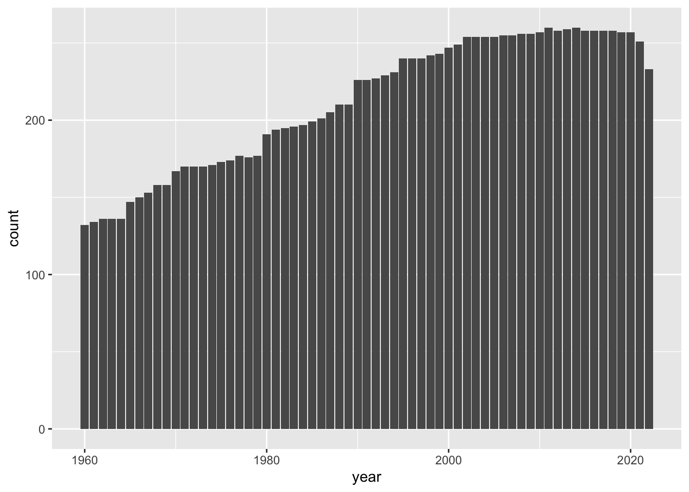

# はじめてのデータサイエンス {#first-example}

## データサイエンスの実際

データから情報を得るときには、大体次のような手順をとります。

1.  準備 Setup
2.  データを取得 Import data
3.  データ構造の確認 View data
4.  必要に応じて整形 Transform data
5.  視覚化 Visualize data
6.  データを理解 Understand data
7.  レポートなどにまとめる Communicate data


[はじめに](https://icu-hsuzuki.github.io/ds4aj/introduction.html#introduction)に書きましたが、基本的には、問いをもちデータを取得し、視覚化などを通して、データを理解し、さらに問いを深めるサイクルが、データサイエンスの核だと思います。

> R を使った分析の一つの例を、見て行きます。一つ一つのコード（コンピュータ・プログラム）の簡単な説明は、加えますが、あまりそれに捉われず、データサイエンスとは何かを考えながら、雰囲気を味わってください。

## R のパッケージを活用

### 準備 Setup

世界銀行（World Bank）の、世界開発指標（WDI: World Development Indicators）の一つの、GDP（Gross Domestic Product 国内総生産）のデータから始めます。GDP にも何種類かの尺度がありますが、次のものを見てみます。

-   NY.GDP.MKTP.CD: GDP (current US\$)[^03-first-example-1]

[^03-first-example-1]: GDP（Gross Domestic Product）とは、ある国のある期間（通常は1年）における、その国で生産されたすべての最終財・サービスの市場価値の総額を指します。これは国内総生産とも呼ばれます。GDPは、その国の経済力や活力を測る指標の1つとして広く用いられています。WDIのGDP (Current USD)は、各国のGDPを米ドルで表したものであり、通貨の価値が異なっても比較可能な形で国際比較ができます。ただし、GDPはあくまで市場価格を基準としているため、非市場活動や自然災害などの影響を受ける場合がある点に注意が必要です。
  
NY.GDP.MKTP.CD は、データコードと言われるもので、世界開発指標（WDI）には、一つづつ決まっています。

[World Development Indicators](https://datatopics.worldbank.org/world-development-indicators/) のサイトの下にある、Data Themes（テーマ）からテーマを選択し、下にスクロールすると、Code をみることができます。ちなみに、ここで利用する NY.GDP.MKTP.CD: GDP (current US\$) は、テーマの Economy（経済）の、一番上にあります。

経済用語の英語はよく知らないという方は、ブラウザー（Edge, Google Chrome, Safari など）の翻訳機能を使うのも良いでしょう。ただ、そのページの対話型の機能（interactive function）を利用するときは、翻訳機能をOFF にする必要がある場合もありますので、注意してください。

エラーメッセージを調べるときなどに、英語のほうが情報がたくさん得られますから、言語を、英語に変更しておきます。

R には、WDI のデータを取得する R のツール（パッケージ）`WDI` がありますから、それを使います。また、データを取り扱うための基本的なツール（パッケージ）`tidyverse` を使いますので、次のコードで、これらを読み込みます。


```r
Sys.setenv(LANG = "en")
library(tidyverse)
#> ── Attaching core tidyverse packages ──── tidyverse 2.0.0 ──
#> ✔ dplyr     1.1.2     ✔ readr     2.1.4
#> ✔ forcats   1.0.0     ✔ stringr   1.5.0
#> ✔ ggplot2   3.4.2     ✔ tibble    3.2.1
#> ✔ lubridate 1.9.2     ✔ tidyr     1.3.0
#> ✔ purrr     1.0.1     
#> ── Conflicts ────────────────────── tidyverse_conflicts() ──
#> ✖ dplyr::filter() masks stats::filter()
#> ✖ dplyr::lag()    masks stats::lag()
#> ℹ Use the conflicted package (<http://conflicted.r-lib.org/>) to force all conflicts to become errors
library(WDI)
```

データを保存する場所を作成しておくことをお勧めします。保存しておくときは、このディレクトリを使います。


```r
dir.create("./data")
```

### データ取得 Import data

データを取得します。少し時間がかかります。取得したデータに、`df_gdp` などと、わかりやすい名前をつけます。`df` は `data frame` の略で、R で標準的なデータの形式です。


```r
df_gdp <- WDI(country = "all", 
              indicator = c(gdp = "NY.GDP.MKTP.CD"), 
              extra = TRUE)
```

このコードで、全ての国の GDP を取得できます。GDP の値は、`NY.GDP.MKTP.CD` という名前の列にありますが、覚えやすいように、gdp という名前に変更しておきます。`extra = TRUE` とすることによって、それぞれの国についての情報などが追加されます。

### データ構造の確認

最初の数行だけを見るには、`head(df_dgp)` とします。


```r
head(df_gdp)
#>       country iso2c iso3c year        gdp status
#> 1 Afghanistan    AF   AFG 1963  751111191       
#> 2 Afghanistan    AF   AFG 1962  546666678       
#> 3 Afghanistan    AF   AFG 1961  548888896       
#> 4 Afghanistan    AF   AFG 1960  537777811       
#> 5 Afghanistan    AF   AFG 2003 4539500884       
#> 6 Afghanistan    AF   AFG 2002 3854235264       
#>   lastupdated     region capital longitude latitude
#> 1  2023-05-10 South Asia   Kabul   69.1761  34.5228
#> 2  2023-05-10 South Asia   Kabul   69.1761  34.5228
#> 3  2023-05-10 South Asia   Kabul   69.1761  34.5228
#> 4  2023-05-10 South Asia   Kabul   69.1761  34.5228
#> 5  2023-05-10 South Asia   Kabul   69.1761  34.5228
#> 6  2023-05-10 South Asia   Kabul   69.1761  34.5228
#>       income lending
#> 1 Low income     IDA
#> 2 Low income     IDA
#> 3 Low income     IDA
#> 4 Low income     IDA
#> 5 Low income     IDA
#> 6 Low income     IDA
```

データの構造を見るときには、`str(df_gdp)` もよく使われます。今度は、列が縦に並んで表示されます。


```r
str(df_gdp)
#> 'data.frame':	16758 obs. of  13 variables:
#>  $ country    : chr  "Afghanistan" "Afghanistan" "Afghanistan" "Afghanistan" ...
#>  $ iso2c      : chr  "AF" "AF" "AF" "AF" ...
#>  $ iso3c      : chr  "AFG" "AFG" "AFG" "AFG" ...
#>  $ year       : int  1963 1962 1961 1960 2003 2002 2001 2000 1995 1994 ...
#>  $ gdp        : num  7.51e+08 5.47e+08 5.49e+08 5.38e+08 4.54e+09 ...
#>   ..- attr(*, "label")= chr "GDP (current US$)"
#>  $ status     : chr  "" "" "" "" ...
#>  $ lastupdated: chr  "2023-05-10" "2023-05-10" "2023-05-10" "2023-05-10" ...
#>  $ region     : chr  "South Asia" "South Asia" "South Asia" "South Asia" ...
#>  $ capital    : chr  "Kabul" "Kabul" "Kabul" "Kabul" ...
#>  $ longitude  : chr  "69.1761" "69.1761" "69.1761" "69.1761" ...
#>  $ latitude   : chr  "34.5228" "34.5228" "34.5228" "34.5228" ...
#>  $ income     : chr  "Low income" "Low income" "Low income" "Low income" ...
#>  $ lending    : chr  "IDA" "IDA" "IDA" "IDA" ...
```

概要 (`summary(df_gdp)`) からもある程度わかります。


```r
summary(df_gdp) 
#>    country             iso2c              iso3c          
#>  Length:16758       Length:16758       Length:16758      
#>  Class :character   Class :character   Class :character  
#>  Mode  :character   Mode  :character   Mode  :character  
#>                                                          
#>                                                          
#>                                                          
#>                                                          
#>       year           gdp               status         
#>  Min.   :1960   Min.   :8.824e+06   Length:16758      
#>  1st Qu.:1975   1st Qu.:2.442e+09   Class :character  
#>  Median :1991   Median :1.784e+10   Mode  :character  
#>  Mean   :1991   Mean   :1.161e+12                     
#>  3rd Qu.:2007   3rd Qu.:2.156e+11                     
#>  Max.   :2022   Max.   :9.653e+13                     
#>                 NA's   :3602                          
#>  lastupdated           region            capital         
#>  Length:16758       Length:16758       Length:16758      
#>  Class :character   Class :character   Class :character  
#>  Mode  :character   Mode  :character   Mode  :character  
#>                                                          
#>                                                          
#>                                                          
#>                                                          
#>   longitude           latitude            income         
#>  Length:16758       Length:16758       Length:16758      
#>  Class :character   Class :character   Class :character  
#>  Mode  :character   Mode  :character   Mode  :character  
#>                                                          
#>                                                          
#>                                                          
#>                                                          
#>    lending         
#>  Length:16758      
#>  Class :character  
#>  Mode  :character  
#>                    
#>                    
#>                    
#> 
```

国のリストをみてみましょう。とても長いリストの中には、地域名も含まれています。


```r
df_gdp %>% distinct(country) %>% pull()
#>   [1] "Afghanistan"                                         
#>   [2] "Africa Eastern and Southern"                         
#>   [3] "Africa Western and Central"                          
#>   [4] "Albania"                                             
#>   [5] "Algeria"                                             
#>   [6] "American Samoa"                                      
#>   [7] "Andorra"                                             
#>   [8] "Angola"                                              
#>   [9] "Antigua and Barbuda"                                 
#>  [10] "Arab World"                                          
#>  [11] "Argentina"                                           
#>  [12] "Armenia"                                             
#>  [13] "Aruba"                                               
#>  [14] "Australia"                                           
#>  [15] "Austria"                                             
#>  [16] "Azerbaijan"                                          
#>  [17] "Bahamas, The"                                        
#>  [18] "Bahrain"                                             
#>  [19] "Bangladesh"                                          
#>  [20] "Barbados"                                            
#>  [21] "Belarus"                                             
#>  [22] "Belgium"                                             
#>  [23] "Belize"                                              
#>  [24] "Benin"                                               
#>  [25] "Bermuda"                                             
#>  [26] "Bhutan"                                              
#>  [27] "Bolivia"                                             
#>  [28] "Bosnia and Herzegovina"                              
#>  [29] "Botswana"                                            
#>  [30] "Brazil"                                              
#>  [31] "British Virgin Islands"                              
#>  [32] "Brunei Darussalam"                                   
#>  [33] "Bulgaria"                                            
#>  [34] "Burkina Faso"                                        
#>  [35] "Burundi"                                             
#>  [36] "Cabo Verde"                                          
#>  [37] "Cambodia"                                            
#>  [38] "Cameroon"                                            
#>  [39] "Canada"                                              
#>  [40] "Caribbean small states"                              
#>  [41] "Cayman Islands"                                      
#>  [42] "Central African Republic"                            
#>  [43] "Central Europe and the Baltics"                      
#>  [44] "Chad"                                                
#>  [45] "Channel Islands"                                     
#>  [46] "Chile"                                               
#>  [47] "China"                                               
#>  [48] "Colombia"                                            
#>  [49] "Comoros"                                             
#>  [50] "Congo, Dem. Rep."                                    
#>  [51] "Congo, Rep."                                         
#>  [52] "Costa Rica"                                          
#>  [53] "Cote d'Ivoire"                                       
#>  [54] "Croatia"                                             
#>  [55] "Cuba"                                                
#>  [56] "Curacao"                                             
#>  [57] "Cyprus"                                              
#>  [58] "Czechia"                                             
#>  [59] "Denmark"                                             
#>  [60] "Djibouti"                                            
#>  [61] "Dominica"                                            
#>  [62] "Dominican Republic"                                  
#>  [63] "Early-demographic dividend"                          
#>  [64] "East Asia & Pacific"                                 
#>  [65] "East Asia & Pacific (excluding high income)"         
#>  [66] "East Asia & Pacific (IDA & IBRD countries)"          
#>  [67] "Ecuador"                                             
#>  [68] "Egypt, Arab Rep."                                    
#>  [69] "El Salvador"                                         
#>  [70] "Equatorial Guinea"                                   
#>  [71] "Eritrea"                                             
#>  [72] "Estonia"                                             
#>  [73] "Eswatini"                                            
#>  [74] "Ethiopia"                                            
#>  [75] "Euro area"                                           
#>  [76] "Europe & Central Asia"                               
#>  [77] "Europe & Central Asia (excluding high income)"       
#>  [78] "Europe & Central Asia (IDA & IBRD countries)"        
#>  [79] "European Union"                                      
#>  [80] "Faroe Islands"                                       
#>  [81] "Fiji"                                                
#>  [82] "Finland"                                             
#>  [83] "Fragile and conflict affected situations"            
#>  [84] "France"                                              
#>  [85] "French Polynesia"                                    
#>  [86] "Gabon"                                               
#>  [87] "Gambia, The"                                         
#>  [88] "Georgia"                                             
#>  [89] "Germany"                                             
#>  [90] "Ghana"                                               
#>  [91] "Gibraltar"                                           
#>  [92] "Greece"                                              
#>  [93] "Greenland"                                           
#>  [94] "Grenada"                                             
#>  [95] "Guam"                                                
#>  [96] "Guatemala"                                           
#>  [97] "Guinea"                                              
#>  [98] "Guinea-Bissau"                                       
#>  [99] "Guyana"                                              
#> [100] "Haiti"                                               
#> [101] "Heavily indebted poor countries (HIPC)"              
#> [102] "High income"                                         
#> [103] "Honduras"                                            
#> [104] "Hong Kong SAR, China"                                
#> [105] "Hungary"                                             
#> [106] "IBRD only"                                           
#> [107] "Iceland"                                             
#> [108] "IDA & IBRD total"                                    
#> [109] "IDA blend"                                           
#> [110] "IDA only"                                            
#> [111] "IDA total"                                           
#> [112] "India"                                               
#> [113] "Indonesia"                                           
#> [114] "Iran, Islamic Rep."                                  
#> [115] "Iraq"                                                
#> [116] "Ireland"                                             
#> [117] "Isle of Man"                                         
#> [118] "Israel"                                              
#> [119] "Italy"                                               
#> [120] "Jamaica"                                             
#> [121] "Japan"                                               
#> [122] "Jordan"                                              
#> [123] "Kazakhstan"                                          
#> [124] "Kenya"                                               
#> [125] "Kiribati"                                            
#> [126] "Korea, Dem. People's Rep."                           
#> [127] "Korea, Rep."                                         
#> [128] "Kosovo"                                              
#> [129] "Kuwait"                                              
#> [130] "Kyrgyz Republic"                                     
#> [131] "Lao PDR"                                             
#> [132] "Late-demographic dividend"                           
#> [133] "Latin America & Caribbean"                           
#> [134] "Latin America & Caribbean (excluding high income)"   
#> [135] "Latin America & the Caribbean (IDA & IBRD countries)"
#> [136] "Latvia"                                              
#> [137] "Least developed countries: UN classification"        
#> [138] "Lebanon"                                             
#> [139] "Lesotho"                                             
#> [140] "Liberia"                                             
#> [141] "Libya"                                               
#> [142] "Liechtenstein"                                       
#> [143] "Lithuania"                                           
#> [144] "Low & middle income"                                 
#> [145] "Low income"                                          
#> [146] "Lower middle income"                                 
#> [147] "Luxembourg"                                          
#> [148] "Macao SAR, China"                                    
#> [149] "Madagascar"                                          
#> [150] "Malawi"                                              
#> [151] "Malaysia"                                            
#> [152] "Maldives"                                            
#> [153] "Mali"                                                
#> [154] "Malta"                                               
#> [155] "Marshall Islands"                                    
#> [156] "Mauritania"                                          
#> [157] "Mauritius"                                           
#> [158] "Mexico"                                              
#> [159] "Micronesia, Fed. Sts."                               
#> [160] "Middle East & North Africa"                          
#> [161] "Middle East & North Africa (excluding high income)"  
#> [162] "Middle East & North Africa (IDA & IBRD countries)"   
#> [163] "Middle income"                                       
#> [164] "Moldova"                                             
#> [165] "Monaco"                                              
#> [166] "Mongolia"                                            
#> [167] "Montenegro"                                          
#> [168] "Morocco"                                             
#> [169] "Mozambique"                                          
#> [170] "Myanmar"                                             
#> [171] "Namibia"                                             
#> [172] "Nauru"                                               
#> [173] "Nepal"                                               
#> [174] "Netherlands"                                         
#> [175] "New Caledonia"                                       
#> [176] "New Zealand"                                         
#> [177] "Nicaragua"                                           
#> [178] "Niger"                                               
#> [179] "Nigeria"                                             
#> [180] "North America"                                       
#> [181] "North Macedonia"                                     
#> [182] "Northern Mariana Islands"                            
#> [183] "Norway"                                              
#> [184] "Not classified"                                      
#> [185] "OECD members"                                        
#> [186] "Oman"                                                
#> [187] "Other small states"                                  
#> [188] "Pacific island small states"                         
#> [189] "Pakistan"                                            
#> [190] "Palau"                                               
#> [191] "Panama"                                              
#> [192] "Papua New Guinea"                                    
#> [193] "Paraguay"                                            
#> [194] "Peru"                                                
#> [195] "Philippines"                                         
#> [196] "Poland"                                              
#> [197] "Portugal"                                            
#> [198] "Post-demographic dividend"                           
#> [199] "Pre-demographic dividend"                            
#> [200] "Puerto Rico"                                         
#> [201] "Qatar"                                               
#> [202] "Romania"                                             
#> [203] "Russian Federation"                                  
#> [204] "Rwanda"                                              
#> [205] "Samoa"                                               
#> [206] "San Marino"                                          
#> [207] "Sao Tome and Principe"                               
#> [208] "Saudi Arabia"                                        
#> [209] "Senegal"                                             
#> [210] "Serbia"                                              
#> [211] "Seychelles"                                          
#> [212] "Sierra Leone"                                        
#> [213] "Singapore"                                           
#> [214] "Sint Maarten (Dutch part)"                           
#> [215] "Slovak Republic"                                     
#> [216] "Slovenia"                                            
#> [217] "Small states"                                        
#> [218] "Solomon Islands"                                     
#> [219] "Somalia"                                             
#> [220] "South Africa"                                        
#> [221] "South Asia"                                          
#> [222] "South Asia (IDA & IBRD)"                             
#> [223] "South Sudan"                                         
#> [224] "Spain"                                               
#> [225] "Sri Lanka"                                           
#> [226] "St. Kitts and Nevis"                                 
#> [227] "St. Lucia"                                           
#> [228] "St. Martin (French part)"                            
#> [229] "St. Vincent and the Grenadines"                      
#> [230] "Sub-Saharan Africa"                                  
#> [231] "Sub-Saharan Africa (excluding high income)"          
#> [232] "Sub-Saharan Africa (IDA & IBRD countries)"           
#> [233] "Sudan"                                               
#> [234] "Suriname"                                            
#> [235] "Sweden"                                              
#> [236] "Switzerland"                                         
#> [237] "Syrian Arab Republic"                                
#> [238] "Tajikistan"                                          
#> [239] "Tanzania"                                            
#> [240] "Thailand"                                            
#> [241] "Timor-Leste"                                         
#> [242] "Togo"                                                
#> [243] "Tonga"                                               
#> [244] "Trinidad and Tobago"                                 
#> [245] "Tunisia"                                             
#> [246] "Turkiye"                                             
#> [247] "Turkmenistan"                                        
#> [248] "Turks and Caicos Islands"                            
#> [249] "Tuvalu"                                              
#> [250] "Uganda"                                              
#> [251] "Ukraine"                                             
#> [252] "United Arab Emirates"                                
#> [253] "United Kingdom"                                      
#> [254] "United States"                                       
#> [255] "Upper middle income"                                 
#> [256] "Uruguay"                                             
#> [257] "Uzbekistan"                                          
#> [258] "Vanuatu"                                             
#> [259] "Venezuela, RB"                                       
#> [260] "Vietnam"                                             
#> [261] "Virgin Islands (U.S.)"                               
#> [262] "West Bank and Gaza"                                  
#> [263] "World"                                               
#> [264] "Yemen, Rep."                                         
#> [265] "Zambia"                                              
#> [266] "Zimbabwe"
```

今回は下のように、`%>%`（パイプと呼びます） で繋げてコードを書きました。

```         
df_gdp %>% distinct(country) %>% pull()
```

最初は、データ、その中の、異なる国を選択して、書き出してくださいというものです。

これは、

```         
pull(distinct(df_gdp, country))
```

と同じです。どんどん、かっこの中に入れ子になって複雑になるので、一つ一つのステップを、順に書いたものが、最初のものになります。

```         
df_gdp %>% head()
df_gdp %>% str()
```

なども可能です。かっこの中に最初に入るものが直前のもの、ここでは、データになっています。

### 必要に応じて整形 Transform data

変数が多いので、日本の部分だけ `filter` を使って選択します。country が Japan と一致する場合のみを選択するときは、`==` を使います。数値ではないので、引用符をつけます。半角を使ってください。


```r
df_gdp %>% filter(country == "Japan")
#>    country iso2c iso3c year          gdp status lastupdated
#> 1    Japan    JP   JPN 2022           NA         2023-05-10
#> 2    Japan    JP   JPN 2021 4.940878e+12         2023-05-10
#> 3    Japan    JP   JPN 2020 5.040108e+12         2023-05-10
#> 4    Japan    JP   JPN 2019 5.123318e+12         2023-05-10
#> 5    Japan    JP   JPN 2018 5.037835e+12         2023-05-10
#> 6    Japan    JP   JPN 2017 4.930837e+12         2023-05-10
#> 7    Japan    JP   JPN 2016 5.003678e+12         2023-05-10
#> 8    Japan    JP   JPN 2015 4.444931e+12         2023-05-10
#> 9    Japan    JP   JPN 2014 4.896994e+12         2023-05-10
#> 10   Japan    JP   JPN 2013 5.212328e+12         2023-05-10
#> 11   Japan    JP   JPN 2012 6.272363e+12         2023-05-10
#> 12   Japan    JP   JPN 2011 6.233147e+12         2023-05-10
#> 13   Japan    JP   JPN 2010 5.759072e+12         2023-05-10
#> 14   Japan    JP   JPN 2009 5.289493e+12         2023-05-10
#> 15   Japan    JP   JPN 2008 5.106679e+12         2023-05-10
#> 16   Japan    JP   JPN 2007 4.579751e+12         2023-05-10
#> 17   Japan    JP   JPN 2006 4.601663e+12         2023-05-10
#> 18   Japan    JP   JPN 2005 4.831467e+12         2023-05-10
#> 19   Japan    JP   JPN 2004 4.893116e+12         2023-05-10
#> 20   Japan    JP   JPN 2003 4.519562e+12         2023-05-10
#> 21   Japan    JP   JPN 2002 4.182846e+12         2023-05-10
#> 22   Japan    JP   JPN 2001 4.374712e+12         2023-05-10
#> 23   Japan    JP   JPN 2000 4.968359e+12         2023-05-10
#> 24   Japan    JP   JPN 1999 4.635982e+12         2023-05-10
#> 25   Japan    JP   JPN 1998 4.098363e+12         2023-05-10
#> 26   Japan    JP   JPN 1997 4.492449e+12         2023-05-10
#> 27   Japan    JP   JPN 1996 4.923392e+12         2023-05-10
#> 28   Japan    JP   JPN 1995 5.545564e+12         2023-05-10
#> 29   Japan    JP   JPN 1994 4.998798e+12         2023-05-10
#> 30   Japan    JP   JPN 1993 4.454144e+12         2023-05-10
#> 31   Japan    JP   JPN 1992 3.908809e+12         2023-05-10
#> 32   Japan    JP   JPN 1991 3.584420e+12         2023-05-10
#> 33   Japan    JP   JPN 1990 3.132818e+12         2023-05-10
#> 34   Japan    JP   JPN 1989 3.054914e+12         2023-05-10
#> 35   Japan    JP   JPN 1988 3.071683e+12         2023-05-10
#> 36   Japan    JP   JPN 1987 2.532809e+12         2023-05-10
#> 37   Japan    JP   JPN 1986 2.078953e+12         2023-05-10
#> 38   Japan    JP   JPN 1985 1.398893e+12         2023-05-10
#> 39   Japan    JP   JPN 1984 1.318382e+12         2023-05-10
#> 40   Japan    JP   JPN 1983 1.243324e+12         2023-05-10
#> 41   Japan    JP   JPN 1982 1.134518e+12         2023-05-10
#> 42   Japan    JP   JPN 1981 1.218989e+12         2023-05-10
#> 43   Japan    JP   JPN 1980 1.105386e+12         2023-05-10
#> 44   Japan    JP   JPN 1979 1.055012e+12         2023-05-10
#> 45   Japan    JP   JPN 1978 1.013612e+12         2023-05-10
#> 46   Japan    JP   JPN 1977 7.214118e+11         2023-05-10
#> 47   Japan    JP   JPN 1976 5.861619e+11         2023-05-10
#> 48   Japan    JP   JPN 1975 5.215419e+11         2023-05-10
#> 49   Japan    JP   JPN 1974 4.796260e+11         2023-05-10
#> 50   Japan    JP   JPN 1973 4.320827e+11         2023-05-10
#> 51   Japan    JP   JPN 1972 3.180313e+11         2023-05-10
#> 52   Japan    JP   JPN 1971 2.401518e+11         2023-05-10
#> 53   Japan    JP   JPN 1970 2.126092e+11         2023-05-10
#> 54   Japan    JP   JPN 1969 1.722042e+11         2023-05-10
#> 55   Japan    JP   JPN 1968 1.466011e+11         2023-05-10
#> 56   Japan    JP   JPN 1967 1.237819e+11         2023-05-10
#> 57   Japan    JP   JPN 1966 1.056281e+11         2023-05-10
#> 58   Japan    JP   JPN 1965 9.095028e+10         2023-05-10
#> 59   Japan    JP   JPN 1964 8.174901e+10         2023-05-10
#> 60   Japan    JP   JPN 1963 6.949813e+10         2023-05-10
#> 61   Japan    JP   JPN 1962 6.072302e+10         2023-05-10
#> 62   Japan    JP   JPN 1961 5.350862e+10         2023-05-10
#> 63   Japan    JP   JPN 1960 4.430734e+10         2023-05-10
#>                 region capital longitude latitude
#> 1  East Asia & Pacific   Tokyo    139.77    35.67
#> 2  East Asia & Pacific   Tokyo    139.77    35.67
#> 3  East Asia & Pacific   Tokyo    139.77    35.67
#> 4  East Asia & Pacific   Tokyo    139.77    35.67
#> 5  East Asia & Pacific   Tokyo    139.77    35.67
#> 6  East Asia & Pacific   Tokyo    139.77    35.67
#> 7  East Asia & Pacific   Tokyo    139.77    35.67
#> 8  East Asia & Pacific   Tokyo    139.77    35.67
#> 9  East Asia & Pacific   Tokyo    139.77    35.67
#> 10 East Asia & Pacific   Tokyo    139.77    35.67
#> 11 East Asia & Pacific   Tokyo    139.77    35.67
#> 12 East Asia & Pacific   Tokyo    139.77    35.67
#> 13 East Asia & Pacific   Tokyo    139.77    35.67
#> 14 East Asia & Pacific   Tokyo    139.77    35.67
#> 15 East Asia & Pacific   Tokyo    139.77    35.67
#> 16 East Asia & Pacific   Tokyo    139.77    35.67
#> 17 East Asia & Pacific   Tokyo    139.77    35.67
#> 18 East Asia & Pacific   Tokyo    139.77    35.67
#> 19 East Asia & Pacific   Tokyo    139.77    35.67
#> 20 East Asia & Pacific   Tokyo    139.77    35.67
#> 21 East Asia & Pacific   Tokyo    139.77    35.67
#> 22 East Asia & Pacific   Tokyo    139.77    35.67
#> 23 East Asia & Pacific   Tokyo    139.77    35.67
#> 24 East Asia & Pacific   Tokyo    139.77    35.67
#> 25 East Asia & Pacific   Tokyo    139.77    35.67
#> 26 East Asia & Pacific   Tokyo    139.77    35.67
#> 27 East Asia & Pacific   Tokyo    139.77    35.67
#> 28 East Asia & Pacific   Tokyo    139.77    35.67
#> 29 East Asia & Pacific   Tokyo    139.77    35.67
#> 30 East Asia & Pacific   Tokyo    139.77    35.67
#> 31 East Asia & Pacific   Tokyo    139.77    35.67
#> 32 East Asia & Pacific   Tokyo    139.77    35.67
#> 33 East Asia & Pacific   Tokyo    139.77    35.67
#> 34 East Asia & Pacific   Tokyo    139.77    35.67
#> 35 East Asia & Pacific   Tokyo    139.77    35.67
#> 36 East Asia & Pacific   Tokyo    139.77    35.67
#> 37 East Asia & Pacific   Tokyo    139.77    35.67
#> 38 East Asia & Pacific   Tokyo    139.77    35.67
#> 39 East Asia & Pacific   Tokyo    139.77    35.67
#> 40 East Asia & Pacific   Tokyo    139.77    35.67
#> 41 East Asia & Pacific   Tokyo    139.77    35.67
#> 42 East Asia & Pacific   Tokyo    139.77    35.67
#> 43 East Asia & Pacific   Tokyo    139.77    35.67
#> 44 East Asia & Pacific   Tokyo    139.77    35.67
#> 45 East Asia & Pacific   Tokyo    139.77    35.67
#> 46 East Asia & Pacific   Tokyo    139.77    35.67
#> 47 East Asia & Pacific   Tokyo    139.77    35.67
#> 48 East Asia & Pacific   Tokyo    139.77    35.67
#> 49 East Asia & Pacific   Tokyo    139.77    35.67
#> 50 East Asia & Pacific   Tokyo    139.77    35.67
#> 51 East Asia & Pacific   Tokyo    139.77    35.67
#> 52 East Asia & Pacific   Tokyo    139.77    35.67
#> 53 East Asia & Pacific   Tokyo    139.77    35.67
#> 54 East Asia & Pacific   Tokyo    139.77    35.67
#> 55 East Asia & Pacific   Tokyo    139.77    35.67
#> 56 East Asia & Pacific   Tokyo    139.77    35.67
#> 57 East Asia & Pacific   Tokyo    139.77    35.67
#> 58 East Asia & Pacific   Tokyo    139.77    35.67
#> 59 East Asia & Pacific   Tokyo    139.77    35.67
#> 60 East Asia & Pacific   Tokyo    139.77    35.67
#> 61 East Asia & Pacific   Tokyo    139.77    35.67
#> 62 East Asia & Pacific   Tokyo    139.77    35.67
#> 63 East Asia & Pacific   Tokyo    139.77    35.67
#>         income        lending
#> 1  High income Not classified
#> 2  High income Not classified
#> 3  High income Not classified
#> 4  High income Not classified
#> 5  High income Not classified
#> 6  High income Not classified
#> 7  High income Not classified
#> 8  High income Not classified
#> 9  High income Not classified
#> 10 High income Not classified
#> 11 High income Not classified
#> 12 High income Not classified
#> 13 High income Not classified
#> 14 High income Not classified
#> 15 High income Not classified
#> 16 High income Not classified
#> 17 High income Not classified
#> 18 High income Not classified
#> 19 High income Not classified
#> 20 High income Not classified
#> 21 High income Not classified
#> 22 High income Not classified
#> 23 High income Not classified
#> 24 High income Not classified
#> 25 High income Not classified
#> 26 High income Not classified
#> 27 High income Not classified
#> 28 High income Not classified
#> 29 High income Not classified
#> 30 High income Not classified
#> 31 High income Not classified
#> 32 High income Not classified
#> 33 High income Not classified
#> 34 High income Not classified
#> 35 High income Not classified
#> 36 High income Not classified
#> 37 High income Not classified
#> 38 High income Not classified
#> 39 High income Not classified
#> 40 High income Not classified
#> 41 High income Not classified
#> 42 High income Not classified
#> 43 High income Not classified
#> 44 High income Not classified
#> 45 High income Not classified
#> 46 High income Not classified
#> 47 High income Not classified
#> 48 High income Not classified
#> 49 High income Not classified
#> 50 High income Not classified
#> 51 High income Not classified
#> 52 High income Not classified
#> 53 High income Not classified
#> 54 High income Not classified
#> 55 High income Not classified
#> 56 High income Not classified
#> 57 High income Not classified
#> 58 High income Not classified
#> 59 High income Not classified
#> 60 High income Not classified
#> 61 High income Not classified
#> 62 High income Not classified
#> 63 High income Not classified
```


```r
df_gdp %>% filter(country == "Japan") %>% head(2)
#>   country iso2c iso3c year          gdp status lastupdated
#> 1   Japan    JP   JPN 2022           NA         2023-05-10
#> 2   Japan    JP   JPN 2021 4.940878e+12         2023-05-10
#>                region capital longitude latitude
#> 1 East Asia & Pacific   Tokyo    139.77    35.67
#> 2 East Asia & Pacific   Tokyo    139.77    35.67
#>        income        lending
#> 1 High income Not classified
#> 2 High income Not classified
```

２行目の、gdp の、4.940878e+12 は、Scientific notation と言われるもので、 $$4.940878 \times 10^{12} = 4,940,887,800,000$$ を意味します。`e+3` は千（thousand）、`e+6` は百万（million）、`e+9` は、10億（billion）、`e+12` は、兆（trillion）ですから、日本の、2021 年の GDP は、約5兆ドルとなります。

### 視覚化 data visualization

#### Fig 1. 日本のGDP の経年変化を折線グラフ（line graph）


```r
df_gdp %>% filter(country == "Japan") %>%
  ggplot(aes(x = year, y = gdp)) + geom_line()
#> Warning: Removed 1 row containing missing values
#> (`geom_line()`).
```


```         
df_gdp %>% filter(country == "Japan") %>%
  ggplot(aes(x = year, y = gdp)) + geom_line()
```

日本を選択したときに、それに名前をつけておいて、それを使うこともできますが、名前がどんどん増えるので、それに続けて、コードを書いていく方法をとっています。

`ggplot(aes(x = year, y = gdp)) + geom_line()`

の部分が、グラフを描く部分で、「x 軸を、year、y 軸を、gdp として、それを、折線グラフで描いてください」というコードです。

Warning: [38;5;238mRemoved 1 row containing missing values

と表示されています。値がない年があることを言っています。2022年のデータがないことがわかっていますから、最初から削除してこくことも可能です。

### データの理解 Understand data

視覚化によって見えてくることがいくつもありますね。どんなことがわかりますか。気づいたこと（observation）をあげてみましょう。

コードを描くことではなく、この部分が、データサイエンスの核の部分です。気づいたことを列挙してみましょう。

### さまざまな視覚化

#### Fig 2. 各年ごとのデータの数

`summary(df_gdp)` で、データ自体は、1960年から2022年までのようですが、日本も、2022年のデータはありませんでしたから、年によって、どの程度データがあるか、調べてみます。


```r
df_gdp %>% drop_na(gdp) %>% ggplot(aes(x = year)) + geom_bar()
```


```         
df_gdp %>% drop_na(gdp) %>% ggplot(aes(x = year)) + geom_bar()
```

バー・グラフを使いますが、`gdp` の値が、欠損値（NA: not available）のデータを削除してから、グラフを描きます。

#### 2021年のGDPの降順での表示（１）

最新の2021年のデータはすべてあるわけではなさそうですが、`gdp` の値が大きい順に並べてみましょう。


```r
df_gdp %>% filter(year == 2021) %>% drop_na(gdp) %>% arrange(desc(gdp))
#>                                                  country
#> 1                                                  World
#> 2                                            High income
#> 3                                           OECD members
#> 4                              Post-demographic dividend
#> 5                                       IDA & IBRD total
#> 6                                    Low & middle income
#> 7                                          Middle income
#> 8                                              IBRD only
#> 9                                    East Asia & Pacific
#> 10                                   Upper middle income
#> 11                             Late-demographic dividend
#> 12                                         North America
#> 13                                 Europe & Central Asia
#> 14                                         United States
#> 15           East Asia & Pacific (excluding high income)
#> 16            East Asia & Pacific (IDA & IBRD countries)
#> 17                                                 China
#> 18                                        European Union
#> 19                                             Euro area
#> 20                            Early-demographic dividend
#> 21                                   Lower middle income
#> 22                             Latin America & Caribbean
#> 23  Latin America & the Caribbean (IDA & IBRD countries)
#> 24                                                 Japan
#> 25     Latin America & Caribbean (excluding high income)
#> 26          Europe & Central Asia (IDA & IBRD countries)
#> 27                                               Germany
#> 28                                            South Asia
#> 29                               South Asia (IDA & IBRD)
#> 30                            Middle East & North Africa
#> 31         Europe & Central Asia (excluding high income)
#> 32                                                 India
#> 33                                        United Kingdom
#> 34                                                France
#> 35                                            Arab World
#> 36                                             IDA total
#> 37                                                 Italy
#> 38                                                Canada
#> 39                                    Sub-Saharan Africa
#> 40             Sub-Saharan Africa (IDA & IBRD countries)
#> 41            Sub-Saharan Africa (excluding high income)
#> 42                        Central Europe and the Baltics
#> 43                                           Korea, Rep.
#> 44              Fragile and conflict affected situations
#> 45                                    Russian Federation
#> 46                                                Brazil
#> 47                                             Australia
#> 48                                              IDA only
#> 49    Middle East & North Africa (excluding high income)
#> 50     Middle East & North Africa (IDA & IBRD countries)
#> 51                              Pre-demographic dividend
#> 52                                                 Spain
#> 53          Least developed countries: UN classification
#> 54                                                Mexico
#> 55                                             Indonesia
#> 56                                             IDA blend
#> 57                           Africa Eastern and Southern
#> 58                                           Netherlands
#> 59                Heavily indebted poor countries (HIPC)
#> 60                            Africa Western and Central
#> 61                                          Saudi Arabia
#> 62                                               Turkiye
#> 63                                           Switzerland
#> 64                                                Poland
#> 65                                                Sweden
#> 66                                               Belgium
#> 67                                            Low income
#> 68                                          Small states
#> 69                                              Thailand
#> 70                                               Ireland
#> 71                                                Israel
#> 72                                             Argentina
#> 73                                                Norway
#> 74                                               Austria
#> 75                                    Other small states
#> 76                                               Nigeria
#> 77                                          South Africa
#> 78                                            Bangladesh
#> 79                                  United Arab Emirates
#> 80                                      Egypt, Arab Rep.
#> 81                                               Denmark
#> 82                                             Singapore
#> 83                                           Philippines
#> 84                                              Malaysia
#> 85                                  Hong Kong SAR, China
#> 86                                               Vietnam
#> 87                                    Iran, Islamic Rep.
#> 88                                              Pakistan
#> 89                                                 Chile
#> 90                                              Colombia
#> 91                                               Finland
#> 92                                               Romania
#> 93                                               Czechia
#> 94                                              Portugal
#> 95                                           New Zealand
#> 96                                                  Peru
#> 97                                                Greece
#> 98                                                  Iraq
#> 99                                               Ukraine
#> 100                                           Kazakhstan
#> 101                                              Hungary
#> 102                                                Qatar
#> 103                                              Algeria
#> 104                                              Morocco
#> 105                                      Slovak Republic
#> 106                                             Ethiopia
#> 107                                                Kenya
#> 108                                          Puerto Rico
#> 109                                              Ecuador
#> 110                                   Dominican Republic
#> 111                                            Sri Lanka
#> 112                                                 Oman
#> 113                                            Guatemala
#> 114                                           Luxembourg
#> 115                                             Bulgaria
#> 116                                                Ghana
#> 117                               Caribbean small states
#> 118                                        Cote d'Ivoire
#> 119                                           Uzbekistan
#> 120                                              Croatia
#> 121                                              Belarus
#> 122                                             Tanzania
#> 123                                               Angola
#> 124                                            Lithuania
#> 125                                              Myanmar
#> 126                                           Costa Rica
#> 127                                               Panama
#> 128                                               Serbia
#> 129                                             Slovenia
#> 130                                              Uruguay
#> 131                                     Congo, Dem. Rep.
#> 132                                           Azerbaijan
#> 133                                              Tunisia
#> 134                                               Jordan
#> 135                                             Cameroon
#> 136                                                Libya
#> 137                                               Uganda
#> 138                                              Bolivia
#> 139                                               Latvia
#> 140                                             Paraguay
#> 141                                              Bahrain
#> 142                                              Estonia
#> 143                                                Nepal
#> 144                                                Sudan
#> 145                                     Macao SAR, China
#> 146                                          El Salvador
#> 147                                             Honduras
#> 148                                               Cyprus
#> 149                                             Zimbabwe
#> 150                                              Senegal
#> 151                                             Cambodia
#> 152                                     Papua New Guinea
#> 153                                              Iceland
#> 154                                  Trinidad and Tobago
#> 155                               Bosnia and Herzegovina
#> 156                                              Lebanon
#> 157                                               Zambia
#> 158                                                Haiti
#> 159                                                Gabon
#> 160                                         Burkina Faso
#> 161                                                 Mali
#> 162                                              Lao PDR
#> 163                                              Georgia
#> 164                                              Albania
#> 165                                   West Bank and Gaza
#> 166                                             Botswana
#> 167                                                Malta
#> 168                                                Benin
#> 169                                               Guinea
#> 170                                           Mozambique
#> 171                                             Mongolia
#> 172                                                Niger
#> 173                                          Afghanistan
#> 174                                              Jamaica
#> 175                                           Madagascar
#> 176                                            Nicaragua
#> 177                                    Brunei Darussalam
#> 178                                              Armenia
#> 179                                      North Macedonia
#> 180                                              Moldova
#> 181                                          Congo, Rep.
#> 182                                               Malawi
#> 183                                              Namibia
#> 184                                    Equatorial Guinea
#> 185                                                 Chad
#> 186                                            Mauritius
#> 187                                         Bahamas, The
#> 188                                               Rwanda
#> 189                                        New Caledonia
#> 190                                           Mauritania
#> 191                          Pacific island small states
#> 192                                               Kosovo
#> 193                                           Tajikistan
#> 194                                               Monaco
#> 195                                      Kyrgyz Republic
#> 196                                                 Togo
#> 197                                               Guyana
#> 198                                              Somalia
#> 199                                              Bermuda
#> 200                                                 Guam
#> 201                                     French Polynesia
#> 202                                       Cayman Islands
#> 203                                           Montenegro
#> 204                                             Maldives
#> 205                                             Barbados
#> 206                                             Eswatini
#> 207                                                 Fiji
#> 208                                         Sierra Leone
#> 209                                        Faroe Islands
#> 210                                          Timor-Leste
#> 211                                              Liberia
#> 212                                             Djibouti
#> 213                                              Andorra
#> 214                                                Aruba
#> 215                                             Suriname
#> 216                                              Burundi
#> 217                                              Curacao
#> 218                                               Bhutan
#> 219                             Central African Republic
#> 220                                              Lesotho
#> 221                                               Belize
#> 222                                          Gambia, The
#> 223                                           Cabo Verde
#> 224                                            St. Lucia
#> 225                                        Guinea-Bissau
#> 226                                      Solomon Islands
#> 227                                  Antigua and Barbuda
#> 228                                           Seychelles
#> 229                                              Comoros
#> 230                                              Grenada
#> 231                                              Vanuatu
#> 232                             Turks and Caicos Islands
#> 233                       St. Vincent and the Grenadines
#> 234                                  St. Kitts and Nevis
#> 235                                                Samoa
#> 236                                       American Samoa
#> 237                                             Dominica
#> 238                                Sao Tome and Principe
#> 239                                                Tonga
#> 240                                Micronesia, Fed. Sts.
#> 241                                     Marshall Islands
#> 242                                                Palau
#> 243                                             Kiribati
#> 244                                                Nauru
#> 245                                               Tuvalu
#>     iso2c iso3c year          gdp status lastupdated
#> 1      1W   WLD 2021 9.652743e+13         2023-05-10
#> 2      XD       2021 5.982967e+13         2023-05-10
#> 3      OE   OED 2021 5.826835e+13         2023-05-10
#> 4      V4   PST 2021 5.497273e+13         2023-05-10
#> 5      ZT   IBT 2021 3.806285e+13         2023-05-10
#> 6      XO   LMY 2021 3.637059e+13         2023-05-10
#> 7      XP   MIC 2021 3.584514e+13         2023-05-10
#> 8      XF   IBD 2021 3.542267e+13         2023-05-10
#> 9      Z4   EAS 2021 3.091169e+13         2023-05-10
#> 10     XT       2021 2.710409e+13         2023-05-10
#> 11     V3   LTE 2021 2.662214e+13         2023-05-10
#> 12     XU   NAC 2021 2.531070e+13         2023-05-10
#> 13     Z7   ECS 2021 2.508283e+13         2023-05-10
#> 14     US   USA 2021 2.331508e+13         2023-05-10
#> 15     4E   EAP 2021 2.075179e+13         2023-05-10
#> 16     T4   TEA 2021 2.072517e+13         2023-05-10
#> 17     CN   CHN 2021 1.773406e+13         2023-05-10
#> 18     EU   EUU 2021 1.717742e+13         2023-05-10
#> 19     XC   EMU 2021 1.456328e+13         2023-05-10
#> 20     V2   EAR 2021 1.263730e+13         2023-05-10
#> 21     XN       2021 8.742535e+12         2023-05-10
#> 22     ZJ   LCN 2021 5.454429e+12         2023-05-10
#> 23     T2   TLA 2021 5.183127e+12         2023-05-10
#> 24     JP   JPN 2021 4.940878e+12         2023-05-10
#> 25     XJ   LAC 2021 4.585104e+12         2023-05-10
#> 26     T7   TEC 2021 4.550386e+12         2023-05-10
#> 27     DE   DEU 2021 4.259935e+12         2023-05-10
#> 28     8S   SAS 2021 4.088771e+12         2023-05-10
#> 29     T5   TSA 2021 4.088771e+12         2023-05-10
#> 30     ZQ   MEA 2021 3.679844e+12         2023-05-10
#> 31     7E   ECA 2021 3.517373e+12         2023-05-10
#> 32     IN   IND 2021 3.176295e+12         2023-05-10
#> 33     GB   GBR 2021 3.131378e+12         2023-05-10
#> 34     FR   FRA 2021 2.957880e+12         2023-05-10
#> 35     1A   ARB 2021 2.862987e+12         2023-05-10
#> 36     XG   IDA 2021 2.637762e+12         2023-05-10
#> 37     IT   ITA 2021 2.107703e+12         2023-05-10
#> 38     CA   CAN 2021 1.988336e+12         2023-05-10
#> 39     ZG   SSF 2021 1.929052e+12         2023-05-10
#> 40     T6   TSS 2021 1.929052e+12         2023-05-10
#> 41     ZF   SSA 2021 1.927599e+12         2023-05-10
#> 42     B8   CEB 2021 1.901935e+12         2023-05-10
#> 43     KR   KOR 2021 1.810956e+12         2023-05-10
#> 44     F1   FCS 2021 1.799023e+12         2023-05-10
#> 45     RU   RUS 2021 1.778783e+12         2023-05-10
#> 46     BR   BRA 2021 1.608981e+12         2023-05-10
#> 47     AU   AUS 2021 1.552667e+12         2023-05-10
#> 48     XI   IDX 2021 1.544392e+12         2023-05-10
#> 49     XQ   MNA 2021 1.493752e+12         2023-05-10
#> 50     T3   TMN 2021 1.475708e+12         2023-05-10
#> 51     V1   PRE 2021 1.434259e+12         2023-05-10
#> 52     ES   ESP 2021 1.427381e+12         2023-05-10
#> 53     XL   LDC 2021 1.280908e+12         2023-05-10
#> 54     MX   MEX 2021 1.272839e+12         2023-05-10
#> 55     ID   IDN 2021 1.186093e+12         2023-05-10
#> 56     XH   IDB 2021 1.096478e+12         2023-05-10
#> 57     ZH   AFE 2021 1.089454e+12         2023-05-10
#> 58     NL   NLD 2021 1.012847e+12         2023-05-10
#> 59     XE   HPC 2021 8.919015e+11         2023-05-10
#> 60     ZI   AFW 2021 8.401873e+11         2023-05-10
#> 61     SA   SAU 2021 8.335412e+11         2023-05-10
#> 62     TR   TUR 2021 8.190352e+11         2023-05-10
#> 63     CH   CHE 2021 8.006402e+11         2023-05-10
#> 64     PL   POL 2021 6.794448e+11         2023-05-10
#> 65     SE   SWE 2021 6.356638e+11         2023-05-10
#> 66     BE   BEL 2021 5.941042e+11         2023-05-10
#> 67     XM       2021 5.629778e+11         2023-05-10
#> 68     S1   SST 2021 5.387061e+11         2023-05-10
#> 69     TH   THA 2021 5.059470e+11         2023-05-10
#> 70     IE   IRL 2021 5.041826e+11         2023-05-10
#> 71     IL   ISR 2021 4.885265e+11         2023-05-10
#> 72     AR   ARG 2021 4.872273e+11         2023-05-10
#> 73     NO   NOR 2021 4.821749e+11         2023-05-10
#> 74     AT   AUT 2021 4.803684e+11         2023-05-10
#> 75     S4   OSS 2021 4.539483e+11         2023-05-10
#> 76     NG   NGA 2021 4.408336e+11         2023-05-10
#> 77     ZA   ZAF 2021 4.190150e+11         2023-05-10
#> 78     BD   BGD 2021 4.162649e+11         2023-05-10
#> 79     AE   ARE 2021 4.150216e+11         2023-05-10
#> 80     EG   EGY 2021 4.041428e+11         2023-05-10
#> 81     DK   DNK 2021 3.983033e+11         2023-05-10
#> 82     SG   SGP 2021 3.969869e+11         2023-05-10
#> 83     PH   PHL 2021 3.940864e+11         2023-05-10
#> 84     MY   MYS 2021 3.729810e+11         2023-05-10
#> 85     HK   HKG 2021 3.691764e+11         2023-05-10
#> 86     VN   VNM 2021 3.661376e+11         2023-05-10
#> 87     IR   IRN 2021 3.597132e+11         2023-05-10
#> 88     PK   PAK 2021 3.482625e+11         2023-05-10
#> 89     CL   CHL 2021 3.170585e+11         2023-05-10
#> 90     CO   COL 2021 3.144641e+11         2023-05-10
#> 91     FI   FIN 2021 2.973019e+11         2023-05-10
#> 92     RO   ROU 2021 2.840876e+11         2023-05-10
#> 93     CZ   CZE 2021 2.817779e+11         2023-05-10
#> 94     PT   PRT 2021 2.536631e+11         2023-05-10
#> 95     NZ   NZL 2021 2.498857e+11         2023-05-10
#> 96     PE   PER 2021 2.232495e+11         2023-05-10
#> 97     GR   GRC 2021 2.148739e+11         2023-05-10
#> 98     IQ   IRQ 2021 2.078893e+11         2023-05-10
#> 99     UA   UKR 2021 2.000855e+11         2023-05-10
#> 100    KZ   KAZ 2021 1.971123e+11         2023-05-10
#> 101    HU   HUN 2021 1.818480e+11         2023-05-10
#> 102    QA   QAT 2021 1.796772e+11         2023-05-10
#> 103    DZ   DZA 2021 1.630444e+11         2023-05-10
#> 104    MA   MAR 2021 1.428663e+11         2023-05-10
#> 105    SK   SVK 2021 1.165271e+11         2023-05-10
#> 106    ET   ETH 2021 1.112711e+11         2023-05-10
#> 107    KE   KEN 2021 1.103471e+11         2023-05-10
#> 108    PR   PRI 2021 1.065257e+11         2023-05-10
#> 109    EC   ECU 2021 1.061659e+11         2023-05-10
#> 110    DO   DOM 2021 9.424345e+10         2023-05-10
#> 111    LK   LKA 2021 8.892726e+10         2023-05-10
#> 112    OM   OMN 2021 8.819198e+10         2023-05-10
#> 113    GT   GTM 2021 8.598575e+10         2023-05-10
#> 114    LU   LUX 2021 8.550624e+10         2023-05-10
#> 115    BG   BGR 2021 8.405631e+10         2023-05-10
#> 116    GH   GHA 2021 7.759428e+10         2023-05-10
#> 117    S3   CSS 2021 7.529530e+10         2023-05-10
#> 118    CI   CIV 2021 7.004319e+10         2023-05-10
#> 119    UZ   UZB 2021 6.923890e+10         2023-05-10
#> 120    HR   HRV 2021 6.895508e+10         2023-05-10
#> 121    BY   BLR 2021 6.820538e+10         2023-05-10
#> 122    TZ   TZA 2021 6.784105e+10         2023-05-10
#> 123    AO   AGO 2021 6.740429e+10         2023-05-10
#> 124    LT   LTU 2021 6.644526e+10         2023-05-10
#> 125    MM   MMR 2021 6.509175e+10         2023-05-10
#> 126    CR   CRI 2021 6.428244e+10         2023-05-10
#> 127    PA   PAN 2021 6.360510e+10         2023-05-10
#> 128    RS   SRB 2021 6.308205e+10         2023-05-10
#> 129    SI   SVN 2021 6.174859e+10         2023-05-10
#> 130    UY   URY 2021 5.931948e+10         2023-05-10
#> 131    CD   COD 2021 5.535097e+10         2023-05-10
#> 132    AZ   AZE 2021 5.462218e+10         2023-05-10
#> 133    TN   TUN 2021 4.668674e+10         2023-05-10
#> 134    JO   JOR 2021 4.574427e+10         2023-05-10
#> 135    CM   CMR 2021 4.533828e+10         2023-05-10
#> 136    LY   LBY 2021 4.281747e+10         2023-05-10
#> 137    UG   UGA 2021 4.052979e+10         2023-05-10
#> 138    BO   BOL 2021 4.040821e+10         2023-05-10
#> 139    LV   LVA 2021 3.985350e+10         2023-05-10
#> 140    PY   PRY 2021 3.949543e+10         2023-05-10
#> 141    BH   BHR 2021 3.886866e+10         2023-05-10
#> 142    EE   EST 2021 3.719117e+10         2023-05-10
#> 143    NP   NPL 2021 3.628883e+10         2023-05-10
#> 144    SD   SDN 2021 3.432606e+10         2023-05-10
#> 145    MO   MAC 2021 3.012391e+10         2023-05-10
#> 146    SV   SLV 2021 2.873694e+10         2023-05-10
#> 147    HN   HND 2021 2.848867e+10         2023-05-10
#> 148    CY   CYP 2021 2.840787e+10         2023-05-10
#> 149    ZW   ZWE 2021 2.837124e+10         2023-05-10
#> 150    SN   SEN 2021 2.762539e+10         2023-05-10
#> 151    KH   KHM 2021 2.696106e+10         2023-05-10
#> 152    PG   PNG 2021 2.659431e+10         2023-05-10
#> 153    IS   ISL 2021 2.560242e+10         2023-05-10
#> 154    TT   TTO 2021 2.446020e+10         2023-05-10
#> 155    BA   BIH 2021 2.336536e+10         2023-05-10
#> 156    LB   LBN 2021 2.313194e+10         2023-05-10
#> 157    ZM   ZMB 2021 2.214763e+10         2023-05-10
#> 158    HT   HTI 2021 2.094439e+10         2023-05-10
#> 159    GA   GAB 2021 2.021684e+10         2023-05-10
#> 160    BF   BFA 2021 1.973762e+10         2023-05-10
#> 161    ML   MLI 2021 1.914046e+10         2023-05-10
#> 162    LA   LAO 2021 1.882715e+10         2023-05-10
#> 163    GE   GEO 2021 1.862937e+10         2023-05-10
#> 164    AL   ALB 2021 1.825579e+10         2023-05-10
#> 165    PS   PSE 2021 1.803680e+10         2023-05-10
#> 166    BW   BWA 2021 1.761479e+10         2023-05-10
#> 167    MT   MLT 2021 1.736404e+10         2023-05-10
#> 168    BJ   BEN 2021 1.714492e+10         2023-05-10
#> 169    GN   GIN 2021 1.609182e+10         2023-05-10
#> 170    MZ   MOZ 2021 1.577676e+10         2023-05-10
#> 171    MN   MNG 2021 1.528644e+10         2023-05-10
#> 172    NE   NER 2021 1.491500e+10         2023-05-10
#> 173    AF   AFG 2021 1.478686e+10         2023-05-10
#> 174    JM   JAM 2021 1.465759e+10         2023-05-10
#> 175    MG   MDG 2021 1.447260e+10         2023-05-10
#> 176    NI   NIC 2021 1.401302e+10         2023-05-10
#> 177    BN   BRN 2021 1.400657e+10         2023-05-10
#> 178    AM   ARM 2021 1.386141e+10         2023-05-10
#> 179    MK   MKD 2021 1.382505e+10         2023-05-10
#> 180    MD   MDA 2021 1.367922e+10         2023-05-10
#> 181    CG   COG 2021 1.336623e+10         2023-05-10
#> 182    MW   MWI 2021 1.262672e+10         2023-05-10
#> 183    NA   NAM 2021 1.231060e+10         2023-05-10
#> 184    GQ   GNQ 2021 1.226939e+10         2023-05-10
#> 185    TD   TCD 2021 1.177998e+10         2023-05-10
#> 186    MU   MUS 2021 1.152904e+10         2023-05-10
#> 187    BS   BHS 2021 1.120860e+10         2023-05-10
#> 188    RW   RWA 2021 1.107036e+10         2023-05-10
#> 189    NC   NCL 2021 1.007135e+10         2023-05-10
#> 190    MR   MRT 2021 9.996250e+09         2023-05-10
#> 191    S2   PSS 2021 9.481916e+09         2023-05-10
#> 192    XK   XKX 2021 9.412034e+09         2023-05-10
#> 193    TJ   TJK 2021 8.746271e+09         2023-05-10
#> 194    MC   MCO 2021 8.596097e+09         2023-05-10
#> 195    KG   KGZ 2021 8.543424e+09         2023-05-10
#> 196    TG   TGO 2021 8.413201e+09         2023-05-10
#> 197    GY   GUY 2021 8.044499e+09         2023-05-10
#> 198    SO   SOM 2021 7.628000e+09         2023-05-10
#> 199    BM   BMU 2021 7.286607e+09         2023-05-10
#> 200    GU   GUM 2021 6.123000e+09         2023-05-10
#> 201    PF   PYF 2021 6.054677e+09         2023-05-10
#> 202    KY   CYM 2021 5.898450e+09         2023-05-10
#> 203    ME   MNE 2021 5.861268e+09         2023-05-10
#> 204    MV   MDV 2021 5.405576e+09         2023-05-10
#> 205    BB   BRB 2021 4.843800e+09         2023-05-10
#> 206    SZ   SWZ 2021 4.743335e+09         2023-05-10
#> 207    FJ   FJI 2021 4.296305e+09         2023-05-10
#> 208    SL   SLE 2021 4.042238e+09         2023-05-10
#> 209    FO   FRO 2021 3.649886e+09         2023-05-10
#> 210    TL   TLS 2021 3.621222e+09         2023-05-10
#> 211    LR   LBR 2021 3.509000e+09         2023-05-10
#> 212    DJ   DJI 2021 3.482987e+09         2023-05-10
#> 213    AD   AND 2021 3.330282e+09         2023-05-10
#> 214    AW   ABW 2021 3.126019e+09         2023-05-10
#> 215    SR   SUR 2021 2.984706e+09         2023-05-10
#> 216    BI   BDI 2021 2.779813e+09         2023-05-10
#> 217    CW   CUW 2021 2.699612e+09         2023-05-10
#> 218    BT   BTN 2021 2.539553e+09         2023-05-10
#> 219    CF   CAF 2021 2.516498e+09         2023-05-10
#> 220    LS   LSO 2021 2.496135e+09         2023-05-10
#> 221    BZ   BLZ 2021 2.491500e+09         2023-05-10
#> 222    GM   GMB 2021 2.038417e+09         2023-05-10
#> 223    CV   CPV 2021 1.936174e+09         2023-05-10
#> 224    LC   LCA 2021 1.691275e+09         2023-05-10
#> 225    GW   GNB 2021 1.638518e+09         2023-05-10
#> 226    SB   SLB 2021 1.631487e+09         2023-05-10
#> 227    AG   ATG 2021 1.471126e+09         2023-05-10
#> 228    SC   SYC 2021 1.454458e+09         2023-05-10
#> 229    KM   COM 2021 1.296090e+09         2023-05-10
#> 230    GD   GRD 2021 1.122807e+09         2023-05-10
#> 231    VU   VUT 2021 9.563327e+08         2023-05-10
#> 232    TC   TCA 2021 9.432698e+08         2023-05-10
#> 233    VC   VCT 2021 9.041815e+08         2023-05-10
#> 234    KN   KNA 2021 8.608407e+08         2023-05-10
#> 235    WS   WSM 2021 8.438424e+08         2023-05-10
#> 236    AS   ASM 2021 7.090000e+08         2023-05-10
#> 237    DM   DMA 2021 5.541815e+08         2023-05-10
#> 238    ST   STP 2021 5.266538e+08         2023-05-10
#> 239    TO   TON 2021 4.692313e+08         2023-05-10
#> 240    FM   FSM 2021 4.040289e+08         2023-05-10
#> 241    MH   MHL 2021 2.595387e+08         2023-05-10
#> 242    PW   PLW 2021 2.178000e+08         2023-05-10
#> 243    KI   KIR 2021 2.070312e+08         2023-05-10
#> 244    NR   NRU 2021 1.332189e+08         2023-05-10
#> 245    TV   TUV 2021 6.310096e+07         2023-05-10
#>                         region             capital
#> 1                   Aggregates                    
#> 2                         <NA>                <NA>
#> 3                   Aggregates                    
#> 4                   Aggregates                    
#> 5                   Aggregates                    
#> 6                   Aggregates                    
#> 7                   Aggregates                    
#> 8                   Aggregates                    
#> 9                   Aggregates                    
#> 10                        <NA>                <NA>
#> 11                  Aggregates                    
#> 12                  Aggregates                    
#> 13                  Aggregates                    
#> 14               North America     Washington D.C.
#> 15                  Aggregates                    
#> 16                  Aggregates                    
#> 17         East Asia & Pacific             Beijing
#> 18                  Aggregates                    
#> 19                  Aggregates                    
#> 20                  Aggregates                    
#> 21                        <NA>                <NA>
#> 22                        <NA>                <NA>
#> 23                  Aggregates                    
#> 24         East Asia & Pacific               Tokyo
#> 25                  Aggregates                    
#> 26                  Aggregates                    
#> 27       Europe & Central Asia              Berlin
#> 28                  Aggregates                    
#> 29                  Aggregates                    
#> 30                  Aggregates                    
#> 31                  Aggregates                    
#> 32                  South Asia           New Delhi
#> 33       Europe & Central Asia              London
#> 34       Europe & Central Asia               Paris
#> 35                  Aggregates                    
#> 36                  Aggregates                    
#> 37       Europe & Central Asia                Rome
#> 38               North America              Ottawa
#> 39                        <NA>                <NA>
#> 40                  Aggregates                    
#> 41                  Aggregates                    
#> 42                  Aggregates                    
#> 43         East Asia & Pacific               Seoul
#> 44                  Aggregates                    
#> 45       Europe & Central Asia              Moscow
#> 46   Latin America & Caribbean            Brasilia
#> 47         East Asia & Pacific            Canberra
#> 48                  Aggregates                    
#> 49                  Aggregates                    
#> 50                  Aggregates                    
#> 51                  Aggregates                    
#> 52       Europe & Central Asia              Madrid
#> 53                  Aggregates                    
#> 54   Latin America & Caribbean         Mexico City
#> 55         East Asia & Pacific             Jakarta
#> 56                  Aggregates                    
#> 57                  Aggregates                    
#> 58       Europe & Central Asia           Amsterdam
#> 59                  Aggregates                    
#> 60                  Aggregates                    
#> 61  Middle East & North Africa              Riyadh
#> 62       Europe & Central Asia              Ankara
#> 63       Europe & Central Asia                Bern
#> 64       Europe & Central Asia              Warsaw
#> 65       Europe & Central Asia           Stockholm
#> 66       Europe & Central Asia            Brussels
#> 67                        <NA>                <NA>
#> 68                  Aggregates                    
#> 69         East Asia & Pacific             Bangkok
#> 70       Europe & Central Asia              Dublin
#> 71  Middle East & North Africa                    
#> 72   Latin America & Caribbean        Buenos Aires
#> 73       Europe & Central Asia                Oslo
#> 74       Europe & Central Asia              Vienna
#> 75                  Aggregates                    
#> 76          Sub-Saharan Africa               Abuja
#> 77          Sub-Saharan Africa            Pretoria
#> 78                  South Asia               Dhaka
#> 79  Middle East & North Africa           Abu Dhabi
#> 80  Middle East & North Africa               Cairo
#> 81       Europe & Central Asia          Copenhagen
#> 82         East Asia & Pacific           Singapore
#> 83         East Asia & Pacific              Manila
#> 84         East Asia & Pacific        Kuala Lumpur
#> 85         East Asia & Pacific                    
#> 86         East Asia & Pacific               Hanoi
#> 87  Middle East & North Africa              Tehran
#> 88                  South Asia           Islamabad
#> 89   Latin America & Caribbean            Santiago
#> 90   Latin America & Caribbean              Bogota
#> 91       Europe & Central Asia            Helsinki
#> 92       Europe & Central Asia           Bucharest
#> 93                        <NA>                <NA>
#> 94       Europe & Central Asia              Lisbon
#> 95         East Asia & Pacific          Wellington
#> 96   Latin America & Caribbean                Lima
#> 97       Europe & Central Asia              Athens
#> 98  Middle East & North Africa             Baghdad
#> 99       Europe & Central Asia                Kiev
#> 100      Europe & Central Asia              Astana
#> 101      Europe & Central Asia            Budapest
#> 102 Middle East & North Africa                Doha
#> 103 Middle East & North Africa             Algiers
#> 104 Middle East & North Africa               Rabat
#> 105      Europe & Central Asia          Bratislava
#> 106         Sub-Saharan Africa         Addis Ababa
#> 107         Sub-Saharan Africa             Nairobi
#> 108  Latin America & Caribbean            San Juan
#> 109  Latin America & Caribbean               Quito
#> 110  Latin America & Caribbean       Santo Domingo
#> 111                 South Asia             Colombo
#> 112 Middle East & North Africa              Muscat
#> 113  Latin America & Caribbean      Guatemala City
#> 114      Europe & Central Asia          Luxembourg
#> 115      Europe & Central Asia               Sofia
#> 116         Sub-Saharan Africa               Accra
#> 117                 Aggregates                    
#> 118         Sub-Saharan Africa        Yamoussoukro
#> 119      Europe & Central Asia            Tashkent
#> 120      Europe & Central Asia              Zagreb
#> 121      Europe & Central Asia               Minsk
#> 122         Sub-Saharan Africa              Dodoma
#> 123         Sub-Saharan Africa              Luanda
#> 124      Europe & Central Asia             Vilnius
#> 125        East Asia & Pacific           Naypyidaw
#> 126  Latin America & Caribbean            San Jose
#> 127  Latin America & Caribbean         Panama City
#> 128      Europe & Central Asia            Belgrade
#> 129      Europe & Central Asia           Ljubljana
#> 130  Latin America & Caribbean          Montevideo
#> 131         Sub-Saharan Africa            Kinshasa
#> 132      Europe & Central Asia                Baku
#> 133 Middle East & North Africa               Tunis
#> 134 Middle East & North Africa               Amman
#> 135         Sub-Saharan Africa             Yaounde
#> 136 Middle East & North Africa             Tripoli
#> 137         Sub-Saharan Africa             Kampala
#> 138  Latin America & Caribbean              La Paz
#> 139      Europe & Central Asia                Riga
#> 140  Latin America & Caribbean            Asuncion
#> 141 Middle East & North Africa              Manama
#> 142      Europe & Central Asia             Tallinn
#> 143                 South Asia           Kathmandu
#> 144         Sub-Saharan Africa            Khartoum
#> 145        East Asia & Pacific                    
#> 146  Latin America & Caribbean        San Salvador
#> 147  Latin America & Caribbean         Tegucigalpa
#> 148      Europe & Central Asia             Nicosia
#> 149         Sub-Saharan Africa              Harare
#> 150         Sub-Saharan Africa               Dakar
#> 151        East Asia & Pacific          Phnom Penh
#> 152        East Asia & Pacific        Port Moresby
#> 153      Europe & Central Asia           Reykjavik
#> 154  Latin America & Caribbean       Port-of-Spain
#> 155      Europe & Central Asia            Sarajevo
#> 156 Middle East & North Africa              Beirut
#> 157         Sub-Saharan Africa              Lusaka
#> 158  Latin America & Caribbean      Port-au-Prince
#> 159         Sub-Saharan Africa          Libreville
#> 160         Sub-Saharan Africa         Ouagadougou
#> 161         Sub-Saharan Africa              Bamako
#> 162        East Asia & Pacific           Vientiane
#> 163      Europe & Central Asia             Tbilisi
#> 164      Europe & Central Asia              Tirane
#> 165 Middle East & North Africa                    
#> 166         Sub-Saharan Africa            Gaborone
#> 167 Middle East & North Africa            Valletta
#> 168         Sub-Saharan Africa          Porto-Novo
#> 169         Sub-Saharan Africa             Conakry
#> 170         Sub-Saharan Africa              Maputo
#> 171        East Asia & Pacific         Ulaanbaatar
#> 172         Sub-Saharan Africa              Niamey
#> 173                 South Asia               Kabul
#> 174  Latin America & Caribbean            Kingston
#> 175         Sub-Saharan Africa        Antananarivo
#> 176  Latin America & Caribbean             Managua
#> 177        East Asia & Pacific Bandar Seri Begawan
#> 178      Europe & Central Asia             Yerevan
#> 179      Europe & Central Asia              Skopje
#> 180      Europe & Central Asia            Chisinau
#> 181         Sub-Saharan Africa         Brazzaville
#> 182         Sub-Saharan Africa            Lilongwe
#> 183         Sub-Saharan Africa            Windhoek
#> 184         Sub-Saharan Africa              Malabo
#> 185         Sub-Saharan Africa           N'Djamena
#> 186         Sub-Saharan Africa          Port Louis
#> 187  Latin America & Caribbean              Nassau
#> 188         Sub-Saharan Africa              Kigali
#> 189        East Asia & Pacific             Noum'ea
#> 190         Sub-Saharan Africa          Nouakchott
#> 191                 Aggregates                    
#> 192      Europe & Central Asia            Pristina
#> 193      Europe & Central Asia            Dushanbe
#> 194      Europe & Central Asia              Monaco
#> 195      Europe & Central Asia             Bishkek
#> 196         Sub-Saharan Africa                Lome
#> 197  Latin America & Caribbean          Georgetown
#> 198         Sub-Saharan Africa           Mogadishu
#> 199              North America            Hamilton
#> 200        East Asia & Pacific               Agana
#> 201        East Asia & Pacific             Papeete
#> 202  Latin America & Caribbean         George Town
#> 203      Europe & Central Asia           Podgorica
#> 204                 South Asia                Male
#> 205  Latin America & Caribbean          Bridgetown
#> 206         Sub-Saharan Africa             Mbabane
#> 207        East Asia & Pacific                Suva
#> 208         Sub-Saharan Africa            Freetown
#> 209      Europe & Central Asia            Torshavn
#> 210        East Asia & Pacific                Dili
#> 211         Sub-Saharan Africa            Monrovia
#> 212 Middle East & North Africa            Djibouti
#> 213      Europe & Central Asia    Andorra la Vella
#> 214  Latin America & Caribbean          Oranjestad
#> 215  Latin America & Caribbean          Paramaribo
#> 216         Sub-Saharan Africa           Bujumbura
#> 217  Latin America & Caribbean          Willemstad
#> 218                 South Asia             Thimphu
#> 219         Sub-Saharan Africa              Bangui
#> 220         Sub-Saharan Africa              Maseru
#> 221  Latin America & Caribbean            Belmopan
#> 222         Sub-Saharan Africa              Banjul
#> 223         Sub-Saharan Africa               Praia
#> 224  Latin America & Caribbean            Castries
#> 225         Sub-Saharan Africa              Bissau
#> 226        East Asia & Pacific             Honiara
#> 227  Latin America & Caribbean        Saint John's
#> 228         Sub-Saharan Africa            Victoria
#> 229         Sub-Saharan Africa              Moroni
#> 230  Latin America & Caribbean      Saint George's
#> 231        East Asia & Pacific           Port-Vila
#> 232  Latin America & Caribbean          Grand Turk
#> 233  Latin America & Caribbean           Kingstown
#> 234  Latin America & Caribbean          Basseterre
#> 235        East Asia & Pacific                Apia
#> 236        East Asia & Pacific           Pago Pago
#> 237  Latin America & Caribbean              Roseau
#> 238         Sub-Saharan Africa            Sao Tome
#> 239        East Asia & Pacific          Nuku'alofa
#> 240        East Asia & Pacific             Palikir
#> 241        East Asia & Pacific              Majuro
#> 242        East Asia & Pacific               Koror
#> 243        East Asia & Pacific              Tarawa
#> 244        East Asia & Pacific      Yaren District
#> 245        East Asia & Pacific            Funafuti
#>      longitude   latitude              income
#> 1                                  Aggregates
#> 2         <NA>       <NA>                <NA>
#> 3                                  Aggregates
#> 4                                  Aggregates
#> 5                                  Aggregates
#> 6                                  Aggregates
#> 7                                  Aggregates
#> 8                                  Aggregates
#> 9                                  Aggregates
#> 10        <NA>       <NA>                <NA>
#> 11                                 Aggregates
#> 12                                 Aggregates
#> 13                                 Aggregates
#> 14     -77.032    38.8895         High income
#> 15                                 Aggregates
#> 16                                 Aggregates
#> 17     116.286    40.0495 Upper middle income
#> 18                                 Aggregates
#> 19                                 Aggregates
#> 20                                 Aggregates
#> 21        <NA>       <NA>                <NA>
#> 22        <NA>       <NA>                <NA>
#> 23                                 Aggregates
#> 24      139.77      35.67         High income
#> 25                                 Aggregates
#> 26                                 Aggregates
#> 27     13.4115    52.5235         High income
#> 28                                 Aggregates
#> 29                                 Aggregates
#> 30                                 Aggregates
#> 31                                 Aggregates
#> 32      77.225    28.6353 Lower middle income
#> 33   -0.126236    51.5002         High income
#> 34     2.35097    48.8566         High income
#> 35                                 Aggregates
#> 36                                 Aggregates
#> 37     12.4823    41.8955         High income
#> 38    -75.6919    45.4215         High income
#> 39        <NA>       <NA>                <NA>
#> 40                                 Aggregates
#> 41                                 Aggregates
#> 42                                 Aggregates
#> 43     126.957    37.5323         High income
#> 44                                 Aggregates
#> 45     37.6176    55.7558 Upper middle income
#> 46    -47.9292   -15.7801 Upper middle income
#> 47     149.129    -35.282         High income
#> 48                                 Aggregates
#> 49                                 Aggregates
#> 50                                 Aggregates
#> 51                                 Aggregates
#> 52    -3.70327    40.4167         High income
#> 53                                 Aggregates
#> 54    -99.1276     19.427 Upper middle income
#> 55      106.83   -6.19752 Lower middle income
#> 56                                 Aggregates
#> 57                                 Aggregates
#> 58     4.89095    52.3738         High income
#> 59                                 Aggregates
#> 60                                 Aggregates
#> 61     46.6977    24.6748         High income
#> 62     32.3606    39.7153 Upper middle income
#> 63     7.44821     46.948         High income
#> 64       21.02      52.26         High income
#> 65     18.0645    59.3327         High income
#> 66     4.36761    50.8371         High income
#> 67        <NA>       <NA>                <NA>
#> 68                                 Aggregates
#> 69     100.521    13.7308 Upper middle income
#> 70    -6.26749    53.3441         High income
#> 71     35.2035    31.7717         High income
#> 72    -58.4173   -34.6118 Upper middle income
#> 73     10.7387    59.9138         High income
#> 74     16.3798    48.2201         High income
#> 75                                 Aggregates
#> 76     7.48906    9.05804 Lower middle income
#> 77     28.1871    -25.746 Upper middle income
#> 78     90.4113    23.7055 Lower middle income
#> 79     54.3705    24.4764         High income
#> 80     31.2461    30.0982 Lower middle income
#> 81     12.5681    55.6763         High income
#> 82      103.85    1.28941         High income
#> 83     121.035    14.5515 Lower middle income
#> 84     101.684    3.12433 Upper middle income
#> 85     114.109    22.3964         High income
#> 86     105.825    21.0069 Lower middle income
#> 87     51.4447    35.6878 Lower middle income
#> 88        72.8    30.5167 Lower middle income
#> 89    -70.6475    -33.475         High income
#> 90     -74.082    4.60987 Upper middle income
#> 91     24.9525    60.1608         High income
#> 92     26.0979    44.4479         High income
#> 93        <NA>       <NA>                <NA>
#> 94    -9.13552    38.7072         High income
#> 95     174.776   -41.2865         High income
#> 96    -77.0465   -12.0931 Upper middle income
#> 97     23.7166    37.9792         High income
#> 98      44.394    33.3302 Upper middle income
#> 99     30.5038    50.4536 Lower middle income
#> 100    71.4382    51.1879 Upper middle income
#> 101    19.0408    47.4984         High income
#> 102    51.5082    25.2948         High income
#> 103    3.05097    36.7397 Lower middle income
#> 104    -6.8704    33.9905 Lower middle income
#> 105    17.1073    48.1484         High income
#> 106    38.7468    9.02274          Low income
#> 107    36.8126   -1.27975 Lower middle income
#> 108        -66      18.23         High income
#> 109   -78.5243  -0.229498 Upper middle income
#> 110   -69.8908     18.479 Upper middle income
#> 111    79.8528    6.92148 Lower middle income
#> 112    58.5874    23.6105         High income
#> 113   -90.5328    14.6248 Upper middle income
#> 114     6.1296      49.61         High income
#> 115    23.3238    42.7105 Upper middle income
#> 116   -0.20795    5.57045 Lower middle income
#> 117                                Aggregates
#> 118    -4.0305      5.332 Lower middle income
#> 119     69.269    41.3052 Lower middle income
#> 120    15.9614    45.8069         High income
#> 121    27.5766    53.9678 Upper middle income
#> 122    35.7382   -6.17486 Lower middle income
#> 123     13.242   -8.81155 Lower middle income
#> 124    25.2799    54.6896         High income
#> 125    95.9562     21.914 Lower middle income
#> 126   -84.0089    9.63701 Upper middle income
#> 127   -79.5188    8.99427         High income
#> 128    20.4656    44.8024 Upper middle income
#> 129    14.5044    46.0546         High income
#> 130   -56.0675   -34.8941         High income
#> 131    15.3222     -4.325          Low income
#> 132    49.8932    40.3834 Upper middle income
#> 133      10.21    36.7899 Lower middle income
#> 134    35.9263    31.9497 Upper middle income
#> 135    11.5174     3.8721 Lower middle income
#> 136    13.1072    32.8578 Upper middle income
#> 137    32.5729   0.314269          Low income
#> 138   -66.1936   -13.9908 Lower middle income
#> 139    24.1048    56.9465         High income
#> 140   -57.6362   -25.3005 Upper middle income
#> 141    50.5354    26.1921         High income
#> 142    24.7586    59.4392         High income
#> 143    85.3157    27.6939 Lower middle income
#> 144    32.5363    15.5932          Low income
#> 145     113.55    22.1667         High income
#> 146   -89.2073    13.7034 Lower middle income
#> 147   -87.4667    15.1333 Lower middle income
#> 148    33.3736    35.1676         High income
#> 149    31.0672   -17.8312 Lower middle income
#> 150   -17.4734    14.7247 Lower middle income
#> 151    104.874    11.5556 Lower middle income
#> 152    147.194   -9.47357 Lower middle income
#> 153   -21.8952    64.1353         High income
#> 154   -61.4789    10.6596         High income
#> 155    18.4214    43.8607 Upper middle income
#> 156    35.5134    33.8872 Lower middle income
#> 157    28.2937   -15.3982          Low income
#> 158   -72.3288    18.5392 Lower middle income
#> 159    9.45162    0.38832 Upper middle income
#> 160   -1.53395    12.3605          Low income
#> 161   -7.50034    13.5667          Low income
#> 162    102.177    18.5826 Lower middle income
#> 163     44.793      41.71 Upper middle income
#> 164    19.8172    41.3317 Upper middle income
#> 165                       Lower middle income
#> 166    25.9201   -24.6544 Upper middle income
#> 167    14.5189    35.9042         High income
#> 168     2.6323     6.4779 Lower middle income
#> 169      -13.7    9.51667          Low income
#> 170    32.5713   -25.9664          Low income
#> 171    106.937    47.9129 Lower middle income
#> 172     2.1073     13.514          Low income
#> 173    69.1761    34.5228          Low income
#> 174    -76.792    17.9927 Upper middle income
#> 175    45.7167   -20.4667          Low income
#> 176   -86.2734    12.1475 Lower middle income
#> 177    114.946    4.94199         High income
#> 178     44.509    40.1596 Upper middle income
#> 179    21.4361    42.0024 Upper middle income
#> 180    28.8497    47.0167 Upper middle income
#> 181    15.2662    -4.2767 Lower middle income
#> 182    33.7703   -13.9899          Low income
#> 183    17.0931   -22.5648 Upper middle income
#> 184     8.7741     3.7523 Upper middle income
#> 185    15.0445    12.1048          Low income
#> 186    57.4977   -20.1605 Upper middle income
#> 187    -77.339    25.0661         High income
#> 188    30.0587   -1.95325          Low income
#> 189    166.464   -22.2677         High income
#> 190   -15.9824    18.2367 Lower middle income
#> 191                                Aggregates
#> 192     20.926     42.565 Upper middle income
#> 193    68.7864    38.5878 Lower middle income
#> 194    7.41891    43.7325         High income
#> 195    74.6057    42.8851 Lower middle income
#> 196     1.2255     6.1228          Low income
#> 197   -58.1548    6.80461 Upper middle income
#> 198    45.3254    2.07515          Low income
#> 199    -64.706    32.3293         High income
#> 200    144.794    13.4443         High income
#> 201    -149.57    -17.535         High income
#> 202   -81.3857    19.3022         High income
#> 203    19.2595    42.4602 Upper middle income
#> 204    73.5109     4.1742 Upper middle income
#> 205   -59.6105    13.0935         High income
#> 206    31.4659   -26.5225 Lower middle income
#> 207    178.399   -18.1149 Upper middle income
#> 208   -13.2134     8.4821          Low income
#> 209   -6.91181    61.8926         High income
#> 210    125.567   -8.56667 Lower middle income
#> 211   -10.7957    6.30039          Low income
#> 212    43.1425    11.5806 Lower middle income
#> 213     1.5218    42.5075         High income
#> 214   -70.0167    12.5167         High income
#> 215   -55.1679     5.8232 Upper middle income
#> 216    29.3639    -3.3784          Low income
#> 217                               High income
#> 218    89.6177    27.5768 Lower middle income
#> 219    21.6407    5.63056          Low income
#> 220    27.7167   -29.5208 Lower middle income
#> 221   -88.7713    17.2534 Upper middle income
#> 222   -16.5885    13.4495          Low income
#> 223   -23.5087    14.9218 Lower middle income
#> 224   -60.9832         14 Upper middle income
#> 225   -15.1804    11.8037          Low income
#> 226    159.949   -9.42676 Lower middle income
#> 227   -61.8456    17.1175         High income
#> 228    55.4466    -4.6309         High income
#> 229    43.2418   -11.6986 Lower middle income
#> 230   -61.7449    12.0653 Upper middle income
#> 231    168.321   -17.7404 Lower middle income
#> 232 -71.141389 21.4602778         High income
#> 233   -61.2653    13.2035 Upper middle income
#> 234   -62.7309       17.3         High income
#> 235   -171.752   -13.8314 Lower middle income
#> 236   -170.691   -14.2846 Upper middle income
#> 237     -61.39    15.2976 Upper middle income
#> 238     6.6071    0.20618 Lower middle income
#> 239   -175.216    -21.136 Upper middle income
#> 240    158.185    6.91771 Lower middle income
#> 241    171.135    7.11046 Upper middle income
#> 242    134.479    7.34194 Upper middle income
#> 243    172.979    1.32905 Lower middle income
#> 244 166.920867    -0.5477         High income
#> 245 179.089567 -8.6314877 Upper middle income
#>            lending
#> 1       Aggregates
#> 2             <NA>
#> 3       Aggregates
#> 4       Aggregates
#> 5       Aggregates
#> 6       Aggregates
#> 7       Aggregates
#> 8       Aggregates
#> 9       Aggregates
#> 10            <NA>
#> 11      Aggregates
#> 12      Aggregates
#> 13      Aggregates
#> 14  Not classified
#> 15      Aggregates
#> 16      Aggregates
#> 17            IBRD
#> 18      Aggregates
#> 19      Aggregates
#> 20      Aggregates
#> 21            <NA>
#> 22            <NA>
#> 23      Aggregates
#> 24  Not classified
#> 25      Aggregates
#> 26      Aggregates
#> 27  Not classified
#> 28      Aggregates
#> 29      Aggregates
#> 30      Aggregates
#> 31      Aggregates
#> 32            IBRD
#> 33  Not classified
#> 34  Not classified
#> 35      Aggregates
#> 36      Aggregates
#> 37  Not classified
#> 38  Not classified
#> 39            <NA>
#> 40      Aggregates
#> 41      Aggregates
#> 42      Aggregates
#> 43  Not classified
#> 44      Aggregates
#> 45            IBRD
#> 46            IBRD
#> 47  Not classified
#> 48      Aggregates
#> 49      Aggregates
#> 50      Aggregates
#> 51      Aggregates
#> 52  Not classified
#> 53      Aggregates
#> 54            IBRD
#> 55            IBRD
#> 56      Aggregates
#> 57      Aggregates
#> 58  Not classified
#> 59      Aggregates
#> 60      Aggregates
#> 61  Not classified
#> 62            IBRD
#> 63  Not classified
#> 64            IBRD
#> 65  Not classified
#> 66  Not classified
#> 67            <NA>
#> 68      Aggregates
#> 69            IBRD
#> 70  Not classified
#> 71  Not classified
#> 72            IBRD
#> 73  Not classified
#> 74  Not classified
#> 75      Aggregates
#> 76           Blend
#> 77            IBRD
#> 78             IDA
#> 79  Not classified
#> 80            IBRD
#> 81  Not classified
#> 82  Not classified
#> 83            IBRD
#> 84            IBRD
#> 85  Not classified
#> 86            IBRD
#> 87            IBRD
#> 88           Blend
#> 89            IBRD
#> 90            IBRD
#> 91  Not classified
#> 92            IBRD
#> 93            <NA>
#> 94  Not classified
#> 95  Not classified
#> 96            IBRD
#> 97  Not classified
#> 98            IBRD
#> 99            IBRD
#> 100           IBRD
#> 101 Not classified
#> 102 Not classified
#> 103           IBRD
#> 104           IBRD
#> 105 Not classified
#> 106            IDA
#> 107          Blend
#> 108 Not classified
#> 109           IBRD
#> 110           IBRD
#> 111           IBRD
#> 112 Not classified
#> 113           IBRD
#> 114 Not classified
#> 115           IBRD
#> 116            IDA
#> 117     Aggregates
#> 118            IDA
#> 119          Blend
#> 120           IBRD
#> 121           IBRD
#> 122            IDA
#> 123           IBRD
#> 124 Not classified
#> 125            IDA
#> 126           IBRD
#> 127           IBRD
#> 128           IBRD
#> 129 Not classified
#> 130           IBRD
#> 131            IDA
#> 132           IBRD
#> 133           IBRD
#> 134           IBRD
#> 135          Blend
#> 136           IBRD
#> 137            IDA
#> 138           IBRD
#> 139 Not classified
#> 140           IBRD
#> 141 Not classified
#> 142 Not classified
#> 143            IDA
#> 144            IDA
#> 145 Not classified
#> 146           IBRD
#> 147            IDA
#> 148 Not classified
#> 149          Blend
#> 150            IDA
#> 151            IDA
#> 152          Blend
#> 153 Not classified
#> 154           IBRD
#> 155           IBRD
#> 156           IBRD
#> 157            IDA
#> 158            IDA
#> 159           IBRD
#> 160            IDA
#> 161            IDA
#> 162            IDA
#> 163           IBRD
#> 164           IBRD
#> 165 Not classified
#> 166           IBRD
#> 167 Not classified
#> 168            IDA
#> 169            IDA
#> 170            IDA
#> 171           IBRD
#> 172            IDA
#> 173            IDA
#> 174           IBRD
#> 175            IDA
#> 176            IDA
#> 177 Not classified
#> 178           IBRD
#> 179           IBRD
#> 180           IBRD
#> 181          Blend
#> 182            IDA
#> 183           IBRD
#> 184           IBRD
#> 185            IDA
#> 186           IBRD
#> 187 Not classified
#> 188            IDA
#> 189 Not classified
#> 190            IDA
#> 191     Aggregates
#> 192            IDA
#> 193            IDA
#> 194 Not classified
#> 195            IDA
#> 196            IDA
#> 197            IDA
#> 198            IDA
#> 199 Not classified
#> 200 Not classified
#> 201 Not classified
#> 202 Not classified
#> 203           IBRD
#> 204            IDA
#> 205 Not classified
#> 206           IBRD
#> 207          Blend
#> 208            IDA
#> 209 Not classified
#> 210          Blend
#> 211            IDA
#> 212            IDA
#> 213 Not classified
#> 214 Not classified
#> 215           IBRD
#> 216            IDA
#> 217 Not classified
#> 218            IDA
#> 219            IDA
#> 220            IDA
#> 221           IBRD
#> 222            IDA
#> 223          Blend
#> 224          Blend
#> 225            IDA
#> 226            IDA
#> 227           IBRD
#> 228           IBRD
#> 229            IDA
#> 230          Blend
#> 231            IDA
#> 232 Not classified
#> 233          Blend
#> 234           IBRD
#> 235            IDA
#> 236 Not classified
#> 237          Blend
#> 238            IDA
#> 239            IDA
#> 240            IDA
#> 241            IDA
#> 242           IBRD
#> 243            IDA
#> 244           IBRD
#> 245            IDA
```

#### 2021年のGDPの降順での表示（２）

最初に、World と表示され、グループや、カテゴリーのデータもあるようですから、それを、まず、削除することが必要です。`region` の列を見ると、World などは、Aggregates となっているので、そのようなものを削除すればよさそうです。数値の大きい順に並べたいので、`desc` 降順（descending order）にします。


```r
df_gdp %>% filter(year == 2021, region != "Aggregates") %>% 
  drop_na(gdp) %>% arrange(desc(gdp))
#>                            country iso2c iso3c year
#> 1                    United States    US   USA 2021
#> 2                            China    CN   CHN 2021
#> 3                            Japan    JP   JPN 2021
#> 4                          Germany    DE   DEU 2021
#> 5                            India    IN   IND 2021
#> 6                   United Kingdom    GB   GBR 2021
#> 7                           France    FR   FRA 2021
#> 8                            Italy    IT   ITA 2021
#> 9                           Canada    CA   CAN 2021
#> 10                     Korea, Rep.    KR   KOR 2021
#> 11              Russian Federation    RU   RUS 2021
#> 12                          Brazil    BR   BRA 2021
#> 13                       Australia    AU   AUS 2021
#> 14                           Spain    ES   ESP 2021
#> 15                          Mexico    MX   MEX 2021
#> 16                       Indonesia    ID   IDN 2021
#> 17                     Netherlands    NL   NLD 2021
#> 18                    Saudi Arabia    SA   SAU 2021
#> 19                         Turkiye    TR   TUR 2021
#> 20                     Switzerland    CH   CHE 2021
#> 21                          Poland    PL   POL 2021
#> 22                          Sweden    SE   SWE 2021
#> 23                         Belgium    BE   BEL 2021
#> 24                        Thailand    TH   THA 2021
#> 25                         Ireland    IE   IRL 2021
#> 26                          Israel    IL   ISR 2021
#> 27                       Argentina    AR   ARG 2021
#> 28                          Norway    NO   NOR 2021
#> 29                         Austria    AT   AUT 2021
#> 30                         Nigeria    NG   NGA 2021
#> 31                    South Africa    ZA   ZAF 2021
#> 32                      Bangladesh    BD   BGD 2021
#> 33            United Arab Emirates    AE   ARE 2021
#> 34                Egypt, Arab Rep.    EG   EGY 2021
#> 35                         Denmark    DK   DNK 2021
#> 36                       Singapore    SG   SGP 2021
#> 37                     Philippines    PH   PHL 2021
#> 38                        Malaysia    MY   MYS 2021
#> 39            Hong Kong SAR, China    HK   HKG 2021
#> 40                         Vietnam    VN   VNM 2021
#> 41              Iran, Islamic Rep.    IR   IRN 2021
#> 42                        Pakistan    PK   PAK 2021
#> 43                           Chile    CL   CHL 2021
#> 44                        Colombia    CO   COL 2021
#> 45                         Finland    FI   FIN 2021
#> 46                         Romania    RO   ROU 2021
#> 47                        Portugal    PT   PRT 2021
#> 48                     New Zealand    NZ   NZL 2021
#> 49                            Peru    PE   PER 2021
#> 50                          Greece    GR   GRC 2021
#> 51                            Iraq    IQ   IRQ 2021
#> 52                         Ukraine    UA   UKR 2021
#> 53                      Kazakhstan    KZ   KAZ 2021
#> 54                         Hungary    HU   HUN 2021
#> 55                           Qatar    QA   QAT 2021
#> 56                         Algeria    DZ   DZA 2021
#> 57                         Morocco    MA   MAR 2021
#> 58                 Slovak Republic    SK   SVK 2021
#> 59                        Ethiopia    ET   ETH 2021
#> 60                           Kenya    KE   KEN 2021
#> 61                     Puerto Rico    PR   PRI 2021
#> 62                         Ecuador    EC   ECU 2021
#> 63              Dominican Republic    DO   DOM 2021
#> 64                       Sri Lanka    LK   LKA 2021
#> 65                            Oman    OM   OMN 2021
#> 66                       Guatemala    GT   GTM 2021
#> 67                      Luxembourg    LU   LUX 2021
#> 68                        Bulgaria    BG   BGR 2021
#> 69                           Ghana    GH   GHA 2021
#> 70                   Cote d'Ivoire    CI   CIV 2021
#> 71                      Uzbekistan    UZ   UZB 2021
#> 72                         Croatia    HR   HRV 2021
#> 73                         Belarus    BY   BLR 2021
#> 74                        Tanzania    TZ   TZA 2021
#> 75                          Angola    AO   AGO 2021
#> 76                       Lithuania    LT   LTU 2021
#> 77                         Myanmar    MM   MMR 2021
#> 78                      Costa Rica    CR   CRI 2021
#> 79                          Panama    PA   PAN 2021
#> 80                          Serbia    RS   SRB 2021
#> 81                        Slovenia    SI   SVN 2021
#> 82                         Uruguay    UY   URY 2021
#> 83                Congo, Dem. Rep.    CD   COD 2021
#> 84                      Azerbaijan    AZ   AZE 2021
#> 85                         Tunisia    TN   TUN 2021
#> 86                          Jordan    JO   JOR 2021
#> 87                        Cameroon    CM   CMR 2021
#> 88                           Libya    LY   LBY 2021
#> 89                          Uganda    UG   UGA 2021
#> 90                         Bolivia    BO   BOL 2021
#> 91                          Latvia    LV   LVA 2021
#> 92                        Paraguay    PY   PRY 2021
#> 93                         Bahrain    BH   BHR 2021
#> 94                         Estonia    EE   EST 2021
#> 95                           Nepal    NP   NPL 2021
#> 96                           Sudan    SD   SDN 2021
#> 97                Macao SAR, China    MO   MAC 2021
#> 98                     El Salvador    SV   SLV 2021
#> 99                        Honduras    HN   HND 2021
#> 100                         Cyprus    CY   CYP 2021
#> 101                       Zimbabwe    ZW   ZWE 2021
#> 102                        Senegal    SN   SEN 2021
#> 103                       Cambodia    KH   KHM 2021
#> 104               Papua New Guinea    PG   PNG 2021
#> 105                        Iceland    IS   ISL 2021
#> 106            Trinidad and Tobago    TT   TTO 2021
#> 107         Bosnia and Herzegovina    BA   BIH 2021
#> 108                        Lebanon    LB   LBN 2021
#> 109                         Zambia    ZM   ZMB 2021
#> 110                          Haiti    HT   HTI 2021
#> 111                          Gabon    GA   GAB 2021
#> 112                   Burkina Faso    BF   BFA 2021
#> 113                           Mali    ML   MLI 2021
#> 114                        Lao PDR    LA   LAO 2021
#> 115                        Georgia    GE   GEO 2021
#> 116                        Albania    AL   ALB 2021
#> 117             West Bank and Gaza    PS   PSE 2021
#> 118                       Botswana    BW   BWA 2021
#> 119                          Malta    MT   MLT 2021
#> 120                          Benin    BJ   BEN 2021
#> 121                         Guinea    GN   GIN 2021
#> 122                     Mozambique    MZ   MOZ 2021
#> 123                       Mongolia    MN   MNG 2021
#> 124                          Niger    NE   NER 2021
#> 125                    Afghanistan    AF   AFG 2021
#> 126                        Jamaica    JM   JAM 2021
#> 127                     Madagascar    MG   MDG 2021
#> 128                      Nicaragua    NI   NIC 2021
#> 129              Brunei Darussalam    BN   BRN 2021
#> 130                        Armenia    AM   ARM 2021
#> 131                North Macedonia    MK   MKD 2021
#> 132                        Moldova    MD   MDA 2021
#> 133                    Congo, Rep.    CG   COG 2021
#> 134                         Malawi    MW   MWI 2021
#> 135                        Namibia    NA   NAM 2021
#> 136              Equatorial Guinea    GQ   GNQ 2021
#> 137                           Chad    TD   TCD 2021
#> 138                      Mauritius    MU   MUS 2021
#> 139                   Bahamas, The    BS   BHS 2021
#> 140                         Rwanda    RW   RWA 2021
#> 141                  New Caledonia    NC   NCL 2021
#> 142                     Mauritania    MR   MRT 2021
#> 143                         Kosovo    XK   XKX 2021
#> 144                     Tajikistan    TJ   TJK 2021
#> 145                         Monaco    MC   MCO 2021
#> 146                Kyrgyz Republic    KG   KGZ 2021
#> 147                           Togo    TG   TGO 2021
#> 148                         Guyana    GY   GUY 2021
#> 149                        Somalia    SO   SOM 2021
#> 150                        Bermuda    BM   BMU 2021
#> 151                           Guam    GU   GUM 2021
#> 152               French Polynesia    PF   PYF 2021
#> 153                 Cayman Islands    KY   CYM 2021
#> 154                     Montenegro    ME   MNE 2021
#> 155                       Maldives    MV   MDV 2021
#> 156                       Barbados    BB   BRB 2021
#> 157                       Eswatini    SZ   SWZ 2021
#> 158                           Fiji    FJ   FJI 2021
#> 159                   Sierra Leone    SL   SLE 2021
#> 160                  Faroe Islands    FO   FRO 2021
#> 161                    Timor-Leste    TL   TLS 2021
#> 162                        Liberia    LR   LBR 2021
#> 163                       Djibouti    DJ   DJI 2021
#> 164                        Andorra    AD   AND 2021
#> 165                          Aruba    AW   ABW 2021
#> 166                       Suriname    SR   SUR 2021
#> 167                        Burundi    BI   BDI 2021
#> 168                        Curacao    CW   CUW 2021
#> 169                         Bhutan    BT   BTN 2021
#> 170       Central African Republic    CF   CAF 2021
#> 171                        Lesotho    LS   LSO 2021
#> 172                         Belize    BZ   BLZ 2021
#> 173                    Gambia, The    GM   GMB 2021
#> 174                     Cabo Verde    CV   CPV 2021
#> 175                      St. Lucia    LC   LCA 2021
#> 176                  Guinea-Bissau    GW   GNB 2021
#> 177                Solomon Islands    SB   SLB 2021
#> 178            Antigua and Barbuda    AG   ATG 2021
#> 179                     Seychelles    SC   SYC 2021
#> 180                        Comoros    KM   COM 2021
#> 181                        Grenada    GD   GRD 2021
#> 182                        Vanuatu    VU   VUT 2021
#> 183       Turks and Caicos Islands    TC   TCA 2021
#> 184 St. Vincent and the Grenadines    VC   VCT 2021
#> 185            St. Kitts and Nevis    KN   KNA 2021
#> 186                          Samoa    WS   WSM 2021
#> 187                 American Samoa    AS   ASM 2021
#> 188                       Dominica    DM   DMA 2021
#> 189          Sao Tome and Principe    ST   STP 2021
#> 190                          Tonga    TO   TON 2021
#> 191          Micronesia, Fed. Sts.    FM   FSM 2021
#> 192               Marshall Islands    MH   MHL 2021
#> 193                          Palau    PW   PLW 2021
#> 194                       Kiribati    KI   KIR 2021
#> 195                          Nauru    NR   NRU 2021
#> 196                         Tuvalu    TV   TUV 2021
#>              gdp status lastupdated
#> 1   2.331508e+13         2023-05-10
#> 2   1.773406e+13         2023-05-10
#> 3   4.940878e+12         2023-05-10
#> 4   4.259935e+12         2023-05-10
#> 5   3.176295e+12         2023-05-10
#> 6   3.131378e+12         2023-05-10
#> 7   2.957880e+12         2023-05-10
#> 8   2.107703e+12         2023-05-10
#> 9   1.988336e+12         2023-05-10
#> 10  1.810956e+12         2023-05-10
#> 11  1.778783e+12         2023-05-10
#> 12  1.608981e+12         2023-05-10
#> 13  1.552667e+12         2023-05-10
#> 14  1.427381e+12         2023-05-10
#> 15  1.272839e+12         2023-05-10
#> 16  1.186093e+12         2023-05-10
#> 17  1.012847e+12         2023-05-10
#> 18  8.335412e+11         2023-05-10
#> 19  8.190352e+11         2023-05-10
#> 20  8.006402e+11         2023-05-10
#> 21  6.794448e+11         2023-05-10
#> 22  6.356638e+11         2023-05-10
#> 23  5.941042e+11         2023-05-10
#> 24  5.059470e+11         2023-05-10
#> 25  5.041826e+11         2023-05-10
#> 26  4.885265e+11         2023-05-10
#> 27  4.872273e+11         2023-05-10
#> 28  4.821749e+11         2023-05-10
#> 29  4.803684e+11         2023-05-10
#> 30  4.408336e+11         2023-05-10
#> 31  4.190150e+11         2023-05-10
#> 32  4.162649e+11         2023-05-10
#> 33  4.150216e+11         2023-05-10
#> 34  4.041428e+11         2023-05-10
#> 35  3.983033e+11         2023-05-10
#> 36  3.969869e+11         2023-05-10
#> 37  3.940864e+11         2023-05-10
#> 38  3.729810e+11         2023-05-10
#> 39  3.691764e+11         2023-05-10
#> 40  3.661376e+11         2023-05-10
#> 41  3.597132e+11         2023-05-10
#> 42  3.482625e+11         2023-05-10
#> 43  3.170585e+11         2023-05-10
#> 44  3.144641e+11         2023-05-10
#> 45  2.973019e+11         2023-05-10
#> 46  2.840876e+11         2023-05-10
#> 47  2.536631e+11         2023-05-10
#> 48  2.498857e+11         2023-05-10
#> 49  2.232495e+11         2023-05-10
#> 50  2.148739e+11         2023-05-10
#> 51  2.078893e+11         2023-05-10
#> 52  2.000855e+11         2023-05-10
#> 53  1.971123e+11         2023-05-10
#> 54  1.818480e+11         2023-05-10
#> 55  1.796772e+11         2023-05-10
#> 56  1.630444e+11         2023-05-10
#> 57  1.428663e+11         2023-05-10
#> 58  1.165271e+11         2023-05-10
#> 59  1.112711e+11         2023-05-10
#> 60  1.103471e+11         2023-05-10
#> 61  1.065257e+11         2023-05-10
#> 62  1.061659e+11         2023-05-10
#> 63  9.424345e+10         2023-05-10
#> 64  8.892726e+10         2023-05-10
#> 65  8.819198e+10         2023-05-10
#> 66  8.598575e+10         2023-05-10
#> 67  8.550624e+10         2023-05-10
#> 68  8.405631e+10         2023-05-10
#> 69  7.759428e+10         2023-05-10
#> 70  7.004319e+10         2023-05-10
#> 71  6.923890e+10         2023-05-10
#> 72  6.895508e+10         2023-05-10
#> 73  6.820538e+10         2023-05-10
#> 74  6.784105e+10         2023-05-10
#> 75  6.740429e+10         2023-05-10
#> 76  6.644526e+10         2023-05-10
#> 77  6.509175e+10         2023-05-10
#> 78  6.428244e+10         2023-05-10
#> 79  6.360510e+10         2023-05-10
#> 80  6.308205e+10         2023-05-10
#> 81  6.174859e+10         2023-05-10
#> 82  5.931948e+10         2023-05-10
#> 83  5.535097e+10         2023-05-10
#> 84  5.462218e+10         2023-05-10
#> 85  4.668674e+10         2023-05-10
#> 86  4.574427e+10         2023-05-10
#> 87  4.533828e+10         2023-05-10
#> 88  4.281747e+10         2023-05-10
#> 89  4.052979e+10         2023-05-10
#> 90  4.040821e+10         2023-05-10
#> 91  3.985350e+10         2023-05-10
#> 92  3.949543e+10         2023-05-10
#> 93  3.886866e+10         2023-05-10
#> 94  3.719117e+10         2023-05-10
#> 95  3.628883e+10         2023-05-10
#> 96  3.432606e+10         2023-05-10
#> 97  3.012391e+10         2023-05-10
#> 98  2.873694e+10         2023-05-10
#> 99  2.848867e+10         2023-05-10
#> 100 2.840787e+10         2023-05-10
#> 101 2.837124e+10         2023-05-10
#> 102 2.762539e+10         2023-05-10
#> 103 2.696106e+10         2023-05-10
#> 104 2.659431e+10         2023-05-10
#> 105 2.560242e+10         2023-05-10
#> 106 2.446020e+10         2023-05-10
#> 107 2.336536e+10         2023-05-10
#> 108 2.313194e+10         2023-05-10
#> 109 2.214763e+10         2023-05-10
#> 110 2.094439e+10         2023-05-10
#> 111 2.021684e+10         2023-05-10
#> 112 1.973762e+10         2023-05-10
#> 113 1.914046e+10         2023-05-10
#> 114 1.882715e+10         2023-05-10
#> 115 1.862937e+10         2023-05-10
#> 116 1.825579e+10         2023-05-10
#> 117 1.803680e+10         2023-05-10
#> 118 1.761479e+10         2023-05-10
#> 119 1.736404e+10         2023-05-10
#> 120 1.714492e+10         2023-05-10
#> 121 1.609182e+10         2023-05-10
#> 122 1.577676e+10         2023-05-10
#> 123 1.528644e+10         2023-05-10
#> 124 1.491500e+10         2023-05-10
#> 125 1.478686e+10         2023-05-10
#> 126 1.465759e+10         2023-05-10
#> 127 1.447260e+10         2023-05-10
#> 128 1.401302e+10         2023-05-10
#> 129 1.400657e+10         2023-05-10
#> 130 1.386141e+10         2023-05-10
#> 131 1.382505e+10         2023-05-10
#> 132 1.367922e+10         2023-05-10
#> 133 1.336623e+10         2023-05-10
#> 134 1.262672e+10         2023-05-10
#> 135 1.231060e+10         2023-05-10
#> 136 1.226939e+10         2023-05-10
#> 137 1.177998e+10         2023-05-10
#> 138 1.152904e+10         2023-05-10
#> 139 1.120860e+10         2023-05-10
#> 140 1.107036e+10         2023-05-10
#> 141 1.007135e+10         2023-05-10
#> 142 9.996250e+09         2023-05-10
#> 143 9.412034e+09         2023-05-10
#> 144 8.746271e+09         2023-05-10
#> 145 8.596097e+09         2023-05-10
#> 146 8.543424e+09         2023-05-10
#> 147 8.413201e+09         2023-05-10
#> 148 8.044499e+09         2023-05-10
#> 149 7.628000e+09         2023-05-10
#> 150 7.286607e+09         2023-05-10
#> 151 6.123000e+09         2023-05-10
#> 152 6.054677e+09         2023-05-10
#> 153 5.898450e+09         2023-05-10
#> 154 5.861268e+09         2023-05-10
#> 155 5.405576e+09         2023-05-10
#> 156 4.843800e+09         2023-05-10
#> 157 4.743335e+09         2023-05-10
#> 158 4.296305e+09         2023-05-10
#> 159 4.042238e+09         2023-05-10
#> 160 3.649886e+09         2023-05-10
#> 161 3.621222e+09         2023-05-10
#> 162 3.509000e+09         2023-05-10
#> 163 3.482987e+09         2023-05-10
#> 164 3.330282e+09         2023-05-10
#> 165 3.126019e+09         2023-05-10
#> 166 2.984706e+09         2023-05-10
#> 167 2.779813e+09         2023-05-10
#> 168 2.699612e+09         2023-05-10
#> 169 2.539553e+09         2023-05-10
#> 170 2.516498e+09         2023-05-10
#> 171 2.496135e+09         2023-05-10
#> 172 2.491500e+09         2023-05-10
#> 173 2.038417e+09         2023-05-10
#> 174 1.936174e+09         2023-05-10
#> 175 1.691275e+09         2023-05-10
#> 176 1.638518e+09         2023-05-10
#> 177 1.631487e+09         2023-05-10
#> 178 1.471126e+09         2023-05-10
#> 179 1.454458e+09         2023-05-10
#> 180 1.296090e+09         2023-05-10
#> 181 1.122807e+09         2023-05-10
#> 182 9.563327e+08         2023-05-10
#> 183 9.432698e+08         2023-05-10
#> 184 9.041815e+08         2023-05-10
#> 185 8.608407e+08         2023-05-10
#> 186 8.438424e+08         2023-05-10
#> 187 7.090000e+08         2023-05-10
#> 188 5.541815e+08         2023-05-10
#> 189 5.266538e+08         2023-05-10
#> 190 4.692313e+08         2023-05-10
#> 191 4.040289e+08         2023-05-10
#> 192 2.595387e+08         2023-05-10
#> 193 2.178000e+08         2023-05-10
#> 194 2.070312e+08         2023-05-10
#> 195 1.332189e+08         2023-05-10
#> 196 6.310096e+07         2023-05-10
#>                         region             capital
#> 1                North America     Washington D.C.
#> 2          East Asia & Pacific             Beijing
#> 3          East Asia & Pacific               Tokyo
#> 4        Europe & Central Asia              Berlin
#> 5                   South Asia           New Delhi
#> 6        Europe & Central Asia              London
#> 7        Europe & Central Asia               Paris
#> 8        Europe & Central Asia                Rome
#> 9                North America              Ottawa
#> 10         East Asia & Pacific               Seoul
#> 11       Europe & Central Asia              Moscow
#> 12   Latin America & Caribbean            Brasilia
#> 13         East Asia & Pacific            Canberra
#> 14       Europe & Central Asia              Madrid
#> 15   Latin America & Caribbean         Mexico City
#> 16         East Asia & Pacific             Jakarta
#> 17       Europe & Central Asia           Amsterdam
#> 18  Middle East & North Africa              Riyadh
#> 19       Europe & Central Asia              Ankara
#> 20       Europe & Central Asia                Bern
#> 21       Europe & Central Asia              Warsaw
#> 22       Europe & Central Asia           Stockholm
#> 23       Europe & Central Asia            Brussels
#> 24         East Asia & Pacific             Bangkok
#> 25       Europe & Central Asia              Dublin
#> 26  Middle East & North Africa                    
#> 27   Latin America & Caribbean        Buenos Aires
#> 28       Europe & Central Asia                Oslo
#> 29       Europe & Central Asia              Vienna
#> 30          Sub-Saharan Africa               Abuja
#> 31          Sub-Saharan Africa            Pretoria
#> 32                  South Asia               Dhaka
#> 33  Middle East & North Africa           Abu Dhabi
#> 34  Middle East & North Africa               Cairo
#> 35       Europe & Central Asia          Copenhagen
#> 36         East Asia & Pacific           Singapore
#> 37         East Asia & Pacific              Manila
#> 38         East Asia & Pacific        Kuala Lumpur
#> 39         East Asia & Pacific                    
#> 40         East Asia & Pacific               Hanoi
#> 41  Middle East & North Africa              Tehran
#> 42                  South Asia           Islamabad
#> 43   Latin America & Caribbean            Santiago
#> 44   Latin America & Caribbean              Bogota
#> 45       Europe & Central Asia            Helsinki
#> 46       Europe & Central Asia           Bucharest
#> 47       Europe & Central Asia              Lisbon
#> 48         East Asia & Pacific          Wellington
#> 49   Latin America & Caribbean                Lima
#> 50       Europe & Central Asia              Athens
#> 51  Middle East & North Africa             Baghdad
#> 52       Europe & Central Asia                Kiev
#> 53       Europe & Central Asia              Astana
#> 54       Europe & Central Asia            Budapest
#> 55  Middle East & North Africa                Doha
#> 56  Middle East & North Africa             Algiers
#> 57  Middle East & North Africa               Rabat
#> 58       Europe & Central Asia          Bratislava
#> 59          Sub-Saharan Africa         Addis Ababa
#> 60          Sub-Saharan Africa             Nairobi
#> 61   Latin America & Caribbean            San Juan
#> 62   Latin America & Caribbean               Quito
#> 63   Latin America & Caribbean       Santo Domingo
#> 64                  South Asia             Colombo
#> 65  Middle East & North Africa              Muscat
#> 66   Latin America & Caribbean      Guatemala City
#> 67       Europe & Central Asia          Luxembourg
#> 68       Europe & Central Asia               Sofia
#> 69          Sub-Saharan Africa               Accra
#> 70          Sub-Saharan Africa        Yamoussoukro
#> 71       Europe & Central Asia            Tashkent
#> 72       Europe & Central Asia              Zagreb
#> 73       Europe & Central Asia               Minsk
#> 74          Sub-Saharan Africa              Dodoma
#> 75          Sub-Saharan Africa              Luanda
#> 76       Europe & Central Asia             Vilnius
#> 77         East Asia & Pacific           Naypyidaw
#> 78   Latin America & Caribbean            San Jose
#> 79   Latin America & Caribbean         Panama City
#> 80       Europe & Central Asia            Belgrade
#> 81       Europe & Central Asia           Ljubljana
#> 82   Latin America & Caribbean          Montevideo
#> 83          Sub-Saharan Africa            Kinshasa
#> 84       Europe & Central Asia                Baku
#> 85  Middle East & North Africa               Tunis
#> 86  Middle East & North Africa               Amman
#> 87          Sub-Saharan Africa             Yaounde
#> 88  Middle East & North Africa             Tripoli
#> 89          Sub-Saharan Africa             Kampala
#> 90   Latin America & Caribbean              La Paz
#> 91       Europe & Central Asia                Riga
#> 92   Latin America & Caribbean            Asuncion
#> 93  Middle East & North Africa              Manama
#> 94       Europe & Central Asia             Tallinn
#> 95                  South Asia           Kathmandu
#> 96          Sub-Saharan Africa            Khartoum
#> 97         East Asia & Pacific                    
#> 98   Latin America & Caribbean        San Salvador
#> 99   Latin America & Caribbean         Tegucigalpa
#> 100      Europe & Central Asia             Nicosia
#> 101         Sub-Saharan Africa              Harare
#> 102         Sub-Saharan Africa               Dakar
#> 103        East Asia & Pacific          Phnom Penh
#> 104        East Asia & Pacific        Port Moresby
#> 105      Europe & Central Asia           Reykjavik
#> 106  Latin America & Caribbean       Port-of-Spain
#> 107      Europe & Central Asia            Sarajevo
#> 108 Middle East & North Africa              Beirut
#> 109         Sub-Saharan Africa              Lusaka
#> 110  Latin America & Caribbean      Port-au-Prince
#> 111         Sub-Saharan Africa          Libreville
#> 112         Sub-Saharan Africa         Ouagadougou
#> 113         Sub-Saharan Africa              Bamako
#> 114        East Asia & Pacific           Vientiane
#> 115      Europe & Central Asia             Tbilisi
#> 116      Europe & Central Asia              Tirane
#> 117 Middle East & North Africa                    
#> 118         Sub-Saharan Africa            Gaborone
#> 119 Middle East & North Africa            Valletta
#> 120         Sub-Saharan Africa          Porto-Novo
#> 121         Sub-Saharan Africa             Conakry
#> 122         Sub-Saharan Africa              Maputo
#> 123        East Asia & Pacific         Ulaanbaatar
#> 124         Sub-Saharan Africa              Niamey
#> 125                 South Asia               Kabul
#> 126  Latin America & Caribbean            Kingston
#> 127         Sub-Saharan Africa        Antananarivo
#> 128  Latin America & Caribbean             Managua
#> 129        East Asia & Pacific Bandar Seri Begawan
#> 130      Europe & Central Asia             Yerevan
#> 131      Europe & Central Asia              Skopje
#> 132      Europe & Central Asia            Chisinau
#> 133         Sub-Saharan Africa         Brazzaville
#> 134         Sub-Saharan Africa            Lilongwe
#> 135         Sub-Saharan Africa            Windhoek
#> 136         Sub-Saharan Africa              Malabo
#> 137         Sub-Saharan Africa           N'Djamena
#> 138         Sub-Saharan Africa          Port Louis
#> 139  Latin America & Caribbean              Nassau
#> 140         Sub-Saharan Africa              Kigali
#> 141        East Asia & Pacific             Noum'ea
#> 142         Sub-Saharan Africa          Nouakchott
#> 143      Europe & Central Asia            Pristina
#> 144      Europe & Central Asia            Dushanbe
#> 145      Europe & Central Asia              Monaco
#> 146      Europe & Central Asia             Bishkek
#> 147         Sub-Saharan Africa                Lome
#> 148  Latin America & Caribbean          Georgetown
#> 149         Sub-Saharan Africa           Mogadishu
#> 150              North America            Hamilton
#> 151        East Asia & Pacific               Agana
#> 152        East Asia & Pacific             Papeete
#> 153  Latin America & Caribbean         George Town
#> 154      Europe & Central Asia           Podgorica
#> 155                 South Asia                Male
#> 156  Latin America & Caribbean          Bridgetown
#> 157         Sub-Saharan Africa             Mbabane
#> 158        East Asia & Pacific                Suva
#> 159         Sub-Saharan Africa            Freetown
#> 160      Europe & Central Asia            Torshavn
#> 161        East Asia & Pacific                Dili
#> 162         Sub-Saharan Africa            Monrovia
#> 163 Middle East & North Africa            Djibouti
#> 164      Europe & Central Asia    Andorra la Vella
#> 165  Latin America & Caribbean          Oranjestad
#> 166  Latin America & Caribbean          Paramaribo
#> 167         Sub-Saharan Africa           Bujumbura
#> 168  Latin America & Caribbean          Willemstad
#> 169                 South Asia             Thimphu
#> 170         Sub-Saharan Africa              Bangui
#> 171         Sub-Saharan Africa              Maseru
#> 172  Latin America & Caribbean            Belmopan
#> 173         Sub-Saharan Africa              Banjul
#> 174         Sub-Saharan Africa               Praia
#> 175  Latin America & Caribbean            Castries
#> 176         Sub-Saharan Africa              Bissau
#> 177        East Asia & Pacific             Honiara
#> 178  Latin America & Caribbean        Saint John's
#> 179         Sub-Saharan Africa            Victoria
#> 180         Sub-Saharan Africa              Moroni
#> 181  Latin America & Caribbean      Saint George's
#> 182        East Asia & Pacific           Port-Vila
#> 183  Latin America & Caribbean          Grand Turk
#> 184  Latin America & Caribbean           Kingstown
#> 185  Latin America & Caribbean          Basseterre
#> 186        East Asia & Pacific                Apia
#> 187        East Asia & Pacific           Pago Pago
#> 188  Latin America & Caribbean              Roseau
#> 189         Sub-Saharan Africa            Sao Tome
#> 190        East Asia & Pacific          Nuku'alofa
#> 191        East Asia & Pacific             Palikir
#> 192        East Asia & Pacific              Majuro
#> 193        East Asia & Pacific               Koror
#> 194        East Asia & Pacific              Tarawa
#> 195        East Asia & Pacific      Yaren District
#> 196        East Asia & Pacific            Funafuti
#>      longitude   latitude              income
#> 1      -77.032    38.8895         High income
#> 2      116.286    40.0495 Upper middle income
#> 3       139.77      35.67         High income
#> 4      13.4115    52.5235         High income
#> 5       77.225    28.6353 Lower middle income
#> 6    -0.126236    51.5002         High income
#> 7      2.35097    48.8566         High income
#> 8      12.4823    41.8955         High income
#> 9     -75.6919    45.4215         High income
#> 10     126.957    37.5323         High income
#> 11     37.6176    55.7558 Upper middle income
#> 12    -47.9292   -15.7801 Upper middle income
#> 13     149.129    -35.282         High income
#> 14    -3.70327    40.4167         High income
#> 15    -99.1276     19.427 Upper middle income
#> 16      106.83   -6.19752 Lower middle income
#> 17     4.89095    52.3738         High income
#> 18     46.6977    24.6748         High income
#> 19     32.3606    39.7153 Upper middle income
#> 20     7.44821     46.948         High income
#> 21       21.02      52.26         High income
#> 22     18.0645    59.3327         High income
#> 23     4.36761    50.8371         High income
#> 24     100.521    13.7308 Upper middle income
#> 25    -6.26749    53.3441         High income
#> 26     35.2035    31.7717         High income
#> 27    -58.4173   -34.6118 Upper middle income
#> 28     10.7387    59.9138         High income
#> 29     16.3798    48.2201         High income
#> 30     7.48906    9.05804 Lower middle income
#> 31     28.1871    -25.746 Upper middle income
#> 32     90.4113    23.7055 Lower middle income
#> 33     54.3705    24.4764         High income
#> 34     31.2461    30.0982 Lower middle income
#> 35     12.5681    55.6763         High income
#> 36      103.85    1.28941         High income
#> 37     121.035    14.5515 Lower middle income
#> 38     101.684    3.12433 Upper middle income
#> 39     114.109    22.3964         High income
#> 40     105.825    21.0069 Lower middle income
#> 41     51.4447    35.6878 Lower middle income
#> 42        72.8    30.5167 Lower middle income
#> 43    -70.6475    -33.475         High income
#> 44     -74.082    4.60987 Upper middle income
#> 45     24.9525    60.1608         High income
#> 46     26.0979    44.4479         High income
#> 47    -9.13552    38.7072         High income
#> 48     174.776   -41.2865         High income
#> 49    -77.0465   -12.0931 Upper middle income
#> 50     23.7166    37.9792         High income
#> 51      44.394    33.3302 Upper middle income
#> 52     30.5038    50.4536 Lower middle income
#> 53     71.4382    51.1879 Upper middle income
#> 54     19.0408    47.4984         High income
#> 55     51.5082    25.2948         High income
#> 56     3.05097    36.7397 Lower middle income
#> 57     -6.8704    33.9905 Lower middle income
#> 58     17.1073    48.1484         High income
#> 59     38.7468    9.02274          Low income
#> 60     36.8126   -1.27975 Lower middle income
#> 61         -66      18.23         High income
#> 62    -78.5243  -0.229498 Upper middle income
#> 63    -69.8908     18.479 Upper middle income
#> 64     79.8528    6.92148 Lower middle income
#> 65     58.5874    23.6105         High income
#> 66    -90.5328    14.6248 Upper middle income
#> 67      6.1296      49.61         High income
#> 68     23.3238    42.7105 Upper middle income
#> 69    -0.20795    5.57045 Lower middle income
#> 70     -4.0305      5.332 Lower middle income
#> 71      69.269    41.3052 Lower middle income
#> 72     15.9614    45.8069         High income
#> 73     27.5766    53.9678 Upper middle income
#> 74     35.7382   -6.17486 Lower middle income
#> 75      13.242   -8.81155 Lower middle income
#> 76     25.2799    54.6896         High income
#> 77     95.9562     21.914 Lower middle income
#> 78    -84.0089    9.63701 Upper middle income
#> 79    -79.5188    8.99427         High income
#> 80     20.4656    44.8024 Upper middle income
#> 81     14.5044    46.0546         High income
#> 82    -56.0675   -34.8941         High income
#> 83     15.3222     -4.325          Low income
#> 84     49.8932    40.3834 Upper middle income
#> 85       10.21    36.7899 Lower middle income
#> 86     35.9263    31.9497 Upper middle income
#> 87     11.5174     3.8721 Lower middle income
#> 88     13.1072    32.8578 Upper middle income
#> 89     32.5729   0.314269          Low income
#> 90    -66.1936   -13.9908 Lower middle income
#> 91     24.1048    56.9465         High income
#> 92    -57.6362   -25.3005 Upper middle income
#> 93     50.5354    26.1921         High income
#> 94     24.7586    59.4392         High income
#> 95     85.3157    27.6939 Lower middle income
#> 96     32.5363    15.5932          Low income
#> 97      113.55    22.1667         High income
#> 98    -89.2073    13.7034 Lower middle income
#> 99    -87.4667    15.1333 Lower middle income
#> 100    33.3736    35.1676         High income
#> 101    31.0672   -17.8312 Lower middle income
#> 102   -17.4734    14.7247 Lower middle income
#> 103    104.874    11.5556 Lower middle income
#> 104    147.194   -9.47357 Lower middle income
#> 105   -21.8952    64.1353         High income
#> 106   -61.4789    10.6596         High income
#> 107    18.4214    43.8607 Upper middle income
#> 108    35.5134    33.8872 Lower middle income
#> 109    28.2937   -15.3982          Low income
#> 110   -72.3288    18.5392 Lower middle income
#> 111    9.45162    0.38832 Upper middle income
#> 112   -1.53395    12.3605          Low income
#> 113   -7.50034    13.5667          Low income
#> 114    102.177    18.5826 Lower middle income
#> 115     44.793      41.71 Upper middle income
#> 116    19.8172    41.3317 Upper middle income
#> 117                       Lower middle income
#> 118    25.9201   -24.6544 Upper middle income
#> 119    14.5189    35.9042         High income
#> 120     2.6323     6.4779 Lower middle income
#> 121      -13.7    9.51667          Low income
#> 122    32.5713   -25.9664          Low income
#> 123    106.937    47.9129 Lower middle income
#> 124     2.1073     13.514          Low income
#> 125    69.1761    34.5228          Low income
#> 126    -76.792    17.9927 Upper middle income
#> 127    45.7167   -20.4667          Low income
#> 128   -86.2734    12.1475 Lower middle income
#> 129    114.946    4.94199         High income
#> 130     44.509    40.1596 Upper middle income
#> 131    21.4361    42.0024 Upper middle income
#> 132    28.8497    47.0167 Upper middle income
#> 133    15.2662    -4.2767 Lower middle income
#> 134    33.7703   -13.9899          Low income
#> 135    17.0931   -22.5648 Upper middle income
#> 136     8.7741     3.7523 Upper middle income
#> 137    15.0445    12.1048          Low income
#> 138    57.4977   -20.1605 Upper middle income
#> 139    -77.339    25.0661         High income
#> 140    30.0587   -1.95325          Low income
#> 141    166.464   -22.2677         High income
#> 142   -15.9824    18.2367 Lower middle income
#> 143     20.926     42.565 Upper middle income
#> 144    68.7864    38.5878 Lower middle income
#> 145    7.41891    43.7325         High income
#> 146    74.6057    42.8851 Lower middle income
#> 147     1.2255     6.1228          Low income
#> 148   -58.1548    6.80461 Upper middle income
#> 149    45.3254    2.07515          Low income
#> 150    -64.706    32.3293         High income
#> 151    144.794    13.4443         High income
#> 152    -149.57    -17.535         High income
#> 153   -81.3857    19.3022         High income
#> 154    19.2595    42.4602 Upper middle income
#> 155    73.5109     4.1742 Upper middle income
#> 156   -59.6105    13.0935         High income
#> 157    31.4659   -26.5225 Lower middle income
#> 158    178.399   -18.1149 Upper middle income
#> 159   -13.2134     8.4821          Low income
#> 160   -6.91181    61.8926         High income
#> 161    125.567   -8.56667 Lower middle income
#> 162   -10.7957    6.30039          Low income
#> 163    43.1425    11.5806 Lower middle income
#> 164     1.5218    42.5075         High income
#> 165   -70.0167    12.5167         High income
#> 166   -55.1679     5.8232 Upper middle income
#> 167    29.3639    -3.3784          Low income
#> 168                               High income
#> 169    89.6177    27.5768 Lower middle income
#> 170    21.6407    5.63056          Low income
#> 171    27.7167   -29.5208 Lower middle income
#> 172   -88.7713    17.2534 Upper middle income
#> 173   -16.5885    13.4495          Low income
#> 174   -23.5087    14.9218 Lower middle income
#> 175   -60.9832         14 Upper middle income
#> 176   -15.1804    11.8037          Low income
#> 177    159.949   -9.42676 Lower middle income
#> 178   -61.8456    17.1175         High income
#> 179    55.4466    -4.6309         High income
#> 180    43.2418   -11.6986 Lower middle income
#> 181   -61.7449    12.0653 Upper middle income
#> 182    168.321   -17.7404 Lower middle income
#> 183 -71.141389 21.4602778         High income
#> 184   -61.2653    13.2035 Upper middle income
#> 185   -62.7309       17.3         High income
#> 186   -171.752   -13.8314 Lower middle income
#> 187   -170.691   -14.2846 Upper middle income
#> 188     -61.39    15.2976 Upper middle income
#> 189     6.6071    0.20618 Lower middle income
#> 190   -175.216    -21.136 Upper middle income
#> 191    158.185    6.91771 Lower middle income
#> 192    171.135    7.11046 Upper middle income
#> 193    134.479    7.34194 Upper middle income
#> 194    172.979    1.32905 Lower middle income
#> 195 166.920867    -0.5477         High income
#> 196 179.089567 -8.6314877 Upper middle income
#>            lending
#> 1   Not classified
#> 2             IBRD
#> 3   Not classified
#> 4   Not classified
#> 5             IBRD
#> 6   Not classified
#> 7   Not classified
#> 8   Not classified
#> 9   Not classified
#> 10  Not classified
#> 11            IBRD
#> 12            IBRD
#> 13  Not classified
#> 14  Not classified
#> 15            IBRD
#> 16            IBRD
#> 17  Not classified
#> 18  Not classified
#> 19            IBRD
#> 20  Not classified
#> 21            IBRD
#> 22  Not classified
#> 23  Not classified
#> 24            IBRD
#> 25  Not classified
#> 26  Not classified
#> 27            IBRD
#> 28  Not classified
#> 29  Not classified
#> 30           Blend
#> 31            IBRD
#> 32             IDA
#> 33  Not classified
#> 34            IBRD
#> 35  Not classified
#> 36  Not classified
#> 37            IBRD
#> 38            IBRD
#> 39  Not classified
#> 40            IBRD
#> 41            IBRD
#> 42           Blend
#> 43            IBRD
#> 44            IBRD
#> 45  Not classified
#> 46            IBRD
#> 47  Not classified
#> 48  Not classified
#> 49            IBRD
#> 50  Not classified
#> 51            IBRD
#> 52            IBRD
#> 53            IBRD
#> 54  Not classified
#> 55  Not classified
#> 56            IBRD
#> 57            IBRD
#> 58  Not classified
#> 59             IDA
#> 60           Blend
#> 61  Not classified
#> 62            IBRD
#> 63            IBRD
#> 64            IBRD
#> 65  Not classified
#> 66            IBRD
#> 67  Not classified
#> 68            IBRD
#> 69             IDA
#> 70             IDA
#> 71           Blend
#> 72            IBRD
#> 73            IBRD
#> 74             IDA
#> 75            IBRD
#> 76  Not classified
#> 77             IDA
#> 78            IBRD
#> 79            IBRD
#> 80            IBRD
#> 81  Not classified
#> 82            IBRD
#> 83             IDA
#> 84            IBRD
#> 85            IBRD
#> 86            IBRD
#> 87           Blend
#> 88            IBRD
#> 89             IDA
#> 90            IBRD
#> 91  Not classified
#> 92            IBRD
#> 93  Not classified
#> 94  Not classified
#> 95             IDA
#> 96             IDA
#> 97  Not classified
#> 98            IBRD
#> 99             IDA
#> 100 Not classified
#> 101          Blend
#> 102            IDA
#> 103            IDA
#> 104          Blend
#> 105 Not classified
#> 106           IBRD
#> 107           IBRD
#> 108           IBRD
#> 109            IDA
#> 110            IDA
#> 111           IBRD
#> 112            IDA
#> 113            IDA
#> 114            IDA
#> 115           IBRD
#> 116           IBRD
#> 117 Not classified
#> 118           IBRD
#> 119 Not classified
#> 120            IDA
#> 121            IDA
#> 122            IDA
#> 123           IBRD
#> 124            IDA
#> 125            IDA
#> 126           IBRD
#> 127            IDA
#> 128            IDA
#> 129 Not classified
#> 130           IBRD
#> 131           IBRD
#> 132           IBRD
#> 133          Blend
#> 134            IDA
#> 135           IBRD
#> 136           IBRD
#> 137            IDA
#> 138           IBRD
#> 139 Not classified
#> 140            IDA
#> 141 Not classified
#> 142            IDA
#> 143            IDA
#> 144            IDA
#> 145 Not classified
#> 146            IDA
#> 147            IDA
#> 148            IDA
#> 149            IDA
#> 150 Not classified
#> 151 Not classified
#> 152 Not classified
#> 153 Not classified
#> 154           IBRD
#> 155            IDA
#> 156 Not classified
#> 157           IBRD
#> 158          Blend
#> 159            IDA
#> 160 Not classified
#> 161          Blend
#> 162            IDA
#> 163            IDA
#> 164 Not classified
#> 165 Not classified
#> 166           IBRD
#> 167            IDA
#> 168 Not classified
#> 169            IDA
#> 170            IDA
#> 171            IDA
#> 172           IBRD
#> 173            IDA
#> 174          Blend
#> 175          Blend
#> 176            IDA
#> 177            IDA
#> 178           IBRD
#> 179           IBRD
#> 180            IDA
#> 181          Blend
#> 182            IDA
#> 183 Not classified
#> 184          Blend
#> 185           IBRD
#> 186            IDA
#> 187 Not classified
#> 188          Blend
#> 189            IDA
#> 190            IDA
#> 191            IDA
#> 192            IDA
#> 193           IBRD
#> 194            IDA
#> 195           IBRD
#> 196            IDA
```

これは、グラフではありませんが、これも一つの視覚化とも考えられないことはありません。

上位７カ国は、United States, China, Japan, Germany, India, United Kingdom, France であることがわかりました。8番目は、Italy でここまでが、GDP が 2兆ドルを越している国となります。

#### Fig 3. 2021年時のGDP上位7カ国のGDP経年変化


```r
df_gdp %>% filter(iso2c %in% c("US", "CN", "JP", "DE", "IN", "GB", "FR")) %>%
  ggplot(aes(x = year, y = gdp, col = iso2c)) + geom_line()
#> Warning: Removed 17 rows containing missing values
#> (`geom_line()`).
```



```         
df_gdp %>% filter(iso2c %in% c("US", "CN", "JP", "DE", "IN", "GB", "FR")) %>%
  ggplot(aes(x = year, y = gdp, col = iso2c)) + geom_line()
```

ここでは、最初に、`filter` を使って、7カ国のデータを選択しています。 そのときには、`%in%` として、国名を、combine するといういみで、`c()` とひとまとめにします。数字ではなく、文字なので、引用符で囲んでいます。この場合は、single quote でも構いませんが、半角を使ってください。

このグラフからは、どのようなことがわかりますか。気づいたことを書いてみましょう。

もう少し、このようなグラフをみてみたいというような、メモも大切です。

#### Fig 4. 世界のGDP における割合（１）


```r
df_gdp %>% 
  filter(region != "Aggregates") %>% drop_na(gdp) %>% 
  group_by(year) %>% mutate(gdp_ratio = gdp/sum(gdp)) %>% ungroup() %>%
  filter(iso2c %in% c("US", "CN", "JP", "DE", "IN", "GB", "FR"))  %>%
  ggplot(aes(x = year, y = gdp_ratio, fill = iso2c)) + geom_area() +
  geom_line(col = "black", position = "stack", linewidth = 0.3) + 
  scale_y_continuous(labels = scales::percent_format(accuracy = 1))
```


まず、下の部分が新しいですが、ここでは、年毎にグループにして、その上で、新しい `dgp_ratio` という名前の列を追加し、その gdp の値を、gdp 合計で割っています。すなわち、世界の、GDP における割合が計算されています。

```         
  group_by(year) %>% mutate(gdp_ratio = gdp/sum(gdp)) %>% ungroup() %>%
```

下の部分では、`geom_area` を使って、`fill=iso2c` により、`iso2c` ごとに、違う色を塗って、position = "stack" により、積み上げ型の、グラフを描き、境目がわかりやすいように、0.3 の太さの黒の線を描いてください。また、y 軸は、小数点以下を省いたパーセント表示に変えてください。というコードです。

```         
  ggplot(aes(x = year, y = gdp_ratio, fill = iso2c)) + geom_area() +
  geom_line(col = "black", position = "stack", linewidth = 0.3) + 
  scale_y_continuous(labels = scales::percent_format(accuracy = 1))
```

#### Fig 4. 世界のGDP における割合（２）

これは、上から、iso2c の アルファベットの順番になっていますが、積み上げの順序を変更することもできます。


```r
df_gdp %>% 
  filter(region != "Aggregates") %>% drop_na(gdp) %>% 
  group_by(year) %>% mutate(gdp_ratio = gdp/sum(gdp)) %>% ungroup() %>%
  filter(iso2c %in% c("US", "CN", "JP", "DE", "IN", "GB", "FR"))  %>%
  mutate(iso2co = factor(iso2c, levels = c("IN", "CN", "FR", "GB", "DE", "JP", "US"))) %>%
  ggplot(aes(x = year, y = gdp_ratio, fill = iso2co)) + geom_area() +
  geom_line(col = "black", position = "stack", linewidth = 0.3) + 
  scale_y_continuous(labels = scales::percent_format(accuracy = 1))
```


これらは、世界全体の GPT における割合です。

どのようなことがわかりますか。

主要国で、60%〜70% を占めていることがわかります。それぞれの国や、幾つかの国の影響力も、ある程度みることができるように見えます。

気づいたこと、疑問に思ったことなどを、書き出してみてください。

GDP が大きな国と、小さな国があるのはわかりますが、それは、どのように分布しているのでしょうか。

#### Fig 5. 2021年の世界の国のGDPの分布（１）


```r
df_gdp %>% drop_na(gdp) %>% 
  filter(year == 2021) %>% filter(region != "Aggregates") %>%
  ggplot(aes(gdp)) + geom_histogram()
#> `stat_bin()` using `bins = 30`. Pick better value with
#> `binwidth`.
```


小さいところに集中していることがわかりますが、`scale_x_log10()` を加え、対数軸をとってみます。

$log10(1000) = 3$, $log10(1000000) = 6$, $log10(1000000000) = 9$ などになります。

#### Fig 6. 2021年の世界の国のGDPの分布（２）


```r
df_gdp %>% drop_na(gdp) %>% 
  filter(year == 2021) %>% filter(region != "Aggregates") %>%
  ggplot(aes(gdp)) + geom_histogram() + scale_x_log10()
#> `stat_bin()` using `bins = 30`. Pick better value with
#> `binwidth`.
```


幅を変更したり、分ける個数を変更するには `binwidth = 0.5` や、`bins = 20` を、`geom_histogram()` のかっこの中に入れます。

#### Fig 7. 2021年の世界の国のGDPの分布（３）

また、密度曲線に変えるには、`geom_density` を使います。


```r
df_gdp %>% drop_na(gdp) %>% 
  filter(year == 2021) %>% filter(region != "Aggregates") %>%
  ggplot(aes(gdp)) + geom_density() + scale_x_log10()
```


#### Fig 8. 2021年の世界の国のGDPの分布（４）

これは、2021年のデータですが、density の変化を見てみます。alpha の値は透明度です。


```r
df_gdp %>% drop_na(gdp) %>% 
  filter(year %in% c(1961, 1971, 1981, 1991, 2001, 2011, 2021)) %>%
  ggplot(aes(gdp, fill = factor(year))) + geom_density(alpha = 0.4) + scale_x_log10()
```


#### Fig 9. 2021年の世界の国のGDPの分布（５）

少しみにくいので、分けてみます。


```r
df_gdp %>% drop_na(gdp) %>% 
  filter(year %in% c(1971, 1981, 1991, 2001, 2011, 2021)) %>%
  ggplot(aes(gdp, fill = factor(year))) + 
  geom_density() + scale_x_log10() + facet_wrap(~year)
```


#### Fig 10. 地域ごとの GDP の分布

いくつかのグループごとに分布をみてみることも可能です。それには、Boxplot が有効です。


```r
df_gdp %>% drop_na(gdp) %>% filter(region != "Aggregates") %>%
  drop_na(region) %>% filter(year %in% c(2021)) %>%
  ggplot(aes(gdp, region, fill = region)) + 
  geom_boxplot() + scale_x_log10() + labs(y = "") + 
  theme(legend.position = "none")
```


#### Fig 11. 収入の多寡による分類ごとの GDP 分布


```r
df_gdp %>% drop_na(gdp) %>% filter(region != "Aggregates") %>%
  drop_na(income) %>% filter(year %in% c(2021)) %>%
  mutate(level = factor(income, c("High income", "Upper middle income", "Lower middle income", "Low income"))) %>%
  ggplot(aes(gdp, level, fill = income)) + 
  geom_boxplot() + scale_x_log10() + labs(y = "") + 
  theme(legend.position = "none")
```


これからも、いろいろなことがわかりますね。

#### 世界地図の準備

地図で、国の income level をみてみましょう。


```r
library(maps)
gdp_short <- df_gdp %>% filter(year == 2021, region != "Aggregates") %>%
  select(iso2c, gdp, income)
map_world <- map_data('world')
map_gdp <- map_world %>% 
  mutate(iso2c = iso.alpha(region, n=2)) %>% 
  left_join(gdp_short, by = "iso2c") 
head(map_gdp)
#>        long      lat group order region subregion iso2c
#> 1 -69.89912 12.45200     1     1  Aruba      <NA>    AW
#> 2 -69.89571 12.42300     1     2  Aruba      <NA>    AW
#> 3 -69.94219 12.43853     1     3  Aruba      <NA>    AW
#> 4 -70.00415 12.50049     1     4  Aruba      <NA>    AW
#> 5 -70.06612 12.54697     1     5  Aruba      <NA>    AW
#> 6 -70.05088 12.59707     1     6  Aruba      <NA>    AW
#>          gdp      income
#> 1 3126019399 High income
#> 2 3126019399 High income
#> 3 3126019399 High income
#> 4 3126019399 High income
#> 5 3126019399 High income
#> 6 3126019399 High income
```

#### Fig 12. Income Level による色分け地図


```r
map_gdp %>% mutate(income_level = factor(income, levels = c("High income", "Upper middle income", "Lower middle income", "Low income", "Not classified", NA))) %>%
  ggplot() +
  geom_map(aes(long, lat, map_id = region, fill = income_level), map = map_world, col = "black", size = 0.1) 
#> Warning: Using `size` aesthetic for lines was deprecated in ggplot2
#> 3.4.0.
#> ℹ Please use `linewidth` instead.
#> This warning is displayed once every 8 hours.
#> Call `lifecycle::last_lifecycle_warnings()` to see where
#> this warning was generated.
#> Warning in geom_map(aes(long, lat, map_id = region, fill =
#> income_level), : Ignoring unknown aesthetics: x and y
```


#### Fig 13. GDP による色分け地図


```r
map_gdp %>%
  ggplot() +
  geom_map(aes(x=long, y=lat, map_id = region, fill = gdp), map = map_world, col = "black", size = 0.1) 
#> Warning: Using `size` aesthetic for lines was deprecated in ggplot2
#> 3.4.0.
#> ℹ Please use `linewidth` instead.
#> This warning is displayed once every 8 hours.
#> Call `lifecycle::last_lifecycle_warnings()` to see where
#> this warning was generated.
#> Warning in geom_map(aes(x = long, y = lat, map_id = region,
#> fill = gdp), : Ignoring unknown aesthetics: x and y
```


## 練習

1.  それぞれのグラフから、わかったこと、問いなどを列挙してみましょう。
2.  Fig 1 の　Japan の部分を他の国や、グループ（World など）に変えてみてください。何がわかりますか。
3.  Fig 3 の iso2c で選択する、国を変更してください。何がわかりますか。
4.  Fig 4 または Fig 5 の iso2c の部分を他の国に変更してください。何がわかりますか。
5.  Fig 5 または Fig 6 の、区間の幅や、数を 変更してみてください。何がわかりますか。
6.  Fig 7, Fig 8, Fig 9 の年を変更してみてください。何がわかりますか。
7.  Fig 12, Fig 13 の年を変更してみてください。何がわかりますか。

## プロジェクト

他のデータで、同様のことをしてみましょう。

1.  最初に、`gdp = "NY.GDP.MKTP.CD"` としましたが、GNI per capita, Atlas method (current US\$): NY.GNP.PCAP.CD に変えてみましょう。


```r
df_gnppcap <- WDI(country = "all", 
              indicator = c(gnppcap = "NY.GNP.PCAP.CD"), 
              extra = TRUE)
```

2.  [World Development Indicators](https://datatopics.worldbank.org/world-development-indicators/) のサイトの下にある、Data Themes（テーマ）から自分が調べたいテーマを選び、そのテーマから、データコードを取得して、同様の分析をしてみてください。データがあまりない場合もありますので、ある程度データが多いものを選択することをお勧めします。

## まとめ

今回は、経済指標である、GDP を使いました。データサイエンスについて少しずつ、学んでいきます。

コードの説明は、簡単にしかしていませんから、理解するのは難しいと思いますが、いくつかのことは、ご理解いただけると思います。

-   それほど、長くはない、コードで、データを見ていく。R は対話型（interactive）のプログラミング言語と言われています。

-   コードに続けて、結果が表示されるので、コードと出力の対応が見やすい。また、コメントや説明も併記することができる。これは、RMarkdown という形式の中で、コードを書いていることによるものです。RMarkdown は、再現性（reproducibility）と、プログラム・コードの内容をコンピュータにわかるようにでなく、人間にもわかるように記述する（Literate Programming）を実現しています。

-   視覚化（Visualization）によって、わかることが色々とある。また、視覚化の方法もたくさんあり、いろいろな見方をすることで、データについての理解が深まっていく。

-   視覚化を通して、データを理解すること、問いを持ち、他の視覚化などを用いて、さらに、理解を深めることがたいせつ。

-   理解したことを元にして、さらに、そのデータ、または、他のデータを使って、新たな発見をしていく。

統計的な指標も用いますが、それらによって、新しい知識を生み出すとも表現しますが、そのような営み全体が、データサイエンスの核をなす部分だと思います。
