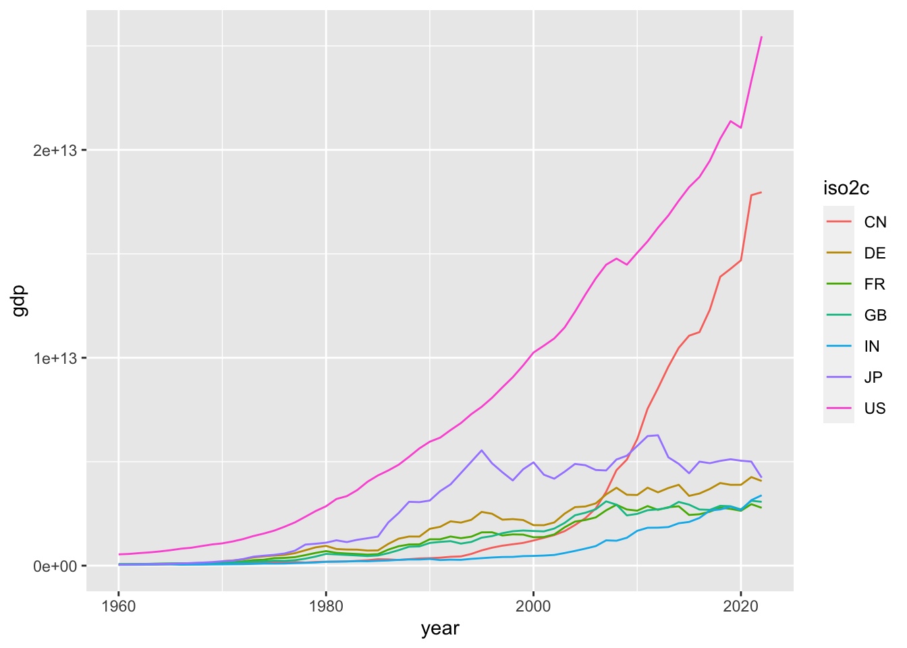
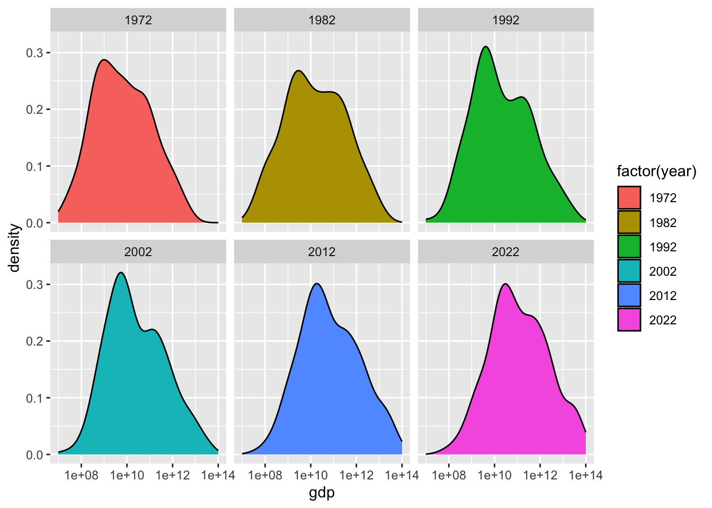

# はじめてのデータサイエンス {#first-example}

## データサイエンスの実際

データから情報を得るときには、大体次のような手順をとります。

1.  準備 Setup
2.  データを取得 Import data
3.  データ構造の確認 View data
4.  必要に応じて整形 Transform data
5.  視覚化 Visualize data
6.  データを理解 Understand data
7.  レポートなどにまとめる Communicate data

下の図は [R for Data Science](https://r4ds.hadley.nz) に掲載されている図です。よく、表現されていると思います。詳細は、少しずつ説明します。

{width="593"}


[はじめに](https://icu-hsuzuki.github.io/ds4aj/introduction.html#introduction)に書きましたが、基本的には、問いをもちデータを取得し、視覚化などを通して、データを理解し、さらに問いを深めるサイクルが、データサイエンスの核だと思います。

> R を使った分析の一つの例を、見て行きます。一つ一つのコード（コンピュータ・プログラム）の簡単な説明は、加えますが、あまりそれに捉われず、「データサイエンスとは何か？」を考えながら、雰囲気を味わってください。

## R のパッケージを活用

### 準備 Setup

世界銀行（World Bank）の、世界開発指標（WDI: World Development Indicators）の一つの、GDP（Gross Domestic Product 国内総生産）のデータから始めます。GDP にも何種類かの尺度がありますが、次のものを見てみます。

-   NY.GDP.MKTP.CD: GDP (current US\$)[^03-first-example-1]

[^03-first-example-1]: GDP（Gross Domestic Product）とは、ある国のある期間（通常は1年）における、その国で生産されたすべての最終財・サービスの市場価値の総額を指します。これは国内総生産とも呼ばれます。GDPは、その国の経済力や活力を測る指標の1つとして広く用いられています。WDIのGDP (Current USD)は、各国のGDPを米ドルで表したものであり、通貨の価値が異なっても比較可能な形で国際比較ができます。ただし、GDPはあくまで市場価格を基準としているため、非市場活動や自然災害などの影響を受ける場合がある点に注意が必要です。

NY.GDP.MKTP.CD は、データコードと言われるもので、世界開発指標（WDI）には、一つづつ決まっています。

[World Development Indicators](https://datatopics.worldbank.org/world-development-indicators/) のサイトの下にある、Data Themes（テーマ）からテーマを選択し、下にスクロールすると、Code をみることができます。ちなみに、ここで利用する NY.GDP.MKTP.CD: GDP (current US\$) は、テーマの Economy（経済）の、一番上にあります。

経済用語の英語はよく知らないという方は、ブラウザー（Edge, Google Chrome, Safari など）の翻訳機能を使うのも良いでしょう。ただ、そのページの対話型の機能（interactive function）を利用するときは、翻訳機能をOFF にする必要がある場合もありますので、注意してください。

エラーメッセージを調べるときなどに、英語のほうが情報がたくさん得られますから、言語を、英語に変更しておきます。

R には、WDI のデータを取得する R のツール（パッケージ）`WDI` がありますから、それを使います。また、データを取り扱うための基本的なツール（パッケージ）`tidyverse` を使いますので、次のコードで、これらを読み込みます。\\#\\\> 以下は、コードを実行すると、表示される情報（出力）です。以下同様です。


```r
Sys.setenv(LANG = "en") # 言語を英語に
library(tidyverse)      # tidyverse パッケージを読み込みます
#> ── Attaching core tidyverse packages ──── tidyverse 2.0.0 ──
#> ✔ dplyr     1.1.2     ✔ readr     2.1.4
#> ✔ forcats   1.0.0     ✔ stringr   1.5.0
#> ✔ ggplot2   3.4.2     ✔ tibble    3.2.1
#> ✔ lubridate 1.9.2     ✔ tidyr     1.3.0
#> ✔ purrr     1.0.1     
#> ── Conflicts ────────────────────── tidyverse_conflicts() ──
#> ✖ dplyr::filter() masks stats::filter()
#> ✖ dplyr::lag()    masks stats::lag()
#> ℹ Use the conflicted package (<http://conflicted.r-lib.org/>) to force all conflicts to become errors
library(WDI)            # WDI パッケージを読み込みます
```

データを保存する場所を作成しておくことをお勧めします。保存しておくときは、このディレクトリを使います。


```r
dir.create("./data")
```

### データ取得 Import data

データを取得します。少し時間がかかります。取得したデータに、`df_gdp` などと、わかりやすい名前をつけます。`df` は `data frame` の略で、R で標準的なデータの形式です。


```r
df_gdp <- WDI(country = "all", 
              indicator = c(gdp = "NY.GDP.MKTP.CD"), 
              extra = TRUE)
```


このコードで、全ての国の GDP を取得できます。GDP の値は、`NY.GDP.MKTP.CD` という名前の列にありますが、覚えやすいように、gdp という名前に変更しておきます。`extra = TRUE` とすることによって、それぞれの国についての情報などが追加されます。

### データ構造の確認

最初の数行だけを見るには、`head(df_dgp)` とします。


```r
head(df_gdp)
#> # A tibble: 6 × 13
#>   country     iso2c iso3c  year       gdp status lastupdated
#>   <chr>       <chr> <chr> <dbl>     <dbl> <lgl>  <date>     
#> 1 Afghanistan AF    AFG    2015   2.00e10 NA     2022-12-22 
#> 2 Afghanistan AF    AFG    2011   1.82e10 NA     2022-12-22 
#> 3 Afghanistan AF    AFG    2014   2.06e10 NA     2022-12-22 
#> 4 Afghanistan AF    AFG    2013   2.06e10 NA     2022-12-22 
#> 5 Afghanistan AF    AFG    2012   2.02e10 NA     2022-12-22 
#> 6 Afghanistan AF    AFG    2007   9.72e 9 NA     2022-12-22 
#> # ℹ 6 more variables: region <chr>, capital <chr>,
#> #   longitude <dbl>, latitude <dbl>, income <chr>,
#> #   lending <chr>
```

データの構造を見るときには、`str(df_gdp)` もよく使われます。今度は、列が縦に並んで表示されます。


```r
str(df_gdp)
#> spc_tbl_ [16,492 × 13] (S3: spec_tbl_df/tbl_df/tbl/data.frame)
#>  $ country    : chr [1:16492] "Afghanistan" "Afghanistan" "Afghanistan" "Afghanistan" ...
#>  $ iso2c      : chr [1:16492] "AF" "AF" "AF" "AF" ...
#>  $ iso3c      : chr [1:16492] "AFG" "AFG" "AFG" "AFG" ...
#>  $ year       : num [1:16492] 2015 2011 2014 2013 2012 ...
#>  $ gdp        : num [1:16492] 2.00e+10 1.82e+10 2.06e+10 2.06e+10 2.02e+10 ...
#>  $ status     : logi [1:16492] NA NA NA NA NA NA ...
#>  $ lastupdated: Date[1:16492], format: "2022-12-22" ...
#>  $ region     : chr [1:16492] "South Asia" "South Asia" "South Asia" "South Asia" ...
#>  $ capital    : chr [1:16492] "Kabul" "Kabul" "Kabul" "Kabul" ...
#>  $ longitude  : num [1:16492] 69.2 69.2 69.2 69.2 69.2 ...
#>  $ latitude   : num [1:16492] 34.5 34.5 34.5 34.5 34.5 ...
#>  $ income     : chr [1:16492] "Low income" "Low income" "Low income" "Low income" ...
#>  $ lending    : chr [1:16492] "IDA" "IDA" "IDA" "IDA" ...
#>  - attr(*, "spec")=
#>   .. cols(
#>   ..   country = col_character(),
#>   ..   iso2c = col_character(),
#>   ..   iso3c = col_character(),
#>   ..   year = col_double(),
#>   ..   gdp = col_double(),
#>   ..   status = col_logical(),
#>   ..   lastupdated = col_date(format = ""),
#>   ..   region = col_character(),
#>   ..   capital = col_character(),
#>   ..   longitude = col_double(),
#>   ..   latitude = col_double(),
#>   ..   income = col_character(),
#>   ..   lending = col_character()
#>   .. )
#>  - attr(*, "problems")=<externalptr>
```

概要 (`summary(df_gdp)`) からもある程度わかります。


```r
summary(df_gdp) 
#>    country             iso2c              iso3c          
#>  Length:16492       Length:16492       Length:16492      
#>  Class :character   Class :character   Class :character  
#>  Mode  :character   Mode  :character   Mode  :character  
#>                                                          
#>                                                          
#>                                                          
#>                                                          
#>       year           gdp             status       
#>  Min.   :1960   Min.   :8.824e+06   Mode:logical  
#>  1st Qu.:1975   1st Qu.:2.441e+09   NA's:16492    
#>  Median :1990   Median :1.784e+10                 
#>  Mean   :1990   Mean   :1.162e+12                 
#>  3rd Qu.:2006   3rd Qu.:2.158e+11                 
#>  Max.   :2021   Max.   :9.651e+13                 
#>                 NA's   :3343                      
#>   lastupdated            region            capital         
#>  Min.   :2022-12-22   Length:16492       Length:16492      
#>  1st Qu.:2022-12-22   Class :character   Class :character  
#>  Median :2022-12-22   Mode  :character   Mode  :character  
#>  Mean   :2022-12-22                                        
#>  3rd Qu.:2022-12-22                                        
#>  Max.   :2022-12-22                                        
#>                                                            
#>    longitude          latitude          income         
#>  Min.   :-175.22   Min.   :-41.286   Length:16492      
#>  1st Qu.: -15.18   1st Qu.:  4.174   Class :character  
#>  Median :  19.54   Median : 17.277   Mode  :character  
#>  Mean   :  19.16   Mean   : 18.740                     
#>  3rd Qu.:  50.53   3rd Qu.: 39.715                     
#>  Max.   : 179.09   Max.   : 64.184                     
#>  NA's   :3472      NA's   :3472                        
#>    lending         
#>  Length:16492      
#>  Class :character  
#>  Mode  :character  
#>                    
#>                    
#>                    
#> 
```

国のリストをみてみましょう。とても長いリストの中には、地域名も含まれています。


```r
df_gdp |> distinct(country) |> pull()
#>   [1] "Afghanistan"                                         
#>   [2] "Africa Eastern and Southern"                         
#>   [3] "Africa Western and Central"                          
#>   [4] "Albania"                                             
#>   [5] "Algeria"                                             
#>   [6] "American Samoa"                                      
#>   [7] "Andorra"                                             
#>   [8] "Angola"                                              
#>   [9] "Antigua and Barbuda"                                 
#>  [10] "Arab World"                                          
#>  [11] "Argentina"                                           
#>  [12] "Armenia"                                             
#>  [13] "Aruba"                                               
#>  [14] "Australia"                                           
#>  [15] "Austria"                                             
#>  [16] "Azerbaijan"                                          
#>  [17] "Bahamas, The"                                        
#>  [18] "Bahrain"                                             
#>  [19] "Bangladesh"                                          
#>  [20] "Barbados"                                            
#>  [21] "Belarus"                                             
#>  [22] "Belgium"                                             
#>  [23] "Belize"                                              
#>  [24] "Benin"                                               
#>  [25] "Bermuda"                                             
#>  [26] "Bhutan"                                              
#>  [27] "Bolivia"                                             
#>  [28] "Bosnia and Herzegovina"                              
#>  [29] "Botswana"                                            
#>  [30] "Brazil"                                              
#>  [31] "British Virgin Islands"                              
#>  [32] "Brunei Darussalam"                                   
#>  [33] "Bulgaria"                                            
#>  [34] "Burkina Faso"                                        
#>  [35] "Burundi"                                             
#>  [36] "Cabo Verde"                                          
#>  [37] "Cambodia"                                            
#>  [38] "Cameroon"                                            
#>  [39] "Canada"                                              
#>  [40] "Caribbean small states"                              
#>  [41] "Cayman Islands"                                      
#>  [42] "Central African Republic"                            
#>  [43] "Central Europe and the Baltics"                      
#>  [44] "Chad"                                                
#>  [45] "Channel Islands"                                     
#>  [46] "Chile"                                               
#>  [47] "China"                                               
#>  [48] "Colombia"                                            
#>  [49] "Comoros"                                             
#>  [50] "Congo, Dem. Rep."                                    
#>  [51] "Congo, Rep."                                         
#>  [52] "Costa Rica"                                          
#>  [53] "Cote d'Ivoire"                                       
#>  [54] "Croatia"                                             
#>  [55] "Cuba"                                                
#>  [56] "Curacao"                                             
#>  [57] "Cyprus"                                              
#>  [58] "Czechia"                                             
#>  [59] "Denmark"                                             
#>  [60] "Djibouti"                                            
#>  [61] "Dominica"                                            
#>  [62] "Dominican Republic"                                  
#>  [63] "Early-demographic dividend"                          
#>  [64] "East Asia & Pacific"                                 
#>  [65] "East Asia & Pacific (excluding high income)"         
#>  [66] "East Asia & Pacific (IDA & IBRD countries)"          
#>  [67] "Ecuador"                                             
#>  [68] "Egypt, Arab Rep."                                    
#>  [69] "El Salvador"                                         
#>  [70] "Equatorial Guinea"                                   
#>  [71] "Eritrea"                                             
#>  [72] "Estonia"                                             
#>  [73] "Eswatini"                                            
#>  [74] "Ethiopia"                                            
#>  [75] "Euro area"                                           
#>  [76] "Europe & Central Asia"                               
#>  [77] "Europe & Central Asia (excluding high income)"       
#>  [78] "Europe & Central Asia (IDA & IBRD countries)"        
#>  [79] "European Union"                                      
#>  [80] "Faroe Islands"                                       
#>  [81] "Fiji"                                                
#>  [82] "Finland"                                             
#>  [83] "Fragile and conflict affected situations"            
#>  [84] "France"                                              
#>  [85] "French Polynesia"                                    
#>  [86] "Gabon"                                               
#>  [87] "Gambia, The"                                         
#>  [88] "Georgia"                                             
#>  [89] "Germany"                                             
#>  [90] "Ghana"                                               
#>  [91] "Gibraltar"                                           
#>  [92] "Greece"                                              
#>  [93] "Greenland"                                           
#>  [94] "Grenada"                                             
#>  [95] "Guam"                                                
#>  [96] "Guatemala"                                           
#>  [97] "Guinea"                                              
#>  [98] "Guinea-Bissau"                                       
#>  [99] "Guyana"                                              
#> [100] "Haiti"                                               
#> [101] "Heavily indebted poor countries (HIPC)"              
#> [102] "High income"                                         
#> [103] "Honduras"                                            
#> [104] "Hong Kong SAR, China"                                
#> [105] "Hungary"                                             
#> [106] "IBRD only"                                           
#> [107] "Iceland"                                             
#> [108] "IDA & IBRD total"                                    
#> [109] "IDA blend"                                           
#> [110] "IDA only"                                            
#> [111] "IDA total"                                           
#> [112] "India"                                               
#> [113] "Indonesia"                                           
#> [114] "Iran, Islamic Rep."                                  
#> [115] "Iraq"                                                
#> [116] "Ireland"                                             
#> [117] "Isle of Man"                                         
#> [118] "Israel"                                              
#> [119] "Italy"                                               
#> [120] "Jamaica"                                             
#> [121] "Japan"                                               
#> [122] "Jordan"                                              
#> [123] "Kazakhstan"                                          
#> [124] "Kenya"                                               
#> [125] "Kiribati"                                            
#> [126] "Korea, Dem. People's Rep."                           
#> [127] "Korea, Rep."                                         
#> [128] "Kosovo"                                              
#> [129] "Kuwait"                                              
#> [130] "Kyrgyz Republic"                                     
#> [131] "Lao PDR"                                             
#> [132] "Late-demographic dividend"                           
#> [133] "Latin America & Caribbean"                           
#> [134] "Latin America & Caribbean (excluding high income)"   
#> [135] "Latin America & the Caribbean (IDA & IBRD countries)"
#> [136] "Latvia"                                              
#> [137] "Least developed countries: UN classification"        
#> [138] "Lebanon"                                             
#> [139] "Lesotho"                                             
#> [140] "Liberia"                                             
#> [141] "Libya"                                               
#> [142] "Liechtenstein"                                       
#> [143] "Lithuania"                                           
#> [144] "Low & middle income"                                 
#> [145] "Low income"                                          
#> [146] "Lower middle income"                                 
#> [147] "Luxembourg"                                          
#> [148] "Macao SAR, China"                                    
#> [149] "Madagascar"                                          
#> [150] "Malawi"                                              
#> [151] "Malaysia"                                            
#> [152] "Maldives"                                            
#> [153] "Mali"                                                
#> [154] "Malta"                                               
#> [155] "Marshall Islands"                                    
#> [156] "Mauritania"                                          
#> [157] "Mauritius"                                           
#> [158] "Mexico"                                              
#> [159] "Micronesia, Fed. Sts."                               
#> [160] "Middle East & North Africa"                          
#> [161] "Middle East & North Africa (excluding high income)"  
#> [162] "Middle East & North Africa (IDA & IBRD countries)"   
#> [163] "Middle income"                                       
#> [164] "Moldova"                                             
#> [165] "Monaco"                                              
#> [166] "Mongolia"                                            
#> [167] "Montenegro"                                          
#> [168] "Morocco"                                             
#> [169] "Mozambique"                                          
#> [170] "Myanmar"                                             
#> [171] "Namibia"                                             
#> [172] "Nauru"                                               
#> [173] "Nepal"                                               
#> [174] "Netherlands"                                         
#> [175] "New Caledonia"                                       
#> [176] "New Zealand"                                         
#> [177] "Nicaragua"                                           
#> [178] "Niger"                                               
#> [179] "Nigeria"                                             
#> [180] "North America"                                       
#> [181] "North Macedonia"                                     
#> [182] "Northern Mariana Islands"                            
#> [183] "Norway"                                              
#> [184] "Not classified"                                      
#> [185] "OECD members"                                        
#> [186] "Oman"                                                
#> [187] "Other small states"                                  
#> [188] "Pacific island small states"                         
#> [189] "Pakistan"                                            
#> [190] "Palau"                                               
#> [191] "Panama"                                              
#> [192] "Papua New Guinea"                                    
#> [193] "Paraguay"                                            
#> [194] "Peru"                                                
#> [195] "Philippines"                                         
#> [196] "Poland"                                              
#> [197] "Portugal"                                            
#> [198] "Post-demographic dividend"                           
#> [199] "Pre-demographic dividend"                            
#> [200] "Puerto Rico"                                         
#> [201] "Qatar"                                               
#> [202] "Romania"                                             
#> [203] "Russian Federation"                                  
#> [204] "Rwanda"                                              
#> [205] "Samoa"                                               
#> [206] "San Marino"                                          
#> [207] "Sao Tome and Principe"                               
#> [208] "Saudi Arabia"                                        
#> [209] "Senegal"                                             
#> [210] "Serbia"                                              
#> [211] "Seychelles"                                          
#> [212] "Sierra Leone"                                        
#> [213] "Singapore"                                           
#> [214] "Sint Maarten (Dutch part)"                           
#> [215] "Slovak Republic"                                     
#> [216] "Slovenia"                                            
#> [217] "Small states"                                        
#> [218] "Solomon Islands"                                     
#> [219] "Somalia"                                             
#> [220] "South Africa"                                        
#> [221] "South Asia"                                          
#> [222] "South Asia (IDA & IBRD)"                             
#> [223] "South Sudan"                                         
#> [224] "Spain"                                               
#> [225] "Sri Lanka"                                           
#> [226] "St. Kitts and Nevis"                                 
#> [227] "St. Lucia"                                           
#> [228] "St. Martin (French part)"                            
#> [229] "St. Vincent and the Grenadines"                      
#> [230] "Sub-Saharan Africa"                                  
#> [231] "Sub-Saharan Africa (excluding high income)"          
#> [232] "Sub-Saharan Africa (IDA & IBRD countries)"           
#> [233] "Sudan"                                               
#> [234] "Suriname"                                            
#> [235] "Sweden"                                              
#> [236] "Switzerland"                                         
#> [237] "Syrian Arab Republic"                                
#> [238] "Tajikistan"                                          
#> [239] "Tanzania"                                            
#> [240] "Thailand"                                            
#> [241] "Timor-Leste"                                         
#> [242] "Togo"                                                
#> [243] "Tonga"                                               
#> [244] "Trinidad and Tobago"                                 
#> [245] "Tunisia"                                             
#> [246] "Turkiye"                                             
#> [247] "Turkmenistan"                                        
#> [248] "Turks and Caicos Islands"                            
#> [249] "Tuvalu"                                              
#> [250] "Uganda"                                              
#> [251] "Ukraine"                                             
#> [252] "United Arab Emirates"                                
#> [253] "United Kingdom"                                      
#> [254] "United States"                                       
#> [255] "Upper middle income"                                 
#> [256] "Uruguay"                                             
#> [257] "Uzbekistan"                                          
#> [258] "Vanuatu"                                             
#> [259] "Venezuela, RB"                                       
#> [260] "Vietnam"                                             
#> [261] "Virgin Islands (U.S.)"                               
#> [262] "West Bank and Gaza"                                  
#> [263] "World"                                               
#> [264] "Yemen, Rep."                                         
#> [265] "Zambia"                                              
#> [266] "Zimbabwe"
```

今回は下のように、`|>`（パイプと呼びます） で繋げてコードを書きました。

```         
df_gdp |> distinct(country) |> pull()
```

最初は、データ、その中の、異なる国を選択して、書き出してくださいというものです。

これは、

```         
pull(distinct(df_gdp, country))
```

と同じです。どんどん、かっこの中に入れ子になって複雑になるので、一つ一つのステップを、順に書いたものが、最初のものになります。

```         
df_gdp |> head()
df_gdp |> str()
```

なども可能です。かっこの中に最初に入るものが直前のもの、ここでは、データになっています。

### 必要に応じて整形 Transform data

変数が多いので、日本の部分だけ `filter` を使って選択します。country が Japan と一致する場合のみを選択するときは、`==` を使います。数値ではないので、引用符をつけます。半角を使ってください。


```r
df_gdp |> filter(country == "Japan")
#> # A tibble: 62 × 13
#>    country iso2c iso3c  year     gdp status lastupdated
#>    <chr>   <chr> <chr> <dbl>   <dbl> <lgl>  <date>     
#>  1 Japan   JP    JPN    2021 4.94e12 NA     2022-12-22 
#>  2 Japan   JP    JPN    2020 5.04e12 NA     2022-12-22 
#>  3 Japan   JP    JPN    2019 5.12e12 NA     2022-12-22 
#>  4 Japan   JP    JPN    2018 5.04e12 NA     2022-12-22 
#>  5 Japan   JP    JPN    2017 4.93e12 NA     2022-12-22 
#>  6 Japan   JP    JPN    2016 5.00e12 NA     2022-12-22 
#>  7 Japan   JP    JPN    2015 4.44e12 NA     2022-12-22 
#>  8 Japan   JP    JPN    2014 4.90e12 NA     2022-12-22 
#>  9 Japan   JP    JPN    2013 5.21e12 NA     2022-12-22 
#> 10 Japan   JP    JPN    2012 6.27e12 NA     2022-12-22 
#> # ℹ 52 more rows
#> # ℹ 6 more variables: region <chr>, capital <chr>,
#> #   longitude <dbl>, latitude <dbl>, income <chr>,
#> #   lending <chr>
```


```r
df_gdp |> filter(country == "Japan") |> head(2)
#> # A tibble: 2 × 13
#>   country iso2c iso3c  year     gdp status lastupdated
#>   <chr>   <chr> <chr> <dbl>   <dbl> <lgl>  <date>     
#> 1 Japan   JP    JPN    2021 4.94e12 NA     2022-12-22 
#> 2 Japan   JP    JPN    2020 5.04e12 NA     2022-12-22 
#> # ℹ 6 more variables: region <chr>, capital <chr>,
#> #   longitude <dbl>, latitude <dbl>, income <chr>,
#> #   lending <chr>
```

２行目の、gdp の、4.940878e+12 は、Scientific notation と言われるもので、 $$4.940878 \times 10^{12} = 4,940,887,800,000$$ を意味します。`e+3` は千（thousand）、`e+6` は百万（million）、`e+9` は、10億（billion）、`e+12` は、兆（trillion）ですから、日本の、2021 年の GDP は、約5兆ドルとなります。

### 視覚化 data visualization

#### Fig 1. 日本のGDP の経年変化を折線グラフ（line graph）


```r
df_gdp |> filter(country == "Japan") |>
  ggplot(aes(x = year, y = gdp)) + geom_line()
```


```         
df_gdp |> filter(country == "Japan") |>
  ggplot(aes(x = year, y = gdp)) + geom_line()
```

日本を選択したときに、それに名前をつけておいて、それを使うこともできますが、名前がどんどん増えるので、それに続けて、コードを書いていく方法をとっています。

`ggplot(aes(x = year, y = gdp)) + geom_line()`

の部分が、グラフを描く部分で、「x 軸を、year、y 軸を、gdp として、それを、折線グラフで描いてください」というコードです。

Warning: [38;5;238mRemoved 1 row containing missing values

と表示されています。値がない年があることを言っています。2022年のデータがないことがわかっていますから、最初から削除してこくことも可能です。

### データの理解 Understand data

視覚化によって見えてくることがいくつもありますね。どんなことがわかりますか。気づいたこと（observation）をあげてみましょう。

コードを描くことではなく、この部分が、データサイエンスの核の部分です。気づいたことを列挙してみましょう。

### さまざまな視覚化

#### Fig 2. 各年ごとのデータの数

`summary(df_gdp)` で、データ自体は、1960年から2022年までのようですが、日本も、2022年のデータはありませんでしたから、年によって、どの程度データがあるか、調べてみます。


```r
df_gdp |> drop_na(gdp) |> ggplot(aes(x = year)) + geom_bar()
```


```         
df_gdp |> drop_na(gdp) |> ggplot(aes(x = year)) + geom_bar()
```

バー・グラフを使いますが、`gdp` の値が、欠損値（NA: not available）のデータを削除してから、グラフを描きます。

#### 2021年のGDPの降順での表示（１）

最新の2021年のデータはすべてあるわけではなさそうですが、`gdp` の値が大きい順に並べてみましょう。


```r
df_gdp |> filter(year == 2021) |> drop_na(gdp) |> arrange(desc(gdp))
#> # A tibble: 245 × 13
#>    country      iso2c iso3c  year     gdp status lastupdated
#>    <chr>        <chr> <chr> <dbl>   <dbl> <lgl>  <date>     
#>  1 World        1W    WLD    2021 9.65e13 NA     2022-12-22 
#>  2 High income  XD    <NA>   2021 5.98e13 NA     2022-12-22 
#>  3 OECD members OE    OED    2021 5.83e13 NA     2022-12-22 
#>  4 Post-demogr… V4    PST    2021 5.50e13 NA     2022-12-22 
#>  5 IDA & IBRD … ZT    IBT    2021 3.80e13 NA     2022-12-22 
#>  6 Low & middl… XO    LMY    2021 3.64e13 NA     2022-12-22 
#>  7 Middle inco… XP    MIC    2021 3.58e13 NA     2022-12-22 
#>  8 IBRD only    XF    IBD    2021 3.55e13 NA     2022-12-22 
#>  9 East Asia &… Z4    EAS    2021 3.09e13 NA     2022-12-22 
#> 10 Upper middl… XT    <NA>   2021 2.71e13 NA     2022-12-22 
#> # ℹ 235 more rows
#> # ℹ 6 more variables: region <chr>, capital <chr>,
#> #   longitude <dbl>, latitude <dbl>, income <chr>,
#> #   lending <chr>
```

#### 2021年のGDPの降順での表示（２）

最初に、World と表示され、グループや、カテゴリーのデータもあるようですから、それを、まず、削除することが必要です。`region` の列を見ると、World などは、Aggregates となっているので、そのようなものを削除すればよさそうです。数値の大きい順に並べたいので、`desc` 降順（descending order）にします。


```r
df_gdp |> filter(year == 2021, region != "Aggregates") |> 
  drop_na(gdp) |> arrange(desc(gdp))
#> # A tibble: 196 × 13
#>    country      iso2c iso3c  year     gdp status lastupdated
#>    <chr>        <chr> <chr> <dbl>   <dbl> <lgl>  <date>     
#>  1 United Stat… US    USA    2021 2.33e13 NA     2022-12-22 
#>  2 China        CN    CHN    2021 1.77e13 NA     2022-12-22 
#>  3 Japan        JP    JPN    2021 4.94e12 NA     2022-12-22 
#>  4 Germany      DE    DEU    2021 4.26e12 NA     2022-12-22 
#>  5 India        IN    IND    2021 3.18e12 NA     2022-12-22 
#>  6 United King… GB    GBR    2021 3.13e12 NA     2022-12-22 
#>  7 France       FR    FRA    2021 2.96e12 NA     2022-12-22 
#>  8 Italy        IT    ITA    2021 2.11e12 NA     2022-12-22 
#>  9 Canada       CA    CAN    2021 1.99e12 NA     2022-12-22 
#> 10 Korea, Rep.  KR    KOR    2021 1.81e12 NA     2022-12-22 
#> # ℹ 186 more rows
#> # ℹ 6 more variables: region <chr>, capital <chr>,
#> #   longitude <dbl>, latitude <dbl>, income <chr>,
#> #   lending <chr>
```

これは、グラフではありませんが、これも一つの視覚化とも考えられないことはありません。

上位７カ国は、United States, China, Japan, Germany, India, United Kingdom, France であることがわかりました。8番目は、Italy でここまでが、GDP が 2兆ドルを越している国となります。

#### Fig 3. 2021年時のGDP上位7カ国のGDP経年変化


```r
df_gdp |> filter(iso2c %in% c("US", "CN", "JP", "DE", "IN", "GB", "FR")) |>
  ggplot(aes(x = year, y = gdp, col = iso2c)) + geom_line()
#> Warning: Removed 10 rows containing missing values
#> (`geom_line()`).
```


```         
df_gdp |> filter(iso2c %in% c("US", "CN", "JP", "DE", "IN", "GB", "FR")) |>
  ggplot(aes(x = year, y = gdp, col = iso2c)) + geom_line()
```

ここでは、最初に、`filter` を使って、7カ国のデータを選択しています。 そのときには、`%in%` として、国名を、combine するといういみで、`c()` とひとまとめにします。数字ではなく、文字なので、引用符で囲んでいます。この場合は、single quote でも構いませんが、半角を使ってください。

このグラフからは、どのようなことがわかりますか。気づいたことを書いてみましょう。

もう少し、このようなグラフをみてみたいというような、メモも大切です。

#### Fig 4. 世界のGDP における割合（１）


```r
df_gdp |> 
  filter(region != "Aggregates") |> drop_na(gdp) |> 
  group_by(year) |> mutate(gdp_ratio = gdp/sum(gdp)) |> ungroup() |>
  filter(iso2c %in% c("US", "CN", "JP", "DE", "IN", "GB", "FR"))  |>
  ggplot(aes(x = year, y = gdp_ratio, fill = iso2c)) + geom_area() +
  geom_line(col = "black", position = "stack", linewidth = 0.3) + 
  scale_y_continuous(labels = scales::percent_format(accuracy = 1))
```



まず、下の部分が新しいですが、ここでは、年毎にグループにして、その上で、新しい `dgp_ratio` という名前の列を追加し、その gdp の値を、gdp 合計で割っています。すなわち、世界の、GDP における割合が計算されています。

```         
  group_by(year) |> mutate(gdp_ratio = gdp/sum(gdp)) |> ungroup() |>
```

下の部分では、`geom_area` を使って、`fill=iso2c` により、`iso2c` ごとに、違う色を塗って、position = "stack" により、積み上げ型の、グラフを描き、境目がわかりやすいように、0.3 の太さの黒の線を描いてください。また、y 軸は、小数点以下を省いたパーセント表示に変えてください。というコードです。

```         
  ggplot(aes(x = year, y = gdp_ratio, fill = iso2c)) + geom_area() +
  geom_line(col = "black", position = "stack", linewidth = 0.3) + 
  scale_y_continuous(labels = scales::percent_format(accuracy = 1))
```

#### Fig 4. 世界のGDP における割合（２）

これは、上から、iso2c の アルファベットの順番になっていますが、積み上げの順序を変更することもできます。


```r
df_gdp |> 
  filter(region != "Aggregates") |> drop_na(gdp) |> 
  group_by(year) |> mutate(gdp_ratio = gdp/sum(gdp)) |> ungroup() |>
  filter(iso2c %in% c("US", "CN", "JP", "DE", "IN", "GB", "FR"))  |>
  mutate(iso2co = factor(iso2c, levels = c("IN", "CN", "FR", "GB", "DE", "JP", "US"))) |>
  ggplot(aes(x = year, y = gdp_ratio, fill = iso2co)) + geom_area() +
  geom_line(col = "black", position = "stack", linewidth = 0.3) + 
  scale_y_continuous(labels = scales::percent_format(accuracy = 1))
```


これらは、世界全体の GPT における割合です。

どのようなことがわかりますか。

主要国で、60%〜70% を占めていることがわかります。それぞれの国や、幾つかの国の影響力も、ある程度みることができるように見えます。

気づいたこと、疑問に思ったことなどを、書き出してみてください。

GDP が大きな国と、小さな国があるのはわかりますが、それは、どのように分布しているのでしょうか。

#### Fig 5. 2021年の世界の国のGDPの分布（１）


```r
df_gdp |> drop_na(gdp) |> 
  filter(year == 2021) |> filter(region != "Aggregates") |>
  ggplot(aes(gdp)) + geom_histogram()
#> `stat_bin()` using `bins = 30`. Pick better value with
#> `binwidth`.
```


小さいところに集中していることがわかりますが、`scale_x_log10()` を加え、対数軸をとってみます。

$log10(1000) = 3$, $log10(1000000) = 6$, $log10(1000000000) = 9$ などになります。

#### Fig 6. 2021年の世界の国のGDPの分布（２）


```r
df_gdp |> drop_na(gdp) |> 
  filter(year == 2021) |> filter(region != "Aggregates") |>
  ggplot(aes(gdp)) + geom_histogram() + scale_x_log10()
#> `stat_bin()` using `bins = 30`. Pick better value with
#> `binwidth`.
```


幅を変更したり、分ける個数を変更するには `binwidth = 0.5` や、`bins = 20` を、`geom_histogram()` のかっこの中に入れます。

#### Fig 7. 2021年の世界の国のGDPの分布（３）

また、密度曲線に変えるには、`geom_density` を使います。


```r
df_gdp |> drop_na(gdp) |> 
  filter(year == 2021) |> filter(region != "Aggregates") |>
  ggplot(aes(gdp)) + geom_density() + scale_x_log10()
```


#### Fig 8. 2021年の世界の国のGDPの分布（４）

これは、2021年のデータですが、density の変化を見てみます。alpha の値は透明度です。


```r
df_gdp |> drop_na(gdp) |> 
  filter(year %in% c(1961, 1971, 1981, 1991, 2001, 2011, 2021)) |>
  ggplot(aes(gdp, fill = factor(year))) + geom_density(alpha = 0.4) + scale_x_log10()
```


#### Fig 9. 2021年の世界の国のGDPの分布（５）

少しみにくいので、分けてみます。


```r
df_gdp |> drop_na(gdp) |> 
  filter(year %in% c(1971, 1981, 1991, 2001, 2011, 2021)) |>
  ggplot(aes(gdp, fill = factor(year))) + 
  geom_density() + scale_x_log10() + facet_wrap(~year)
```


#### Fig 10. 地域ごとの GDP の分布

いくつかのグループごとに分布をみてみることも可能です。それには、Boxplot が有効です。


```r
df_gdp |> drop_na(gdp) |> filter(region != "Aggregates") |>
  drop_na(region) |> filter(year %in% c(2021)) |>
  ggplot(aes(gdp, region, fill = region)) + 
  geom_boxplot() + scale_x_log10() + labs(y = "") + 
  theme(legend.position = "none")
```



#### Fig 11. 収入の多寡による分類ごとの GDP 分布


```r
df_gdp |> drop_na(gdp) |> filter(region != "Aggregates") |>
  drop_na(income) |> filter(year %in% c(2021)) |>
  mutate(level = factor(income, c("High income", "Upper middle income", "Lower middle income", "Low income"))) |>
  ggplot(aes(gdp, level, fill = income)) + 
  geom_boxplot() + scale_x_log10() + labs(y = "") + 
  theme(legend.position = "none")
```


これからも、いろいろなことがわかりますね。

#### 世界地図の準備

地図で、国の income level をみてみましょう。


```r
library(maps)
#> 
#> Attaching package: 'maps'
#> The following object is masked from 'package:purrr':
#> 
#>     map
gdp_short <- df_gdp |> filter(year == 2021, region != "Aggregates") |>
  select(iso2c, gdp, income)
map_world <- map_data('world')
map_gdp <- map_world |> 
  mutate(iso2c = iso.alpha(region, n=2)) |> 
  left_join(gdp_short, by = "iso2c") 
head(map_gdp)
#>        long      lat group order region subregion iso2c
#> 1 -69.89912 12.45200     1     1  Aruba      <NA>    AW
#> 2 -69.89571 12.42300     1     2  Aruba      <NA>    AW
#> 3 -69.94219 12.43853     1     3  Aruba      <NA>    AW
#> 4 -70.00415 12.50049     1     4  Aruba      <NA>    AW
#> 5 -70.06612 12.54697     1     5  Aruba      <NA>    AW
#> 6 -70.05088 12.59707     1     6  Aruba      <NA>    AW
#>          gdp      income
#> 1 3126019399 High income
#> 2 3126019399 High income
#> 3 3126019399 High income
#> 4 3126019399 High income
#> 5 3126019399 High income
#> 6 3126019399 High income
```

#### Fig 12. Income Level による色分け地図


```r
map_gdp |> mutate(income_level = factor(income, levels = c("High income", "Upper middle income", "Lower middle income", "Low income", "Not classified", NA))) |>
  ggplot() +
  geom_map(aes(long, lat, map_id = region, fill = income_level), map = map_world, col = "black", size = 0.1) 
#> Warning: Using `size` aesthetic for lines was deprecated in ggplot2
#> 3.4.0.
#> ℹ Please use `linewidth` instead.
#> This warning is displayed once every 8 hours.
#> Call `lifecycle::last_lifecycle_warnings()` to see where
#> this warning was generated.
#> Warning in geom_map(aes(long, lat, map_id = region, fill =
#> income_level), : Ignoring unknown aesthetics: x and y
```


#### Fig 13. GDP による色分け地図


```r
map_gdp |>
  ggplot() +
  geom_map(aes(x=long, y=lat, map_id = region, fill = gdp), map = map_world, col = "black", size = 0.1) 
#> Warning in geom_map(aes(x = long, y = lat, map_id = region,
#> fill = gdp), : Ignoring unknown aesthetics: x and y
```


## 練習

1.  それぞれのグラフから、わかったこと、問いなどを列挙してみましょう。
2.  Fig 1 の　Japan の部分を他の国や、グループ（World など）に変えてみてください。何がわかりますか。
3.  Fig 3 の iso2c で選択する、国を変更してください。何がわかりますか。
4.  Fig 4 または Fig 5 の iso2c の部分を他の国に変更してください。何がわかりますか。
5.  Fig 5 または Fig 6 の、区間の幅や、数を 変更してみてください。何がわかりますか。
6.  Fig 7, Fig 8, Fig 9 の年を変更してみてください。何がわかりますか。
7.  Fig 12, Fig 13 の年を変更してみてください。何がわかりますか。

## プロジェクト

他のデータで、同様のことをしてみましょう。

1.  最初に、`gdp = "NY.GDP.MKTP.CD"` としましたが、GNI per capita, Atlas method (current US\$): NY.GNP.PCAP.CD に変えてみましょう。


```r
df_gnppcap <- WDI(country = "all", 
              indicator = c(gnppcap = "NY.GNP.PCAP.CD"), 
              extra = TRUE)
```

2.  [World Development Indicators](https://datatopics.worldbank.org/world-development-indicators/) のサイトの下にある、Data Themes（テーマ）から自分が調べたいテーマを選び、そのテーマから、データコードを取得して、同様の分析をしてみてください。データがあまりない場合もありますので、ある程度データが多いものを選択することをお勧めします。

## まとめ

今回は、経済指標である、GDP を使いました。データサイエンスについて少しずつ、学んでいきます。

コードの説明は、簡単にしかしていませんから、理解するのは難しいと思いますが、いくつかのことは、ご理解いただけると思います。

-   それほど、長くはない、コードで、データを見ていく。R は対話型（interactive）のプログラミング言語と言われています。

-   コードに続けて、結果が表示されるので、コードと出力の対応が見やすい。また、コメントや説明も併記することができる。これは、RMarkdown という形式の中で、コードを書いていることによるものです。RMarkdown は、再現性（reproducibility）と、プログラム・コードの内容をコンピュータにわかるようにでなく、人間にもわかるように記述する（Literate Programming）を実現しています。

-   視覚化（Visualization）によって、わかることが色々とある。また、視覚化の方法もたくさんあり、いろいろな見方をすることで、データについての理解が深まっていく。

-   視覚化を通して、データを理解すること、問いを持ち、他の視覚化などを用いて、さらに、理解を深めることがたいせつ。

-   理解したことを元にして、さらに、そのデータ、または、他のデータを使って、新たな発見をしていく。

統計的な指標も用いますが、それらによって、新しい知識を生み出すとも表現しますが、そのような営み全体が、データサイエンスの核をなす部分だと思います。
