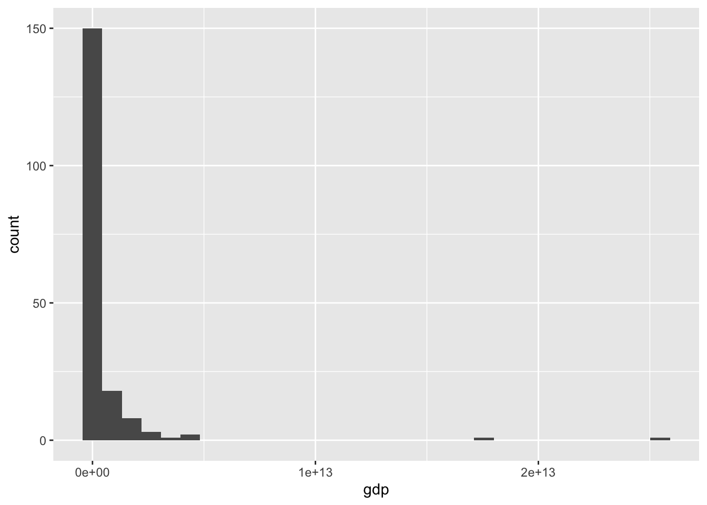
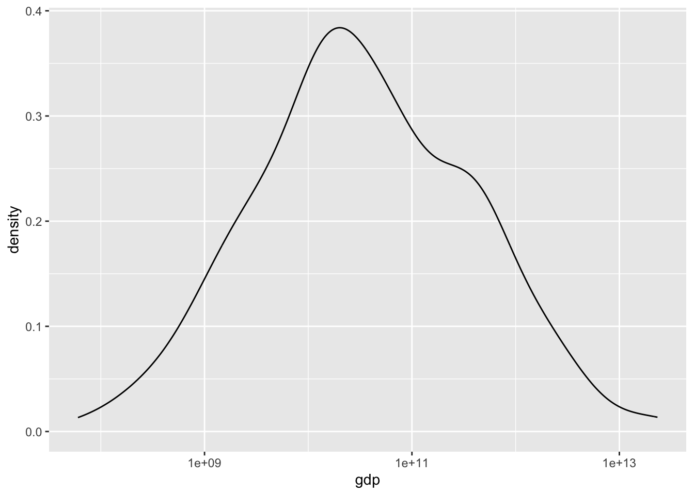

# はじめてのデータサイエンス {#first-example}

## データサイエンスの実際

データから情報を得るときには、大体次のような手順をとります。

1.  準備 Setup
2.  データを取得 Import data
3.  データ構造の確認 View data
4.  必要に応じて整形 Transform data
5.  視覚化 Visualize data
6.  データを理解 Understand data
7.  レポートなどにまとめる Communicate data

下の図は [R for Data Science](https://r4ds.hadley.nz) に掲載されている図です。よく、表現されていると思います。詳細は、少しずつ説明します。


[はじめに](https://icu-hsuzuki.github.io/ds4aj/introduction.html#introduction)に書きましたが、基本的には、問いをもちデータを取得し、視覚化などを通して、データを理解し、さらに問いを深めるサイクルが、データサイエンスの核だと思います。

> R を使った分析の一つの例を、見て行きます。一つ一つのコード（コンピュータ・プログラム）の簡単な説明は、加えますが、あまりそれに捉われず、「データサイエンスとは何か？」を考えながら、雰囲気を味わってください。

## R のパッケージを活用

### 準備 Setup

世界銀行（World Bank）の、世界開発指標（WDI: World Development Indicators）の一つの、GDP（Gross Domestic Product 国内総生産）のデータから始めます。GDP にも何種類かの尺度がありますが、次のものを見てみます。

-   NY.GDP.MKTP.CD: GDP (current US\$)[^03-first-example-1]

[^03-first-example-1]: GDP（Gross Domestic Product）とは、ある国のある期間（通常は1年）における、その国で生産されたすべての最終財・サービスの市場価値の総額を指します。これは国内総生産とも呼ばれます。GDPは、その国の経済力や活力を測る指標の1つとして広く用いられています。WDIのGDP (Current USD)は、各国のGDPを米ドルで表したものであり、通貨の価値が異なっても比較可能な形で国際比較ができます。ただし、GDPはあくまで市場価格を基準としているため、非市場活動や自然災害などの影響を受ける場合がある点に注意が必要です。

NY.GDP.MKTP.CD は、データコードと言われるもので、世界開発指標（WDI）には、一つづつ決まっています。

[World Development Indicators](https://datatopics.worldbank.org/world-development-indicators/) のサイトの下にある、Data Themes（テーマ）からテーマを選択し、下にスクロールすると、Code をみることができます。ちなみに、ここで利用する NY.GDP.MKTP.CD: GDP (current US\$) は、テーマ Economy（経済）の、一番上にあります。

経済用語の英語はよく知らないという方は、ブラウザー（Edge, Google Chrome, Safari など）の翻訳機能を使うのも良いでしょう。ただ、そのページの対話型の機能（interactive function）を利用するときは、翻訳機能をOFF にする必要がある場合もありますので、注意してください。

エラーメッセージを調べるときなどに、英語のほうが情報がたくさん得られますから、言語を、英語に変更しておきます。

R には、WDI のデータを取得する R のツール（パッケージ）`WDI` がありますから、それを使います。また、データを取り扱うための基本的なツール（パッケージ）`tidyverse` を使いますので、次のコードで、これらを読み込みます。`#` 以下はコメント（簡単な説明を書きました） `#>` 以下は、コードを実行すると、表示される情報（出力）です。以下同様です。


```r
Sys.setenv(LANG = "en") # 言語を英語に
library(tidyverse)      # tidyverse パッケージを読み込みます
#> ── Attaching core tidyverse packages ──── tidyverse 2.0.0 ──
#> ✔ dplyr     1.1.2     ✔ readr     2.1.4
#> ✔ forcats   1.0.0     ✔ stringr   1.5.0
#> ✔ ggplot2   3.4.3     ✔ tibble    3.2.1
#> ✔ lubridate 1.9.2     ✔ tidyr     1.3.0
#> ✔ purrr     1.0.2     
#> ── Conflicts ────────────────────── tidyverse_conflicts() ──
#> ✖ dplyr::filter() masks stats::filter()
#> ✖ dplyr::lag()    masks stats::lag()
#> ℹ Use the conflicted package (<http://conflicted.r-lib.org/>) to force all conflicts to become errors
library(WDI)            # WDI パッケージを読み込みます
```

データを保存する場所を作成しておくことをお勧めします。保存しておくときは、このディレクトリを使います。


```r
dir.create("./data")
```

### データ取得 Import data

データを取得します。少し時間がかかります。取得したデータに、`df_gdp` などと、わかりやすい名前をつけます。`df` は `data frame` の略で、R で標準的なデータの形式です。


```r
df_gdp <- WDI(country = "all", 
              indicator = c(gdp = "NY.GDP.MKTP.CD"), 
              extra = TRUE)
```


このコードで、全ての国の GDP を取得できます。GDP の値は、`NY.GDP.MKTP.CD` という名前の列にありますが、覚えやすいように、gdp という名前に変更しておきます。`extra = TRUE` とすることによって、それぞれの国についての情報などが追加されます。

### データ構造の確認

最初の数行だけを見るには、`head(df_dgp)` とします。


```r
head(df_gdp)
```

<div data-pagedtable="false">
  <script data-pagedtable-source type="application/json">
{"columns":[{"label":["country"],"name":[1],"type":["chr"],"align":["left"]},{"label":["iso2c"],"name":[2],"type":["chr"],"align":["left"]},{"label":["iso3c"],"name":[3],"type":["chr"],"align":["left"]},{"label":["year"],"name":[4],"type":["dbl"],"align":["right"]},{"label":["gdp"],"name":[5],"type":["dbl"],"align":["right"]},{"label":["status"],"name":[6],"type":["lgl"],"align":["right"]},{"label":["lastupdated"],"name":[7],"type":["date"],"align":["right"]},{"label":["region"],"name":[8],"type":["chr"],"align":["left"]},{"label":["capital"],"name":[9],"type":["chr"],"align":["left"]},{"label":["longitude"],"name":[10],"type":["dbl"],"align":["right"]},{"label":["latitude"],"name":[11],"type":["dbl"],"align":["right"]},{"label":["income"],"name":[12],"type":["chr"],"align":["left"]},{"label":["lending"],"name":[13],"type":["chr"],"align":["left"]}],"data":[{"1":"Afghanistan","2":"AF","3":"AFG","4":"1963","5":"751111191","6":"NA","7":"2023-07-25","8":"South Asia","9":"Kabul","10":"69.1761","11":"34.5228","12":"Low income","13":"IDA"},{"1":"Afghanistan","2":"AF","3":"AFG","4":"1962","5":"546666678","6":"NA","7":"2023-07-25","8":"South Asia","9":"Kabul","10":"69.1761","11":"34.5228","12":"Low income","13":"IDA"},{"1":"Afghanistan","2":"AF","3":"AFG","4":"1961","5":"548888896","6":"NA","7":"2023-07-25","8":"South Asia","9":"Kabul","10":"69.1761","11":"34.5228","12":"Low income","13":"IDA"},{"1":"Afghanistan","2":"AF","3":"AFG","4":"1960","5":"537777811","6":"NA","7":"2023-07-25","8":"South Asia","9":"Kabul","10":"69.1761","11":"34.5228","12":"Low income","13":"IDA"},{"1":"Afghanistan","2":"AF","3":"AFG","4":"2003","5":"4539496563","6":"NA","7":"2023-07-25","8":"South Asia","9":"Kabul","10":"69.1761","11":"34.5228","12":"Low income","13":"IDA"},{"1":"Afghanistan","2":"AF","3":"AFG","4":"2002","5":"3854235264","6":"NA","7":"2023-07-25","8":"South Asia","9":"Kabul","10":"69.1761","11":"34.5228","12":"Low income","13":"IDA"}],"options":{"columns":{"min":{},"max":[10]},"rows":{"min":[10],"max":[10]},"pages":{}}}
  </script>
</div>

データの構造を見るときには、`str(df_gdp)` もよく使われます。今度は、列が縦に並んで表示されます。


```r
str(df_gdp)
#> spc_tbl_ [16,758 × 13] (S3: spec_tbl_df/tbl_df/tbl/data.frame)
#>  $ country    : chr [1:16758] "Afghanistan" "Afghanistan" "Afghanistan" "Afghanistan" ...
#>  $ iso2c      : chr [1:16758] "AF" "AF" "AF" "AF" ...
#>  $ iso3c      : chr [1:16758] "AFG" "AFG" "AFG" "AFG" ...
#>  $ year       : num [1:16758] 1963 1962 1961 1960 2003 ...
#>  $ gdp        : num [1:16758] 7.51e+08 5.47e+08 5.49e+08 5.38e+08 4.54e+09 ...
#>  $ status     : logi [1:16758] NA NA NA NA NA NA ...
#>  $ lastupdated: Date[1:16758], format: "2023-07-25" ...
#>  $ region     : chr [1:16758] "South Asia" "South Asia" "South Asia" "South Asia" ...
#>  $ capital    : chr [1:16758] "Kabul" "Kabul" "Kabul" "Kabul" ...
#>  $ longitude  : num [1:16758] 69.2 69.2 69.2 69.2 69.2 ...
#>  $ latitude   : num [1:16758] 34.5 34.5 34.5 34.5 34.5 ...
#>  $ income     : chr [1:16758] "Low income" "Low income" "Low income" "Low income" ...
#>  $ lending    : chr [1:16758] "IDA" "IDA" "IDA" "IDA" ...
#>  - attr(*, "spec")=
#>   .. cols(
#>   ..   country = col_character(),
#>   ..   iso2c = col_character(),
#>   ..   iso3c = col_character(),
#>   ..   year = col_double(),
#>   ..   gdp = col_double(),
#>   ..   status = col_logical(),
#>   ..   lastupdated = col_date(format = ""),
#>   ..   region = col_character(),
#>   ..   capital = col_character(),
#>   ..   longitude = col_double(),
#>   ..   latitude = col_double(),
#>   ..   income = col_character(),
#>   ..   lending = col_character()
#>   .. )
#>  - attr(*, "problems")=<externalptr>
```

概要 (`summary(df_gdp)`) からもある程度わかります。


```r
summary(df_gdp) 
#>    country             iso2c              iso3c          
#>  Length:16758       Length:16758       Length:16758      
#>  Class :character   Class :character   Class :character  
#>  Mode  :character   Mode  :character   Mode  :character  
#>                                                          
#>                                                          
#>                                                          
#>                                                          
#>       year           gdp             status       
#>  Min.   :1960   Min.   :8.825e+06   Mode:logical  
#>  1st Qu.:1975   1st Qu.:2.523e+09   NA's:16758    
#>  Median :1991   Median :1.843e+10                 
#>  Mean   :1991   Mean   :1.207e+12                 
#>  3rd Qu.:2007   3rd Qu.:2.244e+11                 
#>  Max.   :2022   Max.   :1.006e+14                 
#>                 NA's   :3393                      
#>   lastupdated            region            capital         
#>  Min.   :2023-07-25   Length:16758       Length:16758      
#>  1st Qu.:2023-07-25   Class :character   Class :character  
#>  Median :2023-07-25   Mode  :character   Mode  :character  
#>  Mean   :2023-07-25                                        
#>  3rd Qu.:2023-07-25                                        
#>  Max.   :2023-07-25                                        
#>                                                            
#>    longitude          latitude          income         
#>  Min.   :-175.22   Min.   :-41.286   Length:16758      
#>  1st Qu.: -15.18   1st Qu.:  4.174   Class :character  
#>  Median :  19.54   Median : 17.277   Mode  :character  
#>  Mean   :  19.16   Mean   : 18.740                     
#>  3rd Qu.:  50.53   3rd Qu.: 39.715                     
#>  Max.   : 179.09   Max.   : 64.184                     
#>  NA's   :3528      NA's   :3528                        
#>    lending         
#>  Length:16758      
#>  Class :character  
#>  Mode  :character  
#>                    
#>                    
#>                    
#> 
```

国のリストをみてみましょう。とても長いリストの中には、地域名も含まれています。


```r
df_gdp |> distinct(country) |> pull()
#>   [1] "Afghanistan"                                         
#>   [2] "Africa Eastern and Southern"                         
#>   [3] "Africa Western and Central"                          
#>   [4] "Albania"                                             
#>   [5] "Algeria"                                             
#>   [6] "American Samoa"                                      
#>   [7] "Andorra"                                             
#>   [8] "Angola"                                              
#>   [9] "Antigua and Barbuda"                                 
#>  [10] "Arab World"                                          
#>  [11] "Argentina"                                           
#>  [12] "Armenia"                                             
#>  [13] "Aruba"                                               
#>  [14] "Australia"                                           
#>  [15] "Austria"                                             
#>  [16] "Azerbaijan"                                          
#>  [17] "Bahamas, The"                                        
#>  [18] "Bahrain"                                             
#>  [19] "Bangladesh"                                          
#>  [20] "Barbados"                                            
#>  [21] "Belarus"                                             
#>  [22] "Belgium"                                             
#>  [23] "Belize"                                              
#>  [24] "Benin"                                               
#>  [25] "Bermuda"                                             
#>  [26] "Bhutan"                                              
#>  [27] "Bolivia"                                             
#>  [28] "Bosnia and Herzegovina"                              
#>  [29] "Botswana"                                            
#>  [30] "Brazil"                                              
#>  [31] "British Virgin Islands"                              
#>  [32] "Brunei Darussalam"                                   
#>  [33] "Bulgaria"                                            
#>  [34] "Burkina Faso"                                        
#>  [35] "Burundi"                                             
#>  [36] "Cabo Verde"                                          
#>  [37] "Cambodia"                                            
#>  [38] "Cameroon"                                            
#>  [39] "Canada"                                              
#>  [40] "Caribbean small states"                              
#>  [41] "Cayman Islands"                                      
#>  [42] "Central African Republic"                            
#>  [43] "Central Europe and the Baltics"                      
#>  [44] "Chad"                                                
#>  [45] "Channel Islands"                                     
#>  [46] "Chile"                                               
#>  [47] "China"                                               
#>  [48] "Colombia"                                            
#>  [49] "Comoros"                                             
#>  [50] "Congo, Dem. Rep."                                    
#>  [51] "Congo, Rep."                                         
#>  [52] "Costa Rica"                                          
#>  [53] "Cote d'Ivoire"                                       
#>  [54] "Croatia"                                             
#>  [55] "Cuba"                                                
#>  [56] "Curacao"                                             
#>  [57] "Cyprus"                                              
#>  [58] "Czechia"                                             
#>  [59] "Denmark"                                             
#>  [60] "Djibouti"                                            
#>  [61] "Dominica"                                            
#>  [62] "Dominican Republic"                                  
#>  [63] "Early-demographic dividend"                          
#>  [64] "East Asia & Pacific"                                 
#>  [65] "East Asia & Pacific (excluding high income)"         
#>  [66] "East Asia & Pacific (IDA & IBRD countries)"          
#>  [67] "Ecuador"                                             
#>  [68] "Egypt, Arab Rep."                                    
#>  [69] "El Salvador"                                         
#>  [70] "Equatorial Guinea"                                   
#>  [71] "Eritrea"                                             
#>  [72] "Estonia"                                             
#>  [73] "Eswatini"                                            
#>  [74] "Ethiopia"                                            
#>  [75] "Euro area"                                           
#>  [76] "Europe & Central Asia"                               
#>  [77] "Europe & Central Asia (excluding high income)"       
#>  [78] "Europe & Central Asia (IDA & IBRD countries)"        
#>  [79] "European Union"                                      
#>  [80] "Faroe Islands"                                       
#>  [81] "Fiji"                                                
#>  [82] "Finland"                                             
#>  [83] "Fragile and conflict affected situations"            
#>  [84] "France"                                              
#>  [85] "French Polynesia"                                    
#>  [86] "Gabon"                                               
#>  [87] "Gambia, The"                                         
#>  [88] "Georgia"                                             
#>  [89] "Germany"                                             
#>  [90] "Ghana"                                               
#>  [91] "Gibraltar"                                           
#>  [92] "Greece"                                              
#>  [93] "Greenland"                                           
#>  [94] "Grenada"                                             
#>  [95] "Guam"                                                
#>  [96] "Guatemala"                                           
#>  [97] "Guinea"                                              
#>  [98] "Guinea-Bissau"                                       
#>  [99] "Guyana"                                              
#> [100] "Haiti"                                               
#> [101] "Heavily indebted poor countries (HIPC)"              
#> [102] "High income"                                         
#> [103] "Honduras"                                            
#> [104] "Hong Kong SAR, China"                                
#> [105] "Hungary"                                             
#> [106] "IBRD only"                                           
#> [107] "Iceland"                                             
#> [108] "IDA & IBRD total"                                    
#> [109] "IDA blend"                                           
#> [110] "IDA only"                                            
#> [111] "IDA total"                                           
#> [112] "India"                                               
#> [113] "Indonesia"                                           
#> [114] "Iran, Islamic Rep."                                  
#> [115] "Iraq"                                                
#> [116] "Ireland"                                             
#> [117] "Isle of Man"                                         
#> [118] "Israel"                                              
#> [119] "Italy"                                               
#> [120] "Jamaica"                                             
#> [121] "Japan"                                               
#> [122] "Jordan"                                              
#> [123] "Kazakhstan"                                          
#> [124] "Kenya"                                               
#> [125] "Kiribati"                                            
#> [126] "Korea, Dem. People's Rep."                           
#> [127] "Korea, Rep."                                         
#> [128] "Kosovo"                                              
#> [129] "Kuwait"                                              
#> [130] "Kyrgyz Republic"                                     
#> [131] "Lao PDR"                                             
#> [132] "Late-demographic dividend"                           
#> [133] "Latin America & Caribbean"                           
#> [134] "Latin America & Caribbean (excluding high income)"   
#> [135] "Latin America & the Caribbean (IDA & IBRD countries)"
#> [136] "Latvia"                                              
#> [137] "Least developed countries: UN classification"        
#> [138] "Lebanon"                                             
#> [139] "Lesotho"                                             
#> [140] "Liberia"                                             
#> [141] "Libya"                                               
#> [142] "Liechtenstein"                                       
#> [143] "Lithuania"                                           
#> [144] "Low & middle income"                                 
#> [145] "Low income"                                          
#> [146] "Lower middle income"                                 
#> [147] "Luxembourg"                                          
#> [148] "Macao SAR, China"                                    
#> [149] "Madagascar"                                          
#> [150] "Malawi"                                              
#> [151] "Malaysia"                                            
#> [152] "Maldives"                                            
#> [153] "Mali"                                                
#> [154] "Malta"                                               
#> [155] "Marshall Islands"                                    
#> [156] "Mauritania"                                          
#> [157] "Mauritius"                                           
#> [158] "Mexico"                                              
#> [159] "Micronesia, Fed. Sts."                               
#> [160] "Middle East & North Africa"                          
#> [161] "Middle East & North Africa (excluding high income)"  
#> [162] "Middle East & North Africa (IDA & IBRD countries)"   
#> [163] "Middle income"                                       
#> [164] "Moldova"                                             
#> [165] "Monaco"                                              
#> [166] "Mongolia"                                            
#> [167] "Montenegro"                                          
#> [168] "Morocco"                                             
#> [169] "Mozambique"                                          
#> [170] "Myanmar"                                             
#> [171] "Namibia"                                             
#> [172] "Nauru"                                               
#> [173] "Nepal"                                               
#> [174] "Netherlands"                                         
#> [175] "New Caledonia"                                       
#> [176] "New Zealand"                                         
#> [177] "Nicaragua"                                           
#> [178] "Niger"                                               
#> [179] "Nigeria"                                             
#> [180] "North America"                                       
#> [181] "North Macedonia"                                     
#> [182] "Northern Mariana Islands"                            
#> [183] "Norway"                                              
#> [184] "Not classified"                                      
#> [185] "OECD members"                                        
#> [186] "Oman"                                                
#> [187] "Other small states"                                  
#> [188] "Pacific island small states"                         
#> [189] "Pakistan"                                            
#> [190] "Palau"                                               
#> [191] "Panama"                                              
#> [192] "Papua New Guinea"                                    
#> [193] "Paraguay"                                            
#> [194] "Peru"                                                
#> [195] "Philippines"                                         
#> [196] "Poland"                                              
#> [197] "Portugal"                                            
#> [198] "Post-demographic dividend"                           
#> [199] "Pre-demographic dividend"                            
#> [200] "Puerto Rico"                                         
#> [201] "Qatar"                                               
#> [202] "Romania"                                             
#> [203] "Russian Federation"                                  
#> [204] "Rwanda"                                              
#> [205] "Samoa"                                               
#> [206] "San Marino"                                          
#> [207] "Sao Tome and Principe"                               
#> [208] "Saudi Arabia"                                        
#> [209] "Senegal"                                             
#> [210] "Serbia"                                              
#> [211] "Seychelles"                                          
#> [212] "Sierra Leone"                                        
#> [213] "Singapore"                                           
#> [214] "Sint Maarten (Dutch part)"                           
#> [215] "Slovak Republic"                                     
#> [216] "Slovenia"                                            
#> [217] "Small states"                                        
#> [218] "Solomon Islands"                                     
#> [219] "Somalia"                                             
#> [220] "South Africa"                                        
#> [221] "South Asia"                                          
#> [222] "South Asia (IDA & IBRD)"                             
#> [223] "South Sudan"                                         
#> [224] "Spain"                                               
#> [225] "Sri Lanka"                                           
#> [226] "St. Kitts and Nevis"                                 
#> [227] "St. Lucia"                                           
#> [228] "St. Martin (French part)"                            
#> [229] "St. Vincent and the Grenadines"                      
#> [230] "Sub-Saharan Africa"                                  
#> [231] "Sub-Saharan Africa (excluding high income)"          
#> [232] "Sub-Saharan Africa (IDA & IBRD countries)"           
#> [233] "Sudan"                                               
#> [234] "Suriname"                                            
#> [235] "Sweden"                                              
#> [236] "Switzerland"                                         
#> [237] "Syrian Arab Republic"                                
#> [238] "Tajikistan"                                          
#> [239] "Tanzania"                                            
#> [240] "Thailand"                                            
#> [241] "Timor-Leste"                                         
#> [242] "Togo"                                                
#> [243] "Tonga"                                               
#> [244] "Trinidad and Tobago"                                 
#> [245] "Tunisia"                                             
#> [246] "Turkiye"                                             
#> [247] "Turkmenistan"                                        
#> [248] "Turks and Caicos Islands"                            
#> [249] "Tuvalu"                                              
#> [250] "Uganda"                                              
#> [251] "Ukraine"                                             
#> [252] "United Arab Emirates"                                
#> [253] "United Kingdom"                                      
#> [254] "United States"                                       
#> [255] "Upper middle income"                                 
#> [256] "Uruguay"                                             
#> [257] "Uzbekistan"                                          
#> [258] "Vanuatu"                                             
#> [259] "Venezuela, RB"                                       
#> [260] "Vietnam"                                             
#> [261] "Virgin Islands (U.S.)"                               
#> [262] "West Bank and Gaza"                                  
#> [263] "World"                                               
#> [264] "Yemen, Rep."                                         
#> [265] "Zambia"                                              
#> [266] "Zimbabwe"
```

今回は下のように、`|>`（パイプと呼びます） で繋げてコードを書きました。

```         
df_gdp |> distinct(country) |> pull()
```

最初は、データ、その中の、異なる国を選択して、書き出してくださいというものです。

これは、

```         
pull(distinct(df_gdp, country))
```

と同じです。どんどん、かっこの中に入れ子になって複雑になるので、一つ一つのステップを、順に書いたものが、最初のものになります。

```         
df_gdp |> head()
df_gdp |> str()
```

なども可能です。かっこの中に最初に入るものが直前のもの、ここでは、データになっています。

### 必要に応じて整形 Transform data

変数が多いので、日本の部分だけ `filter` を使って選択します。country が Japan と一致する場合のみを選択するときは、`==` を使います。数値ではないので、引用符をつけます。半角を使ってください。


```r
df_gdp |> filter(country == "Japan")
```

<div data-pagedtable="false">
  <script data-pagedtable-source type="application/json">
{"columns":[{"label":["country"],"name":[1],"type":["chr"],"align":["left"]},{"label":["iso2c"],"name":[2],"type":["chr"],"align":["left"]},{"label":["iso3c"],"name":[3],"type":["chr"],"align":["left"]},{"label":["year"],"name":[4],"type":["dbl"],"align":["right"]},{"label":["gdp"],"name":[5],"type":["dbl"],"align":["right"]},{"label":["status"],"name":[6],"type":["lgl"],"align":["right"]},{"label":["lastupdated"],"name":[7],"type":["date"],"align":["right"]},{"label":["region"],"name":[8],"type":["chr"],"align":["left"]},{"label":["capital"],"name":[9],"type":["chr"],"align":["left"]},{"label":["longitude"],"name":[10],"type":["dbl"],"align":["right"]},{"label":["latitude"],"name":[11],"type":["dbl"],"align":["right"]},{"label":["income"],"name":[12],"type":["chr"],"align":["left"]},{"label":["lending"],"name":[13],"type":["chr"],"align":["left"]}],"data":[{"1":"Japan","2":"JP","3":"JPN","4":"2022","5":"4.231141e+12","6":"NA","7":"2023-07-25","8":"East Asia & Pacific","9":"Tokyo","10":"139.77","11":"35.67","12":"High income","13":"Not classified"},{"1":"Japan","2":"JP","3":"JPN","4":"2021","5":"5.005537e+12","6":"NA","7":"2023-07-25","8":"East Asia & Pacific","9":"Tokyo","10":"139.77","11":"35.67","12":"High income","13":"Not classified"},{"1":"Japan","2":"JP","3":"JPN","4":"2020","5":"5.048790e+12","6":"NA","7":"2023-07-25","8":"East Asia & Pacific","9":"Tokyo","10":"139.77","11":"35.67","12":"High income","13":"Not classified"},{"1":"Japan","2":"JP","3":"JPN","4":"2019","5":"5.117994e+12","6":"NA","7":"2023-07-25","8":"East Asia & Pacific","9":"Tokyo","10":"139.77","11":"35.67","12":"High income","13":"Not classified"},{"1":"Japan","2":"JP","3":"JPN","4":"2018","5":"5.040881e+12","6":"NA","7":"2023-07-25","8":"East Asia & Pacific","9":"Tokyo","10":"139.77","11":"35.67","12":"High income","13":"Not classified"},{"1":"Japan","2":"JP","3":"JPN","4":"2017","5":"4.930837e+12","6":"NA","7":"2023-07-25","8":"East Asia & Pacific","9":"Tokyo","10":"139.77","11":"35.67","12":"High income","13":"Not classified"},{"1":"Japan","2":"JP","3":"JPN","4":"2016","5":"5.003678e+12","6":"NA","7":"2023-07-25","8":"East Asia & Pacific","9":"Tokyo","10":"139.77","11":"35.67","12":"High income","13":"Not classified"},{"1":"Japan","2":"JP","3":"JPN","4":"2015","5":"4.444931e+12","6":"NA","7":"2023-07-25","8":"East Asia & Pacific","9":"Tokyo","10":"139.77","11":"35.67","12":"High income","13":"Not classified"},{"1":"Japan","2":"JP","3":"JPN","4":"2014","5":"4.896994e+12","6":"NA","7":"2023-07-25","8":"East Asia & Pacific","9":"Tokyo","10":"139.77","11":"35.67","12":"High income","13":"Not classified"},{"1":"Japan","2":"JP","3":"JPN","4":"2013","5":"5.212328e+12","6":"NA","7":"2023-07-25","8":"East Asia & Pacific","9":"Tokyo","10":"139.77","11":"35.67","12":"High income","13":"Not classified"},{"1":"Japan","2":"JP","3":"JPN","4":"2012","5":"6.272363e+12","6":"NA","7":"2023-07-25","8":"East Asia & Pacific","9":"Tokyo","10":"139.77","11":"35.67","12":"High income","13":"Not classified"},{"1":"Japan","2":"JP","3":"JPN","4":"2011","5":"6.233147e+12","6":"NA","7":"2023-07-25","8":"East Asia & Pacific","9":"Tokyo","10":"139.77","11":"35.67","12":"High income","13":"Not classified"},{"1":"Japan","2":"JP","3":"JPN","4":"2010","5":"5.759072e+12","6":"NA","7":"2023-07-25","8":"East Asia & Pacific","9":"Tokyo","10":"139.77","11":"35.67","12":"High income","13":"Not classified"},{"1":"Japan","2":"JP","3":"JPN","4":"2009","5":"5.289494e+12","6":"NA","7":"2023-07-25","8":"East Asia & Pacific","9":"Tokyo","10":"139.77","11":"35.67","12":"High income","13":"Not classified"},{"1":"Japan","2":"JP","3":"JPN","4":"2008","5":"5.106679e+12","6":"NA","7":"2023-07-25","8":"East Asia & Pacific","9":"Tokyo","10":"139.77","11":"35.67","12":"High income","13":"Not classified"},{"1":"Japan","2":"JP","3":"JPN","4":"2007","5":"4.579750e+12","6":"NA","7":"2023-07-25","8":"East Asia & Pacific","9":"Tokyo","10":"139.77","11":"35.67","12":"High income","13":"Not classified"},{"1":"Japan","2":"JP","3":"JPN","4":"2006","5":"4.601663e+12","6":"NA","7":"2023-07-25","8":"East Asia & Pacific","9":"Tokyo","10":"139.77","11":"35.67","12":"High income","13":"Not classified"},{"1":"Japan","2":"JP","3":"JPN","4":"2005","5":"4.831467e+12","6":"NA","7":"2023-07-25","8":"East Asia & Pacific","9":"Tokyo","10":"139.77","11":"35.67","12":"High income","13":"Not classified"},{"1":"Japan","2":"JP","3":"JPN","4":"2004","5":"4.893116e+12","6":"NA","7":"2023-07-25","8":"East Asia & Pacific","9":"Tokyo","10":"139.77","11":"35.67","12":"High income","13":"Not classified"},{"1":"Japan","2":"JP","3":"JPN","4":"2003","5":"4.519563e+12","6":"NA","7":"2023-07-25","8":"East Asia & Pacific","9":"Tokyo","10":"139.77","11":"35.67","12":"High income","13":"Not classified"},{"1":"Japan","2":"JP","3":"JPN","4":"2002","5":"4.182845e+12","6":"NA","7":"2023-07-25","8":"East Asia & Pacific","9":"Tokyo","10":"139.77","11":"35.67","12":"High income","13":"Not classified"},{"1":"Japan","2":"JP","3":"JPN","4":"2001","5":"4.374710e+12","6":"NA","7":"2023-07-25","8":"East Asia & Pacific","9":"Tokyo","10":"139.77","11":"35.67","12":"High income","13":"Not classified"},{"1":"Japan","2":"JP","3":"JPN","4":"2000","5":"4.968359e+12","6":"NA","7":"2023-07-25","8":"East Asia & Pacific","9":"Tokyo","10":"139.77","11":"35.67","12":"High income","13":"Not classified"},{"1":"Japan","2":"JP","3":"JPN","4":"1999","5":"4.635982e+12","6":"NA","7":"2023-07-25","8":"East Asia & Pacific","9":"Tokyo","10":"139.77","11":"35.67","12":"High income","13":"Not classified"},{"1":"Japan","2":"JP","3":"JPN","4":"1998","5":"4.098363e+12","6":"NA","7":"2023-07-25","8":"East Asia & Pacific","9":"Tokyo","10":"139.77","11":"35.67","12":"High income","13":"Not classified"},{"1":"Japan","2":"JP","3":"JPN","4":"1997","5":"4.492450e+12","6":"NA","7":"2023-07-25","8":"East Asia & Pacific","9":"Tokyo","10":"139.77","11":"35.67","12":"High income","13":"Not classified"},{"1":"Japan","2":"JP","3":"JPN","4":"1996","5":"4.923393e+12","6":"NA","7":"2023-07-25","8":"East Asia & Pacific","9":"Tokyo","10":"139.77","11":"35.67","12":"High income","13":"Not classified"},{"1":"Japan","2":"JP","3":"JPN","4":"1995","5":"5.545565e+12","6":"NA","7":"2023-07-25","8":"East Asia & Pacific","9":"Tokyo","10":"139.77","11":"35.67","12":"High income","13":"Not classified"},{"1":"Japan","2":"JP","3":"JPN","4":"1994","5":"4.998797e+12","6":"NA","7":"2023-07-25","8":"East Asia & Pacific","9":"Tokyo","10":"139.77","11":"35.67","12":"High income","13":"Not classified"},{"1":"Japan","2":"JP","3":"JPN","4":"1993","5":"4.454144e+12","6":"NA","7":"2023-07-25","8":"East Asia & Pacific","9":"Tokyo","10":"139.77","11":"35.67","12":"High income","13":"Not classified"},{"1":"Japan","2":"JP","3":"JPN","4":"1992","5":"3.908808e+12","6":"NA","7":"2023-07-25","8":"East Asia & Pacific","9":"Tokyo","10":"139.77","11":"35.67","12":"High income","13":"Not classified"},{"1":"Japan","2":"JP","3":"JPN","4":"1991","5":"3.584421e+12","6":"NA","7":"2023-07-25","8":"East Asia & Pacific","9":"Tokyo","10":"139.77","11":"35.67","12":"High income","13":"Not classified"},{"1":"Japan","2":"JP","3":"JPN","4":"1990","5":"3.132818e+12","6":"NA","7":"2023-07-25","8":"East Asia & Pacific","9":"Tokyo","10":"139.77","11":"35.67","12":"High income","13":"Not classified"},{"1":"Japan","2":"JP","3":"JPN","4":"1989","5":"3.054914e+12","6":"NA","7":"2023-07-25","8":"East Asia & Pacific","9":"Tokyo","10":"139.77","11":"35.67","12":"High income","13":"Not classified"},{"1":"Japan","2":"JP","3":"JPN","4":"1988","5":"3.071684e+12","6":"NA","7":"2023-07-25","8":"East Asia & Pacific","9":"Tokyo","10":"139.77","11":"35.67","12":"High income","13":"Not classified"},{"1":"Japan","2":"JP","3":"JPN","4":"1987","5":"2.532809e+12","6":"NA","7":"2023-07-25","8":"East Asia & Pacific","9":"Tokyo","10":"139.77","11":"35.67","12":"High income","13":"Not classified"},{"1":"Japan","2":"JP","3":"JPN","4":"1986","5":"2.078953e+12","6":"NA","7":"2023-07-25","8":"East Asia & Pacific","9":"Tokyo","10":"139.77","11":"35.67","12":"High income","13":"Not classified"},{"1":"Japan","2":"JP","3":"JPN","4":"1985","5":"1.398893e+12","6":"NA","7":"2023-07-25","8":"East Asia & Pacific","9":"Tokyo","10":"139.77","11":"35.67","12":"High income","13":"Not classified"},{"1":"Japan","2":"JP","3":"JPN","4":"1984","5":"1.318382e+12","6":"NA","7":"2023-07-25","8":"East Asia & Pacific","9":"Tokyo","10":"139.77","11":"35.67","12":"High income","13":"Not classified"},{"1":"Japan","2":"JP","3":"JPN","4":"1983","5":"1.243324e+12","6":"NA","7":"2023-07-25","8":"East Asia & Pacific","9":"Tokyo","10":"139.77","11":"35.67","12":"High income","13":"Not classified"},{"1":"Japan","2":"JP","3":"JPN","4":"1982","5":"1.134518e+12","6":"NA","7":"2023-07-25","8":"East Asia & Pacific","9":"Tokyo","10":"139.77","11":"35.67","12":"High income","13":"Not classified"},{"1":"Japan","2":"JP","3":"JPN","4":"1981","5":"1.218989e+12","6":"NA","7":"2023-07-25","8":"East Asia & Pacific","9":"Tokyo","10":"139.77","11":"35.67","12":"High income","13":"Not classified"},{"1":"Japan","2":"JP","3":"JPN","4":"1980","5":"1.105386e+12","6":"NA","7":"2023-07-25","8":"East Asia & Pacific","9":"Tokyo","10":"139.77","11":"35.67","12":"High income","13":"Not classified"},{"1":"Japan","2":"JP","3":"JPN","4":"1979","5":"1.055012e+12","6":"NA","7":"2023-07-25","8":"East Asia & Pacific","9":"Tokyo","10":"139.77","11":"35.67","12":"High income","13":"Not classified"},{"1":"Japan","2":"JP","3":"JPN","4":"1978","5":"1.013612e+12","6":"NA","7":"2023-07-25","8":"East Asia & Pacific","9":"Tokyo","10":"139.77","11":"35.67","12":"High income","13":"Not classified"},{"1":"Japan","2":"JP","3":"JPN","4":"1977","5":"7.214118e+11","6":"NA","7":"2023-07-25","8":"East Asia & Pacific","9":"Tokyo","10":"139.77","11":"35.67","12":"High income","13":"Not classified"},{"1":"Japan","2":"JP","3":"JPN","4":"1976","5":"5.861619e+11","6":"NA","7":"2023-07-25","8":"East Asia & Pacific","9":"Tokyo","10":"139.77","11":"35.67","12":"High income","13":"Not classified"},{"1":"Japan","2":"JP","3":"JPN","4":"1975","5":"5.215419e+11","6":"NA","7":"2023-07-25","8":"East Asia & Pacific","9":"Tokyo","10":"139.77","11":"35.67","12":"High income","13":"Not classified"},{"1":"Japan","2":"JP","3":"JPN","4":"1974","5":"4.796260e+11","6":"NA","7":"2023-07-25","8":"East Asia & Pacific","9":"Tokyo","10":"139.77","11":"35.67","12":"High income","13":"Not classified"},{"1":"Japan","2":"JP","3":"JPN","4":"1973","5":"4.320827e+11","6":"NA","7":"2023-07-25","8":"East Asia & Pacific","9":"Tokyo","10":"139.77","11":"35.67","12":"High income","13":"Not classified"},{"1":"Japan","2":"JP","3":"JPN","4":"1972","5":"3.180313e+11","6":"NA","7":"2023-07-25","8":"East Asia & Pacific","9":"Tokyo","10":"139.77","11":"35.67","12":"High income","13":"Not classified"},{"1":"Japan","2":"JP","3":"JPN","4":"1971","5":"2.401518e+11","6":"NA","7":"2023-07-25","8":"East Asia & Pacific","9":"Tokyo","10":"139.77","11":"35.67","12":"High income","13":"Not classified"},{"1":"Japan","2":"JP","3":"JPN","4":"1970","5":"2.126092e+11","6":"NA","7":"2023-07-25","8":"East Asia & Pacific","9":"Tokyo","10":"139.77","11":"35.67","12":"High income","13":"Not classified"},{"1":"Japan","2":"JP","3":"JPN","4":"1969","5":"1.722042e+11","6":"NA","7":"2023-07-25","8":"East Asia & Pacific","9":"Tokyo","10":"139.77","11":"35.67","12":"High income","13":"Not classified"},{"1":"Japan","2":"JP","3":"JPN","4":"1968","5":"1.466011e+11","6":"NA","7":"2023-07-25","8":"East Asia & Pacific","9":"Tokyo","10":"139.77","11":"35.67","12":"High income","13":"Not classified"},{"1":"Japan","2":"JP","3":"JPN","4":"1967","5":"1.237819e+11","6":"NA","7":"2023-07-25","8":"East Asia & Pacific","9":"Tokyo","10":"139.77","11":"35.67","12":"High income","13":"Not classified"},{"1":"Japan","2":"JP","3":"JPN","4":"1966","5":"1.056281e+11","6":"NA","7":"2023-07-25","8":"East Asia & Pacific","9":"Tokyo","10":"139.77","11":"35.67","12":"High income","13":"Not classified"},{"1":"Japan","2":"JP","3":"JPN","4":"1965","5":"9.095028e+10","6":"NA","7":"2023-07-25","8":"East Asia & Pacific","9":"Tokyo","10":"139.77","11":"35.67","12":"High income","13":"Not classified"},{"1":"Japan","2":"JP","3":"JPN","4":"1964","5":"8.174901e+10","6":"NA","7":"2023-07-25","8":"East Asia & Pacific","9":"Tokyo","10":"139.77","11":"35.67","12":"High income","13":"Not classified"},{"1":"Japan","2":"JP","3":"JPN","4":"1963","5":"6.949813e+10","6":"NA","7":"2023-07-25","8":"East Asia & Pacific","9":"Tokyo","10":"139.77","11":"35.67","12":"High income","13":"Not classified"},{"1":"Japan","2":"JP","3":"JPN","4":"1962","5":"6.072302e+10","6":"NA","7":"2023-07-25","8":"East Asia & Pacific","9":"Tokyo","10":"139.77","11":"35.67","12":"High income","13":"Not classified"},{"1":"Japan","2":"JP","3":"JPN","4":"1961","5":"5.350862e+10","6":"NA","7":"2023-07-25","8":"East Asia & Pacific","9":"Tokyo","10":"139.77","11":"35.67","12":"High income","13":"Not classified"},{"1":"Japan","2":"JP","3":"JPN","4":"1960","5":"4.430734e+10","6":"NA","7":"2023-07-25","8":"East Asia & Pacific","9":"Tokyo","10":"139.77","11":"35.67","12":"High income","13":"Not classified"}],"options":{"columns":{"min":{},"max":[10]},"rows":{"min":[10],"max":[10]},"pages":{}}}
  </script>
</div>


```r
df_gdp |> filter(country == "Japan") |> head(2)
```

<div data-pagedtable="false">
  <script data-pagedtable-source type="application/json">
{"columns":[{"label":["country"],"name":[1],"type":["chr"],"align":["left"]},{"label":["iso2c"],"name":[2],"type":["chr"],"align":["left"]},{"label":["iso3c"],"name":[3],"type":["chr"],"align":["left"]},{"label":["year"],"name":[4],"type":["dbl"],"align":["right"]},{"label":["gdp"],"name":[5],"type":["dbl"],"align":["right"]},{"label":["status"],"name":[6],"type":["lgl"],"align":["right"]},{"label":["lastupdated"],"name":[7],"type":["date"],"align":["right"]},{"label":["region"],"name":[8],"type":["chr"],"align":["left"]},{"label":["capital"],"name":[9],"type":["chr"],"align":["left"]},{"label":["longitude"],"name":[10],"type":["dbl"],"align":["right"]},{"label":["latitude"],"name":[11],"type":["dbl"],"align":["right"]},{"label":["income"],"name":[12],"type":["chr"],"align":["left"]},{"label":["lending"],"name":[13],"type":["chr"],"align":["left"]}],"data":[{"1":"Japan","2":"JP","3":"JPN","4":"2022","5":"4.231141e+12","6":"NA","7":"2023-07-25","8":"East Asia & Pacific","9":"Tokyo","10":"139.77","11":"35.67","12":"High income","13":"Not classified"},{"1":"Japan","2":"JP","3":"JPN","4":"2021","5":"5.005537e+12","6":"NA","7":"2023-07-25","8":"East Asia & Pacific","9":"Tokyo","10":"139.77","11":"35.67","12":"High income","13":"Not classified"}],"options":{"columns":{"min":{},"max":[10]},"rows":{"min":[10],"max":[10]},"pages":{}}}
  </script>
</div>

２行目の、gdp の、4.940878e+12 （この文書では、幅の都合で、`4.9e+12` と表示されているかもしれません）は、Scientific notation と言われるもので、 $$4.940878 \times 10^{12} = 4,940,887,800,000$$ を意味します。`e+3` は千（thousand）、`e+6` は百万（million）、`e+9` は、10億（billion）、`e+12` は、兆（trillion）ですから、日本の、2021 年の GDP は、約5兆ドルとなります。

### 視覚化 data visualization

#### Fig 1. 日本のGDP の経年変化を表す折線グラフ（line graph）


```r
df_gdp |> filter(country == "Japan") |>
  ggplot(aes(x = year, y = gdp)) + geom_line()
```


```         
df_gdp |> filter(country == "Japan") |>
  ggplot(aes(x = year, y = gdp)) + geom_line()
```

日本を選択したときに、それに名前をつけた新しいオブジェクトを作り、それを使うこともできますが、名前がどんどん増えるので、パイプを使って、コードを続けて書いていく方法をとっています。

`ggplot(aes(x = year, y = gdp)) + geom_line()`

の部分が、グラフを描く部分で、「x 軸を、year、y 軸を、gdp として、それを、折線グラフで描いてください」というコードです。

Warning: [38;5;238mRemoved 1 row containing missing values

などと表示される場合がありますが、それは、値がない（missing または 値が NA, not available）年があることを言っています。データがない年を最初から削除してこくことも可能です。

### データの理解 Understand data

上の折線グラフを使った、視覚化によって見えてくることがいくつもありますね。どんなことがわかりますか。気づいたこと（observation）をあげてみましょう。

コードを描くことではなく、この部分が、データサイエンスの核の部分です。気づいたこと、疑問点を列挙してみましょう。

急激に増加しているとき、増加減少が繰り返している時、全体としては、1995年ごろからはあまり、増加していないように見えることなどがわかりますね。それぞれのピークや、下落は、なにがあったのかも気になりませんか。これは、世界的な傾向なのでしょうか。日本だけでしょうか。他にも似た傾向の国があるのでしょうか。将来はどうなっていくのでしょうか。などなど。

### さまざまな視覚化

#### Fig 2. 各年ごとのデータの数

`summary(df_gdp)` で、データ自体は、1960年から2022年までのようですが、年によって、どの程度データがあるか、調べてみます。


```r
df_gdp |> drop_na(gdp) |> ggplot(aes(x = year)) + geom_bar()
```


```         
df_gdp |> drop_na(gdp) |> ggplot(aes(x = year)) + geom_bar()
```

棒グラフ（bar graph）を使います。`gdp` の値が、欠損値（NA: not available）のデータを削除してから、グラフを描きます。

#### 2022年のGDPの降順での表示（１）

最新の2022年のデータはすべてあるわけではなさそうですが、`gdp` の値が大きい順に並べてみましょう。


```r
df_gdp |> filter(year == 2022) |> drop_na(gdp) |> arrange(desc(gdp))
```

<div data-pagedtable="false">
  <script data-pagedtable-source type="application/json">
{"columns":[{"label":["country"],"name":[1],"type":["chr"],"align":["left"]},{"label":["iso2c"],"name":[2],"type":["chr"],"align":["left"]},{"label":["iso3c"],"name":[3],"type":["chr"],"align":["left"]},{"label":["year"],"name":[4],"type":["dbl"],"align":["right"]},{"label":["gdp"],"name":[5],"type":["dbl"],"align":["right"]},{"label":["status"],"name":[6],"type":["lgl"],"align":["right"]},{"label":["lastupdated"],"name":[7],"type":["date"],"align":["right"]},{"label":["region"],"name":[8],"type":["chr"],"align":["left"]},{"label":["capital"],"name":[9],"type":["chr"],"align":["left"]},{"label":["longitude"],"name":[10],"type":["dbl"],"align":["right"]},{"label":["latitude"],"name":[11],"type":["dbl"],"align":["right"]},{"label":["income"],"name":[12],"type":["chr"],"align":["left"]},{"label":["lending"],"name":[13],"type":["chr"],"align":["left"]}],"data":[{"1":"World","2":"1W","3":"WLD","4":"2022","5":"1.005620e+14","6":"NA","7":"2023-07-25","8":"Aggregates","9":"NA","10":"NA","11":"NA","12":"Aggregates","13":"Aggregates"},{"1":"High income","2":"XD","3":"NA","4":"2022","5":"6.153577e+13","6":"NA","7":"2023-07-25","8":"NA","9":"NA","10":"NA","11":"NA","12":"NA","13":"NA"},{"1":"OECD members","2":"OE","3":"OED","4":"2022","5":"5.959654e+13","6":"NA","7":"2023-07-25","8":"Aggregates","9":"NA","10":"NA","11":"NA","12":"Aggregates","13":"Aggregates"},{"1":"Post-demographic dividend","2":"V4","3":"PST","4":"2022","5":"5.601353e+13","6":"NA","7":"2023-07-25","8":"Aggregates","9":"NA","10":"NA","11":"NA","12":"Aggregates","13":"Aggregates"},{"1":"IDA & IBRD total","2":"ZT","3":"IBT","4":"2022","5":"4.044878e+13","6":"NA","7":"2023-07-25","8":"Aggregates","9":"NA","10":"NA","11":"NA","12":"Aggregates","13":"Aggregates"},{"1":"Low & middle income","2":"XO","3":"LMY","4":"2022","5":"3.868765e+13","6":"NA","7":"2023-07-25","8":"Aggregates","9":"NA","10":"NA","11":"NA","12":"Aggregates","13":"Aggregates"},{"1":"Middle income","2":"XP","3":"MIC","4":"2022","5":"3.816427e+13","6":"NA","7":"2023-07-25","8":"Aggregates","9":"NA","10":"NA","11":"NA","12":"Aggregates","13":"Aggregates"},{"1":"IBRD only","2":"XF","3":"IBD","4":"2022","5":"3.763571e+13","6":"NA","7":"2023-07-25","8":"Aggregates","9":"NA","10":"NA","11":"NA","12":"Aggregates","13":"Aggregates"},{"1":"East Asia & Pacific","2":"Z4","3":"EAS","4":"2022","5":"3.065525e+13","6":"NA","7":"2023-07-25","8":"Aggregates","9":"NA","10":"NA","11":"NA","12":"Aggregates","13":"Aggregates"},{"1":"Upper middle income","2":"XT","3":"NA","4":"2022","5":"3.005534e+13","6":"NA","7":"2023-07-25","8":"NA","9":"NA","10":"NA","11":"NA","12":"NA","13":"NA"},{"1":"Late-demographic dividend","2":"V3","3":"LTE","4":"2022","5":"2.807879e+13","6":"NA","7":"2023-07-25","8":"Aggregates","9":"NA","10":"NA","11":"NA","12":"Aggregates","13":"Aggregates"},{"1":"North America","2":"XU","3":"NAC","4":"2022","5":"2.761009e+13","6":"NA","7":"2023-07-25","8":"Aggregates","9":"NA","10":"NA","11":"NA","12":"Aggregates","13":"Aggregates"},{"1":"United States","2":"US","3":"USA","4":"2022","5":"2.546270e+13","6":"NA","7":"2023-07-25","8":"North America","9":"Washington D.C.","10":"-77.032000","11":"38.889500","12":"High income","13":"Not classified"},{"1":"Europe & Central Asia","2":"Z7","3":"ECS","4":"2022","5":"2.519204e+13","6":"NA","7":"2023-07-25","8":"Aggregates","9":"NA","10":"NA","11":"NA","12":"Aggregates","13":"Aggregates"},{"1":"East Asia & Pacific (excluding high income)","2":"4E","3":"EAP","4":"2022","5":"2.118932e+13","6":"NA","7":"2023-07-25","8":"Aggregates","9":"NA","10":"NA","11":"NA","12":"Aggregates","13":"Aggregates"},{"1":"East Asia & Pacific (IDA & IBRD countries)","2":"T4","3":"TEA","4":"2022","5":"2.116288e+13","6":"NA","7":"2023-07-25","8":"Aggregates","9":"NA","10":"NA","11":"NA","12":"Aggregates","13":"Aggregates"},{"1":"China","2":"CN","3":"CHN","4":"2022","5":"1.796317e+13","6":"NA","7":"2023-07-25","8":"East Asia & Pacific","9":"Beijing","10":"116.286000","11":"40.049500","12":"Upper middle income","13":"IBRD"},{"1":"European Union","2":"EU","3":"EUU","4":"2022","5":"1.664139e+13","6":"NA","7":"2023-07-25","8":"Aggregates","9":"NA","10":"NA","11":"NA","12":"Aggregates","13":"Aggregates"},{"1":"Euro area","2":"XC","3":"EMU","4":"2022","5":"1.404089e+13","6":"NA","7":"2023-07-25","8":"Aggregates","9":"NA","10":"NA","11":"NA","12":"Aggregates","13":"Aggregates"},{"1":"Early-demographic dividend","2":"V2","3":"EAR","4":"2022","5":"1.402951e+13","6":"NA","7":"2023-07-25","8":"Aggregates","9":"NA","10":"NA","11":"NA","12":"Aggregates","13":"Aggregates"},{"1":"Lower middle income","2":"XN","3":"NA","4":"2022","5":"8.109650e+12","6":"NA","7":"2023-07-25","8":"NA","9":"NA","10":"NA","11":"NA","12":"NA","13":"NA"},{"1":"Latin America & Caribbean","2":"ZJ","3":"LCN","4":"2022","5":"6.246622e+12","6":"NA","7":"2023-07-25","8":"NA","9":"NA","10":"NA","11":"NA","12":"NA","13":"NA"},{"1":"Latin America & the Caribbean (IDA & IBRD countries)","2":"T2","3":"TLA","4":"2022","5":"5.945540e+12","6":"NA","7":"2023-07-25","8":"Aggregates","9":"NA","10":"NA","11":"NA","12":"Aggregates","13":"Aggregates"},{"1":"Latin America & Caribbean (excluding high income)","2":"XJ","3":"LAC","4":"2022","5":"5.300575e+12","6":"NA","7":"2023-07-25","8":"Aggregates","9":"NA","10":"NA","11":"NA","12":"Aggregates","13":"Aggregates"},{"1":"Europe & Central Asia (IDA & IBRD countries)","2":"T7","3":"TEC","4":"2022","5":"5.185103e+12","6":"NA","7":"2023-07-25","8":"Aggregates","9":"NA","10":"NA","11":"NA","12":"Aggregates","13":"Aggregates"},{"1":"Middle East & North Africa","2":"ZQ","3":"MEA","4":"2022","5":"4.414423e+12","6":"NA","7":"2023-07-25","8":"Aggregates","9":"NA","10":"NA","11":"NA","12":"Aggregates","13":"Aggregates"},{"1":"South Asia","2":"8S","3":"SAS","4":"2022","5":"4.361631e+12","6":"NA","7":"2023-07-25","8":"Aggregates","9":"NA","10":"NA","11":"NA","12":"Aggregates","13":"Aggregates"},{"1":"South Asia (IDA & IBRD)","2":"T5","3":"TSA","4":"2022","5":"4.361631e+12","6":"NA","7":"2023-07-25","8":"Aggregates","9":"NA","10":"NA","11":"NA","12":"Aggregates","13":"Aggregates"},{"1":"Japan","2":"JP","3":"JPN","4":"2022","5":"4.231141e+12","6":"NA","7":"2023-07-25","8":"East Asia & Pacific","9":"Tokyo","10":"139.770000","11":"35.670000","12":"High income","13":"Not classified"},{"1":"Europe & Central Asia (excluding high income)","2":"7E","3":"ECA","4":"2022","5":"4.124700e+12","6":"NA","7":"2023-07-25","8":"Aggregates","9":"NA","10":"NA","11":"NA","12":"Aggregates","13":"Aggregates"},{"1":"Germany","2":"DE","3":"DEU","4":"2022","5":"4.072192e+12","6":"NA","7":"2023-07-25","8":"Europe & Central Asia","9":"Berlin","10":"13.411500","11":"52.523500","12":"High income","13":"Not classified"},{"1":"Arab World","2":"1A","3":"ARB","4":"2022","5":"3.557557e+12","6":"NA","7":"2023-07-25","8":"Aggregates","9":"NA","10":"NA","11":"NA","12":"Aggregates","13":"Aggregates"},{"1":"India","2":"IN","3":"IND","4":"2022","5":"3.385090e+12","6":"NA","7":"2023-07-25","8":"South Asia","9":"New Delhi","10":"77.225000","11":"28.635300","12":"Lower middle income","13":"IBRD"},{"1":"United Kingdom","2":"GB","3":"GBR","4":"2022","5":"3.070668e+12","6":"NA","7":"2023-07-25","8":"Europe & Central Asia","9":"London","10":"-0.126236","11":"51.500200","12":"High income","13":"Not classified"},{"1":"IDA total","2":"XG","3":"IDA","4":"2022","5":"2.813266e+12","6":"NA","7":"2023-07-25","8":"Aggregates","9":"NA","10":"NA","11":"NA","12":"Aggregates","13":"Aggregates"},{"1":"France","2":"FR","3":"FRA","4":"2022","5":"2.782905e+12","6":"NA","7":"2023-07-25","8":"Europe & Central Asia","9":"Paris","10":"2.350970","11":"48.856600","12":"High income","13":"Not classified"},{"1":"Russian Federation","2":"RU","3":"RUS","4":"2022","5":"2.240422e+12","6":"NA","7":"2023-07-25","8":"Europe & Central Asia","9":"Moscow","10":"37.617600","11":"55.755800","12":"Upper middle income","13":"IBRD"},{"1":"Canada","2":"CA","3":"CAN","4":"2022","5":"2.139840e+12","6":"NA","7":"2023-07-25","8":"North America","9":"Ottawa","10":"-75.691900","11":"45.421500","12":"High income","13":"Not classified"},{"1":"Sub-Saharan Africa","2":"ZG","3":"SSF","4":"2022","5":"2.047347e+12","6":"NA","7":"2023-07-25","8":"NA","9":"NA","10":"NA","11":"NA","12":"NA","13":"NA"},{"1":"Sub-Saharan Africa (IDA & IBRD countries)","2":"T6","3":"TSS","4":"2022","5":"2.047347e+12","6":"NA","7":"2023-07-25","8":"Aggregates","9":"NA","10":"NA","11":"NA","12":"Aggregates","13":"Aggregates"},{"1":"Sub-Saharan Africa (excluding high income)","2":"ZF","3":"SSA","4":"2022","5":"2.045759e+12","6":"NA","7":"2023-07-25","8":"Aggregates","9":"NA","10":"NA","11":"NA","12":"Aggregates","13":"Aggregates"},{"1":"Italy","2":"IT","3":"ITA","4":"2022","5":"2.010432e+12","6":"NA","7":"2023-07-25","8":"Europe & Central Asia","9":"Rome","10":"12.482300","11":"41.895500","12":"High income","13":"Not classified"},{"1":"Central Europe and the Baltics","2":"B8","3":"CEB","4":"2022","5":"1.946331e+12","6":"NA","7":"2023-07-25","8":"Aggregates","9":"NA","10":"NA","11":"NA","12":"Aggregates","13":"Aggregates"},{"1":"Brazil","2":"BR","3":"BRA","4":"2022","5":"1.920096e+12","6":"NA","7":"2023-07-25","8":"Latin America & Caribbean","9":"Brasilia","10":"-47.929200","11":"-15.780100","12":"Upper middle income","13":"IBRD"},{"1":"Fragile and conflict affected situations","2":"F1","3":"FCS","4":"2022","5":"1.891790e+12","6":"NA","7":"2023-07-25","8":"Aggregates","9":"NA","10":"NA","11":"NA","12":"Aggregates","13":"Aggregates"},{"1":"Middle East & North Africa (excluding high income)","2":"XQ","3":"MNA","4":"2022","5":"1.676993e+12","6":"NA","7":"2023-07-25","8":"Aggregates","9":"NA","10":"NA","11":"NA","12":"Aggregates","13":"Aggregates"},{"1":"Australia","2":"AU","3":"AUS","4":"2022","5":"1.675419e+12","6":"NA","7":"2023-07-25","8":"East Asia & Pacific","9":"Canberra","10":"149.129000","11":"-35.282000","12":"High income","13":"Not classified"},{"1":"Korea, Rep.","2":"KR","3":"KOR","4":"2022","5":"1.665246e+12","6":"NA","7":"2023-07-25","8":"East Asia & Pacific","9":"Seoul","10":"126.957000","11":"37.532300","12":"High income","13":"Not classified"},{"1":"Middle East & North Africa (IDA & IBRD countries)","2":"T3","3":"TMN","4":"2022","5":"1.657891e+12","6":"NA","7":"2023-07-25","8":"Aggregates","9":"NA","10":"NA","11":"NA","12":"Aggregates","13":"Aggregates"},{"1":"IDA only","2":"XI","3":"IDX","4":"2022","5":"1.639926e+12","6":"NA","7":"2023-07-25","8":"Aggregates","9":"NA","10":"NA","11":"NA","12":"Aggregates","13":"Aggregates"},{"1":"Pre-demographic dividend","2":"V1","3":"PRE","4":"2022","5":"1.612325e+12","6":"NA","7":"2023-07-25","8":"Aggregates","9":"NA","10":"NA","11":"NA","12":"Aggregates","13":"Aggregates"},{"1":"Least developed countries: UN classification","2":"XL","3":"LDC","4":"2022","5":"1.416760e+12","6":"NA","7":"2023-07-25","8":"Aggregates","9":"NA","10":"NA","11":"NA","12":"Aggregates","13":"Aggregates"},{"1":"Mexico","2":"MX","3":"MEX","4":"2022","5":"1.414187e+12","6":"NA","7":"2023-07-25","8":"Latin America & Caribbean","9":"Mexico City","10":"-99.127600","11":"19.427000","12":"Upper middle income","13":"IBRD"},{"1":"Spain","2":"ES","3":"ESP","4":"2022","5":"1.397509e+12","6":"NA","7":"2023-07-25","8":"Europe & Central Asia","9":"Madrid","10":"-3.703270","11":"40.416700","12":"High income","13":"Not classified"},{"1":"Indonesia","2":"ID","3":"IDN","4":"2022","5":"1.319100e+12","6":"NA","7":"2023-07-25","8":"East Asia & Pacific","9":"Jakarta","10":"106.830000","11":"-6.197520","12":"Lower middle income","13":"IBRD"},{"1":"IDA blend","2":"XH","3":"IDB","4":"2022","5":"1.173303e+12","6":"NA","7":"2023-07-25","8":"Aggregates","9":"NA","10":"NA","11":"NA","12":"Aggregates","13":"Aggregates"},{"1":"Africa Eastern and Southern","2":"ZH","3":"AFE","4":"2022","5":"1.169484e+12","6":"NA","7":"2023-07-25","8":"Aggregates","9":"NA","10":"NA","11":"NA","12":"Aggregates","13":"Aggregates"},{"1":"Saudi Arabia","2":"SA","3":"SAU","4":"2022","5":"1.108149e+12","6":"NA","7":"2023-07-25","8":"Middle East & North Africa","9":"Riyadh","10":"46.697700","11":"24.674800","12":"High income","13":"Not classified"},{"1":"Netherlands","2":"NL","3":"NLD","4":"2022","5":"9.911146e+11","6":"NA","7":"2023-07-25","8":"Europe & Central Asia","9":"Amsterdam","10":"4.890950","11":"52.373800","12":"High income","13":"Not classified"},{"1":"Heavily indebted poor countries (HIPC)","2":"XE","3":"HPC","4":"2022","5":"9.701100e+11","6":"NA","7":"2023-07-25","8":"Aggregates","9":"NA","10":"NA","11":"NA","12":"Aggregates","13":"Aggregates"},{"1":"Turkiye","2":"TR","3":"TUR","4":"2022","5":"9.059878e+11","6":"NA","7":"2023-07-25","8":"Europe & Central Asia","9":"Ankara","10":"32.360600","11":"39.715300","12":"Upper middle income","13":"IBRD"},{"1":"Africa Western and Central","2":"ZI","3":"AFW","4":"2022","5":"8.778633e+11","6":"NA","7":"2023-07-25","8":"Aggregates","9":"NA","10":"NA","11":"NA","12":"Aggregates","13":"Aggregates"},{"1":"Switzerland","2":"CH","3":"CHE","4":"2022","5":"8.077060e+11","6":"NA","7":"2023-07-25","8":"Europe & Central Asia","9":"Bern","10":"7.448210","11":"46.948000","12":"High income","13":"Not classified"},{"1":"Poland","2":"PL","3":"POL","4":"2022","5":"6.881766e+11","6":"NA","7":"2023-07-25","8":"Europe & Central Asia","9":"Warsaw","10":"21.020000","11":"52.260000","12":"High income","13":"IBRD"},{"1":"Small states","2":"S1","3":"SST","4":"2022","5":"6.330466e+11","6":"NA","7":"2023-07-25","8":"Aggregates","9":"NA","10":"NA","11":"NA","12":"Aggregates","13":"Aggregates"},{"1":"Argentina","2":"AR","3":"ARG","4":"2022","5":"6.327703e+11","6":"NA","7":"2023-07-25","8":"Latin America & Caribbean","9":"Buenos Aires","10":"-58.417300","11":"-34.611800","12":"Upper middle income","13":"IBRD"},{"1":"Sweden","2":"SE","3":"SWE","4":"2022","5":"5.859392e+11","6":"NA","7":"2023-07-25","8":"Europe & Central Asia","9":"Stockholm","10":"18.064500","11":"59.332700","12":"High income","13":"Not classified"},{"1":"Norway","2":"NO","3":"NOR","4":"2022","5":"5.792674e+11","6":"NA","7":"2023-07-25","8":"Europe & Central Asia","9":"Oslo","10":"10.738700","11":"59.913800","12":"High income","13":"Not classified"},{"1":"Belgium","2":"BE","3":"BEL","4":"2022","5":"5.786041e+11","6":"NA","7":"2023-07-25","8":"Europe & Central Asia","9":"Brussels","10":"4.367610","11":"50.837100","12":"High income","13":"Not classified"},{"1":"Other small states","2":"S4","3":"OSS","4":"2022","5":"5.298706e+11","6":"NA","7":"2023-07-25","8":"Aggregates","9":"NA","10":"NA","11":"NA","12":"Aggregates","13":"Aggregates"},{"1":"Ireland","2":"IE","3":"IRL","4":"2022","5":"5.292449e+11","6":"NA","7":"2023-07-25","8":"Europe & Central Asia","9":"Dublin","10":"-6.267490","11":"53.344100","12":"High income","13":"Not classified"},{"1":"Israel","2":"IL","3":"ISR","4":"2022","5":"5.220334e+11","6":"NA","7":"2023-07-25","8":"Middle East & North Africa","9":"NA","10":"35.203500","11":"31.771700","12":"High income","13":"Not classified"},{"1":"Low income","2":"XM","3":"NA","4":"2022","5":"5.216344e+11","6":"NA","7":"2023-07-25","8":"NA","9":"NA","10":"NA","11":"NA","12":"NA","13":"NA"},{"1":"United Arab Emirates","2":"AE","3":"ARE","4":"2022","5":"5.075349e+11","6":"NA","7":"2023-07-25","8":"Middle East & North Africa","9":"Abu Dhabi","10":"54.370500","11":"24.476400","12":"High income","13":"Not classified"},{"1":"Thailand","2":"TH","3":"THA","4":"2022","5":"4.953406e+11","6":"NA","7":"2023-07-25","8":"East Asia & Pacific","9":"Bangkok","10":"100.521000","11":"13.730800","12":"Upper middle income","13":"IBRD"},{"1":"Nigeria","2":"NG","3":"NGA","4":"2022","5":"4.773861e+11","6":"NA","7":"2023-07-25","8":"Sub-Saharan Africa","9":"Abuja","10":"7.489060","11":"9.058040","12":"Lower middle income","13":"Blend"},{"1":"Egypt, Arab Rep.","2":"EG","3":"EGY","4":"2022","5":"4.767477e+11","6":"NA","7":"2023-07-25","8":"Middle East & North Africa","9":"Cairo","10":"31.246100","11":"30.098200","12":"Lower middle income","13":"IBRD"},{"1":"Austria","2":"AT","3":"AUT","4":"2022","5":"4.714001e+11","6":"NA","7":"2023-07-25","8":"Europe & Central Asia","9":"Vienna","10":"16.379800","11":"48.220100","12":"High income","13":"Not classified"},{"1":"Singapore","2":"SG","3":"SGP","4":"2022","5":"4.667885e+11","6":"NA","7":"2023-07-25","8":"East Asia & Pacific","9":"Singapore","10":"103.850000","11":"1.289410","12":"High income","13":"Not classified"},{"1":"Bangladesh","2":"BD","3":"BGD","4":"2022","5":"4.602010e+11","6":"NA","7":"2023-07-25","8":"South Asia","9":"Dhaka","10":"90.411300","11":"23.705500","12":"Lower middle income","13":"IDA"},{"1":"Vietnam","2":"VN","3":"VNM","4":"2022","5":"4.088024e+11","6":"NA","7":"2023-07-25","8":"East Asia & Pacific","9":"Hanoi","10":"105.825000","11":"21.006900","12":"Lower middle income","13":"IBRD"},{"1":"Malaysia","2":"MY","3":"MYS","4":"2022","5":"4.063059e+11","6":"NA","7":"2023-07-25","8":"East Asia & Pacific","9":"Kuala Lumpur","10":"101.684000","11":"3.124330","12":"Upper middle income","13":"IBRD"},{"1":"South Africa","2":"ZA","3":"ZAF","4":"2022","5":"4.058697e+11","6":"NA","7":"2023-07-25","8":"Sub-Saharan Africa","9":"Pretoria","10":"28.187100","11":"-25.746000","12":"Upper middle income","13":"IBRD"},{"1":"Philippines","2":"PH","3":"PHL","4":"2022","5":"4.042843e+11","6":"NA","7":"2023-07-25","8":"East Asia & Pacific","9":"Manila","10":"121.035000","11":"14.551500","12":"Lower middle income","13":"IBRD"},{"1":"Denmark","2":"DK","3":"DNK","4":"2022","5":"3.954039e+11","6":"NA","7":"2023-07-25","8":"Europe & Central Asia","9":"Copenhagen","10":"12.568100","11":"55.676300","12":"High income","13":"Not classified"},{"1":"Iran, Islamic Rep.","2":"IR","3":"IRN","4":"2022","5":"3.885445e+11","6":"NA","7":"2023-07-25","8":"Middle East & North Africa","9":"Tehran","10":"51.444700","11":"35.687800","12":"Lower middle income","13":"IBRD"},{"1":"Pakistan","2":"PK","3":"PAK","4":"2022","5":"3.765328e+11","6":"NA","7":"2023-07-25","8":"South Asia","9":"Islamabad","10":"72.800000","11":"30.516700","12":"Lower middle income","13":"Blend"},{"1":"Hong Kong SAR, China","2":"HK","3":"HKG","4":"2022","5":"3.598386e+11","6":"NA","7":"2023-07-25","8":"East Asia & Pacific","9":"NA","10":"114.109000","11":"22.396400","12":"High income","13":"Not classified"},{"1":"Colombia","2":"CO","3":"COL","4":"2022","5":"3.439394e+11","6":"NA","7":"2023-07-25","8":"Latin America & Caribbean","9":"Bogota","10":"-74.082000","11":"4.609870","12":"Upper middle income","13":"IBRD"},{"1":"Romania","2":"RO","3":"ROU","4":"2022","5":"3.012616e+11","6":"NA","7":"2023-07-25","8":"Europe & Central Asia","9":"Bucharest","10":"26.097900","11":"44.447900","12":"High income","13":"IBRD"},{"1":"Chile","2":"CL","3":"CHL","4":"2022","5":"3.010252e+11","6":"NA","7":"2023-07-25","8":"Latin America & Caribbean","9":"Santiago","10":"-70.647500","11":"-33.475000","12":"High income","13":"IBRD"},{"1":"Czechia","2":"CZ","3":"CZE","4":"2022","5":"2.909235e+11","6":"NA","7":"2023-07-25","8":"NA","9":"NA","10":"NA","11":"NA","12":"NA","13":"NA"},{"1":"Finland","2":"FI","3":"FIN","4":"2022","5":"2.808260e+11","6":"NA","7":"2023-07-25","8":"Europe & Central Asia","9":"Helsinki","10":"24.952500","11":"60.160800","12":"High income","13":"Not classified"},{"1":"Iraq","2":"IQ","3":"IRQ","4":"2022","5":"2.641822e+11","6":"NA","7":"2023-07-25","8":"Middle East & North Africa","9":"Baghdad","10":"44.394000","11":"33.330200","12":"Upper middle income","13":"IBRD"},{"1":"Portugal","2":"PT","3":"PRT","4":"2022","5":"2.519454e+11","6":"NA","7":"2023-07-25","8":"Europe & Central Asia","9":"Lisbon","10":"-9.135520","11":"38.707200","12":"High income","13":"Not classified"},{"1":"New Zealand","2":"NZ","3":"NZL","4":"2022","5":"2.472341e+11","6":"NA","7":"2023-07-25","8":"East Asia & Pacific","9":"Wellington","10":"174.776000","11":"-41.286500","12":"High income","13":"Not classified"},{"1":"Peru","2":"PE","3":"PER","4":"2022","5":"2.426315e+11","6":"NA","7":"2023-07-25","8":"Latin America & Caribbean","9":"Lima","10":"-77.046500","11":"-12.093100","12":"Upper middle income","13":"IBRD"},{"1":"Qatar","2":"QA","3":"QAT","4":"2022","5":"2.372956e+11","6":"NA","7":"2023-07-25","8":"Middle East & North Africa","9":"Doha","10":"51.508200","11":"25.294800","12":"High income","13":"Not classified"},{"1":"Kazakhstan","2":"KZ","3":"KAZ","4":"2022","5":"2.206230e+11","6":"NA","7":"2023-07-25","8":"Europe & Central Asia","9":"Astana","10":"71.438200","11":"51.187900","12":"Upper middle income","13":"IBRD"},{"1":"Greece","2":"GR","3":"GRC","4":"2022","5":"2.190659e+11","6":"NA","7":"2023-07-25","8":"Europe & Central Asia","9":"Athens","10":"23.716600","11":"37.979200","12":"High income","13":"Not classified"},{"1":"Algeria","2":"DZ","3":"DZA","4":"2022","5":"1.919129e+11","6":"NA","7":"2023-07-25","8":"Middle East & North Africa","9":"Algiers","10":"3.050970","11":"36.739700","12":"Lower middle income","13":"IBRD"},{"1":"Kuwait","2":"KW","3":"KWT","4":"2022","5":"1.845583e+11","6":"NA","7":"2023-07-25","8":"Middle East & North Africa","9":"Kuwait City","10":"47.982400","11":"29.372100","12":"High income","13":"Not classified"},{"1":"Hungary","2":"HU","3":"HUN","4":"2022","5":"1.787886e+11","6":"NA","7":"2023-07-25","8":"Europe & Central Asia","9":"Budapest","10":"19.040800","11":"47.498400","12":"High income","13":"Not classified"},{"1":"Ukraine","2":"UA","3":"UKR","4":"2022","5":"1.605027e+11","6":"NA","7":"2023-07-25","8":"Europe & Central Asia","9":"Kiev","10":"30.503800","11":"50.453600","12":"Lower middle income","13":"IBRD"},{"1":"Morocco","2":"MA","3":"MAR","4":"2022","5":"1.341816e+11","6":"NA","7":"2023-07-25","8":"Middle East & North Africa","9":"Rabat","10":"-6.870400","11":"33.990500","12":"Lower middle income","13":"IBRD"},{"1":"Ethiopia","2":"ET","3":"ETH","4":"2022","5":"1.267835e+11","6":"NA","7":"2023-07-25","8":"Sub-Saharan Africa","9":"Addis Ababa","10":"38.746800","11":"9.022740","12":"Low income","13":"IDA"},{"1":"Slovak Republic","2":"SK","3":"SVK","4":"2022","5":"1.154688e+11","6":"NA","7":"2023-07-25","8":"Europe & Central Asia","9":"Bratislava","10":"17.107300","11":"48.148400","12":"High income","13":"Not classified"},{"1":"Ecuador","2":"EC","3":"ECU","4":"2022","5":"1.150495e+11","6":"NA","7":"2023-07-25","8":"Latin America & Caribbean","9":"Quito","10":"-78.524300","11":"-0.229498","12":"Upper middle income","13":"IBRD"},{"1":"Oman","2":"OM","3":"OMN","4":"2022","5":"1.146674e+11","6":"NA","7":"2023-07-25","8":"Middle East & North Africa","9":"Muscat","10":"58.587400","11":"23.610500","12":"High income","13":"Not classified"},{"1":"Dominican Republic","2":"DO","3":"DOM","4":"2022","5":"1.136419e+11","6":"NA","7":"2023-07-25","8":"Latin America & Caribbean","9":"Santo Domingo","10":"-69.890800","11":"18.479000","12":"Upper middle income","13":"IBRD"},{"1":"Puerto Rico","2":"PR","3":"PRI","4":"2022","5":"1.134348e+11","6":"NA","7":"2023-07-25","8":"Latin America & Caribbean","9":"San Juan","10":"-66.000000","11":"18.230000","12":"High income","13":"Not classified"},{"1":"Kenya","2":"KE","3":"KEN","4":"2022","5":"1.134200e+11","6":"NA","7":"2023-07-25","8":"Sub-Saharan Africa","9":"Nairobi","10":"36.812600","11":"-1.279750","12":"Lower middle income","13":"Blend"},{"1":"Angola","2":"AO","3":"AGO","4":"2022","5":"1.067136e+11","6":"NA","7":"2023-07-25","8":"Sub-Saharan Africa","9":"Luanda","10":"13.242000","11":"-8.811550","12":"Lower middle income","13":"IBRD"},{"1":"Guatemala","2":"GT","3":"GTM","4":"2022","5":"9.500333e+10","6":"NA","7":"2023-07-25","8":"Latin America & Caribbean","9":"Guatemala City","10":"-90.532800","11":"14.624800","12":"Upper middle income","13":"IBRD"},{"1":"Caribbean small states","2":"S3","3":"CSS","4":"2022","5":"9.293565e+10","6":"NA","7":"2023-07-25","8":"Aggregates","9":"NA","10":"NA","11":"NA","12":"Aggregates","13":"Aggregates"},{"1":"Bulgaria","2":"BG","3":"BGR","4":"2022","5":"8.904040e+10","6":"NA","7":"2023-07-25","8":"Europe & Central Asia","9":"Sofia","10":"23.323800","11":"42.710500","12":"Upper middle income","13":"IBRD"},{"1":"Luxembourg","2":"LU","3":"LUX","4":"2022","5":"8.227481e+10","6":"NA","7":"2023-07-25","8":"Europe & Central Asia","9":"Luxembourg","10":"6.129600","11":"49.610000","12":"High income","13":"Not classified"},{"1":"Uzbekistan","2":"UZ","3":"UZB","4":"2022","5":"8.039185e+10","6":"NA","7":"2023-07-25","8":"Europe & Central Asia","9":"Tashkent","10":"69.269000","11":"41.305200","12":"Lower middle income","13":"Blend"},{"1":"Azerbaijan","2":"AZ","3":"AZE","4":"2022","5":"7.872106e+10","6":"NA","7":"2023-07-25","8":"Europe & Central Asia","9":"Baku","10":"49.893200","11":"40.383400","12":"Upper middle income","13":"IBRD"},{"1":"Panama","2":"PA","3":"PAN","4":"2022","5":"7.652251e+10","6":"NA","7":"2023-07-25","8":"Latin America & Caribbean","9":"Panama City","10":"-79.518800","11":"8.994270","12":"High income","13":"IBRD"},{"1":"Tanzania","2":"TZ","3":"TZA","4":"2022","5":"7.570929e+10","6":"NA","7":"2023-07-25","8":"Sub-Saharan Africa","9":"Dodoma","10":"35.738200","11":"-6.174860","12":"Lower middle income","13":"IDA"},{"1":"Sri Lanka","2":"LK","3":"LKA","4":"2022","5":"7.440358e+10","6":"NA","7":"2023-07-25","8":"South Asia","9":"Colombo","10":"79.852800","11":"6.921480","12":"Lower middle income","13":"IBRD"},{"1":"Ghana","2":"GH","3":"GHA","4":"2022","5":"7.283880e+10","6":"NA","7":"2023-07-25","8":"Sub-Saharan Africa","9":"Accra","10":"-0.207950","11":"5.570450","12":"Lower middle income","13":"IDA"},{"1":"Belarus","2":"BY","3":"BLR","4":"2022","5":"7.279346e+10","6":"NA","7":"2023-07-25","8":"Europe & Central Asia","9":"Minsk","10":"27.576600","11":"53.967800","12":"Upper middle income","13":"IBRD"},{"1":"Uruguay","2":"UY","3":"URY","4":"2022","5":"7.117715e+10","6":"NA","7":"2023-07-25","8":"Latin America & Caribbean","9":"Montevideo","10":"-56.067500","11":"-34.894100","12":"High income","13":"IBRD"},{"1":"Croatia","2":"HR","3":"HRV","4":"2022","5":"7.096461e+10","6":"NA","7":"2023-07-25","8":"Europe & Central Asia","9":"Zagreb","10":"15.961400","11":"45.806900","12":"High income","13":"IBRD"},{"1":"Lithuania","2":"LT","3":"LTU","4":"2022","5":"7.033430e+10","6":"NA","7":"2023-07-25","8":"Europe & Central Asia","9":"Vilnius","10":"25.279900","11":"54.689600","12":"High income","13":"Not classified"},{"1":"Cote d'Ivoire","2":"CI","3":"CIV","4":"2022","5":"7.001872e+10","6":"NA","7":"2023-07-25","8":"Sub-Saharan Africa","9":"Yamoussoukro","10":"-4.030500","11":"5.332000","12":"Lower middle income","13":"IDA"},{"1":"Costa Rica","2":"CR","3":"CRI","4":"2022","5":"6.838084e+10","6":"NA","7":"2023-07-25","8":"Latin America & Caribbean","9":"San Jose","10":"-84.008900","11":"9.637010","12":"Upper middle income","13":"IBRD"},{"1":"Serbia","2":"RS","3":"SRB","4":"2022","5":"6.350175e+10","6":"NA","7":"2023-07-25","8":"Europe & Central Asia","9":"Belgrade","10":"20.465600","11":"44.802400","12":"Upper middle income","13":"IBRD"},{"1":"Slovenia","2":"SI","3":"SVN","4":"2022","5":"6.211777e+10","6":"NA","7":"2023-07-25","8":"Europe & Central Asia","9":"Ljubljana","10":"14.504400","11":"46.054600","12":"High income","13":"Not classified"},{"1":"Myanmar","2":"MM","3":"MMR","4":"2022","5":"5.936436e+10","6":"NA","7":"2023-07-25","8":"East Asia & Pacific","9":"Naypyidaw","10":"95.956200","11":"21.914000","12":"Lower middle income","13":"IDA"},{"1":"Congo, Dem. Rep.","2":"CD","3":"COD","4":"2022","5":"5.806595e+10","6":"NA","7":"2023-07-25","8":"Sub-Saharan Africa","9":"Kinshasa","10":"15.322200","11":"-4.325000","12":"Low income","13":"IDA"},{"1":"Sudan","2":"SD","3":"SDN","4":"2022","5":"5.166224e+10","6":"NA","7":"2023-07-25","8":"Sub-Saharan Africa","9":"Khartoum","10":"32.536300","11":"15.593200","12":"Low income","13":"IDA"},{"1":"Jordan","2":"JO","3":"JOR","4":"2022","5":"4.745150e+10","6":"NA","7":"2023-07-25","8":"Middle East & North Africa","9":"Amman","10":"35.926300","11":"31.949700","12":"Upper middle income","13":"IBRD"},{"1":"Tunisia","2":"TN","3":"TUN","4":"2022","5":"4.666495e+10","6":"NA","7":"2023-07-25","8":"Middle East & North Africa","9":"Tunis","10":"10.210000","11":"36.789900","12":"Lower middle income","13":"IBRD"},{"1":"Libya","2":"LY","3":"LBY","4":"2022","5":"4.575234e+10","6":"NA","7":"2023-07-25","8":"Middle East & North Africa","9":"Tripoli","10":"13.107200","11":"32.857800","12":"Upper middle income","13":"IBRD"},{"1":"Uganda","2":"UG","3":"UGA","4":"2022","5":"4.555920e+10","6":"NA","7":"2023-07-25","8":"Sub-Saharan Africa","9":"Kampala","10":"32.572900","11":"0.314269","12":"Low income","13":"IDA"},{"1":"Bahrain","2":"BH","3":"BHR","4":"2022","5":"4.439082e+10","6":"NA","7":"2023-07-25","8":"Middle East & North Africa","9":"Manama","10":"50.535400","11":"26.192100","12":"High income","13":"Not classified"},{"1":"Cameroon","2":"CM","3":"CMR","4":"2022","5":"4.434165e+10","6":"NA","7":"2023-07-25","8":"Sub-Saharan Africa","9":"Yaounde","10":"11.517400","11":"3.872100","12":"Lower middle income","13":"Blend"},{"1":"Bolivia","2":"BO","3":"BOL","4":"2022","5":"4.306889e+10","6":"NA","7":"2023-07-25","8":"Latin America & Caribbean","9":"La Paz","10":"-66.193600","11":"-13.990800","12":"Lower middle income","13":"IBRD"},{"1":"Paraguay","2":"PY","3":"PRY","4":"2022","5":"4.172230e+10","6":"NA","7":"2023-07-25","8":"Latin America & Caribbean","9":"Asuncion","10":"-57.636200","11":"-25.300500","12":"Upper middle income","13":"IBRD"},{"1":"Latvia","2":"LV","3":"LVA","4":"2022","5":"4.115391e+10","6":"NA","7":"2023-07-25","8":"Europe & Central Asia","9":"Riga","10":"24.104800","11":"56.946500","12":"High income","13":"Not classified"},{"1":"Nepal","2":"NP","3":"NPL","4":"2022","5":"4.082825e+10","6":"NA","7":"2023-07-25","8":"South Asia","9":"Kathmandu","10":"85.315700","11":"27.693900","12":"Lower middle income","13":"IDA"},{"1":"Estonia","2":"EE","3":"EST","4":"2022","5":"3.810081e+10","6":"NA","7":"2023-07-25","8":"Europe & Central Asia","9":"Tallinn","10":"24.758600","11":"59.439200","12":"High income","13":"Not classified"},{"1":"El Salvador","2":"SV","3":"SLV","4":"2022","5":"3.248872e+10","6":"NA","7":"2023-07-25","8":"Latin America & Caribbean","9":"San Salvador","10":"-89.207300","11":"13.703400","12":"Lower middle income","13":"IBRD"},{"1":"Honduras","2":"HN","3":"HND","4":"2022","5":"3.171770e+10","6":"NA","7":"2023-07-25","8":"Latin America & Caribbean","9":"Tegucigalpa","10":"-87.466700","11":"15.133300","12":"Lower middle income","13":"IDA"},{"1":"Papua New Guinea","2":"PG","3":"PNG","4":"2022","5":"3.063344e+10","6":"NA","7":"2023-07-25","8":"East Asia & Pacific","9":"Port Moresby","10":"147.194000","11":"-9.473570","12":"Lower middle income","13":"Blend"},{"1":"Cambodia","2":"KH","3":"KHM","4":"2022","5":"2.995677e+10","6":"NA","7":"2023-07-25","8":"East Asia & Pacific","9":"Phnom Penh","10":"104.874000","11":"11.555600","12":"Lower middle income","13":"IDA"},{"1":"Zambia","2":"ZM","3":"ZMB","4":"2022","5":"2.978445e+10","6":"NA","7":"2023-07-25","8":"Sub-Saharan Africa","9":"Lusaka","10":"28.293700","11":"-15.398200","12":"Low income","13":"IDA"},{"1":"Cyprus","2":"CY","3":"CYP","4":"2022","5":"2.843905e+10","6":"NA","7":"2023-07-25","8":"Europe & Central Asia","9":"Nicosia","10":"33.373600","11":"35.167600","12":"High income","13":"Not classified"},{"1":"Trinidad and Tobago","2":"TT","3":"TTO","4":"2022","5":"2.789908e+10","6":"NA","7":"2023-07-25","8":"Latin America & Caribbean","9":"Port-of-Spain","10":"-61.478900","11":"10.659600","12":"High income","13":"IBRD"},{"1":"Iceland","2":"IS","3":"ISL","4":"2022","5":"2.784165e+10","6":"NA","7":"2023-07-25","8":"Europe & Central Asia","9":"Reykjavik","10":"-21.895200","11":"64.135300","12":"High income","13":"Not classified"},{"1":"Senegal","2":"SN","3":"SEN","4":"2022","5":"2.768443e+10","6":"NA","7":"2023-07-25","8":"Sub-Saharan Africa","9":"Dakar","10":"-17.473400","11":"14.724700","12":"Lower middle income","13":"IDA"},{"1":"Georgia","2":"GE","3":"GEO","4":"2022","5":"2.460538e+10","6":"NA","7":"2023-07-25","8":"Europe & Central Asia","9":"Tbilisi","10":"44.793000","11":"41.710000","12":"Upper middle income","13":"IBRD"},{"1":"Bosnia and Herzegovina","2":"BA","3":"BIH","4":"2022","5":"2.452751e+10","6":"NA","7":"2023-07-25","8":"Europe & Central Asia","9":"Sarajevo","10":"18.421400","11":"43.860700","12":"Upper middle income","13":"IBRD"},{"1":"Macao SAR, China","2":"MO","3":"MAC","4":"2022","5":"2.197948e+10","6":"NA","7":"2023-07-25","8":"East Asia & Pacific","9":"NA","10":"113.550000","11":"22.166700","12":"High income","13":"Not classified"},{"1":"Guinea","2":"GN","3":"GIN","4":"2022","5":"2.122775e+10","6":"NA","7":"2023-07-25","8":"Sub-Saharan Africa","9":"Conakry","10":"-13.700000","11":"9.516670","12":"Low income","13":"IDA"},{"1":"Gabon","2":"GA","3":"GAB","4":"2022","5":"2.107174e+10","6":"NA","7":"2023-07-25","8":"Sub-Saharan Africa","9":"Libreville","10":"9.451620","11":"0.388320","12":"Upper middle income","13":"IBRD"},{"1":"Zimbabwe","2":"ZW","3":"ZWE","4":"2022","5":"2.067806e+10","6":"NA","7":"2023-07-25","8":"Sub-Saharan Africa","9":"Harare","10":"31.067200","11":"-17.831200","12":"Lower middle income","13":"Blend"},{"1":"Botswana","2":"BW","3":"BWA","4":"2022","5":"2.035232e+10","6":"NA","7":"2023-07-25","8":"Sub-Saharan Africa","9":"Gaborone","10":"25.920100","11":"-24.654400","12":"Upper middle income","13":"IBRD"},{"1":"Haiti","2":"HT","3":"HTI","4":"2022","5":"2.025355e+10","6":"NA","7":"2023-07-25","8":"Latin America & Caribbean","9":"Port-au-Prince","10":"-72.328800","11":"18.539200","12":"Lower middle income","13":"IDA"},{"1":"Armenia","2":"AM","3":"ARM","4":"2022","5":"1.950278e+10","6":"NA","7":"2023-07-25","8":"Europe & Central Asia","9":"Yerevan","10":"44.509000","11":"40.159600","12":"Upper middle income","13":"IBRD"},{"1":"West Bank and Gaza","2":"PS","3":"PSE","4":"2022","5":"1.911190e+10","6":"NA","7":"2023-07-25","8":"Middle East & North Africa","9":"NA","10":"NA","11":"NA","12":"Lower middle income","13":"Not classified"},{"1":"Burkina Faso","2":"BF","3":"BFA","4":"2022","5":"1.888462e+10","6":"NA","7":"2023-07-25","8":"Sub-Saharan Africa","9":"Ouagadougou","10":"-1.533950","11":"12.360500","12":"Low income","13":"IDA"},{"1":"Albania","2":"AL","3":"ALB","4":"2022","5":"1.888210e+10","6":"NA","7":"2023-07-25","8":"Europe & Central Asia","9":"Tirane","10":"19.817200","11":"41.331700","12":"Upper middle income","13":"IBRD"},{"1":"Mali","2":"ML","3":"MLI","4":"2022","5":"1.882718e+10","6":"NA","7":"2023-07-25","8":"Sub-Saharan Africa","9":"Bamako","10":"-7.500340","11":"13.566700","12":"Low income","13":"IDA"},{"1":"Mozambique","2":"MZ","3":"MOZ","4":"2022","5":"1.785149e+10","6":"NA","7":"2023-07-25","8":"Sub-Saharan Africa","9":"Maputo","10":"32.571300","11":"-25.966400","12":"Low income","13":"IDA"},{"1":"Malta","2":"MT","3":"MLT","4":"2022","5":"1.776527e+10","6":"NA","7":"2023-07-25","8":"Middle East & North Africa","9":"Valletta","10":"14.518900","11":"35.904200","12":"High income","13":"Not classified"},{"1":"Benin","2":"BJ","3":"BEN","4":"2022","5":"1.740175e+10","6":"NA","7":"2023-07-25","8":"Sub-Saharan Africa","9":"Porto-Novo","10":"2.632300","11":"6.477900","12":"Lower middle income","13":"IDA"},{"1":"Jamaica","2":"JM","3":"JAM","4":"2022","5":"1.709776e+10","6":"NA","7":"2023-07-25","8":"Latin America & Caribbean","9":"Kingston","10":"-76.792000","11":"17.992700","12":"Upper middle income","13":"IBRD"},{"1":"Mongolia","2":"MN","3":"MNG","4":"2022","5":"1.681088e+10","6":"NA","7":"2023-07-25","8":"East Asia & Pacific","9":"Ulaanbaatar","10":"106.937000","11":"47.912900","12":"Lower middle income","13":"IBRD"},{"1":"Brunei Darussalam","2":"BN","3":"BRN","4":"2022","5":"1.668153e+10","6":"NA","7":"2023-07-25","8":"East Asia & Pacific","9":"Bandar Seri Begawan","10":"114.946000","11":"4.941990","12":"High income","13":"Not classified"},{"1":"Lao PDR","2":"LA","3":"LAO","4":"2022","5":"1.572438e+10","6":"NA","7":"2023-07-25","8":"East Asia & Pacific","9":"Vientiane","10":"102.177000","11":"18.582600","12":"Lower middle income","13":"IDA"},{"1":"Nicaragua","2":"NI","3":"NIC","4":"2022","5":"1.567158e+10","6":"NA","7":"2023-07-25","8":"Latin America & Caribbean","9":"Managua","10":"-86.273400","11":"12.147500","12":"Lower middle income","13":"IDA"},{"1":"Guyana","2":"GY","3":"GUY","4":"2022","5":"1.535754e+10","6":"NA","7":"2023-07-25","8":"Latin America & Caribbean","9":"Georgetown","10":"-58.154800","11":"6.804610","12":"Upper middle income","13":"IDA"},{"1":"Madagascar","2":"MG","3":"MDG","4":"2022","5":"1.495497e+10","6":"NA","7":"2023-07-25","8":"Sub-Saharan Africa","9":"Antananarivo","10":"45.716700","11":"-20.466700","12":"Low income","13":"IDA"},{"1":"Congo, Rep.","2":"CG","3":"COG","4":"2022","5":"1.461553e+10","6":"NA","7":"2023-07-25","8":"Sub-Saharan Africa","9":"Brazzaville","10":"15.266200","11":"-4.276700","12":"Lower middle income","13":"Blend"},{"1":"Moldova","2":"MD","3":"MDA","4":"2022","5":"1.442095e+10","6":"NA","7":"2023-07-25","8":"Europe & Central Asia","9":"Chisinau","10":"28.849700","11":"47.016700","12":"Upper middle income","13":"IBRD"},{"1":"Niger","2":"NE","3":"NER","4":"2022","5":"1.396961e+10","6":"NA","7":"2023-07-25","8":"Sub-Saharan Africa","9":"Niamey","10":"2.107300","11":"13.514000","12":"Low income","13":"IDA"},{"1":"North Macedonia","2":"MK","3":"MKD","4":"2022","5":"1.356313e+10","6":"NA","7":"2023-07-25","8":"Europe & Central Asia","9":"Skopje","10":"21.436100","11":"42.002400","12":"Upper middle income","13":"IBRD"},{"1":"Rwanda","2":"RW","3":"RWA","4":"2022","5":"1.331280e+10","6":"NA","7":"2023-07-25","8":"Sub-Saharan Africa","9":"Kigali","10":"30.058700","11":"-1.953250","12":"Low income","13":"IDA"},{"1":"Malawi","2":"MW","3":"MWI","4":"2022","5":"1.316467e+10","6":"NA","7":"2023-07-25","8":"Sub-Saharan Africa","9":"Lilongwe","10":"33.770300","11":"-13.989900","12":"Low income","13":"IDA"},{"1":"Mauritius","2":"MU","3":"MUS","4":"2022","5":"1.289831e+10","6":"NA","7":"2023-07-25","8":"Sub-Saharan Africa","9":"Port Louis","10":"57.497700","11":"-20.160500","12":"Upper middle income","13":"IBRD"},{"1":"Bahamas, The","2":"BS","3":"BHS","4":"2022","5":"1.289740e+10","6":"NA","7":"2023-07-25","8":"Latin America & Caribbean","9":"Nassau","10":"-77.339000","11":"25.066100","12":"High income","13":"Not classified"},{"1":"Chad","2":"TD","3":"TCD","4":"2022","5":"1.270415e+10","6":"NA","7":"2023-07-25","8":"Sub-Saharan Africa","9":"N'Djamena","10":"15.044500","11":"12.104800","12":"Low income","13":"IDA"},{"1":"Namibia","2":"NA","3":"NAM","4":"2022","5":"1.260744e+10","6":"NA","7":"2023-07-25","8":"Sub-Saharan Africa","9":"Windhoek","10":"17.093100","11":"-22.564800","12":"Upper middle income","13":"IBRD"},{"1":"Equatorial Guinea","2":"GQ","3":"GNQ","4":"2022","5":"1.181391e+10","6":"NA","7":"2023-07-25","8":"Sub-Saharan Africa","9":"Malabo","10":"8.774100","11":"3.752300","12":"Upper middle income","13":"IBRD"},{"1":"Kyrgyz Republic","2":"KG","3":"KGZ","4":"2022","5":"1.093064e+10","6":"NA","7":"2023-07-25","8":"Europe & Central Asia","9":"Bishkek","10":"74.605700","11":"42.885100","12":"Lower middle income","13":"IDA"},{"1":"Tajikistan","2":"TJ","3":"TJK","4":"2022","5":"1.049212e+10","6":"NA","7":"2023-07-25","8":"Europe & Central Asia","9":"Dushanbe","10":"68.786400","11":"38.587800","12":"Lower middle income","13":"IDA"},{"1":"Mauritania","2":"MR","3":"MRT","4":"2022","5":"1.037546e+10","6":"NA","7":"2023-07-25","8":"Sub-Saharan Africa","9":"Nouakchott","10":"-15.982400","11":"18.236700","12":"Lower middle income","13":"IDA"},{"1":"Pacific island small states","2":"S2","3":"PSS","4":"2022","5":"1.022602e+10","6":"NA","7":"2023-07-25","8":"Aggregates","9":"NA","10":"NA","11":"NA","12":"Aggregates","13":"Aggregates"},{"1":"Kosovo","2":"XK","3":"XKX","4":"2022","5":"9.429156e+09","6":"NA","7":"2023-07-25","8":"Europe & Central Asia","9":"Pristina","10":"20.926000","11":"42.565000","12":"Upper middle income","13":"IDA"},{"1":"Togo","2":"TG","3":"TGO","4":"2022","5":"8.126439e+09","6":"NA","7":"2023-07-25","8":"Sub-Saharan Africa","9":"Lome","10":"1.225500","11":"6.122800","12":"Low income","13":"IDA"},{"1":"Somalia","2":"SO","3":"SOM","4":"2022","5":"8.126106e+09","6":"NA","7":"2023-07-25","8":"Sub-Saharan Africa","9":"Mogadishu","10":"45.325400","11":"2.075150","12":"Low income","13":"IDA"},{"1":"Bermuda","2":"BM","3":"BMU","4":"2022","5":"7.550500e+09","6":"NA","7":"2023-07-25","8":"North America","9":"Hamilton","10":"-64.706000","11":"32.329300","12":"High income","13":"Not classified"},{"1":"Maldives","2":"MV","3":"MDV","4":"2022","5":"6.189865e+09","6":"NA","7":"2023-07-25","8":"South Asia","9":"Male","10":"73.510900","11":"4.174200","12":"Upper middle income","13":"IDA"},{"1":"Montenegro","2":"ME","3":"MNE","4":"2022","5":"6.095979e+09","6":"NA","7":"2023-07-25","8":"Europe & Central Asia","9":"Podgorica","10":"19.259500","11":"42.460200","12":"Upper middle income","13":"IBRD"},{"1":"Barbados","2":"BB","3":"BRB","4":"2022","5":"5.637915e+09","6":"NA","7":"2023-07-25","8":"Latin America & Caribbean","9":"Bridgetown","10":"-59.610500","11":"13.093500","12":"High income","13":"Not classified"},{"1":"Fiji","2":"FJ","3":"FJI","4":"2022","5":"4.943248e+09","6":"NA","7":"2023-07-25","8":"East Asia & Pacific","9":"Suva","10":"178.399000","11":"-18.114900","12":"Upper middle income","13":"Blend"},{"1":"Eswatini","2":"SZ","3":"SWZ","4":"2022","5":"4.854168e+09","6":"NA","7":"2023-07-25","8":"Sub-Saharan Africa","9":"Mbabane","10":"31.465900","11":"-26.522500","12":"Lower middle income","13":"IBRD"},{"1":"Liberia","2":"LR","3":"LBR","4":"2022","5":"4.001047e+09","6":"NA","7":"2023-07-25","8":"Sub-Saharan Africa","9":"Monrovia","10":"-10.795700","11":"6.300390","12":"Low income","13":"IDA"},{"1":"Sierra Leone","2":"SL","3":"SLE","4":"2022","5":"3.970344e+09","6":"NA","7":"2023-07-25","8":"Sub-Saharan Africa","9":"Freetown","10":"-13.213400","11":"8.482100","12":"Low income","13":"IDA"},{"1":"Suriname","2":"SR","3":"SUR","4":"2022","5":"3.620655e+09","6":"NA","7":"2023-07-25","8":"Latin America & Caribbean","9":"Paramaribo","10":"-55.167900","11":"5.823200","12":"Upper middle income","13":"IBRD"},{"1":"Djibouti","2":"DJ","3":"DJI","4":"2022","5":"3.515109e+09","6":"NA","7":"2023-07-25","8":"Middle East & North Africa","9":"Djibouti","10":"43.142500","11":"11.580600","12":"Lower middle income","13":"IDA"},{"1":"Andorra","2":"AD","3":"AND","4":"2022","5":"3.352033e+09","6":"NA","7":"2023-07-25","8":"Europe & Central Asia","9":"Andorra la Vella","10":"1.521800","11":"42.507500","12":"High income","13":"Not classified"},{"1":"Timor-Leste","2":"TL","3":"TLS","4":"2022","5":"3.163325e+09","6":"NA","7":"2023-07-25","8":"East Asia & Pacific","9":"Dili","10":"125.567000","11":"-8.566670","12":"Lower middle income","13":"Blend"},{"1":"Burundi","2":"BI","3":"BDI","4":"2022","5":"3.073415e+09","6":"NA","7":"2023-07-25","8":"Sub-Saharan Africa","9":"Bujumbura","10":"29.363900","11":"-3.378400","12":"Low income","13":"IDA"},{"1":"Belize","2":"BZ","3":"BLZ","4":"2022","5":"2.824082e+09","6":"NA","7":"2023-07-25","8":"Latin America & Caribbean","9":"Belmopan","10":"-88.771300","11":"17.253400","12":"Upper middle income","13":"IBRD"},{"1":"Lesotho","2":"LS","3":"LSO","4":"2022","5":"2.553460e+09","6":"NA","7":"2023-07-25","8":"Sub-Saharan Africa","9":"Maseru","10":"27.716700","11":"-29.520800","12":"Lower middle income","13":"IDA"},{"1":"Central African Republic","2":"CF","3":"CAF","4":"2022","5":"2.382619e+09","6":"NA","7":"2023-07-25","8":"Sub-Saharan Africa","9":"Bangui","10":"21.640700","11":"5.630560","12":"Low income","13":"IDA"},{"1":"Cabo Verde","2":"CV","3":"CPV","4":"2022","5":"2.314817e+09","6":"NA","7":"2023-07-25","8":"Sub-Saharan Africa","9":"Praia","10":"-23.508700","11":"14.921800","12":"Lower middle income","13":"Blend"},{"1":"Gambia, The","2":"GM","3":"GMB","4":"2022","5":"2.273061e+09","6":"NA","7":"2023-07-25","8":"Sub-Saharan Africa","9":"Banjul","10":"-16.588500","11":"13.449500","12":"Low income","13":"IDA"},{"1":"St. Lucia","2":"LC","3":"LCA","4":"2022","5":"2.065028e+09","6":"NA","7":"2023-07-25","8":"Latin America & Caribbean","9":"Castries","10":"-60.983200","11":"14.000000","12":"Upper middle income","13":"Blend"},{"1":"Antigua and Barbuda","2":"AG","3":"ATG","4":"2022","5":"1.757604e+09","6":"NA","7":"2023-07-25","8":"Latin America & Caribbean","9":"Saint John's","10":"-61.845600","11":"17.117500","12":"High income","13":"IBRD"},{"1":"Guinea-Bissau","2":"GW","3":"GNB","4":"2022","5":"1.633559e+09","6":"NA","7":"2023-07-25","8":"Sub-Saharan Africa","9":"Bissau","10":"-15.180400","11":"11.803700","12":"Low income","13":"IDA"},{"1":"Solomon Islands","2":"SB","3":"SLB","4":"2022","5":"1.595711e+09","6":"NA","7":"2023-07-25","8":"East Asia & Pacific","9":"Honiara","10":"159.949000","11":"-9.426760","12":"Lower middle income","13":"IDA"},{"1":"Seychelles","2":"SC","3":"SYC","4":"2022","5":"1.588406e+09","6":"NA","7":"2023-07-25","8":"Sub-Saharan Africa","9":"Victoria","10":"55.446600","11":"-4.630900","12":"High income","13":"IBRD"},{"1":"Sint Maarten (Dutch part)","2":"SX","3":"SXM","4":"2022","5":"1.571564e+09","6":"NA","7":"2023-07-25","8":"Latin America & Caribbean","9":"Philipsburg","10":"NA","11":"NA","12":"High income","13":"Not classified"},{"1":"Grenada","2":"GD","3":"GRD","4":"2022","5":"1.256413e+09","6":"NA","7":"2023-07-25","8":"Latin America & Caribbean","9":"Saint George's","10":"-61.744900","11":"12.065300","12":"Upper middle income","13":"Blend"},{"1":"Comoros","2":"KM","3":"COM","4":"2022","5":"1.242519e+09","6":"NA","7":"2023-07-25","8":"Sub-Saharan Africa","9":"Moroni","10":"43.241800","11":"-11.698600","12":"Lower middle income","13":"IDA"},{"1":"Turks and Caicos Islands","2":"TC","3":"TCA","4":"2022","5":"1.138809e+09","6":"NA","7":"2023-07-25","8":"Latin America & Caribbean","9":"Grand Turk","10":"-71.141389","11":"21.460278","12":"High income","13":"Not classified"},{"1":"Vanuatu","2":"VU","3":"VUT","4":"2022","5":"9.835829e+08","6":"NA","7":"2023-07-25","8":"East Asia & Pacific","9":"Port-Vila","10":"168.321000","11":"-17.740400","12":"Lower middle income","13":"IDA"},{"1":"St. Kitts and Nevis","2":"KN","3":"KNA","4":"2022","5":"9.615633e+08","6":"NA","7":"2023-07-25","8":"Latin America & Caribbean","9":"Basseterre","10":"-62.730900","11":"17.300000","12":"High income","13":"IBRD"},{"1":"St. Vincent and the Grenadines","2":"VC","3":"VCT","4":"2022","5":"9.485585e+08","6":"NA","7":"2023-07-25","8":"Latin America & Caribbean","9":"Kingstown","10":"-61.265300","11":"13.203500","12":"Upper middle income","13":"Blend"},{"1":"Samoa","2":"WS","3":"WSM","4":"2022","5":"8.324216e+08","6":"NA","7":"2023-07-25","8":"East Asia & Pacific","9":"Apia","10":"-171.752000","11":"-13.831400","12":"Lower middle income","13":"IDA"},{"1":"Dominica","2":"DM","3":"DMA","4":"2022","5":"6.120481e+08","6":"NA","7":"2023-07-25","8":"Latin America & Caribbean","9":"Roseau","10":"-61.390000","11":"15.297600","12":"Upper middle income","13":"Blend"},{"1":"Sao Tome and Principe","2":"ST","3":"STP","4":"2022","5":"5.466803e+08","6":"NA","7":"2023-07-25","8":"Sub-Saharan Africa","9":"Sao Tome","10":"6.607100","11":"0.206180","12":"Lower middle income","13":"IDA"},{"1":"Micronesia, Fed. Sts.","2":"FM","3":"FSM","4":"2022","5":"4.270941e+08","6":"NA","7":"2023-07-25","8":"East Asia & Pacific","9":"Palikir","10":"158.185000","11":"6.917710","12":"Lower middle income","13":"IDA"},{"1":"Marshall Islands","2":"MH","3":"MHL","4":"2022","5":"2.796679e+08","6":"NA","7":"2023-07-25","8":"East Asia & Pacific","9":"Majuro","10":"171.135000","11":"7.110460","12":"Upper middle income","13":"IDA"},{"1":"Kiribati","2":"KI","3":"KIR","4":"2022","5":"2.233529e+08","6":"NA","7":"2023-07-25","8":"East Asia & Pacific","9":"Tarawa","10":"172.979000","11":"1.329050","12":"Lower middle income","13":"IDA"},{"1":"Nauru","2":"NR","3":"NRU","4":"2022","5":"1.509222e+08","6":"NA","7":"2023-07-25","8":"East Asia & Pacific","9":"Yaren District","10":"166.920867","11":"-0.547700","12":"High income","13":"IBRD"},{"1":"Tuvalu","2":"TV","3":"TUV","4":"2022","5":"6.034939e+07","6":"NA","7":"2023-07-25","8":"East Asia & Pacific","9":"Funafuti","10":"179.089567","11":"-8.631488","12":"Upper middle income","13":"IDA"}],"options":{"columns":{"min":{},"max":[10]},"rows":{"min":[10],"max":[10]},"pages":{}}}
  </script>
</div>

#### 2021年のGDPの降順での表示（２）

最初に、World と表示され、グループや、カテゴリーのデータもあるようですから、それを、まず、削除することが必要です。`region` の列を見ると、World などは、Aggregates となっているので、そのようなものを削除すればよさそうです。数値の大きい順に並べたいので、`desc` 降順（descending order）にします。


```r
df_gdp |> filter(year == 2022, region != "Aggregates") |> 
  drop_na(gdp) |> arrange(desc(gdp))
```

<div data-pagedtable="false">
  <script data-pagedtable-source type="application/json">
{"columns":[{"label":["country"],"name":[1],"type":["chr"],"align":["left"]},{"label":["iso2c"],"name":[2],"type":["chr"],"align":["left"]},{"label":["iso3c"],"name":[3],"type":["chr"],"align":["left"]},{"label":["year"],"name":[4],"type":["dbl"],"align":["right"]},{"label":["gdp"],"name":[5],"type":["dbl"],"align":["right"]},{"label":["status"],"name":[6],"type":["lgl"],"align":["right"]},{"label":["lastupdated"],"name":[7],"type":["date"],"align":["right"]},{"label":["region"],"name":[8],"type":["chr"],"align":["left"]},{"label":["capital"],"name":[9],"type":["chr"],"align":["left"]},{"label":["longitude"],"name":[10],"type":["dbl"],"align":["right"]},{"label":["latitude"],"name":[11],"type":["dbl"],"align":["right"]},{"label":["income"],"name":[12],"type":["chr"],"align":["left"]},{"label":["lending"],"name":[13],"type":["chr"],"align":["left"]}],"data":[{"1":"United States","2":"US","3":"USA","4":"2022","5":"2.546270e+13","6":"NA","7":"2023-07-25","8":"North America","9":"Washington D.C.","10":"-77.032000","11":"38.889500","12":"High income","13":"Not classified"},{"1":"China","2":"CN","3":"CHN","4":"2022","5":"1.796317e+13","6":"NA","7":"2023-07-25","8":"East Asia & Pacific","9":"Beijing","10":"116.286000","11":"40.049500","12":"Upper middle income","13":"IBRD"},{"1":"Japan","2":"JP","3":"JPN","4":"2022","5":"4.231141e+12","6":"NA","7":"2023-07-25","8":"East Asia & Pacific","9":"Tokyo","10":"139.770000","11":"35.670000","12":"High income","13":"Not classified"},{"1":"Germany","2":"DE","3":"DEU","4":"2022","5":"4.072192e+12","6":"NA","7":"2023-07-25","8":"Europe & Central Asia","9":"Berlin","10":"13.411500","11":"52.523500","12":"High income","13":"Not classified"},{"1":"India","2":"IN","3":"IND","4":"2022","5":"3.385090e+12","6":"NA","7":"2023-07-25","8":"South Asia","9":"New Delhi","10":"77.225000","11":"28.635300","12":"Lower middle income","13":"IBRD"},{"1":"United Kingdom","2":"GB","3":"GBR","4":"2022","5":"3.070668e+12","6":"NA","7":"2023-07-25","8":"Europe & Central Asia","9":"London","10":"-0.126236","11":"51.500200","12":"High income","13":"Not classified"},{"1":"France","2":"FR","3":"FRA","4":"2022","5":"2.782905e+12","6":"NA","7":"2023-07-25","8":"Europe & Central Asia","9":"Paris","10":"2.350970","11":"48.856600","12":"High income","13":"Not classified"},{"1":"Russian Federation","2":"RU","3":"RUS","4":"2022","5":"2.240422e+12","6":"NA","7":"2023-07-25","8":"Europe & Central Asia","9":"Moscow","10":"37.617600","11":"55.755800","12":"Upper middle income","13":"IBRD"},{"1":"Canada","2":"CA","3":"CAN","4":"2022","5":"2.139840e+12","6":"NA","7":"2023-07-25","8":"North America","9":"Ottawa","10":"-75.691900","11":"45.421500","12":"High income","13":"Not classified"},{"1":"Italy","2":"IT","3":"ITA","4":"2022","5":"2.010432e+12","6":"NA","7":"2023-07-25","8":"Europe & Central Asia","9":"Rome","10":"12.482300","11":"41.895500","12":"High income","13":"Not classified"},{"1":"Brazil","2":"BR","3":"BRA","4":"2022","5":"1.920096e+12","6":"NA","7":"2023-07-25","8":"Latin America & Caribbean","9":"Brasilia","10":"-47.929200","11":"-15.780100","12":"Upper middle income","13":"IBRD"},{"1":"Australia","2":"AU","3":"AUS","4":"2022","5":"1.675419e+12","6":"NA","7":"2023-07-25","8":"East Asia & Pacific","9":"Canberra","10":"149.129000","11":"-35.282000","12":"High income","13":"Not classified"},{"1":"Korea, Rep.","2":"KR","3":"KOR","4":"2022","5":"1.665246e+12","6":"NA","7":"2023-07-25","8":"East Asia & Pacific","9":"Seoul","10":"126.957000","11":"37.532300","12":"High income","13":"Not classified"},{"1":"Mexico","2":"MX","3":"MEX","4":"2022","5":"1.414187e+12","6":"NA","7":"2023-07-25","8":"Latin America & Caribbean","9":"Mexico City","10":"-99.127600","11":"19.427000","12":"Upper middle income","13":"IBRD"},{"1":"Spain","2":"ES","3":"ESP","4":"2022","5":"1.397509e+12","6":"NA","7":"2023-07-25","8":"Europe & Central Asia","9":"Madrid","10":"-3.703270","11":"40.416700","12":"High income","13":"Not classified"},{"1":"Indonesia","2":"ID","3":"IDN","4":"2022","5":"1.319100e+12","6":"NA","7":"2023-07-25","8":"East Asia & Pacific","9":"Jakarta","10":"106.830000","11":"-6.197520","12":"Lower middle income","13":"IBRD"},{"1":"Saudi Arabia","2":"SA","3":"SAU","4":"2022","5":"1.108149e+12","6":"NA","7":"2023-07-25","8":"Middle East & North Africa","9":"Riyadh","10":"46.697700","11":"24.674800","12":"High income","13":"Not classified"},{"1":"Netherlands","2":"NL","3":"NLD","4":"2022","5":"9.911146e+11","6":"NA","7":"2023-07-25","8":"Europe & Central Asia","9":"Amsterdam","10":"4.890950","11":"52.373800","12":"High income","13":"Not classified"},{"1":"Turkiye","2":"TR","3":"TUR","4":"2022","5":"9.059878e+11","6":"NA","7":"2023-07-25","8":"Europe & Central Asia","9":"Ankara","10":"32.360600","11":"39.715300","12":"Upper middle income","13":"IBRD"},{"1":"Switzerland","2":"CH","3":"CHE","4":"2022","5":"8.077060e+11","6":"NA","7":"2023-07-25","8":"Europe & Central Asia","9":"Bern","10":"7.448210","11":"46.948000","12":"High income","13":"Not classified"},{"1":"Poland","2":"PL","3":"POL","4":"2022","5":"6.881766e+11","6":"NA","7":"2023-07-25","8":"Europe & Central Asia","9":"Warsaw","10":"21.020000","11":"52.260000","12":"High income","13":"IBRD"},{"1":"Argentina","2":"AR","3":"ARG","4":"2022","5":"6.327703e+11","6":"NA","7":"2023-07-25","8":"Latin America & Caribbean","9":"Buenos Aires","10":"-58.417300","11":"-34.611800","12":"Upper middle income","13":"IBRD"},{"1":"Sweden","2":"SE","3":"SWE","4":"2022","5":"5.859392e+11","6":"NA","7":"2023-07-25","8":"Europe & Central Asia","9":"Stockholm","10":"18.064500","11":"59.332700","12":"High income","13":"Not classified"},{"1":"Norway","2":"NO","3":"NOR","4":"2022","5":"5.792674e+11","6":"NA","7":"2023-07-25","8":"Europe & Central Asia","9":"Oslo","10":"10.738700","11":"59.913800","12":"High income","13":"Not classified"},{"1":"Belgium","2":"BE","3":"BEL","4":"2022","5":"5.786041e+11","6":"NA","7":"2023-07-25","8":"Europe & Central Asia","9":"Brussels","10":"4.367610","11":"50.837100","12":"High income","13":"Not classified"},{"1":"Ireland","2":"IE","3":"IRL","4":"2022","5":"5.292449e+11","6":"NA","7":"2023-07-25","8":"Europe & Central Asia","9":"Dublin","10":"-6.267490","11":"53.344100","12":"High income","13":"Not classified"},{"1":"Israel","2":"IL","3":"ISR","4":"2022","5":"5.220334e+11","6":"NA","7":"2023-07-25","8":"Middle East & North Africa","9":"NA","10":"35.203500","11":"31.771700","12":"High income","13":"Not classified"},{"1":"United Arab Emirates","2":"AE","3":"ARE","4":"2022","5":"5.075349e+11","6":"NA","7":"2023-07-25","8":"Middle East & North Africa","9":"Abu Dhabi","10":"54.370500","11":"24.476400","12":"High income","13":"Not classified"},{"1":"Thailand","2":"TH","3":"THA","4":"2022","5":"4.953406e+11","6":"NA","7":"2023-07-25","8":"East Asia & Pacific","9":"Bangkok","10":"100.521000","11":"13.730800","12":"Upper middle income","13":"IBRD"},{"1":"Nigeria","2":"NG","3":"NGA","4":"2022","5":"4.773861e+11","6":"NA","7":"2023-07-25","8":"Sub-Saharan Africa","9":"Abuja","10":"7.489060","11":"9.058040","12":"Lower middle income","13":"Blend"},{"1":"Egypt, Arab Rep.","2":"EG","3":"EGY","4":"2022","5":"4.767477e+11","6":"NA","7":"2023-07-25","8":"Middle East & North Africa","9":"Cairo","10":"31.246100","11":"30.098200","12":"Lower middle income","13":"IBRD"},{"1":"Austria","2":"AT","3":"AUT","4":"2022","5":"4.714001e+11","6":"NA","7":"2023-07-25","8":"Europe & Central Asia","9":"Vienna","10":"16.379800","11":"48.220100","12":"High income","13":"Not classified"},{"1":"Singapore","2":"SG","3":"SGP","4":"2022","5":"4.667885e+11","6":"NA","7":"2023-07-25","8":"East Asia & Pacific","9":"Singapore","10":"103.850000","11":"1.289410","12":"High income","13":"Not classified"},{"1":"Bangladesh","2":"BD","3":"BGD","4":"2022","5":"4.602010e+11","6":"NA","7":"2023-07-25","8":"South Asia","9":"Dhaka","10":"90.411300","11":"23.705500","12":"Lower middle income","13":"IDA"},{"1":"Vietnam","2":"VN","3":"VNM","4":"2022","5":"4.088024e+11","6":"NA","7":"2023-07-25","8":"East Asia & Pacific","9":"Hanoi","10":"105.825000","11":"21.006900","12":"Lower middle income","13":"IBRD"},{"1":"Malaysia","2":"MY","3":"MYS","4":"2022","5":"4.063059e+11","6":"NA","7":"2023-07-25","8":"East Asia & Pacific","9":"Kuala Lumpur","10":"101.684000","11":"3.124330","12":"Upper middle income","13":"IBRD"},{"1":"South Africa","2":"ZA","3":"ZAF","4":"2022","5":"4.058697e+11","6":"NA","7":"2023-07-25","8":"Sub-Saharan Africa","9":"Pretoria","10":"28.187100","11":"-25.746000","12":"Upper middle income","13":"IBRD"},{"1":"Philippines","2":"PH","3":"PHL","4":"2022","5":"4.042843e+11","6":"NA","7":"2023-07-25","8":"East Asia & Pacific","9":"Manila","10":"121.035000","11":"14.551500","12":"Lower middle income","13":"IBRD"},{"1":"Denmark","2":"DK","3":"DNK","4":"2022","5":"3.954039e+11","6":"NA","7":"2023-07-25","8":"Europe & Central Asia","9":"Copenhagen","10":"12.568100","11":"55.676300","12":"High income","13":"Not classified"},{"1":"Iran, Islamic Rep.","2":"IR","3":"IRN","4":"2022","5":"3.885445e+11","6":"NA","7":"2023-07-25","8":"Middle East & North Africa","9":"Tehran","10":"51.444700","11":"35.687800","12":"Lower middle income","13":"IBRD"},{"1":"Pakistan","2":"PK","3":"PAK","4":"2022","5":"3.765328e+11","6":"NA","7":"2023-07-25","8":"South Asia","9":"Islamabad","10":"72.800000","11":"30.516700","12":"Lower middle income","13":"Blend"},{"1":"Hong Kong SAR, China","2":"HK","3":"HKG","4":"2022","5":"3.598386e+11","6":"NA","7":"2023-07-25","8":"East Asia & Pacific","9":"NA","10":"114.109000","11":"22.396400","12":"High income","13":"Not classified"},{"1":"Colombia","2":"CO","3":"COL","4":"2022","5":"3.439394e+11","6":"NA","7":"2023-07-25","8":"Latin America & Caribbean","9":"Bogota","10":"-74.082000","11":"4.609870","12":"Upper middle income","13":"IBRD"},{"1":"Romania","2":"RO","3":"ROU","4":"2022","5":"3.012616e+11","6":"NA","7":"2023-07-25","8":"Europe & Central Asia","9":"Bucharest","10":"26.097900","11":"44.447900","12":"High income","13":"IBRD"},{"1":"Chile","2":"CL","3":"CHL","4":"2022","5":"3.010252e+11","6":"NA","7":"2023-07-25","8":"Latin America & Caribbean","9":"Santiago","10":"-70.647500","11":"-33.475000","12":"High income","13":"IBRD"},{"1":"Finland","2":"FI","3":"FIN","4":"2022","5":"2.808260e+11","6":"NA","7":"2023-07-25","8":"Europe & Central Asia","9":"Helsinki","10":"24.952500","11":"60.160800","12":"High income","13":"Not classified"},{"1":"Iraq","2":"IQ","3":"IRQ","4":"2022","5":"2.641822e+11","6":"NA","7":"2023-07-25","8":"Middle East & North Africa","9":"Baghdad","10":"44.394000","11":"33.330200","12":"Upper middle income","13":"IBRD"},{"1":"Portugal","2":"PT","3":"PRT","4":"2022","5":"2.519454e+11","6":"NA","7":"2023-07-25","8":"Europe & Central Asia","9":"Lisbon","10":"-9.135520","11":"38.707200","12":"High income","13":"Not classified"},{"1":"New Zealand","2":"NZ","3":"NZL","4":"2022","5":"2.472341e+11","6":"NA","7":"2023-07-25","8":"East Asia & Pacific","9":"Wellington","10":"174.776000","11":"-41.286500","12":"High income","13":"Not classified"},{"1":"Peru","2":"PE","3":"PER","4":"2022","5":"2.426315e+11","6":"NA","7":"2023-07-25","8":"Latin America & Caribbean","9":"Lima","10":"-77.046500","11":"-12.093100","12":"Upper middle income","13":"IBRD"},{"1":"Qatar","2":"QA","3":"QAT","4":"2022","5":"2.372956e+11","6":"NA","7":"2023-07-25","8":"Middle East & North Africa","9":"Doha","10":"51.508200","11":"25.294800","12":"High income","13":"Not classified"},{"1":"Kazakhstan","2":"KZ","3":"KAZ","4":"2022","5":"2.206230e+11","6":"NA","7":"2023-07-25","8":"Europe & Central Asia","9":"Astana","10":"71.438200","11":"51.187900","12":"Upper middle income","13":"IBRD"},{"1":"Greece","2":"GR","3":"GRC","4":"2022","5":"2.190659e+11","6":"NA","7":"2023-07-25","8":"Europe & Central Asia","9":"Athens","10":"23.716600","11":"37.979200","12":"High income","13":"Not classified"},{"1":"Algeria","2":"DZ","3":"DZA","4":"2022","5":"1.919129e+11","6":"NA","7":"2023-07-25","8":"Middle East & North Africa","9":"Algiers","10":"3.050970","11":"36.739700","12":"Lower middle income","13":"IBRD"},{"1":"Kuwait","2":"KW","3":"KWT","4":"2022","5":"1.845583e+11","6":"NA","7":"2023-07-25","8":"Middle East & North Africa","9":"Kuwait City","10":"47.982400","11":"29.372100","12":"High income","13":"Not classified"},{"1":"Hungary","2":"HU","3":"HUN","4":"2022","5":"1.787886e+11","6":"NA","7":"2023-07-25","8":"Europe & Central Asia","9":"Budapest","10":"19.040800","11":"47.498400","12":"High income","13":"Not classified"},{"1":"Ukraine","2":"UA","3":"UKR","4":"2022","5":"1.605027e+11","6":"NA","7":"2023-07-25","8":"Europe & Central Asia","9":"Kiev","10":"30.503800","11":"50.453600","12":"Lower middle income","13":"IBRD"},{"1":"Morocco","2":"MA","3":"MAR","4":"2022","5":"1.341816e+11","6":"NA","7":"2023-07-25","8":"Middle East & North Africa","9":"Rabat","10":"-6.870400","11":"33.990500","12":"Lower middle income","13":"IBRD"},{"1":"Ethiopia","2":"ET","3":"ETH","4":"2022","5":"1.267835e+11","6":"NA","7":"2023-07-25","8":"Sub-Saharan Africa","9":"Addis Ababa","10":"38.746800","11":"9.022740","12":"Low income","13":"IDA"},{"1":"Slovak Republic","2":"SK","3":"SVK","4":"2022","5":"1.154688e+11","6":"NA","7":"2023-07-25","8":"Europe & Central Asia","9":"Bratislava","10":"17.107300","11":"48.148400","12":"High income","13":"Not classified"},{"1":"Ecuador","2":"EC","3":"ECU","4":"2022","5":"1.150495e+11","6":"NA","7":"2023-07-25","8":"Latin America & Caribbean","9":"Quito","10":"-78.524300","11":"-0.229498","12":"Upper middle income","13":"IBRD"},{"1":"Oman","2":"OM","3":"OMN","4":"2022","5":"1.146674e+11","6":"NA","7":"2023-07-25","8":"Middle East & North Africa","9":"Muscat","10":"58.587400","11":"23.610500","12":"High income","13":"Not classified"},{"1":"Dominican Republic","2":"DO","3":"DOM","4":"2022","5":"1.136419e+11","6":"NA","7":"2023-07-25","8":"Latin America & Caribbean","9":"Santo Domingo","10":"-69.890800","11":"18.479000","12":"Upper middle income","13":"IBRD"},{"1":"Puerto Rico","2":"PR","3":"PRI","4":"2022","5":"1.134348e+11","6":"NA","7":"2023-07-25","8":"Latin America & Caribbean","9":"San Juan","10":"-66.000000","11":"18.230000","12":"High income","13":"Not classified"},{"1":"Kenya","2":"KE","3":"KEN","4":"2022","5":"1.134200e+11","6":"NA","7":"2023-07-25","8":"Sub-Saharan Africa","9":"Nairobi","10":"36.812600","11":"-1.279750","12":"Lower middle income","13":"Blend"},{"1":"Angola","2":"AO","3":"AGO","4":"2022","5":"1.067136e+11","6":"NA","7":"2023-07-25","8":"Sub-Saharan Africa","9":"Luanda","10":"13.242000","11":"-8.811550","12":"Lower middle income","13":"IBRD"},{"1":"Guatemala","2":"GT","3":"GTM","4":"2022","5":"9.500333e+10","6":"NA","7":"2023-07-25","8":"Latin America & Caribbean","9":"Guatemala City","10":"-90.532800","11":"14.624800","12":"Upper middle income","13":"IBRD"},{"1":"Bulgaria","2":"BG","3":"BGR","4":"2022","5":"8.904040e+10","6":"NA","7":"2023-07-25","8":"Europe & Central Asia","9":"Sofia","10":"23.323800","11":"42.710500","12":"Upper middle income","13":"IBRD"},{"1":"Luxembourg","2":"LU","3":"LUX","4":"2022","5":"8.227481e+10","6":"NA","7":"2023-07-25","8":"Europe & Central Asia","9":"Luxembourg","10":"6.129600","11":"49.610000","12":"High income","13":"Not classified"},{"1":"Uzbekistan","2":"UZ","3":"UZB","4":"2022","5":"8.039185e+10","6":"NA","7":"2023-07-25","8":"Europe & Central Asia","9":"Tashkent","10":"69.269000","11":"41.305200","12":"Lower middle income","13":"Blend"},{"1":"Azerbaijan","2":"AZ","3":"AZE","4":"2022","5":"7.872106e+10","6":"NA","7":"2023-07-25","8":"Europe & Central Asia","9":"Baku","10":"49.893200","11":"40.383400","12":"Upper middle income","13":"IBRD"},{"1":"Panama","2":"PA","3":"PAN","4":"2022","5":"7.652251e+10","6":"NA","7":"2023-07-25","8":"Latin America & Caribbean","9":"Panama City","10":"-79.518800","11":"8.994270","12":"High income","13":"IBRD"},{"1":"Tanzania","2":"TZ","3":"TZA","4":"2022","5":"7.570929e+10","6":"NA","7":"2023-07-25","8":"Sub-Saharan Africa","9":"Dodoma","10":"35.738200","11":"-6.174860","12":"Lower middle income","13":"IDA"},{"1":"Sri Lanka","2":"LK","3":"LKA","4":"2022","5":"7.440358e+10","6":"NA","7":"2023-07-25","8":"South Asia","9":"Colombo","10":"79.852800","11":"6.921480","12":"Lower middle income","13":"IBRD"},{"1":"Ghana","2":"GH","3":"GHA","4":"2022","5":"7.283880e+10","6":"NA","7":"2023-07-25","8":"Sub-Saharan Africa","9":"Accra","10":"-0.207950","11":"5.570450","12":"Lower middle income","13":"IDA"},{"1":"Belarus","2":"BY","3":"BLR","4":"2022","5":"7.279346e+10","6":"NA","7":"2023-07-25","8":"Europe & Central Asia","9":"Minsk","10":"27.576600","11":"53.967800","12":"Upper middle income","13":"IBRD"},{"1":"Uruguay","2":"UY","3":"URY","4":"2022","5":"7.117715e+10","6":"NA","7":"2023-07-25","8":"Latin America & Caribbean","9":"Montevideo","10":"-56.067500","11":"-34.894100","12":"High income","13":"IBRD"},{"1":"Croatia","2":"HR","3":"HRV","4":"2022","5":"7.096461e+10","6":"NA","7":"2023-07-25","8":"Europe & Central Asia","9":"Zagreb","10":"15.961400","11":"45.806900","12":"High income","13":"IBRD"},{"1":"Lithuania","2":"LT","3":"LTU","4":"2022","5":"7.033430e+10","6":"NA","7":"2023-07-25","8":"Europe & Central Asia","9":"Vilnius","10":"25.279900","11":"54.689600","12":"High income","13":"Not classified"},{"1":"Cote d'Ivoire","2":"CI","3":"CIV","4":"2022","5":"7.001872e+10","6":"NA","7":"2023-07-25","8":"Sub-Saharan Africa","9":"Yamoussoukro","10":"-4.030500","11":"5.332000","12":"Lower middle income","13":"IDA"},{"1":"Costa Rica","2":"CR","3":"CRI","4":"2022","5":"6.838084e+10","6":"NA","7":"2023-07-25","8":"Latin America & Caribbean","9":"San Jose","10":"-84.008900","11":"9.637010","12":"Upper middle income","13":"IBRD"},{"1":"Serbia","2":"RS","3":"SRB","4":"2022","5":"6.350175e+10","6":"NA","7":"2023-07-25","8":"Europe & Central Asia","9":"Belgrade","10":"20.465600","11":"44.802400","12":"Upper middle income","13":"IBRD"},{"1":"Slovenia","2":"SI","3":"SVN","4":"2022","5":"6.211777e+10","6":"NA","7":"2023-07-25","8":"Europe & Central Asia","9":"Ljubljana","10":"14.504400","11":"46.054600","12":"High income","13":"Not classified"},{"1":"Myanmar","2":"MM","3":"MMR","4":"2022","5":"5.936436e+10","6":"NA","7":"2023-07-25","8":"East Asia & Pacific","9":"Naypyidaw","10":"95.956200","11":"21.914000","12":"Lower middle income","13":"IDA"},{"1":"Congo, Dem. Rep.","2":"CD","3":"COD","4":"2022","5":"5.806595e+10","6":"NA","7":"2023-07-25","8":"Sub-Saharan Africa","9":"Kinshasa","10":"15.322200","11":"-4.325000","12":"Low income","13":"IDA"},{"1":"Sudan","2":"SD","3":"SDN","4":"2022","5":"5.166224e+10","6":"NA","7":"2023-07-25","8":"Sub-Saharan Africa","9":"Khartoum","10":"32.536300","11":"15.593200","12":"Low income","13":"IDA"},{"1":"Jordan","2":"JO","3":"JOR","4":"2022","5":"4.745150e+10","6":"NA","7":"2023-07-25","8":"Middle East & North Africa","9":"Amman","10":"35.926300","11":"31.949700","12":"Upper middle income","13":"IBRD"},{"1":"Tunisia","2":"TN","3":"TUN","4":"2022","5":"4.666495e+10","6":"NA","7":"2023-07-25","8":"Middle East & North Africa","9":"Tunis","10":"10.210000","11":"36.789900","12":"Lower middle income","13":"IBRD"},{"1":"Libya","2":"LY","3":"LBY","4":"2022","5":"4.575234e+10","6":"NA","7":"2023-07-25","8":"Middle East & North Africa","9":"Tripoli","10":"13.107200","11":"32.857800","12":"Upper middle income","13":"IBRD"},{"1":"Uganda","2":"UG","3":"UGA","4":"2022","5":"4.555920e+10","6":"NA","7":"2023-07-25","8":"Sub-Saharan Africa","9":"Kampala","10":"32.572900","11":"0.314269","12":"Low income","13":"IDA"},{"1":"Bahrain","2":"BH","3":"BHR","4":"2022","5":"4.439082e+10","6":"NA","7":"2023-07-25","8":"Middle East & North Africa","9":"Manama","10":"50.535400","11":"26.192100","12":"High income","13":"Not classified"},{"1":"Cameroon","2":"CM","3":"CMR","4":"2022","5":"4.434165e+10","6":"NA","7":"2023-07-25","8":"Sub-Saharan Africa","9":"Yaounde","10":"11.517400","11":"3.872100","12":"Lower middle income","13":"Blend"},{"1":"Bolivia","2":"BO","3":"BOL","4":"2022","5":"4.306889e+10","6":"NA","7":"2023-07-25","8":"Latin America & Caribbean","9":"La Paz","10":"-66.193600","11":"-13.990800","12":"Lower middle income","13":"IBRD"},{"1":"Paraguay","2":"PY","3":"PRY","4":"2022","5":"4.172230e+10","6":"NA","7":"2023-07-25","8":"Latin America & Caribbean","9":"Asuncion","10":"-57.636200","11":"-25.300500","12":"Upper middle income","13":"IBRD"},{"1":"Latvia","2":"LV","3":"LVA","4":"2022","5":"4.115391e+10","6":"NA","7":"2023-07-25","8":"Europe & Central Asia","9":"Riga","10":"24.104800","11":"56.946500","12":"High income","13":"Not classified"},{"1":"Nepal","2":"NP","3":"NPL","4":"2022","5":"4.082825e+10","6":"NA","7":"2023-07-25","8":"South Asia","9":"Kathmandu","10":"85.315700","11":"27.693900","12":"Lower middle income","13":"IDA"},{"1":"Estonia","2":"EE","3":"EST","4":"2022","5":"3.810081e+10","6":"NA","7":"2023-07-25","8":"Europe & Central Asia","9":"Tallinn","10":"24.758600","11":"59.439200","12":"High income","13":"Not classified"},{"1":"El Salvador","2":"SV","3":"SLV","4":"2022","5":"3.248872e+10","6":"NA","7":"2023-07-25","8":"Latin America & Caribbean","9":"San Salvador","10":"-89.207300","11":"13.703400","12":"Lower middle income","13":"IBRD"},{"1":"Honduras","2":"HN","3":"HND","4":"2022","5":"3.171770e+10","6":"NA","7":"2023-07-25","8":"Latin America & Caribbean","9":"Tegucigalpa","10":"-87.466700","11":"15.133300","12":"Lower middle income","13":"IDA"},{"1":"Papua New Guinea","2":"PG","3":"PNG","4":"2022","5":"3.063344e+10","6":"NA","7":"2023-07-25","8":"East Asia & Pacific","9":"Port Moresby","10":"147.194000","11":"-9.473570","12":"Lower middle income","13":"Blend"},{"1":"Cambodia","2":"KH","3":"KHM","4":"2022","5":"2.995677e+10","6":"NA","7":"2023-07-25","8":"East Asia & Pacific","9":"Phnom Penh","10":"104.874000","11":"11.555600","12":"Lower middle income","13":"IDA"},{"1":"Zambia","2":"ZM","3":"ZMB","4":"2022","5":"2.978445e+10","6":"NA","7":"2023-07-25","8":"Sub-Saharan Africa","9":"Lusaka","10":"28.293700","11":"-15.398200","12":"Low income","13":"IDA"},{"1":"Cyprus","2":"CY","3":"CYP","4":"2022","5":"2.843905e+10","6":"NA","7":"2023-07-25","8":"Europe & Central Asia","9":"Nicosia","10":"33.373600","11":"35.167600","12":"High income","13":"Not classified"},{"1":"Trinidad and Tobago","2":"TT","3":"TTO","4":"2022","5":"2.789908e+10","6":"NA","7":"2023-07-25","8":"Latin America & Caribbean","9":"Port-of-Spain","10":"-61.478900","11":"10.659600","12":"High income","13":"IBRD"},{"1":"Iceland","2":"IS","3":"ISL","4":"2022","5":"2.784165e+10","6":"NA","7":"2023-07-25","8":"Europe & Central Asia","9":"Reykjavik","10":"-21.895200","11":"64.135300","12":"High income","13":"Not classified"},{"1":"Senegal","2":"SN","3":"SEN","4":"2022","5":"2.768443e+10","6":"NA","7":"2023-07-25","8":"Sub-Saharan Africa","9":"Dakar","10":"-17.473400","11":"14.724700","12":"Lower middle income","13":"IDA"},{"1":"Georgia","2":"GE","3":"GEO","4":"2022","5":"2.460538e+10","6":"NA","7":"2023-07-25","8":"Europe & Central Asia","9":"Tbilisi","10":"44.793000","11":"41.710000","12":"Upper middle income","13":"IBRD"},{"1":"Bosnia and Herzegovina","2":"BA","3":"BIH","4":"2022","5":"2.452751e+10","6":"NA","7":"2023-07-25","8":"Europe & Central Asia","9":"Sarajevo","10":"18.421400","11":"43.860700","12":"Upper middle income","13":"IBRD"},{"1":"Macao SAR, China","2":"MO","3":"MAC","4":"2022","5":"2.197948e+10","6":"NA","7":"2023-07-25","8":"East Asia & Pacific","9":"NA","10":"113.550000","11":"22.166700","12":"High income","13":"Not classified"},{"1":"Guinea","2":"GN","3":"GIN","4":"2022","5":"2.122775e+10","6":"NA","7":"2023-07-25","8":"Sub-Saharan Africa","9":"Conakry","10":"-13.700000","11":"9.516670","12":"Low income","13":"IDA"},{"1":"Gabon","2":"GA","3":"GAB","4":"2022","5":"2.107174e+10","6":"NA","7":"2023-07-25","8":"Sub-Saharan Africa","9":"Libreville","10":"9.451620","11":"0.388320","12":"Upper middle income","13":"IBRD"},{"1":"Zimbabwe","2":"ZW","3":"ZWE","4":"2022","5":"2.067806e+10","6":"NA","7":"2023-07-25","8":"Sub-Saharan Africa","9":"Harare","10":"31.067200","11":"-17.831200","12":"Lower middle income","13":"Blend"},{"1":"Botswana","2":"BW","3":"BWA","4":"2022","5":"2.035232e+10","6":"NA","7":"2023-07-25","8":"Sub-Saharan Africa","9":"Gaborone","10":"25.920100","11":"-24.654400","12":"Upper middle income","13":"IBRD"},{"1":"Haiti","2":"HT","3":"HTI","4":"2022","5":"2.025355e+10","6":"NA","7":"2023-07-25","8":"Latin America & Caribbean","9":"Port-au-Prince","10":"-72.328800","11":"18.539200","12":"Lower middle income","13":"IDA"},{"1":"Armenia","2":"AM","3":"ARM","4":"2022","5":"1.950278e+10","6":"NA","7":"2023-07-25","8":"Europe & Central Asia","9":"Yerevan","10":"44.509000","11":"40.159600","12":"Upper middle income","13":"IBRD"},{"1":"West Bank and Gaza","2":"PS","3":"PSE","4":"2022","5":"1.911190e+10","6":"NA","7":"2023-07-25","8":"Middle East & North Africa","9":"NA","10":"NA","11":"NA","12":"Lower middle income","13":"Not classified"},{"1":"Burkina Faso","2":"BF","3":"BFA","4":"2022","5":"1.888462e+10","6":"NA","7":"2023-07-25","8":"Sub-Saharan Africa","9":"Ouagadougou","10":"-1.533950","11":"12.360500","12":"Low income","13":"IDA"},{"1":"Albania","2":"AL","3":"ALB","4":"2022","5":"1.888210e+10","6":"NA","7":"2023-07-25","8":"Europe & Central Asia","9":"Tirane","10":"19.817200","11":"41.331700","12":"Upper middle income","13":"IBRD"},{"1":"Mali","2":"ML","3":"MLI","4":"2022","5":"1.882718e+10","6":"NA","7":"2023-07-25","8":"Sub-Saharan Africa","9":"Bamako","10":"-7.500340","11":"13.566700","12":"Low income","13":"IDA"},{"1":"Mozambique","2":"MZ","3":"MOZ","4":"2022","5":"1.785149e+10","6":"NA","7":"2023-07-25","8":"Sub-Saharan Africa","9":"Maputo","10":"32.571300","11":"-25.966400","12":"Low income","13":"IDA"},{"1":"Malta","2":"MT","3":"MLT","4":"2022","5":"1.776527e+10","6":"NA","7":"2023-07-25","8":"Middle East & North Africa","9":"Valletta","10":"14.518900","11":"35.904200","12":"High income","13":"Not classified"},{"1":"Benin","2":"BJ","3":"BEN","4":"2022","5":"1.740175e+10","6":"NA","7":"2023-07-25","8":"Sub-Saharan Africa","9":"Porto-Novo","10":"2.632300","11":"6.477900","12":"Lower middle income","13":"IDA"},{"1":"Jamaica","2":"JM","3":"JAM","4":"2022","5":"1.709776e+10","6":"NA","7":"2023-07-25","8":"Latin America & Caribbean","9":"Kingston","10":"-76.792000","11":"17.992700","12":"Upper middle income","13":"IBRD"},{"1":"Mongolia","2":"MN","3":"MNG","4":"2022","5":"1.681088e+10","6":"NA","7":"2023-07-25","8":"East Asia & Pacific","9":"Ulaanbaatar","10":"106.937000","11":"47.912900","12":"Lower middle income","13":"IBRD"},{"1":"Brunei Darussalam","2":"BN","3":"BRN","4":"2022","5":"1.668153e+10","6":"NA","7":"2023-07-25","8":"East Asia & Pacific","9":"Bandar Seri Begawan","10":"114.946000","11":"4.941990","12":"High income","13":"Not classified"},{"1":"Lao PDR","2":"LA","3":"LAO","4":"2022","5":"1.572438e+10","6":"NA","7":"2023-07-25","8":"East Asia & Pacific","9":"Vientiane","10":"102.177000","11":"18.582600","12":"Lower middle income","13":"IDA"},{"1":"Nicaragua","2":"NI","3":"NIC","4":"2022","5":"1.567158e+10","6":"NA","7":"2023-07-25","8":"Latin America & Caribbean","9":"Managua","10":"-86.273400","11":"12.147500","12":"Lower middle income","13":"IDA"},{"1":"Guyana","2":"GY","3":"GUY","4":"2022","5":"1.535754e+10","6":"NA","7":"2023-07-25","8":"Latin America & Caribbean","9":"Georgetown","10":"-58.154800","11":"6.804610","12":"Upper middle income","13":"IDA"},{"1":"Madagascar","2":"MG","3":"MDG","4":"2022","5":"1.495497e+10","6":"NA","7":"2023-07-25","8":"Sub-Saharan Africa","9":"Antananarivo","10":"45.716700","11":"-20.466700","12":"Low income","13":"IDA"},{"1":"Congo, Rep.","2":"CG","3":"COG","4":"2022","5":"1.461553e+10","6":"NA","7":"2023-07-25","8":"Sub-Saharan Africa","9":"Brazzaville","10":"15.266200","11":"-4.276700","12":"Lower middle income","13":"Blend"},{"1":"Moldova","2":"MD","3":"MDA","4":"2022","5":"1.442095e+10","6":"NA","7":"2023-07-25","8":"Europe & Central Asia","9":"Chisinau","10":"28.849700","11":"47.016700","12":"Upper middle income","13":"IBRD"},{"1":"Niger","2":"NE","3":"NER","4":"2022","5":"1.396961e+10","6":"NA","7":"2023-07-25","8":"Sub-Saharan Africa","9":"Niamey","10":"2.107300","11":"13.514000","12":"Low income","13":"IDA"},{"1":"North Macedonia","2":"MK","3":"MKD","4":"2022","5":"1.356313e+10","6":"NA","7":"2023-07-25","8":"Europe & Central Asia","9":"Skopje","10":"21.436100","11":"42.002400","12":"Upper middle income","13":"IBRD"},{"1":"Rwanda","2":"RW","3":"RWA","4":"2022","5":"1.331280e+10","6":"NA","7":"2023-07-25","8":"Sub-Saharan Africa","9":"Kigali","10":"30.058700","11":"-1.953250","12":"Low income","13":"IDA"},{"1":"Malawi","2":"MW","3":"MWI","4":"2022","5":"1.316467e+10","6":"NA","7":"2023-07-25","8":"Sub-Saharan Africa","9":"Lilongwe","10":"33.770300","11":"-13.989900","12":"Low income","13":"IDA"},{"1":"Mauritius","2":"MU","3":"MUS","4":"2022","5":"1.289831e+10","6":"NA","7":"2023-07-25","8":"Sub-Saharan Africa","9":"Port Louis","10":"57.497700","11":"-20.160500","12":"Upper middle income","13":"IBRD"},{"1":"Bahamas, The","2":"BS","3":"BHS","4":"2022","5":"1.289740e+10","6":"NA","7":"2023-07-25","8":"Latin America & Caribbean","9":"Nassau","10":"-77.339000","11":"25.066100","12":"High income","13":"Not classified"},{"1":"Chad","2":"TD","3":"TCD","4":"2022","5":"1.270415e+10","6":"NA","7":"2023-07-25","8":"Sub-Saharan Africa","9":"N'Djamena","10":"15.044500","11":"12.104800","12":"Low income","13":"IDA"},{"1":"Namibia","2":"NA","3":"NAM","4":"2022","5":"1.260744e+10","6":"NA","7":"2023-07-25","8":"Sub-Saharan Africa","9":"Windhoek","10":"17.093100","11":"-22.564800","12":"Upper middle income","13":"IBRD"},{"1":"Equatorial Guinea","2":"GQ","3":"GNQ","4":"2022","5":"1.181391e+10","6":"NA","7":"2023-07-25","8":"Sub-Saharan Africa","9":"Malabo","10":"8.774100","11":"3.752300","12":"Upper middle income","13":"IBRD"},{"1":"Kyrgyz Republic","2":"KG","3":"KGZ","4":"2022","5":"1.093064e+10","6":"NA","7":"2023-07-25","8":"Europe & Central Asia","9":"Bishkek","10":"74.605700","11":"42.885100","12":"Lower middle income","13":"IDA"},{"1":"Tajikistan","2":"TJ","3":"TJK","4":"2022","5":"1.049212e+10","6":"NA","7":"2023-07-25","8":"Europe & Central Asia","9":"Dushanbe","10":"68.786400","11":"38.587800","12":"Lower middle income","13":"IDA"},{"1":"Mauritania","2":"MR","3":"MRT","4":"2022","5":"1.037546e+10","6":"NA","7":"2023-07-25","8":"Sub-Saharan Africa","9":"Nouakchott","10":"-15.982400","11":"18.236700","12":"Lower middle income","13":"IDA"},{"1":"Kosovo","2":"XK","3":"XKX","4":"2022","5":"9.429156e+09","6":"NA","7":"2023-07-25","8":"Europe & Central Asia","9":"Pristina","10":"20.926000","11":"42.565000","12":"Upper middle income","13":"IDA"},{"1":"Togo","2":"TG","3":"TGO","4":"2022","5":"8.126439e+09","6":"NA","7":"2023-07-25","8":"Sub-Saharan Africa","9":"Lome","10":"1.225500","11":"6.122800","12":"Low income","13":"IDA"},{"1":"Somalia","2":"SO","3":"SOM","4":"2022","5":"8.126106e+09","6":"NA","7":"2023-07-25","8":"Sub-Saharan Africa","9":"Mogadishu","10":"45.325400","11":"2.075150","12":"Low income","13":"IDA"},{"1":"Bermuda","2":"BM","3":"BMU","4":"2022","5":"7.550500e+09","6":"NA","7":"2023-07-25","8":"North America","9":"Hamilton","10":"-64.706000","11":"32.329300","12":"High income","13":"Not classified"},{"1":"Maldives","2":"MV","3":"MDV","4":"2022","5":"6.189865e+09","6":"NA","7":"2023-07-25","8":"South Asia","9":"Male","10":"73.510900","11":"4.174200","12":"Upper middle income","13":"IDA"},{"1":"Montenegro","2":"ME","3":"MNE","4":"2022","5":"6.095979e+09","6":"NA","7":"2023-07-25","8":"Europe & Central Asia","9":"Podgorica","10":"19.259500","11":"42.460200","12":"Upper middle income","13":"IBRD"},{"1":"Barbados","2":"BB","3":"BRB","4":"2022","5":"5.637915e+09","6":"NA","7":"2023-07-25","8":"Latin America & Caribbean","9":"Bridgetown","10":"-59.610500","11":"13.093500","12":"High income","13":"Not classified"},{"1":"Fiji","2":"FJ","3":"FJI","4":"2022","5":"4.943248e+09","6":"NA","7":"2023-07-25","8":"East Asia & Pacific","9":"Suva","10":"178.399000","11":"-18.114900","12":"Upper middle income","13":"Blend"},{"1":"Eswatini","2":"SZ","3":"SWZ","4":"2022","5":"4.854168e+09","6":"NA","7":"2023-07-25","8":"Sub-Saharan Africa","9":"Mbabane","10":"31.465900","11":"-26.522500","12":"Lower middle income","13":"IBRD"},{"1":"Liberia","2":"LR","3":"LBR","4":"2022","5":"4.001047e+09","6":"NA","7":"2023-07-25","8":"Sub-Saharan Africa","9":"Monrovia","10":"-10.795700","11":"6.300390","12":"Low income","13":"IDA"},{"1":"Sierra Leone","2":"SL","3":"SLE","4":"2022","5":"3.970344e+09","6":"NA","7":"2023-07-25","8":"Sub-Saharan Africa","9":"Freetown","10":"-13.213400","11":"8.482100","12":"Low income","13":"IDA"},{"1":"Suriname","2":"SR","3":"SUR","4":"2022","5":"3.620655e+09","6":"NA","7":"2023-07-25","8":"Latin America & Caribbean","9":"Paramaribo","10":"-55.167900","11":"5.823200","12":"Upper middle income","13":"IBRD"},{"1":"Djibouti","2":"DJ","3":"DJI","4":"2022","5":"3.515109e+09","6":"NA","7":"2023-07-25","8":"Middle East & North Africa","9":"Djibouti","10":"43.142500","11":"11.580600","12":"Lower middle income","13":"IDA"},{"1":"Andorra","2":"AD","3":"AND","4":"2022","5":"3.352033e+09","6":"NA","7":"2023-07-25","8":"Europe & Central Asia","9":"Andorra la Vella","10":"1.521800","11":"42.507500","12":"High income","13":"Not classified"},{"1":"Timor-Leste","2":"TL","3":"TLS","4":"2022","5":"3.163325e+09","6":"NA","7":"2023-07-25","8":"East Asia & Pacific","9":"Dili","10":"125.567000","11":"-8.566670","12":"Lower middle income","13":"Blend"},{"1":"Burundi","2":"BI","3":"BDI","4":"2022","5":"3.073415e+09","6":"NA","7":"2023-07-25","8":"Sub-Saharan Africa","9":"Bujumbura","10":"29.363900","11":"-3.378400","12":"Low income","13":"IDA"},{"1":"Belize","2":"BZ","3":"BLZ","4":"2022","5":"2.824082e+09","6":"NA","7":"2023-07-25","8":"Latin America & Caribbean","9":"Belmopan","10":"-88.771300","11":"17.253400","12":"Upper middle income","13":"IBRD"},{"1":"Lesotho","2":"LS","3":"LSO","4":"2022","5":"2.553460e+09","6":"NA","7":"2023-07-25","8":"Sub-Saharan Africa","9":"Maseru","10":"27.716700","11":"-29.520800","12":"Lower middle income","13":"IDA"},{"1":"Central African Republic","2":"CF","3":"CAF","4":"2022","5":"2.382619e+09","6":"NA","7":"2023-07-25","8":"Sub-Saharan Africa","9":"Bangui","10":"21.640700","11":"5.630560","12":"Low income","13":"IDA"},{"1":"Cabo Verde","2":"CV","3":"CPV","4":"2022","5":"2.314817e+09","6":"NA","7":"2023-07-25","8":"Sub-Saharan Africa","9":"Praia","10":"-23.508700","11":"14.921800","12":"Lower middle income","13":"Blend"},{"1":"Gambia, The","2":"GM","3":"GMB","4":"2022","5":"2.273061e+09","6":"NA","7":"2023-07-25","8":"Sub-Saharan Africa","9":"Banjul","10":"-16.588500","11":"13.449500","12":"Low income","13":"IDA"},{"1":"St. Lucia","2":"LC","3":"LCA","4":"2022","5":"2.065028e+09","6":"NA","7":"2023-07-25","8":"Latin America & Caribbean","9":"Castries","10":"-60.983200","11":"14.000000","12":"Upper middle income","13":"Blend"},{"1":"Antigua and Barbuda","2":"AG","3":"ATG","4":"2022","5":"1.757604e+09","6":"NA","7":"2023-07-25","8":"Latin America & Caribbean","9":"Saint John's","10":"-61.845600","11":"17.117500","12":"High income","13":"IBRD"},{"1":"Guinea-Bissau","2":"GW","3":"GNB","4":"2022","5":"1.633559e+09","6":"NA","7":"2023-07-25","8":"Sub-Saharan Africa","9":"Bissau","10":"-15.180400","11":"11.803700","12":"Low income","13":"IDA"},{"1":"Solomon Islands","2":"SB","3":"SLB","4":"2022","5":"1.595711e+09","6":"NA","7":"2023-07-25","8":"East Asia & Pacific","9":"Honiara","10":"159.949000","11":"-9.426760","12":"Lower middle income","13":"IDA"},{"1":"Seychelles","2":"SC","3":"SYC","4":"2022","5":"1.588406e+09","6":"NA","7":"2023-07-25","8":"Sub-Saharan Africa","9":"Victoria","10":"55.446600","11":"-4.630900","12":"High income","13":"IBRD"},{"1":"Sint Maarten (Dutch part)","2":"SX","3":"SXM","4":"2022","5":"1.571564e+09","6":"NA","7":"2023-07-25","8":"Latin America & Caribbean","9":"Philipsburg","10":"NA","11":"NA","12":"High income","13":"Not classified"},{"1":"Grenada","2":"GD","3":"GRD","4":"2022","5":"1.256413e+09","6":"NA","7":"2023-07-25","8":"Latin America & Caribbean","9":"Saint George's","10":"-61.744900","11":"12.065300","12":"Upper middle income","13":"Blend"},{"1":"Comoros","2":"KM","3":"COM","4":"2022","5":"1.242519e+09","6":"NA","7":"2023-07-25","8":"Sub-Saharan Africa","9":"Moroni","10":"43.241800","11":"-11.698600","12":"Lower middle income","13":"IDA"},{"1":"Turks and Caicos Islands","2":"TC","3":"TCA","4":"2022","5":"1.138809e+09","6":"NA","7":"2023-07-25","8":"Latin America & Caribbean","9":"Grand Turk","10":"-71.141389","11":"21.460278","12":"High income","13":"Not classified"},{"1":"Vanuatu","2":"VU","3":"VUT","4":"2022","5":"9.835829e+08","6":"NA","7":"2023-07-25","8":"East Asia & Pacific","9":"Port-Vila","10":"168.321000","11":"-17.740400","12":"Lower middle income","13":"IDA"},{"1":"St. Kitts and Nevis","2":"KN","3":"KNA","4":"2022","5":"9.615633e+08","6":"NA","7":"2023-07-25","8":"Latin America & Caribbean","9":"Basseterre","10":"-62.730900","11":"17.300000","12":"High income","13":"IBRD"},{"1":"St. Vincent and the Grenadines","2":"VC","3":"VCT","4":"2022","5":"9.485585e+08","6":"NA","7":"2023-07-25","8":"Latin America & Caribbean","9":"Kingstown","10":"-61.265300","11":"13.203500","12":"Upper middle income","13":"Blend"},{"1":"Samoa","2":"WS","3":"WSM","4":"2022","5":"8.324216e+08","6":"NA","7":"2023-07-25","8":"East Asia & Pacific","9":"Apia","10":"-171.752000","11":"-13.831400","12":"Lower middle income","13":"IDA"},{"1":"Dominica","2":"DM","3":"DMA","4":"2022","5":"6.120481e+08","6":"NA","7":"2023-07-25","8":"Latin America & Caribbean","9":"Roseau","10":"-61.390000","11":"15.297600","12":"Upper middle income","13":"Blend"},{"1":"Sao Tome and Principe","2":"ST","3":"STP","4":"2022","5":"5.466803e+08","6":"NA","7":"2023-07-25","8":"Sub-Saharan Africa","9":"Sao Tome","10":"6.607100","11":"0.206180","12":"Lower middle income","13":"IDA"},{"1":"Micronesia, Fed. Sts.","2":"FM","3":"FSM","4":"2022","5":"4.270941e+08","6":"NA","7":"2023-07-25","8":"East Asia & Pacific","9":"Palikir","10":"158.185000","11":"6.917710","12":"Lower middle income","13":"IDA"},{"1":"Marshall Islands","2":"MH","3":"MHL","4":"2022","5":"2.796679e+08","6":"NA","7":"2023-07-25","8":"East Asia & Pacific","9":"Majuro","10":"171.135000","11":"7.110460","12":"Upper middle income","13":"IDA"},{"1":"Kiribati","2":"KI","3":"KIR","4":"2022","5":"2.233529e+08","6":"NA","7":"2023-07-25","8":"East Asia & Pacific","9":"Tarawa","10":"172.979000","11":"1.329050","12":"Lower middle income","13":"IDA"},{"1":"Nauru","2":"NR","3":"NRU","4":"2022","5":"1.509222e+08","6":"NA","7":"2023-07-25","8":"East Asia & Pacific","9":"Yaren District","10":"166.920867","11":"-0.547700","12":"High income","13":"IBRD"},{"1":"Tuvalu","2":"TV","3":"TUV","4":"2022","5":"6.034939e+07","6":"NA","7":"2023-07-25","8":"East Asia & Pacific","9":"Funafuti","10":"179.089567","11":"-8.631488","12":"Upper middle income","13":"IDA"}],"options":{"columns":{"min":{},"max":[10]},"rows":{"min":[10],"max":[10]},"pages":{}}}
  </script>
</div>

これは、グラフではありませんが、これも一つの可視化と考えられないことはありません。

上位７カ国は、United States, China, Japan, Germany, India, United Kingdom, France であることがわかりました。このあと、Russian Federation, Canada, Italy と続き、でここまでが、2022年のGDP が 2兆ドルを越している国となります。

#### Fig 3. 2022年時のGDP上位7カ国のGDP経年変化


```r
df_gdp |> filter(iso2c %in% c("US", "CN", "JP", "DE", "IN", "GB", "FR")) |>
  ggplot(aes(x = year, y = gdp, col = iso2c)) + geom_line()
#> Warning: Removed 10 rows containing missing values
#> (`geom_line()`).
```


```         
df_gdp |> filter(iso2c %in% c("US", "CN", "JP", "DE", "IN", "GB", "FR")) |>
  ggplot(aes(x = year, y = gdp, col = iso2c)) + geom_line()
```

ここでは、最初に、`filter` を使って、7カ国のデータを選択しています。 そのときには、`%in%` として、国名を、combine するといういみで、`c()` とひとまとめにします。数字ではなく、文字なので、引用符で囲んでいます。この場合は、single quote でも構いませんが、半角を使ってください。

このグラフからは、どのようなことがわかりますか。気づいたことを書いてみましょう。

もう少し、このようなグラフをみてみたいというような、メモも大切です。

#### Fig 4. 世界のGDP における割合（１）


```r
df_gdp |> 
  filter(region != "Aggregates") |> drop_na(gdp) |> 
  group_by(year) |> mutate(gdp_ratio = gdp/sum(gdp)) |> ungroup() |>
  filter(iso2c %in% c("US", "CN", "JP", "DE", "IN", "GB", "FR"))  |>
  ggplot(aes(x = year, y = gdp_ratio, fill = iso2c)) + geom_area() +
  geom_line(col = "black", position = "stack", linewidth = 0.3) + 
  scale_y_continuous(labels = scales::percent_format(accuracy = 1))
```


まず、下の部分が新しいですが、ここでは、年毎にグループにして、その上で、新しい `dgp_ratio` という名前の列を追加し、その gdp の値を、gdp 合計で割っています。すなわち、世界の、GDP における割合が計算されています。

```         
  group_by(year) |> mutate(gdp_ratio = gdp/sum(gdp)) |> ungroup() |>
```

下の部分では、`geom_area` を使って、`fill=iso2c` により、`iso2c` ごとに、違う色を塗って、position = "stack" により、積み上げ型の、グラフを描き、境目がわかりやすいように、0.3 の太さの黒の線を描いてください。また、y 軸は、小数点以下を省いたパーセント表示に変えてください。というコードです。

```         
  ggplot(aes(x = year, y = gdp_ratio, fill = iso2c)) + geom_area() +
  geom_line(col = "black", position = "stack", linewidth = 0.3) + 
  scale_y_continuous(labels = scales::percent_format(accuracy = 1))
```

#### Fig 4. 世界のGDP における割合（２）

これは、上から、iso2c の アルファベットの順番になっていますが、積み上げの順序を変更することもできます。


```r
df_gdp |> 
  filter(region != "Aggregates") |> drop_na(gdp) |> 
  group_by(year) |> mutate(gdp_ratio = gdp/sum(gdp)) |> ungroup() |>
  filter(iso2c %in% c("US", "CN", "JP", "DE", "IN", "GB", "FR"))  |>
  mutate(iso2co = factor(iso2c, levels = c("IN", "CN", "FR", "GB", "DE", "JP", "US"))) |>
  ggplot(aes(x = year, y = gdp_ratio, fill = iso2co)) + geom_area() +
  geom_line(col = "black", position = "stack", linewidth = 0.3) + 
  scale_y_continuous(labels = scales::percent_format(accuracy = 1))
```


これらは、世界全体の GPT における割合です。

どのようなことがわかりますか。

主要国で、60%〜70% を占めていることがわかります。それぞれの国や、幾つかの国の影響力や、その時代による変化も、ある程度みることができるように思います。

気づいたこと、疑問に思ったことなどを、書き出してみてください。

GDP が大きな国と、小さな国があるのはわかりますが、それは、どのように分布しているのでしょうか。

#### Fig 5. 2022年の世界の国のGDPの分布（１）


```r
df_gdp |> drop_na(gdp) |> 
  filter(year == 2022) |> filter(region != "Aggregates") |>
  ggplot(aes(gdp)) + geom_histogram()
#> `stat_bin()` using `bins = 30`. Pick better value with
#> `binwidth`.
```



小さいところに集中していることがわかりますが、`scale_x_log10()` を加え、対数軸をとってみます。

$log10(1000) = 3$, $log10(1000000) = 6$, $log10(1000000000) = 9$ などになります。

#### Fig 6. 2022年の世界の国のGDPの分布（２）


```r
df_gdp |> drop_na(gdp) |> 
  filter(year == 2022) |> filter(region != "Aggregates") |>
  ggplot(aes(gdp)) + geom_histogram() + scale_x_log10()
#> `stat_bin()` using `bins = 30`. Pick better value with
#> `binwidth`.
```


幅を変更したり、分ける個数を変更するには `binwidth = 0.5` や、`bins = 20` を、`geom_histogram()` のかっこの中に入れます。

#### Fig 7. 2021年の世界の国のGDPの分布（３）

また、密度曲線に変えるには、`geom_density` を使います。


```r
df_gdp |> drop_na(gdp) |> 
  filter(year == 2021) |> filter(region != "Aggregates") |>
  ggplot(aes(gdp)) + geom_density() + scale_x_log10()
```



#### Fig 8. 2022年までの世界の国のGDPの分布（４）

これは、2022年のデータですが、10年ごとの、density の変化を見てみます。alpha の値は透明度です。


```r
df_gdp |> drop_na(gdp) |> 
  filter(year %in% c(1962, 1972, 1982, 1992, 2002, 2012, 2022)) |>
  ggplot(aes(gdp, fill = factor(year))) + geom_density(alpha = 0.4) + scale_x_log10()
```


#### Fig 9. 2022年の世界の国のGDPの分布（５）

少しみにくいので、分けてみます。


```r
df_gdp |> drop_na(gdp) |> 
  filter(year %in% c(1972, 1982, 1992, 2002, 2012, 2022)) |>
  ggplot(aes(gdp, fill = factor(year))) + 
  geom_density() + scale_x_log10() + facet_wrap(~year)
```


#### Fig 10. 地域ごとの GDP の分布

いくつかのグループごとに分布をみてみることも可能です。それには、箱ひげ図（Boxplot）が有効です。箱ひげ図では、そのグループの国を値の大きさの順にならべて、四等分し、その、真ん中の二つが箱の部分に対応しています。また、真ん中の太い線は、中央値（median）を表しています。詳しくは、後ほど説明します。


```r
df_gdp |> drop_na(gdp) |> filter(region != "Aggregates") |>
  drop_na(region) |> filter(year %in% c(2022)) |>
  ggplot(aes(gdp, region, fill = region)) + 
  geom_boxplot() + scale_x_log10() + labs(y = "") + 
  theme(legend.position = "none")
```


#### Fig 11. 収入の多寡による分類ごとの GDP 分布


```r
df_gdp |> drop_na(gdp) |> filter(region != "Aggregates") |>
  drop_na(income) |> filter(year %in% c(2022)) |>
  mutate(level = factor(income, c("High income", "Upper middle income", "Lower middle income", "Low income"))) |>
  ggplot(aes(gdp, level, fill = income)) + 
  geom_boxplot() + scale_x_log10() + labs(y = "") + 
  theme(legend.position = "none")
```


これからも、いろいろなことがわかりますね。点は、外れ値を表しています。外れ値についても、きちんと決まっています。収入の多寡（Income Level）のグループは、GNI per Capita という、一人当たりの国民総所得（GNI を人口で割ったもの）をもとに、世界銀行が決めているものです。

#### 世界地図の準備

地図で、国の収入の多寡（income level） をみてみましょう。


```r
library(maps)
#> 
#> Attaching package: 'maps'
#> The following object is masked from 'package:purrr':
#> 
#>     map
gdp_short <- df_gdp |> filter(year == 2022, region != "Aggregates") |>
  select(iso2c, gdp, income)
map_world <- map_data('world')
map_gdp <- map_world |> 
  mutate(iso2c = iso.alpha(region, n=2)) |> 
  left_join(gdp_short, by = "iso2c") 
head(map_gdp)
```

<div data-pagedtable="false">
  <script data-pagedtable-source type="application/json">
{"columns":[{"label":[""],"name":["_rn_"],"type":[""],"align":["left"]},{"label":["long"],"name":[1],"type":["dbl"],"align":["right"]},{"label":["lat"],"name":[2],"type":["dbl"],"align":["right"]},{"label":["group"],"name":[3],"type":["dbl"],"align":["right"]},{"label":["order"],"name":[4],"type":["int"],"align":["right"]},{"label":["region"],"name":[5],"type":["chr"],"align":["left"]},{"label":["subregion"],"name":[6],"type":["chr"],"align":["left"]},{"label":["iso2c"],"name":[7],"type":["chr"],"align":["left"]},{"label":["gdp"],"name":[8],"type":["dbl"],"align":["right"]},{"label":["income"],"name":[9],"type":["chr"],"align":["left"]}],"data":[{"1":"-69.89912","2":"12.45200","3":"1","4":"1","5":"Aruba","6":"NA","7":"AW","8":"NA","9":"High income","_rn_":"1"},{"1":"-69.89571","2":"12.42300","3":"1","4":"2","5":"Aruba","6":"NA","7":"AW","8":"NA","9":"High income","_rn_":"2"},{"1":"-69.94219","2":"12.43853","3":"1","4":"3","5":"Aruba","6":"NA","7":"AW","8":"NA","9":"High income","_rn_":"3"},{"1":"-70.00415","2":"12.50049","3":"1","4":"4","5":"Aruba","6":"NA","7":"AW","8":"NA","9":"High income","_rn_":"4"},{"1":"-70.06612","2":"12.54697","3":"1","4":"5","5":"Aruba","6":"NA","7":"AW","8":"NA","9":"High income","_rn_":"5"},{"1":"-70.05088","2":"12.59707","3":"1","4":"6","5":"Aruba","6":"NA","7":"AW","8":"NA","9":"High income","_rn_":"6"}],"options":{"columns":{"min":{},"max":[10]},"rows":{"min":[10],"max":[10]},"pages":{}}}
  </script>
</div>

#### Fig 12. Income Level による色分け地図


```r
map_gdp |> mutate(income_level = factor(income, levels = c("High income", "Upper middle income", "Lower middle income", "Low income", "Not classified", NA))) |>
  ggplot() +
  geom_map(aes(long, lat, map_id = region, fill = income_level), map = map_world, col = "black", size = 0.1) 
#> Warning: Using `size` aesthetic for lines was deprecated in ggplot2
#> 3.4.0.
#> ℹ Please use `linewidth` instead.
#> This warning is displayed once every 8 hours.
#> Call `lifecycle::last_lifecycle_warnings()` to see where
#> this warning was generated.
#> Warning in geom_map(aes(long, lat, map_id = region, fill =
#> income_level), : Ignoring unknown aesthetics: x and y
```


#### Fig 13. GDP による色分け地図


```r
map_gdp |>
  ggplot() +
  geom_map(aes(x=long, y=lat, map_id = region, fill = gdp), map = map_world, col = "black", size = 0.1) 
#> Warning in geom_map(aes(x = long, y = lat, map_id = region,
#> fill = gdp), : Ignoring unknown aesthetics: x and y
```


## 練習

1.  それぞれのグラフから、わかったこと、問いなどを列挙してみましょう。
2.  Fig 1 の　Japan の部分を他の国や、グループ（World など）に変えてみてください。何がわかりますか。
3.  Fig 3 の iso2c で選択する、国を変更してください。何がわかりますか。
4.  Fig 4 または Fig 5 の iso2c の部分を他の国に変更してください。何がわかりますか。
5.  Fig 5 または Fig 6 の、区間の幅や、数を 変更してみてください。何がわかりますか。
6.  Fig 7, Fig 8, Fig 9 の年を変更してみてください。何がわかりますか。
7.  Fig 12, Fig 13 の年を変更してみてください。何がわかりますか。

## プロジェクト

他のデータで、同様のことをしてみましょう。

1.  最初に、`gdp = "NY.GDP.MKTP.CD"` としましたが、GNI per capita, Atlas method (current US\$): NY.GNP.PCAP.CD に変えてみましょう。


```r
df_gnppcap <- WDI(country = "all", 
              indicator = c(gnppcap = "NY.GNP.PCAP.CD"), 
              extra = TRUE)
```

2.  [World Development Indicators](https://datatopics.worldbank.org/world-development-indicators/) のサイトの下にある、Data Themes（テーマ）から自分が調べたいテーマを選び、そのテーマから、データコードを取得して、同様の分析をしてみてください。データがあまりない場合もありますので、ある程度データが多いものを選択することをお勧めします。

## まとめ

今回は、経済指標である、GDP を使いました。データサイエンスについて少しずつ、学んでいきます。

コードの説明は、簡単にしかしていませんから、理解するのは難しいと思いますが、いくつかのことは、ご理解いただけると思います。

-   それほど、長くはない、コードで、データを見ていく。R は対話型（interactive）のプログラミング言語と言われています。

-   コードに続けて、結果が表示されるので、コードと出力の対応が見やすい。また、コメントや説明も併記することができる。これは、RMarkdown という形式の中で、コードを書いていることによるものです。RMarkdown は、再現性（reproducibility）と、プログラム・コードの内容をコンピュータにわかるようにでなく、人間にもわかるように記述する（Literate Programming）を実現しています。

-   視覚化（Visualization）によって、わかることが色々とある。また、視覚化の方法もたくさんあり、いろいろな見方をすることで、データについての理解が深まっていく。

-   視覚化を通して、データを理解すること、問いを持ち、他の視覚化などを用いて、さらに、理解を深めることがたいせつ。

-   理解したことを元にして、さらに、そのデータ、または、他のデータを使って、新たな発見をしていく。

統計的な指標も用いますが、それらによって、新しい知識を生み出すとも表現しますが、そのような営み全体が、データサイエンスの核をなす部分だと思います。
