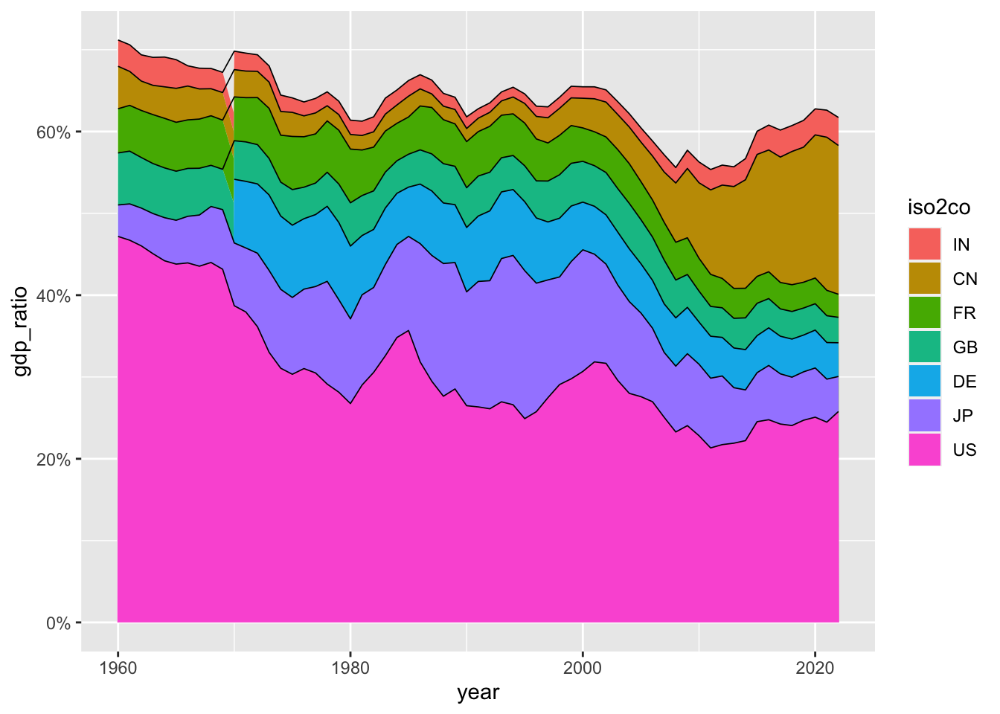
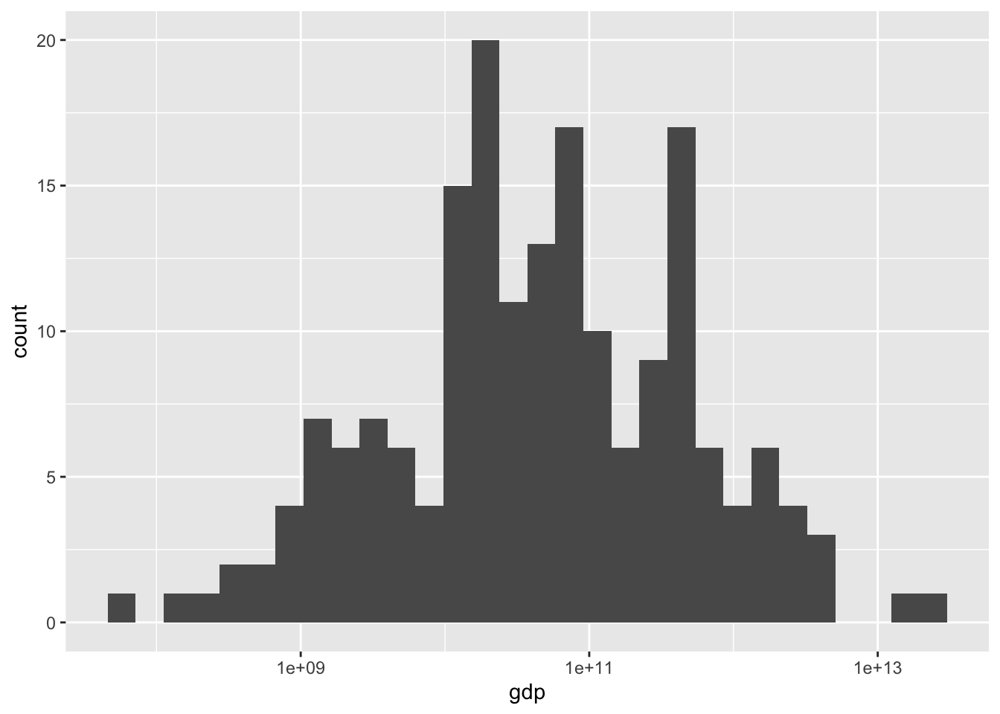

# 最初のデータ {#first-example}

データを分析するときには、大体次のような手順をとります。

1. 準備 Setup
2. データを取得 Import data
3. データ構造の確認 View data
4. 必要なら整形 Transform data
5. 視覚化 Visualize data
6. データを理解 Understand data

いろいろな視覚化を行い、そのデータからさまざまなことを理解する部分が中心だと思います。

## R のパッケージを活用

### 準備 Setup

まず、世界銀行（World Bank）の、世界開発指標（WDI: World Development Indicators）の一つの、GDP について、みてみましょう。GDP にも何種類かの尺度があるのですが、次のものを見てみます。

* NY.GDP.MKTP.CD: GDP (current US$)

NY.GDP.MKTP.CD は、データコードと言われるもので、世界開発指標（WDI）には、一つづつ決まっています。


WDI のデータを取得する R のツール（パッケージ）`WDI` がありますから、それを使います。また、データを取り扱うために基本的なツール（パッケージ）`tidyverse` を使います。これらの使い方などは、あとから、説明します。


```r
library(tidyverse)
#> ── Attaching core tidyverse packages ──── tidyverse 2.0.0 ──
#> ✔ dplyr     1.1.2     ✔ readr     2.1.4
#> ✔ forcats   1.0.0     ✔ stringr   1.5.0
#> ✔ ggplot2   3.4.2     ✔ tibble    3.2.1
#> ✔ lubridate 1.9.2     ✔ tidyr     1.3.0
#> ✔ purrr     1.0.1     
#> ── Conflicts ────────────────────── tidyverse_conflicts() ──
#> ✖ dplyr::filter() masks stats::filter()
#> ✖ dplyr::lag()    masks stats::lag()
#> ℹ Use the conflicted package (<http://conflicted.r-lib.org/>) to force all conflicts to become errors
library(WDI)
```

### データ取得 Import data

いよいよ、データを取得します。それを、`df_gdp` と名前をつけます。


```r
df_gdp <- WDI(country = "all", 
              indicator = c(gdp = "NY.GDP.MKTP.CD"), 
              extra = TRUE)
```


### データ構造の確認


```r
df_gdp
#> # A tibble: 16,492 × 13
#>    country     iso2c iso3c  year      gdp status lastupdated
#>    <chr>       <chr> <chr> <dbl>    <dbl> <lgl>  <date>     
#>  1 Afghanistan AF    AFG    2015  2.00e10 NA     2022-12-22 
#>  2 Afghanistan AF    AFG    2011  1.82e10 NA     2022-12-22 
#>  3 Afghanistan AF    AFG    2014  2.06e10 NA     2022-12-22 
#>  4 Afghanistan AF    AFG    2013  2.06e10 NA     2022-12-22 
#>  5 Afghanistan AF    AFG    2012  2.02e10 NA     2022-12-22 
#>  6 Afghanistan AF    AFG    2007  9.72e 9 NA     2022-12-22 
#>  7 Afghanistan AF    AFG    2010  1.56e10 NA     2022-12-22 
#>  8 Afghanistan AF    AFG    2009  1.22e10 NA     2022-12-22 
#>  9 Afghanistan AF    AFG    2008  1.02e10 NA     2022-12-22 
#> 10 Afghanistan AF    AFG    2003  4.54e 9 NA     2022-12-22 
#> # ℹ 16,482 more rows
#> # ℹ 6 more variables: region <chr>, capital <chr>,
#> #   longitude <dbl>, latitude <dbl>, income <chr>,
#> #   lending <chr>
```


```r
df_gdp %>% glimpse()
#> Rows: 16,492
#> Columns: 13
#> $ country     <chr> "Afghanistan", "Afghanistan", "Afghani…
#> $ iso2c       <chr> "AF", "AF", "AF", "AF", "AF", "AF", "A…
#> $ iso3c       <chr> "AFG", "AFG", "AFG", "AFG", "AFG", "AF…
#> $ year        <dbl> 2015, 2011, 2014, 2013, 2012, 2007, 20…
#> $ gdp         <dbl> 19998156214, 18190410821, 20550582747,…
#> $ status      <lgl> NA, NA, NA, NA, NA, NA, NA, NA, NA, NA…
#> $ lastupdated <date> 2022-12-22, 2022-12-22, 2022-12-22, 2…
#> $ region      <chr> "South Asia", "South Asia", "South Asi…
#> $ capital     <chr> "Kabul", "Kabul", "Kabul", "Kabul", "K…
#> $ longitude   <dbl> 69.1761, 69.1761, 69.1761, 69.1761, 69…
#> $ latitude    <dbl> 34.5228, 34.5228, 34.5228, 34.5228, 34…
#> $ income      <chr> "Low income", "Low income", "Low incom…
#> $ lending     <chr> "IDA", "IDA", "IDA", "IDA", "IDA", "ID…
```

概要 (`summary(df_gdp)`) からもある程度わかります。


```r
df_gdp %>% summary()
#>    country             iso2c              iso3c          
#>  Length:16492       Length:16492       Length:16492      
#>  Class :character   Class :character   Class :character  
#>  Mode  :character   Mode  :character   Mode  :character  
#>                                                          
#>                                                          
#>                                                          
#>                                                          
#>       year           gdp             status       
#>  Min.   :1960   Min.   :8.824e+06   Mode:logical  
#>  1st Qu.:1975   1st Qu.:2.441e+09   NA's:16492    
#>  Median :1990   Median :1.784e+10                 
#>  Mean   :1990   Mean   :1.162e+12                 
#>  3rd Qu.:2006   3rd Qu.:2.158e+11                 
#>  Max.   :2021   Max.   :9.651e+13                 
#>                 NA's   :3343                      
#>   lastupdated            region            capital         
#>  Min.   :2022-12-22   Length:16492       Length:16492      
#>  1st Qu.:2022-12-22   Class :character   Class :character  
#>  Median :2022-12-22   Mode  :character   Mode  :character  
#>  Mean   :2022-12-22                                        
#>  3rd Qu.:2022-12-22                                        
#>  Max.   :2022-12-22                                        
#>                                                            
#>    longitude          latitude          income         
#>  Min.   :-175.22   Min.   :-41.286   Length:16492      
#>  1st Qu.: -15.18   1st Qu.:  4.174   Class :character  
#>  Median :  19.54   Median : 17.277   Mode  :character  
#>  Mean   :  19.16   Mean   : 18.740                     
#>  3rd Qu.:  50.53   3rd Qu.: 39.715                     
#>  Max.   : 179.09   Max.   : 64.184                     
#>  NA's   :3472      NA's   :3472                        
#>    lending         
#>  Length:16492      
#>  Class :character  
#>  Mode  :character  
#>                    
#>                    
#>                    
#> 
```

国のリストをみてみましょう。


```r
df_gdp %>% distinct(country) %>% pull()
#>   [1] "Afghanistan"                                         
#>   [2] "Africa Eastern and Southern"                         
#>   [3] "Africa Western and Central"                          
#>   [4] "Albania"                                             
#>   [5] "Algeria"                                             
#>   [6] "American Samoa"                                      
#>   [7] "Andorra"                                             
#>   [8] "Angola"                                              
#>   [9] "Antigua and Barbuda"                                 
#>  [10] "Arab World"                                          
#>  [11] "Argentina"                                           
#>  [12] "Armenia"                                             
#>  [13] "Aruba"                                               
#>  [14] "Australia"                                           
#>  [15] "Austria"                                             
#>  [16] "Azerbaijan"                                          
#>  [17] "Bahamas, The"                                        
#>  [18] "Bahrain"                                             
#>  [19] "Bangladesh"                                          
#>  [20] "Barbados"                                            
#>  [21] "Belarus"                                             
#>  [22] "Belgium"                                             
#>  [23] "Belize"                                              
#>  [24] "Benin"                                               
#>  [25] "Bermuda"                                             
#>  [26] "Bhutan"                                              
#>  [27] "Bolivia"                                             
#>  [28] "Bosnia and Herzegovina"                              
#>  [29] "Botswana"                                            
#>  [30] "Brazil"                                              
#>  [31] "British Virgin Islands"                              
#>  [32] "Brunei Darussalam"                                   
#>  [33] "Bulgaria"                                            
#>  [34] "Burkina Faso"                                        
#>  [35] "Burundi"                                             
#>  [36] "Cabo Verde"                                          
#>  [37] "Cambodia"                                            
#>  [38] "Cameroon"                                            
#>  [39] "Canada"                                              
#>  [40] "Caribbean small states"                              
#>  [41] "Cayman Islands"                                      
#>  [42] "Central African Republic"                            
#>  [43] "Central Europe and the Baltics"                      
#>  [44] "Chad"                                                
#>  [45] "Channel Islands"                                     
#>  [46] "Chile"                                               
#>  [47] "China"                                               
#>  [48] "Colombia"                                            
#>  [49] "Comoros"                                             
#>  [50] "Congo, Dem. Rep."                                    
#>  [51] "Congo, Rep."                                         
#>  [52] "Costa Rica"                                          
#>  [53] "Cote d'Ivoire"                                       
#>  [54] "Croatia"                                             
#>  [55] "Cuba"                                                
#>  [56] "Curacao"                                             
#>  [57] "Cyprus"                                              
#>  [58] "Czechia"                                             
#>  [59] "Denmark"                                             
#>  [60] "Djibouti"                                            
#>  [61] "Dominica"                                            
#>  [62] "Dominican Republic"                                  
#>  [63] "Early-demographic dividend"                          
#>  [64] "East Asia & Pacific"                                 
#>  [65] "East Asia & Pacific (excluding high income)"         
#>  [66] "East Asia & Pacific (IDA & IBRD countries)"          
#>  [67] "Ecuador"                                             
#>  [68] "Egypt, Arab Rep."                                    
#>  [69] "El Salvador"                                         
#>  [70] "Equatorial Guinea"                                   
#>  [71] "Eritrea"                                             
#>  [72] "Estonia"                                             
#>  [73] "Eswatini"                                            
#>  [74] "Ethiopia"                                            
#>  [75] "Euro area"                                           
#>  [76] "Europe & Central Asia"                               
#>  [77] "Europe & Central Asia (excluding high income)"       
#>  [78] "Europe & Central Asia (IDA & IBRD countries)"        
#>  [79] "European Union"                                      
#>  [80] "Faroe Islands"                                       
#>  [81] "Fiji"                                                
#>  [82] "Finland"                                             
#>  [83] "Fragile and conflict affected situations"            
#>  [84] "France"                                              
#>  [85] "French Polynesia"                                    
#>  [86] "Gabon"                                               
#>  [87] "Gambia, The"                                         
#>  [88] "Georgia"                                             
#>  [89] "Germany"                                             
#>  [90] "Ghana"                                               
#>  [91] "Gibraltar"                                           
#>  [92] "Greece"                                              
#>  [93] "Greenland"                                           
#>  [94] "Grenada"                                             
#>  [95] "Guam"                                                
#>  [96] "Guatemala"                                           
#>  [97] "Guinea"                                              
#>  [98] "Guinea-Bissau"                                       
#>  [99] "Guyana"                                              
#> [100] "Haiti"                                               
#> [101] "Heavily indebted poor countries (HIPC)"              
#> [102] "High income"                                         
#> [103] "Honduras"                                            
#> [104] "Hong Kong SAR, China"                                
#> [105] "Hungary"                                             
#> [106] "IBRD only"                                           
#> [107] "Iceland"                                             
#> [108] "IDA & IBRD total"                                    
#> [109] "IDA blend"                                           
#> [110] "IDA only"                                            
#> [111] "IDA total"                                           
#> [112] "India"                                               
#> [113] "Indonesia"                                           
#> [114] "Iran, Islamic Rep."                                  
#> [115] "Iraq"                                                
#> [116] "Ireland"                                             
#> [117] "Isle of Man"                                         
#> [118] "Israel"                                              
#> [119] "Italy"                                               
#> [120] "Jamaica"                                             
#> [121] "Japan"                                               
#> [122] "Jordan"                                              
#> [123] "Kazakhstan"                                          
#> [124] "Kenya"                                               
#> [125] "Kiribati"                                            
#> [126] "Korea, Dem. People's Rep."                           
#> [127] "Korea, Rep."                                         
#> [128] "Kosovo"                                              
#> [129] "Kuwait"                                              
#> [130] "Kyrgyz Republic"                                     
#> [131] "Lao PDR"                                             
#> [132] "Late-demographic dividend"                           
#> [133] "Latin America & Caribbean"                           
#> [134] "Latin America & Caribbean (excluding high income)"   
#> [135] "Latin America & the Caribbean (IDA & IBRD countries)"
#> [136] "Latvia"                                              
#> [137] "Least developed countries: UN classification"        
#> [138] "Lebanon"                                             
#> [139] "Lesotho"                                             
#> [140] "Liberia"                                             
#> [141] "Libya"                                               
#> [142] "Liechtenstein"                                       
#> [143] "Lithuania"                                           
#> [144] "Low & middle income"                                 
#> [145] "Low income"                                          
#> [146] "Lower middle income"                                 
#> [147] "Luxembourg"                                          
#> [148] "Macao SAR, China"                                    
#> [149] "Madagascar"                                          
#> [150] "Malawi"                                              
#> [151] "Malaysia"                                            
#> [152] "Maldives"                                            
#> [153] "Mali"                                                
#> [154] "Malta"                                               
#> [155] "Marshall Islands"                                    
#> [156] "Mauritania"                                          
#> [157] "Mauritius"                                           
#> [158] "Mexico"                                              
#> [159] "Micronesia, Fed. Sts."                               
#> [160] "Middle East & North Africa"                          
#> [161] "Middle East & North Africa (excluding high income)"  
#> [162] "Middle East & North Africa (IDA & IBRD countries)"   
#> [163] "Middle income"                                       
#> [164] "Moldova"                                             
#> [165] "Monaco"                                              
#> [166] "Mongolia"                                            
#> [167] "Montenegro"                                          
#> [168] "Morocco"                                             
#> [169] "Mozambique"                                          
#> [170] "Myanmar"                                             
#> [171] "Namibia"                                             
#> [172] "Nauru"                                               
#> [173] "Nepal"                                               
#> [174] "Netherlands"                                         
#> [175] "New Caledonia"                                       
#> [176] "New Zealand"                                         
#> [177] "Nicaragua"                                           
#> [178] "Niger"                                               
#> [179] "Nigeria"                                             
#> [180] "North America"                                       
#> [181] "North Macedonia"                                     
#> [182] "Northern Mariana Islands"                            
#> [183] "Norway"                                              
#> [184] "Not classified"                                      
#> [185] "OECD members"                                        
#> [186] "Oman"                                                
#> [187] "Other small states"                                  
#> [188] "Pacific island small states"                         
#> [189] "Pakistan"                                            
#> [190] "Palau"                                               
#> [191] "Panama"                                              
#> [192] "Papua New Guinea"                                    
#> [193] "Paraguay"                                            
#> [194] "Peru"                                                
#> [195] "Philippines"                                         
#> [196] "Poland"                                              
#> [197] "Portugal"                                            
#> [198] "Post-demographic dividend"                           
#> [199] "Pre-demographic dividend"                            
#> [200] "Puerto Rico"                                         
#> [201] "Qatar"                                               
#> [202] "Romania"                                             
#> [203] "Russian Federation"                                  
#> [204] "Rwanda"                                              
#> [205] "Samoa"                                               
#> [206] "San Marino"                                          
#> [207] "Sao Tome and Principe"                               
#> [208] "Saudi Arabia"                                        
#> [209] "Senegal"                                             
#> [210] "Serbia"                                              
#> [211] "Seychelles"                                          
#> [212] "Sierra Leone"                                        
#> [213] "Singapore"                                           
#> [214] "Sint Maarten (Dutch part)"                           
#> [215] "Slovak Republic"                                     
#> [216] "Slovenia"                                            
#> [217] "Small states"                                        
#> [218] "Solomon Islands"                                     
#> [219] "Somalia"                                             
#> [220] "South Africa"                                        
#> [221] "South Asia"                                          
#> [222] "South Asia (IDA & IBRD)"                             
#> [223] "South Sudan"                                         
#> [224] "Spain"                                               
#> [225] "Sri Lanka"                                           
#> [226] "St. Kitts and Nevis"                                 
#> [227] "St. Lucia"                                           
#> [228] "St. Martin (French part)"                            
#> [229] "St. Vincent and the Grenadines"                      
#> [230] "Sub-Saharan Africa"                                  
#> [231] "Sub-Saharan Africa (excluding high income)"          
#> [232] "Sub-Saharan Africa (IDA & IBRD countries)"           
#> [233] "Sudan"                                               
#> [234] "Suriname"                                            
#> [235] "Sweden"                                              
#> [236] "Switzerland"                                         
#> [237] "Syrian Arab Republic"                                
#> [238] "Tajikistan"                                          
#> [239] "Tanzania"                                            
#> [240] "Thailand"                                            
#> [241] "Timor-Leste"                                         
#> [242] "Togo"                                                
#> [243] "Tonga"                                               
#> [244] "Trinidad and Tobago"                                 
#> [245] "Tunisia"                                             
#> [246] "Turkiye"                                             
#> [247] "Turkmenistan"                                        
#> [248] "Turks and Caicos Islands"                            
#> [249] "Tuvalu"                                              
#> [250] "Uganda"                                              
#> [251] "Ukraine"                                             
#> [252] "United Arab Emirates"                                
#> [253] "United Kingdom"                                      
#> [254] "United States"                                       
#> [255] "Upper middle income"                                 
#> [256] "Uruguay"                                             
#> [257] "Uzbekistan"                                          
#> [258] "Vanuatu"                                             
#> [259] "Venezuela, RB"                                       
#> [260] "Vietnam"                                             
#> [261] "Virgin Islands (U.S.)"                               
#> [262] "West Bank and Gaza"                                  
#> [263] "World"                                               
#> [264] "Yemen, Rep."                                         
#> [265] "Zambia"                                              
#> [266] "Zimbabwe"
```

### 必要なら整形 Transform data

変数が多いので、日本の部分だけみてみます。


```r
df_gdp %>% filter(country == "Japan")
#> # A tibble: 62 × 13
#>    country iso2c iso3c  year     gdp status lastupdated
#>    <chr>   <chr> <chr> <dbl>   <dbl> <lgl>  <date>     
#>  1 Japan   JP    JPN    2021 4.94e12 NA     2022-12-22 
#>  2 Japan   JP    JPN    2020 5.04e12 NA     2022-12-22 
#>  3 Japan   JP    JPN    2019 5.12e12 NA     2022-12-22 
#>  4 Japan   JP    JPN    2018 5.04e12 NA     2022-12-22 
#>  5 Japan   JP    JPN    2017 4.93e12 NA     2022-12-22 
#>  6 Japan   JP    JPN    2016 5.00e12 NA     2022-12-22 
#>  7 Japan   JP    JPN    2015 4.44e12 NA     2022-12-22 
#>  8 Japan   JP    JPN    2014 4.90e12 NA     2022-12-22 
#>  9 Japan   JP    JPN    2013 5.21e12 NA     2022-12-22 
#> 10 Japan   JP    JPN    2012 6.27e12 NA     2022-12-22 
#> # ℹ 52 more rows
#> # ℹ 6 more variables: region <chr>, capital <chr>,
#> #   longitude <dbl>, latitude <dbl>, income <chr>,
#> #   lending <chr>
```

たとえば、gdp のところに、4.940878e+12	とあるのは、Scientific notation と言われるもので、
$$4.940878 \time 10^{12} = 4,940,887,800,000$$
を意味します。最初に current US$ と、書いてあるように、現在の USD に換算した数値です。


### 視覚化 data visualization

日本のGDP の経年変化を折線グラフ（line graph）でみてみましょう。


```r
df_gdp %>% filter(country == "Japan") %>%
  ggplot(aes(x = year, y = gdp)) + geom_line()
```


### データを理解 Understand data

視覚化によって見えてくることがいくつもありますね。どんなことがわかりますか。気づいたことをあげてみましょう。

### さらなる分析


```r
df_gdp %>% drop_na(gdp) %>% ggplot(aes(x = year)) + geom_bar()
```


最新の2021年のデータはすべてあるわけではなさそうですが、大きい順に並べてみましょう。


```r
df_gdp %>% filter(year == 2021) %>% drop_na(gdp) %>% arrange(desc(gdp))
#> # A tibble: 245 × 13
#>    country      iso2c iso3c  year     gdp status lastupdated
#>    <chr>        <chr> <chr> <dbl>   <dbl> <lgl>  <date>     
#>  1 World        1W    WLD    2021 9.65e13 NA     2022-12-22 
#>  2 High income  XD    <NA>   2021 5.98e13 NA     2022-12-22 
#>  3 OECD members OE    OED    2021 5.83e13 NA     2022-12-22 
#>  4 Post-demogr… V4    PST    2021 5.50e13 NA     2022-12-22 
#>  5 IDA & IBRD … ZT    IBT    2021 3.80e13 NA     2022-12-22 
#>  6 Low & middl… XO    LMY    2021 3.64e13 NA     2022-12-22 
#>  7 Middle inco… XP    MIC    2021 3.58e13 NA     2022-12-22 
#>  8 IBRD only    XF    IBD    2021 3.55e13 NA     2022-12-22 
#>  9 East Asia &… Z4    EAS    2021 3.09e13 NA     2022-12-22 
#> 10 Upper middl… XT    <NA>   2021 2.71e13 NA     2022-12-22 
#> # ℹ 235 more rows
#> # ℹ 6 more variables: region <chr>, capital <chr>,
#> #   longitude <dbl>, latitude <dbl>, income <chr>,
#> #   lending <chr>
```

国以外のグループでも数値があるようですから、国だけを選んでみます。それには、region のところの Aggregates 以外を選択します。


```r
df_gdp %>% filter(year == 2021, region != "Aggregates") %>% 
  drop_na(gdp) %>% arrange(desc(gdp))
#> # A tibble: 196 × 13
#>    country      iso2c iso3c  year     gdp status lastupdated
#>    <chr>        <chr> <chr> <dbl>   <dbl> <lgl>  <date>     
#>  1 United Stat… US    USA    2021 2.33e13 NA     2022-12-22 
#>  2 China        CN    CHN    2021 1.77e13 NA     2022-12-22 
#>  3 Japan        JP    JPN    2021 4.94e12 NA     2022-12-22 
#>  4 Germany      DE    DEU    2021 4.26e12 NA     2022-12-22 
#>  5 India        IN    IND    2021 3.18e12 NA     2022-12-22 
#>  6 United King… GB    GBR    2021 3.13e12 NA     2022-12-22 
#>  7 France       FR    FRA    2021 2.96e12 NA     2022-12-22 
#>  8 Italy        IT    ITA    2021 2.11e12 NA     2022-12-22 
#>  9 Canada       CA    CAN    2021 1.99e12 NA     2022-12-22 
#> 10 Korea, Rep.  KR    KOR    2021 1.81e12 NA     2022-12-22 
#> # ℹ 186 more rows
#> # ℹ 6 more variables: region <chr>, capital <chr>,
#> #   longitude <dbl>, latitude <dbl>, income <chr>,
#> #   lending <chr>
```

グラフではありませんが、これも一つの視覚化とも考えられないことはありません。

上位7カ国のGDP の推移を書いてみましょう。


```r
df_gdp %>% filter(iso2c %in% c("US", "CN", "JP", "DE", "IN", "GB", "FR")) %>%
  ggplot(aes(x = year, y = gdp, col = iso2c)) + geom_line()
#> Warning: Removed 10 rows containing missing values
#> (`geom_line()`).
```


ここからも幾つかのことがわかるかと思います。気づいたことを書いてみましょう。


```r
df_gdp %>% 
  filter(region != "Aggregates") %>% 
  drop_na(gdp) %>% 
  group_by(year) %>% 
  mutate(gdp_ratio = gdp/sum(gdp)) %>%
  ungroup() %>%
  filter(iso2c %in% c("US", "CN", "JP", "DE", "IN", "GB", "FR"))  %>%
  ggplot(aes(x = year, y = gdp_ratio, fill = iso2c)) + geom_area() + geom_line(col = "black", position = "stack", linewidth = 0.3) + 
  scale_y_continuous(labels = scales::percent_format(accuracy = 1))
```


これは、上から、iso2c の アルファベットの順番になっていますが、少し変更すると下のようになります。


```r
df_gdp %>% 
  filter(region != "Aggregates") %>% 
  drop_na(gdp) %>% 
  group_by(year) %>% 
  mutate(gdp_ratio = gdp/sum(gdp)) %>%
  ungroup() %>%
  filter(iso2c %in% c("US", "CN", "JP", "DE", "IN", "GB", "FR"))  %>%
  mutate(iso2co = factor(iso2c, levels = c("IN", "CN", "FR", "GB", "DE", "JP", "US"))) %>%
  ggplot(aes(x = year, y = gdp_ratio, fill = iso2co)) + geom_area() + geom_line(col = "black", position = "stack", linewidth = 0.3) + 
  scale_y_continuous(labels = scales::percent_format(accuracy = 1))
```


これらは、世界全体の GPT における割合です。主要国で、60%〜70% を占めていることがわかりますが、それぞれの国や、幾つかの国の影響力でしょうかも、ある程度みることができるように見えます。

いろいろなことが見えてくるように思います。

GDP が大きな国と、小さな国があるのはわかりますが、それは、どのように分布しているのでしょうか。


```r
df_gdp %>% drop_na(gdp) %>% 
  filter(year == 2021) %>%
  ggplot(aes(gdp)) + geom_histogram()
#> `stat_bin()` using `bins = 30`. Pick better value with
#> `binwidth`.
```


小さいところに集中していることがわかりますが、対数軸をとってみます。


```r
df_gdp %>% drop_na(gdp) %>% 
  filter(year == 2021) %>%
  ggplot(aes(gdp)) + geom_histogram() + scale_x_log10()
#> `stat_bin()` using `bins = 30`. Pick better value with
#> `binwidth`.
```


これは、2021年のデータですが、変化を見ることもできるでしょうか。


```r
df_gdp %>% drop_na(gdp) %>% 
  filter(year %in% c(1961, 1971, 1981, 1991, 2001, 2011, 2021)) %>%
  ggplot(aes(gdp, fill = factor(year))) + geom_density(alpha = 0.4) + scale_x_log10()
```


```r
df_gdp %>% drop_na(gdp) %>% 
  filter(year %in% c(1971, 1981, 1991, 2001, 2011, 2021)) %>%
  ggplot(aes(gdp, fill = factor(year))) + 
  geom_density() + scale_x_log10() + facet_wrap(~year)
```



いくつかのグループごとに分布をみてみることも可能です。それには、Boxplot が有効です。


```r
df_gdp %>% drop_na(gdp) %>% 
  filter(region != "Aggregates") %>%
  drop_na(region) %>%
  filter(year %in% c(2021)) %>%
  ggplot(aes(gdp, region, fill = region)) + 
  geom_boxplot() + scale_x_log10() + labs(y = "") + 
  theme(legend.position = "none")
```


```r
df_gdp %>% drop_na(gdp) %>% 
  filter(region != "Aggregates") %>%
  drop_na(income) %>%
  filter(year %in% c(2021)) %>%
  mutate(level = factor(income, c("High income", "Upper middle income", "Lower middle income", "Low income"))) %>%
  ggplot(aes(gdp, level, fill = income)) + 
  geom_boxplot() + scale_x_log10() + labs(y = "") + 
  theme(legend.position = "none")
```



これからも、いろいろなことがわかりますね。

地図で、国の income level をみてみましょう。


```r
library(maps)
#> 
#> Attaching package: 'maps'
#> The following object is masked from 'package:purrr':
#> 
#>     map
map_world <- map_data('world')
map_gdp <- map_world %>% 
  mutate(iso2c = iso.alpha(region, n=2)) %>% 
  mutate(map_region = region) %>% select(-region) %>% 
  left_join(df_gdp, by = "iso2c") 
#> Warning in left_join(., df_gdp, by = "iso2c"): Detected an unexpected many-to-many relationship between
#> `x` and `y`.
#> ℹ Row 1 of `x` matches multiple rows in `y`.
#> ℹ Row 745 of `y` matches multiple rows in `x`.
#> ℹ If a many-to-many relationship is expected, set
#>   `relationship = "many-to-many"` to silence this warning.
map_gdp
#>           long      lat group order subregion iso2c
#> 1    -69.89912 12.45200     1     1      <NA>    AW
#> 2    -69.89912 12.45200     1     1      <NA>    AW
#> 3    -69.89912 12.45200     1     1      <NA>    AW
#> 4    -69.89912 12.45200     1     1      <NA>    AW
#> 5    -69.89912 12.45200     1     1      <NA>    AW
#> 6    -69.89912 12.45200     1     1      <NA>    AW
#> 7    -69.89912 12.45200     1     1      <NA>    AW
#> 8    -69.89912 12.45200     1     1      <NA>    AW
#> 9    -69.89912 12.45200     1     1      <NA>    AW
#> 10   -69.89912 12.45200     1     1      <NA>    AW
#> 11   -69.89912 12.45200     1     1      <NA>    AW
#> 12   -69.89912 12.45200     1     1      <NA>    AW
#> 13   -69.89912 12.45200     1     1      <NA>    AW
#> 14   -69.89912 12.45200     1     1      <NA>    AW
#> 15   -69.89912 12.45200     1     1      <NA>    AW
#> 16   -69.89912 12.45200     1     1      <NA>    AW
#> 17   -69.89912 12.45200     1     1      <NA>    AW
#> 18   -69.89912 12.45200     1     1      <NA>    AW
#> 19   -69.89912 12.45200     1     1      <NA>    AW
#> 20   -69.89912 12.45200     1     1      <NA>    AW
#> 21   -69.89912 12.45200     1     1      <NA>    AW
#> 22   -69.89912 12.45200     1     1      <NA>    AW
#> 23   -69.89912 12.45200     1     1      <NA>    AW
#> 24   -69.89912 12.45200     1     1      <NA>    AW
#> 25   -69.89912 12.45200     1     1      <NA>    AW
#> 26   -69.89912 12.45200     1     1      <NA>    AW
#> 27   -69.89912 12.45200     1     1      <NA>    AW
#> 28   -69.89912 12.45200     1     1      <NA>    AW
#> 29   -69.89912 12.45200     1     1      <NA>    AW
#> 30   -69.89912 12.45200     1     1      <NA>    AW
#> 31   -69.89912 12.45200     1     1      <NA>    AW
#> 32   -69.89912 12.45200     1     1      <NA>    AW
#> 33   -69.89912 12.45200     1     1      <NA>    AW
#> 34   -69.89912 12.45200     1     1      <NA>    AW
#> 35   -69.89912 12.45200     1     1      <NA>    AW
#> 36   -69.89912 12.45200     1     1      <NA>    AW
#> 37   -69.89912 12.45200     1     1      <NA>    AW
#> 38   -69.89912 12.45200     1     1      <NA>    AW
#> 39   -69.89912 12.45200     1     1      <NA>    AW
#> 40   -69.89912 12.45200     1     1      <NA>    AW
#> 41   -69.89912 12.45200     1     1      <NA>    AW
#> 42   -69.89912 12.45200     1     1      <NA>    AW
#> 43   -69.89912 12.45200     1     1      <NA>    AW
#> 44   -69.89912 12.45200     1     1      <NA>    AW
#> 45   -69.89912 12.45200     1     1      <NA>    AW
#> 46   -69.89912 12.45200     1     1      <NA>    AW
#> 47   -69.89912 12.45200     1     1      <NA>    AW
#> 48   -69.89912 12.45200     1     1      <NA>    AW
#> 49   -69.89912 12.45200     1     1      <NA>    AW
#> 50   -69.89912 12.45200     1     1      <NA>    AW
#> 51   -69.89912 12.45200     1     1      <NA>    AW
#> 52   -69.89912 12.45200     1     1      <NA>    AW
#> 53   -69.89912 12.45200     1     1      <NA>    AW
#> 54   -69.89912 12.45200     1     1      <NA>    AW
#> 55   -69.89912 12.45200     1     1      <NA>    AW
#> 56   -69.89912 12.45200     1     1      <NA>    AW
#> 57   -69.89912 12.45200     1     1      <NA>    AW
#> 58   -69.89912 12.45200     1     1      <NA>    AW
#> 59   -69.89912 12.45200     1     1      <NA>    AW
#> 60   -69.89912 12.45200     1     1      <NA>    AW
#> 61   -69.89912 12.45200     1     1      <NA>    AW
#> 62   -69.89912 12.45200     1     1      <NA>    AW
#> 63   -69.89571 12.42300     1     2      <NA>    AW
#> 64   -69.89571 12.42300     1     2      <NA>    AW
#> 65   -69.89571 12.42300     1     2      <NA>    AW
#> 66   -69.89571 12.42300     1     2      <NA>    AW
#> 67   -69.89571 12.42300     1     2      <NA>    AW
#> 68   -69.89571 12.42300     1     2      <NA>    AW
#> 69   -69.89571 12.42300     1     2      <NA>    AW
#> 70   -69.89571 12.42300     1     2      <NA>    AW
#> 71   -69.89571 12.42300     1     2      <NA>    AW
#> 72   -69.89571 12.42300     1     2      <NA>    AW
#> 73   -69.89571 12.42300     1     2      <NA>    AW
#> 74   -69.89571 12.42300     1     2      <NA>    AW
#> 75   -69.89571 12.42300     1     2      <NA>    AW
#> 76   -69.89571 12.42300     1     2      <NA>    AW
#> 77   -69.89571 12.42300     1     2      <NA>    AW
#> 78   -69.89571 12.42300     1     2      <NA>    AW
#> 79   -69.89571 12.42300     1     2      <NA>    AW
#> 80   -69.89571 12.42300     1     2      <NA>    AW
#> 81   -69.89571 12.42300     1     2      <NA>    AW
#> 82   -69.89571 12.42300     1     2      <NA>    AW
#> 83   -69.89571 12.42300     1     2      <NA>    AW
#> 84   -69.89571 12.42300     1     2      <NA>    AW
#> 85   -69.89571 12.42300     1     2      <NA>    AW
#> 86   -69.89571 12.42300     1     2      <NA>    AW
#> 87   -69.89571 12.42300     1     2      <NA>    AW
#> 88   -69.89571 12.42300     1     2      <NA>    AW
#> 89   -69.89571 12.42300     1     2      <NA>    AW
#> 90   -69.89571 12.42300     1     2      <NA>    AW
#> 91   -69.89571 12.42300     1     2      <NA>    AW
#> 92   -69.89571 12.42300     1     2      <NA>    AW
#> 93   -69.89571 12.42300     1     2      <NA>    AW
#> 94   -69.89571 12.42300     1     2      <NA>    AW
#> 95   -69.89571 12.42300     1     2      <NA>    AW
#> 96   -69.89571 12.42300     1     2      <NA>    AW
#> 97   -69.89571 12.42300     1     2      <NA>    AW
#> 98   -69.89571 12.42300     1     2      <NA>    AW
#> 99   -69.89571 12.42300     1     2      <NA>    AW
#> 100  -69.89571 12.42300     1     2      <NA>    AW
#> 101  -69.89571 12.42300     1     2      <NA>    AW
#> 102  -69.89571 12.42300     1     2      <NA>    AW
#> 103  -69.89571 12.42300     1     2      <NA>    AW
#> 104  -69.89571 12.42300     1     2      <NA>    AW
#> 105  -69.89571 12.42300     1     2      <NA>    AW
#> 106  -69.89571 12.42300     1     2      <NA>    AW
#> 107  -69.89571 12.42300     1     2      <NA>    AW
#> 108  -69.89571 12.42300     1     2      <NA>    AW
#> 109  -69.89571 12.42300     1     2      <NA>    AW
#> 110  -69.89571 12.42300     1     2      <NA>    AW
#> 111  -69.89571 12.42300     1     2      <NA>    AW
#> 112  -69.89571 12.42300     1     2      <NA>    AW
#> 113  -69.89571 12.42300     1     2      <NA>    AW
#> 114  -69.89571 12.42300     1     2      <NA>    AW
#> 115  -69.89571 12.42300     1     2      <NA>    AW
#> 116  -69.89571 12.42300     1     2      <NA>    AW
#> 117  -69.89571 12.42300     1     2      <NA>    AW
#> 118  -69.89571 12.42300     1     2      <NA>    AW
#> 119  -69.89571 12.42300     1     2      <NA>    AW
#> 120  -69.89571 12.42300     1     2      <NA>    AW
#> 121  -69.89571 12.42300     1     2      <NA>    AW
#> 122  -69.89571 12.42300     1     2      <NA>    AW
#> 123  -69.89571 12.42300     1     2      <NA>    AW
#> 124  -69.89571 12.42300     1     2      <NA>    AW
#> 125  -69.94219 12.43853     1     3      <NA>    AW
#> 126  -69.94219 12.43853     1     3      <NA>    AW
#> 127  -69.94219 12.43853     1     3      <NA>    AW
#> 128  -69.94219 12.43853     1     3      <NA>    AW
#> 129  -69.94219 12.43853     1     3      <NA>    AW
#> 130  -69.94219 12.43853     1     3      <NA>    AW
#> 131  -69.94219 12.43853     1     3      <NA>    AW
#> 132  -69.94219 12.43853     1     3      <NA>    AW
#> 133  -69.94219 12.43853     1     3      <NA>    AW
#> 134  -69.94219 12.43853     1     3      <NA>    AW
#> 135  -69.94219 12.43853     1     3      <NA>    AW
#> 136  -69.94219 12.43853     1     3      <NA>    AW
#> 137  -69.94219 12.43853     1     3      <NA>    AW
#> 138  -69.94219 12.43853     1     3      <NA>    AW
#> 139  -69.94219 12.43853     1     3      <NA>    AW
#> 140  -69.94219 12.43853     1     3      <NA>    AW
#> 141  -69.94219 12.43853     1     3      <NA>    AW
#> 142  -69.94219 12.43853     1     3      <NA>    AW
#> 143  -69.94219 12.43853     1     3      <NA>    AW
#> 144  -69.94219 12.43853     1     3      <NA>    AW
#> 145  -69.94219 12.43853     1     3      <NA>    AW
#> 146  -69.94219 12.43853     1     3      <NA>    AW
#> 147  -69.94219 12.43853     1     3      <NA>    AW
#> 148  -69.94219 12.43853     1     3      <NA>    AW
#> 149  -69.94219 12.43853     1     3      <NA>    AW
#> 150  -69.94219 12.43853     1     3      <NA>    AW
#> 151  -69.94219 12.43853     1     3      <NA>    AW
#> 152  -69.94219 12.43853     1     3      <NA>    AW
#> 153  -69.94219 12.43853     1     3      <NA>    AW
#> 154  -69.94219 12.43853     1     3      <NA>    AW
#> 155  -69.94219 12.43853     1     3      <NA>    AW
#> 156  -69.94219 12.43853     1     3      <NA>    AW
#> 157  -69.94219 12.43853     1     3      <NA>    AW
#> 158  -69.94219 12.43853     1     3      <NA>    AW
#> 159  -69.94219 12.43853     1     3      <NA>    AW
#> 160  -69.94219 12.43853     1     3      <NA>    AW
#> 161  -69.94219 12.43853     1     3      <NA>    AW
#> 162  -69.94219 12.43853     1     3      <NA>    AW
#> 163  -69.94219 12.43853     1     3      <NA>    AW
#> 164  -69.94219 12.43853     1     3      <NA>    AW
#> 165  -69.94219 12.43853     1     3      <NA>    AW
#> 166  -69.94219 12.43853     1     3      <NA>    AW
#> 167  -69.94219 12.43853     1     3      <NA>    AW
#> 168  -69.94219 12.43853     1     3      <NA>    AW
#> 169  -69.94219 12.43853     1     3      <NA>    AW
#> 170  -69.94219 12.43853     1     3      <NA>    AW
#> 171  -69.94219 12.43853     1     3      <NA>    AW
#> 172  -69.94219 12.43853     1     3      <NA>    AW
#> 173  -69.94219 12.43853     1     3      <NA>    AW
#> 174  -69.94219 12.43853     1     3      <NA>    AW
#> 175  -69.94219 12.43853     1     3      <NA>    AW
#> 176  -69.94219 12.43853     1     3      <NA>    AW
#> 177  -69.94219 12.43853     1     3      <NA>    AW
#> 178  -69.94219 12.43853     1     3      <NA>    AW
#> 179  -69.94219 12.43853     1     3      <NA>    AW
#> 180  -69.94219 12.43853     1     3      <NA>    AW
#> 181  -69.94219 12.43853     1     3      <NA>    AW
#> 182  -69.94219 12.43853     1     3      <NA>    AW
#> 183  -69.94219 12.43853     1     3      <NA>    AW
#> 184  -69.94219 12.43853     1     3      <NA>    AW
#> 185  -69.94219 12.43853     1     3      <NA>    AW
#> 186  -69.94219 12.43853     1     3      <NA>    AW
#> 187  -70.00415 12.50049     1     4      <NA>    AW
#> 188  -70.00415 12.50049     1     4      <NA>    AW
#> 189  -70.00415 12.50049     1     4      <NA>    AW
#> 190  -70.00415 12.50049     1     4      <NA>    AW
#> 191  -70.00415 12.50049     1     4      <NA>    AW
#> 192  -70.00415 12.50049     1     4      <NA>    AW
#> 193  -70.00415 12.50049     1     4      <NA>    AW
#> 194  -70.00415 12.50049     1     4      <NA>    AW
#> 195  -70.00415 12.50049     1     4      <NA>    AW
#> 196  -70.00415 12.50049     1     4      <NA>    AW
#> 197  -70.00415 12.50049     1     4      <NA>    AW
#> 198  -70.00415 12.50049     1     4      <NA>    AW
#> 199  -70.00415 12.50049     1     4      <NA>    AW
#> 200  -70.00415 12.50049     1     4      <NA>    AW
#> 201  -70.00415 12.50049     1     4      <NA>    AW
#> 202  -70.00415 12.50049     1     4      <NA>    AW
#> 203  -70.00415 12.50049     1     4      <NA>    AW
#> 204  -70.00415 12.50049     1     4      <NA>    AW
#> 205  -70.00415 12.50049     1     4      <NA>    AW
#> 206  -70.00415 12.50049     1     4      <NA>    AW
#> 207  -70.00415 12.50049     1     4      <NA>    AW
#> 208  -70.00415 12.50049     1     4      <NA>    AW
#> 209  -70.00415 12.50049     1     4      <NA>    AW
#> 210  -70.00415 12.50049     1     4      <NA>    AW
#> 211  -70.00415 12.50049     1     4      <NA>    AW
#> 212  -70.00415 12.50049     1     4      <NA>    AW
#> 213  -70.00415 12.50049     1     4      <NA>    AW
#> 214  -70.00415 12.50049     1     4      <NA>    AW
#> 215  -70.00415 12.50049     1     4      <NA>    AW
#> 216  -70.00415 12.50049     1     4      <NA>    AW
#> 217  -70.00415 12.50049     1     4      <NA>    AW
#> 218  -70.00415 12.50049     1     4      <NA>    AW
#> 219  -70.00415 12.50049     1     4      <NA>    AW
#> 220  -70.00415 12.50049     1     4      <NA>    AW
#> 221  -70.00415 12.50049     1     4      <NA>    AW
#> 222  -70.00415 12.50049     1     4      <NA>    AW
#> 223  -70.00415 12.50049     1     4      <NA>    AW
#> 224  -70.00415 12.50049     1     4      <NA>    AW
#> 225  -70.00415 12.50049     1     4      <NA>    AW
#> 226  -70.00415 12.50049     1     4      <NA>    AW
#> 227  -70.00415 12.50049     1     4      <NA>    AW
#> 228  -70.00415 12.50049     1     4      <NA>    AW
#> 229  -70.00415 12.50049     1     4      <NA>    AW
#> 230  -70.00415 12.50049     1     4      <NA>    AW
#> 231  -70.00415 12.50049     1     4      <NA>    AW
#> 232  -70.00415 12.50049     1     4      <NA>    AW
#> 233  -70.00415 12.50049     1     4      <NA>    AW
#> 234  -70.00415 12.50049     1     4      <NA>    AW
#> 235  -70.00415 12.50049     1     4      <NA>    AW
#> 236  -70.00415 12.50049     1     4      <NA>    AW
#> 237  -70.00415 12.50049     1     4      <NA>    AW
#> 238  -70.00415 12.50049     1     4      <NA>    AW
#> 239  -70.00415 12.50049     1     4      <NA>    AW
#> 240  -70.00415 12.50049     1     4      <NA>    AW
#> 241  -70.00415 12.50049     1     4      <NA>    AW
#> 242  -70.00415 12.50049     1     4      <NA>    AW
#> 243  -70.00415 12.50049     1     4      <NA>    AW
#> 244  -70.00415 12.50049     1     4      <NA>    AW
#> 245  -70.00415 12.50049     1     4      <NA>    AW
#> 246  -70.00415 12.50049     1     4      <NA>    AW
#> 247  -70.00415 12.50049     1     4      <NA>    AW
#> 248  -70.00415 12.50049     1     4      <NA>    AW
#> 249  -70.06612 12.54697     1     5      <NA>    AW
#> 250  -70.06612 12.54697     1     5      <NA>    AW
#> 251  -70.06612 12.54697     1     5      <NA>    AW
#> 252  -70.06612 12.54697     1     5      <NA>    AW
#> 253  -70.06612 12.54697     1     5      <NA>    AW
#> 254  -70.06612 12.54697     1     5      <NA>    AW
#> 255  -70.06612 12.54697     1     5      <NA>    AW
#> 256  -70.06612 12.54697     1     5      <NA>    AW
#> 257  -70.06612 12.54697     1     5      <NA>    AW
#> 258  -70.06612 12.54697     1     5      <NA>    AW
#> 259  -70.06612 12.54697     1     5      <NA>    AW
#> 260  -70.06612 12.54697     1     5      <NA>    AW
#> 261  -70.06612 12.54697     1     5      <NA>    AW
#> 262  -70.06612 12.54697     1     5      <NA>    AW
#> 263  -70.06612 12.54697     1     5      <NA>    AW
#> 264  -70.06612 12.54697     1     5      <NA>    AW
#> 265  -70.06612 12.54697     1     5      <NA>    AW
#> 266  -70.06612 12.54697     1     5      <NA>    AW
#> 267  -70.06612 12.54697     1     5      <NA>    AW
#> 268  -70.06612 12.54697     1     5      <NA>    AW
#> 269  -70.06612 12.54697     1     5      <NA>    AW
#> 270  -70.06612 12.54697     1     5      <NA>    AW
#> 271  -70.06612 12.54697     1     5      <NA>    AW
#> 272  -70.06612 12.54697     1     5      <NA>    AW
#> 273  -70.06612 12.54697     1     5      <NA>    AW
#> 274  -70.06612 12.54697     1     5      <NA>    AW
#> 275  -70.06612 12.54697     1     5      <NA>    AW
#> 276  -70.06612 12.54697     1     5      <NA>    AW
#> 277  -70.06612 12.54697     1     5      <NA>    AW
#> 278  -70.06612 12.54697     1     5      <NA>    AW
#> 279  -70.06612 12.54697     1     5      <NA>    AW
#> 280  -70.06612 12.54697     1     5      <NA>    AW
#> 281  -70.06612 12.54697     1     5      <NA>    AW
#> 282  -70.06612 12.54697     1     5      <NA>    AW
#> 283  -70.06612 12.54697     1     5      <NA>    AW
#> 284  -70.06612 12.54697     1     5      <NA>    AW
#> 285  -70.06612 12.54697     1     5      <NA>    AW
#> 286  -70.06612 12.54697     1     5      <NA>    AW
#> 287  -70.06612 12.54697     1     5      <NA>    AW
#> 288  -70.06612 12.54697     1     5      <NA>    AW
#> 289  -70.06612 12.54697     1     5      <NA>    AW
#> 290  -70.06612 12.54697     1     5      <NA>    AW
#> 291  -70.06612 12.54697     1     5      <NA>    AW
#> 292  -70.06612 12.54697     1     5      <NA>    AW
#> 293  -70.06612 12.54697     1     5      <NA>    AW
#> 294  -70.06612 12.54697     1     5      <NA>    AW
#> 295  -70.06612 12.54697     1     5      <NA>    AW
#> 296  -70.06612 12.54697     1     5      <NA>    AW
#> 297  -70.06612 12.54697     1     5      <NA>    AW
#> 298  -70.06612 12.54697     1     5      <NA>    AW
#> 299  -70.06612 12.54697     1     5      <NA>    AW
#> 300  -70.06612 12.54697     1     5      <NA>    AW
#> 301  -70.06612 12.54697     1     5      <NA>    AW
#> 302  -70.06612 12.54697     1     5      <NA>    AW
#> 303  -70.06612 12.54697     1     5      <NA>    AW
#> 304  -70.06612 12.54697     1     5      <NA>    AW
#> 305  -70.06612 12.54697     1     5      <NA>    AW
#> 306  -70.06612 12.54697     1     5      <NA>    AW
#> 307  -70.06612 12.54697     1     5      <NA>    AW
#> 308  -70.06612 12.54697     1     5      <NA>    AW
#> 309  -70.06612 12.54697     1     5      <NA>    AW
#> 310  -70.06612 12.54697     1     5      <NA>    AW
#> 311  -70.05088 12.59707     1     6      <NA>    AW
#> 312  -70.05088 12.59707     1     6      <NA>    AW
#> 313  -70.05088 12.59707     1     6      <NA>    AW
#> 314  -70.05088 12.59707     1     6      <NA>    AW
#> 315  -70.05088 12.59707     1     6      <NA>    AW
#> 316  -70.05088 12.59707     1     6      <NA>    AW
#> 317  -70.05088 12.59707     1     6      <NA>    AW
#> 318  -70.05088 12.59707     1     6      <NA>    AW
#> 319  -70.05088 12.59707     1     6      <NA>    AW
#> 320  -70.05088 12.59707     1     6      <NA>    AW
#> 321  -70.05088 12.59707     1     6      <NA>    AW
#> 322  -70.05088 12.59707     1     6      <NA>    AW
#> 323  -70.05088 12.59707     1     6      <NA>    AW
#> 324  -70.05088 12.59707     1     6      <NA>    AW
#> 325  -70.05088 12.59707     1     6      <NA>    AW
#> 326  -70.05088 12.59707     1     6      <NA>    AW
#> 327  -70.05088 12.59707     1     6      <NA>    AW
#> 328  -70.05088 12.59707     1     6      <NA>    AW
#> 329  -70.05088 12.59707     1     6      <NA>    AW
#> 330  -70.05088 12.59707     1     6      <NA>    AW
#> 331  -70.05088 12.59707     1     6      <NA>    AW
#> 332  -70.05088 12.59707     1     6      <NA>    AW
#> 333  -70.05088 12.59707     1     6      <NA>    AW
#> 334  -70.05088 12.59707     1     6      <NA>    AW
#> 335  -70.05088 12.59707     1     6      <NA>    AW
#> 336  -70.05088 12.59707     1     6      <NA>    AW
#> 337  -70.05088 12.59707     1     6      <NA>    AW
#> 338  -70.05088 12.59707     1     6      <NA>    AW
#> 339  -70.05088 12.59707     1     6      <NA>    AW
#> 340  -70.05088 12.59707     1     6      <NA>    AW
#> 341  -70.05088 12.59707     1     6      <NA>    AW
#> 342  -70.05088 12.59707     1     6      <NA>    AW
#> 343  -70.05088 12.59707     1     6      <NA>    AW
#> 344  -70.05088 12.59707     1     6      <NA>    AW
#> 345  -70.05088 12.59707     1     6      <NA>    AW
#> 346  -70.05088 12.59707     1     6      <NA>    AW
#> 347  -70.05088 12.59707     1     6      <NA>    AW
#> 348  -70.05088 12.59707     1     6      <NA>    AW
#> 349  -70.05088 12.59707     1     6      <NA>    AW
#> 350  -70.05088 12.59707     1     6      <NA>    AW
#> 351  -70.05088 12.59707     1     6      <NA>    AW
#> 352  -70.05088 12.59707     1     6      <NA>    AW
#> 353  -70.05088 12.59707     1     6      <NA>    AW
#> 354  -70.05088 12.59707     1     6      <NA>    AW
#> 355  -70.05088 12.59707     1     6      <NA>    AW
#> 356  -70.05088 12.59707     1     6      <NA>    AW
#> 357  -70.05088 12.59707     1     6      <NA>    AW
#> 358  -70.05088 12.59707     1     6      <NA>    AW
#> 359  -70.05088 12.59707     1     6      <NA>    AW
#> 360  -70.05088 12.59707     1     6      <NA>    AW
#> 361  -70.05088 12.59707     1     6      <NA>    AW
#> 362  -70.05088 12.59707     1     6      <NA>    AW
#> 363  -70.05088 12.59707     1     6      <NA>    AW
#> 364  -70.05088 12.59707     1     6      <NA>    AW
#> 365  -70.05088 12.59707     1     6      <NA>    AW
#> 366  -70.05088 12.59707     1     6      <NA>    AW
#> 367  -70.05088 12.59707     1     6      <NA>    AW
#> 368  -70.05088 12.59707     1     6      <NA>    AW
#> 369  -70.05088 12.59707     1     6      <NA>    AW
#> 370  -70.05088 12.59707     1     6      <NA>    AW
#> 371  -70.05088 12.59707     1     6      <NA>    AW
#> 372  -70.05088 12.59707     1     6      <NA>    AW
#> 373  -70.03511 12.61411     1     7      <NA>    AW
#> 374  -70.03511 12.61411     1     7      <NA>    AW
#> 375  -70.03511 12.61411     1     7      <NA>    AW
#> 376  -70.03511 12.61411     1     7      <NA>    AW
#> 377  -70.03511 12.61411     1     7      <NA>    AW
#> 378  -70.03511 12.61411     1     7      <NA>    AW
#> 379  -70.03511 12.61411     1     7      <NA>    AW
#> 380  -70.03511 12.61411     1     7      <NA>    AW
#> 381  -70.03511 12.61411     1     7      <NA>    AW
#> 382  -70.03511 12.61411     1     7      <NA>    AW
#> 383  -70.03511 12.61411     1     7      <NA>    AW
#> 384  -70.03511 12.61411     1     7      <NA>    AW
#> 385  -70.03511 12.61411     1     7      <NA>    AW
#> 386  -70.03511 12.61411     1     7      <NA>    AW
#> 387  -70.03511 12.61411     1     7      <NA>    AW
#> 388  -70.03511 12.61411     1     7      <NA>    AW
#> 389  -70.03511 12.61411     1     7      <NA>    AW
#> 390  -70.03511 12.61411     1     7      <NA>    AW
#> 391  -70.03511 12.61411     1     7      <NA>    AW
#> 392  -70.03511 12.61411     1     7      <NA>    AW
#> 393  -70.03511 12.61411     1     7      <NA>    AW
#> 394  -70.03511 12.61411     1     7      <NA>    AW
#> 395  -70.03511 12.61411     1     7      <NA>    AW
#> 396  -70.03511 12.61411     1     7      <NA>    AW
#> 397  -70.03511 12.61411     1     7      <NA>    AW
#> 398  -70.03511 12.61411     1     7      <NA>    AW
#> 399  -70.03511 12.61411     1     7      <NA>    AW
#> 400  -70.03511 12.61411     1     7      <NA>    AW
#> 401  -70.03511 12.61411     1     7      <NA>    AW
#> 402  -70.03511 12.61411     1     7      <NA>    AW
#> 403  -70.03511 12.61411     1     7      <NA>    AW
#> 404  -70.03511 12.61411     1     7      <NA>    AW
#> 405  -70.03511 12.61411     1     7      <NA>    AW
#> 406  -70.03511 12.61411     1     7      <NA>    AW
#> 407  -70.03511 12.61411     1     7      <NA>    AW
#> 408  -70.03511 12.61411     1     7      <NA>    AW
#> 409  -70.03511 12.61411     1     7      <NA>    AW
#> 410  -70.03511 12.61411     1     7      <NA>    AW
#> 411  -70.03511 12.61411     1     7      <NA>    AW
#> 412  -70.03511 12.61411     1     7      <NA>    AW
#> 413  -70.03511 12.61411     1     7      <NA>    AW
#> 414  -70.03511 12.61411     1     7      <NA>    AW
#> 415  -70.03511 12.61411     1     7      <NA>    AW
#> 416  -70.03511 12.61411     1     7      <NA>    AW
#> 417  -70.03511 12.61411     1     7      <NA>    AW
#> 418  -70.03511 12.61411     1     7      <NA>    AW
#> 419  -70.03511 12.61411     1     7      <NA>    AW
#> 420  -70.03511 12.61411     1     7      <NA>    AW
#> 421  -70.03511 12.61411     1     7      <NA>    AW
#> 422  -70.03511 12.61411     1     7      <NA>    AW
#> 423  -70.03511 12.61411     1     7      <NA>    AW
#> 424  -70.03511 12.61411     1     7      <NA>    AW
#> 425  -70.03511 12.61411     1     7      <NA>    AW
#> 426  -70.03511 12.61411     1     7      <NA>    AW
#> 427  -70.03511 12.61411     1     7      <NA>    AW
#> 428  -70.03511 12.61411     1     7      <NA>    AW
#> 429  -70.03511 12.61411     1     7      <NA>    AW
#> 430  -70.03511 12.61411     1     7      <NA>    AW
#> 431  -70.03511 12.61411     1     7      <NA>    AW
#> 432  -70.03511 12.61411     1     7      <NA>    AW
#> 433  -70.03511 12.61411     1     7      <NA>    AW
#> 434  -70.03511 12.61411     1     7      <NA>    AW
#> 435  -69.97314 12.56763     1     8      <NA>    AW
#> 436  -69.97314 12.56763     1     8      <NA>    AW
#> 437  -69.97314 12.56763     1     8      <NA>    AW
#> 438  -69.97314 12.56763     1     8      <NA>    AW
#> 439  -69.97314 12.56763     1     8      <NA>    AW
#> 440  -69.97314 12.56763     1     8      <NA>    AW
#> 441  -69.97314 12.56763     1     8      <NA>    AW
#> 442  -69.97314 12.56763     1     8      <NA>    AW
#> 443  -69.97314 12.56763     1     8      <NA>    AW
#> 444  -69.97314 12.56763     1     8      <NA>    AW
#> 445  -69.97314 12.56763     1     8      <NA>    AW
#> 446  -69.97314 12.56763     1     8      <NA>    AW
#> 447  -69.97314 12.56763     1     8      <NA>    AW
#> 448  -69.97314 12.56763     1     8      <NA>    AW
#> 449  -69.97314 12.56763     1     8      <NA>    AW
#> 450  -69.97314 12.56763     1     8      <NA>    AW
#> 451  -69.97314 12.56763     1     8      <NA>    AW
#> 452  -69.97314 12.56763     1     8      <NA>    AW
#> 453  -69.97314 12.56763     1     8      <NA>    AW
#> 454  -69.97314 12.56763     1     8      <NA>    AW
#> 455  -69.97314 12.56763     1     8      <NA>    AW
#> 456  -69.97314 12.56763     1     8      <NA>    AW
#> 457  -69.97314 12.56763     1     8      <NA>    AW
#> 458  -69.97314 12.56763     1     8      <NA>    AW
#> 459  -69.97314 12.56763     1     8      <NA>    AW
#> 460  -69.97314 12.56763     1     8      <NA>    AW
#> 461  -69.97314 12.56763     1     8      <NA>    AW
#> 462  -69.97314 12.56763     1     8      <NA>    AW
#> 463  -69.97314 12.56763     1     8      <NA>    AW
#> 464  -69.97314 12.56763     1     8      <NA>    AW
#> 465  -69.97314 12.56763     1     8      <NA>    AW
#> 466  -69.97314 12.56763     1     8      <NA>    AW
#> 467  -69.97314 12.56763     1     8      <NA>    AW
#> 468  -69.97314 12.56763     1     8      <NA>    AW
#> 469  -69.97314 12.56763     1     8      <NA>    AW
#> 470  -69.97314 12.56763     1     8      <NA>    AW
#> 471  -69.97314 12.56763     1     8      <NA>    AW
#> 472  -69.97314 12.56763     1     8      <NA>    AW
#> 473  -69.97314 12.56763     1     8      <NA>    AW
#> 474  -69.97314 12.56763     1     8      <NA>    AW
#> 475  -69.97314 12.56763     1     8      <NA>    AW
#> 476  -69.97314 12.56763     1     8      <NA>    AW
#> 477  -69.97314 12.56763     1     8      <NA>    AW
#> 478  -69.97314 12.56763     1     8      <NA>    AW
#> 479  -69.97314 12.56763     1     8      <NA>    AW
#> 480  -69.97314 12.56763     1     8      <NA>    AW
#> 481  -69.97314 12.56763     1     8      <NA>    AW
#> 482  -69.97314 12.56763     1     8      <NA>    AW
#> 483  -69.97314 12.56763     1     8      <NA>    AW
#> 484  -69.97314 12.56763     1     8      <NA>    AW
#> 485  -69.97314 12.56763     1     8      <NA>    AW
#> 486  -69.97314 12.56763     1     8      <NA>    AW
#> 487  -69.97314 12.56763     1     8      <NA>    AW
#> 488  -69.97314 12.56763     1     8      <NA>    AW
#> 489  -69.97314 12.56763     1     8      <NA>    AW
#> 490  -69.97314 12.56763     1     8      <NA>    AW
#> 491  -69.97314 12.56763     1     8      <NA>    AW
#> 492  -69.97314 12.56763     1     8      <NA>    AW
#> 493  -69.97314 12.56763     1     8      <NA>    AW
#> 494  -69.97314 12.56763     1     8      <NA>    AW
#> 495  -69.97314 12.56763     1     8      <NA>    AW
#> 496  -69.97314 12.56763     1     8      <NA>    AW
#> 497  -69.91181 12.48047     1     9      <NA>    AW
#> 498  -69.91181 12.48047     1     9      <NA>    AW
#> 499  -69.91181 12.48047     1     9      <NA>    AW
#> 500  -69.91181 12.48047     1     9      <NA>    AW
#> 501  -69.91181 12.48047     1     9      <NA>    AW
#> 502  -69.91181 12.48047     1     9      <NA>    AW
#> 503  -69.91181 12.48047     1     9      <NA>    AW
#> 504  -69.91181 12.48047     1     9      <NA>    AW
#> 505  -69.91181 12.48047     1     9      <NA>    AW
#> 506  -69.91181 12.48047     1     9      <NA>    AW
#> 507  -69.91181 12.48047     1     9      <NA>    AW
#> 508  -69.91181 12.48047     1     9      <NA>    AW
#> 509  -69.91181 12.48047     1     9      <NA>    AW
#> 510  -69.91181 12.48047     1     9      <NA>    AW
#> 511  -69.91181 12.48047     1     9      <NA>    AW
#> 512  -69.91181 12.48047     1     9      <NA>    AW
#> 513  -69.91181 12.48047     1     9      <NA>    AW
#> 514  -69.91181 12.48047     1     9      <NA>    AW
#> 515  -69.91181 12.48047     1     9      <NA>    AW
#> 516  -69.91181 12.48047     1     9      <NA>    AW
#> 517  -69.91181 12.48047     1     9      <NA>    AW
#> 518  -69.91181 12.48047     1     9      <NA>    AW
#> 519  -69.91181 12.48047     1     9      <NA>    AW
#> 520  -69.91181 12.48047     1     9      <NA>    AW
#> 521  -69.91181 12.48047     1     9      <NA>    AW
#> 522  -69.91181 12.48047     1     9      <NA>    AW
#> 523  -69.91181 12.48047     1     9      <NA>    AW
#> 524  -69.91181 12.48047     1     9      <NA>    AW
#> 525  -69.91181 12.48047     1     9      <NA>    AW
#> 526  -69.91181 12.48047     1     9      <NA>    AW
#> 527  -69.91181 12.48047     1     9      <NA>    AW
#> 528  -69.91181 12.48047     1     9      <NA>    AW
#> 529  -69.91181 12.48047     1     9      <NA>    AW
#> 530  -69.91181 12.48047     1     9      <NA>    AW
#> 531  -69.91181 12.48047     1     9      <NA>    AW
#> 532  -69.91181 12.48047     1     9      <NA>    AW
#> 533  -69.91181 12.48047     1     9      <NA>    AW
#> 534  -69.91181 12.48047     1     9      <NA>    AW
#> 535  -69.91181 12.48047     1     9      <NA>    AW
#> 536  -69.91181 12.48047     1     9      <NA>    AW
#> 537  -69.91181 12.48047     1     9      <NA>    AW
#> 538  -69.91181 12.48047     1     9      <NA>    AW
#> 539  -69.91181 12.48047     1     9      <NA>    AW
#> 540  -69.91181 12.48047     1     9      <NA>    AW
#> 541  -69.91181 12.48047     1     9      <NA>    AW
#> 542  -69.91181 12.48047     1     9      <NA>    AW
#> 543  -69.91181 12.48047     1     9      <NA>    AW
#> 544  -69.91181 12.48047     1     9      <NA>    AW
#> 545  -69.91181 12.48047     1     9      <NA>    AW
#> 546  -69.91181 12.48047     1     9      <NA>    AW
#> 547  -69.91181 12.48047     1     9      <NA>    AW
#> 548  -69.91181 12.48047     1     9      <NA>    AW
#> 549  -69.91181 12.48047     1     9      <NA>    AW
#> 550  -69.91181 12.48047     1     9      <NA>    AW
#> 551  -69.91181 12.48047     1     9      <NA>    AW
#> 552  -69.91181 12.48047     1     9      <NA>    AW
#> 553  -69.91181 12.48047     1     9      <NA>    AW
#> 554  -69.91181 12.48047     1     9      <NA>    AW
#> 555  -69.91181 12.48047     1     9      <NA>    AW
#> 556  -69.91181 12.48047     1     9      <NA>    AW
#> 557  -69.91181 12.48047     1     9      <NA>    AW
#> 558  -69.91181 12.48047     1     9      <NA>    AW
#> 559  -69.89912 12.45200     1    10      <NA>    AW
#> 560  -69.89912 12.45200     1    10      <NA>    AW
#> 561  -69.89912 12.45200     1    10      <NA>    AW
#> 562  -69.89912 12.45200     1    10      <NA>    AW
#> 563  -69.89912 12.45200     1    10      <NA>    AW
#> 564  -69.89912 12.45200     1    10      <NA>    AW
#> 565  -69.89912 12.45200     1    10      <NA>    AW
#> 566  -69.89912 12.45200     1    10      <NA>    AW
#> 567  -69.89912 12.45200     1    10      <NA>    AW
#> 568  -69.89912 12.45200     1    10      <NA>    AW
#> 569  -69.89912 12.45200     1    10      <NA>    AW
#> 570  -69.89912 12.45200     1    10      <NA>    AW
#> 571  -69.89912 12.45200     1    10      <NA>    AW
#> 572  -69.89912 12.45200     1    10      <NA>    AW
#> 573  -69.89912 12.45200     1    10      <NA>    AW
#> 574  -69.89912 12.45200     1    10      <NA>    AW
#> 575  -69.89912 12.45200     1    10      <NA>    AW
#> 576  -69.89912 12.45200     1    10      <NA>    AW
#> 577  -69.89912 12.45200     1    10      <NA>    AW
#> 578  -69.89912 12.45200     1    10      <NA>    AW
#> 579  -69.89912 12.45200     1    10      <NA>    AW
#> 580  -69.89912 12.45200     1    10      <NA>    AW
#> 581  -69.89912 12.45200     1    10      <NA>    AW
#> 582  -69.89912 12.45200     1    10      <NA>    AW
#> 583  -69.89912 12.45200     1    10      <NA>    AW
#> 584  -69.89912 12.45200     1    10      <NA>    AW
#> 585  -69.89912 12.45200     1    10      <NA>    AW
#> 586  -69.89912 12.45200     1    10      <NA>    AW
#> 587  -69.89912 12.45200     1    10      <NA>    AW
#> 588  -69.89912 12.45200     1    10      <NA>    AW
#> 589  -69.89912 12.45200     1    10      <NA>    AW
#> 590  -69.89912 12.45200     1    10      <NA>    AW
#> 591  -69.89912 12.45200     1    10      <NA>    AW
#> 592  -69.89912 12.45200     1    10      <NA>    AW
#> 593  -69.89912 12.45200     1    10      <NA>    AW
#> 594  -69.89912 12.45200     1    10      <NA>    AW
#> 595  -69.89912 12.45200     1    10      <NA>    AW
#> 596  -69.89912 12.45200     1    10      <NA>    AW
#> 597  -69.89912 12.45200     1    10      <NA>    AW
#> 598  -69.89912 12.45200     1    10      <NA>    AW
#> 599  -69.89912 12.45200     1    10      <NA>    AW
#> 600  -69.89912 12.45200     1    10      <NA>    AW
#> 601  -69.89912 12.45200     1    10      <NA>    AW
#> 602  -69.89912 12.45200     1    10      <NA>    AW
#> 603  -69.89912 12.45200     1    10      <NA>    AW
#> 604  -69.89912 12.45200     1    10      <NA>    AW
#> 605  -69.89912 12.45200     1    10      <NA>    AW
#> 606  -69.89912 12.45200     1    10      <NA>    AW
#> 607  -69.89912 12.45200     1    10      <NA>    AW
#> 608  -69.89912 12.45200     1    10      <NA>    AW
#> 609  -69.89912 12.45200     1    10      <NA>    AW
#> 610  -69.89912 12.45200     1    10      <NA>    AW
#> 611  -69.89912 12.45200     1    10      <NA>    AW
#> 612  -69.89912 12.45200     1    10      <NA>    AW
#> 613  -69.89912 12.45200     1    10      <NA>    AW
#> 614  -69.89912 12.45200     1    10      <NA>    AW
#> 615  -69.89912 12.45200     1    10      <NA>    AW
#> 616  -69.89912 12.45200     1    10      <NA>    AW
#> 617  -69.89912 12.45200     1    10      <NA>    AW
#> 618  -69.89912 12.45200     1    10      <NA>    AW
#> 619  -69.89912 12.45200     1    10      <NA>    AW
#> 620  -69.89912 12.45200     1    10      <NA>    AW
#> 621   74.89131 37.23164     2    12      <NA>    AF
#> 622   74.89131 37.23164     2    12      <NA>    AF
#> 623   74.89131 37.23164     2    12      <NA>    AF
#> 624   74.89131 37.23164     2    12      <NA>    AF
#> 625   74.89131 37.23164     2    12      <NA>    AF
#> 626   74.89131 37.23164     2    12      <NA>    AF
#> 627   74.89131 37.23164     2    12      <NA>    AF
#> 628   74.89131 37.23164     2    12      <NA>    AF
#> 629   74.89131 37.23164     2    12      <NA>    AF
#> 630   74.89131 37.23164     2    12      <NA>    AF
#> 631   74.89131 37.23164     2    12      <NA>    AF
#> 632   74.89131 37.23164     2    12      <NA>    AF
#> 633   74.89131 37.23164     2    12      <NA>    AF
#> 634   74.89131 37.23164     2    12      <NA>    AF
#> 635   74.89131 37.23164     2    12      <NA>    AF
#> 636   74.89131 37.23164     2    12      <NA>    AF
#> 637   74.89131 37.23164     2    12      <NA>    AF
#> 638   74.89131 37.23164     2    12      <NA>    AF
#> 639   74.89131 37.23164     2    12      <NA>    AF
#> 640   74.89131 37.23164     2    12      <NA>    AF
#> 641   74.89131 37.23164     2    12      <NA>    AF
#> 642   74.89131 37.23164     2    12      <NA>    AF
#> 643   74.89131 37.23164     2    12      <NA>    AF
#> 644   74.89131 37.23164     2    12      <NA>    AF
#> 645   74.89131 37.23164     2    12      <NA>    AF
#> 646   74.89131 37.23164     2    12      <NA>    AF
#> 647   74.89131 37.23164     2    12      <NA>    AF
#> 648   74.89131 37.23164     2    12      <NA>    AF
#> 649   74.89131 37.23164     2    12      <NA>    AF
#> 650   74.89131 37.23164     2    12      <NA>    AF
#> 651   74.89131 37.23164     2    12      <NA>    AF
#> 652   74.89131 37.23164     2    12      <NA>    AF
#> 653   74.89131 37.23164     2    12      <NA>    AF
#> 654   74.89131 37.23164     2    12      <NA>    AF
#> 655   74.89131 37.23164     2    12      <NA>    AF
#> 656   74.89131 37.23164     2    12      <NA>    AF
#> 657   74.89131 37.23164     2    12      <NA>    AF
#> 658   74.89131 37.23164     2    12      <NA>    AF
#> 659   74.89131 37.23164     2    12      <NA>    AF
#> 660   74.89131 37.23164     2    12      <NA>    AF
#> 661   74.89131 37.23164     2    12      <NA>    AF
#> 662   74.89131 37.23164     2    12      <NA>    AF
#> 663   74.89131 37.23164     2    12      <NA>    AF
#> 664   74.89131 37.23164     2    12      <NA>    AF
#> 665   74.89131 37.23164     2    12      <NA>    AF
#> 666   74.89131 37.23164     2    12      <NA>    AF
#> 667   74.89131 37.23164     2    12      <NA>    AF
#> 668   74.89131 37.23164     2    12      <NA>    AF
#> 669   74.89131 37.23164     2    12      <NA>    AF
#> 670   74.89131 37.23164     2    12      <NA>    AF
#> 671   74.89131 37.23164     2    12      <NA>    AF
#> 672   74.89131 37.23164     2    12      <NA>    AF
#> 673   74.89131 37.23164     2    12      <NA>    AF
#> 674   74.89131 37.23164     2    12      <NA>    AF
#> 675   74.89131 37.23164     2    12      <NA>    AF
#> 676   74.89131 37.23164     2    12      <NA>    AF
#> 677   74.89131 37.23164     2    12      <NA>    AF
#> 678   74.89131 37.23164     2    12      <NA>    AF
#> 679   74.89131 37.23164     2    12      <NA>    AF
#> 680   74.89131 37.23164     2    12      <NA>    AF
#> 681   74.89131 37.23164     2    12      <NA>    AF
#> 682   74.89131 37.23164     2    12      <NA>    AF
#> 683   74.84023 37.22505     2    13      <NA>    AF
#> 684   74.84023 37.22505     2    13      <NA>    AF
#> 685   74.84023 37.22505     2    13      <NA>    AF
#> 686   74.84023 37.22505     2    13      <NA>    AF
#> 687   74.84023 37.22505     2    13      <NA>    AF
#> 688   74.84023 37.22505     2    13      <NA>    AF
#> 689   74.84023 37.22505     2    13      <NA>    AF
#> 690   74.84023 37.22505     2    13      <NA>    AF
#> 691   74.84023 37.22505     2    13      <NA>    AF
#> 692   74.84023 37.22505     2    13      <NA>    AF
#> 693   74.84023 37.22505     2    13      <NA>    AF
#> 694   74.84023 37.22505     2    13      <NA>    AF
#> 695   74.84023 37.22505     2    13      <NA>    AF
#> 696   74.84023 37.22505     2    13      <NA>    AF
#> 697   74.84023 37.22505     2    13      <NA>    AF
#> 698   74.84023 37.22505     2    13      <NA>    AF
#> 699   74.84023 37.22505     2    13      <NA>    AF
#> 700   74.84023 37.22505     2    13      <NA>    AF
#> 701   74.84023 37.22505     2    13      <NA>    AF
#> 702   74.84023 37.22505     2    13      <NA>    AF
#> 703   74.84023 37.22505     2    13      <NA>    AF
#> 704   74.84023 37.22505     2    13      <NA>    AF
#> 705   74.84023 37.22505     2    13      <NA>    AF
#> 706   74.84023 37.22505     2    13      <NA>    AF
#> 707   74.84023 37.22505     2    13      <NA>    AF
#> 708   74.84023 37.22505     2    13      <NA>    AF
#> 709   74.84023 37.22505     2    13      <NA>    AF
#> 710   74.84023 37.22505     2    13      <NA>    AF
#> 711   74.84023 37.22505     2    13      <NA>    AF
#> 712   74.84023 37.22505     2    13      <NA>    AF
#> 713   74.84023 37.22505     2    13      <NA>    AF
#> 714   74.84023 37.22505     2    13      <NA>    AF
#> 715   74.84023 37.22505     2    13      <NA>    AF
#> 716   74.84023 37.22505     2    13      <NA>    AF
#> 717   74.84023 37.22505     2    13      <NA>    AF
#> 718   74.84023 37.22505     2    13      <NA>    AF
#> 719   74.84023 37.22505     2    13      <NA>    AF
#> 720   74.84023 37.22505     2    13      <NA>    AF
#> 721   74.84023 37.22505     2    13      <NA>    AF
#> 722   74.84023 37.22505     2    13      <NA>    AF
#> 723   74.84023 37.22505     2    13      <NA>    AF
#> 724   74.84023 37.22505     2    13      <NA>    AF
#> 725   74.84023 37.22505     2    13      <NA>    AF
#> 726   74.84023 37.22505     2    13      <NA>    AF
#> 727   74.84023 37.22505     2    13      <NA>    AF
#> 728   74.84023 37.22505     2    13      <NA>    AF
#> 729   74.84023 37.22505     2    13      <NA>    AF
#> 730   74.84023 37.22505     2    13      <NA>    AF
#> 731   74.84023 37.22505     2    13      <NA>    AF
#> 732   74.84023 37.22505     2    13      <NA>    AF
#> 733   74.84023 37.22505     2    13      <NA>    AF
#> 734   74.84023 37.22505     2    13      <NA>    AF
#> 735   74.84023 37.22505     2    13      <NA>    AF
#> 736   74.84023 37.22505     2    13      <NA>    AF
#> 737   74.84023 37.22505     2    13      <NA>    AF
#> 738   74.84023 37.22505     2    13      <NA>    AF
#> 739   74.84023 37.22505     2    13      <NA>    AF
#> 740   74.84023 37.22505     2    13      <NA>    AF
#> 741   74.84023 37.22505     2    13      <NA>    AF
#> 742   74.84023 37.22505     2    13      <NA>    AF
#> 743   74.84023 37.22505     2    13      <NA>    AF
#> 744   74.84023 37.22505     2    13      <NA>    AF
#> 745   74.76738 37.24917     2    14      <NA>    AF
#> 746   74.76738 37.24917     2    14      <NA>    AF
#> 747   74.76738 37.24917     2    14      <NA>    AF
#> 748   74.76738 37.24917     2    14      <NA>    AF
#> 749   74.76738 37.24917     2    14      <NA>    AF
#> 750   74.76738 37.24917     2    14      <NA>    AF
#> 751   74.76738 37.24917     2    14      <NA>    AF
#> 752   74.76738 37.24917     2    14      <NA>    AF
#> 753   74.76738 37.24917     2    14      <NA>    AF
#> 754   74.76738 37.24917     2    14      <NA>    AF
#> 755   74.76738 37.24917     2    14      <NA>    AF
#> 756   74.76738 37.24917     2    14      <NA>    AF
#> 757   74.76738 37.24917     2    14      <NA>    AF
#> 758   74.76738 37.24917     2    14      <NA>    AF
#> 759   74.76738 37.24917     2    14      <NA>    AF
#> 760   74.76738 37.24917     2    14      <NA>    AF
#> 761   74.76738 37.24917     2    14      <NA>    AF
#> 762   74.76738 37.24917     2    14      <NA>    AF
#> 763   74.76738 37.24917     2    14      <NA>    AF
#> 764   74.76738 37.24917     2    14      <NA>    AF
#> 765   74.76738 37.24917     2    14      <NA>    AF
#> 766   74.76738 37.24917     2    14      <NA>    AF
#> 767   74.76738 37.24917     2    14      <NA>    AF
#> 768   74.76738 37.24917     2    14      <NA>    AF
#> 769   74.76738 37.24917     2    14      <NA>    AF
#> 770   74.76738 37.24917     2    14      <NA>    AF
#> 771   74.76738 37.24917     2    14      <NA>    AF
#> 772   74.76738 37.24917     2    14      <NA>    AF
#> 773   74.76738 37.24917     2    14      <NA>    AF
#> 774   74.76738 37.24917     2    14      <NA>    AF
#> 775   74.76738 37.24917     2    14      <NA>    AF
#> 776   74.76738 37.24917     2    14      <NA>    AF
#> 777   74.76738 37.24917     2    14      <NA>    AF
#> 778   74.76738 37.24917     2    14      <NA>    AF
#> 779   74.76738 37.24917     2    14      <NA>    AF
#> 780   74.76738 37.24917     2    14      <NA>    AF
#> 781   74.76738 37.24917     2    14      <NA>    AF
#> 782   74.76738 37.24917     2    14      <NA>    AF
#> 783   74.76738 37.24917     2    14      <NA>    AF
#> 784   74.76738 37.24917     2    14      <NA>    AF
#> 785   74.76738 37.24917     2    14      <NA>    AF
#> 786   74.76738 37.24917     2    14      <NA>    AF
#> 787   74.76738 37.24917     2    14      <NA>    AF
#> 788   74.76738 37.24917     2    14      <NA>    AF
#> 789   74.76738 37.24917     2    14      <NA>    AF
#> 790   74.76738 37.24917     2    14      <NA>    AF
#> 791   74.76738 37.24917     2    14      <NA>    AF
#> 792   74.76738 37.24917     2    14      <NA>    AF
#> 793   74.76738 37.24917     2    14      <NA>    AF
#> 794   74.76738 37.24917     2    14      <NA>    AF
#> 795   74.76738 37.24917     2    14      <NA>    AF
#> 796   74.76738 37.24917     2    14      <NA>    AF
#> 797   74.76738 37.24917     2    14      <NA>    AF
#> 798   74.76738 37.24917     2    14      <NA>    AF
#> 799   74.76738 37.24917     2    14      <NA>    AF
#> 800   74.76738 37.24917     2    14      <NA>    AF
#> 801   74.76738 37.24917     2    14      <NA>    AF
#> 802   74.76738 37.24917     2    14      <NA>    AF
#> 803   74.76738 37.24917     2    14      <NA>    AF
#> 804   74.76738 37.24917     2    14      <NA>    AF
#> 805   74.76738 37.24917     2    14      <NA>    AF
#> 806   74.76738 37.24917     2    14      <NA>    AF
#> 807   74.73896 37.28564     2    15      <NA>    AF
#> 808   74.73896 37.28564     2    15      <NA>    AF
#> 809   74.73896 37.28564     2    15      <NA>    AF
#> 810   74.73896 37.28564     2    15      <NA>    AF
#> 811   74.73896 37.28564     2    15      <NA>    AF
#> 812   74.73896 37.28564     2    15      <NA>    AF
#> 813   74.73896 37.28564     2    15      <NA>    AF
#> 814   74.73896 37.28564     2    15      <NA>    AF
#> 815   74.73896 37.28564     2    15      <NA>    AF
#> 816   74.73896 37.28564     2    15      <NA>    AF
#> 817   74.73896 37.28564     2    15      <NA>    AF
#> 818   74.73896 37.28564     2    15      <NA>    AF
#> 819   74.73896 37.28564     2    15      <NA>    AF
#> 820   74.73896 37.28564     2    15      <NA>    AF
#> 821   74.73896 37.28564     2    15      <NA>    AF
#> 822   74.73896 37.28564     2    15      <NA>    AF
#> 823   74.73896 37.28564     2    15      <NA>    AF
#> 824   74.73896 37.28564     2    15      <NA>    AF
#> 825   74.73896 37.28564     2    15      <NA>    AF
#> 826   74.73896 37.28564     2    15      <NA>    AF
#> 827   74.73896 37.28564     2    15      <NA>    AF
#> 828   74.73896 37.28564     2    15      <NA>    AF
#> 829   74.73896 37.28564     2    15      <NA>    AF
#> 830   74.73896 37.28564     2    15      <NA>    AF
#> 831   74.73896 37.28564     2    15      <NA>    AF
#> 832   74.73896 37.28564     2    15      <NA>    AF
#> 833   74.73896 37.28564     2    15      <NA>    AF
#> 834   74.73896 37.28564     2    15      <NA>    AF
#> 835   74.73896 37.28564     2    15      <NA>    AF
#> 836   74.73896 37.28564     2    15      <NA>    AF
#> 837   74.73896 37.28564     2    15      <NA>    AF
#> 838   74.73896 37.28564     2    15      <NA>    AF
#> 839   74.73896 37.28564     2    15      <NA>    AF
#> 840   74.73896 37.28564     2    15      <NA>    AF
#> 841   74.73896 37.28564     2    15      <NA>    AF
#> 842   74.73896 37.28564     2    15      <NA>    AF
#> 843   74.73896 37.28564     2    15      <NA>    AF
#> 844   74.73896 37.28564     2    15      <NA>    AF
#> 845   74.73896 37.28564     2    15      <NA>    AF
#> 846   74.73896 37.28564     2    15      <NA>    AF
#> 847   74.73896 37.28564     2    15      <NA>    AF
#> 848   74.73896 37.28564     2    15      <NA>    AF
#> 849   74.73896 37.28564     2    15      <NA>    AF
#> 850   74.73896 37.28564     2    15      <NA>    AF
#> 851   74.73896 37.28564     2    15      <NA>    AF
#> 852   74.73896 37.28564     2    15      <NA>    AF
#> 853   74.73896 37.28564     2    15      <NA>    AF
#> 854   74.73896 37.28564     2    15      <NA>    AF
#> 855   74.73896 37.28564     2    15      <NA>    AF
#> 856   74.73896 37.28564     2    15      <NA>    AF
#> 857   74.73896 37.28564     2    15      <NA>    AF
#> 858   74.73896 37.28564     2    15      <NA>    AF
#> 859   74.73896 37.28564     2    15      <NA>    AF
#> 860   74.73896 37.28564     2    15      <NA>    AF
#> 861   74.73896 37.28564     2    15      <NA>    AF
#> 862   74.73896 37.28564     2    15      <NA>    AF
#> 863   74.73896 37.28564     2    15      <NA>    AF
#> 864   74.73896 37.28564     2    15      <NA>    AF
#> 865   74.73896 37.28564     2    15      <NA>    AF
#> 866   74.73896 37.28564     2    15      <NA>    AF
#> 867   74.73896 37.28564     2    15      <NA>    AF
#> 868   74.73896 37.28564     2    15      <NA>    AF
#> 869   74.72666 37.29072     2    16      <NA>    AF
#> 870   74.72666 37.29072     2    16      <NA>    AF
#> 871   74.72666 37.29072     2    16      <NA>    AF
#> 872   74.72666 37.29072     2    16      <NA>    AF
#> 873   74.72666 37.29072     2    16      <NA>    AF
#> 874   74.72666 37.29072     2    16      <NA>    AF
#> 875   74.72666 37.29072     2    16      <NA>    AF
#> 876   74.72666 37.29072     2    16      <NA>    AF
#> 877   74.72666 37.29072     2    16      <NA>    AF
#> 878   74.72666 37.29072     2    16      <NA>    AF
#> 879   74.72666 37.29072     2    16      <NA>    AF
#> 880   74.72666 37.29072     2    16      <NA>    AF
#> 881   74.72666 37.29072     2    16      <NA>    AF
#> 882   74.72666 37.29072     2    16      <NA>    AF
#> 883   74.72666 37.29072     2    16      <NA>    AF
#> 884   74.72666 37.29072     2    16      <NA>    AF
#> 885   74.72666 37.29072     2    16      <NA>    AF
#> 886   74.72666 37.29072     2    16      <NA>    AF
#> 887   74.72666 37.29072     2    16      <NA>    AF
#> 888   74.72666 37.29072     2    16      <NA>    AF
#> 889   74.72666 37.29072     2    16      <NA>    AF
#> 890   74.72666 37.29072     2    16      <NA>    AF
#> 891   74.72666 37.29072     2    16      <NA>    AF
#> 892   74.72666 37.29072     2    16      <NA>    AF
#> 893   74.72666 37.29072     2    16      <NA>    AF
#> 894   74.72666 37.29072     2    16      <NA>    AF
#> 895   74.72666 37.29072     2    16      <NA>    AF
#> 896   74.72666 37.29072     2    16      <NA>    AF
#> 897   74.72666 37.29072     2    16      <NA>    AF
#> 898   74.72666 37.29072     2    16      <NA>    AF
#> 899   74.72666 37.29072     2    16      <NA>    AF
#> 900   74.72666 37.29072     2    16      <NA>    AF
#> 901   74.72666 37.29072     2    16      <NA>    AF
#> 902   74.72666 37.29072     2    16      <NA>    AF
#> 903   74.72666 37.29072     2    16      <NA>    AF
#> 904   74.72666 37.29072     2    16      <NA>    AF
#> 905   74.72666 37.29072     2    16      <NA>    AF
#> 906   74.72666 37.29072     2    16      <NA>    AF
#> 907   74.72666 37.29072     2    16      <NA>    AF
#> 908   74.72666 37.29072     2    16      <NA>    AF
#> 909   74.72666 37.29072     2    16      <NA>    AF
#> 910   74.72666 37.29072     2    16      <NA>    AF
#> 911   74.72666 37.29072     2    16      <NA>    AF
#> 912   74.72666 37.29072     2    16      <NA>    AF
#> 913   74.72666 37.29072     2    16      <NA>    AF
#> 914   74.72666 37.29072     2    16      <NA>    AF
#> 915   74.72666 37.29072     2    16      <NA>    AF
#> 916   74.72666 37.29072     2    16      <NA>    AF
#> 917   74.72666 37.29072     2    16      <NA>    AF
#> 918   74.72666 37.29072     2    16      <NA>    AF
#> 919   74.72666 37.29072     2    16      <NA>    AF
#> 920   74.72666 37.29072     2    16      <NA>    AF
#> 921   74.72666 37.29072     2    16      <NA>    AF
#> 922   74.72666 37.29072     2    16      <NA>    AF
#> 923   74.72666 37.29072     2    16      <NA>    AF
#> 924   74.72666 37.29072     2    16      <NA>    AF
#> 925   74.72666 37.29072     2    16      <NA>    AF
#> 926   74.72666 37.29072     2    16      <NA>    AF
#> 927   74.72666 37.29072     2    16      <NA>    AF
#> 928   74.72666 37.29072     2    16      <NA>    AF
#> 929   74.72666 37.29072     2    16      <NA>    AF
#> 930   74.72666 37.29072     2    16      <NA>    AF
#> 931   74.66895 37.26670     2    17      <NA>    AF
#> 932   74.66895 37.26670     2    17      <NA>    AF
#> 933   74.66895 37.26670     2    17      <NA>    AF
#> 934   74.66895 37.26670     2    17      <NA>    AF
#> 935   74.66895 37.26670     2    17      <NA>    AF
#> 936   74.66895 37.26670     2    17      <NA>    AF
#> 937   74.66895 37.26670     2    17      <NA>    AF
#> 938   74.66895 37.26670     2    17      <NA>    AF
#> 939   74.66895 37.26670     2    17      <NA>    AF
#> 940   74.66895 37.26670     2    17      <NA>    AF
#> 941   74.66895 37.26670     2    17      <NA>    AF
#> 942   74.66895 37.26670     2    17      <NA>    AF
#> 943   74.66895 37.26670     2    17      <NA>    AF
#> 944   74.66895 37.26670     2    17      <NA>    AF
#> 945   74.66895 37.26670     2    17      <NA>    AF
#> 946   74.66895 37.26670     2    17      <NA>    AF
#> 947   74.66895 37.26670     2    17      <NA>    AF
#> 948   74.66895 37.26670     2    17      <NA>    AF
#> 949   74.66895 37.26670     2    17      <NA>    AF
#> 950   74.66895 37.26670     2    17      <NA>    AF
#> 951   74.66895 37.26670     2    17      <NA>    AF
#> 952   74.66895 37.26670     2    17      <NA>    AF
#> 953   74.66895 37.26670     2    17      <NA>    AF
#> 954   74.66895 37.26670     2    17      <NA>    AF
#> 955   74.66895 37.26670     2    17      <NA>    AF
#> 956   74.66895 37.26670     2    17      <NA>    AF
#> 957   74.66895 37.26670     2    17      <NA>    AF
#> 958   74.66895 37.26670     2    17      <NA>    AF
#> 959   74.66895 37.26670     2    17      <NA>    AF
#> 960   74.66895 37.26670     2    17      <NA>    AF
#> 961   74.66895 37.26670     2    17      <NA>    AF
#> 962   74.66895 37.26670     2    17      <NA>    AF
#> 963   74.66895 37.26670     2    17      <NA>    AF
#> 964   74.66895 37.26670     2    17      <NA>    AF
#> 965   74.66895 37.26670     2    17      <NA>    AF
#> 966   74.66895 37.26670     2    17      <NA>    AF
#> 967   74.66895 37.26670     2    17      <NA>    AF
#> 968   74.66895 37.26670     2    17      <NA>    AF
#> 969   74.66895 37.26670     2    17      <NA>    AF
#> 970   74.66895 37.26670     2    17      <NA>    AF
#> 971   74.66895 37.26670     2    17      <NA>    AF
#> 972   74.66895 37.26670     2    17      <NA>    AF
#> 973   74.66895 37.26670     2    17      <NA>    AF
#> 974   74.66895 37.26670     2    17      <NA>    AF
#> 975   74.66895 37.26670     2    17      <NA>    AF
#> 976   74.66895 37.26670     2    17      <NA>    AF
#> 977   74.66895 37.26670     2    17      <NA>    AF
#> 978   74.66895 37.26670     2    17      <NA>    AF
#> 979   74.66895 37.26670     2    17      <NA>    AF
#> 980   74.66895 37.26670     2    17      <NA>    AF
#> 981   74.66895 37.26670     2    17      <NA>    AF
#> 982   74.66895 37.26670     2    17      <NA>    AF
#> 983   74.66895 37.26670     2    17      <NA>    AF
#> 984   74.66895 37.26670     2    17      <NA>    AF
#> 985   74.66895 37.26670     2    17      <NA>    AF
#> 986   74.66895 37.26670     2    17      <NA>    AF
#> 987   74.66895 37.26670     2    17      <NA>    AF
#> 988   74.66895 37.26670     2    17      <NA>    AF
#> 989   74.66895 37.26670     2    17      <NA>    AF
#> 990   74.66895 37.26670     2    17      <NA>    AF
#> 991   74.66895 37.26670     2    17      <NA>    AF
#> 992   74.66895 37.26670     2    17      <NA>    AF
#> 993   74.55899 37.23662     2    18      <NA>    AF
#> 994   74.55899 37.23662     2    18      <NA>    AF
#> 995   74.55899 37.23662     2    18      <NA>    AF
#> 996   74.55899 37.23662     2    18      <NA>    AF
#> 997   74.55899 37.23662     2    18      <NA>    AF
#> 998   74.55899 37.23662     2    18      <NA>    AF
#> 999   74.55899 37.23662     2    18      <NA>    AF
#> 1000  74.55899 37.23662     2    18      <NA>    AF
#> 1001  74.55899 37.23662     2    18      <NA>    AF
#> 1002  74.55899 37.23662     2    18      <NA>    AF
#> 1003  74.55899 37.23662     2    18      <NA>    AF
#> 1004  74.55899 37.23662     2    18      <NA>    AF
#> 1005  74.55899 37.23662     2    18      <NA>    AF
#> 1006  74.55899 37.23662     2    18      <NA>    AF
#> 1007  74.55899 37.23662     2    18      <NA>    AF
#> 1008  74.55899 37.23662     2    18      <NA>    AF
#> 1009  74.55899 37.23662     2    18      <NA>    AF
#> 1010  74.55899 37.23662     2    18      <NA>    AF
#> 1011  74.55899 37.23662     2    18      <NA>    AF
#> 1012  74.55899 37.23662     2    18      <NA>    AF
#> 1013  74.55899 37.23662     2    18      <NA>    AF
#> 1014  74.55899 37.23662     2    18      <NA>    AF
#> 1015  74.55899 37.23662     2    18      <NA>    AF
#> 1016  74.55899 37.23662     2    18      <NA>    AF
#> 1017  74.55899 37.23662     2    18      <NA>    AF
#> 1018  74.55899 37.23662     2    18      <NA>    AF
#> 1019  74.55899 37.23662     2    18      <NA>    AF
#> 1020  74.55899 37.23662     2    18      <NA>    AF
#> 1021  74.55899 37.23662     2    18      <NA>    AF
#> 1022  74.55899 37.23662     2    18      <NA>    AF
#> 1023  74.55899 37.23662     2    18      <NA>    AF
#> 1024  74.55899 37.23662     2    18      <NA>    AF
#> 1025  74.55899 37.23662     2    18      <NA>    AF
#> 1026  74.55899 37.23662     2    18      <NA>    AF
#> 1027  74.55899 37.23662     2    18      <NA>    AF
#> 1028  74.55899 37.23662     2    18      <NA>    AF
#> 1029  74.55899 37.23662     2    18      <NA>    AF
#> 1030  74.55899 37.23662     2    18      <NA>    AF
#> 1031  74.55899 37.23662     2    18      <NA>    AF
#> 1032  74.55899 37.23662     2    18      <NA>    AF
#> 1033  74.55899 37.23662     2    18      <NA>    AF
#> 1034  74.55899 37.23662     2    18      <NA>    AF
#> 1035  74.55899 37.23662     2    18      <NA>    AF
#> 1036  74.55899 37.23662     2    18      <NA>    AF
#> 1037  74.55899 37.23662     2    18      <NA>    AF
#> 1038  74.55899 37.23662     2    18      <NA>    AF
#> 1039  74.55899 37.23662     2    18      <NA>    AF
#> 1040  74.55899 37.23662     2    18      <NA>    AF
#> 1041  74.55899 37.23662     2    18      <NA>    AF
#> 1042  74.55899 37.23662     2    18      <NA>    AF
#> 1043  74.55899 37.23662     2    18      <NA>    AF
#> 1044  74.55899 37.23662     2    18      <NA>    AF
#> 1045  74.55899 37.23662     2    18      <NA>    AF
#> 1046  74.55899 37.23662     2    18      <NA>    AF
#> 1047  74.55899 37.23662     2    18      <NA>    AF
#> 1048  74.55899 37.23662     2    18      <NA>    AF
#> 1049  74.55899 37.23662     2    18      <NA>    AF
#> 1050  74.55899 37.23662     2    18      <NA>    AF
#> 1051  74.55899 37.23662     2    18      <NA>    AF
#> 1052  74.55899 37.23662     2    18      <NA>    AF
#> 1053  74.55899 37.23662     2    18      <NA>    AF
#> 1054  74.55899 37.23662     2    18      <NA>    AF
#> 1055  74.37217 37.15771     2    19      <NA>    AF
#> 1056  74.37217 37.15771     2    19      <NA>    AF
#> 1057  74.37217 37.15771     2    19      <NA>    AF
#> 1058  74.37217 37.15771     2    19      <NA>    AF
#> 1059  74.37217 37.15771     2    19      <NA>    AF
#> 1060  74.37217 37.15771     2    19      <NA>    AF
#> 1061  74.37217 37.15771     2    19      <NA>    AF
#> 1062  74.37217 37.15771     2    19      <NA>    AF
#> 1063  74.37217 37.15771     2    19      <NA>    AF
#> 1064  74.37217 37.15771     2    19      <NA>    AF
#> 1065  74.37217 37.15771     2    19      <NA>    AF
#> 1066  74.37217 37.15771     2    19      <NA>    AF
#> 1067  74.37217 37.15771     2    19      <NA>    AF
#> 1068  74.37217 37.15771     2    19      <NA>    AF
#> 1069  74.37217 37.15771     2    19      <NA>    AF
#> 1070  74.37217 37.15771     2    19      <NA>    AF
#> 1071  74.37217 37.15771     2    19      <NA>    AF
#> 1072  74.37217 37.15771     2    19      <NA>    AF
#> 1073  74.37217 37.15771     2    19      <NA>    AF
#> 1074  74.37217 37.15771     2    19      <NA>    AF
#> 1075  74.37217 37.15771     2    19      <NA>    AF
#> 1076  74.37217 37.15771     2    19      <NA>    AF
#> 1077  74.37217 37.15771     2    19      <NA>    AF
#> 1078  74.37217 37.15771     2    19      <NA>    AF
#> 1079  74.37217 37.15771     2    19      <NA>    AF
#> 1080  74.37217 37.15771     2    19      <NA>    AF
#> 1081  74.37217 37.15771     2    19      <NA>    AF
#> 1082  74.37217 37.15771     2    19      <NA>    AF
#> 1083  74.37217 37.15771     2    19      <NA>    AF
#> 1084  74.37217 37.15771     2    19      <NA>    AF
#> 1085  74.37217 37.15771     2    19      <NA>    AF
#> 1086  74.37217 37.15771     2    19      <NA>    AF
#> 1087  74.37217 37.15771     2    19      <NA>    AF
#> 1088  74.37217 37.15771     2    19      <NA>    AF
#> 1089  74.37217 37.15771     2    19      <NA>    AF
#> 1090  74.37217 37.15771     2    19      <NA>    AF
#> 1091  74.37217 37.15771     2    19      <NA>    AF
#> 1092  74.37217 37.15771     2    19      <NA>    AF
#> 1093  74.37217 37.15771     2    19      <NA>    AF
#> 1094  74.37217 37.15771     2    19      <NA>    AF
#> 1095  74.37217 37.15771     2    19      <NA>    AF
#> 1096  74.37217 37.15771     2    19      <NA>    AF
#> 1097  74.37217 37.15771     2    19      <NA>    AF
#> 1098  74.37217 37.15771     2    19      <NA>    AF
#> 1099  74.37217 37.15771     2    19      <NA>    AF
#> 1100  74.37217 37.15771     2    19      <NA>    AF
#> 1101  74.37217 37.15771     2    19      <NA>    AF
#> 1102  74.37217 37.15771     2    19      <NA>    AF
#> 1103  74.37217 37.15771     2    19      <NA>    AF
#> 1104  74.37217 37.15771     2    19      <NA>    AF
#> 1105  74.37217 37.15771     2    19      <NA>    AF
#> 1106  74.37217 37.15771     2    19      <NA>    AF
#> 1107  74.37217 37.15771     2    19      <NA>    AF
#> 1108  74.37217 37.15771     2    19      <NA>    AF
#> 1109  74.37217 37.15771     2    19      <NA>    AF
#> 1110  74.37217 37.15771     2    19      <NA>    AF
#> 1111  74.37217 37.15771     2    19      <NA>    AF
#> 1112  74.37217 37.15771     2    19      <NA>    AF
#> 1113  74.37217 37.15771     2    19      <NA>    AF
#> 1114  74.37217 37.15771     2    19      <NA>    AF
#> 1115  74.37217 37.15771     2    19      <NA>    AF
#> 1116  74.37217 37.15771     2    19      <NA>    AF
#> 1117  74.37617 37.13735     2    20      <NA>    AF
#> 1118  74.37617 37.13735     2    20      <NA>    AF
#> 1119  74.37617 37.13735     2    20      <NA>    AF
#> 1120  74.37617 37.13735     2    20      <NA>    AF
#> 1121  74.37617 37.13735     2    20      <NA>    AF
#> 1122  74.37617 37.13735     2    20      <NA>    AF
#> 1123  74.37617 37.13735     2    20      <NA>    AF
#> 1124  74.37617 37.13735     2    20      <NA>    AF
#> 1125  74.37617 37.13735     2    20      <NA>    AF
#> 1126  74.37617 37.13735     2    20      <NA>    AF
#> 1127  74.37617 37.13735     2    20      <NA>    AF
#> 1128  74.37617 37.13735     2    20      <NA>    AF
#> 1129  74.37617 37.13735     2    20      <NA>    AF
#> 1130  74.37617 37.13735     2    20      <NA>    AF
#> 1131  74.37617 37.13735     2    20      <NA>    AF
#> 1132  74.37617 37.13735     2    20      <NA>    AF
#> 1133  74.37617 37.13735     2    20      <NA>    AF
#> 1134  74.37617 37.13735     2    20      <NA>    AF
#> 1135  74.37617 37.13735     2    20      <NA>    AF
#> 1136  74.37617 37.13735     2    20      <NA>    AF
#> 1137  74.37617 37.13735     2    20      <NA>    AF
#> 1138  74.37617 37.13735     2    20      <NA>    AF
#> 1139  74.37617 37.13735     2    20      <NA>    AF
#> 1140  74.37617 37.13735     2    20      <NA>    AF
#> 1141  74.37617 37.13735     2    20      <NA>    AF
#> 1142  74.37617 37.13735     2    20      <NA>    AF
#> 1143  74.37617 37.13735     2    20      <NA>    AF
#> 1144  74.37617 37.13735     2    20      <NA>    AF
#> 1145  74.37617 37.13735     2    20      <NA>    AF
#> 1146  74.37617 37.13735     2    20      <NA>    AF
#> 1147  74.37617 37.13735     2    20      <NA>    AF
#> 1148  74.37617 37.13735     2    20      <NA>    AF
#> 1149  74.37617 37.13735     2    20      <NA>    AF
#> 1150  74.37617 37.13735     2    20      <NA>    AF
#> 1151  74.37617 37.13735     2    20      <NA>    AF
#> 1152  74.37617 37.13735     2    20      <NA>    AF
#> 1153  74.37617 37.13735     2    20      <NA>    AF
#> 1154  74.37617 37.13735     2    20      <NA>    AF
#> 1155  74.37617 37.13735     2    20      <NA>    AF
#> 1156  74.37617 37.13735     2    20      <NA>    AF
#> 1157  74.37617 37.13735     2    20      <NA>    AF
#> 1158  74.37617 37.13735     2    20      <NA>    AF
#> 1159  74.37617 37.13735     2    20      <NA>    AF
#> 1160  74.37617 37.13735     2    20      <NA>    AF
#> 1161  74.37617 37.13735     2    20      <NA>    AF
#> 1162  74.37617 37.13735     2    20      <NA>    AF
#> 1163  74.37617 37.13735     2    20      <NA>    AF
#> 1164  74.37617 37.13735     2    20      <NA>    AF
#> 1165  74.37617 37.13735     2    20      <NA>    AF
#> 1166  74.37617 37.13735     2    20      <NA>    AF
#> 1167  74.37617 37.13735     2    20      <NA>    AF
#> 1168  74.37617 37.13735     2    20      <NA>    AF
#> 1169  74.37617 37.13735     2    20      <NA>    AF
#> 1170  74.37617 37.13735     2    20      <NA>    AF
#> 1171  74.37617 37.13735     2    20      <NA>    AF
#> 1172  74.37617 37.13735     2    20      <NA>    AF
#> 1173  74.37617 37.13735     2    20      <NA>    AF
#> 1174  74.37617 37.13735     2    20      <NA>    AF
#> 1175  74.37617 37.13735     2    20      <NA>    AF
#> 1176  74.37617 37.13735     2    20      <NA>    AF
#> 1177  74.37617 37.13735     2    20      <NA>    AF
#> 1178  74.37617 37.13735     2    20      <NA>    AF
#> 1179  74.49796 37.05722     2    21      <NA>    AF
#> 1180  74.49796 37.05722     2    21      <NA>    AF
#> 1181  74.49796 37.05722     2    21      <NA>    AF
#> 1182  74.49796 37.05722     2    21      <NA>    AF
#> 1183  74.49796 37.05722     2    21      <NA>    AF
#> 1184  74.49796 37.05722     2    21      <NA>    AF
#> 1185  74.49796 37.05722     2    21      <NA>    AF
#> 1186  74.49796 37.05722     2    21      <NA>    AF
#> 1187  74.49796 37.05722     2    21      <NA>    AF
#> 1188  74.49796 37.05722     2    21      <NA>    AF
#> 1189  74.49796 37.05722     2    21      <NA>    AF
#> 1190  74.49796 37.05722     2    21      <NA>    AF
#> 1191  74.49796 37.05722     2    21      <NA>    AF
#> 1192  74.49796 37.05722     2    21      <NA>    AF
#> 1193  74.49796 37.05722     2    21      <NA>    AF
#> 1194  74.49796 37.05722     2    21      <NA>    AF
#> 1195  74.49796 37.05722     2    21      <NA>    AF
#> 1196  74.49796 37.05722     2    21      <NA>    AF
#> 1197  74.49796 37.05722     2    21      <NA>    AF
#> 1198  74.49796 37.05722     2    21      <NA>    AF
#> 1199  74.49796 37.05722     2    21      <NA>    AF
#> 1200  74.49796 37.05722     2    21      <NA>    AF
#> 1201  74.49796 37.05722     2    21      <NA>    AF
#> 1202  74.49796 37.05722     2    21      <NA>    AF
#> 1203  74.49796 37.05722     2    21      <NA>    AF
#> 1204  74.49796 37.05722     2    21      <NA>    AF
#> 1205  74.49796 37.05722     2    21      <NA>    AF
#> 1206  74.49796 37.05722     2    21      <NA>    AF
#> 1207  74.49796 37.05722     2    21      <NA>    AF
#> 1208  74.49796 37.05722     2    21      <NA>    AF
#> 1209  74.49796 37.05722     2    21      <NA>    AF
#> 1210  74.49796 37.05722     2    21      <NA>    AF
#> 1211  74.49796 37.05722     2    21      <NA>    AF
#> 1212  74.49796 37.05722     2    21      <NA>    AF
#> 1213  74.49796 37.05722     2    21      <NA>    AF
#> 1214  74.49796 37.05722     2    21      <NA>    AF
#> 1215  74.49796 37.05722     2    21      <NA>    AF
#> 1216  74.49796 37.05722     2    21      <NA>    AF
#> 1217  74.49796 37.05722     2    21      <NA>    AF
#> 1218  74.49796 37.05722     2    21      <NA>    AF
#> 1219  74.49796 37.05722     2    21      <NA>    AF
#> 1220  74.49796 37.05722     2    21      <NA>    AF
#> 1221  74.49796 37.05722     2    21      <NA>    AF
#> 1222  74.49796 37.05722     2    21      <NA>    AF
#> 1223  74.49796 37.05722     2    21      <NA>    AF
#> 1224  74.49796 37.05722     2    21      <NA>    AF
#> 1225  74.49796 37.05722     2    21      <NA>    AF
#> 1226  74.49796 37.05722     2    21      <NA>    AF
#> 1227  74.49796 37.05722     2    21      <NA>    AF
#> 1228  74.49796 37.05722     2    21      <NA>    AF
#> 1229  74.49796 37.05722     2    21      <NA>    AF
#> 1230  74.49796 37.05722     2    21      <NA>    AF
#> 1231  74.49796 37.05722     2    21      <NA>    AF
#> 1232  74.49796 37.05722     2    21      <NA>    AF
#> 1233  74.49796 37.05722     2    21      <NA>    AF
#> 1234  74.49796 37.05722     2    21      <NA>    AF
#> 1235  74.49796 37.05722     2    21      <NA>    AF
#> 1236  74.49796 37.05722     2    21      <NA>    AF
#> 1237  74.49796 37.05722     2    21      <NA>    AF
#> 1238  74.49796 37.05722     2    21      <NA>    AF
#> 1239  74.49796 37.05722     2    21      <NA>    AF
#> 1240  74.49796 37.05722     2    21      <NA>    AF
#> 1241  74.52646 37.03066     2    22      <NA>    AF
#> 1242  74.52646 37.03066     2    22      <NA>    AF
#> 1243  74.52646 37.03066     2    22      <NA>    AF
#> 1244  74.52646 37.03066     2    22      <NA>    AF
#> 1245  74.52646 37.03066     2    22      <NA>    AF
#> 1246  74.52646 37.03066     2    22      <NA>    AF
#> 1247  74.52646 37.03066     2    22      <NA>    AF
#> 1248  74.52646 37.03066     2    22      <NA>    AF
#> 1249  74.52646 37.03066     2    22      <NA>    AF
#> 1250  74.52646 37.03066     2    22      <NA>    AF
#> 1251  74.52646 37.03066     2    22      <NA>    AF
#> 1252  74.52646 37.03066     2    22      <NA>    AF
#> 1253  74.52646 37.03066     2    22      <NA>    AF
#> 1254  74.52646 37.03066     2    22      <NA>    AF
#> 1255  74.52646 37.03066     2    22      <NA>    AF
#> 1256  74.52646 37.03066     2    22      <NA>    AF
#> 1257  74.52646 37.03066     2    22      <NA>    AF
#> 1258  74.52646 37.03066     2    22      <NA>    AF
#> 1259  74.52646 37.03066     2    22      <NA>    AF
#> 1260  74.52646 37.03066     2    22      <NA>    AF
#> 1261  74.52646 37.03066     2    22      <NA>    AF
#> 1262  74.52646 37.03066     2    22      <NA>    AF
#> 1263  74.52646 37.03066     2    22      <NA>    AF
#> 1264  74.52646 37.03066     2    22      <NA>    AF
#> 1265  74.52646 37.03066     2    22      <NA>    AF
#> 1266  74.52646 37.03066     2    22      <NA>    AF
#> 1267  74.52646 37.03066     2    22      <NA>    AF
#> 1268  74.52646 37.03066     2    22      <NA>    AF
#> 1269  74.52646 37.03066     2    22      <NA>    AF
#> 1270  74.52646 37.03066     2    22      <NA>    AF
#> 1271  74.52646 37.03066     2    22      <NA>    AF
#> 1272  74.52646 37.03066     2    22      <NA>    AF
#> 1273  74.52646 37.03066     2    22      <NA>    AF
#> 1274  74.52646 37.03066     2    22      <NA>    AF
#> 1275  74.52646 37.03066     2    22      <NA>    AF
#> 1276  74.52646 37.03066     2    22      <NA>    AF
#> 1277  74.52646 37.03066     2    22      <NA>    AF
#> 1278  74.52646 37.03066     2    22      <NA>    AF
#> 1279  74.52646 37.03066     2    22      <NA>    AF
#> 1280  74.52646 37.03066     2    22      <NA>    AF
#> 1281  74.52646 37.03066     2    22      <NA>    AF
#> 1282  74.52646 37.03066     2    22      <NA>    AF
#> 1283  74.52646 37.03066     2    22      <NA>    AF
#> 1284  74.52646 37.03066     2    22      <NA>    AF
#> 1285  74.52646 37.03066     2    22      <NA>    AF
#> 1286  74.52646 37.03066     2    22      <NA>    AF
#> 1287  74.52646 37.03066     2    22      <NA>    AF
#> 1288  74.52646 37.03066     2    22      <NA>    AF
#> 1289  74.52646 37.03066     2    22      <NA>    AF
#> 1290  74.52646 37.03066     2    22      <NA>    AF
#> 1291  74.52646 37.03066     2    22      <NA>    AF
#> 1292  74.52646 37.03066     2    22      <NA>    AF
#> 1293  74.52646 37.03066     2    22      <NA>    AF
#> 1294  74.52646 37.03066     2    22      <NA>    AF
#> 1295  74.52646 37.03066     2    22      <NA>    AF
#> 1296  74.52646 37.03066     2    22      <NA>    AF
#> 1297  74.52646 37.03066     2    22      <NA>    AF
#> 1298  74.52646 37.03066     2    22      <NA>    AF
#> 1299  74.52646 37.03066     2    22      <NA>    AF
#> 1300  74.52646 37.03066     2    22      <NA>    AF
#> 1301  74.52646 37.03066     2    22      <NA>    AF
#> 1302  74.52646 37.03066     2    22      <NA>    AF
#> 1303  74.54140 37.02217     2    23      <NA>    AF
#> 1304  74.54140 37.02217     2    23      <NA>    AF
#> 1305  74.54140 37.02217     2    23      <NA>    AF
#> 1306  74.54140 37.02217     2    23      <NA>    AF
#> 1307  74.54140 37.02217     2    23      <NA>    AF
#> 1308  74.54140 37.02217     2    23      <NA>    AF
#> 1309  74.54140 37.02217     2    23      <NA>    AF
#> 1310  74.54140 37.02217     2    23      <NA>    AF
#> 1311  74.54140 37.02217     2    23      <NA>    AF
#> 1312  74.54140 37.02217     2    23      <NA>    AF
#> 1313  74.54140 37.02217     2    23      <NA>    AF
#> 1314  74.54140 37.02217     2    23      <NA>    AF
#> 1315  74.54140 37.02217     2    23      <NA>    AF
#> 1316  74.54140 37.02217     2    23      <NA>    AF
#> 1317  74.54140 37.02217     2    23      <NA>    AF
#> 1318  74.54140 37.02217     2    23      <NA>    AF
#> 1319  74.54140 37.02217     2    23      <NA>    AF
#> 1320  74.54140 37.02217     2    23      <NA>    AF
#> 1321  74.54140 37.02217     2    23      <NA>    AF
#> 1322  74.54140 37.02217     2    23      <NA>    AF
#> 1323  74.54140 37.02217     2    23      <NA>    AF
#> 1324  74.54140 37.02217     2    23      <NA>    AF
#> 1325  74.54140 37.02217     2    23      <NA>    AF
#> 1326  74.54140 37.02217     2    23      <NA>    AF
#> 1327  74.54140 37.02217     2    23      <NA>    AF
#> 1328  74.54140 37.02217     2    23      <NA>    AF
#> 1329  74.54140 37.02217     2    23      <NA>    AF
#> 1330  74.54140 37.02217     2    23      <NA>    AF
#> 1331  74.54140 37.02217     2    23      <NA>    AF
#> 1332  74.54140 37.02217     2    23      <NA>    AF
#> 1333  74.54140 37.02217     2    23      <NA>    AF
#> 1334  74.54140 37.02217     2    23      <NA>    AF
#> 1335  74.54140 37.02217     2    23      <NA>    AF
#> 1336  74.54140 37.02217     2    23      <NA>    AF
#> 1337  74.54140 37.02217     2    23      <NA>    AF
#> 1338  74.54140 37.02217     2    23      <NA>    AF
#> 1339  74.54140 37.02217     2    23      <NA>    AF
#> 1340  74.54140 37.02217     2    23      <NA>    AF
#> 1341  74.54140 37.02217     2    23      <NA>    AF
#> 1342  74.54140 37.02217     2    23      <NA>    AF
#> 1343  74.54140 37.02217     2    23      <NA>    AF
#> 1344  74.54140 37.02217     2    23      <NA>    AF
#> 1345  74.54140 37.02217     2    23      <NA>    AF
#> 1346  74.54140 37.02217     2    23      <NA>    AF
#> 1347  74.54140 37.02217     2    23      <NA>    AF
#> 1348  74.54140 37.02217     2    23      <NA>    AF
#> 1349  74.54140 37.02217     2    23      <NA>    AF
#> 1350  74.54140 37.02217     2    23      <NA>    AF
#> 1351  74.54140 37.02217     2    23      <NA>    AF
#> 1352  74.54140 37.02217     2    23      <NA>    AF
#> 1353  74.54140 37.02217     2    23      <NA>    AF
#> 1354  74.54140 37.02217     2    23      <NA>    AF
#> 1355  74.54140 37.02217     2    23      <NA>    AF
#> 1356  74.54140 37.02217     2    23      <NA>    AF
#> 1357  74.54140 37.02217     2    23      <NA>    AF
#> 1358  74.54140 37.02217     2    23      <NA>    AF
#> 1359  74.54140 37.02217     2    23      <NA>    AF
#> 1360  74.54140 37.02217     2    23      <NA>    AF
#> 1361  74.54140 37.02217     2    23      <NA>    AF
#> 1362  74.54140 37.02217     2    23      <NA>    AF
#> 1363  74.54140 37.02217     2    23      <NA>    AF
#> 1364  74.54140 37.02217     2    23      <NA>    AF
#> 1365  74.43106 36.98369     2    24      <NA>    AF
#> 1366  74.43106 36.98369     2    24      <NA>    AF
#> 1367  74.43106 36.98369     2    24      <NA>    AF
#> 1368  74.43106 36.98369     2    24      <NA>    AF
#> 1369  74.43106 36.98369     2    24      <NA>    AF
#> 1370  74.43106 36.98369     2    24      <NA>    AF
#> 1371  74.43106 36.98369     2    24      <NA>    AF
#> 1372  74.43106 36.98369     2    24      <NA>    AF
#> 1373  74.43106 36.98369     2    24      <NA>    AF
#> 1374  74.43106 36.98369     2    24      <NA>    AF
#> 1375  74.43106 36.98369     2    24      <NA>    AF
#> 1376  74.43106 36.98369     2    24      <NA>    AF
#> 1377  74.43106 36.98369     2    24      <NA>    AF
#> 1378  74.43106 36.98369     2    24      <NA>    AF
#> 1379  74.43106 36.98369     2    24      <NA>    AF
#> 1380  74.43106 36.98369     2    24      <NA>    AF
#> 1381  74.43106 36.98369     2    24      <NA>    AF
#> 1382  74.43106 36.98369     2    24      <NA>    AF
#> 1383  74.43106 36.98369     2    24      <NA>    AF
#> 1384  74.43106 36.98369     2    24      <NA>    AF
#> 1385  74.43106 36.98369     2    24      <NA>    AF
#> 1386  74.43106 36.98369     2    24      <NA>    AF
#> 1387  74.43106 36.98369     2    24      <NA>    AF
#> 1388  74.43106 36.98369     2    24      <NA>    AF
#> 1389  74.43106 36.98369     2    24      <NA>    AF
#> 1390  74.43106 36.98369     2    24      <NA>    AF
#> 1391  74.43106 36.98369     2    24      <NA>    AF
#> 1392  74.43106 36.98369     2    24      <NA>    AF
#> 1393  74.43106 36.98369     2    24      <NA>    AF
#> 1394  74.43106 36.98369     2    24      <NA>    AF
#> 1395  74.43106 36.98369     2    24      <NA>    AF
#> 1396  74.43106 36.98369     2    24      <NA>    AF
#> 1397  74.43106 36.98369     2    24      <NA>    AF
#> 1398  74.43106 36.98369     2    24      <NA>    AF
#> 1399  74.43106 36.98369     2    24      <NA>    AF
#> 1400  74.43106 36.98369     2    24      <NA>    AF
#> 1401  74.43106 36.98369     2    24      <NA>    AF
#> 1402  74.43106 36.98369     2    24      <NA>    AF
#> 1403  74.43106 36.98369     2    24      <NA>    AF
#> 1404  74.43106 36.98369     2    24      <NA>    AF
#> 1405  74.43106 36.98369     2    24      <NA>    AF
#> 1406  74.43106 36.98369     2    24      <NA>    AF
#> 1407  74.43106 36.98369     2    24      <NA>    AF
#> 1408  74.43106 36.98369     2    24      <NA>    AF
#> 1409  74.43106 36.98369     2    24      <NA>    AF
#> 1410  74.43106 36.98369     2    24      <NA>    AF
#> 1411  74.43106 36.98369     2    24      <NA>    AF
#> 1412  74.43106 36.98369     2    24      <NA>    AF
#> 1413  74.43106 36.98369     2    24      <NA>    AF
#> 1414  74.43106 36.98369     2    24      <NA>    AF
#> 1415  74.43106 36.98369     2    24      <NA>    AF
#> 1416  74.43106 36.98369     2    24      <NA>    AF
#> 1417  74.43106 36.98369     2    24      <NA>    AF
#> 1418  74.43106 36.98369     2    24      <NA>    AF
#> 1419  74.43106 36.98369     2    24      <NA>    AF
#> 1420  74.43106 36.98369     2    24      <NA>    AF
#> 1421  74.43106 36.98369     2    24      <NA>    AF
#> 1422  74.43106 36.98369     2    24      <NA>    AF
#> 1423  74.43106 36.98369     2    24      <NA>    AF
#> 1424  74.43106 36.98369     2    24      <NA>    AF
#> 1425  74.43106 36.98369     2    24      <NA>    AF
#> 1426  74.43106 36.98369     2    24      <NA>    AF
#> 1427  74.19473 36.89688     2    25      <NA>    AF
#> 1428  74.19473 36.89688     2    25      <NA>    AF
#> 1429  74.19473 36.89688     2    25      <NA>    AF
#> 1430  74.19473 36.89688     2    25      <NA>    AF
#> 1431  74.19473 36.89688     2    25      <NA>    AF
#> 1432  74.19473 36.89688     2    25      <NA>    AF
#> 1433  74.19473 36.89688     2    25      <NA>    AF
#> 1434  74.19473 36.89688     2    25      <NA>    AF
#> 1435  74.19473 36.89688     2    25      <NA>    AF
#> 1436  74.19473 36.89688     2    25      <NA>    AF
#> 1437  74.19473 36.89688     2    25      <NA>    AF
#> 1438  74.19473 36.89688     2    25      <NA>    AF
#> 1439  74.19473 36.89688     2    25      <NA>    AF
#> 1440  74.19473 36.89688     2    25      <NA>    AF
#> 1441  74.19473 36.89688     2    25      <NA>    AF
#> 1442  74.19473 36.89688     2    25      <NA>    AF
#> 1443  74.19473 36.89688     2    25      <NA>    AF
#> 1444  74.19473 36.89688     2    25      <NA>    AF
#> 1445  74.19473 36.89688     2    25      <NA>    AF
#> 1446  74.19473 36.89688     2    25      <NA>    AF
#> 1447  74.19473 36.89688     2    25      <NA>    AF
#> 1448  74.19473 36.89688     2    25      <NA>    AF
#> 1449  74.19473 36.89688     2    25      <NA>    AF
#> 1450  74.19473 36.89688     2    25      <NA>    AF
#> 1451  74.19473 36.89688     2    25      <NA>    AF
#> 1452  74.19473 36.89688     2    25      <NA>    AF
#> 1453  74.19473 36.89688     2    25      <NA>    AF
#> 1454  74.19473 36.89688     2    25      <NA>    AF
#> 1455  74.19473 36.89688     2    25      <NA>    AF
#> 1456  74.19473 36.89688     2    25      <NA>    AF
#> 1457  74.19473 36.89688     2    25      <NA>    AF
#> 1458  74.19473 36.89688     2    25      <NA>    AF
#> 1459  74.19473 36.89688     2    25      <NA>    AF
#> 1460  74.19473 36.89688     2    25      <NA>    AF
#> 1461  74.19473 36.89688     2    25      <NA>    AF
#> 1462  74.19473 36.89688     2    25      <NA>    AF
#> 1463  74.19473 36.89688     2    25      <NA>    AF
#> 1464  74.19473 36.89688     2    25      <NA>    AF
#> 1465  74.19473 36.89688     2    25      <NA>    AF
#> 1466  74.19473 36.89688     2    25      <NA>    AF
#> 1467  74.19473 36.89688     2    25      <NA>    AF
#> 1468  74.19473 36.89688     2    25      <NA>    AF
#> 1469  74.19473 36.89688     2    25      <NA>    AF
#> 1470  74.19473 36.89688     2    25      <NA>    AF
#> 1471  74.19473 36.89688     2    25      <NA>    AF
#> 1472  74.19473 36.89688     2    25      <NA>    AF
#> 1473  74.19473 36.89688     2    25      <NA>    AF
#> 1474  74.19473 36.89688     2    25      <NA>    AF
#> 1475  74.19473 36.89688     2    25      <NA>    AF
#> 1476  74.19473 36.89688     2    25      <NA>    AF
#> 1477  74.19473 36.89688     2    25      <NA>    AF
#> 1478  74.19473 36.89688     2    25      <NA>    AF
#> 1479  74.19473 36.89688     2    25      <NA>    AF
#> 1480  74.19473 36.89688     2    25      <NA>    AF
#> 1481  74.19473 36.89688     2    25      <NA>    AF
#> 1482  74.19473 36.89688     2    25      <NA>    AF
#> 1483  74.19473 36.89688     2    25      <NA>    AF
#> 1484  74.19473 36.89688     2    25      <NA>    AF
#> 1485  74.19473 36.89688     2    25      <NA>    AF
#> 1486  74.19473 36.89688     2    25      <NA>    AF
#> 1487  74.19473 36.89688     2    25      <NA>    AF
#> 1488  74.19473 36.89688     2    25      <NA>    AF
#> 1489  74.03887 36.82573     2    26      <NA>    AF
#> 1490  74.03887 36.82573     2    26      <NA>    AF
#> 1491  74.03887 36.82573     2    26      <NA>    AF
#> 1492  74.03887 36.82573     2    26      <NA>    AF
#> 1493  74.03887 36.82573     2    26      <NA>    AF
#> 1494  74.03887 36.82573     2    26      <NA>    AF
#> 1495  74.03887 36.82573     2    26      <NA>    AF
#> 1496  74.03887 36.82573     2    26      <NA>    AF
#> 1497  74.03887 36.82573     2    26      <NA>    AF
#> 1498  74.03887 36.82573     2    26      <NA>    AF
#> 1499  74.03887 36.82573     2    26      <NA>    AF
#> 1500  74.03887 36.82573     2    26      <NA>    AF
#> 1501  74.03887 36.82573     2    26      <NA>    AF
#> 1502  74.03887 36.82573     2    26      <NA>    AF
#> 1503  74.03887 36.82573     2    26      <NA>    AF
#> 1504  74.03887 36.82573     2    26      <NA>    AF
#> 1505  74.03887 36.82573     2    26      <NA>    AF
#> 1506  74.03887 36.82573     2    26      <NA>    AF
#> 1507  74.03887 36.82573     2    26      <NA>    AF
#> 1508  74.03887 36.82573     2    26      <NA>    AF
#> 1509  74.03887 36.82573     2    26      <NA>    AF
#> 1510  74.03887 36.82573     2    26      <NA>    AF
#> 1511  74.03887 36.82573     2    26      <NA>    AF
#> 1512  74.03887 36.82573     2    26      <NA>    AF
#> 1513  74.03887 36.82573     2    26      <NA>    AF
#> 1514  74.03887 36.82573     2    26      <NA>    AF
#> 1515  74.03887 36.82573     2    26      <NA>    AF
#> 1516  74.03887 36.82573     2    26      <NA>    AF
#> 1517  74.03887 36.82573     2    26      <NA>    AF
#> 1518  74.03887 36.82573     2    26      <NA>    AF
#> 1519  74.03887 36.82573     2    26      <NA>    AF
#> 1520  74.03887 36.82573     2    26      <NA>    AF
#> 1521  74.03887 36.82573     2    26      <NA>    AF
#> 1522  74.03887 36.82573     2    26      <NA>    AF
#> 1523  74.03887 36.82573     2    26      <NA>    AF
#> 1524  74.03887 36.82573     2    26      <NA>    AF
#> 1525  74.03887 36.82573     2    26      <NA>    AF
#> 1526  74.03887 36.82573     2    26      <NA>    AF
#> 1527  74.03887 36.82573     2    26      <NA>    AF
#> 1528  74.03887 36.82573     2    26      <NA>    AF
#> 1529  74.03887 36.82573     2    26      <NA>    AF
#> 1530  74.03887 36.82573     2    26      <NA>    AF
#> 1531  74.03887 36.82573     2    26      <NA>    AF
#> 1532  74.03887 36.82573     2    26      <NA>    AF
#> 1533  74.03887 36.82573     2    26      <NA>    AF
#> 1534  74.03887 36.82573     2    26      <NA>    AF
#> 1535  74.03887 36.82573     2    26      <NA>    AF
#> 1536  74.03887 36.82573     2    26      <NA>    AF
#> 1537  74.03887 36.82573     2    26      <NA>    AF
#> 1538  74.03887 36.82573     2    26      <NA>    AF
#> 1539  74.03887 36.82573     2    26      <NA>    AF
#> 1540  74.03887 36.82573     2    26      <NA>    AF
#> 1541  74.03887 36.82573     2    26      <NA>    AF
#> 1542  74.03887 36.82573     2    26      <NA>    AF
#> 1543  74.03887 36.82573     2    26      <NA>    AF
#> 1544  74.03887 36.82573     2    26      <NA>    AF
#> 1545  74.03887 36.82573     2    26      <NA>    AF
#> 1546  74.03887 36.82573     2    26      <NA>    AF
#> 1547  74.03887 36.82573     2    26      <NA>    AF
#> 1548  74.03887 36.82573     2    26      <NA>    AF
#> 1549  74.03887 36.82573     2    26      <NA>    AF
#> 1550  74.03887 36.82573     2    26      <NA>    AF
#> 1551  74.00185 36.82310     2    27      <NA>    AF
#> 1552  74.00185 36.82310     2    27      <NA>    AF
#> 1553  74.00185 36.82310     2    27      <NA>    AF
#> 1554  74.00185 36.82310     2    27      <NA>    AF
#> 1555  74.00185 36.82310     2    27      <NA>    AF
#> 1556  74.00185 36.82310     2    27      <NA>    AF
#> 1557  74.00185 36.82310     2    27      <NA>    AF
#> 1558  74.00185 36.82310     2    27      <NA>    AF
#> 1559  74.00185 36.82310     2    27      <NA>    AF
#> 1560  74.00185 36.82310     2    27      <NA>    AF
#> 1561  74.00185 36.82310     2    27      <NA>    AF
#> 1562  74.00185 36.82310     2    27      <NA>    AF
#> 1563  74.00185 36.82310     2    27      <NA>    AF
#> 1564  74.00185 36.82310     2    27      <NA>    AF
#> 1565  74.00185 36.82310     2    27      <NA>    AF
#> 1566  74.00185 36.82310     2    27      <NA>    AF
#> 1567  74.00185 36.82310     2    27      <NA>    AF
#> 1568  74.00185 36.82310     2    27      <NA>    AF
#> 1569  74.00185 36.82310     2    27      <NA>    AF
#> 1570  74.00185 36.82310     2    27      <NA>    AF
#> 1571  74.00185 36.82310     2    27      <NA>    AF
#> 1572  74.00185 36.82310     2    27      <NA>    AF
#> 1573  74.00185 36.82310     2    27      <NA>    AF
#> 1574  74.00185 36.82310     2    27      <NA>    AF
#> 1575  74.00185 36.82310     2    27      <NA>    AF
#> 1576  74.00185 36.82310     2    27      <NA>    AF
#> 1577  74.00185 36.82310     2    27      <NA>    AF
#> 1578  74.00185 36.82310     2    27      <NA>    AF
#> 1579  74.00185 36.82310     2    27      <NA>    AF
#> 1580  74.00185 36.82310     2    27      <NA>    AF
#> 1581  74.00185 36.82310     2    27      <NA>    AF
#> 1582  74.00185 36.82310     2    27      <NA>    AF
#> 1583  74.00185 36.82310     2    27      <NA>    AF
#> 1584  74.00185 36.82310     2    27      <NA>    AF
#> 1585  74.00185 36.82310     2    27      <NA>    AF
#> 1586  74.00185 36.82310     2    27      <NA>    AF
#> 1587  74.00185 36.82310     2    27      <NA>    AF
#> 1588  74.00185 36.82310     2    27      <NA>    AF
#> 1589  74.00185 36.82310     2    27      <NA>    AF
#> 1590  74.00185 36.82310     2    27      <NA>    AF
#> 1591  74.00185 36.82310     2    27      <NA>    AF
#> 1592  74.00185 36.82310     2    27      <NA>    AF
#> 1593  74.00185 36.82310     2    27      <NA>    AF
#> 1594  74.00185 36.82310     2    27      <NA>    AF
#> 1595  74.00185 36.82310     2    27      <NA>    AF
#> 1596  74.00185 36.82310     2    27      <NA>    AF
#> 1597  74.00185 36.82310     2    27      <NA>    AF
#> 1598  74.00185 36.82310     2    27      <NA>    AF
#> 1599  74.00185 36.82310     2    27      <NA>    AF
#> 1600  74.00185 36.82310     2    27      <NA>    AF
#> 1601  74.00185 36.82310     2    27      <NA>    AF
#> 1602  74.00185 36.82310     2    27      <NA>    AF
#> 1603  74.00185 36.82310     2    27      <NA>    AF
#> 1604  74.00185 36.82310     2    27      <NA>    AF
#> 1605  74.00185 36.82310     2    27      <NA>    AF
#> 1606  74.00185 36.82310     2    27      <NA>    AF
#> 1607  74.00185 36.82310     2    27      <NA>    AF
#> 1608  74.00185 36.82310     2    27      <NA>    AF
#> 1609  74.00185 36.82310     2    27      <NA>    AF
#> 1610  74.00185 36.82310     2    27      <NA>    AF
#> 1611  74.00185 36.82310     2    27      <NA>    AF
#> 1612  74.00185 36.82310     2    27      <NA>    AF
#> 1613  73.90781 36.85293     2    28      <NA>    AF
#> 1614  73.90781 36.85293     2    28      <NA>    AF
#> 1615  73.90781 36.85293     2    28      <NA>    AF
#> 1616  73.90781 36.85293     2    28      <NA>    AF
#> 1617  73.90781 36.85293     2    28      <NA>    AF
#> 1618  73.90781 36.85293     2    28      <NA>    AF
#> 1619  73.90781 36.85293     2    28      <NA>    AF
#> 1620  73.90781 36.85293     2    28      <NA>    AF
#> 1621  73.90781 36.85293     2    28      <NA>    AF
#> 1622  73.90781 36.85293     2    28      <NA>    AF
#> 1623  73.90781 36.85293     2    28      <NA>    AF
#> 1624  73.90781 36.85293     2    28      <NA>    AF
#> 1625  73.90781 36.85293     2    28      <NA>    AF
#> 1626  73.90781 36.85293     2    28      <NA>    AF
#> 1627  73.90781 36.85293     2    28      <NA>    AF
#> 1628  73.90781 36.85293     2    28      <NA>    AF
#> 1629  73.90781 36.85293     2    28      <NA>    AF
#> 1630  73.90781 36.85293     2    28      <NA>    AF
#> 1631  73.90781 36.85293     2    28      <NA>    AF
#> 1632  73.90781 36.85293     2    28      <NA>    AF
#> 1633  73.90781 36.85293     2    28      <NA>    AF
#> 1634  73.90781 36.85293     2    28      <NA>    AF
#> 1635  73.90781 36.85293     2    28      <NA>    AF
#> 1636  73.90781 36.85293     2    28      <NA>    AF
#> 1637  73.90781 36.85293     2    28      <NA>    AF
#> 1638  73.90781 36.85293     2    28      <NA>    AF
#> 1639  73.90781 36.85293     2    28      <NA>    AF
#> 1640  73.90781 36.85293     2    28      <NA>    AF
#> 1641  73.90781 36.85293     2    28      <NA>    AF
#> 1642  73.90781 36.85293     2    28      <NA>    AF
#> 1643  73.90781 36.85293     2    28      <NA>    AF
#> 1644  73.90781 36.85293     2    28      <NA>    AF
#> 1645  73.90781 36.85293     2    28      <NA>    AF
#> 1646  73.90781 36.85293     2    28      <NA>    AF
#> 1647  73.90781 36.85293     2    28      <NA>    AF
#> 1648  73.90781 36.85293     2    28      <NA>    AF
#> 1649  73.90781 36.85293     2    28      <NA>    AF
#> 1650  73.90781 36.85293     2    28      <NA>    AF
#> 1651  73.90781 36.85293     2    28      <NA>    AF
#> 1652  73.90781 36.85293     2    28      <NA>    AF
#> 1653  73.90781 36.85293     2    28      <NA>    AF
#> 1654  73.90781 36.85293     2    28      <NA>    AF
#> 1655  73.90781 36.85293     2    28      <NA>    AF
#> 1656  73.90781 36.85293     2    28      <NA>    AF
#> 1657  73.90781 36.85293     2    28      <NA>    AF
#> 1658  73.90781 36.85293     2    28      <NA>    AF
#> 1659  73.90781 36.85293     2    28      <NA>    AF
#> 1660  73.90781 36.85293     2    28      <NA>    AF
#> 1661  73.90781 36.85293     2    28      <NA>    AF
#> 1662  73.90781 36.85293     2    28      <NA>    AF
#> 1663  73.90781 36.85293     2    28      <NA>    AF
#> 1664  73.90781 36.85293     2    28      <NA>    AF
#> 1665  73.90781 36.85293     2    28      <NA>    AF
#> 1666  73.90781 36.85293     2    28      <NA>    AF
#> 1667  73.90781 36.85293     2    28      <NA>    AF
#> 1668  73.90781 36.85293     2    28      <NA>    AF
#> 1669  73.90781 36.85293     2    28      <NA>    AF
#> 1670  73.90781 36.85293     2    28      <NA>    AF
#> 1671  73.90781 36.85293     2    28      <NA>    AF
#> 1672  73.90781 36.85293     2    28      <NA>    AF
#> 1673  73.90781 36.85293     2    28      <NA>    AF
#> 1674  73.90781 36.85293     2    28      <NA>    AF
#> 1675  73.76914 36.88848     2    29      <NA>    AF
#> 1676  73.76914 36.88848     2    29      <NA>    AF
#> 1677  73.76914 36.88848     2    29      <NA>    AF
#> 1678  73.76914 36.88848     2    29      <NA>    AF
#> 1679  73.76914 36.88848     2    29      <NA>    AF
#> 1680  73.76914 36.88848     2    29      <NA>    AF
#> 1681  73.76914 36.88848     2    29      <NA>    AF
#> 1682  73.76914 36.88848     2    29      <NA>    AF
#> 1683  73.76914 36.88848     2    29      <NA>    AF
#> 1684  73.76914 36.88848     2    29      <NA>    AF
#> 1685  73.76914 36.88848     2    29      <NA>    AF
#> 1686  73.76914 36.88848     2    29      <NA>    AF
#> 1687  73.76914 36.88848     2    29      <NA>    AF
#> 1688  73.76914 36.88848     2    29      <NA>    AF
#> 1689  73.76914 36.88848     2    29      <NA>    AF
#> 1690  73.76914 36.88848     2    29      <NA>    AF
#> 1691  73.76914 36.88848     2    29      <NA>    AF
#> 1692  73.76914 36.88848     2    29      <NA>    AF
#> 1693  73.76914 36.88848     2    29      <NA>    AF
#> 1694  73.76914 36.88848     2    29      <NA>    AF
#> 1695  73.76914 36.88848     2    29      <NA>    AF
#> 1696  73.76914 36.88848     2    29      <NA>    AF
#> 1697  73.76914 36.88848     2    29      <NA>    AF
#> 1698  73.76914 36.88848     2    29      <NA>    AF
#> 1699  73.76914 36.88848     2    29      <NA>    AF
#> 1700  73.76914 36.88848     2    29      <NA>    AF
#> 1701  73.76914 36.88848     2    29      <NA>    AF
#> 1702  73.76914 36.88848     2    29      <NA>    AF
#> 1703  73.76914 36.88848     2    29      <NA>    AF
#> 1704  73.76914 36.88848     2    29      <NA>    AF
#> 1705  73.76914 36.88848     2    29      <NA>    AF
#> 1706  73.76914 36.88848     2    29      <NA>    AF
#> 1707  73.76914 36.88848     2    29      <NA>    AF
#> 1708  73.76914 36.88848     2    29      <NA>    AF
#> 1709  73.76914 36.88848     2    29      <NA>    AF
#> 1710  73.76914 36.88848     2    29      <NA>    AF
#> 1711  73.76914 36.88848     2    29      <NA>    AF
#> 1712  73.76914 36.88848     2    29      <NA>    AF
#> 1713  73.76914 36.88848     2    29      <NA>    AF
#> 1714  73.76914 36.88848     2    29      <NA>    AF
#> 1715  73.76914 36.88848     2    29      <NA>    AF
#> 1716  73.76914 36.88848     2    29      <NA>    AF
#> 1717  73.76914 36.88848     2    29      <NA>    AF
#> 1718  73.76914 36.88848     2    29      <NA>    AF
#> 1719  73.76914 36.88848     2    29      <NA>    AF
#> 1720  73.76914 36.88848     2    29      <NA>    AF
#> 1721  73.76914 36.88848     2    29      <NA>    AF
#> 1722  73.76914 36.88848     2    29      <NA>    AF
#> 1723  73.76914 36.88848     2    29      <NA>    AF
#> 1724  73.76914 36.88848     2    29      <NA>    AF
#> 1725  73.76914 36.88848     2    29      <NA>    AF
#> 1726  73.76914 36.88848     2    29      <NA>    AF
#> 1727  73.76914 36.88848     2    29      <NA>    AF
#> 1728  73.76914 36.88848     2    29      <NA>    AF
#> 1729  73.76914 36.88848     2    29      <NA>    AF
#> 1730  73.76914 36.88848     2    29      <NA>    AF
#> 1731  73.76914 36.88848     2    29      <NA>    AF
#> 1732  73.76914 36.88848     2    29      <NA>    AF
#> 1733  73.76914 36.88848     2    29      <NA>    AF
#> 1734  73.76914 36.88848     2    29      <NA>    AF
#> 1735  73.76914 36.88848     2    29      <NA>    AF
#> 1736  73.76914 36.88848     2    29      <NA>    AF
#> 1737  73.73183 36.88779     2    30      <NA>    AF
#> 1738  73.73183 36.88779     2    30      <NA>    AF
#> 1739  73.73183 36.88779     2    30      <NA>    AF
#> 1740  73.73183 36.88779     2    30      <NA>    AF
#> 1741  73.73183 36.88779     2    30      <NA>    AF
#> 1742  73.73183 36.88779     2    30      <NA>    AF
#> 1743  73.73183 36.88779     2    30      <NA>    AF
#> 1744  73.73183 36.88779     2    30      <NA>    AF
#> 1745  73.73183 36.88779     2    30      <NA>    AF
#> 1746  73.73183 36.88779     2    30      <NA>    AF
#> 1747  73.73183 36.88779     2    30      <NA>    AF
#> 1748  73.73183 36.88779     2    30      <NA>    AF
#> 1749  73.73183 36.88779     2    30      <NA>    AF
#> 1750  73.73183 36.88779     2    30      <NA>    AF
#> 1751  73.73183 36.88779     2    30      <NA>    AF
#> 1752  73.73183 36.88779     2    30      <NA>    AF
#> 1753  73.73183 36.88779     2    30      <NA>    AF
#> 1754  73.73183 36.88779     2    30      <NA>    AF
#> 1755  73.73183 36.88779     2    30      <NA>    AF
#> 1756  73.73183 36.88779     2    30      <NA>    AF
#> 1757  73.73183 36.88779     2    30      <NA>    AF
#> 1758  73.73183 36.88779     2    30      <NA>    AF
#> 1759  73.73183 36.88779     2    30      <NA>    AF
#> 1760  73.73183 36.88779     2    30      <NA>    AF
#> 1761  73.73183 36.88779     2    30      <NA>    AF
#> 1762  73.73183 36.88779     2    30      <NA>    AF
#> 1763  73.73183 36.88779     2    30      <NA>    AF
#> 1764  73.73183 36.88779     2    30      <NA>    AF
#> 1765  73.73183 36.88779     2    30      <NA>    AF
#> 1766  73.73183 36.88779     2    30      <NA>    AF
#> 1767  73.73183 36.88779     2    30      <NA>    AF
#> 1768  73.73183 36.88779     2    30      <NA>    AF
#> 1769  73.73183 36.88779     2    30      <NA>    AF
#> 1770  73.73183 36.88779     2    30      <NA>    AF
#> 1771  73.73183 36.88779     2    30      <NA>    AF
#> 1772  73.73183 36.88779     2    30      <NA>    AF
#> 1773  73.73183 36.88779     2    30      <NA>    AF
#> 1774  73.73183 36.88779     2    30      <NA>    AF
#> 1775  73.73183 36.88779     2    30      <NA>    AF
#> 1776  73.73183 36.88779     2    30      <NA>    AF
#> 1777  73.73183 36.88779     2    30      <NA>    AF
#> 1778  73.73183 36.88779     2    30      <NA>    AF
#> 1779  73.73183 36.88779     2    30      <NA>    AF
#> 1780  73.73183 36.88779     2    30      <NA>    AF
#> 1781  73.73183 36.88779     2    30      <NA>    AF
#> 1782  73.73183 36.88779     2    30      <NA>    AF
#> 1783  73.73183 36.88779     2    30      <NA>    AF
#> 1784  73.73183 36.88779     2    30      <NA>    AF
#> 1785  73.73183 36.88779     2    30      <NA>    AF
#> 1786  73.73183 36.88779     2    30      <NA>    AF
#> 1787  73.73183 36.88779     2    30      <NA>    AF
#> 1788  73.73183 36.88779     2    30      <NA>    AF
#> 1789  73.73183 36.88779     2    30      <NA>    AF
#> 1790  73.73183 36.88779     2    30      <NA>    AF
#> 1791  73.73183 36.88779     2    30      <NA>    AF
#> 1792  73.73183 36.88779     2    30      <NA>    AF
#> 1793  73.73183 36.88779     2    30      <NA>    AF
#> 1794  73.73183 36.88779     2    30      <NA>    AF
#> 1795  73.73183 36.88779     2    30      <NA>    AF
#> 1796  73.73183 36.88779     2    30      <NA>    AF
#> 1797  73.73183 36.88779     2    30      <NA>    AF
#> 1798  73.73183 36.88779     2    30      <NA>    AF
#> 1799  73.41113 36.88169     2    31      <NA>    AF
#> 1800  73.41113 36.88169     2    31      <NA>    AF
#> 1801  73.41113 36.88169     2    31      <NA>    AF
#> 1802  73.41113 36.88169     2    31      <NA>    AF
#> 1803  73.41113 36.88169     2    31      <NA>    AF
#> 1804  73.41113 36.88169     2    31      <NA>    AF
#> 1805  73.41113 36.88169     2    31      <NA>    AF
#> 1806  73.41113 36.88169     2    31      <NA>    AF
#> 1807  73.41113 36.88169     2    31      <NA>    AF
#> 1808  73.41113 36.88169     2    31      <NA>    AF
#> 1809  73.41113 36.88169     2    31      <NA>    AF
#> 1810  73.41113 36.88169     2    31      <NA>    AF
#> 1811  73.41113 36.88169     2    31      <NA>    AF
#> 1812  73.41113 36.88169     2    31      <NA>    AF
#> 1813  73.41113 36.88169     2    31      <NA>    AF
#> 1814  73.41113 36.88169     2    31      <NA>    AF
#> 1815  73.41113 36.88169     2    31      <NA>    AF
#> 1816  73.41113 36.88169     2    31      <NA>    AF
#> 1817  73.41113 36.88169     2    31      <NA>    AF
#> 1818  73.41113 36.88169     2    31      <NA>    AF
#> 1819  73.41113 36.88169     2    31      <NA>    AF
#> 1820  73.41113 36.88169     2    31      <NA>    AF
#> 1821  73.41113 36.88169     2    31      <NA>    AF
#> 1822  73.41113 36.88169     2    31      <NA>    AF
#> 1823  73.41113 36.88169     2    31      <NA>    AF
#> 1824  73.41113 36.88169     2    31      <NA>    AF
#> 1825  73.41113 36.88169     2    31      <NA>    AF
#> 1826  73.41113 36.88169     2    31      <NA>    AF
#> 1827  73.41113 36.88169     2    31      <NA>    AF
#> 1828  73.41113 36.88169     2    31      <NA>    AF
#> 1829  73.41113 36.88169     2    31      <NA>    AF
#> 1830  73.41113 36.88169     2    31      <NA>    AF
#> 1831  73.41113 36.88169     2    31      <NA>    AF
#> 1832  73.41113 36.88169     2    31      <NA>    AF
#> 1833  73.41113 36.88169     2    31      <NA>    AF
#> 1834  73.41113 36.88169     2    31      <NA>    AF
#> 1835  73.41113 36.88169     2    31      <NA>    AF
#> 1836  73.41113 36.88169     2    31      <NA>    AF
#> 1837  73.41113 36.88169     2    31      <NA>    AF
#> 1838  73.41113 36.88169     2    31      <NA>    AF
#> 1839  73.41113 36.88169     2    31      <NA>    AF
#> 1840  73.41113 36.88169     2    31      <NA>    AF
#> 1841  73.41113 36.88169     2    31      <NA>    AF
#> 1842  73.41113 36.88169     2    31      <NA>    AF
#> 1843  73.41113 36.88169     2    31      <NA>    AF
#> 1844  73.41113 36.88169     2    31      <NA>    AF
#> 1845  73.41113 36.88169     2    31      <NA>    AF
#> 1846  73.41113 36.88169     2    31      <NA>    AF
#> 1847  73.41113 36.88169     2    31      <NA>    AF
#> 1848  73.41113 36.88169     2    31      <NA>    AF
#> 1849  73.41113 36.88169     2    31      <NA>    AF
#> 1850  73.41113 36.88169     2    31      <NA>    AF
#> 1851  73.41113 36.88169     2    31      <NA>    AF
#> 1852  73.41113 36.88169     2    31      <NA>    AF
#> 1853  73.41113 36.88169     2    31      <NA>    AF
#> 1854  73.41113 36.88169     2    31      <NA>    AF
#> 1855  73.41113 36.88169     2    31      <NA>    AF
#> 1856  73.41113 36.88169     2    31      <NA>    AF
#> 1857  73.41113 36.88169     2    31      <NA>    AF
#> 1858  73.41113 36.88169     2    31      <NA>    AF
#> 1859  73.41113 36.88169     2    31      <NA>    AF
#> 1860  73.41113 36.88169     2    31      <NA>    AF
#> 1861  73.11680 36.86856     2    32      <NA>    AF
#> 1862  73.11680 36.86856     2    32      <NA>    AF
#> 1863  73.11680 36.86856     2    32      <NA>    AF
#> 1864  73.11680 36.86856     2    32      <NA>    AF
#> 1865  73.11680 36.86856     2    32      <NA>    AF
#> 1866  73.11680 36.86856     2    32      <NA>    AF
#> 1867  73.11680 36.86856     2    32      <NA>    AF
#> 1868  73.11680 36.86856     2    32      <NA>    AF
#> 1869  73.11680 36.86856     2    32      <NA>    AF
#> 1870  73.11680 36.86856     2    32      <NA>    AF
#> 1871  73.11680 36.86856     2    32      <NA>    AF
#> 1872  73.11680 36.86856     2    32      <NA>    AF
#> 1873  73.11680 36.86856     2    32      <NA>    AF
#> 1874  73.11680 36.86856     2    32      <NA>    AF
#> 1875  73.11680 36.86856     2    32      <NA>    AF
#> 1876  73.11680 36.86856     2    32      <NA>    AF
#> 1877  73.11680 36.86856     2    32      <NA>    AF
#> 1878  73.11680 36.86856     2    32      <NA>    AF
#> 1879  73.11680 36.86856     2    32      <NA>    AF
#> 1880  73.11680 36.86856     2    32      <NA>    AF
#> 1881  73.11680 36.86856     2    32      <NA>    AF
#> 1882  73.11680 36.86856     2    32      <NA>    AF
#> 1883  73.11680 36.86856     2    32      <NA>    AF
#> 1884  73.11680 36.86856     2    32      <NA>    AF
#> 1885  73.11680 36.86856     2    32      <NA>    AF
#> 1886  73.11680 36.86856     2    32      <NA>    AF
#> 1887  73.11680 36.86856     2    32      <NA>    AF
#> 1888  73.11680 36.86856     2    32      <NA>    AF
#> 1889  73.11680 36.86856     2    32      <NA>    AF
#> 1890  73.11680 36.86856     2    32      <NA>    AF
#> 1891  73.11680 36.86856     2    32      <NA>    AF
#> 1892  73.11680 36.86856     2    32      <NA>    AF
#> 1893  73.11680 36.86856     2    32      <NA>    AF
#> 1894  73.11680 36.86856     2    32      <NA>    AF
#> 1895  73.11680 36.86856     2    32      <NA>    AF
#> 1896  73.11680 36.86856     2    32      <NA>    AF
#> 1897  73.11680 36.86856     2    32      <NA>    AF
#> 1898  73.11680 36.86856     2    32      <NA>    AF
#> 1899  73.11680 36.86856     2    32      <NA>    AF
#> 1900  73.11680 36.86856     2    32      <NA>    AF
#> 1901  73.11680 36.86856     2    32      <NA>    AF
#> 1902  73.11680 36.86856     2    32      <NA>    AF
#> 1903  73.11680 36.86856     2    32      <NA>    AF
#> 1904  73.11680 36.86856     2    32      <NA>    AF
#> 1905  73.11680 36.86856     2    32      <NA>    AF
#> 1906  73.11680 36.86856     2    32      <NA>    AF
#> 1907  73.11680 36.86856     2    32      <NA>    AF
#> 1908  73.11680 36.86856     2    32      <NA>    AF
#> 1909  73.11680 36.86856     2    32      <NA>    AF
#> 1910  73.11680 36.86856     2    32      <NA>    AF
#> 1911  73.11680 36.86856     2    32      <NA>    AF
#> 1912  73.11680 36.86856     2    32      <NA>    AF
#> 1913  73.11680 36.86856     2    32      <NA>    AF
#> 1914  73.11680 36.86856     2    32      <NA>    AF
#> 1915  73.11680 36.86856     2    32      <NA>    AF
#> 1916  73.11680 36.86856     2    32      <NA>    AF
#> 1917  73.11680 36.86856     2    32      <NA>    AF
#> 1918  73.11680 36.86856     2    32      <NA>    AF
#> 1919  73.11680 36.86856     2    32      <NA>    AF
#> 1920  73.11680 36.86856     2    32      <NA>    AF
#> 1921  73.11680 36.86856     2    32      <NA>    AF
#> 1922  73.11680 36.86856     2    32      <NA>    AF
#> 1923  72.99374 36.85161     2    33      <NA>    AF
#> 1924  72.99374 36.85161     2    33      <NA>    AF
#> 1925  72.99374 36.85161     2    33      <NA>    AF
#> 1926  72.99374 36.85161     2    33      <NA>    AF
#> 1927  72.99374 36.85161     2    33      <NA>    AF
#> 1928  72.99374 36.85161     2    33      <NA>    AF
#> 1929  72.99374 36.85161     2    33      <NA>    AF
#> 1930  72.99374 36.85161     2    33      <NA>    AF
#> 1931  72.99374 36.85161     2    33      <NA>    AF
#> 1932  72.99374 36.85161     2    33      <NA>    AF
#> 1933  72.99374 36.85161     2    33      <NA>    AF
#> 1934  72.99374 36.85161     2    33      <NA>    AF
#> 1935  72.99374 36.85161     2    33      <NA>    AF
#> 1936  72.99374 36.85161     2    33      <NA>    AF
#> 1937  72.99374 36.85161     2    33      <NA>    AF
#> 1938  72.99374 36.85161     2    33      <NA>    AF
#> 1939  72.99374 36.85161     2    33      <NA>    AF
#> 1940  72.99374 36.85161     2    33      <NA>    AF
#> 1941  72.99374 36.85161     2    33      <NA>    AF
#> 1942  72.99374 36.85161     2    33      <NA>    AF
#> 1943  72.99374 36.85161     2    33      <NA>    AF
#> 1944  72.99374 36.85161     2    33      <NA>    AF
#> 1945  72.99374 36.85161     2    33      <NA>    AF
#> 1946  72.99374 36.85161     2    33      <NA>    AF
#> 1947  72.99374 36.85161     2    33      <NA>    AF
#> 1948  72.99374 36.85161     2    33      <NA>    AF
#> 1949  72.99374 36.85161     2    33      <NA>    AF
#> 1950  72.99374 36.85161     2    33      <NA>    AF
#> 1951  72.99374 36.85161     2    33      <NA>    AF
#> 1952  72.99374 36.85161     2    33      <NA>    AF
#> 1953  72.99374 36.85161     2    33      <NA>    AF
#> 1954  72.99374 36.85161     2    33      <NA>    AF
#> 1955  72.99374 36.85161     2    33      <NA>    AF
#> 1956  72.99374 36.85161     2    33      <NA>    AF
#> 1957  72.99374 36.85161     2    33      <NA>    AF
#> 1958  72.99374 36.85161     2    33      <NA>    AF
#> 1959  72.99374 36.85161     2    33      <NA>    AF
#> 1960  72.99374 36.85161     2    33      <NA>    AF
#> 1961  72.99374 36.85161     2    33      <NA>    AF
#> 1962  72.99374 36.85161     2    33      <NA>    AF
#> 1963  72.99374 36.85161     2    33      <NA>    AF
#> 1964  72.99374 36.85161     2    33      <NA>    AF
#> 1965  72.99374 36.85161     2    33      <NA>    AF
#> 1966  72.99374 36.85161     2    33      <NA>    AF
#> 1967  72.99374 36.85161     2    33      <NA>    AF
#> 1968  72.99374 36.85161     2    33      <NA>    AF
#> 1969  72.99374 36.85161     2    33      <NA>    AF
#> 1970  72.99374 36.85161     2    33      <NA>    AF
#> 1971  72.99374 36.85161     2    33      <NA>    AF
#> 1972  72.99374 36.85161     2    33      <NA>    AF
#> 1973  72.99374 36.85161     2    33      <NA>    AF
#> 1974  72.99374 36.85161     2    33      <NA>    AF
#> 1975  72.99374 36.85161     2    33      <NA>    AF
#> 1976  72.99374 36.85161     2    33      <NA>    AF
#> 1977  72.99374 36.85161     2    33      <NA>    AF
#> 1978  72.99374 36.85161     2    33      <NA>    AF
#> 1979  72.99374 36.85161     2    33      <NA>    AF
#> 1980  72.99374 36.85161     2    33      <NA>    AF
#> 1981  72.99374 36.85161     2    33      <NA>    AF
#> 1982  72.99374 36.85161     2    33      <NA>    AF
#> 1983  72.99374 36.85161     2    33      <NA>    AF
#> 1984  72.99374 36.85161     2    33      <NA>    AF
#> 1985  72.76621 36.83501     2    34      <NA>    AF
#> 1986  72.76621 36.83501     2    34      <NA>    AF
#> 1987  72.76621 36.83501     2    34      <NA>    AF
#> 1988  72.76621 36.83501     2    34      <NA>    AF
#> 1989  72.76621 36.83501     2    34      <NA>    AF
#> 1990  72.76621 36.83501     2    34      <NA>    AF
#> 1991  72.76621 36.83501     2    34      <NA>    AF
#> 1992  72.76621 36.83501     2    34      <NA>    AF
#> 1993  72.76621 36.83501     2    34      <NA>    AF
#> 1994  72.76621 36.83501     2    34      <NA>    AF
#> 1995  72.76621 36.83501     2    34      <NA>    AF
#> 1996  72.76621 36.83501     2    34      <NA>    AF
#> 1997  72.76621 36.83501     2    34      <NA>    AF
#> 1998  72.76621 36.83501     2    34      <NA>    AF
#> 1999  72.76621 36.83501     2    34      <NA>    AF
#> 2000  72.76621 36.83501     2    34      <NA>    AF
#> 2001  72.76621 36.83501     2    34      <NA>    AF
#> 2002  72.76621 36.83501     2    34      <NA>    AF
#> 2003  72.76621 36.83501     2    34      <NA>    AF
#> 2004  72.76621 36.83501     2    34      <NA>    AF
#> 2005  72.76621 36.83501     2    34      <NA>    AF
#> 2006  72.76621 36.83501     2    34      <NA>    AF
#> 2007  72.76621 36.83501     2    34      <NA>    AF
#> 2008  72.76621 36.83501     2    34      <NA>    AF
#> 2009  72.76621 36.83501     2    34      <NA>    AF
#> 2010  72.76621 36.83501     2    34      <NA>    AF
#> 2011  72.76621 36.83501     2    34      <NA>    AF
#> 2012  72.76621 36.83501     2    34      <NA>    AF
#> 2013  72.76621 36.83501     2    34      <NA>    AF
#> 2014  72.76621 36.83501     2    34      <NA>    AF
#> 2015  72.76621 36.83501     2    34      <NA>    AF
#> 2016  72.76621 36.83501     2    34      <NA>    AF
#> 2017  72.76621 36.83501     2    34      <NA>    AF
#> 2018  72.76621 36.83501     2    34      <NA>    AF
#> 2019  72.76621 36.83501     2    34      <NA>    AF
#> 2020  72.76621 36.83501     2    34      <NA>    AF
#> 2021  72.76621 36.83501     2    34      <NA>    AF
#> 2022  72.76621 36.83501     2    34      <NA>    AF
#> 2023  72.76621 36.83501     2    34      <NA>    AF
#> 2024  72.76621 36.83501     2    34      <NA>    AF
#> 2025  72.76621 36.83501     2    34      <NA>    AF
#> 2026  72.76621 36.83501     2    34      <NA>    AF
#> 2027  72.76621 36.83501     2    34      <NA>    AF
#> 2028  72.76621 36.83501     2    34      <NA>    AF
#> 2029  72.76621 36.83501     2    34      <NA>    AF
#> 2030  72.76621 36.83501     2    34      <NA>    AF
#> 2031  72.76621 36.83501     2    34      <NA>    AF
#> 2032  72.76621 36.83501     2    34      <NA>    AF
#> 2033  72.76621 36.83501     2    34      <NA>    AF
#> 2034  72.76621 36.83501     2    34      <NA>    AF
#> 2035  72.76621 36.83501     2    34      <NA>    AF
#> 2036  72.76621 36.83501     2    34      <NA>    AF
#> 2037  72.76621 36.83501     2    34      <NA>    AF
#> 2038  72.76621 36.83501     2    34      <NA>    AF
#> 2039  72.76621 36.83501     2    34      <NA>    AF
#> 2040  72.76621 36.83501     2    34      <NA>    AF
#> 2041  72.76621 36.83501     2    34      <NA>    AF
#> 2042  72.76621 36.83501     2    34      <NA>    AF
#> 2043  72.76621 36.83501     2    34      <NA>    AF
#> 2044  72.76621 36.83501     2    34      <NA>    AF
#> 2045  72.76621 36.83501     2    34      <NA>    AF
#> 2046  72.76621 36.83501     2    34      <NA>    AF
#> 2047  72.62286 36.82959     2    35      <NA>    AF
#> 2048  72.62286 36.82959     2    35      <NA>    AF
#> 2049  72.62286 36.82959     2    35      <NA>    AF
#> 2050  72.62286 36.82959     2    35      <NA>    AF
#> 2051  72.62286 36.82959     2    35      <NA>    AF
#> 2052  72.62286 36.82959     2    35      <NA>    AF
#> 2053  72.62286 36.82959     2    35      <NA>    AF
#> 2054  72.62286 36.82959     2    35      <NA>    AF
#> 2055  72.62286 36.82959     2    35      <NA>    AF
#> 2056  72.62286 36.82959     2    35      <NA>    AF
#> 2057  72.62286 36.82959     2    35      <NA>    AF
#> 2058  72.62286 36.82959     2    35      <NA>    AF
#> 2059  72.62286 36.82959     2    35      <NA>    AF
#> 2060  72.62286 36.82959     2    35      <NA>    AF
#> 2061  72.62286 36.82959     2    35      <NA>    AF
#> 2062  72.62286 36.82959     2    35      <NA>    AF
#> 2063  72.62286 36.82959     2    35      <NA>    AF
#> 2064  72.62286 36.82959     2    35      <NA>    AF
#> 2065  72.62286 36.82959     2    35      <NA>    AF
#> 2066  72.62286 36.82959     2    35      <NA>    AF
#> 2067  72.62286 36.82959     2    35      <NA>    AF
#> 2068  72.62286 36.82959     2    35      <NA>    AF
#> 2069  72.62286 36.82959     2    35      <NA>    AF
#> 2070  72.62286 36.82959     2    35      <NA>    AF
#> 2071  72.62286 36.82959     2    35      <NA>    AF
#> 2072  72.62286 36.82959     2    35      <NA>    AF
#> 2073  72.62286 36.82959     2    35      <NA>    AF
#> 2074  72.62286 36.82959     2    35      <NA>    AF
#> 2075  72.62286 36.82959     2    35      <NA>    AF
#> 2076  72.62286 36.82959     2    35      <NA>    AF
#> 2077  72.62286 36.82959     2    35      <NA>    AF
#> 2078  72.62286 36.82959     2    35      <NA>    AF
#> 2079  72.62286 36.82959     2    35      <NA>    AF
#> 2080  72.62286 36.82959     2    35      <NA>    AF
#> 2081  72.62286 36.82959     2    35      <NA>    AF
#> 2082  72.62286 36.82959     2    35      <NA>    AF
#> 2083  72.62286 36.82959     2    35      <NA>    AF
#> 2084  72.62286 36.82959     2    35      <NA>    AF
#> 2085  72.62286 36.82959     2    35      <NA>    AF
#> 2086  72.62286 36.82959     2    35      <NA>    AF
#> 2087  72.62286 36.82959     2    35      <NA>    AF
#> 2088  72.62286 36.82959     2    35      <NA>    AF
#> 2089  72.62286 36.82959     2    35      <NA>    AF
#> 2090  72.62286 36.82959     2    35      <NA>    AF
#> 2091  72.62286 36.82959     2    35      <NA>    AF
#> 2092  72.62286 36.82959     2    35      <NA>    AF
#> 2093  72.62286 36.82959     2    35      <NA>    AF
#> 2094  72.62286 36.82959     2    35      <NA>    AF
#> 2095  72.62286 36.82959     2    35      <NA>    AF
#> 2096  72.62286 36.82959     2    35      <NA>    AF
#> 2097  72.62286 36.82959     2    35      <NA>    AF
#> 2098  72.62286 36.82959     2    35      <NA>    AF
#> 2099  72.62286 36.82959     2    35      <NA>    AF
#> 2100  72.62286 36.82959     2    35      <NA>    AF
#> 2101  72.62286 36.82959     2    35      <NA>    AF
#> 2102  72.62286 36.82959     2    35      <NA>    AF
#> 2103  72.62286 36.82959     2    35      <NA>    AF
#> 2104  72.62286 36.82959     2    35      <NA>    AF
#> 2105  72.62286 36.82959     2    35      <NA>    AF
#> 2106  72.62286 36.82959     2    35      <NA>    AF
#> 2107  72.62286 36.82959     2    35      <NA>    AF
#> 2108  72.62286 36.82959     2    35      <NA>    AF
#> 2109  72.53135 36.80200     2    36      <NA>    AF
#> 2110  72.53135 36.80200     2    36      <NA>    AF
#> 2111  72.53135 36.80200     2    36      <NA>    AF
#> 2112  72.53135 36.80200     2    36      <NA>    AF
#> 2113  72.53135 36.80200     2    36      <NA>    AF
#> 2114  72.53135 36.80200     2    36      <NA>    AF
#> 2115  72.53135 36.80200     2    36      <NA>    AF
#> 2116  72.53135 36.80200     2    36      <NA>    AF
#> 2117  72.53135 36.80200     2    36      <NA>    AF
#> 2118  72.53135 36.80200     2    36      <NA>    AF
#> 2119  72.53135 36.80200     2    36      <NA>    AF
#> 2120  72.53135 36.80200     2    36      <NA>    AF
#> 2121  72.53135 36.80200     2    36      <NA>    AF
#> 2122  72.53135 36.80200     2    36      <NA>    AF
#> 2123  72.53135 36.80200     2    36      <NA>    AF
#> 2124  72.53135 36.80200     2    36      <NA>    AF
#> 2125  72.53135 36.80200     2    36      <NA>    AF
#> 2126  72.53135 36.80200     2    36      <NA>    AF
#> 2127  72.53135 36.80200     2    36      <NA>    AF
#> 2128  72.53135 36.80200     2    36      <NA>    AF
#> 2129  72.53135 36.80200     2    36      <NA>    AF
#> 2130  72.53135 36.80200     2    36      <NA>    AF
#> 2131  72.53135 36.80200     2    36      <NA>    AF
#> 2132  72.53135 36.80200     2    36      <NA>    AF
#> 2133  72.53135 36.80200     2    36      <NA>    AF
#> 2134  72.53135 36.80200     2    36      <NA>    AF
#> 2135  72.53135 36.80200     2    36      <NA>    AF
#> 2136  72.53135 36.80200     2    36      <NA>    AF
#> 2137  72.53135 36.80200     2    36      <NA>    AF
#> 2138  72.53135 36.80200     2    36      <NA>    AF
#> 2139  72.53135 36.80200     2    36      <NA>    AF
#> 2140  72.53135 36.80200     2    36      <NA>    AF
#> 2141  72.53135 36.80200     2    36      <NA>    AF
#> 2142  72.53135 36.80200     2    36      <NA>    AF
#> 2143  72.53135 36.80200     2    36      <NA>    AF
#> 2144  72.53135 36.80200     2    36      <NA>    AF
#> 2145  72.53135 36.80200     2    36      <NA>    AF
#> 2146  72.53135 36.80200     2    36      <NA>    AF
#> 2147  72.53135 36.80200     2    36      <NA>    AF
#> 2148  72.53135 36.80200     2    36      <NA>    AF
#> 2149  72.53135 36.80200     2    36      <NA>    AF
#> 2150  72.53135 36.80200     2    36      <NA>    AF
#> 2151  72.53135 36.80200     2    36      <NA>    AF
#> 2152  72.53135 36.80200     2    36      <NA>    AF
#> 2153  72.53135 36.80200     2    36      <NA>    AF
#> 2154  72.53135 36.80200     2    36      <NA>    AF
#> 2155  72.53135 36.80200     2    36      <NA>    AF
#> 2156  72.53135 36.80200     2    36      <NA>    AF
#> 2157  72.53135 36.80200     2    36      <NA>    AF
#> 2158  72.53135 36.80200     2    36      <NA>    AF
#> 2159  72.53135 36.80200     2    36      <NA>    AF
#> 2160  72.53135 36.80200     2    36      <NA>    AF
#> 2161  72.53135 36.80200     2    36      <NA>    AF
#> 2162  72.53135 36.80200     2    36      <NA>    AF
#> 2163  72.53135 36.80200     2    36      <NA>    AF
#> 2164  72.53135 36.80200     2    36      <NA>    AF
#> 2165  72.53135 36.80200     2    36      <NA>    AF
#> 2166  72.53135 36.80200     2    36      <NA>    AF
#> 2167  72.53135 36.80200     2    36      <NA>    AF
#> 2168  72.53135 36.80200     2    36      <NA>    AF
#> 2169  72.53135 36.80200     2    36      <NA>    AF
#> 2170  72.53135 36.80200     2    36      <NA>    AF
#> 2171  72.43115 36.76582     2    37      <NA>    AF
#> 2172  72.43115 36.76582     2    37      <NA>    AF
#> 2173  72.43115 36.76582     2    37      <NA>    AF
#> 2174  72.43115 36.76582     2    37      <NA>    AF
#> 2175  72.43115 36.76582     2    37      <NA>    AF
#> 2176  72.43115 36.76582     2    37      <NA>    AF
#> 2177  72.43115 36.76582     2    37      <NA>    AF
#> 2178  72.43115 36.76582     2    37      <NA>    AF
#> 2179  72.43115 36.76582     2    37      <NA>    AF
#> 2180  72.43115 36.76582     2    37      <NA>    AF
#> 2181  72.43115 36.76582     2    37      <NA>    AF
#> 2182  72.43115 36.76582     2    37      <NA>    AF
#> 2183  72.43115 36.76582     2    37      <NA>    AF
#> 2184  72.43115 36.76582     2    37      <NA>    AF
#> 2185  72.43115 36.76582     2    37      <NA>    AF
#> 2186  72.43115 36.76582     2    37      <NA>    AF
#> 2187  72.43115 36.76582     2    37      <NA>    AF
#> 2188  72.43115 36.76582     2    37      <NA>    AF
#> 2189  72.43115 36.76582     2    37      <NA>    AF
#> 2190  72.43115 36.76582     2    37      <NA>    AF
#> 2191  72.43115 36.76582     2    37      <NA>    AF
#> 2192  72.43115 36.76582     2    37      <NA>    AF
#> 2193  72.43115 36.76582     2    37      <NA>    AF
#> 2194  72.43115 36.76582     2    37      <NA>    AF
#> 2195  72.43115 36.76582     2    37      <NA>    AF
#> 2196  72.43115 36.76582     2    37      <NA>    AF
#> 2197  72.43115 36.76582     2    37      <NA>    AF
#> 2198  72.43115 36.76582     2    37      <NA>    AF
#> 2199  72.43115 36.76582     2    37      <NA>    AF
#> 2200  72.43115 36.76582     2    37      <NA>    AF
#> 2201  72.43115 36.76582     2    37      <NA>    AF
#> 2202  72.43115 36.76582     2    37      <NA>    AF
#> 2203  72.43115 36.76582     2    37      <NA>    AF
#> 2204  72.43115 36.76582     2    37      <NA>    AF
#> 2205  72.43115 36.76582     2    37      <NA>    AF
#> 2206  72.43115 36.76582     2    37      <NA>    AF
#> 2207  72.43115 36.76582     2    37      <NA>    AF
#> 2208  72.43115 36.76582     2    37      <NA>    AF
#> 2209  72.43115 36.76582     2    37      <NA>    AF
#> 2210  72.43115 36.76582     2    37      <NA>    AF
#> 2211  72.43115 36.76582     2    37      <NA>    AF
#> 2212  72.43115 36.76582     2    37      <NA>    AF
#> 2213  72.43115 36.76582     2    37      <NA>    AF
#> 2214  72.43115 36.76582     2    37      <NA>    AF
#> 2215  72.43115 36.76582     2    37      <NA>    AF
#> 2216  72.43115 36.76582     2    37      <NA>    AF
#> 2217  72.43115 36.76582     2    37      <NA>    AF
#> 2218  72.43115 36.76582     2    37      <NA>    AF
#> 2219  72.43115 36.76582     2    37      <NA>    AF
#> 2220  72.43115 36.76582     2    37      <NA>    AF
#> 2221  72.43115 36.76582     2    37      <NA>    AF
#> 2222  72.43115 36.76582     2    37      <NA>    AF
#> 2223  72.43115 36.76582     2    37      <NA>    AF
#> 2224  72.43115 36.76582     2    37      <NA>    AF
#> 2225  72.43115 36.76582     2    37      <NA>    AF
#> 2226  72.43115 36.76582     2    37      <NA>    AF
#> 2227  72.43115 36.76582     2    37      <NA>    AF
#> 2228  72.43115 36.76582     2    37      <NA>    AF
#> 2229  72.43115 36.76582     2    37      <NA>    AF
#> 2230  72.43115 36.76582     2    37      <NA>    AF
#> 2231  72.43115 36.76582     2    37      <NA>    AF
#> 2232  72.43115 36.76582     2    37      <NA>    AF
#> 2233  72.32696 36.74239     2    38      <NA>    AF
#> 2234  72.32696 36.74239     2    38      <NA>    AF
#> 2235  72.32696 36.74239     2    38      <NA>    AF
#> 2236  72.32696 36.74239     2    38      <NA>    AF
#> 2237  72.32696 36.74239     2    38      <NA>    AF
#> 2238  72.32696 36.74239     2    38      <NA>    AF
#> 2239  72.32696 36.74239     2    38      <NA>    AF
#> 2240  72.32696 36.74239     2    38      <NA>    AF
#> 2241  72.32696 36.74239     2    38      <NA>    AF
#> 2242  72.32696 36.74239     2    38      <NA>    AF
#> 2243  72.32696 36.74239     2    38      <NA>    AF
#> 2244  72.32696 36.74239     2    38      <NA>    AF
#> 2245  72.32696 36.74239     2    38      <NA>    AF
#> 2246  72.32696 36.74239     2    38      <NA>    AF
#> 2247  72.32696 36.74239     2    38      <NA>    AF
#> 2248  72.32696 36.74239     2    38      <NA>    AF
#> 2249  72.32696 36.74239     2    38      <NA>    AF
#> 2250  72.32696 36.74239     2    38      <NA>    AF
#> 2251  72.32696 36.74239     2    38      <NA>    AF
#> 2252  72.32696 36.74239     2    38      <NA>    AF
#> 2253  72.32696 36.74239     2    38      <NA>    AF
#> 2254  72.32696 36.74239     2    38      <NA>    AF
#> 2255  72.32696 36.74239     2    38      <NA>    AF
#> 2256  72.32696 36.74239     2    38      <NA>    AF
#> 2257  72.32696 36.74239     2    38      <NA>    AF
#> 2258  72.32696 36.74239     2    38      <NA>    AF
#> 2259  72.32696 36.74239     2    38      <NA>    AF
#> 2260  72.32696 36.74239     2    38      <NA>    AF
#> 2261  72.32696 36.74239     2    38      <NA>    AF
#> 2262  72.32696 36.74239     2    38      <NA>    AF
#> 2263  72.32696 36.74239     2    38      <NA>    AF
#> 2264  72.32696 36.74239     2    38      <NA>    AF
#> 2265  72.32696 36.74239     2    38      <NA>    AF
#> 2266  72.32696 36.74239     2    38      <NA>    AF
#> 2267  72.32696 36.74239     2    38      <NA>    AF
#> 2268  72.32696 36.74239     2    38      <NA>    AF
#> 2269  72.32696 36.74239     2    38      <NA>    AF
#> 2270  72.32696 36.74239     2    38      <NA>    AF
#> 2271  72.32696 36.74239     2    38      <NA>    AF
#> 2272  72.32696 36.74239     2    38      <NA>    AF
#> 2273  72.32696 36.74239     2    38      <NA>    AF
#> 2274  72.32696 36.74239     2    38      <NA>    AF
#> 2275  72.32696 36.74239     2    38      <NA>    AF
#> 2276  72.32696 36.74239     2    38      <NA>    AF
#> 2277  72.32696 36.74239     2    38      <NA>    AF
#> 2278  72.32696 36.74239     2    38      <NA>    AF
#> 2279  72.32696 36.74239     2    38      <NA>    AF
#> 2280  72.32696 36.74239     2    38      <NA>    AF
#> 2281  72.32696 36.74239     2    38      <NA>    AF
#> 2282  72.32696 36.74239     2    38      <NA>    AF
#> 2283  72.32696 36.74239     2    38      <NA>    AF
#> 2284  72.32696 36.74239     2    38      <NA>    AF
#> 2285  72.32696 36.74239     2    38      <NA>    AF
#> 2286  72.32696 36.74239     2    38      <NA>    AF
#> 2287  72.32696 36.74239     2    38      <NA>    AF
#> 2288  72.32696 36.74239     2    38      <NA>    AF
#> 2289  72.32696 36.74239     2    38      <NA>    AF
#> 2290  72.32696 36.74239     2    38      <NA>    AF
#> 2291  72.32696 36.74239     2    38      <NA>    AF
#> 2292  72.32696 36.74239     2    38      <NA>    AF
#> 2293  72.32696 36.74239     2    38      <NA>    AF
#> 2294  72.32696 36.74239     2    38      <NA>    AF
#> 2295  72.24980 36.73472     2    39      <NA>    AF
#> 2296  72.24980 36.73472     2    39      <NA>    AF
#> 2297  72.24980 36.73472     2    39      <NA>    AF
#> 2298  72.24980 36.73472     2    39      <NA>    AF
#> 2299  72.24980 36.73472     2    39      <NA>    AF
#> 2300  72.24980 36.73472     2    39      <NA>    AF
#> 2301  72.24980 36.73472     2    39      <NA>    AF
#> 2302  72.24980 36.73472     2    39      <NA>    AF
#> 2303  72.24980 36.73472     2    39      <NA>    AF
#> 2304  72.24980 36.73472     2    39      <NA>    AF
#> 2305  72.24980 36.73472     2    39      <NA>    AF
#> 2306  72.24980 36.73472     2    39      <NA>    AF
#> 2307  72.24980 36.73472     2    39      <NA>    AF
#> 2308  72.24980 36.73472     2    39      <NA>    AF
#> 2309  72.24980 36.73472     2    39      <NA>    AF
#> 2310  72.24980 36.73472     2    39      <NA>    AF
#> 2311  72.24980 36.73472     2    39      <NA>    AF
#> 2312  72.24980 36.73472     2    39      <NA>    AF
#> 2313  72.24980 36.73472     2    39      <NA>    AF
#> 2314  72.24980 36.73472     2    39      <NA>    AF
#> 2315  72.24980 36.73472     2    39      <NA>    AF
#> 2316  72.24980 36.73472     2    39      <NA>    AF
#> 2317  72.24980 36.73472     2    39      <NA>    AF
#> 2318  72.24980 36.73472     2    39      <NA>    AF
#> 2319  72.24980 36.73472     2    39      <NA>    AF
#> 2320  72.24980 36.73472     2    39      <NA>    AF
#> 2321  72.24980 36.73472     2    39      <NA>    AF
#> 2322  72.24980 36.73472     2    39      <NA>    AF
#> 2323  72.24980 36.73472     2    39      <NA>    AF
#> 2324  72.24980 36.73472     2    39      <NA>    AF
#> 2325  72.24980 36.73472     2    39      <NA>    AF
#> 2326  72.24980 36.73472     2    39      <NA>    AF
#> 2327  72.24980 36.73472     2    39      <NA>    AF
#> 2328  72.24980 36.73472     2    39      <NA>    AF
#> 2329  72.24980 36.73472     2    39      <NA>    AF
#> 2330  72.24980 36.73472     2    39      <NA>    AF
#> 2331  72.24980 36.73472     2    39      <NA>    AF
#> 2332  72.24980 36.73472     2    39      <NA>    AF
#> 2333  72.24980 36.73472     2    39      <NA>    AF
#> 2334  72.24980 36.73472     2    39      <NA>    AF
#> 2335  72.24980 36.73472     2    39      <NA>    AF
#> 2336  72.24980 36.73472     2    39      <NA>    AF
#> 2337  72.24980 36.73472     2    39      <NA>    AF
#> 2338  72.24980 36.73472     2    39      <NA>    AF
#> 2339  72.24980 36.73472     2    39      <NA>    AF
#> 2340  72.24980 36.73472     2    39      <NA>    AF
#> 2341  72.24980 36.73472     2    39      <NA>    AF
#> 2342  72.24980 36.73472     2    39      <NA>    AF
#> 2343  72.24980 36.73472     2    39      <NA>    AF
#> 2344  72.24980 36.73472     2    39      <NA>    AF
#> 2345  72.24980 36.73472     2    39      <NA>    AF
#> 2346  72.24980 36.73472     2    39      <NA>    AF
#> 2347  72.24980 36.73472     2    39      <NA>    AF
#> 2348  72.24980 36.73472     2    39      <NA>    AF
#> 2349  72.24980 36.73472     2    39      <NA>    AF
#> 2350  72.24980 36.73472     2    39      <NA>    AF
#> 2351  72.24980 36.73472     2    39      <NA>    AF
#> 2352  72.24980 36.73472     2    39      <NA>    AF
#> 2353  72.24980 36.73472     2    39      <NA>    AF
#> 2354  72.24980 36.73472     2    39      <NA>    AF
#> 2355  72.24980 36.73472     2    39      <NA>    AF
#> 2356  72.24980 36.73472     2    39      <NA>    AF
#> 2357  72.15674 36.70088     2    40      <NA>    AF
#> 2358  72.15674 36.70088     2    40      <NA>    AF
#> 2359  72.15674 36.70088     2    40      <NA>    AF
#> 2360  72.15674 36.70088     2    40      <NA>    AF
#> 2361  72.15674 36.70088     2    40      <NA>    AF
#> 2362  72.15674 36.70088     2    40      <NA>    AF
#> 2363  72.15674 36.70088     2    40      <NA>    AF
#> 2364  72.15674 36.70088     2    40      <NA>    AF
#> 2365  72.15674 36.70088     2    40      <NA>    AF
#> 2366  72.15674 36.70088     2    40      <NA>    AF
#> 2367  72.15674 36.70088     2    40      <NA>    AF
#> 2368  72.15674 36.70088     2    40      <NA>    AF
#> 2369  72.15674 36.70088     2    40      <NA>    AF
#> 2370  72.15674 36.70088     2    40      <NA>    AF
#> 2371  72.15674 36.70088     2    40      <NA>    AF
#> 2372  72.15674 36.70088     2    40      <NA>    AF
#> 2373  72.15674 36.70088     2    40      <NA>    AF
#> 2374  72.15674 36.70088     2    40      <NA>    AF
#> 2375  72.15674 36.70088     2    40      <NA>    AF
#> 2376  72.15674 36.70088     2    40      <NA>    AF
#> 2377  72.15674 36.70088     2    40      <NA>    AF
#> 2378  72.15674 36.70088     2    40      <NA>    AF
#> 2379  72.15674 36.70088     2    40      <NA>    AF
#> 2380  72.15674 36.70088     2    40      <NA>    AF
#> 2381  72.15674 36.70088     2    40      <NA>    AF
#> 2382  72.15674 36.70088     2    40      <NA>    AF
#> 2383  72.15674 36.70088     2    40      <NA>    AF
#> 2384  72.15674 36.70088     2    40      <NA>    AF
#> 2385  72.15674 36.70088     2    40      <NA>    AF
#> 2386  72.15674 36.70088     2    40      <NA>    AF
#> 2387  72.15674 36.70088     2    40      <NA>    AF
#> 2388  72.15674 36.70088     2    40      <NA>    AF
#> 2389  72.15674 36.70088     2    40      <NA>    AF
#> 2390  72.15674 36.70088     2    40      <NA>    AF
#> 2391  72.15674 36.70088     2    40      <NA>    AF
#> 2392  72.15674 36.70088     2    40      <NA>    AF
#> 2393  72.15674 36.70088     2    40      <NA>    AF
#> 2394  72.15674 36.70088     2    40      <NA>    AF
#> 2395  72.15674 36.70088     2    40      <NA>    AF
#> 2396  72.15674 36.70088     2    40      <NA>    AF
#> 2397  72.15674 36.70088     2    40      <NA>    AF
#> 2398  72.15674 36.70088     2    40      <NA>    AF
#> 2399  72.15674 36.70088     2    40      <NA>    AF
#> 2400  72.15674 36.70088     2    40      <NA>    AF
#> 2401  72.15674 36.70088     2    40      <NA>    AF
#> 2402  72.15674 36.70088     2    40      <NA>    AF
#> 2403  72.15674 36.70088     2    40      <NA>    AF
#> 2404  72.15674 36.70088     2    40      <NA>    AF
#> 2405  72.15674 36.70088     2    40      <NA>    AF
#> 2406  72.15674 36.70088     2    40      <NA>    AF
#> 2407  72.15674 36.70088     2    40      <NA>    AF
#> 2408  72.15674 36.70088     2    40      <NA>    AF
#> 2409  72.15674 36.70088     2    40      <NA>    AF
#> 2410  72.15674 36.70088     2    40      <NA>    AF
#> 2411  72.15674 36.70088     2    40      <NA>    AF
#> 2412  72.15674 36.70088     2    40      <NA>    AF
#> 2413  72.15674 36.70088     2    40      <NA>    AF
#> 2414  72.15674 36.70088     2    40      <NA>    AF
#> 2415  72.15674 36.70088     2    40      <NA>    AF
#> 2416  72.15674 36.70088     2    40      <NA>    AF
#> 2417  72.15674 36.70088     2    40      <NA>    AF
#> 2418  72.15674 36.70088     2    40      <NA>    AF
#> 2419  72.09560 36.63374     2    41      <NA>    AF
#> 2420  72.09560 36.63374     2    41      <NA>    AF
#> 2421  72.09560 36.63374     2    41      <NA>    AF
#> 2422  72.09560 36.63374     2    41      <NA>    AF
#> 2423  72.09560 36.63374     2    41      <NA>    AF
#> 2424  72.09560 36.63374     2    41      <NA>    AF
#> 2425  72.09560 36.63374     2    41      <NA>    AF
#> 2426  72.09560 36.63374     2    41      <NA>    AF
#> 2427  72.09560 36.63374     2    41      <NA>    AF
#> 2428  72.09560 36.63374     2    41      <NA>    AF
#> 2429  72.09560 36.63374     2    41      <NA>    AF
#> 2430  72.09560 36.63374     2    41      <NA>    AF
#> 2431  72.09560 36.63374     2    41      <NA>    AF
#> 2432  72.09560 36.63374     2    41      <NA>    AF
#> 2433  72.09560 36.63374     2    41      <NA>    AF
#> 2434  72.09560 36.63374     2    41      <NA>    AF
#> 2435  72.09560 36.63374     2    41      <NA>    AF
#> 2436  72.09560 36.63374     2    41      <NA>    AF
#> 2437  72.09560 36.63374     2    41      <NA>    AF
#> 2438  72.09560 36.63374     2    41      <NA>    AF
#> 2439  72.09560 36.63374     2    41      <NA>    AF
#> 2440  72.09560 36.63374     2    41      <NA>    AF
#> 2441  72.09560 36.63374     2    41      <NA>    AF
#> 2442  72.09560 36.63374     2    41      <NA>    AF
#> 2443  72.09560 36.63374     2    41      <NA>    AF
#> 2444  72.09560 36.63374     2    41      <NA>    AF
#> 2445  72.09560 36.63374     2    41      <NA>    AF
#> 2446  72.09560 36.63374     2    41      <NA>    AF
#> 2447  72.09560 36.63374     2    41      <NA>    AF
#> 2448  72.09560 36.63374     2    41      <NA>    AF
#> 2449  72.09560 36.63374     2    41      <NA>    AF
#> 2450  72.09560 36.63374     2    41      <NA>    AF
#> 2451  72.09560 36.63374     2    41      <NA>    AF
#> 2452  72.09560 36.63374     2    41      <NA>    AF
#> 2453  72.09560 36.63374     2    41      <NA>    AF
#> 2454  72.09560 36.63374     2    41      <NA>    AF
#> 2455  72.09560 36.63374     2    41      <NA>    AF
#> 2456  72.09560 36.63374     2    41      <NA>    AF
#> 2457  72.09560 36.63374     2    41      <NA>    AF
#> 2458  72.09560 36.63374     2    41      <NA>    AF
#> 2459  72.09560 36.63374     2    41      <NA>    AF
#> 2460  72.09560 36.63374     2    41      <NA>    AF
#> 2461  72.09560 36.63374     2    41      <NA>    AF
#> 2462  72.09560 36.63374     2    41      <NA>    AF
#> 2463  72.09560 36.63374     2    41      <NA>    AF
#> 2464  72.09560 36.63374     2    41      <NA>    AF
#> 2465  72.09560 36.63374     2    41      <NA>    AF
#> 2466  72.09560 36.63374     2    41      <NA>    AF
#> 2467  72.09560 36.63374     2    41      <NA>    AF
#> 2468  72.09560 36.63374     2    41      <NA>    AF
#> 2469  72.09560 36.63374     2    41      <NA>    AF
#> 2470  72.09560 36.63374     2    41      <NA>    AF
#> 2471  72.09560 36.63374     2    41      <NA>    AF
#> 2472  72.09560 36.63374     2    41      <NA>    AF
#> 2473  72.09560 36.63374     2    41      <NA>    AF
#> 2474  72.09560 36.63374     2    41      <NA>    AF
#> 2475  72.09560 36.63374     2    41      <NA>    AF
#> 2476  72.09560 36.63374     2    41      <NA>    AF
#> 2477  72.09560 36.63374     2    41      <NA>    AF
#> 2478  72.09560 36.63374     2    41      <NA>    AF
#> 2479  72.09560 36.63374     2    41      <NA>    AF
#> 2480  72.09560 36.63374     2    41      <NA>    AF
#> 2481  71.92070 36.53418     2    42      <NA>    AF
#> 2482  71.92070 36.53418     2    42      <NA>    AF
#> 2483  71.92070 36.53418     2    42      <NA>    AF
#> 2484  71.92070 36.53418     2    42      <NA>    AF
#> 2485  71.92070 36.53418     2    42      <NA>    AF
#> 2486  71.92070 36.53418     2    42      <NA>    AF
#> 2487  71.92070 36.53418     2    42      <NA>    AF
#> 2488  71.92070 36.53418     2    42      <NA>    AF
#> 2489  71.92070 36.53418     2    42      <NA>    AF
#> 2490  71.92070 36.53418     2    42      <NA>    AF
#> 2491  71.92070 36.53418     2    42      <NA>    AF
#> 2492  71.92070 36.53418     2    42      <NA>    AF
#> 2493  71.92070 36.53418     2    42      <NA>    AF
#> 2494  71.92070 36.53418     2    42      <NA>    AF
#> 2495  71.92070 36.53418     2    42      <NA>    AF
#> 2496  71.92070 36.53418     2    42      <NA>    AF
#> 2497  71.92070 36.53418     2    42      <NA>    AF
#> 2498  71.92070 36.53418     2    42      <NA>    AF
#> 2499  71.92070 36.53418     2    42      <NA>    AF
#> 2500  71.92070 36.53418     2    42      <NA>    AF
#> 2501  71.92070 36.53418     2    42      <NA>    AF
#> 2502  71.92070 36.53418     2    42      <NA>    AF
#> 2503  71.92070 36.53418     2    42      <NA>    AF
#> 2504  71.92070 36.53418     2    42      <NA>    AF
#> 2505  71.92070 36.53418     2    42      <NA>    AF
#> 2506  71.92070 36.53418     2    42      <NA>    AF
#> 2507  71.92070 36.53418     2    42      <NA>    AF
#> 2508  71.92070 36.53418     2    42      <NA>    AF
#> 2509  71.92070 36.53418     2    42      <NA>    AF
#> 2510  71.92070 36.53418     2    42      <NA>    AF
#> 2511  71.92070 36.53418     2    42      <NA>    AF
#> 2512  71.92070 36.53418     2    42      <NA>    AF
#> 2513  71.92070 36.53418     2    42      <NA>    AF
#> 2514  71.92070 36.53418     2    42      <NA>    AF
#> 2515  71.92070 36.53418     2    42      <NA>    AF
#> 2516  71.92070 36.53418     2    42      <NA>    AF
#> 2517  71.92070 36.53418     2    42      <NA>    AF
#> 2518  71.92070 36.53418     2    42      <NA>    AF
#> 2519  71.92070 36.53418     2    42      <NA>    AF
#> 2520  71.92070 36.53418     2    42      <NA>    AF
#> 2521  71.92070 36.53418     2    42      <NA>    AF
#> 2522  71.92070 36.53418     2    42      <NA>    AF
#> 2523  71.92070 36.53418     2    42      <NA>    AF
#> 2524  71.92070 36.53418     2    42      <NA>    AF
#> 2525  71.92070 36.53418     2    42      <NA>    AF
#> 2526  71.92070 36.53418     2    42      <NA>    AF
#> 2527  71.92070 36.53418     2    42      <NA>    AF
#> 2528  71.92070 36.53418     2    42      <NA>    AF
#> 2529  71.92070 36.53418     2    42      <NA>    AF
#> 2530  71.92070 36.53418     2    42      <NA>    AF
#> 2531  71.92070 36.53418     2    42      <NA>    AF
#> 2532  71.92070 36.53418     2    42      <NA>    AF
#> 2533  71.92070 36.53418     2    42      <NA>    AF
#> 2534  71.92070 36.53418     2    42      <NA>    AF
#> 2535  71.92070 36.53418     2    42      <NA>    AF
#> 2536  71.92070 36.53418     2    42      <NA>    AF
#> 2537  71.92070 36.53418     2    42      <NA>    AF
#> 2538  71.92070 36.53418     2    42      <NA>    AF
#> 2539  71.92070 36.53418     2    42      <NA>    AF
#> 2540  71.92070 36.53418     2    42      <NA>    AF
#> 2541  71.92070 36.53418     2    42      <NA>    AF
#> 2542  71.92070 36.53418     2    42      <NA>    AF
#> 2543  71.82227 36.48608     2    43      <NA>    AF
#> 2544  71.82227 36.48608     2    43      <NA>    AF
#> 2545  71.82227 36.48608     2    43      <NA>    AF
#> 2546  71.82227 36.48608     2    43      <NA>    AF
#> 2547  71.82227 36.48608     2    43      <NA>    AF
#> 2548  71.82227 36.48608     2    43      <NA>    AF
#> 2549  71.82227 36.48608     2    43      <NA>    AF
#> 2550  71.82227 36.48608     2    43      <NA>    AF
#> 2551  71.82227 36.48608     2    43      <NA>    AF
#> 2552  71.82227 36.48608     2    43      <NA>    AF
#> 2553  71.82227 36.48608     2    43      <NA>    AF
#> 2554  71.82227 36.48608     2    43      <NA>    AF
#> 2555  71.82227 36.48608     2    43      <NA>    AF
#> 2556  71.82227 36.48608     2    43      <NA>    AF
#> 2557  71.82227 36.48608     2    43      <NA>    AF
#> 2558  71.82227 36.48608     2    43      <NA>    AF
#> 2559  71.82227 36.48608     2    43      <NA>    AF
#> 2560  71.82227 36.48608     2    43      <NA>    AF
#> 2561  71.82227 36.48608     2    43      <NA>    AF
#> 2562  71.82227 36.48608     2    43      <NA>    AF
#> 2563  71.82227 36.48608     2    43      <NA>    AF
#> 2564  71.82227 36.48608     2    43      <NA>    AF
#> 2565  71.82227 36.48608     2    43      <NA>    AF
#> 2566  71.82227 36.48608     2    43      <NA>    AF
#> 2567  71.82227 36.48608     2    43      <NA>    AF
#> 2568  71.82227 36.48608     2    43      <NA>    AF
#> 2569  71.82227 36.48608     2    43      <NA>    AF
#> 2570  71.82227 36.48608     2    43      <NA>    AF
#> 2571  71.82227 36.48608     2    43      <NA>    AF
#> 2572  71.82227 36.48608     2    43      <NA>    AF
#> 2573  71.82227 36.48608     2    43      <NA>    AF
#> 2574  71.82227 36.48608     2    43      <NA>    AF
#> 2575  71.82227 36.48608     2    43      <NA>    AF
#> 2576  71.82227 36.48608     2    43      <NA>    AF
#> 2577  71.82227 36.48608     2    43      <NA>    AF
#> 2578  71.82227 36.48608     2    43      <NA>    AF
#> 2579  71.82227 36.48608     2    43      <NA>    AF
#> 2580  71.82227 36.48608     2    43      <NA>    AF
#> 2581  71.82227 36.48608     2    43      <NA>    AF
#> 2582  71.82227 36.48608     2    43      <NA>    AF
#> 2583  71.82227 36.48608     2    43      <NA>    AF
#> 2584  71.82227 36.48608     2    43      <NA>    AF
#> 2585  71.82227 36.48608     2    43      <NA>    AF
#> 2586  71.82227 36.48608     2    43      <NA>    AF
#> 2587  71.82227 36.48608     2    43      <NA>    AF
#> 2588  71.82227 36.48608     2    43      <NA>    AF
#> 2589  71.82227 36.48608     2    43      <NA>    AF
#> 2590  71.82227 36.48608     2    43      <NA>    AF
#> 2591  71.82227 36.48608     2    43      <NA>    AF
#> 2592  71.82227 36.48608     2    43      <NA>    AF
#> 2593  71.82227 36.48608     2    43      <NA>    AF
#> 2594  71.82227 36.48608     2    43      <NA>    AF
#> 2595  71.82227 36.48608     2    43      <NA>    AF
#> 2596  71.82227 36.48608     2    43      <NA>    AF
#> 2597  71.82227 36.48608     2    43      <NA>    AF
#> 2598  71.82227 36.48608     2    43      <NA>    AF
#> 2599  71.82227 36.48608     2    43      <NA>    AF
#> 2600  71.82227 36.48608     2    43      <NA>    AF
#> 2601  71.82227 36.48608     2    43      <NA>    AF
#> 2602  71.82227 36.48608     2    43      <NA>    AF
#> 2603  71.82227 36.48608     2    43      <NA>    AF
#> 2604  71.82227 36.48608     2    43      <NA>    AF
#> 2605  71.77266 36.43184     2    44      <NA>    AF
#> 2606  71.77266 36.43184     2    44      <NA>    AF
#> 2607  71.77266 36.43184     2    44      <NA>    AF
#> 2608  71.77266 36.43184     2    44      <NA>    AF
#> 2609  71.77266 36.43184     2    44      <NA>    AF
#> 2610  71.77266 36.43184     2    44      <NA>    AF
#> 2611  71.77266 36.43184     2    44      <NA>    AF
#> 2612  71.77266 36.43184     2    44      <NA>    AF
#> 2613  71.77266 36.43184     2    44      <NA>    AF
#> 2614  71.77266 36.43184     2    44      <NA>    AF
#> 2615  71.77266 36.43184     2    44      <NA>    AF
#> 2616  71.77266 36.43184     2    44      <NA>    AF
#> 2617  71.77266 36.43184     2    44      <NA>    AF
#> 2618  71.77266 36.43184     2    44      <NA>    AF
#> 2619  71.77266 36.43184     2    44      <NA>    AF
#> 2620  71.77266 36.43184     2    44      <NA>    AF
#> 2621  71.77266 36.43184     2    44      <NA>    AF
#> 2622  71.77266 36.43184     2    44      <NA>    AF
#> 2623  71.77266 36.43184     2    44      <NA>    AF
#> 2624  71.77266 36.43184     2    44      <NA>    AF
#> 2625  71.77266 36.43184     2    44      <NA>    AF
#> 2626  71.77266 36.43184     2    44      <NA>    AF
#> 2627  71.77266 36.43184     2    44      <NA>    AF
#> 2628  71.77266 36.43184     2    44      <NA>    AF
#> 2629  71.77266 36.43184     2    44      <NA>    AF
#> 2630  71.77266 36.43184     2    44      <NA>    AF
#> 2631  71.77266 36.43184     2    44      <NA>    AF
#> 2632  71.77266 36.43184     2    44      <NA>    AF
#> 2633  71.77266 36.43184     2    44      <NA>    AF
#> 2634  71.77266 36.43184     2    44      <NA>    AF
#> 2635  71.77266 36.43184     2    44      <NA>    AF
#> 2636  71.77266 36.43184     2    44      <NA>    AF
#> 2637  71.77266 36.43184     2    44      <NA>    AF
#> 2638  71.77266 36.43184     2    44      <NA>    AF
#> 2639  71.77266 36.43184     2    44      <NA>    AF
#> 2640  71.77266 36.43184     2    44      <NA>    AF
#> 2641  71.77266 36.43184     2    44      <NA>    AF
#> 2642  71.77266 36.43184     2    44      <NA>    AF
#> 2643  71.77266 36.43184     2    44      <NA>    AF
#> 2644  71.77266 36.43184     2    44      <NA>    AF
#> 2645  71.77266 36.43184     2    44      <NA>    AF
#> 2646  71.77266 36.43184     2    44      <NA>    AF
#> 2647  71.77266 36.43184     2    44      <NA>    AF
#> 2648  71.77266 36.43184     2    44      <NA>    AF
#> 2649  71.77266 36.43184     2    44      <NA>    AF
#> 2650  71.77266 36.43184     2    44      <NA>    AF
#> 2651  71.77266 36.43184     2    44      <NA>    AF
#> 2652  71.77266 36.43184     2    44      <NA>    AF
#> 2653  71.77266 36.43184     2    44      <NA>    AF
#> 2654  71.77266 36.43184     2    44      <NA>    AF
#> 2655  71.77266 36.43184     2    44      <NA>    AF
#> 2656  71.77266 36.43184     2    44      <NA>    AF
#> 2657  71.77266 36.43184     2    44      <NA>    AF
#> 2658  71.77266 36.43184     2    44      <NA>    AF
#> 2659  71.77266 36.43184     2    44      <NA>    AF
#> 2660  71.77266 36.43184     2    44      <NA>    AF
#> 2661  71.77266 36.43184     2    44      <NA>    AF
#> 2662  71.77266 36.43184     2    44      <NA>    AF
#> 2663  71.77266 36.43184     2    44      <NA>    AF
#> 2664  71.77266 36.43184     2    44      <NA>    AF
#> 2665  71.77266 36.43184     2    44      <NA>    AF
#> 2666  71.77266 36.43184     2    44      <NA>    AF
#> 2667  71.71641 36.42656     2    45      <NA>    AF
#> 2668  71.71641 36.42656     2    45      <NA>    AF
#> 2669  71.71641 36.42656     2    45      <NA>    AF
#> 2670  71.71641 36.42656     2    45      <NA>    AF
#> 2671  71.71641 36.42656     2    45      <NA>    AF
#> 2672  71.71641 36.42656     2    45      <NA>    AF
#> 2673  71.71641 36.42656     2    45      <NA>    AF
#> 2674  71.71641 36.42656     2    45      <NA>    AF
#> 2675  71.71641 36.42656     2    45      <NA>    AF
#> 2676  71.71641 36.42656     2    45      <NA>    AF
#> 2677  71.71641 36.42656     2    45      <NA>    AF
#> 2678  71.71641 36.42656     2    45      <NA>    AF
#> 2679  71.71641 36.42656     2    45      <NA>    AF
#> 2680  71.71641 36.42656     2    45      <NA>    AF
#> 2681  71.71641 36.42656     2    45      <NA>    AF
#> 2682  71.71641 36.42656     2    45      <NA>    AF
#> 2683  71.71641 36.42656     2    45      <NA>    AF
#> 2684  71.71641 36.42656     2    45      <NA>    AF
#> 2685  71.71641 36.42656     2    45      <NA>    AF
#> 2686  71.71641 36.42656     2    45      <NA>    AF
#> 2687  71.71641 36.42656     2    45      <NA>    AF
#> 2688  71.71641 36.42656     2    45      <NA>    AF
#> 2689  71.71641 36.42656     2    45      <NA>    AF
#> 2690  71.71641 36.42656     2    45      <NA>    AF
#> 2691  71.71641 36.42656     2    45      <NA>    AF
#> 2692  71.71641 36.42656     2    45      <NA>    AF
#> 2693  71.71641 36.42656     2    45      <NA>    AF
#> 2694  71.71641 36.42656     2    45      <NA>    AF
#> 2695  71.71641 36.42656     2    45      <NA>    AF
#> 2696  71.71641 36.42656     2    45      <NA>    AF
#> 2697  71.71641 36.42656     2    45      <NA>    AF
#> 2698  71.71641 36.42656     2    45      <NA>    AF
#> 2699  71.71641 36.42656     2    45      <NA>    AF
#> 2700  71.71641 36.42656     2    45      <NA>    AF
#> 2701  71.71641 36.42656     2    45      <NA>    AF
#> 2702  71.71641 36.42656     2    45      <NA>    AF
#> 2703  71.71641 36.42656     2    45      <NA>    AF
#> 2704  71.71641 36.42656     2    45      <NA>    AF
#> 2705  71.71641 36.42656     2    45      <NA>    AF
#> 2706  71.71641 36.42656     2    45      <NA>    AF
#> 2707  71.71641 36.42656     2    45      <NA>    AF
#> 2708  71.71641 36.42656     2    45      <NA>    AF
#> 2709  71.71641 36.42656     2    45      <NA>    AF
#> 2710  71.71641 36.42656     2    45      <NA>    AF
#> 2711  71.71641 36.42656     2    45      <NA>    AF
#> 2712  71.71641 36.42656     2    45      <NA>    AF
#> 2713  71.71641 36.42656     2    45      <NA>    AF
#> 2714  71.71641 36.42656     2    45      <NA>    AF
#> 2715  71.71641 36.42656     2    45      <NA>    AF
#> 2716  71.71641 36.42656     2    45      <NA>    AF
#> 2717  71.71641 36.42656     2    45      <NA>    AF
#> 2718  71.71641 36.42656     2    45      <NA>    AF
#> 2719  71.71641 36.42656     2    45      <NA>    AF
#> 2720  71.71641 36.42656     2    45      <NA>    AF
#> 2721  71.71641 36.42656     2    45      <NA>    AF
#> 2722  71.71641 36.42656     2    45      <NA>    AF
#> 2723  71.71641 36.42656     2    45      <NA>    AF
#> 2724  71.71641 36.42656     2    45      <NA>    AF
#> 2725  71.71641 36.42656     2    45      <NA>    AF
#> 2726  71.71641 36.42656     2    45      <NA>    AF
#> 2727  71.71641 36.42656     2    45      <NA>    AF
#> 2728  71.71641 36.42656     2    45      <NA>    AF
#> 2729  71.62051 36.43647     2    46      <NA>    AF
#> 2730  71.62051 36.43647     2    46      <NA>    AF
#> 2731  71.62051 36.43647     2    46      <NA>    AF
#> 2732  71.62051 36.43647     2    46      <NA>    AF
#> 2733  71.62051 36.43647     2    46      <NA>    AF
#> 2734  71.62051 36.43647     2    46      <NA>    AF
#> 2735  71.62051 36.43647     2    46      <NA>    AF
#> 2736  71.62051 36.43647     2    46      <NA>    AF
#> 2737  71.62051 36.43647     2    46      <NA>    AF
#> 2738  71.62051 36.43647     2    46      <NA>    AF
#> 2739  71.62051 36.43647     2    46      <NA>    AF
#> 2740  71.62051 36.43647     2    46      <NA>    AF
#> 2741  71.62051 36.43647     2    46      <NA>    AF
#> 2742  71.62051 36.43647     2    46      <NA>    AF
#> 2743  71.62051 36.43647     2    46      <NA>    AF
#> 2744  71.62051 36.43647     2    46      <NA>    AF
#> 2745  71.62051 36.43647     2    46      <NA>    AF
#> 2746  71.62051 36.43647     2    46      <NA>    AF
#> 2747  71.62051 36.43647     2    46      <NA>    AF
#> 2748  71.62051 36.43647     2    46      <NA>    AF
#> 2749  71.62051 36.43647     2    46      <NA>    AF
#> 2750  71.62051 36.43647     2    46      <NA>    AF
#> 2751  71.62051 36.43647     2    46      <NA>    AF
#> 2752  71.62051 36.43647     2    46      <NA>    AF
#> 2753  71.62051 36.43647     2    46      <NA>    AF
#> 2754  71.62051 36.43647     2    46      <NA>    AF
#> 2755  71.62051 36.43647     2    46      <NA>    AF
#> 2756  71.62051 36.43647     2    46      <NA>    AF
#> 2757  71.62051 36.43647     2    46      <NA>    AF
#> 2758  71.62051 36.43647     2    46      <NA>    AF
#> 2759  71.62051 36.43647     2    46      <NA>    AF
#> 2760  71.62051 36.43647     2    46      <NA>    AF
#> 2761  71.62051 36.43647     2    46      <NA>    AF
#> 2762  71.62051 36.43647     2    46      <NA>    AF
#> 2763  71.62051 36.43647     2    46      <NA>    AF
#> 2764  71.62051 36.43647     2    46      <NA>    AF
#> 2765  71.62051 36.43647     2    46      <NA>    AF
#> 2766  71.62051 36.43647     2    46      <NA>    AF
#> 2767  71.62051 36.43647     2    46      <NA>    AF
#> 2768  71.62051 36.43647     2    46      <NA>    AF
#> 2769  71.62051 36.43647     2    46      <NA>    AF
#> 2770  71.62051 36.43647     2    46      <NA>    AF
#> 2771  71.62051 36.43647     2    46      <NA>    AF
#> 2772  71.62051 36.43647     2    46      <NA>    AF
#> 2773  71.62051 36.43647     2    46      <NA>    AF
#> 2774  71.62051 36.43647     2    46      <NA>    AF
#> 2775  71.62051 36.43647     2    46      <NA>    AF
#> 2776  71.62051 36.43647     2    46      <NA>    AF
#> 2777  71.62051 36.43647     2    46      <NA>    AF
#> 2778  71.62051 36.43647     2    46      <NA>    AF
#> 2779  71.62051 36.43647     2    46      <NA>    AF
#> 2780  71.62051 36.43647     2    46      <NA>    AF
#> 2781  71.62051 36.43647     2    46      <NA>    AF
#> 2782  71.62051 36.43647     2    46      <NA>    AF
#> 2783  71.62051 36.43647     2    46      <NA>    AF
#> 2784  71.62051 36.43647     2    46      <NA>    AF
#> 2785  71.62051 36.43647     2    46      <NA>    AF
#> 2786  71.62051 36.43647     2    46      <NA>    AF
#> 2787  71.62051 36.43647     2    46      <NA>    AF
#> 2788  71.62051 36.43647     2    46      <NA>    AF
#> 2789  71.62051 36.43647     2    46      <NA>    AF
#> 2790  71.62051 36.43647     2    46      <NA>    AF
#> 2791  71.54590 36.37769     2    47      <NA>    AF
#> 2792  71.54590 36.37769     2    47      <NA>    AF
#> 2793  71.54590 36.37769     2    47      <NA>    AF
#> 2794  71.54590 36.37769     2    47      <NA>    AF
#> 2795  71.54590 36.37769     2    47      <NA>    AF
#> 2796  71.54590 36.37769     2    47      <NA>    AF
#> 2797  71.54590 36.37769     2    47      <NA>    AF
#> 2798  71.54590 36.37769     2    47      <NA>    AF
#> 2799  71.54590 36.37769     2    47      <NA>    AF
#> 2800  71.54590 36.37769     2    47      <NA>    AF
#> 2801  71.54590 36.37769     2    47      <NA>    AF
#> 2802  71.54590 36.37769     2    47      <NA>    AF
#> 2803  71.54590 36.37769     2    47      <NA>    AF
#> 2804  71.54590 36.37769     2    47      <NA>    AF
#> 2805  71.54590 36.37769     2    47      <NA>    AF
#> 2806  71.54590 36.37769     2    47      <NA>    AF
#> 2807  71.54590 36.37769     2    47      <NA>    AF
#> 2808  71.54590 36.37769     2    47      <NA>    AF
#> 2809  71.54590 36.37769     2    47      <NA>    AF
#> 2810  71.54590 36.37769     2    47      <NA>    AF
#> 2811  71.54590 36.37769     2    47      <NA>    AF
#> 2812  71.54590 36.37769     2    47      <NA>    AF
#> 2813  71.54590 36.37769     2    47      <NA>    AF
#> 2814  71.54590 36.37769     2    47      <NA>    AF
#> 2815  71.54590 36.37769     2    47      <NA>    AF
#> 2816  71.54590 36.37769     2    47      <NA>    AF
#> 2817  71.54590 36.37769     2    47      <NA>    AF
#> 2818  71.54590 36.37769     2    47      <NA>    AF
#> 2819  71.54590 36.37769     2    47      <NA>    AF
#> 2820  71.54590 36.37769     2    47      <NA>    AF
#> 2821  71.54590 36.37769     2    47      <NA>    AF
#> 2822  71.54590 36.37769     2    47      <NA>    AF
#> 2823  71.54590 36.37769     2    47      <NA>    AF
#> 2824  71.54590 36.37769     2    47      <NA>    AF
#> 2825  71.54590 36.37769     2    47      <NA>    AF
#> 2826  71.54590 36.37769     2    47      <NA>    AF
#> 2827  71.54590 36.37769     2    47      <NA>    AF
#> 2828  71.54590 36.37769     2    47      <NA>    AF
#> 2829  71.54590 36.37769     2    47      <NA>    AF
#> 2830  71.54590 36.37769     2    47      <NA>    AF
#> 2831  71.54590 36.37769     2    47      <NA>    AF
#> 2832  71.54590 36.37769     2    47      <NA>    AF
#> 2833  71.54590 36.37769     2    47      <NA>    AF
#> 2834  71.54590 36.37769     2    47      <NA>    AF
#> 2835  71.54590 36.37769     2    47      <NA>    AF
#> 2836  71.54590 36.37769     2    47      <NA>    AF
#> 2837  71.54590 36.37769     2    47      <NA>    AF
#> 2838  71.54590 36.37769     2    47      <NA>    AF
#> 2839  71.54590 36.37769     2    47      <NA>    AF
#> 2840  71.54590 36.37769     2    47      <NA>    AF
#> 2841  71.54590 36.37769     2    47      <NA>    AF
#> 2842  71.54590 36.37769     2    47      <NA>    AF
#> 2843  71.54590 36.37769     2    47      <NA>    AF
#> 2844  71.54590 36.37769     2    47      <NA>    AF
#> 2845  71.54590 36.37769     2    47      <NA>    AF
#> 2846  71.54590 36.37769     2    47      <NA>    AF
#> 2847  71.54590 36.37769     2    47      <NA>    AF
#> 2848  71.54590 36.37769     2    47      <NA>    AF
#> 2849  71.54590 36.37769     2    47      <NA>    AF
#> 2850  71.54590 36.37769     2    47      <NA>    AF
#> 2851  71.54590 36.37769     2    47      <NA>    AF
#> 2852  71.54590 36.37769     2    47      <NA>    AF
#> 2853  71.46328 36.29326     2    48      <NA>    AF
#> 2854  71.46328 36.29326     2    48      <NA>    AF
#> 2855  71.46328 36.29326     2    48      <NA>    AF
#> 2856  71.46328 36.29326     2    48      <NA>    AF
#> 2857  71.46328 36.29326     2    48      <NA>    AF
#> 2858  71.46328 36.29326     2    48      <NA>    AF
#> 2859  71.46328 36.29326     2    48      <NA>    AF
#> 2860  71.46328 36.29326     2    48      <NA>    AF
#> 2861  71.46328 36.29326     2    48      <NA>    AF
#> 2862  71.46328 36.29326     2    48      <NA>    AF
#> 2863  71.46328 36.29326     2    48      <NA>    AF
#> 2864  71.46328 36.29326     2    48      <NA>    AF
#> 2865  71.46328 36.29326     2    48      <NA>    AF
#> 2866  71.46328 36.29326     2    48      <NA>    AF
#> 2867  71.46328 36.29326     2    48      <NA>    AF
#> 2868  71.46328 36.29326     2    48      <NA>    AF
#> 2869  71.46328 36.29326     2    48      <NA>    AF
#> 2870  71.46328 36.29326     2    48      <NA>    AF
#> 2871  71.46328 36.29326     2    48      <NA>    AF
#> 2872  71.46328 36.29326     2    48      <NA>    AF
#> 2873  71.46328 36.29326     2    48      <NA>    AF
#> 2874  71.46328 36.29326     2    48      <NA>    AF
#> 2875  71.46328 36.29326     2    48      <NA>    AF
#> 2876  71.46328 36.29326     2    48      <NA>    AF
#> 2877  71.46328 36.29326     2    48      <NA>    AF
#> 2878  71.46328 36.29326     2    48      <NA>    AF
#> 2879  71.46328 36.29326     2    48      <NA>    AF
#> 2880  71.46328 36.29326     2    48      <NA>    AF
#> 2881  71.46328 36.29326     2    48      <NA>    AF
#> 2882  71.46328 36.29326     2    48      <NA>    AF
#> 2883  71.46328 36.29326     2    48      <NA>    AF
#> 2884  71.46328 36.29326     2    48      <NA>    AF
#> 2885  71.46328 36.29326     2    48      <NA>    AF
#> 2886  71.46328 36.29326     2    48      <NA>    AF
#> 2887  71.46328 36.29326     2    48      <NA>    AF
#> 2888  71.46328 36.29326     2    48      <NA>    AF
#> 2889  71.46328 36.29326     2    48      <NA>    AF
#> 2890  71.46328 36.29326     2    48      <NA>    AF
#> 2891  71.46328 36.29326     2    48      <NA>    AF
#> 2892  71.46328 36.29326     2    48      <NA>    AF
#> 2893  71.46328 36.29326     2    48      <NA>    AF
#> 2894  71.46328 36.29326     2    48      <NA>    AF
#> 2895  71.46328 36.29326     2    48      <NA>    AF
#> 2896  71.46328 36.29326     2    48      <NA>    AF
#> 2897  71.46328 36.29326     2    48      <NA>    AF
#> 2898  71.46328 36.29326     2    48      <NA>    AF
#> 2899  71.46328 36.29326     2    48      <NA>    AF
#> 2900  71.46328 36.29326     2    48      <NA>    AF
#> 2901  71.46328 36.29326     2    48      <NA>    AF
#> 2902  71.46328 36.29326     2    48      <NA>    AF
#> 2903  71.46328 36.29326     2    48      <NA>    AF
#> 2904  71.46328 36.29326     2    48      <NA>    AF
#> 2905  71.46328 36.29326     2    48      <NA>    AF
#> 2906  71.46328 36.29326     2    48      <NA>    AF
#> 2907  71.46328 36.29326     2    48      <NA>    AF
#> 2908  71.46328 36.29326     2    48      <NA>    AF
#> 2909  71.46328 36.29326     2    48      <NA>    AF
#> 2910  71.46328 36.29326     2    48      <NA>    AF
#> 2911  71.46328 36.29326     2    48      <NA>    AF
#> 2912  71.46328 36.29326     2    48      <NA>    AF
#> 2913  71.46328 36.29326     2    48      <NA>    AF
#> 2914  71.46328 36.29326     2    48      <NA>    AF
#> 2915  71.31260 36.17119     2    49      <NA>    AF
#> 2916  71.31260 36.17119     2    49      <NA>    AF
#> 2917  71.31260 36.17119     2    49      <NA>    AF
#> 2918  71.31260 36.17119     2    49      <NA>    AF
#> 2919  71.31260 36.17119     2    49      <NA>    AF
#> 2920  71.31260 36.17119     2    49      <NA>    AF
#> 2921  71.31260 36.17119     2    49      <NA>    AF
#> 2922  71.31260 36.17119     2    49      <NA>    AF
#> 2923  71.31260 36.17119     2    49      <NA>    AF
#> 2924  71.31260 36.17119     2    49      <NA>    AF
#> 2925  71.31260 36.17119     2    49      <NA>    AF
#> 2926  71.31260 36.17119     2    49      <NA>    AF
#> 2927  71.31260 36.17119     2    49      <NA>    AF
#> 2928  71.31260 36.17119     2    49      <NA>    AF
#> 2929  71.31260 36.17119     2    49      <NA>    AF
#> 2930  71.31260 36.17119     2    49      <NA>    AF
#> 2931  71.31260 36.17119     2    49      <NA>    AF
#> 2932  71.31260 36.17119     2    49      <NA>    AF
#> 2933  71.31260 36.17119     2    49      <NA>    AF
#> 2934  71.31260 36.17119     2    49      <NA>    AF
#> 2935  71.31260 36.17119     2    49      <NA>    AF
#> 2936  71.31260 36.17119     2    49      <NA>    AF
#> 2937  71.31260 36.17119     2    49      <NA>    AF
#> 2938  71.31260 36.17119     2    49      <NA>    AF
#> 2939  71.31260 36.17119     2    49      <NA>    AF
#> 2940  71.31260 36.17119     2    49      <NA>    AF
#> 2941  71.31260 36.17119     2    49      <NA>    AF
#> 2942  71.31260 36.17119     2    49      <NA>    AF
#> 2943  71.31260 36.17119     2    49      <NA>    AF
#> 2944  71.31260 36.17119     2    49      <NA>    AF
#> 2945  71.31260 36.17119     2    49      <NA>    AF
#> 2946  71.31260 36.17119     2    49      <NA>    AF
#> 2947  71.31260 36.17119     2    49      <NA>    AF
#> 2948  71.31260 36.17119     2    49      <NA>    AF
#> 2949  71.31260 36.17119     2    49      <NA>    AF
#> 2950  71.31260 36.17119     2    49      <NA>    AF
#> 2951  71.31260 36.17119     2    49      <NA>    AF
#> 2952  71.31260 36.17119     2    49      <NA>    AF
#> 2953  71.31260 36.17119     2    49      <NA>    AF
#> 2954  71.31260 36.17119     2    49      <NA>    AF
#> 2955  71.31260 36.17119     2    49      <NA>    AF
#> 2956  71.31260 36.17119     2    49      <NA>    AF
#> 2957  71.31260 36.17119     2    49      <NA>    AF
#> 2958  71.31260 36.17119     2    49      <NA>    AF
#> 2959  71.31260 36.17119     2    49      <NA>    AF
#> 2960  71.31260 36.17119     2    49      <NA>    AF
#> 2961  71.31260 36.17119     2    49      <NA>    AF
#> 2962  71.31260 36.17119     2    49      <NA>    AF
#> 2963  71.31260 36.17119     2    49      <NA>    AF
#> 2964  71.31260 36.17119     2    49      <NA>    AF
#> 2965  71.31260 36.17119     2    49      <NA>    AF
#> 2966  71.31260 36.17119     2    49      <NA>    AF
#> 2967  71.31260 36.17119     2    49      <NA>    AF
#> 2968  71.31260 36.17119     2    49      <NA>    AF
#> 2969  71.31260 36.17119     2    49      <NA>    AF
#> 2970  71.31260 36.17119     2    49      <NA>    AF
#> 2971  71.31260 36.17119     2    49      <NA>    AF
#> 2972  71.31260 36.17119     2    49      <NA>    AF
#> 2973  71.31260 36.17119     2    49      <NA>    AF
#> 2974  71.31260 36.17119     2    49      <NA>    AF
#> 2975  71.31260 36.17119     2    49      <NA>    AF
#> 2976  71.31260 36.17119     2    49      <NA>    AF
#> 2977  71.23291 36.12178     2    50      <NA>    AF
#> 2978  71.23291 36.12178     2    50      <NA>    AF
#> 2979  71.23291 36.12178     2    50      <NA>    AF
#> 2980  71.23291 36.12178     2    50      <NA>    AF
#> 2981  71.23291 36.12178     2    50      <NA>    AF
#> 2982  71.23291 36.12178     2    50      <NA>    AF
#> 2983  71.23291 36.12178     2    50      <NA>    AF
#> 2984  71.23291 36.12178     2    50      <NA>    AF
#> 2985  71.23291 36.12178     2    50      <NA>    AF
#> 2986  71.23291 36.12178     2    50      <NA>    AF
#> 2987  71.23291 36.12178     2    50      <NA>    AF
#> 2988  71.23291 36.12178     2    50      <NA>    AF
#> 2989  71.23291 36.12178     2    50      <NA>    AF
#> 2990  71.23291 36.12178     2    50      <NA>    AF
#> 2991  71.23291 36.12178     2    50      <NA>    AF
#> 2992  71.23291 36.12178     2    50      <NA>    AF
#> 2993  71.23291 36.12178     2    50      <NA>    AF
#> 2994  71.23291 36.12178     2    50      <NA>    AF
#> 2995  71.23291 36.12178     2    50      <NA>    AF
#> 2996  71.23291 36.12178     2    50      <NA>    AF
#> 2997  71.23291 36.12178     2    50      <NA>    AF
#> 2998  71.23291 36.12178     2    50      <NA>    AF
#> 2999  71.23291 36.12178     2    50      <NA>    AF
#> 3000  71.23291 36.12178     2    50      <NA>    AF
#> 3001  71.23291 36.12178     2    50      <NA>    AF
#> 3002  71.23291 36.12178     2    50      <NA>    AF
#> 3003  71.23291 36.12178     2    50      <NA>    AF
#> 3004  71.23291 36.12178     2    50      <NA>    AF
#> 3005  71.23291 36.12178     2    50      <NA>    AF
#> 3006  71.23291 36.12178     2    50      <NA>    AF
#> 3007  71.23291 36.12178     2    50      <NA>    AF
#> 3008  71.23291 36.12178     2    50      <NA>    AF
#> 3009  71.23291 36.12178     2    50      <NA>    AF
#> 3010  71.23291 36.12178     2    50      <NA>    AF
#> 3011  71.23291 36.12178     2    50      <NA>    AF
#> 3012  71.23291 36.12178     2    50      <NA>    AF
#> 3013  71.23291 36.12178     2    50      <NA>    AF
#> 3014  71.23291 36.12178     2    50      <NA>    AF
#> 3015  71.23291 36.12178     2    50      <NA>    AF
#> 3016  71.23291 36.12178     2    50      <NA>    AF
#> 3017  71.23291 36.12178     2    50      <NA>    AF
#> 3018  71.23291 36.12178     2    50      <NA>    AF
#> 3019  71.23291 36.12178     2    50      <NA>    AF
#> 3020  71.23291 36.12178     2    50      <NA>    AF
#> 3021  71.23291 36.12178     2    50      <NA>    AF
#> 3022  71.23291 36.12178     2    50      <NA>    AF
#> 3023  71.23291 36.12178     2    50      <NA>    AF
#> 3024  71.23291 36.12178     2    50      <NA>    AF
#> 3025  71.23291 36.12178     2    50      <NA>    AF
#> 3026  71.23291 36.12178     2    50      <NA>    AF
#> 3027  71.23291 36.12178     2    50      <NA>    AF
#> 3028  71.23291 36.12178     2    50      <NA>    AF
#> 3029  71.23291 36.12178     2    50      <NA>    AF
#> 3030  71.23291 36.12178     2    50      <NA>    AF
#> 3031  71.23291 36.12178     2    50      <NA>    AF
#> 3032  71.23291 36.12178     2    50      <NA>    AF
#> 3033  71.23291 36.12178     2    50      <NA>    AF
#> 3034  71.23291 36.12178     2    50      <NA>    AF
#> 3035  71.23291 36.12178     2    50      <NA>    AF
#> 3036  71.23291 36.12178     2    50      <NA>    AF
#> 3037  71.23291 36.12178     2    50      <NA>    AF
#> 3038  71.23291 36.12178     2    50      <NA>    AF
#> 3039  71.18506 36.04209     2    51      <NA>    AF
#> 3040  71.18506 36.04209     2    51      <NA>    AF
#> 3041  71.18506 36.04209     2    51      <NA>    AF
#> 3042  71.18506 36.04209     2    51      <NA>    AF
#> 3043  71.18506 36.04209     2    51      <NA>    AF
#> 3044  71.18506 36.04209     2    51      <NA>    AF
#> 3045  71.18506 36.04209     2    51      <NA>    AF
#> 3046  71.18506 36.04209     2    51      <NA>    AF
#> 3047  71.18506 36.04209     2    51      <NA>    AF
#> 3048  71.18506 36.04209     2    51      <NA>    AF
#> 3049  71.18506 36.04209     2    51      <NA>    AF
#> 3050  71.18506 36.04209     2    51      <NA>    AF
#> 3051  71.18506 36.04209     2    51      <NA>    AF
#> 3052  71.18506 36.04209     2    51      <NA>    AF
#> 3053  71.18506 36.04209     2    51      <NA>    AF
#> 3054  71.18506 36.04209     2    51      <NA>    AF
#> 3055  71.18506 36.04209     2    51      <NA>    AF
#> 3056  71.18506 36.04209     2    51      <NA>    AF
#> 3057  71.18506 36.04209     2    51      <NA>    AF
#> 3058  71.18506 36.04209     2    51      <NA>    AF
#> 3059  71.18506 36.04209     2    51      <NA>    AF
#> 3060  71.18506 36.04209     2    51      <NA>    AF
#> 3061  71.18506 36.04209     2    51      <NA>    AF
#> 3062  71.18506 36.04209     2    51      <NA>    AF
#> 3063  71.18506 36.04209     2    51      <NA>    AF
#> 3064  71.18506 36.04209     2    51      <NA>    AF
#> 3065  71.18506 36.04209     2    51      <NA>    AF
#> 3066  71.18506 36.04209     2    51      <NA>    AF
#> 3067  71.18506 36.04209     2    51      <NA>    AF
#> 3068  71.18506 36.04209     2    51      <NA>    AF
#> 3069  71.18506 36.04209     2    51      <NA>    AF
#> 3070  71.18506 36.04209     2    51      <NA>    AF
#> 3071  71.18506 36.04209     2    51      <NA>    AF
#> 3072  71.18506 36.04209     2    51      <NA>    AF
#> 3073  71.18506 36.04209     2    51      <NA>    AF
#> 3074  71.18506 36.04209     2    51      <NA>    AF
#> 3075  71.18506 36.04209     2    51      <NA>    AF
#> 3076  71.18506 36.04209     2    51      <NA>    AF
#> 3077  71.18506 36.04209     2    51      <NA>    AF
#> 3078  71.18506 36.04209     2    51      <NA>    AF
#> 3079  71.18506 36.04209     2    51      <NA>    AF
#> 3080  71.18506 36.04209     2    51      <NA>    AF
#> 3081  71.18506 36.04209     2    51      <NA>    AF
#> 3082  71.18506 36.04209     2    51      <NA>    AF
#> 3083  71.18506 36.04209     2    51      <NA>    AF
#> 3084  71.18506 36.04209     2    51      <NA>    AF
#> 3085  71.18506 36.04209     2    51      <NA>    AF
#> 3086  71.18506 36.04209     2    51      <NA>    AF
#> 3087  71.18506 36.04209     2    51      <NA>    AF
#> 3088  71.18506 36.04209     2    51      <NA>    AF
#> 3089  71.18506 36.04209     2    51      <NA>    AF
#> 3090  71.18506 36.04209     2    51      <NA>    AF
#> 3091  71.18506 36.04209     2    51      <NA>    AF
#> 3092  71.18506 36.04209     2    51      <NA>    AF
#> 3093  71.18506 36.04209     2    51      <NA>    AF
#> 3094  71.18506 36.04209     2    51      <NA>    AF
#> 3095  71.18506 36.04209     2    51      <NA>    AF
#> 3096  71.18506 36.04209     2    51      <NA>    AF
#> 3097  71.18506 36.04209     2    51      <NA>    AF
#> 3098  71.18506 36.04209     2    51      <NA>    AF
#> 3099  71.18506 36.04209     2    51      <NA>    AF
#> 3100  71.18506 36.04209     2    51      <NA>    AF
#> 3101  71.22021 36.00068     2    52      <NA>    AF
#> 3102  71.22021 36.00068     2    52      <NA>    AF
#> 3103  71.22021 36.00068     2    52      <NA>    AF
#> 3104  71.22021 36.00068     2    52      <NA>    AF
#> 3105  71.22021 36.00068     2    52      <NA>    AF
#> 3106  71.22021 36.00068     2    52      <NA>    AF
#> 3107  71.22021 36.00068     2    52      <NA>    AF
#> 3108  71.22021 36.00068     2    52      <NA>    AF
#> 3109  71.22021 36.00068     2    52      <NA>    AF
#> 3110  71.22021 36.00068     2    52      <NA>    AF
#> 3111  71.22021 36.00068     2    52      <NA>    AF
#> 3112  71.22021 36.00068     2    52      <NA>    AF
#> 3113  71.22021 36.00068     2    52      <NA>    AF
#> 3114  71.22021 36.00068     2    52      <NA>    AF
#> 3115  71.22021 36.00068     2    52      <NA>    AF
#> 3116  71.22021 36.00068     2    52      <NA>    AF
#> 3117  71.22021 36.00068     2    52      <NA>    AF
#> 3118  71.22021 36.00068     2    52      <NA>    AF
#> 3119  71.22021 36.00068     2    52      <NA>    AF
#> 3120  71.22021 36.00068     2    52      <NA>    AF
#> 3121  71.22021 36.00068     2    52      <NA>    AF
#> 3122  71.22021 36.00068     2    52      <NA>    AF
#> 3123  71.22021 36.00068     2    52      <NA>    AF
#> 3124  71.22021 36.00068     2    52      <NA>    AF
#> 3125  71.22021 36.00068     2    52      <NA>    AF
#> 3126  71.22021 36.00068     2    52      <NA>    AF
#> 3127  71.22021 36.00068     2    52      <NA>    AF
#> 3128  71.22021 36.00068     2    52      <NA>    AF
#> 3129  71.22021 36.00068     2    52      <NA>    AF
#> 3130  71.22021 36.00068     2    52      <NA>    AF
#> 3131  71.22021 36.00068     2    52      <NA>    AF
#> 3132  71.22021 36.00068     2    52      <NA>    AF
#> 3133  71.22021 36.00068     2    52      <NA>    AF
#> 3134  71.22021 36.00068     2    52      <NA>    AF
#> 3135  71.22021 36.00068     2    52      <NA>    AF
#> 3136  71.22021 36.00068     2    52      <NA>    AF
#> 3137  71.22021 36.00068     2    52      <NA>    AF
#> 3138  71.22021 36.00068     2    52      <NA>    AF
#> 3139  71.22021 36.00068     2    52      <NA>    AF
#> 3140  71.22021 36.00068     2    52      <NA>    AF
#> 3141  71.22021 36.00068     2    52      <NA>    AF
#> 3142  71.22021 36.00068     2    52      <NA>    AF
#> 3143  71.22021 36.00068     2    52      <NA>    AF
#> 3144  71.22021 36.00068     2    52      <NA>    AF
#> 3145  71.22021 36.00068     2    52      <NA>    AF
#> 3146  71.22021 36.00068     2    52      <NA>    AF
#> 3147  71.22021 36.00068     2    52      <NA>    AF
#> 3148  71.22021 36.00068     2    52      <NA>    AF
#> 3149  71.22021 36.00068     2    52      <NA>    AF
#> 3150  71.22021 36.00068     2    52      <NA>    AF
#> 3151  71.22021 36.00068     2    52      <NA>    AF
#> 3152  71.22021 36.00068     2    52      <NA>    AF
#> 3153  71.22021 36.00068     2    52      <NA>    AF
#> 3154  71.22021 36.00068     2    52      <NA>    AF
#> 3155  71.22021 36.00068     2    52      <NA>    AF
#> 3156  71.22021 36.00068     2    52      <NA>    AF
#> 3157  71.22021 36.00068     2    52      <NA>    AF
#> 3158  71.22021 36.00068     2    52      <NA>    AF
#> 3159  71.22021 36.00068     2    52      <NA>    AF
#> 3160  71.22021 36.00068     2    52      <NA>    AF
#> 3161  71.22021 36.00068     2    52      <NA>    AF
#> 3162  71.22021 36.00068     2    52      <NA>    AF
#> 3163  71.34287 35.93853     2    53      <NA>    AF
#> 3164  71.34287 35.93853     2    53      <NA>    AF
#> 3165  71.34287 35.93853     2    53      <NA>    AF
#> 3166  71.34287 35.93853     2    53      <NA>    AF
#> 3167  71.34287 35.93853     2    53      <NA>    AF
#> 3168  71.34287 35.93853     2    53      <NA>    AF
#> 3169  71.34287 35.93853     2    53      <NA>    AF
#> 3170  71.34287 35.93853     2    53      <NA>    AF
#> 3171  71.34287 35.93853     2    53      <NA>    AF
#> 3172  71.34287 35.93853     2    53      <NA>    AF
#> 3173  71.34287 35.93853     2    53      <NA>    AF
#> 3174  71.34287 35.93853     2    53      <NA>    AF
#> 3175  71.34287 35.93853     2    53      <NA>    AF
#> 3176  71.34287 35.93853     2    53      <NA>    AF
#> 3177  71.34287 35.93853     2    53      <NA>    AF
#> 3178  71.34287 35.93853     2    53      <NA>    AF
#> 3179  71.34287 35.93853     2    53      <NA>    AF
#> 3180  71.34287 35.93853     2    53      <NA>    AF
#> 3181  71.34287 35.93853     2    53      <NA>    AF
#> 3182  71.34287 35.93853     2    53      <NA>    AF
#> 3183  71.34287 35.93853     2    53      <NA>    AF
#> 3184  71.34287 35.93853     2    53      <NA>    AF
#> 3185  71.34287 35.93853     2    53      <NA>    AF
#> 3186  71.34287 35.93853     2    53      <NA>    AF
#> 3187  71.34287 35.93853     2    53      <NA>    AF
#> 3188  71.34287 35.93853     2    53      <NA>    AF
#> 3189  71.34287 35.93853     2    53      <NA>    AF
#> 3190  71.34287 35.93853     2    53      <NA>    AF
#> 3191  71.34287 35.93853     2    53      <NA>    AF
#> 3192  71.34287 35.93853     2    53      <NA>    AF
#> 3193  71.34287 35.93853     2    53      <NA>    AF
#> 3194  71.34287 35.93853     2    53      <NA>    AF
#> 3195  71.34287 35.93853     2    53      <NA>    AF
#> 3196  71.34287 35.93853     2    53      <NA>    AF
#> 3197  71.34287 35.93853     2    53      <NA>    AF
#> 3198  71.34287 35.93853     2    53      <NA>    AF
#> 3199  71.34287 35.93853     2    53      <NA>    AF
#> 3200  71.34287 35.93853     2    53      <NA>    AF
#> 3201  71.34287 35.93853     2    53      <NA>    AF
#> 3202  71.34287 35.93853     2    53      <NA>    AF
#> 3203  71.34287 35.93853     2    53      <NA>    AF
#> 3204  71.34287 35.93853     2    53      <NA>    AF
#> 3205  71.34287 35.93853     2    53      <NA>    AF
#> 3206  71.34287 35.93853     2    53      <NA>    AF
#> 3207  71.34287 35.93853     2    53      <NA>    AF
#> 3208  71.34287 35.93853     2    53      <NA>    AF
#> 3209  71.34287 35.93853     2    53      <NA>    AF
#> 3210  71.34287 35.93853     2    53      <NA>    AF
#> 3211  71.34287 35.93853     2    53      <NA>    AF
#> 3212  71.34287 35.93853     2    53      <NA>    AF
#> 3213  71.34287 35.93853     2    53      <NA>    AF
#> 3214  71.34287 35.93853     2    53      <NA>    AF
#> 3215  71.34287 35.93853     2    53      <NA>    AF
#> 3216  71.34287 35.93853     2    53      <NA>    AF
#> 3217  71.34287 35.93853     2    53      <NA>    AF
#> 3218  71.34287 35.93853     2    53      <NA>    AF
#> 3219  71.34287 35.93853     2    53      <NA>    AF
#> 3220  71.34287 35.93853     2    53      <NA>    AF
#> 3221  71.34287 35.93853     2    53      <NA>    AF
#> 3222  71.34287 35.93853     2    53      <NA>    AF
#> 3223  71.34287 35.93853     2    53      <NA>    AF
#> 3224  71.34287 35.93853     2    53      <NA>    AF
#> 3225  71.39756 35.88018     2    54      <NA>    AF
#> 3226  71.39756 35.88018     2    54      <NA>    AF
#> 3227  71.39756 35.88018     2    54      <NA>    AF
#> 3228  71.39756 35.88018     2    54      <NA>    AF
#> 3229  71.39756 35.88018     2    54      <NA>    AF
#> 3230  71.39756 35.88018     2    54      <NA>    AF
#> 3231  71.39756 35.88018     2    54      <NA>    AF
#> 3232  71.39756 35.88018     2    54      <NA>    AF
#> 3233  71.39756 35.88018     2    54      <NA>    AF
#> 3234  71.39756 35.88018     2    54      <NA>    AF
#> 3235  71.39756 35.88018     2    54      <NA>    AF
#> 3236  71.39756 35.88018     2    54      <NA>    AF
#> 3237  71.39756 35.88018     2    54      <NA>    AF
#> 3238  71.39756 35.88018     2    54      <NA>    AF
#> 3239  71.39756 35.88018     2    54      <NA>    AF
#> 3240  71.39756 35.88018     2    54      <NA>    AF
#> 3241  71.39756 35.88018     2    54      <NA>    AF
#> 3242  71.39756 35.88018     2    54      <NA>    AF
#> 3243  71.39756 35.88018     2    54      <NA>    AF
#> 3244  71.39756 35.88018     2    54      <NA>    AF
#> 3245  71.39756 35.88018     2    54      <NA>    AF
#> 3246  71.39756 35.88018     2    54      <NA>    AF
#> 3247  71.39756 35.88018     2    54      <NA>    AF
#> 3248  71.39756 35.88018     2    54      <NA>    AF
#> 3249  71.39756 35.88018     2    54      <NA>    AF
#> 3250  71.39756 35.88018     2    54      <NA>    AF
#> 3251  71.39756 35.88018     2    54      <NA>    AF
#> 3252  71.39756 35.88018     2    54      <NA>    AF
#> 3253  71.39756 35.88018     2    54      <NA>    AF
#> 3254  71.39756 35.88018     2    54      <NA>    AF
#> 3255  71.39756 35.88018     2    54      <NA>    AF
#> 3256  71.39756 35.88018     2    54      <NA>    AF
#> 3257  71.39756 35.88018     2    54      <NA>    AF
#> 3258  71.39756 35.88018     2    54      <NA>    AF
#> 3259  71.39756 35.88018     2    54      <NA>    AF
#> 3260  71.39756 35.88018     2    54      <NA>    AF
#> 3261  71.39756 35.88018     2    54      <NA>    AF
#> 3262  71.39756 35.88018     2    54      <NA>    AF
#> 3263  71.39756 35.88018     2    54      <NA>    AF
#> 3264  71.39756 35.88018     2    54      <NA>    AF
#> 3265  71.39756 35.88018     2    54      <NA>    AF
#> 3266  71.39756 35.88018     2    54      <NA>    AF
#> 3267  71.39756 35.88018     2    54      <NA>    AF
#> 3268  71.39756 35.88018     2    54      <NA>    AF
#> 3269  71.39756 35.88018     2    54      <NA>    AF
#> 3270  71.39756 35.88018     2    54      <NA>    AF
#> 3271  71.39756 35.88018     2    54      <NA>    AF
#> 3272  71.39756 35.88018     2    54      <NA>    AF
#> 3273  71.39756 35.88018     2    54      <NA>    AF
#> 3274  71.39756 35.88018     2    54      <NA>    AF
#> 3275  71.39756 35.88018     2    54      <NA>    AF
#> 3276  71.39756 35.88018     2    54      <NA>    AF
#> 3277  71.39756 35.88018     2    54      <NA>    AF
#> 3278  71.39756 35.88018     2    54      <NA>    AF
#> 3279  71.39756 35.88018     2    54      <NA>    AF
#> 3280  71.39756 35.88018     2    54      <NA>    AF
#> 3281  71.39756 35.88018     2    54      <NA>    AF
#> 3282  71.39756 35.88018     2    54      <NA>    AF
#> 3283  71.39756 35.88018     2    54      <NA>    AF
#> 3284  71.39756 35.88018     2    54      <NA>    AF
#> 3285  71.39756 35.88018     2    54      <NA>    AF
#> 3286  71.39756 35.88018     2    54      <NA>    AF
#> 3287  71.42754 35.83374     2    55      <NA>    AF
#> 3288  71.42754 35.83374     2    55      <NA>    AF
#> 3289  71.42754 35.83374     2    55      <NA>    AF
#> 3290  71.42754 35.83374     2    55      <NA>    AF
#> 3291  71.42754 35.83374     2    55      <NA>    AF
#> 3292  71.42754 35.83374     2    55      <NA>    AF
#> 3293  71.42754 35.83374     2    55      <NA>    AF
#> 3294  71.42754 35.83374     2    55      <NA>    AF
#> 3295  71.42754 35.83374     2    55      <NA>    AF
#> 3296  71.42754 35.83374     2    55      <NA>    AF
#> 3297  71.42754 35.83374     2    55      <NA>    AF
#> 3298  71.42754 35.83374     2    55      <NA>    AF
#> 3299  71.42754 35.83374     2    55      <NA>    AF
#> 3300  71.42754 35.83374     2    55      <NA>    AF
#> 3301  71.42754 35.83374     2    55      <NA>    AF
#> 3302  71.42754 35.83374     2    55      <NA>    AF
#> 3303  71.42754 35.83374     2    55      <NA>    AF
#> 3304  71.42754 35.83374     2    55      <NA>    AF
#> 3305  71.42754 35.83374     2    55      <NA>    AF
#> 3306  71.42754 35.83374     2    55      <NA>    AF
#> 3307  71.42754 35.83374     2    55      <NA>    AF
#> 3308  71.42754 35.83374     2    55      <NA>    AF
#> 3309  71.42754 35.83374     2    55      <NA>    AF
#> 3310  71.42754 35.83374     2    55      <NA>    AF
#> 3311  71.42754 35.83374     2    55      <NA>    AF
#> 3312  71.42754 35.83374     2    55      <NA>    AF
#> 3313  71.42754 35.83374     2    55      <NA>    AF
#> 3314  71.42754 35.83374     2    55      <NA>    AF
#> 3315  71.42754 35.83374     2    55      <NA>    AF
#> 3316  71.42754 35.83374     2    55      <NA>    AF
#> 3317  71.42754 35.83374     2    55      <NA>    AF
#> 3318  71.42754 35.83374     2    55      <NA>    AF
#> 3319  71.42754 35.83374     2    55      <NA>    AF
#> 3320  71.42754 35.83374     2    55      <NA>    AF
#> 3321  71.42754 35.83374     2    55      <NA>    AF
#> 3322  71.42754 35.83374     2    55      <NA>    AF
#> 3323  71.42754 35.83374     2    55      <NA>    AF
#> 3324  71.42754 35.83374     2    55      <NA>    AF
#> 3325  71.42754 35.83374     2    55      <NA>    AF
#> 3326  71.42754 35.83374     2    55      <NA>    AF
#> 3327  71.42754 35.83374     2    55      <NA>    AF
#> 3328  71.42754 35.83374     2    55      <NA>    AF
#> 3329  71.42754 35.83374     2    55      <NA>    AF
#> 3330  71.42754 35.83374     2    55      <NA>    AF
#> 3331  71.42754 35.83374     2    55      <NA>    AF
#> 3332  71.42754 35.83374     2    55      <NA>    AF
#> 3333  71.42754 35.83374     2    55      <NA>    AF
#> 3334  71.42754 35.83374     2    55      <NA>    AF
#> 3335  71.42754 35.83374     2    55      <NA>    AF
#> 3336  71.42754 35.83374     2    55      <NA>    AF
#> 3337  71.42754 35.83374     2    55      <NA>    AF
#> 3338  71.42754 35.83374     2    55      <NA>    AF
#> 3339  71.42754 35.83374     2    55      <NA>    AF
#> 3340  71.42754 35.83374     2    55      <NA>    AF
#> 3341  71.42754 35.83374     2    55      <NA>    AF
#> 3342  71.42754 35.83374     2    55      <NA>    AF
#> 3343  71.42754 35.83374     2    55      <NA>    AF
#> 3344  71.42754 35.83374     2    55      <NA>    AF
#> 3345  71.42754 35.83374     2    55      <NA>    AF
#> 3346  71.42754 35.83374     2    55      <NA>    AF
#> 3347  71.42754 35.83374     2    55      <NA>    AF
#> 3348  71.42754 35.83374     2    55      <NA>    AF
#> 3349  71.48359 35.71460     2    56      <NA>    AF
#> 3350  71.48359 35.71460     2    56      <NA>    AF
#> 3351  71.48359 35.71460     2    56      <NA>    AF
#> 3352  71.48359 35.71460     2    56      <NA>    AF
#> 3353  71.48359 35.71460     2    56      <NA>    AF
#> 3354  71.48359 35.71460     2    56      <NA>    AF
#> 3355  71.48359 35.71460     2    56      <NA>    AF
#> 3356  71.48359 35.71460     2    56      <NA>    AF
#> 3357  71.48359 35.71460     2    56      <NA>    AF
#> 3358  71.48359 35.71460     2    56      <NA>    AF
#> 3359  71.48359 35.71460     2    56      <NA>    AF
#> 3360  71.48359 35.71460     2    56      <NA>    AF
#> 3361  71.48359 35.71460     2    56      <NA>    AF
#> 3362  71.48359 35.71460     2    56      <NA>    AF
#> 3363  71.48359 35.71460     2    56      <NA>    AF
#> 3364  71.48359 35.71460     2    56      <NA>    AF
#> 3365  71.48359 35.71460     2    56      <NA>    AF
#> 3366  71.48359 35.71460     2    56      <NA>    AF
#> 3367  71.48359 35.71460     2    56      <NA>    AF
#> 3368  71.48359 35.71460     2    56      <NA>    AF
#> 3369  71.48359 35.71460     2    56      <NA>    AF
#> 3370  71.48359 35.71460     2    56      <NA>    AF
#> 3371  71.48359 35.71460     2    56      <NA>    AF
#> 3372  71.48359 35.71460     2    56      <NA>    AF
#> 3373  71.48359 35.71460     2    56      <NA>    AF
#> 3374  71.48359 35.71460     2    56      <NA>    AF
#> 3375  71.48359 35.71460     2    56      <NA>    AF
#> 3376  71.48359 35.71460     2    56      <NA>    AF
#> 3377  71.48359 35.71460     2    56      <NA>    AF
#> 3378  71.48359 35.71460     2    56      <NA>    AF
#> 3379  71.48359 35.71460     2    56      <NA>    AF
#> 3380  71.48359 35.71460     2    56      <NA>    AF
#> 3381  71.48359 35.71460     2    56      <NA>    AF
#> 3382  71.48359 35.71460     2    56      <NA>    AF
#> 3383  71.48359 35.71460     2    56      <NA>    AF
#> 3384  71.48359 35.71460     2    56      <NA>    AF
#> 3385  71.48359 35.71460     2    56      <NA>    AF
#> 3386  71.48359 35.71460     2    56      <NA>    AF
#> 3387  71.48359 35.71460     2    56      <NA>    AF
#> 3388  71.48359 35.71460     2    56      <NA>    AF
#> 3389  71.48359 35.71460     2    56      <NA>    AF
#> 3390  71.48359 35.71460     2    56      <NA>    AF
#> 3391  71.48359 35.71460     2    56      <NA>    AF
#> 3392  71.48359 35.71460     2    56      <NA>    AF
#> 3393  71.48359 35.71460     2    56      <NA>    AF
#> 3394  71.48359 35.71460     2    56      <NA>    AF
#> 3395  71.48359 35.71460     2    56      <NA>    AF
#> 3396  71.48359 35.71460     2    56      <NA>    AF
#> 3397  71.48359 35.71460     2    56      <NA>    AF
#> 3398  71.48359 35.71460     2    56      <NA>    AF
#> 3399  71.48359 35.71460     2    56      <NA>    AF
#> 3400  71.48359 35.71460     2    56      <NA>    AF
#> 3401  71.48359 35.71460     2    56      <NA>    AF
#> 3402  71.48359 35.71460     2    56      <NA>    AF
#> 3403  71.48359 35.71460     2    56      <NA>    AF
#> 3404  71.48359 35.71460     2    56      <NA>    AF
#> 3405  71.48359 35.71460     2    56      <NA>    AF
#> 3406  71.48359 35.71460     2    56      <NA>    AF
#> 3407  71.48359 35.71460     2    56      <NA>    AF
#> 3408  71.48359 35.71460     2    56      <NA>    AF
#> 3409  71.48359 35.71460     2    56      <NA>    AF
#> 3410  71.48359 35.71460     2    56      <NA>    AF
#> 3411  71.51904 35.59751     2    57      <NA>    AF
#> 3412  71.51904 35.59751     2    57      <NA>    AF
#> 3413  71.51904 35.59751     2    57      <NA>    AF
#> 3414  71.51904 35.59751     2    57      <NA>    AF
#> 3415  71.51904 35.59751     2    57      <NA>    AF
#> 3416  71.51904 35.59751     2    57      <NA>    AF
#> 3417  71.51904 35.59751     2    57      <NA>    AF
#> 3418  71.51904 35.59751     2    57      <NA>    AF
#> 3419  71.51904 35.59751     2    57      <NA>    AF
#> 3420  71.51904 35.59751     2    57      <NA>    AF
#> 3421  71.51904 35.59751     2    57      <NA>    AF
#> 3422  71.51904 35.59751     2    57      <NA>    AF
#> 3423  71.51904 35.59751     2    57      <NA>    AF
#> 3424  71.51904 35.59751     2    57      <NA>    AF
#> 3425  71.51904 35.59751     2    57      <NA>    AF
#> 3426  71.51904 35.59751     2    57      <NA>    AF
#> 3427  71.51904 35.59751     2    57      <NA>    AF
#> 3428  71.51904 35.59751     2    57      <NA>    AF
#> 3429  71.51904 35.59751     2    57      <NA>    AF
#> 3430  71.51904 35.59751     2    57      <NA>    AF
#> 3431  71.51904 35.59751     2    57      <NA>    AF
#> 3432  71.51904 35.59751     2    57      <NA>    AF
#> 3433  71.51904 35.59751     2    57      <NA>    AF
#> 3434  71.51904 35.59751     2    57      <NA>    AF
#> 3435  71.51904 35.59751     2    57      <NA>    AF
#> 3436  71.51904 35.59751     2    57      <NA>    AF
#> 3437  71.51904 35.59751     2    57      <NA>    AF
#> 3438  71.51904 35.59751     2    57      <NA>    AF
#> 3439  71.51904 35.59751     2    57      <NA>    AF
#> 3440  71.51904 35.59751     2    57      <NA>    AF
#> 3441  71.51904 35.59751     2    57      <NA>    AF
#> 3442  71.51904 35.59751     2    57      <NA>    AF
#> 3443  71.51904 35.59751     2    57      <NA>    AF
#> 3444  71.51904 35.59751     2    57      <NA>    AF
#> 3445  71.51904 35.59751     2    57      <NA>    AF
#> 3446  71.51904 35.59751     2    57      <NA>    AF
#> 3447  71.51904 35.59751     2    57      <NA>    AF
#> 3448  71.51904 35.59751     2    57      <NA>    AF
#> 3449  71.51904 35.59751     2    57      <NA>    AF
#> 3450  71.51904 35.59751     2    57      <NA>    AF
#> 3451  71.51904 35.59751     2    57      <NA>    AF
#> 3452  71.51904 35.59751     2    57      <NA>    AF
#> 3453  71.51904 35.59751     2    57      <NA>    AF
#> 3454  71.51904 35.59751     2    57      <NA>    AF
#> 3455  71.51904 35.59751     2    57      <NA>    AF
#> 3456  71.51904 35.59751     2    57      <NA>    AF
#> 3457  71.51904 35.59751     2    57      <NA>    AF
#> 3458  71.51904 35.59751     2    57      <NA>    AF
#> 3459  71.51904 35.59751     2    57      <NA>    AF
#> 3460  71.51904 35.59751     2    57      <NA>    AF
#> 3461  71.51904 35.59751     2    57      <NA>    AF
#> 3462  71.51904 35.59751     2    57      <NA>    AF
#> 3463  71.51904 35.59751     2    57      <NA>    AF
#> 3464  71.51904 35.59751     2    57      <NA>    AF
#> 3465  71.51904 35.59751     2    57      <NA>    AF
#> 3466  71.51904 35.59751     2    57      <NA>    AF
#> 3467  71.51904 35.59751     2    57      <NA>    AF
#> 3468  71.51904 35.59751     2    57      <NA>    AF
#> 3469  71.51904 35.59751     2    57      <NA>    AF
#> 3470  71.51904 35.59751     2    57      <NA>    AF
#> 3471  71.51904 35.59751     2    57      <NA>    AF
#> 3472  71.51904 35.59751     2    57      <NA>    AF
#> 3473  71.57198 35.54683     2    58      <NA>    AF
#> 3474  71.57198 35.54683     2    58      <NA>    AF
#> 3475  71.57198 35.54683     2    58      <NA>    AF
#> 3476  71.57198 35.54683     2    58      <NA>    AF
#> 3477  71.57198 35.54683     2    58      <NA>    AF
#> 3478  71.57198 35.54683     2    58      <NA>    AF
#> 3479  71.57198 35.54683     2    58      <NA>    AF
#> 3480  71.57198 35.54683     2    58      <NA>    AF
#> 3481  71.57198 35.54683     2    58      <NA>    AF
#> 3482  71.57198 35.54683     2    58      <NA>    AF
#> 3483  71.57198 35.54683     2    58      <NA>    AF
#> 3484  71.57198 35.54683     2    58      <NA>    AF
#> 3485  71.57198 35.54683     2    58      <NA>    AF
#> 3486  71.57198 35.54683     2    58      <NA>    AF
#> 3487  71.57198 35.54683     2    58      <NA>    AF
#> 3488  71.57198 35.54683     2    58      <NA>    AF
#> 3489  71.57198 35.54683     2    58      <NA>    AF
#> 3490  71.57198 35.54683     2    58      <NA>    AF
#> 3491  71.57198 35.54683     2    58      <NA>    AF
#> 3492  71.57198 35.54683     2    58      <NA>    AF
#> 3493  71.57198 35.54683     2    58      <NA>    AF
#> 3494  71.57198 35.54683     2    58      <NA>    AF
#> 3495  71.57198 35.54683     2    58      <NA>    AF
#> 3496  71.57198 35.54683     2    58      <NA>    AF
#> 3497  71.57198 35.54683     2    58      <NA>    AF
#> 3498  71.57198 35.54683     2    58      <NA>    AF
#> 3499  71.57198 35.54683     2    58      <NA>    AF
#> 3500  71.57198 35.54683     2    58      <NA>    AF
#> 3501  71.57198 35.54683     2    58      <NA>    AF
#> 3502  71.57198 35.54683     2    58      <NA>    AF
#> 3503  71.57198 35.54683     2    58      <NA>    AF
#> 3504  71.57198 35.54683     2    58      <NA>    AF
#> 3505  71.57198 35.54683     2    58      <NA>    AF
#> 3506  71.57198 35.54683     2    58      <NA>    AF
#> 3507  71.57198 35.54683     2    58      <NA>    AF
#> 3508  71.57198 35.54683     2    58      <NA>    AF
#> 3509  71.57198 35.54683     2    58      <NA>    AF
#> 3510  71.57198 35.54683     2    58      <NA>    AF
#> 3511  71.57198 35.54683     2    58      <NA>    AF
#> 3512  71.57198 35.54683     2    58      <NA>    AF
#> 3513  71.57198 35.54683     2    58      <NA>    AF
#> 3514  71.57198 35.54683     2    58      <NA>    AF
#> 3515  71.57198 35.54683     2    58      <NA>    AF
#> 3516  71.57198 35.54683     2    58      <NA>    AF
#> 3517  71.57198 35.54683     2    58      <NA>    AF
#> 3518  71.57198 35.54683     2    58      <NA>    AF
#> 3519  71.57198 35.54683     2    58      <NA>    AF
#> 3520  71.57198 35.54683     2    58      <NA>    AF
#> 3521  71.57198 35.54683     2    58      <NA>    AF
#> 3522  71.57198 35.54683     2    58      <NA>    AF
#> 3523  71.57198 35.54683     2    58      <NA>    AF
#> 3524  71.57198 35.54683     2    58      <NA>    AF
#> 3525  71.57198 35.54683     2    58      <NA>    AF
#> 3526  71.57198 35.54683     2    58      <NA>    AF
#> 3527  71.57198 35.54683     2    58      <NA>    AF
#> 3528  71.57198 35.54683     2    58      <NA>    AF
#> 3529  71.57198 35.54683     2    58      <NA>    AF
#> 3530  71.57198 35.54683     2    58      <NA>    AF
#> 3531  71.57198 35.54683     2    58      <NA>    AF
#> 3532  71.57198 35.54683     2    58      <NA>    AF
#> 3533  71.57198 35.54683     2    58      <NA>    AF
#> 3534  71.57198 35.54683     2    58      <NA>    AF
#> 3535  71.58740 35.46084     2    59      <NA>    AF
#> 3536  71.58740 35.46084     2    59      <NA>    AF
#> 3537  71.58740 35.46084     2    59      <NA>    AF
#> 3538  71.58740 35.46084     2    59      <NA>    AF
#> 3539  71.58740 35.46084     2    59      <NA>    AF
#> 3540  71.58740 35.46084     2    59      <NA>    AF
#> 3541  71.58740 35.46084     2    59      <NA>    AF
#> 3542  71.58740 35.46084     2    59      <NA>    AF
#> 3543  71.58740 35.46084     2    59      <NA>    AF
#> 3544  71.58740 35.46084     2    59      <NA>    AF
#> 3545  71.58740 35.46084     2    59      <NA>    AF
#> 3546  71.58740 35.46084     2    59      <NA>    AF
#> 3547  71.58740 35.46084     2    59      <NA>    AF
#> 3548  71.58740 35.46084     2    59      <NA>    AF
#> 3549  71.58740 35.46084     2    59      <NA>    AF
#> 3550  71.58740 35.46084     2    59      <NA>    AF
#> 3551  71.58740 35.46084     2    59      <NA>    AF
#> 3552  71.58740 35.46084     2    59      <NA>    AF
#> 3553  71.58740 35.46084     2    59      <NA>    AF
#> 3554  71.58740 35.46084     2    59      <NA>    AF
#> 3555  71.58740 35.46084     2    59      <NA>    AF
#> 3556  71.58740 35.46084     2    59      <NA>    AF
#> 3557  71.58740 35.46084     2    59      <NA>    AF
#> 3558  71.58740 35.46084     2    59      <NA>    AF
#> 3559  71.58740 35.46084     2    59      <NA>    AF
#> 3560  71.58740 35.46084     2    59      <NA>    AF
#> 3561  71.58740 35.46084     2    59      <NA>    AF
#> 3562  71.58740 35.46084     2    59      <NA>    AF
#> 3563  71.58740 35.46084     2    59      <NA>    AF
#> 3564  71.58740 35.46084     2    59      <NA>    AF
#> 3565  71.58740 35.46084     2    59      <NA>    AF
#> 3566  71.58740 35.46084     2    59      <NA>    AF
#> 3567  71.58740 35.46084     2    59      <NA>    AF
#> 3568  71.58740 35.46084     2    59      <NA>    AF
#> 3569  71.58740 35.46084     2    59      <NA>    AF
#> 3570  71.58740 35.46084     2    59      <NA>    AF
#> 3571  71.58740 35.46084     2    59      <NA>    AF
#> 3572  71.58740 35.46084     2    59      <NA>    AF
#> 3573  71.58740 35.46084     2    59      <NA>    AF
#> 3574  71.58740 35.46084     2    59      <NA>    AF
#> 3575  71.58740 35.46084     2    59      <NA>    AF
#> 3576  71.58740 35.46084     2    59      <NA>    AF
#> 3577  71.58740 35.46084     2    59      <NA>    AF
#> 3578  71.58740 35.46084     2    59      <NA>    AF
#> 3579  71.58740 35.46084     2    59      <NA>    AF
#> 3580  71.58740 35.46084     2    59      <NA>    AF
#> 3581  71.58740 35.46084     2    59      <NA>    AF
#> 3582  71.58740 35.46084     2    59      <NA>    AF
#> 3583  71.58740 35.46084     2    59      <NA>    AF
#> 3584  71.58740 35.46084     2    59      <NA>    AF
#> 3585  71.58740 35.46084     2    59      <NA>    AF
#> 3586  71.58740 35.46084     2    59      <NA>    AF
#> 3587  71.58740 35.46084     2    59      <NA>    AF
#> 3588  71.58740 35.46084     2    59      <NA>    AF
#> 3589  71.58740 35.46084     2    59      <NA>    AF
#> 3590  71.58740 35.46084     2    59      <NA>    AF
#> 3591  71.58740 35.46084     2    59      <NA>    AF
#> 3592  71.58740 35.46084     2    59      <NA>    AF
#> 3593  71.58740 35.46084     2    59      <NA>    AF
#> 3594  71.58740 35.46084     2    59      <NA>    AF
#> 3595  71.58740 35.46084     2    59      <NA>    AF
#> 3596  71.58740 35.46084     2    59      <NA>    AF
#> 3597  71.60059 35.40791     2    60      <NA>    AF
#> 3598  71.60059 35.40791     2    60      <NA>    AF
#> 3599  71.60059 35.40791     2    60      <NA>    AF
#> 3600  71.60059 35.40791     2    60      <NA>    AF
#> 3601  71.60059 35.40791     2    60      <NA>    AF
#> 3602  71.60059 35.40791     2    60      <NA>    AF
#> 3603  71.60059 35.40791     2    60      <NA>    AF
#> 3604  71.60059 35.40791     2    60      <NA>    AF
#> 3605  71.60059 35.40791     2    60      <NA>    AF
#> 3606  71.60059 35.40791     2    60      <NA>    AF
#> 3607  71.60059 35.40791     2    60      <NA>    AF
#> 3608  71.60059 35.40791     2    60      <NA>    AF
#> 3609  71.60059 35.40791     2    60      <NA>    AF
#> 3610  71.60059 35.40791     2    60      <NA>    AF
#> 3611  71.60059 35.40791     2    60      <NA>    AF
#> 3612  71.60059 35.40791     2    60      <NA>    AF
#> 3613  71.60059 35.40791     2    60      <NA>    AF
#> 3614  71.60059 35.40791     2    60      <NA>    AF
#> 3615  71.60059 35.40791     2    60      <NA>    AF
#> 3616  71.60059 35.40791     2    60      <NA>    AF
#> 3617  71.60059 35.40791     2    60      <NA>    AF
#> 3618  71.60059 35.40791     2    60      <NA>    AF
#> 3619  71.60059 35.40791     2    60      <NA>    AF
#> 3620  71.60059 35.40791     2    60      <NA>    AF
#> 3621  71.60059 35.40791     2    60      <NA>    AF
#> 3622  71.60059 35.40791     2    60      <NA>    AF
#> 3623  71.60059 35.40791     2    60      <NA>    AF
#> 3624  71.60059 35.40791     2    60      <NA>    AF
#> 3625  71.60059 35.40791     2    60      <NA>    AF
#> 3626  71.60059 35.40791     2    60      <NA>    AF
#> 3627  71.60059 35.40791     2    60      <NA>    AF
#> 3628  71.60059 35.40791     2    60      <NA>    AF
#> 3629  71.60059 35.40791     2    60      <NA>    AF
#> 3630  71.60059 35.40791     2    60      <NA>    AF
#> 3631  71.60059 35.40791     2    60      <NA>    AF
#> 3632  71.60059 35.40791     2    60      <NA>    AF
#> 3633  71.60059 35.40791     2    60      <NA>    AF
#> 3634  71.60059 35.40791     2    60      <NA>    AF
#> 3635  71.60059 35.40791     2    60      <NA>    AF
#> 3636  71.60059 35.40791     2    60      <NA>    AF
#> 3637  71.60059 35.40791     2    60      <NA>    AF
#> 3638  71.60059 35.40791     2    60      <NA>    AF
#> 3639  71.60059 35.40791     2    60      <NA>    AF
#> 3640  71.60059 35.40791     2    60      <NA>    AF
#> 3641  71.60059 35.40791     2    60      <NA>    AF
#> 3642  71.60059 35.40791     2    60      <NA>    AF
#> 3643  71.60059 35.40791     2    60      <NA>    AF
#> 3644  71.60059 35.40791     2    60      <NA>    AF
#> 3645  71.60059 35.40791     2    60      <NA>    AF
#> 3646  71.60059 35.40791     2    60      <NA>    AF
#> 3647  71.60059 35.40791     2    60      <NA>    AF
#> 3648  71.60059 35.40791     2    60      <NA>    AF
#> 3649  71.60059 35.40791     2    60      <NA>    AF
#> 3650  71.60059 35.40791     2    60      <NA>    AF
#> 3651  71.60059 35.40791     2    60      <NA>    AF
#> 3652  71.60059 35.40791     2    60      <NA>    AF
#> 3653  71.60059 35.40791     2    60      <NA>    AF
#> 3654  71.60059 35.40791     2    60      <NA>    AF
#> 3655  71.60059 35.40791     2    60      <NA>    AF
#> 3656  71.60059 35.40791     2    60      <NA>    AF
#> 3657  71.60059 35.40791     2    60      <NA>    AF
#> 3658  71.60059 35.40791     2    60      <NA>    AF
#> 3659  71.57198 35.37041     2    61      <NA>    AF
#> 3660  71.57198 35.37041     2    61      <NA>    AF
#> 3661  71.57198 35.37041     2    61      <NA>    AF
#> 3662  71.57198 35.37041     2    61      <NA>    AF
#> 3663  71.57198 35.37041     2    61      <NA>    AF
#> 3664  71.57198 35.37041     2    61      <NA>    AF
#> 3665  71.57198 35.37041     2    61      <NA>    AF
#> 3666  71.57198 35.37041     2    61      <NA>    AF
#> 3667  71.57198 35.37041     2    61      <NA>    AF
#> 3668  71.57198 35.37041     2    61      <NA>    AF
#> 3669  71.57198 35.37041     2    61      <NA>    AF
#> 3670  71.57198 35.37041     2    61      <NA>    AF
#> 3671  71.57198 35.37041     2    61      <NA>    AF
#> 3672  71.57198 35.37041     2    61      <NA>    AF
#> 3673  71.57198 35.37041     2    61      <NA>    AF
#> 3674  71.57198 35.37041     2    61      <NA>    AF
#> 3675  71.57198 35.37041     2    61      <NA>    AF
#> 3676  71.57198 35.37041     2    61      <NA>    AF
#> 3677  71.57198 35.37041     2    61      <NA>    AF
#> 3678  71.57198 35.37041     2    61      <NA>    AF
#> 3679  71.57198 35.37041     2    61      <NA>    AF
#> 3680  71.57198 35.37041     2    61      <NA>    AF
#> 3681  71.57198 35.37041     2    61      <NA>    AF
#> 3682  71.57198 35.37041     2    61      <NA>    AF
#> 3683  71.57198 35.37041     2    61      <NA>    AF
#> 3684  71.57198 35.37041     2    61      <NA>    AF
#> 3685  71.57198 35.37041     2    61      <NA>    AF
#> 3686  71.57198 35.37041     2    61      <NA>    AF
#> 3687  71.57198 35.37041     2    61      <NA>    AF
#> 3688  71.57198 35.37041     2    61      <NA>    AF
#> 3689  71.57198 35.37041     2    61      <NA>    AF
#> 3690  71.57198 35.37041     2    61      <NA>    AF
#> 3691  71.57198 35.37041     2    61      <NA>    AF
#> 3692  71.57198 35.37041     2    61      <NA>    AF
#> 3693  71.57198 35.37041     2    61      <NA>    AF
#> 3694  71.57198 35.37041     2    61      <NA>    AF
#> 3695  71.57198 35.37041     2    61      <NA>    AF
#> 3696  71.57198 35.37041     2    61      <NA>    AF
#> 3697  71.57198 35.37041     2    61      <NA>    AF
#> 3698  71.57198 35.37041     2    61      <NA>    AF
#> 3699  71.57198 35.37041     2    61      <NA>    AF
#> 3700  71.57198 35.37041     2    61      <NA>    AF
#> 3701  71.57198 35.37041     2    61      <NA>    AF
#> 3702  71.57198 35.37041     2    61      <NA>    AF
#> 3703  71.57198 35.37041     2    61      <NA>    AF
#> 3704  71.57198 35.37041     2    61      <NA>    AF
#> 3705  71.57198 35.37041     2    61      <NA>    AF
#> 3706  71.57198 35.37041     2    61      <NA>    AF
#> 3707  71.57198 35.37041     2    61      <NA>    AF
#> 3708  71.57198 35.37041     2    61      <NA>    AF
#> 3709  71.57198 35.37041     2    61      <NA>    AF
#> 3710  71.57198 35.37041     2    61      <NA>    AF
#> 3711  71.57198 35.37041     2    61      <NA>    AF
#> 3712  71.57198 35.37041     2    61      <NA>    AF
#> 3713  71.57198 35.37041     2    61      <NA>    AF
#> 3714  71.57198 35.37041     2    61      <NA>    AF
#> 3715  71.57198 35.37041     2    61      <NA>    AF
#> 3716  71.57198 35.37041     2    61      <NA>    AF
#> 3717  71.57198 35.37041     2    61      <NA>    AF
#> 3718  71.57198 35.37041     2    61      <NA>    AF
#> 3719  71.57198 35.37041     2    61      <NA>    AF
#> 3720  71.57198 35.37041     2    61      <NA>    AF
#> 3721  71.54551 35.32851     2    62      <NA>    AF
#> 3722  71.54551 35.32851     2    62      <NA>    AF
#> 3723  71.54551 35.32851     2    62      <NA>    AF
#> 3724  71.54551 35.32851     2    62      <NA>    AF
#> 3725  71.54551 35.32851     2    62      <NA>    AF
#> 3726  71.54551 35.32851     2    62      <NA>    AF
#> 3727  71.54551 35.32851     2    62      <NA>    AF
#> 3728  71.54551 35.32851     2    62      <NA>    AF
#> 3729  71.54551 35.32851     2    62      <NA>    AF
#> 3730  71.54551 35.32851     2    62      <NA>    AF
#> 3731  71.54551 35.32851     2    62      <NA>    AF
#> 3732  71.54551 35.32851     2    62      <NA>    AF
#> 3733  71.54551 35.32851     2    62      <NA>    AF
#> 3734  71.54551 35.32851     2    62      <NA>    AF
#> 3735  71.54551 35.32851     2    62      <NA>    AF
#> 3736  71.54551 35.32851     2    62      <NA>    AF
#> 3737  71.54551 35.32851     2    62      <NA>    AF
#> 3738  71.54551 35.32851     2    62      <NA>    AF
#> 3739  71.54551 35.32851     2    62      <NA>    AF
#> 3740  71.54551 35.32851     2    62      <NA>    AF
#> 3741  71.54551 35.32851     2    62      <NA>    AF
#> 3742  71.54551 35.32851     2    62      <NA>    AF
#> 3743  71.54551 35.32851     2    62      <NA>    AF
#> 3744  71.54551 35.32851     2    62      <NA>    AF
#> 3745  71.54551 35.32851     2    62      <NA>    AF
#> 3746  71.54551 35.32851     2    62      <NA>    AF
#> 3747  71.54551 35.32851     2    62      <NA>    AF
#> 3748  71.54551 35.32851     2    62      <NA>    AF
#> 3749  71.54551 35.32851     2    62      <NA>    AF
#> 3750  71.54551 35.32851     2    62      <NA>    AF
#> 3751  71.54551 35.32851     2    62      <NA>    AF
#> 3752  71.54551 35.32851     2    62      <NA>    AF
#> 3753  71.54551 35.32851     2    62      <NA>    AF
#> 3754  71.54551 35.32851     2    62      <NA>    AF
#> 3755  71.54551 35.32851     2    62      <NA>    AF
#> 3756  71.54551 35.32851     2    62      <NA>    AF
#> 3757  71.54551 35.32851     2    62      <NA>    AF
#> 3758  71.54551 35.32851     2    62      <NA>    AF
#> 3759  71.54551 35.32851     2    62      <NA>    AF
#> 3760  71.54551 35.32851     2    62      <NA>    AF
#> 3761  71.54551 35.32851     2    62      <NA>    AF
#> 3762  71.54551 35.32851     2    62      <NA>    AF
#> 3763  71.54551 35.32851     2    62      <NA>    AF
#> 3764  71.54551 35.32851     2    62      <NA>    AF
#> 3765  71.54551 35.32851     2    62      <NA>    AF
#> 3766  71.54551 35.32851     2    62      <NA>    AF
#> 3767  71.54551 35.32851     2    62      <NA>    AF
#> 3768  71.54551 35.32851     2    62      <NA>    AF
#> 3769  71.54551 35.32851     2    62      <NA>    AF
#> 3770  71.54551 35.32851     2    62      <NA>    AF
#> 3771  71.54551 35.32851     2    62      <NA>    AF
#> 3772  71.54551 35.32851     2    62      <NA>    AF
#> 3773  71.54551 35.32851     2    62      <NA>    AF
#> 3774  71.54551 35.32851     2    62      <NA>    AF
#> 3775  71.54551 35.32851     2    62      <NA>    AF
#> 3776  71.54551 35.32851     2    62      <NA>    AF
#> 3777  71.54551 35.32851     2    62      <NA>    AF
#> 3778  71.54551 35.32851     2    62      <NA>    AF
#> 3779  71.54551 35.32851     2    62      <NA>    AF
#> 3780  71.54551 35.32851     2    62      <NA>    AF
#> 3781  71.54551 35.32851     2    62      <NA>    AF
#> 3782  71.54551 35.32851     2    62      <NA>    AF
#> 3783  71.54551 35.28886     2    63      <NA>    AF
#> 3784  71.54551 35.28886     2    63      <NA>    AF
#> 3785  71.54551 35.28886     2    63      <NA>    AF
#> 3786  71.54551 35.28886     2    63      <NA>    AF
#> 3787  71.54551 35.28886     2    63      <NA>    AF
#> 3788  71.54551 35.28886     2    63      <NA>    AF
#> 3789  71.54551 35.28886     2    63      <NA>    AF
#> 3790  71.54551 35.28886     2    63      <NA>    AF
#> 3791  71.54551 35.28886     2    63      <NA>    AF
#> 3792  71.54551 35.28886     2    63      <NA>    AF
#> 3793  71.54551 35.28886     2    63      <NA>    AF
#> 3794  71.54551 35.28886     2    63      <NA>    AF
#> 3795  71.54551 35.28886     2    63      <NA>    AF
#> 3796  71.54551 35.28886     2    63      <NA>    AF
#> 3797  71.54551 35.28886     2    63      <NA>    AF
#> 3798  71.54551 35.28886     2    63      <NA>    AF
#> 3799  71.54551 35.28886     2    63      <NA>    AF
#> 3800  71.54551 35.28886     2    63      <NA>    AF
#> 3801  71.54551 35.28886     2    63      <NA>    AF
#> 3802  71.54551 35.28886     2    63      <NA>    AF
#> 3803  71.54551 35.28886     2    63      <NA>    AF
#> 3804  71.54551 35.28886     2    63      <NA>    AF
#> 3805  71.54551 35.28886     2    63      <NA>    AF
#> 3806  71.54551 35.28886     2    63      <NA>    AF
#> 3807  71.54551 35.28886     2    63      <NA>    AF
#> 3808  71.54551 35.28886     2    63      <NA>    AF
#> 3809  71.54551 35.28886     2    63      <NA>    AF
#> 3810  71.54551 35.28886     2    63      <NA>    AF
#> 3811  71.54551 35.28886     2    63      <NA>    AF
#> 3812  71.54551 35.28886     2    63      <NA>    AF
#> 3813  71.54551 35.28886     2    63      <NA>    AF
#> 3814  71.54551 35.28886     2    63      <NA>    AF
#> 3815  71.54551 35.28886     2    63      <NA>    AF
#> 3816  71.54551 35.28886     2    63      <NA>    AF
#> 3817  71.54551 35.28886     2    63      <NA>    AF
#> 3818  71.54551 35.28886     2    63      <NA>    AF
#> 3819  71.54551 35.28886     2    63      <NA>    AF
#> 3820  71.54551 35.28886     2    63      <NA>    AF
#> 3821  71.54551 35.28886     2    63      <NA>    AF
#> 3822  71.54551 35.28886     2    63      <NA>    AF
#> 3823  71.54551 35.28886     2    63      <NA>    AF
#> 3824  71.54551 35.28886     2    63      <NA>    AF
#> 3825  71.54551 35.28886     2    63      <NA>    AF
#> 3826  71.54551 35.28886     2    63      <NA>    AF
#> 3827  71.54551 35.28886     2    63      <NA>    AF
#> 3828  71.54551 35.28886     2    63      <NA>    AF
#> 3829  71.54551 35.28886     2    63      <NA>    AF
#> 3830  71.54551 35.28886     2    63      <NA>    AF
#> 3831  71.54551 35.28886     2    63      <NA>    AF
#> 3832  71.54551 35.28886     2    63      <NA>    AF
#> 3833  71.54551 35.28886     2    63      <NA>    AF
#> 3834  71.54551 35.28886     2    63      <NA>    AF
#> 3835  71.54551 35.28886     2    63      <NA>    AF
#> 3836  71.54551 35.28886     2    63      <NA>    AF
#> 3837  71.54551 35.28886     2    63      <NA>    AF
#> 3838  71.54551 35.28886     2    63      <NA>    AF
#> 3839  71.54551 35.28886     2    63      <NA>    AF
#> 3840  71.54551 35.28886     2    63      <NA>    AF
#> 3841  71.54551 35.28886     2    63      <NA>    AF
#> 3842  71.54551 35.28886     2    63      <NA>    AF
#> 3843  71.54551 35.28886     2    63      <NA>    AF
#> 3844  71.54551 35.28886     2    63      <NA>    AF
#> 3845  71.57725 35.24800     2    64      <NA>    AF
#> 3846  71.57725 35.24800     2    64      <NA>    AF
#> 3847  71.57725 35.24800     2    64      <NA>    AF
#> 3848  71.57725 35.24800     2    64      <NA>    AF
#> 3849  71.57725 35.24800     2    64      <NA>    AF
#> 3850  71.57725 35.24800     2    64      <NA>    AF
#> 3851  71.57725 35.24800     2    64      <NA>    AF
#> 3852  71.57725 35.24800     2    64      <NA>    AF
#> 3853  71.57725 35.24800     2    64      <NA>    AF
#> 3854  71.57725 35.24800     2    64      <NA>    AF
#> 3855  71.57725 35.24800     2    64      <NA>    AF
#> 3856  71.57725 35.24800     2    64      <NA>    AF
#> 3857  71.57725 35.24800     2    64      <NA>    AF
#> 3858  71.57725 35.24800     2    64      <NA>    AF
#> 3859  71.57725 35.24800     2    64      <NA>    AF
#> 3860  71.57725 35.24800     2    64      <NA>    AF
#> 3861  71.57725 35.24800     2    64      <NA>    AF
#> 3862  71.57725 35.24800     2    64      <NA>    AF
#> 3863  71.57725 35.24800     2    64      <NA>    AF
#> 3864  71.57725 35.24800     2    64      <NA>    AF
#> 3865  71.57725 35.24800     2    64      <NA>    AF
#> 3866  71.57725 35.24800     2    64      <NA>    AF
#> 3867  71.57725 35.24800     2    64      <NA>    AF
#> 3868  71.57725 35.24800     2    64      <NA>    AF
#> 3869  71.57725 35.24800     2    64      <NA>    AF
#> 3870  71.57725 35.24800     2    64      <NA>    AF
#> 3871  71.57725 35.24800     2    64      <NA>    AF
#> 3872  71.57725 35.24800     2    64      <NA>    AF
#> 3873  71.57725 35.24800     2    64      <NA>    AF
#> 3874  71.57725 35.24800     2    64      <NA>    AF
#> 3875  71.57725 35.24800     2    64      <NA>    AF
#> 3876  71.57725 35.24800     2    64      <NA>    AF
#> 3877  71.57725 35.24800     2    64      <NA>    AF
#> 3878  71.57725 35.24800     2    64      <NA>    AF
#> 3879  71.57725 35.24800     2    64      <NA>    AF
#> 3880  71.57725 35.24800     2    64      <NA>    AF
#> 3881  71.57725 35.24800     2    64      <NA>    AF
#> 3882  71.57725 35.24800     2    64      <NA>    AF
#> 3883  71.57725 35.24800     2    64      <NA>    AF
#> 3884  71.57725 35.24800     2    64      <NA>    AF
#> 3885  71.57725 35.24800     2    64      <NA>    AF
#> 3886  71.57725 35.24800     2    64      <NA>    AF
#> 3887  71.57725 35.24800     2    64      <NA>    AF
#> 3888  71.57725 35.24800     2    64      <NA>    AF
#> 3889  71.57725 35.24800     2    64      <NA>    AF
#> 3890  71.57725 35.24800     2    64      <NA>    AF
#> 3891  71.57725 35.24800     2    64      <NA>    AF
#> 3892  71.57725 35.24800     2    64      <NA>    AF
#> 3893  71.57725 35.24800     2    64      <NA>    AF
#> 3894  71.57725 35.24800     2    64      <NA>    AF
#> 3895  71.57725 35.24800     2    64      <NA>    AF
#> 3896  71.57725 35.24800     2    64      <NA>    AF
#> 3897  71.57725 35.24800     2    64      <NA>    AF
#> 3898  71.57725 35.24800     2    64      <NA>    AF
#> 3899  71.57725 35.24800     2    64      <NA>    AF
#> 3900  71.57725 35.24800     2    64      <NA>    AF
#> 3901  71.57725 35.24800     2    64      <NA>    AF
#> 3902  71.57725 35.24800     2    64      <NA>    AF
#> 3903  71.57725 35.24800     2    64      <NA>    AF
#> 3904  71.57725 35.24800     2    64      <NA>    AF
#> 3905  71.57725 35.24800     2    64      <NA>    AF
#> 3906  71.57725 35.24800     2    64      <NA>    AF
#> 3907  71.60527 35.21177     2    65      <NA>    AF
#> 3908  71.60527 35.21177     2    65      <NA>    AF
#> 3909  71.60527 35.21177     2    65      <NA>    AF
#> 3910  71.60527 35.21177     2    65      <NA>    AF
#> 3911  71.60527 35.21177     2    65      <NA>    AF
#> 3912  71.60527 35.21177     2    65      <NA>    AF
#> 3913  71.60527 35.21177     2    65      <NA>    AF
#> 3914  71.60527 35.21177     2    65      <NA>    AF
#> 3915  71.60527 35.21177     2    65      <NA>    AF
#> 3916  71.60527 35.21177     2    65      <NA>    AF
#> 3917  71.60527 35.21177     2    65      <NA>    AF
#> 3918  71.60527 35.21177     2    65      <NA>    AF
#> 3919  71.60527 35.21177     2    65      <NA>    AF
#> 3920  71.60527 35.21177     2    65      <NA>    AF
#> 3921  71.60527 35.21177     2    65      <NA>    AF
#> 3922  71.60527 35.21177     2    65      <NA>    AF
#> 3923  71.60527 35.21177     2    65      <NA>    AF
#> 3924  71.60527 35.21177     2    65      <NA>    AF
#> 3925  71.60527 35.21177     2    65      <NA>    AF
#> 3926  71.60527 35.21177     2    65      <NA>    AF
#> 3927  71.60527 35.21177     2    65      <NA>    AF
#> 3928  71.60527 35.21177     2    65      <NA>    AF
#> 3929  71.60527 35.21177     2    65      <NA>    AF
#> 3930  71.60527 35.21177     2    65      <NA>    AF
#> 3931  71.60527 35.21177     2    65      <NA>    AF
#> 3932  71.60527 35.21177     2    65      <NA>    AF
#> 3933  71.60527 35.21177     2    65      <NA>    AF
#> 3934  71.60527 35.21177     2    65      <NA>    AF
#> 3935  71.60527 35.21177     2    65      <NA>    AF
#> 3936  71.60527 35.21177     2    65      <NA>    AF
#> 3937  71.60527 35.21177     2    65      <NA>    AF
#> 3938  71.60527 35.21177     2    65      <NA>    AF
#> 3939  71.60527 35.21177     2    65      <NA>    AF
#> 3940  71.60527 35.21177     2    65      <NA>    AF
#> 3941  71.60527 35.21177     2    65      <NA>    AF
#> 3942  71.60527 35.21177     2    65      <NA>    AF
#> 3943  71.60527 35.21177     2    65      <NA>    AF
#> 3944  71.60527 35.21177     2    65      <NA>    AF
#> 3945  71.60527 35.21177     2    65      <NA>    AF
#> 3946  71.60527 35.21177     2    65      <NA>    AF
#> 3947  71.60527 35.21177     2    65      <NA>    AF
#> 3948  71.60527 35.21177     2    65      <NA>    AF
#> 3949  71.60527 35.21177     2    65      <NA>    AF
#> 3950  71.60527 35.21177     2    65      <NA>    AF
#> 3951  71.60527 35.21177     2    65      <NA>    AF
#> 3952  71.60527 35.21177     2    65      <NA>    AF
#> 3953  71.60527 35.21177     2    65      <NA>    AF
#> 3954  71.60527 35.21177     2    65      <NA>    AF
#> 3955  71.60527 35.21177     2    65      <NA>    AF
#> 3956  71.60527 35.21177     2    65      <NA>    AF
#> 3957  71.60527 35.21177     2    65      <NA>    AF
#> 3958  71.60527 35.21177     2    65      <NA>    AF
#> 3959  71.60527 35.21177     2    65      <NA>    AF
#> 3960  71.60527 35.21177     2    65      <NA>    AF
#> 3961  71.60527 35.21177     2    65      <NA>    AF
#> 3962  71.60527 35.21177     2    65      <NA>    AF
#> 3963  71.60527 35.21177     2    65      <NA>    AF
#> 3964  71.60527 35.21177     2    65      <NA>    AF
#> 3965  71.60527 35.21177     2    65      <NA>    AF
#> 3966  71.60527 35.21177     2    65      <NA>    AF
#> 3967  71.60527 35.21177     2    65      <NA>    AF
#> 3968  71.60527 35.21177     2    65      <NA>    AF
#> 3969  71.62051 35.18301     2    66      <NA>    AF
#> 3970  71.62051 35.18301     2    66      <NA>    AF
#> 3971  71.62051 35.18301     2    66      <NA>    AF
#> 3972  71.62051 35.18301     2    66      <NA>    AF
#> 3973  71.62051 35.18301     2    66      <NA>    AF
#> 3974  71.62051 35.18301     2    66      <NA>    AF
#> 3975  71.62051 35.18301     2    66      <NA>    AF
#> 3976  71.62051 35.18301     2    66      <NA>    AF
#> 3977  71.62051 35.18301     2    66      <NA>    AF
#> 3978  71.62051 35.18301     2    66      <NA>    AF
#> 3979  71.62051 35.18301     2    66      <NA>    AF
#> 3980  71.62051 35.18301     2    66      <NA>    AF
#> 3981  71.62051 35.18301     2    66      <NA>    AF
#> 3982  71.62051 35.18301     2    66      <NA>    AF
#> 3983  71.62051 35.18301     2    66      <NA>    AF
#> 3984  71.62051 35.18301     2    66      <NA>    AF
#> 3985  71.62051 35.18301     2    66      <NA>    AF
#> 3986  71.62051 35.18301     2    66      <NA>    AF
#> 3987  71.62051 35.18301     2    66      <NA>    AF
#> 3988  71.62051 35.18301     2    66      <NA>    AF
#> 3989  71.62051 35.18301     2    66      <NA>    AF
#> 3990  71.62051 35.18301     2    66      <NA>    AF
#> 3991  71.62051 35.18301     2    66      <NA>    AF
#> 3992  71.62051 35.18301     2    66      <NA>    AF
#> 3993  71.62051 35.18301     2    66      <NA>    AF
#> 3994  71.62051 35.18301     2    66      <NA>    AF
#> 3995  71.62051 35.18301     2    66      <NA>    AF
#> 3996  71.62051 35.18301     2    66      <NA>    AF
#> 3997  71.62051 35.18301     2    66      <NA>    AF
#> 3998  71.62051 35.18301     2    66      <NA>    AF
#> 3999  71.62051 35.18301     2    66      <NA>    AF
#> 4000  71.62051 35.18301     2    66      <NA>    AF
#> 4001  71.62051 35.18301     2    66      <NA>    AF
#> 4002  71.62051 35.18301     2    66      <NA>    AF
#> 4003  71.62051 35.18301     2    66      <NA>    AF
#> 4004  71.62051 35.18301     2    66      <NA>    AF
#> 4005  71.62051 35.18301     2    66      <NA>    AF
#> 4006  71.62051 35.18301     2    66      <NA>    AF
#> 4007  71.62051 35.18301     2    66      <NA>    AF
#> 4008  71.62051 35.18301     2    66      <NA>    AF
#> 4009  71.62051 35.18301     2    66      <NA>    AF
#> 4010  71.62051 35.18301     2    66      <NA>    AF
#> 4011  71.62051 35.18301     2    66      <NA>    AF
#> 4012  71.62051 35.18301     2    66      <NA>    AF
#> 4013  71.62051 35.18301     2    66      <NA>    AF
#> 4014  71.62051 35.18301     2    66      <NA>    AF
#> 4015  71.62051 35.18301     2    66      <NA>    AF
#> 4016  71.62051 35.18301     2    66      <NA>    AF
#> 4017  71.62051 35.18301     2    66      <NA>    AF
#> 4018  71.62051 35.18301     2    66      <NA>    AF
#> 4019  71.62051 35.18301     2    66      <NA>    AF
#> 4020  71.62051 35.18301     2    66      <NA>    AF
#> 4021  71.62051 35.18301     2    66      <NA>    AF
#> 4022  71.62051 35.18301     2    66      <NA>    AF
#> 4023  71.62051 35.18301     2    66      <NA>    AF
#> 4024  71.62051 35.18301     2    66      <NA>    AF
#> 4025  71.62051 35.18301     2    66      <NA>    AF
#> 4026  71.62051 35.18301     2    66      <NA>    AF
#> 4027  71.62051 35.18301     2    66      <NA>    AF
#> 4028  71.62051 35.18301     2    66      <NA>    AF
#> 4029  71.62051 35.18301     2    66      <NA>    AF
#> 4030  71.62051 35.18301     2    66      <NA>    AF
#> 4031  71.60166 35.15068     2    67      <NA>    AF
#> 4032  71.60166 35.15068     2    67      <NA>    AF
#> 4033  71.60166 35.15068     2    67      <NA>    AF
#> 4034  71.60166 35.15068     2    67      <NA>    AF
#> 4035  71.60166 35.15068     2    67      <NA>    AF
#> 4036  71.60166 35.15068     2    67      <NA>    AF
#> 4037  71.60166 35.15068     2    67      <NA>    AF
#> 4038  71.60166 35.15068     2    67      <NA>    AF
#> 4039  71.60166 35.15068     2    67      <NA>    AF
#> 4040  71.60166 35.15068     2    67      <NA>    AF
#> 4041  71.60166 35.15068     2    67      <NA>    AF
#> 4042  71.60166 35.15068     2    67      <NA>    AF
#> 4043  71.60166 35.15068     2    67      <NA>    AF
#> 4044  71.60166 35.15068     2    67      <NA>    AF
#> 4045  71.60166 35.15068     2    67      <NA>    AF
#> 4046  71.60166 35.15068     2    67      <NA>    AF
#> 4047  71.60166 35.15068     2    67      <NA>    AF
#> 4048  71.60166 35.15068     2    67      <NA>    AF
#> 4049  71.60166 35.15068     2    67      <NA>    AF
#> 4050  71.60166 35.15068     2    67      <NA>    AF
#> 4051  71.60166 35.15068     2    67      <NA>    AF
#> 4052  71.60166 35.15068     2    67      <NA>    AF
#> 4053  71.60166 35.15068     2    67      <NA>    AF
#> 4054  71.60166 35.15068     2    67      <NA>    AF
#> 4055  71.60166 35.15068     2    67      <NA>    AF
#> 4056  71.60166 35.15068     2    67      <NA>    AF
#> 4057  71.60166 35.15068     2    67      <NA>    AF
#> 4058  71.60166 35.15068     2    67      <NA>    AF
#> 4059  71.60166 35.15068     2    67      <NA>    AF
#> 4060  71.60166 35.15068     2    67      <NA>    AF
#> 4061  71.60166 35.15068     2    67      <NA>    AF
#> 4062  71.60166 35.15068     2    67      <NA>    AF
#> 4063  71.60166 35.15068     2    67      <NA>    AF
#> 4064  71.60166 35.15068     2    67      <NA>    AF
#> 4065  71.60166 35.15068     2    67      <NA>    AF
#> 4066  71.60166 35.15068     2    67      <NA>    AF
#> 4067  71.60166 35.15068     2    67      <NA>    AF
#> 4068  71.60166 35.15068     2    67      <NA>    AF
#> 4069  71.60166 35.15068     2    67      <NA>    AF
#> 4070  71.60166 35.15068     2    67      <NA>    AF
#> 4071  71.60166 35.15068     2    67      <NA>    AF
#> 4072  71.60166 35.15068     2    67      <NA>    AF
#> 4073  71.60166 35.15068     2    67      <NA>    AF
#> 4074  71.60166 35.15068     2    67      <NA>    AF
#> 4075  71.60166 35.15068     2    67      <NA>    AF
#> 4076  71.60166 35.15068     2    67      <NA>    AF
#> 4077  71.60166 35.15068     2    67      <NA>    AF
#> 4078  71.60166 35.15068     2    67      <NA>    AF
#> 4079  71.60166 35.15068     2    67      <NA>    AF
#> 4080  71.60166 35.15068     2    67      <NA>    AF
#> 4081  71.60166 35.15068     2    67      <NA>    AF
#> 4082  71.60166 35.15068     2    67      <NA>    AF
#> 4083  71.60166 35.15068     2    67      <NA>    AF
#> 4084  71.60166 35.15068     2    67      <NA>    AF
#> 4085  71.60166 35.15068     2    67      <NA>    AF
#> 4086  71.60166 35.15068     2    67      <NA>    AF
#> 4087  71.60166 35.15068     2    67      <NA>    AF
#> 4088  71.60166 35.15068     2    67      <NA>    AF
#> 4089  71.60166 35.15068     2    67      <NA>    AF
#> 4090  71.60166 35.15068     2    67      <NA>    AF
#> 4091  71.60166 35.15068     2    67      <NA>    AF
#> 4092  71.60166 35.15068     2    67      <NA>    AF
#> 4093  71.54551 35.10141     2    68      <NA>    AF
#> 4094  71.54551 35.10141     2    68      <NA>    AF
#> 4095  71.54551 35.10141     2    68      <NA>    AF
#> 4096  71.54551 35.10141     2    68      <NA>    AF
#> 4097  71.54551 35.10141     2    68      <NA>    AF
#> 4098  71.54551 35.10141     2    68      <NA>    AF
#> 4099  71.54551 35.10141     2    68      <NA>    AF
#> 4100  71.54551 35.10141     2    68      <NA>    AF
#> 4101  71.54551 35.10141     2    68      <NA>    AF
#> 4102  71.54551 35.10141     2    68      <NA>    AF
#> 4103  71.54551 35.10141     2    68      <NA>    AF
#> 4104  71.54551 35.10141     2    68      <NA>    AF
#> 4105  71.54551 35.10141     2    68      <NA>    AF
#> 4106  71.54551 35.10141     2    68      <NA>    AF
#> 4107  71.54551 35.10141     2    68      <NA>    AF
#> 4108  71.54551 35.10141     2    68      <NA>    AF
#> 4109  71.54551 35.10141     2    68      <NA>    AF
#> 4110  71.54551 35.10141     2    68      <NA>    AF
#> 4111  71.54551 35.10141     2    68      <NA>    AF
#> 4112  71.54551 35.10141     2    68      <NA>    AF
#> 4113  71.54551 35.10141     2    68      <NA>    AF
#> 4114  71.54551 35.10141     2    68      <NA>    AF
#> 4115  71.54551 35.10141     2    68      <NA>    AF
#> 4116  71.54551 35.10141     2    68      <NA>    AF
#> 4117  71.54551 35.10141     2    68      <NA>    AF
#> 4118  71.54551 35.10141     2    68      <NA>    AF
#> 4119  71.54551 35.10141     2    68      <NA>    AF
#> 4120  71.54551 35.10141     2    68      <NA>    AF
#> 4121  71.54551 35.10141     2    68      <NA>    AF
#> 4122  71.54551 35.10141     2    68      <NA>    AF
#> 4123  71.54551 35.10141     2    68      <NA>    AF
#> 4124  71.54551 35.10141     2    68      <NA>    AF
#> 4125  71.54551 35.10141     2    68      <NA>    AF
#> 4126  71.54551 35.10141     2    68      <NA>    AF
#> 4127  71.54551 35.10141     2    68      <NA>    AF
#> 4128  71.54551 35.10141     2    68      <NA>    AF
#> 4129  71.54551 35.10141     2    68      <NA>    AF
#> 4130  71.54551 35.10141     2    68      <NA>    AF
#> 4131  71.54551 35.10141     2    68      <NA>    AF
#> 4132  71.54551 35.10141     2    68      <NA>    AF
#> 4133  71.54551 35.10141     2    68      <NA>    AF
#> 4134  71.54551 35.10141     2    68      <NA>    AF
#> 4135  71.54551 35.10141     2    68      <NA>    AF
#> 4136  71.54551 35.10141     2    68      <NA>    AF
#> 4137  71.54551 35.10141     2    68      <NA>    AF
#> 4138  71.54551 35.10141     2    68      <NA>    AF
#> 4139  71.54551 35.10141     2    68      <NA>    AF
#> 4140  71.54551 35.10141     2    68      <NA>    AF
#> 4141  71.54551 35.10141     2    68      <NA>    AF
#> 4142  71.54551 35.10141     2    68      <NA>    AF
#> 4143  71.54551 35.10141     2    68      <NA>    AF
#> 4144  71.54551 35.10141     2    68      <NA>    AF
#> 4145  71.54551 35.10141     2    68      <NA>    AF
#> 4146  71.54551 35.10141     2    68      <NA>    AF
#> 4147  71.54551 35.10141     2    68      <NA>    AF
#> 4148  71.54551 35.10141     2    68      <NA>    AF
#> 4149  71.54551 35.10141     2    68      <NA>    AF
#> 4150  71.54551 35.10141     2    68      <NA>    AF
#> 4151  71.54551 35.10141     2    68      <NA>    AF
#> 4152  71.54551 35.10141     2    68      <NA>    AF
#> 4153  71.54551 35.10141     2    68      <NA>    AF
#> 4154  71.54551 35.10141     2    68      <NA>    AF
#> 4155  71.51709 35.05112     2    69      <NA>    AF
#> 4156  71.51709 35.05112     2    69      <NA>    AF
#> 4157  71.51709 35.05112     2    69      <NA>    AF
#> 4158  71.51709 35.05112     2    69      <NA>    AF
#> 4159  71.51709 35.05112     2    69      <NA>    AF
#> 4160  71.51709 35.05112     2    69      <NA>    AF
#> 4161  71.51709 35.05112     2    69      <NA>    AF
#> 4162  71.51709 35.05112     2    69      <NA>    AF
#> 4163  71.51709 35.05112     2    69      <NA>    AF
#> 4164  71.51709 35.05112     2    69      <NA>    AF
#> 4165  71.51709 35.05112     2    69      <NA>    AF
#> 4166  71.51709 35.05112     2    69      <NA>    AF
#> 4167  71.51709 35.05112     2    69      <NA>    AF
#> 4168  71.51709 35.05112     2    69      <NA>    AF
#> 4169  71.51709 35.05112     2    69      <NA>    AF
#> 4170  71.51709 35.05112     2    69      <NA>    AF
#> 4171  71.51709 35.05112     2    69      <NA>    AF
#> 4172  71.51709 35.05112     2    69      <NA>    AF
#> 4173  71.51709 35.05112     2    69      <NA>    AF
#> 4174  71.51709 35.05112     2    69      <NA>    AF
#> 4175  71.51709 35.05112     2    69      <NA>    AF
#> 4176  71.51709 35.05112     2    69      <NA>    AF
#> 4177  71.51709 35.05112     2    69      <NA>    AF
#> 4178  71.51709 35.05112     2    69      <NA>    AF
#> 4179  71.51709 35.05112     2    69      <NA>    AF
#> 4180  71.51709 35.05112     2    69      <NA>    AF
#> 4181  71.51709 35.05112     2    69      <NA>    AF
#> 4182  71.51709 35.05112     2    69      <NA>    AF
#> 4183  71.51709 35.05112     2    69      <NA>    AF
#> 4184  71.51709 35.05112     2    69      <NA>    AF
#> 4185  71.51709 35.05112     2    69      <NA>    AF
#> 4186  71.51709 35.05112     2    69      <NA>    AF
#> 4187  71.51709 35.05112     2    69      <NA>    AF
#> 4188  71.51709 35.05112     2    69      <NA>    AF
#> 4189  71.51709 35.05112     2    69      <NA>    AF
#> 4190  71.51709 35.05112     2    69      <NA>    AF
#> 4191  71.51709 35.05112     2    69      <NA>    AF
#> 4192  71.51709 35.05112     2    69      <NA>    AF
#> 4193  71.51709 35.05112     2    69      <NA>    AF
#> 4194  71.51709 35.05112     2    69      <NA>    AF
#> 4195  71.51709 35.05112     2    69      <NA>    AF
#> 4196  71.51709 35.05112     2    69      <NA>    AF
#> 4197  71.51709 35.05112     2    69      <NA>    AF
#> 4198  71.51709 35.05112     2    69      <NA>    AF
#> 4199  71.51709 35.05112     2    69      <NA>    AF
#> 4200  71.51709 35.05112     2    69      <NA>    AF
#> 4201  71.51709 35.05112     2    69      <NA>    AF
#> 4202  71.51709 35.05112     2    69      <NA>    AF
#> 4203  71.51709 35.05112     2    69      <NA>    AF
#> 4204  71.51709 35.05112     2    69      <NA>    AF
#> 4205  71.51709 35.05112     2    69      <NA>    AF
#> 4206  71.51709 35.05112     2    69      <NA>    AF
#> 4207  71.51709 35.05112     2    69      <NA>    AF
#> 4208  71.51709 35.05112     2    69      <NA>    AF
#> 4209  71.51709 35.05112     2    69      <NA>    AF
#> 4210  71.51709 35.05112     2    69      <NA>    AF
#> 4211  71.51709 35.05112     2    69      <NA>    AF
#> 4212  71.51709 35.05112     2    69      <NA>    AF
#> 4213  71.51709 35.05112     2    69      <NA>    AF
#> 4214  71.51709 35.05112     2    69      <NA>    AF
#> 4215  71.51709 35.05112     2    69      <NA>    AF
#> 4216  71.51709 35.05112     2    69      <NA>    AF
#> 4217  71.45508 34.96694     2    70      <NA>    AF
#> 4218  71.45508 34.96694     2    70      <NA>    AF
#> 4219  71.45508 34.96694     2    70      <NA>    AF
#> 4220  71.45508 34.96694     2    70      <NA>    AF
#> 4221  71.45508 34.96694     2    70      <NA>    AF
#> 4222  71.45508 34.96694     2    70      <NA>    AF
#> 4223  71.45508 34.96694     2    70      <NA>    AF
#> 4224  71.45508 34.96694     2    70      <NA>    AF
#> 4225  71.45508 34.96694     2    70      <NA>    AF
#> 4226  71.45508 34.96694     2    70      <NA>    AF
#> 4227  71.45508 34.96694     2    70      <NA>    AF
#> 4228  71.45508 34.96694     2    70      <NA>    AF
#> 4229  71.45508 34.96694     2    70      <NA>    AF
#> 4230  71.45508 34.96694     2    70      <NA>    AF
#> 4231  71.45508 34.96694     2    70      <NA>    AF
#> 4232  71.45508 34.96694     2    70      <NA>    AF
#> 4233  71.45508 34.96694     2    70      <NA>    AF
#> 4234  71.45508 34.96694     2    70      <NA>    AF
#> 4235  71.45508 34.96694     2    70      <NA>    AF
#> 4236  71.45508 34.96694     2    70      <NA>    AF
#> 4237  71.45508 34.96694     2    70      <NA>    AF
#> 4238  71.45508 34.96694     2    70      <NA>    AF
#> 4239  71.45508 34.96694     2    70      <NA>    AF
#> 4240  71.45508 34.96694     2    70      <NA>    AF
#> 4241  71.45508 34.96694     2    70      <NA>    AF
#> 4242  71.45508 34.96694     2    70      <NA>    AF
#> 4243  71.45508 34.96694     2    70      <NA>    AF
#> 4244  71.45508 34.96694     2    70      <NA>    AF
#> 4245  71.45508 34.96694     2    70      <NA>    AF
#> 4246  71.45508 34.96694     2    70      <NA>    AF
#> 4247  71.45508 34.96694     2    70      <NA>    AF
#> 4248  71.45508 34.96694     2    70      <NA>    AF
#> 4249  71.45508 34.96694     2    70      <NA>    AF
#> 4250  71.45508 34.96694     2    70      <NA>    AF
#> 4251  71.45508 34.96694     2    70      <NA>    AF
#> 4252  71.45508 34.96694     2    70      <NA>    AF
#> 4253  71.45508 34.96694     2    70      <NA>    AF
#> 4254  71.45508 34.96694     2    70      <NA>    AF
#> 4255  71.45508 34.96694     2    70      <NA>    AF
#> 4256  71.45508 34.96694     2    70      <NA>    AF
#> 4257  71.45508 34.96694     2    70      <NA>    AF
#> 4258  71.45508 34.96694     2    70      <NA>    AF
#> 4259  71.45508 34.96694     2    70      <NA>    AF
#> 4260  71.45508 34.96694     2    70      <NA>    AF
#> 4261  71.45508 34.96694     2    70      <NA>    AF
#> 4262  71.45508 34.96694     2    70      <NA>    AF
#> 4263  71.45508 34.96694     2    70      <NA>    AF
#> 4264  71.45508 34.96694     2    70      <NA>    AF
#> 4265  71.45508 34.96694     2    70      <NA>    AF
#> 4266  71.45508 34.96694     2    70      <NA>    AF
#> 4267  71.45508 34.96694     2    70      <NA>    AF
#> 4268  71.45508 34.96694     2    70      <NA>    AF
#> 4269  71.45508 34.96694     2    70      <NA>    AF
#> 4270  71.45508 34.96694     2    70      <NA>    AF
#> 4271  71.45508 34.96694     2    70      <NA>    AF
#> 4272  71.45508 34.96694     2    70      <NA>    AF
#> 4273  71.45508 34.96694     2    70      <NA>    AF
#> 4274  71.45508 34.96694     2    70      <NA>    AF
#> 4275  71.45508 34.96694     2    70      <NA>    AF
#> 4276  71.45508 34.96694     2    70      <NA>    AF
#> 4277  71.45508 34.96694     2    70      <NA>    AF
#> 4278  71.45508 34.96694     2    70      <NA>    AF
#> 4279  71.35811 34.90962     2    71      <NA>    AF
#> 4280  71.35811 34.90962     2    71      <NA>    AF
#> 4281  71.35811 34.90962     2    71      <NA>    AF
#> 4282  71.35811 34.90962     2    71      <NA>    AF
#> 4283  71.35811 34.90962     2    71      <NA>    AF
#> 4284  71.35811 34.90962     2    71      <NA>    AF
#> 4285  71.35811 34.90962     2    71      <NA>    AF
#> 4286  71.35811 34.90962     2    71      <NA>    AF
#> 4287  71.35811 34.90962     2    71      <NA>    AF
#> 4288  71.35811 34.90962     2    71      <NA>    AF
#> 4289  71.35811 34.90962     2    71      <NA>    AF
#> 4290  71.35811 34.90962     2    71      <NA>    AF
#> 4291  71.35811 34.90962     2    71      <NA>    AF
#> 4292  71.35811 34.90962     2    71      <NA>    AF
#> 4293  71.35811 34.90962     2    71      <NA>    AF
#> 4294  71.35811 34.90962     2    71      <NA>    AF
#> 4295  71.35811 34.90962     2    71      <NA>    AF
#> 4296  71.35811 34.90962     2    71      <NA>    AF
#> 4297  71.35811 34.90962     2    71      <NA>    AF
#> 4298  71.35811 34.90962     2    71      <NA>    AF
#> 4299  71.35811 34.90962     2    71      <NA>    AF
#> 4300  71.35811 34.90962     2    71      <NA>    AF
#> 4301  71.35811 34.90962     2    71      <NA>    AF
#> 4302  71.35811 34.90962     2    71      <NA>    AF
#> 4303  71.35811 34.90962     2    71      <NA>    AF
#> 4304  71.35811 34.90962     2    71      <NA>    AF
#> 4305  71.35811 34.90962     2    71      <NA>    AF
#> 4306  71.35811 34.90962     2    71      <NA>    AF
#> 4307  71.35811 34.90962     2    71      <NA>    AF
#> 4308  71.35811 34.90962     2    71      <NA>    AF
#> 4309  71.35811 34.90962     2    71      <NA>    AF
#> 4310  71.35811 34.90962     2    71      <NA>    AF
#> 4311  71.35811 34.90962     2    71      <NA>    AF
#> 4312  71.35811 34.90962     2    71      <NA>    AF
#> 4313  71.35811 34.90962     2    71      <NA>    AF
#> 4314  71.35811 34.90962     2    71      <NA>    AF
#> 4315  71.35811 34.90962     2    71      <NA>    AF
#> 4316  71.35811 34.90962     2    71      <NA>    AF
#> 4317  71.35811 34.90962     2    71      <NA>    AF
#> 4318  71.35811 34.90962     2    71      <NA>    AF
#> 4319  71.35811 34.90962     2    71      <NA>    AF
#> 4320  71.35811 34.90962     2    71      <NA>    AF
#> 4321  71.35811 34.90962     2    71      <NA>    AF
#> 4322  71.35811 34.90962     2    71      <NA>    AF
#> 4323  71.35811 34.90962     2    71      <NA>    AF
#> 4324  71.35811 34.90962     2    71      <NA>    AF
#> 4325  71.35811 34.90962     2    71      <NA>    AF
#> 4326  71.35811 34.90962     2    71      <NA>    AF
#> 4327  71.35811 34.90962     2    71      <NA>    AF
#> 4328  71.35811 34.90962     2    71      <NA>    AF
#> 4329  71.35811 34.90962     2    71      <NA>    AF
#> 4330  71.35811 34.90962     2    71      <NA>    AF
#> 4331  71.35811 34.90962     2    71      <NA>    AF
#> 4332  71.35811 34.90962     2    71      <NA>    AF
#> 4333  71.35811 34.90962     2    71      <NA>    AF
#> 4334  71.35811 34.90962     2    71      <NA>    AF
#> 4335  71.35811 34.90962     2    71      <NA>    AF
#> 4336  71.35811 34.90962     2    71      <NA>    AF
#> 4337  71.35811 34.90962     2    71      <NA>    AF
#> 4338  71.35811 34.90962     2    71      <NA>    AF
#> 4339  71.35811 34.90962     2    71      <NA>    AF
#> 4340  71.35811 34.90962     2    71      <NA>    AF
#> 4341  71.29414 34.86773     2    72      <NA>    AF
#> 4342  71.29414 34.86773     2    72      <NA>    AF
#> 4343  71.29414 34.86773     2    72      <NA>    AF
#> 4344  71.29414 34.86773     2    72      <NA>    AF
#> 4345  71.29414 34.86773     2    72      <NA>    AF
#> 4346  71.29414 34.86773     2    72      <NA>    AF
#> 4347  71.29414 34.86773     2    72      <NA>    AF
#> 4348  71.29414 34.86773     2    72      <NA>    AF
#> 4349  71.29414 34.86773     2    72      <NA>    AF
#> 4350  71.29414 34.86773     2    72      <NA>    AF
#> 4351  71.29414 34.86773     2    72      <NA>    AF
#> 4352  71.29414 34.86773     2    72      <NA>    AF
#> 4353  71.29414 34.86773     2    72      <NA>    AF
#> 4354  71.29414 34.86773     2    72      <NA>    AF
#> 4355  71.29414 34.86773     2    72      <NA>    AF
#> 4356  71.29414 34.86773     2    72      <NA>    AF
#> 4357  71.29414 34.86773     2    72      <NA>    AF
#> 4358  71.29414 34.86773     2    72      <NA>    AF
#> 4359  71.29414 34.86773     2    72      <NA>    AF
#> 4360  71.29414 34.86773     2    72      <NA>    AF
#> 4361  71.29414 34.86773     2    72      <NA>    AF
#> 4362  71.29414 34.86773     2    72      <NA>    AF
#> 4363  71.29414 34.86773     2    72      <NA>    AF
#> 4364  71.29414 34.86773     2    72      <NA>    AF
#> 4365  71.29414 34.86773     2    72      <NA>    AF
#> 4366  71.29414 34.86773     2    72      <NA>    AF
#> 4367  71.29414 34.86773     2    72      <NA>    AF
#> 4368  71.29414 34.86773     2    72      <NA>    AF
#> 4369  71.29414 34.86773     2    72      <NA>    AF
#> 4370  71.29414 34.86773     2    72      <NA>    AF
#> 4371  71.29414 34.86773     2    72      <NA>    AF
#> 4372  71.29414 34.86773     2    72      <NA>    AF
#> 4373  71.29414 34.86773     2    72      <NA>    AF
#> 4374  71.29414 34.86773     2    72      <NA>    AF
#> 4375  71.29414 34.86773     2    72      <NA>    AF
#> 4376  71.29414 34.86773     2    72      <NA>    AF
#> 4377  71.29414 34.86773     2    72      <NA>    AF
#> 4378  71.29414 34.86773     2    72      <NA>    AF
#> 4379  71.29414 34.86773     2    72      <NA>    AF
#> 4380  71.29414 34.86773     2    72      <NA>    AF
#> 4381  71.29414 34.86773     2    72      <NA>    AF
#> 4382  71.29414 34.86773     2    72      <NA>    AF
#> 4383  71.29414 34.86773     2    72      <NA>    AF
#> 4384  71.29414 34.86773     2    72      <NA>    AF
#> 4385  71.29414 34.86773     2    72      <NA>    AF
#> 4386  71.29414 34.86773     2    72      <NA>    AF
#> 4387  71.29414 34.86773     2    72      <NA>    AF
#> 4388  71.29414 34.86773     2    72      <NA>    AF
#> 4389  71.29414 34.86773     2    72      <NA>    AF
#> 4390  71.29414 34.86773     2    72      <NA>    AF
#> 4391  71.29414 34.86773     2    72      <NA>    AF
#> 4392  71.29414 34.86773     2    72      <NA>    AF
#> 4393  71.29414 34.86773     2    72      <NA>    AF
#> 4394  71.29414 34.86773     2    72      <NA>    AF
#> 4395  71.29414 34.86773     2    72      <NA>    AF
#> 4396  71.29414 34.86773     2    72      <NA>    AF
#> 4397  71.29414 34.86773     2    72      <NA>    AF
#> 4398  71.29414 34.86773     2    72      <NA>    AF
#> 4399  71.29414 34.86773     2    72      <NA>    AF
#> 4400  71.29414 34.86773     2    72      <NA>    AF
#> 4401  71.29414 34.86773     2    72      <NA>    AF
#> 4402  71.29414 34.86773     2    72      <NA>    AF
#> 4403  71.22578 34.77954     2    73      <NA>    AF
#> 4404  71.22578 34.77954     2    73      <NA>    AF
#> 4405  71.22578 34.77954     2    73      <NA>    AF
#> 4406  71.22578 34.77954     2    73      <NA>    AF
#> 4407  71.22578 34.77954     2    73      <NA>    AF
#> 4408  71.22578 34.77954     2    73      <NA>    AF
#> 4409  71.22578 34.77954     2    73      <NA>    AF
#> 4410  71.22578 34.77954     2    73      <NA>    AF
#> 4411  71.22578 34.77954     2    73      <NA>    AF
#> 4412  71.22578 34.77954     2    73      <NA>    AF
#> 4413  71.22578 34.77954     2    73      <NA>    AF
#> 4414  71.22578 34.77954     2    73      <NA>    AF
#> 4415  71.22578 34.77954     2    73      <NA>    AF
#> 4416  71.22578 34.77954     2    73      <NA>    AF
#> 4417  71.22578 34.77954     2    73      <NA>    AF
#> 4418  71.22578 34.77954     2    73      <NA>    AF
#> 4419  71.22578 34.77954     2    73      <NA>    AF
#> 4420  71.22578 34.77954     2    73      <NA>    AF
#> 4421  71.22578 34.77954     2    73      <NA>    AF
#> 4422  71.22578 34.77954     2    73      <NA>    AF
#> 4423  71.22578 34.77954     2    73      <NA>    AF
#> 4424  71.22578 34.77954     2    73      <NA>    AF
#> 4425  71.22578 34.77954     2    73      <NA>    AF
#> 4426  71.22578 34.77954     2    73      <NA>    AF
#> 4427  71.22578 34.77954     2    73      <NA>    AF
#> 4428  71.22578 34.77954     2    73      <NA>    AF
#> 4429  71.22578 34.77954     2    73      <NA>    AF
#> 4430  71.22578 34.77954     2    73      <NA>    AF
#> 4431  71.22578 34.77954     2    73      <NA>    AF
#> 4432  71.22578 34.77954     2    73      <NA>    AF
#> 4433  71.22578 34.77954     2    73      <NA>    AF
#> 4434  71.22578 34.77954     2    73      <NA>    AF
#> 4435  71.22578 34.77954     2    73      <NA>    AF
#> 4436  71.22578 34.77954     2    73      <NA>    AF
#> 4437  71.22578 34.77954     2    73      <NA>    AF
#> 4438  71.22578 34.77954     2    73      <NA>    AF
#> 4439  71.22578 34.77954     2    73      <NA>    AF
#> 4440  71.22578 34.77954     2    73      <NA>    AF
#> 4441  71.22578 34.77954     2    73      <NA>    AF
#> 4442  71.22578 34.77954     2    73      <NA>    AF
#> 4443  71.22578 34.77954     2    73      <NA>    AF
#> 4444  71.22578 34.77954     2    73      <NA>    AF
#> 4445  71.22578 34.77954     2    73      <NA>    AF
#> 4446  71.22578 34.77954     2    73      <NA>    AF
#> 4447  71.22578 34.77954     2    73      <NA>    AF
#> 4448  71.22578 34.77954     2    73      <NA>    AF
#> 4449  71.22578 34.77954     2    73      <NA>    AF
#> 4450  71.22578 34.77954     2    73      <NA>    AF
#> 4451  71.22578 34.77954     2    73      <NA>    AF
#> 4452  71.22578 34.77954     2    73      <NA>    AF
#> 4453  71.22578 34.77954     2    73      <NA>    AF
#> 4454  71.22578 34.77954     2    73      <NA>    AF
#> 4455  71.22578 34.77954     2    73      <NA>    AF
#> 4456  71.22578 34.77954     2    73      <NA>    AF
#> 4457  71.22578 34.77954     2    73      <NA>    AF
#> 4458  71.22578 34.77954     2    73      <NA>    AF
#> 4459  71.22578 34.77954     2    73      <NA>    AF
#> 4460  71.22578 34.77954     2    73      <NA>    AF
#> 4461  71.22578 34.77954     2    73      <NA>    AF
#> 4462  71.22578 34.77954     2    73      <NA>    AF
#> 4463  71.22578 34.77954     2    73      <NA>    AF
#> 4464  71.22578 34.77954     2    73      <NA>    AF
#> 4465  71.11328 34.68159     2    74      <NA>    AF
#> 4466  71.11328 34.68159     2    74      <NA>    AF
#> 4467  71.11328 34.68159     2    74      <NA>    AF
#> 4468  71.11328 34.68159     2    74      <NA>    AF
#> 4469  71.11328 34.68159     2    74      <NA>    AF
#> 4470  71.11328 34.68159     2    74      <NA>    AF
#> 4471  71.11328 34.68159     2    74      <NA>    AF
#> 4472  71.11328 34.68159     2    74      <NA>    AF
#> 4473  71.11328 34.68159     2    74      <NA>    AF
#> 4474  71.11328 34.68159     2    74      <NA>    AF
#> 4475  71.11328 34.68159     2    74      <NA>    AF
#> 4476  71.11328 34.68159     2    74      <NA>    AF
#> 4477  71.11328 34.68159     2    74      <NA>    AF
#> 4478  71.11328 34.68159     2    74      <NA>    AF
#> 4479  71.11328 34.68159     2    74      <NA>    AF
#> 4480  71.11328 34.68159     2    74      <NA>    AF
#> 4481  71.11328 34.68159     2    74      <NA>    AF
#> 4482  71.11328 34.68159     2    74      <NA>    AF
#> 4483  71.11328 34.68159     2    74      <NA>    AF
#> 4484  71.11328 34.68159     2    74      <NA>    AF
#> 4485  71.11328 34.68159     2    74      <NA>    AF
#> 4486  71.11328 34.68159     2    74      <NA>    AF
#> 4487  71.11328 34.68159     2    74      <NA>    AF
#> 4488  71.11328 34.68159     2    74      <NA>    AF
#> 4489  71.11328 34.68159     2    74      <NA>    AF
#> 4490  71.11328 34.68159     2    74      <NA>    AF
#> 4491  71.11328 34.68159     2    74      <NA>    AF
#> 4492  71.11328 34.68159     2    74      <NA>    AF
#> 4493  71.11328 34.68159     2    74      <NA>    AF
#> 4494  71.11328 34.68159     2    74      <NA>    AF
#> 4495  71.11328 34.68159     2    74      <NA>    AF
#> 4496  71.11328 34.68159     2    74      <NA>    AF
#> 4497  71.11328 34.68159     2    74      <NA>    AF
#> 4498  71.11328 34.68159     2    74      <NA>    AF
#> 4499  71.11328 34.68159     2    74      <NA>    AF
#> 4500  71.11328 34.68159     2    74      <NA>    AF
#> 4501  71.11328 34.68159     2    74      <NA>    AF
#> 4502  71.11328 34.68159     2    74      <NA>    AF
#> 4503  71.11328 34.68159     2    74      <NA>    AF
#> 4504  71.11328 34.68159     2    74      <NA>    AF
#> 4505  71.11328 34.68159     2    74      <NA>    AF
#> 4506  71.11328 34.68159     2    74      <NA>    AF
#> 4507  71.11328 34.68159     2    74      <NA>    AF
#> 4508  71.11328 34.68159     2    74      <NA>    AF
#> 4509  71.11328 34.68159     2    74      <NA>    AF
#> 4510  71.11328 34.68159     2    74      <NA>    AF
#> 4511  71.11328 34.68159     2    74      <NA>    AF
#> 4512  71.11328 34.68159     2    74      <NA>    AF
#> 4513  71.11328 34.68159     2    74      <NA>    AF
#> 4514  71.11328 34.68159     2    74      <NA>    AF
#> 4515  71.11328 34.68159     2    74      <NA>    AF
#> 4516  71.11328 34.68159     2    74      <NA>    AF
#> 4517  71.11328 34.68159     2    74      <NA>    AF
#> 4518  71.11328 34.68159     2    74      <NA>    AF
#> 4519  71.11328 34.68159     2    74      <NA>    AF
#> 4520  71.11328 34.68159     2    74      <NA>    AF
#> 4521  71.11328 34.68159     2    74      <NA>    AF
#> 4522  71.11328 34.68159     2    74      <NA>    AF
#> 4523  71.11328 34.68159     2    74      <NA>    AF
#> 4524  71.11328 34.68159     2    74      <NA>    AF
#> 4525  71.11328 34.68159     2    74      <NA>    AF
#> 4526  71.11328 34.68159     2    74      <NA>    AF
#> 4527  71.06563 34.59961     2    75      <NA>    AF
#> 4528  71.06563 34.59961     2    75      <NA>    AF
#> 4529  71.06563 34.59961     2    75      <NA>    AF
#> 4530  71.06563 34.59961     2    75      <NA>    AF
#> 4531  71.06563 34.59961     2    75      <NA>    AF
#> 4532  71.06563 34.59961     2    75      <NA>    AF
#> 4533  71.06563 34.59961     2    75      <NA>    AF
#> 4534  71.06563 34.59961     2    75      <NA>    AF
#> 4535  71.06563 34.59961     2    75      <NA>    AF
#> 4536  71.06563 34.59961     2    75      <NA>    AF
#> 4537  71.06563 34.59961     2    75      <NA>    AF
#> 4538  71.06563 34.59961     2    75      <NA>    AF
#> 4539  71.06563 34.59961     2    75      <NA>    AF
#> 4540  71.06563 34.59961     2    75      <NA>    AF
#> 4541  71.06563 34.59961     2    75      <NA>    AF
#> 4542  71.06563 34.59961     2    75      <NA>    AF
#> 4543  71.06563 34.59961     2    75      <NA>    AF
#> 4544  71.06563 34.59961     2    75      <NA>    AF
#> 4545  71.06563 34.59961     2    75      <NA>    AF
#> 4546  71.06563 34.59961     2    75      <NA>    AF
#> 4547  71.06563 34.59961     2    75      <NA>    AF
#> 4548  71.06563 34.59961     2    75      <NA>    AF
#> 4549  71.06563 34.59961     2    75      <NA>    AF
#> 4550  71.06563 34.59961     2    75      <NA>    AF
#> 4551  71.06563 34.59961     2    75      <NA>    AF
#> 4552  71.06563 34.59961     2    75      <NA>    AF
#> 4553  71.06563 34.59961     2    75      <NA>    AF
#> 4554  71.06563 34.59961     2    75      <NA>    AF
#> 4555  71.06563 34.59961     2    75      <NA>    AF
#> 4556  71.06563 34.59961     2    75      <NA>    AF
#> 4557  71.06563 34.59961     2    75      <NA>    AF
#> 4558  71.06563 34.59961     2    75      <NA>    AF
#> 4559  71.06563 34.59961     2    75      <NA>    AF
#> 4560  71.06563 34.59961     2    75      <NA>    AF
#> 4561  71.06563 34.59961     2    75      <NA>    AF
#> 4562  71.06563 34.59961     2    75      <NA>    AF
#> 4563  71.06563 34.59961     2    75      <NA>    AF
#> 4564  71.06563 34.59961     2    75      <NA>    AF
#> 4565  71.06563 34.59961     2    75      <NA>    AF
#> 4566  71.06563 34.59961     2    75      <NA>    AF
#> 4567  71.06563 34.59961     2    75      <NA>    AF
#> 4568  71.06563 34.59961     2    75      <NA>    AF
#> 4569  71.06563 34.59961     2    75      <NA>    AF
#> 4570  71.06563 34.59961     2    75      <NA>    AF
#> 4571  71.06563 34.59961     2    75      <NA>    AF
#> 4572  71.06563 34.59961     2    75      <NA>    AF
#> 4573  71.06563 34.59961     2    75      <NA>    AF
#> 4574  71.06563 34.59961     2    75      <NA>    AF
#> 4575  71.06563 34.59961     2    75      <NA>    AF
#> 4576  71.06563 34.59961     2    75      <NA>    AF
#> 4577  71.06563 34.59961     2    75      <NA>    AF
#> 4578  71.06563 34.59961     2    75      <NA>    AF
#> 4579  71.06563 34.59961     2    75      <NA>    AF
#> 4580  71.06563 34.59961     2    75      <NA>    AF
#> 4581  71.06563 34.59961     2    75      <NA>    AF
#> 4582  71.06563 34.59961     2    75      <NA>    AF
#> 4583  71.06563 34.59961     2    75      <NA>    AF
#> 4584  71.06563 34.59961     2    75      <NA>    AF
#> 4585  71.06563 34.59961     2    75      <NA>    AF
#> 4586  71.06563 34.59961     2    75      <NA>    AF
#> 4587  71.06563 34.59961     2    75      <NA>    AF
#> 4588  71.06563 34.59961     2    75      <NA>    AF
#> 4589  71.01631 34.55464     2    76      <NA>    AF
#> 4590  71.01631 34.55464     2    76      <NA>    AF
#> 4591  71.01631 34.55464     2    76      <NA>    AF
#> 4592  71.01631 34.55464     2    76      <NA>    AF
#> 4593  71.01631 34.55464     2    76      <NA>    AF
#> 4594  71.01631 34.55464     2    76      <NA>    AF
#> 4595  71.01631 34.55464     2    76      <NA>    AF
#> 4596  71.01631 34.55464     2    76      <NA>    AF
#> 4597  71.01631 34.55464     2    76      <NA>    AF
#> 4598  71.01631 34.55464     2    76      <NA>    AF
#> 4599  71.01631 34.55464     2    76      <NA>    AF
#> 4600  71.01631 34.55464     2    76      <NA>    AF
#> 4601  71.01631 34.55464     2    76      <NA>    AF
#> 4602  71.01631 34.55464     2    76      <NA>    AF
#> 4603  71.01631 34.55464     2    76      <NA>    AF
#> 4604  71.01631 34.55464     2    76      <NA>    AF
#> 4605  71.01631 34.55464     2    76      <NA>    AF
#> 4606  71.01631 34.55464     2    76      <NA>    AF
#> 4607  71.01631 34.55464     2    76      <NA>    AF
#> 4608  71.01631 34.55464     2    76      <NA>    AF
#> 4609  71.01631 34.55464     2    76      <NA>    AF
#> 4610  71.01631 34.55464     2    76      <NA>    AF
#> 4611  71.01631 34.55464     2    76      <NA>    AF
#> 4612  71.01631 34.55464     2    76      <NA>    AF
#> 4613  71.01631 34.55464     2    76      <NA>    AF
#> 4614  71.01631 34.55464     2    76      <NA>    AF
#> 4615  71.01631 34.55464     2    76      <NA>    AF
#> 4616  71.01631 34.55464     2    76      <NA>    AF
#> 4617  71.01631 34.55464     2    76      <NA>    AF
#> 4618  71.01631 34.55464     2    76      <NA>    AF
#> 4619  71.01631 34.55464     2    76      <NA>    AF
#> 4620  71.01631 34.55464     2    76      <NA>    AF
#> 4621  71.01631 34.55464     2    76      <NA>    AF
#> 4622  71.01631 34.55464     2    76      <NA>    AF
#> 4623  71.01631 34.55464     2    76      <NA>    AF
#> 4624  71.01631 34.55464     2    76      <NA>    AF
#> 4625  71.01631 34.55464     2    76      <NA>    AF
#> 4626  71.01631 34.55464     2    76      <NA>    AF
#> 4627  71.01631 34.55464     2    76      <NA>    AF
#> 4628  71.01631 34.55464     2    76      <NA>    AF
#> 4629  71.01631 34.55464     2    76      <NA>    AF
#> 4630  71.01631 34.55464     2    76      <NA>    AF
#> 4631  71.01631 34.55464     2    76      <NA>    AF
#> 4632  71.01631 34.55464     2    76      <NA>    AF
#> 4633  71.01631 34.55464     2    76      <NA>    AF
#> 4634  71.01631 34.55464     2    76      <NA>    AF
#> 4635  71.01631 34.55464     2    76      <NA>    AF
#> 4636  71.01631 34.55464     2    76      <NA>    AF
#> 4637  71.01631 34.55464     2    76      <NA>    AF
#> 4638  71.01631 34.55464     2    76      <NA>    AF
#> 4639  71.01631 34.55464     2    76      <NA>    AF
#> 4640  71.01631 34.55464     2    76      <NA>    AF
#> 4641  71.01631 34.55464     2    76      <NA>    AF
#> 4642  71.01631 34.55464     2    76      <NA>    AF
#> 4643  71.01631 34.55464     2    76      <NA>    AF
#> 4644  71.01631 34.55464     2    76      <NA>    AF
#> 4645  71.01631 34.55464     2    76      <NA>    AF
#> 4646  71.01631 34.55464     2    76      <NA>    AF
#> 4647  71.01631 34.55464     2    76      <NA>    AF
#> 4648  71.01631 34.55464     2    76      <NA>    AF
#> 4649  71.01631 34.55464     2    76      <NA>    AF
#> 4650  71.01631 34.55464     2    76      <NA>    AF
#> 4651  70.96562 34.53037     2    77      <NA>    AF
#> 4652  70.96562 34.53037     2    77      <NA>    AF
#> 4653  70.96562 34.53037     2    77      <NA>    AF
#> 4654  70.96562 34.53037     2    77      <NA>    AF
#> 4655  70.96562 34.53037     2    77      <NA>    AF
#> 4656  70.96562 34.53037     2    77      <NA>    AF
#> 4657  70.96562 34.53037     2    77      <NA>    AF
#> 4658  70.96562 34.53037     2    77      <NA>    AF
#> 4659  70.96562 34.53037     2    77      <NA>    AF
#> 4660  70.96562 34.53037     2    77      <NA>    AF
#> 4661  70.96562 34.53037     2    77      <NA>    AF
#> 4662  70.96562 34.53037     2    77      <NA>    AF
#> 4663  70.96562 34.53037     2    77      <NA>    AF
#> 4664  70.96562 34.53037     2    77      <NA>    AF
#> 4665  70.96562 34.53037     2    77      <NA>    AF
#> 4666  70.96562 34.53037     2    77      <NA>    AF
#> 4667  70.96562 34.53037     2    77      <NA>    AF
#> 4668  70.96562 34.53037     2    77      <NA>    AF
#> 4669  70.96562 34.53037     2    77      <NA>    AF
#> 4670  70.96562 34.53037     2    77      <NA>    AF
#> 4671  70.96562 34.53037     2    77      <NA>    AF
#> 4672  70.96562 34.53037     2    77      <NA>    AF
#> 4673  70.96562 34.53037     2    77      <NA>    AF
#> 4674  70.96562 34.53037     2    77      <NA>    AF
#> 4675  70.96562 34.53037     2    77      <NA>    AF
#> 4676  70.96562 34.53037     2    77      <NA>    AF
#> 4677  70.96562 34.53037     2    77      <NA>    AF
#> 4678  70.96562 34.53037     2    77      <NA>    AF
#> 4679  70.96562 34.53037     2    77      <NA>    AF
#> 4680  70.96562 34.53037     2    77      <NA>    AF
#> 4681  70.96562 34.53037     2    77      <NA>    AF
#> 4682  70.96562 34.53037     2    77      <NA>    AF
#> 4683  70.96562 34.53037     2    77      <NA>    AF
#> 4684  70.96562 34.53037     2    77      <NA>    AF
#> 4685  70.96562 34.53037     2    77      <NA>    AF
#> 4686  70.96562 34.53037     2    77      <NA>    AF
#> 4687  70.96562 34.53037     2    77      <NA>    AF
#> 4688  70.96562 34.53037     2    77      <NA>    AF
#> 4689  70.96562 34.53037     2    77      <NA>    AF
#> 4690  70.96562 34.53037     2    77      <NA>    AF
#> 4691  70.96562 34.53037     2    77      <NA>    AF
#> 4692  70.96562 34.53037     2    77      <NA>    AF
#> 4693  70.96562 34.53037     2    77      <NA>    AF
#> 4694  70.96562 34.53037     2    77      <NA>    AF
#> 4695  70.96562 34.53037     2    77      <NA>    AF
#> 4696  70.96562 34.53037     2    77      <NA>    AF
#> 4697  70.96562 34.53037     2    77      <NA>    AF
#> 4698  70.96562 34.53037     2    77      <NA>    AF
#> 4699  70.96562 34.53037     2    77      <NA>    AF
#> 4700  70.96562 34.53037     2    77      <NA>    AF
#> 4701  70.96562 34.53037     2    77      <NA>    AF
#> 4702  70.96562 34.53037     2    77      <NA>    AF
#> 4703  70.96562 34.53037     2    77      <NA>    AF
#> 4704  70.96562 34.53037     2    77      <NA>    AF
#> 4705  70.96562 34.53037     2    77      <NA>    AF
#> 4706  70.96562 34.53037     2    77      <NA>    AF
#> 4707  70.96562 34.53037     2    77      <NA>    AF
#> 4708  70.96562 34.53037     2    77      <NA>    AF
#> 4709  70.96562 34.53037     2    77      <NA>    AF
#> 4710  70.96562 34.53037     2    77      <NA>    AF
#> 4711  70.96562 34.53037     2    77      <NA>    AF
#> 4712  70.96562 34.53037     2    77      <NA>    AF
#> 4713  70.97891 34.48628     2    78      <NA>    AF
#> 4714  70.97891 34.48628     2    78      <NA>    AF
#> 4715  70.97891 34.48628     2    78      <NA>    AF
#> 4716  70.97891 34.48628     2    78      <NA>    AF
#> 4717  70.97891 34.48628     2    78      <NA>    AF
#> 4718  70.97891 34.48628     2    78      <NA>    AF
#> 4719  70.97891 34.48628     2    78      <NA>    AF
#> 4720  70.97891 34.48628     2    78      <NA>    AF
#> 4721  70.97891 34.48628     2    78      <NA>    AF
#> 4722  70.97891 34.48628     2    78      <NA>    AF
#> 4723  70.97891 34.48628     2    78      <NA>    AF
#> 4724  70.97891 34.48628     2    78      <NA>    AF
#> 4725  70.97891 34.48628     2    78      <NA>    AF
#> 4726  70.97891 34.48628     2    78      <NA>    AF
#> 4727  70.97891 34.48628     2    78      <NA>    AF
#> 4728  70.97891 34.48628     2    78      <NA>    AF
#> 4729  70.97891 34.48628     2    78      <NA>    AF
#> 4730  70.97891 34.48628     2    78      <NA>    AF
#> 4731  70.97891 34.48628     2    78      <NA>    AF
#> 4732  70.97891 34.48628     2    78      <NA>    AF
#> 4733  70.97891 34.48628     2    78      <NA>    AF
#> 4734  70.97891 34.48628     2    78      <NA>    AF
#> 4735  70.97891 34.48628     2    78      <NA>    AF
#> 4736  70.97891 34.48628     2    78      <NA>    AF
#> 4737  70.97891 34.48628     2    78      <NA>    AF
#> 4738  70.97891 34.48628     2    78      <NA>    AF
#> 4739  70.97891 34.48628     2    78      <NA>    AF
#> 4740  70.97891 34.48628     2    78      <NA>    AF
#> 4741  70.97891 34.48628     2    78      <NA>    AF
#> 4742  70.97891 34.48628     2    78      <NA>    AF
#> 4743  70.97891 34.48628     2    78      <NA>    AF
#> 4744  70.97891 34.48628     2    78      <NA>    AF
#> 4745  70.97891 34.48628     2    78      <NA>    AF
#> 4746  70.97891 34.48628     2    78      <NA>    AF
#> 4747  70.97891 34.48628     2    78      <NA>    AF
#> 4748  70.97891 34.48628     2    78      <NA>    AF
#> 4749  70.97891 34.48628     2    78      <NA>    AF
#> 4750  70.97891 34.48628     2    78      <NA>    AF
#> 4751  70.97891 34.48628     2    78      <NA>    AF
#> 4752  70.97891 34.48628     2    78      <NA>    AF
#> 4753  70.97891 34.48628     2    78      <NA>    AF
#> 4754  70.97891 34.48628     2    78      <NA>    AF
#> 4755  70.97891 34.48628     2    78      <NA>    AF
#> 4756  70.97891 34.48628     2    78      <NA>    AF
#> 4757  70.97891 34.48628     2    78      <NA>    AF
#> 4758  70.97891 34.48628     2    78      <NA>    AF
#> 4759  70.97891 34.48628     2    78      <NA>    AF
#> 4760  70.97891 34.48628     2    78      <NA>    AF
#> 4761  70.97891 34.48628     2    78      <NA>    AF
#> 4762  70.97891 34.48628     2    78      <NA>    AF
#> 4763  70.97891 34.48628     2    78      <NA>    AF
#> 4764  70.97891 34.48628     2    78      <NA>    AF
#> 4765  70.97891 34.48628     2    78      <NA>    AF
#> 4766  70.97891 34.48628     2    78      <NA>    AF
#> 4767  70.97891 34.48628     2    78      <NA>    AF
#> 4768  70.97891 34.48628     2    78      <NA>    AF
#> 4769  70.97891 34.48628     2    78      <NA>    AF
#> 4770  70.97891 34.48628     2    78      <NA>    AF
#> 4771  70.97891 34.48628     2    78      <NA>    AF
#> 4772  70.97891 34.48628     2    78      <NA>    AF
#> 4773  70.97891 34.48628     2    78      <NA>    AF
#> 4774  70.97891 34.48628     2    78      <NA>    AF
#> 4775  71.02295 34.43115     2    79      <NA>    AF
#> 4776  71.02295 34.43115     2    79      <NA>    AF
#> 4777  71.02295 34.43115     2    79      <NA>    AF
#> 4778  71.02295 34.43115     2    79      <NA>    AF
#> 4779  71.02295 34.43115     2    79      <NA>    AF
#> 4780  71.02295 34.43115     2    79      <NA>    AF
#> 4781  71.02295 34.43115     2    79      <NA>    AF
#> 4782  71.02295 34.43115     2    79      <NA>    AF
#> 4783  71.02295 34.43115     2    79      <NA>    AF
#> 4784  71.02295 34.43115     2    79      <NA>    AF
#> 4785  71.02295 34.43115     2    79      <NA>    AF
#> 4786  71.02295 34.43115     2    79      <NA>    AF
#> 4787  71.02295 34.43115     2    79      <NA>    AF
#> 4788  71.02295 34.43115     2    79      <NA>    AF
#> 4789  71.02295 34.43115     2    79      <NA>    AF
#> 4790  71.02295 34.43115     2    79      <NA>    AF
#> 4791  71.02295 34.43115     2    79      <NA>    AF
#> 4792  71.02295 34.43115     2    79      <NA>    AF
#> 4793  71.02295 34.43115     2    79      <NA>    AF
#> 4794  71.02295 34.43115     2    79      <NA>    AF
#> 4795  71.02295 34.43115     2    79      <NA>    AF
#> 4796  71.02295 34.43115     2    79      <NA>    AF
#> 4797  71.02295 34.43115     2    79      <NA>    AF
#> 4798  71.02295 34.43115     2    79      <NA>    AF
#> 4799  71.02295 34.43115     2    79      <NA>    AF
#> 4800  71.02295 34.43115     2    79      <NA>    AF
#> 4801  71.02295 34.43115     2    79      <NA>    AF
#> 4802  71.02295 34.43115     2    79      <NA>    AF
#> 4803  71.02295 34.43115     2    79      <NA>    AF
#> 4804  71.02295 34.43115     2    79      <NA>    AF
#> 4805  71.02295 34.43115     2    79      <NA>    AF
#> 4806  71.02295 34.43115     2    79      <NA>    AF
#> 4807  71.02295 34.43115     2    79      <NA>    AF
#> 4808  71.02295 34.43115     2    79      <NA>    AF
#> 4809  71.02295 34.43115     2    79      <NA>    AF
#> 4810  71.02295 34.43115     2    79      <NA>    AF
#> 4811  71.02295 34.43115     2    79      <NA>    AF
#> 4812  71.02295 34.43115     2    79      <NA>    AF
#> 4813  71.02295 34.43115     2    79      <NA>    AF
#> 4814  71.02295 34.43115     2    79      <NA>    AF
#> 4815  71.02295 34.43115     2    79      <NA>    AF
#> 4816  71.02295 34.43115     2    79      <NA>    AF
#> 4817  71.02295 34.43115     2    79      <NA>    AF
#> 4818  71.02295 34.43115     2    79      <NA>    AF
#> 4819  71.02295 34.43115     2    79      <NA>    AF
#> 4820  71.02295 34.43115     2    79      <NA>    AF
#> 4821  71.02295 34.43115     2    79      <NA>    AF
#> 4822  71.02295 34.43115     2    79      <NA>    AF
#> 4823  71.02295 34.43115     2    79      <NA>    AF
#> 4824  71.02295 34.43115     2    79      <NA>    AF
#> 4825  71.02295 34.43115     2    79      <NA>    AF
#> 4826  71.02295 34.43115     2    79      <NA>    AF
#> 4827  71.02295 34.43115     2    79      <NA>    AF
#> 4828  71.02295 34.43115     2    79      <NA>    AF
#> 4829  71.02295 34.43115     2    79      <NA>    AF
#> 4830  71.02295 34.43115     2    79      <NA>    AF
#> 4831  71.02295 34.43115     2    79      <NA>    AF
#> 4832  71.02295 34.43115     2    79      <NA>    AF
#> 4833  71.02295 34.43115     2    79      <NA>    AF
#> 4834  71.02295 34.43115     2    79      <NA>    AF
#> 4835  71.02295 34.43115     2    79      <NA>    AF
#> 4836  71.02295 34.43115     2    79      <NA>    AF
#> 4837  71.09570 34.36943     2    80      <NA>    AF
#> 4838  71.09570 34.36943     2    80      <NA>    AF
#> 4839  71.09570 34.36943     2    80      <NA>    AF
#> 4840  71.09570 34.36943     2    80      <NA>    AF
#> 4841  71.09570 34.36943     2    80      <NA>    AF
#> 4842  71.09570 34.36943     2    80      <NA>    AF
#> 4843  71.09570 34.36943     2    80      <NA>    AF
#> 4844  71.09570 34.36943     2    80      <NA>    AF
#> 4845  71.09570 34.36943     2    80      <NA>    AF
#> 4846  71.09570 34.36943     2    80      <NA>    AF
#> 4847  71.09570 34.36943     2    80      <NA>    AF
#> 4848  71.09570 34.36943     2    80      <NA>    AF
#> 4849  71.09570 34.36943     2    80      <NA>    AF
#> 4850  71.09570 34.36943     2    80      <NA>    AF
#> 4851  71.09570 34.36943     2    80      <NA>    AF
#> 4852  71.09570 34.36943     2    80      <NA>    AF
#> 4853  71.09570 34.36943     2    80      <NA>    AF
#> 4854  71.09570 34.36943     2    80      <NA>    AF
#> 4855  71.09570 34.36943     2    80      <NA>    AF
#> 4856  71.09570 34.36943     2    80      <NA>    AF
#> 4857  71.09570 34.36943     2    80      <NA>    AF
#> 4858  71.09570 34.36943     2    80      <NA>    AF
#> 4859  71.09570 34.36943     2    80      <NA>    AF
#> 4860  71.09570 34.36943     2    80      <NA>    AF
#> 4861  71.09570 34.36943     2    80      <NA>    AF
#> 4862  71.09570 34.36943     2    80      <NA>    AF
#> 4863  71.09570 34.36943     2    80      <NA>    AF
#> 4864  71.09570 34.36943     2    80      <NA>    AF
#> 4865  71.09570 34.36943     2    80      <NA>    AF
#> 4866  71.09570 34.36943     2    80      <NA>    AF
#> 4867  71.09570 34.36943     2    80      <NA>    AF
#> 4868  71.09570 34.36943     2    80      <NA>    AF
#> 4869  71.09570 34.36943     2    80      <NA>    AF
#> 4870  71.09570 34.36943     2    80      <NA>    AF
#> 4871  71.09570 34.36943     2    80      <NA>    AF
#> 4872  71.09570 34.36943     2    80      <NA>    AF
#> 4873  71.09570 34.36943     2    80      <NA>    AF
#> 4874  71.09570 34.36943     2    80      <NA>    AF
#> 4875  71.09570 34.36943     2    80      <NA>    AF
#> 4876  71.09570 34.36943     2    80      <NA>    AF
#> 4877  71.09570 34.36943     2    80      <NA>    AF
#> 4878  71.09570 34.36943     2    80      <NA>    AF
#> 4879  71.09570 34.36943     2    80      <NA>    AF
#> 4880  71.09570 34.36943     2    80      <NA>    AF
#> 4881  71.09570 34.36943     2    80      <NA>    AF
#> 4882  71.09570 34.36943     2    80      <NA>    AF
#> 4883  71.09570 34.36943     2    80      <NA>    AF
#> 4884  71.09570 34.36943     2    80      <NA>    AF
#> 4885  71.09570 34.36943     2    80      <NA>    AF
#> 4886  71.09570 34.36943     2    80      <NA>    AF
#> 4887  71.09570 34.36943     2    80      <NA>    AF
#> 4888  71.09570 34.36943     2    80      <NA>    AF
#> 4889  71.09570 34.36943     2    80      <NA>    AF
#> 4890  71.09570 34.36943     2    80      <NA>    AF
#> 4891  71.09570 34.36943     2    80      <NA>    AF
#> 4892  71.09570 34.36943     2    80      <NA>    AF
#> 4893  71.09570 34.36943     2    80      <NA>    AF
#> 4894  71.09570 34.36943     2    80      <NA>    AF
#> 4895  71.09570 34.36943     2    80      <NA>    AF
#> 4896  71.09570 34.36943     2    80      <NA>    AF
#> 4897  71.09570 34.36943     2    80      <NA>    AF
#> 4898  71.09570 34.36943     2    80      <NA>    AF
#> 4899  71.09238 34.27324     2    81      <NA>    AF
#> 4900  71.09238 34.27324     2    81      <NA>    AF
#> 4901  71.09238 34.27324     2    81      <NA>    AF
#> 4902  71.09238 34.27324     2    81      <NA>    AF
#> 4903  71.09238 34.27324     2    81      <NA>    AF
#> 4904  71.09238 34.27324     2    81      <NA>    AF
#> 4905  71.09238 34.27324     2    81      <NA>    AF
#> 4906  71.09238 34.27324     2    81      <NA>    AF
#> 4907  71.09238 34.27324     2    81      <NA>    AF
#> 4908  71.09238 34.27324     2    81      <NA>    AF
#> 4909  71.09238 34.27324     2    81      <NA>    AF
#> 4910  71.09238 34.27324     2    81      <NA>    AF
#> 4911  71.09238 34.27324     2    81      <NA>    AF
#> 4912  71.09238 34.27324     2    81      <NA>    AF
#> 4913  71.09238 34.27324     2    81      <NA>    AF
#> 4914  71.09238 34.27324     2    81      <NA>    AF
#> 4915  71.09238 34.27324     2    81      <NA>    AF
#> 4916  71.09238 34.27324     2    81      <NA>    AF
#> 4917  71.09238 34.27324     2    81      <NA>    AF
#> 4918  71.09238 34.27324     2    81      <NA>    AF
#> 4919  71.09238 34.27324     2    81      <NA>    AF
#> 4920  71.09238 34.27324     2    81      <NA>    AF
#> 4921  71.09238 34.27324     2    81      <NA>    AF
#> 4922  71.09238 34.27324     2    81      <NA>    AF
#> 4923  71.09238 34.27324     2    81      <NA>    AF
#> 4924  71.09238 34.27324     2    81      <NA>    AF
#> 4925  71.09238 34.27324     2    81      <NA>    AF
#> 4926  71.09238 34.27324     2    81      <NA>    AF
#> 4927  71.09238 34.27324     2    81      <NA>    AF
#> 4928  71.09238 34.27324     2    81      <NA>    AF
#> 4929  71.09238 34.27324     2    81      <NA>    AF
#> 4930  71.09238 34.27324     2    81      <NA>    AF
#> 4931  71.09238 34.27324     2    81      <NA>    AF
#> 4932  71.09238 34.27324     2    81      <NA>    AF
#> 4933  71.09238 34.27324     2    81      <NA>    AF
#> 4934  71.09238 34.27324     2    81      <NA>    AF
#> 4935  71.09238 34.27324     2    81      <NA>    AF
#> 4936  71.09238 34.27324     2    81      <NA>    AF
#> 4937  71.09238 34.27324     2    81      <NA>    AF
#> 4938  71.09238 34.27324     2    81      <NA>    AF
#> 4939  71.09238 34.27324     2    81      <NA>    AF
#> 4940  71.09238 34.27324     2    81      <NA>    AF
#> 4941  71.09238 34.27324     2    81      <NA>    AF
#> 4942  71.09238 34.27324     2    81      <NA>    AF
#> 4943  71.09238 34.27324     2    81      <NA>    AF
#> 4944  71.09238 34.27324     2    81      <NA>    AF
#> 4945  71.09238 34.27324     2    81      <NA>    AF
#> 4946  71.09238 34.27324     2    81      <NA>    AF
#> 4947  71.09238 34.27324     2    81      <NA>    AF
#> 4948  71.09238 34.27324     2    81      <NA>    AF
#> 4949  71.09238 34.27324     2    81      <NA>    AF
#> 4950  71.09238 34.27324     2    81      <NA>    AF
#> 4951  71.09238 34.27324     2    81      <NA>    AF
#> 4952  71.09238 34.27324     2    81      <NA>    AF
#> 4953  71.09238 34.27324     2    81      <NA>    AF
#> 4954  71.09238 34.27324     2    81      <NA>    AF
#> 4955  71.09238 34.27324     2    81      <NA>    AF
#> 4956  71.09238 34.27324     2    81      <NA>    AF
#> 4957  71.09238 34.27324     2    81      <NA>    AF
#> 4958  71.09238 34.27324     2    81      <NA>    AF
#> 4959  71.09238 34.27324     2    81      <NA>    AF
#> 4960  71.09238 34.27324     2    81      <NA>    AF
#> 4961  71.08906 34.20406     2    82      <NA>    AF
#> 4962  71.08906 34.20406     2    82      <NA>    AF
#> 4963  71.08906 34.20406     2    82      <NA>    AF
#> 4964  71.08906 34.20406     2    82      <NA>    AF
#> 4965  71.08906 34.20406     2    82      <NA>    AF
#> 4966  71.08906 34.20406     2    82      <NA>    AF
#> 4967  71.08906 34.20406     2    82      <NA>    AF
#> 4968  71.08906 34.20406     2    82      <NA>    AF
#> 4969  71.08906 34.20406     2    82      <NA>    AF
#> 4970  71.08906 34.20406     2    82      <NA>    AF
#> 4971  71.08906 34.20406     2    82      <NA>    AF
#> 4972  71.08906 34.20406     2    82      <NA>    AF
#> 4973  71.08906 34.20406     2    82      <NA>    AF
#> 4974  71.08906 34.20406     2    82      <NA>    AF
#> 4975  71.08906 34.20406     2    82      <NA>    AF
#> 4976  71.08906 34.20406     2    82      <NA>    AF
#> 4977  71.08906 34.20406     2    82      <NA>    AF
#> 4978  71.08906 34.20406     2    82      <NA>    AF
#> 4979  71.08906 34.20406     2    82      <NA>    AF
#> 4980  71.08906 34.20406     2    82      <NA>    AF
#> 4981  71.08906 34.20406     2    82      <NA>    AF
#> 4982  71.08906 34.20406     2    82      <NA>    AF
#> 4983  71.08906 34.20406     2    82      <NA>    AF
#> 4984  71.08906 34.20406     2    82      <NA>    AF
#> 4985  71.08906 34.20406     2    82      <NA>    AF
#> 4986  71.08906 34.20406     2    82      <NA>    AF
#> 4987  71.08906 34.20406     2    82      <NA>    AF
#> 4988  71.08906 34.20406     2    82      <NA>    AF
#> 4989  71.08906 34.20406     2    82      <NA>    AF
#> 4990  71.08906 34.20406     2    82      <NA>    AF
#> 4991  71.08906 34.20406     2    82      <NA>    AF
#> 4992  71.08906 34.20406     2    82      <NA>    AF
#> 4993  71.08906 34.20406     2    82      <NA>    AF
#> 4994  71.08906 34.20406     2    82      <NA>    AF
#> 4995  71.08906 34.20406     2    82      <NA>    AF
#> 4996  71.08906 34.20406     2    82      <NA>    AF
#> 4997  71.08906 34.20406     2    82      <NA>    AF
#> 4998  71.08906 34.20406     2    82      <NA>    AF
#> 4999  71.08906 34.20406     2    82      <NA>    AF
#> 5000  71.08906 34.20406     2    82      <NA>    AF
#> 5001  71.08906 34.20406     2    82      <NA>    AF
#> 5002  71.08906 34.20406     2    82      <NA>    AF
#> 5003  71.08906 34.20406     2    82      <NA>    AF
#> 5004  71.08906 34.20406     2    82      <NA>    AF
#> 5005  71.08906 34.20406     2    82      <NA>    AF
#> 5006  71.08906 34.20406     2    82      <NA>    AF
#> 5007  71.08906 34.20406     2    82      <NA>    AF
#> 5008  71.08906 34.20406     2    82      <NA>    AF
#> 5009  71.08906 34.20406     2    82      <NA>    AF
#> 5010  71.08906 34.20406     2    82      <NA>    AF
#> 5011  71.08906 34.20406     2    82      <NA>    AF
#> 5012  71.08906 34.20406     2    82      <NA>    AF
#> 5013  71.08906 34.20406     2    82      <NA>    AF
#> 5014  71.08906 34.20406     2    82      <NA>    AF
#> 5015  71.08906 34.20406     2    82      <NA>    AF
#> 5016  71.08906 34.20406     2    82      <NA>    AF
#> 5017  71.08906 34.20406     2    82      <NA>    AF
#> 5018  71.08906 34.20406     2    82      <NA>    AF
#> 5019  71.08906 34.20406     2    82      <NA>    AF
#> 5020  71.08906 34.20406     2    82      <NA>    AF
#> 5021  71.08906 34.20406     2    82      <NA>    AF
#> 5022  71.08906 34.20406     2    82      <NA>    AF
#> 5023  71.09131 34.12027     2    83      <NA>    AF
#> 5024  71.09131 34.12027     2    83      <NA>    AF
#> 5025  71.09131 34.12027     2    83      <NA>    AF
#> 5026  71.09131 34.12027     2    83      <NA>    AF
#> 5027  71.09131 34.12027     2    83      <NA>    AF
#> 5028  71.09131 34.12027     2    83      <NA>    AF
#> 5029  71.09131 34.12027     2    83      <NA>    AF
#> 5030  71.09131 34.12027     2    83      <NA>    AF
#> 5031  71.09131 34.12027     2    83      <NA>    AF
#> 5032  71.09131 34.12027     2    83      <NA>    AF
#> 5033  71.09131 34.12027     2    83      <NA>    AF
#> 5034  71.09131 34.12027     2    83      <NA>    AF
#> 5035  71.09131 34.12027     2    83      <NA>    AF
#> 5036  71.09131 34.12027     2    83      <NA>    AF
#> 5037  71.09131 34.12027     2    83      <NA>    AF
#> 5038  71.09131 34.12027     2    83      <NA>    AF
#> 5039  71.09131 34.12027     2    83      <NA>    AF
#> 5040  71.09131 34.12027     2    83      <NA>    AF
#> 5041  71.09131 34.12027     2    83      <NA>    AF
#> 5042  71.09131 34.12027     2    83      <NA>    AF
#> 5043  71.09131 34.12027     2    83      <NA>    AF
#> 5044  71.09131 34.12027     2    83      <NA>    AF
#> 5045  71.09131 34.12027     2    83      <NA>    AF
#> 5046  71.09131 34.12027     2    83      <NA>    AF
#> 5047  71.09131 34.12027     2    83      <NA>    AF
#> 5048  71.09131 34.12027     2    83      <NA>    AF
#> 5049  71.09131 34.12027     2    83      <NA>    AF
#> 5050  71.09131 34.12027     2    83      <NA>    AF
#> 5051  71.09131 34.12027     2    83      <NA>    AF
#> 5052  71.09131 34.12027     2    83      <NA>    AF
#> 5053  71.09131 34.12027     2    83      <NA>    AF
#> 5054  71.09131 34.12027     2    83      <NA>    AF
#> 5055  71.09131 34.12027     2    83      <NA>    AF
#> 5056  71.09131 34.12027     2    83      <NA>    AF
#> 5057  71.09131 34.12027     2    83      <NA>    AF
#> 5058  71.09131 34.12027     2    83      <NA>    AF
#> 5059  71.09131 34.12027     2    83      <NA>    AF
#> 5060  71.09131 34.12027     2    83      <NA>    AF
#> 5061  71.09131 34.12027     2    83      <NA>    AF
#> 5062  71.09131 34.12027     2    83      <NA>    AF
#> 5063  71.09131 34.12027     2    83      <NA>    AF
#> 5064  71.09131 34.12027     2    83      <NA>    AF
#> 5065  71.09131 34.12027     2    83      <NA>    AF
#> 5066  71.09131 34.12027     2    83      <NA>    AF
#> 5067  71.09131 34.12027     2    83      <NA>    AF
#> 5068  71.09131 34.12027     2    83      <NA>    AF
#> 5069  71.09131 34.12027     2    83      <NA>    AF
#> 5070  71.09131 34.12027     2    83      <NA>    AF
#> 5071  71.09131 34.12027     2    83      <NA>    AF
#> 5072  71.09131 34.12027     2    83      <NA>    AF
#> 5073  71.09131 34.12027     2    83      <NA>    AF
#> 5074  71.09131 34.12027     2    83      <NA>    AF
#> 5075  71.09131 34.12027     2    83      <NA>    AF
#> 5076  71.09131 34.12027     2    83      <NA>    AF
#> 5077  71.09131 34.12027     2    83      <NA>    AF
#> 5078  71.09131 34.12027     2    83      <NA>    AF
#> 5079  71.09131 34.12027     2    83      <NA>    AF
#> 5080  71.09131 34.12027     2    83      <NA>    AF
#> 5081  71.09131 34.12027     2    83      <NA>    AF
#> 5082  71.09131 34.12027     2    83      <NA>    AF
#> 5083  71.09131 34.12027     2    83      <NA>    AF
#> 5084  71.09131 34.12027     2    83      <NA>    AF
#> 5085  71.05156 34.04971     2    84      <NA>    AF
#> 5086  71.05156 34.04971     2    84      <NA>    AF
#> 5087  71.05156 34.04971     2    84      <NA>    AF
#> 5088  71.05156 34.04971     2    84      <NA>    AF
#> 5089  71.05156 34.04971     2    84      <NA>    AF
#> 5090  71.05156 34.04971     2    84      <NA>    AF
#> 5091  71.05156 34.04971     2    84      <NA>    AF
#> 5092  71.05156 34.04971     2    84      <NA>    AF
#> 5093  71.05156 34.04971     2    84      <NA>    AF
#> 5094  71.05156 34.04971     2    84      <NA>    AF
#> 5095  71.05156 34.04971     2    84      <NA>    AF
#> 5096  71.05156 34.04971     2    84      <NA>    AF
#> 5097  71.05156 34.04971     2    84      <NA>    AF
#> 5098  71.05156 34.04971     2    84      <NA>    AF
#> 5099  71.05156 34.04971     2    84      <NA>    AF
#> 5100  71.05156 34.04971     2    84      <NA>    AF
#> 5101  71.05156 34.04971     2    84      <NA>    AF
#> 5102  71.05156 34.04971     2    84      <NA>    AF
#> 5103  71.05156 34.04971     2    84      <NA>    AF
#> 5104  71.05156 34.04971     2    84      <NA>    AF
#> 5105  71.05156 34.04971     2    84      <NA>    AF
#> 5106  71.05156 34.04971     2    84      <NA>    AF
#> 5107  71.05156 34.04971     2    84      <NA>    AF
#> 5108  71.05156 34.04971     2    84      <NA>    AF
#> 5109  71.05156 34.04971     2    84      <NA>    AF
#> 5110  71.05156 34.04971     2    84      <NA>    AF
#> 5111  71.05156 34.04971     2    84      <NA>    AF
#> 5112  71.05156 34.04971     2    84      <NA>    AF
#> 5113  71.05156 34.04971     2    84      <NA>    AF
#> 5114  71.05156 34.04971     2    84      <NA>    AF
#> 5115  71.05156 34.04971     2    84      <NA>    AF
#> 5116  71.05156 34.04971     2    84      <NA>    AF
#> 5117  71.05156 34.04971     2    84      <NA>    AF
#> 5118  71.05156 34.04971     2    84      <NA>    AF
#> 5119  71.05156 34.04971     2    84      <NA>    AF
#> 5120  71.05156 34.04971     2    84      <NA>    AF
#> 5121  71.05156 34.04971     2    84      <NA>    AF
#> 5122  71.05156 34.04971     2    84      <NA>    AF
#> 5123  71.05156 34.04971     2    84      <NA>    AF
#> 5124  71.05156 34.04971     2    84      <NA>    AF
#> 5125  71.05156 34.04971     2    84      <NA>    AF
#> 5126  71.05156 34.04971     2    84      <NA>    AF
#> 5127  71.05156 34.04971     2    84      <NA>    AF
#> 5128  71.05156 34.04971     2    84      <NA>    AF
#> 5129  71.05156 34.04971     2    84      <NA>    AF
#> 5130  71.05156 34.04971     2    84      <NA>    AF
#> 5131  71.05156 34.04971     2    84      <NA>    AF
#> 5132  71.05156 34.04971     2    84      <NA>    AF
#> 5133  71.05156 34.04971     2    84      <NA>    AF
#> 5134  71.05156 34.04971     2    84      <NA>    AF
#> 5135  71.05156 34.04971     2    84      <NA>    AF
#> 5136  71.05156 34.04971     2    84      <NA>    AF
#> 5137  71.05156 34.04971     2    84      <NA>    AF
#> 5138  71.05156 34.04971     2    84      <NA>    AF
#> 5139  71.05156 34.04971     2    84      <NA>    AF
#> 5140  71.05156 34.04971     2    84      <NA>    AF
#> 5141  71.05156 34.04971     2    84      <NA>    AF
#> 5142  71.05156 34.04971     2    84      <NA>    AF
#> 5143  71.05156 34.04971     2    84      <NA>    AF
#> 5144  71.05156 34.04971     2    84      <NA>    AF
#> 5145  71.05156 34.04971     2    84      <NA>    AF
#> 5146  71.05156 34.04971     2    84      <NA>    AF
#> 5147  70.84844 33.98188     2    85      <NA>    AF
#> 5148  70.84844 33.98188     2    85      <NA>    AF
#> 5149  70.84844 33.98188     2    85      <NA>    AF
#> 5150  70.84844 33.98188     2    85      <NA>    AF
#> 5151  70.84844 33.98188     2    85      <NA>    AF
#> 5152  70.84844 33.98188     2    85      <NA>    AF
#> 5153  70.84844 33.98188     2    85      <NA>    AF
#> 5154  70.84844 33.98188     2    85      <NA>    AF
#> 5155  70.84844 33.98188     2    85      <NA>    AF
#> 5156  70.84844 33.98188     2    85      <NA>    AF
#> 5157  70.84844 33.98188     2    85      <NA>    AF
#> 5158  70.84844 33.98188     2    85      <NA>    AF
#> 5159  70.84844 33.98188     2    85      <NA>    AF
#> 5160  70.84844 33.98188     2    85      <NA>    AF
#> 5161  70.84844 33.98188     2    85      <NA>    AF
#> 5162  70.84844 33.98188     2    85      <NA>    AF
#> 5163  70.84844 33.98188     2    85      <NA>    AF
#> 5164  70.84844 33.98188     2    85      <NA>    AF
#> 5165  70.84844 33.98188     2    85      <NA>    AF
#> 5166  70.84844 33.98188     2    85      <NA>    AF
#> 5167  70.84844 33.98188     2    85      <NA>    AF
#> 5168  70.84844 33.98188     2    85      <NA>    AF
#> 5169  70.84844 33.98188     2    85      <NA>    AF
#> 5170  70.84844 33.98188     2    85      <NA>    AF
#> 5171  70.84844 33.98188     2    85      <NA>    AF
#> 5172  70.84844 33.98188     2    85      <NA>    AF
#> 5173  70.84844 33.98188     2    85      <NA>    AF
#> 5174  70.84844 33.98188     2    85      <NA>    AF
#> 5175  70.84844 33.98188     2    85      <NA>    AF
#> 5176  70.84844 33.98188     2    85      <NA>    AF
#> 5177  70.84844 33.98188     2    85      <NA>    AF
#> 5178  70.84844 33.98188     2    85      <NA>    AF
#> 5179  70.84844 33.98188     2    85      <NA>    AF
#> 5180  70.84844 33.98188     2    85      <NA>    AF
#> 5181  70.84844 33.98188     2    85      <NA>    AF
#> 5182  70.84844 33.98188     2    85      <NA>    AF
#> 5183  70.84844 33.98188     2    85      <NA>    AF
#> 5184  70.84844 33.98188     2    85      <NA>    AF
#> 5185  70.84844 33.98188     2    85      <NA>    AF
#> 5186  70.84844 33.98188     2    85      <NA>    AF
#> 5187  70.84844 33.98188     2    85      <NA>    AF
#> 5188  70.84844 33.98188     2    85      <NA>    AF
#> 5189  70.84844 33.98188     2    85      <NA>    AF
#> 5190  70.84844 33.98188     2    85      <NA>    AF
#> 5191  70.84844 33.98188     2    85      <NA>    AF
#> 5192  70.84844 33.98188     2    85      <NA>    AF
#> 5193  70.84844 33.98188     2    85      <NA>    AF
#> 5194  70.84844 33.98188     2    85      <NA>    AF
#> 5195  70.84844 33.98188     2    85      <NA>    AF
#> 5196  70.84844 33.98188     2    85      <NA>    AF
#> 5197  70.84844 33.98188     2    85      <NA>    AF
#> 5198  70.84844 33.98188     2    85      <NA>    AF
#> 5199  70.84844 33.98188     2    85      <NA>    AF
#> 5200  70.84844 33.98188     2    85      <NA>    AF
#> 5201  70.84844 33.98188     2    85      <NA>    AF
#> 5202  70.84844 33.98188     2    85      <NA>    AF
#> 5203  70.84844 33.98188     2    85      <NA>    AF
#> 5204  70.84844 33.98188     2    85      <NA>    AF
#> 5205  70.84844 33.98188     2    85      <NA>    AF
#> 5206  70.84844 33.98188     2    85      <NA>    AF
#> 5207  70.84844 33.98188     2    85      <NA>    AF
#> 5208  70.84844 33.98188     2    85      <NA>    AF
#> 5209  70.65401 33.95229     2    86      <NA>    AF
#> 5210  70.65401 33.95229     2    86      <NA>    AF
#> 5211  70.65401 33.95229     2    86      <NA>    AF
#> 5212  70.65401 33.95229     2    86      <NA>    AF
#> 5213  70.65401 33.95229     2    86      <NA>    AF
#> 5214  70.65401 33.95229     2    86      <NA>    AF
#> 5215  70.65401 33.95229     2    86      <NA>    AF
#> 5216  70.65401 33.95229     2    86      <NA>    AF
#> 5217  70.65401 33.95229     2    86      <NA>    AF
#> 5218  70.65401 33.95229     2    86      <NA>    AF
#> 5219  70.65401 33.95229     2    86      <NA>    AF
#> 5220  70.65401 33.95229     2    86      <NA>    AF
#> 5221  70.65401 33.95229     2    86      <NA>    AF
#> 5222  70.65401 33.95229     2    86      <NA>    AF
#> 5223  70.65401 33.95229     2    86      <NA>    AF
#> 5224  70.65401 33.95229     2    86      <NA>    AF
#> 5225  70.65401 33.95229     2    86      <NA>    AF
#> 5226  70.65401 33.95229     2    86      <NA>    AF
#> 5227  70.65401 33.95229     2    86      <NA>    AF
#> 5228  70.65401 33.95229     2    86      <NA>    AF
#> 5229  70.65401 33.95229     2    86      <NA>    AF
#> 5230  70.65401 33.95229     2    86      <NA>    AF
#> 5231  70.65401 33.95229     2    86      <NA>    AF
#> 5232  70.65401 33.95229     2    86      <NA>    AF
#> 5233  70.65401 33.95229     2    86      <NA>    AF
#> 5234  70.65401 33.95229     2    86      <NA>    AF
#> 5235  70.65401 33.95229     2    86      <NA>    AF
#> 5236  70.65401 33.95229     2    86      <NA>    AF
#> 5237  70.65401 33.95229     2    86      <NA>    AF
#> 5238  70.65401 33.95229     2    86      <NA>    AF
#> 5239  70.65401 33.95229     2    86      <NA>    AF
#> 5240  70.65401 33.95229     2    86      <NA>    AF
#> 5241  70.65401 33.95229     2    86      <NA>    AF
#> 5242  70.65401 33.95229     2    86      <NA>    AF
#> 5243  70.65401 33.95229     2    86      <NA>    AF
#> 5244  70.65401 33.95229     2    86      <NA>    AF
#> 5245  70.65401 33.95229     2    86      <NA>    AF
#> 5246  70.65401 33.95229     2    86      <NA>    AF
#> 5247  70.65401 33.95229     2    86      <NA>    AF
#> 5248  70.65401 33.95229     2    86      <NA>    AF
#> 5249  70.65401 33.95229     2    86      <NA>    AF
#> 5250  70.65401 33.95229     2    86      <NA>    AF
#> 5251  70.65401 33.95229     2    86      <NA>    AF
#> 5252  70.65401 33.95229     2    86      <NA>    AF
#> 5253  70.65401 33.95229     2    86      <NA>    AF
#> 5254  70.65401 33.95229     2    86      <NA>    AF
#> 5255  70.65401 33.95229     2    86      <NA>    AF
#> 5256  70.65401 33.95229     2    86      <NA>    AF
#> 5257  70.65401 33.95229     2    86      <NA>    AF
#> 5258  70.65401 33.95229     2    86      <NA>    AF
#> 5259  70.65401 33.95229     2    86      <NA>    AF
#> 5260  70.65401 33.95229     2    86      <NA>    AF
#> 5261  70.65401 33.95229     2    86      <NA>    AF
#> 5262  70.65401 33.95229     2    86      <NA>    AF
#> 5263  70.65401 33.95229     2    86      <NA>    AF
#>       map_region     country iso3c year         gdp status
#> 1          Aruba       Aruba   ABW 1964          NA     NA
#> 2          Aruba       Aruba   ABW 1963          NA     NA
#> 3          Aruba       Aruba   ABW 1961          NA     NA
#> 4          Aruba       Aruba   ABW 1960          NA     NA
#> 5          Aruba       Aruba   ABW 2000  1873184358     NA
#> 6          Aruba       Aruba   ABW 1962          NA     NA
#> 7          Aruba       Aruba   ABW 1994  1245810056     NA
#> 8          Aruba       Aruba   ABW 1993  1083240223     NA
#> 9          Aruba       Aruba   ABW 1992   958659218     NA
#> 10         Aruba       Aruba   ABW 1991   872067039     NA
#> 11         Aruba       Aruba   ABW 1990   764804469     NA
#> 12         Aruba       Aruba   ABW 1989   695530726     NA
#> 13         Aruba       Aruba   ABW 1988   596648045     NA
#> 14         Aruba       Aruba   ABW 1987   487709497     NA
#> 15         Aruba       Aruba   ABW 1999  1722905028     NA
#> 16         Aruba       Aruba   ABW 1998  1665363128     NA
#> 17         Aruba       Aruba   ABW 1997  1531843575     NA
#> 18         Aruba       Aruba   ABW 1996  1379888268     NA
#> 19         Aruba       Aruba   ABW 1995  1320670391     NA
#> 20         Aruba       Aruba   ABW 2021  3126019399     NA
#> 21         Aruba       Aruba   ABW 2020  2610038938     NA
#> 22         Aruba       Aruba   ABW 2019  3368970253     NA
#> 23         Aruba       Aruba   ABW 2018  3202234637     NA
#> 24         Aruba       Aruba   ABW 2017  3092178771     NA
#> 25         Aruba       Aruba   ABW 2016  2983798883     NA
#> 26         Aruba       Aruba   ABW 2015  2963128492     NA
#> 27         Aruba       Aruba   ABW 2014  2791061453     NA
#> 28         Aruba       Aruba   ABW 2013  2727932961     NA
#> 29         Aruba       Aruba   ABW 2012  2615083799     NA
#> 30         Aruba       Aruba   ABW 2011  2637988827     NA
#> 31         Aruba       Aruba   ABW 2010  2453631285     NA
#> 32         Aruba       Aruba   ABW 2009  2553631285     NA
#> 33         Aruba       Aruba   ABW 2008  2843016760     NA
#> 34         Aruba       Aruba   ABW 2007  2677653631     NA
#> 35         Aruba       Aruba   ABW 2006  2469832402     NA
#> 36         Aruba       Aruba   ABW 2005  2359776536     NA
#> 37         Aruba       Aruba   ABW 2004  2254748603     NA
#> 38         Aruba       Aruba   ABW 2003  2044134078     NA
#> 39         Aruba       Aruba   ABW 2002  1962011173     NA
#> 40         Aruba       Aruba   ABW 2001  1896648045     NA
#> 41         Aruba       Aruba   ABW 1974          NA     NA
#> 42         Aruba       Aruba   ABW 1986   405586592     NA
#> 43         Aruba       Aruba   ABW 1985          NA     NA
#> 44         Aruba       Aruba   ABW 1984          NA     NA
#> 45         Aruba       Aruba   ABW 1983          NA     NA
#> 46         Aruba       Aruba   ABW 1982          NA     NA
#> 47         Aruba       Aruba   ABW 1981          NA     NA
#> 48         Aruba       Aruba   ABW 1980          NA     NA
#> 49         Aruba       Aruba   ABW 1979          NA     NA
#> 50         Aruba       Aruba   ABW 1978          NA     NA
#> 51         Aruba       Aruba   ABW 1977          NA     NA
#> 52         Aruba       Aruba   ABW 1976          NA     NA
#> 53         Aruba       Aruba   ABW 1975          NA     NA
#> 54         Aruba       Aruba   ABW 1970          NA     NA
#> 55         Aruba       Aruba   ABW 1973          NA     NA
#> 56         Aruba       Aruba   ABW 1972          NA     NA
#> 57         Aruba       Aruba   ABW 1971          NA     NA
#> 58         Aruba       Aruba   ABW 1966          NA     NA
#> 59         Aruba       Aruba   ABW 1969          NA     NA
#> 60         Aruba       Aruba   ABW 1968          NA     NA
#> 61         Aruba       Aruba   ABW 1967          NA     NA
#> 62         Aruba       Aruba   ABW 1965          NA     NA
#> 63         Aruba       Aruba   ABW 1964          NA     NA
#> 64         Aruba       Aruba   ABW 1963          NA     NA
#> 65         Aruba       Aruba   ABW 1961          NA     NA
#> 66         Aruba       Aruba   ABW 1960          NA     NA
#> 67         Aruba       Aruba   ABW 2000  1873184358     NA
#> 68         Aruba       Aruba   ABW 1962          NA     NA
#> 69         Aruba       Aruba   ABW 1994  1245810056     NA
#> 70         Aruba       Aruba   ABW 1993  1083240223     NA
#> 71         Aruba       Aruba   ABW 1992   958659218     NA
#> 72         Aruba       Aruba   ABW 1991   872067039     NA
#> 73         Aruba       Aruba   ABW 1990   764804469     NA
#> 74         Aruba       Aruba   ABW 1989   695530726     NA
#> 75         Aruba       Aruba   ABW 1988   596648045     NA
#> 76         Aruba       Aruba   ABW 1987   487709497     NA
#> 77         Aruba       Aruba   ABW 1999  1722905028     NA
#> 78         Aruba       Aruba   ABW 1998  1665363128     NA
#> 79         Aruba       Aruba   ABW 1997  1531843575     NA
#> 80         Aruba       Aruba   ABW 1996  1379888268     NA
#> 81         Aruba       Aruba   ABW 1995  1320670391     NA
#> 82         Aruba       Aruba   ABW 2021  3126019399     NA
#> 83         Aruba       Aruba   ABW 2020  2610038938     NA
#> 84         Aruba       Aruba   ABW 2019  3368970253     NA
#> 85         Aruba       Aruba   ABW 2018  3202234637     NA
#> 86         Aruba       Aruba   ABW 2017  3092178771     NA
#> 87         Aruba       Aruba   ABW 2016  2983798883     NA
#> 88         Aruba       Aruba   ABW 2015  2963128492     NA
#> 89         Aruba       Aruba   ABW 2014  2791061453     NA
#> 90         Aruba       Aruba   ABW 2013  2727932961     NA
#> 91         Aruba       Aruba   ABW 2012  2615083799     NA
#> 92         Aruba       Aruba   ABW 2011  2637988827     NA
#> 93         Aruba       Aruba   ABW 2010  2453631285     NA
#> 94         Aruba       Aruba   ABW 2009  2553631285     NA
#> 95         Aruba       Aruba   ABW 2008  2843016760     NA
#> 96         Aruba       Aruba   ABW 2007  2677653631     NA
#> 97         Aruba       Aruba   ABW 2006  2469832402     NA
#> 98         Aruba       Aruba   ABW 2005  2359776536     NA
#> 99         Aruba       Aruba   ABW 2004  2254748603     NA
#> 100        Aruba       Aruba   ABW 2003  2044134078     NA
#> 101        Aruba       Aruba   ABW 2002  1962011173     NA
#> 102        Aruba       Aruba   ABW 2001  1896648045     NA
#> 103        Aruba       Aruba   ABW 1974          NA     NA
#> 104        Aruba       Aruba   ABW 1986   405586592     NA
#> 105        Aruba       Aruba   ABW 1985          NA     NA
#> 106        Aruba       Aruba   ABW 1984          NA     NA
#> 107        Aruba       Aruba   ABW 1983          NA     NA
#> 108        Aruba       Aruba   ABW 1982          NA     NA
#> 109        Aruba       Aruba   ABW 1981          NA     NA
#> 110        Aruba       Aruba   ABW 1980          NA     NA
#> 111        Aruba       Aruba   ABW 1979          NA     NA
#> 112        Aruba       Aruba   ABW 1978          NA     NA
#> 113        Aruba       Aruba   ABW 1977          NA     NA
#> 114        Aruba       Aruba   ABW 1976          NA     NA
#> 115        Aruba       Aruba   ABW 1975          NA     NA
#> 116        Aruba       Aruba   ABW 1970          NA     NA
#> 117        Aruba       Aruba   ABW 1973          NA     NA
#> 118        Aruba       Aruba   ABW 1972          NA     NA
#> 119        Aruba       Aruba   ABW 1971          NA     NA
#> 120        Aruba       Aruba   ABW 1966          NA     NA
#> 121        Aruba       Aruba   ABW 1969          NA     NA
#> 122        Aruba       Aruba   ABW 1968          NA     NA
#> 123        Aruba       Aruba   ABW 1967          NA     NA
#> 124        Aruba       Aruba   ABW 1965          NA     NA
#> 125        Aruba       Aruba   ABW 1964          NA     NA
#> 126        Aruba       Aruba   ABW 1963          NA     NA
#> 127        Aruba       Aruba   ABW 1961          NA     NA
#> 128        Aruba       Aruba   ABW 1960          NA     NA
#> 129        Aruba       Aruba   ABW 2000  1873184358     NA
#> 130        Aruba       Aruba   ABW 1962          NA     NA
#> 131        Aruba       Aruba   ABW 1994  1245810056     NA
#> 132        Aruba       Aruba   ABW 1993  1083240223     NA
#> 133        Aruba       Aruba   ABW 1992   958659218     NA
#> 134        Aruba       Aruba   ABW 1991   872067039     NA
#> 135        Aruba       Aruba   ABW 1990   764804469     NA
#> 136        Aruba       Aruba   ABW 1989   695530726     NA
#> 137        Aruba       Aruba   ABW 1988   596648045     NA
#> 138        Aruba       Aruba   ABW 1987   487709497     NA
#> 139        Aruba       Aruba   ABW 1999  1722905028     NA
#> 140        Aruba       Aruba   ABW 1998  1665363128     NA
#> 141        Aruba       Aruba   ABW 1997  1531843575     NA
#> 142        Aruba       Aruba   ABW 1996  1379888268     NA
#> 143        Aruba       Aruba   ABW 1995  1320670391     NA
#> 144        Aruba       Aruba   ABW 2021  3126019399     NA
#> 145        Aruba       Aruba   ABW 2020  2610038938     NA
#> 146        Aruba       Aruba   ABW 2019  3368970253     NA
#> 147        Aruba       Aruba   ABW 2018  3202234637     NA
#> 148        Aruba       Aruba   ABW 2017  3092178771     NA
#> 149        Aruba       Aruba   ABW 2016  2983798883     NA
#> 150        Aruba       Aruba   ABW 2015  2963128492     NA
#> 151        Aruba       Aruba   ABW 2014  2791061453     NA
#> 152        Aruba       Aruba   ABW 2013  2727932961     NA
#> 153        Aruba       Aruba   ABW 2012  2615083799     NA
#> 154        Aruba       Aruba   ABW 2011  2637988827     NA
#> 155        Aruba       Aruba   ABW 2010  2453631285     NA
#> 156        Aruba       Aruba   ABW 2009  2553631285     NA
#> 157        Aruba       Aruba   ABW 2008  2843016760     NA
#> 158        Aruba       Aruba   ABW 2007  2677653631     NA
#> 159        Aruba       Aruba   ABW 2006  2469832402     NA
#> 160        Aruba       Aruba   ABW 2005  2359776536     NA
#> 161        Aruba       Aruba   ABW 2004  2254748603     NA
#> 162        Aruba       Aruba   ABW 2003  2044134078     NA
#> 163        Aruba       Aruba   ABW 2002  1962011173     NA
#> 164        Aruba       Aruba   ABW 2001  1896648045     NA
#> 165        Aruba       Aruba   ABW 1974          NA     NA
#> 166        Aruba       Aruba   ABW 1986   405586592     NA
#> 167        Aruba       Aruba   ABW 1985          NA     NA
#> 168        Aruba       Aruba   ABW 1984          NA     NA
#> 169        Aruba       Aruba   ABW 1983          NA     NA
#> 170        Aruba       Aruba   ABW 1982          NA     NA
#> 171        Aruba       Aruba   ABW 1981          NA     NA
#> 172        Aruba       Aruba   ABW 1980          NA     NA
#> 173        Aruba       Aruba   ABW 1979          NA     NA
#> 174        Aruba       Aruba   ABW 1978          NA     NA
#> 175        Aruba       Aruba   ABW 1977          NA     NA
#> 176        Aruba       Aruba   ABW 1976          NA     NA
#> 177        Aruba       Aruba   ABW 1975          NA     NA
#> 178        Aruba       Aruba   ABW 1970          NA     NA
#> 179        Aruba       Aruba   ABW 1973          NA     NA
#> 180        Aruba       Aruba   ABW 1972          NA     NA
#> 181        Aruba       Aruba   ABW 1971          NA     NA
#> 182        Aruba       Aruba   ABW 1966          NA     NA
#> 183        Aruba       Aruba   ABW 1969          NA     NA
#> 184        Aruba       Aruba   ABW 1968          NA     NA
#> 185        Aruba       Aruba   ABW 1967          NA     NA
#> 186        Aruba       Aruba   ABW 1965          NA     NA
#> 187        Aruba       Aruba   ABW 1964          NA     NA
#> 188        Aruba       Aruba   ABW 1963          NA     NA
#> 189        Aruba       Aruba   ABW 1961          NA     NA
#> 190        Aruba       Aruba   ABW 1960          NA     NA
#> 191        Aruba       Aruba   ABW 2000  1873184358     NA
#> 192        Aruba       Aruba   ABW 1962          NA     NA
#> 193        Aruba       Aruba   ABW 1994  1245810056     NA
#> 194        Aruba       Aruba   ABW 1993  1083240223     NA
#> 195        Aruba       Aruba   ABW 1992   958659218     NA
#> 196        Aruba       Aruba   ABW 1991   872067039     NA
#> 197        Aruba       Aruba   ABW 1990   764804469     NA
#> 198        Aruba       Aruba   ABW 1989   695530726     NA
#> 199        Aruba       Aruba   ABW 1988   596648045     NA
#> 200        Aruba       Aruba   ABW 1987   487709497     NA
#> 201        Aruba       Aruba   ABW 1999  1722905028     NA
#> 202        Aruba       Aruba   ABW 1998  1665363128     NA
#> 203        Aruba       Aruba   ABW 1997  1531843575     NA
#> 204        Aruba       Aruba   ABW 1996  1379888268     NA
#> 205        Aruba       Aruba   ABW 1995  1320670391     NA
#> 206        Aruba       Aruba   ABW 2021  3126019399     NA
#> 207        Aruba       Aruba   ABW 2020  2610038938     NA
#> 208        Aruba       Aruba   ABW 2019  3368970253     NA
#> 209        Aruba       Aruba   ABW 2018  3202234637     NA
#> 210        Aruba       Aruba   ABW 2017  3092178771     NA
#> 211        Aruba       Aruba   ABW 2016  2983798883     NA
#> 212        Aruba       Aruba   ABW 2015  2963128492     NA
#> 213        Aruba       Aruba   ABW 2014  2791061453     NA
#> 214        Aruba       Aruba   ABW 2013  2727932961     NA
#> 215        Aruba       Aruba   ABW 2012  2615083799     NA
#> 216        Aruba       Aruba   ABW 2011  2637988827     NA
#> 217        Aruba       Aruba   ABW 2010  2453631285     NA
#> 218        Aruba       Aruba   ABW 2009  2553631285     NA
#> 219        Aruba       Aruba   ABW 2008  2843016760     NA
#> 220        Aruba       Aruba   ABW 2007  2677653631     NA
#> 221        Aruba       Aruba   ABW 2006  2469832402     NA
#> 222        Aruba       Aruba   ABW 2005  2359776536     NA
#> 223        Aruba       Aruba   ABW 2004  2254748603     NA
#> 224        Aruba       Aruba   ABW 2003  2044134078     NA
#> 225        Aruba       Aruba   ABW 2002  1962011173     NA
#> 226        Aruba       Aruba   ABW 2001  1896648045     NA
#> 227        Aruba       Aruba   ABW 1974          NA     NA
#> 228        Aruba       Aruba   ABW 1986   405586592     NA
#> 229        Aruba       Aruba   ABW 1985          NA     NA
#> 230        Aruba       Aruba   ABW 1984          NA     NA
#> 231        Aruba       Aruba   ABW 1983          NA     NA
#> 232        Aruba       Aruba   ABW 1982          NA     NA
#> 233        Aruba       Aruba   ABW 1981          NA     NA
#> 234        Aruba       Aruba   ABW 1980          NA     NA
#> 235        Aruba       Aruba   ABW 1979          NA     NA
#> 236        Aruba       Aruba   ABW 1978          NA     NA
#> 237        Aruba       Aruba   ABW 1977          NA     NA
#> 238        Aruba       Aruba   ABW 1976          NA     NA
#> 239        Aruba       Aruba   ABW 1975          NA     NA
#> 240        Aruba       Aruba   ABW 1970          NA     NA
#> 241        Aruba       Aruba   ABW 1973          NA     NA
#> 242        Aruba       Aruba   ABW 1972          NA     NA
#> 243        Aruba       Aruba   ABW 1971          NA     NA
#> 244        Aruba       Aruba   ABW 1966          NA     NA
#> 245        Aruba       Aruba   ABW 1969          NA     NA
#> 246        Aruba       Aruba   ABW 1968          NA     NA
#> 247        Aruba       Aruba   ABW 1967          NA     NA
#> 248        Aruba       Aruba   ABW 1965          NA     NA
#> 249        Aruba       Aruba   ABW 1964          NA     NA
#> 250        Aruba       Aruba   ABW 1963          NA     NA
#> 251        Aruba       Aruba   ABW 1961          NA     NA
#> 252        Aruba       Aruba   ABW 1960          NA     NA
#> 253        Aruba       Aruba   ABW 2000  1873184358     NA
#> 254        Aruba       Aruba   ABW 1962          NA     NA
#> 255        Aruba       Aruba   ABW 1994  1245810056     NA
#> 256        Aruba       Aruba   ABW 1993  1083240223     NA
#> 257        Aruba       Aruba   ABW 1992   958659218     NA
#> 258        Aruba       Aruba   ABW 1991   872067039     NA
#> 259        Aruba       Aruba   ABW 1990   764804469     NA
#> 260        Aruba       Aruba   ABW 1989   695530726     NA
#> 261        Aruba       Aruba   ABW 1988   596648045     NA
#> 262        Aruba       Aruba   ABW 1987   487709497     NA
#> 263        Aruba       Aruba   ABW 1999  1722905028     NA
#> 264        Aruba       Aruba   ABW 1998  1665363128     NA
#> 265        Aruba       Aruba   ABW 1997  1531843575     NA
#> 266        Aruba       Aruba   ABW 1996  1379888268     NA
#> 267        Aruba       Aruba   ABW 1995  1320670391     NA
#> 268        Aruba       Aruba   ABW 2021  3126019399     NA
#> 269        Aruba       Aruba   ABW 2020  2610038938     NA
#> 270        Aruba       Aruba   ABW 2019  3368970253     NA
#> 271        Aruba       Aruba   ABW 2018  3202234637     NA
#> 272        Aruba       Aruba   ABW 2017  3092178771     NA
#> 273        Aruba       Aruba   ABW 2016  2983798883     NA
#> 274        Aruba       Aruba   ABW 2015  2963128492     NA
#> 275        Aruba       Aruba   ABW 2014  2791061453     NA
#> 276        Aruba       Aruba   ABW 2013  2727932961     NA
#> 277        Aruba       Aruba   ABW 2012  2615083799     NA
#> 278        Aruba       Aruba   ABW 2011  2637988827     NA
#> 279        Aruba       Aruba   ABW 2010  2453631285     NA
#> 280        Aruba       Aruba   ABW 2009  2553631285     NA
#> 281        Aruba       Aruba   ABW 2008  2843016760     NA
#> 282        Aruba       Aruba   ABW 2007  2677653631     NA
#> 283        Aruba       Aruba   ABW 2006  2469832402     NA
#> 284        Aruba       Aruba   ABW 2005  2359776536     NA
#> 285        Aruba       Aruba   ABW 2004  2254748603     NA
#> 286        Aruba       Aruba   ABW 2003  2044134078     NA
#> 287        Aruba       Aruba   ABW 2002  1962011173     NA
#> 288        Aruba       Aruba   ABW 2001  1896648045     NA
#> 289        Aruba       Aruba   ABW 1974          NA     NA
#> 290        Aruba       Aruba   ABW 1986   405586592     NA
#> 291        Aruba       Aruba   ABW 1985          NA     NA
#> 292        Aruba       Aruba   ABW 1984          NA     NA
#> 293        Aruba       Aruba   ABW 1983          NA     NA
#> 294        Aruba       Aruba   ABW 1982          NA     NA
#> 295        Aruba       Aruba   ABW 1981          NA     NA
#> 296        Aruba       Aruba   ABW 1980          NA     NA
#> 297        Aruba       Aruba   ABW 1979          NA     NA
#> 298        Aruba       Aruba   ABW 1978          NA     NA
#> 299        Aruba       Aruba   ABW 1977          NA     NA
#> 300        Aruba       Aruba   ABW 1976          NA     NA
#> 301        Aruba       Aruba   ABW 1975          NA     NA
#> 302        Aruba       Aruba   ABW 1970          NA     NA
#> 303        Aruba       Aruba   ABW 1973          NA     NA
#> 304        Aruba       Aruba   ABW 1972          NA     NA
#> 305        Aruba       Aruba   ABW 1971          NA     NA
#> 306        Aruba       Aruba   ABW 1966          NA     NA
#> 307        Aruba       Aruba   ABW 1969          NA     NA
#> 308        Aruba       Aruba   ABW 1968          NA     NA
#> 309        Aruba       Aruba   ABW 1967          NA     NA
#> 310        Aruba       Aruba   ABW 1965          NA     NA
#> 311        Aruba       Aruba   ABW 1964          NA     NA
#> 312        Aruba       Aruba   ABW 1963          NA     NA
#> 313        Aruba       Aruba   ABW 1961          NA     NA
#> 314        Aruba       Aruba   ABW 1960          NA     NA
#> 315        Aruba       Aruba   ABW 2000  1873184358     NA
#> 316        Aruba       Aruba   ABW 1962          NA     NA
#> 317        Aruba       Aruba   ABW 1994  1245810056     NA
#> 318        Aruba       Aruba   ABW 1993  1083240223     NA
#> 319        Aruba       Aruba   ABW 1992   958659218     NA
#> 320        Aruba       Aruba   ABW 1991   872067039     NA
#> 321        Aruba       Aruba   ABW 1990   764804469     NA
#> 322        Aruba       Aruba   ABW 1989   695530726     NA
#> 323        Aruba       Aruba   ABW 1988   596648045     NA
#> 324        Aruba       Aruba   ABW 1987   487709497     NA
#> 325        Aruba       Aruba   ABW 1999  1722905028     NA
#> 326        Aruba       Aruba   ABW 1998  1665363128     NA
#> 327        Aruba       Aruba   ABW 1997  1531843575     NA
#> 328        Aruba       Aruba   ABW 1996  1379888268     NA
#> 329        Aruba       Aruba   ABW 1995  1320670391     NA
#> 330        Aruba       Aruba   ABW 2021  3126019399     NA
#> 331        Aruba       Aruba   ABW 2020  2610038938     NA
#> 332        Aruba       Aruba   ABW 2019  3368970253     NA
#> 333        Aruba       Aruba   ABW 2018  3202234637     NA
#> 334        Aruba       Aruba   ABW 2017  3092178771     NA
#> 335        Aruba       Aruba   ABW 2016  2983798883     NA
#> 336        Aruba       Aruba   ABW 2015  2963128492     NA
#> 337        Aruba       Aruba   ABW 2014  2791061453     NA
#> 338        Aruba       Aruba   ABW 2013  2727932961     NA
#> 339        Aruba       Aruba   ABW 2012  2615083799     NA
#> 340        Aruba       Aruba   ABW 2011  2637988827     NA
#> 341        Aruba       Aruba   ABW 2010  2453631285     NA
#> 342        Aruba       Aruba   ABW 2009  2553631285     NA
#> 343        Aruba       Aruba   ABW 2008  2843016760     NA
#> 344        Aruba       Aruba   ABW 2007  2677653631     NA
#> 345        Aruba       Aruba   ABW 2006  2469832402     NA
#> 346        Aruba       Aruba   ABW 2005  2359776536     NA
#> 347        Aruba       Aruba   ABW 2004  2254748603     NA
#> 348        Aruba       Aruba   ABW 2003  2044134078     NA
#> 349        Aruba       Aruba   ABW 2002  1962011173     NA
#> 350        Aruba       Aruba   ABW 2001  1896648045     NA
#> 351        Aruba       Aruba   ABW 1974          NA     NA
#> 352        Aruba       Aruba   ABW 1986   405586592     NA
#> 353        Aruba       Aruba   ABW 1985          NA     NA
#> 354        Aruba       Aruba   ABW 1984          NA     NA
#> 355        Aruba       Aruba   ABW 1983          NA     NA
#> 356        Aruba       Aruba   ABW 1982          NA     NA
#> 357        Aruba       Aruba   ABW 1981          NA     NA
#> 358        Aruba       Aruba   ABW 1980          NA     NA
#> 359        Aruba       Aruba   ABW 1979          NA     NA
#> 360        Aruba       Aruba   ABW 1978          NA     NA
#> 361        Aruba       Aruba   ABW 1977          NA     NA
#> 362        Aruba       Aruba   ABW 1976          NA     NA
#> 363        Aruba       Aruba   ABW 1975          NA     NA
#> 364        Aruba       Aruba   ABW 1970          NA     NA
#> 365        Aruba       Aruba   ABW 1973          NA     NA
#> 366        Aruba       Aruba   ABW 1972          NA     NA
#> 367        Aruba       Aruba   ABW 1971          NA     NA
#> 368        Aruba       Aruba   ABW 1966          NA     NA
#> 369        Aruba       Aruba   ABW 1969          NA     NA
#> 370        Aruba       Aruba   ABW 1968          NA     NA
#> 371        Aruba       Aruba   ABW 1967          NA     NA
#> 372        Aruba       Aruba   ABW 1965          NA     NA
#> 373        Aruba       Aruba   ABW 1964          NA     NA
#> 374        Aruba       Aruba   ABW 1963          NA     NA
#> 375        Aruba       Aruba   ABW 1961          NA     NA
#> 376        Aruba       Aruba   ABW 1960          NA     NA
#> 377        Aruba       Aruba   ABW 2000  1873184358     NA
#> 378        Aruba       Aruba   ABW 1962          NA     NA
#> 379        Aruba       Aruba   ABW 1994  1245810056     NA
#> 380        Aruba       Aruba   ABW 1993  1083240223     NA
#> 381        Aruba       Aruba   ABW 1992   958659218     NA
#> 382        Aruba       Aruba   ABW 1991   872067039     NA
#> 383        Aruba       Aruba   ABW 1990   764804469     NA
#> 384        Aruba       Aruba   ABW 1989   695530726     NA
#> 385        Aruba       Aruba   ABW 1988   596648045     NA
#> 386        Aruba       Aruba   ABW 1987   487709497     NA
#> 387        Aruba       Aruba   ABW 1999  1722905028     NA
#> 388        Aruba       Aruba   ABW 1998  1665363128     NA
#> 389        Aruba       Aruba   ABW 1997  1531843575     NA
#> 390        Aruba       Aruba   ABW 1996  1379888268     NA
#> 391        Aruba       Aruba   ABW 1995  1320670391     NA
#> 392        Aruba       Aruba   ABW 2021  3126019399     NA
#> 393        Aruba       Aruba   ABW 2020  2610038938     NA
#> 394        Aruba       Aruba   ABW 2019  3368970253     NA
#> 395        Aruba       Aruba   ABW 2018  3202234637     NA
#> 396        Aruba       Aruba   ABW 2017  3092178771     NA
#> 397        Aruba       Aruba   ABW 2016  2983798883     NA
#> 398        Aruba       Aruba   ABW 2015  2963128492     NA
#> 399        Aruba       Aruba   ABW 2014  2791061453     NA
#> 400        Aruba       Aruba   ABW 2013  2727932961     NA
#> 401        Aruba       Aruba   ABW 2012  2615083799     NA
#> 402        Aruba       Aruba   ABW 2011  2637988827     NA
#> 403        Aruba       Aruba   ABW 2010  2453631285     NA
#> 404        Aruba       Aruba   ABW 2009  2553631285     NA
#> 405        Aruba       Aruba   ABW 2008  2843016760     NA
#> 406        Aruba       Aruba   ABW 2007  2677653631     NA
#> 407        Aruba       Aruba   ABW 2006  2469832402     NA
#> 408        Aruba       Aruba   ABW 2005  2359776536     NA
#> 409        Aruba       Aruba   ABW 2004  2254748603     NA
#> 410        Aruba       Aruba   ABW 2003  2044134078     NA
#> 411        Aruba       Aruba   ABW 2002  1962011173     NA
#> 412        Aruba       Aruba   ABW 2001  1896648045     NA
#> 413        Aruba       Aruba   ABW 1974          NA     NA
#> 414        Aruba       Aruba   ABW 1986   405586592     NA
#> 415        Aruba       Aruba   ABW 1985          NA     NA
#> 416        Aruba       Aruba   ABW 1984          NA     NA
#> 417        Aruba       Aruba   ABW 1983          NA     NA
#> 418        Aruba       Aruba   ABW 1982          NA     NA
#> 419        Aruba       Aruba   ABW 1981          NA     NA
#> 420        Aruba       Aruba   ABW 1980          NA     NA
#> 421        Aruba       Aruba   ABW 1979          NA     NA
#> 422        Aruba       Aruba   ABW 1978          NA     NA
#> 423        Aruba       Aruba   ABW 1977          NA     NA
#> 424        Aruba       Aruba   ABW 1976          NA     NA
#> 425        Aruba       Aruba   ABW 1975          NA     NA
#> 426        Aruba       Aruba   ABW 1970          NA     NA
#> 427        Aruba       Aruba   ABW 1973          NA     NA
#> 428        Aruba       Aruba   ABW 1972          NA     NA
#> 429        Aruba       Aruba   ABW 1971          NA     NA
#> 430        Aruba       Aruba   ABW 1966          NA     NA
#> 431        Aruba       Aruba   ABW 1969          NA     NA
#> 432        Aruba       Aruba   ABW 1968          NA     NA
#> 433        Aruba       Aruba   ABW 1967          NA     NA
#> 434        Aruba       Aruba   ABW 1965          NA     NA
#> 435        Aruba       Aruba   ABW 1964          NA     NA
#> 436        Aruba       Aruba   ABW 1963          NA     NA
#> 437        Aruba       Aruba   ABW 1961          NA     NA
#> 438        Aruba       Aruba   ABW 1960          NA     NA
#> 439        Aruba       Aruba   ABW 2000  1873184358     NA
#> 440        Aruba       Aruba   ABW 1962          NA     NA
#> 441        Aruba       Aruba   ABW 1994  1245810056     NA
#> 442        Aruba       Aruba   ABW 1993  1083240223     NA
#> 443        Aruba       Aruba   ABW 1992   958659218     NA
#> 444        Aruba       Aruba   ABW 1991   872067039     NA
#> 445        Aruba       Aruba   ABW 1990   764804469     NA
#> 446        Aruba       Aruba   ABW 1989   695530726     NA
#> 447        Aruba       Aruba   ABW 1988   596648045     NA
#> 448        Aruba       Aruba   ABW 1987   487709497     NA
#> 449        Aruba       Aruba   ABW 1999  1722905028     NA
#> 450        Aruba       Aruba   ABW 1998  1665363128     NA
#> 451        Aruba       Aruba   ABW 1997  1531843575     NA
#> 452        Aruba       Aruba   ABW 1996  1379888268     NA
#> 453        Aruba       Aruba   ABW 1995  1320670391     NA
#> 454        Aruba       Aruba   ABW 2021  3126019399     NA
#> 455        Aruba       Aruba   ABW 2020  2610038938     NA
#> 456        Aruba       Aruba   ABW 2019  3368970253     NA
#> 457        Aruba       Aruba   ABW 2018  3202234637     NA
#> 458        Aruba       Aruba   ABW 2017  3092178771     NA
#> 459        Aruba       Aruba   ABW 2016  2983798883     NA
#> 460        Aruba       Aruba   ABW 2015  2963128492     NA
#> 461        Aruba       Aruba   ABW 2014  2791061453     NA
#> 462        Aruba       Aruba   ABW 2013  2727932961     NA
#> 463        Aruba       Aruba   ABW 2012  2615083799     NA
#> 464        Aruba       Aruba   ABW 2011  2637988827     NA
#> 465        Aruba       Aruba   ABW 2010  2453631285     NA
#> 466        Aruba       Aruba   ABW 2009  2553631285     NA
#> 467        Aruba       Aruba   ABW 2008  2843016760     NA
#> 468        Aruba       Aruba   ABW 2007  2677653631     NA
#> 469        Aruba       Aruba   ABW 2006  2469832402     NA
#> 470        Aruba       Aruba   ABW 2005  2359776536     NA
#> 471        Aruba       Aruba   ABW 2004  2254748603     NA
#> 472        Aruba       Aruba   ABW 2003  2044134078     NA
#> 473        Aruba       Aruba   ABW 2002  1962011173     NA
#> 474        Aruba       Aruba   ABW 2001  1896648045     NA
#> 475        Aruba       Aruba   ABW 1974          NA     NA
#> 476        Aruba       Aruba   ABW 1986   405586592     NA
#> 477        Aruba       Aruba   ABW 1985          NA     NA
#> 478        Aruba       Aruba   ABW 1984          NA     NA
#> 479        Aruba       Aruba   ABW 1983          NA     NA
#> 480        Aruba       Aruba   ABW 1982          NA     NA
#> 481        Aruba       Aruba   ABW 1981          NA     NA
#> 482        Aruba       Aruba   ABW 1980          NA     NA
#> 483        Aruba       Aruba   ABW 1979          NA     NA
#> 484        Aruba       Aruba   ABW 1978          NA     NA
#> 485        Aruba       Aruba   ABW 1977          NA     NA
#> 486        Aruba       Aruba   ABW 1976          NA     NA
#> 487        Aruba       Aruba   ABW 1975          NA     NA
#> 488        Aruba       Aruba   ABW 1970          NA     NA
#> 489        Aruba       Aruba   ABW 1973          NA     NA
#> 490        Aruba       Aruba   ABW 1972          NA     NA
#> 491        Aruba       Aruba   ABW 1971          NA     NA
#> 492        Aruba       Aruba   ABW 1966          NA     NA
#> 493        Aruba       Aruba   ABW 1969          NA     NA
#> 494        Aruba       Aruba   ABW 1968          NA     NA
#> 495        Aruba       Aruba   ABW 1967          NA     NA
#> 496        Aruba       Aruba   ABW 1965          NA     NA
#> 497        Aruba       Aruba   ABW 1964          NA     NA
#> 498        Aruba       Aruba   ABW 1963          NA     NA
#> 499        Aruba       Aruba   ABW 1961          NA     NA
#> 500        Aruba       Aruba   ABW 1960          NA     NA
#> 501        Aruba       Aruba   ABW 2000  1873184358     NA
#> 502        Aruba       Aruba   ABW 1962          NA     NA
#> 503        Aruba       Aruba   ABW 1994  1245810056     NA
#> 504        Aruba       Aruba   ABW 1993  1083240223     NA
#> 505        Aruba       Aruba   ABW 1992   958659218     NA
#> 506        Aruba       Aruba   ABW 1991   872067039     NA
#> 507        Aruba       Aruba   ABW 1990   764804469     NA
#> 508        Aruba       Aruba   ABW 1989   695530726     NA
#> 509        Aruba       Aruba   ABW 1988   596648045     NA
#> 510        Aruba       Aruba   ABW 1987   487709497     NA
#> 511        Aruba       Aruba   ABW 1999  1722905028     NA
#> 512        Aruba       Aruba   ABW 1998  1665363128     NA
#> 513        Aruba       Aruba   ABW 1997  1531843575     NA
#> 514        Aruba       Aruba   ABW 1996  1379888268     NA
#> 515        Aruba       Aruba   ABW 1995  1320670391     NA
#> 516        Aruba       Aruba   ABW 2021  3126019399     NA
#> 517        Aruba       Aruba   ABW 2020  2610038938     NA
#> 518        Aruba       Aruba   ABW 2019  3368970253     NA
#> 519        Aruba       Aruba   ABW 2018  3202234637     NA
#> 520        Aruba       Aruba   ABW 2017  3092178771     NA
#> 521        Aruba       Aruba   ABW 2016  2983798883     NA
#> 522        Aruba       Aruba   ABW 2015  2963128492     NA
#> 523        Aruba       Aruba   ABW 2014  2791061453     NA
#> 524        Aruba       Aruba   ABW 2013  2727932961     NA
#> 525        Aruba       Aruba   ABW 2012  2615083799     NA
#> 526        Aruba       Aruba   ABW 2011  2637988827     NA
#> 527        Aruba       Aruba   ABW 2010  2453631285     NA
#> 528        Aruba       Aruba   ABW 2009  2553631285     NA
#> 529        Aruba       Aruba   ABW 2008  2843016760     NA
#> 530        Aruba       Aruba   ABW 2007  2677653631     NA
#> 531        Aruba       Aruba   ABW 2006  2469832402     NA
#> 532        Aruba       Aruba   ABW 2005  2359776536     NA
#> 533        Aruba       Aruba   ABW 2004  2254748603     NA
#> 534        Aruba       Aruba   ABW 2003  2044134078     NA
#> 535        Aruba       Aruba   ABW 2002  1962011173     NA
#> 536        Aruba       Aruba   ABW 2001  1896648045     NA
#> 537        Aruba       Aruba   ABW 1974          NA     NA
#> 538        Aruba       Aruba   ABW 1986   405586592     NA
#> 539        Aruba       Aruba   ABW 1985          NA     NA
#> 540        Aruba       Aruba   ABW 1984          NA     NA
#> 541        Aruba       Aruba   ABW 1983          NA     NA
#> 542        Aruba       Aruba   ABW 1982          NA     NA
#> 543        Aruba       Aruba   ABW 1981          NA     NA
#> 544        Aruba       Aruba   ABW 1980          NA     NA
#> 545        Aruba       Aruba   ABW 1979          NA     NA
#> 546        Aruba       Aruba   ABW 1978          NA     NA
#> 547        Aruba       Aruba   ABW 1977          NA     NA
#> 548        Aruba       Aruba   ABW 1976          NA     NA
#> 549        Aruba       Aruba   ABW 1975          NA     NA
#> 550        Aruba       Aruba   ABW 1970          NA     NA
#> 551        Aruba       Aruba   ABW 1973          NA     NA
#> 552        Aruba       Aruba   ABW 1972          NA     NA
#> 553        Aruba       Aruba   ABW 1971          NA     NA
#> 554        Aruba       Aruba   ABW 1966          NA     NA
#> 555        Aruba       Aruba   ABW 1969          NA     NA
#> 556        Aruba       Aruba   ABW 1968          NA     NA
#> 557        Aruba       Aruba   ABW 1967          NA     NA
#> 558        Aruba       Aruba   ABW 1965          NA     NA
#> 559        Aruba       Aruba   ABW 1964          NA     NA
#> 560        Aruba       Aruba   ABW 1963          NA     NA
#> 561        Aruba       Aruba   ABW 1961          NA     NA
#> 562        Aruba       Aruba   ABW 1960          NA     NA
#> 563        Aruba       Aruba   ABW 2000  1873184358     NA
#> 564        Aruba       Aruba   ABW 1962          NA     NA
#> 565        Aruba       Aruba   ABW 1994  1245810056     NA
#> 566        Aruba       Aruba   ABW 1993  1083240223     NA
#> 567        Aruba       Aruba   ABW 1992   958659218     NA
#> 568        Aruba       Aruba   ABW 1991   872067039     NA
#> 569        Aruba       Aruba   ABW 1990   764804469     NA
#> 570        Aruba       Aruba   ABW 1989   695530726     NA
#> 571        Aruba       Aruba   ABW 1988   596648045     NA
#> 572        Aruba       Aruba   ABW 1987   487709497     NA
#> 573        Aruba       Aruba   ABW 1999  1722905028     NA
#> 574        Aruba       Aruba   ABW 1998  1665363128     NA
#> 575        Aruba       Aruba   ABW 1997  1531843575     NA
#> 576        Aruba       Aruba   ABW 1996  1379888268     NA
#> 577        Aruba       Aruba   ABW 1995  1320670391     NA
#> 578        Aruba       Aruba   ABW 2021  3126019399     NA
#> 579        Aruba       Aruba   ABW 2020  2610038938     NA
#> 580        Aruba       Aruba   ABW 2019  3368970253     NA
#> 581        Aruba       Aruba   ABW 2018  3202234637     NA
#> 582        Aruba       Aruba   ABW 2017  3092178771     NA
#> 583        Aruba       Aruba   ABW 2016  2983798883     NA
#> 584        Aruba       Aruba   ABW 2015  2963128492     NA
#> 585        Aruba       Aruba   ABW 2014  2791061453     NA
#> 586        Aruba       Aruba   ABW 2013  2727932961     NA
#> 587        Aruba       Aruba   ABW 2012  2615083799     NA
#> 588        Aruba       Aruba   ABW 2011  2637988827     NA
#> 589        Aruba       Aruba   ABW 2010  2453631285     NA
#> 590        Aruba       Aruba   ABW 2009  2553631285     NA
#> 591        Aruba       Aruba   ABW 2008  2843016760     NA
#> 592        Aruba       Aruba   ABW 2007  2677653631     NA
#> 593        Aruba       Aruba   ABW 2006  2469832402     NA
#> 594        Aruba       Aruba   ABW 2005  2359776536     NA
#> 595        Aruba       Aruba   ABW 2004  2254748603     NA
#> 596        Aruba       Aruba   ABW 2003  2044134078     NA
#> 597        Aruba       Aruba   ABW 2002  1962011173     NA
#> 598        Aruba       Aruba   ABW 2001  1896648045     NA
#> 599        Aruba       Aruba   ABW 1974          NA     NA
#> 600        Aruba       Aruba   ABW 1986   405586592     NA
#> 601        Aruba       Aruba   ABW 1985          NA     NA
#> 602        Aruba       Aruba   ABW 1984          NA     NA
#> 603        Aruba       Aruba   ABW 1983          NA     NA
#> 604        Aruba       Aruba   ABW 1982          NA     NA
#> 605        Aruba       Aruba   ABW 1981          NA     NA
#> 606        Aruba       Aruba   ABW 1980          NA     NA
#> 607        Aruba       Aruba   ABW 1979          NA     NA
#> 608        Aruba       Aruba   ABW 1978          NA     NA
#> 609        Aruba       Aruba   ABW 1977          NA     NA
#> 610        Aruba       Aruba   ABW 1976          NA     NA
#> 611        Aruba       Aruba   ABW 1975          NA     NA
#> 612        Aruba       Aruba   ABW 1970          NA     NA
#> 613        Aruba       Aruba   ABW 1973          NA     NA
#> 614        Aruba       Aruba   ABW 1972          NA     NA
#> 615        Aruba       Aruba   ABW 1971          NA     NA
#> 616        Aruba       Aruba   ABW 1966          NA     NA
#> 617        Aruba       Aruba   ABW 1969          NA     NA
#> 618        Aruba       Aruba   ABW 1968          NA     NA
#> 619        Aruba       Aruba   ABW 1967          NA     NA
#> 620        Aruba       Aruba   ABW 1965          NA     NA
#> 621  Afghanistan Afghanistan   AFG 2015 19998156214     NA
#> 622  Afghanistan Afghanistan   AFG 2011 18190410821     NA
#> 623  Afghanistan Afghanistan   AFG 2014 20550582747     NA
#> 624  Afghanistan Afghanistan   AFG 2013 20564485419     NA
#> 625  Afghanistan Afghanistan   AFG 2012 20203572960     NA
#> 626  Afghanistan Afghanistan   AFG 2007  9715761650     NA
#> 627  Afghanistan Afghanistan   AFG 2010 15633856787     NA
#> 628  Afghanistan Afghanistan   AFG 2009 12154835708     NA
#> 629  Afghanistan Afghanistan   AFG 2008 10249767311     NA
#> 630  Afghanistan Afghanistan   AFG 2003  4539500884     NA
#> 631  Afghanistan Afghanistan   AFG 2002  3854235264     NA
#> 632  Afghanistan Afghanistan   AFG 2001          NA     NA
#> 633  Afghanistan Afghanistan   AFG 2000          NA     NA
#> 634  Afghanistan Afghanistan   AFG 1999          NA     NA
#> 635  Afghanistan Afghanistan   AFG 1998          NA     NA
#> 636  Afghanistan Afghanistan   AFG 1997          NA     NA
#> 637  Afghanistan Afghanistan   AFG 1996          NA     NA
#> 638  Afghanistan Afghanistan   AFG 1995          NA     NA
#> 639  Afghanistan Afghanistan   AFG 1994          NA     NA
#> 640  Afghanistan Afghanistan   AFG 2006  6971379033     NA
#> 641  Afghanistan Afghanistan   AFG 2005  6226199249     NA
#> 642  Afghanistan Afghanistan   AFG 2004  5220823685     NA
#> 643  Afghanistan Afghanistan   AFG 1977  2953333418     NA
#> 644  Afghanistan Afghanistan   AFG 1976  2555555567     NA
#> 645  Afghanistan Afghanistan   AFG 1975  2366666616     NA
#> 646  Afghanistan Afghanistan   AFG 1974  2155555498     NA
#> 647  Afghanistan Afghanistan   AFG 1973  1733333264     NA
#> 648  Afghanistan Afghanistan   AFG 1972  1595555476     NA
#> 649  Afghanistan Afghanistan   AFG 1971  1831108971     NA
#> 650  Afghanistan Afghanistan   AFG 1970  1748886596     NA
#> 651  Afghanistan Afghanistan   AFG 1969  1408888922     NA
#> 652  Afghanistan Afghanistan   AFG 1968  1373333367     NA
#> 653  Afghanistan Afghanistan   AFG 1967  1673333418     NA
#> 654  Afghanistan Afghanistan   AFG 1966  1399999967     NA
#> 655  Afghanistan Afghanistan   AFG 1965  1006666638     NA
#> 656  Afghanistan Afghanistan   AFG 1964   800000044     NA
#> 657  Afghanistan Afghanistan   AFG 1963   751111191     NA
#> 658  Afghanistan Afghanistan   AFG 1962   546666678     NA
#> 659  Afghanistan Afghanistan   AFG 1961   548888896     NA
#> 660  Afghanistan Afghanistan   AFG 1960   537777811     NA
#> 661  Afghanistan Afghanistan   AFG 1986          NA     NA
#> 662  Afghanistan Afghanistan   AFG 1985          NA     NA
#> 663  Afghanistan Afghanistan   AFG 1984          NA     NA
#> 664  Afghanistan Afghanistan   AFG 1983          NA     NA
#> 665  Afghanistan Afghanistan   AFG 1982          NA     NA
#> 666  Afghanistan Afghanistan   AFG 1981  3478787909     NA
#> 667  Afghanistan Afghanistan   AFG 1993          NA     NA
#> 668  Afghanistan Afghanistan   AFG 1992          NA     NA
#> 669  Afghanistan Afghanistan   AFG 1991          NA     NA
#> 670  Afghanistan Afghanistan   AFG 1990          NA     NA
#> 671  Afghanistan Afghanistan   AFG 1989          NA     NA
#> 672  Afghanistan Afghanistan   AFG 1988          NA     NA
#> 673  Afghanistan Afghanistan   AFG 1987          NA     NA
#> 674  Afghanistan Afghanistan   AFG 2017 18896352022     NA
#> 675  Afghanistan Afghanistan   AFG 2016 18019558182     NA
#> 676  Afghanistan Afghanistan   AFG 1980  3641723322     NA
#> 677  Afghanistan Afghanistan   AFG 1979  3697940410     NA
#> 678  Afghanistan Afghanistan   AFG 1978  3300000109     NA
#> 679  Afghanistan Afghanistan   AFG 2021 14786861638     NA
#> 680  Afghanistan Afghanistan   AFG 2020 20143442151     NA
#> 681  Afghanistan Afghanistan   AFG 2019 18904490263     NA
#> 682  Afghanistan Afghanistan   AFG 2018 18418848300     NA
#> 683  Afghanistan Afghanistan   AFG 2015 19998156214     NA
#> 684  Afghanistan Afghanistan   AFG 2011 18190410821     NA
#> 685  Afghanistan Afghanistan   AFG 2014 20550582747     NA
#> 686  Afghanistan Afghanistan   AFG 2013 20564485419     NA
#> 687  Afghanistan Afghanistan   AFG 2012 20203572960     NA
#> 688  Afghanistan Afghanistan   AFG 2007  9715761650     NA
#> 689  Afghanistan Afghanistan   AFG 2010 15633856787     NA
#> 690  Afghanistan Afghanistan   AFG 2009 12154835708     NA
#> 691  Afghanistan Afghanistan   AFG 2008 10249767311     NA
#> 692  Afghanistan Afghanistan   AFG 2003  4539500884     NA
#> 693  Afghanistan Afghanistan   AFG 2002  3854235264     NA
#> 694  Afghanistan Afghanistan   AFG 2001          NA     NA
#> 695  Afghanistan Afghanistan   AFG 2000          NA     NA
#> 696  Afghanistan Afghanistan   AFG 1999          NA     NA
#> 697  Afghanistan Afghanistan   AFG 1998          NA     NA
#> 698  Afghanistan Afghanistan   AFG 1997          NA     NA
#> 699  Afghanistan Afghanistan   AFG 1996          NA     NA
#> 700  Afghanistan Afghanistan   AFG 1995          NA     NA
#> 701  Afghanistan Afghanistan   AFG 1994          NA     NA
#> 702  Afghanistan Afghanistan   AFG 2006  6971379033     NA
#> 703  Afghanistan Afghanistan   AFG 2005  6226199249     NA
#> 704  Afghanistan Afghanistan   AFG 2004  5220823685     NA
#> 705  Afghanistan Afghanistan   AFG 1977  2953333418     NA
#> 706  Afghanistan Afghanistan   AFG 1976  2555555567     NA
#> 707  Afghanistan Afghanistan   AFG 1975  2366666616     NA
#> 708  Afghanistan Afghanistan   AFG 1974  2155555498     NA
#> 709  Afghanistan Afghanistan   AFG 1973  1733333264     NA
#> 710  Afghanistan Afghanistan   AFG 1972  1595555476     NA
#> 711  Afghanistan Afghanistan   AFG 1971  1831108971     NA
#> 712  Afghanistan Afghanistan   AFG 1970  1748886596     NA
#> 713  Afghanistan Afghanistan   AFG 1969  1408888922     NA
#> 714  Afghanistan Afghanistan   AFG 1968  1373333367     NA
#> 715  Afghanistan Afghanistan   AFG 1967  1673333418     NA
#> 716  Afghanistan Afghanistan   AFG 1966  1399999967     NA
#> 717  Afghanistan Afghanistan   AFG 1965  1006666638     NA
#> 718  Afghanistan Afghanistan   AFG 1964   800000044     NA
#> 719  Afghanistan Afghanistan   AFG 1963   751111191     NA
#> 720  Afghanistan Afghanistan   AFG 1962   546666678     NA
#> 721  Afghanistan Afghanistan   AFG 1961   548888896     NA
#> 722  Afghanistan Afghanistan   AFG 1960   537777811     NA
#> 723  Afghanistan Afghanistan   AFG 1986          NA     NA
#> 724  Afghanistan Afghanistan   AFG 1985          NA     NA
#> 725  Afghanistan Afghanistan   AFG 1984          NA     NA
#> 726  Afghanistan Afghanistan   AFG 1983          NA     NA
#> 727  Afghanistan Afghanistan   AFG 1982          NA     NA
#> 728  Afghanistan Afghanistan   AFG 1981  3478787909     NA
#> 729  Afghanistan Afghanistan   AFG 1993          NA     NA
#> 730  Afghanistan Afghanistan   AFG 1992          NA     NA
#> 731  Afghanistan Afghanistan   AFG 1991          NA     NA
#> 732  Afghanistan Afghanistan   AFG 1990          NA     NA
#> 733  Afghanistan Afghanistan   AFG 1989          NA     NA
#> 734  Afghanistan Afghanistan   AFG 1988          NA     NA
#> 735  Afghanistan Afghanistan   AFG 1987          NA     NA
#> 736  Afghanistan Afghanistan   AFG 2017 18896352022     NA
#> 737  Afghanistan Afghanistan   AFG 2016 18019558182     NA
#> 738  Afghanistan Afghanistan   AFG 1980  3641723322     NA
#> 739  Afghanistan Afghanistan   AFG 1979  3697940410     NA
#> 740  Afghanistan Afghanistan   AFG 1978  3300000109     NA
#> 741  Afghanistan Afghanistan   AFG 2021 14786861638     NA
#> 742  Afghanistan Afghanistan   AFG 2020 20143442151     NA
#> 743  Afghanistan Afghanistan   AFG 2019 18904490263     NA
#> 744  Afghanistan Afghanistan   AFG 2018 18418848300     NA
#> 745  Afghanistan Afghanistan   AFG 2015 19998156214     NA
#> 746  Afghanistan Afghanistan   AFG 2011 18190410821     NA
#> 747  Afghanistan Afghanistan   AFG 2014 20550582747     NA
#> 748  Afghanistan Afghanistan   AFG 2013 20564485419     NA
#> 749  Afghanistan Afghanistan   AFG 2012 20203572960     NA
#> 750  Afghanistan Afghanistan   AFG 2007  9715761650     NA
#> 751  Afghanistan Afghanistan   AFG 2010 15633856787     NA
#> 752  Afghanistan Afghanistan   AFG 2009 12154835708     NA
#> 753  Afghanistan Afghanistan   AFG 2008 10249767311     NA
#> 754  Afghanistan Afghanistan   AFG 2003  4539500884     NA
#> 755  Afghanistan Afghanistan   AFG 2002  3854235264     NA
#> 756  Afghanistan Afghanistan   AFG 2001          NA     NA
#> 757  Afghanistan Afghanistan   AFG 2000          NA     NA
#> 758  Afghanistan Afghanistan   AFG 1999          NA     NA
#> 759  Afghanistan Afghanistan   AFG 1998          NA     NA
#> 760  Afghanistan Afghanistan   AFG 1997          NA     NA
#> 761  Afghanistan Afghanistan   AFG 1996          NA     NA
#> 762  Afghanistan Afghanistan   AFG 1995          NA     NA
#> 763  Afghanistan Afghanistan   AFG 1994          NA     NA
#> 764  Afghanistan Afghanistan   AFG 2006  6971379033     NA
#> 765  Afghanistan Afghanistan   AFG 2005  6226199249     NA
#> 766  Afghanistan Afghanistan   AFG 2004  5220823685     NA
#> 767  Afghanistan Afghanistan   AFG 1977  2953333418     NA
#> 768  Afghanistan Afghanistan   AFG 1976  2555555567     NA
#> 769  Afghanistan Afghanistan   AFG 1975  2366666616     NA
#> 770  Afghanistan Afghanistan   AFG 1974  2155555498     NA
#> 771  Afghanistan Afghanistan   AFG 1973  1733333264     NA
#> 772  Afghanistan Afghanistan   AFG 1972  1595555476     NA
#> 773  Afghanistan Afghanistan   AFG 1971  1831108971     NA
#> 774  Afghanistan Afghanistan   AFG 1970  1748886596     NA
#> 775  Afghanistan Afghanistan   AFG 1969  1408888922     NA
#> 776  Afghanistan Afghanistan   AFG 1968  1373333367     NA
#> 777  Afghanistan Afghanistan   AFG 1967  1673333418     NA
#> 778  Afghanistan Afghanistan   AFG 1966  1399999967     NA
#> 779  Afghanistan Afghanistan   AFG 1965  1006666638     NA
#> 780  Afghanistan Afghanistan   AFG 1964   800000044     NA
#> 781  Afghanistan Afghanistan   AFG 1963   751111191     NA
#> 782  Afghanistan Afghanistan   AFG 1962   546666678     NA
#> 783  Afghanistan Afghanistan   AFG 1961   548888896     NA
#> 784  Afghanistan Afghanistan   AFG 1960   537777811     NA
#> 785  Afghanistan Afghanistan   AFG 1986          NA     NA
#> 786  Afghanistan Afghanistan   AFG 1985          NA     NA
#> 787  Afghanistan Afghanistan   AFG 1984          NA     NA
#> 788  Afghanistan Afghanistan   AFG 1983          NA     NA
#> 789  Afghanistan Afghanistan   AFG 1982          NA     NA
#> 790  Afghanistan Afghanistan   AFG 1981  3478787909     NA
#> 791  Afghanistan Afghanistan   AFG 1993          NA     NA
#> 792  Afghanistan Afghanistan   AFG 1992          NA     NA
#> 793  Afghanistan Afghanistan   AFG 1991          NA     NA
#> 794  Afghanistan Afghanistan   AFG 1990          NA     NA
#> 795  Afghanistan Afghanistan   AFG 1989          NA     NA
#> 796  Afghanistan Afghanistan   AFG 1988          NA     NA
#> 797  Afghanistan Afghanistan   AFG 1987          NA     NA
#> 798  Afghanistan Afghanistan   AFG 2017 18896352022     NA
#> 799  Afghanistan Afghanistan   AFG 2016 18019558182     NA
#> 800  Afghanistan Afghanistan   AFG 1980  3641723322     NA
#> 801  Afghanistan Afghanistan   AFG 1979  3697940410     NA
#> 802  Afghanistan Afghanistan   AFG 1978  3300000109     NA
#> 803  Afghanistan Afghanistan   AFG 2021 14786861638     NA
#> 804  Afghanistan Afghanistan   AFG 2020 20143442151     NA
#> 805  Afghanistan Afghanistan   AFG 2019 18904490263     NA
#> 806  Afghanistan Afghanistan   AFG 2018 18418848300     NA
#> 807  Afghanistan Afghanistan   AFG 2015 19998156214     NA
#> 808  Afghanistan Afghanistan   AFG 2011 18190410821     NA
#> 809  Afghanistan Afghanistan   AFG 2014 20550582747     NA
#> 810  Afghanistan Afghanistan   AFG 2013 20564485419     NA
#> 811  Afghanistan Afghanistan   AFG 2012 20203572960     NA
#> 812  Afghanistan Afghanistan   AFG 2007  9715761650     NA
#> 813  Afghanistan Afghanistan   AFG 2010 15633856787     NA
#> 814  Afghanistan Afghanistan   AFG 2009 12154835708     NA
#> 815  Afghanistan Afghanistan   AFG 2008 10249767311     NA
#> 816  Afghanistan Afghanistan   AFG 2003  4539500884     NA
#> 817  Afghanistan Afghanistan   AFG 2002  3854235264     NA
#> 818  Afghanistan Afghanistan   AFG 2001          NA     NA
#> 819  Afghanistan Afghanistan   AFG 2000          NA     NA
#> 820  Afghanistan Afghanistan   AFG 1999          NA     NA
#> 821  Afghanistan Afghanistan   AFG 1998          NA     NA
#> 822  Afghanistan Afghanistan   AFG 1997          NA     NA
#> 823  Afghanistan Afghanistan   AFG 1996          NA     NA
#> 824  Afghanistan Afghanistan   AFG 1995          NA     NA
#> 825  Afghanistan Afghanistan   AFG 1994          NA     NA
#> 826  Afghanistan Afghanistan   AFG 2006  6971379033     NA
#> 827  Afghanistan Afghanistan   AFG 2005  6226199249     NA
#> 828  Afghanistan Afghanistan   AFG 2004  5220823685     NA
#> 829  Afghanistan Afghanistan   AFG 1977  2953333418     NA
#> 830  Afghanistan Afghanistan   AFG 1976  2555555567     NA
#> 831  Afghanistan Afghanistan   AFG 1975  2366666616     NA
#> 832  Afghanistan Afghanistan   AFG 1974  2155555498     NA
#> 833  Afghanistan Afghanistan   AFG 1973  1733333264     NA
#> 834  Afghanistan Afghanistan   AFG 1972  1595555476     NA
#> 835  Afghanistan Afghanistan   AFG 1971  1831108971     NA
#> 836  Afghanistan Afghanistan   AFG 1970  1748886596     NA
#> 837  Afghanistan Afghanistan   AFG 1969  1408888922     NA
#> 838  Afghanistan Afghanistan   AFG 1968  1373333367     NA
#> 839  Afghanistan Afghanistan   AFG 1967  1673333418     NA
#> 840  Afghanistan Afghanistan   AFG 1966  1399999967     NA
#> 841  Afghanistan Afghanistan   AFG 1965  1006666638     NA
#> 842  Afghanistan Afghanistan   AFG 1964   800000044     NA
#> 843  Afghanistan Afghanistan   AFG 1963   751111191     NA
#> 844  Afghanistan Afghanistan   AFG 1962   546666678     NA
#> 845  Afghanistan Afghanistan   AFG 1961   548888896     NA
#> 846  Afghanistan Afghanistan   AFG 1960   537777811     NA
#> 847  Afghanistan Afghanistan   AFG 1986          NA     NA
#> 848  Afghanistan Afghanistan   AFG 1985          NA     NA
#> 849  Afghanistan Afghanistan   AFG 1984          NA     NA
#> 850  Afghanistan Afghanistan   AFG 1983          NA     NA
#> 851  Afghanistan Afghanistan   AFG 1982          NA     NA
#> 852  Afghanistan Afghanistan   AFG 1981  3478787909     NA
#> 853  Afghanistan Afghanistan   AFG 1993          NA     NA
#> 854  Afghanistan Afghanistan   AFG 1992          NA     NA
#> 855  Afghanistan Afghanistan   AFG 1991          NA     NA
#> 856  Afghanistan Afghanistan   AFG 1990          NA     NA
#> 857  Afghanistan Afghanistan   AFG 1989          NA     NA
#> 858  Afghanistan Afghanistan   AFG 1988          NA     NA
#> 859  Afghanistan Afghanistan   AFG 1987          NA     NA
#> 860  Afghanistan Afghanistan   AFG 2017 18896352022     NA
#> 861  Afghanistan Afghanistan   AFG 2016 18019558182     NA
#> 862  Afghanistan Afghanistan   AFG 1980  3641723322     NA
#> 863  Afghanistan Afghanistan   AFG 1979  3697940410     NA
#> 864  Afghanistan Afghanistan   AFG 1978  3300000109     NA
#> 865  Afghanistan Afghanistan   AFG 2021 14786861638     NA
#> 866  Afghanistan Afghanistan   AFG 2020 20143442151     NA
#> 867  Afghanistan Afghanistan   AFG 2019 18904490263     NA
#> 868  Afghanistan Afghanistan   AFG 2018 18418848300     NA
#> 869  Afghanistan Afghanistan   AFG 2015 19998156214     NA
#> 870  Afghanistan Afghanistan   AFG 2011 18190410821     NA
#> 871  Afghanistan Afghanistan   AFG 2014 20550582747     NA
#> 872  Afghanistan Afghanistan   AFG 2013 20564485419     NA
#> 873  Afghanistan Afghanistan   AFG 2012 20203572960     NA
#> 874  Afghanistan Afghanistan   AFG 2007  9715761650     NA
#> 875  Afghanistan Afghanistan   AFG 2010 15633856787     NA
#> 876  Afghanistan Afghanistan   AFG 2009 12154835708     NA
#> 877  Afghanistan Afghanistan   AFG 2008 10249767311     NA
#> 878  Afghanistan Afghanistan   AFG 2003  4539500884     NA
#> 879  Afghanistan Afghanistan   AFG 2002  3854235264     NA
#> 880  Afghanistan Afghanistan   AFG 2001          NA     NA
#> 881  Afghanistan Afghanistan   AFG 2000          NA     NA
#> 882  Afghanistan Afghanistan   AFG 1999          NA     NA
#> 883  Afghanistan Afghanistan   AFG 1998          NA     NA
#> 884  Afghanistan Afghanistan   AFG 1997          NA     NA
#> 885  Afghanistan Afghanistan   AFG 1996          NA     NA
#> 886  Afghanistan Afghanistan   AFG 1995          NA     NA
#> 887  Afghanistan Afghanistan   AFG 1994          NA     NA
#> 888  Afghanistan Afghanistan   AFG 2006  6971379033     NA
#> 889  Afghanistan Afghanistan   AFG 2005  6226199249     NA
#> 890  Afghanistan Afghanistan   AFG 2004  5220823685     NA
#> 891  Afghanistan Afghanistan   AFG 1977  2953333418     NA
#> 892  Afghanistan Afghanistan   AFG 1976  2555555567     NA
#> 893  Afghanistan Afghanistan   AFG 1975  2366666616     NA
#> 894  Afghanistan Afghanistan   AFG 1974  2155555498     NA
#> 895  Afghanistan Afghanistan   AFG 1973  1733333264     NA
#> 896  Afghanistan Afghanistan   AFG 1972  1595555476     NA
#> 897  Afghanistan Afghanistan   AFG 1971  1831108971     NA
#> 898  Afghanistan Afghanistan   AFG 1970  1748886596     NA
#> 899  Afghanistan Afghanistan   AFG 1969  1408888922     NA
#> 900  Afghanistan Afghanistan   AFG 1968  1373333367     NA
#> 901  Afghanistan Afghanistan   AFG 1967  1673333418     NA
#> 902  Afghanistan Afghanistan   AFG 1966  1399999967     NA
#> 903  Afghanistan Afghanistan   AFG 1965  1006666638     NA
#> 904  Afghanistan Afghanistan   AFG 1964   800000044     NA
#> 905  Afghanistan Afghanistan   AFG 1963   751111191     NA
#> 906  Afghanistan Afghanistan   AFG 1962   546666678     NA
#> 907  Afghanistan Afghanistan   AFG 1961   548888896     NA
#> 908  Afghanistan Afghanistan   AFG 1960   537777811     NA
#> 909  Afghanistan Afghanistan   AFG 1986          NA     NA
#> 910  Afghanistan Afghanistan   AFG 1985          NA     NA
#> 911  Afghanistan Afghanistan   AFG 1984          NA     NA
#> 912  Afghanistan Afghanistan   AFG 1983          NA     NA
#> 913  Afghanistan Afghanistan   AFG 1982          NA     NA
#> 914  Afghanistan Afghanistan   AFG 1981  3478787909     NA
#> 915  Afghanistan Afghanistan   AFG 1993          NA     NA
#> 916  Afghanistan Afghanistan   AFG 1992          NA     NA
#> 917  Afghanistan Afghanistan   AFG 1991          NA     NA
#> 918  Afghanistan Afghanistan   AFG 1990          NA     NA
#> 919  Afghanistan Afghanistan   AFG 1989          NA     NA
#> 920  Afghanistan Afghanistan   AFG 1988          NA     NA
#> 921  Afghanistan Afghanistan   AFG 1987          NA     NA
#> 922  Afghanistan Afghanistan   AFG 2017 18896352022     NA
#> 923  Afghanistan Afghanistan   AFG 2016 18019558182     NA
#> 924  Afghanistan Afghanistan   AFG 1980  3641723322     NA
#> 925  Afghanistan Afghanistan   AFG 1979  3697940410     NA
#> 926  Afghanistan Afghanistan   AFG 1978  3300000109     NA
#> 927  Afghanistan Afghanistan   AFG 2021 14786861638     NA
#> 928  Afghanistan Afghanistan   AFG 2020 20143442151     NA
#> 929  Afghanistan Afghanistan   AFG 2019 18904490263     NA
#> 930  Afghanistan Afghanistan   AFG 2018 18418848300     NA
#> 931  Afghanistan Afghanistan   AFG 2015 19998156214     NA
#> 932  Afghanistan Afghanistan   AFG 2011 18190410821     NA
#> 933  Afghanistan Afghanistan   AFG 2014 20550582747     NA
#> 934  Afghanistan Afghanistan   AFG 2013 20564485419     NA
#> 935  Afghanistan Afghanistan   AFG 2012 20203572960     NA
#> 936  Afghanistan Afghanistan   AFG 2007  9715761650     NA
#> 937  Afghanistan Afghanistan   AFG 2010 15633856787     NA
#> 938  Afghanistan Afghanistan   AFG 2009 12154835708     NA
#> 939  Afghanistan Afghanistan   AFG 2008 10249767311     NA
#> 940  Afghanistan Afghanistan   AFG 2003  4539500884     NA
#> 941  Afghanistan Afghanistan   AFG 2002  3854235264     NA
#> 942  Afghanistan Afghanistan   AFG 2001          NA     NA
#> 943  Afghanistan Afghanistan   AFG 2000          NA     NA
#> 944  Afghanistan Afghanistan   AFG 1999          NA     NA
#> 945  Afghanistan Afghanistan   AFG 1998          NA     NA
#> 946  Afghanistan Afghanistan   AFG 1997          NA     NA
#> 947  Afghanistan Afghanistan   AFG 1996          NA     NA
#> 948  Afghanistan Afghanistan   AFG 1995          NA     NA
#> 949  Afghanistan Afghanistan   AFG 1994          NA     NA
#> 950  Afghanistan Afghanistan   AFG 2006  6971379033     NA
#> 951  Afghanistan Afghanistan   AFG 2005  6226199249     NA
#> 952  Afghanistan Afghanistan   AFG 2004  5220823685     NA
#> 953  Afghanistan Afghanistan   AFG 1977  2953333418     NA
#> 954  Afghanistan Afghanistan   AFG 1976  2555555567     NA
#> 955  Afghanistan Afghanistan   AFG 1975  2366666616     NA
#> 956  Afghanistan Afghanistan   AFG 1974  2155555498     NA
#> 957  Afghanistan Afghanistan   AFG 1973  1733333264     NA
#> 958  Afghanistan Afghanistan   AFG 1972  1595555476     NA
#> 959  Afghanistan Afghanistan   AFG 1971  1831108971     NA
#> 960  Afghanistan Afghanistan   AFG 1970  1748886596     NA
#> 961  Afghanistan Afghanistan   AFG 1969  1408888922     NA
#> 962  Afghanistan Afghanistan   AFG 1968  1373333367     NA
#> 963  Afghanistan Afghanistan   AFG 1967  1673333418     NA
#> 964  Afghanistan Afghanistan   AFG 1966  1399999967     NA
#> 965  Afghanistan Afghanistan   AFG 1965  1006666638     NA
#> 966  Afghanistan Afghanistan   AFG 1964   800000044     NA
#> 967  Afghanistan Afghanistan   AFG 1963   751111191     NA
#> 968  Afghanistan Afghanistan   AFG 1962   546666678     NA
#> 969  Afghanistan Afghanistan   AFG 1961   548888896     NA
#> 970  Afghanistan Afghanistan   AFG 1960   537777811     NA
#> 971  Afghanistan Afghanistan   AFG 1986          NA     NA
#> 972  Afghanistan Afghanistan   AFG 1985          NA     NA
#> 973  Afghanistan Afghanistan   AFG 1984          NA     NA
#> 974  Afghanistan Afghanistan   AFG 1983          NA     NA
#> 975  Afghanistan Afghanistan   AFG 1982          NA     NA
#> 976  Afghanistan Afghanistan   AFG 1981  3478787909     NA
#> 977  Afghanistan Afghanistan   AFG 1993          NA     NA
#> 978  Afghanistan Afghanistan   AFG 1992          NA     NA
#> 979  Afghanistan Afghanistan   AFG 1991          NA     NA
#> 980  Afghanistan Afghanistan   AFG 1990          NA     NA
#> 981  Afghanistan Afghanistan   AFG 1989          NA     NA
#> 982  Afghanistan Afghanistan   AFG 1988          NA     NA
#> 983  Afghanistan Afghanistan   AFG 1987          NA     NA
#> 984  Afghanistan Afghanistan   AFG 2017 18896352022     NA
#> 985  Afghanistan Afghanistan   AFG 2016 18019558182     NA
#> 986  Afghanistan Afghanistan   AFG 1980  3641723322     NA
#> 987  Afghanistan Afghanistan   AFG 1979  3697940410     NA
#> 988  Afghanistan Afghanistan   AFG 1978  3300000109     NA
#> 989  Afghanistan Afghanistan   AFG 2021 14786861638     NA
#> 990  Afghanistan Afghanistan   AFG 2020 20143442151     NA
#> 991  Afghanistan Afghanistan   AFG 2019 18904490263     NA
#> 992  Afghanistan Afghanistan   AFG 2018 18418848300     NA
#> 993  Afghanistan Afghanistan   AFG 2015 19998156214     NA
#> 994  Afghanistan Afghanistan   AFG 2011 18190410821     NA
#> 995  Afghanistan Afghanistan   AFG 2014 20550582747     NA
#> 996  Afghanistan Afghanistan   AFG 2013 20564485419     NA
#> 997  Afghanistan Afghanistan   AFG 2012 20203572960     NA
#> 998  Afghanistan Afghanistan   AFG 2007  9715761650     NA
#> 999  Afghanistan Afghanistan   AFG 2010 15633856787     NA
#> 1000 Afghanistan Afghanistan   AFG 2009 12154835708     NA
#> 1001 Afghanistan Afghanistan   AFG 2008 10249767311     NA
#> 1002 Afghanistan Afghanistan   AFG 2003  4539500884     NA
#> 1003 Afghanistan Afghanistan   AFG 2002  3854235264     NA
#> 1004 Afghanistan Afghanistan   AFG 2001          NA     NA
#> 1005 Afghanistan Afghanistan   AFG 2000          NA     NA
#> 1006 Afghanistan Afghanistan   AFG 1999          NA     NA
#> 1007 Afghanistan Afghanistan   AFG 1998          NA     NA
#> 1008 Afghanistan Afghanistan   AFG 1997          NA     NA
#> 1009 Afghanistan Afghanistan   AFG 1996          NA     NA
#> 1010 Afghanistan Afghanistan   AFG 1995          NA     NA
#> 1011 Afghanistan Afghanistan   AFG 1994          NA     NA
#> 1012 Afghanistan Afghanistan   AFG 2006  6971379033     NA
#> 1013 Afghanistan Afghanistan   AFG 2005  6226199249     NA
#> 1014 Afghanistan Afghanistan   AFG 2004  5220823685     NA
#> 1015 Afghanistan Afghanistan   AFG 1977  2953333418     NA
#> 1016 Afghanistan Afghanistan   AFG 1976  2555555567     NA
#> 1017 Afghanistan Afghanistan   AFG 1975  2366666616     NA
#> 1018 Afghanistan Afghanistan   AFG 1974  2155555498     NA
#> 1019 Afghanistan Afghanistan   AFG 1973  1733333264     NA
#> 1020 Afghanistan Afghanistan   AFG 1972  1595555476     NA
#> 1021 Afghanistan Afghanistan   AFG 1971  1831108971     NA
#> 1022 Afghanistan Afghanistan   AFG 1970  1748886596     NA
#> 1023 Afghanistan Afghanistan   AFG 1969  1408888922     NA
#> 1024 Afghanistan Afghanistan   AFG 1968  1373333367     NA
#> 1025 Afghanistan Afghanistan   AFG 1967  1673333418     NA
#> 1026 Afghanistan Afghanistan   AFG 1966  1399999967     NA
#> 1027 Afghanistan Afghanistan   AFG 1965  1006666638     NA
#> 1028 Afghanistan Afghanistan   AFG 1964   800000044     NA
#> 1029 Afghanistan Afghanistan   AFG 1963   751111191     NA
#> 1030 Afghanistan Afghanistan   AFG 1962   546666678     NA
#> 1031 Afghanistan Afghanistan   AFG 1961   548888896     NA
#> 1032 Afghanistan Afghanistan   AFG 1960   537777811     NA
#> 1033 Afghanistan Afghanistan   AFG 1986          NA     NA
#> 1034 Afghanistan Afghanistan   AFG 1985          NA     NA
#> 1035 Afghanistan Afghanistan   AFG 1984          NA     NA
#> 1036 Afghanistan Afghanistan   AFG 1983          NA     NA
#> 1037 Afghanistan Afghanistan   AFG 1982          NA     NA
#> 1038 Afghanistan Afghanistan   AFG 1981  3478787909     NA
#> 1039 Afghanistan Afghanistan   AFG 1993          NA     NA
#> 1040 Afghanistan Afghanistan   AFG 1992          NA     NA
#> 1041 Afghanistan Afghanistan   AFG 1991          NA     NA
#> 1042 Afghanistan Afghanistan   AFG 1990          NA     NA
#> 1043 Afghanistan Afghanistan   AFG 1989          NA     NA
#> 1044 Afghanistan Afghanistan   AFG 1988          NA     NA
#> 1045 Afghanistan Afghanistan   AFG 1987          NA     NA
#> 1046 Afghanistan Afghanistan   AFG 2017 18896352022     NA
#> 1047 Afghanistan Afghanistan   AFG 2016 18019558182     NA
#> 1048 Afghanistan Afghanistan   AFG 1980  3641723322     NA
#> 1049 Afghanistan Afghanistan   AFG 1979  3697940410     NA
#> 1050 Afghanistan Afghanistan   AFG 1978  3300000109     NA
#> 1051 Afghanistan Afghanistan   AFG 2021 14786861638     NA
#> 1052 Afghanistan Afghanistan   AFG 2020 20143442151     NA
#> 1053 Afghanistan Afghanistan   AFG 2019 18904490263     NA
#> 1054 Afghanistan Afghanistan   AFG 2018 18418848300     NA
#> 1055 Afghanistan Afghanistan   AFG 2015 19998156214     NA
#> 1056 Afghanistan Afghanistan   AFG 2011 18190410821     NA
#> 1057 Afghanistan Afghanistan   AFG 2014 20550582747     NA
#> 1058 Afghanistan Afghanistan   AFG 2013 20564485419     NA
#> 1059 Afghanistan Afghanistan   AFG 2012 20203572960     NA
#> 1060 Afghanistan Afghanistan   AFG 2007  9715761650     NA
#> 1061 Afghanistan Afghanistan   AFG 2010 15633856787     NA
#> 1062 Afghanistan Afghanistan   AFG 2009 12154835708     NA
#> 1063 Afghanistan Afghanistan   AFG 2008 10249767311     NA
#> 1064 Afghanistan Afghanistan   AFG 2003  4539500884     NA
#> 1065 Afghanistan Afghanistan   AFG 2002  3854235264     NA
#> 1066 Afghanistan Afghanistan   AFG 2001          NA     NA
#> 1067 Afghanistan Afghanistan   AFG 2000          NA     NA
#> 1068 Afghanistan Afghanistan   AFG 1999          NA     NA
#> 1069 Afghanistan Afghanistan   AFG 1998          NA     NA
#> 1070 Afghanistan Afghanistan   AFG 1997          NA     NA
#> 1071 Afghanistan Afghanistan   AFG 1996          NA     NA
#> 1072 Afghanistan Afghanistan   AFG 1995          NA     NA
#> 1073 Afghanistan Afghanistan   AFG 1994          NA     NA
#> 1074 Afghanistan Afghanistan   AFG 2006  6971379033     NA
#> 1075 Afghanistan Afghanistan   AFG 2005  6226199249     NA
#> 1076 Afghanistan Afghanistan   AFG 2004  5220823685     NA
#> 1077 Afghanistan Afghanistan   AFG 1977  2953333418     NA
#> 1078 Afghanistan Afghanistan   AFG 1976  2555555567     NA
#> 1079 Afghanistan Afghanistan   AFG 1975  2366666616     NA
#> 1080 Afghanistan Afghanistan   AFG 1974  2155555498     NA
#> 1081 Afghanistan Afghanistan   AFG 1973  1733333264     NA
#> 1082 Afghanistan Afghanistan   AFG 1972  1595555476     NA
#> 1083 Afghanistan Afghanistan   AFG 1971  1831108971     NA
#> 1084 Afghanistan Afghanistan   AFG 1970  1748886596     NA
#> 1085 Afghanistan Afghanistan   AFG 1969  1408888922     NA
#> 1086 Afghanistan Afghanistan   AFG 1968  1373333367     NA
#> 1087 Afghanistan Afghanistan   AFG 1967  1673333418     NA
#> 1088 Afghanistan Afghanistan   AFG 1966  1399999967     NA
#> 1089 Afghanistan Afghanistan   AFG 1965  1006666638     NA
#> 1090 Afghanistan Afghanistan   AFG 1964   800000044     NA
#> 1091 Afghanistan Afghanistan   AFG 1963   751111191     NA
#> 1092 Afghanistan Afghanistan   AFG 1962   546666678     NA
#> 1093 Afghanistan Afghanistan   AFG 1961   548888896     NA
#> 1094 Afghanistan Afghanistan   AFG 1960   537777811     NA
#> 1095 Afghanistan Afghanistan   AFG 1986          NA     NA
#> 1096 Afghanistan Afghanistan   AFG 1985          NA     NA
#> 1097 Afghanistan Afghanistan   AFG 1984          NA     NA
#> 1098 Afghanistan Afghanistan   AFG 1983          NA     NA
#> 1099 Afghanistan Afghanistan   AFG 1982          NA     NA
#> 1100 Afghanistan Afghanistan   AFG 1981  3478787909     NA
#> 1101 Afghanistan Afghanistan   AFG 1993          NA     NA
#> 1102 Afghanistan Afghanistan   AFG 1992          NA     NA
#> 1103 Afghanistan Afghanistan   AFG 1991          NA     NA
#> 1104 Afghanistan Afghanistan   AFG 1990          NA     NA
#> 1105 Afghanistan Afghanistan   AFG 1989          NA     NA
#> 1106 Afghanistan Afghanistan   AFG 1988          NA     NA
#> 1107 Afghanistan Afghanistan   AFG 1987          NA     NA
#> 1108 Afghanistan Afghanistan   AFG 2017 18896352022     NA
#> 1109 Afghanistan Afghanistan   AFG 2016 18019558182     NA
#> 1110 Afghanistan Afghanistan   AFG 1980  3641723322     NA
#> 1111 Afghanistan Afghanistan   AFG 1979  3697940410     NA
#> 1112 Afghanistan Afghanistan   AFG 1978  3300000109     NA
#> 1113 Afghanistan Afghanistan   AFG 2021 14786861638     NA
#> 1114 Afghanistan Afghanistan   AFG 2020 20143442151     NA
#> 1115 Afghanistan Afghanistan   AFG 2019 18904490263     NA
#> 1116 Afghanistan Afghanistan   AFG 2018 18418848300     NA
#> 1117 Afghanistan Afghanistan   AFG 2015 19998156214     NA
#> 1118 Afghanistan Afghanistan   AFG 2011 18190410821     NA
#> 1119 Afghanistan Afghanistan   AFG 2014 20550582747     NA
#> 1120 Afghanistan Afghanistan   AFG 2013 20564485419     NA
#> 1121 Afghanistan Afghanistan   AFG 2012 20203572960     NA
#> 1122 Afghanistan Afghanistan   AFG 2007  9715761650     NA
#> 1123 Afghanistan Afghanistan   AFG 2010 15633856787     NA
#> 1124 Afghanistan Afghanistan   AFG 2009 12154835708     NA
#> 1125 Afghanistan Afghanistan   AFG 2008 10249767311     NA
#> 1126 Afghanistan Afghanistan   AFG 2003  4539500884     NA
#> 1127 Afghanistan Afghanistan   AFG 2002  3854235264     NA
#> 1128 Afghanistan Afghanistan   AFG 2001          NA     NA
#> 1129 Afghanistan Afghanistan   AFG 2000          NA     NA
#> 1130 Afghanistan Afghanistan   AFG 1999          NA     NA
#> 1131 Afghanistan Afghanistan   AFG 1998          NA     NA
#> 1132 Afghanistan Afghanistan   AFG 1997          NA     NA
#> 1133 Afghanistan Afghanistan   AFG 1996          NA     NA
#> 1134 Afghanistan Afghanistan   AFG 1995          NA     NA
#> 1135 Afghanistan Afghanistan   AFG 1994          NA     NA
#> 1136 Afghanistan Afghanistan   AFG 2006  6971379033     NA
#> 1137 Afghanistan Afghanistan   AFG 2005  6226199249     NA
#> 1138 Afghanistan Afghanistan   AFG 2004  5220823685     NA
#> 1139 Afghanistan Afghanistan   AFG 1977  2953333418     NA
#> 1140 Afghanistan Afghanistan   AFG 1976  2555555567     NA
#> 1141 Afghanistan Afghanistan   AFG 1975  2366666616     NA
#> 1142 Afghanistan Afghanistan   AFG 1974  2155555498     NA
#> 1143 Afghanistan Afghanistan   AFG 1973  1733333264     NA
#> 1144 Afghanistan Afghanistan   AFG 1972  1595555476     NA
#> 1145 Afghanistan Afghanistan   AFG 1971  1831108971     NA
#> 1146 Afghanistan Afghanistan   AFG 1970  1748886596     NA
#> 1147 Afghanistan Afghanistan   AFG 1969  1408888922     NA
#> 1148 Afghanistan Afghanistan   AFG 1968  1373333367     NA
#> 1149 Afghanistan Afghanistan   AFG 1967  1673333418     NA
#> 1150 Afghanistan Afghanistan   AFG 1966  1399999967     NA
#> 1151 Afghanistan Afghanistan   AFG 1965  1006666638     NA
#> 1152 Afghanistan Afghanistan   AFG 1964   800000044     NA
#> 1153 Afghanistan Afghanistan   AFG 1963   751111191     NA
#> 1154 Afghanistan Afghanistan   AFG 1962   546666678     NA
#> 1155 Afghanistan Afghanistan   AFG 1961   548888896     NA
#> 1156 Afghanistan Afghanistan   AFG 1960   537777811     NA
#> 1157 Afghanistan Afghanistan   AFG 1986          NA     NA
#> 1158 Afghanistan Afghanistan   AFG 1985          NA     NA
#> 1159 Afghanistan Afghanistan   AFG 1984          NA     NA
#> 1160 Afghanistan Afghanistan   AFG 1983          NA     NA
#> 1161 Afghanistan Afghanistan   AFG 1982          NA     NA
#> 1162 Afghanistan Afghanistan   AFG 1981  3478787909     NA
#> 1163 Afghanistan Afghanistan   AFG 1993          NA     NA
#> 1164 Afghanistan Afghanistan   AFG 1992          NA     NA
#> 1165 Afghanistan Afghanistan   AFG 1991          NA     NA
#> 1166 Afghanistan Afghanistan   AFG 1990          NA     NA
#> 1167 Afghanistan Afghanistan   AFG 1989          NA     NA
#> 1168 Afghanistan Afghanistan   AFG 1988          NA     NA
#> 1169 Afghanistan Afghanistan   AFG 1987          NA     NA
#> 1170 Afghanistan Afghanistan   AFG 2017 18896352022     NA
#> 1171 Afghanistan Afghanistan   AFG 2016 18019558182     NA
#> 1172 Afghanistan Afghanistan   AFG 1980  3641723322     NA
#> 1173 Afghanistan Afghanistan   AFG 1979  3697940410     NA
#> 1174 Afghanistan Afghanistan   AFG 1978  3300000109     NA
#> 1175 Afghanistan Afghanistan   AFG 2021 14786861638     NA
#> 1176 Afghanistan Afghanistan   AFG 2020 20143442151     NA
#> 1177 Afghanistan Afghanistan   AFG 2019 18904490263     NA
#> 1178 Afghanistan Afghanistan   AFG 2018 18418848300     NA
#> 1179 Afghanistan Afghanistan   AFG 2015 19998156214     NA
#> 1180 Afghanistan Afghanistan   AFG 2011 18190410821     NA
#> 1181 Afghanistan Afghanistan   AFG 2014 20550582747     NA
#> 1182 Afghanistan Afghanistan   AFG 2013 20564485419     NA
#> 1183 Afghanistan Afghanistan   AFG 2012 20203572960     NA
#> 1184 Afghanistan Afghanistan   AFG 2007  9715761650     NA
#> 1185 Afghanistan Afghanistan   AFG 2010 15633856787     NA
#> 1186 Afghanistan Afghanistan   AFG 2009 12154835708     NA
#> 1187 Afghanistan Afghanistan   AFG 2008 10249767311     NA
#> 1188 Afghanistan Afghanistan   AFG 2003  4539500884     NA
#> 1189 Afghanistan Afghanistan   AFG 2002  3854235264     NA
#> 1190 Afghanistan Afghanistan   AFG 2001          NA     NA
#> 1191 Afghanistan Afghanistan   AFG 2000          NA     NA
#> 1192 Afghanistan Afghanistan   AFG 1999          NA     NA
#> 1193 Afghanistan Afghanistan   AFG 1998          NA     NA
#> 1194 Afghanistan Afghanistan   AFG 1997          NA     NA
#> 1195 Afghanistan Afghanistan   AFG 1996          NA     NA
#> 1196 Afghanistan Afghanistan   AFG 1995          NA     NA
#> 1197 Afghanistan Afghanistan   AFG 1994          NA     NA
#> 1198 Afghanistan Afghanistan   AFG 2006  6971379033     NA
#> 1199 Afghanistan Afghanistan   AFG 2005  6226199249     NA
#> 1200 Afghanistan Afghanistan   AFG 2004  5220823685     NA
#> 1201 Afghanistan Afghanistan   AFG 1977  2953333418     NA
#> 1202 Afghanistan Afghanistan   AFG 1976  2555555567     NA
#> 1203 Afghanistan Afghanistan   AFG 1975  2366666616     NA
#> 1204 Afghanistan Afghanistan   AFG 1974  2155555498     NA
#> 1205 Afghanistan Afghanistan   AFG 1973  1733333264     NA
#> 1206 Afghanistan Afghanistan   AFG 1972  1595555476     NA
#> 1207 Afghanistan Afghanistan   AFG 1971  1831108971     NA
#> 1208 Afghanistan Afghanistan   AFG 1970  1748886596     NA
#> 1209 Afghanistan Afghanistan   AFG 1969  1408888922     NA
#> 1210 Afghanistan Afghanistan   AFG 1968  1373333367     NA
#> 1211 Afghanistan Afghanistan   AFG 1967  1673333418     NA
#> 1212 Afghanistan Afghanistan   AFG 1966  1399999967     NA
#> 1213 Afghanistan Afghanistan   AFG 1965  1006666638     NA
#> 1214 Afghanistan Afghanistan   AFG 1964   800000044     NA
#> 1215 Afghanistan Afghanistan   AFG 1963   751111191     NA
#> 1216 Afghanistan Afghanistan   AFG 1962   546666678     NA
#> 1217 Afghanistan Afghanistan   AFG 1961   548888896     NA
#> 1218 Afghanistan Afghanistan   AFG 1960   537777811     NA
#> 1219 Afghanistan Afghanistan   AFG 1986          NA     NA
#> 1220 Afghanistan Afghanistan   AFG 1985          NA     NA
#> 1221 Afghanistan Afghanistan   AFG 1984          NA     NA
#> 1222 Afghanistan Afghanistan   AFG 1983          NA     NA
#> 1223 Afghanistan Afghanistan   AFG 1982          NA     NA
#> 1224 Afghanistan Afghanistan   AFG 1981  3478787909     NA
#> 1225 Afghanistan Afghanistan   AFG 1993          NA     NA
#> 1226 Afghanistan Afghanistan   AFG 1992          NA     NA
#> 1227 Afghanistan Afghanistan   AFG 1991          NA     NA
#> 1228 Afghanistan Afghanistan   AFG 1990          NA     NA
#> 1229 Afghanistan Afghanistan   AFG 1989          NA     NA
#> 1230 Afghanistan Afghanistan   AFG 1988          NA     NA
#> 1231 Afghanistan Afghanistan   AFG 1987          NA     NA
#> 1232 Afghanistan Afghanistan   AFG 2017 18896352022     NA
#> 1233 Afghanistan Afghanistan   AFG 2016 18019558182     NA
#> 1234 Afghanistan Afghanistan   AFG 1980  3641723322     NA
#> 1235 Afghanistan Afghanistan   AFG 1979  3697940410     NA
#> 1236 Afghanistan Afghanistan   AFG 1978  3300000109     NA
#> 1237 Afghanistan Afghanistan   AFG 2021 14786861638     NA
#> 1238 Afghanistan Afghanistan   AFG 2020 20143442151     NA
#> 1239 Afghanistan Afghanistan   AFG 2019 18904490263     NA
#> 1240 Afghanistan Afghanistan   AFG 2018 18418848300     NA
#> 1241 Afghanistan Afghanistan   AFG 2015 19998156214     NA
#> 1242 Afghanistan Afghanistan   AFG 2011 18190410821     NA
#> 1243 Afghanistan Afghanistan   AFG 2014 20550582747     NA
#> 1244 Afghanistan Afghanistan   AFG 2013 20564485419     NA
#> 1245 Afghanistan Afghanistan   AFG 2012 20203572960     NA
#> 1246 Afghanistan Afghanistan   AFG 2007  9715761650     NA
#> 1247 Afghanistan Afghanistan   AFG 2010 15633856787     NA
#> 1248 Afghanistan Afghanistan   AFG 2009 12154835708     NA
#> 1249 Afghanistan Afghanistan   AFG 2008 10249767311     NA
#> 1250 Afghanistan Afghanistan   AFG 2003  4539500884     NA
#> 1251 Afghanistan Afghanistan   AFG 2002  3854235264     NA
#> 1252 Afghanistan Afghanistan   AFG 2001          NA     NA
#> 1253 Afghanistan Afghanistan   AFG 2000          NA     NA
#> 1254 Afghanistan Afghanistan   AFG 1999          NA     NA
#> 1255 Afghanistan Afghanistan   AFG 1998          NA     NA
#> 1256 Afghanistan Afghanistan   AFG 1997          NA     NA
#> 1257 Afghanistan Afghanistan   AFG 1996          NA     NA
#> 1258 Afghanistan Afghanistan   AFG 1995          NA     NA
#> 1259 Afghanistan Afghanistan   AFG 1994          NA     NA
#> 1260 Afghanistan Afghanistan   AFG 2006  6971379033     NA
#> 1261 Afghanistan Afghanistan   AFG 2005  6226199249     NA
#> 1262 Afghanistan Afghanistan   AFG 2004  5220823685     NA
#> 1263 Afghanistan Afghanistan   AFG 1977  2953333418     NA
#> 1264 Afghanistan Afghanistan   AFG 1976  2555555567     NA
#> 1265 Afghanistan Afghanistan   AFG 1975  2366666616     NA
#> 1266 Afghanistan Afghanistan   AFG 1974  2155555498     NA
#> 1267 Afghanistan Afghanistan   AFG 1973  1733333264     NA
#> 1268 Afghanistan Afghanistan   AFG 1972  1595555476     NA
#> 1269 Afghanistan Afghanistan   AFG 1971  1831108971     NA
#> 1270 Afghanistan Afghanistan   AFG 1970  1748886596     NA
#> 1271 Afghanistan Afghanistan   AFG 1969  1408888922     NA
#> 1272 Afghanistan Afghanistan   AFG 1968  1373333367     NA
#> 1273 Afghanistan Afghanistan   AFG 1967  1673333418     NA
#> 1274 Afghanistan Afghanistan   AFG 1966  1399999967     NA
#> 1275 Afghanistan Afghanistan   AFG 1965  1006666638     NA
#> 1276 Afghanistan Afghanistan   AFG 1964   800000044     NA
#> 1277 Afghanistan Afghanistan   AFG 1963   751111191     NA
#> 1278 Afghanistan Afghanistan   AFG 1962   546666678     NA
#> 1279 Afghanistan Afghanistan   AFG 1961   548888896     NA
#> 1280 Afghanistan Afghanistan   AFG 1960   537777811     NA
#> 1281 Afghanistan Afghanistan   AFG 1986          NA     NA
#> 1282 Afghanistan Afghanistan   AFG 1985          NA     NA
#> 1283 Afghanistan Afghanistan   AFG 1984          NA     NA
#> 1284 Afghanistan Afghanistan   AFG 1983          NA     NA
#> 1285 Afghanistan Afghanistan   AFG 1982          NA     NA
#> 1286 Afghanistan Afghanistan   AFG 1981  3478787909     NA
#> 1287 Afghanistan Afghanistan   AFG 1993          NA     NA
#> 1288 Afghanistan Afghanistan   AFG 1992          NA     NA
#> 1289 Afghanistan Afghanistan   AFG 1991          NA     NA
#> 1290 Afghanistan Afghanistan   AFG 1990          NA     NA
#> 1291 Afghanistan Afghanistan   AFG 1989          NA     NA
#> 1292 Afghanistan Afghanistan   AFG 1988          NA     NA
#> 1293 Afghanistan Afghanistan   AFG 1987          NA     NA
#> 1294 Afghanistan Afghanistan   AFG 2017 18896352022     NA
#> 1295 Afghanistan Afghanistan   AFG 2016 18019558182     NA
#> 1296 Afghanistan Afghanistan   AFG 1980  3641723322     NA
#> 1297 Afghanistan Afghanistan   AFG 1979  3697940410     NA
#> 1298 Afghanistan Afghanistan   AFG 1978  3300000109     NA
#> 1299 Afghanistan Afghanistan   AFG 2021 14786861638     NA
#> 1300 Afghanistan Afghanistan   AFG 2020 20143442151     NA
#> 1301 Afghanistan Afghanistan   AFG 2019 18904490263     NA
#> 1302 Afghanistan Afghanistan   AFG 2018 18418848300     NA
#> 1303 Afghanistan Afghanistan   AFG 2015 19998156214     NA
#> 1304 Afghanistan Afghanistan   AFG 2011 18190410821     NA
#> 1305 Afghanistan Afghanistan   AFG 2014 20550582747     NA
#> 1306 Afghanistan Afghanistan   AFG 2013 20564485419     NA
#> 1307 Afghanistan Afghanistan   AFG 2012 20203572960     NA
#> 1308 Afghanistan Afghanistan   AFG 2007  9715761650     NA
#> 1309 Afghanistan Afghanistan   AFG 2010 15633856787     NA
#> 1310 Afghanistan Afghanistan   AFG 2009 12154835708     NA
#> 1311 Afghanistan Afghanistan   AFG 2008 10249767311     NA
#> 1312 Afghanistan Afghanistan   AFG 2003  4539500884     NA
#> 1313 Afghanistan Afghanistan   AFG 2002  3854235264     NA
#> 1314 Afghanistan Afghanistan   AFG 2001          NA     NA
#> 1315 Afghanistan Afghanistan   AFG 2000          NA     NA
#> 1316 Afghanistan Afghanistan   AFG 1999          NA     NA
#> 1317 Afghanistan Afghanistan   AFG 1998          NA     NA
#> 1318 Afghanistan Afghanistan   AFG 1997          NA     NA
#> 1319 Afghanistan Afghanistan   AFG 1996          NA     NA
#> 1320 Afghanistan Afghanistan   AFG 1995          NA     NA
#> 1321 Afghanistan Afghanistan   AFG 1994          NA     NA
#> 1322 Afghanistan Afghanistan   AFG 2006  6971379033     NA
#> 1323 Afghanistan Afghanistan   AFG 2005  6226199249     NA
#> 1324 Afghanistan Afghanistan   AFG 2004  5220823685     NA
#> 1325 Afghanistan Afghanistan   AFG 1977  2953333418     NA
#> 1326 Afghanistan Afghanistan   AFG 1976  2555555567     NA
#> 1327 Afghanistan Afghanistan   AFG 1975  2366666616     NA
#> 1328 Afghanistan Afghanistan   AFG 1974  2155555498     NA
#> 1329 Afghanistan Afghanistan   AFG 1973  1733333264     NA
#> 1330 Afghanistan Afghanistan   AFG 1972  1595555476     NA
#> 1331 Afghanistan Afghanistan   AFG 1971  1831108971     NA
#> 1332 Afghanistan Afghanistan   AFG 1970  1748886596     NA
#> 1333 Afghanistan Afghanistan   AFG 1969  1408888922     NA
#> 1334 Afghanistan Afghanistan   AFG 1968  1373333367     NA
#> 1335 Afghanistan Afghanistan   AFG 1967  1673333418     NA
#> 1336 Afghanistan Afghanistan   AFG 1966  1399999967     NA
#> 1337 Afghanistan Afghanistan   AFG 1965  1006666638     NA
#> 1338 Afghanistan Afghanistan   AFG 1964   800000044     NA
#> 1339 Afghanistan Afghanistan   AFG 1963   751111191     NA
#> 1340 Afghanistan Afghanistan   AFG 1962   546666678     NA
#> 1341 Afghanistan Afghanistan   AFG 1961   548888896     NA
#> 1342 Afghanistan Afghanistan   AFG 1960   537777811     NA
#> 1343 Afghanistan Afghanistan   AFG 1986          NA     NA
#> 1344 Afghanistan Afghanistan   AFG 1985          NA     NA
#> 1345 Afghanistan Afghanistan   AFG 1984          NA     NA
#> 1346 Afghanistan Afghanistan   AFG 1983          NA     NA
#> 1347 Afghanistan Afghanistan   AFG 1982          NA     NA
#> 1348 Afghanistan Afghanistan   AFG 1981  3478787909     NA
#> 1349 Afghanistan Afghanistan   AFG 1993          NA     NA
#> 1350 Afghanistan Afghanistan   AFG 1992          NA     NA
#> 1351 Afghanistan Afghanistan   AFG 1991          NA     NA
#> 1352 Afghanistan Afghanistan   AFG 1990          NA     NA
#> 1353 Afghanistan Afghanistan   AFG 1989          NA     NA
#> 1354 Afghanistan Afghanistan   AFG 1988          NA     NA
#> 1355 Afghanistan Afghanistan   AFG 1987          NA     NA
#> 1356 Afghanistan Afghanistan   AFG 2017 18896352022     NA
#> 1357 Afghanistan Afghanistan   AFG 2016 18019558182     NA
#> 1358 Afghanistan Afghanistan   AFG 1980  3641723322     NA
#> 1359 Afghanistan Afghanistan   AFG 1979  3697940410     NA
#> 1360 Afghanistan Afghanistan   AFG 1978  3300000109     NA
#> 1361 Afghanistan Afghanistan   AFG 2021 14786861638     NA
#> 1362 Afghanistan Afghanistan   AFG 2020 20143442151     NA
#> 1363 Afghanistan Afghanistan   AFG 2019 18904490263     NA
#> 1364 Afghanistan Afghanistan   AFG 2018 18418848300     NA
#> 1365 Afghanistan Afghanistan   AFG 2015 19998156214     NA
#> 1366 Afghanistan Afghanistan   AFG 2011 18190410821     NA
#> 1367 Afghanistan Afghanistan   AFG 2014 20550582747     NA
#> 1368 Afghanistan Afghanistan   AFG 2013 20564485419     NA
#> 1369 Afghanistan Afghanistan   AFG 2012 20203572960     NA
#> 1370 Afghanistan Afghanistan   AFG 2007  9715761650     NA
#> 1371 Afghanistan Afghanistan   AFG 2010 15633856787     NA
#> 1372 Afghanistan Afghanistan   AFG 2009 12154835708     NA
#> 1373 Afghanistan Afghanistan   AFG 2008 10249767311     NA
#> 1374 Afghanistan Afghanistan   AFG 2003  4539500884     NA
#> 1375 Afghanistan Afghanistan   AFG 2002  3854235264     NA
#> 1376 Afghanistan Afghanistan   AFG 2001          NA     NA
#> 1377 Afghanistan Afghanistan   AFG 2000          NA     NA
#> 1378 Afghanistan Afghanistan   AFG 1999          NA     NA
#> 1379 Afghanistan Afghanistan   AFG 1998          NA     NA
#> 1380 Afghanistan Afghanistan   AFG 1997          NA     NA
#> 1381 Afghanistan Afghanistan   AFG 1996          NA     NA
#> 1382 Afghanistan Afghanistan   AFG 1995          NA     NA
#> 1383 Afghanistan Afghanistan   AFG 1994          NA     NA
#> 1384 Afghanistan Afghanistan   AFG 2006  6971379033     NA
#> 1385 Afghanistan Afghanistan   AFG 2005  6226199249     NA
#> 1386 Afghanistan Afghanistan   AFG 2004  5220823685     NA
#> 1387 Afghanistan Afghanistan   AFG 1977  2953333418     NA
#> 1388 Afghanistan Afghanistan   AFG 1976  2555555567     NA
#> 1389 Afghanistan Afghanistan   AFG 1975  2366666616     NA
#> 1390 Afghanistan Afghanistan   AFG 1974  2155555498     NA
#> 1391 Afghanistan Afghanistan   AFG 1973  1733333264     NA
#> 1392 Afghanistan Afghanistan   AFG 1972  1595555476     NA
#> 1393 Afghanistan Afghanistan   AFG 1971  1831108971     NA
#> 1394 Afghanistan Afghanistan   AFG 1970  1748886596     NA
#> 1395 Afghanistan Afghanistan   AFG 1969  1408888922     NA
#> 1396 Afghanistan Afghanistan   AFG 1968  1373333367     NA
#> 1397 Afghanistan Afghanistan   AFG 1967  1673333418     NA
#> 1398 Afghanistan Afghanistan   AFG 1966  1399999967     NA
#> 1399 Afghanistan Afghanistan   AFG 1965  1006666638     NA
#> 1400 Afghanistan Afghanistan   AFG 1964   800000044     NA
#> 1401 Afghanistan Afghanistan   AFG 1963   751111191     NA
#> 1402 Afghanistan Afghanistan   AFG 1962   546666678     NA
#> 1403 Afghanistan Afghanistan   AFG 1961   548888896     NA
#> 1404 Afghanistan Afghanistan   AFG 1960   537777811     NA
#> 1405 Afghanistan Afghanistan   AFG 1986          NA     NA
#> 1406 Afghanistan Afghanistan   AFG 1985          NA     NA
#> 1407 Afghanistan Afghanistan   AFG 1984          NA     NA
#> 1408 Afghanistan Afghanistan   AFG 1983          NA     NA
#> 1409 Afghanistan Afghanistan   AFG 1982          NA     NA
#> 1410 Afghanistan Afghanistan   AFG 1981  3478787909     NA
#> 1411 Afghanistan Afghanistan   AFG 1993          NA     NA
#> 1412 Afghanistan Afghanistan   AFG 1992          NA     NA
#> 1413 Afghanistan Afghanistan   AFG 1991          NA     NA
#> 1414 Afghanistan Afghanistan   AFG 1990          NA     NA
#> 1415 Afghanistan Afghanistan   AFG 1989          NA     NA
#> 1416 Afghanistan Afghanistan   AFG 1988          NA     NA
#> 1417 Afghanistan Afghanistan   AFG 1987          NA     NA
#> 1418 Afghanistan Afghanistan   AFG 2017 18896352022     NA
#> 1419 Afghanistan Afghanistan   AFG 2016 18019558182     NA
#> 1420 Afghanistan Afghanistan   AFG 1980  3641723322     NA
#> 1421 Afghanistan Afghanistan   AFG 1979  3697940410     NA
#> 1422 Afghanistan Afghanistan   AFG 1978  3300000109     NA
#> 1423 Afghanistan Afghanistan   AFG 2021 14786861638     NA
#> 1424 Afghanistan Afghanistan   AFG 2020 20143442151     NA
#> 1425 Afghanistan Afghanistan   AFG 2019 18904490263     NA
#> 1426 Afghanistan Afghanistan   AFG 2018 18418848300     NA
#> 1427 Afghanistan Afghanistan   AFG 2015 19998156214     NA
#> 1428 Afghanistan Afghanistan   AFG 2011 18190410821     NA
#> 1429 Afghanistan Afghanistan   AFG 2014 20550582747     NA
#> 1430 Afghanistan Afghanistan   AFG 2013 20564485419     NA
#> 1431 Afghanistan Afghanistan   AFG 2012 20203572960     NA
#> 1432 Afghanistan Afghanistan   AFG 2007  9715761650     NA
#> 1433 Afghanistan Afghanistan   AFG 2010 15633856787     NA
#> 1434 Afghanistan Afghanistan   AFG 2009 12154835708     NA
#> 1435 Afghanistan Afghanistan   AFG 2008 10249767311     NA
#> 1436 Afghanistan Afghanistan   AFG 2003  4539500884     NA
#> 1437 Afghanistan Afghanistan   AFG 2002  3854235264     NA
#> 1438 Afghanistan Afghanistan   AFG 2001          NA     NA
#> 1439 Afghanistan Afghanistan   AFG 2000          NA     NA
#> 1440 Afghanistan Afghanistan   AFG 1999          NA     NA
#> 1441 Afghanistan Afghanistan   AFG 1998          NA     NA
#> 1442 Afghanistan Afghanistan   AFG 1997          NA     NA
#> 1443 Afghanistan Afghanistan   AFG 1996          NA     NA
#> 1444 Afghanistan Afghanistan   AFG 1995          NA     NA
#> 1445 Afghanistan Afghanistan   AFG 1994          NA     NA
#> 1446 Afghanistan Afghanistan   AFG 2006  6971379033     NA
#> 1447 Afghanistan Afghanistan   AFG 2005  6226199249     NA
#> 1448 Afghanistan Afghanistan   AFG 2004  5220823685     NA
#> 1449 Afghanistan Afghanistan   AFG 1977  2953333418     NA
#> 1450 Afghanistan Afghanistan   AFG 1976  2555555567     NA
#> 1451 Afghanistan Afghanistan   AFG 1975  2366666616     NA
#> 1452 Afghanistan Afghanistan   AFG 1974  2155555498     NA
#> 1453 Afghanistan Afghanistan   AFG 1973  1733333264     NA
#> 1454 Afghanistan Afghanistan   AFG 1972  1595555476     NA
#> 1455 Afghanistan Afghanistan   AFG 1971  1831108971     NA
#> 1456 Afghanistan Afghanistan   AFG 1970  1748886596     NA
#> 1457 Afghanistan Afghanistan   AFG 1969  1408888922     NA
#> 1458 Afghanistan Afghanistan   AFG 1968  1373333367     NA
#> 1459 Afghanistan Afghanistan   AFG 1967  1673333418     NA
#> 1460 Afghanistan Afghanistan   AFG 1966  1399999967     NA
#> 1461 Afghanistan Afghanistan   AFG 1965  1006666638     NA
#> 1462 Afghanistan Afghanistan   AFG 1964   800000044     NA
#> 1463 Afghanistan Afghanistan   AFG 1963   751111191     NA
#> 1464 Afghanistan Afghanistan   AFG 1962   546666678     NA
#> 1465 Afghanistan Afghanistan   AFG 1961   548888896     NA
#> 1466 Afghanistan Afghanistan   AFG 1960   537777811     NA
#> 1467 Afghanistan Afghanistan   AFG 1986          NA     NA
#> 1468 Afghanistan Afghanistan   AFG 1985          NA     NA
#> 1469 Afghanistan Afghanistan   AFG 1984          NA     NA
#> 1470 Afghanistan Afghanistan   AFG 1983          NA     NA
#> 1471 Afghanistan Afghanistan   AFG 1982          NA     NA
#> 1472 Afghanistan Afghanistan   AFG 1981  3478787909     NA
#> 1473 Afghanistan Afghanistan   AFG 1993          NA     NA
#> 1474 Afghanistan Afghanistan   AFG 1992          NA     NA
#> 1475 Afghanistan Afghanistan   AFG 1991          NA     NA
#> 1476 Afghanistan Afghanistan   AFG 1990          NA     NA
#> 1477 Afghanistan Afghanistan   AFG 1989          NA     NA
#> 1478 Afghanistan Afghanistan   AFG 1988          NA     NA
#> 1479 Afghanistan Afghanistan   AFG 1987          NA     NA
#> 1480 Afghanistan Afghanistan   AFG 2017 18896352022     NA
#> 1481 Afghanistan Afghanistan   AFG 2016 18019558182     NA
#> 1482 Afghanistan Afghanistan   AFG 1980  3641723322     NA
#> 1483 Afghanistan Afghanistan   AFG 1979  3697940410     NA
#> 1484 Afghanistan Afghanistan   AFG 1978  3300000109     NA
#> 1485 Afghanistan Afghanistan   AFG 2021 14786861638     NA
#> 1486 Afghanistan Afghanistan   AFG 2020 20143442151     NA
#> 1487 Afghanistan Afghanistan   AFG 2019 18904490263     NA
#> 1488 Afghanistan Afghanistan   AFG 2018 18418848300     NA
#> 1489 Afghanistan Afghanistan   AFG 2015 19998156214     NA
#> 1490 Afghanistan Afghanistan   AFG 2011 18190410821     NA
#> 1491 Afghanistan Afghanistan   AFG 2014 20550582747     NA
#> 1492 Afghanistan Afghanistan   AFG 2013 20564485419     NA
#> 1493 Afghanistan Afghanistan   AFG 2012 20203572960     NA
#> 1494 Afghanistan Afghanistan   AFG 2007  9715761650     NA
#> 1495 Afghanistan Afghanistan   AFG 2010 15633856787     NA
#> 1496 Afghanistan Afghanistan   AFG 2009 12154835708     NA
#> 1497 Afghanistan Afghanistan   AFG 2008 10249767311     NA
#> 1498 Afghanistan Afghanistan   AFG 2003  4539500884     NA
#> 1499 Afghanistan Afghanistan   AFG 2002  3854235264     NA
#> 1500 Afghanistan Afghanistan   AFG 2001          NA     NA
#> 1501 Afghanistan Afghanistan   AFG 2000          NA     NA
#> 1502 Afghanistan Afghanistan   AFG 1999          NA     NA
#> 1503 Afghanistan Afghanistan   AFG 1998          NA     NA
#> 1504 Afghanistan Afghanistan   AFG 1997          NA     NA
#> 1505 Afghanistan Afghanistan   AFG 1996          NA     NA
#> 1506 Afghanistan Afghanistan   AFG 1995          NA     NA
#> 1507 Afghanistan Afghanistan   AFG 1994          NA     NA
#> 1508 Afghanistan Afghanistan   AFG 2006  6971379033     NA
#> 1509 Afghanistan Afghanistan   AFG 2005  6226199249     NA
#> 1510 Afghanistan Afghanistan   AFG 2004  5220823685     NA
#> 1511 Afghanistan Afghanistan   AFG 1977  2953333418     NA
#> 1512 Afghanistan Afghanistan   AFG 1976  2555555567     NA
#> 1513 Afghanistan Afghanistan   AFG 1975  2366666616     NA
#> 1514 Afghanistan Afghanistan   AFG 1974  2155555498     NA
#> 1515 Afghanistan Afghanistan   AFG 1973  1733333264     NA
#> 1516 Afghanistan Afghanistan   AFG 1972  1595555476     NA
#> 1517 Afghanistan Afghanistan   AFG 1971  1831108971     NA
#> 1518 Afghanistan Afghanistan   AFG 1970  1748886596     NA
#> 1519 Afghanistan Afghanistan   AFG 1969  1408888922     NA
#> 1520 Afghanistan Afghanistan   AFG 1968  1373333367     NA
#> 1521 Afghanistan Afghanistan   AFG 1967  1673333418     NA
#> 1522 Afghanistan Afghanistan   AFG 1966  1399999967     NA
#> 1523 Afghanistan Afghanistan   AFG 1965  1006666638     NA
#> 1524 Afghanistan Afghanistan   AFG 1964   800000044     NA
#> 1525 Afghanistan Afghanistan   AFG 1963   751111191     NA
#> 1526 Afghanistan Afghanistan   AFG 1962   546666678     NA
#> 1527 Afghanistan Afghanistan   AFG 1961   548888896     NA
#> 1528 Afghanistan Afghanistan   AFG 1960   537777811     NA
#> 1529 Afghanistan Afghanistan   AFG 1986          NA     NA
#> 1530 Afghanistan Afghanistan   AFG 1985          NA     NA
#> 1531 Afghanistan Afghanistan   AFG 1984          NA     NA
#> 1532 Afghanistan Afghanistan   AFG 1983          NA     NA
#> 1533 Afghanistan Afghanistan   AFG 1982          NA     NA
#> 1534 Afghanistan Afghanistan   AFG 1981  3478787909     NA
#> 1535 Afghanistan Afghanistan   AFG 1993          NA     NA
#> 1536 Afghanistan Afghanistan   AFG 1992          NA     NA
#> 1537 Afghanistan Afghanistan   AFG 1991          NA     NA
#> 1538 Afghanistan Afghanistan   AFG 1990          NA     NA
#> 1539 Afghanistan Afghanistan   AFG 1989          NA     NA
#> 1540 Afghanistan Afghanistan   AFG 1988          NA     NA
#> 1541 Afghanistan Afghanistan   AFG 1987          NA     NA
#> 1542 Afghanistan Afghanistan   AFG 2017 18896352022     NA
#> 1543 Afghanistan Afghanistan   AFG 2016 18019558182     NA
#> 1544 Afghanistan Afghanistan   AFG 1980  3641723322     NA
#> 1545 Afghanistan Afghanistan   AFG 1979  3697940410     NA
#> 1546 Afghanistan Afghanistan   AFG 1978  3300000109     NA
#> 1547 Afghanistan Afghanistan   AFG 2021 14786861638     NA
#> 1548 Afghanistan Afghanistan   AFG 2020 20143442151     NA
#> 1549 Afghanistan Afghanistan   AFG 2019 18904490263     NA
#> 1550 Afghanistan Afghanistan   AFG 2018 18418848300     NA
#> 1551 Afghanistan Afghanistan   AFG 2015 19998156214     NA
#> 1552 Afghanistan Afghanistan   AFG 2011 18190410821     NA
#> 1553 Afghanistan Afghanistan   AFG 2014 20550582747     NA
#> 1554 Afghanistan Afghanistan   AFG 2013 20564485419     NA
#> 1555 Afghanistan Afghanistan   AFG 2012 20203572960     NA
#> 1556 Afghanistan Afghanistan   AFG 2007  9715761650     NA
#> 1557 Afghanistan Afghanistan   AFG 2010 15633856787     NA
#> 1558 Afghanistan Afghanistan   AFG 2009 12154835708     NA
#> 1559 Afghanistan Afghanistan   AFG 2008 10249767311     NA
#> 1560 Afghanistan Afghanistan   AFG 2003  4539500884     NA
#> 1561 Afghanistan Afghanistan   AFG 2002  3854235264     NA
#> 1562 Afghanistan Afghanistan   AFG 2001          NA     NA
#> 1563 Afghanistan Afghanistan   AFG 2000          NA     NA
#> 1564 Afghanistan Afghanistan   AFG 1999          NA     NA
#> 1565 Afghanistan Afghanistan   AFG 1998          NA     NA
#> 1566 Afghanistan Afghanistan   AFG 1997          NA     NA
#> 1567 Afghanistan Afghanistan   AFG 1996          NA     NA
#> 1568 Afghanistan Afghanistan   AFG 1995          NA     NA
#> 1569 Afghanistan Afghanistan   AFG 1994          NA     NA
#> 1570 Afghanistan Afghanistan   AFG 2006  6971379033     NA
#> 1571 Afghanistan Afghanistan   AFG 2005  6226199249     NA
#> 1572 Afghanistan Afghanistan   AFG 2004  5220823685     NA
#> 1573 Afghanistan Afghanistan   AFG 1977  2953333418     NA
#> 1574 Afghanistan Afghanistan   AFG 1976  2555555567     NA
#> 1575 Afghanistan Afghanistan   AFG 1975  2366666616     NA
#> 1576 Afghanistan Afghanistan   AFG 1974  2155555498     NA
#> 1577 Afghanistan Afghanistan   AFG 1973  1733333264     NA
#> 1578 Afghanistan Afghanistan   AFG 1972  1595555476     NA
#> 1579 Afghanistan Afghanistan   AFG 1971  1831108971     NA
#> 1580 Afghanistan Afghanistan   AFG 1970  1748886596     NA
#> 1581 Afghanistan Afghanistan   AFG 1969  1408888922     NA
#> 1582 Afghanistan Afghanistan   AFG 1968  1373333367     NA
#> 1583 Afghanistan Afghanistan   AFG 1967  1673333418     NA
#> 1584 Afghanistan Afghanistan   AFG 1966  1399999967     NA
#> 1585 Afghanistan Afghanistan   AFG 1965  1006666638     NA
#> 1586 Afghanistan Afghanistan   AFG 1964   800000044     NA
#> 1587 Afghanistan Afghanistan   AFG 1963   751111191     NA
#> 1588 Afghanistan Afghanistan   AFG 1962   546666678     NA
#> 1589 Afghanistan Afghanistan   AFG 1961   548888896     NA
#> 1590 Afghanistan Afghanistan   AFG 1960   537777811     NA
#> 1591 Afghanistan Afghanistan   AFG 1986          NA     NA
#> 1592 Afghanistan Afghanistan   AFG 1985          NA     NA
#> 1593 Afghanistan Afghanistan   AFG 1984          NA     NA
#> 1594 Afghanistan Afghanistan   AFG 1983          NA     NA
#> 1595 Afghanistan Afghanistan   AFG 1982          NA     NA
#> 1596 Afghanistan Afghanistan   AFG 1981  3478787909     NA
#> 1597 Afghanistan Afghanistan   AFG 1993          NA     NA
#> 1598 Afghanistan Afghanistan   AFG 1992          NA     NA
#> 1599 Afghanistan Afghanistan   AFG 1991          NA     NA
#> 1600 Afghanistan Afghanistan   AFG 1990          NA     NA
#> 1601 Afghanistan Afghanistan   AFG 1989          NA     NA
#> 1602 Afghanistan Afghanistan   AFG 1988          NA     NA
#> 1603 Afghanistan Afghanistan   AFG 1987          NA     NA
#> 1604 Afghanistan Afghanistan   AFG 2017 18896352022     NA
#> 1605 Afghanistan Afghanistan   AFG 2016 18019558182     NA
#> 1606 Afghanistan Afghanistan   AFG 1980  3641723322     NA
#> 1607 Afghanistan Afghanistan   AFG 1979  3697940410     NA
#> 1608 Afghanistan Afghanistan   AFG 1978  3300000109     NA
#> 1609 Afghanistan Afghanistan   AFG 2021 14786861638     NA
#> 1610 Afghanistan Afghanistan   AFG 2020 20143442151     NA
#> 1611 Afghanistan Afghanistan   AFG 2019 18904490263     NA
#> 1612 Afghanistan Afghanistan   AFG 2018 18418848300     NA
#> 1613 Afghanistan Afghanistan   AFG 2015 19998156214     NA
#> 1614 Afghanistan Afghanistan   AFG 2011 18190410821     NA
#> 1615 Afghanistan Afghanistan   AFG 2014 20550582747     NA
#> 1616 Afghanistan Afghanistan   AFG 2013 20564485419     NA
#> 1617 Afghanistan Afghanistan   AFG 2012 20203572960     NA
#> 1618 Afghanistan Afghanistan   AFG 2007  9715761650     NA
#> 1619 Afghanistan Afghanistan   AFG 2010 15633856787     NA
#> 1620 Afghanistan Afghanistan   AFG 2009 12154835708     NA
#> 1621 Afghanistan Afghanistan   AFG 2008 10249767311     NA
#> 1622 Afghanistan Afghanistan   AFG 2003  4539500884     NA
#> 1623 Afghanistan Afghanistan   AFG 2002  3854235264     NA
#> 1624 Afghanistan Afghanistan   AFG 2001          NA     NA
#> 1625 Afghanistan Afghanistan   AFG 2000          NA     NA
#> 1626 Afghanistan Afghanistan   AFG 1999          NA     NA
#> 1627 Afghanistan Afghanistan   AFG 1998          NA     NA
#> 1628 Afghanistan Afghanistan   AFG 1997          NA     NA
#> 1629 Afghanistan Afghanistan   AFG 1996          NA     NA
#> 1630 Afghanistan Afghanistan   AFG 1995          NA     NA
#> 1631 Afghanistan Afghanistan   AFG 1994          NA     NA
#> 1632 Afghanistan Afghanistan   AFG 2006  6971379033     NA
#> 1633 Afghanistan Afghanistan   AFG 2005  6226199249     NA
#> 1634 Afghanistan Afghanistan   AFG 2004  5220823685     NA
#> 1635 Afghanistan Afghanistan   AFG 1977  2953333418     NA
#> 1636 Afghanistan Afghanistan   AFG 1976  2555555567     NA
#> 1637 Afghanistan Afghanistan   AFG 1975  2366666616     NA
#> 1638 Afghanistan Afghanistan   AFG 1974  2155555498     NA
#> 1639 Afghanistan Afghanistan   AFG 1973  1733333264     NA
#> 1640 Afghanistan Afghanistan   AFG 1972  1595555476     NA
#> 1641 Afghanistan Afghanistan   AFG 1971  1831108971     NA
#> 1642 Afghanistan Afghanistan   AFG 1970  1748886596     NA
#> 1643 Afghanistan Afghanistan   AFG 1969  1408888922     NA
#> 1644 Afghanistan Afghanistan   AFG 1968  1373333367     NA
#> 1645 Afghanistan Afghanistan   AFG 1967  1673333418     NA
#> 1646 Afghanistan Afghanistan   AFG 1966  1399999967     NA
#> 1647 Afghanistan Afghanistan   AFG 1965  1006666638     NA
#> 1648 Afghanistan Afghanistan   AFG 1964   800000044     NA
#> 1649 Afghanistan Afghanistan   AFG 1963   751111191     NA
#> 1650 Afghanistan Afghanistan   AFG 1962   546666678     NA
#> 1651 Afghanistan Afghanistan   AFG 1961   548888896     NA
#> 1652 Afghanistan Afghanistan   AFG 1960   537777811     NA
#> 1653 Afghanistan Afghanistan   AFG 1986          NA     NA
#> 1654 Afghanistan Afghanistan   AFG 1985          NA     NA
#> 1655 Afghanistan Afghanistan   AFG 1984          NA     NA
#> 1656 Afghanistan Afghanistan   AFG 1983          NA     NA
#> 1657 Afghanistan Afghanistan   AFG 1982          NA     NA
#> 1658 Afghanistan Afghanistan   AFG 1981  3478787909     NA
#> 1659 Afghanistan Afghanistan   AFG 1993          NA     NA
#> 1660 Afghanistan Afghanistan   AFG 1992          NA     NA
#> 1661 Afghanistan Afghanistan   AFG 1991          NA     NA
#> 1662 Afghanistan Afghanistan   AFG 1990          NA     NA
#> 1663 Afghanistan Afghanistan   AFG 1989          NA     NA
#> 1664 Afghanistan Afghanistan   AFG 1988          NA     NA
#> 1665 Afghanistan Afghanistan   AFG 1987          NA     NA
#> 1666 Afghanistan Afghanistan   AFG 2017 18896352022     NA
#> 1667 Afghanistan Afghanistan   AFG 2016 18019558182     NA
#> 1668 Afghanistan Afghanistan   AFG 1980  3641723322     NA
#> 1669 Afghanistan Afghanistan   AFG 1979  3697940410     NA
#> 1670 Afghanistan Afghanistan   AFG 1978  3300000109     NA
#> 1671 Afghanistan Afghanistan   AFG 2021 14786861638     NA
#> 1672 Afghanistan Afghanistan   AFG 2020 20143442151     NA
#> 1673 Afghanistan Afghanistan   AFG 2019 18904490263     NA
#> 1674 Afghanistan Afghanistan   AFG 2018 18418848300     NA
#> 1675 Afghanistan Afghanistan   AFG 2015 19998156214     NA
#> 1676 Afghanistan Afghanistan   AFG 2011 18190410821     NA
#> 1677 Afghanistan Afghanistan   AFG 2014 20550582747     NA
#> 1678 Afghanistan Afghanistan   AFG 2013 20564485419     NA
#> 1679 Afghanistan Afghanistan   AFG 2012 20203572960     NA
#> 1680 Afghanistan Afghanistan   AFG 2007  9715761650     NA
#> 1681 Afghanistan Afghanistan   AFG 2010 15633856787     NA
#> 1682 Afghanistan Afghanistan   AFG 2009 12154835708     NA
#> 1683 Afghanistan Afghanistan   AFG 2008 10249767311     NA
#> 1684 Afghanistan Afghanistan   AFG 2003  4539500884     NA
#> 1685 Afghanistan Afghanistan   AFG 2002  3854235264     NA
#> 1686 Afghanistan Afghanistan   AFG 2001          NA     NA
#> 1687 Afghanistan Afghanistan   AFG 2000          NA     NA
#> 1688 Afghanistan Afghanistan   AFG 1999          NA     NA
#> 1689 Afghanistan Afghanistan   AFG 1998          NA     NA
#> 1690 Afghanistan Afghanistan   AFG 1997          NA     NA
#> 1691 Afghanistan Afghanistan   AFG 1996          NA     NA
#> 1692 Afghanistan Afghanistan   AFG 1995          NA     NA
#> 1693 Afghanistan Afghanistan   AFG 1994          NA     NA
#> 1694 Afghanistan Afghanistan   AFG 2006  6971379033     NA
#> 1695 Afghanistan Afghanistan   AFG 2005  6226199249     NA
#> 1696 Afghanistan Afghanistan   AFG 2004  5220823685     NA
#> 1697 Afghanistan Afghanistan   AFG 1977  2953333418     NA
#> 1698 Afghanistan Afghanistan   AFG 1976  2555555567     NA
#> 1699 Afghanistan Afghanistan   AFG 1975  2366666616     NA
#> 1700 Afghanistan Afghanistan   AFG 1974  2155555498     NA
#> 1701 Afghanistan Afghanistan   AFG 1973  1733333264     NA
#> 1702 Afghanistan Afghanistan   AFG 1972  1595555476     NA
#> 1703 Afghanistan Afghanistan   AFG 1971  1831108971     NA
#> 1704 Afghanistan Afghanistan   AFG 1970  1748886596     NA
#> 1705 Afghanistan Afghanistan   AFG 1969  1408888922     NA
#> 1706 Afghanistan Afghanistan   AFG 1968  1373333367     NA
#> 1707 Afghanistan Afghanistan   AFG 1967  1673333418     NA
#> 1708 Afghanistan Afghanistan   AFG 1966  1399999967     NA
#> 1709 Afghanistan Afghanistan   AFG 1965  1006666638     NA
#> 1710 Afghanistan Afghanistan   AFG 1964   800000044     NA
#> 1711 Afghanistan Afghanistan   AFG 1963   751111191     NA
#> 1712 Afghanistan Afghanistan   AFG 1962   546666678     NA
#> 1713 Afghanistan Afghanistan   AFG 1961   548888896     NA
#> 1714 Afghanistan Afghanistan   AFG 1960   537777811     NA
#> 1715 Afghanistan Afghanistan   AFG 1986          NA     NA
#> 1716 Afghanistan Afghanistan   AFG 1985          NA     NA
#> 1717 Afghanistan Afghanistan   AFG 1984          NA     NA
#> 1718 Afghanistan Afghanistan   AFG 1983          NA     NA
#> 1719 Afghanistan Afghanistan   AFG 1982          NA     NA
#> 1720 Afghanistan Afghanistan   AFG 1981  3478787909     NA
#> 1721 Afghanistan Afghanistan   AFG 1993          NA     NA
#> 1722 Afghanistan Afghanistan   AFG 1992          NA     NA
#> 1723 Afghanistan Afghanistan   AFG 1991          NA     NA
#> 1724 Afghanistan Afghanistan   AFG 1990          NA     NA
#> 1725 Afghanistan Afghanistan   AFG 1989          NA     NA
#> 1726 Afghanistan Afghanistan   AFG 1988          NA     NA
#> 1727 Afghanistan Afghanistan   AFG 1987          NA     NA
#> 1728 Afghanistan Afghanistan   AFG 2017 18896352022     NA
#> 1729 Afghanistan Afghanistan   AFG 2016 18019558182     NA
#> 1730 Afghanistan Afghanistan   AFG 1980  3641723322     NA
#> 1731 Afghanistan Afghanistan   AFG 1979  3697940410     NA
#> 1732 Afghanistan Afghanistan   AFG 1978  3300000109     NA
#> 1733 Afghanistan Afghanistan   AFG 2021 14786861638     NA
#> 1734 Afghanistan Afghanistan   AFG 2020 20143442151     NA
#> 1735 Afghanistan Afghanistan   AFG 2019 18904490263     NA
#> 1736 Afghanistan Afghanistan   AFG 2018 18418848300     NA
#> 1737 Afghanistan Afghanistan   AFG 2015 19998156214     NA
#> 1738 Afghanistan Afghanistan   AFG 2011 18190410821     NA
#> 1739 Afghanistan Afghanistan   AFG 2014 20550582747     NA
#> 1740 Afghanistan Afghanistan   AFG 2013 20564485419     NA
#> 1741 Afghanistan Afghanistan   AFG 2012 20203572960     NA
#> 1742 Afghanistan Afghanistan   AFG 2007  9715761650     NA
#> 1743 Afghanistan Afghanistan   AFG 2010 15633856787     NA
#> 1744 Afghanistan Afghanistan   AFG 2009 12154835708     NA
#> 1745 Afghanistan Afghanistan   AFG 2008 10249767311     NA
#> 1746 Afghanistan Afghanistan   AFG 2003  4539500884     NA
#> 1747 Afghanistan Afghanistan   AFG 2002  3854235264     NA
#> 1748 Afghanistan Afghanistan   AFG 2001          NA     NA
#> 1749 Afghanistan Afghanistan   AFG 2000          NA     NA
#> 1750 Afghanistan Afghanistan   AFG 1999          NA     NA
#> 1751 Afghanistan Afghanistan   AFG 1998          NA     NA
#> 1752 Afghanistan Afghanistan   AFG 1997          NA     NA
#> 1753 Afghanistan Afghanistan   AFG 1996          NA     NA
#> 1754 Afghanistan Afghanistan   AFG 1995          NA     NA
#> 1755 Afghanistan Afghanistan   AFG 1994          NA     NA
#> 1756 Afghanistan Afghanistan   AFG 2006  6971379033     NA
#> 1757 Afghanistan Afghanistan   AFG 2005  6226199249     NA
#> 1758 Afghanistan Afghanistan   AFG 2004  5220823685     NA
#> 1759 Afghanistan Afghanistan   AFG 1977  2953333418     NA
#> 1760 Afghanistan Afghanistan   AFG 1976  2555555567     NA
#> 1761 Afghanistan Afghanistan   AFG 1975  2366666616     NA
#> 1762 Afghanistan Afghanistan   AFG 1974  2155555498     NA
#> 1763 Afghanistan Afghanistan   AFG 1973  1733333264     NA
#> 1764 Afghanistan Afghanistan   AFG 1972  1595555476     NA
#> 1765 Afghanistan Afghanistan   AFG 1971  1831108971     NA
#> 1766 Afghanistan Afghanistan   AFG 1970  1748886596     NA
#> 1767 Afghanistan Afghanistan   AFG 1969  1408888922     NA
#> 1768 Afghanistan Afghanistan   AFG 1968  1373333367     NA
#> 1769 Afghanistan Afghanistan   AFG 1967  1673333418     NA
#> 1770 Afghanistan Afghanistan   AFG 1966  1399999967     NA
#> 1771 Afghanistan Afghanistan   AFG 1965  1006666638     NA
#> 1772 Afghanistan Afghanistan   AFG 1964   800000044     NA
#> 1773 Afghanistan Afghanistan   AFG 1963   751111191     NA
#> 1774 Afghanistan Afghanistan   AFG 1962   546666678     NA
#> 1775 Afghanistan Afghanistan   AFG 1961   548888896     NA
#> 1776 Afghanistan Afghanistan   AFG 1960   537777811     NA
#> 1777 Afghanistan Afghanistan   AFG 1986          NA     NA
#> 1778 Afghanistan Afghanistan   AFG 1985          NA     NA
#> 1779 Afghanistan Afghanistan   AFG 1984          NA     NA
#> 1780 Afghanistan Afghanistan   AFG 1983          NA     NA
#> 1781 Afghanistan Afghanistan   AFG 1982          NA     NA
#> 1782 Afghanistan Afghanistan   AFG 1981  3478787909     NA
#> 1783 Afghanistan Afghanistan   AFG 1993          NA     NA
#> 1784 Afghanistan Afghanistan   AFG 1992          NA     NA
#> 1785 Afghanistan Afghanistan   AFG 1991          NA     NA
#> 1786 Afghanistan Afghanistan   AFG 1990          NA     NA
#> 1787 Afghanistan Afghanistan   AFG 1989          NA     NA
#> 1788 Afghanistan Afghanistan   AFG 1988          NA     NA
#> 1789 Afghanistan Afghanistan   AFG 1987          NA     NA
#> 1790 Afghanistan Afghanistan   AFG 2017 18896352022     NA
#> 1791 Afghanistan Afghanistan   AFG 2016 18019558182     NA
#> 1792 Afghanistan Afghanistan   AFG 1980  3641723322     NA
#> 1793 Afghanistan Afghanistan   AFG 1979  3697940410     NA
#> 1794 Afghanistan Afghanistan   AFG 1978  3300000109     NA
#> 1795 Afghanistan Afghanistan   AFG 2021 14786861638     NA
#> 1796 Afghanistan Afghanistan   AFG 2020 20143442151     NA
#> 1797 Afghanistan Afghanistan   AFG 2019 18904490263     NA
#> 1798 Afghanistan Afghanistan   AFG 2018 18418848300     NA
#> 1799 Afghanistan Afghanistan   AFG 2015 19998156214     NA
#> 1800 Afghanistan Afghanistan   AFG 2011 18190410821     NA
#> 1801 Afghanistan Afghanistan   AFG 2014 20550582747     NA
#> 1802 Afghanistan Afghanistan   AFG 2013 20564485419     NA
#> 1803 Afghanistan Afghanistan   AFG 2012 20203572960     NA
#> 1804 Afghanistan Afghanistan   AFG 2007  9715761650     NA
#> 1805 Afghanistan Afghanistan   AFG 2010 15633856787     NA
#> 1806 Afghanistan Afghanistan   AFG 2009 12154835708     NA
#> 1807 Afghanistan Afghanistan   AFG 2008 10249767311     NA
#> 1808 Afghanistan Afghanistan   AFG 2003  4539500884     NA
#> 1809 Afghanistan Afghanistan   AFG 2002  3854235264     NA
#> 1810 Afghanistan Afghanistan   AFG 2001          NA     NA
#> 1811 Afghanistan Afghanistan   AFG 2000          NA     NA
#> 1812 Afghanistan Afghanistan   AFG 1999          NA     NA
#> 1813 Afghanistan Afghanistan   AFG 1998          NA     NA
#> 1814 Afghanistan Afghanistan   AFG 1997          NA     NA
#> 1815 Afghanistan Afghanistan   AFG 1996          NA     NA
#> 1816 Afghanistan Afghanistan   AFG 1995          NA     NA
#> 1817 Afghanistan Afghanistan   AFG 1994          NA     NA
#> 1818 Afghanistan Afghanistan   AFG 2006  6971379033     NA
#> 1819 Afghanistan Afghanistan   AFG 2005  6226199249     NA
#> 1820 Afghanistan Afghanistan   AFG 2004  5220823685     NA
#> 1821 Afghanistan Afghanistan   AFG 1977  2953333418     NA
#> 1822 Afghanistan Afghanistan   AFG 1976  2555555567     NA
#> 1823 Afghanistan Afghanistan   AFG 1975  2366666616     NA
#> 1824 Afghanistan Afghanistan   AFG 1974  2155555498     NA
#> 1825 Afghanistan Afghanistan   AFG 1973  1733333264     NA
#> 1826 Afghanistan Afghanistan   AFG 1972  1595555476     NA
#> 1827 Afghanistan Afghanistan   AFG 1971  1831108971     NA
#> 1828 Afghanistan Afghanistan   AFG 1970  1748886596     NA
#> 1829 Afghanistan Afghanistan   AFG 1969  1408888922     NA
#> 1830 Afghanistan Afghanistan   AFG 1968  1373333367     NA
#> 1831 Afghanistan Afghanistan   AFG 1967  1673333418     NA
#> 1832 Afghanistan Afghanistan   AFG 1966  1399999967     NA
#> 1833 Afghanistan Afghanistan   AFG 1965  1006666638     NA
#> 1834 Afghanistan Afghanistan   AFG 1964   800000044     NA
#> 1835 Afghanistan Afghanistan   AFG 1963   751111191     NA
#> 1836 Afghanistan Afghanistan   AFG 1962   546666678     NA
#> 1837 Afghanistan Afghanistan   AFG 1961   548888896     NA
#> 1838 Afghanistan Afghanistan   AFG 1960   537777811     NA
#> 1839 Afghanistan Afghanistan   AFG 1986          NA     NA
#> 1840 Afghanistan Afghanistan   AFG 1985          NA     NA
#> 1841 Afghanistan Afghanistan   AFG 1984          NA     NA
#> 1842 Afghanistan Afghanistan   AFG 1983          NA     NA
#> 1843 Afghanistan Afghanistan   AFG 1982          NA     NA
#> 1844 Afghanistan Afghanistan   AFG 1981  3478787909     NA
#> 1845 Afghanistan Afghanistan   AFG 1993          NA     NA
#> 1846 Afghanistan Afghanistan   AFG 1992          NA     NA
#> 1847 Afghanistan Afghanistan   AFG 1991          NA     NA
#> 1848 Afghanistan Afghanistan   AFG 1990          NA     NA
#> 1849 Afghanistan Afghanistan   AFG 1989          NA     NA
#> 1850 Afghanistan Afghanistan   AFG 1988          NA     NA
#> 1851 Afghanistan Afghanistan   AFG 1987          NA     NA
#> 1852 Afghanistan Afghanistan   AFG 2017 18896352022     NA
#> 1853 Afghanistan Afghanistan   AFG 2016 18019558182     NA
#> 1854 Afghanistan Afghanistan   AFG 1980  3641723322     NA
#> 1855 Afghanistan Afghanistan   AFG 1979  3697940410     NA
#> 1856 Afghanistan Afghanistan   AFG 1978  3300000109     NA
#> 1857 Afghanistan Afghanistan   AFG 2021 14786861638     NA
#> 1858 Afghanistan Afghanistan   AFG 2020 20143442151     NA
#> 1859 Afghanistan Afghanistan   AFG 2019 18904490263     NA
#> 1860 Afghanistan Afghanistan   AFG 2018 18418848300     NA
#> 1861 Afghanistan Afghanistan   AFG 2015 19998156214     NA
#> 1862 Afghanistan Afghanistan   AFG 2011 18190410821     NA
#> 1863 Afghanistan Afghanistan   AFG 2014 20550582747     NA
#> 1864 Afghanistan Afghanistan   AFG 2013 20564485419     NA
#> 1865 Afghanistan Afghanistan   AFG 2012 20203572960     NA
#> 1866 Afghanistan Afghanistan   AFG 2007  9715761650     NA
#> 1867 Afghanistan Afghanistan   AFG 2010 15633856787     NA
#> 1868 Afghanistan Afghanistan   AFG 2009 12154835708     NA
#> 1869 Afghanistan Afghanistan   AFG 2008 10249767311     NA
#> 1870 Afghanistan Afghanistan   AFG 2003  4539500884     NA
#> 1871 Afghanistan Afghanistan   AFG 2002  3854235264     NA
#> 1872 Afghanistan Afghanistan   AFG 2001          NA     NA
#> 1873 Afghanistan Afghanistan   AFG 2000          NA     NA
#> 1874 Afghanistan Afghanistan   AFG 1999          NA     NA
#> 1875 Afghanistan Afghanistan   AFG 1998          NA     NA
#> 1876 Afghanistan Afghanistan   AFG 1997          NA     NA
#> 1877 Afghanistan Afghanistan   AFG 1996          NA     NA
#> 1878 Afghanistan Afghanistan   AFG 1995          NA     NA
#> 1879 Afghanistan Afghanistan   AFG 1994          NA     NA
#> 1880 Afghanistan Afghanistan   AFG 2006  6971379033     NA
#> 1881 Afghanistan Afghanistan   AFG 2005  6226199249     NA
#> 1882 Afghanistan Afghanistan   AFG 2004  5220823685     NA
#> 1883 Afghanistan Afghanistan   AFG 1977  2953333418     NA
#> 1884 Afghanistan Afghanistan   AFG 1976  2555555567     NA
#> 1885 Afghanistan Afghanistan   AFG 1975  2366666616     NA
#> 1886 Afghanistan Afghanistan   AFG 1974  2155555498     NA
#> 1887 Afghanistan Afghanistan   AFG 1973  1733333264     NA
#> 1888 Afghanistan Afghanistan   AFG 1972  1595555476     NA
#> 1889 Afghanistan Afghanistan   AFG 1971  1831108971     NA
#> 1890 Afghanistan Afghanistan   AFG 1970  1748886596     NA
#> 1891 Afghanistan Afghanistan   AFG 1969  1408888922     NA
#> 1892 Afghanistan Afghanistan   AFG 1968  1373333367     NA
#> 1893 Afghanistan Afghanistan   AFG 1967  1673333418     NA
#> 1894 Afghanistan Afghanistan   AFG 1966  1399999967     NA
#> 1895 Afghanistan Afghanistan   AFG 1965  1006666638     NA
#> 1896 Afghanistan Afghanistan   AFG 1964   800000044     NA
#> 1897 Afghanistan Afghanistan   AFG 1963   751111191     NA
#> 1898 Afghanistan Afghanistan   AFG 1962   546666678     NA
#> 1899 Afghanistan Afghanistan   AFG 1961   548888896     NA
#> 1900 Afghanistan Afghanistan   AFG 1960   537777811     NA
#> 1901 Afghanistan Afghanistan   AFG 1986          NA     NA
#> 1902 Afghanistan Afghanistan   AFG 1985          NA     NA
#> 1903 Afghanistan Afghanistan   AFG 1984          NA     NA
#> 1904 Afghanistan Afghanistan   AFG 1983          NA     NA
#> 1905 Afghanistan Afghanistan   AFG 1982          NA     NA
#> 1906 Afghanistan Afghanistan   AFG 1981  3478787909     NA
#> 1907 Afghanistan Afghanistan   AFG 1993          NA     NA
#> 1908 Afghanistan Afghanistan   AFG 1992          NA     NA
#> 1909 Afghanistan Afghanistan   AFG 1991          NA     NA
#> 1910 Afghanistan Afghanistan   AFG 1990          NA     NA
#> 1911 Afghanistan Afghanistan   AFG 1989          NA     NA
#> 1912 Afghanistan Afghanistan   AFG 1988          NA     NA
#> 1913 Afghanistan Afghanistan   AFG 1987          NA     NA
#> 1914 Afghanistan Afghanistan   AFG 2017 18896352022     NA
#> 1915 Afghanistan Afghanistan   AFG 2016 18019558182     NA
#> 1916 Afghanistan Afghanistan   AFG 1980  3641723322     NA
#> 1917 Afghanistan Afghanistan   AFG 1979  3697940410     NA
#> 1918 Afghanistan Afghanistan   AFG 1978  3300000109     NA
#> 1919 Afghanistan Afghanistan   AFG 2021 14786861638     NA
#> 1920 Afghanistan Afghanistan   AFG 2020 20143442151     NA
#> 1921 Afghanistan Afghanistan   AFG 2019 18904490263     NA
#> 1922 Afghanistan Afghanistan   AFG 2018 18418848300     NA
#> 1923 Afghanistan Afghanistan   AFG 2015 19998156214     NA
#> 1924 Afghanistan Afghanistan   AFG 2011 18190410821     NA
#> 1925 Afghanistan Afghanistan   AFG 2014 20550582747     NA
#> 1926 Afghanistan Afghanistan   AFG 2013 20564485419     NA
#> 1927 Afghanistan Afghanistan   AFG 2012 20203572960     NA
#> 1928 Afghanistan Afghanistan   AFG 2007  9715761650     NA
#> 1929 Afghanistan Afghanistan   AFG 2010 15633856787     NA
#> 1930 Afghanistan Afghanistan   AFG 2009 12154835708     NA
#> 1931 Afghanistan Afghanistan   AFG 2008 10249767311     NA
#> 1932 Afghanistan Afghanistan   AFG 2003  4539500884     NA
#> 1933 Afghanistan Afghanistan   AFG 2002  3854235264     NA
#> 1934 Afghanistan Afghanistan   AFG 2001          NA     NA
#> 1935 Afghanistan Afghanistan   AFG 2000          NA     NA
#> 1936 Afghanistan Afghanistan   AFG 1999          NA     NA
#> 1937 Afghanistan Afghanistan   AFG 1998          NA     NA
#> 1938 Afghanistan Afghanistan   AFG 1997          NA     NA
#> 1939 Afghanistan Afghanistan   AFG 1996          NA     NA
#> 1940 Afghanistan Afghanistan   AFG 1995          NA     NA
#> 1941 Afghanistan Afghanistan   AFG 1994          NA     NA
#> 1942 Afghanistan Afghanistan   AFG 2006  6971379033     NA
#> 1943 Afghanistan Afghanistan   AFG 2005  6226199249     NA
#> 1944 Afghanistan Afghanistan   AFG 2004  5220823685     NA
#> 1945 Afghanistan Afghanistan   AFG 1977  2953333418     NA
#> 1946 Afghanistan Afghanistan   AFG 1976  2555555567     NA
#> 1947 Afghanistan Afghanistan   AFG 1975  2366666616     NA
#> 1948 Afghanistan Afghanistan   AFG 1974  2155555498     NA
#> 1949 Afghanistan Afghanistan   AFG 1973  1733333264     NA
#> 1950 Afghanistan Afghanistan   AFG 1972  1595555476     NA
#> 1951 Afghanistan Afghanistan   AFG 1971  1831108971     NA
#> 1952 Afghanistan Afghanistan   AFG 1970  1748886596     NA
#> 1953 Afghanistan Afghanistan   AFG 1969  1408888922     NA
#> 1954 Afghanistan Afghanistan   AFG 1968  1373333367     NA
#> 1955 Afghanistan Afghanistan   AFG 1967  1673333418     NA
#> 1956 Afghanistan Afghanistan   AFG 1966  1399999967     NA
#> 1957 Afghanistan Afghanistan   AFG 1965  1006666638     NA
#> 1958 Afghanistan Afghanistan   AFG 1964   800000044     NA
#> 1959 Afghanistan Afghanistan   AFG 1963   751111191     NA
#> 1960 Afghanistan Afghanistan   AFG 1962   546666678     NA
#> 1961 Afghanistan Afghanistan   AFG 1961   548888896     NA
#> 1962 Afghanistan Afghanistan   AFG 1960   537777811     NA
#> 1963 Afghanistan Afghanistan   AFG 1986          NA     NA
#> 1964 Afghanistan Afghanistan   AFG 1985          NA     NA
#> 1965 Afghanistan Afghanistan   AFG 1984          NA     NA
#> 1966 Afghanistan Afghanistan   AFG 1983          NA     NA
#> 1967 Afghanistan Afghanistan   AFG 1982          NA     NA
#> 1968 Afghanistan Afghanistan   AFG 1981  3478787909     NA
#> 1969 Afghanistan Afghanistan   AFG 1993          NA     NA
#> 1970 Afghanistan Afghanistan   AFG 1992          NA     NA
#> 1971 Afghanistan Afghanistan   AFG 1991          NA     NA
#> 1972 Afghanistan Afghanistan   AFG 1990          NA     NA
#> 1973 Afghanistan Afghanistan   AFG 1989          NA     NA
#> 1974 Afghanistan Afghanistan   AFG 1988          NA     NA
#> 1975 Afghanistan Afghanistan   AFG 1987          NA     NA
#> 1976 Afghanistan Afghanistan   AFG 2017 18896352022     NA
#> 1977 Afghanistan Afghanistan   AFG 2016 18019558182     NA
#> 1978 Afghanistan Afghanistan   AFG 1980  3641723322     NA
#> 1979 Afghanistan Afghanistan   AFG 1979  3697940410     NA
#> 1980 Afghanistan Afghanistan   AFG 1978  3300000109     NA
#> 1981 Afghanistan Afghanistan   AFG 2021 14786861638     NA
#> 1982 Afghanistan Afghanistan   AFG 2020 20143442151     NA
#> 1983 Afghanistan Afghanistan   AFG 2019 18904490263     NA
#> 1984 Afghanistan Afghanistan   AFG 2018 18418848300     NA
#> 1985 Afghanistan Afghanistan   AFG 2015 19998156214     NA
#> 1986 Afghanistan Afghanistan   AFG 2011 18190410821     NA
#> 1987 Afghanistan Afghanistan   AFG 2014 20550582747     NA
#> 1988 Afghanistan Afghanistan   AFG 2013 20564485419     NA
#> 1989 Afghanistan Afghanistan   AFG 2012 20203572960     NA
#> 1990 Afghanistan Afghanistan   AFG 2007  9715761650     NA
#> 1991 Afghanistan Afghanistan   AFG 2010 15633856787     NA
#> 1992 Afghanistan Afghanistan   AFG 2009 12154835708     NA
#> 1993 Afghanistan Afghanistan   AFG 2008 10249767311     NA
#> 1994 Afghanistan Afghanistan   AFG 2003  4539500884     NA
#> 1995 Afghanistan Afghanistan   AFG 2002  3854235264     NA
#> 1996 Afghanistan Afghanistan   AFG 2001          NA     NA
#> 1997 Afghanistan Afghanistan   AFG 2000          NA     NA
#> 1998 Afghanistan Afghanistan   AFG 1999          NA     NA
#> 1999 Afghanistan Afghanistan   AFG 1998          NA     NA
#> 2000 Afghanistan Afghanistan   AFG 1997          NA     NA
#> 2001 Afghanistan Afghanistan   AFG 1996          NA     NA
#> 2002 Afghanistan Afghanistan   AFG 1995          NA     NA
#> 2003 Afghanistan Afghanistan   AFG 1994          NA     NA
#> 2004 Afghanistan Afghanistan   AFG 2006  6971379033     NA
#> 2005 Afghanistan Afghanistan   AFG 2005  6226199249     NA
#> 2006 Afghanistan Afghanistan   AFG 2004  5220823685     NA
#> 2007 Afghanistan Afghanistan   AFG 1977  2953333418     NA
#> 2008 Afghanistan Afghanistan   AFG 1976  2555555567     NA
#> 2009 Afghanistan Afghanistan   AFG 1975  2366666616     NA
#> 2010 Afghanistan Afghanistan   AFG 1974  2155555498     NA
#> 2011 Afghanistan Afghanistan   AFG 1973  1733333264     NA
#> 2012 Afghanistan Afghanistan   AFG 1972  1595555476     NA
#> 2013 Afghanistan Afghanistan   AFG 1971  1831108971     NA
#> 2014 Afghanistan Afghanistan   AFG 1970  1748886596     NA
#> 2015 Afghanistan Afghanistan   AFG 1969  1408888922     NA
#> 2016 Afghanistan Afghanistan   AFG 1968  1373333367     NA
#> 2017 Afghanistan Afghanistan   AFG 1967  1673333418     NA
#> 2018 Afghanistan Afghanistan   AFG 1966  1399999967     NA
#> 2019 Afghanistan Afghanistan   AFG 1965  1006666638     NA
#> 2020 Afghanistan Afghanistan   AFG 1964   800000044     NA
#> 2021 Afghanistan Afghanistan   AFG 1963   751111191     NA
#> 2022 Afghanistan Afghanistan   AFG 1962   546666678     NA
#> 2023 Afghanistan Afghanistan   AFG 1961   548888896     NA
#> 2024 Afghanistan Afghanistan   AFG 1960   537777811     NA
#> 2025 Afghanistan Afghanistan   AFG 1986          NA     NA
#> 2026 Afghanistan Afghanistan   AFG 1985          NA     NA
#> 2027 Afghanistan Afghanistan   AFG 1984          NA     NA
#> 2028 Afghanistan Afghanistan   AFG 1983          NA     NA
#> 2029 Afghanistan Afghanistan   AFG 1982          NA     NA
#> 2030 Afghanistan Afghanistan   AFG 1981  3478787909     NA
#> 2031 Afghanistan Afghanistan   AFG 1993          NA     NA
#> 2032 Afghanistan Afghanistan   AFG 1992          NA     NA
#> 2033 Afghanistan Afghanistan   AFG 1991          NA     NA
#> 2034 Afghanistan Afghanistan   AFG 1990          NA     NA
#> 2035 Afghanistan Afghanistan   AFG 1989          NA     NA
#> 2036 Afghanistan Afghanistan   AFG 1988          NA     NA
#> 2037 Afghanistan Afghanistan   AFG 1987          NA     NA
#> 2038 Afghanistan Afghanistan   AFG 2017 18896352022     NA
#> 2039 Afghanistan Afghanistan   AFG 2016 18019558182     NA
#> 2040 Afghanistan Afghanistan   AFG 1980  3641723322     NA
#> 2041 Afghanistan Afghanistan   AFG 1979  3697940410     NA
#> 2042 Afghanistan Afghanistan   AFG 1978  3300000109     NA
#> 2043 Afghanistan Afghanistan   AFG 2021 14786861638     NA
#> 2044 Afghanistan Afghanistan   AFG 2020 20143442151     NA
#> 2045 Afghanistan Afghanistan   AFG 2019 18904490263     NA
#> 2046 Afghanistan Afghanistan   AFG 2018 18418848300     NA
#> 2047 Afghanistan Afghanistan   AFG 2015 19998156214     NA
#> 2048 Afghanistan Afghanistan   AFG 2011 18190410821     NA
#> 2049 Afghanistan Afghanistan   AFG 2014 20550582747     NA
#> 2050 Afghanistan Afghanistan   AFG 2013 20564485419     NA
#> 2051 Afghanistan Afghanistan   AFG 2012 20203572960     NA
#> 2052 Afghanistan Afghanistan   AFG 2007  9715761650     NA
#> 2053 Afghanistan Afghanistan   AFG 2010 15633856787     NA
#> 2054 Afghanistan Afghanistan   AFG 2009 12154835708     NA
#> 2055 Afghanistan Afghanistan   AFG 2008 10249767311     NA
#> 2056 Afghanistan Afghanistan   AFG 2003  4539500884     NA
#> 2057 Afghanistan Afghanistan   AFG 2002  3854235264     NA
#> 2058 Afghanistan Afghanistan   AFG 2001          NA     NA
#> 2059 Afghanistan Afghanistan   AFG 2000          NA     NA
#> 2060 Afghanistan Afghanistan   AFG 1999          NA     NA
#> 2061 Afghanistan Afghanistan   AFG 1998          NA     NA
#> 2062 Afghanistan Afghanistan   AFG 1997          NA     NA
#> 2063 Afghanistan Afghanistan   AFG 1996          NA     NA
#> 2064 Afghanistan Afghanistan   AFG 1995          NA     NA
#> 2065 Afghanistan Afghanistan   AFG 1994          NA     NA
#> 2066 Afghanistan Afghanistan   AFG 2006  6971379033     NA
#> 2067 Afghanistan Afghanistan   AFG 2005  6226199249     NA
#> 2068 Afghanistan Afghanistan   AFG 2004  5220823685     NA
#> 2069 Afghanistan Afghanistan   AFG 1977  2953333418     NA
#> 2070 Afghanistan Afghanistan   AFG 1976  2555555567     NA
#> 2071 Afghanistan Afghanistan   AFG 1975  2366666616     NA
#> 2072 Afghanistan Afghanistan   AFG 1974  2155555498     NA
#> 2073 Afghanistan Afghanistan   AFG 1973  1733333264     NA
#> 2074 Afghanistan Afghanistan   AFG 1972  1595555476     NA
#> 2075 Afghanistan Afghanistan   AFG 1971  1831108971     NA
#> 2076 Afghanistan Afghanistan   AFG 1970  1748886596     NA
#> 2077 Afghanistan Afghanistan   AFG 1969  1408888922     NA
#> 2078 Afghanistan Afghanistan   AFG 1968  1373333367     NA
#> 2079 Afghanistan Afghanistan   AFG 1967  1673333418     NA
#> 2080 Afghanistan Afghanistan   AFG 1966  1399999967     NA
#> 2081 Afghanistan Afghanistan   AFG 1965  1006666638     NA
#> 2082 Afghanistan Afghanistan   AFG 1964   800000044     NA
#> 2083 Afghanistan Afghanistan   AFG 1963   751111191     NA
#> 2084 Afghanistan Afghanistan   AFG 1962   546666678     NA
#> 2085 Afghanistan Afghanistan   AFG 1961   548888896     NA
#> 2086 Afghanistan Afghanistan   AFG 1960   537777811     NA
#> 2087 Afghanistan Afghanistan   AFG 1986          NA     NA
#> 2088 Afghanistan Afghanistan   AFG 1985          NA     NA
#> 2089 Afghanistan Afghanistan   AFG 1984          NA     NA
#> 2090 Afghanistan Afghanistan   AFG 1983          NA     NA
#> 2091 Afghanistan Afghanistan   AFG 1982          NA     NA
#> 2092 Afghanistan Afghanistan   AFG 1981  3478787909     NA
#> 2093 Afghanistan Afghanistan   AFG 1993          NA     NA
#> 2094 Afghanistan Afghanistan   AFG 1992          NA     NA
#> 2095 Afghanistan Afghanistan   AFG 1991          NA     NA
#> 2096 Afghanistan Afghanistan   AFG 1990          NA     NA
#> 2097 Afghanistan Afghanistan   AFG 1989          NA     NA
#> 2098 Afghanistan Afghanistan   AFG 1988          NA     NA
#> 2099 Afghanistan Afghanistan   AFG 1987          NA     NA
#> 2100 Afghanistan Afghanistan   AFG 2017 18896352022     NA
#> 2101 Afghanistan Afghanistan   AFG 2016 18019558182     NA
#> 2102 Afghanistan Afghanistan   AFG 1980  3641723322     NA
#> 2103 Afghanistan Afghanistan   AFG 1979  3697940410     NA
#> 2104 Afghanistan Afghanistan   AFG 1978  3300000109     NA
#> 2105 Afghanistan Afghanistan   AFG 2021 14786861638     NA
#> 2106 Afghanistan Afghanistan   AFG 2020 20143442151     NA
#> 2107 Afghanistan Afghanistan   AFG 2019 18904490263     NA
#> 2108 Afghanistan Afghanistan   AFG 2018 18418848300     NA
#> 2109 Afghanistan Afghanistan   AFG 2015 19998156214     NA
#> 2110 Afghanistan Afghanistan   AFG 2011 18190410821     NA
#> 2111 Afghanistan Afghanistan   AFG 2014 20550582747     NA
#> 2112 Afghanistan Afghanistan   AFG 2013 20564485419     NA
#> 2113 Afghanistan Afghanistan   AFG 2012 20203572960     NA
#> 2114 Afghanistan Afghanistan   AFG 2007  9715761650     NA
#> 2115 Afghanistan Afghanistan   AFG 2010 15633856787     NA
#> 2116 Afghanistan Afghanistan   AFG 2009 12154835708     NA
#> 2117 Afghanistan Afghanistan   AFG 2008 10249767311     NA
#> 2118 Afghanistan Afghanistan   AFG 2003  4539500884     NA
#> 2119 Afghanistan Afghanistan   AFG 2002  3854235264     NA
#> 2120 Afghanistan Afghanistan   AFG 2001          NA     NA
#> 2121 Afghanistan Afghanistan   AFG 2000          NA     NA
#> 2122 Afghanistan Afghanistan   AFG 1999          NA     NA
#> 2123 Afghanistan Afghanistan   AFG 1998          NA     NA
#> 2124 Afghanistan Afghanistan   AFG 1997          NA     NA
#> 2125 Afghanistan Afghanistan   AFG 1996          NA     NA
#> 2126 Afghanistan Afghanistan   AFG 1995          NA     NA
#> 2127 Afghanistan Afghanistan   AFG 1994          NA     NA
#> 2128 Afghanistan Afghanistan   AFG 2006  6971379033     NA
#> 2129 Afghanistan Afghanistan   AFG 2005  6226199249     NA
#> 2130 Afghanistan Afghanistan   AFG 2004  5220823685     NA
#> 2131 Afghanistan Afghanistan   AFG 1977  2953333418     NA
#> 2132 Afghanistan Afghanistan   AFG 1976  2555555567     NA
#> 2133 Afghanistan Afghanistan   AFG 1975  2366666616     NA
#> 2134 Afghanistan Afghanistan   AFG 1974  2155555498     NA
#> 2135 Afghanistan Afghanistan   AFG 1973  1733333264     NA
#> 2136 Afghanistan Afghanistan   AFG 1972  1595555476     NA
#> 2137 Afghanistan Afghanistan   AFG 1971  1831108971     NA
#> 2138 Afghanistan Afghanistan   AFG 1970  1748886596     NA
#> 2139 Afghanistan Afghanistan   AFG 1969  1408888922     NA
#> 2140 Afghanistan Afghanistan   AFG 1968  1373333367     NA
#> 2141 Afghanistan Afghanistan   AFG 1967  1673333418     NA
#> 2142 Afghanistan Afghanistan   AFG 1966  1399999967     NA
#> 2143 Afghanistan Afghanistan   AFG 1965  1006666638     NA
#> 2144 Afghanistan Afghanistan   AFG 1964   800000044     NA
#> 2145 Afghanistan Afghanistan   AFG 1963   751111191     NA
#> 2146 Afghanistan Afghanistan   AFG 1962   546666678     NA
#> 2147 Afghanistan Afghanistan   AFG 1961   548888896     NA
#> 2148 Afghanistan Afghanistan   AFG 1960   537777811     NA
#> 2149 Afghanistan Afghanistan   AFG 1986          NA     NA
#> 2150 Afghanistan Afghanistan   AFG 1985          NA     NA
#> 2151 Afghanistan Afghanistan   AFG 1984          NA     NA
#> 2152 Afghanistan Afghanistan   AFG 1983          NA     NA
#> 2153 Afghanistan Afghanistan   AFG 1982          NA     NA
#> 2154 Afghanistan Afghanistan   AFG 1981  3478787909     NA
#> 2155 Afghanistan Afghanistan   AFG 1993          NA     NA
#> 2156 Afghanistan Afghanistan   AFG 1992          NA     NA
#> 2157 Afghanistan Afghanistan   AFG 1991          NA     NA
#> 2158 Afghanistan Afghanistan   AFG 1990          NA     NA
#> 2159 Afghanistan Afghanistan   AFG 1989          NA     NA
#> 2160 Afghanistan Afghanistan   AFG 1988          NA     NA
#> 2161 Afghanistan Afghanistan   AFG 1987          NA     NA
#> 2162 Afghanistan Afghanistan   AFG 2017 18896352022     NA
#> 2163 Afghanistan Afghanistan   AFG 2016 18019558182     NA
#> 2164 Afghanistan Afghanistan   AFG 1980  3641723322     NA
#> 2165 Afghanistan Afghanistan   AFG 1979  3697940410     NA
#> 2166 Afghanistan Afghanistan   AFG 1978  3300000109     NA
#> 2167 Afghanistan Afghanistan   AFG 2021 14786861638     NA
#> 2168 Afghanistan Afghanistan   AFG 2020 20143442151     NA
#> 2169 Afghanistan Afghanistan   AFG 2019 18904490263     NA
#> 2170 Afghanistan Afghanistan   AFG 2018 18418848300     NA
#> 2171 Afghanistan Afghanistan   AFG 2015 19998156214     NA
#> 2172 Afghanistan Afghanistan   AFG 2011 18190410821     NA
#> 2173 Afghanistan Afghanistan   AFG 2014 20550582747     NA
#> 2174 Afghanistan Afghanistan   AFG 2013 20564485419     NA
#> 2175 Afghanistan Afghanistan   AFG 2012 20203572960     NA
#> 2176 Afghanistan Afghanistan   AFG 2007  9715761650     NA
#> 2177 Afghanistan Afghanistan   AFG 2010 15633856787     NA
#> 2178 Afghanistan Afghanistan   AFG 2009 12154835708     NA
#> 2179 Afghanistan Afghanistan   AFG 2008 10249767311     NA
#> 2180 Afghanistan Afghanistan   AFG 2003  4539500884     NA
#> 2181 Afghanistan Afghanistan   AFG 2002  3854235264     NA
#> 2182 Afghanistan Afghanistan   AFG 2001          NA     NA
#> 2183 Afghanistan Afghanistan   AFG 2000          NA     NA
#> 2184 Afghanistan Afghanistan   AFG 1999          NA     NA
#> 2185 Afghanistan Afghanistan   AFG 1998          NA     NA
#> 2186 Afghanistan Afghanistan   AFG 1997          NA     NA
#> 2187 Afghanistan Afghanistan   AFG 1996          NA     NA
#> 2188 Afghanistan Afghanistan   AFG 1995          NA     NA
#> 2189 Afghanistan Afghanistan   AFG 1994          NA     NA
#> 2190 Afghanistan Afghanistan   AFG 2006  6971379033     NA
#> 2191 Afghanistan Afghanistan   AFG 2005  6226199249     NA
#> 2192 Afghanistan Afghanistan   AFG 2004  5220823685     NA
#> 2193 Afghanistan Afghanistan   AFG 1977  2953333418     NA
#> 2194 Afghanistan Afghanistan   AFG 1976  2555555567     NA
#> 2195 Afghanistan Afghanistan   AFG 1975  2366666616     NA
#> 2196 Afghanistan Afghanistan   AFG 1974  2155555498     NA
#> 2197 Afghanistan Afghanistan   AFG 1973  1733333264     NA
#> 2198 Afghanistan Afghanistan   AFG 1972  1595555476     NA
#> 2199 Afghanistan Afghanistan   AFG 1971  1831108971     NA
#> 2200 Afghanistan Afghanistan   AFG 1970  1748886596     NA
#> 2201 Afghanistan Afghanistan   AFG 1969  1408888922     NA
#> 2202 Afghanistan Afghanistan   AFG 1968  1373333367     NA
#> 2203 Afghanistan Afghanistan   AFG 1967  1673333418     NA
#> 2204 Afghanistan Afghanistan   AFG 1966  1399999967     NA
#> 2205 Afghanistan Afghanistan   AFG 1965  1006666638     NA
#> 2206 Afghanistan Afghanistan   AFG 1964   800000044     NA
#> 2207 Afghanistan Afghanistan   AFG 1963   751111191     NA
#> 2208 Afghanistan Afghanistan   AFG 1962   546666678     NA
#> 2209 Afghanistan Afghanistan   AFG 1961   548888896     NA
#> 2210 Afghanistan Afghanistan   AFG 1960   537777811     NA
#> 2211 Afghanistan Afghanistan   AFG 1986          NA     NA
#> 2212 Afghanistan Afghanistan   AFG 1985          NA     NA
#> 2213 Afghanistan Afghanistan   AFG 1984          NA     NA
#> 2214 Afghanistan Afghanistan   AFG 1983          NA     NA
#> 2215 Afghanistan Afghanistan   AFG 1982          NA     NA
#> 2216 Afghanistan Afghanistan   AFG 1981  3478787909     NA
#> 2217 Afghanistan Afghanistan   AFG 1993          NA     NA
#> 2218 Afghanistan Afghanistan   AFG 1992          NA     NA
#> 2219 Afghanistan Afghanistan   AFG 1991          NA     NA
#> 2220 Afghanistan Afghanistan   AFG 1990          NA     NA
#> 2221 Afghanistan Afghanistan   AFG 1989          NA     NA
#> 2222 Afghanistan Afghanistan   AFG 1988          NA     NA
#> 2223 Afghanistan Afghanistan   AFG 1987          NA     NA
#> 2224 Afghanistan Afghanistan   AFG 2017 18896352022     NA
#> 2225 Afghanistan Afghanistan   AFG 2016 18019558182     NA
#> 2226 Afghanistan Afghanistan   AFG 1980  3641723322     NA
#> 2227 Afghanistan Afghanistan   AFG 1979  3697940410     NA
#> 2228 Afghanistan Afghanistan   AFG 1978  3300000109     NA
#> 2229 Afghanistan Afghanistan   AFG 2021 14786861638     NA
#> 2230 Afghanistan Afghanistan   AFG 2020 20143442151     NA
#> 2231 Afghanistan Afghanistan   AFG 2019 18904490263     NA
#> 2232 Afghanistan Afghanistan   AFG 2018 18418848300     NA
#> 2233 Afghanistan Afghanistan   AFG 2015 19998156214     NA
#> 2234 Afghanistan Afghanistan   AFG 2011 18190410821     NA
#> 2235 Afghanistan Afghanistan   AFG 2014 20550582747     NA
#> 2236 Afghanistan Afghanistan   AFG 2013 20564485419     NA
#> 2237 Afghanistan Afghanistan   AFG 2012 20203572960     NA
#> 2238 Afghanistan Afghanistan   AFG 2007  9715761650     NA
#> 2239 Afghanistan Afghanistan   AFG 2010 15633856787     NA
#> 2240 Afghanistan Afghanistan   AFG 2009 12154835708     NA
#> 2241 Afghanistan Afghanistan   AFG 2008 10249767311     NA
#> 2242 Afghanistan Afghanistan   AFG 2003  4539500884     NA
#> 2243 Afghanistan Afghanistan   AFG 2002  3854235264     NA
#> 2244 Afghanistan Afghanistan   AFG 2001          NA     NA
#> 2245 Afghanistan Afghanistan   AFG 2000          NA     NA
#> 2246 Afghanistan Afghanistan   AFG 1999          NA     NA
#> 2247 Afghanistan Afghanistan   AFG 1998          NA     NA
#> 2248 Afghanistan Afghanistan   AFG 1997          NA     NA
#> 2249 Afghanistan Afghanistan   AFG 1996          NA     NA
#> 2250 Afghanistan Afghanistan   AFG 1995          NA     NA
#> 2251 Afghanistan Afghanistan   AFG 1994          NA     NA
#> 2252 Afghanistan Afghanistan   AFG 2006  6971379033     NA
#> 2253 Afghanistan Afghanistan   AFG 2005  6226199249     NA
#> 2254 Afghanistan Afghanistan   AFG 2004  5220823685     NA
#> 2255 Afghanistan Afghanistan   AFG 1977  2953333418     NA
#> 2256 Afghanistan Afghanistan   AFG 1976  2555555567     NA
#> 2257 Afghanistan Afghanistan   AFG 1975  2366666616     NA
#> 2258 Afghanistan Afghanistan   AFG 1974  2155555498     NA
#> 2259 Afghanistan Afghanistan   AFG 1973  1733333264     NA
#> 2260 Afghanistan Afghanistan   AFG 1972  1595555476     NA
#> 2261 Afghanistan Afghanistan   AFG 1971  1831108971     NA
#> 2262 Afghanistan Afghanistan   AFG 1970  1748886596     NA
#> 2263 Afghanistan Afghanistan   AFG 1969  1408888922     NA
#> 2264 Afghanistan Afghanistan   AFG 1968  1373333367     NA
#> 2265 Afghanistan Afghanistan   AFG 1967  1673333418     NA
#> 2266 Afghanistan Afghanistan   AFG 1966  1399999967     NA
#> 2267 Afghanistan Afghanistan   AFG 1965  1006666638     NA
#> 2268 Afghanistan Afghanistan   AFG 1964   800000044     NA
#> 2269 Afghanistan Afghanistan   AFG 1963   751111191     NA
#> 2270 Afghanistan Afghanistan   AFG 1962   546666678     NA
#> 2271 Afghanistan Afghanistan   AFG 1961   548888896     NA
#> 2272 Afghanistan Afghanistan   AFG 1960   537777811     NA
#> 2273 Afghanistan Afghanistan   AFG 1986          NA     NA
#> 2274 Afghanistan Afghanistan   AFG 1985          NA     NA
#> 2275 Afghanistan Afghanistan   AFG 1984          NA     NA
#> 2276 Afghanistan Afghanistan   AFG 1983          NA     NA
#> 2277 Afghanistan Afghanistan   AFG 1982          NA     NA
#> 2278 Afghanistan Afghanistan   AFG 1981  3478787909     NA
#> 2279 Afghanistan Afghanistan   AFG 1993          NA     NA
#> 2280 Afghanistan Afghanistan   AFG 1992          NA     NA
#> 2281 Afghanistan Afghanistan   AFG 1991          NA     NA
#> 2282 Afghanistan Afghanistan   AFG 1990          NA     NA
#> 2283 Afghanistan Afghanistan   AFG 1989          NA     NA
#> 2284 Afghanistan Afghanistan   AFG 1988          NA     NA
#> 2285 Afghanistan Afghanistan   AFG 1987          NA     NA
#> 2286 Afghanistan Afghanistan   AFG 2017 18896352022     NA
#> 2287 Afghanistan Afghanistan   AFG 2016 18019558182     NA
#> 2288 Afghanistan Afghanistan   AFG 1980  3641723322     NA
#> 2289 Afghanistan Afghanistan   AFG 1979  3697940410     NA
#> 2290 Afghanistan Afghanistan   AFG 1978  3300000109     NA
#> 2291 Afghanistan Afghanistan   AFG 2021 14786861638     NA
#> 2292 Afghanistan Afghanistan   AFG 2020 20143442151     NA
#> 2293 Afghanistan Afghanistan   AFG 2019 18904490263     NA
#> 2294 Afghanistan Afghanistan   AFG 2018 18418848300     NA
#> 2295 Afghanistan Afghanistan   AFG 2015 19998156214     NA
#> 2296 Afghanistan Afghanistan   AFG 2011 18190410821     NA
#> 2297 Afghanistan Afghanistan   AFG 2014 20550582747     NA
#> 2298 Afghanistan Afghanistan   AFG 2013 20564485419     NA
#> 2299 Afghanistan Afghanistan   AFG 2012 20203572960     NA
#> 2300 Afghanistan Afghanistan   AFG 2007  9715761650     NA
#> 2301 Afghanistan Afghanistan   AFG 2010 15633856787     NA
#> 2302 Afghanistan Afghanistan   AFG 2009 12154835708     NA
#> 2303 Afghanistan Afghanistan   AFG 2008 10249767311     NA
#> 2304 Afghanistan Afghanistan   AFG 2003  4539500884     NA
#> 2305 Afghanistan Afghanistan   AFG 2002  3854235264     NA
#> 2306 Afghanistan Afghanistan   AFG 2001          NA     NA
#> 2307 Afghanistan Afghanistan   AFG 2000          NA     NA
#> 2308 Afghanistan Afghanistan   AFG 1999          NA     NA
#> 2309 Afghanistan Afghanistan   AFG 1998          NA     NA
#> 2310 Afghanistan Afghanistan   AFG 1997          NA     NA
#> 2311 Afghanistan Afghanistan   AFG 1996          NA     NA
#> 2312 Afghanistan Afghanistan   AFG 1995          NA     NA
#> 2313 Afghanistan Afghanistan   AFG 1994          NA     NA
#> 2314 Afghanistan Afghanistan   AFG 2006  6971379033     NA
#> 2315 Afghanistan Afghanistan   AFG 2005  6226199249     NA
#> 2316 Afghanistan Afghanistan   AFG 2004  5220823685     NA
#> 2317 Afghanistan Afghanistan   AFG 1977  2953333418     NA
#> 2318 Afghanistan Afghanistan   AFG 1976  2555555567     NA
#> 2319 Afghanistan Afghanistan   AFG 1975  2366666616     NA
#> 2320 Afghanistan Afghanistan   AFG 1974  2155555498     NA
#> 2321 Afghanistan Afghanistan   AFG 1973  1733333264     NA
#> 2322 Afghanistan Afghanistan   AFG 1972  1595555476     NA
#> 2323 Afghanistan Afghanistan   AFG 1971  1831108971     NA
#> 2324 Afghanistan Afghanistan   AFG 1970  1748886596     NA
#> 2325 Afghanistan Afghanistan   AFG 1969  1408888922     NA
#> 2326 Afghanistan Afghanistan   AFG 1968  1373333367     NA
#> 2327 Afghanistan Afghanistan   AFG 1967  1673333418     NA
#> 2328 Afghanistan Afghanistan   AFG 1966  1399999967     NA
#> 2329 Afghanistan Afghanistan   AFG 1965  1006666638     NA
#> 2330 Afghanistan Afghanistan   AFG 1964   800000044     NA
#> 2331 Afghanistan Afghanistan   AFG 1963   751111191     NA
#> 2332 Afghanistan Afghanistan   AFG 1962   546666678     NA
#> 2333 Afghanistan Afghanistan   AFG 1961   548888896     NA
#> 2334 Afghanistan Afghanistan   AFG 1960   537777811     NA
#> 2335 Afghanistan Afghanistan   AFG 1986          NA     NA
#> 2336 Afghanistan Afghanistan   AFG 1985          NA     NA
#> 2337 Afghanistan Afghanistan   AFG 1984          NA     NA
#> 2338 Afghanistan Afghanistan   AFG 1983          NA     NA
#> 2339 Afghanistan Afghanistan   AFG 1982          NA     NA
#> 2340 Afghanistan Afghanistan   AFG 1981  3478787909     NA
#> 2341 Afghanistan Afghanistan   AFG 1993          NA     NA
#> 2342 Afghanistan Afghanistan   AFG 1992          NA     NA
#> 2343 Afghanistan Afghanistan   AFG 1991          NA     NA
#> 2344 Afghanistan Afghanistan   AFG 1990          NA     NA
#> 2345 Afghanistan Afghanistan   AFG 1989          NA     NA
#> 2346 Afghanistan Afghanistan   AFG 1988          NA     NA
#> 2347 Afghanistan Afghanistan   AFG 1987          NA     NA
#> 2348 Afghanistan Afghanistan   AFG 2017 18896352022     NA
#> 2349 Afghanistan Afghanistan   AFG 2016 18019558182     NA
#> 2350 Afghanistan Afghanistan   AFG 1980  3641723322     NA
#> 2351 Afghanistan Afghanistan   AFG 1979  3697940410     NA
#> 2352 Afghanistan Afghanistan   AFG 1978  3300000109     NA
#> 2353 Afghanistan Afghanistan   AFG 2021 14786861638     NA
#> 2354 Afghanistan Afghanistan   AFG 2020 20143442151     NA
#> 2355 Afghanistan Afghanistan   AFG 2019 18904490263     NA
#> 2356 Afghanistan Afghanistan   AFG 2018 18418848300     NA
#> 2357 Afghanistan Afghanistan   AFG 2015 19998156214     NA
#> 2358 Afghanistan Afghanistan   AFG 2011 18190410821     NA
#> 2359 Afghanistan Afghanistan   AFG 2014 20550582747     NA
#> 2360 Afghanistan Afghanistan   AFG 2013 20564485419     NA
#> 2361 Afghanistan Afghanistan   AFG 2012 20203572960     NA
#> 2362 Afghanistan Afghanistan   AFG 2007  9715761650     NA
#> 2363 Afghanistan Afghanistan   AFG 2010 15633856787     NA
#> 2364 Afghanistan Afghanistan   AFG 2009 12154835708     NA
#> 2365 Afghanistan Afghanistan   AFG 2008 10249767311     NA
#> 2366 Afghanistan Afghanistan   AFG 2003  4539500884     NA
#> 2367 Afghanistan Afghanistan   AFG 2002  3854235264     NA
#> 2368 Afghanistan Afghanistan   AFG 2001          NA     NA
#> 2369 Afghanistan Afghanistan   AFG 2000          NA     NA
#> 2370 Afghanistan Afghanistan   AFG 1999          NA     NA
#> 2371 Afghanistan Afghanistan   AFG 1998          NA     NA
#> 2372 Afghanistan Afghanistan   AFG 1997          NA     NA
#> 2373 Afghanistan Afghanistan   AFG 1996          NA     NA
#> 2374 Afghanistan Afghanistan   AFG 1995          NA     NA
#> 2375 Afghanistan Afghanistan   AFG 1994          NA     NA
#> 2376 Afghanistan Afghanistan   AFG 2006  6971379033     NA
#> 2377 Afghanistan Afghanistan   AFG 2005  6226199249     NA
#> 2378 Afghanistan Afghanistan   AFG 2004  5220823685     NA
#> 2379 Afghanistan Afghanistan   AFG 1977  2953333418     NA
#> 2380 Afghanistan Afghanistan   AFG 1976  2555555567     NA
#> 2381 Afghanistan Afghanistan   AFG 1975  2366666616     NA
#> 2382 Afghanistan Afghanistan   AFG 1974  2155555498     NA
#> 2383 Afghanistan Afghanistan   AFG 1973  1733333264     NA
#> 2384 Afghanistan Afghanistan   AFG 1972  1595555476     NA
#> 2385 Afghanistan Afghanistan   AFG 1971  1831108971     NA
#> 2386 Afghanistan Afghanistan   AFG 1970  1748886596     NA
#> 2387 Afghanistan Afghanistan   AFG 1969  1408888922     NA
#> 2388 Afghanistan Afghanistan   AFG 1968  1373333367     NA
#> 2389 Afghanistan Afghanistan   AFG 1967  1673333418     NA
#> 2390 Afghanistan Afghanistan   AFG 1966  1399999967     NA
#> 2391 Afghanistan Afghanistan   AFG 1965  1006666638     NA
#> 2392 Afghanistan Afghanistan   AFG 1964   800000044     NA
#> 2393 Afghanistan Afghanistan   AFG 1963   751111191     NA
#> 2394 Afghanistan Afghanistan   AFG 1962   546666678     NA
#> 2395 Afghanistan Afghanistan   AFG 1961   548888896     NA
#> 2396 Afghanistan Afghanistan   AFG 1960   537777811     NA
#> 2397 Afghanistan Afghanistan   AFG 1986          NA     NA
#> 2398 Afghanistan Afghanistan   AFG 1985          NA     NA
#> 2399 Afghanistan Afghanistan   AFG 1984          NA     NA
#> 2400 Afghanistan Afghanistan   AFG 1983          NA     NA
#> 2401 Afghanistan Afghanistan   AFG 1982          NA     NA
#> 2402 Afghanistan Afghanistan   AFG 1981  3478787909     NA
#> 2403 Afghanistan Afghanistan   AFG 1993          NA     NA
#> 2404 Afghanistan Afghanistan   AFG 1992          NA     NA
#> 2405 Afghanistan Afghanistan   AFG 1991          NA     NA
#> 2406 Afghanistan Afghanistan   AFG 1990          NA     NA
#> 2407 Afghanistan Afghanistan   AFG 1989          NA     NA
#> 2408 Afghanistan Afghanistan   AFG 1988          NA     NA
#> 2409 Afghanistan Afghanistan   AFG 1987          NA     NA
#> 2410 Afghanistan Afghanistan   AFG 2017 18896352022     NA
#> 2411 Afghanistan Afghanistan   AFG 2016 18019558182     NA
#> 2412 Afghanistan Afghanistan   AFG 1980  3641723322     NA
#> 2413 Afghanistan Afghanistan   AFG 1979  3697940410     NA
#> 2414 Afghanistan Afghanistan   AFG 1978  3300000109     NA
#> 2415 Afghanistan Afghanistan   AFG 2021 14786861638     NA
#> 2416 Afghanistan Afghanistan   AFG 2020 20143442151     NA
#> 2417 Afghanistan Afghanistan   AFG 2019 18904490263     NA
#> 2418 Afghanistan Afghanistan   AFG 2018 18418848300     NA
#> 2419 Afghanistan Afghanistan   AFG 2015 19998156214     NA
#> 2420 Afghanistan Afghanistan   AFG 2011 18190410821     NA
#> 2421 Afghanistan Afghanistan   AFG 2014 20550582747     NA
#> 2422 Afghanistan Afghanistan   AFG 2013 20564485419     NA
#> 2423 Afghanistan Afghanistan   AFG 2012 20203572960     NA
#> 2424 Afghanistan Afghanistan   AFG 2007  9715761650     NA
#> 2425 Afghanistan Afghanistan   AFG 2010 15633856787     NA
#> 2426 Afghanistan Afghanistan   AFG 2009 12154835708     NA
#> 2427 Afghanistan Afghanistan   AFG 2008 10249767311     NA
#> 2428 Afghanistan Afghanistan   AFG 2003  4539500884     NA
#> 2429 Afghanistan Afghanistan   AFG 2002  3854235264     NA
#> 2430 Afghanistan Afghanistan   AFG 2001          NA     NA
#> 2431 Afghanistan Afghanistan   AFG 2000          NA     NA
#> 2432 Afghanistan Afghanistan   AFG 1999          NA     NA
#> 2433 Afghanistan Afghanistan   AFG 1998          NA     NA
#> 2434 Afghanistan Afghanistan   AFG 1997          NA     NA
#> 2435 Afghanistan Afghanistan   AFG 1996          NA     NA
#> 2436 Afghanistan Afghanistan   AFG 1995          NA     NA
#> 2437 Afghanistan Afghanistan   AFG 1994          NA     NA
#> 2438 Afghanistan Afghanistan   AFG 2006  6971379033     NA
#> 2439 Afghanistan Afghanistan   AFG 2005  6226199249     NA
#> 2440 Afghanistan Afghanistan   AFG 2004  5220823685     NA
#> 2441 Afghanistan Afghanistan   AFG 1977  2953333418     NA
#> 2442 Afghanistan Afghanistan   AFG 1976  2555555567     NA
#> 2443 Afghanistan Afghanistan   AFG 1975  2366666616     NA
#> 2444 Afghanistan Afghanistan   AFG 1974  2155555498     NA
#> 2445 Afghanistan Afghanistan   AFG 1973  1733333264     NA
#> 2446 Afghanistan Afghanistan   AFG 1972  1595555476     NA
#> 2447 Afghanistan Afghanistan   AFG 1971  1831108971     NA
#> 2448 Afghanistan Afghanistan   AFG 1970  1748886596     NA
#> 2449 Afghanistan Afghanistan   AFG 1969  1408888922     NA
#> 2450 Afghanistan Afghanistan   AFG 1968  1373333367     NA
#> 2451 Afghanistan Afghanistan   AFG 1967  1673333418     NA
#> 2452 Afghanistan Afghanistan   AFG 1966  1399999967     NA
#> 2453 Afghanistan Afghanistan   AFG 1965  1006666638     NA
#> 2454 Afghanistan Afghanistan   AFG 1964   800000044     NA
#> 2455 Afghanistan Afghanistan   AFG 1963   751111191     NA
#> 2456 Afghanistan Afghanistan   AFG 1962   546666678     NA
#> 2457 Afghanistan Afghanistan   AFG 1961   548888896     NA
#> 2458 Afghanistan Afghanistan   AFG 1960   537777811     NA
#> 2459 Afghanistan Afghanistan   AFG 1986          NA     NA
#> 2460 Afghanistan Afghanistan   AFG 1985          NA     NA
#> 2461 Afghanistan Afghanistan   AFG 1984          NA     NA
#> 2462 Afghanistan Afghanistan   AFG 1983          NA     NA
#> 2463 Afghanistan Afghanistan   AFG 1982          NA     NA
#> 2464 Afghanistan Afghanistan   AFG 1981  3478787909     NA
#> 2465 Afghanistan Afghanistan   AFG 1993          NA     NA
#> 2466 Afghanistan Afghanistan   AFG 1992          NA     NA
#> 2467 Afghanistan Afghanistan   AFG 1991          NA     NA
#> 2468 Afghanistan Afghanistan   AFG 1990          NA     NA
#> 2469 Afghanistan Afghanistan   AFG 1989          NA     NA
#> 2470 Afghanistan Afghanistan   AFG 1988          NA     NA
#> 2471 Afghanistan Afghanistan   AFG 1987          NA     NA
#> 2472 Afghanistan Afghanistan   AFG 2017 18896352022     NA
#> 2473 Afghanistan Afghanistan   AFG 2016 18019558182     NA
#> 2474 Afghanistan Afghanistan   AFG 1980  3641723322     NA
#> 2475 Afghanistan Afghanistan   AFG 1979  3697940410     NA
#> 2476 Afghanistan Afghanistan   AFG 1978  3300000109     NA
#> 2477 Afghanistan Afghanistan   AFG 2021 14786861638     NA
#> 2478 Afghanistan Afghanistan   AFG 2020 20143442151     NA
#> 2479 Afghanistan Afghanistan   AFG 2019 18904490263     NA
#> 2480 Afghanistan Afghanistan   AFG 2018 18418848300     NA
#> 2481 Afghanistan Afghanistan   AFG 2015 19998156214     NA
#> 2482 Afghanistan Afghanistan   AFG 2011 18190410821     NA
#> 2483 Afghanistan Afghanistan   AFG 2014 20550582747     NA
#> 2484 Afghanistan Afghanistan   AFG 2013 20564485419     NA
#> 2485 Afghanistan Afghanistan   AFG 2012 20203572960     NA
#> 2486 Afghanistan Afghanistan   AFG 2007  9715761650     NA
#> 2487 Afghanistan Afghanistan   AFG 2010 15633856787     NA
#> 2488 Afghanistan Afghanistan   AFG 2009 12154835708     NA
#> 2489 Afghanistan Afghanistan   AFG 2008 10249767311     NA
#> 2490 Afghanistan Afghanistan   AFG 2003  4539500884     NA
#> 2491 Afghanistan Afghanistan   AFG 2002  3854235264     NA
#> 2492 Afghanistan Afghanistan   AFG 2001          NA     NA
#> 2493 Afghanistan Afghanistan   AFG 2000          NA     NA
#> 2494 Afghanistan Afghanistan   AFG 1999          NA     NA
#> 2495 Afghanistan Afghanistan   AFG 1998          NA     NA
#> 2496 Afghanistan Afghanistan   AFG 1997          NA     NA
#> 2497 Afghanistan Afghanistan   AFG 1996          NA     NA
#> 2498 Afghanistan Afghanistan   AFG 1995          NA     NA
#> 2499 Afghanistan Afghanistan   AFG 1994          NA     NA
#> 2500 Afghanistan Afghanistan   AFG 2006  6971379033     NA
#> 2501 Afghanistan Afghanistan   AFG 2005  6226199249     NA
#> 2502 Afghanistan Afghanistan   AFG 2004  5220823685     NA
#> 2503 Afghanistan Afghanistan   AFG 1977  2953333418     NA
#> 2504 Afghanistan Afghanistan   AFG 1976  2555555567     NA
#> 2505 Afghanistan Afghanistan   AFG 1975  2366666616     NA
#> 2506 Afghanistan Afghanistan   AFG 1974  2155555498     NA
#> 2507 Afghanistan Afghanistan   AFG 1973  1733333264     NA
#> 2508 Afghanistan Afghanistan   AFG 1972  1595555476     NA
#> 2509 Afghanistan Afghanistan   AFG 1971  1831108971     NA
#> 2510 Afghanistan Afghanistan   AFG 1970  1748886596     NA
#> 2511 Afghanistan Afghanistan   AFG 1969  1408888922     NA
#> 2512 Afghanistan Afghanistan   AFG 1968  1373333367     NA
#> 2513 Afghanistan Afghanistan   AFG 1967  1673333418     NA
#> 2514 Afghanistan Afghanistan   AFG 1966  1399999967     NA
#> 2515 Afghanistan Afghanistan   AFG 1965  1006666638     NA
#> 2516 Afghanistan Afghanistan   AFG 1964   800000044     NA
#> 2517 Afghanistan Afghanistan   AFG 1963   751111191     NA
#> 2518 Afghanistan Afghanistan   AFG 1962   546666678     NA
#> 2519 Afghanistan Afghanistan   AFG 1961   548888896     NA
#> 2520 Afghanistan Afghanistan   AFG 1960   537777811     NA
#> 2521 Afghanistan Afghanistan   AFG 1986          NA     NA
#> 2522 Afghanistan Afghanistan   AFG 1985          NA     NA
#> 2523 Afghanistan Afghanistan   AFG 1984          NA     NA
#> 2524 Afghanistan Afghanistan   AFG 1983          NA     NA
#> 2525 Afghanistan Afghanistan   AFG 1982          NA     NA
#> 2526 Afghanistan Afghanistan   AFG 1981  3478787909     NA
#> 2527 Afghanistan Afghanistan   AFG 1993          NA     NA
#> 2528 Afghanistan Afghanistan   AFG 1992          NA     NA
#> 2529 Afghanistan Afghanistan   AFG 1991          NA     NA
#> 2530 Afghanistan Afghanistan   AFG 1990          NA     NA
#> 2531 Afghanistan Afghanistan   AFG 1989          NA     NA
#> 2532 Afghanistan Afghanistan   AFG 1988          NA     NA
#> 2533 Afghanistan Afghanistan   AFG 1987          NA     NA
#> 2534 Afghanistan Afghanistan   AFG 2017 18896352022     NA
#> 2535 Afghanistan Afghanistan   AFG 2016 18019558182     NA
#> 2536 Afghanistan Afghanistan   AFG 1980  3641723322     NA
#> 2537 Afghanistan Afghanistan   AFG 1979  3697940410     NA
#> 2538 Afghanistan Afghanistan   AFG 1978  3300000109     NA
#> 2539 Afghanistan Afghanistan   AFG 2021 14786861638     NA
#> 2540 Afghanistan Afghanistan   AFG 2020 20143442151     NA
#> 2541 Afghanistan Afghanistan   AFG 2019 18904490263     NA
#> 2542 Afghanistan Afghanistan   AFG 2018 18418848300     NA
#> 2543 Afghanistan Afghanistan   AFG 2015 19998156214     NA
#> 2544 Afghanistan Afghanistan   AFG 2011 18190410821     NA
#> 2545 Afghanistan Afghanistan   AFG 2014 20550582747     NA
#> 2546 Afghanistan Afghanistan   AFG 2013 20564485419     NA
#> 2547 Afghanistan Afghanistan   AFG 2012 20203572960     NA
#> 2548 Afghanistan Afghanistan   AFG 2007  9715761650     NA
#> 2549 Afghanistan Afghanistan   AFG 2010 15633856787     NA
#> 2550 Afghanistan Afghanistan   AFG 2009 12154835708     NA
#> 2551 Afghanistan Afghanistan   AFG 2008 10249767311     NA
#> 2552 Afghanistan Afghanistan   AFG 2003  4539500884     NA
#> 2553 Afghanistan Afghanistan   AFG 2002  3854235264     NA
#> 2554 Afghanistan Afghanistan   AFG 2001          NA     NA
#> 2555 Afghanistan Afghanistan   AFG 2000          NA     NA
#> 2556 Afghanistan Afghanistan   AFG 1999          NA     NA
#> 2557 Afghanistan Afghanistan   AFG 1998          NA     NA
#> 2558 Afghanistan Afghanistan   AFG 1997          NA     NA
#> 2559 Afghanistan Afghanistan   AFG 1996          NA     NA
#> 2560 Afghanistan Afghanistan   AFG 1995          NA     NA
#> 2561 Afghanistan Afghanistan   AFG 1994          NA     NA
#> 2562 Afghanistan Afghanistan   AFG 2006  6971379033     NA
#> 2563 Afghanistan Afghanistan   AFG 2005  6226199249     NA
#> 2564 Afghanistan Afghanistan   AFG 2004  5220823685     NA
#> 2565 Afghanistan Afghanistan   AFG 1977  2953333418     NA
#> 2566 Afghanistan Afghanistan   AFG 1976  2555555567     NA
#> 2567 Afghanistan Afghanistan   AFG 1975  2366666616     NA
#> 2568 Afghanistan Afghanistan   AFG 1974  2155555498     NA
#> 2569 Afghanistan Afghanistan   AFG 1973  1733333264     NA
#> 2570 Afghanistan Afghanistan   AFG 1972  1595555476     NA
#> 2571 Afghanistan Afghanistan   AFG 1971  1831108971     NA
#> 2572 Afghanistan Afghanistan   AFG 1970  1748886596     NA
#> 2573 Afghanistan Afghanistan   AFG 1969  1408888922     NA
#> 2574 Afghanistan Afghanistan   AFG 1968  1373333367     NA
#> 2575 Afghanistan Afghanistan   AFG 1967  1673333418     NA
#> 2576 Afghanistan Afghanistan   AFG 1966  1399999967     NA
#> 2577 Afghanistan Afghanistan   AFG 1965  1006666638     NA
#> 2578 Afghanistan Afghanistan   AFG 1964   800000044     NA
#> 2579 Afghanistan Afghanistan   AFG 1963   751111191     NA
#> 2580 Afghanistan Afghanistan   AFG 1962   546666678     NA
#> 2581 Afghanistan Afghanistan   AFG 1961   548888896     NA
#> 2582 Afghanistan Afghanistan   AFG 1960   537777811     NA
#> 2583 Afghanistan Afghanistan   AFG 1986          NA     NA
#> 2584 Afghanistan Afghanistan   AFG 1985          NA     NA
#> 2585 Afghanistan Afghanistan   AFG 1984          NA     NA
#> 2586 Afghanistan Afghanistan   AFG 1983          NA     NA
#> 2587 Afghanistan Afghanistan   AFG 1982          NA     NA
#> 2588 Afghanistan Afghanistan   AFG 1981  3478787909     NA
#> 2589 Afghanistan Afghanistan   AFG 1993          NA     NA
#> 2590 Afghanistan Afghanistan   AFG 1992          NA     NA
#> 2591 Afghanistan Afghanistan   AFG 1991          NA     NA
#> 2592 Afghanistan Afghanistan   AFG 1990          NA     NA
#> 2593 Afghanistan Afghanistan   AFG 1989          NA     NA
#> 2594 Afghanistan Afghanistan   AFG 1988          NA     NA
#> 2595 Afghanistan Afghanistan   AFG 1987          NA     NA
#> 2596 Afghanistan Afghanistan   AFG 2017 18896352022     NA
#> 2597 Afghanistan Afghanistan   AFG 2016 18019558182     NA
#> 2598 Afghanistan Afghanistan   AFG 1980  3641723322     NA
#> 2599 Afghanistan Afghanistan   AFG 1979  3697940410     NA
#> 2600 Afghanistan Afghanistan   AFG 1978  3300000109     NA
#> 2601 Afghanistan Afghanistan   AFG 2021 14786861638     NA
#> 2602 Afghanistan Afghanistan   AFG 2020 20143442151     NA
#> 2603 Afghanistan Afghanistan   AFG 2019 18904490263     NA
#> 2604 Afghanistan Afghanistan   AFG 2018 18418848300     NA
#> 2605 Afghanistan Afghanistan   AFG 2015 19998156214     NA
#> 2606 Afghanistan Afghanistan   AFG 2011 18190410821     NA
#> 2607 Afghanistan Afghanistan   AFG 2014 20550582747     NA
#> 2608 Afghanistan Afghanistan   AFG 2013 20564485419     NA
#> 2609 Afghanistan Afghanistan   AFG 2012 20203572960     NA
#> 2610 Afghanistan Afghanistan   AFG 2007  9715761650     NA
#> 2611 Afghanistan Afghanistan   AFG 2010 15633856787     NA
#> 2612 Afghanistan Afghanistan   AFG 2009 12154835708     NA
#> 2613 Afghanistan Afghanistan   AFG 2008 10249767311     NA
#> 2614 Afghanistan Afghanistan   AFG 2003  4539500884     NA
#> 2615 Afghanistan Afghanistan   AFG 2002  3854235264     NA
#> 2616 Afghanistan Afghanistan   AFG 2001          NA     NA
#> 2617 Afghanistan Afghanistan   AFG 2000          NA     NA
#> 2618 Afghanistan Afghanistan   AFG 1999          NA     NA
#> 2619 Afghanistan Afghanistan   AFG 1998          NA     NA
#> 2620 Afghanistan Afghanistan   AFG 1997          NA     NA
#> 2621 Afghanistan Afghanistan   AFG 1996          NA     NA
#> 2622 Afghanistan Afghanistan   AFG 1995          NA     NA
#> 2623 Afghanistan Afghanistan   AFG 1994          NA     NA
#> 2624 Afghanistan Afghanistan   AFG 2006  6971379033     NA
#> 2625 Afghanistan Afghanistan   AFG 2005  6226199249     NA
#> 2626 Afghanistan Afghanistan   AFG 2004  5220823685     NA
#> 2627 Afghanistan Afghanistan   AFG 1977  2953333418     NA
#> 2628 Afghanistan Afghanistan   AFG 1976  2555555567     NA
#> 2629 Afghanistan Afghanistan   AFG 1975  2366666616     NA
#> 2630 Afghanistan Afghanistan   AFG 1974  2155555498     NA
#> 2631 Afghanistan Afghanistan   AFG 1973  1733333264     NA
#> 2632 Afghanistan Afghanistan   AFG 1972  1595555476     NA
#> 2633 Afghanistan Afghanistan   AFG 1971  1831108971     NA
#> 2634 Afghanistan Afghanistan   AFG 1970  1748886596     NA
#> 2635 Afghanistan Afghanistan   AFG 1969  1408888922     NA
#> 2636 Afghanistan Afghanistan   AFG 1968  1373333367     NA
#> 2637 Afghanistan Afghanistan   AFG 1967  1673333418     NA
#> 2638 Afghanistan Afghanistan   AFG 1966  1399999967     NA
#> 2639 Afghanistan Afghanistan   AFG 1965  1006666638     NA
#> 2640 Afghanistan Afghanistan   AFG 1964   800000044     NA
#> 2641 Afghanistan Afghanistan   AFG 1963   751111191     NA
#> 2642 Afghanistan Afghanistan   AFG 1962   546666678     NA
#> 2643 Afghanistan Afghanistan   AFG 1961   548888896     NA
#> 2644 Afghanistan Afghanistan   AFG 1960   537777811     NA
#> 2645 Afghanistan Afghanistan   AFG 1986          NA     NA
#> 2646 Afghanistan Afghanistan   AFG 1985          NA     NA
#> 2647 Afghanistan Afghanistan   AFG 1984          NA     NA
#> 2648 Afghanistan Afghanistan   AFG 1983          NA     NA
#> 2649 Afghanistan Afghanistan   AFG 1982          NA     NA
#> 2650 Afghanistan Afghanistan   AFG 1981  3478787909     NA
#> 2651 Afghanistan Afghanistan   AFG 1993          NA     NA
#> 2652 Afghanistan Afghanistan   AFG 1992          NA     NA
#> 2653 Afghanistan Afghanistan   AFG 1991          NA     NA
#> 2654 Afghanistan Afghanistan   AFG 1990          NA     NA
#> 2655 Afghanistan Afghanistan   AFG 1989          NA     NA
#> 2656 Afghanistan Afghanistan   AFG 1988          NA     NA
#> 2657 Afghanistan Afghanistan   AFG 1987          NA     NA
#> 2658 Afghanistan Afghanistan   AFG 2017 18896352022     NA
#> 2659 Afghanistan Afghanistan   AFG 2016 18019558182     NA
#> 2660 Afghanistan Afghanistan   AFG 1980  3641723322     NA
#> 2661 Afghanistan Afghanistan   AFG 1979  3697940410     NA
#> 2662 Afghanistan Afghanistan   AFG 1978  3300000109     NA
#> 2663 Afghanistan Afghanistan   AFG 2021 14786861638     NA
#> 2664 Afghanistan Afghanistan   AFG 2020 20143442151     NA
#> 2665 Afghanistan Afghanistan   AFG 2019 18904490263     NA
#> 2666 Afghanistan Afghanistan   AFG 2018 18418848300     NA
#> 2667 Afghanistan Afghanistan   AFG 2015 19998156214     NA
#> 2668 Afghanistan Afghanistan   AFG 2011 18190410821     NA
#> 2669 Afghanistan Afghanistan   AFG 2014 20550582747     NA
#> 2670 Afghanistan Afghanistan   AFG 2013 20564485419     NA
#> 2671 Afghanistan Afghanistan   AFG 2012 20203572960     NA
#> 2672 Afghanistan Afghanistan   AFG 2007  9715761650     NA
#> 2673 Afghanistan Afghanistan   AFG 2010 15633856787     NA
#> 2674 Afghanistan Afghanistan   AFG 2009 12154835708     NA
#> 2675 Afghanistan Afghanistan   AFG 2008 10249767311     NA
#> 2676 Afghanistan Afghanistan   AFG 2003  4539500884     NA
#> 2677 Afghanistan Afghanistan   AFG 2002  3854235264     NA
#> 2678 Afghanistan Afghanistan   AFG 2001          NA     NA
#> 2679 Afghanistan Afghanistan   AFG 2000          NA     NA
#> 2680 Afghanistan Afghanistan   AFG 1999          NA     NA
#> 2681 Afghanistan Afghanistan   AFG 1998          NA     NA
#> 2682 Afghanistan Afghanistan   AFG 1997          NA     NA
#> 2683 Afghanistan Afghanistan   AFG 1996          NA     NA
#> 2684 Afghanistan Afghanistan   AFG 1995          NA     NA
#> 2685 Afghanistan Afghanistan   AFG 1994          NA     NA
#> 2686 Afghanistan Afghanistan   AFG 2006  6971379033     NA
#> 2687 Afghanistan Afghanistan   AFG 2005  6226199249     NA
#> 2688 Afghanistan Afghanistan   AFG 2004  5220823685     NA
#> 2689 Afghanistan Afghanistan   AFG 1977  2953333418     NA
#> 2690 Afghanistan Afghanistan   AFG 1976  2555555567     NA
#> 2691 Afghanistan Afghanistan   AFG 1975  2366666616     NA
#> 2692 Afghanistan Afghanistan   AFG 1974  2155555498     NA
#> 2693 Afghanistan Afghanistan   AFG 1973  1733333264     NA
#> 2694 Afghanistan Afghanistan   AFG 1972  1595555476     NA
#> 2695 Afghanistan Afghanistan   AFG 1971  1831108971     NA
#> 2696 Afghanistan Afghanistan   AFG 1970  1748886596     NA
#> 2697 Afghanistan Afghanistan   AFG 1969  1408888922     NA
#> 2698 Afghanistan Afghanistan   AFG 1968  1373333367     NA
#> 2699 Afghanistan Afghanistan   AFG 1967  1673333418     NA
#> 2700 Afghanistan Afghanistan   AFG 1966  1399999967     NA
#> 2701 Afghanistan Afghanistan   AFG 1965  1006666638     NA
#> 2702 Afghanistan Afghanistan   AFG 1964   800000044     NA
#> 2703 Afghanistan Afghanistan   AFG 1963   751111191     NA
#> 2704 Afghanistan Afghanistan   AFG 1962   546666678     NA
#> 2705 Afghanistan Afghanistan   AFG 1961   548888896     NA
#> 2706 Afghanistan Afghanistan   AFG 1960   537777811     NA
#> 2707 Afghanistan Afghanistan   AFG 1986          NA     NA
#> 2708 Afghanistan Afghanistan   AFG 1985          NA     NA
#> 2709 Afghanistan Afghanistan   AFG 1984          NA     NA
#> 2710 Afghanistan Afghanistan   AFG 1983          NA     NA
#> 2711 Afghanistan Afghanistan   AFG 1982          NA     NA
#> 2712 Afghanistan Afghanistan   AFG 1981  3478787909     NA
#> 2713 Afghanistan Afghanistan   AFG 1993          NA     NA
#> 2714 Afghanistan Afghanistan   AFG 1992          NA     NA
#> 2715 Afghanistan Afghanistan   AFG 1991          NA     NA
#> 2716 Afghanistan Afghanistan   AFG 1990          NA     NA
#> 2717 Afghanistan Afghanistan   AFG 1989          NA     NA
#> 2718 Afghanistan Afghanistan   AFG 1988          NA     NA
#> 2719 Afghanistan Afghanistan   AFG 1987          NA     NA
#> 2720 Afghanistan Afghanistan   AFG 2017 18896352022     NA
#> 2721 Afghanistan Afghanistan   AFG 2016 18019558182     NA
#> 2722 Afghanistan Afghanistan   AFG 1980  3641723322     NA
#> 2723 Afghanistan Afghanistan   AFG 1979  3697940410     NA
#> 2724 Afghanistan Afghanistan   AFG 1978  3300000109     NA
#> 2725 Afghanistan Afghanistan   AFG 2021 14786861638     NA
#> 2726 Afghanistan Afghanistan   AFG 2020 20143442151     NA
#> 2727 Afghanistan Afghanistan   AFG 2019 18904490263     NA
#> 2728 Afghanistan Afghanistan   AFG 2018 18418848300     NA
#> 2729 Afghanistan Afghanistan   AFG 2015 19998156214     NA
#> 2730 Afghanistan Afghanistan   AFG 2011 18190410821     NA
#> 2731 Afghanistan Afghanistan   AFG 2014 20550582747     NA
#> 2732 Afghanistan Afghanistan   AFG 2013 20564485419     NA
#> 2733 Afghanistan Afghanistan   AFG 2012 20203572960     NA
#> 2734 Afghanistan Afghanistan   AFG 2007  9715761650     NA
#> 2735 Afghanistan Afghanistan   AFG 2010 15633856787     NA
#> 2736 Afghanistan Afghanistan   AFG 2009 12154835708     NA
#> 2737 Afghanistan Afghanistan   AFG 2008 10249767311     NA
#> 2738 Afghanistan Afghanistan   AFG 2003  4539500884     NA
#> 2739 Afghanistan Afghanistan   AFG 2002  3854235264     NA
#> 2740 Afghanistan Afghanistan   AFG 2001          NA     NA
#> 2741 Afghanistan Afghanistan   AFG 2000          NA     NA
#> 2742 Afghanistan Afghanistan   AFG 1999          NA     NA
#> 2743 Afghanistan Afghanistan   AFG 1998          NA     NA
#> 2744 Afghanistan Afghanistan   AFG 1997          NA     NA
#> 2745 Afghanistan Afghanistan   AFG 1996          NA     NA
#> 2746 Afghanistan Afghanistan   AFG 1995          NA     NA
#> 2747 Afghanistan Afghanistan   AFG 1994          NA     NA
#> 2748 Afghanistan Afghanistan   AFG 2006  6971379033     NA
#> 2749 Afghanistan Afghanistan   AFG 2005  6226199249     NA
#> 2750 Afghanistan Afghanistan   AFG 2004  5220823685     NA
#> 2751 Afghanistan Afghanistan   AFG 1977  2953333418     NA
#> 2752 Afghanistan Afghanistan   AFG 1976  2555555567     NA
#> 2753 Afghanistan Afghanistan   AFG 1975  2366666616     NA
#> 2754 Afghanistan Afghanistan   AFG 1974  2155555498     NA
#> 2755 Afghanistan Afghanistan   AFG 1973  1733333264     NA
#> 2756 Afghanistan Afghanistan   AFG 1972  1595555476     NA
#> 2757 Afghanistan Afghanistan   AFG 1971  1831108971     NA
#> 2758 Afghanistan Afghanistan   AFG 1970  1748886596     NA
#> 2759 Afghanistan Afghanistan   AFG 1969  1408888922     NA
#> 2760 Afghanistan Afghanistan   AFG 1968  1373333367     NA
#> 2761 Afghanistan Afghanistan   AFG 1967  1673333418     NA
#> 2762 Afghanistan Afghanistan   AFG 1966  1399999967     NA
#> 2763 Afghanistan Afghanistan   AFG 1965  1006666638     NA
#> 2764 Afghanistan Afghanistan   AFG 1964   800000044     NA
#> 2765 Afghanistan Afghanistan   AFG 1963   751111191     NA
#> 2766 Afghanistan Afghanistan   AFG 1962   546666678     NA
#> 2767 Afghanistan Afghanistan   AFG 1961   548888896     NA
#> 2768 Afghanistan Afghanistan   AFG 1960   537777811     NA
#> 2769 Afghanistan Afghanistan   AFG 1986          NA     NA
#> 2770 Afghanistan Afghanistan   AFG 1985          NA     NA
#> 2771 Afghanistan Afghanistan   AFG 1984          NA     NA
#> 2772 Afghanistan Afghanistan   AFG 1983          NA     NA
#> 2773 Afghanistan Afghanistan   AFG 1982          NA     NA
#> 2774 Afghanistan Afghanistan   AFG 1981  3478787909     NA
#> 2775 Afghanistan Afghanistan   AFG 1993          NA     NA
#> 2776 Afghanistan Afghanistan   AFG 1992          NA     NA
#> 2777 Afghanistan Afghanistan   AFG 1991          NA     NA
#> 2778 Afghanistan Afghanistan   AFG 1990          NA     NA
#> 2779 Afghanistan Afghanistan   AFG 1989          NA     NA
#> 2780 Afghanistan Afghanistan   AFG 1988          NA     NA
#> 2781 Afghanistan Afghanistan   AFG 1987          NA     NA
#> 2782 Afghanistan Afghanistan   AFG 2017 18896352022     NA
#> 2783 Afghanistan Afghanistan   AFG 2016 18019558182     NA
#> 2784 Afghanistan Afghanistan   AFG 1980  3641723322     NA
#> 2785 Afghanistan Afghanistan   AFG 1979  3697940410     NA
#> 2786 Afghanistan Afghanistan   AFG 1978  3300000109     NA
#> 2787 Afghanistan Afghanistan   AFG 2021 14786861638     NA
#> 2788 Afghanistan Afghanistan   AFG 2020 20143442151     NA
#> 2789 Afghanistan Afghanistan   AFG 2019 18904490263     NA
#> 2790 Afghanistan Afghanistan   AFG 2018 18418848300     NA
#> 2791 Afghanistan Afghanistan   AFG 2015 19998156214     NA
#> 2792 Afghanistan Afghanistan   AFG 2011 18190410821     NA
#> 2793 Afghanistan Afghanistan   AFG 2014 20550582747     NA
#> 2794 Afghanistan Afghanistan   AFG 2013 20564485419     NA
#> 2795 Afghanistan Afghanistan   AFG 2012 20203572960     NA
#> 2796 Afghanistan Afghanistan   AFG 2007  9715761650     NA
#> 2797 Afghanistan Afghanistan   AFG 2010 15633856787     NA
#> 2798 Afghanistan Afghanistan   AFG 2009 12154835708     NA
#> 2799 Afghanistan Afghanistan   AFG 2008 10249767311     NA
#> 2800 Afghanistan Afghanistan   AFG 2003  4539500884     NA
#> 2801 Afghanistan Afghanistan   AFG 2002  3854235264     NA
#> 2802 Afghanistan Afghanistan   AFG 2001          NA     NA
#> 2803 Afghanistan Afghanistan   AFG 2000          NA     NA
#> 2804 Afghanistan Afghanistan   AFG 1999          NA     NA
#> 2805 Afghanistan Afghanistan   AFG 1998          NA     NA
#> 2806 Afghanistan Afghanistan   AFG 1997          NA     NA
#> 2807 Afghanistan Afghanistan   AFG 1996          NA     NA
#> 2808 Afghanistan Afghanistan   AFG 1995          NA     NA
#> 2809 Afghanistan Afghanistan   AFG 1994          NA     NA
#> 2810 Afghanistan Afghanistan   AFG 2006  6971379033     NA
#> 2811 Afghanistan Afghanistan   AFG 2005  6226199249     NA
#> 2812 Afghanistan Afghanistan   AFG 2004  5220823685     NA
#> 2813 Afghanistan Afghanistan   AFG 1977  2953333418     NA
#> 2814 Afghanistan Afghanistan   AFG 1976  2555555567     NA
#> 2815 Afghanistan Afghanistan   AFG 1975  2366666616     NA
#> 2816 Afghanistan Afghanistan   AFG 1974  2155555498     NA
#> 2817 Afghanistan Afghanistan   AFG 1973  1733333264     NA
#> 2818 Afghanistan Afghanistan   AFG 1972  1595555476     NA
#> 2819 Afghanistan Afghanistan   AFG 1971  1831108971     NA
#> 2820 Afghanistan Afghanistan   AFG 1970  1748886596     NA
#> 2821 Afghanistan Afghanistan   AFG 1969  1408888922     NA
#> 2822 Afghanistan Afghanistan   AFG 1968  1373333367     NA
#> 2823 Afghanistan Afghanistan   AFG 1967  1673333418     NA
#> 2824 Afghanistan Afghanistan   AFG 1966  1399999967     NA
#> 2825 Afghanistan Afghanistan   AFG 1965  1006666638     NA
#> 2826 Afghanistan Afghanistan   AFG 1964   800000044     NA
#> 2827 Afghanistan Afghanistan   AFG 1963   751111191     NA
#> 2828 Afghanistan Afghanistan   AFG 1962   546666678     NA
#> 2829 Afghanistan Afghanistan   AFG 1961   548888896     NA
#> 2830 Afghanistan Afghanistan   AFG 1960   537777811     NA
#> 2831 Afghanistan Afghanistan   AFG 1986          NA     NA
#> 2832 Afghanistan Afghanistan   AFG 1985          NA     NA
#> 2833 Afghanistan Afghanistan   AFG 1984          NA     NA
#> 2834 Afghanistan Afghanistan   AFG 1983          NA     NA
#> 2835 Afghanistan Afghanistan   AFG 1982          NA     NA
#> 2836 Afghanistan Afghanistan   AFG 1981  3478787909     NA
#> 2837 Afghanistan Afghanistan   AFG 1993          NA     NA
#> 2838 Afghanistan Afghanistan   AFG 1992          NA     NA
#> 2839 Afghanistan Afghanistan   AFG 1991          NA     NA
#> 2840 Afghanistan Afghanistan   AFG 1990          NA     NA
#> 2841 Afghanistan Afghanistan   AFG 1989          NA     NA
#> 2842 Afghanistan Afghanistan   AFG 1988          NA     NA
#> 2843 Afghanistan Afghanistan   AFG 1987          NA     NA
#> 2844 Afghanistan Afghanistan   AFG 2017 18896352022     NA
#> 2845 Afghanistan Afghanistan   AFG 2016 18019558182     NA
#> 2846 Afghanistan Afghanistan   AFG 1980  3641723322     NA
#> 2847 Afghanistan Afghanistan   AFG 1979  3697940410     NA
#> 2848 Afghanistan Afghanistan   AFG 1978  3300000109     NA
#> 2849 Afghanistan Afghanistan   AFG 2021 14786861638     NA
#> 2850 Afghanistan Afghanistan   AFG 2020 20143442151     NA
#> 2851 Afghanistan Afghanistan   AFG 2019 18904490263     NA
#> 2852 Afghanistan Afghanistan   AFG 2018 18418848300     NA
#> 2853 Afghanistan Afghanistan   AFG 2015 19998156214     NA
#> 2854 Afghanistan Afghanistan   AFG 2011 18190410821     NA
#> 2855 Afghanistan Afghanistan   AFG 2014 20550582747     NA
#> 2856 Afghanistan Afghanistan   AFG 2013 20564485419     NA
#> 2857 Afghanistan Afghanistan   AFG 2012 20203572960     NA
#> 2858 Afghanistan Afghanistan   AFG 2007  9715761650     NA
#> 2859 Afghanistan Afghanistan   AFG 2010 15633856787     NA
#> 2860 Afghanistan Afghanistan   AFG 2009 12154835708     NA
#> 2861 Afghanistan Afghanistan   AFG 2008 10249767311     NA
#> 2862 Afghanistan Afghanistan   AFG 2003  4539500884     NA
#> 2863 Afghanistan Afghanistan   AFG 2002  3854235264     NA
#> 2864 Afghanistan Afghanistan   AFG 2001          NA     NA
#> 2865 Afghanistan Afghanistan   AFG 2000          NA     NA
#> 2866 Afghanistan Afghanistan   AFG 1999          NA     NA
#> 2867 Afghanistan Afghanistan   AFG 1998          NA     NA
#> 2868 Afghanistan Afghanistan   AFG 1997          NA     NA
#> 2869 Afghanistan Afghanistan   AFG 1996          NA     NA
#> 2870 Afghanistan Afghanistan   AFG 1995          NA     NA
#> 2871 Afghanistan Afghanistan   AFG 1994          NA     NA
#> 2872 Afghanistan Afghanistan   AFG 2006  6971379033     NA
#> 2873 Afghanistan Afghanistan   AFG 2005  6226199249     NA
#> 2874 Afghanistan Afghanistan   AFG 2004  5220823685     NA
#> 2875 Afghanistan Afghanistan   AFG 1977  2953333418     NA
#> 2876 Afghanistan Afghanistan   AFG 1976  2555555567     NA
#> 2877 Afghanistan Afghanistan   AFG 1975  2366666616     NA
#> 2878 Afghanistan Afghanistan   AFG 1974  2155555498     NA
#> 2879 Afghanistan Afghanistan   AFG 1973  1733333264     NA
#> 2880 Afghanistan Afghanistan   AFG 1972  1595555476     NA
#> 2881 Afghanistan Afghanistan   AFG 1971  1831108971     NA
#> 2882 Afghanistan Afghanistan   AFG 1970  1748886596     NA
#> 2883 Afghanistan Afghanistan   AFG 1969  1408888922     NA
#> 2884 Afghanistan Afghanistan   AFG 1968  1373333367     NA
#> 2885 Afghanistan Afghanistan   AFG 1967  1673333418     NA
#> 2886 Afghanistan Afghanistan   AFG 1966  1399999967     NA
#> 2887 Afghanistan Afghanistan   AFG 1965  1006666638     NA
#> 2888 Afghanistan Afghanistan   AFG 1964   800000044     NA
#> 2889 Afghanistan Afghanistan   AFG 1963   751111191     NA
#> 2890 Afghanistan Afghanistan   AFG 1962   546666678     NA
#> 2891 Afghanistan Afghanistan   AFG 1961   548888896     NA
#> 2892 Afghanistan Afghanistan   AFG 1960   537777811     NA
#> 2893 Afghanistan Afghanistan   AFG 1986          NA     NA
#> 2894 Afghanistan Afghanistan   AFG 1985          NA     NA
#> 2895 Afghanistan Afghanistan   AFG 1984          NA     NA
#> 2896 Afghanistan Afghanistan   AFG 1983          NA     NA
#> 2897 Afghanistan Afghanistan   AFG 1982          NA     NA
#> 2898 Afghanistan Afghanistan   AFG 1981  3478787909     NA
#> 2899 Afghanistan Afghanistan   AFG 1993          NA     NA
#> 2900 Afghanistan Afghanistan   AFG 1992          NA     NA
#> 2901 Afghanistan Afghanistan   AFG 1991          NA     NA
#> 2902 Afghanistan Afghanistan   AFG 1990          NA     NA
#> 2903 Afghanistan Afghanistan   AFG 1989          NA     NA
#> 2904 Afghanistan Afghanistan   AFG 1988          NA     NA
#> 2905 Afghanistan Afghanistan   AFG 1987          NA     NA
#> 2906 Afghanistan Afghanistan   AFG 2017 18896352022     NA
#> 2907 Afghanistan Afghanistan   AFG 2016 18019558182     NA
#> 2908 Afghanistan Afghanistan   AFG 1980  3641723322     NA
#> 2909 Afghanistan Afghanistan   AFG 1979  3697940410     NA
#> 2910 Afghanistan Afghanistan   AFG 1978  3300000109     NA
#> 2911 Afghanistan Afghanistan   AFG 2021 14786861638     NA
#> 2912 Afghanistan Afghanistan   AFG 2020 20143442151     NA
#> 2913 Afghanistan Afghanistan   AFG 2019 18904490263     NA
#> 2914 Afghanistan Afghanistan   AFG 2018 18418848300     NA
#> 2915 Afghanistan Afghanistan   AFG 2015 19998156214     NA
#> 2916 Afghanistan Afghanistan   AFG 2011 18190410821     NA
#> 2917 Afghanistan Afghanistan   AFG 2014 20550582747     NA
#> 2918 Afghanistan Afghanistan   AFG 2013 20564485419     NA
#> 2919 Afghanistan Afghanistan   AFG 2012 20203572960     NA
#> 2920 Afghanistan Afghanistan   AFG 2007  9715761650     NA
#> 2921 Afghanistan Afghanistan   AFG 2010 15633856787     NA
#> 2922 Afghanistan Afghanistan   AFG 2009 12154835708     NA
#> 2923 Afghanistan Afghanistan   AFG 2008 10249767311     NA
#> 2924 Afghanistan Afghanistan   AFG 2003  4539500884     NA
#> 2925 Afghanistan Afghanistan   AFG 2002  3854235264     NA
#> 2926 Afghanistan Afghanistan   AFG 2001          NA     NA
#> 2927 Afghanistan Afghanistan   AFG 2000          NA     NA
#> 2928 Afghanistan Afghanistan   AFG 1999          NA     NA
#> 2929 Afghanistan Afghanistan   AFG 1998          NA     NA
#> 2930 Afghanistan Afghanistan   AFG 1997          NA     NA
#> 2931 Afghanistan Afghanistan   AFG 1996          NA     NA
#> 2932 Afghanistan Afghanistan   AFG 1995          NA     NA
#> 2933 Afghanistan Afghanistan   AFG 1994          NA     NA
#> 2934 Afghanistan Afghanistan   AFG 2006  6971379033     NA
#> 2935 Afghanistan Afghanistan   AFG 2005  6226199249     NA
#> 2936 Afghanistan Afghanistan   AFG 2004  5220823685     NA
#> 2937 Afghanistan Afghanistan   AFG 1977  2953333418     NA
#> 2938 Afghanistan Afghanistan   AFG 1976  2555555567     NA
#> 2939 Afghanistan Afghanistan   AFG 1975  2366666616     NA
#> 2940 Afghanistan Afghanistan   AFG 1974  2155555498     NA
#> 2941 Afghanistan Afghanistan   AFG 1973  1733333264     NA
#> 2942 Afghanistan Afghanistan   AFG 1972  1595555476     NA
#> 2943 Afghanistan Afghanistan   AFG 1971  1831108971     NA
#> 2944 Afghanistan Afghanistan   AFG 1970  1748886596     NA
#> 2945 Afghanistan Afghanistan   AFG 1969  1408888922     NA
#> 2946 Afghanistan Afghanistan   AFG 1968  1373333367     NA
#> 2947 Afghanistan Afghanistan   AFG 1967  1673333418     NA
#> 2948 Afghanistan Afghanistan   AFG 1966  1399999967     NA
#> 2949 Afghanistan Afghanistan   AFG 1965  1006666638     NA
#> 2950 Afghanistan Afghanistan   AFG 1964   800000044     NA
#> 2951 Afghanistan Afghanistan   AFG 1963   751111191     NA
#> 2952 Afghanistan Afghanistan   AFG 1962   546666678     NA
#> 2953 Afghanistan Afghanistan   AFG 1961   548888896     NA
#> 2954 Afghanistan Afghanistan   AFG 1960   537777811     NA
#> 2955 Afghanistan Afghanistan   AFG 1986          NA     NA
#> 2956 Afghanistan Afghanistan   AFG 1985          NA     NA
#> 2957 Afghanistan Afghanistan   AFG 1984          NA     NA
#> 2958 Afghanistan Afghanistan   AFG 1983          NA     NA
#> 2959 Afghanistan Afghanistan   AFG 1982          NA     NA
#> 2960 Afghanistan Afghanistan   AFG 1981  3478787909     NA
#> 2961 Afghanistan Afghanistan   AFG 1993          NA     NA
#> 2962 Afghanistan Afghanistan   AFG 1992          NA     NA
#> 2963 Afghanistan Afghanistan   AFG 1991          NA     NA
#> 2964 Afghanistan Afghanistan   AFG 1990          NA     NA
#> 2965 Afghanistan Afghanistan   AFG 1989          NA     NA
#> 2966 Afghanistan Afghanistan   AFG 1988          NA     NA
#> 2967 Afghanistan Afghanistan   AFG 1987          NA     NA
#> 2968 Afghanistan Afghanistan   AFG 2017 18896352022     NA
#> 2969 Afghanistan Afghanistan   AFG 2016 18019558182     NA
#> 2970 Afghanistan Afghanistan   AFG 1980  3641723322     NA
#> 2971 Afghanistan Afghanistan   AFG 1979  3697940410     NA
#> 2972 Afghanistan Afghanistan   AFG 1978  3300000109     NA
#> 2973 Afghanistan Afghanistan   AFG 2021 14786861638     NA
#> 2974 Afghanistan Afghanistan   AFG 2020 20143442151     NA
#> 2975 Afghanistan Afghanistan   AFG 2019 18904490263     NA
#> 2976 Afghanistan Afghanistan   AFG 2018 18418848300     NA
#> 2977 Afghanistan Afghanistan   AFG 2015 19998156214     NA
#> 2978 Afghanistan Afghanistan   AFG 2011 18190410821     NA
#> 2979 Afghanistan Afghanistan   AFG 2014 20550582747     NA
#> 2980 Afghanistan Afghanistan   AFG 2013 20564485419     NA
#> 2981 Afghanistan Afghanistan   AFG 2012 20203572960     NA
#> 2982 Afghanistan Afghanistan   AFG 2007  9715761650     NA
#> 2983 Afghanistan Afghanistan   AFG 2010 15633856787     NA
#> 2984 Afghanistan Afghanistan   AFG 2009 12154835708     NA
#> 2985 Afghanistan Afghanistan   AFG 2008 10249767311     NA
#> 2986 Afghanistan Afghanistan   AFG 2003  4539500884     NA
#> 2987 Afghanistan Afghanistan   AFG 2002  3854235264     NA
#> 2988 Afghanistan Afghanistan   AFG 2001          NA     NA
#> 2989 Afghanistan Afghanistan   AFG 2000          NA     NA
#> 2990 Afghanistan Afghanistan   AFG 1999          NA     NA
#> 2991 Afghanistan Afghanistan   AFG 1998          NA     NA
#> 2992 Afghanistan Afghanistan   AFG 1997          NA     NA
#> 2993 Afghanistan Afghanistan   AFG 1996          NA     NA
#> 2994 Afghanistan Afghanistan   AFG 1995          NA     NA
#> 2995 Afghanistan Afghanistan   AFG 1994          NA     NA
#> 2996 Afghanistan Afghanistan   AFG 2006  6971379033     NA
#> 2997 Afghanistan Afghanistan   AFG 2005  6226199249     NA
#> 2998 Afghanistan Afghanistan   AFG 2004  5220823685     NA
#> 2999 Afghanistan Afghanistan   AFG 1977  2953333418     NA
#> 3000 Afghanistan Afghanistan   AFG 1976  2555555567     NA
#> 3001 Afghanistan Afghanistan   AFG 1975  2366666616     NA
#> 3002 Afghanistan Afghanistan   AFG 1974  2155555498     NA
#> 3003 Afghanistan Afghanistan   AFG 1973  1733333264     NA
#> 3004 Afghanistan Afghanistan   AFG 1972  1595555476     NA
#> 3005 Afghanistan Afghanistan   AFG 1971  1831108971     NA
#> 3006 Afghanistan Afghanistan   AFG 1970  1748886596     NA
#> 3007 Afghanistan Afghanistan   AFG 1969  1408888922     NA
#> 3008 Afghanistan Afghanistan   AFG 1968  1373333367     NA
#> 3009 Afghanistan Afghanistan   AFG 1967  1673333418     NA
#> 3010 Afghanistan Afghanistan   AFG 1966  1399999967     NA
#> 3011 Afghanistan Afghanistan   AFG 1965  1006666638     NA
#> 3012 Afghanistan Afghanistan   AFG 1964   800000044     NA
#> 3013 Afghanistan Afghanistan   AFG 1963   751111191     NA
#> 3014 Afghanistan Afghanistan   AFG 1962   546666678     NA
#> 3015 Afghanistan Afghanistan   AFG 1961   548888896     NA
#> 3016 Afghanistan Afghanistan   AFG 1960   537777811     NA
#> 3017 Afghanistan Afghanistan   AFG 1986          NA     NA
#> 3018 Afghanistan Afghanistan   AFG 1985          NA     NA
#> 3019 Afghanistan Afghanistan   AFG 1984          NA     NA
#> 3020 Afghanistan Afghanistan   AFG 1983          NA     NA
#> 3021 Afghanistan Afghanistan   AFG 1982          NA     NA
#> 3022 Afghanistan Afghanistan   AFG 1981  3478787909     NA
#> 3023 Afghanistan Afghanistan   AFG 1993          NA     NA
#> 3024 Afghanistan Afghanistan   AFG 1992          NA     NA
#> 3025 Afghanistan Afghanistan   AFG 1991          NA     NA
#> 3026 Afghanistan Afghanistan   AFG 1990          NA     NA
#> 3027 Afghanistan Afghanistan   AFG 1989          NA     NA
#> 3028 Afghanistan Afghanistan   AFG 1988          NA     NA
#> 3029 Afghanistan Afghanistan   AFG 1987          NA     NA
#> 3030 Afghanistan Afghanistan   AFG 2017 18896352022     NA
#> 3031 Afghanistan Afghanistan   AFG 2016 18019558182     NA
#> 3032 Afghanistan Afghanistan   AFG 1980  3641723322     NA
#> 3033 Afghanistan Afghanistan   AFG 1979  3697940410     NA
#> 3034 Afghanistan Afghanistan   AFG 1978  3300000109     NA
#> 3035 Afghanistan Afghanistan   AFG 2021 14786861638     NA
#> 3036 Afghanistan Afghanistan   AFG 2020 20143442151     NA
#> 3037 Afghanistan Afghanistan   AFG 2019 18904490263     NA
#> 3038 Afghanistan Afghanistan   AFG 2018 18418848300     NA
#> 3039 Afghanistan Afghanistan   AFG 2015 19998156214     NA
#> 3040 Afghanistan Afghanistan   AFG 2011 18190410821     NA
#> 3041 Afghanistan Afghanistan   AFG 2014 20550582747     NA
#> 3042 Afghanistan Afghanistan   AFG 2013 20564485419     NA
#> 3043 Afghanistan Afghanistan   AFG 2012 20203572960     NA
#> 3044 Afghanistan Afghanistan   AFG 2007  9715761650     NA
#> 3045 Afghanistan Afghanistan   AFG 2010 15633856787     NA
#> 3046 Afghanistan Afghanistan   AFG 2009 12154835708     NA
#> 3047 Afghanistan Afghanistan   AFG 2008 10249767311     NA
#> 3048 Afghanistan Afghanistan   AFG 2003  4539500884     NA
#> 3049 Afghanistan Afghanistan   AFG 2002  3854235264     NA
#> 3050 Afghanistan Afghanistan   AFG 2001          NA     NA
#> 3051 Afghanistan Afghanistan   AFG 2000          NA     NA
#> 3052 Afghanistan Afghanistan   AFG 1999          NA     NA
#> 3053 Afghanistan Afghanistan   AFG 1998          NA     NA
#> 3054 Afghanistan Afghanistan   AFG 1997          NA     NA
#> 3055 Afghanistan Afghanistan   AFG 1996          NA     NA
#> 3056 Afghanistan Afghanistan   AFG 1995          NA     NA
#> 3057 Afghanistan Afghanistan   AFG 1994          NA     NA
#> 3058 Afghanistan Afghanistan   AFG 2006  6971379033     NA
#> 3059 Afghanistan Afghanistan   AFG 2005  6226199249     NA
#> 3060 Afghanistan Afghanistan   AFG 2004  5220823685     NA
#> 3061 Afghanistan Afghanistan   AFG 1977  2953333418     NA
#> 3062 Afghanistan Afghanistan   AFG 1976  2555555567     NA
#> 3063 Afghanistan Afghanistan   AFG 1975  2366666616     NA
#> 3064 Afghanistan Afghanistan   AFG 1974  2155555498     NA
#> 3065 Afghanistan Afghanistan   AFG 1973  1733333264     NA
#> 3066 Afghanistan Afghanistan   AFG 1972  1595555476     NA
#> 3067 Afghanistan Afghanistan   AFG 1971  1831108971     NA
#> 3068 Afghanistan Afghanistan   AFG 1970  1748886596     NA
#> 3069 Afghanistan Afghanistan   AFG 1969  1408888922     NA
#> 3070 Afghanistan Afghanistan   AFG 1968  1373333367     NA
#> 3071 Afghanistan Afghanistan   AFG 1967  1673333418     NA
#> 3072 Afghanistan Afghanistan   AFG 1966  1399999967     NA
#> 3073 Afghanistan Afghanistan   AFG 1965  1006666638     NA
#> 3074 Afghanistan Afghanistan   AFG 1964   800000044     NA
#> 3075 Afghanistan Afghanistan   AFG 1963   751111191     NA
#> 3076 Afghanistan Afghanistan   AFG 1962   546666678     NA
#> 3077 Afghanistan Afghanistan   AFG 1961   548888896     NA
#> 3078 Afghanistan Afghanistan   AFG 1960   537777811     NA
#> 3079 Afghanistan Afghanistan   AFG 1986          NA     NA
#> 3080 Afghanistan Afghanistan   AFG 1985          NA     NA
#> 3081 Afghanistan Afghanistan   AFG 1984          NA     NA
#> 3082 Afghanistan Afghanistan   AFG 1983          NA     NA
#> 3083 Afghanistan Afghanistan   AFG 1982          NA     NA
#> 3084 Afghanistan Afghanistan   AFG 1981  3478787909     NA
#> 3085 Afghanistan Afghanistan   AFG 1993          NA     NA
#> 3086 Afghanistan Afghanistan   AFG 1992          NA     NA
#> 3087 Afghanistan Afghanistan   AFG 1991          NA     NA
#> 3088 Afghanistan Afghanistan   AFG 1990          NA     NA
#> 3089 Afghanistan Afghanistan   AFG 1989          NA     NA
#> 3090 Afghanistan Afghanistan   AFG 1988          NA     NA
#> 3091 Afghanistan Afghanistan   AFG 1987          NA     NA
#> 3092 Afghanistan Afghanistan   AFG 2017 18896352022     NA
#> 3093 Afghanistan Afghanistan   AFG 2016 18019558182     NA
#> 3094 Afghanistan Afghanistan   AFG 1980  3641723322     NA
#> 3095 Afghanistan Afghanistan   AFG 1979  3697940410     NA
#> 3096 Afghanistan Afghanistan   AFG 1978  3300000109     NA
#> 3097 Afghanistan Afghanistan   AFG 2021 14786861638     NA
#> 3098 Afghanistan Afghanistan   AFG 2020 20143442151     NA
#> 3099 Afghanistan Afghanistan   AFG 2019 18904490263     NA
#> 3100 Afghanistan Afghanistan   AFG 2018 18418848300     NA
#> 3101 Afghanistan Afghanistan   AFG 2015 19998156214     NA
#> 3102 Afghanistan Afghanistan   AFG 2011 18190410821     NA
#> 3103 Afghanistan Afghanistan   AFG 2014 20550582747     NA
#> 3104 Afghanistan Afghanistan   AFG 2013 20564485419     NA
#> 3105 Afghanistan Afghanistan   AFG 2012 20203572960     NA
#> 3106 Afghanistan Afghanistan   AFG 2007  9715761650     NA
#> 3107 Afghanistan Afghanistan   AFG 2010 15633856787     NA
#> 3108 Afghanistan Afghanistan   AFG 2009 12154835708     NA
#> 3109 Afghanistan Afghanistan   AFG 2008 10249767311     NA
#> 3110 Afghanistan Afghanistan   AFG 2003  4539500884     NA
#> 3111 Afghanistan Afghanistan   AFG 2002  3854235264     NA
#> 3112 Afghanistan Afghanistan   AFG 2001          NA     NA
#> 3113 Afghanistan Afghanistan   AFG 2000          NA     NA
#> 3114 Afghanistan Afghanistan   AFG 1999          NA     NA
#> 3115 Afghanistan Afghanistan   AFG 1998          NA     NA
#> 3116 Afghanistan Afghanistan   AFG 1997          NA     NA
#> 3117 Afghanistan Afghanistan   AFG 1996          NA     NA
#> 3118 Afghanistan Afghanistan   AFG 1995          NA     NA
#> 3119 Afghanistan Afghanistan   AFG 1994          NA     NA
#> 3120 Afghanistan Afghanistan   AFG 2006  6971379033     NA
#> 3121 Afghanistan Afghanistan   AFG 2005  6226199249     NA
#> 3122 Afghanistan Afghanistan   AFG 2004  5220823685     NA
#> 3123 Afghanistan Afghanistan   AFG 1977  2953333418     NA
#> 3124 Afghanistan Afghanistan   AFG 1976  2555555567     NA
#> 3125 Afghanistan Afghanistan   AFG 1975  2366666616     NA
#> 3126 Afghanistan Afghanistan   AFG 1974  2155555498     NA
#> 3127 Afghanistan Afghanistan   AFG 1973  1733333264     NA
#> 3128 Afghanistan Afghanistan   AFG 1972  1595555476     NA
#> 3129 Afghanistan Afghanistan   AFG 1971  1831108971     NA
#> 3130 Afghanistan Afghanistan   AFG 1970  1748886596     NA
#> 3131 Afghanistan Afghanistan   AFG 1969  1408888922     NA
#> 3132 Afghanistan Afghanistan   AFG 1968  1373333367     NA
#> 3133 Afghanistan Afghanistan   AFG 1967  1673333418     NA
#> 3134 Afghanistan Afghanistan   AFG 1966  1399999967     NA
#> 3135 Afghanistan Afghanistan   AFG 1965  1006666638     NA
#> 3136 Afghanistan Afghanistan   AFG 1964   800000044     NA
#> 3137 Afghanistan Afghanistan   AFG 1963   751111191     NA
#> 3138 Afghanistan Afghanistan   AFG 1962   546666678     NA
#> 3139 Afghanistan Afghanistan   AFG 1961   548888896     NA
#> 3140 Afghanistan Afghanistan   AFG 1960   537777811     NA
#> 3141 Afghanistan Afghanistan   AFG 1986          NA     NA
#> 3142 Afghanistan Afghanistan   AFG 1985          NA     NA
#> 3143 Afghanistan Afghanistan   AFG 1984          NA     NA
#> 3144 Afghanistan Afghanistan   AFG 1983          NA     NA
#> 3145 Afghanistan Afghanistan   AFG 1982          NA     NA
#> 3146 Afghanistan Afghanistan   AFG 1981  3478787909     NA
#> 3147 Afghanistan Afghanistan   AFG 1993          NA     NA
#> 3148 Afghanistan Afghanistan   AFG 1992          NA     NA
#> 3149 Afghanistan Afghanistan   AFG 1991          NA     NA
#> 3150 Afghanistan Afghanistan   AFG 1990          NA     NA
#> 3151 Afghanistan Afghanistan   AFG 1989          NA     NA
#> 3152 Afghanistan Afghanistan   AFG 1988          NA     NA
#> 3153 Afghanistan Afghanistan   AFG 1987          NA     NA
#> 3154 Afghanistan Afghanistan   AFG 2017 18896352022     NA
#> 3155 Afghanistan Afghanistan   AFG 2016 18019558182     NA
#> 3156 Afghanistan Afghanistan   AFG 1980  3641723322     NA
#> 3157 Afghanistan Afghanistan   AFG 1979  3697940410     NA
#> 3158 Afghanistan Afghanistan   AFG 1978  3300000109     NA
#> 3159 Afghanistan Afghanistan   AFG 2021 14786861638     NA
#> 3160 Afghanistan Afghanistan   AFG 2020 20143442151     NA
#> 3161 Afghanistan Afghanistan   AFG 2019 18904490263     NA
#> 3162 Afghanistan Afghanistan   AFG 2018 18418848300     NA
#> 3163 Afghanistan Afghanistan   AFG 2015 19998156214     NA
#> 3164 Afghanistan Afghanistan   AFG 2011 18190410821     NA
#> 3165 Afghanistan Afghanistan   AFG 2014 20550582747     NA
#> 3166 Afghanistan Afghanistan   AFG 2013 20564485419     NA
#> 3167 Afghanistan Afghanistan   AFG 2012 20203572960     NA
#> 3168 Afghanistan Afghanistan   AFG 2007  9715761650     NA
#> 3169 Afghanistan Afghanistan   AFG 2010 15633856787     NA
#> 3170 Afghanistan Afghanistan   AFG 2009 12154835708     NA
#> 3171 Afghanistan Afghanistan   AFG 2008 10249767311     NA
#> 3172 Afghanistan Afghanistan   AFG 2003  4539500884     NA
#> 3173 Afghanistan Afghanistan   AFG 2002  3854235264     NA
#> 3174 Afghanistan Afghanistan   AFG 2001          NA     NA
#> 3175 Afghanistan Afghanistan   AFG 2000          NA     NA
#> 3176 Afghanistan Afghanistan   AFG 1999          NA     NA
#> 3177 Afghanistan Afghanistan   AFG 1998          NA     NA
#> 3178 Afghanistan Afghanistan   AFG 1997          NA     NA
#> 3179 Afghanistan Afghanistan   AFG 1996          NA     NA
#> 3180 Afghanistan Afghanistan   AFG 1995          NA     NA
#> 3181 Afghanistan Afghanistan   AFG 1994          NA     NA
#> 3182 Afghanistan Afghanistan   AFG 2006  6971379033     NA
#> 3183 Afghanistan Afghanistan   AFG 2005  6226199249     NA
#> 3184 Afghanistan Afghanistan   AFG 2004  5220823685     NA
#> 3185 Afghanistan Afghanistan   AFG 1977  2953333418     NA
#> 3186 Afghanistan Afghanistan   AFG 1976  2555555567     NA
#> 3187 Afghanistan Afghanistan   AFG 1975  2366666616     NA
#> 3188 Afghanistan Afghanistan   AFG 1974  2155555498     NA
#> 3189 Afghanistan Afghanistan   AFG 1973  1733333264     NA
#> 3190 Afghanistan Afghanistan   AFG 1972  1595555476     NA
#> 3191 Afghanistan Afghanistan   AFG 1971  1831108971     NA
#> 3192 Afghanistan Afghanistan   AFG 1970  1748886596     NA
#> 3193 Afghanistan Afghanistan   AFG 1969  1408888922     NA
#> 3194 Afghanistan Afghanistan   AFG 1968  1373333367     NA
#> 3195 Afghanistan Afghanistan   AFG 1967  1673333418     NA
#> 3196 Afghanistan Afghanistan   AFG 1966  1399999967     NA
#> 3197 Afghanistan Afghanistan   AFG 1965  1006666638     NA
#> 3198 Afghanistan Afghanistan   AFG 1964   800000044     NA
#> 3199 Afghanistan Afghanistan   AFG 1963   751111191     NA
#> 3200 Afghanistan Afghanistan   AFG 1962   546666678     NA
#> 3201 Afghanistan Afghanistan   AFG 1961   548888896     NA
#> 3202 Afghanistan Afghanistan   AFG 1960   537777811     NA
#> 3203 Afghanistan Afghanistan   AFG 1986          NA     NA
#> 3204 Afghanistan Afghanistan   AFG 1985          NA     NA
#> 3205 Afghanistan Afghanistan   AFG 1984          NA     NA
#> 3206 Afghanistan Afghanistan   AFG 1983          NA     NA
#> 3207 Afghanistan Afghanistan   AFG 1982          NA     NA
#> 3208 Afghanistan Afghanistan   AFG 1981  3478787909     NA
#> 3209 Afghanistan Afghanistan   AFG 1993          NA     NA
#> 3210 Afghanistan Afghanistan   AFG 1992          NA     NA
#> 3211 Afghanistan Afghanistan   AFG 1991          NA     NA
#> 3212 Afghanistan Afghanistan   AFG 1990          NA     NA
#> 3213 Afghanistan Afghanistan   AFG 1989          NA     NA
#> 3214 Afghanistan Afghanistan   AFG 1988          NA     NA
#> 3215 Afghanistan Afghanistan   AFG 1987          NA     NA
#> 3216 Afghanistan Afghanistan   AFG 2017 18896352022     NA
#> 3217 Afghanistan Afghanistan   AFG 2016 18019558182     NA
#> 3218 Afghanistan Afghanistan   AFG 1980  3641723322     NA
#> 3219 Afghanistan Afghanistan   AFG 1979  3697940410     NA
#> 3220 Afghanistan Afghanistan   AFG 1978  3300000109     NA
#> 3221 Afghanistan Afghanistan   AFG 2021 14786861638     NA
#> 3222 Afghanistan Afghanistan   AFG 2020 20143442151     NA
#> 3223 Afghanistan Afghanistan   AFG 2019 18904490263     NA
#> 3224 Afghanistan Afghanistan   AFG 2018 18418848300     NA
#> 3225 Afghanistan Afghanistan   AFG 2015 19998156214     NA
#> 3226 Afghanistan Afghanistan   AFG 2011 18190410821     NA
#> 3227 Afghanistan Afghanistan   AFG 2014 20550582747     NA
#> 3228 Afghanistan Afghanistan   AFG 2013 20564485419     NA
#> 3229 Afghanistan Afghanistan   AFG 2012 20203572960     NA
#> 3230 Afghanistan Afghanistan   AFG 2007  9715761650     NA
#> 3231 Afghanistan Afghanistan   AFG 2010 15633856787     NA
#> 3232 Afghanistan Afghanistan   AFG 2009 12154835708     NA
#> 3233 Afghanistan Afghanistan   AFG 2008 10249767311     NA
#> 3234 Afghanistan Afghanistan   AFG 2003  4539500884     NA
#> 3235 Afghanistan Afghanistan   AFG 2002  3854235264     NA
#> 3236 Afghanistan Afghanistan   AFG 2001          NA     NA
#> 3237 Afghanistan Afghanistan   AFG 2000          NA     NA
#> 3238 Afghanistan Afghanistan   AFG 1999          NA     NA
#> 3239 Afghanistan Afghanistan   AFG 1998          NA     NA
#> 3240 Afghanistan Afghanistan   AFG 1997          NA     NA
#> 3241 Afghanistan Afghanistan   AFG 1996          NA     NA
#> 3242 Afghanistan Afghanistan   AFG 1995          NA     NA
#> 3243 Afghanistan Afghanistan   AFG 1994          NA     NA
#> 3244 Afghanistan Afghanistan   AFG 2006  6971379033     NA
#> 3245 Afghanistan Afghanistan   AFG 2005  6226199249     NA
#> 3246 Afghanistan Afghanistan   AFG 2004  5220823685     NA
#> 3247 Afghanistan Afghanistan   AFG 1977  2953333418     NA
#> 3248 Afghanistan Afghanistan   AFG 1976  2555555567     NA
#> 3249 Afghanistan Afghanistan   AFG 1975  2366666616     NA
#> 3250 Afghanistan Afghanistan   AFG 1974  2155555498     NA
#> 3251 Afghanistan Afghanistan   AFG 1973  1733333264     NA
#> 3252 Afghanistan Afghanistan   AFG 1972  1595555476     NA
#> 3253 Afghanistan Afghanistan   AFG 1971  1831108971     NA
#> 3254 Afghanistan Afghanistan   AFG 1970  1748886596     NA
#> 3255 Afghanistan Afghanistan   AFG 1969  1408888922     NA
#> 3256 Afghanistan Afghanistan   AFG 1968  1373333367     NA
#> 3257 Afghanistan Afghanistan   AFG 1967  1673333418     NA
#> 3258 Afghanistan Afghanistan   AFG 1966  1399999967     NA
#> 3259 Afghanistan Afghanistan   AFG 1965  1006666638     NA
#> 3260 Afghanistan Afghanistan   AFG 1964   800000044     NA
#> 3261 Afghanistan Afghanistan   AFG 1963   751111191     NA
#> 3262 Afghanistan Afghanistan   AFG 1962   546666678     NA
#> 3263 Afghanistan Afghanistan   AFG 1961   548888896     NA
#> 3264 Afghanistan Afghanistan   AFG 1960   537777811     NA
#> 3265 Afghanistan Afghanistan   AFG 1986          NA     NA
#> 3266 Afghanistan Afghanistan   AFG 1985          NA     NA
#> 3267 Afghanistan Afghanistan   AFG 1984          NA     NA
#> 3268 Afghanistan Afghanistan   AFG 1983          NA     NA
#> 3269 Afghanistan Afghanistan   AFG 1982          NA     NA
#> 3270 Afghanistan Afghanistan   AFG 1981  3478787909     NA
#> 3271 Afghanistan Afghanistan   AFG 1993          NA     NA
#> 3272 Afghanistan Afghanistan   AFG 1992          NA     NA
#> 3273 Afghanistan Afghanistan   AFG 1991          NA     NA
#> 3274 Afghanistan Afghanistan   AFG 1990          NA     NA
#> 3275 Afghanistan Afghanistan   AFG 1989          NA     NA
#> 3276 Afghanistan Afghanistan   AFG 1988          NA     NA
#> 3277 Afghanistan Afghanistan   AFG 1987          NA     NA
#> 3278 Afghanistan Afghanistan   AFG 2017 18896352022     NA
#> 3279 Afghanistan Afghanistan   AFG 2016 18019558182     NA
#> 3280 Afghanistan Afghanistan   AFG 1980  3641723322     NA
#> 3281 Afghanistan Afghanistan   AFG 1979  3697940410     NA
#> 3282 Afghanistan Afghanistan   AFG 1978  3300000109     NA
#> 3283 Afghanistan Afghanistan   AFG 2021 14786861638     NA
#> 3284 Afghanistan Afghanistan   AFG 2020 20143442151     NA
#> 3285 Afghanistan Afghanistan   AFG 2019 18904490263     NA
#> 3286 Afghanistan Afghanistan   AFG 2018 18418848300     NA
#> 3287 Afghanistan Afghanistan   AFG 2015 19998156214     NA
#> 3288 Afghanistan Afghanistan   AFG 2011 18190410821     NA
#> 3289 Afghanistan Afghanistan   AFG 2014 20550582747     NA
#> 3290 Afghanistan Afghanistan   AFG 2013 20564485419     NA
#> 3291 Afghanistan Afghanistan   AFG 2012 20203572960     NA
#> 3292 Afghanistan Afghanistan   AFG 2007  9715761650     NA
#> 3293 Afghanistan Afghanistan   AFG 2010 15633856787     NA
#> 3294 Afghanistan Afghanistan   AFG 2009 12154835708     NA
#> 3295 Afghanistan Afghanistan   AFG 2008 10249767311     NA
#> 3296 Afghanistan Afghanistan   AFG 2003  4539500884     NA
#> 3297 Afghanistan Afghanistan   AFG 2002  3854235264     NA
#> 3298 Afghanistan Afghanistan   AFG 2001          NA     NA
#> 3299 Afghanistan Afghanistan   AFG 2000          NA     NA
#> 3300 Afghanistan Afghanistan   AFG 1999          NA     NA
#> 3301 Afghanistan Afghanistan   AFG 1998          NA     NA
#> 3302 Afghanistan Afghanistan   AFG 1997          NA     NA
#> 3303 Afghanistan Afghanistan   AFG 1996          NA     NA
#> 3304 Afghanistan Afghanistan   AFG 1995          NA     NA
#> 3305 Afghanistan Afghanistan   AFG 1994          NA     NA
#> 3306 Afghanistan Afghanistan   AFG 2006  6971379033     NA
#> 3307 Afghanistan Afghanistan   AFG 2005  6226199249     NA
#> 3308 Afghanistan Afghanistan   AFG 2004  5220823685     NA
#> 3309 Afghanistan Afghanistan   AFG 1977  2953333418     NA
#> 3310 Afghanistan Afghanistan   AFG 1976  2555555567     NA
#> 3311 Afghanistan Afghanistan   AFG 1975  2366666616     NA
#> 3312 Afghanistan Afghanistan   AFG 1974  2155555498     NA
#> 3313 Afghanistan Afghanistan   AFG 1973  1733333264     NA
#> 3314 Afghanistan Afghanistan   AFG 1972  1595555476     NA
#> 3315 Afghanistan Afghanistan   AFG 1971  1831108971     NA
#> 3316 Afghanistan Afghanistan   AFG 1970  1748886596     NA
#> 3317 Afghanistan Afghanistan   AFG 1969  1408888922     NA
#> 3318 Afghanistan Afghanistan   AFG 1968  1373333367     NA
#> 3319 Afghanistan Afghanistan   AFG 1967  1673333418     NA
#> 3320 Afghanistan Afghanistan   AFG 1966  1399999967     NA
#> 3321 Afghanistan Afghanistan   AFG 1965  1006666638     NA
#> 3322 Afghanistan Afghanistan   AFG 1964   800000044     NA
#> 3323 Afghanistan Afghanistan   AFG 1963   751111191     NA
#> 3324 Afghanistan Afghanistan   AFG 1962   546666678     NA
#> 3325 Afghanistan Afghanistan   AFG 1961   548888896     NA
#> 3326 Afghanistan Afghanistan   AFG 1960   537777811     NA
#> 3327 Afghanistan Afghanistan   AFG 1986          NA     NA
#> 3328 Afghanistan Afghanistan   AFG 1985          NA     NA
#> 3329 Afghanistan Afghanistan   AFG 1984          NA     NA
#> 3330 Afghanistan Afghanistan   AFG 1983          NA     NA
#> 3331 Afghanistan Afghanistan   AFG 1982          NA     NA
#> 3332 Afghanistan Afghanistan   AFG 1981  3478787909     NA
#> 3333 Afghanistan Afghanistan   AFG 1993          NA     NA
#> 3334 Afghanistan Afghanistan   AFG 1992          NA     NA
#> 3335 Afghanistan Afghanistan   AFG 1991          NA     NA
#> 3336 Afghanistan Afghanistan   AFG 1990          NA     NA
#> 3337 Afghanistan Afghanistan   AFG 1989          NA     NA
#> 3338 Afghanistan Afghanistan   AFG 1988          NA     NA
#> 3339 Afghanistan Afghanistan   AFG 1987          NA     NA
#> 3340 Afghanistan Afghanistan   AFG 2017 18896352022     NA
#> 3341 Afghanistan Afghanistan   AFG 2016 18019558182     NA
#> 3342 Afghanistan Afghanistan   AFG 1980  3641723322     NA
#> 3343 Afghanistan Afghanistan   AFG 1979  3697940410     NA
#> 3344 Afghanistan Afghanistan   AFG 1978  3300000109     NA
#> 3345 Afghanistan Afghanistan   AFG 2021 14786861638     NA
#> 3346 Afghanistan Afghanistan   AFG 2020 20143442151     NA
#> 3347 Afghanistan Afghanistan   AFG 2019 18904490263     NA
#> 3348 Afghanistan Afghanistan   AFG 2018 18418848300     NA
#> 3349 Afghanistan Afghanistan   AFG 2015 19998156214     NA
#> 3350 Afghanistan Afghanistan   AFG 2011 18190410821     NA
#> 3351 Afghanistan Afghanistan   AFG 2014 20550582747     NA
#> 3352 Afghanistan Afghanistan   AFG 2013 20564485419     NA
#> 3353 Afghanistan Afghanistan   AFG 2012 20203572960     NA
#> 3354 Afghanistan Afghanistan   AFG 2007  9715761650     NA
#> 3355 Afghanistan Afghanistan   AFG 2010 15633856787     NA
#> 3356 Afghanistan Afghanistan   AFG 2009 12154835708     NA
#> 3357 Afghanistan Afghanistan   AFG 2008 10249767311     NA
#> 3358 Afghanistan Afghanistan   AFG 2003  4539500884     NA
#> 3359 Afghanistan Afghanistan   AFG 2002  3854235264     NA
#> 3360 Afghanistan Afghanistan   AFG 2001          NA     NA
#> 3361 Afghanistan Afghanistan   AFG 2000          NA     NA
#> 3362 Afghanistan Afghanistan   AFG 1999          NA     NA
#> 3363 Afghanistan Afghanistan   AFG 1998          NA     NA
#> 3364 Afghanistan Afghanistan   AFG 1997          NA     NA
#> 3365 Afghanistan Afghanistan   AFG 1996          NA     NA
#> 3366 Afghanistan Afghanistan   AFG 1995          NA     NA
#> 3367 Afghanistan Afghanistan   AFG 1994          NA     NA
#> 3368 Afghanistan Afghanistan   AFG 2006  6971379033     NA
#> 3369 Afghanistan Afghanistan   AFG 2005  6226199249     NA
#> 3370 Afghanistan Afghanistan   AFG 2004  5220823685     NA
#> 3371 Afghanistan Afghanistan   AFG 1977  2953333418     NA
#> 3372 Afghanistan Afghanistan   AFG 1976  2555555567     NA
#> 3373 Afghanistan Afghanistan   AFG 1975  2366666616     NA
#> 3374 Afghanistan Afghanistan   AFG 1974  2155555498     NA
#> 3375 Afghanistan Afghanistan   AFG 1973  1733333264     NA
#> 3376 Afghanistan Afghanistan   AFG 1972  1595555476     NA
#> 3377 Afghanistan Afghanistan   AFG 1971  1831108971     NA
#> 3378 Afghanistan Afghanistan   AFG 1970  1748886596     NA
#> 3379 Afghanistan Afghanistan   AFG 1969  1408888922     NA
#> 3380 Afghanistan Afghanistan   AFG 1968  1373333367     NA
#> 3381 Afghanistan Afghanistan   AFG 1967  1673333418     NA
#> 3382 Afghanistan Afghanistan   AFG 1966  1399999967     NA
#> 3383 Afghanistan Afghanistan   AFG 1965  1006666638     NA
#> 3384 Afghanistan Afghanistan   AFG 1964   800000044     NA
#> 3385 Afghanistan Afghanistan   AFG 1963   751111191     NA
#> 3386 Afghanistan Afghanistan   AFG 1962   546666678     NA
#> 3387 Afghanistan Afghanistan   AFG 1961   548888896     NA
#> 3388 Afghanistan Afghanistan   AFG 1960   537777811     NA
#> 3389 Afghanistan Afghanistan   AFG 1986          NA     NA
#> 3390 Afghanistan Afghanistan   AFG 1985          NA     NA
#> 3391 Afghanistan Afghanistan   AFG 1984          NA     NA
#> 3392 Afghanistan Afghanistan   AFG 1983          NA     NA
#> 3393 Afghanistan Afghanistan   AFG 1982          NA     NA
#> 3394 Afghanistan Afghanistan   AFG 1981  3478787909     NA
#> 3395 Afghanistan Afghanistan   AFG 1993          NA     NA
#> 3396 Afghanistan Afghanistan   AFG 1992          NA     NA
#> 3397 Afghanistan Afghanistan   AFG 1991          NA     NA
#> 3398 Afghanistan Afghanistan   AFG 1990          NA     NA
#> 3399 Afghanistan Afghanistan   AFG 1989          NA     NA
#> 3400 Afghanistan Afghanistan   AFG 1988          NA     NA
#> 3401 Afghanistan Afghanistan   AFG 1987          NA     NA
#> 3402 Afghanistan Afghanistan   AFG 2017 18896352022     NA
#> 3403 Afghanistan Afghanistan   AFG 2016 18019558182     NA
#> 3404 Afghanistan Afghanistan   AFG 1980  3641723322     NA
#> 3405 Afghanistan Afghanistan   AFG 1979  3697940410     NA
#> 3406 Afghanistan Afghanistan   AFG 1978  3300000109     NA
#> 3407 Afghanistan Afghanistan   AFG 2021 14786861638     NA
#> 3408 Afghanistan Afghanistan   AFG 2020 20143442151     NA
#> 3409 Afghanistan Afghanistan   AFG 2019 18904490263     NA
#> 3410 Afghanistan Afghanistan   AFG 2018 18418848300     NA
#> 3411 Afghanistan Afghanistan   AFG 2015 19998156214     NA
#> 3412 Afghanistan Afghanistan   AFG 2011 18190410821     NA
#> 3413 Afghanistan Afghanistan   AFG 2014 20550582747     NA
#> 3414 Afghanistan Afghanistan   AFG 2013 20564485419     NA
#> 3415 Afghanistan Afghanistan   AFG 2012 20203572960     NA
#> 3416 Afghanistan Afghanistan   AFG 2007  9715761650     NA
#> 3417 Afghanistan Afghanistan   AFG 2010 15633856787     NA
#> 3418 Afghanistan Afghanistan   AFG 2009 12154835708     NA
#> 3419 Afghanistan Afghanistan   AFG 2008 10249767311     NA
#> 3420 Afghanistan Afghanistan   AFG 2003  4539500884     NA
#> 3421 Afghanistan Afghanistan   AFG 2002  3854235264     NA
#> 3422 Afghanistan Afghanistan   AFG 2001          NA     NA
#> 3423 Afghanistan Afghanistan   AFG 2000          NA     NA
#> 3424 Afghanistan Afghanistan   AFG 1999          NA     NA
#> 3425 Afghanistan Afghanistan   AFG 1998          NA     NA
#> 3426 Afghanistan Afghanistan   AFG 1997          NA     NA
#> 3427 Afghanistan Afghanistan   AFG 1996          NA     NA
#> 3428 Afghanistan Afghanistan   AFG 1995          NA     NA
#> 3429 Afghanistan Afghanistan   AFG 1994          NA     NA
#> 3430 Afghanistan Afghanistan   AFG 2006  6971379033     NA
#> 3431 Afghanistan Afghanistan   AFG 2005  6226199249     NA
#> 3432 Afghanistan Afghanistan   AFG 2004  5220823685     NA
#> 3433 Afghanistan Afghanistan   AFG 1977  2953333418     NA
#> 3434 Afghanistan Afghanistan   AFG 1976  2555555567     NA
#> 3435 Afghanistan Afghanistan   AFG 1975  2366666616     NA
#> 3436 Afghanistan Afghanistan   AFG 1974  2155555498     NA
#> 3437 Afghanistan Afghanistan   AFG 1973  1733333264     NA
#> 3438 Afghanistan Afghanistan   AFG 1972  1595555476     NA
#> 3439 Afghanistan Afghanistan   AFG 1971  1831108971     NA
#> 3440 Afghanistan Afghanistan   AFG 1970  1748886596     NA
#> 3441 Afghanistan Afghanistan   AFG 1969  1408888922     NA
#> 3442 Afghanistan Afghanistan   AFG 1968  1373333367     NA
#> 3443 Afghanistan Afghanistan   AFG 1967  1673333418     NA
#> 3444 Afghanistan Afghanistan   AFG 1966  1399999967     NA
#> 3445 Afghanistan Afghanistan   AFG 1965  1006666638     NA
#> 3446 Afghanistan Afghanistan   AFG 1964   800000044     NA
#> 3447 Afghanistan Afghanistan   AFG 1963   751111191     NA
#> 3448 Afghanistan Afghanistan   AFG 1962   546666678     NA
#> 3449 Afghanistan Afghanistan   AFG 1961   548888896     NA
#> 3450 Afghanistan Afghanistan   AFG 1960   537777811     NA
#> 3451 Afghanistan Afghanistan   AFG 1986          NA     NA
#> 3452 Afghanistan Afghanistan   AFG 1985          NA     NA
#> 3453 Afghanistan Afghanistan   AFG 1984          NA     NA
#> 3454 Afghanistan Afghanistan   AFG 1983          NA     NA
#> 3455 Afghanistan Afghanistan   AFG 1982          NA     NA
#> 3456 Afghanistan Afghanistan   AFG 1981  3478787909     NA
#> 3457 Afghanistan Afghanistan   AFG 1993          NA     NA
#> 3458 Afghanistan Afghanistan   AFG 1992          NA     NA
#> 3459 Afghanistan Afghanistan   AFG 1991          NA     NA
#> 3460 Afghanistan Afghanistan   AFG 1990          NA     NA
#> 3461 Afghanistan Afghanistan   AFG 1989          NA     NA
#> 3462 Afghanistan Afghanistan   AFG 1988          NA     NA
#> 3463 Afghanistan Afghanistan   AFG 1987          NA     NA
#> 3464 Afghanistan Afghanistan   AFG 2017 18896352022     NA
#> 3465 Afghanistan Afghanistan   AFG 2016 18019558182     NA
#> 3466 Afghanistan Afghanistan   AFG 1980  3641723322     NA
#> 3467 Afghanistan Afghanistan   AFG 1979  3697940410     NA
#> 3468 Afghanistan Afghanistan   AFG 1978  3300000109     NA
#> 3469 Afghanistan Afghanistan   AFG 2021 14786861638     NA
#> 3470 Afghanistan Afghanistan   AFG 2020 20143442151     NA
#> 3471 Afghanistan Afghanistan   AFG 2019 18904490263     NA
#> 3472 Afghanistan Afghanistan   AFG 2018 18418848300     NA
#> 3473 Afghanistan Afghanistan   AFG 2015 19998156214     NA
#> 3474 Afghanistan Afghanistan   AFG 2011 18190410821     NA
#> 3475 Afghanistan Afghanistan   AFG 2014 20550582747     NA
#> 3476 Afghanistan Afghanistan   AFG 2013 20564485419     NA
#> 3477 Afghanistan Afghanistan   AFG 2012 20203572960     NA
#> 3478 Afghanistan Afghanistan   AFG 2007  9715761650     NA
#> 3479 Afghanistan Afghanistan   AFG 2010 15633856787     NA
#> 3480 Afghanistan Afghanistan   AFG 2009 12154835708     NA
#> 3481 Afghanistan Afghanistan   AFG 2008 10249767311     NA
#> 3482 Afghanistan Afghanistan   AFG 2003  4539500884     NA
#> 3483 Afghanistan Afghanistan   AFG 2002  3854235264     NA
#> 3484 Afghanistan Afghanistan   AFG 2001          NA     NA
#> 3485 Afghanistan Afghanistan   AFG 2000          NA     NA
#> 3486 Afghanistan Afghanistan   AFG 1999          NA     NA
#> 3487 Afghanistan Afghanistan   AFG 1998          NA     NA
#> 3488 Afghanistan Afghanistan   AFG 1997          NA     NA
#> 3489 Afghanistan Afghanistan   AFG 1996          NA     NA
#> 3490 Afghanistan Afghanistan   AFG 1995          NA     NA
#> 3491 Afghanistan Afghanistan   AFG 1994          NA     NA
#> 3492 Afghanistan Afghanistan   AFG 2006  6971379033     NA
#> 3493 Afghanistan Afghanistan   AFG 2005  6226199249     NA
#> 3494 Afghanistan Afghanistan   AFG 2004  5220823685     NA
#> 3495 Afghanistan Afghanistan   AFG 1977  2953333418     NA
#> 3496 Afghanistan Afghanistan   AFG 1976  2555555567     NA
#> 3497 Afghanistan Afghanistan   AFG 1975  2366666616     NA
#> 3498 Afghanistan Afghanistan   AFG 1974  2155555498     NA
#> 3499 Afghanistan Afghanistan   AFG 1973  1733333264     NA
#> 3500 Afghanistan Afghanistan   AFG 1972  1595555476     NA
#> 3501 Afghanistan Afghanistan   AFG 1971  1831108971     NA
#> 3502 Afghanistan Afghanistan   AFG 1970  1748886596     NA
#> 3503 Afghanistan Afghanistan   AFG 1969  1408888922     NA
#> 3504 Afghanistan Afghanistan   AFG 1968  1373333367     NA
#> 3505 Afghanistan Afghanistan   AFG 1967  1673333418     NA
#> 3506 Afghanistan Afghanistan   AFG 1966  1399999967     NA
#> 3507 Afghanistan Afghanistan   AFG 1965  1006666638     NA
#> 3508 Afghanistan Afghanistan   AFG 1964   800000044     NA
#> 3509 Afghanistan Afghanistan   AFG 1963   751111191     NA
#> 3510 Afghanistan Afghanistan   AFG 1962   546666678     NA
#> 3511 Afghanistan Afghanistan   AFG 1961   548888896     NA
#> 3512 Afghanistan Afghanistan   AFG 1960   537777811     NA
#> 3513 Afghanistan Afghanistan   AFG 1986          NA     NA
#> 3514 Afghanistan Afghanistan   AFG 1985          NA     NA
#> 3515 Afghanistan Afghanistan   AFG 1984          NA     NA
#> 3516 Afghanistan Afghanistan   AFG 1983          NA     NA
#> 3517 Afghanistan Afghanistan   AFG 1982          NA     NA
#> 3518 Afghanistan Afghanistan   AFG 1981  3478787909     NA
#> 3519 Afghanistan Afghanistan   AFG 1993          NA     NA
#> 3520 Afghanistan Afghanistan   AFG 1992          NA     NA
#> 3521 Afghanistan Afghanistan   AFG 1991          NA     NA
#> 3522 Afghanistan Afghanistan   AFG 1990          NA     NA
#> 3523 Afghanistan Afghanistan   AFG 1989          NA     NA
#> 3524 Afghanistan Afghanistan   AFG 1988          NA     NA
#> 3525 Afghanistan Afghanistan   AFG 1987          NA     NA
#> 3526 Afghanistan Afghanistan   AFG 2017 18896352022     NA
#> 3527 Afghanistan Afghanistan   AFG 2016 18019558182     NA
#> 3528 Afghanistan Afghanistan   AFG 1980  3641723322     NA
#> 3529 Afghanistan Afghanistan   AFG 1979  3697940410     NA
#> 3530 Afghanistan Afghanistan   AFG 1978  3300000109     NA
#> 3531 Afghanistan Afghanistan   AFG 2021 14786861638     NA
#> 3532 Afghanistan Afghanistan   AFG 2020 20143442151     NA
#> 3533 Afghanistan Afghanistan   AFG 2019 18904490263     NA
#> 3534 Afghanistan Afghanistan   AFG 2018 18418848300     NA
#> 3535 Afghanistan Afghanistan   AFG 2015 19998156214     NA
#> 3536 Afghanistan Afghanistan   AFG 2011 18190410821     NA
#> 3537 Afghanistan Afghanistan   AFG 2014 20550582747     NA
#> 3538 Afghanistan Afghanistan   AFG 2013 20564485419     NA
#> 3539 Afghanistan Afghanistan   AFG 2012 20203572960     NA
#> 3540 Afghanistan Afghanistan   AFG 2007  9715761650     NA
#> 3541 Afghanistan Afghanistan   AFG 2010 15633856787     NA
#> 3542 Afghanistan Afghanistan   AFG 2009 12154835708     NA
#> 3543 Afghanistan Afghanistan   AFG 2008 10249767311     NA
#> 3544 Afghanistan Afghanistan   AFG 2003  4539500884     NA
#> 3545 Afghanistan Afghanistan   AFG 2002  3854235264     NA
#> 3546 Afghanistan Afghanistan   AFG 2001          NA     NA
#> 3547 Afghanistan Afghanistan   AFG 2000          NA     NA
#> 3548 Afghanistan Afghanistan   AFG 1999          NA     NA
#> 3549 Afghanistan Afghanistan   AFG 1998          NA     NA
#> 3550 Afghanistan Afghanistan   AFG 1997          NA     NA
#> 3551 Afghanistan Afghanistan   AFG 1996          NA     NA
#> 3552 Afghanistan Afghanistan   AFG 1995          NA     NA
#> 3553 Afghanistan Afghanistan   AFG 1994          NA     NA
#> 3554 Afghanistan Afghanistan   AFG 2006  6971379033     NA
#> 3555 Afghanistan Afghanistan   AFG 2005  6226199249     NA
#> 3556 Afghanistan Afghanistan   AFG 2004  5220823685     NA
#> 3557 Afghanistan Afghanistan   AFG 1977  2953333418     NA
#> 3558 Afghanistan Afghanistan   AFG 1976  2555555567     NA
#> 3559 Afghanistan Afghanistan   AFG 1975  2366666616     NA
#> 3560 Afghanistan Afghanistan   AFG 1974  2155555498     NA
#> 3561 Afghanistan Afghanistan   AFG 1973  1733333264     NA
#> 3562 Afghanistan Afghanistan   AFG 1972  1595555476     NA
#> 3563 Afghanistan Afghanistan   AFG 1971  1831108971     NA
#> 3564 Afghanistan Afghanistan   AFG 1970  1748886596     NA
#> 3565 Afghanistan Afghanistan   AFG 1969  1408888922     NA
#> 3566 Afghanistan Afghanistan   AFG 1968  1373333367     NA
#> 3567 Afghanistan Afghanistan   AFG 1967  1673333418     NA
#> 3568 Afghanistan Afghanistan   AFG 1966  1399999967     NA
#> 3569 Afghanistan Afghanistan   AFG 1965  1006666638     NA
#> 3570 Afghanistan Afghanistan   AFG 1964   800000044     NA
#> 3571 Afghanistan Afghanistan   AFG 1963   751111191     NA
#> 3572 Afghanistan Afghanistan   AFG 1962   546666678     NA
#> 3573 Afghanistan Afghanistan   AFG 1961   548888896     NA
#> 3574 Afghanistan Afghanistan   AFG 1960   537777811     NA
#> 3575 Afghanistan Afghanistan   AFG 1986          NA     NA
#> 3576 Afghanistan Afghanistan   AFG 1985          NA     NA
#> 3577 Afghanistan Afghanistan   AFG 1984          NA     NA
#> 3578 Afghanistan Afghanistan   AFG 1983          NA     NA
#> 3579 Afghanistan Afghanistan   AFG 1982          NA     NA
#> 3580 Afghanistan Afghanistan   AFG 1981  3478787909     NA
#> 3581 Afghanistan Afghanistan   AFG 1993          NA     NA
#> 3582 Afghanistan Afghanistan   AFG 1992          NA     NA
#> 3583 Afghanistan Afghanistan   AFG 1991          NA     NA
#> 3584 Afghanistan Afghanistan   AFG 1990          NA     NA
#> 3585 Afghanistan Afghanistan   AFG 1989          NA     NA
#> 3586 Afghanistan Afghanistan   AFG 1988          NA     NA
#> 3587 Afghanistan Afghanistan   AFG 1987          NA     NA
#> 3588 Afghanistan Afghanistan   AFG 2017 18896352022     NA
#> 3589 Afghanistan Afghanistan   AFG 2016 18019558182     NA
#> 3590 Afghanistan Afghanistan   AFG 1980  3641723322     NA
#> 3591 Afghanistan Afghanistan   AFG 1979  3697940410     NA
#> 3592 Afghanistan Afghanistan   AFG 1978  3300000109     NA
#> 3593 Afghanistan Afghanistan   AFG 2021 14786861638     NA
#> 3594 Afghanistan Afghanistan   AFG 2020 20143442151     NA
#> 3595 Afghanistan Afghanistan   AFG 2019 18904490263     NA
#> 3596 Afghanistan Afghanistan   AFG 2018 18418848300     NA
#> 3597 Afghanistan Afghanistan   AFG 2015 19998156214     NA
#> 3598 Afghanistan Afghanistan   AFG 2011 18190410821     NA
#> 3599 Afghanistan Afghanistan   AFG 2014 20550582747     NA
#> 3600 Afghanistan Afghanistan   AFG 2013 20564485419     NA
#> 3601 Afghanistan Afghanistan   AFG 2012 20203572960     NA
#> 3602 Afghanistan Afghanistan   AFG 2007  9715761650     NA
#> 3603 Afghanistan Afghanistan   AFG 2010 15633856787     NA
#> 3604 Afghanistan Afghanistan   AFG 2009 12154835708     NA
#> 3605 Afghanistan Afghanistan   AFG 2008 10249767311     NA
#> 3606 Afghanistan Afghanistan   AFG 2003  4539500884     NA
#> 3607 Afghanistan Afghanistan   AFG 2002  3854235264     NA
#> 3608 Afghanistan Afghanistan   AFG 2001          NA     NA
#> 3609 Afghanistan Afghanistan   AFG 2000          NA     NA
#> 3610 Afghanistan Afghanistan   AFG 1999          NA     NA
#> 3611 Afghanistan Afghanistan   AFG 1998          NA     NA
#> 3612 Afghanistan Afghanistan   AFG 1997          NA     NA
#> 3613 Afghanistan Afghanistan   AFG 1996          NA     NA
#> 3614 Afghanistan Afghanistan   AFG 1995          NA     NA
#> 3615 Afghanistan Afghanistan   AFG 1994          NA     NA
#> 3616 Afghanistan Afghanistan   AFG 2006  6971379033     NA
#> 3617 Afghanistan Afghanistan   AFG 2005  6226199249     NA
#> 3618 Afghanistan Afghanistan   AFG 2004  5220823685     NA
#> 3619 Afghanistan Afghanistan   AFG 1977  2953333418     NA
#> 3620 Afghanistan Afghanistan   AFG 1976  2555555567     NA
#> 3621 Afghanistan Afghanistan   AFG 1975  2366666616     NA
#> 3622 Afghanistan Afghanistan   AFG 1974  2155555498     NA
#> 3623 Afghanistan Afghanistan   AFG 1973  1733333264     NA
#> 3624 Afghanistan Afghanistan   AFG 1972  1595555476     NA
#> 3625 Afghanistan Afghanistan   AFG 1971  1831108971     NA
#> 3626 Afghanistan Afghanistan   AFG 1970  1748886596     NA
#> 3627 Afghanistan Afghanistan   AFG 1969  1408888922     NA
#> 3628 Afghanistan Afghanistan   AFG 1968  1373333367     NA
#> 3629 Afghanistan Afghanistan   AFG 1967  1673333418     NA
#> 3630 Afghanistan Afghanistan   AFG 1966  1399999967     NA
#> 3631 Afghanistan Afghanistan   AFG 1965  1006666638     NA
#> 3632 Afghanistan Afghanistan   AFG 1964   800000044     NA
#> 3633 Afghanistan Afghanistan   AFG 1963   751111191     NA
#> 3634 Afghanistan Afghanistan   AFG 1962   546666678     NA
#> 3635 Afghanistan Afghanistan   AFG 1961   548888896     NA
#> 3636 Afghanistan Afghanistan   AFG 1960   537777811     NA
#> 3637 Afghanistan Afghanistan   AFG 1986          NA     NA
#> 3638 Afghanistan Afghanistan   AFG 1985          NA     NA
#> 3639 Afghanistan Afghanistan   AFG 1984          NA     NA
#> 3640 Afghanistan Afghanistan   AFG 1983          NA     NA
#> 3641 Afghanistan Afghanistan   AFG 1982          NA     NA
#> 3642 Afghanistan Afghanistan   AFG 1981  3478787909     NA
#> 3643 Afghanistan Afghanistan   AFG 1993          NA     NA
#> 3644 Afghanistan Afghanistan   AFG 1992          NA     NA
#> 3645 Afghanistan Afghanistan   AFG 1991          NA     NA
#> 3646 Afghanistan Afghanistan   AFG 1990          NA     NA
#> 3647 Afghanistan Afghanistan   AFG 1989          NA     NA
#> 3648 Afghanistan Afghanistan   AFG 1988          NA     NA
#> 3649 Afghanistan Afghanistan   AFG 1987          NA     NA
#> 3650 Afghanistan Afghanistan   AFG 2017 18896352022     NA
#> 3651 Afghanistan Afghanistan   AFG 2016 18019558182     NA
#> 3652 Afghanistan Afghanistan   AFG 1980  3641723322     NA
#> 3653 Afghanistan Afghanistan   AFG 1979  3697940410     NA
#> 3654 Afghanistan Afghanistan   AFG 1978  3300000109     NA
#> 3655 Afghanistan Afghanistan   AFG 2021 14786861638     NA
#> 3656 Afghanistan Afghanistan   AFG 2020 20143442151     NA
#> 3657 Afghanistan Afghanistan   AFG 2019 18904490263     NA
#> 3658 Afghanistan Afghanistan   AFG 2018 18418848300     NA
#> 3659 Afghanistan Afghanistan   AFG 2015 19998156214     NA
#> 3660 Afghanistan Afghanistan   AFG 2011 18190410821     NA
#> 3661 Afghanistan Afghanistan   AFG 2014 20550582747     NA
#> 3662 Afghanistan Afghanistan   AFG 2013 20564485419     NA
#> 3663 Afghanistan Afghanistan   AFG 2012 20203572960     NA
#> 3664 Afghanistan Afghanistan   AFG 2007  9715761650     NA
#> 3665 Afghanistan Afghanistan   AFG 2010 15633856787     NA
#> 3666 Afghanistan Afghanistan   AFG 2009 12154835708     NA
#> 3667 Afghanistan Afghanistan   AFG 2008 10249767311     NA
#> 3668 Afghanistan Afghanistan   AFG 2003  4539500884     NA
#> 3669 Afghanistan Afghanistan   AFG 2002  3854235264     NA
#> 3670 Afghanistan Afghanistan   AFG 2001          NA     NA
#> 3671 Afghanistan Afghanistan   AFG 2000          NA     NA
#> 3672 Afghanistan Afghanistan   AFG 1999          NA     NA
#> 3673 Afghanistan Afghanistan   AFG 1998          NA     NA
#> 3674 Afghanistan Afghanistan   AFG 1997          NA     NA
#> 3675 Afghanistan Afghanistan   AFG 1996          NA     NA
#> 3676 Afghanistan Afghanistan   AFG 1995          NA     NA
#> 3677 Afghanistan Afghanistan   AFG 1994          NA     NA
#> 3678 Afghanistan Afghanistan   AFG 2006  6971379033     NA
#> 3679 Afghanistan Afghanistan   AFG 2005  6226199249     NA
#> 3680 Afghanistan Afghanistan   AFG 2004  5220823685     NA
#> 3681 Afghanistan Afghanistan   AFG 1977  2953333418     NA
#> 3682 Afghanistan Afghanistan   AFG 1976  2555555567     NA
#> 3683 Afghanistan Afghanistan   AFG 1975  2366666616     NA
#> 3684 Afghanistan Afghanistan   AFG 1974  2155555498     NA
#> 3685 Afghanistan Afghanistan   AFG 1973  1733333264     NA
#> 3686 Afghanistan Afghanistan   AFG 1972  1595555476     NA
#> 3687 Afghanistan Afghanistan   AFG 1971  1831108971     NA
#> 3688 Afghanistan Afghanistan   AFG 1970  1748886596     NA
#> 3689 Afghanistan Afghanistan   AFG 1969  1408888922     NA
#> 3690 Afghanistan Afghanistan   AFG 1968  1373333367     NA
#> 3691 Afghanistan Afghanistan   AFG 1967  1673333418     NA
#> 3692 Afghanistan Afghanistan   AFG 1966  1399999967     NA
#> 3693 Afghanistan Afghanistan   AFG 1965  1006666638     NA
#> 3694 Afghanistan Afghanistan   AFG 1964   800000044     NA
#> 3695 Afghanistan Afghanistan   AFG 1963   751111191     NA
#> 3696 Afghanistan Afghanistan   AFG 1962   546666678     NA
#> 3697 Afghanistan Afghanistan   AFG 1961   548888896     NA
#> 3698 Afghanistan Afghanistan   AFG 1960   537777811     NA
#> 3699 Afghanistan Afghanistan   AFG 1986          NA     NA
#> 3700 Afghanistan Afghanistan   AFG 1985          NA     NA
#> 3701 Afghanistan Afghanistan   AFG 1984          NA     NA
#> 3702 Afghanistan Afghanistan   AFG 1983          NA     NA
#> 3703 Afghanistan Afghanistan   AFG 1982          NA     NA
#> 3704 Afghanistan Afghanistan   AFG 1981  3478787909     NA
#> 3705 Afghanistan Afghanistan   AFG 1993          NA     NA
#> 3706 Afghanistan Afghanistan   AFG 1992          NA     NA
#> 3707 Afghanistan Afghanistan   AFG 1991          NA     NA
#> 3708 Afghanistan Afghanistan   AFG 1990          NA     NA
#> 3709 Afghanistan Afghanistan   AFG 1989          NA     NA
#> 3710 Afghanistan Afghanistan   AFG 1988          NA     NA
#> 3711 Afghanistan Afghanistan   AFG 1987          NA     NA
#> 3712 Afghanistan Afghanistan   AFG 2017 18896352022     NA
#> 3713 Afghanistan Afghanistan   AFG 2016 18019558182     NA
#> 3714 Afghanistan Afghanistan   AFG 1980  3641723322     NA
#> 3715 Afghanistan Afghanistan   AFG 1979  3697940410     NA
#> 3716 Afghanistan Afghanistan   AFG 1978  3300000109     NA
#> 3717 Afghanistan Afghanistan   AFG 2021 14786861638     NA
#> 3718 Afghanistan Afghanistan   AFG 2020 20143442151     NA
#> 3719 Afghanistan Afghanistan   AFG 2019 18904490263     NA
#> 3720 Afghanistan Afghanistan   AFG 2018 18418848300     NA
#> 3721 Afghanistan Afghanistan   AFG 2015 19998156214     NA
#> 3722 Afghanistan Afghanistan   AFG 2011 18190410821     NA
#> 3723 Afghanistan Afghanistan   AFG 2014 20550582747     NA
#> 3724 Afghanistan Afghanistan   AFG 2013 20564485419     NA
#> 3725 Afghanistan Afghanistan   AFG 2012 20203572960     NA
#> 3726 Afghanistan Afghanistan   AFG 2007  9715761650     NA
#> 3727 Afghanistan Afghanistan   AFG 2010 15633856787     NA
#> 3728 Afghanistan Afghanistan   AFG 2009 12154835708     NA
#> 3729 Afghanistan Afghanistan   AFG 2008 10249767311     NA
#> 3730 Afghanistan Afghanistan   AFG 2003  4539500884     NA
#> 3731 Afghanistan Afghanistan   AFG 2002  3854235264     NA
#> 3732 Afghanistan Afghanistan   AFG 2001          NA     NA
#> 3733 Afghanistan Afghanistan   AFG 2000          NA     NA
#> 3734 Afghanistan Afghanistan   AFG 1999          NA     NA
#> 3735 Afghanistan Afghanistan   AFG 1998          NA     NA
#> 3736 Afghanistan Afghanistan   AFG 1997          NA     NA
#> 3737 Afghanistan Afghanistan   AFG 1996          NA     NA
#> 3738 Afghanistan Afghanistan   AFG 1995          NA     NA
#> 3739 Afghanistan Afghanistan   AFG 1994          NA     NA
#> 3740 Afghanistan Afghanistan   AFG 2006  6971379033     NA
#> 3741 Afghanistan Afghanistan   AFG 2005  6226199249     NA
#> 3742 Afghanistan Afghanistan   AFG 2004  5220823685     NA
#> 3743 Afghanistan Afghanistan   AFG 1977  2953333418     NA
#> 3744 Afghanistan Afghanistan   AFG 1976  2555555567     NA
#> 3745 Afghanistan Afghanistan   AFG 1975  2366666616     NA
#> 3746 Afghanistan Afghanistan   AFG 1974  2155555498     NA
#> 3747 Afghanistan Afghanistan   AFG 1973  1733333264     NA
#> 3748 Afghanistan Afghanistan   AFG 1972  1595555476     NA
#> 3749 Afghanistan Afghanistan   AFG 1971  1831108971     NA
#> 3750 Afghanistan Afghanistan   AFG 1970  1748886596     NA
#> 3751 Afghanistan Afghanistan   AFG 1969  1408888922     NA
#> 3752 Afghanistan Afghanistan   AFG 1968  1373333367     NA
#> 3753 Afghanistan Afghanistan   AFG 1967  1673333418     NA
#> 3754 Afghanistan Afghanistan   AFG 1966  1399999967     NA
#> 3755 Afghanistan Afghanistan   AFG 1965  1006666638     NA
#> 3756 Afghanistan Afghanistan   AFG 1964   800000044     NA
#> 3757 Afghanistan Afghanistan   AFG 1963   751111191     NA
#> 3758 Afghanistan Afghanistan   AFG 1962   546666678     NA
#> 3759 Afghanistan Afghanistan   AFG 1961   548888896     NA
#> 3760 Afghanistan Afghanistan   AFG 1960   537777811     NA
#> 3761 Afghanistan Afghanistan   AFG 1986          NA     NA
#> 3762 Afghanistan Afghanistan   AFG 1985          NA     NA
#> 3763 Afghanistan Afghanistan   AFG 1984          NA     NA
#> 3764 Afghanistan Afghanistan   AFG 1983          NA     NA
#> 3765 Afghanistan Afghanistan   AFG 1982          NA     NA
#> 3766 Afghanistan Afghanistan   AFG 1981  3478787909     NA
#> 3767 Afghanistan Afghanistan   AFG 1993          NA     NA
#> 3768 Afghanistan Afghanistan   AFG 1992          NA     NA
#> 3769 Afghanistan Afghanistan   AFG 1991          NA     NA
#> 3770 Afghanistan Afghanistan   AFG 1990          NA     NA
#> 3771 Afghanistan Afghanistan   AFG 1989          NA     NA
#> 3772 Afghanistan Afghanistan   AFG 1988          NA     NA
#> 3773 Afghanistan Afghanistan   AFG 1987          NA     NA
#> 3774 Afghanistan Afghanistan   AFG 2017 18896352022     NA
#> 3775 Afghanistan Afghanistan   AFG 2016 18019558182     NA
#> 3776 Afghanistan Afghanistan   AFG 1980  3641723322     NA
#> 3777 Afghanistan Afghanistan   AFG 1979  3697940410     NA
#> 3778 Afghanistan Afghanistan   AFG 1978  3300000109     NA
#> 3779 Afghanistan Afghanistan   AFG 2021 14786861638     NA
#> 3780 Afghanistan Afghanistan   AFG 2020 20143442151     NA
#> 3781 Afghanistan Afghanistan   AFG 2019 18904490263     NA
#> 3782 Afghanistan Afghanistan   AFG 2018 18418848300     NA
#> 3783 Afghanistan Afghanistan   AFG 2015 19998156214     NA
#> 3784 Afghanistan Afghanistan   AFG 2011 18190410821     NA
#> 3785 Afghanistan Afghanistan   AFG 2014 20550582747     NA
#> 3786 Afghanistan Afghanistan   AFG 2013 20564485419     NA
#> 3787 Afghanistan Afghanistan   AFG 2012 20203572960     NA
#> 3788 Afghanistan Afghanistan   AFG 2007  9715761650     NA
#> 3789 Afghanistan Afghanistan   AFG 2010 15633856787     NA
#> 3790 Afghanistan Afghanistan   AFG 2009 12154835708     NA
#> 3791 Afghanistan Afghanistan   AFG 2008 10249767311     NA
#> 3792 Afghanistan Afghanistan   AFG 2003  4539500884     NA
#> 3793 Afghanistan Afghanistan   AFG 2002  3854235264     NA
#> 3794 Afghanistan Afghanistan   AFG 2001          NA     NA
#> 3795 Afghanistan Afghanistan   AFG 2000          NA     NA
#> 3796 Afghanistan Afghanistan   AFG 1999          NA     NA
#> 3797 Afghanistan Afghanistan   AFG 1998          NA     NA
#> 3798 Afghanistan Afghanistan   AFG 1997          NA     NA
#> 3799 Afghanistan Afghanistan   AFG 1996          NA     NA
#> 3800 Afghanistan Afghanistan   AFG 1995          NA     NA
#> 3801 Afghanistan Afghanistan   AFG 1994          NA     NA
#> 3802 Afghanistan Afghanistan   AFG 2006  6971379033     NA
#> 3803 Afghanistan Afghanistan   AFG 2005  6226199249     NA
#> 3804 Afghanistan Afghanistan   AFG 2004  5220823685     NA
#> 3805 Afghanistan Afghanistan   AFG 1977  2953333418     NA
#> 3806 Afghanistan Afghanistan   AFG 1976  2555555567     NA
#> 3807 Afghanistan Afghanistan   AFG 1975  2366666616     NA
#> 3808 Afghanistan Afghanistan   AFG 1974  2155555498     NA
#> 3809 Afghanistan Afghanistan   AFG 1973  1733333264     NA
#> 3810 Afghanistan Afghanistan   AFG 1972  1595555476     NA
#> 3811 Afghanistan Afghanistan   AFG 1971  1831108971     NA
#> 3812 Afghanistan Afghanistan   AFG 1970  1748886596     NA
#> 3813 Afghanistan Afghanistan   AFG 1969  1408888922     NA
#> 3814 Afghanistan Afghanistan   AFG 1968  1373333367     NA
#> 3815 Afghanistan Afghanistan   AFG 1967  1673333418     NA
#> 3816 Afghanistan Afghanistan   AFG 1966  1399999967     NA
#> 3817 Afghanistan Afghanistan   AFG 1965  1006666638     NA
#> 3818 Afghanistan Afghanistan   AFG 1964   800000044     NA
#> 3819 Afghanistan Afghanistan   AFG 1963   751111191     NA
#> 3820 Afghanistan Afghanistan   AFG 1962   546666678     NA
#> 3821 Afghanistan Afghanistan   AFG 1961   548888896     NA
#> 3822 Afghanistan Afghanistan   AFG 1960   537777811     NA
#> 3823 Afghanistan Afghanistan   AFG 1986          NA     NA
#> 3824 Afghanistan Afghanistan   AFG 1985          NA     NA
#> 3825 Afghanistan Afghanistan   AFG 1984          NA     NA
#> 3826 Afghanistan Afghanistan   AFG 1983          NA     NA
#> 3827 Afghanistan Afghanistan   AFG 1982          NA     NA
#> 3828 Afghanistan Afghanistan   AFG 1981  3478787909     NA
#> 3829 Afghanistan Afghanistan   AFG 1993          NA     NA
#> 3830 Afghanistan Afghanistan   AFG 1992          NA     NA
#> 3831 Afghanistan Afghanistan   AFG 1991          NA     NA
#> 3832 Afghanistan Afghanistan   AFG 1990          NA     NA
#> 3833 Afghanistan Afghanistan   AFG 1989          NA     NA
#> 3834 Afghanistan Afghanistan   AFG 1988          NA     NA
#> 3835 Afghanistan Afghanistan   AFG 1987          NA     NA
#> 3836 Afghanistan Afghanistan   AFG 2017 18896352022     NA
#> 3837 Afghanistan Afghanistan   AFG 2016 18019558182     NA
#> 3838 Afghanistan Afghanistan   AFG 1980  3641723322     NA
#> 3839 Afghanistan Afghanistan   AFG 1979  3697940410     NA
#> 3840 Afghanistan Afghanistan   AFG 1978  3300000109     NA
#> 3841 Afghanistan Afghanistan   AFG 2021 14786861638     NA
#> 3842 Afghanistan Afghanistan   AFG 2020 20143442151     NA
#> 3843 Afghanistan Afghanistan   AFG 2019 18904490263     NA
#> 3844 Afghanistan Afghanistan   AFG 2018 18418848300     NA
#> 3845 Afghanistan Afghanistan   AFG 2015 19998156214     NA
#> 3846 Afghanistan Afghanistan   AFG 2011 18190410821     NA
#> 3847 Afghanistan Afghanistan   AFG 2014 20550582747     NA
#> 3848 Afghanistan Afghanistan   AFG 2013 20564485419     NA
#> 3849 Afghanistan Afghanistan   AFG 2012 20203572960     NA
#> 3850 Afghanistan Afghanistan   AFG 2007  9715761650     NA
#> 3851 Afghanistan Afghanistan   AFG 2010 15633856787     NA
#> 3852 Afghanistan Afghanistan   AFG 2009 12154835708     NA
#> 3853 Afghanistan Afghanistan   AFG 2008 10249767311     NA
#> 3854 Afghanistan Afghanistan   AFG 2003  4539500884     NA
#> 3855 Afghanistan Afghanistan   AFG 2002  3854235264     NA
#> 3856 Afghanistan Afghanistan   AFG 2001          NA     NA
#> 3857 Afghanistan Afghanistan   AFG 2000          NA     NA
#> 3858 Afghanistan Afghanistan   AFG 1999          NA     NA
#> 3859 Afghanistan Afghanistan   AFG 1998          NA     NA
#> 3860 Afghanistan Afghanistan   AFG 1997          NA     NA
#> 3861 Afghanistan Afghanistan   AFG 1996          NA     NA
#> 3862 Afghanistan Afghanistan   AFG 1995          NA     NA
#> 3863 Afghanistan Afghanistan   AFG 1994          NA     NA
#> 3864 Afghanistan Afghanistan   AFG 2006  6971379033     NA
#> 3865 Afghanistan Afghanistan   AFG 2005  6226199249     NA
#> 3866 Afghanistan Afghanistan   AFG 2004  5220823685     NA
#> 3867 Afghanistan Afghanistan   AFG 1977  2953333418     NA
#> 3868 Afghanistan Afghanistan   AFG 1976  2555555567     NA
#> 3869 Afghanistan Afghanistan   AFG 1975  2366666616     NA
#> 3870 Afghanistan Afghanistan   AFG 1974  2155555498     NA
#> 3871 Afghanistan Afghanistan   AFG 1973  1733333264     NA
#> 3872 Afghanistan Afghanistan   AFG 1972  1595555476     NA
#> 3873 Afghanistan Afghanistan   AFG 1971  1831108971     NA
#> 3874 Afghanistan Afghanistan   AFG 1970  1748886596     NA
#> 3875 Afghanistan Afghanistan   AFG 1969  1408888922     NA
#> 3876 Afghanistan Afghanistan   AFG 1968  1373333367     NA
#> 3877 Afghanistan Afghanistan   AFG 1967  1673333418     NA
#> 3878 Afghanistan Afghanistan   AFG 1966  1399999967     NA
#> 3879 Afghanistan Afghanistan   AFG 1965  1006666638     NA
#> 3880 Afghanistan Afghanistan   AFG 1964   800000044     NA
#> 3881 Afghanistan Afghanistan   AFG 1963   751111191     NA
#> 3882 Afghanistan Afghanistan   AFG 1962   546666678     NA
#> 3883 Afghanistan Afghanistan   AFG 1961   548888896     NA
#> 3884 Afghanistan Afghanistan   AFG 1960   537777811     NA
#> 3885 Afghanistan Afghanistan   AFG 1986          NA     NA
#> 3886 Afghanistan Afghanistan   AFG 1985          NA     NA
#> 3887 Afghanistan Afghanistan   AFG 1984          NA     NA
#> 3888 Afghanistan Afghanistan   AFG 1983          NA     NA
#> 3889 Afghanistan Afghanistan   AFG 1982          NA     NA
#> 3890 Afghanistan Afghanistan   AFG 1981  3478787909     NA
#> 3891 Afghanistan Afghanistan   AFG 1993          NA     NA
#> 3892 Afghanistan Afghanistan   AFG 1992          NA     NA
#> 3893 Afghanistan Afghanistan   AFG 1991          NA     NA
#> 3894 Afghanistan Afghanistan   AFG 1990          NA     NA
#> 3895 Afghanistan Afghanistan   AFG 1989          NA     NA
#> 3896 Afghanistan Afghanistan   AFG 1988          NA     NA
#> 3897 Afghanistan Afghanistan   AFG 1987          NA     NA
#> 3898 Afghanistan Afghanistan   AFG 2017 18896352022     NA
#> 3899 Afghanistan Afghanistan   AFG 2016 18019558182     NA
#> 3900 Afghanistan Afghanistan   AFG 1980  3641723322     NA
#> 3901 Afghanistan Afghanistan   AFG 1979  3697940410     NA
#> 3902 Afghanistan Afghanistan   AFG 1978  3300000109     NA
#> 3903 Afghanistan Afghanistan   AFG 2021 14786861638     NA
#> 3904 Afghanistan Afghanistan   AFG 2020 20143442151     NA
#> 3905 Afghanistan Afghanistan   AFG 2019 18904490263     NA
#> 3906 Afghanistan Afghanistan   AFG 2018 18418848300     NA
#> 3907 Afghanistan Afghanistan   AFG 2015 19998156214     NA
#> 3908 Afghanistan Afghanistan   AFG 2011 18190410821     NA
#> 3909 Afghanistan Afghanistan   AFG 2014 20550582747     NA
#> 3910 Afghanistan Afghanistan   AFG 2013 20564485419     NA
#> 3911 Afghanistan Afghanistan   AFG 2012 20203572960     NA
#> 3912 Afghanistan Afghanistan   AFG 2007  9715761650     NA
#> 3913 Afghanistan Afghanistan   AFG 2010 15633856787     NA
#> 3914 Afghanistan Afghanistan   AFG 2009 12154835708     NA
#> 3915 Afghanistan Afghanistan   AFG 2008 10249767311     NA
#> 3916 Afghanistan Afghanistan   AFG 2003  4539500884     NA
#> 3917 Afghanistan Afghanistan   AFG 2002  3854235264     NA
#> 3918 Afghanistan Afghanistan   AFG 2001          NA     NA
#> 3919 Afghanistan Afghanistan   AFG 2000          NA     NA
#> 3920 Afghanistan Afghanistan   AFG 1999          NA     NA
#> 3921 Afghanistan Afghanistan   AFG 1998          NA     NA
#> 3922 Afghanistan Afghanistan   AFG 1997          NA     NA
#> 3923 Afghanistan Afghanistan   AFG 1996          NA     NA
#> 3924 Afghanistan Afghanistan   AFG 1995          NA     NA
#> 3925 Afghanistan Afghanistan   AFG 1994          NA     NA
#> 3926 Afghanistan Afghanistan   AFG 2006  6971379033     NA
#> 3927 Afghanistan Afghanistan   AFG 2005  6226199249     NA
#> 3928 Afghanistan Afghanistan   AFG 2004  5220823685     NA
#> 3929 Afghanistan Afghanistan   AFG 1977  2953333418     NA
#> 3930 Afghanistan Afghanistan   AFG 1976  2555555567     NA
#> 3931 Afghanistan Afghanistan   AFG 1975  2366666616     NA
#> 3932 Afghanistan Afghanistan   AFG 1974  2155555498     NA
#> 3933 Afghanistan Afghanistan   AFG 1973  1733333264     NA
#> 3934 Afghanistan Afghanistan   AFG 1972  1595555476     NA
#> 3935 Afghanistan Afghanistan   AFG 1971  1831108971     NA
#> 3936 Afghanistan Afghanistan   AFG 1970  1748886596     NA
#> 3937 Afghanistan Afghanistan   AFG 1969  1408888922     NA
#> 3938 Afghanistan Afghanistan   AFG 1968  1373333367     NA
#> 3939 Afghanistan Afghanistan   AFG 1967  1673333418     NA
#> 3940 Afghanistan Afghanistan   AFG 1966  1399999967     NA
#> 3941 Afghanistan Afghanistan   AFG 1965  1006666638     NA
#> 3942 Afghanistan Afghanistan   AFG 1964   800000044     NA
#> 3943 Afghanistan Afghanistan   AFG 1963   751111191     NA
#> 3944 Afghanistan Afghanistan   AFG 1962   546666678     NA
#> 3945 Afghanistan Afghanistan   AFG 1961   548888896     NA
#> 3946 Afghanistan Afghanistan   AFG 1960   537777811     NA
#> 3947 Afghanistan Afghanistan   AFG 1986          NA     NA
#> 3948 Afghanistan Afghanistan   AFG 1985          NA     NA
#> 3949 Afghanistan Afghanistan   AFG 1984          NA     NA
#> 3950 Afghanistan Afghanistan   AFG 1983          NA     NA
#> 3951 Afghanistan Afghanistan   AFG 1982          NA     NA
#> 3952 Afghanistan Afghanistan   AFG 1981  3478787909     NA
#> 3953 Afghanistan Afghanistan   AFG 1993          NA     NA
#> 3954 Afghanistan Afghanistan   AFG 1992          NA     NA
#> 3955 Afghanistan Afghanistan   AFG 1991          NA     NA
#> 3956 Afghanistan Afghanistan   AFG 1990          NA     NA
#> 3957 Afghanistan Afghanistan   AFG 1989          NA     NA
#> 3958 Afghanistan Afghanistan   AFG 1988          NA     NA
#> 3959 Afghanistan Afghanistan   AFG 1987          NA     NA
#> 3960 Afghanistan Afghanistan   AFG 2017 18896352022     NA
#> 3961 Afghanistan Afghanistan   AFG 2016 18019558182     NA
#> 3962 Afghanistan Afghanistan   AFG 1980  3641723322     NA
#> 3963 Afghanistan Afghanistan   AFG 1979  3697940410     NA
#> 3964 Afghanistan Afghanistan   AFG 1978  3300000109     NA
#> 3965 Afghanistan Afghanistan   AFG 2021 14786861638     NA
#> 3966 Afghanistan Afghanistan   AFG 2020 20143442151     NA
#> 3967 Afghanistan Afghanistan   AFG 2019 18904490263     NA
#> 3968 Afghanistan Afghanistan   AFG 2018 18418848300     NA
#> 3969 Afghanistan Afghanistan   AFG 2015 19998156214     NA
#> 3970 Afghanistan Afghanistan   AFG 2011 18190410821     NA
#> 3971 Afghanistan Afghanistan   AFG 2014 20550582747     NA
#> 3972 Afghanistan Afghanistan   AFG 2013 20564485419     NA
#> 3973 Afghanistan Afghanistan   AFG 2012 20203572960     NA
#> 3974 Afghanistan Afghanistan   AFG 2007  9715761650     NA
#> 3975 Afghanistan Afghanistan   AFG 2010 15633856787     NA
#> 3976 Afghanistan Afghanistan   AFG 2009 12154835708     NA
#> 3977 Afghanistan Afghanistan   AFG 2008 10249767311     NA
#> 3978 Afghanistan Afghanistan   AFG 2003  4539500884     NA
#> 3979 Afghanistan Afghanistan   AFG 2002  3854235264     NA
#> 3980 Afghanistan Afghanistan   AFG 2001          NA     NA
#> 3981 Afghanistan Afghanistan   AFG 2000          NA     NA
#> 3982 Afghanistan Afghanistan   AFG 1999          NA     NA
#> 3983 Afghanistan Afghanistan   AFG 1998          NA     NA
#> 3984 Afghanistan Afghanistan   AFG 1997          NA     NA
#> 3985 Afghanistan Afghanistan   AFG 1996          NA     NA
#> 3986 Afghanistan Afghanistan   AFG 1995          NA     NA
#> 3987 Afghanistan Afghanistan   AFG 1994          NA     NA
#> 3988 Afghanistan Afghanistan   AFG 2006  6971379033     NA
#> 3989 Afghanistan Afghanistan   AFG 2005  6226199249     NA
#> 3990 Afghanistan Afghanistan   AFG 2004  5220823685     NA
#> 3991 Afghanistan Afghanistan   AFG 1977  2953333418     NA
#> 3992 Afghanistan Afghanistan   AFG 1976  2555555567     NA
#> 3993 Afghanistan Afghanistan   AFG 1975  2366666616     NA
#> 3994 Afghanistan Afghanistan   AFG 1974  2155555498     NA
#> 3995 Afghanistan Afghanistan   AFG 1973  1733333264     NA
#> 3996 Afghanistan Afghanistan   AFG 1972  1595555476     NA
#> 3997 Afghanistan Afghanistan   AFG 1971  1831108971     NA
#> 3998 Afghanistan Afghanistan   AFG 1970  1748886596     NA
#> 3999 Afghanistan Afghanistan   AFG 1969  1408888922     NA
#> 4000 Afghanistan Afghanistan   AFG 1968  1373333367     NA
#> 4001 Afghanistan Afghanistan   AFG 1967  1673333418     NA
#> 4002 Afghanistan Afghanistan   AFG 1966  1399999967     NA
#> 4003 Afghanistan Afghanistan   AFG 1965  1006666638     NA
#> 4004 Afghanistan Afghanistan   AFG 1964   800000044     NA
#> 4005 Afghanistan Afghanistan   AFG 1963   751111191     NA
#> 4006 Afghanistan Afghanistan   AFG 1962   546666678     NA
#> 4007 Afghanistan Afghanistan   AFG 1961   548888896     NA
#> 4008 Afghanistan Afghanistan   AFG 1960   537777811     NA
#> 4009 Afghanistan Afghanistan   AFG 1986          NA     NA
#> 4010 Afghanistan Afghanistan   AFG 1985          NA     NA
#> 4011 Afghanistan Afghanistan   AFG 1984          NA     NA
#> 4012 Afghanistan Afghanistan   AFG 1983          NA     NA
#> 4013 Afghanistan Afghanistan   AFG 1982          NA     NA
#> 4014 Afghanistan Afghanistan   AFG 1981  3478787909     NA
#> 4015 Afghanistan Afghanistan   AFG 1993          NA     NA
#> 4016 Afghanistan Afghanistan   AFG 1992          NA     NA
#> 4017 Afghanistan Afghanistan   AFG 1991          NA     NA
#> 4018 Afghanistan Afghanistan   AFG 1990          NA     NA
#> 4019 Afghanistan Afghanistan   AFG 1989          NA     NA
#> 4020 Afghanistan Afghanistan   AFG 1988          NA     NA
#> 4021 Afghanistan Afghanistan   AFG 1987          NA     NA
#> 4022 Afghanistan Afghanistan   AFG 2017 18896352022     NA
#> 4023 Afghanistan Afghanistan   AFG 2016 18019558182     NA
#> 4024 Afghanistan Afghanistan   AFG 1980  3641723322     NA
#> 4025 Afghanistan Afghanistan   AFG 1979  3697940410     NA
#> 4026 Afghanistan Afghanistan   AFG 1978  3300000109     NA
#> 4027 Afghanistan Afghanistan   AFG 2021 14786861638     NA
#> 4028 Afghanistan Afghanistan   AFG 2020 20143442151     NA
#> 4029 Afghanistan Afghanistan   AFG 2019 18904490263     NA
#> 4030 Afghanistan Afghanistan   AFG 2018 18418848300     NA
#> 4031 Afghanistan Afghanistan   AFG 2015 19998156214     NA
#> 4032 Afghanistan Afghanistan   AFG 2011 18190410821     NA
#> 4033 Afghanistan Afghanistan   AFG 2014 20550582747     NA
#> 4034 Afghanistan Afghanistan   AFG 2013 20564485419     NA
#> 4035 Afghanistan Afghanistan   AFG 2012 20203572960     NA
#> 4036 Afghanistan Afghanistan   AFG 2007  9715761650     NA
#> 4037 Afghanistan Afghanistan   AFG 2010 15633856787     NA
#> 4038 Afghanistan Afghanistan   AFG 2009 12154835708     NA
#> 4039 Afghanistan Afghanistan   AFG 2008 10249767311     NA
#> 4040 Afghanistan Afghanistan   AFG 2003  4539500884     NA
#> 4041 Afghanistan Afghanistan   AFG 2002  3854235264     NA
#> 4042 Afghanistan Afghanistan   AFG 2001          NA     NA
#> 4043 Afghanistan Afghanistan   AFG 2000          NA     NA
#> 4044 Afghanistan Afghanistan   AFG 1999          NA     NA
#> 4045 Afghanistan Afghanistan   AFG 1998          NA     NA
#> 4046 Afghanistan Afghanistan   AFG 1997          NA     NA
#> 4047 Afghanistan Afghanistan   AFG 1996          NA     NA
#> 4048 Afghanistan Afghanistan   AFG 1995          NA     NA
#> 4049 Afghanistan Afghanistan   AFG 1994          NA     NA
#> 4050 Afghanistan Afghanistan   AFG 2006  6971379033     NA
#> 4051 Afghanistan Afghanistan   AFG 2005  6226199249     NA
#> 4052 Afghanistan Afghanistan   AFG 2004  5220823685     NA
#> 4053 Afghanistan Afghanistan   AFG 1977  2953333418     NA
#> 4054 Afghanistan Afghanistan   AFG 1976  2555555567     NA
#> 4055 Afghanistan Afghanistan   AFG 1975  2366666616     NA
#> 4056 Afghanistan Afghanistan   AFG 1974  2155555498     NA
#> 4057 Afghanistan Afghanistan   AFG 1973  1733333264     NA
#> 4058 Afghanistan Afghanistan   AFG 1972  1595555476     NA
#> 4059 Afghanistan Afghanistan   AFG 1971  1831108971     NA
#> 4060 Afghanistan Afghanistan   AFG 1970  1748886596     NA
#> 4061 Afghanistan Afghanistan   AFG 1969  1408888922     NA
#> 4062 Afghanistan Afghanistan   AFG 1968  1373333367     NA
#> 4063 Afghanistan Afghanistan   AFG 1967  1673333418     NA
#> 4064 Afghanistan Afghanistan   AFG 1966  1399999967     NA
#> 4065 Afghanistan Afghanistan   AFG 1965  1006666638     NA
#> 4066 Afghanistan Afghanistan   AFG 1964   800000044     NA
#> 4067 Afghanistan Afghanistan   AFG 1963   751111191     NA
#> 4068 Afghanistan Afghanistan   AFG 1962   546666678     NA
#> 4069 Afghanistan Afghanistan   AFG 1961   548888896     NA
#> 4070 Afghanistan Afghanistan   AFG 1960   537777811     NA
#> 4071 Afghanistan Afghanistan   AFG 1986          NA     NA
#> 4072 Afghanistan Afghanistan   AFG 1985          NA     NA
#> 4073 Afghanistan Afghanistan   AFG 1984          NA     NA
#> 4074 Afghanistan Afghanistan   AFG 1983          NA     NA
#> 4075 Afghanistan Afghanistan   AFG 1982          NA     NA
#> 4076 Afghanistan Afghanistan   AFG 1981  3478787909     NA
#> 4077 Afghanistan Afghanistan   AFG 1993          NA     NA
#> 4078 Afghanistan Afghanistan   AFG 1992          NA     NA
#> 4079 Afghanistan Afghanistan   AFG 1991          NA     NA
#> 4080 Afghanistan Afghanistan   AFG 1990          NA     NA
#> 4081 Afghanistan Afghanistan   AFG 1989          NA     NA
#> 4082 Afghanistan Afghanistan   AFG 1988          NA     NA
#> 4083 Afghanistan Afghanistan   AFG 1987          NA     NA
#> 4084 Afghanistan Afghanistan   AFG 2017 18896352022     NA
#> 4085 Afghanistan Afghanistan   AFG 2016 18019558182     NA
#> 4086 Afghanistan Afghanistan   AFG 1980  3641723322     NA
#> 4087 Afghanistan Afghanistan   AFG 1979  3697940410     NA
#> 4088 Afghanistan Afghanistan   AFG 1978  3300000109     NA
#> 4089 Afghanistan Afghanistan   AFG 2021 14786861638     NA
#> 4090 Afghanistan Afghanistan   AFG 2020 20143442151     NA
#> 4091 Afghanistan Afghanistan   AFG 2019 18904490263     NA
#> 4092 Afghanistan Afghanistan   AFG 2018 18418848300     NA
#> 4093 Afghanistan Afghanistan   AFG 2015 19998156214     NA
#> 4094 Afghanistan Afghanistan   AFG 2011 18190410821     NA
#> 4095 Afghanistan Afghanistan   AFG 2014 20550582747     NA
#> 4096 Afghanistan Afghanistan   AFG 2013 20564485419     NA
#> 4097 Afghanistan Afghanistan   AFG 2012 20203572960     NA
#> 4098 Afghanistan Afghanistan   AFG 2007  9715761650     NA
#> 4099 Afghanistan Afghanistan   AFG 2010 15633856787     NA
#> 4100 Afghanistan Afghanistan   AFG 2009 12154835708     NA
#> 4101 Afghanistan Afghanistan   AFG 2008 10249767311     NA
#> 4102 Afghanistan Afghanistan   AFG 2003  4539500884     NA
#> 4103 Afghanistan Afghanistan   AFG 2002  3854235264     NA
#> 4104 Afghanistan Afghanistan   AFG 2001          NA     NA
#> 4105 Afghanistan Afghanistan   AFG 2000          NA     NA
#> 4106 Afghanistan Afghanistan   AFG 1999          NA     NA
#> 4107 Afghanistan Afghanistan   AFG 1998          NA     NA
#> 4108 Afghanistan Afghanistan   AFG 1997          NA     NA
#> 4109 Afghanistan Afghanistan   AFG 1996          NA     NA
#> 4110 Afghanistan Afghanistan   AFG 1995          NA     NA
#> 4111 Afghanistan Afghanistan   AFG 1994          NA     NA
#> 4112 Afghanistan Afghanistan   AFG 2006  6971379033     NA
#> 4113 Afghanistan Afghanistan   AFG 2005  6226199249     NA
#> 4114 Afghanistan Afghanistan   AFG 2004  5220823685     NA
#> 4115 Afghanistan Afghanistan   AFG 1977  2953333418     NA
#> 4116 Afghanistan Afghanistan   AFG 1976  2555555567     NA
#> 4117 Afghanistan Afghanistan   AFG 1975  2366666616     NA
#> 4118 Afghanistan Afghanistan   AFG 1974  2155555498     NA
#> 4119 Afghanistan Afghanistan   AFG 1973  1733333264     NA
#> 4120 Afghanistan Afghanistan   AFG 1972  1595555476     NA
#> 4121 Afghanistan Afghanistan   AFG 1971  1831108971     NA
#> 4122 Afghanistan Afghanistan   AFG 1970  1748886596     NA
#> 4123 Afghanistan Afghanistan   AFG 1969  1408888922     NA
#> 4124 Afghanistan Afghanistan   AFG 1968  1373333367     NA
#> 4125 Afghanistan Afghanistan   AFG 1967  1673333418     NA
#> 4126 Afghanistan Afghanistan   AFG 1966  1399999967     NA
#> 4127 Afghanistan Afghanistan   AFG 1965  1006666638     NA
#> 4128 Afghanistan Afghanistan   AFG 1964   800000044     NA
#> 4129 Afghanistan Afghanistan   AFG 1963   751111191     NA
#> 4130 Afghanistan Afghanistan   AFG 1962   546666678     NA
#> 4131 Afghanistan Afghanistan   AFG 1961   548888896     NA
#> 4132 Afghanistan Afghanistan   AFG 1960   537777811     NA
#> 4133 Afghanistan Afghanistan   AFG 1986          NA     NA
#> 4134 Afghanistan Afghanistan   AFG 1985          NA     NA
#> 4135 Afghanistan Afghanistan   AFG 1984          NA     NA
#> 4136 Afghanistan Afghanistan   AFG 1983          NA     NA
#> 4137 Afghanistan Afghanistan   AFG 1982          NA     NA
#> 4138 Afghanistan Afghanistan   AFG 1981  3478787909     NA
#> 4139 Afghanistan Afghanistan   AFG 1993          NA     NA
#> 4140 Afghanistan Afghanistan   AFG 1992          NA     NA
#> 4141 Afghanistan Afghanistan   AFG 1991          NA     NA
#> 4142 Afghanistan Afghanistan   AFG 1990          NA     NA
#> 4143 Afghanistan Afghanistan   AFG 1989          NA     NA
#> 4144 Afghanistan Afghanistan   AFG 1988          NA     NA
#> 4145 Afghanistan Afghanistan   AFG 1987          NA     NA
#> 4146 Afghanistan Afghanistan   AFG 2017 18896352022     NA
#> 4147 Afghanistan Afghanistan   AFG 2016 18019558182     NA
#> 4148 Afghanistan Afghanistan   AFG 1980  3641723322     NA
#> 4149 Afghanistan Afghanistan   AFG 1979  3697940410     NA
#> 4150 Afghanistan Afghanistan   AFG 1978  3300000109     NA
#> 4151 Afghanistan Afghanistan   AFG 2021 14786861638     NA
#> 4152 Afghanistan Afghanistan   AFG 2020 20143442151     NA
#> 4153 Afghanistan Afghanistan   AFG 2019 18904490263     NA
#> 4154 Afghanistan Afghanistan   AFG 2018 18418848300     NA
#> 4155 Afghanistan Afghanistan   AFG 2015 19998156214     NA
#> 4156 Afghanistan Afghanistan   AFG 2011 18190410821     NA
#> 4157 Afghanistan Afghanistan   AFG 2014 20550582747     NA
#> 4158 Afghanistan Afghanistan   AFG 2013 20564485419     NA
#> 4159 Afghanistan Afghanistan   AFG 2012 20203572960     NA
#> 4160 Afghanistan Afghanistan   AFG 2007  9715761650     NA
#> 4161 Afghanistan Afghanistan   AFG 2010 15633856787     NA
#> 4162 Afghanistan Afghanistan   AFG 2009 12154835708     NA
#> 4163 Afghanistan Afghanistan   AFG 2008 10249767311     NA
#> 4164 Afghanistan Afghanistan   AFG 2003  4539500884     NA
#> 4165 Afghanistan Afghanistan   AFG 2002  3854235264     NA
#> 4166 Afghanistan Afghanistan   AFG 2001          NA     NA
#> 4167 Afghanistan Afghanistan   AFG 2000          NA     NA
#> 4168 Afghanistan Afghanistan   AFG 1999          NA     NA
#> 4169 Afghanistan Afghanistan   AFG 1998          NA     NA
#> 4170 Afghanistan Afghanistan   AFG 1997          NA     NA
#> 4171 Afghanistan Afghanistan   AFG 1996          NA     NA
#> 4172 Afghanistan Afghanistan   AFG 1995          NA     NA
#> 4173 Afghanistan Afghanistan   AFG 1994          NA     NA
#> 4174 Afghanistan Afghanistan   AFG 2006  6971379033     NA
#> 4175 Afghanistan Afghanistan   AFG 2005  6226199249     NA
#> 4176 Afghanistan Afghanistan   AFG 2004  5220823685     NA
#> 4177 Afghanistan Afghanistan   AFG 1977  2953333418     NA
#> 4178 Afghanistan Afghanistan   AFG 1976  2555555567     NA
#> 4179 Afghanistan Afghanistan   AFG 1975  2366666616     NA
#> 4180 Afghanistan Afghanistan   AFG 1974  2155555498     NA
#> 4181 Afghanistan Afghanistan   AFG 1973  1733333264     NA
#> 4182 Afghanistan Afghanistan   AFG 1972  1595555476     NA
#> 4183 Afghanistan Afghanistan   AFG 1971  1831108971     NA
#> 4184 Afghanistan Afghanistan   AFG 1970  1748886596     NA
#> 4185 Afghanistan Afghanistan   AFG 1969  1408888922     NA
#> 4186 Afghanistan Afghanistan   AFG 1968  1373333367     NA
#> 4187 Afghanistan Afghanistan   AFG 1967  1673333418     NA
#> 4188 Afghanistan Afghanistan   AFG 1966  1399999967     NA
#> 4189 Afghanistan Afghanistan   AFG 1965  1006666638     NA
#> 4190 Afghanistan Afghanistan   AFG 1964   800000044     NA
#> 4191 Afghanistan Afghanistan   AFG 1963   751111191     NA
#> 4192 Afghanistan Afghanistan   AFG 1962   546666678     NA
#> 4193 Afghanistan Afghanistan   AFG 1961   548888896     NA
#> 4194 Afghanistan Afghanistan   AFG 1960   537777811     NA
#> 4195 Afghanistan Afghanistan   AFG 1986          NA     NA
#> 4196 Afghanistan Afghanistan   AFG 1985          NA     NA
#> 4197 Afghanistan Afghanistan   AFG 1984          NA     NA
#> 4198 Afghanistan Afghanistan   AFG 1983          NA     NA
#> 4199 Afghanistan Afghanistan   AFG 1982          NA     NA
#> 4200 Afghanistan Afghanistan   AFG 1981  3478787909     NA
#> 4201 Afghanistan Afghanistan   AFG 1993          NA     NA
#> 4202 Afghanistan Afghanistan   AFG 1992          NA     NA
#> 4203 Afghanistan Afghanistan   AFG 1991          NA     NA
#> 4204 Afghanistan Afghanistan   AFG 1990          NA     NA
#> 4205 Afghanistan Afghanistan   AFG 1989          NA     NA
#> 4206 Afghanistan Afghanistan   AFG 1988          NA     NA
#> 4207 Afghanistan Afghanistan   AFG 1987          NA     NA
#> 4208 Afghanistan Afghanistan   AFG 2017 18896352022     NA
#> 4209 Afghanistan Afghanistan   AFG 2016 18019558182     NA
#> 4210 Afghanistan Afghanistan   AFG 1980  3641723322     NA
#> 4211 Afghanistan Afghanistan   AFG 1979  3697940410     NA
#> 4212 Afghanistan Afghanistan   AFG 1978  3300000109     NA
#> 4213 Afghanistan Afghanistan   AFG 2021 14786861638     NA
#> 4214 Afghanistan Afghanistan   AFG 2020 20143442151     NA
#> 4215 Afghanistan Afghanistan   AFG 2019 18904490263     NA
#> 4216 Afghanistan Afghanistan   AFG 2018 18418848300     NA
#> 4217 Afghanistan Afghanistan   AFG 2015 19998156214     NA
#> 4218 Afghanistan Afghanistan   AFG 2011 18190410821     NA
#> 4219 Afghanistan Afghanistan   AFG 2014 20550582747     NA
#> 4220 Afghanistan Afghanistan   AFG 2013 20564485419     NA
#> 4221 Afghanistan Afghanistan   AFG 2012 20203572960     NA
#> 4222 Afghanistan Afghanistan   AFG 2007  9715761650     NA
#> 4223 Afghanistan Afghanistan   AFG 2010 15633856787     NA
#> 4224 Afghanistan Afghanistan   AFG 2009 12154835708     NA
#> 4225 Afghanistan Afghanistan   AFG 2008 10249767311     NA
#> 4226 Afghanistan Afghanistan   AFG 2003  4539500884     NA
#> 4227 Afghanistan Afghanistan   AFG 2002  3854235264     NA
#> 4228 Afghanistan Afghanistan   AFG 2001          NA     NA
#> 4229 Afghanistan Afghanistan   AFG 2000          NA     NA
#> 4230 Afghanistan Afghanistan   AFG 1999          NA     NA
#> 4231 Afghanistan Afghanistan   AFG 1998          NA     NA
#> 4232 Afghanistan Afghanistan   AFG 1997          NA     NA
#> 4233 Afghanistan Afghanistan   AFG 1996          NA     NA
#> 4234 Afghanistan Afghanistan   AFG 1995          NA     NA
#> 4235 Afghanistan Afghanistan   AFG 1994          NA     NA
#> 4236 Afghanistan Afghanistan   AFG 2006  6971379033     NA
#> 4237 Afghanistan Afghanistan   AFG 2005  6226199249     NA
#> 4238 Afghanistan Afghanistan   AFG 2004  5220823685     NA
#> 4239 Afghanistan Afghanistan   AFG 1977  2953333418     NA
#> 4240 Afghanistan Afghanistan   AFG 1976  2555555567     NA
#> 4241 Afghanistan Afghanistan   AFG 1975  2366666616     NA
#> 4242 Afghanistan Afghanistan   AFG 1974  2155555498     NA
#> 4243 Afghanistan Afghanistan   AFG 1973  1733333264     NA
#> 4244 Afghanistan Afghanistan   AFG 1972  1595555476     NA
#> 4245 Afghanistan Afghanistan   AFG 1971  1831108971     NA
#> 4246 Afghanistan Afghanistan   AFG 1970  1748886596     NA
#> 4247 Afghanistan Afghanistan   AFG 1969  1408888922     NA
#> 4248 Afghanistan Afghanistan   AFG 1968  1373333367     NA
#> 4249 Afghanistan Afghanistan   AFG 1967  1673333418     NA
#> 4250 Afghanistan Afghanistan   AFG 1966  1399999967     NA
#> 4251 Afghanistan Afghanistan   AFG 1965  1006666638     NA
#> 4252 Afghanistan Afghanistan   AFG 1964   800000044     NA
#> 4253 Afghanistan Afghanistan   AFG 1963   751111191     NA
#> 4254 Afghanistan Afghanistan   AFG 1962   546666678     NA
#> 4255 Afghanistan Afghanistan   AFG 1961   548888896     NA
#> 4256 Afghanistan Afghanistan   AFG 1960   537777811     NA
#> 4257 Afghanistan Afghanistan   AFG 1986          NA     NA
#> 4258 Afghanistan Afghanistan   AFG 1985          NA     NA
#> 4259 Afghanistan Afghanistan   AFG 1984          NA     NA
#> 4260 Afghanistan Afghanistan   AFG 1983          NA     NA
#> 4261 Afghanistan Afghanistan   AFG 1982          NA     NA
#> 4262 Afghanistan Afghanistan   AFG 1981  3478787909     NA
#> 4263 Afghanistan Afghanistan   AFG 1993          NA     NA
#> 4264 Afghanistan Afghanistan   AFG 1992          NA     NA
#> 4265 Afghanistan Afghanistan   AFG 1991          NA     NA
#> 4266 Afghanistan Afghanistan   AFG 1990          NA     NA
#> 4267 Afghanistan Afghanistan   AFG 1989          NA     NA
#> 4268 Afghanistan Afghanistan   AFG 1988          NA     NA
#> 4269 Afghanistan Afghanistan   AFG 1987          NA     NA
#> 4270 Afghanistan Afghanistan   AFG 2017 18896352022     NA
#> 4271 Afghanistan Afghanistan   AFG 2016 18019558182     NA
#> 4272 Afghanistan Afghanistan   AFG 1980  3641723322     NA
#> 4273 Afghanistan Afghanistan   AFG 1979  3697940410     NA
#> 4274 Afghanistan Afghanistan   AFG 1978  3300000109     NA
#> 4275 Afghanistan Afghanistan   AFG 2021 14786861638     NA
#> 4276 Afghanistan Afghanistan   AFG 2020 20143442151     NA
#> 4277 Afghanistan Afghanistan   AFG 2019 18904490263     NA
#> 4278 Afghanistan Afghanistan   AFG 2018 18418848300     NA
#> 4279 Afghanistan Afghanistan   AFG 2015 19998156214     NA
#> 4280 Afghanistan Afghanistan   AFG 2011 18190410821     NA
#> 4281 Afghanistan Afghanistan   AFG 2014 20550582747     NA
#> 4282 Afghanistan Afghanistan   AFG 2013 20564485419     NA
#> 4283 Afghanistan Afghanistan   AFG 2012 20203572960     NA
#> 4284 Afghanistan Afghanistan   AFG 2007  9715761650     NA
#> 4285 Afghanistan Afghanistan   AFG 2010 15633856787     NA
#> 4286 Afghanistan Afghanistan   AFG 2009 12154835708     NA
#> 4287 Afghanistan Afghanistan   AFG 2008 10249767311     NA
#> 4288 Afghanistan Afghanistan   AFG 2003  4539500884     NA
#> 4289 Afghanistan Afghanistan   AFG 2002  3854235264     NA
#> 4290 Afghanistan Afghanistan   AFG 2001          NA     NA
#> 4291 Afghanistan Afghanistan   AFG 2000          NA     NA
#> 4292 Afghanistan Afghanistan   AFG 1999          NA     NA
#> 4293 Afghanistan Afghanistan   AFG 1998          NA     NA
#> 4294 Afghanistan Afghanistan   AFG 1997          NA     NA
#> 4295 Afghanistan Afghanistan   AFG 1996          NA     NA
#> 4296 Afghanistan Afghanistan   AFG 1995          NA     NA
#> 4297 Afghanistan Afghanistan   AFG 1994          NA     NA
#> 4298 Afghanistan Afghanistan   AFG 2006  6971379033     NA
#> 4299 Afghanistan Afghanistan   AFG 2005  6226199249     NA
#> 4300 Afghanistan Afghanistan   AFG 2004  5220823685     NA
#> 4301 Afghanistan Afghanistan   AFG 1977  2953333418     NA
#> 4302 Afghanistan Afghanistan   AFG 1976  2555555567     NA
#> 4303 Afghanistan Afghanistan   AFG 1975  2366666616     NA
#> 4304 Afghanistan Afghanistan   AFG 1974  2155555498     NA
#> 4305 Afghanistan Afghanistan   AFG 1973  1733333264     NA
#> 4306 Afghanistan Afghanistan   AFG 1972  1595555476     NA
#> 4307 Afghanistan Afghanistan   AFG 1971  1831108971     NA
#> 4308 Afghanistan Afghanistan   AFG 1970  1748886596     NA
#> 4309 Afghanistan Afghanistan   AFG 1969  1408888922     NA
#> 4310 Afghanistan Afghanistan   AFG 1968  1373333367     NA
#> 4311 Afghanistan Afghanistan   AFG 1967  1673333418     NA
#> 4312 Afghanistan Afghanistan   AFG 1966  1399999967     NA
#> 4313 Afghanistan Afghanistan   AFG 1965  1006666638     NA
#> 4314 Afghanistan Afghanistan   AFG 1964   800000044     NA
#> 4315 Afghanistan Afghanistan   AFG 1963   751111191     NA
#> 4316 Afghanistan Afghanistan   AFG 1962   546666678     NA
#> 4317 Afghanistan Afghanistan   AFG 1961   548888896     NA
#> 4318 Afghanistan Afghanistan   AFG 1960   537777811     NA
#> 4319 Afghanistan Afghanistan   AFG 1986          NA     NA
#> 4320 Afghanistan Afghanistan   AFG 1985          NA     NA
#> 4321 Afghanistan Afghanistan   AFG 1984          NA     NA
#> 4322 Afghanistan Afghanistan   AFG 1983          NA     NA
#> 4323 Afghanistan Afghanistan   AFG 1982          NA     NA
#> 4324 Afghanistan Afghanistan   AFG 1981  3478787909     NA
#> 4325 Afghanistan Afghanistan   AFG 1993          NA     NA
#> 4326 Afghanistan Afghanistan   AFG 1992          NA     NA
#> 4327 Afghanistan Afghanistan   AFG 1991          NA     NA
#> 4328 Afghanistan Afghanistan   AFG 1990          NA     NA
#> 4329 Afghanistan Afghanistan   AFG 1989          NA     NA
#> 4330 Afghanistan Afghanistan   AFG 1988          NA     NA
#> 4331 Afghanistan Afghanistan   AFG 1987          NA     NA
#> 4332 Afghanistan Afghanistan   AFG 2017 18896352022     NA
#> 4333 Afghanistan Afghanistan   AFG 2016 18019558182     NA
#> 4334 Afghanistan Afghanistan   AFG 1980  3641723322     NA
#> 4335 Afghanistan Afghanistan   AFG 1979  3697940410     NA
#> 4336 Afghanistan Afghanistan   AFG 1978  3300000109     NA
#> 4337 Afghanistan Afghanistan   AFG 2021 14786861638     NA
#> 4338 Afghanistan Afghanistan   AFG 2020 20143442151     NA
#> 4339 Afghanistan Afghanistan   AFG 2019 18904490263     NA
#> 4340 Afghanistan Afghanistan   AFG 2018 18418848300     NA
#> 4341 Afghanistan Afghanistan   AFG 2015 19998156214     NA
#> 4342 Afghanistan Afghanistan   AFG 2011 18190410821     NA
#> 4343 Afghanistan Afghanistan   AFG 2014 20550582747     NA
#> 4344 Afghanistan Afghanistan   AFG 2013 20564485419     NA
#> 4345 Afghanistan Afghanistan   AFG 2012 20203572960     NA
#> 4346 Afghanistan Afghanistan   AFG 2007  9715761650     NA
#> 4347 Afghanistan Afghanistan   AFG 2010 15633856787     NA
#> 4348 Afghanistan Afghanistan   AFG 2009 12154835708     NA
#> 4349 Afghanistan Afghanistan   AFG 2008 10249767311     NA
#> 4350 Afghanistan Afghanistan   AFG 2003  4539500884     NA
#> 4351 Afghanistan Afghanistan   AFG 2002  3854235264     NA
#> 4352 Afghanistan Afghanistan   AFG 2001          NA     NA
#> 4353 Afghanistan Afghanistan   AFG 2000          NA     NA
#> 4354 Afghanistan Afghanistan   AFG 1999          NA     NA
#> 4355 Afghanistan Afghanistan   AFG 1998          NA     NA
#> 4356 Afghanistan Afghanistan   AFG 1997          NA     NA
#> 4357 Afghanistan Afghanistan   AFG 1996          NA     NA
#> 4358 Afghanistan Afghanistan   AFG 1995          NA     NA
#> 4359 Afghanistan Afghanistan   AFG 1994          NA     NA
#> 4360 Afghanistan Afghanistan   AFG 2006  6971379033     NA
#> 4361 Afghanistan Afghanistan   AFG 2005  6226199249     NA
#> 4362 Afghanistan Afghanistan   AFG 2004  5220823685     NA
#> 4363 Afghanistan Afghanistan   AFG 1977  2953333418     NA
#> 4364 Afghanistan Afghanistan   AFG 1976  2555555567     NA
#> 4365 Afghanistan Afghanistan   AFG 1975  2366666616     NA
#> 4366 Afghanistan Afghanistan   AFG 1974  2155555498     NA
#> 4367 Afghanistan Afghanistan   AFG 1973  1733333264     NA
#> 4368 Afghanistan Afghanistan   AFG 1972  1595555476     NA
#> 4369 Afghanistan Afghanistan   AFG 1971  1831108971     NA
#> 4370 Afghanistan Afghanistan   AFG 1970  1748886596     NA
#> 4371 Afghanistan Afghanistan   AFG 1969  1408888922     NA
#> 4372 Afghanistan Afghanistan   AFG 1968  1373333367     NA
#> 4373 Afghanistan Afghanistan   AFG 1967  1673333418     NA
#> 4374 Afghanistan Afghanistan   AFG 1966  1399999967     NA
#> 4375 Afghanistan Afghanistan   AFG 1965  1006666638     NA
#> 4376 Afghanistan Afghanistan   AFG 1964   800000044     NA
#> 4377 Afghanistan Afghanistan   AFG 1963   751111191     NA
#> 4378 Afghanistan Afghanistan   AFG 1962   546666678     NA
#> 4379 Afghanistan Afghanistan   AFG 1961   548888896     NA
#> 4380 Afghanistan Afghanistan   AFG 1960   537777811     NA
#> 4381 Afghanistan Afghanistan   AFG 1986          NA     NA
#> 4382 Afghanistan Afghanistan   AFG 1985          NA     NA
#> 4383 Afghanistan Afghanistan   AFG 1984          NA     NA
#> 4384 Afghanistan Afghanistan   AFG 1983          NA     NA
#> 4385 Afghanistan Afghanistan   AFG 1982          NA     NA
#> 4386 Afghanistan Afghanistan   AFG 1981  3478787909     NA
#> 4387 Afghanistan Afghanistan   AFG 1993          NA     NA
#> 4388 Afghanistan Afghanistan   AFG 1992          NA     NA
#> 4389 Afghanistan Afghanistan   AFG 1991          NA     NA
#> 4390 Afghanistan Afghanistan   AFG 1990          NA     NA
#> 4391 Afghanistan Afghanistan   AFG 1989          NA     NA
#> 4392 Afghanistan Afghanistan   AFG 1988          NA     NA
#> 4393 Afghanistan Afghanistan   AFG 1987          NA     NA
#> 4394 Afghanistan Afghanistan   AFG 2017 18896352022     NA
#> 4395 Afghanistan Afghanistan   AFG 2016 18019558182     NA
#> 4396 Afghanistan Afghanistan   AFG 1980  3641723322     NA
#> 4397 Afghanistan Afghanistan   AFG 1979  3697940410     NA
#> 4398 Afghanistan Afghanistan   AFG 1978  3300000109     NA
#> 4399 Afghanistan Afghanistan   AFG 2021 14786861638     NA
#> 4400 Afghanistan Afghanistan   AFG 2020 20143442151     NA
#> 4401 Afghanistan Afghanistan   AFG 2019 18904490263     NA
#> 4402 Afghanistan Afghanistan   AFG 2018 18418848300     NA
#> 4403 Afghanistan Afghanistan   AFG 2015 19998156214     NA
#> 4404 Afghanistan Afghanistan   AFG 2011 18190410821     NA
#> 4405 Afghanistan Afghanistan   AFG 2014 20550582747     NA
#> 4406 Afghanistan Afghanistan   AFG 2013 20564485419     NA
#> 4407 Afghanistan Afghanistan   AFG 2012 20203572960     NA
#> 4408 Afghanistan Afghanistan   AFG 2007  9715761650     NA
#> 4409 Afghanistan Afghanistan   AFG 2010 15633856787     NA
#> 4410 Afghanistan Afghanistan   AFG 2009 12154835708     NA
#> 4411 Afghanistan Afghanistan   AFG 2008 10249767311     NA
#> 4412 Afghanistan Afghanistan   AFG 2003  4539500884     NA
#> 4413 Afghanistan Afghanistan   AFG 2002  3854235264     NA
#> 4414 Afghanistan Afghanistan   AFG 2001          NA     NA
#> 4415 Afghanistan Afghanistan   AFG 2000          NA     NA
#> 4416 Afghanistan Afghanistan   AFG 1999          NA     NA
#> 4417 Afghanistan Afghanistan   AFG 1998          NA     NA
#> 4418 Afghanistan Afghanistan   AFG 1997          NA     NA
#> 4419 Afghanistan Afghanistan   AFG 1996          NA     NA
#> 4420 Afghanistan Afghanistan   AFG 1995          NA     NA
#> 4421 Afghanistan Afghanistan   AFG 1994          NA     NA
#> 4422 Afghanistan Afghanistan   AFG 2006  6971379033     NA
#> 4423 Afghanistan Afghanistan   AFG 2005  6226199249     NA
#> 4424 Afghanistan Afghanistan   AFG 2004  5220823685     NA
#> 4425 Afghanistan Afghanistan   AFG 1977  2953333418     NA
#> 4426 Afghanistan Afghanistan   AFG 1976  2555555567     NA
#> 4427 Afghanistan Afghanistan   AFG 1975  2366666616     NA
#> 4428 Afghanistan Afghanistan   AFG 1974  2155555498     NA
#> 4429 Afghanistan Afghanistan   AFG 1973  1733333264     NA
#> 4430 Afghanistan Afghanistan   AFG 1972  1595555476     NA
#> 4431 Afghanistan Afghanistan   AFG 1971  1831108971     NA
#> 4432 Afghanistan Afghanistan   AFG 1970  1748886596     NA
#> 4433 Afghanistan Afghanistan   AFG 1969  1408888922     NA
#> 4434 Afghanistan Afghanistan   AFG 1968  1373333367     NA
#> 4435 Afghanistan Afghanistan   AFG 1967  1673333418     NA
#> 4436 Afghanistan Afghanistan   AFG 1966  1399999967     NA
#> 4437 Afghanistan Afghanistan   AFG 1965  1006666638     NA
#> 4438 Afghanistan Afghanistan   AFG 1964   800000044     NA
#> 4439 Afghanistan Afghanistan   AFG 1963   751111191     NA
#> 4440 Afghanistan Afghanistan   AFG 1962   546666678     NA
#> 4441 Afghanistan Afghanistan   AFG 1961   548888896     NA
#> 4442 Afghanistan Afghanistan   AFG 1960   537777811     NA
#> 4443 Afghanistan Afghanistan   AFG 1986          NA     NA
#> 4444 Afghanistan Afghanistan   AFG 1985          NA     NA
#> 4445 Afghanistan Afghanistan   AFG 1984          NA     NA
#> 4446 Afghanistan Afghanistan   AFG 1983          NA     NA
#> 4447 Afghanistan Afghanistan   AFG 1982          NA     NA
#> 4448 Afghanistan Afghanistan   AFG 1981  3478787909     NA
#> 4449 Afghanistan Afghanistan   AFG 1993          NA     NA
#> 4450 Afghanistan Afghanistan   AFG 1992          NA     NA
#> 4451 Afghanistan Afghanistan   AFG 1991          NA     NA
#> 4452 Afghanistan Afghanistan   AFG 1990          NA     NA
#> 4453 Afghanistan Afghanistan   AFG 1989          NA     NA
#> 4454 Afghanistan Afghanistan   AFG 1988          NA     NA
#> 4455 Afghanistan Afghanistan   AFG 1987          NA     NA
#> 4456 Afghanistan Afghanistan   AFG 2017 18896352022     NA
#> 4457 Afghanistan Afghanistan   AFG 2016 18019558182     NA
#> 4458 Afghanistan Afghanistan   AFG 1980  3641723322     NA
#> 4459 Afghanistan Afghanistan   AFG 1979  3697940410     NA
#> 4460 Afghanistan Afghanistan   AFG 1978  3300000109     NA
#> 4461 Afghanistan Afghanistan   AFG 2021 14786861638     NA
#> 4462 Afghanistan Afghanistan   AFG 2020 20143442151     NA
#> 4463 Afghanistan Afghanistan   AFG 2019 18904490263     NA
#> 4464 Afghanistan Afghanistan   AFG 2018 18418848300     NA
#> 4465 Afghanistan Afghanistan   AFG 2015 19998156214     NA
#> 4466 Afghanistan Afghanistan   AFG 2011 18190410821     NA
#> 4467 Afghanistan Afghanistan   AFG 2014 20550582747     NA
#> 4468 Afghanistan Afghanistan   AFG 2013 20564485419     NA
#> 4469 Afghanistan Afghanistan   AFG 2012 20203572960     NA
#> 4470 Afghanistan Afghanistan   AFG 2007  9715761650     NA
#> 4471 Afghanistan Afghanistan   AFG 2010 15633856787     NA
#> 4472 Afghanistan Afghanistan   AFG 2009 12154835708     NA
#> 4473 Afghanistan Afghanistan   AFG 2008 10249767311     NA
#> 4474 Afghanistan Afghanistan   AFG 2003  4539500884     NA
#> 4475 Afghanistan Afghanistan   AFG 2002  3854235264     NA
#> 4476 Afghanistan Afghanistan   AFG 2001          NA     NA
#> 4477 Afghanistan Afghanistan   AFG 2000          NA     NA
#> 4478 Afghanistan Afghanistan   AFG 1999          NA     NA
#> 4479 Afghanistan Afghanistan   AFG 1998          NA     NA
#> 4480 Afghanistan Afghanistan   AFG 1997          NA     NA
#> 4481 Afghanistan Afghanistan   AFG 1996          NA     NA
#> 4482 Afghanistan Afghanistan   AFG 1995          NA     NA
#> 4483 Afghanistan Afghanistan   AFG 1994          NA     NA
#> 4484 Afghanistan Afghanistan   AFG 2006  6971379033     NA
#> 4485 Afghanistan Afghanistan   AFG 2005  6226199249     NA
#> 4486 Afghanistan Afghanistan   AFG 2004  5220823685     NA
#> 4487 Afghanistan Afghanistan   AFG 1977  2953333418     NA
#> 4488 Afghanistan Afghanistan   AFG 1976  2555555567     NA
#> 4489 Afghanistan Afghanistan   AFG 1975  2366666616     NA
#> 4490 Afghanistan Afghanistan   AFG 1974  2155555498     NA
#> 4491 Afghanistan Afghanistan   AFG 1973  1733333264     NA
#> 4492 Afghanistan Afghanistan   AFG 1972  1595555476     NA
#> 4493 Afghanistan Afghanistan   AFG 1971  1831108971     NA
#> 4494 Afghanistan Afghanistan   AFG 1970  1748886596     NA
#> 4495 Afghanistan Afghanistan   AFG 1969  1408888922     NA
#> 4496 Afghanistan Afghanistan   AFG 1968  1373333367     NA
#> 4497 Afghanistan Afghanistan   AFG 1967  1673333418     NA
#> 4498 Afghanistan Afghanistan   AFG 1966  1399999967     NA
#> 4499 Afghanistan Afghanistan   AFG 1965  1006666638     NA
#> 4500 Afghanistan Afghanistan   AFG 1964   800000044     NA
#> 4501 Afghanistan Afghanistan   AFG 1963   751111191     NA
#> 4502 Afghanistan Afghanistan   AFG 1962   546666678     NA
#> 4503 Afghanistan Afghanistan   AFG 1961   548888896     NA
#> 4504 Afghanistan Afghanistan   AFG 1960   537777811     NA
#> 4505 Afghanistan Afghanistan   AFG 1986          NA     NA
#> 4506 Afghanistan Afghanistan   AFG 1985          NA     NA
#> 4507 Afghanistan Afghanistan   AFG 1984          NA     NA
#> 4508 Afghanistan Afghanistan   AFG 1983          NA     NA
#> 4509 Afghanistan Afghanistan   AFG 1982          NA     NA
#> 4510 Afghanistan Afghanistan   AFG 1981  3478787909     NA
#> 4511 Afghanistan Afghanistan   AFG 1993          NA     NA
#> 4512 Afghanistan Afghanistan   AFG 1992          NA     NA
#> 4513 Afghanistan Afghanistan   AFG 1991          NA     NA
#> 4514 Afghanistan Afghanistan   AFG 1990          NA     NA
#> 4515 Afghanistan Afghanistan   AFG 1989          NA     NA
#> 4516 Afghanistan Afghanistan   AFG 1988          NA     NA
#> 4517 Afghanistan Afghanistan   AFG 1987          NA     NA
#> 4518 Afghanistan Afghanistan   AFG 2017 18896352022     NA
#> 4519 Afghanistan Afghanistan   AFG 2016 18019558182     NA
#> 4520 Afghanistan Afghanistan   AFG 1980  3641723322     NA
#> 4521 Afghanistan Afghanistan   AFG 1979  3697940410     NA
#> 4522 Afghanistan Afghanistan   AFG 1978  3300000109     NA
#> 4523 Afghanistan Afghanistan   AFG 2021 14786861638     NA
#> 4524 Afghanistan Afghanistan   AFG 2020 20143442151     NA
#> 4525 Afghanistan Afghanistan   AFG 2019 18904490263     NA
#> 4526 Afghanistan Afghanistan   AFG 2018 18418848300     NA
#> 4527 Afghanistan Afghanistan   AFG 2015 19998156214     NA
#> 4528 Afghanistan Afghanistan   AFG 2011 18190410821     NA
#> 4529 Afghanistan Afghanistan   AFG 2014 20550582747     NA
#> 4530 Afghanistan Afghanistan   AFG 2013 20564485419     NA
#> 4531 Afghanistan Afghanistan   AFG 2012 20203572960     NA
#> 4532 Afghanistan Afghanistan   AFG 2007  9715761650     NA
#> 4533 Afghanistan Afghanistan   AFG 2010 15633856787     NA
#> 4534 Afghanistan Afghanistan   AFG 2009 12154835708     NA
#> 4535 Afghanistan Afghanistan   AFG 2008 10249767311     NA
#> 4536 Afghanistan Afghanistan   AFG 2003  4539500884     NA
#> 4537 Afghanistan Afghanistan   AFG 2002  3854235264     NA
#> 4538 Afghanistan Afghanistan   AFG 2001          NA     NA
#> 4539 Afghanistan Afghanistan   AFG 2000          NA     NA
#> 4540 Afghanistan Afghanistan   AFG 1999          NA     NA
#> 4541 Afghanistan Afghanistan   AFG 1998          NA     NA
#> 4542 Afghanistan Afghanistan   AFG 1997          NA     NA
#> 4543 Afghanistan Afghanistan   AFG 1996          NA     NA
#> 4544 Afghanistan Afghanistan   AFG 1995          NA     NA
#> 4545 Afghanistan Afghanistan   AFG 1994          NA     NA
#> 4546 Afghanistan Afghanistan   AFG 2006  6971379033     NA
#> 4547 Afghanistan Afghanistan   AFG 2005  6226199249     NA
#> 4548 Afghanistan Afghanistan   AFG 2004  5220823685     NA
#> 4549 Afghanistan Afghanistan   AFG 1977  2953333418     NA
#> 4550 Afghanistan Afghanistan   AFG 1976  2555555567     NA
#> 4551 Afghanistan Afghanistan   AFG 1975  2366666616     NA
#> 4552 Afghanistan Afghanistan   AFG 1974  2155555498     NA
#> 4553 Afghanistan Afghanistan   AFG 1973  1733333264     NA
#> 4554 Afghanistan Afghanistan   AFG 1972  1595555476     NA
#> 4555 Afghanistan Afghanistan   AFG 1971  1831108971     NA
#> 4556 Afghanistan Afghanistan   AFG 1970  1748886596     NA
#> 4557 Afghanistan Afghanistan   AFG 1969  1408888922     NA
#> 4558 Afghanistan Afghanistan   AFG 1968  1373333367     NA
#> 4559 Afghanistan Afghanistan   AFG 1967  1673333418     NA
#> 4560 Afghanistan Afghanistan   AFG 1966  1399999967     NA
#> 4561 Afghanistan Afghanistan   AFG 1965  1006666638     NA
#> 4562 Afghanistan Afghanistan   AFG 1964   800000044     NA
#> 4563 Afghanistan Afghanistan   AFG 1963   751111191     NA
#> 4564 Afghanistan Afghanistan   AFG 1962   546666678     NA
#> 4565 Afghanistan Afghanistan   AFG 1961   548888896     NA
#> 4566 Afghanistan Afghanistan   AFG 1960   537777811     NA
#> 4567 Afghanistan Afghanistan   AFG 1986          NA     NA
#> 4568 Afghanistan Afghanistan   AFG 1985          NA     NA
#> 4569 Afghanistan Afghanistan   AFG 1984          NA     NA
#> 4570 Afghanistan Afghanistan   AFG 1983          NA     NA
#> 4571 Afghanistan Afghanistan   AFG 1982          NA     NA
#> 4572 Afghanistan Afghanistan   AFG 1981  3478787909     NA
#> 4573 Afghanistan Afghanistan   AFG 1993          NA     NA
#> 4574 Afghanistan Afghanistan   AFG 1992          NA     NA
#> 4575 Afghanistan Afghanistan   AFG 1991          NA     NA
#> 4576 Afghanistan Afghanistan   AFG 1990          NA     NA
#> 4577 Afghanistan Afghanistan   AFG 1989          NA     NA
#> 4578 Afghanistan Afghanistan   AFG 1988          NA     NA
#> 4579 Afghanistan Afghanistan   AFG 1987          NA     NA
#> 4580 Afghanistan Afghanistan   AFG 2017 18896352022     NA
#> 4581 Afghanistan Afghanistan   AFG 2016 18019558182     NA
#> 4582 Afghanistan Afghanistan   AFG 1980  3641723322     NA
#> 4583 Afghanistan Afghanistan   AFG 1979  3697940410     NA
#> 4584 Afghanistan Afghanistan   AFG 1978  3300000109     NA
#> 4585 Afghanistan Afghanistan   AFG 2021 14786861638     NA
#> 4586 Afghanistan Afghanistan   AFG 2020 20143442151     NA
#> 4587 Afghanistan Afghanistan   AFG 2019 18904490263     NA
#> 4588 Afghanistan Afghanistan   AFG 2018 18418848300     NA
#> 4589 Afghanistan Afghanistan   AFG 2015 19998156214     NA
#> 4590 Afghanistan Afghanistan   AFG 2011 18190410821     NA
#> 4591 Afghanistan Afghanistan   AFG 2014 20550582747     NA
#> 4592 Afghanistan Afghanistan   AFG 2013 20564485419     NA
#> 4593 Afghanistan Afghanistan   AFG 2012 20203572960     NA
#> 4594 Afghanistan Afghanistan   AFG 2007  9715761650     NA
#> 4595 Afghanistan Afghanistan   AFG 2010 15633856787     NA
#> 4596 Afghanistan Afghanistan   AFG 2009 12154835708     NA
#> 4597 Afghanistan Afghanistan   AFG 2008 10249767311     NA
#> 4598 Afghanistan Afghanistan   AFG 2003  4539500884     NA
#> 4599 Afghanistan Afghanistan   AFG 2002  3854235264     NA
#> 4600 Afghanistan Afghanistan   AFG 2001          NA     NA
#> 4601 Afghanistan Afghanistan   AFG 2000          NA     NA
#> 4602 Afghanistan Afghanistan   AFG 1999          NA     NA
#> 4603 Afghanistan Afghanistan   AFG 1998          NA     NA
#> 4604 Afghanistan Afghanistan   AFG 1997          NA     NA
#> 4605 Afghanistan Afghanistan   AFG 1996          NA     NA
#> 4606 Afghanistan Afghanistan   AFG 1995          NA     NA
#> 4607 Afghanistan Afghanistan   AFG 1994          NA     NA
#> 4608 Afghanistan Afghanistan   AFG 2006  6971379033     NA
#> 4609 Afghanistan Afghanistan   AFG 2005  6226199249     NA
#> 4610 Afghanistan Afghanistan   AFG 2004  5220823685     NA
#> 4611 Afghanistan Afghanistan   AFG 1977  2953333418     NA
#> 4612 Afghanistan Afghanistan   AFG 1976  2555555567     NA
#> 4613 Afghanistan Afghanistan   AFG 1975  2366666616     NA
#> 4614 Afghanistan Afghanistan   AFG 1974  2155555498     NA
#> 4615 Afghanistan Afghanistan   AFG 1973  1733333264     NA
#> 4616 Afghanistan Afghanistan   AFG 1972  1595555476     NA
#> 4617 Afghanistan Afghanistan   AFG 1971  1831108971     NA
#> 4618 Afghanistan Afghanistan   AFG 1970  1748886596     NA
#> 4619 Afghanistan Afghanistan   AFG 1969  1408888922     NA
#> 4620 Afghanistan Afghanistan   AFG 1968  1373333367     NA
#> 4621 Afghanistan Afghanistan   AFG 1967  1673333418     NA
#> 4622 Afghanistan Afghanistan   AFG 1966  1399999967     NA
#> 4623 Afghanistan Afghanistan   AFG 1965  1006666638     NA
#> 4624 Afghanistan Afghanistan   AFG 1964   800000044     NA
#> 4625 Afghanistan Afghanistan   AFG 1963   751111191     NA
#> 4626 Afghanistan Afghanistan   AFG 1962   546666678     NA
#> 4627 Afghanistan Afghanistan   AFG 1961   548888896     NA
#> 4628 Afghanistan Afghanistan   AFG 1960   537777811     NA
#> 4629 Afghanistan Afghanistan   AFG 1986          NA     NA
#> 4630 Afghanistan Afghanistan   AFG 1985          NA     NA
#> 4631 Afghanistan Afghanistan   AFG 1984          NA     NA
#> 4632 Afghanistan Afghanistan   AFG 1983          NA     NA
#> 4633 Afghanistan Afghanistan   AFG 1982          NA     NA
#> 4634 Afghanistan Afghanistan   AFG 1981  3478787909     NA
#> 4635 Afghanistan Afghanistan   AFG 1993          NA     NA
#> 4636 Afghanistan Afghanistan   AFG 1992          NA     NA
#> 4637 Afghanistan Afghanistan   AFG 1991          NA     NA
#> 4638 Afghanistan Afghanistan   AFG 1990          NA     NA
#> 4639 Afghanistan Afghanistan   AFG 1989          NA     NA
#> 4640 Afghanistan Afghanistan   AFG 1988          NA     NA
#> 4641 Afghanistan Afghanistan   AFG 1987          NA     NA
#> 4642 Afghanistan Afghanistan   AFG 2017 18896352022     NA
#> 4643 Afghanistan Afghanistan   AFG 2016 18019558182     NA
#> 4644 Afghanistan Afghanistan   AFG 1980  3641723322     NA
#> 4645 Afghanistan Afghanistan   AFG 1979  3697940410     NA
#> 4646 Afghanistan Afghanistan   AFG 1978  3300000109     NA
#> 4647 Afghanistan Afghanistan   AFG 2021 14786861638     NA
#> 4648 Afghanistan Afghanistan   AFG 2020 20143442151     NA
#> 4649 Afghanistan Afghanistan   AFG 2019 18904490263     NA
#> 4650 Afghanistan Afghanistan   AFG 2018 18418848300     NA
#> 4651 Afghanistan Afghanistan   AFG 2015 19998156214     NA
#> 4652 Afghanistan Afghanistan   AFG 2011 18190410821     NA
#> 4653 Afghanistan Afghanistan   AFG 2014 20550582747     NA
#> 4654 Afghanistan Afghanistan   AFG 2013 20564485419     NA
#> 4655 Afghanistan Afghanistan   AFG 2012 20203572960     NA
#> 4656 Afghanistan Afghanistan   AFG 2007  9715761650     NA
#> 4657 Afghanistan Afghanistan   AFG 2010 15633856787     NA
#> 4658 Afghanistan Afghanistan   AFG 2009 12154835708     NA
#> 4659 Afghanistan Afghanistan   AFG 2008 10249767311     NA
#> 4660 Afghanistan Afghanistan   AFG 2003  4539500884     NA
#> 4661 Afghanistan Afghanistan   AFG 2002  3854235264     NA
#> 4662 Afghanistan Afghanistan   AFG 2001          NA     NA
#> 4663 Afghanistan Afghanistan   AFG 2000          NA     NA
#> 4664 Afghanistan Afghanistan   AFG 1999          NA     NA
#> 4665 Afghanistan Afghanistan   AFG 1998          NA     NA
#> 4666 Afghanistan Afghanistan   AFG 1997          NA     NA
#> 4667 Afghanistan Afghanistan   AFG 1996          NA     NA
#> 4668 Afghanistan Afghanistan   AFG 1995          NA     NA
#> 4669 Afghanistan Afghanistan   AFG 1994          NA     NA
#> 4670 Afghanistan Afghanistan   AFG 2006  6971379033     NA
#> 4671 Afghanistan Afghanistan   AFG 2005  6226199249     NA
#> 4672 Afghanistan Afghanistan   AFG 2004  5220823685     NA
#> 4673 Afghanistan Afghanistan   AFG 1977  2953333418     NA
#> 4674 Afghanistan Afghanistan   AFG 1976  2555555567     NA
#> 4675 Afghanistan Afghanistan   AFG 1975  2366666616     NA
#> 4676 Afghanistan Afghanistan   AFG 1974  2155555498     NA
#> 4677 Afghanistan Afghanistan   AFG 1973  1733333264     NA
#> 4678 Afghanistan Afghanistan   AFG 1972  1595555476     NA
#> 4679 Afghanistan Afghanistan   AFG 1971  1831108971     NA
#> 4680 Afghanistan Afghanistan   AFG 1970  1748886596     NA
#> 4681 Afghanistan Afghanistan   AFG 1969  1408888922     NA
#> 4682 Afghanistan Afghanistan   AFG 1968  1373333367     NA
#> 4683 Afghanistan Afghanistan   AFG 1967  1673333418     NA
#> 4684 Afghanistan Afghanistan   AFG 1966  1399999967     NA
#> 4685 Afghanistan Afghanistan   AFG 1965  1006666638     NA
#> 4686 Afghanistan Afghanistan   AFG 1964   800000044     NA
#> 4687 Afghanistan Afghanistan   AFG 1963   751111191     NA
#> 4688 Afghanistan Afghanistan   AFG 1962   546666678     NA
#> 4689 Afghanistan Afghanistan   AFG 1961   548888896     NA
#> 4690 Afghanistan Afghanistan   AFG 1960   537777811     NA
#> 4691 Afghanistan Afghanistan   AFG 1986          NA     NA
#> 4692 Afghanistan Afghanistan   AFG 1985          NA     NA
#> 4693 Afghanistan Afghanistan   AFG 1984          NA     NA
#> 4694 Afghanistan Afghanistan   AFG 1983          NA     NA
#> 4695 Afghanistan Afghanistan   AFG 1982          NA     NA
#> 4696 Afghanistan Afghanistan   AFG 1981  3478787909     NA
#> 4697 Afghanistan Afghanistan   AFG 1993          NA     NA
#> 4698 Afghanistan Afghanistan   AFG 1992          NA     NA
#> 4699 Afghanistan Afghanistan   AFG 1991          NA     NA
#> 4700 Afghanistan Afghanistan   AFG 1990          NA     NA
#> 4701 Afghanistan Afghanistan   AFG 1989          NA     NA
#> 4702 Afghanistan Afghanistan   AFG 1988          NA     NA
#> 4703 Afghanistan Afghanistan   AFG 1987          NA     NA
#> 4704 Afghanistan Afghanistan   AFG 2017 18896352022     NA
#> 4705 Afghanistan Afghanistan   AFG 2016 18019558182     NA
#> 4706 Afghanistan Afghanistan   AFG 1980  3641723322     NA
#> 4707 Afghanistan Afghanistan   AFG 1979  3697940410     NA
#> 4708 Afghanistan Afghanistan   AFG 1978  3300000109     NA
#> 4709 Afghanistan Afghanistan   AFG 2021 14786861638     NA
#> 4710 Afghanistan Afghanistan   AFG 2020 20143442151     NA
#> 4711 Afghanistan Afghanistan   AFG 2019 18904490263     NA
#> 4712 Afghanistan Afghanistan   AFG 2018 18418848300     NA
#> 4713 Afghanistan Afghanistan   AFG 2015 19998156214     NA
#> 4714 Afghanistan Afghanistan   AFG 2011 18190410821     NA
#> 4715 Afghanistan Afghanistan   AFG 2014 20550582747     NA
#> 4716 Afghanistan Afghanistan   AFG 2013 20564485419     NA
#> 4717 Afghanistan Afghanistan   AFG 2012 20203572960     NA
#> 4718 Afghanistan Afghanistan   AFG 2007  9715761650     NA
#> 4719 Afghanistan Afghanistan   AFG 2010 15633856787     NA
#> 4720 Afghanistan Afghanistan   AFG 2009 12154835708     NA
#> 4721 Afghanistan Afghanistan   AFG 2008 10249767311     NA
#> 4722 Afghanistan Afghanistan   AFG 2003  4539500884     NA
#> 4723 Afghanistan Afghanistan   AFG 2002  3854235264     NA
#> 4724 Afghanistan Afghanistan   AFG 2001          NA     NA
#> 4725 Afghanistan Afghanistan   AFG 2000          NA     NA
#> 4726 Afghanistan Afghanistan   AFG 1999          NA     NA
#> 4727 Afghanistan Afghanistan   AFG 1998          NA     NA
#> 4728 Afghanistan Afghanistan   AFG 1997          NA     NA
#> 4729 Afghanistan Afghanistan   AFG 1996          NA     NA
#> 4730 Afghanistan Afghanistan   AFG 1995          NA     NA
#> 4731 Afghanistan Afghanistan   AFG 1994          NA     NA
#> 4732 Afghanistan Afghanistan   AFG 2006  6971379033     NA
#> 4733 Afghanistan Afghanistan   AFG 2005  6226199249     NA
#> 4734 Afghanistan Afghanistan   AFG 2004  5220823685     NA
#> 4735 Afghanistan Afghanistan   AFG 1977  2953333418     NA
#> 4736 Afghanistan Afghanistan   AFG 1976  2555555567     NA
#> 4737 Afghanistan Afghanistan   AFG 1975  2366666616     NA
#> 4738 Afghanistan Afghanistan   AFG 1974  2155555498     NA
#> 4739 Afghanistan Afghanistan   AFG 1973  1733333264     NA
#> 4740 Afghanistan Afghanistan   AFG 1972  1595555476     NA
#> 4741 Afghanistan Afghanistan   AFG 1971  1831108971     NA
#> 4742 Afghanistan Afghanistan   AFG 1970  1748886596     NA
#> 4743 Afghanistan Afghanistan   AFG 1969  1408888922     NA
#> 4744 Afghanistan Afghanistan   AFG 1968  1373333367     NA
#> 4745 Afghanistan Afghanistan   AFG 1967  1673333418     NA
#> 4746 Afghanistan Afghanistan   AFG 1966  1399999967     NA
#> 4747 Afghanistan Afghanistan   AFG 1965  1006666638     NA
#> 4748 Afghanistan Afghanistan   AFG 1964   800000044     NA
#> 4749 Afghanistan Afghanistan   AFG 1963   751111191     NA
#> 4750 Afghanistan Afghanistan   AFG 1962   546666678     NA
#> 4751 Afghanistan Afghanistan   AFG 1961   548888896     NA
#> 4752 Afghanistan Afghanistan   AFG 1960   537777811     NA
#> 4753 Afghanistan Afghanistan   AFG 1986          NA     NA
#> 4754 Afghanistan Afghanistan   AFG 1985          NA     NA
#> 4755 Afghanistan Afghanistan   AFG 1984          NA     NA
#> 4756 Afghanistan Afghanistan   AFG 1983          NA     NA
#> 4757 Afghanistan Afghanistan   AFG 1982          NA     NA
#> 4758 Afghanistan Afghanistan   AFG 1981  3478787909     NA
#> 4759 Afghanistan Afghanistan   AFG 1993          NA     NA
#> 4760 Afghanistan Afghanistan   AFG 1992          NA     NA
#> 4761 Afghanistan Afghanistan   AFG 1991          NA     NA
#> 4762 Afghanistan Afghanistan   AFG 1990          NA     NA
#> 4763 Afghanistan Afghanistan   AFG 1989          NA     NA
#> 4764 Afghanistan Afghanistan   AFG 1988          NA     NA
#> 4765 Afghanistan Afghanistan   AFG 1987          NA     NA
#> 4766 Afghanistan Afghanistan   AFG 2017 18896352022     NA
#> 4767 Afghanistan Afghanistan   AFG 2016 18019558182     NA
#> 4768 Afghanistan Afghanistan   AFG 1980  3641723322     NA
#> 4769 Afghanistan Afghanistan   AFG 1979  3697940410     NA
#> 4770 Afghanistan Afghanistan   AFG 1978  3300000109     NA
#> 4771 Afghanistan Afghanistan   AFG 2021 14786861638     NA
#> 4772 Afghanistan Afghanistan   AFG 2020 20143442151     NA
#> 4773 Afghanistan Afghanistan   AFG 2019 18904490263     NA
#> 4774 Afghanistan Afghanistan   AFG 2018 18418848300     NA
#> 4775 Afghanistan Afghanistan   AFG 2015 19998156214     NA
#> 4776 Afghanistan Afghanistan   AFG 2011 18190410821     NA
#> 4777 Afghanistan Afghanistan   AFG 2014 20550582747     NA
#> 4778 Afghanistan Afghanistan   AFG 2013 20564485419     NA
#> 4779 Afghanistan Afghanistan   AFG 2012 20203572960     NA
#> 4780 Afghanistan Afghanistan   AFG 2007  9715761650     NA
#> 4781 Afghanistan Afghanistan   AFG 2010 15633856787     NA
#> 4782 Afghanistan Afghanistan   AFG 2009 12154835708     NA
#> 4783 Afghanistan Afghanistan   AFG 2008 10249767311     NA
#> 4784 Afghanistan Afghanistan   AFG 2003  4539500884     NA
#> 4785 Afghanistan Afghanistan   AFG 2002  3854235264     NA
#> 4786 Afghanistan Afghanistan   AFG 2001          NA     NA
#> 4787 Afghanistan Afghanistan   AFG 2000          NA     NA
#> 4788 Afghanistan Afghanistan   AFG 1999          NA     NA
#> 4789 Afghanistan Afghanistan   AFG 1998          NA     NA
#> 4790 Afghanistan Afghanistan   AFG 1997          NA     NA
#> 4791 Afghanistan Afghanistan   AFG 1996          NA     NA
#> 4792 Afghanistan Afghanistan   AFG 1995          NA     NA
#> 4793 Afghanistan Afghanistan   AFG 1994          NA     NA
#> 4794 Afghanistan Afghanistan   AFG 2006  6971379033     NA
#> 4795 Afghanistan Afghanistan   AFG 2005  6226199249     NA
#> 4796 Afghanistan Afghanistan   AFG 2004  5220823685     NA
#> 4797 Afghanistan Afghanistan   AFG 1977  2953333418     NA
#> 4798 Afghanistan Afghanistan   AFG 1976  2555555567     NA
#> 4799 Afghanistan Afghanistan   AFG 1975  2366666616     NA
#> 4800 Afghanistan Afghanistan   AFG 1974  2155555498     NA
#> 4801 Afghanistan Afghanistan   AFG 1973  1733333264     NA
#> 4802 Afghanistan Afghanistan   AFG 1972  1595555476     NA
#> 4803 Afghanistan Afghanistan   AFG 1971  1831108971     NA
#> 4804 Afghanistan Afghanistan   AFG 1970  1748886596     NA
#> 4805 Afghanistan Afghanistan   AFG 1969  1408888922     NA
#> 4806 Afghanistan Afghanistan   AFG 1968  1373333367     NA
#> 4807 Afghanistan Afghanistan   AFG 1967  1673333418     NA
#> 4808 Afghanistan Afghanistan   AFG 1966  1399999967     NA
#> 4809 Afghanistan Afghanistan   AFG 1965  1006666638     NA
#> 4810 Afghanistan Afghanistan   AFG 1964   800000044     NA
#> 4811 Afghanistan Afghanistan   AFG 1963   751111191     NA
#> 4812 Afghanistan Afghanistan   AFG 1962   546666678     NA
#> 4813 Afghanistan Afghanistan   AFG 1961   548888896     NA
#> 4814 Afghanistan Afghanistan   AFG 1960   537777811     NA
#> 4815 Afghanistan Afghanistan   AFG 1986          NA     NA
#> 4816 Afghanistan Afghanistan   AFG 1985          NA     NA
#> 4817 Afghanistan Afghanistan   AFG 1984          NA     NA
#> 4818 Afghanistan Afghanistan   AFG 1983          NA     NA
#> 4819 Afghanistan Afghanistan   AFG 1982          NA     NA
#> 4820 Afghanistan Afghanistan   AFG 1981  3478787909     NA
#> 4821 Afghanistan Afghanistan   AFG 1993          NA     NA
#> 4822 Afghanistan Afghanistan   AFG 1992          NA     NA
#> 4823 Afghanistan Afghanistan   AFG 1991          NA     NA
#> 4824 Afghanistan Afghanistan   AFG 1990          NA     NA
#> 4825 Afghanistan Afghanistan   AFG 1989          NA     NA
#> 4826 Afghanistan Afghanistan   AFG 1988          NA     NA
#> 4827 Afghanistan Afghanistan   AFG 1987          NA     NA
#> 4828 Afghanistan Afghanistan   AFG 2017 18896352022     NA
#> 4829 Afghanistan Afghanistan   AFG 2016 18019558182     NA
#> 4830 Afghanistan Afghanistan   AFG 1980  3641723322     NA
#> 4831 Afghanistan Afghanistan   AFG 1979  3697940410     NA
#> 4832 Afghanistan Afghanistan   AFG 1978  3300000109     NA
#> 4833 Afghanistan Afghanistan   AFG 2021 14786861638     NA
#> 4834 Afghanistan Afghanistan   AFG 2020 20143442151     NA
#> 4835 Afghanistan Afghanistan   AFG 2019 18904490263     NA
#> 4836 Afghanistan Afghanistan   AFG 2018 18418848300     NA
#> 4837 Afghanistan Afghanistan   AFG 2015 19998156214     NA
#> 4838 Afghanistan Afghanistan   AFG 2011 18190410821     NA
#> 4839 Afghanistan Afghanistan   AFG 2014 20550582747     NA
#> 4840 Afghanistan Afghanistan   AFG 2013 20564485419     NA
#> 4841 Afghanistan Afghanistan   AFG 2012 20203572960     NA
#> 4842 Afghanistan Afghanistan   AFG 2007  9715761650     NA
#> 4843 Afghanistan Afghanistan   AFG 2010 15633856787     NA
#> 4844 Afghanistan Afghanistan   AFG 2009 12154835708     NA
#> 4845 Afghanistan Afghanistan   AFG 2008 10249767311     NA
#> 4846 Afghanistan Afghanistan   AFG 2003  4539500884     NA
#> 4847 Afghanistan Afghanistan   AFG 2002  3854235264     NA
#> 4848 Afghanistan Afghanistan   AFG 2001          NA     NA
#> 4849 Afghanistan Afghanistan   AFG 2000          NA     NA
#> 4850 Afghanistan Afghanistan   AFG 1999          NA     NA
#> 4851 Afghanistan Afghanistan   AFG 1998          NA     NA
#> 4852 Afghanistan Afghanistan   AFG 1997          NA     NA
#> 4853 Afghanistan Afghanistan   AFG 1996          NA     NA
#> 4854 Afghanistan Afghanistan   AFG 1995          NA     NA
#> 4855 Afghanistan Afghanistan   AFG 1994          NA     NA
#> 4856 Afghanistan Afghanistan   AFG 2006  6971379033     NA
#> 4857 Afghanistan Afghanistan   AFG 2005  6226199249     NA
#> 4858 Afghanistan Afghanistan   AFG 2004  5220823685     NA
#> 4859 Afghanistan Afghanistan   AFG 1977  2953333418     NA
#> 4860 Afghanistan Afghanistan   AFG 1976  2555555567     NA
#> 4861 Afghanistan Afghanistan   AFG 1975  2366666616     NA
#> 4862 Afghanistan Afghanistan   AFG 1974  2155555498     NA
#> 4863 Afghanistan Afghanistan   AFG 1973  1733333264     NA
#> 4864 Afghanistan Afghanistan   AFG 1972  1595555476     NA
#> 4865 Afghanistan Afghanistan   AFG 1971  1831108971     NA
#> 4866 Afghanistan Afghanistan   AFG 1970  1748886596     NA
#> 4867 Afghanistan Afghanistan   AFG 1969  1408888922     NA
#> 4868 Afghanistan Afghanistan   AFG 1968  1373333367     NA
#> 4869 Afghanistan Afghanistan   AFG 1967  1673333418     NA
#> 4870 Afghanistan Afghanistan   AFG 1966  1399999967     NA
#> 4871 Afghanistan Afghanistan   AFG 1965  1006666638     NA
#> 4872 Afghanistan Afghanistan   AFG 1964   800000044     NA
#> 4873 Afghanistan Afghanistan   AFG 1963   751111191     NA
#> 4874 Afghanistan Afghanistan   AFG 1962   546666678     NA
#> 4875 Afghanistan Afghanistan   AFG 1961   548888896     NA
#> 4876 Afghanistan Afghanistan   AFG 1960   537777811     NA
#> 4877 Afghanistan Afghanistan   AFG 1986          NA     NA
#> 4878 Afghanistan Afghanistan   AFG 1985          NA     NA
#> 4879 Afghanistan Afghanistan   AFG 1984          NA     NA
#> 4880 Afghanistan Afghanistan   AFG 1983          NA     NA
#> 4881 Afghanistan Afghanistan   AFG 1982          NA     NA
#> 4882 Afghanistan Afghanistan   AFG 1981  3478787909     NA
#> 4883 Afghanistan Afghanistan   AFG 1993          NA     NA
#> 4884 Afghanistan Afghanistan   AFG 1992          NA     NA
#> 4885 Afghanistan Afghanistan   AFG 1991          NA     NA
#> 4886 Afghanistan Afghanistan   AFG 1990          NA     NA
#> 4887 Afghanistan Afghanistan   AFG 1989          NA     NA
#> 4888 Afghanistan Afghanistan   AFG 1988          NA     NA
#> 4889 Afghanistan Afghanistan   AFG 1987          NA     NA
#> 4890 Afghanistan Afghanistan   AFG 2017 18896352022     NA
#> 4891 Afghanistan Afghanistan   AFG 2016 18019558182     NA
#> 4892 Afghanistan Afghanistan   AFG 1980  3641723322     NA
#> 4893 Afghanistan Afghanistan   AFG 1979  3697940410     NA
#> 4894 Afghanistan Afghanistan   AFG 1978  3300000109     NA
#> 4895 Afghanistan Afghanistan   AFG 2021 14786861638     NA
#> 4896 Afghanistan Afghanistan   AFG 2020 20143442151     NA
#> 4897 Afghanistan Afghanistan   AFG 2019 18904490263     NA
#> 4898 Afghanistan Afghanistan   AFG 2018 18418848300     NA
#> 4899 Afghanistan Afghanistan   AFG 2015 19998156214     NA
#> 4900 Afghanistan Afghanistan   AFG 2011 18190410821     NA
#> 4901 Afghanistan Afghanistan   AFG 2014 20550582747     NA
#> 4902 Afghanistan Afghanistan   AFG 2013 20564485419     NA
#> 4903 Afghanistan Afghanistan   AFG 2012 20203572960     NA
#> 4904 Afghanistan Afghanistan   AFG 2007  9715761650     NA
#> 4905 Afghanistan Afghanistan   AFG 2010 15633856787     NA
#> 4906 Afghanistan Afghanistan   AFG 2009 12154835708     NA
#> 4907 Afghanistan Afghanistan   AFG 2008 10249767311     NA
#> 4908 Afghanistan Afghanistan   AFG 2003  4539500884     NA
#> 4909 Afghanistan Afghanistan   AFG 2002  3854235264     NA
#> 4910 Afghanistan Afghanistan   AFG 2001          NA     NA
#> 4911 Afghanistan Afghanistan   AFG 2000          NA     NA
#> 4912 Afghanistan Afghanistan   AFG 1999          NA     NA
#> 4913 Afghanistan Afghanistan   AFG 1998          NA     NA
#> 4914 Afghanistan Afghanistan   AFG 1997          NA     NA
#> 4915 Afghanistan Afghanistan   AFG 1996          NA     NA
#> 4916 Afghanistan Afghanistan   AFG 1995          NA     NA
#> 4917 Afghanistan Afghanistan   AFG 1994          NA     NA
#> 4918 Afghanistan Afghanistan   AFG 2006  6971379033     NA
#> 4919 Afghanistan Afghanistan   AFG 2005  6226199249     NA
#> 4920 Afghanistan Afghanistan   AFG 2004  5220823685     NA
#> 4921 Afghanistan Afghanistan   AFG 1977  2953333418     NA
#> 4922 Afghanistan Afghanistan   AFG 1976  2555555567     NA
#> 4923 Afghanistan Afghanistan   AFG 1975  2366666616     NA
#> 4924 Afghanistan Afghanistan   AFG 1974  2155555498     NA
#> 4925 Afghanistan Afghanistan   AFG 1973  1733333264     NA
#> 4926 Afghanistan Afghanistan   AFG 1972  1595555476     NA
#> 4927 Afghanistan Afghanistan   AFG 1971  1831108971     NA
#> 4928 Afghanistan Afghanistan   AFG 1970  1748886596     NA
#> 4929 Afghanistan Afghanistan   AFG 1969  1408888922     NA
#> 4930 Afghanistan Afghanistan   AFG 1968  1373333367     NA
#> 4931 Afghanistan Afghanistan   AFG 1967  1673333418     NA
#> 4932 Afghanistan Afghanistan   AFG 1966  1399999967     NA
#> 4933 Afghanistan Afghanistan   AFG 1965  1006666638     NA
#> 4934 Afghanistan Afghanistan   AFG 1964   800000044     NA
#> 4935 Afghanistan Afghanistan   AFG 1963   751111191     NA
#> 4936 Afghanistan Afghanistan   AFG 1962   546666678     NA
#> 4937 Afghanistan Afghanistan   AFG 1961   548888896     NA
#> 4938 Afghanistan Afghanistan   AFG 1960   537777811     NA
#> 4939 Afghanistan Afghanistan   AFG 1986          NA     NA
#> 4940 Afghanistan Afghanistan   AFG 1985          NA     NA
#> 4941 Afghanistan Afghanistan   AFG 1984          NA     NA
#> 4942 Afghanistan Afghanistan   AFG 1983          NA     NA
#> 4943 Afghanistan Afghanistan   AFG 1982          NA     NA
#> 4944 Afghanistan Afghanistan   AFG 1981  3478787909     NA
#> 4945 Afghanistan Afghanistan   AFG 1993          NA     NA
#> 4946 Afghanistan Afghanistan   AFG 1992          NA     NA
#> 4947 Afghanistan Afghanistan   AFG 1991          NA     NA
#> 4948 Afghanistan Afghanistan   AFG 1990          NA     NA
#> 4949 Afghanistan Afghanistan   AFG 1989          NA     NA
#> 4950 Afghanistan Afghanistan   AFG 1988          NA     NA
#> 4951 Afghanistan Afghanistan   AFG 1987          NA     NA
#> 4952 Afghanistan Afghanistan   AFG 2017 18896352022     NA
#> 4953 Afghanistan Afghanistan   AFG 2016 18019558182     NA
#> 4954 Afghanistan Afghanistan   AFG 1980  3641723322     NA
#> 4955 Afghanistan Afghanistan   AFG 1979  3697940410     NA
#> 4956 Afghanistan Afghanistan   AFG 1978  3300000109     NA
#> 4957 Afghanistan Afghanistan   AFG 2021 14786861638     NA
#> 4958 Afghanistan Afghanistan   AFG 2020 20143442151     NA
#> 4959 Afghanistan Afghanistan   AFG 2019 18904490263     NA
#> 4960 Afghanistan Afghanistan   AFG 2018 18418848300     NA
#> 4961 Afghanistan Afghanistan   AFG 2015 19998156214     NA
#> 4962 Afghanistan Afghanistan   AFG 2011 18190410821     NA
#> 4963 Afghanistan Afghanistan   AFG 2014 20550582747     NA
#> 4964 Afghanistan Afghanistan   AFG 2013 20564485419     NA
#> 4965 Afghanistan Afghanistan   AFG 2012 20203572960     NA
#> 4966 Afghanistan Afghanistan   AFG 2007  9715761650     NA
#> 4967 Afghanistan Afghanistan   AFG 2010 15633856787     NA
#> 4968 Afghanistan Afghanistan   AFG 2009 12154835708     NA
#> 4969 Afghanistan Afghanistan   AFG 2008 10249767311     NA
#> 4970 Afghanistan Afghanistan   AFG 2003  4539500884     NA
#> 4971 Afghanistan Afghanistan   AFG 2002  3854235264     NA
#> 4972 Afghanistan Afghanistan   AFG 2001          NA     NA
#> 4973 Afghanistan Afghanistan   AFG 2000          NA     NA
#> 4974 Afghanistan Afghanistan   AFG 1999          NA     NA
#> 4975 Afghanistan Afghanistan   AFG 1998          NA     NA
#> 4976 Afghanistan Afghanistan   AFG 1997          NA     NA
#> 4977 Afghanistan Afghanistan   AFG 1996          NA     NA
#> 4978 Afghanistan Afghanistan   AFG 1995          NA     NA
#> 4979 Afghanistan Afghanistan   AFG 1994          NA     NA
#> 4980 Afghanistan Afghanistan   AFG 2006  6971379033     NA
#> 4981 Afghanistan Afghanistan   AFG 2005  6226199249     NA
#> 4982 Afghanistan Afghanistan   AFG 2004  5220823685     NA
#> 4983 Afghanistan Afghanistan   AFG 1977  2953333418     NA
#> 4984 Afghanistan Afghanistan   AFG 1976  2555555567     NA
#> 4985 Afghanistan Afghanistan   AFG 1975  2366666616     NA
#> 4986 Afghanistan Afghanistan   AFG 1974  2155555498     NA
#> 4987 Afghanistan Afghanistan   AFG 1973  1733333264     NA
#> 4988 Afghanistan Afghanistan   AFG 1972  1595555476     NA
#> 4989 Afghanistan Afghanistan   AFG 1971  1831108971     NA
#> 4990 Afghanistan Afghanistan   AFG 1970  1748886596     NA
#> 4991 Afghanistan Afghanistan   AFG 1969  1408888922     NA
#> 4992 Afghanistan Afghanistan   AFG 1968  1373333367     NA
#> 4993 Afghanistan Afghanistan   AFG 1967  1673333418     NA
#> 4994 Afghanistan Afghanistan   AFG 1966  1399999967     NA
#> 4995 Afghanistan Afghanistan   AFG 1965  1006666638     NA
#> 4996 Afghanistan Afghanistan   AFG 1964   800000044     NA
#> 4997 Afghanistan Afghanistan   AFG 1963   751111191     NA
#> 4998 Afghanistan Afghanistan   AFG 1962   546666678     NA
#> 4999 Afghanistan Afghanistan   AFG 1961   548888896     NA
#> 5000 Afghanistan Afghanistan   AFG 1960   537777811     NA
#> 5001 Afghanistan Afghanistan   AFG 1986          NA     NA
#> 5002 Afghanistan Afghanistan   AFG 1985          NA     NA
#> 5003 Afghanistan Afghanistan   AFG 1984          NA     NA
#> 5004 Afghanistan Afghanistan   AFG 1983          NA     NA
#> 5005 Afghanistan Afghanistan   AFG 1982          NA     NA
#> 5006 Afghanistan Afghanistan   AFG 1981  3478787909     NA
#> 5007 Afghanistan Afghanistan   AFG 1993          NA     NA
#> 5008 Afghanistan Afghanistan   AFG 1992          NA     NA
#> 5009 Afghanistan Afghanistan   AFG 1991          NA     NA
#> 5010 Afghanistan Afghanistan   AFG 1990          NA     NA
#> 5011 Afghanistan Afghanistan   AFG 1989          NA     NA
#> 5012 Afghanistan Afghanistan   AFG 1988          NA     NA
#> 5013 Afghanistan Afghanistan   AFG 1987          NA     NA
#> 5014 Afghanistan Afghanistan   AFG 2017 18896352022     NA
#> 5015 Afghanistan Afghanistan   AFG 2016 18019558182     NA
#> 5016 Afghanistan Afghanistan   AFG 1980  3641723322     NA
#> 5017 Afghanistan Afghanistan   AFG 1979  3697940410     NA
#> 5018 Afghanistan Afghanistan   AFG 1978  3300000109     NA
#> 5019 Afghanistan Afghanistan   AFG 2021 14786861638     NA
#> 5020 Afghanistan Afghanistan   AFG 2020 20143442151     NA
#> 5021 Afghanistan Afghanistan   AFG 2019 18904490263     NA
#> 5022 Afghanistan Afghanistan   AFG 2018 18418848300     NA
#> 5023 Afghanistan Afghanistan   AFG 2015 19998156214     NA
#> 5024 Afghanistan Afghanistan   AFG 2011 18190410821     NA
#> 5025 Afghanistan Afghanistan   AFG 2014 20550582747     NA
#> 5026 Afghanistan Afghanistan   AFG 2013 20564485419     NA
#> 5027 Afghanistan Afghanistan   AFG 2012 20203572960     NA
#> 5028 Afghanistan Afghanistan   AFG 2007  9715761650     NA
#> 5029 Afghanistan Afghanistan   AFG 2010 15633856787     NA
#> 5030 Afghanistan Afghanistan   AFG 2009 12154835708     NA
#> 5031 Afghanistan Afghanistan   AFG 2008 10249767311     NA
#> 5032 Afghanistan Afghanistan   AFG 2003  4539500884     NA
#> 5033 Afghanistan Afghanistan   AFG 2002  3854235264     NA
#> 5034 Afghanistan Afghanistan   AFG 2001          NA     NA
#> 5035 Afghanistan Afghanistan   AFG 2000          NA     NA
#> 5036 Afghanistan Afghanistan   AFG 1999          NA     NA
#> 5037 Afghanistan Afghanistan   AFG 1998          NA     NA
#> 5038 Afghanistan Afghanistan   AFG 1997          NA     NA
#> 5039 Afghanistan Afghanistan   AFG 1996          NA     NA
#> 5040 Afghanistan Afghanistan   AFG 1995          NA     NA
#> 5041 Afghanistan Afghanistan   AFG 1994          NA     NA
#> 5042 Afghanistan Afghanistan   AFG 2006  6971379033     NA
#> 5043 Afghanistan Afghanistan   AFG 2005  6226199249     NA
#> 5044 Afghanistan Afghanistan   AFG 2004  5220823685     NA
#> 5045 Afghanistan Afghanistan   AFG 1977  2953333418     NA
#> 5046 Afghanistan Afghanistan   AFG 1976  2555555567     NA
#> 5047 Afghanistan Afghanistan   AFG 1975  2366666616     NA
#> 5048 Afghanistan Afghanistan   AFG 1974  2155555498     NA
#> 5049 Afghanistan Afghanistan   AFG 1973  1733333264     NA
#> 5050 Afghanistan Afghanistan   AFG 1972  1595555476     NA
#> 5051 Afghanistan Afghanistan   AFG 1971  1831108971     NA
#> 5052 Afghanistan Afghanistan   AFG 1970  1748886596     NA
#> 5053 Afghanistan Afghanistan   AFG 1969  1408888922     NA
#> 5054 Afghanistan Afghanistan   AFG 1968  1373333367     NA
#> 5055 Afghanistan Afghanistan   AFG 1967  1673333418     NA
#> 5056 Afghanistan Afghanistan   AFG 1966  1399999967     NA
#> 5057 Afghanistan Afghanistan   AFG 1965  1006666638     NA
#> 5058 Afghanistan Afghanistan   AFG 1964   800000044     NA
#> 5059 Afghanistan Afghanistan   AFG 1963   751111191     NA
#> 5060 Afghanistan Afghanistan   AFG 1962   546666678     NA
#> 5061 Afghanistan Afghanistan   AFG 1961   548888896     NA
#> 5062 Afghanistan Afghanistan   AFG 1960   537777811     NA
#> 5063 Afghanistan Afghanistan   AFG 1986          NA     NA
#> 5064 Afghanistan Afghanistan   AFG 1985          NA     NA
#> 5065 Afghanistan Afghanistan   AFG 1984          NA     NA
#> 5066 Afghanistan Afghanistan   AFG 1983          NA     NA
#> 5067 Afghanistan Afghanistan   AFG 1982          NA     NA
#> 5068 Afghanistan Afghanistan   AFG 1981  3478787909     NA
#> 5069 Afghanistan Afghanistan   AFG 1993          NA     NA
#> 5070 Afghanistan Afghanistan   AFG 1992          NA     NA
#> 5071 Afghanistan Afghanistan   AFG 1991          NA     NA
#> 5072 Afghanistan Afghanistan   AFG 1990          NA     NA
#> 5073 Afghanistan Afghanistan   AFG 1989          NA     NA
#> 5074 Afghanistan Afghanistan   AFG 1988          NA     NA
#> 5075 Afghanistan Afghanistan   AFG 1987          NA     NA
#> 5076 Afghanistan Afghanistan   AFG 2017 18896352022     NA
#> 5077 Afghanistan Afghanistan   AFG 2016 18019558182     NA
#> 5078 Afghanistan Afghanistan   AFG 1980  3641723322     NA
#> 5079 Afghanistan Afghanistan   AFG 1979  3697940410     NA
#> 5080 Afghanistan Afghanistan   AFG 1978  3300000109     NA
#> 5081 Afghanistan Afghanistan   AFG 2021 14786861638     NA
#> 5082 Afghanistan Afghanistan   AFG 2020 20143442151     NA
#> 5083 Afghanistan Afghanistan   AFG 2019 18904490263     NA
#> 5084 Afghanistan Afghanistan   AFG 2018 18418848300     NA
#> 5085 Afghanistan Afghanistan   AFG 2015 19998156214     NA
#> 5086 Afghanistan Afghanistan   AFG 2011 18190410821     NA
#> 5087 Afghanistan Afghanistan   AFG 2014 20550582747     NA
#> 5088 Afghanistan Afghanistan   AFG 2013 20564485419     NA
#> 5089 Afghanistan Afghanistan   AFG 2012 20203572960     NA
#> 5090 Afghanistan Afghanistan   AFG 2007  9715761650     NA
#> 5091 Afghanistan Afghanistan   AFG 2010 15633856787     NA
#> 5092 Afghanistan Afghanistan   AFG 2009 12154835708     NA
#> 5093 Afghanistan Afghanistan   AFG 2008 10249767311     NA
#> 5094 Afghanistan Afghanistan   AFG 2003  4539500884     NA
#> 5095 Afghanistan Afghanistan   AFG 2002  3854235264     NA
#> 5096 Afghanistan Afghanistan   AFG 2001          NA     NA
#> 5097 Afghanistan Afghanistan   AFG 2000          NA     NA
#> 5098 Afghanistan Afghanistan   AFG 1999          NA     NA
#> 5099 Afghanistan Afghanistan   AFG 1998          NA     NA
#> 5100 Afghanistan Afghanistan   AFG 1997          NA     NA
#> 5101 Afghanistan Afghanistan   AFG 1996          NA     NA
#> 5102 Afghanistan Afghanistan   AFG 1995          NA     NA
#> 5103 Afghanistan Afghanistan   AFG 1994          NA     NA
#> 5104 Afghanistan Afghanistan   AFG 2006  6971379033     NA
#> 5105 Afghanistan Afghanistan   AFG 2005  6226199249     NA
#> 5106 Afghanistan Afghanistan   AFG 2004  5220823685     NA
#> 5107 Afghanistan Afghanistan   AFG 1977  2953333418     NA
#> 5108 Afghanistan Afghanistan   AFG 1976  2555555567     NA
#> 5109 Afghanistan Afghanistan   AFG 1975  2366666616     NA
#> 5110 Afghanistan Afghanistan   AFG 1974  2155555498     NA
#> 5111 Afghanistan Afghanistan   AFG 1973  1733333264     NA
#> 5112 Afghanistan Afghanistan   AFG 1972  1595555476     NA
#> 5113 Afghanistan Afghanistan   AFG 1971  1831108971     NA
#> 5114 Afghanistan Afghanistan   AFG 1970  1748886596     NA
#> 5115 Afghanistan Afghanistan   AFG 1969  1408888922     NA
#> 5116 Afghanistan Afghanistan   AFG 1968  1373333367     NA
#> 5117 Afghanistan Afghanistan   AFG 1967  1673333418     NA
#> 5118 Afghanistan Afghanistan   AFG 1966  1399999967     NA
#> 5119 Afghanistan Afghanistan   AFG 1965  1006666638     NA
#> 5120 Afghanistan Afghanistan   AFG 1964   800000044     NA
#> 5121 Afghanistan Afghanistan   AFG 1963   751111191     NA
#> 5122 Afghanistan Afghanistan   AFG 1962   546666678     NA
#> 5123 Afghanistan Afghanistan   AFG 1961   548888896     NA
#> 5124 Afghanistan Afghanistan   AFG 1960   537777811     NA
#> 5125 Afghanistan Afghanistan   AFG 1986          NA     NA
#> 5126 Afghanistan Afghanistan   AFG 1985          NA     NA
#> 5127 Afghanistan Afghanistan   AFG 1984          NA     NA
#> 5128 Afghanistan Afghanistan   AFG 1983          NA     NA
#> 5129 Afghanistan Afghanistan   AFG 1982          NA     NA
#> 5130 Afghanistan Afghanistan   AFG 1981  3478787909     NA
#> 5131 Afghanistan Afghanistan   AFG 1993          NA     NA
#> 5132 Afghanistan Afghanistan   AFG 1992          NA     NA
#> 5133 Afghanistan Afghanistan   AFG 1991          NA     NA
#> 5134 Afghanistan Afghanistan   AFG 1990          NA     NA
#> 5135 Afghanistan Afghanistan   AFG 1989          NA     NA
#> 5136 Afghanistan Afghanistan   AFG 1988          NA     NA
#> 5137 Afghanistan Afghanistan   AFG 1987          NA     NA
#> 5138 Afghanistan Afghanistan   AFG 2017 18896352022     NA
#> 5139 Afghanistan Afghanistan   AFG 2016 18019558182     NA
#> 5140 Afghanistan Afghanistan   AFG 1980  3641723322     NA
#> 5141 Afghanistan Afghanistan   AFG 1979  3697940410     NA
#> 5142 Afghanistan Afghanistan   AFG 1978  3300000109     NA
#> 5143 Afghanistan Afghanistan   AFG 2021 14786861638     NA
#> 5144 Afghanistan Afghanistan   AFG 2020 20143442151     NA
#> 5145 Afghanistan Afghanistan   AFG 2019 18904490263     NA
#> 5146 Afghanistan Afghanistan   AFG 2018 18418848300     NA
#> 5147 Afghanistan Afghanistan   AFG 2015 19998156214     NA
#> 5148 Afghanistan Afghanistan   AFG 2011 18190410821     NA
#> 5149 Afghanistan Afghanistan   AFG 2014 20550582747     NA
#> 5150 Afghanistan Afghanistan   AFG 2013 20564485419     NA
#> 5151 Afghanistan Afghanistan   AFG 2012 20203572960     NA
#> 5152 Afghanistan Afghanistan   AFG 2007  9715761650     NA
#> 5153 Afghanistan Afghanistan   AFG 2010 15633856787     NA
#> 5154 Afghanistan Afghanistan   AFG 2009 12154835708     NA
#> 5155 Afghanistan Afghanistan   AFG 2008 10249767311     NA
#> 5156 Afghanistan Afghanistan   AFG 2003  4539500884     NA
#> 5157 Afghanistan Afghanistan   AFG 2002  3854235264     NA
#> 5158 Afghanistan Afghanistan   AFG 2001          NA     NA
#> 5159 Afghanistan Afghanistan   AFG 2000          NA     NA
#> 5160 Afghanistan Afghanistan   AFG 1999          NA     NA
#> 5161 Afghanistan Afghanistan   AFG 1998          NA     NA
#> 5162 Afghanistan Afghanistan   AFG 1997          NA     NA
#> 5163 Afghanistan Afghanistan   AFG 1996          NA     NA
#> 5164 Afghanistan Afghanistan   AFG 1995          NA     NA
#> 5165 Afghanistan Afghanistan   AFG 1994          NA     NA
#> 5166 Afghanistan Afghanistan   AFG 2006  6971379033     NA
#> 5167 Afghanistan Afghanistan   AFG 2005  6226199249     NA
#> 5168 Afghanistan Afghanistan   AFG 2004  5220823685     NA
#> 5169 Afghanistan Afghanistan   AFG 1977  2953333418     NA
#> 5170 Afghanistan Afghanistan   AFG 1976  2555555567     NA
#> 5171 Afghanistan Afghanistan   AFG 1975  2366666616     NA
#> 5172 Afghanistan Afghanistan   AFG 1974  2155555498     NA
#> 5173 Afghanistan Afghanistan   AFG 1973  1733333264     NA
#> 5174 Afghanistan Afghanistan   AFG 1972  1595555476     NA
#> 5175 Afghanistan Afghanistan   AFG 1971  1831108971     NA
#> 5176 Afghanistan Afghanistan   AFG 1970  1748886596     NA
#> 5177 Afghanistan Afghanistan   AFG 1969  1408888922     NA
#> 5178 Afghanistan Afghanistan   AFG 1968  1373333367     NA
#> 5179 Afghanistan Afghanistan   AFG 1967  1673333418     NA
#> 5180 Afghanistan Afghanistan   AFG 1966  1399999967     NA
#> 5181 Afghanistan Afghanistan   AFG 1965  1006666638     NA
#> 5182 Afghanistan Afghanistan   AFG 1964   800000044     NA
#> 5183 Afghanistan Afghanistan   AFG 1963   751111191     NA
#> 5184 Afghanistan Afghanistan   AFG 1962   546666678     NA
#> 5185 Afghanistan Afghanistan   AFG 1961   548888896     NA
#> 5186 Afghanistan Afghanistan   AFG 1960   537777811     NA
#> 5187 Afghanistan Afghanistan   AFG 1986          NA     NA
#> 5188 Afghanistan Afghanistan   AFG 1985          NA     NA
#> 5189 Afghanistan Afghanistan   AFG 1984          NA     NA
#> 5190 Afghanistan Afghanistan   AFG 1983          NA     NA
#> 5191 Afghanistan Afghanistan   AFG 1982          NA     NA
#> 5192 Afghanistan Afghanistan   AFG 1981  3478787909     NA
#> 5193 Afghanistan Afghanistan   AFG 1993          NA     NA
#> 5194 Afghanistan Afghanistan   AFG 1992          NA     NA
#> 5195 Afghanistan Afghanistan   AFG 1991          NA     NA
#> 5196 Afghanistan Afghanistan   AFG 1990          NA     NA
#> 5197 Afghanistan Afghanistan   AFG 1989          NA     NA
#> 5198 Afghanistan Afghanistan   AFG 1988          NA     NA
#> 5199 Afghanistan Afghanistan   AFG 1987          NA     NA
#> 5200 Afghanistan Afghanistan   AFG 2017 18896352022     NA
#> 5201 Afghanistan Afghanistan   AFG 2016 18019558182     NA
#> 5202 Afghanistan Afghanistan   AFG 1980  3641723322     NA
#> 5203 Afghanistan Afghanistan   AFG 1979  3697940410     NA
#> 5204 Afghanistan Afghanistan   AFG 1978  3300000109     NA
#> 5205 Afghanistan Afghanistan   AFG 2021 14786861638     NA
#> 5206 Afghanistan Afghanistan   AFG 2020 20143442151     NA
#> 5207 Afghanistan Afghanistan   AFG 2019 18904490263     NA
#> 5208 Afghanistan Afghanistan   AFG 2018 18418848300     NA
#> 5209 Afghanistan Afghanistan   AFG 2015 19998156214     NA
#> 5210 Afghanistan Afghanistan   AFG 2011 18190410821     NA
#> 5211 Afghanistan Afghanistan   AFG 2014 20550582747     NA
#> 5212 Afghanistan Afghanistan   AFG 2013 20564485419     NA
#> 5213 Afghanistan Afghanistan   AFG 2012 20203572960     NA
#> 5214 Afghanistan Afghanistan   AFG 2007  9715761650     NA
#> 5215 Afghanistan Afghanistan   AFG 2010 15633856787     NA
#> 5216 Afghanistan Afghanistan   AFG 2009 12154835708     NA
#> 5217 Afghanistan Afghanistan   AFG 2008 10249767311     NA
#> 5218 Afghanistan Afghanistan   AFG 2003  4539500884     NA
#> 5219 Afghanistan Afghanistan   AFG 2002  3854235264     NA
#> 5220 Afghanistan Afghanistan   AFG 2001          NA     NA
#> 5221 Afghanistan Afghanistan   AFG 2000          NA     NA
#> 5222 Afghanistan Afghanistan   AFG 1999          NA     NA
#> 5223 Afghanistan Afghanistan   AFG 1998          NA     NA
#> 5224 Afghanistan Afghanistan   AFG 1997          NA     NA
#> 5225 Afghanistan Afghanistan   AFG 1996          NA     NA
#> 5226 Afghanistan Afghanistan   AFG 1995          NA     NA
#> 5227 Afghanistan Afghanistan   AFG 1994          NA     NA
#> 5228 Afghanistan Afghanistan   AFG 2006  6971379033     NA
#> 5229 Afghanistan Afghanistan   AFG 2005  6226199249     NA
#> 5230 Afghanistan Afghanistan   AFG 2004  5220823685     NA
#> 5231 Afghanistan Afghanistan   AFG 1977  2953333418     NA
#> 5232 Afghanistan Afghanistan   AFG 1976  2555555567     NA
#> 5233 Afghanistan Afghanistan   AFG 1975  2366666616     NA
#> 5234 Afghanistan Afghanistan   AFG 1974  2155555498     NA
#> 5235 Afghanistan Afghanistan   AFG 1973  1733333264     NA
#> 5236 Afghanistan Afghanistan   AFG 1972  1595555476     NA
#> 5237 Afghanistan Afghanistan   AFG 1971  1831108971     NA
#> 5238 Afghanistan Afghanistan   AFG 1970  1748886596     NA
#> 5239 Afghanistan Afghanistan   AFG 1969  1408888922     NA
#> 5240 Afghanistan Afghanistan   AFG 1968  1373333367     NA
#> 5241 Afghanistan Afghanistan   AFG 1967  1673333418     NA
#> 5242 Afghanistan Afghanistan   AFG 1966  1399999967     NA
#> 5243 Afghanistan Afghanistan   AFG 1965  1006666638     NA
#> 5244 Afghanistan Afghanistan   AFG 1964   800000044     NA
#> 5245 Afghanistan Afghanistan   AFG 1963   751111191     NA
#> 5246 Afghanistan Afghanistan   AFG 1962   546666678     NA
#> 5247 Afghanistan Afghanistan   AFG 1961   548888896     NA
#> 5248 Afghanistan Afghanistan   AFG 1960   537777811     NA
#> 5249 Afghanistan Afghanistan   AFG 1986          NA     NA
#> 5250 Afghanistan Afghanistan   AFG 1985          NA     NA
#> 5251 Afghanistan Afghanistan   AFG 1984          NA     NA
#> 5252 Afghanistan Afghanistan   AFG 1983          NA     NA
#> 5253 Afghanistan Afghanistan   AFG 1982          NA     NA
#> 5254 Afghanistan Afghanistan   AFG 1981  3478787909     NA
#> 5255 Afghanistan Afghanistan   AFG 1993          NA     NA
#> 5256 Afghanistan Afghanistan   AFG 1992          NA     NA
#> 5257 Afghanistan Afghanistan   AFG 1991          NA     NA
#> 5258 Afghanistan Afghanistan   AFG 1990          NA     NA
#> 5259 Afghanistan Afghanistan   AFG 1989          NA     NA
#> 5260 Afghanistan Afghanistan   AFG 1988          NA     NA
#> 5261 Afghanistan Afghanistan   AFG 1987          NA     NA
#> 5262 Afghanistan Afghanistan   AFG 2017 18896352022     NA
#> 5263 Afghanistan Afghanistan   AFG 2016 18019558182     NA
#>      lastupdated                    region    capital
#> 1     2022-12-22 Latin America & Caribbean Oranjestad
#> 2     2022-12-22 Latin America & Caribbean Oranjestad
#> 3     2022-12-22 Latin America & Caribbean Oranjestad
#> 4     2022-12-22 Latin America & Caribbean Oranjestad
#> 5     2022-12-22 Latin America & Caribbean Oranjestad
#> 6     2022-12-22 Latin America & Caribbean Oranjestad
#> 7     2022-12-22 Latin America & Caribbean Oranjestad
#> 8     2022-12-22 Latin America & Caribbean Oranjestad
#> 9     2022-12-22 Latin America & Caribbean Oranjestad
#> 10    2022-12-22 Latin America & Caribbean Oranjestad
#> 11    2022-12-22 Latin America & Caribbean Oranjestad
#> 12    2022-12-22 Latin America & Caribbean Oranjestad
#> 13    2022-12-22 Latin America & Caribbean Oranjestad
#> 14    2022-12-22 Latin America & Caribbean Oranjestad
#> 15    2022-12-22 Latin America & Caribbean Oranjestad
#> 16    2022-12-22 Latin America & Caribbean Oranjestad
#> 17    2022-12-22 Latin America & Caribbean Oranjestad
#> 18    2022-12-22 Latin America & Caribbean Oranjestad
#> 19    2022-12-22 Latin America & Caribbean Oranjestad
#> 20    2022-12-22 Latin America & Caribbean Oranjestad
#> 21    2022-12-22 Latin America & Caribbean Oranjestad
#> 22    2022-12-22 Latin America & Caribbean Oranjestad
#> 23    2022-12-22 Latin America & Caribbean Oranjestad
#> 24    2022-12-22 Latin America & Caribbean Oranjestad
#> 25    2022-12-22 Latin America & Caribbean Oranjestad
#> 26    2022-12-22 Latin America & Caribbean Oranjestad
#> 27    2022-12-22 Latin America & Caribbean Oranjestad
#> 28    2022-12-22 Latin America & Caribbean Oranjestad
#> 29    2022-12-22 Latin America & Caribbean Oranjestad
#> 30    2022-12-22 Latin America & Caribbean Oranjestad
#> 31    2022-12-22 Latin America & Caribbean Oranjestad
#> 32    2022-12-22 Latin America & Caribbean Oranjestad
#> 33    2022-12-22 Latin America & Caribbean Oranjestad
#> 34    2022-12-22 Latin America & Caribbean Oranjestad
#> 35    2022-12-22 Latin America & Caribbean Oranjestad
#> 36    2022-12-22 Latin America & Caribbean Oranjestad
#> 37    2022-12-22 Latin America & Caribbean Oranjestad
#> 38    2022-12-22 Latin America & Caribbean Oranjestad
#> 39    2022-12-22 Latin America & Caribbean Oranjestad
#> 40    2022-12-22 Latin America & Caribbean Oranjestad
#> 41    2022-12-22 Latin America & Caribbean Oranjestad
#> 42    2022-12-22 Latin America & Caribbean Oranjestad
#> 43    2022-12-22 Latin America & Caribbean Oranjestad
#> 44    2022-12-22 Latin America & Caribbean Oranjestad
#> 45    2022-12-22 Latin America & Caribbean Oranjestad
#> 46    2022-12-22 Latin America & Caribbean Oranjestad
#> 47    2022-12-22 Latin America & Caribbean Oranjestad
#> 48    2022-12-22 Latin America & Caribbean Oranjestad
#> 49    2022-12-22 Latin America & Caribbean Oranjestad
#> 50    2022-12-22 Latin America & Caribbean Oranjestad
#> 51    2022-12-22 Latin America & Caribbean Oranjestad
#> 52    2022-12-22 Latin America & Caribbean Oranjestad
#> 53    2022-12-22 Latin America & Caribbean Oranjestad
#> 54    2022-12-22 Latin America & Caribbean Oranjestad
#> 55    2022-12-22 Latin America & Caribbean Oranjestad
#> 56    2022-12-22 Latin America & Caribbean Oranjestad
#> 57    2022-12-22 Latin America & Caribbean Oranjestad
#> 58    2022-12-22 Latin America & Caribbean Oranjestad
#> 59    2022-12-22 Latin America & Caribbean Oranjestad
#> 60    2022-12-22 Latin America & Caribbean Oranjestad
#> 61    2022-12-22 Latin America & Caribbean Oranjestad
#> 62    2022-12-22 Latin America & Caribbean Oranjestad
#> 63    2022-12-22 Latin America & Caribbean Oranjestad
#> 64    2022-12-22 Latin America & Caribbean Oranjestad
#> 65    2022-12-22 Latin America & Caribbean Oranjestad
#> 66    2022-12-22 Latin America & Caribbean Oranjestad
#> 67    2022-12-22 Latin America & Caribbean Oranjestad
#> 68    2022-12-22 Latin America & Caribbean Oranjestad
#> 69    2022-12-22 Latin America & Caribbean Oranjestad
#> 70    2022-12-22 Latin America & Caribbean Oranjestad
#> 71    2022-12-22 Latin America & Caribbean Oranjestad
#> 72    2022-12-22 Latin America & Caribbean Oranjestad
#> 73    2022-12-22 Latin America & Caribbean Oranjestad
#> 74    2022-12-22 Latin America & Caribbean Oranjestad
#> 75    2022-12-22 Latin America & Caribbean Oranjestad
#> 76    2022-12-22 Latin America & Caribbean Oranjestad
#> 77    2022-12-22 Latin America & Caribbean Oranjestad
#> 78    2022-12-22 Latin America & Caribbean Oranjestad
#> 79    2022-12-22 Latin America & Caribbean Oranjestad
#> 80    2022-12-22 Latin America & Caribbean Oranjestad
#> 81    2022-12-22 Latin America & Caribbean Oranjestad
#> 82    2022-12-22 Latin America & Caribbean Oranjestad
#> 83    2022-12-22 Latin America & Caribbean Oranjestad
#> 84    2022-12-22 Latin America & Caribbean Oranjestad
#> 85    2022-12-22 Latin America & Caribbean Oranjestad
#> 86    2022-12-22 Latin America & Caribbean Oranjestad
#> 87    2022-12-22 Latin America & Caribbean Oranjestad
#> 88    2022-12-22 Latin America & Caribbean Oranjestad
#> 89    2022-12-22 Latin America & Caribbean Oranjestad
#> 90    2022-12-22 Latin America & Caribbean Oranjestad
#> 91    2022-12-22 Latin America & Caribbean Oranjestad
#> 92    2022-12-22 Latin America & Caribbean Oranjestad
#> 93    2022-12-22 Latin America & Caribbean Oranjestad
#> 94    2022-12-22 Latin America & Caribbean Oranjestad
#> 95    2022-12-22 Latin America & Caribbean Oranjestad
#> 96    2022-12-22 Latin America & Caribbean Oranjestad
#> 97    2022-12-22 Latin America & Caribbean Oranjestad
#> 98    2022-12-22 Latin America & Caribbean Oranjestad
#> 99    2022-12-22 Latin America & Caribbean Oranjestad
#> 100   2022-12-22 Latin America & Caribbean Oranjestad
#> 101   2022-12-22 Latin America & Caribbean Oranjestad
#> 102   2022-12-22 Latin America & Caribbean Oranjestad
#> 103   2022-12-22 Latin America & Caribbean Oranjestad
#> 104   2022-12-22 Latin America & Caribbean Oranjestad
#> 105   2022-12-22 Latin America & Caribbean Oranjestad
#> 106   2022-12-22 Latin America & Caribbean Oranjestad
#> 107   2022-12-22 Latin America & Caribbean Oranjestad
#> 108   2022-12-22 Latin America & Caribbean Oranjestad
#> 109   2022-12-22 Latin America & Caribbean Oranjestad
#> 110   2022-12-22 Latin America & Caribbean Oranjestad
#> 111   2022-12-22 Latin America & Caribbean Oranjestad
#> 112   2022-12-22 Latin America & Caribbean Oranjestad
#> 113   2022-12-22 Latin America & Caribbean Oranjestad
#> 114   2022-12-22 Latin America & Caribbean Oranjestad
#> 115   2022-12-22 Latin America & Caribbean Oranjestad
#> 116   2022-12-22 Latin America & Caribbean Oranjestad
#> 117   2022-12-22 Latin America & Caribbean Oranjestad
#> 118   2022-12-22 Latin America & Caribbean Oranjestad
#> 119   2022-12-22 Latin America & Caribbean Oranjestad
#> 120   2022-12-22 Latin America & Caribbean Oranjestad
#> 121   2022-12-22 Latin America & Caribbean Oranjestad
#> 122   2022-12-22 Latin America & Caribbean Oranjestad
#> 123   2022-12-22 Latin America & Caribbean Oranjestad
#> 124   2022-12-22 Latin America & Caribbean Oranjestad
#> 125   2022-12-22 Latin America & Caribbean Oranjestad
#> 126   2022-12-22 Latin America & Caribbean Oranjestad
#> 127   2022-12-22 Latin America & Caribbean Oranjestad
#> 128   2022-12-22 Latin America & Caribbean Oranjestad
#> 129   2022-12-22 Latin America & Caribbean Oranjestad
#> 130   2022-12-22 Latin America & Caribbean Oranjestad
#> 131   2022-12-22 Latin America & Caribbean Oranjestad
#> 132   2022-12-22 Latin America & Caribbean Oranjestad
#> 133   2022-12-22 Latin America & Caribbean Oranjestad
#> 134   2022-12-22 Latin America & Caribbean Oranjestad
#> 135   2022-12-22 Latin America & Caribbean Oranjestad
#> 136   2022-12-22 Latin America & Caribbean Oranjestad
#> 137   2022-12-22 Latin America & Caribbean Oranjestad
#> 138   2022-12-22 Latin America & Caribbean Oranjestad
#> 139   2022-12-22 Latin America & Caribbean Oranjestad
#> 140   2022-12-22 Latin America & Caribbean Oranjestad
#> 141   2022-12-22 Latin America & Caribbean Oranjestad
#> 142   2022-12-22 Latin America & Caribbean Oranjestad
#> 143   2022-12-22 Latin America & Caribbean Oranjestad
#> 144   2022-12-22 Latin America & Caribbean Oranjestad
#> 145   2022-12-22 Latin America & Caribbean Oranjestad
#> 146   2022-12-22 Latin America & Caribbean Oranjestad
#> 147   2022-12-22 Latin America & Caribbean Oranjestad
#> 148   2022-12-22 Latin America & Caribbean Oranjestad
#> 149   2022-12-22 Latin America & Caribbean Oranjestad
#> 150   2022-12-22 Latin America & Caribbean Oranjestad
#> 151   2022-12-22 Latin America & Caribbean Oranjestad
#> 152   2022-12-22 Latin America & Caribbean Oranjestad
#> 153   2022-12-22 Latin America & Caribbean Oranjestad
#> 154   2022-12-22 Latin America & Caribbean Oranjestad
#> 155   2022-12-22 Latin America & Caribbean Oranjestad
#> 156   2022-12-22 Latin America & Caribbean Oranjestad
#> 157   2022-12-22 Latin America & Caribbean Oranjestad
#> 158   2022-12-22 Latin America & Caribbean Oranjestad
#> 159   2022-12-22 Latin America & Caribbean Oranjestad
#> 160   2022-12-22 Latin America & Caribbean Oranjestad
#> 161   2022-12-22 Latin America & Caribbean Oranjestad
#> 162   2022-12-22 Latin America & Caribbean Oranjestad
#> 163   2022-12-22 Latin America & Caribbean Oranjestad
#> 164   2022-12-22 Latin America & Caribbean Oranjestad
#> 165   2022-12-22 Latin America & Caribbean Oranjestad
#> 166   2022-12-22 Latin America & Caribbean Oranjestad
#> 167   2022-12-22 Latin America & Caribbean Oranjestad
#> 168   2022-12-22 Latin America & Caribbean Oranjestad
#> 169   2022-12-22 Latin America & Caribbean Oranjestad
#> 170   2022-12-22 Latin America & Caribbean Oranjestad
#> 171   2022-12-22 Latin America & Caribbean Oranjestad
#> 172   2022-12-22 Latin America & Caribbean Oranjestad
#> 173   2022-12-22 Latin America & Caribbean Oranjestad
#> 174   2022-12-22 Latin America & Caribbean Oranjestad
#> 175   2022-12-22 Latin America & Caribbean Oranjestad
#> 176   2022-12-22 Latin America & Caribbean Oranjestad
#> 177   2022-12-22 Latin America & Caribbean Oranjestad
#> 178   2022-12-22 Latin America & Caribbean Oranjestad
#> 179   2022-12-22 Latin America & Caribbean Oranjestad
#> 180   2022-12-22 Latin America & Caribbean Oranjestad
#> 181   2022-12-22 Latin America & Caribbean Oranjestad
#> 182   2022-12-22 Latin America & Caribbean Oranjestad
#> 183   2022-12-22 Latin America & Caribbean Oranjestad
#> 184   2022-12-22 Latin America & Caribbean Oranjestad
#> 185   2022-12-22 Latin America & Caribbean Oranjestad
#> 186   2022-12-22 Latin America & Caribbean Oranjestad
#> 187   2022-12-22 Latin America & Caribbean Oranjestad
#> 188   2022-12-22 Latin America & Caribbean Oranjestad
#> 189   2022-12-22 Latin America & Caribbean Oranjestad
#> 190   2022-12-22 Latin America & Caribbean Oranjestad
#> 191   2022-12-22 Latin America & Caribbean Oranjestad
#> 192   2022-12-22 Latin America & Caribbean Oranjestad
#> 193   2022-12-22 Latin America & Caribbean Oranjestad
#> 194   2022-12-22 Latin America & Caribbean Oranjestad
#> 195   2022-12-22 Latin America & Caribbean Oranjestad
#> 196   2022-12-22 Latin America & Caribbean Oranjestad
#> 197   2022-12-22 Latin America & Caribbean Oranjestad
#> 198   2022-12-22 Latin America & Caribbean Oranjestad
#> 199   2022-12-22 Latin America & Caribbean Oranjestad
#> 200   2022-12-22 Latin America & Caribbean Oranjestad
#> 201   2022-12-22 Latin America & Caribbean Oranjestad
#> 202   2022-12-22 Latin America & Caribbean Oranjestad
#> 203   2022-12-22 Latin America & Caribbean Oranjestad
#> 204   2022-12-22 Latin America & Caribbean Oranjestad
#> 205   2022-12-22 Latin America & Caribbean Oranjestad
#> 206   2022-12-22 Latin America & Caribbean Oranjestad
#> 207   2022-12-22 Latin America & Caribbean Oranjestad
#> 208   2022-12-22 Latin America & Caribbean Oranjestad
#> 209   2022-12-22 Latin America & Caribbean Oranjestad
#> 210   2022-12-22 Latin America & Caribbean Oranjestad
#> 211   2022-12-22 Latin America & Caribbean Oranjestad
#> 212   2022-12-22 Latin America & Caribbean Oranjestad
#> 213   2022-12-22 Latin America & Caribbean Oranjestad
#> 214   2022-12-22 Latin America & Caribbean Oranjestad
#> 215   2022-12-22 Latin America & Caribbean Oranjestad
#> 216   2022-12-22 Latin America & Caribbean Oranjestad
#> 217   2022-12-22 Latin America & Caribbean Oranjestad
#> 218   2022-12-22 Latin America & Caribbean Oranjestad
#> 219   2022-12-22 Latin America & Caribbean Oranjestad
#> 220   2022-12-22 Latin America & Caribbean Oranjestad
#> 221   2022-12-22 Latin America & Caribbean Oranjestad
#> 222   2022-12-22 Latin America & Caribbean Oranjestad
#> 223   2022-12-22 Latin America & Caribbean Oranjestad
#> 224   2022-12-22 Latin America & Caribbean Oranjestad
#> 225   2022-12-22 Latin America & Caribbean Oranjestad
#> 226   2022-12-22 Latin America & Caribbean Oranjestad
#> 227   2022-12-22 Latin America & Caribbean Oranjestad
#> 228   2022-12-22 Latin America & Caribbean Oranjestad
#> 229   2022-12-22 Latin America & Caribbean Oranjestad
#> 230   2022-12-22 Latin America & Caribbean Oranjestad
#> 231   2022-12-22 Latin America & Caribbean Oranjestad
#> 232   2022-12-22 Latin America & Caribbean Oranjestad
#> 233   2022-12-22 Latin America & Caribbean Oranjestad
#> 234   2022-12-22 Latin America & Caribbean Oranjestad
#> 235   2022-12-22 Latin America & Caribbean Oranjestad
#> 236   2022-12-22 Latin America & Caribbean Oranjestad
#> 237   2022-12-22 Latin America & Caribbean Oranjestad
#> 238   2022-12-22 Latin America & Caribbean Oranjestad
#> 239   2022-12-22 Latin America & Caribbean Oranjestad
#> 240   2022-12-22 Latin America & Caribbean Oranjestad
#> 241   2022-12-22 Latin America & Caribbean Oranjestad
#> 242   2022-12-22 Latin America & Caribbean Oranjestad
#> 243   2022-12-22 Latin America & Caribbean Oranjestad
#> 244   2022-12-22 Latin America & Caribbean Oranjestad
#> 245   2022-12-22 Latin America & Caribbean Oranjestad
#> 246   2022-12-22 Latin America & Caribbean Oranjestad
#> 247   2022-12-22 Latin America & Caribbean Oranjestad
#> 248   2022-12-22 Latin America & Caribbean Oranjestad
#> 249   2022-12-22 Latin America & Caribbean Oranjestad
#> 250   2022-12-22 Latin America & Caribbean Oranjestad
#> 251   2022-12-22 Latin America & Caribbean Oranjestad
#> 252   2022-12-22 Latin America & Caribbean Oranjestad
#> 253   2022-12-22 Latin America & Caribbean Oranjestad
#> 254   2022-12-22 Latin America & Caribbean Oranjestad
#> 255   2022-12-22 Latin America & Caribbean Oranjestad
#> 256   2022-12-22 Latin America & Caribbean Oranjestad
#> 257   2022-12-22 Latin America & Caribbean Oranjestad
#> 258   2022-12-22 Latin America & Caribbean Oranjestad
#> 259   2022-12-22 Latin America & Caribbean Oranjestad
#> 260   2022-12-22 Latin America & Caribbean Oranjestad
#> 261   2022-12-22 Latin America & Caribbean Oranjestad
#> 262   2022-12-22 Latin America & Caribbean Oranjestad
#> 263   2022-12-22 Latin America & Caribbean Oranjestad
#> 264   2022-12-22 Latin America & Caribbean Oranjestad
#> 265   2022-12-22 Latin America & Caribbean Oranjestad
#> 266   2022-12-22 Latin America & Caribbean Oranjestad
#> 267   2022-12-22 Latin America & Caribbean Oranjestad
#> 268   2022-12-22 Latin America & Caribbean Oranjestad
#> 269   2022-12-22 Latin America & Caribbean Oranjestad
#> 270   2022-12-22 Latin America & Caribbean Oranjestad
#> 271   2022-12-22 Latin America & Caribbean Oranjestad
#> 272   2022-12-22 Latin America & Caribbean Oranjestad
#> 273   2022-12-22 Latin America & Caribbean Oranjestad
#> 274   2022-12-22 Latin America & Caribbean Oranjestad
#> 275   2022-12-22 Latin America & Caribbean Oranjestad
#> 276   2022-12-22 Latin America & Caribbean Oranjestad
#> 277   2022-12-22 Latin America & Caribbean Oranjestad
#> 278   2022-12-22 Latin America & Caribbean Oranjestad
#> 279   2022-12-22 Latin America & Caribbean Oranjestad
#> 280   2022-12-22 Latin America & Caribbean Oranjestad
#> 281   2022-12-22 Latin America & Caribbean Oranjestad
#> 282   2022-12-22 Latin America & Caribbean Oranjestad
#> 283   2022-12-22 Latin America & Caribbean Oranjestad
#> 284   2022-12-22 Latin America & Caribbean Oranjestad
#> 285   2022-12-22 Latin America & Caribbean Oranjestad
#> 286   2022-12-22 Latin America & Caribbean Oranjestad
#> 287   2022-12-22 Latin America & Caribbean Oranjestad
#> 288   2022-12-22 Latin America & Caribbean Oranjestad
#> 289   2022-12-22 Latin America & Caribbean Oranjestad
#> 290   2022-12-22 Latin America & Caribbean Oranjestad
#> 291   2022-12-22 Latin America & Caribbean Oranjestad
#> 292   2022-12-22 Latin America & Caribbean Oranjestad
#> 293   2022-12-22 Latin America & Caribbean Oranjestad
#> 294   2022-12-22 Latin America & Caribbean Oranjestad
#> 295   2022-12-22 Latin America & Caribbean Oranjestad
#> 296   2022-12-22 Latin America & Caribbean Oranjestad
#> 297   2022-12-22 Latin America & Caribbean Oranjestad
#> 298   2022-12-22 Latin America & Caribbean Oranjestad
#> 299   2022-12-22 Latin America & Caribbean Oranjestad
#> 300   2022-12-22 Latin America & Caribbean Oranjestad
#> 301   2022-12-22 Latin America & Caribbean Oranjestad
#> 302   2022-12-22 Latin America & Caribbean Oranjestad
#> 303   2022-12-22 Latin America & Caribbean Oranjestad
#> 304   2022-12-22 Latin America & Caribbean Oranjestad
#> 305   2022-12-22 Latin America & Caribbean Oranjestad
#> 306   2022-12-22 Latin America & Caribbean Oranjestad
#> 307   2022-12-22 Latin America & Caribbean Oranjestad
#> 308   2022-12-22 Latin America & Caribbean Oranjestad
#> 309   2022-12-22 Latin America & Caribbean Oranjestad
#> 310   2022-12-22 Latin America & Caribbean Oranjestad
#> 311   2022-12-22 Latin America & Caribbean Oranjestad
#> 312   2022-12-22 Latin America & Caribbean Oranjestad
#> 313   2022-12-22 Latin America & Caribbean Oranjestad
#> 314   2022-12-22 Latin America & Caribbean Oranjestad
#> 315   2022-12-22 Latin America & Caribbean Oranjestad
#> 316   2022-12-22 Latin America & Caribbean Oranjestad
#> 317   2022-12-22 Latin America & Caribbean Oranjestad
#> 318   2022-12-22 Latin America & Caribbean Oranjestad
#> 319   2022-12-22 Latin America & Caribbean Oranjestad
#> 320   2022-12-22 Latin America & Caribbean Oranjestad
#> 321   2022-12-22 Latin America & Caribbean Oranjestad
#> 322   2022-12-22 Latin America & Caribbean Oranjestad
#> 323   2022-12-22 Latin America & Caribbean Oranjestad
#> 324   2022-12-22 Latin America & Caribbean Oranjestad
#> 325   2022-12-22 Latin America & Caribbean Oranjestad
#> 326   2022-12-22 Latin America & Caribbean Oranjestad
#> 327   2022-12-22 Latin America & Caribbean Oranjestad
#> 328   2022-12-22 Latin America & Caribbean Oranjestad
#> 329   2022-12-22 Latin America & Caribbean Oranjestad
#> 330   2022-12-22 Latin America & Caribbean Oranjestad
#> 331   2022-12-22 Latin America & Caribbean Oranjestad
#> 332   2022-12-22 Latin America & Caribbean Oranjestad
#> 333   2022-12-22 Latin America & Caribbean Oranjestad
#> 334   2022-12-22 Latin America & Caribbean Oranjestad
#> 335   2022-12-22 Latin America & Caribbean Oranjestad
#> 336   2022-12-22 Latin America & Caribbean Oranjestad
#> 337   2022-12-22 Latin America & Caribbean Oranjestad
#> 338   2022-12-22 Latin America & Caribbean Oranjestad
#> 339   2022-12-22 Latin America & Caribbean Oranjestad
#> 340   2022-12-22 Latin America & Caribbean Oranjestad
#> 341   2022-12-22 Latin America & Caribbean Oranjestad
#> 342   2022-12-22 Latin America & Caribbean Oranjestad
#> 343   2022-12-22 Latin America & Caribbean Oranjestad
#> 344   2022-12-22 Latin America & Caribbean Oranjestad
#> 345   2022-12-22 Latin America & Caribbean Oranjestad
#> 346   2022-12-22 Latin America & Caribbean Oranjestad
#> 347   2022-12-22 Latin America & Caribbean Oranjestad
#> 348   2022-12-22 Latin America & Caribbean Oranjestad
#> 349   2022-12-22 Latin America & Caribbean Oranjestad
#> 350   2022-12-22 Latin America & Caribbean Oranjestad
#> 351   2022-12-22 Latin America & Caribbean Oranjestad
#> 352   2022-12-22 Latin America & Caribbean Oranjestad
#> 353   2022-12-22 Latin America & Caribbean Oranjestad
#> 354   2022-12-22 Latin America & Caribbean Oranjestad
#> 355   2022-12-22 Latin America & Caribbean Oranjestad
#> 356   2022-12-22 Latin America & Caribbean Oranjestad
#> 357   2022-12-22 Latin America & Caribbean Oranjestad
#> 358   2022-12-22 Latin America & Caribbean Oranjestad
#> 359   2022-12-22 Latin America & Caribbean Oranjestad
#> 360   2022-12-22 Latin America & Caribbean Oranjestad
#> 361   2022-12-22 Latin America & Caribbean Oranjestad
#> 362   2022-12-22 Latin America & Caribbean Oranjestad
#> 363   2022-12-22 Latin America & Caribbean Oranjestad
#> 364   2022-12-22 Latin America & Caribbean Oranjestad
#> 365   2022-12-22 Latin America & Caribbean Oranjestad
#> 366   2022-12-22 Latin America & Caribbean Oranjestad
#> 367   2022-12-22 Latin America & Caribbean Oranjestad
#> 368   2022-12-22 Latin America & Caribbean Oranjestad
#> 369   2022-12-22 Latin America & Caribbean Oranjestad
#> 370   2022-12-22 Latin America & Caribbean Oranjestad
#> 371   2022-12-22 Latin America & Caribbean Oranjestad
#> 372   2022-12-22 Latin America & Caribbean Oranjestad
#> 373   2022-12-22 Latin America & Caribbean Oranjestad
#> 374   2022-12-22 Latin America & Caribbean Oranjestad
#> 375   2022-12-22 Latin America & Caribbean Oranjestad
#> 376   2022-12-22 Latin America & Caribbean Oranjestad
#> 377   2022-12-22 Latin America & Caribbean Oranjestad
#> 378   2022-12-22 Latin America & Caribbean Oranjestad
#> 379   2022-12-22 Latin America & Caribbean Oranjestad
#> 380   2022-12-22 Latin America & Caribbean Oranjestad
#> 381   2022-12-22 Latin America & Caribbean Oranjestad
#> 382   2022-12-22 Latin America & Caribbean Oranjestad
#> 383   2022-12-22 Latin America & Caribbean Oranjestad
#> 384   2022-12-22 Latin America & Caribbean Oranjestad
#> 385   2022-12-22 Latin America & Caribbean Oranjestad
#> 386   2022-12-22 Latin America & Caribbean Oranjestad
#> 387   2022-12-22 Latin America & Caribbean Oranjestad
#> 388   2022-12-22 Latin America & Caribbean Oranjestad
#> 389   2022-12-22 Latin America & Caribbean Oranjestad
#> 390   2022-12-22 Latin America & Caribbean Oranjestad
#> 391   2022-12-22 Latin America & Caribbean Oranjestad
#> 392   2022-12-22 Latin America & Caribbean Oranjestad
#> 393   2022-12-22 Latin America & Caribbean Oranjestad
#> 394   2022-12-22 Latin America & Caribbean Oranjestad
#> 395   2022-12-22 Latin America & Caribbean Oranjestad
#> 396   2022-12-22 Latin America & Caribbean Oranjestad
#> 397   2022-12-22 Latin America & Caribbean Oranjestad
#> 398   2022-12-22 Latin America & Caribbean Oranjestad
#> 399   2022-12-22 Latin America & Caribbean Oranjestad
#> 400   2022-12-22 Latin America & Caribbean Oranjestad
#> 401   2022-12-22 Latin America & Caribbean Oranjestad
#> 402   2022-12-22 Latin America & Caribbean Oranjestad
#> 403   2022-12-22 Latin America & Caribbean Oranjestad
#> 404   2022-12-22 Latin America & Caribbean Oranjestad
#> 405   2022-12-22 Latin America & Caribbean Oranjestad
#> 406   2022-12-22 Latin America & Caribbean Oranjestad
#> 407   2022-12-22 Latin America & Caribbean Oranjestad
#> 408   2022-12-22 Latin America & Caribbean Oranjestad
#> 409   2022-12-22 Latin America & Caribbean Oranjestad
#> 410   2022-12-22 Latin America & Caribbean Oranjestad
#> 411   2022-12-22 Latin America & Caribbean Oranjestad
#> 412   2022-12-22 Latin America & Caribbean Oranjestad
#> 413   2022-12-22 Latin America & Caribbean Oranjestad
#> 414   2022-12-22 Latin America & Caribbean Oranjestad
#> 415   2022-12-22 Latin America & Caribbean Oranjestad
#> 416   2022-12-22 Latin America & Caribbean Oranjestad
#> 417   2022-12-22 Latin America & Caribbean Oranjestad
#> 418   2022-12-22 Latin America & Caribbean Oranjestad
#> 419   2022-12-22 Latin America & Caribbean Oranjestad
#> 420   2022-12-22 Latin America & Caribbean Oranjestad
#> 421   2022-12-22 Latin America & Caribbean Oranjestad
#> 422   2022-12-22 Latin America & Caribbean Oranjestad
#> 423   2022-12-22 Latin America & Caribbean Oranjestad
#> 424   2022-12-22 Latin America & Caribbean Oranjestad
#> 425   2022-12-22 Latin America & Caribbean Oranjestad
#> 426   2022-12-22 Latin America & Caribbean Oranjestad
#> 427   2022-12-22 Latin America & Caribbean Oranjestad
#> 428   2022-12-22 Latin America & Caribbean Oranjestad
#> 429   2022-12-22 Latin America & Caribbean Oranjestad
#> 430   2022-12-22 Latin America & Caribbean Oranjestad
#> 431   2022-12-22 Latin America & Caribbean Oranjestad
#> 432   2022-12-22 Latin America & Caribbean Oranjestad
#> 433   2022-12-22 Latin America & Caribbean Oranjestad
#> 434   2022-12-22 Latin America & Caribbean Oranjestad
#> 435   2022-12-22 Latin America & Caribbean Oranjestad
#> 436   2022-12-22 Latin America & Caribbean Oranjestad
#> 437   2022-12-22 Latin America & Caribbean Oranjestad
#> 438   2022-12-22 Latin America & Caribbean Oranjestad
#> 439   2022-12-22 Latin America & Caribbean Oranjestad
#> 440   2022-12-22 Latin America & Caribbean Oranjestad
#> 441   2022-12-22 Latin America & Caribbean Oranjestad
#> 442   2022-12-22 Latin America & Caribbean Oranjestad
#> 443   2022-12-22 Latin America & Caribbean Oranjestad
#> 444   2022-12-22 Latin America & Caribbean Oranjestad
#> 445   2022-12-22 Latin America & Caribbean Oranjestad
#> 446   2022-12-22 Latin America & Caribbean Oranjestad
#> 447   2022-12-22 Latin America & Caribbean Oranjestad
#> 448   2022-12-22 Latin America & Caribbean Oranjestad
#> 449   2022-12-22 Latin America & Caribbean Oranjestad
#> 450   2022-12-22 Latin America & Caribbean Oranjestad
#> 451   2022-12-22 Latin America & Caribbean Oranjestad
#> 452   2022-12-22 Latin America & Caribbean Oranjestad
#> 453   2022-12-22 Latin America & Caribbean Oranjestad
#> 454   2022-12-22 Latin America & Caribbean Oranjestad
#> 455   2022-12-22 Latin America & Caribbean Oranjestad
#> 456   2022-12-22 Latin America & Caribbean Oranjestad
#> 457   2022-12-22 Latin America & Caribbean Oranjestad
#> 458   2022-12-22 Latin America & Caribbean Oranjestad
#> 459   2022-12-22 Latin America & Caribbean Oranjestad
#> 460   2022-12-22 Latin America & Caribbean Oranjestad
#> 461   2022-12-22 Latin America & Caribbean Oranjestad
#> 462   2022-12-22 Latin America & Caribbean Oranjestad
#> 463   2022-12-22 Latin America & Caribbean Oranjestad
#> 464   2022-12-22 Latin America & Caribbean Oranjestad
#> 465   2022-12-22 Latin America & Caribbean Oranjestad
#> 466   2022-12-22 Latin America & Caribbean Oranjestad
#> 467   2022-12-22 Latin America & Caribbean Oranjestad
#> 468   2022-12-22 Latin America & Caribbean Oranjestad
#> 469   2022-12-22 Latin America & Caribbean Oranjestad
#> 470   2022-12-22 Latin America & Caribbean Oranjestad
#> 471   2022-12-22 Latin America & Caribbean Oranjestad
#> 472   2022-12-22 Latin America & Caribbean Oranjestad
#> 473   2022-12-22 Latin America & Caribbean Oranjestad
#> 474   2022-12-22 Latin America & Caribbean Oranjestad
#> 475   2022-12-22 Latin America & Caribbean Oranjestad
#> 476   2022-12-22 Latin America & Caribbean Oranjestad
#> 477   2022-12-22 Latin America & Caribbean Oranjestad
#> 478   2022-12-22 Latin America & Caribbean Oranjestad
#> 479   2022-12-22 Latin America & Caribbean Oranjestad
#> 480   2022-12-22 Latin America & Caribbean Oranjestad
#> 481   2022-12-22 Latin America & Caribbean Oranjestad
#> 482   2022-12-22 Latin America & Caribbean Oranjestad
#> 483   2022-12-22 Latin America & Caribbean Oranjestad
#> 484   2022-12-22 Latin America & Caribbean Oranjestad
#> 485   2022-12-22 Latin America & Caribbean Oranjestad
#> 486   2022-12-22 Latin America & Caribbean Oranjestad
#> 487   2022-12-22 Latin America & Caribbean Oranjestad
#> 488   2022-12-22 Latin America & Caribbean Oranjestad
#> 489   2022-12-22 Latin America & Caribbean Oranjestad
#> 490   2022-12-22 Latin America & Caribbean Oranjestad
#> 491   2022-12-22 Latin America & Caribbean Oranjestad
#> 492   2022-12-22 Latin America & Caribbean Oranjestad
#> 493   2022-12-22 Latin America & Caribbean Oranjestad
#> 494   2022-12-22 Latin America & Caribbean Oranjestad
#> 495   2022-12-22 Latin America & Caribbean Oranjestad
#> 496   2022-12-22 Latin America & Caribbean Oranjestad
#> 497   2022-12-22 Latin America & Caribbean Oranjestad
#> 498   2022-12-22 Latin America & Caribbean Oranjestad
#> 499   2022-12-22 Latin America & Caribbean Oranjestad
#> 500   2022-12-22 Latin America & Caribbean Oranjestad
#> 501   2022-12-22 Latin America & Caribbean Oranjestad
#> 502   2022-12-22 Latin America & Caribbean Oranjestad
#> 503   2022-12-22 Latin America & Caribbean Oranjestad
#> 504   2022-12-22 Latin America & Caribbean Oranjestad
#> 505   2022-12-22 Latin America & Caribbean Oranjestad
#> 506   2022-12-22 Latin America & Caribbean Oranjestad
#> 507   2022-12-22 Latin America & Caribbean Oranjestad
#> 508   2022-12-22 Latin America & Caribbean Oranjestad
#> 509   2022-12-22 Latin America & Caribbean Oranjestad
#> 510   2022-12-22 Latin America & Caribbean Oranjestad
#> 511   2022-12-22 Latin America & Caribbean Oranjestad
#> 512   2022-12-22 Latin America & Caribbean Oranjestad
#> 513   2022-12-22 Latin America & Caribbean Oranjestad
#> 514   2022-12-22 Latin America & Caribbean Oranjestad
#> 515   2022-12-22 Latin America & Caribbean Oranjestad
#> 516   2022-12-22 Latin America & Caribbean Oranjestad
#> 517   2022-12-22 Latin America & Caribbean Oranjestad
#> 518   2022-12-22 Latin America & Caribbean Oranjestad
#> 519   2022-12-22 Latin America & Caribbean Oranjestad
#> 520   2022-12-22 Latin America & Caribbean Oranjestad
#> 521   2022-12-22 Latin America & Caribbean Oranjestad
#> 522   2022-12-22 Latin America & Caribbean Oranjestad
#> 523   2022-12-22 Latin America & Caribbean Oranjestad
#> 524   2022-12-22 Latin America & Caribbean Oranjestad
#> 525   2022-12-22 Latin America & Caribbean Oranjestad
#> 526   2022-12-22 Latin America & Caribbean Oranjestad
#> 527   2022-12-22 Latin America & Caribbean Oranjestad
#> 528   2022-12-22 Latin America & Caribbean Oranjestad
#> 529   2022-12-22 Latin America & Caribbean Oranjestad
#> 530   2022-12-22 Latin America & Caribbean Oranjestad
#> 531   2022-12-22 Latin America & Caribbean Oranjestad
#> 532   2022-12-22 Latin America & Caribbean Oranjestad
#> 533   2022-12-22 Latin America & Caribbean Oranjestad
#> 534   2022-12-22 Latin America & Caribbean Oranjestad
#> 535   2022-12-22 Latin America & Caribbean Oranjestad
#> 536   2022-12-22 Latin America & Caribbean Oranjestad
#> 537   2022-12-22 Latin America & Caribbean Oranjestad
#> 538   2022-12-22 Latin America & Caribbean Oranjestad
#> 539   2022-12-22 Latin America & Caribbean Oranjestad
#> 540   2022-12-22 Latin America & Caribbean Oranjestad
#> 541   2022-12-22 Latin America & Caribbean Oranjestad
#> 542   2022-12-22 Latin America & Caribbean Oranjestad
#> 543   2022-12-22 Latin America & Caribbean Oranjestad
#> 544   2022-12-22 Latin America & Caribbean Oranjestad
#> 545   2022-12-22 Latin America & Caribbean Oranjestad
#> 546   2022-12-22 Latin America & Caribbean Oranjestad
#> 547   2022-12-22 Latin America & Caribbean Oranjestad
#> 548   2022-12-22 Latin America & Caribbean Oranjestad
#> 549   2022-12-22 Latin America & Caribbean Oranjestad
#> 550   2022-12-22 Latin America & Caribbean Oranjestad
#> 551   2022-12-22 Latin America & Caribbean Oranjestad
#> 552   2022-12-22 Latin America & Caribbean Oranjestad
#> 553   2022-12-22 Latin America & Caribbean Oranjestad
#> 554   2022-12-22 Latin America & Caribbean Oranjestad
#> 555   2022-12-22 Latin America & Caribbean Oranjestad
#> 556   2022-12-22 Latin America & Caribbean Oranjestad
#> 557   2022-12-22 Latin America & Caribbean Oranjestad
#> 558   2022-12-22 Latin America & Caribbean Oranjestad
#> 559   2022-12-22 Latin America & Caribbean Oranjestad
#> 560   2022-12-22 Latin America & Caribbean Oranjestad
#> 561   2022-12-22 Latin America & Caribbean Oranjestad
#> 562   2022-12-22 Latin America & Caribbean Oranjestad
#> 563   2022-12-22 Latin America & Caribbean Oranjestad
#> 564   2022-12-22 Latin America & Caribbean Oranjestad
#> 565   2022-12-22 Latin America & Caribbean Oranjestad
#> 566   2022-12-22 Latin America & Caribbean Oranjestad
#> 567   2022-12-22 Latin America & Caribbean Oranjestad
#> 568   2022-12-22 Latin America & Caribbean Oranjestad
#> 569   2022-12-22 Latin America & Caribbean Oranjestad
#> 570   2022-12-22 Latin America & Caribbean Oranjestad
#> 571   2022-12-22 Latin America & Caribbean Oranjestad
#> 572   2022-12-22 Latin America & Caribbean Oranjestad
#> 573   2022-12-22 Latin America & Caribbean Oranjestad
#> 574   2022-12-22 Latin America & Caribbean Oranjestad
#> 575   2022-12-22 Latin America & Caribbean Oranjestad
#> 576   2022-12-22 Latin America & Caribbean Oranjestad
#> 577   2022-12-22 Latin America & Caribbean Oranjestad
#> 578   2022-12-22 Latin America & Caribbean Oranjestad
#> 579   2022-12-22 Latin America & Caribbean Oranjestad
#> 580   2022-12-22 Latin America & Caribbean Oranjestad
#> 581   2022-12-22 Latin America & Caribbean Oranjestad
#> 582   2022-12-22 Latin America & Caribbean Oranjestad
#> 583   2022-12-22 Latin America & Caribbean Oranjestad
#> 584   2022-12-22 Latin America & Caribbean Oranjestad
#> 585   2022-12-22 Latin America & Caribbean Oranjestad
#> 586   2022-12-22 Latin America & Caribbean Oranjestad
#> 587   2022-12-22 Latin America & Caribbean Oranjestad
#> 588   2022-12-22 Latin America & Caribbean Oranjestad
#> 589   2022-12-22 Latin America & Caribbean Oranjestad
#> 590   2022-12-22 Latin America & Caribbean Oranjestad
#> 591   2022-12-22 Latin America & Caribbean Oranjestad
#> 592   2022-12-22 Latin America & Caribbean Oranjestad
#> 593   2022-12-22 Latin America & Caribbean Oranjestad
#> 594   2022-12-22 Latin America & Caribbean Oranjestad
#> 595   2022-12-22 Latin America & Caribbean Oranjestad
#> 596   2022-12-22 Latin America & Caribbean Oranjestad
#> 597   2022-12-22 Latin America & Caribbean Oranjestad
#> 598   2022-12-22 Latin America & Caribbean Oranjestad
#> 599   2022-12-22 Latin America & Caribbean Oranjestad
#> 600   2022-12-22 Latin America & Caribbean Oranjestad
#> 601   2022-12-22 Latin America & Caribbean Oranjestad
#> 602   2022-12-22 Latin America & Caribbean Oranjestad
#> 603   2022-12-22 Latin America & Caribbean Oranjestad
#> 604   2022-12-22 Latin America & Caribbean Oranjestad
#> 605   2022-12-22 Latin America & Caribbean Oranjestad
#> 606   2022-12-22 Latin America & Caribbean Oranjestad
#> 607   2022-12-22 Latin America & Caribbean Oranjestad
#> 608   2022-12-22 Latin America & Caribbean Oranjestad
#> 609   2022-12-22 Latin America & Caribbean Oranjestad
#> 610   2022-12-22 Latin America & Caribbean Oranjestad
#> 611   2022-12-22 Latin America & Caribbean Oranjestad
#> 612   2022-12-22 Latin America & Caribbean Oranjestad
#> 613   2022-12-22 Latin America & Caribbean Oranjestad
#> 614   2022-12-22 Latin America & Caribbean Oranjestad
#> 615   2022-12-22 Latin America & Caribbean Oranjestad
#> 616   2022-12-22 Latin America & Caribbean Oranjestad
#> 617   2022-12-22 Latin America & Caribbean Oranjestad
#> 618   2022-12-22 Latin America & Caribbean Oranjestad
#> 619   2022-12-22 Latin America & Caribbean Oranjestad
#> 620   2022-12-22 Latin America & Caribbean Oranjestad
#> 621   2022-12-22                South Asia      Kabul
#> 622   2022-12-22                South Asia      Kabul
#> 623   2022-12-22                South Asia      Kabul
#> 624   2022-12-22                South Asia      Kabul
#> 625   2022-12-22                South Asia      Kabul
#> 626   2022-12-22                South Asia      Kabul
#> 627   2022-12-22                South Asia      Kabul
#> 628   2022-12-22                South Asia      Kabul
#> 629   2022-12-22                South Asia      Kabul
#> 630   2022-12-22                South Asia      Kabul
#> 631   2022-12-22                South Asia      Kabul
#> 632   2022-12-22                South Asia      Kabul
#> 633   2022-12-22                South Asia      Kabul
#> 634   2022-12-22                South Asia      Kabul
#> 635   2022-12-22                South Asia      Kabul
#> 636   2022-12-22                South Asia      Kabul
#> 637   2022-12-22                South Asia      Kabul
#> 638   2022-12-22                South Asia      Kabul
#> 639   2022-12-22                South Asia      Kabul
#> 640   2022-12-22                South Asia      Kabul
#> 641   2022-12-22                South Asia      Kabul
#> 642   2022-12-22                South Asia      Kabul
#> 643   2022-12-22                South Asia      Kabul
#> 644   2022-12-22                South Asia      Kabul
#> 645   2022-12-22                South Asia      Kabul
#> 646   2022-12-22                South Asia      Kabul
#> 647   2022-12-22                South Asia      Kabul
#> 648   2022-12-22                South Asia      Kabul
#> 649   2022-12-22                South Asia      Kabul
#> 650   2022-12-22                South Asia      Kabul
#> 651   2022-12-22                South Asia      Kabul
#> 652   2022-12-22                South Asia      Kabul
#> 653   2022-12-22                South Asia      Kabul
#> 654   2022-12-22                South Asia      Kabul
#> 655   2022-12-22                South Asia      Kabul
#> 656   2022-12-22                South Asia      Kabul
#> 657   2022-12-22                South Asia      Kabul
#> 658   2022-12-22                South Asia      Kabul
#> 659   2022-12-22                South Asia      Kabul
#> 660   2022-12-22                South Asia      Kabul
#> 661   2022-12-22                South Asia      Kabul
#> 662   2022-12-22                South Asia      Kabul
#> 663   2022-12-22                South Asia      Kabul
#> 664   2022-12-22                South Asia      Kabul
#> 665   2022-12-22                South Asia      Kabul
#> 666   2022-12-22                South Asia      Kabul
#> 667   2022-12-22                South Asia      Kabul
#> 668   2022-12-22                South Asia      Kabul
#> 669   2022-12-22                South Asia      Kabul
#> 670   2022-12-22                South Asia      Kabul
#> 671   2022-12-22                South Asia      Kabul
#> 672   2022-12-22                South Asia      Kabul
#> 673   2022-12-22                South Asia      Kabul
#> 674   2022-12-22                South Asia      Kabul
#> 675   2022-12-22                South Asia      Kabul
#> 676   2022-12-22                South Asia      Kabul
#> 677   2022-12-22                South Asia      Kabul
#> 678   2022-12-22                South Asia      Kabul
#> 679   2022-12-22                South Asia      Kabul
#> 680   2022-12-22                South Asia      Kabul
#> 681   2022-12-22                South Asia      Kabul
#> 682   2022-12-22                South Asia      Kabul
#> 683   2022-12-22                South Asia      Kabul
#> 684   2022-12-22                South Asia      Kabul
#> 685   2022-12-22                South Asia      Kabul
#> 686   2022-12-22                South Asia      Kabul
#> 687   2022-12-22                South Asia      Kabul
#> 688   2022-12-22                South Asia      Kabul
#> 689   2022-12-22                South Asia      Kabul
#> 690   2022-12-22                South Asia      Kabul
#> 691   2022-12-22                South Asia      Kabul
#> 692   2022-12-22                South Asia      Kabul
#> 693   2022-12-22                South Asia      Kabul
#> 694   2022-12-22                South Asia      Kabul
#> 695   2022-12-22                South Asia      Kabul
#> 696   2022-12-22                South Asia      Kabul
#> 697   2022-12-22                South Asia      Kabul
#> 698   2022-12-22                South Asia      Kabul
#> 699   2022-12-22                South Asia      Kabul
#> 700   2022-12-22                South Asia      Kabul
#> 701   2022-12-22                South Asia      Kabul
#> 702   2022-12-22                South Asia      Kabul
#> 703   2022-12-22                South Asia      Kabul
#> 704   2022-12-22                South Asia      Kabul
#> 705   2022-12-22                South Asia      Kabul
#> 706   2022-12-22                South Asia      Kabul
#> 707   2022-12-22                South Asia      Kabul
#> 708   2022-12-22                South Asia      Kabul
#> 709   2022-12-22                South Asia      Kabul
#> 710   2022-12-22                South Asia      Kabul
#> 711   2022-12-22                South Asia      Kabul
#> 712   2022-12-22                South Asia      Kabul
#> 713   2022-12-22                South Asia      Kabul
#> 714   2022-12-22                South Asia      Kabul
#> 715   2022-12-22                South Asia      Kabul
#> 716   2022-12-22                South Asia      Kabul
#> 717   2022-12-22                South Asia      Kabul
#> 718   2022-12-22                South Asia      Kabul
#> 719   2022-12-22                South Asia      Kabul
#> 720   2022-12-22                South Asia      Kabul
#> 721   2022-12-22                South Asia      Kabul
#> 722   2022-12-22                South Asia      Kabul
#> 723   2022-12-22                South Asia      Kabul
#> 724   2022-12-22                South Asia      Kabul
#> 725   2022-12-22                South Asia      Kabul
#> 726   2022-12-22                South Asia      Kabul
#> 727   2022-12-22                South Asia      Kabul
#> 728   2022-12-22                South Asia      Kabul
#> 729   2022-12-22                South Asia      Kabul
#> 730   2022-12-22                South Asia      Kabul
#> 731   2022-12-22                South Asia      Kabul
#> 732   2022-12-22                South Asia      Kabul
#> 733   2022-12-22                South Asia      Kabul
#> 734   2022-12-22                South Asia      Kabul
#> 735   2022-12-22                South Asia      Kabul
#> 736   2022-12-22                South Asia      Kabul
#> 737   2022-12-22                South Asia      Kabul
#> 738   2022-12-22                South Asia      Kabul
#> 739   2022-12-22                South Asia      Kabul
#> 740   2022-12-22                South Asia      Kabul
#> 741   2022-12-22                South Asia      Kabul
#> 742   2022-12-22                South Asia      Kabul
#> 743   2022-12-22                South Asia      Kabul
#> 744   2022-12-22                South Asia      Kabul
#> 745   2022-12-22                South Asia      Kabul
#> 746   2022-12-22                South Asia      Kabul
#> 747   2022-12-22                South Asia      Kabul
#> 748   2022-12-22                South Asia      Kabul
#> 749   2022-12-22                South Asia      Kabul
#> 750   2022-12-22                South Asia      Kabul
#> 751   2022-12-22                South Asia      Kabul
#> 752   2022-12-22                South Asia      Kabul
#> 753   2022-12-22                South Asia      Kabul
#> 754   2022-12-22                South Asia      Kabul
#> 755   2022-12-22                South Asia      Kabul
#> 756   2022-12-22                South Asia      Kabul
#> 757   2022-12-22                South Asia      Kabul
#> 758   2022-12-22                South Asia      Kabul
#> 759   2022-12-22                South Asia      Kabul
#> 760   2022-12-22                South Asia      Kabul
#> 761   2022-12-22                South Asia      Kabul
#> 762   2022-12-22                South Asia      Kabul
#> 763   2022-12-22                South Asia      Kabul
#> 764   2022-12-22                South Asia      Kabul
#> 765   2022-12-22                South Asia      Kabul
#> 766   2022-12-22                South Asia      Kabul
#> 767   2022-12-22                South Asia      Kabul
#> 768   2022-12-22                South Asia      Kabul
#> 769   2022-12-22                South Asia      Kabul
#> 770   2022-12-22                South Asia      Kabul
#> 771   2022-12-22                South Asia      Kabul
#> 772   2022-12-22                South Asia      Kabul
#> 773   2022-12-22                South Asia      Kabul
#> 774   2022-12-22                South Asia      Kabul
#> 775   2022-12-22                South Asia      Kabul
#> 776   2022-12-22                South Asia      Kabul
#> 777   2022-12-22                South Asia      Kabul
#> 778   2022-12-22                South Asia      Kabul
#> 779   2022-12-22                South Asia      Kabul
#> 780   2022-12-22                South Asia      Kabul
#> 781   2022-12-22                South Asia      Kabul
#> 782   2022-12-22                South Asia      Kabul
#> 783   2022-12-22                South Asia      Kabul
#> 784   2022-12-22                South Asia      Kabul
#> 785   2022-12-22                South Asia      Kabul
#> 786   2022-12-22                South Asia      Kabul
#> 787   2022-12-22                South Asia      Kabul
#> 788   2022-12-22                South Asia      Kabul
#> 789   2022-12-22                South Asia      Kabul
#> 790   2022-12-22                South Asia      Kabul
#> 791   2022-12-22                South Asia      Kabul
#> 792   2022-12-22                South Asia      Kabul
#> 793   2022-12-22                South Asia      Kabul
#> 794   2022-12-22                South Asia      Kabul
#> 795   2022-12-22                South Asia      Kabul
#> 796   2022-12-22                South Asia      Kabul
#> 797   2022-12-22                South Asia      Kabul
#> 798   2022-12-22                South Asia      Kabul
#> 799   2022-12-22                South Asia      Kabul
#> 800   2022-12-22                South Asia      Kabul
#> 801   2022-12-22                South Asia      Kabul
#> 802   2022-12-22                South Asia      Kabul
#> 803   2022-12-22                South Asia      Kabul
#> 804   2022-12-22                South Asia      Kabul
#> 805   2022-12-22                South Asia      Kabul
#> 806   2022-12-22                South Asia      Kabul
#> 807   2022-12-22                South Asia      Kabul
#> 808   2022-12-22                South Asia      Kabul
#> 809   2022-12-22                South Asia      Kabul
#> 810   2022-12-22                South Asia      Kabul
#> 811   2022-12-22                South Asia      Kabul
#> 812   2022-12-22                South Asia      Kabul
#> 813   2022-12-22                South Asia      Kabul
#> 814   2022-12-22                South Asia      Kabul
#> 815   2022-12-22                South Asia      Kabul
#> 816   2022-12-22                South Asia      Kabul
#> 817   2022-12-22                South Asia      Kabul
#> 818   2022-12-22                South Asia      Kabul
#> 819   2022-12-22                South Asia      Kabul
#> 820   2022-12-22                South Asia      Kabul
#> 821   2022-12-22                South Asia      Kabul
#> 822   2022-12-22                South Asia      Kabul
#> 823   2022-12-22                South Asia      Kabul
#> 824   2022-12-22                South Asia      Kabul
#> 825   2022-12-22                South Asia      Kabul
#> 826   2022-12-22                South Asia      Kabul
#> 827   2022-12-22                South Asia      Kabul
#> 828   2022-12-22                South Asia      Kabul
#> 829   2022-12-22                South Asia      Kabul
#> 830   2022-12-22                South Asia      Kabul
#> 831   2022-12-22                South Asia      Kabul
#> 832   2022-12-22                South Asia      Kabul
#> 833   2022-12-22                South Asia      Kabul
#> 834   2022-12-22                South Asia      Kabul
#> 835   2022-12-22                South Asia      Kabul
#> 836   2022-12-22                South Asia      Kabul
#> 837   2022-12-22                South Asia      Kabul
#> 838   2022-12-22                South Asia      Kabul
#> 839   2022-12-22                South Asia      Kabul
#> 840   2022-12-22                South Asia      Kabul
#> 841   2022-12-22                South Asia      Kabul
#> 842   2022-12-22                South Asia      Kabul
#> 843   2022-12-22                South Asia      Kabul
#> 844   2022-12-22                South Asia      Kabul
#> 845   2022-12-22                South Asia      Kabul
#> 846   2022-12-22                South Asia      Kabul
#> 847   2022-12-22                South Asia      Kabul
#> 848   2022-12-22                South Asia      Kabul
#> 849   2022-12-22                South Asia      Kabul
#> 850   2022-12-22                South Asia      Kabul
#> 851   2022-12-22                South Asia      Kabul
#> 852   2022-12-22                South Asia      Kabul
#> 853   2022-12-22                South Asia      Kabul
#> 854   2022-12-22                South Asia      Kabul
#> 855   2022-12-22                South Asia      Kabul
#> 856   2022-12-22                South Asia      Kabul
#> 857   2022-12-22                South Asia      Kabul
#> 858   2022-12-22                South Asia      Kabul
#> 859   2022-12-22                South Asia      Kabul
#> 860   2022-12-22                South Asia      Kabul
#> 861   2022-12-22                South Asia      Kabul
#> 862   2022-12-22                South Asia      Kabul
#> 863   2022-12-22                South Asia      Kabul
#> 864   2022-12-22                South Asia      Kabul
#> 865   2022-12-22                South Asia      Kabul
#> 866   2022-12-22                South Asia      Kabul
#> 867   2022-12-22                South Asia      Kabul
#> 868   2022-12-22                South Asia      Kabul
#> 869   2022-12-22                South Asia      Kabul
#> 870   2022-12-22                South Asia      Kabul
#> 871   2022-12-22                South Asia      Kabul
#> 872   2022-12-22                South Asia      Kabul
#> 873   2022-12-22                South Asia      Kabul
#> 874   2022-12-22                South Asia      Kabul
#> 875   2022-12-22                South Asia      Kabul
#> 876   2022-12-22                South Asia      Kabul
#> 877   2022-12-22                South Asia      Kabul
#> 878   2022-12-22                South Asia      Kabul
#> 879   2022-12-22                South Asia      Kabul
#> 880   2022-12-22                South Asia      Kabul
#> 881   2022-12-22                South Asia      Kabul
#> 882   2022-12-22                South Asia      Kabul
#> 883   2022-12-22                South Asia      Kabul
#> 884   2022-12-22                South Asia      Kabul
#> 885   2022-12-22                South Asia      Kabul
#> 886   2022-12-22                South Asia      Kabul
#> 887   2022-12-22                South Asia      Kabul
#> 888   2022-12-22                South Asia      Kabul
#> 889   2022-12-22                South Asia      Kabul
#> 890   2022-12-22                South Asia      Kabul
#> 891   2022-12-22                South Asia      Kabul
#> 892   2022-12-22                South Asia      Kabul
#> 893   2022-12-22                South Asia      Kabul
#> 894   2022-12-22                South Asia      Kabul
#> 895   2022-12-22                South Asia      Kabul
#> 896   2022-12-22                South Asia      Kabul
#> 897   2022-12-22                South Asia      Kabul
#> 898   2022-12-22                South Asia      Kabul
#> 899   2022-12-22                South Asia      Kabul
#> 900   2022-12-22                South Asia      Kabul
#> 901   2022-12-22                South Asia      Kabul
#> 902   2022-12-22                South Asia      Kabul
#> 903   2022-12-22                South Asia      Kabul
#> 904   2022-12-22                South Asia      Kabul
#> 905   2022-12-22                South Asia      Kabul
#> 906   2022-12-22                South Asia      Kabul
#> 907   2022-12-22                South Asia      Kabul
#> 908   2022-12-22                South Asia      Kabul
#> 909   2022-12-22                South Asia      Kabul
#> 910   2022-12-22                South Asia      Kabul
#> 911   2022-12-22                South Asia      Kabul
#> 912   2022-12-22                South Asia      Kabul
#> 913   2022-12-22                South Asia      Kabul
#> 914   2022-12-22                South Asia      Kabul
#> 915   2022-12-22                South Asia      Kabul
#> 916   2022-12-22                South Asia      Kabul
#> 917   2022-12-22                South Asia      Kabul
#> 918   2022-12-22                South Asia      Kabul
#> 919   2022-12-22                South Asia      Kabul
#> 920   2022-12-22                South Asia      Kabul
#> 921   2022-12-22                South Asia      Kabul
#> 922   2022-12-22                South Asia      Kabul
#> 923   2022-12-22                South Asia      Kabul
#> 924   2022-12-22                South Asia      Kabul
#> 925   2022-12-22                South Asia      Kabul
#> 926   2022-12-22                South Asia      Kabul
#> 927   2022-12-22                South Asia      Kabul
#> 928   2022-12-22                South Asia      Kabul
#> 929   2022-12-22                South Asia      Kabul
#> 930   2022-12-22                South Asia      Kabul
#> 931   2022-12-22                South Asia      Kabul
#> 932   2022-12-22                South Asia      Kabul
#> 933   2022-12-22                South Asia      Kabul
#> 934   2022-12-22                South Asia      Kabul
#> 935   2022-12-22                South Asia      Kabul
#> 936   2022-12-22                South Asia      Kabul
#> 937   2022-12-22                South Asia      Kabul
#> 938   2022-12-22                South Asia      Kabul
#> 939   2022-12-22                South Asia      Kabul
#> 940   2022-12-22                South Asia      Kabul
#> 941   2022-12-22                South Asia      Kabul
#> 942   2022-12-22                South Asia      Kabul
#> 943   2022-12-22                South Asia      Kabul
#> 944   2022-12-22                South Asia      Kabul
#> 945   2022-12-22                South Asia      Kabul
#> 946   2022-12-22                South Asia      Kabul
#> 947   2022-12-22                South Asia      Kabul
#> 948   2022-12-22                South Asia      Kabul
#> 949   2022-12-22                South Asia      Kabul
#> 950   2022-12-22                South Asia      Kabul
#> 951   2022-12-22                South Asia      Kabul
#> 952   2022-12-22                South Asia      Kabul
#> 953   2022-12-22                South Asia      Kabul
#> 954   2022-12-22                South Asia      Kabul
#> 955   2022-12-22                South Asia      Kabul
#> 956   2022-12-22                South Asia      Kabul
#> 957   2022-12-22                South Asia      Kabul
#> 958   2022-12-22                South Asia      Kabul
#> 959   2022-12-22                South Asia      Kabul
#> 960   2022-12-22                South Asia      Kabul
#> 961   2022-12-22                South Asia      Kabul
#> 962   2022-12-22                South Asia      Kabul
#> 963   2022-12-22                South Asia      Kabul
#> 964   2022-12-22                South Asia      Kabul
#> 965   2022-12-22                South Asia      Kabul
#> 966   2022-12-22                South Asia      Kabul
#> 967   2022-12-22                South Asia      Kabul
#> 968   2022-12-22                South Asia      Kabul
#> 969   2022-12-22                South Asia      Kabul
#> 970   2022-12-22                South Asia      Kabul
#> 971   2022-12-22                South Asia      Kabul
#> 972   2022-12-22                South Asia      Kabul
#> 973   2022-12-22                South Asia      Kabul
#> 974   2022-12-22                South Asia      Kabul
#> 975   2022-12-22                South Asia      Kabul
#> 976   2022-12-22                South Asia      Kabul
#> 977   2022-12-22                South Asia      Kabul
#> 978   2022-12-22                South Asia      Kabul
#> 979   2022-12-22                South Asia      Kabul
#> 980   2022-12-22                South Asia      Kabul
#> 981   2022-12-22                South Asia      Kabul
#> 982   2022-12-22                South Asia      Kabul
#> 983   2022-12-22                South Asia      Kabul
#> 984   2022-12-22                South Asia      Kabul
#> 985   2022-12-22                South Asia      Kabul
#> 986   2022-12-22                South Asia      Kabul
#> 987   2022-12-22                South Asia      Kabul
#> 988   2022-12-22                South Asia      Kabul
#> 989   2022-12-22                South Asia      Kabul
#> 990   2022-12-22                South Asia      Kabul
#> 991   2022-12-22                South Asia      Kabul
#> 992   2022-12-22                South Asia      Kabul
#> 993   2022-12-22                South Asia      Kabul
#> 994   2022-12-22                South Asia      Kabul
#> 995   2022-12-22                South Asia      Kabul
#> 996   2022-12-22                South Asia      Kabul
#> 997   2022-12-22                South Asia      Kabul
#> 998   2022-12-22                South Asia      Kabul
#> 999   2022-12-22                South Asia      Kabul
#> 1000  2022-12-22                South Asia      Kabul
#> 1001  2022-12-22                South Asia      Kabul
#> 1002  2022-12-22                South Asia      Kabul
#> 1003  2022-12-22                South Asia      Kabul
#> 1004  2022-12-22                South Asia      Kabul
#> 1005  2022-12-22                South Asia      Kabul
#> 1006  2022-12-22                South Asia      Kabul
#> 1007  2022-12-22                South Asia      Kabul
#> 1008  2022-12-22                South Asia      Kabul
#> 1009  2022-12-22                South Asia      Kabul
#> 1010  2022-12-22                South Asia      Kabul
#> 1011  2022-12-22                South Asia      Kabul
#> 1012  2022-12-22                South Asia      Kabul
#> 1013  2022-12-22                South Asia      Kabul
#> 1014  2022-12-22                South Asia      Kabul
#> 1015  2022-12-22                South Asia      Kabul
#> 1016  2022-12-22                South Asia      Kabul
#> 1017  2022-12-22                South Asia      Kabul
#> 1018  2022-12-22                South Asia      Kabul
#> 1019  2022-12-22                South Asia      Kabul
#> 1020  2022-12-22                South Asia      Kabul
#> 1021  2022-12-22                South Asia      Kabul
#> 1022  2022-12-22                South Asia      Kabul
#> 1023  2022-12-22                South Asia      Kabul
#> 1024  2022-12-22                South Asia      Kabul
#> 1025  2022-12-22                South Asia      Kabul
#> 1026  2022-12-22                South Asia      Kabul
#> 1027  2022-12-22                South Asia      Kabul
#> 1028  2022-12-22                South Asia      Kabul
#> 1029  2022-12-22                South Asia      Kabul
#> 1030  2022-12-22                South Asia      Kabul
#> 1031  2022-12-22                South Asia      Kabul
#> 1032  2022-12-22                South Asia      Kabul
#> 1033  2022-12-22                South Asia      Kabul
#> 1034  2022-12-22                South Asia      Kabul
#> 1035  2022-12-22                South Asia      Kabul
#> 1036  2022-12-22                South Asia      Kabul
#> 1037  2022-12-22                South Asia      Kabul
#> 1038  2022-12-22                South Asia      Kabul
#> 1039  2022-12-22                South Asia      Kabul
#> 1040  2022-12-22                South Asia      Kabul
#> 1041  2022-12-22                South Asia      Kabul
#> 1042  2022-12-22                South Asia      Kabul
#> 1043  2022-12-22                South Asia      Kabul
#> 1044  2022-12-22                South Asia      Kabul
#> 1045  2022-12-22                South Asia      Kabul
#> 1046  2022-12-22                South Asia      Kabul
#> 1047  2022-12-22                South Asia      Kabul
#> 1048  2022-12-22                South Asia      Kabul
#> 1049  2022-12-22                South Asia      Kabul
#> 1050  2022-12-22                South Asia      Kabul
#> 1051  2022-12-22                South Asia      Kabul
#> 1052  2022-12-22                South Asia      Kabul
#> 1053  2022-12-22                South Asia      Kabul
#> 1054  2022-12-22                South Asia      Kabul
#> 1055  2022-12-22                South Asia      Kabul
#> 1056  2022-12-22                South Asia      Kabul
#> 1057  2022-12-22                South Asia      Kabul
#> 1058  2022-12-22                South Asia      Kabul
#> 1059  2022-12-22                South Asia      Kabul
#> 1060  2022-12-22                South Asia      Kabul
#> 1061  2022-12-22                South Asia      Kabul
#> 1062  2022-12-22                South Asia      Kabul
#> 1063  2022-12-22                South Asia      Kabul
#> 1064  2022-12-22                South Asia      Kabul
#> 1065  2022-12-22                South Asia      Kabul
#> 1066  2022-12-22                South Asia      Kabul
#> 1067  2022-12-22                South Asia      Kabul
#> 1068  2022-12-22                South Asia      Kabul
#> 1069  2022-12-22                South Asia      Kabul
#> 1070  2022-12-22                South Asia      Kabul
#> 1071  2022-12-22                South Asia      Kabul
#> 1072  2022-12-22                South Asia      Kabul
#> 1073  2022-12-22                South Asia      Kabul
#> 1074  2022-12-22                South Asia      Kabul
#> 1075  2022-12-22                South Asia      Kabul
#> 1076  2022-12-22                South Asia      Kabul
#> 1077  2022-12-22                South Asia      Kabul
#> 1078  2022-12-22                South Asia      Kabul
#> 1079  2022-12-22                South Asia      Kabul
#> 1080  2022-12-22                South Asia      Kabul
#> 1081  2022-12-22                South Asia      Kabul
#> 1082  2022-12-22                South Asia      Kabul
#> 1083  2022-12-22                South Asia      Kabul
#> 1084  2022-12-22                South Asia      Kabul
#> 1085  2022-12-22                South Asia      Kabul
#> 1086  2022-12-22                South Asia      Kabul
#> 1087  2022-12-22                South Asia      Kabul
#> 1088  2022-12-22                South Asia      Kabul
#> 1089  2022-12-22                South Asia      Kabul
#> 1090  2022-12-22                South Asia      Kabul
#> 1091  2022-12-22                South Asia      Kabul
#> 1092  2022-12-22                South Asia      Kabul
#> 1093  2022-12-22                South Asia      Kabul
#> 1094  2022-12-22                South Asia      Kabul
#> 1095  2022-12-22                South Asia      Kabul
#> 1096  2022-12-22                South Asia      Kabul
#> 1097  2022-12-22                South Asia      Kabul
#> 1098  2022-12-22                South Asia      Kabul
#> 1099  2022-12-22                South Asia      Kabul
#> 1100  2022-12-22                South Asia      Kabul
#> 1101  2022-12-22                South Asia      Kabul
#> 1102  2022-12-22                South Asia      Kabul
#> 1103  2022-12-22                South Asia      Kabul
#> 1104  2022-12-22                South Asia      Kabul
#> 1105  2022-12-22                South Asia      Kabul
#> 1106  2022-12-22                South Asia      Kabul
#> 1107  2022-12-22                South Asia      Kabul
#> 1108  2022-12-22                South Asia      Kabul
#> 1109  2022-12-22                South Asia      Kabul
#> 1110  2022-12-22                South Asia      Kabul
#> 1111  2022-12-22                South Asia      Kabul
#> 1112  2022-12-22                South Asia      Kabul
#> 1113  2022-12-22                South Asia      Kabul
#> 1114  2022-12-22                South Asia      Kabul
#> 1115  2022-12-22                South Asia      Kabul
#> 1116  2022-12-22                South Asia      Kabul
#> 1117  2022-12-22                South Asia      Kabul
#> 1118  2022-12-22                South Asia      Kabul
#> 1119  2022-12-22                South Asia      Kabul
#> 1120  2022-12-22                South Asia      Kabul
#> 1121  2022-12-22                South Asia      Kabul
#> 1122  2022-12-22                South Asia      Kabul
#> 1123  2022-12-22                South Asia      Kabul
#> 1124  2022-12-22                South Asia      Kabul
#> 1125  2022-12-22                South Asia      Kabul
#> 1126  2022-12-22                South Asia      Kabul
#> 1127  2022-12-22                South Asia      Kabul
#> 1128  2022-12-22                South Asia      Kabul
#> 1129  2022-12-22                South Asia      Kabul
#> 1130  2022-12-22                South Asia      Kabul
#> 1131  2022-12-22                South Asia      Kabul
#> 1132  2022-12-22                South Asia      Kabul
#> 1133  2022-12-22                South Asia      Kabul
#> 1134  2022-12-22                South Asia      Kabul
#> 1135  2022-12-22                South Asia      Kabul
#> 1136  2022-12-22                South Asia      Kabul
#> 1137  2022-12-22                South Asia      Kabul
#> 1138  2022-12-22                South Asia      Kabul
#> 1139  2022-12-22                South Asia      Kabul
#> 1140  2022-12-22                South Asia      Kabul
#> 1141  2022-12-22                South Asia      Kabul
#> 1142  2022-12-22                South Asia      Kabul
#> 1143  2022-12-22                South Asia      Kabul
#> 1144  2022-12-22                South Asia      Kabul
#> 1145  2022-12-22                South Asia      Kabul
#> 1146  2022-12-22                South Asia      Kabul
#> 1147  2022-12-22                South Asia      Kabul
#> 1148  2022-12-22                South Asia      Kabul
#> 1149  2022-12-22                South Asia      Kabul
#> 1150  2022-12-22                South Asia      Kabul
#> 1151  2022-12-22                South Asia      Kabul
#> 1152  2022-12-22                South Asia      Kabul
#> 1153  2022-12-22                South Asia      Kabul
#> 1154  2022-12-22                South Asia      Kabul
#> 1155  2022-12-22                South Asia      Kabul
#> 1156  2022-12-22                South Asia      Kabul
#> 1157  2022-12-22                South Asia      Kabul
#> 1158  2022-12-22                South Asia      Kabul
#> 1159  2022-12-22                South Asia      Kabul
#> 1160  2022-12-22                South Asia      Kabul
#> 1161  2022-12-22                South Asia      Kabul
#> 1162  2022-12-22                South Asia      Kabul
#> 1163  2022-12-22                South Asia      Kabul
#> 1164  2022-12-22                South Asia      Kabul
#> 1165  2022-12-22                South Asia      Kabul
#> 1166  2022-12-22                South Asia      Kabul
#> 1167  2022-12-22                South Asia      Kabul
#> 1168  2022-12-22                South Asia      Kabul
#> 1169  2022-12-22                South Asia      Kabul
#> 1170  2022-12-22                South Asia      Kabul
#> 1171  2022-12-22                South Asia      Kabul
#> 1172  2022-12-22                South Asia      Kabul
#> 1173  2022-12-22                South Asia      Kabul
#> 1174  2022-12-22                South Asia      Kabul
#> 1175  2022-12-22                South Asia      Kabul
#> 1176  2022-12-22                South Asia      Kabul
#> 1177  2022-12-22                South Asia      Kabul
#> 1178  2022-12-22                South Asia      Kabul
#> 1179  2022-12-22                South Asia      Kabul
#> 1180  2022-12-22                South Asia      Kabul
#> 1181  2022-12-22                South Asia      Kabul
#> 1182  2022-12-22                South Asia      Kabul
#> 1183  2022-12-22                South Asia      Kabul
#> 1184  2022-12-22                South Asia      Kabul
#> 1185  2022-12-22                South Asia      Kabul
#> 1186  2022-12-22                South Asia      Kabul
#> 1187  2022-12-22                South Asia      Kabul
#> 1188  2022-12-22                South Asia      Kabul
#> 1189  2022-12-22                South Asia      Kabul
#> 1190  2022-12-22                South Asia      Kabul
#> 1191  2022-12-22                South Asia      Kabul
#> 1192  2022-12-22                South Asia      Kabul
#> 1193  2022-12-22                South Asia      Kabul
#> 1194  2022-12-22                South Asia      Kabul
#> 1195  2022-12-22                South Asia      Kabul
#> 1196  2022-12-22                South Asia      Kabul
#> 1197  2022-12-22                South Asia      Kabul
#> 1198  2022-12-22                South Asia      Kabul
#> 1199  2022-12-22                South Asia      Kabul
#> 1200  2022-12-22                South Asia      Kabul
#> 1201  2022-12-22                South Asia      Kabul
#> 1202  2022-12-22                South Asia      Kabul
#> 1203  2022-12-22                South Asia      Kabul
#> 1204  2022-12-22                South Asia      Kabul
#> 1205  2022-12-22                South Asia      Kabul
#> 1206  2022-12-22                South Asia      Kabul
#> 1207  2022-12-22                South Asia      Kabul
#> 1208  2022-12-22                South Asia      Kabul
#> 1209  2022-12-22                South Asia      Kabul
#> 1210  2022-12-22                South Asia      Kabul
#> 1211  2022-12-22                South Asia      Kabul
#> 1212  2022-12-22                South Asia      Kabul
#> 1213  2022-12-22                South Asia      Kabul
#> 1214  2022-12-22                South Asia      Kabul
#> 1215  2022-12-22                South Asia      Kabul
#> 1216  2022-12-22                South Asia      Kabul
#> 1217  2022-12-22                South Asia      Kabul
#> 1218  2022-12-22                South Asia      Kabul
#> 1219  2022-12-22                South Asia      Kabul
#> 1220  2022-12-22                South Asia      Kabul
#> 1221  2022-12-22                South Asia      Kabul
#> 1222  2022-12-22                South Asia      Kabul
#> 1223  2022-12-22                South Asia      Kabul
#> 1224  2022-12-22                South Asia      Kabul
#> 1225  2022-12-22                South Asia      Kabul
#> 1226  2022-12-22                South Asia      Kabul
#> 1227  2022-12-22                South Asia      Kabul
#> 1228  2022-12-22                South Asia      Kabul
#> 1229  2022-12-22                South Asia      Kabul
#> 1230  2022-12-22                South Asia      Kabul
#> 1231  2022-12-22                South Asia      Kabul
#> 1232  2022-12-22                South Asia      Kabul
#> 1233  2022-12-22                South Asia      Kabul
#> 1234  2022-12-22                South Asia      Kabul
#> 1235  2022-12-22                South Asia      Kabul
#> 1236  2022-12-22                South Asia      Kabul
#> 1237  2022-12-22                South Asia      Kabul
#> 1238  2022-12-22                South Asia      Kabul
#> 1239  2022-12-22                South Asia      Kabul
#> 1240  2022-12-22                South Asia      Kabul
#> 1241  2022-12-22                South Asia      Kabul
#> 1242  2022-12-22                South Asia      Kabul
#> 1243  2022-12-22                South Asia      Kabul
#> 1244  2022-12-22                South Asia      Kabul
#> 1245  2022-12-22                South Asia      Kabul
#> 1246  2022-12-22                South Asia      Kabul
#> 1247  2022-12-22                South Asia      Kabul
#> 1248  2022-12-22                South Asia      Kabul
#> 1249  2022-12-22                South Asia      Kabul
#> 1250  2022-12-22                South Asia      Kabul
#> 1251  2022-12-22                South Asia      Kabul
#> 1252  2022-12-22                South Asia      Kabul
#> 1253  2022-12-22                South Asia      Kabul
#> 1254  2022-12-22                South Asia      Kabul
#> 1255  2022-12-22                South Asia      Kabul
#> 1256  2022-12-22                South Asia      Kabul
#> 1257  2022-12-22                South Asia      Kabul
#> 1258  2022-12-22                South Asia      Kabul
#> 1259  2022-12-22                South Asia      Kabul
#> 1260  2022-12-22                South Asia      Kabul
#> 1261  2022-12-22                South Asia      Kabul
#> 1262  2022-12-22                South Asia      Kabul
#> 1263  2022-12-22                South Asia      Kabul
#> 1264  2022-12-22                South Asia      Kabul
#> 1265  2022-12-22                South Asia      Kabul
#> 1266  2022-12-22                South Asia      Kabul
#> 1267  2022-12-22                South Asia      Kabul
#> 1268  2022-12-22                South Asia      Kabul
#> 1269  2022-12-22                South Asia      Kabul
#> 1270  2022-12-22                South Asia      Kabul
#> 1271  2022-12-22                South Asia      Kabul
#> 1272  2022-12-22                South Asia      Kabul
#> 1273  2022-12-22                South Asia      Kabul
#> 1274  2022-12-22                South Asia      Kabul
#> 1275  2022-12-22                South Asia      Kabul
#> 1276  2022-12-22                South Asia      Kabul
#> 1277  2022-12-22                South Asia      Kabul
#> 1278  2022-12-22                South Asia      Kabul
#> 1279  2022-12-22                South Asia      Kabul
#> 1280  2022-12-22                South Asia      Kabul
#> 1281  2022-12-22                South Asia      Kabul
#> 1282  2022-12-22                South Asia      Kabul
#> 1283  2022-12-22                South Asia      Kabul
#> 1284  2022-12-22                South Asia      Kabul
#> 1285  2022-12-22                South Asia      Kabul
#> 1286  2022-12-22                South Asia      Kabul
#> 1287  2022-12-22                South Asia      Kabul
#> 1288  2022-12-22                South Asia      Kabul
#> 1289  2022-12-22                South Asia      Kabul
#> 1290  2022-12-22                South Asia      Kabul
#> 1291  2022-12-22                South Asia      Kabul
#> 1292  2022-12-22                South Asia      Kabul
#> 1293  2022-12-22                South Asia      Kabul
#> 1294  2022-12-22                South Asia      Kabul
#> 1295  2022-12-22                South Asia      Kabul
#> 1296  2022-12-22                South Asia      Kabul
#> 1297  2022-12-22                South Asia      Kabul
#> 1298  2022-12-22                South Asia      Kabul
#> 1299  2022-12-22                South Asia      Kabul
#> 1300  2022-12-22                South Asia      Kabul
#> 1301  2022-12-22                South Asia      Kabul
#> 1302  2022-12-22                South Asia      Kabul
#> 1303  2022-12-22                South Asia      Kabul
#> 1304  2022-12-22                South Asia      Kabul
#> 1305  2022-12-22                South Asia      Kabul
#> 1306  2022-12-22                South Asia      Kabul
#> 1307  2022-12-22                South Asia      Kabul
#> 1308  2022-12-22                South Asia      Kabul
#> 1309  2022-12-22                South Asia      Kabul
#> 1310  2022-12-22                South Asia      Kabul
#> 1311  2022-12-22                South Asia      Kabul
#> 1312  2022-12-22                South Asia      Kabul
#> 1313  2022-12-22                South Asia      Kabul
#> 1314  2022-12-22                South Asia      Kabul
#> 1315  2022-12-22                South Asia      Kabul
#> 1316  2022-12-22                South Asia      Kabul
#> 1317  2022-12-22                South Asia      Kabul
#> 1318  2022-12-22                South Asia      Kabul
#> 1319  2022-12-22                South Asia      Kabul
#> 1320  2022-12-22                South Asia      Kabul
#> 1321  2022-12-22                South Asia      Kabul
#> 1322  2022-12-22                South Asia      Kabul
#> 1323  2022-12-22                South Asia      Kabul
#> 1324  2022-12-22                South Asia      Kabul
#> 1325  2022-12-22                South Asia      Kabul
#> 1326  2022-12-22                South Asia      Kabul
#> 1327  2022-12-22                South Asia      Kabul
#> 1328  2022-12-22                South Asia      Kabul
#> 1329  2022-12-22                South Asia      Kabul
#> 1330  2022-12-22                South Asia      Kabul
#> 1331  2022-12-22                South Asia      Kabul
#> 1332  2022-12-22                South Asia      Kabul
#> 1333  2022-12-22                South Asia      Kabul
#> 1334  2022-12-22                South Asia      Kabul
#> 1335  2022-12-22                South Asia      Kabul
#> 1336  2022-12-22                South Asia      Kabul
#> 1337  2022-12-22                South Asia      Kabul
#> 1338  2022-12-22                South Asia      Kabul
#> 1339  2022-12-22                South Asia      Kabul
#> 1340  2022-12-22                South Asia      Kabul
#> 1341  2022-12-22                South Asia      Kabul
#> 1342  2022-12-22                South Asia      Kabul
#> 1343  2022-12-22                South Asia      Kabul
#> 1344  2022-12-22                South Asia      Kabul
#> 1345  2022-12-22                South Asia      Kabul
#> 1346  2022-12-22                South Asia      Kabul
#> 1347  2022-12-22                South Asia      Kabul
#> 1348  2022-12-22                South Asia      Kabul
#> 1349  2022-12-22                South Asia      Kabul
#> 1350  2022-12-22                South Asia      Kabul
#> 1351  2022-12-22                South Asia      Kabul
#> 1352  2022-12-22                South Asia      Kabul
#> 1353  2022-12-22                South Asia      Kabul
#> 1354  2022-12-22                South Asia      Kabul
#> 1355  2022-12-22                South Asia      Kabul
#> 1356  2022-12-22                South Asia      Kabul
#> 1357  2022-12-22                South Asia      Kabul
#> 1358  2022-12-22                South Asia      Kabul
#> 1359  2022-12-22                South Asia      Kabul
#> 1360  2022-12-22                South Asia      Kabul
#> 1361  2022-12-22                South Asia      Kabul
#> 1362  2022-12-22                South Asia      Kabul
#> 1363  2022-12-22                South Asia      Kabul
#> 1364  2022-12-22                South Asia      Kabul
#> 1365  2022-12-22                South Asia      Kabul
#> 1366  2022-12-22                South Asia      Kabul
#> 1367  2022-12-22                South Asia      Kabul
#> 1368  2022-12-22                South Asia      Kabul
#> 1369  2022-12-22                South Asia      Kabul
#> 1370  2022-12-22                South Asia      Kabul
#> 1371  2022-12-22                South Asia      Kabul
#> 1372  2022-12-22                South Asia      Kabul
#> 1373  2022-12-22                South Asia      Kabul
#> 1374  2022-12-22                South Asia      Kabul
#> 1375  2022-12-22                South Asia      Kabul
#> 1376  2022-12-22                South Asia      Kabul
#> 1377  2022-12-22                South Asia      Kabul
#> 1378  2022-12-22                South Asia      Kabul
#> 1379  2022-12-22                South Asia      Kabul
#> 1380  2022-12-22                South Asia      Kabul
#> 1381  2022-12-22                South Asia      Kabul
#> 1382  2022-12-22                South Asia      Kabul
#> 1383  2022-12-22                South Asia      Kabul
#> 1384  2022-12-22                South Asia      Kabul
#> 1385  2022-12-22                South Asia      Kabul
#> 1386  2022-12-22                South Asia      Kabul
#> 1387  2022-12-22                South Asia      Kabul
#> 1388  2022-12-22                South Asia      Kabul
#> 1389  2022-12-22                South Asia      Kabul
#> 1390  2022-12-22                South Asia      Kabul
#> 1391  2022-12-22                South Asia      Kabul
#> 1392  2022-12-22                South Asia      Kabul
#> 1393  2022-12-22                South Asia      Kabul
#> 1394  2022-12-22                South Asia      Kabul
#> 1395  2022-12-22                South Asia      Kabul
#> 1396  2022-12-22                South Asia      Kabul
#> 1397  2022-12-22                South Asia      Kabul
#> 1398  2022-12-22                South Asia      Kabul
#> 1399  2022-12-22                South Asia      Kabul
#> 1400  2022-12-22                South Asia      Kabul
#> 1401  2022-12-22                South Asia      Kabul
#> 1402  2022-12-22                South Asia      Kabul
#> 1403  2022-12-22                South Asia      Kabul
#> 1404  2022-12-22                South Asia      Kabul
#> 1405  2022-12-22                South Asia      Kabul
#> 1406  2022-12-22                South Asia      Kabul
#> 1407  2022-12-22                South Asia      Kabul
#> 1408  2022-12-22                South Asia      Kabul
#> 1409  2022-12-22                South Asia      Kabul
#> 1410  2022-12-22                South Asia      Kabul
#> 1411  2022-12-22                South Asia      Kabul
#> 1412  2022-12-22                South Asia      Kabul
#> 1413  2022-12-22                South Asia      Kabul
#> 1414  2022-12-22                South Asia      Kabul
#> 1415  2022-12-22                South Asia      Kabul
#> 1416  2022-12-22                South Asia      Kabul
#> 1417  2022-12-22                South Asia      Kabul
#> 1418  2022-12-22                South Asia      Kabul
#> 1419  2022-12-22                South Asia      Kabul
#> 1420  2022-12-22                South Asia      Kabul
#> 1421  2022-12-22                South Asia      Kabul
#> 1422  2022-12-22                South Asia      Kabul
#> 1423  2022-12-22                South Asia      Kabul
#> 1424  2022-12-22                South Asia      Kabul
#> 1425  2022-12-22                South Asia      Kabul
#> 1426  2022-12-22                South Asia      Kabul
#> 1427  2022-12-22                South Asia      Kabul
#> 1428  2022-12-22                South Asia      Kabul
#> 1429  2022-12-22                South Asia      Kabul
#> 1430  2022-12-22                South Asia      Kabul
#> 1431  2022-12-22                South Asia      Kabul
#> 1432  2022-12-22                South Asia      Kabul
#> 1433  2022-12-22                South Asia      Kabul
#> 1434  2022-12-22                South Asia      Kabul
#> 1435  2022-12-22                South Asia      Kabul
#> 1436  2022-12-22                South Asia      Kabul
#> 1437  2022-12-22                South Asia      Kabul
#> 1438  2022-12-22                South Asia      Kabul
#> 1439  2022-12-22                South Asia      Kabul
#> 1440  2022-12-22                South Asia      Kabul
#> 1441  2022-12-22                South Asia      Kabul
#> 1442  2022-12-22                South Asia      Kabul
#> 1443  2022-12-22                South Asia      Kabul
#> 1444  2022-12-22                South Asia      Kabul
#> 1445  2022-12-22                South Asia      Kabul
#> 1446  2022-12-22                South Asia      Kabul
#> 1447  2022-12-22                South Asia      Kabul
#> 1448  2022-12-22                South Asia      Kabul
#> 1449  2022-12-22                South Asia      Kabul
#> 1450  2022-12-22                South Asia      Kabul
#> 1451  2022-12-22                South Asia      Kabul
#> 1452  2022-12-22                South Asia      Kabul
#> 1453  2022-12-22                South Asia      Kabul
#> 1454  2022-12-22                South Asia      Kabul
#> 1455  2022-12-22                South Asia      Kabul
#> 1456  2022-12-22                South Asia      Kabul
#> 1457  2022-12-22                South Asia      Kabul
#> 1458  2022-12-22                South Asia      Kabul
#> 1459  2022-12-22                South Asia      Kabul
#> 1460  2022-12-22                South Asia      Kabul
#> 1461  2022-12-22                South Asia      Kabul
#> 1462  2022-12-22                South Asia      Kabul
#> 1463  2022-12-22                South Asia      Kabul
#> 1464  2022-12-22                South Asia      Kabul
#> 1465  2022-12-22                South Asia      Kabul
#> 1466  2022-12-22                South Asia      Kabul
#> 1467  2022-12-22                South Asia      Kabul
#> 1468  2022-12-22                South Asia      Kabul
#> 1469  2022-12-22                South Asia      Kabul
#> 1470  2022-12-22                South Asia      Kabul
#> 1471  2022-12-22                South Asia      Kabul
#> 1472  2022-12-22                South Asia      Kabul
#> 1473  2022-12-22                South Asia      Kabul
#> 1474  2022-12-22                South Asia      Kabul
#> 1475  2022-12-22                South Asia      Kabul
#> 1476  2022-12-22                South Asia      Kabul
#> 1477  2022-12-22                South Asia      Kabul
#> 1478  2022-12-22                South Asia      Kabul
#> 1479  2022-12-22                South Asia      Kabul
#> 1480  2022-12-22                South Asia      Kabul
#> 1481  2022-12-22                South Asia      Kabul
#> 1482  2022-12-22                South Asia      Kabul
#> 1483  2022-12-22                South Asia      Kabul
#> 1484  2022-12-22                South Asia      Kabul
#> 1485  2022-12-22                South Asia      Kabul
#> 1486  2022-12-22                South Asia      Kabul
#> 1487  2022-12-22                South Asia      Kabul
#> 1488  2022-12-22                South Asia      Kabul
#> 1489  2022-12-22                South Asia      Kabul
#> 1490  2022-12-22                South Asia      Kabul
#> 1491  2022-12-22                South Asia      Kabul
#> 1492  2022-12-22                South Asia      Kabul
#> 1493  2022-12-22                South Asia      Kabul
#> 1494  2022-12-22                South Asia      Kabul
#> 1495  2022-12-22                South Asia      Kabul
#> 1496  2022-12-22                South Asia      Kabul
#> 1497  2022-12-22                South Asia      Kabul
#> 1498  2022-12-22                South Asia      Kabul
#> 1499  2022-12-22                South Asia      Kabul
#> 1500  2022-12-22                South Asia      Kabul
#> 1501  2022-12-22                South Asia      Kabul
#> 1502  2022-12-22                South Asia      Kabul
#> 1503  2022-12-22                South Asia      Kabul
#> 1504  2022-12-22                South Asia      Kabul
#> 1505  2022-12-22                South Asia      Kabul
#> 1506  2022-12-22                South Asia      Kabul
#> 1507  2022-12-22                South Asia      Kabul
#> 1508  2022-12-22                South Asia      Kabul
#> 1509  2022-12-22                South Asia      Kabul
#> 1510  2022-12-22                South Asia      Kabul
#> 1511  2022-12-22                South Asia      Kabul
#> 1512  2022-12-22                South Asia      Kabul
#> 1513  2022-12-22                South Asia      Kabul
#> 1514  2022-12-22                South Asia      Kabul
#> 1515  2022-12-22                South Asia      Kabul
#> 1516  2022-12-22                South Asia      Kabul
#> 1517  2022-12-22                South Asia      Kabul
#> 1518  2022-12-22                South Asia      Kabul
#> 1519  2022-12-22                South Asia      Kabul
#> 1520  2022-12-22                South Asia      Kabul
#> 1521  2022-12-22                South Asia      Kabul
#> 1522  2022-12-22                South Asia      Kabul
#> 1523  2022-12-22                South Asia      Kabul
#> 1524  2022-12-22                South Asia      Kabul
#> 1525  2022-12-22                South Asia      Kabul
#> 1526  2022-12-22                South Asia      Kabul
#> 1527  2022-12-22                South Asia      Kabul
#> 1528  2022-12-22                South Asia      Kabul
#> 1529  2022-12-22                South Asia      Kabul
#> 1530  2022-12-22                South Asia      Kabul
#> 1531  2022-12-22                South Asia      Kabul
#> 1532  2022-12-22                South Asia      Kabul
#> 1533  2022-12-22                South Asia      Kabul
#> 1534  2022-12-22                South Asia      Kabul
#> 1535  2022-12-22                South Asia      Kabul
#> 1536  2022-12-22                South Asia      Kabul
#> 1537  2022-12-22                South Asia      Kabul
#> 1538  2022-12-22                South Asia      Kabul
#> 1539  2022-12-22                South Asia      Kabul
#> 1540  2022-12-22                South Asia      Kabul
#> 1541  2022-12-22                South Asia      Kabul
#> 1542  2022-12-22                South Asia      Kabul
#> 1543  2022-12-22                South Asia      Kabul
#> 1544  2022-12-22                South Asia      Kabul
#> 1545  2022-12-22                South Asia      Kabul
#> 1546  2022-12-22                South Asia      Kabul
#> 1547  2022-12-22                South Asia      Kabul
#> 1548  2022-12-22                South Asia      Kabul
#> 1549  2022-12-22                South Asia      Kabul
#> 1550  2022-12-22                South Asia      Kabul
#> 1551  2022-12-22                South Asia      Kabul
#> 1552  2022-12-22                South Asia      Kabul
#> 1553  2022-12-22                South Asia      Kabul
#> 1554  2022-12-22                South Asia      Kabul
#> 1555  2022-12-22                South Asia      Kabul
#> 1556  2022-12-22                South Asia      Kabul
#> 1557  2022-12-22                South Asia      Kabul
#> 1558  2022-12-22                South Asia      Kabul
#> 1559  2022-12-22                South Asia      Kabul
#> 1560  2022-12-22                South Asia      Kabul
#> 1561  2022-12-22                South Asia      Kabul
#> 1562  2022-12-22                South Asia      Kabul
#> 1563  2022-12-22                South Asia      Kabul
#> 1564  2022-12-22                South Asia      Kabul
#> 1565  2022-12-22                South Asia      Kabul
#> 1566  2022-12-22                South Asia      Kabul
#> 1567  2022-12-22                South Asia      Kabul
#> 1568  2022-12-22                South Asia      Kabul
#> 1569  2022-12-22                South Asia      Kabul
#> 1570  2022-12-22                South Asia      Kabul
#> 1571  2022-12-22                South Asia      Kabul
#> 1572  2022-12-22                South Asia      Kabul
#> 1573  2022-12-22                South Asia      Kabul
#> 1574  2022-12-22                South Asia      Kabul
#> 1575  2022-12-22                South Asia      Kabul
#> 1576  2022-12-22                South Asia      Kabul
#> 1577  2022-12-22                South Asia      Kabul
#> 1578  2022-12-22                South Asia      Kabul
#> 1579  2022-12-22                South Asia      Kabul
#> 1580  2022-12-22                South Asia      Kabul
#> 1581  2022-12-22                South Asia      Kabul
#> 1582  2022-12-22                South Asia      Kabul
#> 1583  2022-12-22                South Asia      Kabul
#> 1584  2022-12-22                South Asia      Kabul
#> 1585  2022-12-22                South Asia      Kabul
#> 1586  2022-12-22                South Asia      Kabul
#> 1587  2022-12-22                South Asia      Kabul
#> 1588  2022-12-22                South Asia      Kabul
#> 1589  2022-12-22                South Asia      Kabul
#> 1590  2022-12-22                South Asia      Kabul
#> 1591  2022-12-22                South Asia      Kabul
#> 1592  2022-12-22                South Asia      Kabul
#> 1593  2022-12-22                South Asia      Kabul
#> 1594  2022-12-22                South Asia      Kabul
#> 1595  2022-12-22                South Asia      Kabul
#> 1596  2022-12-22                South Asia      Kabul
#> 1597  2022-12-22                South Asia      Kabul
#> 1598  2022-12-22                South Asia      Kabul
#> 1599  2022-12-22                South Asia      Kabul
#> 1600  2022-12-22                South Asia      Kabul
#> 1601  2022-12-22                South Asia      Kabul
#> 1602  2022-12-22                South Asia      Kabul
#> 1603  2022-12-22                South Asia      Kabul
#> 1604  2022-12-22                South Asia      Kabul
#> 1605  2022-12-22                South Asia      Kabul
#> 1606  2022-12-22                South Asia      Kabul
#> 1607  2022-12-22                South Asia      Kabul
#> 1608  2022-12-22                South Asia      Kabul
#> 1609  2022-12-22                South Asia      Kabul
#> 1610  2022-12-22                South Asia      Kabul
#> 1611  2022-12-22                South Asia      Kabul
#> 1612  2022-12-22                South Asia      Kabul
#> 1613  2022-12-22                South Asia      Kabul
#> 1614  2022-12-22                South Asia      Kabul
#> 1615  2022-12-22                South Asia      Kabul
#> 1616  2022-12-22                South Asia      Kabul
#> 1617  2022-12-22                South Asia      Kabul
#> 1618  2022-12-22                South Asia      Kabul
#> 1619  2022-12-22                South Asia      Kabul
#> 1620  2022-12-22                South Asia      Kabul
#> 1621  2022-12-22                South Asia      Kabul
#> 1622  2022-12-22                South Asia      Kabul
#> 1623  2022-12-22                South Asia      Kabul
#> 1624  2022-12-22                South Asia      Kabul
#> 1625  2022-12-22                South Asia      Kabul
#> 1626  2022-12-22                South Asia      Kabul
#> 1627  2022-12-22                South Asia      Kabul
#> 1628  2022-12-22                South Asia      Kabul
#> 1629  2022-12-22                South Asia      Kabul
#> 1630  2022-12-22                South Asia      Kabul
#> 1631  2022-12-22                South Asia      Kabul
#> 1632  2022-12-22                South Asia      Kabul
#> 1633  2022-12-22                South Asia      Kabul
#> 1634  2022-12-22                South Asia      Kabul
#> 1635  2022-12-22                South Asia      Kabul
#> 1636  2022-12-22                South Asia      Kabul
#> 1637  2022-12-22                South Asia      Kabul
#> 1638  2022-12-22                South Asia      Kabul
#> 1639  2022-12-22                South Asia      Kabul
#> 1640  2022-12-22                South Asia      Kabul
#> 1641  2022-12-22                South Asia      Kabul
#> 1642  2022-12-22                South Asia      Kabul
#> 1643  2022-12-22                South Asia      Kabul
#> 1644  2022-12-22                South Asia      Kabul
#> 1645  2022-12-22                South Asia      Kabul
#> 1646  2022-12-22                South Asia      Kabul
#> 1647  2022-12-22                South Asia      Kabul
#> 1648  2022-12-22                South Asia      Kabul
#> 1649  2022-12-22                South Asia      Kabul
#> 1650  2022-12-22                South Asia      Kabul
#> 1651  2022-12-22                South Asia      Kabul
#> 1652  2022-12-22                South Asia      Kabul
#> 1653  2022-12-22                South Asia      Kabul
#> 1654  2022-12-22                South Asia      Kabul
#> 1655  2022-12-22                South Asia      Kabul
#> 1656  2022-12-22                South Asia      Kabul
#> 1657  2022-12-22                South Asia      Kabul
#> 1658  2022-12-22                South Asia      Kabul
#> 1659  2022-12-22                South Asia      Kabul
#> 1660  2022-12-22                South Asia      Kabul
#> 1661  2022-12-22                South Asia      Kabul
#> 1662  2022-12-22                South Asia      Kabul
#> 1663  2022-12-22                South Asia      Kabul
#> 1664  2022-12-22                South Asia      Kabul
#> 1665  2022-12-22                South Asia      Kabul
#> 1666  2022-12-22                South Asia      Kabul
#> 1667  2022-12-22                South Asia      Kabul
#> 1668  2022-12-22                South Asia      Kabul
#> 1669  2022-12-22                South Asia      Kabul
#> 1670  2022-12-22                South Asia      Kabul
#> 1671  2022-12-22                South Asia      Kabul
#> 1672  2022-12-22                South Asia      Kabul
#> 1673  2022-12-22                South Asia      Kabul
#> 1674  2022-12-22                South Asia      Kabul
#> 1675  2022-12-22                South Asia      Kabul
#> 1676  2022-12-22                South Asia      Kabul
#> 1677  2022-12-22                South Asia      Kabul
#> 1678  2022-12-22                South Asia      Kabul
#> 1679  2022-12-22                South Asia      Kabul
#> 1680  2022-12-22                South Asia      Kabul
#> 1681  2022-12-22                South Asia      Kabul
#> 1682  2022-12-22                South Asia      Kabul
#> 1683  2022-12-22                South Asia      Kabul
#> 1684  2022-12-22                South Asia      Kabul
#> 1685  2022-12-22                South Asia      Kabul
#> 1686  2022-12-22                South Asia      Kabul
#> 1687  2022-12-22                South Asia      Kabul
#> 1688  2022-12-22                South Asia      Kabul
#> 1689  2022-12-22                South Asia      Kabul
#> 1690  2022-12-22                South Asia      Kabul
#> 1691  2022-12-22                South Asia      Kabul
#> 1692  2022-12-22                South Asia      Kabul
#> 1693  2022-12-22                South Asia      Kabul
#> 1694  2022-12-22                South Asia      Kabul
#> 1695  2022-12-22                South Asia      Kabul
#> 1696  2022-12-22                South Asia      Kabul
#> 1697  2022-12-22                South Asia      Kabul
#> 1698  2022-12-22                South Asia      Kabul
#> 1699  2022-12-22                South Asia      Kabul
#> 1700  2022-12-22                South Asia      Kabul
#> 1701  2022-12-22                South Asia      Kabul
#> 1702  2022-12-22                South Asia      Kabul
#> 1703  2022-12-22                South Asia      Kabul
#> 1704  2022-12-22                South Asia      Kabul
#> 1705  2022-12-22                South Asia      Kabul
#> 1706  2022-12-22                South Asia      Kabul
#> 1707  2022-12-22                South Asia      Kabul
#> 1708  2022-12-22                South Asia      Kabul
#> 1709  2022-12-22                South Asia      Kabul
#> 1710  2022-12-22                South Asia      Kabul
#> 1711  2022-12-22                South Asia      Kabul
#> 1712  2022-12-22                South Asia      Kabul
#> 1713  2022-12-22                South Asia      Kabul
#> 1714  2022-12-22                South Asia      Kabul
#> 1715  2022-12-22                South Asia      Kabul
#> 1716  2022-12-22                South Asia      Kabul
#> 1717  2022-12-22                South Asia      Kabul
#> 1718  2022-12-22                South Asia      Kabul
#> 1719  2022-12-22                South Asia      Kabul
#> 1720  2022-12-22                South Asia      Kabul
#> 1721  2022-12-22                South Asia      Kabul
#> 1722  2022-12-22                South Asia      Kabul
#> 1723  2022-12-22                South Asia      Kabul
#> 1724  2022-12-22                South Asia      Kabul
#> 1725  2022-12-22                South Asia      Kabul
#> 1726  2022-12-22                South Asia      Kabul
#> 1727  2022-12-22                South Asia      Kabul
#> 1728  2022-12-22                South Asia      Kabul
#> 1729  2022-12-22                South Asia      Kabul
#> 1730  2022-12-22                South Asia      Kabul
#> 1731  2022-12-22                South Asia      Kabul
#> 1732  2022-12-22                South Asia      Kabul
#> 1733  2022-12-22                South Asia      Kabul
#> 1734  2022-12-22                South Asia      Kabul
#> 1735  2022-12-22                South Asia      Kabul
#> 1736  2022-12-22                South Asia      Kabul
#> 1737  2022-12-22                South Asia      Kabul
#> 1738  2022-12-22                South Asia      Kabul
#> 1739  2022-12-22                South Asia      Kabul
#> 1740  2022-12-22                South Asia      Kabul
#> 1741  2022-12-22                South Asia      Kabul
#> 1742  2022-12-22                South Asia      Kabul
#> 1743  2022-12-22                South Asia      Kabul
#> 1744  2022-12-22                South Asia      Kabul
#> 1745  2022-12-22                South Asia      Kabul
#> 1746  2022-12-22                South Asia      Kabul
#> 1747  2022-12-22                South Asia      Kabul
#> 1748  2022-12-22                South Asia      Kabul
#> 1749  2022-12-22                South Asia      Kabul
#> 1750  2022-12-22                South Asia      Kabul
#> 1751  2022-12-22                South Asia      Kabul
#> 1752  2022-12-22                South Asia      Kabul
#> 1753  2022-12-22                South Asia      Kabul
#> 1754  2022-12-22                South Asia      Kabul
#> 1755  2022-12-22                South Asia      Kabul
#> 1756  2022-12-22                South Asia      Kabul
#> 1757  2022-12-22                South Asia      Kabul
#> 1758  2022-12-22                South Asia      Kabul
#> 1759  2022-12-22                South Asia      Kabul
#> 1760  2022-12-22                South Asia      Kabul
#> 1761  2022-12-22                South Asia      Kabul
#> 1762  2022-12-22                South Asia      Kabul
#> 1763  2022-12-22                South Asia      Kabul
#> 1764  2022-12-22                South Asia      Kabul
#> 1765  2022-12-22                South Asia      Kabul
#> 1766  2022-12-22                South Asia      Kabul
#> 1767  2022-12-22                South Asia      Kabul
#> 1768  2022-12-22                South Asia      Kabul
#> 1769  2022-12-22                South Asia      Kabul
#> 1770  2022-12-22                South Asia      Kabul
#> 1771  2022-12-22                South Asia      Kabul
#> 1772  2022-12-22                South Asia      Kabul
#> 1773  2022-12-22                South Asia      Kabul
#> 1774  2022-12-22                South Asia      Kabul
#> 1775  2022-12-22                South Asia      Kabul
#> 1776  2022-12-22                South Asia      Kabul
#> 1777  2022-12-22                South Asia      Kabul
#> 1778  2022-12-22                South Asia      Kabul
#> 1779  2022-12-22                South Asia      Kabul
#> 1780  2022-12-22                South Asia      Kabul
#> 1781  2022-12-22                South Asia      Kabul
#> 1782  2022-12-22                South Asia      Kabul
#> 1783  2022-12-22                South Asia      Kabul
#> 1784  2022-12-22                South Asia      Kabul
#> 1785  2022-12-22                South Asia      Kabul
#> 1786  2022-12-22                South Asia      Kabul
#> 1787  2022-12-22                South Asia      Kabul
#> 1788  2022-12-22                South Asia      Kabul
#> 1789  2022-12-22                South Asia      Kabul
#> 1790  2022-12-22                South Asia      Kabul
#> 1791  2022-12-22                South Asia      Kabul
#> 1792  2022-12-22                South Asia      Kabul
#> 1793  2022-12-22                South Asia      Kabul
#> 1794  2022-12-22                South Asia      Kabul
#> 1795  2022-12-22                South Asia      Kabul
#> 1796  2022-12-22                South Asia      Kabul
#> 1797  2022-12-22                South Asia      Kabul
#> 1798  2022-12-22                South Asia      Kabul
#> 1799  2022-12-22                South Asia      Kabul
#> 1800  2022-12-22                South Asia      Kabul
#> 1801  2022-12-22                South Asia      Kabul
#> 1802  2022-12-22                South Asia      Kabul
#> 1803  2022-12-22                South Asia      Kabul
#> 1804  2022-12-22                South Asia      Kabul
#> 1805  2022-12-22                South Asia      Kabul
#> 1806  2022-12-22                South Asia      Kabul
#> 1807  2022-12-22                South Asia      Kabul
#> 1808  2022-12-22                South Asia      Kabul
#> 1809  2022-12-22                South Asia      Kabul
#> 1810  2022-12-22                South Asia      Kabul
#> 1811  2022-12-22                South Asia      Kabul
#> 1812  2022-12-22                South Asia      Kabul
#> 1813  2022-12-22                South Asia      Kabul
#> 1814  2022-12-22                South Asia      Kabul
#> 1815  2022-12-22                South Asia      Kabul
#> 1816  2022-12-22                South Asia      Kabul
#> 1817  2022-12-22                South Asia      Kabul
#> 1818  2022-12-22                South Asia      Kabul
#> 1819  2022-12-22                South Asia      Kabul
#> 1820  2022-12-22                South Asia      Kabul
#> 1821  2022-12-22                South Asia      Kabul
#> 1822  2022-12-22                South Asia      Kabul
#> 1823  2022-12-22                South Asia      Kabul
#> 1824  2022-12-22                South Asia      Kabul
#> 1825  2022-12-22                South Asia      Kabul
#> 1826  2022-12-22                South Asia      Kabul
#> 1827  2022-12-22                South Asia      Kabul
#> 1828  2022-12-22                South Asia      Kabul
#> 1829  2022-12-22                South Asia      Kabul
#> 1830  2022-12-22                South Asia      Kabul
#> 1831  2022-12-22                South Asia      Kabul
#> 1832  2022-12-22                South Asia      Kabul
#> 1833  2022-12-22                South Asia      Kabul
#> 1834  2022-12-22                South Asia      Kabul
#> 1835  2022-12-22                South Asia      Kabul
#> 1836  2022-12-22                South Asia      Kabul
#> 1837  2022-12-22                South Asia      Kabul
#> 1838  2022-12-22                South Asia      Kabul
#> 1839  2022-12-22                South Asia      Kabul
#> 1840  2022-12-22                South Asia      Kabul
#> 1841  2022-12-22                South Asia      Kabul
#> 1842  2022-12-22                South Asia      Kabul
#> 1843  2022-12-22                South Asia      Kabul
#> 1844  2022-12-22                South Asia      Kabul
#> 1845  2022-12-22                South Asia      Kabul
#> 1846  2022-12-22                South Asia      Kabul
#> 1847  2022-12-22                South Asia      Kabul
#> 1848  2022-12-22                South Asia      Kabul
#> 1849  2022-12-22                South Asia      Kabul
#> 1850  2022-12-22                South Asia      Kabul
#> 1851  2022-12-22                South Asia      Kabul
#> 1852  2022-12-22                South Asia      Kabul
#> 1853  2022-12-22                South Asia      Kabul
#> 1854  2022-12-22                South Asia      Kabul
#> 1855  2022-12-22                South Asia      Kabul
#> 1856  2022-12-22                South Asia      Kabul
#> 1857  2022-12-22                South Asia      Kabul
#> 1858  2022-12-22                South Asia      Kabul
#> 1859  2022-12-22                South Asia      Kabul
#> 1860  2022-12-22                South Asia      Kabul
#> 1861  2022-12-22                South Asia      Kabul
#> 1862  2022-12-22                South Asia      Kabul
#> 1863  2022-12-22                South Asia      Kabul
#> 1864  2022-12-22                South Asia      Kabul
#> 1865  2022-12-22                South Asia      Kabul
#> 1866  2022-12-22                South Asia      Kabul
#> 1867  2022-12-22                South Asia      Kabul
#> 1868  2022-12-22                South Asia      Kabul
#> 1869  2022-12-22                South Asia      Kabul
#> 1870  2022-12-22                South Asia      Kabul
#> 1871  2022-12-22                South Asia      Kabul
#> 1872  2022-12-22                South Asia      Kabul
#> 1873  2022-12-22                South Asia      Kabul
#> 1874  2022-12-22                South Asia      Kabul
#> 1875  2022-12-22                South Asia      Kabul
#> 1876  2022-12-22                South Asia      Kabul
#> 1877  2022-12-22                South Asia      Kabul
#> 1878  2022-12-22                South Asia      Kabul
#> 1879  2022-12-22                South Asia      Kabul
#> 1880  2022-12-22                South Asia      Kabul
#> 1881  2022-12-22                South Asia      Kabul
#> 1882  2022-12-22                South Asia      Kabul
#> 1883  2022-12-22                South Asia      Kabul
#> 1884  2022-12-22                South Asia      Kabul
#> 1885  2022-12-22                South Asia      Kabul
#> 1886  2022-12-22                South Asia      Kabul
#> 1887  2022-12-22                South Asia      Kabul
#> 1888  2022-12-22                South Asia      Kabul
#> 1889  2022-12-22                South Asia      Kabul
#> 1890  2022-12-22                South Asia      Kabul
#> 1891  2022-12-22                South Asia      Kabul
#> 1892  2022-12-22                South Asia      Kabul
#> 1893  2022-12-22                South Asia      Kabul
#> 1894  2022-12-22                South Asia      Kabul
#> 1895  2022-12-22                South Asia      Kabul
#> 1896  2022-12-22                South Asia      Kabul
#> 1897  2022-12-22                South Asia      Kabul
#> 1898  2022-12-22                South Asia      Kabul
#> 1899  2022-12-22                South Asia      Kabul
#> 1900  2022-12-22                South Asia      Kabul
#> 1901  2022-12-22                South Asia      Kabul
#> 1902  2022-12-22                South Asia      Kabul
#> 1903  2022-12-22                South Asia      Kabul
#> 1904  2022-12-22                South Asia      Kabul
#> 1905  2022-12-22                South Asia      Kabul
#> 1906  2022-12-22                South Asia      Kabul
#> 1907  2022-12-22                South Asia      Kabul
#> 1908  2022-12-22                South Asia      Kabul
#> 1909  2022-12-22                South Asia      Kabul
#> 1910  2022-12-22                South Asia      Kabul
#> 1911  2022-12-22                South Asia      Kabul
#> 1912  2022-12-22                South Asia      Kabul
#> 1913  2022-12-22                South Asia      Kabul
#> 1914  2022-12-22                South Asia      Kabul
#> 1915  2022-12-22                South Asia      Kabul
#> 1916  2022-12-22                South Asia      Kabul
#> 1917  2022-12-22                South Asia      Kabul
#> 1918  2022-12-22                South Asia      Kabul
#> 1919  2022-12-22                South Asia      Kabul
#> 1920  2022-12-22                South Asia      Kabul
#> 1921  2022-12-22                South Asia      Kabul
#> 1922  2022-12-22                South Asia      Kabul
#> 1923  2022-12-22                South Asia      Kabul
#> 1924  2022-12-22                South Asia      Kabul
#> 1925  2022-12-22                South Asia      Kabul
#> 1926  2022-12-22                South Asia      Kabul
#> 1927  2022-12-22                South Asia      Kabul
#> 1928  2022-12-22                South Asia      Kabul
#> 1929  2022-12-22                South Asia      Kabul
#> 1930  2022-12-22                South Asia      Kabul
#> 1931  2022-12-22                South Asia      Kabul
#> 1932  2022-12-22                South Asia      Kabul
#> 1933  2022-12-22                South Asia      Kabul
#> 1934  2022-12-22                South Asia      Kabul
#> 1935  2022-12-22                South Asia      Kabul
#> 1936  2022-12-22                South Asia      Kabul
#> 1937  2022-12-22                South Asia      Kabul
#> 1938  2022-12-22                South Asia      Kabul
#> 1939  2022-12-22                South Asia      Kabul
#> 1940  2022-12-22                South Asia      Kabul
#> 1941  2022-12-22                South Asia      Kabul
#> 1942  2022-12-22                South Asia      Kabul
#> 1943  2022-12-22                South Asia      Kabul
#> 1944  2022-12-22                South Asia      Kabul
#> 1945  2022-12-22                South Asia      Kabul
#> 1946  2022-12-22                South Asia      Kabul
#> 1947  2022-12-22                South Asia      Kabul
#> 1948  2022-12-22                South Asia      Kabul
#> 1949  2022-12-22                South Asia      Kabul
#> 1950  2022-12-22                South Asia      Kabul
#> 1951  2022-12-22                South Asia      Kabul
#> 1952  2022-12-22                South Asia      Kabul
#> 1953  2022-12-22                South Asia      Kabul
#> 1954  2022-12-22                South Asia      Kabul
#> 1955  2022-12-22                South Asia      Kabul
#> 1956  2022-12-22                South Asia      Kabul
#> 1957  2022-12-22                South Asia      Kabul
#> 1958  2022-12-22                South Asia      Kabul
#> 1959  2022-12-22                South Asia      Kabul
#> 1960  2022-12-22                South Asia      Kabul
#> 1961  2022-12-22                South Asia      Kabul
#> 1962  2022-12-22                South Asia      Kabul
#> 1963  2022-12-22                South Asia      Kabul
#> 1964  2022-12-22                South Asia      Kabul
#> 1965  2022-12-22                South Asia      Kabul
#> 1966  2022-12-22                South Asia      Kabul
#> 1967  2022-12-22                South Asia      Kabul
#> 1968  2022-12-22                South Asia      Kabul
#> 1969  2022-12-22                South Asia      Kabul
#> 1970  2022-12-22                South Asia      Kabul
#> 1971  2022-12-22                South Asia      Kabul
#> 1972  2022-12-22                South Asia      Kabul
#> 1973  2022-12-22                South Asia      Kabul
#> 1974  2022-12-22                South Asia      Kabul
#> 1975  2022-12-22                South Asia      Kabul
#> 1976  2022-12-22                South Asia      Kabul
#> 1977  2022-12-22                South Asia      Kabul
#> 1978  2022-12-22                South Asia      Kabul
#> 1979  2022-12-22                South Asia      Kabul
#> 1980  2022-12-22                South Asia      Kabul
#> 1981  2022-12-22                South Asia      Kabul
#> 1982  2022-12-22                South Asia      Kabul
#> 1983  2022-12-22                South Asia      Kabul
#> 1984  2022-12-22                South Asia      Kabul
#> 1985  2022-12-22                South Asia      Kabul
#> 1986  2022-12-22                South Asia      Kabul
#> 1987  2022-12-22                South Asia      Kabul
#> 1988  2022-12-22                South Asia      Kabul
#> 1989  2022-12-22                South Asia      Kabul
#> 1990  2022-12-22                South Asia      Kabul
#> 1991  2022-12-22                South Asia      Kabul
#> 1992  2022-12-22                South Asia      Kabul
#> 1993  2022-12-22                South Asia      Kabul
#> 1994  2022-12-22                South Asia      Kabul
#> 1995  2022-12-22                South Asia      Kabul
#> 1996  2022-12-22                South Asia      Kabul
#> 1997  2022-12-22                South Asia      Kabul
#> 1998  2022-12-22                South Asia      Kabul
#> 1999  2022-12-22                South Asia      Kabul
#> 2000  2022-12-22                South Asia      Kabul
#> 2001  2022-12-22                South Asia      Kabul
#> 2002  2022-12-22                South Asia      Kabul
#> 2003  2022-12-22                South Asia      Kabul
#> 2004  2022-12-22                South Asia      Kabul
#> 2005  2022-12-22                South Asia      Kabul
#> 2006  2022-12-22                South Asia      Kabul
#> 2007  2022-12-22                South Asia      Kabul
#> 2008  2022-12-22                South Asia      Kabul
#> 2009  2022-12-22                South Asia      Kabul
#> 2010  2022-12-22                South Asia      Kabul
#> 2011  2022-12-22                South Asia      Kabul
#> 2012  2022-12-22                South Asia      Kabul
#> 2013  2022-12-22                South Asia      Kabul
#> 2014  2022-12-22                South Asia      Kabul
#> 2015  2022-12-22                South Asia      Kabul
#> 2016  2022-12-22                South Asia      Kabul
#> 2017  2022-12-22                South Asia      Kabul
#> 2018  2022-12-22                South Asia      Kabul
#> 2019  2022-12-22                South Asia      Kabul
#> 2020  2022-12-22                South Asia      Kabul
#> 2021  2022-12-22                South Asia      Kabul
#> 2022  2022-12-22                South Asia      Kabul
#> 2023  2022-12-22                South Asia      Kabul
#> 2024  2022-12-22                South Asia      Kabul
#> 2025  2022-12-22                South Asia      Kabul
#> 2026  2022-12-22                South Asia      Kabul
#> 2027  2022-12-22                South Asia      Kabul
#> 2028  2022-12-22                South Asia      Kabul
#> 2029  2022-12-22                South Asia      Kabul
#> 2030  2022-12-22                South Asia      Kabul
#> 2031  2022-12-22                South Asia      Kabul
#> 2032  2022-12-22                South Asia      Kabul
#> 2033  2022-12-22                South Asia      Kabul
#> 2034  2022-12-22                South Asia      Kabul
#> 2035  2022-12-22                South Asia      Kabul
#> 2036  2022-12-22                South Asia      Kabul
#> 2037  2022-12-22                South Asia      Kabul
#> 2038  2022-12-22                South Asia      Kabul
#> 2039  2022-12-22                South Asia      Kabul
#> 2040  2022-12-22                South Asia      Kabul
#> 2041  2022-12-22                South Asia      Kabul
#> 2042  2022-12-22                South Asia      Kabul
#> 2043  2022-12-22                South Asia      Kabul
#> 2044  2022-12-22                South Asia      Kabul
#> 2045  2022-12-22                South Asia      Kabul
#> 2046  2022-12-22                South Asia      Kabul
#> 2047  2022-12-22                South Asia      Kabul
#> 2048  2022-12-22                South Asia      Kabul
#> 2049  2022-12-22                South Asia      Kabul
#> 2050  2022-12-22                South Asia      Kabul
#> 2051  2022-12-22                South Asia      Kabul
#> 2052  2022-12-22                South Asia      Kabul
#> 2053  2022-12-22                South Asia      Kabul
#> 2054  2022-12-22                South Asia      Kabul
#> 2055  2022-12-22                South Asia      Kabul
#> 2056  2022-12-22                South Asia      Kabul
#> 2057  2022-12-22                South Asia      Kabul
#> 2058  2022-12-22                South Asia      Kabul
#> 2059  2022-12-22                South Asia      Kabul
#> 2060  2022-12-22                South Asia      Kabul
#> 2061  2022-12-22                South Asia      Kabul
#> 2062  2022-12-22                South Asia      Kabul
#> 2063  2022-12-22                South Asia      Kabul
#> 2064  2022-12-22                South Asia      Kabul
#> 2065  2022-12-22                South Asia      Kabul
#> 2066  2022-12-22                South Asia      Kabul
#> 2067  2022-12-22                South Asia      Kabul
#> 2068  2022-12-22                South Asia      Kabul
#> 2069  2022-12-22                South Asia      Kabul
#> 2070  2022-12-22                South Asia      Kabul
#> 2071  2022-12-22                South Asia      Kabul
#> 2072  2022-12-22                South Asia      Kabul
#> 2073  2022-12-22                South Asia      Kabul
#> 2074  2022-12-22                South Asia      Kabul
#> 2075  2022-12-22                South Asia      Kabul
#> 2076  2022-12-22                South Asia      Kabul
#> 2077  2022-12-22                South Asia      Kabul
#> 2078  2022-12-22                South Asia      Kabul
#> 2079  2022-12-22                South Asia      Kabul
#> 2080  2022-12-22                South Asia      Kabul
#> 2081  2022-12-22                South Asia      Kabul
#> 2082  2022-12-22                South Asia      Kabul
#> 2083  2022-12-22                South Asia      Kabul
#> 2084  2022-12-22                South Asia      Kabul
#> 2085  2022-12-22                South Asia      Kabul
#> 2086  2022-12-22                South Asia      Kabul
#> 2087  2022-12-22                South Asia      Kabul
#> 2088  2022-12-22                South Asia      Kabul
#> 2089  2022-12-22                South Asia      Kabul
#> 2090  2022-12-22                South Asia      Kabul
#> 2091  2022-12-22                South Asia      Kabul
#> 2092  2022-12-22                South Asia      Kabul
#> 2093  2022-12-22                South Asia      Kabul
#> 2094  2022-12-22                South Asia      Kabul
#> 2095  2022-12-22                South Asia      Kabul
#> 2096  2022-12-22                South Asia      Kabul
#> 2097  2022-12-22                South Asia      Kabul
#> 2098  2022-12-22                South Asia      Kabul
#> 2099  2022-12-22                South Asia      Kabul
#> 2100  2022-12-22                South Asia      Kabul
#> 2101  2022-12-22                South Asia      Kabul
#> 2102  2022-12-22                South Asia      Kabul
#> 2103  2022-12-22                South Asia      Kabul
#> 2104  2022-12-22                South Asia      Kabul
#> 2105  2022-12-22                South Asia      Kabul
#> 2106  2022-12-22                South Asia      Kabul
#> 2107  2022-12-22                South Asia      Kabul
#> 2108  2022-12-22                South Asia      Kabul
#> 2109  2022-12-22                South Asia      Kabul
#> 2110  2022-12-22                South Asia      Kabul
#> 2111  2022-12-22                South Asia      Kabul
#> 2112  2022-12-22                South Asia      Kabul
#> 2113  2022-12-22                South Asia      Kabul
#> 2114  2022-12-22                South Asia      Kabul
#> 2115  2022-12-22                South Asia      Kabul
#> 2116  2022-12-22                South Asia      Kabul
#> 2117  2022-12-22                South Asia      Kabul
#> 2118  2022-12-22                South Asia      Kabul
#> 2119  2022-12-22                South Asia      Kabul
#> 2120  2022-12-22                South Asia      Kabul
#> 2121  2022-12-22                South Asia      Kabul
#> 2122  2022-12-22                South Asia      Kabul
#> 2123  2022-12-22                South Asia      Kabul
#> 2124  2022-12-22                South Asia      Kabul
#> 2125  2022-12-22                South Asia      Kabul
#> 2126  2022-12-22                South Asia      Kabul
#> 2127  2022-12-22                South Asia      Kabul
#> 2128  2022-12-22                South Asia      Kabul
#> 2129  2022-12-22                South Asia      Kabul
#> 2130  2022-12-22                South Asia      Kabul
#> 2131  2022-12-22                South Asia      Kabul
#> 2132  2022-12-22                South Asia      Kabul
#> 2133  2022-12-22                South Asia      Kabul
#> 2134  2022-12-22                South Asia      Kabul
#> 2135  2022-12-22                South Asia      Kabul
#> 2136  2022-12-22                South Asia      Kabul
#> 2137  2022-12-22                South Asia      Kabul
#> 2138  2022-12-22                South Asia      Kabul
#> 2139  2022-12-22                South Asia      Kabul
#> 2140  2022-12-22                South Asia      Kabul
#> 2141  2022-12-22                South Asia      Kabul
#> 2142  2022-12-22                South Asia      Kabul
#> 2143  2022-12-22                South Asia      Kabul
#> 2144  2022-12-22                South Asia      Kabul
#> 2145  2022-12-22                South Asia      Kabul
#> 2146  2022-12-22                South Asia      Kabul
#> 2147  2022-12-22                South Asia      Kabul
#> 2148  2022-12-22                South Asia      Kabul
#> 2149  2022-12-22                South Asia      Kabul
#> 2150  2022-12-22                South Asia      Kabul
#> 2151  2022-12-22                South Asia      Kabul
#> 2152  2022-12-22                South Asia      Kabul
#> 2153  2022-12-22                South Asia      Kabul
#> 2154  2022-12-22                South Asia      Kabul
#> 2155  2022-12-22                South Asia      Kabul
#> 2156  2022-12-22                South Asia      Kabul
#> 2157  2022-12-22                South Asia      Kabul
#> 2158  2022-12-22                South Asia      Kabul
#> 2159  2022-12-22                South Asia      Kabul
#> 2160  2022-12-22                South Asia      Kabul
#> 2161  2022-12-22                South Asia      Kabul
#> 2162  2022-12-22                South Asia      Kabul
#> 2163  2022-12-22                South Asia      Kabul
#> 2164  2022-12-22                South Asia      Kabul
#> 2165  2022-12-22                South Asia      Kabul
#> 2166  2022-12-22                South Asia      Kabul
#> 2167  2022-12-22                South Asia      Kabul
#> 2168  2022-12-22                South Asia      Kabul
#> 2169  2022-12-22                South Asia      Kabul
#> 2170  2022-12-22                South Asia      Kabul
#> 2171  2022-12-22                South Asia      Kabul
#> 2172  2022-12-22                South Asia      Kabul
#> 2173  2022-12-22                South Asia      Kabul
#> 2174  2022-12-22                South Asia      Kabul
#> 2175  2022-12-22                South Asia      Kabul
#> 2176  2022-12-22                South Asia      Kabul
#> 2177  2022-12-22                South Asia      Kabul
#> 2178  2022-12-22                South Asia      Kabul
#> 2179  2022-12-22                South Asia      Kabul
#> 2180  2022-12-22                South Asia      Kabul
#> 2181  2022-12-22                South Asia      Kabul
#> 2182  2022-12-22                South Asia      Kabul
#> 2183  2022-12-22                South Asia      Kabul
#> 2184  2022-12-22                South Asia      Kabul
#> 2185  2022-12-22                South Asia      Kabul
#> 2186  2022-12-22                South Asia      Kabul
#> 2187  2022-12-22                South Asia      Kabul
#> 2188  2022-12-22                South Asia      Kabul
#> 2189  2022-12-22                South Asia      Kabul
#> 2190  2022-12-22                South Asia      Kabul
#> 2191  2022-12-22                South Asia      Kabul
#> 2192  2022-12-22                South Asia      Kabul
#> 2193  2022-12-22                South Asia      Kabul
#> 2194  2022-12-22                South Asia      Kabul
#> 2195  2022-12-22                South Asia      Kabul
#> 2196  2022-12-22                South Asia      Kabul
#> 2197  2022-12-22                South Asia      Kabul
#> 2198  2022-12-22                South Asia      Kabul
#> 2199  2022-12-22                South Asia      Kabul
#> 2200  2022-12-22                South Asia      Kabul
#> 2201  2022-12-22                South Asia      Kabul
#> 2202  2022-12-22                South Asia      Kabul
#> 2203  2022-12-22                South Asia      Kabul
#> 2204  2022-12-22                South Asia      Kabul
#> 2205  2022-12-22                South Asia      Kabul
#> 2206  2022-12-22                South Asia      Kabul
#> 2207  2022-12-22                South Asia      Kabul
#> 2208  2022-12-22                South Asia      Kabul
#> 2209  2022-12-22                South Asia      Kabul
#> 2210  2022-12-22                South Asia      Kabul
#> 2211  2022-12-22                South Asia      Kabul
#> 2212  2022-12-22                South Asia      Kabul
#> 2213  2022-12-22                South Asia      Kabul
#> 2214  2022-12-22                South Asia      Kabul
#> 2215  2022-12-22                South Asia      Kabul
#> 2216  2022-12-22                South Asia      Kabul
#> 2217  2022-12-22                South Asia      Kabul
#> 2218  2022-12-22                South Asia      Kabul
#> 2219  2022-12-22                South Asia      Kabul
#> 2220  2022-12-22                South Asia      Kabul
#> 2221  2022-12-22                South Asia      Kabul
#> 2222  2022-12-22                South Asia      Kabul
#> 2223  2022-12-22                South Asia      Kabul
#> 2224  2022-12-22                South Asia      Kabul
#> 2225  2022-12-22                South Asia      Kabul
#> 2226  2022-12-22                South Asia      Kabul
#> 2227  2022-12-22                South Asia      Kabul
#> 2228  2022-12-22                South Asia      Kabul
#> 2229  2022-12-22                South Asia      Kabul
#> 2230  2022-12-22                South Asia      Kabul
#> 2231  2022-12-22                South Asia      Kabul
#> 2232  2022-12-22                South Asia      Kabul
#> 2233  2022-12-22                South Asia      Kabul
#> 2234  2022-12-22                South Asia      Kabul
#> 2235  2022-12-22                South Asia      Kabul
#> 2236  2022-12-22                South Asia      Kabul
#> 2237  2022-12-22                South Asia      Kabul
#> 2238  2022-12-22                South Asia      Kabul
#> 2239  2022-12-22                South Asia      Kabul
#> 2240  2022-12-22                South Asia      Kabul
#> 2241  2022-12-22                South Asia      Kabul
#> 2242  2022-12-22                South Asia      Kabul
#> 2243  2022-12-22                South Asia      Kabul
#> 2244  2022-12-22                South Asia      Kabul
#> 2245  2022-12-22                South Asia      Kabul
#> 2246  2022-12-22                South Asia      Kabul
#> 2247  2022-12-22                South Asia      Kabul
#> 2248  2022-12-22                South Asia      Kabul
#> 2249  2022-12-22                South Asia      Kabul
#> 2250  2022-12-22                South Asia      Kabul
#> 2251  2022-12-22                South Asia      Kabul
#> 2252  2022-12-22                South Asia      Kabul
#> 2253  2022-12-22                South Asia      Kabul
#> 2254  2022-12-22                South Asia      Kabul
#> 2255  2022-12-22                South Asia      Kabul
#> 2256  2022-12-22                South Asia      Kabul
#> 2257  2022-12-22                South Asia      Kabul
#> 2258  2022-12-22                South Asia      Kabul
#> 2259  2022-12-22                South Asia      Kabul
#> 2260  2022-12-22                South Asia      Kabul
#> 2261  2022-12-22                South Asia      Kabul
#> 2262  2022-12-22                South Asia      Kabul
#> 2263  2022-12-22                South Asia      Kabul
#> 2264  2022-12-22                South Asia      Kabul
#> 2265  2022-12-22                South Asia      Kabul
#> 2266  2022-12-22                South Asia      Kabul
#> 2267  2022-12-22                South Asia      Kabul
#> 2268  2022-12-22                South Asia      Kabul
#> 2269  2022-12-22                South Asia      Kabul
#> 2270  2022-12-22                South Asia      Kabul
#> 2271  2022-12-22                South Asia      Kabul
#> 2272  2022-12-22                South Asia      Kabul
#> 2273  2022-12-22                South Asia      Kabul
#> 2274  2022-12-22                South Asia      Kabul
#> 2275  2022-12-22                South Asia      Kabul
#> 2276  2022-12-22                South Asia      Kabul
#> 2277  2022-12-22                South Asia      Kabul
#> 2278  2022-12-22                South Asia      Kabul
#> 2279  2022-12-22                South Asia      Kabul
#> 2280  2022-12-22                South Asia      Kabul
#> 2281  2022-12-22                South Asia      Kabul
#> 2282  2022-12-22                South Asia      Kabul
#> 2283  2022-12-22                South Asia      Kabul
#> 2284  2022-12-22                South Asia      Kabul
#> 2285  2022-12-22                South Asia      Kabul
#> 2286  2022-12-22                South Asia      Kabul
#> 2287  2022-12-22                South Asia      Kabul
#> 2288  2022-12-22                South Asia      Kabul
#> 2289  2022-12-22                South Asia      Kabul
#> 2290  2022-12-22                South Asia      Kabul
#> 2291  2022-12-22                South Asia      Kabul
#> 2292  2022-12-22                South Asia      Kabul
#> 2293  2022-12-22                South Asia      Kabul
#> 2294  2022-12-22                South Asia      Kabul
#> 2295  2022-12-22                South Asia      Kabul
#> 2296  2022-12-22                South Asia      Kabul
#> 2297  2022-12-22                South Asia      Kabul
#> 2298  2022-12-22                South Asia      Kabul
#> 2299  2022-12-22                South Asia      Kabul
#> 2300  2022-12-22                South Asia      Kabul
#> 2301  2022-12-22                South Asia      Kabul
#> 2302  2022-12-22                South Asia      Kabul
#> 2303  2022-12-22                South Asia      Kabul
#> 2304  2022-12-22                South Asia      Kabul
#> 2305  2022-12-22                South Asia      Kabul
#> 2306  2022-12-22                South Asia      Kabul
#> 2307  2022-12-22                South Asia      Kabul
#> 2308  2022-12-22                South Asia      Kabul
#> 2309  2022-12-22                South Asia      Kabul
#> 2310  2022-12-22                South Asia      Kabul
#> 2311  2022-12-22                South Asia      Kabul
#> 2312  2022-12-22                South Asia      Kabul
#> 2313  2022-12-22                South Asia      Kabul
#> 2314  2022-12-22                South Asia      Kabul
#> 2315  2022-12-22                South Asia      Kabul
#> 2316  2022-12-22                South Asia      Kabul
#> 2317  2022-12-22                South Asia      Kabul
#> 2318  2022-12-22                South Asia      Kabul
#> 2319  2022-12-22                South Asia      Kabul
#> 2320  2022-12-22                South Asia      Kabul
#> 2321  2022-12-22                South Asia      Kabul
#> 2322  2022-12-22                South Asia      Kabul
#> 2323  2022-12-22                South Asia      Kabul
#> 2324  2022-12-22                South Asia      Kabul
#> 2325  2022-12-22                South Asia      Kabul
#> 2326  2022-12-22                South Asia      Kabul
#> 2327  2022-12-22                South Asia      Kabul
#> 2328  2022-12-22                South Asia      Kabul
#> 2329  2022-12-22                South Asia      Kabul
#> 2330  2022-12-22                South Asia      Kabul
#> 2331  2022-12-22                South Asia      Kabul
#> 2332  2022-12-22                South Asia      Kabul
#> 2333  2022-12-22                South Asia      Kabul
#> 2334  2022-12-22                South Asia      Kabul
#> 2335  2022-12-22                South Asia      Kabul
#> 2336  2022-12-22                South Asia      Kabul
#> 2337  2022-12-22                South Asia      Kabul
#> 2338  2022-12-22                South Asia      Kabul
#> 2339  2022-12-22                South Asia      Kabul
#> 2340  2022-12-22                South Asia      Kabul
#> 2341  2022-12-22                South Asia      Kabul
#> 2342  2022-12-22                South Asia      Kabul
#> 2343  2022-12-22                South Asia      Kabul
#> 2344  2022-12-22                South Asia      Kabul
#> 2345  2022-12-22                South Asia      Kabul
#> 2346  2022-12-22                South Asia      Kabul
#> 2347  2022-12-22                South Asia      Kabul
#> 2348  2022-12-22                South Asia      Kabul
#> 2349  2022-12-22                South Asia      Kabul
#> 2350  2022-12-22                South Asia      Kabul
#> 2351  2022-12-22                South Asia      Kabul
#> 2352  2022-12-22                South Asia      Kabul
#> 2353  2022-12-22                South Asia      Kabul
#> 2354  2022-12-22                South Asia      Kabul
#> 2355  2022-12-22                South Asia      Kabul
#> 2356  2022-12-22                South Asia      Kabul
#> 2357  2022-12-22                South Asia      Kabul
#> 2358  2022-12-22                South Asia      Kabul
#> 2359  2022-12-22                South Asia      Kabul
#> 2360  2022-12-22                South Asia      Kabul
#> 2361  2022-12-22                South Asia      Kabul
#> 2362  2022-12-22                South Asia      Kabul
#> 2363  2022-12-22                South Asia      Kabul
#> 2364  2022-12-22                South Asia      Kabul
#> 2365  2022-12-22                South Asia      Kabul
#> 2366  2022-12-22                South Asia      Kabul
#> 2367  2022-12-22                South Asia      Kabul
#> 2368  2022-12-22                South Asia      Kabul
#> 2369  2022-12-22                South Asia      Kabul
#> 2370  2022-12-22                South Asia      Kabul
#> 2371  2022-12-22                South Asia      Kabul
#> 2372  2022-12-22                South Asia      Kabul
#> 2373  2022-12-22                South Asia      Kabul
#> 2374  2022-12-22                South Asia      Kabul
#> 2375  2022-12-22                South Asia      Kabul
#> 2376  2022-12-22                South Asia      Kabul
#> 2377  2022-12-22                South Asia      Kabul
#> 2378  2022-12-22                South Asia      Kabul
#> 2379  2022-12-22                South Asia      Kabul
#> 2380  2022-12-22                South Asia      Kabul
#> 2381  2022-12-22                South Asia      Kabul
#> 2382  2022-12-22                South Asia      Kabul
#> 2383  2022-12-22                South Asia      Kabul
#> 2384  2022-12-22                South Asia      Kabul
#> 2385  2022-12-22                South Asia      Kabul
#> 2386  2022-12-22                South Asia      Kabul
#> 2387  2022-12-22                South Asia      Kabul
#> 2388  2022-12-22                South Asia      Kabul
#> 2389  2022-12-22                South Asia      Kabul
#> 2390  2022-12-22                South Asia      Kabul
#> 2391  2022-12-22                South Asia      Kabul
#> 2392  2022-12-22                South Asia      Kabul
#> 2393  2022-12-22                South Asia      Kabul
#> 2394  2022-12-22                South Asia      Kabul
#> 2395  2022-12-22                South Asia      Kabul
#> 2396  2022-12-22                South Asia      Kabul
#> 2397  2022-12-22                South Asia      Kabul
#> 2398  2022-12-22                South Asia      Kabul
#> 2399  2022-12-22                South Asia      Kabul
#> 2400  2022-12-22                South Asia      Kabul
#> 2401  2022-12-22                South Asia      Kabul
#> 2402  2022-12-22                South Asia      Kabul
#> 2403  2022-12-22                South Asia      Kabul
#> 2404  2022-12-22                South Asia      Kabul
#> 2405  2022-12-22                South Asia      Kabul
#> 2406  2022-12-22                South Asia      Kabul
#> 2407  2022-12-22                South Asia      Kabul
#> 2408  2022-12-22                South Asia      Kabul
#> 2409  2022-12-22                South Asia      Kabul
#> 2410  2022-12-22                South Asia      Kabul
#> 2411  2022-12-22                South Asia      Kabul
#> 2412  2022-12-22                South Asia      Kabul
#> 2413  2022-12-22                South Asia      Kabul
#> 2414  2022-12-22                South Asia      Kabul
#> 2415  2022-12-22                South Asia      Kabul
#> 2416  2022-12-22                South Asia      Kabul
#> 2417  2022-12-22                South Asia      Kabul
#> 2418  2022-12-22                South Asia      Kabul
#> 2419  2022-12-22                South Asia      Kabul
#> 2420  2022-12-22                South Asia      Kabul
#> 2421  2022-12-22                South Asia      Kabul
#> 2422  2022-12-22                South Asia      Kabul
#> 2423  2022-12-22                South Asia      Kabul
#> 2424  2022-12-22                South Asia      Kabul
#> 2425  2022-12-22                South Asia      Kabul
#> 2426  2022-12-22                South Asia      Kabul
#> 2427  2022-12-22                South Asia      Kabul
#> 2428  2022-12-22                South Asia      Kabul
#> 2429  2022-12-22                South Asia      Kabul
#> 2430  2022-12-22                South Asia      Kabul
#> 2431  2022-12-22                South Asia      Kabul
#> 2432  2022-12-22                South Asia      Kabul
#> 2433  2022-12-22                South Asia      Kabul
#> 2434  2022-12-22                South Asia      Kabul
#> 2435  2022-12-22                South Asia      Kabul
#> 2436  2022-12-22                South Asia      Kabul
#> 2437  2022-12-22                South Asia      Kabul
#> 2438  2022-12-22                South Asia      Kabul
#> 2439  2022-12-22                South Asia      Kabul
#> 2440  2022-12-22                South Asia      Kabul
#> 2441  2022-12-22                South Asia      Kabul
#> 2442  2022-12-22                South Asia      Kabul
#> 2443  2022-12-22                South Asia      Kabul
#> 2444  2022-12-22                South Asia      Kabul
#> 2445  2022-12-22                South Asia      Kabul
#> 2446  2022-12-22                South Asia      Kabul
#> 2447  2022-12-22                South Asia      Kabul
#> 2448  2022-12-22                South Asia      Kabul
#> 2449  2022-12-22                South Asia      Kabul
#> 2450  2022-12-22                South Asia      Kabul
#> 2451  2022-12-22                South Asia      Kabul
#> 2452  2022-12-22                South Asia      Kabul
#> 2453  2022-12-22                South Asia      Kabul
#> 2454  2022-12-22                South Asia      Kabul
#> 2455  2022-12-22                South Asia      Kabul
#> 2456  2022-12-22                South Asia      Kabul
#> 2457  2022-12-22                South Asia      Kabul
#> 2458  2022-12-22                South Asia      Kabul
#> 2459  2022-12-22                South Asia      Kabul
#> 2460  2022-12-22                South Asia      Kabul
#> 2461  2022-12-22                South Asia      Kabul
#> 2462  2022-12-22                South Asia      Kabul
#> 2463  2022-12-22                South Asia      Kabul
#> 2464  2022-12-22                South Asia      Kabul
#> 2465  2022-12-22                South Asia      Kabul
#> 2466  2022-12-22                South Asia      Kabul
#> 2467  2022-12-22                South Asia      Kabul
#> 2468  2022-12-22                South Asia      Kabul
#> 2469  2022-12-22                South Asia      Kabul
#> 2470  2022-12-22                South Asia      Kabul
#> 2471  2022-12-22                South Asia      Kabul
#> 2472  2022-12-22                South Asia      Kabul
#> 2473  2022-12-22                South Asia      Kabul
#> 2474  2022-12-22                South Asia      Kabul
#> 2475  2022-12-22                South Asia      Kabul
#> 2476  2022-12-22                South Asia      Kabul
#> 2477  2022-12-22                South Asia      Kabul
#> 2478  2022-12-22                South Asia      Kabul
#> 2479  2022-12-22                South Asia      Kabul
#> 2480  2022-12-22                South Asia      Kabul
#> 2481  2022-12-22                South Asia      Kabul
#> 2482  2022-12-22                South Asia      Kabul
#> 2483  2022-12-22                South Asia      Kabul
#> 2484  2022-12-22                South Asia      Kabul
#> 2485  2022-12-22                South Asia      Kabul
#> 2486  2022-12-22                South Asia      Kabul
#> 2487  2022-12-22                South Asia      Kabul
#> 2488  2022-12-22                South Asia      Kabul
#> 2489  2022-12-22                South Asia      Kabul
#> 2490  2022-12-22                South Asia      Kabul
#> 2491  2022-12-22                South Asia      Kabul
#> 2492  2022-12-22                South Asia      Kabul
#> 2493  2022-12-22                South Asia      Kabul
#> 2494  2022-12-22                South Asia      Kabul
#> 2495  2022-12-22                South Asia      Kabul
#> 2496  2022-12-22                South Asia      Kabul
#> 2497  2022-12-22                South Asia      Kabul
#> 2498  2022-12-22                South Asia      Kabul
#> 2499  2022-12-22                South Asia      Kabul
#> 2500  2022-12-22                South Asia      Kabul
#> 2501  2022-12-22                South Asia      Kabul
#> 2502  2022-12-22                South Asia      Kabul
#> 2503  2022-12-22                South Asia      Kabul
#> 2504  2022-12-22                South Asia      Kabul
#> 2505  2022-12-22                South Asia      Kabul
#> 2506  2022-12-22                South Asia      Kabul
#> 2507  2022-12-22                South Asia      Kabul
#> 2508  2022-12-22                South Asia      Kabul
#> 2509  2022-12-22                South Asia      Kabul
#> 2510  2022-12-22                South Asia      Kabul
#> 2511  2022-12-22                South Asia      Kabul
#> 2512  2022-12-22                South Asia      Kabul
#> 2513  2022-12-22                South Asia      Kabul
#> 2514  2022-12-22                South Asia      Kabul
#> 2515  2022-12-22                South Asia      Kabul
#> 2516  2022-12-22                South Asia      Kabul
#> 2517  2022-12-22                South Asia      Kabul
#> 2518  2022-12-22                South Asia      Kabul
#> 2519  2022-12-22                South Asia      Kabul
#> 2520  2022-12-22                South Asia      Kabul
#> 2521  2022-12-22                South Asia      Kabul
#> 2522  2022-12-22                South Asia      Kabul
#> 2523  2022-12-22                South Asia      Kabul
#> 2524  2022-12-22                South Asia      Kabul
#> 2525  2022-12-22                South Asia      Kabul
#> 2526  2022-12-22                South Asia      Kabul
#> 2527  2022-12-22                South Asia      Kabul
#> 2528  2022-12-22                South Asia      Kabul
#> 2529  2022-12-22                South Asia      Kabul
#> 2530  2022-12-22                South Asia      Kabul
#> 2531  2022-12-22                South Asia      Kabul
#> 2532  2022-12-22                South Asia      Kabul
#> 2533  2022-12-22                South Asia      Kabul
#> 2534  2022-12-22                South Asia      Kabul
#> 2535  2022-12-22                South Asia      Kabul
#> 2536  2022-12-22                South Asia      Kabul
#> 2537  2022-12-22                South Asia      Kabul
#> 2538  2022-12-22                South Asia      Kabul
#> 2539  2022-12-22                South Asia      Kabul
#> 2540  2022-12-22                South Asia      Kabul
#> 2541  2022-12-22                South Asia      Kabul
#> 2542  2022-12-22                South Asia      Kabul
#> 2543  2022-12-22                South Asia      Kabul
#> 2544  2022-12-22                South Asia      Kabul
#> 2545  2022-12-22                South Asia      Kabul
#> 2546  2022-12-22                South Asia      Kabul
#> 2547  2022-12-22                South Asia      Kabul
#> 2548  2022-12-22                South Asia      Kabul
#> 2549  2022-12-22                South Asia      Kabul
#> 2550  2022-12-22                South Asia      Kabul
#> 2551  2022-12-22                South Asia      Kabul
#> 2552  2022-12-22                South Asia      Kabul
#> 2553  2022-12-22                South Asia      Kabul
#> 2554  2022-12-22                South Asia      Kabul
#> 2555  2022-12-22                South Asia      Kabul
#> 2556  2022-12-22                South Asia      Kabul
#> 2557  2022-12-22                South Asia      Kabul
#> 2558  2022-12-22                South Asia      Kabul
#> 2559  2022-12-22                South Asia      Kabul
#> 2560  2022-12-22                South Asia      Kabul
#> 2561  2022-12-22                South Asia      Kabul
#> 2562  2022-12-22                South Asia      Kabul
#> 2563  2022-12-22                South Asia      Kabul
#> 2564  2022-12-22                South Asia      Kabul
#> 2565  2022-12-22                South Asia      Kabul
#> 2566  2022-12-22                South Asia      Kabul
#> 2567  2022-12-22                South Asia      Kabul
#> 2568  2022-12-22                South Asia      Kabul
#> 2569  2022-12-22                South Asia      Kabul
#> 2570  2022-12-22                South Asia      Kabul
#> 2571  2022-12-22                South Asia      Kabul
#> 2572  2022-12-22                South Asia      Kabul
#> 2573  2022-12-22                South Asia      Kabul
#> 2574  2022-12-22                South Asia      Kabul
#> 2575  2022-12-22                South Asia      Kabul
#> 2576  2022-12-22                South Asia      Kabul
#> 2577  2022-12-22                South Asia      Kabul
#> 2578  2022-12-22                South Asia      Kabul
#> 2579  2022-12-22                South Asia      Kabul
#> 2580  2022-12-22                South Asia      Kabul
#> 2581  2022-12-22                South Asia      Kabul
#> 2582  2022-12-22                South Asia      Kabul
#> 2583  2022-12-22                South Asia      Kabul
#> 2584  2022-12-22                South Asia      Kabul
#> 2585  2022-12-22                South Asia      Kabul
#> 2586  2022-12-22                South Asia      Kabul
#> 2587  2022-12-22                South Asia      Kabul
#> 2588  2022-12-22                South Asia      Kabul
#> 2589  2022-12-22                South Asia      Kabul
#> 2590  2022-12-22                South Asia      Kabul
#> 2591  2022-12-22                South Asia      Kabul
#> 2592  2022-12-22                South Asia      Kabul
#> 2593  2022-12-22                South Asia      Kabul
#> 2594  2022-12-22                South Asia      Kabul
#> 2595  2022-12-22                South Asia      Kabul
#> 2596  2022-12-22                South Asia      Kabul
#> 2597  2022-12-22                South Asia      Kabul
#> 2598  2022-12-22                South Asia      Kabul
#> 2599  2022-12-22                South Asia      Kabul
#> 2600  2022-12-22                South Asia      Kabul
#> 2601  2022-12-22                South Asia      Kabul
#> 2602  2022-12-22                South Asia      Kabul
#> 2603  2022-12-22                South Asia      Kabul
#> 2604  2022-12-22                South Asia      Kabul
#> 2605  2022-12-22                South Asia      Kabul
#> 2606  2022-12-22                South Asia      Kabul
#> 2607  2022-12-22                South Asia      Kabul
#> 2608  2022-12-22                South Asia      Kabul
#> 2609  2022-12-22                South Asia      Kabul
#> 2610  2022-12-22                South Asia      Kabul
#> 2611  2022-12-22                South Asia      Kabul
#> 2612  2022-12-22                South Asia      Kabul
#> 2613  2022-12-22                South Asia      Kabul
#> 2614  2022-12-22                South Asia      Kabul
#> 2615  2022-12-22                South Asia      Kabul
#> 2616  2022-12-22                South Asia      Kabul
#> 2617  2022-12-22                South Asia      Kabul
#> 2618  2022-12-22                South Asia      Kabul
#> 2619  2022-12-22                South Asia      Kabul
#> 2620  2022-12-22                South Asia      Kabul
#> 2621  2022-12-22                South Asia      Kabul
#> 2622  2022-12-22                South Asia      Kabul
#> 2623  2022-12-22                South Asia      Kabul
#> 2624  2022-12-22                South Asia      Kabul
#> 2625  2022-12-22                South Asia      Kabul
#> 2626  2022-12-22                South Asia      Kabul
#> 2627  2022-12-22                South Asia      Kabul
#> 2628  2022-12-22                South Asia      Kabul
#> 2629  2022-12-22                South Asia      Kabul
#> 2630  2022-12-22                South Asia      Kabul
#> 2631  2022-12-22                South Asia      Kabul
#> 2632  2022-12-22                South Asia      Kabul
#> 2633  2022-12-22                South Asia      Kabul
#> 2634  2022-12-22                South Asia      Kabul
#> 2635  2022-12-22                South Asia      Kabul
#> 2636  2022-12-22                South Asia      Kabul
#> 2637  2022-12-22                South Asia      Kabul
#> 2638  2022-12-22                South Asia      Kabul
#> 2639  2022-12-22                South Asia      Kabul
#> 2640  2022-12-22                South Asia      Kabul
#> 2641  2022-12-22                South Asia      Kabul
#> 2642  2022-12-22                South Asia      Kabul
#> 2643  2022-12-22                South Asia      Kabul
#> 2644  2022-12-22                South Asia      Kabul
#> 2645  2022-12-22                South Asia      Kabul
#> 2646  2022-12-22                South Asia      Kabul
#> 2647  2022-12-22                South Asia      Kabul
#> 2648  2022-12-22                South Asia      Kabul
#> 2649  2022-12-22                South Asia      Kabul
#> 2650  2022-12-22                South Asia      Kabul
#> 2651  2022-12-22                South Asia      Kabul
#> 2652  2022-12-22                South Asia      Kabul
#> 2653  2022-12-22                South Asia      Kabul
#> 2654  2022-12-22                South Asia      Kabul
#> 2655  2022-12-22                South Asia      Kabul
#> 2656  2022-12-22                South Asia      Kabul
#> 2657  2022-12-22                South Asia      Kabul
#> 2658  2022-12-22                South Asia      Kabul
#> 2659  2022-12-22                South Asia      Kabul
#> 2660  2022-12-22                South Asia      Kabul
#> 2661  2022-12-22                South Asia      Kabul
#> 2662  2022-12-22                South Asia      Kabul
#> 2663  2022-12-22                South Asia      Kabul
#> 2664  2022-12-22                South Asia      Kabul
#> 2665  2022-12-22                South Asia      Kabul
#> 2666  2022-12-22                South Asia      Kabul
#> 2667  2022-12-22                South Asia      Kabul
#> 2668  2022-12-22                South Asia      Kabul
#> 2669  2022-12-22                South Asia      Kabul
#> 2670  2022-12-22                South Asia      Kabul
#> 2671  2022-12-22                South Asia      Kabul
#> 2672  2022-12-22                South Asia      Kabul
#> 2673  2022-12-22                South Asia      Kabul
#> 2674  2022-12-22                South Asia      Kabul
#> 2675  2022-12-22                South Asia      Kabul
#> 2676  2022-12-22                South Asia      Kabul
#> 2677  2022-12-22                South Asia      Kabul
#> 2678  2022-12-22                South Asia      Kabul
#> 2679  2022-12-22                South Asia      Kabul
#> 2680  2022-12-22                South Asia      Kabul
#> 2681  2022-12-22                South Asia      Kabul
#> 2682  2022-12-22                South Asia      Kabul
#> 2683  2022-12-22                South Asia      Kabul
#> 2684  2022-12-22                South Asia      Kabul
#> 2685  2022-12-22                South Asia      Kabul
#> 2686  2022-12-22                South Asia      Kabul
#> 2687  2022-12-22                South Asia      Kabul
#> 2688  2022-12-22                South Asia      Kabul
#> 2689  2022-12-22                South Asia      Kabul
#> 2690  2022-12-22                South Asia      Kabul
#> 2691  2022-12-22                South Asia      Kabul
#> 2692  2022-12-22                South Asia      Kabul
#> 2693  2022-12-22                South Asia      Kabul
#> 2694  2022-12-22                South Asia      Kabul
#> 2695  2022-12-22                South Asia      Kabul
#> 2696  2022-12-22                South Asia      Kabul
#> 2697  2022-12-22                South Asia      Kabul
#> 2698  2022-12-22                South Asia      Kabul
#> 2699  2022-12-22                South Asia      Kabul
#> 2700  2022-12-22                South Asia      Kabul
#> 2701  2022-12-22                South Asia      Kabul
#> 2702  2022-12-22                South Asia      Kabul
#> 2703  2022-12-22                South Asia      Kabul
#> 2704  2022-12-22                South Asia      Kabul
#> 2705  2022-12-22                South Asia      Kabul
#> 2706  2022-12-22                South Asia      Kabul
#> 2707  2022-12-22                South Asia      Kabul
#> 2708  2022-12-22                South Asia      Kabul
#> 2709  2022-12-22                South Asia      Kabul
#> 2710  2022-12-22                South Asia      Kabul
#> 2711  2022-12-22                South Asia      Kabul
#> 2712  2022-12-22                South Asia      Kabul
#> 2713  2022-12-22                South Asia      Kabul
#> 2714  2022-12-22                South Asia      Kabul
#> 2715  2022-12-22                South Asia      Kabul
#> 2716  2022-12-22                South Asia      Kabul
#> 2717  2022-12-22                South Asia      Kabul
#> 2718  2022-12-22                South Asia      Kabul
#> 2719  2022-12-22                South Asia      Kabul
#> 2720  2022-12-22                South Asia      Kabul
#> 2721  2022-12-22                South Asia      Kabul
#> 2722  2022-12-22                South Asia      Kabul
#> 2723  2022-12-22                South Asia      Kabul
#> 2724  2022-12-22                South Asia      Kabul
#> 2725  2022-12-22                South Asia      Kabul
#> 2726  2022-12-22                South Asia      Kabul
#> 2727  2022-12-22                South Asia      Kabul
#> 2728  2022-12-22                South Asia      Kabul
#> 2729  2022-12-22                South Asia      Kabul
#> 2730  2022-12-22                South Asia      Kabul
#> 2731  2022-12-22                South Asia      Kabul
#> 2732  2022-12-22                South Asia      Kabul
#> 2733  2022-12-22                South Asia      Kabul
#> 2734  2022-12-22                South Asia      Kabul
#> 2735  2022-12-22                South Asia      Kabul
#> 2736  2022-12-22                South Asia      Kabul
#> 2737  2022-12-22                South Asia      Kabul
#> 2738  2022-12-22                South Asia      Kabul
#> 2739  2022-12-22                South Asia      Kabul
#> 2740  2022-12-22                South Asia      Kabul
#> 2741  2022-12-22                South Asia      Kabul
#> 2742  2022-12-22                South Asia      Kabul
#> 2743  2022-12-22                South Asia      Kabul
#> 2744  2022-12-22                South Asia      Kabul
#> 2745  2022-12-22                South Asia      Kabul
#> 2746  2022-12-22                South Asia      Kabul
#> 2747  2022-12-22                South Asia      Kabul
#> 2748  2022-12-22                South Asia      Kabul
#> 2749  2022-12-22                South Asia      Kabul
#> 2750  2022-12-22                South Asia      Kabul
#> 2751  2022-12-22                South Asia      Kabul
#> 2752  2022-12-22                South Asia      Kabul
#> 2753  2022-12-22                South Asia      Kabul
#> 2754  2022-12-22                South Asia      Kabul
#> 2755  2022-12-22                South Asia      Kabul
#> 2756  2022-12-22                South Asia      Kabul
#> 2757  2022-12-22                South Asia      Kabul
#> 2758  2022-12-22                South Asia      Kabul
#> 2759  2022-12-22                South Asia      Kabul
#> 2760  2022-12-22                South Asia      Kabul
#> 2761  2022-12-22                South Asia      Kabul
#> 2762  2022-12-22                South Asia      Kabul
#> 2763  2022-12-22                South Asia      Kabul
#> 2764  2022-12-22                South Asia      Kabul
#> 2765  2022-12-22                South Asia      Kabul
#> 2766  2022-12-22                South Asia      Kabul
#> 2767  2022-12-22                South Asia      Kabul
#> 2768  2022-12-22                South Asia      Kabul
#> 2769  2022-12-22                South Asia      Kabul
#> 2770  2022-12-22                South Asia      Kabul
#> 2771  2022-12-22                South Asia      Kabul
#> 2772  2022-12-22                South Asia      Kabul
#> 2773  2022-12-22                South Asia      Kabul
#> 2774  2022-12-22                South Asia      Kabul
#> 2775  2022-12-22                South Asia      Kabul
#> 2776  2022-12-22                South Asia      Kabul
#> 2777  2022-12-22                South Asia      Kabul
#> 2778  2022-12-22                South Asia      Kabul
#> 2779  2022-12-22                South Asia      Kabul
#> 2780  2022-12-22                South Asia      Kabul
#> 2781  2022-12-22                South Asia      Kabul
#> 2782  2022-12-22                South Asia      Kabul
#> 2783  2022-12-22                South Asia      Kabul
#> 2784  2022-12-22                South Asia      Kabul
#> 2785  2022-12-22                South Asia      Kabul
#> 2786  2022-12-22                South Asia      Kabul
#> 2787  2022-12-22                South Asia      Kabul
#> 2788  2022-12-22                South Asia      Kabul
#> 2789  2022-12-22                South Asia      Kabul
#> 2790  2022-12-22                South Asia      Kabul
#> 2791  2022-12-22                South Asia      Kabul
#> 2792  2022-12-22                South Asia      Kabul
#> 2793  2022-12-22                South Asia      Kabul
#> 2794  2022-12-22                South Asia      Kabul
#> 2795  2022-12-22                South Asia      Kabul
#> 2796  2022-12-22                South Asia      Kabul
#> 2797  2022-12-22                South Asia      Kabul
#> 2798  2022-12-22                South Asia      Kabul
#> 2799  2022-12-22                South Asia      Kabul
#> 2800  2022-12-22                South Asia      Kabul
#> 2801  2022-12-22                South Asia      Kabul
#> 2802  2022-12-22                South Asia      Kabul
#> 2803  2022-12-22                South Asia      Kabul
#> 2804  2022-12-22                South Asia      Kabul
#> 2805  2022-12-22                South Asia      Kabul
#> 2806  2022-12-22                South Asia      Kabul
#> 2807  2022-12-22                South Asia      Kabul
#> 2808  2022-12-22                South Asia      Kabul
#> 2809  2022-12-22                South Asia      Kabul
#> 2810  2022-12-22                South Asia      Kabul
#> 2811  2022-12-22                South Asia      Kabul
#> 2812  2022-12-22                South Asia      Kabul
#> 2813  2022-12-22                South Asia      Kabul
#> 2814  2022-12-22                South Asia      Kabul
#> 2815  2022-12-22                South Asia      Kabul
#> 2816  2022-12-22                South Asia      Kabul
#> 2817  2022-12-22                South Asia      Kabul
#> 2818  2022-12-22                South Asia      Kabul
#> 2819  2022-12-22                South Asia      Kabul
#> 2820  2022-12-22                South Asia      Kabul
#> 2821  2022-12-22                South Asia      Kabul
#> 2822  2022-12-22                South Asia      Kabul
#> 2823  2022-12-22                South Asia      Kabul
#> 2824  2022-12-22                South Asia      Kabul
#> 2825  2022-12-22                South Asia      Kabul
#> 2826  2022-12-22                South Asia      Kabul
#> 2827  2022-12-22                South Asia      Kabul
#> 2828  2022-12-22                South Asia      Kabul
#> 2829  2022-12-22                South Asia      Kabul
#> 2830  2022-12-22                South Asia      Kabul
#> 2831  2022-12-22                South Asia      Kabul
#> 2832  2022-12-22                South Asia      Kabul
#> 2833  2022-12-22                South Asia      Kabul
#> 2834  2022-12-22                South Asia      Kabul
#> 2835  2022-12-22                South Asia      Kabul
#> 2836  2022-12-22                South Asia      Kabul
#> 2837  2022-12-22                South Asia      Kabul
#> 2838  2022-12-22                South Asia      Kabul
#> 2839  2022-12-22                South Asia      Kabul
#> 2840  2022-12-22                South Asia      Kabul
#> 2841  2022-12-22                South Asia      Kabul
#> 2842  2022-12-22                South Asia      Kabul
#> 2843  2022-12-22                South Asia      Kabul
#> 2844  2022-12-22                South Asia      Kabul
#> 2845  2022-12-22                South Asia      Kabul
#> 2846  2022-12-22                South Asia      Kabul
#> 2847  2022-12-22                South Asia      Kabul
#> 2848  2022-12-22                South Asia      Kabul
#> 2849  2022-12-22                South Asia      Kabul
#> 2850  2022-12-22                South Asia      Kabul
#> 2851  2022-12-22                South Asia      Kabul
#> 2852  2022-12-22                South Asia      Kabul
#> 2853  2022-12-22                South Asia      Kabul
#> 2854  2022-12-22                South Asia      Kabul
#> 2855  2022-12-22                South Asia      Kabul
#> 2856  2022-12-22                South Asia      Kabul
#> 2857  2022-12-22                South Asia      Kabul
#> 2858  2022-12-22                South Asia      Kabul
#> 2859  2022-12-22                South Asia      Kabul
#> 2860  2022-12-22                South Asia      Kabul
#> 2861  2022-12-22                South Asia      Kabul
#> 2862  2022-12-22                South Asia      Kabul
#> 2863  2022-12-22                South Asia      Kabul
#> 2864  2022-12-22                South Asia      Kabul
#> 2865  2022-12-22                South Asia      Kabul
#> 2866  2022-12-22                South Asia      Kabul
#> 2867  2022-12-22                South Asia      Kabul
#> 2868  2022-12-22                South Asia      Kabul
#> 2869  2022-12-22                South Asia      Kabul
#> 2870  2022-12-22                South Asia      Kabul
#> 2871  2022-12-22                South Asia      Kabul
#> 2872  2022-12-22                South Asia      Kabul
#> 2873  2022-12-22                South Asia      Kabul
#> 2874  2022-12-22                South Asia      Kabul
#> 2875  2022-12-22                South Asia      Kabul
#> 2876  2022-12-22                South Asia      Kabul
#> 2877  2022-12-22                South Asia      Kabul
#> 2878  2022-12-22                South Asia      Kabul
#> 2879  2022-12-22                South Asia      Kabul
#> 2880  2022-12-22                South Asia      Kabul
#> 2881  2022-12-22                South Asia      Kabul
#> 2882  2022-12-22                South Asia      Kabul
#> 2883  2022-12-22                South Asia      Kabul
#> 2884  2022-12-22                South Asia      Kabul
#> 2885  2022-12-22                South Asia      Kabul
#> 2886  2022-12-22                South Asia      Kabul
#> 2887  2022-12-22                South Asia      Kabul
#> 2888  2022-12-22                South Asia      Kabul
#> 2889  2022-12-22                South Asia      Kabul
#> 2890  2022-12-22                South Asia      Kabul
#> 2891  2022-12-22                South Asia      Kabul
#> 2892  2022-12-22                South Asia      Kabul
#> 2893  2022-12-22                South Asia      Kabul
#> 2894  2022-12-22                South Asia      Kabul
#> 2895  2022-12-22                South Asia      Kabul
#> 2896  2022-12-22                South Asia      Kabul
#> 2897  2022-12-22                South Asia      Kabul
#> 2898  2022-12-22                South Asia      Kabul
#> 2899  2022-12-22                South Asia      Kabul
#> 2900  2022-12-22                South Asia      Kabul
#> 2901  2022-12-22                South Asia      Kabul
#> 2902  2022-12-22                South Asia      Kabul
#> 2903  2022-12-22                South Asia      Kabul
#> 2904  2022-12-22                South Asia      Kabul
#> 2905  2022-12-22                South Asia      Kabul
#> 2906  2022-12-22                South Asia      Kabul
#> 2907  2022-12-22                South Asia      Kabul
#> 2908  2022-12-22                South Asia      Kabul
#> 2909  2022-12-22                South Asia      Kabul
#> 2910  2022-12-22                South Asia      Kabul
#> 2911  2022-12-22                South Asia      Kabul
#> 2912  2022-12-22                South Asia      Kabul
#> 2913  2022-12-22                South Asia      Kabul
#> 2914  2022-12-22                South Asia      Kabul
#> 2915  2022-12-22                South Asia      Kabul
#> 2916  2022-12-22                South Asia      Kabul
#> 2917  2022-12-22                South Asia      Kabul
#> 2918  2022-12-22                South Asia      Kabul
#> 2919  2022-12-22                South Asia      Kabul
#> 2920  2022-12-22                South Asia      Kabul
#> 2921  2022-12-22                South Asia      Kabul
#> 2922  2022-12-22                South Asia      Kabul
#> 2923  2022-12-22                South Asia      Kabul
#> 2924  2022-12-22                South Asia      Kabul
#> 2925  2022-12-22                South Asia      Kabul
#> 2926  2022-12-22                South Asia      Kabul
#> 2927  2022-12-22                South Asia      Kabul
#> 2928  2022-12-22                South Asia      Kabul
#> 2929  2022-12-22                South Asia      Kabul
#> 2930  2022-12-22                South Asia      Kabul
#> 2931  2022-12-22                South Asia      Kabul
#> 2932  2022-12-22                South Asia      Kabul
#> 2933  2022-12-22                South Asia      Kabul
#> 2934  2022-12-22                South Asia      Kabul
#> 2935  2022-12-22                South Asia      Kabul
#> 2936  2022-12-22                South Asia      Kabul
#> 2937  2022-12-22                South Asia      Kabul
#> 2938  2022-12-22                South Asia      Kabul
#> 2939  2022-12-22                South Asia      Kabul
#> 2940  2022-12-22                South Asia      Kabul
#> 2941  2022-12-22                South Asia      Kabul
#> 2942  2022-12-22                South Asia      Kabul
#> 2943  2022-12-22                South Asia      Kabul
#> 2944  2022-12-22                South Asia      Kabul
#> 2945  2022-12-22                South Asia      Kabul
#> 2946  2022-12-22                South Asia      Kabul
#> 2947  2022-12-22                South Asia      Kabul
#> 2948  2022-12-22                South Asia      Kabul
#> 2949  2022-12-22                South Asia      Kabul
#> 2950  2022-12-22                South Asia      Kabul
#> 2951  2022-12-22                South Asia      Kabul
#> 2952  2022-12-22                South Asia      Kabul
#> 2953  2022-12-22                South Asia      Kabul
#> 2954  2022-12-22                South Asia      Kabul
#> 2955  2022-12-22                South Asia      Kabul
#> 2956  2022-12-22                South Asia      Kabul
#> 2957  2022-12-22                South Asia      Kabul
#> 2958  2022-12-22                South Asia      Kabul
#> 2959  2022-12-22                South Asia      Kabul
#> 2960  2022-12-22                South Asia      Kabul
#> 2961  2022-12-22                South Asia      Kabul
#> 2962  2022-12-22                South Asia      Kabul
#> 2963  2022-12-22                South Asia      Kabul
#> 2964  2022-12-22                South Asia      Kabul
#> 2965  2022-12-22                South Asia      Kabul
#> 2966  2022-12-22                South Asia      Kabul
#> 2967  2022-12-22                South Asia      Kabul
#> 2968  2022-12-22                South Asia      Kabul
#> 2969  2022-12-22                South Asia      Kabul
#> 2970  2022-12-22                South Asia      Kabul
#> 2971  2022-12-22                South Asia      Kabul
#> 2972  2022-12-22                South Asia      Kabul
#> 2973  2022-12-22                South Asia      Kabul
#> 2974  2022-12-22                South Asia      Kabul
#> 2975  2022-12-22                South Asia      Kabul
#> 2976  2022-12-22                South Asia      Kabul
#> 2977  2022-12-22                South Asia      Kabul
#> 2978  2022-12-22                South Asia      Kabul
#> 2979  2022-12-22                South Asia      Kabul
#> 2980  2022-12-22                South Asia      Kabul
#> 2981  2022-12-22                South Asia      Kabul
#> 2982  2022-12-22                South Asia      Kabul
#> 2983  2022-12-22                South Asia      Kabul
#> 2984  2022-12-22                South Asia      Kabul
#> 2985  2022-12-22                South Asia      Kabul
#> 2986  2022-12-22                South Asia      Kabul
#> 2987  2022-12-22                South Asia      Kabul
#> 2988  2022-12-22                South Asia      Kabul
#> 2989  2022-12-22                South Asia      Kabul
#> 2990  2022-12-22                South Asia      Kabul
#> 2991  2022-12-22                South Asia      Kabul
#> 2992  2022-12-22                South Asia      Kabul
#> 2993  2022-12-22                South Asia      Kabul
#> 2994  2022-12-22                South Asia      Kabul
#> 2995  2022-12-22                South Asia      Kabul
#> 2996  2022-12-22                South Asia      Kabul
#> 2997  2022-12-22                South Asia      Kabul
#> 2998  2022-12-22                South Asia      Kabul
#> 2999  2022-12-22                South Asia      Kabul
#> 3000  2022-12-22                South Asia      Kabul
#> 3001  2022-12-22                South Asia      Kabul
#> 3002  2022-12-22                South Asia      Kabul
#> 3003  2022-12-22                South Asia      Kabul
#> 3004  2022-12-22                South Asia      Kabul
#> 3005  2022-12-22                South Asia      Kabul
#> 3006  2022-12-22                South Asia      Kabul
#> 3007  2022-12-22                South Asia      Kabul
#> 3008  2022-12-22                South Asia      Kabul
#> 3009  2022-12-22                South Asia      Kabul
#> 3010  2022-12-22                South Asia      Kabul
#> 3011  2022-12-22                South Asia      Kabul
#> 3012  2022-12-22                South Asia      Kabul
#> 3013  2022-12-22                South Asia      Kabul
#> 3014  2022-12-22                South Asia      Kabul
#> 3015  2022-12-22                South Asia      Kabul
#> 3016  2022-12-22                South Asia      Kabul
#> 3017  2022-12-22                South Asia      Kabul
#> 3018  2022-12-22                South Asia      Kabul
#> 3019  2022-12-22                South Asia      Kabul
#> 3020  2022-12-22                South Asia      Kabul
#> 3021  2022-12-22                South Asia      Kabul
#> 3022  2022-12-22                South Asia      Kabul
#> 3023  2022-12-22                South Asia      Kabul
#> 3024  2022-12-22                South Asia      Kabul
#> 3025  2022-12-22                South Asia      Kabul
#> 3026  2022-12-22                South Asia      Kabul
#> 3027  2022-12-22                South Asia      Kabul
#> 3028  2022-12-22                South Asia      Kabul
#> 3029  2022-12-22                South Asia      Kabul
#> 3030  2022-12-22                South Asia      Kabul
#> 3031  2022-12-22                South Asia      Kabul
#> 3032  2022-12-22                South Asia      Kabul
#> 3033  2022-12-22                South Asia      Kabul
#> 3034  2022-12-22                South Asia      Kabul
#> 3035  2022-12-22                South Asia      Kabul
#> 3036  2022-12-22                South Asia      Kabul
#> 3037  2022-12-22                South Asia      Kabul
#> 3038  2022-12-22                South Asia      Kabul
#> 3039  2022-12-22                South Asia      Kabul
#> 3040  2022-12-22                South Asia      Kabul
#> 3041  2022-12-22                South Asia      Kabul
#> 3042  2022-12-22                South Asia      Kabul
#> 3043  2022-12-22                South Asia      Kabul
#> 3044  2022-12-22                South Asia      Kabul
#> 3045  2022-12-22                South Asia      Kabul
#> 3046  2022-12-22                South Asia      Kabul
#> 3047  2022-12-22                South Asia      Kabul
#> 3048  2022-12-22                South Asia      Kabul
#> 3049  2022-12-22                South Asia      Kabul
#> 3050  2022-12-22                South Asia      Kabul
#> 3051  2022-12-22                South Asia      Kabul
#> 3052  2022-12-22                South Asia      Kabul
#> 3053  2022-12-22                South Asia      Kabul
#> 3054  2022-12-22                South Asia      Kabul
#> 3055  2022-12-22                South Asia      Kabul
#> 3056  2022-12-22                South Asia      Kabul
#> 3057  2022-12-22                South Asia      Kabul
#> 3058  2022-12-22                South Asia      Kabul
#> 3059  2022-12-22                South Asia      Kabul
#> 3060  2022-12-22                South Asia      Kabul
#> 3061  2022-12-22                South Asia      Kabul
#> 3062  2022-12-22                South Asia      Kabul
#> 3063  2022-12-22                South Asia      Kabul
#> 3064  2022-12-22                South Asia      Kabul
#> 3065  2022-12-22                South Asia      Kabul
#> 3066  2022-12-22                South Asia      Kabul
#> 3067  2022-12-22                South Asia      Kabul
#> 3068  2022-12-22                South Asia      Kabul
#> 3069  2022-12-22                South Asia      Kabul
#> 3070  2022-12-22                South Asia      Kabul
#> 3071  2022-12-22                South Asia      Kabul
#> 3072  2022-12-22                South Asia      Kabul
#> 3073  2022-12-22                South Asia      Kabul
#> 3074  2022-12-22                South Asia      Kabul
#> 3075  2022-12-22                South Asia      Kabul
#> 3076  2022-12-22                South Asia      Kabul
#> 3077  2022-12-22                South Asia      Kabul
#> 3078  2022-12-22                South Asia      Kabul
#> 3079  2022-12-22                South Asia      Kabul
#> 3080  2022-12-22                South Asia      Kabul
#> 3081  2022-12-22                South Asia      Kabul
#> 3082  2022-12-22                South Asia      Kabul
#> 3083  2022-12-22                South Asia      Kabul
#> 3084  2022-12-22                South Asia      Kabul
#> 3085  2022-12-22                South Asia      Kabul
#> 3086  2022-12-22                South Asia      Kabul
#> 3087  2022-12-22                South Asia      Kabul
#> 3088  2022-12-22                South Asia      Kabul
#> 3089  2022-12-22                South Asia      Kabul
#> 3090  2022-12-22                South Asia      Kabul
#> 3091  2022-12-22                South Asia      Kabul
#> 3092  2022-12-22                South Asia      Kabul
#> 3093  2022-12-22                South Asia      Kabul
#> 3094  2022-12-22                South Asia      Kabul
#> 3095  2022-12-22                South Asia      Kabul
#> 3096  2022-12-22                South Asia      Kabul
#> 3097  2022-12-22                South Asia      Kabul
#> 3098  2022-12-22                South Asia      Kabul
#> 3099  2022-12-22                South Asia      Kabul
#> 3100  2022-12-22                South Asia      Kabul
#> 3101  2022-12-22                South Asia      Kabul
#> 3102  2022-12-22                South Asia      Kabul
#> 3103  2022-12-22                South Asia      Kabul
#> 3104  2022-12-22                South Asia      Kabul
#> 3105  2022-12-22                South Asia      Kabul
#> 3106  2022-12-22                South Asia      Kabul
#> 3107  2022-12-22                South Asia      Kabul
#> 3108  2022-12-22                South Asia      Kabul
#> 3109  2022-12-22                South Asia      Kabul
#> 3110  2022-12-22                South Asia      Kabul
#> 3111  2022-12-22                South Asia      Kabul
#> 3112  2022-12-22                South Asia      Kabul
#> 3113  2022-12-22                South Asia      Kabul
#> 3114  2022-12-22                South Asia      Kabul
#> 3115  2022-12-22                South Asia      Kabul
#> 3116  2022-12-22                South Asia      Kabul
#> 3117  2022-12-22                South Asia      Kabul
#> 3118  2022-12-22                South Asia      Kabul
#> 3119  2022-12-22                South Asia      Kabul
#> 3120  2022-12-22                South Asia      Kabul
#> 3121  2022-12-22                South Asia      Kabul
#> 3122  2022-12-22                South Asia      Kabul
#> 3123  2022-12-22                South Asia      Kabul
#> 3124  2022-12-22                South Asia      Kabul
#> 3125  2022-12-22                South Asia      Kabul
#> 3126  2022-12-22                South Asia      Kabul
#> 3127  2022-12-22                South Asia      Kabul
#> 3128  2022-12-22                South Asia      Kabul
#> 3129  2022-12-22                South Asia      Kabul
#> 3130  2022-12-22                South Asia      Kabul
#> 3131  2022-12-22                South Asia      Kabul
#> 3132  2022-12-22                South Asia      Kabul
#> 3133  2022-12-22                South Asia      Kabul
#> 3134  2022-12-22                South Asia      Kabul
#> 3135  2022-12-22                South Asia      Kabul
#> 3136  2022-12-22                South Asia      Kabul
#> 3137  2022-12-22                South Asia      Kabul
#> 3138  2022-12-22                South Asia      Kabul
#> 3139  2022-12-22                South Asia      Kabul
#> 3140  2022-12-22                South Asia      Kabul
#> 3141  2022-12-22                South Asia      Kabul
#> 3142  2022-12-22                South Asia      Kabul
#> 3143  2022-12-22                South Asia      Kabul
#> 3144  2022-12-22                South Asia      Kabul
#> 3145  2022-12-22                South Asia      Kabul
#> 3146  2022-12-22                South Asia      Kabul
#> 3147  2022-12-22                South Asia      Kabul
#> 3148  2022-12-22                South Asia      Kabul
#> 3149  2022-12-22                South Asia      Kabul
#> 3150  2022-12-22                South Asia      Kabul
#> 3151  2022-12-22                South Asia      Kabul
#> 3152  2022-12-22                South Asia      Kabul
#> 3153  2022-12-22                South Asia      Kabul
#> 3154  2022-12-22                South Asia      Kabul
#> 3155  2022-12-22                South Asia      Kabul
#> 3156  2022-12-22                South Asia      Kabul
#> 3157  2022-12-22                South Asia      Kabul
#> 3158  2022-12-22                South Asia      Kabul
#> 3159  2022-12-22                South Asia      Kabul
#> 3160  2022-12-22                South Asia      Kabul
#> 3161  2022-12-22                South Asia      Kabul
#> 3162  2022-12-22                South Asia      Kabul
#> 3163  2022-12-22                South Asia      Kabul
#> 3164  2022-12-22                South Asia      Kabul
#> 3165  2022-12-22                South Asia      Kabul
#> 3166  2022-12-22                South Asia      Kabul
#> 3167  2022-12-22                South Asia      Kabul
#> 3168  2022-12-22                South Asia      Kabul
#> 3169  2022-12-22                South Asia      Kabul
#> 3170  2022-12-22                South Asia      Kabul
#> 3171  2022-12-22                South Asia      Kabul
#> 3172  2022-12-22                South Asia      Kabul
#> 3173  2022-12-22                South Asia      Kabul
#> 3174  2022-12-22                South Asia      Kabul
#> 3175  2022-12-22                South Asia      Kabul
#> 3176  2022-12-22                South Asia      Kabul
#> 3177  2022-12-22                South Asia      Kabul
#> 3178  2022-12-22                South Asia      Kabul
#> 3179  2022-12-22                South Asia      Kabul
#> 3180  2022-12-22                South Asia      Kabul
#> 3181  2022-12-22                South Asia      Kabul
#> 3182  2022-12-22                South Asia      Kabul
#> 3183  2022-12-22                South Asia      Kabul
#> 3184  2022-12-22                South Asia      Kabul
#> 3185  2022-12-22                South Asia      Kabul
#> 3186  2022-12-22                South Asia      Kabul
#> 3187  2022-12-22                South Asia      Kabul
#> 3188  2022-12-22                South Asia      Kabul
#> 3189  2022-12-22                South Asia      Kabul
#> 3190  2022-12-22                South Asia      Kabul
#> 3191  2022-12-22                South Asia      Kabul
#> 3192  2022-12-22                South Asia      Kabul
#> 3193  2022-12-22                South Asia      Kabul
#> 3194  2022-12-22                South Asia      Kabul
#> 3195  2022-12-22                South Asia      Kabul
#> 3196  2022-12-22                South Asia      Kabul
#> 3197  2022-12-22                South Asia      Kabul
#> 3198  2022-12-22                South Asia      Kabul
#> 3199  2022-12-22                South Asia      Kabul
#> 3200  2022-12-22                South Asia      Kabul
#> 3201  2022-12-22                South Asia      Kabul
#> 3202  2022-12-22                South Asia      Kabul
#> 3203  2022-12-22                South Asia      Kabul
#> 3204  2022-12-22                South Asia      Kabul
#> 3205  2022-12-22                South Asia      Kabul
#> 3206  2022-12-22                South Asia      Kabul
#> 3207  2022-12-22                South Asia      Kabul
#> 3208  2022-12-22                South Asia      Kabul
#> 3209  2022-12-22                South Asia      Kabul
#> 3210  2022-12-22                South Asia      Kabul
#> 3211  2022-12-22                South Asia      Kabul
#> 3212  2022-12-22                South Asia      Kabul
#> 3213  2022-12-22                South Asia      Kabul
#> 3214  2022-12-22                South Asia      Kabul
#> 3215  2022-12-22                South Asia      Kabul
#> 3216  2022-12-22                South Asia      Kabul
#> 3217  2022-12-22                South Asia      Kabul
#> 3218  2022-12-22                South Asia      Kabul
#> 3219  2022-12-22                South Asia      Kabul
#> 3220  2022-12-22                South Asia      Kabul
#> 3221  2022-12-22                South Asia      Kabul
#> 3222  2022-12-22                South Asia      Kabul
#> 3223  2022-12-22                South Asia      Kabul
#> 3224  2022-12-22                South Asia      Kabul
#> 3225  2022-12-22                South Asia      Kabul
#> 3226  2022-12-22                South Asia      Kabul
#> 3227  2022-12-22                South Asia      Kabul
#> 3228  2022-12-22                South Asia      Kabul
#> 3229  2022-12-22                South Asia      Kabul
#> 3230  2022-12-22                South Asia      Kabul
#> 3231  2022-12-22                South Asia      Kabul
#> 3232  2022-12-22                South Asia      Kabul
#> 3233  2022-12-22                South Asia      Kabul
#> 3234  2022-12-22                South Asia      Kabul
#> 3235  2022-12-22                South Asia      Kabul
#> 3236  2022-12-22                South Asia      Kabul
#> 3237  2022-12-22                South Asia      Kabul
#> 3238  2022-12-22                South Asia      Kabul
#> 3239  2022-12-22                South Asia      Kabul
#> 3240  2022-12-22                South Asia      Kabul
#> 3241  2022-12-22                South Asia      Kabul
#> 3242  2022-12-22                South Asia      Kabul
#> 3243  2022-12-22                South Asia      Kabul
#> 3244  2022-12-22                South Asia      Kabul
#> 3245  2022-12-22                South Asia      Kabul
#> 3246  2022-12-22                South Asia      Kabul
#> 3247  2022-12-22                South Asia      Kabul
#> 3248  2022-12-22                South Asia      Kabul
#> 3249  2022-12-22                South Asia      Kabul
#> 3250  2022-12-22                South Asia      Kabul
#> 3251  2022-12-22                South Asia      Kabul
#> 3252  2022-12-22                South Asia      Kabul
#> 3253  2022-12-22                South Asia      Kabul
#> 3254  2022-12-22                South Asia      Kabul
#> 3255  2022-12-22                South Asia      Kabul
#> 3256  2022-12-22                South Asia      Kabul
#> 3257  2022-12-22                South Asia      Kabul
#> 3258  2022-12-22                South Asia      Kabul
#> 3259  2022-12-22                South Asia      Kabul
#> 3260  2022-12-22                South Asia      Kabul
#> 3261  2022-12-22                South Asia      Kabul
#> 3262  2022-12-22                South Asia      Kabul
#> 3263  2022-12-22                South Asia      Kabul
#> 3264  2022-12-22                South Asia      Kabul
#> 3265  2022-12-22                South Asia      Kabul
#> 3266  2022-12-22                South Asia      Kabul
#> 3267  2022-12-22                South Asia      Kabul
#> 3268  2022-12-22                South Asia      Kabul
#> 3269  2022-12-22                South Asia      Kabul
#> 3270  2022-12-22                South Asia      Kabul
#> 3271  2022-12-22                South Asia      Kabul
#> 3272  2022-12-22                South Asia      Kabul
#> 3273  2022-12-22                South Asia      Kabul
#> 3274  2022-12-22                South Asia      Kabul
#> 3275  2022-12-22                South Asia      Kabul
#> 3276  2022-12-22                South Asia      Kabul
#> 3277  2022-12-22                South Asia      Kabul
#> 3278  2022-12-22                South Asia      Kabul
#> 3279  2022-12-22                South Asia      Kabul
#> 3280  2022-12-22                South Asia      Kabul
#> 3281  2022-12-22                South Asia      Kabul
#> 3282  2022-12-22                South Asia      Kabul
#> 3283  2022-12-22                South Asia      Kabul
#> 3284  2022-12-22                South Asia      Kabul
#> 3285  2022-12-22                South Asia      Kabul
#> 3286  2022-12-22                South Asia      Kabul
#> 3287  2022-12-22                South Asia      Kabul
#> 3288  2022-12-22                South Asia      Kabul
#> 3289  2022-12-22                South Asia      Kabul
#> 3290  2022-12-22                South Asia      Kabul
#> 3291  2022-12-22                South Asia      Kabul
#> 3292  2022-12-22                South Asia      Kabul
#> 3293  2022-12-22                South Asia      Kabul
#> 3294  2022-12-22                South Asia      Kabul
#> 3295  2022-12-22                South Asia      Kabul
#> 3296  2022-12-22                South Asia      Kabul
#> 3297  2022-12-22                South Asia      Kabul
#> 3298  2022-12-22                South Asia      Kabul
#> 3299  2022-12-22                South Asia      Kabul
#> 3300  2022-12-22                South Asia      Kabul
#> 3301  2022-12-22                South Asia      Kabul
#> 3302  2022-12-22                South Asia      Kabul
#> 3303  2022-12-22                South Asia      Kabul
#> 3304  2022-12-22                South Asia      Kabul
#> 3305  2022-12-22                South Asia      Kabul
#> 3306  2022-12-22                South Asia      Kabul
#> 3307  2022-12-22                South Asia      Kabul
#> 3308  2022-12-22                South Asia      Kabul
#> 3309  2022-12-22                South Asia      Kabul
#> 3310  2022-12-22                South Asia      Kabul
#> 3311  2022-12-22                South Asia      Kabul
#> 3312  2022-12-22                South Asia      Kabul
#> 3313  2022-12-22                South Asia      Kabul
#> 3314  2022-12-22                South Asia      Kabul
#> 3315  2022-12-22                South Asia      Kabul
#> 3316  2022-12-22                South Asia      Kabul
#> 3317  2022-12-22                South Asia      Kabul
#> 3318  2022-12-22                South Asia      Kabul
#> 3319  2022-12-22                South Asia      Kabul
#> 3320  2022-12-22                South Asia      Kabul
#> 3321  2022-12-22                South Asia      Kabul
#> 3322  2022-12-22                South Asia      Kabul
#> 3323  2022-12-22                South Asia      Kabul
#> 3324  2022-12-22                South Asia      Kabul
#> 3325  2022-12-22                South Asia      Kabul
#> 3326  2022-12-22                South Asia      Kabul
#> 3327  2022-12-22                South Asia      Kabul
#> 3328  2022-12-22                South Asia      Kabul
#> 3329  2022-12-22                South Asia      Kabul
#> 3330  2022-12-22                South Asia      Kabul
#> 3331  2022-12-22                South Asia      Kabul
#> 3332  2022-12-22                South Asia      Kabul
#> 3333  2022-12-22                South Asia      Kabul
#> 3334  2022-12-22                South Asia      Kabul
#> 3335  2022-12-22                South Asia      Kabul
#> 3336  2022-12-22                South Asia      Kabul
#> 3337  2022-12-22                South Asia      Kabul
#> 3338  2022-12-22                South Asia      Kabul
#> 3339  2022-12-22                South Asia      Kabul
#> 3340  2022-12-22                South Asia      Kabul
#> 3341  2022-12-22                South Asia      Kabul
#> 3342  2022-12-22                South Asia      Kabul
#> 3343  2022-12-22                South Asia      Kabul
#> 3344  2022-12-22                South Asia      Kabul
#> 3345  2022-12-22                South Asia      Kabul
#> 3346  2022-12-22                South Asia      Kabul
#> 3347  2022-12-22                South Asia      Kabul
#> 3348  2022-12-22                South Asia      Kabul
#> 3349  2022-12-22                South Asia      Kabul
#> 3350  2022-12-22                South Asia      Kabul
#> 3351  2022-12-22                South Asia      Kabul
#> 3352  2022-12-22                South Asia      Kabul
#> 3353  2022-12-22                South Asia      Kabul
#> 3354  2022-12-22                South Asia      Kabul
#> 3355  2022-12-22                South Asia      Kabul
#> 3356  2022-12-22                South Asia      Kabul
#> 3357  2022-12-22                South Asia      Kabul
#> 3358  2022-12-22                South Asia      Kabul
#> 3359  2022-12-22                South Asia      Kabul
#> 3360  2022-12-22                South Asia      Kabul
#> 3361  2022-12-22                South Asia      Kabul
#> 3362  2022-12-22                South Asia      Kabul
#> 3363  2022-12-22                South Asia      Kabul
#> 3364  2022-12-22                South Asia      Kabul
#> 3365  2022-12-22                South Asia      Kabul
#> 3366  2022-12-22                South Asia      Kabul
#> 3367  2022-12-22                South Asia      Kabul
#> 3368  2022-12-22                South Asia      Kabul
#> 3369  2022-12-22                South Asia      Kabul
#> 3370  2022-12-22                South Asia      Kabul
#> 3371  2022-12-22                South Asia      Kabul
#> 3372  2022-12-22                South Asia      Kabul
#> 3373  2022-12-22                South Asia      Kabul
#> 3374  2022-12-22                South Asia      Kabul
#> 3375  2022-12-22                South Asia      Kabul
#> 3376  2022-12-22                South Asia      Kabul
#> 3377  2022-12-22                South Asia      Kabul
#> 3378  2022-12-22                South Asia      Kabul
#> 3379  2022-12-22                South Asia      Kabul
#> 3380  2022-12-22                South Asia      Kabul
#> 3381  2022-12-22                South Asia      Kabul
#> 3382  2022-12-22                South Asia      Kabul
#> 3383  2022-12-22                South Asia      Kabul
#> 3384  2022-12-22                South Asia      Kabul
#> 3385  2022-12-22                South Asia      Kabul
#> 3386  2022-12-22                South Asia      Kabul
#> 3387  2022-12-22                South Asia      Kabul
#> 3388  2022-12-22                South Asia      Kabul
#> 3389  2022-12-22                South Asia      Kabul
#> 3390  2022-12-22                South Asia      Kabul
#> 3391  2022-12-22                South Asia      Kabul
#> 3392  2022-12-22                South Asia      Kabul
#> 3393  2022-12-22                South Asia      Kabul
#> 3394  2022-12-22                South Asia      Kabul
#> 3395  2022-12-22                South Asia      Kabul
#> 3396  2022-12-22                South Asia      Kabul
#> 3397  2022-12-22                South Asia      Kabul
#> 3398  2022-12-22                South Asia      Kabul
#> 3399  2022-12-22                South Asia      Kabul
#> 3400  2022-12-22                South Asia      Kabul
#> 3401  2022-12-22                South Asia      Kabul
#> 3402  2022-12-22                South Asia      Kabul
#> 3403  2022-12-22                South Asia      Kabul
#> 3404  2022-12-22                South Asia      Kabul
#> 3405  2022-12-22                South Asia      Kabul
#> 3406  2022-12-22                South Asia      Kabul
#> 3407  2022-12-22                South Asia      Kabul
#> 3408  2022-12-22                South Asia      Kabul
#> 3409  2022-12-22                South Asia      Kabul
#> 3410  2022-12-22                South Asia      Kabul
#> 3411  2022-12-22                South Asia      Kabul
#> 3412  2022-12-22                South Asia      Kabul
#> 3413  2022-12-22                South Asia      Kabul
#> 3414  2022-12-22                South Asia      Kabul
#> 3415  2022-12-22                South Asia      Kabul
#> 3416  2022-12-22                South Asia      Kabul
#> 3417  2022-12-22                South Asia      Kabul
#> 3418  2022-12-22                South Asia      Kabul
#> 3419  2022-12-22                South Asia      Kabul
#> 3420  2022-12-22                South Asia      Kabul
#> 3421  2022-12-22                South Asia      Kabul
#> 3422  2022-12-22                South Asia      Kabul
#> 3423  2022-12-22                South Asia      Kabul
#> 3424  2022-12-22                South Asia      Kabul
#> 3425  2022-12-22                South Asia      Kabul
#> 3426  2022-12-22                South Asia      Kabul
#> 3427  2022-12-22                South Asia      Kabul
#> 3428  2022-12-22                South Asia      Kabul
#> 3429  2022-12-22                South Asia      Kabul
#> 3430  2022-12-22                South Asia      Kabul
#> 3431  2022-12-22                South Asia      Kabul
#> 3432  2022-12-22                South Asia      Kabul
#> 3433  2022-12-22                South Asia      Kabul
#> 3434  2022-12-22                South Asia      Kabul
#> 3435  2022-12-22                South Asia      Kabul
#> 3436  2022-12-22                South Asia      Kabul
#> 3437  2022-12-22                South Asia      Kabul
#> 3438  2022-12-22                South Asia      Kabul
#> 3439  2022-12-22                South Asia      Kabul
#> 3440  2022-12-22                South Asia      Kabul
#> 3441  2022-12-22                South Asia      Kabul
#> 3442  2022-12-22                South Asia      Kabul
#> 3443  2022-12-22                South Asia      Kabul
#> 3444  2022-12-22                South Asia      Kabul
#> 3445  2022-12-22                South Asia      Kabul
#> 3446  2022-12-22                South Asia      Kabul
#> 3447  2022-12-22                South Asia      Kabul
#> 3448  2022-12-22                South Asia      Kabul
#> 3449  2022-12-22                South Asia      Kabul
#> 3450  2022-12-22                South Asia      Kabul
#> 3451  2022-12-22                South Asia      Kabul
#> 3452  2022-12-22                South Asia      Kabul
#> 3453  2022-12-22                South Asia      Kabul
#> 3454  2022-12-22                South Asia      Kabul
#> 3455  2022-12-22                South Asia      Kabul
#> 3456  2022-12-22                South Asia      Kabul
#> 3457  2022-12-22                South Asia      Kabul
#> 3458  2022-12-22                South Asia      Kabul
#> 3459  2022-12-22                South Asia      Kabul
#> 3460  2022-12-22                South Asia      Kabul
#> 3461  2022-12-22                South Asia      Kabul
#> 3462  2022-12-22                South Asia      Kabul
#> 3463  2022-12-22                South Asia      Kabul
#> 3464  2022-12-22                South Asia      Kabul
#> 3465  2022-12-22                South Asia      Kabul
#> 3466  2022-12-22                South Asia      Kabul
#> 3467  2022-12-22                South Asia      Kabul
#> 3468  2022-12-22                South Asia      Kabul
#> 3469  2022-12-22                South Asia      Kabul
#> 3470  2022-12-22                South Asia      Kabul
#> 3471  2022-12-22                South Asia      Kabul
#> 3472  2022-12-22                South Asia      Kabul
#> 3473  2022-12-22                South Asia      Kabul
#> 3474  2022-12-22                South Asia      Kabul
#> 3475  2022-12-22                South Asia      Kabul
#> 3476  2022-12-22                South Asia      Kabul
#> 3477  2022-12-22                South Asia      Kabul
#> 3478  2022-12-22                South Asia      Kabul
#> 3479  2022-12-22                South Asia      Kabul
#> 3480  2022-12-22                South Asia      Kabul
#> 3481  2022-12-22                South Asia      Kabul
#> 3482  2022-12-22                South Asia      Kabul
#> 3483  2022-12-22                South Asia      Kabul
#> 3484  2022-12-22                South Asia      Kabul
#> 3485  2022-12-22                South Asia      Kabul
#> 3486  2022-12-22                South Asia      Kabul
#> 3487  2022-12-22                South Asia      Kabul
#> 3488  2022-12-22                South Asia      Kabul
#> 3489  2022-12-22                South Asia      Kabul
#> 3490  2022-12-22                South Asia      Kabul
#> 3491  2022-12-22                South Asia      Kabul
#> 3492  2022-12-22                South Asia      Kabul
#> 3493  2022-12-22                South Asia      Kabul
#> 3494  2022-12-22                South Asia      Kabul
#> 3495  2022-12-22                South Asia      Kabul
#> 3496  2022-12-22                South Asia      Kabul
#> 3497  2022-12-22                South Asia      Kabul
#> 3498  2022-12-22                South Asia      Kabul
#> 3499  2022-12-22                South Asia      Kabul
#> 3500  2022-12-22                South Asia      Kabul
#> 3501  2022-12-22                South Asia      Kabul
#> 3502  2022-12-22                South Asia      Kabul
#> 3503  2022-12-22                South Asia      Kabul
#> 3504  2022-12-22                South Asia      Kabul
#> 3505  2022-12-22                South Asia      Kabul
#> 3506  2022-12-22                South Asia      Kabul
#> 3507  2022-12-22                South Asia      Kabul
#> 3508  2022-12-22                South Asia      Kabul
#> 3509  2022-12-22                South Asia      Kabul
#> 3510  2022-12-22                South Asia      Kabul
#> 3511  2022-12-22                South Asia      Kabul
#> 3512  2022-12-22                South Asia      Kabul
#> 3513  2022-12-22                South Asia      Kabul
#> 3514  2022-12-22                South Asia      Kabul
#> 3515  2022-12-22                South Asia      Kabul
#> 3516  2022-12-22                South Asia      Kabul
#> 3517  2022-12-22                South Asia      Kabul
#> 3518  2022-12-22                South Asia      Kabul
#> 3519  2022-12-22                South Asia      Kabul
#> 3520  2022-12-22                South Asia      Kabul
#> 3521  2022-12-22                South Asia      Kabul
#> 3522  2022-12-22                South Asia      Kabul
#> 3523  2022-12-22                South Asia      Kabul
#> 3524  2022-12-22                South Asia      Kabul
#> 3525  2022-12-22                South Asia      Kabul
#> 3526  2022-12-22                South Asia      Kabul
#> 3527  2022-12-22                South Asia      Kabul
#> 3528  2022-12-22                South Asia      Kabul
#> 3529  2022-12-22                South Asia      Kabul
#> 3530  2022-12-22                South Asia      Kabul
#> 3531  2022-12-22                South Asia      Kabul
#> 3532  2022-12-22                South Asia      Kabul
#> 3533  2022-12-22                South Asia      Kabul
#> 3534  2022-12-22                South Asia      Kabul
#> 3535  2022-12-22                South Asia      Kabul
#> 3536  2022-12-22                South Asia      Kabul
#> 3537  2022-12-22                South Asia      Kabul
#> 3538  2022-12-22                South Asia      Kabul
#> 3539  2022-12-22                South Asia      Kabul
#> 3540  2022-12-22                South Asia      Kabul
#> 3541  2022-12-22                South Asia      Kabul
#> 3542  2022-12-22                South Asia      Kabul
#> 3543  2022-12-22                South Asia      Kabul
#> 3544  2022-12-22                South Asia      Kabul
#> 3545  2022-12-22                South Asia      Kabul
#> 3546  2022-12-22                South Asia      Kabul
#> 3547  2022-12-22                South Asia      Kabul
#> 3548  2022-12-22                South Asia      Kabul
#> 3549  2022-12-22                South Asia      Kabul
#> 3550  2022-12-22                South Asia      Kabul
#> 3551  2022-12-22                South Asia      Kabul
#> 3552  2022-12-22                South Asia      Kabul
#> 3553  2022-12-22                South Asia      Kabul
#> 3554  2022-12-22                South Asia      Kabul
#> 3555  2022-12-22                South Asia      Kabul
#> 3556  2022-12-22                South Asia      Kabul
#> 3557  2022-12-22                South Asia      Kabul
#> 3558  2022-12-22                South Asia      Kabul
#> 3559  2022-12-22                South Asia      Kabul
#> 3560  2022-12-22                South Asia      Kabul
#> 3561  2022-12-22                South Asia      Kabul
#> 3562  2022-12-22                South Asia      Kabul
#> 3563  2022-12-22                South Asia      Kabul
#> 3564  2022-12-22                South Asia      Kabul
#> 3565  2022-12-22                South Asia      Kabul
#> 3566  2022-12-22                South Asia      Kabul
#> 3567  2022-12-22                South Asia      Kabul
#> 3568  2022-12-22                South Asia      Kabul
#> 3569  2022-12-22                South Asia      Kabul
#> 3570  2022-12-22                South Asia      Kabul
#> 3571  2022-12-22                South Asia      Kabul
#> 3572  2022-12-22                South Asia      Kabul
#> 3573  2022-12-22                South Asia      Kabul
#> 3574  2022-12-22                South Asia      Kabul
#> 3575  2022-12-22                South Asia      Kabul
#> 3576  2022-12-22                South Asia      Kabul
#> 3577  2022-12-22                South Asia      Kabul
#> 3578  2022-12-22                South Asia      Kabul
#> 3579  2022-12-22                South Asia      Kabul
#> 3580  2022-12-22                South Asia      Kabul
#> 3581  2022-12-22                South Asia      Kabul
#> 3582  2022-12-22                South Asia      Kabul
#> 3583  2022-12-22                South Asia      Kabul
#> 3584  2022-12-22                South Asia      Kabul
#> 3585  2022-12-22                South Asia      Kabul
#> 3586  2022-12-22                South Asia      Kabul
#> 3587  2022-12-22                South Asia      Kabul
#> 3588  2022-12-22                South Asia      Kabul
#> 3589  2022-12-22                South Asia      Kabul
#> 3590  2022-12-22                South Asia      Kabul
#> 3591  2022-12-22                South Asia      Kabul
#> 3592  2022-12-22                South Asia      Kabul
#> 3593  2022-12-22                South Asia      Kabul
#> 3594  2022-12-22                South Asia      Kabul
#> 3595  2022-12-22                South Asia      Kabul
#> 3596  2022-12-22                South Asia      Kabul
#> 3597  2022-12-22                South Asia      Kabul
#> 3598  2022-12-22                South Asia      Kabul
#> 3599  2022-12-22                South Asia      Kabul
#> 3600  2022-12-22                South Asia      Kabul
#> 3601  2022-12-22                South Asia      Kabul
#> 3602  2022-12-22                South Asia      Kabul
#> 3603  2022-12-22                South Asia      Kabul
#> 3604  2022-12-22                South Asia      Kabul
#> 3605  2022-12-22                South Asia      Kabul
#> 3606  2022-12-22                South Asia      Kabul
#> 3607  2022-12-22                South Asia      Kabul
#> 3608  2022-12-22                South Asia      Kabul
#> 3609  2022-12-22                South Asia      Kabul
#> 3610  2022-12-22                South Asia      Kabul
#> 3611  2022-12-22                South Asia      Kabul
#> 3612  2022-12-22                South Asia      Kabul
#> 3613  2022-12-22                South Asia      Kabul
#> 3614  2022-12-22                South Asia      Kabul
#> 3615  2022-12-22                South Asia      Kabul
#> 3616  2022-12-22                South Asia      Kabul
#> 3617  2022-12-22                South Asia      Kabul
#> 3618  2022-12-22                South Asia      Kabul
#> 3619  2022-12-22                South Asia      Kabul
#> 3620  2022-12-22                South Asia      Kabul
#> 3621  2022-12-22                South Asia      Kabul
#> 3622  2022-12-22                South Asia      Kabul
#> 3623  2022-12-22                South Asia      Kabul
#> 3624  2022-12-22                South Asia      Kabul
#> 3625  2022-12-22                South Asia      Kabul
#> 3626  2022-12-22                South Asia      Kabul
#> 3627  2022-12-22                South Asia      Kabul
#> 3628  2022-12-22                South Asia      Kabul
#> 3629  2022-12-22                South Asia      Kabul
#> 3630  2022-12-22                South Asia      Kabul
#> 3631  2022-12-22                South Asia      Kabul
#> 3632  2022-12-22                South Asia      Kabul
#> 3633  2022-12-22                South Asia      Kabul
#> 3634  2022-12-22                South Asia      Kabul
#> 3635  2022-12-22                South Asia      Kabul
#> 3636  2022-12-22                South Asia      Kabul
#> 3637  2022-12-22                South Asia      Kabul
#> 3638  2022-12-22                South Asia      Kabul
#> 3639  2022-12-22                South Asia      Kabul
#> 3640  2022-12-22                South Asia      Kabul
#> 3641  2022-12-22                South Asia      Kabul
#> 3642  2022-12-22                South Asia      Kabul
#> 3643  2022-12-22                South Asia      Kabul
#> 3644  2022-12-22                South Asia      Kabul
#> 3645  2022-12-22                South Asia      Kabul
#> 3646  2022-12-22                South Asia      Kabul
#> 3647  2022-12-22                South Asia      Kabul
#> 3648  2022-12-22                South Asia      Kabul
#> 3649  2022-12-22                South Asia      Kabul
#> 3650  2022-12-22                South Asia      Kabul
#> 3651  2022-12-22                South Asia      Kabul
#> 3652  2022-12-22                South Asia      Kabul
#> 3653  2022-12-22                South Asia      Kabul
#> 3654  2022-12-22                South Asia      Kabul
#> 3655  2022-12-22                South Asia      Kabul
#> 3656  2022-12-22                South Asia      Kabul
#> 3657  2022-12-22                South Asia      Kabul
#> 3658  2022-12-22                South Asia      Kabul
#> 3659  2022-12-22                South Asia      Kabul
#> 3660  2022-12-22                South Asia      Kabul
#> 3661  2022-12-22                South Asia      Kabul
#> 3662  2022-12-22                South Asia      Kabul
#> 3663  2022-12-22                South Asia      Kabul
#> 3664  2022-12-22                South Asia      Kabul
#> 3665  2022-12-22                South Asia      Kabul
#> 3666  2022-12-22                South Asia      Kabul
#> 3667  2022-12-22                South Asia      Kabul
#> 3668  2022-12-22                South Asia      Kabul
#> 3669  2022-12-22                South Asia      Kabul
#> 3670  2022-12-22                South Asia      Kabul
#> 3671  2022-12-22                South Asia      Kabul
#> 3672  2022-12-22                South Asia      Kabul
#> 3673  2022-12-22                South Asia      Kabul
#> 3674  2022-12-22                South Asia      Kabul
#> 3675  2022-12-22                South Asia      Kabul
#> 3676  2022-12-22                South Asia      Kabul
#> 3677  2022-12-22                South Asia      Kabul
#> 3678  2022-12-22                South Asia      Kabul
#> 3679  2022-12-22                South Asia      Kabul
#> 3680  2022-12-22                South Asia      Kabul
#> 3681  2022-12-22                South Asia      Kabul
#> 3682  2022-12-22                South Asia      Kabul
#> 3683  2022-12-22                South Asia      Kabul
#> 3684  2022-12-22                South Asia      Kabul
#> 3685  2022-12-22                South Asia      Kabul
#> 3686  2022-12-22                South Asia      Kabul
#> 3687  2022-12-22                South Asia      Kabul
#> 3688  2022-12-22                South Asia      Kabul
#> 3689  2022-12-22                South Asia      Kabul
#> 3690  2022-12-22                South Asia      Kabul
#> 3691  2022-12-22                South Asia      Kabul
#> 3692  2022-12-22                South Asia      Kabul
#> 3693  2022-12-22                South Asia      Kabul
#> 3694  2022-12-22                South Asia      Kabul
#> 3695  2022-12-22                South Asia      Kabul
#> 3696  2022-12-22                South Asia      Kabul
#> 3697  2022-12-22                South Asia      Kabul
#> 3698  2022-12-22                South Asia      Kabul
#> 3699  2022-12-22                South Asia      Kabul
#> 3700  2022-12-22                South Asia      Kabul
#> 3701  2022-12-22                South Asia      Kabul
#> 3702  2022-12-22                South Asia      Kabul
#> 3703  2022-12-22                South Asia      Kabul
#> 3704  2022-12-22                South Asia      Kabul
#> 3705  2022-12-22                South Asia      Kabul
#> 3706  2022-12-22                South Asia      Kabul
#> 3707  2022-12-22                South Asia      Kabul
#> 3708  2022-12-22                South Asia      Kabul
#> 3709  2022-12-22                South Asia      Kabul
#> 3710  2022-12-22                South Asia      Kabul
#> 3711  2022-12-22                South Asia      Kabul
#> 3712  2022-12-22                South Asia      Kabul
#> 3713  2022-12-22                South Asia      Kabul
#> 3714  2022-12-22                South Asia      Kabul
#> 3715  2022-12-22                South Asia      Kabul
#> 3716  2022-12-22                South Asia      Kabul
#> 3717  2022-12-22                South Asia      Kabul
#> 3718  2022-12-22                South Asia      Kabul
#> 3719  2022-12-22                South Asia      Kabul
#> 3720  2022-12-22                South Asia      Kabul
#> 3721  2022-12-22                South Asia      Kabul
#> 3722  2022-12-22                South Asia      Kabul
#> 3723  2022-12-22                South Asia      Kabul
#> 3724  2022-12-22                South Asia      Kabul
#> 3725  2022-12-22                South Asia      Kabul
#> 3726  2022-12-22                South Asia      Kabul
#> 3727  2022-12-22                South Asia      Kabul
#> 3728  2022-12-22                South Asia      Kabul
#> 3729  2022-12-22                South Asia      Kabul
#> 3730  2022-12-22                South Asia      Kabul
#> 3731  2022-12-22                South Asia      Kabul
#> 3732  2022-12-22                South Asia      Kabul
#> 3733  2022-12-22                South Asia      Kabul
#> 3734  2022-12-22                South Asia      Kabul
#> 3735  2022-12-22                South Asia      Kabul
#> 3736  2022-12-22                South Asia      Kabul
#> 3737  2022-12-22                South Asia      Kabul
#> 3738  2022-12-22                South Asia      Kabul
#> 3739  2022-12-22                South Asia      Kabul
#> 3740  2022-12-22                South Asia      Kabul
#> 3741  2022-12-22                South Asia      Kabul
#> 3742  2022-12-22                South Asia      Kabul
#> 3743  2022-12-22                South Asia      Kabul
#> 3744  2022-12-22                South Asia      Kabul
#> 3745  2022-12-22                South Asia      Kabul
#> 3746  2022-12-22                South Asia      Kabul
#> 3747  2022-12-22                South Asia      Kabul
#> 3748  2022-12-22                South Asia      Kabul
#> 3749  2022-12-22                South Asia      Kabul
#> 3750  2022-12-22                South Asia      Kabul
#> 3751  2022-12-22                South Asia      Kabul
#> 3752  2022-12-22                South Asia      Kabul
#> 3753  2022-12-22                South Asia      Kabul
#> 3754  2022-12-22                South Asia      Kabul
#> 3755  2022-12-22                South Asia      Kabul
#> 3756  2022-12-22                South Asia      Kabul
#> 3757  2022-12-22                South Asia      Kabul
#> 3758  2022-12-22                South Asia      Kabul
#> 3759  2022-12-22                South Asia      Kabul
#> 3760  2022-12-22                South Asia      Kabul
#> 3761  2022-12-22                South Asia      Kabul
#> 3762  2022-12-22                South Asia      Kabul
#> 3763  2022-12-22                South Asia      Kabul
#> 3764  2022-12-22                South Asia      Kabul
#> 3765  2022-12-22                South Asia      Kabul
#> 3766  2022-12-22                South Asia      Kabul
#> 3767  2022-12-22                South Asia      Kabul
#> 3768  2022-12-22                South Asia      Kabul
#> 3769  2022-12-22                South Asia      Kabul
#> 3770  2022-12-22                South Asia      Kabul
#> 3771  2022-12-22                South Asia      Kabul
#> 3772  2022-12-22                South Asia      Kabul
#> 3773  2022-12-22                South Asia      Kabul
#> 3774  2022-12-22                South Asia      Kabul
#> 3775  2022-12-22                South Asia      Kabul
#> 3776  2022-12-22                South Asia      Kabul
#> 3777  2022-12-22                South Asia      Kabul
#> 3778  2022-12-22                South Asia      Kabul
#> 3779  2022-12-22                South Asia      Kabul
#> 3780  2022-12-22                South Asia      Kabul
#> 3781  2022-12-22                South Asia      Kabul
#> 3782  2022-12-22                South Asia      Kabul
#> 3783  2022-12-22                South Asia      Kabul
#> 3784  2022-12-22                South Asia      Kabul
#> 3785  2022-12-22                South Asia      Kabul
#> 3786  2022-12-22                South Asia      Kabul
#> 3787  2022-12-22                South Asia      Kabul
#> 3788  2022-12-22                South Asia      Kabul
#> 3789  2022-12-22                South Asia      Kabul
#> 3790  2022-12-22                South Asia      Kabul
#> 3791  2022-12-22                South Asia      Kabul
#> 3792  2022-12-22                South Asia      Kabul
#> 3793  2022-12-22                South Asia      Kabul
#> 3794  2022-12-22                South Asia      Kabul
#> 3795  2022-12-22                South Asia      Kabul
#> 3796  2022-12-22                South Asia      Kabul
#> 3797  2022-12-22                South Asia      Kabul
#> 3798  2022-12-22                South Asia      Kabul
#> 3799  2022-12-22                South Asia      Kabul
#> 3800  2022-12-22                South Asia      Kabul
#> 3801  2022-12-22                South Asia      Kabul
#> 3802  2022-12-22                South Asia      Kabul
#> 3803  2022-12-22                South Asia      Kabul
#> 3804  2022-12-22                South Asia      Kabul
#> 3805  2022-12-22                South Asia      Kabul
#> 3806  2022-12-22                South Asia      Kabul
#> 3807  2022-12-22                South Asia      Kabul
#> 3808  2022-12-22                South Asia      Kabul
#> 3809  2022-12-22                South Asia      Kabul
#> 3810  2022-12-22                South Asia      Kabul
#> 3811  2022-12-22                South Asia      Kabul
#> 3812  2022-12-22                South Asia      Kabul
#> 3813  2022-12-22                South Asia      Kabul
#> 3814  2022-12-22                South Asia      Kabul
#> 3815  2022-12-22                South Asia      Kabul
#> 3816  2022-12-22                South Asia      Kabul
#> 3817  2022-12-22                South Asia      Kabul
#> 3818  2022-12-22                South Asia      Kabul
#> 3819  2022-12-22                South Asia      Kabul
#> 3820  2022-12-22                South Asia      Kabul
#> 3821  2022-12-22                South Asia      Kabul
#> 3822  2022-12-22                South Asia      Kabul
#> 3823  2022-12-22                South Asia      Kabul
#> 3824  2022-12-22                South Asia      Kabul
#> 3825  2022-12-22                South Asia      Kabul
#> 3826  2022-12-22                South Asia      Kabul
#> 3827  2022-12-22                South Asia      Kabul
#> 3828  2022-12-22                South Asia      Kabul
#> 3829  2022-12-22                South Asia      Kabul
#> 3830  2022-12-22                South Asia      Kabul
#> 3831  2022-12-22                South Asia      Kabul
#> 3832  2022-12-22                South Asia      Kabul
#> 3833  2022-12-22                South Asia      Kabul
#> 3834  2022-12-22                South Asia      Kabul
#> 3835  2022-12-22                South Asia      Kabul
#> 3836  2022-12-22                South Asia      Kabul
#> 3837  2022-12-22                South Asia      Kabul
#> 3838  2022-12-22                South Asia      Kabul
#> 3839  2022-12-22                South Asia      Kabul
#> 3840  2022-12-22                South Asia      Kabul
#> 3841  2022-12-22                South Asia      Kabul
#> 3842  2022-12-22                South Asia      Kabul
#> 3843  2022-12-22                South Asia      Kabul
#> 3844  2022-12-22                South Asia      Kabul
#> 3845  2022-12-22                South Asia      Kabul
#> 3846  2022-12-22                South Asia      Kabul
#> 3847  2022-12-22                South Asia      Kabul
#> 3848  2022-12-22                South Asia      Kabul
#> 3849  2022-12-22                South Asia      Kabul
#> 3850  2022-12-22                South Asia      Kabul
#> 3851  2022-12-22                South Asia      Kabul
#> 3852  2022-12-22                South Asia      Kabul
#> 3853  2022-12-22                South Asia      Kabul
#> 3854  2022-12-22                South Asia      Kabul
#> 3855  2022-12-22                South Asia      Kabul
#> 3856  2022-12-22                South Asia      Kabul
#> 3857  2022-12-22                South Asia      Kabul
#> 3858  2022-12-22                South Asia      Kabul
#> 3859  2022-12-22                South Asia      Kabul
#> 3860  2022-12-22                South Asia      Kabul
#> 3861  2022-12-22                South Asia      Kabul
#> 3862  2022-12-22                South Asia      Kabul
#> 3863  2022-12-22                South Asia      Kabul
#> 3864  2022-12-22                South Asia      Kabul
#> 3865  2022-12-22                South Asia      Kabul
#> 3866  2022-12-22                South Asia      Kabul
#> 3867  2022-12-22                South Asia      Kabul
#> 3868  2022-12-22                South Asia      Kabul
#> 3869  2022-12-22                South Asia      Kabul
#> 3870  2022-12-22                South Asia      Kabul
#> 3871  2022-12-22                South Asia      Kabul
#> 3872  2022-12-22                South Asia      Kabul
#> 3873  2022-12-22                South Asia      Kabul
#> 3874  2022-12-22                South Asia      Kabul
#> 3875  2022-12-22                South Asia      Kabul
#> 3876  2022-12-22                South Asia      Kabul
#> 3877  2022-12-22                South Asia      Kabul
#> 3878  2022-12-22                South Asia      Kabul
#> 3879  2022-12-22                South Asia      Kabul
#> 3880  2022-12-22                South Asia      Kabul
#> 3881  2022-12-22                South Asia      Kabul
#> 3882  2022-12-22                South Asia      Kabul
#> 3883  2022-12-22                South Asia      Kabul
#> 3884  2022-12-22                South Asia      Kabul
#> 3885  2022-12-22                South Asia      Kabul
#> 3886  2022-12-22                South Asia      Kabul
#> 3887  2022-12-22                South Asia      Kabul
#> 3888  2022-12-22                South Asia      Kabul
#> 3889  2022-12-22                South Asia      Kabul
#> 3890  2022-12-22                South Asia      Kabul
#> 3891  2022-12-22                South Asia      Kabul
#> 3892  2022-12-22                South Asia      Kabul
#> 3893  2022-12-22                South Asia      Kabul
#> 3894  2022-12-22                South Asia      Kabul
#> 3895  2022-12-22                South Asia      Kabul
#> 3896  2022-12-22                South Asia      Kabul
#> 3897  2022-12-22                South Asia      Kabul
#> 3898  2022-12-22                South Asia      Kabul
#> 3899  2022-12-22                South Asia      Kabul
#> 3900  2022-12-22                South Asia      Kabul
#> 3901  2022-12-22                South Asia      Kabul
#> 3902  2022-12-22                South Asia      Kabul
#> 3903  2022-12-22                South Asia      Kabul
#> 3904  2022-12-22                South Asia      Kabul
#> 3905  2022-12-22                South Asia      Kabul
#> 3906  2022-12-22                South Asia      Kabul
#> 3907  2022-12-22                South Asia      Kabul
#> 3908  2022-12-22                South Asia      Kabul
#> 3909  2022-12-22                South Asia      Kabul
#> 3910  2022-12-22                South Asia      Kabul
#> 3911  2022-12-22                South Asia      Kabul
#> 3912  2022-12-22                South Asia      Kabul
#> 3913  2022-12-22                South Asia      Kabul
#> 3914  2022-12-22                South Asia      Kabul
#> 3915  2022-12-22                South Asia      Kabul
#> 3916  2022-12-22                South Asia      Kabul
#> 3917  2022-12-22                South Asia      Kabul
#> 3918  2022-12-22                South Asia      Kabul
#> 3919  2022-12-22                South Asia      Kabul
#> 3920  2022-12-22                South Asia      Kabul
#> 3921  2022-12-22                South Asia      Kabul
#> 3922  2022-12-22                South Asia      Kabul
#> 3923  2022-12-22                South Asia      Kabul
#> 3924  2022-12-22                South Asia      Kabul
#> 3925  2022-12-22                South Asia      Kabul
#> 3926  2022-12-22                South Asia      Kabul
#> 3927  2022-12-22                South Asia      Kabul
#> 3928  2022-12-22                South Asia      Kabul
#> 3929  2022-12-22                South Asia      Kabul
#> 3930  2022-12-22                South Asia      Kabul
#> 3931  2022-12-22                South Asia      Kabul
#> 3932  2022-12-22                South Asia      Kabul
#> 3933  2022-12-22                South Asia      Kabul
#> 3934  2022-12-22                South Asia      Kabul
#> 3935  2022-12-22                South Asia      Kabul
#> 3936  2022-12-22                South Asia      Kabul
#> 3937  2022-12-22                South Asia      Kabul
#> 3938  2022-12-22                South Asia      Kabul
#> 3939  2022-12-22                South Asia      Kabul
#> 3940  2022-12-22                South Asia      Kabul
#> 3941  2022-12-22                South Asia      Kabul
#> 3942  2022-12-22                South Asia      Kabul
#> 3943  2022-12-22                South Asia      Kabul
#> 3944  2022-12-22                South Asia      Kabul
#> 3945  2022-12-22                South Asia      Kabul
#> 3946  2022-12-22                South Asia      Kabul
#> 3947  2022-12-22                South Asia      Kabul
#> 3948  2022-12-22                South Asia      Kabul
#> 3949  2022-12-22                South Asia      Kabul
#> 3950  2022-12-22                South Asia      Kabul
#> 3951  2022-12-22                South Asia      Kabul
#> 3952  2022-12-22                South Asia      Kabul
#> 3953  2022-12-22                South Asia      Kabul
#> 3954  2022-12-22                South Asia      Kabul
#> 3955  2022-12-22                South Asia      Kabul
#> 3956  2022-12-22                South Asia      Kabul
#> 3957  2022-12-22                South Asia      Kabul
#> 3958  2022-12-22                South Asia      Kabul
#> 3959  2022-12-22                South Asia      Kabul
#> 3960  2022-12-22                South Asia      Kabul
#> 3961  2022-12-22                South Asia      Kabul
#> 3962  2022-12-22                South Asia      Kabul
#> 3963  2022-12-22                South Asia      Kabul
#> 3964  2022-12-22                South Asia      Kabul
#> 3965  2022-12-22                South Asia      Kabul
#> 3966  2022-12-22                South Asia      Kabul
#> 3967  2022-12-22                South Asia      Kabul
#> 3968  2022-12-22                South Asia      Kabul
#> 3969  2022-12-22                South Asia      Kabul
#> 3970  2022-12-22                South Asia      Kabul
#> 3971  2022-12-22                South Asia      Kabul
#> 3972  2022-12-22                South Asia      Kabul
#> 3973  2022-12-22                South Asia      Kabul
#> 3974  2022-12-22                South Asia      Kabul
#> 3975  2022-12-22                South Asia      Kabul
#> 3976  2022-12-22                South Asia      Kabul
#> 3977  2022-12-22                South Asia      Kabul
#> 3978  2022-12-22                South Asia      Kabul
#> 3979  2022-12-22                South Asia      Kabul
#> 3980  2022-12-22                South Asia      Kabul
#> 3981  2022-12-22                South Asia      Kabul
#> 3982  2022-12-22                South Asia      Kabul
#> 3983  2022-12-22                South Asia      Kabul
#> 3984  2022-12-22                South Asia      Kabul
#> 3985  2022-12-22                South Asia      Kabul
#> 3986  2022-12-22                South Asia      Kabul
#> 3987  2022-12-22                South Asia      Kabul
#> 3988  2022-12-22                South Asia      Kabul
#> 3989  2022-12-22                South Asia      Kabul
#> 3990  2022-12-22                South Asia      Kabul
#> 3991  2022-12-22                South Asia      Kabul
#> 3992  2022-12-22                South Asia      Kabul
#> 3993  2022-12-22                South Asia      Kabul
#> 3994  2022-12-22                South Asia      Kabul
#> 3995  2022-12-22                South Asia      Kabul
#> 3996  2022-12-22                South Asia      Kabul
#> 3997  2022-12-22                South Asia      Kabul
#> 3998  2022-12-22                South Asia      Kabul
#> 3999  2022-12-22                South Asia      Kabul
#> 4000  2022-12-22                South Asia      Kabul
#> 4001  2022-12-22                South Asia      Kabul
#> 4002  2022-12-22                South Asia      Kabul
#> 4003  2022-12-22                South Asia      Kabul
#> 4004  2022-12-22                South Asia      Kabul
#> 4005  2022-12-22                South Asia      Kabul
#> 4006  2022-12-22                South Asia      Kabul
#> 4007  2022-12-22                South Asia      Kabul
#> 4008  2022-12-22                South Asia      Kabul
#> 4009  2022-12-22                South Asia      Kabul
#> 4010  2022-12-22                South Asia      Kabul
#> 4011  2022-12-22                South Asia      Kabul
#> 4012  2022-12-22                South Asia      Kabul
#> 4013  2022-12-22                South Asia      Kabul
#> 4014  2022-12-22                South Asia      Kabul
#> 4015  2022-12-22                South Asia      Kabul
#> 4016  2022-12-22                South Asia      Kabul
#> 4017  2022-12-22                South Asia      Kabul
#> 4018  2022-12-22                South Asia      Kabul
#> 4019  2022-12-22                South Asia      Kabul
#> 4020  2022-12-22                South Asia      Kabul
#> 4021  2022-12-22                South Asia      Kabul
#> 4022  2022-12-22                South Asia      Kabul
#> 4023  2022-12-22                South Asia      Kabul
#> 4024  2022-12-22                South Asia      Kabul
#> 4025  2022-12-22                South Asia      Kabul
#> 4026  2022-12-22                South Asia      Kabul
#> 4027  2022-12-22                South Asia      Kabul
#> 4028  2022-12-22                South Asia      Kabul
#> 4029  2022-12-22                South Asia      Kabul
#> 4030  2022-12-22                South Asia      Kabul
#> 4031  2022-12-22                South Asia      Kabul
#> 4032  2022-12-22                South Asia      Kabul
#> 4033  2022-12-22                South Asia      Kabul
#> 4034  2022-12-22                South Asia      Kabul
#> 4035  2022-12-22                South Asia      Kabul
#> 4036  2022-12-22                South Asia      Kabul
#> 4037  2022-12-22                South Asia      Kabul
#> 4038  2022-12-22                South Asia      Kabul
#> 4039  2022-12-22                South Asia      Kabul
#> 4040  2022-12-22                South Asia      Kabul
#> 4041  2022-12-22                South Asia      Kabul
#> 4042  2022-12-22                South Asia      Kabul
#> 4043  2022-12-22                South Asia      Kabul
#> 4044  2022-12-22                South Asia      Kabul
#> 4045  2022-12-22                South Asia      Kabul
#> 4046  2022-12-22                South Asia      Kabul
#> 4047  2022-12-22                South Asia      Kabul
#> 4048  2022-12-22                South Asia      Kabul
#> 4049  2022-12-22                South Asia      Kabul
#> 4050  2022-12-22                South Asia      Kabul
#> 4051  2022-12-22                South Asia      Kabul
#> 4052  2022-12-22                South Asia      Kabul
#> 4053  2022-12-22                South Asia      Kabul
#> 4054  2022-12-22                South Asia      Kabul
#> 4055  2022-12-22                South Asia      Kabul
#> 4056  2022-12-22                South Asia      Kabul
#> 4057  2022-12-22                South Asia      Kabul
#> 4058  2022-12-22                South Asia      Kabul
#> 4059  2022-12-22                South Asia      Kabul
#> 4060  2022-12-22                South Asia      Kabul
#> 4061  2022-12-22                South Asia      Kabul
#> 4062  2022-12-22                South Asia      Kabul
#> 4063  2022-12-22                South Asia      Kabul
#> 4064  2022-12-22                South Asia      Kabul
#> 4065  2022-12-22                South Asia      Kabul
#> 4066  2022-12-22                South Asia      Kabul
#> 4067  2022-12-22                South Asia      Kabul
#> 4068  2022-12-22                South Asia      Kabul
#> 4069  2022-12-22                South Asia      Kabul
#> 4070  2022-12-22                South Asia      Kabul
#> 4071  2022-12-22                South Asia      Kabul
#> 4072  2022-12-22                South Asia      Kabul
#> 4073  2022-12-22                South Asia      Kabul
#> 4074  2022-12-22                South Asia      Kabul
#> 4075  2022-12-22                South Asia      Kabul
#> 4076  2022-12-22                South Asia      Kabul
#> 4077  2022-12-22                South Asia      Kabul
#> 4078  2022-12-22                South Asia      Kabul
#> 4079  2022-12-22                South Asia      Kabul
#> 4080  2022-12-22                South Asia      Kabul
#> 4081  2022-12-22                South Asia      Kabul
#> 4082  2022-12-22                South Asia      Kabul
#> 4083  2022-12-22                South Asia      Kabul
#> 4084  2022-12-22                South Asia      Kabul
#> 4085  2022-12-22                South Asia      Kabul
#> 4086  2022-12-22                South Asia      Kabul
#> 4087  2022-12-22                South Asia      Kabul
#> 4088  2022-12-22                South Asia      Kabul
#> 4089  2022-12-22                South Asia      Kabul
#> 4090  2022-12-22                South Asia      Kabul
#> 4091  2022-12-22                South Asia      Kabul
#> 4092  2022-12-22                South Asia      Kabul
#> 4093  2022-12-22                South Asia      Kabul
#> 4094  2022-12-22                South Asia      Kabul
#> 4095  2022-12-22                South Asia      Kabul
#> 4096  2022-12-22                South Asia      Kabul
#> 4097  2022-12-22                South Asia      Kabul
#> 4098  2022-12-22                South Asia      Kabul
#> 4099  2022-12-22                South Asia      Kabul
#> 4100  2022-12-22                South Asia      Kabul
#> 4101  2022-12-22                South Asia      Kabul
#> 4102  2022-12-22                South Asia      Kabul
#> 4103  2022-12-22                South Asia      Kabul
#> 4104  2022-12-22                South Asia      Kabul
#> 4105  2022-12-22                South Asia      Kabul
#> 4106  2022-12-22                South Asia      Kabul
#> 4107  2022-12-22                South Asia      Kabul
#> 4108  2022-12-22                South Asia      Kabul
#> 4109  2022-12-22                South Asia      Kabul
#> 4110  2022-12-22                South Asia      Kabul
#> 4111  2022-12-22                South Asia      Kabul
#> 4112  2022-12-22                South Asia      Kabul
#> 4113  2022-12-22                South Asia      Kabul
#> 4114  2022-12-22                South Asia      Kabul
#> 4115  2022-12-22                South Asia      Kabul
#> 4116  2022-12-22                South Asia      Kabul
#> 4117  2022-12-22                South Asia      Kabul
#> 4118  2022-12-22                South Asia      Kabul
#> 4119  2022-12-22                South Asia      Kabul
#> 4120  2022-12-22                South Asia      Kabul
#> 4121  2022-12-22                South Asia      Kabul
#> 4122  2022-12-22                South Asia      Kabul
#> 4123  2022-12-22                South Asia      Kabul
#> 4124  2022-12-22                South Asia      Kabul
#> 4125  2022-12-22                South Asia      Kabul
#> 4126  2022-12-22                South Asia      Kabul
#> 4127  2022-12-22                South Asia      Kabul
#> 4128  2022-12-22                South Asia      Kabul
#> 4129  2022-12-22                South Asia      Kabul
#> 4130  2022-12-22                South Asia      Kabul
#> 4131  2022-12-22                South Asia      Kabul
#> 4132  2022-12-22                South Asia      Kabul
#> 4133  2022-12-22                South Asia      Kabul
#> 4134  2022-12-22                South Asia      Kabul
#> 4135  2022-12-22                South Asia      Kabul
#> 4136  2022-12-22                South Asia      Kabul
#> 4137  2022-12-22                South Asia      Kabul
#> 4138  2022-12-22                South Asia      Kabul
#> 4139  2022-12-22                South Asia      Kabul
#> 4140  2022-12-22                South Asia      Kabul
#> 4141  2022-12-22                South Asia      Kabul
#> 4142  2022-12-22                South Asia      Kabul
#> 4143  2022-12-22                South Asia      Kabul
#> 4144  2022-12-22                South Asia      Kabul
#> 4145  2022-12-22                South Asia      Kabul
#> 4146  2022-12-22                South Asia      Kabul
#> 4147  2022-12-22                South Asia      Kabul
#> 4148  2022-12-22                South Asia      Kabul
#> 4149  2022-12-22                South Asia      Kabul
#> 4150  2022-12-22                South Asia      Kabul
#> 4151  2022-12-22                South Asia      Kabul
#> 4152  2022-12-22                South Asia      Kabul
#> 4153  2022-12-22                South Asia      Kabul
#> 4154  2022-12-22                South Asia      Kabul
#> 4155  2022-12-22                South Asia      Kabul
#> 4156  2022-12-22                South Asia      Kabul
#> 4157  2022-12-22                South Asia      Kabul
#> 4158  2022-12-22                South Asia      Kabul
#> 4159  2022-12-22                South Asia      Kabul
#> 4160  2022-12-22                South Asia      Kabul
#> 4161  2022-12-22                South Asia      Kabul
#> 4162  2022-12-22                South Asia      Kabul
#> 4163  2022-12-22                South Asia      Kabul
#> 4164  2022-12-22                South Asia      Kabul
#> 4165  2022-12-22                South Asia      Kabul
#> 4166  2022-12-22                South Asia      Kabul
#> 4167  2022-12-22                South Asia      Kabul
#> 4168  2022-12-22                South Asia      Kabul
#> 4169  2022-12-22                South Asia      Kabul
#> 4170  2022-12-22                South Asia      Kabul
#> 4171  2022-12-22                South Asia      Kabul
#> 4172  2022-12-22                South Asia      Kabul
#> 4173  2022-12-22                South Asia      Kabul
#> 4174  2022-12-22                South Asia      Kabul
#> 4175  2022-12-22                South Asia      Kabul
#> 4176  2022-12-22                South Asia      Kabul
#> 4177  2022-12-22                South Asia      Kabul
#> 4178  2022-12-22                South Asia      Kabul
#> 4179  2022-12-22                South Asia      Kabul
#> 4180  2022-12-22                South Asia      Kabul
#> 4181  2022-12-22                South Asia      Kabul
#> 4182  2022-12-22                South Asia      Kabul
#> 4183  2022-12-22                South Asia      Kabul
#> 4184  2022-12-22                South Asia      Kabul
#> 4185  2022-12-22                South Asia      Kabul
#> 4186  2022-12-22                South Asia      Kabul
#> 4187  2022-12-22                South Asia      Kabul
#> 4188  2022-12-22                South Asia      Kabul
#> 4189  2022-12-22                South Asia      Kabul
#> 4190  2022-12-22                South Asia      Kabul
#> 4191  2022-12-22                South Asia      Kabul
#> 4192  2022-12-22                South Asia      Kabul
#> 4193  2022-12-22                South Asia      Kabul
#> 4194  2022-12-22                South Asia      Kabul
#> 4195  2022-12-22                South Asia      Kabul
#> 4196  2022-12-22                South Asia      Kabul
#> 4197  2022-12-22                South Asia      Kabul
#> 4198  2022-12-22                South Asia      Kabul
#> 4199  2022-12-22                South Asia      Kabul
#> 4200  2022-12-22                South Asia      Kabul
#> 4201  2022-12-22                South Asia      Kabul
#> 4202  2022-12-22                South Asia      Kabul
#> 4203  2022-12-22                South Asia      Kabul
#> 4204  2022-12-22                South Asia      Kabul
#> 4205  2022-12-22                South Asia      Kabul
#> 4206  2022-12-22                South Asia      Kabul
#> 4207  2022-12-22                South Asia      Kabul
#> 4208  2022-12-22                South Asia      Kabul
#> 4209  2022-12-22                South Asia      Kabul
#> 4210  2022-12-22                South Asia      Kabul
#> 4211  2022-12-22                South Asia      Kabul
#> 4212  2022-12-22                South Asia      Kabul
#> 4213  2022-12-22                South Asia      Kabul
#> 4214  2022-12-22                South Asia      Kabul
#> 4215  2022-12-22                South Asia      Kabul
#> 4216  2022-12-22                South Asia      Kabul
#> 4217  2022-12-22                South Asia      Kabul
#> 4218  2022-12-22                South Asia      Kabul
#> 4219  2022-12-22                South Asia      Kabul
#> 4220  2022-12-22                South Asia      Kabul
#> 4221  2022-12-22                South Asia      Kabul
#> 4222  2022-12-22                South Asia      Kabul
#> 4223  2022-12-22                South Asia      Kabul
#> 4224  2022-12-22                South Asia      Kabul
#> 4225  2022-12-22                South Asia      Kabul
#> 4226  2022-12-22                South Asia      Kabul
#> 4227  2022-12-22                South Asia      Kabul
#> 4228  2022-12-22                South Asia      Kabul
#> 4229  2022-12-22                South Asia      Kabul
#> 4230  2022-12-22                South Asia      Kabul
#> 4231  2022-12-22                South Asia      Kabul
#> 4232  2022-12-22                South Asia      Kabul
#> 4233  2022-12-22                South Asia      Kabul
#> 4234  2022-12-22                South Asia      Kabul
#> 4235  2022-12-22                South Asia      Kabul
#> 4236  2022-12-22                South Asia      Kabul
#> 4237  2022-12-22                South Asia      Kabul
#> 4238  2022-12-22                South Asia      Kabul
#> 4239  2022-12-22                South Asia      Kabul
#> 4240  2022-12-22                South Asia      Kabul
#> 4241  2022-12-22                South Asia      Kabul
#> 4242  2022-12-22                South Asia      Kabul
#> 4243  2022-12-22                South Asia      Kabul
#> 4244  2022-12-22                South Asia      Kabul
#> 4245  2022-12-22                South Asia      Kabul
#> 4246  2022-12-22                South Asia      Kabul
#> 4247  2022-12-22                South Asia      Kabul
#> 4248  2022-12-22                South Asia      Kabul
#> 4249  2022-12-22                South Asia      Kabul
#> 4250  2022-12-22                South Asia      Kabul
#> 4251  2022-12-22                South Asia      Kabul
#> 4252  2022-12-22                South Asia      Kabul
#> 4253  2022-12-22                South Asia      Kabul
#> 4254  2022-12-22                South Asia      Kabul
#> 4255  2022-12-22                South Asia      Kabul
#> 4256  2022-12-22                South Asia      Kabul
#> 4257  2022-12-22                South Asia      Kabul
#> 4258  2022-12-22                South Asia      Kabul
#> 4259  2022-12-22                South Asia      Kabul
#> 4260  2022-12-22                South Asia      Kabul
#> 4261  2022-12-22                South Asia      Kabul
#> 4262  2022-12-22                South Asia      Kabul
#> 4263  2022-12-22                South Asia      Kabul
#> 4264  2022-12-22                South Asia      Kabul
#> 4265  2022-12-22                South Asia      Kabul
#> 4266  2022-12-22                South Asia      Kabul
#> 4267  2022-12-22                South Asia      Kabul
#> 4268  2022-12-22                South Asia      Kabul
#> 4269  2022-12-22                South Asia      Kabul
#> 4270  2022-12-22                South Asia      Kabul
#> 4271  2022-12-22                South Asia      Kabul
#> 4272  2022-12-22                South Asia      Kabul
#> 4273  2022-12-22                South Asia      Kabul
#> 4274  2022-12-22                South Asia      Kabul
#> 4275  2022-12-22                South Asia      Kabul
#> 4276  2022-12-22                South Asia      Kabul
#> 4277  2022-12-22                South Asia      Kabul
#> 4278  2022-12-22                South Asia      Kabul
#> 4279  2022-12-22                South Asia      Kabul
#> 4280  2022-12-22                South Asia      Kabul
#> 4281  2022-12-22                South Asia      Kabul
#> 4282  2022-12-22                South Asia      Kabul
#> 4283  2022-12-22                South Asia      Kabul
#> 4284  2022-12-22                South Asia      Kabul
#> 4285  2022-12-22                South Asia      Kabul
#> 4286  2022-12-22                South Asia      Kabul
#> 4287  2022-12-22                South Asia      Kabul
#> 4288  2022-12-22                South Asia      Kabul
#> 4289  2022-12-22                South Asia      Kabul
#> 4290  2022-12-22                South Asia      Kabul
#> 4291  2022-12-22                South Asia      Kabul
#> 4292  2022-12-22                South Asia      Kabul
#> 4293  2022-12-22                South Asia      Kabul
#> 4294  2022-12-22                South Asia      Kabul
#> 4295  2022-12-22                South Asia      Kabul
#> 4296  2022-12-22                South Asia      Kabul
#> 4297  2022-12-22                South Asia      Kabul
#> 4298  2022-12-22                South Asia      Kabul
#> 4299  2022-12-22                South Asia      Kabul
#> 4300  2022-12-22                South Asia      Kabul
#> 4301  2022-12-22                South Asia      Kabul
#> 4302  2022-12-22                South Asia      Kabul
#> 4303  2022-12-22                South Asia      Kabul
#> 4304  2022-12-22                South Asia      Kabul
#> 4305  2022-12-22                South Asia      Kabul
#> 4306  2022-12-22                South Asia      Kabul
#> 4307  2022-12-22                South Asia      Kabul
#> 4308  2022-12-22                South Asia      Kabul
#> 4309  2022-12-22                South Asia      Kabul
#> 4310  2022-12-22                South Asia      Kabul
#> 4311  2022-12-22                South Asia      Kabul
#> 4312  2022-12-22                South Asia      Kabul
#> 4313  2022-12-22                South Asia      Kabul
#> 4314  2022-12-22                South Asia      Kabul
#> 4315  2022-12-22                South Asia      Kabul
#> 4316  2022-12-22                South Asia      Kabul
#> 4317  2022-12-22                South Asia      Kabul
#> 4318  2022-12-22                South Asia      Kabul
#> 4319  2022-12-22                South Asia      Kabul
#> 4320  2022-12-22                South Asia      Kabul
#> 4321  2022-12-22                South Asia      Kabul
#> 4322  2022-12-22                South Asia      Kabul
#> 4323  2022-12-22                South Asia      Kabul
#> 4324  2022-12-22                South Asia      Kabul
#> 4325  2022-12-22                South Asia      Kabul
#> 4326  2022-12-22                South Asia      Kabul
#> 4327  2022-12-22                South Asia      Kabul
#> 4328  2022-12-22                South Asia      Kabul
#> 4329  2022-12-22                South Asia      Kabul
#> 4330  2022-12-22                South Asia      Kabul
#> 4331  2022-12-22                South Asia      Kabul
#> 4332  2022-12-22                South Asia      Kabul
#> 4333  2022-12-22                South Asia      Kabul
#> 4334  2022-12-22                South Asia      Kabul
#> 4335  2022-12-22                South Asia      Kabul
#> 4336  2022-12-22                South Asia      Kabul
#> 4337  2022-12-22                South Asia      Kabul
#> 4338  2022-12-22                South Asia      Kabul
#> 4339  2022-12-22                South Asia      Kabul
#> 4340  2022-12-22                South Asia      Kabul
#> 4341  2022-12-22                South Asia      Kabul
#> 4342  2022-12-22                South Asia      Kabul
#> 4343  2022-12-22                South Asia      Kabul
#> 4344  2022-12-22                South Asia      Kabul
#> 4345  2022-12-22                South Asia      Kabul
#> 4346  2022-12-22                South Asia      Kabul
#> 4347  2022-12-22                South Asia      Kabul
#> 4348  2022-12-22                South Asia      Kabul
#> 4349  2022-12-22                South Asia      Kabul
#> 4350  2022-12-22                South Asia      Kabul
#> 4351  2022-12-22                South Asia      Kabul
#> 4352  2022-12-22                South Asia      Kabul
#> 4353  2022-12-22                South Asia      Kabul
#> 4354  2022-12-22                South Asia      Kabul
#> 4355  2022-12-22                South Asia      Kabul
#> 4356  2022-12-22                South Asia      Kabul
#> 4357  2022-12-22                South Asia      Kabul
#> 4358  2022-12-22                South Asia      Kabul
#> 4359  2022-12-22                South Asia      Kabul
#> 4360  2022-12-22                South Asia      Kabul
#> 4361  2022-12-22                South Asia      Kabul
#> 4362  2022-12-22                South Asia      Kabul
#> 4363  2022-12-22                South Asia      Kabul
#> 4364  2022-12-22                South Asia      Kabul
#> 4365  2022-12-22                South Asia      Kabul
#> 4366  2022-12-22                South Asia      Kabul
#> 4367  2022-12-22                South Asia      Kabul
#> 4368  2022-12-22                South Asia      Kabul
#> 4369  2022-12-22                South Asia      Kabul
#> 4370  2022-12-22                South Asia      Kabul
#> 4371  2022-12-22                South Asia      Kabul
#> 4372  2022-12-22                South Asia      Kabul
#> 4373  2022-12-22                South Asia      Kabul
#> 4374  2022-12-22                South Asia      Kabul
#> 4375  2022-12-22                South Asia      Kabul
#> 4376  2022-12-22                South Asia      Kabul
#> 4377  2022-12-22                South Asia      Kabul
#> 4378  2022-12-22                South Asia      Kabul
#> 4379  2022-12-22                South Asia      Kabul
#> 4380  2022-12-22                South Asia      Kabul
#> 4381  2022-12-22                South Asia      Kabul
#> 4382  2022-12-22                South Asia      Kabul
#> 4383  2022-12-22                South Asia      Kabul
#> 4384  2022-12-22                South Asia      Kabul
#> 4385  2022-12-22                South Asia      Kabul
#> 4386  2022-12-22                South Asia      Kabul
#> 4387  2022-12-22                South Asia      Kabul
#> 4388  2022-12-22                South Asia      Kabul
#> 4389  2022-12-22                South Asia      Kabul
#> 4390  2022-12-22                South Asia      Kabul
#> 4391  2022-12-22                South Asia      Kabul
#> 4392  2022-12-22                South Asia      Kabul
#> 4393  2022-12-22                South Asia      Kabul
#> 4394  2022-12-22                South Asia      Kabul
#> 4395  2022-12-22                South Asia      Kabul
#> 4396  2022-12-22                South Asia      Kabul
#> 4397  2022-12-22                South Asia      Kabul
#> 4398  2022-12-22                South Asia      Kabul
#> 4399  2022-12-22                South Asia      Kabul
#> 4400  2022-12-22                South Asia      Kabul
#> 4401  2022-12-22                South Asia      Kabul
#> 4402  2022-12-22                South Asia      Kabul
#> 4403  2022-12-22                South Asia      Kabul
#> 4404  2022-12-22                South Asia      Kabul
#> 4405  2022-12-22                South Asia      Kabul
#> 4406  2022-12-22                South Asia      Kabul
#> 4407  2022-12-22                South Asia      Kabul
#> 4408  2022-12-22                South Asia      Kabul
#> 4409  2022-12-22                South Asia      Kabul
#> 4410  2022-12-22                South Asia      Kabul
#> 4411  2022-12-22                South Asia      Kabul
#> 4412  2022-12-22                South Asia      Kabul
#> 4413  2022-12-22                South Asia      Kabul
#> 4414  2022-12-22                South Asia      Kabul
#> 4415  2022-12-22                South Asia      Kabul
#> 4416  2022-12-22                South Asia      Kabul
#> 4417  2022-12-22                South Asia      Kabul
#> 4418  2022-12-22                South Asia      Kabul
#> 4419  2022-12-22                South Asia      Kabul
#> 4420  2022-12-22                South Asia      Kabul
#> 4421  2022-12-22                South Asia      Kabul
#> 4422  2022-12-22                South Asia      Kabul
#> 4423  2022-12-22                South Asia      Kabul
#> 4424  2022-12-22                South Asia      Kabul
#> 4425  2022-12-22                South Asia      Kabul
#> 4426  2022-12-22                South Asia      Kabul
#> 4427  2022-12-22                South Asia      Kabul
#> 4428  2022-12-22                South Asia      Kabul
#> 4429  2022-12-22                South Asia      Kabul
#> 4430  2022-12-22                South Asia      Kabul
#> 4431  2022-12-22                South Asia      Kabul
#> 4432  2022-12-22                South Asia      Kabul
#> 4433  2022-12-22                South Asia      Kabul
#> 4434  2022-12-22                South Asia      Kabul
#> 4435  2022-12-22                South Asia      Kabul
#> 4436  2022-12-22                South Asia      Kabul
#> 4437  2022-12-22                South Asia      Kabul
#> 4438  2022-12-22                South Asia      Kabul
#> 4439  2022-12-22                South Asia      Kabul
#> 4440  2022-12-22                South Asia      Kabul
#> 4441  2022-12-22                South Asia      Kabul
#> 4442  2022-12-22                South Asia      Kabul
#> 4443  2022-12-22                South Asia      Kabul
#> 4444  2022-12-22                South Asia      Kabul
#> 4445  2022-12-22                South Asia      Kabul
#> 4446  2022-12-22                South Asia      Kabul
#> 4447  2022-12-22                South Asia      Kabul
#> 4448  2022-12-22                South Asia      Kabul
#> 4449  2022-12-22                South Asia      Kabul
#> 4450  2022-12-22                South Asia      Kabul
#> 4451  2022-12-22                South Asia      Kabul
#> 4452  2022-12-22                South Asia      Kabul
#> 4453  2022-12-22                South Asia      Kabul
#> 4454  2022-12-22                South Asia      Kabul
#> 4455  2022-12-22                South Asia      Kabul
#> 4456  2022-12-22                South Asia      Kabul
#> 4457  2022-12-22                South Asia      Kabul
#> 4458  2022-12-22                South Asia      Kabul
#> 4459  2022-12-22                South Asia      Kabul
#> 4460  2022-12-22                South Asia      Kabul
#> 4461  2022-12-22                South Asia      Kabul
#> 4462  2022-12-22                South Asia      Kabul
#> 4463  2022-12-22                South Asia      Kabul
#> 4464  2022-12-22                South Asia      Kabul
#> 4465  2022-12-22                South Asia      Kabul
#> 4466  2022-12-22                South Asia      Kabul
#> 4467  2022-12-22                South Asia      Kabul
#> 4468  2022-12-22                South Asia      Kabul
#> 4469  2022-12-22                South Asia      Kabul
#> 4470  2022-12-22                South Asia      Kabul
#> 4471  2022-12-22                South Asia      Kabul
#> 4472  2022-12-22                South Asia      Kabul
#> 4473  2022-12-22                South Asia      Kabul
#> 4474  2022-12-22                South Asia      Kabul
#> 4475  2022-12-22                South Asia      Kabul
#> 4476  2022-12-22                South Asia      Kabul
#> 4477  2022-12-22                South Asia      Kabul
#> 4478  2022-12-22                South Asia      Kabul
#> 4479  2022-12-22                South Asia      Kabul
#> 4480  2022-12-22                South Asia      Kabul
#> 4481  2022-12-22                South Asia      Kabul
#> 4482  2022-12-22                South Asia      Kabul
#> 4483  2022-12-22                South Asia      Kabul
#> 4484  2022-12-22                South Asia      Kabul
#> 4485  2022-12-22                South Asia      Kabul
#> 4486  2022-12-22                South Asia      Kabul
#> 4487  2022-12-22                South Asia      Kabul
#> 4488  2022-12-22                South Asia      Kabul
#> 4489  2022-12-22                South Asia      Kabul
#> 4490  2022-12-22                South Asia      Kabul
#> 4491  2022-12-22                South Asia      Kabul
#> 4492  2022-12-22                South Asia      Kabul
#> 4493  2022-12-22                South Asia      Kabul
#> 4494  2022-12-22                South Asia      Kabul
#> 4495  2022-12-22                South Asia      Kabul
#> 4496  2022-12-22                South Asia      Kabul
#> 4497  2022-12-22                South Asia      Kabul
#> 4498  2022-12-22                South Asia      Kabul
#> 4499  2022-12-22                South Asia      Kabul
#> 4500  2022-12-22                South Asia      Kabul
#> 4501  2022-12-22                South Asia      Kabul
#> 4502  2022-12-22                South Asia      Kabul
#> 4503  2022-12-22                South Asia      Kabul
#> 4504  2022-12-22                South Asia      Kabul
#> 4505  2022-12-22                South Asia      Kabul
#> 4506  2022-12-22                South Asia      Kabul
#> 4507  2022-12-22                South Asia      Kabul
#> 4508  2022-12-22                South Asia      Kabul
#> 4509  2022-12-22                South Asia      Kabul
#> 4510  2022-12-22                South Asia      Kabul
#> 4511  2022-12-22                South Asia      Kabul
#> 4512  2022-12-22                South Asia      Kabul
#> 4513  2022-12-22                South Asia      Kabul
#> 4514  2022-12-22                South Asia      Kabul
#> 4515  2022-12-22                South Asia      Kabul
#> 4516  2022-12-22                South Asia      Kabul
#> 4517  2022-12-22                South Asia      Kabul
#> 4518  2022-12-22                South Asia      Kabul
#> 4519  2022-12-22                South Asia      Kabul
#> 4520  2022-12-22                South Asia      Kabul
#> 4521  2022-12-22                South Asia      Kabul
#> 4522  2022-12-22                South Asia      Kabul
#> 4523  2022-12-22                South Asia      Kabul
#> 4524  2022-12-22                South Asia      Kabul
#> 4525  2022-12-22                South Asia      Kabul
#> 4526  2022-12-22                South Asia      Kabul
#> 4527  2022-12-22                South Asia      Kabul
#> 4528  2022-12-22                South Asia      Kabul
#> 4529  2022-12-22                South Asia      Kabul
#> 4530  2022-12-22                South Asia      Kabul
#> 4531  2022-12-22                South Asia      Kabul
#> 4532  2022-12-22                South Asia      Kabul
#> 4533  2022-12-22                South Asia      Kabul
#> 4534  2022-12-22                South Asia      Kabul
#> 4535  2022-12-22                South Asia      Kabul
#> 4536  2022-12-22                South Asia      Kabul
#> 4537  2022-12-22                South Asia      Kabul
#> 4538  2022-12-22                South Asia      Kabul
#> 4539  2022-12-22                South Asia      Kabul
#> 4540  2022-12-22                South Asia      Kabul
#> 4541  2022-12-22                South Asia      Kabul
#> 4542  2022-12-22                South Asia      Kabul
#> 4543  2022-12-22                South Asia      Kabul
#> 4544  2022-12-22                South Asia      Kabul
#> 4545  2022-12-22                South Asia      Kabul
#> 4546  2022-12-22                South Asia      Kabul
#> 4547  2022-12-22                South Asia      Kabul
#> 4548  2022-12-22                South Asia      Kabul
#> 4549  2022-12-22                South Asia      Kabul
#> 4550  2022-12-22                South Asia      Kabul
#> 4551  2022-12-22                South Asia      Kabul
#> 4552  2022-12-22                South Asia      Kabul
#> 4553  2022-12-22                South Asia      Kabul
#> 4554  2022-12-22                South Asia      Kabul
#> 4555  2022-12-22                South Asia      Kabul
#> 4556  2022-12-22                South Asia      Kabul
#> 4557  2022-12-22                South Asia      Kabul
#> 4558  2022-12-22                South Asia      Kabul
#> 4559  2022-12-22                South Asia      Kabul
#> 4560  2022-12-22                South Asia      Kabul
#> 4561  2022-12-22                South Asia      Kabul
#> 4562  2022-12-22                South Asia      Kabul
#> 4563  2022-12-22                South Asia      Kabul
#> 4564  2022-12-22                South Asia      Kabul
#> 4565  2022-12-22                South Asia      Kabul
#> 4566  2022-12-22                South Asia      Kabul
#> 4567  2022-12-22                South Asia      Kabul
#> 4568  2022-12-22                South Asia      Kabul
#> 4569  2022-12-22                South Asia      Kabul
#> 4570  2022-12-22                South Asia      Kabul
#> 4571  2022-12-22                South Asia      Kabul
#> 4572  2022-12-22                South Asia      Kabul
#> 4573  2022-12-22                South Asia      Kabul
#> 4574  2022-12-22                South Asia      Kabul
#> 4575  2022-12-22                South Asia      Kabul
#> 4576  2022-12-22                South Asia      Kabul
#> 4577  2022-12-22                South Asia      Kabul
#> 4578  2022-12-22                South Asia      Kabul
#> 4579  2022-12-22                South Asia      Kabul
#> 4580  2022-12-22                South Asia      Kabul
#> 4581  2022-12-22                South Asia      Kabul
#> 4582  2022-12-22                South Asia      Kabul
#> 4583  2022-12-22                South Asia      Kabul
#> 4584  2022-12-22                South Asia      Kabul
#> 4585  2022-12-22                South Asia      Kabul
#> 4586  2022-12-22                South Asia      Kabul
#> 4587  2022-12-22                South Asia      Kabul
#> 4588  2022-12-22                South Asia      Kabul
#> 4589  2022-12-22                South Asia      Kabul
#> 4590  2022-12-22                South Asia      Kabul
#> 4591  2022-12-22                South Asia      Kabul
#> 4592  2022-12-22                South Asia      Kabul
#> 4593  2022-12-22                South Asia      Kabul
#> 4594  2022-12-22                South Asia      Kabul
#> 4595  2022-12-22                South Asia      Kabul
#> 4596  2022-12-22                South Asia      Kabul
#> 4597  2022-12-22                South Asia      Kabul
#> 4598  2022-12-22                South Asia      Kabul
#> 4599  2022-12-22                South Asia      Kabul
#> 4600  2022-12-22                South Asia      Kabul
#> 4601  2022-12-22                South Asia      Kabul
#> 4602  2022-12-22                South Asia      Kabul
#> 4603  2022-12-22                South Asia      Kabul
#> 4604  2022-12-22                South Asia      Kabul
#> 4605  2022-12-22                South Asia      Kabul
#> 4606  2022-12-22                South Asia      Kabul
#> 4607  2022-12-22                South Asia      Kabul
#> 4608  2022-12-22                South Asia      Kabul
#> 4609  2022-12-22                South Asia      Kabul
#> 4610  2022-12-22                South Asia      Kabul
#> 4611  2022-12-22                South Asia      Kabul
#> 4612  2022-12-22                South Asia      Kabul
#> 4613  2022-12-22                South Asia      Kabul
#> 4614  2022-12-22                South Asia      Kabul
#> 4615  2022-12-22                South Asia      Kabul
#> 4616  2022-12-22                South Asia      Kabul
#> 4617  2022-12-22                South Asia      Kabul
#> 4618  2022-12-22                South Asia      Kabul
#> 4619  2022-12-22                South Asia      Kabul
#> 4620  2022-12-22                South Asia      Kabul
#> 4621  2022-12-22                South Asia      Kabul
#> 4622  2022-12-22                South Asia      Kabul
#> 4623  2022-12-22                South Asia      Kabul
#> 4624  2022-12-22                South Asia      Kabul
#> 4625  2022-12-22                South Asia      Kabul
#> 4626  2022-12-22                South Asia      Kabul
#> 4627  2022-12-22                South Asia      Kabul
#> 4628  2022-12-22                South Asia      Kabul
#> 4629  2022-12-22                South Asia      Kabul
#> 4630  2022-12-22                South Asia      Kabul
#> 4631  2022-12-22                South Asia      Kabul
#> 4632  2022-12-22                South Asia      Kabul
#> 4633  2022-12-22                South Asia      Kabul
#> 4634  2022-12-22                South Asia      Kabul
#> 4635  2022-12-22                South Asia      Kabul
#> 4636  2022-12-22                South Asia      Kabul
#> 4637  2022-12-22                South Asia      Kabul
#> 4638  2022-12-22                South Asia      Kabul
#> 4639  2022-12-22                South Asia      Kabul
#> 4640  2022-12-22                South Asia      Kabul
#> 4641  2022-12-22                South Asia      Kabul
#> 4642  2022-12-22                South Asia      Kabul
#> 4643  2022-12-22                South Asia      Kabul
#> 4644  2022-12-22                South Asia      Kabul
#> 4645  2022-12-22                South Asia      Kabul
#> 4646  2022-12-22                South Asia      Kabul
#> 4647  2022-12-22                South Asia      Kabul
#> 4648  2022-12-22                South Asia      Kabul
#> 4649  2022-12-22                South Asia      Kabul
#> 4650  2022-12-22                South Asia      Kabul
#> 4651  2022-12-22                South Asia      Kabul
#> 4652  2022-12-22                South Asia      Kabul
#> 4653  2022-12-22                South Asia      Kabul
#> 4654  2022-12-22                South Asia      Kabul
#> 4655  2022-12-22                South Asia      Kabul
#> 4656  2022-12-22                South Asia      Kabul
#> 4657  2022-12-22                South Asia      Kabul
#> 4658  2022-12-22                South Asia      Kabul
#> 4659  2022-12-22                South Asia      Kabul
#> 4660  2022-12-22                South Asia      Kabul
#> 4661  2022-12-22                South Asia      Kabul
#> 4662  2022-12-22                South Asia      Kabul
#> 4663  2022-12-22                South Asia      Kabul
#> 4664  2022-12-22                South Asia      Kabul
#> 4665  2022-12-22                South Asia      Kabul
#> 4666  2022-12-22                South Asia      Kabul
#> 4667  2022-12-22                South Asia      Kabul
#> 4668  2022-12-22                South Asia      Kabul
#> 4669  2022-12-22                South Asia      Kabul
#> 4670  2022-12-22                South Asia      Kabul
#> 4671  2022-12-22                South Asia      Kabul
#> 4672  2022-12-22                South Asia      Kabul
#> 4673  2022-12-22                South Asia      Kabul
#> 4674  2022-12-22                South Asia      Kabul
#> 4675  2022-12-22                South Asia      Kabul
#> 4676  2022-12-22                South Asia      Kabul
#> 4677  2022-12-22                South Asia      Kabul
#> 4678  2022-12-22                South Asia      Kabul
#> 4679  2022-12-22                South Asia      Kabul
#> 4680  2022-12-22                South Asia      Kabul
#> 4681  2022-12-22                South Asia      Kabul
#> 4682  2022-12-22                South Asia      Kabul
#> 4683  2022-12-22                South Asia      Kabul
#> 4684  2022-12-22                South Asia      Kabul
#> 4685  2022-12-22                South Asia      Kabul
#> 4686  2022-12-22                South Asia      Kabul
#> 4687  2022-12-22                South Asia      Kabul
#> 4688  2022-12-22                South Asia      Kabul
#> 4689  2022-12-22                South Asia      Kabul
#> 4690  2022-12-22                South Asia      Kabul
#> 4691  2022-12-22                South Asia      Kabul
#> 4692  2022-12-22                South Asia      Kabul
#> 4693  2022-12-22                South Asia      Kabul
#> 4694  2022-12-22                South Asia      Kabul
#> 4695  2022-12-22                South Asia      Kabul
#> 4696  2022-12-22                South Asia      Kabul
#> 4697  2022-12-22                South Asia      Kabul
#> 4698  2022-12-22                South Asia      Kabul
#> 4699  2022-12-22                South Asia      Kabul
#> 4700  2022-12-22                South Asia      Kabul
#> 4701  2022-12-22                South Asia      Kabul
#> 4702  2022-12-22                South Asia      Kabul
#> 4703  2022-12-22                South Asia      Kabul
#> 4704  2022-12-22                South Asia      Kabul
#> 4705  2022-12-22                South Asia      Kabul
#> 4706  2022-12-22                South Asia      Kabul
#> 4707  2022-12-22                South Asia      Kabul
#> 4708  2022-12-22                South Asia      Kabul
#> 4709  2022-12-22                South Asia      Kabul
#> 4710  2022-12-22                South Asia      Kabul
#> 4711  2022-12-22                South Asia      Kabul
#> 4712  2022-12-22                South Asia      Kabul
#> 4713  2022-12-22                South Asia      Kabul
#> 4714  2022-12-22                South Asia      Kabul
#> 4715  2022-12-22                South Asia      Kabul
#> 4716  2022-12-22                South Asia      Kabul
#> 4717  2022-12-22                South Asia      Kabul
#> 4718  2022-12-22                South Asia      Kabul
#> 4719  2022-12-22                South Asia      Kabul
#> 4720  2022-12-22                South Asia      Kabul
#> 4721  2022-12-22                South Asia      Kabul
#> 4722  2022-12-22                South Asia      Kabul
#> 4723  2022-12-22                South Asia      Kabul
#> 4724  2022-12-22                South Asia      Kabul
#> 4725  2022-12-22                South Asia      Kabul
#> 4726  2022-12-22                South Asia      Kabul
#> 4727  2022-12-22                South Asia      Kabul
#> 4728  2022-12-22                South Asia      Kabul
#> 4729  2022-12-22                South Asia      Kabul
#> 4730  2022-12-22                South Asia      Kabul
#> 4731  2022-12-22                South Asia      Kabul
#> 4732  2022-12-22                South Asia      Kabul
#> 4733  2022-12-22                South Asia      Kabul
#> 4734  2022-12-22                South Asia      Kabul
#> 4735  2022-12-22                South Asia      Kabul
#> 4736  2022-12-22                South Asia      Kabul
#> 4737  2022-12-22                South Asia      Kabul
#> 4738  2022-12-22                South Asia      Kabul
#> 4739  2022-12-22                South Asia      Kabul
#> 4740  2022-12-22                South Asia      Kabul
#> 4741  2022-12-22                South Asia      Kabul
#> 4742  2022-12-22                South Asia      Kabul
#> 4743  2022-12-22                South Asia      Kabul
#> 4744  2022-12-22                South Asia      Kabul
#> 4745  2022-12-22                South Asia      Kabul
#> 4746  2022-12-22                South Asia      Kabul
#> 4747  2022-12-22                South Asia      Kabul
#> 4748  2022-12-22                South Asia      Kabul
#> 4749  2022-12-22                South Asia      Kabul
#> 4750  2022-12-22                South Asia      Kabul
#> 4751  2022-12-22                South Asia      Kabul
#> 4752  2022-12-22                South Asia      Kabul
#> 4753  2022-12-22                South Asia      Kabul
#> 4754  2022-12-22                South Asia      Kabul
#> 4755  2022-12-22                South Asia      Kabul
#> 4756  2022-12-22                South Asia      Kabul
#> 4757  2022-12-22                South Asia      Kabul
#> 4758  2022-12-22                South Asia      Kabul
#> 4759  2022-12-22                South Asia      Kabul
#> 4760  2022-12-22                South Asia      Kabul
#> 4761  2022-12-22                South Asia      Kabul
#> 4762  2022-12-22                South Asia      Kabul
#> 4763  2022-12-22                South Asia      Kabul
#> 4764  2022-12-22                South Asia      Kabul
#> 4765  2022-12-22                South Asia      Kabul
#> 4766  2022-12-22                South Asia      Kabul
#> 4767  2022-12-22                South Asia      Kabul
#> 4768  2022-12-22                South Asia      Kabul
#> 4769  2022-12-22                South Asia      Kabul
#> 4770  2022-12-22                South Asia      Kabul
#> 4771  2022-12-22                South Asia      Kabul
#> 4772  2022-12-22                South Asia      Kabul
#> 4773  2022-12-22                South Asia      Kabul
#> 4774  2022-12-22                South Asia      Kabul
#> 4775  2022-12-22                South Asia      Kabul
#> 4776  2022-12-22                South Asia      Kabul
#> 4777  2022-12-22                South Asia      Kabul
#> 4778  2022-12-22                South Asia      Kabul
#> 4779  2022-12-22                South Asia      Kabul
#> 4780  2022-12-22                South Asia      Kabul
#> 4781  2022-12-22                South Asia      Kabul
#> 4782  2022-12-22                South Asia      Kabul
#> 4783  2022-12-22                South Asia      Kabul
#> 4784  2022-12-22                South Asia      Kabul
#> 4785  2022-12-22                South Asia      Kabul
#> 4786  2022-12-22                South Asia      Kabul
#> 4787  2022-12-22                South Asia      Kabul
#> 4788  2022-12-22                South Asia      Kabul
#> 4789  2022-12-22                South Asia      Kabul
#> 4790  2022-12-22                South Asia      Kabul
#> 4791  2022-12-22                South Asia      Kabul
#> 4792  2022-12-22                South Asia      Kabul
#> 4793  2022-12-22                South Asia      Kabul
#> 4794  2022-12-22                South Asia      Kabul
#> 4795  2022-12-22                South Asia      Kabul
#> 4796  2022-12-22                South Asia      Kabul
#> 4797  2022-12-22                South Asia      Kabul
#> 4798  2022-12-22                South Asia      Kabul
#> 4799  2022-12-22                South Asia      Kabul
#> 4800  2022-12-22                South Asia      Kabul
#> 4801  2022-12-22                South Asia      Kabul
#> 4802  2022-12-22                South Asia      Kabul
#> 4803  2022-12-22                South Asia      Kabul
#> 4804  2022-12-22                South Asia      Kabul
#> 4805  2022-12-22                South Asia      Kabul
#> 4806  2022-12-22                South Asia      Kabul
#> 4807  2022-12-22                South Asia      Kabul
#> 4808  2022-12-22                South Asia      Kabul
#> 4809  2022-12-22                South Asia      Kabul
#> 4810  2022-12-22                South Asia      Kabul
#> 4811  2022-12-22                South Asia      Kabul
#> 4812  2022-12-22                South Asia      Kabul
#> 4813  2022-12-22                South Asia      Kabul
#> 4814  2022-12-22                South Asia      Kabul
#> 4815  2022-12-22                South Asia      Kabul
#> 4816  2022-12-22                South Asia      Kabul
#> 4817  2022-12-22                South Asia      Kabul
#> 4818  2022-12-22                South Asia      Kabul
#> 4819  2022-12-22                South Asia      Kabul
#> 4820  2022-12-22                South Asia      Kabul
#> 4821  2022-12-22                South Asia      Kabul
#> 4822  2022-12-22                South Asia      Kabul
#> 4823  2022-12-22                South Asia      Kabul
#> 4824  2022-12-22                South Asia      Kabul
#> 4825  2022-12-22                South Asia      Kabul
#> 4826  2022-12-22                South Asia      Kabul
#> 4827  2022-12-22                South Asia      Kabul
#> 4828  2022-12-22                South Asia      Kabul
#> 4829  2022-12-22                South Asia      Kabul
#> 4830  2022-12-22                South Asia      Kabul
#> 4831  2022-12-22                South Asia      Kabul
#> 4832  2022-12-22                South Asia      Kabul
#> 4833  2022-12-22                South Asia      Kabul
#> 4834  2022-12-22                South Asia      Kabul
#> 4835  2022-12-22                South Asia      Kabul
#> 4836  2022-12-22                South Asia      Kabul
#> 4837  2022-12-22                South Asia      Kabul
#> 4838  2022-12-22                South Asia      Kabul
#> 4839  2022-12-22                South Asia      Kabul
#> 4840  2022-12-22                South Asia      Kabul
#> 4841  2022-12-22                South Asia      Kabul
#> 4842  2022-12-22                South Asia      Kabul
#> 4843  2022-12-22                South Asia      Kabul
#> 4844  2022-12-22                South Asia      Kabul
#> 4845  2022-12-22                South Asia      Kabul
#> 4846  2022-12-22                South Asia      Kabul
#> 4847  2022-12-22                South Asia      Kabul
#> 4848  2022-12-22                South Asia      Kabul
#> 4849  2022-12-22                South Asia      Kabul
#> 4850  2022-12-22                South Asia      Kabul
#> 4851  2022-12-22                South Asia      Kabul
#> 4852  2022-12-22                South Asia      Kabul
#> 4853  2022-12-22                South Asia      Kabul
#> 4854  2022-12-22                South Asia      Kabul
#> 4855  2022-12-22                South Asia      Kabul
#> 4856  2022-12-22                South Asia      Kabul
#> 4857  2022-12-22                South Asia      Kabul
#> 4858  2022-12-22                South Asia      Kabul
#> 4859  2022-12-22                South Asia      Kabul
#> 4860  2022-12-22                South Asia      Kabul
#> 4861  2022-12-22                South Asia      Kabul
#> 4862  2022-12-22                South Asia      Kabul
#> 4863  2022-12-22                South Asia      Kabul
#> 4864  2022-12-22                South Asia      Kabul
#> 4865  2022-12-22                South Asia      Kabul
#> 4866  2022-12-22                South Asia      Kabul
#> 4867  2022-12-22                South Asia      Kabul
#> 4868  2022-12-22                South Asia      Kabul
#> 4869  2022-12-22                South Asia      Kabul
#> 4870  2022-12-22                South Asia      Kabul
#> 4871  2022-12-22                South Asia      Kabul
#> 4872  2022-12-22                South Asia      Kabul
#> 4873  2022-12-22                South Asia      Kabul
#> 4874  2022-12-22                South Asia      Kabul
#> 4875  2022-12-22                South Asia      Kabul
#> 4876  2022-12-22                South Asia      Kabul
#> 4877  2022-12-22                South Asia      Kabul
#> 4878  2022-12-22                South Asia      Kabul
#> 4879  2022-12-22                South Asia      Kabul
#> 4880  2022-12-22                South Asia      Kabul
#> 4881  2022-12-22                South Asia      Kabul
#> 4882  2022-12-22                South Asia      Kabul
#> 4883  2022-12-22                South Asia      Kabul
#> 4884  2022-12-22                South Asia      Kabul
#> 4885  2022-12-22                South Asia      Kabul
#> 4886  2022-12-22                South Asia      Kabul
#> 4887  2022-12-22                South Asia      Kabul
#> 4888  2022-12-22                South Asia      Kabul
#> 4889  2022-12-22                South Asia      Kabul
#> 4890  2022-12-22                South Asia      Kabul
#> 4891  2022-12-22                South Asia      Kabul
#> 4892  2022-12-22                South Asia      Kabul
#> 4893  2022-12-22                South Asia      Kabul
#> 4894  2022-12-22                South Asia      Kabul
#> 4895  2022-12-22                South Asia      Kabul
#> 4896  2022-12-22                South Asia      Kabul
#> 4897  2022-12-22                South Asia      Kabul
#> 4898  2022-12-22                South Asia      Kabul
#> 4899  2022-12-22                South Asia      Kabul
#> 4900  2022-12-22                South Asia      Kabul
#> 4901  2022-12-22                South Asia      Kabul
#> 4902  2022-12-22                South Asia      Kabul
#> 4903  2022-12-22                South Asia      Kabul
#> 4904  2022-12-22                South Asia      Kabul
#> 4905  2022-12-22                South Asia      Kabul
#> 4906  2022-12-22                South Asia      Kabul
#> 4907  2022-12-22                South Asia      Kabul
#> 4908  2022-12-22                South Asia      Kabul
#> 4909  2022-12-22                South Asia      Kabul
#> 4910  2022-12-22                South Asia      Kabul
#> 4911  2022-12-22                South Asia      Kabul
#> 4912  2022-12-22                South Asia      Kabul
#> 4913  2022-12-22                South Asia      Kabul
#> 4914  2022-12-22                South Asia      Kabul
#> 4915  2022-12-22                South Asia      Kabul
#> 4916  2022-12-22                South Asia      Kabul
#> 4917  2022-12-22                South Asia      Kabul
#> 4918  2022-12-22                South Asia      Kabul
#> 4919  2022-12-22                South Asia      Kabul
#> 4920  2022-12-22                South Asia      Kabul
#> 4921  2022-12-22                South Asia      Kabul
#> 4922  2022-12-22                South Asia      Kabul
#> 4923  2022-12-22                South Asia      Kabul
#> 4924  2022-12-22                South Asia      Kabul
#> 4925  2022-12-22                South Asia      Kabul
#> 4926  2022-12-22                South Asia      Kabul
#> 4927  2022-12-22                South Asia      Kabul
#> 4928  2022-12-22                South Asia      Kabul
#> 4929  2022-12-22                South Asia      Kabul
#> 4930  2022-12-22                South Asia      Kabul
#> 4931  2022-12-22                South Asia      Kabul
#> 4932  2022-12-22                South Asia      Kabul
#> 4933  2022-12-22                South Asia      Kabul
#> 4934  2022-12-22                South Asia      Kabul
#> 4935  2022-12-22                South Asia      Kabul
#> 4936  2022-12-22                South Asia      Kabul
#> 4937  2022-12-22                South Asia      Kabul
#> 4938  2022-12-22                South Asia      Kabul
#> 4939  2022-12-22                South Asia      Kabul
#> 4940  2022-12-22                South Asia      Kabul
#> 4941  2022-12-22                South Asia      Kabul
#> 4942  2022-12-22                South Asia      Kabul
#> 4943  2022-12-22                South Asia      Kabul
#> 4944  2022-12-22                South Asia      Kabul
#> 4945  2022-12-22                South Asia      Kabul
#> 4946  2022-12-22                South Asia      Kabul
#> 4947  2022-12-22                South Asia      Kabul
#> 4948  2022-12-22                South Asia      Kabul
#> 4949  2022-12-22                South Asia      Kabul
#> 4950  2022-12-22                South Asia      Kabul
#> 4951  2022-12-22                South Asia      Kabul
#> 4952  2022-12-22                South Asia      Kabul
#> 4953  2022-12-22                South Asia      Kabul
#> 4954  2022-12-22                South Asia      Kabul
#> 4955  2022-12-22                South Asia      Kabul
#> 4956  2022-12-22                South Asia      Kabul
#> 4957  2022-12-22                South Asia      Kabul
#> 4958  2022-12-22                South Asia      Kabul
#> 4959  2022-12-22                South Asia      Kabul
#> 4960  2022-12-22                South Asia      Kabul
#> 4961  2022-12-22                South Asia      Kabul
#> 4962  2022-12-22                South Asia      Kabul
#> 4963  2022-12-22                South Asia      Kabul
#> 4964  2022-12-22                South Asia      Kabul
#> 4965  2022-12-22                South Asia      Kabul
#> 4966  2022-12-22                South Asia      Kabul
#> 4967  2022-12-22                South Asia      Kabul
#> 4968  2022-12-22                South Asia      Kabul
#> 4969  2022-12-22                South Asia      Kabul
#> 4970  2022-12-22                South Asia      Kabul
#> 4971  2022-12-22                South Asia      Kabul
#> 4972  2022-12-22                South Asia      Kabul
#> 4973  2022-12-22                South Asia      Kabul
#> 4974  2022-12-22                South Asia      Kabul
#> 4975  2022-12-22                South Asia      Kabul
#> 4976  2022-12-22                South Asia      Kabul
#> 4977  2022-12-22                South Asia      Kabul
#> 4978  2022-12-22                South Asia      Kabul
#> 4979  2022-12-22                South Asia      Kabul
#> 4980  2022-12-22                South Asia      Kabul
#> 4981  2022-12-22                South Asia      Kabul
#> 4982  2022-12-22                South Asia      Kabul
#> 4983  2022-12-22                South Asia      Kabul
#> 4984  2022-12-22                South Asia      Kabul
#> 4985  2022-12-22                South Asia      Kabul
#> 4986  2022-12-22                South Asia      Kabul
#> 4987  2022-12-22                South Asia      Kabul
#> 4988  2022-12-22                South Asia      Kabul
#> 4989  2022-12-22                South Asia      Kabul
#> 4990  2022-12-22                South Asia      Kabul
#> 4991  2022-12-22                South Asia      Kabul
#> 4992  2022-12-22                South Asia      Kabul
#> 4993  2022-12-22                South Asia      Kabul
#> 4994  2022-12-22                South Asia      Kabul
#> 4995  2022-12-22                South Asia      Kabul
#> 4996  2022-12-22                South Asia      Kabul
#> 4997  2022-12-22                South Asia      Kabul
#> 4998  2022-12-22                South Asia      Kabul
#> 4999  2022-12-22                South Asia      Kabul
#> 5000  2022-12-22                South Asia      Kabul
#> 5001  2022-12-22                South Asia      Kabul
#> 5002  2022-12-22                South Asia      Kabul
#> 5003  2022-12-22                South Asia      Kabul
#> 5004  2022-12-22                South Asia      Kabul
#> 5005  2022-12-22                South Asia      Kabul
#> 5006  2022-12-22                South Asia      Kabul
#> 5007  2022-12-22                South Asia      Kabul
#> 5008  2022-12-22                South Asia      Kabul
#> 5009  2022-12-22                South Asia      Kabul
#> 5010  2022-12-22                South Asia      Kabul
#> 5011  2022-12-22                South Asia      Kabul
#> 5012  2022-12-22                South Asia      Kabul
#> 5013  2022-12-22                South Asia      Kabul
#> 5014  2022-12-22                South Asia      Kabul
#> 5015  2022-12-22                South Asia      Kabul
#> 5016  2022-12-22                South Asia      Kabul
#> 5017  2022-12-22                South Asia      Kabul
#> 5018  2022-12-22                South Asia      Kabul
#> 5019  2022-12-22                South Asia      Kabul
#> 5020  2022-12-22                South Asia      Kabul
#> 5021  2022-12-22                South Asia      Kabul
#> 5022  2022-12-22                South Asia      Kabul
#> 5023  2022-12-22                South Asia      Kabul
#> 5024  2022-12-22                South Asia      Kabul
#> 5025  2022-12-22                South Asia      Kabul
#> 5026  2022-12-22                South Asia      Kabul
#> 5027  2022-12-22                South Asia      Kabul
#> 5028  2022-12-22                South Asia      Kabul
#> 5029  2022-12-22                South Asia      Kabul
#> 5030  2022-12-22                South Asia      Kabul
#> 5031  2022-12-22                South Asia      Kabul
#> 5032  2022-12-22                South Asia      Kabul
#> 5033  2022-12-22                South Asia      Kabul
#> 5034  2022-12-22                South Asia      Kabul
#> 5035  2022-12-22                South Asia      Kabul
#> 5036  2022-12-22                South Asia      Kabul
#> 5037  2022-12-22                South Asia      Kabul
#> 5038  2022-12-22                South Asia      Kabul
#> 5039  2022-12-22                South Asia      Kabul
#> 5040  2022-12-22                South Asia      Kabul
#> 5041  2022-12-22                South Asia      Kabul
#> 5042  2022-12-22                South Asia      Kabul
#> 5043  2022-12-22                South Asia      Kabul
#> 5044  2022-12-22                South Asia      Kabul
#> 5045  2022-12-22                South Asia      Kabul
#> 5046  2022-12-22                South Asia      Kabul
#> 5047  2022-12-22                South Asia      Kabul
#> 5048  2022-12-22                South Asia      Kabul
#> 5049  2022-12-22                South Asia      Kabul
#> 5050  2022-12-22                South Asia      Kabul
#> 5051  2022-12-22                South Asia      Kabul
#> 5052  2022-12-22                South Asia      Kabul
#> 5053  2022-12-22                South Asia      Kabul
#> 5054  2022-12-22                South Asia      Kabul
#> 5055  2022-12-22                South Asia      Kabul
#> 5056  2022-12-22                South Asia      Kabul
#> 5057  2022-12-22                South Asia      Kabul
#> 5058  2022-12-22                South Asia      Kabul
#> 5059  2022-12-22                South Asia      Kabul
#> 5060  2022-12-22                South Asia      Kabul
#> 5061  2022-12-22                South Asia      Kabul
#> 5062  2022-12-22                South Asia      Kabul
#> 5063  2022-12-22                South Asia      Kabul
#> 5064  2022-12-22                South Asia      Kabul
#> 5065  2022-12-22                South Asia      Kabul
#> 5066  2022-12-22                South Asia      Kabul
#> 5067  2022-12-22                South Asia      Kabul
#> 5068  2022-12-22                South Asia      Kabul
#> 5069  2022-12-22                South Asia      Kabul
#> 5070  2022-12-22                South Asia      Kabul
#> 5071  2022-12-22                South Asia      Kabul
#> 5072  2022-12-22                South Asia      Kabul
#> 5073  2022-12-22                South Asia      Kabul
#> 5074  2022-12-22                South Asia      Kabul
#> 5075  2022-12-22                South Asia      Kabul
#> 5076  2022-12-22                South Asia      Kabul
#> 5077  2022-12-22                South Asia      Kabul
#> 5078  2022-12-22                South Asia      Kabul
#> 5079  2022-12-22                South Asia      Kabul
#> 5080  2022-12-22                South Asia      Kabul
#> 5081  2022-12-22                South Asia      Kabul
#> 5082  2022-12-22                South Asia      Kabul
#> 5083  2022-12-22                South Asia      Kabul
#> 5084  2022-12-22                South Asia      Kabul
#> 5085  2022-12-22                South Asia      Kabul
#> 5086  2022-12-22                South Asia      Kabul
#> 5087  2022-12-22                South Asia      Kabul
#> 5088  2022-12-22                South Asia      Kabul
#> 5089  2022-12-22                South Asia      Kabul
#> 5090  2022-12-22                South Asia      Kabul
#> 5091  2022-12-22                South Asia      Kabul
#> 5092  2022-12-22                South Asia      Kabul
#> 5093  2022-12-22                South Asia      Kabul
#> 5094  2022-12-22                South Asia      Kabul
#> 5095  2022-12-22                South Asia      Kabul
#> 5096  2022-12-22                South Asia      Kabul
#> 5097  2022-12-22                South Asia      Kabul
#> 5098  2022-12-22                South Asia      Kabul
#> 5099  2022-12-22                South Asia      Kabul
#> 5100  2022-12-22                South Asia      Kabul
#> 5101  2022-12-22                South Asia      Kabul
#> 5102  2022-12-22                South Asia      Kabul
#> 5103  2022-12-22                South Asia      Kabul
#> 5104  2022-12-22                South Asia      Kabul
#> 5105  2022-12-22                South Asia      Kabul
#> 5106  2022-12-22                South Asia      Kabul
#> 5107  2022-12-22                South Asia      Kabul
#> 5108  2022-12-22                South Asia      Kabul
#> 5109  2022-12-22                South Asia      Kabul
#> 5110  2022-12-22                South Asia      Kabul
#> 5111  2022-12-22                South Asia      Kabul
#> 5112  2022-12-22                South Asia      Kabul
#> 5113  2022-12-22                South Asia      Kabul
#> 5114  2022-12-22                South Asia      Kabul
#> 5115  2022-12-22                South Asia      Kabul
#> 5116  2022-12-22                South Asia      Kabul
#> 5117  2022-12-22                South Asia      Kabul
#> 5118  2022-12-22                South Asia      Kabul
#> 5119  2022-12-22                South Asia      Kabul
#> 5120  2022-12-22                South Asia      Kabul
#> 5121  2022-12-22                South Asia      Kabul
#> 5122  2022-12-22                South Asia      Kabul
#> 5123  2022-12-22                South Asia      Kabul
#> 5124  2022-12-22                South Asia      Kabul
#> 5125  2022-12-22                South Asia      Kabul
#> 5126  2022-12-22                South Asia      Kabul
#> 5127  2022-12-22                South Asia      Kabul
#> 5128  2022-12-22                South Asia      Kabul
#> 5129  2022-12-22                South Asia      Kabul
#> 5130  2022-12-22                South Asia      Kabul
#> 5131  2022-12-22                South Asia      Kabul
#> 5132  2022-12-22                South Asia      Kabul
#> 5133  2022-12-22                South Asia      Kabul
#> 5134  2022-12-22                South Asia      Kabul
#> 5135  2022-12-22                South Asia      Kabul
#> 5136  2022-12-22                South Asia      Kabul
#> 5137  2022-12-22                South Asia      Kabul
#> 5138  2022-12-22                South Asia      Kabul
#> 5139  2022-12-22                South Asia      Kabul
#> 5140  2022-12-22                South Asia      Kabul
#> 5141  2022-12-22                South Asia      Kabul
#> 5142  2022-12-22                South Asia      Kabul
#> 5143  2022-12-22                South Asia      Kabul
#> 5144  2022-12-22                South Asia      Kabul
#> 5145  2022-12-22                South Asia      Kabul
#> 5146  2022-12-22                South Asia      Kabul
#> 5147  2022-12-22                South Asia      Kabul
#> 5148  2022-12-22                South Asia      Kabul
#> 5149  2022-12-22                South Asia      Kabul
#> 5150  2022-12-22                South Asia      Kabul
#> 5151  2022-12-22                South Asia      Kabul
#> 5152  2022-12-22                South Asia      Kabul
#> 5153  2022-12-22                South Asia      Kabul
#> 5154  2022-12-22                South Asia      Kabul
#> 5155  2022-12-22                South Asia      Kabul
#> 5156  2022-12-22                South Asia      Kabul
#> 5157  2022-12-22                South Asia      Kabul
#> 5158  2022-12-22                South Asia      Kabul
#> 5159  2022-12-22                South Asia      Kabul
#> 5160  2022-12-22                South Asia      Kabul
#> 5161  2022-12-22                South Asia      Kabul
#> 5162  2022-12-22                South Asia      Kabul
#> 5163  2022-12-22                South Asia      Kabul
#> 5164  2022-12-22                South Asia      Kabul
#> 5165  2022-12-22                South Asia      Kabul
#> 5166  2022-12-22                South Asia      Kabul
#> 5167  2022-12-22                South Asia      Kabul
#> 5168  2022-12-22                South Asia      Kabul
#> 5169  2022-12-22                South Asia      Kabul
#> 5170  2022-12-22                South Asia      Kabul
#> 5171  2022-12-22                South Asia      Kabul
#> 5172  2022-12-22                South Asia      Kabul
#> 5173  2022-12-22                South Asia      Kabul
#> 5174  2022-12-22                South Asia      Kabul
#> 5175  2022-12-22                South Asia      Kabul
#> 5176  2022-12-22                South Asia      Kabul
#> 5177  2022-12-22                South Asia      Kabul
#> 5178  2022-12-22                South Asia      Kabul
#> 5179  2022-12-22                South Asia      Kabul
#> 5180  2022-12-22                South Asia      Kabul
#> 5181  2022-12-22                South Asia      Kabul
#> 5182  2022-12-22                South Asia      Kabul
#> 5183  2022-12-22                South Asia      Kabul
#> 5184  2022-12-22                South Asia      Kabul
#> 5185  2022-12-22                South Asia      Kabul
#> 5186  2022-12-22                South Asia      Kabul
#> 5187  2022-12-22                South Asia      Kabul
#> 5188  2022-12-22                South Asia      Kabul
#> 5189  2022-12-22                South Asia      Kabul
#> 5190  2022-12-22                South Asia      Kabul
#> 5191  2022-12-22                South Asia      Kabul
#> 5192  2022-12-22                South Asia      Kabul
#> 5193  2022-12-22                South Asia      Kabul
#> 5194  2022-12-22                South Asia      Kabul
#> 5195  2022-12-22                South Asia      Kabul
#> 5196  2022-12-22                South Asia      Kabul
#> 5197  2022-12-22                South Asia      Kabul
#> 5198  2022-12-22                South Asia      Kabul
#> 5199  2022-12-22                South Asia      Kabul
#> 5200  2022-12-22                South Asia      Kabul
#> 5201  2022-12-22                South Asia      Kabul
#> 5202  2022-12-22                South Asia      Kabul
#> 5203  2022-12-22                South Asia      Kabul
#> 5204  2022-12-22                South Asia      Kabul
#> 5205  2022-12-22                South Asia      Kabul
#> 5206  2022-12-22                South Asia      Kabul
#> 5207  2022-12-22                South Asia      Kabul
#> 5208  2022-12-22                South Asia      Kabul
#> 5209  2022-12-22                South Asia      Kabul
#> 5210  2022-12-22                South Asia      Kabul
#> 5211  2022-12-22                South Asia      Kabul
#> 5212  2022-12-22                South Asia      Kabul
#> 5213  2022-12-22                South Asia      Kabul
#> 5214  2022-12-22                South Asia      Kabul
#> 5215  2022-12-22                South Asia      Kabul
#> 5216  2022-12-22                South Asia      Kabul
#> 5217  2022-12-22                South Asia      Kabul
#> 5218  2022-12-22                South Asia      Kabul
#> 5219  2022-12-22                South Asia      Kabul
#> 5220  2022-12-22                South Asia      Kabul
#> 5221  2022-12-22                South Asia      Kabul
#> 5222  2022-12-22                South Asia      Kabul
#> 5223  2022-12-22                South Asia      Kabul
#> 5224  2022-12-22                South Asia      Kabul
#> 5225  2022-12-22                South Asia      Kabul
#> 5226  2022-12-22                South Asia      Kabul
#> 5227  2022-12-22                South Asia      Kabul
#> 5228  2022-12-22                South Asia      Kabul
#> 5229  2022-12-22                South Asia      Kabul
#> 5230  2022-12-22                South Asia      Kabul
#> 5231  2022-12-22                South Asia      Kabul
#> 5232  2022-12-22                South Asia      Kabul
#> 5233  2022-12-22                South Asia      Kabul
#> 5234  2022-12-22                South Asia      Kabul
#> 5235  2022-12-22                South Asia      Kabul
#> 5236  2022-12-22                South Asia      Kabul
#> 5237  2022-12-22                South Asia      Kabul
#> 5238  2022-12-22                South Asia      Kabul
#> 5239  2022-12-22                South Asia      Kabul
#> 5240  2022-12-22                South Asia      Kabul
#> 5241  2022-12-22                South Asia      Kabul
#> 5242  2022-12-22                South Asia      Kabul
#> 5243  2022-12-22                South Asia      Kabul
#> 5244  2022-12-22                South Asia      Kabul
#> 5245  2022-12-22                South Asia      Kabul
#> 5246  2022-12-22                South Asia      Kabul
#> 5247  2022-12-22                South Asia      Kabul
#> 5248  2022-12-22                South Asia      Kabul
#> 5249  2022-12-22                South Asia      Kabul
#> 5250  2022-12-22                South Asia      Kabul
#> 5251  2022-12-22                South Asia      Kabul
#> 5252  2022-12-22                South Asia      Kabul
#> 5253  2022-12-22                South Asia      Kabul
#> 5254  2022-12-22                South Asia      Kabul
#> 5255  2022-12-22                South Asia      Kabul
#> 5256  2022-12-22                South Asia      Kabul
#> 5257  2022-12-22                South Asia      Kabul
#> 5258  2022-12-22                South Asia      Kabul
#> 5259  2022-12-22                South Asia      Kabul
#> 5260  2022-12-22                South Asia      Kabul
#> 5261  2022-12-22                South Asia      Kabul
#> 5262  2022-12-22                South Asia      Kabul
#> 5263  2022-12-22                South Asia      Kabul
#>      longitude latitude      income        lending
#> 1     -70.0167  12.5167 High income Not classified
#> 2     -70.0167  12.5167 High income Not classified
#> 3     -70.0167  12.5167 High income Not classified
#> 4     -70.0167  12.5167 High income Not classified
#> 5     -70.0167  12.5167 High income Not classified
#> 6     -70.0167  12.5167 High income Not classified
#> 7     -70.0167  12.5167 High income Not classified
#> 8     -70.0167  12.5167 High income Not classified
#> 9     -70.0167  12.5167 High income Not classified
#> 10    -70.0167  12.5167 High income Not classified
#> 11    -70.0167  12.5167 High income Not classified
#> 12    -70.0167  12.5167 High income Not classified
#> 13    -70.0167  12.5167 High income Not classified
#> 14    -70.0167  12.5167 High income Not classified
#> 15    -70.0167  12.5167 High income Not classified
#> 16    -70.0167  12.5167 High income Not classified
#> 17    -70.0167  12.5167 High income Not classified
#> 18    -70.0167  12.5167 High income Not classified
#> 19    -70.0167  12.5167 High income Not classified
#> 20    -70.0167  12.5167 High income Not classified
#> 21    -70.0167  12.5167 High income Not classified
#> 22    -70.0167  12.5167 High income Not classified
#> 23    -70.0167  12.5167 High income Not classified
#> 24    -70.0167  12.5167 High income Not classified
#> 25    -70.0167  12.5167 High income Not classified
#> 26    -70.0167  12.5167 High income Not classified
#> 27    -70.0167  12.5167 High income Not classified
#> 28    -70.0167  12.5167 High income Not classified
#> 29    -70.0167  12.5167 High income Not classified
#> 30    -70.0167  12.5167 High income Not classified
#> 31    -70.0167  12.5167 High income Not classified
#> 32    -70.0167  12.5167 High income Not classified
#> 33    -70.0167  12.5167 High income Not classified
#> 34    -70.0167  12.5167 High income Not classified
#> 35    -70.0167  12.5167 High income Not classified
#> 36    -70.0167  12.5167 High income Not classified
#> 37    -70.0167  12.5167 High income Not classified
#> 38    -70.0167  12.5167 High income Not classified
#> 39    -70.0167  12.5167 High income Not classified
#> 40    -70.0167  12.5167 High income Not classified
#> 41    -70.0167  12.5167 High income Not classified
#> 42    -70.0167  12.5167 High income Not classified
#> 43    -70.0167  12.5167 High income Not classified
#> 44    -70.0167  12.5167 High income Not classified
#> 45    -70.0167  12.5167 High income Not classified
#> 46    -70.0167  12.5167 High income Not classified
#> 47    -70.0167  12.5167 High income Not classified
#> 48    -70.0167  12.5167 High income Not classified
#> 49    -70.0167  12.5167 High income Not classified
#> 50    -70.0167  12.5167 High income Not classified
#> 51    -70.0167  12.5167 High income Not classified
#> 52    -70.0167  12.5167 High income Not classified
#> 53    -70.0167  12.5167 High income Not classified
#> 54    -70.0167  12.5167 High income Not classified
#> 55    -70.0167  12.5167 High income Not classified
#> 56    -70.0167  12.5167 High income Not classified
#> 57    -70.0167  12.5167 High income Not classified
#> 58    -70.0167  12.5167 High income Not classified
#> 59    -70.0167  12.5167 High income Not classified
#> 60    -70.0167  12.5167 High income Not classified
#> 61    -70.0167  12.5167 High income Not classified
#> 62    -70.0167  12.5167 High income Not classified
#> 63    -70.0167  12.5167 High income Not classified
#> 64    -70.0167  12.5167 High income Not classified
#> 65    -70.0167  12.5167 High income Not classified
#> 66    -70.0167  12.5167 High income Not classified
#> 67    -70.0167  12.5167 High income Not classified
#> 68    -70.0167  12.5167 High income Not classified
#> 69    -70.0167  12.5167 High income Not classified
#> 70    -70.0167  12.5167 High income Not classified
#> 71    -70.0167  12.5167 High income Not classified
#> 72    -70.0167  12.5167 High income Not classified
#> 73    -70.0167  12.5167 High income Not classified
#> 74    -70.0167  12.5167 High income Not classified
#> 75    -70.0167  12.5167 High income Not classified
#> 76    -70.0167  12.5167 High income Not classified
#> 77    -70.0167  12.5167 High income Not classified
#> 78    -70.0167  12.5167 High income Not classified
#> 79    -70.0167  12.5167 High income Not classified
#> 80    -70.0167  12.5167 High income Not classified
#> 81    -70.0167  12.5167 High income Not classified
#> 82    -70.0167  12.5167 High income Not classified
#> 83    -70.0167  12.5167 High income Not classified
#> 84    -70.0167  12.5167 High income Not classified
#> 85    -70.0167  12.5167 High income Not classified
#> 86    -70.0167  12.5167 High income Not classified
#> 87    -70.0167  12.5167 High income Not classified
#> 88    -70.0167  12.5167 High income Not classified
#> 89    -70.0167  12.5167 High income Not classified
#> 90    -70.0167  12.5167 High income Not classified
#> 91    -70.0167  12.5167 High income Not classified
#> 92    -70.0167  12.5167 High income Not classified
#> 93    -70.0167  12.5167 High income Not classified
#> 94    -70.0167  12.5167 High income Not classified
#> 95    -70.0167  12.5167 High income Not classified
#> 96    -70.0167  12.5167 High income Not classified
#> 97    -70.0167  12.5167 High income Not classified
#> 98    -70.0167  12.5167 High income Not classified
#> 99    -70.0167  12.5167 High income Not classified
#> 100   -70.0167  12.5167 High income Not classified
#> 101   -70.0167  12.5167 High income Not classified
#> 102   -70.0167  12.5167 High income Not classified
#> 103   -70.0167  12.5167 High income Not classified
#> 104   -70.0167  12.5167 High income Not classified
#> 105   -70.0167  12.5167 High income Not classified
#> 106   -70.0167  12.5167 High income Not classified
#> 107   -70.0167  12.5167 High income Not classified
#> 108   -70.0167  12.5167 High income Not classified
#> 109   -70.0167  12.5167 High income Not classified
#> 110   -70.0167  12.5167 High income Not classified
#> 111   -70.0167  12.5167 High income Not classified
#> 112   -70.0167  12.5167 High income Not classified
#> 113   -70.0167  12.5167 High income Not classified
#> 114   -70.0167  12.5167 High income Not classified
#> 115   -70.0167  12.5167 High income Not classified
#> 116   -70.0167  12.5167 High income Not classified
#> 117   -70.0167  12.5167 High income Not classified
#> 118   -70.0167  12.5167 High income Not classified
#> 119   -70.0167  12.5167 High income Not classified
#> 120   -70.0167  12.5167 High income Not classified
#> 121   -70.0167  12.5167 High income Not classified
#> 122   -70.0167  12.5167 High income Not classified
#> 123   -70.0167  12.5167 High income Not classified
#> 124   -70.0167  12.5167 High income Not classified
#> 125   -70.0167  12.5167 High income Not classified
#> 126   -70.0167  12.5167 High income Not classified
#> 127   -70.0167  12.5167 High income Not classified
#> 128   -70.0167  12.5167 High income Not classified
#> 129   -70.0167  12.5167 High income Not classified
#> 130   -70.0167  12.5167 High income Not classified
#> 131   -70.0167  12.5167 High income Not classified
#> 132   -70.0167  12.5167 High income Not classified
#> 133   -70.0167  12.5167 High income Not classified
#> 134   -70.0167  12.5167 High income Not classified
#> 135   -70.0167  12.5167 High income Not classified
#> 136   -70.0167  12.5167 High income Not classified
#> 137   -70.0167  12.5167 High income Not classified
#> 138   -70.0167  12.5167 High income Not classified
#> 139   -70.0167  12.5167 High income Not classified
#> 140   -70.0167  12.5167 High income Not classified
#> 141   -70.0167  12.5167 High income Not classified
#> 142   -70.0167  12.5167 High income Not classified
#> 143   -70.0167  12.5167 High income Not classified
#> 144   -70.0167  12.5167 High income Not classified
#> 145   -70.0167  12.5167 High income Not classified
#> 146   -70.0167  12.5167 High income Not classified
#> 147   -70.0167  12.5167 High income Not classified
#> 148   -70.0167  12.5167 High income Not classified
#> 149   -70.0167  12.5167 High income Not classified
#> 150   -70.0167  12.5167 High income Not classified
#> 151   -70.0167  12.5167 High income Not classified
#> 152   -70.0167  12.5167 High income Not classified
#> 153   -70.0167  12.5167 High income Not classified
#> 154   -70.0167  12.5167 High income Not classified
#> 155   -70.0167  12.5167 High income Not classified
#> 156   -70.0167  12.5167 High income Not classified
#> 157   -70.0167  12.5167 High income Not classified
#> 158   -70.0167  12.5167 High income Not classified
#> 159   -70.0167  12.5167 High income Not classified
#> 160   -70.0167  12.5167 High income Not classified
#> 161   -70.0167  12.5167 High income Not classified
#> 162   -70.0167  12.5167 High income Not classified
#> 163   -70.0167  12.5167 High income Not classified
#> 164   -70.0167  12.5167 High income Not classified
#> 165   -70.0167  12.5167 High income Not classified
#> 166   -70.0167  12.5167 High income Not classified
#> 167   -70.0167  12.5167 High income Not classified
#> 168   -70.0167  12.5167 High income Not classified
#> 169   -70.0167  12.5167 High income Not classified
#> 170   -70.0167  12.5167 High income Not classified
#> 171   -70.0167  12.5167 High income Not classified
#> 172   -70.0167  12.5167 High income Not classified
#> 173   -70.0167  12.5167 High income Not classified
#> 174   -70.0167  12.5167 High income Not classified
#> 175   -70.0167  12.5167 High income Not classified
#> 176   -70.0167  12.5167 High income Not classified
#> 177   -70.0167  12.5167 High income Not classified
#> 178   -70.0167  12.5167 High income Not classified
#> 179   -70.0167  12.5167 High income Not classified
#> 180   -70.0167  12.5167 High income Not classified
#> 181   -70.0167  12.5167 High income Not classified
#> 182   -70.0167  12.5167 High income Not classified
#> 183   -70.0167  12.5167 High income Not classified
#> 184   -70.0167  12.5167 High income Not classified
#> 185   -70.0167  12.5167 High income Not classified
#> 186   -70.0167  12.5167 High income Not classified
#> 187   -70.0167  12.5167 High income Not classified
#> 188   -70.0167  12.5167 High income Not classified
#> 189   -70.0167  12.5167 High income Not classified
#> 190   -70.0167  12.5167 High income Not classified
#> 191   -70.0167  12.5167 High income Not classified
#> 192   -70.0167  12.5167 High income Not classified
#> 193   -70.0167  12.5167 High income Not classified
#> 194   -70.0167  12.5167 High income Not classified
#> 195   -70.0167  12.5167 High income Not classified
#> 196   -70.0167  12.5167 High income Not classified
#> 197   -70.0167  12.5167 High income Not classified
#> 198   -70.0167  12.5167 High income Not classified
#> 199   -70.0167  12.5167 High income Not classified
#> 200   -70.0167  12.5167 High income Not classified
#> 201   -70.0167  12.5167 High income Not classified
#> 202   -70.0167  12.5167 High income Not classified
#> 203   -70.0167  12.5167 High income Not classified
#> 204   -70.0167  12.5167 High income Not classified
#> 205   -70.0167  12.5167 High income Not classified
#> 206   -70.0167  12.5167 High income Not classified
#> 207   -70.0167  12.5167 High income Not classified
#> 208   -70.0167  12.5167 High income Not classified
#> 209   -70.0167  12.5167 High income Not classified
#> 210   -70.0167  12.5167 High income Not classified
#> 211   -70.0167  12.5167 High income Not classified
#> 212   -70.0167  12.5167 High income Not classified
#> 213   -70.0167  12.5167 High income Not classified
#> 214   -70.0167  12.5167 High income Not classified
#> 215   -70.0167  12.5167 High income Not classified
#> 216   -70.0167  12.5167 High income Not classified
#> 217   -70.0167  12.5167 High income Not classified
#> 218   -70.0167  12.5167 High income Not classified
#> 219   -70.0167  12.5167 High income Not classified
#> 220   -70.0167  12.5167 High income Not classified
#> 221   -70.0167  12.5167 High income Not classified
#> 222   -70.0167  12.5167 High income Not classified
#> 223   -70.0167  12.5167 High income Not classified
#> 224   -70.0167  12.5167 High income Not classified
#> 225   -70.0167  12.5167 High income Not classified
#> 226   -70.0167  12.5167 High income Not classified
#> 227   -70.0167  12.5167 High income Not classified
#> 228   -70.0167  12.5167 High income Not classified
#> 229   -70.0167  12.5167 High income Not classified
#> 230   -70.0167  12.5167 High income Not classified
#> 231   -70.0167  12.5167 High income Not classified
#> 232   -70.0167  12.5167 High income Not classified
#> 233   -70.0167  12.5167 High income Not classified
#> 234   -70.0167  12.5167 High income Not classified
#> 235   -70.0167  12.5167 High income Not classified
#> 236   -70.0167  12.5167 High income Not classified
#> 237   -70.0167  12.5167 High income Not classified
#> 238   -70.0167  12.5167 High income Not classified
#> 239   -70.0167  12.5167 High income Not classified
#> 240   -70.0167  12.5167 High income Not classified
#> 241   -70.0167  12.5167 High income Not classified
#> 242   -70.0167  12.5167 High income Not classified
#> 243   -70.0167  12.5167 High income Not classified
#> 244   -70.0167  12.5167 High income Not classified
#> 245   -70.0167  12.5167 High income Not classified
#> 246   -70.0167  12.5167 High income Not classified
#> 247   -70.0167  12.5167 High income Not classified
#> 248   -70.0167  12.5167 High income Not classified
#> 249   -70.0167  12.5167 High income Not classified
#> 250   -70.0167  12.5167 High income Not classified
#> 251   -70.0167  12.5167 High income Not classified
#> 252   -70.0167  12.5167 High income Not classified
#> 253   -70.0167  12.5167 High income Not classified
#> 254   -70.0167  12.5167 High income Not classified
#> 255   -70.0167  12.5167 High income Not classified
#> 256   -70.0167  12.5167 High income Not classified
#> 257   -70.0167  12.5167 High income Not classified
#> 258   -70.0167  12.5167 High income Not classified
#> 259   -70.0167  12.5167 High income Not classified
#> 260   -70.0167  12.5167 High income Not classified
#> 261   -70.0167  12.5167 High income Not classified
#> 262   -70.0167  12.5167 High income Not classified
#> 263   -70.0167  12.5167 High income Not classified
#> 264   -70.0167  12.5167 High income Not classified
#> 265   -70.0167  12.5167 High income Not classified
#> 266   -70.0167  12.5167 High income Not classified
#> 267   -70.0167  12.5167 High income Not classified
#> 268   -70.0167  12.5167 High income Not classified
#> 269   -70.0167  12.5167 High income Not classified
#> 270   -70.0167  12.5167 High income Not classified
#> 271   -70.0167  12.5167 High income Not classified
#> 272   -70.0167  12.5167 High income Not classified
#> 273   -70.0167  12.5167 High income Not classified
#> 274   -70.0167  12.5167 High income Not classified
#> 275   -70.0167  12.5167 High income Not classified
#> 276   -70.0167  12.5167 High income Not classified
#> 277   -70.0167  12.5167 High income Not classified
#> 278   -70.0167  12.5167 High income Not classified
#> 279   -70.0167  12.5167 High income Not classified
#> 280   -70.0167  12.5167 High income Not classified
#> 281   -70.0167  12.5167 High income Not classified
#> 282   -70.0167  12.5167 High income Not classified
#> 283   -70.0167  12.5167 High income Not classified
#> 284   -70.0167  12.5167 High income Not classified
#> 285   -70.0167  12.5167 High income Not classified
#> 286   -70.0167  12.5167 High income Not classified
#> 287   -70.0167  12.5167 High income Not classified
#> 288   -70.0167  12.5167 High income Not classified
#> 289   -70.0167  12.5167 High income Not classified
#> 290   -70.0167  12.5167 High income Not classified
#> 291   -70.0167  12.5167 High income Not classified
#> 292   -70.0167  12.5167 High income Not classified
#> 293   -70.0167  12.5167 High income Not classified
#> 294   -70.0167  12.5167 High income Not classified
#> 295   -70.0167  12.5167 High income Not classified
#> 296   -70.0167  12.5167 High income Not classified
#> 297   -70.0167  12.5167 High income Not classified
#> 298   -70.0167  12.5167 High income Not classified
#> 299   -70.0167  12.5167 High income Not classified
#> 300   -70.0167  12.5167 High income Not classified
#> 301   -70.0167  12.5167 High income Not classified
#> 302   -70.0167  12.5167 High income Not classified
#> 303   -70.0167  12.5167 High income Not classified
#> 304   -70.0167  12.5167 High income Not classified
#> 305   -70.0167  12.5167 High income Not classified
#> 306   -70.0167  12.5167 High income Not classified
#> 307   -70.0167  12.5167 High income Not classified
#> 308   -70.0167  12.5167 High income Not classified
#> 309   -70.0167  12.5167 High income Not classified
#> 310   -70.0167  12.5167 High income Not classified
#> 311   -70.0167  12.5167 High income Not classified
#> 312   -70.0167  12.5167 High income Not classified
#> 313   -70.0167  12.5167 High income Not classified
#> 314   -70.0167  12.5167 High income Not classified
#> 315   -70.0167  12.5167 High income Not classified
#> 316   -70.0167  12.5167 High income Not classified
#> 317   -70.0167  12.5167 High income Not classified
#> 318   -70.0167  12.5167 High income Not classified
#> 319   -70.0167  12.5167 High income Not classified
#> 320   -70.0167  12.5167 High income Not classified
#> 321   -70.0167  12.5167 High income Not classified
#> 322   -70.0167  12.5167 High income Not classified
#> 323   -70.0167  12.5167 High income Not classified
#> 324   -70.0167  12.5167 High income Not classified
#> 325   -70.0167  12.5167 High income Not classified
#> 326   -70.0167  12.5167 High income Not classified
#> 327   -70.0167  12.5167 High income Not classified
#> 328   -70.0167  12.5167 High income Not classified
#> 329   -70.0167  12.5167 High income Not classified
#> 330   -70.0167  12.5167 High income Not classified
#> 331   -70.0167  12.5167 High income Not classified
#> 332   -70.0167  12.5167 High income Not classified
#> 333   -70.0167  12.5167 High income Not classified
#> 334   -70.0167  12.5167 High income Not classified
#> 335   -70.0167  12.5167 High income Not classified
#> 336   -70.0167  12.5167 High income Not classified
#> 337   -70.0167  12.5167 High income Not classified
#> 338   -70.0167  12.5167 High income Not classified
#> 339   -70.0167  12.5167 High income Not classified
#> 340   -70.0167  12.5167 High income Not classified
#> 341   -70.0167  12.5167 High income Not classified
#> 342   -70.0167  12.5167 High income Not classified
#> 343   -70.0167  12.5167 High income Not classified
#> 344   -70.0167  12.5167 High income Not classified
#> 345   -70.0167  12.5167 High income Not classified
#> 346   -70.0167  12.5167 High income Not classified
#> 347   -70.0167  12.5167 High income Not classified
#> 348   -70.0167  12.5167 High income Not classified
#> 349   -70.0167  12.5167 High income Not classified
#> 350   -70.0167  12.5167 High income Not classified
#> 351   -70.0167  12.5167 High income Not classified
#> 352   -70.0167  12.5167 High income Not classified
#> 353   -70.0167  12.5167 High income Not classified
#> 354   -70.0167  12.5167 High income Not classified
#> 355   -70.0167  12.5167 High income Not classified
#> 356   -70.0167  12.5167 High income Not classified
#> 357   -70.0167  12.5167 High income Not classified
#> 358   -70.0167  12.5167 High income Not classified
#> 359   -70.0167  12.5167 High income Not classified
#> 360   -70.0167  12.5167 High income Not classified
#> 361   -70.0167  12.5167 High income Not classified
#> 362   -70.0167  12.5167 High income Not classified
#> 363   -70.0167  12.5167 High income Not classified
#> 364   -70.0167  12.5167 High income Not classified
#> 365   -70.0167  12.5167 High income Not classified
#> 366   -70.0167  12.5167 High income Not classified
#> 367   -70.0167  12.5167 High income Not classified
#> 368   -70.0167  12.5167 High income Not classified
#> 369   -70.0167  12.5167 High income Not classified
#> 370   -70.0167  12.5167 High income Not classified
#> 371   -70.0167  12.5167 High income Not classified
#> 372   -70.0167  12.5167 High income Not classified
#> 373   -70.0167  12.5167 High income Not classified
#> 374   -70.0167  12.5167 High income Not classified
#> 375   -70.0167  12.5167 High income Not classified
#> 376   -70.0167  12.5167 High income Not classified
#> 377   -70.0167  12.5167 High income Not classified
#> 378   -70.0167  12.5167 High income Not classified
#> 379   -70.0167  12.5167 High income Not classified
#> 380   -70.0167  12.5167 High income Not classified
#> 381   -70.0167  12.5167 High income Not classified
#> 382   -70.0167  12.5167 High income Not classified
#> 383   -70.0167  12.5167 High income Not classified
#> 384   -70.0167  12.5167 High income Not classified
#> 385   -70.0167  12.5167 High income Not classified
#> 386   -70.0167  12.5167 High income Not classified
#> 387   -70.0167  12.5167 High income Not classified
#> 388   -70.0167  12.5167 High income Not classified
#> 389   -70.0167  12.5167 High income Not classified
#> 390   -70.0167  12.5167 High income Not classified
#> 391   -70.0167  12.5167 High income Not classified
#> 392   -70.0167  12.5167 High income Not classified
#> 393   -70.0167  12.5167 High income Not classified
#> 394   -70.0167  12.5167 High income Not classified
#> 395   -70.0167  12.5167 High income Not classified
#> 396   -70.0167  12.5167 High income Not classified
#> 397   -70.0167  12.5167 High income Not classified
#> 398   -70.0167  12.5167 High income Not classified
#> 399   -70.0167  12.5167 High income Not classified
#> 400   -70.0167  12.5167 High income Not classified
#> 401   -70.0167  12.5167 High income Not classified
#> 402   -70.0167  12.5167 High income Not classified
#> 403   -70.0167  12.5167 High income Not classified
#> 404   -70.0167  12.5167 High income Not classified
#> 405   -70.0167  12.5167 High income Not classified
#> 406   -70.0167  12.5167 High income Not classified
#> 407   -70.0167  12.5167 High income Not classified
#> 408   -70.0167  12.5167 High income Not classified
#> 409   -70.0167  12.5167 High income Not classified
#> 410   -70.0167  12.5167 High income Not classified
#> 411   -70.0167  12.5167 High income Not classified
#> 412   -70.0167  12.5167 High income Not classified
#> 413   -70.0167  12.5167 High income Not classified
#> 414   -70.0167  12.5167 High income Not classified
#> 415   -70.0167  12.5167 High income Not classified
#> 416   -70.0167  12.5167 High income Not classified
#> 417   -70.0167  12.5167 High income Not classified
#> 418   -70.0167  12.5167 High income Not classified
#> 419   -70.0167  12.5167 High income Not classified
#> 420   -70.0167  12.5167 High income Not classified
#> 421   -70.0167  12.5167 High income Not classified
#> 422   -70.0167  12.5167 High income Not classified
#> 423   -70.0167  12.5167 High income Not classified
#> 424   -70.0167  12.5167 High income Not classified
#> 425   -70.0167  12.5167 High income Not classified
#> 426   -70.0167  12.5167 High income Not classified
#> 427   -70.0167  12.5167 High income Not classified
#> 428   -70.0167  12.5167 High income Not classified
#> 429   -70.0167  12.5167 High income Not classified
#> 430   -70.0167  12.5167 High income Not classified
#> 431   -70.0167  12.5167 High income Not classified
#> 432   -70.0167  12.5167 High income Not classified
#> 433   -70.0167  12.5167 High income Not classified
#> 434   -70.0167  12.5167 High income Not classified
#> 435   -70.0167  12.5167 High income Not classified
#> 436   -70.0167  12.5167 High income Not classified
#> 437   -70.0167  12.5167 High income Not classified
#> 438   -70.0167  12.5167 High income Not classified
#> 439   -70.0167  12.5167 High income Not classified
#> 440   -70.0167  12.5167 High income Not classified
#> 441   -70.0167  12.5167 High income Not classified
#> 442   -70.0167  12.5167 High income Not classified
#> 443   -70.0167  12.5167 High income Not classified
#> 444   -70.0167  12.5167 High income Not classified
#> 445   -70.0167  12.5167 High income Not classified
#> 446   -70.0167  12.5167 High income Not classified
#> 447   -70.0167  12.5167 High income Not classified
#> 448   -70.0167  12.5167 High income Not classified
#> 449   -70.0167  12.5167 High income Not classified
#> 450   -70.0167  12.5167 High income Not classified
#> 451   -70.0167  12.5167 High income Not classified
#> 452   -70.0167  12.5167 High income Not classified
#> 453   -70.0167  12.5167 High income Not classified
#> 454   -70.0167  12.5167 High income Not classified
#> 455   -70.0167  12.5167 High income Not classified
#> 456   -70.0167  12.5167 High income Not classified
#> 457   -70.0167  12.5167 High income Not classified
#> 458   -70.0167  12.5167 High income Not classified
#> 459   -70.0167  12.5167 High income Not classified
#> 460   -70.0167  12.5167 High income Not classified
#> 461   -70.0167  12.5167 High income Not classified
#> 462   -70.0167  12.5167 High income Not classified
#> 463   -70.0167  12.5167 High income Not classified
#> 464   -70.0167  12.5167 High income Not classified
#> 465   -70.0167  12.5167 High income Not classified
#> 466   -70.0167  12.5167 High income Not classified
#> 467   -70.0167  12.5167 High income Not classified
#> 468   -70.0167  12.5167 High income Not classified
#> 469   -70.0167  12.5167 High income Not classified
#> 470   -70.0167  12.5167 High income Not classified
#> 471   -70.0167  12.5167 High income Not classified
#> 472   -70.0167  12.5167 High income Not classified
#> 473   -70.0167  12.5167 High income Not classified
#> 474   -70.0167  12.5167 High income Not classified
#> 475   -70.0167  12.5167 High income Not classified
#> 476   -70.0167  12.5167 High income Not classified
#> 477   -70.0167  12.5167 High income Not classified
#> 478   -70.0167  12.5167 High income Not classified
#> 479   -70.0167  12.5167 High income Not classified
#> 480   -70.0167  12.5167 High income Not classified
#> 481   -70.0167  12.5167 High income Not classified
#> 482   -70.0167  12.5167 High income Not classified
#> 483   -70.0167  12.5167 High income Not classified
#> 484   -70.0167  12.5167 High income Not classified
#> 485   -70.0167  12.5167 High income Not classified
#> 486   -70.0167  12.5167 High income Not classified
#> 487   -70.0167  12.5167 High income Not classified
#> 488   -70.0167  12.5167 High income Not classified
#> 489   -70.0167  12.5167 High income Not classified
#> 490   -70.0167  12.5167 High income Not classified
#> 491   -70.0167  12.5167 High income Not classified
#> 492   -70.0167  12.5167 High income Not classified
#> 493   -70.0167  12.5167 High income Not classified
#> 494   -70.0167  12.5167 High income Not classified
#> 495   -70.0167  12.5167 High income Not classified
#> 496   -70.0167  12.5167 High income Not classified
#> 497   -70.0167  12.5167 High income Not classified
#> 498   -70.0167  12.5167 High income Not classified
#> 499   -70.0167  12.5167 High income Not classified
#> 500   -70.0167  12.5167 High income Not classified
#> 501   -70.0167  12.5167 High income Not classified
#> 502   -70.0167  12.5167 High income Not classified
#> 503   -70.0167  12.5167 High income Not classified
#> 504   -70.0167  12.5167 High income Not classified
#> 505   -70.0167  12.5167 High income Not classified
#> 506   -70.0167  12.5167 High income Not classified
#> 507   -70.0167  12.5167 High income Not classified
#> 508   -70.0167  12.5167 High income Not classified
#> 509   -70.0167  12.5167 High income Not classified
#> 510   -70.0167  12.5167 High income Not classified
#> 511   -70.0167  12.5167 High income Not classified
#> 512   -70.0167  12.5167 High income Not classified
#> 513   -70.0167  12.5167 High income Not classified
#> 514   -70.0167  12.5167 High income Not classified
#> 515   -70.0167  12.5167 High income Not classified
#> 516   -70.0167  12.5167 High income Not classified
#> 517   -70.0167  12.5167 High income Not classified
#> 518   -70.0167  12.5167 High income Not classified
#> 519   -70.0167  12.5167 High income Not classified
#> 520   -70.0167  12.5167 High income Not classified
#> 521   -70.0167  12.5167 High income Not classified
#> 522   -70.0167  12.5167 High income Not classified
#> 523   -70.0167  12.5167 High income Not classified
#> 524   -70.0167  12.5167 High income Not classified
#> 525   -70.0167  12.5167 High income Not classified
#> 526   -70.0167  12.5167 High income Not classified
#> 527   -70.0167  12.5167 High income Not classified
#> 528   -70.0167  12.5167 High income Not classified
#> 529   -70.0167  12.5167 High income Not classified
#> 530   -70.0167  12.5167 High income Not classified
#> 531   -70.0167  12.5167 High income Not classified
#> 532   -70.0167  12.5167 High income Not classified
#> 533   -70.0167  12.5167 High income Not classified
#> 534   -70.0167  12.5167 High income Not classified
#> 535   -70.0167  12.5167 High income Not classified
#> 536   -70.0167  12.5167 High income Not classified
#> 537   -70.0167  12.5167 High income Not classified
#> 538   -70.0167  12.5167 High income Not classified
#> 539   -70.0167  12.5167 High income Not classified
#> 540   -70.0167  12.5167 High income Not classified
#> 541   -70.0167  12.5167 High income Not classified
#> 542   -70.0167  12.5167 High income Not classified
#> 543   -70.0167  12.5167 High income Not classified
#> 544   -70.0167  12.5167 High income Not classified
#> 545   -70.0167  12.5167 High income Not classified
#> 546   -70.0167  12.5167 High income Not classified
#> 547   -70.0167  12.5167 High income Not classified
#> 548   -70.0167  12.5167 High income Not classified
#> 549   -70.0167  12.5167 High income Not classified
#> 550   -70.0167  12.5167 High income Not classified
#> 551   -70.0167  12.5167 High income Not classified
#> 552   -70.0167  12.5167 High income Not classified
#> 553   -70.0167  12.5167 High income Not classified
#> 554   -70.0167  12.5167 High income Not classified
#> 555   -70.0167  12.5167 High income Not classified
#> 556   -70.0167  12.5167 High income Not classified
#> 557   -70.0167  12.5167 High income Not classified
#> 558   -70.0167  12.5167 High income Not classified
#> 559   -70.0167  12.5167 High income Not classified
#> 560   -70.0167  12.5167 High income Not classified
#> 561   -70.0167  12.5167 High income Not classified
#> 562   -70.0167  12.5167 High income Not classified
#> 563   -70.0167  12.5167 High income Not classified
#> 564   -70.0167  12.5167 High income Not classified
#> 565   -70.0167  12.5167 High income Not classified
#> 566   -70.0167  12.5167 High income Not classified
#> 567   -70.0167  12.5167 High income Not classified
#> 568   -70.0167  12.5167 High income Not classified
#> 569   -70.0167  12.5167 High income Not classified
#> 570   -70.0167  12.5167 High income Not classified
#> 571   -70.0167  12.5167 High income Not classified
#> 572   -70.0167  12.5167 High income Not classified
#> 573   -70.0167  12.5167 High income Not classified
#> 574   -70.0167  12.5167 High income Not classified
#> 575   -70.0167  12.5167 High income Not classified
#> 576   -70.0167  12.5167 High income Not classified
#> 577   -70.0167  12.5167 High income Not classified
#> 578   -70.0167  12.5167 High income Not classified
#> 579   -70.0167  12.5167 High income Not classified
#> 580   -70.0167  12.5167 High income Not classified
#> 581   -70.0167  12.5167 High income Not classified
#> 582   -70.0167  12.5167 High income Not classified
#> 583   -70.0167  12.5167 High income Not classified
#> 584   -70.0167  12.5167 High income Not classified
#> 585   -70.0167  12.5167 High income Not classified
#> 586   -70.0167  12.5167 High income Not classified
#> 587   -70.0167  12.5167 High income Not classified
#> 588   -70.0167  12.5167 High income Not classified
#> 589   -70.0167  12.5167 High income Not classified
#> 590   -70.0167  12.5167 High income Not classified
#> 591   -70.0167  12.5167 High income Not classified
#> 592   -70.0167  12.5167 High income Not classified
#> 593   -70.0167  12.5167 High income Not classified
#> 594   -70.0167  12.5167 High income Not classified
#> 595   -70.0167  12.5167 High income Not classified
#> 596   -70.0167  12.5167 High income Not classified
#> 597   -70.0167  12.5167 High income Not classified
#> 598   -70.0167  12.5167 High income Not classified
#> 599   -70.0167  12.5167 High income Not classified
#> 600   -70.0167  12.5167 High income Not classified
#> 601   -70.0167  12.5167 High income Not classified
#> 602   -70.0167  12.5167 High income Not classified
#> 603   -70.0167  12.5167 High income Not classified
#> 604   -70.0167  12.5167 High income Not classified
#> 605   -70.0167  12.5167 High income Not classified
#> 606   -70.0167  12.5167 High income Not classified
#> 607   -70.0167  12.5167 High income Not classified
#> 608   -70.0167  12.5167 High income Not classified
#> 609   -70.0167  12.5167 High income Not classified
#> 610   -70.0167  12.5167 High income Not classified
#> 611   -70.0167  12.5167 High income Not classified
#> 612   -70.0167  12.5167 High income Not classified
#> 613   -70.0167  12.5167 High income Not classified
#> 614   -70.0167  12.5167 High income Not classified
#> 615   -70.0167  12.5167 High income Not classified
#> 616   -70.0167  12.5167 High income Not classified
#> 617   -70.0167  12.5167 High income Not classified
#> 618   -70.0167  12.5167 High income Not classified
#> 619   -70.0167  12.5167 High income Not classified
#> 620   -70.0167  12.5167 High income Not classified
#> 621    69.1761  34.5228  Low income            IDA
#> 622    69.1761  34.5228  Low income            IDA
#> 623    69.1761  34.5228  Low income            IDA
#> 624    69.1761  34.5228  Low income            IDA
#> 625    69.1761  34.5228  Low income            IDA
#> 626    69.1761  34.5228  Low income            IDA
#> 627    69.1761  34.5228  Low income            IDA
#> 628    69.1761  34.5228  Low income            IDA
#> 629    69.1761  34.5228  Low income            IDA
#> 630    69.1761  34.5228  Low income            IDA
#> 631    69.1761  34.5228  Low income            IDA
#> 632    69.1761  34.5228  Low income            IDA
#> 633    69.1761  34.5228  Low income            IDA
#> 634    69.1761  34.5228  Low income            IDA
#> 635    69.1761  34.5228  Low income            IDA
#> 636    69.1761  34.5228  Low income            IDA
#> 637    69.1761  34.5228  Low income            IDA
#> 638    69.1761  34.5228  Low income            IDA
#> 639    69.1761  34.5228  Low income            IDA
#> 640    69.1761  34.5228  Low income            IDA
#> 641    69.1761  34.5228  Low income            IDA
#> 642    69.1761  34.5228  Low income            IDA
#> 643    69.1761  34.5228  Low income            IDA
#> 644    69.1761  34.5228  Low income            IDA
#> 645    69.1761  34.5228  Low income            IDA
#> 646    69.1761  34.5228  Low income            IDA
#> 647    69.1761  34.5228  Low income            IDA
#> 648    69.1761  34.5228  Low income            IDA
#> 649    69.1761  34.5228  Low income            IDA
#> 650    69.1761  34.5228  Low income            IDA
#> 651    69.1761  34.5228  Low income            IDA
#> 652    69.1761  34.5228  Low income            IDA
#> 653    69.1761  34.5228  Low income            IDA
#> 654    69.1761  34.5228  Low income            IDA
#> 655    69.1761  34.5228  Low income            IDA
#> 656    69.1761  34.5228  Low income            IDA
#> 657    69.1761  34.5228  Low income            IDA
#> 658    69.1761  34.5228  Low income            IDA
#> 659    69.1761  34.5228  Low income            IDA
#> 660    69.1761  34.5228  Low income            IDA
#> 661    69.1761  34.5228  Low income            IDA
#> 662    69.1761  34.5228  Low income            IDA
#> 663    69.1761  34.5228  Low income            IDA
#> 664    69.1761  34.5228  Low income            IDA
#> 665    69.1761  34.5228  Low income            IDA
#> 666    69.1761  34.5228  Low income            IDA
#> 667    69.1761  34.5228  Low income            IDA
#> 668    69.1761  34.5228  Low income            IDA
#> 669    69.1761  34.5228  Low income            IDA
#> 670    69.1761  34.5228  Low income            IDA
#> 671    69.1761  34.5228  Low income            IDA
#> 672    69.1761  34.5228  Low income            IDA
#> 673    69.1761  34.5228  Low income            IDA
#> 674    69.1761  34.5228  Low income            IDA
#> 675    69.1761  34.5228  Low income            IDA
#> 676    69.1761  34.5228  Low income            IDA
#> 677    69.1761  34.5228  Low income            IDA
#> 678    69.1761  34.5228  Low income            IDA
#> 679    69.1761  34.5228  Low income            IDA
#> 680    69.1761  34.5228  Low income            IDA
#> 681    69.1761  34.5228  Low income            IDA
#> 682    69.1761  34.5228  Low income            IDA
#> 683    69.1761  34.5228  Low income            IDA
#> 684    69.1761  34.5228  Low income            IDA
#> 685    69.1761  34.5228  Low income            IDA
#> 686    69.1761  34.5228  Low income            IDA
#> 687    69.1761  34.5228  Low income            IDA
#> 688    69.1761  34.5228  Low income            IDA
#> 689    69.1761  34.5228  Low income            IDA
#> 690    69.1761  34.5228  Low income            IDA
#> 691    69.1761  34.5228  Low income            IDA
#> 692    69.1761  34.5228  Low income            IDA
#> 693    69.1761  34.5228  Low income            IDA
#> 694    69.1761  34.5228  Low income            IDA
#> 695    69.1761  34.5228  Low income            IDA
#> 696    69.1761  34.5228  Low income            IDA
#> 697    69.1761  34.5228  Low income            IDA
#> 698    69.1761  34.5228  Low income            IDA
#> 699    69.1761  34.5228  Low income            IDA
#> 700    69.1761  34.5228  Low income            IDA
#> 701    69.1761  34.5228  Low income            IDA
#> 702    69.1761  34.5228  Low income            IDA
#> 703    69.1761  34.5228  Low income            IDA
#> 704    69.1761  34.5228  Low income            IDA
#> 705    69.1761  34.5228  Low income            IDA
#> 706    69.1761  34.5228  Low income            IDA
#> 707    69.1761  34.5228  Low income            IDA
#> 708    69.1761  34.5228  Low income            IDA
#> 709    69.1761  34.5228  Low income            IDA
#> 710    69.1761  34.5228  Low income            IDA
#> 711    69.1761  34.5228  Low income            IDA
#> 712    69.1761  34.5228  Low income            IDA
#> 713    69.1761  34.5228  Low income            IDA
#> 714    69.1761  34.5228  Low income            IDA
#> 715    69.1761  34.5228  Low income            IDA
#> 716    69.1761  34.5228  Low income            IDA
#> 717    69.1761  34.5228  Low income            IDA
#> 718    69.1761  34.5228  Low income            IDA
#> 719    69.1761  34.5228  Low income            IDA
#> 720    69.1761  34.5228  Low income            IDA
#> 721    69.1761  34.5228  Low income            IDA
#> 722    69.1761  34.5228  Low income            IDA
#> 723    69.1761  34.5228  Low income            IDA
#> 724    69.1761  34.5228  Low income            IDA
#> 725    69.1761  34.5228  Low income            IDA
#> 726    69.1761  34.5228  Low income            IDA
#> 727    69.1761  34.5228  Low income            IDA
#> 728    69.1761  34.5228  Low income            IDA
#> 729    69.1761  34.5228  Low income            IDA
#> 730    69.1761  34.5228  Low income            IDA
#> 731    69.1761  34.5228  Low income            IDA
#> 732    69.1761  34.5228  Low income            IDA
#> 733    69.1761  34.5228  Low income            IDA
#> 734    69.1761  34.5228  Low income            IDA
#> 735    69.1761  34.5228  Low income            IDA
#> 736    69.1761  34.5228  Low income            IDA
#> 737    69.1761  34.5228  Low income            IDA
#> 738    69.1761  34.5228  Low income            IDA
#> 739    69.1761  34.5228  Low income            IDA
#> 740    69.1761  34.5228  Low income            IDA
#> 741    69.1761  34.5228  Low income            IDA
#> 742    69.1761  34.5228  Low income            IDA
#> 743    69.1761  34.5228  Low income            IDA
#> 744    69.1761  34.5228  Low income            IDA
#> 745    69.1761  34.5228  Low income            IDA
#> 746    69.1761  34.5228  Low income            IDA
#> 747    69.1761  34.5228  Low income            IDA
#> 748    69.1761  34.5228  Low income            IDA
#> 749    69.1761  34.5228  Low income            IDA
#> 750    69.1761  34.5228  Low income            IDA
#> 751    69.1761  34.5228  Low income            IDA
#> 752    69.1761  34.5228  Low income            IDA
#> 753    69.1761  34.5228  Low income            IDA
#> 754    69.1761  34.5228  Low income            IDA
#> 755    69.1761  34.5228  Low income            IDA
#> 756    69.1761  34.5228  Low income            IDA
#> 757    69.1761  34.5228  Low income            IDA
#> 758    69.1761  34.5228  Low income            IDA
#> 759    69.1761  34.5228  Low income            IDA
#> 760    69.1761  34.5228  Low income            IDA
#> 761    69.1761  34.5228  Low income            IDA
#> 762    69.1761  34.5228  Low income            IDA
#> 763    69.1761  34.5228  Low income            IDA
#> 764    69.1761  34.5228  Low income            IDA
#> 765    69.1761  34.5228  Low income            IDA
#> 766    69.1761  34.5228  Low income            IDA
#> 767    69.1761  34.5228  Low income            IDA
#> 768    69.1761  34.5228  Low income            IDA
#> 769    69.1761  34.5228  Low income            IDA
#> 770    69.1761  34.5228  Low income            IDA
#> 771    69.1761  34.5228  Low income            IDA
#> 772    69.1761  34.5228  Low income            IDA
#> 773    69.1761  34.5228  Low income            IDA
#> 774    69.1761  34.5228  Low income            IDA
#> 775    69.1761  34.5228  Low income            IDA
#> 776    69.1761  34.5228  Low income            IDA
#> 777    69.1761  34.5228  Low income            IDA
#> 778    69.1761  34.5228  Low income            IDA
#> 779    69.1761  34.5228  Low income            IDA
#> 780    69.1761  34.5228  Low income            IDA
#> 781    69.1761  34.5228  Low income            IDA
#> 782    69.1761  34.5228  Low income            IDA
#> 783    69.1761  34.5228  Low income            IDA
#> 784    69.1761  34.5228  Low income            IDA
#> 785    69.1761  34.5228  Low income            IDA
#> 786    69.1761  34.5228  Low income            IDA
#> 787    69.1761  34.5228  Low income            IDA
#> 788    69.1761  34.5228  Low income            IDA
#> 789    69.1761  34.5228  Low income            IDA
#> 790    69.1761  34.5228  Low income            IDA
#> 791    69.1761  34.5228  Low income            IDA
#> 792    69.1761  34.5228  Low income            IDA
#> 793    69.1761  34.5228  Low income            IDA
#> 794    69.1761  34.5228  Low income            IDA
#> 795    69.1761  34.5228  Low income            IDA
#> 796    69.1761  34.5228  Low income            IDA
#> 797    69.1761  34.5228  Low income            IDA
#> 798    69.1761  34.5228  Low income            IDA
#> 799    69.1761  34.5228  Low income            IDA
#> 800    69.1761  34.5228  Low income            IDA
#> 801    69.1761  34.5228  Low income            IDA
#> 802    69.1761  34.5228  Low income            IDA
#> 803    69.1761  34.5228  Low income            IDA
#> 804    69.1761  34.5228  Low income            IDA
#> 805    69.1761  34.5228  Low income            IDA
#> 806    69.1761  34.5228  Low income            IDA
#> 807    69.1761  34.5228  Low income            IDA
#> 808    69.1761  34.5228  Low income            IDA
#> 809    69.1761  34.5228  Low income            IDA
#> 810    69.1761  34.5228  Low income            IDA
#> 811    69.1761  34.5228  Low income            IDA
#> 812    69.1761  34.5228  Low income            IDA
#> 813    69.1761  34.5228  Low income            IDA
#> 814    69.1761  34.5228  Low income            IDA
#> 815    69.1761  34.5228  Low income            IDA
#> 816    69.1761  34.5228  Low income            IDA
#> 817    69.1761  34.5228  Low income            IDA
#> 818    69.1761  34.5228  Low income            IDA
#> 819    69.1761  34.5228  Low income            IDA
#> 820    69.1761  34.5228  Low income            IDA
#> 821    69.1761  34.5228  Low income            IDA
#> 822    69.1761  34.5228  Low income            IDA
#> 823    69.1761  34.5228  Low income            IDA
#> 824    69.1761  34.5228  Low income            IDA
#> 825    69.1761  34.5228  Low income            IDA
#> 826    69.1761  34.5228  Low income            IDA
#> 827    69.1761  34.5228  Low income            IDA
#> 828    69.1761  34.5228  Low income            IDA
#> 829    69.1761  34.5228  Low income            IDA
#> 830    69.1761  34.5228  Low income            IDA
#> 831    69.1761  34.5228  Low income            IDA
#> 832    69.1761  34.5228  Low income            IDA
#> 833    69.1761  34.5228  Low income            IDA
#> 834    69.1761  34.5228  Low income            IDA
#> 835    69.1761  34.5228  Low income            IDA
#> 836    69.1761  34.5228  Low income            IDA
#> 837    69.1761  34.5228  Low income            IDA
#> 838    69.1761  34.5228  Low income            IDA
#> 839    69.1761  34.5228  Low income            IDA
#> 840    69.1761  34.5228  Low income            IDA
#> 841    69.1761  34.5228  Low income            IDA
#> 842    69.1761  34.5228  Low income            IDA
#> 843    69.1761  34.5228  Low income            IDA
#> 844    69.1761  34.5228  Low income            IDA
#> 845    69.1761  34.5228  Low income            IDA
#> 846    69.1761  34.5228  Low income            IDA
#> 847    69.1761  34.5228  Low income            IDA
#> 848    69.1761  34.5228  Low income            IDA
#> 849    69.1761  34.5228  Low income            IDA
#> 850    69.1761  34.5228  Low income            IDA
#> 851    69.1761  34.5228  Low income            IDA
#> 852    69.1761  34.5228  Low income            IDA
#> 853    69.1761  34.5228  Low income            IDA
#> 854    69.1761  34.5228  Low income            IDA
#> 855    69.1761  34.5228  Low income            IDA
#> 856    69.1761  34.5228  Low income            IDA
#> 857    69.1761  34.5228  Low income            IDA
#> 858    69.1761  34.5228  Low income            IDA
#> 859    69.1761  34.5228  Low income            IDA
#> 860    69.1761  34.5228  Low income            IDA
#> 861    69.1761  34.5228  Low income            IDA
#> 862    69.1761  34.5228  Low income            IDA
#> 863    69.1761  34.5228  Low income            IDA
#> 864    69.1761  34.5228  Low income            IDA
#> 865    69.1761  34.5228  Low income            IDA
#> 866    69.1761  34.5228  Low income            IDA
#> 867    69.1761  34.5228  Low income            IDA
#> 868    69.1761  34.5228  Low income            IDA
#> 869    69.1761  34.5228  Low income            IDA
#> 870    69.1761  34.5228  Low income            IDA
#> 871    69.1761  34.5228  Low income            IDA
#> 872    69.1761  34.5228  Low income            IDA
#> 873    69.1761  34.5228  Low income            IDA
#> 874    69.1761  34.5228  Low income            IDA
#> 875    69.1761  34.5228  Low income            IDA
#> 876    69.1761  34.5228  Low income            IDA
#> 877    69.1761  34.5228  Low income            IDA
#> 878    69.1761  34.5228  Low income            IDA
#> 879    69.1761  34.5228  Low income            IDA
#> 880    69.1761  34.5228  Low income            IDA
#> 881    69.1761  34.5228  Low income            IDA
#> 882    69.1761  34.5228  Low income            IDA
#> 883    69.1761  34.5228  Low income            IDA
#> 884    69.1761  34.5228  Low income            IDA
#> 885    69.1761  34.5228  Low income            IDA
#> 886    69.1761  34.5228  Low income            IDA
#> 887    69.1761  34.5228  Low income            IDA
#> 888    69.1761  34.5228  Low income            IDA
#> 889    69.1761  34.5228  Low income            IDA
#> 890    69.1761  34.5228  Low income            IDA
#> 891    69.1761  34.5228  Low income            IDA
#> 892    69.1761  34.5228  Low income            IDA
#> 893    69.1761  34.5228  Low income            IDA
#> 894    69.1761  34.5228  Low income            IDA
#> 895    69.1761  34.5228  Low income            IDA
#> 896    69.1761  34.5228  Low income            IDA
#> 897    69.1761  34.5228  Low income            IDA
#> 898    69.1761  34.5228  Low income            IDA
#> 899    69.1761  34.5228  Low income            IDA
#> 900    69.1761  34.5228  Low income            IDA
#> 901    69.1761  34.5228  Low income            IDA
#> 902    69.1761  34.5228  Low income            IDA
#> 903    69.1761  34.5228  Low income            IDA
#> 904    69.1761  34.5228  Low income            IDA
#> 905    69.1761  34.5228  Low income            IDA
#> 906    69.1761  34.5228  Low income            IDA
#> 907    69.1761  34.5228  Low income            IDA
#> 908    69.1761  34.5228  Low income            IDA
#> 909    69.1761  34.5228  Low income            IDA
#> 910    69.1761  34.5228  Low income            IDA
#> 911    69.1761  34.5228  Low income            IDA
#> 912    69.1761  34.5228  Low income            IDA
#> 913    69.1761  34.5228  Low income            IDA
#> 914    69.1761  34.5228  Low income            IDA
#> 915    69.1761  34.5228  Low income            IDA
#> 916    69.1761  34.5228  Low income            IDA
#> 917    69.1761  34.5228  Low income            IDA
#> 918    69.1761  34.5228  Low income            IDA
#> 919    69.1761  34.5228  Low income            IDA
#> 920    69.1761  34.5228  Low income            IDA
#> 921    69.1761  34.5228  Low income            IDA
#> 922    69.1761  34.5228  Low income            IDA
#> 923    69.1761  34.5228  Low income            IDA
#> 924    69.1761  34.5228  Low income            IDA
#> 925    69.1761  34.5228  Low income            IDA
#> 926    69.1761  34.5228  Low income            IDA
#> 927    69.1761  34.5228  Low income            IDA
#> 928    69.1761  34.5228  Low income            IDA
#> 929    69.1761  34.5228  Low income            IDA
#> 930    69.1761  34.5228  Low income            IDA
#> 931    69.1761  34.5228  Low income            IDA
#> 932    69.1761  34.5228  Low income            IDA
#> 933    69.1761  34.5228  Low income            IDA
#> 934    69.1761  34.5228  Low income            IDA
#> 935    69.1761  34.5228  Low income            IDA
#> 936    69.1761  34.5228  Low income            IDA
#> 937    69.1761  34.5228  Low income            IDA
#> 938    69.1761  34.5228  Low income            IDA
#> 939    69.1761  34.5228  Low income            IDA
#> 940    69.1761  34.5228  Low income            IDA
#> 941    69.1761  34.5228  Low income            IDA
#> 942    69.1761  34.5228  Low income            IDA
#> 943    69.1761  34.5228  Low income            IDA
#> 944    69.1761  34.5228  Low income            IDA
#> 945    69.1761  34.5228  Low income            IDA
#> 946    69.1761  34.5228  Low income            IDA
#> 947    69.1761  34.5228  Low income            IDA
#> 948    69.1761  34.5228  Low income            IDA
#> 949    69.1761  34.5228  Low income            IDA
#> 950    69.1761  34.5228  Low income            IDA
#> 951    69.1761  34.5228  Low income            IDA
#> 952    69.1761  34.5228  Low income            IDA
#> 953    69.1761  34.5228  Low income            IDA
#> 954    69.1761  34.5228  Low income            IDA
#> 955    69.1761  34.5228  Low income            IDA
#> 956    69.1761  34.5228  Low income            IDA
#> 957    69.1761  34.5228  Low income            IDA
#> 958    69.1761  34.5228  Low income            IDA
#> 959    69.1761  34.5228  Low income            IDA
#> 960    69.1761  34.5228  Low income            IDA
#> 961    69.1761  34.5228  Low income            IDA
#> 962    69.1761  34.5228  Low income            IDA
#> 963    69.1761  34.5228  Low income            IDA
#> 964    69.1761  34.5228  Low income            IDA
#> 965    69.1761  34.5228  Low income            IDA
#> 966    69.1761  34.5228  Low income            IDA
#> 967    69.1761  34.5228  Low income            IDA
#> 968    69.1761  34.5228  Low income            IDA
#> 969    69.1761  34.5228  Low income            IDA
#> 970    69.1761  34.5228  Low income            IDA
#> 971    69.1761  34.5228  Low income            IDA
#> 972    69.1761  34.5228  Low income            IDA
#> 973    69.1761  34.5228  Low income            IDA
#> 974    69.1761  34.5228  Low income            IDA
#> 975    69.1761  34.5228  Low income            IDA
#> 976    69.1761  34.5228  Low income            IDA
#> 977    69.1761  34.5228  Low income            IDA
#> 978    69.1761  34.5228  Low income            IDA
#> 979    69.1761  34.5228  Low income            IDA
#> 980    69.1761  34.5228  Low income            IDA
#> 981    69.1761  34.5228  Low income            IDA
#> 982    69.1761  34.5228  Low income            IDA
#> 983    69.1761  34.5228  Low income            IDA
#> 984    69.1761  34.5228  Low income            IDA
#> 985    69.1761  34.5228  Low income            IDA
#> 986    69.1761  34.5228  Low income            IDA
#> 987    69.1761  34.5228  Low income            IDA
#> 988    69.1761  34.5228  Low income            IDA
#> 989    69.1761  34.5228  Low income            IDA
#> 990    69.1761  34.5228  Low income            IDA
#> 991    69.1761  34.5228  Low income            IDA
#> 992    69.1761  34.5228  Low income            IDA
#> 993    69.1761  34.5228  Low income            IDA
#> 994    69.1761  34.5228  Low income            IDA
#> 995    69.1761  34.5228  Low income            IDA
#> 996    69.1761  34.5228  Low income            IDA
#> 997    69.1761  34.5228  Low income            IDA
#> 998    69.1761  34.5228  Low income            IDA
#> 999    69.1761  34.5228  Low income            IDA
#> 1000   69.1761  34.5228  Low income            IDA
#> 1001   69.1761  34.5228  Low income            IDA
#> 1002   69.1761  34.5228  Low income            IDA
#> 1003   69.1761  34.5228  Low income            IDA
#> 1004   69.1761  34.5228  Low income            IDA
#> 1005   69.1761  34.5228  Low income            IDA
#> 1006   69.1761  34.5228  Low income            IDA
#> 1007   69.1761  34.5228  Low income            IDA
#> 1008   69.1761  34.5228  Low income            IDA
#> 1009   69.1761  34.5228  Low income            IDA
#> 1010   69.1761  34.5228  Low income            IDA
#> 1011   69.1761  34.5228  Low income            IDA
#> 1012   69.1761  34.5228  Low income            IDA
#> 1013   69.1761  34.5228  Low income            IDA
#> 1014   69.1761  34.5228  Low income            IDA
#> 1015   69.1761  34.5228  Low income            IDA
#> 1016   69.1761  34.5228  Low income            IDA
#> 1017   69.1761  34.5228  Low income            IDA
#> 1018   69.1761  34.5228  Low income            IDA
#> 1019   69.1761  34.5228  Low income            IDA
#> 1020   69.1761  34.5228  Low income            IDA
#> 1021   69.1761  34.5228  Low income            IDA
#> 1022   69.1761  34.5228  Low income            IDA
#> 1023   69.1761  34.5228  Low income            IDA
#> 1024   69.1761  34.5228  Low income            IDA
#> 1025   69.1761  34.5228  Low income            IDA
#> 1026   69.1761  34.5228  Low income            IDA
#> 1027   69.1761  34.5228  Low income            IDA
#> 1028   69.1761  34.5228  Low income            IDA
#> 1029   69.1761  34.5228  Low income            IDA
#> 1030   69.1761  34.5228  Low income            IDA
#> 1031   69.1761  34.5228  Low income            IDA
#> 1032   69.1761  34.5228  Low income            IDA
#> 1033   69.1761  34.5228  Low income            IDA
#> 1034   69.1761  34.5228  Low income            IDA
#> 1035   69.1761  34.5228  Low income            IDA
#> 1036   69.1761  34.5228  Low income            IDA
#> 1037   69.1761  34.5228  Low income            IDA
#> 1038   69.1761  34.5228  Low income            IDA
#> 1039   69.1761  34.5228  Low income            IDA
#> 1040   69.1761  34.5228  Low income            IDA
#> 1041   69.1761  34.5228  Low income            IDA
#> 1042   69.1761  34.5228  Low income            IDA
#> 1043   69.1761  34.5228  Low income            IDA
#> 1044   69.1761  34.5228  Low income            IDA
#> 1045   69.1761  34.5228  Low income            IDA
#> 1046   69.1761  34.5228  Low income            IDA
#> 1047   69.1761  34.5228  Low income            IDA
#> 1048   69.1761  34.5228  Low income            IDA
#> 1049   69.1761  34.5228  Low income            IDA
#> 1050   69.1761  34.5228  Low income            IDA
#> 1051   69.1761  34.5228  Low income            IDA
#> 1052   69.1761  34.5228  Low income            IDA
#> 1053   69.1761  34.5228  Low income            IDA
#> 1054   69.1761  34.5228  Low income            IDA
#> 1055   69.1761  34.5228  Low income            IDA
#> 1056   69.1761  34.5228  Low income            IDA
#> 1057   69.1761  34.5228  Low income            IDA
#> 1058   69.1761  34.5228  Low income            IDA
#> 1059   69.1761  34.5228  Low income            IDA
#> 1060   69.1761  34.5228  Low income            IDA
#> 1061   69.1761  34.5228  Low income            IDA
#> 1062   69.1761  34.5228  Low income            IDA
#> 1063   69.1761  34.5228  Low income            IDA
#> 1064   69.1761  34.5228  Low income            IDA
#> 1065   69.1761  34.5228  Low income            IDA
#> 1066   69.1761  34.5228  Low income            IDA
#> 1067   69.1761  34.5228  Low income            IDA
#> 1068   69.1761  34.5228  Low income            IDA
#> 1069   69.1761  34.5228  Low income            IDA
#> 1070   69.1761  34.5228  Low income            IDA
#> 1071   69.1761  34.5228  Low income            IDA
#> 1072   69.1761  34.5228  Low income            IDA
#> 1073   69.1761  34.5228  Low income            IDA
#> 1074   69.1761  34.5228  Low income            IDA
#> 1075   69.1761  34.5228  Low income            IDA
#> 1076   69.1761  34.5228  Low income            IDA
#> 1077   69.1761  34.5228  Low income            IDA
#> 1078   69.1761  34.5228  Low income            IDA
#> 1079   69.1761  34.5228  Low income            IDA
#> 1080   69.1761  34.5228  Low income            IDA
#> 1081   69.1761  34.5228  Low income            IDA
#> 1082   69.1761  34.5228  Low income            IDA
#> 1083   69.1761  34.5228  Low income            IDA
#> 1084   69.1761  34.5228  Low income            IDA
#> 1085   69.1761  34.5228  Low income            IDA
#> 1086   69.1761  34.5228  Low income            IDA
#> 1087   69.1761  34.5228  Low income            IDA
#> 1088   69.1761  34.5228  Low income            IDA
#> 1089   69.1761  34.5228  Low income            IDA
#> 1090   69.1761  34.5228  Low income            IDA
#> 1091   69.1761  34.5228  Low income            IDA
#> 1092   69.1761  34.5228  Low income            IDA
#> 1093   69.1761  34.5228  Low income            IDA
#> 1094   69.1761  34.5228  Low income            IDA
#> 1095   69.1761  34.5228  Low income            IDA
#> 1096   69.1761  34.5228  Low income            IDA
#> 1097   69.1761  34.5228  Low income            IDA
#> 1098   69.1761  34.5228  Low income            IDA
#> 1099   69.1761  34.5228  Low income            IDA
#> 1100   69.1761  34.5228  Low income            IDA
#> 1101   69.1761  34.5228  Low income            IDA
#> 1102   69.1761  34.5228  Low income            IDA
#> 1103   69.1761  34.5228  Low income            IDA
#> 1104   69.1761  34.5228  Low income            IDA
#> 1105   69.1761  34.5228  Low income            IDA
#> 1106   69.1761  34.5228  Low income            IDA
#> 1107   69.1761  34.5228  Low income            IDA
#> 1108   69.1761  34.5228  Low income            IDA
#> 1109   69.1761  34.5228  Low income            IDA
#> 1110   69.1761  34.5228  Low income            IDA
#> 1111   69.1761  34.5228  Low income            IDA
#> 1112   69.1761  34.5228  Low income            IDA
#> 1113   69.1761  34.5228  Low income            IDA
#> 1114   69.1761  34.5228  Low income            IDA
#> 1115   69.1761  34.5228  Low income            IDA
#> 1116   69.1761  34.5228  Low income            IDA
#> 1117   69.1761  34.5228  Low income            IDA
#> 1118   69.1761  34.5228  Low income            IDA
#> 1119   69.1761  34.5228  Low income            IDA
#> 1120   69.1761  34.5228  Low income            IDA
#> 1121   69.1761  34.5228  Low income            IDA
#> 1122   69.1761  34.5228  Low income            IDA
#> 1123   69.1761  34.5228  Low income            IDA
#> 1124   69.1761  34.5228  Low income            IDA
#> 1125   69.1761  34.5228  Low income            IDA
#> 1126   69.1761  34.5228  Low income            IDA
#> 1127   69.1761  34.5228  Low income            IDA
#> 1128   69.1761  34.5228  Low income            IDA
#> 1129   69.1761  34.5228  Low income            IDA
#> 1130   69.1761  34.5228  Low income            IDA
#> 1131   69.1761  34.5228  Low income            IDA
#> 1132   69.1761  34.5228  Low income            IDA
#> 1133   69.1761  34.5228  Low income            IDA
#> 1134   69.1761  34.5228  Low income            IDA
#> 1135   69.1761  34.5228  Low income            IDA
#> 1136   69.1761  34.5228  Low income            IDA
#> 1137   69.1761  34.5228  Low income            IDA
#> 1138   69.1761  34.5228  Low income            IDA
#> 1139   69.1761  34.5228  Low income            IDA
#> 1140   69.1761  34.5228  Low income            IDA
#> 1141   69.1761  34.5228  Low income            IDA
#> 1142   69.1761  34.5228  Low income            IDA
#> 1143   69.1761  34.5228  Low income            IDA
#> 1144   69.1761  34.5228  Low income            IDA
#> 1145   69.1761  34.5228  Low income            IDA
#> 1146   69.1761  34.5228  Low income            IDA
#> 1147   69.1761  34.5228  Low income            IDA
#> 1148   69.1761  34.5228  Low income            IDA
#> 1149   69.1761  34.5228  Low income            IDA
#> 1150   69.1761  34.5228  Low income            IDA
#> 1151   69.1761  34.5228  Low income            IDA
#> 1152   69.1761  34.5228  Low income            IDA
#> 1153   69.1761  34.5228  Low income            IDA
#> 1154   69.1761  34.5228  Low income            IDA
#> 1155   69.1761  34.5228  Low income            IDA
#> 1156   69.1761  34.5228  Low income            IDA
#> 1157   69.1761  34.5228  Low income            IDA
#> 1158   69.1761  34.5228  Low income            IDA
#> 1159   69.1761  34.5228  Low income            IDA
#> 1160   69.1761  34.5228  Low income            IDA
#> 1161   69.1761  34.5228  Low income            IDA
#> 1162   69.1761  34.5228  Low income            IDA
#> 1163   69.1761  34.5228  Low income            IDA
#> 1164   69.1761  34.5228  Low income            IDA
#> 1165   69.1761  34.5228  Low income            IDA
#> 1166   69.1761  34.5228  Low income            IDA
#> 1167   69.1761  34.5228  Low income            IDA
#> 1168   69.1761  34.5228  Low income            IDA
#> 1169   69.1761  34.5228  Low income            IDA
#> 1170   69.1761  34.5228  Low income            IDA
#> 1171   69.1761  34.5228  Low income            IDA
#> 1172   69.1761  34.5228  Low income            IDA
#> 1173   69.1761  34.5228  Low income            IDA
#> 1174   69.1761  34.5228  Low income            IDA
#> 1175   69.1761  34.5228  Low income            IDA
#> 1176   69.1761  34.5228  Low income            IDA
#> 1177   69.1761  34.5228  Low income            IDA
#> 1178   69.1761  34.5228  Low income            IDA
#> 1179   69.1761  34.5228  Low income            IDA
#> 1180   69.1761  34.5228  Low income            IDA
#> 1181   69.1761  34.5228  Low income            IDA
#> 1182   69.1761  34.5228  Low income            IDA
#> 1183   69.1761  34.5228  Low income            IDA
#> 1184   69.1761  34.5228  Low income            IDA
#> 1185   69.1761  34.5228  Low income            IDA
#> 1186   69.1761  34.5228  Low income            IDA
#> 1187   69.1761  34.5228  Low income            IDA
#> 1188   69.1761  34.5228  Low income            IDA
#> 1189   69.1761  34.5228  Low income            IDA
#> 1190   69.1761  34.5228  Low income            IDA
#> 1191   69.1761  34.5228  Low income            IDA
#> 1192   69.1761  34.5228  Low income            IDA
#> 1193   69.1761  34.5228  Low income            IDA
#> 1194   69.1761  34.5228  Low income            IDA
#> 1195   69.1761  34.5228  Low income            IDA
#> 1196   69.1761  34.5228  Low income            IDA
#> 1197   69.1761  34.5228  Low income            IDA
#> 1198   69.1761  34.5228  Low income            IDA
#> 1199   69.1761  34.5228  Low income            IDA
#> 1200   69.1761  34.5228  Low income            IDA
#> 1201   69.1761  34.5228  Low income            IDA
#> 1202   69.1761  34.5228  Low income            IDA
#> 1203   69.1761  34.5228  Low income            IDA
#> 1204   69.1761  34.5228  Low income            IDA
#> 1205   69.1761  34.5228  Low income            IDA
#> 1206   69.1761  34.5228  Low income            IDA
#> 1207   69.1761  34.5228  Low income            IDA
#> 1208   69.1761  34.5228  Low income            IDA
#> 1209   69.1761  34.5228  Low income            IDA
#> 1210   69.1761  34.5228  Low income            IDA
#> 1211   69.1761  34.5228  Low income            IDA
#> 1212   69.1761  34.5228  Low income            IDA
#> 1213   69.1761  34.5228  Low income            IDA
#> 1214   69.1761  34.5228  Low income            IDA
#> 1215   69.1761  34.5228  Low income            IDA
#> 1216   69.1761  34.5228  Low income            IDA
#> 1217   69.1761  34.5228  Low income            IDA
#> 1218   69.1761  34.5228  Low income            IDA
#> 1219   69.1761  34.5228  Low income            IDA
#> 1220   69.1761  34.5228  Low income            IDA
#> 1221   69.1761  34.5228  Low income            IDA
#> 1222   69.1761  34.5228  Low income            IDA
#> 1223   69.1761  34.5228  Low income            IDA
#> 1224   69.1761  34.5228  Low income            IDA
#> 1225   69.1761  34.5228  Low income            IDA
#> 1226   69.1761  34.5228  Low income            IDA
#> 1227   69.1761  34.5228  Low income            IDA
#> 1228   69.1761  34.5228  Low income            IDA
#> 1229   69.1761  34.5228  Low income            IDA
#> 1230   69.1761  34.5228  Low income            IDA
#> 1231   69.1761  34.5228  Low income            IDA
#> 1232   69.1761  34.5228  Low income            IDA
#> 1233   69.1761  34.5228  Low income            IDA
#> 1234   69.1761  34.5228  Low income            IDA
#> 1235   69.1761  34.5228  Low income            IDA
#> 1236   69.1761  34.5228  Low income            IDA
#> 1237   69.1761  34.5228  Low income            IDA
#> 1238   69.1761  34.5228  Low income            IDA
#> 1239   69.1761  34.5228  Low income            IDA
#> 1240   69.1761  34.5228  Low income            IDA
#> 1241   69.1761  34.5228  Low income            IDA
#> 1242   69.1761  34.5228  Low income            IDA
#> 1243   69.1761  34.5228  Low income            IDA
#> 1244   69.1761  34.5228  Low income            IDA
#> 1245   69.1761  34.5228  Low income            IDA
#> 1246   69.1761  34.5228  Low income            IDA
#> 1247   69.1761  34.5228  Low income            IDA
#> 1248   69.1761  34.5228  Low income            IDA
#> 1249   69.1761  34.5228  Low income            IDA
#> 1250   69.1761  34.5228  Low income            IDA
#> 1251   69.1761  34.5228  Low income            IDA
#> 1252   69.1761  34.5228  Low income            IDA
#> 1253   69.1761  34.5228  Low income            IDA
#> 1254   69.1761  34.5228  Low income            IDA
#> 1255   69.1761  34.5228  Low income            IDA
#> 1256   69.1761  34.5228  Low income            IDA
#> 1257   69.1761  34.5228  Low income            IDA
#> 1258   69.1761  34.5228  Low income            IDA
#> 1259   69.1761  34.5228  Low income            IDA
#> 1260   69.1761  34.5228  Low income            IDA
#> 1261   69.1761  34.5228  Low income            IDA
#> 1262   69.1761  34.5228  Low income            IDA
#> 1263   69.1761  34.5228  Low income            IDA
#> 1264   69.1761  34.5228  Low income            IDA
#> 1265   69.1761  34.5228  Low income            IDA
#> 1266   69.1761  34.5228  Low income            IDA
#> 1267   69.1761  34.5228  Low income            IDA
#> 1268   69.1761  34.5228  Low income            IDA
#> 1269   69.1761  34.5228  Low income            IDA
#> 1270   69.1761  34.5228  Low income            IDA
#> 1271   69.1761  34.5228  Low income            IDA
#> 1272   69.1761  34.5228  Low income            IDA
#> 1273   69.1761  34.5228  Low income            IDA
#> 1274   69.1761  34.5228  Low income            IDA
#> 1275   69.1761  34.5228  Low income            IDA
#> 1276   69.1761  34.5228  Low income            IDA
#> 1277   69.1761  34.5228  Low income            IDA
#> 1278   69.1761  34.5228  Low income            IDA
#> 1279   69.1761  34.5228  Low income            IDA
#> 1280   69.1761  34.5228  Low income            IDA
#> 1281   69.1761  34.5228  Low income            IDA
#> 1282   69.1761  34.5228  Low income            IDA
#> 1283   69.1761  34.5228  Low income            IDA
#> 1284   69.1761  34.5228  Low income            IDA
#> 1285   69.1761  34.5228  Low income            IDA
#> 1286   69.1761  34.5228  Low income            IDA
#> 1287   69.1761  34.5228  Low income            IDA
#> 1288   69.1761  34.5228  Low income            IDA
#> 1289   69.1761  34.5228  Low income            IDA
#> 1290   69.1761  34.5228  Low income            IDA
#> 1291   69.1761  34.5228  Low income            IDA
#> 1292   69.1761  34.5228  Low income            IDA
#> 1293   69.1761  34.5228  Low income            IDA
#> 1294   69.1761  34.5228  Low income            IDA
#> 1295   69.1761  34.5228  Low income            IDA
#> 1296   69.1761  34.5228  Low income            IDA
#> 1297   69.1761  34.5228  Low income            IDA
#> 1298   69.1761  34.5228  Low income            IDA
#> 1299   69.1761  34.5228  Low income            IDA
#> 1300   69.1761  34.5228  Low income            IDA
#> 1301   69.1761  34.5228  Low income            IDA
#> 1302   69.1761  34.5228  Low income            IDA
#> 1303   69.1761  34.5228  Low income            IDA
#> 1304   69.1761  34.5228  Low income            IDA
#> 1305   69.1761  34.5228  Low income            IDA
#> 1306   69.1761  34.5228  Low income            IDA
#> 1307   69.1761  34.5228  Low income            IDA
#> 1308   69.1761  34.5228  Low income            IDA
#> 1309   69.1761  34.5228  Low income            IDA
#> 1310   69.1761  34.5228  Low income            IDA
#> 1311   69.1761  34.5228  Low income            IDA
#> 1312   69.1761  34.5228  Low income            IDA
#> 1313   69.1761  34.5228  Low income            IDA
#> 1314   69.1761  34.5228  Low income            IDA
#> 1315   69.1761  34.5228  Low income            IDA
#> 1316   69.1761  34.5228  Low income            IDA
#> 1317   69.1761  34.5228  Low income            IDA
#> 1318   69.1761  34.5228  Low income            IDA
#> 1319   69.1761  34.5228  Low income            IDA
#> 1320   69.1761  34.5228  Low income            IDA
#> 1321   69.1761  34.5228  Low income            IDA
#> 1322   69.1761  34.5228  Low income            IDA
#> 1323   69.1761  34.5228  Low income            IDA
#> 1324   69.1761  34.5228  Low income            IDA
#> 1325   69.1761  34.5228  Low income            IDA
#> 1326   69.1761  34.5228  Low income            IDA
#> 1327   69.1761  34.5228  Low income            IDA
#> 1328   69.1761  34.5228  Low income            IDA
#> 1329   69.1761  34.5228  Low income            IDA
#> 1330   69.1761  34.5228  Low income            IDA
#> 1331   69.1761  34.5228  Low income            IDA
#> 1332   69.1761  34.5228  Low income            IDA
#> 1333   69.1761  34.5228  Low income            IDA
#> 1334   69.1761  34.5228  Low income            IDA
#> 1335   69.1761  34.5228  Low income            IDA
#> 1336   69.1761  34.5228  Low income            IDA
#> 1337   69.1761  34.5228  Low income            IDA
#> 1338   69.1761  34.5228  Low income            IDA
#> 1339   69.1761  34.5228  Low income            IDA
#> 1340   69.1761  34.5228  Low income            IDA
#> 1341   69.1761  34.5228  Low income            IDA
#> 1342   69.1761  34.5228  Low income            IDA
#> 1343   69.1761  34.5228  Low income            IDA
#> 1344   69.1761  34.5228  Low income            IDA
#> 1345   69.1761  34.5228  Low income            IDA
#> 1346   69.1761  34.5228  Low income            IDA
#> 1347   69.1761  34.5228  Low income            IDA
#> 1348   69.1761  34.5228  Low income            IDA
#> 1349   69.1761  34.5228  Low income            IDA
#> 1350   69.1761  34.5228  Low income            IDA
#> 1351   69.1761  34.5228  Low income            IDA
#> 1352   69.1761  34.5228  Low income            IDA
#> 1353   69.1761  34.5228  Low income            IDA
#> 1354   69.1761  34.5228  Low income            IDA
#> 1355   69.1761  34.5228  Low income            IDA
#> 1356   69.1761  34.5228  Low income            IDA
#> 1357   69.1761  34.5228  Low income            IDA
#> 1358   69.1761  34.5228  Low income            IDA
#> 1359   69.1761  34.5228  Low income            IDA
#> 1360   69.1761  34.5228  Low income            IDA
#> 1361   69.1761  34.5228  Low income            IDA
#> 1362   69.1761  34.5228  Low income            IDA
#> 1363   69.1761  34.5228  Low income            IDA
#> 1364   69.1761  34.5228  Low income            IDA
#> 1365   69.1761  34.5228  Low income            IDA
#> 1366   69.1761  34.5228  Low income            IDA
#> 1367   69.1761  34.5228  Low income            IDA
#> 1368   69.1761  34.5228  Low income            IDA
#> 1369   69.1761  34.5228  Low income            IDA
#> 1370   69.1761  34.5228  Low income            IDA
#> 1371   69.1761  34.5228  Low income            IDA
#> 1372   69.1761  34.5228  Low income            IDA
#> 1373   69.1761  34.5228  Low income            IDA
#> 1374   69.1761  34.5228  Low income            IDA
#> 1375   69.1761  34.5228  Low income            IDA
#> 1376   69.1761  34.5228  Low income            IDA
#> 1377   69.1761  34.5228  Low income            IDA
#> 1378   69.1761  34.5228  Low income            IDA
#> 1379   69.1761  34.5228  Low income            IDA
#> 1380   69.1761  34.5228  Low income            IDA
#> 1381   69.1761  34.5228  Low income            IDA
#> 1382   69.1761  34.5228  Low income            IDA
#> 1383   69.1761  34.5228  Low income            IDA
#> 1384   69.1761  34.5228  Low income            IDA
#> 1385   69.1761  34.5228  Low income            IDA
#> 1386   69.1761  34.5228  Low income            IDA
#> 1387   69.1761  34.5228  Low income            IDA
#> 1388   69.1761  34.5228  Low income            IDA
#> 1389   69.1761  34.5228  Low income            IDA
#> 1390   69.1761  34.5228  Low income            IDA
#> 1391   69.1761  34.5228  Low income            IDA
#> 1392   69.1761  34.5228  Low income            IDA
#> 1393   69.1761  34.5228  Low income            IDA
#> 1394   69.1761  34.5228  Low income            IDA
#> 1395   69.1761  34.5228  Low income            IDA
#> 1396   69.1761  34.5228  Low income            IDA
#> 1397   69.1761  34.5228  Low income            IDA
#> 1398   69.1761  34.5228  Low income            IDA
#> 1399   69.1761  34.5228  Low income            IDA
#> 1400   69.1761  34.5228  Low income            IDA
#> 1401   69.1761  34.5228  Low income            IDA
#> 1402   69.1761  34.5228  Low income            IDA
#> 1403   69.1761  34.5228  Low income            IDA
#> 1404   69.1761  34.5228  Low income            IDA
#> 1405   69.1761  34.5228  Low income            IDA
#> 1406   69.1761  34.5228  Low income            IDA
#> 1407   69.1761  34.5228  Low income            IDA
#> 1408   69.1761  34.5228  Low income            IDA
#> 1409   69.1761  34.5228  Low income            IDA
#> 1410   69.1761  34.5228  Low income            IDA
#> 1411   69.1761  34.5228  Low income            IDA
#> 1412   69.1761  34.5228  Low income            IDA
#> 1413   69.1761  34.5228  Low income            IDA
#> 1414   69.1761  34.5228  Low income            IDA
#> 1415   69.1761  34.5228  Low income            IDA
#> 1416   69.1761  34.5228  Low income            IDA
#> 1417   69.1761  34.5228  Low income            IDA
#> 1418   69.1761  34.5228  Low income            IDA
#> 1419   69.1761  34.5228  Low income            IDA
#> 1420   69.1761  34.5228  Low income            IDA
#> 1421   69.1761  34.5228  Low income            IDA
#> 1422   69.1761  34.5228  Low income            IDA
#> 1423   69.1761  34.5228  Low income            IDA
#> 1424   69.1761  34.5228  Low income            IDA
#> 1425   69.1761  34.5228  Low income            IDA
#> 1426   69.1761  34.5228  Low income            IDA
#> 1427   69.1761  34.5228  Low income            IDA
#> 1428   69.1761  34.5228  Low income            IDA
#> 1429   69.1761  34.5228  Low income            IDA
#> 1430   69.1761  34.5228  Low income            IDA
#> 1431   69.1761  34.5228  Low income            IDA
#> 1432   69.1761  34.5228  Low income            IDA
#> 1433   69.1761  34.5228  Low income            IDA
#> 1434   69.1761  34.5228  Low income            IDA
#> 1435   69.1761  34.5228  Low income            IDA
#> 1436   69.1761  34.5228  Low income            IDA
#> 1437   69.1761  34.5228  Low income            IDA
#> 1438   69.1761  34.5228  Low income            IDA
#> 1439   69.1761  34.5228  Low income            IDA
#> 1440   69.1761  34.5228  Low income            IDA
#> 1441   69.1761  34.5228  Low income            IDA
#> 1442   69.1761  34.5228  Low income            IDA
#> 1443   69.1761  34.5228  Low income            IDA
#> 1444   69.1761  34.5228  Low income            IDA
#> 1445   69.1761  34.5228  Low income            IDA
#> 1446   69.1761  34.5228  Low income            IDA
#> 1447   69.1761  34.5228  Low income            IDA
#> 1448   69.1761  34.5228  Low income            IDA
#> 1449   69.1761  34.5228  Low income            IDA
#> 1450   69.1761  34.5228  Low income            IDA
#> 1451   69.1761  34.5228  Low income            IDA
#> 1452   69.1761  34.5228  Low income            IDA
#> 1453   69.1761  34.5228  Low income            IDA
#> 1454   69.1761  34.5228  Low income            IDA
#> 1455   69.1761  34.5228  Low income            IDA
#> 1456   69.1761  34.5228  Low income            IDA
#> 1457   69.1761  34.5228  Low income            IDA
#> 1458   69.1761  34.5228  Low income            IDA
#> 1459   69.1761  34.5228  Low income            IDA
#> 1460   69.1761  34.5228  Low income            IDA
#> 1461   69.1761  34.5228  Low income            IDA
#> 1462   69.1761  34.5228  Low income            IDA
#> 1463   69.1761  34.5228  Low income            IDA
#> 1464   69.1761  34.5228  Low income            IDA
#> 1465   69.1761  34.5228  Low income            IDA
#> 1466   69.1761  34.5228  Low income            IDA
#> 1467   69.1761  34.5228  Low income            IDA
#> 1468   69.1761  34.5228  Low income            IDA
#> 1469   69.1761  34.5228  Low income            IDA
#> 1470   69.1761  34.5228  Low income            IDA
#> 1471   69.1761  34.5228  Low income            IDA
#> 1472   69.1761  34.5228  Low income            IDA
#> 1473   69.1761  34.5228  Low income            IDA
#> 1474   69.1761  34.5228  Low income            IDA
#> 1475   69.1761  34.5228  Low income            IDA
#> 1476   69.1761  34.5228  Low income            IDA
#> 1477   69.1761  34.5228  Low income            IDA
#> 1478   69.1761  34.5228  Low income            IDA
#> 1479   69.1761  34.5228  Low income            IDA
#> 1480   69.1761  34.5228  Low income            IDA
#> 1481   69.1761  34.5228  Low income            IDA
#> 1482   69.1761  34.5228  Low income            IDA
#> 1483   69.1761  34.5228  Low income            IDA
#> 1484   69.1761  34.5228  Low income            IDA
#> 1485   69.1761  34.5228  Low income            IDA
#> 1486   69.1761  34.5228  Low income            IDA
#> 1487   69.1761  34.5228  Low income            IDA
#> 1488   69.1761  34.5228  Low income            IDA
#> 1489   69.1761  34.5228  Low income            IDA
#> 1490   69.1761  34.5228  Low income            IDA
#> 1491   69.1761  34.5228  Low income            IDA
#> 1492   69.1761  34.5228  Low income            IDA
#> 1493   69.1761  34.5228  Low income            IDA
#> 1494   69.1761  34.5228  Low income            IDA
#> 1495   69.1761  34.5228  Low income            IDA
#> 1496   69.1761  34.5228  Low income            IDA
#> 1497   69.1761  34.5228  Low income            IDA
#> 1498   69.1761  34.5228  Low income            IDA
#> 1499   69.1761  34.5228  Low income            IDA
#> 1500   69.1761  34.5228  Low income            IDA
#> 1501   69.1761  34.5228  Low income            IDA
#> 1502   69.1761  34.5228  Low income            IDA
#> 1503   69.1761  34.5228  Low income            IDA
#> 1504   69.1761  34.5228  Low income            IDA
#> 1505   69.1761  34.5228  Low income            IDA
#> 1506   69.1761  34.5228  Low income            IDA
#> 1507   69.1761  34.5228  Low income            IDA
#> 1508   69.1761  34.5228  Low income            IDA
#> 1509   69.1761  34.5228  Low income            IDA
#> 1510   69.1761  34.5228  Low income            IDA
#> 1511   69.1761  34.5228  Low income            IDA
#> 1512   69.1761  34.5228  Low income            IDA
#> 1513   69.1761  34.5228  Low income            IDA
#> 1514   69.1761  34.5228  Low income            IDA
#> 1515   69.1761  34.5228  Low income            IDA
#> 1516   69.1761  34.5228  Low income            IDA
#> 1517   69.1761  34.5228  Low income            IDA
#> 1518   69.1761  34.5228  Low income            IDA
#> 1519   69.1761  34.5228  Low income            IDA
#> 1520   69.1761  34.5228  Low income            IDA
#> 1521   69.1761  34.5228  Low income            IDA
#> 1522   69.1761  34.5228  Low income            IDA
#> 1523   69.1761  34.5228  Low income            IDA
#> 1524   69.1761  34.5228  Low income            IDA
#> 1525   69.1761  34.5228  Low income            IDA
#> 1526   69.1761  34.5228  Low income            IDA
#> 1527   69.1761  34.5228  Low income            IDA
#> 1528   69.1761  34.5228  Low income            IDA
#> 1529   69.1761  34.5228  Low income            IDA
#> 1530   69.1761  34.5228  Low income            IDA
#> 1531   69.1761  34.5228  Low income            IDA
#> 1532   69.1761  34.5228  Low income            IDA
#> 1533   69.1761  34.5228  Low income            IDA
#> 1534   69.1761  34.5228  Low income            IDA
#> 1535   69.1761  34.5228  Low income            IDA
#> 1536   69.1761  34.5228  Low income            IDA
#> 1537   69.1761  34.5228  Low income            IDA
#> 1538   69.1761  34.5228  Low income            IDA
#> 1539   69.1761  34.5228  Low income            IDA
#> 1540   69.1761  34.5228  Low income            IDA
#> 1541   69.1761  34.5228  Low income            IDA
#> 1542   69.1761  34.5228  Low income            IDA
#> 1543   69.1761  34.5228  Low income            IDA
#> 1544   69.1761  34.5228  Low income            IDA
#> 1545   69.1761  34.5228  Low income            IDA
#> 1546   69.1761  34.5228  Low income            IDA
#> 1547   69.1761  34.5228  Low income            IDA
#> 1548   69.1761  34.5228  Low income            IDA
#> 1549   69.1761  34.5228  Low income            IDA
#> 1550   69.1761  34.5228  Low income            IDA
#> 1551   69.1761  34.5228  Low income            IDA
#> 1552   69.1761  34.5228  Low income            IDA
#> 1553   69.1761  34.5228  Low income            IDA
#> 1554   69.1761  34.5228  Low income            IDA
#> 1555   69.1761  34.5228  Low income            IDA
#> 1556   69.1761  34.5228  Low income            IDA
#> 1557   69.1761  34.5228  Low income            IDA
#> 1558   69.1761  34.5228  Low income            IDA
#> 1559   69.1761  34.5228  Low income            IDA
#> 1560   69.1761  34.5228  Low income            IDA
#> 1561   69.1761  34.5228  Low income            IDA
#> 1562   69.1761  34.5228  Low income            IDA
#> 1563   69.1761  34.5228  Low income            IDA
#> 1564   69.1761  34.5228  Low income            IDA
#> 1565   69.1761  34.5228  Low income            IDA
#> 1566   69.1761  34.5228  Low income            IDA
#> 1567   69.1761  34.5228  Low income            IDA
#> 1568   69.1761  34.5228  Low income            IDA
#> 1569   69.1761  34.5228  Low income            IDA
#> 1570   69.1761  34.5228  Low income            IDA
#> 1571   69.1761  34.5228  Low income            IDA
#> 1572   69.1761  34.5228  Low income            IDA
#> 1573   69.1761  34.5228  Low income            IDA
#> 1574   69.1761  34.5228  Low income            IDA
#> 1575   69.1761  34.5228  Low income            IDA
#> 1576   69.1761  34.5228  Low income            IDA
#> 1577   69.1761  34.5228  Low income            IDA
#> 1578   69.1761  34.5228  Low income            IDA
#> 1579   69.1761  34.5228  Low income            IDA
#> 1580   69.1761  34.5228  Low income            IDA
#> 1581   69.1761  34.5228  Low income            IDA
#> 1582   69.1761  34.5228  Low income            IDA
#> 1583   69.1761  34.5228  Low income            IDA
#> 1584   69.1761  34.5228  Low income            IDA
#> 1585   69.1761  34.5228  Low income            IDA
#> 1586   69.1761  34.5228  Low income            IDA
#> 1587   69.1761  34.5228  Low income            IDA
#> 1588   69.1761  34.5228  Low income            IDA
#> 1589   69.1761  34.5228  Low income            IDA
#> 1590   69.1761  34.5228  Low income            IDA
#> 1591   69.1761  34.5228  Low income            IDA
#> 1592   69.1761  34.5228  Low income            IDA
#> 1593   69.1761  34.5228  Low income            IDA
#> 1594   69.1761  34.5228  Low income            IDA
#> 1595   69.1761  34.5228  Low income            IDA
#> 1596   69.1761  34.5228  Low income            IDA
#> 1597   69.1761  34.5228  Low income            IDA
#> 1598   69.1761  34.5228  Low income            IDA
#> 1599   69.1761  34.5228  Low income            IDA
#> 1600   69.1761  34.5228  Low income            IDA
#> 1601   69.1761  34.5228  Low income            IDA
#> 1602   69.1761  34.5228  Low income            IDA
#> 1603   69.1761  34.5228  Low income            IDA
#> 1604   69.1761  34.5228  Low income            IDA
#> 1605   69.1761  34.5228  Low income            IDA
#> 1606   69.1761  34.5228  Low income            IDA
#> 1607   69.1761  34.5228  Low income            IDA
#> 1608   69.1761  34.5228  Low income            IDA
#> 1609   69.1761  34.5228  Low income            IDA
#> 1610   69.1761  34.5228  Low income            IDA
#> 1611   69.1761  34.5228  Low income            IDA
#> 1612   69.1761  34.5228  Low income            IDA
#> 1613   69.1761  34.5228  Low income            IDA
#> 1614   69.1761  34.5228  Low income            IDA
#> 1615   69.1761  34.5228  Low income            IDA
#> 1616   69.1761  34.5228  Low income            IDA
#> 1617   69.1761  34.5228  Low income            IDA
#> 1618   69.1761  34.5228  Low income            IDA
#> 1619   69.1761  34.5228  Low income            IDA
#> 1620   69.1761  34.5228  Low income            IDA
#> 1621   69.1761  34.5228  Low income            IDA
#> 1622   69.1761  34.5228  Low income            IDA
#> 1623   69.1761  34.5228  Low income            IDA
#> 1624   69.1761  34.5228  Low income            IDA
#> 1625   69.1761  34.5228  Low income            IDA
#> 1626   69.1761  34.5228  Low income            IDA
#> 1627   69.1761  34.5228  Low income            IDA
#> 1628   69.1761  34.5228  Low income            IDA
#> 1629   69.1761  34.5228  Low income            IDA
#> 1630   69.1761  34.5228  Low income            IDA
#> 1631   69.1761  34.5228  Low income            IDA
#> 1632   69.1761  34.5228  Low income            IDA
#> 1633   69.1761  34.5228  Low income            IDA
#> 1634   69.1761  34.5228  Low income            IDA
#> 1635   69.1761  34.5228  Low income            IDA
#> 1636   69.1761  34.5228  Low income            IDA
#> 1637   69.1761  34.5228  Low income            IDA
#> 1638   69.1761  34.5228  Low income            IDA
#> 1639   69.1761  34.5228  Low income            IDA
#> 1640   69.1761  34.5228  Low income            IDA
#> 1641   69.1761  34.5228  Low income            IDA
#> 1642   69.1761  34.5228  Low income            IDA
#> 1643   69.1761  34.5228  Low income            IDA
#> 1644   69.1761  34.5228  Low income            IDA
#> 1645   69.1761  34.5228  Low income            IDA
#> 1646   69.1761  34.5228  Low income            IDA
#> 1647   69.1761  34.5228  Low income            IDA
#> 1648   69.1761  34.5228  Low income            IDA
#> 1649   69.1761  34.5228  Low income            IDA
#> 1650   69.1761  34.5228  Low income            IDA
#> 1651   69.1761  34.5228  Low income            IDA
#> 1652   69.1761  34.5228  Low income            IDA
#> 1653   69.1761  34.5228  Low income            IDA
#> 1654   69.1761  34.5228  Low income            IDA
#> 1655   69.1761  34.5228  Low income            IDA
#> 1656   69.1761  34.5228  Low income            IDA
#> 1657   69.1761  34.5228  Low income            IDA
#> 1658   69.1761  34.5228  Low income            IDA
#> 1659   69.1761  34.5228  Low income            IDA
#> 1660   69.1761  34.5228  Low income            IDA
#> 1661   69.1761  34.5228  Low income            IDA
#> 1662   69.1761  34.5228  Low income            IDA
#> 1663   69.1761  34.5228  Low income            IDA
#> 1664   69.1761  34.5228  Low income            IDA
#> 1665   69.1761  34.5228  Low income            IDA
#> 1666   69.1761  34.5228  Low income            IDA
#> 1667   69.1761  34.5228  Low income            IDA
#> 1668   69.1761  34.5228  Low income            IDA
#> 1669   69.1761  34.5228  Low income            IDA
#> 1670   69.1761  34.5228  Low income            IDA
#> 1671   69.1761  34.5228  Low income            IDA
#> 1672   69.1761  34.5228  Low income            IDA
#> 1673   69.1761  34.5228  Low income            IDA
#> 1674   69.1761  34.5228  Low income            IDA
#> 1675   69.1761  34.5228  Low income            IDA
#> 1676   69.1761  34.5228  Low income            IDA
#> 1677   69.1761  34.5228  Low income            IDA
#> 1678   69.1761  34.5228  Low income            IDA
#> 1679   69.1761  34.5228  Low income            IDA
#> 1680   69.1761  34.5228  Low income            IDA
#> 1681   69.1761  34.5228  Low income            IDA
#> 1682   69.1761  34.5228  Low income            IDA
#> 1683   69.1761  34.5228  Low income            IDA
#> 1684   69.1761  34.5228  Low income            IDA
#> 1685   69.1761  34.5228  Low income            IDA
#> 1686   69.1761  34.5228  Low income            IDA
#> 1687   69.1761  34.5228  Low income            IDA
#> 1688   69.1761  34.5228  Low income            IDA
#> 1689   69.1761  34.5228  Low income            IDA
#> 1690   69.1761  34.5228  Low income            IDA
#> 1691   69.1761  34.5228  Low income            IDA
#> 1692   69.1761  34.5228  Low income            IDA
#> 1693   69.1761  34.5228  Low income            IDA
#> 1694   69.1761  34.5228  Low income            IDA
#> 1695   69.1761  34.5228  Low income            IDA
#> 1696   69.1761  34.5228  Low income            IDA
#> 1697   69.1761  34.5228  Low income            IDA
#> 1698   69.1761  34.5228  Low income            IDA
#> 1699   69.1761  34.5228  Low income            IDA
#> 1700   69.1761  34.5228  Low income            IDA
#> 1701   69.1761  34.5228  Low income            IDA
#> 1702   69.1761  34.5228  Low income            IDA
#> 1703   69.1761  34.5228  Low income            IDA
#> 1704   69.1761  34.5228  Low income            IDA
#> 1705   69.1761  34.5228  Low income            IDA
#> 1706   69.1761  34.5228  Low income            IDA
#> 1707   69.1761  34.5228  Low income            IDA
#> 1708   69.1761  34.5228  Low income            IDA
#> 1709   69.1761  34.5228  Low income            IDA
#> 1710   69.1761  34.5228  Low income            IDA
#> 1711   69.1761  34.5228  Low income            IDA
#> 1712   69.1761  34.5228  Low income            IDA
#> 1713   69.1761  34.5228  Low income            IDA
#> 1714   69.1761  34.5228  Low income            IDA
#> 1715   69.1761  34.5228  Low income            IDA
#> 1716   69.1761  34.5228  Low income            IDA
#> 1717   69.1761  34.5228  Low income            IDA
#> 1718   69.1761  34.5228  Low income            IDA
#> 1719   69.1761  34.5228  Low income            IDA
#> 1720   69.1761  34.5228  Low income            IDA
#> 1721   69.1761  34.5228  Low income            IDA
#> 1722   69.1761  34.5228  Low income            IDA
#> 1723   69.1761  34.5228  Low income            IDA
#> 1724   69.1761  34.5228  Low income            IDA
#> 1725   69.1761  34.5228  Low income            IDA
#> 1726   69.1761  34.5228  Low income            IDA
#> 1727   69.1761  34.5228  Low income            IDA
#> 1728   69.1761  34.5228  Low income            IDA
#> 1729   69.1761  34.5228  Low income            IDA
#> 1730   69.1761  34.5228  Low income            IDA
#> 1731   69.1761  34.5228  Low income            IDA
#> 1732   69.1761  34.5228  Low income            IDA
#> 1733   69.1761  34.5228  Low income            IDA
#> 1734   69.1761  34.5228  Low income            IDA
#> 1735   69.1761  34.5228  Low income            IDA
#> 1736   69.1761  34.5228  Low income            IDA
#> 1737   69.1761  34.5228  Low income            IDA
#> 1738   69.1761  34.5228  Low income            IDA
#> 1739   69.1761  34.5228  Low income            IDA
#> 1740   69.1761  34.5228  Low income            IDA
#> 1741   69.1761  34.5228  Low income            IDA
#> 1742   69.1761  34.5228  Low income            IDA
#> 1743   69.1761  34.5228  Low income            IDA
#> 1744   69.1761  34.5228  Low income            IDA
#> 1745   69.1761  34.5228  Low income            IDA
#> 1746   69.1761  34.5228  Low income            IDA
#> 1747   69.1761  34.5228  Low income            IDA
#> 1748   69.1761  34.5228  Low income            IDA
#> 1749   69.1761  34.5228  Low income            IDA
#> 1750   69.1761  34.5228  Low income            IDA
#> 1751   69.1761  34.5228  Low income            IDA
#> 1752   69.1761  34.5228  Low income            IDA
#> 1753   69.1761  34.5228  Low income            IDA
#> 1754   69.1761  34.5228  Low income            IDA
#> 1755   69.1761  34.5228  Low income            IDA
#> 1756   69.1761  34.5228  Low income            IDA
#> 1757   69.1761  34.5228  Low income            IDA
#> 1758   69.1761  34.5228  Low income            IDA
#> 1759   69.1761  34.5228  Low income            IDA
#> 1760   69.1761  34.5228  Low income            IDA
#> 1761   69.1761  34.5228  Low income            IDA
#> 1762   69.1761  34.5228  Low income            IDA
#> 1763   69.1761  34.5228  Low income            IDA
#> 1764   69.1761  34.5228  Low income            IDA
#> 1765   69.1761  34.5228  Low income            IDA
#> 1766   69.1761  34.5228  Low income            IDA
#> 1767   69.1761  34.5228  Low income            IDA
#> 1768   69.1761  34.5228  Low income            IDA
#> 1769   69.1761  34.5228  Low income            IDA
#> 1770   69.1761  34.5228  Low income            IDA
#> 1771   69.1761  34.5228  Low income            IDA
#> 1772   69.1761  34.5228  Low income            IDA
#> 1773   69.1761  34.5228  Low income            IDA
#> 1774   69.1761  34.5228  Low income            IDA
#> 1775   69.1761  34.5228  Low income            IDA
#> 1776   69.1761  34.5228  Low income            IDA
#> 1777   69.1761  34.5228  Low income            IDA
#> 1778   69.1761  34.5228  Low income            IDA
#> 1779   69.1761  34.5228  Low income            IDA
#> 1780   69.1761  34.5228  Low income            IDA
#> 1781   69.1761  34.5228  Low income            IDA
#> 1782   69.1761  34.5228  Low income            IDA
#> 1783   69.1761  34.5228  Low income            IDA
#> 1784   69.1761  34.5228  Low income            IDA
#> 1785   69.1761  34.5228  Low income            IDA
#> 1786   69.1761  34.5228  Low income            IDA
#> 1787   69.1761  34.5228  Low income            IDA
#> 1788   69.1761  34.5228  Low income            IDA
#> 1789   69.1761  34.5228  Low income            IDA
#> 1790   69.1761  34.5228  Low income            IDA
#> 1791   69.1761  34.5228  Low income            IDA
#> 1792   69.1761  34.5228  Low income            IDA
#> 1793   69.1761  34.5228  Low income            IDA
#> 1794   69.1761  34.5228  Low income            IDA
#> 1795   69.1761  34.5228  Low income            IDA
#> 1796   69.1761  34.5228  Low income            IDA
#> 1797   69.1761  34.5228  Low income            IDA
#> 1798   69.1761  34.5228  Low income            IDA
#> 1799   69.1761  34.5228  Low income            IDA
#> 1800   69.1761  34.5228  Low income            IDA
#> 1801   69.1761  34.5228  Low income            IDA
#> 1802   69.1761  34.5228  Low income            IDA
#> 1803   69.1761  34.5228  Low income            IDA
#> 1804   69.1761  34.5228  Low income            IDA
#> 1805   69.1761  34.5228  Low income            IDA
#> 1806   69.1761  34.5228  Low income            IDA
#> 1807   69.1761  34.5228  Low income            IDA
#> 1808   69.1761  34.5228  Low income            IDA
#> 1809   69.1761  34.5228  Low income            IDA
#> 1810   69.1761  34.5228  Low income            IDA
#> 1811   69.1761  34.5228  Low income            IDA
#> 1812   69.1761  34.5228  Low income            IDA
#> 1813   69.1761  34.5228  Low income            IDA
#> 1814   69.1761  34.5228  Low income            IDA
#> 1815   69.1761  34.5228  Low income            IDA
#> 1816   69.1761  34.5228  Low income            IDA
#> 1817   69.1761  34.5228  Low income            IDA
#> 1818   69.1761  34.5228  Low income            IDA
#> 1819   69.1761  34.5228  Low income            IDA
#> 1820   69.1761  34.5228  Low income            IDA
#> 1821   69.1761  34.5228  Low income            IDA
#> 1822   69.1761  34.5228  Low income            IDA
#> 1823   69.1761  34.5228  Low income            IDA
#> 1824   69.1761  34.5228  Low income            IDA
#> 1825   69.1761  34.5228  Low income            IDA
#> 1826   69.1761  34.5228  Low income            IDA
#> 1827   69.1761  34.5228  Low income            IDA
#> 1828   69.1761  34.5228  Low income            IDA
#> 1829   69.1761  34.5228  Low income            IDA
#> 1830   69.1761  34.5228  Low income            IDA
#> 1831   69.1761  34.5228  Low income            IDA
#> 1832   69.1761  34.5228  Low income            IDA
#> 1833   69.1761  34.5228  Low income            IDA
#> 1834   69.1761  34.5228  Low income            IDA
#> 1835   69.1761  34.5228  Low income            IDA
#> 1836   69.1761  34.5228  Low income            IDA
#> 1837   69.1761  34.5228  Low income            IDA
#> 1838   69.1761  34.5228  Low income            IDA
#> 1839   69.1761  34.5228  Low income            IDA
#> 1840   69.1761  34.5228  Low income            IDA
#> 1841   69.1761  34.5228  Low income            IDA
#> 1842   69.1761  34.5228  Low income            IDA
#> 1843   69.1761  34.5228  Low income            IDA
#> 1844   69.1761  34.5228  Low income            IDA
#> 1845   69.1761  34.5228  Low income            IDA
#> 1846   69.1761  34.5228  Low income            IDA
#> 1847   69.1761  34.5228  Low income            IDA
#> 1848   69.1761  34.5228  Low income            IDA
#> 1849   69.1761  34.5228  Low income            IDA
#> 1850   69.1761  34.5228  Low income            IDA
#> 1851   69.1761  34.5228  Low income            IDA
#> 1852   69.1761  34.5228  Low income            IDA
#> 1853   69.1761  34.5228  Low income            IDA
#> 1854   69.1761  34.5228  Low income            IDA
#> 1855   69.1761  34.5228  Low income            IDA
#> 1856   69.1761  34.5228  Low income            IDA
#> 1857   69.1761  34.5228  Low income            IDA
#> 1858   69.1761  34.5228  Low income            IDA
#> 1859   69.1761  34.5228  Low income            IDA
#> 1860   69.1761  34.5228  Low income            IDA
#> 1861   69.1761  34.5228  Low income            IDA
#> 1862   69.1761  34.5228  Low income            IDA
#> 1863   69.1761  34.5228  Low income            IDA
#> 1864   69.1761  34.5228  Low income            IDA
#> 1865   69.1761  34.5228  Low income            IDA
#> 1866   69.1761  34.5228  Low income            IDA
#> 1867   69.1761  34.5228  Low income            IDA
#> 1868   69.1761  34.5228  Low income            IDA
#> 1869   69.1761  34.5228  Low income            IDA
#> 1870   69.1761  34.5228  Low income            IDA
#> 1871   69.1761  34.5228  Low income            IDA
#> 1872   69.1761  34.5228  Low income            IDA
#> 1873   69.1761  34.5228  Low income            IDA
#> 1874   69.1761  34.5228  Low income            IDA
#> 1875   69.1761  34.5228  Low income            IDA
#> 1876   69.1761  34.5228  Low income            IDA
#> 1877   69.1761  34.5228  Low income            IDA
#> 1878   69.1761  34.5228  Low income            IDA
#> 1879   69.1761  34.5228  Low income            IDA
#> 1880   69.1761  34.5228  Low income            IDA
#> 1881   69.1761  34.5228  Low income            IDA
#> 1882   69.1761  34.5228  Low income            IDA
#> 1883   69.1761  34.5228  Low income            IDA
#> 1884   69.1761  34.5228  Low income            IDA
#> 1885   69.1761  34.5228  Low income            IDA
#> 1886   69.1761  34.5228  Low income            IDA
#> 1887   69.1761  34.5228  Low income            IDA
#> 1888   69.1761  34.5228  Low income            IDA
#> 1889   69.1761  34.5228  Low income            IDA
#> 1890   69.1761  34.5228  Low income            IDA
#> 1891   69.1761  34.5228  Low income            IDA
#> 1892   69.1761  34.5228  Low income            IDA
#> 1893   69.1761  34.5228  Low income            IDA
#> 1894   69.1761  34.5228  Low income            IDA
#> 1895   69.1761  34.5228  Low income            IDA
#> 1896   69.1761  34.5228  Low income            IDA
#> 1897   69.1761  34.5228  Low income            IDA
#> 1898   69.1761  34.5228  Low income            IDA
#> 1899   69.1761  34.5228  Low income            IDA
#> 1900   69.1761  34.5228  Low income            IDA
#> 1901   69.1761  34.5228  Low income            IDA
#> 1902   69.1761  34.5228  Low income            IDA
#> 1903   69.1761  34.5228  Low income            IDA
#> 1904   69.1761  34.5228  Low income            IDA
#> 1905   69.1761  34.5228  Low income            IDA
#> 1906   69.1761  34.5228  Low income            IDA
#> 1907   69.1761  34.5228  Low income            IDA
#> 1908   69.1761  34.5228  Low income            IDA
#> 1909   69.1761  34.5228  Low income            IDA
#> 1910   69.1761  34.5228  Low income            IDA
#> 1911   69.1761  34.5228  Low income            IDA
#> 1912   69.1761  34.5228  Low income            IDA
#> 1913   69.1761  34.5228  Low income            IDA
#> 1914   69.1761  34.5228  Low income            IDA
#> 1915   69.1761  34.5228  Low income            IDA
#> 1916   69.1761  34.5228  Low income            IDA
#> 1917   69.1761  34.5228  Low income            IDA
#> 1918   69.1761  34.5228  Low income            IDA
#> 1919   69.1761  34.5228  Low income            IDA
#> 1920   69.1761  34.5228  Low income            IDA
#> 1921   69.1761  34.5228  Low income            IDA
#> 1922   69.1761  34.5228  Low income            IDA
#> 1923   69.1761  34.5228  Low income            IDA
#> 1924   69.1761  34.5228  Low income            IDA
#> 1925   69.1761  34.5228  Low income            IDA
#> 1926   69.1761  34.5228  Low income            IDA
#> 1927   69.1761  34.5228  Low income            IDA
#> 1928   69.1761  34.5228  Low income            IDA
#> 1929   69.1761  34.5228  Low income            IDA
#> 1930   69.1761  34.5228  Low income            IDA
#> 1931   69.1761  34.5228  Low income            IDA
#> 1932   69.1761  34.5228  Low income            IDA
#> 1933   69.1761  34.5228  Low income            IDA
#> 1934   69.1761  34.5228  Low income            IDA
#> 1935   69.1761  34.5228  Low income            IDA
#> 1936   69.1761  34.5228  Low income            IDA
#> 1937   69.1761  34.5228  Low income            IDA
#> 1938   69.1761  34.5228  Low income            IDA
#> 1939   69.1761  34.5228  Low income            IDA
#> 1940   69.1761  34.5228  Low income            IDA
#> 1941   69.1761  34.5228  Low income            IDA
#> 1942   69.1761  34.5228  Low income            IDA
#> 1943   69.1761  34.5228  Low income            IDA
#> 1944   69.1761  34.5228  Low income            IDA
#> 1945   69.1761  34.5228  Low income            IDA
#> 1946   69.1761  34.5228  Low income            IDA
#> 1947   69.1761  34.5228  Low income            IDA
#> 1948   69.1761  34.5228  Low income            IDA
#> 1949   69.1761  34.5228  Low income            IDA
#> 1950   69.1761  34.5228  Low income            IDA
#> 1951   69.1761  34.5228  Low income            IDA
#> 1952   69.1761  34.5228  Low income            IDA
#> 1953   69.1761  34.5228  Low income            IDA
#> 1954   69.1761  34.5228  Low income            IDA
#> 1955   69.1761  34.5228  Low income            IDA
#> 1956   69.1761  34.5228  Low income            IDA
#> 1957   69.1761  34.5228  Low income            IDA
#> 1958   69.1761  34.5228  Low income            IDA
#> 1959   69.1761  34.5228  Low income            IDA
#> 1960   69.1761  34.5228  Low income            IDA
#> 1961   69.1761  34.5228  Low income            IDA
#> 1962   69.1761  34.5228  Low income            IDA
#> 1963   69.1761  34.5228  Low income            IDA
#> 1964   69.1761  34.5228  Low income            IDA
#> 1965   69.1761  34.5228  Low income            IDA
#> 1966   69.1761  34.5228  Low income            IDA
#> 1967   69.1761  34.5228  Low income            IDA
#> 1968   69.1761  34.5228  Low income            IDA
#> 1969   69.1761  34.5228  Low income            IDA
#> 1970   69.1761  34.5228  Low income            IDA
#> 1971   69.1761  34.5228  Low income            IDA
#> 1972   69.1761  34.5228  Low income            IDA
#> 1973   69.1761  34.5228  Low income            IDA
#> 1974   69.1761  34.5228  Low income            IDA
#> 1975   69.1761  34.5228  Low income            IDA
#> 1976   69.1761  34.5228  Low income            IDA
#> 1977   69.1761  34.5228  Low income            IDA
#> 1978   69.1761  34.5228  Low income            IDA
#> 1979   69.1761  34.5228  Low income            IDA
#> 1980   69.1761  34.5228  Low income            IDA
#> 1981   69.1761  34.5228  Low income            IDA
#> 1982   69.1761  34.5228  Low income            IDA
#> 1983   69.1761  34.5228  Low income            IDA
#> 1984   69.1761  34.5228  Low income            IDA
#> 1985   69.1761  34.5228  Low income            IDA
#> 1986   69.1761  34.5228  Low income            IDA
#> 1987   69.1761  34.5228  Low income            IDA
#> 1988   69.1761  34.5228  Low income            IDA
#> 1989   69.1761  34.5228  Low income            IDA
#> 1990   69.1761  34.5228  Low income            IDA
#> 1991   69.1761  34.5228  Low income            IDA
#> 1992   69.1761  34.5228  Low income            IDA
#> 1993   69.1761  34.5228  Low income            IDA
#> 1994   69.1761  34.5228  Low income            IDA
#> 1995   69.1761  34.5228  Low income            IDA
#> 1996   69.1761  34.5228  Low income            IDA
#> 1997   69.1761  34.5228  Low income            IDA
#> 1998   69.1761  34.5228  Low income            IDA
#> 1999   69.1761  34.5228  Low income            IDA
#> 2000   69.1761  34.5228  Low income            IDA
#> 2001   69.1761  34.5228  Low income            IDA
#> 2002   69.1761  34.5228  Low income            IDA
#> 2003   69.1761  34.5228  Low income            IDA
#> 2004   69.1761  34.5228  Low income            IDA
#> 2005   69.1761  34.5228  Low income            IDA
#> 2006   69.1761  34.5228  Low income            IDA
#> 2007   69.1761  34.5228  Low income            IDA
#> 2008   69.1761  34.5228  Low income            IDA
#> 2009   69.1761  34.5228  Low income            IDA
#> 2010   69.1761  34.5228  Low income            IDA
#> 2011   69.1761  34.5228  Low income            IDA
#> 2012   69.1761  34.5228  Low income            IDA
#> 2013   69.1761  34.5228  Low income            IDA
#> 2014   69.1761  34.5228  Low income            IDA
#> 2015   69.1761  34.5228  Low income            IDA
#> 2016   69.1761  34.5228  Low income            IDA
#> 2017   69.1761  34.5228  Low income            IDA
#> 2018   69.1761  34.5228  Low income            IDA
#> 2019   69.1761  34.5228  Low income            IDA
#> 2020   69.1761  34.5228  Low income            IDA
#> 2021   69.1761  34.5228  Low income            IDA
#> 2022   69.1761  34.5228  Low income            IDA
#> 2023   69.1761  34.5228  Low income            IDA
#> 2024   69.1761  34.5228  Low income            IDA
#> 2025   69.1761  34.5228  Low income            IDA
#> 2026   69.1761  34.5228  Low income            IDA
#> 2027   69.1761  34.5228  Low income            IDA
#> 2028   69.1761  34.5228  Low income            IDA
#> 2029   69.1761  34.5228  Low income            IDA
#> 2030   69.1761  34.5228  Low income            IDA
#> 2031   69.1761  34.5228  Low income            IDA
#> 2032   69.1761  34.5228  Low income            IDA
#> 2033   69.1761  34.5228  Low income            IDA
#> 2034   69.1761  34.5228  Low income            IDA
#> 2035   69.1761  34.5228  Low income            IDA
#> 2036   69.1761  34.5228  Low income            IDA
#> 2037   69.1761  34.5228  Low income            IDA
#> 2038   69.1761  34.5228  Low income            IDA
#> 2039   69.1761  34.5228  Low income            IDA
#> 2040   69.1761  34.5228  Low income            IDA
#> 2041   69.1761  34.5228  Low income            IDA
#> 2042   69.1761  34.5228  Low income            IDA
#> 2043   69.1761  34.5228  Low income            IDA
#> 2044   69.1761  34.5228  Low income            IDA
#> 2045   69.1761  34.5228  Low income            IDA
#> 2046   69.1761  34.5228  Low income            IDA
#> 2047   69.1761  34.5228  Low income            IDA
#> 2048   69.1761  34.5228  Low income            IDA
#> 2049   69.1761  34.5228  Low income            IDA
#> 2050   69.1761  34.5228  Low income            IDA
#> 2051   69.1761  34.5228  Low income            IDA
#> 2052   69.1761  34.5228  Low income            IDA
#> 2053   69.1761  34.5228  Low income            IDA
#> 2054   69.1761  34.5228  Low income            IDA
#> 2055   69.1761  34.5228  Low income            IDA
#> 2056   69.1761  34.5228  Low income            IDA
#> 2057   69.1761  34.5228  Low income            IDA
#> 2058   69.1761  34.5228  Low income            IDA
#> 2059   69.1761  34.5228  Low income            IDA
#> 2060   69.1761  34.5228  Low income            IDA
#> 2061   69.1761  34.5228  Low income            IDA
#> 2062   69.1761  34.5228  Low income            IDA
#> 2063   69.1761  34.5228  Low income            IDA
#> 2064   69.1761  34.5228  Low income            IDA
#> 2065   69.1761  34.5228  Low income            IDA
#> 2066   69.1761  34.5228  Low income            IDA
#> 2067   69.1761  34.5228  Low income            IDA
#> 2068   69.1761  34.5228  Low income            IDA
#> 2069   69.1761  34.5228  Low income            IDA
#> 2070   69.1761  34.5228  Low income            IDA
#> 2071   69.1761  34.5228  Low income            IDA
#> 2072   69.1761  34.5228  Low income            IDA
#> 2073   69.1761  34.5228  Low income            IDA
#> 2074   69.1761  34.5228  Low income            IDA
#> 2075   69.1761  34.5228  Low income            IDA
#> 2076   69.1761  34.5228  Low income            IDA
#> 2077   69.1761  34.5228  Low income            IDA
#> 2078   69.1761  34.5228  Low income            IDA
#> 2079   69.1761  34.5228  Low income            IDA
#> 2080   69.1761  34.5228  Low income            IDA
#> 2081   69.1761  34.5228  Low income            IDA
#> 2082   69.1761  34.5228  Low income            IDA
#> 2083   69.1761  34.5228  Low income            IDA
#> 2084   69.1761  34.5228  Low income            IDA
#> 2085   69.1761  34.5228  Low income            IDA
#> 2086   69.1761  34.5228  Low income            IDA
#> 2087   69.1761  34.5228  Low income            IDA
#> 2088   69.1761  34.5228  Low income            IDA
#> 2089   69.1761  34.5228  Low income            IDA
#> 2090   69.1761  34.5228  Low income            IDA
#> 2091   69.1761  34.5228  Low income            IDA
#> 2092   69.1761  34.5228  Low income            IDA
#> 2093   69.1761  34.5228  Low income            IDA
#> 2094   69.1761  34.5228  Low income            IDA
#> 2095   69.1761  34.5228  Low income            IDA
#> 2096   69.1761  34.5228  Low income            IDA
#> 2097   69.1761  34.5228  Low income            IDA
#> 2098   69.1761  34.5228  Low income            IDA
#> 2099   69.1761  34.5228  Low income            IDA
#> 2100   69.1761  34.5228  Low income            IDA
#> 2101   69.1761  34.5228  Low income            IDA
#> 2102   69.1761  34.5228  Low income            IDA
#> 2103   69.1761  34.5228  Low income            IDA
#> 2104   69.1761  34.5228  Low income            IDA
#> 2105   69.1761  34.5228  Low income            IDA
#> 2106   69.1761  34.5228  Low income            IDA
#> 2107   69.1761  34.5228  Low income            IDA
#> 2108   69.1761  34.5228  Low income            IDA
#> 2109   69.1761  34.5228  Low income            IDA
#> 2110   69.1761  34.5228  Low income            IDA
#> 2111   69.1761  34.5228  Low income            IDA
#> 2112   69.1761  34.5228  Low income            IDA
#> 2113   69.1761  34.5228  Low income            IDA
#> 2114   69.1761  34.5228  Low income            IDA
#> 2115   69.1761  34.5228  Low income            IDA
#> 2116   69.1761  34.5228  Low income            IDA
#> 2117   69.1761  34.5228  Low income            IDA
#> 2118   69.1761  34.5228  Low income            IDA
#> 2119   69.1761  34.5228  Low income            IDA
#> 2120   69.1761  34.5228  Low income            IDA
#> 2121   69.1761  34.5228  Low income            IDA
#> 2122   69.1761  34.5228  Low income            IDA
#> 2123   69.1761  34.5228  Low income            IDA
#> 2124   69.1761  34.5228  Low income            IDA
#> 2125   69.1761  34.5228  Low income            IDA
#> 2126   69.1761  34.5228  Low income            IDA
#> 2127   69.1761  34.5228  Low income            IDA
#> 2128   69.1761  34.5228  Low income            IDA
#> 2129   69.1761  34.5228  Low income            IDA
#> 2130   69.1761  34.5228  Low income            IDA
#> 2131   69.1761  34.5228  Low income            IDA
#> 2132   69.1761  34.5228  Low income            IDA
#> 2133   69.1761  34.5228  Low income            IDA
#> 2134   69.1761  34.5228  Low income            IDA
#> 2135   69.1761  34.5228  Low income            IDA
#> 2136   69.1761  34.5228  Low income            IDA
#> 2137   69.1761  34.5228  Low income            IDA
#> 2138   69.1761  34.5228  Low income            IDA
#> 2139   69.1761  34.5228  Low income            IDA
#> 2140   69.1761  34.5228  Low income            IDA
#> 2141   69.1761  34.5228  Low income            IDA
#> 2142   69.1761  34.5228  Low income            IDA
#> 2143   69.1761  34.5228  Low income            IDA
#> 2144   69.1761  34.5228  Low income            IDA
#> 2145   69.1761  34.5228  Low income            IDA
#> 2146   69.1761  34.5228  Low income            IDA
#> 2147   69.1761  34.5228  Low income            IDA
#> 2148   69.1761  34.5228  Low income            IDA
#> 2149   69.1761  34.5228  Low income            IDA
#> 2150   69.1761  34.5228  Low income            IDA
#> 2151   69.1761  34.5228  Low income            IDA
#> 2152   69.1761  34.5228  Low income            IDA
#> 2153   69.1761  34.5228  Low income            IDA
#> 2154   69.1761  34.5228  Low income            IDA
#> 2155   69.1761  34.5228  Low income            IDA
#> 2156   69.1761  34.5228  Low income            IDA
#> 2157   69.1761  34.5228  Low income            IDA
#> 2158   69.1761  34.5228  Low income            IDA
#> 2159   69.1761  34.5228  Low income            IDA
#> 2160   69.1761  34.5228  Low income            IDA
#> 2161   69.1761  34.5228  Low income            IDA
#> 2162   69.1761  34.5228  Low income            IDA
#> 2163   69.1761  34.5228  Low income            IDA
#> 2164   69.1761  34.5228  Low income            IDA
#> 2165   69.1761  34.5228  Low income            IDA
#> 2166   69.1761  34.5228  Low income            IDA
#> 2167   69.1761  34.5228  Low income            IDA
#> 2168   69.1761  34.5228  Low income            IDA
#> 2169   69.1761  34.5228  Low income            IDA
#> 2170   69.1761  34.5228  Low income            IDA
#> 2171   69.1761  34.5228  Low income            IDA
#> 2172   69.1761  34.5228  Low income            IDA
#> 2173   69.1761  34.5228  Low income            IDA
#> 2174   69.1761  34.5228  Low income            IDA
#> 2175   69.1761  34.5228  Low income            IDA
#> 2176   69.1761  34.5228  Low income            IDA
#> 2177   69.1761  34.5228  Low income            IDA
#> 2178   69.1761  34.5228  Low income            IDA
#> 2179   69.1761  34.5228  Low income            IDA
#> 2180   69.1761  34.5228  Low income            IDA
#> 2181   69.1761  34.5228  Low income            IDA
#> 2182   69.1761  34.5228  Low income            IDA
#> 2183   69.1761  34.5228  Low income            IDA
#> 2184   69.1761  34.5228  Low income            IDA
#> 2185   69.1761  34.5228  Low income            IDA
#> 2186   69.1761  34.5228  Low income            IDA
#> 2187   69.1761  34.5228  Low income            IDA
#> 2188   69.1761  34.5228  Low income            IDA
#> 2189   69.1761  34.5228  Low income            IDA
#> 2190   69.1761  34.5228  Low income            IDA
#> 2191   69.1761  34.5228  Low income            IDA
#> 2192   69.1761  34.5228  Low income            IDA
#> 2193   69.1761  34.5228  Low income            IDA
#> 2194   69.1761  34.5228  Low income            IDA
#> 2195   69.1761  34.5228  Low income            IDA
#> 2196   69.1761  34.5228  Low income            IDA
#> 2197   69.1761  34.5228  Low income            IDA
#> 2198   69.1761  34.5228  Low income            IDA
#> 2199   69.1761  34.5228  Low income            IDA
#> 2200   69.1761  34.5228  Low income            IDA
#> 2201   69.1761  34.5228  Low income            IDA
#> 2202   69.1761  34.5228  Low income            IDA
#> 2203   69.1761  34.5228  Low income            IDA
#> 2204   69.1761  34.5228  Low income            IDA
#> 2205   69.1761  34.5228  Low income            IDA
#> 2206   69.1761  34.5228  Low income            IDA
#> 2207   69.1761  34.5228  Low income            IDA
#> 2208   69.1761  34.5228  Low income            IDA
#> 2209   69.1761  34.5228  Low income            IDA
#> 2210   69.1761  34.5228  Low income            IDA
#> 2211   69.1761  34.5228  Low income            IDA
#> 2212   69.1761  34.5228  Low income            IDA
#> 2213   69.1761  34.5228  Low income            IDA
#> 2214   69.1761  34.5228  Low income            IDA
#> 2215   69.1761  34.5228  Low income            IDA
#> 2216   69.1761  34.5228  Low income            IDA
#> 2217   69.1761  34.5228  Low income            IDA
#> 2218   69.1761  34.5228  Low income            IDA
#> 2219   69.1761  34.5228  Low income            IDA
#> 2220   69.1761  34.5228  Low income            IDA
#> 2221   69.1761  34.5228  Low income            IDA
#> 2222   69.1761  34.5228  Low income            IDA
#> 2223   69.1761  34.5228  Low income            IDA
#> 2224   69.1761  34.5228  Low income            IDA
#> 2225   69.1761  34.5228  Low income            IDA
#> 2226   69.1761  34.5228  Low income            IDA
#> 2227   69.1761  34.5228  Low income            IDA
#> 2228   69.1761  34.5228  Low income            IDA
#> 2229   69.1761  34.5228  Low income            IDA
#> 2230   69.1761  34.5228  Low income            IDA
#> 2231   69.1761  34.5228  Low income            IDA
#> 2232   69.1761  34.5228  Low income            IDA
#> 2233   69.1761  34.5228  Low income            IDA
#> 2234   69.1761  34.5228  Low income            IDA
#> 2235   69.1761  34.5228  Low income            IDA
#> 2236   69.1761  34.5228  Low income            IDA
#> 2237   69.1761  34.5228  Low income            IDA
#> 2238   69.1761  34.5228  Low income            IDA
#> 2239   69.1761  34.5228  Low income            IDA
#> 2240   69.1761  34.5228  Low income            IDA
#> 2241   69.1761  34.5228  Low income            IDA
#> 2242   69.1761  34.5228  Low income            IDA
#> 2243   69.1761  34.5228  Low income            IDA
#> 2244   69.1761  34.5228  Low income            IDA
#> 2245   69.1761  34.5228  Low income            IDA
#> 2246   69.1761  34.5228  Low income            IDA
#> 2247   69.1761  34.5228  Low income            IDA
#> 2248   69.1761  34.5228  Low income            IDA
#> 2249   69.1761  34.5228  Low income            IDA
#> 2250   69.1761  34.5228  Low income            IDA
#> 2251   69.1761  34.5228  Low income            IDA
#> 2252   69.1761  34.5228  Low income            IDA
#> 2253   69.1761  34.5228  Low income            IDA
#> 2254   69.1761  34.5228  Low income            IDA
#> 2255   69.1761  34.5228  Low income            IDA
#> 2256   69.1761  34.5228  Low income            IDA
#> 2257   69.1761  34.5228  Low income            IDA
#> 2258   69.1761  34.5228  Low income            IDA
#> 2259   69.1761  34.5228  Low income            IDA
#> 2260   69.1761  34.5228  Low income            IDA
#> 2261   69.1761  34.5228  Low income            IDA
#> 2262   69.1761  34.5228  Low income            IDA
#> 2263   69.1761  34.5228  Low income            IDA
#> 2264   69.1761  34.5228  Low income            IDA
#> 2265   69.1761  34.5228  Low income            IDA
#> 2266   69.1761  34.5228  Low income            IDA
#> 2267   69.1761  34.5228  Low income            IDA
#> 2268   69.1761  34.5228  Low income            IDA
#> 2269   69.1761  34.5228  Low income            IDA
#> 2270   69.1761  34.5228  Low income            IDA
#> 2271   69.1761  34.5228  Low income            IDA
#> 2272   69.1761  34.5228  Low income            IDA
#> 2273   69.1761  34.5228  Low income            IDA
#> 2274   69.1761  34.5228  Low income            IDA
#> 2275   69.1761  34.5228  Low income            IDA
#> 2276   69.1761  34.5228  Low income            IDA
#> 2277   69.1761  34.5228  Low income            IDA
#> 2278   69.1761  34.5228  Low income            IDA
#> 2279   69.1761  34.5228  Low income            IDA
#> 2280   69.1761  34.5228  Low income            IDA
#> 2281   69.1761  34.5228  Low income            IDA
#> 2282   69.1761  34.5228  Low income            IDA
#> 2283   69.1761  34.5228  Low income            IDA
#> 2284   69.1761  34.5228  Low income            IDA
#> 2285   69.1761  34.5228  Low income            IDA
#> 2286   69.1761  34.5228  Low income            IDA
#> 2287   69.1761  34.5228  Low income            IDA
#> 2288   69.1761  34.5228  Low income            IDA
#> 2289   69.1761  34.5228  Low income            IDA
#> 2290   69.1761  34.5228  Low income            IDA
#> 2291   69.1761  34.5228  Low income            IDA
#> 2292   69.1761  34.5228  Low income            IDA
#> 2293   69.1761  34.5228  Low income            IDA
#> 2294   69.1761  34.5228  Low income            IDA
#> 2295   69.1761  34.5228  Low income            IDA
#> 2296   69.1761  34.5228  Low income            IDA
#> 2297   69.1761  34.5228  Low income            IDA
#> 2298   69.1761  34.5228  Low income            IDA
#> 2299   69.1761  34.5228  Low income            IDA
#> 2300   69.1761  34.5228  Low income            IDA
#> 2301   69.1761  34.5228  Low income            IDA
#> 2302   69.1761  34.5228  Low income            IDA
#> 2303   69.1761  34.5228  Low income            IDA
#> 2304   69.1761  34.5228  Low income            IDA
#> 2305   69.1761  34.5228  Low income            IDA
#> 2306   69.1761  34.5228  Low income            IDA
#> 2307   69.1761  34.5228  Low income            IDA
#> 2308   69.1761  34.5228  Low income            IDA
#> 2309   69.1761  34.5228  Low income            IDA
#> 2310   69.1761  34.5228  Low income            IDA
#> 2311   69.1761  34.5228  Low income            IDA
#> 2312   69.1761  34.5228  Low income            IDA
#> 2313   69.1761  34.5228  Low income            IDA
#> 2314   69.1761  34.5228  Low income            IDA
#> 2315   69.1761  34.5228  Low income            IDA
#> 2316   69.1761  34.5228  Low income            IDA
#> 2317   69.1761  34.5228  Low income            IDA
#> 2318   69.1761  34.5228  Low income            IDA
#> 2319   69.1761  34.5228  Low income            IDA
#> 2320   69.1761  34.5228  Low income            IDA
#> 2321   69.1761  34.5228  Low income            IDA
#> 2322   69.1761  34.5228  Low income            IDA
#> 2323   69.1761  34.5228  Low income            IDA
#> 2324   69.1761  34.5228  Low income            IDA
#> 2325   69.1761  34.5228  Low income            IDA
#> 2326   69.1761  34.5228  Low income            IDA
#> 2327   69.1761  34.5228  Low income            IDA
#> 2328   69.1761  34.5228  Low income            IDA
#> 2329   69.1761  34.5228  Low income            IDA
#> 2330   69.1761  34.5228  Low income            IDA
#> 2331   69.1761  34.5228  Low income            IDA
#> 2332   69.1761  34.5228  Low income            IDA
#> 2333   69.1761  34.5228  Low income            IDA
#> 2334   69.1761  34.5228  Low income            IDA
#> 2335   69.1761  34.5228  Low income            IDA
#> 2336   69.1761  34.5228  Low income            IDA
#> 2337   69.1761  34.5228  Low income            IDA
#> 2338   69.1761  34.5228  Low income            IDA
#> 2339   69.1761  34.5228  Low income            IDA
#> 2340   69.1761  34.5228  Low income            IDA
#> 2341   69.1761  34.5228  Low income            IDA
#> 2342   69.1761  34.5228  Low income            IDA
#> 2343   69.1761  34.5228  Low income            IDA
#> 2344   69.1761  34.5228  Low income            IDA
#> 2345   69.1761  34.5228  Low income            IDA
#> 2346   69.1761  34.5228  Low income            IDA
#> 2347   69.1761  34.5228  Low income            IDA
#> 2348   69.1761  34.5228  Low income            IDA
#> 2349   69.1761  34.5228  Low income            IDA
#> 2350   69.1761  34.5228  Low income            IDA
#> 2351   69.1761  34.5228  Low income            IDA
#> 2352   69.1761  34.5228  Low income            IDA
#> 2353   69.1761  34.5228  Low income            IDA
#> 2354   69.1761  34.5228  Low income            IDA
#> 2355   69.1761  34.5228  Low income            IDA
#> 2356   69.1761  34.5228  Low income            IDA
#> 2357   69.1761  34.5228  Low income            IDA
#> 2358   69.1761  34.5228  Low income            IDA
#> 2359   69.1761  34.5228  Low income            IDA
#> 2360   69.1761  34.5228  Low income            IDA
#> 2361   69.1761  34.5228  Low income            IDA
#> 2362   69.1761  34.5228  Low income            IDA
#> 2363   69.1761  34.5228  Low income            IDA
#> 2364   69.1761  34.5228  Low income            IDA
#> 2365   69.1761  34.5228  Low income            IDA
#> 2366   69.1761  34.5228  Low income            IDA
#> 2367   69.1761  34.5228  Low income            IDA
#> 2368   69.1761  34.5228  Low income            IDA
#> 2369   69.1761  34.5228  Low income            IDA
#> 2370   69.1761  34.5228  Low income            IDA
#> 2371   69.1761  34.5228  Low income            IDA
#> 2372   69.1761  34.5228  Low income            IDA
#> 2373   69.1761  34.5228  Low income            IDA
#> 2374   69.1761  34.5228  Low income            IDA
#> 2375   69.1761  34.5228  Low income            IDA
#> 2376   69.1761  34.5228  Low income            IDA
#> 2377   69.1761  34.5228  Low income            IDA
#> 2378   69.1761  34.5228  Low income            IDA
#> 2379   69.1761  34.5228  Low income            IDA
#> 2380   69.1761  34.5228  Low income            IDA
#> 2381   69.1761  34.5228  Low income            IDA
#> 2382   69.1761  34.5228  Low income            IDA
#> 2383   69.1761  34.5228  Low income            IDA
#> 2384   69.1761  34.5228  Low income            IDA
#> 2385   69.1761  34.5228  Low income            IDA
#> 2386   69.1761  34.5228  Low income            IDA
#> 2387   69.1761  34.5228  Low income            IDA
#> 2388   69.1761  34.5228  Low income            IDA
#> 2389   69.1761  34.5228  Low income            IDA
#> 2390   69.1761  34.5228  Low income            IDA
#> 2391   69.1761  34.5228  Low income            IDA
#> 2392   69.1761  34.5228  Low income            IDA
#> 2393   69.1761  34.5228  Low income            IDA
#> 2394   69.1761  34.5228  Low income            IDA
#> 2395   69.1761  34.5228  Low income            IDA
#> 2396   69.1761  34.5228  Low income            IDA
#> 2397   69.1761  34.5228  Low income            IDA
#> 2398   69.1761  34.5228  Low income            IDA
#> 2399   69.1761  34.5228  Low income            IDA
#> 2400   69.1761  34.5228  Low income            IDA
#> 2401   69.1761  34.5228  Low income            IDA
#> 2402   69.1761  34.5228  Low income            IDA
#> 2403   69.1761  34.5228  Low income            IDA
#> 2404   69.1761  34.5228  Low income            IDA
#> 2405   69.1761  34.5228  Low income            IDA
#> 2406   69.1761  34.5228  Low income            IDA
#> 2407   69.1761  34.5228  Low income            IDA
#> 2408   69.1761  34.5228  Low income            IDA
#> 2409   69.1761  34.5228  Low income            IDA
#> 2410   69.1761  34.5228  Low income            IDA
#> 2411   69.1761  34.5228  Low income            IDA
#> 2412   69.1761  34.5228  Low income            IDA
#> 2413   69.1761  34.5228  Low income            IDA
#> 2414   69.1761  34.5228  Low income            IDA
#> 2415   69.1761  34.5228  Low income            IDA
#> 2416   69.1761  34.5228  Low income            IDA
#> 2417   69.1761  34.5228  Low income            IDA
#> 2418   69.1761  34.5228  Low income            IDA
#> 2419   69.1761  34.5228  Low income            IDA
#> 2420   69.1761  34.5228  Low income            IDA
#> 2421   69.1761  34.5228  Low income            IDA
#> 2422   69.1761  34.5228  Low income            IDA
#> 2423   69.1761  34.5228  Low income            IDA
#> 2424   69.1761  34.5228  Low income            IDA
#> 2425   69.1761  34.5228  Low income            IDA
#> 2426   69.1761  34.5228  Low income            IDA
#> 2427   69.1761  34.5228  Low income            IDA
#> 2428   69.1761  34.5228  Low income            IDA
#> 2429   69.1761  34.5228  Low income            IDA
#> 2430   69.1761  34.5228  Low income            IDA
#> 2431   69.1761  34.5228  Low income            IDA
#> 2432   69.1761  34.5228  Low income            IDA
#> 2433   69.1761  34.5228  Low income            IDA
#> 2434   69.1761  34.5228  Low income            IDA
#> 2435   69.1761  34.5228  Low income            IDA
#> 2436   69.1761  34.5228  Low income            IDA
#> 2437   69.1761  34.5228  Low income            IDA
#> 2438   69.1761  34.5228  Low income            IDA
#> 2439   69.1761  34.5228  Low income            IDA
#> 2440   69.1761  34.5228  Low income            IDA
#> 2441   69.1761  34.5228  Low income            IDA
#> 2442   69.1761  34.5228  Low income            IDA
#> 2443   69.1761  34.5228  Low income            IDA
#> 2444   69.1761  34.5228  Low income            IDA
#> 2445   69.1761  34.5228  Low income            IDA
#> 2446   69.1761  34.5228  Low income            IDA
#> 2447   69.1761  34.5228  Low income            IDA
#> 2448   69.1761  34.5228  Low income            IDA
#> 2449   69.1761  34.5228  Low income            IDA
#> 2450   69.1761  34.5228  Low income            IDA
#> 2451   69.1761  34.5228  Low income            IDA
#> 2452   69.1761  34.5228  Low income            IDA
#> 2453   69.1761  34.5228  Low income            IDA
#> 2454   69.1761  34.5228  Low income            IDA
#> 2455   69.1761  34.5228  Low income            IDA
#> 2456   69.1761  34.5228  Low income            IDA
#> 2457   69.1761  34.5228  Low income            IDA
#> 2458   69.1761  34.5228  Low income            IDA
#> 2459   69.1761  34.5228  Low income            IDA
#> 2460   69.1761  34.5228  Low income            IDA
#> 2461   69.1761  34.5228  Low income            IDA
#> 2462   69.1761  34.5228  Low income            IDA
#> 2463   69.1761  34.5228  Low income            IDA
#> 2464   69.1761  34.5228  Low income            IDA
#> 2465   69.1761  34.5228  Low income            IDA
#> 2466   69.1761  34.5228  Low income            IDA
#> 2467   69.1761  34.5228  Low income            IDA
#> 2468   69.1761  34.5228  Low income            IDA
#> 2469   69.1761  34.5228  Low income            IDA
#> 2470   69.1761  34.5228  Low income            IDA
#> 2471   69.1761  34.5228  Low income            IDA
#> 2472   69.1761  34.5228  Low income            IDA
#> 2473   69.1761  34.5228  Low income            IDA
#> 2474   69.1761  34.5228  Low income            IDA
#> 2475   69.1761  34.5228  Low income            IDA
#> 2476   69.1761  34.5228  Low income            IDA
#> 2477   69.1761  34.5228  Low income            IDA
#> 2478   69.1761  34.5228  Low income            IDA
#> 2479   69.1761  34.5228  Low income            IDA
#> 2480   69.1761  34.5228  Low income            IDA
#> 2481   69.1761  34.5228  Low income            IDA
#> 2482   69.1761  34.5228  Low income            IDA
#> 2483   69.1761  34.5228  Low income            IDA
#> 2484   69.1761  34.5228  Low income            IDA
#> 2485   69.1761  34.5228  Low income            IDA
#> 2486   69.1761  34.5228  Low income            IDA
#> 2487   69.1761  34.5228  Low income            IDA
#> 2488   69.1761  34.5228  Low income            IDA
#> 2489   69.1761  34.5228  Low income            IDA
#> 2490   69.1761  34.5228  Low income            IDA
#> 2491   69.1761  34.5228  Low income            IDA
#> 2492   69.1761  34.5228  Low income            IDA
#> 2493   69.1761  34.5228  Low income            IDA
#> 2494   69.1761  34.5228  Low income            IDA
#> 2495   69.1761  34.5228  Low income            IDA
#> 2496   69.1761  34.5228  Low income            IDA
#> 2497   69.1761  34.5228  Low income            IDA
#> 2498   69.1761  34.5228  Low income            IDA
#> 2499   69.1761  34.5228  Low income            IDA
#> 2500   69.1761  34.5228  Low income            IDA
#> 2501   69.1761  34.5228  Low income            IDA
#> 2502   69.1761  34.5228  Low income            IDA
#> 2503   69.1761  34.5228  Low income            IDA
#> 2504   69.1761  34.5228  Low income            IDA
#> 2505   69.1761  34.5228  Low income            IDA
#> 2506   69.1761  34.5228  Low income            IDA
#> 2507   69.1761  34.5228  Low income            IDA
#> 2508   69.1761  34.5228  Low income            IDA
#> 2509   69.1761  34.5228  Low income            IDA
#> 2510   69.1761  34.5228  Low income            IDA
#> 2511   69.1761  34.5228  Low income            IDA
#> 2512   69.1761  34.5228  Low income            IDA
#> 2513   69.1761  34.5228  Low income            IDA
#> 2514   69.1761  34.5228  Low income            IDA
#> 2515   69.1761  34.5228  Low income            IDA
#> 2516   69.1761  34.5228  Low income            IDA
#> 2517   69.1761  34.5228  Low income            IDA
#> 2518   69.1761  34.5228  Low income            IDA
#> 2519   69.1761  34.5228  Low income            IDA
#> 2520   69.1761  34.5228  Low income            IDA
#> 2521   69.1761  34.5228  Low income            IDA
#> 2522   69.1761  34.5228  Low income            IDA
#> 2523   69.1761  34.5228  Low income            IDA
#> 2524   69.1761  34.5228  Low income            IDA
#> 2525   69.1761  34.5228  Low income            IDA
#> 2526   69.1761  34.5228  Low income            IDA
#> 2527   69.1761  34.5228  Low income            IDA
#> 2528   69.1761  34.5228  Low income            IDA
#> 2529   69.1761  34.5228  Low income            IDA
#> 2530   69.1761  34.5228  Low income            IDA
#> 2531   69.1761  34.5228  Low income            IDA
#> 2532   69.1761  34.5228  Low income            IDA
#> 2533   69.1761  34.5228  Low income            IDA
#> 2534   69.1761  34.5228  Low income            IDA
#> 2535   69.1761  34.5228  Low income            IDA
#> 2536   69.1761  34.5228  Low income            IDA
#> 2537   69.1761  34.5228  Low income            IDA
#> 2538   69.1761  34.5228  Low income            IDA
#> 2539   69.1761  34.5228  Low income            IDA
#> 2540   69.1761  34.5228  Low income            IDA
#> 2541   69.1761  34.5228  Low income            IDA
#> 2542   69.1761  34.5228  Low income            IDA
#> 2543   69.1761  34.5228  Low income            IDA
#> 2544   69.1761  34.5228  Low income            IDA
#> 2545   69.1761  34.5228  Low income            IDA
#> 2546   69.1761  34.5228  Low income            IDA
#> 2547   69.1761  34.5228  Low income            IDA
#> 2548   69.1761  34.5228  Low income            IDA
#> 2549   69.1761  34.5228  Low income            IDA
#> 2550   69.1761  34.5228  Low income            IDA
#> 2551   69.1761  34.5228  Low income            IDA
#> 2552   69.1761  34.5228  Low income            IDA
#> 2553   69.1761  34.5228  Low income            IDA
#> 2554   69.1761  34.5228  Low income            IDA
#> 2555   69.1761  34.5228  Low income            IDA
#> 2556   69.1761  34.5228  Low income            IDA
#> 2557   69.1761  34.5228  Low income            IDA
#> 2558   69.1761  34.5228  Low income            IDA
#> 2559   69.1761  34.5228  Low income            IDA
#> 2560   69.1761  34.5228  Low income            IDA
#> 2561   69.1761  34.5228  Low income            IDA
#> 2562   69.1761  34.5228  Low income            IDA
#> 2563   69.1761  34.5228  Low income            IDA
#> 2564   69.1761  34.5228  Low income            IDA
#> 2565   69.1761  34.5228  Low income            IDA
#> 2566   69.1761  34.5228  Low income            IDA
#> 2567   69.1761  34.5228  Low income            IDA
#> 2568   69.1761  34.5228  Low income            IDA
#> 2569   69.1761  34.5228  Low income            IDA
#> 2570   69.1761  34.5228  Low income            IDA
#> 2571   69.1761  34.5228  Low income            IDA
#> 2572   69.1761  34.5228  Low income            IDA
#> 2573   69.1761  34.5228  Low income            IDA
#> 2574   69.1761  34.5228  Low income            IDA
#> 2575   69.1761  34.5228  Low income            IDA
#> 2576   69.1761  34.5228  Low income            IDA
#> 2577   69.1761  34.5228  Low income            IDA
#> 2578   69.1761  34.5228  Low income            IDA
#> 2579   69.1761  34.5228  Low income            IDA
#> 2580   69.1761  34.5228  Low income            IDA
#> 2581   69.1761  34.5228  Low income            IDA
#> 2582   69.1761  34.5228  Low income            IDA
#> 2583   69.1761  34.5228  Low income            IDA
#> 2584   69.1761  34.5228  Low income            IDA
#> 2585   69.1761  34.5228  Low income            IDA
#> 2586   69.1761  34.5228  Low income            IDA
#> 2587   69.1761  34.5228  Low income            IDA
#> 2588   69.1761  34.5228  Low income            IDA
#> 2589   69.1761  34.5228  Low income            IDA
#> 2590   69.1761  34.5228  Low income            IDA
#> 2591   69.1761  34.5228  Low income            IDA
#> 2592   69.1761  34.5228  Low income            IDA
#> 2593   69.1761  34.5228  Low income            IDA
#> 2594   69.1761  34.5228  Low income            IDA
#> 2595   69.1761  34.5228  Low income            IDA
#> 2596   69.1761  34.5228  Low income            IDA
#> 2597   69.1761  34.5228  Low income            IDA
#> 2598   69.1761  34.5228  Low income            IDA
#> 2599   69.1761  34.5228  Low income            IDA
#> 2600   69.1761  34.5228  Low income            IDA
#> 2601   69.1761  34.5228  Low income            IDA
#> 2602   69.1761  34.5228  Low income            IDA
#> 2603   69.1761  34.5228  Low income            IDA
#> 2604   69.1761  34.5228  Low income            IDA
#> 2605   69.1761  34.5228  Low income            IDA
#> 2606   69.1761  34.5228  Low income            IDA
#> 2607   69.1761  34.5228  Low income            IDA
#> 2608   69.1761  34.5228  Low income            IDA
#> 2609   69.1761  34.5228  Low income            IDA
#> 2610   69.1761  34.5228  Low income            IDA
#> 2611   69.1761  34.5228  Low income            IDA
#> 2612   69.1761  34.5228  Low income            IDA
#> 2613   69.1761  34.5228  Low income            IDA
#> 2614   69.1761  34.5228  Low income            IDA
#> 2615   69.1761  34.5228  Low income            IDA
#> 2616   69.1761  34.5228  Low income            IDA
#> 2617   69.1761  34.5228  Low income            IDA
#> 2618   69.1761  34.5228  Low income            IDA
#> 2619   69.1761  34.5228  Low income            IDA
#> 2620   69.1761  34.5228  Low income            IDA
#> 2621   69.1761  34.5228  Low income            IDA
#> 2622   69.1761  34.5228  Low income            IDA
#> 2623   69.1761  34.5228  Low income            IDA
#> 2624   69.1761  34.5228  Low income            IDA
#> 2625   69.1761  34.5228  Low income            IDA
#> 2626   69.1761  34.5228  Low income            IDA
#> 2627   69.1761  34.5228  Low income            IDA
#> 2628   69.1761  34.5228  Low income            IDA
#> 2629   69.1761  34.5228  Low income            IDA
#> 2630   69.1761  34.5228  Low income            IDA
#> 2631   69.1761  34.5228  Low income            IDA
#> 2632   69.1761  34.5228  Low income            IDA
#> 2633   69.1761  34.5228  Low income            IDA
#> 2634   69.1761  34.5228  Low income            IDA
#> 2635   69.1761  34.5228  Low income            IDA
#> 2636   69.1761  34.5228  Low income            IDA
#> 2637   69.1761  34.5228  Low income            IDA
#> 2638   69.1761  34.5228  Low income            IDA
#> 2639   69.1761  34.5228  Low income            IDA
#> 2640   69.1761  34.5228  Low income            IDA
#> 2641   69.1761  34.5228  Low income            IDA
#> 2642   69.1761  34.5228  Low income            IDA
#> 2643   69.1761  34.5228  Low income            IDA
#> 2644   69.1761  34.5228  Low income            IDA
#> 2645   69.1761  34.5228  Low income            IDA
#> 2646   69.1761  34.5228  Low income            IDA
#> 2647   69.1761  34.5228  Low income            IDA
#> 2648   69.1761  34.5228  Low income            IDA
#> 2649   69.1761  34.5228  Low income            IDA
#> 2650   69.1761  34.5228  Low income            IDA
#> 2651   69.1761  34.5228  Low income            IDA
#> 2652   69.1761  34.5228  Low income            IDA
#> 2653   69.1761  34.5228  Low income            IDA
#> 2654   69.1761  34.5228  Low income            IDA
#> 2655   69.1761  34.5228  Low income            IDA
#> 2656   69.1761  34.5228  Low income            IDA
#> 2657   69.1761  34.5228  Low income            IDA
#> 2658   69.1761  34.5228  Low income            IDA
#> 2659   69.1761  34.5228  Low income            IDA
#> 2660   69.1761  34.5228  Low income            IDA
#> 2661   69.1761  34.5228  Low income            IDA
#> 2662   69.1761  34.5228  Low income            IDA
#> 2663   69.1761  34.5228  Low income            IDA
#> 2664   69.1761  34.5228  Low income            IDA
#> 2665   69.1761  34.5228  Low income            IDA
#> 2666   69.1761  34.5228  Low income            IDA
#> 2667   69.1761  34.5228  Low income            IDA
#> 2668   69.1761  34.5228  Low income            IDA
#> 2669   69.1761  34.5228  Low income            IDA
#> 2670   69.1761  34.5228  Low income            IDA
#> 2671   69.1761  34.5228  Low income            IDA
#> 2672   69.1761  34.5228  Low income            IDA
#> 2673   69.1761  34.5228  Low income            IDA
#> 2674   69.1761  34.5228  Low income            IDA
#> 2675   69.1761  34.5228  Low income            IDA
#> 2676   69.1761  34.5228  Low income            IDA
#> 2677   69.1761  34.5228  Low income            IDA
#> 2678   69.1761  34.5228  Low income            IDA
#> 2679   69.1761  34.5228  Low income            IDA
#> 2680   69.1761  34.5228  Low income            IDA
#> 2681   69.1761  34.5228  Low income            IDA
#> 2682   69.1761  34.5228  Low income            IDA
#> 2683   69.1761  34.5228  Low income            IDA
#> 2684   69.1761  34.5228  Low income            IDA
#> 2685   69.1761  34.5228  Low income            IDA
#> 2686   69.1761  34.5228  Low income            IDA
#> 2687   69.1761  34.5228  Low income            IDA
#> 2688   69.1761  34.5228  Low income            IDA
#> 2689   69.1761  34.5228  Low income            IDA
#> 2690   69.1761  34.5228  Low income            IDA
#> 2691   69.1761  34.5228  Low income            IDA
#> 2692   69.1761  34.5228  Low income            IDA
#> 2693   69.1761  34.5228  Low income            IDA
#> 2694   69.1761  34.5228  Low income            IDA
#> 2695   69.1761  34.5228  Low income            IDA
#> 2696   69.1761  34.5228  Low income            IDA
#> 2697   69.1761  34.5228  Low income            IDA
#> 2698   69.1761  34.5228  Low income            IDA
#> 2699   69.1761  34.5228  Low income            IDA
#> 2700   69.1761  34.5228  Low income            IDA
#> 2701   69.1761  34.5228  Low income            IDA
#> 2702   69.1761  34.5228  Low income            IDA
#> 2703   69.1761  34.5228  Low income            IDA
#> 2704   69.1761  34.5228  Low income            IDA
#> 2705   69.1761  34.5228  Low income            IDA
#> 2706   69.1761  34.5228  Low income            IDA
#> 2707   69.1761  34.5228  Low income            IDA
#> 2708   69.1761  34.5228  Low income            IDA
#> 2709   69.1761  34.5228  Low income            IDA
#> 2710   69.1761  34.5228  Low income            IDA
#> 2711   69.1761  34.5228  Low income            IDA
#> 2712   69.1761  34.5228  Low income            IDA
#> 2713   69.1761  34.5228  Low income            IDA
#> 2714   69.1761  34.5228  Low income            IDA
#> 2715   69.1761  34.5228  Low income            IDA
#> 2716   69.1761  34.5228  Low income            IDA
#> 2717   69.1761  34.5228  Low income            IDA
#> 2718   69.1761  34.5228  Low income            IDA
#> 2719   69.1761  34.5228  Low income            IDA
#> 2720   69.1761  34.5228  Low income            IDA
#> 2721   69.1761  34.5228  Low income            IDA
#> 2722   69.1761  34.5228  Low income            IDA
#> 2723   69.1761  34.5228  Low income            IDA
#> 2724   69.1761  34.5228  Low income            IDA
#> 2725   69.1761  34.5228  Low income            IDA
#> 2726   69.1761  34.5228  Low income            IDA
#> 2727   69.1761  34.5228  Low income            IDA
#> 2728   69.1761  34.5228  Low income            IDA
#> 2729   69.1761  34.5228  Low income            IDA
#> 2730   69.1761  34.5228  Low income            IDA
#> 2731   69.1761  34.5228  Low income            IDA
#> 2732   69.1761  34.5228  Low income            IDA
#> 2733   69.1761  34.5228  Low income            IDA
#> 2734   69.1761  34.5228  Low income            IDA
#> 2735   69.1761  34.5228  Low income            IDA
#> 2736   69.1761  34.5228  Low income            IDA
#> 2737   69.1761  34.5228  Low income            IDA
#> 2738   69.1761  34.5228  Low income            IDA
#> 2739   69.1761  34.5228  Low income            IDA
#> 2740   69.1761  34.5228  Low income            IDA
#> 2741   69.1761  34.5228  Low income            IDA
#> 2742   69.1761  34.5228  Low income            IDA
#> 2743   69.1761  34.5228  Low income            IDA
#> 2744   69.1761  34.5228  Low income            IDA
#> 2745   69.1761  34.5228  Low income            IDA
#> 2746   69.1761  34.5228  Low income            IDA
#> 2747   69.1761  34.5228  Low income            IDA
#> 2748   69.1761  34.5228  Low income            IDA
#> 2749   69.1761  34.5228  Low income            IDA
#> 2750   69.1761  34.5228  Low income            IDA
#> 2751   69.1761  34.5228  Low income            IDA
#> 2752   69.1761  34.5228  Low income            IDA
#> 2753   69.1761  34.5228  Low income            IDA
#> 2754   69.1761  34.5228  Low income            IDA
#> 2755   69.1761  34.5228  Low income            IDA
#> 2756   69.1761  34.5228  Low income            IDA
#> 2757   69.1761  34.5228  Low income            IDA
#> 2758   69.1761  34.5228  Low income            IDA
#> 2759   69.1761  34.5228  Low income            IDA
#> 2760   69.1761  34.5228  Low income            IDA
#> 2761   69.1761  34.5228  Low income            IDA
#> 2762   69.1761  34.5228  Low income            IDA
#> 2763   69.1761  34.5228  Low income            IDA
#> 2764   69.1761  34.5228  Low income            IDA
#> 2765   69.1761  34.5228  Low income            IDA
#> 2766   69.1761  34.5228  Low income            IDA
#> 2767   69.1761  34.5228  Low income            IDA
#> 2768   69.1761  34.5228  Low income            IDA
#> 2769   69.1761  34.5228  Low income            IDA
#> 2770   69.1761  34.5228  Low income            IDA
#> 2771   69.1761  34.5228  Low income            IDA
#> 2772   69.1761  34.5228  Low income            IDA
#> 2773   69.1761  34.5228  Low income            IDA
#> 2774   69.1761  34.5228  Low income            IDA
#> 2775   69.1761  34.5228  Low income            IDA
#> 2776   69.1761  34.5228  Low income            IDA
#> 2777   69.1761  34.5228  Low income            IDA
#> 2778   69.1761  34.5228  Low income            IDA
#> 2779   69.1761  34.5228  Low income            IDA
#> 2780   69.1761  34.5228  Low income            IDA
#> 2781   69.1761  34.5228  Low income            IDA
#> 2782   69.1761  34.5228  Low income            IDA
#> 2783   69.1761  34.5228  Low income            IDA
#> 2784   69.1761  34.5228  Low income            IDA
#> 2785   69.1761  34.5228  Low income            IDA
#> 2786   69.1761  34.5228  Low income            IDA
#> 2787   69.1761  34.5228  Low income            IDA
#> 2788   69.1761  34.5228  Low income            IDA
#> 2789   69.1761  34.5228  Low income            IDA
#> 2790   69.1761  34.5228  Low income            IDA
#> 2791   69.1761  34.5228  Low income            IDA
#> 2792   69.1761  34.5228  Low income            IDA
#> 2793   69.1761  34.5228  Low income            IDA
#> 2794   69.1761  34.5228  Low income            IDA
#> 2795   69.1761  34.5228  Low income            IDA
#> 2796   69.1761  34.5228  Low income            IDA
#> 2797   69.1761  34.5228  Low income            IDA
#> 2798   69.1761  34.5228  Low income            IDA
#> 2799   69.1761  34.5228  Low income            IDA
#> 2800   69.1761  34.5228  Low income            IDA
#> 2801   69.1761  34.5228  Low income            IDA
#> 2802   69.1761  34.5228  Low income            IDA
#> 2803   69.1761  34.5228  Low income            IDA
#> 2804   69.1761  34.5228  Low income            IDA
#> 2805   69.1761  34.5228  Low income            IDA
#> 2806   69.1761  34.5228  Low income            IDA
#> 2807   69.1761  34.5228  Low income            IDA
#> 2808   69.1761  34.5228  Low income            IDA
#> 2809   69.1761  34.5228  Low income            IDA
#> 2810   69.1761  34.5228  Low income            IDA
#> 2811   69.1761  34.5228  Low income            IDA
#> 2812   69.1761  34.5228  Low income            IDA
#> 2813   69.1761  34.5228  Low income            IDA
#> 2814   69.1761  34.5228  Low income            IDA
#> 2815   69.1761  34.5228  Low income            IDA
#> 2816   69.1761  34.5228  Low income            IDA
#> 2817   69.1761  34.5228  Low income            IDA
#> 2818   69.1761  34.5228  Low income            IDA
#> 2819   69.1761  34.5228  Low income            IDA
#> 2820   69.1761  34.5228  Low income            IDA
#> 2821   69.1761  34.5228  Low income            IDA
#> 2822   69.1761  34.5228  Low income            IDA
#> 2823   69.1761  34.5228  Low income            IDA
#> 2824   69.1761  34.5228  Low income            IDA
#> 2825   69.1761  34.5228  Low income            IDA
#> 2826   69.1761  34.5228  Low income            IDA
#> 2827   69.1761  34.5228  Low income            IDA
#> 2828   69.1761  34.5228  Low income            IDA
#> 2829   69.1761  34.5228  Low income            IDA
#> 2830   69.1761  34.5228  Low income            IDA
#> 2831   69.1761  34.5228  Low income            IDA
#> 2832   69.1761  34.5228  Low income            IDA
#> 2833   69.1761  34.5228  Low income            IDA
#> 2834   69.1761  34.5228  Low income            IDA
#> 2835   69.1761  34.5228  Low income            IDA
#> 2836   69.1761  34.5228  Low income            IDA
#> 2837   69.1761  34.5228  Low income            IDA
#> 2838   69.1761  34.5228  Low income            IDA
#> 2839   69.1761  34.5228  Low income            IDA
#> 2840   69.1761  34.5228  Low income            IDA
#> 2841   69.1761  34.5228  Low income            IDA
#> 2842   69.1761  34.5228  Low income            IDA
#> 2843   69.1761  34.5228  Low income            IDA
#> 2844   69.1761  34.5228  Low income            IDA
#> 2845   69.1761  34.5228  Low income            IDA
#> 2846   69.1761  34.5228  Low income            IDA
#> 2847   69.1761  34.5228  Low income            IDA
#> 2848   69.1761  34.5228  Low income            IDA
#> 2849   69.1761  34.5228  Low income            IDA
#> 2850   69.1761  34.5228  Low income            IDA
#> 2851   69.1761  34.5228  Low income            IDA
#> 2852   69.1761  34.5228  Low income            IDA
#> 2853   69.1761  34.5228  Low income            IDA
#> 2854   69.1761  34.5228  Low income            IDA
#> 2855   69.1761  34.5228  Low income            IDA
#> 2856   69.1761  34.5228  Low income            IDA
#> 2857   69.1761  34.5228  Low income            IDA
#> 2858   69.1761  34.5228  Low income            IDA
#> 2859   69.1761  34.5228  Low income            IDA
#> 2860   69.1761  34.5228  Low income            IDA
#> 2861   69.1761  34.5228  Low income            IDA
#> 2862   69.1761  34.5228  Low income            IDA
#> 2863   69.1761  34.5228  Low income            IDA
#> 2864   69.1761  34.5228  Low income            IDA
#> 2865   69.1761  34.5228  Low income            IDA
#> 2866   69.1761  34.5228  Low income            IDA
#> 2867   69.1761  34.5228  Low income            IDA
#> 2868   69.1761  34.5228  Low income            IDA
#> 2869   69.1761  34.5228  Low income            IDA
#> 2870   69.1761  34.5228  Low income            IDA
#> 2871   69.1761  34.5228  Low income            IDA
#> 2872   69.1761  34.5228  Low income            IDA
#> 2873   69.1761  34.5228  Low income            IDA
#> 2874   69.1761  34.5228  Low income            IDA
#> 2875   69.1761  34.5228  Low income            IDA
#> 2876   69.1761  34.5228  Low income            IDA
#> 2877   69.1761  34.5228  Low income            IDA
#> 2878   69.1761  34.5228  Low income            IDA
#> 2879   69.1761  34.5228  Low income            IDA
#> 2880   69.1761  34.5228  Low income            IDA
#> 2881   69.1761  34.5228  Low income            IDA
#> 2882   69.1761  34.5228  Low income            IDA
#> 2883   69.1761  34.5228  Low income            IDA
#> 2884   69.1761  34.5228  Low income            IDA
#> 2885   69.1761  34.5228  Low income            IDA
#> 2886   69.1761  34.5228  Low income            IDA
#> 2887   69.1761  34.5228  Low income            IDA
#> 2888   69.1761  34.5228  Low income            IDA
#> 2889   69.1761  34.5228  Low income            IDA
#> 2890   69.1761  34.5228  Low income            IDA
#> 2891   69.1761  34.5228  Low income            IDA
#> 2892   69.1761  34.5228  Low income            IDA
#> 2893   69.1761  34.5228  Low income            IDA
#> 2894   69.1761  34.5228  Low income            IDA
#> 2895   69.1761  34.5228  Low income            IDA
#> 2896   69.1761  34.5228  Low income            IDA
#> 2897   69.1761  34.5228  Low income            IDA
#> 2898   69.1761  34.5228  Low income            IDA
#> 2899   69.1761  34.5228  Low income            IDA
#> 2900   69.1761  34.5228  Low income            IDA
#> 2901   69.1761  34.5228  Low income            IDA
#> 2902   69.1761  34.5228  Low income            IDA
#> 2903   69.1761  34.5228  Low income            IDA
#> 2904   69.1761  34.5228  Low income            IDA
#> 2905   69.1761  34.5228  Low income            IDA
#> 2906   69.1761  34.5228  Low income            IDA
#> 2907   69.1761  34.5228  Low income            IDA
#> 2908   69.1761  34.5228  Low income            IDA
#> 2909   69.1761  34.5228  Low income            IDA
#> 2910   69.1761  34.5228  Low income            IDA
#> 2911   69.1761  34.5228  Low income            IDA
#> 2912   69.1761  34.5228  Low income            IDA
#> 2913   69.1761  34.5228  Low income            IDA
#> 2914   69.1761  34.5228  Low income            IDA
#> 2915   69.1761  34.5228  Low income            IDA
#> 2916   69.1761  34.5228  Low income            IDA
#> 2917   69.1761  34.5228  Low income            IDA
#> 2918   69.1761  34.5228  Low income            IDA
#> 2919   69.1761  34.5228  Low income            IDA
#> 2920   69.1761  34.5228  Low income            IDA
#> 2921   69.1761  34.5228  Low income            IDA
#> 2922   69.1761  34.5228  Low income            IDA
#> 2923   69.1761  34.5228  Low income            IDA
#> 2924   69.1761  34.5228  Low income            IDA
#> 2925   69.1761  34.5228  Low income            IDA
#> 2926   69.1761  34.5228  Low income            IDA
#> 2927   69.1761  34.5228  Low income            IDA
#> 2928   69.1761  34.5228  Low income            IDA
#> 2929   69.1761  34.5228  Low income            IDA
#> 2930   69.1761  34.5228  Low income            IDA
#> 2931   69.1761  34.5228  Low income            IDA
#> 2932   69.1761  34.5228  Low income            IDA
#> 2933   69.1761  34.5228  Low income            IDA
#> 2934   69.1761  34.5228  Low income            IDA
#> 2935   69.1761  34.5228  Low income            IDA
#> 2936   69.1761  34.5228  Low income            IDA
#> 2937   69.1761  34.5228  Low income            IDA
#> 2938   69.1761  34.5228  Low income            IDA
#> 2939   69.1761  34.5228  Low income            IDA
#> 2940   69.1761  34.5228  Low income            IDA
#> 2941   69.1761  34.5228  Low income            IDA
#> 2942   69.1761  34.5228  Low income            IDA
#> 2943   69.1761  34.5228  Low income            IDA
#> 2944   69.1761  34.5228  Low income            IDA
#> 2945   69.1761  34.5228  Low income            IDA
#> 2946   69.1761  34.5228  Low income            IDA
#> 2947   69.1761  34.5228  Low income            IDA
#> 2948   69.1761  34.5228  Low income            IDA
#> 2949   69.1761  34.5228  Low income            IDA
#> 2950   69.1761  34.5228  Low income            IDA
#> 2951   69.1761  34.5228  Low income            IDA
#> 2952   69.1761  34.5228  Low income            IDA
#> 2953   69.1761  34.5228  Low income            IDA
#> 2954   69.1761  34.5228  Low income            IDA
#> 2955   69.1761  34.5228  Low income            IDA
#> 2956   69.1761  34.5228  Low income            IDA
#> 2957   69.1761  34.5228  Low income            IDA
#> 2958   69.1761  34.5228  Low income            IDA
#> 2959   69.1761  34.5228  Low income            IDA
#> 2960   69.1761  34.5228  Low income            IDA
#> 2961   69.1761  34.5228  Low income            IDA
#> 2962   69.1761  34.5228  Low income            IDA
#> 2963   69.1761  34.5228  Low income            IDA
#> 2964   69.1761  34.5228  Low income            IDA
#> 2965   69.1761  34.5228  Low income            IDA
#> 2966   69.1761  34.5228  Low income            IDA
#> 2967   69.1761  34.5228  Low income            IDA
#> 2968   69.1761  34.5228  Low income            IDA
#> 2969   69.1761  34.5228  Low income            IDA
#> 2970   69.1761  34.5228  Low income            IDA
#> 2971   69.1761  34.5228  Low income            IDA
#> 2972   69.1761  34.5228  Low income            IDA
#> 2973   69.1761  34.5228  Low income            IDA
#> 2974   69.1761  34.5228  Low income            IDA
#> 2975   69.1761  34.5228  Low income            IDA
#> 2976   69.1761  34.5228  Low income            IDA
#> 2977   69.1761  34.5228  Low income            IDA
#> 2978   69.1761  34.5228  Low income            IDA
#> 2979   69.1761  34.5228  Low income            IDA
#> 2980   69.1761  34.5228  Low income            IDA
#> 2981   69.1761  34.5228  Low income            IDA
#> 2982   69.1761  34.5228  Low income            IDA
#> 2983   69.1761  34.5228  Low income            IDA
#> 2984   69.1761  34.5228  Low income            IDA
#> 2985   69.1761  34.5228  Low income            IDA
#> 2986   69.1761  34.5228  Low income            IDA
#> 2987   69.1761  34.5228  Low income            IDA
#> 2988   69.1761  34.5228  Low income            IDA
#> 2989   69.1761  34.5228  Low income            IDA
#> 2990   69.1761  34.5228  Low income            IDA
#> 2991   69.1761  34.5228  Low income            IDA
#> 2992   69.1761  34.5228  Low income            IDA
#> 2993   69.1761  34.5228  Low income            IDA
#> 2994   69.1761  34.5228  Low income            IDA
#> 2995   69.1761  34.5228  Low income            IDA
#> 2996   69.1761  34.5228  Low income            IDA
#> 2997   69.1761  34.5228  Low income            IDA
#> 2998   69.1761  34.5228  Low income            IDA
#> 2999   69.1761  34.5228  Low income            IDA
#> 3000   69.1761  34.5228  Low income            IDA
#> 3001   69.1761  34.5228  Low income            IDA
#> 3002   69.1761  34.5228  Low income            IDA
#> 3003   69.1761  34.5228  Low income            IDA
#> 3004   69.1761  34.5228  Low income            IDA
#> 3005   69.1761  34.5228  Low income            IDA
#> 3006   69.1761  34.5228  Low income            IDA
#> 3007   69.1761  34.5228  Low income            IDA
#> 3008   69.1761  34.5228  Low income            IDA
#> 3009   69.1761  34.5228  Low income            IDA
#> 3010   69.1761  34.5228  Low income            IDA
#> 3011   69.1761  34.5228  Low income            IDA
#> 3012   69.1761  34.5228  Low income            IDA
#> 3013   69.1761  34.5228  Low income            IDA
#> 3014   69.1761  34.5228  Low income            IDA
#> 3015   69.1761  34.5228  Low income            IDA
#> 3016   69.1761  34.5228  Low income            IDA
#> 3017   69.1761  34.5228  Low income            IDA
#> 3018   69.1761  34.5228  Low income            IDA
#> 3019   69.1761  34.5228  Low income            IDA
#> 3020   69.1761  34.5228  Low income            IDA
#> 3021   69.1761  34.5228  Low income            IDA
#> 3022   69.1761  34.5228  Low income            IDA
#> 3023   69.1761  34.5228  Low income            IDA
#> 3024   69.1761  34.5228  Low income            IDA
#> 3025   69.1761  34.5228  Low income            IDA
#> 3026   69.1761  34.5228  Low income            IDA
#> 3027   69.1761  34.5228  Low income            IDA
#> 3028   69.1761  34.5228  Low income            IDA
#> 3029   69.1761  34.5228  Low income            IDA
#> 3030   69.1761  34.5228  Low income            IDA
#> 3031   69.1761  34.5228  Low income            IDA
#> 3032   69.1761  34.5228  Low income            IDA
#> 3033   69.1761  34.5228  Low income            IDA
#> 3034   69.1761  34.5228  Low income            IDA
#> 3035   69.1761  34.5228  Low income            IDA
#> 3036   69.1761  34.5228  Low income            IDA
#> 3037   69.1761  34.5228  Low income            IDA
#> 3038   69.1761  34.5228  Low income            IDA
#> 3039   69.1761  34.5228  Low income            IDA
#> 3040   69.1761  34.5228  Low income            IDA
#> 3041   69.1761  34.5228  Low income            IDA
#> 3042   69.1761  34.5228  Low income            IDA
#> 3043   69.1761  34.5228  Low income            IDA
#> 3044   69.1761  34.5228  Low income            IDA
#> 3045   69.1761  34.5228  Low income            IDA
#> 3046   69.1761  34.5228  Low income            IDA
#> 3047   69.1761  34.5228  Low income            IDA
#> 3048   69.1761  34.5228  Low income            IDA
#> 3049   69.1761  34.5228  Low income            IDA
#> 3050   69.1761  34.5228  Low income            IDA
#> 3051   69.1761  34.5228  Low income            IDA
#> 3052   69.1761  34.5228  Low income            IDA
#> 3053   69.1761  34.5228  Low income            IDA
#> 3054   69.1761  34.5228  Low income            IDA
#> 3055   69.1761  34.5228  Low income            IDA
#> 3056   69.1761  34.5228  Low income            IDA
#> 3057   69.1761  34.5228  Low income            IDA
#> 3058   69.1761  34.5228  Low income            IDA
#> 3059   69.1761  34.5228  Low income            IDA
#> 3060   69.1761  34.5228  Low income            IDA
#> 3061   69.1761  34.5228  Low income            IDA
#> 3062   69.1761  34.5228  Low income            IDA
#> 3063   69.1761  34.5228  Low income            IDA
#> 3064   69.1761  34.5228  Low income            IDA
#> 3065   69.1761  34.5228  Low income            IDA
#> 3066   69.1761  34.5228  Low income            IDA
#> 3067   69.1761  34.5228  Low income            IDA
#> 3068   69.1761  34.5228  Low income            IDA
#> 3069   69.1761  34.5228  Low income            IDA
#> 3070   69.1761  34.5228  Low income            IDA
#> 3071   69.1761  34.5228  Low income            IDA
#> 3072   69.1761  34.5228  Low income            IDA
#> 3073   69.1761  34.5228  Low income            IDA
#> 3074   69.1761  34.5228  Low income            IDA
#> 3075   69.1761  34.5228  Low income            IDA
#> 3076   69.1761  34.5228  Low income            IDA
#> 3077   69.1761  34.5228  Low income            IDA
#> 3078   69.1761  34.5228  Low income            IDA
#> 3079   69.1761  34.5228  Low income            IDA
#> 3080   69.1761  34.5228  Low income            IDA
#> 3081   69.1761  34.5228  Low income            IDA
#> 3082   69.1761  34.5228  Low income            IDA
#> 3083   69.1761  34.5228  Low income            IDA
#> 3084   69.1761  34.5228  Low income            IDA
#> 3085   69.1761  34.5228  Low income            IDA
#> 3086   69.1761  34.5228  Low income            IDA
#> 3087   69.1761  34.5228  Low income            IDA
#> 3088   69.1761  34.5228  Low income            IDA
#> 3089   69.1761  34.5228  Low income            IDA
#> 3090   69.1761  34.5228  Low income            IDA
#> 3091   69.1761  34.5228  Low income            IDA
#> 3092   69.1761  34.5228  Low income            IDA
#> 3093   69.1761  34.5228  Low income            IDA
#> 3094   69.1761  34.5228  Low income            IDA
#> 3095   69.1761  34.5228  Low income            IDA
#> 3096   69.1761  34.5228  Low income            IDA
#> 3097   69.1761  34.5228  Low income            IDA
#> 3098   69.1761  34.5228  Low income            IDA
#> 3099   69.1761  34.5228  Low income            IDA
#> 3100   69.1761  34.5228  Low income            IDA
#> 3101   69.1761  34.5228  Low income            IDA
#> 3102   69.1761  34.5228  Low income            IDA
#> 3103   69.1761  34.5228  Low income            IDA
#> 3104   69.1761  34.5228  Low income            IDA
#> 3105   69.1761  34.5228  Low income            IDA
#> 3106   69.1761  34.5228  Low income            IDA
#> 3107   69.1761  34.5228  Low income            IDA
#> 3108   69.1761  34.5228  Low income            IDA
#> 3109   69.1761  34.5228  Low income            IDA
#> 3110   69.1761  34.5228  Low income            IDA
#> 3111   69.1761  34.5228  Low income            IDA
#> 3112   69.1761  34.5228  Low income            IDA
#> 3113   69.1761  34.5228  Low income            IDA
#> 3114   69.1761  34.5228  Low income            IDA
#> 3115   69.1761  34.5228  Low income            IDA
#> 3116   69.1761  34.5228  Low income            IDA
#> 3117   69.1761  34.5228  Low income            IDA
#> 3118   69.1761  34.5228  Low income            IDA
#> 3119   69.1761  34.5228  Low income            IDA
#> 3120   69.1761  34.5228  Low income            IDA
#> 3121   69.1761  34.5228  Low income            IDA
#> 3122   69.1761  34.5228  Low income            IDA
#> 3123   69.1761  34.5228  Low income            IDA
#> 3124   69.1761  34.5228  Low income            IDA
#> 3125   69.1761  34.5228  Low income            IDA
#> 3126   69.1761  34.5228  Low income            IDA
#> 3127   69.1761  34.5228  Low income            IDA
#> 3128   69.1761  34.5228  Low income            IDA
#> 3129   69.1761  34.5228  Low income            IDA
#> 3130   69.1761  34.5228  Low income            IDA
#> 3131   69.1761  34.5228  Low income            IDA
#> 3132   69.1761  34.5228  Low income            IDA
#> 3133   69.1761  34.5228  Low income            IDA
#> 3134   69.1761  34.5228  Low income            IDA
#> 3135   69.1761  34.5228  Low income            IDA
#> 3136   69.1761  34.5228  Low income            IDA
#> 3137   69.1761  34.5228  Low income            IDA
#> 3138   69.1761  34.5228  Low income            IDA
#> 3139   69.1761  34.5228  Low income            IDA
#> 3140   69.1761  34.5228  Low income            IDA
#> 3141   69.1761  34.5228  Low income            IDA
#> 3142   69.1761  34.5228  Low income            IDA
#> 3143   69.1761  34.5228  Low income            IDA
#> 3144   69.1761  34.5228  Low income            IDA
#> 3145   69.1761  34.5228  Low income            IDA
#> 3146   69.1761  34.5228  Low income            IDA
#> 3147   69.1761  34.5228  Low income            IDA
#> 3148   69.1761  34.5228  Low income            IDA
#> 3149   69.1761  34.5228  Low income            IDA
#> 3150   69.1761  34.5228  Low income            IDA
#> 3151   69.1761  34.5228  Low income            IDA
#> 3152   69.1761  34.5228  Low income            IDA
#> 3153   69.1761  34.5228  Low income            IDA
#> 3154   69.1761  34.5228  Low income            IDA
#> 3155   69.1761  34.5228  Low income            IDA
#> 3156   69.1761  34.5228  Low income            IDA
#> 3157   69.1761  34.5228  Low income            IDA
#> 3158   69.1761  34.5228  Low income            IDA
#> 3159   69.1761  34.5228  Low income            IDA
#> 3160   69.1761  34.5228  Low income            IDA
#> 3161   69.1761  34.5228  Low income            IDA
#> 3162   69.1761  34.5228  Low income            IDA
#> 3163   69.1761  34.5228  Low income            IDA
#> 3164   69.1761  34.5228  Low income            IDA
#> 3165   69.1761  34.5228  Low income            IDA
#> 3166   69.1761  34.5228  Low income            IDA
#> 3167   69.1761  34.5228  Low income            IDA
#> 3168   69.1761  34.5228  Low income            IDA
#> 3169   69.1761  34.5228  Low income            IDA
#> 3170   69.1761  34.5228  Low income            IDA
#> 3171   69.1761  34.5228  Low income            IDA
#> 3172   69.1761  34.5228  Low income            IDA
#> 3173   69.1761  34.5228  Low income            IDA
#> 3174   69.1761  34.5228  Low income            IDA
#> 3175   69.1761  34.5228  Low income            IDA
#> 3176   69.1761  34.5228  Low income            IDA
#> 3177   69.1761  34.5228  Low income            IDA
#> 3178   69.1761  34.5228  Low income            IDA
#> 3179   69.1761  34.5228  Low income            IDA
#> 3180   69.1761  34.5228  Low income            IDA
#> 3181   69.1761  34.5228  Low income            IDA
#> 3182   69.1761  34.5228  Low income            IDA
#> 3183   69.1761  34.5228  Low income            IDA
#> 3184   69.1761  34.5228  Low income            IDA
#> 3185   69.1761  34.5228  Low income            IDA
#> 3186   69.1761  34.5228  Low income            IDA
#> 3187   69.1761  34.5228  Low income            IDA
#> 3188   69.1761  34.5228  Low income            IDA
#> 3189   69.1761  34.5228  Low income            IDA
#> 3190   69.1761  34.5228  Low income            IDA
#> 3191   69.1761  34.5228  Low income            IDA
#> 3192   69.1761  34.5228  Low income            IDA
#> 3193   69.1761  34.5228  Low income            IDA
#> 3194   69.1761  34.5228  Low income            IDA
#> 3195   69.1761  34.5228  Low income            IDA
#> 3196   69.1761  34.5228  Low income            IDA
#> 3197   69.1761  34.5228  Low income            IDA
#> 3198   69.1761  34.5228  Low income            IDA
#> 3199   69.1761  34.5228  Low income            IDA
#> 3200   69.1761  34.5228  Low income            IDA
#> 3201   69.1761  34.5228  Low income            IDA
#> 3202   69.1761  34.5228  Low income            IDA
#> 3203   69.1761  34.5228  Low income            IDA
#> 3204   69.1761  34.5228  Low income            IDA
#> 3205   69.1761  34.5228  Low income            IDA
#> 3206   69.1761  34.5228  Low income            IDA
#> 3207   69.1761  34.5228  Low income            IDA
#> 3208   69.1761  34.5228  Low income            IDA
#> 3209   69.1761  34.5228  Low income            IDA
#> 3210   69.1761  34.5228  Low income            IDA
#> 3211   69.1761  34.5228  Low income            IDA
#> 3212   69.1761  34.5228  Low income            IDA
#> 3213   69.1761  34.5228  Low income            IDA
#> 3214   69.1761  34.5228  Low income            IDA
#> 3215   69.1761  34.5228  Low income            IDA
#> 3216   69.1761  34.5228  Low income            IDA
#> 3217   69.1761  34.5228  Low income            IDA
#> 3218   69.1761  34.5228  Low income            IDA
#> 3219   69.1761  34.5228  Low income            IDA
#> 3220   69.1761  34.5228  Low income            IDA
#> 3221   69.1761  34.5228  Low income            IDA
#> 3222   69.1761  34.5228  Low income            IDA
#> 3223   69.1761  34.5228  Low income            IDA
#> 3224   69.1761  34.5228  Low income            IDA
#> 3225   69.1761  34.5228  Low income            IDA
#> 3226   69.1761  34.5228  Low income            IDA
#> 3227   69.1761  34.5228  Low income            IDA
#> 3228   69.1761  34.5228  Low income            IDA
#> 3229   69.1761  34.5228  Low income            IDA
#> 3230   69.1761  34.5228  Low income            IDA
#> 3231   69.1761  34.5228  Low income            IDA
#> 3232   69.1761  34.5228  Low income            IDA
#> 3233   69.1761  34.5228  Low income            IDA
#> 3234   69.1761  34.5228  Low income            IDA
#> 3235   69.1761  34.5228  Low income            IDA
#> 3236   69.1761  34.5228  Low income            IDA
#> 3237   69.1761  34.5228  Low income            IDA
#> 3238   69.1761  34.5228  Low income            IDA
#> 3239   69.1761  34.5228  Low income            IDA
#> 3240   69.1761  34.5228  Low income            IDA
#> 3241   69.1761  34.5228  Low income            IDA
#> 3242   69.1761  34.5228  Low income            IDA
#> 3243   69.1761  34.5228  Low income            IDA
#> 3244   69.1761  34.5228  Low income            IDA
#> 3245   69.1761  34.5228  Low income            IDA
#> 3246   69.1761  34.5228  Low income            IDA
#> 3247   69.1761  34.5228  Low income            IDA
#> 3248   69.1761  34.5228  Low income            IDA
#> 3249   69.1761  34.5228  Low income            IDA
#> 3250   69.1761  34.5228  Low income            IDA
#> 3251   69.1761  34.5228  Low income            IDA
#> 3252   69.1761  34.5228  Low income            IDA
#> 3253   69.1761  34.5228  Low income            IDA
#> 3254   69.1761  34.5228  Low income            IDA
#> 3255   69.1761  34.5228  Low income            IDA
#> 3256   69.1761  34.5228  Low income            IDA
#> 3257   69.1761  34.5228  Low income            IDA
#> 3258   69.1761  34.5228  Low income            IDA
#> 3259   69.1761  34.5228  Low income            IDA
#> 3260   69.1761  34.5228  Low income            IDA
#> 3261   69.1761  34.5228  Low income            IDA
#> 3262   69.1761  34.5228  Low income            IDA
#> 3263   69.1761  34.5228  Low income            IDA
#> 3264   69.1761  34.5228  Low income            IDA
#> 3265   69.1761  34.5228  Low income            IDA
#> 3266   69.1761  34.5228  Low income            IDA
#> 3267   69.1761  34.5228  Low income            IDA
#> 3268   69.1761  34.5228  Low income            IDA
#> 3269   69.1761  34.5228  Low income            IDA
#> 3270   69.1761  34.5228  Low income            IDA
#> 3271   69.1761  34.5228  Low income            IDA
#> 3272   69.1761  34.5228  Low income            IDA
#> 3273   69.1761  34.5228  Low income            IDA
#> 3274   69.1761  34.5228  Low income            IDA
#> 3275   69.1761  34.5228  Low income            IDA
#> 3276   69.1761  34.5228  Low income            IDA
#> 3277   69.1761  34.5228  Low income            IDA
#> 3278   69.1761  34.5228  Low income            IDA
#> 3279   69.1761  34.5228  Low income            IDA
#> 3280   69.1761  34.5228  Low income            IDA
#> 3281   69.1761  34.5228  Low income            IDA
#> 3282   69.1761  34.5228  Low income            IDA
#> 3283   69.1761  34.5228  Low income            IDA
#> 3284   69.1761  34.5228  Low income            IDA
#> 3285   69.1761  34.5228  Low income            IDA
#> 3286   69.1761  34.5228  Low income            IDA
#> 3287   69.1761  34.5228  Low income            IDA
#> 3288   69.1761  34.5228  Low income            IDA
#> 3289   69.1761  34.5228  Low income            IDA
#> 3290   69.1761  34.5228  Low income            IDA
#> 3291   69.1761  34.5228  Low income            IDA
#> 3292   69.1761  34.5228  Low income            IDA
#> 3293   69.1761  34.5228  Low income            IDA
#> 3294   69.1761  34.5228  Low income            IDA
#> 3295   69.1761  34.5228  Low income            IDA
#> 3296   69.1761  34.5228  Low income            IDA
#> 3297   69.1761  34.5228  Low income            IDA
#> 3298   69.1761  34.5228  Low income            IDA
#> 3299   69.1761  34.5228  Low income            IDA
#> 3300   69.1761  34.5228  Low income            IDA
#> 3301   69.1761  34.5228  Low income            IDA
#> 3302   69.1761  34.5228  Low income            IDA
#> 3303   69.1761  34.5228  Low income            IDA
#> 3304   69.1761  34.5228  Low income            IDA
#> 3305   69.1761  34.5228  Low income            IDA
#> 3306   69.1761  34.5228  Low income            IDA
#> 3307   69.1761  34.5228  Low income            IDA
#> 3308   69.1761  34.5228  Low income            IDA
#> 3309   69.1761  34.5228  Low income            IDA
#> 3310   69.1761  34.5228  Low income            IDA
#> 3311   69.1761  34.5228  Low income            IDA
#> 3312   69.1761  34.5228  Low income            IDA
#> 3313   69.1761  34.5228  Low income            IDA
#> 3314   69.1761  34.5228  Low income            IDA
#> 3315   69.1761  34.5228  Low income            IDA
#> 3316   69.1761  34.5228  Low income            IDA
#> 3317   69.1761  34.5228  Low income            IDA
#> 3318   69.1761  34.5228  Low income            IDA
#> 3319   69.1761  34.5228  Low income            IDA
#> 3320   69.1761  34.5228  Low income            IDA
#> 3321   69.1761  34.5228  Low income            IDA
#> 3322   69.1761  34.5228  Low income            IDA
#> 3323   69.1761  34.5228  Low income            IDA
#> 3324   69.1761  34.5228  Low income            IDA
#> 3325   69.1761  34.5228  Low income            IDA
#> 3326   69.1761  34.5228  Low income            IDA
#> 3327   69.1761  34.5228  Low income            IDA
#> 3328   69.1761  34.5228  Low income            IDA
#> 3329   69.1761  34.5228  Low income            IDA
#> 3330   69.1761  34.5228  Low income            IDA
#> 3331   69.1761  34.5228  Low income            IDA
#> 3332   69.1761  34.5228  Low income            IDA
#> 3333   69.1761  34.5228  Low income            IDA
#> 3334   69.1761  34.5228  Low income            IDA
#> 3335   69.1761  34.5228  Low income            IDA
#> 3336   69.1761  34.5228  Low income            IDA
#> 3337   69.1761  34.5228  Low income            IDA
#> 3338   69.1761  34.5228  Low income            IDA
#> 3339   69.1761  34.5228  Low income            IDA
#> 3340   69.1761  34.5228  Low income            IDA
#> 3341   69.1761  34.5228  Low income            IDA
#> 3342   69.1761  34.5228  Low income            IDA
#> 3343   69.1761  34.5228  Low income            IDA
#> 3344   69.1761  34.5228  Low income            IDA
#> 3345   69.1761  34.5228  Low income            IDA
#> 3346   69.1761  34.5228  Low income            IDA
#> 3347   69.1761  34.5228  Low income            IDA
#> 3348   69.1761  34.5228  Low income            IDA
#> 3349   69.1761  34.5228  Low income            IDA
#> 3350   69.1761  34.5228  Low income            IDA
#> 3351   69.1761  34.5228  Low income            IDA
#> 3352   69.1761  34.5228  Low income            IDA
#> 3353   69.1761  34.5228  Low income            IDA
#> 3354   69.1761  34.5228  Low income            IDA
#> 3355   69.1761  34.5228  Low income            IDA
#> 3356   69.1761  34.5228  Low income            IDA
#> 3357   69.1761  34.5228  Low income            IDA
#> 3358   69.1761  34.5228  Low income            IDA
#> 3359   69.1761  34.5228  Low income            IDA
#> 3360   69.1761  34.5228  Low income            IDA
#> 3361   69.1761  34.5228  Low income            IDA
#> 3362   69.1761  34.5228  Low income            IDA
#> 3363   69.1761  34.5228  Low income            IDA
#> 3364   69.1761  34.5228  Low income            IDA
#> 3365   69.1761  34.5228  Low income            IDA
#> 3366   69.1761  34.5228  Low income            IDA
#> 3367   69.1761  34.5228  Low income            IDA
#> 3368   69.1761  34.5228  Low income            IDA
#> 3369   69.1761  34.5228  Low income            IDA
#> 3370   69.1761  34.5228  Low income            IDA
#> 3371   69.1761  34.5228  Low income            IDA
#> 3372   69.1761  34.5228  Low income            IDA
#> 3373   69.1761  34.5228  Low income            IDA
#> 3374   69.1761  34.5228  Low income            IDA
#> 3375   69.1761  34.5228  Low income            IDA
#> 3376   69.1761  34.5228  Low income            IDA
#> 3377   69.1761  34.5228  Low income            IDA
#> 3378   69.1761  34.5228  Low income            IDA
#> 3379   69.1761  34.5228  Low income            IDA
#> 3380   69.1761  34.5228  Low income            IDA
#> 3381   69.1761  34.5228  Low income            IDA
#> 3382   69.1761  34.5228  Low income            IDA
#> 3383   69.1761  34.5228  Low income            IDA
#> 3384   69.1761  34.5228  Low income            IDA
#> 3385   69.1761  34.5228  Low income            IDA
#> 3386   69.1761  34.5228  Low income            IDA
#> 3387   69.1761  34.5228  Low income            IDA
#> 3388   69.1761  34.5228  Low income            IDA
#> 3389   69.1761  34.5228  Low income            IDA
#> 3390   69.1761  34.5228  Low income            IDA
#> 3391   69.1761  34.5228  Low income            IDA
#> 3392   69.1761  34.5228  Low income            IDA
#> 3393   69.1761  34.5228  Low income            IDA
#> 3394   69.1761  34.5228  Low income            IDA
#> 3395   69.1761  34.5228  Low income            IDA
#> 3396   69.1761  34.5228  Low income            IDA
#> 3397   69.1761  34.5228  Low income            IDA
#> 3398   69.1761  34.5228  Low income            IDA
#> 3399   69.1761  34.5228  Low income            IDA
#> 3400   69.1761  34.5228  Low income            IDA
#> 3401   69.1761  34.5228  Low income            IDA
#> 3402   69.1761  34.5228  Low income            IDA
#> 3403   69.1761  34.5228  Low income            IDA
#> 3404   69.1761  34.5228  Low income            IDA
#> 3405   69.1761  34.5228  Low income            IDA
#> 3406   69.1761  34.5228  Low income            IDA
#> 3407   69.1761  34.5228  Low income            IDA
#> 3408   69.1761  34.5228  Low income            IDA
#> 3409   69.1761  34.5228  Low income            IDA
#> 3410   69.1761  34.5228  Low income            IDA
#> 3411   69.1761  34.5228  Low income            IDA
#> 3412   69.1761  34.5228  Low income            IDA
#> 3413   69.1761  34.5228  Low income            IDA
#> 3414   69.1761  34.5228  Low income            IDA
#> 3415   69.1761  34.5228  Low income            IDA
#> 3416   69.1761  34.5228  Low income            IDA
#> 3417   69.1761  34.5228  Low income            IDA
#> 3418   69.1761  34.5228  Low income            IDA
#> 3419   69.1761  34.5228  Low income            IDA
#> 3420   69.1761  34.5228  Low income            IDA
#> 3421   69.1761  34.5228  Low income            IDA
#> 3422   69.1761  34.5228  Low income            IDA
#> 3423   69.1761  34.5228  Low income            IDA
#> 3424   69.1761  34.5228  Low income            IDA
#> 3425   69.1761  34.5228  Low income            IDA
#> 3426   69.1761  34.5228  Low income            IDA
#> 3427   69.1761  34.5228  Low income            IDA
#> 3428   69.1761  34.5228  Low income            IDA
#> 3429   69.1761  34.5228  Low income            IDA
#> 3430   69.1761  34.5228  Low income            IDA
#> 3431   69.1761  34.5228  Low income            IDA
#> 3432   69.1761  34.5228  Low income            IDA
#> 3433   69.1761  34.5228  Low income            IDA
#> 3434   69.1761  34.5228  Low income            IDA
#> 3435   69.1761  34.5228  Low income            IDA
#> 3436   69.1761  34.5228  Low income            IDA
#> 3437   69.1761  34.5228  Low income            IDA
#> 3438   69.1761  34.5228  Low income            IDA
#> 3439   69.1761  34.5228  Low income            IDA
#> 3440   69.1761  34.5228  Low income            IDA
#> 3441   69.1761  34.5228  Low income            IDA
#> 3442   69.1761  34.5228  Low income            IDA
#> 3443   69.1761  34.5228  Low income            IDA
#> 3444   69.1761  34.5228  Low income            IDA
#> 3445   69.1761  34.5228  Low income            IDA
#> 3446   69.1761  34.5228  Low income            IDA
#> 3447   69.1761  34.5228  Low income            IDA
#> 3448   69.1761  34.5228  Low income            IDA
#> 3449   69.1761  34.5228  Low income            IDA
#> 3450   69.1761  34.5228  Low income            IDA
#> 3451   69.1761  34.5228  Low income            IDA
#> 3452   69.1761  34.5228  Low income            IDA
#> 3453   69.1761  34.5228  Low income            IDA
#> 3454   69.1761  34.5228  Low income            IDA
#> 3455   69.1761  34.5228  Low income            IDA
#> 3456   69.1761  34.5228  Low income            IDA
#> 3457   69.1761  34.5228  Low income            IDA
#> 3458   69.1761  34.5228  Low income            IDA
#> 3459   69.1761  34.5228  Low income            IDA
#> 3460   69.1761  34.5228  Low income            IDA
#> 3461   69.1761  34.5228  Low income            IDA
#> 3462   69.1761  34.5228  Low income            IDA
#> 3463   69.1761  34.5228  Low income            IDA
#> 3464   69.1761  34.5228  Low income            IDA
#> 3465   69.1761  34.5228  Low income            IDA
#> 3466   69.1761  34.5228  Low income            IDA
#> 3467   69.1761  34.5228  Low income            IDA
#> 3468   69.1761  34.5228  Low income            IDA
#> 3469   69.1761  34.5228  Low income            IDA
#> 3470   69.1761  34.5228  Low income            IDA
#> 3471   69.1761  34.5228  Low income            IDA
#> 3472   69.1761  34.5228  Low income            IDA
#> 3473   69.1761  34.5228  Low income            IDA
#> 3474   69.1761  34.5228  Low income            IDA
#> 3475   69.1761  34.5228  Low income            IDA
#> 3476   69.1761  34.5228  Low income            IDA
#> 3477   69.1761  34.5228  Low income            IDA
#> 3478   69.1761  34.5228  Low income            IDA
#> 3479   69.1761  34.5228  Low income            IDA
#> 3480   69.1761  34.5228  Low income            IDA
#> 3481   69.1761  34.5228  Low income            IDA
#> 3482   69.1761  34.5228  Low income            IDA
#> 3483   69.1761  34.5228  Low income            IDA
#> 3484   69.1761  34.5228  Low income            IDA
#> 3485   69.1761  34.5228  Low income            IDA
#> 3486   69.1761  34.5228  Low income            IDA
#> 3487   69.1761  34.5228  Low income            IDA
#> 3488   69.1761  34.5228  Low income            IDA
#> 3489   69.1761  34.5228  Low income            IDA
#> 3490   69.1761  34.5228  Low income            IDA
#> 3491   69.1761  34.5228  Low income            IDA
#> 3492   69.1761  34.5228  Low income            IDA
#> 3493   69.1761  34.5228  Low income            IDA
#> 3494   69.1761  34.5228  Low income            IDA
#> 3495   69.1761  34.5228  Low income            IDA
#> 3496   69.1761  34.5228  Low income            IDA
#> 3497   69.1761  34.5228  Low income            IDA
#> 3498   69.1761  34.5228  Low income            IDA
#> 3499   69.1761  34.5228  Low income            IDA
#> 3500   69.1761  34.5228  Low income            IDA
#> 3501   69.1761  34.5228  Low income            IDA
#> 3502   69.1761  34.5228  Low income            IDA
#> 3503   69.1761  34.5228  Low income            IDA
#> 3504   69.1761  34.5228  Low income            IDA
#> 3505   69.1761  34.5228  Low income            IDA
#> 3506   69.1761  34.5228  Low income            IDA
#> 3507   69.1761  34.5228  Low income            IDA
#> 3508   69.1761  34.5228  Low income            IDA
#> 3509   69.1761  34.5228  Low income            IDA
#> 3510   69.1761  34.5228  Low income            IDA
#> 3511   69.1761  34.5228  Low income            IDA
#> 3512   69.1761  34.5228  Low income            IDA
#> 3513   69.1761  34.5228  Low income            IDA
#> 3514   69.1761  34.5228  Low income            IDA
#> 3515   69.1761  34.5228  Low income            IDA
#> 3516   69.1761  34.5228  Low income            IDA
#> 3517   69.1761  34.5228  Low income            IDA
#> 3518   69.1761  34.5228  Low income            IDA
#> 3519   69.1761  34.5228  Low income            IDA
#> 3520   69.1761  34.5228  Low income            IDA
#> 3521   69.1761  34.5228  Low income            IDA
#> 3522   69.1761  34.5228  Low income            IDA
#> 3523   69.1761  34.5228  Low income            IDA
#> 3524   69.1761  34.5228  Low income            IDA
#> 3525   69.1761  34.5228  Low income            IDA
#> 3526   69.1761  34.5228  Low income            IDA
#> 3527   69.1761  34.5228  Low income            IDA
#> 3528   69.1761  34.5228  Low income            IDA
#> 3529   69.1761  34.5228  Low income            IDA
#> 3530   69.1761  34.5228  Low income            IDA
#> 3531   69.1761  34.5228  Low income            IDA
#> 3532   69.1761  34.5228  Low income            IDA
#> 3533   69.1761  34.5228  Low income            IDA
#> 3534   69.1761  34.5228  Low income            IDA
#> 3535   69.1761  34.5228  Low income            IDA
#> 3536   69.1761  34.5228  Low income            IDA
#> 3537   69.1761  34.5228  Low income            IDA
#> 3538   69.1761  34.5228  Low income            IDA
#> 3539   69.1761  34.5228  Low income            IDA
#> 3540   69.1761  34.5228  Low income            IDA
#> 3541   69.1761  34.5228  Low income            IDA
#> 3542   69.1761  34.5228  Low income            IDA
#> 3543   69.1761  34.5228  Low income            IDA
#> 3544   69.1761  34.5228  Low income            IDA
#> 3545   69.1761  34.5228  Low income            IDA
#> 3546   69.1761  34.5228  Low income            IDA
#> 3547   69.1761  34.5228  Low income            IDA
#> 3548   69.1761  34.5228  Low income            IDA
#> 3549   69.1761  34.5228  Low income            IDA
#> 3550   69.1761  34.5228  Low income            IDA
#> 3551   69.1761  34.5228  Low income            IDA
#> 3552   69.1761  34.5228  Low income            IDA
#> 3553   69.1761  34.5228  Low income            IDA
#> 3554   69.1761  34.5228  Low income            IDA
#> 3555   69.1761  34.5228  Low income            IDA
#> 3556   69.1761  34.5228  Low income            IDA
#> 3557   69.1761  34.5228  Low income            IDA
#> 3558   69.1761  34.5228  Low income            IDA
#> 3559   69.1761  34.5228  Low income            IDA
#> 3560   69.1761  34.5228  Low income            IDA
#> 3561   69.1761  34.5228  Low income            IDA
#> 3562   69.1761  34.5228  Low income            IDA
#> 3563   69.1761  34.5228  Low income            IDA
#> 3564   69.1761  34.5228  Low income            IDA
#> 3565   69.1761  34.5228  Low income            IDA
#> 3566   69.1761  34.5228  Low income            IDA
#> 3567   69.1761  34.5228  Low income            IDA
#> 3568   69.1761  34.5228  Low income            IDA
#> 3569   69.1761  34.5228  Low income            IDA
#> 3570   69.1761  34.5228  Low income            IDA
#> 3571   69.1761  34.5228  Low income            IDA
#> 3572   69.1761  34.5228  Low income            IDA
#> 3573   69.1761  34.5228  Low income            IDA
#> 3574   69.1761  34.5228  Low income            IDA
#> 3575   69.1761  34.5228  Low income            IDA
#> 3576   69.1761  34.5228  Low income            IDA
#> 3577   69.1761  34.5228  Low income            IDA
#> 3578   69.1761  34.5228  Low income            IDA
#> 3579   69.1761  34.5228  Low income            IDA
#> 3580   69.1761  34.5228  Low income            IDA
#> 3581   69.1761  34.5228  Low income            IDA
#> 3582   69.1761  34.5228  Low income            IDA
#> 3583   69.1761  34.5228  Low income            IDA
#> 3584   69.1761  34.5228  Low income            IDA
#> 3585   69.1761  34.5228  Low income            IDA
#> 3586   69.1761  34.5228  Low income            IDA
#> 3587   69.1761  34.5228  Low income            IDA
#> 3588   69.1761  34.5228  Low income            IDA
#> 3589   69.1761  34.5228  Low income            IDA
#> 3590   69.1761  34.5228  Low income            IDA
#> 3591   69.1761  34.5228  Low income            IDA
#> 3592   69.1761  34.5228  Low income            IDA
#> 3593   69.1761  34.5228  Low income            IDA
#> 3594   69.1761  34.5228  Low income            IDA
#> 3595   69.1761  34.5228  Low income            IDA
#> 3596   69.1761  34.5228  Low income            IDA
#> 3597   69.1761  34.5228  Low income            IDA
#> 3598   69.1761  34.5228  Low income            IDA
#> 3599   69.1761  34.5228  Low income            IDA
#> 3600   69.1761  34.5228  Low income            IDA
#> 3601   69.1761  34.5228  Low income            IDA
#> 3602   69.1761  34.5228  Low income            IDA
#> 3603   69.1761  34.5228  Low income            IDA
#> 3604   69.1761  34.5228  Low income            IDA
#> 3605   69.1761  34.5228  Low income            IDA
#> 3606   69.1761  34.5228  Low income            IDA
#> 3607   69.1761  34.5228  Low income            IDA
#> 3608   69.1761  34.5228  Low income            IDA
#> 3609   69.1761  34.5228  Low income            IDA
#> 3610   69.1761  34.5228  Low income            IDA
#> 3611   69.1761  34.5228  Low income            IDA
#> 3612   69.1761  34.5228  Low income            IDA
#> 3613   69.1761  34.5228  Low income            IDA
#> 3614   69.1761  34.5228  Low income            IDA
#> 3615   69.1761  34.5228  Low income            IDA
#> 3616   69.1761  34.5228  Low income            IDA
#> 3617   69.1761  34.5228  Low income            IDA
#> 3618   69.1761  34.5228  Low income            IDA
#> 3619   69.1761  34.5228  Low income            IDA
#> 3620   69.1761  34.5228  Low income            IDA
#> 3621   69.1761  34.5228  Low income            IDA
#> 3622   69.1761  34.5228  Low income            IDA
#> 3623   69.1761  34.5228  Low income            IDA
#> 3624   69.1761  34.5228  Low income            IDA
#> 3625   69.1761  34.5228  Low income            IDA
#> 3626   69.1761  34.5228  Low income            IDA
#> 3627   69.1761  34.5228  Low income            IDA
#> 3628   69.1761  34.5228  Low income            IDA
#> 3629   69.1761  34.5228  Low income            IDA
#> 3630   69.1761  34.5228  Low income            IDA
#> 3631   69.1761  34.5228  Low income            IDA
#> 3632   69.1761  34.5228  Low income            IDA
#> 3633   69.1761  34.5228  Low income            IDA
#> 3634   69.1761  34.5228  Low income            IDA
#> 3635   69.1761  34.5228  Low income            IDA
#> 3636   69.1761  34.5228  Low income            IDA
#> 3637   69.1761  34.5228  Low income            IDA
#> 3638   69.1761  34.5228  Low income            IDA
#> 3639   69.1761  34.5228  Low income            IDA
#> 3640   69.1761  34.5228  Low income            IDA
#> 3641   69.1761  34.5228  Low income            IDA
#> 3642   69.1761  34.5228  Low income            IDA
#> 3643   69.1761  34.5228  Low income            IDA
#> 3644   69.1761  34.5228  Low income            IDA
#> 3645   69.1761  34.5228  Low income            IDA
#> 3646   69.1761  34.5228  Low income            IDA
#> 3647   69.1761  34.5228  Low income            IDA
#> 3648   69.1761  34.5228  Low income            IDA
#> 3649   69.1761  34.5228  Low income            IDA
#> 3650   69.1761  34.5228  Low income            IDA
#> 3651   69.1761  34.5228  Low income            IDA
#> 3652   69.1761  34.5228  Low income            IDA
#> 3653   69.1761  34.5228  Low income            IDA
#> 3654   69.1761  34.5228  Low income            IDA
#> 3655   69.1761  34.5228  Low income            IDA
#> 3656   69.1761  34.5228  Low income            IDA
#> 3657   69.1761  34.5228  Low income            IDA
#> 3658   69.1761  34.5228  Low income            IDA
#> 3659   69.1761  34.5228  Low income            IDA
#> 3660   69.1761  34.5228  Low income            IDA
#> 3661   69.1761  34.5228  Low income            IDA
#> 3662   69.1761  34.5228  Low income            IDA
#> 3663   69.1761  34.5228  Low income            IDA
#> 3664   69.1761  34.5228  Low income            IDA
#> 3665   69.1761  34.5228  Low income            IDA
#> 3666   69.1761  34.5228  Low income            IDA
#> 3667   69.1761  34.5228  Low income            IDA
#> 3668   69.1761  34.5228  Low income            IDA
#> 3669   69.1761  34.5228  Low income            IDA
#> 3670   69.1761  34.5228  Low income            IDA
#> 3671   69.1761  34.5228  Low income            IDA
#> 3672   69.1761  34.5228  Low income            IDA
#> 3673   69.1761  34.5228  Low income            IDA
#> 3674   69.1761  34.5228  Low income            IDA
#> 3675   69.1761  34.5228  Low income            IDA
#> 3676   69.1761  34.5228  Low income            IDA
#> 3677   69.1761  34.5228  Low income            IDA
#> 3678   69.1761  34.5228  Low income            IDA
#> 3679   69.1761  34.5228  Low income            IDA
#> 3680   69.1761  34.5228  Low income            IDA
#> 3681   69.1761  34.5228  Low income            IDA
#> 3682   69.1761  34.5228  Low income            IDA
#> 3683   69.1761  34.5228  Low income            IDA
#> 3684   69.1761  34.5228  Low income            IDA
#> 3685   69.1761  34.5228  Low income            IDA
#> 3686   69.1761  34.5228  Low income            IDA
#> 3687   69.1761  34.5228  Low income            IDA
#> 3688   69.1761  34.5228  Low income            IDA
#> 3689   69.1761  34.5228  Low income            IDA
#> 3690   69.1761  34.5228  Low income            IDA
#> 3691   69.1761  34.5228  Low income            IDA
#> 3692   69.1761  34.5228  Low income            IDA
#> 3693   69.1761  34.5228  Low income            IDA
#> 3694   69.1761  34.5228  Low income            IDA
#> 3695   69.1761  34.5228  Low income            IDA
#> 3696   69.1761  34.5228  Low income            IDA
#> 3697   69.1761  34.5228  Low income            IDA
#> 3698   69.1761  34.5228  Low income            IDA
#> 3699   69.1761  34.5228  Low income            IDA
#> 3700   69.1761  34.5228  Low income            IDA
#> 3701   69.1761  34.5228  Low income            IDA
#> 3702   69.1761  34.5228  Low income            IDA
#> 3703   69.1761  34.5228  Low income            IDA
#> 3704   69.1761  34.5228  Low income            IDA
#> 3705   69.1761  34.5228  Low income            IDA
#> 3706   69.1761  34.5228  Low income            IDA
#> 3707   69.1761  34.5228  Low income            IDA
#> 3708   69.1761  34.5228  Low income            IDA
#> 3709   69.1761  34.5228  Low income            IDA
#> 3710   69.1761  34.5228  Low income            IDA
#> 3711   69.1761  34.5228  Low income            IDA
#> 3712   69.1761  34.5228  Low income            IDA
#> 3713   69.1761  34.5228  Low income            IDA
#> 3714   69.1761  34.5228  Low income            IDA
#> 3715   69.1761  34.5228  Low income            IDA
#> 3716   69.1761  34.5228  Low income            IDA
#> 3717   69.1761  34.5228  Low income            IDA
#> 3718   69.1761  34.5228  Low income            IDA
#> 3719   69.1761  34.5228  Low income            IDA
#> 3720   69.1761  34.5228  Low income            IDA
#> 3721   69.1761  34.5228  Low income            IDA
#> 3722   69.1761  34.5228  Low income            IDA
#> 3723   69.1761  34.5228  Low income            IDA
#> 3724   69.1761  34.5228  Low income            IDA
#> 3725   69.1761  34.5228  Low income            IDA
#> 3726   69.1761  34.5228  Low income            IDA
#> 3727   69.1761  34.5228  Low income            IDA
#> 3728   69.1761  34.5228  Low income            IDA
#> 3729   69.1761  34.5228  Low income            IDA
#> 3730   69.1761  34.5228  Low income            IDA
#> 3731   69.1761  34.5228  Low income            IDA
#> 3732   69.1761  34.5228  Low income            IDA
#> 3733   69.1761  34.5228  Low income            IDA
#> 3734   69.1761  34.5228  Low income            IDA
#> 3735   69.1761  34.5228  Low income            IDA
#> 3736   69.1761  34.5228  Low income            IDA
#> 3737   69.1761  34.5228  Low income            IDA
#> 3738   69.1761  34.5228  Low income            IDA
#> 3739   69.1761  34.5228  Low income            IDA
#> 3740   69.1761  34.5228  Low income            IDA
#> 3741   69.1761  34.5228  Low income            IDA
#> 3742   69.1761  34.5228  Low income            IDA
#> 3743   69.1761  34.5228  Low income            IDA
#> 3744   69.1761  34.5228  Low income            IDA
#> 3745   69.1761  34.5228  Low income            IDA
#> 3746   69.1761  34.5228  Low income            IDA
#> 3747   69.1761  34.5228  Low income            IDA
#> 3748   69.1761  34.5228  Low income            IDA
#> 3749   69.1761  34.5228  Low income            IDA
#> 3750   69.1761  34.5228  Low income            IDA
#> 3751   69.1761  34.5228  Low income            IDA
#> 3752   69.1761  34.5228  Low income            IDA
#> 3753   69.1761  34.5228  Low income            IDA
#> 3754   69.1761  34.5228  Low income            IDA
#> 3755   69.1761  34.5228  Low income            IDA
#> 3756   69.1761  34.5228  Low income            IDA
#> 3757   69.1761  34.5228  Low income            IDA
#> 3758   69.1761  34.5228  Low income            IDA
#> 3759   69.1761  34.5228  Low income            IDA
#> 3760   69.1761  34.5228  Low income            IDA
#> 3761   69.1761  34.5228  Low income            IDA
#> 3762   69.1761  34.5228  Low income            IDA
#> 3763   69.1761  34.5228  Low income            IDA
#> 3764   69.1761  34.5228  Low income            IDA
#> 3765   69.1761  34.5228  Low income            IDA
#> 3766   69.1761  34.5228  Low income            IDA
#> 3767   69.1761  34.5228  Low income            IDA
#> 3768   69.1761  34.5228  Low income            IDA
#> 3769   69.1761  34.5228  Low income            IDA
#> 3770   69.1761  34.5228  Low income            IDA
#> 3771   69.1761  34.5228  Low income            IDA
#> 3772   69.1761  34.5228  Low income            IDA
#> 3773   69.1761  34.5228  Low income            IDA
#> 3774   69.1761  34.5228  Low income            IDA
#> 3775   69.1761  34.5228  Low income            IDA
#> 3776   69.1761  34.5228  Low income            IDA
#> 3777   69.1761  34.5228  Low income            IDA
#> 3778   69.1761  34.5228  Low income            IDA
#> 3779   69.1761  34.5228  Low income            IDA
#> 3780   69.1761  34.5228  Low income            IDA
#> 3781   69.1761  34.5228  Low income            IDA
#> 3782   69.1761  34.5228  Low income            IDA
#> 3783   69.1761  34.5228  Low income            IDA
#> 3784   69.1761  34.5228  Low income            IDA
#> 3785   69.1761  34.5228  Low income            IDA
#> 3786   69.1761  34.5228  Low income            IDA
#> 3787   69.1761  34.5228  Low income            IDA
#> 3788   69.1761  34.5228  Low income            IDA
#> 3789   69.1761  34.5228  Low income            IDA
#> 3790   69.1761  34.5228  Low income            IDA
#> 3791   69.1761  34.5228  Low income            IDA
#> 3792   69.1761  34.5228  Low income            IDA
#> 3793   69.1761  34.5228  Low income            IDA
#> 3794   69.1761  34.5228  Low income            IDA
#> 3795   69.1761  34.5228  Low income            IDA
#> 3796   69.1761  34.5228  Low income            IDA
#> 3797   69.1761  34.5228  Low income            IDA
#> 3798   69.1761  34.5228  Low income            IDA
#> 3799   69.1761  34.5228  Low income            IDA
#> 3800   69.1761  34.5228  Low income            IDA
#> 3801   69.1761  34.5228  Low income            IDA
#> 3802   69.1761  34.5228  Low income            IDA
#> 3803   69.1761  34.5228  Low income            IDA
#> 3804   69.1761  34.5228  Low income            IDA
#> 3805   69.1761  34.5228  Low income            IDA
#> 3806   69.1761  34.5228  Low income            IDA
#> 3807   69.1761  34.5228  Low income            IDA
#> 3808   69.1761  34.5228  Low income            IDA
#> 3809   69.1761  34.5228  Low income            IDA
#> 3810   69.1761  34.5228  Low income            IDA
#> 3811   69.1761  34.5228  Low income            IDA
#> 3812   69.1761  34.5228  Low income            IDA
#> 3813   69.1761  34.5228  Low income            IDA
#> 3814   69.1761  34.5228  Low income            IDA
#> 3815   69.1761  34.5228  Low income            IDA
#> 3816   69.1761  34.5228  Low income            IDA
#> 3817   69.1761  34.5228  Low income            IDA
#> 3818   69.1761  34.5228  Low income            IDA
#> 3819   69.1761  34.5228  Low income            IDA
#> 3820   69.1761  34.5228  Low income            IDA
#> 3821   69.1761  34.5228  Low income            IDA
#> 3822   69.1761  34.5228  Low income            IDA
#> 3823   69.1761  34.5228  Low income            IDA
#> 3824   69.1761  34.5228  Low income            IDA
#> 3825   69.1761  34.5228  Low income            IDA
#> 3826   69.1761  34.5228  Low income            IDA
#> 3827   69.1761  34.5228  Low income            IDA
#> 3828   69.1761  34.5228  Low income            IDA
#> 3829   69.1761  34.5228  Low income            IDA
#> 3830   69.1761  34.5228  Low income            IDA
#> 3831   69.1761  34.5228  Low income            IDA
#> 3832   69.1761  34.5228  Low income            IDA
#> 3833   69.1761  34.5228  Low income            IDA
#> 3834   69.1761  34.5228  Low income            IDA
#> 3835   69.1761  34.5228  Low income            IDA
#> 3836   69.1761  34.5228  Low income            IDA
#> 3837   69.1761  34.5228  Low income            IDA
#> 3838   69.1761  34.5228  Low income            IDA
#> 3839   69.1761  34.5228  Low income            IDA
#> 3840   69.1761  34.5228  Low income            IDA
#> 3841   69.1761  34.5228  Low income            IDA
#> 3842   69.1761  34.5228  Low income            IDA
#> 3843   69.1761  34.5228  Low income            IDA
#> 3844   69.1761  34.5228  Low income            IDA
#> 3845   69.1761  34.5228  Low income            IDA
#> 3846   69.1761  34.5228  Low income            IDA
#> 3847   69.1761  34.5228  Low income            IDA
#> 3848   69.1761  34.5228  Low income            IDA
#> 3849   69.1761  34.5228  Low income            IDA
#> 3850   69.1761  34.5228  Low income            IDA
#> 3851   69.1761  34.5228  Low income            IDA
#> 3852   69.1761  34.5228  Low income            IDA
#> 3853   69.1761  34.5228  Low income            IDA
#> 3854   69.1761  34.5228  Low income            IDA
#> 3855   69.1761  34.5228  Low income            IDA
#> 3856   69.1761  34.5228  Low income            IDA
#> 3857   69.1761  34.5228  Low income            IDA
#> 3858   69.1761  34.5228  Low income            IDA
#> 3859   69.1761  34.5228  Low income            IDA
#> 3860   69.1761  34.5228  Low income            IDA
#> 3861   69.1761  34.5228  Low income            IDA
#> 3862   69.1761  34.5228  Low income            IDA
#> 3863   69.1761  34.5228  Low income            IDA
#> 3864   69.1761  34.5228  Low income            IDA
#> 3865   69.1761  34.5228  Low income            IDA
#> 3866   69.1761  34.5228  Low income            IDA
#> 3867   69.1761  34.5228  Low income            IDA
#> 3868   69.1761  34.5228  Low income            IDA
#> 3869   69.1761  34.5228  Low income            IDA
#> 3870   69.1761  34.5228  Low income            IDA
#> 3871   69.1761  34.5228  Low income            IDA
#> 3872   69.1761  34.5228  Low income            IDA
#> 3873   69.1761  34.5228  Low income            IDA
#> 3874   69.1761  34.5228  Low income            IDA
#> 3875   69.1761  34.5228  Low income            IDA
#> 3876   69.1761  34.5228  Low income            IDA
#> 3877   69.1761  34.5228  Low income            IDA
#> 3878   69.1761  34.5228  Low income            IDA
#> 3879   69.1761  34.5228  Low income            IDA
#> 3880   69.1761  34.5228  Low income            IDA
#> 3881   69.1761  34.5228  Low income            IDA
#> 3882   69.1761  34.5228  Low income            IDA
#> 3883   69.1761  34.5228  Low income            IDA
#> 3884   69.1761  34.5228  Low income            IDA
#> 3885   69.1761  34.5228  Low income            IDA
#> 3886   69.1761  34.5228  Low income            IDA
#> 3887   69.1761  34.5228  Low income            IDA
#> 3888   69.1761  34.5228  Low income            IDA
#> 3889   69.1761  34.5228  Low income            IDA
#> 3890   69.1761  34.5228  Low income            IDA
#> 3891   69.1761  34.5228  Low income            IDA
#> 3892   69.1761  34.5228  Low income            IDA
#> 3893   69.1761  34.5228  Low income            IDA
#> 3894   69.1761  34.5228  Low income            IDA
#> 3895   69.1761  34.5228  Low income            IDA
#> 3896   69.1761  34.5228  Low income            IDA
#> 3897   69.1761  34.5228  Low income            IDA
#> 3898   69.1761  34.5228  Low income            IDA
#> 3899   69.1761  34.5228  Low income            IDA
#> 3900   69.1761  34.5228  Low income            IDA
#> 3901   69.1761  34.5228  Low income            IDA
#> 3902   69.1761  34.5228  Low income            IDA
#> 3903   69.1761  34.5228  Low income            IDA
#> 3904   69.1761  34.5228  Low income            IDA
#> 3905   69.1761  34.5228  Low income            IDA
#> 3906   69.1761  34.5228  Low income            IDA
#> 3907   69.1761  34.5228  Low income            IDA
#> 3908   69.1761  34.5228  Low income            IDA
#> 3909   69.1761  34.5228  Low income            IDA
#> 3910   69.1761  34.5228  Low income            IDA
#> 3911   69.1761  34.5228  Low income            IDA
#> 3912   69.1761  34.5228  Low income            IDA
#> 3913   69.1761  34.5228  Low income            IDA
#> 3914   69.1761  34.5228  Low income            IDA
#> 3915   69.1761  34.5228  Low income            IDA
#> 3916   69.1761  34.5228  Low income            IDA
#> 3917   69.1761  34.5228  Low income            IDA
#> 3918   69.1761  34.5228  Low income            IDA
#> 3919   69.1761  34.5228  Low income            IDA
#> 3920   69.1761  34.5228  Low income            IDA
#> 3921   69.1761  34.5228  Low income            IDA
#> 3922   69.1761  34.5228  Low income            IDA
#> 3923   69.1761  34.5228  Low income            IDA
#> 3924   69.1761  34.5228  Low income            IDA
#> 3925   69.1761  34.5228  Low income            IDA
#> 3926   69.1761  34.5228  Low income            IDA
#> 3927   69.1761  34.5228  Low income            IDA
#> 3928   69.1761  34.5228  Low income            IDA
#> 3929   69.1761  34.5228  Low income            IDA
#> 3930   69.1761  34.5228  Low income            IDA
#> 3931   69.1761  34.5228  Low income            IDA
#> 3932   69.1761  34.5228  Low income            IDA
#> 3933   69.1761  34.5228  Low income            IDA
#> 3934   69.1761  34.5228  Low income            IDA
#> 3935   69.1761  34.5228  Low income            IDA
#> 3936   69.1761  34.5228  Low income            IDA
#> 3937   69.1761  34.5228  Low income            IDA
#> 3938   69.1761  34.5228  Low income            IDA
#> 3939   69.1761  34.5228  Low income            IDA
#> 3940   69.1761  34.5228  Low income            IDA
#> 3941   69.1761  34.5228  Low income            IDA
#> 3942   69.1761  34.5228  Low income            IDA
#> 3943   69.1761  34.5228  Low income            IDA
#> 3944   69.1761  34.5228  Low income            IDA
#> 3945   69.1761  34.5228  Low income            IDA
#> 3946   69.1761  34.5228  Low income            IDA
#> 3947   69.1761  34.5228  Low income            IDA
#> 3948   69.1761  34.5228  Low income            IDA
#> 3949   69.1761  34.5228  Low income            IDA
#> 3950   69.1761  34.5228  Low income            IDA
#> 3951   69.1761  34.5228  Low income            IDA
#> 3952   69.1761  34.5228  Low income            IDA
#> 3953   69.1761  34.5228  Low income            IDA
#> 3954   69.1761  34.5228  Low income            IDA
#> 3955   69.1761  34.5228  Low income            IDA
#> 3956   69.1761  34.5228  Low income            IDA
#> 3957   69.1761  34.5228  Low income            IDA
#> 3958   69.1761  34.5228  Low income            IDA
#> 3959   69.1761  34.5228  Low income            IDA
#> 3960   69.1761  34.5228  Low income            IDA
#> 3961   69.1761  34.5228  Low income            IDA
#> 3962   69.1761  34.5228  Low income            IDA
#> 3963   69.1761  34.5228  Low income            IDA
#> 3964   69.1761  34.5228  Low income            IDA
#> 3965   69.1761  34.5228  Low income            IDA
#> 3966   69.1761  34.5228  Low income            IDA
#> 3967   69.1761  34.5228  Low income            IDA
#> 3968   69.1761  34.5228  Low income            IDA
#> 3969   69.1761  34.5228  Low income            IDA
#> 3970   69.1761  34.5228  Low income            IDA
#> 3971   69.1761  34.5228  Low income            IDA
#> 3972   69.1761  34.5228  Low income            IDA
#> 3973   69.1761  34.5228  Low income            IDA
#> 3974   69.1761  34.5228  Low income            IDA
#> 3975   69.1761  34.5228  Low income            IDA
#> 3976   69.1761  34.5228  Low income            IDA
#> 3977   69.1761  34.5228  Low income            IDA
#> 3978   69.1761  34.5228  Low income            IDA
#> 3979   69.1761  34.5228  Low income            IDA
#> 3980   69.1761  34.5228  Low income            IDA
#> 3981   69.1761  34.5228  Low income            IDA
#> 3982   69.1761  34.5228  Low income            IDA
#> 3983   69.1761  34.5228  Low income            IDA
#> 3984   69.1761  34.5228  Low income            IDA
#> 3985   69.1761  34.5228  Low income            IDA
#> 3986   69.1761  34.5228  Low income            IDA
#> 3987   69.1761  34.5228  Low income            IDA
#> 3988   69.1761  34.5228  Low income            IDA
#> 3989   69.1761  34.5228  Low income            IDA
#> 3990   69.1761  34.5228  Low income            IDA
#> 3991   69.1761  34.5228  Low income            IDA
#> 3992   69.1761  34.5228  Low income            IDA
#> 3993   69.1761  34.5228  Low income            IDA
#> 3994   69.1761  34.5228  Low income            IDA
#> 3995   69.1761  34.5228  Low income            IDA
#> 3996   69.1761  34.5228  Low income            IDA
#> 3997   69.1761  34.5228  Low income            IDA
#> 3998   69.1761  34.5228  Low income            IDA
#> 3999   69.1761  34.5228  Low income            IDA
#> 4000   69.1761  34.5228  Low income            IDA
#> 4001   69.1761  34.5228  Low income            IDA
#> 4002   69.1761  34.5228  Low income            IDA
#> 4003   69.1761  34.5228  Low income            IDA
#> 4004   69.1761  34.5228  Low income            IDA
#> 4005   69.1761  34.5228  Low income            IDA
#> 4006   69.1761  34.5228  Low income            IDA
#> 4007   69.1761  34.5228  Low income            IDA
#> 4008   69.1761  34.5228  Low income            IDA
#> 4009   69.1761  34.5228  Low income            IDA
#> 4010   69.1761  34.5228  Low income            IDA
#> 4011   69.1761  34.5228  Low income            IDA
#> 4012   69.1761  34.5228  Low income            IDA
#> 4013   69.1761  34.5228  Low income            IDA
#> 4014   69.1761  34.5228  Low income            IDA
#> 4015   69.1761  34.5228  Low income            IDA
#> 4016   69.1761  34.5228  Low income            IDA
#> 4017   69.1761  34.5228  Low income            IDA
#> 4018   69.1761  34.5228  Low income            IDA
#> 4019   69.1761  34.5228  Low income            IDA
#> 4020   69.1761  34.5228  Low income            IDA
#> 4021   69.1761  34.5228  Low income            IDA
#> 4022   69.1761  34.5228  Low income            IDA
#> 4023   69.1761  34.5228  Low income            IDA
#> 4024   69.1761  34.5228  Low income            IDA
#> 4025   69.1761  34.5228  Low income            IDA
#> 4026   69.1761  34.5228  Low income            IDA
#> 4027   69.1761  34.5228  Low income            IDA
#> 4028   69.1761  34.5228  Low income            IDA
#> 4029   69.1761  34.5228  Low income            IDA
#> 4030   69.1761  34.5228  Low income            IDA
#> 4031   69.1761  34.5228  Low income            IDA
#> 4032   69.1761  34.5228  Low income            IDA
#> 4033   69.1761  34.5228  Low income            IDA
#> 4034   69.1761  34.5228  Low income            IDA
#> 4035   69.1761  34.5228  Low income            IDA
#> 4036   69.1761  34.5228  Low income            IDA
#> 4037   69.1761  34.5228  Low income            IDA
#> 4038   69.1761  34.5228  Low income            IDA
#> 4039   69.1761  34.5228  Low income            IDA
#> 4040   69.1761  34.5228  Low income            IDA
#> 4041   69.1761  34.5228  Low income            IDA
#> 4042   69.1761  34.5228  Low income            IDA
#> 4043   69.1761  34.5228  Low income            IDA
#> 4044   69.1761  34.5228  Low income            IDA
#> 4045   69.1761  34.5228  Low income            IDA
#> 4046   69.1761  34.5228  Low income            IDA
#> 4047   69.1761  34.5228  Low income            IDA
#> 4048   69.1761  34.5228  Low income            IDA
#> 4049   69.1761  34.5228  Low income            IDA
#> 4050   69.1761  34.5228  Low income            IDA
#> 4051   69.1761  34.5228  Low income            IDA
#> 4052   69.1761  34.5228  Low income            IDA
#> 4053   69.1761  34.5228  Low income            IDA
#> 4054   69.1761  34.5228  Low income            IDA
#> 4055   69.1761  34.5228  Low income            IDA
#> 4056   69.1761  34.5228  Low income            IDA
#> 4057   69.1761  34.5228  Low income            IDA
#> 4058   69.1761  34.5228  Low income            IDA
#> 4059   69.1761  34.5228  Low income            IDA
#> 4060   69.1761  34.5228  Low income            IDA
#> 4061   69.1761  34.5228  Low income            IDA
#> 4062   69.1761  34.5228  Low income            IDA
#> 4063   69.1761  34.5228  Low income            IDA
#> 4064   69.1761  34.5228  Low income            IDA
#> 4065   69.1761  34.5228  Low income            IDA
#> 4066   69.1761  34.5228  Low income            IDA
#> 4067   69.1761  34.5228  Low income            IDA
#> 4068   69.1761  34.5228  Low income            IDA
#> 4069   69.1761  34.5228  Low income            IDA
#> 4070   69.1761  34.5228  Low income            IDA
#> 4071   69.1761  34.5228  Low income            IDA
#> 4072   69.1761  34.5228  Low income            IDA
#> 4073   69.1761  34.5228  Low income            IDA
#> 4074   69.1761  34.5228  Low income            IDA
#> 4075   69.1761  34.5228  Low income            IDA
#> 4076   69.1761  34.5228  Low income            IDA
#> 4077   69.1761  34.5228  Low income            IDA
#> 4078   69.1761  34.5228  Low income            IDA
#> 4079   69.1761  34.5228  Low income            IDA
#> 4080   69.1761  34.5228  Low income            IDA
#> 4081   69.1761  34.5228  Low income            IDA
#> 4082   69.1761  34.5228  Low income            IDA
#> 4083   69.1761  34.5228  Low income            IDA
#> 4084   69.1761  34.5228  Low income            IDA
#> 4085   69.1761  34.5228  Low income            IDA
#> 4086   69.1761  34.5228  Low income            IDA
#> 4087   69.1761  34.5228  Low income            IDA
#> 4088   69.1761  34.5228  Low income            IDA
#> 4089   69.1761  34.5228  Low income            IDA
#> 4090   69.1761  34.5228  Low income            IDA
#> 4091   69.1761  34.5228  Low income            IDA
#> 4092   69.1761  34.5228  Low income            IDA
#> 4093   69.1761  34.5228  Low income            IDA
#> 4094   69.1761  34.5228  Low income            IDA
#> 4095   69.1761  34.5228  Low income            IDA
#> 4096   69.1761  34.5228  Low income            IDA
#> 4097   69.1761  34.5228  Low income            IDA
#> 4098   69.1761  34.5228  Low income            IDA
#> 4099   69.1761  34.5228  Low income            IDA
#> 4100   69.1761  34.5228  Low income            IDA
#> 4101   69.1761  34.5228  Low income            IDA
#> 4102   69.1761  34.5228  Low income            IDA
#> 4103   69.1761  34.5228  Low income            IDA
#> 4104   69.1761  34.5228  Low income            IDA
#> 4105   69.1761  34.5228  Low income            IDA
#> 4106   69.1761  34.5228  Low income            IDA
#> 4107   69.1761  34.5228  Low income            IDA
#> 4108   69.1761  34.5228  Low income            IDA
#> 4109   69.1761  34.5228  Low income            IDA
#> 4110   69.1761  34.5228  Low income            IDA
#> 4111   69.1761  34.5228  Low income            IDA
#> 4112   69.1761  34.5228  Low income            IDA
#> 4113   69.1761  34.5228  Low income            IDA
#> 4114   69.1761  34.5228  Low income            IDA
#> 4115   69.1761  34.5228  Low income            IDA
#> 4116   69.1761  34.5228  Low income            IDA
#> 4117   69.1761  34.5228  Low income            IDA
#> 4118   69.1761  34.5228  Low income            IDA
#> 4119   69.1761  34.5228  Low income            IDA
#> 4120   69.1761  34.5228  Low income            IDA
#> 4121   69.1761  34.5228  Low income            IDA
#> 4122   69.1761  34.5228  Low income            IDA
#> 4123   69.1761  34.5228  Low income            IDA
#> 4124   69.1761  34.5228  Low income            IDA
#> 4125   69.1761  34.5228  Low income            IDA
#> 4126   69.1761  34.5228  Low income            IDA
#> 4127   69.1761  34.5228  Low income            IDA
#> 4128   69.1761  34.5228  Low income            IDA
#> 4129   69.1761  34.5228  Low income            IDA
#> 4130   69.1761  34.5228  Low income            IDA
#> 4131   69.1761  34.5228  Low income            IDA
#> 4132   69.1761  34.5228  Low income            IDA
#> 4133   69.1761  34.5228  Low income            IDA
#> 4134   69.1761  34.5228  Low income            IDA
#> 4135   69.1761  34.5228  Low income            IDA
#> 4136   69.1761  34.5228  Low income            IDA
#> 4137   69.1761  34.5228  Low income            IDA
#> 4138   69.1761  34.5228  Low income            IDA
#> 4139   69.1761  34.5228  Low income            IDA
#> 4140   69.1761  34.5228  Low income            IDA
#> 4141   69.1761  34.5228  Low income            IDA
#> 4142   69.1761  34.5228  Low income            IDA
#> 4143   69.1761  34.5228  Low income            IDA
#> 4144   69.1761  34.5228  Low income            IDA
#> 4145   69.1761  34.5228  Low income            IDA
#> 4146   69.1761  34.5228  Low income            IDA
#> 4147   69.1761  34.5228  Low income            IDA
#> 4148   69.1761  34.5228  Low income            IDA
#> 4149   69.1761  34.5228  Low income            IDA
#> 4150   69.1761  34.5228  Low income            IDA
#> 4151   69.1761  34.5228  Low income            IDA
#> 4152   69.1761  34.5228  Low income            IDA
#> 4153   69.1761  34.5228  Low income            IDA
#> 4154   69.1761  34.5228  Low income            IDA
#> 4155   69.1761  34.5228  Low income            IDA
#> 4156   69.1761  34.5228  Low income            IDA
#> 4157   69.1761  34.5228  Low income            IDA
#> 4158   69.1761  34.5228  Low income            IDA
#> 4159   69.1761  34.5228  Low income            IDA
#> 4160   69.1761  34.5228  Low income            IDA
#> 4161   69.1761  34.5228  Low income            IDA
#> 4162   69.1761  34.5228  Low income            IDA
#> 4163   69.1761  34.5228  Low income            IDA
#> 4164   69.1761  34.5228  Low income            IDA
#> 4165   69.1761  34.5228  Low income            IDA
#> 4166   69.1761  34.5228  Low income            IDA
#> 4167   69.1761  34.5228  Low income            IDA
#> 4168   69.1761  34.5228  Low income            IDA
#> 4169   69.1761  34.5228  Low income            IDA
#> 4170   69.1761  34.5228  Low income            IDA
#> 4171   69.1761  34.5228  Low income            IDA
#> 4172   69.1761  34.5228  Low income            IDA
#> 4173   69.1761  34.5228  Low income            IDA
#> 4174   69.1761  34.5228  Low income            IDA
#> 4175   69.1761  34.5228  Low income            IDA
#> 4176   69.1761  34.5228  Low income            IDA
#> 4177   69.1761  34.5228  Low income            IDA
#> 4178   69.1761  34.5228  Low income            IDA
#> 4179   69.1761  34.5228  Low income            IDA
#> 4180   69.1761  34.5228  Low income            IDA
#> 4181   69.1761  34.5228  Low income            IDA
#> 4182   69.1761  34.5228  Low income            IDA
#> 4183   69.1761  34.5228  Low income            IDA
#> 4184   69.1761  34.5228  Low income            IDA
#> 4185   69.1761  34.5228  Low income            IDA
#> 4186   69.1761  34.5228  Low income            IDA
#> 4187   69.1761  34.5228  Low income            IDA
#> 4188   69.1761  34.5228  Low income            IDA
#> 4189   69.1761  34.5228  Low income            IDA
#> 4190   69.1761  34.5228  Low income            IDA
#> 4191   69.1761  34.5228  Low income            IDA
#> 4192   69.1761  34.5228  Low income            IDA
#> 4193   69.1761  34.5228  Low income            IDA
#> 4194   69.1761  34.5228  Low income            IDA
#> 4195   69.1761  34.5228  Low income            IDA
#> 4196   69.1761  34.5228  Low income            IDA
#> 4197   69.1761  34.5228  Low income            IDA
#> 4198   69.1761  34.5228  Low income            IDA
#> 4199   69.1761  34.5228  Low income            IDA
#> 4200   69.1761  34.5228  Low income            IDA
#> 4201   69.1761  34.5228  Low income            IDA
#> 4202   69.1761  34.5228  Low income            IDA
#> 4203   69.1761  34.5228  Low income            IDA
#> 4204   69.1761  34.5228  Low income            IDA
#> 4205   69.1761  34.5228  Low income            IDA
#> 4206   69.1761  34.5228  Low income            IDA
#> 4207   69.1761  34.5228  Low income            IDA
#> 4208   69.1761  34.5228  Low income            IDA
#> 4209   69.1761  34.5228  Low income            IDA
#> 4210   69.1761  34.5228  Low income            IDA
#> 4211   69.1761  34.5228  Low income            IDA
#> 4212   69.1761  34.5228  Low income            IDA
#> 4213   69.1761  34.5228  Low income            IDA
#> 4214   69.1761  34.5228  Low income            IDA
#> 4215   69.1761  34.5228  Low income            IDA
#> 4216   69.1761  34.5228  Low income            IDA
#> 4217   69.1761  34.5228  Low income            IDA
#> 4218   69.1761  34.5228  Low income            IDA
#> 4219   69.1761  34.5228  Low income            IDA
#> 4220   69.1761  34.5228  Low income            IDA
#> 4221   69.1761  34.5228  Low income            IDA
#> 4222   69.1761  34.5228  Low income            IDA
#> 4223   69.1761  34.5228  Low income            IDA
#> 4224   69.1761  34.5228  Low income            IDA
#> 4225   69.1761  34.5228  Low income            IDA
#> 4226   69.1761  34.5228  Low income            IDA
#> 4227   69.1761  34.5228  Low income            IDA
#> 4228   69.1761  34.5228  Low income            IDA
#> 4229   69.1761  34.5228  Low income            IDA
#> 4230   69.1761  34.5228  Low income            IDA
#> 4231   69.1761  34.5228  Low income            IDA
#> 4232   69.1761  34.5228  Low income            IDA
#> 4233   69.1761  34.5228  Low income            IDA
#> 4234   69.1761  34.5228  Low income            IDA
#> 4235   69.1761  34.5228  Low income            IDA
#> 4236   69.1761  34.5228  Low income            IDA
#> 4237   69.1761  34.5228  Low income            IDA
#> 4238   69.1761  34.5228  Low income            IDA
#> 4239   69.1761  34.5228  Low income            IDA
#> 4240   69.1761  34.5228  Low income            IDA
#> 4241   69.1761  34.5228  Low income            IDA
#> 4242   69.1761  34.5228  Low income            IDA
#> 4243   69.1761  34.5228  Low income            IDA
#> 4244   69.1761  34.5228  Low income            IDA
#> 4245   69.1761  34.5228  Low income            IDA
#> 4246   69.1761  34.5228  Low income            IDA
#> 4247   69.1761  34.5228  Low income            IDA
#> 4248   69.1761  34.5228  Low income            IDA
#> 4249   69.1761  34.5228  Low income            IDA
#> 4250   69.1761  34.5228  Low income            IDA
#> 4251   69.1761  34.5228  Low income            IDA
#> 4252   69.1761  34.5228  Low income            IDA
#> 4253   69.1761  34.5228  Low income            IDA
#> 4254   69.1761  34.5228  Low income            IDA
#> 4255   69.1761  34.5228  Low income            IDA
#> 4256   69.1761  34.5228  Low income            IDA
#> 4257   69.1761  34.5228  Low income            IDA
#> 4258   69.1761  34.5228  Low income            IDA
#> 4259   69.1761  34.5228  Low income            IDA
#> 4260   69.1761  34.5228  Low income            IDA
#> 4261   69.1761  34.5228  Low income            IDA
#> 4262   69.1761  34.5228  Low income            IDA
#> 4263   69.1761  34.5228  Low income            IDA
#> 4264   69.1761  34.5228  Low income            IDA
#> 4265   69.1761  34.5228  Low income            IDA
#> 4266   69.1761  34.5228  Low income            IDA
#> 4267   69.1761  34.5228  Low income            IDA
#> 4268   69.1761  34.5228  Low income            IDA
#> 4269   69.1761  34.5228  Low income            IDA
#> 4270   69.1761  34.5228  Low income            IDA
#> 4271   69.1761  34.5228  Low income            IDA
#> 4272   69.1761  34.5228  Low income            IDA
#> 4273   69.1761  34.5228  Low income            IDA
#> 4274   69.1761  34.5228  Low income            IDA
#> 4275   69.1761  34.5228  Low income            IDA
#> 4276   69.1761  34.5228  Low income            IDA
#> 4277   69.1761  34.5228  Low income            IDA
#> 4278   69.1761  34.5228  Low income            IDA
#> 4279   69.1761  34.5228  Low income            IDA
#> 4280   69.1761  34.5228  Low income            IDA
#> 4281   69.1761  34.5228  Low income            IDA
#> 4282   69.1761  34.5228  Low income            IDA
#> 4283   69.1761  34.5228  Low income            IDA
#> 4284   69.1761  34.5228  Low income            IDA
#> 4285   69.1761  34.5228  Low income            IDA
#> 4286   69.1761  34.5228  Low income            IDA
#> 4287   69.1761  34.5228  Low income            IDA
#> 4288   69.1761  34.5228  Low income            IDA
#> 4289   69.1761  34.5228  Low income            IDA
#> 4290   69.1761  34.5228  Low income            IDA
#> 4291   69.1761  34.5228  Low income            IDA
#> 4292   69.1761  34.5228  Low income            IDA
#> 4293   69.1761  34.5228  Low income            IDA
#> 4294   69.1761  34.5228  Low income            IDA
#> 4295   69.1761  34.5228  Low income            IDA
#> 4296   69.1761  34.5228  Low income            IDA
#> 4297   69.1761  34.5228  Low income            IDA
#> 4298   69.1761  34.5228  Low income            IDA
#> 4299   69.1761  34.5228  Low income            IDA
#> 4300   69.1761  34.5228  Low income            IDA
#> 4301   69.1761  34.5228  Low income            IDA
#> 4302   69.1761  34.5228  Low income            IDA
#> 4303   69.1761  34.5228  Low income            IDA
#> 4304   69.1761  34.5228  Low income            IDA
#> 4305   69.1761  34.5228  Low income            IDA
#> 4306   69.1761  34.5228  Low income            IDA
#> 4307   69.1761  34.5228  Low income            IDA
#> 4308   69.1761  34.5228  Low income            IDA
#> 4309   69.1761  34.5228  Low income            IDA
#> 4310   69.1761  34.5228  Low income            IDA
#> 4311   69.1761  34.5228  Low income            IDA
#> 4312   69.1761  34.5228  Low income            IDA
#> 4313   69.1761  34.5228  Low income            IDA
#> 4314   69.1761  34.5228  Low income            IDA
#> 4315   69.1761  34.5228  Low income            IDA
#> 4316   69.1761  34.5228  Low income            IDA
#> 4317   69.1761  34.5228  Low income            IDA
#> 4318   69.1761  34.5228  Low income            IDA
#> 4319   69.1761  34.5228  Low income            IDA
#> 4320   69.1761  34.5228  Low income            IDA
#> 4321   69.1761  34.5228  Low income            IDA
#> 4322   69.1761  34.5228  Low income            IDA
#> 4323   69.1761  34.5228  Low income            IDA
#> 4324   69.1761  34.5228  Low income            IDA
#> 4325   69.1761  34.5228  Low income            IDA
#> 4326   69.1761  34.5228  Low income            IDA
#> 4327   69.1761  34.5228  Low income            IDA
#> 4328   69.1761  34.5228  Low income            IDA
#> 4329   69.1761  34.5228  Low income            IDA
#> 4330   69.1761  34.5228  Low income            IDA
#> 4331   69.1761  34.5228  Low income            IDA
#> 4332   69.1761  34.5228  Low income            IDA
#> 4333   69.1761  34.5228  Low income            IDA
#> 4334   69.1761  34.5228  Low income            IDA
#> 4335   69.1761  34.5228  Low income            IDA
#> 4336   69.1761  34.5228  Low income            IDA
#> 4337   69.1761  34.5228  Low income            IDA
#> 4338   69.1761  34.5228  Low income            IDA
#> 4339   69.1761  34.5228  Low income            IDA
#> 4340   69.1761  34.5228  Low income            IDA
#> 4341   69.1761  34.5228  Low income            IDA
#> 4342   69.1761  34.5228  Low income            IDA
#> 4343   69.1761  34.5228  Low income            IDA
#> 4344   69.1761  34.5228  Low income            IDA
#> 4345   69.1761  34.5228  Low income            IDA
#> 4346   69.1761  34.5228  Low income            IDA
#> 4347   69.1761  34.5228  Low income            IDA
#> 4348   69.1761  34.5228  Low income            IDA
#> 4349   69.1761  34.5228  Low income            IDA
#> 4350   69.1761  34.5228  Low income            IDA
#> 4351   69.1761  34.5228  Low income            IDA
#> 4352   69.1761  34.5228  Low income            IDA
#> 4353   69.1761  34.5228  Low income            IDA
#> 4354   69.1761  34.5228  Low income            IDA
#> 4355   69.1761  34.5228  Low income            IDA
#> 4356   69.1761  34.5228  Low income            IDA
#> 4357   69.1761  34.5228  Low income            IDA
#> 4358   69.1761  34.5228  Low income            IDA
#> 4359   69.1761  34.5228  Low income            IDA
#> 4360   69.1761  34.5228  Low income            IDA
#> 4361   69.1761  34.5228  Low income            IDA
#> 4362   69.1761  34.5228  Low income            IDA
#> 4363   69.1761  34.5228  Low income            IDA
#> 4364   69.1761  34.5228  Low income            IDA
#> 4365   69.1761  34.5228  Low income            IDA
#> 4366   69.1761  34.5228  Low income            IDA
#> 4367   69.1761  34.5228  Low income            IDA
#> 4368   69.1761  34.5228  Low income            IDA
#> 4369   69.1761  34.5228  Low income            IDA
#> 4370   69.1761  34.5228  Low income            IDA
#> 4371   69.1761  34.5228  Low income            IDA
#> 4372   69.1761  34.5228  Low income            IDA
#> 4373   69.1761  34.5228  Low income            IDA
#> 4374   69.1761  34.5228  Low income            IDA
#> 4375   69.1761  34.5228  Low income            IDA
#> 4376   69.1761  34.5228  Low income            IDA
#> 4377   69.1761  34.5228  Low income            IDA
#> 4378   69.1761  34.5228  Low income            IDA
#> 4379   69.1761  34.5228  Low income            IDA
#> 4380   69.1761  34.5228  Low income            IDA
#> 4381   69.1761  34.5228  Low income            IDA
#> 4382   69.1761  34.5228  Low income            IDA
#> 4383   69.1761  34.5228  Low income            IDA
#> 4384   69.1761  34.5228  Low income            IDA
#> 4385   69.1761  34.5228  Low income            IDA
#> 4386   69.1761  34.5228  Low income            IDA
#> 4387   69.1761  34.5228  Low income            IDA
#> 4388   69.1761  34.5228  Low income            IDA
#> 4389   69.1761  34.5228  Low income            IDA
#> 4390   69.1761  34.5228  Low income            IDA
#> 4391   69.1761  34.5228  Low income            IDA
#> 4392   69.1761  34.5228  Low income            IDA
#> 4393   69.1761  34.5228  Low income            IDA
#> 4394   69.1761  34.5228  Low income            IDA
#> 4395   69.1761  34.5228  Low income            IDA
#> 4396   69.1761  34.5228  Low income            IDA
#> 4397   69.1761  34.5228  Low income            IDA
#> 4398   69.1761  34.5228  Low income            IDA
#> 4399   69.1761  34.5228  Low income            IDA
#> 4400   69.1761  34.5228  Low income            IDA
#> 4401   69.1761  34.5228  Low income            IDA
#> 4402   69.1761  34.5228  Low income            IDA
#> 4403   69.1761  34.5228  Low income            IDA
#> 4404   69.1761  34.5228  Low income            IDA
#> 4405   69.1761  34.5228  Low income            IDA
#> 4406   69.1761  34.5228  Low income            IDA
#> 4407   69.1761  34.5228  Low income            IDA
#> 4408   69.1761  34.5228  Low income            IDA
#> 4409   69.1761  34.5228  Low income            IDA
#> 4410   69.1761  34.5228  Low income            IDA
#> 4411   69.1761  34.5228  Low income            IDA
#> 4412   69.1761  34.5228  Low income            IDA
#> 4413   69.1761  34.5228  Low income            IDA
#> 4414   69.1761  34.5228  Low income            IDA
#> 4415   69.1761  34.5228  Low income            IDA
#> 4416   69.1761  34.5228  Low income            IDA
#> 4417   69.1761  34.5228  Low income            IDA
#> 4418   69.1761  34.5228  Low income            IDA
#> 4419   69.1761  34.5228  Low income            IDA
#> 4420   69.1761  34.5228  Low income            IDA
#> 4421   69.1761  34.5228  Low income            IDA
#> 4422   69.1761  34.5228  Low income            IDA
#> 4423   69.1761  34.5228  Low income            IDA
#> 4424   69.1761  34.5228  Low income            IDA
#> 4425   69.1761  34.5228  Low income            IDA
#> 4426   69.1761  34.5228  Low income            IDA
#> 4427   69.1761  34.5228  Low income            IDA
#> 4428   69.1761  34.5228  Low income            IDA
#> 4429   69.1761  34.5228  Low income            IDA
#> 4430   69.1761  34.5228  Low income            IDA
#> 4431   69.1761  34.5228  Low income            IDA
#> 4432   69.1761  34.5228  Low income            IDA
#> 4433   69.1761  34.5228  Low income            IDA
#> 4434   69.1761  34.5228  Low income            IDA
#> 4435   69.1761  34.5228  Low income            IDA
#> 4436   69.1761  34.5228  Low income            IDA
#> 4437   69.1761  34.5228  Low income            IDA
#> 4438   69.1761  34.5228  Low income            IDA
#> 4439   69.1761  34.5228  Low income            IDA
#> 4440   69.1761  34.5228  Low income            IDA
#> 4441   69.1761  34.5228  Low income            IDA
#> 4442   69.1761  34.5228  Low income            IDA
#> 4443   69.1761  34.5228  Low income            IDA
#> 4444   69.1761  34.5228  Low income            IDA
#> 4445   69.1761  34.5228  Low income            IDA
#> 4446   69.1761  34.5228  Low income            IDA
#> 4447   69.1761  34.5228  Low income            IDA
#> 4448   69.1761  34.5228  Low income            IDA
#> 4449   69.1761  34.5228  Low income            IDA
#> 4450   69.1761  34.5228  Low income            IDA
#> 4451   69.1761  34.5228  Low income            IDA
#> 4452   69.1761  34.5228  Low income            IDA
#> 4453   69.1761  34.5228  Low income            IDA
#> 4454   69.1761  34.5228  Low income            IDA
#> 4455   69.1761  34.5228  Low income            IDA
#> 4456   69.1761  34.5228  Low income            IDA
#> 4457   69.1761  34.5228  Low income            IDA
#> 4458   69.1761  34.5228  Low income            IDA
#> 4459   69.1761  34.5228  Low income            IDA
#> 4460   69.1761  34.5228  Low income            IDA
#> 4461   69.1761  34.5228  Low income            IDA
#> 4462   69.1761  34.5228  Low income            IDA
#> 4463   69.1761  34.5228  Low income            IDA
#> 4464   69.1761  34.5228  Low income            IDA
#> 4465   69.1761  34.5228  Low income            IDA
#> 4466   69.1761  34.5228  Low income            IDA
#> 4467   69.1761  34.5228  Low income            IDA
#> 4468   69.1761  34.5228  Low income            IDA
#> 4469   69.1761  34.5228  Low income            IDA
#> 4470   69.1761  34.5228  Low income            IDA
#> 4471   69.1761  34.5228  Low income            IDA
#> 4472   69.1761  34.5228  Low income            IDA
#> 4473   69.1761  34.5228  Low income            IDA
#> 4474   69.1761  34.5228  Low income            IDA
#> 4475   69.1761  34.5228  Low income            IDA
#> 4476   69.1761  34.5228  Low income            IDA
#> 4477   69.1761  34.5228  Low income            IDA
#> 4478   69.1761  34.5228  Low income            IDA
#> 4479   69.1761  34.5228  Low income            IDA
#> 4480   69.1761  34.5228  Low income            IDA
#> 4481   69.1761  34.5228  Low income            IDA
#> 4482   69.1761  34.5228  Low income            IDA
#> 4483   69.1761  34.5228  Low income            IDA
#> 4484   69.1761  34.5228  Low income            IDA
#> 4485   69.1761  34.5228  Low income            IDA
#> 4486   69.1761  34.5228  Low income            IDA
#> 4487   69.1761  34.5228  Low income            IDA
#> 4488   69.1761  34.5228  Low income            IDA
#> 4489   69.1761  34.5228  Low income            IDA
#> 4490   69.1761  34.5228  Low income            IDA
#> 4491   69.1761  34.5228  Low income            IDA
#> 4492   69.1761  34.5228  Low income            IDA
#> 4493   69.1761  34.5228  Low income            IDA
#> 4494   69.1761  34.5228  Low income            IDA
#> 4495   69.1761  34.5228  Low income            IDA
#> 4496   69.1761  34.5228  Low income            IDA
#> 4497   69.1761  34.5228  Low income            IDA
#> 4498   69.1761  34.5228  Low income            IDA
#> 4499   69.1761  34.5228  Low income            IDA
#> 4500   69.1761  34.5228  Low income            IDA
#> 4501   69.1761  34.5228  Low income            IDA
#> 4502   69.1761  34.5228  Low income            IDA
#> 4503   69.1761  34.5228  Low income            IDA
#> 4504   69.1761  34.5228  Low income            IDA
#> 4505   69.1761  34.5228  Low income            IDA
#> 4506   69.1761  34.5228  Low income            IDA
#> 4507   69.1761  34.5228  Low income            IDA
#> 4508   69.1761  34.5228  Low income            IDA
#> 4509   69.1761  34.5228  Low income            IDA
#> 4510   69.1761  34.5228  Low income            IDA
#> 4511   69.1761  34.5228  Low income            IDA
#> 4512   69.1761  34.5228  Low income            IDA
#> 4513   69.1761  34.5228  Low income            IDA
#> 4514   69.1761  34.5228  Low income            IDA
#> 4515   69.1761  34.5228  Low income            IDA
#> 4516   69.1761  34.5228  Low income            IDA
#> 4517   69.1761  34.5228  Low income            IDA
#> 4518   69.1761  34.5228  Low income            IDA
#> 4519   69.1761  34.5228  Low income            IDA
#> 4520   69.1761  34.5228  Low income            IDA
#> 4521   69.1761  34.5228  Low income            IDA
#> 4522   69.1761  34.5228  Low income            IDA
#> 4523   69.1761  34.5228  Low income            IDA
#> 4524   69.1761  34.5228  Low income            IDA
#> 4525   69.1761  34.5228  Low income            IDA
#> 4526   69.1761  34.5228  Low income            IDA
#> 4527   69.1761  34.5228  Low income            IDA
#> 4528   69.1761  34.5228  Low income            IDA
#> 4529   69.1761  34.5228  Low income            IDA
#> 4530   69.1761  34.5228  Low income            IDA
#> 4531   69.1761  34.5228  Low income            IDA
#> 4532   69.1761  34.5228  Low income            IDA
#> 4533   69.1761  34.5228  Low income            IDA
#> 4534   69.1761  34.5228  Low income            IDA
#> 4535   69.1761  34.5228  Low income            IDA
#> 4536   69.1761  34.5228  Low income            IDA
#> 4537   69.1761  34.5228  Low income            IDA
#> 4538   69.1761  34.5228  Low income            IDA
#> 4539   69.1761  34.5228  Low income            IDA
#> 4540   69.1761  34.5228  Low income            IDA
#> 4541   69.1761  34.5228  Low income            IDA
#> 4542   69.1761  34.5228  Low income            IDA
#> 4543   69.1761  34.5228  Low income            IDA
#> 4544   69.1761  34.5228  Low income            IDA
#> 4545   69.1761  34.5228  Low income            IDA
#> 4546   69.1761  34.5228  Low income            IDA
#> 4547   69.1761  34.5228  Low income            IDA
#> 4548   69.1761  34.5228  Low income            IDA
#> 4549   69.1761  34.5228  Low income            IDA
#> 4550   69.1761  34.5228  Low income            IDA
#> 4551   69.1761  34.5228  Low income            IDA
#> 4552   69.1761  34.5228  Low income            IDA
#> 4553   69.1761  34.5228  Low income            IDA
#> 4554   69.1761  34.5228  Low income            IDA
#> 4555   69.1761  34.5228  Low income            IDA
#> 4556   69.1761  34.5228  Low income            IDA
#> 4557   69.1761  34.5228  Low income            IDA
#> 4558   69.1761  34.5228  Low income            IDA
#> 4559   69.1761  34.5228  Low income            IDA
#> 4560   69.1761  34.5228  Low income            IDA
#> 4561   69.1761  34.5228  Low income            IDA
#> 4562   69.1761  34.5228  Low income            IDA
#> 4563   69.1761  34.5228  Low income            IDA
#> 4564   69.1761  34.5228  Low income            IDA
#> 4565   69.1761  34.5228  Low income            IDA
#> 4566   69.1761  34.5228  Low income            IDA
#> 4567   69.1761  34.5228  Low income            IDA
#> 4568   69.1761  34.5228  Low income            IDA
#> 4569   69.1761  34.5228  Low income            IDA
#> 4570   69.1761  34.5228  Low income            IDA
#> 4571   69.1761  34.5228  Low income            IDA
#> 4572   69.1761  34.5228  Low income            IDA
#> 4573   69.1761  34.5228  Low income            IDA
#> 4574   69.1761  34.5228  Low income            IDA
#> 4575   69.1761  34.5228  Low income            IDA
#> 4576   69.1761  34.5228  Low income            IDA
#> 4577   69.1761  34.5228  Low income            IDA
#> 4578   69.1761  34.5228  Low income            IDA
#> 4579   69.1761  34.5228  Low income            IDA
#> 4580   69.1761  34.5228  Low income            IDA
#> 4581   69.1761  34.5228  Low income            IDA
#> 4582   69.1761  34.5228  Low income            IDA
#> 4583   69.1761  34.5228  Low income            IDA
#> 4584   69.1761  34.5228  Low income            IDA
#> 4585   69.1761  34.5228  Low income            IDA
#> 4586   69.1761  34.5228  Low income            IDA
#> 4587   69.1761  34.5228  Low income            IDA
#> 4588   69.1761  34.5228  Low income            IDA
#> 4589   69.1761  34.5228  Low income            IDA
#> 4590   69.1761  34.5228  Low income            IDA
#> 4591   69.1761  34.5228  Low income            IDA
#> 4592   69.1761  34.5228  Low income            IDA
#> 4593   69.1761  34.5228  Low income            IDA
#> 4594   69.1761  34.5228  Low income            IDA
#> 4595   69.1761  34.5228  Low income            IDA
#> 4596   69.1761  34.5228  Low income            IDA
#> 4597   69.1761  34.5228  Low income            IDA
#> 4598   69.1761  34.5228  Low income            IDA
#> 4599   69.1761  34.5228  Low income            IDA
#> 4600   69.1761  34.5228  Low income            IDA
#> 4601   69.1761  34.5228  Low income            IDA
#> 4602   69.1761  34.5228  Low income            IDA
#> 4603   69.1761  34.5228  Low income            IDA
#> 4604   69.1761  34.5228  Low income            IDA
#> 4605   69.1761  34.5228  Low income            IDA
#> 4606   69.1761  34.5228  Low income            IDA
#> 4607   69.1761  34.5228  Low income            IDA
#> 4608   69.1761  34.5228  Low income            IDA
#> 4609   69.1761  34.5228  Low income            IDA
#> 4610   69.1761  34.5228  Low income            IDA
#> 4611   69.1761  34.5228  Low income            IDA
#> 4612   69.1761  34.5228  Low income            IDA
#> 4613   69.1761  34.5228  Low income            IDA
#> 4614   69.1761  34.5228  Low income            IDA
#> 4615   69.1761  34.5228  Low income            IDA
#> 4616   69.1761  34.5228  Low income            IDA
#> 4617   69.1761  34.5228  Low income            IDA
#> 4618   69.1761  34.5228  Low income            IDA
#> 4619   69.1761  34.5228  Low income            IDA
#> 4620   69.1761  34.5228  Low income            IDA
#> 4621   69.1761  34.5228  Low income            IDA
#> 4622   69.1761  34.5228  Low income            IDA
#> 4623   69.1761  34.5228  Low income            IDA
#> 4624   69.1761  34.5228  Low income            IDA
#> 4625   69.1761  34.5228  Low income            IDA
#> 4626   69.1761  34.5228  Low income            IDA
#> 4627   69.1761  34.5228  Low income            IDA
#> 4628   69.1761  34.5228  Low income            IDA
#> 4629   69.1761  34.5228  Low income            IDA
#> 4630   69.1761  34.5228  Low income            IDA
#> 4631   69.1761  34.5228  Low income            IDA
#> 4632   69.1761  34.5228  Low income            IDA
#> 4633   69.1761  34.5228  Low income            IDA
#> 4634   69.1761  34.5228  Low income            IDA
#> 4635   69.1761  34.5228  Low income            IDA
#> 4636   69.1761  34.5228  Low income            IDA
#> 4637   69.1761  34.5228  Low income            IDA
#> 4638   69.1761  34.5228  Low income            IDA
#> 4639   69.1761  34.5228  Low income            IDA
#> 4640   69.1761  34.5228  Low income            IDA
#> 4641   69.1761  34.5228  Low income            IDA
#> 4642   69.1761  34.5228  Low income            IDA
#> 4643   69.1761  34.5228  Low income            IDA
#> 4644   69.1761  34.5228  Low income            IDA
#> 4645   69.1761  34.5228  Low income            IDA
#> 4646   69.1761  34.5228  Low income            IDA
#> 4647   69.1761  34.5228  Low income            IDA
#> 4648   69.1761  34.5228  Low income            IDA
#> 4649   69.1761  34.5228  Low income            IDA
#> 4650   69.1761  34.5228  Low income            IDA
#> 4651   69.1761  34.5228  Low income            IDA
#> 4652   69.1761  34.5228  Low income            IDA
#> 4653   69.1761  34.5228  Low income            IDA
#> 4654   69.1761  34.5228  Low income            IDA
#> 4655   69.1761  34.5228  Low income            IDA
#> 4656   69.1761  34.5228  Low income            IDA
#> 4657   69.1761  34.5228  Low income            IDA
#> 4658   69.1761  34.5228  Low income            IDA
#> 4659   69.1761  34.5228  Low income            IDA
#> 4660   69.1761  34.5228  Low income            IDA
#> 4661   69.1761  34.5228  Low income            IDA
#> 4662   69.1761  34.5228  Low income            IDA
#> 4663   69.1761  34.5228  Low income            IDA
#> 4664   69.1761  34.5228  Low income            IDA
#> 4665   69.1761  34.5228  Low income            IDA
#> 4666   69.1761  34.5228  Low income            IDA
#> 4667   69.1761  34.5228  Low income            IDA
#> 4668   69.1761  34.5228  Low income            IDA
#> 4669   69.1761  34.5228  Low income            IDA
#> 4670   69.1761  34.5228  Low income            IDA
#> 4671   69.1761  34.5228  Low income            IDA
#> 4672   69.1761  34.5228  Low income            IDA
#> 4673   69.1761  34.5228  Low income            IDA
#> 4674   69.1761  34.5228  Low income            IDA
#> 4675   69.1761  34.5228  Low income            IDA
#> 4676   69.1761  34.5228  Low income            IDA
#> 4677   69.1761  34.5228  Low income            IDA
#> 4678   69.1761  34.5228  Low income            IDA
#> 4679   69.1761  34.5228  Low income            IDA
#> 4680   69.1761  34.5228  Low income            IDA
#> 4681   69.1761  34.5228  Low income            IDA
#> 4682   69.1761  34.5228  Low income            IDA
#> 4683   69.1761  34.5228  Low income            IDA
#> 4684   69.1761  34.5228  Low income            IDA
#> 4685   69.1761  34.5228  Low income            IDA
#> 4686   69.1761  34.5228  Low income            IDA
#> 4687   69.1761  34.5228  Low income            IDA
#> 4688   69.1761  34.5228  Low income            IDA
#> 4689   69.1761  34.5228  Low income            IDA
#> 4690   69.1761  34.5228  Low income            IDA
#> 4691   69.1761  34.5228  Low income            IDA
#> 4692   69.1761  34.5228  Low income            IDA
#> 4693   69.1761  34.5228  Low income            IDA
#> 4694   69.1761  34.5228  Low income            IDA
#> 4695   69.1761  34.5228  Low income            IDA
#> 4696   69.1761  34.5228  Low income            IDA
#> 4697   69.1761  34.5228  Low income            IDA
#> 4698   69.1761  34.5228  Low income            IDA
#> 4699   69.1761  34.5228  Low income            IDA
#> 4700   69.1761  34.5228  Low income            IDA
#> 4701   69.1761  34.5228  Low income            IDA
#> 4702   69.1761  34.5228  Low income            IDA
#> 4703   69.1761  34.5228  Low income            IDA
#> 4704   69.1761  34.5228  Low income            IDA
#> 4705   69.1761  34.5228  Low income            IDA
#> 4706   69.1761  34.5228  Low income            IDA
#> 4707   69.1761  34.5228  Low income            IDA
#> 4708   69.1761  34.5228  Low income            IDA
#> 4709   69.1761  34.5228  Low income            IDA
#> 4710   69.1761  34.5228  Low income            IDA
#> 4711   69.1761  34.5228  Low income            IDA
#> 4712   69.1761  34.5228  Low income            IDA
#> 4713   69.1761  34.5228  Low income            IDA
#> 4714   69.1761  34.5228  Low income            IDA
#> 4715   69.1761  34.5228  Low income            IDA
#> 4716   69.1761  34.5228  Low income            IDA
#> 4717   69.1761  34.5228  Low income            IDA
#> 4718   69.1761  34.5228  Low income            IDA
#> 4719   69.1761  34.5228  Low income            IDA
#> 4720   69.1761  34.5228  Low income            IDA
#> 4721   69.1761  34.5228  Low income            IDA
#> 4722   69.1761  34.5228  Low income            IDA
#> 4723   69.1761  34.5228  Low income            IDA
#> 4724   69.1761  34.5228  Low income            IDA
#> 4725   69.1761  34.5228  Low income            IDA
#> 4726   69.1761  34.5228  Low income            IDA
#> 4727   69.1761  34.5228  Low income            IDA
#> 4728   69.1761  34.5228  Low income            IDA
#> 4729   69.1761  34.5228  Low income            IDA
#> 4730   69.1761  34.5228  Low income            IDA
#> 4731   69.1761  34.5228  Low income            IDA
#> 4732   69.1761  34.5228  Low income            IDA
#> 4733   69.1761  34.5228  Low income            IDA
#> 4734   69.1761  34.5228  Low income            IDA
#> 4735   69.1761  34.5228  Low income            IDA
#> 4736   69.1761  34.5228  Low income            IDA
#> 4737   69.1761  34.5228  Low income            IDA
#> 4738   69.1761  34.5228  Low income            IDA
#> 4739   69.1761  34.5228  Low income            IDA
#> 4740   69.1761  34.5228  Low income            IDA
#> 4741   69.1761  34.5228  Low income            IDA
#> 4742   69.1761  34.5228  Low income            IDA
#> 4743   69.1761  34.5228  Low income            IDA
#> 4744   69.1761  34.5228  Low income            IDA
#> 4745   69.1761  34.5228  Low income            IDA
#> 4746   69.1761  34.5228  Low income            IDA
#> 4747   69.1761  34.5228  Low income            IDA
#> 4748   69.1761  34.5228  Low income            IDA
#> 4749   69.1761  34.5228  Low income            IDA
#> 4750   69.1761  34.5228  Low income            IDA
#> 4751   69.1761  34.5228  Low income            IDA
#> 4752   69.1761  34.5228  Low income            IDA
#> 4753   69.1761  34.5228  Low income            IDA
#> 4754   69.1761  34.5228  Low income            IDA
#> 4755   69.1761  34.5228  Low income            IDA
#> 4756   69.1761  34.5228  Low income            IDA
#> 4757   69.1761  34.5228  Low income            IDA
#> 4758   69.1761  34.5228  Low income            IDA
#> 4759   69.1761  34.5228  Low income            IDA
#> 4760   69.1761  34.5228  Low income            IDA
#> 4761   69.1761  34.5228  Low income            IDA
#> 4762   69.1761  34.5228  Low income            IDA
#> 4763   69.1761  34.5228  Low income            IDA
#> 4764   69.1761  34.5228  Low income            IDA
#> 4765   69.1761  34.5228  Low income            IDA
#> 4766   69.1761  34.5228  Low income            IDA
#> 4767   69.1761  34.5228  Low income            IDA
#> 4768   69.1761  34.5228  Low income            IDA
#> 4769   69.1761  34.5228  Low income            IDA
#> 4770   69.1761  34.5228  Low income            IDA
#> 4771   69.1761  34.5228  Low income            IDA
#> 4772   69.1761  34.5228  Low income            IDA
#> 4773   69.1761  34.5228  Low income            IDA
#> 4774   69.1761  34.5228  Low income            IDA
#> 4775   69.1761  34.5228  Low income            IDA
#> 4776   69.1761  34.5228  Low income            IDA
#> 4777   69.1761  34.5228  Low income            IDA
#> 4778   69.1761  34.5228  Low income            IDA
#> 4779   69.1761  34.5228  Low income            IDA
#> 4780   69.1761  34.5228  Low income            IDA
#> 4781   69.1761  34.5228  Low income            IDA
#> 4782   69.1761  34.5228  Low income            IDA
#> 4783   69.1761  34.5228  Low income            IDA
#> 4784   69.1761  34.5228  Low income            IDA
#> 4785   69.1761  34.5228  Low income            IDA
#> 4786   69.1761  34.5228  Low income            IDA
#> 4787   69.1761  34.5228  Low income            IDA
#> 4788   69.1761  34.5228  Low income            IDA
#> 4789   69.1761  34.5228  Low income            IDA
#> 4790   69.1761  34.5228  Low income            IDA
#> 4791   69.1761  34.5228  Low income            IDA
#> 4792   69.1761  34.5228  Low income            IDA
#> 4793   69.1761  34.5228  Low income            IDA
#> 4794   69.1761  34.5228  Low income            IDA
#> 4795   69.1761  34.5228  Low income            IDA
#> 4796   69.1761  34.5228  Low income            IDA
#> 4797   69.1761  34.5228  Low income            IDA
#> 4798   69.1761  34.5228  Low income            IDA
#> 4799   69.1761  34.5228  Low income            IDA
#> 4800   69.1761  34.5228  Low income            IDA
#> 4801   69.1761  34.5228  Low income            IDA
#> 4802   69.1761  34.5228  Low income            IDA
#> 4803   69.1761  34.5228  Low income            IDA
#> 4804   69.1761  34.5228  Low income            IDA
#> 4805   69.1761  34.5228  Low income            IDA
#> 4806   69.1761  34.5228  Low income            IDA
#> 4807   69.1761  34.5228  Low income            IDA
#> 4808   69.1761  34.5228  Low income            IDA
#> 4809   69.1761  34.5228  Low income            IDA
#> 4810   69.1761  34.5228  Low income            IDA
#> 4811   69.1761  34.5228  Low income            IDA
#> 4812   69.1761  34.5228  Low income            IDA
#> 4813   69.1761  34.5228  Low income            IDA
#> 4814   69.1761  34.5228  Low income            IDA
#> 4815   69.1761  34.5228  Low income            IDA
#> 4816   69.1761  34.5228  Low income            IDA
#> 4817   69.1761  34.5228  Low income            IDA
#> 4818   69.1761  34.5228  Low income            IDA
#> 4819   69.1761  34.5228  Low income            IDA
#> 4820   69.1761  34.5228  Low income            IDA
#> 4821   69.1761  34.5228  Low income            IDA
#> 4822   69.1761  34.5228  Low income            IDA
#> 4823   69.1761  34.5228  Low income            IDA
#> 4824   69.1761  34.5228  Low income            IDA
#> 4825   69.1761  34.5228  Low income            IDA
#> 4826   69.1761  34.5228  Low income            IDA
#> 4827   69.1761  34.5228  Low income            IDA
#> 4828   69.1761  34.5228  Low income            IDA
#> 4829   69.1761  34.5228  Low income            IDA
#> 4830   69.1761  34.5228  Low income            IDA
#> 4831   69.1761  34.5228  Low income            IDA
#> 4832   69.1761  34.5228  Low income            IDA
#> 4833   69.1761  34.5228  Low income            IDA
#> 4834   69.1761  34.5228  Low income            IDA
#> 4835   69.1761  34.5228  Low income            IDA
#> 4836   69.1761  34.5228  Low income            IDA
#> 4837   69.1761  34.5228  Low income            IDA
#> 4838   69.1761  34.5228  Low income            IDA
#> 4839   69.1761  34.5228  Low income            IDA
#> 4840   69.1761  34.5228  Low income            IDA
#> 4841   69.1761  34.5228  Low income            IDA
#> 4842   69.1761  34.5228  Low income            IDA
#> 4843   69.1761  34.5228  Low income            IDA
#> 4844   69.1761  34.5228  Low income            IDA
#> 4845   69.1761  34.5228  Low income            IDA
#> 4846   69.1761  34.5228  Low income            IDA
#> 4847   69.1761  34.5228  Low income            IDA
#> 4848   69.1761  34.5228  Low income            IDA
#> 4849   69.1761  34.5228  Low income            IDA
#> 4850   69.1761  34.5228  Low income            IDA
#> 4851   69.1761  34.5228  Low income            IDA
#> 4852   69.1761  34.5228  Low income            IDA
#> 4853   69.1761  34.5228  Low income            IDA
#> 4854   69.1761  34.5228  Low income            IDA
#> 4855   69.1761  34.5228  Low income            IDA
#> 4856   69.1761  34.5228  Low income            IDA
#> 4857   69.1761  34.5228  Low income            IDA
#> 4858   69.1761  34.5228  Low income            IDA
#> 4859   69.1761  34.5228  Low income            IDA
#> 4860   69.1761  34.5228  Low income            IDA
#> 4861   69.1761  34.5228  Low income            IDA
#> 4862   69.1761  34.5228  Low income            IDA
#> 4863   69.1761  34.5228  Low income            IDA
#> 4864   69.1761  34.5228  Low income            IDA
#> 4865   69.1761  34.5228  Low income            IDA
#> 4866   69.1761  34.5228  Low income            IDA
#> 4867   69.1761  34.5228  Low income            IDA
#> 4868   69.1761  34.5228  Low income            IDA
#> 4869   69.1761  34.5228  Low income            IDA
#> 4870   69.1761  34.5228  Low income            IDA
#> 4871   69.1761  34.5228  Low income            IDA
#> 4872   69.1761  34.5228  Low income            IDA
#> 4873   69.1761  34.5228  Low income            IDA
#> 4874   69.1761  34.5228  Low income            IDA
#> 4875   69.1761  34.5228  Low income            IDA
#> 4876   69.1761  34.5228  Low income            IDA
#> 4877   69.1761  34.5228  Low income            IDA
#> 4878   69.1761  34.5228  Low income            IDA
#> 4879   69.1761  34.5228  Low income            IDA
#> 4880   69.1761  34.5228  Low income            IDA
#> 4881   69.1761  34.5228  Low income            IDA
#> 4882   69.1761  34.5228  Low income            IDA
#> 4883   69.1761  34.5228  Low income            IDA
#> 4884   69.1761  34.5228  Low income            IDA
#> 4885   69.1761  34.5228  Low income            IDA
#> 4886   69.1761  34.5228  Low income            IDA
#> 4887   69.1761  34.5228  Low income            IDA
#> 4888   69.1761  34.5228  Low income            IDA
#> 4889   69.1761  34.5228  Low income            IDA
#> 4890   69.1761  34.5228  Low income            IDA
#> 4891   69.1761  34.5228  Low income            IDA
#> 4892   69.1761  34.5228  Low income            IDA
#> 4893   69.1761  34.5228  Low income            IDA
#> 4894   69.1761  34.5228  Low income            IDA
#> 4895   69.1761  34.5228  Low income            IDA
#> 4896   69.1761  34.5228  Low income            IDA
#> 4897   69.1761  34.5228  Low income            IDA
#> 4898   69.1761  34.5228  Low income            IDA
#> 4899   69.1761  34.5228  Low income            IDA
#> 4900   69.1761  34.5228  Low income            IDA
#> 4901   69.1761  34.5228  Low income            IDA
#> 4902   69.1761  34.5228  Low income            IDA
#> 4903   69.1761  34.5228  Low income            IDA
#> 4904   69.1761  34.5228  Low income            IDA
#> 4905   69.1761  34.5228  Low income            IDA
#> 4906   69.1761  34.5228  Low income            IDA
#> 4907   69.1761  34.5228  Low income            IDA
#> 4908   69.1761  34.5228  Low income            IDA
#> 4909   69.1761  34.5228  Low income            IDA
#> 4910   69.1761  34.5228  Low income            IDA
#> 4911   69.1761  34.5228  Low income            IDA
#> 4912   69.1761  34.5228  Low income            IDA
#> 4913   69.1761  34.5228  Low income            IDA
#> 4914   69.1761  34.5228  Low income            IDA
#> 4915   69.1761  34.5228  Low income            IDA
#> 4916   69.1761  34.5228  Low income            IDA
#> 4917   69.1761  34.5228  Low income            IDA
#> 4918   69.1761  34.5228  Low income            IDA
#> 4919   69.1761  34.5228  Low income            IDA
#> 4920   69.1761  34.5228  Low income            IDA
#> 4921   69.1761  34.5228  Low income            IDA
#> 4922   69.1761  34.5228  Low income            IDA
#> 4923   69.1761  34.5228  Low income            IDA
#> 4924   69.1761  34.5228  Low income            IDA
#> 4925   69.1761  34.5228  Low income            IDA
#> 4926   69.1761  34.5228  Low income            IDA
#> 4927   69.1761  34.5228  Low income            IDA
#> 4928   69.1761  34.5228  Low income            IDA
#> 4929   69.1761  34.5228  Low income            IDA
#> 4930   69.1761  34.5228  Low income            IDA
#> 4931   69.1761  34.5228  Low income            IDA
#> 4932   69.1761  34.5228  Low income            IDA
#> 4933   69.1761  34.5228  Low income            IDA
#> 4934   69.1761  34.5228  Low income            IDA
#> 4935   69.1761  34.5228  Low income            IDA
#> 4936   69.1761  34.5228  Low income            IDA
#> 4937   69.1761  34.5228  Low income            IDA
#> 4938   69.1761  34.5228  Low income            IDA
#> 4939   69.1761  34.5228  Low income            IDA
#> 4940   69.1761  34.5228  Low income            IDA
#> 4941   69.1761  34.5228  Low income            IDA
#> 4942   69.1761  34.5228  Low income            IDA
#> 4943   69.1761  34.5228  Low income            IDA
#> 4944   69.1761  34.5228  Low income            IDA
#> 4945   69.1761  34.5228  Low income            IDA
#> 4946   69.1761  34.5228  Low income            IDA
#> 4947   69.1761  34.5228  Low income            IDA
#> 4948   69.1761  34.5228  Low income            IDA
#> 4949   69.1761  34.5228  Low income            IDA
#> 4950   69.1761  34.5228  Low income            IDA
#> 4951   69.1761  34.5228  Low income            IDA
#> 4952   69.1761  34.5228  Low income            IDA
#> 4953   69.1761  34.5228  Low income            IDA
#> 4954   69.1761  34.5228  Low income            IDA
#> 4955   69.1761  34.5228  Low income            IDA
#> 4956   69.1761  34.5228  Low income            IDA
#> 4957   69.1761  34.5228  Low income            IDA
#> 4958   69.1761  34.5228  Low income            IDA
#> 4959   69.1761  34.5228  Low income            IDA
#> 4960   69.1761  34.5228  Low income            IDA
#> 4961   69.1761  34.5228  Low income            IDA
#> 4962   69.1761  34.5228  Low income            IDA
#> 4963   69.1761  34.5228  Low income            IDA
#> 4964   69.1761  34.5228  Low income            IDA
#> 4965   69.1761  34.5228  Low income            IDA
#> 4966   69.1761  34.5228  Low income            IDA
#> 4967   69.1761  34.5228  Low income            IDA
#> 4968   69.1761  34.5228  Low income            IDA
#> 4969   69.1761  34.5228  Low income            IDA
#> 4970   69.1761  34.5228  Low income            IDA
#> 4971   69.1761  34.5228  Low income            IDA
#> 4972   69.1761  34.5228  Low income            IDA
#> 4973   69.1761  34.5228  Low income            IDA
#> 4974   69.1761  34.5228  Low income            IDA
#> 4975   69.1761  34.5228  Low income            IDA
#> 4976   69.1761  34.5228  Low income            IDA
#> 4977   69.1761  34.5228  Low income            IDA
#> 4978   69.1761  34.5228  Low income            IDA
#> 4979   69.1761  34.5228  Low income            IDA
#> 4980   69.1761  34.5228  Low income            IDA
#> 4981   69.1761  34.5228  Low income            IDA
#> 4982   69.1761  34.5228  Low income            IDA
#> 4983   69.1761  34.5228  Low income            IDA
#> 4984   69.1761  34.5228  Low income            IDA
#> 4985   69.1761  34.5228  Low income            IDA
#> 4986   69.1761  34.5228  Low income            IDA
#> 4987   69.1761  34.5228  Low income            IDA
#> 4988   69.1761  34.5228  Low income            IDA
#> 4989   69.1761  34.5228  Low income            IDA
#> 4990   69.1761  34.5228  Low income            IDA
#> 4991   69.1761  34.5228  Low income            IDA
#> 4992   69.1761  34.5228  Low income            IDA
#> 4993   69.1761  34.5228  Low income            IDA
#> 4994   69.1761  34.5228  Low income            IDA
#> 4995   69.1761  34.5228  Low income            IDA
#> 4996   69.1761  34.5228  Low income            IDA
#> 4997   69.1761  34.5228  Low income            IDA
#> 4998   69.1761  34.5228  Low income            IDA
#> 4999   69.1761  34.5228  Low income            IDA
#> 5000   69.1761  34.5228  Low income            IDA
#> 5001   69.1761  34.5228  Low income            IDA
#> 5002   69.1761  34.5228  Low income            IDA
#> 5003   69.1761  34.5228  Low income            IDA
#> 5004   69.1761  34.5228  Low income            IDA
#> 5005   69.1761  34.5228  Low income            IDA
#> 5006   69.1761  34.5228  Low income            IDA
#> 5007   69.1761  34.5228  Low income            IDA
#> 5008   69.1761  34.5228  Low income            IDA
#> 5009   69.1761  34.5228  Low income            IDA
#> 5010   69.1761  34.5228  Low income            IDA
#> 5011   69.1761  34.5228  Low income            IDA
#> 5012   69.1761  34.5228  Low income            IDA
#> 5013   69.1761  34.5228  Low income            IDA
#> 5014   69.1761  34.5228  Low income            IDA
#> 5015   69.1761  34.5228  Low income            IDA
#> 5016   69.1761  34.5228  Low income            IDA
#> 5017   69.1761  34.5228  Low income            IDA
#> 5018   69.1761  34.5228  Low income            IDA
#> 5019   69.1761  34.5228  Low income            IDA
#> 5020   69.1761  34.5228  Low income            IDA
#> 5021   69.1761  34.5228  Low income            IDA
#> 5022   69.1761  34.5228  Low income            IDA
#> 5023   69.1761  34.5228  Low income            IDA
#> 5024   69.1761  34.5228  Low income            IDA
#> 5025   69.1761  34.5228  Low income            IDA
#> 5026   69.1761  34.5228  Low income            IDA
#> 5027   69.1761  34.5228  Low income            IDA
#> 5028   69.1761  34.5228  Low income            IDA
#> 5029   69.1761  34.5228  Low income            IDA
#> 5030   69.1761  34.5228  Low income            IDA
#> 5031   69.1761  34.5228  Low income            IDA
#> 5032   69.1761  34.5228  Low income            IDA
#> 5033   69.1761  34.5228  Low income            IDA
#> 5034   69.1761  34.5228  Low income            IDA
#> 5035   69.1761  34.5228  Low income            IDA
#> 5036   69.1761  34.5228  Low income            IDA
#> 5037   69.1761  34.5228  Low income            IDA
#> 5038   69.1761  34.5228  Low income            IDA
#> 5039   69.1761  34.5228  Low income            IDA
#> 5040   69.1761  34.5228  Low income            IDA
#> 5041   69.1761  34.5228  Low income            IDA
#> 5042   69.1761  34.5228  Low income            IDA
#> 5043   69.1761  34.5228  Low income            IDA
#> 5044   69.1761  34.5228  Low income            IDA
#> 5045   69.1761  34.5228  Low income            IDA
#> 5046   69.1761  34.5228  Low income            IDA
#> 5047   69.1761  34.5228  Low income            IDA
#> 5048   69.1761  34.5228  Low income            IDA
#> 5049   69.1761  34.5228  Low income            IDA
#> 5050   69.1761  34.5228  Low income            IDA
#> 5051   69.1761  34.5228  Low income            IDA
#> 5052   69.1761  34.5228  Low income            IDA
#> 5053   69.1761  34.5228  Low income            IDA
#> 5054   69.1761  34.5228  Low income            IDA
#> 5055   69.1761  34.5228  Low income            IDA
#> 5056   69.1761  34.5228  Low income            IDA
#> 5057   69.1761  34.5228  Low income            IDA
#> 5058   69.1761  34.5228  Low income            IDA
#> 5059   69.1761  34.5228  Low income            IDA
#> 5060   69.1761  34.5228  Low income            IDA
#> 5061   69.1761  34.5228  Low income            IDA
#> 5062   69.1761  34.5228  Low income            IDA
#> 5063   69.1761  34.5228  Low income            IDA
#> 5064   69.1761  34.5228  Low income            IDA
#> 5065   69.1761  34.5228  Low income            IDA
#> 5066   69.1761  34.5228  Low income            IDA
#> 5067   69.1761  34.5228  Low income            IDA
#> 5068   69.1761  34.5228  Low income            IDA
#> 5069   69.1761  34.5228  Low income            IDA
#> 5070   69.1761  34.5228  Low income            IDA
#> 5071   69.1761  34.5228  Low income            IDA
#> 5072   69.1761  34.5228  Low income            IDA
#> 5073   69.1761  34.5228  Low income            IDA
#> 5074   69.1761  34.5228  Low income            IDA
#> 5075   69.1761  34.5228  Low income            IDA
#> 5076   69.1761  34.5228  Low income            IDA
#> 5077   69.1761  34.5228  Low income            IDA
#> 5078   69.1761  34.5228  Low income            IDA
#> 5079   69.1761  34.5228  Low income            IDA
#> 5080   69.1761  34.5228  Low income            IDA
#> 5081   69.1761  34.5228  Low income            IDA
#> 5082   69.1761  34.5228  Low income            IDA
#> 5083   69.1761  34.5228  Low income            IDA
#> 5084   69.1761  34.5228  Low income            IDA
#> 5085   69.1761  34.5228  Low income            IDA
#> 5086   69.1761  34.5228  Low income            IDA
#> 5087   69.1761  34.5228  Low income            IDA
#> 5088   69.1761  34.5228  Low income            IDA
#> 5089   69.1761  34.5228  Low income            IDA
#> 5090   69.1761  34.5228  Low income            IDA
#> 5091   69.1761  34.5228  Low income            IDA
#> 5092   69.1761  34.5228  Low income            IDA
#> 5093   69.1761  34.5228  Low income            IDA
#> 5094   69.1761  34.5228  Low income            IDA
#> 5095   69.1761  34.5228  Low income            IDA
#> 5096   69.1761  34.5228  Low income            IDA
#> 5097   69.1761  34.5228  Low income            IDA
#> 5098   69.1761  34.5228  Low income            IDA
#> 5099   69.1761  34.5228  Low income            IDA
#> 5100   69.1761  34.5228  Low income            IDA
#> 5101   69.1761  34.5228  Low income            IDA
#> 5102   69.1761  34.5228  Low income            IDA
#> 5103   69.1761  34.5228  Low income            IDA
#> 5104   69.1761  34.5228  Low income            IDA
#> 5105   69.1761  34.5228  Low income            IDA
#> 5106   69.1761  34.5228  Low income            IDA
#> 5107   69.1761  34.5228  Low income            IDA
#> 5108   69.1761  34.5228  Low income            IDA
#> 5109   69.1761  34.5228  Low income            IDA
#> 5110   69.1761  34.5228  Low income            IDA
#> 5111   69.1761  34.5228  Low income            IDA
#> 5112   69.1761  34.5228  Low income            IDA
#> 5113   69.1761  34.5228  Low income            IDA
#> 5114   69.1761  34.5228  Low income            IDA
#> 5115   69.1761  34.5228  Low income            IDA
#> 5116   69.1761  34.5228  Low income            IDA
#> 5117   69.1761  34.5228  Low income            IDA
#> 5118   69.1761  34.5228  Low income            IDA
#> 5119   69.1761  34.5228  Low income            IDA
#> 5120   69.1761  34.5228  Low income            IDA
#> 5121   69.1761  34.5228  Low income            IDA
#> 5122   69.1761  34.5228  Low income            IDA
#> 5123   69.1761  34.5228  Low income            IDA
#> 5124   69.1761  34.5228  Low income            IDA
#> 5125   69.1761  34.5228  Low income            IDA
#> 5126   69.1761  34.5228  Low income            IDA
#> 5127   69.1761  34.5228  Low income            IDA
#> 5128   69.1761  34.5228  Low income            IDA
#> 5129   69.1761  34.5228  Low income            IDA
#> 5130   69.1761  34.5228  Low income            IDA
#> 5131   69.1761  34.5228  Low income            IDA
#> 5132   69.1761  34.5228  Low income            IDA
#> 5133   69.1761  34.5228  Low income            IDA
#> 5134   69.1761  34.5228  Low income            IDA
#> 5135   69.1761  34.5228  Low income            IDA
#> 5136   69.1761  34.5228  Low income            IDA
#> 5137   69.1761  34.5228  Low income            IDA
#> 5138   69.1761  34.5228  Low income            IDA
#> 5139   69.1761  34.5228  Low income            IDA
#> 5140   69.1761  34.5228  Low income            IDA
#> 5141   69.1761  34.5228  Low income            IDA
#> 5142   69.1761  34.5228  Low income            IDA
#> 5143   69.1761  34.5228  Low income            IDA
#> 5144   69.1761  34.5228  Low income            IDA
#> 5145   69.1761  34.5228  Low income            IDA
#> 5146   69.1761  34.5228  Low income            IDA
#> 5147   69.1761  34.5228  Low income            IDA
#> 5148   69.1761  34.5228  Low income            IDA
#> 5149   69.1761  34.5228  Low income            IDA
#> 5150   69.1761  34.5228  Low income            IDA
#> 5151   69.1761  34.5228  Low income            IDA
#> 5152   69.1761  34.5228  Low income            IDA
#> 5153   69.1761  34.5228  Low income            IDA
#> 5154   69.1761  34.5228  Low income            IDA
#> 5155   69.1761  34.5228  Low income            IDA
#> 5156   69.1761  34.5228  Low income            IDA
#> 5157   69.1761  34.5228  Low income            IDA
#> 5158   69.1761  34.5228  Low income            IDA
#> 5159   69.1761  34.5228  Low income            IDA
#> 5160   69.1761  34.5228  Low income            IDA
#> 5161   69.1761  34.5228  Low income            IDA
#> 5162   69.1761  34.5228  Low income            IDA
#> 5163   69.1761  34.5228  Low income            IDA
#> 5164   69.1761  34.5228  Low income            IDA
#> 5165   69.1761  34.5228  Low income            IDA
#> 5166   69.1761  34.5228  Low income            IDA
#> 5167   69.1761  34.5228  Low income            IDA
#> 5168   69.1761  34.5228  Low income            IDA
#> 5169   69.1761  34.5228  Low income            IDA
#> 5170   69.1761  34.5228  Low income            IDA
#> 5171   69.1761  34.5228  Low income            IDA
#> 5172   69.1761  34.5228  Low income            IDA
#> 5173   69.1761  34.5228  Low income            IDA
#> 5174   69.1761  34.5228  Low income            IDA
#> 5175   69.1761  34.5228  Low income            IDA
#> 5176   69.1761  34.5228  Low income            IDA
#> 5177   69.1761  34.5228  Low income            IDA
#> 5178   69.1761  34.5228  Low income            IDA
#> 5179   69.1761  34.5228  Low income            IDA
#> 5180   69.1761  34.5228  Low income            IDA
#> 5181   69.1761  34.5228  Low income            IDA
#> 5182   69.1761  34.5228  Low income            IDA
#> 5183   69.1761  34.5228  Low income            IDA
#> 5184   69.1761  34.5228  Low income            IDA
#> 5185   69.1761  34.5228  Low income            IDA
#> 5186   69.1761  34.5228  Low income            IDA
#> 5187   69.1761  34.5228  Low income            IDA
#> 5188   69.1761  34.5228  Low income            IDA
#> 5189   69.1761  34.5228  Low income            IDA
#> 5190   69.1761  34.5228  Low income            IDA
#> 5191   69.1761  34.5228  Low income            IDA
#> 5192   69.1761  34.5228  Low income            IDA
#> 5193   69.1761  34.5228  Low income            IDA
#> 5194   69.1761  34.5228  Low income            IDA
#> 5195   69.1761  34.5228  Low income            IDA
#> 5196   69.1761  34.5228  Low income            IDA
#> 5197   69.1761  34.5228  Low income            IDA
#> 5198   69.1761  34.5228  Low income            IDA
#> 5199   69.1761  34.5228  Low income            IDA
#> 5200   69.1761  34.5228  Low income            IDA
#> 5201   69.1761  34.5228  Low income            IDA
#> 5202   69.1761  34.5228  Low income            IDA
#> 5203   69.1761  34.5228  Low income            IDA
#> 5204   69.1761  34.5228  Low income            IDA
#> 5205   69.1761  34.5228  Low income            IDA
#> 5206   69.1761  34.5228  Low income            IDA
#> 5207   69.1761  34.5228  Low income            IDA
#> 5208   69.1761  34.5228  Low income            IDA
#> 5209   69.1761  34.5228  Low income            IDA
#> 5210   69.1761  34.5228  Low income            IDA
#> 5211   69.1761  34.5228  Low income            IDA
#> 5212   69.1761  34.5228  Low income            IDA
#> 5213   69.1761  34.5228  Low income            IDA
#> 5214   69.1761  34.5228  Low income            IDA
#> 5215   69.1761  34.5228  Low income            IDA
#> 5216   69.1761  34.5228  Low income            IDA
#> 5217   69.1761  34.5228  Low income            IDA
#> 5218   69.1761  34.5228  Low income            IDA
#> 5219   69.1761  34.5228  Low income            IDA
#> 5220   69.1761  34.5228  Low income            IDA
#> 5221   69.1761  34.5228  Low income            IDA
#> 5222   69.1761  34.5228  Low income            IDA
#> 5223   69.1761  34.5228  Low income            IDA
#> 5224   69.1761  34.5228  Low income            IDA
#> 5225   69.1761  34.5228  Low income            IDA
#> 5226   69.1761  34.5228  Low income            IDA
#> 5227   69.1761  34.5228  Low income            IDA
#> 5228   69.1761  34.5228  Low income            IDA
#> 5229   69.1761  34.5228  Low income            IDA
#> 5230   69.1761  34.5228  Low income            IDA
#> 5231   69.1761  34.5228  Low income            IDA
#> 5232   69.1761  34.5228  Low income            IDA
#> 5233   69.1761  34.5228  Low income            IDA
#> 5234   69.1761  34.5228  Low income            IDA
#> 5235   69.1761  34.5228  Low income            IDA
#> 5236   69.1761  34.5228  Low income            IDA
#> 5237   69.1761  34.5228  Low income            IDA
#> 5238   69.1761  34.5228  Low income            IDA
#> 5239   69.1761  34.5228  Low income            IDA
#> 5240   69.1761  34.5228  Low income            IDA
#> 5241   69.1761  34.5228  Low income            IDA
#> 5242   69.1761  34.5228  Low income            IDA
#> 5243   69.1761  34.5228  Low income            IDA
#> 5244   69.1761  34.5228  Low income            IDA
#> 5245   69.1761  34.5228  Low income            IDA
#> 5246   69.1761  34.5228  Low income            IDA
#> 5247   69.1761  34.5228  Low income            IDA
#> 5248   69.1761  34.5228  Low income            IDA
#> 5249   69.1761  34.5228  Low income            IDA
#> 5250   69.1761  34.5228  Low income            IDA
#> 5251   69.1761  34.5228  Low income            IDA
#> 5252   69.1761  34.5228  Low income            IDA
#> 5253   69.1761  34.5228  Low income            IDA
#> 5254   69.1761  34.5228  Low income            IDA
#> 5255   69.1761  34.5228  Low income            IDA
#> 5256   69.1761  34.5228  Low income            IDA
#> 5257   69.1761  34.5228  Low income            IDA
#> 5258   69.1761  34.5228  Low income            IDA
#> 5259   69.1761  34.5228  Low income            IDA
#> 5260   69.1761  34.5228  Low income            IDA
#> 5261   69.1761  34.5228  Low income            IDA
#> 5262   69.1761  34.5228  Low income            IDA
#> 5263   69.1761  34.5228  Low income            IDA
#>  [ reached 'max' / getOption("max.print") -- omitted 5802455 rows ]
```


```r
map_gdp %>% mutate(income_level = factor(income, levels = c("High income", "Upper middle income", "Lower middle income", "Low income", "Not classified", NA))) %>%
  ggplot() +
  geom_map(aes(long, lat, map_id = map_region, fill = income_level), map = map_world, col = "black", size = 0.1) 
#> Warning: Using `size` aesthetic for lines was deprecated in ggplot2
#> 3.4.0.
#> ℹ Please use `linewidth` instead.
#> This warning is displayed once every 8 hours.
#> Call `lifecycle::last_lifecycle_warnings()` to see where
#> this warning was generated.
#> Warning in geom_map(aes(long, lat, map_id = map_region,
#> fill = income_level), : Ignoring unknown aesthetics: x and
#> y
```


```r
map_gdp %>% mutate(income_level = factor(income, levels = c("High income", "Upper middle income", "Lower middle income", "Low income", "Not classified", NA))) %>%
  filter(year == 2021) %>%
  ggplot() +
  geom_map(aes(long, lat, map_id = map_region, fill = gdp), map = map_world, col = "black", size = 0.1) 
#> Warning in geom_map(aes(long, lat, map_id = map_region,
#> fill = gdp), map = map_world, : Ignoring unknown
#> aesthetics: x and y
```


## 練習

それぞれのグラフから、わかったこと、問いなどを書いてください。

