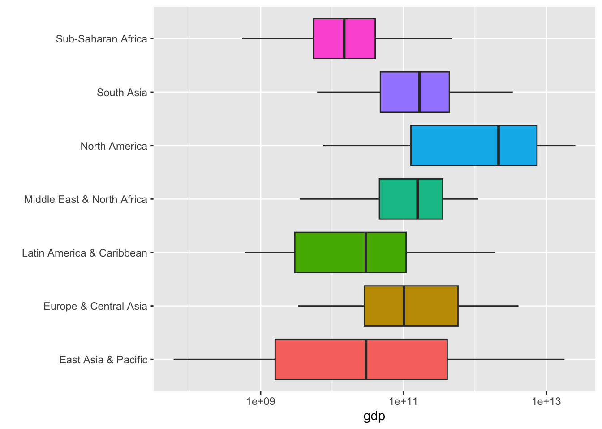

# はじめてのデータサイエンス {#first-example}

## データサイエンス？

データから情報を得るときには、大体次のような手順をとります。

1. 準備 Setup
2. データを取得 Import data
3. データ構造の確認 View data
4. 必要に応じて整形 Transform data
5. 視覚化 Visualize data
6. データを理解 Understand data
7. レポートなどにまとめる Communicate data


問いをもちデータを取得し、視覚化などを通して、データを理解し、さらに問いを深めるサイクルが、データサイエンスの核だと思います。

## R のパッケージを活用

<!-- まず、R を使った分析の一つの例を、見て行きます。一つ一つのコード（コンピュータ・プログラム）の説明は、後に回し、まずは、雰囲気を味わってください。 -->

### 準備 Setup

世界銀行（World Bank）の、世界開発指標（WDI: World Development Indicators）の一つの、GDP（Gross Domestic Product 国内総生産）のデータから始めます。GDP にも何種類かの尺度がありますが、次のものを見てみます。

* NY.GDP.MKTP.CD: GDP (current US$)

NY.GDP.MKTP.CD は、データコードと言われるもので、世界開発指標（WDI）には、一つづつ決まっています。

[World Development Indicators](https://datatopics.worldbank.org/world-development-indicators/) のサイトの下にある、Data Themes（テーマ）からテーマを選択し、下にスクロールすると、Code をみることができます。ちなみに、ここで利用する NY.GDP.MKTP.CD: GDP (current US$) は、テーマの Economy（経済）の、一番上にあります。

経済用語の英語はよく知らないという方は、ブラウザー（Edge, Google Chrome, Safari など）の翻訳機能を使うのも良いでしょう。ただ、そのページの対話型の機能（interactive function）を利用するときは、翻訳機能をOFF にする必要がある場合もありますので、注意してください。


エラーメッセージを調べるときなどに、英語のほうが情報がたくさん得られますから、言語を、英語に変更しておきます。

R には、WDI のデータを取得する R のツール（パッケージ）`WDI` がありますから、それを使います。また、データを取り扱うための基本的なツール（パッケージ）`tidyverse` を使いますので、次のコードで、これらを読み込みます。


```r
Sys.setenv(LANG = "en")
library(tidyverse)
#> ── Attaching core tidyverse packages ──── tidyverse 2.0.0 ──
#> ✔ dplyr     1.1.2     ✔ readr     2.1.4
#> ✔ forcats   1.0.0     ✔ stringr   1.5.0
#> ✔ ggplot2   3.4.2     ✔ tibble    3.2.1
#> ✔ lubridate 1.9.2     ✔ tidyr     1.3.0
#> ✔ purrr     1.0.1     
#> ── Conflicts ────────────────────── tidyverse_conflicts() ──
#> ✖ dplyr::filter() masks stats::filter()
#> ✖ dplyr::lag()    masks stats::lag()
#> ℹ Use the conflicted package (<http://conflicted.r-lib.org/>) to force all conflicts to become errors
library(WDI)
```

### データ取得 Import data

データを取得します。少し時間がかかります。取得したデータに、`df_gdp` などと、わかりやすい名前をつけます。`df` は `data frame` の略で、R で標準的なデータの形式です。


```r
df_gdp <- WDI(country = "all", 
              indicator = c(gdp = "NY.GDP.MKTP.CD"), 
              extra = TRUE)
```


このコードで、全ての国の GDP を取得できます。GDP の値は、`NY.GDP.MKTP.CD` という名前の列にありますが、覚えやすいように、gdp という名前に変更しておきます。`extra = TRUE` とすることによって、それぞれの国についての情報などが追加されます。


### データ構造の確認

最初の数行だけを見るには、`head(df_dgp)` とします。


```r
head(df_gdp)
#> # A tibble: 6 × 13
#>   country     iso2c iso3c  year       gdp status lastupdated
#>   <chr>       <chr> <chr> <dbl>     <dbl> <lgl>  <date>     
#> 1 Afghanistan AF    AFG    2015   2.00e10 NA     2022-12-22 
#> 2 Afghanistan AF    AFG    2011   1.82e10 NA     2022-12-22 
#> 3 Afghanistan AF    AFG    2014   2.06e10 NA     2022-12-22 
#> 4 Afghanistan AF    AFG    2013   2.06e10 NA     2022-12-22 
#> 5 Afghanistan AF    AFG    2012   2.02e10 NA     2022-12-22 
#> 6 Afghanistan AF    AFG    2007   9.72e 9 NA     2022-12-22 
#> # ℹ 6 more variables: region <chr>, capital <chr>,
#> #   longitude <dbl>, latitude <dbl>, income <chr>,
#> #   lending <chr>
```


データの構造を見るときには、`str(df_gdp)` もよく使われます。今度は、列が縦に並んで表示されます。


```r
str(df_gdp)
#> spc_tbl_ [16,492 × 13] (S3: spec_tbl_df/tbl_df/tbl/data.frame)
#>  $ country    : chr [1:16492] "Afghanistan" "Afghanistan" "Afghanistan" "Afghanistan" ...
#>  $ iso2c      : chr [1:16492] "AF" "AF" "AF" "AF" ...
#>  $ iso3c      : chr [1:16492] "AFG" "AFG" "AFG" "AFG" ...
#>  $ year       : num [1:16492] 2015 2011 2014 2013 2012 ...
#>  $ gdp        : num [1:16492] 2.00e+10 1.82e+10 2.06e+10 2.06e+10 2.02e+10 ...
#>  $ status     : logi [1:16492] NA NA NA NA NA NA ...
#>  $ lastupdated: Date[1:16492], format: "2022-12-22" ...
#>  $ region     : chr [1:16492] "South Asia" "South Asia" "South Asia" "South Asia" ...
#>  $ capital    : chr [1:16492] "Kabul" "Kabul" "Kabul" "Kabul" ...
#>  $ longitude  : num [1:16492] 69.2 69.2 69.2 69.2 69.2 ...
#>  $ latitude   : num [1:16492] 34.5 34.5 34.5 34.5 34.5 ...
#>  $ income     : chr [1:16492] "Low income" "Low income" "Low income" "Low income" ...
#>  $ lending    : chr [1:16492] "IDA" "IDA" "IDA" "IDA" ...
#>  - attr(*, "spec")=
#>   .. cols(
#>   ..   country = col_character(),
#>   ..   iso2c = col_character(),
#>   ..   iso3c = col_character(),
#>   ..   year = col_double(),
#>   ..   gdp = col_double(),
#>   ..   status = col_logical(),
#>   ..   lastupdated = col_date(format = ""),
#>   ..   region = col_character(),
#>   ..   capital = col_character(),
#>   ..   longitude = col_double(),
#>   ..   latitude = col_double(),
#>   ..   income = col_character(),
#>   ..   lending = col_character()
#>   .. )
#>  - attr(*, "problems")=<externalptr>
```


概要 (`summary(df_gdp)`) からもある程度わかります。


```r
summary(df_gdp) 
#>    country             iso2c              iso3c          
#>  Length:16492       Length:16492       Length:16492      
#>  Class :character   Class :character   Class :character  
#>  Mode  :character   Mode  :character   Mode  :character  
#>                                                          
#>                                                          
#>                                                          
#>                                                          
#>       year           gdp             status       
#>  Min.   :1960   Min.   :8.824e+06   Mode:logical  
#>  1st Qu.:1975   1st Qu.:2.441e+09   NA's:16492    
#>  Median :1990   Median :1.784e+10                 
#>  Mean   :1990   Mean   :1.162e+12                 
#>  3rd Qu.:2006   3rd Qu.:2.158e+11                 
#>  Max.   :2021   Max.   :9.651e+13                 
#>                 NA's   :3343                      
#>   lastupdated            region            capital         
#>  Min.   :2022-12-22   Length:16492       Length:16492      
#>  1st Qu.:2022-12-22   Class :character   Class :character  
#>  Median :2022-12-22   Mode  :character   Mode  :character  
#>  Mean   :2022-12-22                                        
#>  3rd Qu.:2022-12-22                                        
#>  Max.   :2022-12-22                                        
#>                                                            
#>    longitude          latitude          income         
#>  Min.   :-175.22   Min.   :-41.286   Length:16492      
#>  1st Qu.: -15.18   1st Qu.:  4.174   Class :character  
#>  Median :  19.54   Median : 17.277   Mode  :character  
#>  Mean   :  19.16   Mean   : 18.740                     
#>  3rd Qu.:  50.53   3rd Qu.: 39.715                     
#>  Max.   : 179.09   Max.   : 64.184                     
#>  NA's   :3472      NA's   :3472                        
#>    lending         
#>  Length:16492      
#>  Class :character  
#>  Mode  :character  
#>                    
#>                    
#>                    
#> 
```


国のリストをみてみましょう。とても長いリストの中には、地域名も含まれています。


```r
df_gdp %>% distinct(country) %>% pull()
#>   [1] "Afghanistan"                                         
#>   [2] "Africa Eastern and Southern"                         
#>   [3] "Africa Western and Central"                          
#>   [4] "Albania"                                             
#>   [5] "Algeria"                                             
#>   [6] "American Samoa"                                      
#>   [7] "Andorra"                                             
#>   [8] "Angola"                                              
#>   [9] "Antigua and Barbuda"                                 
#>  [10] "Arab World"                                          
#>  [11] "Argentina"                                           
#>  [12] "Armenia"                                             
#>  [13] "Aruba"                                               
#>  [14] "Australia"                                           
#>  [15] "Austria"                                             
#>  [16] "Azerbaijan"                                          
#>  [17] "Bahamas, The"                                        
#>  [18] "Bahrain"                                             
#>  [19] "Bangladesh"                                          
#>  [20] "Barbados"                                            
#>  [21] "Belarus"                                             
#>  [22] "Belgium"                                             
#>  [23] "Belize"                                              
#>  [24] "Benin"                                               
#>  [25] "Bermuda"                                             
#>  [26] "Bhutan"                                              
#>  [27] "Bolivia"                                             
#>  [28] "Bosnia and Herzegovina"                              
#>  [29] "Botswana"                                            
#>  [30] "Brazil"                                              
#>  [31] "British Virgin Islands"                              
#>  [32] "Brunei Darussalam"                                   
#>  [33] "Bulgaria"                                            
#>  [34] "Burkina Faso"                                        
#>  [35] "Burundi"                                             
#>  [36] "Cabo Verde"                                          
#>  [37] "Cambodia"                                            
#>  [38] "Cameroon"                                            
#>  [39] "Canada"                                              
#>  [40] "Caribbean small states"                              
#>  [41] "Cayman Islands"                                      
#>  [42] "Central African Republic"                            
#>  [43] "Central Europe and the Baltics"                      
#>  [44] "Chad"                                                
#>  [45] "Channel Islands"                                     
#>  [46] "Chile"                                               
#>  [47] "China"                                               
#>  [48] "Colombia"                                            
#>  [49] "Comoros"                                             
#>  [50] "Congo, Dem. Rep."                                    
#>  [51] "Congo, Rep."                                         
#>  [52] "Costa Rica"                                          
#>  [53] "Cote d'Ivoire"                                       
#>  [54] "Croatia"                                             
#>  [55] "Cuba"                                                
#>  [56] "Curacao"                                             
#>  [57] "Cyprus"                                              
#>  [58] "Czechia"                                             
#>  [59] "Denmark"                                             
#>  [60] "Djibouti"                                            
#>  [61] "Dominica"                                            
#>  [62] "Dominican Republic"                                  
#>  [63] "Early-demographic dividend"                          
#>  [64] "East Asia & Pacific"                                 
#>  [65] "East Asia & Pacific (excluding high income)"         
#>  [66] "East Asia & Pacific (IDA & IBRD countries)"          
#>  [67] "Ecuador"                                             
#>  [68] "Egypt, Arab Rep."                                    
#>  [69] "El Salvador"                                         
#>  [70] "Equatorial Guinea"                                   
#>  [71] "Eritrea"                                             
#>  [72] "Estonia"                                             
#>  [73] "Eswatini"                                            
#>  [74] "Ethiopia"                                            
#>  [75] "Euro area"                                           
#>  [76] "Europe & Central Asia"                               
#>  [77] "Europe & Central Asia (excluding high income)"       
#>  [78] "Europe & Central Asia (IDA & IBRD countries)"        
#>  [79] "European Union"                                      
#>  [80] "Faroe Islands"                                       
#>  [81] "Fiji"                                                
#>  [82] "Finland"                                             
#>  [83] "Fragile and conflict affected situations"            
#>  [84] "France"                                              
#>  [85] "French Polynesia"                                    
#>  [86] "Gabon"                                               
#>  [87] "Gambia, The"                                         
#>  [88] "Georgia"                                             
#>  [89] "Germany"                                             
#>  [90] "Ghana"                                               
#>  [91] "Gibraltar"                                           
#>  [92] "Greece"                                              
#>  [93] "Greenland"                                           
#>  [94] "Grenada"                                             
#>  [95] "Guam"                                                
#>  [96] "Guatemala"                                           
#>  [97] "Guinea"                                              
#>  [98] "Guinea-Bissau"                                       
#>  [99] "Guyana"                                              
#> [100] "Haiti"                                               
#> [101] "Heavily indebted poor countries (HIPC)"              
#> [102] "High income"                                         
#> [103] "Honduras"                                            
#> [104] "Hong Kong SAR, China"                                
#> [105] "Hungary"                                             
#> [106] "IBRD only"                                           
#> [107] "Iceland"                                             
#> [108] "IDA & IBRD total"                                    
#> [109] "IDA blend"                                           
#> [110] "IDA only"                                            
#> [111] "IDA total"                                           
#> [112] "India"                                               
#> [113] "Indonesia"                                           
#> [114] "Iran, Islamic Rep."                                  
#> [115] "Iraq"                                                
#> [116] "Ireland"                                             
#> [117] "Isle of Man"                                         
#> [118] "Israel"                                              
#> [119] "Italy"                                               
#> [120] "Jamaica"                                             
#> [121] "Japan"                                               
#> [122] "Jordan"                                              
#> [123] "Kazakhstan"                                          
#> [124] "Kenya"                                               
#> [125] "Kiribati"                                            
#> [126] "Korea, Dem. People's Rep."                           
#> [127] "Korea, Rep."                                         
#> [128] "Kosovo"                                              
#> [129] "Kuwait"                                              
#> [130] "Kyrgyz Republic"                                     
#> [131] "Lao PDR"                                             
#> [132] "Late-demographic dividend"                           
#> [133] "Latin America & Caribbean"                           
#> [134] "Latin America & Caribbean (excluding high income)"   
#> [135] "Latin America & the Caribbean (IDA & IBRD countries)"
#> [136] "Latvia"                                              
#> [137] "Least developed countries: UN classification"        
#> [138] "Lebanon"                                             
#> [139] "Lesotho"                                             
#> [140] "Liberia"                                             
#> [141] "Libya"                                               
#> [142] "Liechtenstein"                                       
#> [143] "Lithuania"                                           
#> [144] "Low & middle income"                                 
#> [145] "Low income"                                          
#> [146] "Lower middle income"                                 
#> [147] "Luxembourg"                                          
#> [148] "Macao SAR, China"                                    
#> [149] "Madagascar"                                          
#> [150] "Malawi"                                              
#> [151] "Malaysia"                                            
#> [152] "Maldives"                                            
#> [153] "Mali"                                                
#> [154] "Malta"                                               
#> [155] "Marshall Islands"                                    
#> [156] "Mauritania"                                          
#> [157] "Mauritius"                                           
#> [158] "Mexico"                                              
#> [159] "Micronesia, Fed. Sts."                               
#> [160] "Middle East & North Africa"                          
#> [161] "Middle East & North Africa (excluding high income)"  
#> [162] "Middle East & North Africa (IDA & IBRD countries)"   
#> [163] "Middle income"                                       
#> [164] "Moldova"                                             
#> [165] "Monaco"                                              
#> [166] "Mongolia"                                            
#> [167] "Montenegro"                                          
#> [168] "Morocco"                                             
#> [169] "Mozambique"                                          
#> [170] "Myanmar"                                             
#> [171] "Namibia"                                             
#> [172] "Nauru"                                               
#> [173] "Nepal"                                               
#> [174] "Netherlands"                                         
#> [175] "New Caledonia"                                       
#> [176] "New Zealand"                                         
#> [177] "Nicaragua"                                           
#> [178] "Niger"                                               
#> [179] "Nigeria"                                             
#> [180] "North America"                                       
#> [181] "North Macedonia"                                     
#> [182] "Northern Mariana Islands"                            
#> [183] "Norway"                                              
#> [184] "Not classified"                                      
#> [185] "OECD members"                                        
#> [186] "Oman"                                                
#> [187] "Other small states"                                  
#> [188] "Pacific island small states"                         
#> [189] "Pakistan"                                            
#> [190] "Palau"                                               
#> [191] "Panama"                                              
#> [192] "Papua New Guinea"                                    
#> [193] "Paraguay"                                            
#> [194] "Peru"                                                
#> [195] "Philippines"                                         
#> [196] "Poland"                                              
#> [197] "Portugal"                                            
#> [198] "Post-demographic dividend"                           
#> [199] "Pre-demographic dividend"                            
#> [200] "Puerto Rico"                                         
#> [201] "Qatar"                                               
#> [202] "Romania"                                             
#> [203] "Russian Federation"                                  
#> [204] "Rwanda"                                              
#> [205] "Samoa"                                               
#> [206] "San Marino"                                          
#> [207] "Sao Tome and Principe"                               
#> [208] "Saudi Arabia"                                        
#> [209] "Senegal"                                             
#> [210] "Serbia"                                              
#> [211] "Seychelles"                                          
#> [212] "Sierra Leone"                                        
#> [213] "Singapore"                                           
#> [214] "Sint Maarten (Dutch part)"                           
#> [215] "Slovak Republic"                                     
#> [216] "Slovenia"                                            
#> [217] "Small states"                                        
#> [218] "Solomon Islands"                                     
#> [219] "Somalia"                                             
#> [220] "South Africa"                                        
#> [221] "South Asia"                                          
#> [222] "South Asia (IDA & IBRD)"                             
#> [223] "South Sudan"                                         
#> [224] "Spain"                                               
#> [225] "Sri Lanka"                                           
#> [226] "St. Kitts and Nevis"                                 
#> [227] "St. Lucia"                                           
#> [228] "St. Martin (French part)"                            
#> [229] "St. Vincent and the Grenadines"                      
#> [230] "Sub-Saharan Africa"                                  
#> [231] "Sub-Saharan Africa (excluding high income)"          
#> [232] "Sub-Saharan Africa (IDA & IBRD countries)"           
#> [233] "Sudan"                                               
#> [234] "Suriname"                                            
#> [235] "Sweden"                                              
#> [236] "Switzerland"                                         
#> [237] "Syrian Arab Republic"                                
#> [238] "Tajikistan"                                          
#> [239] "Tanzania"                                            
#> [240] "Thailand"                                            
#> [241] "Timor-Leste"                                         
#> [242] "Togo"                                                
#> [243] "Tonga"                                               
#> [244] "Trinidad and Tobago"                                 
#> [245] "Tunisia"                                             
#> [246] "Turkiye"                                             
#> [247] "Turkmenistan"                                        
#> [248] "Turks and Caicos Islands"                            
#> [249] "Tuvalu"                                              
#> [250] "Uganda"                                              
#> [251] "Ukraine"                                             
#> [252] "United Arab Emirates"                                
#> [253] "United Kingdom"                                      
#> [254] "United States"                                       
#> [255] "Upper middle income"                                 
#> [256] "Uruguay"                                             
#> [257] "Uzbekistan"                                          
#> [258] "Vanuatu"                                             
#> [259] "Venezuela, RB"                                       
#> [260] "Vietnam"                                             
#> [261] "Virgin Islands (U.S.)"                               
#> [262] "West Bank and Gaza"                                  
#> [263] "World"                                               
#> [264] "Yemen, Rep."                                         
#> [265] "Zambia"                                              
#> [266] "Zimbabwe"
```


今回は下のように、`%>%`（パイプと呼びます） で繋げてコードを書きました。

```
df_gdp %>% distinct(country) %>% pull()
```

最初は、データ、その中の、異なる国を選択して、書き出してくださいというものです。

これは、
```
pull(distinct(df_gdp, country))
```
と同じです。どんどん、かっこの中に入れ子になって複雑になるので、一つ一つのステップを、順に書いたものが、最初のものになります。

```
df_gdp %>% head()
df_gdp %>% str()
```
なども可能です。かっこの中に最初に入るものが直前のもの、ここでは、データになっています。


### 必要に応じて整形 Transform data

変数が多いので、日本の部分だけ `filter` を使って選択します。country が Japan と一致する場合のみを選択するときは、`==` を使います。数値ではないので、引用符をつけます。半角を使ってください。


```r
df_gdp %>% filter(country == "Japan")
#> # A tibble: 62 × 13
#>    country iso2c iso3c  year     gdp status lastupdated
#>    <chr>   <chr> <chr> <dbl>   <dbl> <lgl>  <date>     
#>  1 Japan   JP    JPN    2021 4.94e12 NA     2022-12-22 
#>  2 Japan   JP    JPN    2020 5.04e12 NA     2022-12-22 
#>  3 Japan   JP    JPN    2019 5.12e12 NA     2022-12-22 
#>  4 Japan   JP    JPN    2018 5.04e12 NA     2022-12-22 
#>  5 Japan   JP    JPN    2017 4.93e12 NA     2022-12-22 
#>  6 Japan   JP    JPN    2016 5.00e12 NA     2022-12-22 
#>  7 Japan   JP    JPN    2015 4.44e12 NA     2022-12-22 
#>  8 Japan   JP    JPN    2014 4.90e12 NA     2022-12-22 
#>  9 Japan   JP    JPN    2013 5.21e12 NA     2022-12-22 
#> 10 Japan   JP    JPN    2012 6.27e12 NA     2022-12-22 
#> # ℹ 52 more rows
#> # ℹ 6 more variables: region <chr>, capital <chr>,
#> #   longitude <dbl>, latitude <dbl>, income <chr>,
#> #   lending <chr>
```


```r
df_gdp %>% filter(country == "Japan") %>% head(2)
#> # A tibble: 2 × 13
#>   country iso2c iso3c  year     gdp status lastupdated
#>   <chr>   <chr> <chr> <dbl>   <dbl> <lgl>  <date>     
#> 1 Japan   JP    JPN    2021 4.94e12 NA     2022-12-22 
#> 2 Japan   JP    JPN    2020 5.04e12 NA     2022-12-22 
#> # ℹ 6 more variables: region <chr>, capital <chr>,
#> #   longitude <dbl>, latitude <dbl>, income <chr>,
#> #   lending <chr>
```
２行目の、gdp の、4.940878e+12 は、Scientific notation と言われるもので、
$$4.940878 \times 10^{12} = 4,940,887,800,000$$
を意味します。`e+3` は千（thousand）、`e+6` は百万（million）、`e+9` は、10億（billion）、`e+12` は、兆（trillion）ですから、日本の、2021 年の GDP は、約5兆ドルとなります。


### 視覚化 data visualization

#### Fig 1. 日本のGDP の経年変化を折線グラフ（line graph）


```r
df_gdp %>% filter(country == "Japan") %>%
  ggplot(aes(x = year, y = gdp)) + geom_line()
```


```
df_gdp %>% filter(country == "Japan") %>%
  ggplot(aes(x = year, y = gdp)) + geom_line()
```

日本を選択したときに、それに名前をつけておいて、それを使うこともできますが、名前がどんどん増えるので、それに続けて、コードを書いていく方法をとっています。

`ggplot(aes(x = year, y = gdp)) + geom_line()`

の部分が、グラフを描く部分で、「x 軸を、year、y 軸を、gdp として、それを、折線グラフで描いてください」というコードです。

Warning: Removed 1 row containing missing values

と表示されています。値がない年があることを言っています。2022年のデータがないことがわかっていますから、最初から削除してこくことも可能です。


### データの理解 Understand data

視覚化によって見えてくることがいくつもありますね。どんなことがわかりますか。気づいたこと（observation）をあげてみましょう。

コードを描くことではなく、この部分が、データサイエンスの核の部分です。気づいたことを列挙してみましょう。


### さまざまな視覚化

#### Fig 2. 各年ごとのデータの数

`summary(df_gdp)` で、データ自体は、1960年から2022年までのようですが、日本も、2022年のデータはありませんでしたから、年によって、どの程度データがあるか、調べてみます。


```r
df_gdp %>% drop_na(gdp) %>% ggplot(aes(x = year)) + geom_bar()
```


```
df_gdp %>% drop_na(gdp) %>% ggplot(aes(x = year)) + geom_bar()
```

バー・グラフを使いますが、`gdp` の値が、欠損値（NA: not available）のデータを削除してから、グラフを描きます。

#### 2021年のGDPの降順での表示（１）

最新の2021年のデータはすべてあるわけではなさそうですが、`gdp` の値が大きい順に並べてみましょう。


```r
df_gdp %>% filter(year == 2021) %>% drop_na(gdp) %>% arrange(desc(gdp))
#> # A tibble: 245 × 13
#>    country      iso2c iso3c  year     gdp status lastupdated
#>    <chr>        <chr> <chr> <dbl>   <dbl> <lgl>  <date>     
#>  1 World        1W    WLD    2021 9.65e13 NA     2022-12-22 
#>  2 High income  XD    <NA>   2021 5.98e13 NA     2022-12-22 
#>  3 OECD members OE    OED    2021 5.83e13 NA     2022-12-22 
#>  4 Post-demogr… V4    PST    2021 5.50e13 NA     2022-12-22 
#>  5 IDA & IBRD … ZT    IBT    2021 3.80e13 NA     2022-12-22 
#>  6 Low & middl… XO    LMY    2021 3.64e13 NA     2022-12-22 
#>  7 Middle inco… XP    MIC    2021 3.58e13 NA     2022-12-22 
#>  8 IBRD only    XF    IBD    2021 3.55e13 NA     2022-12-22 
#>  9 East Asia &… Z4    EAS    2021 3.09e13 NA     2022-12-22 
#> 10 Upper middl… XT    <NA>   2021 2.71e13 NA     2022-12-22 
#> # ℹ 235 more rows
#> # ℹ 6 more variables: region <chr>, capital <chr>,
#> #   longitude <dbl>, latitude <dbl>, income <chr>,
#> #   lending <chr>
```


#### 2021年のGDPの降順での表示（２）

最初に、World と表示され、グループや、カテゴリーのデータもあるようですから、それを、まず、削除することが必要です。`region` の列を見ると、World などは、Aggregates となっているので、そのようなものを削除すればよさそうです。数値の大きい順に並べたいので、`desc` 降順（descending order）にします。


```r
df_gdp %>% filter(year == 2021, region != "Aggregates") %>% 
  drop_na(gdp) %>% arrange(desc(gdp))
#> # A tibble: 196 × 13
#>    country      iso2c iso3c  year     gdp status lastupdated
#>    <chr>        <chr> <chr> <dbl>   <dbl> <lgl>  <date>     
#>  1 United Stat… US    USA    2021 2.33e13 NA     2022-12-22 
#>  2 China        CN    CHN    2021 1.77e13 NA     2022-12-22 
#>  3 Japan        JP    JPN    2021 4.94e12 NA     2022-12-22 
#>  4 Germany      DE    DEU    2021 4.26e12 NA     2022-12-22 
#>  5 India        IN    IND    2021 3.18e12 NA     2022-12-22 
#>  6 United King… GB    GBR    2021 3.13e12 NA     2022-12-22 
#>  7 France       FR    FRA    2021 2.96e12 NA     2022-12-22 
#>  8 Italy        IT    ITA    2021 2.11e12 NA     2022-12-22 
#>  9 Canada       CA    CAN    2021 1.99e12 NA     2022-12-22 
#> 10 Korea, Rep.  KR    KOR    2021 1.81e12 NA     2022-12-22 
#> # ℹ 186 more rows
#> # ℹ 6 more variables: region <chr>, capital <chr>,
#> #   longitude <dbl>, latitude <dbl>, income <chr>,
#> #   lending <chr>
```


これは、グラフではありませんが、これも一つの視覚化とも考えられないことはありません。

上位７カ国は、United States, China, Japan, Germany, India, United Kingdom, France であることがわかりました。8番目は、Italy でここまでが、GDP が 2兆ドルを越している国となります。


#### Fig 3. 2021年時のGDP上位7カ国のGDP経年変化


```r
df_gdp %>% filter(iso2c %in% c("US", "CN", "JP", "DE", "IN", "GB", "FR")) %>%
  ggplot(aes(x = year, y = gdp, col = iso2c)) + geom_line()
#> Warning: Removed 10 rows containing missing values
#> (`geom_line()`).
```


```
df_gdp %>% filter(iso2c %in% c("US", "CN", "JP", "DE", "IN", "GB", "FR")) %>%
  ggplot(aes(x = year, y = gdp, col = iso2c)) + geom_line()
```

ここでは、最初に、`filter` を使って、7カ国のデータを選択しています。
そのときには、`%in%` として、国名を、combine するといういみで、`c()` とひとまとめにします。数字ではなく、文字なので、引用符で囲んでいます。この場合は、single quote でも構いませんが、半角を使ってください。

このグラフからは、どのようなことがわかりますか。気づいたことを書いてみましょう。

もう少し、このようなグラフをみてみたいというような、メモも大切です。


#### Fig 4. 世界のGDP における割合（１）


```r
df_gdp %>% 
  filter(region != "Aggregates") %>% drop_na(gdp) %>% 
  group_by(year) %>% mutate(gdp_ratio = gdp/sum(gdp)) %>% ungroup() %>%
  filter(iso2c %in% c("US", "CN", "JP", "DE", "IN", "GB", "FR"))  %>%
  ggplot(aes(x = year, y = gdp_ratio, fill = iso2c)) + geom_area() +
  geom_line(col = "black", position = "stack", linewidth = 0.3) + 
  scale_y_continuous(labels = scales::percent_format(accuracy = 1))
```


まず、下の部分が新しいですが、ここでは、年毎にグループにして、その上で、新しい `dgp_ratio` という名前の列を追加し、その gdp の値を、gdp 合計で割っています。すなわち、世界の、GDP における割合が計算されています。

```
  group_by(year) %>% mutate(gdp_ratio = gdp/sum(gdp)) %>% ungroup() %>%
```

下の部分では、`geom_area` を使って、`fill=iso2c` により、`iso2c` ごとに、違う色を塗って、position = "stack" により、積み上げ型の、グラフを描き、境目がわかりやすいように、0.3  の太さの黒の線を描いてください。また、y 軸は、小数点以下を省いたパーセント表示に変えてください。というコードです。

```
  ggplot(aes(x = year, y = gdp_ratio, fill = iso2c)) + geom_area() +
  geom_line(col = "black", position = "stack", linewidth = 0.3) + 
  scale_y_continuous(labels = scales::percent_format(accuracy = 1))
```

#### Fig 4. 世界のGDP における割合（２）

これは、上から、iso2c の アルファベットの順番になっていますが、積み上げの順序を変更することもできます。


```r
df_gdp %>% 
  filter(region != "Aggregates") %>% drop_na(gdp) %>% 
  group_by(year) %>% mutate(gdp_ratio = gdp/sum(gdp)) %>% ungroup() %>%
  filter(iso2c %in% c("US", "CN", "JP", "DE", "IN", "GB", "FR"))  %>%
  mutate(iso2co = factor(iso2c, levels = c("IN", "CN", "FR", "GB", "DE", "JP", "US"))) %>%
  ggplot(aes(x = year, y = gdp_ratio, fill = iso2co)) + geom_area() +
  geom_line(col = "black", position = "stack", linewidth = 0.3) + 
  scale_y_continuous(labels = scales::percent_format(accuracy = 1))
```


これらは、世界全体の GPT における割合です。

どのようなことがわかりますか。

主要国で、60%〜70% を占めていることがわかります。それぞれの国や、幾つかの国の影響力も、ある程度みることができるように見えます。

気づいたこと、疑問に思ったことなどを、書き出してみてください。

GDP が大きな国と、小さな国があるのはわかりますが、それは、どのように分布しているのでしょうか。


#### Fig 5. 2021年の世界の国のGDPの分布（１）


```r
df_gdp %>% drop_na(gdp) %>% 
  filter(year == 2021) %>%
  ggplot(aes(gdp)) + geom_histogram()
#> `stat_bin()` using `bins = 30`. Pick better value with
#> `binwidth`.
```


小さいところに集中していることがわかりますが、`scale_x_log10()` を加え、対数軸をとってみます。

$log10(1000) = 3$, $log10(1000000) = 6$, $log10(1000000000) = 9$ などになります。


#### Fig 6. 2021年の世界の国のGDPの分布（２）


```r
df_gdp %>% drop_na(gdp) %>% 
  filter(year == 2021) %>%
  ggplot(aes(gdp)) + geom_histogram() + scale_x_log10()
#> `stat_bin()` using `bins = 30`. Pick better value with
#> `binwidth`.
```


幅を変更したり、分ける個数を変更するには `binwidth = 0.5` や、`bins = 20` を、`geom_histogram()` のかっこの中に入れます。


#### Fig 7. 2021年の世界の国のGDPの分布（３）

また、密度曲線に変えるには、`geom_density` を使います。


```r
df_gdp %>% drop_na(gdp) %>% 
  filter(year == 2021) %>%
  ggplot(aes(gdp)) + geom_density() + scale_x_log10()
```


#### Fig 8. 2021年の世界の国のGDPの分布（４）

これは、2021年のデータですが、density の変化を見てみます。alpha の値は透明度です。


```r
df_gdp %>% drop_na(gdp) %>% 
  filter(year %in% c(1961, 1971, 1981, 1991, 2001, 2011, 2021)) %>%
  ggplot(aes(gdp, fill = factor(year))) + geom_density(alpha = 0.4) + scale_x_log10()
```


#### Fig 9. 2021年の世界の国のGDPの分布（５）

少しみにくいので、分けてみます。


```r
df_gdp %>% drop_na(gdp) %>% 
  filter(year %in% c(1971, 1981, 1991, 2001, 2011, 2021)) %>%
  ggplot(aes(gdp, fill = factor(year))) + 
  geom_density() + scale_x_log10() + facet_wrap(~year)
```


#### Fig 10. 地域ごとの GDP の分布

いくつかのグループごとに分布をみてみることも可能です。それには、Boxplot が有効です。


```r
df_gdp %>% drop_na(gdp) %>% filter(region != "Aggregates") %>%
  drop_na(region) %>% filter(year %in% c(2021)) %>%
  ggplot(aes(gdp, region, fill = region)) + 
  geom_boxplot() + scale_x_log10() + labs(y = "") + 
  theme(legend.position = "none")
```


#### Fig 11. 収入の多寡による分類ごとの GDP 分布


```r
df_gdp %>% drop_na(gdp) %>% filter(region != "Aggregates") %>%
  drop_na(income) %>% filter(year %in% c(2021)) %>%
  mutate(level = factor(income, c("High income", "Upper middle income", "Lower middle income", "Low income"))) %>%
  ggplot(aes(gdp, level, fill = income)) + 
  geom_boxplot() + scale_x_log10() + labs(y = "") + 
  theme(legend.position = "none")
```


これからも、いろいろなことがわかりますね。

#### 世界地図の準備

地図で、国の income level をみてみましょう。


```r
library(maps)
map_world <- map_data('world')
map_gdp <- map_world %>% 
  mutate(iso2c = iso.alpha(region, n=2)) %>% 
  mutate(map_region = region) %>% select(-region) %>% 
  left_join(df_gdp, by = "iso2c") 
#> Warning in left_join(., df_gdp, by = "iso2c"): Detected an unexpected many-to-many relationship between
#> `x` and `y`.
#> ℹ Row 1 of `x` matches multiple rows in `y`.
#> ℹ Row 745 of `y` matches multiple rows in `x`.
#> ℹ If a many-to-many relationship is expected, set
#>   `relationship = "many-to-many"` to silence this warning.
head(map_gdp)
#>        long    lat group order subregion iso2c map_region
#> 1 -69.89912 12.452     1     1      <NA>    AW      Aruba
#> 2 -69.89912 12.452     1     1      <NA>    AW      Aruba
#> 3 -69.89912 12.452     1     1      <NA>    AW      Aruba
#> 4 -69.89912 12.452     1     1      <NA>    AW      Aruba
#> 5 -69.89912 12.452     1     1      <NA>    AW      Aruba
#> 6 -69.89912 12.452     1     1      <NA>    AW      Aruba
#>   country iso3c year        gdp status lastupdated
#> 1   Aruba   ABW 1964         NA     NA  2022-12-22
#> 2   Aruba   ABW 1963         NA     NA  2022-12-22
#> 3   Aruba   ABW 1961         NA     NA  2022-12-22
#> 4   Aruba   ABW 1960         NA     NA  2022-12-22
#> 5   Aruba   ABW 2000 1873184358     NA  2022-12-22
#> 6   Aruba   ABW 1962         NA     NA  2022-12-22
#>                      region    capital longitude latitude
#> 1 Latin America & Caribbean Oranjestad  -70.0167  12.5167
#> 2 Latin America & Caribbean Oranjestad  -70.0167  12.5167
#> 3 Latin America & Caribbean Oranjestad  -70.0167  12.5167
#> 4 Latin America & Caribbean Oranjestad  -70.0167  12.5167
#> 5 Latin America & Caribbean Oranjestad  -70.0167  12.5167
#> 6 Latin America & Caribbean Oranjestad  -70.0167  12.5167
#>        income        lending
#> 1 High income Not classified
#> 2 High income Not classified
#> 3 High income Not classified
#> 4 High income Not classified
#> 5 High income Not classified
#> 6 High income Not classified
```

#### Fig 12. Income Level による色分け地図


```r
map_gdp %>% mutate(income_level = factor(income, levels = c("High income", "Upper middle income", "Lower middle income", "Low income", "Not classified", NA))) %>%
  ggplot() +
  geom_map(aes(long, lat, map_id = map_region, fill = income_level), map = map_world, col = "black", size = 0.1) 
#> Warning: Using `size` aesthetic for lines was deprecated in ggplot2
#> 3.4.0.
#> ℹ Please use `linewidth` instead.
#> This warning is displayed once every 8 hours.
#> Call `lifecycle::last_lifecycle_warnings()` to see where
#> this warning was generated.
#> Warning in geom_map(aes(long, lat, map_id = map_region,
#> fill = income_level), : Ignoring unknown aesthetics: x and
#> y
```



#### Fig 13. GDP による色分け地図


```r
map_gdp %>% mutate(income_level = factor(income, levels = c("High income", "Upper middle income", "Lower middle income", "Low income", "Not classified", NA))) %>%
  filter(year == 2021) %>%
  ggplot() +
  geom_map(aes(x=long, y=lat, map_id = map_region, fill = gdp), map = map_world, col = "black", size = 0.1) 
#> Warning in geom_map(aes(x = long, y = lat, map_id =
#> map_region, fill = gdp), : Ignoring unknown aesthetics: x
#> and y
```


## 練習

1. それぞれのグラフから、わかったこと、問いなどを列挙してみましょう。
2. Fig 1 の　Japan の部分を他の国や、グループ（World など）に変えてみてください。何がわかりますか。
3. Fig 3 の iso2c で選択する、国を変更してください。何がわかりますか。
4. Fig 4 または Fig 5 の iso2c の部分を他の国に変更してください。何がわかりますか。
5. Fig 5 または Fig 6 の、区間の幅や、数を 変更してみてください。何がわかりますか。
6. Fig 7, Fig 8, Fig 9 の年を変更してみてください。何がわかりますか。
7. Fig 12, Fig 13 の年を変更してみてください。何がわかりますか。

## プロジェクト

他のデータで、同様のことをしてみましょう。

1. 最初に、`gdp = "NY.GDP.MKTP.CD"` としましたが、GNI per capita, Atlas method (current US$): NY.GNP.PCAP.CD に変えてみましょう。


```r
df_gnppcap <- WDI(country = "all", 
              indicator = c(gnppcap = "NY.GNP.PCAP.CD"), 
              extra = TRUE)
```

2. [World Development Indicators](https://datatopics.worldbank.org/world-development-indicators/) のサイトの下にある、Data Themes（テーマ）から自分が調べたいテーマを選び、そのテーマから、データコードを取得して、同様の分析をしてみてください。データがあまりない場合もありますので、ある程度データが多いものを選択することをお勧めします。

## まとめ

今回は、経済指標である、GDP を使いました。データサイエンスについて少しずつ、学んでいきます。

コードの説明は、簡単にしかしていませんから、理解するのは難しいと思いますが、いくつかのことは、ご理解いただけると思います。

* それほど、長くはない、コードで、データを見ていく。R は対話型（interactive）のプログラミング言語と言われています。

* コードに続けて、結果が表示されるので、コードと出力の対応が見やすい。また、コメントや説明も併記することができる。これは、RMarkdown という形式の中で、コードを書いていることによるものです。RMarkdown は、再現性（reproducibility）と、プログラム・コードの内容をコンピュータにわかるようにでなく、人間にもわかるように記述する（Literate Programming）を実現しています。

* 視覚化（Visualization）によって、わかることが色々とある。また、視覚化の方法もたくさんあり、いろいろな見方をすることで、データについての理解が深まっていく。

* 視覚化を通して、データを理解すること、問いを持ち、他の視覚化などを用いて、さらに、理解を深めることがたいせつ。

* 理解したことを元にして、さらに、そのデータ、または、他のデータを使って、新たな発見をしていく。

統計的な指標も用いますが、それらによって、新しい知識を生み出すとも表現しますが、そのような営み全体が、データサイエンスの核をなす部分だと思います。
