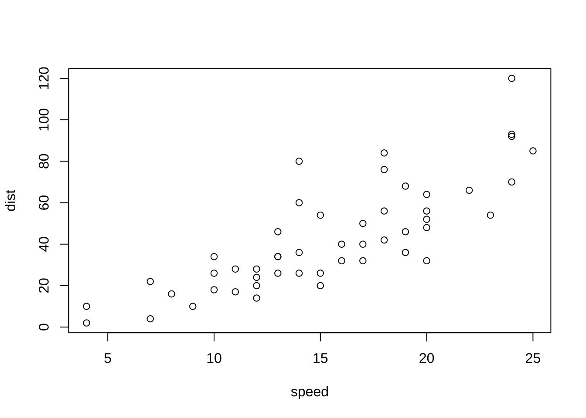

# (PART) PART II BASICS {-}
# R on R Studio {#ronrstudio}


## はじめに

R Studio で R を使うことを始めましょう。

このページの一番下に、簡単な解説ビデオがついています。

## R と R Studio

> R is a free software environment for statistical computing and graphics. It compiles and runs on a wide variety of UNIX platforms, Windows and MacOS. https://www.r-project.org

> R は、無償で提供されている、統計解析とグラフを描写する環境です。Windows、MacOS や、Linux で利用することが可能です。


> RStudio is an integrated development environment (IDE) for R and Python. It includes a console, syntax-highlighting editor that supports direct code execution, and tools for plotting, history, debugging, and workspace management. RStudio is available in open source and commercial editions and runs on the desktop (Windows, Mac, and Linux).　https://posit.co/products/open-source/rstudio/

> RStudio は、R と Python のための、総合開発環境です。RStudio には、プログラムを実行したり、制御やジョブ管理のための、コンソール（console）、コードを書いたり、実行したりする、文書の編集をする、エディター（Editor）とともに、グラフを表示したり、履歴や、プログラムを修正するなどのための、さまざまなツールが付属しています。RStudio はオープンソースで提供され、Windows、Mac および、Linux で利用可能で、有償版のサービスと無償版を提供しています。


R は、統計解析のためのシステムで、R Studio は、R（および Python）を利用するための、総合開発環境です。そこで、「R Studio で R を利用する」という表現をします。


## R と R Studio のインストール

R と R Studio をインストールします。

両方とも、インストールすることが必要です。

### R のインストール

https://cloud.r-project.org

上のリンクから、Windows、macOS または、Linux を選択して、インストールしてください。

macOS の場合は、M1, M2 など、最近の Apple Silicon の CPU で動くコンピュータか、以前の、Intel の CPU で動くものか、選択してください。Mac の左上の、りんごマークの、このコンピュータについてから、確認できます。 

不明の場合は、「R のインストール」と検索してみてください。

### R Studio の インストール

http://www.rstudio.com/download

上のリンクから、Windows 10/11 または、macOS 11+ を 選択してください。これら以外の、古いシステムのコンピュータの場合は、 下のサイトから、探してください。

https://docs.posit.co/previous-versions/

不明の場合は、「RStudio のインストール」と検索してみてください。

:::{.rmdcaution}
**Windows 日本語アカウント名の場合の不具合について:** Windows の日本語システムで、アカウント名に日本語を使っておられる方、または、OneDrive を使っていて、Documents（書類）ディレクトリーのすべてをバックアップしておられる方は、ファイルを作成したり、パッケージをインストールするときに、問題が発生する可能性があります。`Sys.getenv('HOME')` と、`Sys.getenv('R_LIBS_USER')` をそれぞれ、コピーして、RStudio 左下の窓枠の Console タブに、ペーストして、エンターして、???? や、カタカナ、漢字が現れなければ、問題ありません。`Sys.getenv()` とすれば、すべての環境変数を確認することもできます。

上のコードで、???? または、カタカナ、漢字が現れた場合は、このあとの、パッケージのところを読み、`rmarkdown` をインストールし、File のところから、New File > R Notebook を選択してください。すると、追加のパッケージがインストールされ、R Notebook が左上に表示されますが、そこで、エラーになる可能性が大きいです。

上の過程で、エラーが出たら、まず、上のメニューの、Tools の一番下の、Global Options を開き、左のメニューから、Packages を選び、Primary CRAN Repository を Change として、CRAN mirror から、Japan: The Institute of Statistical Mathematics, Tokyo を選択してください。これで解決することもあるようです。

これで解決しない場合は、Windows に、もう一つ、アカウントを作成し^[[スタート] > [設定] > [アカウント] の順に選択し、[ファミリとその他のユーザー] を選択し、[アカウントの追加] から作成。]、アカウント名を英語にして、そちらから、インストールしてください。元の日本語アカウントとファイルを共有したいときは、共有ディレクトリーにコピーしてください。

すべての状況は確認できませんので、ここまでとします^[元のアカウントから、利用したり、Home を変更したりなど、いろいろな方法で、解決することも可能ですが、自信がない場合には、上の方法で、別のアカウントから、利用してください。]。Chat GPT に確認したやりとりは、[ここ](https://icu-hsuzuki.github.io/ds_education/chatgpt.html#chatgpt)にあります。自分で確認をして、HOME の変更などをしてみても良いですが、一般的な方法としては、書かないことにします。
:::

## プロジェクト - Project

RStudio で R を利用する場合には、プロジェクトを作成することを強く勧めます。

1. まず、R Studio を起動します。

2. 上のメニューの、File から、New Project を選択します。New Directory（新しいディレクトリー）を選択し、プロジェクトを作成する Directory を決めて、名前をつけます。その名前が、プロジェクト名になります。

  - Directory（フォルダー）を指定してその名前をつけて、プロジェクトを作成します。
  - Directory が階層に分かれているときは、どこに作成するかを選択してから、名前をつけて、作成します。
  
3. 一旦、R Studio を終了してみましょう。

4. プロジェクトの起動には、いくつかの方法があります。

  - まず、R Studio を起動。一つしかプロジェクトがない場合は、そのプロジェクトが起動すると思います、。上に、プロジェクト名が掲載されていれば、問題ありません。
  - File から、Open Project を選択し、起動したい、プロジェクトの Directory（フォルダー）を選択して起動します。
  - File から、Recent Project（最近使ったプロジェクト）を選択すると、プロジェクト名が表示されますから、選択すると起動することができます。
  - コンピュータのプロジェクト入っているディレクトリー（フォルダー）をさがし、そこに、プロジェクト名.Rproj とあるものを見つけて、それを開くと、そのプロジェクトが起動します。
  
5. 作業後は、保存しますかと聞かれますから、保存して終了してください。
  

## コンソールで実行 - Run in Console

プログラム（コード）の実行は、いくつかの方法がありますが、一番、基本的な、コンソール（Console）での実行にすいて、説明します。Console は、R Studio の左下にあります。（左の枠が一つになっているかもしれません。その一番左のタブが Console です。選択されていない場合は、Console を選択してください。）

### 最初の四つ

下の、四つを、一つずつ、一番下の、> マークの次に書き（または、コピー・ペーストして）Return または、Enter キーを押してください。実行結果が、その下に出ます。最後の、`plot(cars)` は、`cars` というデータの、散布図が右下の、Plots タブに表示されます。

* `head(cars)`
* `str(cars)`
* `summary(cars)`
* `plot(cars)`

エラーが表示されたら、もう一度、スペルを確認して、入力してみてください。

次のような、結果が表示されると思います。簡単な説明をつけます。


```r
head(cars)
#>   speed dist
#> 1     4    2
#> 2     4   10
#> 3     7    4
#> 4     7   22
#> 5     8   16
#> 6     9   10
```

`head(cars)` は、`cars` という、R に付属している、データの、最初（頭 head）の6行を、表示します。


```r
str(cars)
#> 'data.frame':	50 obs. of  2 variables:
#>  $ speed: num  4 4 7 7 8 9 10 10 10 11 ...
#>  $ dist : num  2 10 4 22 16 10 18 26 34 17 ...
```

`str(cars)` は、`cars` という、R に付属している、データの構造（structure）を表示します。`data.frame` とありますが、これは、矩形になったデータ（各列の長さがおなじ）の一番簡単なクラスの名前で、2変数、それぞれが、50 個の数値データ（numerical data） からなっていることがわかります。

head(cars)` では、縦に表示されていたものが、横に表示されています。`$speed`、`$dist` とありますが、`cars$speed`, `cars$dist` は、`cars` データの、それぞれの列を意味します。


```r
summary(cars)
#>      speed           dist       
#>  Min.   : 4.0   Min.   :  2.00  
#>  1st Qu.:12.0   1st Qu.: 26.00  
#>  Median :15.0   Median : 36.00  
#>  Mean   :15.4   Mean   : 42.98  
#>  3rd Qu.:19.0   3rd Qu.: 56.00  
#>  Max.   :25.0   Max.   :120.00
```
`cars` データの概要（summary）が表示されます。各列（変数）について、最小値（Minimum）、小さい方から、4分の1を切り捨てたときの最小の値（1st Quadrant）、中央値（Median）、平均（Mean）、大きい方から、4分の1を切り捨てたときの最大の値（3rd Quadrant）、最大値（Maximum）が表示されます。


```r
plot(cars)
```



### アサインメント、ヘルプ

コンソールで次のそれぞれを、試してみてください。

* `df <- cars`

`df` に、`cars` をアサインします。すなわち、`df` が、`cars` の内容に置き換わります。`cars` はデータですが、データを含む、オブジェクトの名前を設定するためにも使います。オブジェクト名は。英文字から始まれば、かなりの自由度がありますが、わたしは、英文字と数字と `_`（underscore） 程度しか使わないようにしています。


* `head(df)`

`head(df)` は、`head(cars)` と同じ出力が得られます。

* `View(cars)`

左上の、窓枠が開き、`cars` の内容が表示されます。列名のところには、三角形も表示され、それを用いると、大きい順、小さい順などに、並び替えることも可能です。

* `?cars`

右下の、窓枠の　Help タブに、`cars` の情報が表示されます。Help タブにある、虫眼鏡がついた、検索窓（search window）に、`cars` といれても、同じ結果が得られます。
内容を確認してください。

一番上には `cars {datasets}` とありますが、これは、`datasets` というパッケージの、`cars` だという意味です。そこで、`datasets` を調べてみましょう。

* `?datasets`

"The R Datasets Package" だと書かれていて、さらに、

This package contains a variety of datasets. For a complete list, use library(help = "datasets").

さまざまなデータが含まれています。全てのリストをみるには、`library(help = "datasets")` を使ってください。

とありますから、`library(help = "datasets")` をコンソールに入力してみてください。

* `library(help = "datasets")`

左上の窓枠に、リストが表示されます。古いデータばかりですが、例として使うには、十分すぎるぐらいの、数のデータがあります。これらは、Toy Data（おもちゃのデータ）と呼ばれることもあります。

`cars` も見つかりましたか。


### おすすめ

コンピュータのシステムが、日本語であると、R の言語も日本語になっているはずです。そこで、エラーが発生すると、一部、日本語で表示されます。しかし、ネット上などで、そのエラーの対応を検索するときは、英語のエラーメッセージで検索した方が、解決方法が得られる可能性が高いので、わたしは、英語に設定しています。英語にするには、Console で次のようにします。

言語を英語に設定：`Sys.setenv(LANG = "en")`

RStudio を終了して、もう一度起動すると、日本語に戻っていると思います。ですから、作業の最初、または、エラーが出たら、変更することをお勧めします。

日本語に戻したいときは、次のようにします。

言語を日本語に設定：`Sys.setenv(LANG = "ja")`

さまざまな Help なども、すべて日本語で表示されれば日本語を使うのは有効かもしれませんが、すくなくとも、現在は、そうではないので、上に説明したことから、英語に設定することをお勧めします。

### 練習

1. `head(cars, 10L)` は何が出力されますか。`head(cars, n=10L)` と同じですか。
2. `?head` または、Help の検索窓に `head` と入力して、説明を見てみてください。`head(cars, n=10L)` などについて、書いてありましたか。他には、どのようなことが分かりましたか。
3. `datasets` のデータのいくつかについて、そのデータの help や、`head`, `str`, `summary` などを使ってみてください。これらで表示できない場合はありますか。データについては、最初に、これら、三つを試してみることをお勧めします。わかったことをメモしておくと良いでしょう。`datasets` のリストをみるには、`library(help = "datasets")` でしたね。

## RStudio について

RStudio は多くの機能を持っています。

### 四つの窓枠とタブ Four Panes and Tabs

* Top Left: Source Editor
* Top Right: Environment, History, etc.
* Bottom Left: Console, Terminal, Render, Background Jobs
* Bottom Right: Files, Plots, Packages, Help, Viewer, Presentation

## R Script 実行記録

R Script を使って、コードを実行すると、その記録を残すことができます。

### R Script の作成

* RStudio の上のメニュー・バーからFile > New File > R Script を選択します。
* File > Save As で、名前をつけて保存します。{file_name}.R が作成されます。
  - 右下の、Files から、ファイルを確認してください。
* `head(cars)`, `str(cars)`, `summary(cars)`, `plot(cars)` などと改行をしながらコードを書きます。
* 実行するには、カーソルの場所で Ctrl+Shift+Enter (Win) または Cmd+Shift+Enter (Mac) とすると、カーソルのある行か、その下の行で、最初のコードが実行されます。
  - R Script エディターの上にある、Run ボタンを押しても、同様に実行されます。
  - Run ボタンの右の、Source ボタンを押すと、そのスクリプトの、最初からすべて実行されます。
* 最後には保存しておきましょう。

### R Script による実行

新しく、R Script を作成し、この下の、コード（ハイライトされている部分）をコピー・ペーストして、保存し、実行してみてください。

それぞれ、どのようなことをしているでしょうか。


#### スクリプト1: basics.R


```r
#################
#
# basics.R
#
################
# 'Quick R' by DataCamp may be a handy reference: 
#     https://www.statmethods.net/management/index.html
# Cheat Sheet at RStudio: https://www.rstudio.com/resources/cheatsheets/
# Base R Cheat Sheet: https://github.com/rstudio/cheatsheets/raw/main/base-r.pdf
# To execute the line: Control + Enter (Window and Linux), Command + Enter (Mac)
## try your experiments on the console

## calculator

3 + 7

### +, -, *, /, ^ (or **), %%, %/%

3 + 10 / 2

3^2

2^3

2*2*2

### assignment: <-, (=, ->, assign()) 

x <- 5

x 

#### object_name <- value, '<-' shortcut: Alt (option) + '-' (hyphen or minus) 
#### Object names must start with a letter and can only contain letter, numbers, _ and .

this_is_a_long_name <- 5^3

this_is_a_long_name

char_name <- "What is your name?"

char_name

#### Use 'tab completion' and 'up arrow'

### ls(): list of all assignments

ls()
ls.str()

#### check Environment in the upper right pane

### (atomic) vectors

5:10

a <- seq(5,10)

a

b <- 5:10

identical(a,b)

seq(5,10,2) # same as seq(from = 5, to = 10, by = 2)

c1 <- seq(0,100, by = 10)

c2 <- seq(0,100, length.out = 10)

c1

c2

length(c1)

#### ? seq   ? length   ? identical

(die <- 1:6)

zero_one <- c(0,1) # same as 0:1

die + zero_one # c(1,2,3,4,5,6) + c(0,1). re-use

d1 <- rep(1:3,2) # repeat


d1

die == d1

d2 <- as.character(die == d1)

d2

d3 <- as.numeric(die == d1)

d3

### class() for class and typeof() for mode
### class of vectors: numeric, charcters, logical
### types of vectors: doubles, integers, characters, logicals (complex and raw)

typeof(d1); class(d1)

typeof(d2); class(d2)

typeof(d3); class(d3)

sqrt(2)

sqrt(2)^2

sqrt(2)^2 - 2

typeof(sqrt(2))

typeof(2)

typeof(2L)

5 == c(5)

length(5)

### Subsetting

(A_Z <- LETTERS)

A_F <- A_Z[1:6]

A_F

A_F[3]

A_F[c(3,5)]

large <- die > 3

large

even <- die %in% c(2,4,6)

even

A_F[large]

A_F[even]

A_F[die < 4]

### Compare df with df1 <- data.frame(number = die, alphabet = A_F)
df <- data.frame(number = die, alphabet = A_F, stringsAsFactors = FALSE)

df

df$number

df$alphabet

df[3,2]

df[4,1]

df[1]

class(df[1])

class(df[[1]])

identical(df[[1]], die)

identical(df[1],die)

####################
# The First Example
####################

plot(cars)

# Help

? cars

# cars is in the 'datasets' package

data()

# help(cars) does the same as ? cars
# You can use Help tab in the right bottom pane

help(plot)
? par

head(cars)

str(cars)

summary(cars)

x <- cars$speed
y <- cars$dist

min(x)
mean(x)
quantile(x)

plot(cars)

abline(lm(cars$dist ~ cars$speed))

summary(lm(cars$dist ~ cars$speed))

boxplot(cars)

hist(cars$speed)
hist(cars$dist)
hist(cars$dist, breaks = seq(0,120, 10))
```

#### スクリプト2: coronavirus.T


```r
# https://coronavirus.jhu.edu/map.html
# JHU Covid-19 global time series data
# See R package coronavirus at: https://github.com/RamiKrispin/coronavirus
# Data taken from: https://github.com/RamiKrispin/coronavirus/tree/master/csv
# Last Updated
Sys.Date()

## Download and read csv (comma separated value) file
coronavirus <- read.csv("https://github.com/RamiKrispin/coronavirus/raw/master/csv/coronavirus.csv")
# write.csv(coronavirus, "data/coronavirus.csv")

## Summaries and structures of the data
head(coronavirus)
str(coronavirus)
coronavirus$date <- as.Date(coronavirus$date)
str(coronavirus)

range(coronavirus$date)
unique(coronavirus$country)
unique(coronavirus$type)

## Set Country
COUNTRY <- "Japan"
df0 <- coronavirus[coronavirus$country == COUNTRY,]
head(df0)
tail(df0)
(pop <- df0$population[1])
df <- df0[c(1,6,7,13)]
str(df)
head(df)
### alternatively,
head(df0[c("date", "type", "cases", "population")])
###

## Set types
df_confirmed <- df[df$type == "confirmed",]
df_death <- df[df$type == "death",]
df_recovery <- df[df$data_type == "recovery",]
head(df_confirmed)
head(df_death)
head(df_recovery)

## Histogram
plot(df_confirmed$date, df_confirmed$cases, type = "h")
plot(df_death$date, df_death$cases, type = "h")
# plot(df_recovered$date, df_recovered$cases, type = "h") # no data for recovery

## Scatter plot and correlation
plot(df_confirmed$cases, df_death$cases, type = "p")
cor(df_confirmed$cases, df_death$cases)


## In addition set a period
start_date <- as.Date("2022-07-01")
end_date <- Sys.Date() 
df_date <- df[df$date >=start_date & df$date <= end_date,]
##

## Set types
df_date_confirmed <- df_date[df_date$type == "confirmed",]
df_date_death <- df_date[df_date$type == "death",]
df_date_recovery <- df_date[df_date$data_type == "recovery",]
head(df_date_confirmed)
head(df_date_death)
head(df_date_recovery)

## Histogram
plot(df_date_confirmed$date, df_date_confirmed$cases, type = "h")
plot(df_date_death$date, df_date_death$cases, type = "h")
# plot(df_date_recovered$date, df_date_recovered$cases, type = "h") # no data for recovery

plot(df_date_confirmed$cases, df_date_death$cases, type = "p")
cor(df_date_confirmed$cases, df_date_death$cases)

#### Extra
plot(df_confirmed$date, df_confirmed$cases, type = "h", 
     main = paste("Comfirmed Cases in",COUNTRY), 
     xlab = "Date", ylab = "Number of Cases")
```

### 練習

上の、`coronavirus.R` について

1. `COUNTRY <- "Japan"` の Japan を他の国に変えてみましょう。
2. `start_date <- as.Date("2022-07-01")` の日付を、他の日付に変えてみましょう。
3. `df_confirmed$cases` と `df_death$cases` についてどんなことがわかりますか。
4. 発見や、問いがあれば、書き出してみましょう。


### Tips

キーボード・ショートカットと言われる、さまざまな機能があります。

* 上のメニュー・バー： Help > Keyboard Short Cut Help 確認してみてください。
* 右下の窓枠: Files タブから、ファイルの確認ができます。


## パッケージ - Packages

> R packages are extensions to the R statistical programming language containing code, data, and documentation in a standardised collection format that can be installed by users of R using Tool > Install Packages in the top menu bar of R Studio. https://en.wikipedia.org/wiki/R_package

> Rパッケージは、Rの拡張機能で、コード、データ、ドキュメントを標準化されたコレクション形式で含んでおり、標準的なものは、R Studio の Top Bar の Tool > Install Packages からインストールできます。

### パッケージのインストール

いずれ使いますので、まずは、三つのパッケージをインストールしてみましょう。

* `tidyverse`
* `rmarkdown`
* `tinytex`

インストール方法はいくつかあります。

一つ目は、上のメニューバーの Tool から、Install Packages ... を選択します。そして、パッケージーズにインストールしたい、パッケージ名を入力します。そのパッケージ名が下にも出れば、Install ボタンを押してください。入力した名前の下にパッケージ名が出ない場合は、スペルが間違っている可能性がありますから、確認して、入れ直してください。

Console に、`install.packages("tidyverse")` などと表示され、たくさんメッセージが出ます。終了すると、> のマークがでます。

二つ目は、`install.packages("tidyverse")` のような書式で書いて、Console に入れる方法です。

三つ目は、右下の窓枠の Packages のタブにある、Install というボタンを押す方法です。すると、一番目の方法に、戻り、パッケージ名を入力できるようになります。

この Packages タブにある、ものが、すでに、インストールされているパッケージです。そのなかで、`base` や、`datasets` などいくつかに、チェックがついていると思いますが、それらは、ロードされていて、いつでも、使える状態になっていることを意味しています。ロードは、たとえば、`library(tidyverse)` のようにしますが、それは、いずれもう一度説明します。

インストールは一回だけ。ときどき、Tools > Check for Package Update をつかって、Update しておくと良いでしょう。

### 備考

Package によっては、Source から Compile するかと聞いてくる場合があります。どちらでも、良いのですが、特に、問題が起こっていなければ、No でよいと思います。コンピュータにあった形でインストールすることが必要な場合は、Yes とします。

同じパッケージをもう一度、インストールしたり、または、関連するパッケージがあるような場合、R をリスタートするかと聞いてくることがあります。特に問題が起こらなければ、No で構いません。ただ、エラーが起こって、それに関連して、特別なパッケージをインストールする必要がある場合がありますが、そのときは、Yes としてください。

## クラウド - Posit Cloud

RStudio Cloudは、誰でもオンラインでデータサイエンスを行い、共有し、教え、学ぶことができる、軽量でクラウドベースのソリューションです。2022年11月に、会社名が、RStuio から Posit に変更になったこともあり、Posit Cloud となっていますが、また、RStudio Cloud と表示されている箇所もありますので、併記しておきます。

### クラウドサービス　How to Start Posit Cloud

まず、サインアップして、使ってください。一ヶ月の利用時間の限度など、設定されていますが、どこからでも、インターネットにつながっていれば使えるので、わたしは、いつくかアカウントを持って、活用しています。

1. Go to https://posit.cloud/
2. Sign Up: top right
3. Email address or Google account
4. New Project: Project Name


## 練習問題 Posit Primers 

Posit Primers https://posit.cloud/learn/primers

教科書 ["R for Data Science"](https://r4ds.had.co.nz) は、`tidyverse` パッケージを中心に、データサイエンスについて解説したものですが、Posit Primers は、演習問題をしながら、教科書の内容を理解できるように構成されています。

### 最初の演習　The Basics – r4ds: Explore, I

* [Visualization Basics](https://rstudio.cloud/learn/primers/1.1)
* [Programming Basics](https://rstudio.cloud/learn/primers/1.2)

ぜひこれら二つの演習問題を、トライしてください。解説を読んでいただけでは、データサイエンスは身につきません。

## 参考文献 References

一番目は、すでに紹介した、教科書です。二番目は、この文書を作成している、Bookdown というパッケージのサイトですが、そこに、たくさんの本が、無償で公開されています。素晴らしい本がたくさん含まれています。

* R For Data Science, by H. Wickham: https://r4ds.had.co.nz
  - Introduction: https://r4ds.had.co.nz/explore-intro.html#explore-intro
* Bookdown: https://bookdown.org, [Archive](https://bookdown.org/home/archive/)

下の一番目は、R 入門を、２時限の講義でしたときのものです。二番目と三番目は、講義で使ったものを、まとめたものです。教科書のようには、できていませんが、参考になる部分もあるかと思いますので、紹介しておきます。

* [Introducton to R](https://ds-sl.github.io/intro2r/intro2r.nb.html)
* [Data Analysis for Researchers 2022](https://icu-hsuzuki.github.io/da4r2022/)
* [Data Analysis for Researchers 2021](https://icu-hsuzuki.github.io/da4r2021/)

## YouTube Video - getstarted

<iframe width="560" height="315" src="https://www.youtube.com/embed/9uQmMZoG74g" title="YouTube video player" frameborder="0" allow="accelerometer; autoplay; clipboard-write; encrypted-media; gyroscope; picture-in-picture; web-share" allowfullscreen></iframe>

* ファイル：https://ds-sl.github.io/intro2r/getstarted.html

## 追記

R Studio または、RStudio Cloud（Posit Cloud） 以外で、R を使われる方のために、少しだけ書いておきます。個人的には、[Google colab](https://colab.research.google.com) と、[Cocalc](https://cocalc.com) を利用しています。

Google colab は、Google アカウントの作成、Cocalc は、Cocalc アカウントの作成、または、Google アカウントか、GitHub アカウントのリンクが必要です。

Google アカウントをお持ちの方は多いと思うので、Google colab について、最低限のことのみ、書いておきます。

### Google colab で R

基本的に、`python` 開発環境として構築されているものですが、R でも使うことができます。

1. Google アカウントにログインします。
2. [ここ](https://colab.research.google.com/#create=true&language=r) をクリックして起動します。
3. 一番上に、ノートブック名が `Untitled0.ipynb` などと表示されますから、適当に変更します。
4. ＋コード、＋テキスト　とあり、最初のコードの１行が表示されていますから、たとえば、`head(cars)` と入れて、左の三角を押します。すると、最初だけ少し時間がかかりますが、その下に結果がでます。
5. 次に、上や、最後の行の直下に、表示される、＋コード、＋テキスト をクリックして、あたらしい、コード・チャンクか、テキスト・チャンクを書き入れていきます。
6. `tidyverse` などは、すでにインストールされていますが、使いたいときは、`library(tidyverse)` とし、インストールされていないときは、`install.packages("WDI")` などとします。

ノートを、保存、印刷、ダウンロードなど可能です。

フォルダーを作成して、外部ファイルを読み込んだり、書き出したりすることも可能です。

#### 参考にしたもの

* [How to use R in Google Colab:](https://towardsdatascience.com/how-to-use-r-in-google-colab-b6e02d736497)

