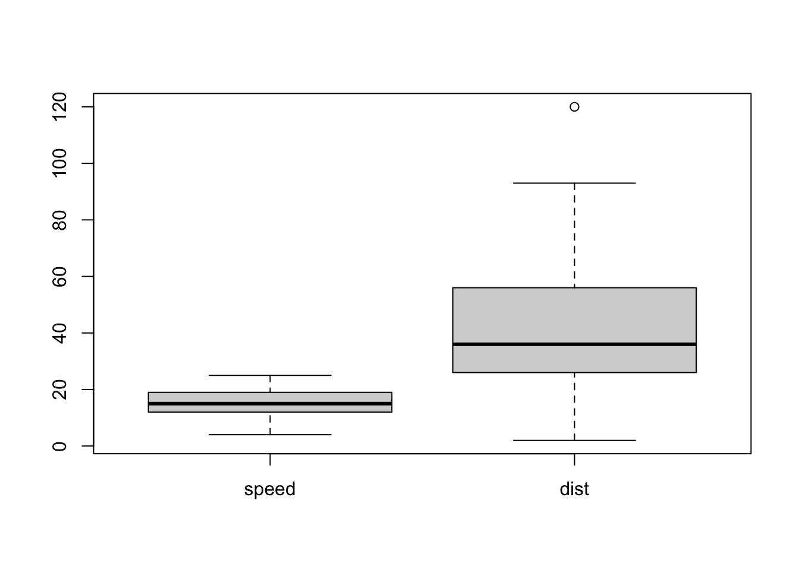
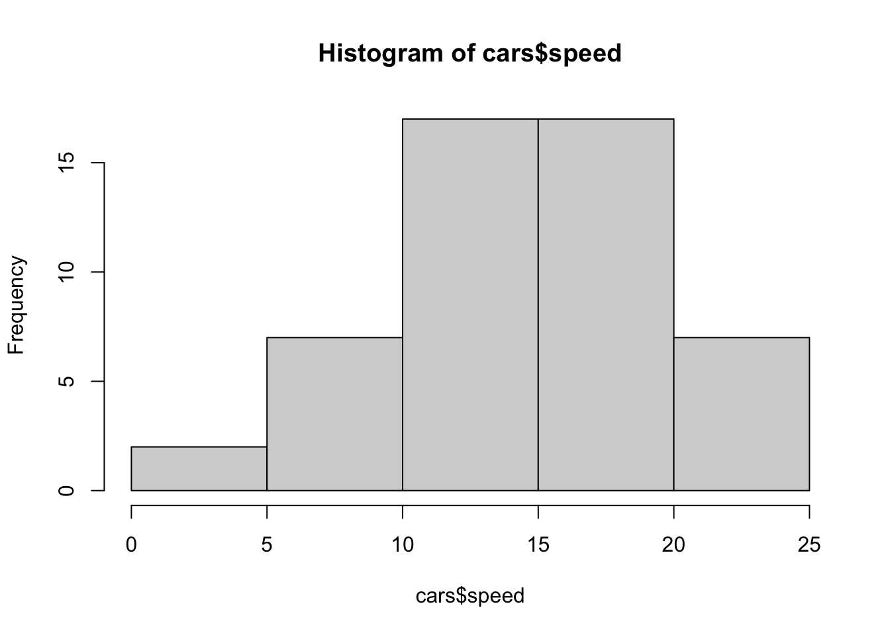
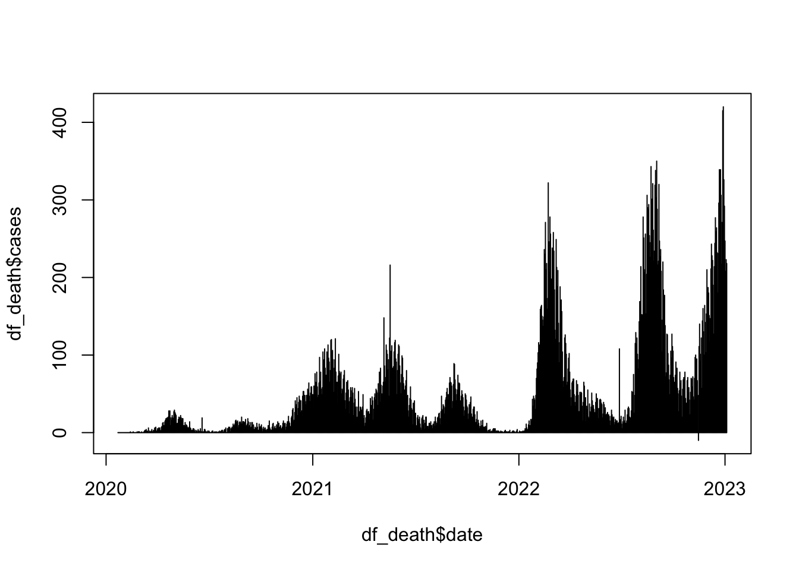
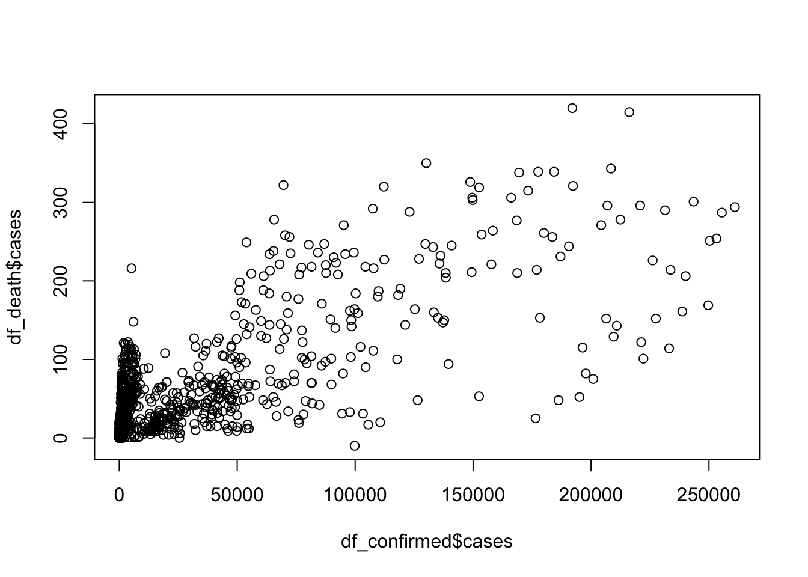
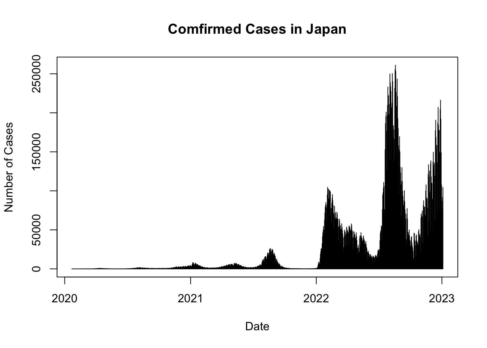

# base R {#rbasics}

## はじめに

R を使って、データサイエンスをはじめる最初のステップについて説明します。また、R を起動すると、同時に読み込まれる、base と呼ばれるパッケージについても簡単に解説します。

本書では、Tidyverse と呼ばれるパッケージ群を主として使いますが、基礎を支えるのは、base ですので、Tidyverse でデータサイエンスをするため、最低限知っておいていただきたい、base についての説明という感じでしょうか。

R Project に基本文書がありますが、100ページを越しますので、参考程度にしていただくのがよいかと思います。

リンク：

-   [An Introduction to R](https://cran.r-project.org/) Manual にあります。下に日本語版へのリンクもあります。[[日本語版 PDF](https://cran.r-project.org/doc/contrib/manuals-jp/R-intro-170.jp.pdf)]

-   [CheatSheet base R](https://rstudio.github.io/cheatsheets/base-r.pdf) 早見表[^23-rbasics-1]。検索すると日本語版も見つかると思います。

    -   [Posit CheatSheets](https://posit.co/resources/cheatsheets/): Posit co の提供する公式早見表

    -   [Contributed CheatSheet at Posit](https://rstudio.github.io/cheatsheets/contributed-cheatsheets.html): Posit co のサイトからリンクのある早見表

[^23-rbasics-1]: CheatSheet は、直訳は、カンニング・ペーパーです。ここでは、もう少し品のよさそうな、早見表ということばを使いました。

## プロジェクト - Project

RStudio で R を利用する場合には、プロジェクトを作成することを強く勧めます。

1.  まず、R Studio を起動します。

2.  上のメニューの、File から、New Project を選択します。New Directory（新しいディレクトリー）を選択し、プロジェクトを作成する Directory を決めて、名前をつけます。その名前が、プロジェクト名になります。

-   Directory（フォルダー）を指定してその名前をつけて、プロジェクトを作成します。
-   Directory が階層に分かれているときは、どこに作成するかを選択してから、名前をつけて、作成します。

3.  一旦、R Studio を終了してみましょう。

4.  プロジェクトの起動には、いくつかの方法があります。

-   まず、R Studio を起動。一つしかプロジェクトがない場合は、そのプロジェクトが起動すると思います、。上に、プロジェクト名が掲載されていれば、問題ありません。
-   File から、Open Project を選択し、起動したい、プロジェクトの Directory（フォルダー）を選択して起動します。
-   File から、Recent Projects（最近使ったプロジェクト）を選択すると、プロジェクト名が表示されますから、選択すると起動することができます。
-   コンピュータのプロジェクト入っているディレクトリー（フォルダー）をさがし、そこに、プロジェクト名.Rproj とあるものを見つけて、それを開くと、そのプロジェクトが起動します。

5.  作業後は、保存しますかと聞かれますから、保存して終了してください。

## コンソールで実行 - Run in Console

プログラム（コード）の実行には、いくつかの方法がありますが、一番、基本的な、コンソール[^23-rbasics-2]での実行について、説明します。Console は、R Studio の左下にあります。（左の枠が一つになっているかもしれません。その一番左のタブが Console です。選択されていない場合は、Console を選択してください。）

[^23-rbasics-2]: Console - 操作盤というような意味ですが、用語としてはコンソールを使います。また英語で書いてあった方が見つけやすいので、Console と記することが多いと思います

### 最初の四つ

下の、四つを、一つずつ、一番下の、\> マークの次に書き（または、コピー・ペーストして）Return または、Enter キーを押してください。実行結果が、その下に出ます。最後の、`plot(cars)` は、`cars` というデータの、散布図が右下の、Plots タブに表示されます。

-   `head(cars)`
-   `str(cars)`
-   `summary(cars)`
-   `plot(cars)`

エラーが表示されたら、もう一度、スペルを確認して、入力してみてください。

次のような、結果が表示されると思います。簡単な説明をつけます。


```r
head(cars)
#>   speed dist
#> 1     4    2
#> 2     4   10
#> 3     7    4
#> 4     7   22
#> 5     8   16
#> 6     9   10
```

`head(cars)` は、`cars` という、R に付属している、データの、最初（頭 head）の6行を、表示します。


```r
str(cars)
#> 'data.frame':	50 obs. of  2 variables:
#>  $ speed: num  4 4 7 7 8 9 10 10 10 11 ...
#>  $ dist : num  2 10 4 22 16 10 18 26 34 17 ...
```

`str(cars)` は、`cars` という、R に付属している、データの構造（structure）を表示します。`data.frame` とありますが、これは、矩形になったデータ（各列の長さがおなじ）の一番簡単なクラスの名前で、2変数、それぞれが、50 個[^23-rbasics-3]の数値データ（numerical data） からなっていることがわかります。

[^23-rbasics-3]: 50 obs. とありますが、obs. は、おそらく、observations 観測値の略

`head(cars)` では、縦に表示されていたものが、横に表示されています。`$speed`、`$dist` とありますが、`cars$speed`, `cars$dist` は、`cars` データの、それぞれの列を意味します。


```r
summary(cars)
#>      speed           dist       
#>  Min.   : 4.0   Min.   :  2.00  
#>  1st Qu.:12.0   1st Qu.: 26.00  
#>  Median :15.0   Median : 36.00  
#>  Mean   :15.4   Mean   : 42.98  
#>  3rd Qu.:19.0   3rd Qu.: 56.00  
#>  Max.   :25.0   Max.   :120.00
```

`cars` データの概要（summary）が表示されます。各列（変数）について、最小値（Minimum）、小さい方から、4分の1を切り捨てたときの最小の値（1st Quartile）、中央値（Median）、平均（Mean）、大きい方から、4分の1を切り捨てたときの最大の値（3rd Quartile）、最大値（Maximum）が表示されます。


```r
plot(cars)
```


右下の、窓枠の、Plots に、上のグラフ（散布図）が表示されると思います。Export と書いてある、プルダウンメニューがあり、そこから、画像として保存することも、可能です。

以前は、このように取り出した画像を、Word などに貼り付けて、使っていました。現在でも、そのような方法を知っていることは有効だと思います。

### アサインメント、ヘルプ

コンソールで次のそれぞれを、試してみてください。

-   `df_cars <- cars`

`df_cars` に、`cars` をアサインします。すなわち、`df_cars` が、`cars` の内容に置き換わります。`cars` はデータですが、データを含む、オブジェクトの名前を設定するためにも使います。オブジェクト名は。英文字から始まれば、かなりの自由度がありますが、わたしは、英文字と数字と `_`（underscore） 程度しか使わないようにしています。

-   `head(df_cars)`

`head(df_cars)` は、`head(cars)` と同じ出力が得られます。

-   `View(df_cars)`

左上の、窓枠が開き、`cars` というデータ の内容が表示されます。列名のところには、三角形も表示され、それを用いると、大きい順、小さい順などに、並び替えることも可能です。また、フィルター機能も使えます。

`df_cars <- cars` などと、オブジェクト（この場合は表データ）を設定していると、RStudio の右上の窓枠（Pane）の、Environment に、`df_cars` が見つかると思いますから、それをクリックしてみてください。`View(df_cars)` と同じものが表示されます。

`cars` のまま、作業をしても、問題はないのですが、データに変更などを施した時に、最初の `cars` と同じなのかどうか、不明にならないように、最初から能動的に、名前をつけて、そのデータについて作業をすることをお勧めします。また、Environemnt などを利用すると、現在、それぞれの名前で、どのようなものが登録されているか確認もできます。名前をつける時に、確認して、新しい名前をつけることも可能になります。

-   `?cars`

右下の、窓枠の　Help タブに、`cars` の情報が表示されます。Help タブにある、虫眼鏡がついた、検索窓（search window）に、`cars` といれても、同じ結果が得られます。 内容を確認してください。

一番上には `cars {datasets}` とありますが、これは、`datasets` というパッケージの、`cars` だという意味です。そこで、`datasets` を調べてみましょう。

-   `?datasets`

"The R Datasets Package" だと書かれていて、さらに、

This package contains a variety of datasets. For a complete list, use library(help = "datasets").

さまざまなデータが含まれています。全てのリストをみるには、`library(help = "datasets")` を使ってください。

とありますから、`library(help = "datasets")` をコンソールに入力してみてください。

-   `library(help = "datasets")`

左上の窓枠に、リストが表示されます。古いデータばかりですが、例として使うには、十分すぎるぐらいの、数のデータがあります。これらは、Toy Data（おもちゃのデータ）と呼ばれることもあります。

`cars` も見つかりましたか。

### おすすめ

コンピュータのシステムが、日本語であると、R の言語も日本語になっているはずです。そこで、エラーが発生すると、一部、日本語で表示されます。しかし、ネット上などで、そのエラーの対応を検索するときは、英語のエラーメッセージで検索した方が、解決方法が得られる可能性が圧倒的に高いので、わたしは、英語に設定しています。英語にするには、Console で次のようにします。

言語を英語に設定：`Sys.setenv(LANG = "en")`

RStudio を終了して、もう一度起動すると、日本語に戻っていると思います。ですから、作業の最初、または、エラーが出たら、変更することをお勧めします。

日本語に戻したいときは、次のようにします。

言語を日本語に設定：`Sys.setenv(LANG = "ja")`

さまざまな Help なども、すべて日本語で表示されれば日本語を使うのは有効かもしれませんが、すくなくとも、現在は、そうではないので、上に説明したことから、英語に設定することをお勧めします。

### 練習

1.  `head(cars, 10L)` は何が出力されますか。`head(cars, n=10L)` と同じですか。
2.  `?head` または、Help の検索窓に `head` と入力して、説明を見てみてください。`head(cars, n=10L)` などについて、書いてありましたか。他には、どのようなことが分かりましたか。
3.  `datasets` のデータのいくつかについて、そのデータの help や、`head`, `str`, `summary` などを使ってみてください。これらで表示できない場合はありますか。データについては、最初に、これら、三つを試してみることをお勧めします。わかったことをメモしておくと良いでしょう。`datasets` のリストをみるには、`library(help = "datasets")` でしたね。

## RStudio について

RStudio は多くの機能を持っています。

### 四つの窓枠とタブ Four Panes and Tabs

-   左上（Top Left）: スクリプトや文書、データなどの編集（Source Editor）
-   右上（Top Right）: 環境変数（Environment）, 履歴（History） など（etc.）
-   左下（Bottom Left）: コードの実行・実行結果などを表示するコンソール（Console）, コンピュータシステムの端末（Terminal）, 文書の機械語翻訳（Render）, 背後での作業（Background Jobs）
-   右下（Bottom Right）: ファイル（Files）, 描画（Plots）, パッケージ（Packages）, ヘルプ（Help）, 文書などの表示窓（Viewer）, R Markdown の HTML, PDF 表示（Presentation[^23-rbasics-4]）

[^23-rbasics-4]: Viewerへの表示を使っており、Presentationへの表示を使っておらず不明

## R Script 実行記録

R Script を使って、コードを実行すると、その記録を残すことができます。

### R Script の作成

-   RStudio の上のメニュー・バーからFile \> New File \> R Script を選択します。
-   File \> Save As で、名前をつけて保存します。{file_name}.R が作成されます。
    -   右下の、Files から、ファイルを確認してください。
-   `head(cars)`, `str(cars)`, `summary(cars)`, `plot(cars)` などと改行をしながらコードを書きます。
-   実行するには、カーソルの場所で Ctrl+Shift+Enter (Win) または Cmd+Shift+Enter (Mac) とすると、カーソルのある行か、その下の行で、最初のコードが実行されます。
    -   R Script エディターの上にある、Run ボタンを押しても、同様に実行されます。
    -   Run ボタンの右の、Source ボタンを押すと、そのスクリプトの、最初からすべてが実行されます。
-   最後には保存しておきましょう。たとえば、`myfirstscript` などとすると、File のところに、`myfirstscript.R` というファイルができていることを確認できます。

### R Script による実行

新しく、R Script を作成し、この下の、コード（ハイライトされている部分）をコピー・ペーストして、保存し、実行してみてください。

それぞれ、どのようなことをしているでしょうか。

詳細を説明すると、時間もかかりますから、必要になったときに、少しずつ説明していきます。ここでは、スクリプトを使って、実行するという、二つ目の方法に慣れていただければ十分です。

#### スクリプト1: `basics.R`


```r
#################
#
# basics.R
#
################
# 'Quick R' by DataCamp may be a handy reference: 
#     https://www.statmethods.net/management/index.html
# Cheat Sheet at RStudio: https://www.rstudio.com/resources/cheatsheets/
# Base R Cheat Sheet: https://github.com/rstudio/cheatsheets/raw/main/base-r.pdf
# To execute the line: Control + Enter (Window and Linux), Command + Enter (Mac)
## try your experiments on the console

## calculator

3 + 7

### +, -, *, /, ^ (or **), %%, %/%

3 + 10 / 2

3^2

2^3

2*2*2

### assignment: <-, (=, ->, assign()) 

x <- 5

x 

#### object_name <- value, '<-' shortcut: Alt (option) + '-' (hyphen or minus) 
#### Object names must start with a letter and can only contain letter, numbers, _ and .

this_is_a_long_name <- 5^3

this_is_a_long_name

char_name <- "What is your name?"

char_name

#### Use 'tab completion' and 'up arrow'

### ls(): list of all assignments

ls()
ls.str()

#### check Environment in the upper right pane

### (atomic) vectors

5:10

a <- seq(5,10)

a

b <- 5:10

identical(a,b)

seq(5,10,2) # same as seq(from = 5, to = 10, by = 2)

c1 <- seq(0,100, by = 10)

c2 <- seq(0,100, length.out = 10)

c1

c2

length(c1)

#### ? seq   ? length   ? identical

(die <- 1:6)

zero_one <- c(0,1) # same as 0:1

die + zero_one # c(1,2,3,4,5,6) + c(0,1). re-use

d1 <- rep(1:3,2) # repeat


d1

die == d1

d2 <- as.character(die == d1)

d2

d3 <- as.numeric(die == d1)

d3

### class() for class and typeof() for mode
### class of vectors: numeric, charcters, logical
### types of vectors: doubles, integers, characters, logicals (complex and raw)

typeof(d1); class(d1)

typeof(d2); class(d2)

typeof(d3); class(d3)

sqrt(2)

sqrt(2)^2

sqrt(2)^2 - 2

typeof(sqrt(2))

typeof(2)

typeof(2L)

5 == c(5)

length(5)

### Subsetting

(A_Z <- LETTERS)

A_F <- A_Z[1:6]

A_F

A_F[3]

A_F[c(3,5)]

large <- die > 3

large

even <- die %in% c(2,4,6)

even

A_F[large]

A_F[even]

A_F[die < 4]

### Compare df with df1 <- data.frame(number = die, alphabet = A_F)
df <- data.frame(number = die, alphabet = A_F, stringsAsFactors = FALSE)

df

df$number

df$alphabet

df[3,2]

df[4,1]

df[1]

class(df[1])

class(df[[1]])

identical(df[[1]], die)

identical(df[1],die)

####################
# The First Example
####################

plot(cars)

# Help

? cars

# cars is in the 'datasets' package

data()

# help(cars) does the same as ? cars
# You can use Help tab in the right bottom pane

help(plot)
? par

head(cars)

str(cars)

summary(cars)

x <- cars$speed
y <- cars$dist

min(x)
mean(x)
quantile(x)

plot(cars)

abline(lm(cars$dist ~ cars$speed))

summary(lm(cars$dist ~ cars$speed))

boxplot(cars)

hist(cars$speed)
hist(cars$dist)
hist(cars$dist, breaks = seq(0,120, 10))
```

#### スクリプト1 実行結果

みなさんの、コンピュータに表示されるもの（? cars, ? par）を除いて、出力結果もあわせて、つけておきます。


```r
#################
#
# basics.R with outputs
#
################

## calculator - 電卓機能

3 + 7
#> [1] 10

### +, -, *, /, ^ (or **), %%, %/%

3 + 10 / 2
#> [1] 8

3^2
#> [1] 9

2^3
#> [1] 8

2*2*2
#> [1] 8

### assignment: <-, (=, ->, assign()) 
### アサインメント

x <- 5

x 
#> [1] 5

### object_name <- value, '<-' shortcut: Alt (option) + '-' (hyphen or minus) 
### Object names must start with a letter and can only contain letter, numbers, _ and . 
### 文字列は、日本語でも構いません。ただ、引用符は、半角英数にしてください。

this_is_a_long_name <- 5^3

this_is_a_long_name
#> [1] 125

char_name <- "What is your name?"

char_name
#> [1] "What is your name?"

### Use 'tab completion' and 'up arrow' 
### 長い名前を使っても、少しだけ入力すれば、可能性が表示され、
### tab キーを押すと、残りが表示されます。
### この機能を tab completion（タブ補完）と言います。

### ls(): list of all assignments -
### 名前が割り当てられているものをすべて表示します。
### 右上の窓枠の、Environment と同じです。
### ls.str() では、それぞれのオブジェクトの構造（structure）まで表示されます。

ls()
#> [1] "char_name"           "this_is_a_long_name"
#> [3] "x"
ls.str()
#> char_name :  chr "What is your name?"
#> this_is_a_long_name :  num 125
#> x :  num 5

### check Environment in the upper right pane

### (atomic) vectors 
### 数字または文字の並びのオブジェクトをベクトル（vectors）と呼びます。

### 5 から 10 までの整数をこのようにも作成できます。
### これは、次の、seq(5,10) とも同じです。

5:10 
#> [1]  5  6  7  8  9 10

a <- seq(5,10)

a
#> [1]  5  6  7  8  9 10

b <- 5:10

### 二つのベクトルが同じが稼働化をチェックします。

identical(a,b) 
#> [1] TRUE

### とびとびの数列も定義できます。
### 次が、どのようなものを定義しているか確認してください。

seq(5,10,2) # same as seq(from = 5, to = 10, by = 2) 
#> [1] 5 7 9

c1 <- seq(0,100, by = 10)

c2 <- seq(0,100, length.out = 10)

c1
#>  [1]   0  10  20  30  40  50  60  70  80  90 100

c2
#>  [1]   0.00000  11.11111  22.22222  33.33333  44.44444
#>  [6]  55.55556  66.66667  77.77778  88.88889 100.00000

length(c1) # ベクトルの長さです。
#> [1] 11

### ? seq   ? length   ? identical

### かっこをつけておくと、名前をつけ、そのオブジェクトを表示することまでしてくれます。
(die <- 1:6) 
#> [1] 1 2 3 4 5 6

zero_one <- c(0,1) # same as 0:1 # ベクトルの基本的な定義です。


### 何をしているかわかりますか。
### 1+0, 2+1, 3+0, 4+1, 5+0, 6+1 とあとのものが足りなくなると、
### 繰り返して使うようにしています。

die + zero_one # c(1,2,3,4,5,6) + c(0,1). re-use 
#> [1] 1 3 3 5 5 7

d1 <- rep(1:3,2) # repeat 2回繰り返す場合はこのようにします。


d1
#> [1] 1 2 3 1 2 3

die == d1
#> [1]  TRUE  TRUE  TRUE FALSE FALSE FALSE

d2 <- as.character(die == d1) # 数字ですが、文字列として扱います。

d2
#> [1] "TRUE"  "TRUE"  "TRUE"  "FALSE" "FALSE" "FALSE"

d3 <- as.numeric(die == d1) # 数字として扱うときは、このようにします。

d3
#> [1] 1 1 1 0 0 0

### class() for class and typeof() for mode　
### クラスとモードがそれぞれに定まっています。ベクトルの場合には、それぞれ次のようなものがあります。
### class of vectors: numeric, charcters, logical
### types of vectors: doubles, integers, characters, logicals (complex and raw)

typeof(d1); class(d1)
#> [1] "integer"
#> [1] "integer"

typeof(d2); class(d2)
#> [1] "character"
#> [1] "character"

typeof(d3); class(d3)
#> [1] "double"
#> [1] "numeric"

sqrt(2)
#> [1] 1.414214

sqrt(2)^2
#> [1] 2

sqrt(2)^2 - 2 # 微妙な違いがわかりますか。
#> [1] 4.440892e-16

typeof(sqrt(2))
#> [1] "double"

typeof(2)
#> [1] "double"

typeof(2L)
#> [1] "integer"

5 == c(5)
#> [1] TRUE

length(5)
#> [1] 1

### Subsetting 一部分を取り出す。

### LETTERS には、最初から、アルファベットからなるベクトルが入っています。
### letters はどうでしょうか。
(A_Z <- LETTERS) 
#>  [1] "A" "B" "C" "D" "E" "F" "G" "H" "I" "J" "K" "L" "M" "N"
#> [15] "O" "P" "Q" "R" "S" "T" "U" "V" "W" "X" "Y" "Z"

### 1番目から6番目まで取り出して、A_F とおきます。
A_F <- A_Z[1:6]

A_F
#> [1] "A" "B" "C" "D" "E" "F"

### A_F の三番目です。
A_F[3]
#> [1] "C"

### A_F の三番目と五番目です。
A_F[c(3,5)]
#> [1] "C" "E"

### die は、1,2,3,4,5,6 からなるベクトルでした。
### そのなかで、3 より大きいものを取り出します。

large <- die > 3

large
#> [1] FALSE FALSE FALSE  TRUE  TRUE  TRUE

### die の中で、2 か、4 か 6 に適合するもの、すなわち、偶数を取り出します。

even <- die %in% c(2,4,6)

even
#> [1] FALSE  TRUE FALSE  TRUE FALSE  TRUE

### 次のようなことも可能です。

A_F[large]
#> [1] "D" "E" "F"

A_F[even]
#> [1] "B" "D" "F"

A_F[die < 4]
#> [1] "A" "B" "C"

### Compare df with df1 <- data.frame(number = die, alphabet = A_F)
### 表：data frame を作成しています。
### 文字列なども、一定の順序を決めることができますが、
### この命令で、そのようにはしないことを指定しています
### data frame は、変数の長さが同じでないといけません。
### die はサイコロの意味で６個、A, B, C, D, E, F も６個でちょうどあっています。

df <- data.frame(number = die, alphabet = A_F, stringsAsFactors = FALSE)

df
#>   number alphabet
#> 1      1        A
#> 2      2        B
#> 3      3        C
#> 4      4        D
#> 5      5        E
#> 6      6        F

df$number # 二つ列（変数）がありますが、number の方の列を取り出します。
#> [1] 1 2 3 4 5 6

df$alphabet # alphabet の列を取り出します。
#> [1] "A" "B" "C" "D" "E" "F"

df[3,2] # 3行2列を取り出します。
#> [1] "C"

df[4,1] # 4行1列
#> [1] 4

df[1]　# 一列目だけからなる表を作ります
#>   number
#> 1      1
#> 2      2
#> 3      3
#> 4      4
#> 5      5
#> 6      6

class(df[1]) # 一列目だけからなる表のクラスは？
#> [1] "data.frame"

class(df[[1]]) # 一列目からなるベクトルのクラスです。
#> [1] "integer"

### 次は、一方が、TRUE 他方が、FALSE です。わかりますか。

identical(df[[1]], die)
#> [1] TRUE

identical(df[1],die)
#> [1] FALSE

####################
# The First Example
####################

plot(cars)

### Help: Help Tab に表示されます。省略。

# ? cars

# cars is in the 'datasets' package 
### data() で現在使用可能なデータがすべて表示されます。
### 最初は、datasets のリストが表示されると思います。

# data()

# help(cars) does the same as ? cars
# You can use Help tab in the right bottom pane

# help(plot) # Help Tab に表示されます。省略。
# ? par # Help Tab に表示されます。省略。

head(cars)
#>   speed dist
#> 1     4    2
#> 2     4   10
#> 3     7    4
#> 4     7   22
#> 5     8   16
#> 6     9   10

str(cars)
#> 'data.frame':	50 obs. of  2 variables:
#>  $ speed: num  4 4 7 7 8 9 10 10 10 11 ...
#>  $ dist : num  2 10 4 22 16 10 18 26 34 17 ...

summary(cars)
#>      speed           dist       
#>  Min.   : 4.0   Min.   :  2.00  
#>  1st Qu.:12.0   1st Qu.: 26.00  
#>  Median :15.0   Median : 36.00  
#>  Mean   :15.4   Mean   : 42.98  
#>  3rd Qu.:19.0   3rd Qu.: 56.00  
#>  Max.   :25.0   Max.   :120.00

x <- cars$speed
y <- cars$dist

min(x) # x すなわち、cars の speed の最小値です。
#> [1] 4
mean(x) #  x すなわち、cars の speed の（相加）平均です。
#> [1] 15.4
quantile(x) # 四分位が表示されます。上の、summary() の説明で確認してください。
#>   0%  25%  50%  75% 100% 
#>    4   12   15   19   25

plot(cars)

### 回帰直線を加えます。フィットした直線といった感じです。

abline(lm(cars$dist ~ cars$speed))
```


```r

### 回帰直線に関するさまざまな値が表示されます。数値モデル Modeling で説明します。

summary(lm(cars$dist ~ cars$speed))
#> 
#> Call:
#> lm(formula = cars$dist ~ cars$speed)
#> 
#> Residuals:
#>     Min      1Q  Median      3Q     Max 
#> -29.069  -9.525  -2.272   9.215  43.201 
#> 
#> Coefficients:
#>             Estimate Std. Error t value Pr(>|t|)    
#> (Intercept) -17.5791     6.7584  -2.601   0.0123 *  
#> cars$speed    3.9324     0.4155   9.464 1.49e-12 ***
#> ---
#> Signif. codes:  
#> 0 '***' 0.001 '**' 0.01 '*' 0.05 '.' 0.1 ' ' 1
#> 
#> Residual standard error: 15.38 on 48 degrees of freedom
#> Multiple R-squared:  0.6511,	Adjusted R-squared:  0.6438 
#> F-statistic: 89.57 on 1 and 48 DF,  p-value: 1.49e-12

### 箱ひげ図です

boxplot(cars)
```



```r

### ヒストグラム（度数分布表）です。
### どのように区切るかを指定することも可能です。

hist(cars$speed)
```



```r
hist(cars$dist)
```


```r
hist(cars$dist, breaks = seq(0,120, 10))
```


#### スクリプト2: `coronavirus.R`


```r
# https://coronavirus.jhu.edu/map.html
# JHU Covid-19 global time series data
# See R package coronavirus at: https://github.com/RamiKrispin/coronavirus
# Data taken from: https://github.com/RamiKrispin/coronavirus/tree/master/csv
# Last Updated
Sys.Date()

## Download and read csv (comma separated value) file
coronavirus <- read.csv("https://github.com/RamiKrispin/coronavirus/raw/master/csv/coronavirus.csv")
# write.csv(coronavirus, "data/coronavirus.csv")

## Summaries and structures of the data
head(coronavirus)
str(coronavirus)
coronavirus$date <- as.Date(coronavirus$date)
str(coronavirus)

range(coronavirus$date)
unique(coronavirus$country)
unique(coronavirus$type)

## Set Country
COUNTRY <- "Japan"
df0 <- coronavirus[coronavirus$country == COUNTRY,]
head(df0)
tail(df0)
(pop <- df0$population[1])
df <- df0[c(1,6,7,13)]
str(df)
head(df)
### alternatively,
head(df0[c("date", "type", "cases", "population")])
###

## Set types
df_confirmed <- df[df$type == "confirmed",]
df_death <- df[df$type == "death",]
df_recovery <- df[df$data_type == "recovery",]
head(df_confirmed)
head(df_death)
head(df_recovery)

## Histogram
plot(df_confirmed$date, df_confirmed$cases, type = "h")
plot(df_death$date, df_death$cases, type = "h")
# plot(df_recovered$date, df_recovered$cases, type = "h") # no data for recovery

## Scatter plot and correlation
plot(df_confirmed$cases, df_death$cases, type = "p")
cor(df_confirmed$cases, df_death$cases)


## In addition set a period
start_date <- as.Date("2022-07-01")
end_date <- Sys.Date() 
df_date <- df[df$date >=start_date & df$date <= end_date,]
##

## Set types
df_date_confirmed <- df_date[df_date$type == "confirmed",]
df_date_death <- df_date[df_date$type == "death",]
df_date_recovery <- df_date[df_date$data_type == "recovery",]
head(df_date_confirmed)
head(df_date_death)
head(df_date_recovery)

## Histogram
plot(df_date_confirmed$date, df_date_confirmed$cases, type = "h")
plot(df_date_death$date, df_date_death$cases, type = "h")
# plot(df_date_recovered$date, df_date_recovered$cases, type = "h") # no data for recovery

plot(df_date_confirmed$cases, df_date_death$cases, type = "p")
cor(df_date_confirmed$cases, df_date_death$cases)

#### Extra
plot(df_confirmed$date, df_confirmed$cases, type = "h", 
     main = paste("Comfirmed Cases in",COUNTRY), 
     xlab = "Date", ylab = "Number of Cases")
```

#### スクリプト2 実行結果

大体、どのようなことをしているか、想像してみてください。少しだけ説明を加えます。


```r
# https://coronavirus.jhu.edu/map.html
# JHU Covid-19 global time series data
# See R package coronavirus at: https://github.com/RamiKrispin/coronavirus
# Data taken from: https://github.com/RamiKrispin/coronavirus/tree/master/csv
# Last Updated
Sys.Date()
#> [1] "2023-09-26"

## Download and read csv (comma separated value) file
coronavirus <- read.csv("https://github.com/RamiKrispin/coronavirus/raw/master/csv/coronavirus.csv") 
### データを Krispin のサイトから入手します。
# write.csv(coronavirus, "data/coronavirus.csv")

## Summaries and structures of the data
head(coronavirus)
#>         date province country     lat      long      type
#> 1 2020-01-22  Alberta  Canada 53.9333 -116.5765 confirmed
#> 2 2020-01-23  Alberta  Canada 53.9333 -116.5765 confirmed
#> 3 2020-01-24  Alberta  Canada 53.9333 -116.5765 confirmed
#> 4 2020-01-25  Alberta  Canada 53.9333 -116.5765 confirmed
#> 5 2020-01-26  Alberta  Canada 53.9333 -116.5765 confirmed
#> 6 2020-01-27  Alberta  Canada 53.9333 -116.5765 confirmed
#>   cases   uid iso2 iso3 code3    combined_key population
#> 1     0 12401   CA  CAN   124 Alberta, Canada    4413146
#> 2     0 12401   CA  CAN   124 Alberta, Canada    4413146
#> 3     0 12401   CA  CAN   124 Alberta, Canada    4413146
#> 4     0 12401   CA  CAN   124 Alberta, Canada    4413146
#> 5     0 12401   CA  CAN   124 Alberta, Canada    4413146
#> 6     0 12401   CA  CAN   124 Alberta, Canada    4413146
#>   continent_name continent_code
#> 1  North America           <NA>
#> 2  North America           <NA>
#> 3  North America           <NA>
#> 4  North America           <NA>
#> 5  North America           <NA>
#> 6  North America           <NA>
str(coronavirus)
#> 'data.frame':	919308 obs. of  15 variables:
#>  $ date          : chr  "2020-01-22" "2020-01-23" "2020-01-24" "2020-01-25" ...
#>  $ province      : chr  "Alberta" "Alberta" "Alberta" "Alberta" ...
#>  $ country       : chr  "Canada" "Canada" "Canada" "Canada" ...
#>  $ lat           : num  53.9 53.9 53.9 53.9 53.9 ...
#>  $ long          : num  -117 -117 -117 -117 -117 ...
#>  $ type          : chr  "confirmed" "confirmed" "confirmed" "confirmed" ...
#>  $ cases         : int  0 0 0 0 0 0 0 0 0 0 ...
#>  $ uid           : int  12401 12401 12401 12401 12401 12401 12401 12401 12401 12401 ...
#>  $ iso2          : chr  "CA" "CA" "CA" "CA" ...
#>  $ iso3          : chr  "CAN" "CAN" "CAN" "CAN" ...
#>  $ code3         : int  124 124 124 124 124 124 124 124 124 124 ...
#>  $ combined_key  : chr  "Alberta, Canada" "Alberta, Canada" "Alberta, Canada" "Alberta, Canada" ...
#>  $ population    : num  4413146 4413146 4413146 4413146 4413146 ...
#>  $ continent_name: chr  "North America" "North America" "North America" "North America" ...
#>  $ continent_code: chr  NA NA NA NA ...
coronavirus$date <- as.Date(coronavirus$date) 
### date 列を、日付だと認識するように指定します。
str(coronavirus)
#> 'data.frame':	919308 obs. of  15 variables:
#>  $ date          : Date, format: "2020-01-22" ...
#>  $ province      : chr  "Alberta" "Alberta" "Alberta" "Alberta" ...
#>  $ country       : chr  "Canada" "Canada" "Canada" "Canada" ...
#>  $ lat           : num  53.9 53.9 53.9 53.9 53.9 ...
#>  $ long          : num  -117 -117 -117 -117 -117 ...
#>  $ type          : chr  "confirmed" "confirmed" "confirmed" "confirmed" ...
#>  $ cases         : int  0 0 0 0 0 0 0 0 0 0 ...
#>  $ uid           : int  12401 12401 12401 12401 12401 12401 12401 12401 12401 12401 ...
#>  $ iso2          : chr  "CA" "CA" "CA" "CA" ...
#>  $ iso3          : chr  "CAN" "CAN" "CAN" "CAN" ...
#>  $ code3         : int  124 124 124 124 124 124 124 124 124 124 ...
#>  $ combined_key  : chr  "Alberta, Canada" "Alberta, Canada" "Alberta, Canada" "Alberta, Canada" ...
#>  $ population    : num  4413146 4413146 4413146 4413146 4413146 ...
#>  $ continent_name: chr  "North America" "North America" "North America" "North America" ...
#>  $ continent_code: chr  NA NA NA NA ...

range(coronavirus$date) # 期間（日付の幅）を調べます
#> [1] "2020-01-22" "2023-01-04"

### country 列に入っている国（何度も同じ国が入っているので、
### 異なるもののみを抽出）

unique(coronavirus$country) 
#>   [1] "Canada"                          
#>   [2] "United Kingdom"                  
#>   [3] "China"                           
#>   [4] "Netherlands"                     
#>   [5] "Australia"                       
#>   [6] "New Zealand"                     
#>   [7] "Denmark"                         
#>   [8] "France"                          
#>   [9] "Afghanistan"                     
#>  [10] "Albania"                         
#>  [11] "Algeria"                         
#>  [12] "Andorra"                         
#>  [13] "Angola"                          
#>  [14] "Antarctica"                      
#>  [15] "Antigua and Barbuda"             
#>  [16] "Argentina"                       
#>  [17] "Armenia"                         
#>  [18] "Austria"                         
#>  [19] "Azerbaijan"                      
#>  [20] "Bahamas"                         
#>  [21] "Bahrain"                         
#>  [22] "Bangladesh"                      
#>  [23] "Barbados"                        
#>  [24] "Belarus"                         
#>  [25] "Belgium"                         
#>  [26] "Belize"                          
#>  [27] "Benin"                           
#>  [28] "Bhutan"                          
#>  [29] "Bolivia"                         
#>  [30] "Bosnia and Herzegovina"          
#>  [31] "Botswana"                        
#>  [32] "Brazil"                          
#>  [33] "Brunei"                          
#>  [34] "Bulgaria"                        
#>  [35] "Burkina Faso"                    
#>  [36] "Burma"                           
#>  [37] "Burundi"                         
#>  [38] "Cabo Verde"                      
#>  [39] "Cambodia"                        
#>  [40] "Cameroon"                        
#>  [41] "Central African Republic"        
#>  [42] "Chad"                            
#>  [43] "Chile"                           
#>  [44] "Colombia"                        
#>  [45] "Comoros"                         
#>  [46] "Congo (Brazzaville)"             
#>  [47] "Congo (Kinshasa)"                
#>  [48] "Costa Rica"                      
#>  [49] "Cote d'Ivoire"                   
#>  [50] "Croatia"                         
#>  [51] "Cuba"                            
#>  [52] "Cyprus"                          
#>  [53] "Czechia"                         
#>  [54] "Diamond Princess"                
#>  [55] "Djibouti"                        
#>  [56] "Dominica"                        
#>  [57] "Dominican Republic"              
#>  [58] "Ecuador"                         
#>  [59] "Egypt"                           
#>  [60] "El Salvador"                     
#>  [61] "Equatorial Guinea"               
#>  [62] "Eritrea"                         
#>  [63] "Estonia"                         
#>  [64] "Eswatini"                        
#>  [65] "Ethiopia"                        
#>  [66] "Fiji"                            
#>  [67] "Finland"                         
#>  [68] "Gabon"                           
#>  [69] "Gambia"                          
#>  [70] "Georgia"                         
#>  [71] "Germany"                         
#>  [72] "Ghana"                           
#>  [73] "Greece"                          
#>  [74] "Grenada"                         
#>  [75] "Guatemala"                       
#>  [76] "Guinea"                          
#>  [77] "Guinea-Bissau"                   
#>  [78] "Guyana"                          
#>  [79] "Haiti"                           
#>  [80] "Holy See"                        
#>  [81] "Honduras"                        
#>  [82] "Hungary"                         
#>  [83] "Iceland"                         
#>  [84] "India"                           
#>  [85] "Indonesia"                       
#>  [86] "Iran"                            
#>  [87] "Iraq"                            
#>  [88] "Ireland"                         
#>  [89] "Israel"                          
#>  [90] "Italy"                           
#>  [91] "Jamaica"                         
#>  [92] "Japan"                           
#>  [93] "Jordan"                          
#>  [94] "Kazakhstan"                      
#>  [95] "Kenya"                           
#>  [96] "Kiribati"                        
#>  [97] "Korea, North"                    
#>  [98] "Korea, South"                    
#>  [99] "Kosovo"                          
#> [100] "Kuwait"                          
#> [101] "Kyrgyzstan"                      
#> [102] "Laos"                            
#> [103] "Latvia"                          
#> [104] "Lebanon"                         
#> [105] "Lesotho"                         
#> [106] "Liberia"                         
#> [107] "Libya"                           
#> [108] "Liechtenstein"                   
#> [109] "Lithuania"                       
#> [110] "Luxembourg"                      
#> [111] "Madagascar"                      
#> [112] "Malawi"                          
#> [113] "Malaysia"                        
#> [114] "Maldives"                        
#> [115] "Mali"                            
#> [116] "Malta"                           
#> [117] "Marshall Islands"                
#> [118] "Mauritania"                      
#> [119] "Mauritius"                       
#> [120] "Mexico"                          
#> [121] "Micronesia"                      
#> [122] "Moldova"                         
#> [123] "Monaco"                          
#> [124] "Mongolia"                        
#> [125] "Montenegro"                      
#> [126] "Morocco"                         
#> [127] "Mozambique"                      
#> [128] "MS Zaandam"                      
#> [129] "Namibia"                         
#> [130] "Nauru"                           
#> [131] "Nepal"                           
#> [132] "Nicaragua"                       
#> [133] "Niger"                           
#> [134] "Nigeria"                         
#> [135] "North Macedonia"                 
#> [136] "Norway"                          
#> [137] "Oman"                            
#> [138] "Pakistan"                        
#> [139] "Palau"                           
#> [140] "Panama"                          
#> [141] "Papua New Guinea"                
#> [142] "Paraguay"                        
#> [143] "Peru"                            
#> [144] "Philippines"                     
#> [145] "Poland"                          
#> [146] "Portugal"                        
#> [147] "Qatar"                           
#> [148] "Romania"                         
#> [149] "Russia"                          
#> [150] "Rwanda"                          
#> [151] "Saint Kitts and Nevis"           
#> [152] "Saint Lucia"                     
#> [153] "Saint Vincent and the Grenadines"
#> [154] "Samoa"                           
#> [155] "San Marino"                      
#> [156] "Sao Tome and Principe"           
#> [157] "Saudi Arabia"                    
#> [158] "Senegal"                         
#> [159] "Serbia"                          
#> [160] "Seychelles"                      
#> [161] "Sierra Leone"                    
#> [162] "Singapore"                       
#> [163] "Slovakia"                        
#> [164] "Slovenia"                        
#> [165] "Solomon Islands"                 
#> [166] "Somalia"                         
#> [167] "South Africa"                    
#> [168] "South Sudan"                     
#> [169] "Spain"                           
#> [170] "Sri Lanka"                       
#> [171] "Sudan"                           
#> [172] "Summer Olympics 2020"            
#> [173] "Suriname"                        
#> [174] "Sweden"                          
#> [175] "Switzerland"                     
#> [176] "Syria"                           
#> [177] "Taiwan*"                         
#> [178] "Tajikistan"                      
#> [179] "Tanzania"                        
#> [180] "Thailand"                        
#> [181] "Timor-Leste"                     
#> [182] "Togo"                            
#> [183] "Tonga"                           
#> [184] "Trinidad and Tobago"             
#> [185] "Tunisia"                         
#> [186] "Turkey"                          
#> [187] "Tuvalu"                          
#> [188] "Uganda"                          
#> [189] "Ukraine"                         
#> [190] "United Arab Emirates"            
#> [191] "Uruguay"                         
#> [192] "US"                              
#> [193] "Uzbekistan"                      
#> [194] "Vanuatu"                         
#> [195] "Venezuela"                       
#> [196] "Vietnam"                         
#> [197] "West Bank and Gaza"              
#> [198] "Winter Olympics 2022"            
#> [199] "Yemen"                           
#> [200] "Zambia"                          
#> [201] "Zimbabwe"

unique(coronavirus$type) # type 列の種類
#> [1] "confirmed" "death"     "recovery"

## Set Country 

### 日本に設定してみます。
### 上の国のリストから、選択すれば、他の国についても、
### グラフなどを書くことができます。

COUNTRY <- "Japan" 

### country 列が上で指定した、COUNTRY と同じもの、
### この場合は日本のものだけを取り出します。

df0 <- coronavirus[coronavirus$country == COUNTRY,] 

head(df0)
#>              date province country      lat     long
#> 189905 2020-01-22     <NA>   Japan 36.20482 138.2529
#> 189906 2020-01-23     <NA>   Japan 36.20482 138.2529
#> 189907 2020-01-24     <NA>   Japan 36.20482 138.2529
#> 189908 2020-01-25     <NA>   Japan 36.20482 138.2529
#> 189909 2020-01-26     <NA>   Japan 36.20482 138.2529
#> 189910 2020-01-27     <NA>   Japan 36.20482 138.2529
#>             type cases uid iso2 iso3 code3 combined_key
#> 189905 confirmed     2 392   JP  JPN   392        Japan
#> 189906 confirmed     0 392   JP  JPN   392        Japan
#> 189907 confirmed     0 392   JP  JPN   392        Japan
#> 189908 confirmed     0 392   JP  JPN   392        Japan
#> 189909 confirmed     2 392   JP  JPN   392        Japan
#> 189910 confirmed     0 392   JP  JPN   392        Japan
#>        population continent_name continent_code
#> 189905  126476458           Asia             AS
#> 189906  126476458           Asia             AS
#> 189907  126476458           Asia             AS
#> 189908  126476458           Asia             AS
#> 189909  126476458           Asia             AS
#> 189910  126476458           Asia             AS
tail(df0)
#>              date province country      lat     long
#> 798455 2022-12-30     <NA>   Japan 36.20482 138.2529
#> 798456 2022-12-31     <NA>   Japan 36.20482 138.2529
#> 798457 2023-01-01     <NA>   Japan 36.20482 138.2529
#> 798458 2023-01-02     <NA>   Japan 36.20482 138.2529
#> 798459 2023-01-03     <NA>   Japan 36.20482 138.2529
#> 798460 2023-01-04     <NA>   Japan 36.20482 138.2529
#>            type cases uid iso2 iso3 code3 combined_key
#> 798455 recovery     0 392   JP  JPN   392        Japan
#> 798456 recovery     0 392   JP  JPN   392        Japan
#> 798457 recovery     0 392   JP  JPN   392        Japan
#> 798458 recovery     0 392   JP  JPN   392        Japan
#> 798459 recovery     0 392   JP  JPN   392        Japan
#> 798460 recovery     0 392   JP  JPN   392        Japan
#>        population continent_name continent_code
#> 798455  126476458           Asia             AS
#> 798456  126476458           Asia             AS
#> 798457  126476458           Asia             AS
#> 798458  126476458           Asia             AS
#> 798459  126476458           Asia             AS
#> 798460  126476458           Asia             AS
(pop <- df0$population[1])
#> [1] 126476458
df <- df0[c(1,6,7,13)]
str(df)
#> 'data.frame':	3237 obs. of  4 variables:
#>  $ date      : Date, format: "2020-01-22" ...
#>  $ type      : chr  "confirmed" "confirmed" "confirmed" "confirmed" ...
#>  $ cases     : int  2 0 0 0 2 0 3 0 4 4 ...
#>  $ population: num  1.26e+08 1.26e+08 1.26e+08 1.26e+08 1.26e+08 ...
head(df)
#>              date      type cases population
#> 189905 2020-01-22 confirmed     2  126476458
#> 189906 2020-01-23 confirmed     0  126476458
#> 189907 2020-01-24 confirmed     0  126476458
#> 189908 2020-01-25 confirmed     0  126476458
#> 189909 2020-01-26 confirmed     2  126476458
#> 189910 2020-01-27 confirmed     0  126476458

### alternatively,

head(df0[c("date", "type", "cases", "population")])
#>              date      type cases population
#> 189905 2020-01-22 confirmed     2  126476458
#> 189906 2020-01-23 confirmed     0  126476458
#> 189907 2020-01-24 confirmed     0  126476458
#> 189908 2020-01-25 confirmed     0  126476458
#> 189909 2020-01-26 confirmed     2  126476458
#> 189910 2020-01-27 confirmed     0  126476458

## Set types
###  タイプ毎に取り出します。

df_confirmed <- df[df$type == "confirmed",]　# 感染者数
df_death <- df[df$type == "death",] # 死者数
df_recovery <- df[df$data_type == "recovery",] # 回復者数
head(df_confirmed)
#>              date      type cases population
#> 189905 2020-01-22 confirmed     2  126476458
#> 189906 2020-01-23 confirmed     0  126476458
#> 189907 2020-01-24 confirmed     0  126476458
#> 189908 2020-01-25 confirmed     0  126476458
#> 189909 2020-01-26 confirmed     2  126476458
#> 189910 2020-01-27 confirmed     0  126476458
head(df_death)
#>              date  type cases population
#> 501736 2020-01-22 death     0  126476458
#> 501737 2020-01-23 death     0  126476458
#> 501738 2020-01-24 death     0  126476458
#> 501739 2020-01-25 death     0  126476458
#> 501740 2020-01-26 death     0  126476458
#> 501741 2020-01-27 death     0  126476458
head(df_recovery)
#> [1] date       type       cases      population
#> <0 rows> (or 0-length row.names)

## Histogram
plot(df_confirmed$date, df_confirmed$cases, type = "h")
```


```r
plot(df_death$date, df_death$cases, type = "h")
```



```r
# plot(df_recovered$date, df_recovered$cases, type = "h") # no data for recovery

## Scatter plot and correlation
plot(df_confirmed$cases, df_death$cases, type = "p")
```



```r
cor(df_confirmed$cases, df_death$cases) # 相関係数を計算しています
#> [1] 0.7696834


## In addition set a period
start_date <- as.Date("2022-07-01") # 特定の期間を定めます
end_date <- Sys.Date() 
df_date <- df[df$date >=start_date & df$date <= end_date,]
##

## Set types
df_date_confirmed <- df_date[df_date$type == "confirmed",]
df_date_death <- df_date[df_date$type == "death",]
df_date_recovery <- df_date[df_date$data_type == "recovery",]
head(df_date_confirmed)
#>              date      type cases population
#> 190796 2022-07-01 confirmed 23125  126476458
#> 190797 2022-07-02 confirmed 24900  126476458
#> 190798 2022-07-03 confirmed 23286  126476458
#> 190799 2022-07-04 confirmed 16785  126476458
#> 190800 2022-07-05 confirmed 36233  126476458
#> 190801 2022-07-06 confirmed 45794  126476458
head(df_date_death)
#>              date  type cases population
#> 502627 2022-07-01 death    21  126476458
#> 502628 2022-07-02 death    11  126476458
#> 502629 2022-07-03 death     5  126476458
#> 502630 2022-07-04 death    14  126476458
#> 502631 2022-07-05 death    20  126476458
#> 502632 2022-07-06 death    12  126476458
head(df_date_recovery)
#> [1] date       type       cases      population
#> <0 rows> (or 0-length row.names)

## Histogram
plot(df_date_confirmed$date, df_date_confirmed$cases, type = "h")
```


```r
plot(df_date_death$date, df_date_death$cases, type = "h")
```


```r
# plot(df_date_recovered$date, df_date_recovered$cases, type = "h") # no data for recovery

plot(df_date_confirmed$cases, df_date_death$cases, type = "p")
```


```r
cor(df_date_confirmed$cases, df_date_death$cases)
#> [1] 0.6528591

#### Extra
plot(df_confirmed$date, df_confirmed$cases, type = "h", 
     main = paste("Comfirmed Cases in",COUNTRY), 
     xlab = "Date", ylab = "Number of Cases")
```



### 練習

上の、`coronavirus.R` について

1.  `COUNTRY <- "Japan"` の Japan を他の国に変えてみましょう。
2.  `start_date <- as.Date("2022-07-01")` の日付を、他の日付に変えてみましょう。
3.  `df_confirmed$cases` と `df_death$cases` についてどんなことがわかりますか。
4.  発見や、問いがあれば、書き出してみましょう。

### Tips

キーボード・ショートカットと言われる、さまざまな機能があります。

-   上のメニュー・バー： Help \> Keyboard Short Cut Help 確認してみてください。
-   右下の窓枠: Files タブから、ファイルの確認ができます。

## パッケージ - Packages

> R packages are extensions to the R statistical programming language containing code, data, and documentation in a standardised collection format that can be installed by users of R using Tool \> Install Packages in the top menu bar of R Studio. <https://en.wikipedia.org/wiki/R_package>

> Rパッケージは、Rの拡張機能で、コード、データ、ドキュメントを標準化されたコレクション形式で含んでおり、標準的なものは、R Studio の Top Bar の Tool \> Install Packages からインストールできます。

### パッケージのインストール

いずれ使いますので、まずは、三つのパッケージをインストールしてみましょう。

-   `tidyverse`
-   `rmarkdown`
-   `tinytex`

インストール方法はいくつかあります。

一つ目は、上のメニューバーの Tool から、Install Packages ... を選択します。そして、パッケージーズにインストールしたい、パッケージ名を入力します。そのパッケージ名が下にも出れば、Install ボタンを押してください。入力した名前の下にパッケージ名が出ない場合は、スペルが間違っている可能性がありますから、確認して、入れ直してください。

Console に、`install.packages("tidyverse")` などと表示され、たくさんメッセージが出ます。終了すると、\> のマークがでます。

二つ目は、`install.packages("tidyverse")` のような書式で書いて、Console に入れる方法です。

三つ目は、右下の窓枠の Packages のタブにある、Install というボタンを押す方法です。すると、一番目の方法に、戻り、パッケージ名を入力できるようになります。

この Packages タブにある、ものが、すでに、インストールされているパッケージです。そのなかで、`base` や、`datasets` などいくつかに、チェックがついていると思いますが、それらは、ロードされていて、いつでも、使える状態になっていることを意味しています。ロードは、たとえば、`library(tidyverse)` のようにしますが、それは、いずれもう一度説明します。

インストールは一回だけ。ときどき、Tools \> Check for Package Update をつかって、Update しておくと良いでしょう。

::: rmdnote
パッケージのインストールで問題が生じることがあります。特に、Windows の日本語システムの場合です。（4.3.2 R Studio の インストール の下に書いてある部分を参照してください。）

回避方法もいくつかあるようですが、混乱をさけるため、その場合は、Posit Cloud（旧：RStudio Cloud）を使うと良いでしょう。それを見越して、最初は、Posit Cloud ではじめることを、わたしはお薦めしています。自分のコンピュータで、R が RStudio 上で問題なく動いていても、Cloud 上にアカウントを持っていて、実行できることは有効ですし、全員が、同じ環境で作業できることもたいせつなことです。他にも、すぐ、Cheat Sheets（早見表）や、Posit Primers という練習問題（Tutorial）を利用できたり、プロジェクトを共有したりなど、さまざまなメリットがあります。
:::

### 備考

Package によっては、Source から Compile するかと聞いてくる場合があります。どちらでも、良いのですが、特に、問題が起こっていなければ、No でよいと思います。コンピュータにあった形でインストールすることが必要な場合は、Yes とします。

同じパッケージをもう一度、インストールしたり、または、関連するパッケージがあるような場合、R をリスタートするかと聞いてくることがあります。特に問題が起こらなければ、No で構いません。ただ、エラーが起こって、それに関連して、特別なパッケージをインストールする必要がある場合がありますが、そのときは、Yes としてください。

## 練習問題 Posit Primers

Posit Primers <https://posit.cloud/learn/primers>

教科書 ["R for Data Science"](https://r4ds.had.co.nz) は、`tidyverse` パッケージを中心に、データサイエンスについて解説したものですが、Posit Primers は、演習問題をしながら、教科書の内容を理解できるように構成されています。

Posit Cloud からは、左のメニュー（隠れている場合は左上の3本線をクリックして表示させて）から選ぶことができます。そうでない場合は、直接、上のリンクから、利用してください。

### 最初の演習　The Basics -- r4ds: Explore, I

-   [Visualization Basics](https://rstudio.cloud/learn/primers/1.1)
-   [Programming Basics](https://rstudio.cloud/learn/primers/1.2)

ぜひこれら二つの演習問題を、トライしてください。解説を読んでいただけでは、データサイエンスは身につきません。

## 参考文献 References

一番目は、すでに紹介した、教科書です。二番目は、この文書を作成している、Bookdown というパッケージのサイトですが、そこに、たくさんの本が、無償で公開されています。素晴らしい本がたくさん含まれています。

-   R For Data Science, by H. Wickham: <https://r4ds.had.co.nz>
    -   Introduction: <https://r4ds.had.co.nz/explore-intro.html#explore-intro>
-   Bookdown: <https://bookdown.org>, [Archive](https://bookdown.org/home/archive/)

下の一番目は、R 入門を、２時限の講義でしたときのものです。二番目と三番目は、講義で使ったものを、まとめたものです。教科書のようには、できていませんが、参考になる部分もあるかと思いますので、紹介しておきます。

-   [Introduction to R](https://ds-sl.github.io/intro2r/intro2r.nb.html)
-   [Data Analysis for Researchers 2022](https://icu-hsuzuki.github.io/da4r2022/)
-   [Data Analysis for Researchers 2021](https://icu-hsuzuki.github.io/da4r2021/)

## YouTube Video - getstarted

<iframe width="560" height="315" src="https://www.youtube.com/embed/9uQmMZoG74g" title="YouTube video player" frameborder="0" allow="accelerometer; autoplay; clipboard-write; encrypted-media; gyroscope; picture-in-picture; web-share" allowfullscreen>

</iframe>

-   ファイル：<https://ds-sl.github.io/intro2r/getstarted.html>

## まとめと復習

ここでは、詳細までは理解していただかなくて結構ですが、基本事項をまとめておきます。

1.  R Studio で R を使うときには、まず、Project を作成し、その中で行う。

2.  コンソール（Console）に、入力して実行させる方法と、スクリプト（R Script）から実行する方法がある。もう一つ、RMarkdown の章で紹介した、RMarkdown の中で、実行する方法があります。

3.  データを簡単にみる三つの命令、head(), str(), summary() を紹介しました。他にも、View() でデータを見たり、Help を使って、調べる方法を紹介しました。

4.  パッケージによって、便利なさまざまな拡張機能を利用するために、そのインストール方法を紹介しました。

5.  対話型の練習問題集、Posit Primers の紹介をしました。
