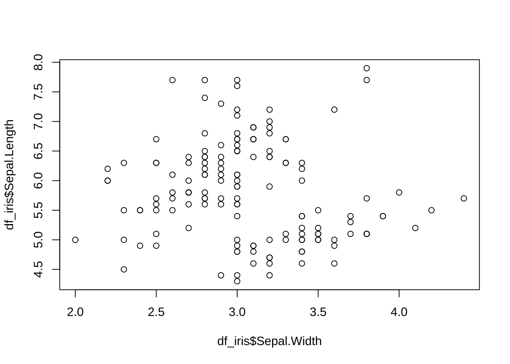
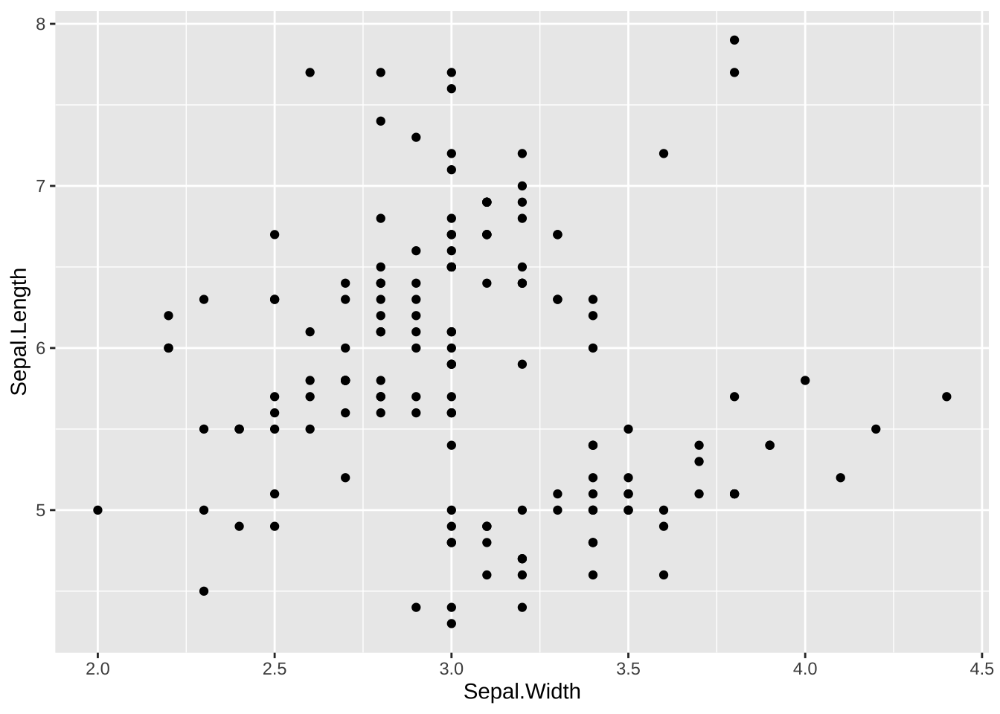
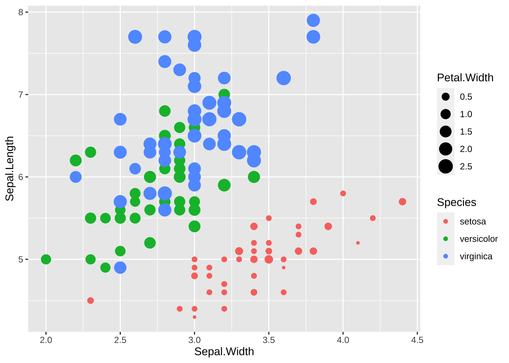

# Tidyverse {#tidyverse}

## はじめに

R のはじめかたについて少し説明しました。R を起動させると、最初に `base` などいくつかのパッケージが自動的に読み込まれますが、その基本の基本を紹介したということです。ここでは、第二部で学ぶことの、核となる `tidyverse` というパッケージ群についてその基本を学びます。

サイト：<https://www.tidyverse.org>

R は、さまざまな分野で、統計分析に利用されてきたこともあり、それぞれの分析でよく使われる関数（functions, 小さなプログラム）を集めたパッケージが作られ、それぞれの分野で使われてきました。まさに、痒いところに手が届く、さまざまなパッケージが存在します。他方、さまざまな人たちが開発を続けてきたために、統一性がない、保守の継続性が十分ではない、異なるパッケージに同じ名前の関数があるなどの問題も生じてきたように思います。

さらに、それぞれの分野での、統計分析だけではなく、学際分野としてのデータサイエンスでの利用、AI への応用などにも使われるようになったこと、さらに、データサイエンスでは、特に可視化が重要で、その部分の基本が、幾何表現の文法（Grammar of Graphics）を踏まえた `ggplot2` パッケージのによって、確立したことから、統一した思想のもとで、構築されたのが、`tidyverse` パッケージ群です。さまざまな改善によって、プログラミング言語としても、十分なレベルの言語となっていると思います。

一連の `tidyverse` パッケージ群の開発が、R 自体にも影響を与え、R の起動時に読み込まれるようになったものもあります。

パッケージ群と呼びましたが、たくさんのパッケージが全体として、`tidyverse` と呼ばれ、`tidyverse` をインストールすると、`tidyverse` パッケージ群のパッケージがすべてインストールされます。

それを、`library(tidyverse)` などで、ロード（使えるようにするために）すると、`tidyverse` パッケージ群の主要なパッケージがみな、読み込まれます。ただ、こちらは、「主要な」ものだけですので、`tidyverse` パッケージ群 のパッケージでも、後ほど、個別に読み込む必要があるものもありますので、注意してください。

## あやめ（iris）のデータ

利用するデータ、特に、その変数（列）名に日本語（中国語・韓国語など）を使う場合には、`install.packages('showtext')` で、`showtext` パッケージをインストールして、下のように設定ます。標準的には、最初の行 `library(tidyverse)` だけで十分です。


```r
library(tidyverse)
#> ── Attaching core tidyverse packages ──── tidyverse 2.0.0 ──
#> ✔ dplyr     1.1.3     ✔ readr     2.1.4
#> ✔ forcats   1.0.0     ✔ stringr   1.5.0
#> ✔ ggplot2   3.4.3     ✔ tibble    3.2.1
#> ✔ lubridate 1.9.2     ✔ tidyr     1.3.0
#> ✔ purrr     1.0.2     
#> ── Conflicts ────────────────────── tidyverse_conflicts() ──
#> ✖ dplyr::filter() masks stats::filter()
#> ✖ dplyr::lag()    masks stats::lag()
#> ℹ Use the conflicted package (<http://conflicted.r-lib.org/>) to force all conflicts to become errors
library(showtext) 
#> Loading required package: sysfonts
#> Loading required package: showtextdb
showtext_auto()
```

いろいろなメッセージが表示されました。簡単に説明しておきます。

-   Attaching core tidyverse packages：パッケージを読み込む、使えるようにするのが、library() という、命令ですが、ここでは、たくさんのパッケージが読み込まれたことが書かれています。Tidyverse パッケージ群の中の核となるパッケージです（core tidyverse packages）。実は、これ以外にも、Tidyverse パッケージ群は、パッケージを含んでいますが、それは、別に、読み込まないといけません。その都度説明します。

-   Conflicts：実は、違うパッケージの中に、同じ名前の関数（命令）が含まれている場合があります。その場合は、あとから読み込んだパッケージの命令が優先されます。いま、tidyverse を読み込んだので、その前に、読み込まれていたパッケージのいくつかの、関数が使えなくなりましたというメッセージです。

-   次に、showtext を読み込んでいます。そこでは、sysfonts と showtextdb も必要なので、読み込んだと書かれています。

以下では、R の起動時に読み込まれる、 `datasets` パッケージの中の、`iris` データを使います。以前には、同じパッケージに含まれる、`cars` を使いました。まず、このデータに、`ds_iris` という名前をつけて使うことにします。これは、アサインと言い、`<-` を使います。半角で入力します。

備考：

1.  Help の Keyboard Shortcuts Help をみると、さまざまなキーボードショートカットが書かれています。`<-` は、Windows では、`Alt + -` 、Mac では、`Option + -` で、入力することもできます。`Alt + -` などは、`Alt` キーを推しながら、`-`　キーを押すという意味です。
2.  `df_iris <- iris` でも問題ないと思います。下にようにするのは、すでに、`iris` という変数を使っているかもしれないので、`datasets` パッケージの `iris` を使うという意味です。


```r
df_iris <- datasets::iris 
class(df_iris)
#> [1] "data.frame"
```

あやめのデータ `iris` は `data.frame` というクラスであることがわかります。`tidyverse` には、`tibble` というデータのクラス（`data.frame` のサブクラス）もあります。


```r
tbl_iris <- as_tibble(datasets::iris)
class(tbl_iris)
#> [1] "tbl_df"     "tbl"        "data.frame"
```

`df_iris` と `tbl_iris` で出力が変わる場合もありますが、今のところは、あまり気にせず、`df_iris` を使っていきたいと思います。

### データを見てみよう

#### 復習

すでに、いくつかの関数を学んでいますから、それを使ってみてみましょう。`head`, `str`, `summary` でした。

##### `head` : データの頭の部分


```r
head(df_iris)
```

<div data-pagedtable="false">
  <script data-pagedtable-source type="application/json">
{"columns":[{"label":[""],"name":["_rn_"],"type":[""],"align":["left"]},{"label":["Sepal.Length"],"name":[1],"type":["dbl"],"align":["right"]},{"label":["Sepal.Width"],"name":[2],"type":["dbl"],"align":["right"]},{"label":["Petal.Length"],"name":[3],"type":["dbl"],"align":["right"]},{"label":["Petal.Width"],"name":[4],"type":["dbl"],"align":["right"]},{"label":["Species"],"name":[5],"type":["fct"],"align":["left"]}],"data":[{"1":"5.1","2":"3.5","3":"1.4","4":"0.2","5":"setosa","_rn_":"1"},{"1":"4.9","2":"3.0","3":"1.4","4":"0.2","5":"setosa","_rn_":"2"},{"1":"4.7","2":"3.2","3":"1.3","4":"0.2","5":"setosa","_rn_":"3"},{"1":"4.6","2":"3.1","3":"1.5","4":"0.2","5":"setosa","_rn_":"4"},{"1":"5.0","2":"3.6","3":"1.4","4":"0.2","5":"setosa","_rn_":"5"},{"1":"5.4","2":"3.9","3":"1.7","4":"0.4","5":"setosa","_rn_":"6"}],"options":{"columns":{"min":{},"max":[10]},"rows":{"min":[10],"max":[10]},"pages":{}}}
  </script>
</div>

データの最初の6行（head）が表示されました。

##### `str` : データの構造（structure）


```r
str(df_iris)
#> 'data.frame':	150 obs. of  5 variables:
#>  $ Sepal.Length: num  5.1 4.9 4.7 4.6 5 5.4 4.6 5 4.4 4.9 ...
#>  $ Sepal.Width : num  3.5 3 3.2 3.1 3.6 3.9 3.4 3.4 2.9 3.1 ...
#>  $ Petal.Length: num  1.4 1.4 1.3 1.5 1.4 1.7 1.4 1.5 1.4 1.5 ...
#>  $ Petal.Width : num  0.2 0.2 0.2 0.2 0.2 0.4 0.3 0.2 0.2 0.1 ...
#>  $ Species     : Factor w/ 3 levels "setosa","versicolor",..: 1 1 1 1 1 1 1 1 1 1 ...
```

全体の構造（structure）の概略が表示されました。5つの変数、Sepal.Lengh（萼（がく）長）, Sepal.Width（萼幅）, Petal.Length（花弁長）, Petal.Width（花弁幅）, Species（種別） について、150 の データ（observations）が含まれており、Species は、三つの Factor になっているということがわかります。Factor については、後ほど学びますが、三つに分類されているという意味で、ここでは、あやめの種類、setosa, versicolor, virginica となっています。三つ目は見えていないかもしれません。

次の、summary() を使うと、Species の三種類がなにかわかりますが、unique() という関数を使って、みてみましょう。df_iris の Species に対応する列は、df_iris\$Species で取り出せますので、次のようにします。Level と書いてあるのは、Factor という形式になっているので、その順序が書かれています。この場合は、アルファベットの順序になっています。


```r
unique(df_iris$Species)
#> [1] setosa     versicolor virginica 
#> Levels: setosa versicolor virginica
```

##### `summary`: データの概要


```r
summary(df_iris)
#>   Sepal.Length    Sepal.Width     Petal.Length  
#>  Min.   :4.300   Min.   :2.000   Min.   :1.000  
#>  1st Qu.:5.100   1st Qu.:2.800   1st Qu.:1.600  
#>  Median :5.800   Median :3.000   Median :4.350  
#>  Mean   :5.843   Mean   :3.057   Mean   :3.758  
#>  3rd Qu.:6.400   3rd Qu.:3.300   3rd Qu.:5.100  
#>  Max.   :7.900   Max.   :4.400   Max.   :6.900  
#>   Petal.Width          Species  
#>  Min.   :0.100   setosa    :50  
#>  1st Qu.:0.300   versicolor:50  
#>  Median :1.300   virginica :50  
#>  Mean   :1.199                  
#>  3rd Qu.:1.800                  
#>  Max.   :2.500
```

それぞれの最小値（Min. Minimum）、第一四分位（1st Qu. First Quartile 小さい方から、4分の1を切り捨てたときの最小の値）、中央値（Median）、平均（Mean）、第三四分位（3rd Qu. Third Quartile、大きい方から、4分の1を切り捨てたときの最大の値）最大値（Max. Maximum）が、書かれており、各種それぞれ50個のデータからなっていることがわかります。

base R では、さらに、`plot`、`View`、`help` についても学びました。

これは、あやめ（iris）の、長さや幅のデータでしたが、単位は何でしょうか。それも、help で調べることができます。Help の検索ボックスに、iris と入れてみてください。この場合は、Description（概要）に次のように書かれています。

This famous (Fisher's or Anderson's) iris data set gives the measurements in centimeters of the variables sepal length and width and petal length and width, respectively, for 50 flowers from each of 3 species of iris. The species are Iris setosa, versicolor, and virginica.

この有名な（フィッシャーまたはアンダーソンの）あやめのデータは、3種のあやめからそれぞれ50個の花について、萼片の長さと幅、花弁の長さと幅の変数をそれぞれセンチメートル単位で測定したものです。種は、Iris setosa, versicolor, virginica です。

各、変数の説明が書かれている場合もありますので、Help は、かならず確認するようにしてください。

##### plot: 散布図


```r
plot(df_iris$Sepal.Width, df_iris$Sepal.Length)
```



何を x 軸、何を y 軸 の値とするかを指定します。それは、df_iris\$Sepal.Width で、df_iris の、Sepal.Width の列、df_iris\$Sepal.Length で、df_iris の Sepal.Length の列の値を指定しています。

##### View: データテーブルの表示


```r
View(df_iris)
```

`View(df_iris)` を、Console に入れると、データテーブルが開きます。順番の並び替えもできるようになっています。

R Studio では、右上の窓に、Environment タブがありますが、そこに、df_iris があると思いますから、それを、クリックすると、同じ、データテーブルが表示されます。

##### help: ヘルプ


```r
help(iris)
```

`help(iris)` を、Console に入れるか、または、右下の窓枠の Help に、`iris` と入れると、説明などが出ます。

ここまでは、`tidyverse` を使わずにもできることですが、これからは、`tidyverse` の関数を紹介していきます。

### dplyr 変形

ここでは、head と、str に対応する、二種類の関数を紹介するにとどめますが、次の、章の中心的トピックです。

#### slice: 行を切り取る

`head` を一般化したものです。`slice`, `slice_head`, `slice_tail`, `slice_max`, `slice_min`, `slice_sample` とあります。

<div data-pagedtable="false">
  <script data-pagedtable-source type="application/json">
{"columns":[{"label":["Sepal.Length"],"name":[1],"type":["dbl"],"align":["right"]},{"label":["Sepal.Width"],"name":[2],"type":["dbl"],"align":["right"]},{"label":["Petal.Length"],"name":[3],"type":["dbl"],"align":["right"]},{"label":["Petal.Width"],"name":[4],"type":["dbl"],"align":["right"]},{"label":["Species"],"name":[5],"type":["fct"],"align":["left"]}],"data":[{"1":"5.1","2":"3.5","3":"1.4","4":"0.2","5":"setosa"},{"1":"4.9","2":"3.0","3":"1.4","4":"0.2","5":"setosa"},{"1":"4.7","2":"3.2","3":"1.3","4":"0.2","5":"setosa"},{"1":"4.6","2":"3.1","3":"1.5","4":"0.2","5":"setosa"},{"1":"5.0","2":"3.6","3":"1.4","4":"0.2","5":"setosa"},{"1":"5.4","2":"3.9","3":"1.7","4":"0.4","5":"setosa"},{"1":"4.6","2":"3.4","3":"1.4","4":"0.3","5":"setosa"},{"1":"5.0","2":"3.4","3":"1.5","4":"0.2","5":"setosa"},{"1":"4.4","2":"2.9","3":"1.4","4":"0.2","5":"setosa"},{"1":"4.9","2":"3.1","3":"1.5","4":"0.1","5":"setosa"}],"options":{"columns":{"min":{},"max":[10]},"rows":{"min":[10],"max":[10]},"pages":{}}}
  </script>
</div>

`|>` は、パイプ（pipe）コマンドと言われるもので、`tidyverse` では、`%>%` もほぼ同じ機能ですが、R 4.0 以降には、含まれていますので、`tidyverse` なしでも使えますから、こちらを使うようにします。最初の 10 行を切り出すという意味で、パイプを使わないときは、一つ前のものが、最初の 変数（argument）となりますから、下のものでも同じです。


```r
slice(df_iris, 1:10)
```

<div data-pagedtable="false">
  <script data-pagedtable-source type="application/json">
{"columns":[{"label":["Sepal.Length"],"name":[1],"type":["dbl"],"align":["right"]},{"label":["Sepal.Width"],"name":[2],"type":["dbl"],"align":["right"]},{"label":["Petal.Length"],"name":[3],"type":["dbl"],"align":["right"]},{"label":["Petal.Width"],"name":[4],"type":["dbl"],"align":["right"]},{"label":["Species"],"name":[5],"type":["fct"],"align":["left"]}],"data":[{"1":"5.1","2":"3.5","3":"1.4","4":"0.2","5":"setosa"},{"1":"4.9","2":"3.0","3":"1.4","4":"0.2","5":"setosa"},{"1":"4.7","2":"3.2","3":"1.3","4":"0.2","5":"setosa"},{"1":"4.6","2":"3.1","3":"1.5","4":"0.2","5":"setosa"},{"1":"5.0","2":"3.6","3":"1.4","4":"0.2","5":"setosa"},{"1":"5.4","2":"3.9","3":"1.7","4":"0.4","5":"setosa"},{"1":"4.6","2":"3.4","3":"1.4","4":"0.3","5":"setosa"},{"1":"5.0","2":"3.4","3":"1.5","4":"0.2","5":"setosa"},{"1":"4.4","2":"2.9","3":"1.4","4":"0.2","5":"setosa"},{"1":"4.9","2":"3.1","3":"1.5","4":"0.1","5":"setosa"}],"options":{"columns":{"min":{},"max":[10]},"rows":{"min":[10],"max":[10]},"pages":{}}}
  </script>
</div>


```r
1:10
#>  [1]  1  2  3  4  5  6  7  8  9 10
```

1から10のベクトルです。ということは、1:10 の部分をいろいろと変えれば、さまざまな部分を取り出すことができます。詳細は、Help 検索窓で、で、`slice` と調べてください。下も同じ結果を出力します。


```r
df_iris |> slice_head(n=10)
```

<div data-pagedtable="false">
  <script data-pagedtable-source type="application/json">
{"columns":[{"label":["Sepal.Length"],"name":[1],"type":["dbl"],"align":["right"]},{"label":["Sepal.Width"],"name":[2],"type":["dbl"],"align":["right"]},{"label":["Petal.Length"],"name":[3],"type":["dbl"],"align":["right"]},{"label":["Petal.Width"],"name":[4],"type":["dbl"],"align":["right"]},{"label":["Species"],"name":[5],"type":["fct"],"align":["left"]}],"data":[{"1":"5.1","2":"3.5","3":"1.4","4":"0.2","5":"setosa"},{"1":"4.9","2":"3.0","3":"1.4","4":"0.2","5":"setosa"},{"1":"4.7","2":"3.2","3":"1.3","4":"0.2","5":"setosa"},{"1":"4.6","2":"3.1","3":"1.5","4":"0.2","5":"setosa"},{"1":"5.0","2":"3.6","3":"1.4","4":"0.2","5":"setosa"},{"1":"5.4","2":"3.9","3":"1.7","4":"0.4","5":"setosa"},{"1":"4.6","2":"3.4","3":"1.4","4":"0.3","5":"setosa"},{"1":"5.0","2":"3.4","3":"1.5","4":"0.2","5":"setosa"},{"1":"4.4","2":"2.9","3":"1.4","4":"0.2","5":"setosa"},{"1":"4.9","2":"3.1","3":"1.5","4":"0.1","5":"setosa"}],"options":{"columns":{"min":{},"max":[10]},"rows":{"min":[10],"max":[10]},"pages":{}}}
  </script>
</div>


```r
df_iris |> slice_max(order_by = Sepal.Length, n=7)
```

<div data-pagedtable="false">
  <script data-pagedtable-source type="application/json">
{"columns":[{"label":["Sepal.Length"],"name":[1],"type":["dbl"],"align":["right"]},{"label":["Sepal.Width"],"name":[2],"type":["dbl"],"align":["right"]},{"label":["Petal.Length"],"name":[3],"type":["dbl"],"align":["right"]},{"label":["Petal.Width"],"name":[4],"type":["dbl"],"align":["right"]},{"label":["Species"],"name":[5],"type":["fct"],"align":["left"]}],"data":[{"1":"7.9","2":"3.8","3":"6.4","4":"2.0","5":"virginica"},{"1":"7.7","2":"3.8","3":"6.7","4":"2.2","5":"virginica"},{"1":"7.7","2":"2.6","3":"6.9","4":"2.3","5":"virginica"},{"1":"7.7","2":"2.8","3":"6.7","4":"2.0","5":"virginica"},{"1":"7.7","2":"3.0","3":"6.1","4":"2.3","5":"virginica"},{"1":"7.6","2":"3.0","3":"6.6","4":"2.1","5":"virginica"},{"1":"7.4","2":"2.8","3":"6.1","4":"1.9","5":"virginica"}],"options":{"columns":{"min":{},"max":[10]},"rows":{"min":[10],"max":[10]},"pages":{}}}
  </script>
</div>

Sepal.Length の値を大きい方から順に並べて、最初の7つを選択するというものです。

#### glimpse: データの構造

`str` の改良版です。他の、tidyverse の関数と一緒に使うこともできます。


```r
glimpse(df_iris)
#> Rows: 150
#> Columns: 5
#> $ Sepal.Length <dbl> 5.1, 4.9, 4.7, 4.6, 5.0, 5.4, 4.6, 5.…
#> $ Sepal.Width  <dbl> 3.5, 3.0, 3.2, 3.1, 3.6, 3.9, 3.4, 3.…
#> $ Petal.Length <dbl> 1.4, 1.4, 1.3, 1.5, 1.4, 1.7, 1.4, 1.…
#> $ Petal.Width  <dbl> 0.2, 0.2, 0.2, 0.2, 0.2, 0.4, 0.3, 0.…
#> $ Species      <fct> setosa, setosa, setosa, setosa, setos…
```


```r
df_iris |> glimpse() 
#> Rows: 150
#> Columns: 5
#> $ Sepal.Length <dbl> 5.1, 4.9, 4.7, 4.6, 5.0, 5.4, 4.6, 5.…
#> $ Sepal.Width  <dbl> 3.5, 3.0, 3.2, 3.1, 3.6, 3.9, 3.4, 3.…
#> $ Petal.Length <dbl> 1.4, 1.4, 1.3, 1.5, 1.4, 1.7, 1.4, 1.…
#> $ Petal.Width  <dbl> 0.2, 0.2, 0.2, 0.2, 0.2, 0.4, 0.3, 0.…
#> $ Species      <fct> setosa, setosa, setosa, setosa, setos…
```

`str(df_iris)` では num （数値データ）と表示されましたが、ここでは、もう少し詳R の 6個のデータタイプ Double（連続データ）, Integer（整数値データ）, Character（文字データ）, Logical（論理値データ）, Raw（素データ）, Complex（複素数データ） が表示されます。最初の四種類が主要なものと考えてください。

データの列を指定するときは、データ名のあとに、ドルマークをつけ、列名を加えます。`df_iris$Sepal.Width` などです。 これは、一列目ですから、 `typeof(df_iris[[1]])` とすることもできます。2行目の1列目というときは、次のようにします。

`` df_iris[2,1] = 4.9 `` is the fourth entry of Sepal.Width.


```r
typeof(df_iris$Sepal.Width)
#> [1] "double"
```


```r
typeof(df_iris$Species)
#> [1] "integer"
```


```r
class(df_iris$Species)
#> [1] "factor"
```

ファクター `factors = fct` については [the R Document](https://www.rdocumentation.org/packages/base/versions/3.6.2/topics/factor) または、[Factor in R: Categorical Variable & Continuous Variables](https://www.guru99.com/r-factor-categorical-continuous.html) をみてください。必要になったときに、説明します。


```r
typeof(df_iris$Sepal.Length)
#> [1] "double"
class(df_iris$Sepal.Length)
#> [1] "numeric"
```

#### ggplot2: グラフの描画

`plot` の拡張ですが、`tidyverse` パッケージ群の核をなすものでもあります。詳細は、視覚化で扱います。


```r
df_iris |> ggplot(aes(Sepal.Width, Sepal.Length)) + geom_point()
```



さまざまな描画が可能ですが、一番、一般的な、散布図、`plot` に対応するものを書きました。`ggplot` の中の、`aes` （aesthetic）の部分に、x 軸、y 軸に対応する変数（列名）を書きます。種類（Species）ごとに色を変える場合には、`color = Species` とします。


```r
df_iris |> ggplot(aes(Sepal.Width, Sepal.Length, color = Species)) +
  geom_point()
```


さらに、点の大きさを、Petal.Width によって変える場合には次のように、`size = Petal.Width` を加えます。


```r
df_iris |> 
  ggplot(aes(Sepal.Width, Sepal.Length, color = Species, 
             size = Petal.Width)) +
  geom_point()
```



少しずつ学んでいきましょう。

## WDI のデータ

以下の説明では、世界開発指標（World Development Indicator）の実際のデータも使って説明していきます。例として使うデータを取得して、上で学んだことの復習もかねて、簡単にみておきたいと思います。

すでに、`tidyverse` は読み込んでありますから、その場合は、`WDI` パッケージを読み込むだけで十分です。


```r
library(tidyverse)
library(WDI)
```

WDI の使い方は、世界銀行の部分で紹介しますが、はじめてのデータサイエンスの例でも紹介したように、データコードを利用して、データを読み込みます。ここでは、出生時の平均寿命と、一人当たりの　GDP と、総人口のデータを使います。

-   SP.DYN.LE00.IN: Life expectancy at birth, total (years) 出生時の平均寿命
-   SP.POP.TOTL: Population, total 総人口
-   NY.GDP.PCAP.KD: GDP per capita (constant 2015 US\$) 一人当たりの　GDP

次のコードで読み込みます。


```r
df_wdi <- WDI(
  country = "all", 
  indicator = c(lifeExp = "SP.DYN.LE00.IN", pop = "SP.POP.TOTL", gdpPercap = "NY.GDP.PCAP.KD")
)
```


```
#> Rows: 16758 Columns: 7
#> ── Column specification ────────────────────────────────────
#> Delimiter: ","
#> chr (3): country, iso2c, iso3c
#> dbl (4): year, lifeExp, pop, gdpPercap
#> 
#> ℹ Use `spec()` to retrieve the full column specification for this data.
#> ℹ Specify the column types or set `show_col_types = FALSE` to quiet this message.
```

注：WDI のサイトは、頻繁に、保守をしているため、時々、データをダウンロードできないことがあります。そのときは、すでに、ダウンロードしてものがわたしの GitHub [サイト](%22https://github.com/icu-hsuzuki/ds4aj/blob/main/data/wdi.csv%22)にありますから、そこから次のコードで読み込んでください。

最初の10行をみてみましょう。


```r
df_wdi %>% slice(1:10)
```

<div data-pagedtable="false">
  <script data-pagedtable-source type="application/json">
{"columns":[{"label":["country"],"name":[1],"type":["chr"],"align":["left"]},{"label":["iso2c"],"name":[2],"type":["chr"],"align":["left"]},{"label":["iso3c"],"name":[3],"type":["chr"],"align":["left"]},{"label":["year"],"name":[4],"type":["dbl"],"align":["right"]},{"label":["lifeExp"],"name":[5],"type":["dbl"],"align":["right"]},{"label":["pop"],"name":[6],"type":["dbl"],"align":["right"]},{"label":["gdpPercap"],"name":[7],"type":["dbl"],"align":["right"]}],"data":[{"1":"Afghanistan","2":"AF","3":"AFG","4":"1960","5":"32.535","6":"8622466","7":"NA"},{"1":"Afghanistan","2":"AF","3":"AFG","4":"1961","5":"33.068","6":"8790140","7":"NA"},{"1":"Afghanistan","2":"AF","3":"AFG","4":"1962","5":"33.547","6":"8969047","7":"NA"},{"1":"Afghanistan","2":"AF","3":"AFG","4":"1963","5":"34.016","6":"9157465","7":"NA"},{"1":"Afghanistan","2":"AF","3":"AFG","4":"1964","5":"34.494","6":"9355514","7":"NA"},{"1":"Afghanistan","2":"AF","3":"AFG","4":"1965","5":"34.953","6":"9565147","7":"NA"},{"1":"Afghanistan","2":"AF","3":"AFG","4":"1966","5":"35.453","6":"9783147","7":"NA"},{"1":"Afghanistan","2":"AF","3":"AFG","4":"1967","5":"35.924","6":"10010030","7":"NA"},{"1":"Afghanistan","2":"AF","3":"AFG","4":"1968","5":"36.418","6":"10247780","7":"NA"},{"1":"Afghanistan","2":"AF","3":"AFG","4":"1969","5":"36.910","6":"10494489","7":"NA"}],"options":{"columns":{"min":{},"max":[10]},"rows":{"min":[10],"max":[10]},"pages":{}}}
  </script>
</div>


```r
df_wdi_extra <- WDI(
  country = "all", 
  indicator = c(lifeExp = "SP.DYN.LE00.IN", pop = "SP.POP.TOTL", gdpPercap = "NY.GDP.PCAP.KD"), 
  extra = TRUE
)
```

すこし、追加情報を付加したものも取得しておきます。


```
#> Rows: 16758 Columns: 15
#> ── Column specification ────────────────────────────────────
#> Delimiter: ","
#> chr  (7): country, iso2c, iso3c, region, capital, income...
#> dbl  (6): year, lifeExp, pop, gdpPercap, longitude, lati...
#> lgl  (1): status
#> date (1): lastupdated
#> 
#> ℹ Use `spec()` to retrieve the full column specification for this data.
#> ℹ Specify the column types or set `show_col_types = FALSE` to quiet this message.
```


```r
df_wdi_extra
```

<div data-pagedtable="false">
  <script data-pagedtable-source type="application/json">
{"columns":[{"label":["country"],"name":[1],"type":["chr"],"align":["left"]},{"label":["iso2c"],"name":[2],"type":["chr"],"align":["left"]},{"label":["iso3c"],"name":[3],"type":["chr"],"align":["left"]},{"label":["year"],"name":[4],"type":["dbl"],"align":["right"]},{"label":["status"],"name":[5],"type":["lgl"],"align":["right"]},{"label":["lastupdated"],"name":[6],"type":["date"],"align":["right"]},{"label":["lifeExp"],"name":[7],"type":["dbl"],"align":["right"]},{"label":["pop"],"name":[8],"type":["dbl"],"align":["right"]},{"label":["gdpPercap"],"name":[9],"type":["dbl"],"align":["right"]},{"label":["region"],"name":[10],"type":["chr"],"align":["left"]},{"label":["capital"],"name":[11],"type":["chr"],"align":["left"]},{"label":["longitude"],"name":[12],"type":["dbl"],"align":["right"]},{"label":["latitude"],"name":[13],"type":["dbl"],"align":["right"]},{"label":["income"],"name":[14],"type":["chr"],"align":["left"]},{"label":["lending"],"name":[15],"type":["chr"],"align":["left"]}],"data":[{"1":"Afghanistan","2":"AF","3":"AFG","4":"2014","5":"NA","6":"2023-09-19","7":"62.54500","8":"32716210","9":"602.5166","10":"South Asia","11":"Kabul","12":"69.17610","13":"34.522800","14":"Low income","15":"IDA"},{"1":"Afghanistan","2":"AF","3":"AFG","4":"2012","5":"NA","6":"2023-09-19","7":"61.92300","8":"30466479","9":"596.4424","10":"South Asia","11":"Kabul","12":"69.17610","13":"34.522800","14":"Low income","15":"IDA"},{"1":"Afghanistan","2":"AF","3":"AFG","4":"2009","5":"NA","6":"2023-09-19","7":"60.36400","8":"27385307","9":"512.4090","10":"South Asia","11":"Kabul","12":"69.17610","13":"34.522800","14":"Low income","15":"IDA"},{"1":"Afghanistan","2":"AF","3":"AFG","4":"2013","5":"NA","6":"2023-09-19","7":"62.41700","8":"31541209","9":"608.3863","10":"South Asia","11":"Kabul","12":"69.17610","13":"34.522800","14":"Low income","15":"IDA"},{"1":"Afghanistan","2":"AF","3":"AFG","4":"1971","5":"NA","6":"2023-09-19","7":"37.92300","8":"11015857","9":"NA","10":"South Asia","11":"Kabul","12":"69.17610","13":"34.522800","14":"Low income","15":"IDA"},{"1":"Afghanistan","2":"AF","3":"AFG","4":"2015","5":"NA","6":"2023-09-19","7":"62.65900","8":"33753499","9":"592.4762","10":"South Asia","11":"Kabul","12":"69.17610","13":"34.522800","14":"Low income","15":"IDA"},{"1":"Afghanistan","2":"AF","3":"AFG","4":"1969","5":"NA","6":"2023-09-19","7":"36.91000","8":"10494489","9":"NA","10":"South Asia","11":"Kabul","12":"69.17610","13":"34.522800","14":"Low income","15":"IDA"},{"1":"Afghanistan","2":"AF","3":"AFG","4":"2010","5":"NA","6":"2023-09-19","7":"60.85100","8":"28189672","9":"569.2824","10":"South Asia","11":"Kabul","12":"69.17610","13":"34.522800","14":"Low income","15":"IDA"},{"1":"Afghanistan","2":"AF","3":"AFG","4":"2011","5":"NA","6":"2023-09-19","7":"61.41900","8":"29249157","9":"551.0006","10":"South Asia","11":"Kabul","12":"69.17610","13":"34.522800","14":"Low income","15":"IDA"},{"1":"Afghanistan","2":"AF","3":"AFG","4":"2008","5":"NA","6":"2023-09-19","7":"59.85200","8":"26427199","9":"437.4198","10":"South Asia","11":"Kabul","12":"69.17610","13":"34.522800","14":"Low income","15":"IDA"},{"1":"Afghanistan","2":"AF","3":"AFG","4":"2006","5":"NA","6":"2023-09-19","7":"58.68400","8":"25442944","9":"384.0781","10":"South Asia","11":"Kabul","12":"69.17610","13":"34.522800","14":"Low income","15":"IDA"},{"1":"Afghanistan","2":"AF","3":"AFG","4":"1972","5":"NA","6":"2023-09-19","7":"38.44400","8":"11286753","9":"NA","10":"South Asia","11":"Kabul","12":"69.17610","13":"34.522800","14":"Low income","15":"IDA"},{"1":"Afghanistan","2":"AF","3":"AFG","4":"1962","5":"NA","6":"2023-09-19","7":"33.54700","8":"8969047","9":"NA","10":"South Asia","11":"Kabul","12":"69.17610","13":"34.522800","14":"Low income","15":"IDA"},{"1":"Afghanistan","2":"AF","3":"AFG","4":"1968","5":"NA","6":"2023-09-19","7":"36.41800","8":"10247780","9":"NA","10":"South Asia","11":"Kabul","12":"69.17610","13":"34.522800","14":"Low income","15":"IDA"},{"1":"Afghanistan","2":"AF","3":"AFG","4":"1995","5":"NA","6":"2023-09-19","7":"52.54400","8":"16418912","9":"NA","10":"South Asia","11":"Kabul","12":"69.17610","13":"34.522800","14":"Low income","15":"IDA"},{"1":"Afghanistan","2":"AF","3":"AFG","4":"1996","5":"NA","6":"2023-09-19","7":"53.24300","8":"17106595","9":"NA","10":"South Asia","11":"Kabul","12":"69.17610","13":"34.522800","14":"Low income","15":"IDA"},{"1":"Afghanistan","2":"AF","3":"AFG","4":"1997","5":"NA","6":"2023-09-19","7":"53.63400","8":"17788819","9":"NA","10":"South Asia","11":"Kabul","12":"69.17610","13":"34.522800","14":"Low income","15":"IDA"},{"1":"Afghanistan","2":"AF","3":"AFG","4":"1998","5":"NA","6":"2023-09-19","7":"52.94300","8":"18493132","9":"NA","10":"South Asia","11":"Kabul","12":"69.17610","13":"34.522800","14":"Low income","15":"IDA"},{"1":"Afghanistan","2":"AF","3":"AFG","4":"1999","5":"NA","6":"2023-09-19","7":"54.84600","8":"19262847","9":"NA","10":"South Asia","11":"Kabul","12":"69.17610","13":"34.522800","14":"Low income","15":"IDA"},{"1":"Afghanistan","2":"AF","3":"AFG","4":"2000","5":"NA","6":"2023-09-19","7":"55.29800","8":"19542982","9":"NA","10":"South Asia","11":"Kabul","12":"69.17610","13":"34.522800","14":"Low income","15":"IDA"},{"1":"Afghanistan","2":"AF","3":"AFG","4":"2001","5":"NA","6":"2023-09-19","7":"55.79800","8":"19688632","9":"NA","10":"South Asia","11":"Kabul","12":"69.17610","13":"34.522800","14":"Low income","15":"IDA"},{"1":"Afghanistan","2":"AF","3":"AFG","4":"2002","5":"NA","6":"2023-09-19","7":"56.45400","8":"21000256","9":"359.7661","10":"South Asia","11":"Kabul","12":"69.17610","13":"34.522800","14":"Low income","15":"IDA"},{"1":"Afghanistan","2":"AF","3":"AFG","4":"2003","5":"NA","6":"2023-09-19","7":"57.34400","8":"22645130","9":"363.1013","10":"South Asia","11":"Kabul","12":"69.17610","13":"34.522800","14":"Low income","15":"IDA"},{"1":"Afghanistan","2":"AF","3":"AFG","4":"2005","5":"NA","6":"2023-09-19","7":"58.36100","8":"24411191","9":"379.9556","10":"South Asia","11":"Kabul","12":"69.17610","13":"34.522800","14":"Low income","15":"IDA"},{"1":"Afghanistan","2":"AF","3":"AFG","4":"1961","5":"NA","6":"2023-09-19","7":"33.06800","8":"8790140","9":"NA","10":"South Asia","11":"Kabul","12":"69.17610","13":"34.522800","14":"Low income","15":"IDA"},{"1":"Afghanistan","2":"AF","3":"AFG","4":"2018","5":"NA","6":"2023-09-19","7":"63.08100","8":"36686784","9":"578.9855","10":"South Asia","11":"Kabul","12":"69.17610","13":"34.522800","14":"Low income","15":"IDA"},{"1":"Afghanistan","2":"AF","3":"AFG","4":"2019","5":"NA","6":"2023-09-19","7":"63.56500","8":"37769499","9":"584.3865","10":"South Asia","11":"Kabul","12":"69.17610","13":"34.522800","14":"Low income","15":"IDA"},{"1":"Afghanistan","2":"AF","3":"AFG","4":"2007","5":"NA","6":"2023-09-19","7":"59.11100","8":"25903301","9":"429.4123","10":"South Asia","11":"Kabul","12":"69.17610","13":"34.522800","14":"Low income","15":"IDA"},{"1":"Afghanistan","2":"AF","3":"AFG","4":"1964","5":"NA","6":"2023-09-19","7":"34.49400","8":"9355514","9":"NA","10":"South Asia","11":"Kabul","12":"69.17610","13":"34.522800","14":"Low income","15":"IDA"},{"1":"Afghanistan","2":"AF","3":"AFG","4":"1965","5":"NA","6":"2023-09-19","7":"34.95300","8":"9565147","9":"NA","10":"South Asia","11":"Kabul","12":"69.17610","13":"34.522800","14":"Low income","15":"IDA"},{"1":"Afghanistan","2":"AF","3":"AFG","4":"1966","5":"NA","6":"2023-09-19","7":"35.45300","8":"9783147","9":"NA","10":"South Asia","11":"Kabul","12":"69.17610","13":"34.522800","14":"Low income","15":"IDA"},{"1":"Afghanistan","2":"AF","3":"AFG","4":"1967","5":"NA","6":"2023-09-19","7":"35.92400","8":"10010030","9":"NA","10":"South Asia","11":"Kabul","12":"69.17610","13":"34.522800","14":"Low income","15":"IDA"},{"1":"Afghanistan","2":"AF","3":"AFG","4":"1983","5":"NA","6":"2023-09-19","7":"38.18700","8":"9951449","9":"NA","10":"South Asia","11":"Kabul","12":"69.17610","13":"34.522800","14":"Low income","15":"IDA"},{"1":"Afghanistan","2":"AF","3":"AFG","4":"1984","5":"NA","6":"2023-09-19","7":"33.32900","8":"10243686","9":"NA","10":"South Asia","11":"Kabul","12":"69.17610","13":"34.522800","14":"Low income","15":"IDA"},{"1":"Afghanistan","2":"AF","3":"AFG","4":"1970","5":"NA","6":"2023-09-19","7":"37.41800","8":"10752971","9":"NA","10":"South Asia","11":"Kabul","12":"69.17610","13":"34.522800","14":"Low income","15":"IDA"},{"1":"Afghanistan","2":"AF","3":"AFG","4":"1973","5":"NA","6":"2023-09-19","7":"39.00300","8":"11575305","9":"NA","10":"South Asia","11":"Kabul","12":"69.17610","13":"34.522800","14":"Low income","15":"IDA"},{"1":"Afghanistan","2":"AF","3":"AFG","4":"2004","5":"NA","6":"2023-09-19","7":"57.94400","8":"23553551","9":"354.0337","10":"South Asia","11":"Kabul","12":"69.17610","13":"34.522800","14":"Low income","15":"IDA"},{"1":"Afghanistan","2":"AF","3":"AFG","4":"1960","5":"NA","6":"2023-09-19","7":"32.53500","8":"8622466","9":"NA","10":"South Asia","11":"Kabul","12":"69.17610","13":"34.522800","14":"Low income","15":"IDA"},{"1":"Afghanistan","2":"AF","3":"AFG","4":"1991","5":"NA","6":"2023-09-19","7":"46.66300","8":"10745167","9":"NA","10":"South Asia","11":"Kabul","12":"69.17610","13":"34.522800","14":"Low income","15":"IDA"},{"1":"Afghanistan","2":"AF","3":"AFG","4":"1992","5":"NA","6":"2023-09-19","7":"47.59600","8":"12057433","9":"NA","10":"South Asia","11":"Kabul","12":"69.17610","13":"34.522800","14":"Low income","15":"IDA"},{"1":"Afghanistan","2":"AF","3":"AFG","4":"2020","5":"NA","6":"2023-09-19","7":"62.57500","8":"38972230","9":"553.0361","10":"South Asia","11":"Kabul","12":"69.17610","13":"34.522800","14":"Low income","15":"IDA"},{"1":"Afghanistan","2":"AF","3":"AFG","4":"2021","5":"NA","6":"2023-09-19","7":"61.98200","8":"40099462","9":"426.2294","10":"South Asia","11":"Kabul","12":"69.17610","13":"34.522800","14":"Low income","15":"IDA"},{"1":"Afghanistan","2":"AF","3":"AFG","4":"2022","5":"NA","6":"2023-09-19","7":"NA","8":"41128771","9":"NA","10":"South Asia","11":"Kabul","12":"69.17610","13":"34.522800","14":"Low income","15":"IDA"},{"1":"Afghanistan","2":"AF","3":"AFG","4":"1981","5":"NA","6":"2023-09-19","7":"40.16400","8":"11155195","9":"NA","10":"South Asia","11":"Kabul","12":"69.17610","13":"34.522800","14":"Low income","15":"IDA"},{"1":"Afghanistan","2":"AF","3":"AFG","4":"1982","5":"NA","6":"2023-09-19","7":"37.76600","8":"10088289","9":"NA","10":"South Asia","11":"Kabul","12":"69.17610","13":"34.522800","14":"Low income","15":"IDA"},{"1":"Afghanistan","2":"AF","3":"AFG","4":"2016","5":"NA","6":"2023-09-19","7":"63.13600","8":"34636207","9":"590.4274","10":"South Asia","11":"Kabul","12":"69.17610","13":"34.522800","14":"Low income","15":"IDA"},{"1":"Afghanistan","2":"AF","3":"AFG","4":"2017","5":"NA","6":"2023-09-19","7":"63.01600","8":"35643418","9":"588.9301","10":"South Asia","11":"Kabul","12":"69.17610","13":"34.522800","14":"Low income","15":"IDA"},{"1":"Afghanistan","2":"AF","3":"AFG","4":"1985","5":"NA","6":"2023-09-19","7":"33.55000","8":"10512221","9":"NA","10":"South Asia","11":"Kabul","12":"69.17610","13":"34.522800","14":"Low income","15":"IDA"},{"1":"Afghanistan","2":"AF","3":"AFG","4":"1986","5":"NA","6":"2023-09-19","7":"39.39600","8":"10448442","9":"NA","10":"South Asia","11":"Kabul","12":"69.17610","13":"34.522800","14":"Low income","15":"IDA"},{"1":"Afghanistan","2":"AF","3":"AFG","4":"1993","5":"NA","6":"2023-09-19","7":"51.46600","8":"14003760","9":"NA","10":"South Asia","11":"Kabul","12":"69.17610","13":"34.522800","14":"Low income","15":"IDA"},{"1":"Afghanistan","2":"AF","3":"AFG","4":"1994","5":"NA","6":"2023-09-19","7":"51.49500","8":"15455555","9":"NA","10":"South Asia","11":"Kabul","12":"69.17610","13":"34.522800","14":"Low income","15":"IDA"},{"1":"Afghanistan","2":"AF","3":"AFG","4":"1975","5":"NA","6":"2023-09-19","7":"40.10000","8":"12157386","9":"NA","10":"South Asia","11":"Kabul","12":"69.17610","13":"34.522800","14":"Low income","15":"IDA"},{"1":"Afghanistan","2":"AF","3":"AFG","4":"1976","5":"NA","6":"2023-09-19","7":"40.64500","8":"12425267","9":"NA","10":"South Asia","11":"Kabul","12":"69.17610","13":"34.522800","14":"Low income","15":"IDA"},{"1":"Afghanistan","2":"AF","3":"AFG","4":"1989","5":"NA","6":"2023-09-19","7":"45.15800","8":"10673168","9":"NA","10":"South Asia","11":"Kabul","12":"69.17610","13":"34.522800","14":"Low income","15":"IDA"},{"1":"Afghanistan","2":"AF","3":"AFG","4":"1977","5":"NA","6":"2023-09-19","7":"41.22800","8":"12687301","9":"NA","10":"South Asia","11":"Kabul","12":"69.17610","13":"34.522800","14":"Low income","15":"IDA"},{"1":"Afghanistan","2":"AF","3":"AFG","4":"1979","5":"NA","6":"2023-09-19","7":"39.08600","8":"12986369","9":"NA","10":"South Asia","11":"Kabul","12":"69.17610","13":"34.522800","14":"Low income","15":"IDA"},{"1":"Afghanistan","2":"AF","3":"AFG","4":"1980","5":"NA","6":"2023-09-19","7":"39.61800","8":"12486631","9":"NA","10":"South Asia","11":"Kabul","12":"69.17610","13":"34.522800","14":"Low income","15":"IDA"},{"1":"Afghanistan","2":"AF","3":"AFG","4":"1974","5":"NA","6":"2023-09-19","7":"39.55000","8":"11869879","9":"NA","10":"South Asia","11":"Kabul","12":"69.17610","13":"34.522800","14":"Low income","15":"IDA"},{"1":"Afghanistan","2":"AF","3":"AFG","4":"1988","5":"NA","6":"2023-09-19","7":"43.95800","8":"10383460","9":"NA","10":"South Asia","11":"Kabul","12":"69.17610","13":"34.522800","14":"Low income","15":"IDA"},{"1":"Afghanistan","2":"AF","3":"AFG","4":"1963","5":"NA","6":"2023-09-19","7":"34.01600","8":"9157465","9":"NA","10":"South Asia","11":"Kabul","12":"69.17610","13":"34.522800","14":"Low income","15":"IDA"},{"1":"Afghanistan","2":"AF","3":"AFG","4":"1987","5":"NA","6":"2023-09-19","7":"39.84400","8":"10322758","9":"NA","10":"South Asia","11":"Kabul","12":"69.17610","13":"34.522800","14":"Low income","15":"IDA"},{"1":"Afghanistan","2":"AF","3":"AFG","4":"1990","5":"NA","6":"2023-09-19","7":"45.96700","8":"10694796","9":"NA","10":"South Asia","11":"Kabul","12":"69.17610","13":"34.522800","14":"Low income","15":"IDA"},{"1":"Afghanistan","2":"AF","3":"AFG","4":"1978","5":"NA","6":"2023-09-19","7":"40.27100","8":"12938862","9":"NA","10":"South Asia","11":"Kabul","12":"69.17610","13":"34.522800","14":"Low income","15":"IDA"},{"1":"Africa Eastern and Southern","2":"ZH","3":"AFE","4":"1989","5":"NA","6":"2023-09-19","7":"50.68410","8":"301124880","9":"1367.4281","10":"Aggregates","11":"NA","12":"NA","13":"NA","14":"Aggregates","15":"Aggregates"},{"1":"Africa Eastern and Southern","2":"ZH","3":"AFE","4":"1990","5":"NA","6":"2023-09-19","7":"50.60773","8":"309890664","9":"1328.5018","10":"Aggregates","11":"NA","12":"NA","13":"NA","14":"Aggregates","15":"Aggregates"},{"1":"Africa Eastern and Southern","2":"ZH","3":"AFE","4":"1973","5":"NA","6":"2023-09-19","7":"47.69232","8":"187901657","9":"1450.2958","10":"Aggregates","11":"NA","12":"NA","13":"NA","14":"Aggregates","15":"Aggregates"},{"1":"Africa Eastern and Southern","2":"ZH","3":"AFE","4":"1974","5":"NA","6":"2023-09-19","7":"47.59806","8":"193512956","9":"1491.2292","10":"Aggregates","11":"NA","12":"NA","13":"NA","14":"Aggregates","15":"Aggregates"},{"1":"Africa Eastern and Southern","2":"ZH","3":"AFE","4":"1977","5":"NA","6":"2023-09-19","7":"48.63591","8":"211120911","9":"1448.4323","10":"Aggregates","11":"NA","12":"NA","13":"NA","14":"Aggregates","15":"Aggregates"},{"1":"Africa Eastern and Southern","2":"ZH","3":"AFE","4":"1978","5":"NA","6":"2023-09-19","7":"48.76360","8":"217481420","9":"1421.1217","10":"Aggregates","11":"NA","12":"NA","13":"NA","14":"Aggregates","15":"Aggregates"},{"1":"Africa Eastern and Southern","2":"ZH","3":"AFE","4":"1972","5":"NA","6":"2023-09-19","7":"46.89739","8":"182599092","9":"1428.9701","10":"Aggregates","11":"NA","12":"NA","13":"NA","14":"Aggregates","15":"Aggregates"},{"1":"Africa Eastern and Southern","2":"ZH","3":"AFE","4":"1987","5":"NA","6":"2023-09-19","7":"50.07589","8":"284490394","9":"1352.2679","10":"Aggregates","11":"NA","12":"NA","13":"NA","14":"Aggregates","15":"Aggregates"},{"1":"Africa Eastern and Southern","2":"ZH","3":"AFE","4":"1975","5":"NA","6":"2023-09-19","7":"47.75989","8":"199284304","9":"1473.3512","10":"Aggregates","11":"NA","12":"NA","13":"NA","14":"Aggregates","15":"Aggregates"},{"1":"Africa Eastern and Southern","2":"ZH","3":"AFE","4":"1976","5":"NA","6":"2023-09-19","7":"48.34959","8":"205202669","9":"1471.7521","10":"Aggregates","11":"NA","12":"NA","13":"NA","14":"Aggregates","15":"Aggregates"},{"1":"Africa Eastern and Southern","2":"ZH","3":"AFE","4":"1963","5":"NA","6":"2023-09-19","7":"44.91316","8":"141630546","9":"1238.2916","10":"Aggregates","11":"NA","12":"NA","13":"NA","14":"Aggregates","15":"Aggregates"},{"1":"Africa Eastern and Southern","2":"ZH","3":"AFE","4":"1964","5":"NA","6":"2023-09-19","7":"45.47904","8":"145605995","9":"1259.6400","10":"Aggregates","11":"NA","12":"NA","13":"NA","14":"Aggregates","15":"Aggregates"},{"1":"Africa Eastern and Southern","2":"ZH","3":"AFE","4":"1988","5":"NA","6":"2023-09-19","7":"49.35973","8":"292795186","9":"1366.6387","10":"Aggregates","11":"NA","12":"NA","13":"NA","14":"Aggregates","15":"Aggregates"},{"1":"Africa Eastern and Southern","2":"ZH","3":"AFE","4":"1971","5":"NA","6":"2023-09-19","7":"47.19294","8":"177503186","9":"1438.8450","10":"Aggregates","11":"NA","12":"NA","13":"NA","14":"Aggregates","15":"Aggregates"},{"1":"Africa Eastern and Southern","2":"ZH","3":"AFE","4":"1981","5":"NA","6":"2023-09-19","7":"50.05707","8":"237937461","9":"1468.1021","10":"Aggregates","11":"NA","12":"NA","13":"NA","14":"Aggregates","15":"Aggregates"},{"1":"Africa Eastern and Southern","2":"ZH","3":"AFE","4":"1982","5":"NA","6":"2023-09-19","7":"50.29685","8":"245386717","9":"1430.9389","10":"Aggregates","11":"NA","12":"NA","13":"NA","14":"Aggregates","15":"Aggregates"},{"1":"Africa Eastern and Southern","2":"ZH","3":"AFE","4":"1965","5":"NA","6":"2023-09-19","7":"45.49834","8":"149742351","9":"1290.3276","10":"Aggregates","11":"NA","12":"NA","13":"NA","14":"Aggregates","15":"Aggregates"},{"1":"Africa Eastern and Southern","2":"ZH","3":"AFE","4":"1962","5":"NA","6":"2023-09-19","7":"44.75218","8":"137835590","9":"1210.0870","10":"Aggregates","11":"NA","12":"NA","13":"NA","14":"Aggregates","15":"Aggregates"},{"1":"Africa Eastern and Southern","2":"ZH","3":"AFE","4":"1985","5":"NA","6":"2023-09-19","7":"49.01163","8":"267938123","9":"1346.6208","10":"Aggregates","11":"NA","12":"NA","13":"NA","14":"Aggregates","15":"Aggregates"},{"1":"Africa Eastern and Southern","2":"ZH","3":"AFE","4":"1986","5":"NA","6":"2023-09-19","7":"49.63972","8":"276035920","9":"1337.0299","10":"Aggregates","11":"NA","12":"NA","13":"NA","14":"Aggregates","15":"Aggregates"},{"1":"Africa Eastern and Southern","2":"ZH","3":"AFE","4":"1960","5":"NA","6":"2023-09-19","7":"44.08555","8":"130692579","9":"1179.0581","10":"Aggregates","11":"NA","12":"NA","13":"NA","14":"Aggregates","15":"Aggregates"},{"1":"Africa Eastern and Southern","2":"ZH","3":"AFE","4":"1961","5":"NA","6":"2023-09-19","7":"44.38670","8":"134169237","9":"1151.4331","10":"Aggregates","11":"NA","12":"NA","13":"NA","14":"Aggregates","15":"Aggregates"},{"1":"Africa Eastern and Southern","2":"ZH","3":"AFE","4":"2013","5":"NA","6":"2023-09-19","7":"60.70987","8":"567892149","9":"1524.8880","10":"Aggregates","11":"NA","12":"NA","13":"NA","14":"Aggregates","15":"Aggregates"},{"1":"Africa Eastern and Southern","2":"ZH","3":"AFE","4":"2014","5":"NA","6":"2023-09-19","7":"61.33792","8":"583651101","9":"1542.9848","10":"Aggregates","11":"NA","12":"NA","13":"NA","14":"Aggregates","15":"Aggregates"},{"1":"Africa Eastern and Southern","2":"ZH","3":"AFE","4":"2015","5":"NA","6":"2023-09-19","7":"61.85646","8":"600008424","9":"1545.5591","10":"Aggregates","11":"NA","12":"NA","13":"NA","14":"Aggregates","15":"Aggregates"},{"1":"Africa Eastern and Southern","2":"ZH","3":"AFE","4":"2016","5":"NA","6":"2023-09-19","7":"62.44405","8":"616377605","9":"1537.9818","10":"Aggregates","11":"NA","12":"NA","13":"NA","14":"Aggregates","15":"Aggregates"},{"1":"Africa Eastern and Southern","2":"ZH","3":"AFE","4":"1979","5":"NA","6":"2023-09-19","7":"49.26134","8":"224315978","9":"1416.5009","10":"Aggregates","11":"NA","12":"NA","13":"NA","14":"Aggregates","15":"Aggregates"},{"1":"Africa Eastern and Southern","2":"ZH","3":"AFE","4":"1980","5":"NA","6":"2023-09-19","7":"49.63654","8":"230967858","9":"1449.9599","10":"Aggregates","11":"NA","12":"NA","13":"NA","14":"Aggregates","15":"Aggregates"},{"1":"Africa Eastern and Southern","2":"ZH","3":"AFE","4":"2021","5":"NA","6":"2023-09-19","7":"62.45459","8":"702977106","9":"1466.3448","10":"Aggregates","11":"NA","12":"NA","13":"NA","14":"Aggregates","15":"Aggregates"},{"1":"Africa Eastern and Southern","2":"ZH","3":"AFE","4":"2022","5":"NA","6":"2023-09-19","7":"NA","8":"720839314","9":"1478.6988","10":"Aggregates","11":"NA","12":"NA","13":"NA","14":"Aggregates","15":"Aggregates"},{"1":"Africa Eastern and Southern","2":"ZH","3":"AFE","4":"1969","5":"NA","6":"2023-09-19","7":"46.43230","8":"167596160","9":"1381.1325","10":"Aggregates","11":"NA","12":"NA","13":"NA","14":"Aggregates","15":"Aggregates"},{"1":"Africa Eastern and Southern","2":"ZH","3":"AFE","4":"1970","5":"NA","6":"2023-09-19","7":"46.71848","8":"172475766","9":"1404.9095","10":"Aggregates","11":"NA","12":"NA","13":"NA","14":"Aggregates","15":"Aggregates"},{"1":"Africa Eastern and Southern","2":"ZH","3":"AFE","4":"2010","5":"NA","6":"2023-09-19","7":"58.41115","8":"523459657","9":"1517.7809","10":"Aggregates","11":"NA","12":"NA","13":"NA","14":"Aggregates","15":"Aggregates"},{"1":"Africa Eastern and Southern","2":"ZH","3":"AFE","4":"2011","5":"NA","6":"2023-09-19","7":"59.29327","8":"537792950","9":"1532.0921","10":"Aggregates","11":"NA","12":"NA","13":"NA","14":"Aggregates","15":"Aggregates"},{"1":"Africa Eastern and Southern","2":"ZH","3":"AFE","4":"2012","5":"NA","6":"2023-09-19","7":"60.05078","8":"552530654","9":"1503.8276","10":"Aggregates","11":"NA","12":"NA","13":"NA","14":"Aggregates","15":"Aggregates"},{"1":"Africa Eastern and Southern","2":"ZH","3":"AFE","4":"1999","5":"NA","6":"2023-09-19","7":"51.23785","8":"391486231","9":"1259.8827","10":"Aggregates","11":"NA","12":"NA","13":"NA","14":"Aggregates","15":"Aggregates"},{"1":"Africa Eastern and Southern","2":"ZH","3":"AFE","4":"2000","5":"NA","6":"2023-09-19","7":"51.96448","8":"401600588","9":"1269.3417","10":"Aggregates","11":"NA","12":"NA","13":"NA","14":"Aggregates","15":"Aggregates"},{"1":"Africa Eastern and Southern","2":"ZH","3":"AFE","4":"2001","5":"NA","6":"2023-09-19","7":"52.18965","8":"412001885","9":"1282.1760","10":"Aggregates","11":"NA","12":"NA","13":"NA","14":"Aggregates","15":"Aggregates"},{"1":"Africa Eastern and Southern","2":"ZH","3":"AFE","4":"2002","5":"NA","6":"2023-09-19","7":"52.54079","8":"422741118","9":"1298.3581","10":"Aggregates","11":"NA","12":"NA","13":"NA","14":"Aggregates","15":"Aggregates"},{"1":"Africa Eastern and Southern","2":"ZH","3":"AFE","4":"2017","5":"NA","6":"2023-09-19","7":"62.92239","8":"632746570","9":"1536.3533","10":"Aggregates","11":"NA","12":"NA","13":"NA","14":"Aggregates","15":"Aggregates"},{"1":"Africa Eastern and Southern","2":"ZH","3":"AFE","4":"2018","5":"NA","6":"2023-09-19","7":"63.36586","8":"649757148","9":"1533.7443","10":"Aggregates","11":"NA","12":"NA","13":"NA","14":"Aggregates","15":"Aggregates"},{"1":"Africa Eastern and Southern","2":"ZH","3":"AFE","4":"2019","5":"NA","6":"2023-09-19","7":"63.75568","8":"667242986","9":"1524.7326","10":"Aggregates","11":"NA","12":"NA","13":"NA","14":"Aggregates","15":"Aggregates"},{"1":"Africa Eastern and Southern","2":"ZH","3":"AFE","4":"2020","5":"NA","6":"2023-09-19","7":"63.31386","8":"685112979","9":"1442.0668","10":"Aggregates","11":"NA","12":"NA","13":"NA","14":"Aggregates","15":"Aggregates"},{"1":"Africa Eastern and Southern","2":"ZH","3":"AFE","4":"1994","5":"NA","6":"2023-09-19","7":"50.88258","8":"344418362","9":"1192.1805","10":"Aggregates","11":"NA","12":"NA","13":"NA","14":"Aggregates","15":"Aggregates"},{"1":"Africa Eastern and Southern","2":"ZH","3":"AFE","4":"1995","5":"NA","6":"2023-09-19","7":"51.00193","8":"353466601","9":"1212.0232","10":"Aggregates","11":"NA","12":"NA","13":"NA","14":"Aggregates","15":"Aggregates"},{"1":"Africa Eastern and Southern","2":"ZH","3":"AFE","4":"1983","5":"NA","6":"2023-09-19","7":"48.70333","8":"252779730","9":"1391.4959","10":"Aggregates","11":"NA","12":"NA","13":"NA","14":"Aggregates","15":"Aggregates"},{"1":"Africa Eastern and Southern","2":"ZH","3":"AFE","4":"1984","5":"NA","6":"2023-09-19","7":"48.65266","8":"260209149","9":"1392.6024","10":"Aggregates","11":"NA","12":"NA","13":"NA","14":"Aggregates","15":"Aggregates"},{"1":"Africa Eastern and Southern","2":"ZH","3":"AFE","4":"1998","5":"NA","6":"2023-09-19","7":"50.32591","8":"381715600","9":"1258.7338","10":"Aggregates","11":"NA","12":"NA","13":"NA","14":"Aggregates","15":"Aggregates"},{"1":"Africa Eastern and Southern","2":"ZH","3":"AFE","4":"2003","5":"NA","6":"2023-09-19","7":"53.02203","8":"433807484","9":"1304.4843","10":"Aggregates","11":"NA","12":"NA","13":"NA","14":"Aggregates","15":"Aggregates"},{"1":"Africa Eastern and Southern","2":"ZH","3":"AFE","4":"1991","5":"NA","6":"2023-09-19","7":"50.39046","8":"318544083","9":"1294.1817","10":"Aggregates","11":"NA","12":"NA","13":"NA","14":"Aggregates","15":"Aggregates"},{"1":"Africa Eastern and Southern","2":"ZH","3":"AFE","4":"1992","5":"NA","6":"2023-09-19","7":"49.96211","8":"326933522","9":"1236.0093","10":"Aggregates","11":"NA","12":"NA","13":"NA","14":"Aggregates","15":"Aggregates"},{"1":"Africa Eastern and Southern","2":"ZH","3":"AFE","4":"1993","5":"NA","6":"2023-09-19","7":"50.27363","8":"335625136","9":"1199.6058","10":"Aggregates","11":"NA","12":"NA","13":"NA","14":"Aggregates","15":"Aggregates"},{"1":"Africa Eastern and Southern","2":"ZH","3":"AFE","4":"1968","5":"NA","6":"2023-09-19","7":"46.22310","8":"162875171","9":"1349.8921","10":"Aggregates","11":"NA","12":"NA","13":"NA","14":"Aggregates","15":"Aggregates"},{"1":"Africa Eastern and Southern","2":"ZH","3":"AFE","4":"2008","5":"NA","6":"2023-09-19","7":"56.68042","8":"495748900","9":"1513.9496","10":"Aggregates","11":"NA","12":"NA","13":"NA","14":"Aggregates","15":"Aggregates"},{"1":"Africa Eastern and Southern","2":"ZH","3":"AFE","4":"1996","5":"NA","6":"2023-09-19","7":"50.81069","8":"362985802","9":"1244.5629","10":"Aggregates","11":"NA","12":"NA","13":"NA","14":"Aggregates","15":"Aggregates"},{"1":"Africa Eastern and Southern","2":"ZH","3":"AFE","4":"1997","5":"NA","6":"2023-09-19","7":"50.97423","8":"372352230","9":"1267.0433","10":"Aggregates","11":"NA","12":"NA","13":"NA","14":"Aggregates","15":"Aggregates"},{"1":"Africa Eastern and Southern","2":"ZH","3":"AFE","4":"1967","5":"NA","6":"2023-09-19","7":"45.92491","8":"158313235","9":"1335.2379","10":"Aggregates","11":"NA","12":"NA","13":"NA","14":"Aggregates","15":"Aggregates"},{"1":"Africa Eastern and Southern","2":"ZH","3":"AFE","4":"2006","5":"NA","6":"2023-09-19","7":"55.15055","8":"469508516","9":"1437.9029","10":"Aggregates","11":"NA","12":"NA","13":"NA","14":"Aggregates","15":"Aggregates"},{"1":"Africa Eastern and Southern","2":"ZH","3":"AFE","4":"2004","5":"NA","6":"2023-09-19","7":"53.54546","8":"445281555","9":"1340.8676","10":"Aggregates","11":"NA","12":"NA","13":"NA","14":"Aggregates","15":"Aggregates"},{"1":"Africa Eastern and Southern","2":"ZH","3":"AFE","4":"1966","5":"NA","6":"2023-09-19","7":"45.24910","8":"153955516","9":"1304.4127","10":"Aggregates","11":"NA","12":"NA","13":"NA","14":"Aggregates","15":"Aggregates"},{"1":"Africa Eastern and Southern","2":"ZH","3":"AFE","4":"2005","5":"NA","6":"2023-09-19","7":"54.21965","8":"457153837","9":"1385.8727","10":"Aggregates","11":"NA","12":"NA","13":"NA","14":"Aggregates","15":"Aggregates"},{"1":"Africa Eastern and Southern","2":"ZH","3":"AFE","4":"2007","5":"NA","6":"2023-09-19","7":"55.93380","8":"482406426","9":"1491.5018","10":"Aggregates","11":"NA","12":"NA","13":"NA","14":"Aggregates","15":"Aggregates"},{"1":"Africa Eastern and Southern","2":"ZH","3":"AFE","4":"2009","5":"NA","6":"2023-09-19","7":"57.62085","8":"509410477","9":"1483.1303","10":"Aggregates","11":"NA","12":"NA","13":"NA","14":"Aggregates","15":"Aggregates"},{"1":"Africa Western and Central","2":"ZI","3":"AFW","4":"2007","5":"NA","6":"2023-09-19","7":"53.25171","8":"327612838","9":"1525.0491","10":"Aggregates","11":"NA","12":"NA","13":"NA","14":"Aggregates","15":"Aggregates"},{"1":"Africa Western and Central","2":"ZI","3":"AFW","4":"2004","5":"NA","6":"2023-09-19","7":"51.81913","8":"301265247","9":"1409.2699","10":"Aggregates","11":"NA","12":"NA","13":"NA","14":"Aggregates","15":"Aggregates"},{"1":"Africa Western and Central","2":"ZI","3":"AFW","4":"2008","5":"NA","6":"2023-09-19","7":"53.64116","8":"336893835","9":"1576.1752","10":"Aggregates","11":"NA","12":"NA","13":"NA","14":"Aggregates","15":"Aggregates"},{"1":"Africa Western and Central","2":"ZI","3":"AFW","4":"2009","5":"NA","6":"2023-09-19","7":"54.15942","8":"346475221","9":"1628.9028","10":"Aggregates","11":"NA","12":"NA","13":"NA","14":"Aggregates","15":"Aggregates"},{"1":"Africa Western and Central","2":"ZI","3":"AFW","4":"2010","5":"NA","6":"2023-09-19","7":"54.55017","8":"356337762","9":"1694.2268","10":"Aggregates","11":"NA","12":"NA","13":"NA","14":"Aggregates","15":"Aggregates"},{"1":"Africa Western and Central","2":"ZI","3":"AFW","4":"1967","5":"NA","6":"2023-09-19","7":"39.47150","8":"113319950","9":"1032.4150","10":"Aggregates","11":"NA","12":"NA","13":"NA","14":"Aggregates","15":"Aggregates"},{"1":"Africa Western and Central","2":"ZI","3":"AFW","4":"2005","5":"NA","6":"2023-09-19","7":"52.34455","8":"309824829","9":"1450.1959","10":"Aggregates","11":"NA","12":"NA","13":"NA","14":"Aggregates","15":"Aggregates"},{"1":"Africa Western and Central","2":"ZI","3":"AFW","4":"2006","5":"NA","6":"2023-09-19","7":"52.83213","8":"318601484","9":"1486.0480","10":"Aggregates","11":"NA","12":"NA","13":"NA","14":"Aggregates","15":"Aggregates"},{"1":"Africa Western and Central","2":"ZI","3":"AFW","4":"1966","5":"NA","6":"2023-09-19","7":"39.83783","8":"110798486","9":"1167.4653","10":"Aggregates","11":"NA","12":"NA","13":"NA","14":"Aggregates","15":"Aggregates"},{"1":"Africa Western and Central","2":"ZI","3":"AFW","4":"1991","5":"NA","6":"2023-09-19","7":"48.66246","8":"212172888","9":"1239.4284","10":"Aggregates","11":"NA","12":"NA","13":"NA","14":"Aggregates","15":"Aggregates"},{"1":"Africa Western and Central","2":"ZI","3":"AFW","4":"1969","5":"NA","6":"2023-09-19","7":"40.35042","8":"118615741","9":"1156.1912","10":"Aggregates","11":"NA","12":"NA","13":"NA","14":"Aggregates","15":"Aggregates"},{"1":"Africa Western and Central","2":"ZI","3":"AFW","4":"1993","5":"NA","6":"2023-09-19","7":"48.83204","8":"223788766","9":"1192.2290","10":"Aggregates","11":"NA","12":"NA","13":"NA","14":"Aggregates","15":"Aggregates"},{"1":"Africa Western and Central","2":"ZI","3":"AFW","4":"1994","5":"NA","6":"2023-09-19","7":"48.68189","8":"229675775","9":"1158.4755","10":"Aggregates","11":"NA","12":"NA","13":"NA","14":"Aggregates","15":"Aggregates"},{"1":"Africa Western and Central","2":"ZI","3":"AFW","4":"1995","5":"NA","6":"2023-09-19","7":"48.78377","8":"235861484","9":"1149.8602","10":"Aggregates","11":"NA","12":"NA","13":"NA","14":"Aggregates","15":"Aggregates"},{"1":"Africa Western and Central","2":"ZI","3":"AFW","4":"1992","5":"NA","6":"2023-09-19","7":"48.73727","8":"217966101","9":"1238.9672","10":"Aggregates","11":"NA","12":"NA","13":"NA","14":"Aggregates","15":"Aggregates"},{"1":"Africa Western and Central","2":"ZI","3":"AFW","4":"1997","5":"NA","6":"2023-09-19","7":"49.07918","8":"248713095","9":"1189.5763","10":"Aggregates","11":"NA","12":"NA","13":"NA","14":"Aggregates","15":"Aggregates"},{"1":"Africa Western and Central","2":"ZI","3":"AFW","4":"1998","5":"NA","6":"2023-09-19","7":"49.33295","8":"255482918","9":"1198.4002","10":"Aggregates","11":"NA","12":"NA","13":"NA","14":"Aggregates","15":"Aggregates"},{"1":"Africa Western and Central","2":"ZI","3":"AFW","4":"1999","5":"NA","6":"2023-09-19","7":"49.75012","8":"262397030","9":"1183.3945","10":"Aggregates","11":"NA","12":"NA","13":"NA","14":"Aggregates","15":"Aggregates"},{"1":"Africa Western and Central","2":"ZI","3":"AFW","4":"1996","5":"NA","6":"2023-09-19","7":"48.90628","8":"242200260","9":"1171.7059","10":"Aggregates","11":"NA","12":"NA","13":"NA","14":"Aggregates","15":"Aggregates"},{"1":"Africa Western and Central","2":"ZI","3":"AFW","4":"2002","5":"NA","6":"2023-09-19","7":"50.92785","8":"284952322","9":"1307.2206","10":"Aggregates","11":"NA","12":"NA","13":"NA","14":"Aggregates","15":"Aggregates"},{"1":"Africa Western and Central","2":"ZI","3":"AFW","4":"1960","5":"NA","6":"2023-09-19","7":"37.84515","8":"97256290","9":"1088.4834","10":"Aggregates","11":"NA","12":"NA","13":"NA","14":"Aggregates","15":"Aggregates"},{"1":"Africa Western and Central","2":"ZI","3":"AFW","4":"2014","5":"NA","6":"2023-09-19","7":"55.92223","8":"397855507","9":"1880.2616","10":"Aggregates","11":"NA","12":"NA","13":"NA","14":"Aggregates","15":"Aggregates"},{"1":"Africa Western and Central","2":"ZI","3":"AFW","4":"1961","5":"NA","6":"2023-09-19","7":"38.16495","8":"99314028","9":"1085.7022","10":"Aggregates","11":"NA","12":"NA","13":"NA","14":"Aggregates","15":"Aggregates"},{"1":"Africa Western and Central","2":"ZI","3":"AFW","4":"2003","5":"NA","6":"2023-09-19","7":"51.40336","8":"292977949","9":"1341.7927","10":"Aggregates","11":"NA","12":"NA","13":"NA","14":"Aggregates","15":"Aggregates"},{"1":"Africa Western and Central","2":"ZI","3":"AFW","4":"1963","5":"NA","6":"2023-09-19","7":"39.06372","8":"103667517","9":"1157.9118","10":"Aggregates","11":"NA","12":"NA","13":"NA","14":"Aggregates","15":"Aggregates"},{"1":"Africa Western and Central","2":"ZI","3":"AFW","4":"1964","5":"NA","6":"2023-09-19","7":"39.33536","8":"105959979","9":"1194.1571","10":"Aggregates","11":"NA","12":"NA","13":"NA","14":"Aggregates","15":"Aggregates"},{"1":"Africa Western and Central","2":"ZI","3":"AFW","4":"1965","5":"NA","6":"2023-09-19","7":"39.61804","8":"108336203","9":"1215.6372","10":"Aggregates","11":"NA","12":"NA","13":"NA","14":"Aggregates","15":"Aggregates"},{"1":"Africa Western and Central","2":"ZI","3":"AFW","4":"2020","5":"NA","6":"2023-09-19","7":"57.22637","8":"466189102","9":"1775.7101","10":"Aggregates","11":"NA","12":"NA","13":"NA","14":"Aggregates","15":"Aggregates"},{"1":"Africa Western and Central","2":"ZI","3":"AFW","4":"2021","5":"NA","6":"2023-09-19","7":"56.98866","8":"478185907","9":"1800.0756","10":"Aggregates","11":"NA","12":"NA","13":"NA","14":"Aggregates","15":"Aggregates"},{"1":"Africa Western and Central","2":"ZI","3":"AFW","4":"1968","5":"NA","6":"2023-09-19","7":"40.08568","8":"115921723","9":"1023.9491","10":"Aggregates","11":"NA","12":"NA","13":"NA","14":"Aggregates","15":"Aggregates"},{"1":"Africa Western and Central","2":"ZI","3":"AFW","4":"1970","5":"NA","6":"2023-09-19","7":"41.03476","8":"121424797","9":"1331.7934","10":"Aggregates","11":"NA","12":"NA","13":"NA","14":"Aggregates","15":"Aggregates"},{"1":"Africa Western and Central","2":"ZI","3":"AFW","4":"2000","5":"NA","6":"2023-09-19","7":"50.22195","8":"269611898","9":"1194.7170","10":"Aggregates","11":"NA","12":"NA","13":"NA","14":"Aggregates","15":"Aggregates"},{"1":"Africa Western and Central","2":"ZI","3":"AFW","4":"2001","5":"NA","6":"2023-09-19","7":"50.56514","8":"277160097","9":"1222.6733","10":"Aggregates","11":"NA","12":"NA","13":"NA","14":"Aggregates","15":"Aggregates"},{"1":"Africa Western and Central","2":"ZI","3":"AFW","4":"2013","5":"NA","6":"2023-09-19","7":"55.67341","8":"387204553","9":"1823.8387","10":"Aggregates","11":"NA","12":"NA","13":"NA","14":"Aggregates","15":"Aggregates"},{"1":"Africa Western and Central","2":"ZI","3":"AFW","4":"1988","5":"NA","6":"2023-09-19","7":"48.51291","8":"195969722","9":"1217.5403","10":"Aggregates","11":"NA","12":"NA","13":"NA","14":"Aggregates","15":"Aggregates"},{"1":"Africa Western and Central","2":"ZI","3":"AFW","4":"2015","5":"NA","6":"2023-09-19","7":"56.19587","8":"408690375","9":"1880.7508","10":"Aggregates","11":"NA","12":"NA","13":"NA","14":"Aggregates","15":"Aggregates"},{"1":"Africa Western and Central","2":"ZI","3":"AFW","4":"2016","5":"NA","6":"2023-09-19","7":"56.58168","8":"419778384","9":"1833.3695","10":"Aggregates","11":"NA","12":"NA","13":"NA","14":"Aggregates","15":"Aggregates"},{"1":"Africa Western and Central","2":"ZI","3":"AFW","4":"2017","5":"NA","6":"2023-09-19","7":"56.88845","8":"431138704","9":"1826.3534","10":"Aggregates","11":"NA","12":"NA","13":"NA","14":"Aggregates","15":"Aggregates"},{"1":"Africa Western and Central","2":"ZI","3":"AFW","4":"2018","5":"NA","6":"2023-09-19","7":"57.18914","8":"442646825","9":"1828.9132","10":"Aggregates","11":"NA","12":"NA","13":"NA","14":"Aggregates","15":"Aggregates"},{"1":"Africa Western and Central","2":"ZI","3":"AFW","4":"2019","5":"NA","6":"2023-09-19","7":"57.55580","8":"454306063","9":"1839.2206","10":"Aggregates","11":"NA","12":"NA","13":"NA","14":"Aggregates","15":"Aggregates"},{"1":"Africa Western and Central","2":"ZI","3":"AFW","4":"1979","5":"NA","6":"2023-09-19","7":"46.67374","8":"153459665","9":"1584.1400","10":"Aggregates","11":"NA","12":"NA","13":"NA","14":"Aggregates","15":"Aggregates"},{"1":"Africa Western and Central","2":"ZI","3":"AFW","4":"1980","5":"NA","6":"2023-09-19","7":"47.01524","8":"157825609","9":"1571.7904","10":"Aggregates","11":"NA","12":"NA","13":"NA","14":"Aggregates","15":"Aggregates"},{"1":"Africa Western and Central","2":"ZI","3":"AFW","4":"2022","5":"NA","6":"2023-09-19","7":"NA","8":"490330870","9":"1821.5446","10":"Aggregates","11":"NA","12":"NA","13":"NA","14":"Aggregates","15":"Aggregates"},{"1":"Africa Western and Central","2":"ZI","3":"AFW","4":"1983","5":"NA","6":"2023-09-19","7":"47.78526","8":"171566640","9":"1214.3352","10":"Aggregates","11":"NA","12":"NA","13":"NA","14":"Aggregates","15":"Aggregates"},{"1":"Africa Western and Central","2":"ZI","3":"AFW","4":"2011","5":"NA","6":"2023-09-19","7":"55.01314","8":"366489204","9":"1727.2394","10":"Aggregates","11":"NA","12":"NA","13":"NA","14":"Aggregates","15":"Aggregates"},{"1":"Africa Western and Central","2":"ZI","3":"AFW","4":"2012","5":"NA","6":"2023-09-19","7":"55.34056","8":"376797999","9":"1766.2942","10":"Aggregates","11":"NA","12":"NA","13":"NA","14":"Aggregates","15":"Aggregates"},{"1":"Africa Western and Central","2":"ZI","3":"AFW","4":"1972","5":"NA","6":"2023-09-19","7":"42.24979","8":"127364044","9":"1451.3397","10":"Aggregates","11":"NA","12":"NA","13":"NA","14":"Aggregates","15":"Aggregates"},{"1":"Africa Western and Central","2":"ZI","3":"AFW","4":"1973","5":"NA","6":"2023-09-19","7":"42.85505","8":"130563107","9":"1475.5588","10":"Aggregates","11":"NA","12":"NA","13":"NA","14":"Aggregates","15":"Aggregates"},{"1":"Africa Western and Central","2":"ZI","3":"AFW","4":"1989","5":"NA","6":"2023-09-19","7":"48.68985","8":"201392200","9":"1211.7145","10":"Aggregates","11":"NA","12":"NA","13":"NA","14":"Aggregates","15":"Aggregates"},{"1":"Africa Western and Central","2":"ZI","3":"AFW","4":"1990","5":"NA","6":"2023-09-19","7":"48.65000","8":"206739024","9":"1258.0377","10":"Aggregates","11":"NA","12":"NA","13":"NA","14":"Aggregates","15":"Aggregates"},{"1":"Africa Western and Central","2":"ZI","3":"AFW","4":"1962","5":"NA","6":"2023-09-19","7":"38.73510","8":"101445032","9":"1102.9968","10":"Aggregates","11":"NA","12":"NA","13":"NA","14":"Aggregates","15":"Aggregates"},{"1":"Africa Western and Central","2":"ZI","3":"AFW","4":"1977","5":"NA","6":"2023-09-19","7":"45.71989","8":"145122851","9":"1627.8098","10":"Aggregates","11":"NA","12":"NA","13":"NA","14":"Aggregates","15":"Aggregates"},{"1":"Africa Western and Central","2":"ZI","3":"AFW","4":"1978","5":"NA","6":"2023-09-19","7":"46.26954","8":"149206663","9":"1548.5273","10":"Aggregates","11":"NA","12":"NA","13":"NA","14":"Aggregates","15":"Aggregates"},{"1":"Africa Western and Central","2":"ZI","3":"AFW","4":"1974","5":"NA","6":"2023-09-19","7":"43.49768","8":"133953892","9":"1585.5408","10":"Aggregates","11":"NA","12":"NA","13":"NA","14":"Aggregates","15":"Aggregates"},{"1":"Africa Western and Central","2":"ZI","3":"AFW","4":"1971","5":"NA","6":"2023-09-19","7":"41.55672","8":"124336039","9":"1441.1605","10":"Aggregates","11":"NA","12":"NA","13":"NA","14":"Aggregates","15":"Aggregates"},{"1":"Africa Western and Central","2":"ZI","3":"AFW","4":"1981","5":"NA","6":"2023-09-19","7":"47.29719","8":"162323313","9":"1421.6567","10":"Aggregates","11":"NA","12":"NA","13":"NA","14":"Aggregates","15":"Aggregates"},{"1":"Africa Western and Central","2":"ZI","3":"AFW","4":"1982","5":"NA","6":"2023-09-19","7":"47.52938","8":"167023385","9":"1334.9809","10":"Aggregates","11":"NA","12":"NA","13":"NA","14":"Aggregates","15":"Aggregates"},{"1":"Africa Western and Central","2":"ZI","3":"AFW","4":"1975","5":"NA","6":"2023-09-19","7":"44.20125","8":"137548613","9":"1510.4517","10":"Aggregates","11":"NA","12":"NA","13":"NA","14":"Aggregates","15":"Aggregates"},{"1":"Africa Western and Central","2":"ZI","3":"AFW","4":"1985","5":"NA","6":"2023-09-19","7":"48.02168","8":"180817312","9":"1223.0464","10":"Aggregates","11":"NA","12":"NA","13":"NA","14":"Aggregates","15":"Aggregates"},{"1":"Africa Western and Central","2":"ZI","3":"AFW","4":"1986","5":"NA","6":"2023-09-19","7":"48.06676","8":"185720244","9":"1207.4978","10":"Aggregates","11":"NA","12":"NA","13":"NA","14":"Aggregates","15":"Aggregates"},{"1":"Africa Western and Central","2":"ZI","3":"AFW","4":"1987","5":"NA","6":"2023-09-19","7":"48.23785","8":"190759952","9":"1192.7325","10":"Aggregates","11":"NA","12":"NA","13":"NA","14":"Aggregates","15":"Aggregates"},{"1":"Africa Western and Central","2":"ZI","3":"AFW","4":"1976","5":"NA","6":"2023-09-19","7":"45.00316","8":"141258400","9":"1596.6272","10":"Aggregates","11":"NA","12":"NA","13":"NA","14":"Aggregates","15":"Aggregates"},{"1":"Africa Western and Central","2":"ZI","3":"AFW","4":"1984","5":"NA","6":"2023-09-19","7":"47.93192","8":"176054495","9":"1190.0246","10":"Aggregates","11":"NA","12":"NA","13":"NA","14":"Aggregates","15":"Aggregates"},{"1":"Albania","2":"AL","3":"ALB","4":"1983","5":"NA","6":"2023-09-19","7":"71.29600","8":"2843960","9":"1799.8786","10":"Europe & Central Asia","11":"Tirane","12":"19.81720","13":"41.331700","14":"Upper middle income","15":"IBRD"},{"1":"Albania","2":"AL","3":"ALB","4":"1973","5":"NA","6":"2023-09-19","7":"67.14000","8":"2296752","9":"NA","10":"Europe & Central Asia","11":"Tirane","12":"19.81720","13":"41.331700","14":"Upper middle income","15":"IBRD"},{"1":"Albania","2":"AL","3":"ALB","4":"1967","5":"NA","6":"2023-09-19","7":"61.97200","8":"1965598","9":"NA","10":"Europe & Central Asia","11":"Tirane","12":"19.81720","13":"41.331700","14":"Upper middle income","15":"IBRD"},{"1":"Albania","2":"AL","3":"ALB","4":"1968","5":"NA","6":"2023-09-19","7":"62.94600","8":"2022272","9":"NA","10":"Europe & Central Asia","11":"Tirane","12":"19.81720","13":"41.331700","14":"Upper middle income","15":"IBRD"},{"1":"Albania","2":"AL","3":"ALB","4":"1984","5":"NA","6":"2023-09-19","7":"71.50200","8":"2904429","9":"1740.3477","10":"Europe & Central Asia","11":"Tirane","12":"19.81720","13":"41.331700","14":"Upper middle income","15":"IBRD"},{"1":"Albania","2":"AL","3":"ALB","4":"1971","5":"NA","6":"2023-09-19","7":"65.61800","8":"2187853","9":"NA","10":"Europe & Central Asia","11":"Tirane","12":"19.81720","13":"41.331700","14":"Upper middle income","15":"IBRD"},{"1":"Albania","2":"AL","3":"ALB","4":"1972","5":"NA","6":"2023-09-19","7":"66.42200","8":"2243126","9":"NA","10":"Europe & Central Asia","11":"Tirane","12":"19.81720","13":"41.331700","14":"Upper middle income","15":"IBRD"},{"1":"Albania","2":"AL","3":"ALB","4":"1969","5":"NA","6":"2023-09-19","7":"63.92300","8":"2081695","9":"NA","10":"Europe & Central Asia","11":"Tirane","12":"19.81720","13":"41.331700","14":"Upper middle income","15":"IBRD"},{"1":"Albania","2":"AL","3":"ALB","4":"1970","5":"NA","6":"2023-09-19","7":"64.82400","8":"2135479","9":"NA","10":"Europe & Central Asia","11":"Tirane","12":"19.81720","13":"41.331700","14":"Upper middle income","15":"IBRD"},{"1":"Albania","2":"AL","3":"ALB","4":"1976","5":"NA","6":"2023-09-19","7":"68.70400","8":"2458526","9":"NA","10":"Europe & Central Asia","11":"Tirane","12":"19.81720","13":"41.331700","14":"Upper middle income","15":"IBRD"},{"1":"Albania","2":"AL","3":"ALB","4":"1977","5":"NA","6":"2023-09-19","7":"69.12100","8":"2513546","9":"NA","10":"Europe & Central Asia","11":"Tirane","12":"19.81720","13":"41.331700","14":"Upper middle income","15":"IBRD"},{"1":"Albania","2":"AL","3":"ALB","4":"1960","5":"NA","6":"2023-09-19","7":"54.43900","8":"1608800","9":"NA","10":"Europe & Central Asia","11":"Tirane","12":"19.81720","13":"41.331700","14":"Upper middle income","15":"IBRD"},{"1":"Albania","2":"AL","3":"ALB","4":"2015","5":"NA","6":"2023-09-19","7":"78.64400","8":"2880703","9":"3952.8036","10":"Europe & Central Asia","11":"Tirane","12":"19.81720","13":"41.331700","14":"Upper middle income","15":"IBRD"},{"1":"Albania","2":"AL","3":"ALB","4":"1966","5":"NA","6":"2023-09-19","7":"60.99800","8":"1914573","9":"NA","10":"Europe & Central Asia","11":"Tirane","12":"19.81720","13":"41.331700","14":"Upper middle income","15":"IBRD"},{"1":"Albania","2":"AL","3":"ALB","4":"1980","5":"NA","6":"2023-09-19","7":"70.47800","8":"2671997","9":"1740.5058","10":"Europe & Central Asia","11":"Tirane","12":"19.81720","13":"41.331700","14":"Upper middle income","15":"IBRD"},{"1":"Albania","2":"AL","3":"ALB","4":"1981","5":"NA","6":"2023-09-19","7":"70.73000","8":"2726056","9":"1804.0108","10":"Europe & Central Asia","11":"Tirane","12":"19.81720","13":"41.331700","14":"Upper middle income","15":"IBRD"},{"1":"Albania","2":"AL","3":"ALB","4":"1982","5":"NA","6":"2023-09-19","7":"71.02300","8":"2784278","9":"1818.3678","10":"Europe & Central Asia","11":"Tirane","12":"19.81720","13":"41.331700","14":"Upper middle income","15":"IBRD"},{"1":"Albania","2":"AL","3":"ALB","4":"2020","5":"NA","6":"2023-09-19","7":"76.98900","8":"2837849","9":"4418.6609","10":"Europe & Central Asia","11":"Tirane","12":"19.81720","13":"41.331700","14":"Upper middle income","15":"IBRD"},{"1":"Albania","2":"AL","3":"ALB","4":"2021","5":"NA","6":"2023-09-19","7":"76.46300","8":"2811666","9":"4857.1120","10":"Europe & Central Asia","11":"Tirane","12":"19.81720","13":"41.331700","14":"Upper middle income","15":"IBRD"},{"1":"Albania","2":"AL","3":"ALB","4":"2022","5":"NA","6":"2023-09-19","7":"NA","8":"2775634","9":"5158.5091","10":"Europe & Central Asia","11":"Tirane","12":"19.81720","13":"41.331700","14":"Upper middle income","15":"IBRD"},{"1":"Albania","2":"AL","3":"ALB","4":"2008","5":"NA","6":"2023-09-19","7":"77.65300","8":"2947314","9":"3298.4789","10":"Europe & Central Asia","11":"Tirane","12":"19.81720","13":"41.331700","14":"Upper middle income","15":"IBRD"},{"1":"Albania","2":"AL","3":"ALB","4":"1974","5":"NA","6":"2023-09-19","7":"67.76900","8":"2350124","9":"NA","10":"Europe & Central Asia","11":"Tirane","12":"19.81720","13":"41.331700","14":"Upper middle income","15":"IBRD"},{"1":"Albania","2":"AL","3":"ALB","4":"1975","5":"NA","6":"2023-09-19","7":"68.32800","8":"2404831","9":"NA","10":"Europe & Central Asia","11":"Tirane","12":"19.81720","13":"41.331700","14":"Upper middle income","15":"IBRD"},{"1":"Albania","2":"AL","3":"ALB","4":"2013","5":"NA","6":"2023-09-19","7":"78.12300","8":"2895092","9":"3780.6992","10":"Europe & Central Asia","11":"Tirane","12":"19.81720","13":"41.331700","14":"Upper middle income","15":"IBRD"},{"1":"Albania","2":"AL","3":"ALB","4":"2014","5":"NA","6":"2023-09-19","7":"78.40700","8":"2889104","9":"3855.7608","10":"Europe & Central Asia","11":"Tirane","12":"19.81720","13":"41.331700","14":"Upper middle income","15":"IBRD"},{"1":"Albania","2":"AL","3":"ALB","4":"1964","5":"NA","6":"2023-09-19","7":"58.98300","8":"1814135","9":"NA","10":"Europe & Central Asia","11":"Tirane","12":"19.81720","13":"41.331700","14":"Upper middle income","15":"IBRD"},{"1":"Albania","2":"AL","3":"ALB","4":"1965","5":"NA","6":"2023-09-19","7":"60.01900","8":"1864791","9":"NA","10":"Europe & Central Asia","11":"Tirane","12":"19.81720","13":"41.331700","14":"Upper middle income","15":"IBRD"},{"1":"Albania","2":"AL","3":"ALB","4":"2002","5":"NA","6":"2023-09-19","7":"75.89000","8":"3051010","9":"2247.4981","10":"Europe & Central Asia","11":"Tirane","12":"19.81720","13":"41.331700","14":"Upper middle income","15":"IBRD"},{"1":"Albania","2":"AL","3":"ALB","4":"2003","5":"NA","6":"2023-09-19","7":"76.14200","8":"3039616","9":"2380.6446","10":"Europe & Central Asia","11":"Tirane","12":"19.81720","13":"41.331700","14":"Upper middle income","15":"IBRD"},{"1":"Albania","2":"AL","3":"ALB","4":"2004","5":"NA","6":"2023-09-19","7":"76.37600","8":"3026939","9":"2522.4494","10":"Europe & Central Asia","11":"Tirane","12":"19.81720","13":"41.331700","14":"Upper middle income","15":"IBRD"},{"1":"Albania","2":"AL","3":"ALB","4":"2005","5":"NA","6":"2023-09-19","7":"76.62100","8":"3011487","9":"2675.5086","10":"Europe & Central Asia","11":"Tirane","12":"19.81720","13":"41.331700","14":"Upper middle income","15":"IBRD"},{"1":"Albania","2":"AL","3":"ALB","4":"2006","5":"NA","6":"2023-09-19","7":"76.81600","8":"2992547","9":"2851.3678","10":"Europe & Central Asia","11":"Tirane","12":"19.81720","13":"41.331700","14":"Upper middle income","15":"IBRD"},{"1":"Albania","2":"AL","3":"ALB","4":"2007","5":"NA","6":"2023-09-19","7":"77.54900","8":"2970017","9":"3044.8966","10":"Europe & Central Asia","11":"Tirane","12":"19.81720","13":"41.331700","14":"Upper middle income","15":"IBRD"},{"1":"Albania","2":"AL","3":"ALB","4":"1994","5":"NA","6":"2023-09-19","7":"74.13100","8":"3207536","9":"1305.0011","10":"Europe & Central Asia","11":"Tirane","12":"19.81720","13":"41.331700","14":"Upper middle income","15":"IBRD"},{"1":"Albania","2":"AL","3":"ALB","4":"2009","5":"NA","6":"2023-09-19","7":"77.78100","8":"2927519","9":"3432.1709","10":"Europe & Central Asia","11":"Tirane","12":"19.81720","13":"41.331700","14":"Upper middle income","15":"IBRD"},{"1":"Albania","2":"AL","3":"ALB","4":"2010","5":"NA","6":"2023-09-19","7":"77.93600","8":"2913021","9":"3577.1143","10":"Europe & Central Asia","11":"Tirane","12":"19.81720","13":"41.331700","14":"Upper middle income","15":"IBRD"},{"1":"Albania","2":"AL","3":"ALB","4":"2011","5":"NA","6":"2023-09-19","7":"78.09200","8":"2905195","9":"3678.0477","10":"Europe & Central Asia","11":"Tirane","12":"19.81720","13":"41.331700","14":"Upper middle income","15":"IBRD"},{"1":"Albania","2":"AL","3":"ALB","4":"2012","5":"NA","6":"2023-09-19","7":"78.06400","8":"2900401","9":"3736.3401","10":"Europe & Central Asia","11":"Tirane","12":"19.81720","13":"41.331700","14":"Upper middle income","15":"IBRD"},{"1":"Albania","2":"AL","3":"ALB","4":"1986","5":"NA","6":"2023-09-19","7":"71.95000","8":"3022635","9":"1798.0151","10":"Europe & Central Asia","11":"Tirane","12":"19.81720","13":"41.331700","14":"Upper middle income","15":"IBRD"},{"1":"Albania","2":"AL","3":"ALB","4":"1987","5":"NA","6":"2023-09-19","7":"72.35200","8":"3083605","9":"1748.5787","10":"Europe & Central Asia","11":"Tirane","12":"19.81720","13":"41.331700","14":"Upper middle income","15":"IBRD"},{"1":"Albania","2":"AL","3":"ALB","4":"1978","5":"NA","6":"2023-09-19","7":"69.30900","8":"2566266","9":"NA","10":"Europe & Central Asia","11":"Tirane","12":"19.81720","13":"41.331700","14":"Upper middle income","15":"IBRD"},{"1":"Albania","2":"AL","3":"ALB","4":"1979","5":"NA","6":"2023-09-19","7":"69.58400","8":"2617832","9":"NA","10":"Europe & Central Asia","11":"Tirane","12":"19.81720","13":"41.331700","14":"Upper middle income","15":"IBRD"},{"1":"Albania","2":"AL","3":"ALB","4":"2018","5":"NA","6":"2023-09-19","7":"79.18400","8":"2866376","9":"4431.5556","10":"Europe & Central Asia","11":"Tirane","12":"19.81720","13":"41.331700","14":"Upper middle income","15":"IBRD"},{"1":"Albania","2":"AL","3":"ALB","4":"2019","5":"NA","6":"2023-09-19","7":"79.28200","8":"2854191","9":"4543.3877","10":"Europe & Central Asia","11":"Tirane","12":"19.81720","13":"41.331700","14":"Upper middle income","15":"IBRD"},{"1":"Albania","2":"AL","3":"ALB","4":"1992","5":"NA","6":"2023-09-19","7":"73.71500","8":"3247039","9":"1086.4388","10":"Europe & Central Asia","11":"Tirane","12":"19.81720","13":"41.331700","14":"Upper middle income","15":"IBRD"},{"1":"Albania","2":"AL","3":"ALB","4":"1993","5":"NA","6":"2023-09-19","7":"73.93900","8":"3227287","9":"1197.5809","10":"Europe & Central Asia","11":"Tirane","12":"19.81720","13":"41.331700","14":"Upper middle income","15":"IBRD"},{"1":"Albania","2":"AL","3":"ALB","4":"1985","5":"NA","6":"2023-09-19","7":"71.65600","8":"2964762","9":"1735.2903","10":"Europe & Central Asia","11":"Tirane","12":"19.81720","13":"41.331700","14":"Upper middle income","15":"IBRD"},{"1":"Albania","2":"AL","3":"ALB","4":"1995","5":"NA","6":"2023-09-19","7":"74.36200","8":"3187784","9":"1488.0209","10":"Europe & Central Asia","11":"Tirane","12":"19.81720","13":"41.331700","14":"Upper middle income","15":"IBRD"},{"1":"Albania","2":"AL","3":"ALB","4":"1996","5":"NA","6":"2023-09-19","7":"74.59200","8":"3168033","9":"1633.5520","10":"Europe & Central Asia","11":"Tirane","12":"19.81720","13":"41.331700","14":"Upper middle income","15":"IBRD"},{"1":"Albania","2":"AL","3":"ALB","4":"1961","5":"NA","6":"2023-09-19","7":"55.63400","8":"1659800","9":"NA","10":"Europe & Central Asia","11":"Tirane","12":"19.81720","13":"41.331700","14":"Upper middle income","15":"IBRD"},{"1":"Albania","2":"AL","3":"ALB","4":"1989","5":"NA","6":"2023-09-19","7":"72.88000","8":"3227943","9":"1808.6461","10":"Europe & Central Asia","11":"Tirane","12":"19.81720","13":"41.331700","14":"Upper middle income","15":"IBRD"},{"1":"Albania","2":"AL","3":"ALB","4":"1963","5":"NA","6":"2023-09-19","7":"57.84400","8":"1762621","9":"NA","10":"Europe & Central Asia","11":"Tirane","12":"19.81720","13":"41.331700","14":"Upper middle income","15":"IBRD"},{"1":"Albania","2":"AL","3":"ALB","4":"2000","5":"NA","6":"2023-09-19","7":"75.40400","8":"3089027","9":"1960.8825","10":"Europe & Central Asia","11":"Tirane","12":"19.81720","13":"41.331700","14":"Upper middle income","15":"IBRD"},{"1":"Albania","2":"AL","3":"ALB","4":"1988","5":"NA","6":"2023-09-19","7":"72.64100","8":"3142336","9":"1691.5310","10":"Europe & Central Asia","11":"Tirane","12":"19.81720","13":"41.331700","14":"Upper middle income","15":"IBRD"},{"1":"Albania","2":"AL","3":"ALB","4":"2001","5":"NA","6":"2023-09-19","7":"75.63900","8":"3060173","9":"2143.5268","10":"Europe & Central Asia","11":"Tirane","12":"19.81720","13":"41.331700","14":"Upper middle income","15":"IBRD"},{"1":"Albania","2":"AL","3":"ALB","4":"1990","5":"NA","6":"2023-09-19","7":"73.14400","8":"3286542","9":"1606.2965","10":"Europe & Central Asia","11":"Tirane","12":"19.81720","13":"41.331700","14":"Upper middle income","15":"IBRD"},{"1":"Albania","2":"AL","3":"ALB","4":"1991","5":"NA","6":"2023-09-19","7":"73.37800","8":"3266790","9":"1163.4916","10":"Europe & Central Asia","11":"Tirane","12":"19.81720","13":"41.331700","14":"Upper middle income","15":"IBRD"},{"1":"Albania","2":"AL","3":"ALB","4":"1999","5":"NA","6":"2023-09-19","7":"75.18300","8":"3108778","9":"1821.8731","10":"Europe & Central Asia","11":"Tirane","12":"19.81720","13":"41.331700","14":"Upper middle income","15":"IBRD"},{"1":"Albania","2":"AL","3":"ALB","4":"1962","5":"NA","6":"2023-09-19","7":"56.67100","8":"1711319","9":"NA","10":"Europe & Central Asia","11":"Tirane","12":"19.81720","13":"41.331700","14":"Upper middle income","15":"IBRD"},{"1":"Albania","2":"AL","3":"ALB","4":"1998","5":"NA","6":"2023-09-19","7":"74.99000","8":"3128530","9":"1603.6477","10":"Europe & Central Asia","11":"Tirane","12":"19.81720","13":"41.331700","14":"Upper middle income","15":"IBRD"},{"1":"Albania","2":"AL","3":"ALB","4":"2016","5":"NA","6":"2023-09-19","7":"78.86000","8":"2876101","9":"4090.3727","10":"Europe & Central Asia","11":"Tirane","12":"19.81720","13":"41.331700","14":"Upper middle income","15":"IBRD"},{"1":"Albania","2":"AL","3":"ALB","4":"2017","5":"NA","6":"2023-09-19","7":"79.04700","8":"2873457","9":"4249.8201","10":"Europe & Central Asia","11":"Tirane","12":"19.81720","13":"41.331700","14":"Upper middle income","15":"IBRD"},{"1":"Albania","2":"AL","3":"ALB","4":"1997","5":"NA","6":"2023-09-19","7":"73.90400","8":"3148281","9":"1464.2980","10":"Europe & Central Asia","11":"Tirane","12":"19.81720","13":"41.331700","14":"Upper middle income","15":"IBRD"},{"1":"Algeria","2":"DZ","3":"DZA","4":"2006","5":"NA","6":"2023-09-19","7":"72.33400","8":"33435080","9":"3783.3130","10":"Middle East & North Africa","11":"Algiers","12":"3.05097","13":"36.739700","14":"Lower middle income","15":"IBRD"},{"1":"Algeria","2":"DZ","3":"DZA","4":"2003","5":"NA","6":"2023-09-19","7":"71.28700","8":"32055883","9":"3512.8990","10":"Middle East & North Africa","11":"Algiers","12":"3.05097","13":"36.739700","14":"Lower middle income","15":"IBRD"},{"1":"Algeria","2":"DZ","3":"DZA","4":"2004","5":"NA","6":"2023-09-19","7":"71.76200","8":"32510186","9":"3612.7530","10":"Middle East & North Africa","11":"Algiers","12":"3.05097","13":"36.739700","14":"Lower middle income","15":"IBRD"},{"1":"Algeria","2":"DZ","3":"DZA","4":"1962","5":"NA","6":"2023-09-19","7":"39.32300","8":"11778260","9":"1413.8232","10":"Middle East & North Africa","11":"Algiers","12":"3.05097","13":"36.739700","14":"Lower middle income","15":"IBRD"},{"1":"Algeria","2":"DZ","3":"DZA","4":"1963","5":"NA","6":"2023-09-19","7":"42.90800","8":"11969451","9":"1868.6261","10":"Middle East & North Africa","11":"Algiers","12":"3.05097","13":"36.739700","14":"Lower middle income","15":"IBRD"},{"1":"Algeria","2":"DZ","3":"DZA","4":"2005","5":"NA","6":"2023-09-19","7":"72.06100","8":"32956690","9":"3774.0712","10":"Middle East & North Africa","11":"Algiers","12":"3.05097","13":"36.739700","14":"Lower middle income","15":"IBRD"},{"1":"Algeria","2":"DZ","3":"DZA","4":"1987","5":"NA","6":"2023-09-19","7":"65.83000","8":"23586101","9":"3274.8019","10":"Middle East & North Africa","11":"Algiers","12":"3.05097","13":"36.739700","14":"Lower middle income","15":"IBRD"},{"1":"Algeria","2":"DZ","3":"DZA","4":"1988","5":"NA","6":"2023-09-19","7":"66.97100","8":"24243018","9":"3154.2032","10":"Middle East & North Africa","11":"Algiers","12":"3.05097","13":"36.739700","14":"Lower middle income","15":"IBRD"},{"1":"Algeria","2":"DZ","3":"DZA","4":"1989","5":"NA","6":"2023-09-19","7":"67.08500","8":"24889507","9":"3207.4550","10":"Middle East & North Africa","11":"Algiers","12":"3.05097","13":"36.739700","14":"Lower middle income","15":"IBRD"},{"1":"Algeria","2":"DZ","3":"DZA","4":"1961","5":"NA","6":"2023-09-19","7":"40.51600","8":"11598608","9":"1787.6148","10":"Middle East & North Africa","11":"Algiers","12":"3.05097","13":"36.739700","14":"Lower middle income","15":"IBRD"},{"1":"Algeria","2":"DZ","3":"DZA","4":"1991","5":"NA","6":"2023-09-19","7":"67.68800","8":"26133905","9":"3042.2159","10":"Middle East & North Africa","11":"Algiers","12":"3.05097","13":"36.739700","14":"Lower middle income","15":"IBRD"},{"1":"Algeria","2":"DZ","3":"DZA","4":"1992","5":"NA","6":"2023-09-19","7":"67.75700","8":"26748303","9":"3025.8395","10":"Middle East & North Africa","11":"Algiers","12":"3.05097","13":"36.739700","14":"Lower middle income","15":"IBRD"},{"1":"Algeria","2":"DZ","3":"DZA","4":"1993","5":"NA","6":"2023-09-19","7":"67.71900","8":"27354327","9":"2896.6684","10":"Middle East & North Africa","11":"Algiers","12":"3.05097","13":"36.739700","14":"Lower middle income","15":"IBRD"},{"1":"Algeria","2":"DZ","3":"DZA","4":"1990","5":"NA","6":"2023-09-19","7":"67.41600","8":"25518074","9":"3153.4758","10":"Middle East & North Africa","11":"Algiers","12":"3.05097","13":"36.739700","14":"Lower middle income","15":"IBRD"},{"1":"Algeria","2":"DZ","3":"DZA","4":"1996","5":"NA","6":"2023-09-19","7":"68.74900","8":"28984634","9":"2927.3774","10":"Middle East & North Africa","11":"Algiers","12":"3.05097","13":"36.739700","14":"Lower middle income","15":"IBRD"},{"1":"Algeria","2":"DZ","3":"DZA","4":"1997","5":"NA","6":"2023-09-19","7":"69.17100","8":"29476031","9":"2910.2392","10":"Middle East & North Africa","11":"Algiers","12":"3.05097","13":"36.739700","14":"Lower middle income","15":"IBRD"},{"1":"Algeria","2":"DZ","3":"DZA","4":"2009","5":"NA","6":"2023-09-19","7":"73.62000","8":"35196037","9":"3866.2957","10":"Middle East & North Africa","11":"Algiers","12":"3.05097","13":"36.739700","14":"Lower middle income","15":"IBRD"},{"1":"Algeria","2":"DZ","3":"DZA","4":"1985","5":"NA","6":"2023-09-19","7":"63.58800","8":"22132905","9":"3500.4170","10":"Middle East & North Africa","11":"Algiers","12":"3.05097","13":"36.739700","14":"Lower middle income","15":"IBRD"},{"1":"Algeria","2":"DZ","3":"DZA","4":"1986","5":"NA","6":"2023-09-19","7":"65.15900","8":"22882553","9":"3399.2840","10":"Middle East & North Africa","11":"Algiers","12":"3.05097","13":"36.739700","14":"Lower middle income","15":"IBRD"},{"1":"Algeria","2":"DZ","3":"DZA","4":"1999","5":"NA","6":"2023-09-19","7":"70.03200","8":"30346083","9":"3066.0377","10":"Middle East & North Africa","11":"Algiers","12":"3.05097","13":"36.739700","14":"Lower middle income","15":"IBRD"},{"1":"Algeria","2":"DZ","3":"DZA","4":"2000","5":"NA","6":"2023-09-19","7":"70.47800","8":"30774621","9":"3138.2300","10":"Middle East & North Africa","11":"Algiers","12":"3.05097","13":"36.739700","14":"Lower middle income","15":"IBRD"},{"1":"Algeria","2":"DZ","3":"DZA","4":"2001","5":"NA","6":"2023-09-19","7":"70.82300","8":"31200985","9":"3188.2062","10":"Middle East & North Africa","11":"Algiers","12":"3.05097","13":"36.739700","14":"Lower middle income","15":"IBRD"},{"1":"Algeria","2":"DZ","3":"DZA","4":"2002","5":"NA","6":"2023-09-19","7":"71.23000","8":"31624696","9":"3321.6377","10":"Middle East & North Africa","11":"Algiers","12":"3.05097","13":"36.739700","14":"Lower middle income","15":"IBRD"},{"1":"Algeria","2":"DZ","3":"DZA","4":"2016","5":"NA","6":"2023-09-19","7":"75.73200","8":"40339329","9":"4246.2422","10":"Middle East & North Africa","11":"Algiers","12":"3.05097","13":"36.739700","14":"Lower middle income","15":"IBRD"},{"1":"Algeria","2":"DZ","3":"DZA","4":"1960","5":"NA","6":"2023-09-19","7":"40.53200","8":"11394307","9":"2106.2286","10":"Middle East & North Africa","11":"Algiers","12":"3.05097","13":"36.739700","14":"Lower middle income","15":"IBRD"},{"1":"Algeria","2":"DZ","3":"DZA","4":"2018","5":"NA","6":"2023-09-19","7":"76.06600","8":"41927007","9":"4188.2204","10":"Middle East & North Africa","11":"Algiers","12":"3.05097","13":"36.739700","14":"Lower middle income","15":"IBRD"},{"1":"Algeria","2":"DZ","3":"DZA","4":"1994","5":"NA","6":"2023-09-19","7":"67.36100","8":"27937006","9":"2810.7267","10":"Middle East & North Africa","11":"Algiers","12":"3.05097","13":"36.739700","14":"Lower middle income","15":"IBRD"},{"1":"Algeria","2":"DZ","3":"DZA","4":"1995","5":"NA","6":"2023-09-19","7":"67.45400","8":"28478022","9":"2862.1079","10":"Middle East & North Africa","11":"Algiers","12":"3.05097","13":"36.739700","14":"Lower middle income","15":"IBRD"},{"1":"Algeria","2":"DZ","3":"DZA","4":"2008","5":"NA","6":"2023-09-19","7":"72.94100","8":"34569592","9":"3874.3681","10":"Middle East & North Africa","11":"Algiers","12":"3.05097","13":"36.739700","14":"Lower middle income","15":"IBRD"},{"1":"Algeria","2":"DZ","3":"DZA","4":"1980","5":"NA","6":"2023-09-19","7":"53.26100","8":"18739378","9":"3268.4430","10":"Middle East & North Africa","11":"Algiers","12":"3.05097","13":"36.739700","14":"Lower middle income","15":"IBRD"},{"1":"Algeria","2":"DZ","3":"DZA","4":"2010","5":"NA","6":"2023-09-19","7":"73.80800","8":"35856344","9":"3931.7200","10":"Middle East & North Africa","11":"Algiers","12":"3.05097","13":"36.739700","14":"Lower middle income","15":"IBRD"},{"1":"Algeria","2":"DZ","3":"DZA","4":"2011","5":"NA","6":"2023-09-19","7":"74.12300","8":"36543541","9":"3969.6603","10":"Middle East & North Africa","11":"Algiers","12":"3.05097","13":"36.739700","14":"Lower middle income","15":"IBRD"},{"1":"Algeria","2":"DZ","3":"DZA","4":"2012","5":"NA","6":"2023-09-19","7":"74.20200","8":"37260563","9":"4025.6415","10":"Middle East & North Africa","11":"Algiers","12":"3.05097","13":"36.739700","14":"Lower middle income","15":"IBRD"},{"1":"Algeria","2":"DZ","3":"DZA","4":"2013","5":"NA","6":"2023-09-19","7":"74.61500","8":"38000626","9":"4057.7648","10":"Middle East & North Africa","11":"Algiers","12":"3.05097","13":"36.739700","14":"Lower middle income","15":"IBRD"},{"1":"Algeria","2":"DZ","3":"DZA","4":"2014","5":"NA","6":"2023-09-19","7":"75.11000","8":"38760168","9":"4129.4225","10":"Middle East & North Africa","11":"Algiers","12":"3.05097","13":"36.739700","14":"Lower middle income","15":"IBRD"},{"1":"Algeria","2":"DZ","3":"DZA","4":"2015","5":"NA","6":"2023-09-19","7":"75.62200","8":"39543154","9":"4197.4200","10":"Middle East & North Africa","11":"Algiers","12":"3.05097","13":"36.739700","14":"Lower middle income","15":"IBRD"},{"1":"Algeria","2":"DZ","3":"DZA","4":"1972","5":"NA","6":"2023-09-19","7":"44.34600","8":"14439748","9":"2680.8032","10":"Middle East & North Africa","11":"Algiers","12":"3.05097","13":"36.739700","14":"Lower middle income","15":"IBRD"},{"1":"Algeria","2":"DZ","3":"DZA","4":"2017","5":"NA","6":"2023-09-19","7":"75.74300","8":"41136546","9":"4218.0823","10":"Middle East & North Africa","11":"Algiers","12":"3.05097","13":"36.739700","14":"Lower middle income","15":"IBRD"},{"1":"Algeria","2":"DZ","3":"DZA","4":"1974","5":"NA","6":"2023-09-19","7":"46.03400","8":"15153602","9":"2850.6840","10":"Middle East & North Africa","11":"Algiers","12":"3.05097","13":"36.739700","14":"Lower middle income","15":"IBRD"},{"1":"Algeria","2":"DZ","3":"DZA","4":"1975","5":"NA","6":"2023-09-19","7":"46.97200","8":"15724692","9":"2885.7560","10":"Middle East & North Africa","11":"Algiers","12":"3.05097","13":"36.739700","14":"Lower middle income","15":"IBRD"},{"1":"Algeria","2":"DZ","3":"DZA","4":"2007","5":"NA","6":"2023-09-19","7":"72.60200","8":"33983827","9":"3848.7782","10":"Middle East & North Africa","11":"Algiers","12":"3.05097","13":"36.739700","14":"Lower middle income","15":"IBRD"},{"1":"Algeria","2":"DZ","3":"DZA","4":"1964","5":"NA","6":"2023-09-19","7":"42.78800","8":"12179099","9":"1943.6986","10":"Middle East & North Africa","11":"Algiers","12":"3.05097","13":"36.739700","14":"Lower middle income","15":"IBRD"},{"1":"Algeria","2":"DZ","3":"DZA","4":"1965","5":"NA","6":"2023-09-19","7":"42.71400","8":"12381256","9":"2030.6361","10":"Middle East & North Africa","11":"Algiers","12":"3.05097","13":"36.739700","14":"Lower middle income","15":"IBRD"},{"1":"Algeria","2":"DZ","3":"DZA","4":"1981","5":"NA","6":"2023-09-19","7":"55.27600","8":"19351357","9":"3260.0320","10":"Middle East & North Africa","11":"Algiers","12":"3.05097","13":"36.739700","14":"Lower middle income","15":"IBRD"},{"1":"Algeria","2":"DZ","3":"DZA","4":"1982","5":"NA","6":"2023-09-19","7":"57.42800","8":"20000096","9":"3356.1615","10":"Middle East & North Africa","11":"Algiers","12":"3.05097","13":"36.739700","14":"Lower middle income","15":"IBRD"},{"1":"Algeria","2":"DZ","3":"DZA","4":"1983","5":"NA","6":"2023-09-19","7":"59.51000","8":"20682111","9":"3420.7450","10":"Middle East & North Africa","11":"Algiers","12":"3.05097","13":"36.739700","14":"Lower middle income","15":"IBRD"},{"1":"Algeria","2":"DZ","3":"DZA","4":"1984","5":"NA","6":"2023-09-19","7":"61.65800","8":"21393530","9":"3492.1832","10":"Middle East & North Africa","11":"Algiers","12":"3.05097","13":"36.739700","14":"Lower middle income","15":"IBRD"},{"1":"Algeria","2":"DZ","3":"DZA","4":"1970","5":"NA","6":"2023-09-19","7":"43.16000","8":"13795915","9":"2483.4454","10":"Middle East & North Africa","11":"Algiers","12":"3.05097","13":"36.739700","14":"Lower middle income","15":"IBRD"},{"1":"Algeria","2":"DZ","3":"DZA","4":"1971","5":"NA","6":"2023-09-19","7":"43.67000","8":"14110271","9":"2152.9704","10":"Middle East & North Africa","11":"Algiers","12":"3.05097","13":"36.739700","14":"Lower middle income","15":"IBRD"},{"1":"Algeria","2":"DZ","3":"DZA","4":"1976","5":"NA","6":"2023-09-19","7":"47.98500","8":"16500516","9":"2980.7150","10":"Middle East & North Africa","11":"Algiers","12":"3.05097","13":"36.739700","14":"Lower middle income","15":"IBRD"},{"1":"Algeria","2":"DZ","3":"DZA","4":"1973","5":"NA","6":"2023-09-19","7":"45.07900","8":"14786469","9":"2717.7691","10":"Middle East & North Africa","11":"Algiers","12":"3.05097","13":"36.739700","14":"Lower middle income","15":"IBRD"},{"1":"Algeria","2":"DZ","3":"DZA","4":"1978","5":"NA","6":"2023-09-19","7":"50.35300","8":"17632645","9":"3206.5623","10":"Middle East & North Africa","11":"Algiers","12":"3.05097","13":"36.739700","14":"Lower middle income","15":"IBRD"},{"1":"Algeria","2":"DZ","3":"DZA","4":"1966","5":"NA","6":"2023-09-19","7":"42.54300","8":"12613389","9":"1897.4891","10":"Middle East & North Africa","11":"Algiers","12":"3.05097","13":"36.739700","14":"Lower middle income","15":"IBRD"},{"1":"Algeria","2":"DZ","3":"DZA","4":"1967","5":"NA","6":"2023-09-19","7":"42.56800","8":"12897115","9":"2031.1688","10":"Middle East & North Africa","11":"Algiers","12":"3.05097","13":"36.739700","14":"Lower middle income","15":"IBRD"},{"1":"Algeria","2":"DZ","3":"DZA","4":"1977","5":"NA","6":"2023-09-19","7":"49.19100","8":"17134192","9":"3021.4254","10":"Middle East & North Africa","11":"Algiers","12":"3.05097","13":"36.739700","14":"Lower middle income","15":"IBRD"},{"1":"Algeria","2":"DZ","3":"DZA","4":"1969","5":"NA","6":"2023-09-19","7":"42.78100","8":"13491016","9":"2332.8217","10":"Middle East & North Africa","11":"Algiers","12":"3.05097","13":"36.739700","14":"Lower middle income","15":"IBRD"},{"1":"Algeria","2":"DZ","3":"DZA","4":"2022","5":"NA","6":"2023-09-19","7":"NA","8":"44903225","9":"3995.8819","10":"Middle East & North Africa","11":"Algiers","12":"3.05097","13":"36.739700","14":"Lower middle income","15":"IBRD"},{"1":"Algeria","2":"DZ","3":"DZA","4":"1979","5":"NA","6":"2023-09-19","7":"51.75500","8":"18166981","9":"3344.9780","10":"Middle East & North Africa","11":"Algiers","12":"3.05097","13":"36.739700","14":"Lower middle income","15":"IBRD"},{"1":"Algeria","2":"DZ","3":"DZA","4":"1998","5":"NA","6":"2023-09-19","7":"69.45100","8":"29924668","9":"3012.8054","10":"Middle East & North Africa","11":"Algiers","12":"3.05097","13":"36.739700","14":"Lower middle income","15":"IBRD"},{"1":"Algeria","2":"DZ","3":"DZA","4":"1968","5":"NA","6":"2023-09-19","7":"42.64200","8":"13190975","9":"2200.3244","10":"Middle East & North Africa","11":"Algiers","12":"3.05097","13":"36.739700","14":"Lower middle income","15":"IBRD"},{"1":"Algeria","2":"DZ","3":"DZA","4":"2021","5":"NA","6":"2023-09-19","7":"76.37700","8":"44177969","9":"3939.3609","10":"Middle East & North Africa","11":"Algiers","12":"3.05097","13":"36.739700","14":"Lower middle income","15":"IBRD"},{"1":"Algeria","2":"DZ","3":"DZA","4":"2019","5":"NA","6":"2023-09-19","7":"76.47400","8":"42705368","9":"4153.0034","10":"Middle East & North Africa","11":"Algiers","12":"3.05097","13":"36.739700","14":"Lower middle income","15":"IBRD"},{"1":"Algeria","2":"DZ","3":"DZA","4":"2020","5":"NA","6":"2023-09-19","7":"74.45300","8":"43451666","9":"3873.5087","10":"Middle East & North Africa","11":"Algiers","12":"3.05097","13":"36.739700","14":"Lower middle income","15":"IBRD"},{"1":"American Samoa","2":"AS","3":"ASM","4":"1974","5":"NA","6":"2023-09-19","7":"NA","8":"29012","9":"NA","10":"East Asia & Pacific","11":"Pago Pago","12":"-170.69100","13":"-14.284600","14":"Upper middle income","15":"Not classified"},{"1":"American Samoa","2":"AS","3":"ASM","4":"2019","5":"NA","6":"2023-09-19","7":"NA","8":"47321","9":"13288.3566","10":"East Asia & Pacific","11":"Pago Pago","12":"-170.69100","13":"-14.284600","14":"Upper middle income","15":"Not classified"},{"1":"American Samoa","2":"AS","3":"ASM","4":"1961","5":"NA","6":"2023-09-19","7":"NA","8":"20626","9":"NA","10":"East Asia & Pacific","11":"Pago Pago","12":"-170.69100","13":"-14.284600","14":"Upper middle income","15":"Not classified"},{"1":"American Samoa","2":"AS","3":"ASM","4":"1962","5":"NA","6":"2023-09-19","7":"NA","8":"21272","9":"NA","10":"East Asia & Pacific","11":"Pago Pago","12":"-170.69100","13":"-14.284600","14":"Upper middle income","15":"Not classified"},{"1":"American Samoa","2":"AS","3":"ASM","4":"1963","5":"NA","6":"2023-09-19","7":"NA","8":"21949","9":"NA","10":"East Asia & Pacific","11":"Pago Pago","12":"-170.69100","13":"-14.284600","14":"Upper middle income","15":"Not classified"},{"1":"American Samoa","2":"AS","3":"ASM","4":"2020","5":"NA","6":"2023-09-19","7":"NA","8":"46189","9":"14303.6270","10":"East Asia & Pacific","11":"Pago Pago","12":"-170.69100","13":"-14.284600","14":"Upper middle income","15":"Not classified"},{"1":"American Samoa","2":"AS","3":"ASM","4":"1965","5":"NA","6":"2023-09-19","7":"NA","8":"23391","9":"NA","10":"East Asia & Pacific","11":"Pago Pago","12":"-170.69100","13":"-14.284600","14":"Upper middle income","15":"Not classified"},{"1":"American Samoa","2":"AS","3":"ASM","4":"1966","5":"NA","6":"2023-09-19","7":"NA","8":"24122","9":"NA","10":"East Asia & Pacific","11":"Pago Pago","12":"-170.69100","13":"-14.284600","14":"Upper middle income","15":"Not classified"},{"1":"American Samoa","2":"AS","3":"ASM","4":"1968","5":"NA","6":"2023-09-19","7":"NA","8":"25608","9":"NA","10":"East Asia & Pacific","11":"Pago Pago","12":"-170.69100","13":"-14.284600","14":"Upper middle income","15":"Not classified"},{"1":"American Samoa","2":"AS","3":"ASM","4":"1964","5":"NA","6":"2023-09-19","7":"NA","8":"22656","9":"NA","10":"East Asia & Pacific","11":"Pago Pago","12":"-170.69100","13":"-14.284600","14":"Upper middle income","15":"Not classified"},{"1":"American Samoa","2":"AS","3":"ASM","4":"1960","5":"NA","6":"2023-09-19","7":"NA","8":"20085","9":"NA","10":"East Asia & Pacific","11":"Pago Pago","12":"-170.69100","13":"-14.284600","14":"Upper middle income","15":"Not classified"},{"1":"American Samoa","2":"AS","3":"ASM","4":"1972","5":"NA","6":"2023-09-19","7":"NA","8":"28063","9":"NA","10":"East Asia & Pacific","11":"Pago Pago","12":"-170.69100","13":"-14.284600","14":"Upper middle income","15":"Not classified"},{"1":"American Samoa","2":"AS","3":"ASM","4":"1973","5":"NA","6":"2023-09-19","7":"NA","8":"28529","9":"NA","10":"East Asia & Pacific","11":"Pago Pago","12":"-170.69100","13":"-14.284600","14":"Upper middle income","15":"Not classified"},{"1":"American Samoa","2":"AS","3":"ASM","4":"1969","5":"NA","6":"2023-09-19","7":"NA","8":"26396","9":"NA","10":"East Asia & Pacific","11":"Pago Pago","12":"-170.69100","13":"-14.284600","14":"Upper middle income","15":"Not classified"},{"1":"American Samoa","2":"AS","3":"ASM","4":"2014","5":"NA","6":"2023-09-19","7":"NA","8":"52217","9":"12494.9802","10":"East Asia & Pacific","11":"Pago Pago","12":"-170.69100","13":"-14.284600","14":"Upper middle income","15":"Not classified"},{"1":"American Samoa","2":"AS","3":"ASM","4":"2015","5":"NA","6":"2023-09-19","7":"NA","8":"51368","9":"13101.5418","10":"East Asia & Pacific","11":"Pago Pago","12":"-170.69100","13":"-14.284600","14":"Upper middle income","15":"Not classified"},{"1":"American Samoa","2":"AS","3":"ASM","4":"1975","5":"NA","6":"2023-09-19","7":"NA","8":"29573","9":"NA","10":"East Asia & Pacific","11":"Pago Pago","12":"-170.69100","13":"-14.284600","14":"Upper middle income","15":"Not classified"},{"1":"American Samoa","2":"AS","3":"ASM","4":"2013","5":"NA","6":"2023-09-19","7":"NA","8":"52995","9":"12098.2752","10":"East Asia & Pacific","11":"Pago Pago","12":"-170.69100","13":"-14.284600","14":"Upper middle income","15":"Not classified"},{"1":"American Samoa","2":"AS","3":"ASM","4":"2005","5":"NA","6":"2023-09-19","7":"NA","8":"57254","9":"13136.4801","10":"East Asia & Pacific","11":"Pago Pago","12":"-170.69100","13":"-14.284600","14":"Upper middle income","15":"Not classified"},{"1":"American Samoa","2":"AS","3":"ASM","4":"2006","5":"NA","6":"2023-09-19","7":"NA","8":"56837","9":"12690.5291","10":"East Asia & Pacific","11":"Pago Pago","12":"-170.69100","13":"-14.284600","14":"Upper middle income","15":"Not classified"},{"1":"American Samoa","2":"AS","3":"ASM","4":"2007","5":"NA","6":"2023-09-19","7":"NA","8":"56383","9":"13029.6163","10":"East Asia & Pacific","11":"Pago Pago","12":"-170.69100","13":"-14.284600","14":"Upper middle income","15":"Not classified"},{"1":"American Samoa","2":"AS","3":"ASM","4":"1967","5":"NA","6":"2023-09-19","7":"NA","8":"24848","9":"NA","10":"East Asia & Pacific","11":"Pago Pago","12":"-170.69100","13":"-14.284600","14":"Upper middle income","15":"Not classified"},{"1":"American Samoa","2":"AS","3":"ASM","4":"1970","5":"NA","6":"2023-09-19","7":"NA","8":"27075","9":"NA","10":"East Asia & Pacific","11":"Pago Pago","12":"-170.69100","13":"-14.284600","14":"Upper middle income","15":"Not classified"},{"1":"American Samoa","2":"AS","3":"ASM","4":"1971","5":"NA","6":"2023-09-19","7":"NA","8":"27593","9":"NA","10":"East Asia & Pacific","11":"Pago Pago","12":"-170.69100","13":"-14.284600","14":"Upper middle income","15":"Not classified"},{"1":"American Samoa","2":"AS","3":"ASM","4":"1995","5":"NA","6":"2023-09-19","7":"NA","8":"53401","9":"NA","10":"East Asia & Pacific","11":"Pago Pago","12":"-170.69100","13":"-14.284600","14":"Upper middle income","15":"Not classified"},{"1":"American Samoa","2":"AS","3":"ASM","4":"1996","5":"NA","6":"2023-09-19","7":"NA","8":"54500","9":"NA","10":"East Asia & Pacific","11":"Pago Pago","12":"-170.69100","13":"-14.284600","14":"Upper middle income","15":"Not classified"},{"1":"American Samoa","2":"AS","3":"ASM","4":"1997","5":"NA","6":"2023-09-19","7":"NA","8":"55578","9":"NA","10":"East Asia & Pacific","11":"Pago Pago","12":"-170.69100","13":"-14.284600","14":"Upper middle income","15":"Not classified"},{"1":"American Samoa","2":"AS","3":"ASM","4":"1998","5":"NA","6":"2023-09-19","7":"NA","8":"56603","9":"NA","10":"East Asia & Pacific","11":"Pago Pago","12":"-170.69100","13":"-14.284600","14":"Upper middle income","15":"Not classified"},{"1":"American Samoa","2":"AS","3":"ASM","4":"1999","5":"NA","6":"2023-09-19","7":"NA","8":"57594","9":"NA","10":"East Asia & Pacific","11":"Pago Pago","12":"-170.69100","13":"-14.284600","14":"Upper middle income","15":"Not classified"},{"1":"American Samoa","2":"AS","3":"ASM","4":"2000","5":"NA","6":"2023-09-19","7":"NA","8":"58230","9":"NA","10":"East Asia & Pacific","11":"Pago Pago","12":"-170.69100","13":"-14.284600","14":"Upper middle income","15":"Not classified"},{"1":"American Samoa","2":"AS","3":"ASM","4":"2001","5":"NA","6":"2023-09-19","7":"NA","8":"58324","9":"NA","10":"East Asia & Pacific","11":"Pago Pago","12":"-170.69100","13":"-14.284600","14":"Upper middle income","15":"Not classified"},{"1":"American Samoa","2":"AS","3":"ASM","4":"2002","5":"NA","6":"2023-09-19","7":"NA","8":"58177","9":"12804.4358","10":"East Asia & Pacific","11":"Pago Pago","12":"-170.69100","13":"-14.284600","14":"Upper middle income","15":"Not classified"},{"1":"American Samoa","2":"AS","3":"ASM","4":"2003","5":"NA","6":"2023-09-19","7":"NA","8":"57941","9":"12980.7223","10":"East Asia & Pacific","11":"Pago Pago","12":"-170.69100","13":"-14.284600","14":"Upper middle income","15":"Not classified"},{"1":"American Samoa","2":"AS","3":"ASM","4":"2004","5":"NA","6":"2023-09-19","7":"NA","8":"57626","9":"13105.1691","10":"East Asia & Pacific","11":"Pago Pago","12":"-170.69100","13":"-14.284600","14":"Upper middle income","15":"Not classified"},{"1":"American Samoa","2":"AS","3":"ASM","4":"1978","5":"NA","6":"2023-09-19","7":"NA","8":"31428","9":"NA","10":"East Asia & Pacific","11":"Pago Pago","12":"-170.69100","13":"-14.284600","14":"Upper middle income","15":"Not classified"},{"1":"American Samoa","2":"AS","3":"ASM","4":"2008","5":"NA","6":"2023-09-19","7":"NA","8":"55891","9":"12795.0246","10":"East Asia & Pacific","11":"Pago Pago","12":"-170.69100","13":"-14.284600","14":"Upper middle income","15":"Not classified"},{"1":"American Samoa","2":"AS","3":"ASM","4":"2009","5":"NA","6":"2023-09-19","7":"NA","8":"55366","9":"12378.1702","10":"East Asia & Pacific","11":"Pago Pago","12":"-170.69100","13":"-14.284600","14":"Upper middle income","15":"Not classified"},{"1":"American Samoa","2":"AS","3":"ASM","4":"2010","5":"NA","6":"2023-09-19","7":"NA","8":"54849","9":"12532.3111","10":"East Asia & Pacific","11":"Pago Pago","12":"-170.69100","13":"-14.284600","14":"Upper middle income","15":"Not classified"},{"1":"American Samoa","2":"AS","3":"ASM","4":"2011","5":"NA","6":"2023-09-19","7":"NA","8":"54310","9":"12656.6881","10":"East Asia & Pacific","11":"Pago Pago","12":"-170.69100","13":"-14.284600","14":"Upper middle income","15":"Not classified"},{"1":"American Samoa","2":"AS","3":"ASM","4":"2012","5":"NA","6":"2023-09-19","7":"NA","8":"53691","9":"12247.6353","10":"East Asia & Pacific","11":"Pago Pago","12":"-170.69100","13":"-14.284600","14":"Upper middle income","15":"Not classified"},{"1":"American Samoa","2":"AS","3":"ASM","4":"1984","5":"NA","6":"2023-09-19","7":"NA","8":"38168","9":"NA","10":"East Asia & Pacific","11":"Pago Pago","12":"-170.69100","13":"-14.284600","14":"Upper middle income","15":"Not classified"},{"1":"American Samoa","2":"AS","3":"ASM","4":"1985","5":"NA","6":"2023-09-19","7":"NA","8":"39663","9":"NA","10":"East Asia & Pacific","11":"Pago Pago","12":"-170.69100","13":"-14.284600","14":"Upper middle income","15":"Not classified"},{"1":"American Samoa","2":"AS","3":"ASM","4":"1986","5":"NA","6":"2023-09-19","7":"NA","8":"41221","9":"NA","10":"East Asia & Pacific","11":"Pago Pago","12":"-170.69100","13":"-14.284600","14":"Upper middle income","15":"Not classified"},{"1":"American Samoa","2":"AS","3":"ASM","4":"2016","5":"NA","6":"2023-09-19","7":"NA","8":"50448","9":"13116.4310","10":"East Asia & Pacific","11":"Pago Pago","12":"-170.69100","13":"-14.284600","14":"Upper middle income","15":"Not classified"},{"1":"American Samoa","2":"AS","3":"ASM","4":"2021","5":"NA","6":"2023-09-19","7":"NA","8":"45035","9":"14396.3686","10":"East Asia & Pacific","11":"Pago Pago","12":"-170.69100","13":"-14.284600","14":"Upper middle income","15":"Not classified"},{"1":"American Samoa","2":"AS","3":"ASM","4":"2022","5":"NA","6":"2023-09-19","7":"NA","8":"44273","9":"NA","10":"East Asia & Pacific","11":"Pago Pago","12":"-170.69100","13":"-14.284600","14":"Upper middle income","15":"Not classified"},{"1":"American Samoa","2":"AS","3":"ASM","4":"1977","5":"NA","6":"2023-09-19","7":"NA","8":"30816","9":"NA","10":"East Asia & Pacific","11":"Pago Pago","12":"-170.69100","13":"-14.284600","14":"Upper middle income","15":"Not classified"},{"1":"American Samoa","2":"AS","3":"ASM","4":"1991","5":"NA","6":"2023-09-19","7":"NA","8":"48992","9":"NA","10":"East Asia & Pacific","11":"Pago Pago","12":"-170.69100","13":"-14.284600","14":"Upper middle income","15":"Not classified"},{"1":"American Samoa","2":"AS","3":"ASM","4":"1979","5":"NA","6":"2023-09-19","7":"NA","8":"32045","9":"NA","10":"East Asia & Pacific","11":"Pago Pago","12":"-170.69100","13":"-14.284600","14":"Upper middle income","15":"Not classified"},{"1":"American Samoa","2":"AS","3":"ASM","4":"1980","5":"NA","6":"2023-09-19","7":"NA","8":"32886","9":"NA","10":"East Asia & Pacific","11":"Pago Pago","12":"-170.69100","13":"-14.284600","14":"Upper middle income","15":"Not classified"},{"1":"American Samoa","2":"AS","3":"ASM","4":"1981","5":"NA","6":"2023-09-19","7":"NA","8":"34059","9":"NA","10":"East Asia & Pacific","11":"Pago Pago","12":"-170.69100","13":"-14.284600","14":"Upper middle income","15":"Not classified"},{"1":"American Samoa","2":"AS","3":"ASM","4":"1982","5":"NA","6":"2023-09-19","7":"NA","8":"35367","9":"NA","10":"East Asia & Pacific","11":"Pago Pago","12":"-170.69100","13":"-14.284600","14":"Upper middle income","15":"Not classified"},{"1":"American Samoa","2":"AS","3":"ASM","4":"1983","5":"NA","6":"2023-09-19","7":"NA","8":"36735","9":"NA","10":"East Asia & Pacific","11":"Pago Pago","12":"-170.69100","13":"-14.284600","14":"Upper middle income","15":"Not classified"},{"1":"American Samoa","2":"AS","3":"ASM","4":"1988","5":"NA","6":"2023-09-19","7":"NA","8":"44532","9":"NA","10":"East Asia & Pacific","11":"Pago Pago","12":"-170.69100","13":"-14.284600","14":"Upper middle income","15":"Not classified"},{"1":"American Samoa","2":"AS","3":"ASM","4":"1989","5":"NA","6":"2023-09-19","7":"NA","8":"46288","9":"NA","10":"East Asia & Pacific","11":"Pago Pago","12":"-170.69100","13":"-14.284600","14":"Upper middle income","15":"Not classified"},{"1":"American Samoa","2":"AS","3":"ASM","4":"1990","5":"NA","6":"2023-09-19","7":"NA","8":"47818","9":"NA","10":"East Asia & Pacific","11":"Pago Pago","12":"-170.69100","13":"-14.284600","14":"Upper middle income","15":"Not classified"},{"1":"American Samoa","2":"AS","3":"ASM","4":"1987","5":"NA","6":"2023-09-19","7":"NA","8":"42842","9":"NA","10":"East Asia & Pacific","11":"Pago Pago","12":"-170.69100","13":"-14.284600","14":"Upper middle income","15":"Not classified"},{"1":"American Samoa","2":"AS","3":"ASM","4":"1992","5":"NA","6":"2023-09-19","7":"NA","8":"50078","9":"NA","10":"East Asia & Pacific","11":"Pago Pago","12":"-170.69100","13":"-14.284600","14":"Upper middle income","15":"Not classified"},{"1":"American Samoa","2":"AS","3":"ASM","4":"1993","5":"NA","6":"2023-09-19","7":"NA","8":"51174","9":"NA","10":"East Asia & Pacific","11":"Pago Pago","12":"-170.69100","13":"-14.284600","14":"Upper middle income","15":"Not classified"},{"1":"American Samoa","2":"AS","3":"ASM","4":"1994","5":"NA","6":"2023-09-19","7":"NA","8":"52288","9":"NA","10":"East Asia & Pacific","11":"Pago Pago","12":"-170.69100","13":"-14.284600","14":"Upper middle income","15":"Not classified"},{"1":"American Samoa","2":"AS","3":"ASM","4":"1976","5":"NA","6":"2023-09-19","7":"NA","8":"30198","9":"NA","10":"East Asia & Pacific","11":"Pago Pago","12":"-170.69100","13":"-14.284600","14":"Upper middle income","15":"Not classified"},{"1":"American Samoa","2":"AS","3":"ASM","4":"2017","5":"NA","6":"2023-09-19","7":"NA","8":"49463","9":"12442.8577","10":"East Asia & Pacific","11":"Pago Pago","12":"-170.69100","13":"-14.284600","14":"Upper middle income","15":"Not classified"},{"1":"American Samoa","2":"AS","3":"ASM","4":"2018","5":"NA","6":"2023-09-19","7":"NA","8":"48424","9":"13049.3302","10":"East Asia & Pacific","11":"Pago Pago","12":"-170.69100","13":"-14.284600","14":"Upper middle income","15":"Not classified"},{"1":"Andorra","2":"AD","3":"AND","4":"1997","5":"NA","6":"2023-09-19","7":"NA","8":"64682","9":"31149.3557","10":"Europe & Central Asia","11":"Andorra la Vella","12":"1.52180","13":"42.507500","14":"High income","15":"Not classified"},{"1":"Andorra","2":"AD","3":"AND","4":"1998","5":"NA","6":"2023-09-19","7":"NA","8":"65186","9":"31895.9808","10":"Europe & Central Asia","11":"Andorra la Vella","12":"1.52180","13":"42.507500","14":"High income","15":"Not classified"},{"1":"Andorra","2":"AD","3":"AND","4":"1982","5":"NA","6":"2023-09-19","7":"NA","8":"38598","9":"32134.1530","10":"Europe & Central Asia","11":"Andorra la Vella","12":"1.52180","13":"42.507500","14":"High income","15":"Not classified"},{"1":"Andorra","2":"AD","3":"AND","4":"1983","5":"NA","6":"2023-09-19","7":"NA","8":"40432","9":"31219.5554","10":"Europe & Central Asia","11":"Andorra la Vella","12":"1.52180","13":"42.507500","14":"High income","15":"Not classified"},{"1":"Andorra","2":"AD","3":"AND","4":"1999","5":"NA","6":"2023-09-19","7":"NA","8":"65655","9":"32966.2368","10":"Europe & Central Asia","11":"Andorra la Vella","12":"1.52180","13":"42.507500","14":"High income","15":"Not classified"},{"1":"Andorra","2":"AD","3":"AND","4":"1981","5":"NA","6":"2023-09-19","7":"NA","8":"36987","9":"33120.9435","10":"Europe & Central Asia","11":"Andorra la Vella","12":"1.52180","13":"42.507500","14":"High income","15":"Not classified"},{"1":"Andorra","2":"AD","3":"AND","4":"1986","5":"NA","6":"2023-09-19","7":"NA","8":"45605","9":"29764.0873","10":"Europe & Central Asia","11":"Andorra la Vella","12":"1.52180","13":"42.507500","14":"High income","15":"Not classified"},{"1":"Andorra","2":"AD","3":"AND","4":"1987","5":"NA","6":"2023-09-19","7":"NA","8":"47635","9":"30076.3587","10":"Europe & Central Asia","11":"Andorra la Vella","12":"1.52180","13":"42.507500","14":"High income","15":"Not classified"},{"1":"Andorra","2":"AD","3":"AND","4":"1984","5":"NA","6":"2023-09-19","7":"NA","8":"42181","9":"30459.1312","10":"Europe & Central Asia","11":"Andorra la Vella","12":"1.52180","13":"42.507500","14":"High income","15":"Not classified"},{"1":"Andorra","2":"AD","3":"AND","4":"1985","5":"NA","6":"2023-09-19","7":"NA","8":"43809","9":"30008.0419","10":"Europe & Central Asia","11":"Andorra la Vella","12":"1.52180","13":"42.507500","14":"High income","15":"Not classified"},{"1":"Andorra","2":"AD","3":"AND","4":"1991","5":"NA","6":"2023-09-19","7":"NA","8":"55434","9":"30301.6299","10":"Europe & Central Asia","11":"Andorra la Vella","12":"1.52180","13":"42.507500","14":"High income","15":"Not classified"},{"1":"Andorra","2":"AD","3":"AND","4":"2003","5":"NA","6":"2023-09-19","7":"NA","8":"73907","9":"37250.2952","10":"Europe & Central Asia","11":"Andorra la Vella","12":"1.52180","13":"42.507500","14":"High income","15":"Not classified"},{"1":"Andorra","2":"AD","3":"AND","4":"2004","5":"NA","6":"2023-09-19","7":"NA","8":"76933","9":"38696.4946","10":"Europe & Central Asia","11":"Andorra la Vella","12":"1.52180","13":"42.507500","14":"High income","15":"Not classified"},{"1":"Andorra","2":"AD","3":"AND","4":"1992","5":"NA","6":"2023-09-19","7":"NA","8":"57283","9":"29596.0222","10":"Europe & Central Asia","11":"Andorra la Vella","12":"1.52180","13":"42.507500","14":"High income","15":"Not classified"},{"1":"Andorra","2":"AD","3":"AND","4":"1993","5":"NA","6":"2023-09-19","7":"NA","8":"59156","9":"28363.3389","10":"Europe & Central Asia","11":"Andorra la Vella","12":"1.52180","13":"42.507500","14":"High income","15":"Not classified"},{"1":"Andorra","2":"AD","3":"AND","4":"1994","5":"NA","6":"2023-09-19","7":"NA","8":"61037","9":"28144.3744","10":"Europe & Central Asia","11":"Andorra la Vella","12":"1.52180","13":"42.507500","14":"High income","15":"Not classified"},{"1":"Andorra","2":"AD","3":"AND","4":"1995","5":"NA","6":"2023-09-19","7":"NA","8":"62928","9":"28051.3900","10":"Europe & Central Asia","11":"Andorra la Vella","12":"1.52180","13":"42.507500","14":"High income","15":"Not classified"},{"1":"Andorra","2":"AD","3":"AND","4":"1996","5":"NA","6":"2023-09-19","7":"NA","8":"64147","9":"28797.8532","10":"Europe & Central Asia","11":"Andorra la Vella","12":"1.52180","13":"42.507500","14":"High income","15":"Not classified"},{"1":"Andorra","2":"AD","3":"AND","4":"2010","5":"NA","6":"2023-09-19","7":"NA","8":"71519","9":"40937.2741","10":"Europe & Central Asia","11":"Andorra la Vella","12":"1.52180","13":"42.507500","14":"High income","15":"Not classified"},{"1":"Andorra","2":"AD","3":"AND","4":"2011","5":"NA","6":"2023-09-19","7":"NA","8":"70567","9":"41486.1995","10":"Europe & Central Asia","11":"Andorra la Vella","12":"1.52180","13":"42.507500","14":"High income","15":"Not classified"},{"1":"Andorra","2":"AD","3":"AND","4":"2000","5":"NA","6":"2023-09-19","7":"NA","8":"66097","9":"33901.1770","10":"Europe & Central Asia","11":"Andorra la Vella","12":"1.52180","13":"42.507500","14":"High income","15":"Not classified"},{"1":"Andorra","2":"AD","3":"AND","4":"1988","5":"NA","6":"2023-09-19","7":"NA","8":"49654","9":"30323.2995","10":"Europe & Central Asia","11":"Andorra la Vella","12":"1.52180","13":"42.507500","14":"High income","15":"Not classified"},{"1":"Andorra","2":"AD","3":"AND","4":"1989","5":"NA","6":"2023-09-19","7":"NA","8":"51639","9":"30565.1247","10":"Europe & Central Asia","11":"Andorra la Vella","12":"1.52180","13":"42.507500","14":"High income","15":"Not classified"},{"1":"Andorra","2":"AD","3":"AND","4":"1990","5":"NA","6":"2023-09-19","7":"NA","8":"53569","9":"30578.0600","10":"Europe & Central Asia","11":"Andorra la Vella","12":"1.52180","13":"42.507500","14":"High income","15":"Not classified"},{"1":"Andorra","2":"AD","3":"AND","4":"1976","5":"NA","6":"2023-09-19","7":"NA","8":"29294","9":"39247.9216","10":"Europe & Central Asia","11":"Andorra la Vella","12":"1.52180","13":"42.507500","14":"High income","15":"Not classified"},{"1":"Andorra","2":"AD","3":"AND","4":"1977","5":"NA","6":"2023-09-19","7":"NA","8":"30949","9":"38203.6425","10":"Europe & Central Asia","11":"Andorra la Vella","12":"1.52180","13":"42.507500","14":"High income","15":"Not classified"},{"1":"Andorra","2":"AD","3":"AND","4":"2005","5":"NA","6":"2023-09-19","7":"NA","8":"79826","9":"39307.1409","10":"Europe & Central Asia","11":"Andorra la Vella","12":"1.52180","13":"42.507500","14":"High income","15":"Not classified"},{"1":"Andorra","2":"AD","3":"AND","4":"2006","5":"NA","6":"2023-09-19","7":"NA","8":"80221","9":"40994.4476","10":"Europe & Central Asia","11":"Andorra la Vella","12":"1.52180","13":"42.507500","14":"High income","15":"Not classified"},{"1":"Andorra","2":"AD","3":"AND","4":"2007","5":"NA","6":"2023-09-19","7":"NA","8":"78168","9":"42724.5672","10":"Europe & Central Asia","11":"Andorra la Vella","12":"1.52180","13":"42.507500","14":"High income","15":"Not classified"},{"1":"Andorra","2":"AD","3":"AND","4":"2008","5":"NA","6":"2023-09-19","7":"NA","8":"76055","9":"41470.4379","10":"Europe & Central Asia","11":"Andorra la Vella","12":"1.52180","13":"42.507500","14":"High income","15":"Not classified"},{"1":"Andorra","2":"AD","3":"AND","4":"2009","5":"NA","6":"2023-09-19","7":"NA","8":"73852","9":"40442.7851","10":"Europe & Central Asia","11":"Andorra la Vella","12":"1.52180","13":"42.507500","14":"High income","15":"Not classified"},{"1":"Andorra","2":"AD","3":"AND","4":"2022","5":"NA","6":"2023-09-19","7":"NA","8":"79824","9":"39447.5197","10":"Europe & Central Asia","11":"Andorra la Vella","12":"1.52180","13":"42.507500","14":"High income","15":"Not classified"},{"1":"Andorra","2":"AD","3":"AND","4":"1968","5":"NA","6":"2023-09-19","7":"NA","8":"17079","9":"NA","10":"Europe & Central Asia","11":"Andorra la Vella","12":"1.52180","13":"42.507500","14":"High income","15":"Not classified"},{"1":"Andorra","2":"AD","3":"AND","4":"2012","5":"NA","6":"2023-09-19","7":"NA","8":"71013","9":"39174.8973","10":"Europe & Central Asia","11":"Andorra la Vella","12":"1.52180","13":"42.507500","14":"High income","15":"Not classified"},{"1":"Andorra","2":"AD","3":"AND","4":"2013","5":"NA","6":"2023-09-19","7":"NA","8":"71367","9":"37597.7053","10":"Europe & Central Asia","11":"Andorra la Vella","12":"1.52180","13":"42.507500","14":"High income","15":"Not classified"},{"1":"Andorra","2":"AD","3":"AND","4":"2014","5":"NA","6":"2023-09-19","7":"NA","8":"71621","9":"38402.6493","10":"Europe & Central Asia","11":"Andorra la Vella","12":"1.52180","13":"42.507500","14":"High income","15":"Not classified"},{"1":"Andorra","2":"AD","3":"AND","4":"2002","5":"NA","6":"2023-09-19","7":"NA","8":"70849","9":"35749.9289","10":"Europe & Central Asia","11":"Andorra la Vella","12":"1.52180","13":"42.507500","14":"High income","15":"Not classified"},{"1":"Andorra","2":"AD","3":"AND","4":"1960","5":"NA","6":"2023-09-19","7":"NA","8":"9443","9":"NA","10":"Europe & Central Asia","11":"Andorra la Vella","12":"1.52180","13":"42.507500","14":"High income","15":"Not classified"},{"1":"Andorra","2":"AD","3":"AND","4":"1961","5":"NA","6":"2023-09-19","7":"NA","8":"10216","9":"NA","10":"Europe & Central Asia","11":"Andorra la Vella","12":"1.52180","13":"42.507500","14":"High income","15":"Not classified"},{"1":"Andorra","2":"AD","3":"AND","4":"1978","5":"NA","6":"2023-09-19","7":"NA","8":"32574","9":"36828.8367","10":"Europe & Central Asia","11":"Andorra la Vella","12":"1.52180","13":"42.507500","14":"High income","15":"Not classified"},{"1":"Andorra","2":"AD","3":"AND","4":"1979","5":"NA","6":"2023-09-19","7":"NA","8":"34142","9":"35152.0436","10":"Europe & Central Asia","11":"Andorra la Vella","12":"1.52180","13":"42.507500","14":"High income","15":"Not classified"},{"1":"Andorra","2":"AD","3":"AND","4":"1980","5":"NA","6":"2023-09-19","7":"NA","8":"35611","9":"34446.3610","10":"Europe & Central Asia","11":"Andorra la Vella","12":"1.52180","13":"42.507500","14":"High income","15":"Not classified"},{"1":"Andorra","2":"AD","3":"AND","4":"2020","5":"NA","6":"2023-09-19","7":"NA","8":"77700","9":"34394.4140","10":"Europe & Central Asia","11":"Andorra la Vella","12":"1.52180","13":"42.507500","14":"High income","15":"Not classified"},{"1":"Andorra","2":"AD","3":"AND","4":"2021","5":"NA","6":"2023-09-19","7":"NA","8":"79034","9":"36616.1008","10":"Europe & Central Asia","11":"Andorra la Vella","12":"1.52180","13":"42.507500","14":"High income","15":"Not classified"},{"1":"Andorra","2":"AD","3":"AND","4":"1967","5":"NA","6":"2023-09-19","7":"NA","8":"15745","9":"NA","10":"Europe & Central Asia","11":"Andorra la Vella","12":"1.52180","13":"42.507500","14":"High income","15":"Not classified"},{"1":"Andorra","2":"AD","3":"AND","4":"2015","5":"NA","6":"2023-09-19","7":"NA","8":"71746","9":"38885.5303","10":"Europe & Central Asia","11":"Andorra la Vella","12":"1.52180","13":"42.507500","14":"High income","15":"Not classified"},{"1":"Andorra","2":"AD","3":"AND","4":"1969","5":"NA","6":"2023-09-19","7":"NA","8":"18449","9":"NA","10":"Europe & Central Asia","11":"Andorra la Vella","12":"1.52180","13":"42.507500","14":"High income","15":"Not classified"},{"1":"Andorra","2":"AD","3":"AND","4":"1970","5":"NA","6":"2023-09-19","7":"NA","8":"19860","9":"43258.8983","10":"Europe & Central Asia","11":"Andorra la Vella","12":"1.52180","13":"42.507500","14":"High income","15":"Not classified"},{"1":"Andorra","2":"AD","3":"AND","4":"1971","5":"NA","6":"2023-09-19","7":"NA","8":"21322","9":"42166.1330","10":"Europe & Central Asia","11":"Andorra la Vella","12":"1.52180","13":"42.507500","14":"High income","15":"Not classified"},{"1":"Andorra","2":"AD","3":"AND","4":"1963","5":"NA","6":"2023-09-19","7":"NA","8":"11839","9":"NA","10":"Europe & Central Asia","11":"Andorra la Vella","12":"1.52180","13":"42.507500","14":"High income","15":"Not classified"},{"1":"Andorra","2":"AD","3":"AND","4":"1973","5":"NA","6":"2023-09-19","7":"NA","8":"24393","9":"42965.9370","10":"Europe & Central Asia","11":"Andorra la Vella","12":"1.52180","13":"42.507500","14":"High income","15":"Not classified"},{"1":"Andorra","2":"AD","3":"AND","4":"1974","5":"NA","6":"2023-09-19","7":"NA","8":"26003","9":"42570.3513","10":"Europe & Central Asia","11":"Andorra la Vella","12":"1.52180","13":"42.507500","14":"High income","15":"Not classified"},{"1":"Andorra","2":"AD","3":"AND","4":"1962","5":"NA","6":"2023-09-19","7":"NA","8":"11014","9":"NA","10":"Europe & Central Asia","11":"Andorra la Vella","12":"1.52180","13":"42.507500","14":"High income","15":"Not classified"},{"1":"Andorra","2":"AD","3":"AND","4":"1975","5":"NA","6":"2023-09-19","7":"NA","8":"27640","9":"40266.2383","10":"Europe & Central Asia","11":"Andorra la Vella","12":"1.52180","13":"42.507500","14":"High income","15":"Not classified"},{"1":"Andorra","2":"AD","3":"AND","4":"1964","5":"NA","6":"2023-09-19","7":"NA","8":"12690","9":"NA","10":"Europe & Central Asia","11":"Andorra la Vella","12":"1.52180","13":"42.507500","14":"High income","15":"Not classified"},{"1":"Andorra","2":"AD","3":"AND","4":"1965","5":"NA","6":"2023-09-19","7":"NA","8":"13563","9":"NA","10":"Europe & Central Asia","11":"Andorra la Vella","12":"1.52180","13":"42.507500","14":"High income","15":"Not classified"},{"1":"Andorra","2":"AD","3":"AND","4":"1966","5":"NA","6":"2023-09-19","7":"NA","8":"14546","9":"NA","10":"Europe & Central Asia","11":"Andorra la Vella","12":"1.52180","13":"42.507500","14":"High income","15":"Not classified"},{"1":"Andorra","2":"AD","3":"AND","4":"1972","5":"NA","6":"2023-09-19","7":"NA","8":"22832","9":"42586.6277","10":"Europe & Central Asia","11":"Andorra la Vella","12":"1.52180","13":"42.507500","14":"High income","15":"Not classified"},{"1":"Andorra","2":"AD","3":"AND","4":"2001","5":"NA","6":"2023-09-19","7":"NA","8":"67820","9":"35722.5289","10":"Europe & Central Asia","11":"Andorra la Vella","12":"1.52180","13":"42.507500","14":"High income","15":"Not classified"},{"1":"Andorra","2":"AD","3":"AND","4":"2019","5":"NA","6":"2023-09-19","7":"NA","8":"76343","9":"39413.7909","10":"Europe & Central Asia","11":"Andorra la Vella","12":"1.52180","13":"42.507500","14":"High income","15":"Not classified"},{"1":"Andorra","2":"AD","3":"AND","4":"2017","5":"NA","6":"2023-09-19","7":"NA","8":"73837","9":"39321.6143","10":"Europe & Central Asia","11":"Andorra la Vella","12":"1.52180","13":"42.507500","14":"High income","15":"Not classified"},{"1":"Andorra","2":"AD","3":"AND","4":"2018","5":"NA","6":"2023-09-19","7":"NA","8":"75013","9":"39320.0924","10":"Europe & Central Asia","11":"Andorra la Vella","12":"1.52180","13":"42.507500","14":"High income","15":"Not classified"},{"1":"Andorra","2":"AD","3":"AND","4":"2016","5":"NA","6":"2023-09-19","7":"NA","8":"72540","9":"39886.6401","10":"Europe & Central Asia","11":"Andorra la Vella","12":"1.52180","13":"42.507500","14":"High income","15":"Not classified"},{"1":"Angola","2":"AO","3":"AGO","4":"1976","5":"NA","6":"2023-09-19","7":"41.16300","8":"7266780","9":"NA","10":"Sub-Saharan Africa","11":"Luanda","12":"13.24200","13":"-8.811550","14":"Lower middle income","15":"IBRD"},{"1":"Angola","2":"AO","3":"AGO","4":"1975","5":"NA","6":"2023-09-19","7":"41.19100","8":"7032713","9":"NA","10":"Sub-Saharan Africa","11":"Luanda","12":"13.24200","13":"-8.811550","14":"Lower middle income","15":"IBRD"},{"1":"Angola","2":"AO","3":"AGO","4":"1962","5":"NA","6":"2023-09-19","7":"37.53900","8":"5521400","9":"NA","10":"Sub-Saharan Africa","11":"Luanda","12":"13.24200","13":"-8.811550","14":"Lower middle income","15":"IBRD"},{"1":"Angola","2":"AO","3":"AGO","4":"1963","5":"NA","6":"2023-09-19","7":"37.82400","8":"5599827","9":"NA","10":"Sub-Saharan Africa","11":"Luanda","12":"13.24200","13":"-8.811550","14":"Lower middle income","15":"IBRD"},{"1":"Angola","2":"AO","3":"AGO","4":"1960","5":"NA","6":"2023-09-19","7":"38.21100","8":"5357195","9":"NA","10":"Sub-Saharan Africa","11":"Luanda","12":"13.24200","13":"-8.811550","14":"Lower middle income","15":"IBRD"},{"1":"Angola","2":"AO","3":"AGO","4":"1967","5":"NA","6":"2023-09-19","7":"39.09200","8":"5827503","9":"NA","10":"Sub-Saharan Africa","11":"Luanda","12":"13.24200","13":"-8.811550","14":"Lower middle income","15":"IBRD"},{"1":"Angola","2":"AO","3":"AGO","4":"1973","5":"NA","6":"2023-09-19","7":"41.27000","8":"6578230","9":"NA","10":"Sub-Saharan Africa","11":"Luanda","12":"13.24200","13":"-8.811550","14":"Lower middle income","15":"IBRD"},{"1":"Angola","2":"AO","3":"AGO","4":"1974","5":"NA","6":"2023-09-19","7":"41.65200","8":"6802494","9":"NA","10":"Sub-Saharan Africa","11":"Luanda","12":"13.24200","13":"-8.811550","14":"Lower middle income","15":"IBRD"},{"1":"Angola","2":"AO","3":"AGO","4":"1961","5":"NA","6":"2023-09-19","7":"37.26700","8":"5441333","9":"NA","10":"Sub-Saharan Africa","11":"Luanda","12":"13.24200","13":"-8.811550","14":"Lower middle income","15":"IBRD"},{"1":"Angola","2":"AO","3":"AGO","4":"2015","5":"NA","6":"2023-09-19","7":"60.65500","8":"28127721","9":"3100.8307","10":"Sub-Saharan Africa","11":"Luanda","12":"13.24200","13":"-8.811550","14":"Lower middle income","15":"IBRD"},{"1":"Angola","2":"AO","3":"AGO","4":"2016","5":"NA","6":"2023-09-19","7":"61.09200","8":"29154746","9":"2914.4121","10":"Sub-Saharan Africa","11":"Luanda","12":"13.24200","13":"-8.811550","14":"Lower middle income","15":"IBRD"},{"1":"Angola","2":"AO","3":"AGO","4":"1977","5":"NA","6":"2023-09-19","7":"41.43700","8":"7511895","9":"NA","10":"Sub-Saharan Africa","11":"Luanda","12":"13.24200","13":"-8.811550","14":"Lower middle income","15":"IBRD"},{"1":"Angola","2":"AO","3":"AGO","4":"2014","5":"NA","6":"2023-09-19","7":"60.04000","8":"27128337","9":"3185.0097","10":"Sub-Saharan Africa","11":"Luanda","12":"13.24200","13":"-8.811550","14":"Lower middle income","15":"IBRD"},{"1":"Angola","2":"AO","3":"AGO","4":"1966","5":"NA","6":"2023-09-19","7":"38.75700","8":"5787044","9":"NA","10":"Sub-Saharan Africa","11":"Luanda","12":"13.24200","13":"-8.811550","14":"Lower middle income","15":"IBRD"},{"1":"Angola","2":"AO","3":"AGO","4":"2007","5":"NA","6":"2023-09-19","7":"53.64200","8":"20909684","9":"2856.9888","10":"Sub-Saharan Africa","11":"Luanda","12":"13.24200","13":"-8.811550","14":"Lower middle income","15":"IBRD"},{"1":"Angola","2":"AO","3":"AGO","4":"2008","5":"NA","6":"2023-09-19","7":"54.63300","8":"21691522","9":"3061.6363","10":"Sub-Saharan Africa","11":"Luanda","12":"13.24200","13":"-8.811550","14":"Lower middle income","15":"IBRD"},{"1":"Angola","2":"AO","3":"AGO","4":"1964","5":"NA","6":"2023-09-19","7":"38.13100","8":"5673199","9":"NA","10":"Sub-Saharan Africa","11":"Luanda","12":"13.24200","13":"-8.811550","14":"Lower middle income","15":"IBRD"},{"1":"Angola","2":"AO","3":"AGO","4":"1971","5":"NA","6":"2023-09-19","7":"40.55400","8":"6177049","9":"NA","10":"Sub-Saharan Africa","11":"Luanda","12":"13.24200","13":"-8.811550","14":"Lower middle income","15":"IBRD"},{"1":"Angola","2":"AO","3":"AGO","4":"1972","5":"NA","6":"2023-09-19","7":"40.90500","8":"6364731","9":"NA","10":"Sub-Saharan Africa","11":"Luanda","12":"13.24200","13":"-8.811550","14":"Lower middle income","15":"IBRD"},{"1":"Angola","2":"AO","3":"AGO","4":"1997","5":"NA","6":"2023-09-19","7":"46.30600","8":"14871146","9":"1840.3219","10":"Sub-Saharan Africa","11":"Luanda","12":"13.24200","13":"-8.811550","14":"Lower middle income","15":"IBRD"},{"1":"Angola","2":"AO","3":"AGO","4":"1998","5":"NA","6":"2023-09-19","7":"45.05700","8":"15366864","9":"1864.5024","10":"Sub-Saharan Africa","11":"Luanda","12":"13.24200","13":"-8.811550","14":"Lower middle income","15":"IBRD"},{"1":"Angola","2":"AO","3":"AGO","4":"1999","5":"NA","6":"2023-09-19","7":"45.38600","8":"15870753","9":"1844.6878","10":"Sub-Saharan Africa","11":"Luanda","12":"13.24200","13":"-8.811550","14":"Lower middle income","15":"IBRD"},{"1":"Angola","2":"AO","3":"AGO","4":"2000","5":"NA","6":"2023-09-19","7":"46.02400","8":"16394062","9":"1840.3538","10":"Sub-Saharan Africa","11":"Luanda","12":"13.24200","13":"-8.811550","14":"Lower middle income","15":"IBRD"},{"1":"Angola","2":"AO","3":"AGO","4":"2001","5":"NA","6":"2023-09-19","7":"46.59000","8":"16941587","9":"1855.7802","10":"Sub-Saharan Africa","11":"Luanda","12":"13.24200","13":"-8.811550","14":"Lower middle income","15":"IBRD"},{"1":"Angola","2":"AO","3":"AGO","4":"2002","5":"NA","6":"2023-09-19","7":"47.38600","8":"17516139","9":"2040.1948","10":"Sub-Saharan Africa","11":"Luanda","12":"13.24200","13":"-8.811550","14":"Lower middle income","15":"IBRD"},{"1":"Angola","2":"AO","3":"AGO","4":"2003","5":"NA","6":"2023-09-19","7":"49.61700","8":"18124342","9":"2030.6862","10":"Sub-Saharan Africa","11":"Luanda","12":"13.24200","13":"-8.811550","14":"Lower middle income","15":"IBRD"},{"1":"Angola","2":"AO","3":"AGO","4":"1965","5":"NA","6":"2023-09-19","7":"38.49500","8":"5736582","9":"NA","10":"Sub-Saharan Africa","11":"Luanda","12":"13.24200","13":"-8.811550","14":"Lower middle income","15":"IBRD"},{"1":"Angola","2":"AO","3":"AGO","4":"2005","5":"NA","6":"2023-09-19","7":"51.57000","8":"19450959","9":"2414.9185","10":"Sub-Saharan Africa","11":"Luanda","12":"13.24200","13":"-8.811550","14":"Lower middle income","15":"IBRD"},{"1":"Angola","2":"AO","3":"AGO","4":"2006","5":"NA","6":"2023-09-19","7":"52.36900","8":"20162340","9":"2598.7957","10":"Sub-Saharan Africa","11":"Luanda","12":"13.24200","13":"-8.811550","14":"Lower middle income","15":"IBRD"},{"1":"Angola","2":"AO","3":"AGO","4":"1968","5":"NA","6":"2023-09-19","7":"39.48400","8":"5868203","9":"NA","10":"Sub-Saharan Africa","11":"Luanda","12":"13.24200","13":"-8.811550","14":"Lower middle income","15":"IBRD"},{"1":"Angola","2":"AO","3":"AGO","4":"2009","5":"NA","6":"2023-09-19","7":"55.75200","8":"22507674","9":"2975.9934","10":"Sub-Saharan Africa","11":"Luanda","12":"13.24200","13":"-8.811550","14":"Lower middle income","15":"IBRD"},{"1":"Angola","2":"AO","3":"AGO","4":"2010","5":"NA","6":"2023-09-19","7":"56.72600","8":"23364185","9":"2992.9929","10":"Sub-Saharan Africa","11":"Luanda","12":"13.24200","13":"-8.811550","14":"Lower middle income","15":"IBRD"},{"1":"Angola","2":"AO","3":"AGO","4":"1969","5":"NA","6":"2023-09-19","7":"39.82900","8":"5928386","9":"NA","10":"Sub-Saharan Africa","11":"Luanda","12":"13.24200","13":"-8.811550","14":"Lower middle income","15":"IBRD"},{"1":"Angola","2":"AO","3":"AGO","4":"1970","5":"NA","6":"2023-09-19","7":"40.19000","8":"6029700","9":"NA","10":"Sub-Saharan Africa","11":"Luanda","12":"13.24200","13":"-8.811550","14":"Lower middle income","15":"IBRD"},{"1":"Angola","2":"AO","3":"AGO","4":"2013","5":"NA","6":"2023-09-19","7":"59.30700","8":"26147002","9":"3152.5158","10":"Sub-Saharan Africa","11":"Luanda","12":"13.24200","13":"-8.811550","14":"Lower middle income","15":"IBRD"},{"1":"Angola","2":"AO","3":"AGO","4":"1986","5":"NA","6":"2023-09-19","7":"42.84300","8":"10332574","9":"2419.2493","10":"Sub-Saharan Africa","11":"Luanda","12":"13.24200","13":"-8.811550","14":"Lower middle income","15":"IBRD"},{"1":"Angola","2":"AO","3":"AGO","4":"1987","5":"NA","6":"2023-09-19","7":"40.91700","8":"10694057","9":"2432.9064","10":"Sub-Saharan Africa","11":"Luanda","12":"13.24200","13":"-8.811550","14":"Lower middle income","15":"IBRD"},{"1":"Angola","2":"AO","3":"AGO","4":"1988","5":"NA","6":"2023-09-19","7":"41.54500","8":"11060261","9":"2496.5263","10":"Sub-Saharan Africa","11":"Luanda","12":"13.24200","13":"-8.811550","14":"Lower middle income","15":"IBRD"},{"1":"Angola","2":"AO","3":"AGO","4":"2017","5":"NA","6":"2023-09-19","7":"61.68000","8":"30208628","9":"2808.5987","10":"Sub-Saharan Africa","11":"Luanda","12":"13.24200","13":"-8.811550","14":"Lower middle income","15":"IBRD"},{"1":"Angola","2":"AO","3":"AGO","4":"2004","5":"NA","6":"2023-09-19","7":"50.59200","8":"18771125","9":"2175.4148","10":"Sub-Saharan Africa","11":"Luanda","12":"13.24200","13":"-8.811550","14":"Lower middle income","15":"IBRD"},{"1":"Angola","2":"AO","3":"AGO","4":"2020","5":"NA","6":"2023-09-19","7":"62.26100","8":"33428486","9":"2346.8460","10":"Sub-Saharan Africa","11":"Luanda","12":"13.24200","13":"-8.811550","14":"Lower middle income","15":"IBRD"},{"1":"Angola","2":"AO","3":"AGO","4":"2021","5":"NA","6":"2023-09-19","7":"61.64300","8":"34503774","9":"2300.9746","10":"Sub-Saharan Africa","11":"Luanda","12":"13.24200","13":"-8.811550","14":"Lower middle income","15":"IBRD"},{"1":"Angola","2":"AO","3":"AGO","4":"2022","5":"NA","6":"2023-09-19","7":"NA","8":"35588987","9":"2298.7483","10":"Sub-Saharan Africa","11":"Luanda","12":"13.24200","13":"-8.811550","14":"Lower middle income","15":"IBRD"},{"1":"Angola","2":"AO","3":"AGO","4":"1981","5":"NA","6":"2023-09-19","7":"42.77200","8":"8631457","9":"2461.9300","10":"Sub-Saharan Africa","11":"Luanda","12":"13.24200","13":"-8.811550","14":"Lower middle income","15":"IBRD"},{"1":"Angola","2":"AO","3":"AGO","4":"1982","5":"NA","6":"2023-09-19","7":"43.05100","8":"8947152","9":"2375.0623","10":"Sub-Saharan Africa","11":"Luanda","12":"13.24200","13":"-8.811550","14":"Lower middle income","15":"IBRD"},{"1":"Angola","2":"AO","3":"AGO","4":"1983","5":"NA","6":"2023-09-19","7":"42.09200","8":"9276707","9":"2386.8971","10":"Sub-Saharan Africa","11":"Luanda","12":"13.24200","13":"-8.811550","14":"Lower middle income","15":"IBRD"},{"1":"Angola","2":"AO","3":"AGO","4":"1984","5":"NA","6":"2023-09-19","7":"42.35300","8":"9617702","9":"2440.4061","10":"Sub-Saharan Africa","11":"Luanda","12":"13.24200","13":"-8.811550","14":"Lower middle income","15":"IBRD"},{"1":"Angola","2":"AO","3":"AGO","4":"1985","5":"NA","6":"2023-09-19","7":"42.64800","8":"9970621","9":"2436.4166","10":"Sub-Saharan Africa","11":"Luanda","12":"13.24200","13":"-8.811550","14":"Lower middle income","15":"IBRD"},{"1":"Angola","2":"AO","3":"AGO","4":"1990","5":"NA","6":"2023-09-19","7":"41.89300","8":"11828638","9":"2254.7549","10":"Sub-Saharan Africa","11":"Luanda","12":"13.24200","13":"-8.811550","14":"Lower middle income","15":"IBRD"},{"1":"Angola","2":"AO","3":"AGO","4":"1991","5":"NA","6":"2023-09-19","7":"43.81300","8":"12228691","9":"2202.6136","10":"Sub-Saharan Africa","11":"Luanda","12":"13.24200","13":"-8.811550","14":"Lower middle income","15":"IBRD"},{"1":"Angola","2":"AO","3":"AGO","4":"1992","5":"NA","6":"2023-09-19","7":"42.20900","8":"12632507","9":"2007.7199","10":"Sub-Saharan Africa","11":"Luanda","12":"13.24200","13":"-8.811550","14":"Lower middle income","15":"IBRD"},{"1":"Angola","2":"AO","3":"AGO","4":"1989","5":"NA","6":"2023-09-19","7":"41.76500","8":"11439498","9":"2414.7673","10":"Sub-Saharan Africa","11":"Luanda","12":"13.24200","13":"-8.811550","14":"Lower middle income","15":"IBRD"},{"1":"Angola","2":"AO","3":"AGO","4":"1994","5":"NA","6":"2023-09-19","7":"43.42200","8":"13462031","9":"1451.3381","10":"Sub-Saharan Africa","11":"Luanda","12":"13.24200","13":"-8.811550","14":"Lower middle income","15":"IBRD"},{"1":"Angola","2":"AO","3":"AGO","4":"1995","5":"NA","6":"2023-09-19","7":"45.84900","8":"13912253","9":"1615.0262","10":"Sub-Saharan Africa","11":"Luanda","12":"13.24200","13":"-8.811550","14":"Lower middle income","15":"IBRD"},{"1":"Angola","2":"AO","3":"AGO","4":"1996","5":"NA","6":"2023-09-19","7":"46.03300","8":"14383350","9":"1773.7099","10":"Sub-Saharan Africa","11":"Luanda","12":"13.24200","13":"-8.811550","14":"Lower middle income","15":"IBRD"},{"1":"Angola","2":"AO","3":"AGO","4":"1979","5":"NA","6":"2023-09-19","7":"42.17500","8":"8043218","9":"NA","10":"Sub-Saharan Africa","11":"Luanda","12":"13.24200","13":"-8.811550","14":"Lower middle income","15":"IBRD"},{"1":"Angola","2":"AO","3":"AGO","4":"2012","5":"NA","6":"2023-09-19","7":"58.62300","8":"25188292","9":"3118.0202","10":"Sub-Saharan Africa","11":"Luanda","12":"13.24200","13":"-8.811550","14":"Lower middle income","15":"IBRD"},{"1":"Angola","2":"AO","3":"AGO","4":"1980","5":"NA","6":"2023-09-19","7":"42.44900","8":"8330047","9":"2668.4218","10":"Sub-Saharan Africa","11":"Luanda","12":"13.24200","13":"-8.811550","14":"Lower middle income","15":"IBRD"},{"1":"Angola","2":"AO","3":"AGO","4":"2018","5":"NA","6":"2023-09-19","7":"62.14400","8":"31273533","9":"2677.2498","10":"Sub-Saharan Africa","11":"Luanda","12":"13.24200","13":"-8.811550","14":"Lower middle income","15":"IBRD"},{"1":"Angola","2":"AO","3":"AGO","4":"2011","5":"NA","6":"2023-09-19","7":"57.59600","8":"24259111","9":"2982.6652","10":"Sub-Saharan Africa","11":"Luanda","12":"13.24200","13":"-8.811550","14":"Lower middle income","15":"IBRD"},{"1":"Angola","2":"AO","3":"AGO","4":"1978","5":"NA","6":"2023-09-19","7":"41.83000","8":"7771590","9":"NA","10":"Sub-Saharan Africa","11":"Luanda","12":"13.24200","13":"-8.811550","14":"Lower middle income","15":"IBRD"},{"1":"Angola","2":"AO","3":"AGO","4":"1993","5":"NA","6":"2023-09-19","7":"42.10100","8":"13038270","9":"1478.7033","10":"Sub-Saharan Africa","11":"Luanda","12":"13.24200","13":"-8.811550","14":"Lower middle income","15":"IBRD"},{"1":"Angola","2":"AO","3":"AGO","4":"2019","5":"NA","6":"2023-09-19","7":"62.44800","8":"32353588","9":"2569.7017","10":"Sub-Saharan Africa","11":"Luanda","12":"13.24200","13":"-8.811550","14":"Lower middle income","15":"IBRD"},{"1":"Antigua and Barbuda","2":"AG","3":"ATG","4":"1994","5":"NA","6":"2023-09-19","7":"73.59100","8":"67072","9":"12853.2838","10":"Latin America & Caribbean","11":"Saint John's","12":"-61.84560","13":"17.117500","14":"High income","15":"IBRD"},{"1":"Antigua and Barbuda","2":"AG","3":"ATG","4":"1993","5":"NA","6":"2023-09-19","7":"73.48200","8":"65834","9":"12275.3959","10":"Latin America & Caribbean","11":"Saint John's","12":"-61.84560","13":"17.117500","14":"High income","15":"IBRD"},{"1":"Antigua and Barbuda","2":"AG","3":"ATG","4":"1980","5":"NA","6":"2023-09-19","7":"73.18300","8":"64889","9":"6511.6628","10":"Latin America & Caribbean","11":"Saint John's","12":"-61.84560","13":"17.117500","14":"High income","15":"IBRD"},{"1":"Antigua and Barbuda","2":"AG","3":"ATG","4":"1995","5":"NA","6":"2023-09-19","7":"73.63600","8":"68398","9":"12054.6163","10":"Latin America & Caribbean","11":"Saint John's","12":"-61.84560","13":"17.117500","14":"High income","15":"IBRD"},{"1":"Antigua and Barbuda","2":"AG","3":"ATG","4":"1982","5":"NA","6":"2023-09-19","7":"73.45800","8":"65231","9":"6718.9853","10":"Latin America & Caribbean","11":"Saint John's","12":"-61.84560","13":"17.117500","14":"High income","15":"IBRD"},{"1":"Antigua and Barbuda","2":"AG","3":"ATG","4":"1983","5":"NA","6":"2023-09-19","7":"73.47100","8":"65408","9":"7060.2353","10":"Latin America & Caribbean","11":"Saint John's","12":"-61.84560","13":"17.117500","14":"High income","15":"IBRD"},{"1":"Antigua and Barbuda","2":"AG","3":"ATG","4":"1984","5":"NA","6":"2023-09-19","7":"73.52400","8":"65362","9":"7783.3818","10":"Latin America & Caribbean","11":"Saint John's","12":"-61.84560","13":"17.117500","14":"High income","15":"IBRD"},{"1":"Antigua and Barbuda","2":"AG","3":"ATG","4":"1981","5":"NA","6":"2023-09-19","7":"73.33800","8":"65076","9":"6740.6517","10":"Latin America & Caribbean","11":"Saint John's","12":"-61.84560","13":"17.117500","14":"High income","15":"IBRD"},{"1":"Antigua and Barbuda","2":"AG","3":"ATG","4":"2001","5":"NA","6":"2023-09-19","7":"75.07800","8":"76215","9":"13392.9817","10":"Latin America & Caribbean","11":"Saint John's","12":"-61.84560","13":"17.117500","14":"High income","15":"IBRD"},{"1":"Antigua and Barbuda","2":"AG","3":"ATG","4":"1978","5":"NA","6":"2023-09-19","7":"72.87100","8":"64329","9":"5618.7466","10":"Latin America & Caribbean","11":"Saint John's","12":"-61.84560","13":"17.117500","14":"High income","15":"IBRD"},{"1":"Antigua and Barbuda","2":"AG","3":"ATG","4":"1979","5":"NA","6":"2023-09-19","7":"73.03500","8":"64609","9":"6046.4093","10":"Latin America & Caribbean","11":"Saint John's","12":"-61.84560","13":"17.117500","14":"High income","15":"IBRD"},{"1":"Antigua and Barbuda","2":"AG","3":"ATG","4":"2000","5":"NA","6":"2023-09-19","7":"74.60600","8":"75055","9":"14247.9730","10":"Latin America & Caribbean","11":"Saint John's","12":"-61.84560","13":"17.117500","14":"High income","15":"IBRD"},{"1":"Antigua and Barbuda","2":"AG","3":"ATG","4":"1992","5":"NA","6":"2023-09-19","7":"73.41700","8":"64659","9":"11871.6584","10":"Latin America & Caribbean","11":"Saint John's","12":"-61.84560","13":"17.117500","14":"High income","15":"IBRD"},{"1":"Antigua and Barbuda","2":"AG","3":"ATG","4":"2006","5":"NA","6":"2023-09-19","7":"75.76500","8":"80895","9":"17163.3978","10":"Latin America & Caribbean","11":"Saint John's","12":"-61.84560","13":"17.117500","14":"High income","15":"IBRD"},{"1":"Antigua and Barbuda","2":"AG","3":"ATG","4":"2007","5":"NA","6":"2023-09-19","7":"76.13100","8":"82016","9":"18505.7907","10":"Latin America & Caribbean","11":"Saint John's","12":"-61.84560","13":"17.117500","14":"High income","15":"IBRD"},{"1":"Antigua and Barbuda","2":"AG","3":"ATG","4":"1991","5":"NA","6":"2023-09-19","7":"73.43500","8":"63634","9":"11924.7389","10":"Latin America & Caribbean","11":"Saint John's","12":"-61.84560","13":"17.117500","14":"High income","15":"IBRD"},{"1":"Antigua and Barbuda","2":"AG","3":"ATG","4":"1985","5":"NA","6":"2023-09-19","7":"73.56600","8":"65048","9":"8418.7713","10":"Latin America & Caribbean","11":"Saint John's","12":"-61.84560","13":"17.117500","14":"High income","15":"IBRD"},{"1":"Antigua and Barbuda","2":"AG","3":"ATG","4":"1986","5":"NA","6":"2023-09-19","7":"73.55600","8":"64712","9":"9435.1469","10":"Latin America & Caribbean","11":"Saint John's","12":"-61.84560","13":"17.117500","14":"High income","15":"IBRD"},{"1":"Antigua and Barbuda","2":"AG","3":"ATG","4":"1988","5":"NA","6":"2023-09-19","7":"73.53000","8":"63982","9":"10705.5954","10":"Latin America & Caribbean","11":"Saint John's","12":"-61.84560","13":"17.117500","14":"High income","15":"IBRD"},{"1":"Antigua and Barbuda","2":"AG","3":"ATG","4":"1996","5":"NA","6":"2023-09-19","7":"73.82900","8":"69798","9":"12592.9996","10":"Latin America & Caribbean","11":"Saint John's","12":"-61.84560","13":"17.117500","14":"High income","15":"IBRD"},{"1":"Antigua and Barbuda","2":"AG","3":"ATG","4":"1974","5":"NA","6":"2023-09-19","7":"71.74700","8":"64218","9":"NA","10":"Latin America & Caribbean","11":"Saint John's","12":"-61.84560","13":"17.117500","14":"High income","15":"IBRD"},{"1":"Antigua and Barbuda","2":"AG","3":"ATG","4":"1975","5":"NA","6":"2023-09-19","7":"71.97700","8":"64035","9":"NA","10":"Latin America & Caribbean","11":"Saint John's","12":"-61.84560","13":"17.117500","14":"High income","15":"IBRD"},{"1":"Antigua and Barbuda","2":"AG","3":"ATG","4":"2002","5":"NA","6":"2023-09-19","7":"75.53600","8":"77195","9":"13358.8144","10":"Latin America & Caribbean","11":"Saint John's","12":"-61.84560","13":"17.117500","14":"High income","15":"IBRD"},{"1":"Antigua and Barbuda","2":"AG","3":"ATG","4":"2003","5":"NA","6":"2023-09-19","7":"75.47800","8":"78075","9":"14010.8491","10":"Latin America & Caribbean","11":"Saint John's","12":"-61.84560","13":"17.117500","14":"High income","15":"IBRD"},{"1":"Antigua and Barbuda","2":"AG","3":"ATG","4":"2004","5":"NA","6":"2023-09-19","7":"75.67200","8":"78941","9":"14656.2926","10":"Latin America & Caribbean","11":"Saint John's","12":"-61.84560","13":"17.117500","14":"High income","15":"IBRD"},{"1":"Antigua and Barbuda","2":"AG","3":"ATG","4":"2005","5":"NA","6":"2023-09-19","7":"75.82500","8":"79869","9":"15423.8000","10":"Latin America & Caribbean","11":"Saint John's","12":"-61.84560","13":"17.117500","14":"High income","15":"IBRD"},{"1":"Antigua and Barbuda","2":"AG","3":"ATG","4":"2018","5":"NA","6":"2023-09-19","7":"78.51100","8":"91626","9":"16957.6327","10":"Latin America & Caribbean","11":"Saint John's","12":"-61.84560","13":"17.117500","14":"High income","15":"IBRD"},{"1":"Antigua and Barbuda","2":"AG","3":"ATG","4":"2019","5":"NA","6":"2023-09-19","7":"78.69100","8":"92117","9":"17599.9687","10":"Latin America & Caribbean","11":"Saint John's","12":"-61.84560","13":"17.117500","14":"High income","15":"IBRD"},{"1":"Antigua and Barbuda","2":"AG","3":"ATG","4":"2008","5":"NA","6":"2023-09-19","7":"76.41000","8":"83251","9":"18228.6491","10":"Latin America & Caribbean","11":"Saint John's","12":"-61.84560","13":"17.117500","14":"High income","15":"IBRD"},{"1":"Antigua and Barbuda","2":"AG","3":"ATG","4":"2009","5":"NA","6":"2023-09-19","7":"76.66900","8":"84534","9":"15804.4451","10":"Latin America & Caribbean","11":"Saint John's","12":"-61.84560","13":"17.117500","14":"High income","15":"IBRD"},{"1":"Antigua and Barbuda","2":"AG","3":"ATG","4":"2010","5":"NA","6":"2023-09-19","7":"76.82000","8":"85695","9":"14367.9515","10":"Latin America & Caribbean","11":"Saint John's","12":"-61.84560","13":"17.117500","14":"High income","15":"IBRD"},{"1":"Antigua and Barbuda","2":"AG","3":"ATG","4":"1987","5":"NA","6":"2023-09-19","7":"73.55400","8":"64353","9":"10116.4773","10":"Latin America & Caribbean","11":"Saint John's","12":"-61.84560","13":"17.117500","14":"High income","15":"IBRD"},{"1":"Antigua and Barbuda","2":"AG","3":"ATG","4":"1998","5":"NA","6":"2023-09-19","7":"74.04100","8":"72572","9":"13378.7154","10":"Latin America & Caribbean","11":"Saint John's","12":"-61.84560","13":"17.117500","14":"High income","15":"IBRD"},{"1":"Antigua and Barbuda","2":"AG","3":"ATG","4":"1999","5":"NA","6":"2023-09-19","7":"74.34700","8":"73821","9":"13639.9959","10":"Latin America & Caribbean","11":"Saint John's","12":"-61.84560","13":"17.117500","14":"High income","15":"IBRD"},{"1":"Antigua and Barbuda","2":"AG","3":"ATG","4":"1960","5":"NA","6":"2023-09-19","7":"61.55000","8":"55342","9":"NA","10":"Latin America & Caribbean","11":"Saint John's","12":"-61.84560","13":"17.117500","14":"High income","15":"IBRD"},{"1":"Antigua and Barbuda","2":"AG","3":"ATG","4":"1976","5":"NA","6":"2023-09-19","7":"72.35900","8":"63990","9":"NA","10":"Latin America & Caribbean","11":"Saint John's","12":"-61.84560","13":"17.117500","14":"High income","15":"IBRD"},{"1":"Antigua and Barbuda","2":"AG","3":"ATG","4":"1977","5":"NA","6":"2023-09-19","7":"72.54600","8":"64117","9":"5400.5833","10":"Latin America & Caribbean","11":"Saint John's","12":"-61.84560","13":"17.117500","14":"High income","15":"IBRD"},{"1":"Antigua and Barbuda","2":"AG","3":"ATG","4":"2016","5":"NA","6":"2023-09-19","7":"78.15200","8":"90564","9":"15570.9041","10":"Latin America & Caribbean","11":"Saint John's","12":"-61.84560","13":"17.117500","14":"High income","15":"IBRD"},{"1":"Antigua and Barbuda","2":"AG","3":"ATG","4":"2017","5":"NA","6":"2023-09-19","7":"78.26800","8":"91119","9":"15962.7289","10":"Latin America & Caribbean","11":"Saint John's","12":"-61.84560","13":"17.117500","14":"High income","15":"IBRD"},{"1":"Antigua and Barbuda","2":"AG","3":"ATG","4":"1965","5":"NA","6":"2023-09-19","7":"66.02600","8":"59644","9":"NA","10":"Latin America & Caribbean","11":"Saint John's","12":"-61.84560","13":"17.117500","14":"High income","15":"IBRD"},{"1":"Antigua and Barbuda","2":"AG","3":"ATG","4":"1966","5":"NA","6":"2023-09-19","7":"66.95600","8":"60615","9":"NA","10":"Latin America & Caribbean","11":"Saint John's","12":"-61.84560","13":"17.117500","14":"High income","15":"IBRD"},{"1":"Antigua and Barbuda","2":"AG","3":"ATG","4":"2020","5":"NA","6":"2023-09-19","7":"78.84100","8":"92664","9":"14433.8798","10":"Latin America & Caribbean","11":"Saint John's","12":"-61.84560","13":"17.117500","14":"High income","15":"IBRD"},{"1":"Antigua and Barbuda","2":"AG","3":"ATG","4":"2021","5":"NA","6":"2023-09-19","7":"78.49700","8":"93219","9":"15288.4379","10":"Latin America & Caribbean","11":"Saint John's","12":"-61.84560","13":"17.117500","14":"High income","15":"IBRD"},{"1":"Antigua and Barbuda","2":"AG","3":"ATG","4":"2022","5":"NA","6":"2023-09-19","7":"NA","8":"93763","9":"16485.4416","10":"Latin America & Caribbean","11":"Saint John's","12":"-61.84560","13":"17.117500","14":"High income","15":"IBRD"},{"1":"Antigua and Barbuda","2":"AG","3":"ATG","4":"2011","5":"NA","6":"2023-09-19","7":"77.10400","8":"86729","9":"13918.5965","10":"Latin America & Caribbean","11":"Saint John's","12":"-61.84560","13":"17.117500","14":"High income","15":"IBRD"},{"1":"Antigua and Barbuda","2":"AG","3":"ATG","4":"1971","5":"NA","6":"2023-09-19","7":"70.68300","8":"64769","9":"NA","10":"Latin America & Caribbean","11":"Saint John's","12":"-61.84560","13":"17.117500","14":"High income","15":"IBRD"},{"1":"Antigua and Barbuda","2":"AG","3":"ATG","4":"1972","5":"NA","6":"2023-09-19","7":"71.01600","8":"64695","9":"NA","10":"Latin America & Caribbean","11":"Saint John's","12":"-61.84560","13":"17.117500","14":"High income","15":"IBRD"},{"1":"Antigua and Barbuda","2":"AG","3":"ATG","4":"1973","5":"NA","6":"2023-09-19","7":"71.34900","8":"64463","9":"NA","10":"Latin America & Caribbean","11":"Saint John's","12":"-61.84560","13":"17.117500","14":"High income","15":"IBRD"},{"1":"Antigua and Barbuda","2":"AG","3":"ATG","4":"1961","5":"NA","6":"2023-09-19","7":"62.36300","8":"56245","9":"NA","10":"Latin America & Caribbean","11":"Saint John's","12":"-61.84560","13":"17.117500","14":"High income","15":"IBRD"},{"1":"Antigua and Barbuda","2":"AG","3":"ATG","4":"1989","5":"NA","6":"2023-09-19","7":"73.41600","8":"63636","9":"11329.1481","10":"Latin America & Caribbean","11":"Saint John's","12":"-61.84560","13":"17.117500","14":"High income","15":"IBRD"},{"1":"Antigua and Barbuda","2":"AG","3":"ATG","4":"1990","5":"NA","6":"2023-09-19","7":"73.49200","8":"63328","9":"11727.1093","10":"Latin America & Caribbean","11":"Saint John's","12":"-61.84560","13":"17.117500","14":"High income","15":"IBRD"},{"1":"Antigua and Barbuda","2":"AG","3":"ATG","4":"1964","5":"NA","6":"2023-09-19","7":"65.05800","8":"58664","9":"NA","10":"Latin America & Caribbean","11":"Saint John's","12":"-61.84560","13":"17.117500","14":"High income","15":"IBRD"},{"1":"Antigua and Barbuda","2":"AG","3":"ATG","4":"1969","5":"NA","6":"2023-09-19","7":"69.53500","8":"63742","9":"NA","10":"Latin America & Caribbean","11":"Saint John's","12":"-61.84560","13":"17.117500","14":"High income","15":"IBRD"},{"1":"Antigua and Barbuda","2":"AG","3":"ATG","4":"1970","5":"NA","6":"2023-09-19","7":"70.05800","8":"64517","9":"NA","10":"Latin America & Caribbean","11":"Saint John's","12":"-61.84560","13":"17.117500","14":"High income","15":"IBRD"},{"1":"Antigua and Barbuda","2":"AG","3":"ATG","4":"1967","5":"NA","6":"2023-09-19","7":"67.85900","8":"61617","9":"NA","10":"Latin America & Caribbean","11":"Saint John's","12":"-61.84560","13":"17.117500","14":"High income","15":"IBRD"},{"1":"Antigua and Barbuda","2":"AG","3":"ATG","4":"1968","5":"NA","6":"2023-09-19","7":"68.67100","8":"62658","9":"NA","10":"Latin America & Caribbean","11":"Saint John's","12":"-61.84560","13":"17.117500","14":"High income","15":"IBRD"},{"1":"Antigua and Barbuda","2":"AG","3":"ATG","4":"2015","5":"NA","6":"2023-09-19","7":"77.91300","8":"89941","9":"14861.8827","10":"Latin America & Caribbean","11":"Saint John's","12":"-61.84560","13":"17.117500","14":"High income","15":"IBRD"},{"1":"Antigua and Barbuda","2":"AG","3":"ATG","4":"2013","5":"NA","6":"2023-09-19","7":"77.58300","8":"88497","9":"14015.8793","10":"Latin America & Caribbean","11":"Saint John's","12":"-61.84560","13":"17.117500","14":"High income","15":"IBRD"},{"1":"Antigua and Barbuda","2":"AG","3":"ATG","4":"1997","5":"NA","6":"2023-09-19","7":"73.96000","8":"71218","9":"13017.2116","10":"Latin America & Caribbean","11":"Saint John's","12":"-61.84560","13":"17.117500","14":"High income","15":"IBRD"},{"1":"Antigua and Barbuda","2":"AG","3":"ATG","4":"1963","5":"NA","6":"2023-09-19","7":"64.10100","8":"57778","9":"NA","10":"Latin America & Caribbean","11":"Saint John's","12":"-61.84560","13":"17.117500","14":"High income","15":"IBRD"},{"1":"Antigua and Barbuda","2":"AG","3":"ATG","4":"1962","5":"NA","6":"2023-09-19","7":"63.19200","8":"57008","9":"NA","10":"Latin America & Caribbean","11":"Saint John's","12":"-61.84560","13":"17.117500","14":"High income","15":"IBRD"},{"1":"Antigua and Barbuda","2":"AG","3":"ATG","4":"2014","5":"NA","6":"2023-09-19","7":"77.85800","8":"89236","9":"14427.4069","10":"Latin America & Caribbean","11":"Saint John's","12":"-61.84560","13":"17.117500","14":"High income","15":"IBRD"},{"1":"Antigua and Barbuda","2":"AG","3":"ATG","4":"2012","5":"NA","6":"2023-09-19","7":"77.35000","8":"87674","9":"14232.9696","10":"Latin America & Caribbean","11":"Saint John's","12":"-61.84560","13":"17.117500","14":"High income","15":"IBRD"},{"1":"Arab World","2":"1A","3":"ARB","4":"1969","5":"NA","6":"2023-09-19","7":"49.82224","8":"119061868","9":"NA","10":"Aggregates","11":"NA","12":"NA","13":"NA","14":"Aggregates","15":"Aggregates"},{"1":"Arab World","2":"1A","3":"ARB","4":"1970","5":"NA","6":"2023-09-19","7":"50.35134","8":"122475578","9":"NA","10":"Aggregates","11":"NA","12":"NA","13":"NA","14":"Aggregates","15":"Aggregates"},{"1":"Arab World","2":"1A","3":"ARB","4":"1964","5":"NA","6":"2023-09-19","7":"47.89576","8":"103618568","9":"NA","10":"Aggregates","11":"NA","12":"NA","13":"NA","14":"Aggregates","15":"Aggregates"},{"1":"Arab World","2":"1A","3":"ARB","4":"1968","5":"NA","6":"2023-09-19","7":"49.44512","8":"115729597","9":"NA","10":"Aggregates","11":"NA","12":"NA","13":"NA","14":"Aggregates","15":"Aggregates"},{"1":"Arab World","2":"1A","3":"ARB","4":"1963","5":"NA","6":"2023-09-19","7":"46.97247","8":"100892507","9":"NA","10":"Aggregates","11":"NA","12":"NA","13":"NA","14":"Aggregates","15":"Aggregates"},{"1":"Arab World","2":"1A","3":"ARB","4":"1967","5":"NA","6":"2023-09-19","7":"48.91291","8":"112499764","9":"NA","10":"Aggregates","11":"NA","12":"NA","13":"NA","14":"Aggregates","15":"Aggregates"},{"1":"Arab World","2":"1A","3":"ARB","4":"1971","5":"NA","6":"2023-09-19","7":"51.29642","8":"125979765","9":"NA","10":"Aggregates","11":"NA","12":"NA","13":"NA","14":"Aggregates","15":"Aggregates"},{"1":"Arab World","2":"1A","3":"ARB","4":"2006","5":"NA","6":"2023-09-19","7":"68.56725","8":"328703057","9":"5658.8821","10":"Aggregates","11":"NA","12":"NA","13":"NA","14":"Aggregates","15":"Aggregates"},{"1":"Arab World","2":"1A","3":"ARB","4":"2007","5":"NA","6":"2023-09-19","7":"68.92868","8":"337498222","9":"5762.6390","10":"Aggregates","11":"NA","12":"NA","13":"NA","14":"Aggregates","15":"Aggregates"},{"1":"Arab World","2":"1A","3":"ARB","4":"2008","5":"NA","6":"2023-09-19","7":"69.28643","8":"346630443","9":"5922.1286","10":"Aggregates","11":"NA","12":"NA","13":"NA","14":"Aggregates","15":"Aggregates"},{"1":"Arab World","2":"1A","3":"ARB","4":"2000","5":"NA","6":"2023-09-19","7":"67.29733","8":"287065982","9":"4948.1159","10":"Aggregates","11":"NA","12":"NA","13":"NA","14":"Aggregates","15":"Aggregates"},{"1":"Arab World","2":"1A","3":"ARB","4":"1960","5":"NA","6":"2023-09-19","7":"44.97290","8":"93359407","9":"NA","10":"Aggregates","11":"NA","12":"NA","13":"NA","14":"Aggregates","15":"Aggregates"},{"1":"Arab World","2":"1A","3":"ARB","4":"1962","5":"NA","6":"2023-09-19","7":"46.12258","8":"98268683","9":"NA","10":"Aggregates","11":"NA","12":"NA","13":"NA","14":"Aggregates","15":"Aggregates"},{"1":"Arab World","2":"1A","3":"ARB","4":"1999","5":"NA","6":"2023-09-19","7":"66.87673","8":"280650496","9":"4749.3339","10":"Aggregates","11":"NA","12":"NA","13":"NA","14":"Aggregates","15":"Aggregates"},{"1":"Arab World","2":"1A","3":"ARB","4":"1989","5":"NA","6":"2023-09-19","7":"62.48114","8":"219021375","9":"3911.4468","10":"Aggregates","11":"NA","12":"NA","13":"NA","14":"Aggregates","15":"Aggregates"},{"1":"Arab World","2":"1A","3":"ARB","4":"1990","5":"NA","6":"2023-09-19","7":"62.92797","8":"225923327","9":"4249.0424","10":"Aggregates","11":"NA","12":"NA","13":"NA","14":"Aggregates","15":"Aggregates"},{"1":"Arab World","2":"1A","3":"ARB","4":"1991","5":"NA","6":"2023-09-19","7":"63.17961","8":"230837072","9":"4259.8434","10":"Aggregates","11":"NA","12":"NA","13":"NA","14":"Aggregates","15":"Aggregates"},{"1":"Arab World","2":"1A","3":"ARB","4":"1992","5":"NA","6":"2023-09-19","7":"63.47441","8":"236598334","9":"4370.1957","10":"Aggregates","11":"NA","12":"NA","13":"NA","14":"Aggregates","15":"Aggregates"},{"1":"Arab World","2":"1A","3":"ARB","4":"1993","5":"NA","6":"2023-09-19","7":"64.45832","8":"242994250","9":"4388.7599","10":"Aggregates","11":"NA","12":"NA","13":"NA","14":"Aggregates","15":"Aggregates"},{"1":"Arab World","2":"1A","3":"ARB","4":"1994","5":"NA","6":"2023-09-19","7":"65.49673","8":"249596194","9":"4414.4728","10":"Aggregates","11":"NA","12":"NA","13":"NA","14":"Aggregates","15":"Aggregates"},{"1":"Arab World","2":"1A","3":"ARB","4":"1995","5":"NA","6":"2023-09-19","7":"65.34978","8":"255803349","9":"4436.9252","10":"Aggregates","11":"NA","12":"NA","13":"NA","14":"Aggregates","15":"Aggregates"},{"1":"Arab World","2":"1A","3":"ARB","4":"1961","5":"NA","6":"2023-09-19","7":"45.67640","8":"95760348","9":"NA","10":"Aggregates","11":"NA","12":"NA","13":"NA","14":"Aggregates","15":"Aggregates"},{"1":"Arab World","2":"1A","3":"ARB","4":"1997","5":"NA","6":"2023-09-19","7":"65.99442","8":"268158920","9":"4642.1085","10":"Aggregates","11":"NA","12":"NA","13":"NA","14":"Aggregates","15":"Aggregates"},{"1":"Arab World","2":"1A","3":"ARB","4":"1998","5":"NA","6":"2023-09-19","7":"65.80771","8":"274376380","9":"4769.4884","10":"Aggregates","11":"NA","12":"NA","13":"NA","14":"Aggregates","15":"Aggregates"},{"1":"Arab World","2":"1A","3":"ARB","4":"2001","5":"NA","6":"2023-09-19","7":"67.63168","8":"293512340","9":"4923.8801","10":"Aggregates","11":"NA","12":"NA","13":"NA","14":"Aggregates","15":"Aggregates"},{"1":"Arab World","2":"1A","3":"ARB","4":"2015","5":"NA","6":"2023-09-19","7":"70.75822","8":"406501999","9":"6283.2560","10":"Aggregates","11":"NA","12":"NA","13":"NA","14":"Aggregates","15":"Aggregates"},{"1":"Arab World","2":"1A","3":"ARB","4":"2002","5":"NA","6":"2023-09-19","7":"67.93557","8":"300018650","9":"4851.5225","10":"Aggregates","11":"NA","12":"NA","13":"NA","14":"Aggregates","15":"Aggregates"},{"1":"Arab World","2":"1A","3":"ARB","4":"1965","5":"NA","6":"2023-09-19","7":"48.23211","8":"106444103","9":"NA","10":"Aggregates","11":"NA","12":"NA","13":"NA","14":"Aggregates","15":"Aggregates"},{"1":"Arab World","2":"1A","3":"ARB","4":"1966","5":"NA","6":"2023-09-19","7":"48.45707","8":"109394536","9":"NA","10":"Aggregates","11":"NA","12":"NA","13":"NA","14":"Aggregates","15":"Aggregates"},{"1":"Arab World","2":"1A","3":"ARB","4":"2005","5":"NA","6":"2023-09-19","7":"68.16268","8":"320558754","9":"5468.9144","10":"Aggregates","11":"NA","12":"NA","13":"NA","14":"Aggregates","15":"Aggregates"},{"1":"Arab World","2":"1A","3":"ARB","4":"2020","5":"NA","6":"2023-09-19","7":"70.92336","8":"449228296","9":"5883.1408","10":"Aggregates","11":"NA","12":"NA","13":"NA","14":"Aggregates","15":"Aggregates"},{"1":"Arab World","2":"1A","3":"ARB","4":"2021","5":"NA","6":"2023-09-19","7":"70.81448","8":"456520777","9":"5995.4665","10":"Aggregates","11":"NA","12":"NA","13":"NA","14":"Aggregates","15":"Aggregates"},{"1":"Arab World","2":"1A","3":"ARB","4":"2022","5":"NA","6":"2023-09-19","7":"NA","8":"464684914","9":"6241.3445","10":"Aggregates","11":"NA","12":"NA","13":"NA","14":"Aggregates","15":"Aggregates"},{"1":"Arab World","2":"1A","3":"ARB","4":"2009","5":"NA","6":"2023-09-19","7":"69.81264","8":"355754908","9":"5792.6756","10":"Aggregates","11":"NA","12":"NA","13":"NA","14":"Aggregates","15":"Aggregates"},{"1":"Arab World","2":"1A","3":"ARB","4":"1996","5":"NA","6":"2023-09-19","7":"65.71840","8":"261953764","9":"4537.9688","10":"Aggregates","11":"NA","12":"NA","13":"NA","14":"Aggregates","15":"Aggregates"},{"1":"Arab World","2":"1A","3":"ARB","4":"2012","5":"NA","6":"2023-09-19","7":"70.18046","8":"380383408","9":"6175.1080","10":"Aggregates","11":"NA","12":"NA","13":"NA","14":"Aggregates","15":"Aggregates"},{"1":"Arab World","2":"1A","3":"ARB","4":"2013","5":"NA","6":"2023-09-19","7":"70.19651","8":"389131555","9":"6194.3629","10":"Aggregates","11":"NA","12":"NA","13":"NA","14":"Aggregates","15":"Aggregates"},{"1":"Arab World","2":"1A","3":"ARB","4":"2014","5":"NA","6":"2023-09-19","7":"70.49263","8":"397922915","9":"6204.7274","10":"Aggregates","11":"NA","12":"NA","13":"NA","14":"Aggregates","15":"Aggregates"},{"1":"Arab World","2":"1A","3":"ARB","4":"1987","5":"NA","6":"2023-09-19","7":"61.16971","8":"207894127","9":"3810.7086","10":"Aggregates","11":"NA","12":"NA","13":"NA","14":"Aggregates","15":"Aggregates"},{"1":"Arab World","2":"1A","3":"ARB","4":"2016","5":"NA","6":"2023-09-19","7":"70.94306","8":"415077960","9":"6380.4205","10":"Aggregates","11":"NA","12":"NA","13":"NA","14":"Aggregates","15":"Aggregates"},{"1":"Arab World","2":"1A","3":"ARB","4":"2017","5":"NA","6":"2023-09-19","7":"71.42960","8":"423664839","9":"6327.2830","10":"Aggregates","11":"NA","12":"NA","13":"NA","14":"Aggregates","15":"Aggregates"},{"1":"Arab World","2":"1A","3":"ARB","4":"2018","5":"NA","6":"2023-09-19","7":"71.63302","8":"432545676","9":"6349.0730","10":"Aggregates","11":"NA","12":"NA","13":"NA","14":"Aggregates","15":"Aggregates"},{"1":"Arab World","2":"1A","3":"ARB","4":"2019","5":"NA","6":"2023-09-19","7":"71.84463","8":"441467739","9":"6306.4618","10":"Aggregates","11":"NA","12":"NA","13":"NA","14":"Aggregates","15":"Aggregates"},{"1":"Arab World","2":"1A","3":"ARB","4":"1978","5":"NA","6":"2023-09-19","7":"56.11217","8":"156741680","9":"4530.2129","10":"Aggregates","11":"NA","12":"NA","13":"NA","14":"Aggregates","15":"Aggregates"},{"1":"Arab World","2":"1A","3":"ARB","4":"1979","5":"NA","6":"2023-09-19","7":"56.82629","8":"162014425","9":"4864.7078","10":"Aggregates","11":"NA","12":"NA","13":"NA","14":"Aggregates","15":"Aggregates"},{"1":"Arab World","2":"1A","3":"ARB","4":"1980","5":"NA","6":"2023-09-19","7":"57.30237","8":"167707208","9":"5124.8849","10":"Aggregates","11":"NA","12":"NA","13":"NA","14":"Aggregates","15":"Aggregates"},{"1":"Arab World","2":"1A","3":"ARB","4":"1982","5":"NA","6":"2023-09-19","7":"58.05480","8":"178587926","9":"4562.9528","10":"Aggregates","11":"NA","12":"NA","13":"NA","14":"Aggregates","15":"Aggregates"},{"1":"Arab World","2":"1A","3":"ARB","4":"1983","5":"NA","6":"2023-09-19","7":"58.78737","8":"184342569","9":"4146.0871","10":"Aggregates","11":"NA","12":"NA","13":"NA","14":"Aggregates","15":"Aggregates"},{"1":"Arab World","2":"1A","3":"ARB","4":"1984","5":"NA","6":"2023-09-19","7":"59.47898","8":"190162096","9":"4072.5593","10":"Aggregates","11":"NA","12":"NA","13":"NA","14":"Aggregates","15":"Aggregates"},{"1":"Arab World","2":"1A","3":"ARB","4":"1985","5":"NA","6":"2023-09-19","7":"60.21574","8":"195956917","9":"3872.5501","10":"Aggregates","11":"NA","12":"NA","13":"NA","14":"Aggregates","15":"Aggregates"},{"1":"Arab World","2":"1A","3":"ARB","4":"1972","5":"NA","6":"2023-09-19","7":"51.86446","8":"129605560","9":"NA","10":"Aggregates","11":"NA","12":"NA","13":"NA","14":"Aggregates","15":"Aggregates"},{"1":"Arab World","2":"1A","3":"ARB","4":"1973","5":"NA","6":"2023-09-19","7":"52.53968","8":"133384981","9":"NA","10":"Aggregates","11":"NA","12":"NA","13":"NA","14":"Aggregates","15":"Aggregates"},{"1":"Arab World","2":"1A","3":"ARB","4":"1988","5":"NA","6":"2023-09-19","7":"60.60903","8":"213455083","9":"3927.2820","10":"Aggregates","11":"NA","12":"NA","13":"NA","14":"Aggregates","15":"Aggregates"},{"1":"Arab World","2":"1A","3":"ARB","4":"1975","5":"NA","6":"2023-09-19","7":"53.70986","8":"141756318","9":"4026.9157","10":"Aggregates","11":"NA","12":"NA","13":"NA","14":"Aggregates","15":"Aggregates"},{"1":"Arab World","2":"1A","3":"ARB","4":"2003","5":"NA","6":"2023-09-19","7":"67.85900","8":"306573087","9":"4980.2517","10":"Aggregates","11":"NA","12":"NA","13":"NA","14":"Aggregates","15":"Aggregates"},{"1":"Arab World","2":"1A","3":"ARB","4":"2004","5":"NA","6":"2023-09-19","7":"67.89591","8":"313249616","9":"5304.4944","10":"Aggregates","11":"NA","12":"NA","13":"NA","14":"Aggregates","15":"Aggregates"},{"1":"Arab World","2":"1A","3":"ARB","4":"1986","5":"NA","6":"2023-09-19","7":"61.22126","8":"201916517","9":"3926.7462","10":"Aggregates","11":"NA","12":"NA","13":"NA","14":"Aggregates","15":"Aggregates"},{"1":"Arab World","2":"1A","3":"ARB","4":"2010","5":"NA","6":"2023-09-19","7":"70.04125","8":"364427661","9":"5922.2281","10":"Aggregates","11":"NA","12":"NA","13":"NA","14":"Aggregates","15":"Aggregates"},{"1":"Arab World","2":"1A","3":"ARB","4":"2011","5":"NA","6":"2023-09-19","7":"70.26152","8":"372351065","9":"5999.8035","10":"Aggregates","11":"NA","12":"NA","13":"NA","14":"Aggregates","15":"Aggregates"},{"1":"Arab World","2":"1A","3":"ARB","4":"1981","5":"NA","6":"2023-09-19","7":"57.69293","8":"173118753","9":"5132.1956","10":"Aggregates","11":"NA","12":"NA","13":"NA","14":"Aggregates","15":"Aggregates"},{"1":"Arab World","2":"1A","3":"ARB","4":"1977","5":"NA","6":"2023-09-19","7":"55.36147","8":"151960544","9":"4700.6484","10":"Aggregates","11":"NA","12":"NA","13":"NA","14":"Aggregates","15":"Aggregates"},{"1":"Arab World","2":"1A","3":"ARB","4":"1974","5":"NA","6":"2023-09-19","7":"53.19444","8":"137372356","9":"NA","10":"Aggregates","11":"NA","12":"NA","13":"NA","14":"Aggregates","15":"Aggregates"},{"1":"Arab World","2":"1A","3":"ARB","4":"1976","5":"NA","6":"2023-09-19","7":"54.04753","8":"146815543","9":"4500.0588","10":"Aggregates","11":"NA","12":"NA","13":"NA","14":"Aggregates","15":"Aggregates"},{"1":"Argentina","2":"AR","3":"ARG","4":"1991","5":"NA","6":"2023-09-19","7":"72.31900","8":"33105763","9":"8762.6614","10":"Latin America & Caribbean","11":"Buenos Aires","12":"-58.41730","13":"-34.611800","14":"Upper middle income","15":"IBRD"},{"1":"Argentina","2":"AR","3":"ARG","4":"1989","5":"NA","6":"2023-09-19","7":"71.42500","8":"32165766","9":"8473.0266","10":"Latin America & Caribbean","11":"Buenos Aires","12":"-58.41730","13":"-34.611800","14":"Upper middle income","15":"IBRD"},{"1":"Argentina","2":"AR","3":"ARG","4":"1990","5":"NA","6":"2023-09-19","7":"71.78400","8":"32637657","9":"8144.4943","10":"Latin America & Caribbean","11":"Buenos Aires","12":"-58.41730","13":"-34.611800","14":"Upper middle income","15":"IBRD"},{"1":"Argentina","2":"AR","3":"ARG","4":"1968","5":"NA","6":"2023-09-19","7":"64.89000","8":"23112971","9":"8450.0371","10":"Latin America & Caribbean","11":"Buenos Aires","12":"-58.41730","13":"-34.611800","14":"Upper middle income","15":"IBRD"},{"1":"Argentina","2":"AR","3":"ARG","4":"1981","5":"NA","6":"2023-09-19","7":"68.97600","8":"28471285","9":"9585.2068","10":"Latin America & Caribbean","11":"Buenos Aires","12":"-58.41730","13":"-34.611800","14":"Upper middle income","15":"IBRD"},{"1":"Argentina","2":"AR","3":"ARG","4":"1977","5":"NA","6":"2023-09-19","7":"67.86100","8":"26713780","9":"10083.8152","10":"Latin America & Caribbean","11":"Buenos Aires","12":"-58.41730","13":"-34.611800","14":"Upper middle income","15":"IBRD"},{"1":"Argentina","2":"AR","3":"ARG","4":"1973","5":"NA","6":"2023-09-19","7":"66.32300","8":"25020588","9":"9739.4163","10":"Latin America & Caribbean","11":"Buenos Aires","12":"-58.41730","13":"-34.611800","14":"Upper middle income","15":"IBRD"},{"1":"Argentina","2":"AR","3":"ARG","4":"1974","5":"NA","6":"2023-09-19","7":"66.56300","8":"25449754","9":"10105.0495","10":"Latin America & Caribbean","11":"Buenos Aires","12":"-58.41730","13":"-34.611800","14":"Upper middle income","15":"IBRD"},{"1":"Argentina","2":"AR","3":"ARG","4":"1975","5":"NA","6":"2023-09-19","7":"67.08100","8":"25875558","9":"9935.9386","10":"Latin America & Caribbean","11":"Buenos Aires","12":"-58.41730","13":"-34.611800","14":"Upper middle income","15":"IBRD"},{"1":"Argentina","2":"AR","3":"ARG","4":"1976","5":"NA","6":"2023-09-19","7":"67.22800","8":"26290257","9":"9581.8414","10":"Latin America & Caribbean","11":"Buenos Aires","12":"-58.41730","13":"-34.611800","14":"Upper middle income","15":"IBRD"},{"1":"Argentina","2":"AR","3":"ARG","4":"1992","5":"NA","6":"2023-09-19","7":"72.43000","8":"33568285","9":"9327.8595","10":"Latin America & Caribbean","11":"Buenos Aires","12":"-58.41730","13":"-34.611800","14":"Upper middle income","15":"IBRD"},{"1":"Argentina","2":"AR","3":"ARG","4":"1978","5":"NA","6":"2023-09-19","7":"68.19700","8":"27146121","9":"9476.0634","10":"Latin America & Caribbean","11":"Buenos Aires","12":"-58.41730","13":"-34.611800","14":"Upper middle income","15":"IBRD"},{"1":"Argentina","2":"AR","3":"ARG","4":"1979","5":"NA","6":"2023-09-19","7":"68.49100","8":"27584134","9":"10278.9246","10":"Latin America & Caribbean","11":"Buenos Aires","12":"-58.41730","13":"-34.611800","14":"Upper middle income","15":"IBRD"},{"1":"Argentina","2":"AR","3":"ARG","4":"1980","5":"NA","6":"2023-09-19","7":"68.56400","8":"28024803","9":"10270.9561","10":"Latin America & Caribbean","11":"Buenos Aires","12":"-58.41730","13":"-34.611800","14":"Upper middle income","15":"IBRD"},{"1":"Argentina","2":"AR","3":"ARG","4":"1982","5":"NA","6":"2023-09-19","7":"68.93700","8":"28922762","9":"9366.1704","10":"Latin America & Caribbean","11":"Buenos Aires","12":"-58.41730","13":"-34.611800","14":"Upper middle income","15":"IBRD"},{"1":"Argentina","2":"AR","3":"ARG","4":"2019","5":"NA","6":"2023-09-19","7":"77.28400","8":"44938712","9":"12716.2242","10":"Latin America & Caribbean","11":"Buenos Aires","12":"-58.41730","13":"-34.611800","14":"Upper middle income","15":"IBRD"},{"1":"Argentina","2":"AR","3":"ARG","4":"2020","5":"NA","6":"2023-09-19","7":"75.89200","8":"45376763","9":"11341.2684","10":"Latin America & Caribbean","11":"Buenos Aires","12":"-58.41730","13":"-34.611800","14":"Upper middle income","15":"IBRD"},{"1":"Argentina","2":"AR","3":"ARG","4":"1971","5":"NA","6":"2023-09-19","7":"65.54100","8":"24223379","9":"9628.0378","10":"Latin America & Caribbean","11":"Buenos Aires","12":"-58.41730","13":"-34.611800","14":"Upper middle income","15":"IBRD"},{"1":"Argentina","2":"AR","3":"ARG","4":"1972","5":"NA","6":"2023-09-19","7":"65.92300","8":"24612794","9":"9630.0104","10":"Latin America & Caribbean","11":"Buenos Aires","12":"-58.41730","13":"-34.611800","14":"Upper middle income","15":"IBRD"},{"1":"Argentina","2":"AR","3":"ARG","4":"1985","5":"NA","6":"2023-09-19","7":"69.65100","8":"30287112","9":"8987.9337","10":"Latin America & Caribbean","11":"Buenos Aires","12":"-58.41730","13":"-34.611800","14":"Upper middle income","15":"IBRD"},{"1":"Argentina","2":"AR","3":"ARG","4":"1986","5":"NA","6":"2023-09-19","7":"70.11900","8":"30748326","9":"9397.8836","10":"Latin America & Caribbean","11":"Buenos Aires","12":"-58.41730","13":"-34.611800","14":"Upper middle income","15":"IBRD"},{"1":"Argentina","2":"AR","3":"ARG","4":"1987","5":"NA","6":"2023-09-19","7":"70.56400","8":"31216453","9":"9507.3398","10":"Latin America & Caribbean","11":"Buenos Aires","12":"-58.41730","13":"-34.611800","14":"Upper middle income","15":"IBRD"},{"1":"Argentina","2":"AR","3":"ARG","4":"1988","5":"NA","6":"2023-09-19","7":"71.05200","8":"31690792","9":"9262.9639","10":"Latin America & Caribbean","11":"Buenos Aires","12":"-58.41730","13":"-34.611800","14":"Upper middle income","15":"IBRD"},{"1":"Argentina","2":"AR","3":"ARG","4":"2002","5":"NA","6":"2023-09-19","7":"74.40800","8":"37885028","9":"8895.3196","10":"Latin America & Caribbean","11":"Buenos Aires","12":"-58.41730","13":"-34.611800","14":"Upper middle income","15":"IBRD"},{"1":"Argentina","2":"AR","3":"ARG","4":"2003","5":"NA","6":"2023-09-19","7":"74.08000","8":"38278164","9":"9581.9698","10":"Latin America & Caribbean","11":"Buenos Aires","12":"-58.41730","13":"-34.611800","14":"Upper middle income","15":"IBRD"},{"1":"Argentina","2":"AR","3":"ARG","4":"2004","5":"NA","6":"2023-09-19","7":"74.85500","8":"38668796","9":"10341.6434","10":"Latin America & Caribbean","11":"Buenos Aires","12":"-58.41730","13":"-34.611800","14":"Upper middle income","15":"IBRD"},{"1":"Argentina","2":"AR","3":"ARG","4":"2005","5":"NA","6":"2023-09-19","7":"75.13900","8":"39070501","9":"11141.3107","10":"Latin America & Caribbean","11":"Buenos Aires","12":"-58.41730","13":"-34.611800","14":"Upper middle income","15":"IBRD"},{"1":"Argentina","2":"AR","3":"ARG","4":"2018","5":"NA","6":"2023-09-19","7":"76.99900","8":"44494502","9":"13105.3972","10":"Latin America & Caribbean","11":"Buenos Aires","12":"-58.41730","13":"-34.611800","14":"Upper middle income","15":"IBRD"},{"1":"Argentina","2":"AR","3":"ARG","4":"1966","5":"NA","6":"2023-09-19","7":"64.89100","8":"22403116","9":"8059.4504","10":"Latin America & Caribbean","11":"Buenos Aires","12":"-58.41730","13":"-34.611800","14":"Upper middle income","15":"IBRD"},{"1":"Argentina","2":"AR","3":"ARG","4":"1967","5":"NA","6":"2023-09-19","7":"64.99200","8":"22757014","9":"8187.3734","10":"Latin America & Caribbean","11":"Buenos Aires","12":"-58.41730","13":"-34.611800","14":"Upper middle income","15":"IBRD"},{"1":"Argentina","2":"AR","3":"ARG","4":"2007","5":"NA","6":"2023-09-19","7":"75.00600","8":"39876111","9":"12857.0926","10":"Latin America & Caribbean","11":"Buenos Aires","12":"-58.41730","13":"-34.611800","14":"Upper middle income","15":"IBRD"},{"1":"Argentina","2":"AR","3":"ARG","4":"1969","5":"NA","6":"2023-09-19","7":"64.85900","8":"23472028","9":"9126.1865","10":"Latin America & Caribbean","11":"Buenos Aires","12":"-58.41730","13":"-34.611800","14":"Upper middle income","15":"IBRD"},{"1":"Argentina","2":"AR","3":"ARG","4":"1970","5":"NA","6":"2023-09-19","7":"65.58900","8":"23842803","9":"9257.8956","10":"Latin America & Caribbean","11":"Buenos Aires","12":"-58.41730","13":"-34.611800","14":"Upper middle income","15":"IBRD"},{"1":"Argentina","2":"AR","3":"ARG","4":"2010","5":"NA","6":"2023-09-19","7":"75.72100","8":"40788453","9":"13551.3392","10":"Latin America & Caribbean","11":"Buenos Aires","12":"-58.41730","13":"-34.611800","14":"Upper middle income","15":"IBRD"},{"1":"Argentina","2":"AR","3":"ARG","4":"2011","5":"NA","6":"2023-09-19","7":"76.12400","8":"41261490","9":"14200.2699","10":"Latin America & Caribbean","11":"Buenos Aires","12":"-58.41730","13":"-34.611800","14":"Upper middle income","15":"IBRD"},{"1":"Argentina","2":"AR","3":"ARG","4":"2012","5":"NA","6":"2023-09-19","7":"76.46700","8":"41733271","9":"13895.6337","10":"Latin America & Caribbean","11":"Buenos Aires","12":"-58.41730","13":"-34.611800","14":"Upper middle income","15":"IBRD"},{"1":"Argentina","2":"AR","3":"ARG","4":"2013","5":"NA","6":"2023-09-19","7":"76.49100","8":"42202935","9":"14071.5087","10":"Latin America & Caribbean","11":"Buenos Aires","12":"-58.41730","13":"-34.611800","14":"Upper middle income","15":"IBRD"},{"1":"Argentina","2":"AR","3":"ARG","4":"2014","5":"NA","6":"2023-09-19","7":"76.75500","8":"42669500","9":"13567.9484","10":"Latin America & Caribbean","11":"Buenos Aires","12":"-58.41730","13":"-34.611800","14":"Upper middle income","15":"IBRD"},{"1":"Argentina","2":"AR","3":"ARG","4":"2015","5":"NA","6":"2023-09-19","7":"76.76000","8":"43131966","9":"13789.0604","10":"Latin America & Caribbean","11":"Buenos Aires","12":"-58.41730","13":"-34.611800","14":"Upper middle income","15":"IBRD"},{"1":"Argentina","2":"AR","3":"ARG","4":"2016","5":"NA","6":"2023-09-19","7":"76.30800","8":"43590368","9":"13360.2118","10":"Latin America & Caribbean","11":"Buenos Aires","12":"-58.41730","13":"-34.611800","14":"Upper middle income","15":"IBRD"},{"1":"Argentina","2":"AR","3":"ARG","4":"2017","5":"NA","6":"2023-09-19","7":"76.83300","8":"44044811","9":"13595.0374","10":"Latin America & Caribbean","11":"Buenos Aires","12":"-58.41730","13":"-34.611800","14":"Upper middle income","15":"IBRD"},{"1":"Argentina","2":"AR","3":"ARG","4":"1993","5":"NA","6":"2023-09-19","7":"72.56500","8":"34027240","9":"9957.2565","10":"Latin America & Caribbean","11":"Buenos Aires","12":"-58.41730","13":"-34.611800","14":"Upper middle income","15":"IBRD"},{"1":"Argentina","2":"AR","3":"ARG","4":"1994","5":"NA","6":"2023-09-19","7":"73.17200","8":"34488696","9":"10397.3793","10":"Latin America & Caribbean","11":"Buenos Aires","12":"-58.41730","13":"-34.611800","14":"Upper middle income","15":"IBRD"},{"1":"Argentina","2":"AR","3":"ARG","4":"1995","5":"NA","6":"2023-09-19","7":"73.13300","8":"34946110","9":"9969.3316","10":"Latin America & Caribbean","11":"Buenos Aires","12":"-58.41730","13":"-34.611800","14":"Upper middle income","15":"IBRD"},{"1":"Argentina","2":"AR","3":"ARG","4":"1983","5":"NA","6":"2023-09-19","7":"69.26700","8":"29377137","9":"9622.3473","10":"Latin America & Caribbean","11":"Buenos Aires","12":"-58.41730","13":"-34.611800","14":"Upper middle income","15":"IBRD"},{"1":"Argentina","2":"AR","3":"ARG","4":"1984","5":"NA","6":"2023-09-19","7":"69.19500","8":"29832197","9":"9624.4046","10":"Latin America & Caribbean","11":"Buenos Aires","12":"-58.41730","13":"-34.611800","14":"Upper middle income","15":"IBRD"},{"1":"Argentina","2":"AR","3":"ARG","4":"2022","5":"NA","6":"2023-09-19","7":"NA","8":"46234830","9":"12932.4695","10":"Latin America & Caribbean","11":"Buenos Aires","12":"-58.41730","13":"-34.611800","14":"Upper middle income","15":"IBRD"},{"1":"Argentina","2":"AR","3":"ARG","4":"1999","5":"NA","6":"2023-09-19","7":"73.72200","8":"36653031","9":"10880.2062","10":"Latin America & Caribbean","11":"Buenos Aires","12":"-58.41730","13":"-34.611800","14":"Upper middle income","15":"IBRD"},{"1":"Argentina","2":"AR","3":"ARG","4":"2000","5":"NA","6":"2023-09-19","7":"73.92600","8":"37070774","9":"10672.7220","10":"Latin America & Caribbean","11":"Buenos Aires","12":"-58.41730","13":"-34.611800","14":"Upper middle income","15":"IBRD"},{"1":"Argentina","2":"AR","3":"ARG","4":"2001","5":"NA","6":"2023-09-19","7":"74.18600","8":"37480493","9":"10090.6534","10":"Latin America & Caribbean","11":"Buenos Aires","12":"-58.41730","13":"-34.611800","14":"Upper middle income","15":"IBRD"},{"1":"Argentina","2":"AR","3":"ARG","4":"1960","5":"NA","6":"2023-09-19","7":"63.97800","8":"20349744","9":"7410.3050","10":"Latin America & Caribbean","11":"Buenos Aires","12":"-58.41730","13":"-34.611800","14":"Upper middle income","15":"IBRD"},{"1":"Argentina","2":"AR","3":"ARG","4":"1961","5":"NA","6":"2023-09-19","7":"64.36000","8":"20680653","9":"7687.5173","10":"Latin America & Caribbean","11":"Buenos Aires","12":"-58.41730","13":"-34.611800","14":"Upper middle income","15":"IBRD"},{"1":"Argentina","2":"AR","3":"ARG","4":"1962","5":"NA","6":"2023-09-19","7":"64.24400","8":"21020359","9":"7498.8401","10":"Latin America & Caribbean","11":"Buenos Aires","12":"-58.41730","13":"-34.611800","14":"Upper middle income","15":"IBRD"},{"1":"Argentina","2":"AR","3":"ARG","4":"1963","5":"NA","6":"2023-09-19","7":"64.44900","8":"21364017","9":"6986.5648","10":"Latin America & Caribbean","11":"Buenos Aires","12":"-58.41730","13":"-34.611800","14":"Upper middle income","15":"IBRD"},{"1":"Argentina","2":"AR","3":"ARG","4":"1964","5":"NA","6":"2023-09-19","7":"64.36300","8":"21708487","9":"7572.2312","10":"Latin America & Caribbean","11":"Buenos Aires","12":"-58.41730","13":"-34.611800","14":"Upper middle income","15":"IBRD"},{"1":"Argentina","2":"AR","3":"ARG","4":"1965","5":"NA","6":"2023-09-19","7":"64.59300","8":"22053661","9":"8241.5293","10":"Latin America & Caribbean","11":"Buenos Aires","12":"-58.41730","13":"-34.611800","14":"Upper middle income","15":"IBRD"},{"1":"Argentina","2":"AR","3":"ARG","4":"2006","5":"NA","6":"2023-09-19","7":"75.43300","8":"39476851","9":"11913.9585","10":"Latin America & Caribbean","11":"Buenos Aires","12":"-58.41730","13":"-34.611800","14":"Upper middle income","15":"IBRD"},{"1":"Argentina","2":"AR","3":"ARG","4":"1996","5":"NA","6":"2023-09-19","7":"73.30700","8":"35389362","9":"10388.5387","10":"Latin America & Caribbean","11":"Buenos Aires","12":"-58.41730","13":"-34.611800","14":"Upper middle income","15":"IBRD"},{"1":"Argentina","2":"AR","3":"ARG","4":"1997","5":"NA","6":"2023-09-19","7":"73.09000","8":"35815971","9":"11097.3821","10":"Latin America & Caribbean","11":"Buenos Aires","12":"-58.41730","13":"-34.611800","14":"Upper middle income","15":"IBRD"},{"1":"Argentina","2":"AR","3":"ARG","4":"1998","5":"NA","6":"2023-09-19","7":"73.47400","8":"36233195","9":"11391.9452","10":"Latin America & Caribbean","11":"Buenos Aires","12":"-58.41730","13":"-34.611800","14":"Upper middle income","15":"IBRD"},{"1":"Argentina","2":"AR","3":"ARG","4":"2021","5":"NA","6":"2023-09-19","7":"75.39000","8":"45808747","9":"12402.4908","10":"Latin America & Caribbean","11":"Buenos Aires","12":"-58.41730","13":"-34.611800","14":"Upper middle income","15":"IBRD"},{"1":"Argentina","2":"AR","3":"ARG","4":"2008","5":"NA","6":"2023-09-19","7":"75.64100","8":"40273769","9":"13246.6349","10":"Latin America & Caribbean","11":"Buenos Aires","12":"-58.41730","13":"-34.611800","14":"Upper middle income","15":"IBRD"},{"1":"Argentina","2":"AR","3":"ARG","4":"2009","5":"NA","6":"2023-09-19","7":"75.93600","8":"40684338","9":"12336.8619","10":"Latin America & Caribbean","11":"Buenos Aires","12":"-58.41730","13":"-34.611800","14":"Upper middle income","15":"IBRD"},{"1":"Armenia","2":"AM","3":"ARM","4":"1961","5":"NA","6":"2023-09-19","7":"61.80300","8":"1971530","9":"NA","10":"Europe & Central Asia","11":"Yerevan","12":"44.50900","13":"40.159600","14":"Upper middle income","15":"IBRD"},{"1":"Armenia","2":"AM","3":"ARM","4":"1962","5":"NA","6":"2023-09-19","7":"62.12500","8":"2039346","9":"NA","10":"Europe & Central Asia","11":"Yerevan","12":"44.50900","13":"40.159600","14":"Upper middle income","15":"IBRD"},{"1":"Armenia","2":"AM","3":"ARM","4":"2004","5":"NA","6":"2023-09-19","7":"71.42100","8":"3065745","9":"2018.4601","10":"Europe & Central Asia","11":"Yerevan","12":"44.50900","13":"40.159600","14":"Upper middle income","15":"IBRD"},{"1":"Armenia","2":"AM","3":"ARM","4":"2007","5":"NA","6":"2023-09-19","7":"72.32700","8":"3004393","9":"3019.4656","10":"Europe & Central Asia","11":"Yerevan","12":"44.50900","13":"40.159600","14":"Upper middle income","15":"IBRD"},{"1":"Armenia","2":"AM","3":"ARM","4":"2002","5":"NA","6":"2023-09-19","7":"71.01800","8":"3105037","9":"1582.0576","10":"Europe & Central Asia","11":"Yerevan","12":"44.50900","13":"40.159600","14":"Upper middle income","15":"IBRD"},{"1":"Armenia","2":"AM","3":"ARM","4":"2003","5":"NA","6":"2023-09-19","7":"71.43600","8":"3084102","9":"1815.7882","10":"Europe & Central Asia","11":"Yerevan","12":"44.50900","13":"40.159600","14":"Upper middle income","15":"IBRD"},{"1":"Armenia","2":"AM","3":"ARM","4":"1995","5":"NA","6":"2023-09-19","7":"69.31100","8":"3322782","9":"928.0925","10":"Europe & Central Asia","11":"Yerevan","12":"44.50900","13":"40.159600","14":"Upper middle income","15":"IBRD"},{"1":"Armenia","2":"AM","3":"ARM","4":"1980","5":"NA","6":"2023-09-19","7":"66.17700","8":"3135123","9":"NA","10":"Europe & Central Asia","11":"Yerevan","12":"44.50900","13":"40.159600","14":"Upper middle income","15":"IBRD"},{"1":"Armenia","2":"AM","3":"ARM","4":"1993","5":"NA","6":"2023-09-19","7":"68.84100","8":"3457349","9":"791.6470","10":"Europe & Central Asia","11":"Yerevan","12":"44.50900","13":"40.159600","14":"Upper middle income","15":"IBRD"},{"1":"Armenia","2":"AM","3":"ARM","4":"1994","5":"NA","6":"2023-09-19","7":"69.07300","8":"3373713","9":"855.0810","10":"Europe & Central Asia","11":"Yerevan","12":"44.50900","13":"40.159600","14":"Upper middle income","15":"IBRD"},{"1":"Armenia","2":"AM","3":"ARM","4":"1960","5":"NA","6":"2023-09-19","7":"61.43100","8":"1904148","9":"NA","10":"Europe & Central Asia","11":"Yerevan","12":"44.50900","13":"40.159600","14":"Upper middle income","15":"IBRD"},{"1":"Armenia","2":"AM","3":"ARM","4":"1983","5":"NA","6":"2023-09-19","7":"67.19500","8":"3238291","9":"NA","10":"Europe & Central Asia","11":"Yerevan","12":"44.50900","13":"40.159600","14":"Upper middle income","15":"IBRD"},{"1":"Armenia","2":"AM","3":"ARM","4":"1984","5":"NA","6":"2023-09-19","7":"67.50700","8":"3272102","9":"NA","10":"Europe & Central Asia","11":"Yerevan","12":"44.50900","13":"40.159600","14":"Upper middle income","15":"IBRD"},{"1":"Armenia","2":"AM","3":"ARM","4":"1985","5":"NA","6":"2023-09-19","7":"67.93000","8":"3300896","9":"NA","10":"Europe & Central Asia","11":"Yerevan","12":"44.50900","13":"40.159600","14":"Upper middle income","15":"IBRD"},{"1":"Armenia","2":"AM","3":"ARM","4":"1986","5":"NA","6":"2023-09-19","7":"68.18000","8":"3327182","9":"NA","10":"Europe & Central Asia","11":"Yerevan","12":"44.50900","13":"40.159600","14":"Upper middle income","15":"IBRD"},{"1":"Armenia","2":"AM","3":"ARM","4":"1987","5":"NA","6":"2023-09-19","7":"68.09500","8":"3351364","9":"NA","10":"Europe & Central Asia","11":"Yerevan","12":"44.50900","13":"40.159600","14":"Upper middle income","15":"IBRD"},{"1":"Armenia","2":"AM","3":"ARM","4":"1988","5":"NA","6":"2023-09-19","7":"53.90000","8":"3366838","9":"NA","10":"Europe & Central Asia","11":"Yerevan","12":"44.50900","13":"40.159600","14":"Upper middle income","15":"IBRD"},{"1":"Armenia","2":"AM","3":"ARM","4":"1989","5":"NA","6":"2023-09-19","7":"68.70300","8":"3448186","9":"NA","10":"Europe & Central Asia","11":"Yerevan","12":"44.50900","13":"40.159600","14":"Upper middle income","15":"IBRD"},{"1":"Armenia","2":"AM","3":"ARM","4":"1990","5":"NA","6":"2023-09-19","7":"68.82100","8":"3556539","9":"1641.9831","10":"Europe & Central Asia","11":"Yerevan","12":"44.50900","13":"40.159600","14":"Upper middle income","15":"IBRD"},{"1":"Armenia","2":"AM","3":"ARM","4":"1991","5":"NA","6":"2023-09-19","7":"68.64300","8":"3617631","9":"1425.3867","10":"Europe & Central Asia","11":"Yerevan","12":"44.50900","13":"40.159600","14":"Upper middle income","15":"IBRD"},{"1":"Armenia","2":"AM","3":"ARM","4":"1992","5":"NA","6":"2023-09-19","7":"68.62700","8":"3574555","9":"839.5720","10":"Europe & Central Asia","11":"Yerevan","12":"44.50900","13":"40.159600","14":"Upper middle income","15":"IBRD"},{"1":"Armenia","2":"AM","3":"ARM","4":"1996","5":"NA","6":"2023-09-19","7":"69.78300","8":"3298898","9":"989.6423","10":"Europe & Central Asia","11":"Yerevan","12":"44.50900","13":"40.159600","14":"Upper middle income","15":"IBRD"},{"1":"Armenia","2":"AM","3":"ARM","4":"1997","5":"NA","6":"2023-09-19","7":"69.91000","8":"3271418","9":"1031.0983","10":"Europe & Central Asia","11":"Yerevan","12":"44.50900","13":"40.159600","14":"Upper middle income","15":"IBRD"},{"1":"Armenia","2":"AM","3":"ARM","4":"1982","5":"NA","6":"2023-09-19","7":"66.89000","8":"3202011","9":"NA","10":"Europe & Central Asia","11":"Yerevan","12":"44.50900","13":"40.159600","14":"Upper middle income","15":"IBRD"},{"1":"Armenia","2":"AM","3":"ARM","4":"1999","5":"NA","6":"2023-09-19","7":"70.25700","8":"3206030","9":"1166.1880","10":"Europe & Central Asia","11":"Yerevan","12":"44.50900","13":"40.159600","14":"Upper middle income","15":"IBRD"},{"1":"Armenia","2":"AM","3":"ARM","4":"2000","5":"NA","6":"2023-09-19","7":"70.62400","8":"3168523","9":"1249.6121","10":"Europe & Central Asia","11":"Yerevan","12":"44.50900","13":"40.159600","14":"Upper middle income","15":"IBRD"},{"1":"Armenia","2":"AM","3":"ARM","4":"2001","5":"NA","6":"2023-09-19","7":"70.93200","8":"3133133","9":"1385.0448","10":"Europe & Central Asia","11":"Yerevan","12":"44.50900","13":"40.159600","14":"Upper middle income","15":"IBRD"},{"1":"Armenia","2":"AM","3":"ARM","4":"2017","5":"NA","6":"2023-09-19","7":"74.90600","8":"2851923","9":"3985.9167","10":"Europe & Central Asia","11":"Yerevan","12":"44.50900","13":"40.159600","14":"Upper middle income","15":"IBRD"},{"1":"Armenia","2":"AM","3":"ARM","4":"2018","5":"NA","6":"2023-09-19","7":"75.06400","8":"2836557","9":"4215.8994","10":"Europe & Central Asia","11":"Yerevan","12":"44.50900","13":"40.159600","14":"Upper middle income","15":"IBRD"},{"1":"Armenia","2":"AM","3":"ARM","4":"2019","5":"NA","6":"2023-09-19","7":"75.43900","8":"2820602","9":"4561.9678","10":"Europe & Central Asia","11":"Yerevan","12":"44.50900","13":"40.159600","14":"Upper middle income","15":"IBRD"},{"1":"Armenia","2":"AM","3":"ARM","4":"2005","5":"NA","6":"2023-09-19","7":"71.79200","8":"3047246","9":"2312.9829","10":"Europe & Central Asia","11":"Yerevan","12":"44.50900","13":"40.159600","14":"Upper middle income","15":"IBRD"},{"1":"Armenia","2":"AM","3":"ARM","4":"2008","5":"NA","6":"2023-09-19","7":"72.39800","8":"2983421","9":"3250.4986","10":"Europe & Central Asia","11":"Yerevan","12":"44.50900","13":"40.159600","14":"Upper middle income","15":"IBRD"},{"1":"Armenia","2":"AM","3":"ARM","4":"2009","5":"NA","6":"2023-09-19","7":"72.81300","8":"2964296","9":"2810.1928","10":"Europe & Central Asia","11":"Yerevan","12":"44.50900","13":"40.159600","14":"Upper middle income","15":"IBRD"},{"1":"Armenia","2":"AM","3":"ARM","4":"2010","5":"NA","6":"2023-09-19","7":"73.16000","8":"2946293","9":"2889.5662","10":"Europe & Central Asia","11":"Yerevan","12":"44.50900","13":"40.159600","14":"Upper middle income","15":"IBRD"},{"1":"Armenia","2":"AM","3":"ARM","4":"2011","5":"NA","6":"2023-09-19","7":"73.30500","8":"2928976","9":"3043.2628","10":"Europe & Central Asia","11":"Yerevan","12":"44.50900","13":"40.159600","14":"Upper middle income","15":"IBRD"},{"1":"Armenia","2":"AM","3":"ARM","4":"2012","5":"NA","6":"2023-09-19","7":"73.45400","8":"2914421","9":"3278.6705","10":"Europe & Central Asia","11":"Yerevan","12":"44.50900","13":"40.159600","14":"Upper middle income","15":"IBRD"},{"1":"Armenia","2":"AM","3":"ARM","4":"2013","5":"NA","6":"2023-09-19","7":"73.67600","8":"2901385","9":"3402.0839","10":"Europe & Central Asia","11":"Yerevan","12":"44.50900","13":"40.159600","14":"Upper middle income","15":"IBRD"},{"1":"Armenia","2":"AM","3":"ARM","4":"2014","5":"NA","6":"2023-09-19","7":"74.05800","8":"2889930","9":"3538.5294","10":"Europe & Central Asia","11":"Yerevan","12":"44.50900","13":"40.159600","14":"Upper middle income","15":"IBRD"},{"1":"Armenia","2":"AM","3":"ARM","4":"2015","5":"NA","6":"2023-09-19","7":"74.43600","8":"2878595","9":"3666.1418","10":"Europe & Central Asia","11":"Yerevan","12":"44.50900","13":"40.159600","14":"Upper middle income","15":"IBRD"},{"1":"Armenia","2":"AM","3":"ARM","4":"2016","5":"NA","6":"2023-09-19","7":"74.66400","8":"2865835","9":"3689.8301","10":"Europe & Central Asia","11":"Yerevan","12":"44.50900","13":"40.159600","14":"Upper middle income","15":"IBRD"},{"1":"Armenia","2":"AM","3":"ARM","4":"1971","5":"NA","6":"2023-09-19","7":"64.20800","8":"2590923","9":"NA","10":"Europe & Central Asia","11":"Yerevan","12":"44.50900","13":"40.159600","14":"Upper middle income","15":"IBRD"},{"1":"Armenia","2":"AM","3":"ARM","4":"1972","5":"NA","6":"2023-09-19","7":"64.53500","8":"2648048","9":"NA","10":"Europe & Central Asia","11":"Yerevan","12":"44.50900","13":"40.159600","14":"Upper middle income","15":"IBRD"},{"1":"Armenia","2":"AM","3":"ARM","4":"1973","5":"NA","6":"2023-09-19","7":"64.61100","8":"2706852","9":"NA","10":"Europe & Central Asia","11":"Yerevan","12":"44.50900","13":"40.159600","14":"Upper middle income","15":"IBRD"},{"1":"Armenia","2":"AM","3":"ARM","4":"2020","5":"NA","6":"2023-09-19","7":"72.17300","8":"2805608","9":"4256.1312","10":"Europe & Central Asia","11":"Yerevan","12":"44.50900","13":"40.159600","14":"Upper middle income","15":"IBRD"},{"1":"Armenia","2":"AM","3":"ARM","4":"2021","5":"NA","6":"2023-09-19","7":"72.04300","8":"2790974","9":"4522.3190","10":"Europe & Central Asia","11":"Yerevan","12":"44.50900","13":"40.159600","14":"Upper middle income","15":"IBRD"},{"1":"Armenia","2":"AM","3":"ARM","4":"2022","5":"NA","6":"2023-09-19","7":"NA","8":"2780469","9":"5111.3700","10":"Europe & Central Asia","11":"Yerevan","12":"44.50900","13":"40.159600","14":"Upper middle income","15":"IBRD"},{"1":"Armenia","2":"AM","3":"ARM","4":"1978","5":"NA","6":"2023-09-19","7":"65.70100","8":"3038224","9":"NA","10":"Europe & Central Asia","11":"Yerevan","12":"44.50900","13":"40.159600","14":"Upper middle income","15":"IBRD"},{"1":"Armenia","2":"AM","3":"ARM","4":"1979","5":"NA","6":"2023-09-19","7":"66.04100","8":"3097058","9":"NA","10":"Europe & Central Asia","11":"Yerevan","12":"44.50900","13":"40.159600","14":"Upper middle income","15":"IBRD"},{"1":"Armenia","2":"AM","3":"ARM","4":"1966","5":"NA","6":"2023-09-19","7":"62.94500","8":"2295496","9":"NA","10":"Europe & Central Asia","11":"Yerevan","12":"44.50900","13":"40.159600","14":"Upper middle income","15":"IBRD"},{"1":"Armenia","2":"AM","3":"ARM","4":"1981","5":"NA","6":"2023-09-19","7":"66.57900","8":"3167876","9":"NA","10":"Europe & Central Asia","11":"Yerevan","12":"44.50900","13":"40.159600","14":"Upper middle income","15":"IBRD"},{"1":"Armenia","2":"AM","3":"ARM","4":"1998","5":"NA","6":"2023-09-19","7":"70.51400","8":"3240550","9":"1116.9072","10":"Europe & Central Asia","11":"Yerevan","12":"44.50900","13":"40.159600","14":"Upper middle income","15":"IBRD"},{"1":"Armenia","2":"AM","3":"ARM","4":"1969","5":"NA","6":"2023-09-19","7":"63.65600","8":"2476359","9":"NA","10":"Europe & Central Asia","11":"Yerevan","12":"44.50900","13":"40.159600","14":"Upper middle income","15":"IBRD"},{"1":"Armenia","2":"AM","3":"ARM","4":"1970","5":"NA","6":"2023-09-19","7":"63.87300","8":"2534377","9":"NA","10":"Europe & Central Asia","11":"Yerevan","12":"44.50900","13":"40.159600","14":"Upper middle income","15":"IBRD"},{"1":"Armenia","2":"AM","3":"ARM","4":"1975","5":"NA","6":"2023-09-19","7":"64.96200","8":"2830798","9":"NA","10":"Europe & Central Asia","11":"Yerevan","12":"44.50900","13":"40.159600","14":"Upper middle income","15":"IBRD"},{"1":"Armenia","2":"AM","3":"ARM","4":"2006","5":"NA","6":"2023-09-19","7":"71.98700","8":"3026486","9":"2636.2567","10":"Europe & Central Asia","11":"Yerevan","12":"44.50900","13":"40.159600","14":"Upper middle income","15":"IBRD"},{"1":"Armenia","2":"AM","3":"ARM","4":"1964","5":"NA","6":"2023-09-19","7":"62.41800","8":"2171029","9":"NA","10":"Europe & Central Asia","11":"Yerevan","12":"44.50900","13":"40.159600","14":"Upper middle income","15":"IBRD"},{"1":"Armenia","2":"AM","3":"ARM","4":"1974","5":"NA","6":"2023-09-19","7":"64.82500","8":"2767646","9":"NA","10":"Europe & Central Asia","11":"Yerevan","12":"44.50900","13":"40.159600","14":"Upper middle income","15":"IBRD"},{"1":"Armenia","2":"AM","3":"ARM","4":"1963","5":"NA","6":"2023-09-19","7":"62.22300","8":"2106142","9":"NA","10":"Europe & Central Asia","11":"Yerevan","12":"44.50900","13":"40.159600","14":"Upper middle income","15":"IBRD"},{"1":"Armenia","2":"AM","3":"ARM","4":"1967","5":"NA","6":"2023-09-19","7":"63.21300","8":"2355997","9":"NA","10":"Europe & Central Asia","11":"Yerevan","12":"44.50900","13":"40.159600","14":"Upper middle income","15":"IBRD"},{"1":"Armenia","2":"AM","3":"ARM","4":"1968","5":"NA","6":"2023-09-19","7":"63.33400","8":"2416461","9":"NA","10":"Europe & Central Asia","11":"Yerevan","12":"44.50900","13":"40.159600","14":"Upper middle income","15":"IBRD"},{"1":"Armenia","2":"AM","3":"ARM","4":"1965","5":"NA","6":"2023-09-19","7":"62.75400","8":"2234051","9":"NA","10":"Europe & Central Asia","11":"Yerevan","12":"44.50900","13":"40.159600","14":"Upper middle income","15":"IBRD"},{"1":"Armenia","2":"AM","3":"ARM","4":"1976","5":"NA","6":"2023-09-19","7":"65.16100","8":"2896311","9":"NA","10":"Europe & Central Asia","11":"Yerevan","12":"44.50900","13":"40.159600","14":"Upper middle income","15":"IBRD"},{"1":"Armenia","2":"AM","3":"ARM","4":"1977","5":"NA","6":"2023-09-19","7":"65.36400","8":"2965523","9":"NA","10":"Europe & Central Asia","11":"Yerevan","12":"44.50900","13":"40.159600","14":"Upper middle income","15":"IBRD"},{"1":"Aruba","2":"AW","3":"ABW","4":"1985","5":"NA","6":"2023-09-19","7":"72.38800","8":"64478","9":"NA","10":"Latin America & Caribbean","11":"Oranjestad","12":"-70.01670","13":"12.516700","14":"High income","15":"Not classified"},{"1":"Aruba","2":"AW","3":"ABW","4":"1986","5":"NA","6":"2023-09-19","7":"72.46200","8":"64553","9":"15221.8507","10":"Latin America & Caribbean","11":"Oranjestad","12":"-70.01670","13":"12.516700","14":"High income","15":"Not classified"},{"1":"Aruba","2":"AW","3":"ABW","4":"1965","5":"NA","6":"2023-09-19","7":"65.50200","8":"58782","9":"NA","10":"Latin America & Caribbean","11":"Oranjestad","12":"-70.01670","13":"12.516700","14":"High income","15":"Not classified"},{"1":"Aruba","2":"AW","3":"ABW","4":"1971","5":"NA","6":"2023-09-19","7":"67.97500","8":"58816","9":"NA","10":"Latin America & Caribbean","11":"Oranjestad","12":"-70.01670","13":"12.516700","14":"High income","15":"Not classified"},{"1":"Aruba","2":"AW","3":"ABW","4":"1987","5":"NA","6":"2023-09-19","7":"72.78900","8":"64450","9":"17697.5234","10":"Latin America & Caribbean","11":"Oranjestad","12":"-70.01670","13":"12.516700","14":"High income","15":"Not classified"},{"1":"Aruba","2":"AW","3":"ABW","4":"1969","5":"NA","6":"2023-09-19","7":"67.16800","8":"59330","9":"NA","10":"Latin America & Caribbean","11":"Oranjestad","12":"-70.01670","13":"12.516700","14":"High income","15":"Not classified"},{"1":"Aruba","2":"AW","3":"ABW","4":"1970","5":"NA","6":"2023-09-19","7":"67.58300","8":"59106","9":"NA","10":"Latin America & Caribbean","11":"Oranjestad","12":"-70.01670","13":"12.516700","14":"High income","15":"Not classified"},{"1":"Aruba","2":"AW","3":"ABW","4":"1975","5":"NA","6":"2023-09-19","7":"69.76200","8":"60715","9":"NA","10":"Latin America & Caribbean","11":"Oranjestad","12":"-70.01670","13":"12.516700","14":"High income","15":"Not classified"},{"1":"Aruba","2":"AW","3":"ABW","4":"1972","5":"NA","6":"2023-09-19","7":"68.57700","8":"58855","9":"NA","10":"Latin America & Caribbean","11":"Oranjestad","12":"-70.01670","13":"12.516700","14":"High income","15":"Not classified"},{"1":"Aruba","2":"AW","3":"ABW","4":"1973","5":"NA","6":"2023-09-19","7":"69.09200","8":"59365","9":"NA","10":"Latin America & Caribbean","11":"Oranjestad","12":"-70.01670","13":"12.516700","14":"High income","15":"Not classified"},{"1":"Aruba","2":"AW","3":"ABW","4":"1974","5":"NA","6":"2023-09-19","7":"69.50300","8":"60028","9":"NA","10":"Latin America & Caribbean","11":"Oranjestad","12":"-70.01670","13":"12.516700","14":"High income","15":"Not classified"},{"1":"Aruba","2":"AW","3":"ABW","4":"2017","5":"NA","6":"2023-09-19","7":"75.90300","8":"105439","9":"30270.9416","10":"Latin America & Caribbean","11":"Oranjestad","12":"-70.01670","13":"12.516700","14":"High income","15":"Not classified"},{"1":"Aruba","2":"AW","3":"ABW","4":"1979","5":"NA","6":"2023-09-19","7":"70.77800","8":"62006","9":"NA","10":"Latin America & Caribbean","11":"Oranjestad","12":"-70.01670","13":"12.516700","14":"High income","15":"Not classified"},{"1":"Aruba","2":"AW","3":"ABW","4":"1968","5":"NA","6":"2023-09-19","7":"66.75700","8":"59471","9":"NA","10":"Latin America & Caribbean","11":"Oranjestad","12":"-70.01670","13":"12.516700","14":"High income","15":"Not classified"},{"1":"Aruba","2":"AW","3":"ABW","4":"1978","5":"NA","6":"2023-09-19","7":"70.49400","8":"61738","9":"NA","10":"Latin America & Caribbean","11":"Oranjestad","12":"-70.01670","13":"12.516700","14":"High income","15":"Not classified"},{"1":"Aruba","2":"AW","3":"ABW","4":"1982","5":"NA","6":"2023-09-19","7":"71.95900","8":"63116","9":"NA","10":"Latin America & Caribbean","11":"Oranjestad","12":"-70.01670","13":"12.516700","14":"High income","15":"Not classified"},{"1":"Aruba","2":"AW","3":"ABW","4":"1983","5":"NA","6":"2023-09-19","7":"72.10500","8":"63683","9":"NA","10":"Latin America & Caribbean","11":"Oranjestad","12":"-70.01670","13":"12.516700","14":"High income","15":"Not classified"},{"1":"Aruba","2":"AW","3":"ABW","4":"1984","5":"NA","6":"2023-09-19","7":"72.25100","8":"64174","9":"NA","10":"Latin America & Caribbean","11":"Oranjestad","12":"-70.01670","13":"12.516700","14":"High income","15":"Not classified"},{"1":"Aruba","2":"AW","3":"ABW","4":"1981","5":"NA","6":"2023-09-19","7":"71.72200","8":"62614","9":"NA","10":"Latin America & Caribbean","11":"Oranjestad","12":"-70.01670","13":"12.516700","14":"High income","15":"Not classified"},{"1":"Aruba","2":"AW","3":"ABW","4":"2011","5":"NA","6":"2023-09-19","7":"75.46500","8":"101288","9":"26829.6345","10":"Latin America & Caribbean","11":"Oranjestad","12":"-70.01670","13":"12.516700","14":"High income","15":"Not classified"},{"1":"Aruba","2":"AW","3":"ABW","4":"1988","5":"NA","6":"2023-09-19","7":"73.04700","8":"64332","9":"21036.3874","10":"Latin America & Caribbean","11":"Oranjestad","12":"-70.01670","13":"12.516700","14":"High income","15":"Not classified"},{"1":"Aruba","2":"AW","3":"ABW","4":"1976","5":"NA","6":"2023-09-19","7":"70.03500","8":"61193","9":"NA","10":"Latin America & Caribbean","11":"Oranjestad","12":"-70.01670","13":"12.516700","14":"High income","15":"Not classified"},{"1":"Aruba","2":"AW","3":"ABW","4":"2010","5":"NA","6":"2023-09-19","7":"75.40400","8":"100341","9":"26200.7273","10":"Latin America & Caribbean","11":"Oranjestad","12":"-70.01670","13":"12.516700","14":"High income","15":"Not classified"},{"1":"Aruba","2":"AW","3":"ABW","4":"1963","5":"NA","6":"2023-09-19","7":"65.13200","8":"57475","9":"NA","10":"Latin America & Caribbean","11":"Oranjestad","12":"-70.01670","13":"12.516700","14":"High income","15":"Not classified"},{"1":"Aruba","2":"AW","3":"ABW","4":"1964","5":"NA","6":"2023-09-19","7":"65.29400","8":"58178","9":"NA","10":"Latin America & Caribbean","11":"Oranjestad","12":"-70.01670","13":"12.516700","14":"High income","15":"Not classified"},{"1":"Aruba","2":"AW","3":"ABW","4":"1962","5":"NA","6":"2023-09-19","7":"64.75200","8":"56682","9":"NA","10":"Latin America & Caribbean","11":"Oranjestad","12":"-70.01670","13":"12.516700","14":"High income","15":"Not classified"},{"1":"Aruba","2":"AW","3":"ABW","4":"1966","5":"NA","6":"2023-09-19","7":"66.06300","8":"59291","9":"NA","10":"Latin America & Caribbean","11":"Oranjestad","12":"-70.01670","13":"12.516700","14":"High income","15":"Not classified"},{"1":"Aruba","2":"AW","3":"ABW","4":"1967","5":"NA","6":"2023-09-19","7":"66.43900","8":"59522","9":"NA","10":"Latin America & Caribbean","11":"Oranjestad","12":"-70.01670","13":"12.516700","14":"High income","15":"Not classified"},{"1":"Aruba","2":"AW","3":"ABW","4":"2007","5":"NA","6":"2023-09-19","7":"74.21000","8":"96787","9":"31051.0016","10":"Latin America & Caribbean","11":"Oranjestad","12":"-70.01670","13":"12.516700","14":"High income","15":"Not classified"},{"1":"Aruba","2":"AW","3":"ABW","4":"2008","5":"NA","6":"2023-09-19","7":"74.14700","8":"97996","9":"31230.1930","10":"Latin America & Caribbean","11":"Oranjestad","12":"-70.01670","13":"12.516700","14":"High income","15":"Not classified"},{"1":"Aruba","2":"AW","3":"ABW","4":"2009","5":"NA","6":"2023-09-19","7":"74.56000","8":"99212","9":"27243.3332","10":"Latin America & Caribbean","11":"Oranjestad","12":"-70.01670","13":"12.516700","14":"High income","15":"Not classified"},{"1":"Aruba","2":"AW","3":"ABW","4":"1997","5":"NA","6":"2023-09-19","7":"73.45200","8":"81858","9":"28413.1440","10":"Latin America & Caribbean","11":"Oranjestad","12":"-70.01670","13":"12.516700","14":"High income","15":"Not classified"},{"1":"Aruba","2":"AW","3":"ABW","4":"1998","5":"NA","6":"2023-09-19","7":"73.49100","8":"84355","9":"28121.3156","10":"Latin America & Caribbean","11":"Oranjestad","12":"-70.01670","13":"12.516700","14":"High income","15":"Not classified"},{"1":"Aruba","2":"AW","3":"ABW","4":"2012","5":"NA","6":"2023-09-19","7":"75.53100","8":"102112","9":"26337.5851","10":"Latin America & Caribbean","11":"Oranjestad","12":"-70.01670","13":"12.516700","14":"High income","15":"Not classified"},{"1":"Aruba","2":"AW","3":"ABW","4":"2013","5":"NA","6":"2023-09-19","7":"75.63600","8":"102880","9":"27821.7916","10":"Latin America & Caribbean","11":"Oranjestad","12":"-70.01670","13":"12.516700","14":"High income","15":"Not classified"},{"1":"Aruba","2":"AW","3":"ABW","4":"1977","5":"NA","6":"2023-09-19","7":"70.26400","8":"61465","9":"NA","10":"Latin America & Caribbean","11":"Oranjestad","12":"-70.01670","13":"12.516700","14":"High income","15":"Not classified"},{"1":"Aruba","2":"AW","3":"ABW","4":"2015","5":"NA","6":"2023-09-19","7":"75.68300","8":"104257","9":"28421.3865","10":"Latin America & Caribbean","11":"Oranjestad","12":"-70.01670","13":"12.516700","14":"High income","15":"Not classified"},{"1":"Aruba","2":"AW","3":"ABW","4":"2016","5":"NA","6":"2023-09-19","7":"75.61700","8":"104874","9":"28852.2371","10":"Latin America & Caribbean","11":"Oranjestad","12":"-70.01670","13":"12.516700","14":"High income","15":"Not classified"},{"1":"Aruba","2":"AW","3":"ABW","4":"1991","5":"NA","6":"2023-09-19","7":"73.10000","8":"67864","9":"25097.2721","10":"Latin America & Caribbean","11":"Oranjestad","12":"-70.01670","13":"12.516700","14":"High income","15":"Not classified"},{"1":"Aruba","2":"AW","3":"ABW","4":"2018","5":"NA","6":"2023-09-19","7":"76.07200","8":"105962","9":"31705.2788","10":"Latin America & Caribbean","11":"Oranjestad","12":"-70.01670","13":"12.516700","14":"High income","15":"Not classified"},{"1":"Aruba","2":"AW","3":"ABW","4":"1980","5":"NA","6":"2023-09-19","7":"71.06600","8":"62267","9":"NA","10":"Latin America & Caribbean","11":"Oranjestad","12":"-70.01670","13":"12.516700","14":"High income","15":"Not classified"},{"1":"Aruba","2":"AW","3":"ABW","4":"2021","5":"NA","6":"2023-09-19","7":"74.62600","8":"106537","9":"30271.8336","10":"Latin America & Caribbean","11":"Oranjestad","12":"-70.01670","13":"12.516700","14":"High income","15":"Not classified"},{"1":"Aruba","2":"AW","3":"ABW","4":"2022","5":"NA","6":"2023-09-19","7":"NA","8":"106445","9":"NA","10":"Latin America & Caribbean","11":"Oranjestad","12":"-70.01670","13":"12.516700","14":"High income","15":"Not classified"},{"1":"Aruba","2":"AW","3":"ABW","4":"1996","5":"NA","6":"2023-09-19","7":"73.44800","8":"79417","9":"27358.5421","10":"Latin America & Caribbean","11":"Oranjestad","12":"-70.01670","13":"12.516700","14":"High income","15":"Not classified"},{"1":"Aruba","2":"AW","3":"ABW","4":"2014","5":"NA","6":"2023-09-19","7":"75.60100","8":"103594","9":"27624.3773","10":"Latin America & Caribbean","11":"Oranjestad","12":"-70.01670","13":"12.516700","14":"High income","15":"Not classified"},{"1":"Aruba","2":"AW","3":"ABW","4":"1989","5":"NA","6":"2023-09-19","7":"73.02300","8":"64596","9":"23491.6647","10":"Latin America & Caribbean","11":"Oranjestad","12":"-70.01670","13":"12.516700","14":"High income","15":"Not classified"},{"1":"Aruba","2":"AW","3":"ABW","4":"1999","5":"NA","6":"2023-09-19","7":"73.56100","8":"86867","9":"27646.1956","10":"Latin America & Caribbean","11":"Oranjestad","12":"-70.01670","13":"12.516700","14":"High income","15":"Not classified"},{"1":"Aruba","2":"AW","3":"ABW","4":"2000","5":"NA","6":"2023-09-19","7":"73.56900","8":"89101","9":"29005.9334","10":"Latin America & Caribbean","11":"Oranjestad","12":"-70.01670","13":"12.516700","14":"High income","15":"Not classified"},{"1":"Aruba","2":"AW","3":"ABW","4":"1992","5":"NA","6":"2023-09-19","7":"73.17900","8":"70192","9":"25692.2385","10":"Latin America & Caribbean","11":"Oranjestad","12":"-70.01670","13":"12.516700","14":"High income","15":"Not classified"},{"1":"Aruba","2":"AW","3":"ABW","4":"1993","5":"NA","6":"2023-09-19","7":"73.22500","8":"72360","9":"26743.7228","10":"Latin America & Caribbean","11":"Oranjestad","12":"-70.01670","13":"12.516700","14":"High income","15":"Not classified"},{"1":"Aruba","2":"AW","3":"ABW","4":"1990","5":"NA","6":"2023-09-19","7":"73.07600","8":"65712","9":"24007.4957","10":"Latin America & Caribbean","11":"Oranjestad","12":"-70.01670","13":"12.516700","14":"High income","15":"Not classified"},{"1":"Aruba","2":"AW","3":"ABW","4":"1961","5":"NA","6":"2023-09-19","7":"64.53700","8":"55811","9":"NA","10":"Latin America & Caribbean","11":"Oranjestad","12":"-70.01670","13":"12.516700","14":"High income","15":"Not classified"},{"1":"Aruba","2":"AW","3":"ABW","4":"2020","5":"NA","6":"2023-09-19","7":"75.72300","8":"106585","9":"25823.6349","10":"Latin America & Caribbean","11":"Oranjestad","12":"-70.01670","13":"12.516700","14":"High income","15":"Not classified"},{"1":"Aruba","2":"AW","3":"ABW","4":"2001","5":"NA","6":"2023-09-19","7":"73.64700","8":"90691","9":"29693.1399","10":"Latin America & Caribbean","11":"Oranjestad","12":"-70.01670","13":"12.516700","14":"High income","15":"Not classified"},{"1":"Aruba","2":"AW","3":"ABW","4":"1994","5":"NA","6":"2023-09-19","7":"73.27200","8":"74710","9":"28027.5156","10":"Latin America & Caribbean","11":"Oranjestad","12":"-70.01670","13":"12.516700","14":"High income","15":"Not classified"},{"1":"Aruba","2":"AW","3":"ABW","4":"1995","5":"NA","6":"2023-09-19","7":"73.34900","8":"77050","9":"27868.5431","10":"Latin America & Caribbean","11":"Oranjestad","12":"-70.01670","13":"12.516700","14":"High income","15":"Not classified"},{"1":"Aruba","2":"AW","3":"ABW","4":"2019","5":"NA","6":"2023-09-19","7":"76.24800","8":"106442","9":"31762.7340","10":"Latin America & Caribbean","11":"Oranjestad","12":"-70.01670","13":"12.516700","14":"High income","15":"Not classified"},{"1":"Aruba","2":"AW","3":"ABW","4":"2004","5":"NA","6":"2023-09-19","7":"73.57600","8":"93540","9":"30931.9365","10":"Latin America & Caribbean","11":"Oranjestad","12":"-70.01670","13":"12.516700","14":"High income","15":"Not classified"},{"1":"Aruba","2":"AW","3":"ABW","4":"2002","5":"NA","6":"2023-09-19","7":"73.72600","8":"91781","9":"29059.4865","10":"Latin America & Caribbean","11":"Oranjestad","12":"-70.01670","13":"12.516700","14":"High income","15":"Not classified"},{"1":"Aruba","2":"AW","3":"ABW","4":"1960","5":"NA","6":"2023-09-19","7":"64.15200","8":"54608","9":"NA","10":"Latin America & Caribbean","11":"Oranjestad","12":"-70.01670","13":"12.516700","14":"High income","15":"Not classified"},{"1":"Aruba","2":"AW","3":"ABW","4":"2005","5":"NA","6":"2023-09-19","7":"73.81100","8":"94483","9":"30505.3392","10":"Latin America & Caribbean","11":"Oranjestad","12":"-70.01670","13":"12.516700","14":"High income","15":"Not classified"},{"1":"Aruba","2":"AW","3":"ABW","4":"2006","5":"NA","6":"2023-09-19","7":"74.02600","8":"95606","9":"30490.3658","10":"Latin America & Caribbean","11":"Oranjestad","12":"-70.01670","13":"12.516700","14":"High income","15":"Not classified"},{"1":"Aruba","2":"AW","3":"ABW","4":"2003","5":"NA","6":"2023-09-19","7":"73.75200","8":"92701","9":"29093.5782","10":"Latin America & Caribbean","11":"Oranjestad","12":"-70.01670","13":"12.516700","14":"High income","15":"Not classified"},{"1":"Australia","2":"AU","3":"AUS","4":"1962","5":"NA","6":"2023-09-19","7":"70.94244","8":"10742000","9":"19810.5181","10":"East Asia & Pacific","11":"Canberra","12":"149.12900","13":"-35.282000","14":"High income","15":"Not classified"},{"1":"Australia","2":"AU","3":"AUS","4":"1963","5":"NA","6":"2023-09-19","7":"70.91171","8":"10950000","9":"20642.2600","10":"East Asia & Pacific","11":"Canberra","12":"149.12900","13":"-35.282000","14":"High income","15":"Not classified"},{"1":"Australia","2":"AU","3":"AUS","4":"2003","5":"NA","6":"2023-09-19","7":"80.23902","8":"19720737","9":"48453.0138","10":"East Asia & Pacific","11":"Canberra","12":"149.12900","13":"-35.282000","14":"High income","15":"Not classified"},{"1":"Australia","2":"AU","3":"AUS","4":"1961","5":"NA","6":"2023-09-19","7":"70.97317","8":"10483000","9":"20040.5231","10":"East Asia & Pacific","11":"Canberra","12":"149.12900","13":"-35.282000","14":"High income","15":"Not classified"},{"1":"Australia","2":"AU","3":"AUS","4":"2002","5":"NA","6":"2023-09-19","7":"79.93659","8":"19495210","9":"47534.5452","10":"East Asia & Pacific","11":"Canberra","12":"149.12900","13":"-35.282000","14":"High income","15":"Not classified"},{"1":"Australia","2":"AU","3":"AUS","4":"1994","5":"NA","6":"2023-09-19","7":"77.87805","8":"17805468","9":"38345.8761","10":"East Asia & Pacific","11":"Canberra","12":"149.12900","13":"-35.282000","14":"High income","15":"Not classified"},{"1":"Australia","2":"AU","3":"AUS","4":"1960","5":"NA","6":"2023-09-19","7":"70.81707","8":"10276477","9":"19948.0300","10":"East Asia & Pacific","11":"Canberra","12":"149.12900","13":"-35.282000","14":"High income","15":"Not classified"},{"1":"Australia","2":"AU","3":"AUS","4":"2001","5":"NA","6":"2023-09-19","7":"79.63415","8":"19274701","9":"46232.0382","10":"East Asia & Pacific","11":"Canberra","12":"149.12900","13":"-35.282000","14":"High income","15":"Not classified"},{"1":"Australia","2":"AU","3":"AUS","4":"1986","5":"NA","6":"2023-09-19","7":"75.87073","8":"16018350","9":"33745.7631","10":"East Asia & Pacific","11":"Canberra","12":"149.12900","13":"-35.282000","14":"High income","15":"Not classified"},{"1":"Australia","2":"AU","3":"AUS","4":"1987","5":"NA","6":"2023-09-19","7":"76.15171","8":"16263874","9":"34086.9309","10":"East Asia & Pacific","11":"Canberra","12":"149.12900","13":"-35.282000","14":"High income","15":"Not classified"},{"1":"Australia","2":"AU","3":"AUS","4":"1988","5":"NA","6":"2023-09-19","7":"76.43268","8":"16532164","9":"35464.4084","10":"East Asia & Pacific","11":"Canberra","12":"149.12900","13":"-35.282000","14":"High income","15":"Not classified"},{"1":"Australia","2":"AU","3":"AUS","4":"1985","5":"NA","6":"2023-09-19","7":"75.62927","8":"15788312","9":"32931.2982","10":"East Asia & Pacific","11":"Canberra","12":"149.12900","13":"-35.282000","14":"High income","15":"Not classified"},{"1":"Australia","2":"AU","3":"AUS","4":"1990","5":"NA","6":"2023-09-19","7":"76.99463","8":"17065128","9":"36964.6724","10":"East Asia & Pacific","11":"Canberra","12":"149.12900","13":"-35.282000","14":"High income","15":"Not classified"},{"1":"Australia","2":"AU","3":"AUS","4":"1991","5":"NA","6":"2023-09-19","7":"77.27561","8":"17284036","9":"36356.6949","10":"East Asia & Pacific","11":"Canberra","12":"149.12900","13":"-35.282000","14":"High income","15":"Not classified"},{"1":"Australia","2":"AU","3":"AUS","4":"1992","5":"NA","6":"2023-09-19","7":"77.37805","8":"17478635","9":"36106.0133","10":"East Asia & Pacific","11":"Canberra","12":"149.12900","13":"-35.282000","14":"High income","15":"Not classified"},{"1":"Australia","2":"AU","3":"AUS","4":"1989","5":"NA","6":"2023-09-19","7":"76.71366","8":"16814416","9":"36220.4175","10":"East Asia & Pacific","11":"Canberra","12":"149.12900","13":"-35.282000","14":"High income","15":"Not classified"},{"1":"Australia","2":"AU","3":"AUS","4":"1995","5":"NA","6":"2023-09-19","7":"77.82927","8":"18004882","9":"39395.2107","10":"East Asia & Pacific","11":"Canberra","12":"149.12900","13":"-35.282000","14":"High income","15":"Not classified"},{"1":"Australia","2":"AU","3":"AUS","4":"1996","5":"NA","6":"2023-09-19","7":"78.07805","8":"18224767","9":"40420.9794","10":"East Asia & Pacific","11":"Canberra","12":"149.12900","13":"-35.282000","14":"High income","15":"Not classified"},{"1":"Australia","2":"AU","3":"AUS","4":"1983","5":"NA","6":"2023-09-19","7":"75.14634","8":"15393472","9":"30674.1086","10":"East Asia & Pacific","11":"Canberra","12":"149.12900","13":"-35.282000","14":"High income","15":"Not classified"},{"1":"Australia","2":"AU","3":"AUS","4":"1984","5":"NA","6":"2023-09-19","7":"75.38780","8":"15579391","9":"31699.7212","10":"East Asia & Pacific","11":"Canberra","12":"149.12900","13":"-35.282000","14":"High income","15":"Not classified"},{"1":"Australia","2":"AU","3":"AUS","4":"1999","5":"NA","6":"2023-09-19","7":"78.93171","8":"18812264","9":"44677.8946","10":"East Asia & Pacific","11":"Canberra","12":"149.12900","13":"-35.282000","14":"High income","15":"Not classified"},{"1":"Australia","2":"AU","3":"AUS","4":"2000","5":"NA","6":"2023-09-19","7":"79.23415","8":"19028802","9":"45892.6104","10":"East Asia & Pacific","11":"Canberra","12":"149.12900","13":"-35.282000","14":"High income","15":"Not classified"},{"1":"Australia","2":"AU","3":"AUS","4":"2015","5":"NA","6":"2023-09-19","7":"82.40000","8":"23815995","9":"56708.9612","10":"East Asia & Pacific","11":"Canberra","12":"149.12900","13":"-35.282000","14":"High income","15":"Not classified"},{"1":"Australia","2":"AU","3":"AUS","4":"2016","5":"NA","6":"2023-09-19","7":"82.44878","8":"24190907","9":"57354.5498","10":"East Asia & Pacific","11":"Canberra","12":"149.12900","13":"-35.282000","14":"High income","15":"Not classified"},{"1":"Australia","2":"AU","3":"AUS","4":"2017","5":"NA","6":"2023-09-19","7":"82.50000","8":"24594202","9":"57701.5239","10":"East Asia & Pacific","11":"Canberra","12":"149.12900","13":"-35.282000","14":"High income","15":"Not classified"},{"1":"Australia","2":"AU","3":"AUS","4":"2004","5":"NA","6":"2023-09-19","7":"80.49024","8":"19932722","9":"49959.0724","10":"East Asia & Pacific","11":"Canberra","12":"149.12900","13":"-35.282000","14":"High income","15":"Not classified"},{"1":"Australia","2":"AU","3":"AUS","4":"2006","5":"NA","6":"2023-09-19","7":"81.04146","8":"20450966","9":"51605.3146","10":"East Asia & Pacific","11":"Canberra","12":"149.12900","13":"-35.282000","14":"High income","15":"Not classified"},{"1":"Australia","2":"AU","3":"AUS","4":"2007","5":"NA","6":"2023-09-19","7":"81.29268","8":"20827622","9":"52586.4094","10":"East Asia & Pacific","11":"Canberra","12":"149.12900","13":"-35.282000","14":"High income","15":"Not classified"},{"1":"Australia","2":"AU","3":"AUS","4":"1993","5":"NA","6":"2023-09-19","7":"77.87805","8":"17634808","9":"37234.6823","10":"East Asia & Pacific","11":"Canberra","12":"149.12900","13":"-35.282000","14":"High income","15":"Not classified"},{"1":"Australia","2":"AU","3":"AUS","4":"2009","5":"NA","6":"2023-09-19","7":"81.54390","8":"21691653","9":"53271.5902","10":"East Asia & Pacific","11":"Canberra","12":"149.12900","13":"-35.282000","14":"High income","15":"Not classified"},{"1":"Australia","2":"AU","3":"AUS","4":"2010","5":"NA","6":"2023-09-19","7":"81.69512","8":"22031750","9":"53606.5814","10":"East Asia & Pacific","11":"Canberra","12":"149.12900","13":"-35.282000","14":"High income","15":"Not classified"},{"1":"Australia","2":"AU","3":"AUS","4":"2011","5":"NA","6":"2023-09-19","7":"81.89512","8":"22340024","9":"54131.1047","10":"East Asia & Pacific","11":"Canberra","12":"149.12900","13":"-35.282000","14":"High income","15":"Not classified"},{"1":"Australia","2":"AU","3":"AUS","4":"2012","5":"NA","6":"2023-09-19","7":"82.04634","8":"22733465","9":"55269.9193","10":"East Asia & Pacific","11":"Canberra","12":"149.12900","13":"-35.282000","14":"High income","15":"Not classified"},{"1":"Australia","2":"AU","3":"AUS","4":"2013","5":"NA","6":"2023-09-19","7":"82.14878","8":"23128129","9":"55727.7341","10":"East Asia & Pacific","11":"Canberra","12":"149.12900","13":"-35.282000","14":"High income","15":"Not classified"},{"1":"Australia","2":"AU","3":"AUS","4":"2014","5":"NA","6":"2023-09-19","7":"82.30000","8":"23475686","9":"56318.6360","10":"East Asia & Pacific","11":"Canberra","12":"149.12900","13":"-35.282000","14":"High income","15":"Not classified"},{"1":"Australia","2":"AU","3":"AUS","4":"1972","5":"NA","6":"2023-09-19","7":"71.45756","8":"13177000","9":"27579.5818","10":"East Asia & Pacific","11":"Canberra","12":"149.12900","13":"-35.282000","14":"High income","15":"Not classified"},{"1":"Australia","2":"AU","3":"AUS","4":"1973","5":"NA","6":"2023-09-19","7":"71.84683","8":"13380000","9":"27872.5998","10":"East Asia & Pacific","11":"Canberra","12":"149.12900","13":"-35.282000","14":"High income","15":"Not classified"},{"1":"Australia","2":"AU","3":"AUS","4":"1974","5":"NA","6":"2023-09-19","7":"72.23610","8":"13723000","9":"28292.0455","10":"East Asia & Pacific","11":"Canberra","12":"149.12900","13":"-35.282000","14":"High income","15":"Not classified"},{"1":"Australia","2":"AU","3":"AUS","4":"2018","5":"NA","6":"2023-09-19","7":"82.74878","8":"24966643","9":"58479.5035","10":"East Asia & Pacific","11":"Canberra","12":"149.12900","13":"-35.282000","14":"High income","15":"Not classified"},{"1":"Australia","2":"AU","3":"AUS","4":"2019","5":"NA","6":"2023-09-19","7":"82.90000","8":"25340217","9":"58868.4806","10":"East Asia & Pacific","11":"Canberra","12":"149.12900","13":"-35.282000","14":"High income","15":"Not classified"},{"1":"Australia","2":"AU","3":"AUS","4":"2020","5":"NA","6":"2023-09-19","7":"83.20000","8":"25655289","9":"58115.9307","10":"East Asia & Pacific","11":"Canberra","12":"149.12900","13":"-35.282000","14":"High income","15":"Not classified"},{"1":"Australia","2":"AU","3":"AUS","4":"2008","5":"NA","6":"2023-09-19","7":"81.39512","8":"21249199","9":"53382.3101","10":"East Asia & Pacific","11":"Canberra","12":"149.12900","13":"-35.282000","14":"High income","15":"Not classified"},{"1":"Australia","2":"AU","3":"AUS","4":"2022","5":"NA","6":"2023-09-19","7":"NA","8":"25978935","9":"60797.9586","10":"East Asia & Pacific","11":"Canberra","12":"149.12900","13":"-35.282000","14":"High income","15":"Not classified"},{"1":"Australia","2":"AU","3":"AUS","4":"1967","5":"NA","6":"2023-09-19","7":"70.86927","8":"11799000","9":"23638.4628","10":"East Asia & Pacific","11":"Canberra","12":"149.12900","13":"-35.282000","14":"High income","15":"Not classified"},{"1":"Australia","2":"AU","3":"AUS","4":"1982","5":"NA","6":"2023-09-19","7":"74.90488","8":"15184247","9":"31804.2690","10":"East Asia & Pacific","11":"Canberra","12":"149.12900","13":"-35.282000","14":"High income","15":"Not classified"},{"1":"Australia","2":"AU","3":"AUS","4":"1997","5":"NA","6":"2023-09-19","7":"78.48049","8":"18423037","9":"41550.5511","10":"East Asia & Pacific","11":"Canberra","12":"149.12900","13":"-35.282000","14":"High income","15":"Not classified"},{"1":"Australia","2":"AU","3":"AUS","4":"1998","5":"NA","6":"2023-09-19","7":"78.63171","8":"18607584","9":"43036.3234","10":"East Asia & Pacific","11":"Canberra","12":"149.12900","13":"-35.282000","14":"High income","15":"Not classified"},{"1":"Australia","2":"AU","3":"AUS","4":"1971","5":"NA","6":"2023-09-19","7":"71.06829","8":"12937000","9":"27034.1121","10":"East Asia & Pacific","11":"Canberra","12":"149.12900","13":"-35.282000","14":"High income","15":"Not classified"},{"1":"Australia","2":"AU","3":"AUS","4":"1976","5":"NA","6":"2023-09-19","7":"73.01463","8":"14033000","9":"28762.5773","10":"East Asia & Pacific","11":"Canberra","12":"149.12900","13":"-35.282000","14":"High income","15":"Not classified"},{"1":"Australia","2":"AU","3":"AUS","4":"2005","5":"NA","6":"2023-09-19","7":"80.84146","8":"20176844","9":"50911.1341","10":"East Asia & Pacific","11":"Canberra","12":"149.12900","13":"-35.282000","14":"High income","15":"Not classified"},{"1":"Australia","2":"AU","3":"AUS","4":"1965","5":"NA","6":"2023-09-19","7":"70.85024","8":"11388000","9":"22503.6236","10":"East Asia & Pacific","11":"Canberra","12":"149.12900","13":"-35.282000","14":"High income","15":"Not classified"},{"1":"Australia","2":"AU","3":"AUS","4":"1975","5":"NA","6":"2023-09-19","7":"72.62537","8":"13893000","9":"28319.2966","10":"East Asia & Pacific","11":"Canberra","12":"149.12900","13":"-35.282000","14":"High income","15":"Not classified"},{"1":"Australia","2":"AU","3":"AUS","4":"1981","5":"NA","6":"2023-09-19","7":"74.66341","8":"14923260","9":"31319.1653","10":"East Asia & Pacific","11":"Canberra","12":"149.12900","13":"-35.282000","14":"High income","15":"Not classified"},{"1":"Australia","2":"AU","3":"AUS","4":"1968","5":"NA","6":"2023-09-19","7":"70.91902","8":"12009000","9":"24408.1942","10":"East Asia & Pacific","11":"Canberra","12":"149.12900","13":"-35.282000","14":"High income","15":"Not classified"},{"1":"Australia","2":"AU","3":"AUS","4":"1969","5":"NA","6":"2023-09-19","7":"70.96878","8":"12263000","9":"25586.7144","10":"East Asia & Pacific","11":"Canberra","12":"149.12900","13":"-35.282000","14":"High income","15":"Not classified"},{"1":"Australia","2":"AU","3":"AUS","4":"1966","5":"NA","6":"2023-09-19","7":"70.81951","8":"11651000","9":"22518.9306","10":"East Asia & Pacific","11":"Canberra","12":"149.12900","13":"-35.282000","14":"High income","15":"Not classified"},{"1":"Australia","2":"AU","3":"AUS","4":"2021","5":"NA","6":"2023-09-19","7":"83.30000","8":"25688079","9":"59339.6843","10":"East Asia & Pacific","11":"Canberra","12":"149.12900","13":"-35.282000","14":"High income","15":"Not classified"},{"1":"Australia","2":"AU","3":"AUS","4":"1979","5":"NA","6":"2023-09-19","7":"74.00390","8":"14514000","9":"30243.5784","10":"East Asia & Pacific","11":"Canberra","12":"149.12900","13":"-35.282000","14":"High income","15":"Not classified"},{"1":"Australia","2":"AU","3":"AUS","4":"1977","5":"NA","6":"2023-09-19","7":"73.34439","8":"14192000","9":"29462.7184","10":"East Asia & Pacific","11":"Canberra","12":"149.12900","13":"-35.282000","14":"High income","15":"Not classified"},{"1":"Australia","2":"AU","3":"AUS","4":"1970","5":"NA","6":"2023-09-19","7":"71.01854","8":"12507000","9":"26887.8023","10":"East Asia & Pacific","11":"Canberra","12":"149.12900","13":"-35.282000","14":"High income","15":"Not classified"},{"1":"Australia","2":"AU","3":"AUS","4":"1964","5":"NA","6":"2023-09-19","7":"70.88098","8":"11167000","9":"21653.9778","10":"East Asia & Pacific","11":"Canberra","12":"149.12900","13":"-35.282000","14":"High income","15":"Not classified"},{"1":"Australia","2":"AU","3":"AUS","4":"1980","5":"NA","6":"2023-09-19","7":"74.33366","8":"14692000","9":"30784.1121","10":"East Asia & Pacific","11":"Canberra","12":"149.12900","13":"-35.282000","14":"High income","15":"Not classified"},{"1":"Australia","2":"AU","3":"AUS","4":"1978","5":"NA","6":"2023-09-19","7":"73.67415","8":"14358000","9":"29382.1891","10":"East Asia & Pacific","11":"Canberra","12":"149.12900","13":"-35.282000","14":"High income","15":"Not classified"},{"1":"Austria","2":"AT","3":"AUT","4":"1980","5":"NA","6":"2023-09-19","7":"72.46341","8":"7549433","9":"25520.7406","10":"Europe & Central Asia","11":"Vienna","12":"16.37980","13":"48.220100","14":"High income","15":"Not classified"},{"1":"Austria","2":"AT","3":"AUT","4":"1979","5":"NA","6":"2023-09-19","7":"72.31220","8":"7549425","9":"25086.4002","10":"Europe & Central Asia","11":"Vienna","12":"16.37980","13":"48.220100","14":"High income","15":"Not classified"},{"1":"Austria","2":"AT","3":"AUT","4":"1967","5":"NA","6":"2023-09-19","7":"69.91780","8":"7376998","9":"15521.8096","10":"Europe & Central Asia","11":"Vienna","12":"16.37980","13":"48.220100","14":"High income","15":"Not classified"},{"1":"Austria","2":"AT","3":"AUT","4":"1981","5":"NA","6":"2023-09-19","7":"72.81220","8":"7568710","9":"25419.0096","10":"Europe & Central Asia","11":"Vienna","12":"16.37980","13":"48.220100","14":"High income","15":"Not classified"},{"1":"Austria","2":"AT","3":"AUT","4":"1969","5":"NA","6":"2023-09-19","7":"69.83317","8":"7441055","9":"17085.3300","10":"Europe & Central Asia","11":"Vienna","12":"16.37980","13":"48.220100","14":"High income","15":"Not classified"},{"1":"Austria","2":"AT","3":"AUT","4":"1966","5":"NA","6":"2023-09-19","7":"70.04585","8":"7322066","9":"15181.5888","10":"Europe & Central Asia","11":"Vienna","12":"16.37980","13":"48.220100","14":"High income","15":"Not classified"},{"1":"Austria","2":"AT","3":"AUT","4":"1971","5":"NA","6":"2023-09-19","7":"70.11463","8":"7500482","9":"18943.1811","10":"Europe & Central Asia","11":"Vienna","12":"16.37980","13":"48.220100","14":"High income","15":"Not classified"},{"1":"Austria","2":"AT","3":"AUT","4":"1968","5":"NA","6":"2023-09-19","7":"70.05756","8":"7415403","9":"16132.0095","10":"Europe & Central Asia","11":"Vienna","12":"16.37980","13":"48.220100","14":"High income","15":"Not classified"},{"1":"Austria","2":"AT","3":"AUT","4":"1964","5":"NA","6":"2023-09-19","7":"69.92195","8":"7223801","9":"14076.2762","10":"Europe & Central Asia","11":"Vienna","12":"16.37980","13":"48.220100","14":"High income","15":"Not classified"},{"1":"Austria","2":"AT","3":"AUT","4":"1970","5":"NA","6":"2023-09-19","7":"69.91463","8":"7467086","9":"18101.9919","10":"Europe & Central Asia","11":"Vienna","12":"16.37980","13":"48.220100","14":"High income","15":"Not classified"},{"1":"Austria","2":"AT","3":"AUT","4":"1976","5":"NA","6":"2023-09-19","7":"71.56585","8":"7565525","9":"22659.3178","10":"Europe & Central Asia","11":"Vienna","12":"16.37980","13":"48.220100","14":"High income","15":"Not classified"},{"1":"Austria","2":"AT","3":"AUT","4":"1977","5":"NA","6":"2023-09-19","7":"71.91463","8":"7568430","9":"23801.2675","10":"Europe & Central Asia","11":"Vienna","12":"16.37980","13":"48.220100","14":"High income","15":"Not classified"},{"1":"Austria","2":"AT","3":"AUT","4":"1978","5":"NA","6":"2023-09-19","7":"72.01220","8":"7562305","9":"23770.3662","10":"Europe & Central Asia","11":"Vienna","12":"16.37980","13":"48.220100","14":"High income","15":"Not classified"},{"1":"Austria","2":"AT","3":"AUT","4":"1965","5":"NA","6":"2023-09-19","7":"69.72220","8":"7270889","9":"14471.8213","10":"Europe & Central Asia","11":"Vienna","12":"16.37980","13":"48.220100","14":"High income","15":"Not classified"},{"1":"Austria","2":"AT","3":"AUT","4":"2019","5":"NA","6":"2023-09-19","7":"81.89512","8":"8879920","9":"46647.0810","10":"Europe & Central Asia","11":"Vienna","12":"16.37980","13":"48.220100","14":"High income","15":"Not classified"},{"1":"Austria","2":"AT","3":"AUT","4":"1982","5":"NA","6":"2023-09-19","7":"72.96098","8":"7574140","9":"25911.6609","10":"Europe & Central Asia","11":"Vienna","12":"16.37980","13":"48.220100","14":"High income","15":"Not classified"},{"1":"Austria","2":"AT","3":"AUT","4":"1972","5":"NA","6":"2023-09-19","7":"70.46341","8":"7544201","9":"20002.5561","10":"Europe & Central Asia","11":"Vienna","12":"16.37980","13":"48.220100","14":"High income","15":"Not classified"},{"1":"Austria","2":"AT","3":"AUT","4":"2018","5":"NA","6":"2023-09-19","7":"81.69268","8":"8840521","9":"46154.6251","10":"Europe & Central Asia","11":"Vienna","12":"16.37980","13":"48.220100","14":"High income","15":"Not classified"},{"1":"Austria","2":"AT","3":"AUT","4":"1974","5":"NA","6":"2023-09-19","7":"71.01220","8":"7599038","9":"21650.4868","10":"Europe & Central Asia","11":"Vienna","12":"16.37980","13":"48.220100","14":"High income","15":"Not classified"},{"1":"Austria","2":"AT","3":"AUT","4":"1961","5":"NA","6":"2023-09-19","7":"69.57732","8":"7086299","9":"12648.9747","10":"Europe & Central Asia","11":"Vienna","12":"16.37980","13":"48.220100","14":"High income","15":"Not classified"},{"1":"Austria","2":"AT","3":"AUT","4":"2012","5":"NA","6":"2023-09-19","7":"80.93659","8":"8429991","9":"44549.8817","10":"Europe & Central Asia","11":"Vienna","12":"16.37980","13":"48.220100","14":"High income","15":"Not classified"},{"1":"Austria","2":"AT","3":"AUT","4":"1962","5":"NA","6":"2023-09-19","7":"69.30951","8":"7129864","9":"12904.6699","10":"Europe & Central Asia","11":"Vienna","12":"16.37980","13":"48.220100","14":"High income","15":"Not classified"},{"1":"Austria","2":"AT","3":"AUT","4":"1963","5":"NA","6":"2023-09-19","7":"69.44366","8":"7175811","9":"13352.6511","10":"Europe & Central Asia","11":"Vienna","12":"16.37980","13":"48.220100","14":"High income","15":"Not classified"},{"1":"Austria","2":"AT","3":"AUT","4":"2001","5":"NA","6":"2023-09-19","7":"78.57561","8":"8042293","9":"39184.8086","10":"Europe & Central Asia","11":"Vienna","12":"16.37980","13":"48.220100","14":"High income","15":"Not classified"},{"1":"Austria","2":"AT","3":"AUT","4":"2002","5":"NA","6":"2023-09-19","7":"78.67805","8":"8081957","9":"39636.4826","10":"Europe & Central Asia","11":"Vienna","12":"16.37980","13":"48.220100","14":"High income","15":"Not classified"},{"1":"Austria","2":"AT","3":"AUT","4":"2003","5":"NA","6":"2023-09-19","7":"78.63171","8":"8121423","9":"39815.2220","10":"Europe & Central Asia","11":"Vienna","12":"16.37980","13":"48.220100","14":"High income","15":"Not classified"},{"1":"Austria","2":"AT","3":"AUT","4":"2004","5":"NA","6":"2023-09-19","7":"79.18049","8":"8171966","9":"40651.2266","10":"Europe & Central Asia","11":"Vienna","12":"16.37980","13":"48.220100","14":"High income","15":"Not classified"},{"1":"Austria","2":"AT","3":"AUT","4":"2005","5":"NA","6":"2023-09-19","7":"79.33171","8":"8227829","9":"41281.2708","10":"Europe & Central Asia","11":"Vienna","12":"16.37980","13":"48.220100","14":"High income","15":"Not classified"},{"1":"Austria","2":"AT","3":"AUT","4":"2006","5":"NA","6":"2023-09-19","7":"79.88049","8":"8268641","9":"42496.3511","10":"Europe & Central Asia","11":"Vienna","12":"16.37980","13":"48.220100","14":"High income","15":"Not classified"},{"1":"Austria","2":"AT","3":"AUT","4":"2007","5":"NA","6":"2023-09-19","7":"80.18049","8":"8295487","9":"43937.7129","10":"Europe & Central Asia","11":"Vienna","12":"16.37980","13":"48.220100","14":"High income","15":"Not classified"},{"1":"Austria","2":"AT","3":"AUT","4":"1973","5":"NA","6":"2023-09-19","7":"71.01463","8":"7586115","9":"20864.8475","10":"Europe & Central Asia","11":"Vienna","12":"16.37980","13":"48.220100","14":"High income","15":"Not classified"},{"1":"Austria","2":"AT","3":"AUT","4":"2009","5":"NA","6":"2023-09-19","7":"80.33171","8":"8343323","9":"42655.1921","10":"Europe & Central Asia","11":"Vienna","12":"16.37980","13":"48.220100","14":"High income","15":"Not classified"},{"1":"Austria","2":"AT","3":"AUT","4":"2011","5":"NA","6":"2023-09-19","7":"80.98293","8":"8391643","9":"44451.0002","10":"Europe & Central Asia","11":"Vienna","12":"16.37980","13":"48.220100","14":"High income","15":"Not classified"},{"1":"Austria","2":"AT","3":"AUT","4":"1960","5":"NA","6":"2023-09-19","7":"68.58561","8":"7047539","9":"12051.1512","10":"Europe & Central Asia","11":"Vienna","12":"16.37980","13":"48.220100","14":"High income","15":"Not classified"},{"1":"Austria","2":"AT","3":"AUT","4":"1986","5":"NA","6":"2023-09-19","7":"74.31707","8":"7569794","9":"28008.5546","10":"Europe & Central Asia","11":"Vienna","12":"16.37980","13":"48.220100","14":"High income","15":"Not classified"},{"1":"Austria","2":"AT","3":"AUT","4":"1987","5":"NA","6":"2023-09-19","7":"74.76829","8":"7574586","9":"28370.7179","10":"Europe & Central Asia","11":"Vienna","12":"16.37980","13":"48.220100","14":"High income","15":"Not classified"},{"1":"Austria","2":"AT","3":"AUT","4":"1975","5":"NA","6":"2023-09-19","7":"71.11463","8":"7578903","9":"21629.0463","10":"Europe & Central Asia","11":"Vienna","12":"16.37980","13":"48.220100","14":"High income","15":"Not classified"},{"1":"Austria","2":"AT","3":"AUT","4":"2015","5":"NA","6":"2023-09-19","7":"81.19024","8":"8642699","9":"44195.8176","10":"Europe & Central Asia","11":"Vienna","12":"16.37980","13":"48.220100","14":"High income","15":"Not classified"},{"1":"Austria","2":"AT","3":"AUT","4":"2016","5":"NA","6":"2023-09-19","7":"81.64146","8":"8736668","9":"44590.2516","10":"Europe & Central Asia","11":"Vienna","12":"16.37980","13":"48.220100","14":"High income","15":"Not classified"},{"1":"Austria","2":"AT","3":"AUT","4":"2017","5":"NA","6":"2023-09-19","7":"81.64390","8":"8797566","9":"45281.7234","10":"Europe & Central Asia","11":"Vienna","12":"16.37980","13":"48.220100","14":"High income","15":"Not classified"},{"1":"Austria","2":"AT","3":"AUT","4":"1992","5":"NA","6":"2023-09-19","7":"75.81707","8":"7840709","9":"32410.5398","10":"Europe & Central Asia","11":"Vienna","12":"16.37980","13":"48.220100","14":"High income","15":"Not classified"},{"1":"Austria","2":"AT","3":"AUT","4":"1993","5":"NA","6":"2023-09-19","7":"76.06829","8":"7905633","9":"32313.7119","10":"Europe & Central Asia","11":"Vienna","12":"16.37980","13":"48.220100","14":"High income","15":"Not classified"},{"1":"Austria","2":"AT","3":"AUT","4":"1994","5":"NA","6":"2023-09-19","7":"76.41951","8":"7936118","9":"32962.8174","10":"Europe & Central Asia","11":"Vienna","12":"16.37980","13":"48.220100","14":"High income","15":"Not classified"},{"1":"Austria","2":"AT","3":"AUT","4":"2008","5":"NA","6":"2023-09-19","7":"80.43171","8":"8321496","9":"44440.0559","10":"Europe & Central Asia","11":"Vienna","12":"16.37980","13":"48.220100","14":"High income","15":"Not classified"},{"1":"Austria","2":"AT","3":"AUT","4":"1983","5":"NA","6":"2023-09-19","7":"73.01220","8":"7561910","9":"26725.1907","10":"Europe & Central Asia","11":"Vienna","12":"16.37980","13":"48.220100","14":"High income","15":"Not classified"},{"1":"Austria","2":"AT","3":"AUT","4":"2010","5":"NA","6":"2023-09-19","7":"80.58049","8":"8363404","9":"43334.5090","10":"Europe & Central Asia","11":"Vienna","12":"16.37980","13":"48.220100","14":"High income","15":"Not classified"},{"1":"Austria","2":"AT","3":"AUT","4":"1985","5":"NA","6":"2023-09-19","7":"73.81463","8":"7564985","9":"27395.8726","10":"Europe & Central Asia","11":"Vienna","12":"16.37980","13":"48.220100","14":"High income","15":"Not classified"},{"1":"Austria","2":"AT","3":"AUT","4":"1998","5":"NA","6":"2023-09-19","7":"77.67073","8":"7976789","9":"36442.2882","10":"Europe & Central Asia","11":"Vienna","12":"16.37980","13":"48.220100","14":"High income","15":"Not classified"},{"1":"Austria","2":"AT","3":"AUT","4":"1999","5":"NA","6":"2023-09-19","7":"77.87561","8":"7992324","9":"37664.9433","10":"Europe & Central Asia","11":"Vienna","12":"16.37980","13":"48.220100","14":"High income","15":"Not classified"},{"1":"Austria","2":"AT","3":"AUT","4":"1988","5":"NA","6":"2023-09-19","7":"75.21707","8":"7585317","9":"29264.3236","10":"Europe & Central Asia","11":"Vienna","12":"16.37980","13":"48.220100","14":"High income","15":"Not classified"},{"1":"Austria","2":"AT","3":"AUT","4":"1989","5":"NA","6":"2023-09-19","7":"75.26585","8":"7619567","9":"30265.1932","10":"Europe & Central Asia","11":"Vienna","12":"16.37980","13":"48.220100","14":"High income","15":"Not classified"},{"1":"Austria","2":"AT","3":"AUT","4":"1990","5":"NA","6":"2023-09-19","7":"75.56829","8":"7677850","9":"31340.6813","10":"Europe & Central Asia","11":"Vienna","12":"16.37980","13":"48.220100","14":"High income","15":"Not classified"},{"1":"Austria","2":"AT","3":"AUT","4":"1991","5":"NA","6":"2023-09-19","7":"75.61707","8":"7754891","9":"32097.2411","10":"Europe & Central Asia","11":"Vienna","12":"16.37980","13":"48.220100","14":"High income","15":"Not classified"},{"1":"Austria","2":"AT","3":"AUT","4":"1996","5":"NA","6":"2023-09-19","7":"76.87073","8":"7959017","9":"34537.7396","10":"Europe & Central Asia","11":"Vienna","12":"16.37980","13":"48.220100","14":"High income","15":"Not classified"},{"1":"Austria","2":"AT","3":"AUT","4":"1984","5":"NA","6":"2023-09-19","7":"73.61220","8":"7561434","9":"26740.5772","10":"Europe & Central Asia","11":"Vienna","12":"16.37980","13":"48.220100","14":"High income","15":"Not classified"},{"1":"Austria","2":"AT","3":"AUT","4":"2020","5":"NA","6":"2023-09-19","7":"81.19268","8":"8916864","9":"43455.7001","10":"Europe & Central Asia","11":"Vienna","12":"16.37980","13":"48.220100","14":"High income","15":"Not classified"},{"1":"Austria","2":"AT","3":"AUT","4":"1995","5":"NA","6":"2023-09-19","7":"76.66829","8":"7948278","9":"33790.4850","10":"Europe & Central Asia","11":"Vienna","12":"16.37980","13":"48.220100","14":"High income","15":"Not classified"},{"1":"Austria","2":"AT","3":"AUT","4":"2022","5":"NA","6":"2023-09-19","7":"NA","8":"9042528","9":"47043.3432","10":"Europe & Central Asia","11":"Vienna","12":"16.37980","13":"48.220100","14":"High income","15":"Not classified"},{"1":"Austria","2":"AT","3":"AUT","4":"2000","5":"NA","6":"2023-09-19","7":"78.12683","8":"8011566","9":"38842.8905","10":"Europe & Central Asia","11":"Vienna","12":"16.37980","13":"48.220100","14":"High income","15":"Not classified"},{"1":"Austria","2":"AT","3":"AUT","4":"2013","5":"NA","6":"2023-09-19","7":"81.13659","8":"8479823","9":"44299.3782","10":"Europe & Central Asia","11":"Vienna","12":"16.37980","13":"48.220100","14":"High income","15":"Not classified"},{"1":"Austria","2":"AT","3":"AUT","4":"2021","5":"NA","6":"2023-09-19","7":"81.23902","8":"8955797","9":"45238.3907","10":"Europe & Central Asia","11":"Vienna","12":"16.37980","13":"48.220100","14":"High income","15":"Not classified"},{"1":"Austria","2":"AT","3":"AUT","4":"1997","5":"NA","6":"2023-09-19","7":"77.31951","8":"7968041","9":"35220.8877","10":"Europe & Central Asia","11":"Vienna","12":"16.37980","13":"48.220100","14":"High income","15":"Not classified"},{"1":"Austria","2":"AT","3":"AUT","4":"2014","5":"NA","6":"2023-09-19","7":"81.49024","8":"8546356","9":"44245.1687","10":"Europe & Central Asia","11":"Vienna","12":"16.37980","13":"48.220100","14":"High income","15":"Not classified"},{"1":"Azerbaijan","2":"AZ","3":"AZE","4":"1995","5":"NA","6":"2023-09-19","7":"62.30500","8":"7684850","9":"1102.4981","10":"Europe & Central Asia","11":"Baku","12":"49.89320","13":"40.383400","14":"Upper middle income","15":"IBRD"},{"1":"Azerbaijan","2":"AZ","3":"AZE","4":"1996","5":"NA","6":"2023-09-19","7":"62.62200","8":"7763000","9":"1105.5874","10":"Europe & Central Asia","11":"Baku","12":"49.89320","13":"40.383400","14":"Upper middle income","15":"IBRD"},{"1":"Azerbaijan","2":"AZ","3":"AZE","4":"1994","5":"NA","6":"2023-09-19","7":"61.59400","8":"7596550","9":"1264.5274","10":"Europe & Central Asia","11":"Baku","12":"49.89320","13":"40.383400","14":"Upper middle income","15":"IBRD"},{"1":"Azerbaijan","2":"AZ","3":"AZE","4":"1979","5":"NA","6":"2023-09-19","7":"60.86700","8":"6071300","9":"NA","10":"Europe & Central Asia","11":"Baku","12":"49.89320","13":"40.383400","14":"Upper middle income","15":"IBRD"},{"1":"Azerbaijan","2":"AZ","3":"AZE","4":"1980","5":"NA","6":"2023-09-19","7":"61.08100","8":"6160500","9":"NA","10":"Europe & Central Asia","11":"Baku","12":"49.89320","13":"40.383400","14":"Upper middle income","15":"IBRD"},{"1":"Azerbaijan","2":"AZ","3":"AZE","4":"1981","5":"NA","6":"2023-09-19","7":"61.29100","8":"6257750","9":"NA","10":"Europe & Central Asia","11":"Baku","12":"49.89320","13":"40.383400","14":"Upper middle income","15":"IBRD"},{"1":"Azerbaijan","2":"AZ","3":"AZE","4":"1978","5":"NA","6":"2023-09-19","7":"60.71300","8":"5976150","9":"NA","10":"Europe & Central Asia","11":"Baku","12":"49.89320","13":"40.383400","14":"Upper middle income","15":"IBRD"},{"1":"Azerbaijan","2":"AZ","3":"AZE","4":"1983","5":"NA","6":"2023-09-19","7":"61.96000","8":"6459800","9":"NA","10":"Europe & Central Asia","11":"Baku","12":"49.89320","13":"40.383400","14":"Upper middle income","15":"IBRD"},{"1":"Azerbaijan","2":"AZ","3":"AZE","4":"1984","5":"NA","6":"2023-09-19","7":"61.95600","8":"6567850","9":"NA","10":"Europe & Central Asia","11":"Baku","12":"49.89320","13":"40.383400","14":"Upper middle income","15":"IBRD"},{"1":"Azerbaijan","2":"AZ","3":"AZE","4":"1987","5":"NA","6":"2023-09-19","7":"62.56900","8":"6875350","9":"NA","10":"Europe & Central Asia","11":"Baku","12":"49.89320","13":"40.383400","14":"Upper middle income","15":"IBRD"},{"1":"Azerbaijan","2":"AZ","3":"AZE","4":"1982","5":"NA","6":"2023-09-19","7":"61.44700","8":"6357550","9":"NA","10":"Europe & Central Asia","11":"Baku","12":"49.89320","13":"40.383400","14":"Upper middle income","15":"IBRD"},{"1":"Azerbaijan","2":"AZ","3":"AZE","4":"1989","5":"NA","6":"2023-09-19","7":"62.58200","8":"7076550","9":"NA","10":"Europe & Central Asia","11":"Baku","12":"49.89320","13":"40.383400","14":"Upper middle income","15":"IBRD"},{"1":"Azerbaijan","2":"AZ","3":"AZE","4":"2003","5":"NA","6":"2023-09-19","7":"66.75600","8":"8234100","9":"1918.6114","10":"Europe & Central Asia","11":"Baku","12":"49.89320","13":"40.383400","14":"Upper middle income","15":"IBRD"},{"1":"Azerbaijan","2":"AZ","3":"AZE","4":"2021","5":"NA","6":"2023-09-19","7":"69.36600","8":"10137750","9":"5345.4408","10":"Europe & Central Asia","11":"Baku","12":"49.89320","13":"40.383400","14":"Upper middle income","15":"IBRD"},{"1":"Azerbaijan","2":"AZ","3":"AZE","4":"2022","5":"NA","6":"2023-09-19","7":"NA","8":"10175016","9":"5571.7328","10":"Europe & Central Asia","11":"Baku","12":"49.89320","13":"40.383400","14":"Upper middle income","15":"IBRD"},{"1":"Azerbaijan","2":"AZ","3":"AZE","4":"1992","5":"NA","6":"2023-09-19","7":"61.29600","8":"7382050","9":"2107.2972","10":"Europe & Central Asia","11":"Baku","12":"49.89320","13":"40.383400","14":"Upper middle income","15":"IBRD"},{"1":"Azerbaijan","2":"AZ","3":"AZE","4":"1993","5":"NA","6":"2023-09-19","7":"61.28600","8":"7494800","9":"1596.1329","10":"Europe & Central Asia","11":"Baku","12":"49.89320","13":"40.383400","14":"Upper middle income","15":"IBRD"},{"1":"Azerbaijan","2":"AZ","3":"AZE","4":"2008","5":"NA","6":"2023-09-19","7":"68.81100","8":"8763400","9":"4693.0779","10":"Europe & Central Asia","11":"Baku","12":"49.89320","13":"40.383400","14":"Upper middle income","15":"IBRD"},{"1":"Azerbaijan","2":"AZ","3":"AZE","4":"2009","5":"NA","6":"2023-09-19","7":"69.35600","8":"8947243","9":"5023.9682","10":"Europe & Central Asia","11":"Baku","12":"49.89320","13":"40.383400","14":"Upper middle income","15":"IBRD"},{"1":"Azerbaijan","2":"AZ","3":"AZE","4":"2010","5":"NA","6":"2023-09-19","7":"69.52900","8":"9054332","9":"5215.2051","10":"Europe & Central Asia","11":"Baku","12":"49.89320","13":"40.383400","14":"Upper middle income","15":"IBRD"},{"1":"Azerbaijan","2":"AZ","3":"AZE","4":"1997","5":"NA","6":"2023-09-19","7":"62.97300","8":"7838250","9":"1158.4819","10":"Europe & Central Asia","11":"Baku","12":"49.89320","13":"40.383400","14":"Upper middle income","15":"IBRD"},{"1":"Azerbaijan","2":"AZ","3":"AZE","4":"1999","5":"NA","6":"2023-09-19","7":"64.18900","8":"7982750","9":"1343.8562","10":"Europe & Central Asia","11":"Baku","12":"49.89320","13":"40.383400","14":"Upper middle income","15":"IBRD"},{"1":"Azerbaijan","2":"AZ","3":"AZE","4":"1985","5":"NA","6":"2023-09-19","7":"62.09300","8":"6670150","9":"NA","10":"Europe & Central Asia","11":"Baku","12":"49.89320","13":"40.383400","14":"Upper middle income","15":"IBRD"},{"1":"Azerbaijan","2":"AZ","3":"AZE","4":"1988","5":"NA","6":"2023-09-19","7":"62.72900","8":"6974600","9":"NA","10":"Europe & Central Asia","11":"Baku","12":"49.89320","13":"40.383400","14":"Upper middle income","15":"IBRD"},{"1":"Azerbaijan","2":"AZ","3":"AZE","4":"2015","5":"NA","6":"2023-09-19","7":"71.45100","8":"9649341","9":"5500.5046","10":"Europe & Central Asia","11":"Baku","12":"49.89320","13":"40.383400","14":"Upper middle income","15":"IBRD"},{"1":"Azerbaijan","2":"AZ","3":"AZE","4":"2017","5":"NA","6":"2023-09-19","7":"72.24800","8":"9854033","9":"5229.7108","10":"Europe & Central Asia","11":"Baku","12":"49.89320","13":"40.383400","14":"Upper middle income","15":"IBRD"},{"1":"Azerbaijan","2":"AZ","3":"AZE","4":"2004","5":"NA","6":"2023-09-19","7":"67.34600","8":"8306500","9":"2077.8856","10":"Europe & Central Asia","11":"Baku","12":"49.89320","13":"40.383400","14":"Upper middle income","15":"IBRD"},{"1":"Azerbaijan","2":"AZ","3":"AZE","4":"2005","5":"NA","6":"2023-09-19","7":"67.56200","8":"8391850","9":"2631.8519","10":"Europe & Central Asia","11":"Baku","12":"49.89320","13":"40.383400","14":"Upper middle income","15":"IBRD"},{"1":"Azerbaijan","2":"AZ","3":"AZE","4":"2006","5":"NA","6":"2023-09-19","7":"68.16500","8":"8484550","9":"3501.1654","10":"Europe & Central Asia","11":"Baku","12":"49.89320","13":"40.383400","14":"Upper middle income","15":"IBRD"},{"1":"Azerbaijan","2":"AZ","3":"AZE","4":"2007","5":"NA","6":"2023-09-19","7":"68.60300","8":"8581300","9":"4327.1144","10":"Europe & Central Asia","11":"Baku","12":"49.89320","13":"40.383400","14":"Upper middle income","15":"IBRD"},{"1":"Azerbaijan","2":"AZ","3":"AZE","4":"1964","5":"NA","6":"2023-09-19","7":"57.19600","8":"4439250","9":"NA","10":"Europe & Central Asia","11":"Baku","12":"49.89320","13":"40.383400","14":"Upper middle income","15":"IBRD"},{"1":"Azerbaijan","2":"AZ","3":"AZE","4":"1965","5":"NA","6":"2023-09-19","7":"57.61900","8":"4574650","9":"NA","10":"Europe & Central Asia","11":"Baku","12":"49.89320","13":"40.383400","14":"Upper middle income","15":"IBRD"},{"1":"Azerbaijan","2":"AZ","3":"AZE","4":"1966","5":"NA","6":"2023-09-19","7":"57.67200","8":"4708150","9":"NA","10":"Europe & Central Asia","11":"Baku","12":"49.89320","13":"40.383400","14":"Upper middle income","15":"IBRD"},{"1":"Azerbaijan","2":"AZ","3":"AZE","4":"2011","5":"NA","6":"2023-09-19","7":"69.98400","8":"9173082","9":"5152.8394","10":"Europe & Central Asia","11":"Baku","12":"49.89320","13":"40.383400","14":"Upper middle income","15":"IBRD"},{"1":"Azerbaijan","2":"AZ","3":"AZE","4":"2012","5":"NA","6":"2023-09-19","7":"70.36000","8":"9295784","9":"5194.9218","10":"Europe & Central Asia","11":"Baku","12":"49.89320","13":"40.383400","14":"Upper middle income","15":"IBRD"},{"1":"Azerbaijan","2":"AZ","3":"AZE","4":"2013","5":"NA","6":"2023-09-19","7":"70.88100","8":"9416801","9":"5426.0969","10":"Europe & Central Asia","11":"Baku","12":"49.89320","13":"40.383400","14":"Upper middle income","15":"IBRD"},{"1":"Azerbaijan","2":"AZ","3":"AZE","4":"1986","5":"NA","6":"2023-09-19","7":"62.19400","8":"6770300","9":"NA","10":"Europe & Central Asia","11":"Baku","12":"49.89320","13":"40.383400","14":"Upper middle income","15":"IBRD"},{"1":"Azerbaijan","2":"AZ","3":"AZE","4":"2001","5":"NA","6":"2023-09-19","7":"65.51000","8":"8111200","9":"1614.8491","10":"Europe & Central Asia","11":"Baku","12":"49.89320","13":"40.383400","14":"Upper middle income","15":"IBRD"},{"1":"Azerbaijan","2":"AZ","3":"AZE","4":"2002","5":"NA","6":"2023-09-19","7":"66.23900","8":"8171950","9":"1754.1356","10":"Europe & Central Asia","11":"Baku","12":"49.89320","13":"40.383400","14":"Upper middle income","15":"IBRD"},{"1":"Azerbaijan","2":"AZ","3":"AZE","4":"2018","5":"NA","6":"2023-09-19","7":"72.76000","8":"9939771","9":"5262.3696","10":"Europe & Central Asia","11":"Baku","12":"49.89320","13":"40.383400","14":"Upper middle income","15":"IBRD"},{"1":"Azerbaijan","2":"AZ","3":"AZE","4":"2019","5":"NA","6":"2023-09-19","7":"73.10200","8":"10024283","9":"5348.4541","10":"Europe & Central Asia","11":"Baku","12":"49.89320","13":"40.383400","14":"Upper middle income","15":"IBRD"},{"1":"Azerbaijan","2":"AZ","3":"AZE","4":"2020","5":"NA","6":"2023-09-19","7":"66.86800","8":"10093121","9":"5083.5612","10":"Europe & Central Asia","11":"Baku","12":"49.89320","13":"40.383400","14":"Upper middle income","15":"IBRD"},{"1":"Azerbaijan","2":"AZ","3":"AZE","4":"1963","5":"NA","6":"2023-09-19","7":"56.89800","8":"4293550","9":"NA","10":"Europe & Central Asia","11":"Baku","12":"49.89320","13":"40.383400","14":"Upper middle income","15":"IBRD"},{"1":"Azerbaijan","2":"AZ","3":"AZE","4":"1968","5":"NA","6":"2023-09-19","7":"58.36700","8":"4948500","9":"NA","10":"Europe & Central Asia","11":"Baku","12":"49.89320","13":"40.383400","14":"Upper middle income","15":"IBRD"},{"1":"Azerbaijan","2":"AZ","3":"AZE","4":"1998","5":"NA","6":"2023-09-19","7":"63.56100","8":"7913000","9":"1262.2921","10":"Europe & Central Asia","11":"Baku","12":"49.89320","13":"40.383400","14":"Upper middle income","15":"IBRD"},{"1":"Azerbaijan","2":"AZ","3":"AZE","4":"2000","5":"NA","6":"2023-09-19","7":"64.89100","8":"8048600","9":"1480.8090","10":"Europe & Central Asia","11":"Baku","12":"49.89320","13":"40.383400","14":"Upper middle income","15":"IBRD"},{"1":"Azerbaijan","2":"AZ","3":"AZE","4":"1967","5":"NA","6":"2023-09-19","7":"57.97300","8":"4832000","9":"NA","10":"Europe & Central Asia","11":"Baku","12":"49.89320","13":"40.383400","14":"Upper middle income","15":"IBRD"},{"1":"Azerbaijan","2":"AZ","3":"AZE","4":"1975","5":"NA","6":"2023-09-19","7":"60.33700","8":"5689050","9":"NA","10":"Europe & Central Asia","11":"Baku","12":"49.89320","13":"40.383400","14":"Upper middle income","15":"IBRD"},{"1":"Azerbaijan","2":"AZ","3":"AZE","4":"1960","5":"NA","6":"2023-09-19","7":"55.83700","8":"3894500","9":"NA","10":"Europe & Central Asia","11":"Baku","12":"49.89320","13":"40.383400","14":"Upper middle income","15":"IBRD"},{"1":"Azerbaijan","2":"AZ","3":"AZE","4":"1990","5":"NA","6":"2023-09-19","7":"62.35200","8":"7175200","9":"2820.8406","10":"Europe & Central Asia","11":"Baku","12":"49.89320","13":"40.383400","14":"Upper middle income","15":"IBRD"},{"1":"Azerbaijan","2":"AZ","3":"AZE","4":"2014","5":"NA","6":"2023-09-19","7":"71.11600","8":"9535079","9":"5506.1827","10":"Europe & Central Asia","11":"Baku","12":"49.89320","13":"40.383400","14":"Upper middle income","15":"IBRD"},{"1":"Azerbaijan","2":"AZ","3":"AZE","4":"1977","5":"NA","6":"2023-09-19","7":"60.62700","8":"5876150","9":"NA","10":"Europe & Central Asia","11":"Baku","12":"49.89320","13":"40.383400","14":"Upper middle income","15":"IBRD"},{"1":"Azerbaijan","2":"AZ","3":"AZE","4":"1971","5":"NA","6":"2023-09-19","7":"59.35300","8":"5282950","9":"NA","10":"Europe & Central Asia","11":"Baku","12":"49.89320","13":"40.383400","14":"Upper middle income","15":"IBRD"},{"1":"Azerbaijan","2":"AZ","3":"AZE","4":"1969","5":"NA","6":"2023-09-19","7":"58.59900","8":"5063300","9":"NA","10":"Europe & Central Asia","11":"Baku","12":"49.89320","13":"40.383400","14":"Upper middle income","15":"IBRD"},{"1":"Azerbaijan","2":"AZ","3":"AZE","4":"1991","5":"NA","6":"2023-09-19","7":"62.05200","8":"7271300","9":"2764.0745","10":"Europe & Central Asia","11":"Baku","12":"49.89320","13":"40.383400","14":"Upper middle income","15":"IBRD"},{"1":"Azerbaijan","2":"AZ","3":"AZE","4":"1962","5":"NA","6":"2023-09-19","7":"56.51600","8":"4168150","9":"NA","10":"Europe & Central Asia","11":"Baku","12":"49.89320","13":"40.383400","14":"Upper middle income","15":"IBRD"},{"1":"Azerbaijan","2":"AZ","3":"AZE","4":"1976","5":"NA","6":"2023-09-19","7":"60.52100","8":"5781000","9":"NA","10":"Europe & Central Asia","11":"Baku","12":"49.89320","13":"40.383400","14":"Upper middle income","15":"IBRD"},{"1":"Azerbaijan","2":"AZ","3":"AZE","4":"2016","5":"NA","6":"2023-09-19","7":"72.00400","8":"9757812","9":"5270.7391","10":"Europe & Central Asia","11":"Baku","12":"49.89320","13":"40.383400","14":"Upper middle income","15":"IBRD"},{"1":"Azerbaijan","2":"AZ","3":"AZE","4":"1970","5":"NA","6":"2023-09-19","7":"59.01800","8":"5172050","9":"NA","10":"Europe & Central Asia","11":"Baku","12":"49.89320","13":"40.383400","14":"Upper middle income","15":"IBRD"},{"1":"Azerbaijan","2":"AZ","3":"AZE","4":"1974","5":"NA","6":"2023-09-19","7":"60.22800","8":"5594100","9":"NA","10":"Europe & Central Asia","11":"Baku","12":"49.89320","13":"40.383400","14":"Upper middle income","15":"IBRD"},{"1":"Azerbaijan","2":"AZ","3":"AZE","4":"1973","5":"NA","6":"2023-09-19","7":"60.04500","8":"5493900","9":"NA","10":"Europe & Central Asia","11":"Baku","12":"49.89320","13":"40.383400","14":"Upper middle income","15":"IBRD"},{"1":"Azerbaijan","2":"AZ","3":"AZE","4":"1961","5":"NA","6":"2023-09-19","7":"56.19200","8":"4045750","9":"NA","10":"Europe & Central Asia","11":"Baku","12":"49.89320","13":"40.383400","14":"Upper middle income","15":"IBRD"},{"1":"Azerbaijan","2":"AZ","3":"AZE","4":"1972","5":"NA","6":"2023-09-19","7":"59.80300","8":"5391450","9":"NA","10":"Europe & Central Asia","11":"Baku","12":"49.89320","13":"40.383400","14":"Upper middle income","15":"IBRD"},{"1":"Bahamas, The","2":"BS","3":"BHS","4":"1978","5":"NA","6":"2023-09-19","7":"67.56200","8":"215016","9":"21719.8623","10":"Latin America & Caribbean","11":"Nassau","12":"-77.33900","13":"25.066100","14":"High income","15":"Not classified"},{"1":"Bahamas, The","2":"BS","3":"BHS","4":"1976","5":"NA","6":"2023-09-19","7":"67.84000","8":"206096","9":"18181.3747","10":"Latin America & Caribbean","11":"Nassau","12":"-77.33900","13":"25.066100","14":"High income","15":"Not classified"},{"1":"Bahamas, The","2":"BS","3":"BHS","4":"1977","5":"NA","6":"2023-09-19","7":"67.88000","8":"210534","9":"19427.5211","10":"Latin America & Caribbean","11":"Nassau","12":"-77.33900","13":"25.066100","14":"High income","15":"Not classified"},{"1":"Bahamas, The","2":"BS","3":"BHS","4":"1962","5":"NA","6":"2023-09-19","7":"63.43300","8":"126305","9":"20974.0921","10":"Latin America & Caribbean","11":"Nassau","12":"-77.33900","13":"25.066100","14":"High income","15":"Not classified"},{"1":"Bahamas, The","2":"BS","3":"BHS","4":"1964","5":"NA","6":"2023-09-19","7":"64.05000","8":"138785","9":"23312.3703","10":"Latin America & Caribbean","11":"Nassau","12":"-77.33900","13":"25.066100","14":"High income","15":"Not classified"},{"1":"Bahamas, The","2":"BS","3":"BHS","4":"1961","5":"NA","6":"2023-09-19","7":"63.18500","8":"120216","9":"19951.1516","10":"Latin America & Caribbean","11":"Nassau","12":"-77.33900","13":"25.066100","14":"High income","15":"Not classified"},{"1":"Bahamas, The","2":"BS","3":"BHS","4":"1973","5":"NA","6":"2023-09-19","7":"66.48800","8":"193563","9":"25949.7705","10":"Latin America & Caribbean","11":"Nassau","12":"-77.33900","13":"25.066100","14":"High income","15":"Not classified"},{"1":"Bahamas, The","2":"BS","3":"BHS","4":"1963","5":"NA","6":"2023-09-19","7":"63.73200","8":"132639","9":"22074.4193","10":"Latin America & Caribbean","11":"Nassau","12":"-77.33900","13":"25.066100","14":"High income","15":"Not classified"},{"1":"Bahamas, The","2":"BS","3":"BHS","4":"1969","5":"NA","6":"2023-09-19","7":"65.64600","8":"172745","9":"29213.2046","10":"Latin America & Caribbean","11":"Nassau","12":"-77.33900","13":"25.066100","14":"High income","15":"Not classified"},{"1":"Bahamas, The","2":"BS","3":"BHS","4":"1965","5":"NA","6":"2023-09-19","7":"64.36200","8":"144849","9":"24665.1191","10":"Latin America & Caribbean","11":"Nassau","12":"-77.33900","13":"25.066100","14":"High income","15":"Not classified"},{"1":"Bahamas, The","2":"BS","3":"BHS","4":"1979","5":"NA","6":"2023-09-19","7":"67.36600","8":"219426","9":"26846.6537","10":"Latin America & Caribbean","11":"Nassau","12":"-77.33900","13":"25.066100","14":"High income","15":"Not classified"},{"1":"Bahamas, The","2":"BS","3":"BHS","4":"1974","5":"NA","6":"2023-09-19","7":"67.00100","8":"197767","9":"21142.8837","10":"Latin America & Caribbean","11":"Nassau","12":"-77.33900","13":"25.066100","14":"High income","15":"Not classified"},{"1":"Bahamas, The","2":"BS","3":"BHS","4":"1975","5":"NA","6":"2023-09-19","7":"67.22100","8":"201881","9":"17645.9993","10":"Latin America & Caribbean","11":"Nassau","12":"-77.33900","13":"25.066100","14":"High income","15":"Not classified"},{"1":"Bahamas, The","2":"BS","3":"BHS","4":"1960","5":"NA","6":"2023-09-19","7":"62.89600","8":"114500","9":"18928.0657","10":"Latin America & Caribbean","11":"Nassau","12":"-77.33900","13":"25.066100","14":"High income","15":"Not classified"},{"1":"Bahamas, The","2":"BS","3":"BHS","4":"1970","5":"NA","6":"2023-09-19","7":"65.92600","8":"179129","9":"26580.4484","10":"Latin America & Caribbean","11":"Nassau","12":"-77.33900","13":"25.066100","14":"High income","15":"Not classified"},{"1":"Bahamas, The","2":"BS","3":"BHS","4":"1966","5":"NA","6":"2023-09-19","7":"64.65900","8":"151323","9":"25751.7512","10":"Latin America & Caribbean","11":"Nassau","12":"-77.33900","13":"25.066100","14":"High income","15":"Not classified"},{"1":"Bahamas, The","2":"BS","3":"BHS","4":"1967","5":"NA","6":"2023-09-19","7":"64.94800","8":"158197","9":"26997.0647","10":"Latin America & Caribbean","11":"Nassau","12":"-77.33900","13":"25.066100","14":"High income","15":"Not classified"},{"1":"Bahamas, The","2":"BS","3":"BHS","4":"2013","5":"NA","6":"2023-09-19","7":"73.02400","8":"385650","9":"29425.8000","10":"Latin America & Caribbean","11":"Nassau","12":"-77.33900","13":"25.066100","14":"High income","15":"Not classified"},{"1":"Bahamas, The","2":"BS","3":"BHS","4":"1972","5":"NA","6":"2023-09-19","7":"66.41300","8":"189181","9":"24682.9462","10":"Latin America & Caribbean","11":"Nassau","12":"-77.33900","13":"25.066100","14":"High income","15":"Not classified"},{"1":"Bahamas, The","2":"BS","3":"BHS","4":"1997","5":"NA","6":"2023-09-19","7":"71.05400","8":"310171","9":"30331.0868","10":"Latin America & Caribbean","11":"Nassau","12":"-77.33900","13":"25.066100","14":"High income","15":"Not classified"},{"1":"Bahamas, The","2":"BS","3":"BHS","4":"1998","5":"NA","6":"2023-09-19","7":"71.45600","8":"315398","9":"28485.0668","10":"Latin America & Caribbean","11":"Nassau","12":"-77.33900","13":"25.066100","14":"High income","15":"Not classified"},{"1":"Bahamas, The","2":"BS","3":"BHS","4":"1968","5":"NA","6":"2023-09-19","7":"65.32800","8":"165456","9":"27986.5095","10":"Latin America & Caribbean","11":"Nassau","12":"-77.33900","13":"25.066100","14":"High income","15":"Not classified"},{"1":"Bahamas, The","2":"BS","3":"BHS","4":"2000","5":"NA","6":"2023-09-19","7":"72.04100","8":"325014","9":"32300.8120","10":"Latin America & Caribbean","11":"Nassau","12":"-77.33900","13":"25.066100","14":"High income","15":"Not classified"},{"1":"Bahamas, The","2":"BS","3":"BHS","4":"2001","5":"NA","6":"2023-09-19","7":"72.11000","8":"329626","9":"32684.9552","10":"Latin America & Caribbean","11":"Nassau","12":"-77.33900","13":"25.066100","14":"High income","15":"Not classified"},{"1":"Bahamas, The","2":"BS","3":"BHS","4":"2002","5":"NA","6":"2023-09-19","7":"72.23200","8":"334002","9":"33129.1645","10":"Latin America & Caribbean","11":"Nassau","12":"-77.33900","13":"25.066100","14":"High income","15":"Not classified"},{"1":"Bahamas, The","2":"BS","3":"BHS","4":"1999","5":"NA","6":"2023-09-19","7":"71.77100","8":"320272","9":"31473.1678","10":"Latin America & Caribbean","11":"Nassau","12":"-77.33900","13":"25.066100","14":"High income","15":"Not classified"},{"1":"Bahamas, The","2":"BS","3":"BHS","4":"2004","5":"NA","6":"2023-09-19","7":"72.47800","8":"343089","9":"32124.9781","10":"Latin America & Caribbean","11":"Nassau","12":"-77.33900","13":"25.066100","14":"High income","15":"Not classified"},{"1":"Bahamas, The","2":"BS","3":"BHS","4":"2006","5":"NA","6":"2023-09-19","7":"72.85500","8":"352664","9":"33127.1753","10":"Latin America & Caribbean","11":"Nassau","12":"-77.33900","13":"25.066100","14":"High income","15":"Not classified"},{"1":"Bahamas, The","2":"BS","3":"BHS","4":"2007","5":"NA","6":"2023-09-19","7":"72.67800","8":"357666","9":"33136.4475","10":"Latin America & Caribbean","11":"Nassau","12":"-77.33900","13":"25.066100","14":"High income","15":"Not classified"},{"1":"Bahamas, The","2":"BS","3":"BHS","4":"2003","5":"NA","6":"2023-09-19","7":"72.40200","8":"338490","9":"32276.5362","10":"Latin America & Caribbean","11":"Nassau","12":"-77.33900","13":"25.066100","14":"High income","15":"Not classified"},{"1":"Bahamas, The","2":"BS","3":"BHS","4":"1983","5":"NA","6":"2023-09-19","7":"69.16100","8":"236586","9":"26606.4197","10":"Latin America & Caribbean","11":"Nassau","12":"-77.33900","13":"25.066100","14":"High income","15":"Not classified"},{"1":"Bahamas, The","2":"BS","3":"BHS","4":"1971","5":"NA","6":"2023-09-19","7":"66.15100","8":"184435","9":"26235.6525","10":"Latin America & Caribbean","11":"Nassau","12":"-77.33900","13":"25.066100","14":"High income","15":"Not classified"},{"1":"Bahamas, The","2":"BS","3":"BHS","4":"2009","5":"NA","6":"2023-09-19","7":"72.57900","8":"368057","9":"30139.3413","10":"Latin America & Caribbean","11":"Nassau","12":"-77.33900","13":"25.066100","14":"High income","15":"Not classified"},{"1":"Bahamas, The","2":"BS","3":"BHS","4":"2010","5":"NA","6":"2023-09-19","7":"72.73100","8":"373272","9":"30175.4448","10":"Latin America & Caribbean","11":"Nassau","12":"-77.33900","13":"25.066100","14":"High income","15":"Not classified"},{"1":"Bahamas, The","2":"BS","3":"BHS","4":"2011","5":"NA","6":"2023-09-19","7":"72.56400","8":"377950","9":"29984.7547","10":"Latin America & Caribbean","11":"Nassau","12":"-77.33900","13":"25.066100","14":"High income","15":"Not classified"},{"1":"Bahamas, The","2":"BS","3":"BHS","4":"2012","5":"NA","6":"2023-09-19","7":"72.75300","8":"382061","9":"30577.7506","10":"Latin America & Caribbean","11":"Nassau","12":"-77.33900","13":"25.066100","14":"High income","15":"Not classified"},{"1":"Bahamas, The","2":"BS","3":"BHS","4":"1989","5":"NA","6":"2023-09-19","7":"69.59800","8":"265493","9":"32483.3176","10":"Latin America & Caribbean","11":"Nassau","12":"-77.33900","13":"25.066100","14":"High income","15":"Not classified"},{"1":"Bahamas, The","2":"BS","3":"BHS","4":"1990","5":"NA","6":"2023-09-19","7":"70.13300","8":"270679","9":"31352.3821","10":"Latin America & Caribbean","11":"Nassau","12":"-77.33900","13":"25.066100","14":"High income","15":"Not classified"},{"1":"Bahamas, The","2":"BS","3":"BHS","4":"1991","5":"NA","6":"2023-09-19","7":"69.61600","8":"276058","9":"29455.9373","10":"Latin America & Caribbean","11":"Nassau","12":"-77.33900","13":"25.066100","14":"High income","15":"Not classified"},{"1":"Bahamas, The","2":"BS","3":"BHS","4":"1992","5":"NA","6":"2023-09-19","7":"70.66800","8":"281973","9":"27734.8119","10":"Latin America & Caribbean","11":"Nassau","12":"-77.33900","13":"25.066100","14":"High income","15":"Not classified"},{"1":"Bahamas, The","2":"BS","3":"BHS","4":"2005","5":"NA","6":"2023-09-19","7":"72.76500","8":"347804","9":"32765.4164","10":"Latin America & Caribbean","11":"Nassau","12":"-77.33900","13":"25.066100","14":"High income","15":"Not classified"},{"1":"Bahamas, The","2":"BS","3":"BHS","4":"1981","5":"NA","6":"2023-09-19","7":"67.74600","8":"227956","9":"24981.4201","10":"Latin America & Caribbean","11":"Nassau","12":"-77.33900","13":"25.066100","14":"High income","15":"Not classified"},{"1":"Bahamas, The","2":"BS","3":"BHS","4":"1982","5":"NA","6":"2023-09-19","7":"68.43600","8":"232177","9":"26170.3112","10":"Latin America & Caribbean","11":"Nassau","12":"-77.33900","13":"25.066100","14":"High income","15":"Not classified"},{"1":"Bahamas, The","2":"BS","3":"BHS","4":"1994","5":"NA","6":"2023-09-19","7":"70.85100","8":"293997","9":"27522.5869","10":"Latin America & Caribbean","11":"Nassau","12":"-77.33900","13":"25.066100","14":"High income","15":"Not classified"},{"1":"Bahamas, The","2":"BS","3":"BHS","4":"1984","5":"NA","6":"2023-09-19","7":"69.35100","8":"241166","9":"29799.9661","10":"Latin America & Caribbean","11":"Nassau","12":"-77.33900","13":"25.066100","14":"High income","15":"Not classified"},{"1":"Bahamas, The","2":"BS","3":"BHS","4":"1985","5":"NA","6":"2023-09-19","7":"69.25700","8":"245935","9":"30633.2940","10":"Latin America & Caribbean","11":"Nassau","12":"-77.33900","13":"25.066100","14":"High income","15":"Not classified"},{"1":"Bahamas, The","2":"BS","3":"BHS","4":"1986","5":"NA","6":"2023-09-19","7":"69.28500","8":"250804","9":"30578.3861","10":"Latin America & Caribbean","11":"Nassau","12":"-77.33900","13":"25.066100","14":"High income","15":"Not classified"},{"1":"Bahamas, The","2":"BS","3":"BHS","4":"1987","5":"NA","6":"2023-09-19","7":"68.92400","8":"255618","9":"30897.9405","10":"Latin America & Caribbean","11":"Nassau","12":"-77.33900","13":"25.066100","14":"High income","15":"Not classified"},{"1":"Bahamas, The","2":"BS","3":"BHS","4":"1988","5":"NA","6":"2023-09-19","7":"69.21500","8":"260452","9":"31024.8802","10":"Latin America & Caribbean","11":"Nassau","12":"-77.33900","13":"25.066100","14":"High income","15":"Not classified"},{"1":"Bahamas, The","2":"BS","3":"BHS","4":"2022","5":"NA","6":"2023-09-19","7":"NA","8":"409984","9":"30054.0390","10":"Latin America & Caribbean","11":"Nassau","12":"-77.33900","13":"25.066100","14":"High income","15":"Not classified"},{"1":"Bahamas, The","2":"BS","3":"BHS","4":"2014","5":"NA","6":"2023-09-19","7":"73.36600","8":"389131","9":"29701.2904","10":"Latin America & Caribbean","11":"Nassau","12":"-77.33900","13":"25.066100","14":"High income","15":"Not classified"},{"1":"Bahamas, The","2":"BS","3":"BHS","4":"2015","5":"NA","6":"2023-09-19","7":"73.10400","8":"392697","9":"29724.9533","10":"Latin America & Caribbean","11":"Nassau","12":"-77.33900","13":"25.066100","14":"High income","15":"Not classified"},{"1":"Bahamas, The","2":"BS","3":"BHS","4":"2016","5":"NA","6":"2023-09-19","7":"73.53700","8":"395976","9":"29459.0522","10":"Latin America & Caribbean","11":"Nassau","12":"-77.33900","13":"25.066100","14":"High income","15":"Not classified"},{"1":"Bahamas, The","2":"BS","3":"BHS","4":"1980","5":"NA","6":"2023-09-19","7":"67.52100","8":"223752","9":"28037.6551","10":"Latin America & Caribbean","11":"Nassau","12":"-77.33900","13":"25.066100","14":"High income","15":"Not classified"},{"1":"Bahamas, The","2":"BS","3":"BHS","4":"1996","5":"NA","6":"2023-09-19","7":"70.71000","8":"304933","9":"28867.2627","10":"Latin America & Caribbean","11":"Nassau","12":"-77.33900","13":"25.066100","14":"High income","15":"Not classified"},{"1":"Bahamas, The","2":"BS","3":"BHS","4":"2008","5":"NA","6":"2023-09-19","7":"72.66700","8":"362795","9":"31908.9393","10":"Latin America & Caribbean","11":"Nassau","12":"-77.33900","13":"25.066100","14":"High income","15":"Not classified"},{"1":"Bahamas, The","2":"BS","3":"BHS","4":"2020","5":"NA","6":"2023-09-19","7":"72.67700","8":"406471","9":"22657.0352","10":"Latin America & Caribbean","11":"Nassau","12":"-77.33900","13":"25.066100","14":"High income","15":"Not classified"},{"1":"Bahamas, The","2":"BS","3":"BHS","4":"1995","5":"NA","6":"2023-09-19","7":"70.76300","8":"299554","9":"28194.8071","10":"Latin America & Caribbean","11":"Nassau","12":"-77.33900","13":"25.066100","14":"High income","15":"Not classified"},{"1":"Bahamas, The","2":"BS","3":"BHS","4":"2017","5":"NA","6":"2023-09-19","7":"73.63200","8":"399020","9":"29940.4185","10":"Latin America & Caribbean","11":"Nassau","12":"-77.33900","13":"25.066100","14":"High income","15":"Not classified"},{"1":"Bahamas, The","2":"BS","3":"BHS","4":"2018","5":"NA","6":"2023-09-19","7":"73.80600","8":"401906","9":"30181.1841","10":"Latin America & Caribbean","11":"Nassau","12":"-77.33900","13":"25.066100","14":"High income","15":"Not classified"},{"1":"Bahamas, The","2":"BS","3":"BHS","4":"2019","5":"NA","6":"2023-09-19","7":"71.20500","8":"404557","9":"29760.3414","10":"Latin America & Caribbean","11":"Nassau","12":"-77.33900","13":"25.066100","14":"High income","15":"Not classified"},{"1":"Bahamas, The","2":"BS","3":"BHS","4":"2021","5":"NA","6":"2023-09-19","7":"71.59800","8":"407906","9":"26412.0121","10":"Latin America & Caribbean","11":"Nassau","12":"-77.33900","13":"25.066100","14":"High income","15":"Not classified"},{"1":"Bahamas, The","2":"BS","3":"BHS","4":"1993","5":"NA","6":"2023-09-19","7":"70.65600","8":"288164","9":"27222.4845","10":"Latin America & Caribbean","11":"Nassau","12":"-77.33900","13":"25.066100","14":"High income","15":"Not classified"},{"1":"Bahrain","2":"BH","3":"BHR","4":"1990","5":"NA","6":"2023-09-19","7":"72.66800","8":"517418","9":"17405.8852","10":"Middle East & North Africa","11":"Manama","12":"50.53540","13":"26.192100","14":"High income","15":"Not classified"},{"1":"Bahrain","2":"BH","3":"BHR","4":"1991","5":"NA","6":"2023-09-19","7":"72.76400","8":"535415","9":"18709.7957","10":"Middle East & North Africa","11":"Manama","12":"50.53540","13":"26.192100","14":"High income","15":"Not classified"},{"1":"Bahrain","2":"BH","3":"BHR","4":"1994","5":"NA","6":"2023-09-19","7":"73.51700","8":"593254","9":"20283.0874","10":"Middle East & North Africa","11":"Manama","12":"50.53540","13":"26.192100","14":"High income","15":"Not classified"},{"1":"Bahrain","2":"BH","3":"BHR","4":"1989","5":"NA","6":"2023-09-19","7":"72.61900","8":"500349","9":"17234.7932","10":"Middle East & North Africa","11":"Manama","12":"50.53540","13":"26.192100","14":"High income","15":"Not classified"},{"1":"Bahrain","2":"BH","3":"BHR","4":"2021","5":"NA","6":"2023-09-19","7":"78.76000","8":"1463265","9":"23407.1959","10":"Middle East & North Africa","11":"Manama","12":"50.53540","13":"26.192100","14":"High income","15":"Not classified"},{"1":"Bahrain","2":"BH","3":"BHR","4":"2022","5":"NA","6":"2023-09-19","7":"NA","8":"1472233","9":"24395.4725","10":"Middle East & North Africa","11":"Manama","12":"50.53540","13":"26.192100","14":"High income","15":"Not classified"},{"1":"Bahrain","2":"BH","3":"BHR","4":"1976","5":"NA","6":"2023-09-19","7":"69.11800","8":"300044","9":"NA","10":"Middle East & North Africa","11":"Manama","12":"50.53540","13":"26.192100","14":"High income","15":"Not classified"},{"1":"Bahrain","2":"BH","3":"BHR","4":"1977","5":"NA","6":"2023-09-19","7":"69.60400","8":"315337","9":"NA","10":"Middle East & North Africa","11":"Manama","12":"50.53540","13":"26.192100","14":"High income","15":"Not classified"},{"1":"Bahrain","2":"BH","3":"BHR","4":"1981","5":"NA","6":"2023-09-19","7":"71.18300","8":"377430","9":"19366.6140","10":"Middle East & North Africa","11":"Manama","12":"50.53540","13":"26.192100","14":"High income","15":"Not classified"},{"1":"Bahrain","2":"BH","3":"BHR","4":"1982","5":"NA","6":"2023-09-19","7":"71.47000","8":"391017","9":"17281.1317","10":"Middle East & North Africa","11":"Manama","12":"50.53540","13":"26.192100","14":"High income","15":"Not classified"},{"1":"Bahrain","2":"BH","3":"BHR","4":"2018","5":"NA","6":"2023-09-19","7":"79.85700","8":"1487340","9":"23023.1198","10":"Middle East & North Africa","11":"Manama","12":"50.53540","13":"26.192100","14":"High income","15":"Not classified"},{"1":"Bahrain","2":"BH","3":"BHR","4":"2019","5":"NA","6":"2023-09-19","7":"80.01900","8":"1494188","9":"23414.2191","10":"Middle East & North Africa","11":"Manama","12":"50.53540","13":"26.192100","14":"High income","15":"Not classified"},{"1":"Bahrain","2":"BH","3":"BHR","4":"2020","5":"NA","6":"2023-09-19","7":"79.17400","8":"1477469","9":"22579.3620","10":"Middle East & North Africa","11":"Manama","12":"50.53540","13":"26.192100","14":"High income","15":"Not classified"},{"1":"Bahrain","2":"BH","3":"BHR","4":"2004","5":"NA","6":"2023-09-19","7":"76.56000","8":"833451","9":"22325.7031","10":"Middle East & North Africa","11":"Manama","12":"50.53540","13":"26.192100","14":"High income","15":"Not classified"},{"1":"Bahrain","2":"BH","3":"BHR","4":"2005","5":"NA","6":"2023-09-19","7":"76.93100","8":"901921","9":"22027.3313","10":"Middle East & North Africa","11":"Manama","12":"50.53540","13":"26.192100","14":"High income","15":"Not classified"},{"1":"Bahrain","2":"BH","3":"BHR","4":"2006","5":"NA","6":"2023-09-19","7":"77.15600","8":"970981","9":"21783.8515","10":"Middle East & North Africa","11":"Manama","12":"50.53540","13":"26.192100","14":"High income","15":"Not classified"},{"1":"Bahrain","2":"BH","3":"BHR","4":"1992","5":"NA","6":"2023-09-19","7":"72.95300","8":"554470","9":"19275.4815","10":"Middle East & North Africa","11":"Manama","12":"50.53540","13":"26.192100","14":"High income","15":"Not classified"},{"1":"Bahrain","2":"BH","3":"BHR","4":"1978","5":"NA","6":"2023-09-19","7":"69.97800","8":"330912","9":"NA","10":"Middle East & North Africa","11":"Manama","12":"50.53540","13":"26.192100","14":"High income","15":"Not classified"},{"1":"Bahrain","2":"BH","3":"BHR","4":"1979","5":"NA","6":"2023-09-19","7":"70.45600","8":"346697","9":"NA","10":"Middle East & North Africa","11":"Manama","12":"50.53540","13":"26.192100","14":"High income","15":"Not classified"},{"1":"Bahrain","2":"BH","3":"BHR","4":"1983","5":"NA","6":"2023-09-19","7":"71.66800","8":"404772","9":"17758.3475","10":"Middle East & North Africa","11":"Manama","12":"50.53540","13":"26.192100","14":"High income","15":"Not classified"},{"1":"Bahrain","2":"BH","3":"BHR","4":"2013","5":"NA","6":"2023-09-19","7":"79.24600","8":"1261673","9":"23012.7083","10":"Middle East & North Africa","11":"Manama","12":"50.53540","13":"26.192100","14":"High income","15":"Not classified"},{"1":"Bahrain","2":"BH","3":"BHR","4":"1984","5":"NA","6":"2023-09-19","7":"72.01200","8":"419217","9":"18004.3939","10":"Middle East & North Africa","11":"Manama","12":"50.53540","13":"26.192100","14":"High income","15":"Not classified"},{"1":"Bahrain","2":"BH","3":"BHR","4":"2017","5":"NA","6":"2023-09-19","7":"79.68900","8":"1456834","9":"23019.2557","10":"Middle East & North Africa","11":"Manama","12":"50.53540","13":"26.192100","14":"High income","15":"Not classified"},{"1":"Bahrain","2":"BH","3":"BHR","4":"1986","5":"NA","6":"2023-09-19","7":"72.26900","8":"450196","9":"16156.6222","10":"Middle East & North Africa","11":"Manama","12":"50.53540","13":"26.192100","14":"High income","15":"Not classified"},{"1":"Bahrain","2":"BH","3":"BHR","4":"1987","5":"NA","6":"2023-09-19","7":"72.36900","8":"466565","9":"17210.9650","10":"Middle East & North Africa","11":"Manama","12":"50.53540","13":"26.192100","14":"High income","15":"Not classified"},{"1":"Bahrain","2":"BH","3":"BHR","4":"1988","5":"NA","6":"2023-09-19","7":"72.44400","8":"483337","9":"17776.6973","10":"Middle East & North Africa","11":"Manama","12":"50.53540","13":"26.192100","14":"High income","15":"Not classified"},{"1":"Bahrain","2":"BH","3":"BHR","4":"1973","5":"NA","6":"2023-09-19","7":"67.18300","8":"256632","9":"NA","10":"Middle East & North Africa","11":"Manama","12":"50.53540","13":"26.192100","14":"High income","15":"Not classified"},{"1":"Bahrain","2":"BH","3":"BHR","4":"1974","5":"NA","6":"2023-09-19","7":"67.86400","8":"270627","9":"NA","10":"Middle East & North Africa","11":"Manama","12":"50.53540","13":"26.192100","14":"High income","15":"Not classified"},{"1":"Bahrain","2":"BH","3":"BHR","4":"1975","5":"NA","6":"2023-09-19","7":"68.46600","8":"285116","9":"NA","10":"Middle East & North Africa","11":"Manama","12":"50.53540","13":"26.192100","14":"High income","15":"Not classified"},{"1":"Bahrain","2":"BH","3":"BHR","4":"2007","5":"NA","6":"2023-09-19","7":"77.63400","8":"1040532","9":"22013.7584","10":"Middle East & North Africa","11":"Manama","12":"50.53540","13":"26.192100","14":"High income","15":"Not classified"},{"1":"Bahrain","2":"BH","3":"BHR","4":"2008","5":"NA","6":"2023-09-19","7":"78.08400","8":"1110343","9":"21918.0051","10":"Middle East & North Africa","11":"Manama","12":"50.53540","13":"26.192100","14":"High income","15":"Not classified"},{"1":"Bahrain","2":"BH","3":"BHR","4":"2009","5":"NA","6":"2023-09-19","7":"78.46100","8":"1179453","9":"21157.7934","10":"Middle East & North Africa","11":"Manama","12":"50.53540","13":"26.192100","14":"High income","15":"Not classified"},{"1":"Bahrain","2":"BH","3":"BHR","4":"1980","5":"NA","6":"2023-09-19","7":"70.82600","8":"362595","9":"21290.9433","10":"Middle East & North Africa","11":"Manama","12":"50.53540","13":"26.192100","14":"High income","15":"Not classified"},{"1":"Bahrain","2":"BH","3":"BHR","4":"1997","5":"NA","6":"2023-09-19","7":"74.53500","8":"652643","9":"20566.5570","10":"Middle East & North Africa","11":"Manama","12":"50.53540","13":"26.192100","14":"High income","15":"Not classified"},{"1":"Bahrain","2":"BH","3":"BHR","4":"2014","5":"NA","6":"2023-09-19","7":"79.32800","8":"1311134","9":"23107.9566","10":"Middle East & North Africa","11":"Manama","12":"50.53540","13":"26.192100","14":"High income","15":"Not classified"},{"1":"Bahrain","2":"BH","3":"BHR","4":"2015","5":"NA","6":"2023-09-19","7":"79.40500","8":"1362142","9":"22795.4489","10":"Middle East & North Africa","11":"Manama","12":"50.53540","13":"26.192100","14":"High income","15":"Not classified"},{"1":"Bahrain","2":"BH","3":"BHR","4":"2016","5":"NA","6":"2023-09-19","7":"79.55700","8":"1409661","9":"22810.7749","10":"Middle East & North Africa","11":"Manama","12":"50.53540","13":"26.192100","14":"High income","15":"Not classified"},{"1":"Bahrain","2":"BH","3":"BHR","4":"1971","5":"NA","6":"2023-09-19","7":"65.60700","8":"230992","9":"NA","10":"Middle East & North Africa","11":"Manama","12":"50.53540","13":"26.192100","14":"High income","15":"Not classified"},{"1":"Bahrain","2":"BH","3":"BHR","4":"1972","5":"NA","6":"2023-09-19","7":"66.37300","8":"243143","9":"NA","10":"Middle East & North Africa","11":"Manama","12":"50.53540","13":"26.192100","14":"High income","15":"Not classified"},{"1":"Bahrain","2":"BH","3":"BHR","4":"2003","5":"NA","6":"2023-09-19","7":"76.33700","8":"778256","9":"22348.9048","10":"Middle East & North Africa","11":"Manama","12":"50.53540","13":"26.192100","14":"High income","15":"Not classified"},{"1":"Bahrain","2":"BH","3":"BHR","4":"1960","5":"NA","6":"2023-09-19","7":"50.33000","8":"160691","9":"NA","10":"Middle East & North Africa","11":"Manama","12":"50.53540","13":"26.192100","14":"High income","15":"Not classified"},{"1":"Bahrain","2":"BH","3":"BHR","4":"1961","5":"NA","6":"2023-09-19","7":"52.11200","8":"166970","9":"NA","10":"Middle East & North Africa","11":"Manama","12":"50.53540","13":"26.192100","14":"High income","15":"Not classified"},{"1":"Bahrain","2":"BH","3":"BHR","4":"1962","5":"NA","6":"2023-09-19","7":"53.69700","8":"173359","9":"NA","10":"Middle East & North Africa","11":"Manama","12":"50.53540","13":"26.192100","14":"High income","15":"Not classified"},{"1":"Bahrain","2":"BH","3":"BHR","4":"1963","5":"NA","6":"2023-09-19","7":"55.28500","8":"179891","9":"NA","10":"Middle East & North Africa","11":"Manama","12":"50.53540","13":"26.192100","14":"High income","15":"Not classified"},{"1":"Bahrain","2":"BH","3":"BHR","4":"1995","5":"NA","6":"2023-09-19","7":"73.79900","8":"612934","9":"20403.3705","10":"Middle East & North Africa","11":"Manama","12":"50.53540","13":"26.192100","14":"High income","15":"Not classified"},{"1":"Bahrain","2":"BH","3":"BHR","4":"1996","5":"NA","6":"2023-09-19","7":"74.35500","8":"632756","9":"20576.5154","10":"Middle East & North Africa","11":"Manama","12":"50.53540","13":"26.192100","14":"High income","15":"Not classified"},{"1":"Bahrain","2":"BH","3":"BHR","4":"2010","5":"NA","6":"2023-09-19","7":"78.74800","8":"1213645","9":"21452.9215","10":"Middle East & North Africa","11":"Manama","12":"50.53540","13":"26.192100","14":"High income","15":"Not classified"},{"1":"Bahrain","2":"BH","3":"BHR","4":"1998","5":"NA","6":"2023-09-19","7":"74.64100","8":"672484","9":"20915.8334","10":"Middle East & North Africa","11":"Manama","12":"50.53540","13":"26.192100","14":"High income","15":"Not classified"},{"1":"Bahrain","2":"BH","3":"BHR","4":"1999","5":"NA","6":"2023-09-19","7":"74.98000","8":"692133","9":"21195.9008","10":"Middle East & North Africa","11":"Manama","12":"50.53540","13":"26.192100","14":"High income","15":"Not classified"},{"1":"Bahrain","2":"BH","3":"BHR","4":"1985","5":"NA","6":"2023-09-19","7":"72.10600","8":"434375","9":"16549.3085","10":"Middle East & North Africa","11":"Manama","12":"50.53540","13":"26.192100","14":"High income","15":"Not classified"},{"1":"Bahrain","2":"BH","3":"BHR","4":"2001","5":"NA","6":"2023-09-19","7":"75.90800","8":"730257","9":"21681.0283","10":"Middle East & North Africa","11":"Manama","12":"50.53540","13":"26.192100","14":"High income","15":"Not classified"},{"1":"Bahrain","2":"BH","3":"BHR","4":"2002","5":"NA","6":"2023-09-19","7":"76.08800","8":"748324","9":"21866.0492","10":"Middle East & North Africa","11":"Manama","12":"50.53540","13":"26.192100","14":"High income","15":"Not classified"},{"1":"Bahrain","2":"BH","3":"BHR","4":"2011","5":"NA","6":"2023-09-19","7":"78.89000","8":"1212077","9":"21906.7464","10":"Middle East & North Africa","11":"Manama","12":"50.53540","13":"26.192100","14":"High income","15":"Not classified"},{"1":"Bahrain","2":"BH","3":"BHR","4":"1964","5":"NA","6":"2023-09-19","7":"56.77800","8":"186587","9":"NA","10":"Middle East & North Africa","11":"Manama","12":"50.53540","13":"26.192100","14":"High income","15":"Not classified"},{"1":"Bahrain","2":"BH","3":"BHR","4":"1965","5":"NA","6":"2023-09-19","7":"58.22800","8":"193012","9":"NA","10":"Middle East & North Africa","11":"Manama","12":"50.53540","13":"26.192100","14":"High income","15":"Not classified"},{"1":"Bahrain","2":"BH","3":"BHR","4":"1970","5":"NA","6":"2023-09-19","7":"64.45000","8":"222555","9":"NA","10":"Middle East & North Africa","11":"Manama","12":"50.53540","13":"26.192100","14":"High income","15":"Not classified"},{"1":"Bahrain","2":"BH","3":"BHR","4":"1968","5":"NA","6":"2023-09-19","7":"62.31000","8":"210801","9":"NA","10":"Middle East & North Africa","11":"Manama","12":"50.53540","13":"26.192100","14":"High income","15":"Not classified"},{"1":"Bahrain","2":"BH","3":"BHR","4":"2012","5":"NA","6":"2023-09-19","7":"79.08100","8":"1224939","9":"22484.8548","10":"Middle East & North Africa","11":"Manama","12":"50.53540","13":"26.192100","14":"High income","15":"Not classified"},{"1":"Bahrain","2":"BH","3":"BHR","4":"2000","5":"NA","6":"2023-09-19","7":"75.49600","8":"711442","9":"21713.5381","10":"Middle East & North Africa","11":"Manama","12":"50.53540","13":"26.192100","14":"High income","15":"Not classified"},{"1":"Bahrain","2":"BH","3":"BHR","4":"1993","5":"NA","6":"2023-09-19","7":"73.37500","8":"573755","9":"21024.9686","10":"Middle East & North Africa","11":"Manama","12":"50.53540","13":"26.192100","14":"High income","15":"Not classified"},{"1":"Bahrain","2":"BH","3":"BHR","4":"1966","5":"NA","6":"2023-09-19","7":"59.65600","8":"199019","9":"NA","10":"Middle East & North Africa","11":"Manama","12":"50.53540","13":"26.192100","14":"High income","15":"Not classified"},{"1":"Bahrain","2":"BH","3":"BHR","4":"1967","5":"NA","6":"2023-09-19","7":"61.00200","8":"204916","9":"NA","10":"Middle East & North Africa","11":"Manama","12":"50.53540","13":"26.192100","14":"High income","15":"Not classified"},{"1":"Bahrain","2":"BH","3":"BHR","4":"1969","5":"NA","6":"2023-09-19","7":"63.47500","8":"216696","9":"NA","10":"Middle East & North Africa","11":"Manama","12":"50.53540","13":"26.192100","14":"High income","15":"Not classified"},{"1":"Bangladesh","2":"BD","3":"BGD","4":"1971","5":"NA","6":"2023-09-19","7":"25.99600","8":"68376204","9":"454.7245","10":"South Asia","11":"Dhaka","12":"90.41130","13":"23.705500","14":"Lower middle income","15":"IDA"},{"1":"Bangladesh","2":"BD","3":"BGD","4":"1961","5":"NA","6":"2023-09-19","7":"45.66200","8":"51882769","9":"454.7788","10":"South Asia","11":"Dhaka","12":"90.41130","13":"23.705500","14":"Lower middle income","15":"IDA"},{"1":"Bangladesh","2":"BD","3":"BGD","4":"1972","5":"NA","6":"2023-09-19","7":"49.59100","8":"69346705","9":"385.7079","10":"South Asia","11":"Dhaka","12":"90.41130","13":"23.705500","14":"Lower middle income","15":"IDA"},{"1":"Bangladesh","2":"BD","3":"BGD","4":"1973","5":"NA","6":"2023-09-19","7":"49.82800","8":"71144818","9":"388.4628","10":"South Asia","11":"Dhaka","12":"90.41130","13":"23.705500","14":"Lower middle income","15":"IDA"},{"1":"Bangladesh","2":"BD","3":"BGD","4":"1960","5":"NA","6":"2023-09-19","7":"44.74000","8":"50396429","9":"441.4480","10":"South Asia","11":"Dhaka","12":"90.41130","13":"23.705500","14":"Lower middle income","15":"IDA"},{"1":"Bangladesh","2":"BD","3":"BGD","4":"1968","5":"NA","6":"2023-09-19","7":"49.09000","8":"63995652","9":"480.7964","10":"South Asia","11":"Dhaka","12":"90.41130","13":"23.705500","14":"Lower middle income","15":"IDA"},{"1":"Bangladesh","2":"BD","3":"BGD","4":"1969","5":"NA","6":"2023-09-19","7":"49.17200","8":"65866908","9":"472.8402","10":"South Asia","11":"Dhaka","12":"90.41130","13":"23.705500","14":"Lower middle income","15":"IDA"},{"1":"Bangladesh","2":"BD","3":"BGD","4":"1970","5":"NA","6":"2023-09-19","7":"42.58700","8":"67541860","9":"487.0283","10":"South Asia","11":"Dhaka","12":"90.41130","13":"23.705500","14":"Lower middle income","15":"IDA"},{"1":"Bangladesh","2":"BD","3":"BGD","4":"1965","5":"NA","6":"2023-09-19","7":"46.85800","8":"58500159","9":"477.3090","10":"South Asia","11":"Dhaka","12":"90.41130","13":"23.705500","14":"Lower middle income","15":"IDA"},{"1":"Bangladesh","2":"BD","3":"BGD","4":"2012","5":"NA","6":"2023-09-19","7":"69.55400","8":"152090649","9":"1070.5952","10":"South Asia","11":"Dhaka","12":"90.41130","13":"23.705500","14":"Lower middle income","15":"IDA"},{"1":"Bangladesh","2":"BD","3":"BGD","4":"1974","5":"NA","6":"2023-09-19","7":"49.16000","8":"72947807","9":"415.2017","10":"South Asia","11":"Dhaka","12":"90.41130","13":"23.705500","14":"Lower middle income","15":"IDA"},{"1":"Bangladesh","2":"BD","3":"BGD","4":"1962","5":"NA","6":"2023-09-19","7":"46.70100","8":"53461661","9":"465.4146","10":"South Asia","11":"Dhaka","12":"90.41130","13":"23.705500","14":"Lower middle income","15":"IDA"},{"1":"Bangladesh","2":"BD","3":"BGD","4":"2011","5":"NA","6":"2023-09-19","7":"68.80900","8":"150211005","9":"1017.6277","10":"South Asia","11":"Dhaka","12":"90.41130","13":"23.705500","14":"Lower middle income","15":"IDA"},{"1":"Bangladesh","2":"BD","3":"BGD","4":"1964","5":"NA","6":"2023-09-19","7":"47.74100","8":"56774465","9":"484.0421","10":"South Asia","11":"Dhaka","12":"90.41130","13":"23.705500","14":"Lower middle income","15":"IDA"},{"1":"Bangladesh","2":"BD","3":"BGD","4":"1993","5":"NA","6":"2023-09-19","7":"57.92700","8":"113418757","9":"532.2527","10":"South Asia","11":"Dhaka","12":"90.41130","13":"23.705500","14":"Lower middle income","15":"IDA"},{"1":"Bangladesh","2":"BD","3":"BGD","4":"1994","5":"NA","6":"2023-09-19","7":"58.61700","8":"115614891","9":"542.4544","10":"South Asia","11":"Dhaka","12":"90.41130","13":"23.705500","14":"Lower middle income","15":"IDA"},{"1":"Bangladesh","2":"BD","3":"BGD","4":"1995","5":"NA","6":"2023-09-19","7":"59.46700","8":"117793338","9":"559.6892","10":"South Asia","11":"Dhaka","12":"90.41130","13":"23.705500","14":"Lower middle income","15":"IDA"},{"1":"Bangladesh","2":"BD","3":"BGD","4":"1967","5":"NA","6":"2023-09-19","7":"48.86500","8":"62104488","9":"452.4977","10":"South Asia","11":"Dhaka","12":"90.41130","13":"23.705500","14":"Lower middle income","15":"IDA"},{"1":"Bangladesh","2":"BD","3":"BGD","4":"1997","5":"NA","6":"2023-09-19","7":"61.42700","8":"122039226","9":"590.0028","10":"South Asia","11":"Dhaka","12":"90.41130","13":"23.705500","14":"Lower middle income","15":"IDA"},{"1":"Bangladesh","2":"BD","3":"BGD","4":"1998","5":"NA","6":"2023-09-19","7":"63.91700","8":"124350471","9":"609.0136","10":"South Asia","11":"Dhaka","12":"90.41130","13":"23.705500","14":"Lower middle income","15":"IDA"},{"1":"Bangladesh","2":"BD","3":"BGD","4":"1999","5":"NA","6":"2023-09-19","7":"66.22800","8":"126754824","9":"625.3639","10":"South Asia","11":"Dhaka","12":"90.41130","13":"23.705500","14":"Lower middle income","15":"IDA"},{"1":"Bangladesh","2":"BD","3":"BGD","4":"1996","5":"NA","6":"2023-09-19","7":"59.49200","8":"119876868","9":"574.8358","10":"South Asia","11":"Dhaka","12":"90.41130","13":"23.705500","14":"Lower middle income","15":"IDA"},{"1":"Bangladesh","2":"BD","3":"BGD","4":"2001","5":"NA","6":"2023-09-19","7":"66.13500","8":"131670484","9":"666.0678","10":"South Asia","11":"Dhaka","12":"90.41130","13":"23.705500","14":"Lower middle income","15":"IDA"},{"1":"Bangladesh","2":"BD","3":"BGD","4":"2003","5":"NA","6":"2023-09-19","7":"66.82400","8":"136503206","9":"698.7321","10":"South Asia","11":"Dhaka","12":"90.41130","13":"23.705500","14":"Lower middle income","15":"IDA"},{"1":"Bangladesh","2":"BD","3":"BGD","4":"2004","5":"NA","6":"2023-09-19","7":"67.18700","8":"138789725","9":"723.2278","10":"South Asia","11":"Dhaka","12":"90.41130","13":"23.705500","14":"Lower middle income","15":"IDA"},{"1":"Bangladesh","2":"BD","3":"BGD","4":"1963","5":"NA","6":"2023-09-19","7":"46.65500","8":"55094115","9":"449.5653","10":"South Asia","11":"Dhaka","12":"90.41130","13":"23.705500","14":"Lower middle income","15":"IDA"},{"1":"Bangladesh","2":"BD","3":"BGD","4":"1966","5":"NA","6":"2023-09-19","7":"48.57700","8":"60265259","9":"475.2219","10":"South Asia","11":"Dhaka","12":"90.41130","13":"23.705500","14":"Lower middle income","15":"IDA"},{"1":"Bangladesh","2":"BD","3":"BGD","4":"2007","5":"NA","6":"2023-09-19","7":"66.71400","8":"144135934","9":"847.2820","10":"South Asia","11":"Dhaka","12":"90.41130","13":"23.705500","14":"Lower middle income","15":"IDA"},{"1":"Bangladesh","2":"BD","3":"BGD","4":"2008","5":"NA","6":"2023-09-19","7":"67.05100","8":"145421318","9":"890.2962","10":"South Asia","11":"Dhaka","12":"90.41130","13":"23.705500","14":"Lower middle income","15":"IDA"},{"1":"Bangladesh","2":"BD","3":"BGD","4":"2009","5":"NA","6":"2023-09-19","7":"67.40300","8":"146706810","9":"927.0181","10":"South Asia","11":"Dhaka","12":"90.41130","13":"23.705500","14":"Lower middle income","15":"IDA"},{"1":"Bangladesh","2":"BD","3":"BGD","4":"2010","5":"NA","6":"2023-09-19","7":"68.63800","8":"148391139","9":"967.5611","10":"South Asia","11":"Dhaka","12":"90.41130","13":"23.705500","14":"Lower middle income","15":"IDA"},{"1":"Bangladesh","2":"BD","3":"BGD","4":"1984","5":"NA","6":"2023-09-19","7":"53.54000","8":"93534239","9":"454.5223","10":"South Asia","11":"Dhaka","12":"90.41130","13":"23.705500","14":"Lower middle income","15":"IDA"},{"1":"Bangladesh","2":"BD","3":"BGD","4":"1985","5":"NA","6":"2023-09-19","7":"53.89700","8":"95959099","9":"457.8430","10":"South Asia","11":"Dhaka","12":"90.41130","13":"23.705500","14":"Lower middle income","15":"IDA"},{"1":"Bangladesh","2":"BD","3":"BGD","4":"1986","5":"NA","6":"2023-09-19","7":"54.41500","8":"98271746","9":"465.7263","10":"South Asia","11":"Dhaka","12":"90.41130","13":"23.705500","14":"Lower middle income","15":"IDA"},{"1":"Bangladesh","2":"BD","3":"BGD","4":"2000","5":"NA","6":"2023-09-19","7":"65.77900","8":"129193327","9":"646.0378","10":"South Asia","11":"Dhaka","12":"90.41130","13":"23.705500","14":"Lower middle income","15":"IDA"},{"1":"Bangladesh","2":"BD","3":"BGD","4":"1975","5":"NA","6":"2023-09-19","7":"50.29200","8":"74700345","9":"388.8846","10":"South Asia","11":"Dhaka","12":"90.41130","13":"23.705500","14":"Lower middle income","15":"IDA"},{"1":"Bangladesh","2":"BD","3":"BGD","4":"2002","5":"NA","6":"2023-09-19","7":"66.61200","8":"134139826","9":"678.8675","10":"South Asia","11":"Dhaka","12":"90.41130","13":"23.705500","14":"Lower middle income","15":"IDA"},{"1":"Bangladesh","2":"BD","3":"BGD","4":"1977","5":"NA","6":"2023-09-19","7":"51.19700","8":"78137788","9":"403.3248","10":"South Asia","11":"Dhaka","12":"90.41130","13":"23.705500","14":"Lower middle income","15":"IDA"},{"1":"Bangladesh","2":"BD","3":"BGD","4":"1978","5":"NA","6":"2023-09-19","7":"51.25400","8":"80007550","9":"421.7629","10":"South Asia","11":"Dhaka","12":"90.41130","13":"23.705500","14":"Lower middle income","15":"IDA"},{"1":"Bangladesh","2":"BD","3":"BGD","4":"1979","5":"NA","6":"2023-09-19","7":"51.46400","8":"81908151","9":"431.7579","10":"South Asia","11":"Dhaka","12":"90.41130","13":"23.705500","14":"Lower middle income","15":"IDA"},{"1":"Bangladesh","2":"BD","3":"BGD","4":"1980","5":"NA","6":"2023-09-19","7":"51.85000","8":"83929765","9":"424.8097","10":"South Asia","11":"Dhaka","12":"90.41130","13":"23.705500","14":"Lower middle income","15":"IDA"},{"1":"Bangladesh","2":"BD","3":"BGD","4":"1981","5":"NA","6":"2023-09-19","7":"52.16900","8":"86154836","9":"443.7752","10":"South Asia","11":"Dhaka","12":"90.41130","13":"23.705500","14":"Lower middle income","15":"IDA"},{"1":"Bangladesh","2":"BD","3":"BGD","4":"1982","5":"NA","6":"2023-09-19","7":"52.54000","8":"88555336","9":"440.9605","10":"South Asia","11":"Dhaka","12":"90.41130","13":"23.705500","14":"Lower middle income","15":"IDA"},{"1":"Bangladesh","2":"BD","3":"BGD","4":"1983","5":"NA","6":"2023-09-19","7":"53.01100","8":"91045478","9":"445.5458","10":"South Asia","11":"Dhaka","12":"90.41130","13":"23.705500","14":"Lower middle income","15":"IDA"},{"1":"Bangladesh","2":"BD","3":"BGD","4":"2021","5":"NA","6":"2023-09-19","7":"72.38100","8":"169356251","9":"1684.4335","10":"South Asia","11":"Dhaka","12":"90.41130","13":"23.705500","14":"Lower middle income","15":"IDA"},{"1":"Bangladesh","2":"BD","3":"BGD","4":"2022","5":"NA","6":"2023-09-19","7":"NA","8":"171186372","9":"1784.7389","10":"South Asia","11":"Dhaka","12":"90.41130","13":"23.705500","14":"Lower middle income","15":"IDA"},{"1":"Bangladesh","2":"BD","3":"BGD","4":"2014","5":"NA","6":"2023-09-19","7":"69.98600","8":"155961299","9":"1173.8930","10":"South Asia","11":"Dhaka","12":"90.41130","13":"23.705500","14":"Lower middle income","15":"IDA"},{"1":"Bangladesh","2":"BD","3":"BGD","4":"1987","5":"NA","6":"2023-09-19","7":"54.92600","8":"100490256","9":"472.6258","10":"South Asia","11":"Dhaka","12":"90.41130","13":"23.705500","14":"Lower middle income","15":"IDA"},{"1":"Bangladesh","2":"BD","3":"BGD","4":"1988","5":"NA","6":"2023-09-19","7":"55.02700","8":"102688833","9":"473.6821","10":"South Asia","11":"Dhaka","12":"90.41130","13":"23.705500","14":"Lower middle income","15":"IDA"},{"1":"Bangladesh","2":"BD","3":"BGD","4":"1976","5":"NA","6":"2023-09-19","7":"50.64700","8":"76380080","9":"401.8643","10":"South Asia","11":"Dhaka","12":"90.41130","13":"23.705500","14":"Lower middle income","15":"IDA"},{"1":"Bangladesh","2":"BD","3":"BGD","4":"2005","5":"NA","6":"2023-09-19","7":"67.29900","8":"140912590","9":"758.8900","10":"South Asia","11":"Dhaka","12":"90.41130","13":"23.705500","14":"Lower middle income","15":"IDA"},{"1":"Bangladesh","2":"BD","3":"BGD","4":"2015","5":"NA","6":"2023-09-19","7":"70.49100","8":"157830000","9":"1236.0044","10":"South Asia","11":"Dhaka","12":"90.41130","13":"23.705500","14":"Lower middle income","15":"IDA"},{"1":"Bangladesh","2":"BD","3":"BGD","4":"1991","5":"NA","6":"2023-09-19","7":"54.15400","8":"109242834","9":"500.4938","10":"South Asia","11":"Dhaka","12":"90.41130","13":"23.705500","14":"Lower middle income","15":"IDA"},{"1":"Bangladesh","2":"BD","3":"BGD","4":"1992","5":"NA","6":"2023-09-19","7":"57.63500","8":"111272102","9":"518.1098","10":"South Asia","11":"Dhaka","12":"90.41130","13":"23.705500","14":"Lower middle income","15":"IDA"},{"1":"Bangladesh","2":"BD","3":"BGD","4":"2013","5":"NA","6":"2023-09-19","7":"69.56500","8":"154030139","9":"1120.6853","10":"South Asia","11":"Dhaka","12":"90.41130","13":"23.705500","14":"Lower middle income","15":"IDA"},{"1":"Bangladesh","2":"BD","3":"BGD","4":"2006","5":"NA","6":"2023-09-19","7":"67.24100","8":"142628831","9":"799.7815","10":"South Asia","11":"Dhaka","12":"90.41130","13":"23.705500","14":"Lower middle income","15":"IDA"},{"1":"Bangladesh","2":"BD","3":"BGD","4":"2020","5":"NA","6":"2023-09-19","7":"71.96800","8":"167420951","9":"1593.3474","10":"South Asia","11":"Dhaka","12":"90.41130","13":"23.705500","14":"Lower middle income","15":"IDA"},{"1":"Bangladesh","2":"BD","3":"BGD","4":"2016","5":"NA","6":"2023-09-19","7":"71.09000","8":"159784568","9":"1307.7323","10":"South Asia","11":"Dhaka","12":"90.41130","13":"23.705500","14":"Lower middle income","15":"IDA"},{"1":"Bangladesh","2":"BD","3":"BGD","4":"2017","5":"NA","6":"2023-09-19","7":"71.78800","8":"161793964","9":"1376.6035","10":"South Asia","11":"Dhaka","12":"90.41130","13":"23.705500","14":"Lower middle income","15":"IDA"},{"1":"Bangladesh","2":"BD","3":"BGD","4":"2018","5":"NA","6":"2023-09-19","7":"72.56700","8":"163683958","9":"1460.3042","10":"South Asia","11":"Dhaka","12":"90.41130","13":"23.705500","14":"Lower middle income","15":"IDA"},{"1":"Bangladesh","2":"BD","3":"BGD","4":"1989","5":"NA","6":"2023-09-19","7":"55.08900","8":"104893674","9":"476.8794","10":"South Asia","11":"Dhaka","12":"90.41130","13":"23.705500","14":"Lower middle income","15":"IDA"},{"1":"Bangladesh","2":"BD","3":"BGD","4":"1990","5":"NA","6":"2023-09-19","7":"55.98900","8":"107147651","9":"493.0951","10":"South Asia","11":"Dhaka","12":"90.41130","13":"23.705500","14":"Lower middle income","15":"IDA"},{"1":"Bangladesh","2":"BD","3":"BGD","4":"2019","5":"NA","6":"2023-09-19","7":"72.80600","8":"165516222","9":"1557.9643","10":"South Asia","11":"Dhaka","12":"90.41130","13":"23.705500","14":"Lower middle income","15":"IDA"},{"1":"Barbados","2":"BB","3":"BRB","4":"1987","5":"NA","6":"2023-09-19","7":"72.67500","8":"258654","9":"14642.4904","10":"Latin America & Caribbean","11":"Bridgetown","12":"-59.61050","13":"13.093500","14":"High income","15":"Not classified"},{"1":"Barbados","2":"BB","3":"BRB","4":"2018","5":"NA","6":"2023-09-19","7":"77.06700","8":"279688","9":"17220.9310","10":"Latin America & Caribbean","11":"Bridgetown","12":"-59.61050","13":"13.093500","14":"High income","15":"Not classified"},{"1":"Barbados","2":"BB","3":"BRB","4":"2020","5":"NA","6":"2023-09-19","7":"77.39300","8":"280693","9":"14855.6899","10":"Latin America & Caribbean","11":"Bridgetown","12":"-59.61050","13":"13.093500","14":"High income","15":"Not classified"},{"1":"Barbados","2":"BB","3":"BRB","4":"1989","5":"NA","6":"2023-09-19","7":"72.74000","8":"258759","9":"15695.0019","10":"Latin America & Caribbean","11":"Bridgetown","12":"-59.61050","13":"13.093500","14":"High income","15":"Not classified"},{"1":"Barbados","2":"BB","3":"BRB","4":"1980","5":"NA","6":"2023-09-19","7":"71.92100","8":"253575","9":"14105.0920","10":"Latin America & Caribbean","11":"Bridgetown","12":"-59.61050","13":"13.093500","14":"High income","15":"Not classified"},{"1":"Barbados","2":"BB","3":"BRB","4":"2019","5":"NA","6":"2023-09-19","7":"77.25700","8":"280180","9":"17168.1457","10":"Latin America & Caribbean","11":"Bridgetown","12":"-59.61050","13":"13.093500","14":"High income","15":"Not classified"},{"1":"Barbados","2":"BB","3":"BRB","4":"2015","5":"NA","6":"2023-09-19","7":"76.65000","8":"278083","9":"16990.2195","10":"Latin America & Caribbean","11":"Bridgetown","12":"-59.61050","13":"13.093500","14":"High income","15":"Not classified"},{"1":"Barbados","2":"BB","3":"BRB","4":"1988","5":"NA","6":"2023-09-19","7":"72.65200","8":"258762","9":"15149.4401","10":"Latin America & Caribbean","11":"Bridgetown","12":"-59.61050","13":"13.093500","14":"High income","15":"Not classified"},{"1":"Barbados","2":"BB","3":"BRB","4":"2017","5":"NA","6":"2023-09-19","7":"76.93600","8":"279187","9":"17430.8732","10":"Latin America & Caribbean","11":"Bridgetown","12":"-59.61050","13":"13.093500","14":"High income","15":"Not classified"},{"1":"Barbados","2":"BB","3":"BRB","4":"2002","5":"NA","6":"2023-09-19","7":"74.36600","8":"266455","9":"16320.5680","10":"Latin America & Caribbean","11":"Bridgetown","12":"-59.61050","13":"13.093500","14":"High income","15":"Not classified"},{"1":"Barbados","2":"BB","3":"BRB","4":"2003","5":"NA","6":"2023-09-19","7":"74.47200","8":"267499","9":"16610.5369","10":"Latin America & Caribbean","11":"Bridgetown","12":"-59.61050","13":"13.093500","14":"High income","15":"Not classified"},{"1":"Barbados","2":"BB","3":"BRB","4":"2016","5":"NA","6":"2023-09-19","7":"76.81500","8":"278649","9":"17385.2007","10":"Latin America & Caribbean","11":"Bridgetown","12":"-59.61050","13":"13.093500","14":"High income","15":"Not classified"},{"1":"Barbados","2":"BB","3":"BRB","4":"2021","5":"NA","6":"2023-09-19","7":"77.57100","8":"281200","9":"14800.8381","10":"Latin America & Caribbean","11":"Bridgetown","12":"-59.61050","13":"13.093500","14":"High income","15":"Not classified"},{"1":"Barbados","2":"BB","3":"BRB","4":"2022","5":"NA","6":"2023-09-19","7":"NA","8":"281635","9":"16255.6268","10":"Latin America & Caribbean","11":"Bridgetown","12":"-59.61050","13":"13.093500","14":"High income","15":"Not classified"},{"1":"Barbados","2":"BB","3":"BRB","4":"1981","5":"NA","6":"2023-09-19","7":"72.12000","8":"254684","9":"13776.8777","10":"Latin America & Caribbean","11":"Bridgetown","12":"-59.61050","13":"13.093500","14":"High income","15":"Not classified"},{"1":"Barbados","2":"BB","3":"BRB","4":"1990","5":"NA","6":"2023-09-19","7":"72.75200","8":"258868","9":"15169.4851","10":"Latin America & Caribbean","11":"Bridgetown","12":"-59.61050","13":"13.093500","14":"High income","15":"Not classified"},{"1":"Barbados","2":"BB","3":"BRB","4":"1982","5":"NA","6":"2023-09-19","7":"72.29700","8":"255642","9":"13052.5838","10":"Latin America & Caribbean","11":"Bridgetown","12":"-59.61050","13":"13.093500","14":"High income","15":"Not classified"},{"1":"Barbados","2":"BB","3":"BRB","4":"2013","5":"NA","6":"2023-09-19","7":"76.27500","8":"276865","9":"16667.7384","10":"Latin America & Caribbean","11":"Bridgetown","12":"-59.61050","13":"13.093500","14":"High income","15":"Not classified"},{"1":"Barbados","2":"BB","3":"BRB","4":"2014","5":"NA","6":"2023-09-19","7":"76.47600","8":"277493","9":"16615.5054","10":"Latin America & Caribbean","11":"Bridgetown","12":"-59.61050","13":"13.093500","14":"High income","15":"Not classified"},{"1":"Barbados","2":"BB","3":"BRB","4":"1985","5":"NA","6":"2023-09-19","7":"72.49500","8":"257911","9":"13618.6866","10":"Latin America & Caribbean","11":"Bridgetown","12":"-59.61050","13":"13.093500","14":"High income","15":"Not classified"},{"1":"Barbados","2":"BB","3":"BRB","4":"1986","5":"NA","6":"2023-09-19","7":"72.56800","8":"258370","9":"14288.3783","10":"Latin America & Caribbean","11":"Bridgetown","12":"-59.61050","13":"13.093500","14":"High income","15":"Not classified"},{"1":"Barbados","2":"BB","3":"BRB","4":"1972","5":"NA","6":"2023-09-19","7":"68.92900","8":"243458","9":"NA","10":"Latin America & Caribbean","11":"Bridgetown","12":"-59.61050","13":"13.093500","14":"High income","15":"Not classified"},{"1":"Barbados","2":"BB","3":"BRB","4":"1973","5":"NA","6":"2023-09-19","7":"69.16700","8":"244643","9":"NA","10":"Latin America & Caribbean","11":"Bridgetown","12":"-59.61050","13":"13.093500","14":"High income","15":"Not classified"},{"1":"Barbados","2":"BB","3":"BRB","4":"1974","5":"NA","6":"2023-09-19","7":"69.51900","8":"245851","9":"11609.3534","10":"Latin America & Caribbean","11":"Bridgetown","12":"-59.61050","13":"13.093500","14":"High income","15":"Not classified"},{"1":"Barbados","2":"BB","3":"BRB","4":"2004","5":"NA","6":"2023-09-19","7":"74.72700","8":"268505","9":"16781.8983","10":"Latin America & Caribbean","11":"Bridgetown","12":"-59.61050","13":"13.093500","14":"High income","15":"Not classified"},{"1":"Barbados","2":"BB","3":"BRB","4":"2005","5":"NA","6":"2023-09-19","7":"74.89000","8":"269477","9":"17382.7728","10":"Latin America & Caribbean","11":"Bridgetown","12":"-59.61050","13":"13.093500","14":"High income","15":"Not classified"},{"1":"Barbados","2":"BB","3":"BRB","4":"2006","5":"NA","6":"2023-09-19","7":"75.06800","8":"270425","9":"18380.6699","10":"Latin America & Caribbean","11":"Bridgetown","12":"-59.61050","13":"13.093500","14":"High income","15":"Not classified"},{"1":"Barbados","2":"BB","3":"BRB","4":"1979","5":"NA","6":"2023-09-19","7":"71.52600","8":"252334","9":"13580.5747","10":"Latin America & Caribbean","11":"Bridgetown","12":"-59.61050","13":"13.093500","14":"High income","15":"Not classified"},{"1":"Barbados","2":"BB","3":"BRB","4":"1994","5":"NA","6":"2023-09-19","7":"73.21100","8":"261712","9":"13982.0953","10":"Latin America & Caribbean","11":"Bridgetown","12":"-59.61050","13":"13.093500","14":"High income","15":"Not classified"},{"1":"Barbados","2":"BB","3":"BRB","4":"2010","5":"NA","6":"2023-09-19","7":"75.71200","8":"274711","9":"17237.7712","10":"Latin America & Caribbean","11":"Bridgetown","12":"-59.61050","13":"13.093500","14":"High income","15":"Not classified"},{"1":"Barbados","2":"BB","3":"BRB","4":"2011","5":"NA","6":"2023-09-19","7":"75.91700","8":"275486","9":"17071.0534","10":"Latin America & Caribbean","11":"Bridgetown","12":"-59.61050","13":"13.093500","14":"High income","15":"Not classified"},{"1":"Barbados","2":"BB","3":"BRB","4":"2012","5":"NA","6":"2023-09-19","7":"76.09900","8":"276197","9":"16953.4355","10":"Latin America & Caribbean","11":"Bridgetown","12":"-59.61050","13":"13.093500","14":"High income","15":"Not classified"},{"1":"Barbados","2":"BB","3":"BRB","4":"1970","5":"NA","6":"2023-09-19","7":"68.27200","8":"241397","9":"NA","10":"Latin America & Caribbean","11":"Bridgetown","12":"-59.61050","13":"13.093500","14":"High income","15":"Not classified"},{"1":"Barbados","2":"BB","3":"BRB","4":"1971","5":"NA","6":"2023-09-19","7":"68.59800","8":"242350","9":"NA","10":"Latin America & Caribbean","11":"Bridgetown","12":"-59.61050","13":"13.093500","14":"High income","15":"Not classified"},{"1":"Barbados","2":"BB","3":"BRB","4":"2000","5":"NA","6":"2023-09-19","7":"74.08900","8":"264657","9":"16698.0611","10":"Latin America & Caribbean","11":"Bridgetown","12":"-59.61050","13":"13.093500","14":"High income","15":"Not classified"},{"1":"Barbados","2":"BB","3":"BRB","4":"2001","5":"NA","6":"2023-09-19","7":"74.24700","8":"265377","9":"16258.8422","10":"Latin America & Caribbean","11":"Bridgetown","12":"-59.61050","13":"13.093500","14":"High income","15":"Not classified"},{"1":"Barbados","2":"BB","3":"BRB","4":"1960","5":"NA","6":"2023-09-19","7":"64.56400","8":"232550","9":"NA","10":"Latin America & Caribbean","11":"Bridgetown","12":"-59.61050","13":"13.093500","14":"High income","15":"Not classified"},{"1":"Barbados","2":"BB","3":"BRB","4":"1975","5":"NA","6":"2023-09-19","7":"69.92100","8":"247090","9":"11331.6682","10":"Latin America & Caribbean","11":"Bridgetown","12":"-59.61050","13":"13.093500","14":"High income","15":"Not classified"},{"1":"Barbados","2":"BB","3":"BRB","4":"1976","5":"NA","6":"2023-09-19","7":"70.20800","8":"248359","9":"11765.3287","10":"Latin America & Caribbean","11":"Bridgetown","12":"-59.61050","13":"13.093500","14":"High income","15":"Not classified"},{"1":"Barbados","2":"BB","3":"BRB","4":"1977","5":"NA","6":"2023-09-19","7":"70.71900","8":"249663","9":"12130.1572","10":"Latin America & Caribbean","11":"Bridgetown","12":"-59.61050","13":"13.093500","14":"High income","15":"Not classified"},{"1":"Barbados","2":"BB","3":"BRB","4":"1978","5":"NA","6":"2023-09-19","7":"71.12200","8":"251009","9":"12653.5191","10":"Latin America & Caribbean","11":"Bridgetown","12":"-59.61050","13":"13.093500","14":"High income","15":"Not classified"},{"1":"Barbados","2":"BB","3":"BRB","4":"2007","5":"NA","6":"2023-09-19","7":"75.34200","8":"271444","9":"18692.1211","10":"Latin America & Caribbean","11":"Bridgetown","12":"-59.61050","13":"13.093500","14":"High income","15":"Not classified"},{"1":"Barbados","2":"BB","3":"BRB","4":"1995","5":"NA","6":"2023-09-19","7":"73.29800","8":"262303","9":"14231.5567","10":"Latin America & Caribbean","11":"Bridgetown","12":"-59.61050","13":"13.093500","14":"High income","15":"Not classified"},{"1":"Barbados","2":"BB","3":"BRB","4":"1996","5":"NA","6":"2023-09-19","7":"73.54600","8":"262793","9":"14769.8801","10":"Latin America & Caribbean","11":"Bridgetown","12":"-59.61050","13":"13.093500","14":"High income","15":"Not classified"},{"1":"Barbados","2":"BB","3":"BRB","4":"1983","5":"NA","6":"2023-09-19","7":"72.53700","8":"256505","9":"13073.8753","10":"Latin America & Caribbean","11":"Bridgetown","12":"-59.61050","13":"13.093500","14":"High income","15":"Not classified"},{"1":"Barbados","2":"BB","3":"BRB","4":"1984","5":"NA","6":"2023-09-19","7":"72.59600","8":"257279","9":"13503.8361","10":"Latin America & Caribbean","11":"Bridgetown","12":"-59.61050","13":"13.093500","14":"High income","15":"Not classified"},{"1":"Barbados","2":"BB","3":"BRB","4":"1999","5":"NA","6":"2023-09-19","7":"74.03900","8":"264170","9":"16016.5574","10":"Latin America & Caribbean","11":"Bridgetown","12":"-59.61050","13":"13.093500","14":"High income","15":"Not classified"},{"1":"Barbados","2":"BB","3":"BRB","4":"1962","5":"NA","6":"2023-09-19","7":"65.89700","8":"234829","9":"NA","10":"Latin America & Caribbean","11":"Bridgetown","12":"-59.61050","13":"13.093500","14":"High income","15":"Not classified"},{"1":"Barbados","2":"BB","3":"BRB","4":"1992","5":"NA","6":"2023-09-19","7":"72.91500","8":"260212","9":"13677.0310","10":"Latin America & Caribbean","11":"Bridgetown","12":"-59.61050","13":"13.093500","14":"High income","15":"Not classified"},{"1":"Barbados","2":"BB","3":"BRB","4":"1993","5":"NA","6":"2023-09-19","7":"73.19000","8":"260995","9":"13744.1419","10":"Latin America & Caribbean","11":"Bridgetown","12":"-59.61050","13":"13.093500","14":"High income","15":"Not classified"},{"1":"Barbados","2":"BB","3":"BRB","4":"1961","5":"NA","6":"2023-09-19","7":"65.31800","8":"233698","9":"NA","10":"Latin America & Caribbean","11":"Bridgetown","12":"-59.61050","13":"13.093500","14":"High income","15":"Not classified"},{"1":"Barbados","2":"BB","3":"BRB","4":"2008","5":"NA","6":"2023-09-19","7":"75.44700","8":"272635","9":"18729.5902","10":"Latin America & Caribbean","11":"Bridgetown","12":"-59.61050","13":"13.093500","14":"High income","15":"Not classified"},{"1":"Barbados","2":"BB","3":"BRB","4":"2009","5":"NA","6":"2023-09-19","7":"75.67800","8":"273791","9":"17714.6752","10":"Latin America & Caribbean","11":"Bridgetown","12":"-59.61050","13":"13.093500","14":"High income","15":"Not classified"},{"1":"Barbados","2":"BB","3":"BRB","4":"1997","5":"NA","6":"2023-09-19","7":"73.54700","8":"263224","9":"15444.6572","10":"Latin America & Caribbean","11":"Bridgetown","12":"-59.61050","13":"13.093500","14":"High income","15":"Not classified"},{"1":"Barbados","2":"BB","3":"BRB","4":"1998","5":"NA","6":"2023-09-19","7":"73.72800","8":"263642","9":"15995.1055","10":"Latin America & Caribbean","11":"Bridgetown","12":"-59.61050","13":"13.093500","14":"High income","15":"Not classified"},{"1":"Barbados","2":"BB","3":"BRB","4":"1969","5":"NA","6":"2023-09-19","7":"68.44000","8":"240594","9":"NA","10":"Latin America & Caribbean","11":"Bridgetown","12":"-59.61050","13":"13.093500","14":"High income","15":"Not classified"},{"1":"Barbados","2":"BB","3":"BRB","4":"1965","5":"NA","6":"2023-09-19","7":"67.37600","8":"237694","9":"NA","10":"Latin America & Caribbean","11":"Bridgetown","12":"-59.61050","13":"13.093500","14":"High income","15":"Not classified"},{"1":"Barbados","2":"BB","3":"BRB","4":"1963","5":"NA","6":"2023-09-19","7":"66.48700","8":"235875","9":"NA","10":"Latin America & Caribbean","11":"Bridgetown","12":"-59.61050","13":"13.093500","14":"High income","15":"Not classified"},{"1":"Barbados","2":"BB","3":"BRB","4":"1964","5":"NA","6":"2023-09-19","7":"67.02000","8":"236834","9":"NA","10":"Latin America & Caribbean","11":"Bridgetown","12":"-59.61050","13":"13.093500","14":"High income","15":"Not classified"},{"1":"Barbados","2":"BB","3":"BRB","4":"1991","5":"NA","6":"2023-09-19","7":"72.84300","8":"259402","9":"14547.8795","10":"Latin America & Caribbean","11":"Bridgetown","12":"-59.61050","13":"13.093500","14":"High income","15":"Not classified"},{"1":"Barbados","2":"BB","3":"BRB","4":"1966","5":"NA","6":"2023-09-19","7":"67.80500","8":"238494","9":"NA","10":"Latin America & Caribbean","11":"Bridgetown","12":"-59.61050","13":"13.093500","14":"High income","15":"Not classified"},{"1":"Barbados","2":"BB","3":"BRB","4":"1968","5":"NA","6":"2023-09-19","7":"68.11400","8":"239905","9":"NA","10":"Latin America & Caribbean","11":"Bridgetown","12":"-59.61050","13":"13.093500","14":"High income","15":"Not classified"},{"1":"Barbados","2":"BB","3":"BRB","4":"1967","5":"NA","6":"2023-09-19","7":"67.94400","8":"239238","9":"NA","10":"Latin America & Caribbean","11":"Bridgetown","12":"-59.61050","13":"13.093500","14":"High income","15":"Not classified"},{"1":"Belarus","2":"BY","3":"BLR","4":"1967","5":"NA","6":"2023-09-19","7":"70.92978","8":"8785648","9":"NA","10":"Europe & Central Asia","11":"Minsk","12":"27.57660","13":"53.967800","14":"Upper middle income","15":"IBRD"},{"1":"Belarus","2":"BY","3":"BLR","4":"1964","5":"NA","6":"2023-09-19","7":"70.61924","8":"8524224","9":"NA","10":"Europe & Central Asia","11":"Minsk","12":"27.57660","13":"53.967800","14":"Upper middle income","15":"IBRD"},{"1":"Belarus","2":"BY","3":"BLR","4":"1968","5":"NA","6":"2023-09-19","7":"70.81278","8":"8874552","9":"NA","10":"Europe & Central Asia","11":"Minsk","12":"27.57660","13":"53.967800","14":"Upper middle income","15":"IBRD"},{"1":"Belarus","2":"BY","3":"BLR","4":"1961","5":"NA","6":"2023-09-19","7":"69.73839","8":"8271216","9":"NA","10":"Europe & Central Asia","11":"Minsk","12":"27.57660","13":"53.967800","14":"Upper middle income","15":"IBRD"},{"1":"Belarus","2":"BY","3":"BLR","4":"1966","5":"NA","6":"2023-09-19","7":"70.76893","8":"8696496","9":"NA","10":"Europe & Central Asia","11":"Minsk","12":"27.57660","13":"53.967800","14":"Upper middle income","15":"IBRD"},{"1":"Belarus","2":"BY","3":"BLR","4":"1969","5":"NA","6":"2023-09-19","7":"70.97802","8":"8960304","9":"NA","10":"Europe & Central Asia","11":"Minsk","12":"27.57660","13":"53.967800","14":"Upper middle income","15":"IBRD"},{"1":"Belarus","2":"BY","3":"BLR","4":"1965","5":"NA","6":"2023-09-19","7":"70.59749","8":"8610000","9":"NA","10":"Europe & Central Asia","11":"Minsk","12":"27.57660","13":"53.967800","14":"Upper middle income","15":"IBRD"},{"1":"Belarus","2":"BY","3":"BLR","4":"2005","5":"NA","6":"2023-09-19","7":"68.85122","8":"9663915","9":"3880.0358","10":"Europe & Central Asia","11":"Minsk","12":"27.57660","13":"53.967800","14":"Upper middle income","15":"IBRD"},{"1":"Belarus","2":"BY","3":"BLR","4":"1963","5":"NA","6":"2023-09-19","7":"69.70978","8":"8437232","9":"NA","10":"Europe & Central Asia","11":"Minsk","12":"27.57660","13":"53.967800","14":"Upper middle income","15":"IBRD"},{"1":"Belarus","2":"BY","3":"BLR","4":"1988","5":"NA","6":"2023-09-19","7":"71.34146","8":"10140000","9":"NA","10":"Europe & Central Asia","11":"Minsk","12":"27.57660","13":"53.967800","14":"Upper middle income","15":"IBRD"},{"1":"Belarus","2":"BY","3":"BLR","4":"1989","5":"NA","6":"2023-09-19","7":"71.48293","8":"10170000","9":"NA","10":"Europe & Central Asia","11":"Minsk","12":"27.57660","13":"53.967800","14":"Upper middle income","15":"IBRD"},{"1":"Belarus","2":"BY","3":"BLR","4":"1990","5":"NA","6":"2023-09-19","7":"70.83659","8":"10189348","9":"2890.5401","10":"Europe & Central Asia","11":"Minsk","12":"27.57660","13":"53.967800","14":"Upper middle income","15":"IBRD"},{"1":"Belarus","2":"BY","3":"BLR","4":"2006","5":"NA","6":"2023-09-19","7":"69.40488","8":"9604924","9":"4294.2524","10":"Europe & Central Asia","11":"Minsk","12":"27.57660","13":"53.967800","14":"Upper middle income","15":"IBRD"},{"1":"Belarus","2":"BY","3":"BLR","4":"1992","5":"NA","6":"2023-09-19","7":"70.02195","8":"10216470","9":"2574.8381","10":"Europe & Central Asia","11":"Minsk","12":"27.57660","13":"53.967800","14":"Upper middle income","15":"IBRD"},{"1":"Belarus","2":"BY","3":"BLR","4":"1993","5":"NA","6":"2023-09-19","7":"68.97073","8":"10239050","9":"2373.9036","10":"Europe & Central Asia","11":"Minsk","12":"27.57660","13":"53.967800","14":"Upper middle income","15":"IBRD"},{"1":"Belarus","2":"BY","3":"BLR","4":"1994","5":"NA","6":"2023-09-19","7":"68.76829","8":"10226955","9":"2098.6359","10":"Europe & Central Asia","11":"Minsk","12":"27.57660","13":"53.967800","14":"Upper middle income","15":"IBRD"},{"1":"Belarus","2":"BY","3":"BLR","4":"1960","5":"NA","6":"2023-09-19","7":"69.25461","8":"8198000","9":"NA","10":"Europe & Central Asia","11":"Minsk","12":"27.57660","13":"53.967800","14":"Upper middle income","15":"IBRD"},{"1":"Belarus","2":"BY","3":"BLR","4":"1996","5":"NA","6":"2023-09-19","7":"68.51220","8":"10159569","9":"1945.8497","10":"Europe & Central Asia","11":"Minsk","12":"27.57660","13":"53.967800","14":"Upper middle income","15":"IBRD"},{"1":"Belarus","2":"BY","3":"BLR","4":"1998","5":"NA","6":"2023-09-19","7":"68.40732","8":"10071963","9":"2370.1996","10":"Europe & Central Asia","11":"Minsk","12":"27.57660","13":"53.967800","14":"Upper middle income","15":"IBRD"},{"1":"Belarus","2":"BY","3":"BLR","4":"1999","5":"NA","6":"2023-09-19","7":"67.90732","8":"10026738","9":"2461.8405","10":"Europe & Central Asia","11":"Minsk","12":"27.57660","13":"53.967800","14":"Upper middle income","15":"IBRD"},{"1":"Belarus","2":"BY","3":"BLR","4":"1991","5":"NA","6":"2023-09-19","7":"70.37805","8":"10194050","9":"2854.5365","10":"Europe & Central Asia","11":"Minsk","12":"27.57660","13":"53.967800","14":"Upper middle income","15":"IBRD"},{"1":"Belarus","2":"BY","3":"BLR","4":"1974","5":"NA","6":"2023-09-19","7":"70.85468","8":"9317584","9":"NA","10":"Europe & Central Asia","11":"Minsk","12":"27.57660","13":"53.967800","14":"Upper middle income","15":"IBRD"},{"1":"Belarus","2":"BY","3":"BLR","4":"1962","5":"NA","6":"2023-09-19","7":"69.46232","8":"8351928","9":"NA","10":"Europe & Central Asia","11":"Minsk","12":"27.57660","13":"53.967800","14":"Upper middle income","15":"IBRD"},{"1":"Belarus","2":"BY","3":"BLR","4":"2002","5":"NA","6":"2023-09-19","7":"68.05610","8":"9865548","9":"2912.1395","10":"Europe & Central Asia","11":"Minsk","12":"27.57660","13":"53.967800","14":"Upper middle income","15":"IBRD"},{"1":"Belarus","2":"BY","3":"BLR","4":"2003","5":"NA","6":"2023-09-19","7":"68.55366","8":"9796749","9":"3139.1383","10":"Europe & Central Asia","11":"Minsk","12":"27.57660","13":"53.967800","14":"Upper middle income","15":"IBRD"},{"1":"Belarus","2":"BY","3":"BLR","4":"2004","5":"NA","6":"2023-09-19","7":"68.95610","8":"9730146","9":"3522.5093","10":"Europe & Central Asia","11":"Minsk","12":"27.57660","13":"53.967800","14":"Upper middle income","15":"IBRD"},{"1":"Belarus","2":"BY","3":"BLR","4":"1979","5":"NA","6":"2023-09-19","7":"69.93363","8":"9584000","9":"NA","10":"Europe & Central Asia","11":"Minsk","12":"27.57660","13":"53.967800","14":"Upper middle income","15":"IBRD"},{"1":"Belarus","2":"BY","3":"BLR","4":"1980","5":"NA","6":"2023-09-19","7":"69.92771","8":"9643000","9":"NA","10":"Europe & Central Asia","11":"Minsk","12":"27.57660","13":"53.967800","14":"Upper middle income","15":"IBRD"},{"1":"Belarus","2":"BY","3":"BLR","4":"1981","5":"NA","6":"2023-09-19","7":"69.90751","8":"9710000","9":"NA","10":"Europe & Central Asia","11":"Minsk","12":"27.57660","13":"53.967800","14":"Upper middle income","15":"IBRD"},{"1":"Belarus","2":"BY","3":"BLR","4":"1995","5":"NA","6":"2023-09-19","7":"68.46098","8":"10193831","9":"1886.4879","10":"Europe & Central Asia","11":"Minsk","12":"27.57660","13":"53.967800","14":"Upper middle income","15":"IBRD"},{"1":"Belarus","2":"BY","3":"BLR","4":"1970","5":"NA","6":"2023-09-19","7":"70.74449","8":"9040000","9":"NA","10":"Europe & Central Asia","11":"Minsk","12":"27.57660","13":"53.967800","14":"Upper middle income","15":"IBRD"},{"1":"Belarus","2":"BY","3":"BLR","4":"1997","5":"NA","6":"2023-09-19","7":"68.46098","8":"10117433","9":"2176.7044","10":"Europe & Central Asia","11":"Minsk","12":"27.57660","13":"53.967800","14":"Upper middle income","15":"IBRD"},{"1":"Belarus","2":"BY","3":"BLR","4":"1972","5":"NA","6":"2023-09-19","7":"70.84932","8":"9188968","9":"NA","10":"Europe & Central Asia","11":"Minsk","12":"27.57660","13":"53.967800","14":"Upper middle income","15":"IBRD"},{"1":"Belarus","2":"BY","3":"BLR","4":"1973","5":"NA","6":"2023-09-19","7":"71.00066","8":"9257272","9":"NA","10":"Europe & Central Asia","11":"Minsk","12":"27.57660","13":"53.967800","14":"Upper middle income","15":"IBRD"},{"1":"Belarus","2":"BY","3":"BLR","4":"1986","5":"NA","6":"2023-09-19","7":"71.54951","8":"10043000","9":"NA","10":"Europe & Central Asia","11":"Minsk","12":"27.57660","13":"53.967800","14":"Upper middle income","15":"IBRD"},{"1":"Belarus","2":"BY","3":"BLR","4":"1975","5":"NA","6":"2023-09-19","7":"70.45710","8":"9367000","9":"NA","10":"Europe & Central Asia","11":"Minsk","12":"27.57660","13":"53.967800","14":"Upper middle income","15":"IBRD"},{"1":"Belarus","2":"BY","3":"BLR","4":"1976","5":"NA","6":"2023-09-19","7":"70.39683","8":"9411000","9":"NA","10":"Europe & Central Asia","11":"Minsk","12":"27.57660","13":"53.967800","14":"Upper middle income","15":"IBRD"},{"1":"Belarus","2":"BY","3":"BLR","4":"1977","5":"NA","6":"2023-09-19","7":"70.28902","8":"9463000","9":"NA","10":"Europe & Central Asia","11":"Minsk","12":"27.57660","13":"53.967800","14":"Upper middle income","15":"IBRD"},{"1":"Belarus","2":"BY","3":"BLR","4":"1978","5":"NA","6":"2023-09-19","7":"70.08173","8":"9525000","9":"NA","10":"Europe & Central Asia","11":"Minsk","12":"27.57660","13":"53.967800","14":"Upper middle income","15":"IBRD"},{"1":"Belarus","2":"BY","3":"BLR","4":"2012","5":"NA","6":"2023-09-19","7":"71.96585","8":"9446836","9":"6047.9046","10":"Europe & Central Asia","11":"Minsk","12":"27.57660","13":"53.967800","14":"Upper middle income","15":"IBRD"},{"1":"Belarus","2":"BY","3":"BLR","4":"2013","5":"NA","6":"2023-09-19","7":"72.47073","8":"9443211","9":"6110.9384","10":"Europe & Central Asia","11":"Minsk","12":"27.57660","13":"53.967800","14":"Upper middle income","15":"IBRD"},{"1":"Belarus","2":"BY","3":"BLR","4":"2014","5":"NA","6":"2023-09-19","7":"72.97073","8":"9448515","9":"6212.9364","10":"Europe & Central Asia","11":"Minsk","12":"27.57660","13":"53.967800","14":"Upper middle income","15":"IBRD"},{"1":"Belarus","2":"BY","3":"BLR","4":"1982","5":"NA","6":"2023-09-19","7":"70.07690","8":"9776000","9":"NA","10":"Europe & Central Asia","11":"Minsk","12":"27.57660","13":"53.967800","14":"Upper middle income","15":"IBRD"},{"1":"Belarus","2":"BY","3":"BLR","4":"1983","5":"NA","6":"2023-09-19","7":"69.79485","8":"9843000","9":"NA","10":"Europe & Central Asia","11":"Minsk","12":"27.57660","13":"53.967800","14":"Upper middle income","15":"IBRD"},{"1":"Belarus","2":"BY","3":"BLR","4":"1971","5":"NA","6":"2023-09-19","7":"71.01171","8":"9115576","9":"NA","10":"Europe & Central Asia","11":"Minsk","12":"27.57660","13":"53.967800","14":"Upper middle income","15":"IBRD"},{"1":"Belarus","2":"BY","3":"BLR","4":"2018","5":"NA","6":"2023-09-19","7":"74.17561","8":"9438785","9":"6165.9585","10":"Europe & Central Asia","11":"Minsk","12":"27.57660","13":"53.967800","14":"Upper middle income","15":"IBRD"},{"1":"Belarus","2":"BY","3":"BLR","4":"1984","5":"NA","6":"2023-09-19","7":"69.56320","8":"9910000","9":"NA","10":"Europe & Central Asia","11":"Minsk","12":"27.57660","13":"53.967800","14":"Upper middle income","15":"IBRD"},{"1":"Belarus","2":"BY","3":"BLR","4":"2007","5":"NA","6":"2023-09-19","7":"70.20732","8":"9560953","9":"4685.0062","10":"Europe & Central Asia","11":"Minsk","12":"27.57660","13":"53.967800","14":"Upper middle income","15":"IBRD"},{"1":"Belarus","2":"BY","3":"BLR","4":"1987","5":"NA","6":"2023-09-19","7":"70.99024","8":"10111000","9":"NA","10":"Europe & Central Asia","11":"Minsk","12":"27.57660","13":"53.967800","14":"Upper middle income","15":"IBRD"},{"1":"Belarus","2":"BY","3":"BLR","4":"2000","5":"NA","6":"2023-09-19","7":"68.91220","8":"9979610","9":"2616.9275","10":"Europe & Central Asia","11":"Minsk","12":"27.57660","13":"53.967800","14":"Upper middle income","15":"IBRD"},{"1":"Belarus","2":"BY","3":"BLR","4":"2001","5":"NA","6":"2023-09-19","7":"68.50732","8":"9928549","9":"2754.6797","10":"Europe & Central Asia","11":"Minsk","12":"27.57660","13":"53.967800","14":"Upper middle income","15":"IBRD"},{"1":"Belarus","2":"BY","3":"BLR","4":"2011","5":"NA","6":"2023-09-19","7":"70.55366","8":"9461643","9":"5938.2535","10":"Europe & Central Asia","11":"Minsk","12":"27.57660","13":"53.967800","14":"Upper middle income","15":"IBRD"},{"1":"Belarus","2":"BY","3":"BLR","4":"2016","5":"NA","6":"2023-09-19","7":"73.82683","8":"9469379","9":"5811.2511","10":"Europe & Central Asia","11":"Minsk","12":"27.57660","13":"53.967800","14":"Upper middle income","15":"IBRD"},{"1":"Belarus","2":"BY","3":"BLR","4":"2017","5":"NA","6":"2023-09-19","7":"74.12927","8":"9458989","9":"5964.9150","10":"Europe & Central Asia","11":"Minsk","12":"27.57660","13":"53.967800","14":"Upper middle income","15":"IBRD"},{"1":"Belarus","2":"BY","3":"BLR","4":"2009","5":"NA","6":"2023-09-19","7":"70.40732","8":"9504583","9":"5203.8836","10":"Europe & Central Asia","11":"Minsk","12":"27.57660","13":"53.967800","14":"Upper middle income","15":"IBRD"},{"1":"Belarus","2":"BY","3":"BLR","4":"2015","5":"NA","6":"2023-09-19","7":"73.62439","8":"9461076","9":"5967.0692","10":"Europe & Central Asia","11":"Minsk","12":"27.57660","13":"53.967800","14":"Upper middle income","15":"IBRD"},{"1":"Belarus","2":"BY","3":"BLR","4":"1985","5":"NA","6":"2023-09-19","7":"70.99268","8":"9975000","9":"NA","10":"Europe & Central Asia","11":"Minsk","12":"27.57660","13":"53.967800","14":"Upper middle income","15":"IBRD"},{"1":"Belarus","2":"BY","3":"BLR","4":"2008","5":"NA","6":"2023-09-19","7":"70.45610","8":"9527985","9":"5180.7410","10":"Europe & Central Asia","11":"Minsk","12":"27.57660","13":"53.967800","14":"Upper middle income","15":"IBRD"},{"1":"Belarus","2":"BY","3":"BLR","4":"2021","5":"NA","6":"2023-09-19","7":"72.37068","8":"9302585","9":"6457.7519","10":"Europe & Central Asia","11":"Minsk","12":"27.57660","13":"53.967800","14":"Upper middle income","15":"IBRD"},{"1":"Belarus","2":"BY","3":"BLR","4":"2010","5":"NA","6":"2023-09-19","7":"70.40488","8":"9483836","9":"5621.9682","10":"Europe & Central Asia","11":"Minsk","12":"27.57660","13":"53.967800","14":"Upper middle income","15":"IBRD"},{"1":"Belarus","2":"BY","3":"BLR","4":"2019","5":"NA","6":"2023-09-19","7":"74.22683","8":"9419758","9":"6267.7658","10":"Europe & Central Asia","11":"Minsk","12":"27.57660","13":"53.967800","14":"Upper middle income","15":"IBRD"},{"1":"Belarus","2":"BY","3":"BLR","4":"2022","5":"NA","6":"2023-09-19","7":"NA","8":"9208701","9":"6217.1473","10":"Europe & Central Asia","11":"Minsk","12":"27.57660","13":"53.967800","14":"Upper middle income","15":"IBRD"},{"1":"Belarus","2":"BY","3":"BLR","4":"2020","5":"NA","6":"2023-09-19","7":"72.45722","8":"9379952","9":"6252.0095","10":"Europe & Central Asia","11":"Minsk","12":"27.57660","13":"53.967800","14":"Upper middle income","15":"IBRD"},{"1":"Belgium","2":"BE","3":"BEL","4":"1978","5":"NA","6":"2023-09-19","7":"72.69805","8":"9839534","9":"22866.8232","10":"Europe & Central Asia","11":"Brussels","12":"4.36761","13":"50.837100","14":"High income","15":"Not classified"},{"1":"Belgium","2":"BE","3":"BEL","4":"1980","5":"NA","6":"2023-09-19","7":"73.20707","8":"9859242","9":"24393.2982","10":"Europe & Central Asia","11":"Brussels","12":"4.36761","13":"50.837100","14":"High income","15":"Not classified"},{"1":"Belgium","2":"BE","3":"BEL","4":"2009","5":"NA","6":"2023-09-19","7":"80.03415","8":"10796493","9":"39025.2208","10":"Europe & Central Asia","11":"Brussels","12":"4.36761","13":"50.837100","14":"High income","15":"Not classified"},{"1":"Belgium","2":"BE","3":"BEL","4":"1979","5":"NA","6":"2023-09-19","7":"73.19366","8":"9848382","9":"23381.1272","10":"Europe & Central Asia","11":"Brussels","12":"4.36761","13":"50.837100","14":"High income","15":"Not classified"},{"1":"Belgium","2":"BE","3":"BEL","4":"2017","5":"NA","6":"2023-09-19","7":"81.49268","8":"11375158","9":"41825.7628","10":"Europe & Central Asia","11":"Brussels","12":"4.36761","13":"50.837100","14":"High income","15":"Not classified"},{"1":"Belgium","2":"BE","3":"BEL","4":"2013","5":"NA","6":"2023-09-19","7":"80.58780","8":"11159407","9":"39970.3175","10":"Europe & Central Asia","11":"Brussels","12":"4.36761","13":"50.837100","14":"High income","15":"Not classified"},{"1":"Belgium","2":"BE","3":"BEL","4":"2010","5":"NA","6":"2023-09-19","7":"80.18293","8":"10895586","9":"39777.9253","10":"Europe & Central Asia","11":"Brussels","12":"4.36761","13":"50.837100","14":"High income","15":"Not classified"},{"1":"Belgium","2":"BE","3":"BEL","4":"2011","5":"NA","6":"2023-09-19","7":"80.58537","8":"11038264","9":"39929.0951","10":"Europe & Central Asia","11":"Brussels","12":"4.36761","13":"50.837100","14":"High income","15":"Not classified"},{"1":"Belgium","2":"BE","3":"BEL","4":"2018","5":"NA","6":"2023-09-19","7":"81.59512","8":"11427054","9":"42382.3183","10":"Europe & Central Asia","11":"Brussels","12":"4.36761","13":"50.837100","14":"High income","15":"Not classified"},{"1":"Belgium","2":"BE","3":"BEL","4":"1971","5":"NA","6":"2023-09-19","7":"71.06049","8":"9673162","9":"18527.1487","10":"Europe & Central Asia","11":"Brussels","12":"4.36761","13":"50.837100","14":"High income","15":"Not classified"},{"1":"Belgium","2":"BE","3":"BEL","4":"2014","5":"NA","6":"2023-09-19","7":"81.28780","8":"11209057","9":"40421.4208","10":"Europe & Central Asia","11":"Brussels","12":"4.36761","13":"50.837100","14":"High income","15":"Not classified"},{"1":"Belgium","2":"BE","3":"BEL","4":"2015","5":"NA","6":"2023-09-19","7":"80.99268","8":"11274196","9":"41008.2967","10":"Europe & Central Asia","11":"Brussels","12":"4.36761","13":"50.837100","14":"High income","15":"Not classified"},{"1":"Belgium","2":"BE","3":"BEL","4":"2012","5":"NA","6":"2023-09-19","7":"80.38537","8":"11106932","9":"39975.5736","10":"Europe & Central Asia","11":"Brussels","12":"4.36761","13":"50.837100","14":"High income","15":"Not classified"},{"1":"Belgium","2":"BE","3":"BEL","4":"2008","5":"NA","6":"2023-09-19","7":"79.68049","8":"10709973","9":"40151.8499","10":"Europe & Central Asia","11":"Brussels","12":"4.36761","13":"50.837100","14":"High income","15":"Not classified"},{"1":"Belgium","2":"BE","3":"BEL","4":"2021","5":"NA","6":"2023-09-19","7":"81.89024","8":"11592952","9":"42971.0580","10":"Europe & Central Asia","11":"Brussels","12":"4.36761","13":"50.837100","14":"High income","15":"Not classified"},{"1":"Belgium","2":"BE","3":"BEL","4":"2022","5":"NA","6":"2023-09-19","7":"NA","8":"11669446","9":"44075.8614","10":"Europe & Central Asia","11":"Brussels","12":"4.36761","13":"50.837100","14":"High income","15":"Not classified"},{"1":"Belgium","2":"BE","3":"BEL","4":"2016","5":"NA","6":"2023-09-19","7":"81.43902","8":"11331422","9":"41318.0196","10":"Europe & Central Asia","11":"Brussels","12":"4.36761","13":"50.837100","14":"High income","15":"Not classified"},{"1":"Belgium","2":"BE","3":"BEL","4":"1964","5":"NA","6":"2023-09-19","7":"70.75512","8":"9378113","9":"14118.9023","10":"Europe & Central Asia","11":"Brussels","12":"4.36761","13":"50.837100","14":"High income","15":"Not classified"},{"1":"Belgium","2":"BE","3":"BEL","4":"1965","5":"NA","6":"2023-09-19","7":"70.62537","8":"9463667","9":"14489.4451","10":"Europe & Central Asia","11":"Brussels","12":"4.36761","13":"50.837100","14":"High income","15":"Not classified"},{"1":"Belgium","2":"BE","3":"BEL","4":"1981","5":"NA","6":"2023-09-19","7":"73.62171","8":"9858982","9":"24325.8133","10":"Europe & Central Asia","11":"Brussels","12":"4.36761","13":"50.837100","14":"High income","15":"Not classified"},{"1":"Belgium","2":"BE","3":"BEL","4":"2006","5":"NA","6":"2023-09-19","7":"79.38049","8":"10547958","9":"39147.7636","10":"Europe & Central Asia","11":"Brussels","12":"4.36761","13":"50.837100","14":"High income","15":"Not classified"},{"1":"Belgium","2":"BE","3":"BEL","4":"1984","5":"NA","6":"2023-09-19","7":"74.40488","8":"9855372","9":"25161.4910","10":"Europe & Central Asia","11":"Brussels","12":"4.36761","13":"50.837100","14":"High income","15":"Not classified"},{"1":"Belgium","2":"BE","3":"BEL","4":"1985","5":"NA","6":"2023-09-19","7":"74.52024","8":"9858308","9":"25569.4893","10":"Europe & Central Asia","11":"Brussels","12":"4.36761","13":"50.837100","14":"High income","15":"Not classified"},{"1":"Belgium","2":"BE","3":"BEL","4":"2019","5":"NA","6":"2023-09-19","7":"81.99512","8":"11488980","9":"43107.2148","10":"Europe & Central Asia","11":"Brussels","12":"4.36761","13":"50.837100","14":"High income","15":"Not classified"},{"1":"Belgium","2":"BE","3":"BEL","4":"1983","5":"NA","6":"2023-09-19","7":"73.86902","8":"9855520","9":"24555.4810","10":"Europe & Central Asia","11":"Brussels","12":"4.36761","13":"50.837100","14":"High income","15":"Not classified"},{"1":"Belgium","2":"BE","3":"BEL","4":"2007","5":"NA","6":"2023-09-19","7":"79.78293","8":"10625700","9":"40290.2278","10":"Europe & Central Asia","11":"Brussels","12":"4.36761","13":"50.837100","14":"High income","15":"Not classified"},{"1":"Belgium","2":"BE","3":"BEL","4":"2003","5":"NA","6":"2023-09-19","7":"78.12927","8":"10376133","9":"36617.3804","10":"Europe & Central Asia","11":"Brussels","12":"4.36761","13":"50.837100","14":"High income","15":"Not classified"},{"1":"Belgium","2":"BE","3":"BEL","4":"2004","5":"NA","6":"2023-09-19","7":"78.87805","8":"10421137","9":"37761.2813","10":"Europe & Central Asia","11":"Brussels","12":"4.36761","13":"50.837100","14":"High income","15":"Not classified"},{"1":"Belgium","2":"BE","3":"BEL","4":"2005","5":"NA","6":"2023-09-19","7":"78.98049","8":"10478617","9":"38426.0519","10":"Europe & Central Asia","11":"Brussels","12":"4.36761","13":"50.837100","14":"High income","15":"Not classified"},{"1":"Belgium","2":"BE","3":"BEL","4":"1977","5":"NA","6":"2023-09-19","7":"72.77390","8":"9830358","9":"22255.6844","10":"Europe & Central Asia","11":"Brussels","12":"4.36761","13":"50.837100","14":"High income","15":"Not classified"},{"1":"Belgium","2":"BE","3":"BEL","4":"1992","5":"NA","6":"2023-09-19","7":"76.35122","8":"10045158","9":"30204.5638","10":"Europe & Central Asia","11":"Brussels","12":"4.36761","13":"50.837100","14":"High income","15":"Not classified"},{"1":"Belgium","2":"BE","3":"BEL","4":"1993","5":"NA","6":"2023-09-19","7":"76.34537","8":"10084475","9":"29797.4063","10":"Europe & Central Asia","11":"Brussels","12":"4.36761","13":"50.837100","14":"High income","15":"Not classified"},{"1":"Belgium","2":"BE","3":"BEL","4":"1966","5":"NA","6":"2023-09-19","7":"70.70634","8":"9527807","9":"14846.0973","10":"Europe & Central Asia","11":"Brussels","12":"4.36761","13":"50.837100","14":"High income","15":"Not classified"},{"1":"Belgium","2":"BE","3":"BEL","4":"1967","5":"NA","6":"2023-09-19","7":"71.01293","8":"9580991","9":"15334.7679","10":"Europe & Central Asia","11":"Brussels","12":"4.36761","13":"50.837100","14":"High income","15":"Not classified"},{"1":"Belgium","2":"BE","3":"BEL","4":"1968","5":"NA","6":"2023-09-19","7":"70.69317","8":"9618756","9":"15915.1957","10":"Europe & Central Asia","11":"Brussels","12":"4.36761","13":"50.837100","14":"High income","15":"Not classified"},{"1":"Belgium","2":"BE","3":"BEL","4":"1969","5":"NA","6":"2023-09-19","7":"70.76488","8":"9646032","9":"16922.3544","10":"Europe & Central Asia","11":"Brussels","12":"4.36761","13":"50.837100","14":"High income","15":"Not classified"},{"1":"Belgium","2":"BE","3":"BEL","4":"1972","5":"NA","6":"2023-09-19","7":"71.40512","8":"9711115","9":"19432.0310","10":"Europe & Central Asia","11":"Brussels","12":"4.36761","13":"50.837100","14":"High income","15":"Not classified"},{"1":"Belgium","2":"BE","3":"BEL","4":"1973","5":"NA","6":"2023-09-19","7":"71.63537","8":"9741720","9":"20607.1809","10":"Europe & Central Asia","11":"Brussels","12":"4.36761","13":"50.837100","14":"High income","15":"Not classified"},{"1":"Belgium","2":"BE","3":"BEL","4":"1987","5":"NA","6":"2023-09-19","7":"75.36585","8":"9870234","9":"26603.9281","10":"Europe & Central Asia","11":"Brussels","12":"4.36761","13":"50.837100","14":"High income","15":"Not classified"},{"1":"Belgium","2":"BE","3":"BEL","4":"1974","5":"NA","6":"2023-09-19","7":"71.98585","8":"9772419","9":"21480.2613","10":"Europe & Central Asia","11":"Brussels","12":"4.36761","13":"50.837100","14":"High income","15":"Not classified"},{"1":"Belgium","2":"BE","3":"BEL","4":"2020","5":"NA","6":"2023-09-19","7":"80.69512","8":"11538604","9":"40620.1042","10":"Europe & Central Asia","11":"Brussels","12":"4.36761","13":"50.837100","14":"High income","15":"Not classified"},{"1":"Belgium","2":"BE","3":"BEL","4":"1976","5":"NA","6":"2023-09-19","7":"72.11976","8":"9818227","9":"22144.5236","10":"Europe & Central Asia","11":"Brussels","12":"4.36761","13":"50.837100","14":"High income","15":"Not classified"},{"1":"Belgium","2":"BE","3":"BEL","4":"1991","5":"NA","6":"2023-09-19","7":"76.19220","8":"10004486","9":"29870.1478","10":"Europe & Central Asia","11":"Brussels","12":"4.36761","13":"50.837100","14":"High income","15":"Not classified"},{"1":"Belgium","2":"BE","3":"BEL","4":"1963","5":"NA","6":"2023-09-19","7":"70.05146","8":"9289770","9":"13326.1133","10":"Europe & Central Asia","11":"Brussels","12":"4.36761","13":"50.837100","14":"High income","15":"Not classified"},{"1":"Belgium","2":"BE","3":"BEL","4":"1997","5":"NA","6":"2023-09-19","7":"77.37073","8":"10181245","9":"32804.3605","10":"Europe & Central Asia","11":"Brussels","12":"4.36761","13":"50.837100","14":"High income","15":"Not classified"},{"1":"Belgium","2":"BE","3":"BEL","4":"1994","5":"NA","6":"2023-09-19","7":"76.69171","8":"10115603","9":"30664.3079","10":"Europe & Central Asia","11":"Brussels","12":"4.36761","13":"50.837100","14":"High income","15":"Not classified"},{"1":"Belgium","2":"BE","3":"BEL","4":"1995","5":"NA","6":"2023-09-19","7":"76.84073","8":"10136811","9":"31329.8921","10":"Europe & Central Asia","11":"Brussels","12":"4.36761","13":"50.837100","14":"High income","15":"Not classified"},{"1":"Belgium","2":"BE","3":"BEL","4":"1982","5":"NA","6":"2023-09-19","7":"73.88805","8":"9856303","9":"24477.1999","10":"Europe & Central Asia","11":"Brussels","12":"4.36761","13":"50.837100","14":"High income","15":"Not classified"},{"1":"Belgium","2":"BE","3":"BEL","4":"1988","5":"NA","6":"2023-09-19","7":"75.56585","8":"9901664","9":"27772.0520","10":"Europe & Central Asia","11":"Brussels","12":"4.36761","13":"50.837100","14":"High income","15":"Not classified"},{"1":"Belgium","2":"BE","3":"BEL","4":"1970","5":"NA","6":"2023-09-19","7":"70.97195","8":"9655549","9":"17849.4947","10":"Europe & Central Asia","11":"Brussels","12":"4.36761","13":"50.837100","14":"High income","15":"Not classified"},{"1":"Belgium","2":"BE","3":"BEL","4":"1986","5":"NA","6":"2023-09-19","7":"74.73171","8":"9861823","9":"26026.2805","10":"Europe & Central Asia","11":"Brussels","12":"4.36761","13":"50.837100","14":"High income","15":"Not classified"},{"1":"Belgium","2":"BE","3":"BEL","4":"2001","5":"NA","6":"2023-09-19","7":"77.97317","8":"10286570","9":"35943.2380","10":"Europe & Central Asia","11":"Brussels","12":"4.36761","13":"50.837100","14":"High income","15":"Not classified"},{"1":"Belgium","2":"BE","3":"BEL","4":"1996","5":"NA","6":"2023-09-19","7":"77.18732","8":"10156637","9":"31681.9364","10":"Europe & Central Asia","11":"Brussels","12":"4.36761","13":"50.837100","14":"High income","15":"Not classified"},{"1":"Belgium","2":"BE","3":"BEL","4":"1989","5":"NA","6":"2023-09-19","7":"75.63268","8":"9937697","9":"28631.3191","10":"Europe & Central Asia","11":"Brussels","12":"4.36761","13":"50.837100","14":"High income","15":"Not classified"},{"1":"Belgium","2":"BE","3":"BEL","4":"1990","5":"NA","6":"2023-09-19","7":"76.05195","8":"9967379","9":"29441.6621","10":"Europe & Central Asia","11":"Brussels","12":"4.36761","13":"50.837100","14":"High income","15":"Not classified"},{"1":"Belgium","2":"BE","3":"BEL","4":"1962","5":"NA","6":"2023-09-19","7":"70.21951","8":"9220578","9":"12866.2288","10":"Europe & Central Asia","11":"Brussels","12":"4.36761","13":"50.837100","14":"High income","15":"Not classified"},{"1":"Belgium","2":"BE","3":"BEL","4":"1999","5":"NA","6":"2023-09-19","7":"77.61951","8":"10226419","9":"34479.9064","10":"Europe & Central Asia","11":"Brussels","12":"4.36761","13":"50.837100","14":"High income","15":"Not classified"},{"1":"Belgium","2":"BE","3":"BEL","4":"2002","5":"NA","6":"2023-09-19","7":"78.07561","8":"10332785","9":"36393.2418","10":"Europe & Central Asia","11":"Brussels","12":"4.36761","13":"50.837100","14":"High income","15":"Not classified"},{"1":"Belgium","2":"BE","3":"BEL","4":"1960","5":"NA","6":"2023-09-19","7":"69.70195","8":"9153489","9":"11734.3062","10":"Europe & Central Asia","11":"Brussels","12":"4.36761","13":"50.837100","14":"High income","15":"Not classified"},{"1":"Belgium","2":"BE","3":"BEL","4":"1998","5":"NA","6":"2023-09-19","7":"77.47317","8":"10203008","9":"33376.5748","10":"Europe & Central Asia","11":"Brussels","12":"4.36761","13":"50.837100","14":"High income","15":"Not classified"},{"1":"Belgium","2":"BE","3":"BEL","4":"1975","5":"NA","6":"2023-09-19","7":"71.97122","8":"9800700","9":"20997.2068","10":"Europe & Central Asia","11":"Brussels","12":"4.36761","13":"50.837100","14":"High income","15":"Not classified"},{"1":"Belgium","2":"BE","3":"BEL","4":"2000","5":"NA","6":"2023-09-19","7":"77.72195","8":"10251250","9":"35674.7913","10":"Europe & Central Asia","11":"Brussels","12":"4.36761","13":"50.837100","14":"High income","15":"Not classified"},{"1":"Belgium","2":"BE","3":"BEL","4":"1961","5":"NA","6":"2023-09-19","7":"70.52098","8":"9183948","9":"12277.6347","10":"Europe & Central Asia","11":"Brussels","12":"4.36761","13":"50.837100","14":"High income","15":"Not classified"},{"1":"Belize","2":"BZ","3":"BLZ","4":"1961","5":"NA","6":"2023-09-19","7":"53.35600","8":"93757","9":"1593.5880","10":"Latin America & Caribbean","11":"Belmopan","12":"-88.77130","13":"17.253400","14":"Upper middle income","15":"IBRD"},{"1":"Belize","2":"BZ","3":"BLZ","4":"1964","5":"NA","6":"2023-09-19","7":"60.05700","8":"101772","9":"1697.0489","10":"Latin America & Caribbean","11":"Belmopan","12":"-88.77130","13":"17.253400","14":"Upper middle income","15":"IBRD"},{"1":"Belize","2":"BZ","3":"BLZ","4":"1998","5":"NA","6":"2023-09-19","7":"68.59900","8":"224907","9":"4943.1608","10":"Latin America & Caribbean","11":"Belmopan","12":"-88.77130","13":"17.253400","14":"Upper middle income","15":"IBRD"},{"1":"Belize","2":"BZ","3":"BLZ","4":"1997","5":"NA","6":"2023-09-19","7":"69.21200","8":"217117","9":"4927.0300","10":"Latin America & Caribbean","11":"Belmopan","12":"-88.77130","13":"17.253400","14":"Upper middle income","15":"IBRD"},{"1":"Belize","2":"BZ","3":"BLZ","4":"1965","5":"NA","6":"2023-09-19","7":"60.62900","8":"104838","9":"1728.6452","10":"Latin America & Caribbean","11":"Belmopan","12":"-88.77130","13":"17.253400","14":"Upper middle income","15":"IBRD"},{"1":"Belize","2":"BZ","3":"BLZ","4":"1963","5":"NA","6":"2023-09-19","7":"59.56900","8":"98862","9":"1663.8129","10":"Latin America & Caribbean","11":"Belmopan","12":"-88.77130","13":"17.253400","14":"Upper middle income","15":"IBRD"},{"1":"Belize","2":"BZ","3":"BLZ","4":"1960","5":"NA","6":"2023-09-19","7":"58.16300","8":"91403","9":"1558.3886","10":"Latin America & Caribbean","11":"Belmopan","12":"-88.77130","13":"17.253400","14":"Upper middle income","15":"IBRD"},{"1":"Belize","2":"BZ","3":"BLZ","4":"1966","5":"NA","6":"2023-09-19","7":"60.96300","8":"108062","9":"1757.0820","10":"Latin America & Caribbean","11":"Belmopan","12":"-88.77130","13":"17.253400","14":"Upper middle income","15":"IBRD"},{"1":"Belize","2":"BZ","3":"BLZ","4":"1985","5":"NA","6":"2023-09-19","7":"69.46200","8":"163436","9":"2921.1618","10":"Latin America & Caribbean","11":"Belmopan","12":"-88.77130","13":"17.253400","14":"Upper middle income","15":"IBRD"},{"1":"Belize","2":"BZ","3":"BLZ","4":"1962","5":"NA","6":"2023-09-19","7":"59.00000","8":"96188","9":"1629.3107","10":"Latin America & Caribbean","11":"Belmopan","12":"-88.77130","13":"17.253400","14":"Upper middle income","15":"IBRD"},{"1":"Belize","2":"BZ","3":"BLZ","4":"1987","5":"NA","6":"2023-09-19","7":"70.19800","8":"170980","9":"3232.3946","10":"Latin America & Caribbean","11":"Belmopan","12":"-88.77130","13":"17.253400","14":"Upper middle income","15":"IBRD"},{"1":"Belize","2":"BZ","3":"BLZ","4":"1984","5":"NA","6":"2023-09-19","7":"68.64000","8":"159721","9":"2959.1443","10":"Latin America & Caribbean","11":"Belmopan","12":"-88.77130","13":"17.253400","14":"Upper middle income","15":"IBRD"},{"1":"Belize","2":"BZ","3":"BLZ","4":"1989","5":"NA","6":"2023-09-19","7":"70.72400","8":"178695","9":"3837.2924","10":"Latin America & Caribbean","11":"Belmopan","12":"-88.77130","13":"17.253400","14":"Upper middle income","15":"IBRD"},{"1":"Belize","2":"BZ","3":"BLZ","4":"1986","5":"NA","6":"2023-09-19","7":"69.70400","8":"167191","9":"2985.1811","10":"Latin America & Caribbean","11":"Belmopan","12":"-88.77130","13":"17.253400","14":"Upper middle income","15":"IBRD"},{"1":"Belize","2":"BZ","3":"BLZ","4":"1992","5":"NA","6":"2023-09-19","7":"69.97900","8":"190299","9":"5014.2977","10":"Latin America & Caribbean","11":"Belmopan","12":"-88.77130","13":"17.253400","14":"Upper middle income","15":"IBRD"},{"1":"Belize","2":"BZ","3":"BLZ","4":"1988","5":"NA","6":"2023-09-19","7":"70.78100","8":"174817","9":"3470.8812","10":"Latin America & Caribbean","11":"Belmopan","12":"-88.77130","13":"17.253400","14":"Upper middle income","15":"IBRD"},{"1":"Belize","2":"BZ","3":"BLZ","4":"1969","5":"NA","6":"2023-09-19","7":"62.77000","8":"118145","9":"1902.7437","10":"Latin America & Caribbean","11":"Belmopan","12":"-88.77130","13":"17.253400","14":"Upper middle income","15":"IBRD"},{"1":"Belize","2":"BZ","3":"BLZ","4":"1991","5":"NA","6":"2023-09-19","7":"70.24800","8":"186462","9":"4567.6473","10":"Latin America & Caribbean","11":"Belmopan","12":"-88.77130","13":"17.253400","14":"Upper middle income","15":"IBRD"},{"1":"Belize","2":"BZ","3":"BLZ","4":"1993","5":"NA","6":"2023-09-19","7":"69.98800","8":"194177","9":"5220.6456","10":"Latin America & Caribbean","11":"Belmopan","12":"-88.77130","13":"17.253400","14":"Upper middle income","15":"IBRD"},{"1":"Belize","2":"BZ","3":"BLZ","4":"1994","5":"NA","6":"2023-09-19","7":"70.31600","8":"198416","9":"5119.1928","10":"Latin America & Caribbean","11":"Belmopan","12":"-88.77130","13":"17.253400","14":"Upper middle income","15":"IBRD"},{"1":"Belize","2":"BZ","3":"BLZ","4":"1995","5":"NA","6":"2023-09-19","7":"69.88700","8":"203556","9":"5021.8673","10":"Latin America & Caribbean","11":"Belmopan","12":"-88.77130","13":"17.253400","14":"Upper middle income","15":"IBRD"},{"1":"Belize","2":"BZ","3":"BLZ","4":"1996","5":"NA","6":"2023-09-19","7":"69.80600","8":"209840","9":"4921.5288","10":"Latin America & Caribbean","11":"Belmopan","12":"-88.77130","13":"17.253400","14":"Upper middle income","15":"IBRD"},{"1":"Belize","2":"BZ","3":"BLZ","4":"1975","5":"NA","6":"2023-09-19","7":"65.94200","8":"130801","9":"2557.9541","10":"Latin America & Caribbean","11":"Belmopan","12":"-88.77130","13":"17.253400","14":"Upper middle income","15":"IBRD"},{"1":"Belize","2":"BZ","3":"BLZ","4":"1976","5":"NA","6":"2023-09-19","7":"66.26800","8":"133471","9":"2505.9311","10":"Latin America & Caribbean","11":"Belmopan","12":"-88.77130","13":"17.253400","14":"Upper middle income","15":"IBRD"},{"1":"Belize","2":"BZ","3":"BLZ","4":"1977","5":"NA","6":"2023-09-19","7":"66.51800","8":"136183","9":"2615.5851","10":"Latin America & Caribbean","11":"Belmopan","12":"-88.77130","13":"17.253400","14":"Upper middle income","15":"IBRD"},{"1":"Belize","2":"BZ","3":"BLZ","4":"1978","5":"NA","6":"2023-09-19","7":"66.88500","8":"138933","9":"2766.8877","10":"Latin America & Caribbean","11":"Belmopan","12":"-88.77130","13":"17.253400","14":"Upper middle income","15":"IBRD"},{"1":"Belize","2":"BZ","3":"BLZ","4":"1990","5":"NA","6":"2023-09-19","7":"70.74400","8":"182589","9":"4185.2075","10":"Latin America & Caribbean","11":"Belmopan","12":"-88.77130","13":"17.253400","14":"Upper middle income","15":"IBRD"},{"1":"Belize","2":"BZ","3":"BLZ","4":"1967","5":"NA","6":"2023-09-19","7":"61.50000","8":"111411","9":"1787.9970","10":"Latin America & Caribbean","11":"Belmopan","12":"-88.77130","13":"17.253400","14":"Upper middle income","15":"IBRD"},{"1":"Belize","2":"BZ","3":"BLZ","4":"1968","5":"NA","6":"2023-09-19","7":"62.19200","8":"114825","9":"1862.6452","10":"Latin America & Caribbean","11":"Belmopan","12":"-88.77130","13":"17.253400","14":"Upper middle income","15":"IBRD"},{"1":"Belize","2":"BZ","3":"BLZ","4":"1979","5":"NA","6":"2023-09-19","7":"67.39900","8":"141823","9":"2914.2546","10":"Latin America & Caribbean","11":"Belmopan","12":"-88.77130","13":"17.253400","14":"Upper middle income","15":"IBRD"},{"1":"Belize","2":"BZ","3":"BLZ","4":"1970","5":"NA","6":"2023-09-19","7":"63.46800","8":"120905","9":"1948.6980","10":"Latin America & Caribbean","11":"Belmopan","12":"-88.77130","13":"17.253400","14":"Upper middle income","15":"IBRD"},{"1":"Belize","2":"BZ","3":"BLZ","4":"1971","5":"NA","6":"2023-09-19","7":"64.20400","8":"123091","9":"1989.8779","10":"Latin America & Caribbean","11":"Belmopan","12":"-88.77130","13":"17.253400","14":"Upper middle income","15":"IBRD"},{"1":"Belize","2":"BZ","3":"BLZ","4":"1972","5":"NA","6":"2023-09-19","7":"64.45300","8":"125054","9":"2158.7824","10":"Latin America & Caribbean","11":"Belmopan","12":"-88.77130","13":"17.253400","14":"Upper middle income","15":"IBRD"},{"1":"Belize","2":"BZ","3":"BLZ","4":"1973","5":"NA","6":"2023-09-19","7":"64.62200","8":"126875","9":"2241.6755","10":"Latin America & Caribbean","11":"Belmopan","12":"-88.77130","13":"17.253400","14":"Upper middle income","15":"IBRD"},{"1":"Belize","2":"BZ","3":"BLZ","4":"1974","5":"NA","6":"2023-09-19","7":"65.03000","8":"128620","9":"2511.1094","10":"Latin America & Caribbean","11":"Belmopan","12":"-88.77130","13":"17.253400","14":"Upper middle income","15":"IBRD"},{"1":"Belize","2":"BZ","3":"BLZ","4":"2020","5":"NA","6":"2023-09-19","7":"72.85400","8":"394921","9":"5040.1225","10":"Latin America & Caribbean","11":"Belmopan","12":"-88.77130","13":"17.253400","14":"Upper middle income","15":"IBRD"},{"1":"Belize","2":"BZ","3":"BLZ","4":"2021","5":"NA","6":"2023-09-19","7":"70.47000","8":"400031","9":"5733.1026","10":"Latin America & Caribbean","11":"Belmopan","12":"-88.77130","13":"17.253400","14":"Upper middle income","15":"IBRD"},{"1":"Belize","2":"BZ","3":"BLZ","4":"2022","5":"NA","6":"2023-09-19","7":"NA","8":"405272","9":"6345.3228","10":"Latin America & Caribbean","11":"Belmopan","12":"-88.77130","13":"17.253400","14":"Upper middle income","15":"IBRD"},{"1":"Belize","2":"BZ","3":"BLZ","4":"2009","5":"NA","6":"2023-09-19","7":"71.81900","8":"314171","9":"5955.1110","10":"Latin America & Caribbean","11":"Belmopan","12":"-88.77130","13":"17.253400","14":"Upper middle income","15":"IBRD"},{"1":"Belize","2":"BZ","3":"BLZ","4":"1999","5":"NA","6":"2023-09-19","7":"68.77300","8":"232733","9":"5204.5648","10":"Latin America & Caribbean","11":"Belmopan","12":"-88.77130","13":"17.253400","14":"Upper middle income","15":"IBRD"},{"1":"Belize","2":"BZ","3":"BLZ","4":"2011","5":"NA","6":"2023-09-19","7":"72.65100","8":"329538","9":"5742.6702","10":"Latin America & Caribbean","11":"Belmopan","12":"-88.77130","13":"17.253400","14":"Upper middle income","15":"IBRD"},{"1":"Belize","2":"BZ","3":"BLZ","4":"2012","5":"NA","6":"2023-09-19","7":"73.24500","8":"337059","9":"5831.1588","10":"Latin America & Caribbean","11":"Belmopan","12":"-88.77130","13":"17.253400","14":"Upper middle income","15":"IBRD"},{"1":"Belize","2":"BZ","3":"BLZ","4":"2000","5":"NA","6":"2023-09-19","7":"68.56400","8":"240406","9":"5693.7415","10":"Latin America & Caribbean","11":"Belmopan","12":"-88.77130","13":"17.253400","14":"Upper middle income","15":"IBRD"},{"1":"Belize","2":"BZ","3":"BLZ","4":"1980","5":"NA","6":"2023-09-19","7":"67.75600","8":"145133","9":"3230.4387","10":"Latin America & Caribbean","11":"Belmopan","12":"-88.77130","13":"17.253400","14":"Upper middle income","15":"IBRD"},{"1":"Belize","2":"BZ","3":"BLZ","4":"1981","5":"NA","6":"2023-09-19","7":"68.06800","8":"148764","9":"3187.3227","10":"Latin America & Caribbean","11":"Belmopan","12":"-88.77130","13":"17.253400","14":"Upper middle income","15":"IBRD"},{"1":"Belize","2":"BZ","3":"BLZ","4":"1982","5":"NA","6":"2023-09-19","7":"67.95500","8":"152409","9":"3107.7440","10":"Latin America & Caribbean","11":"Belmopan","12":"-88.77130","13":"17.253400","14":"Upper middle income","15":"IBRD"},{"1":"Belize","2":"BZ","3":"BLZ","4":"1983","5":"NA","6":"2023-09-19","7":"68.14000","8":"156053","9":"2970.1256","10":"Latin America & Caribbean","11":"Belmopan","12":"-88.77130","13":"17.253400","14":"Upper middle income","15":"IBRD"},{"1":"Belize","2":"BZ","3":"BLZ","4":"2019","5":"NA","6":"2023-09-19","7":"73.93100","8":"389095","9":"5907.3489","10":"Latin America & Caribbean","11":"Belmopan","12":"-88.77130","13":"17.253400","14":"Upper middle income","15":"IBRD"},{"1":"Belize","2":"BZ","3":"BLZ","4":"2006","5":"NA","6":"2023-09-19","7":"70.09300","8":"288729","9":"6400.1814","10":"Latin America & Caribbean","11":"Belmopan","12":"-88.77130","13":"17.253400","14":"Upper middle income","15":"IBRD"},{"1":"Belize","2":"BZ","3":"BLZ","4":"2007","5":"NA","6":"2023-09-19","7":"70.65500","8":"297173","9":"6421.9551","10":"Latin America & Caribbean","11":"Belmopan","12":"-88.77130","13":"17.253400","14":"Upper middle income","15":"IBRD"},{"1":"Belize","2":"BZ","3":"BLZ","4":"2008","5":"NA","6":"2023-09-19","7":"71.15100","8":"305671","9":"6148.5228","10":"Latin America & Caribbean","11":"Belmopan","12":"-88.77130","13":"17.253400","14":"Upper middle income","15":"IBRD"},{"1":"Belize","2":"BZ","3":"BLZ","4":"2013","5":"NA","6":"2023-09-19","7":"73.66600","8":"344688","9":"5960.3604","10":"Latin America & Caribbean","11":"Belmopan","12":"-88.77130","13":"17.253400","14":"Upper middle income","15":"IBRD"},{"1":"Belize","2":"BZ","3":"BLZ","4":"2010","5":"NA","6":"2023-09-19","7":"72.27200","8":"322106","9":"5881.3822","10":"Latin America & Caribbean","11":"Belmopan","12":"-88.77130","13":"17.253400","14":"Upper middle income","15":"IBRD"},{"1":"Belize","2":"BZ","3":"BLZ","4":"2002","5":"NA","6":"2023-09-19","7":"68.75200","8":"255987","9":"5903.9789","10":"Latin America & Caribbean","11":"Belmopan","12":"-88.77130","13":"17.253400","14":"Upper middle income","15":"IBRD"},{"1":"Belize","2":"BZ","3":"BLZ","4":"2003","5":"NA","6":"2023-09-19","7":"68.90900","8":"263998","9":"6259.0389","10":"Latin America & Caribbean","11":"Belmopan","12":"-88.77130","13":"17.253400","14":"Upper middle income","15":"IBRD"},{"1":"Belize","2":"BZ","3":"BLZ","4":"2004","5":"NA","6":"2023-09-19","7":"69.22700","8":"272128","9":"6353.2274","10":"Latin America & Caribbean","11":"Belmopan","12":"-88.77130","13":"17.253400","14":"Upper middle income","15":"IBRD"},{"1":"Belize","2":"BZ","3":"BLZ","4":"2001","5":"NA","6":"2023-09-19","7":"68.35700","8":"248100","9":"5795.3455","10":"Latin America & Caribbean","11":"Belmopan","12":"-88.77130","13":"17.253400","14":"Upper middle income","15":"IBRD"},{"1":"Belize","2":"BZ","3":"BLZ","4":"2014","5":"NA","6":"2023-09-19","7":"73.31100","8":"352335","9":"6069.4615","10":"Latin America & Caribbean","11":"Belmopan","12":"-88.77130","13":"17.253400","14":"Upper middle income","15":"IBRD"},{"1":"Belize","2":"BZ","3":"BLZ","4":"2015","5":"NA","6":"2023-09-19","7":"73.18700","8":"359871","9":"6142.4788","10":"Latin America & Caribbean","11":"Belmopan","12":"-88.77130","13":"17.253400","14":"Upper middle income","15":"IBRD"},{"1":"Belize","2":"BZ","3":"BLZ","4":"2016","5":"NA","6":"2023-09-19","7":"73.39900","8":"367313","9":"6024.8359","10":"Latin America & Caribbean","11":"Belmopan","12":"-88.77130","13":"17.253400","14":"Upper middle income","15":"IBRD"},{"1":"Belize","2":"BZ","3":"BLZ","4":"2005","5":"NA","6":"2023-09-19","7":"69.37600","8":"280375","9":"6301.9159","10":"Latin America & Caribbean","11":"Belmopan","12":"-88.77130","13":"17.253400","14":"Upper middle income","15":"IBRD"},{"1":"Belize","2":"BZ","3":"BLZ","4":"2018","5":"NA","6":"2023-09-19","7":"73.70300","8":"382066","9":"5756.8522","10":"Latin America & Caribbean","11":"Belmopan","12":"-88.77130","13":"17.253400","14":"Upper middle income","15":"IBRD"},{"1":"Belize","2":"BZ","3":"BLZ","4":"2017","5":"NA","6":"2023-09-19","7":"73.56200","8":"374693","9":"5806.0654","10":"Latin America & Caribbean","11":"Belmopan","12":"-88.77130","13":"17.253400","14":"Upper middle income","15":"IBRD"},{"1":"Benin","2":"BJ","3":"BEN","4":"2012","5":"NA","6":"2023-09-19","7":"58.71600","8":"10014078","9":"980.0746","10":"Sub-Saharan Africa","11":"Porto-Novo","12":"2.63230","13":"6.477900","14":"Lower middle income","15":"IDA"},{"1":"Benin","2":"BJ","3":"BEN","4":"2022","5":"NA","6":"2023-09-19","7":"NA","8":"13352864","9":"1255.6073","10":"Sub-Saharan Africa","11":"Porto-Novo","12":"2.63230","13":"6.477900","14":"Lower middle income","15":"IDA"},{"1":"Benin","2":"BJ","3":"BEN","4":"2011","5":"NA","6":"2023-09-19","7":"58.46200","8":"9726380","9":"962.7446","10":"Sub-Saharan Africa","11":"Porto-Novo","12":"2.63230","13":"6.477900","14":"Lower middle income","15":"IDA"},{"1":"Benin","2":"BJ","3":"BEN","4":"2020","5":"NA","6":"2023-09-19","7":"60.08800","8":"12643123","9":"1164.7090","10":"Sub-Saharan Africa","11":"Porto-Novo","12":"2.63230","13":"6.477900","14":"Lower middle income","15":"IDA"},{"1":"Benin","2":"BJ","3":"BEN","4":"2021","5":"NA","6":"2023-09-19","7":"59.82100","8":"12996895","9":"1214.0776","10":"Sub-Saharan Africa","11":"Porto-Novo","12":"2.63230","13":"6.477900","14":"Lower middle income","15":"IDA"},{"1":"Benin","2":"BJ","3":"BEN","4":"2008","5":"NA","6":"2023-09-19","7":"57.86900","8":"8906469","9":"977.3032","10":"Sub-Saharan Africa","11":"Porto-Novo","12":"2.63230","13":"6.477900","14":"Lower middle income","15":"IDA"},{"1":"Benin","2":"BJ","3":"BEN","4":"2019","5":"NA","6":"2023-09-19","7":"60.45400","8":"12290444","9":"1153.7262","10":"Sub-Saharan Africa","11":"Porto-Novo","12":"2.63230","13":"6.477900","14":"Lower middle income","15":"IDA"},{"1":"Benin","2":"BJ","3":"BEN","4":"2010","5":"NA","6":"2023-09-19","7":"58.36300","8":"9445710","9":"962.8161","10":"Sub-Saharan Africa","11":"Porto-Novo","12":"2.63230","13":"6.477900","14":"Lower middle income","15":"IDA"},{"1":"Benin","2":"BJ","3":"BEN","4":"1965","5":"NA","6":"2023-09-19","7":"40.18400","8":"2735843","9":"706.9957","10":"Sub-Saharan Africa","11":"Porto-Novo","12":"2.63230","13":"6.477900","14":"Lower middle income","15":"IDA"},{"1":"Benin","2":"BJ","3":"BEN","4":"2013","5":"NA","6":"2023-09-19","7":"58.96500","8":"10308730","9":"1020.5282","10":"Sub-Saharan Africa","11":"Porto-Novo","12":"2.63230","13":"6.477900","14":"Lower middle income","15":"IDA"},{"1":"Benin","2":"BJ","3":"BEN","4":"2009","5":"NA","6":"2023-09-19","7":"57.95600","8":"9172514","9":"970.9660","10":"Sub-Saharan Africa","11":"Porto-Novo","12":"2.63230","13":"6.477900","14":"Lower middle income","15":"IDA"},{"1":"Benin","2":"BJ","3":"BEN","4":"2017","5":"NA","6":"2023-09-19","7":"59.85600","8":"11596779","9":"1072.3620","10":"Sub-Saharan Africa","11":"Porto-Novo","12":"2.63230","13":"6.477900","14":"Lower middle income","15":"IDA"},{"1":"Benin","2":"BJ","3":"BEN","4":"2018","5":"NA","6":"2023-09-19","7":"60.14000","8":"11940683","9":"1111.2272","10":"Sub-Saharan Africa","11":"Porto-Novo","12":"2.63230","13":"6.477900","14":"Lower middle income","15":"IDA"},{"1":"Benin","2":"BJ","3":"BEN","4":"1974","5":"NA","6":"2023-09-19","7":"44.08500","8":"3301276","9":"751.6637","10":"Sub-Saharan Africa","11":"Porto-Novo","12":"2.63230","13":"6.477900","14":"Lower middle income","15":"IDA"},{"1":"Benin","2":"BJ","3":"BEN","4":"1975","5":"NA","6":"2023-09-19","7":"44.68100","8":"3378703","9":"698.4852","10":"Sub-Saharan Africa","11":"Porto-Novo","12":"2.63230","13":"6.477900","14":"Lower middle income","15":"IDA"},{"1":"Benin","2":"BJ","3":"BEN","4":"1979","5":"NA","6":"2023-09-19","7":"47.36200","8":"3732394","9":"722.3995","10":"Sub-Saharan Africa","11":"Porto-Novo","12":"2.63230","13":"6.477900","14":"Lower middle income","15":"IDA"},{"1":"Benin","2":"BJ","3":"BEN","4":"1980","5":"NA","6":"2023-09-19","7":"47.87700","8":"3833939","9":"750.9600","10":"Sub-Saharan Africa","11":"Porto-Novo","12":"2.63230","13":"6.477900","14":"Lower middle income","15":"IDA"},{"1":"Benin","2":"BJ","3":"BEN","4":"1981","5":"NA","6":"2023-09-19","7":"48.31000","8":"3941569","9":"803.1651","10":"Sub-Saharan Africa","11":"Porto-Novo","12":"2.63230","13":"6.477900","14":"Lower middle income","15":"IDA"},{"1":"Benin","2":"BJ","3":"BEN","4":"1966","5":"NA","6":"2023-09-19","7":"40.64800","8":"2788642","9":"718.4122","10":"Sub-Saharan Africa","11":"Porto-Novo","12":"2.63230","13":"6.477900","14":"Lower middle income","15":"IDA"},{"1":"Benin","2":"BJ","3":"BEN","4":"1967","5":"NA","6":"2023-09-19","7":"41.05500","8":"2843739","9":"712.0904","10":"Sub-Saharan Africa","11":"Porto-Novo","12":"2.63230","13":"6.477900","14":"Lower middle income","15":"IDA"},{"1":"Benin","2":"BJ","3":"BEN","4":"1968","5":"NA","6":"2023-09-19","7":"41.52200","8":"2901218","9":"724.8012","10":"Sub-Saharan Africa","11":"Porto-Novo","12":"2.63230","13":"6.477900","14":"Lower middle income","15":"IDA"},{"1":"Benin","2":"BJ","3":"BEN","4":"2014","5":"NA","6":"2023-09-19","7":"59.12500","8":"10614844","9":"1054.1088","10":"Sub-Saharan Africa","11":"Porto-Novo","12":"2.63230","13":"6.477900","14":"Lower middle income","15":"IDA"},{"1":"Benin","2":"BJ","3":"BEN","4":"2015","5":"NA","6":"2023-09-19","7":"59.37700","8":"10932783","9":"1041.6525","10":"Sub-Saharan Africa","11":"Porto-Novo","12":"2.63230","13":"6.477900","14":"Lower middle income","15":"IDA"},{"1":"Benin","2":"BJ","3":"BEN","4":"2016","5":"NA","6":"2023-09-19","7":"59.53900","8":"11260085","9":"1045.1509","10":"Sub-Saharan Africa","11":"Porto-Novo","12":"2.63230","13":"6.477900","14":"Lower middle income","15":"IDA"},{"1":"Benin","2":"BJ","3":"BEN","4":"2004","5":"NA","6":"2023-09-19","7":"56.82600","8":"7894554","9":"938.0382","10":"Sub-Saharan Africa","11":"Porto-Novo","12":"2.63230","13":"6.477900","14":"Lower middle income","15":"IDA"},{"1":"Benin","2":"BJ","3":"BEN","4":"2005","5":"NA","6":"2023-09-19","7":"57.12500","8":"8149419","9":"924.2695","10":"Sub-Saharan Africa","11":"Porto-Novo","12":"2.63230","13":"6.477900","14":"Lower middle income","15":"IDA"},{"1":"Benin","2":"BJ","3":"BEN","4":"2006","5":"NA","6":"2023-09-19","7":"57.45600","8":"8402631","9":"931.7691","10":"Sub-Saharan Africa","11":"Porto-Novo","12":"2.63230","13":"6.477900","14":"Lower middle income","15":"IDA"},{"1":"Benin","2":"BJ","3":"BEN","4":"2007","5":"NA","6":"2023-09-19","7":"57.67500","8":"8647761","9":"959.5550","10":"Sub-Saharan Africa","11":"Porto-Novo","12":"2.63230","13":"6.477900","14":"Lower middle income","15":"IDA"},{"1":"Benin","2":"BJ","3":"BEN","4":"1960","5":"NA","6":"2023-09-19","7":"38.18100","8":"2512284","9":"657.2189","10":"Sub-Saharan Africa","11":"Porto-Novo","12":"2.63230","13":"6.477900","14":"Lower middle income","15":"IDA"},{"1":"Benin","2":"BJ","3":"BEN","4":"1961","5":"NA","6":"2023-09-19","7":"38.54200","8":"2551216","9":"667.5197","10":"Sub-Saharan Africa","11":"Porto-Novo","12":"2.63230","13":"6.477900","14":"Lower middle income","15":"IDA"},{"1":"Benin","2":"BJ","3":"BEN","4":"1962","5":"NA","6":"2023-09-19","7":"38.92800","8":"2593302","9":"634.1859","10":"Sub-Saharan Africa","11":"Porto-Novo","12":"2.63230","13":"6.477900","14":"Lower middle income","15":"IDA"},{"1":"Benin","2":"BJ","3":"BEN","4":"1963","5":"NA","6":"2023-09-19","7":"39.33400","8":"2638082","9":"652.9090","10":"Sub-Saharan Africa","11":"Porto-Novo","12":"2.63230","13":"6.477900","14":"Lower middle income","15":"IDA"},{"1":"Benin","2":"BJ","3":"BEN","4":"1964","5":"NA","6":"2023-09-19","7":"39.75800","8":"2685619","9":"684.0069","10":"Sub-Saharan Africa","11":"Porto-Novo","12":"2.63230","13":"6.477900","14":"Lower middle income","15":"IDA"},{"1":"Benin","2":"BJ","3":"BEN","4":"1983","5":"NA","6":"2023-09-19","7":"49.33300","8":"4171526","9":"742.1193","10":"Sub-Saharan Africa","11":"Porto-Novo","12":"2.63230","13":"6.477900","14":"Lower middle income","15":"IDA"},{"1":"Benin","2":"BJ","3":"BEN","4":"1984","5":"NA","6":"2023-09-19","7":"49.74700","8":"4293070","9":"778.2914","10":"Sub-Saharan Africa","11":"Porto-Novo","12":"2.63230","13":"6.477900","14":"Lower middle income","15":"IDA"},{"1":"Benin","2":"BJ","3":"BEN","4":"1969","5":"NA","6":"2023-09-19","7":"41.84900","8":"2961166","9":"730.5617","10":"Sub-Saharan Africa","11":"Porto-Novo","12":"2.63230","13":"6.477900","14":"Lower middle income","15":"IDA"},{"1":"Benin","2":"BJ","3":"BEN","4":"1970","5":"NA","6":"2023-09-19","7":"42.18900","8":"3023443","9":"730.5233","10":"Sub-Saharan Africa","11":"Porto-Novo","12":"2.63230","13":"6.477900","14":"Lower middle income","15":"IDA"},{"1":"Benin","2":"BJ","3":"BEN","4":"1971","5":"NA","6":"2023-09-19","7":"42.58100","8":"3088381","9":"704.4581","10":"Sub-Saharan Africa","11":"Porto-Novo","12":"2.63230","13":"6.477900","14":"Lower middle income","15":"IDA"},{"1":"Benin","2":"BJ","3":"BEN","4":"1972","5":"NA","6":"2023-09-19","7":"43.15800","8":"3156408","9":"733.5710","10":"Sub-Saharan Africa","11":"Porto-Novo","12":"2.63230","13":"6.477900","14":"Lower middle income","15":"IDA"},{"1":"Benin","2":"BJ","3":"BEN","4":"1973","5":"NA","6":"2023-09-19","7":"43.59600","8":"3227380","9":"744.0288","10":"Sub-Saharan Africa","11":"Porto-Novo","12":"2.63230","13":"6.477900","14":"Lower middle income","15":"IDA"},{"1":"Benin","2":"BJ","3":"BEN","4":"1990","5":"NA","6":"2023-09-19","7":"53.29200","8":"5133419","9":"771.0759","10":"Sub-Saharan Africa","11":"Porto-Novo","12":"2.63230","13":"6.477900","14":"Lower middle income","15":"IDA"},{"1":"Benin","2":"BJ","3":"BEN","4":"1991","5":"NA","6":"2023-09-19","7":"53.62400","8":"5293046","9":"779.4233","10":"Sub-Saharan Africa","11":"Porto-Novo","12":"2.63230","13":"6.477900","14":"Lower middle income","15":"IDA"},{"1":"Benin","2":"BJ","3":"BEN","4":"1976","5":"NA","6":"2023-09-19","7":"45.48800","8":"3460329","9":"688.0399","10":"Sub-Saharan Africa","11":"Porto-Novo","12":"2.63230","13":"6.477900","14":"Lower middle income","15":"IDA"},{"1":"Benin","2":"BJ","3":"BEN","4":"1977","5":"NA","6":"2023-09-19","7":"46.17600","8":"3546454","9":"704.7879","10":"Sub-Saharan Africa","11":"Porto-Novo","12":"2.63230","13":"6.477900","14":"Lower middle income","15":"IDA"},{"1":"Benin","2":"BJ","3":"BEN","4":"1978","5":"NA","6":"2023-09-19","7":"46.96100","8":"3636927","9":"695.8810","10":"Sub-Saharan Africa","11":"Porto-Novo","12":"2.63230","13":"6.477900","14":"Lower middle income","15":"IDA"},{"1":"Benin","2":"BJ","3":"BEN","4":"1982","5":"NA","6":"2023-09-19","7":"48.81300","8":"4054385","9":"798.2682","10":"Sub-Saharan Africa","11":"Porto-Novo","12":"2.63230","13":"6.477900","14":"Lower middle income","15":"IDA"},{"1":"Benin","2":"BJ","3":"BEN","4":"1998","5":"NA","6":"2023-09-19","7":"56.21800","8":"6584183","9":"847.0745","10":"Sub-Saharan Africa","11":"Porto-Novo","12":"2.63230","13":"6.477900","14":"Lower middle income","15":"IDA"},{"1":"Benin","2":"BJ","3":"BEN","4":"1999","5":"NA","6":"2023-09-19","7":"56.52600","8":"6788589","9":"865.4526","10":"Sub-Saharan Africa","11":"Porto-Novo","12":"2.63230","13":"6.477900","14":"Lower middle income","15":"IDA"},{"1":"Benin","2":"BJ","3":"BEN","4":"1985","5":"NA","6":"2023-09-19","7":"50.37400","8":"4419552","9":"812.9483","10":"Sub-Saharan Africa","11":"Porto-Novo","12":"2.63230","13":"6.477900","14":"Lower middle income","15":"IDA"},{"1":"Benin","2":"BJ","3":"BEN","4":"1986","5":"NA","6":"2023-09-19","7":"51.07500","8":"4551382","9":"806.5404","10":"Sub-Saharan Africa","11":"Porto-Novo","12":"2.63230","13":"6.477900","14":"Lower middle income","15":"IDA"},{"1":"Benin","2":"BJ","3":"BEN","4":"1987","5":"NA","6":"2023-09-19","7":"51.65900","8":"4688787","9":"771.1612","10":"Sub-Saharan Africa","11":"Porto-Novo","12":"2.63230","13":"6.477900","14":"Lower middle income","15":"IDA"},{"1":"Benin","2":"BJ","3":"BEN","4":"1988","5":"NA","6":"2023-09-19","7":"52.29400","8":"4831624","9":"773.8470","10":"Sub-Saharan Africa","11":"Porto-Novo","12":"2.63230","13":"6.477900","14":"Lower middle income","15":"IDA"},{"1":"Benin","2":"BJ","3":"BEN","4":"1989","5":"NA","6":"2023-09-19","7":"52.68400","8":"4979680","9":"729.4088","10":"Sub-Saharan Africa","11":"Porto-Novo","12":"2.63230","13":"6.477900","14":"Lower middle income","15":"IDA"},{"1":"Benin","2":"BJ","3":"BEN","4":"1994","5":"NA","6":"2023-09-19","7":"54.91000","8":"5923394","9":"774.2629","10":"Sub-Saharan Africa","11":"Porto-Novo","12":"2.63230","13":"6.477900","14":"Lower middle income","15":"IDA"},{"1":"Benin","2":"BJ","3":"BEN","4":"1995","5":"NA","6":"2023-09-19","7":"55.29500","8":"6046511","9":"804.3503","10":"Sub-Saharan Africa","11":"Porto-Novo","12":"2.63230","13":"6.477900","14":"Lower middle income","15":"IDA"},{"1":"Benin","2":"BJ","3":"BEN","4":"1992","5":"NA","6":"2023-09-19","7":"54.08900","8":"5457778","9":"778.2553","10":"Sub-Saharan Africa","11":"Porto-Novo","12":"2.63230","13":"6.477900","14":"Lower middle income","15":"IDA"},{"1":"Benin","2":"BJ","3":"BEN","4":"1993","5":"NA","6":"2023-09-19","7":"54.53700","8":"5706181","9":"787.8191","10":"Sub-Saharan Africa","11":"Porto-Novo","12":"2.63230","13":"6.477900","14":"Lower middle income","15":"IDA"},{"1":"Benin","2":"BJ","3":"BEN","4":"2000","5":"NA","6":"2023-09-19","7":"56.57800","8":"6998023","9":"888.7302","10":"Sub-Saharan Africa","11":"Porto-Novo","12":"2.63230","13":"6.477900","14":"Lower middle income","15":"IDA"},{"1":"Benin","2":"BJ","3":"BEN","4":"2001","5":"NA","6":"2023-09-19","7":"56.66000","8":"7212041","9":"908.3477","10":"Sub-Saharan Africa","11":"Porto-Novo","12":"2.63230","13":"6.477900","14":"Lower middle income","15":"IDA"},{"1":"Benin","2":"BJ","3":"BEN","4":"2002","5":"NA","6":"2023-09-19","7":"56.60600","8":"7431783","9":"922.4176","10":"Sub-Saharan Africa","11":"Porto-Novo","12":"2.63230","13":"6.477900","14":"Lower middle income","15":"IDA"},{"1":"Benin","2":"BJ","3":"BEN","4":"1996","5":"NA","6":"2023-09-19","7":"55.55800","8":"6203860","9":"817.8497","10":"Sub-Saharan Africa","11":"Porto-Novo","12":"2.63230","13":"6.477900","14":"Lower middle income","15":"IDA"},{"1":"Benin","2":"BJ","3":"BEN","4":"1997","5":"NA","6":"2023-09-19","7":"55.97800","8":"6387026","9":"839.9517","10":"Sub-Saharan Africa","11":"Porto-Novo","12":"2.63230","13":"6.477900","14":"Lower middle income","15":"IDA"},{"1":"Benin","2":"BJ","3":"BEN","4":"2003","5":"NA","6":"2023-09-19","7":"56.73800","8":"7659208","9":"925.8493","10":"Sub-Saharan Africa","11":"Porto-Novo","12":"2.63230","13":"6.477900","14":"Lower middle income","15":"IDA"},{"1":"Bermuda","2":"BM","3":"BMU","4":"1997","5":"NA","6":"2023-09-19","7":"77.99500","8":"60497","9":"94878.4922","10":"North America","11":"Hamilton","12":"-64.70600","13":"32.329300","14":"High income","15":"Not classified"},{"1":"Bermuda","2":"BM","3":"BMU","4":"1988","5":"NA","6":"2023-09-19","7":"74.91000","8":"58347","9":"87481.3788","10":"North America","11":"Hamilton","12":"-64.70600","13":"32.329300","14":"High income","15":"Not classified"},{"1":"Bermuda","2":"BM","3":"BMU","4":"1980","5":"NA","6":"2023-09-19","7":"73.45400","8":"54670","9":"83239.5346","10":"North America","11":"Hamilton","12":"-64.70600","13":"32.329300","14":"High income","15":"Not classified"},{"1":"Bermuda","2":"BM","3":"BMU","4":"1998","5":"NA","6":"2023-09-19","7":"79.94900","8":"60943","9":"97857.3233","10":"North America","11":"Hamilton","12":"-64.70600","13":"32.329300","14":"High income","15":"Not classified"},{"1":"Bermuda","2":"BM","3":"BMU","4":"1982","5":"NA","6":"2023-09-19","7":"73.74600","8":"55449","9":"79583.1340","10":"North America","11":"Hamilton","12":"-64.70600","13":"32.329300","14":"High income","15":"Not classified"},{"1":"Bermuda","2":"BM","3":"BMU","4":"1983","5":"NA","6":"2023-09-19","7":"74.11600","8":"55930","9":"80483.7350","10":"North America","11":"Hamilton","12":"-64.70600","13":"32.329300","14":"High income","15":"Not classified"},{"1":"Bermuda","2":"BM","3":"BMU","4":"1984","5":"NA","6":"2023-09-19","7":"74.52600","8":"56423","9":"80164.5663","10":"North America","11":"Hamilton","12":"-64.70600","13":"32.329300","14":"High income","15":"Not classified"},{"1":"Bermuda","2":"BM","3":"BMU","4":"1981","5":"NA","6":"2023-09-19","7":"73.68400","8":"55050","9":"84633.1605","10":"North America","11":"Hamilton","12":"-64.70600","13":"32.329300","14":"High income","15":"Not classified"},{"1":"Bermuda","2":"BM","3":"BMU","4":"1986","5":"NA","6":"2023-09-19","7":"73.42800","8":"57382","9":"82395.2732","10":"North America","11":"Hamilton","12":"-64.70600","13":"32.329300","14":"High income","15":"Not classified"},{"1":"Bermuda","2":"BM","3":"BMU","4":"1987","5":"NA","6":"2023-09-19","7":"73.99600","8":"57849","9":"84794.9969","10":"North America","11":"Hamilton","12":"-64.70600","13":"32.329300","14":"High income","15":"Not classified"},{"1":"Bermuda","2":"BM","3":"BMU","4":"1989","5":"NA","6":"2023-09-19","7":"74.26900","8":"58841","9":"87131.9494","10":"North America","11":"Hamilton","12":"-64.70600","13":"32.329300","14":"High income","15":"Not classified"},{"1":"Bermuda","2":"BM","3":"BMU","4":"1985","5":"NA","6":"2023-09-19","7":"73.33700","8":"56898","9":"77902.6542","10":"North America","11":"Hamilton","12":"-64.70600","13":"32.329300","14":"High income","15":"Not classified"},{"1":"Bermuda","2":"BM","3":"BMU","4":"1990","5":"NA","6":"2023-09-19","7":"74.50000","8":"59326","9":"86436.2343","10":"North America","11":"Hamilton","12":"-64.70600","13":"32.329300","14":"High income","15":"Not classified"},{"1":"Bermuda","2":"BM","3":"BMU","4":"1993","5":"NA","6":"2023-09-19","7":"74.48700","8":"58910","9":"86444.6782","10":"North America","11":"Hamilton","12":"-64.70600","13":"32.329300","14":"High income","15":"Not classified"},{"1":"Bermuda","2":"BM","3":"BMU","4":"1994","5":"NA","6":"2023-09-19","7":"73.60800","8":"59320","9":"86361.9528","10":"North America","11":"Hamilton","12":"-64.70600","13":"32.329300","14":"High income","15":"Not classified"},{"1":"Bermuda","2":"BM","3":"BMU","4":"1995","5":"NA","6":"2023-09-19","7":"76.13700","8":"59746","9":"89518.2776","10":"North America","11":"Hamilton","12":"-64.70600","13":"32.329300","14":"High income","15":"Not classified"},{"1":"Bermuda","2":"BM","3":"BMU","4":"1996","5":"NA","6":"2023-09-19","7":"78.22500","8":"60129","9":"91261.1515","10":"North America","11":"Hamilton","12":"-64.70600","13":"32.329300","14":"High income","15":"Not classified"},{"1":"Bermuda","2":"BM","3":"BMU","4":"1969","5":"NA","6":"2023-09-19","7":"68.21100","8":"54000","9":"54904.6943","10":"North America","11":"Hamilton","12":"-64.70600","13":"32.329300","14":"High income","15":"Not classified"},{"1":"Bermuda","2":"BM","3":"BMU","4":"1970","5":"NA","6":"2023-09-19","7":"69.47800","8":"55000","9":"57309.1584","10":"North America","11":"Hamilton","12":"-64.70600","13":"32.329300","14":"High income","15":"Not classified"},{"1":"Bermuda","2":"BM","3":"BMU","4":"1971","5":"NA","6":"2023-09-19","7":"68.50200","8":"54600","9":"59713.4403","10":"North America","11":"Hamilton","12":"-64.70600","13":"32.329300","14":"High income","15":"Not classified"},{"1":"Bermuda","2":"BM","3":"BMU","4":"1999","5":"NA","6":"2023-09-19","7":"79.05300","8":"61285","9":"100602.9275","10":"North America","11":"Hamilton","12":"-64.70600","13":"32.329300","14":"High income","15":"Not classified"},{"1":"Bermuda","2":"BM","3":"BMU","4":"1960","5":"NA","6":"2023-09-19","7":"67.16200","8":"44400","9":"37935.8868","10":"North America","11":"Hamilton","12":"-64.70600","13":"32.329300","14":"High income","15":"Not classified"},{"1":"Bermuda","2":"BM","3":"BMU","4":"1961","5":"NA","6":"2023-09-19","7":"64.11100","8":"45500","9":"38751.2332","10":"North America","11":"Hamilton","12":"-64.70600","13":"32.329300","14":"High income","15":"Not classified"},{"1":"Bermuda","2":"BM","3":"BMU","4":"1962","5":"NA","6":"2023-09-19","7":"63.83700","8":"46600","9":"39527.7963","10":"North America","11":"Hamilton","12":"-64.70600","13":"32.329300","14":"High income","15":"Not classified"},{"1":"Bermuda","2":"BM","3":"BMU","4":"1963","5":"NA","6":"2023-09-19","7":"63.77800","8":"47700","9":"39029.4477","10":"North America","11":"Hamilton","12":"-64.70600","13":"32.329300","14":"High income","15":"Not classified"},{"1":"Bermuda","2":"BM","3":"BMU","4":"1964","5":"NA","6":"2023-09-19","7":"67.64100","8":"48900","9":"42301.4324","10":"North America","11":"Hamilton","12":"-64.70600","13":"32.329300","14":"High income","15":"Not classified"},{"1":"Bermuda","2":"BM","3":"BMU","4":"1965","5":"NA","6":"2023-09-19","7":"67.84800","8":"50100","9":"43253.5439","10":"North America","11":"Hamilton","12":"-64.70600","13":"32.329300","14":"High income","15":"Not classified"},{"1":"Bermuda","2":"BM","3":"BMU","4":"1966","5":"NA","6":"2023-09-19","7":"63.42600","8":"51000","9":"48593.3905","10":"North America","11":"Hamilton","12":"-64.70600","13":"32.329300","14":"High income","15":"Not classified"},{"1":"Bermuda","2":"BM","3":"BMU","4":"1967","5":"NA","6":"2023-09-19","7":"68.35800","8":"52000","9":"53985.6405","10":"North America","11":"Hamilton","12":"-64.70600","13":"32.329300","14":"High income","15":"Not classified"},{"1":"Bermuda","2":"BM","3":"BMU","4":"1968","5":"NA","6":"2023-09-19","7":"68.53500","8":"53000","9":"54082.1391","10":"North America","11":"Hamilton","12":"-64.70600","13":"32.329300","14":"High income","15":"Not classified"},{"1":"Bermuda","2":"BM","3":"BMU","4":"2021","5":"NA","6":"2023-09-19","7":"79.28000","8":"63764","9":"102959.2549","10":"North America","11":"Hamilton","12":"-64.70600","13":"32.329300","14":"High income","15":"Not classified"},{"1":"Bermuda","2":"BM","3":"BMU","4":"2022","5":"NA","6":"2023-09-19","7":"NA","8":"63532","9":"106359.9705","10":"North America","11":"Hamilton","12":"-64.70600","13":"32.329300","14":"High income","15":"Not classified"},{"1":"Bermuda","2":"BM","3":"BMU","4":"2009","5":"NA","6":"2023-09-19","7":"79.99600","8":"65636","9":"117886.7380","10":"North America","11":"Hamilton","12":"-64.70600","13":"32.329300","14":"High income","15":"Not classified"},{"1":"Bermuda","2":"BM","3":"BMU","4":"1972","5":"NA","6":"2023-09-19","7":"69.96100","8":"54200","9":"61244.5370","10":"North America","11":"Hamilton","12":"-64.70600","13":"32.329300","14":"High income","15":"Not classified"},{"1":"Bermuda","2":"BM","3":"BMU","4":"1973","5":"NA","6":"2023-09-19","7":"71.88800","8":"53800","9":"62615.3153","10":"North America","11":"Hamilton","12":"-64.70600","13":"32.329300","14":"High income","15":"Not classified"},{"1":"Bermuda","2":"BM","3":"BMU","4":"1974","5":"NA","6":"2023-09-19","7":"72.39400","8":"53400","9":"63637.7154","10":"North America","11":"Hamilton","12":"-64.70600","13":"32.329300","14":"High income","15":"Not classified"},{"1":"Bermuda","2":"BM","3":"BMU","4":"2013","5":"NA","6":"2023-09-19","7":"79.99200","8":"65001","9":"105492.4807","10":"North America","11":"Hamilton","12":"-64.70600","13":"32.329300","14":"High income","15":"Not classified"},{"1":"Bermuda","2":"BM","3":"BMU","4":"2001","5":"NA","6":"2023-09-19","7":"79.87100","8":"62504","9":"115619.4747","10":"North America","11":"Hamilton","12":"-64.70600","13":"32.329300","14":"High income","15":"Not classified"},{"1":"Bermuda","2":"BM","3":"BMU","4":"1976","5":"NA","6":"2023-09-19","7":"71.86200","8":"53200","9":"72208.7316","10":"North America","11":"Hamilton","12":"-64.70600","13":"32.329300","14":"High income","15":"Not classified"},{"1":"Bermuda","2":"BM","3":"BMU","4":"1977","5":"NA","6":"2023-09-19","7":"72.08300","8":"53400","9":"76180.8013","10":"North America","11":"Hamilton","12":"-64.70600","13":"32.329300","14":"High income","15":"Not classified"},{"1":"Bermuda","2":"BM","3":"BMU","4":"1978","5":"NA","6":"2023-09-19","7":"72.85400","8":"53600","9":"76999.1578","10":"North America","11":"Hamilton","12":"-64.70600","13":"32.329300","14":"High income","15":"Not classified"},{"1":"Bermuda","2":"BM","3":"BMU","4":"1979","5":"NA","6":"2023-09-19","7":"73.29900","8":"53800","9":"78360.6870","10":"North America","11":"Hamilton","12":"-64.70600","13":"32.329300","14":"High income","15":"Not classified"},{"1":"Bermuda","2":"BM","3":"BMU","4":"2020","5":"NA","6":"2023-09-19","7":"81.13600","8":"63893","9":"99745.2416","10":"North America","11":"Hamilton","12":"-64.70600","13":"32.329300","14":"High income","15":"Not classified"},{"1":"Bermuda","2":"BM","3":"BMU","4":"2007","5":"NA","6":"2023-09-19","7":"79.36100","8":"64888","9":"128757.8807","10":"North America","11":"Hamilton","12":"-64.70600","13":"32.329300","14":"High income","15":"Not classified"},{"1":"Bermuda","2":"BM","3":"BMU","4":"2008","5":"NA","6":"2023-09-19","7":"78.62300","8":"65273","9":"125610.0334","10":"North America","11":"Hamilton","12":"-64.70600","13":"32.329300","14":"High income","15":"Not classified"},{"1":"Bermuda","2":"BM","3":"BMU","4":"2004","5":"NA","6":"2023-09-19","7":"81.12000","8":"63740","9":"118193.1487","10":"North America","11":"Hamilton","12":"-64.70600","13":"32.329300","14":"High income","15":"Not classified"},{"1":"Bermuda","2":"BM","3":"BMU","4":"2010","5":"NA","6":"2023-09-19","7":"80.49900","8":"65124","9":"115839.7960","10":"North America","11":"Hamilton","12":"-64.70600","13":"32.329300","14":"High income","15":"Not classified"},{"1":"Bermuda","2":"BM","3":"BMU","4":"2011","5":"NA","6":"2023-09-19","7":"81.40300","8":"64564","9":"112471.3475","10":"North America","11":"Hamilton","12":"-64.70600","13":"32.329300","14":"High income","15":"Not classified"},{"1":"Bermuda","2":"BM","3":"BMU","4":"2000","5":"NA","6":"2023-09-19","7":"78.85800","8":"61833","9":"109001.5860","10":"North America","11":"Hamilton","12":"-64.70600","13":"32.329300","14":"High income","15":"Not classified"},{"1":"Bermuda","2":"BM","3":"BMU","4":"2012","5":"NA","6":"2023-09-19","7":"81.27200","8":"64798","9":"106119.7950","10":"North America","11":"Hamilton","12":"-64.70600","13":"32.329300","14":"High income","15":"Not classified"},{"1":"Bermuda","2":"BM","3":"BMU","4":"2014","5":"NA","6":"2023-09-19","7":"79.51800","8":"65138","9":"101374.4698","10":"North America","11":"Hamilton","12":"-64.70600","13":"32.329300","14":"High income","15":"Not classified"},{"1":"Bermuda","2":"BM","3":"BMU","4":"2002","5":"NA","6":"2023-09-19","7":"80.63100","8":"62912","9":"113172.1206","10":"North America","11":"Hamilton","12":"-64.70600","13":"32.329300","14":"High income","15":"Not classified"},{"1":"Bermuda","2":"BM","3":"BMU","4":"2003","5":"NA","6":"2023-09-19","7":"79.34500","8":"63325","9":"116268.8169","10":"North America","11":"Hamilton","12":"-64.70600","13":"32.329300","14":"High income","15":"Not classified"},{"1":"Bermuda","2":"BM","3":"BMU","4":"2016","5":"NA","6":"2023-09-19","7":"80.60800","8":"64554","9":"102407.3944","10":"North America","11":"Hamilton","12":"-64.70600","13":"32.329300","14":"High income","15":"Not classified"},{"1":"Bermuda","2":"BM","3":"BMU","4":"1991","5":"NA","6":"2023-09-19","7":"74.88600","8":"59021","9":"83812.1328","10":"North America","11":"Hamilton","12":"-64.70600","13":"32.329300","14":"High income","15":"Not classified"},{"1":"Bermuda","2":"BM","3":"BMU","4":"1992","5":"NA","6":"2023-09-19","7":"73.80000","8":"58595","9":"84371.0357","10":"North America","11":"Hamilton","12":"-64.70600","13":"32.329300","14":"High income","15":"Not classified"},{"1":"Bermuda","2":"BM","3":"BMU","4":"1975","5":"NA","6":"2023-09-19","7":"72.57300","8":"53000","9":"66534.0406","10":"North America","11":"Hamilton","12":"-64.70600","13":"32.329300","14":"High income","15":"Not classified"},{"1":"Bermuda","2":"BM","3":"BMU","4":"2019","5":"NA","6":"2023-09-19","7":"81.03300","8":"63911","9":"107036.2393","10":"North America","11":"Hamilton","12":"-64.70600","13":"32.329300","14":"High income","15":"Not classified"},{"1":"Bermuda","2":"BM","3":"BMU","4":"2017","5":"NA","6":"2023-09-19","7":"82.35100","8":"63873","9":"107237.0318","10":"North America","11":"Hamilton","12":"-64.70600","13":"32.329300","14":"High income","15":"Not classified"},{"1":"Bermuda","2":"BM","3":"BMU","4":"2005","5":"NA","6":"2023-09-19","7":"77.92700","8":"64154","9":"119396.4494","10":"North America","11":"Hamilton","12":"-64.70600","13":"32.329300","14":"High income","15":"Not classified"},{"1":"Bermuda","2":"BM","3":"BMU","4":"2006","5":"NA","6":"2023-09-19","7":"77.58500","8":"64523","9":"125294.9594","10":"North America","11":"Hamilton","12":"-64.70600","13":"32.329300","14":"High income","15":"Not classified"},{"1":"Bermuda","2":"BM","3":"BMU","4":"2015","5":"NA","6":"2023-09-19","7":"80.91800","8":"65237","9":"102005.6256","10":"North America","11":"Hamilton","12":"-64.70600","13":"32.329300","14":"High income","15":"Not classified"},{"1":"Bermuda","2":"BM","3":"BMU","4":"2018","5":"NA","6":"2023-09-19","7":"80.82500","8":"63918","9":"106697.7375","10":"North America","11":"Hamilton","12":"-64.70600","13":"32.329300","14":"High income","15":"Not classified"},{"1":"Bhutan","2":"BT","3":"BTN","4":"2017","5":"NA","6":"2023-09-19","7":"70.84700","8":"756121","9":"2998.4732","10":"South Asia","11":"Thimphu","12":"89.61770","13":"27.576800","14":"Lower middle income","15":"IDA"},{"1":"Bhutan","2":"BT","3":"BTN","4":"2005","5":"NA","6":"2023-09-19","7":"65.80500","8":"663323","9":"1456.4798","10":"South Asia","11":"Thimphu","12":"89.61770","13":"27.576800","14":"Lower middle income","15":"IDA"},{"1":"Bhutan","2":"BT","3":"BTN","4":"2009","5":"NA","6":"2023-09-19","7":"67.89700","8":"697678","9":"1961.9387","10":"South Asia","11":"Thimphu","12":"89.61770","13":"27.576800","14":"Lower middle income","15":"IDA"},{"1":"Bhutan","2":"BT","3":"BTN","4":"2004","5":"NA","6":"2023-09-19","7":"65.26800","8":"649991","9":"1385.3964","10":"South Asia","11":"Thimphu","12":"89.61770","13":"27.576800","14":"Lower middle income","15":"IDA"},{"1":"Bhutan","2":"BT","3":"BTN","4":"2010","5":"NA","6":"2023-09-19","7":"68.43000","8":"705516","9":"2171.9098","10":"South Asia","11":"Thimphu","12":"89.61770","13":"27.576800","14":"Lower middle income","15":"IDA"},{"1":"Bhutan","2":"BT","3":"BTN","4":"2015","5":"NA","6":"2023-09-19","7":"70.34300","8":"743274","9":"2695.6369","10":"South Asia","11":"Thimphu","12":"89.61770","13":"27.576800","14":"Lower middle income","15":"IDA"},{"1":"Bhutan","2":"BT","3":"BTN","4":"2016","5":"NA","6":"2023-09-19","7":"70.60200","8":"749761","9":"2889.4939","10":"South Asia","11":"Thimphu","12":"89.61770","13":"27.576800","14":"Lower middle income","15":"IDA"},{"1":"Bhutan","2":"BT","3":"BTN","4":"2008","5":"NA","6":"2023-09-19","7":"67.49900","8":"689737","9":"1859.0704","10":"South Asia","11":"Thimphu","12":"89.61770","13":"27.576800","14":"Lower middle income","15":"IDA"},{"1":"Bhutan","2":"BT","3":"BTN","4":"1974","5":"NA","6":"2023-09-19","7":"43.26500","8":"340842","9":"NA","10":"South Asia","11":"Thimphu","12":"89.61770","13":"27.576800","14":"Lower middle income","15":"IDA"},{"1":"Bhutan","2":"BT","3":"BTN","4":"2006","5":"NA","6":"2023-09-19","7":"66.36200","8":"673260","9":"1535.4279","10":"South Asia","11":"Thimphu","12":"89.61770","13":"27.576800","14":"Lower middle income","15":"IDA"},{"1":"Bhutan","2":"BT","3":"BTN","4":"2013","5":"NA","6":"2023-09-19","7":"69.70700","8":"728889","9":"2436.8598","10":"South Asia","11":"Thimphu","12":"89.61770","13":"27.576800","14":"Lower middle income","15":"IDA"},{"1":"Bhutan","2":"BT","3":"BTN","4":"2014","5":"NA","6":"2023-09-19","7":"70.04900","8":"736357","9":"2551.4831","10":"South Asia","11":"Thimphu","12":"89.61770","13":"27.576800","14":"Lower middle income","15":"IDA"},{"1":"Bhutan","2":"BT","3":"BTN","4":"2019","5":"NA","6":"2023-09-19","7":"71.39100","8":"767459","9":"3219.6414","10":"South Asia","11":"Thimphu","12":"89.61770","13":"27.576800","14":"Lower middle income","15":"IDA"},{"1":"Bhutan","2":"BT","3":"BTN","4":"1975","5":"NA","6":"2023-09-19","7":"44.09000","8":"352269","9":"NA","10":"South Asia","11":"Thimphu","12":"89.61770","13":"27.576800","14":"Lower middle income","15":"IDA"},{"1":"Bhutan","2":"BT","3":"BTN","4":"2018","5":"NA","6":"2023-09-19","7":"71.12900","8":"762096","9":"3065.8535","10":"South Asia","11":"Thimphu","12":"89.61770","13":"27.576800","14":"Lower middle income","15":"IDA"},{"1":"Bhutan","2":"BT","3":"BTN","4":"2007","5":"NA","6":"2023-09-19","7":"66.95400","8":"681614","9":"1795.0718","10":"South Asia","11":"Thimphu","12":"89.61770","13":"27.576800","14":"Lower middle income","15":"IDA"},{"1":"Bhutan","2":"BT","3":"BTN","4":"1969","5":"NA","6":"2023-09-19","7":"39.12700","8":"289296","9":"NA","10":"South Asia","11":"Thimphu","12":"89.61770","13":"27.576800","14":"Lower middle income","15":"IDA"},{"1":"Bhutan","2":"BT","3":"BTN","4":"1966","5":"NA","6":"2023-09-19","7":"36.90100","8":"262976","9":"NA","10":"South Asia","11":"Thimphu","12":"89.61770","13":"27.576800","14":"Lower middle income","15":"IDA"},{"1":"Bhutan","2":"BT","3":"BTN","4":"1967","5":"NA","6":"2023-09-19","7":"37.58400","8":"271339","9":"NA","10":"South Asia","11":"Thimphu","12":"89.61770","13":"27.576800","14":"Lower middle income","15":"IDA"},{"1":"Bhutan","2":"BT","3":"BTN","4":"2001","5":"NA","6":"2023-09-19","7":"63.44400","8":"603234","9":"1176.6533","10":"South Asia","11":"Thimphu","12":"89.61770","13":"27.576800","14":"Lower middle income","15":"IDA"},{"1":"Bhutan","2":"BT","3":"BTN","4":"2002","5":"NA","6":"2023-09-19","7":"64.07800","8":"619048","9":"1272.6318","10":"South Asia","11":"Thimphu","12":"89.61770","13":"27.576800","14":"Lower middle income","15":"IDA"},{"1":"Bhutan","2":"BT","3":"BTN","4":"2003","5":"NA","6":"2023-09-19","7":"64.69600","8":"634627","9":"1338.5086","10":"South Asia","11":"Thimphu","12":"89.61770","13":"27.576800","14":"Lower middle income","15":"IDA"},{"1":"Bhutan","2":"BT","3":"BTN","4":"1960","5":"NA","6":"2023-09-19","7":"33.46500","8":"221266","9":"NA","10":"South Asia","11":"Thimphu","12":"89.61770","13":"27.576800","14":"Lower middle income","15":"IDA"},{"1":"Bhutan","2":"BT","3":"BTN","4":"1961","5":"NA","6":"2023-09-19","7":"33.94600","8":"227071","9":"NA","10":"South Asia","11":"Thimphu","12":"89.61770","13":"27.576800","14":"Lower middle income","15":"IDA"},{"1":"Bhutan","2":"BT","3":"BTN","4":"1962","5":"NA","6":"2023-09-19","7":"34.46900","8":"233417","9":"NA","10":"South Asia","11":"Thimphu","12":"89.61770","13":"27.576800","14":"Lower middle income","15":"IDA"},{"1":"Bhutan","2":"BT","3":"BTN","4":"1963","5":"NA","6":"2023-09-19","7":"35.02900","8":"240268","9":"NA","10":"South Asia","11":"Thimphu","12":"89.61770","13":"27.576800","14":"Lower middle income","15":"IDA"},{"1":"Bhutan","2":"BT","3":"BTN","4":"1964","5":"NA","6":"2023-09-19","7":"35.61800","8":"247444","9":"NA","10":"South Asia","11":"Thimphu","12":"89.61770","13":"27.576800","14":"Lower middle income","15":"IDA"},{"1":"Bhutan","2":"BT","3":"BTN","4":"1965","5":"NA","6":"2023-09-19","7":"36.24000","8":"255010","9":"NA","10":"South Asia","11":"Thimphu","12":"89.61770","13":"27.576800","14":"Lower middle income","15":"IDA"},{"1":"Bhutan","2":"BT","3":"BTN","4":"1968","5":"NA","6":"2023-09-19","7":"38.26600","8":"280102","9":"NA","10":"South Asia","11":"Thimphu","12":"89.61770","13":"27.576800","14":"Lower middle income","15":"IDA"},{"1":"Bhutan","2":"BT","3":"BTN","4":"2022","5":"NA","6":"2023-09-19","7":"NA","8":"782455","9":"NA","10":"South Asia","11":"Thimphu","12":"89.61770","13":"27.576800","14":"Lower middle income","15":"IDA"},{"1":"Bhutan","2":"BT","3":"BTN","4":"1983","5":"NA","6":"2023-09-19","7":"50.63700","8":"456033","9":"471.3623","10":"South Asia","11":"Thimphu","12":"89.61770","13":"27.576800","14":"Lower middle income","15":"IDA"},{"1":"Bhutan","2":"BT","3":"BTN","4":"2011","5":"NA","6":"2023-09-19","7":"68.88100","8":"713331","9":"2319.5909","10":"South Asia","11":"Thimphu","12":"89.61770","13":"27.576800","14":"Lower middle income","15":"IDA"},{"1":"Bhutan","2":"BT","3":"BTN","4":"2012","5":"NA","6":"2023-09-19","7":"69.32600","8":"721145","9":"2411.8964","10":"South Asia","11":"Thimphu","12":"89.61770","13":"27.576800","14":"Lower middle income","15":"IDA"},{"1":"Bhutan","2":"BT","3":"BTN","4":"1972","5":"NA","6":"2023-09-19","7":"41.58600","8":"319128","9":"NA","10":"South Asia","11":"Thimphu","12":"89.61770","13":"27.576800","14":"Lower middle income","15":"IDA"},{"1":"Bhutan","2":"BT","3":"BTN","4":"1973","5":"NA","6":"2023-09-19","7":"42.45100","8":"329800","9":"NA","10":"South Asia","11":"Thimphu","12":"89.61770","13":"27.576800","14":"Lower middle income","15":"IDA"},{"1":"Bhutan","2":"BT","3":"BTN","4":"1988","5":"NA","6":"2023-09-19","7":"54.51300","8":"529051","9":"665.5966","10":"South Asia","11":"Thimphu","12":"89.61770","13":"27.576800","14":"Lower middle income","15":"IDA"},{"1":"Bhutan","2":"BT","3":"BTN","4":"1989","5":"NA","6":"2023-09-19","7":"55.26100","8":"544209","9":"694.6523","10":"South Asia","11":"Thimphu","12":"89.61770","13":"27.576800","14":"Lower middle income","15":"IDA"},{"1":"Bhutan","2":"BT","3":"BTN","4":"1976","5":"NA","6":"2023-09-19","7":"44.94700","8":"364119","9":"NA","10":"South Asia","11":"Thimphu","12":"89.61770","13":"27.576800","14":"Lower middle income","15":"IDA"},{"1":"Bhutan","2":"BT","3":"BTN","4":"1977","5":"NA","6":"2023-09-19","7":"45.78900","8":"376387","9":"NA","10":"South Asia","11":"Thimphu","12":"89.61770","13":"27.576800","14":"Lower middle income","15":"IDA"},{"1":"Bhutan","2":"BT","3":"BTN","4":"1979","5":"NA","6":"2023-09-19","7":"47.41100","8":"402063","9":"NA","10":"South Asia","11":"Thimphu","12":"89.61770","13":"27.576800","14":"Lower middle income","15":"IDA"},{"1":"Bhutan","2":"BT","3":"BTN","4":"2020","5":"NA","6":"2023-09-19","7":"71.60900","8":"772506","9":"2878.4357","10":"South Asia","11":"Thimphu","12":"89.61770","13":"27.576800","14":"Lower middle income","15":"IDA"},{"1":"Bhutan","2":"BT","3":"BTN","4":"2021","5":"NA","6":"2023-09-19","7":"71.81500","8":"777486","9":"2976.9044","10":"South Asia","11":"Thimphu","12":"89.61770","13":"27.576800","14":"Lower middle income","15":"IDA"},{"1":"Bhutan","2":"BT","3":"BTN","4":"1996","5":"NA","6":"2023-09-19","7":"60.21200","8":"537494","9":"978.4950","10":"South Asia","11":"Thimphu","12":"89.61770","13":"27.576800","14":"Lower middle income","15":"IDA"},{"1":"Bhutan","2":"BT","3":"BTN","4":"1997","5":"NA","6":"2023-09-19","7":"60.85200","8":"546865","9":"1013.4093","10":"South Asia","11":"Thimphu","12":"89.61770","13":"27.576800","14":"Lower middle income","15":"IDA"},{"1":"Bhutan","2":"BT","3":"BTN","4":"1984","5":"NA","6":"2023-09-19","7":"51.40000","8":"470165","9":"478.0271","10":"South Asia","11":"Thimphu","12":"89.61770","13":"27.576800","14":"Lower middle income","15":"IDA"},{"1":"Bhutan","2":"BT","3":"BTN","4":"1985","5":"NA","6":"2023-09-19","7":"52.11800","8":"484528","9":"482.5434","10":"South Asia","11":"Thimphu","12":"89.61770","13":"27.576800","14":"Lower middle income","15":"IDA"},{"1":"Bhutan","2":"BT","3":"BTN","4":"1986","5":"NA","6":"2023-09-19","7":"52.91900","8":"499151","9":"521.7688","10":"South Asia","11":"Thimphu","12":"89.61770","13":"27.576800","14":"Lower middle income","15":"IDA"},{"1":"Bhutan","2":"BT","3":"BTN","4":"1987","5":"NA","6":"2023-09-19","7":"53.72000","8":"514026","9":"653.8792","10":"South Asia","11":"Thimphu","12":"89.61770","13":"27.576800","14":"Lower middle income","15":"IDA"},{"1":"Bhutan","2":"BT","3":"BTN","4":"1992","5":"NA","6":"2023-09-19","7":"57.42300","8":"545944","9":"796.2477","10":"South Asia","11":"Thimphu","12":"89.61770","13":"27.576800","14":"Lower middle income","15":"IDA"},{"1":"Bhutan","2":"BT","3":"BTN","4":"1993","5":"NA","6":"2023-09-19","7":"58.11700","8":"520838","9":"851.2080","10":"South Asia","11":"Thimphu","12":"89.61770","13":"27.576800","14":"Lower middle income","15":"IDA"},{"1":"Bhutan","2":"BT","3":"BTN","4":"1990","5":"NA","6":"2023-09-19","7":"55.96800","8":"558442","9":"747.2360","10":"South Asia","11":"Thimphu","12":"89.61770","13":"27.576800","14":"Lower middle income","15":"IDA"},{"1":"Bhutan","2":"BT","3":"BTN","4":"1991","5":"NA","6":"2023-09-19","7":"56.64200","8":"567710","9":"732.0392","10":"South Asia","11":"Thimphu","12":"89.61770","13":"27.576800","14":"Lower middle income","15":"IDA"},{"1":"Bhutan","2":"BT","3":"BTN","4":"1982","5":"NA","6":"2023-09-19","7":"49.85300","8":"442201","9":"440.1901","10":"South Asia","11":"Thimphu","12":"89.61770","13":"27.576800","14":"Lower middle income","15":"IDA"},{"1":"Bhutan","2":"BT","3":"BTN","4":"1998","5":"NA","6":"2023-09-19","7":"61.54900","8":"557143","9":"1053.5420","10":"South Asia","11":"Thimphu","12":"89.61770","13":"27.576800","14":"Lower middle income","15":"IDA"},{"1":"Bhutan","2":"BT","3":"BTN","4":"1980","5":"NA","6":"2023-09-19","7":"48.21800","8":"415257","9":"393.6371","10":"South Asia","11":"Thimphu","12":"89.61770","13":"27.576800","14":"Lower middle income","15":"IDA"},{"1":"Bhutan","2":"BT","3":"BTN","4":"1981","5":"NA","6":"2023-09-19","7":"49.03400","8":"428641","9":"439.0144","10":"South Asia","11":"Thimphu","12":"89.61770","13":"27.576800","14":"Lower middle income","15":"IDA"},{"1":"Bhutan","2":"BT","3":"BTN","4":"1994","5":"NA","6":"2023-09-19","7":"58.63500","8":"521260","9":"892.6324","10":"South Asia","11":"Thimphu","12":"89.61770","13":"27.576800","14":"Lower middle income","15":"IDA"},{"1":"Bhutan","2":"BT","3":"BTN","4":"1995","5":"NA","6":"2023-09-19","7":"59.51600","8":"527536","9":"944.4075","10":"South Asia","11":"Thimphu","12":"89.61770","13":"27.576800","14":"Lower middle income","15":"IDA"},{"1":"Bhutan","2":"BT","3":"BTN","4":"1999","5":"NA","6":"2023-09-19","7":"62.23000","8":"570990","9":"1110.0673","10":"South Asia","11":"Thimphu","12":"89.61770","13":"27.576800","14":"Lower middle income","15":"IDA"},{"1":"Bhutan","2":"BT","3":"BTN","4":"2000","5":"NA","6":"2023-09-19","7":"62.01000","8":"587207","9":"1115.6253","10":"South Asia","11":"Thimphu","12":"89.61770","13":"27.576800","14":"Lower middle income","15":"IDA"},{"1":"Bhutan","2":"BT","3":"BTN","4":"1971","5":"NA","6":"2023-09-19","7":"40.75300","8":"308837","9":"NA","10":"South Asia","11":"Thimphu","12":"89.61770","13":"27.576800","14":"Lower middle income","15":"IDA"},{"1":"Bhutan","2":"BT","3":"BTN","4":"1978","5":"NA","6":"2023-09-19","7":"46.59900","8":"389072","9":"NA","10":"South Asia","11":"Thimphu","12":"89.61770","13":"27.576800","14":"Lower middle income","15":"IDA"},{"1":"Bhutan","2":"BT","3":"BTN","4":"1970","5":"NA","6":"2023-09-19","7":"39.95300","8":"298894","9":"NA","10":"South Asia","11":"Thimphu","12":"89.61770","13":"27.576800","14":"Lower middle income","15":"IDA"},{"1":"Bolivia","2":"BO","3":"BOL","4":"1992","5":"NA","6":"2023-09-19","7":"57.62900","8":"7394419","9":"1732.7391","10":"Latin America & Caribbean","11":"La Paz","12":"-66.19360","13":"-13.990800","14":"Lower middle income","15":"IBRD"},{"1":"Bolivia","2":"BO","3":"BOL","4":"1991","5":"NA","6":"2023-09-19","7":"57.09700","8":"7244891","9":"1739.8546","10":"Latin America & Caribbean","11":"La Paz","12":"-66.19360","13":"-13.990800","14":"Lower middle income","15":"IBRD"},{"1":"Bolivia","2":"BO","3":"BOL","4":"1977","5":"NA","6":"2023-09-19","7":"49.73400","8":"5363917","9":"2188.8805","10":"Latin America & Caribbean","11":"La Paz","12":"-66.19360","13":"-13.990800","14":"Lower middle income","15":"IBRD"},{"1":"Bolivia","2":"BO","3":"BOL","4":"1978","5":"NA","6":"2023-09-19","7":"50.18100","8":"5486132","9":"2184.0487","10":"Latin America & Caribbean","11":"La Paz","12":"-66.19360","13":"-13.990800","14":"Lower middle income","15":"IBRD"},{"1":"Bolivia","2":"BO","3":"BOL","4":"1979","5":"NA","6":"2023-09-19","7":"50.66500","8":"5610380","9":"2138.5284","10":"Latin America & Caribbean","11":"La Paz","12":"-66.19360","13":"-13.990800","14":"Lower middle income","15":"IBRD"},{"1":"Bolivia","2":"BO","3":"BOL","4":"1976","5":"NA","6":"2023-09-19","7":"49.26400","8":"5244355","9":"2132.7590","10":"Latin America & Caribbean","11":"La Paz","12":"-66.19360","13":"-13.990800","14":"Lower middle income","15":"IBRD"},{"1":"Bolivia","2":"BO","3":"BOL","4":"1981","5":"NA","6":"2023-09-19","7":"51.61900","8":"5862990","9":"2023.8797","10":"Latin America & Caribbean","11":"La Paz","12":"-66.19360","13":"-13.990800","14":"Lower middle income","15":"IBRD"},{"1":"Bolivia","2":"BO","3":"BOL","4":"2022","5":"NA","6":"2023-09-19","7":"NA","8":"12224110","9":"3118.3964","10":"Latin America & Caribbean","11":"La Paz","12":"-66.19360","13":"-13.990800","14":"Lower middle income","15":"IBRD"},{"1":"Bolivia","2":"BO","3":"BOL","4":"1984","5":"NA","6":"2023-09-19","7":"52.97100","8":"6251926","9":"1746.0095","10":"Latin America & Caribbean","11":"La Paz","12":"-66.19360","13":"-13.990800","14":"Lower middle income","15":"IBRD"},{"1":"Bolivia","2":"BO","3":"BOL","4":"1980","5":"NA","6":"2023-09-19","7":"51.18100","8":"5736088","9":"2062.9690","10":"Latin America & Caribbean","11":"La Paz","12":"-66.19360","13":"-13.990800","14":"Lower middle income","15":"IBRD"},{"1":"Bolivia","2":"BO","3":"BOL","4":"1989","5":"NA","6":"2023-09-19","7":"55.77200","8":"6949139","9":"1646.8092","10":"Latin America & Caribbean","11":"La Paz","12":"-66.19360","13":"-13.990800","14":"Lower middle income","15":"IBRD"},{"1":"Bolivia","2":"BO","3":"BOL","4":"1990","5":"NA","6":"2023-09-19","7":"56.42200","8":"7096194","9":"1687.4427","10":"Latin America & Caribbean","11":"La Paz","12":"-66.19360","13":"-13.990800","14":"Lower middle income","15":"IBRD"},{"1":"Bolivia","2":"BO","3":"BOL","4":"1965","5":"NA","6":"2023-09-19","7":"44.71200","8":"4115511","9":"1442.2216","10":"Latin America & Caribbean","11":"La Paz","12":"-66.19360","13":"-13.990800","14":"Lower middle income","15":"IBRD"},{"1":"Bolivia","2":"BO","3":"BOL","4":"1966","5":"NA","6":"2023-09-19","7":"45.11800","8":"4204065","9":"1513.0802","10":"Latin America & Caribbean","11":"La Paz","12":"-66.19360","13":"-13.990800","14":"Lower middle income","15":"IBRD"},{"1":"Bolivia","2":"BO","3":"BOL","4":"1967","5":"NA","6":"2023-09-19","7":"45.41900","8":"4295269","9":"1574.5071","10":"Latin America & Caribbean","11":"La Paz","12":"-66.19360","13":"-13.990800","14":"Lower middle income","15":"IBRD"},{"1":"Bolivia","2":"BO","3":"BOL","4":"1993","5":"NA","6":"2023-09-19","7":"58.41800","8":"7544489","9":"1770.7769","10":"Latin America & Caribbean","11":"La Paz","12":"-66.19360","13":"-13.990800","14":"Lower middle income","15":"IBRD"},{"1":"Bolivia","2":"BO","3":"BOL","4":"1982","5":"NA","6":"2023-09-19","7":"52.05300","8":"5991118","9":"1902.5859","10":"Latin America & Caribbean","11":"La Paz","12":"-66.19360","13":"-13.990800","14":"Lower middle income","15":"IBRD"},{"1":"Bolivia","2":"BO","3":"BOL","4":"1983","5":"NA","6":"2023-09-19","7":"52.40500","8":"6120620","9":"1787.0527","10":"Latin America & Caribbean","11":"La Paz","12":"-66.19360","13":"-13.990800","14":"Lower middle income","15":"IBRD"},{"1":"Bolivia","2":"BO","3":"BOL","4":"1985","5":"NA","6":"2023-09-19","7":"53.44600","8":"6385630","9":"1680.7940","10":"Latin America & Caribbean","11":"La Paz","12":"-66.19360","13":"-13.990800","14":"Lower middle income","15":"IBRD"},{"1":"Bolivia","2":"BO","3":"BOL","4":"1986","5":"NA","6":"2023-09-19","7":"53.92900","8":"6521983","9":"1603.2970","10":"Latin America & Caribbean","11":"La Paz","12":"-66.19360","13":"-13.990800","14":"Lower middle income","15":"IBRD"},{"1":"Bolivia","2":"BO","3":"BOL","4":"1960","5":"NA","6":"2023-09-19","7":"43.10000","8":"3707515","9":"1275.1775","10":"Latin America & Caribbean","11":"La Paz","12":"-66.19360","13":"-13.990800","14":"Lower middle income","15":"IBRD"},{"1":"Bolivia","2":"BO","3":"BOL","4":"1961","5":"NA","6":"2023-09-19","7":"43.40000","8":"3784744","9":"1275.2557","10":"Latin America & Caribbean","11":"La Paz","12":"-66.19360","13":"-13.990800","14":"Lower middle income","15":"IBRD"},{"1":"Bolivia","2":"BO","3":"BOL","4":"1962","5":"NA","6":"2023-09-19","7":"43.79100","8":"3864140","9":"1318.7368","10":"Latin America & Caribbean","11":"La Paz","12":"-66.19360","13":"-13.990800","14":"Lower middle income","15":"IBRD"},{"1":"Bolivia","2":"BO","3":"BOL","4":"1963","5":"NA","6":"2023-09-19","7":"44.07700","8":"3945729","9":"1379.2574","10":"Latin America & Caribbean","11":"La Paz","12":"-66.19360","13":"-13.990800","14":"Lower middle income","15":"IBRD"},{"1":"Bolivia","2":"BO","3":"BOL","4":"1964","5":"NA","6":"2023-09-19","7":"44.36600","8":"4029472","9":"1404.0303","10":"Latin America & Caribbean","11":"La Paz","12":"-66.19360","13":"-13.990800","14":"Lower middle income","15":"IBRD"},{"1":"Bolivia","2":"BO","3":"BOL","4":"2012","5":"NA","6":"2023-09-19","7":"66.70500","8":"10569697","9":"2643.6908","10":"Latin America & Caribbean","11":"La Paz","12":"-66.19360","13":"-13.990800","14":"Lower middle income","15":"IBRD"},{"1":"Bolivia","2":"BO","3":"BOL","4":"2013","5":"NA","6":"2023-09-19","7":"67.02100","8":"10743349","9":"2777.7205","10":"Latin America & Caribbean","11":"La Paz","12":"-66.19360","13":"-13.990800","14":"Lower middle income","15":"IBRD"},{"1":"Bolivia","2":"BO","3":"BOL","4":"2014","5":"NA","6":"2023-09-19","7":"67.16300","8":"10916987","9":"2882.8069","10":"Latin America & Caribbean","11":"La Paz","12":"-66.19360","13":"-13.990800","14":"Lower middle income","15":"IBRD"},{"1":"Bolivia","2":"BO","3":"BOL","4":"1968","5":"NA","6":"2023-09-19","7":"45.79600","8":"4389249","9":"1672.2159","10":"Latin America & Caribbean","11":"La Paz","12":"-66.19360","13":"-13.990800","14":"Lower middle income","15":"IBRD"},{"1":"Bolivia","2":"BO","3":"BOL","4":"1969","5":"NA","6":"2023-09-19","7":"46.21500","8":"4486098","9":"1709.3163","10":"Latin America & Caribbean","11":"La Paz","12":"-66.19360","13":"-13.990800","14":"Lower middle income","15":"IBRD"},{"1":"Bolivia","2":"BO","3":"BOL","4":"1970","5":"NA","6":"2023-09-19","7":"46.59700","8":"4585693","9":"1759.6652","10":"Latin America & Caribbean","11":"La Paz","12":"-66.19360","13":"-13.990800","14":"Lower middle income","15":"IBRD"},{"1":"Bolivia","2":"BO","3":"BOL","4":"2020","5":"NA","6":"2023-09-19","7":"64.46700","8":"11936162","9":"2920.1974","10":"Latin America & Caribbean","11":"La Paz","12":"-66.19360","13":"-13.990800","14":"Lower middle income","15":"IBRD"},{"1":"Bolivia","2":"BO","3":"BOL","4":"2021","5":"NA","6":"2023-09-19","7":"63.63000","8":"12079472","9":"3061.7386","10":"Latin America & Caribbean","11":"La Paz","12":"-66.19360","13":"-13.990800","14":"Lower middle income","15":"IBRD"},{"1":"Bolivia","2":"BO","3":"BOL","4":"1972","5":"NA","6":"2023-09-19","7":"47.49700","8":"4793804","9":"1909.4088","10":"Latin America & Caribbean","11":"La Paz","12":"-66.19360","13":"-13.990800","14":"Lower middle income","15":"IBRD"},{"1":"Bolivia","2":"BO","3":"BOL","4":"1973","5":"NA","6":"2023-09-19","7":"47.97500","8":"4902248","9":"1974.3301","10":"Latin America & Caribbean","11":"La Paz","12":"-66.19360","13":"-13.990800","14":"Lower middle income","15":"IBRD"},{"1":"Bolivia","2":"BO","3":"BOL","4":"1974","5":"NA","6":"2023-09-19","7":"48.44600","8":"5013765","9":"1987.1627","10":"Latin America & Caribbean","11":"La Paz","12":"-66.19360","13":"-13.990800","14":"Lower middle income","15":"IBRD"},{"1":"Bolivia","2":"BO","3":"BOL","4":"1975","5":"NA","6":"2023-09-19","7":"48.82600","8":"5127776","9":"2085.0317","10":"Latin America & Caribbean","11":"La Paz","12":"-66.19360","13":"-13.990800","14":"Lower middle income","15":"IBRD"},{"1":"Bolivia","2":"BO","3":"BOL","4":"2011","5":"NA","6":"2023-09-19","7":"66.53400","8":"10396246","9":"2556.8303","10":"Latin America & Caribbean","11":"La Paz","12":"-66.19360","13":"-13.990800","14":"Lower middle income","15":"IBRD"},{"1":"Bolivia","2":"BO","3":"BOL","4":"2000","5":"NA","6":"2023-09-19","7":"62.34600","8":"8592656","9":"2017.3946","10":"Latin America & Caribbean","11":"La Paz","12":"-66.19360","13":"-13.990800","14":"Lower middle income","15":"IBRD"},{"1":"Bolivia","2":"BO","3":"BOL","4":"2001","5":"NA","6":"2023-09-19","7":"62.84300","8":"8746084","9":"2015.3775","10":"Latin America & Caribbean","11":"La Paz","12":"-66.19360","13":"-13.990800","14":"Lower middle income","15":"IBRD"},{"1":"Bolivia","2":"BO","3":"BOL","4":"2002","5":"NA","6":"2023-09-19","7":"63.30600","8":"8900583","9":"2029.6179","10":"Latin America & Caribbean","11":"La Paz","12":"-66.19360","13":"-13.990800","14":"Lower middle income","15":"IBRD"},{"1":"Bolivia","2":"BO","3":"BOL","4":"2015","5":"NA","6":"2023-09-19","7":"67.31800","8":"11090085","9":"2975.6488","10":"Latin America & Caribbean","11":"La Paz","12":"-66.19360","13":"-13.990800","14":"Lower middle income","15":"IBRD"},{"1":"Bolivia","2":"BO","3":"BOL","4":"2016","5":"NA","6":"2023-09-19","7":"67.62800","8":"11263015","9":"3054.8925","10":"Latin America & Caribbean","11":"La Paz","12":"-66.19360","13":"-13.990800","14":"Lower middle income","15":"IBRD"},{"1":"Bolivia","2":"BO","3":"BOL","4":"2017","5":"NA","6":"2023-09-19","7":"67.70100","8":"11435533","9":"3135.0316","10":"Latin America & Caribbean","11":"La Paz","12":"-66.19360","13":"-13.990800","14":"Lower middle income","15":"IBRD"},{"1":"Bolivia","2":"BO","3":"BOL","4":"2018","5":"NA","6":"2023-09-19","7":"67.74800","8":"11606905","9":"3219.2009","10":"Latin America & Caribbean","11":"La Paz","12":"-66.19360","13":"-13.990800","14":"Lower middle income","15":"IBRD"},{"1":"Bolivia","2":"BO","3":"BOL","4":"2019","5":"NA","6":"2023-09-19","7":"67.84100","8":"11777315","9":"3242.9488","10":"Latin America & Caribbean","11":"La Paz","12":"-66.19360","13":"-13.990800","14":"Lower middle income","15":"IBRD"},{"1":"Bolivia","2":"BO","3":"BOL","4":"1995","5":"NA","6":"2023-09-19","7":"59.53400","8":"7841471","9":"1866.6529","10":"Latin America & Caribbean","11":"La Paz","12":"-66.19360","13":"-13.990800","14":"Lower middle income","15":"IBRD"},{"1":"Bolivia","2":"BO","3":"BOL","4":"1996","5":"NA","6":"2023-09-19","7":"60.08400","8":"7989367","9":"1912.0023","10":"Latin America & Caribbean","11":"La Paz","12":"-66.19360","13":"-13.990800","14":"Lower middle income","15":"IBRD"},{"1":"Bolivia","2":"BO","3":"BOL","4":"1997","5":"NA","6":"2023-09-19","7":"60.75200","8":"8137619","9":"1970.1681","10":"Latin America & Caribbean","11":"La Paz","12":"-66.19360","13":"-13.990800","14":"Lower middle income","15":"IBRD"},{"1":"Bolivia","2":"BO","3":"BOL","4":"1987","5":"NA","6":"2023-09-19","7":"54.49200","8":"6661434","9":"1608.4036","10":"Latin America & Caribbean","11":"La Paz","12":"-66.19360","13":"-13.990800","14":"Lower middle income","15":"IBRD"},{"1":"Bolivia","2":"BO","3":"BOL","4":"1988","5":"NA","6":"2023-09-19","7":"55.15600","8":"6804072","9":"1620.5010","10":"Latin America & Caribbean","11":"La Paz","12":"-66.19360","13":"-13.990800","14":"Lower middle income","15":"IBRD"},{"1":"Bolivia","2":"BO","3":"BOL","4":"2004","5":"NA","6":"2023-09-19","7":"64.00400","8":"9216279","9":"2097.2584","10":"Latin America & Caribbean","11":"La Paz","12":"-66.19360","13":"-13.990800","14":"Lower middle income","15":"IBRD"},{"1":"Bolivia","2":"BO","3":"BOL","4":"1994","5":"NA","6":"2023-09-19","7":"58.98900","8":"7693722","9":"1817.4734","10":"Latin America & Caribbean","11":"La Paz","12":"-66.19360","13":"-13.990800","14":"Lower middle income","15":"IBRD"},{"1":"Bolivia","2":"BO","3":"BOL","4":"2006","5":"NA","6":"2023-09-19","7":"64.77900","8":"9542663","9":"2216.5447","10":"Latin America & Caribbean","11":"La Paz","12":"-66.19360","13":"-13.990800","14":"Lower middle income","15":"IBRD"},{"1":"Bolivia","2":"BO","3":"BOL","4":"2003","5":"NA","6":"2023-09-19","7":"63.63500","8":"9057378","9":"2048.5598","10":"Latin America & Caribbean","11":"La Paz","12":"-66.19360","13":"-13.990800","14":"Lower middle income","15":"IBRD"},{"1":"Bolivia","2":"BO","3":"BOL","4":"1971","5":"NA","6":"2023-09-19","7":"47.06100","8":"4688267","9":"1808.3141","10":"Latin America & Caribbean","11":"La Paz","12":"-66.19360","13":"-13.990800","14":"Lower middle income","15":"IBRD"},{"1":"Bolivia","2":"BO","3":"BOL","4":"2009","5":"NA","6":"2023-09-19","7":"65.88000","8":"10051317","9":"2414.1299","10":"Latin America & Caribbean","11":"La Paz","12":"-66.19360","13":"-13.990800","14":"Lower middle income","15":"IBRD"},{"1":"Bolivia","2":"BO","3":"BOL","4":"2010","5":"NA","6":"2023-09-19","7":"66.16200","8":"10223270","9":"2471.4736","10":"Latin America & Caribbean","11":"La Paz","12":"-66.19360","13":"-13.990800","14":"Lower middle income","15":"IBRD"},{"1":"Bolivia","2":"BO","3":"BOL","4":"2007","5":"NA","6":"2023-09-19","7":"65.02700","8":"9711152","9":"2277.5038","10":"Latin America & Caribbean","11":"La Paz","12":"-66.19360","13":"-13.990800","14":"Lower middle income","15":"IBRD"},{"1":"Bolivia","2":"BO","3":"BOL","4":"1999","5":"NA","6":"2023-09-19","7":"61.87100","8":"8439052","9":"2003.8613","10":"Latin America & Caribbean","11":"La Paz","12":"-66.19360","13":"-13.990800","14":"Lower middle income","15":"IBRD"},{"1":"Bolivia","2":"BO","3":"BOL","4":"2005","5":"NA","6":"2023-09-19","7":"64.38600","8":"9377388","9":"2152.3620","10":"Latin America & Caribbean","11":"La Paz","12":"-66.19360","13":"-13.990800","14":"Lower middle income","15":"IBRD"},{"1":"Bolivia","2":"BO","3":"BOL","4":"1998","5":"NA","6":"2023-09-19","7":"61.33200","8":"8286928","9":"2031.9722","10":"Latin America & Caribbean","11":"La Paz","12":"-66.19360","13":"-13.990800","14":"Lower middle income","15":"IBRD"},{"1":"Bolivia","2":"BO","3":"BOL","4":"2008","5":"NA","6":"2023-09-19","7":"65.44600","8":"9880593","9":"2376.0781","10":"Latin America & Caribbean","11":"La Paz","12":"-66.19360","13":"-13.990800","14":"Lower middle income","15":"IBRD"},{"1":"Bosnia and Herzegovina","2":"BA","3":"BIH","4":"2012","5":"NA","6":"2023-09-19","7":"77.19100","8":"3674374","9":"4133.9036","10":"Europe & Central Asia","11":"Sarajevo","12":"18.42140","13":"43.860700","14":"Upper middle income","15":"IBRD"},{"1":"Bosnia and Herzegovina","2":"BA","3":"BIH","4":"2011","5":"NA","6":"2023-09-19","7":"77.00700","8":"3743142","9":"4091.5827","10":"Europe & Central Asia","11":"Sarajevo","12":"18.42140","13":"43.860700","14":"Upper middle income","15":"IBRD"},{"1":"Bosnia and Herzegovina","2":"BA","3":"BIH","4":"2006","5":"NA","6":"2023-09-19","7":"76.24700","8":"4058086","9":"3423.1247","10":"Europe & Central Asia","11":"Sarajevo","12":"18.42140","13":"43.860700","14":"Upper middle income","15":"IBRD"},{"1":"Bosnia and Herzegovina","2":"BA","3":"BIH","4":"2008","5":"NA","6":"2023-09-19","7":"76.83800","8":"3943392","9":"3932.0161","10":"Europe & Central Asia","11":"Sarajevo","12":"18.42140","13":"43.860700","14":"Upper middle income","15":"IBRD"},{"1":"Bosnia and Herzegovina","2":"BA","3":"BIH","4":"2009","5":"NA","6":"2023-09-19","7":"76.97600","8":"3877750","9":"3878.4412","10":"Europe & Central Asia","11":"Sarajevo","12":"18.42140","13":"43.860700","14":"Upper middle income","15":"IBRD"},{"1":"Bosnia and Herzegovina","2":"BA","3":"BIH","4":"2014","5":"NA","6":"2023-09-19","7":"75.65900","8":"3571068","9":"4403.6748","10":"Europe & Central Asia","11":"Sarajevo","12":"18.42140","13":"43.860700","14":"Upper middle income","15":"IBRD"},{"1":"Bosnia and Herzegovina","2":"BA","3":"BIH","4":"2013","5":"NA","6":"2023-09-19","7":"76.33000","8":"3617559","9":"4297.4944","10":"Europe & Central Asia","11":"Sarajevo","12":"18.42140","13":"43.860700","14":"Upper middle income","15":"IBRD"},{"1":"Bosnia and Herzegovina","2":"BA","3":"BIH","4":"1970","5":"NA","6":"2023-09-19","7":"66.68800","8":"3815561","9":"NA","10":"Europe & Central Asia","11":"Sarajevo","12":"18.42140","13":"43.860700","14":"Upper middle income","15":"IBRD"},{"1":"Bosnia and Herzegovina","2":"BA","3":"BIH","4":"1971","5":"NA","6":"2023-09-19","7":"67.16300","8":"3859242","9":"NA","10":"Europe & Central Asia","11":"Sarajevo","12":"18.42140","13":"43.860700","14":"Upper middle income","15":"IBRD"},{"1":"Bosnia and Herzegovina","2":"BA","3":"BIH","4":"2002","5":"NA","6":"2023-09-19","7":"74.61200","8":"4198410","9":"2735.5358","10":"Europe & Central Asia","11":"Sarajevo","12":"18.42140","13":"43.860700","14":"Upper middle income","15":"IBRD"},{"1":"Bosnia and Herzegovina","2":"BA","3":"BIH","4":"2007","5":"NA","6":"2023-09-19","7":"76.16100","8":"4007876","9":"3669.0175","10":"Europe & Central Asia","11":"Sarajevo","12":"18.42140","13":"43.860700","14":"Upper middle income","15":"IBRD"},{"1":"Bosnia and Herzegovina","2":"BA","3":"BIH","4":"1960","5":"NA","6":"2023-09-19","7":"61.03700","8":"3262539","9":"NA","10":"Europe & Central Asia","11":"Sarajevo","12":"18.42140","13":"43.860700","14":"Upper middle income","15":"IBRD"},{"1":"Bosnia and Herzegovina","2":"BA","3":"BIH","4":"1989","5":"NA","6":"2023-09-19","7":"71.78100","8":"4481230","9":"NA","10":"Europe & Central Asia","11":"Sarajevo","12":"18.42140","13":"43.860700","14":"Upper middle income","15":"IBRD"},{"1":"Bosnia and Herzegovina","2":"BA","3":"BIH","4":"1990","5":"NA","6":"2023-09-19","7":"72.34900","8":"4494310","9":"NA","10":"Europe & Central Asia","11":"Sarajevo","12":"18.42140","13":"43.860700","14":"Upper middle income","15":"IBRD"},{"1":"Bosnia and Herzegovina","2":"BA","3":"BIH","4":"1993","5":"NA","6":"2023-09-19","7":"51.51900","8":"3942981","9":"NA","10":"Europe & Central Asia","11":"Sarajevo","12":"18.42140","13":"43.860700","14":"Upper middle income","15":"IBRD"},{"1":"Bosnia and Herzegovina","2":"BA","3":"BIH","4":"1994","5":"NA","6":"2023-09-19","7":"67.20900","8":"3762330","9":"647.4813","10":"Europe & Central Asia","11":"Sarajevo","12":"18.42140","13":"43.860700","14":"Upper middle income","15":"IBRD"},{"1":"Bosnia and Herzegovina","2":"BA","3":"BIH","4":"1995","5":"NA","6":"2023-09-19","7":"70.28400","8":"3750527","9":"784.6189","10":"Europe & Central Asia","11":"Sarajevo","12":"18.42140","13":"43.860700","14":"Upper middle income","15":"IBRD"},{"1":"Bosnia and Herzegovina","2":"BA","3":"BIH","4":"1996","5":"NA","6":"2023-09-19","7":"73.43000","8":"3907751","9":"1422.9468","10":"Europe & Central Asia","11":"Sarajevo","12":"18.42140","13":"43.860700","14":"Upper middle income","15":"IBRD"},{"1":"Bosnia and Herzegovina","2":"BA","3":"BIH","4":"1997","5":"NA","6":"2023-09-19","7":"73.68600","8":"4047748","9":"1846.1529","10":"Europe & Central Asia","11":"Sarajevo","12":"18.42140","13":"43.860700","14":"Upper middle income","15":"IBRD"},{"1":"Bosnia and Herzegovina","2":"BA","3":"BIH","4":"1998","5":"NA","6":"2023-09-19","7":"73.90100","8":"4115059","9":"2099.2438","10":"Europe & Central Asia","11":"Sarajevo","12":"18.42140","13":"43.860700","14":"Upper middle income","15":"IBRD"},{"1":"Bosnia and Herzegovina","2":"BA","3":"BIH","4":"1999","5":"NA","6":"2023-09-19","7":"75.07600","8":"4153014","9":"2279.7442","10":"Europe & Central Asia","11":"Sarajevo","12":"18.42140","13":"43.860700","14":"Upper middle income","15":"IBRD"},{"1":"Bosnia and Herzegovina","2":"BA","3":"BIH","4":"2000","5":"NA","6":"2023-09-19","7":"74.49600","8":"4179350","9":"2554.5646","10":"Europe & Central Asia","11":"Sarajevo","12":"18.42140","13":"43.860700","14":"Upper middle income","15":"IBRD"},{"1":"Bosnia and Herzegovina","2":"BA","3":"BIH","4":"2001","5":"NA","6":"2023-09-19","7":"75.06000","8":"4194932","9":"2606.7509","10":"Europe & Central Asia","11":"Sarajevo","12":"18.42140","13":"43.860700","14":"Upper middle income","15":"IBRD"},{"1":"Bosnia and Herzegovina","2":"BA","3":"BIH","4":"2003","5":"NA","6":"2023-09-19","7":"75.78200","8":"4183757","9":"2851.2741","10":"Europe & Central Asia","11":"Sarajevo","12":"18.42140","13":"43.860700","14":"Upper middle income","15":"IBRD"},{"1":"Bosnia and Herzegovina","2":"BA","3":"BIH","4":"2015","5":"NA","6":"2023-09-19","7":"76.18200","8":"3524324","9":"4654.6096","10":"Europe & Central Asia","11":"Sarajevo","12":"18.42140","13":"43.860700","14":"Upper middle income","15":"IBRD"},{"1":"Bosnia and Herzegovina","2":"BA","3":"BIH","4":"2016","5":"NA","6":"2023-09-19","7":"76.80800","8":"3480986","9":"4865.3523","10":"Europe & Central Asia","11":"Sarajevo","12":"18.42140","13":"43.860700","14":"Upper middle income","15":"IBRD"},{"1":"Bosnia and Herzegovina","2":"BA","3":"BIH","4":"2004","5":"NA","6":"2023-09-19","7":"76.13300","8":"4142860","9":"3061.5520","10":"Europe & Central Asia","11":"Sarajevo","12":"18.42140","13":"43.860700","14":"Upper middle income","15":"IBRD"},{"1":"Bosnia and Herzegovina","2":"BA","3":"BIH","4":"2005","5":"NA","6":"2023-09-19","7":"75.42000","8":"4094297","9":"3218.5948","10":"Europe & Central Asia","11":"Sarajevo","12":"18.42140","13":"43.860700","14":"Upper middle income","15":"IBRD"},{"1":"Bosnia and Herzegovina","2":"BA","3":"BIH","4":"1963","5":"NA","6":"2023-09-19","7":"63.27400","8":"3448532","9":"NA","10":"Europe & Central Asia","11":"Sarajevo","12":"18.42140","13":"43.860700","14":"Upper middle income","15":"IBRD"},{"1":"Bosnia and Herzegovina","2":"BA","3":"BIH","4":"1964","5":"NA","6":"2023-09-19","7":"63.94800","8":"3507959","9":"NA","10":"Europe & Central Asia","11":"Sarajevo","12":"18.42140","13":"43.860700","14":"Upper middle income","15":"IBRD"},{"1":"Bosnia and Herzegovina","2":"BA","3":"BIH","4":"1965","5":"NA","6":"2023-09-19","7":"64.55500","8":"3565517","9":"NA","10":"Europe & Central Asia","11":"Sarajevo","12":"18.42140","13":"43.860700","14":"Upper middle income","15":"IBRD"},{"1":"Bosnia and Herzegovina","2":"BA","3":"BIH","4":"1966","5":"NA","6":"2023-09-19","7":"65.17100","8":"3620849","9":"NA","10":"Europe & Central Asia","11":"Sarajevo","12":"18.42140","13":"43.860700","14":"Upper middle income","15":"IBRD"},{"1":"Bosnia and Herzegovina","2":"BA","3":"BIH","4":"2010","5":"NA","6":"2023-09-19","7":"77.07300","8":"3811088","9":"3980.4431","10":"Europe & Central Asia","11":"Sarajevo","12":"18.42140","13":"43.860700","14":"Upper middle income","15":"IBRD"},{"1":"Bosnia and Herzegovina","2":"BA","3":"BIH","4":"1968","5":"NA","6":"2023-09-19","7":"65.88300","8":"3723067","9":"NA","10":"Europe & Central Asia","11":"Sarajevo","12":"18.42140","13":"43.860700","14":"Upper middle income","15":"IBRD"},{"1":"Bosnia and Herzegovina","2":"BA","3":"BIH","4":"1969","5":"NA","6":"2023-09-19","7":"66.20000","8":"3770376","9":"NA","10":"Europe & Central Asia","11":"Sarajevo","12":"18.42140","13":"43.860700","14":"Upper middle income","15":"IBRD"},{"1":"Bosnia and Herzegovina","2":"BA","3":"BIH","4":"1984","5":"NA","6":"2023-09-19","7":"71.03600","8":"4349597","9":"NA","10":"Europe & Central Asia","11":"Sarajevo","12":"18.42140","13":"43.860700","14":"Upper middle income","15":"IBRD"},{"1":"Bosnia and Herzegovina","2":"BA","3":"BIH","4":"1972","5":"NA","6":"2023-09-19","7":"67.67200","8":"3901895","9":"NA","10":"Europe & Central Asia","11":"Sarajevo","12":"18.42140","13":"43.860700","14":"Upper middle income","15":"IBRD"},{"1":"Bosnia and Herzegovina","2":"BA","3":"BIH","4":"1987","5":"NA","6":"2023-09-19","7":"71.67600","8":"4440300","9":"NA","10":"Europe & Central Asia","11":"Sarajevo","12":"18.42140","13":"43.860700","14":"Upper middle income","15":"IBRD"},{"1":"Bosnia and Herzegovina","2":"BA","3":"BIH","4":"1988","5":"NA","6":"2023-09-19","7":"71.75500","8":"4463320","9":"NA","10":"Europe & Central Asia","11":"Sarajevo","12":"18.42140","13":"43.860700","14":"Upper middle income","15":"IBRD"},{"1":"Bosnia and Herzegovina","2":"BA","3":"BIH","4":"2017","5":"NA","6":"2023-09-19","7":"76.93500","8":"3440027","9":"5082.9983","10":"Europe & Central Asia","11":"Sarajevo","12":"18.42140","13":"43.860700","14":"Upper middle income","15":"IBRD"},{"1":"Bosnia and Herzegovina","2":"BA","3":"BIH","4":"2018","5":"NA","6":"2023-09-19","7":"77.09300","8":"3400129","9":"5339.4781","10":"Europe & Central Asia","11":"Sarajevo","12":"18.42140","13":"43.860700","14":"Upper middle income","15":"IBRD"},{"1":"Bosnia and Herzegovina","2":"BA","3":"BIH","4":"2019","5":"NA","6":"2023-09-19","7":"77.24100","8":"3360711","9":"5558.0826","10":"Europe & Central Asia","11":"Sarajevo","12":"18.42140","13":"43.860700","14":"Upper middle income","15":"IBRD"},{"1":"Bosnia and Herzegovina","2":"BA","3":"BIH","4":"2020","5":"NA","6":"2023-09-19","7":"76.22500","8":"3318407","9":"5459.2207","10":"Europe & Central Asia","11":"Sarajevo","12":"18.42140","13":"43.860700","14":"Upper middle income","15":"IBRD"},{"1":"Bosnia and Herzegovina","2":"BA","3":"BIH","4":"2021","5":"NA","6":"2023-09-19","7":"75.30000","8":"3270943","9":"5947.8205","10":"Europe & Central Asia","11":"Sarajevo","12":"18.42140","13":"43.860700","14":"Upper middle income","15":"IBRD"},{"1":"Bosnia and Herzegovina","2":"BA","3":"BIH","4":"2022","5":"NA","6":"2023-09-19","7":"NA","8":"3233526","9":"6251.1033","10":"Europe & Central Asia","11":"Sarajevo","12":"18.42140","13":"43.860700","14":"Upper middle income","15":"IBRD"},{"1":"Bosnia and Herzegovina","2":"BA","3":"BIH","4":"1981","5":"NA","6":"2023-09-19","7":"70.70000","8":"4235970","9":"NA","10":"Europe & Central Asia","11":"Sarajevo","12":"18.42140","13":"43.860700","14":"Upper middle income","15":"IBRD"},{"1":"Bosnia and Herzegovina","2":"BA","3":"BIH","4":"1982","5":"NA","6":"2023-09-19","7":"70.87500","8":"4274013","9":"NA","10":"Europe & Central Asia","11":"Sarajevo","12":"18.42140","13":"43.860700","14":"Upper middle income","15":"IBRD"},{"1":"Bosnia and Herzegovina","2":"BA","3":"BIH","4":"1983","5":"NA","6":"2023-09-19","7":"71.08100","8":"4312521","9":"NA","10":"Europe & Central Asia","11":"Sarajevo","12":"18.42140","13":"43.860700","14":"Upper middle income","15":"IBRD"},{"1":"Bosnia and Herzegovina","2":"BA","3":"BIH","4":"1974","5":"NA","6":"2023-09-19","7":"68.86200","8":"3983063","9":"NA","10":"Europe & Central Asia","11":"Sarajevo","12":"18.42140","13":"43.860700","14":"Upper middle income","15":"IBRD"},{"1":"Bosnia and Herzegovina","2":"BA","3":"BIH","4":"1961","5":"NA","6":"2023-09-19","7":"61.85600","8":"3325333","9":"NA","10":"Europe & Central Asia","11":"Sarajevo","12":"18.42140","13":"43.860700","14":"Upper middle income","15":"IBRD"},{"1":"Bosnia and Herzegovina","2":"BA","3":"BIH","4":"1985","5":"NA","6":"2023-09-19","7":"70.79900","8":"4383306","9":"NA","10":"Europe & Central Asia","11":"Sarajevo","12":"18.42140","13":"43.860700","14":"Upper middle income","15":"IBRD"},{"1":"Bosnia and Herzegovina","2":"BA","3":"BIH","4":"1973","5":"NA","6":"2023-09-19","7":"68.21600","8":"3943152","9":"NA","10":"Europe & Central Asia","11":"Sarajevo","12":"18.42140","13":"43.860700","14":"Upper middle income","15":"IBRD"},{"1":"Bosnia and Herzegovina","2":"BA","3":"BIH","4":"1978","5":"NA","6":"2023-09-19","7":"70.13200","8":"4131521","9":"NA","10":"Europe & Central Asia","11":"Sarajevo","12":"18.42140","13":"43.860700","14":"Upper middle income","15":"IBRD"},{"1":"Bosnia and Herzegovina","2":"BA","3":"BIH","4":"1979","5":"NA","6":"2023-09-19","7":"70.34000","8":"4165511","9":"NA","10":"Europe & Central Asia","11":"Sarajevo","12":"18.42140","13":"43.860700","14":"Upper middle income","15":"IBRD"},{"1":"Bosnia and Herzegovina","2":"BA","3":"BIH","4":"1991","5":"NA","6":"2023-09-19","7":"72.08900","8":"4502386","9":"NA","10":"Europe & Central Asia","11":"Sarajevo","12":"18.42140","13":"43.860700","14":"Upper middle income","15":"IBRD"},{"1":"Bosnia and Herzegovina","2":"BA","3":"BIH","4":"1992","5":"NA","6":"2023-09-19","7":"51.78500","8":"4275730","9":"NA","10":"Europe & Central Asia","11":"Sarajevo","12":"18.42140","13":"43.860700","14":"Upper middle income","15":"IBRD"},{"1":"Bosnia and Herzegovina","2":"BA","3":"BIH","4":"1986","5":"NA","6":"2023-09-19","7":"71.23900","8":"4413374","9":"NA","10":"Europe & Central Asia","11":"Sarajevo","12":"18.42140","13":"43.860700","14":"Upper middle income","15":"IBRD"},{"1":"Bosnia and Herzegovina","2":"BA","3":"BIH","4":"1980","5":"NA","6":"2023-09-19","7":"70.54300","8":"4199820","9":"NA","10":"Europe & Central Asia","11":"Sarajevo","12":"18.42140","13":"43.860700","14":"Upper middle income","15":"IBRD"},{"1":"Bosnia and Herzegovina","2":"BA","3":"BIH","4":"1967","5":"NA","6":"2023-09-19","7":"65.55300","8":"3673367","9":"NA","10":"Europe & Central Asia","11":"Sarajevo","12":"18.42140","13":"43.860700","14":"Upper middle income","15":"IBRD"},{"1":"Bosnia and Herzegovina","2":"BA","3":"BIH","4":"1977","5":"NA","6":"2023-09-19","7":"70.04100","8":"4096516","9":"NA","10":"Europe & Central Asia","11":"Sarajevo","12":"18.42140","13":"43.860700","14":"Upper middle income","15":"IBRD"},{"1":"Bosnia and Herzegovina","2":"BA","3":"BIH","4":"1975","5":"NA","6":"2023-09-19","7":"69.40500","8":"4022090","9":"NA","10":"Europe & Central Asia","11":"Sarajevo","12":"18.42140","13":"43.860700","14":"Upper middle income","15":"IBRD"},{"1":"Bosnia and Herzegovina","2":"BA","3":"BIH","4":"1962","5":"NA","6":"2023-09-19","7":"62.51100","8":"3387512","9":"NA","10":"Europe & Central Asia","11":"Sarajevo","12":"18.42140","13":"43.860700","14":"Upper middle income","15":"IBRD"},{"1":"Bosnia and Herzegovina","2":"BA","3":"BIH","4":"1976","5":"NA","6":"2023-09-19","7":"69.64800","8":"4060039","9":"NA","10":"Europe & Central Asia","11":"Sarajevo","12":"18.42140","13":"43.860700","14":"Upper middle income","15":"IBRD"},{"1":"Botswana","2":"BW","3":"BWA","4":"1976","5":"NA","6":"2023-09-19","7":"58.58300","8":"766424","9":"1523.2396","10":"Sub-Saharan Africa","11":"Gaborone","12":"25.92010","13":"-24.654400","14":"Upper middle income","15":"IBRD"},{"1":"Botswana","2":"BW","3":"BWA","4":"1974","5":"NA","6":"2023-09-19","7":"57.42400","8":"691569","9":"1406.8446","10":"Sub-Saharan Africa","11":"Gaborone","12":"25.92010","13":"-24.654400","14":"Upper middle income","15":"IBRD"},{"1":"Botswana","2":"BW","3":"BWA","4":"1965","5":"NA","6":"2023-09-19","7":"52.80900","8":"570975","9":"483.5833","10":"Sub-Saharan Africa","11":"Gaborone","12":"25.92010","13":"-24.654400","14":"Upper middle income","15":"IBRD"},{"1":"Botswana","2":"BW","3":"BWA","4":"1975","5":"NA","6":"2023-09-19","7":"57.99800","8":"727930","9":"1449.4611","10":"Sub-Saharan Africa","11":"Gaborone","12":"25.92010","13":"-24.654400","14":"Upper middle income","15":"IBRD"},{"1":"Botswana","2":"BW","3":"BWA","4":"1977","5":"NA","6":"2023-09-19","7":"59.16900","8":"806968","9":"1620.4876","10":"Sub-Saharan Africa","11":"Gaborone","12":"25.92010","13":"-24.654400","14":"Upper middle income","15":"IBRD"},{"1":"Botswana","2":"BW","3":"BWA","4":"1984","5":"NA","6":"2023-09-19","7":"62.36400","8":"1099170","9":"2566.6500","10":"Sub-Saharan Africa","11":"Gaborone","12":"25.92010","13":"-24.654400","14":"Upper middle income","15":"IBRD"},{"1":"Botswana","2":"BW","3":"BWA","4":"1969","5":"NA","6":"2023-09-19","7":"54.68400","8":"586737","9":"674.7518","10":"Sub-Saharan Africa","11":"Gaborone","12":"25.92010","13":"-24.654400","14":"Upper middle income","15":"IBRD"},{"1":"Botswana","2":"BW","3":"BWA","4":"1970","5":"NA","6":"2023-09-19","7":"55.19700","8":"592244","9":"782.9227","10":"Sub-Saharan Africa","11":"Gaborone","12":"25.92010","13":"-24.654400","14":"Upper middle income","15":"IBRD"},{"1":"Botswana","2":"BW","3":"BWA","4":"1971","5":"NA","6":"2023-09-19","7":"55.74500","8":"604139","9":"965.6866","10":"Sub-Saharan Africa","11":"Gaborone","12":"25.92010","13":"-24.654400","14":"Upper middle income","15":"IBRD"},{"1":"Botswana","2":"BW","3":"BWA","4":"1973","5":"NA","6":"2023-09-19","7":"56.86100","8":"657246","9":"1360.6098","10":"Sub-Saharan Africa","11":"Gaborone","12":"25.92010","13":"-24.654400","14":"Upper middle income","15":"IBRD"},{"1":"Botswana","2":"BW","3":"BWA","4":"1961","5":"NA","6":"2023-09-19","7":"50.89100","8":"524403","9":"412.2557","10":"Sub-Saharan Africa","11":"Gaborone","12":"25.92010","13":"-24.654400","14":"Upper middle income","15":"IBRD"},{"1":"Botswana","2":"BW","3":"BWA","4":"1962","5":"NA","6":"2023-09-19","7":"51.38900","8":"536428","9":"429.8819","10":"Sub-Saharan Africa","11":"Gaborone","12":"25.92010","13":"-24.654400","14":"Upper middle income","15":"IBRD"},{"1":"Botswana","2":"BW","3":"BWA","4":"1963","5":"NA","6":"2023-09-19","7":"51.88100","8":"549041","9":"444.8751","10":"Sub-Saharan Africa","11":"Gaborone","12":"25.92010","13":"-24.654400","14":"Upper middle income","15":"IBRD"},{"1":"Botswana","2":"BW","3":"BWA","4":"1972","5":"NA","6":"2023-09-19","7":"56.30000","8":"626601","9":"1176.5172","10":"Sub-Saharan Africa","11":"Gaborone","12":"25.92010","13":"-24.654400","14":"Upper middle income","15":"IBRD"},{"1":"Botswana","2":"BW","3":"BWA","4":"1978","5":"NA","6":"2023-09-19","7":"59.69100","8":"849394","9":"1760.2067","10":"Sub-Saharan Africa","11":"Gaborone","12":"25.92010","13":"-24.654400","14":"Upper middle income","15":"IBRD"},{"1":"Botswana","2":"BW","3":"BWA","4":"2017","5":"NA","6":"2023-09-19","7":"66.75300","8":"2401840","9":"6287.6029","10":"Sub-Saharan Africa","11":"Gaborone","12":"25.92010","13":"-24.654400","14":"Upper middle income","15":"IBRD"},{"1":"Botswana","2":"BW","3":"BWA","4":"1966","5":"NA","6":"2023-09-19","7":"53.26400","8":"574855","9":"510.7909","10":"Sub-Saharan Africa","11":"Gaborone","12":"25.92010","13":"-24.654400","14":"Upper middle income","15":"IBRD"},{"1":"Botswana","2":"BW","3":"BWA","4":"2015","5":"NA","6":"2023-09-19","7":"63.81800","8":"2305171","9":"5869.7378","10":"Sub-Saharan Africa","11":"Gaborone","12":"25.92010","13":"-24.654400","14":"Upper middle income","15":"IBRD"},{"1":"Botswana","2":"BW","3":"BWA","4":"1980","5":"NA","6":"2023-09-19","7":"60.64600","8":"938578","9":"2000.6150","10":"Sub-Saharan Africa","11":"Gaborone","12":"25.92010","13":"-24.654400","14":"Upper middle income","15":"IBRD"},{"1":"Botswana","2":"BW","3":"BWA","4":"1981","5":"NA","6":"2023-09-19","7":"61.12500","8":"982747","9":"2083.9007","10":"Sub-Saharan Africa","11":"Gaborone","12":"25.92010","13":"-24.654400","14":"Upper middle income","15":"IBRD"},{"1":"Botswana","2":"BW","3":"BWA","4":"1982","5":"NA","6":"2023-09-19","7":"61.57000","8":"1023009","9":"2245.4258","10":"Sub-Saharan Africa","11":"Gaborone","12":"25.92010","13":"-24.654400","14":"Upper middle income","15":"IBRD"},{"1":"Botswana","2":"BW","3":"BWA","4":"1983","5":"NA","6":"2023-09-19","7":"62.00400","8":"1060717","9":"2450.3077","10":"Sub-Saharan Africa","11":"Gaborone","12":"25.92010","13":"-24.654400","14":"Upper middle income","15":"IBRD"},{"1":"Botswana","2":"BW","3":"BWA","4":"1960","5":"NA","6":"2023-09-19","7":"50.37200","8":"512865","9":"396.3864","10":"Sub-Saharan Africa","11":"Gaborone","12":"25.92010","13":"-24.654400","14":"Upper middle income","15":"IBRD"},{"1":"Botswana","2":"BW","3":"BWA","4":"2007","5":"NA","6":"2023-09-19","7":"55.73200","8":"1966977","9":"5912.9264","10":"Sub-Saharan Africa","11":"Gaborone","12":"25.92010","13":"-24.654400","14":"Upper middle income","15":"IBRD"},{"1":"Botswana","2":"BW","3":"BWA","4":"2008","5":"NA","6":"2023-09-19","7":"57.12100","8":"2007320","9":"5982.5167","10":"Sub-Saharan Africa","11":"Gaborone","12":"25.92010","13":"-24.654400","14":"Upper middle income","15":"IBRD"},{"1":"Botswana","2":"BW","3":"BWA","4":"2009","5":"NA","6":"2023-09-19","7":"58.27900","8":"2048997","9":"5031.8615","10":"Sub-Saharan Africa","11":"Gaborone","12":"25.92010","13":"-24.654400","14":"Upper middle income","15":"IBRD"},{"1":"Botswana","2":"BW","3":"BWA","4":"2010","5":"NA","6":"2023-09-19","7":"60.01300","8":"2091664","9":"5428.1644","10":"Sub-Saharan Africa","11":"Gaborone","12":"25.92010","13":"-24.654400","14":"Upper middle income","15":"IBRD"},{"1":"Botswana","2":"BW","3":"BWA","4":"2016","5":"NA","6":"2023-09-19","7":"65.46400","8":"2352416","9":"6166.0903","10":"Sub-Saharan Africa","11":"Gaborone","12":"25.92010","13":"-24.654400","14":"Upper middle income","15":"IBRD"},{"1":"Botswana","2":"BW","3":"BWA","4":"1964","5":"NA","6":"2023-09-19","7":"52.34900","8":"562274","9":"464.0849","10":"Sub-Saharan Africa","11":"Gaborone","12":"25.92010","13":"-24.654400","14":"Upper middle income","15":"IBRD"},{"1":"Botswana","2":"BW","3":"BWA","4":"2001","5":"NA","6":"2023-09-19","7":"50.67600","8":"1761930","9":"4831.6665","10":"Sub-Saharan Africa","11":"Gaborone","12":"25.92010","13":"-24.654400","14":"Upper middle income","15":"IBRD"},{"1":"Botswana","2":"BW","3":"BWA","4":"2002","5":"NA","6":"2023-09-19","7":"50.63200","8":"1795130","9":"5030.1431","10":"Sub-Saharan Africa","11":"Gaborone","12":"25.92010","13":"-24.654400","14":"Upper middle income","15":"IBRD"},{"1":"Botswana","2":"BW","3":"BWA","4":"1967","5":"NA","6":"2023-09-19","7":"53.72100","8":"578723","9":"537.4368","10":"Sub-Saharan Africa","11":"Gaborone","12":"25.92010","13":"-24.654400","14":"Upper middle income","15":"IBRD"},{"1":"Botswana","2":"BW","3":"BWA","4":"1968","5":"NA","6":"2023-09-19","7":"54.18800","8":"582655","9":"590.2179","10":"Sub-Saharan Africa","11":"Gaborone","12":"25.92010","13":"-24.654400","14":"Upper middle income","15":"IBRD"},{"1":"Botswana","2":"BW","3":"BWA","4":"2004","5":"NA","6":"2023-09-19","7":"51.61700","8":"1859085","9":"5219.2878","10":"Sub-Saharan Africa","11":"Gaborone","12":"25.92010","13":"-24.654400","14":"Upper middle income","15":"IBRD"},{"1":"Botswana","2":"BW","3":"BWA","4":"2005","5":"NA","6":"2023-09-19","7":"52.61000","8":"1892807","9":"5359.8891","10":"Sub-Saharan Africa","11":"Gaborone","12":"25.92010","13":"-24.654400","14":"Upper middle income","15":"IBRD"},{"1":"Botswana","2":"BW","3":"BWA","4":"2006","5":"NA","6":"2023-09-19","7":"53.91800","8":"1928704","9":"5700.0815","10":"Sub-Saharan Africa","11":"Gaborone","12":"25.92010","13":"-24.654400","14":"Upper middle income","15":"IBRD"},{"1":"Botswana","2":"BW","3":"BWA","4":"1993","5":"NA","6":"2023-09-19","7":"57.71900","8":"1462262","9":"4065.3889","10":"Sub-Saharan Africa","11":"Gaborone","12":"25.92010","13":"-24.654400","14":"Upper middle income","15":"IBRD"},{"1":"Botswana","2":"BW","3":"BWA","4":"1994","5":"NA","6":"2023-09-19","7":"56.15400","8":"1503544","9":"4097.2071","10":"Sub-Saharan Africa","11":"Gaborone","12":"25.92010","13":"-24.654400","14":"Upper middle income","15":"IBRD"},{"1":"Botswana","2":"BW","3":"BWA","4":"1995","5":"NA","6":"2023-09-19","7":"55.05900","8":"1543634","9":"4271.3672","10":"Sub-Saharan Africa","11":"Gaborone","12":"25.92010","13":"-24.654400","14":"Upper middle income","15":"IBRD"},{"1":"Botswana","2":"BW","3":"BWA","4":"1996","5":"NA","6":"2023-09-19","7":"54.35700","8":"1582169","9":"4410.2819","10":"Sub-Saharan Africa","11":"Gaborone","12":"25.92010","13":"-24.654400","14":"Upper middle income","15":"IBRD"},{"1":"Botswana","2":"BW","3":"BWA","4":"2011","5":"NA","6":"2023-09-19","7":"60.53000","8":"2134037","9":"5684.2199","10":"Sub-Saharan Africa","11":"Gaborone","12":"25.92010","13":"-24.654400","14":"Upper middle income","15":"IBRD"},{"1":"Botswana","2":"BW","3":"BWA","4":"2012","5":"NA","6":"2023-09-19","7":"60.80000","8":"2175425","9":"5566.5467","10":"Sub-Saharan Africa","11":"Gaborone","12":"25.92010","13":"-24.654400","14":"Upper middle income","15":"IBRD"},{"1":"Botswana","2":"BW","3":"BWA","4":"2013","5":"NA","6":"2023-09-19","7":"61.99600","8":"2217278","9":"6067.8511","10":"Sub-Saharan Africa","11":"Gaborone","12":"25.92010","13":"-24.654400","14":"Upper middle income","15":"IBRD"},{"1":"Botswana","2":"BW","3":"BWA","4":"2018","5":"NA","6":"2023-09-19","7":"65.42200","8":"2451409","9":"6418.5777","10":"Sub-Saharan Africa","11":"Gaborone","12":"25.92010","13":"-24.654400","14":"Upper middle income","15":"IBRD"},{"1":"Botswana","2":"BW","3":"BWA","4":"2019","5":"NA","6":"2023-09-19","7":"65.46400","8":"2499702","9":"6485.4604","10":"Sub-Saharan Africa","11":"Gaborone","12":"25.92010","13":"-24.654400","14":"Upper middle income","15":"IBRD"},{"1":"Botswana","2":"BW","3":"BWA","4":"1979","5":"NA","6":"2023-09-19","7":"60.17600","8":"893500","9":"1876.6017","10":"Sub-Saharan Africa","11":"Gaborone","12":"25.92010","13":"-24.654400","14":"Upper middle income","15":"IBRD"},{"1":"Botswana","2":"BW","3":"BWA","4":"2021","5":"NA","6":"2023-09-19","7":"61.14100","8":"2588423","9":"6394.9844","10":"Sub-Saharan Africa","11":"Gaborone","12":"25.92010","13":"-24.654400","14":"Upper middle income","15":"IBRD"},{"1":"Botswana","2":"BW","3":"BWA","4":"2022","5":"NA","6":"2023-09-19","7":"NA","8":"2630296","9":"6657.0731","10":"Sub-Saharan Africa","11":"Gaborone","12":"25.92010","13":"-24.654400","14":"Upper middle income","15":"IBRD"},{"1":"Botswana","2":"BW","3":"BWA","4":"1992","5":"NA","6":"2023-09-19","7":"58.34800","8":"1420695","9":"4105.6660","10":"Sub-Saharan Africa","11":"Gaborone","12":"25.92010","13":"-24.654400","14":"Upper middle income","15":"IBRD"},{"1":"Botswana","2":"BW","3":"BWA","4":"1997","5":"NA","6":"2023-09-19","7":"53.44800","8":"1619354","9":"4667.7726","10":"Sub-Saharan Africa","11":"Gaborone","12":"25.92010","13":"-24.654400","14":"Upper middle income","15":"IBRD"},{"1":"Botswana","2":"BW","3":"BWA","4":"1985","5":"NA","6":"2023-09-19","7":"62.62600","8":"1138704","9":"2654.0714","10":"Sub-Saharan Africa","11":"Gaborone","12":"25.92010","13":"-24.654400","14":"Upper middle income","15":"IBRD"},{"1":"Botswana","2":"BW","3":"BWA","4":"1986","5":"NA","6":"2023-09-19","7":"62.67800","8":"1179263","9":"2772.2434","10":"Sub-Saharan Africa","11":"Gaborone","12":"25.92010","13":"-24.654400","14":"Upper middle income","15":"IBRD"},{"1":"Botswana","2":"BW","3":"BWA","4":"1987","5":"NA","6":"2023-09-19","7":"62.52200","8":"1220361","9":"2997.1857","10":"Sub-Saharan Africa","11":"Gaborone","12":"25.92010","13":"-24.654400","14":"Upper middle income","15":"IBRD"},{"1":"Botswana","2":"BW","3":"BWA","4":"1988","5":"NA","6":"2023-09-19","7":"61.75500","8":"1261272","9":"3464.0109","10":"Sub-Saharan Africa","11":"Gaborone","12":"25.92010","13":"-24.654400","14":"Upper middle income","15":"IBRD"},{"1":"Botswana","2":"BW","3":"BWA","4":"1989","5":"NA","6":"2023-09-19","7":"61.42700","8":"1301671","9":"3794.8401","10":"Sub-Saharan Africa","11":"Gaborone","12":"25.92010","13":"-24.654400","14":"Upper middle income","15":"IBRD"},{"1":"Botswana","2":"BW","3":"BWA","4":"1990","5":"NA","6":"2023-09-19","7":"60.53300","8":"1341474","9":"3931.6348","10":"Sub-Saharan Africa","11":"Gaborone","12":"25.92010","13":"-24.654400","14":"Upper middle income","15":"IBRD"},{"1":"Botswana","2":"BW","3":"BWA","4":"1991","5":"NA","6":"2023-09-19","7":"59.47300","8":"1380584","9":"4105.1990","10":"Sub-Saharan Africa","11":"Gaborone","12":"25.92010","13":"-24.654400","14":"Upper middle income","15":"IBRD"},{"1":"Botswana","2":"BW","3":"BWA","4":"2000","5":"NA","6":"2023-09-19","7":"51.01100","8":"1726985","9":"4917.1127","10":"Sub-Saharan Africa","11":"Gaborone","12":"25.92010","13":"-24.654400","14":"Upper middle income","15":"IBRD"},{"1":"Botswana","2":"BW","3":"BWA","4":"2014","5":"NA","6":"2023-09-19","7":"62.60800","8":"2260376","9":"6291.2493","10":"Sub-Saharan Africa","11":"Gaborone","12":"25.92010","13":"-24.654400","14":"Upper middle income","15":"IBRD"},{"1":"Botswana","2":"BW","3":"BWA","4":"1998","5":"NA","6":"2023-09-19","7":"52.52300","8":"1655699","9":"4585.5628","10":"Sub-Saharan Africa","11":"Gaborone","12":"25.92010","13":"-24.654400","14":"Upper middle income","15":"IBRD"},{"1":"Botswana","2":"BW","3":"BWA","4":"1999","5":"NA","6":"2023-09-19","7":"51.69400","8":"1691558","9":"4922.2544","10":"Sub-Saharan Africa","11":"Gaborone","12":"25.92010","13":"-24.654400","14":"Upper middle income","15":"IBRD"},{"1":"Botswana","2":"BW","3":"BWA","4":"2020","5":"NA","6":"2023-09-19","7":"65.64700","8":"2546402","9":"5810.7574","10":"Sub-Saharan Africa","11":"Gaborone","12":"25.92010","13":"-24.654400","14":"Upper middle income","15":"IBRD"},{"1":"Botswana","2":"BW","3":"BWA","4":"2003","5":"NA","6":"2023-09-19","7":"50.94700","8":"1826863","9":"5171.4157","10":"Sub-Saharan Africa","11":"Gaborone","12":"25.92010","13":"-24.654400","14":"Upper middle income","15":"IBRD"},{"1":"Brazil","2":"BR","3":"BRA","4":"2009","5":"NA","6":"2023-09-19","7":"72.94800","8":"194517549","9":"8142.7601","10":"Latin America & Caribbean","11":"Brasilia","12":"-47.92920","13":"-15.780100","14":"Upper middle income","15":"IBRD"},{"1":"Brazil","2":"BR","3":"BRA","4":"2010","5":"NA","6":"2023-09-19","7":"73.18200","8":"196353492","9":"8673.8974","10":"Latin America & Caribbean","11":"Brasilia","12":"-47.92920","13":"-15.780100","14":"Upper middle income","15":"IBRD"},{"1":"Brazil","2":"BR","3":"BRA","4":"2008","5":"NA","6":"2023-09-19","7":"72.71500","8":"192672317","9":"8231.0994","10":"Latin America & Caribbean","11":"Brasilia","12":"-47.92920","13":"-15.780100","14":"Upper middle income","15":"IBRD"},{"1":"Brazil","2":"BR","3":"BRA","4":"2006","5":"NA","6":"2023-09-19","7":"72.03700","8":"188820682","9":"7534.5416","10":"Latin America & Caribbean","11":"Brasilia","12":"-47.92920","13":"-15.780100","14":"Upper middle income","15":"IBRD"},{"1":"Brazil","2":"BR","3":"BRA","4":"2007","5":"NA","6":"2023-09-19","7":"72.36500","8":"190779453","9":"7909.8243","10":"Latin America & Caribbean","11":"Brasilia","12":"-47.92920","13":"-15.780100","14":"Upper middle income","15":"IBRD"},{"1":"Brazil","2":"BR","3":"BRA","4":"2011","5":"NA","6":"2023-09-19","7":"73.34300","8":"198185302","9":"8935.2763","10":"Latin America & Caribbean","11":"Brasilia","12":"-47.92920","13":"-15.780100","14":"Upper middle income","15":"IBRD"},{"1":"Brazil","2":"BR","3":"BRA","4":"2005","5":"NA","6":"2023-09-19","7":"71.75300","8":"186797334","9":"7325.9027","10":"Latin America & Caribbean","11":"Brasilia","12":"-47.92920","13":"-15.780100","14":"Upper middle income","15":"IBRD"},{"1":"Brazil","2":"BR","3":"BRA","4":"1967","5":"NA","6":"2023-09-19","7":"55.86800","8":"89323288","9":"2892.6839","10":"Latin America & Caribbean","11":"Brasilia","12":"-47.92920","13":"-15.780100","14":"Upper middle income","15":"IBRD"},{"1":"Brazil","2":"BR","3":"BRA","4":"1988","5":"NA","6":"2023-09-19","7":"65.45400","8":"145253973","9":"6399.4836","10":"Latin America & Caribbean","11":"Brasilia","12":"-47.92920","13":"-15.780100","14":"Upper middle income","15":"IBRD"},{"1":"Brazil","2":"BR","3":"BRA","4":"1963","5":"NA","6":"2023-09-19","7":"54.20900","8":"79915555","9":"2746.5134","10":"Latin America & Caribbean","11":"Brasilia","12":"-47.92920","13":"-15.780100","14":"Upper middle income","15":"IBRD"},{"1":"Brazil","2":"BR","3":"BRA","4":"1966","5":"NA","6":"2023-09-19","7":"55.47300","8":"86979283","9":"2850.9010","10":"Latin America & Caribbean","11":"Brasilia","12":"-47.92920","13":"-15.780100","14":"Upper middle income","15":"IBRD"},{"1":"Brazil","2":"BR","3":"BRA","4":"1992","5":"NA","6":"2023-09-19","7":"66.70800","8":"155900790","9":"5911.6863","10":"Latin America & Caribbean","11":"Brasilia","12":"-47.92920","13":"-15.780100","14":"Upper middle income","15":"IBRD"},{"1":"Brazil","2":"BR","3":"BRA","4":"1993","5":"NA","6":"2023-09-19","7":"67.10900","8":"158440875","9":"6103.3765","10":"Latin America & Caribbean","11":"Brasilia","12":"-47.92920","13":"-15.780100","14":"Upper middle income","15":"IBRD"},{"1":"Brazil","2":"BR","3":"BRA","4":"1994","5":"NA","6":"2023-09-19","7":"67.56800","8":"160980472","9":"6358.6781","10":"Latin America & Caribbean","11":"Brasilia","12":"-47.92920","13":"-15.780100","14":"Upper middle income","15":"IBRD"},{"1":"Brazil","2":"BR","3":"BRA","4":"1991","5":"NA","6":"2023-09-19","7":"66.31000","8":"153336445","9":"6043.4319","10":"Latin America & Caribbean","11":"Brasilia","12":"-47.92920","13":"-15.780100","14":"Upper middle income","15":"IBRD"},{"1":"Brazil","2":"BR","3":"BRA","4":"1996","5":"NA","6":"2023-09-19","7":"68.40900","8":"166037122","9":"6567.3517","10":"Latin America & Caribbean","11":"Brasilia","12":"-47.92920","13":"-15.780100","14":"Upper middle income","15":"IBRD"},{"1":"Brazil","2":"BR","3":"BRA","4":"1997","5":"NA","6":"2023-09-19","7":"68.81300","8":"168546707","9":"6689.1986","10":"Latin America & Caribbean","11":"Brasilia","12":"-47.92920","13":"-15.780100","14":"Upper middle income","15":"IBRD"},{"1":"Brazil","2":"BR","3":"BRA","4":"1998","5":"NA","6":"2023-09-19","7":"69.18900","8":"171039804","9":"6613.9824","10":"Latin America & Caribbean","11":"Brasilia","12":"-47.92920","13":"-15.780100","14":"Upper middle income","15":"IBRD"},{"1":"Brazil","2":"BR","3":"BRA","4":"1995","5":"NA","6":"2023-09-19","7":"67.91900","8":"163515328","9":"6524.5181","10":"Latin America & Caribbean","11":"Brasilia","12":"-47.92920","13":"-15.780100","14":"Upper middle income","15":"IBRD"},{"1":"Brazil","2":"BR","3":"BRA","4":"2000","5":"NA","6":"2023-09-19","7":"69.73700","8":"175873720","9":"6745.8570","10":"Latin America & Caribbean","11":"Brasilia","12":"-47.92920","13":"-15.780100","14":"Upper middle income","15":"IBRD"},{"1":"Brazil","2":"BR","3":"BRA","4":"1987","5":"NA","6":"2023-09-19","7":"65.08000","8":"142466264","9":"6528.6227","10":"Latin America & Caribbean","11":"Brasilia","12":"-47.92920","13":"-15.780100","14":"Upper middle income","15":"IBRD"},{"1":"Brazil","2":"BR","3":"BRA","4":"2001","5":"NA","6":"2023-09-19","7":"70.19500","8":"178211881","9":"6749.8808","10":"Latin America & Caribbean","11":"Brasilia","12":"-47.92920","13":"-15.780100","14":"Upper middle income","15":"IBRD"},{"1":"Brazil","2":"BR","3":"BRA","4":"1999","5":"NA","6":"2023-09-19","7":"69.52400","8":"173486281","9":"6551.2259","10":"Latin America & Caribbean","11":"Brasilia","12":"-47.92920","13":"-15.780100","14":"Upper middle income","15":"IBRD"},{"1":"Brazil","2":"BR","3":"BRA","4":"2003","5":"NA","6":"2023-09-19","7":"70.72000","8":"182629278","9":"6865.1725","10":"Latin America & Caribbean","11":"Brasilia","12":"-47.92920","13":"-15.780100","14":"Upper middle income","15":"IBRD"},{"1":"Brazil","2":"BR","3":"BRA","4":"2004","5":"NA","6":"2023-09-19","7":"71.13100","8":"184722043","9":"7178.3467","10":"Latin America & Caribbean","11":"Brasilia","12":"-47.92920","13":"-15.780100","14":"Upper middle income","15":"IBRD"},{"1":"Brazil","2":"BR","3":"BRA","4":"1960","5":"NA","6":"2023-09-19","7":"52.66000","8":"73092515","9":"2578.4287","10":"Latin America & Caribbean","11":"Brasilia","12":"-47.92920","13":"-15.780100","14":"Upper middle income","15":"IBRD"},{"1":"Brazil","2":"BR","3":"BRA","4":"1961","5":"NA","6":"2023-09-19","7":"53.18300","8":"75330008","9":"2717.0013","10":"Latin America & Caribbean","11":"Brasilia","12":"-47.92920","13":"-15.780100","14":"Upper middle income","15":"IBRD"},{"1":"Brazil","2":"BR","3":"BRA","4":"1962","5":"NA","6":"2023-09-19","7":"53.71000","8":"77599218","9":"2811.6271","10":"Latin America & Caribbean","11":"Brasilia","12":"-47.92920","13":"-15.780100","14":"Upper middle income","15":"IBRD"},{"1":"Brazil","2":"BR","3":"BRA","4":"2021","5":"NA","6":"2023-09-19","7":"72.75000","8":"214326223","9":"8621.7306","10":"Latin America & Caribbean","11":"Brasilia","12":"-47.92920","13":"-15.780100","14":"Upper middle income","15":"IBRD"},{"1":"Brazil","2":"BR","3":"BRA","4":"1964","5":"NA","6":"2023-09-19","7":"54.64800","8":"82262794","9":"2758.8630","10":"Latin America & Caribbean","11":"Brasilia","12":"-47.92920","13":"-15.780100","14":"Upper middle income","15":"IBRD"},{"1":"Brazil","2":"BR","3":"BRA","4":"1965","5":"NA","6":"2023-09-19","7":"55.08400","8":"84623747","9":"2746.2577","10":"Latin America & Caribbean","11":"Brasilia","12":"-47.92920","13":"-15.780100","14":"Upper middle income","15":"IBRD"},{"1":"Brazil","2":"BR","3":"BRA","4":"1968","5":"NA","6":"2023-09-19","7":"56.31000","8":"91659246","9":"3095.2216","10":"Latin America & Caribbean","11":"Brasilia","12":"-47.92920","13":"-15.780100","14":"Upper middle income","15":"IBRD"},{"1":"Brazil","2":"BR","3":"BRA","4":"2012","5":"NA","6":"2023-09-19","7":"73.55200","8":"199977707","9":"9025.3130","10":"Latin America & Caribbean","11":"Brasilia","12":"-47.92920","13":"-15.780100","14":"Upper middle income","15":"IBRD"},{"1":"Brazil","2":"BR","3":"BRA","4":"2013","5":"NA","6":"2023-09-19","7":"73.91800","8":"201721767","9":"9216.1312","10":"Latin America & Caribbean","11":"Brasilia","12":"-47.92920","13":"-15.780100","14":"Upper middle income","15":"IBRD"},{"1":"Brazil","2":"BR","3":"BRA","4":"2014","5":"NA","6":"2023-09-19","7":"74.30600","8":"203459650","9":"9183.4587","10":"Latin America & Caribbean","11":"Brasilia","12":"-47.92920","13":"-15.780100","14":"Upper middle income","15":"IBRD"},{"1":"Brazil","2":"BR","3":"BRA","4":"2015","5":"NA","6":"2023-09-19","7":"74.33200","8":"205188205","9":"8783.2144","10":"Latin America & Caribbean","11":"Brasilia","12":"-47.92920","13":"-15.780100","14":"Upper middle income","15":"IBRD"},{"1":"Brazil","2":"BR","3":"BRA","4":"2016","5":"NA","6":"2023-09-19","7":"74.44200","8":"206859578","9":"8426.8423","10":"Latin America & Caribbean","11":"Brasilia","12":"-47.92920","13":"-15.780100","14":"Upper middle income","15":"IBRD"},{"1":"Brazil","2":"BR","3":"BRA","4":"2017","5":"NA","6":"2023-09-19","7":"74.82700","8":"208504960","9":"8470.9396","10":"Latin America & Caribbean","11":"Brasilia","12":"-47.92920","13":"-15.780100","14":"Upper middle income","15":"IBRD"},{"1":"Brazil","2":"BR","3":"BRA","4":"2018","5":"NA","6":"2023-09-19","7":"75.10900","8":"210166592","9":"8553.8649","10":"Latin America & Caribbean","11":"Brasilia","12":"-47.92920","13":"-15.780100","14":"Upper middle income","15":"IBRD"},{"1":"Brazil","2":"BR","3":"BRA","4":"2019","5":"NA","6":"2023-09-19","7":"75.33800","8":"211782878","9":"8592.2102","10":"Latin America & Caribbean","11":"Brasilia","12":"-47.92920","13":"-15.780100","14":"Upper middle income","15":"IBRD"},{"1":"Brazil","2":"BR","3":"BRA","4":"2020","5":"NA","6":"2023-09-19","7":"74.00900","8":"213196304","9":"8255.5671","10":"Latin America & Caribbean","11":"Brasilia","12":"-47.92920","13":"-15.780100","14":"Upper middle income","15":"IBRD"},{"1":"Brazil","2":"BR","3":"BRA","4":"1977","5":"NA","6":"2023-09-19","7":"60.24000","8":"113939886","9":"5626.7163","10":"Latin America & Caribbean","11":"Brasilia","12":"-47.92920","13":"-15.780100","14":"Upper middle income","15":"IBRD"},{"1":"Brazil","2":"BR","3":"BRA","4":"2022","5":"NA","6":"2023-09-19","7":"NA","8":"215313498","9":"8831.1267","10":"Latin America & Caribbean","11":"Brasilia","12":"-47.92920","13":"-15.780100","14":"Upper middle income","15":"IBRD"},{"1":"Brazil","2":"BR","3":"BRA","4":"1980","5":"NA","6":"2023-09-19","7":"61.78100","8":"122288383","9":"6415.6371","10":"Latin America & Caribbean","11":"Brasilia","12":"-47.92920","13":"-15.780100","14":"Upper middle income","15":"IBRD"},{"1":"Brazil","2":"BR","3":"BRA","4":"1981","5":"NA","6":"2023-09-19","7":"62.33300","8":"125168060","9":"6001.6443","10":"Latin America & Caribbean","11":"Brasilia","12":"-47.92920","13":"-15.780100","14":"Upper middle income","15":"IBRD"},{"1":"Brazil","2":"BR","3":"BRA","4":"1985","5":"NA","6":"2023-09-19","7":"64.19800","8":"136783180","9":"6110.3577","10":"Latin America & Caribbean","11":"Brasilia","12":"-47.92920","13":"-15.780100","14":"Upper middle income","15":"IBRD"},{"1":"Brazil","2":"BR","3":"BRA","4":"1986","5":"NA","6":"2023-09-19","7":"64.64000","8":"139643355","9":"6433.4972","10":"Latin America & Caribbean","11":"Brasilia","12":"-47.92920","13":"-15.780100","14":"Upper middle income","15":"IBRD"},{"1":"Brazil","2":"BR","3":"BRA","4":"1984","5":"NA","6":"2023-09-19","7":"63.77300","8":"133888775","9":"5788.0865","10":"Latin America & Caribbean","11":"Brasilia","12":"-47.92920","13":"-15.780100","14":"Upper middle income","15":"IBRD"},{"1":"Brazil","2":"BR","3":"BRA","4":"1971","5":"NA","6":"2023-09-19","7":"57.58600","8":"98766288","9":"3866.3850","10":"Latin America & Caribbean","11":"Brasilia","12":"-47.92920","13":"-15.780100","14":"Upper middle income","15":"IBRD"},{"1":"Brazil","2":"BR","3":"BRA","4":"1989","5":"NA","6":"2023-09-19","7":"65.86800","8":"148003411","9":"6479.0684","10":"Latin America & Caribbean","11":"Brasilia","12":"-47.92920","13":"-15.780100","14":"Upper middle income","15":"IBRD"},{"1":"Brazil","2":"BR","3":"BRA","4":"1990","5":"NA","6":"2023-09-19","7":"65.98500","8":"150706446","9":"6086.0769","10":"Latin America & Caribbean","11":"Brasilia","12":"-47.92920","13":"-15.780100","14":"Upper middle income","15":"IBRD"},{"1":"Brazil","2":"BR","3":"BRA","4":"1974","5":"NA","6":"2023-09-19","7":"58.88100","8":"106167372","9":"4962.9218","10":"Latin America & Caribbean","11":"Brasilia","12":"-47.92920","13":"-15.780100","14":"Upper middle income","15":"IBRD"},{"1":"Brazil","2":"BR","3":"BRA","4":"1975","5":"NA","6":"2023-09-19","7":"59.35300","8":"108700515","9":"5097.7077","10":"Latin America & Caribbean","11":"Brasilia","12":"-47.92920","13":"-15.780100","14":"Upper middle income","15":"IBRD"},{"1":"Brazil","2":"BR","3":"BRA","4":"1976","5":"NA","6":"2023-09-19","7":"59.79200","8":"111286504","9":"5489.9794","10":"Latin America & Caribbean","11":"Brasilia","12":"-47.92920","13":"-15.780100","14":"Upper middle income","15":"IBRD"},{"1":"Brazil","2":"BR","3":"BRA","4":"2002","5":"NA","6":"2023-09-19","7":"70.41000","8":"180476685","9":"6868.6951","10":"Latin America & Caribbean","11":"Brasilia","12":"-47.92920","13":"-15.780100","14":"Upper middle income","15":"IBRD"},{"1":"Brazil","2":"BR","3":"BRA","4":"1978","5":"NA","6":"2023-09-19","7":"60.72000","8":"116664382","9":"5768.4256","10":"Latin America & Caribbean","11":"Brasilia","12":"-47.92920","13":"-15.780100","14":"Upper middle income","15":"IBRD"},{"1":"Brazil","2":"BR","3":"BRA","4":"1979","5":"NA","6":"2023-09-19","7":"61.25300","8":"119447303","9":"6014.8667","10":"Latin America & Caribbean","11":"Brasilia","12":"-47.92920","13":"-15.780100","14":"Upper middle income","15":"IBRD"},{"1":"Brazil","2":"BR","3":"BRA","4":"1983","5":"NA","6":"2023-09-19","7":"63.33100","8":"130977370","9":"5613.6109","10":"Latin America & Caribbean","11":"Brasilia","12":"-47.92920","13":"-15.780100","14":"Upper middle income","15":"IBRD"},{"1":"Brazil","2":"BR","3":"BRA","4":"1969","5":"NA","6":"2023-09-19","7":"56.74800","8":"94000381","9":"3304.8559","10":"Latin America & Caribbean","11":"Brasilia","12":"-47.92920","13":"-15.780100","14":"Upper middle income","15":"IBRD"},{"1":"Brazil","2":"BR","3":"BRA","4":"1970","5":"NA","6":"2023-09-19","7":"57.17100","8":"96369875","9":"3558.8519","10":"Latin America & Caribbean","11":"Brasilia","12":"-47.92920","13":"-15.780100","14":"Upper middle income","15":"IBRD"},{"1":"Brazil","2":"BR","3":"BRA","4":"1973","5":"NA","6":"2023-09-19","7":"58.47200","8":"103666904","9":"4699.4391","10":"Latin America & Caribbean","11":"Brasilia","12":"-47.92920","13":"-15.780100","14":"Upper middle income","15":"IBRD"},{"1":"Brazil","2":"BR","3":"BRA","4":"1982","5":"NA","6":"2023-09-19","7":"62.85600","8":"128065095","9":"5914.5644","10":"Latin America & Caribbean","11":"Brasilia","12":"-47.92920","13":"-15.780100","14":"Upper middle income","15":"IBRD"},{"1":"Brazil","2":"BR","3":"BRA","4":"1972","5":"NA","6":"2023-09-19","7":"58.03200","8":"101194394","9":"4224.1957","10":"Latin America & Caribbean","11":"Brasilia","12":"-47.92920","13":"-15.780100","14":"Upper middle income","15":"IBRD"},{"1":"British Virgin Islands","2":"VG","3":"VGB","4":"1985","5":"NA","6":"2023-09-19","7":"73.40300","8":"13202","9":"NA","10":"Latin America & Caribbean","11":"Road Town","12":"-64.62306","13":"18.431389","14":"High income","15":"Not classified"},{"1":"British Virgin Islands","2":"VG","3":"VGB","4":"1973","5":"NA","6":"2023-09-19","7":"67.80900","8":"10018","9":"NA","10":"Latin America & Caribbean","11":"Road Town","12":"-64.62306","13":"18.431389","14":"High income","15":"Not classified"},{"1":"British Virgin Islands","2":"VG","3":"VGB","4":"1974","5":"NA","6":"2023-09-19","7":"68.02500","8":"10146","9":"NA","10":"Latin America & Caribbean","11":"Road Town","12":"-64.62306","13":"18.431389","14":"High income","15":"Not classified"},{"1":"British Virgin Islands","2":"VG","3":"VGB","4":"1964","5":"NA","6":"2023-09-19","7":"64.64700","8":"7949","9":"NA","10":"Latin America & Caribbean","11":"Road Town","12":"-64.62306","13":"18.431389","14":"High income","15":"Not classified"},{"1":"British Virgin Islands","2":"VG","3":"VGB","4":"1969","5":"NA","6":"2023-09-19","7":"65.46900","8":"9117","9":"NA","10":"Latin America & Caribbean","11":"Road Town","12":"-64.62306","13":"18.431389","14":"High income","15":"Not classified"},{"1":"British Virgin Islands","2":"VG","3":"VGB","4":"1967","5":"NA","6":"2023-09-19","7":"65.07800","8":"8337","9":"NA","10":"Latin America & Caribbean","11":"Road Town","12":"-64.62306","13":"18.431389","14":"High income","15":"Not classified"},{"1":"British Virgin Islands","2":"VG","3":"VGB","4":"1968","5":"NA","6":"2023-09-19","7":"65.01800","8":"8649","9":"NA","10":"Latin America & Caribbean","11":"Road Town","12":"-64.62306","13":"18.431389","14":"High income","15":"Not classified"},{"1":"British Virgin Islands","2":"VG","3":"VGB","4":"1986","5":"NA","6":"2023-09-19","7":"73.71500","8":"13656","9":"NA","10":"Latin America & Caribbean","11":"Road Town","12":"-64.62306","13":"18.431389","14":"High income","15":"Not classified"},{"1":"British Virgin Islands","2":"VG","3":"VGB","4":"1970","5":"NA","6":"2023-09-19","7":"66.60900","8":"9581","9":"NA","10":"Latin America & Caribbean","11":"Road Town","12":"-64.62306","13":"18.431389","14":"High income","15":"Not classified"},{"1":"British Virgin Islands","2":"VG","3":"VGB","4":"1971","5":"NA","6":"2023-09-19","7":"67.09000","8":"9813","9":"NA","10":"Latin America & Caribbean","11":"Road Town","12":"-64.62306","13":"18.431389","14":"High income","15":"Not classified"},{"1":"British Virgin Islands","2":"VG","3":"VGB","4":"1972","5":"NA","6":"2023-09-19","7":"67.14300","8":"9907","9":"NA","10":"Latin America & Caribbean","11":"Road Town","12":"-64.62306","13":"18.431389","14":"High income","15":"Not classified"},{"1":"British Virgin Islands","2":"VG","3":"VGB","4":"1977","5":"NA","6":"2023-09-19","7":"68.16300","8":"10578","9":"NA","10":"Latin America & Caribbean","11":"Road Town","12":"-64.62306","13":"18.431389","14":"High income","15":"Not classified"},{"1":"British Virgin Islands","2":"VG","3":"VGB","4":"1961","5":"NA","6":"2023-09-19","7":"60.21900","8":"7885","9":"NA","10":"Latin America & Caribbean","11":"Road Town","12":"-64.62306","13":"18.431389","14":"High income","15":"Not classified"},{"1":"British Virgin Islands","2":"VG","3":"VGB","4":"1980","5":"NA","6":"2023-09-19","7":"67.71500","8":"11109","9":"NA","10":"Latin America & Caribbean","11":"Road Town","12":"-64.62306","13":"18.431389","14":"High income","15":"Not classified"},{"1":"British Virgin Islands","2":"VG","3":"VGB","4":"1981","5":"NA","6":"2023-09-19","7":"68.37100","8":"11472","9":"NA","10":"Latin America & Caribbean","11":"Road Town","12":"-64.62306","13":"18.431389","14":"High income","15":"Not classified"},{"1":"British Virgin Islands","2":"VG","3":"VGB","4":"1982","5":"NA","6":"2023-09-19","7":"69.86900","8":"11889","9":"NA","10":"Latin America & Caribbean","11":"Road Town","12":"-64.62306","13":"18.431389","14":"High income","15":"Not classified"},{"1":"British Virgin Islands","2":"VG","3":"VGB","4":"1983","5":"NA","6":"2023-09-19","7":"70.93900","8":"12315","9":"NA","10":"Latin America & Caribbean","11":"Road Town","12":"-64.62306","13":"18.431389","14":"High income","15":"Not classified"},{"1":"British Virgin Islands","2":"VG","3":"VGB","4":"1984","5":"NA","6":"2023-09-19","7":"72.10100","8":"12753","9":"NA","10":"Latin America & Caribbean","11":"Road Town","12":"-64.62306","13":"18.431389","14":"High income","15":"Not classified"},{"1":"British Virgin Islands","2":"VG","3":"VGB","4":"2009","5":"NA","6":"2023-09-19","7":"75.26000","8":"27044","9":"NA","10":"Latin America & Caribbean","11":"Road Town","12":"-64.62306","13":"18.431389","14":"High income","15":"Not classified"},{"1":"British Virgin Islands","2":"VG","3":"VGB","4":"2010","5":"NA","6":"2023-09-19","7":"75.42800","8":"27556","9":"NA","10":"Latin America & Caribbean","11":"Road Town","12":"-64.62306","13":"18.431389","14":"High income","15":"Not classified"},{"1":"British Virgin Islands","2":"VG","3":"VGB","4":"1960","5":"NA","6":"2023-09-19","7":"59.56400","8":"7850","9":"NA","10":"Latin America & Caribbean","11":"Road Town","12":"-64.62306","13":"18.431389","14":"High income","15":"Not classified"},{"1":"British Virgin Islands","2":"VG","3":"VGB","4":"2012","5":"NA","6":"2023-09-19","7":"75.53200","8":"28421","9":"NA","10":"Latin America & Caribbean","11":"Road Town","12":"-64.62306","13":"18.431389","14":"High income","15":"Not classified"},{"1":"British Virgin Islands","2":"VG","3":"VGB","4":"1975","5":"NA","6":"2023-09-19","7":"67.83400","8":"10282","9":"NA","10":"Latin America & Caribbean","11":"Road Town","12":"-64.62306","13":"18.431389","14":"High income","15":"Not classified"},{"1":"British Virgin Islands","2":"VG","3":"VGB","4":"1976","5":"NA","6":"2023-09-19","7":"68.07400","8":"10428","9":"NA","10":"Latin America & Caribbean","11":"Road Town","12":"-64.62306","13":"18.431389","14":"High income","15":"Not classified"},{"1":"British Virgin Islands","2":"VG","3":"VGB","4":"1963","5":"NA","6":"2023-09-19","7":"63.53300","8":"7919","9":"NA","10":"Latin America & Caribbean","11":"Road Town","12":"-64.62306","13":"18.431389","14":"High income","15":"Not classified"},{"1":"British Virgin Islands","2":"VG","3":"VGB","4":"2004","5":"NA","6":"2023-09-19","7":"74.25100","8":"22715","9":"NA","10":"Latin America & Caribbean","11":"Road Town","12":"-64.62306","13":"18.431389","14":"High income","15":"Not classified"},{"1":"British Virgin Islands","2":"VG","3":"VGB","4":"1965","5":"NA","6":"2023-09-19","7":"65.23800","8":"8018","9":"NA","10":"Latin America & Caribbean","11":"Road Town","12":"-64.62306","13":"18.431389","14":"High income","15":"Not classified"},{"1":"British Virgin Islands","2":"VG","3":"VGB","4":"1966","5":"NA","6":"2023-09-19","7":"65.33300","8":"8139","9":"NA","10":"Latin America & Caribbean","11":"Road Town","12":"-64.62306","13":"18.431389","14":"High income","15":"Not classified"},{"1":"British Virgin Islands","2":"VG","3":"VGB","4":"2006","5":"NA","6":"2023-09-19","7":"74.88000","8":"24323","9":"NA","10":"Latin America & Caribbean","11":"Road Town","12":"-64.62306","13":"18.431389","14":"High income","15":"Not classified"},{"1":"British Virgin Islands","2":"VG","3":"VGB","4":"2007","5":"NA","6":"2023-09-19","7":"75.03900","8":"25191","9":"NA","10":"Latin America & Caribbean","11":"Road Town","12":"-64.62306","13":"18.431389","14":"High income","15":"Not classified"},{"1":"British Virgin Islands","2":"VG","3":"VGB","4":"2008","5":"NA","6":"2023-09-19","7":"75.00700","8":"26115","9":"NA","10":"Latin America & Caribbean","11":"Road Town","12":"-64.62306","13":"18.431389","14":"High income","15":"Not classified"},{"1":"British Virgin Islands","2":"VG","3":"VGB","4":"1995","5":"NA","6":"2023-09-19","7":"74.24000","8":"17674","9":"NA","10":"Latin America & Caribbean","11":"Road Town","12":"-64.62306","13":"18.431389","14":"High income","15":"Not classified"},{"1":"British Virgin Islands","2":"VG","3":"VGB","4":"1996","5":"NA","6":"2023-09-19","7":"74.62200","8":"18120","9":"NA","10":"Latin America & Caribbean","11":"Road Town","12":"-64.62306","13":"18.431389","14":"High income","15":"Not classified"},{"1":"British Virgin Islands","2":"VG","3":"VGB","4":"2011","5":"NA","6":"2023-09-19","7":"75.48600","8":"27962","9":"NA","10":"Latin America & Caribbean","11":"Road Town","12":"-64.62306","13":"18.431389","14":"High income","15":"Not classified"},{"1":"British Virgin Islands","2":"VG","3":"VGB","4":"1998","5":"NA","6":"2023-09-19","7":"74.90600","8":"19079","9":"NA","10":"Latin America & Caribbean","11":"Road Town","12":"-64.62306","13":"18.431389","14":"High income","15":"Not classified"},{"1":"British Virgin Islands","2":"VG","3":"VGB","4":"2013","5":"NA","6":"2023-09-19","7":"75.57400","8":"28657","9":"NA","10":"Latin America & Caribbean","11":"Road Town","12":"-64.62306","13":"18.431389","14":"High income","15":"Not classified"},{"1":"British Virgin Islands","2":"VG","3":"VGB","4":"2014","5":"NA","6":"2023-09-19","7":"75.61200","8":"28971","9":"NA","10":"Latin America & Caribbean","11":"Road Town","12":"-64.62306","13":"18.431389","14":"High income","15":"Not classified"},{"1":"British Virgin Islands","2":"VG","3":"VGB","4":"2015","5":"NA","6":"2023-09-19","7":"75.67500","8":"29366","9":"NA","10":"Latin America & Caribbean","11":"Road Town","12":"-64.62306","13":"18.431389","14":"High income","15":"Not classified"},{"1":"British Virgin Islands","2":"VG","3":"VGB","4":"2017","5":"NA","6":"2023-09-19","7":"74.78500","8":"30060","9":"NA","10":"Latin America & Caribbean","11":"Road Town","12":"-64.62306","13":"18.431389","14":"High income","15":"Not classified"},{"1":"British Virgin Islands","2":"VG","3":"VGB","4":"2018","5":"NA","6":"2023-09-19","7":"75.83100","8":"30335","9":"NA","10":"Latin America & Caribbean","11":"Road Town","12":"-64.62306","13":"18.431389","14":"High income","15":"Not classified"},{"1":"British Virgin Islands","2":"VG","3":"VGB","4":"1978","5":"NA","6":"2023-09-19","7":"67.64400","8":"10727","9":"NA","10":"Latin America & Caribbean","11":"Road Town","12":"-64.62306","13":"18.431389","14":"High income","15":"Not classified"},{"1":"British Virgin Islands","2":"VG","3":"VGB","4":"1979","5":"NA","6":"2023-09-19","7":"67.46300","8":"10876","9":"NA","10":"Latin America & Caribbean","11":"Road Town","12":"-64.62306","13":"18.431389","14":"High income","15":"Not classified"},{"1":"British Virgin Islands","2":"VG","3":"VGB","4":"2021","5":"NA","6":"2023-09-19","7":"74.49400","8":"31122","9":"NA","10":"Latin America & Caribbean","11":"Road Town","12":"-64.62306","13":"18.431389","14":"High income","15":"Not classified"},{"1":"British Virgin Islands","2":"VG","3":"VGB","4":"2022","5":"NA","6":"2023-09-19","7":"NA","8":"31305","9":"NA","10":"Latin America & Caribbean","11":"Road Town","12":"-64.62306","13":"18.431389","14":"High income","15":"Not classified"},{"1":"British Virgin Islands","2":"VG","3":"VGB","4":"1999","5":"NA","6":"2023-09-19","7":"74.41200","8":"19586","9":"NA","10":"Latin America & Caribbean","11":"Road Town","12":"-64.62306","13":"18.431389","14":"High income","15":"Not classified"},{"1":"British Virgin Islands","2":"VG","3":"VGB","4":"1987","5":"NA","6":"2023-09-19","7":"73.53200","8":"14117","9":"NA","10":"Latin America & Caribbean","11":"Road Town","12":"-64.62306","13":"18.431389","14":"High income","15":"Not classified"},{"1":"British Virgin Islands","2":"VG","3":"VGB","4":"1997","5":"NA","6":"2023-09-19","7":"74.40300","8":"18591","9":"NA","10":"Latin America & Caribbean","11":"Road Town","12":"-64.62306","13":"18.431389","14":"High income","15":"Not classified"},{"1":"British Virgin Islands","2":"VG","3":"VGB","4":"1989","5":"NA","6":"2023-09-19","7":"74.03200","8":"15091","9":"NA","10":"Latin America & Caribbean","11":"Road Town","12":"-64.62306","13":"18.431389","14":"High income","15":"Not classified"},{"1":"British Virgin Islands","2":"VG","3":"VGB","4":"1990","5":"NA","6":"2023-09-19","7":"73.92700","8":"15617","9":"NA","10":"Latin America & Caribbean","11":"Road Town","12":"-64.62306","13":"18.431389","14":"High income","15":"Not classified"},{"1":"British Virgin Islands","2":"VG","3":"VGB","4":"1991","5":"NA","6":"2023-09-19","7":"72.87200","8":"16090","9":"NA","10":"Latin America & Caribbean","11":"Road Town","12":"-64.62306","13":"18.431389","14":"High income","15":"Not classified"},{"1":"British Virgin Islands","2":"VG","3":"VGB","4":"1988","5":"NA","6":"2023-09-19","7":"73.73000","8":"14593","9":"NA","10":"Latin America & Caribbean","11":"Road Town","12":"-64.62306","13":"18.431389","14":"High income","15":"Not classified"},{"1":"British Virgin Islands","2":"VG","3":"VGB","4":"1993","5":"NA","6":"2023-09-19","7":"73.99600","8":"16855","9":"NA","10":"Latin America & Caribbean","11":"Road Town","12":"-64.62306","13":"18.431389","14":"High income","15":"Not classified"},{"1":"British Virgin Islands","2":"VG","3":"VGB","4":"1994","5":"NA","6":"2023-09-19","7":"73.63000","8":"17255","9":"NA","10":"Latin America & Caribbean","11":"Road Town","12":"-64.62306","13":"18.431389","14":"High income","15":"Not classified"},{"1":"British Virgin Islands","2":"VG","3":"VGB","4":"2016","5":"NA","6":"2023-09-19","7":"75.72400","8":"29739","9":"NA","10":"Latin America & Caribbean","11":"Road Town","12":"-64.62306","13":"18.431389","14":"High income","15":"Not classified"},{"1":"British Virgin Islands","2":"VG","3":"VGB","4":"1992","5":"NA","6":"2023-09-19","7":"73.32400","8":"16476","9":"NA","10":"Latin America & Caribbean","11":"Road Town","12":"-64.62306","13":"18.431389","14":"High income","15":"Not classified"},{"1":"British Virgin Islands","2":"VG","3":"VGB","4":"1962","5":"NA","6":"2023-09-19","7":"61.60100","8":"7902","9":"NA","10":"Latin America & Caribbean","11":"Road Town","12":"-64.62306","13":"18.431389","14":"High income","15":"Not classified"},{"1":"British Virgin Islands","2":"VG","3":"VGB","4":"2003","5":"NA","6":"2023-09-19","7":"73.98600","8":"21982","9":"NA","10":"Latin America & Caribbean","11":"Road Town","12":"-64.62306","13":"18.431389","14":"High income","15":"Not classified"},{"1":"British Virgin Islands","2":"VG","3":"VGB","4":"2001","5":"NA","6":"2023-09-19","7":"73.84600","8":"20657","9":"NA","10":"Latin America & Caribbean","11":"Road Town","12":"-64.62306","13":"18.431389","14":"High income","15":"Not classified"},{"1":"British Virgin Islands","2":"VG","3":"VGB","4":"2000","5":"NA","6":"2023-09-19","7":"73.96600","8":"20104","9":"NA","10":"Latin America & Caribbean","11":"Road Town","12":"-64.62306","13":"18.431389","14":"High income","15":"Not classified"},{"1":"British Virgin Islands","2":"VG","3":"VGB","4":"2005","5":"NA","6":"2023-09-19","7":"74.72300","8":"23497","9":"NA","10":"Latin America & Caribbean","11":"Road Town","12":"-64.62306","13":"18.431389","14":"High income","15":"Not classified"},{"1":"British Virgin Islands","2":"VG","3":"VGB","4":"2020","5":"NA","6":"2023-09-19","7":"75.84900","8":"30910","9":"NA","10":"Latin America & Caribbean","11":"Road Town","12":"-64.62306","13":"18.431389","14":"High income","15":"Not classified"},{"1":"British Virgin Islands","2":"VG","3":"VGB","4":"2002","5":"NA","6":"2023-09-19","7":"73.89100","8":"21288","9":"NA","10":"Latin America & Caribbean","11":"Road Town","12":"-64.62306","13":"18.431389","14":"High income","15":"Not classified"},{"1":"British Virgin Islands","2":"VG","3":"VGB","4":"2019","5":"NA","6":"2023-09-19","7":"75.86300","8":"30610","9":"NA","10":"Latin America & Caribbean","11":"Road Town","12":"-64.62306","13":"18.431389","14":"High income","15":"Not classified"},{"1":"Brunei Darussalam","2":"BN","3":"BRN","4":"2003","5":"NA","6":"2023-09-19","7":"74.56100","8":"354045","9":"35202.7931","10":"East Asia & Pacific","11":"Bandar Seri Begawan","12":"114.94600","13":"4.941990","14":"High income","15":"Not classified"},{"1":"Brunei Darussalam","2":"BN","3":"BRN","4":"2005","5":"NA","6":"2023-09-19","7":"74.73100","8":"366717","9":"34290.1146","10":"East Asia & Pacific","11":"Bandar Seri Begawan","12":"114.94600","13":"4.941990","14":"High income","15":"Not classified"},{"1":"Brunei Darussalam","2":"BN","3":"BRN","4":"2000","5":"NA","6":"2023-09-19","7":"74.08000","8":"333926","9":"33985.8193","10":"East Asia & Pacific","11":"Bandar Seri Begawan","12":"114.94600","13":"4.941990","14":"High income","15":"Not classified"},{"1":"Brunei Darussalam","2":"BN","3":"BRN","4":"2001","5":"NA","6":"2023-09-19","7":"74.27600","8":"340748","9":"34219.3145","10":"East Asia & Pacific","11":"Bandar Seri Begawan","12":"114.94600","13":"4.941990","14":"High income","15":"Not classified"},{"1":"Brunei Darussalam","2":"BN","3":"BRN","4":"1962","5":"NA","6":"2023-09-19","7":"57.66700","8":"93837","9":"NA","10":"East Asia & Pacific","11":"Bandar Seri Begawan","12":"114.94600","13":"4.941990","14":"High income","15":"Not classified"},{"1":"Brunei Darussalam","2":"BN","3":"BRN","4":"2002","5":"NA","6":"2023-09-19","7":"74.42600","8":"347463","9":"34857.3971","10":"East Asia & Pacific","11":"Bandar Seri Begawan","12":"114.94600","13":"4.941990","14":"High income","15":"Not classified"},{"1":"Brunei Darussalam","2":"BN","3":"BRN","4":"1965","5":"NA","6":"2023-09-19","7":"61.19300","8":"107686","9":"NA","10":"East Asia & Pacific","11":"Bandar Seri Begawan","12":"114.94600","13":"4.941990","14":"High income","15":"Not classified"},{"1":"Brunei Darussalam","2":"BN","3":"BRN","4":"1984","5":"NA","6":"2023-09-19","7":"70.35800","8":"214682","9":"42863.0839","10":"East Asia & Pacific","11":"Bandar Seri Begawan","12":"114.94600","13":"4.941990","14":"High income","15":"Not classified"},{"1":"Brunei Darussalam","2":"BN","3":"BRN","4":"1990","5":"NA","6":"2023-09-19","7":"71.65600","8":"261928","9":"34722.5956","10":"East Asia & Pacific","11":"Bandar Seri Begawan","12":"114.94600","13":"4.941990","14":"High income","15":"Not classified"},{"1":"Brunei Darussalam","2":"BN","3":"BRN","4":"2004","5":"NA","6":"2023-09-19","7":"74.65000","8":"360461","9":"34750.5776","10":"East Asia & Pacific","11":"Bandar Seri Begawan","12":"114.94600","13":"4.941990","14":"High income","15":"Not classified"},{"1":"Brunei Darussalam","2":"BN","3":"BRN","4":"1988","5":"NA","6":"2023-09-19","7":"71.23600","8":"245729","9":"37010.2760","10":"East Asia & Pacific","11":"Bandar Seri Begawan","12":"114.94600","13":"4.941990","14":"High income","15":"Not classified"},{"1":"Brunei Darussalam","2":"BN","3":"BRN","4":"1989","5":"NA","6":"2023-09-19","7":"71.44500","8":"253821","9":"35445.4792","10":"East Asia & Pacific","11":"Bandar Seri Begawan","12":"114.94600","13":"4.941990","14":"High income","15":"Not classified"},{"1":"Brunei Darussalam","2":"BN","3":"BRN","4":"1994","5":"NA","6":"2023-09-19","7":"72.55300","8":"291935","9":"34827.3380","10":"East Asia & Pacific","11":"Bandar Seri Begawan","12":"114.94600","13":"4.941990","14":"High income","15":"Not classified"},{"1":"Brunei Darussalam","2":"BN","3":"BRN","4":"1991","5":"NA","6":"2023-09-19","7":"71.87100","8":"269860","9":"34762.2387","10":"East Asia & Pacific","11":"Bandar Seri Begawan","12":"114.94600","13":"4.941990","14":"High income","15":"Not classified"},{"1":"Brunei Darussalam","2":"BN","3":"BRN","4":"1992","5":"NA","6":"2023-09-19","7":"72.08100","8":"277416","9":"35424.5510","10":"East Asia & Pacific","11":"Bandar Seri Begawan","12":"114.94600","13":"4.941990","14":"High income","15":"Not classified"},{"1":"Brunei Darussalam","2":"BN","3":"BRN","4":"1993","5":"NA","6":"2023-09-19","7":"72.31200","8":"284713","9":"34621.7722","10":"East Asia & Pacific","11":"Bandar Seri Begawan","12":"114.94600","13":"4.941990","14":"High income","15":"Not classified"},{"1":"Brunei Darussalam","2":"BN","3":"BRN","4":"2008","5":"NA","6":"2023-09-19","7":"74.84000","8":"384568","9":"33526.0064","10":"East Asia & Pacific","11":"Bandar Seri Begawan","12":"114.94600","13":"4.941990","14":"High income","15":"Not classified"},{"1":"Brunei Darussalam","2":"BN","3":"BRN","4":"1995","5":"NA","6":"2023-09-19","7":"72.81600","8":"299097","9":"35515.8473","10":"East Asia & Pacific","11":"Bandar Seri Begawan","12":"114.94600","13":"4.941990","14":"High income","15":"Not classified"},{"1":"Brunei Darussalam","2":"BN","3":"BRN","4":"1987","5":"NA","6":"2023-09-19","7":"71.01900","8":"237712","9":"37843.1941","10":"East Asia & Pacific","11":"Bandar Seri Begawan","12":"114.94600","13":"4.941990","14":"High income","15":"Not classified"},{"1":"Brunei Darussalam","2":"BN","3":"BRN","4":"1998","5":"NA","6":"2023-09-19","7":"73.61900","8":"320152","9":"33445.1246","10":"East Asia & Pacific","11":"Bandar Seri Begawan","12":"114.94600","13":"4.941990","14":"High income","15":"Not classified"},{"1":"Brunei Darussalam","2":"BN","3":"BRN","4":"1999","5":"NA","6":"2023-09-19","7":"73.86300","8":"327045","9":"33739.4976","10":"East Asia & Pacific","11":"Bandar Seri Begawan","12":"114.94600","13":"4.941990","14":"High income","15":"Not classified"},{"1":"Brunei Darussalam","2":"BN","3":"BRN","4":"1960","5":"NA","6":"2023-09-19","7":"56.79300","8":"85346","9":"NA","10":"East Asia & Pacific","11":"Bandar Seri Begawan","12":"114.94600","13":"4.941990","14":"High income","15":"Not classified"},{"1":"Brunei Darussalam","2":"BN","3":"BRN","4":"1961","5":"NA","6":"2023-09-19","7":"57.81700","8":"89561","9":"NA","10":"East Asia & Pacific","11":"Bandar Seri Begawan","12":"114.94600","13":"4.941990","14":"High income","15":"Not classified"},{"1":"Brunei Darussalam","2":"BN","3":"BRN","4":"2015","5":"NA","6":"2023-09-19","7":"74.75000","8":"421437","9":"30681.4374","10":"East Asia & Pacific","11":"Bandar Seri Begawan","12":"114.94600","13":"4.941990","14":"High income","15":"Not classified"},{"1":"Brunei Darussalam","2":"BN","3":"BRN","4":"1963","5":"NA","6":"2023-09-19","7":"59.77900","8":"98277","9":"NA","10":"East Asia & Pacific","11":"Bandar Seri Begawan","12":"114.94600","13":"4.941990","14":"High income","15":"Not classified"},{"1":"Brunei Darussalam","2":"BN","3":"BRN","4":"1964","5":"NA","6":"2023-09-19","7":"60.58200","8":"102904","9":"NA","10":"East Asia & Pacific","11":"Bandar Seri Begawan","12":"114.94600","13":"4.941990","14":"High income","15":"Not classified"},{"1":"Brunei Darussalam","2":"BN","3":"BRN","4":"1966","5":"NA","6":"2023-09-19","7":"61.96300","8":"112597","9":"NA","10":"East Asia & Pacific","11":"Bandar Seri Begawan","12":"114.94600","13":"4.941990","14":"High income","15":"Not classified"},{"1":"Brunei Darussalam","2":"BN","3":"BRN","4":"1996","5":"NA","6":"2023-09-19","7":"73.10000","8":"306196","9":"35690.9886","10":"East Asia & Pacific","11":"Bandar Seri Begawan","12":"114.94600","13":"4.941990","14":"High income","15":"Not classified"},{"1":"Brunei Darussalam","2":"BN","3":"BRN","4":"1983","5":"NA","6":"2023-09-19","7":"70.09000","8":"207523","9":"44077.3384","10":"East Asia & Pacific","11":"Bandar Seri Begawan","12":"114.94600","13":"4.941990","14":"High income","15":"Not classified"},{"1":"Brunei Darussalam","2":"BN","3":"BRN","4":"1982","5":"NA","6":"2023-09-19","7":"69.84100","8":"200630","9":"45364.2076","10":"East Asia & Pacific","11":"Bandar Seri Begawan","12":"114.94600","13":"4.941990","14":"High income","15":"Not classified"},{"1":"Brunei Darussalam","2":"BN","3":"BRN","4":"2009","5":"NA","6":"2023-09-19","7":"74.84600","8":"390311","9":"32449.8340","10":"East Asia & Pacific","11":"Bandar Seri Begawan","12":"114.94600","13":"4.941990","14":"High income","15":"Not classified"},{"1":"Brunei Darussalam","2":"BN","3":"BRN","4":"2010","5":"NA","6":"2023-09-19","7":"74.84900","8":"396053","9":"32810.5074","10":"East Asia & Pacific","11":"Bandar Seri Begawan","12":"114.94600","13":"4.941990","14":"High income","15":"Not classified"},{"1":"Brunei Darussalam","2":"BN","3":"BRN","4":"2011","5":"NA","6":"2023-09-19","7":"74.85800","8":"401506","9":"33577.0642","10":"East Asia & Pacific","11":"Bandar Seri Begawan","12":"114.94600","13":"4.941990","14":"High income","15":"Not classified"},{"1":"Brunei Darussalam","2":"BN","3":"BRN","4":"2012","5":"NA","6":"2023-09-19","7":"74.82700","8":"406634","9":"33456.2691","10":"East Asia & Pacific","11":"Bandar Seri Begawan","12":"114.94600","13":"4.941990","14":"High income","15":"Not classified"},{"1":"Brunei Darussalam","2":"BN","3":"BRN","4":"2013","5":"NA","6":"2023-09-19","7":"74.79900","8":"411702","9":"32341.8927","10":"East Asia & Pacific","11":"Bandar Seri Begawan","12":"114.94600","13":"4.941990","14":"High income","15":"Not classified"},{"1":"Brunei Darussalam","2":"BN","3":"BRN","4":"2014","5":"NA","6":"2023-09-19","7":"74.77900","8":"416656","9":"31155.7476","10":"East Asia & Pacific","11":"Bandar Seri Begawan","12":"114.94600","13":"4.941990","14":"High income","15":"Not classified"},{"1":"Brunei Darussalam","2":"BN","3":"BRN","4":"1975","5":"NA","6":"2023-09-19","7":"67.10700","8":"159653","9":"42167.8316","10":"East Asia & Pacific","11":"Bandar Seri Begawan","12":"114.94600","13":"4.941990","14":"High income","15":"Not classified"},{"1":"Brunei Darussalam","2":"BN","3":"BRN","4":"2016","5":"NA","6":"2023-09-19","7":"74.73300","8":"425994","9":"29601.0998","10":"East Asia & Pacific","11":"Bandar Seri Begawan","12":"114.94600","13":"4.941990","14":"High income","15":"Not classified"},{"1":"Brunei Darussalam","2":"BN","3":"BRN","4":"2017","5":"NA","6":"2023-09-19","7":"74.72200","8":"430276","9":"29695.8842","10":"East Asia & Pacific","11":"Bandar Seri Begawan","12":"114.94600","13":"4.941990","14":"High income","15":"Not classified"},{"1":"Brunei Darussalam","2":"BN","3":"BRN","4":"2018","5":"NA","6":"2023-09-19","7":"74.71200","8":"434274","9":"29437.8685","10":"East Asia & Pacific","11":"Bandar Seri Begawan","12":"114.94600","13":"4.941990","14":"High income","15":"Not classified"},{"1":"Brunei Darussalam","2":"BN","3":"BRN","4":"2006","5":"NA","6":"2023-09-19","7":"74.78300","8":"372808","9":"35213.2224","10":"East Asia & Pacific","11":"Bandar Seri Begawan","12":"114.94600","13":"4.941990","14":"High income","15":"Not classified"},{"1":"Brunei Darussalam","2":"BN","3":"BRN","4":"2007","5":"NA","6":"2023-09-19","7":"74.81800","8":"378748","9":"34714.5441","10":"East Asia & Pacific","11":"Bandar Seri Begawan","12":"114.94600","13":"4.941990","14":"High income","15":"Not classified"},{"1":"Brunei Darussalam","2":"BN","3":"BRN","4":"1968","5":"NA","6":"2023-09-19","7":"63.00500","8":"122764","9":"NA","10":"East Asia & Pacific","11":"Bandar Seri Begawan","12":"114.94600","13":"4.941990","14":"High income","15":"Not classified"},{"1":"Brunei Darussalam","2":"BN","3":"BRN","4":"2021","5":"NA","6":"2023-09-19","7":"74.64200","8":"445373","9":"29673.1693","10":"East Asia & Pacific","11":"Bandar Seri Begawan","12":"114.94600","13":"4.941990","14":"High income","15":"Not classified"},{"1":"Brunei Darussalam","2":"BN","3":"BRN","4":"1985","5":"NA","6":"2023-09-19","7":"70.58200","8":"222119","9":"40810.3532","10":"East Asia & Pacific","11":"Bandar Seri Begawan","12":"114.94600","13":"4.941990","14":"High income","15":"Not classified"},{"1":"Brunei Darussalam","2":"BN","3":"BRN","4":"1986","5":"NA","6":"2023-09-19","7":"70.84700","8":"229815","9":"38372.6221","10":"East Asia & Pacific","11":"Bandar Seri Begawan","12":"114.94600","13":"4.941990","14":"High income","15":"Not classified"},{"1":"Brunei Darussalam","2":"BN","3":"BRN","4":"1972","5":"NA","6":"2023-09-19","7":"65.35000","8":"143886","9":"NA","10":"East Asia & Pacific","11":"Bandar Seri Begawan","12":"114.94600","13":"4.941990","14":"High income","15":"Not classified"},{"1":"Brunei Darussalam","2":"BN","3":"BRN","4":"1973","5":"NA","6":"2023-09-19","7":"65.96300","8":"149065","9":"NA","10":"East Asia & Pacific","11":"Bandar Seri Begawan","12":"114.94600","13":"4.941990","14":"High income","15":"Not classified"},{"1":"Brunei Darussalam","2":"BN","3":"BRN","4":"1974","5":"NA","6":"2023-09-19","7":"66.52800","8":"154314","9":"43472.2386","10":"East Asia & Pacific","11":"Bandar Seri Begawan","12":"114.94600","13":"4.941990","14":"High income","15":"Not classified"},{"1":"Brunei Darussalam","2":"BN","3":"BRN","4":"1979","5":"NA","6":"2023-09-19","7":"68.86200","8":"181951","9":"64531.8982","10":"East Asia & Pacific","11":"Bandar Seri Begawan","12":"114.94600","13":"4.941990","14":"High income","15":"Not classified"},{"1":"Brunei Darussalam","2":"BN","3":"BRN","4":"1976","5":"NA","6":"2023-09-19","7":"67.60800","8":"165064","9":"49006.0006","10":"East Asia & Pacific","11":"Bandar Seri Begawan","12":"114.94600","13":"4.941990","14":"High income","15":"Not classified"},{"1":"Brunei Darussalam","2":"BN","3":"BRN","4":"1977","5":"NA","6":"2023-09-19","7":"68.07500","8":"170560","9":"52604.3147","10":"East Asia & Pacific","11":"Bandar Seri Begawan","12":"114.94600","13":"4.941990","14":"High income","15":"Not classified"},{"1":"Brunei Darussalam","2":"BN","3":"BRN","4":"1978","5":"NA","6":"2023-09-19","7":"68.48700","8":"176176","9":"54378.1944","10":"East Asia & Pacific","11":"Bandar Seri Begawan","12":"114.94600","13":"4.941990","14":"High income","15":"Not classified"},{"1":"Brunei Darussalam","2":"BN","3":"BRN","4":"1970","5":"NA","6":"2023-09-19","7":"64.11000","8":"133343","9":"NA","10":"East Asia & Pacific","11":"Bandar Seri Begawan","12":"114.94600","13":"4.941990","14":"High income","15":"Not classified"},{"1":"Brunei Darussalam","2":"BN","3":"BRN","4":"1967","5":"NA","6":"2023-09-19","7":"62.51100","8":"117628","9":"NA","10":"East Asia & Pacific","11":"Bandar Seri Begawan","12":"114.94600","13":"4.941990","14":"High income","15":"Not classified"},{"1":"Brunei Darussalam","2":"BN","3":"BRN","4":"1981","5":"NA","6":"2023-09-19","7":"69.54000","8":"194099","9":"45105.9265","10":"East Asia & Pacific","11":"Bandar Seri Begawan","12":"114.94600","13":"4.941990","14":"High income","15":"Not classified"},{"1":"Brunei Darussalam","2":"BN","3":"BRN","4":"1969","5":"NA","6":"2023-09-19","7":"63.55300","8":"128012","9":"NA","10":"East Asia & Pacific","11":"Bandar Seri Begawan","12":"114.94600","13":"4.941990","14":"High income","15":"Not classified"},{"1":"Brunei Darussalam","2":"BN","3":"BRN","4":"2020","5":"NA","6":"2023-09-19","7":"74.79500","8":"441725","9":"30401.8473","10":"East Asia & Pacific","11":"Bandar Seri Begawan","12":"114.94600","13":"4.941990","14":"High income","15":"Not classified"},{"1":"Brunei Darussalam","2":"BN","3":"BRN","4":"1997","5":"NA","6":"2023-09-19","7":"73.36400","8":"313215","9":"34377.8615","10":"East Asia & Pacific","11":"Bandar Seri Begawan","12":"114.94600","13":"4.941990","14":"High income","15":"Not classified"},{"1":"Brunei Darussalam","2":"BN","3":"BRN","4":"1980","5":"NA","6":"2023-09-19","7":"69.24600","8":"187921","9":"58110.1394","10":"East Asia & Pacific","11":"Bandar Seri Begawan","12":"114.94600","13":"4.941990","14":"High income","15":"Not classified"},{"1":"Brunei Darussalam","2":"BN","3":"BRN","4":"2022","5":"NA","6":"2023-09-19","7":"NA","8":"449002","9":"28954.0674","10":"East Asia & Pacific","11":"Bandar Seri Begawan","12":"114.94600","13":"4.941990","14":"High income","15":"Not classified"},{"1":"Brunei Darussalam","2":"BN","3":"BRN","4":"2019","5":"NA","6":"2023-09-19","7":"74.74800","8":"438048","9":"30313.4173","10":"East Asia & Pacific","11":"Bandar Seri Begawan","12":"114.94600","13":"4.941990","14":"High income","15":"Not classified"},{"1":"Brunei Darussalam","2":"BN","3":"BRN","4":"1971","5":"NA","6":"2023-09-19","7":"64.69900","8":"138666","9":"NA","10":"East Asia & Pacific","11":"Bandar Seri Begawan","12":"114.94600","13":"4.941990","14":"High income","15":"Not classified"},{"1":"Bulgaria","2":"BG","3":"BGR","4":"1978","5":"NA","6":"2023-09-19","7":"71.18463","8":"8814032","9":"NA","10":"Europe & Central Asia","11":"Sofia","12":"23.32380","13":"42.710500","14":"Upper middle income","15":"IBRD"},{"1":"Bulgaria","2":"BG","3":"BGR","4":"1962","5":"NA","6":"2023-09-19","7":"69.49195","8":"8012946","9":"NA","10":"Europe & Central Asia","11":"Sofia","12":"23.32380","13":"42.710500","14":"Upper middle income","15":"IBRD"},{"1":"Bulgaria","2":"BG","3":"BGR","4":"1963","5":"NA","6":"2023-09-19","7":"70.30927","8":"8078145","9":"NA","10":"Europe & Central Asia","11":"Sofia","12":"23.32380","13":"42.710500","14":"Upper middle income","15":"IBRD"},{"1":"Bulgaria","2":"BG","3":"BGR","4":"1964","5":"NA","6":"2023-09-19","7":"71.12122","8":"8144340","9":"NA","10":"Europe & Central Asia","11":"Sofia","12":"23.32380","13":"42.710500","14":"Upper middle income","15":"IBRD"},{"1":"Bulgaria","2":"BG","3":"BGR","4":"1961","5":"NA","6":"2023-09-19","7":"70.19561","8":"7943118","9":"NA","10":"Europe & Central Asia","11":"Sofia","12":"23.32380","13":"42.710500","14":"Upper middle income","15":"IBRD"},{"1":"Bulgaria","2":"BG","3":"BGR","4":"1966","5":"NA","6":"2023-09-19","7":"71.22341","8":"8258057","9":"NA","10":"Europe & Central Asia","11":"Sofia","12":"23.32380","13":"42.710500","14":"Upper middle income","15":"IBRD"},{"1":"Bulgaria","2":"BG","3":"BGR","4":"1967","5":"NA","6":"2023-09-19","7":"70.41390","8":"8310226","9":"NA","10":"Europe & Central Asia","11":"Sofia","12":"23.32380","13":"42.710500","14":"Upper middle income","15":"IBRD"},{"1":"Bulgaria","2":"BG","3":"BGR","4":"1968","5":"NA","6":"2023-09-19","7":"71.22512","8":"8369603","9":"NA","10":"Europe & Central Asia","11":"Sofia","12":"23.32380","13":"42.710500","14":"Upper middle income","15":"IBRD"},{"1":"Bulgaria","2":"BG","3":"BGR","4":"1965","5":"NA","6":"2023-09-19","7":"71.29390","8":"8204168","9":"NA","10":"Europe & Central Asia","11":"Sofia","12":"23.32380","13":"42.710500","14":"Upper middle income","15":"IBRD"},{"1":"Bulgaria","2":"BG","3":"BGR","4":"1971","5":"NA","6":"2023-09-19","7":"70.87366","8":"8536395","9":"NA","10":"Europe & Central Asia","11":"Sofia","12":"23.32380","13":"42.710500","14":"Upper middle income","15":"IBRD"},{"1":"Bulgaria","2":"BG","3":"BGR","4":"1975","5":"NA","6":"2023-09-19","7":"71.04976","8":"8720742","9":"NA","10":"Europe & Central Asia","11":"Sofia","12":"23.32380","13":"42.710500","14":"Upper middle income","15":"IBRD"},{"1":"Bulgaria","2":"BG","3":"BGR","4":"2011","5":"NA","6":"2023-09-19","7":"74.16341","8":"7348328","9":"6611.0849","10":"Europe & Central Asia","11":"Sofia","12":"23.32380","13":"42.710500","14":"Upper middle income","15":"IBRD"},{"1":"Bulgaria","2":"BG","3":"BGR","4":"1977","5":"NA","6":"2023-09-19","7":"70.81610","8":"8804183","9":"NA","10":"Europe & Central Asia","11":"Sofia","12":"23.32380","13":"42.710500","14":"Upper middle income","15":"IBRD"},{"1":"Bulgaria","2":"BG","3":"BGR","4":"1974","5":"NA","6":"2023-09-19","7":"71.20805","8":"8678745","9":"NA","10":"Europe & Central Asia","11":"Sofia","12":"23.32380","13":"42.710500","14":"Upper middle income","15":"IBRD"},{"1":"Bulgaria","2":"BG","3":"BGR","4":"2018","5":"NA","6":"2023-09-19","7":"74.96341","8":"7025037","9":"7866.8260","10":"Europe & Central Asia","11":"Sofia","12":"23.32380","13":"42.710500","14":"Upper middle income","15":"IBRD"},{"1":"Bulgaria","2":"BG","3":"BGR","4":"1976","5":"NA","6":"2023-09-19","7":"71.39488","8":"8758599","9":"NA","10":"Europe & Central Asia","11":"Sofia","12":"23.32380","13":"42.710500","14":"Upper middle income","15":"IBRD"},{"1":"Bulgaria","2":"BG","3":"BGR","4":"2021","5":"NA","6":"2023-09-19","7":"71.51463","8":"6877743","9":"8641.8189","10":"Europe & Central Asia","11":"Sofia","12":"23.32380","13":"42.710500","14":"Upper middle income","15":"IBRD"},{"1":"Bulgaria","2":"BG","3":"BGR","4":"2017","5":"NA","6":"2023-09-19","7":"74.81463","8":"7075947","9":"7606.0223","10":"Europe & Central Asia","11":"Sofia","12":"23.32380","13":"42.710500","14":"Upper middle income","15":"IBRD"},{"1":"Bulgaria","2":"BG","3":"BGR","4":"1970","5":"NA","6":"2023-09-19","7":"71.25634","8":"8489574","9":"NA","10":"Europe & Central Asia","11":"Sofia","12":"23.32380","13":"42.710500","14":"Upper middle income","15":"IBRD"},{"1":"Bulgaria","2":"BG","3":"BGR","4":"1979","5":"NA","6":"2023-09-19","7":"71.30829","8":"8825940","9":"NA","10":"Europe & Central Asia","11":"Sofia","12":"23.32380","13":"42.710500","14":"Upper middle income","15":"IBRD"},{"1":"Bulgaria","2":"BG","3":"BGR","4":"1998","5":"NA","6":"2023-09-19","7":"71.06098","8":"8256786","9":"3843.2018","10":"Europe & Central Asia","11":"Sofia","12":"23.32380","13":"42.710500","14":"Upper middle income","15":"IBRD"},{"1":"Bulgaria","2":"BG","3":"BGR","4":"1969","5":"NA","6":"2023-09-19","7":"70.43000","8":"8434172","9":"NA","10":"Europe & Central Asia","11":"Sofia","12":"23.32380","13":"42.710500","14":"Upper middle income","15":"IBRD"},{"1":"Bulgaria","2":"BG","3":"BGR","4":"1960","5":"NA","6":"2023-09-19","7":"69.24756","8":"7867374","9":"NA","10":"Europe & Central Asia","11":"Sofia","12":"23.32380","13":"42.710500","14":"Upper middle income","15":"IBRD"},{"1":"Bulgaria","2":"BG","3":"BGR","4":"1999","5":"NA","6":"2023-09-19","7":"71.41220","8":"8210624","9":"3540.3163","10":"Europe & Central Asia","11":"Sofia","12":"23.32380","13":"42.710500","14":"Upper middle income","15":"IBRD"},{"1":"Bulgaria","2":"BG","3":"BGR","4":"2000","5":"NA","6":"2023-09-19","7":"71.66341","8":"8170172","9":"3721.0514","10":"Europe & Central Asia","11":"Sofia","12":"23.32380","13":"42.710500","14":"Upper middle income","15":"IBRD"},{"1":"Bulgaria","2":"BG","3":"BGR","4":"2001","5":"NA","6":"2023-09-19","7":"71.76829","8":"8009142","9":"3941.0087","10":"Europe & Central Asia","11":"Sofia","12":"23.32380","13":"42.710500","14":"Upper middle income","15":"IBRD"},{"1":"Bulgaria","2":"BG","3":"BGR","4":"2002","5":"NA","6":"2023-09-19","7":"71.86585","8":"7837161","9":"4263.9828","10":"Europe & Central Asia","11":"Sofia","12":"23.32380","13":"42.710500","14":"Upper middle income","15":"IBRD"},{"1":"Bulgaria","2":"BG","3":"BGR","4":"2003","5":"NA","6":"2023-09-19","7":"72.06585","8":"7775327","9":"4522.9798","10":"Europe & Central Asia","11":"Sofia","12":"23.32380","13":"42.710500","14":"Upper middle income","15":"IBRD"},{"1":"Bulgaria","2":"BG","3":"BGR","4":"2004","5":"NA","6":"2023-09-19","7":"72.56341","8":"7716860","9":"4853.9446","10":"Europe & Central Asia","11":"Sofia","12":"23.32380","13":"42.710500","14":"Upper middle income","15":"IBRD"},{"1":"Bulgaria","2":"BG","3":"BGR","4":"2005","5":"NA","6":"2023-09-19","7":"72.56098","8":"7658972","9":"5235.7316","10":"Europe & Central Asia","11":"Sofia","12":"23.32380","13":"42.710500","14":"Upper middle income","15":"IBRD"},{"1":"Bulgaria","2":"BG","3":"BGR","4":"2006","5":"NA","6":"2023-09-19","7":"72.61220","8":"7601022","9":"5634.5294","10":"Europe & Central Asia","11":"Sofia","12":"23.32380","13":"42.710500","14":"Upper middle income","15":"IBRD"},{"1":"Bulgaria","2":"BG","3":"BGR","4":"2007","5":"NA","6":"2023-09-19","7":"72.66341","8":"7545338","9":"6050.2459","10":"Europe & Central Asia","11":"Sofia","12":"23.32380","13":"42.710500","14":"Upper middle income","15":"IBRD"},{"1":"Bulgaria","2":"BG","3":"BGR","4":"2010","5":"NA","6":"2023-09-19","7":"73.51220","8":"7395599","9":"6433.6442","10":"Europe & Central Asia","11":"Sofia","12":"23.32380","13":"42.710500","14":"Upper middle income","15":"IBRD"},{"1":"Bulgaria","2":"BG","3":"BGR","4":"2009","5":"NA","6":"2023-09-19","7":"73.41220","8":"7444443","9":"6294.3853","10":"Europe & Central Asia","11":"Sofia","12":"23.32380","13":"42.710500","14":"Upper middle income","15":"IBRD"},{"1":"Bulgaria","2":"BG","3":"BGR","4":"1982","5":"NA","6":"2023-09-19","7":"71.18610","8":"8917457","9":"3660.6073","10":"Europe & Central Asia","11":"Sofia","12":"23.32380","13":"42.710500","14":"Upper middle income","15":"IBRD"},{"1":"Bulgaria","2":"BG","3":"BGR","4":"1972","5":"NA","6":"2023-09-19","7":"70.89951","8":"8576200","9":"NA","10":"Europe & Central Asia","11":"Sofia","12":"23.32380","13":"42.710500","14":"Upper middle income","15":"IBRD"},{"1":"Bulgaria","2":"BG","3":"BGR","4":"1973","5":"NA","6":"2023-09-19","7":"71.34220","8":"8620967","9":"NA","10":"Europe & Central Asia","11":"Sofia","12":"23.32380","13":"42.710500","14":"Upper middle income","15":"IBRD"},{"1":"Bulgaria","2":"BG","3":"BGR","4":"2014","5":"NA","6":"2023-09-19","7":"74.46585","8":"7223938","9":"6802.8581","10":"Europe & Central Asia","11":"Sofia","12":"23.32380","13":"42.710500","14":"Upper middle income","15":"IBRD"},{"1":"Bulgaria","2":"BG","3":"BGR","4":"2015","5":"NA","6":"2023-09-19","7":"74.61463","8":"7177991","9":"7081.1023","10":"Europe & Central Asia","11":"Sofia","12":"23.32380","13":"42.710500","14":"Upper middle income","15":"IBRD"},{"1":"Bulgaria","2":"BG","3":"BGR","4":"2016","5":"NA","6":"2023-09-19","7":"74.81220","8":"7127822","9":"7347.7107","10":"Europe & Central Asia","11":"Sofia","12":"23.32380","13":"42.710500","14":"Upper middle income","15":"IBRD"},{"1":"Bulgaria","2":"BG","3":"BGR","4":"1988","5":"NA","6":"2023-09-19","7":"71.60439","8":"8981446","9":"4893.6940","10":"Europe & Central Asia","11":"Sofia","12":"23.32380","13":"42.710500","14":"Upper middle income","15":"IBRD"},{"1":"Bulgaria","2":"BG","3":"BGR","4":"1989","5":"NA","6":"2023-09-19","7":"71.72244","8":"8876972","9":"4788.3969","10":"Europe & Central Asia","11":"Sofia","12":"23.32380","13":"42.710500","14":"Upper middle income","15":"IBRD"},{"1":"Bulgaria","2":"BG","3":"BGR","4":"2019","5":"NA","6":"2023-09-19","7":"75.11220","8":"6975761","9":"8242.3140","10":"Europe & Central Asia","11":"Sofia","12":"23.32380","13":"42.710500","14":"Upper middle income","15":"IBRD"},{"1":"Bulgaria","2":"BG","3":"BGR","4":"2020","5":"NA","6":"2023-09-19","7":"73.65854","8":"6934015","9":"7963.6908","10":"Europe & Central Asia","11":"Sofia","12":"23.32380","13":"42.710500","14":"Upper middle income","15":"IBRD"},{"1":"Bulgaria","2":"BG","3":"BGR","4":"2022","5":"NA","6":"2023-09-19","7":"NA","8":"6465097","9":"9502.4113","10":"Europe & Central Asia","11":"Sofia","12":"23.32380","13":"42.710500","14":"Upper middle income","15":"IBRD"},{"1":"Bulgaria","2":"BG","3":"BGR","4":"2008","5":"NA","6":"2023-09-19","7":"72.96341","8":"7492561","9":"6465.5040","10":"Europe & Central Asia","11":"Sofia","12":"23.32380","13":"42.710500","14":"Upper middle income","15":"IBRD"},{"1":"Bulgaria","2":"BG","3":"BGR","4":"1981","5":"NA","6":"2023-09-19","7":"71.57195","8":"8891117","9":"3587.6948","10":"Europe & Central Asia","11":"Sofia","12":"23.32380","13":"42.710500","14":"Upper middle income","15":"IBRD"},{"1":"Bulgaria","2":"BG","3":"BGR","4":"1995","5":"NA","6":"2023-09-19","7":"71.05341","8":"8406067","9":"4025.3731","10":"Europe & Central Asia","11":"Sofia","12":"23.32380","13":"42.710500","14":"Upper middle income","15":"IBRD"},{"1":"Bulgaria","2":"BG","3":"BGR","4":"1983","5":"NA","6":"2023-09-19","7":"71.38634","8":"8939738","9":"3776.7408","10":"Europe & Central Asia","11":"Sofia","12":"23.32380","13":"42.710500","14":"Upper middle income","15":"IBRD"},{"1":"Bulgaria","2":"BG","3":"BGR","4":"1984","5":"NA","6":"2023-09-19","7":"71.49976","8":"8960679","9":"3895.8897","10":"Europe & Central Asia","11":"Sofia","12":"23.32380","13":"42.710500","14":"Upper middle income","15":"IBRD"},{"1":"Bulgaria","2":"BG","3":"BGR","4":"1985","5":"NA","6":"2023-09-19","7":"71.22805","8":"8960547","9":"4000.4925","10":"Europe & Central Asia","11":"Sofia","12":"23.32380","13":"42.710500","14":"Upper middle income","15":"IBRD"},{"1":"Bulgaria","2":"BG","3":"BGR","4":"1986","5":"NA","6":"2023-09-19","7":"71.73073","8":"8958171","9":"4169.9231","10":"Europe & Central Asia","11":"Sofia","12":"23.32380","13":"42.710500","14":"Upper middle income","15":"IBRD"},{"1":"Bulgaria","2":"BG","3":"BGR","4":"1987","5":"NA","6":"2023-09-19","7":"71.52683","8":"8971359","9":"4415.8907","10":"Europe & Central Asia","11":"Sofia","12":"23.32380","13":"42.710500","14":"Upper middle income","15":"IBRD"},{"1":"Bulgaria","2":"BG","3":"BGR","4":"1992","5":"NA","6":"2023-09-19","7":"71.49439","8":"8540164","9":"3840.2464","10":"Europe & Central Asia","11":"Sofia","12":"23.32380","13":"42.710500","14":"Upper middle income","15":"IBRD"},{"1":"Bulgaria","2":"BG","3":"BGR","4":"1980","5":"NA","6":"2023-09-19","7":"71.15756","8":"8861535","9":"3431.5213","10":"Europe & Central Asia","11":"Sofia","12":"23.32380","13":"42.710500","14":"Upper middle income","15":"IBRD"},{"1":"Bulgaria","2":"BG","3":"BGR","4":"1990","5":"NA","6":"2023-09-19","7":"71.64146","8":"8718289","9":"4431.0289","10":"Europe & Central Asia","11":"Sofia","12":"23.32380","13":"42.710500","14":"Upper middle income","15":"IBRD"},{"1":"Bulgaria","2":"BG","3":"BGR","4":"1991","5":"NA","6":"2023-09-19","7":"71.56098","8":"8632367","9":"4097.1921","10":"Europe & Central Asia","11":"Sofia","12":"23.32380","13":"42.710500","14":"Upper middle income","15":"IBRD"},{"1":"Bulgaria","2":"BG","3":"BGR","4":"1996","5":"NA","6":"2023-09-19","7":"70.89732","8":"8362826","9":"4256.8067","10":"Europe & Central Asia","11":"Sofia","12":"23.32380","13":"42.710500","14":"Upper middle income","15":"IBRD"},{"1":"Bulgaria","2":"BG","3":"BGR","4":"2012","5":"NA","6":"2023-09-19","7":"74.31463","8":"7305888","9":"6699.6878","10":"Europe & Central Asia","11":"Sofia","12":"23.32380","13":"42.710500","14":"Upper middle income","15":"IBRD"},{"1":"Bulgaria","2":"BG","3":"BGR","4":"1997","5":"NA","6":"2023-09-19","7":"70.35122","8":"8312068","9":"3678.2674","10":"Europe & Central Asia","11":"Sofia","12":"23.32380","13":"42.710500","14":"Upper middle income","15":"IBRD"},{"1":"Bulgaria","2":"BG","3":"BGR","4":"1994","5":"NA","6":"2023-09-19","7":"71.20878","8":"8443591","9":"3896.2443","10":"Europe & Central Asia","11":"Sofia","12":"23.32380","13":"42.710500","14":"Upper middle income","15":"IBRD"},{"1":"Bulgaria","2":"BG","3":"BGR","4":"2013","5":"NA","6":"2023-09-19","7":"74.86098","8":"7265115","9":"6699.5254","10":"Europe & Central Asia","11":"Sofia","12":"23.32380","13":"42.710500","14":"Upper middle income","15":"IBRD"},{"1":"Bulgaria","2":"BG","3":"BGR","4":"1993","5":"NA","6":"2023-09-19","7":"71.34683","8":"8472313","9":"3813.7021","10":"Europe & Central Asia","11":"Sofia","12":"23.32380","13":"42.710500","14":"Upper middle income","15":"IBRD"},{"1":"Burkina Faso","2":"BF","3":"BFA","4":"1999","5":"NA","6":"2023-09-19","7":"50.32500","8":"11533554","9":"434.6584","10":"Sub-Saharan Africa","11":"Ouagadougou","12":"-1.53395","13":"12.360500","14":"Low income","15":"IDA"},{"1":"Burkina Faso","2":"BF","3":"BFA","4":"2000","5":"NA","6":"2023-09-19","7":"50.84700","8":"11882888","9":"429.8474","10":"Sub-Saharan Africa","11":"Ouagadougou","12":"-1.53395","13":"12.360500","14":"Low income","15":"IDA"},{"1":"Burkina Faso","2":"BF","3":"BFA","4":"1983","5":"NA","6":"2023-09-19","7":"48.09100","8":"7531184","9":"327.5956","10":"Sub-Saharan Africa","11":"Ouagadougou","12":"-1.53395","13":"12.360500","14":"Low income","15":"IDA"},{"1":"Burkina Faso","2":"BF","3":"BFA","4":"1984","5":"NA","6":"2023-09-19","7":"48.63800","8":"7751476","9":"312.6242","10":"Sub-Saharan Africa","11":"Ouagadougou","12":"-1.53395","13":"12.360500","14":"Low income","15":"IDA"},{"1":"Burkina Faso","2":"BF","3":"BFA","4":"1985","5":"NA","6":"2023-09-19","7":"48.94900","8":"7979185","9":"329.5700","10":"Sub-Saharan Africa","11":"Ouagadougou","12":"-1.53395","13":"12.360500","14":"Low income","15":"IDA"},{"1":"Burkina Faso","2":"BF","3":"BFA","4":"1982","5":"NA","6":"2023-09-19","7":"47.60200","8":"7321817","9":"335.8013","10":"Sub-Saharan Africa","11":"Ouagadougou","12":"-1.53395","13":"12.360500","14":"Low income","15":"IDA"},{"1":"Burkina Faso","2":"BF","3":"BFA","4":"1987","5":"NA","6":"2023-09-19","7":"49.05800","8":"8434996","9":"335.7669","10":"Sub-Saharan Africa","11":"Ouagadougou","12":"-1.53395","13":"12.360500","14":"Low income","15":"IDA"},{"1":"Burkina Faso","2":"BF","3":"BFA","4":"1988","5":"NA","6":"2023-09-19","7":"49.13200","8":"8663720","9":"345.8486","10":"Sub-Saharan Africa","11":"Ouagadougou","12":"-1.53395","13":"12.360500","14":"Low income","15":"IDA"},{"1":"Burkina Faso","2":"BF","3":"BFA","4":"1989","5":"NA","6":"2023-09-19","7":"49.17400","8":"8895234","9":"344.0904","10":"Sub-Saharan Africa","11":"Ouagadougou","12":"-1.53395","13":"12.360500","14":"Low income","15":"IDA"},{"1":"Burkina Faso","2":"BF","3":"BFA","4":"1986","5":"NA","6":"2023-09-19","7":"49.01300","8":"8207827","9":"345.8774","10":"Sub-Saharan Africa","11":"Ouagadougou","12":"-1.53395","13":"12.360500","14":"Low income","15":"IDA"},{"1":"Burkina Faso","2":"BF","3":"BFA","4":"1992","5":"NA","6":"2023-09-19","7":"49.43700","8":"9598555","9":"346.5073","10":"Sub-Saharan Africa","11":"Ouagadougou","12":"-1.53395","13":"12.360500","14":"Low income","15":"IDA"},{"1":"Burkina Faso","2":"BF","3":"BFA","4":"2004","5":"NA","6":"2023-09-19","7":"52.41600","8":"13445977","9":"476.0100","10":"Sub-Saharan Africa","11":"Ouagadougou","12":"-1.53395","13":"12.360500","14":"Low income","15":"IDA"},{"1":"Burkina Faso","2":"BF","3":"BFA","4":"1978","5":"NA","6":"2023-09-19","7":"45.07300","8":"6577779","9":"313.1738","10":"Sub-Saharan Africa","11":"Ouagadougou","12":"-1.53395","13":"12.360500","14":"Low income","15":"IDA"},{"1":"Burkina Faso","2":"BF","3":"BFA","4":"1981","5":"NA","6":"2023-09-19","7":"46.87200","8":"7123730","9":"315.0163","10":"Sub-Saharan Africa","11":"Ouagadougou","12":"-1.53395","13":"12.360500","14":"Low income","15":"IDA"},{"1":"Burkina Faso","2":"BF","3":"BFA","4":"1994","5":"NA","6":"2023-09-19","7":"49.30700","8":"10091256","9":"345.4817","10":"Sub-Saharan Africa","11":"Ouagadougou","12":"-1.53395","13":"12.360500","14":"Low income","15":"IDA"},{"1":"Burkina Faso","2":"BF","3":"BFA","4":"1995","5":"NA","6":"2023-09-19","7":"49.44600","8":"10353263","9":"355.9879","10":"Sub-Saharan Africa","11":"Ouagadougou","12":"-1.53395","13":"12.360500","14":"Low income","15":"IDA"},{"1":"Burkina Faso","2":"BF","3":"BFA","4":"1996","5":"NA","6":"2023-09-19","7":"49.61400","8":"10621210","9":"385.2292","10":"Sub-Saharan Africa","11":"Ouagadougou","12":"-1.53395","13":"12.360500","14":"Low income","15":"IDA"},{"1":"Burkina Faso","2":"BF","3":"BFA","4":"1997","5":"NA","6":"2023-09-19","7":"49.40000","8":"10897353","9":"399.1850","10":"Sub-Saharan Africa","11":"Ouagadougou","12":"-1.53395","13":"12.360500","14":"Low income","15":"IDA"},{"1":"Burkina Faso","2":"BF","3":"BFA","4":"1998","5":"NA","6":"2023-09-19","7":"49.99100","8":"11201063","9":"416.7417","10":"Sub-Saharan Africa","11":"Ouagadougou","12":"-1.53395","13":"12.360500","14":"Low income","15":"IDA"},{"1":"Burkina Faso","2":"BF","3":"BFA","4":"2001","5":"NA","6":"2023-09-19","7":"51.07100","8":"12249764","9":"444.5498","10":"Sub-Saharan Africa","11":"Ouagadougou","12":"-1.53395","13":"12.360500","14":"Low income","15":"IDA"},{"1":"Burkina Faso","2":"BF","3":"BFA","4":"2002","5":"NA","6":"2023-09-19","7":"51.27200","8":"12632269","9":"449.8539","10":"Sub-Saharan Africa","11":"Ouagadougou","12":"-1.53395","13":"12.360500","14":"Low income","15":"IDA"},{"1":"Burkina Faso","2":"BF","3":"BFA","4":"2014","5":"NA","6":"2023-09-19","7":"58.35900","8":"18169842","9":"626.6263","10":"Sub-Saharan Africa","11":"Ouagadougou","12":"-1.53395","13":"12.360500","14":"Low income","15":"IDA"},{"1":"Burkina Faso","2":"BF","3":"BFA","4":"1990","5":"NA","6":"2023-09-19","7":"49.44000","8":"9131361","9":"333.1716","10":"Sub-Saharan Africa","11":"Ouagadougou","12":"-1.53395","13":"12.360500","14":"Low income","15":"IDA"},{"1":"Burkina Faso","2":"BF","3":"BFA","4":"1991","5":"NA","6":"2023-09-19","7":"49.45000","8":"9365064","9":"354.3219","10":"Sub-Saharan Africa","11":"Ouagadougou","12":"-1.53395","13":"12.360500","14":"Low income","15":"IDA"},{"1":"Burkina Faso","2":"BF","3":"BFA","4":"1976","5":"NA","6":"2023-09-19","7":"43.24500","8":"6269765","9":"312.9276","10":"Sub-Saharan Africa","11":"Ouagadougou","12":"-1.53395","13":"12.360500","14":"Low income","15":"IDA"},{"1":"Burkina Faso","2":"BF","3":"BFA","4":"2005","5":"NA","6":"2023-09-19","7":"53.09200","8":"13876127","9":"501.2073","10":"Sub-Saharan Africa","11":"Ouagadougou","12":"-1.53395","13":"12.360500","14":"Low income","15":"IDA"},{"1":"Burkina Faso","2":"BF","3":"BFA","4":"2006","5":"NA","6":"2023-09-19","7":"53.74200","8":"14316242","9":"516.1768","10":"Sub-Saharan Africa","11":"Ouagadougou","12":"-1.53395","13":"12.360500","14":"Low income","15":"IDA"},{"1":"Burkina Faso","2":"BF","3":"BFA","4":"2007","5":"NA","6":"2023-09-19","7":"54.37500","8":"14757074","9":"521.3453","10":"Sub-Saharan Africa","11":"Ouagadougou","12":"-1.53395","13":"12.360500","14":"Low income","15":"IDA"},{"1":"Burkina Faso","2":"BF","3":"BFA","4":"2008","5":"NA","6":"2023-09-19","7":"55.34200","8":"15197915","9":"535.5836","10":"Sub-Saharan Africa","11":"Ouagadougou","12":"-1.53395","13":"12.360500","14":"Low income","15":"IDA"},{"1":"Burkina Faso","2":"BF","3":"BFA","4":"2009","5":"NA","6":"2023-09-19","7":"55.95900","8":"15650022","9":"535.5168","10":"Sub-Saharan Africa","11":"Ouagadougou","12":"-1.53395","13":"12.360500","14":"Low income","15":"IDA"},{"1":"Burkina Faso","2":"BF","3":"BFA","4":"2010","5":"NA","6":"2023-09-19","7":"56.47700","8":"16116845","9":"563.9268","10":"Sub-Saharan Africa","11":"Ouagadougou","12":"-1.53395","13":"12.360500","14":"Low income","15":"IDA"},{"1":"Burkina Faso","2":"BF","3":"BFA","4":"2011","5":"NA","6":"2023-09-19","7":"57.12500","8":"16602651","9":"583.6795","10":"Sub-Saharan Africa","11":"Ouagadougou","12":"-1.53395","13":"12.360500","14":"Low income","15":"IDA"},{"1":"Burkina Faso","2":"BF","3":"BFA","4":"2012","5":"NA","6":"2023-09-19","7":"57.61900","8":"17113732","9":"602.7868","10":"Sub-Saharan Africa","11":"Ouagadougou","12":"-1.53395","13":"12.360500","14":"Low income","15":"IDA"},{"1":"Burkina Faso","2":"BF","3":"BFA","4":"2013","5":"NA","6":"2023-09-19","7":"57.82300","8":"17636408","9":"618.8046","10":"Sub-Saharan Africa","11":"Ouagadougou","12":"-1.53395","13":"12.360500","14":"Low income","15":"IDA"},{"1":"Burkina Faso","2":"BF","3":"BFA","4":"1971","5":"NA","6":"2023-09-19","7":"39.55900","8":"5707793","9":"276.3004","10":"Sub-Saharan Africa","11":"Ouagadougou","12":"-1.53395","13":"12.360500","14":"Low income","15":"IDA"},{"1":"Burkina Faso","2":"BF","3":"BFA","4":"1960","5":"NA","6":"2023-09-19","7":"35.87200","8":"4783259","9":"243.9305","10":"Sub-Saharan Africa","11":"Ouagadougou","12":"-1.53395","13":"12.360500","14":"Low income","15":"IDA"},{"1":"Burkina Faso","2":"BF","3":"BFA","4":"2003","5":"NA","6":"2023-09-19","7":"51.79300","8":"13030591","9":"470.1296","10":"Sub-Saharan Africa","11":"Ouagadougou","12":"-1.53395","13":"12.360500","14":"Low income","15":"IDA"},{"1":"Burkina Faso","2":"BF","3":"BFA","4":"1961","5":"NA","6":"2023-09-19","7":"36.24000","8":"4852833","9":"250.1563","10":"Sub-Saharan Africa","11":"Ouagadougou","12":"-1.53395","13":"12.360500","14":"Low income","15":"IDA"},{"1":"Burkina Faso","2":"BF","3":"BFA","4":"1977","5":"NA","6":"2023-09-19","7":"44.14700","8":"6416569","9":"306.9006","10":"Sub-Saharan Africa","11":"Ouagadougou","12":"-1.53395","13":"12.360500","14":"Low income","15":"IDA"},{"1":"Burkina Faso","2":"BF","3":"BFA","4":"2017","5":"NA","6":"2023-09-19","7":"59.53600","8":"19835858","9":"671.2518","10":"Sub-Saharan Africa","11":"Ouagadougou","12":"-1.53395","13":"12.360500","14":"Low income","15":"IDA"},{"1":"Burkina Faso","2":"BF","3":"BFA","4":"1979","5":"NA","6":"2023-09-19","7":"45.90300","8":"6749939","9":"316.3701","10":"Sub-Saharan Africa","11":"Ouagadougou","12":"-1.53395","13":"12.360500","14":"Low income","15":"IDA"},{"1":"Burkina Faso","2":"BF","3":"BFA","4":"1980","5":"NA","6":"2023-09-19","7":"46.53900","8":"6932967","9":"310.4726","10":"Sub-Saharan Africa","11":"Ouagadougou","12":"-1.53395","13":"12.360500","14":"Low income","15":"IDA"},{"1":"Burkina Faso","2":"BF","3":"BFA","4":"2020","5":"NA","6":"2023-09-19","7":"59.73100","8":"21522626","9":"710.4714","10":"Sub-Saharan Africa","11":"Ouagadougou","12":"-1.53395","13":"12.360500","14":"Low income","15":"IDA"},{"1":"Burkina Faso","2":"BF","3":"BFA","4":"2021","5":"NA","6":"2023-09-19","7":"59.27000","8":"22100683","9":"739.6727","10":"Sub-Saharan Africa","11":"Ouagadougou","12":"-1.53395","13":"12.360500","14":"Low income","15":"IDA"},{"1":"Burkina Faso","2":"BF","3":"BFA","4":"2022","5":"NA","6":"2023-09-19","7":"NA","8":"22673762","9":"731.6429","10":"Sub-Saharan Africa","11":"Ouagadougou","12":"-1.53395","13":"12.360500","14":"Low income","15":"IDA"},{"1":"Burkina Faso","2":"BF","3":"BFA","4":"1969","5":"NA","6":"2023-09-19","7":"38.85700","8":"5515747","9":"281.6064","10":"Sub-Saharan Africa","11":"Ouagadougou","12":"-1.53395","13":"12.360500","14":"Low income","15":"IDA"},{"1":"Burkina Faso","2":"BF","3":"BFA","4":"1970","5":"NA","6":"2023-09-19","7":"39.23900","8":"5611666","9":"277.1168","10":"Sub-Saharan Africa","11":"Ouagadougou","12":"-1.53395","13":"12.360500","14":"Low income","15":"IDA"},{"1":"Burkina Faso","2":"BF","3":"BFA","4":"1962","5":"NA","6":"2023-09-19","7":"36.66500","8":"4924497","9":"261.6243","10":"Sub-Saharan Africa","11":"Ouagadougou","12":"-1.53395","13":"12.360500","14":"Low income","15":"IDA"},{"1":"Burkina Faso","2":"BF","3":"BFA","4":"1972","5":"NA","6":"2023-09-19","7":"40.05300","8":"5805283","9":"277.9399","10":"Sub-Saharan Africa","11":"Ouagadougou","12":"-1.53395","13":"12.360500","14":"Low income","15":"IDA"},{"1":"Burkina Faso","2":"BF","3":"BFA","4":"1973","5":"NA","6":"2023-09-19","7":"40.54800","8":"5907742","9":"274.3467","10":"Sub-Saharan Africa","11":"Ouagadougou","12":"-1.53395","13":"12.360500","14":"Low income","15":"IDA"},{"1":"Burkina Faso","2":"BF","3":"BFA","4":"1974","5":"NA","6":"2023-09-19","7":"41.35400","8":"6018141","9":"291.6305","10":"Sub-Saharan Africa","11":"Ouagadougou","12":"-1.53395","13":"12.360500","14":"Low income","15":"IDA"},{"1":"Burkina Faso","2":"BF","3":"BFA","4":"1966","5":"NA","6":"2023-09-19","7":"37.91600","8":"5242797","9":"258.8899","10":"Sub-Saharan Africa","11":"Ouagadougou","12":"-1.53395","13":"12.360500","14":"Low income","15":"IDA"},{"1":"Burkina Faso","2":"BF","3":"BFA","4":"1963","5":"NA","6":"2023-09-19","7":"36.97400","8":"4998671","9":"254.4739","10":"Sub-Saharan Africa","11":"Ouagadougou","12":"-1.53395","13":"12.360500","14":"Low income","15":"IDA"},{"1":"Burkina Faso","2":"BF","3":"BFA","4":"1993","5":"NA","6":"2023-09-19","7":"49.20900","8":"9840075","9":"349.7020","10":"Sub-Saharan Africa","11":"Ouagadougou","12":"-1.53395","13":"12.360500","14":"Low income","15":"IDA"},{"1":"Burkina Faso","2":"BF","3":"BFA","4":"1965","5":"NA","6":"2023-09-19","7":"37.69100","8":"5157929","9":"261.7425","10":"Sub-Saharan Africa","11":"Ouagadougou","12":"-1.53395","13":"12.360500","14":"Low income","15":"IDA"},{"1":"Burkina Faso","2":"BF","3":"BFA","4":"2018","5":"NA","6":"2023-09-19","7":"60.04700","8":"20392723","9":"696.0446","10":"Sub-Saharan Africa","11":"Ouagadougou","12":"-1.53395","13":"12.360500","14":"Low income","15":"IDA"},{"1":"Burkina Faso","2":"BF","3":"BFA","4":"1967","5":"NA","6":"2023-09-19","7":"38.29400","8":"5330613","9":"277.0913","10":"Sub-Saharan Africa","11":"Ouagadougou","12":"-1.53395","13":"12.360500","14":"Low income","15":"IDA"},{"1":"Burkina Faso","2":"BF","3":"BFA","4":"1968","5":"NA","6":"2023-09-19","7":"38.53100","8":"5422119","9":"280.7802","10":"Sub-Saharan Africa","11":"Ouagadougou","12":"-1.53395","13":"12.360500","14":"Low income","15":"IDA"},{"1":"Burkina Faso","2":"BF","3":"BFA","4":"1964","5":"NA","6":"2023-09-19","7":"37.25100","8":"5076111","9":"256.3123","10":"Sub-Saharan Africa","11":"Ouagadougou","12":"-1.53395","13":"12.360500","14":"Low income","15":"IDA"},{"1":"Burkina Faso","2":"BF","3":"BFA","4":"1975","5":"NA","6":"2023-09-19","7":"42.30700","8":"6138444","9":"294.4879","10":"Sub-Saharan Africa","11":"Ouagadougou","12":"-1.53395","13":"12.360500","14":"Low income","15":"IDA"},{"1":"Burkina Faso","2":"BF","3":"BFA","4":"2016","5":"NA","6":"2023-09-19","7":"59.32600","8":"19275498","9":"650.4173","10":"Sub-Saharan Africa","11":"Ouagadougou","12":"-1.53395","13":"12.360500","14":"Low income","15":"IDA"},{"1":"Burkina Faso","2":"BF","3":"BFA","4":"2015","5":"NA","6":"2023-09-19","7":"58.84500","8":"18718019","9":"632.1267","10":"Sub-Saharan Africa","11":"Ouagadougou","12":"-1.53395","13":"12.360500","14":"Low income","15":"IDA"},{"1":"Burkina Faso","2":"BF","3":"BFA","4":"2019","5":"NA","6":"2023-09-19","7":"60.03900","8":"20951639","9":"716.0122","10":"Sub-Saharan Africa","11":"Ouagadougou","12":"-1.53395","13":"12.360500","14":"Low income","15":"IDA"},{"1":"Burundi","2":"BI","3":"BDI","4":"2016","5":"NA","6":"2023-09-19","7":"60.79300","8":"10903327","9":"282.9760","10":"Sub-Saharan Africa","11":"Bujumbura","12":"29.36390","13":"-3.378400","14":"Low income","15":"IDA"},{"1":"Burundi","2":"BI","3":"BDI","4":"1961","5":"NA","6":"2023-09-19","7":"43.25200","8":"2815972","9":"244.5934","10":"Sub-Saharan Africa","11":"Bujumbura","12":"29.36390","13":"-3.378400","14":"Low income","15":"IDA"},{"1":"Burundi","2":"BI","3":"BDI","4":"1963","5":"NA","6":"2023-09-19","7":"43.71800","8":"2948133","9":"265.3399","10":"Sub-Saharan Africa","11":"Bujumbura","12":"29.36390","13":"-3.378400","14":"Low income","15":"IDA"},{"1":"Burundi","2":"BI","3":"BDI","4":"1960","5":"NA","6":"2023-09-19","7":"43.02400","8":"2746628","9":"290.7332","10":"Sub-Saharan Africa","11":"Bujumbura","12":"29.36390","13":"-3.378400","14":"Low income","15":"IDA"},{"1":"Burundi","2":"BI","3":"BDI","4":"1966","5":"NA","6":"2023-09-19","7":"43.53100","8":"3193378","9":"283.1421","10":"Sub-Saharan Africa","11":"Bujumbura","12":"29.36390","13":"-3.378400","14":"Low income","15":"IDA"},{"1":"Burundi","2":"BI","3":"BDI","4":"1962","5":"NA","6":"2023-09-19","7":"43.44100","8":"2887398","9":"260.1624","10":"Sub-Saharan Africa","11":"Bujumbura","12":"29.36390","13":"-3.378400","14":"Low income","15":"IDA"},{"1":"Burundi","2":"BI","3":"BDI","4":"1970","5":"NA","6":"2023-09-19","7":"43.04100","8":"3497834","9":"350.7128","10":"Sub-Saharan Africa","11":"Bujumbura","12":"29.36390","13":"-3.378400","14":"Low income","15":"IDA"},{"1":"Burundi","2":"BI","3":"BDI","4":"1964","5":"NA","6":"2023-09-19","7":"43.97400","8":"3033221","9":"274.0745","10":"Sub-Saharan Africa","11":"Bujumbura","12":"29.36390","13":"-3.378400","14":"Low income","15":"IDA"},{"1":"Burundi","2":"BI","3":"BDI","4":"1972","5":"NA","6":"2023-09-19","7":"25.61300","8":"3579195","9":"329.6031","10":"Sub-Saharan Africa","11":"Bujumbura","12":"29.36390","13":"-3.378400","14":"Low income","15":"IDA"},{"1":"Burundi","2":"BI","3":"BDI","4":"2012","5":"NA","6":"2023-09-19","7":"58.49300","8":"9795479","9":"301.4813","10":"Sub-Saharan Africa","11":"Bujumbura","12":"29.36390","13":"-3.378400","14":"Low income","15":"IDA"},{"1":"Burundi","2":"BI","3":"BDI","4":"2013","5":"NA","6":"2023-09-19","7":"59.23500","8":"10149577","9":"305.2908","10":"Sub-Saharan Africa","11":"Bujumbura","12":"29.36390","13":"-3.378400","14":"Low income","15":"IDA"},{"1":"Burundi","2":"BI","3":"BDI","4":"1971","5":"NA","6":"2023-09-19","7":"42.96500","8":"3582070","9":"351.8724","10":"Sub-Saharan Africa","11":"Bujumbura","12":"29.36390","13":"-3.378400","14":"Low income","15":"IDA"},{"1":"Burundi","2":"BI","3":"BDI","4":"2017","5":"NA","6":"2023-09-19","7":"61.55300","8":"11155593","9":"277.9598","10":"Sub-Saharan Africa","11":"Bujumbura","12":"29.36390","13":"-3.378400","14":"Low income","15":"IDA"},{"1":"Burundi","2":"BI","3":"BDI","4":"1965","5":"NA","6":"2023-09-19","7":"42.00500","8":"3118134","9":"277.1880","10":"Sub-Saharan Africa","11":"Bujumbura","12":"29.36390","13":"-3.378400","14":"Low income","15":"IDA"},{"1":"Burundi","2":"BI","3":"BDI","4":"2004","5":"NA","6":"2023-09-19","7":"52.01000","8":"7120496","9":"303.1197","10":"Sub-Saharan Africa","11":"Bujumbura","12":"29.36390","13":"-3.378400","14":"Low income","15":"IDA"},{"1":"Burundi","2":"BI","3":"BDI","4":"1973","5":"NA","6":"2023-09-19","7":"37.27500","8":"3571450","9":"353.0737","10":"Sub-Saharan Africa","11":"Bujumbura","12":"29.36390","13":"-3.378400","14":"Low income","15":"IDA"},{"1":"Burundi","2":"BI","3":"BDI","4":"1991","5":"NA","6":"2023-09-19","7":"44.22700","8":"5594828","9":"447.7449","10":"Sub-Saharan Africa","11":"Bujumbura","12":"29.36390","13":"-3.378400","14":"Low income","15":"IDA"},{"1":"Burundi","2":"BI","3":"BDI","4":"1968","5":"NA","6":"2023-09-19","7":"43.37800","8":"3352397","9":"306.0751","10":"Sub-Saharan Africa","11":"Bujumbura","12":"29.36390","13":"-3.378400","14":"Low income","15":"IDA"},{"1":"Burundi","2":"BI","3":"BDI","4":"1969","5":"NA","6":"2023-09-19","7":"42.87400","8":"3424429","9":"295.2636","10":"Sub-Saharan Africa","11":"Bujumbura","12":"29.36390","13":"-3.378400","14":"Low income","15":"IDA"},{"1":"Burundi","2":"BI","3":"BDI","4":"1993","5":"NA","6":"2023-09-19","7":"37.10500","8":"5555220","9":"427.0690","10":"Sub-Saharan Africa","11":"Bujumbura","12":"29.36390","13":"-3.378400","14":"Low income","15":"IDA"},{"1":"Burundi","2":"BI","3":"BDI","4":"1994","5":"NA","6":"2023-09-19","7":"44.08000","8":"5586408","9":"408.4193","10":"Sub-Saharan Africa","11":"Bujumbura","12":"29.36390","13":"-3.378400","14":"Low income","15":"IDA"},{"1":"Burundi","2":"BI","3":"BDI","4":"1995","5":"NA","6":"2023-09-19","7":"44.05900","8":"5932783","9":"354.1162","10":"Sub-Saharan Africa","11":"Bujumbura","12":"29.36390","13":"-3.378400","14":"Low income","15":"IDA"},{"1":"Burundi","2":"BI","3":"BDI","4":"1996","5":"NA","6":"2023-09-19","7":"44.37300","8":"5930507","9":"325.9119","10":"Sub-Saharan Africa","11":"Bujumbura","12":"29.36390","13":"-3.378400","14":"Low income","15":"IDA"},{"1":"Burundi","2":"BI","3":"BDI","4":"1997","5":"NA","6":"2023-09-19","7":"45.38700","8":"5923862","9":"321.0897","10":"Sub-Saharan Africa","11":"Bujumbura","12":"29.36390","13":"-3.378400","14":"Low income","15":"IDA"},{"1":"Burundi","2":"BI","3":"BDI","4":"1998","5":"NA","6":"2023-09-19","7":"46.55200","8":"6035340","9":"330.1289","10":"Sub-Saharan Africa","11":"Bujumbura","12":"29.36390","13":"-3.378400","14":"Low income","15":"IDA"},{"1":"Burundi","2":"BI","3":"BDI","4":"1999","5":"NA","6":"2023-09-19","7":"47.52800","8":"6180180","9":"319.1358","10":"Sub-Saharan Africa","11":"Bujumbura","12":"29.36390","13":"-3.378400","14":"Low income","15":"IDA"},{"1":"Burundi","2":"BI","3":"BDI","4":"2000","5":"NA","6":"2023-09-19","7":"47.51400","8":"6307659","9":"310.0067","10":"Sub-Saharan Africa","11":"Bujumbura","12":"29.36390","13":"-3.378400","14":"Low income","15":"IDA"},{"1":"Burundi","2":"BI","3":"BDI","4":"2001","5":"NA","6":"2023-09-19","7":"48.43100","8":"6465729","9":"308.6452","10":"Sub-Saharan Africa","11":"Bujumbura","12":"29.36390","13":"-3.378400","14":"Low income","15":"IDA"},{"1":"Burundi","2":"BI","3":"BDI","4":"2005","5":"NA","6":"2023-09-19","7":"53.02300","8":"7388874","9":"294.7388","10":"Sub-Saharan Africa","11":"Bujumbura","12":"29.36390","13":"-3.378400","14":"Low income","15":"IDA"},{"1":"Burundi","2":"BI","3":"BDI","4":"2003","5":"NA","6":"2023-09-19","7":"50.85700","8":"6860846","9":"300.0862","10":"Sub-Saharan Africa","11":"Bujumbura","12":"29.36390","13":"-3.378400","14":"Low income","15":"IDA"},{"1":"Burundi","2":"BI","3":"BDI","4":"2006","5":"NA","6":"2023-09-19","7":"53.86900","8":"7658190","9":"299.7691","10":"Sub-Saharan Africa","11":"Bujumbura","12":"29.36390","13":"-3.378400","14":"Low income","15":"IDA"},{"1":"Burundi","2":"BI","3":"BDI","4":"1967","5":"NA","6":"2023-09-19","7":"43.34100","8":"3274493","9":"314.2933","10":"Sub-Saharan Africa","11":"Bujumbura","12":"29.36390","13":"-3.378400","14":"Low income","15":"IDA"},{"1":"Burundi","2":"BI","3":"BDI","4":"2008","5":"NA","6":"2023-09-19","7":"55.71000","8":"8278109","9":"300.8413","10":"Sub-Saharan Africa","11":"Bujumbura","12":"29.36390","13":"-3.378400","14":"Low income","15":"IDA"},{"1":"Burundi","2":"BI","3":"BDI","4":"2009","5":"NA","6":"2023-09-19","7":"56.38800","8":"8709366","9":"296.8471","10":"Sub-Saharan Africa","11":"Bujumbura","12":"29.36390","13":"-3.378400","14":"Low income","15":"IDA"},{"1":"Burundi","2":"BI","3":"BDI","4":"2010","5":"NA","6":"2023-09-19","7":"57.08100","8":"9126605","9":"297.7917","10":"Sub-Saharan Africa","11":"Bujumbura","12":"29.36390","13":"-3.378400","14":"Low income","15":"IDA"},{"1":"Burundi","2":"BI","3":"BDI","4":"2011","5":"NA","6":"2023-09-19","7":"57.76900","8":"9455733","9":"299.0172","10":"Sub-Saharan Africa","11":"Bujumbura","12":"29.36390","13":"-3.378400","14":"Low income","15":"IDA"},{"1":"Burundi","2":"BI","3":"BDI","4":"1983","5":"NA","6":"2023-09-19","7":"48.05100","8":"4726506","9":"375.6770","10":"Sub-Saharan Africa","11":"Bujumbura","12":"29.36390","13":"-3.378400","14":"Low income","15":"IDA"},{"1":"Burundi","2":"BI","3":"BDI","4":"1984","5":"NA","6":"2023-09-19","7":"48.49100","8":"4842268","9":"367.2662","10":"Sub-Saharan Africa","11":"Bujumbura","12":"29.36390","13":"-3.378400","14":"Low income","15":"IDA"},{"1":"Burundi","2":"BI","3":"BDI","4":"2014","5":"NA","6":"2023-09-19","7":"59.86800","8":"10494913","9":"307.7655","10":"Sub-Saharan Africa","11":"Bujumbura","12":"29.36390","13":"-3.378400","14":"Low income","15":"IDA"},{"1":"Burundi","2":"BI","3":"BDI","4":"2015","5":"NA","6":"2023-09-19","7":"60.21700","8":"10727148","9":"289.3596","10":"Sub-Saharan Africa","11":"Bujumbura","12":"29.36390","13":"-3.378400","14":"Low income","15":"IDA"},{"1":"Burundi","2":"BI","3":"BDI","4":"2018","5":"NA","6":"2023-09-19","7":"61.68800","8":"11493472","9":"274.1319","10":"Sub-Saharan Africa","11":"Bujumbura","12":"29.36390","13":"-3.378400","14":"Low income","15":"IDA"},{"1":"Burundi","2":"BI","3":"BDI","4":"2002","5":"NA","6":"2023-09-19","7":"49.89100","8":"6648938","9":"313.4864","10":"Sub-Saharan Africa","11":"Bujumbura","12":"29.36390","13":"-3.378400","14":"Low income","15":"IDA"},{"1":"Burundi","2":"BI","3":"BDI","4":"2020","5":"NA","6":"2023-09-19","7":"61.56600","8":"12220227","9":"263.3610","10":"Sub-Saharan Africa","11":"Bujumbura","12":"29.36390","13":"-3.378400","14":"Low income","15":"IDA"},{"1":"Burundi","2":"BI","3":"BDI","4":"2021","5":"NA","6":"2023-09-19","7":"61.66300","8":"12551213","9":"264.3648","10":"Sub-Saharan Africa","11":"Bujumbura","12":"29.36390","13":"-3.378400","14":"Low income","15":"IDA"},{"1":"Burundi","2":"BI","3":"BDI","4":"2022","5":"NA","6":"2023-09-19","7":"NA","8":"12889576","9":"262.1848","10":"Sub-Saharan Africa","11":"Bujumbura","12":"29.36390","13":"-3.378400","14":"Low income","15":"IDA"},{"1":"Burundi","2":"BI","3":"BDI","4":"1979","5":"NA","6":"2023-09-19","7":"44.59000","8":"4137437","9":"369.1874","10":"Sub-Saharan Africa","11":"Bujumbura","12":"29.36390","13":"-3.378400","14":"Low income","15":"IDA"},{"1":"Burundi","2":"BI","3":"BDI","4":"1980","5":"NA","6":"2023-09-19","7":"45.40600","8":"4312834","9":"357.6831","10":"Sub-Saharan Africa","11":"Bujumbura","12":"29.36390","13":"-3.378400","14":"Low income","15":"IDA"},{"1":"Burundi","2":"BI","3":"BDI","4":"1981","5":"NA","6":"2023-09-19","7":"46.39300","8":"4490743","9":"385.2953","10":"Sub-Saharan Africa","11":"Bujumbura","12":"29.36390","13":"-3.378400","14":"Low income","15":"IDA"},{"1":"Burundi","2":"BI","3":"BDI","4":"1982","5":"NA","6":"2023-09-19","7":"47.29000","8":"4602271","9":"371.9972","10":"Sub-Saharan Africa","11":"Bujumbura","12":"29.36390","13":"-3.378400","14":"Low income","15":"IDA"},{"1":"Burundi","2":"BI","3":"BDI","4":"1987","5":"NA","6":"2023-09-19","7":"47.51600","8":"5157769","9":"419.8561","10":"Sub-Saharan Africa","11":"Bujumbura","12":"29.36390","13":"-3.378400","14":"Low income","15":"IDA"},{"1":"Burundi","2":"BI","3":"BDI","4":"2019","5":"NA","6":"2023-09-19","7":"62.35100","8":"11874838","9":"270.1373","10":"Sub-Saharan Africa","11":"Bujumbura","12":"29.36390","13":"-3.378400","14":"Low income","15":"IDA"},{"1":"Burundi","2":"BI","3":"BDI","4":"1985","5":"NA","6":"2023-09-19","7":"48.54100","8":"4948024","9":"401.7672","10":"Sub-Saharan Africa","11":"Bujumbura","12":"29.36390","13":"-3.378400","14":"Low income","15":"IDA"},{"1":"Burundi","2":"BI","3":"BDI","4":"1986","5":"NA","6":"2023-09-19","7":"48.16400","8":"5041706","9":"407.1173","10":"Sub-Saharan Africa","11":"Bujumbura","12":"29.36390","13":"-3.378400","14":"Low income","15":"IDA"},{"1":"Burundi","2":"BI","3":"BDI","4":"1977","5":"NA","6":"2023-09-19","7":"43.51300","8":"3927428","9":"386.1917","10":"Sub-Saharan Africa","11":"Bujumbura","12":"29.36390","13":"-3.378400","14":"Low income","15":"IDA"},{"1":"Burundi","2":"BI","3":"BDI","4":"1992","5":"NA","6":"2023-09-19","7":"43.89500","8":"5743085","9":"440.5919","10":"Sub-Saharan Africa","11":"Bujumbura","12":"29.36390","13":"-3.378400","14":"Low income","15":"IDA"},{"1":"Burundi","2":"BI","3":"BDI","4":"1989","5":"NA","6":"2023-09-19","7":"45.62000","8":"5373697","9":"428.9714","10":"Sub-Saharan Africa","11":"Bujumbura","12":"29.36390","13":"-3.378400","14":"Low income","15":"IDA"},{"1":"Burundi","2":"BI","3":"BDI","4":"1990","5":"NA","6":"2023-09-19","7":"44.86000","8":"5483793","9":"435.0709","10":"Sub-Saharan Africa","11":"Bujumbura","12":"29.36390","13":"-3.378400","14":"Low income","15":"IDA"},{"1":"Burundi","2":"BI","3":"BDI","4":"1976","5":"NA","6":"2023-09-19","7":"43.14400","8":"3830889","9":"355.1860","10":"Sub-Saharan Africa","11":"Bujumbura","12":"29.36390","13":"-3.378400","14":"Low income","15":"IDA"},{"1":"Burundi","2":"BI","3":"BDI","4":"1974","5":"NA","6":"2023-09-19","7":"43.01200","8":"3660032","9":"342.0242","10":"Sub-Saharan Africa","11":"Bujumbura","12":"29.36390","13":"-3.378400","14":"Low income","15":"IDA"},{"1":"Burundi","2":"BI","3":"BDI","4":"1975","5":"NA","6":"2023-09-19","7":"42.98200","8":"3749232","9":"336.2172","10":"Sub-Saharan Africa","11":"Bujumbura","12":"29.36390","13":"-3.378400","14":"Low income","15":"IDA"},{"1":"Burundi","2":"BI","3":"BDI","4":"1988","5":"NA","6":"2023-09-19","7":"43.04000","8":"5271840","9":"431.4373","10":"Sub-Saharan Africa","11":"Bujumbura","12":"29.36390","13":"-3.378400","14":"Low income","15":"IDA"},{"1":"Burundi","2":"BI","3":"BDI","4":"2007","5":"NA","6":"2023-09-19","7":"54.72700","8":"7944609","9":"298.9367","10":"Sub-Saharan Africa","11":"Bujumbura","12":"29.36390","13":"-3.378400","14":"Low income","15":"IDA"},{"1":"Burundi","2":"BI","3":"BDI","4":"1978","5":"NA","6":"2023-09-19","7":"43.76400","8":"4039410","9":"371.9539","10":"Sub-Saharan Africa","11":"Bujumbura","12":"29.36390","13":"-3.378400","14":"Low income","15":"IDA"},{"1":"Cabo Verde","2":"CV","3":"CPV","4":"1995","5":"NA","6":"2023-09-19","7":"64.09300","8":"411382","9":"1268.6780","10":"Sub-Saharan Africa","11":"Praia","12":"-23.50870","13":"14.921800","14":"Lower middle income","15":"Blend"},{"1":"Cabo Verde","2":"CV","3":"CPV","4":"1980","5":"NA","6":"2023-09-19","7":"61.36800","8":"317234","9":"592.8810","10":"Sub-Saharan Africa","11":"Praia","12":"-23.50870","13":"14.921800","14":"Lower middle income","15":"Blend"},{"1":"Cabo Verde","2":"CV","3":"CPV","4":"1994","5":"NA","6":"2023-09-19","7":"65.25000","8":"401655","9":"1137.7142","10":"Sub-Saharan Africa","11":"Praia","12":"-23.50870","13":"14.921800","14":"Lower middle income","15":"Blend"},{"1":"Cabo Verde","2":"CV","3":"CPV","4":"1984","5":"NA","6":"2023-09-19","7":"61.66100","8":"335473","9":"710.6374","10":"Sub-Saharan Africa","11":"Praia","12":"-23.50870","13":"14.921800","14":"Lower middle income","15":"Blend"},{"1":"Cabo Verde","2":"CV","3":"CPV","4":"1977","5":"NA","6":"2023-09-19","7":"59.56800","8":"309389","9":"NA","10":"Sub-Saharan Africa","11":"Praia","12":"-23.50870","13":"14.921800","14":"Lower middle income","15":"Blend"},{"1":"Cabo Verde","2":"CV","3":"CPV","4":"1978","5":"NA","6":"2023-09-19","7":"60.30600","8":"311685","9":"NA","10":"Sub-Saharan Africa","11":"Praia","12":"-23.50870","13":"14.921800","14":"Lower middle income","15":"Blend"},{"1":"Cabo Verde","2":"CV","3":"CPV","4":"1979","5":"NA","6":"2023-09-19","7":"60.91700","8":"313995","9":"NA","10":"Sub-Saharan Africa","11":"Praia","12":"-23.50870","13":"14.921800","14":"Lower middle income","15":"Blend"},{"1":"Cabo Verde","2":"CV","3":"CPV","4":"1974","5":"NA","6":"2023-09-19","7":"56.83700","8":"301682","9":"NA","10":"Sub-Saharan Africa","11":"Praia","12":"-23.50870","13":"14.921800","14":"Lower middle income","15":"Blend"},{"1":"Cabo Verde","2":"CV","3":"CPV","4":"1981","5":"NA","6":"2023-09-19","7":"61.59300","8":"321634","9":"634.1925","10":"Sub-Saharan Africa","11":"Praia","12":"-23.50870","13":"14.921800","14":"Lower middle income","15":"Blend"},{"1":"Cabo Verde","2":"CV","3":"CPV","4":"1982","5":"NA","6":"2023-09-19","7":"61.67000","8":"326319","9":"642.7462","10":"Sub-Saharan Africa","11":"Praia","12":"-23.50870","13":"14.921800","14":"Lower middle income","15":"Blend"},{"1":"Cabo Verde","2":"CV","3":"CPV","4":"1983","5":"NA","6":"2023-09-19","7":"61.69300","8":"330971","9":"694.0461","10":"Sub-Saharan Africa","11":"Praia","12":"-23.50870","13":"14.921800","14":"Lower middle income","15":"Blend"},{"1":"Cabo Verde","2":"CV","3":"CPV","4":"1991","5":"NA","6":"2023-09-19","7":"65.17600","8":"372721","9":"852.9975","10":"Sub-Saharan Africa","11":"Praia","12":"-23.50870","13":"14.921800","14":"Lower middle income","15":"Blend"},{"1":"Cabo Verde","2":"CV","3":"CPV","4":"1992","5":"NA","6":"2023-09-19","7":"65.31800","8":"381947","9":"923.4375","10":"Sub-Saharan Africa","11":"Praia","12":"-23.50870","13":"14.921800","14":"Lower middle income","15":"Blend"},{"1":"Cabo Verde","2":"CV","3":"CPV","4":"1989","5":"NA","6":"2023-09-19","7":"64.44600","8":"358150","9":"869.3912","10":"Sub-Saharan Africa","11":"Praia","12":"-23.50870","13":"14.921800","14":"Lower middle income","15":"Blend"},{"1":"Cabo Verde","2":"CV","3":"CPV","4":"1990","5":"NA","6":"2023-09-19","7":"65.02300","8":"364563","9":"860.0097","10":"Sub-Saharan Africa","11":"Praia","12":"-23.50870","13":"14.921800","14":"Lower middle income","15":"Blend"},{"1":"Cabo Verde","2":"CV","3":"CPV","4":"1996","5":"NA","6":"2023-09-19","7":"65.76300","8":"421007","9":"1380.3336","10":"Sub-Saharan Africa","11":"Praia","12":"-23.50870","13":"14.921800","14":"Lower middle income","15":"Blend"},{"1":"Cabo Verde","2":"CV","3":"CPV","4":"1997","5":"NA","6":"2023-09-19","7":"66.37800","8":"430654","9":"1499.4465","10":"Sub-Saharan Africa","11":"Praia","12":"-23.50870","13":"14.921800","14":"Lower middle income","15":"Blend"},{"1":"Cabo Verde","2":"CV","3":"CPV","4":"1993","5":"NA","6":"2023-09-19","7":"65.31200","8":"391749","9":"978.7357","10":"Sub-Saharan Africa","11":"Praia","12":"-23.50870","13":"14.921800","14":"Lower middle income","15":"Blend"},{"1":"Cabo Verde","2":"CV","3":"CPV","4":"2007","5":"NA","6":"2023-09-19","7":"72.83500","8":"504733","9":"3005.2294","10":"Sub-Saharan Africa","11":"Praia","12":"-23.50870","13":"14.921800","14":"Lower middle income","15":"Blend"},{"1":"Cabo Verde","2":"CV","3":"CPV","4":"1987","5":"NA","6":"2023-09-19","7":"63.40400","8":"348718","9":"796.9780","10":"Sub-Saharan Africa","11":"Praia","12":"-23.50870","13":"14.921800","14":"Lower middle income","15":"Blend"},{"1":"Cabo Verde","2":"CV","3":"CPV","4":"1973","5":"NA","6":"2023-09-19","7":"56.00800","8":"299191","9":"NA","10":"Sub-Saharan Africa","11":"Praia","12":"-23.50870","13":"14.921800","14":"Lower middle income","15":"Blend"},{"1":"Cabo Verde","2":"CV","3":"CPV","4":"1985","5":"NA","6":"2023-09-19","7":"62.18200","8":"339874","9":"762.0541","10":"Sub-Saharan Africa","11":"Praia","12":"-23.50870","13":"14.921800","14":"Lower middle income","15":"Blend"},{"1":"Cabo Verde","2":"CV","3":"CPV","4":"2002","5":"NA","6":"2023-09-19","7":"70.70500","8":"473231","9":"2099.9002","10":"Sub-Saharan Africa","11":"Praia","12":"-23.50870","13":"14.921800","14":"Lower middle income","15":"Blend"},{"1":"Cabo Verde","2":"CV","3":"CPV","4":"2003","5":"NA","6":"2023-09-19","7":"71.42900","8":"480089","9":"2156.3479","10":"Sub-Saharan Africa","11":"Praia","12":"-23.50870","13":"14.921800","14":"Lower middle income","15":"Blend"},{"1":"Cabo Verde","2":"CV","3":"CPV","4":"2004","5":"NA","6":"2023-09-19","7":"71.99900","8":"486583","9":"2344.5188","10":"Sub-Saharan Africa","11":"Praia","12":"-23.50870","13":"14.921800","14":"Lower middle income","15":"Blend"},{"1":"Cabo Verde","2":"CV","3":"CPV","4":"2005","5":"NA","6":"2023-09-19","7":"72.68000","8":"492827","9":"2474.8249","10":"Sub-Saharan Africa","11":"Praia","12":"-23.50870","13":"14.921800","14":"Lower middle income","15":"Blend"},{"1":"Cabo Verde","2":"CV","3":"CPV","4":"2006","5":"NA","6":"2023-09-19","7":"72.23900","8":"498884","9":"2639.9627","10":"Sub-Saharan Africa","11":"Praia","12":"-23.50870","13":"14.921800","14":"Lower middle income","15":"Blend"},{"1":"Cabo Verde","2":"CV","3":"CPV","4":"2019","5":"NA","6":"2023-09-19","7":"76.00400","8":"577030","9":"3690.6565","10":"Sub-Saharan Africa","11":"Praia","12":"-23.50870","13":"14.921800","14":"Lower middle income","15":"Blend"},{"1":"Cabo Verde","2":"CV","3":"CPV","4":"2008","5":"NA","6":"2023-09-19","7":"72.50800","8":"510336","9":"3181.4508","10":"Sub-Saharan Africa","11":"Praia","12":"-23.50870","13":"14.921800","14":"Lower middle income","15":"Blend"},{"1":"Cabo Verde","2":"CV","3":"CPV","4":"2009","5":"NA","6":"2023-09-19","7":"73.08800","8":"515638","9":"3101.3939","10":"Sub-Saharan Africa","11":"Praia","12":"-23.50870","13":"14.921800","14":"Lower middle income","15":"Blend"},{"1":"Cabo Verde","2":"CV","3":"CPV","4":"2010","5":"NA","6":"2023-09-19","7":"73.49900","8":"521212","9":"3124.5721","10":"Sub-Saharan Africa","11":"Praia","12":"-23.50870","13":"14.921800","14":"Lower middle income","15":"Blend"},{"1":"Cabo Verde","2":"CV","3":"CPV","4":"1986","5":"NA","6":"2023-09-19","7":"62.74700","8":"344271","9":"773.9238","10":"Sub-Saharan Africa","11":"Praia","12":"-23.50870","13":"14.921800","14":"Lower middle income","15":"Blend"},{"1":"Cabo Verde","2":"CV","3":"CPV","4":"1972","5":"NA","6":"2023-09-19","7":"55.30900","8":"296818","9":"NA","10":"Sub-Saharan Africa","11":"Praia","12":"-23.50870","13":"14.921800","14":"Lower middle income","15":"Blend"},{"1":"Cabo Verde","2":"CV","3":"CPV","4":"1999","5":"NA","6":"2023-09-19","7":"67.56900","8":"449627","9":"1797.2957","10":"Sub-Saharan Africa","11":"Praia","12":"-23.50870","13":"14.921800","14":"Lower middle income","15":"Blend"},{"1":"Cabo Verde","2":"CV","3":"CPV","4":"2013","5":"NA","6":"2023-09-19","7":"75.05900","8":"539940","9":"3188.5697","10":"Sub-Saharan Africa","11":"Praia","12":"-23.50870","13":"14.921800","14":"Lower middle income","15":"Blend"},{"1":"Cabo Verde","2":"CV","3":"CPV","4":"1975","5":"NA","6":"2023-09-19","7":"57.89000","8":"304375","9":"NA","10":"Sub-Saharan Africa","11":"Praia","12":"-23.50870","13":"14.921800","14":"Lower middle income","15":"Blend"},{"1":"Cabo Verde","2":"CV","3":"CPV","4":"1976","5":"NA","6":"2023-09-19","7":"58.65000","8":"307015","9":"NA","10":"Sub-Saharan Africa","11":"Praia","12":"-23.50870","13":"14.921800","14":"Lower middle income","15":"Blend"},{"1":"Cabo Verde","2":"CV","3":"CPV","4":"2016","5":"NA","6":"2023-09-19","7":"75.74200","8":"558394","9":"3267.8790","10":"Sub-Saharan Africa","11":"Praia","12":"-23.50870","13":"14.921800","14":"Lower middle income","15":"Blend"},{"1":"Cabo Verde","2":"CV","3":"CPV","4":"2017","5":"NA","6":"2023-09-19","7":"76.59300","8":"564954","9":"3376.9383","10":"Sub-Saharan Africa","11":"Praia","12":"-23.50870","13":"14.921800","14":"Lower middle income","15":"Blend"},{"1":"Cabo Verde","2":"CV","3":"CPV","4":"2018","5":"NA","6":"2023-09-19","7":"75.73300","8":"571202","9":"3463.8128","10":"Sub-Saharan Africa","11":"Praia","12":"-23.50870","13":"14.921800","14":"Lower middle income","15":"Blend"},{"1":"Cabo Verde","2":"CV","3":"CPV","4":"1964","5":"NA","6":"2023-09-19","7":"51.34500","8":"236362","9":"NA","10":"Sub-Saharan Africa","11":"Praia","12":"-23.50870","13":"14.921800","14":"Lower middle income","15":"Blend"},{"1":"Cabo Verde","2":"CV","3":"CPV","4":"2020","5":"NA","6":"2023-09-19","7":"74.80800","8":"582640","9":"2949.5792","10":"Sub-Saharan Africa","11":"Praia","12":"-23.50870","13":"14.921800","14":"Lower middle income","15":"Blend"},{"1":"Cabo Verde","2":"CV","3":"CPV","4":"2021","5":"NA","6":"2023-09-19","7":"74.05200","8":"587925","9":"3122.1598","10":"Sub-Saharan Africa","11":"Praia","12":"-23.50870","13":"14.921800","14":"Lower middle income","15":"Blend"},{"1":"Cabo Verde","2":"CV","3":"CPV","4":"2022","5":"NA","6":"2023-09-19","7":"NA","8":"593149","9":"3642.8563","10":"Sub-Saharan Africa","11":"Praia","12":"-23.50870","13":"14.921800","14":"Lower middle income","15":"Blend"},{"1":"Cabo Verde","2":"CV","3":"CPV","4":"1968","5":"NA","6":"2023-09-19","7":"53.17600","8":"269408","9":"NA","10":"Sub-Saharan Africa","11":"Praia","12":"-23.50870","13":"14.921800","14":"Lower middle income","15":"Blend"},{"1":"Cabo Verde","2":"CV","3":"CPV","4":"1998","5":"NA","6":"2023-09-19","7":"66.99300","8":"440214","9":"1650.4974","10":"Sub-Saharan Africa","11":"Praia","12":"-23.50870","13":"14.921800","14":"Lower middle income","15":"Blend"},{"1":"Cabo Verde","2":"CV","3":"CPV","4":"1970","5":"NA","6":"2023-09-19","7":"54.33300","8":"287262","9":"NA","10":"Sub-Saharan Africa","11":"Praia","12":"-23.50870","13":"14.921800","14":"Lower middle income","15":"Blend"},{"1":"Cabo Verde","2":"CV","3":"CPV","4":"2000","5":"NA","6":"2023-09-19","7":"68.61800","8":"458251","9":"2015.3814","10":"Sub-Saharan Africa","11":"Praia","12":"-23.50870","13":"14.921800","14":"Lower middle income","15":"Blend"},{"1":"Cabo Verde","2":"CV","3":"CPV","4":"1988","5":"NA","6":"2023-09-19","7":"64.05800","8":"353233","9":"833.9738","10":"Sub-Saharan Africa","11":"Praia","12":"-23.50870","13":"14.921800","14":"Lower middle income","15":"Blend"},{"1":"Cabo Verde","2":"CV","3":"CPV","4":"1960","5":"NA","6":"2023-09-19","7":"49.41100","8":"209849","9":"NA","10":"Sub-Saharan Africa","11":"Praia","12":"-23.50870","13":"14.921800","14":"Lower middle income","15":"Blend"},{"1":"Cabo Verde","2":"CV","3":"CPV","4":"1961","5":"NA","6":"2023-09-19","7":"49.95300","8":"214788","9":"NA","10":"Sub-Saharan Africa","11":"Praia","12":"-23.50870","13":"14.921800","14":"Lower middle income","15":"Blend"},{"1":"Cabo Verde","2":"CV","3":"CPV","4":"1962","5":"NA","6":"2023-09-19","7":"50.39200","8":"221484","9":"NA","10":"Sub-Saharan Africa","11":"Praia","12":"-23.50870","13":"14.921800","14":"Lower middle income","15":"Blend"},{"1":"Cabo Verde","2":"CV","3":"CPV","4":"1963","5":"NA","6":"2023-09-19","7":"50.89400","8":"228814","9":"NA","10":"Sub-Saharan Africa","11":"Praia","12":"-23.50870","13":"14.921800","14":"Lower middle income","15":"Blend"},{"1":"Cabo Verde","2":"CV","3":"CPV","4":"2001","5":"NA","6":"2023-09-19","7":"69.92900","8":"465958","9":"2026.2792","10":"Sub-Saharan Africa","11":"Praia","12":"-23.50870","13":"14.921800","14":"Lower middle income","15":"Blend"},{"1":"Cabo Verde","2":"CV","3":"CPV","4":"1965","5":"NA","6":"2023-09-19","7":"51.80800","8":"244156","9":"NA","10":"Sub-Saharan Africa","11":"Praia","12":"-23.50870","13":"14.921800","14":"Lower middle income","15":"Blend"},{"1":"Cabo Verde","2":"CV","3":"CPV","4":"1966","5":"NA","6":"2023-09-19","7":"52.35600","8":"252238","9":"NA","10":"Sub-Saharan Africa","11":"Praia","12":"-23.50870","13":"14.921800","14":"Lower middle income","15":"Blend"},{"1":"Cabo Verde","2":"CV","3":"CPV","4":"1967","5":"NA","6":"2023-09-19","7":"52.72200","8":"260648","9":"NA","10":"Sub-Saharan Africa","11":"Praia","12":"-23.50870","13":"14.921800","14":"Lower middle income","15":"Blend"},{"1":"Cabo Verde","2":"CV","3":"CPV","4":"2011","5":"NA","6":"2023-09-19","7":"74.25700","8":"527521","9":"3208.3671","10":"Sub-Saharan Africa","11":"Praia","12":"-23.50870","13":"14.921800","14":"Lower middle income","15":"Blend"},{"1":"Cabo Verde","2":"CV","3":"CPV","4":"1969","5":"NA","6":"2023-09-19","7":"53.73600","8":"278524","9":"NA","10":"Sub-Saharan Africa","11":"Praia","12":"-23.50870","13":"14.921800","14":"Lower middle income","15":"Blend"},{"1":"Cabo Verde","2":"CV","3":"CPV","4":"2015","5":"NA","6":"2023-09-19","7":"74.62000","8":"552166","9":"3169.0789","10":"Sub-Saharan Africa","11":"Praia","12":"-23.50870","13":"14.921800","14":"Lower middle income","15":"Blend"},{"1":"Cabo Verde","2":"CV","3":"CPV","4":"1971","5":"NA","6":"2023-09-19","7":"54.81300","8":"293505","9":"NA","10":"Sub-Saharan Africa","11":"Praia","12":"-23.50870","13":"14.921800","14":"Lower middle income","15":"Blend"},{"1":"Cabo Verde","2":"CV","3":"CPV","4":"2014","5":"NA","6":"2023-09-19","7":"75.24000","8":"546076","9":"3174.7053","10":"Sub-Saharan Africa","11":"Praia","12":"-23.50870","13":"14.921800","14":"Lower middle income","15":"Blend"},{"1":"Cabo Verde","2":"CV","3":"CPV","4":"2012","5":"NA","6":"2023-09-19","7":"74.48400","8":"533864","9":"3204.6019","10":"Sub-Saharan Africa","11":"Praia","12":"-23.50870","13":"14.921800","14":"Lower middle income","15":"Blend"},{"1":"Cambodia","2":"KH","3":"KHM","4":"1971","5":"NA","6":"2023-09-19","7":"39.50700","8":"6696324","9":"NA","10":"East Asia & Pacific","11":"Phnom Penh","12":"104.87400","13":"11.555600","14":"Lower middle income","15":"IDA"},{"1":"Cambodia","2":"KH","3":"KHM","4":"1963","5":"NA","6":"2023-09-19","7":"43.89800","8":"5913680","9":"NA","10":"East Asia & Pacific","11":"Phnom Penh","12":"104.87400","13":"11.555600","14":"Lower middle income","15":"IDA"},{"1":"Cambodia","2":"KH","3":"KHM","4":"1968","5":"NA","6":"2023-09-19","7":"45.79300","8":"6553109","9":"NA","10":"East Asia & Pacific","11":"Phnom Penh","12":"104.87400","13":"11.555600","14":"Lower middle income","15":"IDA"},{"1":"Cambodia","2":"KH","3":"KHM","4":"1960","5":"NA","6":"2023-09-19","7":"42.36100","8":"5541676","9":"NA","10":"East Asia & Pacific","11":"Phnom Penh","12":"104.87400","13":"11.555600","14":"Lower middle income","15":"IDA"},{"1":"Cambodia","2":"KH","3":"KHM","4":"2010","5":"NA","6":"2023-09-19","7":"67.71200","8":"14363532","9":"888.9126","10":"East Asia & Pacific","11":"Phnom Penh","12":"104.87400","13":"11.555600","14":"Lower middle income","15":"IDA"},{"1":"Cambodia","2":"KH","3":"KHM","4":"2011","5":"NA","6":"2023-09-19","7":"68.41600","8":"14573885","9":"938.0177","10":"East Asia & Pacific","11":"Phnom Penh","12":"104.87400","13":"11.555600","14":"Lower middle income","15":"IDA"},{"1":"Cambodia","2":"KH","3":"KHM","4":"1969","5":"NA","6":"2023-09-19","7":"46.24100","8":"6679708","9":"NA","10":"East Asia & Pacific","11":"Phnom Penh","12":"104.87400","13":"11.555600","14":"Lower middle income","15":"IDA"},{"1":"Cambodia","2":"KH","3":"KHM","4":"1970","5":"NA","6":"2023-09-19","7":"39.12900","8":"6708525","9":"NA","10":"East Asia & Pacific","11":"Phnom Penh","12":"104.87400","13":"11.555600","14":"Lower middle income","15":"IDA"},{"1":"Cambodia","2":"KH","3":"KHM","4":"1961","5":"NA","6":"2023-09-19","7":"42.79200","8":"5664654","9":"NA","10":"East Asia & Pacific","11":"Phnom Penh","12":"104.87400","13":"11.555600","14":"Lower middle income","15":"IDA"},{"1":"Cambodia","2":"KH","3":"KHM","4":"1962","5":"NA","6":"2023-09-19","7":"43.31600","8":"5788854","9":"NA","10":"East Asia & Pacific","11":"Phnom Penh","12":"104.87400","13":"11.555600","14":"Lower middle income","15":"IDA"},{"1":"Cambodia","2":"KH","3":"KHM","4":"1972","5":"NA","6":"2023-09-19","7":"40.22400","8":"6766289","9":"NA","10":"East Asia & Pacific","11":"Phnom Penh","12":"104.87400","13":"11.555600","14":"Lower middle income","15":"IDA"},{"1":"Cambodia","2":"KH","3":"KHM","4":"2014","5":"NA","6":"2023-09-19","7":"69.73600","8":"15210817","9":"1109.3757","10":"East Asia & Pacific","11":"Phnom Penh","12":"104.87400","13":"11.555600","14":"Lower middle income","15":"IDA"},{"1":"Cambodia","2":"KH","3":"KHM","4":"1966","5":"NA","6":"2023-09-19","7":"45.36300","8":"6299230","9":"NA","10":"East Asia & Pacific","11":"Phnom Penh","12":"104.87400","13":"11.555600","14":"Lower middle income","15":"IDA"},{"1":"Cambodia","2":"KH","3":"KHM","4":"1967","5":"NA","6":"2023-09-19","7":"45.51400","8":"6426445","9":"NA","10":"East Asia & Pacific","11":"Phnom Penh","12":"104.87400","13":"11.555600","14":"Lower middle income","15":"IDA"},{"1":"Cambodia","2":"KH","3":"KHM","4":"1992","5":"NA","6":"2023-09-19","7":"56.02100","8":"9718215","9":"NA","10":"East Asia & Pacific","11":"Phnom Penh","12":"104.87400","13":"11.555600","14":"Lower middle income","15":"IDA"},{"1":"Cambodia","2":"KH","3":"KHM","4":"1993","5":"NA","6":"2023-09-19","7":"56.08000","8":"10243550","9":"563.7703","10":"East Asia & Pacific","11":"Phnom Penh","12":"104.87400","13":"11.555600","14":"Lower middle income","15":"IDA"},{"1":"Cambodia","2":"KH","3":"KHM","4":"1994","5":"NA","6":"2023-09-19","7":"56.03500","8":"10636353","9":"353.9566","10":"East Asia & Pacific","11":"Phnom Penh","12":"104.87400","13":"11.555600","14":"Lower middle income","15":"IDA"},{"1":"Cambodia","2":"KH","3":"KHM","4":"1995","5":"NA","6":"2023-09-19","7":"56.30800","8":"10919528","9":"378.9224","10":"East Asia & Pacific","11":"Phnom Penh","12":"104.87400","13":"11.555600","14":"Lower middle income","15":"IDA"},{"1":"Cambodia","2":"KH","3":"KHM","4":"1996","5":"NA","6":"2023-09-19","7":"56.34600","8":"11182612","9":"391.8290","10":"East Asia & Pacific","11":"Phnom Penh","12":"104.87400","13":"11.555600","14":"Lower middle income","15":"IDA"},{"1":"Cambodia","2":"KH","3":"KHM","4":"1997","5":"NA","6":"2023-09-19","7":"56.74300","8":"11431569","9":"398.6530","10":"East Asia & Pacific","11":"Phnom Penh","12":"104.87400","13":"11.555600","14":"Lower middle income","15":"IDA"},{"1":"Cambodia","2":"KH","3":"KHM","4":"1998","5":"NA","6":"2023-09-19","7":"57.02800","8":"11669077","9":"408.8225","10":"East Asia & Pacific","11":"Phnom Penh","12":"104.87400","13":"11.555600","14":"Lower middle income","15":"IDA"},{"1":"Cambodia","2":"KH","3":"KHM","4":"1999","5":"NA","6":"2023-09-19","7":"57.69000","8":"11899006","9":"451.8615","10":"East Asia & Pacific","11":"Phnom Penh","12":"104.87400","13":"11.555600","14":"Lower middle income","15":"IDA"},{"1":"Cambodia","2":"KH","3":"KHM","4":"2000","5":"NA","6":"2023-09-19","7":"58.62500","8":"12118841","9":"488.0027","10":"East Asia & Pacific","11":"Phnom Penh","12":"104.87400","13":"11.555600","14":"Lower middle income","15":"IDA"},{"1":"Cambodia","2":"KH","3":"KHM","4":"2003","5":"NA","6":"2023-09-19","7":"62.52300","8":"12787710","9":"578.4094","10":"East Asia & Pacific","11":"Phnom Penh","12":"104.87400","13":"11.555600","14":"Lower middle income","15":"IDA"},{"1":"Cambodia","2":"KH","3":"KHM","4":"1990","5":"NA","6":"2023-09-19","7":"55.43400","8":"8910808","9":"NA","10":"East Asia & Pacific","11":"Phnom Penh","12":"104.87400","13":"11.555600","14":"Lower middle income","15":"IDA"},{"1":"Cambodia","2":"KH","3":"KHM","4":"2004","5":"NA","6":"2023-09-19","7":"63.55200","8":"13016371","9":"627.0082","10":"East Asia & Pacific","11":"Phnom Penh","12":"104.87400","13":"11.555600","14":"Lower middle income","15":"IDA"},{"1":"Cambodia","2":"KH","3":"KHM","4":"1964","5":"NA","6":"2023-09-19","7":"44.39800","8":"6040847","9":"NA","10":"East Asia & Pacific","11":"Phnom Penh","12":"104.87400","13":"11.555600","14":"Lower middle income","15":"IDA"},{"1":"Cambodia","2":"KH","3":"KHM","4":"1965","5":"NA","6":"2023-09-19","7":"44.78900","8":"6170727","9":"NA","10":"East Asia & Pacific","11":"Phnom Penh","12":"104.87400","13":"11.555600","14":"Lower middle income","15":"IDA"},{"1":"Cambodia","2":"KH","3":"KHM","4":"2007","5":"NA","6":"2023-09-19","7":"65.73100","8":"13714791","9":"822.7541","10":"East Asia & Pacific","11":"Phnom Penh","12":"104.87400","13":"11.555600","14":"Lower middle income","15":"IDA"},{"1":"Cambodia","2":"KH","3":"KHM","4":"2008","5":"NA","6":"2023-09-19","7":"66.47000","8":"13943888","9":"863.3870","10":"East Asia & Pacific","11":"Phnom Penh","12":"104.87400","13":"11.555600","14":"Lower middle income","15":"IDA"},{"1":"Cambodia","2":"KH","3":"KHM","4":"2009","5":"NA","6":"2023-09-19","7":"67.44400","8":"14155740","9":"851.2030","10":"East Asia & Pacific","11":"Phnom Penh","12":"104.87400","13":"11.555600","14":"Lower middle income","15":"IDA"},{"1":"Cambodia","2":"KH","3":"KHM","4":"1982","5":"NA","6":"2023-09-19","7":"48.73600","8":"6619699","9":"NA","10":"East Asia & Pacific","11":"Phnom Penh","12":"104.87400","13":"11.555600","14":"Lower middle income","15":"IDA"},{"1":"Cambodia","2":"KH","3":"KHM","4":"1983","5":"NA","6":"2023-09-19","7":"49.48500","8":"6881962","9":"NA","10":"East Asia & Pacific","11":"Phnom Penh","12":"104.87400","13":"11.555600","14":"Lower middle income","15":"IDA"},{"1":"Cambodia","2":"KH","3":"KHM","4":"2012","5":"NA","6":"2023-09-19","7":"68.91500","8":"14786640","9":"992.1346","10":"East Asia & Pacific","11":"Phnom Penh","12":"104.87400","13":"11.555600","14":"Lower middle income","15":"IDA"},{"1":"Cambodia","2":"KH","3":"KHM","4":"2013","5":"NA","6":"2023-09-19","7":"69.30400","8":"14999683","9":"1049.9945","10":"East Asia & Pacific","11":"Phnom Penh","12":"104.87400","13":"11.555600","14":"Lower middle income","15":"IDA"},{"1":"Cambodia","2":"KH","3":"KHM","4":"2015","5":"NA","6":"2023-09-19","7":"69.87300","8":"15417523","9":"1170.7428","10":"East Asia & Pacific","11":"Phnom Penh","12":"104.87400","13":"11.555600","14":"Lower middle income","15":"IDA"},{"1":"Cambodia","2":"KH","3":"KHM","4":"2001","5":"NA","6":"2023-09-19","7":"59.96600","8":"12338192","9":"518.3843","10":"East Asia & Pacific","11":"Phnom Penh","12":"104.87400","13":"11.555600","14":"Lower middle income","15":"IDA"},{"1":"Cambodia","2":"KH","3":"KHM","4":"2002","5":"NA","6":"2023-09-19","7":"61.22600","8":"12561779","9":"542.6547","10":"East Asia & Pacific","11":"Phnom Penh","12":"104.87400","13":"11.555600","14":"Lower middle income","15":"IDA"},{"1":"Cambodia","2":"KH","3":"KHM","4":"2018","5":"NA","6":"2023-09-19","7":"70.56100","8":"16025238","9":"1384.9680","10":"East Asia & Pacific","11":"Phnom Penh","12":"104.87400","13":"11.555600","14":"Lower middle income","15":"IDA"},{"1":"Cambodia","2":"KH","3":"KHM","4":"2019","5":"NA","6":"2023-09-19","7":"70.69200","8":"16207746","9":"1465.9695","10":"East Asia & Pacific","11":"Phnom Penh","12":"104.87400","13":"11.555600","14":"Lower middle income","15":"IDA"},{"1":"Cambodia","2":"KH","3":"KHM","4":"2020","5":"NA","6":"2023-09-19","7":"70.41600","8":"16396860","9":"1404.1987","10":"East Asia & Pacific","11":"Phnom Penh","12":"104.87400","13":"11.555600","14":"Lower middle income","15":"IDA"},{"1":"Cambodia","2":"KH","3":"KHM","4":"2021","5":"NA","6":"2023-09-19","7":"69.58400","8":"16589023","9":"1429.9370","10":"East Asia & Pacific","11":"Phnom Penh","12":"104.87400","13":"11.555600","14":"Lower middle income","15":"IDA"},{"1":"Cambodia","2":"KH","3":"KHM","4":"2022","5":"NA","6":"2023-09-19","7":"NA","8":"16767842","9":"1487.7203","10":"East Asia & Pacific","11":"Phnom Penh","12":"104.87400","13":"11.555600","14":"Lower middle income","15":"IDA"},{"1":"Cambodia","2":"KH","3":"KHM","4":"1981","5":"NA","6":"2023-09-19","7":"48.18000","8":"6364472","9":"NA","10":"East Asia & Pacific","11":"Phnom Penh","12":"104.87400","13":"11.555600","14":"Lower middle income","15":"IDA"},{"1":"Cambodia","2":"KH","3":"KHM","4":"1986","5":"NA","6":"2023-09-19","7":"51.50600","8":"7661317","9":"NA","10":"East Asia & Pacific","11":"Phnom Penh","12":"104.87400","13":"11.555600","14":"Lower middle income","15":"IDA"},{"1":"Cambodia","2":"KH","3":"KHM","4":"2016","5":"NA","6":"2023-09-19","7":"70.22400","8":"15624584","9":"1235.3234","10":"East Asia & Pacific","11":"Phnom Penh","12":"104.87400","13":"11.555600","14":"Lower middle income","15":"IDA"},{"1":"Cambodia","2":"KH","3":"KHM","4":"1984","5":"NA","6":"2023-09-19","7":"50.23500","8":"7133899","9":"NA","10":"East Asia & Pacific","11":"Phnom Penh","12":"104.87400","13":"11.555600","14":"Lower middle income","15":"IDA"},{"1":"Cambodia","2":"KH","3":"KHM","4":"1985","5":"NA","6":"2023-09-19","7":"51.04100","8":"7376090","9":"NA","10":"East Asia & Pacific","11":"Phnom Penh","12":"104.87400","13":"11.555600","14":"Lower middle income","15":"IDA"},{"1":"Cambodia","2":"KH","3":"KHM","4":"1976","5":"NA","6":"2023-09-19","7":"12.01300","8":"6307122","9":"NA","10":"East Asia & Pacific","11":"Phnom Penh","12":"104.87400","13":"11.555600","14":"Lower middle income","15":"IDA"},{"1":"Cambodia","2":"KH","3":"KHM","4":"1991","5":"NA","6":"2023-09-19","7":"55.79300","8":"9259362","9":"NA","10":"East Asia & Pacific","11":"Phnom Penh","12":"104.87400","13":"11.555600","14":"Lower middle income","15":"IDA"},{"1":"Cambodia","2":"KH","3":"KHM","4":"2017","5":"NA","6":"2023-09-19","7":"70.51500","8":"15830689","9":"1304.5494","10":"East Asia & Pacific","11":"Phnom Penh","12":"104.87400","13":"11.555600","14":"Lower middle income","15":"IDA"},{"1":"Cambodia","2":"KH","3":"KHM","4":"1989","5":"NA","6":"2023-09-19","7":"54.79800","8":"8570928","9":"NA","10":"East Asia & Pacific","11":"Phnom Penh","12":"104.87400","13":"11.555600","14":"Lower middle income","15":"IDA"},{"1":"Cambodia","2":"KH","3":"KHM","4":"1980","5":"NA","6":"2023-09-19","7":"47.57000","8":"6198959","9":"NA","10":"East Asia & Pacific","11":"Phnom Penh","12":"104.87400","13":"11.555600","14":"Lower middle income","15":"IDA"},{"1":"Cambodia","2":"KH","3":"KHM","4":"1988","5":"NA","6":"2023-09-19","7":"54.27600","8":"8269780","9":"NA","10":"East Asia & Pacific","11":"Phnom Penh","12":"104.87400","13":"11.555600","14":"Lower middle income","15":"IDA"},{"1":"Cambodia","2":"KH","3":"KHM","4":"2006","5":"NA","6":"2023-09-19","7":"65.05900","8":"13477779","9":"759.6434","10":"East Asia & Pacific","11":"Phnom Penh","12":"104.87400","13":"11.555600","14":"Lower middle income","15":"IDA"},{"1":"Cambodia","2":"KH","3":"KHM","4":"1979","5":"NA","6":"2023-09-19","7":"42.27900","8":"6051808","9":"NA","10":"East Asia & Pacific","11":"Phnom Penh","12":"104.87400","13":"11.555600","14":"Lower middle income","15":"IDA"},{"1":"Cambodia","2":"KH","3":"KHM","4":"1975","5":"NA","6":"2023-09-19","7":"11.99500","8":"6727922","9":"NA","10":"East Asia & Pacific","11":"Phnom Penh","12":"104.87400","13":"11.555600","14":"Lower middle income","15":"IDA"},{"1":"Cambodia","2":"KH","3":"KHM","4":"1973","5":"NA","6":"2023-09-19","7":"40.02400","8":"6852360","9":"NA","10":"East Asia & Pacific","11":"Phnom Penh","12":"104.87400","13":"11.555600","14":"Lower middle income","15":"IDA"},{"1":"Cambodia","2":"KH","3":"KHM","4":"1974","5":"NA","6":"2023-09-19","7":"39.80300","8":"6913408","9":"NA","10":"East Asia & Pacific","11":"Phnom Penh","12":"104.87400","13":"11.555600","14":"Lower middle income","15":"IDA"},{"1":"Cambodia","2":"KH","3":"KHM","4":"1987","5":"NA","6":"2023-09-19","7":"53.45400","8":"7975597","9":"NA","10":"East Asia & Pacific","11":"Phnom Penh","12":"104.87400","13":"11.555600","14":"Lower middle income","15":"IDA"},{"1":"Cambodia","2":"KH","3":"KHM","4":"2005","5":"NA","6":"2023-09-19","7":"64.29300","8":"13246583","9":"697.7468","10":"East Asia & Pacific","11":"Phnom Penh","12":"104.87400","13":"11.555600","14":"Lower middle income","15":"IDA"},{"1":"Cambodia","2":"KH","3":"KHM","4":"1978","5":"NA","6":"2023-09-19","7":"36.98200","8":"5961193","9":"NA","10":"East Asia & Pacific","11":"Phnom Penh","12":"104.87400","13":"11.555600","14":"Lower middle income","15":"IDA"},{"1":"Cambodia","2":"KH","3":"KHM","4":"1977","5":"NA","6":"2023-09-19","7":"28.91000","8":"6040197","9":"NA","10":"East Asia & Pacific","11":"Phnom Penh","12":"104.87400","13":"11.555600","14":"Lower middle income","15":"IDA"},{"1":"Cameroon","2":"CM","3":"CMR","4":"1990","5":"NA","6":"2023-09-19","7":"54.86800","8":"11430520","9":"1348.7303","10":"Sub-Saharan Africa","11":"Yaounde","12":"11.51740","13":"3.872100","14":"Lower middle income","15":"Blend"},{"1":"Cameroon","2":"CM","3":"CMR","4":"1976","5":"NA","6":"2023-09-19","7":"49.88000","8":"7598028","9":"1014.0679","10":"Sub-Saharan Africa","11":"Yaounde","12":"11.51740","13":"3.872100","14":"Lower middle income","15":"Blend"},{"1":"Cameroon","2":"CM","3":"CMR","4":"1989","5":"NA","6":"2023-09-19","7":"54.94700","8":"11089222","9":"1480.6445","10":"Sub-Saharan Africa","11":"Yaounde","12":"11.51740","13":"3.872100","14":"Lower middle income","15":"Blend"},{"1":"Cameroon","2":"CM","3":"CMR","4":"1980","5":"NA","6":"2023-09-19","7":"51.04100","8":"8519891","9":"1304.5079","10":"Sub-Saharan Africa","11":"Yaounde","12":"11.51740","13":"3.872100","14":"Lower middle income","15":"Blend"},{"1":"Cameroon","2":"CM","3":"CMR","4":"1977","5":"NA","6":"2023-09-19","7":"49.99500","8":"7796825","9":"1123.9911","10":"Sub-Saharan Africa","11":"Yaounde","12":"11.51740","13":"3.872100","14":"Lower middle income","15":"Blend"},{"1":"Cameroon","2":"CM","3":"CMR","4":"1979","5":"NA","6":"2023-09-19","7":"50.57500","8":"8243377","9":"1375.2946","10":"Sub-Saharan Africa","11":"Yaounde","12":"11.51740","13":"3.872100","14":"Lower middle income","15":"Blend"},{"1":"Cameroon","2":"CM","3":"CMR","4":"1970","5":"NA","6":"2023-09-19","7":"47.58300","8":"6452787","9":"916.2853","10":"Sub-Saharan Africa","11":"Yaounde","12":"11.51740","13":"3.872100","14":"Lower middle income","15":"Blend"},{"1":"Cameroon","2":"CM","3":"CMR","4":"1987","5":"NA","6":"2023-09-19","7":"54.72400","8":"10433905","9":"1738.8355","10":"Sub-Saharan Africa","11":"Yaounde","12":"11.51740","13":"3.872100","14":"Lower middle income","15":"Blend"},{"1":"Cameroon","2":"CM","3":"CMR","4":"1978","5":"NA","6":"2023-09-19","7":"50.28000","8":"8013279","9":"1334.2614","10":"Sub-Saharan Africa","11":"Yaounde","12":"11.51740","13":"3.872100","14":"Lower middle income","15":"Blend"},{"1":"Cameroon","2":"CM","3":"CMR","4":"1974","5":"NA","6":"2023-09-19","7":"49.57100","8":"7194697","9":"1018.6395","10":"Sub-Saharan Africa","11":"Yaounde","12":"11.51740","13":"3.872100","14":"Lower middle income","15":"Blend"},{"1":"Cameroon","2":"CM","3":"CMR","4":"1975","5":"NA","6":"2023-09-19","7":"49.71800","8":"7397417","9":"1102.1321","10":"Sub-Saharan Africa","11":"Yaounde","12":"11.51740","13":"3.872100","14":"Lower middle income","15":"Blend"},{"1":"Cameroon","2":"CM","3":"CMR","4":"1992","5":"NA","6":"2023-09-19","7":"54.48100","8":"12128604","9":"1184.7871","10":"Sub-Saharan Africa","11":"Yaounde","12":"11.51740","13":"3.872100","14":"Lower middle income","15":"Blend"},{"1":"Cameroon","2":"CM","3":"CMR","4":"1988","5":"NA","6":"2023-09-19","7":"54.93400","8":"10759573","9":"1554.2824","10":"Sub-Saharan Africa","11":"Yaounde","12":"11.51740","13":"3.872100","14":"Lower middle income","15":"Blend"},{"1":"Cameroon","2":"CM","3":"CMR","4":"2002","5":"NA","6":"2023-09-19","7":"53.41500","8":"15914033","9":"1175.8717","10":"Sub-Saharan Africa","11":"Yaounde","12":"11.51740","13":"3.872100","14":"Lower middle income","15":"Blend"},{"1":"Cameroon","2":"CM","3":"CMR","4":"1991","5":"NA","6":"2023-09-19","7":"54.65800","8":"11777719","9":"1259.1173","10":"Sub-Saharan Africa","11":"Yaounde","12":"11.51740","13":"3.872100","14":"Lower middle income","15":"Blend"},{"1":"Cameroon","2":"CM","3":"CMR","4":"2021","5":"NA","6":"2023-09-19","7":"60.33300","8":"27198628","9":"1432.8627","10":"Sub-Saharan Africa","11":"Yaounde","12":"11.51740","13":"3.872100","14":"Lower middle income","15":"Blend"},{"1":"Cameroon","2":"CM","3":"CMR","4":"1981","5":"NA","6":"2023-09-19","7":"51.51700","8":"8829048","9":"1473.8712","10":"Sub-Saharan Africa","11":"Yaounde","12":"11.51740","13":"3.872100","14":"Lower middle income","15":"Blend"},{"1":"Cameroon","2":"CM","3":"CMR","4":"1973","5":"NA","6":"2023-09-19","7":"49.32400","8":"6998688","9":"945.6586","10":"Sub-Saharan Africa","11":"Yaounde","12":"11.51740","13":"3.872100","14":"Lower middle income","15":"Blend"},{"1":"Cameroon","2":"CM","3":"CMR","4":"1985","5":"NA","6":"2023-09-19","7":"53.89900","8":"9804254","9":"1771.1654","10":"Sub-Saharan Africa","11":"Yaounde","12":"11.51740","13":"3.872100","14":"Lower middle income","15":"Blend"},{"1":"Cameroon","2":"CM","3":"CMR","4":"1986","5":"NA","6":"2023-09-19","7":"54.03700","8":"10112712","9":"1833.4203","10":"Sub-Saharan Africa","11":"Yaounde","12":"11.51740","13":"3.872100","14":"Lower middle income","15":"Blend"},{"1":"Cameroon","2":"CM","3":"CMR","4":"2000","5":"NA","6":"2023-09-19","7":"52.93200","8":"15091594","9":"1137.6245","10":"Sub-Saharan Africa","11":"Yaounde","12":"11.51740","13":"3.872100","14":"Lower middle income","15":"Blend"},{"1":"Cameroon","2":"CM","3":"CMR","4":"2001","5":"NA","6":"2023-09-19","7":"53.14200","8":"15493253","9":"1156.0504","10":"Sub-Saharan Africa","11":"Yaounde","12":"11.51740","13":"3.872100","14":"Lower middle income","15":"Blend"},{"1":"Cameroon","2":"CM","3":"CMR","4":"2014","5":"NA","6":"2023-09-19","7":"58.93500","8":"22299585","9":"1366.9666","10":"Sub-Saharan Africa","11":"Yaounde","12":"11.51740","13":"3.872100","14":"Lower middle income","15":"Blend"},{"1":"Cameroon","2":"CM","3":"CMR","4":"2003","5":"NA","6":"2023-09-19","7":"53.88300","8":"16354326","9":"1206.6105","10":"Sub-Saharan Africa","11":"Yaounde","12":"11.51740","13":"3.872100","14":"Lower middle income","15":"Blend"},{"1":"Cameroon","2":"CM","3":"CMR","4":"2004","5":"NA","6":"2023-09-19","7":"54.17800","8":"16809407","9":"1256.6936","10":"Sub-Saharan Africa","11":"Yaounde","12":"11.51740","13":"3.872100","14":"Lower middle income","15":"Blend"},{"1":"Cameroon","2":"CM","3":"CMR","4":"2005","5":"NA","6":"2023-09-19","7":"54.36200","8":"17275171","9":"1250.0589","10":"Sub-Saharan Africa","11":"Yaounde","12":"11.51740","13":"3.872100","14":"Lower middle income","15":"Blend"},{"1":"Cameroon","2":"CM","3":"CMR","4":"1982","5":"NA","6":"2023-09-19","7":"52.08500","8":"9046986","9":"1546.4768","10":"Sub-Saharan Africa","11":"Yaounde","12":"11.51740","13":"3.872100","14":"Lower middle income","15":"Blend"},{"1":"Cameroon","2":"CM","3":"CMR","4":"1983","5":"NA","6":"2023-09-19","7":"52.76200","8":"9240672","9":"1618.0305","10":"Sub-Saharan Africa","11":"Yaounde","12":"11.51740","13":"3.872100","14":"Lower middle income","15":"Blend"},{"1":"Cameroon","2":"CM","3":"CMR","4":"1969","5":"NA","6":"2023-09-19","7":"46.82100","8":"6286232","9":"912.3519","10":"Sub-Saharan Africa","11":"Yaounde","12":"11.51740","13":"3.872100","14":"Lower middle income","15":"Blend"},{"1":"Cameroon","2":"CM","3":"CMR","4":"2008","5":"NA","6":"2023-09-19","7":"55.65500","8":"18777081","9":"1281.0198","10":"Sub-Saharan Africa","11":"Yaounde","12":"11.51740","13":"3.872100","14":"Lower middle income","15":"Blend"},{"1":"Cameroon","2":"CM","3":"CMR","4":"1971","5":"NA","6":"2023-09-19","7":"48.25100","8":"6627350","9":"923.1948","10":"Sub-Saharan Africa","11":"Yaounde","12":"11.51740","13":"3.872100","14":"Lower middle income","15":"Blend"},{"1":"Cameroon","2":"CM","3":"CMR","4":"1972","5":"NA","6":"2023-09-19","7":"48.90000","8":"6809468","9":"922.5287","10":"Sub-Saharan Africa","11":"Yaounde","12":"11.51740","13":"3.872100","14":"Lower middle income","15":"Blend"},{"1":"Cameroon","2":"CM","3":"CMR","4":"2011","5":"NA","6":"2023-09-19","7":"57.13300","8":"20448873","9":"1283.5670","10":"Sub-Saharan Africa","11":"Yaounde","12":"11.51740","13":"3.872100","14":"Lower middle income","15":"Blend"},{"1":"Cameroon","2":"CM","3":"CMR","4":"2012","5":"NA","6":"2023-09-19","7":"57.79200","8":"21032684","9":"1305.6680","10":"Sub-Saharan Africa","11":"Yaounde","12":"11.51740","13":"3.872100","14":"Lower middle income","15":"Blend"},{"1":"Cameroon","2":"CM","3":"CMR","4":"2013","5":"NA","6":"2023-09-19","7":"58.47600","8":"21632850","9":"1332.8600","10":"Sub-Saharan Africa","11":"Yaounde","12":"11.51740","13":"3.872100","14":"Lower middle income","15":"Blend"},{"1":"Cameroon","2":"CM","3":"CMR","4":"1961","5":"NA","6":"2023-09-19","7":"35.40600","8":"5200355","9":"939.2569","10":"Sub-Saharan Africa","11":"Yaounde","12":"11.51740","13":"3.872100","14":"Lower middle income","15":"Blend"},{"1":"Cameroon","2":"CM","3":"CMR","4":"2015","5":"NA","6":"2023-09-19","7":"59.65800","8":"23012646","9":"1399.6753","10":"Sub-Saharan Africa","11":"Yaounde","12":"11.51740","13":"3.872100","14":"Lower middle income","15":"Blend"},{"1":"Cameroon","2":"CM","3":"CMR","4":"2016","5":"NA","6":"2023-09-19","7":"60.23300","8":"23711630","9":"1420.0299","10":"Sub-Saharan Africa","11":"Yaounde","12":"11.51740","13":"3.872100","14":"Lower middle income","15":"Blend"},{"1":"Cameroon","2":"CM","3":"CMR","4":"2017","5":"NA","6":"2023-09-19","7":"60.81000","8":"24393181","9":"1429.2347","10":"Sub-Saharan Africa","11":"Yaounde","12":"11.51740","13":"3.872100","14":"Lower middle income","15":"Blend"},{"1":"Cameroon","2":"CM","3":"CMR","4":"2018","5":"NA","6":"2023-09-19","7":"61.18000","8":"25076747","9":"1445.2678","10":"Sub-Saharan Africa","11":"Yaounde","12":"11.51740","13":"3.872100","14":"Lower middle income","15":"Blend"},{"1":"Cameroon","2":"CM","3":"CMR","4":"2019","5":"NA","6":"2023-09-19","7":"61.58400","8":"25782341","9":"1454.5641","10":"Sub-Saharan Africa","11":"Yaounde","12":"11.51740","13":"3.872100","14":"Lower middle income","15":"Blend"},{"1":"Cameroon","2":"CM","3":"CMR","4":"2020","5":"NA","6":"2023-09-19","7":"60.83300","8":"26491087","9":"1419.3282","10":"Sub-Saharan Africa","11":"Yaounde","12":"11.51740","13":"3.872100","14":"Lower middle income","15":"Blend"},{"1":"Cameroon","2":"CM","3":"CMR","4":"1995","5":"NA","6":"2023-09-19","7":"53.22200","8":"13211647","9":"1049.7067","10":"Sub-Saharan Africa","11":"Yaounde","12":"11.51740","13":"3.872100","14":"Lower middle income","15":"Blend"},{"1":"Cameroon","2":"CM","3":"CMR","4":"1996","5":"NA","6":"2023-09-19","7":"52.82000","8":"13575324","9":"1064.6460","10":"Sub-Saharan Africa","11":"Yaounde","12":"11.51740","13":"3.872100","14":"Lower middle income","15":"Blend"},{"1":"Cameroon","2":"CM","3":"CMR","4":"1984","5":"NA","6":"2023-09-19","7":"53.22000","8":"9508570","9":"1689.9770","10":"Sub-Saharan Africa","11":"Yaounde","12":"11.51740","13":"3.872100","14":"Lower middle income","15":"Blend"},{"1":"Cameroon","2":"CM","3":"CMR","4":"1998","5":"NA","6":"2023-09-19","7":"52.58200","8":"14314599","9":"1105.2452","10":"Sub-Saharan Africa","11":"Yaounde","12":"11.51740","13":"3.872100","14":"Lower middle income","15":"Blend"},{"1":"Cameroon","2":"CM","3":"CMR","4":"1999","5":"NA","6":"2023-09-19","7":"52.69500","8":"14698973","9":"1124.9005","10":"Sub-Saharan Africa","11":"Yaounde","12":"11.51740","13":"3.872100","14":"Lower middle income","15":"Blend"},{"1":"Cameroon","2":"CM","3":"CMR","4":"1960","5":"NA","6":"2023-09-19","7":"34.81900","8":"5117608","9":"943.2785","10":"Sub-Saharan Africa","11":"Yaounde","12":"11.51740","13":"3.872100","14":"Lower middle income","15":"Blend"},{"1":"Cameroon","2":"CM","3":"CMR","4":"1965","5":"NA","6":"2023-09-19","7":"43.88900","8":"5690086","9":"969.4317","10":"Sub-Saharan Africa","11":"Yaounde","12":"11.51740","13":"3.872100","14":"Lower middle income","15":"Blend"},{"1":"Cameroon","2":"CM","3":"CMR","4":"1962","5":"NA","6":"2023-09-19","7":"42.51600","8":"5303841","9":"948.9413","10":"Sub-Saharan Africa","11":"Yaounde","12":"11.51740","13":"3.872100","14":"Lower middle income","15":"Blend"},{"1":"Cameroon","2":"CM","3":"CMR","4":"1963","5":"NA","6":"2023-09-19","7":"42.91800","8":"5427511","9":"962.0243","10":"Sub-Saharan Africa","11":"Yaounde","12":"11.51740","13":"3.872100","14":"Lower middle income","15":"Blend"},{"1":"Cameroon","2":"CM","3":"CMR","4":"1964","5":"NA","6":"2023-09-19","7":"43.31000","8":"5556209","9":"973.0751","10":"Sub-Saharan Africa","11":"Yaounde","12":"11.51740","13":"3.872100","14":"Lower middle income","15":"Blend"},{"1":"Cameroon","2":"CM","3":"CMR","4":"2007","5":"NA","6":"2023-09-19","7":"55.16500","8":"18251866","9":"1281.3925","10":"Sub-Saharan Africa","11":"Yaounde","12":"11.51740","13":"3.872100","14":"Lower middle income","15":"Blend"},{"1":"Cameroon","2":"CM","3":"CMR","4":"1993","5":"NA","6":"2023-09-19","7":"54.06200","8":"12486773","9":"1059.5204","10":"Sub-Saharan Africa","11":"Yaounde","12":"11.51740","13":"3.872100","14":"Lower middle income","15":"Blend"},{"1":"Cameroon","2":"CM","3":"CMR","4":"1994","5":"NA","6":"2023-09-19","7":"53.52800","8":"12848862","9":"1048.9872","10":"Sub-Saharan Africa","11":"Yaounde","12":"11.51740","13":"3.872100","14":"Lower middle income","15":"Blend"},{"1":"Cameroon","2":"CM","3":"CMR","4":"1968","5":"NA","6":"2023-09-19","7":"45.97800","8":"6127193","9":"892.2974","10":"Sub-Saharan Africa","11":"Yaounde","12":"11.51740","13":"3.872100","14":"Lower middle income","15":"Blend"},{"1":"Cameroon","2":"CM","3":"CMR","4":"2006","5":"NA","6":"2023-09-19","7":"54.85600","8":"17751333","9":"1262.8719","10":"Sub-Saharan Africa","11":"Yaounde","12":"11.51740","13":"3.872100","14":"Lower middle income","15":"Blend"},{"1":"Cameroon","2":"CM","3":"CMR","4":"1997","5":"NA","6":"2023-09-19","7":"52.73700","8":"13941181","9":"1083.6416","10":"Sub-Saharan Africa","11":"Yaounde","12":"11.51740","13":"3.872100","14":"Lower middle income","15":"Blend"},{"1":"Cameroon","2":"CM","3":"CMR","4":"2010","5":"NA","6":"2023-09-19","7":"56.58200","8":"19878036","9":"1277.2657","10":"Sub-Saharan Africa","11":"Yaounde","12":"11.51740","13":"3.872100","14":"Lower middle income","15":"Blend"},{"1":"Cameroon","2":"CM","3":"CMR","4":"1967","5":"NA","6":"2023-09-19","7":"45.17600","8":"5975087","9":"860.4080","10":"Sub-Saharan Africa","11":"Yaounde","12":"11.51740","13":"3.872100","14":"Lower middle income","15":"Blend"},{"1":"Cameroon","2":"CM","3":"CMR","4":"1966","5":"NA","6":"2023-09-19","7":"44.43600","8":"5829580","9":"989.9028","10":"Sub-Saharan Africa","11":"Yaounde","12":"11.51740","13":"3.872100","14":"Lower middle income","15":"Blend"},{"1":"Cameroon","2":"CM","3":"CMR","4":"2022","5":"NA","6":"2023-09-19","7":"NA","8":"27914536","9":"1445.5510","10":"Sub-Saharan Africa","11":"Yaounde","12":"11.51740","13":"3.872100","14":"Lower middle income","15":"Blend"},{"1":"Cameroon","2":"CM","3":"CMR","4":"2009","5":"NA","6":"2023-09-19","7":"56.10200","8":"19319274","9":"1277.1816","10":"Sub-Saharan Africa","11":"Yaounde","12":"11.51740","13":"3.872100","14":"Lower middle income","15":"Blend"},{"1":"Canada","2":"CA","3":"CAN","4":"1965","5":"NA","6":"2023-09-19","7":"71.87220","8":"19678000","9":"NA","10":"North America","11":"Ottawa","12":"-75.69190","13":"45.421500","14":"High income","15":"Not classified"},{"1":"Canada","2":"CA","3":"CAN","4":"1964","5":"NA","6":"2023-09-19","7":"71.77634","8":"19325000","9":"NA","10":"North America","11":"Ottawa","12":"-75.69190","13":"45.421500","14":"High income","15":"Not classified"},{"1":"Canada","2":"CA","3":"CAN","4":"1963","5":"NA","6":"2023-09-19","7":"71.38073","8":"18964000","9":"NA","10":"North America","11":"Ottawa","12":"-75.69190","13":"45.421500","14":"High income","15":"Not classified"},{"1":"Canada","2":"CA","3":"CAN","4":"2006","5":"NA","6":"2023-09-19","7":"80.54366","8":"32571174","9":"41646.4146","10":"North America","11":"Ottawa","12":"-75.69190","13":"45.421500","14":"High income","15":"Not classified"},{"1":"Canada","2":"CA","3":"CAN","4":"1962","5":"NA","6":"2023-09-19","7":"71.36707","8":"18614000","9":"NA","10":"North America","11":"Ottawa","12":"-75.69190","13":"45.421500","14":"High income","15":"Not classified"},{"1":"Canada","2":"CA","3":"CAN","4":"1966","5":"NA","6":"2023-09-19","7":"72.00439","8":"20048000","9":"NA","10":"North America","11":"Ottawa","12":"-75.69190","13":"45.421500","14":"High income","15":"Not classified"},{"1":"Canada","2":"CA","3":"CAN","4":"1996","5":"NA","6":"2023-09-19","7":"78.22024","8":"29610218","9":"32795.6654","10":"North America","11":"Ottawa","12":"-75.69190","13":"45.421500","14":"High income","15":"Not classified"},{"1":"Canada","2":"CA","3":"CAN","4":"2002","5":"NA","6":"2023-09-19","7":"79.53073","8":"31360079","9":"38912.2097","10":"North America","11":"Ottawa","12":"-75.69190","13":"45.421500","14":"High income","15":"Not classified"},{"1":"Canada","2":"CA","3":"CAN","4":"2003","5":"NA","6":"2023-09-19","7":"79.71512","8":"31644028","9":"39257.7619","10":"North America","11":"Ottawa","12":"-75.69190","13":"45.421500","14":"High income","15":"Not classified"},{"1":"Canada","2":"CA","3":"CAN","4":"1984","5":"NA","6":"2023-09-19","7":"76.33195","8":"25607053","9":"28779.3795","10":"North America","11":"Ottawa","12":"-75.69190","13":"45.421500","14":"High income","15":"Not classified"},{"1":"Canada","2":"CA","3":"CAN","4":"1985","5":"NA","6":"2023-09-19","7":"76.32732","8":"25842116","9":"29868.5915","10":"North America","11":"Ottawa","12":"-75.69190","13":"45.421500","14":"High income","15":"Not classified"},{"1":"Canada","2":"CA","3":"CAN","4":"1986","5":"NA","6":"2023-09-19","7":"76.46390","8":"26100278","9":"30207.4924","10":"North America","11":"Ottawa","12":"-75.69190","13":"45.421500","14":"High income","15":"Not classified"},{"1":"Canada","2":"CA","3":"CAN","4":"1987","5":"NA","6":"2023-09-19","7":"76.77878","8":"26446601","9":"31026.1472","10":"North America","11":"Ottawa","12":"-75.69190","13":"45.421500","14":"High income","15":"Not classified"},{"1":"Canada","2":"CA","3":"CAN","4":"1988","5":"NA","6":"2023-09-19","7":"76.85878","8":"26791747","9":"31977.1118","10":"North America","11":"Ottawa","12":"-75.69190","13":"45.421500","14":"High income","15":"Not classified"},{"1":"Canada","2":"CA","3":"CAN","4":"1989","5":"NA","6":"2023-09-19","7":"77.12488","8":"27276781","9":"32136.2252","10":"North America","11":"Ottawa","12":"-75.69190","13":"45.421500","14":"High income","15":"Not classified"},{"1":"Canada","2":"CA","3":"CAN","4":"1990","5":"NA","6":"2023-09-19","7":"77.43659","8":"27691138","9":"31707.4817","10":"North America","11":"Ottawa","12":"-75.69190","13":"45.421500","14":"High income","15":"Not classified"},{"1":"Canada","2":"CA","3":"CAN","4":"1991","5":"NA","6":"2023-09-19","7":"77.59341","8":"28037420","9":"30662.5960","10":"North America","11":"Ottawa","12":"-75.69190","13":"45.421500","14":"High income","15":"Not classified"},{"1":"Canada","2":"CA","3":"CAN","4":"1992","5":"NA","6":"2023-09-19","7":"77.83805","8":"28371264","9":"30574.5847","10":"North America","11":"Ottawa","12":"-75.69190","13":"45.421500","14":"High income","15":"Not classified"},{"1":"Canada","2":"CA","3":"CAN","4":"1995","5":"NA","6":"2023-09-19","7":"77.97732","8":"29302311","9":"32612.2320","10":"North America","11":"Ottawa","12":"-75.69190","13":"45.421500","14":"High income","15":"Not classified"},{"1":"Canada","2":"CA","3":"CAN","4":"1983","5":"NA","6":"2023-09-19","7":"76.06049","8":"25366451","9":"27431.5707","10":"North America","11":"Ottawa","12":"-75.69190","13":"45.421500","14":"High income","15":"Not classified"},{"1":"Canada","2":"CA","3":"CAN","4":"2010","5":"NA","6":"2023-09-19","7":"81.32220","8":"34004889","9":"41156.1452","10":"North America","11":"Ottawa","12":"-75.69190","13":"45.421500","14":"High income","15":"Not classified"},{"1":"Canada","2":"CA","3":"CAN","4":"1961","5":"NA","6":"2023-09-19","7":"71.34610","8":"18271000","9":"NA","10":"North America","11":"Ottawa","12":"-75.69190","13":"45.421500","14":"High income","15":"Not classified"},{"1":"Canada","2":"CA","3":"CAN","4":"1960","5":"NA","6":"2023-09-19","7":"71.13317","8":"17909356","9":"NA","10":"North America","11":"Ottawa","12":"-75.69190","13":"45.421500","14":"High income","15":"Not classified"},{"1":"Canada","2":"CA","3":"CAN","4":"1999","5":"NA","6":"2023-09-19","7":"78.83902","8":"30401286","9":"36393.9637","10":"North America","11":"Ottawa","12":"-75.69190","13":"45.421500","14":"High income","15":"Not classified"},{"1":"Canada","2":"CA","3":"CAN","4":"2000","5":"NA","6":"2023-09-19","7":"79.16683","8":"30685730","9":"37923.4865","10":"North America","11":"Ottawa","12":"-75.69190","13":"45.421500","14":"High income","15":"Not classified"},{"1":"Canada","2":"CA","3":"CAN","4":"2001","5":"NA","6":"2023-09-19","7":"79.39805","8":"31020902","9":"38185.2197","10":"North America","11":"Ottawa","12":"-75.69190","13":"45.421500","14":"High income","15":"Not classified"},{"1":"Canada","2":"CA","3":"CAN","4":"2016","5":"NA","6":"2023-09-19","7":"81.92488","8":"36109487","9":"43536.9134","10":"North America","11":"Ottawa","12":"-75.69190","13":"45.421500","14":"High income","15":"Not classified"},{"1":"Canada","2":"CA","3":"CAN","4":"2017","5":"NA","6":"2023-09-19","7":"81.83293","8":"36545236","9":"44325.4883","10":"North America","11":"Ottawa","12":"-75.69190","13":"45.421500","14":"High income","15":"Not classified"},{"1":"Canada","2":"CA","3":"CAN","4":"2004","5":"NA","6":"2023-09-19","7":"79.99220","8":"31940655","9":"40093.8073","10":"North America","11":"Ottawa","12":"-75.69190","13":"45.421500","14":"High income","15":"Not classified"},{"1":"Canada","2":"CA","3":"CAN","4":"2005","5":"NA","6":"2023-09-19","7":"80.11268","8":"32243753","9":"40989.5268","10":"North America","11":"Ottawa","12":"-75.69190","13":"45.421500","14":"High income","15":"Not classified"},{"1":"Canada","2":"CA","3":"CAN","4":"2007","5":"NA","6":"2023-09-19","7":"80.54366","8":"32889025","9":"42098.4312","10":"North America","11":"Ottawa","12":"-75.69190","13":"45.421500","14":"High income","15":"Not classified"},{"1":"Canada","2":"CA","3":"CAN","4":"1993","5":"NA","6":"2023-09-19","7":"77.70488","8":"28684764","9":"31045.0851","10":"North America","11":"Ottawa","12":"-75.69190","13":"45.421500","14":"High income","15":"Not classified"},{"1":"Canada","2":"CA","3":"CAN","4":"1994","5":"NA","6":"2023-09-19","7":"77.87171","8":"29000663","9":"32087.0285","10":"North America","11":"Ottawa","12":"-75.69190","13":"45.421500","14":"High income","15":"Not classified"},{"1":"Canada","2":"CA","3":"CAN","4":"1981","5":"NA","6":"2023-09-19","7":"75.49780","8":"24819915","9":"28224.3899","10":"North America","11":"Ottawa","12":"-75.69190","13":"45.421500","14":"High income","15":"Not classified"},{"1":"Canada","2":"CA","3":"CAN","4":"2011","5":"NA","6":"2023-09-19","7":"81.48268","8":"34339328","9":"42037.5187","10":"North America","11":"Ottawa","12":"-75.69190","13":"45.421500","14":"High income","15":"Not classified"},{"1":"Canada","2":"CA","3":"CAN","4":"2012","5":"NA","6":"2023-09-19","7":"81.66366","8":"34714222","9":"42315.8074","10":"North America","11":"Ottawa","12":"-75.69190","13":"45.421500","14":"High income","15":"Not classified"},{"1":"Canada","2":"CA","3":"CAN","4":"2013","5":"NA","6":"2023-09-19","7":"81.74488","8":"35082954","9":"42846.2842","10":"North America","11":"Ottawa","12":"-75.69190","13":"45.421500","14":"High income","15":"Not classified"},{"1":"Canada","2":"CA","3":"CAN","4":"2014","5":"NA","6":"2023-09-19","7":"81.78439","8":"35437435","9":"43635.0955","10":"North America","11":"Ottawa","12":"-75.69190","13":"45.421500","14":"High income","15":"Not classified"},{"1":"Canada","2":"CA","3":"CAN","4":"2015","5":"NA","6":"2023-09-19","7":"81.81561","8":"35702908","9":"43596.1355","10":"North America","11":"Ottawa","12":"-75.69190","13":"45.421500","14":"High income","15":"Not classified"},{"1":"Canada","2":"CA","3":"CAN","4":"1973","5":"NA","6":"2023-09-19","7":"73.16268","8":"22491777","9":"NA","10":"North America","11":"Ottawa","12":"-75.69190","13":"45.421500","14":"High income","15":"Not classified"},{"1":"Canada","2":"CA","3":"CAN","4":"1974","5":"NA","6":"2023-09-19","7":"73.23756","8":"22807969","9":"NA","10":"North America","11":"Ottawa","12":"-75.69190","13":"45.421500","14":"High income","15":"Not classified"},{"1":"Canada","2":"CA","3":"CAN","4":"2018","5":"NA","6":"2023-09-19","7":"81.84390","8":"37065084","9":"44917.4837","10":"North America","11":"Ottawa","12":"-75.69190","13":"45.421500","14":"High income","15":"Not classified"},{"1":"Canada","2":"CA","3":"CAN","4":"2019","5":"NA","6":"2023-09-19","7":"82.22878","8":"37601230","9":"45113.0663","10":"North America","11":"Ottawa","12":"-75.69190","13":"45.421500","14":"High income","15":"Not classified"},{"1":"Canada","2":"CA","3":"CAN","4":"2020","5":"NA","6":"2023-09-19","7":"81.67049","8":"38007166","9":"42366.4871","10":"North America","11":"Ottawa","12":"-75.69190","13":"45.421500","14":"High income","15":"Not classified"},{"1":"Canada","2":"CA","3":"CAN","4":"2008","5":"NA","6":"2023-09-19","7":"80.72463","8":"33247118","9":"42063.2401","10":"North America","11":"Ottawa","12":"-75.69190","13":"45.421500","14":"High income","15":"Not classified"},{"1":"Canada","2":"CA","3":"CAN","4":"2009","5":"NA","6":"2023-09-19","7":"81.06610","8":"33628895","9":"40368.9315","10":"North America","11":"Ottawa","12":"-75.69190","13":"45.421500","14":"High income","15":"Not classified"},{"1":"Canada","2":"CA","3":"CAN","4":"1967","5":"NA","6":"2023-09-19","7":"72.20780","8":"20412000","9":"NA","10":"North America","11":"Ottawa","12":"-75.69190","13":"45.421500","14":"High income","15":"Not classified"},{"1":"Canada","2":"CA","3":"CAN","4":"1982","5":"NA","6":"2023-09-19","7":"75.72512","8":"25116942","9":"27001.6679","10":"North America","11":"Ottawa","12":"-75.69190","13":"45.421500","14":"High income","15":"Not classified"},{"1":"Canada","2":"CA","3":"CAN","4":"1997","5":"NA","6":"2023-09-19","7":"78.41244","8":"29905948","9":"33861.1471","10":"North America","11":"Ottawa","12":"-75.69190","13":"45.421500","14":"High income","15":"Not classified"},{"1":"Canada","2":"CA","3":"CAN","4":"1998","5":"NA","6":"2023-09-19","7":"78.62366","8":"30155173","9":"34889.6713","10":"North America","11":"Ottawa","12":"-75.69190","13":"45.421500","14":"High income","15":"Not classified"},{"1":"Canada","2":"CA","3":"CAN","4":"1971","5":"NA","6":"2023-09-19","7":"73.02927","8":"21962032","9":"NA","10":"North America","11":"Ottawa","12":"-75.69190","13":"45.421500","14":"High income","15":"Not classified"},{"1":"Canada","2":"CA","3":"CAN","4":"1972","5":"NA","6":"2023-09-19","7":"72.93390","8":"22218463","9":"NA","10":"North America","11":"Ottawa","12":"-75.69190","13":"45.421500","14":"High income","15":"Not classified"},{"1":"Canada","2":"CA","3":"CAN","4":"1977","5":"NA","6":"2023-09-19","7":"74.21561","8":"23725843","9":"NA","10":"North America","11":"Ottawa","12":"-75.69190","13":"45.421500","14":"High income","15":"Not classified"},{"1":"Canada","2":"CA","3":"CAN","4":"1978","5":"NA","6":"2023-09-19","7":"74.52976","8":"23963203","9":"NA","10":"North America","11":"Ottawa","12":"-75.69190","13":"45.421500","14":"High income","15":"Not classified"},{"1":"Canada","2":"CA","3":"CAN","4":"1975","5":"NA","6":"2023-09-19","7":"73.52171","8":"23143275","9":"NA","10":"North America","11":"Ottawa","12":"-75.69190","13":"45.421500","14":"High income","15":"Not classified"},{"1":"Canada","2":"CA","3":"CAN","4":"1976","5":"NA","6":"2023-09-19","7":"73.85610","8":"23449808","9":"NA","10":"North America","11":"Ottawa","12":"-75.69190","13":"45.421500","14":"High income","15":"Not classified"},{"1":"Canada","2":"CA","3":"CAN","4":"1968","5":"NA","6":"2023-09-19","7":"72.35341","8":"20744000","9":"NA","10":"North America","11":"Ottawa","12":"-75.69190","13":"45.421500","14":"High income","15":"Not classified"},{"1":"Canada","2":"CA","3":"CAN","4":"1969","5":"NA","6":"2023-09-19","7":"72.50146","8":"21028000","9":"NA","10":"North America","11":"Ottawa","12":"-75.69190","13":"45.421500","14":"High income","15":"Not classified"},{"1":"Canada","2":"CA","3":"CAN","4":"2021","5":"NA","6":"2023-09-19","7":"82.59661","8":"38226498","9":"44234.5421","10":"North America","11":"Ottawa","12":"-75.69190","13":"45.421500","14":"High income","15":"Not classified"},{"1":"Canada","2":"CA","3":"CAN","4":"2022","5":"NA","6":"2023-09-19","7":"NA","8":"38929902","9":"44910.4417","10":"North America","11":"Ottawa","12":"-75.69190","13":"45.421500","14":"High income","15":"Not classified"},{"1":"Canada","2":"CA","3":"CAN","4":"1979","5":"NA","6":"2023-09-19","7":"74.86634","8":"24201544","9":"NA","10":"North America","11":"Ottawa","12":"-75.69190","13":"45.421500","14":"High income","15":"Not classified"},{"1":"Canada","2":"CA","3":"CAN","4":"1980","5":"NA","6":"2023-09-19","7":"75.10220","8":"24515667","9":"NA","10":"North America","11":"Ottawa","12":"-75.69190","13":"45.421500","14":"High income","15":"Not classified"},{"1":"Canada","2":"CA","3":"CAN","4":"1970","5":"NA","6":"2023-09-19","7":"72.70049","8":"21324000","9":"NA","10":"North America","11":"Ottawa","12":"-75.69190","13":"45.421500","14":"High income","15":"Not classified"},{"1":"Caribbean small states","2":"S3","3":"CSS","4":"1968","5":"NA","6":"2023-09-19","7":"64.49583","8":"4813958","9":"5351.0192","10":"Aggregates","11":"NA","12":"NA","13":"NA","14":"Aggregates","15":"Aggregates"},{"1":"Caribbean small states","2":"S3","3":"CSS","4":"1985","5":"NA","6":"2023-09-19","7":"68.24914","8":"5841960","9":"6107.8309","10":"Aggregates","11":"NA","12":"NA","13":"NA","14":"Aggregates","15":"Aggregates"},{"1":"Caribbean small states","2":"S3","3":"CSS","4":"1986","5":"NA","6":"2023-09-19","7":"68.52464","8":"5894393","9":"6135.2428","10":"Aggregates","11":"NA","12":"NA","13":"NA","14":"Aggregates","15":"Aggregates"},{"1":"Caribbean small states","2":"S3","3":"CSS","4":"1971","5":"NA","6":"2023-09-19","7":"65.05534","8":"5023876","9":"5781.3988","10":"Aggregates","11":"NA","12":"NA","13":"NA","14":"Aggregates","15":"Aggregates"},{"1":"Caribbean small states","2":"S3","3":"CSS","4":"1972","5":"NA","6":"2023-09-19","7":"65.19804","8":"5090052","9":"6120.7987","10":"Aggregates","11":"NA","12":"NA","13":"NA","14":"Aggregates","15":"Aggregates"},{"1":"Caribbean small states","2":"S3","3":"CSS","4":"1969","5":"NA","6":"2023-09-19","7":"64.63445","8":"4883868","9":"5569.2453","10":"Aggregates","11":"NA","12":"NA","13":"NA","14":"Aggregates","15":"Aggregates"},{"1":"Caribbean small states","2":"S3","3":"CSS","4":"1970","5":"NA","6":"2023-09-19","7":"64.92661","8":"4953314","9":"5739.4633","10":"Aggregates","11":"NA","12":"NA","13":"NA","14":"Aggregates","15":"Aggregates"},{"1":"Caribbean small states","2":"S3","3":"CSS","4":"1975","5":"NA","6":"2023-09-19","7":"66.25598","8":"5266374","9":"5626.6791","10":"Aggregates","11":"NA","12":"NA","13":"NA","14":"Aggregates","15":"Aggregates"},{"1":"Caribbean small states","2":"S3","3":"CSS","4":"1976","5":"NA","6":"2023-09-19","7":"66.39213","8":"5322281","9":"5634.5791","10":"Aggregates","11":"NA","12":"NA","13":"NA","14":"Aggregates","15":"Aggregates"},{"1":"Caribbean small states","2":"S3","3":"CSS","4":"1973","5":"NA","6":"2023-09-19","7":"65.56703","8":"5150123","9":"6012.3456","10":"Aggregates","11":"NA","12":"NA","13":"NA","14":"Aggregates","15":"Aggregates"},{"1":"Caribbean small states","2":"S3","3":"CSS","4":"1974","5":"NA","6":"2023-09-19","7":"66.06735","8":"5208944","9":"5757.2198","10":"Aggregates","11":"NA","12":"NA","13":"NA","14":"Aggregates","15":"Aggregates"},{"1":"Caribbean small states","2":"S3","3":"CSS","4":"1963","5":"NA","6":"2023-09-19","7":"63.16716","8":"4443544","9":"4222.3884","10":"Aggregates","11":"NA","12":"NA","13":"NA","14":"Aggregates","15":"Aggregates"},{"1":"Caribbean small states","2":"S3","3":"CSS","4":"1967","5":"NA","6":"2023-09-19","7":"64.47159","8":"4743053","9":"5127.9306","10":"Aggregates","11":"NA","12":"NA","13":"NA","14":"Aggregates","15":"Aggregates"},{"1":"Caribbean small states","2":"S3","3":"CSS","4":"1980","5":"NA","6":"2023-09-19","7":"67.37784","8":"5544061","9":"6398.6220","10":"Aggregates","11":"NA","12":"NA","13":"NA","14":"Aggregates","15":"Aggregates"},{"1":"Caribbean small states","2":"S3","3":"CSS","4":"1981","5":"NA","6":"2023-09-19","7":"67.67223","8":"5604584","9":"6390.5802","10":"Aggregates","11":"NA","12":"NA","13":"NA","14":"Aggregates","15":"Aggregates"},{"1":"Caribbean small states","2":"S3","3":"CSS","4":"1982","5":"NA","6":"2023-09-19","7":"67.91391","8":"5666254","9":"6384.8973","10":"Aggregates","11":"NA","12":"NA","13":"NA","14":"Aggregates","15":"Aggregates"},{"1":"Caribbean small states","2":"S3","3":"CSS","4":"1983","5":"NA","6":"2023-09-19","7":"67.98275","8":"5727558","9":"6164.7259","10":"Aggregates","11":"NA","12":"NA","13":"NA","14":"Aggregates","15":"Aggregates"},{"1":"Caribbean small states","2":"S3","3":"CSS","4":"1984","5":"NA","6":"2023-09-19","7":"68.11454","8":"5785882","9":"6162.2317","10":"Aggregates","11":"NA","12":"NA","13":"NA","14":"Aggregates","15":"Aggregates"},{"1":"Caribbean small states","2":"S3","3":"CSS","4":"1987","5":"NA","6":"2023-09-19","7":"68.78405","8":"5939439","9":"6203.5407","10":"Aggregates","11":"NA","12":"NA","13":"NA","14":"Aggregates","15":"Aggregates"},{"1":"Caribbean small states","2":"S3","3":"CSS","4":"1988","5":"NA","6":"2023-09-19","7":"69.00642","8":"5980371","9":"6298.2315","10":"Aggregates","11":"NA","12":"NA","13":"NA","14":"Aggregates","15":"Aggregates"},{"1":"Caribbean small states","2":"S3","3":"CSS","4":"2019","5":"NA","6":"2023-09-19","7":"72.52341","8":"7424102","9":"10143.1714","10":"Aggregates","11":"NA","12":"NA","13":"NA","14":"Aggregates","15":"Aggregates"},{"1":"Caribbean small states","2":"S3","3":"CSS","4":"2020","5":"NA","6":"2023-09-19","7":"72.57920","8":"7444768","9":"9186.7171","10":"Aggregates","11":"NA","12":"NA","13":"NA","14":"Aggregates","15":"Aggregates"},{"1":"Caribbean small states","2":"S3","3":"CSS","4":"1978","5":"NA","6":"2023-09-19","7":"66.91081","8":"5432222","9":"6061.4992","10":"Aggregates","11":"NA","12":"NA","13":"NA","14":"Aggregates","15":"Aggregates"},{"1":"Caribbean small states","2":"S3","3":"CSS","4":"2014","5":"NA","6":"2023-09-19","7":"72.68088","8":"7181044","9":"10483.3568","10":"Aggregates","11":"NA","12":"NA","13":"NA","14":"Aggregates","15":"Aggregates"},{"1":"Caribbean small states","2":"S3","3":"CSS","4":"1962","5":"NA","6":"2023-09-19","7":"62.60117","8":"4366420","9":"4141.6265","10":"Aggregates","11":"NA","12":"NA","13":"NA","14":"Aggregates","15":"Aggregates"},{"1":"Caribbean small states","2":"S3","3":"CSS","4":"2002","5":"NA","6":"2023-09-19","7":"69.97007","8":"6671842","9":"8412.1823","10":"Aggregates","11":"NA","12":"NA","13":"NA","14":"Aggregates","15":"Aggregates"},{"1":"Caribbean small states","2":"S3","3":"CSS","4":"1964","5":"NA","6":"2023-09-19","7":"63.59216","8":"4520592","9":"4512.5111","10":"Aggregates","11":"NA","12":"NA","13":"NA","14":"Aggregates","15":"Aggregates"},{"1":"Caribbean small states","2":"S3","3":"CSS","4":"1965","5":"NA","6":"2023-09-19","7":"63.91016","8":"4596245","9":"4714.4109","10":"Aggregates","11":"NA","12":"NA","13":"NA","14":"Aggregates","15":"Aggregates"},{"1":"Caribbean small states","2":"S3","3":"CSS","4":"1966","5":"NA","6":"2023-09-19","7":"64.21827","8":"4670465","9":"4986.3391","10":"Aggregates","11":"NA","12":"NA","13":"NA","14":"Aggregates","15":"Aggregates"},{"1":"Caribbean small states","2":"S3","3":"CSS","4":"2006","5":"NA","6":"2023-09-19","7":"70.70069","8":"6844183","9":"9959.6432","10":"Aggregates","11":"NA","12":"NA","13":"NA","14":"Aggregates","15":"Aggregates"},{"1":"Caribbean small states","2":"S3","3":"CSS","4":"2007","5":"NA","6":"2023-09-19","7":"71.02797","8":"6884705","9":"10233.8177","10":"Aggregates","11":"NA","12":"NA","13":"NA","14":"Aggregates","15":"Aggregates"},{"1":"Caribbean small states","2":"S3","3":"CSS","4":"2008","5":"NA","6":"2023-09-19","7":"71.17747","8":"6923924","9":"10298.1525","10":"Aggregates","11":"NA","12":"NA","13":"NA","14":"Aggregates","15":"Aggregates"},{"1":"Caribbean small states","2":"S3","3":"CSS","4":"2009","5":"NA","6":"2023-09-19","7":"71.83191","8":"6964240","9":"9876.4327","10":"Aggregates","11":"NA","12":"NA","13":"NA","14":"Aggregates","15":"Aggregates"},{"1":"Caribbean small states","2":"S3","3":"CSS","4":"2010","5":"NA","6":"2023-09-19","7":"72.01869","8":"7004428","9":"9945.7982","10":"Aggregates","11":"NA","12":"NA","13":"NA","14":"Aggregates","15":"Aggregates"},{"1":"Caribbean small states","2":"S3","3":"CSS","4":"2011","5":"NA","6":"2023-09-19","7":"72.35846","8":"7044357","9":"9993.6239","10":"Aggregates","11":"NA","12":"NA","13":"NA","14":"Aggregates","15":"Aggregates"},{"1":"Caribbean small states","2":"S3","3":"CSS","4":"1977","5":"NA","6":"2023-09-19","7":"66.57722","8":"5377263","9":"5790.3167","10":"Aggregates","11":"NA","12":"NA","13":"NA","14":"Aggregates","15":"Aggregates"},{"1":"Caribbean small states","2":"S3","3":"CSS","4":"1961","5":"NA","6":"2023-09-19","7":"62.06867","8":"4289429","9":"4031.4948","10":"Aggregates","11":"NA","12":"NA","13":"NA","14":"Aggregates","15":"Aggregates"},{"1":"Caribbean small states","2":"S3","3":"CSS","4":"1990","5":"NA","6":"2023-09-19","7":"69.43140","8":"6057836","9":"6539.2947","10":"Aggregates","11":"NA","12":"NA","13":"NA","14":"Aggregates","15":"Aggregates"},{"1":"Caribbean small states","2":"S3","3":"CSS","4":"1991","5":"NA","6":"2023-09-19","7":"69.54916","8":"6100213","9":"6583.5782","10":"Aggregates","11":"NA","12":"NA","13":"NA","14":"Aggregates","15":"Aggregates"},{"1":"Caribbean small states","2":"S3","3":"CSS","4":"1979","5":"NA","6":"2023-09-19","7":"67.16585","8":"5486916","9":"6309.9953","10":"Aggregates","11":"NA","12":"NA","13":"NA","14":"Aggregates","15":"Aggregates"},{"1":"Caribbean small states","2":"S3","3":"CSS","4":"1993","5":"NA","6":"2023-09-19","7":"69.64025","8":"6206775","9":"6810.5162","10":"Aggregates","11":"NA","12":"NA","13":"NA","14":"Aggregates","15":"Aggregates"},{"1":"Caribbean small states","2":"S3","3":"CSS","4":"2015","5":"NA","6":"2023-09-19","7":"72.61026","8":"7224602","9":"10447.6799","10":"Aggregates","11":"NA","12":"NA","13":"NA","14":"Aggregates","15":"Aggregates"},{"1":"Caribbean small states","2":"S3","3":"CSS","4":"2016","5":"NA","6":"2023-09-19","7":"72.56052","8":"7265272","9":"10205.0302","10":"Aggregates","11":"NA","12":"NA","13":"NA","14":"Aggregates","15":"Aggregates"},{"1":"Caribbean small states","2":"S3","3":"CSS","4":"2017","5":"NA","6":"2023-09-19","7":"72.60089","8":"7303634","9":"10097.0997","10":"Aggregates","11":"NA","12":"NA","13":"NA","14":"Aggregates","15":"Aggregates"},{"1":"Caribbean small states","2":"S3","3":"CSS","4":"2018","5":"NA","6":"2023-09-19","7":"72.58369","8":"7374650","9":"10127.4491","10":"Aggregates","11":"NA","12":"NA","13":"NA","14":"Aggregates","15":"Aggregates"},{"1":"Caribbean small states","2":"S3","3":"CSS","4":"1998","5":"NA","6":"2023-09-19","7":"69.49733","8":"6484492","9":"7511.6694","10":"Aggregates","11":"NA","12":"NA","13":"NA","14":"Aggregates","15":"Aggregates"},{"1":"Caribbean small states","2":"S3","3":"CSS","4":"1999","5":"NA","6":"2023-09-19","7":"69.39128","8":"6535399","9":"7829.5475","10":"Aggregates","11":"NA","12":"NA","13":"NA","14":"Aggregates","15":"Aggregates"},{"1":"Caribbean small states","2":"S3","3":"CSS","4":"2000","5":"NA","6":"2023-09-19","7":"69.60933","8":"6582141","9":"8066.6784","10":"Aggregates","11":"NA","12":"NA","13":"NA","14":"Aggregates","15":"Aggregates"},{"1":"Caribbean small states","2":"S3","3":"CSS","4":"2012","5":"NA","6":"2023-09-19","7":"72.64070","8":"7088996","9":"10247.2748","10":"Aggregates","11":"NA","12":"NA","13":"NA","14":"Aggregates","15":"Aggregates"},{"1":"Caribbean small states","2":"S3","3":"CSS","4":"2013","5":"NA","6":"2023-09-19","7":"72.72091","8":"7135884","9":"10328.8775","10":"Aggregates","11":"NA","12":"NA","13":"NA","14":"Aggregates","15":"Aggregates"},{"1":"Caribbean small states","2":"S3","3":"CSS","4":"1960","5":"NA","6":"2023-09-19","7":"61.82949","8":"4209141","9":"3731.5433","10":"Aggregates","11":"NA","12":"NA","13":"NA","14":"Aggregates","15":"Aggregates"},{"1":"Caribbean small states","2":"S3","3":"CSS","4":"2001","5":"NA","6":"2023-09-19","7":"69.70136","8":"6626803","9":"8175.9947","10":"Aggregates","11":"NA","12":"NA","13":"NA","14":"Aggregates","15":"Aggregates"},{"1":"Caribbean small states","2":"S3","3":"CSS","4":"1992","5":"NA","6":"2023-09-19","7":"69.55250","8":"6152432","9":"6673.3819","10":"Aggregates","11":"NA","12":"NA","13":"NA","14":"Aggregates","15":"Aggregates"},{"1":"Caribbean small states","2":"S3","3":"CSS","4":"2003","5":"NA","6":"2023-09-19","7":"69.79585","8":"6716747","9":"8824.8784","10":"Aggregates","11":"NA","12":"NA","13":"NA","14":"Aggregates","15":"Aggregates"},{"1":"Caribbean small states","2":"S3","3":"CSS","4":"1994","5":"NA","6":"2023-09-19","7":"69.56962","8":"6261744","9":"6938.8108","10":"Aggregates","11":"NA","12":"NA","13":"NA","14":"Aggregates","15":"Aggregates"},{"1":"Caribbean small states","2":"S3","3":"CSS","4":"1995","5":"NA","6":"2023-09-19","7":"69.60927","8":"6319517","9":"7075.1562","10":"Aggregates","11":"NA","12":"NA","13":"NA","14":"Aggregates","15":"Aggregates"},{"1":"Caribbean small states","2":"S3","3":"CSS","4":"1996","5":"NA","6":"2023-09-19","7":"69.57564","8":"6376465","9":"7254.8843","10":"Aggregates","11":"NA","12":"NA","13":"NA","14":"Aggregates","15":"Aggregates"},{"1":"Caribbean small states","2":"S3","3":"CSS","4":"1997","5":"NA","6":"2023-09-19","7":"69.42721","8":"6430969","9":"7484.2106","10":"Aggregates","11":"NA","12":"NA","13":"NA","14":"Aggregates","15":"Aggregates"},{"1":"Caribbean small states","2":"S3","3":"CSS","4":"1989","5":"NA","6":"2023-09-19","7":"69.32864","8":"6020383","9":"6518.2646","10":"Aggregates","11":"NA","12":"NA","13":"NA","14":"Aggregates","15":"Aggregates"},{"1":"Caribbean small states","2":"S3","3":"CSS","4":"2004","5":"NA","6":"2023-09-19","7":"70.22532","8":"6760372","9":"9113.6000","10":"Aggregates","11":"NA","12":"NA","13":"NA","14":"Aggregates","15":"Aggregates"},{"1":"Caribbean small states","2":"S3","3":"CSS","4":"2021","5":"NA","6":"2023-09-19","7":"70.99626","8":"7481877","9":"9667.7633","10":"Aggregates","11":"NA","12":"NA","13":"NA","14":"Aggregates","15":"Aggregates"},{"1":"Caribbean small states","2":"S3","3":"CSS","4":"2022","5":"NA","6":"2023-09-19","7":"NA","8":"7505478","9":"10848.5681","10":"Aggregates","11":"NA","12":"NA","13":"NA","14":"Aggregates","15":"Aggregates"},{"1":"Caribbean small states","2":"S3","3":"CSS","4":"2005","5":"NA","6":"2023-09-19","7":"70.48234","8":"6802474","9":"9384.0107","10":"Aggregates","11":"NA","12":"NA","13":"NA","14":"Aggregates","15":"Aggregates"},{"1":"Cayman Islands","2":"KY","3":"CYM","4":"1995","5":"NA","6":"2023-09-19","7":"NA","8":"32802","9":"NA","10":"Latin America & Caribbean","11":"George Town","12":"-81.38570","13":"19.302200","14":"High income","15":"Not classified"},{"1":"Cayman Islands","2":"KY","3":"CYM","4":"1996","5":"NA","6":"2023-09-19","7":"NA","8":"34194","9":"NA","10":"Latin America & Caribbean","11":"George Town","12":"-81.38570","13":"19.302200","14":"High income","15":"Not classified"},{"1":"Cayman Islands","2":"KY","3":"CYM","4":"2001","5":"NA","6":"2023-09-19","7":"NA","8":"41054","9":"NA","10":"Latin America & Caribbean","11":"George Town","12":"-81.38570","13":"19.302200","14":"High income","15":"Not classified"},{"1":"Cayman Islands","2":"KY","3":"CYM","4":"1990","5":"NA","6":"2023-09-19","7":"NA","8":"26027","9":"NA","10":"Latin America & Caribbean","11":"George Town","12":"-81.38570","13":"19.302200","14":"High income","15":"Not classified"},{"1":"Cayman Islands","2":"KY","3":"CYM","4":"1987","5":"NA","6":"2023-09-19","7":"NA","8":"23075","9":"NA","10":"Latin America & Caribbean","11":"George Town","12":"-81.38570","13":"19.302200","14":"High income","15":"Not classified"},{"1":"Cayman Islands","2":"KY","3":"CYM","4":"2000","5":"NA","6":"2023-09-19","7":"NA","8":"39658","9":"NA","10":"Latin America & Caribbean","11":"George Town","12":"-81.38570","13":"19.302200","14":"High income","15":"Not classified"},{"1":"Cayman Islands","2":"KY","3":"CYM","4":"1977","5":"NA","6":"2023-09-19","7":"NA","8":"15116","9":"NA","10":"Latin America & Caribbean","11":"George Town","12":"-81.38570","13":"19.302200","14":"High income","15":"Not classified"},{"1":"Cayman Islands","2":"KY","3":"CYM","4":"1978","5":"NA","6":"2023-09-19","7":"NA","8":"15746","9":"NA","10":"Latin America & Caribbean","11":"George Town","12":"-81.38570","13":"19.302200","14":"High income","15":"Not classified"},{"1":"Cayman Islands","2":"KY","3":"CYM","4":"1979","5":"NA","6":"2023-09-19","7":"NA","8":"16378","9":"NA","10":"Latin America & Caribbean","11":"George Town","12":"-81.38570","13":"19.302200","14":"High income","15":"Not classified"},{"1":"Cayman Islands","2":"KY","3":"CYM","4":"1980","5":"NA","6":"2023-09-19","7":"NA","8":"17100","9":"NA","10":"Latin America & Caribbean","11":"George Town","12":"-81.38570","13":"19.302200","14":"High income","15":"Not classified"},{"1":"Cayman Islands","2":"KY","3":"CYM","4":"1981","5":"NA","6":"2023-09-19","7":"NA","8":"17904","9":"NA","10":"Latin America & Caribbean","11":"George Town","12":"-81.38570","13":"19.302200","14":"High income","15":"Not classified"},{"1":"Cayman Islands","2":"KY","3":"CYM","4":"1982","5":"NA","6":"2023-09-19","7":"NA","8":"18729","9":"NA","10":"Latin America & Caribbean","11":"George Town","12":"-81.38570","13":"19.302200","14":"High income","15":"Not classified"},{"1":"Cayman Islands","2":"KY","3":"CYM","4":"1983","5":"NA","6":"2023-09-19","7":"NA","8":"19572","9":"NA","10":"Latin America & Caribbean","11":"George Town","12":"-81.38570","13":"19.302200","14":"High income","15":"Not classified"},{"1":"Cayman Islands","2":"KY","3":"CYM","4":"1984","5":"NA","6":"2023-09-19","7":"NA","8":"20433","9":"NA","10":"Latin America & Caribbean","11":"George Town","12":"-81.38570","13":"19.302200","14":"High income","15":"Not classified"},{"1":"Cayman Islands","2":"KY","3":"CYM","4":"1988","5":"NA","6":"2023-09-19","7":"NA","8":"23956","9":"NA","10":"Latin America & Caribbean","11":"George Town","12":"-81.38570","13":"19.302200","14":"High income","15":"Not classified"},{"1":"Cayman Islands","2":"KY","3":"CYM","4":"2020","5":"NA","6":"2023-09-19","7":"NA","8":"67311","9":"76609.7685","10":"Latin America & Caribbean","11":"George Town","12":"-81.38570","13":"19.302200","14":"High income","15":"Not classified"},{"1":"Cayman Islands","2":"KY","3":"CYM","4":"1989","5":"NA","6":"2023-09-19","7":"NA","8":"24888","9":"NA","10":"Latin America & Caribbean","11":"George Town","12":"-81.38570","13":"19.302200","14":"High income","15":"Not classified"},{"1":"Cayman Islands","2":"KY","3":"CYM","4":"2006","5":"NA","6":"2023-09-19","7":"NA","8":"48177","9":"96176.3019","10":"Latin America & Caribbean","11":"George Town","12":"-81.38570","13":"19.302200","14":"High income","15":"Not classified"},{"1":"Cayman Islands","2":"KY","3":"CYM","4":"1991","5":"NA","6":"2023-09-19","7":"NA","8":"27340","9":"NA","10":"Latin America & Caribbean","11":"George Town","12":"-81.38570","13":"19.302200","14":"High income","15":"Not classified"},{"1":"Cayman Islands","2":"KY","3":"CYM","4":"1992","5":"NA","6":"2023-09-19","7":"NA","8":"28677","9":"NA","10":"Latin America & Caribbean","11":"George Town","12":"-81.38570","13":"19.302200","14":"High income","15":"Not classified"},{"1":"Cayman Islands","2":"KY","3":"CYM","4":"1993","5":"NA","6":"2023-09-19","7":"NA","8":"30038","9":"NA","10":"Latin America & Caribbean","11":"George Town","12":"-81.38570","13":"19.302200","14":"High income","15":"Not classified"},{"1":"Cayman Islands","2":"KY","3":"CYM","4":"1994","5":"NA","6":"2023-09-19","7":"NA","8":"31418","9":"NA","10":"Latin America & Caribbean","11":"George Town","12":"-81.38570","13":"19.302200","14":"High income","15":"Not classified"},{"1":"Cayman Islands","2":"KY","3":"CYM","4":"2011","5":"NA","6":"2023-09-19","7":"NA","8":"55492","9":"78393.7363","10":"Latin America & Caribbean","11":"George Town","12":"-81.38570","13":"19.302200","14":"High income","15":"Not classified"},{"1":"Cayman Islands","2":"KY","3":"CYM","4":"2012","5":"NA","6":"2023-09-19","7":"NA","8":"56860","9":"77448.5098","10":"Latin America & Caribbean","11":"George Town","12":"-81.38570","13":"19.302200","14":"High income","15":"Not classified"},{"1":"Cayman Islands","2":"KY","3":"CYM","4":"1997","5":"NA","6":"2023-09-19","7":"NA","8":"35579","9":"NA","10":"Latin America & Caribbean","11":"George Town","12":"-81.38570","13":"19.302200","14":"High income","15":"Not classified"},{"1":"Cayman Islands","2":"KY","3":"CYM","4":"1998","5":"NA","6":"2023-09-19","7":"NA","8":"36947","9":"NA","10":"Latin America & Caribbean","11":"George Town","12":"-81.38570","13":"19.302200","14":"High income","15":"Not classified"},{"1":"Cayman Islands","2":"KY","3":"CYM","4":"2002","5":"NA","6":"2023-09-19","7":"NA","8":"42456","9":"NA","10":"Latin America & Caribbean","11":"George Town","12":"-81.38570","13":"19.302200","14":"High income","15":"Not classified"},{"1":"Cayman Islands","2":"KY","3":"CYM","4":"1985","5":"NA","6":"2023-09-19","7":"NA","8":"21313","9":"NA","10":"Latin America & Caribbean","11":"George Town","12":"-81.38570","13":"19.302200","14":"High income","15":"Not classified"},{"1":"Cayman Islands","2":"KY","3":"CYM","4":"1986","5":"NA","6":"2023-09-19","7":"NA","8":"22195","9":"NA","10":"Latin America & Caribbean","11":"George Town","12":"-81.38570","13":"19.302200","14":"High income","15":"Not classified"},{"1":"Cayman Islands","2":"KY","3":"CYM","4":"2005","5":"NA","6":"2023-09-19","7":"NA","8":"46727","9":"NA","10":"Latin America & Caribbean","11":"George Town","12":"-81.38570","13":"19.302200","14":"High income","15":"Not classified"},{"1":"Cayman Islands","2":"KY","3":"CYM","4":"2021","5":"NA","6":"2023-09-19","7":"NA","8":"68136","9":"78731.1474","10":"Latin America & Caribbean","11":"George Town","12":"-81.38570","13":"19.302200","14":"High income","15":"Not classified"},{"1":"Cayman Islands","2":"KY","3":"CYM","4":"2007","5":"NA","6":"2023-09-19","7":"NA","8":"49647","9":"96280.2483","10":"Latin America & Caribbean","11":"George Town","12":"-81.38570","13":"19.302200","14":"High income","15":"Not classified"},{"1":"Cayman Islands","2":"KY","3":"CYM","4":"2008","5":"NA","6":"2023-09-19","7":"NA","8":"51123","9":"93166.3168","10":"Latin America & Caribbean","11":"George Town","12":"-81.38570","13":"19.302200","14":"High income","15":"Not classified"},{"1":"Cayman Islands","2":"KY","3":"CYM","4":"2009","5":"NA","6":"2023-09-19","7":"NA","8":"52602","9":"84026.9728","10":"Latin America & Caribbean","11":"George Town","12":"-81.38570","13":"19.302200","14":"High income","15":"Not classified"},{"1":"Cayman Islands","2":"KY","3":"CYM","4":"2010","5":"NA","6":"2023-09-19","7":"82.19024","8":"54074","9":"79519.8438","10":"Latin America & Caribbean","11":"George Town","12":"-81.38570","13":"19.302200","14":"High income","15":"Not classified"},{"1":"Cayman Islands","2":"KY","3":"CYM","4":"1965","5":"NA","6":"2023-09-19","7":"NA","8":"9366","9":"NA","10":"Latin America & Caribbean","11":"George Town","12":"-81.38570","13":"19.302200","14":"High income","15":"Not classified"},{"1":"Cayman Islands","2":"KY","3":"CYM","4":"1966","5":"NA","6":"2023-09-19","7":"NA","8":"9566","9":"NA","10":"Latin America & Caribbean","11":"George Town","12":"-81.38570","13":"19.302200","14":"High income","15":"Not classified"},{"1":"Cayman Islands","2":"KY","3":"CYM","4":"2013","5":"NA","6":"2023-09-19","7":"NA","8":"58212","9":"76617.5434","10":"Latin America & Caribbean","11":"George Town","12":"-81.38570","13":"19.302200","14":"High income","15":"Not classified"},{"1":"Cayman Islands","2":"KY","3":"CYM","4":"2014","5":"NA","6":"2023-09-19","7":"NA","8":"59559","9":"76872.5809","10":"Latin America & Caribbean","11":"George Town","12":"-81.38570","13":"19.302200","14":"High income","15":"Not classified"},{"1":"Cayman Islands","2":"KY","3":"CYM","4":"2015","5":"NA","6":"2023-09-19","7":"NA","8":"60911","9":"77295.8457","10":"Latin America & Caribbean","11":"George Town","12":"-81.38570","13":"19.302200","14":"High income","15":"Not classified"},{"1":"Cayman Islands","2":"KY","3":"CYM","4":"2016","5":"NA","6":"2023-09-19","7":"NA","8":"62255","9":"78077.4337","10":"Latin America & Caribbean","11":"George Town","12":"-81.38570","13":"19.302200","14":"High income","15":"Not classified"},{"1":"Cayman Islands","2":"KY","3":"CYM","4":"2019","5":"NA","6":"2023-09-19","7":"NA","8":"66134","9":"82170.5930","10":"Latin America & Caribbean","11":"George Town","12":"-81.38570","13":"19.302200","14":"High income","15":"Not classified"},{"1":"Cayman Islands","2":"KY","3":"CYM","4":"2018","5":"NA","6":"2023-09-19","7":"NA","8":"64884","9":"80597.7086","10":"Latin America & Caribbean","11":"George Town","12":"-81.38570","13":"19.302200","14":"High income","15":"Not classified"},{"1":"Cayman Islands","2":"KY","3":"CYM","4":"1960","5":"NA","6":"2023-09-19","7":"NA","8":"8473","9":"NA","10":"Latin America & Caribbean","11":"George Town","12":"-81.38570","13":"19.302200","14":"High income","15":"Not classified"},{"1":"Cayman Islands","2":"KY","3":"CYM","4":"2022","5":"NA","6":"2023-09-19","7":"NA","8":"68706","9":"NA","10":"Latin America & Caribbean","11":"George Town","12":"-81.38570","13":"19.302200","14":"High income","15":"Not classified"},{"1":"Cayman Islands","2":"KY","3":"CYM","4":"1976","5":"NA","6":"2023-09-19","7":"NA","8":"14456","9":"NA","10":"Latin America & Caribbean","11":"George Town","12":"-81.38570","13":"19.302200","14":"High income","15":"Not classified"},{"1":"Cayman Islands","2":"KY","3":"CYM","4":"1963","5":"NA","6":"2023-09-19","7":"NA","8":"8985","9":"NA","10":"Latin America & Caribbean","11":"George Town","12":"-81.38570","13":"19.302200","14":"High income","15":"Not classified"},{"1":"Cayman Islands","2":"KY","3":"CYM","4":"1964","5":"NA","6":"2023-09-19","7":"NA","8":"9172","9":"NA","10":"Latin America & Caribbean","11":"George Town","12":"-81.38570","13":"19.302200","14":"High income","15":"Not classified"},{"1":"Cayman Islands","2":"KY","3":"CYM","4":"1969","5":"NA","6":"2023-09-19","7":"NA","8":"10181","9":"NA","10":"Latin America & Caribbean","11":"George Town","12":"-81.38570","13":"19.302200","14":"High income","15":"Not classified"},{"1":"Cayman Islands","2":"KY","3":"CYM","4":"1999","5":"NA","6":"2023-09-19","7":"NA","8":"38295","9":"NA","10":"Latin America & Caribbean","11":"George Town","12":"-81.38570","13":"19.302200","14":"High income","15":"Not classified"},{"1":"Cayman Islands","2":"KY","3":"CYM","4":"1967","5":"NA","6":"2023-09-19","7":"NA","8":"9771","9":"NA","10":"Latin America & Caribbean","11":"George Town","12":"-81.38570","13":"19.302200","14":"High income","15":"Not classified"},{"1":"Cayman Islands","2":"KY","3":"CYM","4":"1968","5":"NA","6":"2023-09-19","7":"NA","8":"9981","9":"NA","10":"Latin America & Caribbean","11":"George Town","12":"-81.38570","13":"19.302200","14":"High income","15":"Not classified"},{"1":"Cayman Islands","2":"KY","3":"CYM","4":"1974","5":"NA","6":"2023-09-19","7":"NA","8":"13118","9":"NA","10":"Latin America & Caribbean","11":"George Town","12":"-81.38570","13":"19.302200","14":"High income","15":"Not classified"},{"1":"Cayman Islands","2":"KY","3":"CYM","4":"1961","5":"NA","6":"2023-09-19","7":"NA","8":"8626","9":"NA","10":"Latin America & Caribbean","11":"George Town","12":"-81.38570","13":"19.302200","14":"High income","15":"Not classified"},{"1":"Cayman Islands","2":"KY","3":"CYM","4":"2003","5":"NA","6":"2023-09-19","7":"NA","8":"43862","9":"NA","10":"Latin America & Caribbean","11":"George Town","12":"-81.38570","13":"19.302200","14":"High income","15":"Not classified"},{"1":"Cayman Islands","2":"KY","3":"CYM","4":"2004","5":"NA","6":"2023-09-19","7":"NA","8":"45286","9":"NA","10":"Latin America & Caribbean","11":"George Town","12":"-81.38570","13":"19.302200","14":"High income","15":"Not classified"},{"1":"Cayman Islands","2":"KY","3":"CYM","4":"2017","5":"NA","6":"2023-09-19","7":"NA","8":"63581","9":"78883.2821","10":"Latin America & Caribbean","11":"George Town","12":"-81.38570","13":"19.302200","14":"High income","15":"Not classified"},{"1":"Cayman Islands","2":"KY","3":"CYM","4":"1972","5":"NA","6":"2023-09-19","7":"NA","8":"11778","9":"NA","10":"Latin America & Caribbean","11":"George Town","12":"-81.38570","13":"19.302200","14":"High income","15":"Not classified"},{"1":"Cayman Islands","2":"KY","3":"CYM","4":"1962","5":"NA","6":"2023-09-19","7":"NA","8":"8799","9":"NA","10":"Latin America & Caribbean","11":"George Town","12":"-81.38570","13":"19.302200","14":"High income","15":"Not classified"},{"1":"Cayman Islands","2":"KY","3":"CYM","4":"1971","5":"NA","6":"2023-09-19","7":"NA","8":"11117","9":"NA","10":"Latin America & Caribbean","11":"George Town","12":"-81.38570","13":"19.302200","14":"High income","15":"Not classified"},{"1":"Cayman Islands","2":"KY","3":"CYM","4":"1970","5":"NA","6":"2023-09-19","7":"NA","8":"10533","9":"NA","10":"Latin America & Caribbean","11":"George Town","12":"-81.38570","13":"19.302200","14":"High income","15":"Not classified"},{"1":"Cayman Islands","2":"KY","3":"CYM","4":"1975","5":"NA","6":"2023-09-19","7":"NA","8":"13791","9":"NA","10":"Latin America & Caribbean","11":"George Town","12":"-81.38570","13":"19.302200","14":"High income","15":"Not classified"},{"1":"Cayman Islands","2":"KY","3":"CYM","4":"1973","5":"NA","6":"2023-09-19","7":"NA","8":"12443","9":"NA","10":"Latin America & Caribbean","11":"George Town","12":"-81.38570","13":"19.302200","14":"High income","15":"Not classified"},{"1":"Central African Republic","2":"CF","3":"CAF","4":"1978","5":"NA","6":"2023-09-19","7":"49.23900","8":"2365957","9":"611.2780","10":"Sub-Saharan Africa","11":"Bangui","12":"21.64070","13":"5.630560","14":"Low income","15":"IDA"},{"1":"Central African Republic","2":"CF","3":"CAF","4":"1979","5":"NA","6":"2023-09-19","7":"49.59700","8":"2390329","9":"590.1301","10":"Sub-Saharan Africa","11":"Bangui","12":"21.64070","13":"5.630560","14":"Low income","15":"IDA"},{"1":"Central African Republic","2":"CF","3":"CAF","4":"1963","5":"NA","6":"2023-09-19","7":"40.78100","8":"1776214","9":"553.8283","10":"Sub-Saharan Africa","11":"Bangui","12":"21.64070","13":"5.630560","14":"Low income","15":"IDA"},{"1":"Central African Republic","2":"CF","3":"CAF","4":"1964","5":"NA","6":"2023-09-19","7":"41.34500","8":"1811694","9":"554.2780","10":"Sub-Saharan Africa","11":"Bangui","12":"21.64070","13":"5.630560","14":"Low income","15":"IDA"},{"1":"Central African Republic","2":"CF","3":"CAF","4":"1962","5":"NA","6":"2023-09-19","7":"40.25600","8":"1742502","9":"568.5630","10":"Sub-Saharan Africa","11":"Bangui","12":"21.64070","13":"5.630560","14":"Low income","15":"IDA"},{"1":"Central African Republic","2":"CF","3":"CAF","4":"1967","5":"NA","6":"2023-09-19","7":"43.15800","8":"1930861","9":"553.0932","10":"Sub-Saharan Africa","11":"Bangui","12":"21.64070","13":"5.630560","14":"Low income","15":"IDA"},{"1":"Central African Republic","2":"CF","3":"CAF","4":"1968","5":"NA","6":"2023-09-19","7":"43.79700","8":"1975257","9":"548.2534","10":"Sub-Saharan Africa","11":"Bangui","12":"21.64070","13":"5.630560","14":"Low income","15":"IDA"},{"1":"Central African Republic","2":"CF","3":"CAF","4":"1965","5":"NA","6":"2023-09-19","7":"41.92900","8":"1849171","9":"548.1903","10":"Sub-Saharan Africa","11":"Bangui","12":"21.64070","13":"5.630560","14":"Low income","15":"IDA"},{"1":"Central African Republic","2":"CF","3":"CAF","4":"1966","5":"NA","6":"2023-09-19","7":"42.53100","8":"1888853","9":"540.1340","10":"Sub-Saharan Africa","11":"Bangui","12":"21.64070","13":"5.630560","14":"Low income","15":"IDA"},{"1":"Central African Republic","2":"CF","3":"CAF","4":"1974","5":"NA","6":"2023-09-19","7":"47.40200","8":"2239305","9":"580.7095","10":"Sub-Saharan Africa","11":"Bangui","12":"21.64070","13":"5.630560","14":"Low income","15":"IDA"},{"1":"Central African Republic","2":"CF","3":"CAF","4":"1975","5":"NA","6":"2023-09-19","7":"47.91300","8":"2283927","9":"571.6698","10":"Sub-Saharan Africa","11":"Bangui","12":"21.64070","13":"5.630560","14":"Low income","15":"IDA"},{"1":"Central African Republic","2":"CF","3":"CAF","4":"1976","5":"NA","6":"2023-09-19","7":"48.39500","8":"2318349","9":"593.7768","10":"Sub-Saharan Africa","11":"Bangui","12":"21.64070","13":"5.630560","14":"Low income","15":"IDA"},{"1":"Central African Republic","2":"CF","3":"CAF","4":"1977","5":"NA","6":"2023-09-19","7":"48.83800","8":"2342048","9":"610.1402","10":"Sub-Saharan Africa","11":"Bangui","12":"21.64070","13":"5.630560","14":"Low income","15":"IDA"},{"1":"Central African Republic","2":"CF","3":"CAF","4":"2020","5":"NA","6":"2023-09-19","7":"54.60400","8":"5343020","9":"375.2169","10":"Sub-Saharan Africa","11":"Bangui","12":"21.64070","13":"5.630560","14":"Low income","15":"IDA"},{"1":"Central African Republic","2":"CF","3":"CAF","4":"1980","5":"NA","6":"2023-09-19","7":"49.88900","8":"2415276","9":"557.8780","10":"Sub-Saharan Africa","11":"Bangui","12":"21.64070","13":"5.630560","14":"Low income","15":"IDA"},{"1":"Central African Republic","2":"CF","3":"CAF","4":"1981","5":"NA","6":"2023-09-19","7":"50.15900","8":"2441010","9":"543.4712","10":"Sub-Saharan Africa","11":"Bangui","12":"21.64070","13":"5.630560","14":"Low income","15":"IDA"},{"1":"Central African Republic","2":"CF","3":"CAF","4":"1969","5":"NA","6":"2023-09-19","7":"44.44200","8":"2021519","9":"573.6966","10":"Sub-Saharan Africa","11":"Bangui","12":"21.64070","13":"5.630560","14":"Low income","15":"IDA"},{"1":"Central African Republic","2":"CF","3":"CAF","4":"1970","5":"NA","6":"2023-09-19","7":"45.07200","8":"2067356","9":"574.0636","10":"Sub-Saharan Africa","11":"Bangui","12":"21.64070","13":"5.630560","14":"Low income","15":"IDA"},{"1":"Central African Republic","2":"CF","3":"CAF","4":"1971","5":"NA","6":"2023-09-19","7":"45.68800","8":"2111224","9":"568.4887","10":"Sub-Saharan Africa","11":"Bangui","12":"21.64070","13":"5.630560","14":"Low income","15":"IDA"},{"1":"Central African Republic","2":"CF","3":"CAF","4":"1972","5":"NA","6":"2023-09-19","7":"46.29400","8":"2153613","9":"557.2945","10":"Sub-Saharan Africa","11":"Bangui","12":"21.64070","13":"5.630560","14":"Low income","15":"IDA"},{"1":"Central African Republic","2":"CF","3":"CAF","4":"2015","5":"NA","6":"2023-09-19","7":"52.79300","8":"4819333","9":"351.8798","10":"Sub-Saharan Africa","11":"Bangui","12":"21.64070","13":"5.630560","14":"Low income","15":"IDA"},{"1":"Central African Republic","2":"CF","3":"CAF","4":"1973","5":"NA","6":"2023-09-19","7":"46.85400","8":"2195905","9":"556.8855","10":"Sub-Saharan Africa","11":"Bangui","12":"21.64070","13":"5.630560","14":"Low income","15":"IDA"},{"1":"Central African Republic","2":"CF","3":"CAF","4":"1960","5":"NA","6":"2023-09-19","7":"39.23600","8":"1679728","9":"583.6490","10":"Sub-Saharan Africa","11":"Bangui","12":"21.64070","13":"5.630560","14":"Low income","15":"IDA"},{"1":"Central African Republic","2":"CF","3":"CAF","4":"1961","5":"NA","6":"2023-09-19","7":"39.73700","8":"1710364","9":"601.5882","10":"Sub-Saharan Africa","11":"Bangui","12":"21.64070","13":"5.630560","14":"Low income","15":"IDA"},{"1":"Central African Republic","2":"CF","3":"CAF","4":"2001","5":"NA","6":"2023-09-19","7":"45.39300","8":"3844773","9":"455.3384","10":"Sub-Saharan Africa","11":"Bangui","12":"21.64070","13":"5.630560","14":"Low income","15":"IDA"},{"1":"Central African Republic","2":"CF","3":"CAF","4":"2002","5":"NA","6":"2023-09-19","7":"45.40900","8":"3930648","9":"461.4981","10":"Sub-Saharan Africa","11":"Bangui","12":"21.64070","13":"5.630560","14":"Low income","15":"IDA"},{"1":"Central African Republic","2":"CF","3":"CAF","4":"2003","5":"NA","6":"2023-09-19","7":"45.76000","8":"4026841","9":"426.1596","10":"Sub-Saharan Africa","11":"Bangui","12":"21.64070","13":"5.630560","14":"Low income","15":"IDA"},{"1":"Central African Republic","2":"CF","3":"CAF","4":"2004","5":"NA","6":"2023-09-19","7":"46.03800","8":"4115138","9":"442.0152","10":"Sub-Saharan Africa","11":"Bangui","12":"21.64070","13":"5.630560","14":"Low income","15":"IDA"},{"1":"Central African Republic","2":"CF","3":"CAF","4":"2005","5":"NA","6":"2023-09-19","7":"46.43300","8":"4208834","9":"436.1003","10":"Sub-Saharan Africa","11":"Bangui","12":"21.64070","13":"5.630560","14":"Low income","15":"IDA"},{"1":"Central African Republic","2":"CF","3":"CAF","4":"2006","5":"NA","6":"2023-09-19","7":"46.85100","8":"4294352","9":"447.8081","10":"Sub-Saharan Africa","11":"Bangui","12":"21.64070","13":"5.630560","14":"Low income","15":"IDA"},{"1":"Central African Republic","2":"CF","3":"CAF","4":"2007","5":"NA","6":"2023-09-19","7":"47.42600","8":"4375569","9":"459.7461","10":"Sub-Saharan Africa","11":"Bangui","12":"21.64070","13":"5.630560","14":"Low income","15":"IDA"},{"1":"Central African Republic","2":"CF","3":"CAF","4":"2008","5":"NA","6":"2023-09-19","7":"48.01600","8":"4467233","9":"459.5625","10":"Sub-Saharan Africa","11":"Bangui","12":"21.64070","13":"5.630560","14":"Low income","15":"IDA"},{"1":"Central African Republic","2":"CF","3":"CAF","4":"2010","5":"NA","6":"2023-09-19","7":"49.25500","8":"4660067","9":"500.5293","10":"Sub-Saharan Africa","11":"Bangui","12":"21.64070","13":"5.630560","14":"Low income","15":"IDA"},{"1":"Central African Republic","2":"CF","3":"CAF","4":"1997","5":"NA","6":"2023-09-19","7":"46.31900","8":"3458472","9":"458.1338","10":"Sub-Saharan Africa","11":"Bangui","12":"21.64070","13":"5.630560","14":"Low income","15":"IDA"},{"1":"Central African Republic","2":"CF","3":"CAF","4":"2011","5":"NA","6":"2023-09-19","7":"49.94800","8":"4732022","9":"513.5943","10":"Sub-Saharan Africa","11":"Bangui","12":"21.64070","13":"5.630560","14":"Low income","15":"IDA"},{"1":"Central African Republic","2":"CF","3":"CAF","4":"2012","5":"NA","6":"2023-09-19","7":"50.68600","8":"4773306","9":"534.8836","10":"Sub-Saharan Africa","11":"Bangui","12":"21.64070","13":"5.630560","14":"Low income","15":"IDA"},{"1":"Central African Republic","2":"CF","3":"CAF","4":"2016","5":"NA","6":"2023-09-19","7":"53.46000","8":"4904177","9":"362.2183","10":"Sub-Saharan Africa","11":"Bangui","12":"21.64070","13":"5.630560","14":"Low income","15":"IDA"},{"1":"Central African Republic","2":"CF","3":"CAF","4":"2017","5":"NA","6":"2023-09-19","7":"53.72100","8":"4996741","9":"371.6031","10":"Sub-Saharan Africa","11":"Bangui","12":"21.64070","13":"5.630560","14":"Low income","15":"IDA"},{"1":"Central African Republic","2":"CF","3":"CAF","4":"2018","5":"NA","6":"2023-09-19","7":"54.36900","8":"5094780","9":"378.2631","10":"Sub-Saharan Africa","11":"Bangui","12":"21.64070","13":"5.630560","14":"Low income","15":"IDA"},{"1":"Central African Republic","2":"CF","3":"CAF","4":"2019","5":"NA","6":"2023-09-19","7":"55.02500","8":"5209324","9":"381.4140","10":"Sub-Saharan Africa","11":"Bangui","12":"21.64070","13":"5.630560","14":"Low income","15":"IDA"},{"1":"Central African Republic","2":"CF","3":"CAF","4":"1991","5":"NA","6":"2023-09-19","7":"49.25200","8":"2898052","9":"512.2518","10":"Sub-Saharan Africa","11":"Bangui","12":"21.64070","13":"5.630560","14":"Low income","15":"IDA"},{"1":"Central African Republic","2":"CF","3":"CAF","4":"1992","5":"NA","6":"2023-09-19","7":"48.79300","8":"2991727","9":"464.3355","10":"Sub-Saharan Africa","11":"Bangui","12":"21.64070","13":"5.630560","14":"Low income","15":"IDA"},{"1":"Central African Republic","2":"CF","3":"CAF","4":"2021","5":"NA","6":"2023-09-19","7":"53.89500","8":"5457154","9":"370.6758","10":"Sub-Saharan Africa","11":"Bangui","12":"21.64070","13":"5.630560","14":"Low income","15":"IDA"},{"1":"Central African Republic","2":"CF","3":"CAF","4":"2022","5":"NA","6":"2023-09-19","7":"NA","8":"5579144","9":"362.5708","10":"Sub-Saharan Africa","11":"Bangui","12":"21.64070","13":"5.630560","14":"Low income","15":"IDA"},{"1":"Central African Republic","2":"CF","3":"CAF","4":"1982","5":"NA","6":"2023-09-19","7":"50.30300","8":"2467635","9":"579.0880","10":"Sub-Saharan Africa","11":"Bangui","12":"21.64070","13":"5.630560","14":"Low income","15":"IDA"},{"1":"Central African Republic","2":"CF","3":"CAF","4":"2009","5":"NA","6":"2023-09-19","7":"48.64800","8":"4564540","9":"488.3880","10":"Sub-Saharan Africa","11":"Bangui","12":"21.64070","13":"5.630560","14":"Low income","15":"IDA"},{"1":"Central African Republic","2":"CF","3":"CAF","4":"1984","5":"NA","6":"2023-09-19","7":"50.48400","8":"2523538","9":"569.5704","10":"Sub-Saharan Africa","11":"Bangui","12":"21.64070","13":"5.630560","14":"Low income","15":"IDA"},{"1":"Central African Republic","2":"CF","3":"CAF","4":"1985","5":"NA","6":"2023-09-19","7":"50.51800","8":"2553075","9":"585.0905","10":"Sub-Saharan Africa","11":"Bangui","12":"21.64070","13":"5.630560","14":"Low income","15":"IDA"},{"1":"Central African Republic","2":"CF","3":"CAF","4":"1986","5":"NA","6":"2023-09-19","7":"50.49200","8":"2583631","9":"598.8576","10":"Sub-Saharan Africa","11":"Bangui","12":"21.64070","13":"5.630560","14":"Low income","15":"IDA"},{"1":"Central African Republic","2":"CF","3":"CAF","4":"1987","5":"NA","6":"2023-09-19","7":"50.40900","8":"2615594","9":"562.3234","10":"Sub-Saharan Africa","11":"Bangui","12":"21.64070","13":"5.630560","14":"Low income","15":"IDA"},{"1":"Central African Republic","2":"CF","3":"CAF","4":"1988","5":"NA","6":"2023-09-19","7":"50.24100","8":"2657235","9":"562.9773","10":"Sub-Saharan Africa","11":"Bangui","12":"21.64070","13":"5.630560","14":"Low income","15":"IDA"},{"1":"Central African Republic","2":"CF","3":"CAF","4":"1989","5":"NA","6":"2023-09-19","7":"49.98600","8":"2724109","9":"560.0151","10":"Sub-Saharan Africa","11":"Bangui","12":"21.64070","13":"5.630560","14":"Low income","15":"IDA"},{"1":"Central African Republic","2":"CF","3":"CAF","4":"1990","5":"NA","6":"2023-09-19","7":"49.63500","8":"2809221","9":"531.3860","10":"Sub-Saharan Africa","11":"Bangui","12":"21.64070","13":"5.630560","14":"Low income","15":"IDA"},{"1":"Central African Republic","2":"CF","3":"CAF","4":"1995","5":"NA","6":"2023-09-19","7":"47.35000","8":"3276706","9":"478.3439","10":"Sub-Saharan Africa","11":"Bangui","12":"21.64070","13":"5.630560","14":"Low income","15":"IDA"},{"1":"Central African Republic","2":"CF","3":"CAF","4":"1983","5":"NA","6":"2023-09-19","7":"50.42300","8":"2495097","9":"526.1726","10":"Sub-Saharan Africa","11":"Bangui","12":"21.64070","13":"5.630560","14":"Low income","15":"IDA"},{"1":"Central African Republic","2":"CF","3":"CAF","4":"1993","5":"NA","6":"2023-09-19","7":"48.35300","8":"3089146","9":"451.1999","10":"Sub-Saharan Africa","11":"Bangui","12":"21.64070","13":"5.630560","14":"Low income","15":"IDA"},{"1":"Central African Republic","2":"CF","3":"CAF","4":"1994","5":"NA","6":"2023-09-19","7":"47.85300","8":"3187844","9":"458.6545","10":"Sub-Saharan Africa","11":"Bangui","12":"21.64070","13":"5.630560","14":"Low income","15":"IDA"},{"1":"Central African Republic","2":"CF","3":"CAF","4":"1998","5":"NA","6":"2023-09-19","7":"46.02500","8":"3555064","9":"466.6341","10":"Sub-Saharan Africa","11":"Bangui","12":"21.64070","13":"5.630560","14":"Low income","15":"IDA"},{"1":"Central African Republic","2":"CF","3":"CAF","4":"1999","5":"NA","6":"2023-09-19","7":"45.75000","8":"3655360","9":"470.1684","10":"Sub-Saharan Africa","11":"Bangui","12":"21.64070","13":"5.630560","14":"Low income","15":"IDA"},{"1":"Central African Republic","2":"CF","3":"CAF","4":"2000","5":"NA","6":"2023-09-19","7":"45.40600","8":"3759170","9":"445.8033","10":"Sub-Saharan Africa","11":"Bangui","12":"21.64070","13":"5.630560","14":"Low income","15":"IDA"},{"1":"Central African Republic","2":"CF","3":"CAF","4":"1996","5":"NA","6":"2023-09-19","7":"46.83100","8":"3363570","9":"447.3506","10":"Sub-Saharan Africa","11":"Bangui","12":"21.64070","13":"5.630560","14":"Low income","15":"IDA"},{"1":"Central African Republic","2":"CF","3":"CAF","4":"2014","5":"NA","6":"2023-09-19","7":"50.56600","8":"4798734","9":"338.7004","10":"Sub-Saharan Africa","11":"Bangui","12":"21.64070","13":"5.630560","14":"Low income","15":"IDA"},{"1":"Central African Republic","2":"CF","3":"CAF","4":"2013","5":"NA","6":"2023-09-19","7":"50.90200","8":"4802428","9":"338.1657","10":"Sub-Saharan Africa","11":"Bangui","12":"21.64070","13":"5.630560","14":"Low income","15":"IDA"},{"1":"Central Europe and the Baltics","2":"B8","3":"CEB","4":"1997","5":"NA","6":"2023-09-19","7":"71.51726","8":"109422013","9":"6754.9452","10":"Aggregates","11":"NA","12":"NA","13":"NA","14":"Aggregates","15":"Aggregates"},{"1":"Central Europe and the Baltics","2":"B8","3":"CEB","4":"1989","5":"NA","6":"2023-09-19","7":"70.73197","8":"110801640","9":"NA","10":"Aggregates","11":"NA","12":"NA","13":"NA","14":"Aggregates","15":"Aggregates"},{"1":"Central Europe and the Baltics","2":"B8","3":"CEB","4":"1996","5":"NA","6":"2023-09-19","7":"71.33606","8":"109626194","9":"6589.8680","10":"Aggregates","11":"NA","12":"NA","13":"NA","14":"Aggregates","15":"Aggregates"},{"1":"Central Europe and the Baltics","2":"B8","3":"CEB","4":"1981","5":"NA","6":"2023-09-19","7":"70.37205","8":"107129392","9":"NA","10":"Aggregates","11":"NA","12":"NA","13":"NA","14":"Aggregates","15":"Aggregates"},{"1":"Central Europe and the Baltics","2":"B8","3":"CEB","4":"1982","5":"NA","6":"2023-09-19","7":"70.45547","8":"107730380","9":"NA","10":"Aggregates","11":"NA","12":"NA","13":"NA","14":"Aggregates","15":"Aggregates"},{"1":"Central Europe and the Baltics","2":"B8","3":"CEB","4":"1983","5":"NA","6":"2023-09-19","7":"70.38979","8":"108297837","9":"NA","10":"Aggregates","11":"NA","12":"NA","13":"NA","14":"Aggregates","15":"Aggregates"},{"1":"Central Europe and the Baltics","2":"B8","3":"CEB","4":"1984","5":"NA","6":"2023-09-19","7":"70.34911","8":"108838073","9":"NA","10":"Aggregates","11":"NA","12":"NA","13":"NA","14":"Aggregates","15":"Aggregates"},{"1":"Central Europe and the Baltics","2":"B8","3":"CEB","4":"1985","5":"NA","6":"2023-09-19","7":"70.31288","8":"109338285","9":"NA","10":"Aggregates","11":"NA","12":"NA","13":"NA","14":"Aggregates","15":"Aggregates"},{"1":"Central Europe and the Baltics","2":"B8","3":"CEB","4":"1986","5":"NA","6":"2023-09-19","7":"70.56514","8":"109824166","9":"NA","10":"Aggregates","11":"NA","12":"NA","13":"NA","14":"Aggregates","15":"Aggregates"},{"1":"Central Europe and the Baltics","2":"B8","3":"CEB","4":"1987","5":"NA","6":"2023-09-19","7":"70.61176","8":"110296425","9":"NA","10":"Aggregates","11":"NA","12":"NA","13":"NA","14":"Aggregates","15":"Aggregates"},{"1":"Central Europe and the Baltics","2":"B8","3":"CEB","4":"2018","5":"NA","6":"2023-09-19","7":"76.97682","8":"102538451","9":"14294.7382","10":"Aggregates","11":"NA","12":"NA","13":"NA","14":"Aggregates","15":"Aggregates"},{"1":"Central Europe and the Baltics","2":"B8","3":"CEB","4":"1990","5":"NA","6":"2023-09-19","7":"70.65633","8":"110743128","9":"6311.8294","10":"Aggregates","11":"NA","12":"NA","13":"NA","14":"Aggregates","15":"Aggregates"},{"1":"Central Europe and the Baltics","2":"B8","3":"CEB","4":"1991","5":"NA","6":"2023-09-19","7":"70.57522","8":"110469467","9":"5709.2177","10":"Aggregates","11":"NA","12":"NA","13":"NA","14":"Aggregates","15":"Aggregates"},{"1":"Central Europe and the Baltics","2":"B8","3":"CEB","4":"1992","5":"NA","6":"2023-09-19","7":"70.73284","8":"110111454","9":"5615.5188","10":"Aggregates","11":"NA","12":"NA","13":"NA","14":"Aggregates","15":"Aggregates"},{"1":"Central Europe and the Baltics","2":"B8","3":"CEB","4":"2022","5":"NA","6":"2023-09-19","7":"NA","8":"100648571","9":"16185.9012","10":"Aggregates","11":"NA","12":"NA","13":"NA","14":"Aggregates","15":"Aggregates"},{"1":"Central Europe and the Baltics","2":"B8","3":"CEB","4":"1980","5":"NA","6":"2023-09-19","7":"69.88898","8":"106541316","9":"NA","10":"Aggregates","11":"NA","12":"NA","13":"NA","14":"Aggregates","15":"Aggregates"},{"1":"Central Europe and the Baltics","2":"B8","3":"CEB","4":"1995","5":"NA","6":"2023-09-19","7":"71.02542","8":"109864246","9":"6289.6244","10":"Aggregates","11":"NA","12":"NA","13":"NA","14":"Aggregates","15":"Aggregates"},{"1":"Central Europe and the Baltics","2":"B8","3":"CEB","4":"2010","5":"NA","6":"2023-09-19","7":"75.29397","8":"104421447","9":"10980.2979","10":"Aggregates","11":"NA","12":"NA","13":"NA","14":"Aggregates","15":"Aggregates"},{"1":"Central Europe and the Baltics","2":"B8","3":"CEB","4":"2011","5":"NA","6":"2023-09-19","7":"75.88847","8":"104174038","9":"11393.1206","10":"Aggregates","11":"NA","12":"NA","13":"NA","14":"Aggregates","15":"Aggregates"},{"1":"Central Europe and the Baltics","2":"B8","3":"CEB","4":"1998","5":"NA","6":"2023-09-19","7":"71.89824","8":"109238340","9":"6947.6606","10":"Aggregates","11":"NA","12":"NA","13":"NA","14":"Aggregates","15":"Aggregates"},{"1":"Central Europe and the Baltics","2":"B8","3":"CEB","4":"1999","5":"NA","6":"2023-09-19","7":"72.18456","8":"109060951","9":"7091.7221","10":"Aggregates","11":"NA","12":"NA","13":"NA","14":"Aggregates","15":"Aggregates"},{"1":"Central Europe and the Baltics","2":"B8","3":"CEB","4":"2001","5":"NA","6":"2023-09-19","7":"73.09615","8":"107660041","9":"7698.3120","10":"Aggregates","11":"NA","12":"NA","13":"NA","14":"Aggregates","15":"Aggregates"},{"1":"Central Europe and the Baltics","2":"B8","3":"CEB","4":"2002","5":"NA","6":"2023-09-19","7":"73.24242","8":"106959751","9":"8028.8188","10":"Aggregates","11":"NA","12":"NA","13":"NA","14":"Aggregates","15":"Aggregates"},{"1":"Central Europe and the Baltics","2":"B8","3":"CEB","4":"1988","5":"NA","6":"2023-09-19","7":"70.86171","8":"110686740","9":"NA","10":"Aggregates","11":"NA","12":"NA","13":"NA","14":"Aggregates","15":"Aggregates"},{"1":"Central Europe and the Baltics","2":"B8","3":"CEB","4":"2004","5":"NA","6":"2023-09-19","7":"73.73043","8":"106331716","9":"8897.2434","10":"Aggregates","11":"NA","12":"NA","13":"NA","14":"Aggregates","15":"Aggregates"},{"1":"Central Europe and the Baltics","2":"B8","3":"CEB","4":"2005","5":"NA","6":"2023-09-19","7":"73.84500","8":"106041911","9":"9369.3391","10":"Aggregates","11":"NA","12":"NA","13":"NA","14":"Aggregates","15":"Aggregates"},{"1":"Central Europe and the Baltics","2":"B8","3":"CEB","4":"2006","5":"NA","6":"2023-09-19","7":"74.09260","8":"105772481","9":"10011.9197","10":"Aggregates","11":"NA","12":"NA","13":"NA","14":"Aggregates","15":"Aggregates"},{"1":"Central Europe and the Baltics","2":"B8","3":"CEB","4":"2007","5":"NA","6":"2023-09-19","7":"74.25065","8":"105378748","9":"10694.9879","10":"Aggregates","11":"NA","12":"NA","13":"NA","14":"Aggregates","15":"Aggregates"},{"1":"Central Europe and the Baltics","2":"B8","3":"CEB","4":"2008","5":"NA","6":"2023-09-19","7":"74.57595","8":"105001883","9":"11155.6675","10":"Aggregates","11":"NA","12":"NA","13":"NA","14":"Aggregates","15":"Aggregates"},{"1":"Central Europe and the Baltics","2":"B8","3":"CEB","4":"2009","5":"NA","6":"2023-09-19","7":"74.93036","8":"104800475","9":"10785.6952","10":"Aggregates","11":"NA","12":"NA","13":"NA","14":"Aggregates","15":"Aggregates"},{"1":"Central Europe and the Baltics","2":"B8","3":"CEB","4":"1967","5":"NA","6":"2023-09-19","7":"69.32427","8":"97043270","9":"NA","10":"Aggregates","11":"NA","12":"NA","13":"NA","14":"Aggregates","15":"Aggregates"},{"1":"Central Europe and the Baltics","2":"B8","3":"CEB","4":"1968","5":"NA","6":"2023-09-19","7":"69.55511","8":"97884022","9":"NA","10":"Aggregates","11":"NA","12":"NA","13":"NA","14":"Aggregates","15":"Aggregates"},{"1":"Central Europe and the Baltics","2":"B8","3":"CEB","4":"2012","5":"NA","6":"2023-09-19","7":"75.99349","8":"103935318","9":"11513.4923","10":"Aggregates","11":"NA","12":"NA","13":"NA","14":"Aggregates","15":"Aggregates"},{"1":"Central Europe and the Baltics","2":"B8","3":"CEB","4":"2013","5":"NA","6":"2023-09-19","7":"76.35516","8":"103713726","9":"11614.6269","10":"Aggregates","11":"NA","12":"NA","13":"NA","14":"Aggregates","15":"Aggregates"},{"1":"Central Europe and the Baltics","2":"B8","3":"CEB","4":"2014","5":"NA","6":"2023-09-19","7":"76.67562","8":"103496179","9":"12013.0569","10":"Aggregates","11":"NA","12":"NA","13":"NA","14":"Aggregates","15":"Aggregates"},{"1":"Central Europe and the Baltics","2":"B8","3":"CEB","4":"2015","5":"NA","6":"2023-09-19","7":"76.57188","8":"103257886","9":"12525.6327","10":"Aggregates","11":"NA","12":"NA","13":"NA","14":"Aggregates","15":"Aggregates"},{"1":"Central Europe and the Baltics","2":"B8","3":"CEB","4":"2003","5":"NA","6":"2023-09-19","7":"73.38225","8":"106624167","9":"8383.2493","10":"Aggregates","11":"NA","12":"NA","13":"NA","14":"Aggregates","15":"Aggregates"},{"1":"Central Europe and the Baltics","2":"B8","3":"CEB","4":"2017","5":"NA","6":"2023-09-19","7":"76.94744","8":"102740078","9":"13595.1766","10":"Aggregates","11":"NA","12":"NA","13":"NA","14":"Aggregates","15":"Aggregates"},{"1":"Central Europe and the Baltics","2":"B8","3":"CEB","4":"2019","5":"NA","6":"2023-09-19","7":"77.26684","8":"102398537","9":"14878.1880","10":"Aggregates","11":"NA","12":"NA","13":"NA","14":"Aggregates","15":"Aggregates"},{"1":"Central Europe and the Baltics","2":"B8","3":"CEB","4":"2020","5":"NA","6":"2023-09-19","7":"76.08772","8":"102180124","9":"14404.2281","10":"Aggregates","11":"NA","12":"NA","13":"NA","14":"Aggregates","15":"Aggregates"},{"1":"Central Europe and the Baltics","2":"B8","3":"CEB","4":"2021","5":"NA","6":"2023-09-19","7":"74.93212","8":"101410997","9":"15439.2283","10":"Aggregates","11":"NA","12":"NA","13":"NA","14":"Aggregates","15":"Aggregates"},{"1":"Central Europe and the Baltics","2":"B8","3":"CEB","4":"1979","5":"NA","6":"2023-09-19","7":"70.24776","8":"105948616","9":"NA","10":"Aggregates","11":"NA","12":"NA","13":"NA","14":"Aggregates","15":"Aggregates"},{"1":"Central Europe and the Baltics","2":"B8","3":"CEB","4":"1994","5":"NA","6":"2023-09-19","7":"70.86954","8":"110021594","9":"5941.2646","10":"Aggregates","11":"NA","12":"NA","13":"NA","14":"Aggregates","15":"Aggregates"},{"1":"Central Europe and the Baltics","2":"B8","3":"CEB","4":"1971","5":"NA","6":"2023-09-19","7":"69.50148","8":"99635258","9":"NA","10":"Aggregates","11":"NA","12":"NA","13":"NA","14":"Aggregates","15":"Aggregates"},{"1":"Central Europe and the Baltics","2":"B8","3":"CEB","4":"2000","5":"NA","6":"2023-09-19","7":"72.71972","8":"108447824","9":"7414.0212","10":"Aggregates","11":"NA","12":"NA","13":"NA","14":"Aggregates","15":"Aggregates"},{"1":"Central Europe and the Baltics","2":"B8","3":"CEB","4":"1969","5":"NA","6":"2023-09-19","7":"69.05474","8":"98606630","9":"NA","10":"Aggregates","11":"NA","12":"NA","13":"NA","14":"Aggregates","15":"Aggregates"},{"1":"Central Europe and the Baltics","2":"B8","3":"CEB","4":"1970","5":"NA","6":"2023-09-19","7":"69.33042","8":"99134548","9":"NA","10":"Aggregates","11":"NA","12":"NA","13":"NA","14":"Aggregates","15":"Aggregates"},{"1":"Central Europe and the Baltics","2":"B8","3":"CEB","4":"1962","5":"NA","6":"2023-09-19","7":"67.69016","8":"93009498","9":"NA","10":"Aggregates","11":"NA","12":"NA","13":"NA","14":"Aggregates","15":"Aggregates"},{"1":"Central Europe and the Baltics","2":"B8","3":"CEB","4":"1963","5":"NA","6":"2023-09-19","7":"68.67400","8":"93840016","9":"NA","10":"Aggregates","11":"NA","12":"NA","13":"NA","14":"Aggregates","15":"Aggregates"},{"1":"Central Europe and the Baltics","2":"B8","3":"CEB","4":"1960","5":"NA","6":"2023-09-19","7":"67.93395","8":"91401764","9":"NA","10":"Aggregates","11":"NA","12":"NA","13":"NA","14":"Aggregates","15":"Aggregates"},{"1":"Central Europe and the Baltics","2":"B8","3":"CEB","4":"1961","5":"NA","6":"2023-09-19","7":"68.23593","8":"92232738","9":"NA","10":"Aggregates","11":"NA","12":"NA","13":"NA","14":"Aggregates","15":"Aggregates"},{"1":"Central Europe and the Baltics","2":"B8","3":"CEB","4":"1966","5":"NA","6":"2023-09-19","7":"69.82346","8":"96146336","9":"NA","10":"Aggregates","11":"NA","12":"NA","13":"NA","14":"Aggregates","15":"Aggregates"},{"1":"Central Europe and the Baltics","2":"B8","3":"CEB","4":"1976","5":"NA","6":"2023-09-19","7":"70.32059","8":"103776068","9":"NA","10":"Aggregates","11":"NA","12":"NA","13":"NA","14":"Aggregates","15":"Aggregates"},{"1":"Central Europe and the Baltics","2":"B8","3":"CEB","4":"1964","5":"NA","6":"2023-09-19","7":"69.17023","8":"94715795","9":"NA","10":"Aggregates","11":"NA","12":"NA","13":"NA","14":"Aggregates","15":"Aggregates"},{"1":"Central Europe and the Baltics","2":"B8","3":"CEB","4":"1993","5":"NA","6":"2023-09-19","7":"70.84599","8":"110041924","9":"5705.9416","10":"Aggregates","11":"NA","12":"NA","13":"NA","14":"Aggregates","15":"Aggregates"},{"1":"Central Europe and the Baltics","2":"B8","3":"CEB","4":"2016","5":"NA","6":"2023-09-19","7":"76.96981","8":"102994278","9":"12903.0283","10":"Aggregates","11":"NA","12":"NA","13":"NA","14":"Aggregates","15":"Aggregates"},{"1":"Central Europe and the Baltics","2":"B8","3":"CEB","4":"1978","5":"NA","6":"2023-09-19","7":"70.14467","8":"105329397","9":"NA","10":"Aggregates","11":"NA","12":"NA","13":"NA","14":"Aggregates","15":"Aggregates"},{"1":"Central Europe and the Baltics","2":"B8","3":"CEB","4":"1972","5":"NA","6":"2023-09-19","7":"69.96063","8":"100357161","9":"NA","10":"Aggregates","11":"NA","12":"NA","13":"NA","14":"Aggregates","15":"Aggregates"},{"1":"Central Europe and the Baltics","2":"B8","3":"CEB","4":"1973","5":"NA","6":"2023-09-19","7":"70.10028","8":"101112680","9":"NA","10":"Aggregates","11":"NA","12":"NA","13":"NA","14":"Aggregates","15":"Aggregates"},{"1":"Central Europe and the Baltics","2":"B8","3":"CEB","4":"1965","5":"NA","6":"2023-09-19","7":"69.32346","8":"95440988","9":"NA","10":"Aggregates","11":"NA","12":"NA","13":"NA","14":"Aggregates","15":"Aggregates"},{"1":"Central Europe and the Baltics","2":"B8","3":"CEB","4":"1975","5":"NA","6":"2023-09-19","7":"70.17597","8":"102860571","9":"NA","10":"Aggregates","11":"NA","12":"NA","13":"NA","14":"Aggregates","15":"Aggregates"},{"1":"Central Europe and the Baltics","2":"B8","3":"CEB","4":"1977","5":"NA","6":"2023-09-19","7":"70.24597","8":"104616884","9":"NA","10":"Aggregates","11":"NA","12":"NA","13":"NA","14":"Aggregates","15":"Aggregates"},{"1":"Central Europe and the Baltics","2":"B8","3":"CEB","4":"1974","5":"NA","6":"2023-09-19","7":"70.35209","8":"101939916","9":"NA","10":"Aggregates","11":"NA","12":"NA","13":"NA","14":"Aggregates","15":"Aggregates"},{"1":"Chad","2":"TD","3":"TCD","4":"1976","5":"NA","6":"2023-09-19","7":"42.03600","8":"4163051","9":"481.0489","10":"Sub-Saharan Africa","11":"N'Djamena","12":"15.04450","13":"12.104800","14":"Low income","15":"IDA"},{"1":"Chad","2":"TD","3":"TCD","4":"1975","5":"NA","6":"2023-09-19","7":"41.87200","8":"4084110","9":"476.1540","10":"Sub-Saharan Africa","11":"N'Djamena","12":"15.04450","13":"12.104800","14":"Low income","15":"IDA"},{"1":"Chad","2":"TD","3":"TCD","4":"1962","5":"NA","6":"2023-09-19","7":"38.83500","8":"3148242","9":"575.8494","10":"Sub-Saharan Africa","11":"N'Djamena","12":"15.04450","13":"12.104800","14":"Low income","15":"IDA"},{"1":"Chad","2":"TD","3":"TCD","4":"1964","5":"NA","6":"2023-09-19","7":"39.33300","8":"3273419","9":"531.2865","10":"Sub-Saharan Africa","11":"N'Djamena","12":"15.04450","13":"12.104800","14":"Low income","15":"IDA"},{"1":"Chad","2":"TD","3":"TCD","4":"1965","5":"NA","6":"2023-09-19","7":"39.12000","8":"3336338","9":"524.4272","10":"Sub-Saharan Africa","11":"N'Djamena","12":"15.04450","13":"12.104800","14":"Low income","15":"IDA"},{"1":"Chad","2":"TD","3":"TCD","4":"1966","5":"NA","6":"2023-09-19","7":"39.15000","8":"3398664","9":"505.5070","10":"Sub-Saharan Africa","11":"N'Djamena","12":"15.04450","13":"12.104800","14":"Low income","15":"IDA"},{"1":"Chad","2":"TD","3":"TCD","4":"1963","5":"NA","6":"2023-09-19","7":"39.07200","8":"3210296","9":"555.6860","10":"Sub-Saharan Africa","11":"N'Djamena","12":"15.04450","13":"12.104800","14":"Low income","15":"IDA"},{"1":"Chad","2":"TD","3":"TCD","4":"1974","5":"NA","6":"2023-09-19","7":"41.78500","8":"4000559","9":"445.9198","10":"Sub-Saharan Africa","11":"N'Djamena","12":"15.04450","13":"12.104800","14":"Low income","15":"IDA"},{"1":"Chad","2":"TD","3":"TCD","4":"2014","5":"NA","6":"2023-09-19","7":"51.20200","8":"13697126","9":"777.9357","10":"Sub-Saharan Africa","11":"N'Djamena","12":"15.04450","13":"12.104800","14":"Low income","15":"IDA"},{"1":"Chad","2":"TD","3":"TCD","4":"1961","5":"NA","6":"2023-09-19","7":"38.63100","8":"3087657","9":"557.2777","10":"Sub-Saharan Africa","11":"N'Djamena","12":"15.04450","13":"12.104800","14":"Low income","15":"IDA"},{"1":"Chad","2":"TD","3":"TCD","4":"1973","5":"NA","6":"2023-09-19","7":"41.78000","8":"3912905","9":"434.3568","10":"Sub-Saharan Africa","11":"N'Djamena","12":"15.04450","13":"12.104800","14":"Low income","15":"IDA"},{"1":"Chad","2":"TD","3":"TCD","4":"1967","5":"NA","6":"2023-09-19","7":"39.47900","8":"3461664","9":"500.1147","10":"Sub-Saharan Africa","11":"N'Djamena","12":"15.04450","13":"12.104800","14":"Low income","15":"IDA"},{"1":"Chad","2":"TD","3":"TCD","4":"1968","5":"NA","6":"2023-09-19","7":"39.90300","8":"3526770","9":"488.6380","10":"Sub-Saharan Africa","11":"N'Djamena","12":"15.04450","13":"12.104800","14":"Low income","15":"IDA"},{"1":"Chad","2":"TD","3":"TCD","4":"1977","5":"NA","6":"2023-09-19","7":"42.25500","8":"4238551","9":"483.0383","10":"Sub-Saharan Africa","11":"N'Djamena","12":"15.04450","13":"12.104800","14":"Low income","15":"IDA"},{"1":"Chad","2":"TD","3":"TCD","4":"1978","5":"NA","6":"2023-09-19","7":"42.50400","8":"4313479","9":"472.4185","10":"Sub-Saharan Africa","11":"N'Djamena","12":"15.04450","13":"12.104800","14":"Low income","15":"IDA"},{"1":"Chad","2":"TD","3":"TCD","4":"2008","5":"NA","6":"2023-09-19","7":"49.02400","8":"11098664","9":"658.8745","10":"Sub-Saharan Africa","11":"N'Djamena","12":"15.04450","13":"12.104800","14":"Low income","15":"IDA"},{"1":"Chad","2":"TD","3":"TCD","4":"1970","5":"NA","6":"2023-09-19","7":"40.60300","8":"3667394","9":"511.5767","10":"Sub-Saharan Africa","11":"N'Djamena","12":"15.04450","13":"12.104800","14":"Low income","15":"IDA"},{"1":"Chad","2":"TD","3":"TCD","4":"1969","5":"NA","6":"2023-09-19","7":"40.26500","8":"3595152","9":"512.3289","10":"Sub-Saharan Africa","11":"N'Djamena","12":"15.04450","13":"12.104800","14":"Low income","15":"IDA"},{"1":"Chad","2":"TD","3":"TCD","4":"1960","5":"NA","6":"2023-09-19","7":"38.37400","8":"3028688","9":"560.2965","10":"Sub-Saharan Africa","11":"N'Djamena","12":"15.04450","13":"12.104800","14":"Low income","15":"IDA"},{"1":"Chad","2":"TD","3":"TCD","4":"1998","5":"NA","6":"2023-09-19","7":"47.22400","8":"7709115","9":"412.8431","10":"Sub-Saharan Africa","11":"N'Djamena","12":"15.04450","13":"12.104800","14":"Low income","15":"IDA"},{"1":"Chad","2":"TD","3":"TCD","4":"1999","5":"NA","6":"2023-09-19","7":"47.37200","8":"7981889","9":"396.0118","10":"Sub-Saharan Africa","11":"N'Djamena","12":"15.04450","13":"12.104800","14":"Low income","15":"IDA"},{"1":"Chad","2":"TD","3":"TCD","4":"2000","5":"NA","6":"2023-09-19","7":"47.44300","8":"8259137","9":"379.3515","10":"Sub-Saharan Africa","11":"N'Djamena","12":"15.04450","13":"12.104800","14":"Low income","15":"IDA"},{"1":"Chad","2":"TD","3":"TCD","4":"2001","5":"NA","6":"2023-09-19","7":"47.85000","8":"8538804","9":"409.7037","10":"Sub-Saharan Africa","11":"N'Djamena","12":"15.04450","13":"12.104800","14":"Low income","15":"IDA"},{"1":"Chad","2":"TD","3":"TCD","4":"2002","5":"NA","6":"2023-09-19","7":"47.94600","8":"8838369","9":"429.4270","10":"Sub-Saharan Africa","11":"N'Djamena","12":"15.04450","13":"12.104800","14":"Low income","15":"IDA"},{"1":"Chad","2":"TD","3":"TCD","4":"2003","5":"NA","6":"2023-09-19","7":"48.20600","8":"9196366","9":"473.4680","10":"Sub-Saharan Africa","11":"N'Djamena","12":"15.04450","13":"12.104800","14":"Low income","15":"IDA"},{"1":"Chad","2":"TD","3":"TCD","4":"2004","5":"NA","6":"2023-09-19","7":"48.23200","8":"9613503","9":"605.2394","10":"Sub-Saharan Africa","11":"N'Djamena","12":"15.04450","13":"12.104800","14":"Low income","15":"IDA"},{"1":"Chad","2":"TD","3":"TCD","4":"2005","5":"NA","6":"2023-09-19","7":"48.31200","8":"10005012","9":"682.3539","10":"Sub-Saharan Africa","11":"N'Djamena","12":"15.04450","13":"12.104800","14":"Low income","15":"IDA"},{"1":"Chad","2":"TD","3":"TCD","4":"2007","5":"NA","6":"2023-09-19","7":"48.75100","8":"10722731","9":"661.7724","10":"Sub-Saharan Africa","11":"N'Djamena","12":"15.04450","13":"12.104800","14":"Low income","15":"IDA"},{"1":"Chad","2":"TD","3":"TCD","4":"1994","5":"NA","6":"2023-09-19","7":"46.44900","8":"6592998","9":"412.8443","10":"Sub-Saharan Africa","11":"N'Djamena","12":"15.04450","13":"12.104800","14":"Low income","15":"IDA"},{"1":"Chad","2":"TD","3":"TCD","4":"1982","5":"NA","6":"2023-09-19","7":"43.73000","8":"4622828","9":"346.3190","10":"Sub-Saharan Africa","11":"N'Djamena","12":"15.04450","13":"12.104800","14":"Low income","15":"IDA"},{"1":"Chad","2":"TD","3":"TCD","4":"2009","5":"NA","6":"2023-09-19","7":"49.19600","8":"11496128","9":"662.9233","10":"Sub-Saharan Africa","11":"N'Djamena","12":"15.04450","13":"12.104800","14":"Low income","15":"IDA"},{"1":"Chad","2":"TD","3":"TCD","4":"1971","5":"NA","6":"2023-09-19","7":"40.19000","8":"3742534","9":"490.0381","10":"Sub-Saharan Africa","11":"N'Djamena","12":"15.04450","13":"12.104800","14":"Low income","15":"IDA"},{"1":"Chad","2":"TD","3":"TCD","4":"1972","5":"NA","6":"2023-09-19","7":"41.39900","8":"3824399","9":"485.0613","10":"Sub-Saharan Africa","11":"N'Djamena","12":"15.04450","13":"12.104800","14":"Low income","15":"IDA"},{"1":"Chad","2":"TD","3":"TCD","4":"2012","5":"NA","6":"2023-09-19","7":"50.54000","8":"12754906","9":"739.3384","10":"Sub-Saharan Africa","11":"N'Djamena","12":"15.04450","13":"12.104800","14":"Low income","15":"IDA"},{"1":"Chad","2":"TD","3":"TCD","4":"2013","5":"NA","6":"2023-09-19","7":"50.78100","8":"13216766","9":"754.1718","10":"Sub-Saharan Africa","11":"N'Djamena","12":"15.04450","13":"12.104800","14":"Low income","15":"IDA"},{"1":"Chad","2":"TD","3":"TCD","4":"1988","5":"NA","6":"2023-09-19","7":"45.78500","8":"5483038","9":"453.9029","10":"Sub-Saharan Africa","11":"N'Djamena","12":"15.04450","13":"12.104800","14":"Low income","15":"IDA"},{"1":"Chad","2":"TD","3":"TCD","4":"1989","5":"NA","6":"2023-09-19","7":"45.87500","8":"5670619","9":"460.3266","10":"Sub-Saharan Africa","11":"N'Djamena","12":"15.04450","13":"12.104800","14":"Low income","15":"IDA"},{"1":"Chad","2":"TD","3":"TCD","4":"2015","5":"NA","6":"2023-09-19","7":"51.58900","8":"14140274","9":"774.4116","10":"Sub-Saharan Africa","11":"N'Djamena","12":"15.04450","13":"12.104800","14":"Low income","15":"IDA"},{"1":"Chad","2":"TD","3":"TCD","4":"2016","5":"NA","6":"2023-09-19","7":"52.08300","8":"14592585","9":"703.4660","10":"Sub-Saharan Africa","11":"N'Djamena","12":"15.04450","13":"12.104800","14":"Low income","15":"IDA"},{"1":"Chad","2":"TD","3":"TCD","4":"1979","5":"NA","6":"2023-09-19","7":"42.81000","8":"4402942","9":"363.5859","10":"Sub-Saharan Africa","11":"N'Djamena","12":"15.04450","13":"12.104800","14":"Low income","15":"IDA"},{"1":"Chad","2":"TD","3":"TCD","4":"2006","5":"NA","6":"2023-09-19","7":"48.28600","8":"10365614","9":"662.8855","10":"Sub-Saharan Africa","11":"N'Djamena","12":"15.04450","13":"12.104800","14":"Low income","15":"IDA"},{"1":"Chad","2":"TD","3":"TCD","4":"1981","5":"NA","6":"2023-09-19","7":"43.31200","8":"4409225","9":"344.6682","10":"Sub-Saharan Africa","11":"N'Djamena","12":"15.04450","13":"12.104800","14":"Low income","15":"IDA"},{"1":"Chad","2":"TD","3":"TCD","4":"2017","5":"NA","6":"2023-09-19","7":"52.30800","8":"15085884","9":"660.1261","10":"Sub-Saharan Africa","11":"N'Djamena","12":"15.04450","13":"12.104800","14":"Low income","15":"IDA"},{"1":"Chad","2":"TD","3":"TCD","4":"1983","5":"NA","6":"2023-09-19","7":"44.17900","8":"4859173","9":"381.1318","10":"Sub-Saharan Africa","11":"N'Djamena","12":"15.04450","13":"12.104800","14":"Low income","15":"IDA"},{"1":"Chad","2":"TD","3":"TCD","4":"1984","5":"NA","6":"2023-09-19","7":"44.51500","8":"4920556","9":"384.0888","10":"Sub-Saharan Africa","11":"N'Djamena","12":"15.04450","13":"12.104800","14":"Low income","15":"IDA"},{"1":"Chad","2":"TD","3":"TCD","4":"1985","5":"NA","6":"2023-09-19","7":"45.05000","8":"4967590","9":"463.3633","10":"Sub-Saharan Africa","11":"N'Djamena","12":"15.04450","13":"12.104800","14":"Low income","15":"IDA"},{"1":"Chad","2":"TD","3":"TCD","4":"1986","5":"NA","6":"2023-09-19","7":"45.21000","8":"5118160","9":"431.3751","10":"Sub-Saharan Africa","11":"N'Djamena","12":"15.04450","13":"12.104800","14":"Low income","15":"IDA"},{"1":"Chad","2":"TD","3":"TCD","4":"1987","5":"NA","6":"2023-09-19","7":"42.79800","8":"5300852","9":"406.5584","10":"Sub-Saharan Africa","11":"N'Djamena","12":"15.04450","13":"12.104800","14":"Low income","15":"IDA"},{"1":"Chad","2":"TD","3":"TCD","4":"1992","5":"NA","6":"2023-09-19","7":"46.10200","8":"6302926","9":"465.1760","10":"Sub-Saharan Africa","11":"N'Djamena","12":"15.04450","13":"12.104800","14":"Low income","15":"IDA"},{"1":"Chad","2":"TD","3":"TCD","4":"1980","5":"NA","6":"2023-09-19","7":"43.06000","8":"4408230","9":"341.1877","10":"Sub-Saharan Africa","11":"N'Djamena","12":"15.04450","13":"12.104800","14":"Low income","15":"IDA"},{"1":"Chad","2":"TD","3":"TCD","4":"1990","5":"NA","6":"2023-09-19","7":"44.68600","8":"5827069","9":"429.2491","10":"Sub-Saharan Africa","11":"N'Djamena","12":"15.04450","13":"12.104800","14":"Low income","15":"IDA"},{"1":"Chad","2":"TD","3":"TCD","4":"1991","5":"NA","6":"2023-09-19","7":"45.94100","8":"6042428","9":"449.2814","10":"Sub-Saharan Africa","11":"N'Djamena","12":"15.04450","13":"12.104800","14":"Low income","15":"IDA"},{"1":"Chad","2":"TD","3":"TCD","4":"1995","5":"NA","6":"2023-09-19","7":"46.71100","8":"6888856","9":"399.9995","10":"Sub-Saharan Africa","11":"N'Djamena","12":"15.04450","13":"12.104800","14":"Low income","15":"IDA"},{"1":"Chad","2":"TD","3":"TCD","4":"1996","5":"NA","6":"2023-09-19","7":"47.01300","8":"7200291","9":"391.1730","10":"Sub-Saharan Africa","11":"N'Djamena","12":"15.04450","13":"12.104800","14":"Low income","15":"IDA"},{"1":"Chad","2":"TD","3":"TCD","4":"1997","5":"NA","6":"2023-09-19","7":"47.21700","8":"7450874","9":"399.3881","10":"Sub-Saharan Africa","11":"N'Djamena","12":"15.04450","13":"12.104800","14":"Low income","15":"IDA"},{"1":"Chad","2":"TD","3":"TCD","4":"1993","5":"NA","6":"2023-09-19","7":"46.31800","8":"6448280","9":"383.2591","10":"Sub-Saharan Africa","11":"N'Djamena","12":"15.04450","13":"12.104800","14":"Low income","15":"IDA"},{"1":"Chad","2":"TD","3":"TCD","4":"2011","5":"NA","6":"2023-09-19","7":"50.00900","8":"12317730","9":"703.1232","10":"Sub-Saharan Africa","11":"N'Djamena","12":"15.04450","13":"12.104800","14":"Low income","15":"IDA"},{"1":"Chad","2":"TD","3":"TCD","4":"2018","5":"NA","6":"2023-09-19","7":"52.82500","8":"15604210","9":"653.3498","10":"Sub-Saharan Africa","11":"N'Djamena","12":"15.04450","13":"12.104800","14":"Low income","15":"IDA"},{"1":"Chad","2":"TD","3":"TCD","4":"2019","5":"NA","6":"2023-09-19","7":"53.25900","8":"16126866","9":"652.7032","10":"Sub-Saharan Africa","11":"N'Djamena","12":"15.04450","13":"12.104800","14":"Low income","15":"IDA"},{"1":"Chad","2":"TD","3":"TCD","4":"2010","5":"NA","6":"2023-09-19","7":"49.58400","8":"11894727","9":"727.5249","10":"Sub-Saharan Africa","11":"N'Djamena","12":"15.04450","13":"12.104800","14":"Low income","15":"IDA"},{"1":"Chad","2":"TD","3":"TCD","4":"2021","5":"NA","6":"2023-09-19","7":"52.52500","8":"17179740","9":"595.6638","10":"Sub-Saharan Africa","11":"N'Djamena","12":"15.04450","13":"12.104800","14":"Low income","15":"IDA"},{"1":"Chad","2":"TD","3":"TCD","4":"2022","5":"NA","6":"2023-09-19","7":"NA","8":"17723315","9":"590.3052","10":"Sub-Saharan Africa","11":"N'Djamena","12":"15.04450","13":"12.104800","14":"Low income","15":"IDA"},{"1":"Chad","2":"TD","3":"TCD","4":"2020","5":"NA","6":"2023-09-19","7":"52.77700","8":"16644701","9":"622.2785","10":"Sub-Saharan Africa","11":"N'Djamena","12":"15.04450","13":"12.104800","14":"Low income","15":"IDA"},{"1":"Channel Islands","2":"JG","3":"CHI","4":"1981","5":"NA","6":"2023-09-19","7":"73.85800","8":"128510","9":"NA","10":"Europe & Central Asia","11":"NA","12":"NA","13":"NA","14":"High income","15":"Not classified"},{"1":"Channel Islands","2":"JG","3":"CHI","4":"1988","5":"NA","6":"2023-09-19","7":"77.04500","8":"137765","9":"NA","10":"Europe & Central Asia","11":"NA","12":"NA","13":"NA","14":"High income","15":"Not classified"},{"1":"Channel Islands","2":"JG","3":"CHI","4":"1989","5":"NA","6":"2023-09-19","7":"77.21100","8":"139228","9":"NA","10":"Europe & Central Asia","11":"NA","12":"NA","13":"NA","14":"High income","15":"Not classified"},{"1":"Channel Islands","2":"JG","3":"CHI","4":"2019","5":"NA","6":"2023-09-19","7":"81.39000","8":"169410","9":"NA","10":"Europe & Central Asia","11":"NA","12":"NA","13":"NA","14":"High income","15":"Not classified"},{"1":"Channel Islands","2":"JG","3":"CHI","4":"2020","5":"NA","6":"2023-09-19","7":"81.26400","8":"171113","9":"NA","10":"Europe & Central Asia","11":"NA","12":"NA","13":"NA","14":"High income","15":"Not classified"},{"1":"Channel Islands","2":"JG","3":"CHI","4":"2021","5":"NA","6":"2023-09-19","7":"81.23200","8":"172683","9":"NA","10":"Europe & Central Asia","11":"NA","12":"NA","13":"NA","14":"High income","15":"Not classified"},{"1":"Channel Islands","2":"JG","3":"CHI","4":"2018","5":"NA","6":"2023-09-19","7":"81.37500","8":"167259","9":"NA","10":"Europe & Central Asia","11":"NA","12":"NA","13":"NA","14":"High income","15":"Not classified"},{"1":"Channel Islands","2":"JG","3":"CHI","4":"1978","5":"NA","6":"2023-09-19","7":"73.21100","8":"127667","9":"NA","10":"Europe & Central Asia","11":"NA","12":"NA","13":"NA","14":"High income","15":"Not classified"},{"1":"Channel Islands","2":"JG","3":"CHI","4":"1979","5":"NA","6":"2023-09-19","7":"72.50900","8":"127850","9":"NA","10":"Europe & Central Asia","11":"NA","12":"NA","13":"NA","14":"High income","15":"Not classified"},{"1":"Channel Islands","2":"JG","3":"CHI","4":"1982","5":"NA","6":"2023-09-19","7":"74.87000","8":"129614","9":"NA","10":"Europe & Central Asia","11":"NA","12":"NA","13":"NA","14":"High income","15":"Not classified"},{"1":"Channel Islands","2":"JG","3":"CHI","4":"2022","5":"NA","6":"2023-09-19","7":"NA","8":"174079","9":"NA","10":"Europe & Central Asia","11":"NA","12":"NA","13":"NA","14":"High income","15":"Not classified"},{"1":"Channel Islands","2":"JG","3":"CHI","4":"1987","5":"NA","6":"2023-09-19","7":"76.62300","8":"136264","9":"NA","10":"Europe & Central Asia","11":"NA","12":"NA","13":"NA","14":"High income","15":"Not classified"},{"1":"Channel Islands","2":"JG","3":"CHI","4":"2002","5":"NA","6":"2023-09-19","7":"78.90600","8":"147167","9":"NA","10":"Europe & Central Asia","11":"NA","12":"NA","13":"NA","14":"High income","15":"Not classified"},{"1":"Channel Islands","2":"JG","3":"CHI","4":"2003","5":"NA","6":"2023-09-19","7":"79.61800","8":"148341","9":"NA","10":"Europe & Central Asia","11":"NA","12":"NA","13":"NA","14":"High income","15":"Not classified"},{"1":"Channel Islands","2":"JG","3":"CHI","4":"1990","5":"NA","6":"2023-09-19","7":"77.18500","8":"140601","9":"NA","10":"Europe & Central Asia","11":"NA","12":"NA","13":"NA","14":"High income","15":"Not classified"},{"1":"Channel Islands","2":"JG","3":"CHI","4":"1991","5":"NA","6":"2023-09-19","7":"76.61700","8":"141557","9":"NA","10":"Europe & Central Asia","11":"NA","12":"NA","13":"NA","14":"High income","15":"Not classified"},{"1":"Channel Islands","2":"JG","3":"CHI","4":"1993","5":"NA","6":"2023-09-19","7":"76.54700","8":"142291","9":"NA","10":"Europe & Central Asia","11":"NA","12":"NA","13":"NA","14":"High income","15":"Not classified"},{"1":"Channel Islands","2":"JG","3":"CHI","4":"1994","5":"NA","6":"2023-09-19","7":"78.00500","8":"142466","9":"NA","10":"Europe & Central Asia","11":"NA","12":"NA","13":"NA","14":"High income","15":"Not classified"},{"1":"Channel Islands","2":"JG","3":"CHI","4":"2010","5":"NA","6":"2023-09-19","7":"81.12000","8":"156933","9":"NA","10":"Europe & Central Asia","11":"NA","12":"NA","13":"NA","14":"High income","15":"Not classified"},{"1":"Channel Islands","2":"JG","3":"CHI","4":"2009","5":"NA","6":"2023-09-19","7":"80.99500","8":"155721","9":"NA","10":"Europe & Central Asia","11":"NA","12":"NA","13":"NA","14":"High income","15":"Not classified"},{"1":"Channel Islands","2":"JG","3":"CHI","4":"1983","5":"NA","6":"2023-09-19","7":"74.04100","8":"130881","9":"NA","10":"Europe & Central Asia","11":"NA","12":"NA","13":"NA","14":"High income","15":"Not classified"},{"1":"Channel Islands","2":"JG","3":"CHI","4":"1984","5":"NA","6":"2023-09-19","7":"76.07600","8":"132154","9":"NA","10":"Europe & Central Asia","11":"NA","12":"NA","13":"NA","14":"High income","15":"Not classified"},{"1":"Channel Islands","2":"JG","3":"CHI","4":"2016","5":"NA","6":"2023-09-19","7":"81.36600","8":"163721","9":"NA","10":"Europe & Central Asia","11":"NA","12":"NA","13":"NA","14":"High income","15":"Not classified"},{"1":"Channel Islands","2":"JG","3":"CHI","4":"2017","5":"NA","6":"2023-09-19","7":"81.33100","8":"165215","9":"NA","10":"Europe & Central Asia","11":"NA","12":"NA","13":"NA","14":"High income","15":"Not classified"},{"1":"Channel Islands","2":"JG","3":"CHI","4":"2001","5":"NA","6":"2023-09-19","7":"79.27700","8":"146044","9":"NA","10":"Europe & Central Asia","11":"NA","12":"NA","13":"NA","14":"High income","15":"Not classified"},{"1":"Channel Islands","2":"JG","3":"CHI","4":"1973","5":"NA","6":"2023-09-19","7":"72.14800","8":"124465","9":"NA","10":"Europe & Central Asia","11":"NA","12":"NA","13":"NA","14":"High income","15":"Not classified"},{"1":"Channel Islands","2":"JG","3":"CHI","4":"1974","5":"NA","6":"2023-09-19","7":"72.23700","8":"125486","9":"NA","10":"Europe & Central Asia","11":"NA","12":"NA","13":"NA","14":"High income","15":"Not classified"},{"1":"Channel Islands","2":"JG","3":"CHI","4":"2004","5":"NA","6":"2023-09-19","7":"80.12500","8":"149538","9":"NA","10":"Europe & Central Asia","11":"NA","12":"NA","13":"NA","14":"High income","15":"Not classified"},{"1":"Channel Islands","2":"JG","3":"CHI","4":"2005","5":"NA","6":"2023-09-19","7":"80.34400","8":"150763","9":"NA","10":"Europe & Central Asia","11":"NA","12":"NA","13":"NA","14":"High income","15":"Not classified"},{"1":"Channel Islands","2":"JG","3":"CHI","4":"2006","5":"NA","6":"2023-09-19","7":"80.69400","8":"151985","9":"NA","10":"Europe & Central Asia","11":"NA","12":"NA","13":"NA","14":"High income","15":"Not classified"},{"1":"Channel Islands","2":"JG","3":"CHI","4":"2007","5":"NA","6":"2023-09-19","7":"81.16600","8":"153225","9":"NA","10":"Europe & Central Asia","11":"NA","12":"NA","13":"NA","14":"High income","15":"Not classified"},{"1":"Channel Islands","2":"JG","3":"CHI","4":"1980","5":"NA","6":"2023-09-19","7":"73.42800","8":"127984","9":"NA","10":"Europe & Central Asia","11":"NA","12":"NA","13":"NA","14":"High income","15":"Not classified"},{"1":"Channel Islands","2":"JG","3":"CHI","4":"1995","5":"NA","6":"2023-09-19","7":"77.74900","8":"142559","9":"NA","10":"Europe & Central Asia","11":"NA","12":"NA","13":"NA","14":"High income","15":"Not classified"},{"1":"Channel Islands","2":"JG","3":"CHI","4":"2011","5":"NA","6":"2023-09-19","7":"81.72600","8":"157819","9":"NA","10":"Europe & Central Asia","11":"NA","12":"NA","13":"NA","14":"High income","15":"Not classified"},{"1":"Channel Islands","2":"JG","3":"CHI","4":"2012","5":"NA","6":"2023-09-19","7":"81.33900","8":"158621","9":"NA","10":"Europe & Central Asia","11":"NA","12":"NA","13":"NA","14":"High income","15":"Not classified"},{"1":"Channel Islands","2":"JG","3":"CHI","4":"2013","5":"NA","6":"2023-09-19","7":"81.51600","8":"159794","9":"NA","10":"Europe & Central Asia","11":"NA","12":"NA","13":"NA","14":"High income","15":"Not classified"},{"1":"Channel Islands","2":"JG","3":"CHI","4":"2014","5":"NA","6":"2023-09-19","7":"81.88400","8":"160912","9":"NA","10":"Europe & Central Asia","11":"NA","12":"NA","13":"NA","14":"High income","15":"Not classified"},{"1":"Channel Islands","2":"JG","3":"CHI","4":"2015","5":"NA","6":"2023-09-19","7":"81.43300","8":"162190","9":"NA","10":"Europe & Central Asia","11":"NA","12":"NA","13":"NA","14":"High income","15":"Not classified"},{"1":"Channel Islands","2":"JG","3":"CHI","4":"1960","5":"NA","6":"2023-09-19","7":"71.47000","8":"109186","9":"NA","10":"Europe & Central Asia","11":"NA","12":"NA","13":"NA","14":"High income","15":"Not classified"},{"1":"Channel Islands","2":"JG","3":"CHI","4":"1961","5":"NA","6":"2023-09-19","7":"69.74700","8":"110225","9":"NA","10":"Europe & Central Asia","11":"NA","12":"NA","13":"NA","14":"High income","15":"Not classified"},{"1":"Channel Islands","2":"JG","3":"CHI","4":"1975","5":"NA","6":"2023-09-19","7":"71.65100","8":"126393","9":"NA","10":"Europe & Central Asia","11":"NA","12":"NA","13":"NA","14":"High income","15":"Not classified"},{"1":"Channel Islands","2":"JG","3":"CHI","4":"1976","5":"NA","6":"2023-09-19","7":"72.57000","8":"127052","9":"NA","10":"Europe & Central Asia","11":"NA","12":"NA","13":"NA","14":"High income","15":"Not classified"},{"1":"Channel Islands","2":"JG","3":"CHI","4":"1977","5":"NA","6":"2023-09-19","7":"72.83300","8":"127425","9":"NA","10":"Europe & Central Asia","11":"NA","12":"NA","13":"NA","14":"High income","15":"Not classified"},{"1":"Channel Islands","2":"JG","3":"CHI","4":"1992","5":"NA","6":"2023-09-19","7":"78.12500","8":"142011","9":"NA","10":"Europe & Central Asia","11":"NA","12":"NA","13":"NA","14":"High income","15":"Not classified"},{"1":"Channel Islands","2":"JG","3":"CHI","4":"1966","5":"NA","6":"2023-09-19","7":"72.36600","8":"116116","9":"NA","10":"Europe & Central Asia","11":"NA","12":"NA","13":"NA","14":"High income","15":"Not classified"},{"1":"Channel Islands","2":"JG","3":"CHI","4":"2008","5":"NA","6":"2023-09-19","7":"81.31700","8":"154475","9":"NA","10":"Europe & Central Asia","11":"NA","12":"NA","13":"NA","14":"High income","15":"Not classified"},{"1":"Channel Islands","2":"JG","3":"CHI","4":"1996","5":"NA","6":"2023-09-19","7":"77.96200","8":"142898","9":"NA","10":"Europe & Central Asia","11":"NA","12":"NA","13":"NA","14":"High income","15":"Not classified"},{"1":"Channel Islands","2":"JG","3":"CHI","4":"1997","5":"NA","6":"2023-09-19","7":"78.21100","8":"143549","9":"NA","10":"Europe & Central Asia","11":"NA","12":"NA","13":"NA","14":"High income","15":"Not classified"},{"1":"Channel Islands","2":"JG","3":"CHI","4":"1998","5":"NA","6":"2023-09-19","7":"78.89800","8":"144211","9":"NA","10":"Europe & Central Asia","11":"NA","12":"NA","13":"NA","14":"High income","15":"Not classified"},{"1":"Channel Islands","2":"JG","3":"CHI","4":"1985","5":"NA","6":"2023-09-19","7":"75.26600","8":"133450","9":"NA","10":"Europe & Central Asia","11":"NA","12":"NA","13":"NA","14":"High income","15":"Not classified"},{"1":"Channel Islands","2":"JG","3":"CHI","4":"1986","5":"NA","6":"2023-09-19","7":"75.61600","8":"134808","9":"NA","10":"Europe & Central Asia","11":"NA","12":"NA","13":"NA","14":"High income","15":"Not classified"},{"1":"Channel Islands","2":"JG","3":"CHI","4":"1972","5":"NA","6":"2023-09-19","7":"71.86800","8":"123348","9":"NA","10":"Europe & Central Asia","11":"NA","12":"NA","13":"NA","14":"High income","15":"Not classified"},{"1":"Channel Islands","2":"JG","3":"CHI","4":"1965","5":"NA","6":"2023-09-19","7":"72.03100","8":"114832","9":"NA","10":"Europe & Central Asia","11":"NA","12":"NA","13":"NA","14":"High income","15":"Not classified"},{"1":"Channel Islands","2":"JG","3":"CHI","4":"1962","5":"NA","6":"2023-09-19","7":"72.04300","8":"111281","9":"NA","10":"Europe & Central Asia","11":"NA","12":"NA","13":"NA","14":"High income","15":"Not classified"},{"1":"Channel Islands","2":"JG","3":"CHI","4":"1963","5":"NA","6":"2023-09-19","7":"70.30500","8":"112410","9":"NA","10":"Europe & Central Asia","11":"NA","12":"NA","13":"NA","14":"High income","15":"Not classified"},{"1":"Channel Islands","2":"JG","3":"CHI","4":"1964","5":"NA","6":"2023-09-19","7":"72.47600","8":"113596","9":"NA","10":"Europe & Central Asia","11":"NA","12":"NA","13":"NA","14":"High income","15":"Not classified"},{"1":"Channel Islands","2":"JG","3":"CHI","4":"1969","5":"NA","6":"2023-09-19","7":"71.50800","8":"119884","9":"NA","10":"Europe & Central Asia","11":"NA","12":"NA","13":"NA","14":"High income","15":"Not classified"},{"1":"Channel Islands","2":"JG","3":"CHI","4":"1968","5":"NA","6":"2023-09-19","7":"71.20600","8":"118707","9":"NA","10":"Europe & Central Asia","11":"NA","12":"NA","13":"NA","14":"High income","15":"Not classified"},{"1":"Channel Islands","2":"JG","3":"CHI","4":"1999","5":"NA","6":"2023-09-19","7":"78.93500","8":"144811","9":"NA","10":"Europe & Central Asia","11":"NA","12":"NA","13":"NA","14":"High income","15":"Not classified"},{"1":"Channel Islands","2":"JG","3":"CHI","4":"1970","5":"NA","6":"2023-09-19","7":"71.16500","8":"121003","9":"NA","10":"Europe & Central Asia","11":"NA","12":"NA","13":"NA","14":"High income","15":"Not classified"},{"1":"Channel Islands","2":"JG","3":"CHI","4":"1967","5":"NA","6":"2023-09-19","7":"73.23500","8":"117430","9":"NA","10":"Europe & Central Asia","11":"NA","12":"NA","13":"NA","14":"High income","15":"Not classified"},{"1":"Channel Islands","2":"JG","3":"CHI","4":"2000","5":"NA","6":"2023-09-19","7":"79.15500","8":"145306","9":"NA","10":"Europe & Central Asia","11":"NA","12":"NA","13":"NA","14":"High income","15":"Not classified"},{"1":"Channel Islands","2":"JG","3":"CHI","4":"1971","5":"NA","6":"2023-09-19","7":"71.68500","8":"122162","9":"NA","10":"Europe & Central Asia","11":"NA","12":"NA","13":"NA","14":"High income","15":"Not classified"},{"1":"Chile","2":"CL","3":"CHL","4":"1961","5":"NA","6":"2023-09-19","7":"57.53700","8":"8313535","9":"3390.2625","10":"Latin America & Caribbean","11":"Santiago","12":"-70.64750","13":"-33.475000","14":"High income","15":"IBRD"},{"1":"Chile","2":"CL","3":"CHL","4":"1963","5":"NA","6":"2023-09-19","7":"57.15000","8":"8656006","9":"3585.0620","10":"Latin America & Caribbean","11":"Santiago","12":"-70.64750","13":"-33.475000","14":"High income","15":"IBRD"},{"1":"Chile","2":"CL","3":"CHL","4":"1964","5":"NA","6":"2023-09-19","7":"58.73800","8":"8825046","9":"3606.3136","10":"Latin America & Caribbean","11":"Santiago","12":"-70.64750","13":"-33.475000","14":"High income","15":"IBRD"},{"1":"Chile","2":"CL","3":"CHL","4":"1969","5":"NA","6":"2023-09-19","7":"61.90500","8":"9656299","9":"4129.0577","10":"Latin America & Caribbean","11":"Santiago","12":"-70.64750","13":"-33.475000","14":"High income","15":"IBRD"},{"1":"Chile","2":"CL","3":"CHL","4":"1973","5":"NA","6":"2023-09-19","7":"63.90500","8":"10307842","9":"4051.4470","10":"Latin America & Caribbean","11":"Santiago","12":"-70.64750","13":"-33.475000","14":"High income","15":"IBRD"},{"1":"Chile","2":"CL","3":"CHL","4":"1972","5":"NA","6":"2023-09-19","7":"62.28100","8":"10145765","9":"4334.1431","10":"Latin America & Caribbean","11":"Santiago","12":"-70.64750","13":"-33.475000","14":"High income","15":"IBRD"},{"1":"Chile","2":"CL","3":"CHL","4":"1968","5":"NA","6":"2023-09-19","7":"61.63000","8":"9491502","9":"4041.5916","10":"Latin America & Caribbean","11":"Santiago","12":"-70.64750","13":"-33.475000","14":"High income","15":"IBRD"},{"1":"Chile","2":"CL","3":"CHL","4":"1997","5":"NA","6":"2023-09-19","7":"75.59600","8":"14809289","9":"8127.5073","10":"Latin America & Caribbean","11":"Santiago","12":"-70.64750","13":"-33.475000","14":"High income","15":"IBRD"},{"1":"Chile","2":"CL","3":"CHL","4":"1962","5":"NA","6":"2023-09-19","7":"57.77100","8":"8486120","9":"3455.0525","10":"Latin America & Caribbean","11":"Santiago","12":"-70.64750","13":"-33.475000","14":"High income","15":"IBRD"},{"1":"Chile","2":"CL","3":"CHL","4":"1971","5":"NA","6":"2023-09-19","7":"62.73200","8":"9984378","9":"4449.5834","10":"Latin America & Caribbean","11":"Santiago","12":"-70.64750","13":"-33.475000","14":"High income","15":"IBRD"},{"1":"Chile","2":"CL","3":"CHL","4":"1960","5":"NA","6":"2023-09-19","7":"57.01500","8":"8141820","9":"3289.2355","10":"Latin America & Caribbean","11":"Santiago","12":"-70.64750","13":"-33.475000","14":"High income","15":"IBRD"},{"1":"Chile","2":"CL","3":"CHL","4":"1988","5":"NA","6":"2023-09-19","7":"72.45600","8":"12918389","9":"4893.2815","10":"Latin America & Caribbean","11":"Santiago","12":"-70.64750","13":"-33.475000","14":"High income","15":"IBRD"},{"1":"Chile","2":"CL","3":"CHL","4":"1989","5":"NA","6":"2023-09-19","7":"72.46700","8":"13128619","9":"5292.7282","10":"Latin America & Caribbean","11":"Santiago","12":"-70.64750","13":"-33.475000","14":"High income","15":"IBRD"},{"1":"Chile","2":"CL","3":"CHL","4":"1974","5":"NA","6":"2023-09-19","7":"64.90100","8":"10472743","9":"4082.6459","10":"Latin America & Caribbean","11":"Santiago","12":"-70.64750","13":"-33.475000","14":"High income","15":"IBRD"},{"1":"Chile","2":"CL","3":"CHL","4":"1967","5":"NA","6":"2023-09-19","7":"60.72000","8":"9326268","9":"3970.5732","10":"Latin America & Caribbean","11":"Santiago","12":"-70.64750","13":"-33.475000","14":"High income","15":"IBRD"},{"1":"Chile","2":"CL","3":"CHL","4":"1992","5":"NA","6":"2023-09-19","7":"74.13500","8":"13782297","9":"6243.5220","10":"Latin America & Caribbean","11":"Santiago","12":"-70.64750","13":"-33.475000","14":"High income","15":"IBRD"},{"1":"Chile","2":"CL","3":"CHL","4":"1993","5":"NA","6":"2023-09-19","7":"74.19500","8":"13998386","9":"6552.1646","10":"Latin America & Caribbean","11":"Santiago","12":"-70.64750","13":"-33.475000","14":"High income","15":"IBRD"},{"1":"Chile","2":"CL","3":"CHL","4":"1994","5":"NA","6":"2023-09-19","7":"74.61400","8":"14210674","9":"6778.9475","10":"Latin America & Caribbean","11":"Santiago","12":"-70.64750","13":"-33.475000","14":"High income","15":"IBRD"},{"1":"Chile","2":"CL","3":"CHL","4":"1995","5":"NA","6":"2023-09-19","7":"74.60900","8":"14416796","9":"7278.9517","10":"Latin America & Caribbean","11":"Santiago","12":"-70.64750","13":"-33.475000","14":"High income","15":"IBRD"},{"1":"Chile","2":"CL","3":"CHL","4":"1996","5":"NA","6":"2023-09-19","7":"74.89900","8":"14615483","9":"7668.4489","10":"Latin America & Caribbean","11":"Santiago","12":"-70.64750","13":"-33.475000","14":"High income","15":"IBRD"},{"1":"Chile","2":"CL","3":"CHL","4":"1985","5":"NA","6":"2023-09-19","7":"71.17600","8":"12326396","9":"4258.4653","10":"Latin America & Caribbean","11":"Santiago","12":"-70.64750","13":"-33.475000","14":"High income","15":"IBRD"},{"1":"Chile","2":"CL","3":"CHL","4":"1998","5":"NA","6":"2023-09-19","7":"75.66900","8":"14996742","9":"8361.4714","10":"Latin America & Caribbean","11":"Santiago","12":"-70.64750","13":"-33.475000","14":"High income","15":"IBRD"},{"1":"Chile","2":"CL","3":"CHL","4":"2000","5":"NA","6":"2023-09-19","7":"76.87000","8":"15351799","9":"8550.7117","10":"Latin America & Caribbean","11":"Santiago","12":"-70.64750","13":"-33.475000","14":"High income","15":"IBRD"},{"1":"Chile","2":"CL","3":"CHL","4":"2001","5":"NA","6":"2023-09-19","7":"76.77300","8":"15523978","9":"8722.5755","10":"Latin America & Caribbean","11":"Santiago","12":"-70.64750","13":"-33.475000","14":"High income","15":"IBRD"},{"1":"Chile","2":"CL","3":"CHL","4":"1976","5":"NA","6":"2023-09-19","7":"65.85500","8":"10804869","9":"3578.2784","10":"Latin America & Caribbean","11":"Santiago","12":"-70.64750","13":"-33.475000","14":"High income","15":"IBRD"},{"1":"Chile","2":"CL","3":"CHL","4":"2002","5":"NA","6":"2023-09-19","7":"77.44500","8":"15693790","9":"8904.5381","10":"Latin America & Caribbean","11":"Santiago","12":"-70.64750","13":"-33.475000","14":"High income","15":"IBRD"},{"1":"Chile","2":"CL","3":"CHL","4":"1965","5":"NA","6":"2023-09-19","7":"59.45500","8":"8994936","9":"3571.8226","10":"Latin America & Caribbean","11":"Santiago","12":"-70.64750","13":"-33.475000","14":"High income","15":"IBRD"},{"1":"Chile","2":"CL","3":"CHL","4":"1966","5":"NA","6":"2023-09-19","7":"59.68900","8":"9161649","9":"3900.8623","10":"Latin America & Caribbean","11":"Santiago","12":"-70.64750","13":"-33.475000","14":"High income","15":"IBRD"},{"1":"Chile","2":"CL","3":"CHL","4":"2004","5":"NA","6":"2023-09-19","7":"77.61600","8":"16017966","9":"9746.1833","10":"Latin America & Caribbean","11":"Santiago","12":"-70.64750","13":"-33.475000","14":"High income","15":"IBRD"},{"1":"Chile","2":"CL","3":"CHL","4":"2005","5":"NA","6":"2023-09-19","7":"78.01600","8":"16175311","9":"10214.7328","10":"Latin America & Caribbean","11":"Santiago","12":"-70.64750","13":"-33.475000","14":"High income","15":"IBRD"},{"1":"Chile","2":"CL","3":"CHL","4":"2006","5":"NA","6":"2023-09-19","7":"78.26100","8":"16334575","9":"10727.1029","10":"Latin America & Caribbean","11":"Santiago","12":"-70.64750","13":"-33.475000","14":"High income","15":"IBRD"},{"1":"Chile","2":"CL","3":"CHL","4":"1970","5":"NA","6":"2023-09-19","7":"62.49100","8":"9820481","9":"4134.2833","10":"Latin America & Caribbean","11":"Santiago","12":"-70.64750","13":"-33.475000","14":"High income","15":"IBRD"},{"1":"Chile","2":"CL","3":"CHL","4":"1984","5":"NA","6":"2023-09-19","7":"70.46000","8":"12147758","9":"4154.4961","10":"Latin America & Caribbean","11":"Santiago","12":"-70.64750","13":"-33.475000","14":"High income","15":"IBRD"},{"1":"Chile","2":"CL","3":"CHL","4":"2016","5":"NA","6":"2023-09-19","7":"80.07900","8":"18083879","9":"13644.6233","10":"Latin America & Caribbean","11":"Santiago","12":"-70.64750","13":"-33.475000","14":"High income","15":"IBRD"},{"1":"Chile","2":"CL","3":"CHL","4":"1986","5":"NA","6":"2023-09-19","7":"71.81000","8":"12514502","9":"4420.0211","10":"Latin America & Caribbean","11":"Santiago","12":"-70.64750","13":"-33.475000","14":"High income","15":"IBRD"},{"1":"Chile","2":"CL","3":"CHL","4":"1999","5":"NA","6":"2023-09-19","7":"76.01800","8":"15176410","9":"8239.8742","10":"Latin America & Caribbean","11":"Santiago","12":"-70.64750","13":"-33.475000","14":"High income","15":"IBRD"},{"1":"Chile","2":"CL","3":"CHL","4":"1975","5":"NA","6":"2023-09-19","7":"66.27900","8":"10639531","9":"3499.7538","10":"Latin America & Caribbean","11":"Santiago","12":"-70.64750","13":"-33.475000","14":"High income","15":"IBRD"},{"1":"Chile","2":"CL","3":"CHL","4":"1987","5":"NA","6":"2023-09-19","7":"72.54000","8":"12712784","9":"4632.1820","10":"Latin America & Caribbean","11":"Santiago","12":"-70.64750","13":"-33.475000","14":"High income","15":"IBRD"},{"1":"Chile","2":"CL","3":"CHL","4":"1977","5":"NA","6":"2023-09-19","7":"67.40200","8":"10969861","9":"3892.5781","10":"Latin America & Caribbean","11":"Santiago","12":"-70.64750","13":"-33.475000","14":"High income","15":"IBRD"},{"1":"Chile","2":"CL","3":"CHL","4":"1978","5":"NA","6":"2023-09-19","7":"68.07400","8":"11137748","9":"4129.1554","10":"Latin America & Caribbean","11":"Santiago","12":"-70.64750","13":"-33.475000","14":"High income","15":"IBRD"},{"1":"Chile","2":"CL","3":"CHL","4":"1979","5":"NA","6":"2023-09-19","7":"68.18600","8":"11304331","9":"4410.7898","10":"Latin America & Caribbean","11":"Santiago","12":"-70.64750","13":"-33.475000","14":"High income","15":"IBRD"},{"1":"Chile","2":"CL","3":"CHL","4":"1980","5":"NA","6":"2023-09-19","7":"68.84000","8":"11469828","9":"4694.3371","10":"Latin America & Caribbean","11":"Santiago","12":"-70.64750","13":"-33.475000","14":"High income","15":"IBRD"},{"1":"Chile","2":"CL","3":"CHL","4":"1981","5":"NA","6":"2023-09-19","7":"69.90900","8":"11637613","9":"4928.5631","10":"Latin America & Caribbean","11":"Santiago","12":"-70.64750","13":"-33.475000","14":"High income","15":"IBRD"},{"1":"Chile","2":"CL","3":"CHL","4":"1982","5":"NA","6":"2023-09-19","7":"70.29900","8":"11807408","9":"4322.6479","10":"Latin America & Caribbean","11":"Santiago","12":"-70.64750","13":"-33.475000","14":"High income","15":"IBRD"},{"1":"Chile","2":"CL","3":"CHL","4":"1983","5":"NA","6":"2023-09-19","7":"70.01100","8":"11976513","9":"4047.7902","10":"Latin America & Caribbean","11":"Santiago","12":"-70.64750","13":"-33.475000","14":"High income","15":"IBRD"},{"1":"Chile","2":"CL","3":"CHL","4":"2015","5":"NA","6":"2023-09-19","7":"79.74600","8":"17870124","9":"13569.9481","10":"Latin America & Caribbean","11":"Santiago","12":"-70.64750","13":"-33.475000","14":"High income","15":"IBRD"},{"1":"Chile","2":"CL","3":"CHL","4":"2007","5":"NA","6":"2023-09-19","7":"77.82600","8":"16495538","9":"11171.4197","10":"Latin America & Caribbean","11":"Santiago","12":"-70.64750","13":"-33.475000","14":"High income","15":"IBRD"},{"1":"Chile","2":"CL","3":"CHL","4":"2017","5":"NA","6":"2023-09-19","7":"80.35000","8":"18368577","9":"13615.5239","10":"Latin America & Caribbean","11":"Santiago","12":"-70.64750","13":"-33.475000","14":"High income","15":"IBRD"},{"1":"Chile","2":"CL","3":"CHL","4":"2018","5":"NA","6":"2023-09-19","7":"80.13300","8":"18701450","9":"13906.7706","10":"Latin America & Caribbean","11":"Santiago","12":"-70.64750","13":"-33.475000","14":"High income","15":"IBRD"},{"1":"Chile","2":"CL","3":"CHL","4":"2019","5":"NA","6":"2023-09-19","7":"80.32600","8":"19039485","9":"13761.3745","10":"Latin America & Caribbean","11":"Santiago","12":"-70.64750","13":"-33.475000","14":"High income","15":"IBRD"},{"1":"Chile","2":"CL","3":"CHL","4":"1991","5":"NA","6":"2023-09-19","7":"73.57400","8":"13561945","9":"5707.6132","10":"Latin America & Caribbean","11":"Santiago","12":"-70.64750","13":"-33.475000","14":"High income","15":"IBRD"},{"1":"Chile","2":"CL","3":"CHL","4":"2022","5":"NA","6":"2023-09-19","7":"NA","8":"19603733","9":"14358.3477","10":"Latin America & Caribbean","11":"Santiago","12":"-70.64750","13":"-33.475000","14":"High income","15":"IBRD"},{"1":"Chile","2":"CL","3":"CHL","4":"2009","5":"NA","6":"2023-09-19","7":"78.74100","8":"16833447","9":"11234.9682","10":"Latin America & Caribbean","11":"Santiago","12":"-70.64750","13":"-33.475000","14":"High income","15":"IBRD"},{"1":"Chile","2":"CL","3":"CHL","4":"1990","5":"NA","6":"2023-09-19","7":"72.57400","8":"13342868","9":"5381.3454","10":"Latin America & Caribbean","11":"Santiago","12":"-70.64750","13":"-33.475000","14":"High income","15":"IBRD"},{"1":"Chile","2":"CL","3":"CHL","4":"2010","5":"NA","6":"2023-09-19","7":"78.50100","8":"17004162","9":"11773.0044","10":"Latin America & Caribbean","11":"Santiago","12":"-70.64750","13":"-33.475000","14":"High income","15":"IBRD"},{"1":"Chile","2":"CL","3":"CHL","4":"2003","5":"NA","6":"2023-09-19","7":"77.38700","8":"15859112","9":"9227.9123","10":"Latin America & Caribbean","11":"Santiago","12":"-70.64750","13":"-33.475000","14":"High income","15":"IBRD"},{"1":"Chile","2":"CL","3":"CHL","4":"2013","5":"NA","6":"2023-09-19","7":"79.33900","8":"17509925","9":"13318.5952","10":"Latin America & Caribbean","11":"Santiago","12":"-70.64750","13":"-33.475000","14":"High income","15":"IBRD"},{"1":"Chile","2":"CL","3":"CHL","4":"2014","5":"NA","6":"2023-09-19","7":"79.47300","8":"17687108","9":"13421.5383","10":"Latin America & Caribbean","11":"Santiago","12":"-70.64750","13":"-33.475000","14":"High income","15":"IBRD"},{"1":"Chile","2":"CL","3":"CHL","4":"2020","5":"NA","6":"2023-09-19","7":"79.37700","8":"19300315","9":"12741.1575","10":"Latin America & Caribbean","11":"Santiago","12":"-70.64750","13":"-33.475000","14":"High income","15":"IBRD"},{"1":"Chile","2":"CL","3":"CHL","4":"2008","5":"NA","6":"2023-09-19","7":"78.48400","8":"16661462","9":"11479.2818","10":"Latin America & Caribbean","11":"Santiago","12":"-70.64750","13":"-33.475000","14":"High income","15":"IBRD"},{"1":"Chile","2":"CL","3":"CHL","4":"2021","5":"NA","6":"2023-09-19","7":"78.94400","8":"19493184","9":"14095.7822","10":"Latin America & Caribbean","11":"Santiago","12":"-70.64750","13":"-33.475000","14":"High income","15":"IBRD"},{"1":"Chile","2":"CL","3":"CHL","4":"2011","5":"NA","6":"2023-09-19","7":"79.11000","8":"17173573","9":"12382.3795","10":"Latin America & Caribbean","11":"Santiago","12":"-70.64750","13":"-33.475000","14":"High income","15":"IBRD"},{"1":"Chile","2":"CL","3":"CHL","4":"2012","5":"NA","6":"2023-09-19","7":"79.02300","8":"17341771","9":"13017.0678","10":"Latin America & Caribbean","11":"Santiago","12":"-70.64750","13":"-33.475000","14":"High income","15":"IBRD"},{"1":"China","2":"CN","3":"CHN","4":"1987","5":"NA","6":"2023-09-19","7":"67.28800","8":"1084035000","9":"786.8649","10":"East Asia & Pacific","11":"Beijing","12":"116.28600","13":"40.049500","14":"Upper middle income","15":"IBRD"},{"1":"China","2":"CN","3":"CHN","4":"1983","5":"NA","6":"2023-09-19","7":"65.90400","8":"1023310000","9":"524.4094","10":"East Asia & Pacific","11":"Beijing","12":"116.28600","13":"40.049500","14":"Upper middle income","15":"IBRD"},{"1":"China","2":"CN","3":"CHN","4":"1988","5":"NA","6":"2023-09-19","7":"67.58100","8":"1101630000","9":"861.1935","10":"East Asia & Pacific","11":"Beijing","12":"116.28600","13":"40.049500","14":"Upper middle income","15":"IBRD"},{"1":"China","2":"CN","3":"CHN","4":"2021","5":"NA","6":"2023-09-19","7":"78.21100","8":"1412360000","9":"11223.1534","10":"East Asia & Pacific","11":"Beijing","12":"116.28600","13":"40.049500","14":"Upper middle income","15":"IBRD"},{"1":"China","2":"CN","3":"CHN","4":"1984","5":"NA","6":"2023-09-19","7":"66.30000","8":"1036825000","9":"596.2011","10":"East Asia & Pacific","11":"Beijing","12":"116.28600","13":"40.049500","14":"Upper middle income","15":"IBRD"},{"1":"China","2":"CN","3":"CHN","4":"1985","5":"NA","6":"2023-09-19","7":"66.64300","8":"1051040000","9":"667.1286","10":"East Asia & Pacific","11":"Beijing","12":"116.28600","13":"40.049500","14":"Upper middle income","15":"IBRD"},{"1":"China","2":"CN","3":"CHN","4":"2009","5":"NA","6":"2023-09-19","7":"75.34300","8":"1331260000","9":"5128.9044","10":"East Asia & Pacific","11":"Beijing","12":"116.28600","13":"40.049500","14":"Upper middle income","15":"IBRD"},{"1":"China","2":"CN","3":"CHN","4":"2015","5":"NA","6":"2023-09-19","7":"76.97700","8":"1379860000","9":"8016.4460","10":"East Asia & Pacific","11":"Beijing","12":"116.28600","13":"40.049500","14":"Upper middle income","15":"IBRD"},{"1":"China","2":"CN","3":"CHN","4":"2016","5":"NA","6":"2023-09-19","7":"77.21800","8":"1387790000","9":"8516.5292","10":"East Asia & Pacific","11":"Beijing","12":"116.28600","13":"40.049500","14":"Upper middle income","15":"IBRD"},{"1":"China","2":"CN","3":"CHN","4":"2017","5":"NA","6":"2023-09-19","7":"77.24800","8":"1396215000","9":"9053.2292","10":"East Asia & Pacific","11":"Beijing","12":"116.28600","13":"40.049500","14":"Upper middle income","15":"IBRD"},{"1":"China","2":"CN","3":"CHN","4":"2014","5":"NA","6":"2023-09-19","7":"76.71700","8":"1371860000","9":"7532.7857","10":"East Asia & Pacific","11":"Beijing","12":"116.28600","13":"40.049500","14":"Upper middle income","15":"IBRD"},{"1":"China","2":"CN","3":"CHN","4":"2019","5":"NA","6":"2023-09-19","7":"77.96800","8":"1407745000","9":"10155.5114","10":"East Asia & Pacific","11":"Beijing","12":"116.28600","13":"40.049500","14":"Upper middle income","15":"IBRD"},{"1":"China","2":"CN","3":"CHN","4":"2020","5":"NA","6":"2023-09-19","7":"78.07700","8":"1411100000","9":"10358.1705","10":"East Asia & Pacific","11":"Beijing","12":"116.28600","13":"40.049500","14":"Upper middle income","15":"IBRD"},{"1":"China","2":"CN","3":"CHN","4":"2022","5":"NA","6":"2023-09-19","7":"NA","8":"1412175000","9":"11560.3302","10":"East Asia & Pacific","11":"Beijing","12":"116.28600","13":"40.049500","14":"Upper middle income","15":"IBRD"},{"1":"China","2":"CN","3":"CHN","4":"2018","5":"NA","6":"2023-09-19","7":"77.74400","8":"1402760000","9":"9619.2100","10":"East Asia & Pacific","11":"Beijing","12":"116.28600","13":"40.049500","14":"Upper middle income","15":"IBRD"},{"1":"China","2":"CN","3":"CHN","4":"1976","5":"NA","6":"2023-09-19","7":"61.79600","8":"930685000","9":"326.9495","10":"East Asia & Pacific","11":"Beijing","12":"116.28600","13":"40.049500","14":"Upper middle income","15":"IBRD"},{"1":"China","2":"CN","3":"CHN","4":"1977","5":"NA","6":"2023-09-19","7":"62.53800","8":"943455000","9":"346.9392","10":"East Asia & Pacific","11":"Beijing","12":"116.28600","13":"40.049500","14":"Upper middle income","15":"IBRD"},{"1":"China","2":"CN","3":"CHN","4":"1978","5":"NA","6":"2023-09-19","7":"63.21800","8":"956165000","9":"381.0993","10":"East Asia & Pacific","11":"Beijing","12":"116.28600","13":"40.049500","14":"Upper middle income","15":"IBRD"},{"1":"China","2":"CN","3":"CHN","4":"2013","5":"NA","6":"2023-09-19","7":"76.45200","8":"1363240000","9":"7056.4235","10":"East Asia & Pacific","11":"Beijing","12":"116.28600","13":"40.049500","14":"Upper middle income","15":"IBRD"},{"1":"China","2":"CN","3":"CHN","4":"1980","5":"NA","6":"2023-09-19","7":"64.42000","8":"981235000","9":"430.8554","10":"East Asia & Pacific","11":"Beijing","12":"116.28600","13":"40.049500","14":"Upper middle income","15":"IBRD"},{"1":"China","2":"CN","3":"CHN","4":"1981","5":"NA","6":"2023-09-19","7":"64.97500","8":"993885000","9":"447.1198","10":"East Asia & Pacific","11":"Beijing","12":"116.28600","13":"40.049500","14":"Upper middle income","15":"IBRD"},{"1":"China","2":"CN","3":"CHN","4":"1982","5":"NA","6":"2023-09-19","7":"65.46300","8":"1008630000","9":"480.3113","10":"East Asia & Pacific","11":"Beijing","12":"116.28600","13":"40.049500","14":"Upper middle income","15":"IBRD"},{"1":"China","2":"CN","3":"CHN","4":"1966","5":"NA","6":"2023-09-19","7":"53.63700","8":"735400000","9":"250.3049","10":"East Asia & Pacific","11":"Beijing","12":"116.28600","13":"40.049500","14":"Upper middle income","15":"IBRD"},{"1":"China","2":"CN","3":"CHN","4":"1967","5":"NA","6":"2023-09-19","7":"54.35100","8":"754550000","9":"229.8763","10":"East Asia & Pacific","11":"Beijing","12":"116.28600","13":"40.049500","14":"Upper middle income","15":"IBRD"},{"1":"China","2":"CN","3":"CHN","4":"1968","5":"NA","6":"2023-09-19","7":"55.05700","8":"774510000","9":"214.7701","10":"East Asia & Pacific","11":"Beijing","12":"116.28600","13":"40.049500","14":"Upper middle income","15":"IBRD"},{"1":"China","2":"CN","3":"CHN","4":"1986","5":"NA","6":"2023-09-19","7":"66.97000","8":"1066790000","9":"716.1054","10":"East Asia & Pacific","11":"Beijing","12":"116.28600","13":"40.049500","14":"Upper middle income","15":"IBRD"},{"1":"China","2":"CN","3":"CHN","4":"1974","5":"NA","6":"2023-09-19","7":"60.16800","8":"900350000","9":"315.8167","10":"East Asia & Pacific","11":"Beijing","12":"116.28600","13":"40.049500","14":"Upper middle income","15":"IBRD"},{"1":"China","2":"CN","3":"CHN","4":"1975","5":"NA","6":"2023-09-19","7":"60.91700","8":"916395000","9":"337.3441","10":"East Asia & Pacific","11":"Beijing","12":"116.28600","13":"40.049500","14":"Upper middle income","15":"IBRD"},{"1":"China","2":"CN","3":"CHN","4":"2008","5":"NA","6":"2023-09-19","7":"74.87200","8":"1324655000","9":"4711.6437","10":"East Asia & Pacific","11":"Beijing","12":"116.28600","13":"40.049500","14":"Upper middle income","15":"IBRD"},{"1":"China","2":"CN","3":"CHN","4":"2005","5":"NA","6":"2023-09-19","7":"74.11100","8":"1303720000","9":"3390.7163","10":"East Asia & Pacific","11":"Beijing","12":"116.28600","13":"40.049500","14":"Upper middle income","15":"IBRD"},{"1":"China","2":"CN","3":"CHN","4":"2010","5":"NA","6":"2023-09-19","7":"75.59900","8":"1337705000","9":"5647.0690","10":"East Asia & Pacific","11":"Beijing","12":"116.28600","13":"40.049500","14":"Upper middle income","15":"IBRD"},{"1":"China","2":"CN","3":"CHN","4":"2011","5":"NA","6":"2023-09-19","7":"75.90300","8":"1345035000","9":"6152.6972","10":"East Asia & Pacific","11":"Beijing","12":"116.28600","13":"40.049500","14":"Upper middle income","15":"IBRD"},{"1":"China","2":"CN","3":"CHN","4":"2012","5":"NA","6":"2023-09-19","7":"76.19200","8":"1354190000","9":"6591.6628","10":"East Asia & Pacific","11":"Beijing","12":"116.28600","13":"40.049500","14":"Upper middle income","15":"IBRD"},{"1":"China","2":"CN","3":"CHN","4":"1964","5":"NA","6":"2023-09-19","7":"52.15600","8":"698355000","9":"203.6878","10":"East Asia & Pacific","11":"Beijing","12":"116.28600","13":"40.049500","14":"Upper middle income","15":"IBRD"},{"1":"China","2":"CN","3":"CHN","4":"1965","5":"NA","6":"2023-09-19","7":"52.91200","8":"715185000","9":"232.6072","10":"East Asia & Pacific","11":"Beijing","12":"116.28600","13":"40.049500","14":"Upper middle income","15":"IBRD"},{"1":"China","2":"CN","3":"CHN","4":"1997","5":"NA","6":"2023-09-19","7":"70.67200","8":"1230075000","9":"1787.7671","10":"East Asia & Pacific","11":"Beijing","12":"116.28600","13":"40.049500","14":"Upper middle income","15":"IBRD"},{"1":"China","2":"CN","3":"CHN","4":"1998","5":"NA","6":"2023-09-19","7":"71.17200","8":"1241935000","9":"1909.6224","10":"East Asia & Pacific","11":"Beijing","12":"116.28600","13":"40.049500","14":"Upper middle income","15":"IBRD"},{"1":"China","2":"CN","3":"CHN","4":"1999","5":"NA","6":"2023-09-19","7":"71.41900","8":"1252735000","9":"2038.2066","10":"East Asia & Pacific","11":"Beijing","12":"116.28600","13":"40.049500","14":"Upper middle income","15":"IBRD"},{"1":"China","2":"CN","3":"CHN","4":"1969","5":"NA","6":"2023-09-19","7":"55.73800","8":"796025000","9":"244.3640","10":"East Asia & Pacific","11":"Beijing","12":"116.28600","13":"40.049500","14":"Upper middle income","15":"IBRD"},{"1":"China","2":"CN","3":"CHN","4":"1970","5":"NA","6":"2023-09-19","7":"56.60700","8":"818315000","9":"283.5854","10":"East Asia & Pacific","11":"Beijing","12":"116.28600","13":"40.049500","14":"Upper middle income","15":"IBRD"},{"1":"China","2":"CN","3":"CHN","4":"1971","5":"NA","6":"2023-09-19","7":"57.56500","8":"841105000","9":"295.3802","10":"East Asia & Pacific","11":"Beijing","12":"116.28600","13":"40.049500","14":"Upper middle income","15":"IBRD"},{"1":"China","2":"CN","3":"CHN","4":"1972","5":"NA","6":"2023-09-19","7":"58.41800","8":"862030000","9":"299.1909","10":"East Asia & Pacific","11":"Beijing","12":"116.28600","13":"40.049500","14":"Upper middle income","15":"IBRD"},{"1":"China","2":"CN","3":"CHN","4":"1973","5":"NA","6":"2023-09-19","7":"59.38900","8":"881940000","9":"315.1297","10":"East Asia & Pacific","11":"Beijing","12":"116.28600","13":"40.049500","14":"Upper middle income","15":"IBRD"},{"1":"China","2":"CN","3":"CHN","4":"1992","5":"NA","6":"2023-09-19","7":"68.73400","8":"1164970000","9":"1100.6462","10":"East Asia & Pacific","11":"Beijing","12":"116.28600","13":"40.049500","14":"Upper middle income","15":"IBRD"},{"1":"China","2":"CN","3":"CHN","4":"1993","5":"NA","6":"2023-09-19","7":"69.21600","8":"1178440000","9":"1239.1294","10":"East Asia & Pacific","11":"Beijing","12":"116.28600","13":"40.049500","14":"Upper middle income","15":"IBRD"},{"1":"China","2":"CN","3":"CHN","4":"1979","5":"NA","6":"2023-09-19","7":"63.86500","8":"969005000","9":"404.5967","10":"East Asia & Pacific","11":"Beijing","12":"116.28600","13":"40.049500","14":"Upper middle income","15":"IBRD"},{"1":"China","2":"CN","3":"CHN","4":"1995","5":"NA","6":"2023-09-19","7":"70.00800","8":"1204855000","9":"1520.0295","10":"East Asia & Pacific","11":"Beijing","12":"116.28600","13":"40.049500","14":"Upper middle income","15":"IBRD"},{"1":"China","2":"CN","3":"CHN","4":"1996","5":"NA","6":"2023-09-19","7":"70.26600","8":"1217550000","9":"1653.4339","10":"East Asia & Pacific","11":"Beijing","12":"116.28600","13":"40.049500","14":"Upper middle income","15":"IBRD"},{"1":"China","2":"CN","3":"CHN","4":"2001","5":"NA","6":"2023-09-19","7":"72.60600","8":"1271850000","9":"2359.5725","10":"East Asia & Pacific","11":"Beijing","12":"116.28600","13":"40.049500","14":"Upper middle income","15":"IBRD"},{"1":"China","2":"CN","3":"CHN","4":"1989","5":"NA","6":"2023-09-19","7":"67.83800","8":"1118650000","9":"883.7642","10":"East Asia & Pacific","11":"Beijing","12":"116.28600","13":"40.049500","14":"Upper middle income","15":"IBRD"},{"1":"China","2":"CN","3":"CHN","4":"1990","5":"NA","6":"2023-09-19","7":"68.00500","8":"1135185000","9":"905.0325","10":"East Asia & Pacific","11":"Beijing","12":"116.28600","13":"40.049500","14":"Upper middle income","15":"IBRD"},{"1":"China","2":"CN","3":"CHN","4":"2000","5":"NA","6":"2023-09-19","7":"71.88100","8":"1262645000","9":"2193.8970","10":"East Asia & Pacific","11":"Beijing","12":"116.28600","13":"40.049500","14":"Upper middle income","15":"IBRD"},{"1":"China","2":"CN","3":"CHN","4":"1961","5":"NA","6":"2023-09-19","7":"40.46800","8":"660330000","9":"175.0237","10":"East Asia & Pacific","11":"Beijing","12":"116.28600","13":"40.049500","14":"Upper middle income","15":"IBRD"},{"1":"China","2":"CN","3":"CHN","4":"2006","5":"NA","6":"2023-09-19","7":"74.50400","8":"1311020000","9":"3800.7660","10":"East Asia & Pacific","11":"Beijing","12":"116.28600","13":"40.049500","14":"Upper middle income","15":"IBRD"},{"1":"China","2":"CN","3":"CHN","4":"1994","5":"NA","6":"2023-09-19","7":"69.52000","8":"1191835000","9":"1384.9302","10":"East Asia & Pacific","11":"Beijing","12":"116.28600","13":"40.049500","14":"Upper middle income","15":"IBRD"},{"1":"China","2":"CN","3":"CHN","4":"1991","5":"NA","6":"2023-09-19","7":"68.16900","8":"1150780000","9":"975.4630","10":"East Asia & Pacific","11":"Beijing","12":"116.28600","13":"40.049500","14":"Upper middle income","15":"IBRD"},{"1":"China","2":"CN","3":"CHN","4":"2004","5":"NA","6":"2023-09-19","7":"73.74800","8":"1296075000","9":"3061.8333","10":"East Asia & Pacific","11":"Beijing","12":"116.28600","13":"40.049500","14":"Upper middle income","15":"IBRD"},{"1":"China","2":"CN","3":"CHN","4":"1960","5":"NA","6":"2023-09-19","7":"33.27500","8":"667070000","9":"238.2171","10":"East Asia & Pacific","11":"Beijing","12":"116.28600","13":"40.049500","14":"Upper middle income","15":"IBRD"},{"1":"China","2":"CN","3":"CHN","4":"2002","5":"NA","6":"2023-09-19","7":"72.98500","8":"1280400000","9":"2557.8917","10":"East Asia & Pacific","11":"Beijing","12":"116.28600","13":"40.049500","14":"Upper middle income","15":"IBRD"},{"1":"China","2":"CN","3":"CHN","4":"1963","5":"NA","6":"2023-09-19","7":"51.40800","8":"682335000","9":"176.4005","10":"East Asia & Pacific","11":"Beijing","12":"116.28600","13":"40.049500","14":"Upper middle income","15":"IBRD"},{"1":"China","2":"CN","3":"CHN","4":"2003","5":"NA","6":"2023-09-19","7":"73.37100","8":"1288400000","9":"2797.1768","10":"East Asia & Pacific","11":"Beijing","12":"116.28600","13":"40.049500","14":"Upper middle income","15":"IBRD"},{"1":"China","2":"CN","3":"CHN","4":"2007","5":"NA","6":"2023-09-19","7":"74.76200","8":"1317885000","9":"4319.0316","10":"East Asia & Pacific","11":"Beijing","12":"116.28600","13":"40.049500","14":"Upper middle income","15":"IBRD"},{"1":"China","2":"CN","3":"CHN","4":"1962","5":"NA","6":"2023-09-19","7":"50.81800","8":"665770000","9":"163.9071","10":"East Asia & Pacific","11":"Beijing","12":"116.28600","13":"40.049500","14":"Upper middle income","15":"IBRD"},{"1":"Colombia","2":"CO","3":"COL","4":"1967","5":"NA","6":"2023-09-19","7":"60.53100","8":"19343961","9":"2182.1529","10":"Latin America & Caribbean","11":"Bogota","12":"-74.08200","13":"4.609870","14":"Upper middle income","15":"IBRD"},{"1":"Colombia","2":"CO","3":"COL","4":"1969","5":"NA","6":"2023-09-19","7":"61.21600","8":"20392264","9":"2326.6046","10":"Latin America & Caribbean","11":"Bogota","12":"-74.08200","13":"4.609870","14":"Upper middle income","15":"IBRD"},{"1":"Colombia","2":"CO","3":"COL","4":"1964","5":"NA","6":"2023-09-19","7":"59.37500","8":"17739754","9":"2095.8474","10":"Latin America & Caribbean","11":"Bogota","12":"-74.08200","13":"4.609870","14":"Upper middle income","15":"IBRD"},{"1":"Colombia","2":"CO","3":"COL","4":"1968","5":"NA","6":"2023-09-19","7":"60.87100","8":"19872503","9":"2250.1412","10":"Latin America & Caribbean","11":"Bogota","12":"-74.08200","13":"4.609870","14":"Upper middle income","15":"IBRD"},{"1":"Colombia","2":"CO","3":"COL","4":"1966","5":"NA","6":"2023-09-19","7":"60.20400","8":"18811407","9":"2154.8306","10":"Latin America & Caribbean","11":"Bogota","12":"-74.08200","13":"4.609870","14":"Upper middle income","15":"IBRD"},{"1":"Colombia","2":"CO","3":"COL","4":"2008","5":"NA","6":"2023-09-19","7":"74.29500","8":"43815313","9":"5042.0611","10":"Latin America & Caribbean","11":"Bogota","12":"-74.08200","13":"4.609870","14":"Upper middle income","15":"IBRD"},{"1":"Colombia","2":"CO","3":"COL","4":"1965","5":"NA","6":"2023-09-19","7":"59.81500","8":"18275814","9":"2107.6104","10":"Latin America & Caribbean","11":"Bogota","12":"-74.08200","13":"4.609870","14":"Upper middle income","15":"IBRD"},{"1":"Colombia","2":"CO","3":"COL","4":"1961","5":"NA","6":"2023-09-19","7":"57.73000","8":"16182414","9":"1987.6532","10":"Latin America & Caribbean","11":"Bogota","12":"-74.08200","13":"4.609870","14":"Upper middle income","15":"IBRD"},{"1":"Colombia","2":"CO","3":"COL","4":"2007","5":"NA","6":"2023-09-19","7":"73.83700","8":"43306582","9":"4939.1180","10":"Latin America & Caribbean","11":"Bogota","12":"-74.08200","13":"4.609870","14":"Upper middle income","15":"IBRD"},{"1":"Colombia","2":"CO","3":"COL","4":"1963","5":"NA","6":"2023-09-19","7":"58.89200","8":"17210956","9":"2034.7589","10":"Latin America & Caribbean","11":"Bogota","12":"-74.08200","13":"4.609870","14":"Upper middle income","15":"IBRD"},{"1":"Colombia","2":"CO","3":"COL","4":"1970","5":"NA","6":"2023-09-19","7":"61.56900","8":"20905254","9":"2410.3992","10":"Latin America & Caribbean","11":"Bogota","12":"-74.08200","13":"4.609870","14":"Upper middle income","15":"IBRD"},{"1":"Colombia","2":"CO","3":"COL","4":"1990","5":"NA","6":"2023-09-19","7":"68.64400","8":"32601393","9":"3695.8058","10":"Latin America & Caribbean","11":"Bogota","12":"-74.08200","13":"4.609870","14":"Upper middle income","15":"IBRD"},{"1":"Colombia","2":"CO","3":"COL","4":"1991","5":"NA","6":"2023-09-19","7":"68.81300","8":"33272628","9":"3693.7306","10":"Latin America & Caribbean","11":"Bogota","12":"-74.08200","13":"4.609870","14":"Upper middle income","15":"IBRD"},{"1":"Colombia","2":"CO","3":"COL","4":"1992","5":"NA","6":"2023-09-19","7":"69.03800","8":"33939039","9":"3767.6773","10":"Latin America & Caribbean","11":"Bogota","12":"-74.08200","13":"4.609870","14":"Upper middle income","15":"IBRD"},{"1":"Colombia","2":"CO","3":"COL","4":"1989","5":"NA","6":"2023-09-19","7":"68.53300","8":"31923117","9":"3619.3507","10":"Latin America & Caribbean","11":"Bogota","12":"-74.08200","13":"4.609870","14":"Upper middle income","15":"IBRD"},{"1":"Colombia","2":"CO","3":"COL","4":"1994","5":"NA","6":"2023-09-19","7":"69.61300","8":"35295461","9":"4039.9940","10":"Latin America & Caribbean","11":"Bogota","12":"-74.08200","13":"4.609870","14":"Upper middle income","15":"IBRD"},{"1":"Colombia","2":"CO","3":"COL","4":"1995","5":"NA","6":"2023-09-19","7":"69.93300","8":"35970101","9":"4170.4577","10":"Latin America & Caribbean","11":"Bogota","12":"-74.08200","13":"4.609870","14":"Upper middle income","15":"IBRD"},{"1":"Colombia","2":"CO","3":"COL","4":"1996","5":"NA","6":"2023-09-19","7":"70.18900","8":"36632573","9":"4179.2262","10":"Latin America & Caribbean","11":"Bogota","12":"-74.08200","13":"4.609870","14":"Upper middle income","15":"IBRD"},{"1":"Colombia","2":"CO","3":"COL","4":"1993","5":"NA","6":"2023-09-19","7":"69.34200","8":"34614735","9":"3893.0745","10":"Latin America & Caribbean","11":"Bogota","12":"-74.08200","13":"4.609870","14":"Upper middle income","15":"IBRD"},{"1":"Colombia","2":"CO","3":"COL","4":"1960","5":"NA","6":"2023-09-19","7":"57.13000","8":"15687688","9":"1951.0429","10":"Latin America & Caribbean","11":"Bogota","12":"-74.08200","13":"4.609870","14":"Upper middle income","15":"IBRD"},{"1":"Colombia","2":"CO","3":"COL","4":"1999","5":"NA","6":"2023-09-19","7":"70.92600","8":"38585033","9":"3953.7300","10":"Latin America & Caribbean","11":"Bogota","12":"-74.08200","13":"4.609870","14":"Upper middle income","15":"IBRD"},{"1":"Colombia","2":"CO","3":"COL","4":"2000","5":"NA","6":"2023-09-19","7":"71.32000","8":"39215135","9":"4003.9852","10":"Latin America & Caribbean","11":"Bogota","12":"-74.08200","13":"4.609870","14":"Upper middle income","15":"IBRD"},{"1":"Colombia","2":"CO","3":"COL","4":"1962","5":"NA","6":"2023-09-19","7":"58.30100","8":"16691282","9":"2031.3456","10":"Latin America & Caribbean","11":"Bogota","12":"-74.08200","13":"4.609870","14":"Upper middle income","15":"IBRD"},{"1":"Colombia","2":"CO","3":"COL","4":"2003","5":"NA","6":"2023-09-19","7":"72.36100","8":"41057687","9":"4142.0077","10":"Latin America & Caribbean","11":"Bogota","12":"-74.08200","13":"4.609870","14":"Upper middle income","15":"IBRD"},{"1":"Colombia","2":"CO","3":"COL","4":"2004","5":"NA","6":"2023-09-19","7":"72.69500","8":"41648268","9":"4301.0350","10":"Latin America & Caribbean","11":"Bogota","12":"-74.08200","13":"4.609870","14":"Upper middle income","15":"IBRD"},{"1":"Colombia","2":"CO","3":"COL","4":"2005","5":"NA","6":"2023-09-19","7":"73.08100","8":"42220940","9":"4447.5668","10":"Latin America & Caribbean","11":"Bogota","12":"-74.08200","13":"4.609870","14":"Upper middle income","15":"IBRD"},{"1":"Colombia","2":"CO","3":"COL","4":"2006","5":"NA","6":"2023-09-19","7":"73.46800","8":"42772910","9":"4685.0546","10":"Latin America & Caribbean","11":"Bogota","12":"-74.08200","13":"4.609870","14":"Upper middle income","15":"IBRD"},{"1":"Colombia","2":"CO","3":"COL","4":"1980","5":"NA","6":"2023-09-19","7":"66.86800","8":"26176195","9":"3291.4716","10":"Latin America & Caribbean","11":"Bogota","12":"-74.08200","13":"4.609870","14":"Upper middle income","15":"IBRD"},{"1":"Colombia","2":"CO","3":"COL","4":"1981","5":"NA","6":"2023-09-19","7":"67.19700","8":"26785982","9":"3289.7772","10":"Latin America & Caribbean","11":"Bogota","12":"-74.08200","13":"4.609870","14":"Upper middle income","15":"IBRD"},{"1":"Colombia","2":"CO","3":"COL","4":"1982","5":"NA","6":"2023-09-19","7":"67.53100","8":"27405194","9":"3245.9417","10":"Latin America & Caribbean","11":"Bogota","12":"-74.08200","13":"4.609870","14":"Upper middle income","15":"IBRD"},{"1":"Colombia","2":"CO","3":"COL","4":"1983","5":"NA","6":"2023-09-19","7":"67.74500","8":"28042329","9":"3222.1213","10":"Latin America & Caribbean","11":"Bogota","12":"-74.08200","13":"4.609870","14":"Upper middle income","15":"IBRD"},{"1":"Colombia","2":"CO","3":"COL","4":"1997","5":"NA","6":"2023-09-19","7":"70.49200","8":"37291946","9":"4246.1567","10":"Latin America & Caribbean","11":"Bogota","12":"-74.08200","13":"4.609870","14":"Upper middle income","15":"IBRD"},{"1":"Colombia","2":"CO","3":"COL","4":"1998","5":"NA","6":"2023-09-19","7":"70.73800","8":"37944414","9":"4196.9203","10":"Latin America & Caribbean","11":"Bogota","12":"-74.08200","13":"4.609870","14":"Upper middle income","15":"IBRD"},{"1":"Colombia","2":"CO","3":"COL","4":"1973","5":"NA","6":"2023-09-19","7":"63.06000","8":"22396318","9":"2739.4403","10":"Latin America & Caribbean","11":"Bogota","12":"-74.08200","13":"4.609870","14":"Upper middle income","15":"IBRD"},{"1":"Colombia","2":"CO","3":"COL","4":"1974","5":"NA","6":"2023-09-19","7":"63.64000","8":"22897871","9":"2833.3897","10":"Latin America & Caribbean","11":"Bogota","12":"-74.08200","13":"4.609870","14":"Upper middle income","15":"IBRD"},{"1":"Colombia","2":"CO","3":"COL","4":"1975","5":"NA","6":"2023-09-19","7":"64.27000","8":"23403731","9":"2836.5515","10":"Latin America & Caribbean","11":"Bogota","12":"-74.08200","13":"4.609870","14":"Upper middle income","15":"IBRD"},{"1":"Colombia","2":"CO","3":"COL","4":"1976","5":"NA","6":"2023-09-19","7":"64.84500","8":"23913002","9":"2907.4082","10":"Latin America & Caribbean","11":"Bogota","12":"-74.08200","13":"4.609870","14":"Upper middle income","15":"IBRD"},{"1":"Colombia","2":"CO","3":"COL","4":"1977","5":"NA","6":"2023-09-19","7":"65.42400","8":"24443926","9":"2962.5377","10":"Latin America & Caribbean","11":"Bogota","12":"-74.08200","13":"4.609870","14":"Upper middle income","15":"IBRD"},{"1":"Colombia","2":"CO","3":"COL","4":"1978","5":"NA","6":"2023-09-19","7":"65.95400","8":"25003608","9":"3141.5314","10":"Latin America & Caribbean","11":"Bogota","12":"-74.08200","13":"4.609870","14":"Upper middle income","15":"IBRD"},{"1":"Colombia","2":"CO","3":"COL","4":"1979","5":"NA","6":"2023-09-19","7":"66.38000","8":"25579323","9":"3236.0082","10":"Latin America & Caribbean","11":"Bogota","12":"-74.08200","13":"4.609870","14":"Upper middle income","15":"IBRD"},{"1":"Colombia","2":"CO","3":"COL","4":"2017","5":"NA","6":"2023-09-19","7":"76.64600","8":"48351671","9":"6280.8911","10":"Latin America & Caribbean","11":"Bogota","12":"-74.08200","13":"4.609870","14":"Upper middle income","15":"IBRD"},{"1":"Colombia","2":"CO","3":"COL","4":"2018","5":"NA","6":"2023-09-19","7":"76.74800","8":"49276961","9":"6320.9907","10":"Latin America & Caribbean","11":"Bogota","12":"-74.08200","13":"4.609870","14":"Upper middle income","15":"IBRD"},{"1":"Colombia","2":"CO","3":"COL","4":"2019","5":"NA","6":"2023-09-19","7":"76.75200","8":"50187406","9":"6404.1088","10":"Latin America & Caribbean","11":"Bogota","12":"-74.08200","13":"4.609870","14":"Upper middle income","15":"IBRD"},{"1":"Colombia","2":"CO","3":"COL","4":"2020","5":"NA","6":"2023-09-19","7":"74.76900","8":"50930662","9":"5852.9832","10":"Latin America & Caribbean","11":"Bogota","12":"-74.08200","13":"4.609870","14":"Upper middle income","15":"IBRD"},{"1":"Colombia","2":"CO","3":"COL","4":"1971","5":"NA","6":"2023-09-19","7":"62.05100","8":"21405413","9":"2494.3980","10":"Latin America & Caribbean","11":"Bogota","12":"-74.08200","13":"4.609870","14":"Upper middle income","15":"IBRD"},{"1":"Colombia","2":"CO","3":"COL","4":"1972","5":"NA","6":"2023-09-19","7":"62.56900","8":"21898055","9":"2625.2767","10":"Latin America & Caribbean","11":"Bogota","12":"-74.08200","13":"4.609870","14":"Upper middle income","15":"IBRD"},{"1":"Colombia","2":"CO","3":"COL","4":"1985","5":"NA","6":"2023-09-19","7":"66.27600","8":"29326260","9":"3283.2294","10":"Latin America & Caribbean","11":"Bogota","12":"-74.08200","13":"4.609870","14":"Upper middle income","15":"IBRD"},{"1":"Colombia","2":"CO","3":"COL","4":"1986","5":"NA","6":"2023-09-19","7":"68.26000","8":"29960101","9":"3400.9412","10":"Latin America & Caribbean","11":"Bogota","12":"-74.08200","13":"4.609870","14":"Upper middle income","15":"IBRD"},{"1":"Colombia","2":"CO","3":"COL","4":"1987","5":"NA","6":"2023-09-19","7":"68.26800","8":"30603048","9":"3508.2481","10":"Latin America & Caribbean","11":"Bogota","12":"-74.08200","13":"4.609870","14":"Upper middle income","15":"IBRD"},{"1":"Colombia","2":"CO","3":"COL","4":"1988","5":"NA","6":"2023-09-19","7":"68.39100","8":"31256727","9":"3574.4787","10":"Latin America & Caribbean","11":"Bogota","12":"-74.08200","13":"4.609870","14":"Upper middle income","15":"IBRD"},{"1":"Colombia","2":"CO","3":"COL","4":"2001","5":"NA","6":"2023-09-19","7":"71.50200","8":"39837875","9":"4007.5280","10":"Latin America & Caribbean","11":"Bogota","12":"-74.08200","13":"4.609870","14":"Upper middle income","15":"IBRD"},{"1":"Colombia","2":"CO","3":"COL","4":"2002","5":"NA","6":"2023-09-19","7":"71.93900","8":"40454050","9":"4045.3067","10":"Latin America & Caribbean","11":"Bogota","12":"-74.08200","13":"4.609870","14":"Upper middle income","15":"IBRD"},{"1":"Colombia","2":"CO","3":"COL","4":"2016","5":"NA","6":"2023-09-19","7":"76.47100","8":"47625955","9":"6291.0797","10":"Latin America & Caribbean","11":"Bogota","12":"-74.08200","13":"4.609870","14":"Upper middle income","15":"IBRD"},{"1":"Colombia","2":"CO","3":"COL","4":"2021","5":"NA","6":"2023-09-19","7":"72.83000","8":"51516562","9":"6423.8599","10":"Latin America & Caribbean","11":"Bogota","12":"-74.08200","13":"4.609870","14":"Upper middle income","15":"IBRD"},{"1":"Colombia","2":"CO","3":"COL","4":"2009","5":"NA","6":"2023-09-19","7":"74.74200","8":"44313917","9":"5042.1450","10":"Latin America & Caribbean","11":"Bogota","12":"-74.08200","13":"4.609870","14":"Upper middle income","15":"IBRD"},{"1":"Colombia","2":"CO","3":"COL","4":"2010","5":"NA","6":"2023-09-19","7":"75.03300","8":"44816108","9":"5209.7325","10":"Latin America & Caribbean","11":"Bogota","12":"-74.08200","13":"4.609870","14":"Upper middle income","15":"IBRD"},{"1":"Colombia","2":"CO","3":"COL","4":"2011","5":"NA","6":"2023-09-19","7":"75.32000","8":"45308899","9":"5511.0999","10":"Latin America & Caribbean","11":"Bogota","12":"-74.08200","13":"4.609870","14":"Upper middle income","15":"IBRD"},{"1":"Colombia","2":"CO","3":"COL","4":"2012","5":"NA","6":"2023-09-19","7":"75.59700","8":"45782417","9":"5667.4988","10":"Latin America & Caribbean","11":"Bogota","12":"-74.08200","13":"4.609870","14":"Upper middle income","15":"IBRD"},{"1":"Colombia","2":"CO","3":"COL","4":"2013","5":"NA","6":"2023-09-19","7":"75.82700","8":"46237930","9":"5899.7679","10":"Latin America & Caribbean","11":"Bogota","12":"-74.08200","13":"4.609870","14":"Upper middle income","15":"IBRD"},{"1":"Colombia","2":"CO","3":"COL","4":"2014","5":"NA","6":"2023-09-19","7":"76.04300","8":"46677947","9":"6107.0830","10":"Latin America & Caribbean","11":"Bogota","12":"-74.08200","13":"4.609870","14":"Upper middle income","15":"IBRD"},{"1":"Colombia","2":"CO","3":"COL","4":"2015","5":"NA","6":"2023-09-19","7":"76.25700","8":"47119728","9":"6228.6516","10":"Latin America & Caribbean","11":"Bogota","12":"-74.08200","13":"4.609870","14":"Upper middle income","15":"IBRD"},{"1":"Colombia","2":"CO","3":"COL","4":"2022","5":"NA","6":"2023-09-19","7":"NA","8":"51874024","9":"6857.7933","10":"Latin America & Caribbean","11":"Bogota","12":"-74.08200","13":"4.609870","14":"Upper middle income","15":"IBRD"},{"1":"Colombia","2":"CO","3":"COL","4":"1984","5":"NA","6":"2023-09-19","7":"67.97900","8":"28689032","9":"3255.0182","10":"Latin America & Caribbean","11":"Bogota","12":"-74.08200","13":"4.609870","14":"Upper middle income","15":"IBRD"},{"1":"Comoros","2":"KM","3":"COM","4":"2022","5":"NA","6":"2023-09-19","7":"NA","8":"836774","9":"1362.7780","10":"Sub-Saharan Africa","11":"Moroni","12":"43.24180","13":"-11.698600","14":"Lower middle income","15":"IDA"},{"1":"Comoros","2":"KM","3":"COM","4":"1984","5":"NA","6":"2023-09-19","7":"52.94100","8":"365664","9":"1307.6129","10":"Sub-Saharan Africa","11":"Moroni","12":"43.24180","13":"-11.698600","14":"Lower middle income","15":"IDA"},{"1":"Comoros","2":"KM","3":"COM","4":"2011","5":"NA","6":"2023-09-19","7":"61.50300","8":"670071","9":"1295.2044","10":"Sub-Saharan Africa","11":"Moroni","12":"43.24180","13":"-11.698600","14":"Lower middle income","15":"IDA"},{"1":"Comoros","2":"KM","3":"COM","4":"2012","5":"NA","6":"2023-09-19","7":"61.83400","8":"684553","9":"1307.9730","10":"Sub-Saharan Africa","11":"Moroni","12":"43.24180","13":"-11.698600","14":"Lower middle income","15":"IDA"},{"1":"Comoros","2":"KM","3":"COM","4":"1985","5":"NA","6":"2023-09-19","7":"53.48200","8":"375650","9":"1301.8728","10":"Sub-Saharan Africa","11":"Moroni","12":"43.24180","13":"-11.698600","14":"Lower middle income","15":"IDA"},{"1":"Comoros","2":"KM","3":"COM","4":"1987","5":"NA","6":"2023-09-19","7":"54.36800","8":"396887","9":"1275.7818","10":"Sub-Saharan Africa","11":"Moroni","12":"43.24180","13":"-11.698600","14":"Lower middle income","15":"IDA"},{"1":"Comoros","2":"KM","3":"COM","4":"2015","5":"NA","6":"2023-09-19","7":"62.89600","8":"730216","9":"1322.9368","10":"Sub-Saharan Africa","11":"Moroni","12":"43.24180","13":"-11.698600","14":"Lower middle income","15":"IDA"},{"1":"Comoros","2":"KM","3":"COM","4":"2016","5":"NA","6":"2023-09-19","7":"63.23700","8":"746232","9":"1337.5279","10":"Sub-Saharan Africa","11":"Moroni","12":"43.24180","13":"-11.698600","14":"Lower middle income","15":"IDA"},{"1":"Comoros","2":"KM","3":"COM","4":"2013","5":"NA","6":"2023-09-19","7":"62.22400","8":"699393","9":"1337.3977","10":"Sub-Saharan Africa","11":"Moroni","12":"43.24180","13":"-11.698600","14":"Lower middle income","15":"IDA"},{"1":"Comoros","2":"KM","3":"COM","4":"2014","5":"NA","6":"2023-09-19","7":"62.51600","8":"714612","9":"1336.4897","10":"Sub-Saharan Africa","11":"Moroni","12":"43.24180","13":"-11.698600","14":"Lower middle income","15":"IDA"},{"1":"Comoros","2":"KM","3":"COM","4":"1976","5":"NA","6":"2023-09-19","7":"48.52300","8":"288810","9":"NA","10":"Sub-Saharan Africa","11":"Moroni","12":"43.24180","13":"-11.698600","14":"Lower middle income","15":"IDA"},{"1":"Comoros","2":"KM","3":"COM","4":"1977","5":"NA","6":"2023-09-19","7":"49.04700","8":"298152","9":"NA","10":"Sub-Saharan Africa","11":"Moroni","12":"43.24180","13":"-11.698600","14":"Lower middle income","15":"IDA"},{"1":"Comoros","2":"KM","3":"COM","4":"1978","5":"NA","6":"2023-09-19","7":"49.67000","8":"307938","9":"NA","10":"Sub-Saharan Africa","11":"Moroni","12":"43.24180","13":"-11.698600","14":"Lower middle income","15":"IDA"},{"1":"Comoros","2":"KM","3":"COM","4":"2009","5":"NA","6":"2023-09-19","7":"60.83100","8":"642493","9":"1249.8394","10":"Sub-Saharan Africa","11":"Moroni","12":"43.24180","13":"-11.698600","14":"Lower middle income","15":"IDA"},{"1":"Comoros","2":"KM","3":"COM","4":"2010","5":"NA","6":"2023-09-19","7":"61.12300","8":"656024","9":"1270.3027","10":"Sub-Saharan Africa","11":"Moroni","12":"43.24180","13":"-11.698600","14":"Lower middle income","15":"IDA"},{"1":"Comoros","2":"KM","3":"COM","4":"2020","5":"NA","6":"2023-09-19","7":"64.16600","8":"806166","9":"1352.9555","10":"Sub-Saharan Africa","11":"Moroni","12":"43.24180","13":"-11.698600","14":"Lower middle income","15":"IDA"},{"1":"Comoros","2":"KM","3":"COM","4":"2021","5":"NA","6":"2023-09-19","7":"63.41700","8":"821625","9":"1355.5388","10":"Sub-Saharan Africa","11":"Moroni","12":"43.24180","13":"-11.698600","14":"Lower middle income","15":"IDA"},{"1":"Comoros","2":"KM","3":"COM","4":"1983","5":"NA","6":"2023-09-19","7":"52.27300","8":"356137","9":"1289.5869","10":"Sub-Saharan Africa","11":"Moroni","12":"43.24180","13":"-11.698600","14":"Lower middle income","15":"IDA"},{"1":"Comoros","2":"KM","3":"COM","4":"1969","5":"NA","6":"2023-09-19","7":"44.15800","8":"236002","9":"NA","10":"Sub-Saharan Africa","11":"Moroni","12":"43.24180","13":"-11.698600","14":"Lower middle income","15":"IDA"},{"1":"Comoros","2":"KM","3":"COM","4":"1970","5":"NA","6":"2023-09-19","7":"44.86300","8":"242351","9":"NA","10":"Sub-Saharan Africa","11":"Moroni","12":"43.24180","13":"-11.698600","14":"Lower middle income","15":"IDA"},{"1":"Comoros","2":"KM","3":"COM","4":"1986","5":"NA","6":"2023-09-19","7":"54.02900","8":"386068","9":"1290.3998","10":"Sub-Saharan Africa","11":"Moroni","12":"43.24180","13":"-11.698600","14":"Lower middle income","15":"IDA"},{"1":"Comoros","2":"KM","3":"COM","4":"2017","5":"NA","6":"2023-09-19","7":"63.62500","8":"761664","9":"1360.4312","10":"Sub-Saharan Africa","11":"Moroni","12":"43.24180","13":"-11.698600","14":"Lower middle income","15":"IDA"},{"1":"Comoros","2":"KM","3":"COM","4":"2018","5":"NA","6":"2023-09-19","7":"63.91200","8":"776313","9":"1383.3779","10":"Sub-Saharan Africa","11":"Moroni","12":"43.24180","13":"-11.698600","14":"Lower middle income","15":"IDA"},{"1":"Comoros","2":"KM","3":"COM","4":"2003","5":"NA","6":"2023-09-19","7":"59.25800","8":"570130","9":"1210.0285","10":"Sub-Saharan Africa","11":"Moroni","12":"43.24180","13":"-11.698600","14":"Lower middle income","15":"IDA"},{"1":"Comoros","2":"KM","3":"COM","4":"2004","5":"NA","6":"2023-09-19","7":"59.48000","8":"581154","9":"1209.8631","10":"Sub-Saharan Africa","11":"Moroni","12":"43.24180","13":"-11.698600","14":"Lower middle income","15":"IDA"},{"1":"Comoros","2":"KM","3":"COM","4":"2006","5":"NA","6":"2023-09-19","7":"59.87500","8":"604658","9":"1227.4829","10":"Sub-Saharan Africa","11":"Moroni","12":"43.24180","13":"-11.698600","14":"Lower middle income","15":"IDA"},{"1":"Comoros","2":"KM","3":"COM","4":"2007","5":"NA","6":"2023-09-19","7":"60.10200","8":"616899","9":"1212.7517","10":"Sub-Saharan Africa","11":"Moroni","12":"43.24180","13":"-11.698600","14":"Lower middle income","15":"IDA"},{"1":"Comoros","2":"KM","3":"COM","4":"2008","5":"NA","6":"2023-09-19","7":"60.47500","8":"629470","9":"1235.6528","10":"Sub-Saharan Africa","11":"Moroni","12":"43.24180","13":"-11.698600","14":"Lower middle income","15":"IDA"},{"1":"Comoros","2":"KM","3":"COM","4":"1966","5":"NA","6":"2023-09-19","7":"42.14700","8":"219369","9":"NA","10":"Sub-Saharan Africa","11":"Moroni","12":"43.24180","13":"-11.698600","14":"Lower middle income","15":"IDA"},{"1":"Comoros","2":"KM","3":"COM","4":"1967","5":"NA","6":"2023-09-19","7":"42.75400","8":"224321","9":"NA","10":"Sub-Saharan Africa","11":"Moroni","12":"43.24180","13":"-11.698600","14":"Lower middle income","15":"IDA"},{"1":"Comoros","2":"KM","3":"COM","4":"1968","5":"NA","6":"2023-09-19","7":"43.46200","8":"229971","9":"NA","10":"Sub-Saharan Africa","11":"Moroni","12":"43.24180","13":"-11.698600","14":"Lower middle income","15":"IDA"},{"1":"Comoros","2":"KM","3":"COM","4":"1997","5":"NA","6":"2023-09-19","7":"58.39000","8":"505033","9":"1116.5306","10":"Sub-Saharan Africa","11":"Moroni","12":"43.24180","13":"-11.698600","14":"Lower middle income","15":"IDA"},{"1":"Comoros","2":"KM","3":"COM","4":"1998","5":"NA","6":"2023-09-19","7":"58.40700","8":"515959","9":"1106.9033","10":"Sub-Saharan Africa","11":"Moroni","12":"43.24180","13":"-11.698600","14":"Lower middle income","15":"IDA"},{"1":"Comoros","2":"KM","3":"COM","4":"1971","5":"NA","6":"2023-09-19","7":"45.58100","8":"249066","9":"NA","10":"Sub-Saharan Africa","11":"Moroni","12":"43.24180","13":"-11.698600","14":"Lower middle income","15":"IDA"},{"1":"Comoros","2":"KM","3":"COM","4":"1972","5":"NA","6":"2023-09-19","7":"46.30500","8":"256187","9":"NA","10":"Sub-Saharan Africa","11":"Moroni","12":"43.24180","13":"-11.698600","14":"Lower middle income","15":"IDA"},{"1":"Comoros","2":"KM","3":"COM","4":"1973","5":"NA","6":"2023-09-19","7":"46.88100","8":"263728","9":"NA","10":"Sub-Saharan Africa","11":"Moroni","12":"43.24180","13":"-11.698600","14":"Lower middle income","15":"IDA"},{"1":"Comoros","2":"KM","3":"COM","4":"1974","5":"NA","6":"2023-09-19","7":"47.47400","8":"271719","9":"NA","10":"Sub-Saharan Africa","11":"Moroni","12":"43.24180","13":"-11.698600","14":"Lower middle income","15":"IDA"},{"1":"Comoros","2":"KM","3":"COM","4":"1975","5":"NA","6":"2023-09-19","7":"46.62800","8":"280036","9":"NA","10":"Sub-Saharan Africa","11":"Moroni","12":"43.24180","13":"-11.698600","14":"Lower middle income","15":"IDA"},{"1":"Comoros","2":"KM","3":"COM","4":"1991","5":"NA","6":"2023-09-19","7":"56.19400","8":"442277","9":"1131.6382","10":"Sub-Saharan Africa","11":"Moroni","12":"43.24180","13":"-11.698600","14":"Lower middle income","15":"IDA"},{"1":"Comoros","2":"KM","3":"COM","4":"1992","5":"NA","6":"2023-09-19","7":"56.73300","8":"452990","9":"1199.1322","10":"Sub-Saharan Africa","11":"Moroni","12":"43.24180","13":"-11.698600","14":"Lower middle income","15":"IDA"},{"1":"Comoros","2":"KM","3":"COM","4":"1979","5":"NA","6":"2023-09-19","7":"50.25100","8":"318123","9":"NA","10":"Sub-Saharan Africa","11":"Moroni","12":"43.24180","13":"-11.698600","14":"Lower middle income","15":"IDA"},{"1":"Comoros","2":"KM","3":"COM","4":"2019","5":"NA","6":"2023-09-19","7":"64.06800","8":"790986","9":"1381.6222","10":"Sub-Saharan Africa","11":"Moroni","12":"43.24180","13":"-11.698600","14":"Lower middle income","15":"IDA"},{"1":"Comoros","2":"KM","3":"COM","4":"1981","5":"NA","6":"2023-09-19","7":"51.31200","8":"337986","9":"1218.5560","10":"Sub-Saharan Africa","11":"Moroni","12":"43.24180","13":"-11.698600","14":"Lower middle income","15":"IDA"},{"1":"Comoros","2":"KM","3":"COM","4":"1982","5":"NA","6":"2023-09-19","7":"51.89500","8":"347053","9":"1262.4726","10":"Sub-Saharan Africa","11":"Moroni","12":"43.24180","13":"-11.698600","14":"Lower middle income","15":"IDA"},{"1":"Comoros","2":"KM","3":"COM","4":"1988","5":"NA","6":"2023-09-19","7":"54.95000","8":"408070","9":"1274.1650","10":"Sub-Saharan Africa","11":"Moroni","12":"43.24180","13":"-11.698600","14":"Lower middle income","15":"IDA"},{"1":"Comoros","2":"KM","3":"COM","4":"1989","5":"NA","6":"2023-09-19","7":"55.22400","8":"419584","9":"1199.7903","10":"Sub-Saharan Africa","11":"Moroni","12":"43.24180","13":"-11.698600","14":"Lower middle income","15":"IDA"},{"1":"Comoros","2":"KM","3":"COM","4":"1999","5":"NA","6":"2023-09-19","7":"58.78100","8":"526443","9":"1105.7367","10":"Sub-Saharan Africa","11":"Moroni","12":"43.24180","13":"-11.698600","14":"Lower middle income","15":"IDA"},{"1":"Comoros","2":"KM","3":"COM","4":"2000","5":"NA","6":"2023-09-19","7":"58.75700","8":"536758","9":"1202.1314","10":"Sub-Saharan Africa","11":"Moroni","12":"43.24180","13":"-11.698600","14":"Lower middle income","15":"IDA"},{"1":"Comoros","2":"KM","3":"COM","4":"2005","5":"NA","6":"2023-09-19","7":"59.60400","8":"592683","9":"1219.9912","10":"Sub-Saharan Africa","11":"Moroni","12":"43.24180","13":"-11.698600","14":"Lower middle income","15":"IDA"},{"1":"Comoros","2":"KM","3":"COM","4":"1993","5":"NA","6":"2023-09-19","7":"57.27600","8":"463318","9":"1207.6450","10":"Sub-Saharan Africa","11":"Moroni","12":"43.24180","13":"-11.698600","14":"Lower middle income","15":"IDA"},{"1":"Comoros","2":"KM","3":"COM","4":"1990","5":"NA","6":"2023-09-19","7":"55.84000","8":"431119","9":"1227.1386","10":"Sub-Saharan Africa","11":"Moroni","12":"43.24180","13":"-11.698600","14":"Lower middle income","15":"IDA"},{"1":"Comoros","2":"KM","3":"COM","4":"1963","5":"NA","6":"2023-09-19","7":"40.92600","8":"206546","9":"NA","10":"Sub-Saharan Africa","11":"Moroni","12":"43.24180","13":"-11.698600","14":"Lower middle income","15":"IDA"},{"1":"Comoros","2":"KM","3":"COM","4":"1996","5":"NA","6":"2023-09-19","7":"58.34400","8":"494288","9":"1096.6072","10":"Sub-Saharan Africa","11":"Moroni","12":"43.24180","13":"-11.698600","14":"Lower middle income","15":"IDA"},{"1":"Comoros","2":"KM","3":"COM","4":"2001","5":"NA","6":"2023-09-19","7":"59.16300","8":"547741","9":"1205.5092","10":"Sub-Saharan Africa","11":"Moroni","12":"43.24180","13":"-11.698600","14":"Lower middle income","15":"IDA"},{"1":"Comoros","2":"KM","3":"COM","4":"1994","5":"NA","6":"2023-09-19","7":"57.69400","8":"473478","9":"1119.3737","10":"Sub-Saharan Africa","11":"Moroni","12":"43.24180","13":"-11.698600","14":"Lower middle income","15":"IDA"},{"1":"Comoros","2":"KM","3":"COM","4":"1995","5":"NA","6":"2023-09-19","7":"58.01500","8":"483760","9":"1135.1349","10":"Sub-Saharan Africa","11":"Moroni","12":"43.24180","13":"-11.698600","14":"Lower middle income","15":"IDA"},{"1":"Comoros","2":"KM","3":"COM","4":"1961","5":"NA","6":"2023-09-19","7":"40.14700","8":"198617","9":"NA","10":"Sub-Saharan Africa","11":"Moroni","12":"43.24180","13":"-11.698600","14":"Lower middle income","15":"IDA"},{"1":"Comoros","2":"KM","3":"COM","4":"2002","5":"NA","6":"2023-09-19","7":"59.05600","8":"559047","9":"1208.5899","10":"Sub-Saharan Africa","11":"Moroni","12":"43.24180","13":"-11.698600","14":"Lower middle income","15":"IDA"},{"1":"Comoros","2":"KM","3":"COM","4":"1962","5":"NA","6":"2023-09-19","7":"40.58000","8":"202527","9":"NA","10":"Sub-Saharan Africa","11":"Moroni","12":"43.24180","13":"-11.698600","14":"Lower middle income","15":"IDA"},{"1":"Comoros","2":"KM","3":"COM","4":"1980","5":"NA","6":"2023-09-19","7":"50.80000","8":"328328","9":"1207.7231","10":"Sub-Saharan Africa","11":"Moroni","12":"43.24180","13":"-11.698600","14":"Lower middle income","15":"IDA"},{"1":"Comoros","2":"KM","3":"COM","4":"1964","5":"NA","6":"2023-09-19","7":"41.25000","8":"210665","9":"NA","10":"Sub-Saharan Africa","11":"Moroni","12":"43.24180","13":"-11.698600","14":"Lower middle income","15":"IDA"},{"1":"Comoros","2":"KM","3":"COM","4":"1965","5":"NA","6":"2023-09-19","7":"41.70000","8":"214939","9":"NA","10":"Sub-Saharan Africa","11":"Moroni","12":"43.24180","13":"-11.698600","14":"Lower middle income","15":"IDA"},{"1":"Comoros","2":"KM","3":"COM","4":"1960","5":"NA","6":"2023-09-19","7":"39.69400","8":"194852","9":"NA","10":"Sub-Saharan Africa","11":"Moroni","12":"43.24180","13":"-11.698600","14":"Lower middle income","15":"IDA"},{"1":"Congo, Dem. Rep.","2":"CD","3":"COD","4":"1962","5":"NA","6":"2023-09-19","7":"40.34200","8":"16086084","9":"1287.4980","10":"Sub-Saharan Africa","11":"Kinshasa","12":"15.32220","13":"-4.325000","14":"Low income","15":"IDA"},{"1":"Congo, Dem. Rep.","2":"CD","3":"COD","4":"1960","5":"NA","6":"2023-09-19","7":"40.85700","8":"15276558","9":"1254.7339","10":"Sub-Saharan Africa","11":"Kinshasa","12":"15.32220","13":"-4.325000","14":"Low income","15":"IDA"},{"1":"Congo, Dem. Rep.","2":"CD","3":"COD","4":"1993","5":"NA","6":"2023-09-19","7":"49.55100","8":"39580844","9":"526.8929","10":"Sub-Saharan Africa","11":"Kinshasa","12":"15.32220","13":"-4.325000","14":"Low income","15":"IDA"},{"1":"Congo, Dem. Rep.","2":"CD","3":"COD","4":"1999","5":"NA","6":"2023-09-19","7":"49.94500","8":"47227238","9":"375.9505","10":"Sub-Saharan Africa","11":"Kinshasa","12":"15.32220","13":"-4.325000","14":"Low income","15":"IDA"},{"1":"Congo, Dem. Rep.","2":"CD","3":"COD","4":"2000","5":"NA","6":"2023-09-19","7":"51.78100","8":"48616317","9":"339.9694","10":"Sub-Saharan Africa","11":"Kinshasa","12":"15.32220","13":"-4.325000","14":"Low income","15":"IDA"},{"1":"Congo, Dem. Rep.","2":"CD","3":"COD","4":"1961","5":"NA","6":"2023-09-19","7":"40.23900","8":"15673284","9":"1090.2643","10":"Sub-Saharan Africa","11":"Kinshasa","12":"15.32220","13":"-4.325000","14":"Low income","15":"IDA"},{"1":"Congo, Dem. Rep.","2":"CD","3":"COD","4":"1983","5":"NA","6":"2023-09-19","7":"46.18100","8":"29005175","9":"959.4203","10":"Sub-Saharan Africa","11":"Kinshasa","12":"15.32220","13":"-4.325000","14":"Low income","15":"IDA"},{"1":"Congo, Dem. Rep.","2":"CD","3":"COD","4":"1984","5":"NA","6":"2023-09-19","7":"46.44500","8":"29879852","9":"982.9410","10":"Sub-Saharan Africa","11":"Kinshasa","12":"15.32220","13":"-4.325000","14":"Low income","15":"IDA"},{"1":"Congo, Dem. Rep.","2":"CD","3":"COD","4":"1985","5":"NA","6":"2023-09-19","7":"46.62400","8":"30800051","9":"958.0355","10":"Sub-Saharan Africa","11":"Kinshasa","12":"15.32220","13":"-4.325000","14":"Low income","15":"IDA"},{"1":"Congo, Dem. Rep.","2":"CD","3":"COD","4":"1963","5":"NA","6":"2023-09-19","7":"40.60400","8":"16517995","9":"1319.2074","10":"Sub-Saharan Africa","11":"Kinshasa","12":"15.32220","13":"-4.325000","14":"Low income","15":"IDA"},{"1":"Congo, Dem. Rep.","2":"CD","3":"COD","4":"1987","5":"NA","6":"2023-09-19","7":"47.33600","8":"32712574","9":"969.8483","10":"Sub-Saharan Africa","11":"Kinshasa","12":"15.32220","13":"-4.325000","14":"Low income","15":"IDA"},{"1":"Congo, Dem. Rep.","2":"CD","3":"COD","4":"1988","5":"NA","6":"2023-09-19","7":"47.76800","8":"33750052","9":"944.4568","10":"Sub-Saharan Africa","11":"Kinshasa","12":"15.32220","13":"-4.325000","14":"Low income","15":"IDA"},{"1":"Congo, Dem. Rep.","2":"CD","3":"COD","4":"1989","5":"NA","6":"2023-09-19","7":"48.17000","8":"34825891","9":"903.6928","10":"Sub-Saharan Africa","11":"Kinshasa","12":"15.32220","13":"-4.325000","14":"Low income","15":"IDA"},{"1":"Congo, Dem. Rep.","2":"CD","3":"COD","4":"1986","5":"NA","6":"2023-09-19","7":"46.91400","8":"31725132","9":"973.9746","10":"Sub-Saharan Africa","11":"Kinshasa","12":"15.32220","13":"-4.325000","14":"Low income","15":"IDA"},{"1":"Congo, Dem. Rep.","2":"CD","3":"COD","4":"1992","5":"NA","6":"2023-09-19","7":"49.24400","8":"38332302","9":"628.7399","10":"Sub-Saharan Africa","11":"Kinshasa","12":"15.32220","13":"-4.325000","14":"Low income","15":"IDA"},{"1":"Congo, Dem. Rep.","2":"CD","3":"COD","4":"1966","5":"NA","6":"2023-09-19","7":"42.05300","8":"17941738","9":"1277.7863","10":"Sub-Saharan Africa","11":"Kinshasa","12":"15.32220","13":"-4.325000","14":"Low income","15":"IDA"},{"1":"Congo, Dem. Rep.","2":"CD","3":"COD","4":"1967","5":"NA","6":"2023-09-19","7":"42.31000","8":"18472105","9":"1228.8648","10":"Sub-Saharan Africa","11":"Kinshasa","12":"15.32220","13":"-4.325000","14":"Low income","15":"IDA"},{"1":"Congo, Dem. Rep.","2":"CD","3":"COD","4":"1968","5":"NA","6":"2023-09-19","7":"42.70500","8":"19022799","9":"1244.9918","10":"Sub-Saharan Africa","11":"Kinshasa","12":"15.32220","13":"-4.325000","14":"Low income","15":"IDA"},{"1":"Congo, Dem. Rep.","2":"CD","3":"COD","4":"1982","5":"NA","6":"2023-09-19","7":"45.92000","8":"28219219","9":"972.4143","10":"Sub-Saharan Africa","11":"Kinshasa","12":"15.32220","13":"-4.325000","14":"Low income","15":"IDA"},{"1":"Congo, Dem. Rep.","2":"CD","3":"COD","4":"1996","5":"NA","6":"2023-09-19","7":"49.30700","8":"44118709","9":"452.7631","10":"Sub-Saharan Africa","11":"Kinshasa","12":"15.32220","13":"-4.325000","14":"Low income","15":"IDA"},{"1":"Congo, Dem. Rep.","2":"CD","3":"COD","4":"1997","5":"NA","6":"2023-09-19","7":"50.40200","8":"44822198","9":"420.6241","10":"Sub-Saharan Africa","11":"Kinshasa","12":"15.32220","13":"-4.325000","14":"Low income","15":"IDA"},{"1":"Congo, Dem. Rep.","2":"CD","3":"COD","4":"1998","5":"NA","6":"2023-09-19","7":"49.69600","8":"45895524","9":"404.1155","10":"Sub-Saharan Africa","11":"Kinshasa","12":"15.32220","13":"-4.325000","14":"Low income","15":"IDA"},{"1":"Congo, Dem. Rep.","2":"CD","3":"COD","4":"1973","5":"NA","6":"2023-09-19","7":"44.09600","8":"21853906","9":"1356.8715","10":"Sub-Saharan Africa","11":"Kinshasa","12":"15.32220","13":"-4.325000","14":"Low income","15":"IDA"},{"1":"Congo, Dem. Rep.","2":"CD","3":"COD","4":"1974","5":"NA","6":"2023-09-19","7":"44.41000","8":"22448415","9":"1362.2901","10":"Sub-Saharan Africa","11":"Kinshasa","12":"15.32220","13":"-4.325000","14":"Low income","15":"IDA"},{"1":"Congo, Dem. Rep.","2":"CD","3":"COD","4":"1975","5":"NA","6":"2023-09-19","7":"44.47100","8":"23052715","9":"1260.4940","10":"Sub-Saharan Africa","11":"Kinshasa","12":"15.32220","13":"-4.325000","14":"Low income","15":"IDA"},{"1":"Congo, Dem. Rep.","2":"CD","3":"COD","4":"1976","5":"NA","6":"2023-09-19","7":"44.65600","8":"23655016","9":"1163.1837","10":"Sub-Saharan Africa","11":"Kinshasa","12":"15.32220","13":"-4.325000","14":"Low income","15":"IDA"},{"1":"Congo, Dem. Rep.","2":"CD","3":"COD","4":"1990","5":"NA","6":"2023-09-19","7":"48.60100","8":"35987541","9":"817.0810","10":"Sub-Saharan Africa","11":"Kinshasa","12":"15.32220","13":"-4.325000","14":"Low income","15":"IDA"},{"1":"Congo, Dem. Rep.","2":"CD","3":"COD","4":"1991","5":"NA","6":"2023-09-19","7":"48.94800","8":"37194812","9":"723.9866","10":"Sub-Saharan Africa","11":"Kinshasa","12":"15.32220","13":"-4.325000","14":"Low income","15":"IDA"},{"1":"Congo, Dem. Rep.","2":"CD","3":"COD","4":"1978","5":"NA","6":"2023-09-19","7":"44.53700","8":"25015244","9":"1049.0607","10":"Sub-Saharan Africa","11":"Kinshasa","12":"15.32220","13":"-4.325000","14":"Low income","15":"IDA"},{"1":"Congo, Dem. Rep.","2":"CD","3":"COD","4":"1979","5":"NA","6":"2023-09-19","7":"45.20700","8":"25902760","9":"1017.4736","10":"Sub-Saharan Africa","11":"Kinshasa","12":"15.32220","13":"-4.325000","14":"Low income","15":"IDA"},{"1":"Congo, Dem. Rep.","2":"CD","3":"COD","4":"1980","5":"NA","6":"2023-09-19","7":"45.47300","8":"26708686","9":"1008.4305","10":"Sub-Saharan Africa","11":"Kinshasa","12":"15.32220","13":"-4.325000","14":"Low income","15":"IDA"},{"1":"Congo, Dem. Rep.","2":"CD","3":"COD","4":"1969","5":"NA","6":"2023-09-19","7":"42.97600","8":"19583123","9":"1322.1895","10":"Sub-Saharan Africa","11":"Kinshasa","12":"15.32220","13":"-4.325000","14":"Low income","15":"IDA"},{"1":"Congo, Dem. Rep.","2":"CD","3":"COD","4":"1970","5":"NA","6":"2023-09-19","7":"43.28400","8":"20151733","9":"1281.7333","10":"Sub-Saharan Africa","11":"Kinshasa","12":"15.32220","13":"-4.325000","14":"Low income","15":"IDA"},{"1":"Congo, Dem. Rep.","2":"CD","3":"COD","4":"1971","5":"NA","6":"2023-09-19","7":"43.65600","8":"20712952","9":"1321.8875","10":"Sub-Saharan Africa","11":"Kinshasa","12":"15.32220","13":"-4.325000","14":"Low income","15":"IDA"},{"1":"Congo, Dem. Rep.","2":"CD","3":"COD","4":"1972","5":"NA","6":"2023-09-19","7":"43.93300","8":"21273409","9":"1289.0070","10":"Sub-Saharan Africa","11":"Kinshasa","12":"15.32220","13":"-4.325000","14":"Low income","15":"IDA"},{"1":"Congo, Dem. Rep.","2":"CD","3":"COD","4":"2008","5":"NA","6":"2023-09-19","7":"55.33900","8":"62249724","9":"380.4949","10":"Sub-Saharan Africa","11":"Kinshasa","12":"15.32220","13":"-4.325000","14":"Low income","15":"IDA"},{"1":"Congo, Dem. Rep.","2":"CD","3":"COD","4":"2009","5":"NA","6":"2023-09-19","7":"55.83600","8":"64270232","9":"379.0549","10":"Sub-Saharan Africa","11":"Kinshasa","12":"15.32220","13":"-4.325000","14":"Low income","15":"IDA"},{"1":"Congo, Dem. Rep.","2":"CD","3":"COD","4":"2010","5":"NA","6":"2023-09-19","7":"56.41700","8":"66391257","9":"393.0275","10":"Sub-Saharan Africa","11":"Kinshasa","12":"15.32220","13":"-4.325000","14":"Low income","15":"IDA"},{"1":"Congo, Dem. Rep.","2":"CD","3":"COD","4":"2011","5":"NA","6":"2023-09-19","7":"57.06900","8":"68654269","9":"406.2010","10":"Sub-Saharan Africa","11":"Kinshasa","12":"15.32220","13":"-4.325000","14":"Low income","15":"IDA"},{"1":"Congo, Dem. Rep.","2":"CD","3":"COD","4":"1964","5":"NA","6":"2023-09-19","7":"40.05200","8":"16965855","9":"1253.0415","10":"Sub-Saharan Africa","11":"Kinshasa","12":"15.32220","13":"-4.325000","14":"Low income","15":"IDA"},{"1":"Congo, Dem. Rep.","2":"CD","3":"COD","4":"1965","5":"NA","6":"2023-09-19","7":"40.70400","8":"17438254","9":"1231.2555","10":"Sub-Saharan Africa","11":"Kinshasa","12":"15.32220","13":"-4.325000","14":"Low income","15":"IDA"},{"1":"Congo, Dem. Rep.","2":"CD","3":"COD","4":"2001","5":"NA","6":"2023-09-19","7":"52.11600","8":"50106657","9":"322.9300","10":"Sub-Saharan Africa","11":"Kinshasa","12":"15.32220","13":"-4.325000","14":"Low income","15":"IDA"},{"1":"Congo, Dem. Rep.","2":"CD","3":"COD","4":"2002","5":"NA","6":"2023-09-19","7":"52.33300","8":"51662071","9":"322.4401","10":"Sub-Saharan Africa","11":"Kinshasa","12":"15.32220","13":"-4.325000","14":"Low income","15":"IDA"},{"1":"Congo, Dem. Rep.","2":"CD","3":"COD","4":"2003","5":"NA","6":"2023-09-19","7":"52.82700","8":"53205639","9":"330.5490","10":"Sub-Saharan Africa","11":"Kinshasa","12":"15.32220","13":"-4.325000","14":"Low income","15":"IDA"},{"1":"Congo, Dem. Rep.","2":"CD","3":"COD","4":"1981","5":"NA","6":"2023-09-19","7":"45.72000","8":"27457783","9":"1003.9754","10":"Sub-Saharan Africa","11":"Kinshasa","12":"15.32220","13":"-4.325000","14":"Low income","15":"IDA"},{"1":"Congo, Dem. Rep.","2":"CD","3":"COD","4":"2021","5":"NA","6":"2023-09-19","7":"59.19300","8":"95894118","9":"501.2391","10":"Sub-Saharan Africa","11":"Kinshasa","12":"15.32220","13":"-4.325000","14":"Low income","15":"IDA"},{"1":"Congo, Dem. Rep.","2":"CD","3":"COD","4":"2022","5":"NA","6":"2023-09-19","7":"NA","8":"99010212","9":"528.7888","10":"Sub-Saharan Africa","11":"Kinshasa","12":"15.32220","13":"-4.325000","14":"Low income","15":"IDA"},{"1":"Congo, Dem. Rep.","2":"CD","3":"COD","4":"2007","5":"NA","6":"2023-09-19","7":"54.92300","8":"60289422","9":"369.8408","10":"Sub-Saharan Africa","11":"Kinshasa","12":"15.32220","13":"-4.325000","14":"Low income","15":"IDA"},{"1":"Congo, Dem. Rep.","2":"CD","3":"COD","4":"2012","5":"NA","6":"2023-09-19","7":"57.24800","8":"70997870","9":"420.6294","10":"Sub-Saharan Africa","11":"Kinshasa","12":"15.32220","13":"-4.325000","14":"Low income","15":"IDA"},{"1":"Congo, Dem. Rep.","2":"CD","3":"COD","4":"2013","5":"NA","6":"2023-09-19","7":"57.76200","8":"73460021","9":"441.0130","10":"Sub-Saharan Africa","11":"Kinshasa","12":"15.32220","13":"-4.325000","14":"Low income","15":"IDA"},{"1":"Congo, Dem. Rep.","2":"CD","3":"COD","4":"1977","5":"NA","6":"2023-09-19","7":"44.76300","8":"24256464","9":"1142.9721","10":"Sub-Saharan Africa","11":"Kinshasa","12":"15.32220","13":"-4.325000","14":"Low income","15":"IDA"},{"1":"Congo, Dem. Rep.","2":"CD","3":"COD","4":"2019","5":"NA","6":"2023-09-19","7":"60.27600","8":"89906890","9":"494.8192","10":"Sub-Saharan Africa","11":"Kinshasa","12":"15.32220","13":"-4.325000","14":"Low income","15":"IDA"},{"1":"Congo, Dem. Rep.","2":"CD","3":"COD","4":"2020","5":"NA","6":"2023-09-19","7":"59.73900","8":"92853164","9":"487.4331","10":"Sub-Saharan Africa","11":"Kinshasa","12":"15.32220","13":"-4.325000","14":"Low income","15":"IDA"},{"1":"Congo, Dem. Rep.","2":"CD","3":"COD","4":"2004","5":"NA","6":"2023-09-19","7":"53.42600","8":"54815607","9":"342.4600","10":"Sub-Saharan Africa","11":"Kinshasa","12":"15.32220","13":"-4.325000","14":"Low income","15":"IDA"},{"1":"Congo, Dem. Rep.","2":"CD","3":"COD","4":"1994","5":"NA","6":"2023-09-19","7":"49.88400","8":"41511985","9":"482.7889","10":"Sub-Saharan Africa","11":"Kinshasa","12":"15.32220","13":"-4.325000","14":"Low income","15":"IDA"},{"1":"Congo, Dem. Rep.","2":"CD","3":"COD","4":"1995","5":"NA","6":"2023-09-19","7":"50.41100","8":"43285791","9":"466.2458","10":"Sub-Saharan Africa","11":"Kinshasa","12":"15.32220","13":"-4.325000","14":"Low income","15":"IDA"},{"1":"Congo, Dem. Rep.","2":"CD","3":"COD","4":"2014","5":"NA","6":"2023-09-19","7":"58.29600","8":"76035588","9":"466.4249","10":"Sub-Saharan Africa","11":"Kinshasa","12":"15.32220","13":"-4.325000","14":"Low income","15":"IDA"},{"1":"Congo, Dem. Rep.","2":"CD","3":"COD","4":"2015","5":"NA","6":"2023-09-19","7":"58.49000","8":"78656904","9":"482.0646","10":"Sub-Saharan Africa","11":"Kinshasa","12":"15.32220","13":"-4.325000","14":"Low income","15":"IDA"},{"1":"Congo, Dem. Rep.","2":"CD","3":"COD","4":"2017","5":"NA","6":"2023-09-19","7":"59.41100","8":"84283273","9":"477.8479","10":"Sub-Saharan Africa","11":"Kinshasa","12":"15.32220","13":"-4.325000","14":"Low income","15":"IDA"},{"1":"Congo, Dem. Rep.","2":"CD","3":"COD","4":"2005","5":"NA","6":"2023-09-19","7":"53.92700","8":"56550247","9":"352.3212","10":"Sub-Saharan Africa","11":"Kinshasa","12":"15.32220","13":"-4.325000","14":"Low income","15":"IDA"},{"1":"Congo, Dem. Rep.","2":"CD","3":"COD","4":"2006","5":"NA","6":"2023-09-19","7":"54.53400","8":"58381630","9":"359.4281","10":"Sub-Saharan Africa","11":"Kinshasa","12":"15.32220","13":"-4.325000","14":"Low income","15":"IDA"},{"1":"Congo, Dem. Rep.","2":"CD","3":"COD","4":"2016","5":"NA","6":"2023-09-19","7":"59.06600","8":"81430977","9":"476.8149","10":"Sub-Saharan Africa","11":"Kinshasa","12":"15.32220","13":"-4.325000","14":"Low income","15":"IDA"},{"1":"Congo, Dem. Rep.","2":"CD","3":"COD","4":"2018","5":"NA","6":"2023-09-19","7":"59.94200","8":"87087355","9":"489.3824","10":"Sub-Saharan Africa","11":"Kinshasa","12":"15.32220","13":"-4.325000","14":"Low income","15":"IDA"},{"1":"Congo, Rep.","2":"CG","3":"COG","4":"2022","5":"NA","6":"2023-09-19","7":"NA","8":"5970424","9":"1504.6505","10":"Sub-Saharan Africa","11":"Brazzaville","12":"15.26620","13":"-4.276700","14":"Lower middle income","15":"Blend"},{"1":"Congo, Rep.","2":"CG","3":"COG","4":"1978","5":"NA","6":"2023-09-19","7":"56.06500","8":"1747207","9":"1549.4588","10":"Sub-Saharan Africa","11":"Brazzaville","12":"15.26620","13":"-4.276700","14":"Lower middle income","15":"Blend"},{"1":"Congo, Rep.","2":"CG","3":"COG","4":"2006","5":"NA","6":"2023-09-19","7":"58.87800","8":"3813323","9":"2228.5855","10":"Sub-Saharan Africa","11":"Brazzaville","12":"15.26620","13":"-4.276700","14":"Lower middle income","15":"Blend"},{"1":"Congo, Rep.","2":"CG","3":"COG","4":"2007","5":"NA","6":"2023-09-19","7":"59.64300","8":"3956329","9":"2005.9601","10":"Sub-Saharan Africa","11":"Brazzaville","12":"15.26620","13":"-4.276700","14":"Lower middle income","15":"Blend"},{"1":"Congo, Rep.","2":"CG","3":"COG","4":"1980","5":"NA","6":"2023-09-19","7":"56.59300","8":"1829256","9":"1911.8201","10":"Sub-Saharan Africa","11":"Brazzaville","12":"15.26620","13":"-4.276700","14":"Lower middle income","15":"Blend"},{"1":"Congo, Rep.","2":"CG","3":"COG","4":"2021","5":"NA","6":"2023-09-19","7":"63.51900","8":"5835806","9":"1515.8939","10":"Sub-Saharan Africa","11":"Brazzaville","12":"15.26620","13":"-4.276700","14":"Lower middle income","15":"Blend"},{"1":"Congo, Rep.","2":"CG","3":"COG","4":"2010","5":"NA","6":"2023-09-19","7":"61.68300","8":"4437884","9":"2333.0742","10":"Sub-Saharan Africa","11":"Brazzaville","12":"15.26620","13":"-4.276700","14":"Lower middle income","15":"Blend"},{"1":"Congo, Rep.","2":"CG","3":"COG","4":"2011","5":"NA","6":"2023-09-19","7":"61.99200","8":"4584216","9":"2308.4235","10":"Sub-Saharan Africa","11":"Brazzaville","12":"15.26620","13":"-4.276700","14":"Lower middle income","15":"Blend"},{"1":"Congo, Rep.","2":"CG","3":"COG","4":"2008","5":"NA","6":"2023-09-19","7":"60.42600","8":"4089602","9":"2062.9702","10":"Sub-Saharan Africa","11":"Brazzaville","12":"15.26620","13":"-4.276700","14":"Lower middle income","15":"Blend"},{"1":"Congo, Rep.","2":"CG","3":"COG","4":"2005","5":"NA","6":"2023-09-19","7":"58.12600","8":"3672839","9":"2142.7060","10":"Sub-Saharan Africa","11":"Brazzaville","12":"15.26620","13":"-4.276700","14":"Lower middle income","15":"Blend"},{"1":"Congo, Rep.","2":"CG","3":"COG","4":"2017","5":"NA","6":"2023-09-19","7":"63.76000","8":"5312340","9":"1909.3659","10":"Sub-Saharan Africa","11":"Brazzaville","12":"15.26620","13":"-4.276700","14":"Lower middle income","15":"Blend"},{"1":"Congo, Rep.","2":"CG","3":"COG","4":"2018","5":"NA","6":"2023-09-19","7":"64.05300","8":"5441062","9":"1774.6139","10":"Sub-Saharan Africa","11":"Brazzaville","12":"15.26620","13":"-4.276700","14":"Lower middle income","15":"Blend"},{"1":"Congo, Rep.","2":"CG","3":"COG","4":"2013","5":"NA","6":"2023-09-19","7":"62.69500","8":"4828066","9":"2392.6887","10":"Sub-Saharan Africa","11":"Brazzaville","12":"15.26620","13":"-4.276700","14":"Lower middle income","15":"Blend"},{"1":"Congo, Rep.","2":"CG","3":"COG","4":"2009","5":"NA","6":"2023-09-19","7":"61.08800","8":"4257230","9":"2212.3619","10":"Sub-Saharan Africa","11":"Brazzaville","12":"15.26620","13":"-4.276700","14":"Lower middle income","15":"Blend"},{"1":"Congo, Rep.","2":"CG","3":"COG","4":"1963","5":"NA","6":"2023-09-19","7":"50.11800","8":"1142600","9":"1200.6587","10":"Sub-Saharan Africa","11":"Brazzaville","12":"15.26620","13":"-4.276700","14":"Lower middle income","15":"Blend"},{"1":"Congo, Rep.","2":"CG","3":"COG","4":"1979","5":"NA","6":"2023-09-19","7":"56.31400","8":"1788218","9":"1662.4882","10":"Sub-Saharan Africa","11":"Brazzaville","12":"15.26620","13":"-4.276700","14":"Lower middle income","15":"Blend"},{"1":"Congo, Rep.","2":"CG","3":"COG","4":"2019","5":"NA","6":"2023-09-19","7":"62.74700","8":"5570733","9":"1731.7999","10":"Sub-Saharan Africa","11":"Brazzaville","12":"15.26620","13":"-4.276700","14":"Lower middle income","15":"Blend"},{"1":"Congo, Rep.","2":"CG","3":"COG","4":"2020","5":"NA","6":"2023-09-19","7":"63.78500","8":"5702174","9":"1586.3183","10":"Sub-Saharan Africa","11":"Brazzaville","12":"15.26620","13":"-4.276700","14":"Lower middle income","15":"Blend"},{"1":"Congo, Rep.","2":"CG","3":"COG","4":"2014","5":"NA","6":"2023-09-19","7":"62.95000","8":"4944861","9":"2493.0881","10":"Sub-Saharan Africa","11":"Brazzaville","12":"15.26620","13":"-4.276700","14":"Lower middle income","15":"Blend"},{"1":"Congo, Rep.","2":"CG","3":"COG","4":"2015","5":"NA","6":"2023-09-19","7":"63.23300","8":"5064386","9":"2347.8185","10":"Sub-Saharan Africa","11":"Brazzaville","12":"15.26620","13":"-4.276700","14":"Lower middle income","15":"Blend"},{"1":"Congo, Rep.","2":"CG","3":"COG","4":"1981","5":"NA","6":"2023-09-19","7":"56.82700","8":"1870540","9":"2199.0478","10":"Sub-Saharan Africa","11":"Brazzaville","12":"15.26620","13":"-4.276700","14":"Lower middle income","15":"Blend"},{"1":"Congo, Rep.","2":"CG","3":"COG","4":"2012","5":"NA","6":"2023-09-19","7":"62.31700","8":"4713257","9":"2468.5585","10":"Sub-Saharan Africa","11":"Brazzaville","12":"15.26620","13":"-4.276700","14":"Lower middle income","15":"Blend"},{"1":"Congo, Rep.","2":"CG","3":"COG","4":"2003","5":"NA","6":"2023-09-19","7":"55.94800","8":"3424653","9":"2060.9389","10":"Sub-Saharan Africa","11":"Brazzaville","12":"15.26620","13":"-4.276700","14":"Lower middle income","15":"Blend"},{"1":"Congo, Rep.","2":"CG","3":"COG","4":"2004","5":"NA","6":"2023-09-19","7":"56.98600","8":"3543012","9":"2061.3482","10":"Sub-Saharan Africa","11":"Brazzaville","12":"15.26620","13":"-4.276700","14":"Lower middle income","15":"Blend"},{"1":"Congo, Rep.","2":"CG","3":"COG","4":"1960","5":"NA","6":"2023-09-19","7":"47.97900","8":"1055693","9":"1187.9014","10":"Sub-Saharan Africa","11":"Brazzaville","12":"15.26620","13":"-4.276700","14":"Lower middle income","15":"Blend"},{"1":"Congo, Rep.","2":"CG","3":"COG","4":"1961","5":"NA","6":"2023-09-19","7":"48.69700","8":"1083431","9":"1254.1474","10":"Sub-Saharan Africa","11":"Brazzaville","12":"15.26620","13":"-4.276700","14":"Lower middle income","15":"Blend"},{"1":"Congo, Rep.","2":"CG","3":"COG","4":"1962","5":"NA","6":"2023-09-19","7":"49.49900","8":"1112348","9":"1285.0927","10":"Sub-Saharan Africa","11":"Brazzaville","12":"15.26620","13":"-4.276700","14":"Lower middle income","15":"Blend"},{"1":"Congo, Rep.","2":"CG","3":"COG","4":"1977","5":"NA","6":"2023-09-19","7":"55.80600","8":"1706181","9":"1491.8391","10":"Sub-Saharan Africa","11":"Brazzaville","12":"15.26620","13":"-4.276700","14":"Lower middle income","15":"Blend"},{"1":"Congo, Rep.","2":"CG","3":"COG","4":"1964","5":"NA","6":"2023-09-19","7":"50.69600","8":"1174269","9":"1212.8687","10":"Sub-Saharan Africa","11":"Brazzaville","12":"15.26620","13":"-4.276700","14":"Lower middle income","15":"Blend"},{"1":"Congo, Rep.","2":"CG","3":"COG","4":"1965","5":"NA","6":"2023-09-19","7":"51.20000","8":"1207412","9":"1222.9427","10":"Sub-Saharan Africa","11":"Brazzaville","12":"15.26620","13":"-4.276700","14":"Lower middle income","15":"Blend"},{"1":"Congo, Rep.","2":"CG","3":"COG","4":"1966","5":"NA","6":"2023-09-19","7":"51.77400","8":"1242116","9":"1204.9296","10":"Sub-Saharan Africa","11":"Brazzaville","12":"15.26620","13":"-4.276700","14":"Lower middle income","15":"Blend"},{"1":"Congo, Rep.","2":"CG","3":"COG","4":"1969","5":"NA","6":"2023-09-19","7":"53.19500","8":"1355699","9":"1304.9644","10":"Sub-Saharan Africa","11":"Brazzaville","12":"15.26620","13":"-4.276700","14":"Lower middle income","15":"Blend"},{"1":"Congo, Rep.","2":"CG","3":"COG","4":"1970","5":"NA","6":"2023-09-19","7":"53.63400","8":"1396989","9":"1346.9176","10":"Sub-Saharan Africa","11":"Brazzaville","12":"15.26620","13":"-4.276700","14":"Lower middle income","15":"Blend"},{"1":"Congo, Rep.","2":"CG","3":"COG","4":"1971","5":"NA","6":"2023-09-19","7":"54.04300","8":"1440159","9":"1407.8393","10":"Sub-Saharan Africa","11":"Brazzaville","12":"15.26620","13":"-4.276700","14":"Lower middle income","15":"Blend"},{"1":"Congo, Rep.","2":"CG","3":"COG","4":"1985","5":"NA","6":"2023-09-19","7":"57.51700","8":"2062555","9":"2758.1666","10":"Sub-Saharan Africa","11":"Brazzaville","12":"15.26620","13":"-4.276700","14":"Lower middle income","15":"Blend"},{"1":"Congo, Rep.","2":"CG","3":"COG","4":"1972","5":"NA","6":"2023-09-19","7":"54.36000","8":"1485274","9":"1482.7125","10":"Sub-Saharan Africa","11":"Brazzaville","12":"15.26620","13":"-4.276700","14":"Lower middle income","15":"Blend"},{"1":"Congo, Rep.","2":"CG","3":"COG","4":"2016","5":"NA","6":"2023-09-19","7":"63.57700","8":"5186824","9":"2045.2023","10":"Sub-Saharan Africa","11":"Brazzaville","12":"15.26620","13":"-4.276700","14":"Lower middle income","15":"Blend"},{"1":"Congo, Rep.","2":"CG","3":"COG","4":"1974","5":"NA","6":"2023-09-19","7":"55.05900","8":"1580280","9":"1627.2156","10":"Sub-Saharan Africa","11":"Brazzaville","12":"15.26620","13":"-4.276700","14":"Lower middle income","15":"Blend"},{"1":"Congo, Rep.","2":"CG","3":"COG","4":"1975","5":"NA","6":"2023-09-19","7":"55.32300","8":"1624935","9":"1704.8502","10":"Sub-Saharan Africa","11":"Brazzaville","12":"15.26620","13":"-4.276700","14":"Lower middle income","15":"Blend"},{"1":"Congo, Rep.","2":"CG","3":"COG","4":"1976","5":"NA","6":"2023-09-19","7":"55.60200","8":"1665418","9":"1678.6503","10":"Sub-Saharan Africa","11":"Brazzaville","12":"15.26620","13":"-4.276700","14":"Lower middle income","15":"Blend"},{"1":"Congo, Rep.","2":"CG","3":"COG","4":"1991","5":"NA","6":"2023-09-19","7":"55.24300","8":"2452675","9":"2337.1640","10":"Sub-Saharan Africa","11":"Brazzaville","12":"15.26620","13":"-4.276700","14":"Lower middle income","15":"Blend"},{"1":"Congo, Rep.","2":"CG","3":"COG","4":"1992","5":"NA","6":"2023-09-19","7":"54.66300","8":"2520958","9":"2333.2513","10":"Sub-Saharan Africa","11":"Brazzaville","12":"15.26620","13":"-4.276700","14":"Lower middle income","15":"Blend"},{"1":"Congo, Rep.","2":"CG","3":"COG","4":"1993","5":"NA","6":"2023-09-19","7":"54.14600","8":"2594168","9":"2245.1912","10":"Sub-Saharan Africa","11":"Brazzaville","12":"15.26620","13":"-4.276700","14":"Lower middle income","15":"Blend"},{"1":"Congo, Rep.","2":"CG","3":"COG","4":"1994","5":"NA","6":"2023-09-19","7":"53.73800","8":"2669220","9":"2062.1996","10":"Sub-Saharan Africa","11":"Brazzaville","12":"15.26620","13":"-4.276700","14":"Lower middle income","15":"Blend"},{"1":"Congo, Rep.","2":"CG","3":"COG","4":"1967","5":"NA","6":"2023-09-19","7":"52.10100","8":"1278312","9":"1195.5890","10":"Sub-Saharan Africa","11":"Brazzaville","12":"15.26620","13":"-4.276700","14":"Lower middle income","15":"Blend"},{"1":"Congo, Rep.","2":"CG","3":"COG","4":"1968","5":"NA","6":"2023-09-19","7":"52.71500","8":"1316130","9":"1249.8523","10":"Sub-Saharan Africa","11":"Brazzaville","12":"15.26620","13":"-4.276700","14":"Lower middle income","15":"Blend"},{"1":"Congo, Rep.","2":"CG","3":"COG","4":"1984","5":"NA","6":"2023-09-19","7":"57.45300","8":"2001739","9":"2876.0644","10":"Sub-Saharan Africa","11":"Brazzaville","12":"15.26620","13":"-4.276700","14":"Lower middle income","15":"Blend"},{"1":"Congo, Rep.","2":"CG","3":"COG","4":"1999","5":"NA","6":"2023-09-19","7":"52.75700","8":"3016659","9":"1987.2744","10":"Sub-Saharan Africa","11":"Brazzaville","12":"15.26620","13":"-4.276700","14":"Lower middle income","15":"Blend"},{"1":"Congo, Rep.","2":"CG","3":"COG","4":"1986","5":"NA","6":"2023-09-19","7":"57.55200","8":"2124863","9":"2493.5852","10":"Sub-Saharan Africa","11":"Brazzaville","12":"15.26620","13":"-4.276700","14":"Lower middle income","15":"Blend"},{"1":"Congo, Rep.","2":"CG","3":"COG","4":"1987","5":"NA","6":"2023-09-19","7":"57.43100","8":"2188654","9":"2425.4913","10":"Sub-Saharan Africa","11":"Brazzaville","12":"15.26620","13":"-4.276700","14":"Lower middle income","15":"Blend"},{"1":"Congo, Rep.","2":"CG","3":"COG","4":"1988","5":"NA","6":"2023-09-19","7":"57.00900","8":"2253336","9":"2397.4784","10":"Sub-Saharan Africa","11":"Brazzaville","12":"15.26620","13":"-4.276700","14":"Lower middle income","15":"Blend"},{"1":"Congo, Rep.","2":"CG","3":"COG","4":"1989","5":"NA","6":"2023-09-19","7":"56.51300","8":"2319177","9":"2389.9763","10":"Sub-Saharan Africa","11":"Brazzaville","12":"15.26620","13":"-4.276700","14":"Lower middle income","15":"Blend"},{"1":"Congo, Rep.","2":"CG","3":"COG","4":"1990","5":"NA","6":"2023-09-19","7":"55.92600","8":"2385435","9":"2346.8282","10":"Sub-Saharan Africa","11":"Brazzaville","12":"15.26620","13":"-4.276700","14":"Lower middle income","15":"Blend"},{"1":"Congo, Rep.","2":"CG","3":"COG","4":"1982","5":"NA","6":"2023-09-19","7":"57.01900","8":"1911634","9":"2659.5448","10":"Sub-Saharan Africa","11":"Brazzaville","12":"15.26620","13":"-4.276700","14":"Lower middle income","15":"Blend"},{"1":"Congo, Rep.","2":"CG","3":"COG","4":"1983","5":"NA","6":"2023-09-19","7":"57.23200","8":"1951851","9":"2757.2270","10":"Sub-Saharan Africa","11":"Brazzaville","12":"15.26620","13":"-4.276700","14":"Lower middle income","15":"Blend"},{"1":"Congo, Rep.","2":"CG","3":"COG","4":"1996","5":"NA","6":"2023-09-19","7":"53.49100","8":"2816595","9":"2119.3729","10":"Sub-Saharan Africa","11":"Brazzaville","12":"15.26620","13":"-4.276700","14":"Lower middle income","15":"Blend"},{"1":"Congo, Rep.","2":"CG","3":"COG","4":"1997","5":"NA","6":"2023-09-19","7":"47.19000","8":"2875037","9":"2063.3187","10":"Sub-Saharan Africa","11":"Brazzaville","12":"15.26620","13":"-4.276700","14":"Lower middle income","15":"Blend"},{"1":"Congo, Rep.","2":"CG","3":"COG","4":"2000","5":"NA","6":"2023-09-19","7":"53.68200","8":"3134030","9":"2057.7672","10":"Sub-Saharan Africa","11":"Brazzaville","12":"15.26620","13":"-4.276700","14":"Lower middle income","15":"Blend"},{"1":"Congo, Rep.","2":"CG","3":"COG","4":"2001","5":"NA","6":"2023-09-19","7":"54.39500","8":"3254101","9":"2057.2004","10":"Sub-Saharan Africa","11":"Brazzaville","12":"15.26620","13":"-4.276700","14":"Lower middle income","15":"Blend"},{"1":"Congo, Rep.","2":"CG","3":"COG","4":"2002","5":"NA","6":"2023-09-19","7":"55.08800","8":"3331158","9":"2101.6906","10":"Sub-Saharan Africa","11":"Brazzaville","12":"15.26620","13":"-4.276700","14":"Lower middle income","15":"Blend"},{"1":"Congo, Rep.","2":"CG","3":"COG","4":"1973","5":"NA","6":"2023-09-19","7":"54.70000","8":"1532069","9":"1555.7422","10":"Sub-Saharan Africa","11":"Brazzaville","12":"15.26620","13":"-4.276700","14":"Lower middle income","15":"Blend"},{"1":"Congo, Rep.","2":"CG","3":"COG","4":"1998","5":"NA","6":"2023-09-19","7":"50.89400","8":"2937166","9":"2095.1603","10":"Sub-Saharan Africa","11":"Brazzaville","12":"15.26620","13":"-4.276700","14":"Lower middle income","15":"Blend"},{"1":"Congo, Rep.","2":"CG","3":"COG","4":"1995","5":"NA","6":"2023-09-19","7":"53.64400","8":"2742309","9":"2087.2320","10":"Sub-Saharan Africa","11":"Brazzaville","12":"15.26620","13":"-4.276700","14":"Lower middle income","15":"Blend"},{"1":"Costa Rica","2":"CR","3":"CRI","4":"1960","5":"NA","6":"2023-09-19","7":"60.41500","8":"1346302","9":"3558.9907","10":"Latin America & Caribbean","11":"San Jose","12":"-84.00890","13":"9.637010","14":"Upper middle income","15":"IBRD"},{"1":"Costa Rica","2":"CR","3":"CRI","4":"1984","5":"NA","6":"2023-09-19","7":"75.09100","8":"2696200","9":"5545.9062","10":"Latin America & Caribbean","11":"San Jose","12":"-84.00890","13":"9.637010","14":"Upper middle income","15":"IBRD"},{"1":"Costa Rica","2":"CR","3":"CRI","4":"1980","5":"NA","6":"2023-09-19","7":"72.89900","8":"2414303","9":"6150.9287","10":"Latin America & Caribbean","11":"San Jose","12":"-84.00890","13":"9.637010","14":"Upper middle income","15":"IBRD"},{"1":"Costa Rica","2":"CR","3":"CRI","4":"1995","5":"NA","6":"2023-09-19","7":"76.55200","8":"3572856","9":"6867.6377","10":"Latin America & Caribbean","11":"San Jose","12":"-84.00890","13":"9.637010","14":"Upper middle income","15":"IBRD"},{"1":"Costa Rica","2":"CR","3":"CRI","4":"1961","5":"NA","6":"2023-09-19","7":"60.90100","8":"1396138","9":"3496.4462","10":"Latin America & Caribbean","11":"San Jose","12":"-84.00890","13":"9.637010","14":"Upper middle income","15":"IBRD"},{"1":"Costa Rica","2":"CR","3":"CRI","4":"1979","5":"NA","6":"2023-09-19","7":"72.42300","8":"2349258","9":"6274.0579","10":"Latin America & Caribbean","11":"San Jose","12":"-84.00890","13":"9.637010","14":"Upper middle income","15":"IBRD"},{"1":"Costa Rica","2":"CR","3":"CRI","4":"1972","5":"NA","6":"2023-09-19","7":"66.71600","8":"1955547","9":"5067.4198","10":"Latin America & Caribbean","11":"San Jose","12":"-84.00890","13":"9.637010","14":"Upper middle income","15":"IBRD"},{"1":"Costa Rica","2":"CR","3":"CRI","4":"1981","5":"NA","6":"2023-09-19","7":"73.79900","8":"2481334","9":"5849.4121","10":"Latin America & Caribbean","11":"San Jose","12":"-84.00890","13":"9.637010","14":"Upper middle income","15":"IBRD"},{"1":"Costa Rica","2":"CR","3":"CRI","4":"1982","5":"NA","6":"2023-09-19","7":"74.65400","8":"2550780","9":"5275.5990","10":"Latin America & Caribbean","11":"San Jose","12":"-84.00890","13":"9.637010","14":"Upper middle income","15":"IBRD"},{"1":"Costa Rica","2":"CR","3":"CRI","4":"1983","5":"NA","6":"2023-09-19","7":"75.07900","8":"2622532","9":"5278.1672","10":"Latin America & Caribbean","11":"San Jose","12":"-84.00890","13":"9.637010","14":"Upper middle income","15":"IBRD"},{"1":"Costa Rica","2":"CR","3":"CRI","4":"1989","5":"NA","6":"2023-09-19","7":"76.26300","8":"3079001","9":"5910.7701","10":"Latin America & Caribbean","11":"San Jose","12":"-84.00890","13":"9.637010","14":"Upper middle income","15":"IBRD"},{"1":"Costa Rica","2":"CR","3":"CRI","4":"1985","5":"NA","6":"2023-09-19","7":"75.11100","8":"2771463","9":"5434.2319","10":"Latin America & Caribbean","11":"San Jose","12":"-84.00890","13":"9.637010","14":"Upper middle income","15":"IBRD"},{"1":"Costa Rica","2":"CR","3":"CRI","4":"1965","5":"NA","6":"2023-09-19","7":"62.66300","8":"1602736","9":"3850.1552","10":"Latin America & Caribbean","11":"San Jose","12":"-84.00890","13":"9.637010","14":"Upper middle income","15":"IBRD"},{"1":"Costa Rica","2":"CR","3":"CRI","4":"1988","5":"NA","6":"2023-09-19","7":"76.10600","8":"3001461","9":"5738.3367","10":"Latin America & Caribbean","11":"San Jose","12":"-84.00890","13":"9.637010","14":"Upper middle income","15":"IBRD"},{"1":"Costa Rica","2":"CR","3":"CRI","4":"1991","5":"NA","6":"2023-09-19","7":"76.59100","8":"3239414","9":"5949.4963","10":"Latin America & Caribbean","11":"San Jose","12":"-84.00890","13":"9.637010","14":"Upper middle income","15":"IBRD"},{"1":"Costa Rica","2":"CR","3":"CRI","4":"1992","5":"NA","6":"2023-09-19","7":"76.62700","8":"3321939","9":"6335.5166","10":"Latin America & Caribbean","11":"San Jose","12":"-84.00890","13":"9.637010","14":"Upper middle income","15":"IBRD"},{"1":"Costa Rica","2":"CR","3":"CRI","4":"1993","5":"NA","6":"2023-09-19","7":"76.70300","8":"3405372","9":"6618.9211","10":"Latin America & Caribbean","11":"San Jose","12":"-84.00890","13":"9.637010","14":"Upper middle income","15":"IBRD"},{"1":"Costa Rica","2":"CR","3":"CRI","4":"1994","5":"NA","6":"2023-09-19","7":"76.67000","8":"3489152","9":"6751.9193","10":"Latin America & Caribbean","11":"San Jose","12":"-84.00890","13":"9.637010","14":"Upper middle income","15":"IBRD"},{"1":"Costa Rica","2":"CR","3":"CRI","4":"1971","5":"NA","6":"2023-09-19","7":"66.30100","8":"1905486","9":"4807.3999","10":"Latin America & Caribbean","11":"San Jose","12":"-84.00890","13":"9.637010","14":"Upper middle income","15":"IBRD"},{"1":"Costa Rica","2":"CR","3":"CRI","4":"2019","5":"NA","6":"2023-09-19","7":"79.42700","8":"5084532","9":"12662.4229","10":"Latin America & Caribbean","11":"San Jose","12":"-84.00890","13":"9.637010","14":"Upper middle income","15":"IBRD"},{"1":"Costa Rica","2":"CR","3":"CRI","4":"1973","5":"NA","6":"2023-09-19","7":"67.95300","8":"2006247","9":"5320.1319","10":"Latin America & Caribbean","11":"San Jose","12":"-84.00890","13":"9.637010","14":"Upper middle income","15":"IBRD"},{"1":"Costa Rica","2":"CR","3":"CRI","4":"1986","5":"NA","6":"2023-09-19","7":"75.50500","8":"2847849","9":"5581.2561","10":"Latin America & Caribbean","11":"San Jose","12":"-84.00890","13":"9.637010","14":"Upper middle income","15":"IBRD"},{"1":"Costa Rica","2":"CR","3":"CRI","4":"1987","5":"NA","6":"2023-09-19","7":"75.74100","8":"2924595","9":"5693.7377","10":"Latin America & Caribbean","11":"San Jose","12":"-84.00890","13":"9.637010","14":"Upper middle income","15":"IBRD"},{"1":"Costa Rica","2":"CR","3":"CRI","4":"1963","5":"NA","6":"2023-09-19","7":"61.62400","8":"1498647","9":"3671.5075","10":"Latin America & Caribbean","11":"San Jose","12":"-84.00890","13":"9.637010","14":"Upper middle income","15":"IBRD"},{"1":"Costa Rica","2":"CR","3":"CRI","4":"1964","5":"NA","6":"2023-09-19","7":"62.08300","8":"1550661","9":"3678.1897","10":"Latin America & Caribbean","11":"San Jose","12":"-84.00890","13":"9.637010","14":"Upper middle income","15":"IBRD"},{"1":"Costa Rica","2":"CR","3":"CRI","4":"1976","5":"NA","6":"2023-09-19","7":"70.29400","8":"2167544","9":"5599.2123","10":"Latin America & Caribbean","11":"San Jose","12":"-84.00890","13":"9.637010","14":"Upper middle income","15":"IBRD"},{"1":"Costa Rica","2":"CR","3":"CRI","4":"1966","5":"NA","6":"2023-09-19","7":"63.36700","8":"1654619","9":"3989.3437","10":"Latin America & Caribbean","11":"San Jose","12":"-84.00890","13":"9.637010","14":"Upper middle income","15":"IBRD"},{"1":"Costa Rica","2":"CR","3":"CRI","4":"1967","5":"NA","6":"2023-09-19","7":"63.92100","8":"1706062","9":"4087.6591","10":"Latin America & Caribbean","11":"San Jose","12":"-84.00890","13":"9.637010","14":"Upper middle income","15":"IBRD"},{"1":"Costa Rica","2":"CR","3":"CRI","4":"1968","5":"NA","6":"2023-09-19","7":"64.42800","8":"1756333","9":"4307.1053","10":"Latin America & Caribbean","11":"San Jose","12":"-84.00890","13":"9.637010","14":"Upper middle income","15":"IBRD"},{"1":"Costa Rica","2":"CR","3":"CRI","4":"1969","5":"NA","6":"2023-09-19","7":"65.01600","8":"1805968","9":"4418.7660","10":"Latin America & Caribbean","11":"San Jose","12":"-84.00890","13":"9.637010","14":"Upper middle income","15":"IBRD"},{"1":"Costa Rica","2":"CR","3":"CRI","4":"1970","5":"NA","6":"2023-09-19","7":"65.36100","8":"1855697","9":"4623.0130","10":"Latin America & Caribbean","11":"San Jose","12":"-84.00890","13":"9.637010","14":"Upper middle income","15":"IBRD"},{"1":"Costa Rica","2":"CR","3":"CRI","4":"2018","5":"NA","6":"2023-09-19","7":"79.48400","8":"5040734","9":"12470.9574","10":"Latin America & Caribbean","11":"San Jose","12":"-84.00890","13":"9.637010","14":"Upper middle income","15":"IBRD"},{"1":"Costa Rica","2":"CR","3":"CRI","4":"2005","5":"NA","6":"2023-09-19","7":"78.50500","8":"4315887","9":"8545.7473","10":"Latin America & Caribbean","11":"San Jose","12":"-84.00890","13":"9.637010","14":"Upper middle income","15":"IBRD"},{"1":"Costa Rica","2":"CR","3":"CRI","4":"2020","5":"NA","6":"2023-09-19","7":"79.27700","8":"5123105","9":"12030.0486","10":"Latin America & Caribbean","11":"San Jose","12":"-84.00890","13":"9.637010","14":"Upper middle income","15":"IBRD"},{"1":"Costa Rica","2":"CR","3":"CRI","4":"2021","5":"NA","6":"2023-09-19","7":"77.02300","8":"5153957","9":"12888.4663","10":"Latin America & Caribbean","11":"San Jose","12":"-84.00890","13":"9.637010","14":"Upper middle income","15":"IBRD"},{"1":"Costa Rica","2":"CR","3":"CRI","4":"1962","5":"NA","6":"2023-09-19","7":"61.11100","8":"1447037","9":"3557.0568","10":"Latin America & Caribbean","11":"San Jose","12":"-84.00890","13":"9.637010","14":"Upper middle income","15":"IBRD"},{"1":"Costa Rica","2":"CR","3":"CRI","4":"1996","5":"NA","6":"2023-09-19","7":"76.80400","8":"3656234","9":"6801.6554","10":"Latin America & Caribbean","11":"San Jose","12":"-84.00890","13":"9.637010","14":"Upper middle income","15":"IBRD"},{"1":"Costa Rica","2":"CR","3":"CRI","4":"1997","5":"NA","6":"2023-09-19","7":"77.07000","8":"3739421","9":"7014.5301","10":"Latin America & Caribbean","11":"San Jose","12":"-84.00890","13":"9.637010","14":"Upper middle income","15":"IBRD"},{"1":"Costa Rica","2":"CR","3":"CRI","4":"1998","5":"NA","6":"2023-09-19","7":"76.89600","8":"3821421","9":"7355.1536","10":"Latin America & Caribbean","11":"San Jose","12":"-84.00890","13":"9.637010","14":"Upper middle income","15":"IBRD"},{"1":"Costa Rica","2":"CR","3":"CRI","4":"1977","5":"NA","6":"2023-09-19","7":"71.28800","8":"2225630","9":"5938.6484","10":"Latin America & Caribbean","11":"San Jose","12":"-84.00890","13":"9.637010","14":"Upper middle income","15":"IBRD"},{"1":"Costa Rica","2":"CR","3":"CRI","4":"1978","5":"NA","6":"2023-09-19","7":"72.23900","8":"2286210","9":"6143.6389","10":"Latin America & Caribbean","11":"San Jose","12":"-84.00890","13":"9.637010","14":"Upper middle income","15":"IBRD"},{"1":"Costa Rica","2":"CR","3":"CRI","4":"2015","5":"NA","6":"2023-09-19","7":"79.08600","8":"4895242","9":"11529.9552","10":"Latin America & Caribbean","11":"San Jose","12":"-84.00890","13":"9.637010","14":"Upper middle income","15":"IBRD"},{"1":"Costa Rica","2":"CR","3":"CRI","4":"2016","5":"NA","6":"2023-09-19","7":"79.45900","8":"4945205","9":"11893.3233","10":"Latin America & Caribbean","11":"San Jose","12":"-84.00890","13":"9.637010","14":"Upper middle income","15":"IBRD"},{"1":"Costa Rica","2":"CR","3":"CRI","4":"2017","5":"NA","6":"2023-09-19","7":"79.37700","8":"4993842","9":"12267.1620","10":"Latin America & Caribbean","11":"San Jose","12":"-84.00890","13":"9.637010","14":"Upper middle income","15":"IBRD"},{"1":"Costa Rica","2":"CR","3":"CRI","4":"2004","5":"NA","6":"2023-09-19","7":"78.33100","8":"4252800","9":"8340.8299","10":"Latin America & Caribbean","11":"San Jose","12":"-84.00890","13":"9.637010","14":"Upper middle income","15":"IBRD"},{"1":"Costa Rica","2":"CR","3":"CRI","4":"2009","5":"NA","6":"2023-09-19","7":"78.67200","8":"4563127","9":"9746.4907","10":"Latin America & Caribbean","11":"San Jose","12":"-84.00890","13":"9.637010","14":"Upper middle income","15":"IBRD"},{"1":"Costa Rica","2":"CR","3":"CRI","4":"2006","5":"NA","6":"2023-09-19","7":"78.51400","8":"4378172","9":"9041.3868","10":"Latin America & Caribbean","11":"San Jose","12":"-84.00890","13":"9.637010","14":"Upper middle income","15":"IBRD"},{"1":"Costa Rica","2":"CR","3":"CRI","4":"2007","5":"NA","6":"2023-09-19","7":"78.46200","8":"4440019","9":"9647.8609","10":"Latin America & Caribbean","11":"San Jose","12":"-84.00890","13":"9.637010","14":"Upper middle income","15":"IBRD"},{"1":"Costa Rica","2":"CR","3":"CRI","4":"2022","5":"NA","6":"2023-09-19","7":"NA","8":"5180829","9":"13373.5888","10":"Latin America & Caribbean","11":"San Jose","12":"-84.00890","13":"9.637010","14":"Upper middle income","15":"IBRD"},{"1":"Costa Rica","2":"CR","3":"CRI","4":"2000","5":"NA","6":"2023-09-19","7":"77.58600","8":"3979193","9":"7646.0274","10":"Latin America & Caribbean","11":"San Jose","12":"-84.00890","13":"9.637010","14":"Upper middle income","15":"IBRD"},{"1":"Costa Rica","2":"CR","3":"CRI","4":"1974","5":"NA","6":"2023-09-19","7":"68.45400","8":"2058235","9":"5473.2980","10":"Latin America & Caribbean","11":"San Jose","12":"-84.00890","13":"9.637010","14":"Upper middle income","15":"IBRD"},{"1":"Costa Rica","2":"CR","3":"CRI","4":"1975","5":"NA","6":"2023-09-19","7":"69.40000","8":"2111850","9":"5446.3686","10":"Latin America & Caribbean","11":"San Jose","12":"-84.00890","13":"9.637010","14":"Upper middle income","15":"IBRD"},{"1":"Costa Rica","2":"CR","3":"CRI","4":"1999","5":"NA","6":"2023-09-19","7":"77.13800","8":"3901430","9":"7507.9654","10":"Latin America & Caribbean","11":"San Jose","12":"-84.00890","13":"9.637010","14":"Upper middle income","15":"IBRD"},{"1":"Costa Rica","2":"CR","3":"CRI","4":"2008","5":"NA","6":"2023-09-19","7":"78.44500","8":"4501921","9":"9966.0484","10":"Latin America & Caribbean","11":"San Jose","12":"-84.00890","13":"9.637010","14":"Upper middle income","15":"IBRD"},{"1":"Costa Rica","2":"CR","3":"CRI","4":"1990","5":"NA","6":"2023-09-19","7":"76.63000","8":"3158253","9":"5967.1909","10":"Latin America & Caribbean","11":"San Jose","12":"-84.00890","13":"9.637010","14":"Upper middle income","15":"IBRD"},{"1":"Costa Rica","2":"CR","3":"CRI","4":"2002","5":"NA","6":"2023-09-19","7":"77.98300","8":"4122623","9":"7898.6331","10":"Latin America & Caribbean","11":"San Jose","12":"-84.00890","13":"9.637010","14":"Upper middle income","15":"IBRD"},{"1":"Costa Rica","2":"CR","3":"CRI","4":"2003","5":"NA","6":"2023-09-19","7":"78.07200","8":"4188610","9":"8109.8249","10":"Latin America & Caribbean","11":"San Jose","12":"-84.00890","13":"9.637010","14":"Upper middle income","15":"IBRD"},{"1":"Costa Rica","2":"CR","3":"CRI","4":"2012","5":"NA","6":"2023-09-19","7":"79.28300","8":"4736593","9":"10832.7568","10":"Latin America & Caribbean","11":"San Jose","12":"-84.00890","13":"9.637010","14":"Upper middle income","15":"IBRD"},{"1":"Costa Rica","2":"CR","3":"CRI","4":"2013","5":"NA","6":"2023-09-19","7":"79.40300","8":"4791535","9":"10975.6964","10":"Latin America & Caribbean","11":"San Jose","12":"-84.00890","13":"9.637010","14":"Upper middle income","15":"IBRD"},{"1":"Costa Rica","2":"CR","3":"CRI","4":"2001","5":"NA","6":"2023-09-19","7":"77.54500","8":"4053222","9":"7768.4390","10":"Latin America & Caribbean","11":"San Jose","12":"-84.00890","13":"9.637010","14":"Upper middle income","15":"IBRD"},{"1":"Costa Rica","2":"CR","3":"CRI","4":"2010","5":"NA","6":"2023-09-19","7":"78.67000","8":"4622252","9":"10137.5822","10":"Latin America & Caribbean","11":"San Jose","12":"-84.00890","13":"9.637010","14":"Upper middle income","15":"IBRD"},{"1":"Costa Rica","2":"CR","3":"CRI","4":"2011","5":"NA","6":"2023-09-19","7":"79.34800","8":"4679926","9":"10453.5226","10":"Latin America & Caribbean","11":"San Jose","12":"-84.00890","13":"9.637010","14":"Upper middle income","15":"IBRD"},{"1":"Costa Rica","2":"CR","3":"CRI","4":"2014","5":"NA","6":"2023-09-19","7":"78.77400","8":"4844288","9":"11240.7116","10":"Latin America & Caribbean","11":"San Jose","12":"-84.00890","13":"9.637010","14":"Upper middle income","15":"IBRD"},{"1":"Cote d'Ivoire","2":"CI","3":"CIV","4":"2018","5":"NA","6":"2023-09-19","7":"58.84900","8":"25493988","9":"2168.9134","10":"Sub-Saharan Africa","11":"Yamoussoukro","12":"-4.03050","13":"5.332000","14":"Lower middle income","15":"IDA"},{"1":"Cote d'Ivoire","2":"CI","3":"CIV","4":"1975","5":"NA","6":"2023-09-19","7":"48.34600","8":"6853981","9":"2522.3803","10":"Sub-Saharan Africa","11":"Yamoussoukro","12":"-4.03050","13":"5.332000","14":"Lower middle income","15":"IDA"},{"1":"Cote d'Ivoire","2":"CI","3":"CIV","4":"2016","5":"NA","6":"2023-09-19","7":"58.06000","8":"24213622","9":"2027.8340","10":"Sub-Saharan Africa","11":"Yamoussoukro","12":"-4.03050","13":"5.332000","14":"Lower middle income","15":"IDA"},{"1":"Cote d'Ivoire","2":"CI","3":"CIV","4":"2017","5":"NA","6":"2023-09-19","7":"58.48000","8":"24848016","9":"2122.5026","10":"Sub-Saharan Africa","11":"Yamoussoukro","12":"-4.03050","13":"5.332000","14":"Lower middle income","15":"IDA"},{"1":"Cote d'Ivoire","2":"CI","3":"CIV","4":"2009","5":"NA","6":"2023-09-19","7":"54.39400","8":"20677762","9":"1568.0211","10":"Sub-Saharan Africa","11":"Yamoussoukro","12":"-4.03050","13":"5.332000","14":"Lower middle income","15":"IDA"},{"1":"Cote d'Ivoire","2":"CI","3":"CIV","4":"2019","5":"NA","6":"2023-09-19","7":"59.31900","8":"26147551","9":"2252.5433","10":"Sub-Saharan Africa","11":"Yamoussoukro","12":"-4.03050","13":"5.332000","14":"Lower middle income","15":"IDA"},{"1":"Cote d'Ivoire","2":"CI","3":"CIV","4":"2013","5":"NA","6":"2023-09-19","7":"56.74800","8":"22469268","9":"1739.1552","10":"Sub-Saharan Africa","11":"Yamoussoukro","12":"-4.03050","13":"5.332000","14":"Lower middle income","15":"IDA"},{"1":"Cote d'Ivoire","2":"CI","3":"CIV","4":"2008","5":"NA","6":"2023-09-19","7":"53.65300","8":"20244449","9":"1545.8801","10":"Sub-Saharan Africa","11":"Yamoussoukro","12":"-4.03050","13":"5.332000","14":"Lower middle income","15":"IDA"},{"1":"Cote d'Ivoire","2":"CI","3":"CIV","4":"2015","5":"NA","6":"2023-09-19","7":"57.76200","8":"23596741","9":"1941.5819","10":"Sub-Saharan Africa","11":"Yamoussoukro","12":"-4.03050","13":"5.332000","14":"Lower middle income","15":"IDA"},{"1":"Cote d'Ivoire","2":"CI","3":"CIV","4":"2012","5":"NA","6":"2023-09-19","7":"56.15800","8":"22010712","9":"1602.9109","10":"Sub-Saharan Africa","11":"Yamoussoukro","12":"-4.03050","13":"5.332000","14":"Lower middle income","15":"IDA"},{"1":"Cote d'Ivoire","2":"CI","3":"CIV","4":"1973","5":"NA","6":"2023-09-19","7":"46.55600","8":"6257373","9":"2446.3784","10":"Sub-Saharan Africa","11":"Yamoussoukro","12":"-4.03050","13":"5.332000","14":"Lower middle income","15":"IDA"},{"1":"Cote d'Ivoire","2":"CI","3":"CIV","4":"2014","5":"NA","6":"2023-09-19","7":"57.20800","8":"22995555","9":"1858.6154","10":"Sub-Saharan Africa","11":"Yamoussoukro","12":"-4.03050","13":"5.332000","14":"Lower middle income","15":"IDA"},{"1":"Cote d'Ivoire","2":"CI","3":"CIV","4":"2007","5":"NA","6":"2023-09-19","7":"52.97000","8":"19817700","9":"1507.0896","10":"Sub-Saharan Africa","11":"Yamoussoukro","12":"-4.03050","13":"5.332000","14":"Lower middle income","15":"IDA"},{"1":"Cote d'Ivoire","2":"CI","3":"CIV","4":"1972","5":"NA","6":"2023-09-19","7":"45.72400","8":"5979984","9":"2416.3452","10":"Sub-Saharan Africa","11":"Yamoussoukro","12":"-4.03050","13":"5.332000","14":"Lower middle income","15":"IDA"},{"1":"Cote d'Ivoire","2":"CI","3":"CIV","4":"2010","5":"NA","6":"2023-09-19","7":"55.02300","8":"21120042","9":"1640.3150","10":"Sub-Saharan Africa","11":"Yamoussoukro","12":"-4.03050","13":"5.332000","14":"Lower middle income","15":"IDA"},{"1":"Cote d'Ivoire","2":"CI","3":"CIV","4":"1976","5":"NA","6":"2023-09-19","7":"49.29100","8":"7142690","9":"2733.0569","10":"Sub-Saharan Africa","11":"Yamoussoukro","12":"-4.03050","13":"5.332000","14":"Lower middle income","15":"IDA"},{"1":"Cote d'Ivoire","2":"CI","3":"CIV","4":"1966","5":"NA","6":"2023-09-19","7":"41.81900","8":"4671196","9":"1904.8695","10":"Sub-Saharan Africa","11":"Yamoussoukro","12":"-4.03050","13":"5.332000","14":"Lower middle income","15":"IDA"},{"1":"Cote d'Ivoire","2":"CI","3":"CIV","4":"1963","5":"NA","6":"2023-09-19","7":"39.95500","8":"4156453","9":"1683.6748","10":"Sub-Saharan Africa","11":"Yamoussoukro","12":"-4.03050","13":"5.332000","14":"Lower middle income","15":"IDA"},{"1":"Cote d'Ivoire","2":"CI","3":"CIV","4":"1999","5":"NA","6":"2023-09-19","7":"50.95700","8":"16345894","9":"1865.1231","10":"Sub-Saharan Africa","11":"Yamoussoukro","12":"-4.03050","13":"5.332000","14":"Lower middle income","15":"IDA"},{"1":"Cote d'Ivoire","2":"CI","3":"CIV","4":"2000","5":"NA","6":"2023-09-19","7":"50.84200","8":"16799670","9":"1809.9208","10":"Sub-Saharan Africa","11":"Yamoussoukro","12":"-4.03050","13":"5.332000","14":"Lower middle income","15":"IDA"},{"1":"Cote d'Ivoire","2":"CI","3":"CIV","4":"2001","5":"NA","6":"2023-09-19","7":"50.81000","8":"17245468","9":"1725.1559","10":"Sub-Saharan Africa","11":"Yamoussoukro","12":"-4.03050","13":"5.332000","14":"Lower middle income","15":"IDA"},{"1":"Cote d'Ivoire","2":"CI","3":"CIV","4":"2002","5":"NA","6":"2023-09-19","7":"50.88600","8":"17683897","9":"1636.4470","10":"Sub-Saharan Africa","11":"Yamoussoukro","12":"-4.03050","13":"5.332000","14":"Lower middle income","15":"IDA"},{"1":"Cote d'Ivoire","2":"CI","3":"CIV","4":"2003","5":"NA","6":"2023-09-19","7":"50.95400","8":"18116451","9":"1521.8848","10":"Sub-Saharan Africa","11":"Yamoussoukro","12":"-4.03050","13":"5.332000","14":"Lower middle income","15":"IDA"},{"1":"Cote d'Ivoire","2":"CI","3":"CIV","4":"2004","5":"NA","6":"2023-09-19","7":"51.36300","8":"18544903","9":"1534.0767","10":"Sub-Saharan Africa","11":"Yamoussoukro","12":"-4.03050","13":"5.332000","14":"Lower middle income","15":"IDA"},{"1":"Cote d'Ivoire","2":"CI","3":"CIV","4":"2005","5":"NA","6":"2023-09-19","7":"51.82400","8":"18970215","9":"1514.6206","10":"Sub-Saharan Africa","11":"Yamoussoukro","12":"-4.03050","13":"5.332000","14":"Lower middle income","15":"IDA"},{"1":"Cote d'Ivoire","2":"CI","3":"CIV","4":"2006","5":"NA","6":"2023-09-19","7":"52.35500","8":"19394057","9":"1523.2331","10":"Sub-Saharan Africa","11":"Yamoussoukro","12":"-4.03050","13":"5.332000","14":"Lower middle income","15":"IDA"},{"1":"Cote d'Ivoire","2":"CI","3":"CIV","4":"1960","5":"NA","6":"2023-09-19","7":"38.10800","8":"3708661","9":"1481.0590","10":"Sub-Saharan Africa","11":"Yamoussoukro","12":"-4.03050","13":"5.332000","14":"Lower middle income","15":"IDA"},{"1":"Cote d'Ivoire","2":"CI","3":"CIV","4":"1964","5":"NA","6":"2023-09-19","7":"40.60600","8":"4321368","9":"1904.6513","10":"Sub-Saharan Africa","11":"Yamoussoukro","12":"-4.03050","13":"5.332000","14":"Lower middle income","15":"IDA"},{"1":"Cote d'Ivoire","2":"CI","3":"CIV","4":"1965","5":"NA","6":"2023-09-19","7":"41.17700","8":"4492890","9":"1774.9718","10":"Sub-Saharan Africa","11":"Yamoussoukro","12":"-4.03050","13":"5.332000","14":"Lower middle income","15":"IDA"},{"1":"Cote d'Ivoire","2":"CI","3":"CIV","4":"2022","5":"NA","6":"2023-09-19","7":"NA","8":"28160542","9":"2430.3069","10":"Sub-Saharan Africa","11":"Yamoussoukro","12":"-4.03050","13":"5.332000","14":"Lower middle income","15":"IDA"},{"1":"Cote d'Ivoire","2":"CI","3":"CIV","4":"1981","5":"NA","6":"2023-09-19","7":"52.73400","8":"8621621","9":"2543.0999","10":"Sub-Saharan Africa","11":"Yamoussoukro","12":"-4.03050","13":"5.332000","14":"Lower middle income","15":"IDA"},{"1":"Cote d'Ivoire","2":"CI","3":"CIV","4":"2011","5":"NA","6":"2023-09-19","7":"55.52000","8":"21562914","9":"1520.3423","10":"Sub-Saharan Africa","11":"Yamoussoukro","12":"-4.03050","13":"5.332000","14":"Lower middle income","15":"IDA"},{"1":"Cote d'Ivoire","2":"CI","3":"CIV","4":"1968","5":"NA","6":"2023-09-19","7":"43.02100","8":"5050106","9":"2074.2236","10":"Sub-Saharan Africa","11":"Yamoussoukro","12":"-4.03050","13":"5.332000","14":"Lower middle income","15":"IDA"},{"1":"Cote d'Ivoire","2":"CI","3":"CIV","4":"1969","5":"NA","6":"2023-09-19","7":"43.64300","8":"5255149","9":"2183.4370","10":"Sub-Saharan Africa","11":"Yamoussoukro","12":"-4.03050","13":"5.332000","14":"Lower middle income","15":"IDA"},{"1":"Cote d'Ivoire","2":"CI","3":"CIV","4":"1970","5":"NA","6":"2023-09-19","7":"44.32500","8":"5477086","9":"2312.3150","10":"Sub-Saharan Africa","11":"Yamoussoukro","12":"-4.03050","13":"5.332000","14":"Lower middle income","15":"IDA"},{"1":"Cote d'Ivoire","2":"CI","3":"CIV","4":"1971","5":"NA","6":"2023-09-19","7":"44.99200","8":"5718867","9":"2423.9779","10":"Sub-Saharan Africa","11":"Yamoussoukro","12":"-4.03050","13":"5.332000","14":"Lower middle income","15":"IDA"},{"1":"Cote d'Ivoire","2":"CI","3":"CIV","4":"1987","5":"NA","6":"2023-09-19","7":"53.18700","8":"10663498","9":"2071.5050","10":"Sub-Saharan Africa","11":"Yamoussoukro","12":"-4.03050","13":"5.332000","14":"Lower middle income","15":"IDA"},{"1":"Cote d'Ivoire","2":"CI","3":"CIV","4":"1988","5":"NA","6":"2023-09-19","7":"53.01700","8":"11043193","9":"2023.0139","10":"Sub-Saharan Africa","11":"Yamoussoukro","12":"-4.03050","13":"5.332000","14":"Lower middle income","15":"IDA"},{"1":"Cote d'Ivoire","2":"CI","3":"CIV","4":"1974","5":"NA","6":"2023-09-19","7":"47.50600","8":"6548923","9":"2438.6198","10":"Sub-Saharan Africa","11":"Yamoussoukro","12":"-4.03050","13":"5.332000","14":"Lower middle income","15":"IDA"},{"1":"Cote d'Ivoire","2":"CI","3":"CIV","4":"1977","5":"NA","6":"2023-09-19","7":"50.18400","8":"7415900","9":"2824.9115","10":"Sub-Saharan Africa","11":"Yamoussoukro","12":"-4.03050","13":"5.332000","14":"Lower middle income","15":"IDA"},{"1":"Cote d'Ivoire","2":"CI","3":"CIV","4":"1961","5":"NA","6":"2023-09-19","7":"38.74400","8":"3848336","9":"1569.0719","10":"Sub-Saharan Africa","11":"Yamoussoukro","12":"-4.03050","13":"5.332000","14":"Lower middle income","15":"IDA"},{"1":"Cote d'Ivoire","2":"CI","3":"CIV","4":"1962","5":"NA","6":"2023-09-19","7":"39.40200","8":"3998287","9":"1528.7561","10":"Sub-Saharan Africa","11":"Yamoussoukro","12":"-4.03050","13":"5.332000","14":"Lower middle income","15":"IDA"},{"1":"Cote d'Ivoire","2":"CI","3":"CIV","4":"1995","5":"NA","6":"2023-09-19","7":"51.61000","8":"14299727","9":"1711.1109","10":"Sub-Saharan Africa","11":"Yamoussoukro","12":"-4.03050","13":"5.332000","14":"Lower middle income","15":"IDA"},{"1":"Cote d'Ivoire","2":"CI","3":"CIV","4":"1996","5":"NA","6":"2023-09-19","7":"51.52000","8":"14810946","9":"1779.7421","10":"Sub-Saharan Africa","11":"Yamoussoukro","12":"-4.03050","13":"5.332000","14":"Lower middle income","15":"IDA"},{"1":"Cote d'Ivoire","2":"CI","3":"CIV","4":"1982","5":"NA","6":"2023-09-19","7":"52.91900","8":"8948119","9":"2455.2283","10":"Sub-Saharan Africa","11":"Yamoussoukro","12":"-4.03050","13":"5.332000","14":"Lower middle income","15":"IDA"},{"1":"Cote d'Ivoire","2":"CI","3":"CIV","4":"1983","5":"NA","6":"2023-09-19","7":"53.17100","8":"9282050","9":"2274.5843","10":"Sub-Saharan Africa","11":"Yamoussoukro","12":"-4.03050","13":"5.332000","14":"Lower middle income","15":"IDA"},{"1":"Cote d'Ivoire","2":"CI","3":"CIV","4":"1984","5":"NA","6":"2023-09-19","7":"53.03700","8":"9621405","9":"2135.0824","10":"Sub-Saharan Africa","11":"Yamoussoukro","12":"-4.03050","13":"5.332000","14":"Lower middle income","15":"IDA"},{"1":"Cote d'Ivoire","2":"CI","3":"CIV","4":"1985","5":"NA","6":"2023-09-19","7":"53.17400","8":"9964075","9":"2154.4555","10":"Sub-Saharan Africa","11":"Yamoussoukro","12":"-4.03050","13":"5.332000","14":"Lower middle income","15":"IDA"},{"1":"Cote d'Ivoire","2":"CI","3":"CIV","4":"1986","5":"NA","6":"2023-09-19","7":"53.20200","8":"10309440","9":"2150.1503","10":"Sub-Saharan Africa","11":"Yamoussoukro","12":"-4.03050","13":"5.332000","14":"Lower middle income","15":"IDA"},{"1":"Cote d'Ivoire","2":"CI","3":"CIV","4":"2020","5":"NA","6":"2023-09-19","7":"59.03200","8":"26811790","9":"2234.9095","10":"Sub-Saharan Africa","11":"Yamoussoukro","12":"-4.03050","13":"5.332000","14":"Lower middle income","15":"IDA"},{"1":"Cote d'Ivoire","2":"CI","3":"CIV","4":"2021","5":"NA","6":"2023-09-19","7":"58.59800","8":"27478249","9":"2333.3531","10":"Sub-Saharan Africa","11":"Yamoussoukro","12":"-4.03050","13":"5.332000","14":"Lower middle income","15":"IDA"},{"1":"Cote d'Ivoire","2":"CI","3":"CIV","4":"1989","5":"NA","6":"2023-09-19","7":"52.87600","8":"11462943","9":"2006.3899","10":"Sub-Saharan Africa","11":"Yamoussoukro","12":"-4.03050","13":"5.332000","14":"Lower middle income","15":"IDA"},{"1":"Cote d'Ivoire","2":"CI","3":"CIV","4":"1990","5":"NA","6":"2023-09-19","7":"52.60300","8":"11910540","9":"1909.8281","10":"Sub-Saharan Africa","11":"Yamoussoukro","12":"-4.03050","13":"5.332000","14":"Lower middle income","15":"IDA"},{"1":"Cote d'Ivoire","2":"CI","3":"CIV","4":"1997","5":"NA","6":"2023-09-19","7":"51.44900","8":"15335453","9":"1884.7220","10":"Sub-Saharan Africa","11":"Yamoussoukro","12":"-4.03050","13":"5.332000","14":"Lower middle income","15":"IDA"},{"1":"Cote d'Ivoire","2":"CI","3":"CIV","4":"1998","5":"NA","6":"2023-09-19","7":"51.10800","8":"15858990","9":"1900.2134","10":"Sub-Saharan Africa","11":"Yamoussoukro","12":"-4.03050","13":"5.332000","14":"Lower middle income","15":"IDA"},{"1":"Cote d'Ivoire","2":"CI","3":"CIV","4":"1979","5":"NA","6":"2023-09-19","7":"51.68200","8":"7996368","9":"2975.2314","10":"Sub-Saharan Africa","11":"Yamoussoukro","12":"-4.03050","13":"5.332000","14":"Lower middle income","15":"IDA"},{"1":"Cote d'Ivoire","2":"CI","3":"CIV","4":"1980","5":"NA","6":"2023-09-19","7":"52.27000","8":"8303810","9":"2551.1295","10":"Sub-Saharan Africa","11":"Yamoussoukro","12":"-4.03050","13":"5.332000","14":"Lower middle income","15":"IDA"},{"1":"Cote d'Ivoire","2":"CI","3":"CIV","4":"1993","5":"NA","6":"2023-09-19","7":"51.92500","8":"13316448","9":"1701.4330","10":"Sub-Saharan Africa","11":"Yamoussoukro","12":"-4.03050","13":"5.332000","14":"Lower middle income","15":"IDA"},{"1":"Cote d'Ivoire","2":"CI","3":"CIV","4":"1994","5":"NA","6":"2023-09-19","7":"51.73700","8":"13802285","9":"1654.8593","10":"Sub-Saharan Africa","11":"Yamoussoukro","12":"-4.03050","13":"5.332000","14":"Lower middle income","15":"IDA"},{"1":"Cote d'Ivoire","2":"CI","3":"CIV","4":"1978","5":"NA","6":"2023-09-19","7":"50.92700","8":"7700816","9":"3017.1752","10":"Sub-Saharan Africa","11":"Yamoussoukro","12":"-4.03050","13":"5.332000","14":"Lower middle income","15":"IDA"},{"1":"Cote d'Ivoire","2":"CI","3":"CIV","4":"1992","5":"NA","6":"2023-09-19","7":"52.13800","8":"12838314","9":"1768.2026","10":"Sub-Saharan Africa","11":"Yamoussoukro","12":"-4.03050","13":"5.332000","14":"Lower middle income","15":"IDA"},{"1":"Cote d'Ivoire","2":"CI","3":"CIV","4":"1967","5":"NA","6":"2023-09-19","7":"42.41900","8":"4856689","9":"1916.3597","10":"Sub-Saharan Africa","11":"Yamoussoukro","12":"-4.03050","13":"5.332000","14":"Lower middle income","15":"IDA"},{"1":"Cote d'Ivoire","2":"CI","3":"CIV","4":"1991","5":"NA","6":"2023-09-19","7":"52.32300","8":"12369269","9":"1839.7524","10":"Sub-Saharan Africa","11":"Yamoussoukro","12":"-4.03050","13":"5.332000","14":"Lower middle income","15":"IDA"},{"1":"Croatia","2":"HR","3":"HRV","4":"1993","5":"NA","6":"2023-09-19","7":"71.52244","8":"4600463","9":"NA","10":"Europe & Central Asia","11":"Zagreb","12":"15.96140","13":"45.806900","14":"High income","15":"IBRD"},{"1":"Croatia","2":"HR","3":"HRV","4":"1994","5":"NA","6":"2023-09-19","7":"71.80341","8":"4652024","9":"NA","10":"Europe & Central Asia","11":"Zagreb","12":"15.96140","13":"45.806900","14":"High income","15":"IBRD"},{"1":"Croatia","2":"HR","3":"HRV","4":"1977","5":"NA","6":"2023-09-19","7":"70.74439","8":"4559571","9":"NA","10":"Europe & Central Asia","11":"Zagreb","12":"15.96140","13":"45.806900","14":"High income","15":"IBRD"},{"1":"Croatia","2":"HR","3":"HRV","4":"1978","5":"NA","6":"2023-09-19","7":"70.53878","8":"4581085","9":"NA","10":"Europe & Central Asia","11":"Zagreb","12":"15.96140","13":"45.806900","14":"High income","15":"IBRD"},{"1":"Croatia","2":"HR","3":"HRV","4":"1975","5":"NA","6":"2023-09-19","7":"70.00195","8":"4512082","9":"NA","10":"Europe & Central Asia","11":"Zagreb","12":"15.96140","13":"45.806900","14":"High income","15":"IBRD"},{"1":"Croatia","2":"HR","3":"HRV","4":"1976","5":"NA","6":"2023-09-19","7":"70.45537","8":"4535934","9":"NA","10":"Europe & Central Asia","11":"Zagreb","12":"15.96140","13":"45.806900","14":"High income","15":"IBRD"},{"1":"Croatia","2":"HR","3":"HRV","4":"1981","5":"NA","6":"2023-09-19","7":"70.34439","8":"4611509","9":"NA","10":"Europe & Central Asia","11":"Zagreb","12":"15.96140","13":"45.806900","14":"High income","15":"IBRD"},{"1":"Croatia","2":"HR","3":"HRV","4":"1982","5":"NA","6":"2023-09-19","7":"70.48268","8":"4634234","9":"NA","10":"Europe & Central Asia","11":"Zagreb","12":"15.96140","13":"45.806900","14":"High income","15":"IBRD"},{"1":"Croatia","2":"HR","3":"HRV","4":"1979","5":"NA","6":"2023-09-19","7":"70.42732","8":"4594778","9":"NA","10":"Europe & Central Asia","11":"Zagreb","12":"15.96140","13":"45.806900","14":"High income","15":"IBRD"},{"1":"Croatia","2":"HR","3":"HRV","4":"1980","5":"NA","6":"2023-09-19","7":"70.17537","8":"4599782","9":"NA","10":"Europe & Central Asia","11":"Zagreb","12":"15.96140","13":"45.806900","14":"High income","15":"IBRD"},{"1":"Croatia","2":"HR","3":"HRV","4":"1990","5":"NA","6":"2023-09-19","7":"72.17049","8":"4777368","9":"NA","10":"Europe & Central Asia","11":"Zagreb","12":"15.96140","13":"45.806900","14":"High income","15":"IBRD"},{"1":"Croatia","2":"HR","3":"HRV","4":"1991","5":"NA","6":"2023-09-19","7":"72.18537","8":"4689022","9":"NA","10":"Europe & Central Asia","11":"Zagreb","12":"15.96140","13":"45.806900","14":"High income","15":"IBRD"},{"1":"Croatia","2":"HR","3":"HRV","4":"1992","5":"NA","6":"2023-09-19","7":"71.24146","8":"4575818","9":"NA","10":"Europe & Central Asia","11":"Zagreb","12":"15.96140","13":"45.806900","14":"High income","15":"IBRD"},{"1":"Croatia","2":"HR","3":"HRV","4":"1989","5":"NA","6":"2023-09-19","7":"71.84463","8":"4767260","9":"NA","10":"Europe & Central Asia","11":"Zagreb","12":"15.96140","13":"45.806900","14":"High income","15":"IBRD"},{"1":"Croatia","2":"HR","3":"HRV","4":"1967","5":"NA","6":"2023-09-19","7":"68.29895","8":"4338683","9":"NA","10":"Europe & Central Asia","11":"Zagreb","12":"15.96140","13":"45.806900","14":"High income","15":"IBRD"},{"1":"Croatia","2":"HR","3":"HRV","4":"1968","5":"NA","6":"2023-09-19","7":"68.38641","8":"4365628","9":"NA","10":"Europe & Central Asia","11":"Zagreb","12":"15.96140","13":"45.806900","14":"High income","15":"IBRD"},{"1":"Croatia","2":"HR","3":"HRV","4":"1969","5":"NA","6":"2023-09-19","7":"68.66029","8":"4391490","9":"NA","10":"Europe & Central Asia","11":"Zagreb","12":"15.96140","13":"45.806900","14":"High income","15":"IBRD"},{"1":"Croatia","2":"HR","3":"HRV","4":"1966","5":"NA","6":"2023-09-19","7":"68.12144","8":"4310701","9":"NA","10":"Europe & Central Asia","11":"Zagreb","12":"15.96140","13":"45.806900","14":"High income","15":"IBRD"},{"1":"Croatia","2":"HR","3":"HRV","4":"1985","5":"NA","6":"2023-09-19","7":"70.88610","8":"4701417","9":"NA","10":"Europe & Central Asia","11":"Zagreb","12":"15.96140","13":"45.806900","14":"High income","15":"IBRD"},{"1":"Croatia","2":"HR","3":"HRV","4":"1986","5":"NA","6":"2023-09-19","7":"71.41902","8":"4721446","9":"NA","10":"Europe & Central Asia","11":"Zagreb","12":"15.96140","13":"45.806900","14":"High income","15":"IBRD"},{"1":"Croatia","2":"HR","3":"HRV","4":"1960","5":"NA","6":"2023-09-19","7":"65.48237","8":"4140181","9":"NA","10":"Europe & Central Asia","11":"Zagreb","12":"15.96140","13":"45.806900","14":"High income","15":"IBRD"},{"1":"Croatia","2":"HR","3":"HRV","4":"1961","5":"NA","6":"2023-09-19","7":"66.18034","8":"4167292","9":"NA","10":"Europe & Central Asia","11":"Zagreb","12":"15.96140","13":"45.806900","14":"High income","15":"IBRD"},{"1":"Croatia","2":"HR","3":"HRV","4":"1962","5":"NA","6":"2023-09-19","7":"66.46915","8":"4196712","9":"NA","10":"Europe & Central Asia","11":"Zagreb","12":"15.96140","13":"45.806900","14":"High income","15":"IBRD"},{"1":"Croatia","2":"HR","3":"HRV","4":"1963","5":"NA","6":"2023-09-19","7":"66.85580","8":"4225675","9":"NA","10":"Europe & Central Asia","11":"Zagreb","12":"15.96140","13":"45.806900","14":"High income","15":"IBRD"},{"1":"Croatia","2":"HR","3":"HRV","4":"1964","5":"NA","6":"2023-09-19","7":"67.29232","8":"4252876","9":"NA","10":"Europe & Central Asia","11":"Zagreb","12":"15.96140","13":"45.806900","14":"High income","15":"IBRD"},{"1":"Croatia","2":"HR","3":"HRV","4":"1965","5":"NA","6":"2023-09-19","7":"67.83256","8":"4280923","9":"NA","10":"Europe & Central Asia","11":"Zagreb","12":"15.96140","13":"45.806900","14":"High income","15":"IBRD"},{"1":"Croatia","2":"HR","3":"HRV","4":"2017","5":"NA","6":"2023-09-19","7":"77.82683","8":"4124531","9":"13175.1632","10":"Europe & Central Asia","11":"Zagreb","12":"15.96140","13":"45.806900","14":"High income","15":"IBRD"},{"1":"Croatia","2":"HR","3":"HRV","4":"2018","5":"NA","6":"2023-09-19","7":"78.07073","8":"4087843","9":"13665.7144","10":"Europe & Central Asia","11":"Zagreb","12":"15.96140","13":"45.806900","14":"High income","15":"IBRD"},{"1":"Croatia","2":"HR","3":"HRV","4":"2019","5":"NA","6":"2023-09-19","7":"78.42439","8":"4065253","9":"14211.7554","10":"Europe & Central Asia","11":"Zagreb","12":"15.96140","13":"45.806900","14":"High income","15":"IBRD"},{"1":"Croatia","2":"HR","3":"HRV","4":"2020","5":"NA","6":"2023-09-19","7":"77.72439","8":"4047680","9":"13048.7443","10":"Europe & Central Asia","11":"Zagreb","12":"15.96140","13":"45.806900","14":"High income","15":"IBRD"},{"1":"Croatia","2":"HR","3":"HRV","4":"1983","5":"NA","6":"2023-09-19","7":"70.27488","8":"4658254","9":"NA","10":"Europe & Central Asia","11":"Zagreb","12":"15.96140","13":"45.806900","14":"High income","15":"IBRD"},{"1":"Croatia","2":"HR","3":"HRV","4":"1984","5":"NA","6":"2023-09-19","7":"70.21854","8":"4680285","9":"NA","10":"Europe & Central Asia","11":"Zagreb","12":"15.96140","13":"45.806900","14":"High income","15":"IBRD"},{"1":"Croatia","2":"HR","3":"HRV","4":"1996","5":"NA","6":"2023-09-19","7":"72.36537","8":"4557097","9":"7852.5805","10":"Europe & Central Asia","11":"Zagreb","12":"15.96140","13":"45.806900","14":"High income","15":"IBRD"},{"1":"Croatia","2":"HR","3":"HRV","4":"1997","5":"NA","6":"2023-09-19","7":"72.49512","8":"4534920","9":"8378.5280","10":"Europe & Central Asia","11":"Zagreb","12":"15.96140","13":"45.806900","14":"High income","15":"IBRD"},{"1":"Croatia","2":"HR","3":"HRV","4":"1973","5":"NA","6":"2023-09-19","7":"69.84849","8":"4470161","9":"NA","10":"Europe & Central Asia","11":"Zagreb","12":"15.96140","13":"45.806900","14":"High income","15":"IBRD"},{"1":"Croatia","2":"HR","3":"HRV","4":"1974","5":"NA","6":"2023-09-19","7":"70.14366","8":"4490660","9":"NA","10":"Europe & Central Asia","11":"Zagreb","12":"15.96140","13":"45.806900","14":"High income","15":"IBRD"},{"1":"Croatia","2":"HR","3":"HRV","4":"2014","5":"NA","6":"2023-09-19","7":"77.47805","8":"4238389","9":"11677.4817","10":"Europe & Central Asia","11":"Zagreb","12":"15.96140","13":"45.806900","14":"High income","15":"IBRD"},{"1":"Croatia","2":"HR","3":"HRV","4":"2015","5":"NA","6":"2023-09-19","7":"77.27561","8":"4203604","9":"12071.0910","10":"Europe & Central Asia","11":"Zagreb","12":"15.96140","13":"45.806900","14":"High income","15":"IBRD"},{"1":"Croatia","2":"HR","3":"HRV","4":"2016","5":"NA","6":"2023-09-19","7":"78.02195","8":"4174349","9":"12588.3532","10":"Europe & Central Asia","11":"Zagreb","12":"15.96140","13":"45.806900","14":"High income","15":"IBRD"},{"1":"Croatia","2":"HR","3":"HRV","4":"2003","5":"NA","6":"2023-09-19","7":"74.61390","8":"4303399","9":"10620.0811","10":"Europe & Central Asia","11":"Zagreb","12":"15.96140","13":"45.806900","14":"High income","15":"IBRD"},{"1":"Croatia","2":"HR","3":"HRV","4":"2004","5":"NA","6":"2023-09-19","7":"75.52024","8":"4304600","9":"11061.1953","10":"Europe & Central Asia","11":"Zagreb","12":"15.96140","13":"45.806900","14":"High income","15":"IBRD"},{"1":"Croatia","2":"HR","3":"HRV","4":"2005","5":"NA","6":"2023-09-19","7":"75.24463","8":"4310145","9":"11522.9457","10":"Europe & Central Asia","11":"Zagreb","12":"15.96140","13":"45.806900","14":"High income","15":"IBRD"},{"1":"Croatia","2":"HR","3":"HRV","4":"2006","5":"NA","6":"2023-09-19","7":"75.83683","8":"4311159","9":"12086.8074","10":"Europe & Central Asia","11":"Zagreb","12":"15.96140","13":"45.806900","14":"High income","15":"IBRD"},{"1":"Croatia","2":"HR","3":"HRV","4":"2021","5":"NA","6":"2023-09-19","7":"76.42439","8":"3879000","9":"15396.1089","10":"Europe & Central Asia","11":"Zagreb","12":"15.96140","13":"45.806900","14":"High income","15":"IBRD"},{"1":"Croatia","2":"HR","3":"HRV","4":"2022","5":"NA","6":"2023-09-19","7":"NA","8":"3854000","9":"16477.0824","10":"Europe & Central Asia","11":"Zagreb","12":"15.96140","13":"45.806900","14":"High income","15":"IBRD"},{"1":"Croatia","2":"HR","3":"HRV","4":"1970","5":"NA","6":"2023-09-19","7":"68.81263","8":"4412252","9":"NA","10":"Europe & Central Asia","11":"Zagreb","12":"15.96140","13":"45.806900","14":"High income","15":"IBRD"},{"1":"Croatia","2":"HR","3":"HRV","4":"1971","5":"NA","6":"2023-09-19","7":"69.14017","8":"4431275","9":"NA","10":"Europe & Central Asia","11":"Zagreb","12":"15.96140","13":"45.806900","14":"High income","15":"IBRD"},{"1":"Croatia","2":"HR","3":"HRV","4":"1998","5":"NA","6":"2023-09-19","7":"72.31707","8":"4532135","9":"8572.3877","10":"Europe & Central Asia","11":"Zagreb","12":"15.96140","13":"45.806900","14":"High income","15":"IBRD"},{"1":"Croatia","2":"HR","3":"HRV","4":"1999","5":"NA","6":"2023-09-19","7":"72.64195","8":"4512597","9":"8537.1583","10":"Europe & Central Asia","11":"Zagreb","12":"15.96140","13":"45.806900","14":"High income","15":"IBRD"},{"1":"Croatia","2":"HR","3":"HRV","4":"1987","5":"NA","6":"2023-09-19","7":"71.47024","8":"4739745","9":"NA","10":"Europe & Central Asia","11":"Zagreb","12":"15.96140","13":"45.806900","14":"High income","15":"IBRD"},{"1":"Croatia","2":"HR","3":"HRV","4":"1988","5":"NA","6":"2023-09-19","7":"71.48829","8":"4755207","9":"NA","10":"Europe & Central Asia","11":"Zagreb","12":"15.96140","13":"45.806900","14":"High income","15":"IBRD"},{"1":"Croatia","2":"HR","3":"HRV","4":"2002","5":"NA","6":"2023-09-19","7":"74.71732","8":"4302174","9":"10060.2012","10":"Europe & Central Asia","11":"Zagreb","12":"15.96140","13":"45.806900","14":"High income","15":"IBRD"},{"1":"Croatia","2":"HR","3":"HRV","4":"2007","5":"NA","6":"2023-09-19","7":"75.70561","8":"4310217","9":"12689.1966","10":"Europe & Central Asia","11":"Zagreb","12":"15.96140","13":"45.806900","14":"High income","15":"IBRD"},{"1":"Croatia","2":"HR","3":"HRV","4":"1995","5":"NA","6":"2023-09-19","7":"72.08439","8":"4620030","9":"7304.3269","10":"Europe & Central Asia","11":"Zagreb","12":"15.96140","13":"45.806900","14":"High income","15":"IBRD"},{"1":"Croatia","2":"HR","3":"HRV","4":"2000","5":"NA","6":"2023-09-19","7":"72.80780","8":"4468302","9":"8876.8899","10":"Europe & Central Asia","11":"Zagreb","12":"15.96140","13":"45.806900","14":"High income","15":"IBRD"},{"1":"Croatia","2":"HR","3":"HRV","4":"2009","5":"NA","6":"2023-09-19","7":"76.16829","8":"4305181","9":"12026.2051","10":"Europe & Central Asia","11":"Zagreb","12":"15.96140","13":"45.806900","14":"High income","15":"IBRD"},{"1":"Croatia","2":"HR","3":"HRV","4":"1972","5":"NA","6":"2023-09-19","7":"69.44178","8":"4450564","9":"NA","10":"Europe & Central Asia","11":"Zagreb","12":"15.96140","13":"45.806900","14":"High income","15":"IBRD"},{"1":"Croatia","2":"HR","3":"HRV","4":"2012","5":"NA","6":"2023-09-19","7":"76.92439","8":"4267558","9":"11694.1988","10":"Europe & Central Asia","11":"Zagreb","12":"15.96140","13":"45.806900","14":"High income","15":"IBRD"},{"1":"Croatia","2":"HR","3":"HRV","4":"2008","5":"NA","6":"2023-09-19","7":"75.91220","8":"4309705","9":"12944.7547","10":"Europe & Central Asia","11":"Zagreb","12":"15.96140","13":"45.806900","14":"High income","15":"IBRD"},{"1":"Croatia","2":"HR","3":"HRV","4":"2001","5":"NA","6":"2023-09-19","7":"74.51293","8":"4299642","9":"9512.2271","10":"Europe & Central Asia","11":"Zagreb","12":"15.96140","13":"45.806900","14":"High income","15":"IBRD"},{"1":"Croatia","2":"HR","3":"HRV","4":"2010","5":"NA","6":"2023-09-19","7":"76.47561","8":"4295427","9":"11906.0057","10":"Europe & Central Asia","11":"Zagreb","12":"15.96140","13":"45.806900","14":"High income","15":"IBRD"},{"1":"Croatia","2":"HR","3":"HRV","4":"2011","5":"NA","6":"2023-09-19","7":"76.77561","8":"4280622","9":"11936.8360","10":"Europe & Central Asia","11":"Zagreb","12":"15.96140","13":"45.806900","14":"High income","15":"IBRD"},{"1":"Croatia","2":"HR","3":"HRV","4":"2013","5":"NA","6":"2023-09-19","7":"77.12683","8":"4255689","9":"11680.1611","10":"Europe & Central Asia","11":"Zagreb","12":"15.96140","13":"45.806900","14":"High income","15":"IBRD"},{"1":"Cuba","2":"CU","3":"CUB","4":"2011","5":"NA","6":"2023-09-19","7":"77.76000","8":"11298710","9":"6903.9402","10":"Latin America & Caribbean","11":"Havana","12":"-82.36670","13":"23.133300","14":"Upper middle income","15":"Not classified"},{"1":"Cuba","2":"CU","3":"CUB","4":"2008","5":"NA","6":"2023-09-19","7":"77.42900","8":"11276609","9":"6477.8047","10":"Latin America & Caribbean","11":"Havana","12":"-82.36670","13":"23.133300","14":"Upper middle income","15":"Not classified"},{"1":"Cuba","2":"CU","3":"CUB","4":"2012","5":"NA","6":"2023-09-19","7":"77.83300","8":"11309290","9":"7105.4337","10":"Latin America & Caribbean","11":"Havana","12":"-82.36670","13":"23.133300","14":"Upper middle income","15":"Not classified"},{"1":"Cuba","2":"CU","3":"CUB","4":"2013","5":"NA","6":"2023-09-19","7":"77.87000","8":"11321579","9":"7292.7383","10":"Latin America & Caribbean","11":"Havana","12":"-82.36670","13":"23.133300","14":"Upper middle income","15":"Not classified"},{"1":"Cuba","2":"CU","3":"CUB","4":"2014","5":"NA","6":"2023-09-19","7":"77.85300","8":"11332026","9":"7362.3417","10":"Latin America & Caribbean","11":"Havana","12":"-82.36670","13":"23.133300","14":"Upper middle income","15":"Not classified"},{"1":"Cuba","2":"CU","3":"CUB","4":"1971","5":"NA","6":"2023-09-19","7":"68.91800","8":"9025709","9":"2781.5436","10":"Latin America & Caribbean","11":"Havana","12":"-82.36670","13":"23.133300","14":"Upper middle income","15":"Not classified"},{"1":"Cuba","2":"CU","3":"CUB","4":"2009","5":"NA","6":"2023-09-19","7":"77.54800","8":"11283185","9":"6567.9873","10":"Latin America & Caribbean","11":"Havana","12":"-82.36670","13":"23.133300","14":"Upper middle income","15":"Not classified"},{"1":"Cuba","2":"CU","3":"CUB","4":"2005","5":"NA","6":"2023-09-19","7":"77.04700","8":"11246114","9":"5189.9500","10":"Latin America & Caribbean","11":"Havana","12":"-82.36670","13":"23.133300","14":"Upper middle income","15":"Not classified"},{"1":"Cuba","2":"CU","3":"CUB","4":"1970","5":"NA","6":"2023-09-19","7":"68.39800","8":"8869636","9":"2606.7305","10":"Latin America & Caribbean","11":"Havana","12":"-82.36670","13":"23.133300","14":"Upper middle income","15":"Not classified"},{"1":"Cuba","2":"CU","3":"CUB","4":"2006","5":"NA","6":"2023-09-19","7":"77.17900","8":"11260630","9":"5808.6647","10":"Latin America & Caribbean","11":"Havana","12":"-82.36670","13":"23.133300","14":"Upper middle income","15":"Not classified"},{"1":"Cuba","2":"CU","3":"CUB","4":"1973","5":"NA","6":"2023-09-19","7":"70.02000","8":"9297924","9":"2927.6451","10":"Latin America & Caribbean","11":"Havana","12":"-82.36670","13":"23.133300","14":"Upper middle income","15":"Not classified"},{"1":"Cuba","2":"CU","3":"CUB","4":"2010","5":"NA","6":"2023-09-19","7":"77.66100","8":"11290417","9":"6720.6777","10":"Latin America & Caribbean","11":"Havana","12":"-82.36670","13":"23.133300","14":"Upper middle income","15":"Not classified"},{"1":"Cuba","2":"CU","3":"CUB","4":"2004","5":"NA","6":"2023-09-19","7":"76.91200","8":"11225294","9":"4675.8081","10":"Latin America & Caribbean","11":"Havana","12":"-82.36670","13":"23.133300","14":"Upper middle income","15":"Not classified"},{"1":"Cuba","2":"CU","3":"CUB","4":"1995","5":"NA","6":"2023-09-19","7":"74.62300","8":"10926703","9":"3348.4905","10":"Latin America & Caribbean","11":"Havana","12":"-82.36670","13":"23.133300","14":"Upper middle income","15":"Not classified"},{"1":"Cuba","2":"CU","3":"CUB","4":"1996","5":"NA","6":"2023-09-19","7":"74.90300","8":"10963031","9":"3599.0046","10":"Latin America & Caribbean","11":"Havana","12":"-82.36670","13":"23.133300","14":"Upper middle income","15":"Not classified"},{"1":"Cuba","2":"CU","3":"CUB","4":"1997","5":"NA","6":"2023-09-19","7":"75.22200","8":"10998129","9":"3687.3752","10":"Latin America & Caribbean","11":"Havana","12":"-82.36670","13":"23.133300","14":"Upper middle income","15":"Not classified"},{"1":"Cuba","2":"CU","3":"CUB","4":"1998","5":"NA","6":"2023-09-19","7":"75.56400","8":"11033758","9":"3681.3176","10":"Latin America & Caribbean","11":"Havana","12":"-82.36670","13":"23.133300","14":"Upper middle income","15":"Not classified"},{"1":"Cuba","2":"CU","3":"CUB","4":"1999","5":"NA","6":"2023-09-19","7":"75.89300","8":"11070094","9":"3896.3142","10":"Latin America & Caribbean","11":"Havana","12":"-82.36670","13":"23.133300","14":"Upper middle income","15":"Not classified"},{"1":"Cuba","2":"CU","3":"CUB","4":"2000","5":"NA","6":"2023-09-19","7":"76.18300","8":"11105791","9":"4113.5073","10":"Latin America & Caribbean","11":"Havana","12":"-82.36670","13":"23.133300","14":"Upper middle income","15":"Not classified"},{"1":"Cuba","2":"CU","3":"CUB","4":"2001","5":"NA","6":"2023-09-19","7":"76.42100","8":"11139127","9":"4231.8211","10":"Latin America & Caribbean","11":"Havana","12":"-82.36670","13":"23.133300","14":"Upper middle income","15":"Not classified"},{"1":"Cuba","2":"CU","3":"CUB","4":"2002","5":"NA","6":"2023-09-19","7":"76.61200","8":"11170051","9":"4280.2344","10":"Latin America & Caribbean","11":"Havana","12":"-82.36670","13":"23.133300","14":"Upper middle income","15":"Not classified"},{"1":"Cuba","2":"CU","3":"CUB","4":"2003","5":"NA","6":"2023-09-19","7":"76.77300","8":"11199217","9":"4431.0028","10":"Latin America & Caribbean","11":"Havana","12":"-82.36670","13":"23.133300","14":"Upper middle income","15":"Not classified"},{"1":"Cuba","2":"CU","3":"CUB","4":"1962","5":"NA","6":"2023-09-19","7":"65.03800","8":"7574265","9":"NA","10":"Latin America & Caribbean","11":"Havana","12":"-82.36670","13":"23.133300","14":"Upper middle income","15":"Not classified"},{"1":"Cuba","2":"CU","3":"CUB","4":"1963","5":"NA","6":"2023-09-19","7":"64.94000","8":"7736352","9":"NA","10":"Latin America & Caribbean","11":"Havana","12":"-82.36670","13":"23.133300","14":"Upper middle income","15":"Not classified"},{"1":"Cuba","2":"CU","3":"CUB","4":"1964","5":"NA","6":"2023-09-19","7":"65.90500","8":"7902286","9":"NA","10":"Latin America & Caribbean","11":"Havana","12":"-82.36670","13":"23.133300","14":"Upper middle income","15":"Not classified"},{"1":"Cuba","2":"CU","3":"CUB","4":"2018","5":"NA","6":"2023-09-19","7":"77.49600","8":"11328244","9":"8048.0166","10":"Latin America & Caribbean","11":"Havana","12":"-82.36670","13":"23.133300","14":"Upper middle income","15":"Not classified"},{"1":"Cuba","2":"CU","3":"CUB","4":"1965","5":"NA","6":"2023-09-19","7":"66.31800","8":"8067651","9":"NA","10":"Latin America & Caribbean","11":"Havana","12":"-82.36670","13":"23.133300","14":"Upper middle income","15":"Not classified"},{"1":"Cuba","2":"CU","3":"CUB","4":"2007","5":"NA","6":"2023-09-19","7":"77.30700","8":"11269887","9":"6225.3802","10":"Latin America & Caribbean","11":"Havana","12":"-82.36670","13":"23.133300","14":"Upper middle income","15":"Not classified"},{"1":"Cuba","2":"CU","3":"CUB","4":"1967","5":"NA","6":"2023-09-19","7":"67.11000","8":"8390962","9":"NA","10":"Latin America & Caribbean","11":"Havana","12":"-82.36670","13":"23.133300","14":"Upper middle income","15":"Not classified"},{"1":"Cuba","2":"CU","3":"CUB","4":"1968","5":"NA","6":"2023-09-19","7":"67.51100","8":"8550286","9":"NA","10":"Latin America & Caribbean","11":"Havana","12":"-82.36670","13":"23.133300","14":"Upper middle income","15":"Not classified"},{"1":"Cuba","2":"CU","3":"CUB","4":"1969","5":"NA","6":"2023-09-19","7":"67.93600","8":"8709654","9":"NA","10":"Latin America & Caribbean","11":"Havana","12":"-82.36670","13":"23.133300","14":"Upper middle income","15":"Not classified"},{"1":"Cuba","2":"CU","3":"CUB","4":"1984","5":"NA","6":"2023-09-19","7":"73.46800","8":"10065539","9":"5210.7466","10":"Latin America & Caribbean","11":"Havana","12":"-82.36670","13":"23.133300","14":"Upper middle income","15":"Not classified"},{"1":"Cuba","2":"CU","3":"CUB","4":"1985","5":"NA","6":"2023-09-19","7":"73.60500","8":"10149044","9":"5250.3874","10":"Latin America & Caribbean","11":"Havana","12":"-82.36670","13":"23.133300","14":"Upper middle income","15":"Not classified"},{"1":"Cuba","2":"CU","3":"CUB","4":"1972","5":"NA","6":"2023-09-19","7":"69.46200","8":"9169289","9":"2870.1420","10":"Latin America & Caribbean","11":"Havana","12":"-82.36670","13":"23.133300","14":"Upper middle income","15":"Not classified"},{"1":"Cuba","2":"CU","3":"CUB","4":"1974","5":"NA","6":"2023-09-19","7":"70.57000","8":"9413105","9":"2920.2915","10":"Latin America & Caribbean","11":"Havana","12":"-82.36670","13":"23.133300","14":"Upper middle income","15":"Not classified"},{"1":"Cuba","2":"CU","3":"CUB","4":"1960","5":"NA","6":"2023-09-19","7":"64.17300","8":"7267395","9":"NA","10":"Latin America & Caribbean","11":"Havana","12":"-82.36670","13":"23.133300","14":"Upper middle income","15":"Not classified"},{"1":"Cuba","2":"CU","3":"CUB","4":"1961","5":"NA","6":"2023-09-19","7":"64.51200","8":"7418518","9":"NA","10":"Latin America & Caribbean","11":"Havana","12":"-82.36670","13":"23.133300","14":"Upper middle income","15":"Not classified"},{"1":"Cuba","2":"CU","3":"CUB","4":"2017","5":"NA","6":"2023-09-19","7":"77.52900","8":"11336405","9":"7865.3716","10":"Latin America & Caribbean","11":"Havana","12":"-82.36670","13":"23.133300","14":"Upper middle income","15":"Not classified"},{"1":"Cuba","2":"CU","3":"CUB","4":"1992","5":"NA","6":"2023-09-19","7":"74.16200","8":"10783748","9":"3862.6255","10":"Latin America & Caribbean","11":"Havana","12":"-82.36670","13":"23.133300","14":"Upper middle income","15":"Not classified"},{"1":"Cuba","2":"CU","3":"CUB","4":"2019","5":"NA","6":"2023-09-19","7":"77.61100","8":"11316697","9":"8042.9485","10":"Latin America & Caribbean","11":"Havana","12":"-82.36670","13":"23.133300","14":"Upper middle income","15":"Not classified"},{"1":"Cuba","2":"CU","3":"CUB","4":"2020","5":"NA","6":"2023-09-19","7":"77.56700","8":"11300698","9":"7172.5193","10":"Latin America & Caribbean","11":"Havana","12":"-82.36670","13":"23.133300","14":"Upper middle income","15":"Not classified"},{"1":"Cuba","2":"CU","3":"CUB","4":"2021","5":"NA","6":"2023-09-19","7":"73.68300","8":"11256372","9":"7291.0679","10":"Latin America & Caribbean","11":"Havana","12":"-82.36670","13":"23.133300","14":"Upper middle income","15":"Not classified"},{"1":"Cuba","2":"CU","3":"CUB","4":"2022","5":"NA","6":"2023-09-19","7":"NA","8":"11212191","9":"NA","10":"Latin America & Caribbean","11":"Havana","12":"-82.36670","13":"23.133300","14":"Upper middle income","15":"Not classified"},{"1":"Cuba","2":"CU","3":"CUB","4":"1983","5":"NA","6":"2023-09-19","7":"73.30900","8":"9984591","9":"4867.0485","10":"Latin America & Caribbean","11":"Havana","12":"-82.36670","13":"23.133300","14":"Upper middle income","15":"Not classified"},{"1":"Cuba","2":"CU","3":"CUB","4":"2015","5":"NA","6":"2023-09-19","7":"77.77200","8":"11339894","9":"7683.7579","10":"Latin America & Caribbean","11":"Havana","12":"-82.36670","13":"23.133300","14":"Upper middle income","15":"Not classified"},{"1":"Cuba","2":"CU","3":"CUB","4":"2016","5":"NA","6":"2023-09-19","7":"77.64300","8":"11342012","9":"7721.7918","10":"Latin America & Caribbean","11":"Havana","12":"-82.36670","13":"23.133300","14":"Upper middle income","15":"Not classified"},{"1":"Cuba","2":"CU","3":"CUB","4":"1986","5":"NA","6":"2023-09-19","7":"73.72500","8":"10235480","9":"5211.0107","10":"Latin America & Caribbean","11":"Havana","12":"-82.36670","13":"23.133300","14":"Upper middle income","15":"Not classified"},{"1":"Cuba","2":"CU","3":"CUB","4":"1987","5":"NA","6":"2023-09-19","7":"73.82500","8":"10326910","9":"5040.8055","10":"Latin America & Caribbean","11":"Havana","12":"-82.36670","13":"23.133300","14":"Upper middle income","15":"Not classified"},{"1":"Cuba","2":"CU","3":"CUB","4":"1993","5":"NA","6":"2023-09-19","7":"74.26100","8":"10840934","9":"3270.5932","10":"Latin America & Caribbean","11":"Havana","12":"-82.36670","13":"23.133300","14":"Upper middle income","15":"Not classified"},{"1":"Cuba","2":"CU","3":"CUB","4":"1994","5":"NA","6":"2023-09-19","7":"74.41100","8":"10887207","9":"3280.0407","10":"Latin America & Caribbean","11":"Havana","12":"-82.36670","13":"23.133300","14":"Upper middle income","15":"Not classified"},{"1":"Cuba","2":"CU","3":"CUB","4":"1976","5":"NA","6":"2023-09-19","7":"71.52400","8":"9600862","9":"3304.6487","10":"Latin America & Caribbean","11":"Havana","12":"-82.36670","13":"23.133300","14":"Upper middle income","15":"Not classified"},{"1":"Cuba","2":"CU","3":"CUB","4":"1977","5":"NA","6":"2023-09-19","7":"71.89500","8":"9672546","9":"3565.8431","10":"Latin America & Caribbean","11":"Havana","12":"-82.36670","13":"23.133300","14":"Upper middle income","15":"Not classified"},{"1":"Cuba","2":"CU","3":"CUB","4":"1982","5":"NA","6":"2023-09-19","7":"73.13000","8":"9908874","9":"4652.4721","10":"Latin America & Caribbean","11":"Havana","12":"-82.36670","13":"23.133300","14":"Upper middle income","15":"Not classified"},{"1":"Cuba","2":"CU","3":"CUB","4":"1978","5":"NA","6":"2023-09-19","7":"72.20100","8":"9729986","9":"3778.6070","10":"Latin America & Caribbean","11":"Havana","12":"-82.36670","13":"23.133300","14":"Upper middle income","15":"Not classified"},{"1":"Cuba","2":"CU","3":"CUB","4":"1966","5":"NA","6":"2023-09-19","7":"66.71500","8":"8230450","9":"NA","10":"Latin America & Caribbean","11":"Havana","12":"-82.36670","13":"23.133300","14":"Upper middle income","15":"Not classified"},{"1":"Cuba","2":"CU","3":"CUB","4":"1981","5":"NA","6":"2023-09-19","7":"72.93900","8":"9848560","9":"4297.6867","10":"Latin America & Caribbean","11":"Havana","12":"-82.36670","13":"23.133300","14":"Upper middle income","15":"Not classified"},{"1":"Cuba","2":"CU","3":"CUB","4":"1990","5":"NA","6":"2023-09-19","7":"74.03900","8":"10626680","9":"4963.8679","10":"Latin America & Caribbean","11":"Havana","12":"-82.36670","13":"23.133300","14":"Upper middle income","15":"Not classified"},{"1":"Cuba","2":"CU","3":"CUB","4":"1975","5":"NA","6":"2023-09-19","7":"71.07900","8":"9514305","9":"3163.0252","10":"Latin America & Caribbean","11":"Havana","12":"-82.36670","13":"23.133300","14":"Upper middle income","15":"Not classified"},{"1":"Cuba","2":"CU","3":"CUB","4":"1989","5":"NA","6":"2023-09-19","7":"73.98100","8":"10527187","9":"5163.0166","10":"Latin America & Caribbean","11":"Havana","12":"-82.36670","13":"23.133300","14":"Upper middle income","15":"Not classified"},{"1":"Cuba","2":"CU","3":"CUB","4":"1979","5":"NA","6":"2023-09-19","7":"72.44700","8":"9774711","9":"3802.2477","10":"Latin America & Caribbean","11":"Havana","12":"-82.36670","13":"23.133300","14":"Upper middle income","15":"Not classified"},{"1":"Cuba","2":"CU","3":"CUB","4":"1980","5":"NA","6":"2023-09-19","7":"72.75200","8":"9809107","9":"3605.1737","10":"Latin America & Caribbean","11":"Havana","12":"-82.36670","13":"23.133300","14":"Upper middle income","15":"Not classified"},{"1":"Cuba","2":"CU","3":"CUB","4":"1991","5":"NA","6":"2023-09-19","7":"74.09300","8":"10713812","9":"4397.0436","10":"Latin America & Caribbean","11":"Havana","12":"-82.36670","13":"23.133300","14":"Upper middle income","15":"Not classified"},{"1":"Cuba","2":"CU","3":"CUB","4":"1988","5":"NA","6":"2023-09-19","7":"73.91300","8":"10425433","9":"5178.1925","10":"Latin America & Caribbean","11":"Havana","12":"-82.36670","13":"23.133300","14":"Upper middle income","15":"Not classified"},{"1":"Curacao","2":"CW","3":"CUW","4":"1988","5":"NA","6":"2023-09-19","7":"72.04280","8":"149254","9":"NA","10":"Latin America & Caribbean","11":"Willemstad","12":"NA","13":"NA","14":"High income","15":"Not classified"},{"1":"Curacao","2":"CW","3":"CUW","4":"1987","5":"NA","6":"2023-09-19","7":"71.95105","8":"151456","9":"NA","10":"Latin America & Caribbean","11":"Willemstad","12":"NA","13":"NA","14":"High income","15":"Not classified"},{"1":"Curacao","2":"CW","3":"CUW","4":"1973","5":"NA","6":"2023-09-19","7":"69.19220","8":"146912","9":"NA","10":"Latin America & Caribbean","11":"Willemstad","12":"NA","13":"NA","14":"High income","15":"Not classified"},{"1":"Curacao","2":"CW","3":"CUW","4":"1976","5":"NA","6":"2023-09-19","7":"70.02807","8":"149399","9":"NA","10":"Latin America & Caribbean","11":"Willemstad","12":"NA","13":"NA","14":"High income","15":"Not classified"},{"1":"Curacao","2":"CW","3":"CUW","4":"1977","5":"NA","6":"2023-09-19","7":"70.15495","8":"149459","9":"NA","10":"Latin America & Caribbean","11":"Willemstad","12":"NA","13":"NA","14":"High income","15":"Not classified"},{"1":"Curacao","2":"CW","3":"CUW","4":"1971","5":"NA","6":"2023-09-19","7":"68.46085","8":"147389","9":"NA","10":"Latin America & Caribbean","11":"Willemstad","12":"NA","13":"NA","14":"High income","15":"Not classified"},{"1":"Curacao","2":"CW","3":"CUW","4":"1972","5":"NA","6":"2023-09-19","7":"68.79037","8":"147710","9":"NA","10":"Latin America & Caribbean","11":"Willemstad","12":"NA","13":"NA","14":"High income","15":"Not classified"},{"1":"Curacao","2":"CW","3":"CUW","4":"1974","5":"NA","6":"2023-09-19","7":"69.52902","8":"148351","9":"NA","10":"Latin America & Caribbean","11":"Willemstad","12":"NA","13":"NA","14":"High income","15":"Not classified"},{"1":"Curacao","2":"CW","3":"CUW","4":"1975","5":"NA","6":"2023-09-19","7":"69.64854","8":"149129","9":"NA","10":"Latin America & Caribbean","11":"Willemstad","12":"NA","13":"NA","14":"High income","15":"Not classified"},{"1":"Curacao","2":"CW","3":"CUW","4":"1962","5":"NA","6":"2023-09-19","7":"66.19902","8":"128414","9":"NA","10":"Latin America & Caribbean","11":"Willemstad","12":"NA","13":"NA","14":"High income","15":"Not classified"},{"1":"Curacao","2":"CW","3":"CUW","4":"1963","5":"NA","6":"2023-09-19","7":"66.47432","8":"130860","9":"NA","10":"Latin America & Caribbean","11":"Willemstad","12":"NA","13":"NA","14":"High income","15":"Not classified"},{"1":"Curacao","2":"CW","3":"CUW","4":"1986","5":"NA","6":"2023-09-19","7":"71.74398","8":"152662","9":"NA","10":"Latin America & Caribbean","11":"Willemstad","12":"NA","13":"NA","14":"High income","15":"Not classified"},{"1":"Curacao","2":"CW","3":"CUW","4":"1961","5":"NA","6":"2023-09-19","7":"65.90929","8":"126125","9":"NA","10":"Latin America & Caribbean","11":"Willemstad","12":"NA","13":"NA","14":"High income","15":"Not classified"},{"1":"Curacao","2":"CW","3":"CUW","4":"1980","5":"NA","6":"2023-09-19","7":"70.89468","8":"148041","9":"NA","10":"Latin America & Caribbean","11":"Willemstad","12":"NA","13":"NA","14":"High income","15":"Not classified"},{"1":"Curacao","2":"CW","3":"CUW","4":"1981","5":"NA","6":"2023-09-19","7":"71.02415","8":"148629","9":"NA","10":"Latin America & Caribbean","11":"Willemstad","12":"NA","13":"NA","14":"High income","15":"Not classified"},{"1":"Curacao","2":"CW","3":"CUW","4":"1964","5":"NA","6":"2023-09-19","7":"66.66759","8":"133148","9":"NA","10":"Latin America & Caribbean","11":"Willemstad","12":"NA","13":"NA","14":"High income","15":"Not classified"},{"1":"Curacao","2":"CW","3":"CUW","4":"2019","5":"NA","6":"2023-09-19","7":"NA","8":"157441","9":"17796.6999","10":"Latin America & Caribbean","11":"Willemstad","12":"NA","13":"NA","14":"High income","15":"Not classified"},{"1":"Curacao","2":"CW","3":"CUW","4":"1970","5":"NA","6":"2023-09-19","7":"68.27815","8":"144739","9":"NA","10":"Latin America & Caribbean","11":"Willemstad","12":"NA","13":"NA","14":"High income","15":"Not classified"},{"1":"Curacao","2":"CW","3":"CUW","4":"1984","5":"NA","6":"2023-09-19","7":"71.33993","8":"151940","9":"NA","10":"Latin America & Caribbean","11":"Willemstad","12":"NA","13":"NA","14":"High income","15":"Not classified"},{"1":"Curacao","2":"CW","3":"CUW","4":"1985","5":"NA","6":"2023-09-19","7":"71.62676","8":"152711","9":"NA","10":"Latin America & Caribbean","11":"Willemstad","12":"NA","13":"NA","14":"High income","15":"Not classified"},{"1":"Curacao","2":"CW","3":"CUW","4":"1960","5":"NA","6":"2023-09-19","7":"65.77802","8":"124826","9":"NA","10":"Latin America & Caribbean","11":"Willemstad","12":"NA","13":"NA","14":"High income","15":"Not classified"},{"1":"Curacao","2":"CW","3":"CUW","4":"2009","5":"NA","6":"2023-09-19","7":"76.15610","8":"146833","9":"20952.8999","10":"Latin America & Caribbean","11":"Willemstad","12":"NA","13":"NA","14":"High income","15":"Not classified"},{"1":"Curacao","2":"CW","3":"CUW","4":"2010","5":"NA","6":"2023-09-19","7":"NA","8":"148703","9":"20706.4375","10":"Latin America & Caribbean","11":"Willemstad","12":"NA","13":"NA","14":"High income","15":"Not classified"},{"1":"Curacao","2":"CW","3":"CUW","4":"2011","5":"NA","6":"2023-09-19","7":"77.47317","8":"150831","9":"20539.3602","10":"Latin America & Caribbean","11":"Willemstad","12":"NA","13":"NA","14":"High income","15":"Not classified"},{"1":"Curacao","2":"CW","3":"CUW","4":"2012","5":"NA","6":"2023-09-19","7":"77.52439","8":"152088","9":"20356.1819","10":"Latin America & Caribbean","11":"Willemstad","12":"NA","13":"NA","14":"High income","15":"Not classified"},{"1":"Curacao","2":"CW","3":"CUW","4":"1978","5":"NA","6":"2023-09-19","7":"70.44534","8":"148341","9":"NA","10":"Latin America & Caribbean","11":"Willemstad","12":"NA","13":"NA","14":"High income","15":"Not classified"},{"1":"Curacao","2":"CW","3":"CUW","4":"1979","5":"NA","6":"2023-09-19","7":"70.74410","8":"147851","9":"NA","10":"Latin America & Caribbean","11":"Willemstad","12":"NA","13":"NA","14":"High income","15":"Not classified"},{"1":"Curacao","2":"CW","3":"CUW","4":"2017","5":"NA","6":"2023-09-19","7":"78.01707","8":"160175","9":"18504.3057","10":"Latin America & Caribbean","11":"Willemstad","12":"NA","13":"NA","14":"High income","15":"Not classified"},{"1":"Curacao","2":"CW","3":"CUW","4":"2018","5":"NA","6":"2023-09-19","7":"NA","8":"159336","9":"18198.6643","10":"Latin America & Caribbean","11":"Willemstad","12":"NA","13":"NA","14":"High income","15":"Not classified"},{"1":"Curacao","2":"CW","3":"CUW","4":"1968","5":"NA","6":"2023-09-19","7":"67.65844","8":"140298","9":"NA","10":"Latin America & Caribbean","11":"Willemstad","12":"NA","13":"NA","14":"High income","15":"Not classified"},{"1":"Curacao","2":"CW","3":"CUW","4":"1969","5":"NA","6":"2023-09-19","7":"67.94432","8":"142581","9":"NA","10":"Latin America & Caribbean","11":"Willemstad","12":"NA","13":"NA","14":"High income","15":"Not classified"},{"1":"Curacao","2":"CW","3":"CUW","4":"2006","5":"NA","6":"2023-09-19","7":"74.70976","8":"141239","9":"20913.6631","10":"Latin America & Caribbean","11":"Willemstad","12":"NA","13":"NA","14":"High income","15":"Not classified"},{"1":"Curacao","2":"CW","3":"CUW","4":"2007","5":"NA","6":"2023-09-19","7":"75.36341","8":"144056","9":"21011.1571","10":"Latin America & Caribbean","11":"Willemstad","12":"NA","13":"NA","14":"High income","15":"Not classified"},{"1":"Curacao","2":"CW","3":"CUW","4":"2008","5":"NA","6":"2023-09-19","7":"75.30976","8":"145880","9":"21202.4306","10":"Latin America & Caribbean","11":"Willemstad","12":"NA","13":"NA","14":"High income","15":"Not classified"},{"1":"Curacao","2":"CW","3":"CUW","4":"1995","5":"NA","6":"2023-09-19","7":"72.60134","8":"145139","9":"NA","10":"Latin America & Caribbean","11":"Willemstad","12":"NA","13":"NA","14":"High income","15":"Not classified"},{"1":"Curacao","2":"CW","3":"CUW","4":"1996","5":"NA","6":"2023-09-19","7":"72.69283","8":"146306","9":"NA","10":"Latin America & Caribbean","11":"Willemstad","12":"NA","13":"NA","14":"High income","15":"Not classified"},{"1":"Curacao","2":"CW","3":"CUW","4":"1997","5":"NA","6":"2023-09-19","7":"72.75337","8":"146956","9":"NA","10":"Latin America & Caribbean","11":"Willemstad","12":"NA","13":"NA","14":"High income","15":"Not classified"},{"1":"Curacao","2":"CW","3":"CUW","4":"1998","5":"NA","6":"2023-09-19","7":"72.85832","8":"144472","9":"NA","10":"Latin America & Caribbean","11":"Willemstad","12":"NA","13":"NA","14":"High income","15":"Not classified"},{"1":"Curacao","2":"CW","3":"CUW","4":"2013","5":"NA","6":"2023-09-19","7":"77.82683","8":"153822","9":"19963.3456","10":"Latin America & Caribbean","11":"Willemstad","12":"NA","13":"NA","14":"High income","15":"Not classified"},{"1":"Curacao","2":"CW","3":"CUW","4":"2014","5":"NA","6":"2023-09-19","7":"77.97561","8":"155909","9":"19459.4944","10":"Latin America & Caribbean","11":"Willemstad","12":"NA","13":"NA","14":"High income","15":"Not classified"},{"1":"Curacao","2":"CW","3":"CUW","4":"2015","5":"NA","6":"2023-09-19","7":"78.07561","8":"157980","9":"19260.2698","10":"Latin America & Caribbean","11":"Willemstad","12":"NA","13":"NA","14":"High income","15":"Not classified"},{"1":"Curacao","2":"CW","3":"CUW","4":"2016","5":"NA","6":"2023-09-19","7":"77.71951","8":"159664","9":"18890.7587","10":"Latin America & Caribbean","11":"Willemstad","12":"NA","13":"NA","14":"High income","15":"Not classified"},{"1":"Curacao","2":"CW","3":"CUW","4":"1990","5":"NA","6":"2023-09-19","7":"72.25039","8":"145400","9":"NA","10":"Latin America & Caribbean","11":"Willemstad","12":"NA","13":"NA","14":"High income","15":"Not classified"},{"1":"Curacao","2":"CW","3":"CUW","4":"1991","5":"NA","6":"2023-09-19","7":"72.34971","8":"144403","9":"NA","10":"Latin America & Caribbean","11":"Willemstad","12":"NA","13":"NA","14":"High income","15":"Not classified"},{"1":"Curacao","2":"CW","3":"CUW","4":"1982","5":"NA","6":"2023-09-19","7":"71.14788","8":"150101","9":"NA","10":"Latin America & Caribbean","11":"Willemstad","12":"NA","13":"NA","14":"High income","15":"Not classified"},{"1":"Curacao","2":"CW","3":"CUW","4":"1983","5":"NA","6":"2023-09-19","7":"71.27610","8":"151159","9":"NA","10":"Latin America & Caribbean","11":"Willemstad","12":"NA","13":"NA","14":"High income","15":"Not classified"},{"1":"Curacao","2":"CW","3":"CUW","4":"2022","5":"NA","6":"2023-09-19","7":"NA","8":"149996","9":"NA","10":"Latin America & Caribbean","11":"Willemstad","12":"NA","13":"NA","14":"High income","15":"Not classified"},{"1":"Curacao","2":"CW","3":"CUW","4":"1999","5":"NA","6":"2023-09-19","7":"72.93756","8":"139428","9":"NA","10":"Latin America & Caribbean","11":"Willemstad","12":"NA","13":"NA","14":"High income","15":"Not classified"},{"1":"Curacao","2":"CW","3":"CUW","4":"2000","5":"NA","6":"2023-09-19","7":"73.03395","8":"133860","9":"21523.6460","10":"Latin America & Caribbean","11":"Willemstad","12":"NA","13":"NA","14":"High income","15":"Not classified"},{"1":"Curacao","2":"CW","3":"CUW","4":"1965","5":"NA","6":"2023-09-19","7":"66.90622","8":"135266","9":"NA","10":"Latin America & Caribbean","11":"Willemstad","12":"NA","13":"NA","14":"High income","15":"Not classified"},{"1":"Curacao","2":"CW","3":"CUW","4":"1989","5":"NA","6":"2023-09-19","7":"71.94866","8":"146937","9":"NA","10":"Latin America & Caribbean","11":"Willemstad","12":"NA","13":"NA","14":"High income","15":"Not classified"},{"1":"Curacao","2":"CW","3":"CUW","4":"1967","5":"NA","6":"2023-09-19","7":"67.49149","8":"138140","9":"NA","10":"Latin America & Caribbean","11":"Willemstad","12":"NA","13":"NA","14":"High income","15":"Not classified"},{"1":"Curacao","2":"CW","3":"CUW","4":"2004","5":"NA","6":"2023-09-19","7":"73.42893","8":"134192","9":"21512.1117","10":"Latin America & Caribbean","11":"Willemstad","12":"NA","13":"NA","14":"High income","15":"Not classified"},{"1":"Curacao","2":"CW","3":"CUW","4":"1992","5":"NA","6":"2023-09-19","7":"72.41807","8":"143912","9":"NA","10":"Latin America & Caribbean","11":"Willemstad","12":"NA","13":"NA","14":"High income","15":"Not classified"},{"1":"Curacao","2":"CW","3":"CUW","4":"1993","5":"NA","6":"2023-09-19","7":"72.49807","8":"144299","9":"NA","10":"Latin America & Caribbean","11":"Willemstad","12":"NA","13":"NA","14":"High income","15":"Not classified"},{"1":"Curacao","2":"CW","3":"CUW","4":"1994","5":"NA","6":"2023-09-19","7":"72.59007","8":"144630","9":"NA","10":"Latin America & Caribbean","11":"Willemstad","12":"NA","13":"NA","14":"High income","15":"Not classified"},{"1":"Curacao","2":"CW","3":"CUW","4":"2002","5":"NA","6":"2023-09-19","7":"73.21154","8":"129205","9":"22231.8794","10":"Latin America & Caribbean","11":"Willemstad","12":"NA","13":"NA","14":"High income","15":"Not classified"},{"1":"Curacao","2":"CW","3":"CUW","4":"2003","5":"NA","6":"2023-09-19","7":"73.35351","8":"131897","9":"21840.8914","10":"Latin America & Caribbean","11":"Willemstad","12":"NA","13":"NA","14":"High income","15":"Not classified"},{"1":"Curacao","2":"CW","3":"CUW","4":"2005","5":"NA","6":"2023-09-19","7":"73.56571","8":"137658","9":"21112.3220","10":"Latin America & Caribbean","11":"Willemstad","12":"NA","13":"NA","14":"High income","15":"Not classified"},{"1":"Curacao","2":"CW","3":"CUW","4":"1966","5":"NA","6":"2023-09-19","7":"67.19861","8":"136682","9":"NA","10":"Latin America & Caribbean","11":"Willemstad","12":"NA","13":"NA","14":"High income","15":"Not classified"},{"1":"Curacao","2":"CW","3":"CUW","4":"2021","5":"NA","6":"2023-09-19","7":"NA","8":"152369","9":"15633.2334","10":"Latin America & Caribbean","11":"Willemstad","12":"NA","13":"NA","14":"High income","15":"Not classified"},{"1":"Curacao","2":"CW","3":"CUW","4":"2020","5":"NA","6":"2023-09-19","7":"NA","8":"154947","9":"14748.8955","10":"Latin America & Caribbean","11":"Willemstad","12":"NA","13":"NA","14":"High income","15":"Not classified"},{"1":"Curacao","2":"CW","3":"CUW","4":"2001","5":"NA","6":"2023-09-19","7":"73.11076","8":"129047","9":"22171.0656","10":"Latin America & Caribbean","11":"Willemstad","12":"NA","13":"NA","14":"High income","15":"Not classified"},{"1":"Cyprus","2":"CY","3":"CYP","4":"2009","5":"NA","6":"2023-09-19","7":"79.40100","8":"1110974","9":"26183.4512","10":"Europe & Central Asia","11":"Nicosia","12":"33.37360","13":"35.167600","14":"High income","15":"Not classified"},{"1":"Cyprus","2":"CY","3":"CYP","4":"2010","5":"NA","6":"2023-09-19","7":"79.66500","8":"1129686","9":"26090.0371","10":"Europe & Central Asia","11":"Nicosia","12":"33.37360","13":"35.167600","14":"High income","15":"Not classified"},{"1":"Cyprus","2":"CY","3":"CYP","4":"2005","5":"NA","6":"2023-09-19","7":"78.10100","8":"1037062","9":"25631.2559","10":"Europe & Central Asia","11":"Nicosia","12":"33.37360","13":"35.167600","14":"High income","15":"Not classified"},{"1":"Cyprus","2":"CY","3":"CYP","4":"2006","5":"NA","6":"2023-09-19","7":"78.37100","8":"1055438","9":"26395.4004","10":"Europe & Central Asia","11":"Nicosia","12":"33.37360","13":"35.167600","14":"High income","15":"Not classified"},{"1":"Cyprus","2":"CY","3":"CYP","4":"2007","5":"NA","6":"2023-09-19","7":"78.81000","8":"1073873","9":"27156.6719","10":"Europe & Central Asia","11":"Nicosia","12":"33.37360","13":"35.167600","14":"High income","15":"Not classified"},{"1":"Cyprus","2":"CY","3":"CYP","4":"2008","5":"NA","6":"2023-09-19","7":"78.98100","8":"1092390","9":"27449.0312","10":"Europe & Central Asia","11":"Nicosia","12":"33.37360","13":"35.167600","14":"High income","15":"Not classified"},{"1":"Cyprus","2":"CY","3":"CYP","4":"1966","5":"NA","6":"2023-09-19","7":"67.49500","8":"622566","9":"NA","10":"Europe & Central Asia","11":"Nicosia","12":"33.37360","13":"35.167600","14":"High income","15":"Not classified"},{"1":"Cyprus","2":"CY","3":"CYP","4":"1967","5":"NA","6":"2023-09-19","7":"67.91700","8":"627695","9":"NA","10":"Europe & Central Asia","11":"Nicosia","12":"33.37360","13":"35.167600","14":"High income","15":"Not classified"},{"1":"Cyprus","2":"CY","3":"CYP","4":"1963","5":"NA","6":"2023-09-19","7":"62.28200","8":"607072","9":"NA","10":"Europe & Central Asia","11":"Nicosia","12":"33.37360","13":"35.167600","14":"High income","15":"Not classified"},{"1":"Cyprus","2":"CY","3":"CYP","4":"2004","5":"NA","6":"2023-09-19","7":"77.94400","8":"1018684","9":"24799.5371","10":"Europe & Central Asia","11":"Nicosia","12":"33.37360","13":"35.167600","14":"High income","15":"Not classified"},{"1":"Cyprus","2":"CY","3":"CYP","4":"1991","5":"NA","6":"2023-09-19","7":"73.71600","8":"799061","9":"16829.8340","10":"Europe & Central Asia","11":"Nicosia","12":"33.37360","13":"35.167600","14":"High income","15":"Not classified"},{"1":"Cyprus","2":"CY","3":"CYP","4":"1992","5":"NA","6":"2023-09-19","7":"74.17700","8":"810431","9":"17928.4570","10":"Europe & Central Asia","11":"Nicosia","12":"33.37360","13":"35.167600","14":"High income","15":"Not classified"},{"1":"Cyprus","2":"CY","3":"CYP","4":"1993","5":"NA","6":"2023-09-19","7":"74.65000","8":"825986","9":"17623.2012","10":"Europe & Central Asia","11":"Nicosia","12":"33.37360","13":"35.167600","14":"High income","15":"Not classified"},{"1":"Cyprus","2":"CY","3":"CYP","4":"1965","5":"NA","6":"2023-09-19","7":"67.05200","8":"617345","9":"NA","10":"Europe & Central Asia","11":"Nicosia","12":"33.37360","13":"35.167600","14":"High income","15":"Not classified"},{"1":"Cyprus","2":"CY","3":"CYP","4":"1995","5":"NA","6":"2023-09-19","7":"75.13300","8":"862418","9":"19453.7559","10":"Europe & Central Asia","11":"Nicosia","12":"33.37360","13":"35.167600","14":"High income","15":"Not classified"},{"1":"Cyprus","2":"CY","3":"CYP","4":"1996","5":"NA","6":"2023-09-19","7":"75.52200","8":"880058","9":"19385.2031","10":"Europe & Central Asia","11":"Nicosia","12":"33.37360","13":"35.167600","14":"High income","15":"Not classified"},{"1":"Cyprus","2":"CY","3":"CYP","4":"1997","5":"NA","6":"2023-09-19","7":"75.84100","8":"897471","9":"19617.0938","10":"Europe & Central Asia","11":"Nicosia","12":"33.37360","13":"35.167600","14":"High income","15":"Not classified"},{"1":"Cyprus","2":"CY","3":"CYP","4":"1994","5":"NA","6":"2023-09-19","7":"74.72000","8":"844444","9":"18280.9355","10":"Europe & Central Asia","11":"Nicosia","12":"33.37360","13":"35.167600","14":"High income","15":"Not classified"},{"1":"Cyprus","2":"CY","3":"CYP","4":"2000","5":"NA","6":"2023-09-19","7":"76.56800","8":"948237","9":"22383.8574","10":"Europe & Central Asia","11":"Nicosia","12":"33.37360","13":"35.167600","14":"High income","15":"Not classified"},{"1":"Cyprus","2":"CY","3":"CYP","4":"2001","5":"NA","6":"2023-09-19","7":"76.98900","8":"964830","9":"23019.1387","10":"Europe & Central Asia","11":"Nicosia","12":"33.37360","13":"35.167600","14":"High income","15":"Not classified"},{"1":"Cyprus","2":"CY","3":"CYP","4":"2013","5":"NA","6":"2023-09-19","7":"80.40200","8":"1166968","9":"22738.4805","10":"Europe & Central Asia","11":"Nicosia","12":"33.37360","13":"35.167600","14":"High income","15":"Not classified"},{"1":"Cyprus","2":"CY","3":"CYP","4":"1989","5":"NA","6":"2023-09-19","7":"73.48000","8":"777592","9":"16306.2520","10":"Europe & Central Asia","11":"Nicosia","12":"33.37360","13":"35.167600","14":"High income","15":"Not classified"},{"1":"Cyprus","2":"CY","3":"CYP","4":"1990","5":"NA","6":"2023-09-19","7":"73.53900","8":"788500","9":"17144.3887","10":"Europe & Central Asia","11":"Nicosia","12":"33.37360","13":"35.167600","14":"High income","15":"Not classified"},{"1":"Cyprus","2":"CY","3":"CYP","4":"2003","5":"NA","6":"2023-09-19","7":"77.78800","8":"1000350","9":"23930.6602","10":"Europe & Central Asia","11":"Nicosia","12":"33.37360","13":"35.167600","14":"High income","15":"Not classified"},{"1":"Cyprus","2":"CY","3":"CYP","4":"1960","5":"NA","6":"2023-09-19","7":"64.18700","8":"585725","9":"NA","10":"Europe & Central Asia","11":"Nicosia","12":"33.37360","13":"35.167600","14":"High income","15":"Not classified"},{"1":"Cyprus","2":"CY","3":"CYP","4":"1961","5":"NA","6":"2023-09-19","7":"64.80400","8":"594771","9":"NA","10":"Europe & Central Asia","11":"Nicosia","12":"33.37360","13":"35.167600","14":"High income","15":"Not classified"},{"1":"Cyprus","2":"CY","3":"CYP","4":"1962","5":"NA","6":"2023-09-19","7":"65.42400","8":"601095","9":"NA","10":"Europe & Central Asia","11":"Nicosia","12":"33.37360","13":"35.167600","14":"High income","15":"Not classified"},{"1":"Cyprus","2":"CY","3":"CYP","4":"2020","5":"NA","6":"2023-09-19","7":"81.39100","8":"1237537","9":"26814.3223","10":"Europe & Central Asia","11":"Nicosia","12":"33.37360","13":"35.167600","14":"High income","15":"Not classified"},{"1":"Cyprus","2":"CY","3":"CYP","4":"1964","5":"NA","6":"2023-09-19","7":"62.79000","8":"612338","9":"NA","10":"Europe & Central Asia","11":"Nicosia","12":"33.37360","13":"35.167600","14":"High income","15":"Not classified"},{"1":"Cyprus","2":"CY","3":"CYP","4":"2022","5":"NA","6":"2023-09-19","7":"NA","8":"1251488","9":"29637.8535","10":"Europe & Central Asia","11":"Nicosia","12":"33.37360","13":"35.167600","14":"High income","15":"Not classified"},{"1":"Cyprus","2":"CY","3":"CYP","4":"1998","5":"NA","6":"2023-09-19","7":"76.18200","8":"914660","9":"20562.1953","10":"Europe & Central Asia","11":"Nicosia","12":"33.37360","13":"35.167600","14":"High income","15":"Not classified"},{"1":"Cyprus","2":"CY","3":"CYP","4":"1999","5":"NA","6":"2023-09-19","7":"76.29500","8":"931600","9":"21349.6445","10":"Europe & Central Asia","11":"Nicosia","12":"33.37360","13":"35.167600","14":"High income","15":"Not classified"},{"1":"Cyprus","2":"CY","3":"CYP","4":"2012","5":"NA","6":"2023-09-19","7":"80.10900","8":"1156556","9":"24285.4863","10":"Europe & Central Asia","11":"Nicosia","12":"33.37360","13":"35.167600","14":"High income","15":"Not classified"},{"1":"Cyprus","2":"CY","3":"CYP","4":"1984","5":"NA","6":"2023-09-19","7":"72.25500","8":"719678","9":"12669.4365","10":"Europe & Central Asia","11":"Nicosia","12":"33.37360","13":"35.167600","14":"High income","15":"Not classified"},{"1":"Cyprus","2":"CY","3":"CYP","4":"2014","5":"NA","6":"2023-09-19","7":"80.77100","8":"1176995","9":"22581.8164","10":"Europe & Central Asia","11":"Nicosia","12":"33.37360","13":"35.167600","14":"High income","15":"Not classified"},{"1":"Cyprus","2":"CY","3":"CYP","4":"2015","5":"NA","6":"2023-09-19","7":"80.96600","8":"1187280","9":"23487.2188","10":"Europe & Central Asia","11":"Nicosia","12":"33.37360","13":"35.167600","14":"High income","15":"Not classified"},{"1":"Cyprus","2":"CY","3":"CYP","4":"2016","5":"NA","6":"2023-09-19","7":"81.05600","8":"1197881","9":"24916.6191","10":"Europe & Central Asia","11":"Nicosia","12":"33.37360","13":"35.167600","14":"High income","15":"Not classified"},{"1":"Cyprus","2":"CY","3":"CYP","4":"2017","5":"NA","6":"2023-09-19","7":"81.32800","8":"1208523","9":"26101.2852","10":"Europe & Central Asia","11":"Nicosia","12":"33.37360","13":"35.167600","14":"High income","15":"Not classified"},{"1":"Cyprus","2":"CY","3":"CYP","4":"2018","5":"NA","6":"2023-09-19","7":"81.38200","8":"1218831","9":"27241.1152","10":"Europe & Central Asia","11":"Nicosia","12":"33.37360","13":"35.167600","14":"High income","15":"Not classified"},{"1":"Cyprus","2":"CY","3":"CYP","4":"2019","5":"NA","6":"2023-09-19","7":"81.39700","8":"1228836","9":"28360.0312","10":"Europe & Central Asia","11":"Nicosia","12":"33.37360","13":"35.167600","14":"High income","15":"Not classified"},{"1":"Cyprus","2":"CY","3":"CYP","4":"1976","5":"NA","6":"2023-09-19","7":"71.04000","8":"648868","9":"7484.7969","10":"Europe & Central Asia","11":"Nicosia","12":"33.37360","13":"35.167600","14":"High income","15":"Not classified"},{"1":"Cyprus","2":"CY","3":"CYP","4":"2021","5":"NA","6":"2023-09-19","7":"81.20300","8":"1244188","9":"28329.3164","10":"Europe & Central Asia","11":"Nicosia","12":"33.37360","13":"35.167600","14":"High income","15":"Not classified"},{"1":"Cyprus","2":"CY","3":"CYP","4":"1978","5":"NA","6":"2023-09-19","7":"71.76700","8":"663975","9":"9350.9463","10":"Europe & Central Asia","11":"Nicosia","12":"33.37360","13":"35.167600","14":"High income","15":"Not classified"},{"1":"Cyprus","2":"CY","3":"CYP","4":"1979","5":"NA","6":"2023-09-19","7":"71.89500","8":"671611","9":"10197.6143","10":"Europe & Central Asia","11":"Nicosia","12":"33.37360","13":"35.167600","14":"High income","15":"Not classified"},{"1":"Cyprus","2":"CY","3":"CYP","4":"2011","5":"NA","6":"2023-09-19","7":"79.99900","8":"1145086","9":"25538.7715","10":"Europe & Central Asia","11":"Nicosia","12":"33.37360","13":"35.167600","14":"High income","15":"Not classified"},{"1":"Cyprus","2":"CY","3":"CYP","4":"1968","5":"NA","6":"2023-09-19","7":"68.27300","8":"632452","9":"NA","10":"Europe & Central Asia","11":"Nicosia","12":"33.37360","13":"35.167600","14":"High income","15":"Not classified"},{"1":"Cyprus","2":"CY","3":"CYP","4":"1969","5":"NA","6":"2023-09-19","7":"68.49000","8":"636821","9":"NA","10":"Europe & Central Asia","11":"Nicosia","12":"33.37360","13":"35.167600","14":"High income","15":"Not classified"},{"1":"Cyprus","2":"CY","3":"CYP","4":"1985","5":"NA","6":"2023-09-19","7":"72.64700","8":"731664","9":"13127.4668","10":"Europe & Central Asia","11":"Nicosia","12":"33.37360","13":"35.167600","14":"High income","15":"Not classified"},{"1":"Cyprus","2":"CY","3":"CYP","4":"1986","5":"NA","6":"2023-09-19","7":"72.65100","8":"743446","9":"13458.4629","10":"Europe & Central Asia","11":"Nicosia","12":"33.37360","13":"35.167600","14":"High income","15":"Not classified"},{"1":"Cyprus","2":"CY","3":"CYP","4":"1987","5":"NA","6":"2023-09-19","7":"73.08900","8":"755021","9":"14253.4912","10":"Europe & Central Asia","11":"Nicosia","12":"33.37360","13":"35.167600","14":"High income","15":"Not classified"},{"1":"Cyprus","2":"CY","3":"CYP","4":"1988","5":"NA","6":"2023-09-19","7":"73.12900","8":"766412","9":"15322.6152","10":"Europe & Central Asia","11":"Nicosia","12":"33.37360","13":"35.167600","14":"High income","15":"Not classified"},{"1":"Cyprus","2":"CY","3":"CYP","4":"1974","5":"NA","6":"2023-09-19","7":"55.23000","8":"648585","9":"NA","10":"Europe & Central Asia","11":"Nicosia","12":"33.37360","13":"35.167600","14":"High income","15":"Not classified"},{"1":"Cyprus","2":"CY","3":"CYP","4":"1975","5":"NA","6":"2023-09-19","7":"70.51800","8":"644982","9":"6173.2896","10":"Europe & Central Asia","11":"Nicosia","12":"33.37360","13":"35.167600","14":"High income","15":"Not classified"},{"1":"Cyprus","2":"CY","3":"CYP","4":"1980","5":"NA","6":"2023-09-19","7":"71.95000","8":"679327","9":"10667.7891","10":"Europe & Central Asia","11":"Nicosia","12":"33.37360","13":"35.167600","14":"High income","15":"Not classified"},{"1":"Cyprus","2":"CY","3":"CYP","4":"1977","5":"NA","6":"2023-09-19","7":"71.30200","8":"656414","9":"8708.4102","10":"Europe & Central Asia","11":"Nicosia","12":"33.37360","13":"35.167600","14":"High income","15":"Not classified"},{"1":"Cyprus","2":"CY","3":"CYP","4":"1982","5":"NA","6":"2023-09-19","7":"71.98100","8":"696227","9":"11269.7627","10":"Europe & Central Asia","11":"Nicosia","12":"33.37360","13":"35.167600","14":"High income","15":"Not classified"},{"1":"Cyprus","2":"CY","3":"CYP","4":"1970","5":"NA","6":"2023-09-19","7":"68.92700","8":"640804","9":"NA","10":"Europe & Central Asia","11":"Nicosia","12":"33.37360","13":"35.167600","14":"High income","15":"Not classified"},{"1":"Cyprus","2":"CY","3":"CYP","4":"1971","5":"NA","6":"2023-09-19","7":"69.33000","8":"644413","9":"NA","10":"Europe & Central Asia","11":"Nicosia","12":"33.37360","13":"35.167600","14":"High income","15":"Not classified"},{"1":"Cyprus","2":"CY","3":"CYP","4":"1981","5":"NA","6":"2023-09-19","7":"71.94100","8":"687170","9":"10756.2070","10":"Europe & Central Asia","11":"Nicosia","12":"33.37360","13":"35.167600","14":"High income","15":"Not classified"},{"1":"Cyprus","2":"CY","3":"CYP","4":"1973","5":"NA","6":"2023-09-19","7":"70.16300","8":"650705","9":"NA","10":"Europe & Central Asia","11":"Nicosia","12":"33.37360","13":"35.167600","14":"High income","15":"Not classified"},{"1":"Cyprus","2":"CY","3":"CYP","4":"1983","5":"NA","6":"2023-09-19","7":"72.31100","8":"707477","9":"11801.1377","10":"Europe & Central Asia","11":"Nicosia","12":"33.37360","13":"35.167600","14":"High income","15":"Not classified"},{"1":"Cyprus","2":"CY","3":"CYP","4":"2002","5":"NA","6":"2023-09-19","7":"77.48700","8":"982194","9":"23604.0703","10":"Europe & Central Asia","11":"Nicosia","12":"33.37360","13":"35.167600","14":"High income","15":"Not classified"},{"1":"Cyprus","2":"CY","3":"CYP","4":"1972","5":"NA","6":"2023-09-19","7":"69.81100","8":"647620","9":"NA","10":"Europe & Central Asia","11":"Nicosia","12":"33.37360","13":"35.167600","14":"High income","15":"Not classified"},{"1":"Czechia","2":"CZ","3":"CZE","4":"2013","5":"NA","6":"2023-09-19","7":"78.17561","8":"10514272","9":"16593.8642","10":"NA","11":"NA","12":"NA","13":"NA","14":"NA","15":"NA"},{"1":"Czechia","2":"CZ","3":"CZE","4":"2014","5":"NA","6":"2023-09-19","7":"78.82439","8":"10525347","9":"16951.3791","10":"NA","11":"NA","12":"NA","13":"NA","14":"NA","15":"NA"},{"1":"Czechia","2":"CZ","3":"CZE","4":"2015","5":"NA","6":"2023-09-19","7":"78.57805","8":"10546059","9":"17829.6983","10":"NA","11":"NA","12":"NA","13":"NA","14":"NA","15":"NA"},{"1":"Czechia","2":"CZ","3":"CZE","4":"2016","5":"NA","6":"2023-09-19","7":"79.02683","8":"10566332","9":"18247.0117","10":"NA","11":"NA","12":"NA","13":"NA","14":"NA","15":"NA"},{"1":"Czechia","2":"CZ","3":"CZE","4":"2017","5":"NA","6":"2023-09-19","7":"78.97805","8":"10594438","9":"19139.2399","10":"NA","11":"NA","12":"NA","13":"NA","14":"NA","15":"NA"},{"1":"Czechia","2":"CZ","3":"CZE","4":"2018","5":"NA","6":"2023-09-19","7":"79.02927","8":"10629928","9":"19689.5827","10":"NA","11":"NA","12":"NA","13":"NA","14":"NA","15":"NA"},{"1":"Czechia","2":"CZ","3":"CZE","4":"2019","5":"NA","6":"2023-09-19","7":"79.22927","8":"10671870","9":"20206.4256","10":"NA","11":"NA","12":"NA","13":"NA","14":"NA","15":"NA"},{"1":"Czechia","2":"CZ","3":"CZE","4":"2020","5":"NA","6":"2023-09-19","7":"78.22683","8":"10697858","9":"19048.0869","10":"NA","11":"NA","12":"NA","13":"NA","14":"NA","15":"NA"},{"1":"Czechia","2":"CZ","3":"CZE","4":"2021","5":"NA","6":"2023-09-19","7":"77.37317","8":"10505772","9":"20085.4580","10":"NA","11":"NA","12":"NA","13":"NA","14":"NA","15":"NA"},{"1":"Czechia","2":"CZ","3":"CZE","4":"2022","5":"NA","6":"2023-09-19","7":"NA","8":"10526073","9":"20540.0540","10":"NA","11":"NA","12":"NA","13":"NA","14":"NA","15":"NA"},{"1":"Czechia","2":"CZ","3":"CZE","4":"1979","5":"NA","6":"2023-09-19","7":"70.74951","8":"10292341","9":"NA","10":"NA","11":"NA","12":"NA","13":"NA","14":"NA","15":"NA"},{"1":"Czechia","2":"CZ","3":"CZE","4":"1980","5":"NA","6":"2023-09-19","7":"70.27805","8":"10304193","9":"NA","10":"NA","11":"NA","12":"NA","13":"NA","14":"NA","15":"NA"},{"1":"Czechia","2":"CZ","3":"CZE","4":"1981","5":"NA","6":"2023-09-19","7":"70.72220","8":"10300591","9":"NA","10":"NA","11":"NA","12":"NA","13":"NA","14":"NA","15":"NA"},{"1":"Czechia","2":"CZ","3":"CZE","4":"1982","5":"NA","6":"2023-09-19","7":"70.80780","8":"10314826","9":"NA","10":"NA","11":"NA","12":"NA","13":"NA","14":"NA","15":"NA"},{"1":"Czechia","2":"CZ","3":"CZE","4":"1983","5":"NA","6":"2023-09-19","7":"70.59146","8":"10323856","9":"NA","10":"NA","11":"NA","12":"NA","13":"NA","14":"NA","15":"NA"},{"1":"Czechia","2":"CZ","3":"CZE","4":"1984","5":"NA","6":"2023-09-19","7":"70.83756","8":"10330213","9":"NA","10":"NA","11":"NA","12":"NA","13":"NA","14":"NA","15":"NA"},{"1":"Czechia","2":"CZ","3":"CZE","4":"1985","5":"NA","6":"2023-09-19","7":"71.04634","8":"10337118","9":"NA","10":"NA","11":"NA","12":"NA","13":"NA","14":"NA","15":"NA"},{"1":"Czechia","2":"CZ","3":"CZE","4":"1986","5":"NA","6":"2023-09-19","7":"70.99732","8":"10342227","9":"NA","10":"NA","11":"NA","12":"NA","13":"NA","14":"NA","15":"NA"},{"1":"Czechia","2":"CZ","3":"CZE","4":"1987","5":"NA","6":"2023-09-19","7":"71.44561","8":"10347318","9":"NA","10":"NA","11":"NA","12":"NA","13":"NA","14":"NA","15":"NA"},{"1":"Czechia","2":"CZ","3":"CZE","4":"1988","5":"NA","6":"2023-09-19","7":"71.64146","8":"10355276","9":"NA","10":"NA","11":"NA","12":"NA","13":"NA","14":"NA","15":"NA"},{"1":"Czechia","2":"CZ","3":"CZE","4":"1989","5":"NA","6":"2023-09-19","7":"71.67561","8":"10361068","9":"NA","10":"NA","11":"NA","12":"NA","13":"NA","14":"NA","15":"NA"},{"1":"Czechia","2":"CZ","3":"CZE","4":"1990","5":"NA","6":"2023-09-19","7":"71.38390","8":"10333355","9":"11626.6259","10":"NA","11":"NA","12":"NA","13":"NA","14":"NA","15":"NA"},{"1":"Czechia","2":"CZ","3":"CZE","4":"1991","5":"NA","6":"2023-09-19","7":"71.89829","8":"10308578","9":"10300.8992","10":"NA","11":"NA","12":"NA","13":"NA","14":"NA","15":"NA"},{"1":"Czechia","2":"CZ","3":"CZE","4":"1992","5":"NA","6":"2023-09-19","7":"72.27171","8":"10319123","9":"10238.2477","10":"NA","11":"NA","12":"NA","13":"NA","14":"NA","15":"NA"},{"1":"Czechia","2":"CZ","3":"CZE","4":"1993","5":"NA","6":"2023-09-19","7":"72.76780","8":"10329855","9":"10233.9422","10":"NA","11":"NA","12":"NA","13":"NA","14":"NA","15":"NA"},{"1":"Czechia","2":"CZ","3":"CZE","4":"1994","5":"NA","6":"2023-09-19","7":"72.97268","8":"10333587","9":"10527.8757","10":"NA","11":"NA","12":"NA","13":"NA","14":"NA","15":"NA"},{"1":"Czechia","2":"CZ","3":"CZE","4":"1995","5":"NA","6":"2023-09-19","7":"73.07488","8":"10327253","9":"11219.1501","10":"NA","11":"NA","12":"NA","13":"NA","14":"NA","15":"NA"},{"1":"Czechia","2":"CZ","3":"CZE","4":"1996","5":"NA","6":"2023-09-19","7":"73.71463","8":"10315241","9":"11711.3154","10":"NA","11":"NA","12":"NA","13":"NA","14":"NA","15":"NA"},{"1":"Czechia","2":"CZ","3":"CZE","4":"1997","5":"NA","6":"2023-09-19","7":"73.82488","8":"10304131","9":"11663.1738","10":"NA","11":"NA","12":"NA","13":"NA","14":"NA","15":"NA"},{"1":"Czechia","2":"CZ","3":"CZE","4":"1998","5":"NA","6":"2023-09-19","7":"74.51463","8":"10294373","9":"11632.6029","10":"NA","11":"NA","12":"NA","13":"NA","14":"NA","15":"NA"},{"1":"Czechia","2":"CZ","3":"CZE","4":"1999","5":"NA","6":"2023-09-19","7":"74.66829","8":"10283860","9":"11805.6718","10":"NA","11":"NA","12":"NA","13":"NA","14":"NA","15":"NA"},{"1":"Czechia","2":"CZ","3":"CZE","4":"2000","5":"NA","6":"2023-09-19","7":"74.96829","8":"10255063","9":"12312.4978","10":"NA","11":"NA","12":"NA","13":"NA","14":"NA","15":"NA"},{"1":"Czechia","2":"CZ","3":"CZE","4":"2001","5":"NA","6":"2023-09-19","7":"75.17317","8":"10216605","9":"12734.9220","10":"NA","11":"NA","12":"NA","13":"NA","14":"NA","15":"NA"},{"1":"Czechia","2":"CZ","3":"CZE","4":"2002","5":"NA","6":"2023-09-19","7":"75.22195","8":"10196916","9":"12959.8175","10":"NA","11":"NA","12":"NA","13":"NA","14":"NA","15":"NA"},{"1":"Czechia","2":"CZ","3":"CZE","4":"2003","5":"NA","6":"2023-09-19","7":"75.17073","8":"10193998","9":"13428.0996","10":"NA","11":"NA","12":"NA","13":"NA","14":"NA","15":"NA"},{"1":"Czechia","2":"CZ","3":"CZE","4":"2004","5":"NA","6":"2023-09-19","7":"75.72195","8":"10197101","9":"14070.2805","10":"NA","11":"NA","12":"NA","13":"NA","14":"NA","15":"NA"},{"1":"Czechia","2":"CZ","3":"CZE","4":"2005","5":"NA","6":"2023-09-19","7":"75.92439","8":"10211216","9":"14978.4132","10":"NA","11":"NA","12":"NA","13":"NA","14":"NA","15":"NA"},{"1":"Czechia","2":"CZ","3":"CZE","4":"2006","5":"NA","6":"2023-09-19","7":"76.52439","8":"10238905","9":"15948.7453","10":"NA","11":"NA","12":"NA","13":"NA","14":"NA","15":"NA"},{"1":"Czechia","2":"CZ","3":"CZE","4":"2007","5":"NA","6":"2023-09-19","7":"76.72439","8":"10298828","9":"16739.1787","10":"NA","11":"NA","12":"NA","13":"NA","14":"NA","15":"NA"},{"1":"Czechia","2":"CZ","3":"CZE","4":"2008","5":"NA","6":"2023-09-19","7":"76.97561","8":"10384603","9":"17046.8850","10":"NA","11":"NA","12":"NA","13":"NA","14":"NA","15":"NA"},{"1":"Czechia","2":"CZ","3":"CZE","4":"2009","5":"NA","6":"2023-09-19","7":"77.07805","8":"10443936","9":"16160.6206","10":"NA","11":"NA","12":"NA","13":"NA","14":"NA","15":"NA"},{"1":"Czechia","2":"CZ","3":"CZE","4":"2010","5":"NA","6":"2023-09-19","7":"77.42439","8":"10474410","9":"16505.9537","10":"NA","11":"NA","12":"NA","13":"NA","14":"NA","15":"NA"},{"1":"Czechia","2":"CZ","3":"CZE","4":"2011","5":"NA","6":"2023-09-19","7":"77.87317","8":"10496088","9":"16761.8273","10":"NA","11":"NA","12":"NA","13":"NA","14":"NA","15":"NA"},{"1":"Czechia","2":"CZ","3":"CZE","4":"2012","5":"NA","6":"2023-09-19","7":"78.07561","8":"10510785","9":"16606.9925","10":"NA","11":"NA","12":"NA","13":"NA","14":"NA","15":"NA"},{"1":"Czechia","2":"CZ","3":"CZE","4":"1967","5":"NA","6":"2023-09-19","7":"70.26415","8":"9852899","9":"NA","10":"NA","11":"NA","12":"NA","13":"NA","14":"NA","15":"NA"},{"1":"Czechia","2":"CZ","3":"CZE","4":"1968","5":"NA","6":"2023-09-19","7":"69.84073","8":"9876346","9":"NA","10":"NA","11":"NA","12":"NA","13":"NA","14":"NA","15":"NA"},{"1":"Czechia","2":"CZ","3":"CZE","4":"1969","5":"NA","6":"2023-09-19","7":"69.36707","8":"9896580","9":"NA","10":"NA","11":"NA","12":"NA","13":"NA","14":"NA","15":"NA"},{"1":"Czechia","2":"CZ","3":"CZE","4":"1970","5":"NA","6":"2023-09-19","7":"69.44024","8":"9858071","9":"NA","10":"NA","11":"NA","12":"NA","13":"NA","14":"NA","15":"NA"},{"1":"Czechia","2":"CZ","3":"CZE","4":"1971","5":"NA","6":"2023-09-19","7":"69.67707","8":"9826815","9":"NA","10":"NA","11":"NA","12":"NA","13":"NA","14":"NA","15":"NA"},{"1":"Czechia","2":"CZ","3":"CZE","4":"1972","5":"NA","6":"2023-09-19","7":"70.17659","8":"9867632","9":"NA","10":"NA","11":"NA","12":"NA","13":"NA","14":"NA","15":"NA"},{"1":"Czechia","2":"CZ","3":"CZE","4":"1973","5":"NA","6":"2023-09-19","7":"70.02268","8":"9922266","9":"NA","10":"NA","11":"NA","12":"NA","13":"NA","14":"NA","15":"NA"},{"1":"Czechia","2":"CZ","3":"CZE","4":"1974","5":"NA","6":"2023-09-19","7":"70.08659","8":"9988459","9":"NA","10":"NA","11":"NA","12":"NA","13":"NA","14":"NA","15":"NA"},{"1":"Czechia","2":"CZ","3":"CZE","4":"1975","5":"NA","6":"2023-09-19","7":"70.41463","8":"10058620","9":"NA","10":"NA","11":"NA","12":"NA","13":"NA","14":"NA","15":"NA"},{"1":"Czechia","2":"CZ","3":"CZE","4":"1976","5":"NA","6":"2023-09-19","7":"70.53268","8":"10125939","9":"NA","10":"NA","11":"NA","12":"NA","13":"NA","14":"NA","15":"NA"},{"1":"Czechia","2":"CZ","3":"CZE","4":"1977","5":"NA","6":"2023-09-19","7":"70.57341","8":"10186755","9":"NA","10":"NA","11":"NA","12":"NA","13":"NA","14":"NA","15":"NA"},{"1":"Czechia","2":"CZ","3":"CZE","4":"1978","5":"NA","6":"2023-09-19","7":"70.64390","8":"10242098","9":"NA","10":"NA","11":"NA","12":"NA","13":"NA","14":"NA","15":"NA"},{"1":"Czechia","2":"CZ","3":"CZE","4":"1960","5":"NA","6":"2023-09-19","7":"70.34878","8":"9602006","9":"NA","10":"NA","11":"NA","12":"NA","13":"NA","14":"NA","15":"NA"},{"1":"Czechia","2":"CZ","3":"CZE","4":"1961","5":"NA","6":"2023-09-19","7":"70.51268","8":"9586651","9":"NA","10":"NA","11":"NA","12":"NA","13":"NA","14":"NA","15":"NA"},{"1":"Czechia","2":"CZ","3":"CZE","4":"1962","5":"NA","6":"2023-09-19","7":"69.78683","8":"9624660","9":"NA","10":"NA","11":"NA","12":"NA","13":"NA","14":"NA","15":"NA"},{"1":"Czechia","2":"CZ","3":"CZE","4":"1963","5":"NA","6":"2023-09-19","7":"70.30439","8":"9670685","9":"NA","10":"NA","11":"NA","12":"NA","13":"NA","14":"NA","15":"NA"},{"1":"Czechia","2":"CZ","3":"CZE","4":"1964","5":"NA","6":"2023-09-19","7":"70.45951","8":"9727804","9":"NA","10":"NA","11":"NA","12":"NA","13":"NA","14":"NA","15":"NA"},{"1":"Czechia","2":"CZ","3":"CZE","4":"1965","5":"NA","6":"2023-09-19","7":"70.16317","8":"9779358","9":"NA","10":"NA","11":"NA","12":"NA","13":"NA","14":"NA","15":"NA"},{"1":"Czechia","2":"CZ","3":"CZE","4":"1966","5":"NA","6":"2023-09-19","7":"70.38488","8":"9821040","9":"NA","10":"NA","11":"NA","12":"NA","13":"NA","14":"NA","15":"NA"},{"1":"Denmark","2":"DK","3":"DNK","4":"2004","5":"NA","6":"2023-09-19","7":"77.49268","8":"5404523","9":"50792.0010","10":"Europe & Central Asia","11":"Copenhagen","12":"12.56810","13":"55.676300","14":"High income","15":"Not classified"},{"1":"Denmark","2":"DK","3":"DNK","4":"1985","5":"NA","6":"2023-09-19","7":"74.42756","8":"5113691","9":"36783.9410","10":"Europe & Central Asia","11":"Copenhagen","12":"12.56810","13":"55.676300","14":"High income","15":"Not classified"},{"1":"Denmark","2":"DK","3":"DNK","4":"2001","5":"NA","6":"2023-09-19","7":"76.79268","8":"5358783","9":"49469.6888","10":"Europe & Central Asia","11":"Copenhagen","12":"12.56810","13":"55.676300","14":"High income","15":"Not classified"},{"1":"Denmark","2":"DK","3":"DNK","4":"1987","5":"NA","6":"2023-09-19","7":"74.69122","8":"5127024","9":"38585.4029","10":"Europe & Central Asia","11":"Copenhagen","12":"12.56810","13":"55.676300","14":"High income","15":"Not classified"},{"1":"Denmark","2":"DK","3":"DNK","4":"2003","5":"NA","6":"2023-09-19","7":"77.14390","8":"5390574","9":"49599.9970","10":"Europe & Central Asia","11":"Copenhagen","12":"12.56810","13":"55.676300","14":"High income","15":"Not classified"},{"1":"Denmark","2":"DK","3":"DNK","4":"1989","5":"NA","6":"2023-09-19","7":"74.79976","8":"5132594","9":"38786.9310","10":"Europe & Central Asia","11":"Copenhagen","12":"12.56810","13":"55.676300","14":"High income","15":"Not classified"},{"1":"Denmark","2":"DK","3":"DNK","4":"1986","5":"NA","6":"2023-09-19","7":"74.57976","8":"5120534","9":"38536.3229","10":"Europe & Central Asia","11":"Copenhagen","12":"12.56810","13":"55.676300","14":"High income","15":"Not classified"},{"1":"Denmark","2":"DK","3":"DNK","4":"1991","5":"NA","6":"2023-09-19","7":"75.15780","8":"5154298","9":"39739.6099","10":"Europe & Central Asia","11":"Copenhagen","12":"12.56810","13":"55.676300","14":"High income","15":"Not classified"},{"1":"Denmark","2":"DK","3":"DNK","4":"1988","5":"NA","6":"2023-09-19","7":"74.77171","8":"5129516","9":"38561.4119","10":"Europe & Central Asia","11":"Copenhagen","12":"12.56810","13":"55.676300","14":"High income","15":"Not classified"},{"1":"Denmark","2":"DK","3":"DNK","4":"1994","5":"NA","6":"2023-09-19","7":"75.37512","8":"5206180","9":"42257.0983","10":"Europe & Central Asia","11":"Copenhagen","12":"12.56810","13":"55.676300","14":"High income","15":"Not classified"},{"1":"Denmark","2":"DK","3":"DNK","4":"1990","5":"NA","6":"2023-09-19","7":"74.80537","8":"5140939","9":"39295.2434","10":"Europe & Central Asia","11":"Copenhagen","12":"12.56810","13":"55.676300","14":"High income","15":"Not classified"},{"1":"Denmark","2":"DK","3":"DNK","4":"1995","5":"NA","6":"2023-09-19","7":"75.21268","8":"5233373","9":"43310.2501","10":"Europe & Central Asia","11":"Copenhagen","12":"12.56810","13":"55.676300","14":"High income","15":"Not classified"},{"1":"Denmark","2":"DK","3":"DNK","4":"1993","5":"NA","6":"2023-09-19","7":"75.11683","8":"5188628","9":"40253.5399","10":"Europe & Central Asia","11":"Copenhagen","12":"12.56810","13":"55.676300","14":"High income","15":"Not classified"},{"1":"Denmark","2":"DK","3":"DNK","4":"1996","5":"NA","6":"2023-09-19","7":"75.59146","8":"5263074","9":"44314.7905","10":"Europe & Central Asia","11":"Copenhagen","12":"12.56810","13":"55.676300","14":"High income","15":"Not classified"},{"1":"Denmark","2":"DK","3":"DNK","4":"1997","5":"NA","6":"2023-09-19","7":"75.94512","8":"5284991","9":"45570.0798","10":"Europe & Central Asia","11":"Copenhagen","12":"12.56810","13":"55.676300","14":"High income","15":"Not classified"},{"1":"Denmark","2":"DK","3":"DNK","4":"1998","5":"NA","6":"2023-09-19","7":"76.13902","8":"5304219","9":"46412.0390","10":"Europe & Central Asia","11":"Copenhagen","12":"12.56810","13":"55.676300","14":"High income","15":"Not classified"},{"1":"Denmark","2":"DK","3":"DNK","4":"1999","5":"NA","6":"2023-09-19","7":"76.34146","8":"5321799","9":"47622.4391","10":"Europe & Central Asia","11":"Copenhagen","12":"12.56810","13":"55.676300","14":"High income","15":"Not classified"},{"1":"Denmark","2":"DK","3":"DNK","4":"2000","5":"NA","6":"2023-09-19","7":"76.59268","8":"5339616","9":"49241.9280","10":"Europe & Central Asia","11":"Copenhagen","12":"12.56810","13":"55.676300","14":"High income","15":"Not classified"},{"1":"Denmark","2":"DK","3":"DNK","4":"2002","5":"NA","6":"2023-09-19","7":"76.89512","8":"5375931","9":"49541.8556","10":"Europe & Central Asia","11":"Copenhagen","12":"12.56810","13":"55.676300","14":"High income","15":"Not classified"},{"1":"Denmark","2":"DK","3":"DNK","4":"1960","5":"NA","6":"2023-09-19","7":"72.17659","8":"4579603","9":"18107.3759","10":"Europe & Central Asia","11":"Copenhagen","12":"12.56810","13":"55.676300","14":"High income","15":"Not classified"},{"1":"Denmark","2":"DK","3":"DNK","4":"1961","5":"NA","6":"2023-09-19","7":"72.43829","8":"4611687","9":"19128.4044","10":"Europe & Central Asia","11":"Copenhagen","12":"12.56810","13":"55.676300","14":"High income","15":"Not classified"},{"1":"Denmark","2":"DK","3":"DNK","4":"1992","5":"NA","6":"2023-09-19","7":"75.19415","8":"5171370","9":"40383.5588","10":"Europe & Central Asia","11":"Copenhagen","12":"12.56810","13":"55.676300","14":"High income","15":"Not classified"},{"1":"Denmark","2":"DK","3":"DNK","4":"1962","5":"NA","6":"2023-09-19","7":"72.31976","8":"4647727","9":"20055.6437","10":"Europe & Central Asia","11":"Copenhagen","12":"12.56810","13":"55.676300","14":"High income","15":"Not classified"},{"1":"Denmark","2":"DK","3":"DNK","4":"2005","5":"NA","6":"2023-09-19","7":"77.84390","8":"5419432","9":"51835.8327","10":"Europe & Central Asia","11":"Copenhagen","12":"12.56810","13":"55.676300","14":"High income","15":"Not classified"},{"1":"Denmark","2":"DK","3":"DNK","4":"1980","5":"NA","6":"2023-09-19","7":"74.10171","8":"5123027","9":"32073.6413","10":"Europe & Central Asia","11":"Copenhagen","12":"12.56810","13":"55.676300","14":"High income","15":"Not classified"},{"1":"Denmark","2":"DK","3":"DNK","4":"1981","5":"NA","6":"2023-09-19","7":"74.23049","8":"5121572","9":"31869.0422","10":"Europe & Central Asia","11":"Copenhagen","12":"12.56810","13":"55.676300","14":"High income","15":"Not classified"},{"1":"Denmark","2":"DK","3":"DNK","4":"1982","5":"NA","6":"2023-09-19","7":"74.55122","8":"5117810","9":"33067.5698","10":"Europe & Central Asia","11":"Copenhagen","12":"12.56810","13":"55.676300","14":"High income","15":"Not classified"},{"1":"Denmark","2":"DK","3":"DNK","4":"1983","5":"NA","6":"2023-09-19","7":"74.42049","8":"5114297","9":"33949.3314","10":"Europe & Central Asia","11":"Copenhagen","12":"12.56810","13":"55.676300","14":"High income","15":"Not classified"},{"1":"Denmark","2":"DK","3":"DNK","4":"1984","5":"NA","6":"2023-09-19","7":"74.56220","8":"5111619","9":"35382.2346","10":"Europe & Central Asia","11":"Copenhagen","12":"12.56810","13":"55.676300","14":"High income","15":"Not classified"},{"1":"Denmark","2":"DK","3":"DNK","4":"2011","5":"NA","6":"2023-09-19","7":"79.80000","8":"5570572","9":"51644.4635","10":"Europe & Central Asia","11":"Copenhagen","12":"12.56810","13":"55.676300","14":"High income","15":"Not classified"},{"1":"Denmark","2":"DK","3":"DNK","4":"2012","5":"NA","6":"2023-09-19","7":"80.05122","8":"5591572","9":"51567.0402","10":"Europe & Central Asia","11":"Copenhagen","12":"12.56810","13":"55.676300","14":"High income","15":"Not classified"},{"1":"Denmark","2":"DK","3":"DNK","4":"2013","5":"NA","6":"2023-09-19","7":"80.30000","8":"5614932","9":"51831.7979","10":"Europe & Central Asia","11":"Copenhagen","12":"12.56810","13":"55.676300","14":"High income","15":"Not classified"},{"1":"Denmark","2":"DK","3":"DNK","4":"2014","5":"NA","6":"2023-09-19","7":"80.70000","8":"5643475","9":"52404.7640","10":"Europe & Central Asia","11":"Copenhagen","12":"12.56810","13":"55.676300","14":"High income","15":"Not classified"},{"1":"Denmark","2":"DK","3":"DNK","4":"2015","5":"NA","6":"2023-09-19","7":"80.70244","8":"5683483","9":"53254.8564","10":"Europe & Central Asia","11":"Copenhagen","12":"12.56810","13":"55.676300","14":"High income","15":"Not classified"},{"1":"Denmark","2":"DK","3":"DNK","4":"2016","5":"NA","6":"2023-09-19","7":"80.85366","8":"5728010","9":"54556.0690","10":"Europe & Central Asia","11":"Copenhagen","12":"12.56810","13":"55.676300","14":"High income","15":"Not classified"},{"1":"Denmark","2":"DK","3":"DNK","4":"2017","5":"NA","6":"2023-09-19","7":"81.10244","8":"5764980","9":"55735.7649","10":"Europe & Central Asia","11":"Copenhagen","12":"12.56810","13":"55.676300","14":"High income","15":"Not classified"},{"1":"Denmark","2":"DK","3":"DNK","4":"2018","5":"NA","6":"2023-09-19","7":"80.95366","8":"5793636","9":"56563.4885","10":"Europe & Central Asia","11":"Copenhagen","12":"12.56810","13":"55.676300","14":"High income","15":"Not classified"},{"1":"Denmark","2":"DK","3":"DNK","4":"2006","5":"NA","6":"2023-09-19","7":"78.09512","8":"5437272","9":"53687.4415","10":"Europe & Central Asia","11":"Copenhagen","12":"12.56810","13":"55.676300","14":"High income","15":"Not classified"},{"1":"Denmark","2":"DK","3":"DNK","4":"2007","5":"NA","6":"2023-09-19","7":"78.19512","8":"5461438","9":"53935.8702","10":"Europe & Central Asia","11":"Copenhagen","12":"12.56810","13":"55.676300","14":"High income","15":"Not classified"},{"1":"Denmark","2":"DK","3":"DNK","4":"2008","5":"NA","6":"2023-09-19","7":"78.44634","8":"5493621","9":"53345.3576","10":"Europe & Central Asia","11":"Copenhagen","12":"12.56810","13":"55.676300","14":"High income","15":"Not classified"},{"1":"Denmark","2":"DK","3":"DNK","4":"2009","5":"NA","6":"2023-09-19","7":"78.59756","8":"5523095","9":"50457.2325","10":"Europe & Central Asia","11":"Copenhagen","12":"12.56810","13":"55.676300","14":"High income","15":"Not classified"},{"1":"Denmark","2":"DK","3":"DNK","4":"2010","5":"NA","6":"2023-09-19","7":"79.10000","8":"5547683","9":"51173.4662","10":"Europe & Central Asia","11":"Copenhagen","12":"12.56810","13":"55.676300","14":"High income","15":"Not classified"},{"1":"Denmark","2":"DK","3":"DNK","4":"1968","5":"NA","6":"2023-09-19","7":"73.12146","8":"4864883","9":"25211.6295","10":"Europe & Central Asia","11":"Copenhagen","12":"12.56810","13":"55.676300","14":"High income","15":"Not classified"},{"1":"Denmark","2":"DK","3":"DNK","4":"1969","5":"NA","6":"2023-09-19","7":"73.22098","8":"4891860","9":"26704.6332","10":"Europe & Central Asia","11":"Copenhagen","12":"12.56810","13":"55.676300","14":"High income","15":"Not classified"},{"1":"Denmark","2":"DK","3":"DNK","4":"1970","5":"NA","6":"2023-09-19","7":"73.34341","8":"4928757","9":"26927.9590","10":"Europe & Central Asia","11":"Copenhagen","12":"12.56810","13":"55.676300","14":"High income","15":"Not classified"},{"1":"Denmark","2":"DK","3":"DNK","4":"1971","5":"NA","6":"2023-09-19","7":"73.41463","8":"4963126","9":"27545.0669","10":"Europe & Central Asia","11":"Copenhagen","12":"12.56810","13":"55.676300","14":"High income","15":"Not classified"},{"1":"Denmark","2":"DK","3":"DNK","4":"1972","5":"NA","6":"2023-09-19","7":"73.43902","8":"4991596","9":"28464.1398","10":"Europe & Central Asia","11":"Copenhagen","12":"12.56810","13":"55.676300","14":"High income","15":"Not classified"},{"1":"Denmark","2":"DK","3":"DNK","4":"1973","5":"NA","6":"2023-09-19","7":"73.68220","8":"5021861","9":"29450.5971","10":"Europe & Central Asia","11":"Copenhagen","12":"12.56810","13":"55.676300","14":"High income","15":"Not classified"},{"1":"Denmark","2":"DK","3":"DNK","4":"1974","5":"NA","6":"2023-09-19","7":"73.80829","8":"5045297","9":"28984.7792","10":"Europe & Central Asia","11":"Copenhagen","12":"12.56810","13":"55.676300","14":"High income","15":"Not classified"},{"1":"Denmark","2":"DK","3":"DNK","4":"1975","5":"NA","6":"2023-09-19","7":"74.07512","8":"5059862","9":"28480.3555","10":"Europe & Central Asia","11":"Copenhagen","12":"12.56810","13":"55.676300","14":"High income","15":"Not classified"},{"1":"Denmark","2":"DK","3":"DNK","4":"2019","5":"NA","6":"2023-09-19","7":"81.45122","8":"5814422","9":"57203.0278","10":"Europe & Central Asia","11":"Copenhagen","12":"12.56810","13":"55.676300","14":"High income","15":"Not classified"},{"1":"Denmark","2":"DK","3":"DNK","4":"2020","5":"NA","6":"2023-09-19","7":"81.60244","8":"5831404","9":"55898.7900","10":"Europe & Central Asia","11":"Copenhagen","12":"12.56810","13":"55.676300","14":"High income","15":"Not classified"},{"1":"Denmark","2":"DK","3":"DNK","4":"2021","5":"NA","6":"2023-09-19","7":"81.40488","8":"5856733","9":"58359.5840","10":"Europe & Central Asia","11":"Copenhagen","12":"12.56810","13":"55.676300","14":"High income","15":"Not classified"},{"1":"Denmark","2":"DK","3":"DNK","4":"2022","5":"NA","6":"2023-09-19","7":"NA","8":"5903037","9":"60113.0859","10":"Europe & Central Asia","11":"Copenhagen","12":"12.56810","13":"55.676300","14":"High income","15":"Not classified"},{"1":"Denmark","2":"DK","3":"DNK","4":"1967","5":"NA","6":"2023-09-19","7":"72.92220","8":"4835354","9":"24031.1274","10":"Europe & Central Asia","11":"Copenhagen","12":"12.56810","13":"55.676300","14":"High income","15":"Not classified"},{"1":"Denmark","2":"DK","3":"DNK","4":"1963","5":"NA","6":"2023-09-19","7":"72.40049","8":"4684483","9":"20025.0368","10":"Europe & Central Asia","11":"Copenhagen","12":"12.56810","13":"55.676300","14":"High income","15":"Not classified"},{"1":"Denmark","2":"DK","3":"DNK","4":"1964","5":"NA","6":"2023-09-19","7":"72.48512","8":"4722072","9":"21707.1637","10":"Europe & Central Asia","11":"Copenhagen","12":"12.56810","13":"55.676300","14":"High income","15":"Not classified"},{"1":"Denmark","2":"DK","3":"DNK","4":"1965","5":"NA","6":"2023-09-19","7":"72.37073","8":"4759012","9":"22519.8115","10":"Europe & Central Asia","11":"Copenhagen","12":"12.56810","13":"55.676300","14":"High income","15":"Not classified"},{"1":"Denmark","2":"DK","3":"DNK","4":"1966","5":"NA","6":"2023-09-19","7":"72.44415","8":"4797381","9":"22952.0113","10":"Europe & Central Asia","11":"Copenhagen","12":"12.56810","13":"55.676300","14":"High income","15":"Not classified"},{"1":"Denmark","2":"DK","3":"DNK","4":"1979","5":"NA","6":"2023-09-19","7":"74.21927","8":"5116801","9":"32268.5203","10":"Europe & Central Asia","11":"Copenhagen","12":"12.56810","13":"55.676300","14":"High income","15":"Not classified"},{"1":"Denmark","2":"DK","3":"DNK","4":"1976","5":"NA","6":"2023-09-19","7":"73.73976","8":"5072596","9":"30091.9728","10":"Europe & Central Asia","11":"Copenhagen","12":"12.56810","13":"55.676300","14":"High income","15":"Not classified"},{"1":"Denmark","2":"DK","3":"DNK","4":"1977","5":"NA","6":"2023-09-19","7":"74.63244","8":"5088419","9":"30559.4559","10":"Europe & Central Asia","11":"Copenhagen","12":"12.56810","13":"55.676300","14":"High income","15":"Not classified"},{"1":"Denmark","2":"DK","3":"DNK","4":"1978","5":"NA","6":"2023-09-19","7":"74.39293","8":"5104248","9":"31142.9246","10":"Europe & Central Asia","11":"Copenhagen","12":"12.56810","13":"55.676300","14":"High income","15":"Not classified"},{"1":"Djibouti","2":"DJ","3":"DJI","4":"1962","5":"NA","6":"2023-09-19","7":"44.08800","8":"93122","9":"NA","10":"Middle East & North Africa","11":"Djibouti","12":"43.14250","13":"11.580600","14":"Lower middle income","15":"IDA"},{"1":"Djibouti","2":"DJ","3":"DJI","4":"1963","5":"NA","6":"2023-09-19","7":"44.41400","8":"97670","9":"NA","10":"Middle East & North Africa","11":"Djibouti","12":"43.14250","13":"11.580600","14":"Lower middle income","15":"IDA"},{"1":"Djibouti","2":"DJ","3":"DJI","4":"1964","5":"NA","6":"2023-09-19","7":"44.66700","8":"102945","9":"NA","10":"Middle East & North Africa","11":"Djibouti","12":"43.14250","13":"11.580600","14":"Lower middle income","15":"IDA"},{"1":"Djibouti","2":"DJ","3":"DJI","4":"1965","5":"NA","6":"2023-09-19","7":"45.08800","8":"108772","9":"NA","10":"Middle East & North Africa","11":"Djibouti","12":"43.14250","13":"11.580600","14":"Lower middle income","15":"IDA"},{"1":"Djibouti","2":"DJ","3":"DJI","4":"1966","5":"NA","6":"2023-09-19","7":"45.47400","8":"114874","9":"NA","10":"Middle East & North Africa","11":"Djibouti","12":"43.14250","13":"11.580600","14":"Lower middle income","15":"IDA"},{"1":"Djibouti","2":"DJ","3":"DJI","4":"1967","5":"NA","6":"2023-09-19","7":"45.90700","8":"121168","9":"NA","10":"Middle East & North Africa","11":"Djibouti","12":"43.14250","13":"11.580600","14":"Lower middle income","15":"IDA"},{"1":"Djibouti","2":"DJ","3":"DJI","4":"1969","5":"NA","6":"2023-09-19","7":"46.98200","8":"135390","9":"NA","10":"Middle East & North Africa","11":"Djibouti","12":"43.14250","13":"11.580600","14":"Lower middle income","15":"IDA"},{"1":"Djibouti","2":"DJ","3":"DJI","4":"1970","5":"NA","6":"2023-09-19","7":"47.51100","8":"144379","9":"NA","10":"Middle East & North Africa","11":"Djibouti","12":"43.14250","13":"11.580600","14":"Lower middle income","15":"IDA"},{"1":"Djibouti","2":"DJ","3":"DJI","4":"1976","5":"NA","6":"2023-09-19","7":"50.05800","8":"229304","9":"NA","10":"Middle East & North Africa","11":"Djibouti","12":"43.14250","13":"11.580600","14":"Lower middle income","15":"IDA"},{"1":"Djibouti","2":"DJ","3":"DJI","4":"1977","5":"NA","6":"2023-09-19","7":"50.56800","8":"253083","9":"NA","10":"Middle East & North Africa","11":"Djibouti","12":"43.14250","13":"11.580600","14":"Lower middle income","15":"IDA"},{"1":"Djibouti","2":"DJ","3":"DJI","4":"1978","5":"NA","6":"2023-09-19","7":"51.04900","8":"278425","9":"NA","10":"Middle East & North Africa","11":"Djibouti","12":"43.14250","13":"11.580600","14":"Lower middle income","15":"IDA"},{"1":"Djibouti","2":"DJ","3":"DJI","4":"1979","5":"NA","6":"2023-09-19","7":"51.51800","8":"302856","9":"NA","10":"Middle East & North Africa","11":"Djibouti","12":"43.14250","13":"11.580600","14":"Lower middle income","15":"IDA"},{"1":"Djibouti","2":"DJ","3":"DJI","4":"2019","5":"NA","6":"2023-09-19","7":"63.08500","8":"1073994","9":"2820.0629","10":"Middle East & North Africa","11":"Djibouti","12":"43.14250","13":"11.580600","14":"Lower middle income","15":"IDA"},{"1":"Djibouti","2":"DJ","3":"DJI","4":"1980","5":"NA","6":"2023-09-19","7":"51.94700","8":"324121","9":"NA","10":"Middle East & North Africa","11":"Djibouti","12":"43.14250","13":"11.580600","14":"Lower middle income","15":"IDA"},{"1":"Djibouti","2":"DJ","3":"DJI","4":"1981","5":"NA","6":"2023-09-19","7":"52.26200","8":"341316","9":"NA","10":"Middle East & North Africa","11":"Djibouti","12":"43.14250","13":"11.580600","14":"Lower middle income","15":"IDA"},{"1":"Djibouti","2":"DJ","3":"DJI","4":"1968","5":"NA","6":"2023-09-19","7":"46.43800","8":"127668","9":"NA","10":"Middle East & North Africa","11":"Djibouti","12":"43.14250","13":"11.580600","14":"Lower middle income","15":"IDA"},{"1":"Djibouti","2":"DJ","3":"DJI","4":"2010","5":"NA","6":"2023-09-19","7":"60.25900","8":"919199","9":"NA","10":"Middle East & North Africa","11":"Djibouti","12":"43.14250","13":"11.580600","14":"Lower middle income","15":"IDA"},{"1":"Djibouti","2":"DJ","3":"DJI","4":"1960","5":"NA","6":"2023-09-19","7":"43.42900","8":"85940","9":"NA","10":"Middle East & North Africa","11":"Djibouti","12":"43.14250","13":"11.580600","14":"Lower middle income","15":"IDA"},{"1":"Djibouti","2":"DJ","3":"DJI","4":"1961","5":"NA","6":"2023-09-19","7":"43.72100","8":"89270","9":"NA","10":"Middle East & North Africa","11":"Djibouti","12":"43.14250","13":"11.580600","14":"Lower middle income","15":"IDA"},{"1":"Djibouti","2":"DJ","3":"DJI","4":"2002","5":"NA","6":"2023-09-19","7":"57.21500","8":"789129","9":"NA","10":"Middle East & North Africa","11":"Djibouti","12":"43.14250","13":"11.580600","14":"Lower middle income","15":"IDA"},{"1":"Djibouti","2":"DJ","3":"DJI","4":"2003","5":"NA","6":"2023-09-19","7":"57.59500","8":"806411","9":"NA","10":"Middle East & North Africa","11":"Djibouti","12":"43.14250","13":"11.580600","14":"Lower middle income","15":"IDA"},{"1":"Djibouti","2":"DJ","3":"DJI","4":"2004","5":"NA","6":"2023-09-19","7":"57.75900","8":"818373","9":"NA","10":"Middle East & North Africa","11":"Djibouti","12":"43.14250","13":"11.580600","14":"Lower middle income","15":"IDA"},{"1":"Djibouti","2":"DJ","3":"DJI","4":"2005","5":"NA","6":"2023-09-19","7":"58.31600","8":"830861","9":"NA","10":"Middle East & North Africa","11":"Djibouti","12":"43.14250","13":"11.580600","14":"Lower middle income","15":"IDA"},{"1":"Djibouti","2":"DJ","3":"DJI","4":"2006","5":"NA","6":"2023-09-19","7":"58.71500","8":"846947","9":"NA","10":"Middle East & North Africa","11":"Djibouti","12":"43.14250","13":"11.580600","14":"Lower middle income","15":"IDA"},{"1":"Djibouti","2":"DJ","3":"DJI","4":"2007","5":"NA","6":"2023-09-19","7":"59.02400","8":"865196","9":"NA","10":"Middle East & North Africa","11":"Djibouti","12":"43.14250","13":"11.580600","14":"Lower middle income","15":"IDA"},{"1":"Djibouti","2":"DJ","3":"DJI","4":"2008","5":"NA","6":"2023-09-19","7":"59.36500","8":"882886","9":"NA","10":"Middle East & North Africa","11":"Djibouti","12":"43.14250","13":"11.580600","14":"Lower middle income","15":"IDA"},{"1":"Djibouti","2":"DJ","3":"DJI","4":"2011","5":"NA","6":"2023-09-19","7":"60.43300","8":"936811","9":"NA","10":"Middle East & North Africa","11":"Djibouti","12":"43.14250","13":"11.580600","14":"Lower middle income","15":"IDA"},{"1":"Djibouti","2":"DJ","3":"DJI","4":"2012","5":"NA","6":"2023-09-19","7":"60.84800","8":"954297","9":"NA","10":"Middle East & North Africa","11":"Djibouti","12":"43.14250","13":"11.580600","14":"Lower middle income","15":"IDA"},{"1":"Djibouti","2":"DJ","3":"DJI","4":"1971","5":"NA","6":"2023-09-19","7":"47.35800","8":"154225","9":"NA","10":"Middle East & North Africa","11":"Djibouti","12":"43.14250","13":"11.580600","14":"Lower middle income","15":"IDA"},{"1":"Djibouti","2":"DJ","3":"DJI","4":"1975","5":"NA","6":"2023-09-19","7":"49.87000","8":"208582","9":"NA","10":"Middle East & North Africa","11":"Djibouti","12":"43.14250","13":"11.580600","14":"Lower middle income","15":"IDA"},{"1":"Djibouti","2":"DJ","3":"DJI","4":"1972","5":"NA","6":"2023-09-19","7":"48.52800","8":"165234","9":"NA","10":"Middle East & North Africa","11":"Djibouti","12":"43.14250","13":"11.580600","14":"Lower middle income","15":"IDA"},{"1":"Djibouti","2":"DJ","3":"DJI","4":"1973","5":"NA","6":"2023-09-19","7":"49.11900","8":"177327","9":"NA","10":"Middle East & North Africa","11":"Djibouti","12":"43.14250","13":"11.580600","14":"Lower middle income","15":"IDA"},{"1":"Djibouti","2":"DJ","3":"DJI","4":"1974","5":"NA","6":"2023-09-19","7":"49.52400","8":"191389","9":"NA","10":"Middle East & North Africa","11":"Djibouti","12":"43.14250","13":"11.580600","14":"Lower middle income","15":"IDA"},{"1":"Djibouti","2":"DJ","3":"DJI","4":"2017","5":"NA","6":"2023-09-19","7":"62.79700","8":"1040233","9":"2632.9133","10":"Middle East & North Africa","11":"Djibouti","12":"43.14250","13":"11.580600","14":"Lower middle income","15":"IDA"},{"1":"Djibouti","2":"DJ","3":"DJI","4":"2018","5":"NA","6":"2023-09-19","7":"63.03800","8":"1057198","9":"2714.3516","10":"Middle East & North Africa","11":"Djibouti","12":"43.14250","13":"11.580600","14":"Lower middle income","15":"IDA"},{"1":"Djibouti","2":"DJ","3":"DJI","4":"1990","5":"NA","6":"2023-09-19","7":"55.49800","8":"577173","9":"NA","10":"Middle East & North Africa","11":"Djibouti","12":"43.14250","13":"11.580600","14":"Lower middle income","15":"IDA"},{"1":"Djibouti","2":"DJ","3":"DJI","4":"2020","5":"NA","6":"2023-09-19","7":"62.69400","8":"1090156","9":"2811.6495","10":"Middle East & North Africa","11":"Djibouti","12":"43.14250","13":"11.580600","14":"Lower middle income","15":"IDA"},{"1":"Djibouti","2":"DJ","3":"DJI","4":"2021","5":"NA","6":"2023-09-19","7":"62.30500","8":"1105557","9":"2905.5609","10":"Middle East & North Africa","11":"Djibouti","12":"43.14250","13":"11.580600","14":"Lower middle income","15":"IDA"},{"1":"Djibouti","2":"DJ","3":"DJI","4":"2022","5":"NA","6":"2023-09-19","7":"NA","8":"1120849","9":"2951.8972","10":"Middle East & North Africa","11":"Djibouti","12":"43.14250","13":"11.580600","14":"Lower middle income","15":"IDA"},{"1":"Djibouti","2":"DJ","3":"DJI","4":"2009","5":"NA","6":"2023-09-19","7":"59.67300","8":"901103","9":"NA","10":"Middle East & North Africa","11":"Djibouti","12":"43.14250","13":"11.580600","14":"Lower middle income","15":"IDA"},{"1":"Djibouti","2":"DJ","3":"DJI","4":"1982","5":"NA","6":"2023-09-19","7":"52.76500","8":"355110","9":"NA","10":"Middle East & North Africa","11":"Djibouti","12":"43.14250","13":"11.580600","14":"Lower middle income","15":"IDA"},{"1":"Djibouti","2":"DJ","3":"DJI","4":"1983","5":"NA","6":"2023-09-19","7":"53.18000","8":"367726","9":"NA","10":"Middle East & North Africa","11":"Djibouti","12":"43.14250","13":"11.580600","14":"Lower middle income","15":"IDA"},{"1":"Djibouti","2":"DJ","3":"DJI","4":"2013","5":"NA","6":"2023-09-19","7":"61.22100","8":"971753","9":"2167.2025","10":"Middle East & North Africa","11":"Djibouti","12":"43.14250","13":"11.580600","14":"Lower middle income","15":"IDA"},{"1":"Djibouti","2":"DJ","3":"DJI","4":"1999","5":"NA","6":"2023-09-19","7":"56.42700","8":"719371","9":"NA","10":"Middle East & North Africa","11":"Djibouti","12":"43.14250","13":"11.580600","14":"Lower middle income","15":"IDA"},{"1":"Djibouti","2":"DJ","3":"DJI","4":"2000","5":"NA","6":"2023-09-19","7":"56.57300","8":"742033","9":"NA","10":"Middle East & North Africa","11":"Djibouti","12":"43.14250","13":"11.580600","14":"Lower middle income","15":"IDA"},{"1":"Djibouti","2":"DJ","3":"DJI","4":"2001","5":"NA","6":"2023-09-19","7":"56.90300","8":"765490","9":"NA","10":"Middle East & North Africa","11":"Djibouti","12":"43.14250","13":"11.580600","14":"Lower middle income","15":"IDA"},{"1":"Djibouti","2":"DJ","3":"DJI","4":"2016","5":"NA","6":"2023-09-19","7":"62.19100","8":"1023261","9":"2538.0540","10":"Middle East & North Africa","11":"Djibouti","12":"43.14250","13":"11.580600","14":"Lower middle income","15":"IDA"},{"1":"Djibouti","2":"DJ","3":"DJI","4":"1989","5":"NA","6":"2023-09-19","7":"55.27300","8":"521104","9":"NA","10":"Middle East & North Africa","11":"Djibouti","12":"43.14250","13":"11.580600","14":"Lower middle income","15":"IDA"},{"1":"Djibouti","2":"DJ","3":"DJI","4":"1994","5":"NA","6":"2023-09-19","7":"55.50500","8":"623477","9":"NA","10":"Middle East & North Africa","11":"Djibouti","12":"43.14250","13":"11.580600","14":"Lower middle income","15":"IDA"},{"1":"Djibouti","2":"DJ","3":"DJI","4":"1991","5":"NA","6":"2023-09-19","7":"55.15600","8":"628521","9":"NA","10":"Middle East & North Africa","11":"Djibouti","12":"43.14250","13":"11.580600","14":"Lower middle income","15":"IDA"},{"1":"Djibouti","2":"DJ","3":"DJI","4":"1992","5":"NA","6":"2023-09-19","7":"54.45200","8":"623197","9":"NA","10":"Middle East & North Africa","11":"Djibouti","12":"43.14250","13":"11.580600","14":"Lower middle income","15":"IDA"},{"1":"Djibouti","2":"DJ","3":"DJI","4":"1993","5":"NA","6":"2023-09-19","7":"55.77400","8":"611231","9":"NA","10":"Middle East & North Africa","11":"Djibouti","12":"43.14250","13":"11.580600","14":"Lower middle income","15":"IDA"},{"1":"Djibouti","2":"DJ","3":"DJI","4":"1985","5":"NA","6":"2023-09-19","7":"54.06700","8":"400709","9":"NA","10":"Middle East & North Africa","11":"Djibouti","12":"43.14250","13":"11.580600","14":"Lower middle income","15":"IDA"},{"1":"Djibouti","2":"DJ","3":"DJI","4":"1995","5":"NA","6":"2023-09-19","7":"56.30200","8":"629619","9":"NA","10":"Middle East & North Africa","11":"Djibouti","12":"43.14250","13":"11.580600","14":"Lower middle income","15":"IDA"},{"1":"Djibouti","2":"DJ","3":"DJI","4":"1996","5":"NA","6":"2023-09-19","7":"56.18600","8":"644649","9":"NA","10":"Middle East & North Africa","11":"Djibouti","12":"43.14250","13":"11.580600","14":"Lower middle income","15":"IDA"},{"1":"Djibouti","2":"DJ","3":"DJI","4":"1984","5":"NA","6":"2023-09-19","7":"53.70300","8":"382156","9":"NA","10":"Middle East & North Africa","11":"Djibouti","12":"43.14250","13":"11.580600","14":"Lower middle income","15":"IDA"},{"1":"Djibouti","2":"DJ","3":"DJI","4":"1997","5":"NA","6":"2023-09-19","7":"55.96700","8":"667786","9":"NA","10":"Middle East & North Africa","11":"Djibouti","12":"43.14250","13":"11.580600","14":"Lower middle income","15":"IDA"},{"1":"Djibouti","2":"DJ","3":"DJI","4":"2014","5":"NA","6":"2023-09-19","7":"61.64100","8":"989087","9":"2279.5776","10":"Middle East & North Africa","11":"Djibouti","12":"43.14250","13":"11.580600","14":"Lower middle income","15":"IDA"},{"1":"Djibouti","2":"DJ","3":"DJI","4":"2015","5":"NA","6":"2023-09-19","7":"61.95700","8":"1006259","9":"2409.3119","10":"Middle East & North Africa","11":"Djibouti","12":"43.14250","13":"11.580600","14":"Lower middle income","15":"IDA"},{"1":"Djibouti","2":"DJ","3":"DJI","4":"1988","5":"NA","6":"2023-09-19","7":"55.16100","8":"482337","9":"NA","10":"Middle East & North Africa","11":"Djibouti","12":"43.14250","13":"11.580600","14":"Lower middle income","15":"IDA"},{"1":"Djibouti","2":"DJ","3":"DJI","4":"1998","5":"NA","6":"2023-09-19","7":"56.17600","8":"694920","9":"NA","10":"Middle East & North Africa","11":"Djibouti","12":"43.14250","13":"11.580600","14":"Lower middle income","15":"IDA"},{"1":"Djibouti","2":"DJ","3":"DJI","4":"1986","5":"NA","6":"2023-09-19","7":"54.48100","8":"424286","9":"NA","10":"Middle East & North Africa","11":"Djibouti","12":"43.14250","13":"11.580600","14":"Lower middle income","15":"IDA"},{"1":"Djibouti","2":"DJ","3":"DJI","4":"1987","5":"NA","6":"2023-09-19","7":"54.77500","8":"452272","9":"NA","10":"Middle East & North Africa","11":"Djibouti","12":"43.14250","13":"11.580600","14":"Lower middle income","15":"IDA"},{"1":"Dominica","2":"DM","3":"DMA","4":"1997","5":"NA","6":"2023-09-19","7":"71.63400","8":"69081","9":"5803.1773","10":"Latin America & Caribbean","11":"Roseau","12":"-61.39000","13":"15.297600","14":"Upper middle income","15":"Blend"},{"1":"Dominica","2":"DM","3":"DMA","4":"1983","5":"NA","6":"2023-09-19","7":"73.52100","8":"72269","9":"3543.7756","10":"Latin America & Caribbean","11":"Roseau","12":"-61.39000","13":"15.297600","14":"Upper middle income","15":"Blend"},{"1":"Dominica","2":"DM","3":"DMA","4":"1984","5":"NA","6":"2023-09-19","7":"72.02200","8":"71936","9":"3709.5884","10":"Latin America & Caribbean","11":"Roseau","12":"-61.39000","13":"15.297600","14":"Upper middle income","15":"Blend"},{"1":"Dominica","2":"DM","3":"DMA","4":"1985","5":"NA","6":"2023-09-19","7":"71.25500","8":"71596","9":"3780.1658","10":"Latin America & Caribbean","11":"Roseau","12":"-61.39000","13":"15.297600","14":"Upper middle income","15":"Blend"},{"1":"Dominica","2":"DM","3":"DMA","4":"1986","5":"NA","6":"2023-09-19","7":"71.32200","8":"71215","9":"4069.2048","10":"Latin America & Caribbean","11":"Roseau","12":"-61.39000","13":"15.297600","14":"Upper middle income","15":"Blend"},{"1":"Dominica","2":"DM","3":"DMA","4":"1987","5":"NA","6":"2023-09-19","7":"70.85800","8":"70808","9":"4350.7372","10":"Latin America & Caribbean","11":"Roseau","12":"-61.39000","13":"15.297600","14":"Upper middle income","15":"Blend"},{"1":"Dominica","2":"DM","3":"DMA","4":"1988","5":"NA","6":"2023-09-19","7":"71.36400","8":"70397","9":"4718.2044","10":"Latin America & Caribbean","11":"Roseau","12":"-61.39000","13":"15.297600","14":"Upper middle income","15":"Blend"},{"1":"Dominica","2":"DM","3":"DMA","4":"1990","5":"NA","6":"2023-09-19","7":"69.85200","8":"69481","9":"5029.7762","10":"Latin America & Caribbean","11":"Roseau","12":"-61.39000","13":"15.297600","14":"Upper middle income","15":"Blend"},{"1":"Dominica","2":"DM","3":"DMA","4":"1991","5":"NA","6":"2023-09-19","7":"69.64600","8":"69141","9":"5122.6329","10":"Latin America & Caribbean","11":"Roseau","12":"-61.39000","13":"15.297600","14":"Upper middle income","15":"Blend"},{"1":"Dominica","2":"DM","3":"DMA","4":"1982","5":"NA","6":"2023-09-19","7":"72.99300","8":"72626","9":"3438.4579","10":"Latin America & Caribbean","11":"Roseau","12":"-61.39000","13":"15.297600","14":"Upper middle income","15":"Blend"},{"1":"Dominica","2":"DM","3":"DMA","4":"1994","5":"NA","6":"2023-09-19","7":"71.07600","8":"69198","9":"5337.0024","10":"Latin America & Caribbean","11":"Roseau","12":"-61.39000","13":"15.297600","14":"Upper middle income","15":"Blend"},{"1":"Dominica","2":"DM","3":"DMA","4":"1995","5":"NA","6":"2023-09-19","7":"71.52000","8":"69201","9":"5498.5212","10":"Latin America & Caribbean","11":"Roseau","12":"-61.39000","13":"15.297600","14":"Upper middle income","15":"Blend"},{"1":"Dominica","2":"DM","3":"DMA","4":"1996","5":"NA","6":"2023-09-19","7":"71.19400","8":"69166","9":"5672.0752","10":"Latin America & Caribbean","11":"Roseau","12":"-61.39000","13":"15.297600","14":"Upper middle income","15":"Blend"},{"1":"Dominica","2":"DM","3":"DMA","4":"1998","5":"NA","6":"2023-09-19","7":"71.47200","8":"68938","9":"6034.6944","10":"Latin America & Caribbean","11":"Roseau","12":"-61.39000","13":"15.297600","14":"Upper middle income","15":"Blend"},{"1":"Dominica","2":"DM","3":"DMA","4":"1999","5":"NA","6":"2023-09-19","7":"70.63100","8":"68698","9":"6077.2192","10":"Latin America & Caribbean","11":"Roseau","12":"-61.39000","13":"15.297600","14":"Upper middle income","15":"Blend"},{"1":"Dominica","2":"DM","3":"DMA","4":"2000","5":"NA","6":"2023-09-19","7":"72.69300","8":"68346","9":"6251.4712","10":"Latin America & Caribbean","11":"Roseau","12":"-61.39000","13":"15.297600","14":"Upper middle income","15":"Blend"},{"1":"Dominica","2":"DM","3":"DMA","4":"1989","5":"NA","6":"2023-09-19","7":"69.55300","8":"69975","9":"4737.5860","10":"Latin America & Caribbean","11":"Roseau","12":"-61.39000","13":"15.297600","14":"Upper middle income","15":"Blend"},{"1":"Dominica","2":"DM","3":"DMA","4":"1960","5":"NA","6":"2023-09-19","7":"59.02600","8":"59379","9":"NA","10":"Latin America & Caribbean","11":"Roseau","12":"-61.39000","13":"15.297600","14":"Upper middle income","15":"Blend"},{"1":"Dominica","2":"DM","3":"DMA","4":"2001","5":"NA","6":"2023-09-19","7":"71.71300","8":"68153","9":"6265.1720","10":"Latin America & Caribbean","11":"Roseau","12":"-61.39000","13":"15.297600","14":"Upper middle income","15":"Blend"},{"1":"Dominica","2":"DM","3":"DMA","4":"1992","5":"NA","6":"2023-09-19","7":"70.28200","8":"69112","9":"5228.7858","10":"Latin America & Caribbean","11":"Roseau","12":"-61.39000","13":"15.297600","14":"Upper middle income","15":"Blend"},{"1":"Dominica","2":"DM","3":"DMA","4":"1978","5":"NA","6":"2023-09-19","7":"70.44100","8":"72478","9":"3225.3235","10":"Latin America & Caribbean","11":"Roseau","12":"-61.39000","13":"15.297600","14":"Upper middle income","15":"Blend"},{"1":"Dominica","2":"DM","3":"DMA","4":"1979","5":"NA","6":"2023-09-19","7":"70.97000","8":"72768","9":"2622.6832","10":"Latin America & Caribbean","11":"Roseau","12":"-61.39000","13":"15.297600","14":"Upper middle income","15":"Blend"},{"1":"Dominica","2":"DM","3":"DMA","4":"1980","5":"NA","6":"2023-09-19","7":"71.78200","8":"72978","9":"2965.1247","10":"Latin America & Caribbean","11":"Roseau","12":"-61.39000","13":"15.297600","14":"Upper middle income","15":"Blend"},{"1":"Dominica","2":"DM","3":"DMA","4":"1981","5":"NA","6":"2023-09-19","7":"73.23200","8":"72932","9":"3288.3006","10":"Latin America & Caribbean","11":"Roseau","12":"-61.39000","13":"15.297600","14":"Upper middle income","15":"Blend"},{"1":"Dominica","2":"DM","3":"DMA","4":"2021","5":"NA","6":"2023-09-19","7":"72.81400","8":"72412","9":"6978.4705","10":"Latin America & Caribbean","11":"Roseau","12":"-61.39000","13":"15.297600","14":"Upper middle income","15":"Blend"},{"1":"Dominica","2":"DM","3":"DMA","4":"2022","5":"NA","6":"2023-09-19","7":"NA","8":"72737","9":"7359.8842","10":"Latin America & Caribbean","11":"Roseau","12":"-61.39000","13":"15.297600","14":"Upper middle income","15":"Blend"},{"1":"Dominica","2":"DM","3":"DMA","4":"2009","5":"NA","6":"2023-09-19","7":"72.17000","8":"68787","9":"7841.2732","10":"Latin America & Caribbean","11":"Roseau","12":"-61.39000","13":"15.297600","14":"Upper middle income","15":"Blend"},{"1":"Dominica","2":"DM","3":"DMA","4":"2010","5":"NA","6":"2023-09-19","7":"71.55000","8":"68755","9":"7897.6903","10":"Latin America & Caribbean","11":"Roseau","12":"-61.39000","13":"15.297600","14":"Upper middle income","15":"Blend"},{"1":"Dominica","2":"DM","3":"DMA","4":"2011","5":"NA","6":"2023-09-19","7":"69.69500","8":"68742","9":"7881.5252","10":"Latin America & Caribbean","11":"Roseau","12":"-61.39000","13":"15.297600","14":"Upper middle income","15":"Blend"},{"1":"Dominica","2":"DM","3":"DMA","4":"2012","5":"NA","6":"2023-09-19","7":"70.53800","8":"68888","9":"7781.5328","10":"Latin America & Caribbean","11":"Roseau","12":"-61.39000","13":"15.297600","14":"Upper middle income","15":"Blend"},{"1":"Dominica","2":"DM","3":"DMA","4":"2013","5":"NA","6":"2023-09-19","7":"68.89600","8":"68819","9":"7711.4460","10":"Latin America & Caribbean","11":"Roseau","12":"-61.39000","13":"15.297600","14":"Upper middle income","15":"Blend"},{"1":"Dominica","2":"DM","3":"DMA","4":"2014","5":"NA","6":"2023-09-19","7":"69.43400","8":"69371","9":"8013.7531","10":"Latin America & Caribbean","11":"Roseau","12":"-61.39000","13":"15.297600","14":"Upper middle income","15":"Blend"},{"1":"Dominica","2":"DM","3":"DMA","4":"2002","5":"NA","6":"2023-09-19","7":"72.34000","8":"68262","9":"6078.2717","10":"Latin America & Caribbean","11":"Roseau","12":"-61.39000","13":"15.297600","14":"Upper middle income","15":"Blend"},{"1":"Dominica","2":"DM","3":"DMA","4":"2003","5":"NA","6":"2023-09-19","7":"71.43800","8":"68442","9":"6447.4314","10":"Latin America & Caribbean","11":"Roseau","12":"-61.39000","13":"15.297600","14":"Upper middle income","15":"Blend"},{"1":"Dominica","2":"DM","3":"DMA","4":"2004","5":"NA","6":"2023-09-19","7":"72.40100","8":"68574","9":"6631.3331","10":"Latin America & Caribbean","11":"Roseau","12":"-61.39000","13":"15.297600","14":"Upper middle income","15":"Blend"},{"1":"Dominica","2":"DM","3":"DMA","4":"2005","5":"NA","6":"2023-09-19","7":"72.25400","8":"68674","9":"6665.1060","10":"Latin America & Caribbean","11":"Roseau","12":"-61.39000","13":"15.297600","14":"Upper middle income","15":"Blend"},{"1":"Dominica","2":"DM","3":"DMA","4":"1993","5":"NA","6":"2023-09-19","7":"70.93700","8":"69169","9":"5337.3995","10":"Latin America & Caribbean","11":"Roseau","12":"-61.39000","13":"15.297600","14":"Upper middle income","15":"Blend"},{"1":"Dominica","2":"DM","3":"DMA","4":"2007","5":"NA","6":"2023-09-19","7":"71.93000","8":"68775","9":"7407.9306","10":"Latin America & Caribbean","11":"Roseau","12":"-61.39000","13":"15.297600","14":"Upper middle income","15":"Blend"},{"1":"Dominica","2":"DM","3":"DMA","4":"2008","5":"NA","6":"2023-09-19","7":"73.30500","8":"68782","9":"7934.6461","10":"Latin America & Caribbean","11":"Roseau","12":"-61.39000","13":"15.297600","14":"Upper middle income","15":"Blend"},{"1":"Dominica","2":"DM","3":"DMA","4":"1968","5":"NA","6":"2023-09-19","7":"64.41600","8":"66865","9":"NA","10":"Latin America & Caribbean","11":"Roseau","12":"-61.39000","13":"15.297600","14":"Upper middle income","15":"Blend"},{"1":"Dominica","2":"DM","3":"DMA","4":"1969","5":"NA","6":"2023-09-19","7":"63.69800","8":"68007","9":"NA","10":"Latin America & Caribbean","11":"Roseau","12":"-61.39000","13":"15.297600","14":"Upper middle income","15":"Blend"},{"1":"Dominica","2":"DM","3":"DMA","4":"1970","5":"NA","6":"2023-09-19","7":"65.46800","8":"68895","9":"NA","10":"Latin America & Caribbean","11":"Roseau","12":"-61.39000","13":"15.297600","14":"Upper middle income","15":"Blend"},{"1":"Dominica","2":"DM","3":"DMA","4":"1971","5":"NA","6":"2023-09-19","7":"64.33500","8":"69430","9":"NA","10":"Latin America & Caribbean","11":"Roseau","12":"-61.39000","13":"15.297600","14":"Upper middle income","15":"Blend"},{"1":"Dominica","2":"DM","3":"DMA","4":"1972","5":"NA","6":"2023-09-19","7":"67.11000","8":"69870","9":"NA","10":"Latin America & Caribbean","11":"Roseau","12":"-61.39000","13":"15.297600","14":"Upper middle income","15":"Blend"},{"1":"Dominica","2":"DM","3":"DMA","4":"1973","5":"NA","6":"2023-09-19","7":"68.04900","8":"70334","9":"NA","10":"Latin America & Caribbean","11":"Roseau","12":"-61.39000","13":"15.297600","14":"Upper middle income","15":"Blend"},{"1":"Dominica","2":"DM","3":"DMA","4":"2015","5":"NA","6":"2023-09-19","7":"68.72700","8":"70007","9":"7724.0424","10":"Latin America & Caribbean","11":"Roseau","12":"-61.39000","13":"15.297600","14":"Upper middle income","15":"Blend"},{"1":"Dominica","2":"DM","3":"DMA","4":"2016","5":"NA","6":"2023-09-19","7":"70.12800","8":"70075","9":"7929.8053","10":"Latin America & Caribbean","11":"Roseau","12":"-61.39000","13":"15.297600","14":"Upper middle income","15":"Blend"},{"1":"Dominica","2":"DM","3":"DMA","4":"2017","5":"NA","6":"2023-09-19","7":"67.52500","8":"70403","9":"7370.4331","10":"Latin America & Caribbean","11":"Roseau","12":"-61.39000","13":"15.297600","14":"Upper middle income","15":"Blend"},{"1":"Dominica","2":"DM","3":"DMA","4":"2018","5":"NA","6":"2023-09-19","7":"73.59000","8":"70823","9":"7586.6461","10":"Latin America & Caribbean","11":"Roseau","12":"-61.39000","13":"15.297600","14":"Upper middle income","15":"Blend"},{"1":"Dominica","2":"DM","3":"DMA","4":"2006","5":"NA","6":"2023-09-19","7":"72.84800","8":"68742","9":"6968.7632","10":"Latin America & Caribbean","11":"Roseau","12":"-61.39000","13":"15.297600","14":"Upper middle income","15":"Blend"},{"1":"Dominica","2":"DM","3":"DMA","4":"2020","5":"NA","6":"2023-09-19","7":"73.64900","8":"71995","9":"6566.3642","10":"Latin America & Caribbean","11":"Roseau","12":"-61.39000","13":"15.297600","14":"Upper middle income","15":"Blend"},{"1":"Dominica","2":"DM","3":"DMA","4":"1967","5":"NA","6":"2023-09-19","7":"65.00500","8":"65760","9":"NA","10":"Latin America & Caribbean","11":"Roseau","12":"-61.39000","13":"15.297600","14":"Upper middle income","15":"Blend"},{"1":"Dominica","2":"DM","3":"DMA","4":"1963","5":"NA","6":"2023-09-19","7":"58.68800","8":"62031","9":"NA","10":"Latin America & Caribbean","11":"Roseau","12":"-61.39000","13":"15.297600","14":"Upper middle income","15":"Blend"},{"1":"Dominica","2":"DM","3":"DMA","4":"1964","5":"NA","6":"2023-09-19","7":"64.49300","8":"62843","9":"NA","10":"Latin America & Caribbean","11":"Roseau","12":"-61.39000","13":"15.297600","14":"Upper middle income","15":"Blend"},{"1":"Dominica","2":"DM","3":"DMA","4":"1961","5":"NA","6":"2023-09-19","7":"59.94900","8":"60395","9":"NA","10":"Latin America & Caribbean","11":"Roseau","12":"-61.39000","13":"15.297600","14":"Upper middle income","15":"Blend"},{"1":"Dominica","2":"DM","3":"DMA","4":"1962","5":"NA","6":"2023-09-19","7":"61.74100","8":"61224","9":"NA","10":"Latin America & Caribbean","11":"Roseau","12":"-61.39000","13":"15.297600","14":"Upper middle income","15":"Blend"},{"1":"Dominica","2":"DM","3":"DMA","4":"1975","5":"NA","6":"2023-09-19","7":"69.17100","8":"71300","9":"NA","10":"Latin America & Caribbean","11":"Roseau","12":"-61.39000","13":"15.297600","14":"Upper middle income","15":"Blend"},{"1":"Dominica","2":"DM","3":"DMA","4":"1976","5":"NA","6":"2023-09-19","7":"68.98500","8":"71748","9":"NA","10":"Latin America & Caribbean","11":"Roseau","12":"-61.39000","13":"15.297600","14":"Upper middle income","15":"Blend"},{"1":"Dominica","2":"DM","3":"DMA","4":"2019","5":"NA","6":"2023-09-19","7":"73.55900","8":"71428","9":"7936.3048","10":"Latin America & Caribbean","11":"Roseau","12":"-61.39000","13":"15.297600","14":"Upper middle income","15":"Blend"},{"1":"Dominica","2":"DM","3":"DMA","4":"1966","5":"NA","6":"2023-09-19","7":"63.49000","8":"64728","9":"NA","10":"Latin America & Caribbean","11":"Roseau","12":"-61.39000","13":"15.297600","14":"Upper middle income","15":"Blend"},{"1":"Dominica","2":"DM","3":"DMA","4":"1977","5":"NA","6":"2023-09-19","7":"68.75900","8":"72142","9":"2931.4910","10":"Latin America & Caribbean","11":"Roseau","12":"-61.39000","13":"15.297600","14":"Upper middle income","15":"Blend"},{"1":"Dominica","2":"DM","3":"DMA","4":"1974","5":"NA","6":"2023-09-19","7":"68.78500","8":"70822","9":"NA","10":"Latin America & Caribbean","11":"Roseau","12":"-61.39000","13":"15.297600","14":"Upper middle income","15":"Blend"},{"1":"Dominica","2":"DM","3":"DMA","4":"1965","5":"NA","6":"2023-09-19","7":"64.58700","8":"63744","9":"NA","10":"Latin America & Caribbean","11":"Roseau","12":"-61.39000","13":"15.297600","14":"Upper middle income","15":"Blend"},{"1":"Dominican Republic","2":"DO","3":"DOM","4":"1960","5":"NA","6":"2023-09-19","7":"50.26400","8":"3298021","9":"1373.8293","10":"Latin America & Caribbean","11":"Santo Domingo","12":"-69.89080","13":"18.479000","14":"Upper middle income","15":"IBRD"},{"1":"Dominican Republic","2":"DO","3":"DOM","4":"1961","5":"NA","6":"2023-09-19","7":"50.84000","8":"3408415","9":"1298.5821","10":"Latin America & Caribbean","11":"Santo Domingo","12":"-69.89080","13":"18.479000","14":"Upper middle income","15":"IBRD"},{"1":"Dominican Republic","2":"DO","3":"DOM","4":"1965","5":"NA","6":"2023-09-19","7":"50.86400","8":"3868712","9":"1332.6149","10":"Latin America & Caribbean","11":"Santo Domingo","12":"-69.89080","13":"18.479000","14":"Upper middle income","15":"IBRD"},{"1":"Dominican Republic","2":"DO","3":"DOM","4":"1966","5":"NA","6":"2023-09-19","7":"53.66600","8":"3987090","9":"1467.1368","10":"Latin America & Caribbean","11":"Santo Domingo","12":"-69.89080","13":"18.479000","14":"Upper middle income","15":"IBRD"},{"1":"Dominican Republic","2":"DO","3":"DOM","4":"1962","5":"NA","6":"2023-09-19","7":"51.41100","8":"3521164","9":"1471.2850","10":"Latin America & Caribbean","11":"Santo Domingo","12":"-69.89080","13":"18.479000","14":"Upper middle income","15":"IBRD"},{"1":"Dominican Republic","2":"DO","3":"DOM","4":"1972","5":"NA","6":"2023-09-19","7":"57.41700","8":"4724801","9":"2057.6656","10":"Latin America & Caribbean","11":"Santo Domingo","12":"-69.89080","13":"18.479000","14":"Upper middle income","15":"IBRD"},{"1":"Dominican Republic","2":"DO","3":"DOM","4":"1973","5":"NA","6":"2023-09-19","7":"58.04200","8":"4851183","9":"2262.4985","10":"Latin America & Caribbean","11":"Santo Domingo","12":"-69.89080","13":"18.479000","14":"Upper middle income","15":"IBRD"},{"1":"Dominican Republic","2":"DO","3":"DOM","4":"2011","5":"NA","6":"2023-09-19","7":"72.22100","8":"9903737","9":"5827.3832","10":"Latin America & Caribbean","11":"Santo Domingo","12":"-69.89080","13":"18.479000","14":"Upper middle income","15":"IBRD"},{"1":"Dominican Republic","2":"DO","3":"DOM","4":"1963","5":"NA","6":"2023-09-19","7":"51.79900","8":"3635798","9":"1517.5561","10":"Latin America & Caribbean","11":"Santo Domingo","12":"-69.89080","13":"18.479000","14":"Upper middle income","15":"IBRD"},{"1":"Dominican Republic","2":"DO","3":"DOM","4":"1975","5":"NA","6":"2023-09-19","7":"59.23600","8":"5106453","9":"2396.7248","10":"Latin America & Caribbean","11":"Santo Domingo","12":"-69.89080","13":"18.479000","14":"Upper middle income","15":"IBRD"},{"1":"Dominican Republic","2":"DO","3":"DOM","4":"1964","5":"NA","6":"2023-09-19","7":"52.54200","8":"3752313","9":"1569.9065","10":"Latin America & Caribbean","11":"Santo Domingo","12":"-69.89080","13":"18.479000","14":"Upper middle income","15":"IBRD"},{"1":"Dominican Republic","2":"DO","3":"DOM","4":"2002","5":"NA","6":"2023-09-19","7":"69.92300","8":"8795101","9":"4340.8999","10":"Latin America & Caribbean","11":"Santo Domingo","12":"-69.89080","13":"18.479000","14":"Upper middle income","15":"IBRD"},{"1":"Dominican Republic","2":"DO","3":"DOM","4":"1974","5":"NA","6":"2023-09-19","7":"58.65000","8":"4978582","9":"2336.9206","10":"Latin America & Caribbean","11":"Santo Domingo","12":"-69.89080","13":"18.479000","14":"Upper middle income","15":"IBRD"},{"1":"Dominican Republic","2":"DO","3":"DOM","4":"1971","5":"NA","6":"2023-09-19","7":"56.78200","8":"4599841","9":"1914.5618","10":"Latin America & Caribbean","11":"Santo Domingo","12":"-69.89080","13":"18.479000","14":"Upper middle income","15":"IBRD"},{"1":"Dominican Republic","2":"DO","3":"DOM","4":"1994","5":"NA","6":"2023-09-19","7":"68.79200","8":"7723934","9":"3199.3592","10":"Latin America & Caribbean","11":"Santo Domingo","12":"-69.89080","13":"18.479000","14":"Upper middle income","15":"IBRD"},{"1":"Dominican Republic","2":"DO","3":"DOM","4":"1995","5":"NA","6":"2023-09-19","7":"68.98800","8":"7869753","9":"3318.6051","10":"Latin America & Caribbean","11":"Santo Domingo","12":"-69.89080","13":"18.479000","14":"Upper middle income","15":"IBRD"},{"1":"Dominican Republic","2":"DO","3":"DOM","4":"1996","5":"NA","6":"2023-09-19","7":"69.09700","8":"8012314","9":"3454.4087","10":"Latin America & Caribbean","11":"Santo Domingo","12":"-69.89080","13":"18.479000","14":"Upper middle income","15":"IBRD"},{"1":"Dominican Republic","2":"DO","3":"DOM","4":"1997","5":"NA","6":"2023-09-19","7":"69.16600","8":"8150076","9":"3697.7636","10":"Latin America & Caribbean","11":"Santo Domingo","12":"-69.89080","13":"18.479000","14":"Upper middle income","15":"IBRD"},{"1":"Dominican Republic","2":"DO","3":"DOM","4":"1998","5":"NA","6":"2023-09-19","7":"69.09600","8":"8282126","9":"3883.1335","10":"Latin America & Caribbean","11":"Santo Domingo","12":"-69.89080","13":"18.479000","14":"Upper middle income","15":"IBRD"},{"1":"Dominican Republic","2":"DO","3":"DOM","4":"1999","5":"NA","6":"2023-09-19","7":"69.27900","8":"8411374","9":"4050.5815","10":"Latin America & Caribbean","11":"Santo Domingo","12":"-69.89080","13":"18.479000","14":"Upper middle income","15":"IBRD"},{"1":"Dominican Republic","2":"DO","3":"DOM","4":"2000","5":"NA","6":"2023-09-19","7":"69.42300","8":"8540791","9":"4175.1710","10":"Latin America & Caribbean","11":"Santo Domingo","12":"-69.89080","13":"18.479000","14":"Upper middle income","15":"IBRD"},{"1":"Dominican Republic","2":"DO","3":"DOM","4":"2003","5":"NA","6":"2023-09-19","7":"70.26500","8":"8919852","9":"4222.5903","10":"Latin America & Caribbean","11":"Santo Domingo","12":"-69.89080","13":"18.479000","14":"Upper middle income","15":"IBRD"},{"1":"Dominican Republic","2":"DO","3":"DOM","4":"2004","5":"NA","6":"2023-09-19","7":"70.33100","8":"9043127","9":"4272.0752","10":"Latin America & Caribbean","11":"Santo Domingo","12":"-69.89080","13":"18.479000","14":"Upper middle income","15":"IBRD"},{"1":"Dominican Republic","2":"DO","3":"DOM","4":"1967","5":"NA","6":"2023-09-19","7":"54.28900","8":"4108916","9":"1471.0095","10":"Latin America & Caribbean","11":"Santo Domingo","12":"-69.89080","13":"18.479000","14":"Upper middle income","15":"IBRD"},{"1":"Dominican Republic","2":"DO","3":"DOM","4":"1968","5":"NA","6":"2023-09-19","7":"54.89400","8":"4230877","9":"1432.0179","10":"Latin America & Caribbean","11":"Santo Domingo","12":"-69.89080","13":"18.479000","14":"Upper middle income","15":"IBRD"},{"1":"Dominican Republic","2":"DO","3":"DOM","4":"2006","5":"NA","6":"2023-09-19","7":"71.16500","8":"9284168","9":"4971.2382","10":"Latin America & Caribbean","11":"Santo Domingo","12":"-69.89080","13":"18.479000","14":"Upper middle income","15":"IBRD"},{"1":"Dominican Republic","2":"DO","3":"DOM","4":"1969","5":"NA","6":"2023-09-19","7":"55.51300","8":"4352954","9":"1543.4509","10":"Latin America & Caribbean","11":"Santo Domingo","12":"-69.89080","13":"18.479000","14":"Upper middle income","15":"IBRD"},{"1":"Dominican Republic","2":"DO","3":"DOM","4":"1970","5":"NA","6":"2023-09-19","7":"56.14500","8":"4475871","9":"1774.6587","10":"Latin America & Caribbean","11":"Santo Domingo","12":"-69.89080","13":"18.479000","14":"Upper middle income","15":"IBRD"},{"1":"Dominican Republic","2":"DO","3":"DOM","4":"2009","5":"NA","6":"2023-09-19","7":"71.87100","8":"9648061","9":"5353.5982","10":"Latin America & Caribbean","11":"Santo Domingo","12":"-69.89080","13":"18.479000","14":"Upper middle income","15":"IBRD"},{"1":"Dominican Republic","2":"DO","3":"DOM","4":"2010","5":"NA","6":"2023-09-19","7":"72.09300","8":"9775755","9":"5724.3073","10":"Latin America & Caribbean","11":"Santo Domingo","12":"-69.89080","13":"18.479000","14":"Upper middle income","15":"IBRD"},{"1":"Dominican Republic","2":"DO","3":"DOM","4":"1983","5":"NA","6":"2023-09-19","7":"63.10900","8":"6147213","9":"2853.3775","10":"Latin America & Caribbean","11":"Santo Domingo","12":"-69.89080","13":"18.479000","14":"Upper middle income","15":"IBRD"},{"1":"Dominican Republic","2":"DO","3":"DOM","4":"2012","5":"NA","6":"2023-09-19","7":"72.51400","8":"10030882","9":"5909.8634","10":"Latin America & Caribbean","11":"Santo Domingo","12":"-69.89080","13":"18.479000","14":"Upper middle income","15":"IBRD"},{"1":"Dominican Republic","2":"DO","3":"DOM","4":"2013","5":"NA","6":"2023-09-19","7":"72.71300","8":"10157051","9":"6120.9912","10":"Latin America & Caribbean","11":"Santo Domingo","12":"-69.89080","13":"18.479000","14":"Upper middle income","15":"IBRD"},{"1":"Dominican Republic","2":"DO","3":"DOM","4":"2014","5":"NA","6":"2023-09-19","7":"72.86700","8":"10282115","9":"6472.8491","10":"Latin America & Caribbean","11":"Santo Domingo","12":"-69.89080","13":"18.479000","14":"Upper middle income","15":"IBRD"},{"1":"Dominican Republic","2":"DO","3":"DOM","4":"2001","5":"NA","6":"2023-09-19","7":"69.64200","8":"8669040","9":"4214.5738","10":"Latin America & Caribbean","11":"Santo Domingo","12":"-69.89080","13":"18.479000","14":"Upper middle income","15":"IBRD"},{"1":"Dominican Republic","2":"DO","3":"DOM","4":"2015","5":"NA","6":"2023-09-19","7":"72.95300","8":"10405832","9":"6838.9367","10":"Latin America & Caribbean","11":"Santo Domingo","12":"-69.89080","13":"18.479000","14":"Upper middle income","15":"IBRD"},{"1":"Dominican Republic","2":"DO","3":"DOM","4":"2016","5":"NA","6":"2023-09-19","7":"72.98700","8":"10527592","9":"7209.9902","10":"Latin America & Caribbean","11":"Santo Domingo","12":"-69.89080","13":"18.479000","14":"Upper middle income","15":"IBRD"},{"1":"Dominican Republic","2":"DO","3":"DOM","4":"2005","5":"NA","6":"2023-09-19","7":"70.87500","8":"9164768","9":"4612.8087","10":"Latin America & Caribbean","11":"Santo Domingo","12":"-69.89080","13":"18.479000","14":"Upper middle income","15":"IBRD"},{"1":"Dominican Republic","2":"DO","3":"DOM","4":"1992","5":"NA","6":"2023-09-19","7":"68.08400","8":"7427340","9":"3020.3594","10":"Latin America & Caribbean","11":"Santo Domingo","12":"-69.89080","13":"18.479000","14":"Upper middle income","15":"IBRD"},{"1":"Dominican Republic","2":"DO","3":"DOM","4":"2019","5":"NA","6":"2023-09-19","7":"73.57700","8":"10881882","9":"8205.1426","10":"Latin America & Caribbean","11":"Santo Domingo","12":"-69.89080","13":"18.479000","14":"Upper middle income","15":"IBRD"},{"1":"Dominican Republic","2":"DO","3":"DOM","4":"1993","5":"NA","6":"2023-09-19","7":"68.47200","8":"7576074","9":"3179.1315","10":"Latin America & Caribbean","11":"Santo Domingo","12":"-69.89080","13":"18.479000","14":"Upper middle income","15":"IBRD"},{"1":"Dominican Republic","2":"DO","3":"DOM","4":"2008","5":"NA","6":"2023-09-19","7":"71.65800","8":"9522948","9":"5373.0962","10":"Latin America & Caribbean","11":"Santo Domingo","12":"-69.89080","13":"18.479000","14":"Upper middle income","15":"IBRD"},{"1":"Dominican Republic","2":"DO","3":"DOM","4":"2022","5":"NA","6":"2023-09-19","7":"NA","8":"11228821","9":"8732.0807","10":"Latin America & Caribbean","11":"Santo Domingo","12":"-69.89080","13":"18.479000","14":"Upper middle income","15":"IBRD"},{"1":"Dominican Republic","2":"DO","3":"DOM","4":"1982","5":"NA","6":"2023-09-19","7":"62.64800","8":"6014979","9":"2787.1201","10":"Latin America & Caribbean","11":"Santo Domingo","12":"-69.89080","13":"18.479000","14":"Upper middle income","15":"IBRD"},{"1":"Dominican Republic","2":"DO","3":"DOM","4":"1984","5":"NA","6":"2023-09-19","7":"63.60200","8":"6282104","9":"2827.0913","10":"Latin America & Caribbean","11":"Santo Domingo","12":"-69.89080","13":"18.479000","14":"Upper middle income","15":"IBRD"},{"1":"Dominican Republic","2":"DO","3":"DOM","4":"1985","5":"NA","6":"2023-09-19","7":"64.13900","8":"6417798","9":"2708.5797","10":"Latin America & Caribbean","11":"Santo Domingo","12":"-69.89080","13":"18.479000","14":"Upper middle income","15":"IBRD"},{"1":"Dominican Republic","2":"DO","3":"DOM","4":"1986","5":"NA","6":"2023-09-19","7":"64.72700","8":"6554325","9":"2745.5687","10":"Latin America & Caribbean","11":"Santo Domingo","12":"-69.89080","13":"18.479000","14":"Upper middle income","15":"IBRD"},{"1":"Dominican Republic","2":"DO","3":"DOM","4":"1987","5":"NA","6":"2023-09-19","7":"65.33900","8":"6692720","9":"2960.8298","10":"Latin America & Caribbean","11":"Santo Domingo","12":"-69.89080","13":"18.479000","14":"Upper middle income","15":"IBRD"},{"1":"Dominican Republic","2":"DO","3":"DOM","4":"1988","5":"NA","6":"2023-09-19","7":"65.95100","8":"6834207","9":"2962.0453","10":"Latin America & Caribbean","11":"Santo Domingo","12":"-69.89080","13":"18.479000","14":"Upper middle income","15":"IBRD"},{"1":"Dominican Republic","2":"DO","3":"DOM","4":"1989","5":"NA","6":"2023-09-19","7":"66.54600","8":"6980033","9":"3027.7854","10":"Latin America & Caribbean","11":"Santo Domingo","12":"-69.89080","13":"18.479000","14":"Upper middle income","15":"IBRD"},{"1":"Dominican Republic","2":"DO","3":"DOM","4":"2017","5":"NA","6":"2023-09-19","7":"73.06300","8":"10647244","9":"7461.6533","10":"Latin America & Caribbean","11":"Santo Domingo","12":"-69.89080","13":"18.479000","14":"Upper middle income","15":"IBRD"},{"1":"Dominican Republic","2":"DO","3":"DOM","4":"2018","5":"NA","6":"2023-09-19","7":"73.23200","8":"10765531","9":"7894.9552","10":"Latin America & Caribbean","11":"Santo Domingo","12":"-69.89080","13":"18.479000","14":"Upper middle income","15":"IBRD"},{"1":"Dominican Republic","2":"DO","3":"DOM","4":"1978","5":"NA","6":"2023-09-19","7":"60.82200","8":"5495443","9":"2548.7450","10":"Latin America & Caribbean","11":"Santo Domingo","12":"-69.89080","13":"18.479000","14":"Upper middle income","15":"IBRD"},{"1":"Dominican Republic","2":"DO","3":"DOM","4":"2007","5":"NA","6":"2023-09-19","7":"71.37100","8":"9402206","9":"5272.8641","10":"Latin America & Caribbean","11":"Santo Domingo","12":"-69.89080","13":"18.479000","14":"Upper middle income","15":"IBRD"},{"1":"Dominican Republic","2":"DO","3":"DOM","4":"2021","5":"NA","6":"2023-09-19","7":"72.61500","8":"11117873","9":"8410.6058","10":"Latin America & Caribbean","11":"Santo Domingo","12":"-69.89080","13":"18.479000","14":"Upper middle income","15":"IBRD"},{"1":"Dominican Republic","2":"DO","3":"DOM","4":"1981","5":"NA","6":"2023-09-19","7":"62.19400","8":"5885244","9":"2800.9792","10":"Latin America & Caribbean","11":"Santo Domingo","12":"-69.89080","13":"18.479000","14":"Upper middle income","15":"IBRD"},{"1":"Dominican Republic","2":"DO","3":"DOM","4":"1991","5":"NA","6":"2023-09-19","7":"67.62500","8":"7278402","9":"2771.2095","10":"Latin America & Caribbean","11":"Santo Domingo","12":"-69.89080","13":"18.479000","14":"Upper middle income","15":"IBRD"},{"1":"Dominican Republic","2":"DO","3":"DOM","4":"1977","5":"NA","6":"2023-09-19","7":"60.31900","8":"5365074","9":"2555.9633","10":"Latin America & Caribbean","11":"Santo Domingo","12":"-69.89080","13":"18.479000","14":"Upper middle income","15":"IBRD"},{"1":"Dominican Republic","2":"DO","3":"DOM","4":"2020","5":"NA","6":"2023-09-19","7":"72.88900","8":"10999664","9":"7571.7828","10":"Latin America & Caribbean","11":"Santo Domingo","12":"-69.89080","13":"18.479000","14":"Upper middle income","15":"IBRD"},{"1":"Dominican Republic","2":"DO","3":"DOM","4":"1990","5":"NA","6":"2023-09-19","7":"67.11000","8":"7129004","9":"2802.8215","10":"Latin America & Caribbean","11":"Santo Domingo","12":"-69.89080","13":"18.479000","14":"Upper middle income","15":"IBRD"},{"1":"Dominican Republic","2":"DO","3":"DOM","4":"1976","5":"NA","6":"2023-09-19","7":"59.79100","8":"5235318","9":"2495.0159","10":"Latin America & Caribbean","11":"Santo Domingo","12":"-69.89080","13":"18.479000","14":"Upper middle income","15":"IBRD"},{"1":"Dominican Republic","2":"DO","3":"DOM","4":"1980","5":"NA","6":"2023-09-19","7":"61.75400","8":"5755800","9":"2746.4278","10":"Latin America & Caribbean","11":"Santo Domingo","12":"-69.89080","13":"18.479000","14":"Upper middle income","15":"IBRD"},{"1":"Dominican Republic","2":"DO","3":"DOM","4":"1979","5":"NA","6":"2023-09-19","7":"60.75300","8":"5625864","9":"2602.4754","10":"Latin America & Caribbean","11":"Santo Domingo","12":"-69.89080","13":"18.479000","14":"Upper middle income","15":"IBRD"},{"1":"Early-demographic dividend","2":"V2","3":"EAR","4":"1978","5":"NA","6":"2023-09-19","7":"54.97906","8":"1521983049","9":"1799.9033","10":"Aggregates","11":"NA","12":"NA","13":"NA","14":"Aggregates","15":"Aggregates"},{"1":"Early-demographic dividend","2":"V2","3":"EAR","4":"1979","5":"NA","6":"2023-09-19","7":"55.56675","8":"1559348459","9":"1827.4450","10":"Aggregates","11":"NA","12":"NA","13":"NA","14":"Aggregates","15":"Aggregates"},{"1":"Early-demographic dividend","2":"V2","3":"EAR","4":"1993","5":"NA","6":"2023-09-19","7":"61.90135","8":"2179380224","9":"1926.4429","10":"Aggregates","11":"NA","12":"NA","13":"NA","14":"Aggregates","15":"Aggregates"},{"1":"Early-demographic dividend","2":"V2","3":"EAR","4":"1983","5":"NA","6":"2023-09-19","7":"57.47966","8":"1724928292","9":"1778.9583","10":"Aggregates","11":"NA","12":"NA","13":"NA","14":"Aggregates","15":"Aggregates"},{"1":"Early-demographic dividend","2":"V2","3":"EAR","4":"1984","5":"NA","6":"2023-09-19","7":"58.05158","8":"1767765290","9":"1774.0770","10":"Aggregates","11":"NA","12":"NA","13":"NA","14":"Aggregates","15":"Aggregates"},{"1":"Early-demographic dividend","2":"V2","3":"EAR","4":"1981","5":"NA","6":"2023-09-19","7":"56.55285","8":"1639825731","9":"1869.5773","10":"Aggregates","11":"NA","12":"NA","13":"NA","14":"Aggregates","15":"Aggregates"},{"1":"Early-demographic dividend","2":"V2","3":"EAR","4":"1971","5":"NA","6":"2023-09-19","7":"50.17385","8":"1285672098","9":"1503.1585","10":"Aggregates","11":"NA","12":"NA","13":"NA","14":"Aggregates","15":"Aggregates"},{"1":"Early-demographic dividend","2":"V2","3":"EAR","4":"1990","5":"NA","6":"2023-09-19","7":"60.82755","8":"2041043553","9":"1825.7050","10":"Aggregates","11":"NA","12":"NA","13":"NA","14":"Aggregates","15":"Aggregates"},{"1":"Early-demographic dividend","2":"V2","3":"EAR","4":"1980","5":"NA","6":"2023-09-19","7":"56.11722","8":"1598348344","9":"1844.0371","10":"Aggregates","11":"NA","12":"NA","13":"NA","14":"Aggregates","15":"Aggregates"},{"1":"Early-demographic dividend","2":"V2","3":"EAR","4":"1976","5":"NA","6":"2023-09-19","7":"53.88410","8":"1450710647","9":"1791.5191","10":"Aggregates","11":"NA","12":"NA","13":"NA","14":"Aggregates","15":"Aggregates"},{"1":"Early-demographic dividend","2":"V2","3":"EAR","4":"1977","5":"NA","6":"2023-09-19","7":"54.48752","8":"1485833546","9":"1820.8266","10":"Aggregates","11":"NA","12":"NA","13":"NA","14":"Aggregates","15":"Aggregates"},{"1":"Early-demographic dividend","2":"V2","3":"EAR","4":"1982","5":"NA","6":"2023-09-19","7":"57.04267","8":"1682434337","9":"1819.4591","10":"Aggregates","11":"NA","12":"NA","13":"NA","14":"Aggregates","15":"Aggregates"},{"1":"Early-demographic dividend","2":"V2","3":"EAR","4":"1994","5":"NA","6":"2023-09-19","7":"62.15712","8":"2223076958","9":"1952.8238","10":"Aggregates","11":"NA","12":"NA","13":"NA","14":"Aggregates","15":"Aggregates"},{"1":"Early-demographic dividend","2":"V2","3":"EAR","4":"1995","5":"NA","6":"2023-09-19","7":"62.56732","8":"2267616622","9":"1960.4375","10":"Aggregates","11":"NA","12":"NA","13":"NA","14":"Aggregates","15":"Aggregates"},{"1":"Early-demographic dividend","2":"V2","3":"EAR","4":"1996","5":"NA","6":"2023-09-19","7":"62.87676","8":"2314334474","9":"2033.8971","10":"Aggregates","11":"NA","12":"NA","13":"NA","14":"Aggregates","15":"Aggregates"},{"1":"Early-demographic dividend","2":"V2","3":"EAR","4":"1986","5":"NA","6":"2023-09-19","7":"59.03276","8":"1855624329","9":"1750.0548","10":"Aggregates","11":"NA","12":"NA","13":"NA","14":"Aggregates","15":"Aggregates"},{"1":"Early-demographic dividend","2":"V2","3":"EAR","4":"2022","5":"NA","6":"2023-09-19","7":"NA","8":"3447753080","9":"3697.9855","10":"Aggregates","11":"NA","12":"NA","13":"NA","14":"Aggregates","15":"Aggregates"},{"1":"Early-demographic dividend","2":"V2","3":"EAR","4":"1975","5":"NA","6":"2023-09-19","7":"53.34744","8":"1416414404","9":"1711.9111","10":"Aggregates","11":"NA","12":"NA","13":"NA","14":"Aggregates","15":"Aggregates"},{"1":"Early-demographic dividend","2":"V2","3":"EAR","4":"1988","5":"NA","6":"2023-09-19","7":"60.02734","8":"1946149314","9":"1776.0835","10":"Aggregates","11":"NA","12":"NA","13":"NA","14":"Aggregates","15":"Aggregates"},{"1":"Early-demographic dividend","2":"V2","3":"EAR","4":"1989","5":"NA","6":"2023-09-19","7":"60.46629","8":"1992092223","9":"1774.1954","10":"Aggregates","11":"NA","12":"NA","13":"NA","14":"Aggregates","15":"Aggregates"},{"1":"Early-demographic dividend","2":"V2","3":"EAR","4":"2016","5":"NA","6":"2023-09-19","7":"70.21988","8":"3210110979","9":"3304.7194","10":"Aggregates","11":"NA","12":"NA","13":"NA","14":"Aggregates","15":"Aggregates"},{"1":"Early-demographic dividend","2":"V2","3":"EAR","4":"2017","5":"NA","6":"2023-09-19","7":"70.54206","8":"3252529883","9":"3410.8065","10":"Aggregates","11":"NA","12":"NA","13":"NA","14":"Aggregates","15":"Aggregates"},{"1":"Early-demographic dividend","2":"V2","3":"EAR","4":"2018","5":"NA","6":"2023-09-19","7":"70.79771","8":"3294298709","9":"3496.2185","10":"Aggregates","11":"NA","12":"NA","13":"NA","14":"Aggregates","15":"Aggregates"},{"1":"Early-demographic dividend","2":"V2","3":"EAR","4":"2019","5":"NA","6":"2023-09-19","7":"71.01658","8":"3335463995","9":"3535.6067","10":"Aggregates","11":"NA","12":"NA","13":"NA","14":"Aggregates","15":"Aggregates"},{"1":"Early-demographic dividend","2":"V2","3":"EAR","4":"2020","5":"NA","6":"2023-09-19","7":"70.02999","8":"3375134276","9":"3349.3511","10":"Aggregates","11":"NA","12":"NA","13":"NA","14":"Aggregates","15":"Aggregates"},{"1":"Early-demographic dividend","2":"V2","3":"EAR","4":"2021","5":"NA","6":"2023-09-19","7":"68.46741","8":"3411889759","9":"3541.9236","10":"Aggregates","11":"NA","12":"NA","13":"NA","14":"Aggregates","15":"Aggregates"},{"1":"Early-demographic dividend","2":"V2","3":"EAR","4":"2008","5":"NA","6":"2023-09-19","7":"67.08038","8":"2857856055","9":"2664.0970","10":"Aggregates","11":"NA","12":"NA","13":"NA","14":"Aggregates","15":"Aggregates"},{"1":"Early-demographic dividend","2":"V2","3":"EAR","4":"1985","5":"NA","6":"2023-09-19","7":"58.56658","8":"1811272313","9":"1743.4644","10":"Aggregates","11":"NA","12":"NA","13":"NA","14":"Aggregates","15":"Aggregates"},{"1":"Early-demographic dividend","2":"V2","3":"EAR","4":"1970","5":"NA","6":"2023-09-19","7":"50.76912","8":"1255661025","9":"1452.6766","10":"Aggregates","11":"NA","12":"NA","13":"NA","14":"Aggregates","15":"Aggregates"},{"1":"Early-demographic dividend","2":"V2","3":"EAR","4":"2012","5":"NA","6":"2023-09-19","7":"68.67279","8":"3035261244","9":"2948.0465","10":"Aggregates","11":"NA","12":"NA","13":"NA","14":"Aggregates","15":"Aggregates"},{"1":"Early-demographic dividend","2":"V2","3":"EAR","4":"1972","5":"NA","6":"2023-09-19","7":"52.00237","8":"1316555228","9":"1569.2826","10":"Aggregates","11":"NA","12":"NA","13":"NA","14":"Aggregates","15":"Aggregates"},{"1":"Early-demographic dividend","2":"V2","3":"EAR","4":"1973","5":"NA","6":"2023-09-19","7":"52.46361","8":"1349249410","9":"1644.1808","10":"Aggregates","11":"NA","12":"NA","13":"NA","14":"Aggregates","15":"Aggregates"},{"1":"Early-demographic dividend","2":"V2","3":"EAR","4":"1974","5":"NA","6":"2023-09-19","7":"52.92345","8":"1382608576","9":"1712.1992","10":"Aggregates","11":"NA","12":"NA","13":"NA","14":"Aggregates","15":"Aggregates"},{"1":"Early-demographic dividend","2":"V2","3":"EAR","4":"2002","5":"NA","6":"2023-09-19","7":"65.22265","8":"2591204247","9":"2135.0233","10":"Aggregates","11":"NA","12":"NA","13":"NA","14":"Aggregates","15":"Aggregates"},{"1":"Early-demographic dividend","2":"V2","3":"EAR","4":"2003","5":"NA","6":"2023-09-19","7":"65.51969","8":"2635731526","9":"2212.9118","10":"Aggregates","11":"NA","12":"NA","13":"NA","14":"Aggregates","15":"Aggregates"},{"1":"Early-demographic dividend","2":"V2","3":"EAR","4":"1991","5":"NA","6":"2023-09-19","7":"61.13543","8":"2088580891","9":"1866.0795","10":"Aggregates","11":"NA","12":"NA","13":"NA","14":"Aggregates","15":"Aggregates"},{"1":"Early-demographic dividend","2":"V2","3":"EAR","4":"1992","5":"NA","6":"2023-09-19","7":"61.62056","8":"2134566607","9":"1899.1045","10":"Aggregates","11":"NA","12":"NA","13":"NA","14":"Aggregates","15":"Aggregates"},{"1":"Early-demographic dividend","2":"V2","3":"EAR","4":"2006","5":"NA","6":"2023-09-19","7":"66.59203","8":"2769421149","9":"2511.3091","10":"Aggregates","11":"NA","12":"NA","13":"NA","14":"Aggregates","15":"Aggregates"},{"1":"Early-demographic dividend","2":"V2","3":"EAR","4":"2007","5":"NA","6":"2023-09-19","7":"66.88552","8":"2814101547","9":"2614.1644","10":"Aggregates","11":"NA","12":"NA","13":"NA","14":"Aggregates","15":"Aggregates"},{"1":"Early-demographic dividend","2":"V2","3":"EAR","4":"1965","5":"NA","6":"2023-09-19","7":"47.67967","8":"1110603410","9":"1214.6638","10":"Aggregates","11":"NA","12":"NA","13":"NA","14":"Aggregates","15":"Aggregates"},{"1":"Early-demographic dividend","2":"V2","3":"EAR","4":"2009","5":"NA","6":"2023-09-19","7":"67.52846","8":"2901516356","9":"2645.3648","10":"Aggregates","11":"NA","12":"NA","13":"NA","14":"Aggregates","15":"Aggregates"},{"1":"Early-demographic dividend","2":"V2","3":"EAR","4":"2010","5":"NA","6":"2023-09-19","7":"67.86610","8":"2946338808","9":"2775.6245","10":"Aggregates","11":"NA","12":"NA","13":"NA","14":"Aggregates","15":"Aggregates"},{"1":"Early-demographic dividend","2":"V2","3":"EAR","4":"2011","5":"NA","6":"2023-09-19","7":"68.29166","8":"2991353712","9":"2869.8233","10":"Aggregates","11":"NA","12":"NA","13":"NA","14":"Aggregates","15":"Aggregates"},{"1":"Early-demographic dividend","2":"V2","3":"EAR","4":"1998","5":"NA","6":"2023-09-19","7":"63.71009","8":"2407186134","9":"2095.8539","10":"Aggregates","11":"NA","12":"NA","13":"NA","14":"Aggregates","15":"Aggregates"},{"1":"Early-demographic dividend","2":"V2","3":"EAR","4":"1987","5":"NA","6":"2023-09-19","7":"59.62242","8":"1900589995","9":"1756.0808","10":"Aggregates","11":"NA","12":"NA","13":"NA","14":"Aggregates","15":"Aggregates"},{"1":"Early-demographic dividend","2":"V2","3":"EAR","4":"2014","5":"NA","6":"2023-09-19","7":"69.48710","8":"3122586392","9":"3109.6119","10":"Aggregates","11":"NA","12":"NA","13":"NA","14":"Aggregates","15":"Aggregates"},{"1":"Early-demographic dividend","2":"V2","3":"EAR","4":"2015","5":"NA","6":"2023-09-19","7":"69.87426","8":"3166642585","9":"3204.5086","10":"Aggregates","11":"NA","12":"NA","13":"NA","14":"Aggregates","15":"Aggregates"},{"1":"Early-demographic dividend","2":"V2","3":"EAR","4":"1960","5":"NA","6":"2023-09-19","7":"46.87924","8":"979461502","9":"1068.8680","10":"Aggregates","11":"NA","12":"NA","13":"NA","14":"Aggregates","15":"Aggregates"},{"1":"Early-demographic dividend","2":"V2","3":"EAR","4":"2004","5":"NA","6":"2023-09-19","7":"65.74290","8":"2680567394","9":"2311.6004","10":"Aggregates","11":"NA","12":"NA","13":"NA","14":"Aggregates","15":"Aggregates"},{"1":"Early-demographic dividend","2":"V2","3":"EAR","4":"2005","5":"NA","6":"2023-09-19","7":"66.19150","8":"2725013738","9":"2408.2472","10":"Aggregates","11":"NA","12":"NA","13":"NA","14":"Aggregates","15":"Aggregates"},{"1":"Early-demographic dividend","2":"V2","3":"EAR","4":"1963","5":"NA","6":"2023-09-19","7":"48.18787","8":"1056327420","9":"1120.5385","10":"Aggregates","11":"NA","12":"NA","13":"NA","14":"Aggregates","15":"Aggregates"},{"1":"Early-demographic dividend","2":"V2","3":"EAR","4":"1964","5":"NA","6":"2023-09-19","7":"48.67070","8":"1083430197","9":"1180.4890","10":"Aggregates","11":"NA","12":"NA","13":"NA","14":"Aggregates","15":"Aggregates"},{"1":"Early-demographic dividend","2":"V2","3":"EAR","4":"1969","5":"NA","6":"2023-09-19","7":"50.82212","8":"1225287413","9":"1370.4663","10":"Aggregates","11":"NA","12":"NA","13":"NA","14":"Aggregates","15":"Aggregates"},{"1":"Early-demographic dividend","2":"V2","3":"EAR","4":"1966","5":"NA","6":"2023-09-19","7":"48.66999","8":"1137875812","9":"1233.5401","10":"Aggregates","11":"NA","12":"NA","13":"NA","14":"Aggregates","15":"Aggregates"},{"1":"Early-demographic dividend","2":"V2","3":"EAR","4":"1967","5":"NA","6":"2023-09-19","7":"49.35134","8":"1166092667","9":"1269.2896","10":"Aggregates","11":"NA","12":"NA","13":"NA","14":"Aggregates","15":"Aggregates"},{"1":"Early-demographic dividend","2":"V2","3":"EAR","4":"1997","5":"NA","6":"2023-09-19","7":"63.28436","8":"2361095210","9":"2088.2877","10":"Aggregates","11":"NA","12":"NA","13":"NA","14":"Aggregates","15":"Aggregates"},{"1":"Early-demographic dividend","2":"V2","3":"EAR","4":"1968","5":"NA","6":"2023-09-19","7":"50.39952","8":"1195278339","9":"1318.7903","10":"Aggregates","11":"NA","12":"NA","13":"NA","14":"Aggregates","15":"Aggregates"},{"1":"Early-demographic dividend","2":"V2","3":"EAR","4":"2013","5":"NA","6":"2023-09-19","7":"69.06633","8":"3078835706","9":"3026.8523","10":"Aggregates","11":"NA","12":"NA","13":"NA","14":"Aggregates","15":"Aggregates"},{"1":"Early-demographic dividend","2":"V2","3":"EAR","4":"2000","5":"NA","6":"2023-09-19","7":"64.49926","8":"2499206970","9":"2151.5387","10":"Aggregates","11":"NA","12":"NA","13":"NA","14":"Aggregates","15":"Aggregates"},{"1":"Early-demographic dividend","2":"V2","3":"EAR","4":"2001","5":"NA","6":"2023-09-19","7":"64.81635","8":"2545843129","9":"2134.2730","10":"Aggregates","11":"NA","12":"NA","13":"NA","14":"Aggregates","15":"Aggregates"},{"1":"Early-demographic dividend","2":"V2","3":"EAR","4":"1961","5":"NA","6":"2023-09-19","7":"47.36552","8":"1004319366","9":"1088.2464","10":"Aggregates","11":"NA","12":"NA","13":"NA","14":"Aggregates","15":"Aggregates"},{"1":"Early-demographic dividend","2":"V2","3":"EAR","4":"1962","5":"NA","6":"2023-09-19","7":"47.78955","8":"1029962253","9":"1097.5872","10":"Aggregates","11":"NA","12":"NA","13":"NA","14":"Aggregates","15":"Aggregates"},{"1":"Early-demographic dividend","2":"V2","3":"EAR","4":"1999","5":"NA","6":"2023-09-19","7":"64.14361","8":"2452952807","9":"2099.6410","10":"Aggregates","11":"NA","12":"NA","13":"NA","14":"Aggregates","15":"Aggregates"},{"1":"East Asia & Pacific","2":"Z4","3":"EAS","4":"1960","5":"NA","6":"2023-09-19","7":"41.63826","8":"1043333636","9":"1112.5593","10":"Aggregates","11":"NA","12":"NA","13":"NA","14":"Aggregates","15":"Aggregates"},{"1":"East Asia & Pacific","2":"Z4","3":"EAS","4":"2008","5":"NA","6":"2023-09-19","7":"74.00482","8":"2179914111","9":"7139.4462","10":"Aggregates","11":"NA","12":"NA","13":"NA","14":"Aggregates","15":"Aggregates"},{"1":"East Asia & Pacific","2":"Z4","3":"EAS","4":"1966","5":"NA","6":"2023-09-19","7":"55.54401","8":"1166227679","9":"1510.0804","10":"Aggregates","11":"NA","12":"NA","13":"NA","14":"Aggregates","15":"Aggregates"},{"1":"East Asia & Pacific","2":"Z4","3":"EAS","4":"1997","5":"NA","6":"2023-09-19","7":"70.58374","8":"1986768093","9":"4708.0671","10":"Aggregates","11":"NA","12":"NA","13":"NA","14":"Aggregates","15":"Aggregates"},{"1":"East Asia & Pacific","2":"Z4","3":"EAS","4":"1999","5":"NA","6":"2023-09-19","7":"71.16582","8":"2028993034","9":"4803.6242","10":"Aggregates","11":"NA","12":"NA","13":"NA","14":"Aggregates","15":"Aggregates"},{"1":"East Asia & Pacific","2":"Z4","3":"EAS","4":"1967","5":"NA","6":"2023-09-19","7":"56.37008","8":"1194567141","9":"1587.7488","10":"Aggregates","11":"NA","12":"NA","13":"NA","14":"Aggregates","15":"Aggregates"},{"1":"East Asia & Pacific","2":"Z4","3":"EAS","4":"1961","5":"NA","6":"2023-09-19","7":"46.57702","8":"1045203037","9":"1152.5085","10":"Aggregates","11":"NA","12":"NA","13":"NA","14":"Aggregates","15":"Aggregates"},{"1":"East Asia & Pacific","2":"Z4","3":"EAS","4":"1998","5":"NA","6":"2023-09-19","7":"70.97043","8":"2008680261","9":"4677.5919","10":"Aggregates","11":"NA","12":"NA","13":"NA","14":"Aggregates","15":"Aggregates"},{"1":"East Asia & Pacific","2":"Z4","3":"EAS","4":"1964","5":"NA","6":"2023-09-19","7":"54.50712","8":"1110819272","9":"1363.4702","10":"Aggregates","11":"NA","12":"NA","13":"NA","14":"Aggregates","15":"Aggregates"},{"1":"East Asia & Pacific","2":"Z4","3":"EAS","4":"1965","5":"NA","6":"2023-09-19","7":"54.46906","8":"1136927045","9":"1425.3190","10":"Aggregates","11":"NA","12":"NA","13":"NA","14":"Aggregates","15":"Aggregates"},{"1":"East Asia & Pacific","2":"Z4","3":"EAS","4":"1988","5":"NA","6":"2023-09-19","7":"67.74234","8":"1763555005","9":"3449.0748","10":"Aggregates","11":"NA","12":"NA","13":"NA","14":"Aggregates","15":"Aggregates"},{"1":"East Asia & Pacific","2":"Z4","3":"EAS","4":"1989","5":"NA","6":"2023-09-19","7":"68.06318","8":"1791156275","9":"3570.8713","10":"Aggregates","11":"NA","12":"NA","13":"NA","14":"Aggregates","15":"Aggregates"},{"1":"East Asia & Pacific","2":"Z4","3":"EAS","4":"1990","5":"NA","6":"2023-09-19","7":"68.27021","8":"1818247576","9":"3696.0217","10":"Aggregates","11":"NA","12":"NA","13":"NA","14":"Aggregates","15":"Aggregates"},{"1":"East Asia & Pacific","2":"Z4","3":"EAS","4":"1991","5":"NA","6":"2023-09-19","7":"68.49229","8":"1844603995","9":"3820.0081","10":"Aggregates","11":"NA","12":"NA","13":"NA","14":"Aggregates","15":"Aggregates"},{"1":"East Asia & Pacific","2":"Z4","3":"EAS","4":"1992","5":"NA","6":"2023-09-19","7":"68.95878","8":"1869453624","9":"3928.9145","10":"Aggregates","11":"NA","12":"NA","13":"NA","14":"Aggregates","15":"Aggregates"},{"1":"East Asia & Pacific","2":"Z4","3":"EAS","4":"1993","5":"NA","6":"2023-09-19","7":"69.40114","8":"1893594516","9":"4041.7862","10":"Aggregates","11":"NA","12":"NA","13":"NA","14":"Aggregates","15":"Aggregates"},{"1":"East Asia & Pacific","2":"Z4","3":"EAS","4":"1994","5":"NA","6":"2023-09-19","7":"69.66914","8":"1917553356","9":"4200.3339","10":"Aggregates","11":"NA","12":"NA","13":"NA","14":"Aggregates","15":"Aggregates"},{"1":"East Asia & Pacific","2":"Z4","3":"EAS","4":"1995","5":"NA","6":"2023-09-19","7":"69.92266","8":"1940892820","9":"4385.0867","10":"Aggregates","11":"NA","12":"NA","13":"NA","14":"Aggregates","15":"Aggregates"},{"1":"East Asia & Pacific","2":"Z4","3":"EAS","4":"2000","5":"NA","6":"2023-09-19","7":"71.55257","8":"2048148696","9":"5015.2304","10":"Aggregates","11":"NA","12":"NA","13":"NA","14":"Aggregates","15":"Aggregates"},{"1":"East Asia & Pacific","2":"Z4","3":"EAS","4":"1985","5":"NA","6":"2023-09-19","7":"66.80392","8":"1681267266","9":"3015.8597","10":"Aggregates","11":"NA","12":"NA","13":"NA","14":"Aggregates","15":"Aggregates"},{"1":"East Asia & Pacific","2":"Z4","3":"EAS","4":"2001","5":"NA","6":"2023-09-19","7":"72.11295","8":"2066530023","9":"5134.7869","10":"Aggregates","11":"NA","12":"NA","13":"NA","14":"Aggregates","15":"Aggregates"},{"1":"East Asia & Pacific","2":"Z4","3":"EAS","4":"1962","5":"NA","6":"2023-09-19","7":"53.28661","8":"1059600211","9":"1199.2833","10":"Aggregates","11":"NA","12":"NA","13":"NA","14":"Aggregates","15":"Aggregates"},{"1":"East Asia & Pacific","2":"Z4","3":"EAS","4":"1963","5":"NA","6":"2023-09-19","7":"53.81642","8":"1085398906","9":"1262.1586","10":"Aggregates","11":"NA","12":"NA","13":"NA","14":"Aggregates","15":"Aggregates"},{"1":"East Asia & Pacific","2":"Z4","3":"EAS","4":"2004","5":"NA","6":"2023-09-19","7":"72.96326","8":"2116651449","9":"5813.9313","10":"Aggregates","11":"NA","12":"NA","13":"NA","14":"Aggregates","15":"Aggregates"},{"1":"East Asia & Pacific","2":"Z4","3":"EAS","4":"2005","5":"NA","6":"2023-09-19","7":"73.43940","8":"2132517760","9":"6111.1489","10":"Aggregates","11":"NA","12":"NA","13":"NA","14":"Aggregates","15":"Aggregates"},{"1":"East Asia & Pacific","2":"Z4","3":"EAS","4":"2006","5":"NA","6":"2023-09-19","7":"73.79189","8":"2148405823","9":"6457.4425","10":"Aggregates","11":"NA","12":"NA","13":"NA","14":"Aggregates","15":"Aggregates"},{"1":"East Asia & Pacific","2":"Z4","3":"EAS","4":"2007","5":"NA","6":"2023-09-19","7":"74.03488","8":"2164155292","9":"6889.2207","10":"Aggregates","11":"NA","12":"NA","13":"NA","14":"Aggregates","15":"Aggregates"},{"1":"East Asia & Pacific","2":"Z4","3":"EAS","4":"2020","5":"NA","6":"2023-09-19","7":"76.76194","8":"2363941755","9":"11130.3713","10":"Aggregates","11":"NA","12":"NA","13":"NA","14":"Aggregates","15":"Aggregates"},{"1":"East Asia & Pacific","2":"Z4","3":"EAS","4":"2009","5":"NA","6":"2023-09-19","7":"74.53251","8":"2195169711","9":"7271.3262","10":"Aggregates","11":"NA","12":"NA","13":"NA","14":"Aggregates","15":"Aggregates"},{"1":"East Asia & Pacific","2":"Z4","3":"EAS","4":"2010","5":"NA","6":"2023-09-19","7":"74.73437","8":"2210203758","9":"7771.4276","10":"Aggregates","11":"NA","12":"NA","13":"NA","14":"Aggregates","15":"Aggregates"},{"1":"East Asia & Pacific","2":"Z4","3":"EAS","4":"2011","5":"NA","6":"2023-09-19","7":"74.97135","8":"2225992094","9":"8138.0482","10":"Aggregates","11":"NA","12":"NA","13":"NA","14":"Aggregates","15":"Aggregates"},{"1":"East Asia & Pacific","2":"Z4","3":"EAS","4":"1996","5":"NA","6":"2023-09-19","7":"70.20833","8":"1964042971","9":"4576.9404","10":"Aggregates","11":"NA","12":"NA","13":"NA","14":"Aggregates","15":"Aggregates"},{"1":"East Asia & Pacific","2":"Z4","3":"EAS","4":"2012","5":"NA","6":"2023-09-19","7":"75.22981","8":"2243776727","9":"8491.7661","10":"Aggregates","11":"NA","12":"NA","13":"NA","14":"Aggregates","15":"Aggregates"},{"1":"East Asia & Pacific","2":"Z4","3":"EAS","4":"1984","5":"NA","6":"2023-09-19","7":"66.43755","8":"1656258164","9":"2896.2776","10":"Aggregates","11":"NA","12":"NA","13":"NA","14":"Aggregates","15":"Aggregates"},{"1":"East Asia & Pacific","2":"Z4","3":"EAS","4":"2014","5":"NA","6":"2023-09-19","7":"75.73131","8":"2278232287","9":"9220.6139","10":"Aggregates","11":"NA","12":"NA","13":"NA","14":"Aggregates","15":"Aggregates"},{"1":"East Asia & Pacific","2":"Z4","3":"EAS","4":"1986","5":"NA","6":"2023-09-19","7":"67.15192","8":"1707611028","9":"3115.5395","10":"Aggregates","11":"NA","12":"NA","13":"NA","14":"Aggregates","15":"Aggregates"},{"1":"East Asia & Pacific","2":"Z4","3":"EAS","4":"1987","5":"NA","6":"2023-09-19","7":"67.49696","8":"1735427884","9":"3257.3753","10":"Aggregates","11":"NA","12":"NA","13":"NA","14":"Aggregates","15":"Aggregates"},{"1":"East Asia & Pacific","2":"Z4","3":"EAS","4":"2017","5":"NA","6":"2023-09-19","7":"76.21240","8":"2327134580","9":"10393.7818","10":"Aggregates","11":"NA","12":"NA","13":"NA","14":"Aggregates","15":"Aggregates"},{"1":"East Asia & Pacific","2":"Z4","3":"EAS","4":"2018","5":"NA","6":"2023-09-19","7":"76.59417","8":"2341387076","9":"10822.2406","10":"Aggregates","11":"NA","12":"NA","13":"NA","14":"Aggregates","15":"Aggregates"},{"1":"East Asia & Pacific","2":"Z4","3":"EAS","4":"2019","5":"NA","6":"2023-09-19","7":"76.79777","8":"2353862257","9":"11191.3457","10":"Aggregates","11":"NA","12":"NA","13":"NA","14":"Aggregates","15":"Aggregates"},{"1":"East Asia & Pacific","2":"Z4","3":"EAS","4":"1976","5":"NA","6":"2023-09-19","7":"62.34908","8":"1464087148","9":"2211.0412","10":"Aggregates","11":"NA","12":"NA","13":"NA","14":"Aggregates","15":"Aggregates"},{"1":"East Asia & Pacific","2":"Z4","3":"EAS","4":"2021","5":"NA","6":"2023-09-19","7":"76.39391","8":"2370196777","9":"11778.4629","10":"Aggregates","11":"NA","12":"NA","13":"NA","14":"Aggregates","15":"Aggregates"},{"1":"East Asia & Pacific","2":"Z4","3":"EAS","4":"2022","5":"NA","6":"2023-09-19","7":"NA","8":"2375143162","9":"12088.4646","10":"Aggregates","11":"NA","12":"NA","13":"NA","14":"Aggregates","15":"Aggregates"},{"1":"East Asia & Pacific","2":"Z4","3":"EAS","4":"1980","5":"NA","6":"2023-09-19","7":"64.71697","8":"1556403010","9":"2550.0937","10":"Aggregates","11":"NA","12":"NA","13":"NA","14":"Aggregates","15":"Aggregates"},{"1":"East Asia & Pacific","2":"Z4","3":"EAS","4":"1968","5":"NA","6":"2023-09-19","7":"56.78502","8":"1224255729","9":"1697.0618","10":"Aggregates","11":"NA","12":"NA","13":"NA","14":"Aggregates","15":"Aggregates"},{"1":"East Asia & Pacific","2":"Z4","3":"EAS","4":"1982","5":"NA","6":"2023-09-19","7":"65.66701","8":"1605925794","9":"2694.4150","10":"Aggregates","11":"NA","12":"NA","13":"NA","14":"Aggregates","15":"Aggregates"},{"1":"East Asia & Pacific","2":"Z4","3":"EAS","4":"2013","5":"NA","6":"2023-09-19","7":"75.47912","8":"2261274500","9":"8867.8039","10":"Aggregates","11":"NA","12":"NA","13":"NA","14":"Aggregates","15":"Aggregates"},{"1":"East Asia & Pacific","2":"Z4","3":"EAS","4":"1970","5":"NA","6":"2023-09-19","7":"58.03641","8":"1288490485","9":"1894.8247","10":"Aggregates","11":"NA","12":"NA","13":"NA","14":"Aggregates","15":"Aggregates"},{"1":"East Asia & Pacific","2":"Z4","3":"EAS","4":"2002","5":"NA","6":"2023-09-19","7":"72.45016","8":"2083969920","9":"5314.7760","10":"Aggregates","11":"NA","12":"NA","13":"NA","14":"Aggregates","15":"Aggregates"},{"1":"East Asia & Pacific","2":"Z4","3":"EAS","4":"2003","5":"NA","6":"2023-09-19","7":"72.86451","8":"2100610344","9":"5533.6121","10":"Aggregates","11":"NA","12":"NA","13":"NA","14":"Aggregates","15":"Aggregates"},{"1":"East Asia & Pacific","2":"Z4","3":"EAS","4":"1973","5":"NA","6":"2023-09-19","7":"60.25755","8":"1384704173","9":"2143.3994","10":"Aggregates","11":"NA","12":"NA","13":"NA","14":"Aggregates","15":"Aggregates"},{"1":"East Asia & Pacific","2":"Z4","3":"EAS","4":"1974","5":"NA","6":"2023-09-19","7":"60.85865","8":"1413718269","9":"2117.8297","10":"Aggregates","11":"NA","12":"NA","13":"NA","14":"Aggregates","15":"Aggregates"},{"1":"East Asia & Pacific","2":"Z4","3":"EAS","4":"1975","5":"NA","6":"2023-09-19","7":"61.58070","8":"1439944265","9":"2156.3179","10":"Aggregates","11":"NA","12":"NA","13":"NA","14":"Aggregates","15":"Aggregates"},{"1":"East Asia & Pacific","2":"Z4","3":"EAS","4":"1981","5":"NA","6":"2023-09-19","7":"65.19934","8":"1580048609","9":"2629.3410","10":"Aggregates","11":"NA","12":"NA","13":"NA","14":"Aggregates","15":"Aggregates"},{"1":"East Asia & Pacific","2":"Z4","3":"EAS","4":"1977","5":"NA","6":"2023-09-19","7":"63.05711","8":"1486953865","9":"2295.1064","10":"Aggregates","11":"NA","12":"NA","13":"NA","14":"Aggregates","15":"Aggregates"},{"1":"East Asia & Pacific","2":"Z4","3":"EAS","4":"1978","5":"NA","6":"2023-09-19","7":"63.64442","8":"1510060320","9":"2391.0130","10":"Aggregates","11":"NA","12":"NA","13":"NA","14":"Aggregates","15":"Aggregates"},{"1":"East Asia & Pacific","2":"Z4","3":"EAS","4":"1979","5":"NA","6":"2023-09-19","7":"64.23032","8":"1533514709","9":"2493.7161","10":"Aggregates","11":"NA","12":"NA","13":"NA","14":"Aggregates","15":"Aggregates"},{"1":"East Asia & Pacific","2":"Z4","3":"EAS","4":"2015","5":"NA","6":"2023-09-19","7":"75.94882","8":"2294507020","9":"9586.8920","10":"Aggregates","11":"NA","12":"NA","13":"NA","14":"Aggregates","15":"Aggregates"},{"1":"East Asia & Pacific","2":"Z4","3":"EAS","4":"2016","5":"NA","6":"2023-09-19","7":"76.13792","8":"2310721864","9":"9964.2116","10":"Aggregates","11":"NA","12":"NA","13":"NA","14":"Aggregates","15":"Aggregates"},{"1":"East Asia & Pacific","2":"Z4","3":"EAS","4":"1983","5":"NA","6":"2023-09-19","7":"66.04537","8":"1631735726","9":"2769.2061","10":"Aggregates","11":"NA","12":"NA","13":"NA","14":"Aggregates","15":"Aggregates"},{"1":"East Asia & Pacific","2":"Z4","3":"EAS","4":"1969","5":"NA","6":"2023-09-19","7":"57.42358","8":"1255933616","9":"1844.5445","10":"Aggregates","11":"NA","12":"NA","13":"NA","14":"Aggregates","15":"Aggregates"},{"1":"East Asia & Pacific","2":"Z4","3":"EAS","4":"1971","5":"NA","6":"2023-09-19","7":"58.86066","8":"1322732627","9":"1943.9013","10":"Aggregates","11":"NA","12":"NA","13":"NA","14":"Aggregates","15":"Aggregates"},{"1":"East Asia & Pacific","2":"Z4","3":"EAS","4":"1972","5":"NA","6":"2023-09-19","7":"59.41110","8":"1354211283","9":"2035.7041","10":"Aggregates","11":"NA","12":"NA","13":"NA","14":"Aggregates","15":"Aggregates"},{"1":"East Asia & Pacific (excluding high income)","2":"4E","3":"EAP","4":"1989","5":"NA","6":"2023-09-19","7":"66.91931","8":"1575650445","9":"1027.0151","10":"Aggregates","11":"NA","12":"NA","13":"NA","14":"Aggregates","15":"Aggregates"},{"1":"East Asia & Pacific (excluding high income)","2":"4E","3":"EAP","4":"1968","5":"NA","6":"2023-09-19","7":"54.81843","8":"1057594845","9":"331.5571","10":"Aggregates","11":"NA","12":"NA","13":"NA","14":"Aggregates","15":"Aggregates"},{"1":"East Asia & Pacific (excluding high income)","2":"4E","3":"EAP","4":"1974","5":"NA","6":"2023-09-19","7":"59.28956","8":"1228909243","9":"454.1353","10":"Aggregates","11":"NA","12":"NA","13":"NA","14":"Aggregates","15":"Aggregates"},{"1":"East Asia & Pacific (excluding high income)","2":"4E","3":"EAP","4":"1981","5":"NA","6":"2023-09-19","7":"63.93940","8":"1378941521","9":"635.8356","10":"Aggregates","11":"NA","12":"NA","13":"NA","14":"Aggregates","15":"Aggregates"},{"1":"East Asia & Pacific (excluding high income)","2":"4E","3":"EAP","4":"1972","5":"NA","6":"2023-09-19","7":"57.68891","8":"1175156192","9":"422.4249","10":"Aggregates","11":"NA","12":"NA","13":"NA","14":"Aggregates","15":"Aggregates"},{"1":"East Asia & Pacific (excluding high income)","2":"4E","3":"EAP","4":"1973","5":"NA","6":"2023-09-19","7":"58.64467","8":"1202812613","9":"446.8275","10":"Aggregates","11":"NA","12":"NA","13":"NA","14":"Aggregates","15":"Aggregates"},{"1":"East Asia & Pacific (excluding high income)","2":"4E","3":"EAP","4":"1978","5":"NA","6":"2023-09-19","7":"62.26971","8":"1315761974","9":"547.7513","10":"Aggregates","11":"NA","12":"NA","13":"NA","14":"Aggregates","15":"Aggregates"},{"1":"East Asia & Pacific (excluding high income)","2":"4E","3":"EAP","4":"1975","5":"NA","6":"2023-09-19","7":"60.05077","8":"1252485369","9":"476.0800","10":"Aggregates","11":"NA","12":"NA","13":"NA","14":"Aggregates","15":"Aggregates"},{"1":"East Asia & Pacific (excluding high income)","2":"4E","3":"EAP","4":"1976","5":"NA","6":"2023-09-19","7":"60.88558","8":"1274263611","9":"481.2341","10":"Aggregates","11":"NA","12":"NA","13":"NA","14":"Aggregates","15":"Aggregates"},{"1":"East Asia & Pacific (excluding high income)","2":"4E","3":"EAP","4":"1977","5":"NA","6":"2023-09-19","7":"61.63790","8":"1294858852","9":"509.4415","10":"Aggregates","11":"NA","12":"NA","13":"NA","14":"Aggregates","15":"Aggregates"},{"1":"East Asia & Pacific (excluding high income)","2":"4E","3":"EAP","4":"1982","5":"NA","6":"2023-09-19","7":"64.42251","8":"1402554740","9":"665.3913","10":"Aggregates","11":"NA","12":"NA","13":"NA","14":"Aggregates","15":"Aggregates"},{"1":"East Asia & Pacific (excluding high income)","2":"4E","3":"EAP","4":"1979","5":"NA","6":"2023-09-19","7":"62.88679","8":"1336893795","9":"577.3992","10":"Aggregates","11":"NA","12":"NA","13":"NA","14":"Aggregates","15":"Aggregates"},{"1":"East Asia & Pacific (excluding high income)","2":"4E","3":"EAP","4":"1980","5":"NA","6":"2023-09-19","7":"63.43861","8":"1357581175","9":"611.5596","10":"Aggregates","11":"NA","12":"NA","13":"NA","14":"Aggregates","15":"Aggregates"},{"1":"East Asia & Pacific (excluding high income)","2":"4E","3":"EAP","4":"1984","5":"NA","6":"2023-09-19","7":"65.23825","8":"1448880261","9":"763.0072","10":"Aggregates","11":"NA","12":"NA","13":"NA","14":"Aggregates","15":"Aggregates"},{"1":"East Asia & Pacific (excluding high income)","2":"4E","3":"EAP","4":"1985","5":"NA","6":"2023-09-19","7":"65.61928","8":"1472149294","9":"810.2916","10":"Aggregates","11":"NA","12":"NA","13":"NA","14":"Aggregates","15":"Aggregates"},{"1":"East Asia & Pacific (excluding high income)","2":"4E","3":"EAP","4":"1986","5":"NA","6":"2023-09-19","7":"65.96685","8":"1496890002","9":"853.8008","10":"Aggregates","11":"NA","12":"NA","13":"NA","14":"Aggregates","15":"Aggregates"},{"1":"East Asia & Pacific (excluding high income)","2":"4E","3":"EAP","4":"1987","5":"NA","6":"2023-09-19","7":"66.31578","8":"1523099223","9":"915.8394","10":"Aggregates","11":"NA","12":"NA","13":"NA","14":"Aggregates","15":"Aggregates"},{"1":"East Asia & Pacific (excluding high income)","2":"4E","3":"EAP","4":"1988","5":"NA","6":"2023-09-19","7":"66.59576","8":"1549652503","9":"987.7876","10":"Aggregates","11":"NA","12":"NA","13":"NA","14":"Aggregates","15":"Aggregates"},{"1":"East Asia & Pacific (excluding high income)","2":"4E","3":"EAP","4":"1990","5":"NA","6":"2023-09-19","7":"67.13659","8":"1601237332","9":"1062.7979","10":"Aggregates","11":"NA","12":"NA","13":"NA","14":"Aggregates","15":"Aggregates"},{"1":"East Asia & Pacific (excluding high income)","2":"4E","3":"EAP","4":"1991","5":"NA","6":"2023-09-19","7":"67.35843","8":"1625903768","9":"1130.4879","10":"Aggregates","11":"NA","12":"NA","13":"NA","14":"Aggregates","15":"Aggregates"},{"1":"East Asia & Pacific (excluding high income)","2":"4E","3":"EAP","4":"2017","5":"NA","6":"2023-09-19","7":"75.38591","8":"2080919319","9":"7283.8776","10":"Aggregates","11":"NA","12":"NA","13":"NA","14":"Aggregates","15":"Aggregates"},{"1":"East Asia & Pacific (excluding high income)","2":"4E","3":"EAP","4":"2018","5":"NA","6":"2023-09-19","7":"75.80143","8":"2094524854","9":"7708.7807","10":"Aggregates","11":"NA","12":"NA","13":"NA","14":"Aggregates","15":"Aggregates"},{"1":"East Asia & Pacific (excluding high income)","2":"4E","3":"EAP","4":"2020","5":"NA","6":"2023-09-19","7":"75.93602","8":"2116378687","9":"8175.2740","10":"Aggregates","11":"NA","12":"NA","13":"NA","14":"Aggregates","15":"Aggregates"},{"1":"East Asia & Pacific (excluding high income)","2":"4E","3":"EAP","4":"1967","5":"NA","6":"2023-09-19","7":"54.33757","8":"1030453856","9":"334.6416","10":"Aggregates","11":"NA","12":"NA","13":"NA","14":"Aggregates","15":"Aggregates"},{"1":"East Asia & Pacific (excluding high income)","2":"4E","3":"EAP","4":"2008","5":"NA","6":"2023-09-19","7":"73.09787","8":"1940768141","9":"4041.3617","10":"Aggregates","11":"NA","12":"NA","13":"NA","14":"Aggregates","15":"Aggregates"},{"1":"East Asia & Pacific (excluding high income)","2":"4E","3":"EAP","4":"1969","5":"NA","6":"2023-09-19","7":"55.52561","8":"1086458654","9":"359.6203","10":"Aggregates","11":"NA","12":"NA","13":"NA","14":"Aggregates","15":"Aggregates"},{"1":"East Asia & Pacific (excluding high income)","2":"4E","3":"EAP","4":"1970","5":"NA","6":"2023-09-19","7":"56.23738","8":"1116182140","9":"397.0295","10":"Aggregates","11":"NA","12":"NA","13":"NA","14":"Aggregates","15":"Aggregates"},{"1":"East Asia & Pacific (excluding high income)","2":"4E","3":"EAP","4":"1971","5":"NA","6":"2023-09-19","7":"57.08999","8":"1146525253","9":"412.6949","10":"Aggregates","11":"NA","12":"NA","13":"NA","14":"Aggregates","15":"Aggregates"},{"1":"East Asia & Pacific (excluding high income)","2":"4E","3":"EAP","4":"2012","5":"NA","6":"2023-09-19","7":"74.39577","8":"2001264155","9":"5437.4860","10":"Aggregates","11":"NA","12":"NA","13":"NA","14":"Aggregates","15":"Aggregates"},{"1":"East Asia & Pacific (excluding high income)","2":"4E","3":"EAP","4":"2013","5":"NA","6":"2023-09-19","7":"74.64475","8":"2018068461","9":"5785.6452","10":"Aggregates","11":"NA","12":"NA","13":"NA","14":"Aggregates","15":"Aggregates"},{"1":"East Asia & Pacific (excluding high income)","2":"4E","3":"EAP","4":"2014","5":"NA","6":"2023-09-19","7":"74.90327","8":"2034264880","9":"6140.4871","10":"Aggregates","11":"NA","12":"NA","13":"NA","14":"Aggregates","15":"Aggregates"},{"1":"East Asia & Pacific (excluding high income)","2":"4E","3":"EAP","4":"2015","5":"NA","6":"2023-09-19","7":"75.12304","8":"2049757846","9":"6501.7127","10":"Aggregates","11":"NA","12":"NA","13":"NA","14":"Aggregates","15":"Aggregates"},{"1":"East Asia & Pacific (excluding high income)","2":"4E","3":"EAP","4":"2016","5":"NA","6":"2023-09-19","7":"75.32186","8":"2065173002","9":"6878.2079","10":"Aggregates","11":"NA","12":"NA","13":"NA","14":"Aggregates","15":"Aggregates"},{"1":"East Asia & Pacific (excluding high income)","2":"4E","3":"EAP","4":"2003","5":"NA","6":"2023-09-19","7":"71.94854","8":"1866240858","9":"2580.2541","10":"Aggregates","11":"NA","12":"NA","13":"NA","14":"Aggregates","15":"Aggregates"},{"1":"East Asia & Pacific (excluding high income)","2":"4E","3":"EAP","4":"1992","5":"NA","6":"2023-09-19","7":"67.87998","8":"1649253074","9":"1238.9687","10":"Aggregates","11":"NA","12":"NA","13":"NA","14":"Aggregates","15":"Aggregates"},{"1":"East Asia & Pacific (excluding high income)","2":"4E","3":"EAP","4":"2019","5":"NA","6":"2023-09-19","7":"76.00202","8":"2106391925","9":"8108.6297","10":"Aggregates","11":"NA","12":"NA","13":"NA","14":"Aggregates","15":"Aggregates"},{"1":"East Asia & Pacific (excluding high income)","2":"4E","3":"EAP","4":"2006","5":"NA","6":"2023-09-19","7":"72.90653","8":"1911721676","9":"3357.8443","10":"Aggregates","11":"NA","12":"NA","13":"NA","14":"Aggregates","15":"Aggregates"},{"1":"East Asia & Pacific (excluding high income)","2":"4E","3":"EAP","4":"2007","5":"NA","6":"2023-09-19","7":"73.14946","8":"1926306467","9":"3748.5893","10":"Aggregates","11":"NA","12":"NA","13":"NA","14":"Aggregates","15":"Aggregates"},{"1":"East Asia & Pacific (excluding high income)","2":"4E","3":"EAP","4":"2021","5":"NA","6":"2023-09-19","7":"75.54329","8":"2123628421","9":"8762.3753","10":"Aggregates","11":"NA","12":"NA","13":"NA","14":"Aggregates","15":"Aggregates"},{"1":"East Asia & Pacific (excluding high income)","2":"4E","3":"EAP","4":"1983","5":"NA","6":"2023-09-19","7":"64.84348","8":"1426256004","9":"704.9731","10":"Aggregates","11":"NA","12":"NA","13":"NA","14":"Aggregates","15":"Aggregates"},{"1":"East Asia & Pacific (excluding high income)","2":"4E","3":"EAP","4":"2010","5":"NA","6":"2023-09-19","7":"73.87617","8":"1969186913","9":"4727.8791","10":"Aggregates","11":"NA","12":"NA","13":"NA","14":"Aggregates","15":"Aggregates"},{"1":"East Asia & Pacific (excluding high income)","2":"4E","3":"EAP","4":"2011","5":"NA","6":"2023-09-19","7":"74.14703","8":"1984267781","9":"5097.8522","10":"Aggregates","11":"NA","12":"NA","13":"NA","14":"Aggregates","15":"Aggregates"},{"1":"East Asia & Pacific (excluding high income)","2":"4E","3":"EAP","4":"1998","5":"NA","6":"2023-09-19","7":"69.98021","8":"1779787562","9":"1876.0911","10":"Aggregates","11":"NA","12":"NA","13":"NA","14":"Aggregates","15":"Aggregates"},{"1":"East Asia & Pacific (excluding high income)","2":"4E","3":"EAP","4":"1999","5":"NA","6":"2023-09-19","7":"70.19359","8":"1799013672","9":"1974.4950","10":"Aggregates","11":"NA","12":"NA","13":"NA","14":"Aggregates","15":"Aggregates"},{"1":"East Asia & Pacific (excluding high income)","2":"4E","3":"EAP","4":"2000","5":"NA","6":"2023-09-19","7":"70.56484","8":"1817006555","9":"2104.2203","10":"Aggregates","11":"NA","12":"NA","13":"NA","14":"Aggregates","15":"Aggregates"},{"1":"East Asia & Pacific (excluding high income)","2":"4E","3":"EAP","4":"2001","5":"NA","6":"2023-09-19","7":"71.15329","8":"1834101877","9":"2230.2138","10":"Aggregates","11":"NA","12":"NA","13":"NA","14":"Aggregates","15":"Aggregates"},{"1":"East Asia & Pacific (excluding high income)","2":"4E","3":"EAP","4":"2002","5":"NA","6":"2023-09-19","7":"71.50019","8":"1850472928","9":"2388.6450","10":"Aggregates","11":"NA","12":"NA","13":"NA","14":"Aggregates","15":"Aggregates"},{"1":"East Asia & Pacific (excluding high income)","2":"4E","3":"EAP","4":"2004","5":"NA","6":"2023-09-19","7":"72.02661","8":"1881561559","9":"2792.7220","10":"Aggregates","11":"NA","12":"NA","13":"NA","14":"Aggregates","15":"Aggregates"},{"1":"East Asia & Pacific (excluding high income)","2":"4E","3":"EAP","4":"2005","5":"NA","6":"2023-09-19","7":"72.55536","8":"1896788261","9":"3046.7191","10":"Aggregates","11":"NA","12":"NA","13":"NA","14":"Aggregates","15":"Aggregates"},{"1":"East Asia & Pacific (excluding high income)","2":"4E","3":"EAP","4":"1962","5":"NA","6":"2023-09-19","7":"51.12778","8":"907858935","9":"273.0441","10":"Aggregates","11":"NA","12":"NA","13":"NA","14":"Aggregates","15":"Aggregates"},{"1":"East Asia & Pacific (excluding high income)","2":"4E","3":"EAP","4":"1993","5":"NA","6":"2023-09-19","7":"68.35127","8":"1671947065","9":"1360.1521","10":"Aggregates","11":"NA","12":"NA","13":"NA","14":"Aggregates","15":"Aggregates"},{"1":"East Asia & Pacific (excluding high income)","2":"4E","3":"EAP","4":"1965","5":"NA","6":"2023-09-19","7":"52.28763","8":"977493628","9":"331.1070","10":"Aggregates","11":"NA","12":"NA","13":"NA","14":"Aggregates","15":"Aggregates"},{"1":"East Asia & Pacific (excluding high income)","2":"4E","3":"EAP","4":"2009","5":"NA","6":"2023-09-19","7":"73.64961","8":"1955042105","9":"4332.1946","10":"Aggregates","11":"NA","12":"NA","13":"NA","14":"Aggregates","15":"Aggregates"},{"1":"East Asia & Pacific (excluding high income)","2":"4E","3":"EAP","4":"2022","5":"NA","6":"2023-09-19","7":"NA","8":"2129112126","9":"9037.9397","10":"Aggregates","11":"NA","12":"NA","13":"NA","14":"Aggregates","15":"Aggregates"},{"1":"East Asia & Pacific (excluding high income)","2":"4E","3":"EAP","4":"1997","5":"NA","6":"2023-09-19","7":"69.56052","8":"1759221230","9":"1844.6086","10":"Aggregates","11":"NA","12":"NA","13":"NA","14":"Aggregates","15":"Aggregates"},{"1":"East Asia & Pacific (excluding high income)","2":"4E","3":"EAP","4":"1963","5":"NA","6":"2023-09-19","7":"51.63096","8":"931114057","9":"283.2271","10":"Aggregates","11":"NA","12":"NA","13":"NA","14":"Aggregates","15":"Aggregates"},{"1":"East Asia & Pacific (excluding high income)","2":"4E","3":"EAP","4":"1960","5":"NA","6":"2023-09-19","7":"37.75407","8":"896462247","9":"321.6772","10":"Aggregates","11":"NA","12":"NA","13":"NA","14":"Aggregates","15":"Aggregates"},{"1":"East Asia & Pacific (excluding high income)","2":"4E","3":"EAP","4":"1961","5":"NA","6":"2023-09-19","7":"43.35871","8":"895992255","9":"278.4898","10":"Aggregates","11":"NA","12":"NA","13":"NA","14":"Aggregates","15":"Aggregates"},{"1":"East Asia & Pacific (excluding high income)","2":"4E","3":"EAP","4":"1996","5":"NA","6":"2023-09-19","7":"69.17061","8":"1737860521","9":"1739.5247","10":"Aggregates","11":"NA","12":"NA","13":"NA","14":"Aggregates","15":"Aggregates"},{"1":"East Asia & Pacific (excluding high income)","2":"4E","3":"EAP","4":"1966","5":"NA","6":"2023-09-19","7":"53.46266","8":"1004333893","9":"348.2966","10":"Aggregates","11":"NA","12":"NA","13":"NA","14":"Aggregates","15":"Aggregates"},{"1":"East Asia & Pacific (excluding high income)","2":"4E","3":"EAP","4":"1994","5":"NA","6":"2023-09-19","7":"68.61720","8":"1694420555","9":"1488.8377","10":"Aggregates","11":"NA","12":"NA","13":"NA","14":"Aggregates","15":"Aggregates"},{"1":"East Asia & Pacific (excluding high income)","2":"4E","3":"EAP","4":"1995","5":"NA","6":"2023-09-19","7":"68.91517","8":"1716327374","9":"1614.9772","10":"Aggregates","11":"NA","12":"NA","13":"NA","14":"Aggregates","15":"Aggregates"},{"1":"East Asia & Pacific (excluding high income)","2":"4E","3":"EAP","4":"1964","5":"NA","6":"2023-09-19","7":"52.35926","8":"953987755","9":"306.5590","10":"Aggregates","11":"NA","12":"NA","13":"NA","14":"Aggregates","15":"Aggregates"},{"1":"East Asia & Pacific (IDA & IBRD countries)","2":"T4","3":"TEA","4":"2006","5":"NA","6":"2023-09-19","7":"72.95552","8":"1887496209","9":"3396.6925","10":"Aggregates","11":"NA","12":"NA","13":"NA","14":"Aggregates","15":"Aggregates"},{"1":"East Asia & Pacific (IDA & IBRD countries)","2":"T4","3":"TEA","4":"1964","5":"NA","6":"2023-09-19","7":"52.30770","8":"941205716","9":"310.3349","10":"Aggregates","11":"NA","12":"NA","13":"NA","14":"Aggregates","15":"Aggregates"},{"1":"East Asia & Pacific (IDA & IBRD countries)","2":"T4","3":"TEA","4":"1965","5":"NA","6":"2023-09-19","7":"52.22598","8":"964393486","9":"335.1862","10":"Aggregates","11":"NA","12":"NA","13":"NA","14":"Aggregates","15":"Aggregates"},{"1":"East Asia & Pacific (IDA & IBRD countries)","2":"T4","3":"TEA","4":"1997","5":"NA","6":"2023-09-19","7":"69.67334","8":"1736404220","9":"1866.5175","10":"Aggregates","11":"NA","12":"NA","13":"NA","14":"Aggregates","15":"Aggregates"},{"1":"East Asia & Pacific (IDA & IBRD countries)","2":"T4","3":"TEA","4":"1967","5":"NA","6":"2023-09-19","7":"54.28225","8":"1016638561","9":"338.7662","10":"Aggregates","11":"NA","12":"NA","13":"NA","14":"Aggregates","15":"Aggregates"},{"1":"East Asia & Pacific (IDA & IBRD countries)","2":"T4","3":"TEA","4":"1988","5":"NA","6":"2023-09-19","7":"66.55337","8":"1529464061","9":"999.5783","10":"Aggregates","11":"NA","12":"NA","13":"NA","14":"Aggregates","15":"Aggregates"},{"1":"East Asia & Pacific (IDA & IBRD countries)","2":"T4","3":"TEA","4":"1966","5":"NA","6":"2023-09-19","7":"53.40658","8":"990895866","9":"352.5799","10":"Aggregates","11":"NA","12":"NA","13":"NA","14":"Aggregates","15":"Aggregates"},{"1":"East Asia & Pacific (IDA & IBRD countries)","2":"T4","3":"TEA","4":"1990","5":"NA","6":"2023-09-19","7":"67.09611","8":"1580447407","9":"1075.4360","10":"Aggregates","11":"NA","12":"NA","13":"NA","14":"Aggregates","15":"Aggregates"},{"1":"East Asia & Pacific (IDA & IBRD countries)","2":"T4","3":"TEA","4":"1963","5":"NA","6":"2023-09-19","7":"51.57765","8":"918644019","9":"286.7138","10":"Aggregates","11":"NA","12":"NA","13":"NA","14":"Aggregates","15":"Aggregates"},{"1":"East Asia & Pacific (IDA & IBRD countries)","2":"T4","3":"TEA","4":"1992","5":"NA","6":"2023-09-19","7":"67.84116","8":"1627823212","9":"1253.7144","10":"Aggregates","11":"NA","12":"NA","13":"NA","14":"Aggregates","15":"Aggregates"},{"1":"East Asia & Pacific (IDA & IBRD countries)","2":"T4","3":"TEA","4":"1989","5":"NA","6":"2023-09-19","7":"66.87816","8":"1555164786","9":"1039.2463","10":"Aggregates","11":"NA","12":"NA","13":"NA","14":"Aggregates","15":"Aggregates"},{"1":"East Asia & Pacific (IDA & IBRD countries)","2":"T4","3":"TEA","4":"1994","5":"NA","6":"2023-09-19","7":"68.58939","8":"1672325604","9":"1506.6277","10":"Aggregates","11":"NA","12":"NA","13":"NA","14":"Aggregates","15":"Aggregates"},{"1":"East Asia & Pacific (IDA & IBRD countries)","2":"T4","3":"TEA","4":"1991","5":"NA","6":"2023-09-19","7":"67.31951","8":"1604798136","9":"1143.9276","10":"Aggregates","11":"NA","12":"NA","13":"NA","14":"Aggregates","15":"Aggregates"},{"1":"East Asia & Pacific (IDA & IBRD countries)","2":"T4","3":"TEA","4":"1998","5":"NA","6":"2023-09-19","7":"70.09907","8":"1756774303","9":"1898.2977","10":"Aggregates","11":"NA","12":"NA","13":"NA","14":"Aggregates","15":"Aggregates"},{"1":"East Asia & Pacific (IDA & IBRD countries)","2":"T4","3":"TEA","4":"1993","5":"NA","6":"2023-09-19","7":"68.30479","8":"1650184274","9":"1376.3718","10":"Aggregates","11":"NA","12":"NA","13":"NA","14":"Aggregates","15":"Aggregates"},{"1":"East Asia & Pacific (IDA & IBRD countries)","2":"T4","3":"TEA","4":"1999","5":"NA","6":"2023-09-19","7":"70.31630","8":"1775819557","9":"1997.7902","10":"Aggregates","11":"NA","12":"NA","13":"NA","14":"Aggregates","15":"Aggregates"},{"1":"East Asia & Pacific (IDA & IBRD countries)","2":"T4","3":"TEA","4":"1995","5":"NA","6":"2023-09-19","7":"69.02112","8":"1693952154","9":"1634.2692","10":"Aggregates","11":"NA","12":"NA","13":"NA","14":"Aggregates","15":"Aggregates"},{"1":"East Asia & Pacific (IDA & IBRD countries)","2":"T4","3":"TEA","4":"1960","5":"NA","6":"2023-09-19","7":"37.53951","8":"884811163","9":"325.5067","10":"Aggregates","11":"NA","12":"NA","13":"NA","14":"Aggregates","15":"Aggregates"},{"1":"East Asia & Pacific (IDA & IBRD countries)","2":"T4","3":"TEA","4":"1961","5":"NA","6":"2023-09-19","7":"43.20867","8":"884080493","9":"281.8902","10":"Aggregates","11":"NA","12":"NA","13":"NA","14":"Aggregates","15":"Aggregates"},{"1":"East Asia & Pacific (IDA & IBRD countries)","2":"T4","3":"TEA","4":"2003","5":"NA","6":"2023-09-19","7":"71.97947","8":"1842469495","9":"2610.2859","10":"Aggregates","11":"NA","12":"NA","13":"NA","14":"Aggregates","15":"Aggregates"},{"1":"East Asia & Pacific (IDA & IBRD countries)","2":"T4","3":"TEA","4":"2004","5":"NA","6":"2023-09-19","7":"72.05992","8":"1857622964","9":"2825.1843","10":"Aggregates","11":"NA","12":"NA","13":"NA","14":"Aggregates","15":"Aggregates"},{"1":"East Asia & Pacific (IDA & IBRD countries)","2":"T4","3":"TEA","4":"2005","5":"NA","6":"2023-09-19","7":"72.59737","8":"1872697597","9":"3082.0611","10":"Aggregates","11":"NA","12":"NA","13":"NA","14":"Aggregates","15":"Aggregates"},{"1":"East Asia & Pacific (IDA & IBRD countries)","2":"T4","3":"TEA","4":"2018","5":"NA","6":"2023-09-19","7":"75.83569","8":"2068898629","9":"7794.5153","10":"Aggregates","11":"NA","12":"NA","13":"NA","14":"Aggregates","15":"Aggregates"},{"1":"East Asia & Pacific (IDA & IBRD countries)","2":"T4","3":"TEA","4":"2007","5":"NA","6":"2023-09-19","7":"73.20366","8":"1901960228","9":"3791.8268","10":"Aggregates","11":"NA","12":"NA","13":"NA","14":"Aggregates","15":"Aggregates"},{"1":"East Asia & Pacific (IDA & IBRD countries)","2":"T4","3":"TEA","4":"2008","5":"NA","6":"2023-09-19","7":"73.15066","8":"1916309337","9":"4087.8363","10":"Aggregates","11":"NA","12":"NA","13":"NA","14":"Aggregates","15":"Aggregates"},{"1":"East Asia & Pacific (IDA & IBRD countries)","2":"T4","3":"TEA","4":"2009","5":"NA","6":"2023-09-19","7":"73.69942","8":"1930470829","9":"4381.8565","10":"Aggregates","11":"NA","12":"NA","13":"NA","14":"Aggregates","15":"Aggregates"},{"1":"East Asia & Pacific (IDA & IBRD countries)","2":"T4","3":"TEA","4":"1996","5":"NA","6":"2023-09-19","7":"69.27886","8":"1715256519","9":"1760.2511","10":"Aggregates","11":"NA","12":"NA","13":"NA","14":"Aggregates","15":"Aggregates"},{"1":"East Asia & Pacific (IDA & IBRD countries)","2":"T4","3":"TEA","4":"2010","5":"NA","6":"2023-09-19","7":"73.91999","8":"1944510719","9":"4781.8947","10":"Aggregates","11":"NA","12":"NA","13":"NA","14":"Aggregates","15":"Aggregates"},{"1":"East Asia & Pacific (IDA & IBRD countries)","2":"T4","3":"TEA","4":"1985","5":"NA","6":"2023-09-19","7":"65.57853","8":"1452832120","9":"820.0417","10":"Aggregates","11":"NA","12":"NA","13":"NA","14":"Aggregates","15":"Aggregates"},{"1":"East Asia & Pacific (IDA & IBRD countries)","2":"T4","3":"TEA","4":"1962","5":"NA","6":"2023-09-19","7":"51.07518","8":"895683380","9":"276.4107","10":"Aggregates","11":"NA","12":"NA","13":"NA","14":"Aggregates","15":"Aggregates"},{"1":"East Asia & Pacific (IDA & IBRD countries)","2":"T4","3":"TEA","4":"1986","5":"NA","6":"2023-09-19","7":"65.92461","8":"1477285491","9":"864.0527","10":"Aggregates","11":"NA","12":"NA","13":"NA","14":"Aggregates","15":"Aggregates"},{"1":"East Asia & Pacific (IDA & IBRD countries)","2":"T4","3":"TEA","4":"1987","5":"NA","6":"2023-09-19","7":"66.27436","8":"1503204089","9":"926.8037","10":"Aggregates","11":"NA","12":"NA","13":"NA","14":"Aggregates","15":"Aggregates"},{"1":"East Asia & Pacific (IDA & IBRD countries)","2":"T4","3":"TEA","4":"2002","5":"NA","6":"2023-09-19","7":"71.63868","8":"1826844868","9":"2416.5228","10":"Aggregates","11":"NA","12":"NA","13":"NA","14":"Aggregates","15":"Aggregates"},{"1":"East Asia & Pacific (IDA & IBRD countries)","2":"T4","3":"TEA","4":"2016","5":"NA","6":"2023-09-19","7":"75.35312","8":"2039794828","9":"6955.0888","10":"Aggregates","11":"NA","12":"NA","13":"NA","14":"Aggregates","15":"Aggregates"},{"1":"East Asia & Pacific (IDA & IBRD countries)","2":"T4","3":"TEA","4":"2017","5":"NA","6":"2023-09-19","7":"75.41573","8":"2055414680","9":"7365.0469","10":"Aggregates","11":"NA","12":"NA","13":"NA","14":"Aggregates","15":"Aggregates"},{"1":"East Asia & Pacific (IDA & IBRD countries)","2":"T4","3":"TEA","4":"1976","5":"NA","6":"2023-09-19","7":"60.84157","8":"1257283747","9":"487.1252","10":"Aggregates","11":"NA","12":"NA","13":"NA","14":"Aggregates","15":"Aggregates"},{"1":"East Asia & Pacific (IDA & IBRD countries)","2":"T4","3":"TEA","4":"2019","5":"NA","6":"2023-09-19","7":"76.03666","8":"2080648616","9":"8198.7017","10":"Aggregates","11":"NA","12":"NA","13":"NA","14":"Aggregates","15":"Aggregates"},{"1":"East Asia & Pacific (IDA & IBRD countries)","2":"T4","3":"TEA","4":"2020","5":"NA","6":"2023-09-19","7":"75.96889","8":"2090523535","9":"8266.0473","10":"Aggregates","11":"NA","12":"NA","13":"NA","14":"Aggregates","15":"Aggregates"},{"1":"East Asia & Pacific (IDA & IBRD countries)","2":"T4","3":"TEA","4":"2021","5":"NA","6":"2023-09-19","7":"75.57119","8":"2097669023","9":"8859.7315","10":"Aggregates","11":"NA","12":"NA","13":"NA","14":"Aggregates","15":"Aggregates"},{"1":"East Asia & Pacific (IDA & IBRD countries)","2":"T4","3":"TEA","4":"1968","5":"NA","6":"2023-09-19","7":"54.75910","8":"1043384828","9":"335.6536","10":"Aggregates","11":"NA","12":"NA","13":"NA","14":"Aggregates","15":"Aggregates"},{"1":"East Asia & Pacific (IDA & IBRD countries)","2":"T4","3":"TEA","4":"1982","5":"NA","6":"2023-09-19","7":"64.38581","8":"1384060325","9":"673.4419","10":"Aggregates","11":"NA","12":"NA","13":"NA","14":"Aggregates","15":"Aggregates"},{"1":"East Asia & Pacific (IDA & IBRD countries)","2":"T4","3":"TEA","4":"2011","5":"NA","6":"2023-09-19","7":"74.18704","8":"1959494275","9":"5155.8537","10":"Aggregates","11":"NA","12":"NA","13":"NA","14":"Aggregates","15":"Aggregates"},{"1":"East Asia & Pacific (IDA & IBRD countries)","2":"T4","3":"TEA","4":"2012","5":"NA","6":"2023-09-19","7":"74.43058","8":"1976386829","9":"5499.0571","10":"Aggregates","11":"NA","12":"NA","13":"NA","14":"Aggregates","15":"Aggregates"},{"1":"East Asia & Pacific (IDA & IBRD countries)","2":"T4","3":"TEA","4":"2000","5":"NA","6":"2023-09-19","7":"70.69246","8":"1793649873","9":"2128.9636","10":"Aggregates","11":"NA","12":"NA","13":"NA","14":"Aggregates","15":"Aggregates"},{"1":"East Asia & Pacific (IDA & IBRD countries)","2":"T4","3":"TEA","4":"2001","5":"NA","6":"2023-09-19","7":"71.28838","8":"1810599718","9":"2256.3461","10":"Aggregates","11":"NA","12":"NA","13":"NA","14":"Aggregates","15":"Aggregates"},{"1":"East Asia & Pacific (IDA & IBRD countries)","2":"T4","3":"TEA","4":"2015","5":"NA","6":"2023-09-19","7":"75.15215","8":"2024511016","9":"6574.5735","10":"Aggregates","11":"NA","12":"NA","13":"NA","14":"Aggregates","15":"Aggregates"},{"1":"East Asia & Pacific (IDA & IBRD countries)","2":"T4","3":"TEA","4":"1974","5":"NA","6":"2023-09-19","7":"59.23978","8":"1212479337","9":"459.7153","10":"Aggregates","11":"NA","12":"NA","13":"NA","14":"Aggregates","15":"Aggregates"},{"1":"East Asia & Pacific (IDA & IBRD countries)","2":"T4","3":"TEA","4":"1975","5":"NA","6":"2023-09-19","7":"60.00375","8":"1235769316","9":"481.9183","10":"Aggregates","11":"NA","12":"NA","13":"NA","14":"Aggregates","15":"Aggregates"},{"1":"East Asia & Pacific (IDA & IBRD countries)","2":"T4","3":"TEA","4":"2022","5":"NA","6":"2023-09-19","7":"NA","8":"2103055378","9":"9138.4888","10":"Aggregates","11":"NA","12":"NA","13":"NA","14":"Aggregates","15":"Aggregates"},{"1":"East Asia & Pacific (IDA & IBRD countries)","2":"T4","3":"TEA","4":"1977","5":"NA","6":"2023-09-19","7":"61.59720","8":"1277634904","9":"515.6656","10":"Aggregates","11":"NA","12":"NA","13":"NA","14":"Aggregates","15":"Aggregates"},{"1":"East Asia & Pacific (IDA & IBRD countries)","2":"T4","3":"TEA","4":"1978","5":"NA","6":"2023-09-19","7":"62.23044","8":"1298297421","9":"554.4275","10":"Aggregates","11":"NA","12":"NA","13":"NA","14":"Aggregates","15":"Aggregates"},{"1":"East Asia & Pacific (IDA & IBRD countries)","2":"T4","3":"TEA","4":"1979","5":"NA","6":"2023-09-19","7":"62.84937","8":"1319182209","9":"584.4219","10":"Aggregates","11":"NA","12":"NA","13":"NA","14":"Aggregates","15":"Aggregates"},{"1":"East Asia & Pacific (IDA & IBRD countries)","2":"T4","3":"TEA","4":"2013","5":"NA","6":"2023-09-19","7":"74.67385","8":"1993077336","9":"5850.8785","10":"Aggregates","11":"NA","12":"NA","13":"NA","14":"Aggregates","15":"Aggregates"},{"1":"East Asia & Pacific (IDA & IBRD countries)","2":"T4","3":"TEA","4":"1981","5":"NA","6":"2023-09-19","7":"63.90295","8":"1360714010","9":"643.5496","10":"Aggregates","11":"NA","12":"NA","13":"NA","14":"Aggregates","15":"Aggregates"},{"1":"East Asia & Pacific (IDA & IBRD countries)","2":"T4","3":"TEA","4":"1983","5":"NA","6":"2023-09-19","7":"64.80567","8":"1407492473","9":"713.4806","10":"Aggregates","11":"NA","12":"NA","13":"NA","14":"Aggregates","15":"Aggregates"},{"1":"East Asia & Pacific (IDA & IBRD countries)","2":"T4","3":"TEA","4":"1984","5":"NA","6":"2023-09-19","7":"65.19891","8":"1429843232","9":"772.2020","10":"Aggregates","11":"NA","12":"NA","13":"NA","14":"Aggregates","15":"Aggregates"},{"1":"East Asia & Pacific (IDA & IBRD countries)","2":"T4","3":"TEA","4":"1970","5":"NA","6":"2023-09-19","7":"56.17838","8":"1101191924","9":"401.9324","10":"Aggregates","11":"NA","12":"NA","13":"NA","14":"Aggregates","15":"Aggregates"},{"1":"East Asia & Pacific (IDA & IBRD countries)","2":"T4","3":"TEA","4":"2014","5":"NA","6":"2023-09-19","7":"74.92772","8":"2009149689","9":"6209.4880","10":"Aggregates","11":"NA","12":"NA","13":"NA","14":"Aggregates","15":"Aggregates"},{"1":"East Asia & Pacific (IDA & IBRD countries)","2":"T4","3":"TEA","4":"1973","5":"NA","6":"2023-09-19","7":"58.59383","8":"1186691481","9":"452.3330","10":"Aggregates","11":"NA","12":"NA","13":"NA","14":"Aggregates","15":"Aggregates"},{"1":"East Asia & Pacific (IDA & IBRD countries)","2":"T4","3":"TEA","4":"1969","5":"NA","6":"2023-09-19","7":"55.46567","8":"1071859681","9":"364.0640","10":"Aggregates","11":"NA","12":"NA","13":"NA","14":"Aggregates","15":"Aggregates"},{"1":"East Asia & Pacific (IDA & IBRD countries)","2":"T4","3":"TEA","4":"1980","5":"NA","6":"2023-09-19","7":"63.40211","8":"1339615160","9":"618.9887","10":"Aggregates","11":"NA","12":"NA","13":"NA","14":"Aggregates","15":"Aggregates"},{"1":"East Asia & Pacific (IDA & IBRD countries)","2":"T4","3":"TEA","4":"1972","5":"NA","6":"2023-09-19","7":"57.63291","8":"1159394712","9":"427.6338","10":"Aggregates","11":"NA","12":"NA","13":"NA","14":"Aggregates","15":"Aggregates"},{"1":"East Asia & Pacific (IDA & IBRD countries)","2":"T4","3":"TEA","4":"1971","5":"NA","6":"2023-09-19","7":"57.03445","8":"1131150405","9":"417.7829","10":"Aggregates","11":"NA","12":"NA","13":"NA","14":"Aggregates","15":"Aggregates"},{"1":"Ecuador","2":"EC","3":"ECU","4":"1983","5":"NA","6":"2023-09-19","7":"64.52800","8":"8795873","9":"4068.7621","10":"Latin America & Caribbean","11":"Quito","12":"-78.52430","13":"-0.229498","14":"Upper middle income","15":"IBRD"},{"1":"Ecuador","2":"EC","3":"ECU","4":"1969","5":"NA","6":"2023-09-19","7":"56.65400","8":"5997037","9":"2706.7391","10":"Latin America & Caribbean","11":"Quito","12":"-78.52430","13":"-0.229498","14":"Upper middle income","15":"IBRD"},{"1":"Ecuador","2":"EC","3":"ECU","4":"1970","5":"NA","6":"2023-09-19","7":"57.15200","8":"6172215","9":"2810.6432","10":"Latin America & Caribbean","11":"Quito","12":"-78.52430","13":"-0.229498","14":"Upper middle income","15":"IBRD"},{"1":"Ecuador","2":"EC","3":"ECU","4":"1972","5":"NA","6":"2023-09-19","7":"58.20500","8":"6533630","9":"2963.8590","10":"Latin America & Caribbean","11":"Quito","12":"-78.52430","13":"-0.229498","14":"Upper middle income","15":"IBRD"},{"1":"Ecuador","2":"EC","3":"ECU","4":"1973","5":"NA","6":"2023-09-19","7":"58.83700","8":"6720443","9":"3283.4553","10":"Latin America & Caribbean","11":"Quito","12":"-78.52430","13":"-0.229498","14":"Upper middle income","15":"IBRD"},{"1":"Ecuador","2":"EC","3":"ECU","4":"1974","5":"NA","6":"2023-09-19","7":"59.52600","8":"6911123","9":"3550.7362","10":"Latin America & Caribbean","11":"Quito","12":"-78.52430","13":"-0.229498","14":"Upper middle income","15":"IBRD"},{"1":"Ecuador","2":"EC","3":"ECU","4":"1971","5":"NA","6":"2023-09-19","7":"57.63300","8":"6350944","9":"2903.4312","10":"Latin America & Caribbean","11":"Quito","12":"-78.52430","13":"-0.229498","14":"Upper middle income","15":"IBRD"},{"1":"Ecuador","2":"EC","3":"ECU","4":"1977","5":"NA","6":"2023-09-19","7":"61.55900","8":"7506665","9":"3958.5973","10":"Latin America & Caribbean","11":"Quito","12":"-78.52430","13":"-0.229498","14":"Upper middle income","15":"IBRD"},{"1":"Ecuador","2":"EC","3":"ECU","4":"1968","5":"NA","6":"2023-09-19","7":"56.48700","8":"5825663","9":"2662.0653","10":"Latin America & Caribbean","11":"Quito","12":"-78.52430","13":"-0.229498","14":"Upper middle income","15":"IBRD"},{"1":"Ecuador","2":"EC","3":"ECU","4":"1979","5":"NA","6":"2023-09-19","7":"62.69600","8":"7922490","9":"4112.9271","10":"Latin America & Caribbean","11":"Quito","12":"-78.52430","13":"-0.229498","14":"Upper middle income","15":"IBRD"},{"1":"Ecuador","2":"EC","3":"ECU","4":"1980","5":"NA","6":"2023-09-19","7":"63.19100","8":"8135845","9":"4153.6048","10":"Latin America & Caribbean","11":"Quito","12":"-78.52430","13":"-0.229498","14":"Upper middle income","15":"IBRD"},{"1":"Ecuador","2":"EC","3":"ECU","4":"1981","5":"NA","6":"2023-09-19","7":"63.66200","8":"8352602","9":"4272.9014","10":"Latin America & Caribbean","11":"Quito","12":"-78.52430","13":"-0.229498","14":"Upper middle income","15":"IBRD"},{"1":"Ecuador","2":"EC","3":"ECU","4":"1982","5":"NA","6":"2023-09-19","7":"64.11000","8":"8572607","9":"4188.8403","10":"Latin America & Caribbean","11":"Quito","12":"-78.52430","13":"-0.229498","14":"Upper middle income","15":"IBRD"},{"1":"Ecuador","2":"EC","3":"ECU","4":"1984","5":"NA","6":"2023-09-19","7":"65.17100","8":"9022979","9":"4070.4800","10":"Latin America & Caribbean","11":"Quito","12":"-78.52430","13":"-0.229498","14":"Upper middle income","15":"IBRD"},{"1":"Ecuador","2":"EC","3":"ECU","4":"1985","5":"NA","6":"2023-09-19","7":"65.81100","8":"9254311","9":"4124.8989","10":"Latin America & Caribbean","11":"Quito","12":"-78.52430","13":"-0.229498","14":"Upper middle income","15":"IBRD"},{"1":"Ecuador","2":"EC","3":"ECU","4":"1975","5":"NA","6":"2023-09-19","7":"60.23200","8":"7105786","9":"3832.3832","10":"Latin America & Caribbean","11":"Quito","12":"-78.52430","13":"-0.229498","14":"Upper middle income","15":"IBRD"},{"1":"Ecuador","2":"EC","3":"ECU","4":"1976","5":"NA","6":"2023-09-19","7":"60.89000","8":"7304349","9":"4003.9850","10":"Latin America & Caribbean","11":"Quito","12":"-78.52430","13":"-0.229498","14":"Upper middle income","15":"IBRD"},{"1":"Ecuador","2":"EC","3":"ECU","4":"2014","5":"NA","6":"2023-09-19","7":"76.62200","8":"15957994","9":"6215.8381","10":"Latin America & Caribbean","11":"Quito","12":"-78.52430","13":"-0.229498","14":"Upper middle income","15":"IBRD"},{"1":"Ecuador","2":"EC","3":"ECU","4":"1978","5":"NA","6":"2023-09-19","7":"62.15300","8":"7712718","9":"4072.7142","10":"Latin America & Caribbean","11":"Quito","12":"-78.52430","13":"-0.229498","14":"Upper middle income","15":"IBRD"},{"1":"Ecuador","2":"EC","3":"ECU","4":"2002","5":"NA","6":"2023-09-19","7":"73.61300","8":"13070609","9":"4421.9344","10":"Latin America & Caribbean","11":"Quito","12":"-78.52430","13":"-0.229498","14":"Upper middle income","15":"IBRD"},{"1":"Ecuador","2":"EC","3":"ECU","4":"1965","5":"NA","6":"2023-09-19","7":"55.66400","8":"5337351","9":"2734.5241","10":"Latin America & Caribbean","11":"Quito","12":"-78.52430","13":"-0.229498","14":"Upper middle income","15":"IBRD"},{"1":"Ecuador","2":"EC","3":"ECU","4":"1966","5":"NA","6":"2023-09-19","7":"55.94200","8":"5495761","9":"2646.6873","10":"Latin America & Caribbean","11":"Quito","12":"-78.52430","13":"-0.229498","14":"Upper middle income","15":"IBRD"},{"1":"Ecuador","2":"EC","3":"ECU","4":"1967","5":"NA","6":"2023-09-19","7":"56.21300","8":"5658446","9":"2689.3819","10":"Latin America & Caribbean","11":"Quito","12":"-78.52430","13":"-0.229498","14":"Upper middle income","15":"IBRD"},{"1":"Ecuador","2":"EC","3":"ECU","4":"2006","5":"NA","6":"2023-09-19","7":"74.68900","8":"14009061","9":"5041.3338","10":"Latin America & Caribbean","11":"Quito","12":"-78.52430","13":"-0.229498","14":"Upper middle income","15":"IBRD"},{"1":"Ecuador","2":"EC","3":"ECU","4":"2007","5":"NA","6":"2023-09-19","7":"74.84400","8":"14251835","9":"5063.9845","10":"Latin America & Caribbean","11":"Quito","12":"-78.52430","13":"-0.229498","14":"Upper middle income","15":"IBRD"},{"1":"Ecuador","2":"EC","3":"ECU","4":"2008","5":"NA","6":"2023-09-19","7":"74.98300","8":"14496797","9":"5294.8993","10":"Latin America & Caribbean","11":"Quito","12":"-78.52430","13":"-0.229498","14":"Upper middle income","15":"IBRD"},{"1":"Ecuador","2":"EC","3":"ECU","4":"2009","5":"NA","6":"2023-09-19","7":"75.18400","8":"14742766","9":"5236.0537","10":"Latin America & Caribbean","11":"Quito","12":"-78.52430","13":"-0.229498","14":"Upper middle income","15":"IBRD"},{"1":"Ecuador","2":"EC","3":"ECU","4":"2010","5":"NA","6":"2023-09-19","7":"75.43000","8":"14989585","9":"5331.3838","10":"Latin America & Caribbean","11":"Quito","12":"-78.52430","13":"-0.229498","14":"Upper middle income","15":"IBRD"},{"1":"Ecuador","2":"EC","3":"ECU","4":"2011","5":"NA","6":"2023-09-19","7":"75.74300","8":"15237728","9":"5657.2130","10":"Latin America & Caribbean","11":"Quito","12":"-78.52430","13":"-0.229498","14":"Upper middle income","15":"IBRD"},{"1":"Ecuador","2":"EC","3":"ECU","4":"2012","5":"NA","6":"2023-09-19","7":"76.06200","8":"15483883","9":"5881.3812","10":"Latin America & Caribbean","11":"Quito","12":"-78.52430","13":"-0.229498","14":"Upper middle income","15":"IBRD"},{"1":"Ecuador","2":"EC","3":"ECU","4":"2013","5":"NA","6":"2023-09-19","7":"76.36900","8":"15722989","9":"6078.4396","10":"Latin America & Caribbean","11":"Quito","12":"-78.52430","13":"-0.229498","14":"Upper middle income","15":"IBRD"},{"1":"Ecuador","2":"EC","3":"ECU","4":"2000","5":"NA","6":"2023-09-19","7":"72.83900","8":"12626507","9":"4227.5525","10":"Latin America & Caribbean","11":"Quito","12":"-78.52430","13":"-0.229498","14":"Upper middle income","15":"IBRD"},{"1":"Ecuador","2":"EC","3":"ECU","4":"2001","5":"NA","6":"2023-09-19","7":"73.24000","8":"12845521","9":"4322.3419","10":"Latin America & Caribbean","11":"Quito","12":"-78.52430","13":"-0.229498","14":"Upper middle income","15":"IBRD"},{"1":"Ecuador","2":"EC","3":"ECU","4":"2015","5":"NA","6":"2023-09-19","7":"76.78900","8":"16195902","9":"6130.5867","10":"Latin America & Caribbean","11":"Quito","12":"-78.52430","13":"-0.229498","14":"Upper middle income","15":"IBRD"},{"1":"Ecuador","2":"EC","3":"ECU","4":"2016","5":"NA","6":"2023-09-19","7":"76.76300","8":"16439585","9":"5965.6433","10":"Latin America & Caribbean","11":"Quito","12":"-78.52430","13":"-0.229498","14":"Upper middle income","15":"IBRD"},{"1":"Ecuador","2":"EC","3":"ECU","4":"2017","5":"NA","6":"2023-09-19","7":"76.97200","8":"16696944","9":"6012.8033","10":"Latin America & Caribbean","11":"Quito","12":"-78.52430","13":"-0.229498","14":"Upper middle income","15":"IBRD"},{"1":"Ecuador","2":"EC","3":"ECU","4":"2019","5":"NA","6":"2023-09-19","7":"77.29700","8":"17343740","9":"5863.9106","10":"Latin America & Caribbean","11":"Quito","12":"-78.52430","13":"-0.229498","14":"Upper middle income","15":"IBRD"},{"1":"Ecuador","2":"EC","3":"ECU","4":"2020","5":"NA","6":"2023-09-19","7":"72.15300","8":"17588595","9":"5331.9766","10":"Latin America & Caribbean","11":"Quito","12":"-78.52430","13":"-0.229498","14":"Upper middle income","15":"IBRD"},{"1":"Ecuador","2":"EC","3":"ECU","4":"2021","5":"NA","6":"2023-09-19","7":"73.67000","8":"17797737","9":"5492.4893","10":"Latin America & Caribbean","11":"Quito","12":"-78.52430","13":"-0.229498","14":"Upper middle income","15":"IBRD"},{"1":"Ecuador","2":"EC","3":"ECU","4":"2022","5":"NA","6":"2023-09-19","7":"NA","8":"18001000","9":"5590.5416","10":"Latin America & Caribbean","11":"Quito","12":"-78.52430","13":"-0.229498","14":"Upper middle income","15":"IBRD"},{"1":"Ecuador","2":"EC","3":"ECU","4":"1995","5":"NA","6":"2023-09-19","7":"71.04100","8":"11561683","9":"4374.2687","10":"Latin America & Caribbean","11":"Quito","12":"-78.52430","13":"-0.229498","14":"Upper middle income","15":"IBRD"},{"1":"Ecuador","2":"EC","3":"ECU","4":"1996","5":"NA","6":"2023-09-19","7":"71.36200","8":"11775221","9":"4369.3210","10":"Latin America & Caribbean","11":"Quito","12":"-78.52430","13":"-0.229498","14":"Upper middle income","15":"IBRD"},{"1":"Ecuador","2":"EC","3":"ECU","4":"1986","5":"NA","6":"2023-09-19","7":"66.53500","8":"9490096","9":"4161.7822","10":"Latin America & Caribbean","11":"Quito","12":"-78.52430","13":"-0.229498","14":"Upper middle income","15":"IBRD"},{"1":"Ecuador","2":"EC","3":"ECU","4":"1999","5":"NA","6":"2023-09-19","7":"72.46300","8":"12412046","9":"4254.1512","10":"Latin America & Caribbean","11":"Quito","12":"-78.52430","13":"-0.229498","14":"Upper middle income","15":"IBRD"},{"1":"Ecuador","2":"EC","3":"ECU","4":"1960","5":"NA","6":"2023-09-19","7":"53.36400","8":"4618158","9":"2529.8713","10":"Latin America & Caribbean","11":"Quito","12":"-78.52430","13":"-0.229498","14":"Upper middle income","15":"IBRD"},{"1":"Ecuador","2":"EC","3":"ECU","4":"1987","5":"NA","6":"2023-09-19","7":"67.30000","8":"9729376","9":"4048.9112","10":"Latin America & Caribbean","11":"Quito","12":"-78.52430","13":"-0.229498","14":"Upper middle income","15":"IBRD"},{"1":"Ecuador","2":"EC","3":"ECU","4":"1963","5":"NA","6":"2023-09-19","7":"54.88000","8":"5034334","9":"2613.5834","10":"Latin America & Caribbean","11":"Quito","12":"-78.52430","13":"-0.229498","14":"Upper middle income","15":"IBRD"},{"1":"Ecuador","2":"EC","3":"ECU","4":"2003","5":"NA","6":"2023-09-19","7":"73.97500","8":"13301184","9":"4463.5972","10":"Latin America & Caribbean","11":"Quito","12":"-78.52430","13":"-0.229498","14":"Upper middle income","15":"IBRD"},{"1":"Ecuador","2":"EC","3":"ECU","4":"2004","5":"NA","6":"2023-09-19","7":"74.27900","8":"13534593","9":"4746.8072","10":"Latin America & Caribbean","11":"Quito","12":"-78.52430","13":"-0.229498","14":"Upper middle income","15":"IBRD"},{"1":"Ecuador","2":"EC","3":"ECU","4":"2005","5":"NA","6":"2023-09-19","7":"74.51400","8":"13770012","9":"4912.5275","10":"Latin America & Caribbean","11":"Quito","12":"-78.52430","13":"-0.229498","14":"Upper middle income","15":"IBRD"},{"1":"Ecuador","2":"EC","3":"ECU","4":"2018","5":"NA","6":"2023-09-19","7":"77.09400","8":"17015672","9":"5976.2453","10":"Latin America & Caribbean","11":"Quito","12":"-78.52430","13":"-0.229498","14":"Upper middle income","15":"IBRD"},{"1":"Ecuador","2":"EC","3":"ECU","4":"1993","5":"NA","6":"2023-09-19","7":"70.34500","8":"11132829","9":"4261.2440","10":"Latin America & Caribbean","11":"Quito","12":"-78.52430","13":"-0.229498","14":"Upper middle income","15":"IBRD"},{"1":"Ecuador","2":"EC","3":"ECU","4":"1994","5":"NA","6":"2023-09-19","7":"70.75700","8":"11347652","9":"4358.5935","10":"Latin America & Caribbean","11":"Quito","12":"-78.52430","13":"-0.229498","14":"Upper middle income","15":"IBRD"},{"1":"Ecuador","2":"EC","3":"ECU","4":"1990","5":"NA","6":"2023-09-19","7":"69.34800","8":"10449837","9":"4180.3383","10":"Latin America & Caribbean","11":"Quito","12":"-78.52430","13":"-0.229498","14":"Upper middle income","15":"IBRD"},{"1":"Ecuador","2":"EC","3":"ECU","4":"1961","5":"NA","6":"2023-09-19","7":"53.89500","8":"4751507","9":"2584.8744","10":"Latin America & Caribbean","11":"Quito","12":"-78.52430","13":"-0.229498","14":"Upper middle income","15":"IBRD"},{"1":"Ecuador","2":"EC","3":"ECU","4":"1997","5":"NA","6":"2023-09-19","7":"71.68100","8":"11987838","9":"4477.5709","10":"Latin America & Caribbean","11":"Quito","12":"-78.52430","13":"-0.229498","14":"Upper middle income","15":"IBRD"},{"1":"Ecuador","2":"EC","3":"ECU","4":"1998","5":"NA","6":"2023-09-19","7":"72.04500","8":"12199693","9":"4543.5365","10":"Latin America & Caribbean","11":"Quito","12":"-78.52430","13":"-0.229498","14":"Upper middle income","15":"IBRD"},{"1":"Ecuador","2":"EC","3":"ECU","4":"1991","5":"NA","6":"2023-09-19","7":"69.62500","8":"10686279","9":"4263.2686","10":"Latin America & Caribbean","11":"Quito","12":"-78.52430","13":"-0.229498","14":"Upper middle income","15":"IBRD"},{"1":"Ecuador","2":"EC","3":"ECU","4":"1988","5":"NA","6":"2023-09-19","7":"68.05600","8":"9969788","9":"4184.0241","10":"Latin America & Caribbean","11":"Quito","12":"-78.52430","13":"-0.229498","14":"Upper middle income","15":"IBRD"},{"1":"Ecuador","2":"EC","3":"ECU","4":"1989","5":"NA","6":"2023-09-19","7":"68.74900","8":"10210185","9":"4126.6032","10":"Latin America & Caribbean","11":"Quito","12":"-78.52430","13":"-0.229498","14":"Upper middle income","15":"IBRD"},{"1":"Ecuador","2":"EC","3":"ECU","4":"1964","5":"NA","6":"2023-09-19","7":"55.30500","8":"5183283","9":"2726.5097","10":"Latin America & Caribbean","11":"Quito","12":"-78.52430","13":"-0.229498","14":"Upper middle income","15":"IBRD"},{"1":"Ecuador","2":"EC","3":"ECU","4":"1992","5":"NA","6":"2023-09-19","7":"70.11700","8":"10914222","9":"4262.4867","10":"Latin America & Caribbean","11":"Quito","12":"-78.52430","13":"-0.229498","14":"Upper middle income","15":"IBRD"},{"1":"Ecuador","2":"EC","3":"ECU","4":"1962","5":"NA","6":"2023-09-19","7":"54.40100","8":"4890425","9":"2634.9899","10":"Latin America & Caribbean","11":"Quito","12":"-78.52430","13":"-0.229498","14":"Upper middle income","15":"IBRD"},{"1":"Egypt, Arab Rep.","2":"EG","3":"EGY","4":"1999","5":"NA","6":"2023-09-19","7":"67.73700","8":"69907887","9":"2416.3623","10":"Middle East & North Africa","11":"Cairo","12":"31.24610","13":"30.098200","14":"Lower middle income","15":"IBRD"},{"1":"Egypt, Arab Rep.","2":"EG","3":"EGY","4":"1990","5":"NA","6":"2023-09-19","7":"64.14600","8":"57214630","9":"2012.8800","10":"Middle East & North Africa","11":"Cairo","12":"31.24610","13":"30.098200","14":"Lower middle income","15":"IBRD"},{"1":"Egypt, Arab Rep.","2":"EG","3":"EGY","4":"1983","5":"NA","6":"2023-09-19","7":"58.88800","8":"47353665","9":"1647.2994","10":"Middle East & North Africa","11":"Cairo","12":"31.24610","13":"30.098200","14":"Lower middle income","15":"IBRD"},{"1":"Egypt, Arab Rep.","2":"EG","3":"EGY","4":"1960","5":"NA","6":"2023-09-19","7":"45.37300","8":"27034499","9":"750.8123","10":"Middle East & North Africa","11":"Cairo","12":"31.24610","13":"30.098200","14":"Lower middle income","15":"IBRD"},{"1":"Egypt, Arab Rep.","2":"EG","3":"EGY","4":"1985","5":"NA","6":"2023-09-19","7":"60.54200","8":"50035843","9":"1810.0204","10":"Middle East & North Africa","11":"Cairo","12":"31.24610","13":"30.098200","14":"Lower middle income","15":"IBRD"},{"1":"Egypt, Arab Rep.","2":"EG","3":"EGY","4":"1982","5":"NA","6":"2023-09-19","7":"57.94800","8":"46088647","9":"1610.4697","10":"Middle East & North Africa","11":"Cairo","12":"31.24610","13":"30.098200","14":"Lower middle income","15":"IBRD"},{"1":"Egypt, Arab Rep.","2":"EG","3":"EGY","4":"1987","5":"NA","6":"2023-09-19","7":"62.13700","8":"52841319","9":"1864.0465","10":"Middle East & North Africa","11":"Cairo","12":"31.24610","13":"30.098200","14":"Lower middle income","15":"IBRD"},{"1":"Egypt, Arab Rep.","2":"EG","3":"EGY","4":"1984","5":"NA","6":"2023-09-19","7":"59.73000","8":"48676443","9":"1758.7133","10":"Middle East & North Africa","11":"Cairo","12":"31.24610","13":"30.098200","14":"Lower middle income","15":"IBRD"},{"1":"Egypt, Arab Rep.","2":"EG","3":"EGY","4":"1991","5":"NA","6":"2023-09-19","7":"64.75500","8":"58611032","9":"1987.0367","10":"Middle East & North Africa","11":"Cairo","12":"31.24610","13":"30.098200","14":"Lower middle income","15":"IBRD"},{"1":"Egypt, Arab Rep.","2":"EG","3":"EGY","4":"1986","5":"NA","6":"2023-09-19","7":"61.26100","8":"51424313","9":"1844.7076","10":"Middle East & North Africa","11":"Cairo","12":"31.24610","13":"30.098200","14":"Lower middle income","15":"IBRD"},{"1":"Egypt, Arab Rep.","2":"EG","3":"EGY","4":"1992","5":"NA","6":"2023-09-19","7":"65.03100","8":"59989142","9":"2028.2247","10":"Middle East & North Africa","11":"Cairo","12":"31.24610","13":"30.098200","14":"Lower middle income","15":"IBRD"},{"1":"Egypt, Arab Rep.","2":"EG","3":"EGY","4":"1988","5":"NA","6":"2023-09-19","7":"62.98000","8":"54298446","9":"1913.0935","10":"Middle East & North Africa","11":"Cairo","12":"31.24610","13":"30.098200","14":"Lower middle income","15":"IBRD"},{"1":"Egypt, Arab Rep.","2":"EG","3":"EGY","4":"1994","5":"NA","6":"2023-09-19","7":"65.81600","8":"62775847","9":"2073.6533","10":"Middle East & North Africa","11":"Cairo","12":"31.24610","13":"30.098200","14":"Lower middle income","15":"IBRD"},{"1":"Egypt, Arab Rep.","2":"EG","3":"EGY","4":"1981","5":"NA","6":"2023-09-19","7":"57.13800","8":"44899573","9":"1504.1055","10":"Middle East & North Africa","11":"Cairo","12":"31.24610","13":"30.098200","14":"Lower middle income","15":"IBRD"},{"1":"Egypt, Arab Rep.","2":"EG","3":"EGY","4":"1996","5":"NA","6":"2023-09-19","7":"66.74200","8":"65565195","9":"2181.2528","10":"Middle East & North Africa","11":"Cairo","12":"31.24610","13":"30.098200","14":"Lower middle income","15":"IBRD"},{"1":"Egypt, Arab Rep.","2":"EG","3":"EGY","4":"1997","5":"NA","6":"2023-09-19","7":"67.19700","8":"66993728","9":"2251.9886","10":"Middle East & North Africa","11":"Cairo","12":"31.24610","13":"30.098200","14":"Lower middle income","15":"IBRD"},{"1":"Egypt, Arab Rep.","2":"EG","3":"EGY","4":"1998","5":"NA","6":"2023-09-19","7":"67.47100","8":"68446011","9":"2327.1015","10":"Middle East & North Africa","11":"Cairo","12":"31.24610","13":"30.098200","14":"Lower middle income","15":"IBRD"},{"1":"Egypt, Arab Rep.","2":"EG","3":"EGY","4":"2011","5":"NA","6":"2023-09-19","7":"69.88000","8":"89200054","9":"3290.7618","10":"Middle East & North Africa","11":"Cairo","12":"31.24610","13":"30.098200","14":"Lower middle income","15":"IBRD"},{"1":"Egypt, Arab Rep.","2":"EG","3":"EGY","4":"2000","5":"NA","6":"2023-09-19","7":"68.00700","8":"71371371","9":"2517.5805","10":"Middle East & North Africa","11":"Cairo","12":"31.24610","13":"30.098200","14":"Lower middle income","15":"IBRD"},{"1":"Egypt, Arab Rep.","2":"EG","3":"EGY","4":"2001","5":"NA","6":"2023-09-19","7":"68.30800","8":"72854261","9":"2553.5284","10":"Middle East & North Africa","11":"Cairo","12":"31.24610","13":"30.098200","14":"Lower middle income","15":"IBRD"},{"1":"Egypt, Arab Rep.","2":"EG","3":"EGY","4":"2002","5":"NA","6":"2023-09-19","7":"68.56400","8":"74393759","9":"2560.4574","10":"Middle East & North Africa","11":"Cairo","12":"31.24610","13":"30.098200","14":"Lower middle income","15":"IBRD"},{"1":"Egypt, Arab Rep.","2":"EG","3":"EGY","4":"1989","5":"NA","6":"2023-09-19","7":"63.62800","8":"55765843","9":"1954.4169","10":"Middle East & North Africa","11":"Cairo","12":"31.24610","13":"30.098200","14":"Lower middle income","15":"IBRD"},{"1":"Egypt, Arab Rep.","2":"EG","3":"EGY","4":"2003","5":"NA","6":"2023-09-19","7":"68.40200","8":"75963322","9":"2587.6305","10":"Middle East & North Africa","11":"Cairo","12":"31.24610","13":"30.098200","14":"Lower middle income","15":"IBRD"},{"1":"Egypt, Arab Rep.","2":"EG","3":"EGY","4":"1979","5":"NA","6":"2023-09-19","7":"55.80200","8":"42632458","9":"1341.3636","10":"Middle East & North Africa","11":"Cairo","12":"31.24610","13":"30.098200","14":"Lower middle income","15":"IBRD"},{"1":"Egypt, Arab Rep.","2":"EG","3":"EGY","4":"1993","5":"NA","6":"2023-09-19","7":"65.46800","8":"61382200","9":"2039.6939","10":"Middle East & North Africa","11":"Cairo","12":"31.24610","13":"30.098200","14":"Lower middle income","15":"IBRD"},{"1":"Egypt, Arab Rep.","2":"EG","3":"EGY","4":"2021","5":"NA","6":"2023-09-19","7":"70.22100","8":"109262178","9":"3896.8429","10":"Middle East & North Africa","11":"Cairo","12":"31.24610","13":"30.098200","14":"Lower middle income","15":"IBRD"},{"1":"Egypt, Arab Rep.","2":"EG","3":"EGY","4":"2022","5":"NA","6":"2023-09-19","7":"NA","8":"110990103","9":"4088.8970","10":"Middle East & North Africa","11":"Cairo","12":"31.24610","13":"30.098200","14":"Lower middle income","15":"IBRD"},{"1":"Egypt, Arab Rep.","2":"EG","3":"EGY","4":"1995","5":"NA","6":"2023-09-19","7":"66.31200","8":"64166908","9":"2122.8805","10":"Middle East & North Africa","11":"Cairo","12":"31.24610","13":"30.098200","14":"Lower middle income","15":"IBRD"},{"1":"Egypt, Arab Rep.","2":"EG","3":"EGY","4":"2009","5":"NA","6":"2023-09-19","7":"69.48000","8":"85501064","9":"3208.4523","10":"Middle East & North Africa","11":"Cairo","12":"31.24610","13":"30.098200","14":"Lower middle income","15":"IBRD"},{"1":"Egypt, Arab Rep.","2":"EG","3":"EGY","4":"2010","5":"NA","6":"2023-09-19","7":"69.66400","8":"87252413","9":"3305.8832","10":"Middle East & North Africa","11":"Cairo","12":"31.24610","13":"30.098200","14":"Lower middle income","15":"IBRD"},{"1":"Egypt, Arab Rep.","2":"EG","3":"EGY","4":"1968","5":"NA","6":"2023-09-19","7":"49.89700","8":"33204629","9":"899.5406","10":"Middle East & North Africa","11":"Cairo","12":"31.24610","13":"30.098200","14":"Lower middle income","15":"IBRD"},{"1":"Egypt, Arab Rep.","2":"EG","3":"EGY","4":"2012","5":"NA","6":"2023-09-19","7":"70.08500","8":"91240376","9":"3288.7944","10":"Middle East & North Africa","11":"Cairo","12":"31.24610","13":"30.098200","14":"Lower middle income","15":"IBRD"},{"1":"Egypt, Arab Rep.","2":"EG","3":"EGY","4":"2013","5":"NA","6":"2023-09-19","7":"70.05200","8":"93377890","9":"3283.7407","10":"Middle East & North Africa","11":"Cairo","12":"31.24610","13":"30.098200","14":"Lower middle income","15":"IBRD"},{"1":"Egypt, Arab Rep.","2":"EG","3":"EGY","4":"2014","5":"NA","6":"2023-09-19","7":"70.41500","8":"95592324","9":"3301.2044","10":"Middle East & North Africa","11":"Cairo","12":"31.24610","13":"30.098200","14":"Lower middle income","15":"IBRD"},{"1":"Egypt, Arab Rep.","2":"EG","3":"EGY","4":"2015","5":"NA","6":"2023-09-19","7":"70.48300","8":"97723799","9":"3370.3824","10":"Middle East & North Africa","11":"Cairo","12":"31.24610","13":"30.098200","14":"Lower middle income","15":"IBRD"},{"1":"Egypt, Arab Rep.","2":"EG","3":"EGY","4":"2016","5":"NA","6":"2023-09-19","7":"70.84400","8":"99784030","9":"3444.2683","10":"Middle East & North Africa","11":"Cairo","12":"31.24610","13":"30.098200","14":"Lower middle income","15":"IBRD"},{"1":"Egypt, Arab Rep.","2":"EG","3":"EGY","4":"2004","5":"NA","6":"2023-09-19","7":"68.61300","8":"77522427","9":"2639.3471","10":"Middle East & North Africa","11":"Cairo","12":"31.24610","13":"30.098200","14":"Lower middle income","15":"IBRD"},{"1":"Egypt, Arab Rep.","2":"EG","3":"EGY","4":"2005","5":"NA","6":"2023-09-19","7":"68.77900","8":"79075310","9":"2703.2226","10":"Middle East & North Africa","11":"Cairo","12":"31.24610","13":"30.098200","14":"Lower middle income","15":"IBRD"},{"1":"Egypt, Arab Rep.","2":"EG","3":"EGY","4":"2006","5":"NA","6":"2023-09-19","7":"68.97700","8":"80629670","9":"2832.5482","10":"Middle East & North Africa","11":"Cairo","12":"31.24610","13":"30.098200","14":"Lower middle income","15":"IBRD"},{"1":"Egypt, Arab Rep.","2":"EG","3":"EGY","4":"2007","5":"NA","6":"2023-09-19","7":"69.12800","8":"82218755","9":"2974.6879","10":"Middle East & North Africa","11":"Cairo","12":"31.24610","13":"30.098200","14":"Lower middle income","15":"IBRD"},{"1":"Egypt, Arab Rep.","2":"EG","3":"EGY","4":"2008","5":"NA","6":"2023-09-19","7":"69.31900","8":"83844783","9":"3125.7475","10":"Middle East & North Africa","11":"Cairo","12":"31.24610","13":"30.098200","14":"Lower middle income","15":"IBRD"},{"1":"Egypt, Arab Rep.","2":"EG","3":"EGY","4":"1966","5":"NA","6":"2023-09-19","7":"49.50400","8":"31613132","9":"952.5846","10":"Middle East & North Africa","11":"Cairo","12":"31.24610","13":"30.098200","14":"Lower middle income","15":"IBRD"},{"1":"Egypt, Arab Rep.","2":"EG","3":"EGY","4":"1967","5":"NA","6":"2023-09-19","7":"49.53800","8":"32408414","9":"936.6914","10":"Middle East & North Africa","11":"Cairo","12":"31.24610","13":"30.098200","14":"Lower middle income","15":"IBRD"},{"1":"Egypt, Arab Rep.","2":"EG","3":"EGY","4":"1972","5":"NA","6":"2023-09-19","7":"50.76500","8":"36330768","9":"980.1470","10":"Middle East & North Africa","11":"Cairo","12":"31.24610","13":"30.098200","14":"Lower middle income","15":"IBRD"},{"1":"Egypt, Arab Rep.","2":"EG","3":"EGY","4":"1969","5":"NA","6":"2023-09-19","7":"49.79700","8":"33995955","9":"924.9879","10":"Middle East & North Africa","11":"Cairo","12":"31.24610","13":"30.098200","14":"Lower middle income","15":"IBRD"},{"1":"Egypt, Arab Rep.","2":"EG","3":"EGY","4":"1970","5":"NA","6":"2023-09-19","7":"50.01300","8":"34781986","9":"954.6996","10":"Middle East & North Africa","11":"Cairo","12":"31.24610","13":"30.098200","14":"Lower middle income","15":"IBRD"},{"1":"Egypt, Arab Rep.","2":"EG","3":"EGY","4":"1971","5":"NA","6":"2023-09-19","7":"50.38600","8":"35555969","9":"971.8099","10":"Middle East & North Africa","11":"Cairo","12":"31.24610","13":"30.098200","14":"Lower middle income","15":"IBRD"},{"1":"Egypt, Arab Rep.","2":"EG","3":"EGY","4":"2019","5":"NA","6":"2023-09-19","7":"71.35800","8":"105618671","9":"3769.0358","10":"Middle East & North Africa","11":"Cairo","12":"31.24610","13":"30.098200","14":"Lower middle income","15":"IBRD"},{"1":"Egypt, Arab Rep.","2":"EG","3":"EGY","4":"1973","5":"NA","6":"2023-09-19","7":"50.85200","8":"37120776","9":"992.9280","10":"Middle East & North Africa","11":"Cairo","12":"31.24610","13":"30.098200","14":"Lower middle income","15":"IBRD"},{"1":"Egypt, Arab Rep.","2":"EG","3":"EGY","4":"2017","5":"NA","6":"2023-09-19","7":"71.30200","8":"101789386","9":"3517.5879","10":"Middle East & North Africa","11":"Cairo","12":"31.24610","13":"30.098200","14":"Lower middle income","15":"IBRD"},{"1":"Egypt, Arab Rep.","2":"EG","3":"EGY","4":"2018","5":"NA","6":"2023-09-19","7":"71.36700","8":"103740765","9":"3635.4206","10":"Middle East & North Africa","11":"Cairo","12":"31.24610","13":"30.098200","14":"Lower middle income","15":"IBRD"},{"1":"Egypt, Arab Rep.","2":"EG","3":"EGY","4":"1962","5":"NA","6":"2023-09-19","7":"46.84300","8":"28485022","9":"778.3984","10":"Middle East & North Africa","11":"Cairo","12":"31.24610","13":"30.098200","14":"Lower middle income","15":"IBRD"},{"1":"Egypt, Arab Rep.","2":"EG","3":"EGY","4":"2020","5":"NA","6":"2023-09-19","7":"70.99000","8":"107465134","9":"3835.7842","10":"Middle East & North Africa","11":"Cairo","12":"31.24610","13":"30.098200","14":"Lower middle income","15":"IBRD"},{"1":"Egypt, Arab Rep.","2":"EG","3":"EGY","4":"1980","5":"NA","6":"2023-09-19","7":"56.62800","8":"43748556","9":"1438.0056","10":"Middle East & North Africa","11":"Cairo","12":"31.24610","13":"30.098200","14":"Lower middle income","15":"IBRD"},{"1":"Egypt, Arab Rep.","2":"EG","3":"EGY","4":"1961","5":"NA","6":"2023-09-19","7":"46.02400","8":"27747867","9":"769.2638","10":"Middle East & North Africa","11":"Cairo","12":"31.24610","13":"30.098200","14":"Lower middle income","15":"IBRD"},{"1":"Egypt, Arab Rep.","2":"EG","3":"EGY","4":"1974","5":"NA","6":"2023-09-19","7":"51.83800","8":"37930374","9":"986.8834","10":"Middle East & North Africa","11":"Cairo","12":"31.24610","13":"30.098200","14":"Lower middle income","15":"IBRD"},{"1":"Egypt, Arab Rep.","2":"EG","3":"EGY","4":"1963","5":"NA","6":"2023-09-19","7":"47.67200","8":"29245936","9":"837.8888","10":"Middle East & North Africa","11":"Cairo","12":"31.24610","13":"30.098200","14":"Lower middle income","15":"IBRD"},{"1":"Egypt, Arab Rep.","2":"EG","3":"EGY","4":"1964","5":"NA","6":"2023-09-19","7":"48.47000","8":"30026648","9":"910.0168","10":"Middle East & North Africa","11":"Cairo","12":"31.24610","13":"30.098200","14":"Lower middle income","15":"IBRD"},{"1":"Egypt, Arab Rep.","2":"EG","3":"EGY","4":"1965","5":"NA","6":"2023-09-19","7":"49.12800","8":"30818469","9":"930.2053","10":"Middle East & North Africa","11":"Cairo","12":"31.24610","13":"30.098200","14":"Lower middle income","15":"IBRD"},{"1":"Egypt, Arab Rep.","2":"EG","3":"EGY","4":"1978","5":"NA","6":"2023-09-19","7":"54.99000","8":"41576636","9":"1315.5977","10":"Middle East & North Africa","11":"Cairo","12":"31.24610","13":"30.098200","14":"Lower middle income","15":"IBRD"},{"1":"Egypt, Arab Rep.","2":"EG","3":"EGY","4":"1975","5":"NA","6":"2023-09-19","7":"52.59100","8":"38775584","9":"1051.6678","10":"Middle East & North Africa","11":"Cairo","12":"31.24610","13":"30.098200","14":"Lower middle income","15":"IBRD"},{"1":"Egypt, Arab Rep.","2":"EG","3":"EGY","4":"1976","5":"NA","6":"2023-09-19","7":"53.36500","8":"39649050","9":"1165.0812","10":"Middle East & North Africa","11":"Cairo","12":"31.24610","13":"30.098200","14":"Lower middle income","15":"IBRD"},{"1":"Egypt, Arab Rep.","2":"EG","3":"EGY","4":"1977","5":"NA","6":"2023-09-19","7":"54.13400","8":"40577356","9":"1240.9202","10":"Middle East & North Africa","11":"Cairo","12":"31.24610","13":"30.098200","14":"Lower middle income","15":"IBRD"},{"1":"El Salvador","2":"SV","3":"SLV","4":"1980","5":"NA","6":"2023-09-19","7":"47.97500","8":"4508992","9":"2776.5841","10":"Latin America & Caribbean","11":"San Salvador","12":"-89.20730","13":"13.703400","14":"Lower middle income","15":"IBRD"},{"1":"El Salvador","2":"SV","3":"SLV","4":"1965","5":"NA","6":"2023-09-19","7":"50.89700","8":"3179506","9":"2653.5509","10":"Latin America & Caribbean","11":"San Salvador","12":"-89.20730","13":"13.703400","14":"Lower middle income","15":"IBRD"},{"1":"El Salvador","2":"SV","3":"SLV","4":"1966","5":"NA","6":"2023-09-19","7":"50.96400","8":"3266436","9":"2767.8990","10":"Latin America & Caribbean","11":"San Salvador","12":"-89.20730","13":"13.703400","14":"Lower middle income","15":"IBRD"},{"1":"El Salvador","2":"SV","3":"SLV","4":"1963","5":"NA","6":"2023-09-19","7":"50.25300","8":"3014885","9":"NA","10":"Latin America & Caribbean","11":"San Salvador","12":"-89.20730","13":"13.703400","14":"Lower middle income","15":"IBRD"},{"1":"El Salvador","2":"SV","3":"SLV","4":"1964","5":"NA","6":"2023-09-19","7":"50.73400","8":"3095170","9":"NA","10":"Latin America & Caribbean","11":"San Salvador","12":"-89.20730","13":"13.703400","14":"Lower middle income","15":"IBRD"},{"1":"El Salvador","2":"SV","3":"SLV","4":"1969","5":"NA","6":"2023-09-19","7":"50.90000","8":"3530958","9":"2884.2805","10":"Latin America & Caribbean","11":"San Salvador","12":"-89.20730","13":"13.703400","14":"Lower middle income","15":"IBRD"},{"1":"El Salvador","2":"SV","3":"SLV","4":"1971","5":"NA","6":"2023-09-19","7":"52.24100","8":"3708010","9":"2937.4580","10":"Latin America & Caribbean","11":"San Salvador","12":"-89.20730","13":"13.703400","14":"Lower middle income","15":"IBRD"},{"1":"El Salvador","2":"SV","3":"SLV","4":"1967","5":"NA","6":"2023-09-19","7":"50.85200","8":"3354611","9":"2841.6765","10":"Latin America & Caribbean","11":"San Salvador","12":"-89.20730","13":"13.703400","14":"Lower middle income","15":"IBRD"},{"1":"El Salvador","2":"SV","3":"SLV","4":"1968","5":"NA","6":"2023-09-19","7":"50.77500","8":"3443251","9":"2858.1315","10":"Latin America & Caribbean","11":"San Salvador","12":"-89.20730","13":"13.703400","14":"Lower middle income","15":"IBRD"},{"1":"El Salvador","2":"SV","3":"SLV","4":"1976","5":"NA","6":"2023-09-19","7":"54.62700","8":"4166890","9":"3312.7523","10":"Latin America & Caribbean","11":"San Salvador","12":"-89.20730","13":"13.703400","14":"Lower middle income","15":"IBRD"},{"1":"El Salvador","2":"SV","3":"SLV","4":"1977","5":"NA","6":"2023-09-19","7":"54.02400","8":"4256699","9":"3462.7268","10":"Latin America & Caribbean","11":"San Salvador","12":"-89.20730","13":"13.703400","14":"Lower middle income","15":"IBRD"},{"1":"El Salvador","2":"SV","3":"SLV","4":"1978","5":"NA","6":"2023-09-19","7":"53.24500","8":"4346522","9":"3571.6718","10":"Latin America & Caribbean","11":"San Salvador","12":"-89.20730","13":"13.703400","14":"Lower middle income","15":"IBRD"},{"1":"El Salvador","2":"SV","3":"SLV","4":"1975","5":"NA","6":"2023-09-19","7":"54.87500","8":"4076751","9":"3223.2487","10":"Latin America & Caribbean","11":"San Salvador","12":"-89.20730","13":"13.703400","14":"Lower middle income","15":"IBRD"},{"1":"El Salvador","2":"SV","3":"SLV","4":"1982","5":"NA","6":"2023-09-19","7":"51.10500","8":"4599904","9":"2404.1240","10":"Latin America & Caribbean","11":"San Salvador","12":"-89.20730","13":"13.703400","14":"Lower middle income","15":"IBRD"},{"1":"El Salvador","2":"SV","3":"SLV","4":"1983","5":"NA","6":"2023-09-19","7":"52.20300","8":"4689680","9":"2394.3929","10":"Latin America & Caribbean","11":"San Salvador","12":"-89.20730","13":"13.703400","14":"Lower middle income","15":"IBRD"},{"1":"El Salvador","2":"SV","3":"SLV","4":"1970","5":"NA","6":"2023-09-19","7":"51.41000","8":"3619090","9":"2897.8249","10":"Latin America & Caribbean","11":"San Salvador","12":"-89.20730","13":"13.703400","14":"Lower middle income","15":"IBRD"},{"1":"El Salvador","2":"SV","3":"SLV","4":"1981","5":"NA","6":"2023-09-19","7":"48.16100","8":"4549173","9":"2594.6146","10":"Latin America & Caribbean","11":"San Salvador","12":"-89.20730","13":"13.703400","14":"Lower middle income","15":"IBRD"},{"1":"El Salvador","2":"SV","3":"SLV","4":"1960","5":"NA","6":"2023-09-19","7":"48.08400","8":"2779327","9":"NA","10":"Latin America & Caribbean","11":"San Salvador","12":"-89.20730","13":"13.703400","14":"Lower middle income","15":"IBRD"},{"1":"El Salvador","2":"SV","3":"SLV","4":"1961","5":"NA","6":"2023-09-19","7":"48.84900","8":"2858896","9":"NA","10":"Latin America & Caribbean","11":"San Salvador","12":"-89.20730","13":"13.703400","14":"Lower middle income","15":"IBRD"},{"1":"El Salvador","2":"SV","3":"SLV","4":"2003","5":"NA","6":"2023-09-19","7":"70.14000","8":"6026849","9":"3042.8347","10":"Latin America & Caribbean","11":"San Salvador","12":"-89.20730","13":"13.703400","14":"Lower middle income","15":"IBRD"},{"1":"El Salvador","2":"SV","3":"SLV","4":"2004","5":"NA","6":"2023-09-19","7":"70.34000","8":"6035655","9":"3065.4188","10":"Latin America & Caribbean","11":"San Salvador","12":"-89.20730","13":"13.703400","14":"Lower middle income","15":"IBRD"},{"1":"El Salvador","2":"SV","3":"SLV","4":"2005","5":"NA","6":"2023-09-19","7":"70.44000","8":"6037817","9":"3147.2252","10":"Latin America & Caribbean","11":"San Salvador","12":"-89.20730","13":"13.703400","14":"Lower middle income","15":"IBRD"},{"1":"El Salvador","2":"SV","3":"SLV","4":"2006","5":"NA","6":"2023-09-19","7":"70.77300","8":"6034436","9":"3285.9176","10":"Latin America & Caribbean","11":"San Salvador","12":"-89.20730","13":"13.703400","14":"Lower middle income","15":"IBRD"},{"1":"El Salvador","2":"SV","3":"SLV","4":"2007","5":"NA","6":"2023-09-19","7":"71.10800","8":"6044131","9":"3341.6170","10":"Latin America & Caribbean","11":"San Salvador","12":"-89.20730","13":"13.703400","14":"Lower middle income","15":"IBRD"},{"1":"El Salvador","2":"SV","3":"SLV","4":"2008","5":"NA","6":"2023-09-19","7":"71.42400","8":"6068099","9":"3399.3319","10":"Latin America & Caribbean","11":"San Salvador","12":"-89.20730","13":"13.703400","14":"Lower middle income","15":"IBRD"},{"1":"El Salvador","2":"SV","3":"SLV","4":"2010","5":"NA","6":"2023-09-19","7":"71.84800","8":"6114034","9":"3373.0438","10":"Latin America & Caribbean","11":"San Salvador","12":"-89.20730","13":"13.703400","14":"Lower middle income","15":"IBRD"},{"1":"El Salvador","2":"SV","3":"SLV","4":"1972","5":"NA","6":"2023-09-19","7":"53.01900","8":"3798109","9":"3043.2125","10":"Latin America & Caribbean","11":"San Salvador","12":"-89.20730","13":"13.703400","14":"Lower middle income","15":"IBRD"},{"1":"El Salvador","2":"SV","3":"SLV","4":"1973","5":"NA","6":"2023-09-19","7":"54.04800","8":"3890639","9":"3115.2690","10":"Latin America & Caribbean","11":"San Salvador","12":"-89.20730","13":"13.703400","14":"Lower middle income","15":"IBRD"},{"1":"El Salvador","2":"SV","3":"SLV","4":"1974","5":"NA","6":"2023-09-19","7":"54.66800","8":"3984049","9":"3204.5618","10":"Latin America & Caribbean","11":"San Salvador","12":"-89.20730","13":"13.703400","14":"Lower middle income","15":"IBRD"},{"1":"El Salvador","2":"SV","3":"SLV","4":"1962","5":"NA","6":"2023-09-19","7":"49.60000","8":"2937821","9":"NA","10":"Latin America & Caribbean","11":"San Salvador","12":"-89.20730","13":"13.703400","14":"Lower middle income","15":"IBRD"},{"1":"El Salvador","2":"SV","3":"SLV","4":"2012","5":"NA","6":"2023-09-19","7":"71.83100","8":"6161289","9":"3572.6714","10":"Latin America & Caribbean","11":"San Salvador","12":"-89.20730","13":"13.703400","14":"Lower middle income","15":"IBRD"},{"1":"El Salvador","2":"SV","3":"SLV","4":"2014","5":"NA","6":"2023-09-19","7":"71.74600","8":"6209526","9":"3686.0956","10":"Latin America & Caribbean","11":"San Salvador","12":"-89.20730","13":"13.703400","14":"Lower middle income","15":"IBRD"},{"1":"El Salvador","2":"SV","3":"SLV","4":"2015","5":"NA","6":"2023-09-19","7":"71.81400","8":"6231066","9":"3761.5137","10":"Latin America & Caribbean","11":"San Salvador","12":"-89.20730","13":"13.703400","14":"Lower middle income","15":"IBRD"},{"1":"El Salvador","2":"SV","3":"SLV","4":"2016","5":"NA","6":"2023-09-19","7":"72.02500","8":"6250510","9":"3845.0225","10":"Latin America & Caribbean","11":"San Salvador","12":"-89.20730","13":"13.703400","14":"Lower middle income","15":"IBRD"},{"1":"El Salvador","2":"SV","3":"SLV","4":"2017","5":"NA","6":"2023-09-19","7":"72.31100","8":"6266654","9":"3921.3159","10":"Latin America & Caribbean","11":"San Salvador","12":"-89.20730","13":"13.703400","14":"Lower middle income","15":"IBRD"},{"1":"El Salvador","2":"SV","3":"SLV","4":"1979","5":"NA","6":"2023-09-19","7":"52.20000","8":"4433041","9":"3355.5726","10":"Latin America & Caribbean","11":"San Salvador","12":"-89.20730","13":"13.703400","14":"Lower middle income","15":"IBRD"},{"1":"El Salvador","2":"SV","3":"SLV","4":"1992","5":"NA","6":"2023-09-19","7":"64.65700","8":"5552206","9":"2480.5943","10":"Latin America & Caribbean","11":"San Salvador","12":"-89.20730","13":"13.703400","14":"Lower middle income","15":"IBRD"},{"1":"El Salvador","2":"SV","3":"SLV","4":"2018","5":"NA","6":"2023-09-19","7":"72.55500","8":"6276342","9":"4009.7166","10":"Latin America & Caribbean","11":"San Salvador","12":"-89.20730","13":"13.703400","14":"Lower middle income","15":"IBRD"},{"1":"El Salvador","2":"SV","3":"SLV","4":"2009","5":"NA","6":"2023-09-19","7":"71.57600","8":"6091188","9":"3315.8016","10":"Latin America & Caribbean","11":"San Salvador","12":"-89.20730","13":"13.703400","14":"Lower middle income","15":"IBRD"},{"1":"El Salvador","2":"SV","3":"SLV","4":"1995","5":"NA","6":"2023-09-19","7":"66.33000","8":"5748195","9":"2780.0490","10":"Latin America & Caribbean","11":"San Salvador","12":"-89.20730","13":"13.703400","14":"Lower middle income","15":"IBRD"},{"1":"El Salvador","2":"SV","3":"SLV","4":"2019","5":"NA","6":"2023-09-19","7":"72.55900","8":"6280217","9":"4105.6462","10":"Latin America & Caribbean","11":"San Salvador","12":"-89.20730","13":"13.703400","14":"Lower middle income","15":"IBRD"},{"1":"El Salvador","2":"SV","3":"SLV","4":"1984","5":"NA","6":"2023-09-19","7":"54.85000","8":"4782219","9":"2379.4125","10":"Latin America & Caribbean","11":"San Salvador","12":"-89.20730","13":"13.703400","14":"Lower middle income","15":"IBRD"},{"1":"El Salvador","2":"SV","3":"SLV","4":"2011","5":"NA","6":"2023-09-19","7":"71.85900","8":"6137349","9":"3488.1500","10":"Latin America & Caribbean","11":"San Salvador","12":"-89.20730","13":"13.703400","14":"Lower middle income","15":"IBRD"},{"1":"El Salvador","2":"SV","3":"SLV","4":"2000","5":"NA","6":"2023-09-19","7":"69.86500","8":"5958482","9":"2957.3719","10":"Latin America & Caribbean","11":"San Salvador","12":"-89.20730","13":"13.703400","14":"Lower middle income","15":"IBRD"},{"1":"El Salvador","2":"SV","3":"SLV","4":"2001","5":"NA","6":"2023-09-19","7":"69.59800","8":"5988095","9":"2968.6315","10":"Latin America & Caribbean","11":"San Salvador","12":"-89.20730","13":"13.703400","14":"Lower middle income","15":"IBRD"},{"1":"El Salvador","2":"SV","3":"SLV","4":"2002","5":"NA","6":"2023-09-19","7":"70.23200","8":"6011275","9":"3003.6983","10":"Latin America & Caribbean","11":"San Salvador","12":"-89.20730","13":"13.703400","14":"Lower middle income","15":"IBRD"},{"1":"El Salvador","2":"SV","3":"SLV","4":"1989","5":"NA","6":"2023-09-19","7":"59.68500","8":"5270825","9":"2294.7293","10":"Latin America & Caribbean","11":"San Salvador","12":"-89.20730","13":"13.703400","14":"Lower middle income","15":"IBRD"},{"1":"El Salvador","2":"SV","3":"SLV","4":"1990","5":"NA","6":"2023-09-19","7":"62.55000","8":"5367179","9":"2362.4443","10":"Latin America & Caribbean","11":"San Salvador","12":"-89.20730","13":"13.703400","14":"Lower middle income","15":"IBRD"},{"1":"El Salvador","2":"SV","3":"SLV","4":"1991","5":"NA","6":"2023-09-19","7":"63.85600","8":"5461070","9":"2356.5174","10":"Latin America & Caribbean","11":"San Salvador","12":"-89.20730","13":"13.703400","14":"Lower middle income","15":"IBRD"},{"1":"El Salvador","2":"SV","3":"SLV","4":"1996","5":"NA","6":"2023-09-19","7":"67.07600","8":"5797140","9":"2778.9457","10":"Latin America & Caribbean","11":"San Salvador","12":"-89.20730","13":"13.703400","14":"Lower middle income","15":"IBRD"},{"1":"El Salvador","2":"SV","3":"SLV","4":"1993","5":"NA","6":"2023-09-19","7":"65.23500","8":"5630987","9":"2588.1988","10":"Latin America & Caribbean","11":"San Salvador","12":"-89.20730","13":"13.703400","14":"Lower middle income","15":"IBRD"},{"1":"El Salvador","2":"SV","3":"SLV","4":"1994","5":"NA","6":"2023-09-19","7":"65.83800","8":"5693038","9":"2680.1051","10":"Latin America & Caribbean","11":"San Salvador","12":"-89.20730","13":"13.703400","14":"Lower middle income","15":"IBRD"},{"1":"El Salvador","2":"SV","3":"SLV","4":"1986","5":"NA","6":"2023-09-19","7":"57.74100","8":"4970788","9":"2307.6948","10":"Latin America & Caribbean","11":"San Salvador","12":"-89.20730","13":"13.703400","14":"Lower middle income","15":"IBRD"},{"1":"El Salvador","2":"SV","3":"SLV","4":"1987","5":"NA","6":"2023-09-19","7":"59.66900","8":"5067200","9":"2320.5666","10":"Latin America & Caribbean","11":"San Salvador","12":"-89.20730","13":"13.703400","14":"Lower middle income","15":"IBRD"},{"1":"El Salvador","2":"SV","3":"SLV","4":"1997","5":"NA","6":"2023-09-19","7":"67.89500","8":"5842638","9":"2843.8288","10":"Latin America & Caribbean","11":"San Salvador","12":"-89.20730","13":"13.703400","14":"Lower middle income","15":"IBRD"},{"1":"El Salvador","2":"SV","3":"SLV","4":"1985","5":"NA","6":"2023-09-19","7":"57.02500","8":"4876757","9":"2347.6203","10":"Latin America & Caribbean","11":"San Salvador","12":"-89.20730","13":"13.703400","14":"Lower middle income","15":"IBRD"},{"1":"El Salvador","2":"SV","3":"SLV","4":"1998","5":"NA","6":"2023-09-19","7":"68.47800","8":"5885083","9":"2898.2005","10":"Latin America & Caribbean","11":"San Salvador","12":"-89.20730","13":"13.703400","14":"Lower middle income","15":"IBRD"},{"1":"El Salvador","2":"SV","3":"SLV","4":"1999","5":"NA","6":"2023-09-19","7":"69.37900","8":"5923852","9":"2941.4831","10":"Latin America & Caribbean","11":"San Salvador","12":"-89.20730","13":"13.703400","14":"Lower middle income","15":"IBRD"},{"1":"El Salvador","2":"SV","3":"SLV","4":"2013","5":"NA","6":"2023-09-19","7":"71.77100","8":"6185642","9":"3638.1628","10":"Latin America & Caribbean","11":"San Salvador","12":"-89.20730","13":"13.703400","14":"Lower middle income","15":"IBRD"},{"1":"El Salvador","2":"SV","3":"SLV","4":"1988","5":"NA","6":"2023-09-19","7":"61.47600","8":"5170440","9":"2316.9451","10":"Latin America & Caribbean","11":"San Salvador","12":"-89.20730","13":"13.703400","14":"Lower middle income","15":"IBRD"},{"1":"El Salvador","2":"SV","3":"SLV","4":"2020","5":"NA","6":"2023-09-19","7":"71.06100","8":"6292731","9":"3774.6662","10":"Latin America & Caribbean","11":"San Salvador","12":"-89.20730","13":"13.703400","14":"Lower middle income","15":"IBRD"},{"1":"El Salvador","2":"SV","3":"SLV","4":"2022","5":"NA","6":"2023-09-19","7":"NA","8":"6336392","9":"4276.0522","10":"Latin America & Caribbean","11":"San Salvador","12":"-89.20730","13":"13.703400","14":"Lower middle income","15":"IBRD"},{"1":"El Salvador","2":"SV","3":"SLV","4":"2021","5":"NA","6":"2023-09-19","7":"70.74800","8":"6314167","9":"4182.3521","10":"Latin America & Caribbean","11":"San Salvador","12":"-89.20730","13":"13.703400","14":"Lower middle income","15":"IBRD"},{"1":"Equatorial Guinea","2":"GQ","3":"GNQ","4":"1985","5":"NA","6":"2023-09-19","7":"49.68300","8":"378379","9":"451.8972","10":"Sub-Saharan Africa","11":"Malabo","12":"8.77410","13":"3.752300","14":"Upper middle income","15":"IBRD"},{"1":"Equatorial Guinea","2":"GQ","3":"GNQ","4":"2021","5":"NA","6":"2023-09-19","7":"60.59400","8":"1634466","9":"5833.1030","10":"Sub-Saharan Africa","11":"Malabo","12":"8.77410","13":"3.752300","14":"Upper middle income","15":"IBRD"},{"1":"Equatorial Guinea","2":"GQ","3":"GNQ","4":"2022","5":"NA","6":"2023-09-19","7":"NA","8":"1674908","9":"5871.3249","10":"Sub-Saharan Africa","11":"Malabo","12":"8.77410","13":"3.752300","14":"Upper middle income","15":"IBRD"},{"1":"Equatorial Guinea","2":"GQ","3":"GNQ","4":"1995","5":"NA","6":"2023-09-19","7":"51.59200","8":"560740","9":"628.8803","10":"Sub-Saharan Africa","11":"Malabo","12":"8.77410","13":"3.752300","14":"Upper middle income","15":"IBRD"},{"1":"Equatorial Guinea","2":"GQ","3":"GNQ","4":"1980","5":"NA","6":"2023-09-19","7":"47.56300","8":"282509","9":"467.5463","10":"Sub-Saharan Africa","11":"Malabo","12":"8.77410","13":"3.752300","14":"Upper middle income","15":"IBRD"},{"1":"Equatorial Guinea","2":"GQ","3":"GNQ","4":"1981","5":"NA","6":"2023-09-19","7":"48.10900","8":"296950","9":"470.4720","10":"Sub-Saharan Africa","11":"Malabo","12":"8.77410","13":"3.752300","14":"Upper middle income","15":"IBRD"},{"1":"Equatorial Guinea","2":"GQ","3":"GNQ","4":"1978","5":"NA","6":"2023-09-19","7":"40.79300","8":"270866","9":"NA","10":"Sub-Saharan Africa","11":"Malabo","12":"8.77410","13":"3.752300","14":"Upper middle income","15":"IBRD"},{"1":"Equatorial Guinea","2":"GQ","3":"GNQ","4":"1979","5":"NA","6":"2023-09-19","7":"41.65300","8":"273925","9":"NA","10":"Sub-Saharan Africa","11":"Malabo","12":"8.77410","13":"3.752300","14":"Upper middle income","15":"IBRD"},{"1":"Equatorial Guinea","2":"GQ","3":"GNQ","4":"1987","5":"NA","6":"2023-09-19","7":"50.27900","8":"414769","9":"420.5062","10":"Sub-Saharan Africa","11":"Malabo","12":"8.77410","13":"3.752300","14":"Upper middle income","15":"IBRD"},{"1":"Equatorial Guinea","2":"GQ","3":"GNQ","4":"1991","5":"NA","6":"2023-09-19","7":"50.96900","8":"483142","9":"355.9149","10":"Sub-Saharan Africa","11":"Malabo","12":"8.77410","13":"3.752300","14":"Upper middle income","15":"IBRD"},{"1":"Equatorial Guinea","2":"GQ","3":"GNQ","4":"1982","5":"NA","6":"2023-09-19","7":"48.59600","8":"315741","9":"452.2141","10":"Sub-Saharan Africa","11":"Malabo","12":"8.77410","13":"3.752300","14":"Upper middle income","15":"IBRD"},{"1":"Equatorial Guinea","2":"GQ","3":"GNQ","4":"1986","5":"NA","6":"2023-09-19","7":"50.03900","8":"397276","9":"420.3713","10":"Sub-Saharan Africa","11":"Malabo","12":"8.77410","13":"3.752300","14":"Upper middle income","15":"IBRD"},{"1":"Equatorial Guinea","2":"GQ","3":"GNQ","4":"1994","5":"NA","6":"2023-09-19","7":"51.41500","8":"539992","9":"555.8468","10":"Sub-Saharan Africa","11":"Malabo","12":"8.77410","13":"3.752300","14":"Upper middle income","15":"IBRD"},{"1":"Equatorial Guinea","2":"GQ","3":"GNQ","4":"2007","5":"NA","6":"2023-09-19","7":"56.54000","8":"948814","9":"12660.9055","10":"Sub-Saharan Africa","11":"Malabo","12":"8.77410","13":"3.752300","14":"Upper middle income","15":"IBRD"},{"1":"Equatorial Guinea","2":"GQ","3":"GNQ","4":"1992","5":"NA","6":"2023-09-19","7":"51.11300","8":"501334","9":"462.1761","10":"Sub-Saharan Africa","11":"Malabo","12":"8.77410","13":"3.752300","14":"Upper middle income","15":"IBRD"},{"1":"Equatorial Guinea","2":"GQ","3":"GNQ","4":"1993","5":"NA","6":"2023-09-19","7":"51.30800","8":"520236","9":"494.5237","10":"Sub-Saharan Africa","11":"Malabo","12":"8.77410","13":"3.752300","14":"Upper middle income","15":"IBRD"},{"1":"Equatorial Guinea","2":"GQ","3":"GNQ","4":"1983","5":"NA","6":"2023-09-19","7":"49.00700","8":"336744","9":"445.2282","10":"Sub-Saharan Africa","11":"Malabo","12":"8.77410","13":"3.752300","14":"Upper middle income","15":"IBRD"},{"1":"Equatorial Guinea","2":"GQ","3":"GNQ","4":"1984","5":"NA","6":"2023-09-19","7":"49.20800","8":"357995","9":"423.0346","10":"Sub-Saharan Africa","11":"Malabo","12":"8.77410","13":"3.752300","14":"Upper middle income","15":"IBRD"},{"1":"Equatorial Guinea","2":"GQ","3":"GNQ","4":"1996","5":"NA","6":"2023-09-19","7":"51.72700","8":"582573","9":"1008.3284","10":"Sub-Saharan Africa","11":"Malabo","12":"8.77410","13":"3.752300","14":"Upper middle income","15":"IBRD"},{"1":"Equatorial Guinea","2":"GQ","3":"GNQ","4":"1997","5":"NA","6":"2023-09-19","7":"52.06100","8":"605570","9":"2424.8285","10":"Sub-Saharan Africa","11":"Malabo","12":"8.77410","13":"3.752300","14":"Upper middle income","15":"IBRD"},{"1":"Equatorial Guinea","2":"GQ","3":"GNQ","4":"1989","5":"NA","6":"2023-09-19","7":"50.66800","8":"448420","9":"394.3698","10":"Sub-Saharan Africa","11":"Malabo","12":"8.77410","13":"3.752300","14":"Upper middle income","15":"IBRD"},{"1":"Equatorial Guinea","2":"GQ","3":"GNQ","4":"2018","5":"NA","6":"2023-09-19","7":"61.19100","8":"1502091","9":"7079.6505","10":"Sub-Saharan Africa","11":"Malabo","12":"8.77410","13":"3.752300","14":"Upper middle income","15":"IBRD"},{"1":"Equatorial Guinea","2":"GQ","3":"GNQ","4":"2019","5":"NA","6":"2023-09-19","7":"61.64400","8":"1553031","9":"6472.0709","10":"Sub-Saharan Africa","11":"Malabo","12":"8.77410","13":"3.752300","14":"Upper middle income","15":"IBRD"},{"1":"Equatorial Guinea","2":"GQ","3":"GNQ","4":"2020","5":"NA","6":"2023-09-19","7":"60.70800","8":"1596049","9":"6030.5176","10":"Sub-Saharan Africa","11":"Malabo","12":"8.77410","13":"3.752300","14":"Upper middle income","15":"IBRD"},{"1":"Equatorial Guinea","2":"GQ","3":"GNQ","4":"1977","5":"NA","6":"2023-09-19","7":"40.50100","8":"271377","9":"NA","10":"Sub-Saharan Africa","11":"Malabo","12":"8.77410","13":"3.752300","14":"Upper middle income","15":"IBRD"},{"1":"Equatorial Guinea","2":"GQ","3":"GNQ","4":"2006","5":"NA","6":"2023-09-19","7":"56.04600","8":"905418","9":"11508.9260","10":"Sub-Saharan Africa","11":"Malabo","12":"8.77410","13":"3.752300","14":"Upper middle income","15":"IBRD"},{"1":"Equatorial Guinea","2":"GQ","3":"GNQ","4":"1964","5":"NA","6":"2023-09-19","7":"42.74900","8":"288852","9":"NA","10":"Sub-Saharan Africa","11":"Malabo","12":"8.77410","13":"3.752300","14":"Upper middle income","15":"IBRD"},{"1":"Equatorial Guinea","2":"GQ","3":"GNQ","4":"2008","5":"NA","6":"2023-09-19","7":"57.07400","8":"994971","9":"14222.5489","10":"Sub-Saharan Africa","11":"Malabo","12":"8.77410","13":"3.752300","14":"Upper middle income","15":"IBRD"},{"1":"Equatorial Guinea","2":"GQ","3":"GNQ","4":"2009","5":"NA","6":"2023-09-19","7":"57.43100","8":"1043686","9":"13740.8400","10":"Sub-Saharan Africa","11":"Malabo","12":"8.77410","13":"3.752300","14":"Upper middle income","15":"IBRD"},{"1":"Equatorial Guinea","2":"GQ","3":"GNQ","4":"2010","5":"NA","6":"2023-09-19","7":"57.87800","8":"1094524","9":"11933.3111","10":"Sub-Saharan Africa","11":"Malabo","12":"8.77410","13":"3.752300","14":"Upper middle income","15":"IBRD"},{"1":"Equatorial Guinea","2":"GQ","3":"GNQ","4":"1998","5":"NA","6":"2023-09-19","7":"52.38200","8":"629734","9":"2886.1531","10":"Sub-Saharan Africa","11":"Malabo","12":"8.77410","13":"3.752300","14":"Upper middle income","15":"IBRD"},{"1":"Equatorial Guinea","2":"GQ","3":"GNQ","4":"2012","5":"NA","6":"2023-09-19","7":"58.86500","8":"1193636","9":"12625.2960","10":"Sub-Saharan Africa","11":"Malabo","12":"8.77410","13":"3.752300","14":"Upper middle income","15":"IBRD"},{"1":"Equatorial Guinea","2":"GQ","3":"GNQ","4":"1988","5":"NA","6":"2023-09-19","7":"50.50400","8":"431587","9":"414.8505","10":"Sub-Saharan Africa","11":"Malabo","12":"8.77410","13":"3.752300","14":"Upper middle income","15":"IBRD"},{"1":"Equatorial Guinea","2":"GQ","3":"GNQ","4":"2017","5":"NA","6":"2023-09-19","7":"60.82100","8":"1450694","9":"7818.0536","10":"Sub-Saharan Africa","11":"Malabo","12":"8.77410","13":"3.752300","14":"Upper middle income","15":"IBRD"},{"1":"Equatorial Guinea","2":"GQ","3":"GNQ","4":"2002","5":"NA","6":"2023-09-19","7":"54.08500","8":"754115","9":"6987.9427","10":"Sub-Saharan Africa","11":"Malabo","12":"8.77410","13":"3.752300","14":"Upper middle income","15":"IBRD"},{"1":"Equatorial Guinea","2":"GQ","3":"GNQ","4":"1990","5":"NA","6":"2023-09-19","7":"50.86000","8":"465549","9":"373.1796","10":"Sub-Saharan Africa","11":"Malabo","12":"8.77410","13":"3.752300","14":"Upper middle income","15":"IBRD"},{"1":"Equatorial Guinea","2":"GQ","3":"GNQ","4":"2004","5":"NA","6":"2023-09-19","7":"55.03600","8":"826355","9":"10028.3544","10":"Sub-Saharan Africa","11":"Malabo","12":"8.77410","13":"3.752300","14":"Upper middle income","15":"IBRD"},{"1":"Equatorial Guinea","2":"GQ","3":"GNQ","4":"2005","5":"NA","6":"2023-09-19","7":"55.46400","8":"864726","9":"11188.4486","10":"Sub-Saharan Africa","11":"Malabo","12":"8.77410","13":"3.752300","14":"Upper middle income","15":"IBRD"},{"1":"Equatorial Guinea","2":"GQ","3":"GNQ","4":"1963","5":"NA","6":"2023-09-19","7":"42.54600","8":"283018","9":"NA","10":"Sub-Saharan Africa","11":"Malabo","12":"8.77410","13":"3.752300","14":"Upper middle income","15":"IBRD"},{"1":"Equatorial Guinea","2":"GQ","3":"GNQ","4":"2011","5":"NA","6":"2023-09-19","7":"58.41200","8":"1144588","9":"12155.8188","10":"Sub-Saharan Africa","11":"Malabo","12":"8.77410","13":"3.752300","14":"Upper middle income","15":"IBRD"},{"1":"Equatorial Guinea","2":"GQ","3":"GNQ","4":"1965","5":"NA","6":"2023-09-19","7":"43.05400","8":"295010","9":"NA","10":"Sub-Saharan Africa","11":"Malabo","12":"8.77410","13":"3.752300","14":"Upper middle income","15":"IBRD"},{"1":"Equatorial Guinea","2":"GQ","3":"GNQ","4":"1966","5":"NA","6":"2023-09-19","7":"43.26400","8":"301517","9":"NA","10":"Sub-Saharan Africa","11":"Malabo","12":"8.77410","13":"3.752300","14":"Upper middle income","15":"IBRD"},{"1":"Equatorial Guinea","2":"GQ","3":"GNQ","4":"1967","5":"NA","6":"2023-09-19","7":"43.53200","8":"308374","9":"NA","10":"Sub-Saharan Africa","11":"Malabo","12":"8.77410","13":"3.752300","14":"Upper middle income","15":"IBRD"},{"1":"Equatorial Guinea","2":"GQ","3":"GNQ","4":"2015","5":"NA","6":"2023-09-19","7":"60.10300","8":"1346973","9":"9788.9838","10":"Sub-Saharan Africa","11":"Malabo","12":"8.77410","13":"3.752300","14":"Upper middle income","15":"IBRD"},{"1":"Equatorial Guinea","2":"GQ","3":"GNQ","4":"1969","5":"NA","6":"2023-09-19","7":"30.07600","8":"318846","9":"NA","10":"Sub-Saharan Africa","11":"Malabo","12":"8.77410","13":"3.752300","14":"Upper middle income","15":"IBRD"},{"1":"Equatorial Guinea","2":"GQ","3":"GNQ","4":"2013","5":"NA","6":"2023-09-19","7":"59.22400","8":"1243941","9":"11614.0029","10":"Sub-Saharan Africa","11":"Malabo","12":"8.77410","13":"3.752300","14":"Upper middle income","15":"IBRD"},{"1":"Equatorial Guinea","2":"GQ","3":"GNQ","4":"2014","5":"NA","6":"2023-09-19","7":"59.59500","8":"1295183","9":"11200.8107","10":"Sub-Saharan Africa","11":"Malabo","12":"8.77410","13":"3.752300","14":"Upper middle income","15":"IBRD"},{"1":"Equatorial Guinea","2":"GQ","3":"GNQ","4":"2000","5":"NA","6":"2023-09-19","7":"53.22600","8":"684977","9":"3941.6635","10":"Sub-Saharan Africa","11":"Malabo","12":"8.77410","13":"3.752300","14":"Upper middle income","15":"IBRD"},{"1":"Equatorial Guinea","2":"GQ","3":"GNQ","4":"2003","5":"NA","6":"2023-09-19","7":"54.58100","8":"789681","9":"7604.4807","10":"Sub-Saharan Africa","11":"Malabo","12":"8.77410","13":"3.752300","14":"Upper middle income","15":"IBRD"},{"1":"Equatorial Guinea","2":"GQ","3":"GNQ","4":"1975","5":"NA","6":"2023-09-19","7":"35.81200","8":"283262","9":"NA","10":"Sub-Saharan Africa","11":"Malabo","12":"8.77410","13":"3.752300","14":"Upper middle income","15":"IBRD"},{"1":"Equatorial Guinea","2":"GQ","3":"GNQ","4":"1976","5":"NA","6":"2023-09-19","7":"28.92100","8":"276000","9":"NA","10":"Sub-Saharan Africa","11":"Malabo","12":"8.77410","13":"3.752300","14":"Upper middle income","15":"IBRD"},{"1":"Equatorial Guinea","2":"GQ","3":"GNQ","4":"1962","5":"NA","6":"2023-09-19","7":"42.25800","8":"277490","9":"NA","10":"Sub-Saharan Africa","11":"Malabo","12":"8.77410","13":"3.752300","14":"Upper middle income","15":"IBRD"},{"1":"Equatorial Guinea","2":"GQ","3":"GNQ","4":"1968","5":"NA","6":"2023-09-19","7":"43.73100","8":"315325","9":"NA","10":"Sub-Saharan Africa","11":"Malabo","12":"8.77410","13":"3.752300","14":"Upper middle income","15":"IBRD"},{"1":"Equatorial Guinea","2":"GQ","3":"GNQ","4":"2016","5":"NA","6":"2023-09-19","7":"60.47900","8":"1398927","9":"8594.4502","10":"Sub-Saharan Africa","11":"Malabo","12":"8.77410","13":"3.752300","14":"Upper middle income","15":"IBRD"},{"1":"Equatorial Guinea","2":"GQ","3":"GNQ","4":"1999","5":"NA","6":"2023-09-19","7":"52.75200","8":"655029","9":"3486.7990","10":"Sub-Saharan Africa","11":"Malabo","12":"8.77410","13":"3.752300","14":"Upper middle income","15":"IBRD"},{"1":"Equatorial Guinea","2":"GQ","3":"GNQ","4":"1970","5":"NA","6":"2023-09-19","7":"30.24800","8":"316955","9":"NA","10":"Sub-Saharan Africa","11":"Malabo","12":"8.77410","13":"3.752300","14":"Upper middle income","15":"IBRD"},{"1":"Equatorial Guinea","2":"GQ","3":"GNQ","4":"2001","5":"NA","6":"2023-09-19","7":"53.63600","8":"719270","9":"6132.8473","10":"Sub-Saharan Africa","11":"Malabo","12":"8.77410","13":"3.752300","14":"Upper middle income","15":"IBRD"},{"1":"Equatorial Guinea","2":"GQ","3":"GNQ","4":"1972","5":"NA","6":"2023-09-19","7":"43.28400","8":"305362","9":"NA","10":"Sub-Saharan Africa","11":"Malabo","12":"8.77410","13":"3.752300","14":"Upper middle income","15":"IBRD"},{"1":"Equatorial Guinea","2":"GQ","3":"GNQ","4":"1961","5":"NA","6":"2023-09-19","7":"41.99400","8":"272264","9":"NA","10":"Sub-Saharan Africa","11":"Malabo","12":"8.77410","13":"3.752300","14":"Upper middle income","15":"IBRD"},{"1":"Equatorial Guinea","2":"GQ","3":"GNQ","4":"1974","5":"NA","6":"2023-09-19","7":"40.18600","8":"290558","9":"NA","10":"Sub-Saharan Africa","11":"Malabo","12":"8.77410","13":"3.752300","14":"Upper middle income","15":"IBRD"},{"1":"Equatorial Guinea","2":"GQ","3":"GNQ","4":"1971","5":"NA","6":"2023-09-19","7":"36.26300","8":"311952","9":"NA","10":"Sub-Saharan Africa","11":"Malabo","12":"8.77410","13":"3.752300","14":"Upper middle income","15":"IBRD"},{"1":"Equatorial Guinea","2":"GQ","3":"GNQ","4":"1960","5":"NA","6":"2023-09-19","7":"41.72900","8":"267351","9":"NA","10":"Sub-Saharan Africa","11":"Malabo","12":"8.77410","13":"3.752300","14":"Upper middle income","15":"IBRD"},{"1":"Equatorial Guinea","2":"GQ","3":"GNQ","4":"1973","5":"NA","6":"2023-09-19","7":"43.47700","8":"298050","9":"NA","10":"Sub-Saharan Africa","11":"Malabo","12":"8.77410","13":"3.752300","14":"Upper middle income","15":"IBRD"},{"1":"Eritrea","2":"ER","3":"ERI","4":"1962","5":"NA","6":"2023-09-19","7":"38.39300","8":"1041552","9":"NA","10":"Sub-Saharan Africa","11":"Asmara","12":"38.91830","13":"15.331500","14":"Low income","15":"IDA"},{"1":"Eritrea","2":"ER","3":"ERI","4":"1961","5":"NA","6":"2023-09-19","7":"37.97400","8":"1016932","9":"NA","10":"Sub-Saharan Africa","11":"Asmara","12":"38.91830","13":"15.331500","14":"Low income","15":"IDA"},{"1":"Eritrea","2":"ER","3":"ERI","4":"1967","5":"NA","6":"2023-09-19","7":"40.09000","8":"1179554","9":"NA","10":"Sub-Saharan Africa","11":"Asmara","12":"38.91830","13":"15.331500","14":"Low income","15":"IDA"},{"1":"Eritrea","2":"ER","3":"ERI","4":"1963","5":"NA","6":"2023-09-19","7":"38.77400","8":"1067295","9":"NA","10":"Sub-Saharan Africa","11":"Asmara","12":"38.91830","13":"15.331500","14":"Low income","15":"IDA"},{"1":"Eritrea","2":"ER","3":"ERI","4":"1975","5":"NA","6":"2023-09-19","7":"42.24000","8":"1450867","9":"NA","10":"Sub-Saharan Africa","11":"Asmara","12":"38.91830","13":"15.331500","14":"Low income","15":"IDA"},{"1":"Eritrea","2":"ER","3":"ERI","4":"1972","5":"NA","6":"2023-09-19","7":"41.84800","8":"1340838","9":"NA","10":"Sub-Saharan Africa","11":"Asmara","12":"38.91830","13":"15.331500","14":"Low income","15":"IDA"},{"1":"Eritrea","2":"ER","3":"ERI","4":"1973","5":"NA","6":"2023-09-19","7":"42.25200","8":"1376516","9":"NA","10":"Sub-Saharan Africa","11":"Asmara","12":"38.91830","13":"15.331500","14":"Low income","15":"IDA"},{"1":"Eritrea","2":"ER","3":"ERI","4":"1974","5":"NA","6":"2023-09-19","7":"42.24300","8":"1413220","9":"NA","10":"Sub-Saharan Africa","11":"Asmara","12":"38.91830","13":"15.331500","14":"Low income","15":"IDA"},{"1":"Eritrea","2":"ER","3":"ERI","4":"1960","5":"NA","6":"2023-09-19","7":"37.50000","8":"993568","9":"NA","10":"Sub-Saharan Africa","11":"Asmara","12":"38.91830","13":"15.331500","14":"Low income","15":"IDA"},{"1":"Eritrea","2":"ER","3":"ERI","4":"1977","5":"NA","6":"2023-09-19","7":"43.17500","8":"1529802","9":"NA","10":"Sub-Saharan Africa","11":"Asmara","12":"38.91830","13":"15.331500","14":"Low income","15":"IDA"},{"1":"Eritrea","2":"ER","3":"ERI","4":"1965","5":"NA","6":"2023-09-19","7":"39.55400","8":"1121739","9":"NA","10":"Sub-Saharan Africa","11":"Asmara","12":"38.91830","13":"15.331500","14":"Low income","15":"IDA"},{"1":"Eritrea","2":"ER","3":"ERI","4":"1966","5":"NA","6":"2023-09-19","7":"39.88200","8":"1150264","9":"NA","10":"Sub-Saharan Africa","11":"Asmara","12":"38.91830","13":"15.331500","14":"Low income","15":"IDA"},{"1":"Eritrea","2":"ER","3":"ERI","4":"1964","5":"NA","6":"2023-09-19","7":"39.24000","8":"1094042","9":"NA","10":"Sub-Saharan Africa","11":"Asmara","12":"38.91830","13":"15.331500","14":"Low income","15":"IDA"},{"1":"Eritrea","2":"ER","3":"ERI","4":"1971","5":"NA","6":"2023-09-19","7":"41.48300","8":"1306234","9":"NA","10":"Sub-Saharan Africa","11":"Asmara","12":"38.91830","13":"15.331500","14":"Low income","15":"IDA"},{"1":"Eritrea","2":"ER","3":"ERI","4":"1998","5":"NA","6":"2023-09-19","7":"49.15800","8":"2322753","9":"843.9888","10":"Sub-Saharan Africa","11":"Asmara","12":"38.91830","13":"15.331500","14":"Low income","15":"IDA"},{"1":"Eritrea","2":"ER","3":"ERI","4":"1999","5":"NA","6":"2023-09-19","7":"43.39700","8":"2356477","9":"832.0225","10":"Sub-Saharan Africa","11":"Asmara","12":"38.91830","13":"15.331500","14":"Low income","15":"IDA"},{"1":"Eritrea","2":"ER","3":"ERI","4":"1976","5":"NA","6":"2023-09-19","7":"42.65600","8":"1489656","9":"NA","10":"Sub-Saharan Africa","11":"Asmara","12":"38.91830","13":"15.331500","14":"Low income","15":"IDA"},{"1":"Eritrea","2":"ER","3":"ERI","4":"2001","5":"NA","6":"2023-09-19","7":"58.29800","8":"2461927","9":"838.8989","10":"Sub-Saharan Africa","11":"Asmara","12":"38.91830","13":"15.331500","14":"Low income","15":"IDA"},{"1":"Eritrea","2":"ER","3":"ERI","4":"2002","5":"NA","6":"2023-09-19","7":"58.81100","8":"2547424","9":"835.1100","10":"Sub-Saharan Africa","11":"Asmara","12":"38.91830","13":"15.331500","14":"Low income","15":"IDA"},{"1":"Eritrea","2":"ER","3":"ERI","4":"2003","5":"NA","6":"2023-09-19","7":"59.40900","8":"2653390","9":"780.4681","10":"Sub-Saharan Africa","11":"Asmara","12":"38.91830","13":"15.331500","14":"Low income","15":"IDA"},{"1":"Eritrea","2":"ER","3":"ERI","4":"2000","5":"NA","6":"2023-09-19","7":"56.11100","8":"2392880","9":"793.6206","10":"Sub-Saharan Africa","11":"Asmara","12":"38.91830","13":"15.331500","14":"Low income","15":"IDA"},{"1":"Eritrea","2":"ER","3":"ERI","4":"2006","5":"NA","6":"2023-09-19","7":"61.61100","8":"2880093","9":"741.0007","10":"Sub-Saharan Africa","11":"Asmara","12":"38.91830","13":"15.331500","14":"Low income","15":"IDA"},{"1":"Eritrea","2":"ER","3":"ERI","4":"1968","5":"NA","6":"2023-09-19","7":"40.38000","8":"1209602","9":"NA","10":"Sub-Saharan Africa","11":"Asmara","12":"38.91830","13":"15.331500","14":"Low income","15":"IDA"},{"1":"Eritrea","2":"ER","3":"ERI","4":"1969","5":"NA","6":"2023-09-19","7":"40.72200","8":"1240562","9":"NA","10":"Sub-Saharan Africa","11":"Asmara","12":"38.91830","13":"15.331500","14":"Low income","15":"IDA"},{"1":"Eritrea","2":"ER","3":"ERI","4":"2004","5":"NA","6":"2023-09-19","7":"59.89900","8":"2763140","9":"760.3488","10":"Sub-Saharan Africa","11":"Asmara","12":"38.91830","13":"15.331500","14":"Low income","15":"IDA"},{"1":"Eritrea","2":"ER","3":"ERI","4":"1970","5":"NA","6":"2023-09-19","7":"41.09000","8":"1272748","9":"NA","10":"Sub-Saharan Africa","11":"Asmara","12":"38.91830","13":"15.331500","14":"Low income","15":"IDA"},{"1":"Eritrea","2":"ER","3":"ERI","4":"2011","5":"NA","6":"2023-09-19","7":"64.40200","8":"3207570","9":"702.3966","10":"Sub-Saharan Africa","11":"Asmara","12":"38.91830","13":"15.331500","14":"Low income","15":"IDA"},{"1":"Eritrea","2":"ER","3":"ERI","4":"2012","5":"NA","6":"2023-09-19","7":"64.83800","8":"3252596","9":"NA","10":"Sub-Saharan Africa","11":"Asmara","12":"38.91830","13":"15.331500","14":"Low income","15":"IDA"},{"1":"Eritrea","2":"ER","3":"ERI","4":"2013","5":"NA","6":"2023-09-19","7":"65.06700","8":"3296367","9":"NA","10":"Sub-Saharan Africa","11":"Asmara","12":"38.91830","13":"15.331500","14":"Low income","15":"IDA"},{"1":"Eritrea","2":"ER","3":"ERI","4":"2014","5":"NA","6":"2023-09-19","7":"65.60000","8":"3323425","9":"NA","10":"Sub-Saharan Africa","11":"Asmara","12":"38.91830","13":"15.331500","14":"Low income","15":"IDA"},{"1":"Eritrea","2":"ER","3":"ERI","4":"2015","5":"NA","6":"2023-09-19","7":"66.03300","8":"3340006","9":"NA","10":"Sub-Saharan Africa","11":"Asmara","12":"38.91830","13":"15.331500","14":"Low income","15":"IDA"},{"1":"Eritrea","2":"ER","3":"ERI","4":"1987","5":"NA","6":"2023-09-19","7":"47.33300","8":"2000355","9":"NA","10":"Sub-Saharan Africa","11":"Asmara","12":"38.91830","13":"15.331500","14":"Low income","15":"IDA"},{"1":"Eritrea","2":"ER","3":"ERI","4":"2016","5":"NA","6":"2023-09-19","7":"66.28900","8":"3365287","9":"NA","10":"Sub-Saharan Africa","11":"Asmara","12":"38.91830","13":"15.331500","14":"Low income","15":"IDA"},{"1":"Eritrea","2":"ER","3":"ERI","4":"1978","5":"NA","6":"2023-09-19","7":"43.56100","8":"1571193","9":"NA","10":"Sub-Saharan Africa","11":"Asmara","12":"38.91830","13":"15.331500","14":"Low income","15":"IDA"},{"1":"Eritrea","2":"ER","3":"ERI","4":"2005","5":"NA","6":"2023-09-19","7":"60.59700","8":"2831732","9":"761.0318","10":"Sub-Saharan Africa","11":"Asmara","12":"38.91830","13":"15.331500","14":"Low income","15":"IDA"},{"1":"Eritrea","2":"ER","3":"ERI","4":"2017","5":"NA","6":"2023-09-19","7":"66.57700","8":"3396933","9":"NA","10":"Sub-Saharan Africa","11":"Asmara","12":"38.91830","13":"15.331500","14":"Low income","15":"IDA"},{"1":"Eritrea","2":"ER","3":"ERI","4":"1979","5":"NA","6":"2023-09-19","7":"43.97200","8":"1613829","9":"NA","10":"Sub-Saharan Africa","11":"Asmara","12":"38.91830","13":"15.331500","14":"Low income","15":"IDA"},{"1":"Eritrea","2":"ER","3":"ERI","4":"2007","5":"NA","6":"2023-09-19","7":"62.11600","8":"2926168","9":"739.7393","10":"Sub-Saharan Africa","11":"Asmara","12":"38.91830","13":"15.331500","14":"Low income","15":"IDA"},{"1":"Eritrea","2":"ER","3":"ERI","4":"2008","5":"NA","6":"2023-09-19","7":"62.57300","8":"3005779","9":"649.6945","10":"Sub-Saharan Africa","11":"Asmara","12":"38.91830","13":"15.331500","14":"Low income","15":"IDA"},{"1":"Eritrea","2":"ER","3":"ERI","4":"1996","5":"NA","6":"2023-09-19","7":"55.75600","8":"2264073","9":"788.4281","10":"Sub-Saharan Africa","11":"Asmara","12":"38.91830","13":"15.331500","14":"Low income","15":"IDA"},{"1":"Eritrea","2":"ER","3":"ERI","4":"1997","5":"NA","6":"2023-09-19","7":"56.31200","8":"2291561","9":"840.5770","10":"Sub-Saharan Africa","11":"Asmara","12":"38.91830","13":"15.331500","14":"Low income","15":"IDA"},{"1":"Eritrea","2":"ER","3":"ERI","4":"2010","5":"NA","6":"2023-09-19","7":"63.78700","8":"3147727","9":"658.5863","10":"Sub-Saharan Africa","11":"Asmara","12":"38.91830","13":"15.331500","14":"Low income","15":"IDA"},{"1":"Eritrea","2":"ER","3":"ERI","4":"1985","5":"NA","6":"2023-09-19","7":"46.14500","8":"1899243","9":"NA","10":"Sub-Saharan Africa","11":"Asmara","12":"38.91830","13":"15.331500","14":"Low income","15":"IDA"},{"1":"Eritrea","2":"ER","3":"ERI","4":"1986","5":"NA","6":"2023-09-19","7":"47.07500","8":"1949611","9":"NA","10":"Sub-Saharan Africa","11":"Asmara","12":"38.91830","13":"15.331500","14":"Low income","15":"IDA"},{"1":"Eritrea","2":"ER","3":"ERI","4":"1991","5":"NA","6":"2023-09-19","7":"50.60700","8":"2039220","9":"NA","10":"Sub-Saharan Africa","11":"Asmara","12":"38.91830","13":"15.331500","14":"Low income","15":"IDA"},{"1":"Eritrea","2":"ER","3":"ERI","4":"1988","5":"NA","6":"2023-09-19","7":"48.01500","8":"2051546","9":"NA","10":"Sub-Saharan Africa","11":"Asmara","12":"38.91830","13":"15.331500","14":"Low income","15":"IDA"},{"1":"Eritrea","2":"ER","3":"ERI","4":"1989","5":"NA","6":"2023-09-19","7":"47.82800","8":"2102131","9":"NA","10":"Sub-Saharan Africa","11":"Asmara","12":"38.91830","13":"15.331500","14":"Low income","15":"IDA"},{"1":"Eritrea","2":"ER","3":"ERI","4":"1990","5":"NA","6":"2023-09-19","7":"49.76900","8":"2149960","9":"NA","10":"Sub-Saharan Africa","11":"Asmara","12":"38.91830","13":"15.331500","14":"Low income","15":"IDA"},{"1":"Eritrea","2":"ER","3":"ERI","4":"1982","5":"NA","6":"2023-09-19","7":"44.86000","8":"1751045","9":"NA","10":"Sub-Saharan Africa","11":"Asmara","12":"38.91830","13":"15.331500","14":"Low income","15":"IDA"},{"1":"Eritrea","2":"ER","3":"ERI","4":"1992","5":"NA","6":"2023-09-19","7":"52.46500","8":"1921153","9":"601.1630","10":"Sub-Saharan Africa","11":"Asmara","12":"38.91830","13":"15.331500","14":"Low income","15":"IDA"},{"1":"Eritrea","2":"ER","3":"ERI","4":"1980","5":"NA","6":"2023-09-19","7":"44.58500","8":"1657982","9":"NA","10":"Sub-Saharan Africa","11":"Asmara","12":"38.91830","13":"15.331500","14":"Low income","15":"IDA"},{"1":"Eritrea","2":"ER","3":"ERI","4":"1981","5":"NA","6":"2023-09-19","7":"44.90500","8":"1703789","9":"NA","10":"Sub-Saharan Africa","11":"Asmara","12":"38.91830","13":"15.331500","14":"Low income","15":"IDA"},{"1":"Eritrea","2":"ER","3":"ERI","4":"1994","5":"NA","6":"2023-09-19","7":"54.10000","8":"2042500","9":"777.6680","10":"Sub-Saharan Africa","11":"Asmara","12":"38.91830","13":"15.331500","14":"Low income","15":"IDA"},{"1":"Eritrea","2":"ER","3":"ERI","4":"2009","5":"NA","6":"2023-09-19","7":"63.32800","8":"3083888","9":"657.7865","10":"Sub-Saharan Africa","11":"Asmara","12":"38.91830","13":"15.331500","14":"Low income","15":"IDA"},{"1":"Eritrea","2":"ER","3":"ERI","4":"1984","5":"NA","6":"2023-09-19","7":"45.77700","8":"1849594","9":"NA","10":"Sub-Saharan Africa","11":"Asmara","12":"38.91830","13":"15.331500","14":"Low income","15":"IDA"},{"1":"Eritrea","2":"ER","3":"ERI","4":"1993","5":"NA","6":"2023-09-19","7":"53.23400","8":"1981419","9":"661.3032","10":"Sub-Saharan Africa","11":"Asmara","12":"38.91830","13":"15.331500","14":"Low income","15":"IDA"},{"1":"Eritrea","2":"ER","3":"ERI","4":"2018","5":"NA","6":"2023-09-19","7":"67.06700","8":"3445374","9":"NA","10":"Sub-Saharan Africa","11":"Asmara","12":"38.91830","13":"15.331500","14":"Low income","15":"IDA"},{"1":"Eritrea","2":"ER","3":"ERI","4":"1995","5":"NA","6":"2023-09-19","7":"54.91400","8":"2157220","9":"757.3585","10":"Sub-Saharan Africa","11":"Asmara","12":"38.91830","13":"15.331500","14":"Low income","15":"IDA"},{"1":"Eritrea","2":"ER","3":"ERI","4":"1983","5":"NA","6":"2023-09-19","7":"45.32300","8":"1799814","9":"NA","10":"Sub-Saharan Africa","11":"Asmara","12":"38.91830","13":"15.331500","14":"Low income","15":"IDA"},{"1":"Eritrea","2":"ER","3":"ERI","4":"2022","5":"NA","6":"2023-09-19","7":"NA","8":"3684032","9":"NA","10":"Sub-Saharan Africa","11":"Asmara","12":"38.91830","13":"15.331500","14":"Low income","15":"IDA"},{"1":"Eritrea","2":"ER","3":"ERI","4":"2019","5":"NA","6":"2023-09-19","7":"67.30000","8":"3498818","9":"NA","10":"Sub-Saharan Africa","11":"Asmara","12":"38.91830","13":"15.331500","14":"Low income","15":"IDA"},{"1":"Eritrea","2":"ER","3":"ERI","4":"2020","5":"NA","6":"2023-09-19","7":"67.13300","8":"3555868","9":"NA","10":"Sub-Saharan Africa","11":"Asmara","12":"38.91830","13":"15.331500","14":"Low income","15":"IDA"},{"1":"Eritrea","2":"ER","3":"ERI","4":"2021","5":"NA","6":"2023-09-19","7":"66.53600","8":"3620312","9":"NA","10":"Sub-Saharan Africa","11":"Asmara","12":"38.91830","13":"15.331500","14":"Low income","15":"IDA"},{"1":"Estonia","2":"EE","3":"EST","4":"1992","5":"NA","6":"2023-09-19","7":"68.86341","8":"1533091","9":"NA","10":"Europe & Central Asia","11":"Tallinn","12":"24.75860","13":"59.439200","14":"High income","15":"Not classified"},{"1":"Estonia","2":"EE","3":"EST","4":"2019","5":"NA","6":"2023-09-19","7":"78.64634","8":"1326898","9":"20269.5751","10":"Europe & Central Asia","11":"Tallinn","12":"24.75860","13":"59.439200","14":"High income","15":"Not classified"},{"1":"Estonia","2":"EE","3":"EST","4":"2020","5":"NA","6":"2023-09-19","7":"78.59512","8":"1329522","9":"20118.1051","10":"Europe & Central Asia","11":"Tallinn","12":"24.75860","13":"59.439200","14":"High income","15":"Not classified"},{"1":"Estonia","2":"EE","3":"EST","4":"2021","5":"NA","6":"2023-09-19","7":"76.74146","8":"1330932","9":"21707.2408","10":"Europe & Central Asia","11":"Tallinn","12":"24.75860","13":"59.439200","14":"High income","15":"Not classified"},{"1":"Estonia","2":"EE","3":"EST","4":"2018","5":"NA","6":"2023-09-19","7":"78.24390","8":"1321977","9":"19611.6110","10":"Europe & Central Asia","11":"Tallinn","12":"24.75860","13":"59.439200","14":"High income","15":"Not classified"},{"1":"Estonia","2":"EE","3":"EST","4":"1980","5":"NA","6":"2023-09-19","7":"68.79563","8":"1477219","9":"NA","10":"Europe & Central Asia","11":"Tallinn","12":"24.75860","13":"59.439200","14":"High income","15":"Not classified"},{"1":"Estonia","2":"EE","3":"EST","4":"1983","5":"NA","6":"2023-09-19","7":"69.37561","8":"1508745","9":"NA","10":"Europe & Central Asia","11":"Tallinn","12":"24.75860","13":"59.439200","14":"High income","15":"Not classified"},{"1":"Estonia","2":"EE","3":"EST","4":"1984","5":"NA","6":"2023-09-19","7":"69.27805","8":"1518617","9":"NA","10":"Europe & Central Asia","11":"Tallinn","12":"24.75860","13":"59.439200","14":"High income","15":"Not classified"},{"1":"Estonia","2":"EE","3":"EST","4":"2022","5":"NA","6":"2023-09-19","7":"NA","8":"1344768","9":"21207.3139","10":"Europe & Central Asia","11":"Tallinn","12":"24.75860","13":"59.439200","14":"High income","15":"Not classified"},{"1":"Estonia","2":"EE","3":"EST","4":"1989","5":"NA","6":"2023-09-19","7":"70.03902","8":"1568131","9":"NA","10":"Europe & Central Asia","11":"Tallinn","12":"24.75860","13":"59.439200","14":"High income","15":"Not classified"},{"1":"Estonia","2":"EE","3":"EST","4":"1990","5":"NA","6":"2023-09-19","7":"69.47561","8":"1569174","9":"NA","10":"Europe & Central Asia","11":"Tallinn","12":"24.75860","13":"59.439200","14":"High income","15":"Not classified"},{"1":"Estonia","2":"EE","3":"EST","4":"1991","5":"NA","6":"2023-09-19","7":"69.37317","8":"1561314","9":"NA","10":"Europe & Central Asia","11":"Tallinn","12":"24.75860","13":"59.439200","14":"High income","15":"Not classified"},{"1":"Estonia","2":"EE","3":"EST","4":"1977","5":"NA","6":"2023-09-19","7":"69.32483","8":"1450211","9":"NA","10":"Europe & Central Asia","11":"Tallinn","12":"24.75860","13":"59.439200","14":"High income","15":"Not classified"},{"1":"Estonia","2":"EE","3":"EST","4":"1993","5":"NA","6":"2023-09-19","7":"67.90976","8":"1494128","9":"NA","10":"Europe & Central Asia","11":"Tallinn","12":"24.75860","13":"59.439200","14":"High income","15":"Not classified"},{"1":"Estonia","2":"EE","3":"EST","4":"1994","5":"NA","6":"2023-09-19","7":"66.50000","8":"1462514","9":"NA","10":"Europe & Central Asia","11":"Tallinn","12":"24.75860","13":"59.439200","14":"High income","15":"Not classified"},{"1":"Estonia","2":"EE","3":"EST","4":"1981","5":"NA","6":"2023-09-19","7":"68.97805","8":"1487666","9":"NA","10":"Europe & Central Asia","11":"Tallinn","12":"24.75860","13":"59.439200","14":"High income","15":"Not classified"},{"1":"Estonia","2":"EE","3":"EST","4":"1982","5":"NA","6":"2023-09-19","7":"69.12683","8":"1498414","9":"NA","10":"Europe & Central Asia","11":"Tallinn","12":"24.75860","13":"59.439200","14":"High income","15":"Not classified"},{"1":"Estonia","2":"EE","3":"EST","4":"2017","5":"NA","6":"2023-09-19","7":"78.09268","8":"1317384","9":"18962.4103","10":"Europe & Central Asia","11":"Tallinn","12":"24.75860","13":"59.439200","14":"High income","15":"Not classified"},{"1":"Estonia","2":"EE","3":"EST","4":"2016","5":"NA","6":"2023-09-19","7":"77.64146","8":"1315790","9":"17945.9450","10":"Europe & Central Asia","11":"Tallinn","12":"24.75860","13":"59.439200","14":"High income","15":"Not classified"},{"1":"Estonia","2":"EE","3":"EST","4":"1975","5":"NA","6":"2023-09-19","7":"69.35437","8":"1429352","9":"NA","10":"Europe & Central Asia","11":"Tallinn","12":"24.75860","13":"59.439200","14":"High income","15":"Not classified"},{"1":"Estonia","2":"EE","3":"EST","4":"1976","5":"NA","6":"2023-09-19","7":"68.92568","8":"1439576","9":"NA","10":"Europe & Central Asia","11":"Tallinn","12":"24.75860","13":"59.439200","14":"High income","15":"Not classified"},{"1":"Estonia","2":"EE","3":"EST","4":"2004","5":"NA","6":"2023-09-19","7":"71.90976","8":"1362550","9":"13282.5455","10":"Europe & Central Asia","11":"Tallinn","12":"24.75860","13":"59.439200","14":"High income","15":"Not classified"},{"1":"Estonia","2":"EE","3":"EST","4":"1978","5":"NA","6":"2023-09-19","7":"68.92061","8":"1460188","9":"NA","10":"Europe & Central Asia","11":"Tallinn","12":"24.75860","13":"59.439200","14":"High income","15":"Not classified"},{"1":"Estonia","2":"EE","3":"EST","4":"1979","5":"NA","6":"2023-09-19","7":"68.78585","8":"1468333","9":"NA","10":"Europe & Central Asia","11":"Tallinn","12":"24.75860","13":"59.439200","14":"High income","15":"Not classified"},{"1":"Estonia","2":"EE","3":"EST","4":"2007","5":"NA","6":"2023-09-19","7":"72.81463","8":"1340680","9":"17459.0983","10":"Europe & Central Asia","11":"Tallinn","12":"24.75860","13":"59.439200","14":"High income","15":"Not classified"},{"1":"Estonia","2":"EE","3":"EST","4":"1995","5":"NA","6":"2023-09-19","7":"67.54390","8":"1436634","9":"7137.5308","10":"Europe & Central Asia","11":"Tallinn","12":"24.75860","13":"59.439200","14":"High income","15":"Not classified"},{"1":"Estonia","2":"EE","3":"EST","4":"2009","5":"NA","6":"2023-09-19","7":"74.82439","8":"1334515","9":"14205.3949","10":"Europe & Central Asia","11":"Tallinn","12":"24.75860","13":"59.439200","14":"High income","15":"Not classified"},{"1":"Estonia","2":"EE","3":"EST","4":"1985","5":"NA","6":"2023-09-19","7":"69.38049","8":"1528781","9":"NA","10":"Europe & Central Asia","11":"Tallinn","12":"24.75860","13":"59.439200","14":"High income","15":"Not classified"},{"1":"Estonia","2":"EE","3":"EST","4":"1986","5":"NA","6":"2023-09-19","7":"70.08537","8":"1540190","9":"NA","10":"Europe & Central Asia","11":"Tallinn","12":"24.75860","13":"59.439200","14":"High income","15":"Not classified"},{"1":"Estonia","2":"EE","3":"EST","4":"2014","5":"NA","6":"2023-09-19","7":"77.03415","8":"1314545","9":"17096.6446","10":"Europe & Central Asia","11":"Tallinn","12":"24.75860","13":"59.439200","14":"High income","15":"Not classified"},{"1":"Estonia","2":"EE","3":"EST","4":"2015","5":"NA","6":"2023-09-19","7":"77.59024","8":"1315407","9":"17402.0376","10":"Europe & Central Asia","11":"Tallinn","12":"24.75860","13":"59.439200","14":"High income","15":"Not classified"},{"1":"Estonia","2":"EE","3":"EST","4":"1988","5":"NA","6":"2023-09-19","7":"70.69756","8":"1561900","9":"NA","10":"Europe & Central Asia","11":"Tallinn","12":"24.75860","13":"59.439200","14":"High income","15":"Not classified"},{"1":"Estonia","2":"EE","3":"EST","4":"2002","5":"NA","6":"2023-09-19","7":"70.90488","8":"1379350","9":"11417.1680","10":"Europe & Central Asia","11":"Tallinn","12":"24.75860","13":"59.439200","14":"High income","15":"Not classified"},{"1":"Estonia","2":"EE","3":"EST","4":"2003","5":"NA","6":"2023-09-19","7":"71.31707","8":"1370720","9":"12362.2483","10":"Europe & Central Asia","11":"Tallinn","12":"24.75860","13":"59.439200","14":"High income","15":"Not classified"},{"1":"Estonia","2":"EE","3":"EST","4":"1962","5":"NA","6":"2023-09-19","7":"68.79180","8":"1241623","9":"NA","10":"Europe & Central Asia","11":"Tallinn","12":"24.75860","13":"59.439200","14":"High income","15":"Not classified"},{"1":"Estonia","2":"EE","3":"EST","4":"2005","5":"NA","6":"2023-09-19","7":"72.56829","8":"1354775","9":"14631.3873","10":"Europe & Central Asia","11":"Tallinn","12":"24.75860","13":"59.439200","14":"High income","15":"Not classified"},{"1":"Estonia","2":"EE","3":"EST","4":"2006","5":"NA","6":"2023-09-19","7":"72.69146","8":"1346810","9":"16155.2074","10":"Europe & Central Asia","11":"Tallinn","12":"24.75860","13":"59.439200","14":"High income","15":"Not classified"},{"1":"Estonia","2":"EE","3":"EST","4":"1965","5":"NA","6":"2023-09-19","7":"69.68073","8":"1294566","9":"NA","10":"Europe & Central Asia","11":"Tallinn","12":"24.75860","13":"59.439200","14":"High income","15":"Not classified"},{"1":"Estonia","2":"EE","3":"EST","4":"2008","5":"NA","6":"2023-09-19","7":"73.77073","8":"1337090","9":"16607.5681","10":"Europe & Central Asia","11":"Tallinn","12":"24.75860","13":"59.439200","14":"High income","15":"Not classified"},{"1":"Estonia","2":"EE","3":"EST","4":"1967","5":"NA","6":"2023-09-19","7":"69.94015","8":"1318946","9":"NA","10":"Europe & Central Asia","11":"Tallinn","12":"24.75860","13":"59.439200","14":"High income","15":"Not classified"},{"1":"Estonia","2":"EE","3":"EST","4":"2010","5":"NA","6":"2023-09-19","7":"75.42927","8":"1331475","9":"14585.8387","10":"Europe & Central Asia","11":"Tallinn","12":"24.75860","13":"59.439200","14":"High income","15":"Not classified"},{"1":"Estonia","2":"EE","3":"EST","4":"2011","5":"NA","6":"2023-09-19","7":"76.22927","8":"1327439","9":"15692.7888","10":"Europe & Central Asia","11":"Tallinn","12":"24.75860","13":"59.439200","14":"High income","15":"Not classified"},{"1":"Estonia","2":"EE","3":"EST","4":"2012","5":"NA","6":"2023-09-19","7":"76.32683","8":"1322696","9":"16257.4722","10":"Europe & Central Asia","11":"Tallinn","12":"24.75860","13":"59.439200","14":"High income","15":"Not classified"},{"1":"Estonia","2":"EE","3":"EST","4":"1987","5":"NA","6":"2023-09-19","7":"70.64390","8":"1552221","9":"NA","10":"Europe & Central Asia","11":"Tallinn","12":"24.75860","13":"59.439200","14":"High income","15":"Not classified"},{"1":"Estonia","2":"EE","3":"EST","4":"2001","5":"NA","6":"2023-09-19","7":"70.25854","8":"1388115","9":"10625.5793","10":"Europe & Central Asia","11":"Tallinn","12":"24.75860","13":"59.439200","14":"High income","15":"Not classified"},{"1":"Estonia","2":"EE","3":"EST","4":"1974","5":"NA","6":"2023-09-19","7":"70.07861","8":"1418169","9":"NA","10":"Europe & Central Asia","11":"Tallinn","12":"24.75860","13":"59.439200","14":"High income","15":"Not classified"},{"1":"Estonia","2":"EE","3":"EST","4":"1961","5":"NA","6":"2023-09-19","7":"68.96212","8":"1225077","9":"NA","10":"Europe & Central Asia","11":"Tallinn","12":"24.75860","13":"59.439200","14":"High income","15":"Not classified"},{"1":"Estonia","2":"EE","3":"EST","4":"1966","5":"NA","6":"2023-09-19","7":"69.62776","8":"1308597","9":"NA","10":"Europe & Central Asia","11":"Tallinn","12":"24.75860","13":"59.439200","14":"High income","15":"Not classified"},{"1":"Estonia","2":"EE","3":"EST","4":"1963","5":"NA","6":"2023-09-19","7":"69.21012","8":"1258857","9":"NA","10":"Europe & Central Asia","11":"Tallinn","12":"24.75860","13":"59.439200","14":"High income","15":"Not classified"},{"1":"Estonia","2":"EE","3":"EST","4":"1964","5":"NA","6":"2023-09-19","7":"70.05732","8":"1277086","9":"NA","10":"Europe & Central Asia","11":"Tallinn","12":"24.75860","13":"59.439200","14":"High income","15":"Not classified"},{"1":"Estonia","2":"EE","3":"EST","4":"1997","5":"NA","6":"2023-09-19","7":"69.80976","8":"1399535","9":"8692.2964","10":"Europe & Central Asia","11":"Tallinn","12":"24.75860","13":"59.439200","14":"High income","15":"Not classified"},{"1":"Estonia","2":"EE","3":"EST","4":"1998","5":"NA","6":"2023-09-19","7":"69.35854","8":"1386156","9":"9157.0648","10":"Europe & Central Asia","11":"Tallinn","12":"24.75860","13":"59.439200","14":"High income","15":"Not classified"},{"1":"Estonia","2":"EE","3":"EST","4":"2013","5":"NA","6":"2023-09-19","7":"77.14146","8":"1317997","9":"16553.3833","10":"Europe & Central Asia","11":"Tallinn","12":"24.75860","13":"59.439200","14":"High income","15":"Not classified"},{"1":"Estonia","2":"EE","3":"EST","4":"1996","5":"NA","6":"2023-09-19","7":"69.61220","8":"1415594","9":"7601.6690","10":"Europe & Central Asia","11":"Tallinn","12":"24.75860","13":"59.439200","14":"High income","15":"Not classified"},{"1":"Estonia","2":"EE","3":"EST","4":"1960","5":"NA","6":"2023-09-19","7":"68.93351","8":"1211537","9":"NA","10":"Europe & Central Asia","11":"Tallinn","12":"24.75860","13":"59.439200","14":"High income","15":"Not classified"},{"1":"Estonia","2":"EE","3":"EST","4":"1969","5":"NA","6":"2023-09-19","7":"69.26590","8":"1345249","9":"NA","10":"Europe & Central Asia","11":"Tallinn","12":"24.75860","13":"59.439200","14":"High income","15":"Not classified"},{"1":"Estonia","2":"EE","3":"EST","4":"1970","5":"NA","6":"2023-09-19","7":"69.41010","8":"1360076","9":"NA","10":"Europe & Central Asia","11":"Tallinn","12":"24.75860","13":"59.439200","14":"High income","15":"Not classified"},{"1":"Estonia","2":"EE","3":"EST","4":"1973","5":"NA","6":"2023-09-19","7":"69.79946","8":"1405951","9":"NA","10":"Europe & Central Asia","11":"Tallinn","12":"24.75860","13":"59.439200","14":"High income","15":"Not classified"},{"1":"Estonia","2":"EE","3":"EST","4":"1968","5":"NA","6":"2023-09-19","7":"69.75122","8":"1331214","9":"NA","10":"Europe & Central Asia","11":"Tallinn","12":"24.75860","13":"59.439200","14":"High income","15":"Not classified"},{"1":"Estonia","2":"EE","3":"EST","4":"1972","5":"NA","6":"2023-09-19","7":"69.59215","8":"1392518","9":"NA","10":"Europe & Central Asia","11":"Tallinn","12":"24.75860","13":"59.439200","14":"High income","15":"Not classified"},{"1":"Estonia","2":"EE","3":"EST","4":"1999","5":"NA","6":"2023-09-19","7":"70.06341","8":"1390244","9":"9091.3332","10":"Europe & Central Asia","11":"Tallinn","12":"24.75860","13":"59.439200","14":"High income","15":"Not classified"},{"1":"Estonia","2":"EE","3":"EST","4":"2000","5":"NA","6":"2023-09-19","7":"70.41707","8":"1396985","9":"9960.1390","10":"Europe & Central Asia","11":"Tallinn","12":"24.75860","13":"59.439200","14":"High income","15":"Not classified"},{"1":"Estonia","2":"EE","3":"EST","4":"1971","5":"NA","6":"2023-09-19","7":"69.81517","8":"1376955","9":"NA","10":"Europe & Central Asia","11":"Tallinn","12":"24.75860","13":"59.439200","14":"High income","15":"Not classified"},{"1":"Eswatini","2":"SZ","3":"SWZ","4":"1963","5":"NA","6":"2023-09-19","7":"46.85400","8":"369527","9":"NA","10":"Sub-Saharan Africa","11":"Mbabane","12":"31.46590","13":"-26.522500","14":"Lower middle income","15":"IBRD"},{"1":"Eswatini","2":"SZ","3":"SWZ","4":"1970","5":"NA","6":"2023-09-19","7":"50.80400","8":"442865","9":"946.2466","10":"Sub-Saharan Africa","11":"Mbabane","12":"31.46590","13":"-26.522500","14":"Lower middle income","15":"IBRD"},{"1":"Eswatini","2":"SZ","3":"SWZ","4":"1968","5":"NA","6":"2023-09-19","7":"49.74800","8":"420373","9":"NA","10":"Sub-Saharan Africa","11":"Mbabane","12":"31.46590","13":"-26.522500","14":"Lower middle income","15":"IBRD"},{"1":"Eswatini","2":"SZ","3":"SWZ","4":"1969","5":"NA","6":"2023-09-19","7":"50.31800","8":"431366","9":"NA","10":"Sub-Saharan Africa","11":"Mbabane","12":"31.46590","13":"-26.522500","14":"Lower middle income","15":"IBRD"},{"1":"Eswatini","2":"SZ","3":"SWZ","4":"1967","5":"NA","6":"2023-09-19","7":"49.12800","8":"409638","9":"NA","10":"Sub-Saharan Africa","11":"Mbabane","12":"31.46590","13":"-26.522500","14":"Lower middle income","15":"IBRD"},{"1":"Eswatini","2":"SZ","3":"SWZ","4":"1961","5":"NA","6":"2023-09-19","7":"46.19100","8":"352971","9":"NA","10":"Sub-Saharan Africa","11":"Mbabane","12":"31.46590","13":"-26.522500","14":"Lower middle income","15":"IBRD"},{"1":"Eswatini","2":"SZ","3":"SWZ","4":"1962","5":"NA","6":"2023-09-19","7":"46.61400","8":"361070","9":"NA","10":"Sub-Saharan Africa","11":"Mbabane","12":"31.46590","13":"-26.522500","14":"Lower middle income","15":"IBRD"},{"1":"Eswatini","2":"SZ","3":"SWZ","4":"1960","5":"NA","6":"2023-09-19","7":"45.81300","8":"345065","9":"NA","10":"Sub-Saharan Africa","11":"Mbabane","12":"31.46590","13":"-26.522500","14":"Lower middle income","15":"IBRD"},{"1":"Eswatini","2":"SZ","3":"SWZ","4":"1972","5":"NA","6":"2023-09-19","7":"51.82100","8":"467512","9":"1074.8571","10":"Sub-Saharan Africa","11":"Mbabane","12":"31.46590","13":"-26.522500","14":"Lower middle income","15":"IBRD"},{"1":"Eswatini","2":"SZ","3":"SWZ","4":"1993","5":"NA","6":"2023-09-19","7":"60.23300","8":"953451","9":"2109.7876","10":"Sub-Saharan Africa","11":"Mbabane","12":"31.46590","13":"-26.522500","14":"Lower middle income","15":"IBRD"},{"1":"Eswatini","2":"SZ","3":"SWZ","4":"1994","5":"NA","6":"2023-09-19","7":"58.26800","8":"953737","9":"2159.7892","10":"Sub-Saharan Africa","11":"Mbabane","12":"31.46590","13":"-26.522500","14":"Lower middle income","15":"IBRD"},{"1":"Eswatini","2":"SZ","3":"SWZ","4":"1971","5":"NA","6":"2023-09-19","7":"51.31000","8":"454913","9":"1047.7904","10":"Sub-Saharan Africa","11":"Mbabane","12":"31.46590","13":"-26.522500","14":"Lower middle income","15":"IBRD"},{"1":"Eswatini","2":"SZ","3":"SWZ","4":"1966","5":"NA","6":"2023-09-19","7":"48.56000","8":"398861","9":"NA","10":"Sub-Saharan Africa","11":"Mbabane","12":"31.46590","13":"-26.522500","14":"Lower middle income","15":"IBRD"},{"1":"Eswatini","2":"SZ","3":"SWZ","4":"1997","5":"NA","6":"2023-09-19","7":"52.04400","8":"990734","9":"2333.4272","10":"Sub-Saharan Africa","11":"Mbabane","12":"31.46590","13":"-26.522500","14":"Lower middle income","15":"IBRD"},{"1":"Eswatini","2":"SZ","3":"SWZ","4":"1998","5":"NA","6":"2023-09-19","7":"50.33300","8":"1005158","9":"2359.8339","10":"Sub-Saharan Africa","11":"Mbabane","12":"31.46590","13":"-26.522500","14":"Lower middle income","15":"IBRD"},{"1":"Eswatini","2":"SZ","3":"SWZ","4":"1995","5":"NA","6":"2023-09-19","7":"56.14800","8":"953573","9":"2264.4025","10":"Sub-Saharan Africa","11":"Mbabane","12":"31.46590","13":"-26.522500","14":"Lower middle income","15":"IBRD"},{"1":"Eswatini","2":"SZ","3":"SWZ","4":"1996","5":"NA","6":"2023-09-19","7":"53.87300","8":"973587","9":"2303.0643","10":"Sub-Saharan Africa","11":"Mbabane","12":"31.46590","13":"-26.522500","14":"Lower middle income","15":"IBRD"},{"1":"Eswatini","2":"SZ","3":"SWZ","4":"1964","5":"NA","6":"2023-09-19","7":"47.33500","8":"378531","9":"NA","10":"Sub-Saharan Africa","11":"Mbabane","12":"31.46590","13":"-26.522500","14":"Lower middle income","15":"IBRD"},{"1":"Eswatini","2":"SZ","3":"SWZ","4":"1965","5":"NA","6":"2023-09-19","7":"47.90700","8":"388317","9":"NA","10":"Sub-Saharan Africa","11":"Mbabane","12":"31.46590","13":"-26.522500","14":"Lower middle income","15":"IBRD"},{"1":"Eswatini","2":"SZ","3":"SWZ","4":"1999","5":"NA","6":"2023-09-19","7":"48.73300","8":"1018370","9":"2397.9505","10":"Sub-Saharan Africa","11":"Mbabane","12":"31.46590","13":"-26.522500","14":"Lower middle income","15":"IBRD"},{"1":"Eswatini","2":"SZ","3":"SWZ","4":"2001","5":"NA","6":"2023-09-19","7":"45.97500","8":"1041396","9":"2411.3739","10":"Sub-Saharan Africa","11":"Mbabane","12":"31.46590","13":"-26.522500","14":"Lower middle income","15":"IBRD"},{"1":"Eswatini","2":"SZ","3":"SWZ","4":"2004","5":"NA","6":"2023-09-19","7":"42.53800","8":"1065764","9":"2647.4632","10":"Sub-Saharan Africa","11":"Mbabane","12":"31.46590","13":"-26.522500","14":"Lower middle income","15":"IBRD"},{"1":"Eswatini","2":"SZ","3":"SWZ","4":"2006","5":"NA","6":"2023-09-19","7":"43.12000","8":"1077735","9":"2941.3968","10":"Sub-Saharan Africa","11":"Mbabane","12":"31.46590","13":"-26.522500","14":"Lower middle income","15":"IBRD"},{"1":"Eswatini","2":"SZ","3":"SWZ","4":"2007","5":"NA","6":"2023-09-19","7":"43.64100","8":"1084008","9":"3054.0824","10":"Sub-Saharan Africa","11":"Mbabane","12":"31.46590","13":"-26.522500","14":"Lower middle income","15":"IBRD"},{"1":"Eswatini","2":"SZ","3":"SWZ","4":"2008","5":"NA","6":"2023-09-19","7":"44.17500","8":"1089870","9":"3062.6150","10":"Sub-Saharan Africa","11":"Mbabane","12":"31.46590","13":"-26.522500","14":"Lower middle income","15":"IBRD"},{"1":"Eswatini","2":"SZ","3":"SWZ","4":"2009","5":"NA","6":"2023-09-19","7":"44.63900","8":"1094886","9":"3096.2961","10":"Sub-Saharan Africa","11":"Mbabane","12":"31.46590","13":"-26.522500","14":"Lower middle income","15":"IBRD"},{"1":"Eswatini","2":"SZ","3":"SWZ","4":"1982","5":"NA","6":"2023-09-19","7":"59.02000","8":"634439","9":"1401.1899","10":"Sub-Saharan Africa","11":"Mbabane","12":"31.46590","13":"-26.522500","14":"Lower middle income","15":"IBRD"},{"1":"Eswatini","2":"SZ","3":"SWZ","4":"2010","5":"NA","6":"2023-09-19","7":"46.61900","8":"1099920","9":"3199.0535","10":"Sub-Saharan Africa","11":"Mbabane","12":"31.46590","13":"-26.522500","14":"Lower middle income","15":"IBRD"},{"1":"Eswatini","2":"SZ","3":"SWZ","4":"1973","5":"NA","6":"2023-09-19","7":"52.46800","8":"480668","9":"1139.7226","10":"Sub-Saharan Africa","11":"Mbabane","12":"31.46590","13":"-26.522500","14":"Lower middle income","15":"IBRD"},{"1":"Eswatini","2":"SZ","3":"SWZ","4":"2000","5":"NA","6":"2023-09-19","7":"47.25600","8":"1030496","9":"2411.4449","10":"Sub-Saharan Africa","11":"Mbabane","12":"31.46590","13":"-26.522500","14":"Lower middle income","15":"IBRD"},{"1":"Eswatini","2":"SZ","3":"SWZ","4":"1986","5":"NA","6":"2023-09-19","7":"61.43800","8":"730150","9":"1524.1983","10":"Sub-Saharan Africa","11":"Mbabane","12":"31.46590","13":"-26.522500","14":"Lower middle income","15":"IBRD"},{"1":"Eswatini","2":"SZ","3":"SWZ","4":"1974","5":"NA","6":"2023-09-19","7":"53.08600","8":"494624","9":"1171.1778","10":"Sub-Saharan Africa","11":"Mbabane","12":"31.46590","13":"-26.522500","14":"Lower middle income","15":"IBRD"},{"1":"Eswatini","2":"SZ","3":"SWZ","4":"2002","5":"NA","6":"2023-09-19","7":"44.48600","8":"1050809","9":"2494.4475","10":"Sub-Saharan Africa","11":"Mbabane","12":"31.46590","13":"-26.522500","14":"Lower middle income","15":"IBRD"},{"1":"Eswatini","2":"SZ","3":"SWZ","4":"2003","5":"NA","6":"2023-09-19","7":"43.34900","8":"1058797","9":"2571.6881","10":"Sub-Saharan Africa","11":"Mbabane","12":"31.46590","13":"-26.522500","14":"Lower middle income","15":"IBRD"},{"1":"Eswatini","2":"SZ","3":"SWZ","4":"1991","5":"NA","6":"2023-09-19","7":"62.68500","8":"889712","9":"2124.2874","10":"Sub-Saharan Africa","11":"Mbabane","12":"31.46590","13":"-26.522500","14":"Lower middle income","15":"IBRD"},{"1":"Eswatini","2":"SZ","3":"SWZ","4":"1992","5":"NA","6":"2023-09-19","7":"61.73500","8":"925165","9":"2108.7908","10":"Sub-Saharan Africa","11":"Mbabane","12":"31.46590","13":"-26.522500","14":"Lower middle income","15":"IBRD"},{"1":"Eswatini","2":"SZ","3":"SWZ","4":"2005","5":"NA","6":"2023-09-19","7":"42.12500","8":"1071886","9":"2790.2508","10":"Sub-Saharan Africa","11":"Mbabane","12":"31.46590","13":"-26.522500","14":"Lower middle income","15":"IBRD"},{"1":"Eswatini","2":"SZ","3":"SWZ","4":"1980","5":"NA","6":"2023-09-19","7":"57.84600","8":"598564","9":"1280.4772","10":"Sub-Saharan Africa","11":"Mbabane","12":"31.46590","13":"-26.522500","14":"Lower middle income","15":"IBRD"},{"1":"Eswatini","2":"SZ","3":"SWZ","4":"1981","5":"NA","6":"2023-09-19","7":"58.39200","8":"616210","9":"1425.9206","10":"Sub-Saharan Africa","11":"Mbabane","12":"31.46590","13":"-26.522500","14":"Lower middle income","15":"IBRD"},{"1":"Eswatini","2":"SZ","3":"SWZ","4":"2016","5":"NA","6":"2023-09-19","7":"56.65900","8":"1142524","9":"3594.1671","10":"Sub-Saharan Africa","11":"Mbabane","12":"31.46590","13":"-26.522500","14":"Lower middle income","15":"IBRD"},{"1":"Eswatini","2":"SZ","3":"SWZ","4":"1983","5":"NA","6":"2023-09-19","7":"58.17200","8":"655505","9":"1372.4656","10":"Sub-Saharan Africa","11":"Mbabane","12":"31.46590","13":"-26.522500","14":"Lower middle income","15":"IBRD"},{"1":"Eswatini","2":"SZ","3":"SWZ","4":"1984","5":"NA","6":"2023-09-19","7":"59.99900","8":"677303","9":"1410.1411","10":"Sub-Saharan Africa","11":"Mbabane","12":"31.46590","13":"-26.522500","14":"Lower middle income","15":"IBRD"},{"1":"Eswatini","2":"SZ","3":"SWZ","4":"1985","5":"NA","6":"2023-09-19","7":"60.78500","8":"702400","9":"1411.3239","10":"Sub-Saharan Africa","11":"Mbabane","12":"31.46590","13":"-26.522500","14":"Lower middle income","15":"IBRD"},{"1":"Eswatini","2":"SZ","3":"SWZ","4":"2020","5":"NA","6":"2023-09-19","7":"59.69200","8":"1180655","9":"3672.6533","10":"Sub-Saharan Africa","11":"Mbabane","12":"31.46590","13":"-26.522500","14":"Lower middle income","15":"IBRD"},{"1":"Eswatini","2":"SZ","3":"SWZ","4":"1987","5":"NA","6":"2023-09-19","7":"62.04200","8":"758669","9":"1681.1668","10":"Sub-Saharan Africa","11":"Mbabane","12":"31.46590","13":"-26.522500","14":"Lower middle income","15":"IBRD"},{"1":"Eswatini","2":"SZ","3":"SWZ","4":"1975","5":"NA","6":"2023-09-19","7":"53.82400","8":"509535","9":"1295.0302","10":"Sub-Saharan Africa","11":"Mbabane","12":"31.46590","13":"-26.522500","14":"Lower middle income","15":"IBRD"},{"1":"Eswatini","2":"SZ","3":"SWZ","4":"1976","5":"NA","6":"2023-09-19","7":"54.65800","8":"525457","9":"1229.1735","10":"Sub-Saharan Africa","11":"Mbabane","12":"31.46590","13":"-26.522500","14":"Lower middle income","15":"IBRD"},{"1":"Eswatini","2":"SZ","3":"SWZ","4":"1977","5":"NA","6":"2023-09-19","7":"55.59800","8":"542328","9":"1202.9594","10":"Sub-Saharan Africa","11":"Mbabane","12":"31.46590","13":"-26.522500","14":"Lower middle income","15":"IBRD"},{"1":"Eswatini","2":"SZ","3":"SWZ","4":"1978","5":"NA","6":"2023-09-19","7":"56.47700","8":"560236","9":"1179.9612","10":"Sub-Saharan Africa","11":"Mbabane","12":"31.46590","13":"-26.522500","14":"Lower middle income","15":"IBRD"},{"1":"Eswatini","2":"SZ","3":"SWZ","4":"1979","5":"NA","6":"2023-09-19","7":"57.26800","8":"579091","9":"1177.0092","10":"Sub-Saharan Africa","11":"Mbabane","12":"31.46590","13":"-26.522500","14":"Lower middle income","15":"IBRD"},{"1":"Eswatini","2":"SZ","3":"SWZ","4":"2014","5":"NA","6":"2023-09-19","7":"53.05000","8":"1125865","9":"3530.3609","10":"Sub-Saharan Africa","11":"Mbabane","12":"31.46590","13":"-26.522500","14":"Lower middle income","15":"IBRD"},{"1":"Eswatini","2":"SZ","3":"SWZ","4":"2015","5":"NA","6":"2023-09-19","7":"55.01900","8":"1133936","9":"3583.3113","10":"Sub-Saharan Africa","11":"Mbabane","12":"31.46590","13":"-26.522500","14":"Lower middle income","15":"IBRD"},{"1":"Eswatini","2":"SZ","3":"SWZ","4":"1990","5":"NA","6":"2023-09-19","7":"63.07200","8":"854011","9":"2174.8061","10":"Sub-Saharan Africa","11":"Mbabane","12":"31.46590","13":"-26.522500","14":"Lower middle income","15":"IBRD"},{"1":"Eswatini","2":"SZ","3":"SWZ","4":"2017","5":"NA","6":"2023-09-19","7":"57.89500","8":"1151390","9":"3638.7688","10":"Sub-Saharan Africa","11":"Mbabane","12":"31.46590","13":"-26.522500","14":"Lower middle income","15":"IBRD"},{"1":"Eswatini","2":"SZ","3":"SWZ","4":"2018","5":"NA","6":"2023-09-19","7":"59.41100","8":"1160428","9":"3696.3598","10":"Sub-Saharan Africa","11":"Mbabane","12":"31.46590","13":"-26.522500","14":"Lower middle income","15":"IBRD"},{"1":"Eswatini","2":"SZ","3":"SWZ","4":"2019","5":"NA","6":"2023-09-19","7":"60.54900","8":"1169613","9":"3766.0630","10":"Sub-Saharan Africa","11":"Mbabane","12":"31.46590","13":"-26.522500","14":"Lower middle income","15":"IBRD"},{"1":"Eswatini","2":"SZ","3":"SWZ","4":"2021","5":"NA","6":"2023-09-19","7":"57.06600","8":"1192271","9":"3923.5773","10":"Sub-Saharan Africa","11":"Mbabane","12":"31.46590","13":"-26.522500","14":"Lower middle income","15":"IBRD"},{"1":"Eswatini","2":"SZ","3":"SWZ","4":"1988","5":"NA","6":"2023-09-19","7":"62.67300","8":"794434","9":"1710.9588","10":"Sub-Saharan Africa","11":"Mbabane","12":"31.46590","13":"-26.522500","14":"Lower middle income","15":"IBRD"},{"1":"Eswatini","2":"SZ","3":"SWZ","4":"1989","5":"NA","6":"2023-09-19","7":"62.92700","8":"825952","9":"1858.1434","10":"Sub-Saharan Africa","11":"Mbabane","12":"31.46590","13":"-26.522500","14":"Lower middle income","15":"IBRD"},{"1":"Eswatini","2":"SZ","3":"SWZ","4":"2012","5":"NA","6":"2023-09-19","7":"49.83500","8":"1111444","9":"3411.7194","10":"Sub-Saharan Africa","11":"Mbabane","12":"31.46590","13":"-26.522500","14":"Lower middle income","15":"IBRD"},{"1":"Eswatini","2":"SZ","3":"SWZ","4":"2013","5":"NA","6":"2023-09-19","7":"51.48600","8":"1118319","9":"3521.6693","10":"Sub-Saharan Africa","11":"Mbabane","12":"31.46590","13":"-26.522500","14":"Lower middle income","15":"IBRD"},{"1":"Eswatini","2":"SZ","3":"SWZ","4":"2022","5":"NA","6":"2023-09-19","7":"NA","8":"1201670","9":"4045.2773","10":"Sub-Saharan Africa","11":"Mbabane","12":"31.46590","13":"-26.522500","14":"Lower middle income","15":"IBRD"},{"1":"Eswatini","2":"SZ","3":"SWZ","4":"2011","5":"NA","6":"2023-09-19","7":"48.19500","8":"1105371","9":"3254.8134","10":"Sub-Saharan Africa","11":"Mbabane","12":"31.46590","13":"-26.522500","14":"Lower middle income","15":"IBRD"},{"1":"Ethiopia","2":"ET","3":"ETH","4":"1983","5":"NA","6":"2023-09-19","7":"36.03600","8":"38235187","9":"311.9342","10":"Sub-Saharan Africa","11":"Addis Ababa","12":"38.74680","13":"9.022740","14":"Low income","15":"IDA"},{"1":"Ethiopia","2":"ET","3":"ETH","4":"2019","5":"NA","6":"2023-09-19","7":"65.83800","8":"114120594","9":"785.4850","10":"Sub-Saharan Africa","11":"Addis Ababa","12":"38.74680","13":"9.022740","14":"Low income","15":"IDA"},{"1":"Ethiopia","2":"ET","3":"ETH","4":"2013","5":"NA","6":"2023-09-19","7":"62.37300","8":"97084366","9":"546.5928","10":"Sub-Saharan Africa","11":"Addis Ababa","12":"38.74680","13":"9.022740","14":"Low income","15":"IDA"},{"1":"Ethiopia","2":"ET","3":"ETH","4":"2015","5":"NA","6":"2023-09-19","7":"63.64900","8":"102471895","9":"630.3126","10":"Sub-Saharan Africa","11":"Addis Ababa","12":"38.74680","13":"9.022740","14":"Low income","15":"IDA"},{"1":"Ethiopia","2":"ET","3":"ETH","4":"2012","5":"NA","6":"2023-09-19","7":"61.54300","8":"94451280","9":"508.0657","10":"Sub-Saharan Africa","11":"Addis Ababa","12":"38.74680","13":"9.022740","14":"Low income","15":"IDA"},{"1":"Ethiopia","2":"ET","3":"ETH","4":"2017","5":"NA","6":"2023-09-19","7":"64.83800","8":"108197950","9":"715.7487","10":"Sub-Saharan Africa","11":"Addis Ababa","12":"38.74680","13":"9.022740","14":"Low income","15":"IDA"},{"1":"Ethiopia","2":"ET","3":"ETH","4":"2014","5":"NA","6":"2023-09-19","7":"62.90500","8":"99746766","9":"586.5736","10":"Sub-Saharan Africa","11":"Addis Ababa","12":"38.74680","13":"9.022740","14":"Low income","15":"IDA"},{"1":"Ethiopia","2":"ET","3":"ETH","4":"2020","5":"NA","6":"2023-09-19","7":"65.37100","8":"117190911","9":"811.2555","10":"Sub-Saharan Africa","11":"Addis Ababa","12":"38.74680","13":"9.022740","14":"Low income","15":"IDA"},{"1":"Ethiopia","2":"ET","3":"ETH","4":"2016","5":"NA","6":"2023-09-19","7":"64.39200","8":"105293228","9":"671.2906","10":"Sub-Saharan Africa","11":"Addis Ababa","12":"38.74680","13":"9.022740","14":"Low income","15":"IDA"},{"1":"Ethiopia","2":"ET","3":"ETH","4":"2021","5":"NA","6":"2023-09-19","7":"64.97500","8":"120283026","9":"834.9913","10":"Sub-Saharan Africa","11":"Addis Ababa","12":"38.74680","13":"9.022740","14":"Low income","15":"IDA"},{"1":"Ethiopia","2":"ET","3":"ETH","4":"2018","5":"NA","6":"2023-09-19","7":"65.41200","8":"111129438","9":"744.3675","10":"Sub-Saharan Africa","11":"Addis Ababa","12":"38.74680","13":"9.022740","14":"Low income","15":"IDA"},{"1":"Ethiopia","2":"ET","3":"ETH","4":"1978","5":"NA","6":"2023-09-19","7":"41.90000","8":"34259065","9":"NA","10":"Sub-Saharan Africa","11":"Addis Ababa","12":"38.74680","13":"9.022740","14":"Low income","15":"IDA"},{"1":"Ethiopia","2":"ET","3":"ETH","4":"2011","5":"NA","6":"2023-09-19","7":"60.72100","8":"91817929","9":"481.0379","10":"Sub-Saharan Africa","11":"Addis Ababa","12":"38.74680","13":"9.022740","14":"Low income","15":"IDA"},{"1":"Ethiopia","2":"ET","3":"ETH","4":"1980","5":"NA","6":"2023-09-19","7":"43.21700","8":"34945469","9":"NA","10":"Sub-Saharan Africa","11":"Addis Ababa","12":"38.74680","13":"9.022740","14":"Low income","15":"IDA"},{"1":"Ethiopia","2":"ET","3":"ETH","4":"1981","5":"NA","6":"2023-09-19","7":"43.60800","8":"35818844","9":"304.8504","10":"Sub-Saharan Africa","11":"Addis Ababa","12":"38.74680","13":"9.022740","14":"Low income","15":"IDA"},{"1":"Ethiopia","2":"ET","3":"ETH","4":"1982","5":"NA","6":"2023-09-19","7":"43.76700","8":"37213393","9":"296.1142","10":"Sub-Saharan Africa","11":"Addis Ababa","12":"38.74680","13":"9.022740","14":"Low income","15":"IDA"},{"1":"Ethiopia","2":"ET","3":"ETH","4":"2010","5":"NA","6":"2023-09-19","7":"59.73000","8":"89237791","9":"445.1823","10":"Sub-Saharan Africa","11":"Addis Ababa","12":"38.74680","13":"9.022740","14":"Low income","15":"IDA"},{"1":"Ethiopia","2":"ET","3":"ETH","4":"1984","5":"NA","6":"2023-09-19","7":"36.42900","8":"39202890","9":"295.5696","10":"Sub-Saharan Africa","11":"Addis Ababa","12":"38.74680","13":"9.022740","14":"Low income","15":"IDA"},{"1":"Ethiopia","2":"ET","3":"ETH","4":"1985","5":"NA","6":"2023-09-19","7":"37.36400","8":"40285965","9":"255.5696","10":"Sub-Saharan Africa","11":"Addis Ababa","12":"38.74680","13":"9.022740","14":"Low income","15":"IDA"},{"1":"Ethiopia","2":"ET","3":"ETH","4":"1986","5":"NA","6":"2023-09-19","7":"37.81100","8":"41455309","9":"272.3563","10":"Sub-Saharan Africa","11":"Addis Ababa","12":"38.74680","13":"9.022740","14":"Low income","15":"IDA"},{"1":"Ethiopia","2":"ET","3":"ETH","4":"1974","5":"NA","6":"2023-09-19","7":"39.45300","8":"31488613","9":"NA","10":"Sub-Saharan Africa","11":"Addis Ababa","12":"38.74680","13":"9.022740","14":"Low income","15":"IDA"},{"1":"Ethiopia","2":"ET","3":"ETH","4":"1975","5":"NA","6":"2023-09-19","7":"39.35600","8":"32252783","9":"NA","10":"Sub-Saharan Africa","11":"Addis Ababa","12":"38.74680","13":"9.022740","14":"Low income","15":"IDA"},{"1":"Ethiopia","2":"ET","3":"ETH","4":"1988","5":"NA","6":"2023-09-19","7":"45.06100","8":"44511537","9":"290.2656","10":"Sub-Saharan Africa","11":"Addis Ababa","12":"38.74680","13":"9.022740","14":"Low income","15":"IDA"},{"1":"Ethiopia","2":"ET","3":"ETH","4":"2022","5":"NA","6":"2023-09-19","7":"NA","8":"123379924","9":"857.3155","10":"Sub-Saharan Africa","11":"Addis Ababa","12":"38.74680","13":"9.022740","14":"Low income","15":"IDA"},{"1":"Ethiopia","2":"ET","3":"ETH","4":"2005","5":"NA","6":"2023-09-19","7":"54.00800","8":"77469940","9":"305.9794","10":"Sub-Saharan Africa","11":"Addis Ababa","12":"38.74680","13":"9.022740","14":"Low income","15":"IDA"},{"1":"Ethiopia","2":"ET","3":"ETH","4":"2006","5":"NA","6":"2023-09-19","7":"55.14900","8":"79691050","9":"329.6793","10":"Sub-Saharan Africa","11":"Addis Ababa","12":"38.74680","13":"9.022740","14":"Low income","15":"IDA"},{"1":"Ethiopia","2":"ET","3":"ETH","4":"2007","5":"NA","6":"2023-09-19","7":"56.42600","8":"81996185","9":"357.1179","10":"Sub-Saharan Africa","11":"Addis Ababa","12":"38.74680","13":"9.022740","14":"Low income","15":"IDA"},{"1":"Ethiopia","2":"ET","3":"ETH","4":"2008","5":"NA","6":"2023-09-19","7":"57.59200","8":"84357105","9":"384.5727","10":"Sub-Saharan Africa","11":"Addis Ababa","12":"38.74680","13":"9.022740","14":"Low income","15":"IDA"},{"1":"Ethiopia","2":"ET","3":"ETH","4":"2009","5":"NA","6":"2023-09-19","7":"58.80400","8":"86755585","9":"406.8569","10":"Sub-Saharan Africa","11":"Addis Ababa","12":"38.74680","13":"9.022740","14":"Low income","15":"IDA"},{"1":"Ethiopia","2":"ET","3":"ETH","4":"1967","5":"NA","6":"2023-09-19","7":"42.69200","8":"26051596","9":"NA","10":"Sub-Saharan Africa","11":"Addis Ababa","12":"38.74680","13":"9.022740","14":"Low income","15":"IDA"},{"1":"Ethiopia","2":"ET","3":"ETH","4":"1969","5":"NA","6":"2023-09-19","7":"42.83000","8":"27530388","9":"NA","10":"Sub-Saharan Africa","11":"Addis Ababa","12":"38.74680","13":"9.022740","14":"Low income","15":"IDA"},{"1":"Ethiopia","2":"ET","3":"ETH","4":"1970","5":"NA","6":"2023-09-19","7":"42.81500","8":"28308246","9":"NA","10":"Sub-Saharan Africa","11":"Addis Ababa","12":"38.74680","13":"9.022740","14":"Low income","15":"IDA"},{"1":"Ethiopia","2":"ET","3":"ETH","4":"1971","5":"NA","6":"2023-09-19","7":"42.89200","8":"29099594","9":"NA","10":"Sub-Saharan Africa","11":"Addis Ababa","12":"38.74680","13":"9.022740","14":"Low income","15":"IDA"},{"1":"Ethiopia","2":"ET","3":"ETH","4":"1972","5":"NA","6":"2023-09-19","7":"41.55000","8":"29891328","9":"NA","10":"Sub-Saharan Africa","11":"Addis Ababa","12":"38.74680","13":"9.022740","14":"Low income","15":"IDA"},{"1":"Ethiopia","2":"ET","3":"ETH","4":"1973","5":"NA","6":"2023-09-19","7":"41.63500","8":"30694316","9":"NA","10":"Sub-Saharan Africa","11":"Addis Ababa","12":"38.74680","13":"9.022740","14":"Low income","15":"IDA"},{"1":"Ethiopia","2":"ET","3":"ETH","4":"2001","5":"NA","6":"2023-09-19","7":"51.04300","8":"69018932","9":"272.2886","10":"Sub-Saharan Africa","11":"Addis Ababa","12":"38.74680","13":"9.022740","14":"Low income","15":"IDA"},{"1":"Ethiopia","2":"ET","3":"ETH","4":"1976","5":"NA","6":"2023-09-19","7":"41.89500","8":"33062216","9":"NA","10":"Sub-Saharan Africa","11":"Addis Ababa","12":"38.74680","13":"9.022740","14":"Low income","15":"IDA"},{"1":"Ethiopia","2":"ET","3":"ETH","4":"1977","5":"NA","6":"2023-09-19","7":"41.89300","8":"33695018","9":"NA","10":"Sub-Saharan Africa","11":"Addis Ababa","12":"38.74680","13":"9.022740","14":"Low income","15":"IDA"},{"1":"Ethiopia","2":"ET","3":"ETH","4":"2004","5":"NA","6":"2023-09-19","7":"53.23500","8":"75301026","9":"281.5203","10":"Sub-Saharan Africa","11":"Addis Ababa","12":"38.74680","13":"9.022740","14":"Low income","15":"IDA"},{"1":"Ethiopia","2":"ET","3":"ETH","4":"1979","5":"NA","6":"2023-09-19","7":"42.80700","8":"34758823","9":"NA","10":"Sub-Saharan Africa","11":"Addis Ababa","12":"38.74680","13":"9.022740","14":"Low income","15":"IDA"},{"1":"Ethiopia","2":"ET","3":"ETH","4":"1965","5":"NA","6":"2023-09-19","7":"42.44400","8":"24727506","9":"NA","10":"Sub-Saharan Africa","11":"Addis Ababa","12":"38.74680","13":"9.022740","14":"Low income","15":"IDA"},{"1":"Ethiopia","2":"ET","3":"ETH","4":"1966","5":"NA","6":"2023-09-19","7":"40.15000","8":"25377645","9":"NA","10":"Sub-Saharan Africa","11":"Addis Ababa","12":"38.74680","13":"9.022740","14":"Low income","15":"IDA"},{"1":"Ethiopia","2":"ET","3":"ETH","4":"1994","5":"NA","6":"2023-09-19","7":"47.86100","8":"55620211","9":"235.4255","10":"Sub-Saharan Africa","11":"Addis Ababa","12":"38.74680","13":"9.022740","14":"Low income","15":"IDA"},{"1":"Ethiopia","2":"ET","3":"ETH","4":"1968","5":"NA","6":"2023-09-19","7":"42.84400","8":"26778653","9":"NA","10":"Sub-Saharan Africa","11":"Addis Ababa","12":"38.74680","13":"9.022740","14":"Low income","15":"IDA"},{"1":"Ethiopia","2":"ET","3":"ETH","4":"1996","5":"NA","6":"2023-09-19","7":"48.92400","8":"59347649","9":"263.2559","10":"Sub-Saharan Africa","11":"Addis Ababa","12":"38.74680","13":"9.022740","14":"Low income","15":"IDA"},{"1":"Ethiopia","2":"ET","3":"ETH","4":"1997","5":"NA","6":"2023-09-19","7":"49.51400","8":"61233480","9":"263.1444","10":"Sub-Saharan Africa","11":"Addis Ababa","12":"38.74680","13":"9.022740","14":"Low income","15":"IDA"},{"1":"Ethiopia","2":"ET","3":"ETH","4":"1998","5":"NA","6":"2023-09-19","7":"49.92700","8":"63136493","9":"246.3873","10":"Sub-Saharan Africa","11":"Addis Ababa","12":"38.74680","13":"9.022740","14":"Low income","15":"IDA"},{"1":"Ethiopia","2":"ET","3":"ETH","4":"1987","5":"NA","6":"2023-09-19","7":"45.44000","8":"42851957","9":"299.9960","10":"Sub-Saharan Africa","11":"Addis Ababa","12":"38.74680","13":"9.022740","14":"Low income","15":"IDA"},{"1":"Ethiopia","2":"ET","3":"ETH","4":"2000","5":"NA","6":"2023-09-19","7":"50.53800","8":"67031867","9":"258.8705","10":"Sub-Saharan Africa","11":"Addis Ababa","12":"38.74680","13":"9.022740","14":"Low income","15":"IDA"},{"1":"Ethiopia","2":"ET","3":"ETH","4":"2002","5":"NA","6":"2023-09-19","7":"51.51700","8":"71073215","9":"268.4236","10":"Sub-Saharan Africa","11":"Addis Ababa","12":"38.74680","13":"9.022740","14":"Low income","15":"IDA"},{"1":"Ethiopia","2":"ET","3":"ETH","4":"2003","5":"NA","6":"2023-09-19","7":"52.53300","8":"73168838","9":"255.1003","10":"Sub-Saharan Africa","11":"Addis Ababa","12":"38.74680","13":"9.022740","14":"Low income","15":"IDA"},{"1":"Ethiopia","2":"ET","3":"ETH","4":"1990","5":"NA","6":"2023-09-19","7":"44.55700","8":"47878073","9":"276.2122","10":"Sub-Saharan Africa","11":"Addis Ababa","12":"38.74680","13":"9.022740","14":"Low income","15":"IDA"},{"1":"Ethiopia","2":"ET","3":"ETH","4":"1964","5":"NA","6":"2023-09-19","7":"42.27500","8":"24073696","9":"NA","10":"Sub-Saharan Africa","11":"Addis Ababa","12":"38.74680","13":"9.022740","14":"Low income","15":"IDA"},{"1":"Ethiopia","2":"ET","3":"ETH","4":"1992","5":"NA","6":"2023-09-19","7":"46.90100","8":"52011554","9":"215.6363","10":"Sub-Saharan Africa","11":"Addis Ababa","12":"38.74680","13":"9.022740","14":"Low income","15":"IDA"},{"1":"Ethiopia","2":"ET","3":"ETH","4":"1993","5":"NA","6":"2023-09-19","7":"47.39400","8":"53791672","9":"235.9031","10":"Sub-Saharan Africa","11":"Addis Ababa","12":"38.74680","13":"9.022740","14":"Low income","15":"IDA"},{"1":"Ethiopia","2":"ET","3":"ETH","4":"1989","5":"NA","6":"2023-09-19","7":"45.03600","8":"46195954","9":"278.6720","10":"Sub-Saharan Africa","11":"Addis Ababa","12":"38.74680","13":"9.022740","14":"Low income","15":"IDA"},{"1":"Ethiopia","2":"ET","3":"ETH","4":"1995","5":"NA","6":"2023-09-19","7":"48.30200","8":"57476536","9":"241.7818","10":"Sub-Saharan Africa","11":"Addis Ababa","12":"38.74680","13":"9.022740","14":"Low income","15":"IDA"},{"1":"Ethiopia","2":"ET","3":"ETH","4":"1991","5":"NA","6":"2023-09-19","7":"46.13000","8":"49937430","9":"245.9200","10":"Sub-Saharan Africa","11":"Addis Ababa","12":"38.74680","13":"9.022740","14":"Low income","15":"IDA"},{"1":"Ethiopia","2":"ET","3":"ETH","4":"1960","5":"NA","6":"2023-09-19","7":"40.33000","8":"21739710","9":"NA","10":"Sub-Saharan Africa","11":"Addis Ababa","12":"38.74680","13":"9.022740","14":"Low income","15":"IDA"},{"1":"Ethiopia","2":"ET","3":"ETH","4":"1999","5":"NA","6":"2023-09-19","7":"49.42500","8":"65077579","9":"251.3777","10":"Sub-Saharan Africa","11":"Addis Ababa","12":"38.74680","13":"9.022740","14":"Low income","15":"IDA"},{"1":"Ethiopia","2":"ET","3":"ETH","4":"1963","5":"NA","6":"2023-09-19","7":"41.95600","8":"23448979","9":"NA","10":"Sub-Saharan Africa","11":"Addis Ababa","12":"38.74680","13":"9.022740","14":"Low income","15":"IDA"},{"1":"Ethiopia","2":"ET","3":"ETH","4":"1962","5":"NA","6":"2023-09-19","7":"41.40300","8":"22852158","9":"NA","10":"Sub-Saharan Africa","11":"Addis Ababa","12":"38.74680","13":"9.022740","14":"Low income","15":"IDA"},{"1":"Ethiopia","2":"ET","3":"ETH","4":"1961","5":"NA","6":"2023-09-19","7":"40.99500","8":"22281675","9":"NA","10":"Sub-Saharan Africa","11":"Addis Ababa","12":"38.74680","13":"9.022740","14":"Low income","15":"IDA"},{"1":"Euro area","2":"XC","3":"EMU","4":"1966","5":"NA","6":"2023-09-19","7":"70.70782","8":"279493076","9":"NA","10":"Aggregates","11":"NA","12":"NA","13":"NA","14":"Aggregates","15":"Aggregates"},{"1":"Euro area","2":"XC","3":"EMU","4":"1967","5":"NA","6":"2023-09-19","7":"70.89154","8":"281569488","9":"NA","10":"Aggregates","11":"NA","12":"NA","13":"NA","14":"Aggregates","15":"Aggregates"},{"1":"Euro area","2":"XC","3":"EMU","4":"1969","5":"NA","6":"2023-09-19","7":"70.71640","8":"285520189","9":"NA","10":"Aggregates","11":"NA","12":"NA","13":"NA","14":"Aggregates","15":"Aggregates"},{"1":"Euro area","2":"XC","3":"EMU","4":"1996","5":"NA","6":"2023-09-19","7":"77.21311","8":"318013083","9":"27681.1643","10":"Aggregates","11":"NA","12":"NA","13":"NA","14":"Aggregates","15":"Aggregates"},{"1":"Euro area","2":"XC","3":"EMU","4":"1968","5":"NA","6":"2023-09-19","7":"70.80436","8":"283541878","9":"NA","10":"Aggregates","11":"NA","12":"NA","13":"NA","14":"Aggregates","15":"Aggregates"},{"1":"Euro area","2":"XC","3":"EMU","4":"1962","5":"NA","6":"2023-09-19","7":"69.67395","8":"269908375","9":"NA","10":"Aggregates","11":"NA","12":"NA","13":"NA","14":"Aggregates","15":"Aggregates"},{"1":"Euro area","2":"XC","3":"EMU","4":"1964","5":"NA","6":"2023-09-19","7":"70.38855","8":"274700502","9":"NA","10":"Aggregates","11":"NA","12":"NA","13":"NA","14":"Aggregates","15":"Aggregates"},{"1":"Euro area","2":"XC","3":"EMU","4":"1961","5":"NA","6":"2023-09-19","7":"69.71337","8":"267560575","9":"NA","10":"Aggregates","11":"NA","12":"NA","13":"NA","14":"Aggregates","15":"Aggregates"},{"1":"Euro area","2":"XC","3":"EMU","4":"1992","5":"NA","6":"2023-09-19","7":"76.37456","8":"314170604","9":"26431.6530","10":"Aggregates","11":"NA","12":"NA","13":"NA","14":"Aggregates","15":"Aggregates"},{"1":"Euro area","2":"XC","3":"EMU","4":"1963","5":"NA","6":"2023-09-19","7":"69.83292","8":"272291865","9":"NA","10":"Aggregates","11":"NA","12":"NA","13":"NA","14":"Aggregates","15":"Aggregates"},{"1":"Euro area","2":"XC","3":"EMU","4":"1994","5":"NA","6":"2023-09-19","7":"76.79172","8":"316374506","9":"26715.3869","10":"Aggregates","11":"NA","12":"NA","13":"NA","14":"Aggregates","15":"Aggregates"},{"1":"Euro area","2":"XC","3":"EMU","4":"1991","5":"NA","6":"2023-09-19","7":"76.01675","8":"312722340","9":"26182.8717","10":"Aggregates","11":"NA","12":"NA","13":"NA","14":"Aggregates","15":"Aggregates"},{"1":"Euro area","2":"XC","3":"EMU","4":"2005","5":"NA","6":"2023-09-19","7":"79.42462","8":"329398861","9":"32674.0304","10":"Aggregates","11":"NA","12":"NA","13":"NA","14":"Aggregates","15":"Aggregates"},{"1":"Euro area","2":"XC","3":"EMU","4":"1993","5":"NA","6":"2023-09-19","7":"76.48010","8":"315455737","9":"26149.8567","10":"Aggregates","11":"NA","12":"NA","13":"NA","14":"Aggregates","15":"Aggregates"},{"1":"Euro area","2":"XC","3":"EMU","4":"1960","5":"NA","6":"2023-09-19","7":"69.28429","8":"265244987","9":"NA","10":"Aggregates","11":"NA","12":"NA","13":"NA","14":"Aggregates","15":"Aggregates"},{"1":"Euro area","2":"XC","3":"EMU","4":"1995","5":"NA","6":"2023-09-19","7":"76.94827","8":"317190243","9":"27291.6251","10":"Aggregates","11":"NA","12":"NA","13":"NA","14":"Aggregates","15":"Aggregates"},{"1":"Euro area","2":"XC","3":"EMU","4":"1997","5":"NA","6":"2023-09-19","7":"77.57660","8":"318773136","9":"28362.9336","10":"Aggregates","11":"NA","12":"NA","13":"NA","14":"Aggregates","15":"Aggregates"},{"1":"Euro area","2":"XC","3":"EMU","4":"1999","5":"NA","6":"2023-09-19","7":"78.01666","8":"320272154","9":"29949.7700","10":"Aggregates","11":"NA","12":"NA","13":"NA","14":"Aggregates","15":"Aggregates"},{"1":"Euro area","2":"XC","3":"EMU","4":"2000","5":"NA","6":"2023-09-19","7":"78.27084","8":"321324622","9":"31005.4881","10":"Aggregates","11":"NA","12":"NA","13":"NA","14":"Aggregates","15":"Aggregates"},{"1":"Euro area","2":"XC","3":"EMU","4":"2001","5":"NA","6":"2023-09-19","7":"78.59368","8":"322562386","9":"31564.7056","10":"Aggregates","11":"NA","12":"NA","13":"NA","14":"Aggregates","15":"Aggregates"},{"1":"Euro area","2":"XC","3":"EMU","4":"2002","5":"NA","6":"2023-09-19","7":"78.68213","8":"324141533","9":"31706.3024","10":"Aggregates","11":"NA","12":"NA","13":"NA","14":"Aggregates","15":"Aggregates"},{"1":"Euro area","2":"XC","3":"EMU","4":"1965","5":"NA","6":"2023-09-19","7":"70.46123","8":"277152064","9":"NA","10":"Aggregates","11":"NA","12":"NA","13":"NA","14":"Aggregates","15":"Aggregates"},{"1":"Euro area","2":"XC","3":"EMU","4":"1978","5":"NA","6":"2023-09-19","7":"73.08090","8":"299437892","9":"19740.8738","10":"Aggregates","11":"NA","12":"NA","13":"NA","14":"Aggregates","15":"Aggregates"},{"1":"Euro area","2":"XC","3":"EMU","4":"2003","5":"NA","6":"2023-09-19","7":"78.70536","8":"325904835","9":"31749.8893","10":"Aggregates","11":"NA","12":"NA","13":"NA","14":"Aggregates","15":"Aggregates"},{"1":"Euro area","2":"XC","3":"EMU","4":"2004","5":"NA","6":"2023-09-19","7":"79.27697","8":"327702192","9":"32300.0762","10":"Aggregates","11":"NA","12":"NA","13":"NA","14":"Aggregates","15":"Aggregates"},{"1":"Euro area","2":"XC","3":"EMU","4":"1981","5":"NA","6":"2023-09-19","7":"73.85959","8":"303281880","9":"20791.1702","10":"Aggregates","11":"NA","12":"NA","13":"NA","14":"Aggregates","15":"Aggregates"},{"1":"Euro area","2":"XC","3":"EMU","4":"1982","5":"NA","6":"2023-09-19","7":"74.20410","8":"304153938","9":"20879.3233","10":"Aggregates","11":"NA","12":"NA","13":"NA","14":"Aggregates","15":"Aggregates"},{"1":"Euro area","2":"XC","3":"EMU","4":"1970","5":"NA","6":"2023-09-19","7":"71.14116","8":"287132409","9":"15581.6286","10":"Aggregates","11":"NA","12":"NA","13":"NA","14":"Aggregates","15":"Aggregates"},{"1":"Euro area","2":"XC","3":"EMU","4":"1971","5":"NA","6":"2023-09-19","7":"71.29252","8":"288760854","9":"16078.3196","10":"Aggregates","11":"NA","12":"NA","13":"NA","14":"Aggregates","15":"Aggregates"},{"1":"Euro area","2":"XC","3":"EMU","4":"1986","5":"NA","6":"2023-09-19","7":"75.10241","8":"306560814","9":"22551.9865","10":"Aggregates","11":"NA","12":"NA","13":"NA","14":"Aggregates","15":"Aggregates"},{"1":"Euro area","2":"XC","3":"EMU","4":"1987","5":"NA","6":"2023-09-19","7":"75.42728","8":"307385781","9":"23061.2980","10":"Aggregates","11":"NA","12":"NA","13":"NA","14":"Aggregates","15":"Aggregates"},{"1":"Euro area","2":"XC","3":"EMU","4":"1988","5":"NA","6":"2023-09-19","7":"75.61528","8":"308391957","9":"23975.8179","10":"Aggregates","11":"NA","12":"NA","13":"NA","14":"Aggregates","15":"Aggregates"},{"1":"Euro area","2":"XC","3":"EMU","4":"1989","5":"NA","6":"2023-09-19","7":"75.79654","8":"309690207","9":"24854.0996","10":"Aggregates","11":"NA","12":"NA","13":"NA","14":"Aggregates","15":"Aggregates"},{"1":"Euro area","2":"XC","3":"EMU","4":"1990","5":"NA","6":"2023-09-19","7":"75.86741","8":"311093477","9":"25633.6536","10":"Aggregates","11":"NA","12":"NA","13":"NA","14":"Aggregates","15":"Aggregates"},{"1":"Euro area","2":"XC","3":"EMU","4":"1977","5":"NA","6":"2023-09-19","7":"72.92352","8":"298187020","9":"19223.2127","10":"Aggregates","11":"NA","12":"NA","13":"NA","14":"Aggregates","15":"Aggregates"},{"1":"Euro area","2":"XC","3":"EMU","4":"2012","5":"NA","6":"2023-09-19","7":"81.22809","8":"336183135","9":"33635.2462","10":"Aggregates","11":"NA","12":"NA","13":"NA","14":"Aggregates","15":"Aggregates"},{"1":"Euro area","2":"XC","3":"EMU","4":"1979","5":"NA","6":"2023-09-19","7":"73.42777","8":"300714553","9":"20418.4728","10":"Aggregates","11":"NA","12":"NA","13":"NA","14":"Aggregates","15":"Aggregates"},{"1":"Euro area","2":"XC","3":"EMU","4":"1980","5":"NA","6":"2023-09-19","7":"73.58065","8":"302069207","9":"20765.8331","10":"Aggregates","11":"NA","12":"NA","13":"NA","14":"Aggregates","15":"Aggregates"},{"1":"Euro area","2":"XC","3":"EMU","4":"2015","5":"NA","6":"2023-09-19","7":"81.57129","8":"339514675","9":"34388.8104","10":"Aggregates","11":"NA","12":"NA","13":"NA","14":"Aggregates","15":"Aggregates"},{"1":"Euro area","2":"XC","3":"EMU","4":"2016","5":"NA","6":"2023-09-19","7":"81.95634","8":"340509447","9":"34927.4892","10":"Aggregates","11":"NA","12":"NA","13":"NA","14":"Aggregates","15":"Aggregates"},{"1":"Euro area","2":"XC","3":"EMU","4":"1983","5":"NA","6":"2023-09-19","7":"74.27999","8":"304769779","9":"21126.8000","10":"Aggregates","11":"NA","12":"NA","13":"NA","14":"Aggregates","15":"Aggregates"},{"1":"Euro area","2":"XC","3":"EMU","4":"1984","5":"NA","6":"2023-09-19","7":"74.68373","8":"305259133","9":"21594.6782","10":"Aggregates","11":"NA","12":"NA","13":"NA","14":"Aggregates","15":"Aggregates"},{"1":"Euro area","2":"XC","3":"EMU","4":"1972","5":"NA","6":"2023-09-19","7":"71.64577","8":"290738967","9":"16750.0112","10":"Aggregates","11":"NA","12":"NA","13":"NA","14":"Aggregates","15":"Aggregates"},{"1":"Euro area","2":"XC","3":"EMU","4":"1973","5":"NA","6":"2023-09-19","7":"71.75061","8":"292589758","9":"17667.9352","10":"Aggregates","11":"NA","12":"NA","13":"NA","14":"Aggregates","15":"Aggregates"},{"1":"Euro area","2":"XC","3":"EMU","4":"1998","5":"NA","6":"2023-09-19","7":"77.79274","8":"319446441","9":"29162.5371","10":"Aggregates","11":"NA","12":"NA","13":"NA","14":"Aggregates","15":"Aggregates"},{"1":"Euro area","2":"XC","3":"EMU","4":"1975","5":"NA","6":"2023-09-19","7":"72.15755","8":"295703101","9":"17904.3675","10":"Aggregates","11":"NA","12":"NA","13":"NA","14":"Aggregates","15":"Aggregates"},{"1":"Euro area","2":"XC","3":"EMU","4":"1976","5":"NA","6":"2023-09-19","7":"72.48179","8":"296989401","9":"18722.9804","10":"Aggregates","11":"NA","12":"NA","13":"NA","14":"Aggregates","15":"Aggregates"},{"1":"Euro area","2":"XC","3":"EMU","4":"2011","5":"NA","6":"2023-09-19","7":"81.23402","8":"335442349","9":"33995.7128","10":"Aggregates","11":"NA","12":"NA","13":"NA","14":"Aggregates","15":"Aggregates"},{"1":"Euro area","2":"XC","3":"EMU","4":"2021","5":"NA","6":"2023-09-19","7":"81.70881","8":"343067846","9":"36386.6888","10":"Aggregates","11":"NA","12":"NA","13":"NA","14":"Aggregates","15":"Aggregates"},{"1":"Euro area","2":"XC","3":"EMU","4":"2013","5":"NA","6":"2023-09-19","7":"81.51363","8":"337328817","9":"33447.3699","10":"Aggregates","11":"NA","12":"NA","13":"NA","14":"Aggregates","15":"Aggregates"},{"1":"Euro area","2":"XC","3":"EMU","4":"2014","5":"NA","6":"2023-09-19","7":"81.94492","8":"338486932","9":"33800.4610","10":"Aggregates","11":"NA","12":"NA","13":"NA","14":"Aggregates","15":"Aggregates"},{"1":"Euro area","2":"XC","3":"EMU","4":"1985","5":"NA","6":"2023-09-19","7":"74.81324","8":"305820205","9":"22053.6036","10":"Aggregates","11":"NA","12":"NA","13":"NA","14":"Aggregates","15":"Aggregates"},{"1":"Euro area","2":"XC","3":"EMU","4":"2006","5":"NA","6":"2023-09-19","7":"79.85487","8":"330939600","9":"33572.6475","10":"Aggregates","11":"NA","12":"NA","13":"NA","14":"Aggregates","15":"Aggregates"},{"1":"Euro area","2":"XC","3":"EMU","4":"2017","5":"NA","6":"2023-09-19","7":"81.93453","8":"341246081","9":"35764.4485","10":"Aggregates","11":"NA","12":"NA","13":"NA","14":"Aggregates","15":"Aggregates"},{"1":"Euro area","2":"XC","3":"EMU","4":"2018","5":"NA","6":"2023-09-19","7":"82.05155","8":"342065158","9":"36315.0879","10":"Aggregates","11":"NA","12":"NA","13":"NA","14":"Aggregates","15":"Aggregates"},{"1":"Euro area","2":"XC","3":"EMU","4":"2010","5":"NA","6":"2023-09-19","7":"80.74751","8":"336171621","9":"33350.2645","10":"Aggregates","11":"NA","12":"NA","13":"NA","14":"Aggregates","15":"Aggregates"},{"1":"Euro area","2":"XC","3":"EMU","4":"1974","5":"NA","6":"2023-09-19","7":"72.08469","8":"294228495","9":"18134.1687","10":"Aggregates","11":"NA","12":"NA","13":"NA","14":"Aggregates","15":"Aggregates"},{"1":"Euro area","2":"XC","3":"EMU","4":"2009","5":"NA","6":"2023-09-19","7":"80.50566","8":"335377620","9":"32715.7943","10":"Aggregates","11":"NA","12":"NA","13":"NA","14":"Aggregates","15":"Aggregates"},{"1":"Euro area","2":"XC","3":"EMU","4":"2008","5":"NA","6":"2023-09-19","7":"80.30259","8":"334290264","9":"34376.4156","10":"Aggregates","11":"NA","12":"NA","13":"NA","14":"Aggregates","15":"Aggregates"},{"1":"Euro area","2":"XC","3":"EMU","4":"2007","5":"NA","6":"2023-09-19","7":"80.09954","8":"332660837","9":"34401.4558","10":"Aggregates","11":"NA","12":"NA","13":"NA","14":"Aggregates","15":"Aggregates"},{"1":"Euro area","2":"XC","3":"EMU","4":"2022","5":"NA","6":"2023-09-19","7":"NA","8":"344519132","9":"37494.4844","10":"Aggregates","11":"NA","12":"NA","13":"NA","14":"Aggregates","15":"Aggregates"},{"1":"Euro area","2":"XC","3":"EMU","4":"2019","5":"NA","6":"2023-09-19","7":"82.32776","8":"342452734","9":"36848.5615","10":"Aggregates","11":"NA","12":"NA","13":"NA","14":"Aggregates","15":"Aggregates"},{"1":"Euro area","2":"XC","3":"EMU","4":"2020","5":"NA","6":"2023-09-19","7":"81.53792","8":"342913447","9":"34542.3872","10":"Aggregates","11":"NA","12":"NA","13":"NA","14":"Aggregates","15":"Aggregates"},{"1":"Europe & Central Asia","2":"Z7","3":"ECS","4":"2022","5":"NA","6":"2023-09-19","7":"NA","8":"920631231","9":"25043.3443","10":"Aggregates","11":"NA","12":"NA","13":"NA","14":"Aggregates","15":"Aggregates"},{"1":"Europe & Central Asia","2":"Z7","3":"ECS","4":"2014","5":"NA","6":"2023-09-19","7":"77.29645","8":"903601049","9":"22210.7236","10":"Aggregates","11":"NA","12":"NA","13":"NA","14":"Aggregates","15":"Aggregates"},{"1":"Europe & Central Asia","2":"Z7","3":"ECS","4":"2013","5":"NA","6":"2023-09-19","7":"76.98605","8":"899035925","9":"21901.8093","10":"Aggregates","11":"NA","12":"NA","13":"NA","14":"Aggregates","15":"Aggregates"},{"1":"Europe & Central Asia","2":"Z7","3":"ECS","4":"2008","5":"NA","6":"2023-09-19","7":"75.31256","8":"882357452","9":"21959.7507","10":"Aggregates","11":"NA","12":"NA","13":"NA","14":"Aggregates","15":"Aggregates"},{"1":"Europe & Central Asia","2":"Z7","3":"ECS","4":"2011","5":"NA","6":"2023-09-19","7":"76.45856","8":"891279641","9":"21829.3065","10":"Aggregates","11":"NA","12":"NA","13":"NA","14":"Aggregates","15":"Aggregates"},{"1":"Europe & Central Asia","2":"Z7","3":"ECS","4":"2012","5":"NA","6":"2023-09-19","7":"76.64320","8":"894762079","9":"21820.9736","10":"Aggregates","11":"NA","12":"NA","13":"NA","14":"Aggregates","15":"Aggregates"},{"1":"Europe & Central Asia","2":"Z7","3":"ECS","4":"2009","5":"NA","6":"2023-09-19","7":"75.70151","8":"885846236","9":"20901.4525","10":"Aggregates","11":"NA","12":"NA","13":"NA","14":"Aggregates","15":"Aggregates"},{"1":"Europe & Central Asia","2":"Z7","3":"ECS","4":"2010","5":"NA","6":"2023-09-19","7":"75.98634","8":"889222824","9":"21381.3894","10":"Aggregates","11":"NA","12":"NA","13":"NA","14":"Aggregates","15":"Aggregates"},{"1":"Europe & Central Asia","2":"Z7","3":"ECS","4":"2016","5":"NA","6":"2023-09-19","7":"77.56515","8":"912374705","9":"22890.0477","10":"Aggregates","11":"NA","12":"NA","13":"NA","14":"Aggregates","15":"Aggregates"},{"1":"Europe & Central Asia","2":"Z7","3":"ECS","4":"2019","5":"NA","6":"2023-09-19","7":"78.18625","8":"921179725","9":"24258.6773","10":"Aggregates","11":"NA","12":"NA","13":"NA","14":"Aggregates","15":"Aggregates"},{"1":"Europe & Central Asia","2":"Z7","3":"ECS","4":"1970","5":"NA","6":"2023-09-19","7":"68.91075","8":"737398504","9":"10452.7637","10":"Aggregates","11":"NA","12":"NA","13":"NA","14":"Aggregates","15":"Aggregates"},{"1":"Europe & Central Asia","2":"Z7","3":"ECS","4":"2015","5":"NA","6":"2023-09-19","7":"77.23132","8":"908123143","9":"22560.0453","10":"Aggregates","11":"NA","12":"NA","13":"NA","14":"Aggregates","15":"Aggregates"},{"1":"Europe & Central Asia","2":"Z7","3":"ECS","4":"2018","5":"NA","6":"2023-09-19","7":"77.91145","8":"918782553","9":"23892.1615","10":"Aggregates","11":"NA","12":"NA","13":"NA","14":"Aggregates","15":"Aggregates"},{"1":"Europe & Central Asia","2":"Z7","3":"ECS","4":"1981","5":"NA","6":"2023-09-19","7":"70.55920","8":"798088129","9":"13269.0757","10":"Aggregates","11":"NA","12":"NA","13":"NA","14":"Aggregates","15":"Aggregates"},{"1":"Europe & Central Asia","2":"Z7","3":"ECS","4":"2020","5":"NA","6":"2023-09-19","7":"76.95919","8":"923104113","9":"22852.5787","10":"Aggregates","11":"NA","12":"NA","13":"NA","14":"Aggregates","15":"Aggregates"},{"1":"Europe & Central Asia","2":"Z7","3":"ECS","4":"2021","5":"NA","6":"2023-09-19","7":"76.63038","8":"923419216","9":"24209.5668","10":"Aggregates","11":"NA","12":"NA","13":"NA","14":"Aggregates","15":"Aggregates"},{"1":"Europe & Central Asia","2":"Z7","3":"ECS","4":"1980","5":"NA","6":"2023-09-19","7":"70.27102","8":"792890531","9":"13292.8043","10":"Aggregates","11":"NA","12":"NA","13":"NA","14":"Aggregates","15":"Aggregates"},{"1":"Europe & Central Asia","2":"Z7","3":"ECS","4":"1972","5":"NA","6":"2023-09-19","7":"69.33065","8":"749086046","9":"11174.3290","10":"Aggregates","11":"NA","12":"NA","13":"NA","14":"Aggregates","15":"Aggregates"},{"1":"Europe & Central Asia","2":"Z7","3":"ECS","4":"1982","5":"NA","6":"2023-09-19","7":"70.86535","8":"802876253","9":"13315.2459","10":"Aggregates","11":"NA","12":"NA","13":"NA","14":"Aggregates","15":"Aggregates"},{"1":"Europe & Central Asia","2":"Z7","3":"ECS","4":"1983","5":"NA","6":"2023-09-19","7":"70.90851","8":"807523838","9":"13499.8344","10":"Aggregates","11":"NA","12":"NA","13":"NA","14":"Aggregates","15":"Aggregates"},{"1":"Europe & Central Asia","2":"Z7","3":"ECS","4":"1971","5":"NA","6":"2023-09-19","7":"69.10724","8":"742959749","9":"10756.6019","10":"Aggregates","11":"NA","12":"NA","13":"NA","14":"Aggregates","15":"Aggregates"},{"1":"Europe & Central Asia","2":"Z7","3":"ECS","4":"2004","5":"NA","6":"2023-09-19","7":"74.05454","8":"870270838","9":"19948.1651","10":"Aggregates","11":"NA","12":"NA","13":"NA","14":"Aggregates","15":"Aggregates"},{"1":"Europe & Central Asia","2":"Z7","3":"ECS","4":"2005","5":"NA","6":"2023-09-19","7":"74.19463","8":"872913705","9":"20417.1239","10":"Aggregates","11":"NA","12":"NA","13":"NA","14":"Aggregates","15":"Aggregates"},{"1":"Europe & Central Asia","2":"Z7","3":"ECS","4":"2006","5":"NA","6":"2023-09-19","7":"74.69319","8":"875627934","9":"21133.6898","10":"Aggregates","11":"NA","12":"NA","13":"NA","14":"Aggregates","15":"Aggregates"},{"1":"Europe & Central Asia","2":"Z7","3":"ECS","4":"2007","5":"NA","6":"2023-09-19","7":"75.05106","8":"878767025","9":"21825.3977","10":"Aggregates","11":"NA","12":"NA","13":"NA","14":"Aggregates","15":"Aggregates"},{"1":"Europe & Central Asia","2":"Z7","3":"ECS","4":"1964","5":"NA","6":"2023-09-19","7":"68.48095","8":"697559598","9":"NA","10":"Aggregates","11":"NA","12":"NA","13":"NA","14":"Aggregates","15":"Aggregates"},{"1":"Europe & Central Asia","2":"Z7","3":"ECS","4":"1965","5":"NA","6":"2023-09-19","7":"68.46578","8":"705233118","9":"NA","10":"Aggregates","11":"NA","12":"NA","13":"NA","14":"Aggregates","15":"Aggregates"},{"1":"Europe & Central Asia","2":"Z7","3":"ECS","4":"1966","5":"NA","6":"2023-09-19","7":"68.65313","8":"712077088","9":"NA","10":"Aggregates","11":"NA","12":"NA","13":"NA","14":"Aggregates","15":"Aggregates"},{"1":"Europe & Central Asia","2":"Z7","3":"ECS","4":"1967","5":"NA","6":"2023-09-19","7":"68.66313","8":"718884137","9":"NA","10":"Aggregates","11":"NA","12":"NA","13":"NA","14":"Aggregates","15":"Aggregates"},{"1":"Europe & Central Asia","2":"Z7","3":"ECS","4":"1968","5":"NA","6":"2023-09-19","7":"68.64034","8":"725451120","9":"NA","10":"Aggregates","11":"NA","12":"NA","13":"NA","14":"Aggregates","15":"Aggregates"},{"1":"Europe & Central Asia","2":"Z7","3":"ECS","4":"1969","5":"NA","6":"2023-09-19","7":"68.43464","8":"731787358","9":"NA","10":"Aggregates","11":"NA","12":"NA","13":"NA","14":"Aggregates","15":"Aggregates"},{"1":"Europe & Central Asia","2":"Z7","3":"ECS","4":"1973","5":"NA","6":"2023-09-19","7":"69.44809","8":"755000965","9":"11754.4701","10":"Aggregates","11":"NA","12":"NA","13":"NA","14":"Aggregates","15":"Aggregates"},{"1":"Europe & Central Asia","2":"Z7","3":"ECS","4":"2017","5":"NA","6":"2023-09-19","7":"77.77863","8":"915855417","9":"23458.3128","10":"Aggregates","11":"NA","12":"NA","13":"NA","14":"Aggregates","15":"Aggregates"},{"1":"Europe & Central Asia","2":"Z7","3":"ECS","4":"1974","5":"NA","6":"2023-09-19","7":"69.66386","8":"760680926","9":"11918.7753","10":"Aggregates","11":"NA","12":"NA","13":"NA","14":"Aggregates","15":"Aggregates"},{"1":"Europe & Central Asia","2":"Z7","3":"ECS","4":"1975","5":"NA","6":"2023-09-19","7":"69.61736","8":"766169722","9":"11770.0730","10":"Aggregates","11":"NA","12":"NA","13":"NA","14":"Aggregates","15":"Aggregates"},{"1":"Europe & Central Asia","2":"Z7","3":"ECS","4":"1976","5":"NA","6":"2023-09-19","7":"69.74461","8":"771592697","9":"12235.6754","10":"Aggregates","11":"NA","12":"NA","13":"NA","14":"Aggregates","15":"Aggregates"},{"1":"Europe & Central Asia","2":"Z7","3":"ECS","4":"1977","5":"NA","6":"2023-09-19","7":"69.95334","8":"776918691","9":"12497.7935","10":"Aggregates","11":"NA","12":"NA","13":"NA","14":"Aggregates","15":"Aggregates"},{"1":"Europe & Central Asia","2":"Z7","3":"ECS","4":"1978","5":"NA","6":"2023-09-19","7":"70.02529","8":"782220413","9":"12814.0059","10":"Aggregates","11":"NA","12":"NA","13":"NA","14":"Aggregates","15":"Aggregates"},{"1":"Europe & Central Asia","2":"Z7","3":"ECS","4":"1979","5":"NA","6":"2023-09-19","7":"70.13931","8":"787502492","9":"13207.1328","10":"Aggregates","11":"NA","12":"NA","13":"NA","14":"Aggregates","15":"Aggregates"},{"1":"Europe & Central Asia","2":"Z7","3":"ECS","4":"1992","5":"NA","6":"2023-09-19","7":"71.89068","8":"849816712","9":"15824.1577","10":"Aggregates","11":"NA","12":"NA","13":"NA","14":"Aggregates","15":"Aggregates"},{"1":"Europe & Central Asia","2":"Z7","3":"ECS","4":"1993","5":"NA","6":"2023-09-19","7":"71.53249","8":"852735458","9":"15654.5324","10":"Aggregates","11":"NA","12":"NA","13":"NA","14":"Aggregates","15":"Aggregates"},{"1":"Europe & Central Asia","2":"Z7","3":"ECS","4":"1994","5":"NA","6":"2023-09-19","7":"71.70351","8":"854892657","9":"15807.6576","10":"Aggregates","11":"NA","12":"NA","13":"NA","14":"Aggregates","15":"Aggregates"},{"1":"Europe & Central Asia","2":"Z7","3":"ECS","4":"1995","5":"NA","6":"2023-09-19","7":"71.79532","8":"856511549","9":"16115.2169","10":"Aggregates","11":"NA","12":"NA","13":"NA","14":"Aggregates","15":"Aggregates"},{"1":"Europe & Central Asia","2":"Z7","3":"ECS","4":"1984","5":"NA","6":"2023-09-19","7":"71.03084","8":"812373901","9":"13774.3154","10":"Aggregates","11":"NA","12":"NA","13":"NA","14":"Aggregates","15":"Aggregates"},{"1":"Europe & Central Asia","2":"Z7","3":"ECS","4":"1997","5":"NA","6":"2023-09-19","7":"72.63044","8":"859711482","9":"16820.7038","10":"Aggregates","11":"NA","12":"NA","13":"NA","14":"Aggregates","15":"Aggregates"},{"1":"Europe & Central Asia","2":"Z7","3":"ECS","4":"1985","5":"NA","6":"2023-09-19","7":"71.23065","8":"817313920","9":"14074.9335","10":"Aggregates","11":"NA","12":"NA","13":"NA","14":"Aggregates","15":"Aggregates"},{"1":"Europe & Central Asia","2":"Z7","3":"ECS","4":"2002","5":"NA","6":"2023-09-19","7":"73.50290","8":"865474170","9":"19098.4833","10":"Aggregates","11":"NA","12":"NA","13":"NA","14":"Aggregates","15":"Aggregates"},{"1":"Europe & Central Asia","2":"Z7","3":"ECS","4":"2003","5":"NA","6":"2023-09-19","7":"73.61345","8":"867701442","9":"19390.8413","10":"Aggregates","11":"NA","12":"NA","13":"NA","14":"Aggregates","15":"Aggregates"},{"1":"Europe & Central Asia","2":"Z7","3":"ECS","4":"1960","5":"NA","6":"2023-09-19","7":"67.47857","8":"666273660","9":"NA","10":"Aggregates","11":"NA","12":"NA","13":"NA","14":"Aggregates","15":"Aggregates"},{"1":"Europe & Central Asia","2":"Z7","3":"ECS","4":"1961","5":"NA","6":"2023-09-19","7":"67.75105","8":"673957844","9":"NA","10":"Aggregates","11":"NA","12":"NA","13":"NA","14":"Aggregates","15":"Aggregates"},{"1":"Europe & Central Asia","2":"Z7","3":"ECS","4":"1962","5":"NA","6":"2023-09-19","7":"67.62477","8":"681809362","9":"NA","10":"Aggregates","11":"NA","12":"NA","13":"NA","14":"Aggregates","15":"Aggregates"},{"1":"Europe & Central Asia","2":"Z7","3":"ECS","4":"1963","5":"NA","6":"2023-09-19","7":"67.95908","8":"689682704","9":"NA","10":"Aggregates","11":"NA","12":"NA","13":"NA","14":"Aggregates","15":"Aggregates"},{"1":"Europe & Central Asia","2":"Z7","3":"ECS","4":"1996","5":"NA","6":"2023-09-19","7":"72.22508","8":"858209225","9":"16355.8880","10":"Aggregates","11":"NA","12":"NA","13":"NA","14":"Aggregates","15":"Aggregates"},{"1":"Europe & Central Asia","2":"Z7","3":"ECS","4":"1988","5":"NA","6":"2023-09-19","7":"72.11538","8":"832965846","9":"15250.8584","10":"Aggregates","11":"NA","12":"NA","13":"NA","14":"Aggregates","15":"Aggregates"},{"1":"Europe & Central Asia","2":"Z7","3":"ECS","4":"1998","5":"NA","6":"2023-09-19","7":"72.94014","8":"860876126","9":"17233.2991","10":"Aggregates","11":"NA","12":"NA","13":"NA","14":"Aggregates","15":"Aggregates"},{"1":"Europe & Central Asia","2":"Z7","3":"ECS","4":"1986","5":"NA","6":"2023-09-19","7":"71.80341","8":"822429830","9":"14372.9611","10":"Aggregates","11":"NA","12":"NA","13":"NA","14":"Aggregates","15":"Aggregates"},{"1":"Europe & Central Asia","2":"Z7","3":"ECS","4":"1987","5":"NA","6":"2023-09-19","7":"72.02713","8":"827666924","9":"14722.9286","10":"Aggregates","11":"NA","12":"NA","13":"NA","14":"Aggregates","15":"Aggregates"},{"1":"Europe & Central Asia","2":"Z7","3":"ECS","4":"2000","5":"NA","6":"2023-09-19","7":"73.13209","8":"862786211","9":"18454.1624","10":"Aggregates","11":"NA","12":"NA","13":"NA","14":"Aggregates","15":"Aggregates"},{"1":"Europe & Central Asia","2":"Z7","3":"ECS","4":"1989","5":"NA","6":"2023-09-19","7":"72.24020","8":"837807042","9":"15698.5933","10":"Aggregates","11":"NA","12":"NA","13":"NA","14":"Aggregates","15":"Aggregates"},{"1":"Europe & Central Asia","2":"Z7","3":"ECS","4":"1990","5":"NA","6":"2023-09-19","7":"72.22592","8":"842030509","9":"15984.2769","10":"Aggregates","11":"NA","12":"NA","13":"NA","14":"Aggregates","15":"Aggregates"},{"1":"Europe & Central Asia","2":"Z7","3":"ECS","4":"1991","5":"NA","6":"2023-09-19","7":"72.16925","8":"846364518","9":"15971.3262","10":"Aggregates","11":"NA","12":"NA","13":"NA","14":"Aggregates","15":"Aggregates"},{"1":"Europe & Central Asia","2":"Z7","3":"ECS","4":"2001","5":"NA","6":"2023-09-19","7":"73.39260","8":"863909133","9":"18835.2044","10":"Aggregates","11":"NA","12":"NA","13":"NA","14":"Aggregates","15":"Aggregates"},{"1":"Europe & Central Asia","2":"Z7","3":"ECS","4":"1999","5":"NA","6":"2023-09-19","7":"72.88994","8":"861848594","9":"17708.0057","10":"Aggregates","11":"NA","12":"NA","13":"NA","14":"Aggregates","15":"Aggregates"},{"1":"Europe & Central Asia (excluding high income)","2":"7E","3":"ECA","4":"1961","5":"NA","6":"2023-09-19","7":"64.68991","8":"259951519","9":"NA","10":"Aggregates","11":"NA","12":"NA","13":"NA","14":"Aggregates","15":"Aggregates"},{"1":"Europe & Central Asia (excluding high income)","2":"7E","3":"ECA","4":"1963","5":"NA","6":"2023-09-19","7":"65.01951","8":"268409373","9":"NA","10":"Aggregates","11":"NA","12":"NA","13":"NA","14":"Aggregates","15":"Aggregates"},{"1":"Europe & Central Asia (excluding high income)","2":"7E","3":"ECA","4":"1991","5":"NA","6":"2023-09-19","7":"68.32325","8":"364392348","9":"5052.4060","10":"Aggregates","11":"NA","12":"NA","13":"NA","14":"Aggregates","15":"Aggregates"},{"1":"Europe & Central Asia (excluding high income)","2":"7E","3":"ECA","4":"1962","5":"NA","6":"2023-09-19","7":"64.57950","8":"264183560","9":"NA","10":"Aggregates","11":"NA","12":"NA","13":"NA","14":"Aggregates","15":"Aggregates"},{"1":"Europe & Central Asia (excluding high income)","2":"7E","3":"ECA","4":"1987","5":"NA","6":"2023-09-19","7":"68.63154","8":"352545820","9":"NA","10":"Aggregates","11":"NA","12":"NA","13":"NA","14":"Aggregates","15":"Aggregates"},{"1":"Europe & Central Asia (excluding high income)","2":"7E","3":"ECA","4":"1960","5":"NA","6":"2023-09-19","7":"64.43975","8":"255726092","9":"NA","10":"Aggregates","11":"NA","12":"NA","13":"NA","14":"Aggregates","15":"Aggregates"},{"1":"Europe & Central Asia (excluding high income)","2":"7E","3":"ECA","4":"1985","5":"NA","6":"2023-09-19","7":"67.40864","8":"344882487","9":"NA","10":"Aggregates","11":"NA","12":"NA","13":"NA","14":"Aggregates","15":"Aggregates"},{"1":"Europe & Central Asia (excluding high income)","2":"7E","3":"ECA","4":"1986","5":"NA","6":"2023-09-19","7":"68.44245","8":"348685710","9":"NA","10":"Aggregates","11":"NA","12":"NA","13":"NA","14":"Aggregates","15":"Aggregates"},{"1":"Europe & Central Asia (excluding high income)","2":"7E","3":"ECA","4":"1992","5":"NA","6":"2023-09-19","7":"67.25293","8":"366266798","9":"4490.3252","10":"Aggregates","11":"NA","12":"NA","13":"NA","14":"Aggregates","15":"Aggregates"},{"1":"Europe & Central Asia (excluding high income)","2":"7E","3":"ECA","4":"1988","5":"NA","6":"2023-09-19","7":"68.60974","8":"356321047","9":"NA","10":"Aggregates","11":"NA","12":"NA","13":"NA","14":"Aggregates","15":"Aggregates"},{"1":"Europe & Central Asia (excluding high income)","2":"7E","3":"ECA","4":"1989","5":"NA","6":"2023-09-19","7":"68.73428","8":"359435266","9":"5466.2138","10":"Aggregates","11":"NA","12":"NA","13":"NA","14":"Aggregates","15":"Aggregates"},{"1":"Europe & Central Asia (excluding high income)","2":"7E","3":"ECA","4":"1990","5":"NA","6":"2023-09-19","7":"68.61726","8":"361859039","9":"5350.4910","10":"Aggregates","11":"NA","12":"NA","13":"NA","14":"Aggregates","15":"Aggregates"},{"1":"Europe & Central Asia (excluding high income)","2":"7E","3":"ECA","4":"1997","5":"NA","6":"2023-09-19","7":"67.49664","8":"370276347","9":"3742.5922","10":"Aggregates","11":"NA","12":"NA","13":"NA","14":"Aggregates","15":"Aggregates"},{"1":"Europe & Central Asia (excluding high income)","2":"7E","3":"ECA","4":"1998","5":"NA","6":"2023-09-19","7":"67.91179","8":"370591102","9":"3680.9687","10":"Aggregates","11":"NA","12":"NA","13":"NA","14":"Aggregates","15":"Aggregates"},{"1":"Europe & Central Asia (excluding high income)","2":"7E","3":"ECA","4":"1999","5":"NA","6":"2023-09-19","7":"67.48551","8":"370546751","9":"3768.1487","10":"Aggregates","11":"NA","12":"NA","13":"NA","14":"Aggregates","15":"Aggregates"},{"1":"Europe & Central Asia (excluding high income)","2":"7E","3":"ECA","4":"2000","5":"NA","6":"2023-09-19","7":"67.60337","8":"370646199","9":"4084.4601","10":"Aggregates","11":"NA","12":"NA","13":"NA","14":"Aggregates","15":"Aggregates"},{"1":"Europe & Central Asia (excluding high income)","2":"7E","3":"ECA","4":"2001","5":"NA","6":"2023-09-19","7":"67.74899","8":"370739184","9":"4191.6196","10":"Aggregates","11":"NA","12":"NA","13":"NA","14":"Aggregates","15":"Aggregates"},{"1":"Europe & Central Asia (excluding high income)","2":"7E","3":"ECA","4":"1972","5":"NA","6":"2023-09-19","7":"66.06574","8":"300232316","9":"NA","10":"Aggregates","11":"NA","12":"NA","13":"NA","14":"Aggregates","15":"Aggregates"},{"1":"Europe & Central Asia (excluding high income)","2":"7E","3":"ECA","4":"2002","5":"NA","6":"2023-09-19","7":"67.83888","8":"370807684","9":"4420.8599","10":"Aggregates","11":"NA","12":"NA","13":"NA","14":"Aggregates","15":"Aggregates"},{"1":"Europe & Central Asia (excluding high income)","2":"7E","3":"ECA","4":"2003","5":"NA","6":"2023-09-19","7":"67.95859","8":"371072025","9":"4724.3109","10":"Aggregates","11":"NA","12":"NA","13":"NA","14":"Aggregates","15":"Aggregates"},{"1":"Europe & Central Asia (excluding high income)","2":"7E","3":"ECA","4":"2004","5":"NA","6":"2023-09-19","7":"68.30743","8":"371533136","9":"5109.5688","10":"Aggregates","11":"NA","12":"NA","13":"NA","14":"Aggregates","15":"Aggregates"},{"1":"Europe & Central Asia (excluding high income)","2":"7E","3":"ECA","4":"1976","5":"NA","6":"2023-09-19","7":"66.10367","8":"313279489","9":"NA","10":"Aggregates","11":"NA","12":"NA","13":"NA","14":"Aggregates","15":"Aggregates"},{"1":"Europe & Central Asia (excluding high income)","2":"7E","3":"ECA","4":"1964","5":"NA","6":"2023-09-19","7":"65.51108","8":"272634858","9":"NA","10":"Aggregates","11":"NA","12":"NA","13":"NA","14":"Aggregates","15":"Aggregates"},{"1":"Europe & Central Asia (excluding high income)","2":"7E","3":"ECA","4":"1965","5":"NA","6":"2023-09-19","7":"65.34504","8":"276765568","9":"NA","10":"Aggregates","11":"NA","12":"NA","13":"NA","14":"Aggregates","15":"Aggregates"},{"1":"Europe & Central Asia (excluding high income)","2":"7E","3":"ECA","4":"1993","5":"NA","6":"2023-09-19","7":"66.27522","8":"367513928","9":"4209.6396","10":"Aggregates","11":"NA","12":"NA","13":"NA","14":"Aggregates","15":"Aggregates"},{"1":"Europe & Central Asia (excluding high income)","2":"7E","3":"ECA","4":"1981","5":"NA","6":"2023-09-19","7":"66.64749","8":"330361478","9":"NA","10":"Aggregates","11":"NA","12":"NA","13":"NA","14":"Aggregates","15":"Aggregates"},{"1":"Europe & Central Asia (excluding high income)","2":"7E","3":"ECA","4":"1982","5":"NA","6":"2023-09-19","7":"67.02356","8":"333758267","9":"NA","10":"Aggregates","11":"NA","12":"NA","13":"NA","14":"Aggregates","15":"Aggregates"},{"1":"Europe & Central Asia (excluding high income)","2":"7E","3":"ECA","4":"1983","5":"NA","6":"2023-09-19","7":"67.07552","8":"337282816","9":"NA","10":"Aggregates","11":"NA","12":"NA","13":"NA","14":"Aggregates","15":"Aggregates"},{"1":"Europe & Central Asia (excluding high income)","2":"7E","3":"ECA","4":"1984","5":"NA","6":"2023-09-19","7":"66.97113","8":"341087935","9":"NA","10":"Aggregates","11":"NA","12":"NA","13":"NA","14":"Aggregates","15":"Aggregates"},{"1":"Europe & Central Asia (excluding high income)","2":"7E","3":"ECA","4":"1971","5":"NA","6":"2023-09-19","7":"65.97799","8":"296973298","9":"NA","10":"Aggregates","11":"NA","12":"NA","13":"NA","14":"Aggregates","15":"Aggregates"},{"1":"Europe & Central Asia (excluding high income)","2":"7E","3":"ECA","4":"2011","5":"NA","6":"2023-09-19","7":"71.21872","8":"381278903","9":"6878.2435","10":"Aggregates","11":"NA","12":"NA","13":"NA","14":"Aggregates","15":"Aggregates"},{"1":"Europe & Central Asia (excluding high income)","2":"7E","3":"ECA","4":"1973","5":"NA","6":"2023-09-19","7":"66.18744","8":"303473218","9":"NA","10":"Aggregates","11":"NA","12":"NA","13":"NA","14":"Aggregates","15":"Aggregates"},{"1":"Europe & Central Asia (excluding high income)","2":"7E","3":"ECA","4":"1974","5":"NA","6":"2023-09-19","7":"66.28890","8":"306715687","9":"NA","10":"Aggregates","11":"NA","12":"NA","13":"NA","14":"Aggregates","15":"Aggregates"},{"1":"Europe & Central Asia (excluding high income)","2":"7E","3":"ECA","4":"1975","5":"NA","6":"2023-09-19","7":"66.11825","8":"309908273","9":"NA","10":"Aggregates","11":"NA","12":"NA","13":"NA","14":"Aggregates","15":"Aggregates"},{"1":"Europe & Central Asia (excluding high income)","2":"7E","3":"ECA","4":"2015","5":"NA","6":"2023-09-19","7":"72.58773","8":"391695432","9":"7459.0818","10":"Aggregates","11":"NA","12":"NA","13":"NA","14":"Aggregates","15":"Aggregates"},{"1":"Europe & Central Asia (excluding high income)","2":"7E","3":"ECA","4":"1977","5":"NA","6":"2023-09-19","7":"66.11964","8":"316709884","9":"NA","10":"Aggregates","11":"NA","12":"NA","13":"NA","14":"Aggregates","15":"Aggregates"},{"1":"Europe & Central Asia (excluding high income)","2":"7E","3":"ECA","4":"1978","5":"NA","6":"2023-09-19","7":"66.22594","8":"320113560","9":"NA","10":"Aggregates","11":"NA","12":"NA","13":"NA","14":"Aggregates","15":"Aggregates"},{"1":"Europe & Central Asia (excluding high income)","2":"7E","3":"ECA","4":"1966","5":"NA","6":"2023-09-19","7":"65.42029","8":"280229181","9":"NA","10":"Aggregates","11":"NA","12":"NA","13":"NA","14":"Aggregates","15":"Aggregates"},{"1":"Europe & Central Asia (excluding high income)","2":"7E","3":"ECA","4":"1967","5":"NA","6":"2023-09-19","7":"65.31294","8":"283724914","9":"NA","10":"Aggregates","11":"NA","12":"NA","13":"NA","14":"Aggregates","15":"Aggregates"},{"1":"Europe & Central Asia (excluding high income)","2":"7E","3":"ECA","4":"1994","5":"NA","6":"2023-09-19","7":"66.26304","8":"368354275","9":"3731.0233","10":"Aggregates","11":"NA","12":"NA","13":"NA","14":"Aggregates","15":"Aggregates"},{"1":"Europe & Central Asia (excluding high income)","2":"7E","3":"ECA","4":"1995","5":"NA","6":"2023-09-19","7":"66.30894","8":"368905312","9":"3656.2013","10":"Aggregates","11":"NA","12":"NA","13":"NA","14":"Aggregates","15":"Aggregates"},{"1":"Europe & Central Asia (excluding high income)","2":"7E","3":"ECA","4":"1996","5":"NA","6":"2023-09-19","7":"66.95778","8":"369661127","9":"3644.6345","10":"Aggregates","11":"NA","12":"NA","13":"NA","14":"Aggregates","15":"Aggregates"},{"1":"Europe & Central Asia (excluding high income)","2":"7E","3":"ECA","4":"2010","5":"NA","6":"2023-09-19","7":"70.76702","8":"379132241","9":"6508.0735","10":"Aggregates","11":"NA","12":"NA","13":"NA","14":"Aggregates","15":"Aggregates"},{"1":"Europe & Central Asia (excluding high income)","2":"7E","3":"ECA","4":"1980","5":"NA","6":"2023-09-19","7":"66.39665","8":"326937470","9":"NA","10":"Aggregates","11":"NA","12":"NA","13":"NA","14":"Aggregates","15":"Aggregates"},{"1":"Europe & Central Asia (excluding high income)","2":"7E","3":"ECA","4":"2012","5":"NA","6":"2023-09-19","7":"71.65217","8":"383476086","9":"7110.6983","10":"Aggregates","11":"NA","12":"NA","13":"NA","14":"Aggregates","15":"Aggregates"},{"1":"Europe & Central Asia (excluding high income)","2":"7E","3":"ECA","4":"2013","5":"NA","6":"2023-09-19","7":"72.10464","8":"386051693","9":"7349.0691","10":"Aggregates","11":"NA","12":"NA","13":"NA","14":"Aggregates","15":"Aggregates"},{"1":"Europe & Central Asia (excluding high income)","2":"7E","3":"ECA","4":"2014","5":"NA","6":"2023-09-19","7":"72.30864","8":"388842371","9":"7445.9044","10":"Aggregates","11":"NA","12":"NA","13":"NA","14":"Aggregates","15":"Aggregates"},{"1":"Europe & Central Asia (excluding high income)","2":"7E","3":"ECA","4":"2005","5":"NA","6":"2023-09-19","7":"68.38232","8":"372077135","9":"5477.5312","10":"Aggregates","11":"NA","12":"NA","13":"NA","14":"Aggregates","15":"Aggregates"},{"1":"Europe & Central Asia (excluding high income)","2":"7E","3":"ECA","4":"2016","5":"NA","6":"2023-09-19","7":"72.89864","8":"394321096","9":"7526.2946","10":"Aggregates","11":"NA","12":"NA","13":"NA","14":"Aggregates","15":"Aggregates"},{"1":"Europe & Central Asia (excluding high income)","2":"7E","3":"ECA","4":"2017","5":"NA","6":"2023-09-19","7":"73.40792","8":"396482489","9":"7779.1843","10":"Aggregates","11":"NA","12":"NA","13":"NA","14":"Aggregates","15":"Aggregates"},{"1":"Europe & Central Asia (excluding high income)","2":"7E","3":"ECA","4":"1979","5":"NA","6":"2023-09-19","7":"66.15638","8":"323503833","9":"NA","10":"Aggregates","11":"NA","12":"NA","13":"NA","14":"Aggregates","15":"Aggregates"},{"1":"Europe & Central Asia (excluding high income)","2":"7E","3":"ECA","4":"2009","5":"NA","6":"2023-09-19","7":"70.46304","8":"377054106","9":"6194.5084","10":"Aggregates","11":"NA","12":"NA","13":"NA","14":"Aggregates","15":"Aggregates"},{"1":"Europe & Central Asia (excluding high income)","2":"7E","3":"ECA","4":"1968","5":"NA","6":"2023-09-19","7":"65.36926","8":"287193204","9":"NA","10":"Aggregates","11":"NA","12":"NA","13":"NA","14":"Aggregates","15":"Aggregates"},{"1":"Europe & Central Asia (excluding high income)","2":"7E","3":"ECA","4":"1969","5":"NA","6":"2023-09-19","7":"65.07791","8":"290573749","9":"NA","10":"Aggregates","11":"NA","12":"NA","13":"NA","14":"Aggregates","15":"Aggregates"},{"1":"Europe & Central Asia (excluding high income)","2":"7E","3":"ECA","4":"1970","5":"NA","6":"2023-09-19","7":"65.72726","8":"293778738","9":"NA","10":"Aggregates","11":"NA","12":"NA","13":"NA","14":"Aggregates","15":"Aggregates"},{"1":"Europe & Central Asia (excluding high income)","2":"7E","3":"ECA","4":"2008","5":"NA","6":"2023-09-19","7":"69.88248","8":"375281256","9":"6601.8134","10":"Aggregates","11":"NA","12":"NA","13":"NA","14":"Aggregates","15":"Aggregates"},{"1":"Europe & Central Asia (excluding high income)","2":"7E","3":"ECA","4":"2006","5":"NA","6":"2023-09-19","7":"69.03629","8":"372780224","9":"5914.7303","10":"Aggregates","11":"NA","12":"NA","13":"NA","14":"Aggregates","15":"Aggregates"},{"1":"Europe & Central Asia (excluding high income)","2":"7E","3":"ECA","4":"2021","5":"NA","6":"2023-09-19","7":"71.43309","8":"401537489","9":"8599.1100","10":"Aggregates","11":"NA","12":"NA","13":"NA","14":"Aggregates","15":"Aggregates"},{"1":"Europe & Central Asia (excluding high income)","2":"7E","3":"ECA","4":"2022","5":"NA","6":"2023-09-19","7":"NA","8":"397493238","9":"8752.0328","10":"Aggregates","11":"NA","12":"NA","13":"NA","14":"Aggregates","15":"Aggregates"},{"1":"Europe & Central Asia (excluding high income)","2":"7E","3":"ECA","4":"2020","5":"NA","6":"2023-09-19","7":"72.21666","8":"400811771","9":"8018.7155","10":"Aggregates","11":"NA","12":"NA","13":"NA","14":"Aggregates","15":"Aggregates"},{"1":"Europe & Central Asia (excluding high income)","2":"7E","3":"ECA","4":"2018","5":"NA","6":"2023-09-19","7":"73.60953","8":"398076771","9":"7993.1309","10":"Aggregates","11":"NA","12":"NA","13":"NA","14":"Aggregates","15":"Aggregates"},{"1":"Europe & Central Asia (excluding high income)","2":"7E","3":"ECA","4":"2019","5":"NA","6":"2023-09-19","7":"73.90382","8":"399592320","9":"8141.4032","10":"Aggregates","11":"NA","12":"NA","13":"NA","14":"Aggregates","15":"Aggregates"},{"1":"Europe & Central Asia (excluding high income)","2":"7E","3":"ECA","4":"2007","5":"NA","6":"2023-09-19","7":"69.55773","8":"373795966","9":"6358.8776","10":"Aggregates","11":"NA","12":"NA","13":"NA","14":"Aggregates","15":"Aggregates"},{"1":"Europe & Central Asia (IDA & IBRD countries)","2":"T7","3":"TEC","4":"2019","5":"NA","6":"2023-09-19","7":"74.34477","8":"460994696","9":"8894.9113","10":"Aggregates","11":"NA","12":"NA","13":"NA","14":"Aggregates","15":"Aggregates"},{"1":"Europe & Central Asia (IDA & IBRD countries)","2":"T7","3":"TEC","4":"2006","5":"NA","6":"2023-09-19","7":"69.78910","8":"436426410","9":"6299.3229","10":"Aggregates","11":"NA","12":"NA","13":"NA","14":"Aggregates","15":"Aggregates"},{"1":"Europe & Central Asia (IDA & IBRD countries)","2":"T7","3":"TEC","4":"2007","5":"NA","6":"2023-09-19","7":"70.25796","8":"437109725","9":"6769.0188","10":"Aggregates","11":"NA","12":"NA","13":"NA","14":"Aggregates","15":"Aggregates"},{"1":"Europe & Central Asia (IDA & IBRD countries)","2":"T7","3":"TEC","4":"2008","5":"NA","6":"2023-09-19","7":"70.56004","8":"438254595","9":"7052.1638","10":"Aggregates","11":"NA","12":"NA","13":"NA","14":"Aggregates","15":"Aggregates"},{"1":"Europe & Central Asia (IDA & IBRD countries)","2":"T7","3":"TEC","4":"2011","5":"NA","6":"2023-09-19","7":"71.88692","8":"443770308","9":"7358.4857","10":"Aggregates","11":"NA","12":"NA","13":"NA","14":"Aggregates","15":"Aggregates"},{"1":"Europe & Central Asia (IDA & IBRD countries)","2":"T7","3":"TEC","4":"2010","5":"NA","6":"2023-09-19","7":"71.41781","8":"441717333","9":"6979.0750","10":"Aggregates","11":"NA","12":"NA","13":"NA","14":"Aggregates","15":"Aggregates"},{"1":"Europe & Central Asia (IDA & IBRD countries)","2":"T7","3":"TEC","4":"2012","5":"NA","6":"2023-09-19","7":"72.26168","8":"445864843","9":"7576.9609","10":"Aggregates","11":"NA","12":"NA","13":"NA","14":"Aggregates","15":"Aggregates"},{"1":"Europe & Central Asia (IDA & IBRD countries)","2":"T7","3":"TEC","4":"2013","5":"NA","6":"2023-09-19","7":"72.69956","8":"448331271","9":"7790.2754","10":"Aggregates","11":"NA","12":"NA","13":"NA","14":"Aggregates","15":"Aggregates"},{"1":"Europe & Central Asia (IDA & IBRD countries)","2":"T7","3":"TEC","4":"2005","5":"NA","6":"2023-09-19","7":"69.20186","8":"435872410","9":"5848.2366","10":"Aggregates","11":"NA","12":"NA","13":"NA","14":"Aggregates","15":"Aggregates"},{"1":"Europe & Central Asia (IDA & IBRD countries)","2":"T7","3":"TEC","4":"2016","5":"NA","6":"2023-09-19","7":"73.45758","8":"456167799","9":"8098.9819","10":"Aggregates","11":"NA","12":"NA","13":"NA","14":"Aggregates","15":"Aggregates"},{"1":"Europe & Central Asia (IDA & IBRD countries)","2":"T7","3":"TEC","4":"2017","5":"NA","6":"2023-09-19","7":"73.88920","8":"458170561","9":"8409.6768","10":"Aggregates","11":"NA","12":"NA","13":"NA","14":"Aggregates","15":"Aggregates"},{"1":"Europe & Central Asia (IDA & IBRD countries)","2":"T7","3":"TEC","4":"2018","5":"NA","6":"2023-09-19","7":"74.05322","8":"459613334","9":"8691.6474","10":"Aggregates","11":"NA","12":"NA","13":"NA","14":"Aggregates","15":"Aggregates"},{"1":"Europe & Central Asia (IDA & IBRD countries)","2":"T7","3":"TEC","4":"2009","5":"NA","6":"2023-09-19","7":"71.10448","8":"439878377","9":"6697.9535","10":"Aggregates","11":"NA","12":"NA","13":"NA","14":"Aggregates","15":"Aggregates"},{"1":"Europe & Central Asia (IDA & IBRD countries)","2":"T7","3":"TEC","4":"2021","5":"NA","6":"2023-09-19","7":"71.87860","8":"462283493","9":"9373.0885","10":"Aggregates","11":"NA","12":"NA","13":"NA","14":"Aggregates","15":"Aggregates"},{"1":"Europe & Central Asia (IDA & IBRD countries)","2":"T7","3":"TEC","4":"2022","5":"NA","6":"2023-09-19","7":"NA","8":"457865503","9":"9615.5325","10":"Aggregates","11":"NA","12":"NA","13":"NA","14":"Aggregates","15":"Aggregates"},{"1":"Europe & Central Asia (IDA & IBRD countries)","2":"T7","3":"TEC","4":"1969","5":"NA","6":"2023-09-19","7":"65.65084","8":"347522680","9":"NA","10":"Aggregates","11":"NA","12":"NA","13":"NA","14":"Aggregates","15":"Aggregates"},{"1":"Europe & Central Asia (IDA & IBRD countries)","2":"T7","3":"TEC","4":"2020","5":"NA","6":"2023-09-19","7":"72.70121","8":"462023771","9":"8737.0862","10":"Aggregates","11":"NA","12":"NA","13":"NA","14":"Aggregates","15":"Aggregates"},{"1":"Europe & Central Asia (IDA & IBRD countries)","2":"T7","3":"TEC","4":"2002","5":"NA","6":"2023-09-19","7":"68.65038","8":"435070718","9":"4796.7793","10":"Aggregates","11":"NA","12":"NA","13":"NA","14":"Aggregates","15":"Aggregates"},{"1":"Europe & Central Asia (IDA & IBRD countries)","2":"T7","3":"TEC","4":"2003","5":"NA","6":"2023-09-19","7":"68.77342","8":"435154320","9":"5092.3004","10":"Aggregates","11":"NA","12":"NA","13":"NA","14":"Aggregates","15":"Aggregates"},{"1":"Europe & Central Asia (IDA & IBRD countries)","2":"T7","3":"TEC","4":"2004","5":"NA","6":"2023-09-19","7":"69.11233","8":"435471706","9":"5488.9683","10":"Aggregates","11":"NA","12":"NA","13":"NA","14":"Aggregates","15":"Aggregates"},{"1":"Europe & Central Asia (IDA & IBRD countries)","2":"T7","3":"TEC","4":"1970","5":"NA","6":"2023-09-19","7":"66.25252","8":"351105688","9":"NA","10":"Aggregates","11":"NA","12":"NA","13":"NA","14":"Aggregates","15":"Aggregates"},{"1":"Europe & Central Asia (IDA & IBRD countries)","2":"T7","3":"TEC","4":"1964","5":"NA","6":"2023-09-19","7":"65.96630","8":"326946310","9":"NA","10":"Aggregates","11":"NA","12":"NA","13":"NA","14":"Aggregates","15":"Aggregates"},{"1":"Europe & Central Asia (IDA & IBRD countries)","2":"T7","3":"TEC","4":"1965","5":"NA","6":"2023-09-19","7":"65.90016","8":"331523017","9":"NA","10":"Aggregates","11":"NA","12":"NA","13":"NA","14":"Aggregates","15":"Aggregates"},{"1":"Europe & Central Asia (IDA & IBRD countries)","2":"T7","3":"TEC","4":"1966","5":"NA","6":"2023-09-19","7":"66.07039","8":"335436332","9":"NA","10":"Aggregates","11":"NA","12":"NA","13":"NA","14":"Aggregates","15":"Aggregates"},{"1":"Europe & Central Asia (IDA & IBRD countries)","2":"T7","3":"TEC","4":"1963","5":"NA","6":"2023-09-19","7":"65.48330","8":"322144898","9":"NA","10":"Aggregates","11":"NA","12":"NA","13":"NA","14":"Aggregates","15":"Aggregates"},{"1":"Europe & Central Asia (IDA & IBRD countries)","2":"T7","3":"TEC","4":"1968","5":"NA","6":"2023-09-19","7":"65.98963","8":"343653318","9":"NA","10":"Aggregates","11":"NA","12":"NA","13":"NA","14":"Aggregates","15":"Aggregates"},{"1":"Europe & Central Asia (IDA & IBRD countries)","2":"T7","3":"TEC","4":"1971","5":"NA","6":"2023-09-19","7":"66.49919","8":"354649640","9":"NA","10":"Aggregates","11":"NA","12":"NA","13":"NA","14":"Aggregates","15":"Aggregates"},{"1":"Europe & Central Asia (IDA & IBRD countries)","2":"T7","3":"TEC","4":"2014","5":"NA","6":"2023-09-19","7":"72.91822","8":"451001474","9":"7925.2229","10":"Aggregates","11":"NA","12":"NA","13":"NA","14":"Aggregates","15":"Aggregates"},{"1":"Europe & Central Asia (IDA & IBRD countries)","2":"T7","3":"TEC","4":"1967","5":"NA","6":"2023-09-19","7":"65.86509","8":"339584994","9":"NA","10":"Aggregates","11":"NA","12":"NA","13":"NA","14":"Aggregates","15":"Aggregates"},{"1":"Europe & Central Asia (IDA & IBRD countries)","2":"T7","3":"TEC","4":"1973","5":"NA","6":"2023-09-19","7":"66.80707","8":"362136260","9":"NA","10":"Aggregates","11":"NA","12":"NA","13":"NA","14":"Aggregates","15":"Aggregates"},{"1":"Europe & Central Asia (IDA & IBRD countries)","2":"T7","3":"TEC","4":"1974","5":"NA","6":"2023-09-19","7":"66.96513","8":"365914675","9":"NA","10":"Aggregates","11":"NA","12":"NA","13":"NA","14":"Aggregates","15":"Aggregates"},{"1":"Europe & Central Asia (IDA & IBRD countries)","2":"T7","3":"TEC","4":"2015","5":"NA","6":"2023-09-19","7":"73.13989","8":"453701064","9":"7995.1886","10":"Aggregates","11":"NA","12":"NA","13":"NA","14":"Aggregates","15":"Aggregates"},{"1":"Europe & Central Asia (IDA & IBRD countries)","2":"T7","3":"TEC","4":"1976","5":"NA","6":"2023-09-19","7":"66.78231","8":"373723357","9":"NA","10":"Aggregates","11":"NA","12":"NA","13":"NA","14":"Aggregates","15":"Aggregates"},{"1":"Europe & Central Asia (IDA & IBRD countries)","2":"T7","3":"TEC","4":"1977","5":"NA","6":"2023-09-19","7":"66.77744","8":"377714601","9":"NA","10":"Aggregates","11":"NA","12":"NA","13":"NA","14":"Aggregates","15":"Aggregates"},{"1":"Europe & Central Asia (IDA & IBRD countries)","2":"T7","3":"TEC","4":"1978","5":"NA","6":"2023-09-19","7":"66.84291","8":"381611709","9":"NA","10":"Aggregates","11":"NA","12":"NA","13":"NA","14":"Aggregates","15":"Aggregates"},{"1":"Europe & Central Asia (IDA & IBRD countries)","2":"T7","3":"TEC","4":"1979","5":"NA","6":"2023-09-19","7":"66.79924","8":"385436316","9":"NA","10":"Aggregates","11":"NA","12":"NA","13":"NA","14":"Aggregates","15":"Aggregates"},{"1":"Europe & Central Asia (IDA & IBRD countries)","2":"T7","3":"TEC","4":"1980","5":"NA","6":"2023-09-19","7":"66.93316","8":"389318684","9":"NA","10":"Aggregates","11":"NA","12":"NA","13":"NA","14":"Aggregates","15":"Aggregates"},{"1":"Europe & Central Asia (IDA & IBRD countries)","2":"T7","3":"TEC","4":"1981","5":"NA","6":"2023-09-19","7":"67.24754","8":"393224644","9":"NA","10":"Aggregates","11":"NA","12":"NA","13":"NA","14":"Aggregates","15":"Aggregates"},{"1":"Europe & Central Asia (IDA & IBRD countries)","2":"T7","3":"TEC","4":"1982","5":"NA","6":"2023-09-19","7":"67.57804","8":"397098723","9":"NA","10":"Aggregates","11":"NA","12":"NA","13":"NA","14":"Aggregates","15":"Aggregates"},{"1":"Europe & Central Asia (IDA & IBRD countries)","2":"T7","3":"TEC","4":"1995","5":"NA","6":"2023-09-19","7":"67.03014","8":"434804610","9":"3917.7091","10":"Aggregates","11":"NA","12":"NA","13":"NA","14":"Aggregates","15":"Aggregates"},{"1":"Europe & Central Asia (IDA & IBRD countries)","2":"T7","3":"TEC","4":"1983","5":"NA","6":"2023-09-19","7":"67.61964","8":"401073356","9":"NA","10":"Aggregates","11":"NA","12":"NA","13":"NA","14":"Aggregates","15":"Aggregates"},{"1":"Europe & Central Asia (IDA & IBRD countries)","2":"T7","3":"TEC","4":"1972","5":"NA","6":"2023-09-19","7":"66.67054","8":"358396487","9":"NA","10":"Aggregates","11":"NA","12":"NA","13":"NA","14":"Aggregates","15":"Aggregates"},{"1":"Europe & Central Asia (IDA & IBRD countries)","2":"T7","3":"TEC","4":"2000","5":"NA","6":"2023-09-19","7":"68.37954","8":"435816101","9":"4444.7754","10":"Aggregates","11":"NA","12":"NA","13":"NA","14":"Aggregates","15":"Aggregates"},{"1":"Europe & Central Asia (IDA & IBRD countries)","2":"T7","3":"TEC","4":"2001","5":"NA","6":"2023-09-19","7":"68.55588","8":"435418872","9":"4564.1855","10":"Aggregates","11":"NA","12":"NA","13":"NA","14":"Aggregates","15":"Aggregates"},{"1":"Europe & Central Asia (IDA & IBRD countries)","2":"T7","3":"TEC","4":"1960","5":"NA","6":"2023-09-19","7":"64.85063","8":"307910628","9":"NA","10":"Aggregates","11":"NA","12":"NA","13":"NA","14":"Aggregates","15":"Aggregates"},{"1":"Europe & Central Asia (IDA & IBRD countries)","2":"T7","3":"TEC","4":"1961","5":"NA","6":"2023-09-19","7":"65.07622","8":"312638061","9":"NA","10":"Aggregates","11":"NA","12":"NA","13":"NA","14":"Aggregates","15":"Aggregates"},{"1":"Europe & Central Asia (IDA & IBRD countries)","2":"T7","3":"TEC","4":"1962","5":"NA","6":"2023-09-19","7":"64.91620","8":"317365322","9":"NA","10":"Aggregates","11":"NA","12":"NA","13":"NA","14":"Aggregates","15":"Aggregates"},{"1":"Europe & Central Asia (IDA & IBRD countries)","2":"T7","3":"TEC","4":"1990","5":"NA","6":"2023-09-19","7":"68.92028","8":"427949024","9":"5350.4183","10":"Aggregates","11":"NA","12":"NA","13":"NA","14":"Aggregates","15":"Aggregates"},{"1":"Europe & Central Asia (IDA & IBRD countries)","2":"T7","3":"TEC","4":"1991","5":"NA","6":"2023-09-19","7":"68.64470","8":"430328718","9":"5027.1023","10":"Aggregates","11":"NA","12":"NA","13":"NA","14":"Aggregates","15":"Aggregates"},{"1":"Europe & Central Asia (IDA & IBRD countries)","2":"T7","3":"TEC","4":"1992","5":"NA","6":"2023-09-19","7":"67.76952","8":"432000567","9":"4535.6189","10":"Aggregates","11":"NA","12":"NA","13":"NA","14":"Aggregates","15":"Aggregates"},{"1":"Europe & Central Asia (IDA & IBRD countries)","2":"T7","3":"TEC","4":"1993","5":"NA","6":"2023-09-19","7":"66.97583","8":"433339079","9":"4313.1083","10":"Aggregates","11":"NA","12":"NA","13":"NA","14":"Aggregates","15":"Aggregates"},{"1":"Europe & Central Asia (IDA & IBRD countries)","2":"T7","3":"TEC","4":"1994","5":"NA","6":"2023-09-19","7":"66.97442","8":"434279162","9":"3933.1547","10":"Aggregates","11":"NA","12":"NA","13":"NA","14":"Aggregates","15":"Aggregates"},{"1":"Europe & Central Asia (IDA & IBRD countries)","2":"T7","3":"TEC","4":"1986","5":"NA","6":"2023-09-19","7":"68.75246","8":"413700116","9":"NA","10":"Aggregates","11":"NA","12":"NA","13":"NA","14":"Aggregates","15":"Aggregates"},{"1":"Europe & Central Asia (IDA & IBRD countries)","2":"T7","3":"TEC","4":"1996","5":"NA","6":"2023-09-19","7":"67.59498","8":"435461598","9":"3952.9556","10":"Aggregates","11":"NA","12":"NA","13":"NA","14":"Aggregates","15":"Aggregates"},{"1":"Europe & Central Asia (IDA & IBRD countries)","2":"T7","3":"TEC","4":"1984","5":"NA","6":"2023-09-19","7":"67.50738","8":"405312901","9":"NA","10":"Aggregates","11":"NA","12":"NA","13":"NA","14":"Aggregates","15":"Aggregates"},{"1":"Europe & Central Asia (IDA & IBRD countries)","2":"T7","3":"TEC","4":"1985","5":"NA","6":"2023-09-19","7":"67.86140","8":"409518788","9":"NA","10":"Aggregates","11":"NA","12":"NA","13":"NA","14":"Aggregates","15":"Aggregates"},{"1":"Europe & Central Asia (IDA & IBRD countries)","2":"T7","3":"TEC","4":"1998","5":"NA","6":"2023-09-19","7":"68.50602","8":"436294062","9":"4034.5682","10":"Aggregates","11":"NA","12":"NA","13":"NA","14":"Aggregates","15":"Aggregates"},{"1":"Europe & Central Asia (IDA & IBRD countries)","2":"T7","3":"TEC","4":"1987","5":"NA","6":"2023-09-19","7":"68.90067","8":"417903040","9":"NA","10":"Aggregates","11":"NA","12":"NA","13":"NA","14":"Aggregates","15":"Aggregates"},{"1":"Europe & Central Asia (IDA & IBRD countries)","2":"T7","3":"TEC","4":"1975","5":"NA","6":"2023-09-19","7":"66.77570","8":"369729137","9":"NA","10":"Aggregates","11":"NA","12":"NA","13":"NA","14":"Aggregates","15":"Aggregates"},{"1":"Europe & Central Asia (IDA & IBRD countries)","2":"T7","3":"TEC","4":"1989","5":"NA","6":"2023-09-19","7":"69.01865","8":"425325513","9":"5463.0173","10":"Aggregates","11":"NA","12":"NA","13":"NA","14":"Aggregates","15":"Aggregates"},{"1":"Europe & Central Asia (IDA & IBRD countries)","2":"T7","3":"TEC","4":"1999","5":"NA","6":"2023-09-19","7":"68.18743","8":"436191659","9":"4134.9979","10":"Aggregates","11":"NA","12":"NA","13":"NA","14":"Aggregates","15":"Aggregates"},{"1":"Europe & Central Asia (IDA & IBRD countries)","2":"T7","3":"TEC","4":"1997","5":"NA","6":"2023-09-19","7":"68.08313","8":"436014905","9":"4063.4679","10":"Aggregates","11":"NA","12":"NA","13":"NA","14":"Aggregates","15":"Aggregates"},{"1":"Europe & Central Asia (IDA & IBRD countries)","2":"T7","3":"TEC","4":"1988","5":"NA","6":"2023-09-19","7":"68.92871","8":"421958403","9":"NA","10":"Aggregates","11":"NA","12":"NA","13":"NA","14":"Aggregates","15":"Aggregates"},{"1":"European Union","2":"EU","3":"EUU","4":"1987","5":"NA","6":"2023-09-19","7":"74.32453","8":"416199247","9":"19434.4962","10":"Aggregates","11":"NA","12":"NA","13":"NA","14":"Aggregates","15":"Aggregates"},{"1":"European Union","2":"EU","3":"EUU","4":"1983","5":"NA","6":"2023-09-19","7":"73.44890","8":"411956706","9":"17795.7774","10":"Aggregates","11":"NA","12":"NA","13":"NA","14":"Aggregates","15":"Aggregates"},{"1":"European Union","2":"EU","3":"EUU","4":"1981","5":"NA","6":"2023-09-19","7":"73.12523","8":"409490677","9":"17505.0314","10":"Aggregates","11":"NA","12":"NA","13":"NA","14":"Aggregates","15":"Aggregates"},{"1":"European Union","2":"EU","3":"EUU","4":"1982","5":"NA","6":"2023-09-19","7":"73.40335","8":"410875285","9":"17587.7966","10":"Aggregates","11":"NA","12":"NA","13":"NA","14":"Aggregates","15":"Aggregates"},{"1":"European Union","2":"EU","3":"EUU","4":"1988","5":"NA","6":"2023-09-19","7":"74.52678","8":"417528527","9":"20179.0018","10":"Aggregates","11":"NA","12":"NA","13":"NA","14":"Aggregates","15":"Aggregates"},{"1":"European Union","2":"EU","3":"EUU","4":"1985","5":"NA","6":"2023-09-19","7":"73.81547","8":"413866961","9":"18583.0182","10":"Aggregates","11":"NA","12":"NA","13":"NA","14":"Aggregates","15":"Aggregates"},{"1":"European Union","2":"EU","3":"EUU","4":"1986","5":"NA","6":"2023-09-19","7":"74.07156","8":"414996545","9":"19011.6563","10":"Aggregates","11":"NA","12":"NA","13":"NA","14":"Aggregates","15":"Aggregates"},{"1":"European Union","2":"EU","3":"EUU","4":"1990","5":"NA","6":"2023-09-19","7":"74.69733","8":"420308868","9":"21535.5510","10":"Aggregates","11":"NA","12":"NA","13":"NA","14":"Aggregates","15":"Aggregates"},{"1":"European Union","2":"EU","3":"EUU","4":"1984","5":"NA","6":"2023-09-19","7":"73.74048","8":"412891310","9":"18198.7321","10":"Aggregates","11":"NA","12":"NA","13":"NA","14":"Aggregates","15":"Aggregates"},{"1":"European Union","2":"EU","3":"EUU","4":"1993","5":"NA","6":"2023-09-19","7":"75.25540","8":"424347768","9":"21853.0573","10":"Aggregates","11":"NA","12":"NA","13":"NA","14":"Aggregates","15":"Aggregates"},{"1":"European Union","2":"EU","3":"EUU","4":"1994","5":"NA","6":"2023-09-19","7":"75.52574","8":"425406851","9":"22376.8303","10":"Aggregates","11":"NA","12":"NA","13":"NA","14":"Aggregates","15":"Aggregates"},{"1":"European Union","2":"EU","3":"EUU","4":"1995","5":"NA","6":"2023-09-19","7":"75.67124","8":"426212138","9":"22929.3363","10":"Aggregates","11":"NA","12":"NA","13":"NA","14":"Aggregates","15":"Aggregates"},{"1":"European Union","2":"EU","3":"EUU","4":"2017","5":"NA","6":"2023-09-19","7":"80.93260","8":"446215182","9":"31853.0955","10":"Aggregates","11":"NA","12":"NA","13":"NA","14":"Aggregates","15":"Aggregates"},{"1":"European Union","2":"EU","3":"EUU","4":"1996","5":"NA","6":"2023-09-19","7":"75.92402","8":"426906931","9":"23322.7509","10":"Aggregates","11":"NA","12":"NA","13":"NA","14":"Aggregates","15":"Aggregates"},{"1":"European Union","2":"EU","3":"EUU","4":"1997","5":"NA","6":"2023-09-19","7":"76.24188","8":"427549432","9":"23905.6654","10":"Aggregates","11":"NA","12":"NA","13":"NA","14":"Aggregates","15":"Aggregates"},{"1":"European Union","2":"EU","3":"EUU","4":"1998","5":"NA","6":"2023-09-19","7":"76.51124","8":"428122323","9":"24592.5354","10":"Aggregates","11":"NA","12":"NA","13":"NA","14":"Aggregates","15":"Aggregates"},{"1":"European Union","2":"EU","3":"EUU","4":"2022","5":"NA","6":"2023-09-19","7":"NA","8":"447956050","9":"33961.7577","10":"Aggregates","11":"NA","12":"NA","13":"NA","14":"Aggregates","15":"Aggregates"},{"1":"European Union","2":"EU","3":"EUU","4":"1960","5":"NA","6":"2023-09-19","7":"69.03761","8":"356947129","9":"NA","10":"Aggregates","11":"NA","12":"NA","13":"NA","14":"Aggregates","15":"Aggregates"},{"1":"European Union","2":"EU","3":"EUU","4":"1961","5":"NA","6":"2023-09-19","7":"69.43735","8":"359937892","9":"NA","10":"Aggregates","11":"NA","12":"NA","13":"NA","14":"Aggregates","15":"Aggregates"},{"1":"European Union","2":"EU","3":"EUU","4":"1989","5":"NA","6":"2023-09-19","7":"74.65465","8":"418925771","9":"20899.7025","10":"Aggregates","11":"NA","12":"NA","13":"NA","14":"Aggregates","15":"Aggregates"},{"1":"European Union","2":"EU","3":"EUU","4":"1977","5":"NA","6":"2023-09-19","7":"72.39418","8":"402170665","9":"16229.6785","10":"Aggregates","11":"NA","12":"NA","13":"NA","14":"Aggregates","15":"Aggregates"},{"1":"European Union","2":"EU","3":"EUU","4":"1978","5":"NA","6":"2023-09-19","7":"72.48511","8":"404056840","9":"16646.6505","10":"Aggregates","11":"NA","12":"NA","13":"NA","14":"Aggregates","15":"Aggregates"},{"1":"European Union","2":"EU","3":"EUU","4":"1979","5":"NA","6":"2023-09-19","7":"72.76698","8":"405879948","9":"17213.5630","10":"Aggregates","11":"NA","12":"NA","13":"NA","14":"Aggregates","15":"Aggregates"},{"1":"European Union","2":"EU","3":"EUU","4":"1980","5":"NA","6":"2023-09-19","7":"72.78961","8":"407760829","9":"17489.7363","10":"Aggregates","11":"NA","12":"NA","13":"NA","14":"Aggregates","15":"Aggregates"},{"1":"European Union","2":"EU","3":"EUU","4":"2016","5":"NA","6":"2023-09-19","7":"80.95130","8":"445515422","9":"31022.5503","10":"Aggregates","11":"NA","12":"NA","13":"NA","14":"Aggregates","15":"Aggregates"},{"1":"European Union","2":"EU","3":"EUU","4":"1968","5":"NA","6":"2023-09-19","7":"70.59593","8":"381280912","9":"NA","10":"Aggregates","11":"NA","12":"NA","13":"NA","14":"Aggregates","15":"Aggregates"},{"1":"European Union","2":"EU","3":"EUU","4":"2018","5":"NA","6":"2023-09-19","7":"81.02873","8":"447001100","9":"32454.0058","10":"Aggregates","11":"NA","12":"NA","13":"NA","14":"Aggregates","15":"Aggregates"},{"1":"European Union","2":"EU","3":"EUU","4":"2019","5":"NA","6":"2023-09-19","7":"81.31486","8":"447367191","9":"33013.3729","10":"Aggregates","11":"NA","12":"NA","13":"NA","14":"Aggregates","15":"Aggregates"},{"1":"European Union","2":"EU","3":"EUU","4":"2020","5":"NA","6":"2023-09-19","7":"80.45209","8":"447692315","9":"31118.1259","10":"Aggregates","11":"NA","12":"NA","13":"NA","14":"Aggregates","15":"Aggregates"},{"1":"European Union","2":"EU","3":"EUU","4":"2021","5":"NA","6":"2023-09-19","7":"80.38731","8":"447179800","9":"32857.4690","10":"Aggregates","11":"NA","12":"NA","13":"NA","14":"Aggregates","15":"Aggregates"},{"1":"European Union","2":"EU","3":"EUU","4":"1973","5":"NA","6":"2023-09-19","7":"71.46880","8":"393386261","9":"15013.8936","10":"Aggregates","11":"NA","12":"NA","13":"NA","14":"Aggregates","15":"Aggregates"},{"1":"European Union","2":"EU","3":"EUU","4":"1974","5":"NA","6":"2023-09-19","7":"71.77990","8":"395778659","9":"15385.1191","10":"Aggregates","11":"NA","12":"NA","13":"NA","14":"Aggregates","15":"Aggregates"},{"1":"European Union","2":"EU","3":"EUU","4":"1962","5":"NA","6":"2023-09-19","7":"69.28127","8":"362998792","9":"NA","10":"Aggregates","11":"NA","12":"NA","13":"NA","14":"Aggregates","15":"Aggregates"},{"1":"European Union","2":"EU","3":"EUU","4":"1963","5":"NA","6":"2023-09-19","7":"69.64127","8":"366152978","9":"NA","10":"Aggregates","11":"NA","12":"NA","13":"NA","14":"Aggregates","15":"Aggregates"},{"1":"European Union","2":"EU","3":"EUU","4":"1964","5":"NA","6":"2023-09-19","7":"70.16092","8":"369387359","9":"NA","10":"Aggregates","11":"NA","12":"NA","13":"NA","14":"Aggregates","15":"Aggregates"},{"1":"European Union","2":"EU","3":"EUU","4":"1991","5":"NA","6":"2023-09-19","7":"74.80996","8":"421744728","9":"21861.1906","10":"Aggregates","11":"NA","12":"NA","13":"NA","14":"Aggregates","15":"Aggregates"},{"1":"European Union","2":"EU","3":"EUU","4":"1992","5":"NA","6":"2023-09-19","7":"75.12689","8":"422972438","9":"22050.6151","10":"Aggregates","11":"NA","12":"NA","13":"NA","14":"Aggregates","15":"Aggregates"},{"1":"European Union","2":"EU","3":"EUU","4":"1967","5":"NA","6":"2023-09-19","7":"70.58984","8":"378512582","9":"NA","10":"Aggregates","11":"NA","12":"NA","13":"NA","14":"Aggregates","15":"Aggregates"},{"1":"European Union","2":"EU","3":"EUU","4":"2004","5":"NA","6":"2023-09-19","7":"78.11450","8":"434059923","9":"27749.4965","10":"Aggregates","11":"NA","12":"NA","13":"NA","14":"Aggregates","15":"Aggregates"},{"1":"European Union","2":"EU","3":"EUU","4":"1969","5":"NA","6":"2023-09-19","7":"70.42180","8":"383958527","9":"NA","10":"Aggregates","11":"NA","12":"NA","13":"NA","14":"Aggregates","15":"Aggregates"},{"1":"European Union","2":"EU","3":"EUU","4":"1970","5":"NA","6":"2023-09-19","7":"70.82236","8":"386116472","9":"13290.8328","10":"Aggregates","11":"NA","12":"NA","13":"NA","14":"Aggregates","15":"Aggregates"},{"1":"European Union","2":"EU","3":"EUU","4":"1971","5":"NA","6":"2023-09-19","7":"70.96580","8":"388229403","9":"13698.9298","10":"Aggregates","11":"NA","12":"NA","13":"NA","14":"Aggregates","15":"Aggregates"},{"1":"European Union","2":"EU","3":"EUU","4":"1972","5":"NA","6":"2023-09-19","7":"71.35054","8":"390859355","9":"14254.4073","10":"Aggregates","11":"NA","12":"NA","13":"NA","14":"Aggregates","15":"Aggregates"},{"1":"European Union","2":"EU","3":"EUU","4":"2009","5":"NA","6":"2023-09-19","7":"79.35764","8":"440934530","9":"28614.4373","10":"Aggregates","11":"NA","12":"NA","13":"NA","14":"Aggregates","15":"Aggregates"},{"1":"European Union","2":"EU","3":"EUU","4":"2010","5":"NA","6":"2023-09-19","7":"79.63003","8":"441552554","9":"29210.1851","10":"Aggregates","11":"NA","12":"NA","13":"NA","14":"Aggregates","15":"Aggregates"},{"1":"European Union","2":"EU","3":"EUU","4":"1975","5":"NA","6":"2023-09-19","7":"71.79897","8":"398096151","9":"15194.3193","10":"Aggregates","11":"NA","12":"NA","13":"NA","14":"Aggregates","15":"Aggregates"},{"1":"European Union","2":"EU","3":"EUU","4":"1976","5":"NA","6":"2023-09-19","7":"72.06915","8":"400211366","9":"15853.4107","10":"Aggregates","11":"NA","12":"NA","13":"NA","14":"Aggregates","15":"Aggregates"},{"1":"European Union","2":"EU","3":"EUU","4":"2014","5":"NA","6":"2023-09-19","7":"80.87198","8":"443601373","9":"29863.3610","10":"Aggregates","11":"NA","12":"NA","13":"NA","14":"Aggregates","15":"Aggregates"},{"1":"European Union","2":"EU","3":"EUU","4":"1965","5":"NA","6":"2023-09-19","7":"70.27087","8":"372533839","9":"NA","10":"Aggregates","11":"NA","12":"NA","13":"NA","14":"Aggregates","15":"Aggregates"},{"1":"European Union","2":"EU","3":"EUU","4":"1966","5":"NA","6":"2023-09-19","7":"70.58235","8":"375563155","9":"NA","10":"Aggregates","11":"NA","12":"NA","13":"NA","14":"Aggregates","15":"Aggregates"},{"1":"European Union","2":"EU","3":"EUU","4":"2015","5":"NA","6":"2023-09-19","7":"80.56844","8":"444570054","9":"30485.7583","10":"Aggregates","11":"NA","12":"NA","13":"NA","14":"Aggregates","15":"Aggregates"},{"1":"European Union","2":"EU","3":"EUU","4":"2008","5":"NA","6":"2023-09-19","7":"79.12530","8":"439892213","9":"29986.1414","10":"Aggregates","11":"NA","12":"NA","13":"NA","14":"Aggregates","15":"Aggregates"},{"1":"European Union","2":"EU","3":"EUU","4":"2005","5":"NA","6":"2023-09-19","7":"78.27143","8":"435600393","9":"28183.6519","10":"Aggregates","11":"NA","12":"NA","13":"NA","14":"Aggregates","15":"Aggregates"},{"1":"European Union","2":"EU","3":"EUU","4":"2006","5":"NA","6":"2023-09-19","7":"78.66801","8":"437014860","9":"29073.9544","10":"Aggregates","11":"NA","12":"NA","13":"NA","14":"Aggregates","15":"Aggregates"},{"1":"European Union","2":"EU","3":"EUU","4":"2007","5":"NA","6":"2023-09-19","7":"78.90182","8":"438484072","9":"29890.9156","10":"Aggregates","11":"NA","12":"NA","13":"NA","14":"Aggregates","15":"Aggregates"},{"1":"European Union","2":"EU","3":"EUU","4":"1999","5":"NA","6":"2023-09-19","7":"76.74520","8":"428828749","9":"25276.0987","10":"Aggregates","11":"NA","12":"NA","13":"NA","14":"Aggregates","15":"Aggregates"},{"1":"European Union","2":"EU","3":"EUU","4":"2000","5":"NA","6":"2023-09-19","7":"77.07532","8":"429342455","9":"26230.6569","10":"Aggregates","11":"NA","12":"NA","13":"NA","14":"Aggregates","15":"Aggregates"},{"1":"European Union","2":"EU","3":"EUU","4":"2001","5":"NA","6":"2023-09-19","7":"77.42295","8":"429910140","9":"26766.0621","10":"Aggregates","11":"NA","12":"NA","13":"NA","14":"Aggregates","15":"Aggregates"},{"1":"European Union","2":"EU","3":"EUU","4":"2011","5":"NA","6":"2023-09-19","7":"80.13874","8":"440769682","9":"29816.1511","10":"Aggregates","11":"NA","12":"NA","13":"NA","14":"Aggregates","15":"Aggregates"},{"1":"European Union","2":"EU","3":"EUU","4":"2003","5":"NA","6":"2023-09-19","7":"77.58934","8":"432434810","9":"27149.8429","10":"Aggregates","11":"NA","12":"NA","13":"NA","14":"Aggregates","15":"Aggregates"},{"1":"European Union","2":"EU","3":"EUU","4":"2012","5":"NA","6":"2023-09-19","7":"80.15766","8":"441419873","9":"29563.8454","10":"Aggregates","11":"NA","12":"NA","13":"NA","14":"Aggregates","15":"Aggregates"},{"1":"European Union","2":"EU","3":"EUU","4":"2013","5":"NA","6":"2023-09-19","7":"80.46479","8":"442496175","9":"29467.2114","10":"Aggregates","11":"NA","12":"NA","13":"NA","14":"Aggregates","15":"Aggregates"},{"1":"European Union","2":"EU","3":"EUU","4":"2002","5":"NA","6":"2023-09-19","7":"77.53100","8":"430898141","9":"27001.3925","10":"Aggregates","11":"NA","12":"NA","13":"NA","14":"Aggregates","15":"Aggregates"},{"1":"Faroe Islands","2":"FO","3":"FRO","4":"2015","5":"NA","6":"2023-09-19","7":"81.79268","8":"48816","9":"52726.6887","10":"Europe & Central Asia","11":"Torshavn","12":"-6.91181","13":"61.892600","14":"High income","15":"Not classified"},{"1":"Faroe Islands","2":"FO","3":"FRO","4":"2004","5":"NA","6":"2023-09-19","7":"79.09268","8":"47989","9":"NA","10":"Europe & Central Asia","11":"Torshavn","12":"-6.91181","13":"61.892600","14":"High income","15":"Not classified"},{"1":"Faroe Islands","2":"FO","3":"FRO","4":"2005","5":"NA","6":"2023-09-19","7":"79.29024","8":"48291","9":"NA","10":"Europe & Central Asia","11":"Torshavn","12":"-6.91181","13":"61.892600","14":"High income","15":"Not classified"},{"1":"Faroe Islands","2":"FO","3":"FRO","4":"2016","5":"NA","6":"2023-09-19","7":"82.04390","8":"49500","9":"52762.4300","10":"Europe & Central Asia","11":"Torshavn","12":"-6.91181","13":"61.892600","14":"High income","15":"Not classified"},{"1":"Faroe Islands","2":"FO","3":"FRO","4":"2017","5":"NA","6":"2023-09-19","7":"82.34390","8":"50230","9":"53822.9112","10":"Europe & Central Asia","11":"Torshavn","12":"-6.91181","13":"61.892600","14":"High income","15":"Not classified"},{"1":"Faroe Islands","2":"FO","3":"FRO","4":"2010","5":"NA","6":"2023-09-19","7":"80.63659","8":"48410","9":"42510.3477","10":"Europe & Central Asia","11":"Torshavn","12":"-6.91181","13":"61.892600","14":"High income","15":"Not classified"},{"1":"Faroe Islands","2":"FO","3":"FRO","4":"2011","5":"NA","6":"2023-09-19","7":"80.93902","8":"48386","9":"44108.5815","10":"Europe & Central Asia","11":"Torshavn","12":"-6.91181","13":"61.892600","14":"High income","15":"Not classified"},{"1":"Faroe Islands","2":"FO","3":"FRO","4":"1961","5":"NA","6":"2023-09-19","7":"NA","8":"34572","9":"NA","10":"Europe & Central Asia","11":"Torshavn","12":"-6.91181","13":"61.892600","14":"High income","15":"Not classified"},{"1":"Faroe Islands","2":"FO","3":"FRO","4":"1962","5":"NA","6":"2023-09-19","7":"NA","8":"34963","9":"NA","10":"Europe & Central Asia","11":"Torshavn","12":"-6.91181","13":"61.892600","14":"High income","15":"Not classified"},{"1":"Faroe Islands","2":"FO","3":"FRO","4":"2018","5":"NA","6":"2023-09-19","7":"82.59512","8":"50955","9":"54506.3884","10":"Europe & Central Asia","11":"Torshavn","12":"-6.91181","13":"61.892600","14":"High income","15":"Not classified"},{"1":"Faroe Islands","2":"FO","3":"FRO","4":"2003","5":"NA","6":"2023-09-19","7":"78.94390","8":"47392","9":"NA","10":"Europe & Central Asia","11":"Torshavn","12":"-6.91181","13":"61.892600","14":"High income","15":"Not classified"},{"1":"Faroe Islands","2":"FO","3":"FRO","4":"1992","5":"NA","6":"2023-09-19","7":"76.61463","8":"46005","9":"NA","10":"Europe & Central Asia","11":"Torshavn","12":"-6.91181","13":"61.892600","14":"High income","15":"Not classified"},{"1":"Faroe Islands","2":"FO","3":"FRO","4":"1993","5":"NA","6":"2023-09-19","7":"76.91463","8":"45096","9":"NA","10":"Europe & Central Asia","11":"Torshavn","12":"-6.91181","13":"61.892600","14":"High income","15":"Not classified"},{"1":"Faroe Islands","2":"FO","3":"FRO","4":"2009","5":"NA","6":"2023-09-19","7":"80.38537","8":"48429","9":"42740.2550","10":"Europe & Central Asia","11":"Torshavn","12":"-6.91181","13":"61.892600","14":"High income","15":"Not classified"},{"1":"Faroe Islands","2":"FO","3":"FRO","4":"1997","5":"NA","6":"2023-09-19","7":"77.82195","8":"44495","9":"NA","10":"Europe & Central Asia","11":"Torshavn","12":"-6.91181","13":"61.892600","14":"High income","15":"Not classified"},{"1":"Faroe Islands","2":"FO","3":"FRO","4":"1998","5":"NA","6":"2023-09-19","7":"78.02683","8":"44865","9":"NA","10":"Europe & Central Asia","11":"Torshavn","12":"-6.91181","13":"61.892600","14":"High income","15":"Not classified"},{"1":"Faroe Islands","2":"FO","3":"FRO","4":"1999","5":"NA","6":"2023-09-19","7":"78.23171","8":"45203","9":"NA","10":"Europe & Central Asia","11":"Torshavn","12":"-6.91181","13":"61.892600","14":"High income","15":"Not classified"},{"1":"Faroe Islands","2":"FO","3":"FRO","4":"2000","5":"NA","6":"2023-09-19","7":"78.43659","8":"45660","9":"NA","10":"Europe & Central Asia","11":"Torshavn","12":"-6.91181","13":"61.892600","14":"High income","15":"Not classified"},{"1":"Faroe Islands","2":"FO","3":"FRO","4":"2001","5":"NA","6":"2023-09-19","7":"78.64146","8":"46245","9":"NA","10":"Europe & Central Asia","11":"Torshavn","12":"-6.91181","13":"61.892600","14":"High income","15":"Not classified"},{"1":"Faroe Islands","2":"FO","3":"FRO","4":"2002","5":"NA","6":"2023-09-19","7":"78.84390","8":"46813","9":"NA","10":"Europe & Central Asia","11":"Torshavn","12":"-6.91181","13":"61.892600","14":"High income","15":"Not classified"},{"1":"Faroe Islands","2":"FO","3":"FRO","4":"1960","5":"NA","6":"2023-09-19","7":"NA","8":"34154","9":"NA","10":"Europe & Central Asia","11":"Torshavn","12":"-6.91181","13":"61.892600","14":"High income","15":"Not classified"},{"1":"Faroe Islands","2":"FO","3":"FRO","4":"1974","5":"NA","6":"2023-09-19","7":"NA","8":"40189","9":"NA","10":"Europe & Central Asia","11":"Torshavn","12":"-6.91181","13":"61.892600","14":"High income","15":"Not classified"},{"1":"Faroe Islands","2":"FO","3":"FRO","4":"2006","5":"NA","6":"2023-09-19","7":"79.63902","8":"48313","9":"NA","10":"Europe & Central Asia","11":"Torshavn","12":"-6.91181","13":"61.892600","14":"High income","15":"Not classified"},{"1":"Faroe Islands","2":"FO","3":"FRO","4":"2007","5":"NA","6":"2023-09-19","7":"79.98780","8":"48361","9":"NA","10":"Europe & Central Asia","11":"Torshavn","12":"-6.91181","13":"61.892600","14":"High income","15":"Not classified"},{"1":"Faroe Islands","2":"FO","3":"FRO","4":"1964","5":"NA","6":"2023-09-19","7":"NA","8":"35841","9":"NA","10":"Europe & Central Asia","11":"Torshavn","12":"-6.91181","13":"61.892600","14":"High income","15":"Not classified"},{"1":"Faroe Islands","2":"FO","3":"FRO","4":"1965","5":"NA","6":"2023-09-19","7":"NA","8":"36346","9":"NA","10":"Europe & Central Asia","11":"Torshavn","12":"-6.91181","13":"61.892600","14":"High income","15":"Not classified"},{"1":"Faroe Islands","2":"FO","3":"FRO","4":"2008","5":"NA","6":"2023-09-19","7":"80.08537","8":"48411","9":"44678.6707","10":"Europe & Central Asia","11":"Torshavn","12":"-6.91181","13":"61.892600","14":"High income","15":"Not classified"},{"1":"Faroe Islands","2":"FO","3":"FRO","4":"1967","5":"NA","6":"2023-09-19","7":"NA","8":"37234","9":"NA","10":"Europe & Central Asia","11":"Torshavn","12":"-6.91181","13":"61.892600","14":"High income","15":"Not classified"},{"1":"Faroe Islands","2":"FO","3":"FRO","4":"1968","5":"NA","6":"2023-09-19","7":"NA","8":"37630","9":"NA","10":"Europe & Central Asia","11":"Torshavn","12":"-6.91181","13":"61.892600","14":"High income","15":"Not classified"},{"1":"Faroe Islands","2":"FO","3":"FRO","4":"1969","5":"NA","6":"2023-09-19","7":"NA","8":"38011","9":"NA","10":"Europe & Central Asia","11":"Torshavn","12":"-6.91181","13":"61.892600","14":"High income","15":"Not classified"},{"1":"Faroe Islands","2":"FO","3":"FRO","4":"2012","5":"NA","6":"2023-09-19","7":"81.19024","8":"48392","9":"47197.6753","10":"Europe & Central Asia","11":"Torshavn","12":"-6.91181","13":"61.892600","14":"High income","15":"Not classified"},{"1":"Faroe Islands","2":"FO","3":"FRO","4":"2013","5":"NA","6":"2023-09-19","7":"81.44146","8":"48418","9":"49933.3516","10":"Europe & Central Asia","11":"Torshavn","12":"-6.91181","13":"61.892600","14":"High income","15":"Not classified"},{"1":"Faroe Islands","2":"FO","3":"FRO","4":"2014","5":"NA","6":"2023-09-19","7":"81.59268","8":"48465","9":"52595.0267","10":"Europe & Central Asia","11":"Torshavn","12":"-6.91181","13":"61.892600","14":"High income","15":"Not classified"},{"1":"Faroe Islands","2":"FO","3":"FRO","4":"1973","5":"NA","6":"2023-09-19","7":"74.49756","8":"39746","9":"NA","10":"Europe & Central Asia","11":"Torshavn","12":"-6.91181","13":"61.892600","14":"High income","15":"Not classified"},{"1":"Faroe Islands","2":"FO","3":"FRO","4":"1986","5":"NA","6":"2023-09-19","7":"75.26585","8":"46011","9":"NA","10":"Europe & Central Asia","11":"Torshavn","12":"-6.91181","13":"61.892600","14":"High income","15":"Not classified"},{"1":"Faroe Islands","2":"FO","3":"FRO","4":"1987","5":"NA","6":"2023-09-19","7":"75.46585","8":"46477","9":"NA","10":"Europe & Central Asia","11":"Torshavn","12":"-6.91181","13":"61.892600","14":"High income","15":"Not classified"},{"1":"Faroe Islands","2":"FO","3":"FRO","4":"1963","5":"NA","6":"2023-09-19","7":"NA","8":"35385","9":"NA","10":"Europe & Central Asia","11":"Torshavn","12":"-6.91181","13":"61.892600","14":"High income","15":"Not classified"},{"1":"Faroe Islands","2":"FO","3":"FRO","4":"1991","5":"NA","6":"2023-09-19","7":"76.36341","8":"46810","9":"NA","10":"Europe & Central Asia","11":"Torshavn","12":"-6.91181","13":"61.892600","14":"High income","15":"Not classified"},{"1":"Faroe Islands","2":"FO","3":"FRO","4":"2019","5":"NA","6":"2023-09-19","7":"82.94634","8":"51681","9":"56402.3945","10":"Europe & Central Asia","11":"Torshavn","12":"-6.91181","13":"61.892600","14":"High income","15":"Not classified"},{"1":"Faroe Islands","2":"FO","3":"FRO","4":"2020","5":"NA","6":"2023-09-19","7":"83.19756","8":"52415","9":"54150.6517","10":"Europe & Central Asia","11":"Torshavn","12":"-6.91181","13":"61.892600","14":"High income","15":"Not classified"},{"1":"Faroe Islands","2":"FO","3":"FRO","4":"1994","5":"NA","6":"2023-09-19","7":"77.16585","8":"44131","9":"NA","10":"Europe & Central Asia","11":"Torshavn","12":"-6.91181","13":"61.892600","14":"High income","15":"Not classified"},{"1":"Faroe Islands","2":"FO","3":"FRO","4":"1995","5":"NA","6":"2023-09-19","7":"77.36585","8":"43805","9":"NA","10":"Europe & Central Asia","11":"Torshavn","12":"-6.91181","13":"61.892600","14":"High income","15":"Not classified"},{"1":"Faroe Islands","2":"FO","3":"FRO","4":"1996","5":"NA","6":"2023-09-19","7":"77.56829","8":"44138","9":"NA","10":"Europe & Central Asia","11":"Torshavn","12":"-6.91181","13":"61.892600","14":"High income","15":"Not classified"},{"1":"Faroe Islands","2":"FO","3":"FRO","4":"1982","5":"NA","6":"2023-09-19","7":"NA","8":"44164","9":"NA","10":"Europe & Central Asia","11":"Torshavn","12":"-6.91181","13":"61.892600","14":"High income","15":"Not classified"},{"1":"Faroe Islands","2":"FO","3":"FRO","4":"1970","5":"NA","6":"2023-09-19","7":"NA","8":"38416","9":"NA","10":"Europe & Central Asia","11":"Torshavn","12":"-6.91181","13":"61.892600","14":"High income","15":"Not classified"},{"1":"Faroe Islands","2":"FO","3":"FRO","4":"1971","5":"NA","6":"2023-09-19","7":"NA","8":"38861","9":"NA","10":"Europe & Central Asia","11":"Torshavn","12":"-6.91181","13":"61.892600","14":"High income","15":"Not classified"},{"1":"Faroe Islands","2":"FO","3":"FRO","4":"1972","5":"NA","6":"2023-09-19","7":"NA","8":"39304","9":"NA","10":"Europe & Central Asia","11":"Torshavn","12":"-6.91181","13":"61.892600","14":"High income","15":"Not classified"},{"1":"Faroe Islands","2":"FO","3":"FRO","4":"1990","5":"NA","6":"2023-09-19","7":"76.11463","8":"47479","9":"NA","10":"Europe & Central Asia","11":"Torshavn","12":"-6.91181","13":"61.892600","14":"High income","15":"Not classified"},{"1":"Faroe Islands","2":"FO","3":"FRO","4":"1977","5":"NA","6":"2023-09-19","7":"NA","8":"41481","9":"NA","10":"Europe & Central Asia","11":"Torshavn","12":"-6.91181","13":"61.892600","14":"High income","15":"Not classified"},{"1":"Faroe Islands","2":"FO","3":"FRO","4":"1975","5":"NA","6":"2023-09-19","7":"NA","8":"40626","9":"NA","10":"Europe & Central Asia","11":"Torshavn","12":"-6.91181","13":"61.892600","14":"High income","15":"Not classified"},{"1":"Faroe Islands","2":"FO","3":"FRO","4":"1976","5":"NA","6":"2023-09-19","7":"NA","8":"41054","9":"NA","10":"Europe & Central Asia","11":"Torshavn","12":"-6.91181","13":"61.892600","14":"High income","15":"Not classified"},{"1":"Faroe Islands","2":"FO","3":"FRO","4":"1981","5":"NA","6":"2023-09-19","7":"NA","8":"43613","9":"NA","10":"Europe & Central Asia","11":"Torshavn","12":"-6.91181","13":"61.892600","14":"High income","15":"Not classified"},{"1":"Faroe Islands","2":"FO","3":"FRO","4":"1980","5":"NA","6":"2023-09-19","7":"NA","8":"43054","9":"NA","10":"Europe & Central Asia","11":"Torshavn","12":"-6.91181","13":"61.892600","14":"High income","15":"Not classified"},{"1":"Faroe Islands","2":"FO","3":"FRO","4":"1966","5":"NA","6":"2023-09-19","7":"NA","8":"36825","9":"NA","10":"Europe & Central Asia","11":"Torshavn","12":"-6.91181","13":"61.892600","14":"High income","15":"Not classified"},{"1":"Faroe Islands","2":"FO","3":"FRO","4":"2022","5":"NA","6":"2023-09-19","7":"NA","8":"53090","9":"NA","10":"Europe & Central Asia","11":"Torshavn","12":"-6.91181","13":"61.892600","14":"High income","15":"Not classified"},{"1":"Faroe Islands","2":"FO","3":"FRO","4":"1985","5":"NA","6":"2023-09-19","7":"NA","8":"45575","9":"NA","10":"Europe & Central Asia","11":"Torshavn","12":"-6.91181","13":"61.892600","14":"High income","15":"Not classified"},{"1":"Faroe Islands","2":"FO","3":"FRO","4":"1983","5":"NA","6":"2023-09-19","7":"NA","8":"44669","9":"NA","10":"Europe & Central Asia","11":"Torshavn","12":"-6.91181","13":"61.892600","14":"High income","15":"Not classified"},{"1":"Faroe Islands","2":"FO","3":"FRO","4":"1984","5":"NA","6":"2023-09-19","7":"NA","8":"45135","9":"NA","10":"Europe & Central Asia","11":"Torshavn","12":"-6.91181","13":"61.892600","14":"High income","15":"Not classified"},{"1":"Faroe Islands","2":"FO","3":"FRO","4":"1989","5":"NA","6":"2023-09-19","7":"75.91463","8":"47490","9":"NA","10":"Europe & Central Asia","11":"Torshavn","12":"-6.91181","13":"61.892600","14":"High income","15":"Not classified"},{"1":"Faroe Islands","2":"FO","3":"FRO","4":"1988","5":"NA","6":"2023-09-19","7":"75.71463","8":"46959","9":"NA","10":"Europe & Central Asia","11":"Torshavn","12":"-6.91181","13":"61.892600","14":"High income","15":"Not classified"},{"1":"Faroe Islands","2":"FO","3":"FRO","4":"1979","5":"NA","6":"2023-09-19","7":"NA","8":"42506","9":"NA","10":"Europe & Central Asia","11":"Torshavn","12":"-6.91181","13":"61.892600","14":"High income","15":"Not classified"},{"1":"Faroe Islands","2":"FO","3":"FRO","4":"2021","5":"NA","6":"2023-09-19","7":"83.49756","8":"52889","9":"56689.3461","10":"Europe & Central Asia","11":"Torshavn","12":"-6.91181","13":"61.892600","14":"High income","15":"Not classified"},{"1":"Faroe Islands","2":"FO","3":"FRO","4":"1978","5":"NA","6":"2023-09-19","7":"75.98537","8":"41965","9":"NA","10":"Europe & Central Asia","11":"Torshavn","12":"-6.91181","13":"61.892600","14":"High income","15":"Not classified"},{"1":"Fiji","2":"FJ","3":"FJI","4":"1981","5":"NA","6":"2023-09-19","7":"62.72900","8":"660630","9":"3708.0433","10":"East Asia & Pacific","11":"Suva","12":"178.39900","13":"-18.114900","14":"Upper middle income","15":"Blend"},{"1":"Fiji","2":"FJ","3":"FJI","4":"1975","5":"NA","6":"2023-09-19","7":"61.85200","8":"575804","9":"3269.2636","10":"East Asia & Pacific","11":"Suva","12":"178.39900","13":"-18.114900","14":"Upper middle income","15":"Blend"},{"1":"Fiji","2":"FJ","3":"FJI","4":"2019","5":"NA","6":"2023-09-19","7":"67.89300","8":"918465","9":"5678.9699","10":"East Asia & Pacific","11":"Suva","12":"178.39900","13":"-18.114900","14":"Upper middle income","15":"Blend"},{"1":"Fiji","2":"FJ","3":"FJI","4":"1979","5":"NA","6":"2023-09-19","7":"62.94100","8":"628859","9":"3723.1813","10":"East Asia & Pacific","11":"Suva","12":"178.39900","13":"-18.114900","14":"Upper middle income","15":"Blend"},{"1":"Fiji","2":"FJ","3":"FJI","4":"1971","5":"NA","6":"2023-09-19","7":"61.79600","8":"538000","9":"2827.6801","10":"East Asia & Pacific","11":"Suva","12":"178.39900","13":"-18.114900","14":"Upper middle income","15":"Blend"},{"1":"Fiji","2":"FJ","3":"FJI","4":"1970","5":"NA","6":"2023-09-19","7":"61.71300","8":"527634","9":"2697.4091","10":"East Asia & Pacific","11":"Suva","12":"178.39900","13":"-18.114900","14":"Upper middle income","15":"Blend"},{"1":"Fiji","2":"FJ","3":"FJI","4":"1987","5":"NA","6":"2023-09-19","7":"64.93600","8":"754778","9":"3048.9127","10":"East Asia & Pacific","11":"Suva","12":"178.39900","13":"-18.114900","14":"Upper middle income","15":"Blend"},{"1":"Fiji","2":"FJ","3":"FJI","4":"1976","5":"NA","6":"2023-09-19","7":"61.97500","8":"586607","9":"3296.8617","10":"East Asia & Pacific","11":"Suva","12":"178.39900","13":"-18.114900","14":"Upper middle income","15":"Blend"},{"1":"Fiji","2":"FJ","3":"FJI","4":"1980","5":"NA","6":"2023-09-19","7":"62.73400","8":"644582","9":"3574.1201","10":"East Asia & Pacific","11":"Suva","12":"178.39900","13":"-18.114900","14":"Upper middle income","15":"Blend"},{"1":"Fiji","2":"FJ","3":"FJI","4":"1978","5":"NA","6":"2023-09-19","7":"62.52700","8":"613611","9":"3400.0509","10":"East Asia & Pacific","11":"Suva","12":"178.39900","13":"-18.114900","14":"Upper middle income","15":"Blend"},{"1":"Fiji","2":"FJ","3":"FJI","4":"1988","5":"NA","6":"2023-09-19","7":"65.14900","8":"764370","9":"3039.4266","10":"East Asia & Pacific","11":"Suva","12":"178.39900","13":"-18.114900","14":"Upper middle income","15":"Blend"},{"1":"Fiji","2":"FJ","3":"FJI","4":"1989","5":"NA","6":"2023-09-19","7":"65.27700","8":"772704","9":"3230.2982","10":"East Asia & Pacific","11":"Suva","12":"178.39900","13":"-18.114900","14":"Upper middle income","15":"Blend"},{"1":"Fiji","2":"FJ","3":"FJI","4":"1977","5":"NA","6":"2023-09-19","7":"62.27300","8":"599289","9":"3417.6224","10":"East Asia & Pacific","11":"Suva","12":"178.39900","13":"-18.114900","14":"Upper middle income","15":"Blend"},{"1":"Fiji","2":"FJ","3":"FJI","4":"2021","5":"NA","6":"2023-09-19","7":"67.11400","8":"924610","9":"4442.8694","10":"East Asia & Pacific","11":"Suva","12":"178.39900","13":"-18.114900","14":"Upper middle income","15":"Blend"},{"1":"Fiji","2":"FJ","3":"FJI","4":"2022","5":"NA","6":"2023-09-19","7":"NA","8":"929766","9":"5130.6648","10":"East Asia & Pacific","11":"Suva","12":"178.39900","13":"-18.114900","14":"Upper middle income","15":"Blend"},{"1":"Fiji","2":"FJ","3":"FJI","4":"1982","5":"NA","6":"2023-09-19","7":"62.79300","8":"676967","9":"3402.2234","10":"East Asia & Pacific","11":"Suva","12":"178.39900","13":"-18.114900","14":"Upper middle income","15":"Blend"},{"1":"Fiji","2":"FJ","3":"FJI","4":"2020","5":"NA","6":"2023-09-19","7":"67.92400","8":"920422","9":"4703.5098","10":"East Asia & Pacific","11":"Suva","12":"178.39900","13":"-18.114900","14":"Upper middle income","15":"Blend"},{"1":"Fiji","2":"FJ","3":"FJI","4":"1985","5":"NA","6":"2023-09-19","7":"64.52600","8":"727461","9":"3143.8410","10":"East Asia & Pacific","11":"Suva","12":"178.39900","13":"-18.114900","14":"Upper middle income","15":"Blend"},{"1":"Fiji","2":"FJ","3":"FJI","4":"1986","5":"NA","6":"2023-09-19","7":"64.71500","8":"742658","9":"3318.1677","10":"East Asia & Pacific","11":"Suva","12":"178.39900","13":"-18.114900","14":"Upper middle income","15":"Blend"},{"1":"Fiji","2":"FJ","3":"FJI","4":"1974","5":"NA","6":"2023-09-19","7":"61.68600","8":"566296","9":"3306.6219","10":"East Asia & Pacific","11":"Suva","12":"178.39900","13":"-18.114900","14":"Upper middle income","15":"Blend"},{"1":"Fiji","2":"FJ","3":"FJI","4":"2010","5":"NA","6":"2023-09-19","7":"67.32800","8":"905169","9":"4297.1393","10":"East Asia & Pacific","11":"Suva","12":"178.39900","13":"-18.114900","14":"Upper middle income","15":"Blend"},{"1":"Fiji","2":"FJ","3":"FJI","4":"2011","5":"NA","6":"2023-09-19","7":"67.52300","8":"908355","9":"4397.9034","10":"East Asia & Pacific","11":"Suva","12":"178.39900","13":"-18.114900","14":"Upper middle income","15":"Blend"},{"1":"Fiji","2":"FJ","3":"FJI","4":"2012","5":"NA","6":"2023-09-19","7":"67.55200","8":"911059","9":"4446.7346","10":"East Asia & Pacific","11":"Suva","12":"178.39900","13":"-18.114900","14":"Upper middle income","15":"Blend"},{"1":"Fiji","2":"FJ","3":"FJI","4":"2013","5":"NA","6":"2023-09-19","7":"67.42800","8":"913453","9":"4645.0469","10":"East Asia & Pacific","11":"Suva","12":"178.39900","13":"-18.114900","14":"Upper middle income","15":"Blend"},{"1":"Fiji","2":"FJ","3":"FJI","4":"2014","5":"NA","6":"2023-09-19","7":"67.37600","8":"915560","9":"4894.0440","10":"East Asia & Pacific","11":"Suva","12":"178.39900","13":"-18.114900","14":"Upper middle income","15":"Blend"},{"1":"Fiji","2":"FJ","3":"FJI","4":"2015","5":"NA","6":"2023-09-19","7":"66.84400","8":"917200","9":"5105.1900","10":"East Asia & Pacific","11":"Suva","12":"178.39900","13":"-18.114900","14":"Upper middle income","15":"Blend"},{"1":"Fiji","2":"FJ","3":"FJI","4":"2016","5":"NA","6":"2023-09-19","7":"67.24000","8":"918371","9":"5223.3765","10":"East Asia & Pacific","11":"Suva","12":"178.39900","13":"-18.114900","14":"Upper middle income","15":"Blend"},{"1":"Fiji","2":"FJ","3":"FJI","4":"2017","5":"NA","6":"2023-09-19","7":"67.79000","8":"919019","9":"5499.1227","10":"East Asia & Pacific","11":"Suva","12":"178.39900","13":"-18.114900","14":"Upper middle income","15":"Blend"},{"1":"Fiji","2":"FJ","3":"FJI","4":"2006","5":"NA","6":"2023-09-19","7":"66.85500","8":"883083","9":"4330.8276","10":"East Asia & Pacific","11":"Suva","12":"178.39900","13":"-18.114900","14":"Upper middle income","15":"Blend"},{"1":"Fiji","2":"FJ","3":"FJI","4":"2007","5":"NA","6":"2023-09-19","7":"66.82600","8":"890648","9":"4257.5149","10":"East Asia & Pacific","11":"Suva","12":"178.39900","13":"-18.114900","14":"Upper middle income","15":"Blend"},{"1":"Fiji","2":"FJ","3":"FJI","4":"1972","5":"NA","6":"2023-09-19","7":"61.78400","8":"547918","9":"2984.3239","10":"East Asia & Pacific","11":"Suva","12":"178.39900","13":"-18.114900","14":"Upper middle income","15":"Blend"},{"1":"Fiji","2":"FJ","3":"FJI","4":"1973","5":"NA","6":"2023-09-19","7":"61.02200","8":"557244","9":"3275.1440","10":"East Asia & Pacific","11":"Suva","12":"178.39900","13":"-18.114900","14":"Upper middle income","15":"Blend"},{"1":"Fiji","2":"FJ","3":"FJI","4":"1960","5":"NA","6":"2023-09-19","7":"57.58800","8":"401841","9":"2151.1848","10":"East Asia & Pacific","11":"Suva","12":"178.39900","13":"-18.114900","14":"Upper middle income","15":"Blend"},{"1":"Fiji","2":"FJ","3":"FJI","4":"1961","5":"NA","6":"2023-09-19","7":"58.19900","8":"414534","9":"2158.6684","10":"East Asia & Pacific","11":"Suva","12":"178.39900","13":"-18.114900","14":"Upper middle income","15":"Blend"},{"1":"Fiji","2":"FJ","3":"FJI","4":"1962","5":"NA","6":"2023-09-19","7":"58.93400","8":"427695","9":"2167.6904","10":"East Asia & Pacific","11":"Suva","12":"178.39900","13":"-18.114900","14":"Upper middle income","15":"Blend"},{"1":"Fiji","2":"FJ","3":"FJI","4":"1963","5":"NA","6":"2023-09-19","7":"59.55200","8":"441385","9":"2234.0206","10":"East Asia & Pacific","11":"Suva","12":"178.39900","13":"-18.114900","14":"Upper middle income","15":"Blend"},{"1":"Fiji","2":"FJ","3":"FJI","4":"1964","5":"NA","6":"2023-09-19","7":"60.21900","8":"455214","9":"2271.8023","10":"East Asia & Pacific","11":"Suva","12":"178.39900","13":"-18.114900","14":"Upper middle income","15":"Blend"},{"1":"Fiji","2":"FJ","3":"FJI","4":"1965","5":"NA","6":"2023-09-19","7":"60.80500","8":"469010","9":"2145.4367","10":"East Asia & Pacific","11":"Suva","12":"178.39900","13":"-18.114900","14":"Upper middle income","15":"Blend"},{"1":"Fiji","2":"FJ","3":"FJI","4":"1966","5":"NA","6":"2023-09-19","7":"61.15400","8":"482358","9":"2086.0673","10":"East Asia & Pacific","11":"Suva","12":"178.39900","13":"-18.114900","14":"Upper middle income","15":"Blend"},{"1":"Fiji","2":"FJ","3":"FJI","4":"1967","5":"NA","6":"2023-09-19","7":"61.57600","8":"494632","9":"2305.9194","10":"East Asia & Pacific","11":"Suva","12":"178.39900","13":"-18.114900","14":"Upper middle income","15":"Blend"},{"1":"Fiji","2":"FJ","3":"FJI","4":"1990","5":"NA","6":"2023-09-19","7":"65.50800","8":"780430","9":"3383.8219","10":"East Asia & Pacific","11":"Suva","12":"178.39900","13":"-18.114900","14":"Upper middle income","15":"Blend"},{"1":"Fiji","2":"FJ","3":"FJI","4":"2018","5":"NA","6":"2023-09-19","7":"67.81000","8":"918996","9":"5708.9114","10":"East Asia & Pacific","11":"Suva","12":"178.39900","13":"-18.114900","14":"Upper middle income","15":"Blend"},{"1":"Fiji","2":"FJ","3":"FJI","4":"2005","5":"NA","6":"2023-09-19","7":"66.63200","8":"874923","9":"4291.7158","10":"East Asia & Pacific","11":"Suva","12":"178.39900","13":"-18.114900","14":"Upper middle income","15":"Blend"},{"1":"Fiji","2":"FJ","3":"FJI","4":"1983","5":"NA","6":"2023-09-19","7":"63.29000","8":"693593","9":"3189.1667","10":"East Asia & Pacific","11":"Suva","12":"178.39900","13":"-18.114900","14":"Upper middle income","15":"Blend"},{"1":"Fiji","2":"FJ","3":"FJI","4":"1984","5":"NA","6":"2023-09-19","7":"63.89200","8":"710561","9":"3374.2860","10":"East Asia & Pacific","11":"Suva","12":"178.39900","13":"-18.114900","14":"Upper middle income","15":"Blend"},{"1":"Fiji","2":"FJ","3":"FJI","4":"2008","5":"NA","6":"2023-09-19","7":"66.93500","8":"896731","9":"4272.3070","10":"East Asia & Pacific","11":"Suva","12":"178.39900","13":"-18.114900","14":"Upper middle income","15":"Blend"},{"1":"Fiji","2":"FJ","3":"FJI","4":"2009","5":"NA","6":"2023-09-19","7":"67.08900","8":"901383","9":"4191.3476","10":"East Asia & Pacific","11":"Suva","12":"178.39900","13":"-18.114900","14":"Upper middle income","15":"Blend"},{"1":"Fiji","2":"FJ","3":"FJI","4":"1996","5":"NA","6":"2023-09-19","7":"66.40800","8":"796538","9":"3946.4308","10":"East Asia & Pacific","11":"Suva","12":"178.39900","13":"-18.114900","14":"Upper middle income","15":"Blend"},{"1":"Fiji","2":"FJ","3":"FJI","4":"1997","5":"NA","6":"2023-09-19","7":"66.44800","8":"804572","9":"3821.0695","10":"East Asia & Pacific","11":"Suva","12":"178.39900","13":"-18.114900","14":"Upper middle income","15":"Blend"},{"1":"Fiji","2":"FJ","3":"FJI","4":"1998","5":"NA","6":"2023-09-19","7":"66.68000","8":"813947","9":"3826.1604","10":"East Asia & Pacific","11":"Suva","12":"178.39900","13":"-18.114900","14":"Upper middle income","15":"Blend"},{"1":"Fiji","2":"FJ","3":"FJI","4":"1999","5":"NA","6":"2023-09-19","7":"66.76300","8":"823422","9":"4114.9610","10":"East Asia & Pacific","11":"Suva","12":"178.39900","13":"-18.114900","14":"Upper middle income","15":"Blend"},{"1":"Fiji","2":"FJ","3":"FJI","4":"2000","5":"NA","6":"2023-09-19","7":"66.31000","8":"832509","9":"4000.8547","10":"East Asia & Pacific","11":"Suva","12":"178.39900","13":"-18.114900","14":"Upper middle income","15":"Blend"},{"1":"Fiji","2":"FJ","3":"FJI","4":"2001","5":"NA","6":"2023-09-19","7":"66.34000","8":"841320","9":"4038.1335","10":"East Asia & Pacific","11":"Suva","12":"178.39900","13":"-18.114900","14":"Upper middle income","15":"Blend"},{"1":"Fiji","2":"FJ","3":"FJI","4":"1968","5":"NA","6":"2023-09-19","7":"61.77200","8":"505979","9":"2432.6553","10":"East Asia & Pacific","11":"Suva","12":"178.39900","13":"-18.114900","14":"Upper middle income","15":"Blend"},{"1":"Fiji","2":"FJ","3":"FJI","4":"1969","5":"NA","6":"2023-09-19","7":"61.53800","8":"516952","9":"2442.8399","10":"East Asia & Pacific","11":"Suva","12":"178.39900","13":"-18.114900","14":"Upper middle income","15":"Blend"},{"1":"Fiji","2":"FJ","3":"FJI","4":"1991","5":"NA","6":"2023-09-19","7":"65.64300","8":"784832","9":"3273.9917","10":"East Asia & Pacific","11":"Suva","12":"178.39900","13":"-18.114900","14":"Upper middle income","15":"Blend"},{"1":"Fiji","2":"FJ","3":"FJI","4":"1992","5":"NA","6":"2023-09-19","7":"65.82700","8":"786859","9":"3464.7568","10":"East Asia & Pacific","11":"Suva","12":"178.39900","13":"-18.114900","14":"Upper middle income","15":"Blend"},{"1":"Fiji","2":"FJ","3":"FJI","4":"1993","5":"NA","6":"2023-09-19","7":"65.92800","8":"789198","9":"3528.0697","10":"East Asia & Pacific","11":"Suva","12":"178.39900","13":"-18.114900","14":"Upper middle income","15":"Blend"},{"1":"Fiji","2":"FJ","3":"FJI","4":"1994","5":"NA","6":"2023-09-19","7":"66.12500","8":"790803","9":"3700.4756","10":"East Asia & Pacific","11":"Suva","12":"178.39900","13":"-18.114900","14":"Upper middle income","15":"Blend"},{"1":"Fiji","2":"FJ","3":"FJI","4":"1995","5":"NA","6":"2023-09-19","7":"66.28600","8":"792246","9":"3786.0789","10":"East Asia & Pacific","11":"Suva","12":"178.39900","13":"-18.114900","14":"Upper middle income","15":"Blend"},{"1":"Fiji","2":"FJ","3":"FJI","4":"2004","5":"NA","6":"2023-09-19","7":"66.42400","8":"866694","9":"4302.3480","10":"East Asia & Pacific","11":"Suva","12":"178.39900","13":"-18.114900","14":"Upper middle income","15":"Blend"},{"1":"Fiji","2":"FJ","3":"FJI","4":"2002","5":"NA","6":"2023-09-19","7":"65.74800","8":"849891","9":"4125.3267","10":"East Asia & Pacific","11":"Suva","12":"178.39900","13":"-18.114900","14":"Upper middle income","15":"Blend"},{"1":"Fiji","2":"FJ","3":"FJI","4":"2003","5":"NA","6":"2023-09-19","7":"66.17700","8":"858306","9":"4125.7300","10":"East Asia & Pacific","11":"Suva","12":"178.39900","13":"-18.114900","14":"Upper middle income","15":"Blend"},{"1":"Finland","2":"FI","3":"FIN","4":"2009","5":"NA","6":"2023-09-19","7":"79.71951","8":"5338871","9":"42412.0978","10":"Europe & Central Asia","11":"Helsinki","12":"24.95250","13":"60.160800","14":"High income","15":"Not classified"},{"1":"Finland","2":"FI","3":"FIN","4":"2008","5":"NA","6":"2023-09-19","7":"79.56829","8":"5313399","9":"46358.6204","10":"Europe & Central Asia","11":"Helsinki","12":"24.95250","13":"60.160800","14":"High income","15":"Not classified"},{"1":"Finland","2":"FI","3":"FIN","4":"2014","5":"NA","6":"2023-09-19","7":"81.18049","8":"5461512","9":"42710.9213","10":"Europe & Central Asia","11":"Helsinki","12":"24.95250","13":"60.160800","14":"High income","15":"Not classified"},{"1":"Finland","2":"FI","3":"FIN","4":"2010","5":"NA","6":"2023-09-19","7":"79.87073","8":"5363352","9":"43563.5722","10":"Europe & Central Asia","11":"Helsinki","12":"24.95250","13":"60.160800","14":"High income","15":"Not classified"},{"1":"Finland","2":"FI","3":"FIN","4":"2012","5":"NA","6":"2023-09-19","7":"80.62683","8":"5413971","9":"43637.2487","10":"Europe & Central Asia","11":"Helsinki","12":"24.95250","13":"60.160800","14":"High income","15":"Not classified"},{"1":"Finland","2":"FI","3":"FIN","4":"2013","5":"NA","6":"2023-09-19","7":"80.97561","8":"5438972","9":"43044.9971","10":"Europe & Central Asia","11":"Helsinki","12":"24.95250","13":"60.160800","14":"High income","15":"Not classified"},{"1":"Finland","2":"FI","3":"FIN","4":"1990","5":"NA","6":"2023-09-19","7":"74.81317","8":"4986431","9":"31279.9520","10":"Europe & Central Asia","11":"Helsinki","12":"24.95250","13":"60.160800","14":"High income","15":"Not classified"},{"1":"Finland","2":"FI","3":"FIN","4":"1991","5":"NA","6":"2023-09-19","7":"75.22756","8":"5013740","9":"29278.3637","10":"Europe & Central Asia","11":"Helsinki","12":"24.95250","13":"60.160800","14":"High income","15":"Not classified"},{"1":"Finland","2":"FI","3":"FIN","4":"2006","5":"NA","6":"2023-09-19","7":"79.21463","8":"5266268","9":"44074.0309","10":"Europe & Central Asia","11":"Helsinki","12":"24.95250","13":"60.160800","14":"High income","15":"Not classified"},{"1":"Finland","2":"FI","3":"FIN","4":"2007","5":"NA","6":"2023-09-19","7":"79.26341","8":"5288720","9":"46212.6410","10":"Europe & Central Asia","11":"Helsinki","12":"24.95250","13":"60.160800","14":"High income","15":"Not classified"},{"1":"Finland","2":"FI","3":"FIN","4":"1995","5":"NA","6":"2023-09-19","7":"76.40951","8":"5107790","9":"29912.8980","10":"Europe & Central Asia","11":"Helsinki","12":"24.95250","13":"60.160800","14":"High income","15":"Not classified"},{"1":"Finland","2":"FI","3":"FIN","4":"1996","5":"NA","6":"2023-09-19","7":"76.69341","8":"5124573","9":"30908.3003","10":"Europe & Central Asia","11":"Helsinki","12":"24.95250","13":"60.160800","14":"High income","15":"Not classified"},{"1":"Finland","2":"FI","3":"FIN","4":"1997","5":"NA","6":"2023-09-19","7":"76.87854","8":"5139835","9":"32768.3781","10":"Europe & Central Asia","11":"Helsinki","12":"24.95250","13":"60.160800","14":"High income","15":"Not classified"},{"1":"Finland","2":"FI","3":"FIN","4":"1998","5":"NA","6":"2023-09-19","7":"77.09073","8":"5153498","9":"34464.9909","10":"Europe & Central Asia","11":"Helsinki","12":"24.95250","13":"60.160800","14":"High income","15":"Not classified"},{"1":"Finland","2":"FI","3":"FIN","4":"1999","5":"NA","6":"2023-09-19","7":"77.29122","8":"5165474","9":"35891.0056","10":"Europe & Central Asia","11":"Helsinki","12":"24.95250","13":"60.160800","14":"High income","15":"Not classified"},{"1":"Finland","2":"FI","3":"FIN","4":"2000","5":"NA","6":"2023-09-19","7":"77.46585","8":"5176209","9":"37884.3913","10":"Europe & Central Asia","11":"Helsinki","12":"24.95250","13":"60.160800","14":"High income","15":"Not classified"},{"1":"Finland","2":"FI","3":"FIN","4":"2001","5":"NA","6":"2023-09-19","7":"77.96585","8":"5188008","9":"38784.7726","10":"Europe & Central Asia","11":"Helsinki","12":"24.95250","13":"60.160800","14":"High income","15":"Not classified"},{"1":"Finland","2":"FI","3":"FIN","4":"2002","5":"NA","6":"2023-09-19","7":"78.11951","8":"5200598","9":"39351.3904","10":"Europe & Central Asia","11":"Helsinki","12":"24.95250","13":"60.160800","14":"High income","15":"Not classified"},{"1":"Finland","2":"FI","3":"FIN","4":"2004","5":"NA","6":"2023-09-19","7":"78.71463","8":"5228172","9":"41522.1751","10":"Europe & Central Asia","11":"Helsinki","12":"24.95250","13":"60.160800","14":"High income","15":"Not classified"},{"1":"Finland","2":"FI","3":"FIN","4":"1960","5":"NA","6":"2023-09-19","7":"68.81976","8":"4429634","9":"11425.2934","10":"Europe & Central Asia","11":"Helsinki","12":"24.95250","13":"60.160800","14":"High income","15":"Not classified"},{"1":"Finland","2":"FI","3":"FIN","4":"1961","5":"NA","6":"2023-09-19","7":"68.84415","8":"4461005","9":"12207.6936","10":"Europe & Central Asia","11":"Helsinki","12":"24.95250","13":"60.160800","14":"High income","15":"Not classified"},{"1":"Finland","2":"FI","3":"FIN","4":"2005","5":"NA","6":"2023-09-19","7":"78.81707","8":"5246096","9":"42530.6197","10":"Europe & Central Asia","11":"Helsinki","12":"24.95250","13":"60.160800","14":"High income","15":"Not classified"},{"1":"Finland","2":"FI","3":"FIN","4":"1963","5":"NA","6":"2023-09-19","7":"69.01268","8":"4523309","9":"12805.8626","10":"Europe & Central Asia","11":"Helsinki","12":"24.95250","13":"60.160800","14":"High income","15":"Not classified"},{"1":"Finland","2":"FI","3":"FIN","4":"1964","5":"NA","6":"2023-09-19","7":"69.22098","8":"4548543","9":"13401.9566","10":"Europe & Central Asia","11":"Helsinki","12":"24.95250","13":"60.160800","14":"High income","15":"Not classified"},{"1":"Finland","2":"FI","3":"FIN","4":"1965","5":"NA","6":"2023-09-19","7":"68.97780","8":"4563732","9":"14065.6737","10":"Europe & Central Asia","11":"Helsinki","12":"24.95250","13":"60.160800","14":"High income","15":"Not classified"},{"1":"Finland","2":"FI","3":"FIN","4":"1966","5":"NA","6":"2023-09-19","7":"69.47707","8":"4580869","9":"14345.5591","10":"Europe & Central Asia","11":"Helsinki","12":"24.95250","13":"60.160800","14":"High income","15":"Not classified"},{"1":"Finland","2":"FI","3":"FIN","4":"1967","5":"NA","6":"2023-09-19","7":"69.66659","8":"4605744","9":"14577.5309","10":"Europe & Central Asia","11":"Helsinki","12":"24.95250","13":"60.160800","14":"High income","15":"Not classified"},{"1":"Finland","2":"FI","3":"FIN","4":"2011","5":"NA","6":"2023-09-19","7":"80.47073","8":"5388272","9":"44466.8177","10":"Europe & Central Asia","11":"Helsinki","12":"24.95250","13":"60.160800","14":"High income","15":"Not classified"},{"1":"Finland","2":"FI","3":"FIN","4":"1969","5":"NA","6":"2023-09-19","7":"69.50341","8":"4623785","9":"16280.1983","10":"Europe & Central Asia","11":"Helsinki","12":"24.95250","13":"60.160800","14":"High income","15":"Not classified"},{"1":"Finland","2":"FI","3":"FIN","4":"1970","5":"NA","6":"2023-09-19","7":"70.17951","8":"4606307","9":"17128.6307","10":"Europe & Central Asia","11":"Helsinki","12":"24.95250","13":"60.160800","14":"High income","15":"Not classified"},{"1":"Finland","2":"FI","3":"FIN","4":"2015","5":"NA","6":"2023-09-19","7":"81.48049","8":"5479531","9":"42801.9081","10":"Europe & Central Asia","11":"Helsinki","12":"24.95250","13":"60.160800","14":"High income","15":"Not classified"},{"1":"Finland","2":"FI","3":"FIN","4":"2003","5":"NA","6":"2023-09-19","7":"78.36829","8":"5213014","9":"40044.3049","10":"Europe & Central Asia","11":"Helsinki","12":"24.95250","13":"60.160800","14":"High income","15":"Not classified"},{"1":"Finland","2":"FI","3":"FIN","4":"1989","5":"NA","6":"2023-09-19","7":"74.79220","8":"4964371","9":"31209.7581","10":"Europe & Central Asia","11":"Helsinki","12":"24.95250","13":"60.160800","14":"High income","15":"Not classified"},{"1":"Finland","2":"FI","3":"FIN","4":"1987","5":"NA","6":"2023-09-19","7":"74.59195","8":"4932123","9":"28410.8751","10":"Europe & Central Asia","11":"Helsinki","12":"24.95250","13":"60.160800","14":"High income","15":"Not classified"},{"1":"Finland","2":"FI","3":"FIN","4":"1988","5":"NA","6":"2023-09-19","7":"74.57707","8":"4946481","9":"29806.3433","10":"Europe & Central Asia","11":"Helsinki","12":"24.95250","13":"60.160800","14":"High income","15":"Not classified"},{"1":"Finland","2":"FI","3":"FIN","4":"1992","5":"NA","6":"2023-09-19","7":"75.45537","8":"5041992","9":"28155.0896","10":"Europe & Central Asia","11":"Helsinki","12":"24.95250","13":"60.160800","14":"High income","15":"Not classified"},{"1":"Finland","2":"FI","3":"FIN","4":"1993","5":"NA","6":"2023-09-19","7":"75.70512","8":"5066447","9":"27833.7026","10":"Europe & Central Asia","11":"Helsinki","12":"24.95250","13":"60.160800","14":"High income","15":"Not classified"},{"1":"Finland","2":"FI","3":"FIN","4":"1994","5":"NA","6":"2023-09-19","7":"76.39561","8":"5088333","9":"28812.3036","10":"Europe & Central Asia","11":"Helsinki","12":"24.95250","13":"60.160800","14":"High income","15":"Not classified"},{"1":"Finland","2":"FI","3":"FIN","4":"2021","5":"NA","6":"2023-09-19","7":"81.93415","8":"5541017","9":"46259.1969","10":"Europe & Central Asia","11":"Helsinki","12":"24.95250","13":"60.160800","14":"High income","15":"Not classified"},{"1":"Finland","2":"FI","3":"FIN","4":"2022","5":"NA","6":"2023-09-19","7":"NA","8":"5556880","9":"47088.3286","10":"Europe & Central Asia","11":"Helsinki","12":"24.95250","13":"60.160800","14":"High income","15":"Not classified"},{"1":"Finland","2":"FI","3":"FIN","4":"1980","5":"NA","6":"2023-09-19","7":"73.44000","8":"4779535","9":"23921.6145","10":"Europe & Central Asia","11":"Helsinki","12":"24.95250","13":"60.160800","14":"High income","15":"Not classified"},{"1":"Finland","2":"FI","3":"FIN","4":"1968","5":"NA","6":"2023-09-19","7":"69.61634","8":"4626469","9":"14846.4872","10":"Europe & Central Asia","11":"Helsinki","12":"24.95250","13":"60.160800","14":"High income","15":"Not classified"},{"1":"Finland","2":"FI","3":"FIN","4":"1982","5":"NA","6":"2023-09-19","7":"74.29805","8":"4826933","9":"24744.2968","10":"Europe & Central Asia","11":"Helsinki","12":"24.95250","13":"60.160800","14":"High income","15":"Not classified"},{"1":"Finland","2":"FI","3":"FIN","4":"1983","5":"NA","6":"2023-09-19","7":"74.20098","8":"4855787","9":"25363.8552","10":"Europe & Central Asia","11":"Helsinki","12":"24.95250","13":"60.160800","14":"High income","15":"Not classified"},{"1":"Finland","2":"FI","3":"FIN","4":"1971","5":"NA","6":"2023-09-19","7":"70.01756","8":"4612124","9":"17510.2266","10":"Europe & Central Asia","11":"Helsinki","12":"24.95250","13":"60.160800","14":"High income","15":"Not classified"},{"1":"Finland","2":"FI","3":"FIN","4":"1972","5":"NA","6":"2023-09-19","7":"70.70732","8":"4639657","9":"18752.7792","10":"Europe & Central Asia","11":"Helsinki","12":"24.95250","13":"60.160800","14":"High income","15":"Not classified"},{"1":"Finland","2":"FI","3":"FIN","4":"2016","5":"NA","6":"2023-09-19","7":"81.42927","8":"5495303","9":"43878.9667","10":"Europe & Central Asia","11":"Helsinki","12":"24.95250","13":"60.160800","14":"High income","15":"Not classified"},{"1":"Finland","2":"FI","3":"FIN","4":"2017","5":"NA","6":"2023-09-19","7":"81.63171","8":"5508214","9":"45173.6294","10":"Europe & Central Asia","11":"Helsinki","12":"24.95250","13":"60.160800","14":"High income","15":"Not classified"},{"1":"Finland","2":"FI","3":"FIN","4":"1962","5":"NA","6":"2023-09-19","7":"68.57780","8":"4491443","9":"12486.5232","10":"Europe & Central Asia","11":"Helsinki","12":"24.95250","13":"60.160800","14":"High income","15":"Not classified"},{"1":"Finland","2":"FI","3":"FIN","4":"2019","5":"NA","6":"2023-09-19","7":"81.98293","8":"5521606","9":"46135.8814","10":"Europe & Central Asia","11":"Helsinki","12":"24.95250","13":"60.160800","14":"High income","15":"Not classified"},{"1":"Finland","2":"FI","3":"FIN","4":"2020","5":"NA","6":"2023-09-19","7":"81.93171","8":"5529543","9":"44984.7345","10":"Europe & Central Asia","11":"Helsinki","12":"24.95250","13":"60.160800","14":"High income","15":"Not classified"},{"1":"Finland","2":"FI","3":"FIN","4":"1977","5":"NA","6":"2023-09-19","7":"72.35024","8":"4738902","9":"20764.7166","10":"Europe & Central Asia","11":"Helsinki","12":"24.95250","13":"60.160800","14":"High income","15":"Not classified"},{"1":"Finland","2":"FI","3":"FIN","4":"1978","5":"NA","6":"2023-09-19","7":"72.89707","8":"4752528","9":"21309.7127","10":"Europe & Central Asia","11":"Helsinki","12":"24.95250","13":"60.160800","14":"High income","15":"Not classified"},{"1":"Finland","2":"FI","3":"FIN","4":"1979","5":"NA","6":"2023-09-19","7":"73.15537","8":"4764690","9":"22769.1073","10":"Europe & Central Asia","11":"Helsinki","12":"24.95250","13":"60.160800","14":"High income","15":"Not classified"},{"1":"Finland","2":"FI","3":"FIN","4":"1981","5":"NA","6":"2023-09-19","7":"73.74659","8":"4799964","9":"24133.2421","10":"Europe & Central Asia","11":"Helsinki","12":"24.95250","13":"60.160800","14":"High income","15":"Not classified"},{"1":"Finland","2":"FI","3":"FIN","4":"1986","5":"NA","6":"2023-09-19","7":"74.56000","8":"4918154","9":"27508.2000","10":"Europe & Central Asia","11":"Helsinki","12":"24.95250","13":"60.160800","14":"High income","15":"Not classified"},{"1":"Finland","2":"FI","3":"FIN","4":"1973","5":"NA","6":"2023-09-19","7":"71.22366","8":"4666081","9":"19948.8274","10":"Europe & Central Asia","11":"Helsinki","12":"24.95250","13":"60.160800","14":"High income","15":"Not classified"},{"1":"Finland","2":"FI","3":"FIN","4":"1984","5":"NA","6":"2023-09-19","7":"74.51902","8":"4881803","9":"26045.5139","10":"Europe & Central Asia","11":"Helsinki","12":"24.95250","13":"60.160800","14":"High income","15":"Not classified"},{"1":"Finland","2":"FI","3":"FIN","4":"1985","5":"NA","6":"2023-09-19","7":"74.22293","8":"4902206","9":"26857.5936","10":"Europe & Central Asia","11":"Helsinki","12":"24.95250","13":"60.160800","14":"High income","15":"Not classified"},{"1":"Finland","2":"FI","3":"FIN","4":"1976","5":"NA","6":"2023-09-19","7":"71.81293","8":"4725664","9":"20773.1309","10":"Europe & Central Asia","11":"Helsinki","12":"24.95250","13":"60.160800","14":"High income","15":"Not classified"},{"1":"Finland","2":"FI","3":"FIN","4":"2018","5":"NA","6":"2023-09-19","7":"81.73415","8":"5515525","9":"45627.9199","10":"Europe & Central Asia","11":"Helsinki","12":"24.95250","13":"60.160800","14":"High income","15":"Not classified"},{"1":"Finland","2":"FI","3":"FIN","4":"1975","5":"NA","6":"2023-09-19","7":"71.67366","8":"4711440","9":"20764.3370","10":"Europe & Central Asia","11":"Helsinki","12":"24.95250","13":"60.160800","14":"High income","15":"Not classified"},{"1":"Finland","2":"FI","3":"FIN","4":"1974","5":"NA","6":"2023-09-19","7":"71.13488","8":"4690574","9":"20486.9386","10":"Europe & Central Asia","11":"Helsinki","12":"24.95250","13":"60.160800","14":"High income","15":"Not classified"},{"1":"Fragile and conflict affected situations","2":"F1","3":"FCS","4":"1977","5":"NA","6":"2023-09-19","7":"51.47583","8":"359057264","9":"1861.5214","10":"Aggregates","11":"NA","12":"NA","13":"NA","14":"Aggregates","15":"Aggregates"},{"1":"Fragile and conflict affected situations","2":"F1","3":"FCS","4":"1976","5":"NA","6":"2023-09-19","7":"50.94581","8":"350470843","9":"1827.6872","10":"Aggregates","11":"NA","12":"NA","13":"NA","14":"Aggregates","15":"Aggregates"},{"1":"Fragile and conflict affected situations","2":"F1","3":"FCS","4":"1972","5":"NA","6":"2023-09-19","7":"49.50588","8":"318912229","9":"1642.1254","10":"Aggregates","11":"NA","12":"NA","13":"NA","14":"Aggregates","15":"Aggregates"},{"1":"Fragile and conflict affected situations","2":"F1","3":"FCS","4":"1973","5":"NA","6":"2023-09-19","7":"50.10200","8":"326245504","9":"1672.2461","10":"Aggregates","11":"NA","12":"NA","13":"NA","14":"Aggregates","15":"Aggregates"},{"1":"Fragile and conflict affected situations","2":"F1","3":"FCS","4":"1975","5":"NA","6":"2023-09-19","7":"50.48227","8":"341954459","9":"1743.9562","10":"Aggregates","11":"NA","12":"NA","13":"NA","14":"Aggregates","15":"Aggregates"},{"1":"Fragile and conflict affected situations","2":"F1","3":"FCS","4":"1989","5":"NA","6":"2023-09-19","7":"53.27934","8":"470589503","9":"1611.7660","10":"Aggregates","11":"NA","12":"NA","13":"NA","14":"Aggregates","15":"Aggregates"},{"1":"Fragile and conflict affected situations","2":"F1","3":"FCS","4":"1990","5":"NA","6":"2023-09-19","7":"53.29878","8":"483047361","9":"1649.2673","10":"Aggregates","11":"NA","12":"NA","13":"NA","14":"Aggregates","15":"Aggregates"},{"1":"Fragile and conflict affected situations","2":"F1","3":"FCS","4":"1974","5":"NA","6":"2023-09-19","7":"50.23585","8":"333958141","9":"1792.3481","10":"Aggregates","11":"NA","12":"NA","13":"NA","14":"Aggregates","15":"Aggregates"},{"1":"Fragile and conflict affected situations","2":"F1","3":"FCS","4":"1979","5":"NA","6":"2023-09-19","7":"51.85055","8":"376328233","9":"1855.1841","10":"Aggregates","11":"NA","12":"NA","13":"NA","14":"Aggregates","15":"Aggregates"},{"1":"Fragile and conflict affected situations","2":"F1","3":"FCS","4":"2020","5":"NA","6":"2023-09-19","7":"61.76176","8":"979763631","9":"1781.6663","10":"Aggregates","11":"NA","12":"NA","13":"NA","14":"Aggregates","15":"Aggregates"},{"1":"Fragile and conflict affected situations","2":"F1","3":"FCS","4":"1980","5":"NA","6":"2023-09-19","7":"52.07332","8":"384851768","9":"1924.9493","10":"Aggregates","11":"NA","12":"NA","13":"NA","14":"Aggregates","15":"Aggregates"},{"1":"Fragile and conflict affected situations","2":"F1","3":"FCS","4":"1978","5":"NA","6":"2023-09-19","7":"51.60690","8":"367505626","9":"1796.9848","10":"Aggregates","11":"NA","12":"NA","13":"NA","14":"Aggregates","15":"Aggregates"},{"1":"Fragile and conflict affected situations","2":"F1","3":"FCS","4":"1984","5":"NA","6":"2023-09-19","7":"51.43059","8":"420442959","9":"1581.1988","10":"Aggregates","11":"NA","12":"NA","13":"NA","14":"Aggregates","15":"Aggregates"},{"1":"Fragile and conflict affected situations","2":"F1","3":"FCS","4":"1985","5":"NA","6":"2023-09-19","7":"51.60395","8":"430359853","9":"1594.0757","10":"Aggregates","11":"NA","12":"NA","13":"NA","14":"Aggregates","15":"Aggregates"},{"1":"Fragile and conflict affected situations","2":"F1","3":"FCS","4":"1986","5":"NA","6":"2023-09-19","7":"52.22753","8":"440195317","9":"1590.6381","10":"Aggregates","11":"NA","12":"NA","13":"NA","14":"Aggregates","15":"Aggregates"},{"1":"Fragile and conflict affected situations","2":"F1","3":"FCS","4":"1987","5":"NA","6":"2023-09-19","7":"52.67563","8":"450167244","9":"1622.4690","10":"Aggregates","11":"NA","12":"NA","13":"NA","14":"Aggregates","15":"Aggregates"},{"1":"Fragile and conflict affected situations","2":"F1","3":"FCS","4":"1988","5":"NA","6":"2023-09-19","7":"52.24656","8":"460110602","9":"1638.7076","10":"Aggregates","11":"NA","12":"NA","13":"NA","14":"Aggregates","15":"Aggregates"},{"1":"Fragile and conflict affected situations","2":"F1","3":"FCS","4":"2013","5":"NA","6":"2023-09-19","7":"60.46601","8":"837410155","9":"1921.5668","10":"Aggregates","11":"NA","12":"NA","13":"NA","14":"Aggregates","15":"Aggregates"},{"1":"Fragile and conflict affected situations","2":"F1","3":"FCS","4":"2014","5":"NA","6":"2023-09-19","7":"60.70999","8":"857018106","9":"1918.3602","10":"Aggregates","11":"NA","12":"NA","13":"NA","14":"Aggregates","15":"Aggregates"},{"1":"Fragile and conflict affected situations","2":"F1","3":"FCS","4":"2015","5":"NA","6":"2023-09-19","7":"61.01431","8":"876436311","9":"1892.9612","10":"Aggregates","11":"NA","12":"NA","13":"NA","14":"Aggregates","15":"Aggregates"},{"1":"Fragile and conflict affected situations","2":"F1","3":"FCS","4":"2016","5":"NA","6":"2023-09-19","7":"61.29200","8":"896272698","9":"1895.4181","10":"Aggregates","11":"NA","12":"NA","13":"NA","14":"Aggregates","15":"Aggregates"},{"1":"Fragile and conflict affected situations","2":"F1","3":"FCS","4":"2017","5":"NA","6":"2023-09-19","7":"61.65654","8":"916427867","9":"1899.8259","10":"Aggregates","11":"NA","12":"NA","13":"NA","14":"Aggregates","15":"Aggregates"},{"1":"Fragile and conflict affected situations","2":"F1","3":"FCS","4":"2018","5":"NA","6":"2023-09-19","7":"61.97135","8":"936721531","9":"1907.2522","10":"Aggregates","11":"NA","12":"NA","13":"NA","14":"Aggregates","15":"Aggregates"},{"1":"Fragile and conflict affected situations","2":"F1","3":"FCS","4":"1967","5":"NA","6":"2023-09-19","7":"48.01384","8":"285348867","9":"NA","10":"Aggregates","11":"NA","12":"NA","13":"NA","14":"Aggregates","15":"Aggregates"},{"1":"Fragile and conflict affected situations","2":"F1","3":"FCS","4":"1968","5":"NA","6":"2023-09-19","7":"48.43915","8":"291730814","9":"1239.7426","10":"Aggregates","11":"NA","12":"NA","13":"NA","14":"Aggregates","15":"Aggregates"},{"1":"Fragile and conflict affected situations","2":"F1","3":"FCS","4":"1969","5":"NA","6":"2023-09-19","7":"48.54116","8":"298251790","9":"1373.7592","10":"Aggregates","11":"NA","12":"NA","13":"NA","14":"Aggregates","15":"Aggregates"},{"1":"Fragile and conflict affected situations","2":"F1","3":"FCS","4":"1970","5":"NA","6":"2023-09-19","7":"48.92455","8":"304912795","9":"1526.3263","10":"Aggregates","11":"NA","12":"NA","13":"NA","14":"Aggregates","15":"Aggregates"},{"1":"Fragile and conflict affected situations","2":"F1","3":"FCS","4":"1971","5":"NA","6":"2023-09-19","7":"49.49908","8":"311811738","9":"1635.0390","10":"Aggregates","11":"NA","12":"NA","13":"NA","14":"Aggregates","15":"Aggregates"},{"1":"Fragile and conflict affected situations","2":"F1","3":"FCS","4":"2011","5":"NA","6":"2023-09-19","7":"59.96614","8":"797785010","9":"1858.7828","10":"Aggregates","11":"NA","12":"NA","13":"NA","14":"Aggregates","15":"Aggregates"},{"1":"Fragile and conflict affected situations","2":"F1","3":"FCS","4":"2012","5":"NA","6":"2023-09-19","7":"60.16658","8":"817412582","9":"1902.4113","10":"Aggregates","11":"NA","12":"NA","13":"NA","14":"Aggregates","15":"Aggregates"},{"1":"Fragile and conflict affected situations","2":"F1","3":"FCS","4":"1960","5":"NA","6":"2023-09-19","7":"46.22520","8":"245011384","9":"NA","10":"Aggregates","11":"NA","12":"NA","13":"NA","14":"Aggregates","15":"Aggregates"},{"1":"Fragile and conflict affected situations","2":"F1","3":"FCS","4":"1961","5":"NA","6":"2023-09-19","7":"46.53938","8":"250272662","9":"NA","10":"Aggregates","11":"NA","12":"NA","13":"NA","14":"Aggregates","15":"Aggregates"},{"1":"Fragile and conflict affected situations","2":"F1","3":"FCS","4":"1962","5":"NA","6":"2023-09-19","7":"46.88262","8":"255747541","9":"NA","10":"Aggregates","11":"NA","12":"NA","13":"NA","14":"Aggregates","15":"Aggregates"},{"1":"Fragile and conflict affected situations","2":"F1","3":"FCS","4":"1963","5":"NA","6":"2023-09-19","7":"47.18478","8":"261378272","9":"NA","10":"Aggregates","11":"NA","12":"NA","13":"NA","14":"Aggregates","15":"Aggregates"},{"1":"Fragile and conflict affected situations","2":"F1","3":"FCS","4":"1964","5":"NA","6":"2023-09-19","7":"47.69737","8":"267180143","9":"NA","10":"Aggregates","11":"NA","12":"NA","13":"NA","14":"Aggregates","15":"Aggregates"},{"1":"Fragile and conflict affected situations","2":"F1","3":"FCS","4":"1991","5":"NA","6":"2023-09-19","7":"53.30496","8":"493847579","9":"1491.6580","10":"Aggregates","11":"NA","12":"NA","13":"NA","14":"Aggregates","15":"Aggregates"},{"1":"Fragile and conflict affected situations","2":"F1","3":"FCS","4":"2019","5":"NA","6":"2023-09-19","7":"62.26890","8":"957785553","9":"1906.5990","10":"Aggregates","11":"NA","12":"NA","13":"NA","14":"Aggregates","15":"Aggregates"},{"1":"Fragile and conflict affected situations","2":"F1","3":"FCS","4":"2021","5":"NA","6":"2023-09-19","7":"61.25280","8":"1001814433","9":"1776.2336","10":"Aggregates","11":"NA","12":"NA","13":"NA","14":"Aggregates","15":"Aggregates"},{"1":"Fragile and conflict affected situations","2":"F1","3":"FCS","4":"1981","5":"NA","6":"2023-09-19","7":"52.20643","8":"392898821","9":"1809.1188","10":"Aggregates","11":"NA","12":"NA","13":"NA","14":"Aggregates","15":"Aggregates"},{"1":"Fragile and conflict affected situations","2":"F1","3":"FCS","4":"1982","5":"NA","6":"2023-09-19","7":"52.18486","8":"401556230","9":"1749.6344","10":"Aggregates","11":"NA","12":"NA","13":"NA","14":"Aggregates","15":"Aggregates"},{"1":"Fragile and conflict affected situations","2":"F1","3":"FCS","4":"1983","5":"NA","6":"2023-09-19","7":"51.57869","8":"410791308","9":"1628.9600","10":"Aggregates","11":"NA","12":"NA","13":"NA","14":"Aggregates","15":"Aggregates"},{"1":"Fragile and conflict affected situations","2":"F1","3":"FCS","4":"2010","5":"NA","6":"2023-09-19","7":"59.30774","8":"778717407","9":"1904.1987","10":"Aggregates","11":"NA","12":"NA","13":"NA","14":"Aggregates","15":"Aggregates"},{"1":"Fragile and conflict affected situations","2":"F1","3":"FCS","4":"1997","5":"NA","6":"2023-09-19","7":"54.37432","8":"573118372","9":"1333.0627","10":"Aggregates","11":"NA","12":"NA","13":"NA","14":"Aggregates","15":"Aggregates"},{"1":"Fragile and conflict affected situations","2":"F1","3":"FCS","4":"1998","5":"NA","6":"2023-09-19","7":"54.16069","8":"585815261","9":"1379.1624","10":"Aggregates","11":"NA","12":"NA","13":"NA","14":"Aggregates","15":"Aggregates"},{"1":"Fragile and conflict affected situations","2":"F1","3":"FCS","4":"1999","5":"NA","6":"2023-09-19","7":"54.87616","8":"599148682","9":"1393.2053","10":"Aggregates","11":"NA","12":"NA","13":"NA","14":"Aggregates","15":"Aggregates"},{"1":"Fragile and conflict affected situations","2":"F1","3":"FCS","4":"2000","5":"NA","6":"2023-09-19","7":"55.50590","8":"612628069","9":"1436.6942","10":"Aggregates","11":"NA","12":"NA","13":"NA","14":"Aggregates","15":"Aggregates"},{"1":"Fragile and conflict affected situations","2":"F1","3":"FCS","4":"2001","5":"NA","6":"2023-09-19","7":"55.72511","8":"626414685","9":"1465.8341","10":"Aggregates","11":"NA","12":"NA","13":"NA","14":"Aggregates","15":"Aggregates"},{"1":"Fragile and conflict affected situations","2":"F1","3":"FCS","4":"2002","5":"NA","6":"2023-09-19","7":"56.14531","8":"641818620","9":"1497.0774","10":"Aggregates","11":"NA","12":"NA","13":"NA","14":"Aggregates","15":"Aggregates"},{"1":"Fragile and conflict affected situations","2":"F1","3":"FCS","4":"1965","5":"NA","6":"2023-09-19","7":"47.80521","8":"273124351","9":"NA","10":"Aggregates","11":"NA","12":"NA","13":"NA","14":"Aggregates","15":"Aggregates"},{"1":"Fragile and conflict affected situations","2":"F1","3":"FCS","4":"1966","5":"NA","6":"2023-09-19","7":"47.77566","8":"279159120","9":"NA","10":"Aggregates","11":"NA","12":"NA","13":"NA","14":"Aggregates","15":"Aggregates"},{"1":"Fragile and conflict affected situations","2":"F1","3":"FCS","4":"2007","5":"NA","6":"2023-09-19","7":"58.00744","8":"723853346","9":"1772.6026","10":"Aggregates","11":"NA","12":"NA","13":"NA","14":"Aggregates","15":"Aggregates"},{"1":"Fragile and conflict affected situations","2":"F1","3":"FCS","4":"2008","5":"NA","6":"2023-09-19","7":"58.01722","8":"741306396","9":"1818.0154","10":"Aggregates","11":"NA","12":"NA","13":"NA","14":"Aggregates","15":"Aggregates"},{"1":"Fragile and conflict affected situations","2":"F1","3":"FCS","4":"2022","5":"NA","6":"2023-09-19","7":"NA","8":"1019139254","9":"1765.2139","10":"Aggregates","11":"NA","12":"NA","13":"NA","14":"Aggregates","15":"Aggregates"},{"1":"Fragile and conflict affected situations","2":"F1","3":"FCS","4":"2009","5":"NA","6":"2023-09-19","7":"59.06137","8":"759795159","9":"1824.8991","10":"Aggregates","11":"NA","12":"NA","13":"NA","14":"Aggregates","15":"Aggregates"},{"1":"Fragile and conflict affected situations","2":"F1","3":"FCS","4":"1996","5":"NA","6":"2023-09-19","7":"54.07727","8":"560925893","9":"1297.7826","10":"Aggregates","11":"NA","12":"NA","13":"NA","14":"Aggregates","15":"Aggregates"},{"1":"Fragile and conflict affected situations","2":"F1","3":"FCS","4":"1992","5":"NA","6":"2023-09-19","7":"53.27782","8":"506292313","9":"1464.2527","10":"Aggregates","11":"NA","12":"NA","13":"NA","14":"Aggregates","15":"Aggregates"},{"1":"Fragile and conflict affected situations","2":"F1","3":"FCS","4":"1993","5":"NA","6":"2023-09-19","7":"53.66902","8":"519880341","9":"1403.8250","10":"Aggregates","11":"NA","12":"NA","13":"NA","14":"Aggregates","15":"Aggregates"},{"1":"Fragile and conflict affected situations","2":"F1","3":"FCS","4":"2003","5":"NA","6":"2023-09-19","7":"56.41520","8":"658026690","9":"1478.2182","10":"Aggregates","11":"NA","12":"NA","13":"NA","14":"Aggregates","15":"Aggregates"},{"1":"Fragile and conflict affected situations","2":"F1","3":"FCS","4":"2004","5":"NA","6":"2023-09-19","7":"56.66197","8":"674005044","9":"1602.7824","10":"Aggregates","11":"NA","12":"NA","13":"NA","14":"Aggregates","15":"Aggregates"},{"1":"Fragile and conflict affected situations","2":"F1","3":"FCS","4":"2005","5":"NA","6":"2023-09-19","7":"57.05490","8":"690401342","9":"1656.0943","10":"Aggregates","11":"NA","12":"NA","13":"NA","14":"Aggregates","15":"Aggregates"},{"1":"Fragile and conflict affected situations","2":"F1","3":"FCS","4":"1994","5":"NA","6":"2023-09-19","7":"54.28468","8":"534413493","9":"1313.7444","10":"Aggregates","11":"NA","12":"NA","13":"NA","14":"Aggregates","15":"Aggregates"},{"1":"Fragile and conflict affected situations","2":"F1","3":"FCS","4":"1995","5":"NA","6":"2023-09-19","7":"53.99952","8":"548545703","9":"1280.7663","10":"Aggregates","11":"NA","12":"NA","13":"NA","14":"Aggregates","15":"Aggregates"},{"1":"Fragile and conflict affected situations","2":"F1","3":"FCS","4":"2006","5":"NA","6":"2023-09-19","7":"57.54020","8":"707149927","9":"1711.6150","10":"Aggregates","11":"NA","12":"NA","13":"NA","14":"Aggregates","15":"Aggregates"},{"1":"France","2":"FR","3":"FRA","4":"2002","5":"NA","6":"2023-09-19","7":"79.26098","8":"61816234","9":"34146.3063","10":"Europe & Central Asia","11":"Paris","12":"2.35097","13":"48.856600","14":"High income","15":"Not classified"},{"1":"France","2":"FR","3":"FRA","4":"2007","5":"NA","6":"2023-09-19","7":"81.11220","8":"64021737","9":"36464.9593","10":"Europe & Central Asia","11":"Paris","12":"2.35097","13":"48.856600","14":"High income","15":"Not classified"},{"1":"France","2":"FR","3":"FRA","4":"2003","5":"NA","6":"2023-09-19","7":"79.11463","8":"62256970","9":"34183.6633","10":"Europe & Central Asia","11":"Paris","12":"2.35097","13":"48.856600","14":"High income","15":"Not classified"},{"1":"France","2":"FR","3":"FRA","4":"2006","5":"NA","6":"2023-09-19","7":"80.81220","8":"63628261","9":"35821.8720","10":"Europe & Central Asia","11":"Paris","12":"2.35097","13":"48.856600","14":"High income","15":"Not classified"},{"1":"France","2":"FR","3":"FRA","4":"2001","5":"NA","6":"2023-09-19","7":"79.15854","8":"61367388","9":"34009.8624","10":"Europe & Central Asia","11":"Paris","12":"2.35097","13":"48.856600","14":"High income","15":"Not classified"},{"1":"France","2":"FR","3":"FRA","4":"2008","5":"NA","6":"2023-09-19","7":"81.21463","8":"64379696","9":"36354.6587","10":"Europe & Central Asia","11":"Paris","12":"2.35097","13":"48.856600","14":"High income","15":"Not classified"},{"1":"France","2":"FR","3":"FRA","4":"2004","5":"NA","6":"2023-09-19","7":"80.16341","8":"62716306","9":"34893.5298","10":"Europe & Central Asia","11":"Paris","12":"2.35097","13":"48.856600","14":"High income","15":"Not classified"},{"1":"France","2":"FR","3":"FRA","4":"1993","5":"NA","6":"2023-09-19","7":"77.30000","8":"59106166","9":"28670.8863","10":"Europe & Central Asia","11":"Paris","12":"2.35097","13":"48.856600","14":"High income","15":"Not classified"},{"1":"France","2":"FR","3":"FRA","4":"1994","5":"NA","6":"2023-09-19","7":"77.64878","8":"59327585","9":"29237.5166","10":"Europe & Central Asia","11":"Paris","12":"2.35097","13":"48.856600","14":"High income","15":"Not classified"},{"1":"France","2":"FR","3":"FRA","4":"1991","5":"NA","6":"2023-09-19","7":"76.84878","8":"58557577","9":"28664.1319","10":"Europe & Central Asia","11":"Paris","12":"2.35097","13":"48.856600","14":"High income","15":"Not classified"},{"1":"France","2":"FR","3":"FRA","4":"1992","5":"NA","6":"2023-09-19","7":"77.10000","8":"58849943","9":"28977.8889","10":"Europe & Central Asia","11":"Paris","12":"2.35097","13":"48.856600","14":"High income","15":"Not classified"},{"1":"France","2":"FR","3":"FRA","4":"1997","5":"NA","6":"2023-09-19","7":"78.30488","8":"59969944","9":"30650.7445","10":"Europe & Central Asia","11":"Paris","12":"2.35097","13":"48.856600","14":"High income","15":"Not classified"},{"1":"France","2":"FR","3":"FRA","4":"1998","5":"NA","6":"2023-09-19","7":"78.60488","8":"60192790","9":"31633.1477","10":"Europe & Central Asia","11":"Paris","12":"2.35097","13":"48.856600","14":"High income","15":"Not classified"},{"1":"France","2":"FR","3":"FRA","4":"1995","5":"NA","6":"2023-09-19","7":"77.75122","8":"59543659","9":"29745.1287","10":"Europe & Central Asia","11":"Paris","12":"2.35097","13":"48.856600","14":"High income","15":"Not classified"},{"1":"France","2":"FR","3":"FRA","4":"1996","5":"NA","6":"2023-09-19","7":"77.95366","8":"59756533","9":"30057.9656","10":"Europe & Central Asia","11":"Paris","12":"2.35097","13":"48.856600","14":"High income","15":"Not classified"},{"1":"France","2":"FR","3":"FRA","4":"1987","5":"NA","6":"2023-09-19","7":"75.80000","8":"57168409","9":"25830.2390","10":"Europe & Central Asia","11":"Paris","12":"2.35097","13":"48.856600","14":"High income","15":"Not classified"},{"1":"France","2":"FR","3":"FRA","4":"1960","5":"NA","6":"2023-09-19","7":"69.86829","8":"46649927","9":"11169.6472","10":"Europe & Central Asia","11":"Paris","12":"2.35097","13":"48.856600","14":"High income","15":"Not classified"},{"1":"France","2":"FR","3":"FRA","4":"1961","5":"NA","6":"2023-09-19","7":"70.11707","8":"47161641","9":"11598.6795","10":"Europe & Central Asia","11":"Paris","12":"2.35097","13":"48.856600","14":"High income","15":"Not classified"},{"1":"France","2":"FR","3":"FRA","4":"1962","5":"NA","6":"2023-09-19","7":"70.31463","8":"47679792","9":"12257.7593","10":"Europe & Central Asia","11":"Paris","12":"2.35097","13":"48.856600","14":"High income","15":"Not classified"},{"1":"France","2":"FR","3":"FRA","4":"1963","5":"NA","6":"2023-09-19","7":"70.51463","8":"48189939","9":"12884.0170","10":"Europe & Central Asia","11":"Paris","12":"2.35097","13":"48.856600","14":"High income","15":"Not classified"},{"1":"France","2":"FR","3":"FRA","4":"1964","5":"NA","6":"2023-09-19","7":"70.66341","8":"48733997","9":"13587.6717","10":"Europe & Central Asia","11":"Paris","12":"2.35097","13":"48.856600","14":"High income","15":"Not classified"},{"1":"France","2":"FR","3":"FRA","4":"1965","5":"NA","6":"2023-09-19","7":"70.81220","8":"49282756","9":"14089.5845","10":"Europe & Central Asia","11":"Paris","12":"2.35097","13":"48.856600","14":"High income","15":"Not classified"},{"1":"France","2":"FR","3":"FRA","4":"2005","5":"NA","6":"2023-09-19","7":"80.16341","8":"63188395","9":"35208.8558","10":"Europe & Central Asia","11":"Paris","12":"2.35097","13":"48.856600","14":"High income","15":"Not classified"},{"1":"France","2":"FR","3":"FRA","4":"1967","5":"NA","6":"2023-09-19","7":"71.16098","8":"50334012","9":"15234.3647","10":"Europe & Central Asia","11":"Paris","12":"2.35097","13":"48.856600","14":"High income","15":"Not classified"},{"1":"France","2":"FR","3":"FRA","4":"1968","5":"NA","6":"2023-09-19","7":"71.30976","8":"50817020","9":"15767.2833","10":"Europe & Central Asia","11":"Paris","12":"2.35097","13":"48.856600","14":"High income","15":"Not classified"},{"1":"France","2":"FR","3":"FRA","4":"2009","5":"NA","6":"2023-09-19","7":"81.41463","8":"64710879","9":"35129.3622","10":"Europe & Central Asia","11":"Paris","12":"2.35097","13":"48.856600","14":"High income","15":"Not classified"},{"1":"France","2":"FR","3":"FRA","4":"1999","5":"NA","6":"2023-09-19","7":"78.75610","8":"60504420","9":"32546.9341","10":"Europe & Central Asia","11":"Paris","12":"2.35097","13":"48.856600","14":"High income","15":"Not classified"},{"1":"France","2":"FR","3":"FRA","4":"2000","5":"NA","6":"2023-09-19","7":"79.05610","8":"60921384","9":"33592.4668","10":"Europe & Central Asia","11":"Paris","12":"2.35097","13":"48.856600","14":"High income","15":"Not classified"},{"1":"France","2":"FR","3":"FRA","4":"1985","5":"NA","6":"2023-09-19","7":"75.30000","8":"56569195","9":"24870.5058","10":"Europe & Central Asia","11":"Paris","12":"2.35097","13":"48.856600","14":"High income","15":"Not classified"},{"1":"France","2":"FR","3":"FRA","4":"1986","5":"NA","6":"2023-09-19","7":"75.60000","8":"56865193","9":"25319.3151","10":"Europe & Central Asia","11":"Paris","12":"2.35097","13":"48.856600","14":"High income","15":"Not classified"},{"1":"France","2":"FR","3":"FRA","4":"1988","5":"NA","6":"2023-09-19","7":"76.10000","8":"57472651","9":"26912.1812","10":"Europe & Central Asia","11":"Paris","12":"2.35097","13":"48.856600","14":"High income","15":"Not classified"},{"1":"France","2":"FR","3":"FRA","4":"1989","5":"NA","6":"2023-09-19","7":"76.34878","8":"57766282","9":"27938.4698","10":"Europe & Central Asia","11":"Paris","12":"2.35097","13":"48.856600","14":"High income","15":"Not classified"},{"1":"France","2":"FR","3":"FRA","4":"1990","5":"NA","6":"2023-09-19","7":"76.60000","8":"58044701","9":"28617.4436","10":"Europe & Central Asia","11":"Paris","12":"2.35097","13":"48.856600","14":"High income","15":"Not classified"},{"1":"France","2":"FR","3":"FRA","4":"2015","5":"NA","6":"2023-09-19","7":"82.32195","8":"66548272","9":"36652.9223","10":"Europe & Central Asia","11":"Paris","12":"2.35097","13":"48.856600","14":"High income","15":"Not classified"},{"1":"France","2":"FR","3":"FRA","4":"2016","5":"NA","6":"2023-09-19","7":"82.57317","8":"66724104","9":"36956.7958","10":"Europe & Central Asia","11":"Paris","12":"2.35097","13":"48.856600","14":"High income","15":"Not classified"},{"1":"France","2":"FR","3":"FRA","4":"2017","5":"NA","6":"2023-09-19","7":"82.57561","8":"66918020","9":"37694.0833","10":"Europe & Central Asia","11":"Paris","12":"2.35097","13":"48.856600","14":"High income","15":"Not classified"},{"1":"France","2":"FR","3":"FRA","4":"1966","5":"NA","6":"2023-09-19","7":"70.96098","8":"49817041","9":"14670.5005","10":"Europe & Central Asia","11":"Paris","12":"2.35097","13":"48.856600","14":"High income","15":"Not classified"},{"1":"France","2":"FR","3":"FRA","4":"2019","5":"NA","6":"2023-09-19","7":"82.82683","8":"67388001","9":"38832.0242","10":"Europe & Central Asia","11":"Paris","12":"2.35097","13":"48.856600","14":"High income","15":"Not classified"},{"1":"France","2":"FR","3":"FRA","4":"2020","5":"NA","6":"2023-09-19","7":"82.17561","8":"67571107","9":"35712.0752","10":"Europe & Central Asia","11":"Paris","12":"2.35097","13":"48.856600","14":"High income","15":"Not classified"},{"1":"France","2":"FR","3":"FRA","4":"1969","5":"NA","6":"2023-09-19","7":"71.45854","8":"51272683","9":"16738.1677","10":"Europe & Central Asia","11":"Paris","12":"2.35097","13":"48.856600","14":"High income","15":"Not classified"},{"1":"France","2":"FR","3":"FRA","4":"1970","5":"NA","6":"2023-09-19","7":"71.65854","8":"51724116","9":"17605.6390","10":"Europe & Central Asia","11":"Paris","12":"2.35097","13":"48.856600","14":"High income","15":"Not classified"},{"1":"France","2":"FR","3":"FRA","4":"2010","5":"NA","6":"2023-09-19","7":"81.66341","8":"65030575","9":"35638.1216","10":"Europe & Central Asia","11":"Paris","12":"2.35097","13":"48.856600","14":"High income","15":"Not classified"},{"1":"France","2":"FR","3":"FRA","4":"2011","5":"NA","6":"2023-09-19","7":"82.11463","8":"65345233","9":"36244.1872","10":"Europe & Central Asia","11":"Paris","12":"2.35097","13":"48.856600","14":"High income","15":"Not classified"},{"1":"France","2":"FR","3":"FRA","4":"2012","5":"NA","6":"2023-09-19","7":"81.96829","8":"65662240","9":"36182.1511","10":"Europe & Central Asia","11":"Paris","12":"2.35097","13":"48.856600","14":"High income","15":"Not classified"},{"1":"France","2":"FR","3":"FRA","4":"2013","5":"NA","6":"2023-09-19","7":"82.21951","8":"66002289","9":"36203.1909","10":"Europe & Central Asia","11":"Paris","12":"2.35097","13":"48.856600","14":"High income","15":"Not classified"},{"1":"France","2":"FR","3":"FRA","4":"2014","5":"NA","6":"2023-09-19","7":"82.71951","8":"66312067","9":"36378.6187","10":"Europe & Central Asia","11":"Paris","12":"2.35097","13":"48.856600","14":"High income","15":"Not classified"},{"1":"France","2":"FR","3":"FRA","4":"1975","5":"NA","6":"2023-09-19","7":"72.85366","8":"53715733","9":"20498.3481","10":"Europe & Central Asia","11":"Paris","12":"2.35097","13":"48.856600","14":"High income","15":"Not classified"},{"1":"France","2":"FR","3":"FRA","4":"1976","5":"NA","6":"2023-09-19","7":"73.10244","8":"53966558","9":"21291.9890","10":"Europe & Central Asia","11":"Paris","12":"2.35097","13":"48.856600","14":"High income","15":"Not classified"},{"1":"France","2":"FR","3":"FRA","4":"1977","5":"NA","6":"2023-09-19","7":"73.35122","8":"54221988","9":"21925.8324","10":"Europe & Central Asia","11":"Paris","12":"2.35097","13":"48.856600","14":"High income","15":"Not classified"},{"1":"France","2":"FR","3":"FRA","4":"2018","5":"NA","6":"2023-09-19","7":"82.67561","8":"67158348","9":"38259.6978","10":"Europe & Central Asia","11":"Paris","12":"2.35097","13":"48.856600","14":"High income","15":"Not classified"},{"1":"France","2":"FR","3":"FRA","4":"1979","5":"NA","6":"2023-09-19","7":"73.85122","8":"54753575","9":"23378.2950","10":"Europe & Central Asia","11":"Paris","12":"2.35097","13":"48.856600","14":"High income","15":"Not classified"},{"1":"France","2":"FR","3":"FRA","4":"1980","5":"NA","6":"2023-09-19","7":"74.05122","8":"55052582","9":"23618.3996","10":"Europe & Central Asia","11":"Paris","12":"2.35097","13":"48.856600","14":"High income","15":"Not classified"},{"1":"France","2":"FR","3":"FRA","4":"2021","5":"NA","6":"2023-09-19","7":"82.32439","8":"67749632","9":"38045.9022","10":"Europe & Central Asia","11":"Paris","12":"2.35097","13":"48.856600","14":"High income","15":"Not classified"},{"1":"France","2":"FR","3":"FRA","4":"2022","5":"NA","6":"2023-09-19","7":"NA","8":"67935660","9":"38913.9374","10":"Europe & Central Asia","11":"Paris","12":"2.35097","13":"48.856600","14":"High income","15":"Not classified"},{"1":"France","2":"FR","3":"FRA","4":"1984","5":"NA","6":"2023-09-19","7":"75.00000","8":"56275701","9":"24600.9924","10":"Europe & Central Asia","11":"Paris","12":"2.35097","13":"48.856600","14":"High income","15":"Not classified"},{"1":"France","2":"FR","3":"FRA","4":"1971","5":"NA","6":"2023-09-19","7":"71.90732","8":"52185222","9":"18377.8474","10":"Europe & Central Asia","11":"Paris","12":"2.35097","13":"48.856600","14":"High income","15":"Not classified"},{"1":"France","2":"FR","3":"FRA","4":"1972","5":"NA","6":"2023-09-19","7":"72.10732","8":"52637888","9":"19041.7684","10":"Europe & Central Asia","11":"Paris","12":"2.35097","13":"48.856600","14":"High income","15":"Not classified"},{"1":"France","2":"FR","3":"FRA","4":"1973","5":"NA","6":"2023-09-19","7":"72.35610","8":"53053660","9":"20091.1940","10":"Europe & Central Asia","11":"Paris","12":"2.35097","13":"48.856600","14":"High income","15":"Not classified"},{"1":"France","2":"FR","3":"FRA","4":"1974","5":"NA","6":"2023-09-19","7":"72.60488","8":"53415250","9":"20813.4449","10":"Europe & Central Asia","11":"Paris","12":"2.35097","13":"48.856600","14":"High income","15":"Not classified"},{"1":"France","2":"FR","3":"FRA","4":"1983","5":"NA","6":"2023-09-19","7":"74.80000","8":"55992656","9":"24356.6593","10":"Europe & Central Asia","11":"Paris","12":"2.35097","13":"48.856600","14":"High income","15":"Not classified"},{"1":"France","2":"FR","3":"FRA","4":"1981","5":"NA","6":"2023-09-19","7":"74.30000","8":"55371044","9":"23733.5936","10":"Europe & Central Asia","11":"Paris","12":"2.35097","13":"48.856600","14":"High income","15":"Not classified"},{"1":"France","2":"FR","3":"FRA","4":"1978","5":"NA","6":"2023-09-19","7":"73.60244","8":"54486195","9":"22687.6115","10":"Europe & Central Asia","11":"Paris","12":"2.35097","13":"48.856600","14":"High income","15":"Not classified"},{"1":"France","2":"FR","3":"FRA","4":"1982","5":"NA","6":"2023-09-19","7":"74.50000","8":"55694106","9":"24187.0948","10":"Europe & Central Asia","11":"Paris","12":"2.35097","13":"48.856600","14":"High income","15":"Not classified"},{"1":"French Polynesia","2":"PF","3":"PYF","4":"1967","5":"NA","6":"2023-09-19","7":"61.63000","8":"105995","9":"21324.0048","10":"East Asia & Pacific","11":"Papeete","12":"-149.57000","13":"-17.535000","14":"High income","15":"Not classified"},{"1":"French Polynesia","2":"PF","3":"PYF","4":"1966","5":"NA","6":"2023-09-19","7":"61.33400","8":"102281","9":"23197.6936","10":"East Asia & Pacific","11":"Papeete","12":"-149.57000","13":"-17.535000","14":"High income","15":"Not classified"},{"1":"French Polynesia","2":"PF","3":"PYF","4":"1971","5":"NA","6":"2023-09-19","7":"62.68100","8":"122108","9":"23564.4491","10":"East Asia & Pacific","11":"Papeete","12":"-149.57000","13":"-17.535000","14":"High income","15":"Not classified"},{"1":"French Polynesia","2":"PF","3":"PYF","4":"1968","5":"NA","6":"2023-09-19","7":"61.90900","8":"109832","9":"23651.6637","10":"East Asia & Pacific","11":"Papeete","12":"-149.57000","13":"-17.535000","14":"High income","15":"Not classified"},{"1":"French Polynesia","2":"PF","3":"PYF","4":"1970","5":"NA","6":"2023-09-19","7":"62.42900","8":"117891","9":"21791.8146","10":"East Asia & Pacific","11":"Papeete","12":"-149.57000","13":"-17.535000","14":"High income","15":"Not classified"},{"1":"French Polynesia","2":"PF","3":"PYF","4":"1974","5":"NA","6":"2023-09-19","7":"63.50100","8":"135349","9":"25773.6918","10":"East Asia & Pacific","11":"Papeete","12":"-149.57000","13":"-17.535000","14":"High income","15":"Not classified"},{"1":"French Polynesia","2":"PF","3":"PYF","4":"1975","5":"NA","6":"2023-09-19","7":"63.88900","8":"139833","9":"23724.1239","10":"East Asia & Pacific","11":"Papeete","12":"-149.57000","13":"-17.535000","14":"High income","15":"Not classified"},{"1":"French Polynesia","2":"PF","3":"PYF","4":"1976","5":"NA","6":"2023-09-19","7":"64.37800","8":"144356","9":"24866.0496","10":"East Asia & Pacific","11":"Papeete","12":"-149.57000","13":"-17.535000","14":"High income","15":"Not classified"},{"1":"French Polynesia","2":"PF","3":"PYF","4":"1978","5":"NA","6":"2023-09-19","7":"65.54900","8":"153745","9":"26190.5909","10":"East Asia & Pacific","11":"Papeete","12":"-149.57000","13":"-17.535000","14":"High income","15":"Not classified"},{"1":"French Polynesia","2":"PF","3":"PYF","4":"1979","5":"NA","6":"2023-09-19","7":"66.23500","8":"158563","9":"26391.7592","10":"East Asia & Pacific","11":"Papeete","12":"-149.57000","13":"-17.535000","14":"High income","15":"Not classified"},{"1":"French Polynesia","2":"PF","3":"PYF","4":"1980","5":"NA","6":"2023-09-19","7":"67.14000","8":"163591","9":"25704.6442","10":"East Asia & Pacific","11":"Papeete","12":"-149.57000","13":"-17.535000","14":"High income","15":"Not classified"},{"1":"French Polynesia","2":"PF","3":"PYF","4":"1981","5":"NA","6":"2023-09-19","7":"68.01200","8":"168892","9":"25556.6574","10":"East Asia & Pacific","11":"Papeete","12":"-149.57000","13":"-17.535000","14":"High income","15":"Not classified"},{"1":"French Polynesia","2":"PF","3":"PYF","4":"1969","5":"NA","6":"2023-09-19","7":"62.17300","8":"113803","9":"22213.2684","10":"East Asia & Pacific","11":"Papeete","12":"-149.57000","13":"-17.535000","14":"High income","15":"Not classified"},{"1":"French Polynesia","2":"PF","3":"PYF","4":"1982","5":"NA","6":"2023-09-19","7":"68.88400","8":"174343","9":"25178.1343","10":"East Asia & Pacific","11":"Papeete","12":"-149.57000","13":"-17.535000","14":"High income","15":"Not classified"},{"1":"French Polynesia","2":"PF","3":"PYF","4":"1983","5":"NA","6":"2023-09-19","7":"69.80400","8":"179042","9":"25110.5630","10":"East Asia & Pacific","11":"Papeete","12":"-149.57000","13":"-17.535000","14":"High income","15":"Not classified"},{"1":"French Polynesia","2":"PF","3":"PYF","4":"1972","5":"NA","6":"2023-09-19","7":"62.93600","8":"126457","9":"21685.7208","10":"East Asia & Pacific","11":"Papeete","12":"-149.57000","13":"-17.535000","14":"High income","15":"Not classified"},{"1":"French Polynesia","2":"PF","3":"PYF","4":"1973","5":"NA","6":"2023-09-19","7":"63.20600","8":"130883","9":"22587.2092","10":"East Asia & Pacific","11":"Papeete","12":"-149.57000","13":"-17.535000","14":"High income","15":"Not classified"},{"1":"French Polynesia","2":"PF","3":"PYF","4":"2013","5":"NA","6":"2023-09-19","7":"82.01700","8":"288032","9":"18055.7573","10":"East Asia & Pacific","11":"Papeete","12":"-149.57000","13":"-17.535000","14":"High income","15":"Not classified"},{"1":"French Polynesia","2":"PF","3":"PYF","4":"1961","5":"NA","6":"2023-09-19","7":"59.99600","8":"86921","9":"NA","10":"East Asia & Pacific","11":"Papeete","12":"-149.57000","13":"-17.535000","14":"High income","15":"Not classified"},{"1":"French Polynesia","2":"PF","3":"PYF","4":"1962","5":"NA","6":"2023-09-19","7":"60.27100","8":"89208","9":"NA","10":"East Asia & Pacific","11":"Papeete","12":"-149.57000","13":"-17.535000","14":"High income","15":"Not classified"},{"1":"French Polynesia","2":"PF","3":"PYF","4":"1963","5":"NA","6":"2023-09-19","7":"60.52700","8":"91963","9":"NA","10":"East Asia & Pacific","11":"Papeete","12":"-149.57000","13":"-17.535000","14":"High income","15":"Not classified"},{"1":"French Polynesia","2":"PF","3":"PYF","4":"1964","5":"NA","6":"2023-09-19","7":"60.78100","8":"95192","9":"NA","10":"East Asia & Pacific","11":"Papeete","12":"-149.57000","13":"-17.535000","14":"High income","15":"Not classified"},{"1":"French Polynesia","2":"PF","3":"PYF","4":"1965","5":"NA","6":"2023-09-19","7":"61.04500","8":"98674","9":"21944.1774","10":"East Asia & Pacific","11":"Papeete","12":"-149.57000","13":"-17.535000","14":"High income","15":"Not classified"},{"1":"French Polynesia","2":"PF","3":"PYF","4":"2004","5":"NA","6":"2023-09-19","7":"79.69600","8":"267132","9":"20978.0954","10":"East Asia & Pacific","11":"Papeete","12":"-149.57000","13":"-17.535000","14":"High income","15":"Not classified"},{"1":"French Polynesia","2":"PF","3":"PYF","4":"2005","5":"NA","6":"2023-09-19","7":"79.73600","8":"271060","9":"20738.1807","10":"East Asia & Pacific","11":"Papeete","12":"-149.57000","13":"-17.535000","14":"High income","15":"Not classified"},{"1":"French Polynesia","2":"PF","3":"PYF","4":"2006","5":"NA","6":"2023-09-19","7":"79.84200","8":"274901","9":"20630.3265","10":"East Asia & Pacific","11":"Papeete","12":"-149.57000","13":"-17.535000","14":"High income","15":"Not classified"},{"1":"French Polynesia","2":"PF","3":"PYF","4":"2007","5":"NA","6":"2023-09-19","7":"80.02000","8":"278178","9":"20734.8950","10":"East Asia & Pacific","11":"Papeete","12":"-149.57000","13":"-17.535000","14":"High income","15":"Not classified"},{"1":"French Polynesia","2":"PF","3":"PYF","4":"2008","5":"NA","6":"2023-09-19","7":"80.30100","8":"280558","9":"20560.3902","10":"East Asia & Pacific","11":"Papeete","12":"-149.57000","13":"-17.535000","14":"High income","15":"Not classified"},{"1":"French Polynesia","2":"PF","3":"PYF","4":"2009","5":"NA","6":"2023-09-19","7":"80.66500","8":"282283","9":"19570.0737","10":"East Asia & Pacific","11":"Papeete","12":"-149.57000","13":"-17.535000","14":"High income","15":"Not classified"},{"1":"French Polynesia","2":"PF","3":"PYF","4":"2010","5":"NA","6":"2023-09-19","7":"81.03900","8":"283788","9":"18986.2375","10":"East Asia & Pacific","11":"Papeete","12":"-149.57000","13":"-17.535000","14":"High income","15":"Not classified"},{"1":"French Polynesia","2":"PF","3":"PYF","4":"2011","5":"NA","6":"2023-09-19","7":"81.42900","8":"285265","9":"18328.4810","10":"East Asia & Pacific","11":"Papeete","12":"-149.57000","13":"-17.535000","14":"High income","15":"Not classified"},{"1":"French Polynesia","2":"PF","3":"PYF","4":"2012","5":"NA","6":"2023-09-19","7":"81.75900","8":"286584","9":"18074.9032","10":"East Asia & Pacific","11":"Papeete","12":"-149.57000","13":"-17.535000","14":"High income","15":"Not classified"},{"1":"French Polynesia","2":"PF","3":"PYF","4":"2014","5":"NA","6":"2023-09-19","7":"82.21400","8":"289873","9":"18047.5742","10":"East Asia & Pacific","11":"Papeete","12":"-149.57000","13":"-17.535000","14":"High income","15":"Not classified"},{"1":"French Polynesia","2":"PF","3":"PYF","4":"2015","5":"NA","6":"2023-09-19","7":"82.35400","8":"291787","9":"18252.5141","10":"East Asia & Pacific","11":"Papeete","12":"-149.57000","13":"-17.535000","14":"High income","15":"Not classified"},{"1":"French Polynesia","2":"PF","3":"PYF","4":"2016","5":"NA","6":"2023-09-19","7":"82.48800","8":"293541","9":"18561.1478","10":"East Asia & Pacific","11":"Papeete","12":"-149.57000","13":"-17.535000","14":"High income","15":"Not classified"},{"1":"French Polynesia","2":"PF","3":"PYF","4":"1977","5":"NA","6":"2023-09-19","7":"64.93600","8":"149007","9":"24590.7254","10":"East Asia & Pacific","11":"Papeete","12":"-149.57000","13":"-17.535000","14":"High income","15":"Not classified"},{"1":"French Polynesia","2":"PF","3":"PYF","4":"2018","5":"NA","6":"2023-09-19","7":"82.78300","8":"297606","9":"19425.1724","10":"East Asia & Pacific","11":"Papeete","12":"-149.57000","13":"-17.535000","14":"High income","15":"Not classified"},{"1":"French Polynesia","2":"PF","3":"PYF","4":"2019","5":"NA","6":"2023-09-19","7":"82.99600","8":"299717","9":"19807.2931","10":"East Asia & Pacific","11":"Papeete","12":"-149.57000","13":"-17.535000","14":"High income","15":"Not classified"},{"1":"French Polynesia","2":"PF","3":"PYF","4":"2020","5":"NA","6":"2023-09-19","7":"82.21700","8":"301920","9":"18286.3746","10":"East Asia & Pacific","11":"Papeete","12":"-149.57000","13":"-17.535000","14":"High income","15":"Not classified"},{"1":"French Polynesia","2":"PF","3":"PYF","4":"2021","5":"NA","6":"2023-09-19","7":"79.48600","8":"304032","9":"18595.1679","10":"East Asia & Pacific","11":"Papeete","12":"-149.57000","13":"-17.535000","14":"High income","15":"Not classified"},{"1":"French Polynesia","2":"PF","3":"PYF","4":"2022","5":"NA","6":"2023-09-19","7":"NA","8":"306279","9":"NA","10":"East Asia & Pacific","11":"Papeete","12":"-149.57000","13":"-17.535000","14":"High income","15":"Not classified"},{"1":"French Polynesia","2":"PF","3":"PYF","4":"1993","5":"NA","6":"2023-09-19","7":"74.80400","8":"223714","9":"23241.0907","10":"East Asia & Pacific","11":"Papeete","12":"-149.57000","13":"-17.535000","14":"High income","15":"Not classified"},{"1":"French Polynesia","2":"PF","3":"PYF","4":"1994","5":"NA","6":"2023-09-19","7":"75.31100","8":"227682","9":"22455.5264","10":"East Asia & Pacific","11":"Papeete","12":"-149.57000","13":"-17.535000","14":"High income","15":"Not classified"},{"1":"French Polynesia","2":"PF","3":"PYF","4":"1995","5":"NA","6":"2023-09-19","7":"76.00800","8":"231446","9":"22004.4081","10":"East Asia & Pacific","11":"Papeete","12":"-149.57000","13":"-17.535000","14":"High income","15":"Not classified"},{"1":"French Polynesia","2":"PF","3":"PYF","4":"1960","5":"NA","6":"2023-09-19","7":"59.67500","8":"84851","9":"NA","10":"East Asia & Pacific","11":"Papeete","12":"-149.57000","13":"-17.535000","14":"High income","15":"Not classified"},{"1":"French Polynesia","2":"PF","3":"PYF","4":"2001","5":"NA","6":"2023-09-19","7":"79.68500","8":"255049","9":"21128.6060","10":"East Asia & Pacific","11":"Papeete","12":"-149.57000","13":"-17.535000","14":"High income","15":"Not classified"},{"1":"French Polynesia","2":"PF","3":"PYF","4":"2002","5":"NA","6":"2023-09-19","7":"79.71100","8":"259137","9":"20971.2589","10":"East Asia & Pacific","11":"Papeete","12":"-149.57000","13":"-17.535000","14":"High income","15":"Not classified"},{"1":"French Polynesia","2":"PF","3":"PYF","4":"2000","5":"NA","6":"2023-09-19","7":"79.53600","8":"250927","9":"21549.2989","10":"East Asia & Pacific","11":"Papeete","12":"-149.57000","13":"-17.535000","14":"High income","15":"Not classified"},{"1":"French Polynesia","2":"PF","3":"PYF","4":"1987","5":"NA","6":"2023-09-19","7":"72.89700","8":"196856","9":"26566.7451","10":"East Asia & Pacific","11":"Papeete","12":"-149.57000","13":"-17.535000","14":"High income","15":"Not classified"},{"1":"French Polynesia","2":"PF","3":"PYF","4":"2003","5":"NA","6":"2023-09-19","7":"79.70300","8":"263173","9":"21088.8486","10":"East Asia & Pacific","11":"Papeete","12":"-149.57000","13":"-17.535000","14":"High income","15":"Not classified"},{"1":"French Polynesia","2":"PF","3":"PYF","4":"1989","5":"NA","6":"2023-09-19","7":"73.78700","8":"206571","9":"24932.8960","10":"East Asia & Pacific","11":"Papeete","12":"-149.57000","13":"-17.535000","14":"High income","15":"Not classified"},{"1":"French Polynesia","2":"PF","3":"PYF","4":"1990","5":"NA","6":"2023-09-19","7":"73.98300","8":"211089","9":"24430.9404","10":"East Asia & Pacific","11":"Papeete","12":"-149.57000","13":"-17.535000","14":"High income","15":"Not classified"},{"1":"French Polynesia","2":"PF","3":"PYF","4":"1991","5":"NA","6":"2023-09-19","7":"74.14900","8":"215444","9":"24812.1185","10":"East Asia & Pacific","11":"Papeete","12":"-149.57000","13":"-17.535000","14":"High income","15":"Not classified"},{"1":"French Polynesia","2":"PF","3":"PYF","4":"1992","5":"NA","6":"2023-09-19","7":"74.41900","8":"219621","9":"23985.4822","10":"East Asia & Pacific","11":"Papeete","12":"-149.57000","13":"-17.535000","14":"High income","15":"Not classified"},{"1":"French Polynesia","2":"PF","3":"PYF","4":"1984","5":"NA","6":"2023-09-19","7":"70.77200","8":"183146","9":"25127.2783","10":"East Asia & Pacific","11":"Papeete","12":"-149.57000","13":"-17.535000","14":"High income","15":"Not classified"},{"1":"French Polynesia","2":"PF","3":"PYF","4":"1985","5":"NA","6":"2023-09-19","7":"71.64400","8":"187578","9":"24246.3472","10":"East Asia & Pacific","11":"Papeete","12":"-149.57000","13":"-17.535000","14":"High income","15":"Not classified"},{"1":"French Polynesia","2":"PF","3":"PYF","4":"1986","5":"NA","6":"2023-09-19","7":"72.47100","8":"192196","9":"26869.6852","10":"East Asia & Pacific","11":"Papeete","12":"-149.57000","13":"-17.535000","14":"High income","15":"Not classified"},{"1":"French Polynesia","2":"PF","3":"PYF","4":"1996","5":"NA","6":"2023-09-19","7":"76.83300","8":"235189","9":"21509.4447","10":"East Asia & Pacific","11":"Papeete","12":"-149.57000","13":"-17.535000","14":"High income","15":"Not classified"},{"1":"French Polynesia","2":"PF","3":"PYF","4":"2017","5":"NA","6":"2023-09-19","7":"82.61800","8":"295450","9":"19232.8320","10":"East Asia & Pacific","11":"Papeete","12":"-149.57000","13":"-17.535000","14":"High income","15":"Not classified"},{"1":"French Polynesia","2":"PF","3":"PYF","4":"1997","5":"NA","6":"2023-09-19","7":"77.70000","8":"239036","9":"21137.2842","10":"East Asia & Pacific","11":"Papeete","12":"-149.57000","13":"-17.535000","14":"High income","15":"Not classified"},{"1":"French Polynesia","2":"PF","3":"PYF","4":"1998","5":"NA","6":"2023-09-19","7":"78.38600","8":"242882","9":"21163.1651","10":"East Asia & Pacific","11":"Papeete","12":"-149.57000","13":"-17.535000","14":"High income","15":"Not classified"},{"1":"French Polynesia","2":"PF","3":"PYF","4":"1999","5":"NA","6":"2023-09-19","7":"79.18000","8":"246821","9":"21219.1350","10":"East Asia & Pacific","11":"Papeete","12":"-149.57000","13":"-17.535000","14":"High income","15":"Not classified"},{"1":"French Polynesia","2":"PF","3":"PYF","4":"1988","5":"NA","6":"2023-09-19","7":"73.46800","8":"201740","9":"24990.6864","10":"East Asia & Pacific","11":"Papeete","12":"-149.57000","13":"-17.535000","14":"High income","15":"Not classified"},{"1":"Gabon","2":"GA","3":"GAB","4":"2004","5":"NA","6":"2023-09-19","7":"61.83800","8":"1417110","9":"7171.6835","10":"Sub-Saharan Africa","11":"Libreville","12":"9.45162","13":"0.388320","14":"Upper middle income","15":"IBRD"},{"1":"Gabon","2":"GA","3":"GAB","4":"2006","5":"NA","6":"2023-09-19","7":"62.37500","8":"1502534","9":"6750.0508","10":"Sub-Saharan Africa","11":"Libreville","12":"9.45162","13":"0.388320","14":"Upper middle income","15":"IBRD"},{"1":"Gabon","2":"GA","3":"GAB","4":"1981","5":"NA","6":"2023-09-19","7":"57.81600","8":"768904","9":"9392.9259","10":"Sub-Saharan Africa","11":"Libreville","12":"9.45162","13":"0.388320","14":"Upper middle income","15":"IBRD"},{"1":"Gabon","2":"GA","3":"GAB","4":"1988","5":"NA","6":"2023-09-19","7":"60.00600","8":"930464","9":"7735.5554","10":"Sub-Saharan Africa","11":"Libreville","12":"9.45162","13":"0.388320","14":"Upper middle income","15":"IBRD"},{"1":"Gabon","2":"GA","3":"GAB","4":"2005","5":"NA","6":"2023-09-19","7":"61.95900","8":"1458353","9":"7155.3655","10":"Sub-Saharan Africa","11":"Libreville","12":"9.45162","13":"0.388320","14":"Upper middle income","15":"IBRD"},{"1":"Gabon","2":"GA","3":"GAB","4":"1986","5":"NA","6":"2023-09-19","7":"59.64100","8":"880340","9":"8744.6755","10":"Sub-Saharan Africa","11":"Libreville","12":"9.45162","13":"0.388320","14":"Upper middle income","15":"IBRD"},{"1":"Gabon","2":"GA","3":"GAB","4":"1987","5":"NA","6":"2023-09-19","7":"59.89400","8":"905016","9":"7047.7605","10":"Sub-Saharan Africa","11":"Libreville","12":"9.45162","13":"0.388320","14":"Upper middle income","15":"IBRD"},{"1":"Gabon","2":"GA","3":"GAB","4":"1992","5":"NA","6":"2023-09-19","7":"60.54500","8":"1037446","9":"8146.1955","10":"Sub-Saharan Africa","11":"Libreville","12":"9.45162","13":"0.388320","14":"Upper middle income","15":"IBRD"},{"1":"Gabon","2":"GA","3":"GAB","4":"1985","5":"NA","6":"2023-09-19","7":"59.31100","8":"856482","9":"9061.0802","10":"Sub-Saharan Africa","11":"Libreville","12":"9.45162","13":"0.388320","14":"Upper middle income","15":"IBRD"},{"1":"Gabon","2":"GA","3":"GAB","4":"1990","5":"NA","6":"2023-09-19","7":"60.31100","8":"983028","9":"8360.2630","10":"Sub-Saharan Africa","11":"Libreville","12":"9.45162","13":"0.388320","14":"Upper middle income","15":"IBRD"},{"1":"Gabon","2":"GA","3":"GAB","4":"1991","5":"NA","6":"2023-09-19","7":"60.39700","8":"1009995","9":"8634.4199","10":"Sub-Saharan Africa","11":"Libreville","12":"9.45162","13":"0.388320","14":"Upper middle income","15":"IBRD"},{"1":"Gabon","2":"GA","3":"GAB","4":"1996","5":"NA","6":"2023-09-19","7":"60.61200","8":"1150601","9":"8613.5806","10":"Sub-Saharan Africa","11":"Libreville","12":"9.45162","13":"0.388320","14":"Upper middle income","15":"IBRD"},{"1":"Gabon","2":"GA","3":"GAB","4":"1989","5":"NA","6":"2023-09-19","7":"60.26500","8":"956509","9":"8167.9501","10":"Sub-Saharan Africa","11":"Libreville","12":"9.45162","13":"0.388320","14":"Upper middle income","15":"IBRD"},{"1":"Gabon","2":"GA","3":"GAB","4":"1997","5":"NA","6":"2023-09-19","7":"60.66200","8":"1179806","9":"8882.4029","10":"Sub-Saharan Africa","11":"Libreville","12":"9.45162","13":"0.388320","14":"Upper middle income","15":"IBRD"},{"1":"Gabon","2":"GA","3":"GAB","4":"1998","5":"NA","6":"2023-09-19","7":"60.79000","8":"1209832","9":"8963.2050","10":"Sub-Saharan Africa","11":"Libreville","12":"9.45162","13":"0.388320","14":"Upper middle income","15":"IBRD"},{"1":"Gabon","2":"GA","3":"GAB","4":"1999","5":"NA","6":"2023-09-19","7":"60.84900","8":"1240764","9":"7959.0648","10":"Sub-Saharan Africa","11":"Libreville","12":"9.45162","13":"0.388320","14":"Upper middle income","15":"IBRD"},{"1":"Gabon","2":"GA","3":"GAB","4":"2000","5":"NA","6":"2023-09-19","7":"61.06900","8":"1272935","9":"7611.8357","10":"Sub-Saharan Africa","11":"Libreville","12":"9.45162","13":"0.388320","14":"Upper middle income","15":"IBRD"},{"1":"Gabon","2":"GA","3":"GAB","4":"2003","5":"NA","6":"2023-09-19","7":"61.67100","8":"1378398","9":"7322.6061","10":"Sub-Saharan Africa","11":"Libreville","12":"9.45162","13":"0.388320","14":"Upper middle income","15":"IBRD"},{"1":"Gabon","2":"GA","3":"GAB","4":"2002","5":"NA","6":"2023-09-19","7":"61.29200","8":"1341696","9":"7357.5667","10":"Sub-Saharan Africa","11":"Libreville","12":"9.45162","13":"0.388320","14":"Upper middle income","15":"IBRD"},{"1":"Gabon","2":"GA","3":"GAB","4":"1961","5":"NA","6":"2023-09-19","7":"47.22800","8":"519329","9":"3748.9522","10":"Sub-Saharan Africa","11":"Libreville","12":"9.45162","13":"0.388320","14":"Upper middle income","15":"IBRD"},{"1":"Gabon","2":"GA","3":"GAB","4":"1962","5":"NA","6":"2023-09-19","7":"47.83800","8":"525754","9":"3978.9926","10":"Sub-Saharan Africa","11":"Libreville","12":"9.45162","13":"0.388320","14":"Upper middle income","15":"IBRD"},{"1":"Gabon","2":"GA","3":"GAB","4":"1993","5":"NA","6":"2023-09-19","7":"60.71800","8":"1065390","9":"8245.5915","10":"Sub-Saharan Africa","11":"Libreville","12":"9.45162","13":"0.388320","14":"Upper middle income","15":"IBRD"},{"1":"Gabon","2":"GA","3":"GAB","4":"1994","5":"NA","6":"2023-09-19","7":"60.70100","8":"1093611","9":"8331.0498","10":"Sub-Saharan Africa","11":"Libreville","12":"9.45162","13":"0.388320","14":"Upper middle income","15":"IBRD"},{"1":"Gabon","2":"GA","3":"GAB","4":"1995","5":"NA","6":"2023-09-19","7":"60.70400","8":"1121964","9":"8524.4192","10":"Sub-Saharan Africa","11":"Libreville","12":"9.45162","13":"0.388320","14":"Upper middle income","15":"IBRD"},{"1":"Gabon","2":"GA","3":"GAB","4":"1980","5":"NA","6":"2023-09-19","7":"57.45400","8":"749078","9":"9174.0807","10":"Sub-Saharan Africa","11":"Libreville","12":"9.45162","13":"0.388320","14":"Upper middle income","15":"IBRD"},{"1":"Gabon","2":"GA","3":"GAB","4":"2022","5":"NA","6":"2023-09-19","7":"NA","8":"2388992","9":"6641.5266","10":"Sub-Saharan Africa","11":"Libreville","12":"9.45162","13":"0.388320","14":"Upper middle income","15":"IBRD"},{"1":"Gabon","2":"GA","3":"GAB","4":"1982","5":"NA","6":"2023-09-19","7":"58.10600","8":"789585","9":"8863.5769","10":"Sub-Saharan Africa","11":"Libreville","12":"9.45162","13":"0.388320","14":"Upper middle income","15":"IBRD"},{"1":"Gabon","2":"GA","3":"GAB","4":"1983","5":"NA","6":"2023-09-19","7":"58.60100","8":"811098","9":"9112.3918","10":"Sub-Saharan Africa","11":"Libreville","12":"9.45162","13":"0.388320","14":"Upper middle income","15":"IBRD"},{"1":"Gabon","2":"GA","3":"GAB","4":"1984","5":"NA","6":"2023-09-19","7":"58.89400","8":"833417","9":"9534.2775","10":"Sub-Saharan Africa","11":"Libreville","12":"9.45162","13":"0.388320","14":"Upper middle income","15":"IBRD"},{"1":"Gabon","2":"GA","3":"GAB","4":"2012","5":"NA","6":"2023-09-19","7":"64.58700","8":"1836705","9":"6840.9486","10":"Sub-Saharan Africa","11":"Libreville","12":"9.45162","13":"0.388320","14":"Upper middle income","15":"IBRD"},{"1":"Gabon","2":"GA","3":"GAB","4":"2013","5":"NA","6":"2023-09-19","7":"64.77600","8":"1902226","9":"6977.7703","10":"Sub-Saharan Africa","11":"Libreville","12":"9.45162","13":"0.388320","14":"Upper middle income","15":"IBRD"},{"1":"Gabon","2":"GA","3":"GAB","4":"2001","5":"NA","6":"2023-09-19","7":"61.27000","8":"1306590","9":"7574.1149","10":"Sub-Saharan Africa","11":"Libreville","12":"9.45162","13":"0.388320","14":"Upper middle income","15":"IBRD"},{"1":"Gabon","2":"GA","3":"GAB","4":"1960","5":"NA","6":"2023-09-19","7":"46.57500","8":"513340","9":"3304.6916","10":"Sub-Saharan Africa","11":"Libreville","12":"9.45162","13":"0.388320","14":"Upper middle income","15":"IBRD"},{"1":"Gabon","2":"GA","3":"GAB","4":"2016","5":"NA","6":"2023-09-19","7":"65.80200","8":"2086206","9":"7038.5773","10":"Sub-Saharan Africa","11":"Libreville","12":"9.45162","13":"0.388320","14":"Upper middle income","15":"IBRD"},{"1":"Gabon","2":"GA","3":"GAB","4":"2017","5":"NA","6":"2023-09-19","7":"66.18900","8":"2140215","9":"6893.3843","10":"Sub-Saharan Africa","11":"Libreville","12":"9.45162","13":"0.388320","14":"Upper middle income","15":"IBRD"},{"1":"Gabon","2":"GA","3":"GAB","4":"1963","5":"NA","6":"2023-09-19","7":"48.47900","8":"532592","9":"4167.2110","10":"Sub-Saharan Africa","11":"Libreville","12":"9.45162","13":"0.388320","14":"Upper middle income","15":"IBRD"},{"1":"Gabon","2":"GA","3":"GAB","4":"1964","5":"NA","6":"2023-09-19","7":"49.04800","8":"539830","9":"4298.5864","10":"Sub-Saharan Africa","11":"Libreville","12":"9.45162","13":"0.388320","14":"Upper middle income","15":"IBRD"},{"1":"Gabon","2":"GA","3":"GAB","4":"2007","5":"NA","6":"2023-09-19","7":"62.61800","8":"1549774","9":"6937.4851","10":"Sub-Saharan Africa","11":"Libreville","12":"9.45162","13":"0.388320","14":"Upper middle income","15":"IBRD"},{"1":"Gabon","2":"GA","3":"GAB","4":"2008","5":"NA","6":"2023-09-19","7":"63.08300","8":"1599978","9":"6497.4812","10":"Sub-Saharan Africa","11":"Libreville","12":"9.45162","13":"0.388320","14":"Upper middle income","15":"IBRD"},{"1":"Gabon","2":"GA","3":"GAB","4":"2009","5":"NA","6":"2023-09-19","7":"63.30300","8":"1653542","9":"6295.1991","10":"Sub-Saharan Africa","11":"Libreville","12":"9.45162","13":"0.388320","14":"Upper middle income","15":"IBRD"},{"1":"Gabon","2":"GA","3":"GAB","4":"2010","5":"NA","6":"2023-09-19","7":"63.89800","8":"1711105","9":"6514.7312","10":"Sub-Saharan Africa","11":"Libreville","12":"9.45162","13":"0.388320","14":"Upper middle income","15":"IBRD"},{"1":"Gabon","2":"GA","3":"GAB","4":"2011","5":"NA","6":"2023-09-19","7":"64.04500","8":"1772500","9":"6735.0829","10":"Sub-Saharan Africa","11":"Libreville","12":"9.45162","13":"0.388320","14":"Upper middle income","15":"IBRD"},{"1":"Gabon","2":"GA","3":"GAB","4":"1969","5":"NA","6":"2023-09-19","7":"51.95700","8":"584628","9":"5183.7835","10":"Sub-Saharan Africa","11":"Libreville","12":"9.45162","13":"0.388320","14":"Upper middle income","15":"IBRD"},{"1":"Gabon","2":"GA","3":"GAB","4":"1970","5":"NA","6":"2023-09-19","7":"52.55500","8":"597192","9":"5515.1774","10":"Sub-Saharan Africa","11":"Libreville","12":"9.45162","13":"0.388320","14":"Upper middle income","15":"IBRD"},{"1":"Gabon","2":"GA","3":"GAB","4":"2014","5":"NA","6":"2023-09-19","7":"64.97400","8":"1966855","9":"7039.6821","10":"Sub-Saharan Africa","11":"Libreville","12":"9.45162","13":"0.388320","14":"Upper middle income","15":"IBRD"},{"1":"Gabon","2":"GA","3":"GAB","4":"2015","5":"NA","6":"2023-09-19","7":"65.46000","8":"2028517","9":"7090.4546","10":"Sub-Saharan Africa","11":"Libreville","12":"9.45162","13":"0.388320","14":"Upper middle income","15":"IBRD"},{"1":"Gabon","2":"GA","3":"GAB","4":"1973","5":"NA","6":"2023-09-19","7":"54.05700","8":"635288","9":"7012.4143","10":"Sub-Saharan Africa","11":"Libreville","12":"9.45162","13":"0.388320","14":"Upper middle income","15":"IBRD"},{"1":"Gabon","2":"GA","3":"GAB","4":"1974","5":"NA","6":"2023-09-19","7":"54.56700","8":"648922","9":"9575.9033","10":"Sub-Saharan Africa","11":"Libreville","12":"9.45162","13":"0.388320","14":"Upper middle income","15":"IBRD"},{"1":"Gabon","2":"GA","3":"GAB","4":"2018","5":"NA","6":"2023-09-19","7":"66.30600","8":"2192012","9":"6786.8904","10":"Sub-Saharan Africa","11":"Libreville","12":"9.45162","13":"0.388320","14":"Upper middle income","15":"IBRD"},{"1":"Gabon","2":"GA","3":"GAB","4":"2019","5":"NA","6":"2023-09-19","7":"66.60300","8":"2242785","9":"6893.3231","10":"Sub-Saharan Africa","11":"Libreville","12":"9.45162","13":"0.388320","14":"Upper middle income","15":"IBRD"},{"1":"Gabon","2":"GA","3":"GAB","4":"2020","5":"NA","6":"2023-09-19","7":"66.53100","8":"2292573","9":"6619.6886","10":"Sub-Saharan Africa","11":"Libreville","12":"9.45162","13":"0.388320","14":"Upper middle income","15":"IBRD"},{"1":"Gabon","2":"GA","3":"GAB","4":"2021","5":"NA","6":"2023-09-19","7":"65.82100","8":"2341179","9":"6577.4118","10":"Sub-Saharan Africa","11":"Libreville","12":"9.45162","13":"0.388320","14":"Upper middle income","15":"IBRD"},{"1":"Gabon","2":"GA","3":"GAB","4":"1966","5":"NA","6":"2023-09-19","7":"50.34900","8":"555748","9":"4727.3356","10":"Sub-Saharan Africa","11":"Libreville","12":"9.45162","13":"0.388320","14":"Upper middle income","15":"IBRD"},{"1":"Gabon","2":"GA","3":"GAB","4":"1967","5":"NA","6":"2023-09-19","7":"50.89200","8":"564436","9":"4846.1135","10":"Sub-Saharan Africa","11":"Libreville","12":"9.45162","13":"0.388320","14":"Upper middle income","15":"IBRD"},{"1":"Gabon","2":"GA","3":"GAB","4":"1968","5":"NA","6":"2023-09-19","7":"51.43900","8":"573611","9":"4888.2338","10":"Sub-Saharan Africa","11":"Libreville","12":"9.45162","13":"0.388320","14":"Upper middle income","15":"IBRD"},{"1":"Gabon","2":"GA","3":"GAB","4":"1977","5":"NA","6":"2023-09-19","7":"56.08900","8":"694931","9":"12636.0708","10":"Sub-Saharan Africa","11":"Libreville","12":"9.45162","13":"0.388320","14":"Upper middle income","15":"IBRD"},{"1":"Gabon","2":"GA","3":"GAB","4":"1965","5":"NA","6":"2023-09-19","7":"49.75200","8":"547535","9":"4591.2707","10":"Sub-Saharan Africa","11":"Libreville","12":"9.45162","13":"0.388320","14":"Upper middle income","15":"IBRD"},{"1":"Gabon","2":"GA","3":"GAB","4":"1971","5":"NA","6":"2023-09-19","7":"53.07300","8":"609693","9":"5956.2820","10":"Sub-Saharan Africa","11":"Libreville","12":"9.45162","13":"0.388320","14":"Upper middle income","15":"IBRD"},{"1":"Gabon","2":"GA","3":"GAB","4":"1972","5":"NA","6":"2023-09-19","7":"53.60500","8":"622289","9":"6497.3122","10":"Sub-Saharan Africa","11":"Libreville","12":"9.45162","13":"0.388320","14":"Upper middle income","15":"IBRD"},{"1":"Gabon","2":"GA","3":"GAB","4":"1975","5":"NA","6":"2023-09-19","7":"55.03500","8":"663340","9":"11165.4518","10":"Sub-Saharan Africa","11":"Libreville","12":"9.45162","13":"0.388320","14":"Upper middle income","15":"IBRD"},{"1":"Gabon","2":"GA","3":"GAB","4":"1976","5":"NA","6":"2023-09-19","7":"55.56900","8":"678660","9":"14801.3412","10":"Sub-Saharan Africa","11":"Libreville","12":"9.45162","13":"0.388320","14":"Upper middle income","15":"IBRD"},{"1":"Gabon","2":"GA","3":"GAB","4":"1979","5":"NA","6":"2023-09-19","7":"57.05300","8":"730188","9":"9177.1283","10":"Sub-Saharan Africa","11":"Libreville","12":"9.45162","13":"0.388320","14":"Upper middle income","15":"IBRD"},{"1":"Gabon","2":"GA","3":"GAB","4":"1978","5":"NA","6":"2023-09-19","7":"56.65900","8":"712135","9":"9365.3437","10":"Sub-Saharan Africa","11":"Libreville","12":"9.45162","13":"0.388320","14":"Upper middle income","15":"IBRD"},{"1":"Gambia, The","2":"GM","3":"GMB","4":"1963","5":"NA","6":"2023-09-19","7":"36.49600","8":"434173","9":"NA","10":"Sub-Saharan Africa","11":"Banjul","12":"-16.58850","13":"13.449500","14":"Low income","15":"IDA"},{"1":"Gambia, The","2":"GM","3":"GMB","4":"1964","5":"NA","6":"2023-09-19","7":"36.94800","8":"446375","9":"NA","10":"Sub-Saharan Africa","11":"Banjul","12":"-16.58850","13":"13.449500","14":"Low income","15":"IDA"},{"1":"Gambia, The","2":"GM","3":"GMB","4":"1967","5":"NA","6":"2023-09-19","7":"38.43000","8":"485132","9":"522.5479","10":"Sub-Saharan Africa","11":"Banjul","12":"-16.58850","13":"13.449500","14":"Low income","15":"IDA"},{"1":"Gambia, The","2":"GM","3":"GMB","4":"1968","5":"NA","6":"2023-09-19","7":"38.86900","8":"499151","9":"556.5064","10":"Sub-Saharan Africa","11":"Banjul","12":"-16.58850","13":"13.449500","14":"Low income","15":"IDA"},{"1":"Gambia, The","2":"GM","3":"GMB","4":"1973","5":"NA","6":"2023-09-19","7":"41.39400","8":"577488","9":"572.4406","10":"Sub-Saharan Africa","11":"Banjul","12":"-16.58850","13":"13.449500","14":"Low income","15":"IDA"},{"1":"Gambia, The","2":"GM","3":"GMB","4":"1974","5":"NA","6":"2023-09-19","7":"41.95400","8":"594904","9":"588.3496","10":"Sub-Saharan Africa","11":"Banjul","12":"-16.58850","13":"13.449500","14":"Low income","15":"IDA"},{"1":"Gambia, The","2":"GM","3":"GMB","4":"1975","5":"NA","6":"2023-09-19","7":"42.44400","8":"612909","9":"641.8408","10":"Sub-Saharan Africa","11":"Banjul","12":"-16.58850","13":"13.449500","14":"Low income","15":"IDA"},{"1":"Gambia, The","2":"GM","3":"GMB","4":"1965","5":"NA","6":"2023-09-19","7":"37.44500","8":"458908","9":"NA","10":"Sub-Saharan Africa","11":"Banjul","12":"-16.58850","13":"13.449500","14":"Low income","15":"IDA"},{"1":"Gambia, The","2":"GM","3":"GMB","4":"1966","5":"NA","6":"2023-09-19","7":"37.89800","8":"471753","9":"537.3675","10":"Sub-Saharan Africa","11":"Banjul","12":"-16.58850","13":"13.449500","14":"Low income","15":"IDA"},{"1":"Gambia, The","2":"GM","3":"GMB","4":"1977","5":"NA","6":"2023-09-19","7":"43.44000","8":"651934","9":"670.0596","10":"Sub-Saharan Africa","11":"Banjul","12":"-16.58850","13":"13.449500","14":"Low income","15":"IDA"},{"1":"Gambia, The","2":"GM","3":"GMB","4":"1976","5":"NA","6":"2023-09-19","7":"43.03900","8":"631894","9":"668.3225","10":"Sub-Saharan Africa","11":"Banjul","12":"-16.58850","13":"13.449500","14":"Low income","15":"IDA"},{"1":"Gambia, The","2":"GM","3":"GMB","4":"1969","5":"NA","6":"2023-09-19","7":"39.34900","8":"513686","9":"553.9301","10":"Sub-Saharan Africa","11":"Banjul","12":"-16.58850","13":"13.449500","14":"Low income","15":"IDA"},{"1":"Gambia, The","2":"GM","3":"GMB","4":"2008","5":"NA","6":"2023-09-19","7":"60.08200","8":"1820542","9":"656.7039","10":"Sub-Saharan Africa","11":"Banjul","12":"-16.58850","13":"13.449500","14":"Low income","15":"IDA"},{"1":"Gambia, The","2":"GM","3":"GMB","4":"2009","5":"NA","6":"2023-09-19","7":"60.42700","8":"1878119","9":"679.0036","10":"Sub-Saharan Africa","11":"Banjul","12":"-16.58850","13":"13.449500","14":"Low income","15":"IDA"},{"1":"Gambia, The","2":"GM","3":"GMB","4":"1978","5":"NA","6":"2023-09-19","7":"43.58300","8":"672974","9":"690.1114","10":"Sub-Saharan Africa","11":"Banjul","12":"-16.58850","13":"13.449500","14":"Low income","15":"IDA"},{"1":"Gambia, The","2":"GM","3":"GMB","4":"1971","5":"NA","6":"2023-09-19","7":"40.34700","8":"544317","9":"554.5622","10":"Sub-Saharan Africa","11":"Banjul","12":"-16.58850","13":"13.449500","14":"Low income","15":"IDA"},{"1":"Gambia, The","2":"GM","3":"GMB","4":"1960","5":"NA","6":"2023-09-19","7":"35.09800","8":"399649","9":"NA","10":"Sub-Saharan Africa","11":"Banjul","12":"-16.58850","13":"13.449500","14":"Low income","15":"IDA"},{"1":"Gambia, The","2":"GM","3":"GMB","4":"1961","5":"NA","6":"2023-09-19","7":"35.56800","8":"410801","9":"NA","10":"Sub-Saharan Africa","11":"Banjul","12":"-16.58850","13":"13.449500","14":"Low income","15":"IDA"},{"1":"Gambia, The","2":"GM","3":"GMB","4":"1962","5":"NA","6":"2023-09-19","7":"35.98900","8":"422310","9":"NA","10":"Sub-Saharan Africa","11":"Banjul","12":"-16.58850","13":"13.449500","14":"Low income","15":"IDA"},{"1":"Gambia, The","2":"GM","3":"GMB","4":"1999","5":"NA","6":"2023-09-19","7":"56.81600","8":"1396499","9":"651.7492","10":"Sub-Saharan Africa","11":"Banjul","12":"-16.58850","13":"13.449500","14":"Low income","15":"IDA"},{"1":"Gambia, The","2":"GM","3":"GMB","4":"2000","5":"NA","6":"2023-09-19","7":"56.94200","8":"1437539","9":"667.9654","10":"Sub-Saharan Africa","11":"Banjul","12":"-16.58850","13":"13.449500","14":"Low income","15":"IDA"},{"1":"Gambia, The","2":"GM","3":"GMB","4":"2001","5":"NA","6":"2023-09-19","7":"57.04300","8":"1479449","9":"686.6877","10":"Sub-Saharan Africa","11":"Banjul","12":"-16.58850","13":"13.449500","14":"Low income","15":"IDA"},{"1":"Gambia, The","2":"GM","3":"GMB","4":"2002","5":"NA","6":"2023-09-19","7":"57.08000","8":"1522223","9":"645.7017","10":"Sub-Saharan Africa","11":"Banjul","12":"-16.58850","13":"13.449500","14":"Low income","15":"IDA"},{"1":"Gambia, The","2":"GM","3":"GMB","4":"2003","5":"NA","6":"2023-09-19","7":"57.58600","8":"1566257","9":"670.6609","10":"Sub-Saharan Africa","11":"Banjul","12":"-16.58850","13":"13.449500","14":"Low income","15":"IDA"},{"1":"Gambia, The","2":"GM","3":"GMB","4":"2004","5":"NA","6":"2023-09-19","7":"58.08800","8":"1612225","9":"697.4725","10":"Sub-Saharan Africa","11":"Banjul","12":"-16.58850","13":"13.449500","14":"Low income","15":"IDA"},{"1":"Gambia, The","2":"GM","3":"GMB","4":"2005","5":"NA","6":"2023-09-19","7":"58.39400","8":"1660368","9":"661.3219","10":"Sub-Saharan Africa","11":"Banjul","12":"-16.58850","13":"13.449500","14":"Low income","15":"IDA"},{"1":"Gambia, The","2":"GM","3":"GMB","4":"2006","5":"NA","6":"2023-09-19","7":"59.06000","8":"1711294","9":"638.0769","10":"Sub-Saharan Africa","11":"Banjul","12":"-16.58850","13":"13.449500","14":"Low income","15":"IDA"},{"1":"Gambia, The","2":"GM","3":"GMB","4":"1970","5":"NA","6":"2023-09-19","7":"39.87100","8":"528731","9":"571.2861","10":"Sub-Saharan Africa","11":"Banjul","12":"-16.58850","13":"13.449500","14":"Low income","15":"IDA"},{"1":"Gambia, The","2":"GM","3":"GMB","4":"1996","5":"NA","6":"2023-09-19","7":"56.00900","8":"1279070","9":"615.9839","10":"Sub-Saharan Africa","11":"Banjul","12":"-16.58850","13":"13.449500","14":"Low income","15":"IDA"},{"1":"Gambia, The","2":"GM","3":"GMB","4":"2011","5":"NA","6":"2023-09-19","7":"61.52600","8":"1998212","9":"620.9482","10":"Sub-Saharan Africa","11":"Banjul","12":"-16.58850","13":"13.449500","14":"Low income","15":"IDA"},{"1":"Gambia, The","2":"GM","3":"GMB","4":"1972","5":"NA","6":"2023-09-19","7":"40.91500","8":"560553","9":"539.8013","10":"Sub-Saharan Africa","11":"Banjul","12":"-16.58850","13":"13.449500","14":"Low income","15":"IDA"},{"1":"Gambia, The","2":"GM","3":"GMB","4":"2013","5":"NA","6":"2023-09-19","7":"62.11400","8":"2124869","9":"632.1972","10":"Sub-Saharan Africa","11":"Banjul","12":"-16.58850","13":"13.449500","14":"Low income","15":"IDA"},{"1":"Gambia, The","2":"GM","3":"GMB","4":"2014","5":"NA","6":"2023-09-19","7":"62.26900","8":"2189019","9":"605.0337","10":"Sub-Saharan Africa","11":"Banjul","12":"-16.58850","13":"13.449500","14":"Low income","15":"IDA"},{"1":"Gambia, The","2":"GM","3":"GMB","4":"2015","5":"NA","6":"2023-09-19","7":"62.49400","8":"2253133","9":"611.6712","10":"Sub-Saharan Africa","11":"Banjul","12":"-16.58850","13":"13.449500","14":"Low income","15":"IDA"},{"1":"Gambia, The","2":"GM","3":"GMB","4":"2016","5":"NA","6":"2023-09-19","7":"63.01300","8":"2317206","9":"606.3162","10":"Sub-Saharan Africa","11":"Banjul","12":"-16.58850","13":"13.449500","14":"Low income","15":"IDA"},{"1":"Gambia, The","2":"GM","3":"GMB","4":"2017","5":"NA","6":"2023-09-19","7":"62.99500","8":"2381182","9":"618.4808","10":"Sub-Saharan Africa","11":"Banjul","12":"-16.58850","13":"13.449500","14":"Low income","15":"IDA"},{"1":"Gambia, The","2":"GM","3":"GMB","4":"2018","5":"NA","6":"2023-09-19","7":"63.04000","8":"2444916","9":"645.9382","10":"Sub-Saharan Africa","11":"Banjul","12":"-16.58850","13":"13.449500","14":"Low income","15":"IDA"},{"1":"Gambia, The","2":"GM","3":"GMB","4":"2019","5":"NA","6":"2023-09-19","7":"63.75500","8":"2508883","9":"668.6351","10":"Sub-Saharan Africa","11":"Banjul","12":"-16.58850","13":"13.449500","14":"Low income","15":"IDA"},{"1":"Gambia, The","2":"GM","3":"GMB","4":"2020","5":"NA","6":"2023-09-19","7":"62.61200","8":"2573995","9":"655.5761","10":"Sub-Saharan Africa","11":"Banjul","12":"-16.58850","13":"13.449500","14":"Low income","15":"IDA"},{"1":"Gambia, The","2":"GM","3":"GMB","4":"2021","5":"NA","6":"2023-09-19","7":"62.08300","8":"2639916","9":"666.4711","10":"Sub-Saharan Africa","11":"Banjul","12":"-16.58850","13":"13.449500","14":"Low income","15":"IDA"},{"1":"Gambia, The","2":"GM","3":"GMB","4":"2007","5":"NA","6":"2023-09-19","7":"59.39400","8":"1764883","9":"637.5310","10":"Sub-Saharan Africa","11":"Banjul","12":"-16.58850","13":"13.449500","14":"Low income","15":"IDA"},{"1":"Gambia, The","2":"GM","3":"GMB","4":"2010","5":"NA","6":"2023-09-19","7":"60.71700","8":"1937275","9":"697.1626","10":"Sub-Saharan Africa","11":"Banjul","12":"-16.58850","13":"13.449500","14":"Low income","15":"IDA"},{"1":"Gambia, The","2":"GM","3":"GMB","4":"1995","5":"NA","6":"2023-09-19","7":"55.46400","8":"1242155","9":"620.4931","10":"Sub-Saharan Africa","11":"Banjul","12":"-16.58850","13":"13.449500","14":"Low income","15":"IDA"},{"1":"Gambia, The","2":"GM","3":"GMB","4":"1982","5":"NA","6":"2023-09-19","7":"46.37700","8":"768272","9":"649.9286","10":"Sub-Saharan Africa","11":"Banjul","12":"-16.58850","13":"13.449500","14":"Low income","15":"IDA"},{"1":"Gambia, The","2":"GM","3":"GMB","4":"1997","5":"NA","6":"2023-09-19","7":"56.06000","8":"1317002","9":"627.5563","10":"Sub-Saharan Africa","11":"Banjul","12":"-16.58850","13":"13.449500","14":"Low income","15":"IDA"},{"1":"Gambia, The","2":"GM","3":"GMB","4":"1998","5":"NA","6":"2023-09-19","7":"56.55400","8":"1356189","9":"630.7529","10":"Sub-Saharan Africa","11":"Banjul","12":"-16.58850","13":"13.449500","14":"Low income","15":"IDA"},{"1":"Gambia, The","2":"GM","3":"GMB","4":"1985","5":"NA","6":"2023-09-19","7":"48.18900","8":"855958","9":"664.2634","10":"Sub-Saharan Africa","11":"Banjul","12":"-16.58850","13":"13.449500","14":"Low income","15":"IDA"},{"1":"Gambia, The","2":"GM","3":"GMB","4":"1986","5":"NA","6":"2023-09-19","7":"48.71000","8":"888980","9":"665.7547","10":"Sub-Saharan Africa","11":"Banjul","12":"-16.58850","13":"13.449500","14":"Low income","15":"IDA"},{"1":"Gambia, The","2":"GM","3":"GMB","4":"1987","5":"NA","6":"2023-09-19","7":"49.40900","8":"923914","9":"656.3040","10":"Sub-Saharan Africa","11":"Banjul","12":"-16.58850","13":"13.449500","14":"Low income","15":"IDA"},{"1":"Gambia, The","2":"GM","3":"GMB","4":"1988","5":"NA","6":"2023-09-19","7":"50.05100","8":"960837","9":"659.3361","10":"Sub-Saharan Africa","11":"Banjul","12":"-16.58850","13":"13.449500","14":"Low income","15":"IDA"},{"1":"Gambia, The","2":"GM","3":"GMB","4":"1989","5":"NA","6":"2023-09-19","7":"50.63500","8":"999732","9":"671.0446","10":"Sub-Saharan Africa","11":"Banjul","12":"-16.58850","13":"13.449500","14":"Low income","15":"IDA"},{"1":"Gambia, The","2":"GM","3":"GMB","4":"1990","5":"NA","6":"2023-09-19","7":"51.31900","8":"1040616","9":"667.6238","10":"Sub-Saharan Africa","11":"Banjul","12":"-16.58850","13":"13.449500","14":"Low income","15":"IDA"},{"1":"Gambia, The","2":"GM","3":"GMB","4":"1991","5":"NA","6":"2023-09-19","7":"52.12700","8":"1083536","9":"661.1002","10":"Sub-Saharan Africa","11":"Banjul","12":"-16.58850","13":"13.449500","14":"Low income","15":"IDA"},{"1":"Gambia, The","2":"GM","3":"GMB","4":"1979","5":"NA","6":"2023-09-19","7":"44.55800","8":"695155","9":"659.2179","10":"Sub-Saharan Africa","11":"Banjul","12":"-16.58850","13":"13.449500","14":"Low income","15":"IDA"},{"1":"Gambia, The","2":"GM","3":"GMB","4":"2022","5":"NA","6":"2023-09-19","7":"NA","8":"2705992","9":"682.2109","10":"Sub-Saharan Africa","11":"Banjul","12":"-16.58850","13":"13.449500","14":"Low income","15":"IDA"},{"1":"Gambia, The","2":"GM","3":"GMB","4":"1981","5":"NA","6":"2023-09-19","7":"44.47600","8":"742846","9":"677.3532","10":"Sub-Saharan Africa","11":"Banjul","12":"-16.58850","13":"13.449500","14":"Low income","15":"IDA"},{"1":"Gambia, The","2":"GM","3":"GMB","4":"1994","5":"NA","6":"2023-09-19","7":"54.72100","8":"1205882","9":"633.5704","10":"Sub-Saharan Africa","11":"Banjul","12":"-16.58850","13":"13.449500","14":"Low income","15":"IDA"},{"1":"Gambia, The","2":"GM","3":"GMB","4":"2012","5":"NA","6":"2023-09-19","7":"62.09600","8":"2061014","9":"633.5827","10":"Sub-Saharan Africa","11":"Banjul","12":"-16.58850","13":"13.449500","14":"Low income","15":"IDA"},{"1":"Gambia, The","2":"GM","3":"GMB","4":"1984","5":"NA","6":"2023-09-19","7":"47.49300","8":"824798","9":"695.0039","10":"Sub-Saharan Africa","11":"Banjul","12":"-16.58850","13":"13.449500","14":"Low income","15":"IDA"},{"1":"Gambia, The","2":"GM","3":"GMB","4":"1993","5":"NA","6":"2023-09-19","7":"53.74800","8":"1168309","9":"652.9384","10":"Sub-Saharan Africa","11":"Banjul","12":"-16.58850","13":"13.449500","14":"Low income","15":"IDA"},{"1":"Gambia, The","2":"GM","3":"GMB","4":"1980","5":"NA","6":"2023-09-19","7":"45.15300","8":"718586","9":"677.7084","10":"Sub-Saharan Africa","11":"Banjul","12":"-16.58850","13":"13.449500","14":"Low income","15":"IDA"},{"1":"Gambia, The","2":"GM","3":"GMB","4":"1992","5":"NA","6":"2023-09-19","7":"52.94100","8":"1127152","9":"656.9906","10":"Sub-Saharan Africa","11":"Banjul","12":"-16.58850","13":"13.449500","14":"Low income","15":"IDA"},{"1":"Gambia, The","2":"GM","3":"GMB","4":"1983","5":"NA","6":"2023-09-19","7":"46.92300","8":"795563","9":"695.9403","10":"Sub-Saharan Africa","11":"Banjul","12":"-16.58850","13":"13.449500","14":"Low income","15":"IDA"},{"1":"Georgia","2":"GE","3":"GEO","4":"1977","5":"NA","6":"2023-09-19","7":"66.47100","8":"4372100","9":"3356.6580","10":"Europe & Central Asia","11":"Tbilisi","12":"44.79300","13":"41.710000","14":"Upper middle income","15":"IBRD"},{"1":"Georgia","2":"GE","3":"GEO","4":"1981","5":"NA","6":"2023-09-19","7":"67.63400","8":"4504500","9":"4136.9866","10":"Europe & Central Asia","11":"Tbilisi","12":"44.79300","13":"41.710000","14":"Upper middle income","15":"IBRD"},{"1":"Georgia","2":"GE","3":"GEO","4":"1982","5":"NA","6":"2023-09-19","7":"67.90300","8":"4542800","9":"4184.2133","10":"Europe & Central Asia","11":"Tbilisi","12":"44.79300","13":"41.710000","14":"Upper middle income","15":"IBRD"},{"1":"Georgia","2":"GE","3":"GEO","4":"1983","5":"NA","6":"2023-09-19","7":"67.94200","8":"4582900","9":"4326.0269","10":"Europe & Central Asia","11":"Tbilisi","12":"44.79300","13":"41.710000","14":"Upper middle income","15":"IBRD"},{"1":"Georgia","2":"GE","3":"GEO","4":"1985","5":"NA","6":"2023-09-19","7":"68.36800","8":"4662900","9":"4704.0609","10":"Europe & Central Asia","11":"Tbilisi","12":"44.79300","13":"41.710000","14":"Upper middle income","15":"IBRD"},{"1":"Georgia","2":"GE","3":"GEO","4":"1986","5":"NA","6":"2023-09-19","7":"68.44500","8":"4704500","9":"4281.2954","10":"Europe & Central Asia","11":"Tbilisi","12":"44.79300","13":"41.710000","14":"Upper middle income","15":"IBRD"},{"1":"Georgia","2":"GE","3":"GEO","4":"1987","5":"NA","6":"2023-09-19","7":"68.25100","8":"4743500","9":"4300.5323","10":"Europe & Central Asia","11":"Tbilisi","12":"44.79300","13":"41.710000","14":"Upper middle income","15":"IBRD"},{"1":"Georgia","2":"GE","3":"GEO","4":"1984","5":"NA","6":"2023-09-19","7":"67.99400","8":"4622200","9":"4522.0191","10":"Europe & Central Asia","11":"Tbilisi","12":"44.79300","13":"41.710000","14":"Upper middle income","15":"IBRD"},{"1":"Georgia","2":"GE","3":"GEO","4":"1992","5":"NA","6":"2023-09-19","7":"67.78300","8":"4873500","9":"1519.0074","10":"Europe & Central Asia","11":"Tbilisi","12":"44.79300","13":"41.710000","14":"Upper middle income","15":"IBRD"},{"1":"Georgia","2":"GE","3":"GEO","4":"1993","5":"NA","6":"2023-09-19","7":"67.65600","8":"4911100","9":"1065.7160","10":"Europe & Central Asia","11":"Tbilisi","12":"44.79300","13":"41.710000","14":"Upper middle income","15":"IBRD"},{"1":"Georgia","2":"GE","3":"GEO","4":"1991","5":"NA","6":"2023-09-19","7":"68.24500","8":"4835900","9":"2778.2540","10":"Europe & Central Asia","11":"Tbilisi","12":"44.79300","13":"41.710000","14":"Upper middle income","15":"IBRD"},{"1":"Georgia","2":"GE","3":"GEO","4":"1995","5":"NA","6":"2023-09-19","7":"68.85100","8":"4657722","9":"1033.0042","10":"Europe & Central Asia","11":"Tbilisi","12":"44.79300","13":"41.710000","14":"Upper middle income","15":"IBRD"},{"1":"Georgia","2":"GE","3":"GEO","4":"1996","5":"NA","6":"2023-09-19","7":"68.97400","8":"4491699","9":"1191.1592","10":"Europe & Central Asia","11":"Tbilisi","12":"44.79300","13":"41.710000","14":"Upper middle income","15":"IBRD"},{"1":"Georgia","2":"GE","3":"GEO","4":"1998","5":"NA","6":"2023-09-19","7":"69.10200","8":"4243607","9":"1436.6855","10":"Europe & Central Asia","11":"Tbilisi","12":"44.79300","13":"41.710000","14":"Upper middle income","15":"IBRD"},{"1":"Georgia","2":"GE","3":"GEO","4":"1994","5":"NA","6":"2023-09-19","7":"68.55400","8":"4836076","9":"969.6951","10":"Europe & Central Asia","11":"Tbilisi","12":"44.79300","13":"41.710000","14":"Upper middle income","15":"IBRD"},{"1":"Georgia","2":"GE","3":"GEO","4":"2000","5":"NA","6":"2023-09-19","7":"69.57500","8":"4077131","9":"1566.5315","10":"Europe & Central Asia","11":"Tbilisi","12":"44.79300","13":"41.710000","14":"Upper middle income","15":"IBRD"},{"1":"Georgia","2":"GE","3":"GEO","4":"1988","5":"NA","6":"2023-09-19","7":"68.52800","8":"4790700","9":"4494.7263","10":"Europe & Central Asia","11":"Tbilisi","12":"44.79300","13":"41.710000","14":"Upper middle income","15":"IBRD"},{"1":"Georgia","2":"GE","3":"GEO","4":"1989","5":"NA","6":"2023-09-19","7":"68.35300","8":"4803300","9":"4160.3795","10":"Europe & Central Asia","11":"Tbilisi","12":"44.79300","13":"41.710000","14":"Upper middle income","15":"IBRD"},{"1":"Georgia","2":"GE","3":"GEO","4":"1999","5":"NA","6":"2023-09-19","7":"69.31900","8":"4157192","9":"1508.6288","10":"Europe & Central Asia","11":"Tbilisi","12":"44.79300","13":"41.710000","14":"Upper middle income","15":"IBRD"},{"1":"Georgia","2":"GE","3":"GEO","4":"1976","5":"NA","6":"2023-09-19","7":"66.02900","8":"4342400","9":"3161.5763","10":"Europe & Central Asia","11":"Tbilisi","12":"44.79300","13":"41.710000","14":"Upper middle income","15":"IBRD"},{"1":"Georgia","2":"GE","3":"GEO","4":"2017","5":"NA","6":"2023-09-19","7":"73.57000","8":"3728004","9":"4327.6481","10":"Europe & Central Asia","11":"Tbilisi","12":"44.79300","13":"41.710000","14":"Upper middle income","15":"IBRD"},{"1":"Georgia","2":"GE","3":"GEO","4":"1978","5":"NA","6":"2023-09-19","7":"66.69500","8":"4397700","9":"3585.0369","10":"Europe & Central Asia","11":"Tbilisi","12":"44.79300","13":"41.710000","14":"Upper middle income","15":"IBRD"},{"1":"Georgia","2":"GE","3":"GEO","4":"1979","5":"NA","6":"2023-09-19","7":"67.07400","8":"4430200","9":"3821.0283","10":"Europe & Central Asia","11":"Tbilisi","12":"44.79300","13":"41.710000","14":"Upper middle income","15":"IBRD"},{"1":"Georgia","2":"GE","3":"GEO","4":"1980","5":"NA","6":"2023-09-19","7":"67.17300","8":"4467700","9":"3962.3489","10":"Europe & Central Asia","11":"Tbilisi","12":"44.79300","13":"41.710000","14":"Upper middle income","15":"IBRD"},{"1":"Georgia","2":"GE","3":"GEO","4":"2021","5":"NA","6":"2023-09-19","7":"71.69400","8":"3708610","9":"4931.7332","10":"Europe & Central Asia","11":"Tbilisi","12":"44.79300","13":"41.710000","14":"Upper middle income","15":"IBRD"},{"1":"Georgia","2":"GE","3":"GEO","4":"2022","5":"NA","6":"2023-09-19","7":"NA","8":"3712502","9":"5424.5754","10":"Europe & Central Asia","11":"Tbilisi","12":"44.79300","13":"41.710000","14":"Upper middle income","15":"IBRD"},{"1":"Georgia","2":"GE","3":"GEO","4":"2009","5":"NA","6":"2023-09-19","7":"71.95000","8":"3814419","9":"2897.0777","10":"Europe & Central Asia","11":"Tbilisi","12":"44.79300","13":"41.710000","14":"Upper middle income","15":"IBRD"},{"1":"Georgia","2":"GE","3":"GEO","4":"1997","5":"NA","6":"2023-09-19","7":"69.05900","8":"4349913","9":"1359.3678","10":"Europe & Central Asia","11":"Tbilisi","12":"44.79300","13":"41.710000","14":"Upper middle income","15":"IBRD"},{"1":"Georgia","2":"GE","3":"GEO","4":"2011","5":"NA","6":"2023-09-19","7":"72.39000","8":"3756441","9":"3356.9362","10":"Europe & Central Asia","11":"Tbilisi","12":"44.79300","13":"41.710000","14":"Upper middle income","15":"IBRD"},{"1":"Georgia","2":"GE","3":"GEO","4":"2012","5":"NA","6":"2023-09-19","7":"72.41200","8":"3728874","9":"3597.1377","10":"Europe & Central Asia","11":"Tbilisi","12":"44.79300","13":"41.710000","14":"Upper middle income","15":"IBRD"},{"1":"Georgia","2":"GE","3":"GEO","4":"2001","5":"NA","6":"2023-09-19","7":"69.60600","8":"4014373","9":"1667.4774","10":"Europe & Central Asia","11":"Tbilisi","12":"44.79300","13":"41.710000","14":"Upper middle income","15":"IBRD"},{"1":"Georgia","2":"GE","3":"GEO","4":"1990","5":"NA","6":"2023-09-19","7":"68.38900","8":"4802000","9":"3546.0929","10":"Europe & Central Asia","11":"Tbilisi","12":"44.79300","13":"41.710000","14":"Upper middle income","15":"IBRD"},{"1":"Georgia","2":"GE","3":"GEO","4":"2002","5":"NA","6":"2023-09-19","7":"70.02400","8":"3978515","9":"1774.6039","10":"Europe & Central Asia","11":"Tbilisi","12":"44.79300","13":"41.710000","14":"Upper middle income","15":"IBRD"},{"1":"Georgia","2":"GE","3":"GEO","4":"2003","5":"NA","6":"2023-09-19","7":"70.33300","8":"3951736","9":"1984.2079","10":"Europe & Central Asia","11":"Tbilisi","12":"44.79300","13":"41.710000","14":"Upper middle income","15":"IBRD"},{"1":"Georgia","2":"GE","3":"GEO","4":"2004","5":"NA","6":"2023-09-19","7":"70.56700","8":"3927340","9":"2112.2225","10":"Europe & Central Asia","11":"Tbilisi","12":"44.79300","13":"41.710000","14":"Upper middle income","15":"IBRD"},{"1":"Georgia","2":"GE","3":"GEO","4":"2005","5":"NA","6":"2023-09-19","7":"71.13000","8":"3902469","9":"2329.5281","10":"Europe & Central Asia","11":"Tbilisi","12":"44.79300","13":"41.710000","14":"Upper middle income","15":"IBRD"},{"1":"Georgia","2":"GE","3":"GEO","4":"2006","5":"NA","6":"2023-09-19","7":"71.39400","8":"3880347","9":"2563.4960","10":"Europe & Central Asia","11":"Tbilisi","12":"44.79300","13":"41.710000","14":"Upper middle income","15":"IBRD"},{"1":"Georgia","2":"GE","3":"GEO","4":"2007","5":"NA","6":"2023-09-19","7":"71.56800","8":"3860158","9":"2901.0508","10":"Europe & Central Asia","11":"Tbilisi","12":"44.79300","13":"41.710000","14":"Upper middle income","15":"IBRD"},{"1":"Georgia","2":"GE","3":"GEO","4":"2008","5":"NA","6":"2023-09-19","7":"71.33200","8":"3848449","9":"2980.2548","10":"Europe & Central Asia","11":"Tbilisi","12":"44.79300","13":"41.710000","14":"Upper middle income","15":"IBRD"},{"1":"Georgia","2":"GE","3":"GEO","4":"1966","5":"NA","6":"2023-09-19","7":"63.07500","8":"3966700","9":"1909.5284","10":"Europe & Central Asia","11":"Tbilisi","12":"44.79300","13":"41.710000","14":"Upper middle income","15":"IBRD"},{"1":"Georgia","2":"GE","3":"GEO","4":"2010","5":"NA","6":"2023-09-19","7":"72.12800","8":"3786695","9":"3100.6665","10":"Europe & Central Asia","11":"Tbilisi","12":"44.79300","13":"41.710000","14":"Upper middle income","15":"IBRD"},{"1":"Georgia","2":"GE","3":"GEO","4":"1968","5":"NA","6":"2023-09-19","7":"63.77500","8":"4042300","9":"2079.6519","10":"Europe & Central Asia","11":"Tbilisi","12":"44.79300","13":"41.710000","14":"Upper middle income","15":"IBRD"},{"1":"Georgia","2":"GE","3":"GEO","4":"1969","5":"NA","6":"2023-09-19","7":"64.20500","8":"4080300","9":"2158.7275","10":"Europe & Central Asia","11":"Tbilisi","12":"44.79300","13":"41.710000","14":"Upper middle income","15":"IBRD"},{"1":"Georgia","2":"GE","3":"GEO","4":"2013","5":"NA","6":"2023-09-19","7":"72.62800","8":"3717668","9":"3738.6364","10":"Europe & Central Asia","11":"Tbilisi","12":"44.79300","13":"41.710000","14":"Upper middle income","15":"IBRD"},{"1":"Georgia","2":"GE","3":"GEO","4":"2014","5":"NA","6":"2023-09-19","7":"73.09900","8":"3719414","9":"3902.4971","10":"Europe & Central Asia","11":"Tbilisi","12":"44.79300","13":"41.710000","14":"Upper middle income","15":"IBRD"},{"1":"Georgia","2":"GE","3":"GEO","4":"2015","5":"NA","6":"2023-09-19","7":"73.29700","8":"3725276","9":"4014.1122","10":"Europe & Central Asia","11":"Tbilisi","12":"44.79300","13":"41.710000","14":"Upper middle income","15":"IBRD"},{"1":"Georgia","2":"GE","3":"GEO","4":"2016","5":"NA","6":"2023-09-19","7":"73.56900","8":"3727505","9":"4128.3098","10":"Europe & Central Asia","11":"Tbilisi","12":"44.79300","13":"41.710000","14":"Upper middle income","15":"IBRD"},{"1":"Georgia","2":"GE","3":"GEO","4":"1975","5":"NA","6":"2023-09-19","7":"65.87400","8":"4311200","9":"3001.4417","10":"Europe & Central Asia","11":"Tbilisi","12":"44.79300","13":"41.710000","14":"Upper middle income","15":"IBRD"},{"1":"Georgia","2":"GE","3":"GEO","4":"2018","5":"NA","6":"2023-09-19","7":"73.34100","8":"3726549","9":"4539.0042","10":"Europe & Central Asia","11":"Tbilisi","12":"44.79300","13":"41.710000","14":"Upper middle income","15":"IBRD"},{"1":"Georgia","2":"GE","3":"GEO","4":"2019","5":"NA","6":"2023-09-19","7":"73.47000","8":"3720161","9":"4773.3357","10":"Europe & Central Asia","11":"Tbilisi","12":"44.79300","13":"41.710000","14":"Upper middle income","15":"IBRD"},{"1":"Georgia","2":"GE","3":"GEO","4":"2020","5":"NA","6":"2023-09-19","7":"72.76500","8":"3722716","9":"4447.5826","10":"Europe & Central Asia","11":"Tbilisi","12":"44.79300","13":"41.710000","14":"Upper middle income","15":"IBRD"},{"1":"Georgia","2":"GE","3":"GEO","4":"1965","5":"NA","6":"2023-09-19","7":"62.85200","8":"3921600","9":"1796.1384","10":"Europe & Central Asia","11":"Tbilisi","12":"44.79300","13":"41.710000","14":"Upper middle income","15":"IBRD"},{"1":"Georgia","2":"GE","3":"GEO","4":"1970","5":"NA","6":"2023-09-19","7":"64.43100","8":"4119900","9":"2395.6497","10":"Europe & Central Asia","11":"Tbilisi","12":"44.79300","13":"41.710000","14":"Upper middle income","15":"IBRD"},{"1":"Georgia","2":"GE","3":"GEO","4":"1967","5":"NA","6":"2023-09-19","7":"63.29200","8":"4005800","9":"2009.0704","10":"Europe & Central Asia","11":"Tbilisi","12":"44.79300","13":"41.710000","14":"Upper middle income","15":"IBRD"},{"1":"Georgia","2":"GE","3":"GEO","4":"1972","5":"NA","6":"2023-09-19","7":"65.07200","8":"4205300","9":"2473.2190","10":"Europe & Central Asia","11":"Tbilisi","12":"44.79300","13":"41.710000","14":"Upper middle income","15":"IBRD"},{"1":"Georgia","2":"GE","3":"GEO","4":"1960","5":"NA","6":"2023-09-19","7":"61.22200","8":"3645600","9":"NA","10":"Europe & Central Asia","11":"Tbilisi","12":"44.79300","13":"41.710000","14":"Upper middle income","15":"IBRD"},{"1":"Georgia","2":"GE","3":"GEO","4":"1961","5":"NA","6":"2023-09-19","7":"61.41600","8":"3703600","9":"NA","10":"Europe & Central Asia","11":"Tbilisi","12":"44.79300","13":"41.710000","14":"Upper middle income","15":"IBRD"},{"1":"Georgia","2":"GE","3":"GEO","4":"1971","5":"NA","6":"2023-09-19","7":"64.75300","8":"4163000","9":"2429.4293","10":"Europe & Central Asia","11":"Tbilisi","12":"44.79300","13":"41.710000","14":"Upper middle income","15":"IBRD"},{"1":"Georgia","2":"GE","3":"GEO","4":"1963","5":"NA","6":"2023-09-19","7":"62.22800","8":"3816100","9":"NA","10":"Europe & Central Asia","11":"Tbilisi","12":"44.79300","13":"41.710000","14":"Upper middle income","15":"IBRD"},{"1":"Georgia","2":"GE","3":"GEO","4":"1964","5":"NA","6":"2023-09-19","7":"62.33300","8":"3870300","9":"NA","10":"Europe & Central Asia","11":"Tbilisi","12":"44.79300","13":"41.710000","14":"Upper middle income","15":"IBRD"},{"1":"Georgia","2":"GE","3":"GEO","4":"1973","5":"NA","6":"2023-09-19","7":"65.42100","8":"4242500","9":"2610.4598","10":"Europe & Central Asia","11":"Tbilisi","12":"44.79300","13":"41.710000","14":"Upper middle income","15":"IBRD"},{"1":"Georgia","2":"GE","3":"GEO","4":"1962","5":"NA","6":"2023-09-19","7":"61.85800","8":"3760300","9":"NA","10":"Europe & Central Asia","11":"Tbilisi","12":"44.79300","13":"41.710000","14":"Upper middle income","15":"IBRD"},{"1":"Georgia","2":"GE","3":"GEO","4":"1974","5":"NA","6":"2023-09-19","7":"65.59100","8":"4279500","9":"2815.8390","10":"Europe & Central Asia","11":"Tbilisi","12":"44.79300","13":"41.710000","14":"Upper middle income","15":"IBRD"},{"1":"Germany","2":"DE","3":"DEU","4":"1962","5":"NA","6":"2023-09-19","7":"69.79922","8":"74025784","9":"NA","10":"Europe & Central Asia","11":"Berlin","12":"13.41150","13":"52.523500","14":"High income","15":"Not classified"},{"1":"Germany","2":"DE","3":"DEU","4":"1963","5":"NA","6":"2023-09-19","7":"69.91407","8":"74714353","9":"NA","10":"Europe & Central Asia","11":"Berlin","12":"13.41150","13":"52.523500","14":"High income","15":"Not classified"},{"1":"Germany","2":"DE","3":"DEU","4":"1960","5":"NA","6":"2023-09-19","7":"69.06407","8":"72814900","9":"NA","10":"Europe & Central Asia","11":"Berlin","12":"13.41150","13":"52.523500","14":"High income","15":"Not classified"},{"1":"Germany","2":"DE","3":"DEU","4":"1961","5":"NA","6":"2023-09-19","7":"69.64488","8":"73377632","9":"NA","10":"Europe & Central Asia","11":"Berlin","12":"13.41150","13":"52.523500","14":"High income","15":"Not classified"},{"1":"Germany","2":"DE","3":"DEU","4":"1975","5":"NA","6":"2023-09-19","7":"71.25924","8":"78673554","9":"20041.9480","10":"Europe & Central Asia","11":"Berlin","12":"13.41150","13":"52.523500","14":"High income","15":"Not classified"},{"1":"Germany","2":"DE","3":"DEU","4":"1973","5":"NA","6":"2023-09-19","7":"71.11280","8":"78936666","9":"19972.0254","10":"Europe & Central Asia","11":"Berlin","12":"13.41150","13":"52.523500","14":"High income","15":"Not classified"},{"1":"Germany","2":"DE","3":"DEU","4":"1974","5":"NA","6":"2023-09-19","7":"71.41893","8":"78967433","9":"20141.9395","10":"Europe & Central Asia","11":"Berlin","12":"13.41150","13":"52.523500","14":"High income","15":"Not classified"},{"1":"Germany","2":"DE","3":"DEU","4":"1965","5":"NA","6":"2023-09-19","7":"70.41037","8":"75963695","9":"NA","10":"Europe & Central Asia","11":"Berlin","12":"13.41150","13":"52.523500","14":"High income","15":"Not classified"},{"1":"Germany","2":"DE","3":"DEU","4":"2006","5":"NA","6":"2023-09-19","7":"79.13171","8":"82376451","9":"36699.4468","10":"Europe & Central Asia","11":"Berlin","12":"13.41150","13":"52.523500","14":"High income","15":"Not classified"},{"1":"Germany","2":"DE","3":"DEU","4":"1976","5":"NA","6":"2023-09-19","7":"71.71222","8":"78336950","9":"21124.2557","10":"Europe & Central Asia","11":"Berlin","12":"13.41150","13":"52.523500","14":"High income","15":"Not classified"},{"1":"Germany","2":"DE","3":"DEU","4":"1964","5":"NA","6":"2023-09-19","7":"70.43556","8":"75318337","9":"NA","10":"Europe & Central Asia","11":"Berlin","12":"13.41150","13":"52.523500","14":"High income","15":"Not classified"},{"1":"Germany","2":"DE","3":"DEU","4":"1970","5":"NA","6":"2023-09-19","7":"70.44720","8":"78169289","9":"17894.2967","10":"Europe & Central Asia","11":"Berlin","12":"13.41150","13":"52.523500","14":"High income","15":"Not classified"},{"1":"Germany","2":"DE","3":"DEU","4":"1971","5":"NA","6":"2023-09-19","7":"70.67676","8":"78312842","9":"18421.0422","10":"Europe & Central Asia","11":"Berlin","12":"13.41150","13":"52.523500","14":"High income","15":"Not classified"},{"1":"Germany","2":"DE","3":"DEU","4":"1972","5":"NA","6":"2023-09-19","7":"70.90671","8":"78688452","9":"19121.4979","10":"Europe & Central Asia","11":"Berlin","12":"13.41150","13":"52.523500","14":"High income","15":"Not classified"},{"1":"Germany","2":"DE","3":"DEU","4":"1997","5":"NA","6":"2023-09-19","7":"77.07317","8":"82034771","9":"32313.2971","10":"Europe & Central Asia","11":"Berlin","12":"13.41150","13":"52.523500","14":"High income","15":"Not classified"},{"1":"Germany","2":"DE","3":"DEU","4":"1998","5":"NA","6":"2023-09-19","7":"77.47561","8":"82047195","9":"32959.0736","10":"Europe & Central Asia","11":"Berlin","12":"13.41150","13":"52.523500","14":"High income","15":"Not classified"},{"1":"Germany","2":"DE","3":"DEU","4":"1999","5":"NA","6":"2023-09-19","7":"77.72683","8":"82100243","9":"33559.3994","10":"Europe & Central Asia","11":"Berlin","12":"13.41150","13":"52.523500","14":"High income","15":"Not classified"},{"1":"Germany","2":"DE","3":"DEU","4":"2000","5":"NA","6":"2023-09-19","7":"77.92683","8":"82211508","9":"34490.0758","10":"Europe & Central Asia","11":"Berlin","12":"13.41150","13":"52.523500","14":"High income","15":"Not classified"},{"1":"Germany","2":"DE","3":"DEU","4":"2001","5":"NA","6":"2023-09-19","7":"78.32927","8":"82349925","9":"35011.0685","10":"Europe & Central Asia","11":"Berlin","12":"13.41150","13":"52.523500","14":"High income","15":"Not classified"},{"1":"Germany","2":"DE","3":"DEU","4":"2002","5":"NA","6":"2023-09-19","7":"78.22927","8":"82488495","9":"34883.0581","10":"Europe & Central Asia","11":"Berlin","12":"13.41150","13":"52.523500","14":"High income","15":"Not classified"},{"1":"Germany","2":"DE","3":"DEU","4":"2003","5":"NA","6":"2023-09-19","7":"78.38049","8":"82534176","9":"34619.6641","10":"Europe & Central Asia","11":"Berlin","12":"13.41150","13":"52.523500","14":"High income","15":"Not classified"},{"1":"Germany","2":"DE","3":"DEU","4":"2004","5":"NA","6":"2023-09-19","7":"78.68049","8":"82516260","9":"35034.0806","10":"Europe & Central Asia","11":"Berlin","12":"13.41150","13":"52.523500","14":"High income","15":"Not classified"},{"1":"Germany","2":"DE","3":"DEU","4":"1966","5":"NA","6":"2023-09-19","7":"70.52159","8":"76600311","9":"NA","10":"Europe & Central Asia","11":"Berlin","12":"13.41150","13":"52.523500","14":"High income","15":"Not classified"},{"1":"Germany","2":"DE","3":"DEU","4":"1967","5":"NA","6":"2023-09-19","7":"70.73173","8":"76951336","9":"NA","10":"Europe & Central Asia","11":"Berlin","12":"13.41150","13":"52.523500","14":"High income","15":"Not classified"},{"1":"Germany","2":"DE","3":"DEU","4":"2008","5":"NA","6":"2023-09-19","7":"79.73659","8":"82110097","9":"38278.3130","10":"Europe & Central Asia","11":"Berlin","12":"13.41150","13":"52.523500","14":"High income","15":"Not classified"},{"1":"Germany","2":"DE","3":"DEU","4":"1968","5":"NA","6":"2023-09-19","7":"70.37846","8":"77294314","9":"NA","10":"Europe & Central Asia","11":"Berlin","12":"13.41150","13":"52.523500","14":"High income","15":"Not classified"},{"1":"Germany","2":"DE","3":"DEU","4":"1969","5":"NA","6":"2023-09-19","7":"70.22880","8":"77909682","9":"NA","10":"Europe & Central Asia","11":"Berlin","12":"13.41150","13":"52.523500","14":"High income","15":"Not classified"},{"1":"Germany","2":"DE","3":"DEU","4":"2011","5":"NA","6":"2023-09-19","7":"80.43659","8":"80274983","9":"39977.3417","10":"Europe & Central Asia","11":"Berlin","12":"13.41150","13":"52.523500","14":"High income","15":"Not classified"},{"1":"Germany","2":"DE","3":"DEU","4":"2012","5":"NA","6":"2023-09-19","7":"80.53902","8":"80425823","9":"40069.3540","10":"Europe & Central Asia","11":"Berlin","12":"13.41150","13":"52.523500","14":"High income","15":"Not classified"},{"1":"Germany","2":"DE","3":"DEU","4":"2013","5":"NA","6":"2023-09-19","7":"80.49024","8":"80645605","9":"40135.0158","10":"Europe & Central Asia","11":"Berlin","12":"13.41150","13":"52.523500","14":"High income","15":"Not classified"},{"1":"Germany","2":"DE","3":"DEU","4":"2014","5":"NA","6":"2023-09-19","7":"81.09024","8":"80982500","9":"40851.1617","10":"Europe & Central Asia","11":"Berlin","12":"13.41150","13":"52.523500","14":"High income","15":"Not classified"},{"1":"Germany","2":"DE","3":"DEU","4":"2015","5":"NA","6":"2023-09-19","7":"80.64146","8":"81686611","9":"41103.2564","10":"Europe & Central Asia","11":"Berlin","12":"13.41150","13":"52.523500","14":"High income","15":"Not classified"},{"1":"Germany","2":"DE","3":"DEU","4":"2016","5":"NA","6":"2023-09-19","7":"80.99024","8":"82348669","9":"41682.0322","10":"Europe & Central Asia","11":"Berlin","12":"13.41150","13":"52.523500","14":"High income","15":"Not classified"},{"1":"Germany","2":"DE","3":"DEU","4":"2017","5":"NA","6":"2023-09-19","7":"80.99268","8":"82657002","9":"42639.5544","10":"Europe & Central Asia","11":"Berlin","12":"13.41150","13":"52.523500","14":"High income","15":"Not classified"},{"1":"Germany","2":"DE","3":"DEU","4":"2018","5":"NA","6":"2023-09-19","7":"80.89268","8":"82905782","9":"42928.7412","10":"Europe & Central Asia","11":"Berlin","12":"13.41150","13":"52.523500","14":"High income","15":"Not classified"},{"1":"Germany","2":"DE","3":"DEU","4":"2005","5":"NA","6":"2023-09-19","7":"78.93171","8":"82469422","9":"35310.4705","10":"Europe & Central Asia","11":"Berlin","12":"13.41150","13":"52.523500","14":"High income","15":"Not classified"},{"1":"Germany","2":"DE","3":"DEU","4":"2007","5":"NA","6":"2023-09-19","7":"79.53415","8":"82266372","9":"37842.3578","10":"Europe & Central Asia","11":"Berlin","12":"13.41150","13":"52.523500","14":"High income","15":"Not classified"},{"1":"Germany","2":"DE","3":"DEU","4":"1994","5":"NA","6":"2023-09-19","7":"76.27073","8":"81438348","9":"31238.8791","10":"Europe & Central Asia","11":"Berlin","12":"13.41150","13":"52.523500","14":"High income","15":"Not classified"},{"1":"Germany","2":"DE","3":"DEU","4":"2021","5":"NA","6":"2023-09-19","7":"80.90098","8":"83196078","9":"42726.4853","10":"Europe & Central Asia","11":"Berlin","12":"13.41150","13":"52.523500","14":"High income","15":"Not classified"},{"1":"Germany","2":"DE","3":"DEU","4":"1995","5":"NA","6":"2023-09-19","7":"76.42195","8":"81678051","9":"31628.1598","10":"Europe & Central Asia","11":"Berlin","12":"13.41150","13":"52.523500","14":"High income","15":"Not classified"},{"1":"Germany","2":"DE","3":"DEU","4":"1996","5":"NA","6":"2023-09-19","7":"76.67317","8":"81914831","9":"31790.8669","10":"Europe & Central Asia","11":"Berlin","12":"13.41150","13":"52.523500","14":"High income","15":"Not classified"},{"1":"Germany","2":"DE","3":"DEU","4":"1983","5":"NA","6":"2023-09-19","7":"73.62215","8":"78128282","9":"24221.3404","10":"Europe & Central Asia","11":"Berlin","12":"13.41150","13":"52.523500","14":"High income","15":"Not classified"},{"1":"Germany","2":"DE","3":"DEU","4":"1984","5":"NA","6":"2023-09-19","7":"74.07229","8":"77858685","9":"24991.3337","10":"Europe & Central Asia","11":"Berlin","12":"13.41150","13":"52.523500","14":"High income","15":"Not classified"},{"1":"Germany","2":"DE","3":"DEU","4":"1985","5":"NA","6":"2023-09-19","7":"74.18910","8":"77684873","9":"25630.3330","10":"Europe & Central Asia","11":"Berlin","12":"13.41150","13":"52.523500","14":"High income","15":"Not classified"},{"1":"Germany","2":"DE","3":"DEU","4":"1986","5":"NA","6":"2023-09-19","7":"74.39683","8":"77720436","9":"26204.5896","10":"Europe & Central Asia","11":"Berlin","12":"13.41150","13":"52.523500","14":"High income","15":"Not classified"},{"1":"Germany","2":"DE","3":"DEU","4":"1987","5":"NA","6":"2023-09-19","7":"74.80702","8":"77839920","9":"26531.2297","10":"Europe & Central Asia","11":"Berlin","12":"13.41150","13":"52.523500","14":"High income","15":"Not classified"},{"1":"Germany","2":"DE","3":"DEU","4":"1988","5":"NA","6":"2023-09-19","7":"74.99873","8":"78144619","9":"27407.5201","10":"Europe & Central Asia","11":"Berlin","12":"13.41150","13":"52.523500","14":"High income","15":"Not classified"},{"1":"Germany","2":"DE","3":"DEU","4":"1989","5":"NA","6":"2023-09-19","7":"75.19154","8":"78751283","9":"28256.1062","10":"Europe & Central Asia","11":"Berlin","12":"13.41150","13":"52.523500","14":"High income","15":"Not classified"},{"1":"Germany","2":"DE","3":"DEU","4":"1977","5":"NA","6":"2023-09-19","7":"72.30732","8":"78159814","9":"21880.8076","10":"Europe & Central Asia","11":"Berlin","12":"13.41150","13":"52.523500","14":"High income","15":"Not classified"},{"1":"Germany","2":"DE","3":"DEU","4":"2019","5":"NA","6":"2023-09-19","7":"81.29268","8":"83092962","9":"43284.6025","10":"Europe & Central Asia","11":"Berlin","12":"13.41150","13":"52.523500","14":"High income","15":"Not classified"},{"1":"Germany","2":"DE","3":"DEU","4":"2020","5":"NA","6":"2023-09-19","7":"81.04146","8":"83160871","9":"41650.4227","10":"Europe & Central Asia","11":"Berlin","12":"13.41150","13":"52.523500","14":"High income","15":"Not classified"},{"1":"Germany","2":"DE","3":"DEU","4":"1993","5":"NA","6":"2023-09-19","7":"75.87073","8":"81156363","9":"30615.1402","10":"Europe & Central Asia","11":"Berlin","12":"13.41150","13":"52.523500","14":"High income","15":"Not classified"},{"1":"Germany","2":"DE","3":"DEU","4":"2009","5":"NA","6":"2023-09-19","7":"79.83659","8":"81902307","9":"36190.3929","10":"Europe & Central Asia","11":"Berlin","12":"13.41150","13":"52.523500","14":"High income","15":"Not classified"},{"1":"Germany","2":"DE","3":"DEU","4":"2010","5":"NA","6":"2023-09-19","7":"79.98780","8":"81776930","9":"37760.9136","10":"Europe & Central Asia","11":"Berlin","12":"13.41150","13":"52.523500","14":"High income","15":"Not classified"},{"1":"Germany","2":"DE","3":"DEU","4":"1991","5":"NA","6":"2023-09-19","7":"75.31951","8":"80013896","9":"30766.9290","10":"Europe & Central Asia","11":"Berlin","12":"13.41150","13":"52.523500","14":"High income","15":"Not classified"},{"1":"Germany","2":"DE","3":"DEU","4":"1992","5":"NA","6":"2023-09-19","7":"75.81951","8":"80624598","9":"31121.0706","10":"Europe & Central Asia","11":"Berlin","12":"13.41150","13":"52.523500","14":"High income","15":"Not classified"},{"1":"Germany","2":"DE","3":"DEU","4":"1979","5":"NA","6":"2023-09-19","7":"72.63017","8":"78126350","9":"23484.5992","10":"Europe & Central Asia","11":"Berlin","12":"13.41150","13":"52.523500","14":"High income","15":"Not classified"},{"1":"Germany","2":"DE","3":"DEU","4":"1990","5":"NA","6":"2023-09-19","7":"75.08563","8":"79433029","9":"29485.7100","10":"Europe & Central Asia","11":"Berlin","12":"13.41150","13":"52.523500","14":"High income","15":"Not classified"},{"1":"Germany","2":"DE","3":"DEU","4":"1982","5":"NA","6":"2023-09-19","7":"73.33315","8":"78333366","9":"23783.9455","10":"Europe & Central Asia","11":"Berlin","12":"13.41150","13":"52.523500","14":"High income","15":"Not classified"},{"1":"Germany","2":"DE","3":"DEU","4":"1981","5":"NA","6":"2023-09-19","7":"73.04022","8":"78407907","9":"23855.5259","10":"Europe & Central Asia","11":"Berlin","12":"13.41150","13":"52.523500","14":"High income","15":"Not classified"},{"1":"Germany","2":"DE","3":"DEU","4":"1978","5":"NA","6":"2023-09-19","7":"72.29041","8":"78091820","9":"22558.7148","10":"Europe & Central Asia","11":"Berlin","12":"13.41150","13":"52.523500","14":"High income","15":"Not classified"},{"1":"Germany","2":"DE","3":"DEU","4":"2022","5":"NA","6":"2023-09-19","7":"NA","8":"84079811","9":"43032.1421","10":"Europe & Central Asia","11":"Berlin","12":"13.41150","13":"52.523500","14":"High income","15":"Not classified"},{"1":"Germany","2":"DE","3":"DEU","4":"1980","5":"NA","6":"2023-09-19","7":"72.80032","8":"78288576","9":"23766.1077","10":"Europe & Central Asia","11":"Berlin","12":"13.41150","13":"52.523500","14":"High income","15":"Not classified"},{"1":"Ghana","2":"GH","3":"GHA","4":"1978","5":"NA","6":"2023-09-19","7":"50.57100","8":"11163230","9":"973.1373","10":"Sub-Saharan Africa","11":"Accra","12":"-0.20795","13":"5.570450","14":"Lower middle income","15":"IDA"},{"1":"Ghana","2":"GH","3":"GHA","4":"1979","5":"NA","6":"2023-09-19","7":"50.93200","8":"11515675","9":"919.6290","10":"Sub-Saharan Africa","11":"Accra","12":"-0.20795","13":"5.570450","14":"Lower middle income","15":"IDA"},{"1":"Ghana","2":"GH","3":"GHA","4":"1980","5":"NA","6":"2023-09-19","7":"51.11700","8":"11865246","9":"896.7451","10":"Sub-Saharan Africa","11":"Accra","12":"-0.20795","13":"5.570450","14":"Lower middle income","15":"IDA"},{"1":"Ghana","2":"GH","3":"GHA","4":"1977","5":"NA","6":"2023-09-19","7":"50.08500","8":"10825496","9":"925.0874","10":"Sub-Saharan Africa","11":"Accra","12":"-0.20795","13":"5.570450","14":"Lower middle income","15":"IDA"},{"1":"Ghana","2":"GH","3":"GHA","4":"1982","5":"NA","6":"2023-09-19","7":"51.38300","8":"12584976","9":"759.3574","10":"Sub-Saharan Africa","11":"Accra","12":"-0.20795","13":"5.570450","14":"Lower middle income","15":"IDA"},{"1":"Ghana","2":"GH","3":"GHA","4":"1983","5":"NA","6":"2023-09-19","7":"51.62200","8":"12984131","9":"702.4237","10":"Sub-Saharan Africa","11":"Accra","12":"-0.20795","13":"5.570450","14":"Lower middle income","15":"IDA"},{"1":"Ghana","2":"GH","3":"GHA","4":"1990","5":"NA","6":"2023-09-19","7":"55.62000","8":"15446982","9":"852.4216","10":"Sub-Saharan Africa","11":"Accra","12":"-0.20795","13":"5.570450","14":"Lower middle income","15":"IDA"},{"1":"Ghana","2":"GH","3":"GHA","4":"1981","5":"NA","6":"2023-09-19","7":"51.26900","8":"12212960","9":"840.6948","10":"Sub-Saharan Africa","11":"Accra","12":"-0.20795","13":"5.570450","14":"Lower middle income","15":"IDA"},{"1":"Ghana","2":"GH","3":"GHA","4":"1988","5":"NA","6":"2023-09-19","7":"54.50700","8":"14671677","9":"826.5184","10":"Sub-Saharan Africa","11":"Accra","12":"-0.20795","13":"5.570450","14":"Lower middle income","15":"IDA"},{"1":"Ghana","2":"GH","3":"GHA","4":"1989","5":"NA","6":"2023-09-19","7":"55.19100","8":"15052447","9":"846.5830","10":"Sub-Saharan Africa","11":"Accra","12":"-0.20795","13":"5.570450","14":"Lower middle income","15":"IDA"},{"1":"Ghana","2":"GH","3":"GHA","4":"1995","5":"NA","6":"2023-09-19","7":"56.56500","8":"17438874","9":"931.1805","10":"Sub-Saharan Africa","11":"Accra","12":"-0.20795","13":"5.570450","14":"Lower middle income","15":"IDA"},{"1":"Ghana","2":"GH","3":"GHA","4":"1991","5":"NA","6":"2023-09-19","7":"56.01200","8":"15843471","9":"874.9862","10":"Sub-Saharan Africa","11":"Accra","12":"-0.20795","13":"5.570450","14":"Lower middle income","15":"IDA"},{"1":"Ghana","2":"GH","3":"GHA","4":"1993","5":"NA","6":"2023-09-19","7":"56.41600","8":"16643633","9":"907.1964","10":"Sub-Saharan Africa","11":"Accra","12":"-0.20795","13":"5.570450","14":"Lower middle income","15":"IDA"},{"1":"Ghana","2":"GH","3":"GHA","4":"1994","5":"NA","6":"2023-09-19","7":"56.11200","8":"17040854","9":"915.2894","10":"Sub-Saharan Africa","11":"Accra","12":"-0.20795","13":"5.570450","14":"Lower middle income","15":"IDA"},{"1":"Ghana","2":"GH","3":"GHA","4":"1973","5":"NA","6":"2023-09-19","7":"48.39800","8":"9637197","9":"1125.6170","10":"Sub-Saharan Africa","11":"Accra","12":"-0.20795","13":"5.570450","14":"Lower middle income","15":"IDA"},{"1":"Ghana","2":"GH","3":"GHA","4":"1984","5":"NA","6":"2023-09-19","7":"52.05100","8":"13342487","9":"742.6690","10":"Sub-Saharan Africa","11":"Accra","12":"-0.20795","13":"5.570450","14":"Lower middle income","15":"IDA"},{"1":"Ghana","2":"GH","3":"GHA","4":"1985","5":"NA","6":"2023-09-19","7":"52.41600","8":"13651443","9":"762.8191","10":"Sub-Saharan Africa","11":"Accra","12":"-0.20795","13":"5.570450","14":"Lower middle income","15":"IDA"},{"1":"Ghana","2":"GH","3":"GHA","4":"1975","5":"NA","6":"2023-09-19","7":"49.24600","8":"10209848","9":"994.1551","10":"Sub-Saharan Africa","11":"Accra","12":"-0.20795","13":"5.570450","14":"Lower middle income","15":"IDA"},{"1":"Ghana","2":"GH","3":"GHA","4":"1976","5":"NA","6":"2023-09-19","7":"49.76400","8":"10509006","9":"931.7582","10":"Sub-Saharan Africa","11":"Accra","12":"-0.20795","13":"5.570450","14":"Lower middle income","15":"IDA"},{"1":"Ghana","2":"GH","3":"GHA","4":"2016","5":"NA","6":"2023-09-19","7":"63.89000","8":"29554303","9":"1728.0972","10":"Sub-Saharan Africa","11":"Accra","12":"-0.20795","13":"5.570450","14":"Lower middle income","15":"IDA"},{"1":"Ghana","2":"GH","3":"GHA","4":"2017","5":"NA","6":"2023-09-19","7":"64.01300","8":"30222262","9":"1827.2741","10":"Sub-Saharan Africa","11":"Accra","12":"-0.20795","13":"5.570450","14":"Lower middle income","15":"IDA"},{"1":"Ghana","2":"GH","3":"GHA","4":"2018","5":"NA","6":"2023-09-19","7":"64.12200","8":"30870641","9":"1899.8086","10":"Sub-Saharan Africa","11":"Accra","12":"-0.20795","13":"5.570450","14":"Lower middle income","15":"IDA"},{"1":"Ghana","2":"GH","3":"GHA","4":"2019","5":"NA","6":"2023-09-19","7":"64.74000","8":"31522290","9":"1981.6139","10":"Sub-Saharan Africa","11":"Accra","12":"-0.20795","13":"5.570450","14":"Lower middle income","15":"IDA"},{"1":"Ghana","2":"GH","3":"GHA","4":"2020","5":"NA","6":"2023-09-19","7":"64.11400","8":"32180401","9":"1951.0646","10":"Sub-Saharan Africa","11":"Accra","12":"-0.20795","13":"5.570450","14":"Lower middle income","15":"IDA"},{"1":"Ghana","2":"GH","3":"GHA","4":"2021","5":"NA","6":"2023-09-19","7":"63.79500","8":"32833031","9":"2014.7139","10":"Sub-Saharan Africa","11":"Accra","12":"-0.20795","13":"5.570450","14":"Lower middle income","15":"IDA"},{"1":"Ghana","2":"GH","3":"GHA","4":"2022","5":"NA","6":"2023-09-19","7":"NA","8":"33475870","9":"2040.0426","10":"Sub-Saharan Africa","11":"Accra","12":"-0.20795","13":"5.570450","14":"Lower middle income","15":"IDA"},{"1":"Ghana","2":"GH","3":"GHA","4":"1986","5":"NA","6":"2023-09-19","7":"53.12500","8":"13971682","9":"784.0860","10":"Sub-Saharan Africa","11":"Accra","12":"-0.20795","13":"5.570450","14":"Lower middle income","15":"IDA"},{"1":"Ghana","2":"GH","3":"GHA","4":"1987","5":"NA","6":"2023-09-19","7":"53.82400","8":"14310790","9":"802.2116","10":"Sub-Saharan Africa","11":"Accra","12":"-0.20795","13":"5.570450","14":"Lower middle income","15":"IDA"},{"1":"Ghana","2":"GH","3":"GHA","4":"2012","5":"NA","6":"2023-09-19","7":"62.08100","8":"26858762","9":"1631.9195","10":"Sub-Saharan Africa","11":"Accra","12":"-0.20795","13":"5.570450","14":"Lower middle income","15":"IDA"},{"1":"Ghana","2":"GH","3":"GHA","4":"1974","5":"NA","6":"2023-09-19","7":"48.77700","8":"9918979","9":"1168.5820","10":"Sub-Saharan Africa","11":"Accra","12":"-0.20795","13":"5.570450","14":"Lower middle income","15":"IDA"},{"1":"Ghana","2":"GH","3":"GHA","4":"2000","5":"NA","6":"2023-09-19","7":"58.19500","8":"19665502","9":"1020.1623","10":"Sub-Saharan Africa","11":"Accra","12":"-0.20795","13":"5.570450","14":"Lower middle income","15":"IDA"},{"1":"Ghana","2":"GH","3":"GHA","4":"2001","5":"NA","6":"2023-09-19","7":"58.10700","8":"20195577","9":"1033.1215","10":"Sub-Saharan Africa","11":"Accra","12":"-0.20795","13":"5.570450","14":"Lower middle income","15":"IDA"},{"1":"Ghana","2":"GH","3":"GHA","4":"2002","5":"NA","6":"2023-09-19","7":"58.60800","8":"20758326","9":"1050.3441","10":"Sub-Saharan Africa","11":"Accra","12":"-0.20795","13":"5.570450","14":"Lower middle income","15":"IDA"},{"1":"Ghana","2":"GH","3":"GHA","4":"2003","5":"NA","6":"2023-09-19","7":"59.11100","8":"21329514","9":"1075.3720","10":"Sub-Saharan Africa","11":"Accra","12":"-0.20795","13":"5.570450","14":"Lower middle income","15":"IDA"},{"1":"Ghana","2":"GH","3":"GHA","4":"2004","5":"NA","6":"2023-09-19","7":"59.19100","8":"21906444","9":"1105.6857","10":"Sub-Saharan Africa","11":"Accra","12":"-0.20795","13":"5.570450","14":"Lower middle income","15":"IDA"},{"1":"Ghana","2":"GH","3":"GHA","4":"1992","5":"NA","6":"2023-09-19","7":"56.23100","8":"16241548","9":"886.6528","10":"Sub-Saharan Africa","11":"Accra","12":"-0.20795","13":"5.570450","14":"Lower middle income","15":"IDA"},{"1":"Ghana","2":"GH","3":"GHA","4":"2006","5":"NA","6":"2023-09-19","7":"59.98800","8":"23098586","9":"1181.5591","10":"Sub-Saharan Africa","11":"Accra","12":"-0.20795","13":"5.570450","14":"Lower middle income","15":"IDA"},{"1":"Ghana","2":"GH","3":"GHA","4":"2007","5":"NA","6":"2023-09-19","7":"60.22400","8":"23708320","9":"1201.2109","10":"Sub-Saharan Africa","11":"Accra","12":"-0.20795","13":"5.570450","14":"Lower middle income","15":"IDA"},{"1":"Ghana","2":"GH","3":"GHA","4":"1996","5":"NA","6":"2023-09-19","7":"56.82000","8":"17844010","9":"951.9229","10":"Sub-Saharan Africa","11":"Accra","12":"-0.20795","13":"5.570450","14":"Lower middle income","15":"IDA"},{"1":"Ghana","2":"GH","3":"GHA","4":"2009","5":"NA","6":"2023-09-19","7":"60.94600","8":"24950762","9":"1306.1853","10":"Sub-Saharan Africa","11":"Accra","12":"-0.20795","13":"5.570450","14":"Lower middle income","15":"IDA"},{"1":"Ghana","2":"GH","3":"GHA","4":"2010","5":"NA","6":"2023-09-19","7":"61.15700","8":"25574719","9":"1374.9852","10":"Sub-Saharan Africa","11":"Accra","12":"-0.20795","13":"5.570450","14":"Lower middle income","15":"IDA"},{"1":"Ghana","2":"GH","3":"GHA","4":"2011","5":"NA","6":"2023-09-19","7":"61.65200","8":"26205941","9":"1530.3595","10":"Sub-Saharan Africa","11":"Accra","12":"-0.20795","13":"5.570450","14":"Lower middle income","15":"IDA"},{"1":"Ghana","2":"GH","3":"GHA","4":"1972","5":"NA","6":"2023-09-19","7":"48.02600","8":"9365952","9":"1125.7428","10":"Sub-Saharan Africa","11":"Accra","12":"-0.20795","13":"5.570450","14":"Lower middle income","15":"IDA"},{"1":"Ghana","2":"GH","3":"GHA","4":"2013","5":"NA","6":"2023-09-19","7":"62.42000","8":"27525597","9":"1708.8282","10":"Sub-Saharan Africa","11":"Accra","12":"-0.20795","13":"5.570450","14":"Lower middle income","15":"IDA"},{"1":"Ghana","2":"GH","3":"GHA","4":"2014","5":"NA","6":"2023-09-19","7":"63.04500","8":"28196358","9":"1715.8241","10":"Sub-Saharan Africa","11":"Accra","12":"-0.20795","13":"5.570450","14":"Lower middle income","15":"IDA"},{"1":"Ghana","2":"GH","3":"GHA","4":"2015","5":"NA","6":"2023-09-19","7":"63.17500","8":"28870939","9":"1711.2715","10":"Sub-Saharan Africa","11":"Accra","12":"-0.20795","13":"5.570450","14":"Lower middle income","15":"IDA"},{"1":"Ghana","2":"GH","3":"GHA","4":"1962","5":"NA","6":"2023-09-19","7":"47.40500","8":"7281192","9":"1132.5044","10":"Sub-Saharan Africa","11":"Accra","12":"-0.20795","13":"5.570450","14":"Lower middle income","15":"IDA"},{"1":"Ghana","2":"GH","3":"GHA","4":"1963","5":"NA","6":"2023-09-19","7":"47.57800","8":"7458243","9":"1154.3333","10":"Sub-Saharan Africa","11":"Accra","12":"-0.20795","13":"5.570450","14":"Lower middle income","15":"IDA"},{"1":"Ghana","2":"GH","3":"GHA","4":"2005","5":"NA","6":"2023-09-19","7":"59.76000","8":"22496951","9":"1140.1865","10":"Sub-Saharan Africa","11":"Accra","12":"-0.20795","13":"5.570450","14":"Lower middle income","15":"IDA"},{"1":"Ghana","2":"GH","3":"GHA","4":"1965","5":"NA","6":"2023-09-19","7":"47.77800","8":"7827726","9":"1139.5354","10":"Sub-Saharan Africa","11":"Accra","12":"-0.20795","13":"5.570450","14":"Lower middle income","15":"IDA"},{"1":"Ghana","2":"GH","3":"GHA","4":"1966","5":"NA","6":"2023-09-19","7":"47.72700","8":"8019658","9":"1064.8998","10":"Sub-Saharan Africa","11":"Accra","12":"-0.20795","13":"5.570450","14":"Lower middle income","15":"IDA"},{"1":"Ghana","2":"GH","3":"GHA","4":"2008","5":"NA","6":"2023-09-19","7":"60.49000","8":"24326087","9":"1277.8231","10":"Sub-Saharan Africa","11":"Accra","12":"-0.20795","13":"5.570450","14":"Lower middle income","15":"IDA"},{"1":"Ghana","2":"GH","3":"GHA","4":"1968","5":"NA","6":"2023-09-19","7":"47.57000","8":"8418152","9":"1049.5466","10":"Sub-Saharan Africa","11":"Accra","12":"-0.20795","13":"5.570450","14":"Lower middle income","15":"IDA"},{"1":"Ghana","2":"GH","3":"GHA","4":"1969","5":"NA","6":"2023-09-19","7":"47.56500","8":"8629855","9":"1085.2909","10":"Sub-Saharan Africa","11":"Accra","12":"-0.20795","13":"5.570450","14":"Lower middle income","15":"IDA"},{"1":"Ghana","2":"GH","3":"GHA","4":"1997","5":"NA","6":"2023-09-19","7":"57.19900","8":"18268040","9":"968.8461","10":"Sub-Saharan Africa","11":"Accra","12":"-0.20795","13":"5.570450","14":"Lower middle income","15":"IDA"},{"1":"Ghana","2":"GH","3":"GHA","4":"1998","5":"NA","6":"2023-09-19","7":"57.60000","8":"18714708","9":"990.1751","10":"Sub-Saharan Africa","11":"Accra","12":"-0.20795","13":"5.570450","14":"Lower middle income","15":"IDA"},{"1":"Ghana","2":"GH","3":"GHA","4":"1999","5":"NA","6":"2023-09-19","7":"58.03000","8":"19176791","9":"1008.8338","10":"Sub-Saharan Africa","11":"Accra","12":"-0.20795","13":"5.570450","14":"Lower middle income","15":"IDA"},{"1":"Ghana","2":"GH","3":"GHA","4":"1960","5":"NA","6":"2023-09-19","7":"47.09600","8":"6911510","9":"1107.9888","10":"Sub-Saharan Africa","11":"Accra","12":"-0.20795","13":"5.570450","14":"Lower middle income","15":"IDA"},{"1":"Ghana","2":"GH","3":"GHA","4":"1961","5":"NA","6":"2023-09-19","7":"47.32500","8":"7109029","9":"1114.1487","10":"Sub-Saharan Africa","11":"Accra","12":"-0.20795","13":"5.570450","14":"Lower middle income","15":"IDA"},{"1":"Ghana","2":"GH","3":"GHA","4":"1970","5":"NA","6":"2023-09-19","7":"47.80500","8":"8861895","9":"1159.6384","10":"Sub-Saharan Africa","11":"Accra","12":"-0.20795","13":"5.570450","14":"Lower middle income","15":"IDA"},{"1":"Ghana","2":"GH","3":"GHA","4":"1967","5":"NA","6":"2023-09-19","7":"47.68300","8":"8216086","9":"1071.4071","10":"Sub-Saharan Africa","11":"Accra","12":"-0.20795","13":"5.570450","14":"Lower middle income","15":"IDA"},{"1":"Ghana","2":"GH","3":"GHA","4":"1964","5":"NA","6":"2023-09-19","7":"47.71900","8":"7640196","9":"1151.7382","10":"Sub-Saharan Africa","11":"Accra","12":"-0.20795","13":"5.570450","14":"Lower middle income","15":"IDA"},{"1":"Ghana","2":"GH","3":"GHA","4":"1971","5":"NA","6":"2023-09-19","7":"47.79800","8":"9108878","9":"1187.0434","10":"Sub-Saharan Africa","11":"Accra","12":"-0.20795","13":"5.570450","14":"Lower middle income","15":"IDA"},{"1":"Gibraltar","2":"GI","3":"GIB","4":"1969","5":"NA","6":"2023-09-19","7":"70.00600","8":"26162","9":"NA","10":"Europe & Central Asia","11":"NA","12":"NA","13":"NA","14":"High income","15":"Not classified"},{"1":"Gibraltar","2":"GI","3":"GIB","4":"1967","5":"NA","6":"2023-09-19","7":"70.98300","8":"25047","9":"NA","10":"Europe & Central Asia","11":"NA","12":"NA","13":"NA","14":"High income","15":"Not classified"},{"1":"Gibraltar","2":"GI","3":"GIB","4":"1960","5":"NA","6":"2023-09-19","7":"69.30900","8":"21822","9":"NA","10":"Europe & Central Asia","11":"NA","12":"NA","13":"NA","14":"High income","15":"Not classified"},{"1":"Gibraltar","2":"GI","3":"GIB","4":"1998","5":"NA","6":"2023-09-19","7":"80.66300","8":"27636","9":"NA","10":"Europe & Central Asia","11":"NA","12":"NA","13":"NA","14":"High income","15":"Not classified"},{"1":"Gibraltar","2":"GI","3":"GIB","4":"1970","5":"NA","6":"2023-09-19","7":"70.60500","8":"26685","9":"NA","10":"Europe & Central Asia","11":"NA","12":"NA","13":"NA","14":"High income","15":"Not classified"},{"1":"Gibraltar","2":"GI","3":"GIB","4":"1968","5":"NA","6":"2023-09-19","7":"70.51300","8":"25610","9":"NA","10":"Europe & Central Asia","11":"NA","12":"NA","13":"NA","14":"High income","15":"Not classified"},{"1":"Gibraltar","2":"GI","3":"GIB","4":"1963","5":"NA","6":"2023-09-19","7":"69.25700","8":"22796","9":"NA","10":"Europe & Central Asia","11":"NA","12":"NA","13":"NA","14":"High income","15":"Not classified"},{"1":"Gibraltar","2":"GI","3":"GIB","4":"1965","5":"NA","6":"2023-09-19","7":"70.60800","8":"23910","9":"NA","10":"Europe & Central Asia","11":"NA","12":"NA","13":"NA","14":"High income","15":"Not classified"},{"1":"Gibraltar","2":"GI","3":"GIB","4":"1966","5":"NA","6":"2023-09-19","7":"69.59400","8":"24477","9":"NA","10":"Europe & Central Asia","11":"NA","12":"NA","13":"NA","14":"High income","15":"Not classified"},{"1":"Gibraltar","2":"GI","3":"GIB","4":"1989","5":"NA","6":"2023-09-19","7":"74.55400","8":"27688","9":"NA","10":"Europe & Central Asia","11":"NA","12":"NA","13":"NA","14":"High income","15":"Not classified"},{"1":"Gibraltar","2":"GI","3":"GIB","4":"1990","5":"NA","6":"2023-09-19","7":"77.07200","8":"27317","9":"NA","10":"Europe & Central Asia","11":"NA","12":"NA","13":"NA","14":"High income","15":"Not classified"},{"1":"Gibraltar","2":"GI","3":"GIB","4":"1991","5":"NA","6":"2023-09-19","7":"76.99400","8":"26988","9":"NA","10":"Europe & Central Asia","11":"NA","12":"NA","13":"NA","14":"High income","15":"Not classified"},{"1":"Gibraltar","2":"GI","3":"GIB","4":"1992","5":"NA","6":"2023-09-19","7":"75.55900","8":"26945","9":"NA","10":"Europe & Central Asia","11":"NA","12":"NA","13":"NA","14":"High income","15":"Not classified"},{"1":"Gibraltar","2":"GI","3":"GIB","4":"1993","5":"NA","6":"2023-09-19","7":"78.52000","8":"27118","9":"NA","10":"Europe & Central Asia","11":"NA","12":"NA","13":"NA","14":"High income","15":"Not classified"},{"1":"Gibraltar","2":"GI","3":"GIB","4":"1994","5":"NA","6":"2023-09-19","7":"79.16400","8":"27282","9":"NA","10":"Europe & Central Asia","11":"NA","12":"NA","13":"NA","14":"High income","15":"Not classified"},{"1":"Gibraltar","2":"GI","3":"GIB","4":"1995","5":"NA","6":"2023-09-19","7":"76.55600","8":"27412","9":"NA","10":"Europe & Central Asia","11":"NA","12":"NA","13":"NA","14":"High income","15":"Not classified"},{"1":"Gibraltar","2":"GI","3":"GIB","4":"1996","5":"NA","6":"2023-09-19","7":"77.65000","8":"27491","9":"NA","10":"Europe & Central Asia","11":"NA","12":"NA","13":"NA","14":"High income","15":"Not classified"},{"1":"Gibraltar","2":"GI","3":"GIB","4":"1961","5":"NA","6":"2023-09-19","7":"69.23400","8":"21907","9":"NA","10":"Europe & Central Asia","11":"NA","12":"NA","13":"NA","14":"High income","15":"Not classified"},{"1":"Gibraltar","2":"GI","3":"GIB","4":"1962","5":"NA","6":"2023-09-19","7":"69.48100","8":"22249","9":"NA","10":"Europe & Central Asia","11":"NA","12":"NA","13":"NA","14":"High income","15":"Not classified"},{"1":"Gibraltar","2":"GI","3":"GIB","4":"2000","5":"NA","6":"2023-09-19","7":"81.37000","8":"27741","9":"NA","10":"Europe & Central Asia","11":"NA","12":"NA","13":"NA","14":"High income","15":"Not classified"},{"1":"Gibraltar","2":"GI","3":"GIB","4":"2001","5":"NA","6":"2023-09-19","7":"81.08700","8":"27721","9":"NA","10":"Europe & Central Asia","11":"NA","12":"NA","13":"NA","14":"High income","15":"Not classified"},{"1":"Gibraltar","2":"GI","3":"GIB","4":"1964","5":"NA","6":"2023-09-19","7":"70.16800","8":"23347","9":"NA","10":"Europe & Central Asia","11":"NA","12":"NA","13":"NA","14":"High income","15":"Not classified"},{"1":"Gibraltar","2":"GI","3":"GIB","4":"2003","5":"NA","6":"2023-09-19","7":"79.69400","8":"28301","9":"NA","10":"Europe & Central Asia","11":"NA","12":"NA","13":"NA","14":"High income","15":"Not classified"},{"1":"Gibraltar","2":"GI","3":"GIB","4":"2004","5":"NA","6":"2023-09-19","7":"80.94800","8":"28716","9":"NA","10":"Europe & Central Asia","11":"NA","12":"NA","13":"NA","14":"High income","15":"Not classified"},{"1":"Gibraltar","2":"GI","3":"GIB","4":"2005","5":"NA","6":"2023-09-19","7":"81.44200","8":"29155","9":"NA","10":"Europe & Central Asia","11":"NA","12":"NA","13":"NA","14":"High income","15":"Not classified"},{"1":"Gibraltar","2":"GI","3":"GIB","4":"2006","5":"NA","6":"2023-09-19","7":"80.39300","8":"29587","9":"NA","10":"Europe & Central Asia","11":"NA","12":"NA","13":"NA","14":"High income","15":"Not classified"},{"1":"Gibraltar","2":"GI","3":"GIB","4":"2007","5":"NA","6":"2023-09-19","7":"78.51400","8":"29996","9":"NA","10":"Europe & Central Asia","11":"NA","12":"NA","13":"NA","14":"High income","15":"Not classified"},{"1":"Gibraltar","2":"GI","3":"GIB","4":"2008","5":"NA","6":"2023-09-19","7":"80.13000","8":"30398","9":"NA","10":"Europe & Central Asia","11":"NA","12":"NA","13":"NA","14":"High income","15":"Not classified"},{"1":"Gibraltar","2":"GI","3":"GIB","4":"2009","5":"NA","6":"2023-09-19","7":"81.24300","8":"30819","9":"NA","10":"Europe & Central Asia","11":"NA","12":"NA","13":"NA","14":"High income","15":"Not classified"},{"1":"Gibraltar","2":"GI","3":"GIB","4":"2010","5":"NA","6":"2023-09-19","7":"80.95800","8":"31262","9":"NA","10":"Europe & Central Asia","11":"NA","12":"NA","13":"NA","14":"High income","15":"Not classified"},{"1":"Gibraltar","2":"GI","3":"GIB","4":"1997","5":"NA","6":"2023-09-19","7":"80.34300","8":"27564","9":"NA","10":"Europe & Central Asia","11":"NA","12":"NA","13":"NA","14":"High income","15":"Not classified"},{"1":"Gibraltar","2":"GI","3":"GIB","4":"1999","5":"NA","6":"2023-09-19","7":"81.53300","8":"27695","9":"NA","10":"Europe & Central Asia","11":"NA","12":"NA","13":"NA","14":"High income","15":"Not classified"},{"1":"Gibraltar","2":"GI","3":"GIB","4":"1987","5":"NA","6":"2023-09-19","7":"74.67900","8":"28272","9":"NA","10":"Europe & Central Asia","11":"NA","12":"NA","13":"NA","14":"High income","15":"Not classified"},{"1":"Gibraltar","2":"GI","3":"GIB","4":"1986","5":"NA","6":"2023-09-19","7":"76.24100","8":"28506","9":"NA","10":"Europe & Central Asia","11":"NA","12":"NA","13":"NA","14":"High income","15":"Not classified"},{"1":"Gibraltar","2":"GI","3":"GIB","4":"2014","5":"NA","6":"2023-09-19","7":"81.88200","8":"32452","9":"NA","10":"Europe & Central Asia","11":"NA","12":"NA","13":"NA","14":"High income","15":"Not classified"},{"1":"Gibraltar","2":"GI","3":"GIB","4":"1988","5":"NA","6":"2023-09-19","7":"77.36000","8":"28000","9":"NA","10":"Europe & Central Asia","11":"NA","12":"NA","13":"NA","14":"High income","15":"Not classified"},{"1":"Gibraltar","2":"GI","3":"GIB","4":"2016","5":"NA","6":"2023-09-19","7":"81.70200","8":"32565","9":"NA","10":"Europe & Central Asia","11":"NA","12":"NA","13":"NA","14":"High income","15":"Not classified"},{"1":"Gibraltar","2":"GI","3":"GIB","4":"2017","5":"NA","6":"2023-09-19","7":"81.83000","8":"32602","9":"NA","10":"Europe & Central Asia","11":"NA","12":"NA","13":"NA","14":"High income","15":"Not classified"},{"1":"Gibraltar","2":"GI","3":"GIB","4":"2018","5":"NA","6":"2023-09-19","7":"82.15400","8":"32648","9":"NA","10":"Europe & Central Asia","11":"NA","12":"NA","13":"NA","14":"High income","15":"Not classified"},{"1":"Gibraltar","2":"GI","3":"GIB","4":"2019","5":"NA","6":"2023-09-19","7":"82.36300","8":"32685","9":"NA","10":"Europe & Central Asia","11":"NA","12":"NA","13":"NA","14":"High income","15":"Not classified"},{"1":"Gibraltar","2":"GI","3":"GIB","4":"2020","5":"NA","6":"2023-09-19","7":"82.19800","8":"32709","9":"NA","10":"Europe & Central Asia","11":"NA","12":"NA","13":"NA","14":"High income","15":"Not classified"},{"1":"Gibraltar","2":"GI","3":"GIB","4":"2021","5":"NA","6":"2023-09-19","7":"79.32900","8":"32669","9":"NA","10":"Europe & Central Asia","11":"NA","12":"NA","13":"NA","14":"High income","15":"Not classified"},{"1":"Gibraltar","2":"GI","3":"GIB","4":"2022","5":"NA","6":"2023-09-19","7":"NA","8":"32649","9":"NA","10":"Europe & Central Asia","11":"NA","12":"NA","13":"NA","14":"High income","15":"Not classified"},{"1":"Gibraltar","2":"GI","3":"GIB","4":"1982","5":"NA","6":"2023-09-19","7":"73.34200","8":"28863","9":"NA","10":"Europe & Central Asia","11":"NA","12":"NA","13":"NA","14":"High income","15":"Not classified"},{"1":"Gibraltar","2":"GI","3":"GIB","4":"2011","5":"NA","6":"2023-09-19","7":"81.87100","8":"31701","9":"NA","10":"Europe & Central Asia","11":"NA","12":"NA","13":"NA","14":"High income","15":"Not classified"},{"1":"Gibraltar","2":"GI","3":"GIB","4":"2012","5":"NA","6":"2023-09-19","7":"83.36600","8":"32160","9":"NA","10":"Europe & Central Asia","11":"NA","12":"NA","13":"NA","14":"High income","15":"Not classified"},{"1":"Gibraltar","2":"GI","3":"GIB","4":"2013","5":"NA","6":"2023-09-19","7":"80.55000","8":"32411","9":"NA","10":"Europe & Central Asia","11":"NA","12":"NA","13":"NA","14":"High income","15":"Not classified"},{"1":"Gibraltar","2":"GI","3":"GIB","4":"1972","5":"NA","6":"2023-09-19","7":"70.82700","8":"27323","9":"NA","10":"Europe & Central Asia","11":"NA","12":"NA","13":"NA","14":"High income","15":"Not classified"},{"1":"Gibraltar","2":"GI","3":"GIB","4":"2002","5":"NA","6":"2023-09-19","7":"80.26000","8":"27892","9":"NA","10":"Europe & Central Asia","11":"NA","12":"NA","13":"NA","14":"High income","15":"Not classified"},{"1":"Gibraltar","2":"GI","3":"GIB","4":"1974","5":"NA","6":"2023-09-19","7":"70.63800","8":"27779","9":"NA","10":"Europe & Central Asia","11":"NA","12":"NA","13":"NA","14":"High income","15":"Not classified"},{"1":"Gibraltar","2":"GI","3":"GIB","4":"1975","5":"NA","6":"2023-09-19","7":"71.81600","8":"27973","9":"NA","10":"Europe & Central Asia","11":"NA","12":"NA","13":"NA","14":"High income","15":"Not classified"},{"1":"Gibraltar","2":"GI","3":"GIB","4":"1976","5":"NA","6":"2023-09-19","7":"71.39000","8":"28162","9":"NA","10":"Europe & Central Asia","11":"NA","12":"NA","13":"NA","14":"High income","15":"Not classified"},{"1":"Gibraltar","2":"GI","3":"GIB","4":"1977","5":"NA","6":"2023-09-19","7":"72.22700","8":"28337","9":"NA","10":"Europe & Central Asia","11":"NA","12":"NA","13":"NA","14":"High income","15":"Not classified"},{"1":"Gibraltar","2":"GI","3":"GIB","4":"1978","5":"NA","6":"2023-09-19","7":"72.54800","8":"28485","9":"NA","10":"Europe & Central Asia","11":"NA","12":"NA","13":"NA","14":"High income","15":"Not classified"},{"1":"Gibraltar","2":"GI","3":"GIB","4":"1979","5":"NA","6":"2023-09-19","7":"72.71000","8":"28618","9":"NA","10":"Europe & Central Asia","11":"NA","12":"NA","13":"NA","14":"High income","15":"Not classified"},{"1":"Gibraltar","2":"GI","3":"GIB","4":"1980","5":"NA","6":"2023-09-19","7":"73.75300","8":"28734","9":"NA","10":"Europe & Central Asia","11":"NA","12":"NA","13":"NA","14":"High income","15":"Not classified"},{"1":"Gibraltar","2":"GI","3":"GIB","4":"1981","5":"NA","6":"2023-09-19","7":"73.56700","8":"28819","9":"NA","10":"Europe & Central Asia","11":"NA","12":"NA","13":"NA","14":"High income","15":"Not classified"},{"1":"Gibraltar","2":"GI","3":"GIB","4":"1983","5":"NA","6":"2023-09-19","7":"74.52400","8":"28855","9":"NA","10":"Europe & Central Asia","11":"NA","12":"NA","13":"NA","14":"High income","15":"Not classified"},{"1":"Gibraltar","2":"GI","3":"GIB","4":"1984","5":"NA","6":"2023-09-19","7":"75.38500","8":"28788","9":"NA","10":"Europe & Central Asia","11":"NA","12":"NA","13":"NA","14":"High income","15":"Not classified"},{"1":"Gibraltar","2":"GI","3":"GIB","4":"1985","5":"NA","6":"2023-09-19","7":"76.01300","8":"28674","9":"NA","10":"Europe & Central Asia","11":"NA","12":"NA","13":"NA","14":"High income","15":"Not classified"},{"1":"Gibraltar","2":"GI","3":"GIB","4":"1971","5":"NA","6":"2023-09-19","7":"71.01700","8":"27069","9":"NA","10":"Europe & Central Asia","11":"NA","12":"NA","13":"NA","14":"High income","15":"Not classified"},{"1":"Gibraltar","2":"GI","3":"GIB","4":"2015","5":"NA","6":"2023-09-19","7":"80.42700","8":"32520","9":"NA","10":"Europe & Central Asia","11":"NA","12":"NA","13":"NA","14":"High income","15":"Not classified"},{"1":"Gibraltar","2":"GI","3":"GIB","4":"1973","5":"NA","6":"2023-09-19","7":"71.37500","8":"27558","9":"NA","10":"Europe & Central Asia","11":"NA","12":"NA","13":"NA","14":"High income","15":"Not classified"},{"1":"Greece","2":"GR","3":"GRC","4":"1972","5":"NA","6":"2023-09-19","7":"72.78268","8":"8888628","9":"12605.8039","10":"Europe & Central Asia","11":"Athens","12":"23.71660","13":"37.979200","14":"High income","15":"Not classified"},{"1":"Greece","2":"GR","3":"GRC","4":"1966","5":"NA","6":"2023-09-19","7":"71.75271","8":"8613651","9":"7980.6048","10":"Europe & Central Asia","11":"Athens","12":"23.71660","13":"37.979200","14":"High income","15":"Not classified"},{"1":"Greece","2":"GR","3":"GRC","4":"1974","5":"NA","6":"2023-09-19","7":"73.41559","8":"8962022","9":"12644.2398","10":"Europe & Central Asia","11":"Athens","12":"23.71660","13":"37.979200","14":"High income","15":"Not classified"},{"1":"Greece","2":"GR","3":"GRC","4":"1971","5":"NA","6":"2023-09-19","7":"73.00956","8":"8831036","9":"11517.7884","10":"Europe & Central Asia","11":"Athens","12":"23.71660","13":"37.979200","14":"High income","15":"Not classified"},{"1":"Greece","2":"GR","3":"GRC","4":"1976","5":"NA","6":"2023-09-19","7":"73.63400","8":"9188150","9":"14017.1275","10":"Europe & Central Asia","11":"Athens","12":"23.71660","13":"37.979200","14":"High income","15":"Not classified"},{"1":"Greece","2":"GR","3":"GRC","4":"1973","5":"NA","6":"2023-09-19","7":"72.98198","8":"8929086","9":"13564.1738","10":"Europe & Central Asia","11":"Athens","12":"23.71660","13":"37.979200","14":"High income","15":"Not classified"},{"1":"Greece","2":"GR","3":"GRC","4":"1978","5":"NA","6":"2023-09-19","7":"74.35876","8":"9429959","9":"15078.2273","10":"Europe & Central Asia","11":"Athens","12":"23.71660","13":"37.979200","14":"High income","15":"Not classified"},{"1":"Greece","2":"GR","3":"GRC","4":"1975","5":"NA","6":"2023-09-19","7":"73.37637","8":"9046541","9":"13323.6220","10":"Europe & Central Asia","11":"Athens","12":"23.71660","13":"37.979200","14":"High income","15":"Not classified"},{"1":"Greece","2":"GR","3":"GRC","4":"1980","5":"NA","6":"2023-09-19","7":"74.54627","8":"9642505","9":"15332.9607","10":"Europe & Central Asia","11":"Athens","12":"23.71660","13":"37.979200","14":"High income","15":"Not classified"},{"1":"Greece","2":"GR","3":"GRC","4":"1977","5":"NA","6":"2023-09-19","7":"73.67080","8":"9308479","9":"14242.8456","10":"Europe & Central Asia","11":"Athens","12":"23.71660","13":"37.979200","14":"High income","15":"Not classified"},{"1":"Greece","2":"GR","3":"GRC","4":"1982","5":"NA","6":"2023-09-19","7":"75.25054","8":"9789513","9":"14699.6508","10":"Europe & Central Asia","11":"Athens","12":"23.71660","13":"37.979200","14":"High income","15":"Not classified"},{"1":"Greece","2":"GR","3":"GRC","4":"1979","5":"NA","6":"2023-09-19","7":"74.62107","8":"9548258","9":"15380.1623","10":"Europe & Central Asia","11":"Athens","12":"23.71660","13":"37.979200","14":"High income","15":"Not classified"},{"1":"Greece","2":"GR","3":"GRC","4":"1983","5":"NA","6":"2023-09-19","7":"75.51773","8":"9846627","9":"14456.7534","10":"Europe & Central Asia","11":"Athens","12":"23.71660","13":"37.979200","14":"High income","15":"Not classified"},{"1":"Greece","2":"GR","3":"GRC","4":"1984","5":"NA","6":"2023-09-19","7":"75.77439","8":"9895801","9":"14674.1355","10":"Europe & Central Asia","11":"Athens","12":"23.71660","13":"37.979200","14":"High income","15":"Not classified"},{"1":"Greece","2":"GR","3":"GRC","4":"1985","5":"NA","6":"2023-09-19","7":"76.08290","8":"9934300","9":"14984.0966","10":"Europe & Central Asia","11":"Athens","12":"23.71660","13":"37.979200","14":"High income","15":"Not classified"},{"1":"Greece","2":"GR","3":"GRC","4":"1986","5":"NA","6":"2023-09-19","7":"76.48266","8":"9967213","9":"15011.9277","10":"Europe & Central Asia","11":"Athens","12":"23.71660","13":"37.979200","14":"High income","15":"Not classified"},{"1":"Greece","2":"GR","3":"GRC","4":"1989","5":"NA","6":"2023-09-19","7":"76.68780","8":"10089498","9":"15690.9468","10":"Europe & Central Asia","11":"Athens","12":"23.71660","13":"37.979200","14":"High income","15":"Not classified"},{"1":"Greece","2":"GR","3":"GRC","4":"1990","5":"NA","6":"2023-09-19","7":"76.93902","8":"10196792","9":"15525.8415","10":"Europe & Central Asia","11":"Athens","12":"23.71660","13":"37.979200","14":"High income","15":"Not classified"},{"1":"Greece","2":"GR","3":"GRC","4":"1991","5":"NA","6":"2023-09-19","7":"77.13659","8":"10319927","9":"15816.1489","10":"Europe & Central Asia","11":"Athens","12":"23.71660","13":"37.979200","14":"High income","15":"Not classified"},{"1":"Greece","2":"GR","3":"GRC","4":"1992","5":"NA","6":"2023-09-19","7":"77.38293","8":"10399061","9":"15805.6629","10":"Europe & Central Asia","11":"Athens","12":"23.71660","13":"37.979200","14":"High income","15":"Not classified"},{"1":"Greece","2":"GR","3":"GRC","4":"2017","5":"NA","6":"2023-09-19","7":"81.28780","8":"10754679","9":"18304.3077","10":"Europe & Central Asia","11":"Athens","12":"23.71660","13":"37.979200","14":"High income","15":"Not classified"},{"1":"Greece","2":"GR","3":"GRC","4":"2018","5":"NA","6":"2023-09-19","7":"81.78780","8":"10732882","9":"18647.4957","10":"Europe & Central Asia","11":"Athens","12":"23.71660","13":"37.979200","14":"High income","15":"Not classified"},{"1":"Greece","2":"GR","3":"GRC","4":"1981","5":"NA","6":"2023-09-19","7":"74.95744","8":"9729350","9":"14959.9924","10":"Europe & Central Asia","11":"Athens","12":"23.71660","13":"37.979200","14":"High income","15":"Not classified"},{"1":"Greece","2":"GR","3":"GRC","4":"1965","5":"NA","6":"2023-09-19","7":"71.42832","8":"8550333","9":"7549.4074","10":"Europe & Central Asia","11":"Athens","12":"23.71660","13":"37.979200","14":"High income","15":"Not classified"},{"1":"Greece","2":"GR","3":"GRC","4":"2008","5":"NA","6":"2023-09-19","7":"79.93902","8":"11077841","9":"23928.6057","10":"Europe & Central Asia","11":"Athens","12":"23.71660","13":"37.979200","14":"High income","15":"Not classified"},{"1":"Greece","2":"GR","3":"GRC","4":"1967","5":"NA","6":"2023-09-19","7":"71.29878","8":"8684088","9":"8364.6631","10":"Europe & Central Asia","11":"Athens","12":"23.71660","13":"37.979200","14":"High income","15":"Not classified"},{"1":"Greece","2":"GR","3":"GRC","4":"1968","5":"NA","6":"2023-09-19","7":"71.43020","8":"8740765","9":"8909.0845","10":"Europe & Central Asia","11":"Athens","12":"23.71660","13":"37.979200","14":"High income","15":"Not classified"},{"1":"Greece","2":"GR","3":"GRC","4":"1969","5":"NA","6":"2023-09-19","7":"72.00434","8":"8772764","9":"9903.0474","10":"Europe & Central Asia","11":"Athens","12":"23.71660","13":"37.979200","14":"High income","15":"Not classified"},{"1":"Greece","2":"GR","3":"GRC","4":"1970","5":"NA","6":"2023-09-19","7":"72.77080","8":"8792806","9":"10726.7619","10":"Europe & Central Asia","11":"Athens","12":"23.71660","13":"37.979200","14":"High income","15":"Not classified"},{"1":"Greece","2":"GR","3":"GRC","4":"2013","5":"NA","6":"2023-09-19","7":"81.28537","8":"10965211","9":"17796.2577","10":"Europe & Central Asia","11":"Athens","12":"23.71660","13":"37.979200","14":"High income","15":"Not classified"},{"1":"Greece","2":"GR","3":"GRC","4":"2014","5":"NA","6":"2023-09-19","7":"81.38537","8":"10892413","9":"18000.4185","10":"Europe & Central Asia","11":"Athens","12":"23.71660","13":"37.979200","14":"High income","15":"Not classified"},{"1":"Greece","2":"GR","3":"GRC","4":"2015","5":"NA","6":"2023-09-19","7":"81.03659","8":"10820883","9":"18083.8779","10":"Europe & Central Asia","11":"Athens","12":"23.71660","13":"37.979200","14":"High income","15":"Not classified"},{"1":"Greece","2":"GR","3":"GRC","4":"2016","5":"NA","6":"2023-09-19","7":"81.38780","8":"10775971","9":"18070.7807","10":"Europe & Central Asia","11":"Athens","12":"23.71660","13":"37.979200","14":"High income","15":"Not classified"},{"1":"Greece","2":"GR","3":"GRC","4":"2003","5":"NA","6":"2023-09-19","7":"78.84146","8":"10928070","9":"21104.8329","10":"Europe & Central Asia","11":"Athens","12":"23.71660","13":"37.979200","14":"High income","15":"Not classified"},{"1":"Greece","2":"GR","3":"GRC","4":"2004","5":"NA","6":"2023-09-19","7":"79.03902","8":"10955141","9":"22118.1558","10":"Europe & Central Asia","11":"Athens","12":"23.71660","13":"37.979200","14":"High income","15":"Not classified"},{"1":"Greece","2":"GR","3":"GRC","4":"2005","5":"NA","6":"2023-09-19","7":"79.23902","8":"10987314","9":"22185.5207","10":"Europe & Central Asia","11":"Athens","12":"23.71660","13":"37.979200","14":"High income","15":"Not classified"},{"1":"Greece","2":"GR","3":"GRC","4":"2006","5":"NA","6":"2023-09-19","7":"79.43902","8":"11020362","9":"23369.2517","10":"Europe & Central Asia","11":"Athens","12":"23.71660","13":"37.979200","14":"High income","15":"Not classified"},{"1":"Greece","2":"GR","3":"GRC","4":"2007","5":"NA","6":"2023-09-19","7":"79.43902","8":"11048473","9":"24072.8962","10":"Europe & Central Asia","11":"Athens","12":"23.71660","13":"37.979200","14":"High income","15":"Not classified"},{"1":"Greece","2":"GR","3":"GRC","4":"1994","5":"NA","6":"2023-09-19","7":"77.63902","8":"10512922","9":"15692.0134","10":"Europe & Central Asia","11":"Athens","12":"23.71660","13":"37.979200","14":"High income","15":"Not classified"},{"1":"Greece","2":"GR","3":"GRC","4":"2020","5":"NA","6":"2023-09-19","7":"81.28780","8":"10698599","9":"17343.6100","10":"Europe & Central Asia","11":"Athens","12":"23.71660","13":"37.979200","14":"High income","15":"Not classified"},{"1":"Greece","2":"GR","3":"GRC","4":"2021","5":"NA","6":"2023-09-19","7":"80.18293","8":"10641221","9":"18907.8491","10":"Europe & Central Asia","11":"Athens","12":"23.71660","13":"37.979200","14":"High income","15":"Not classified"},{"1":"Greece","2":"GR","3":"GRC","4":"2022","5":"NA","6":"2023-09-19","7":"NA","8":"10566531","9":"20167.5589","10":"Europe & Central Asia","11":"Athens","12":"23.71660","13":"37.979200","14":"High income","15":"Not classified"},{"1":"Greece","2":"GR","3":"GRC","4":"2012","5":"NA","6":"2023-09-19","7":"80.63415","8":"11045011","9":"18123.6711","10":"Europe & Central Asia","11":"Athens","12":"23.71660","13":"37.979200","14":"High income","15":"Not classified"},{"1":"Greece","2":"GR","3":"GRC","4":"1987","5":"NA","6":"2023-09-19","7":"76.27985","8":"10000595","9":"14623.8508","10":"Europe & Central Asia","11":"Athens","12":"23.71660","13":"37.979200","14":"High income","15":"Not classified"},{"1":"Greece","2":"GR","3":"GRC","4":"1988","5":"NA","6":"2023-09-19","7":"76.98076","8":"10036983","9":"15195.6108","10":"Europe & Central Asia","11":"Athens","12":"23.71660","13":"37.979200","14":"High income","15":"Not classified"},{"1":"Greece","2":"GR","3":"GRC","4":"2001","5":"NA","6":"2023-09-19","7":"78.38780","8":"10862132","9":"19312.3868","10":"Europe & Central Asia","11":"Athens","12":"23.71660","13":"37.979200","14":"High income","15":"Not classified"},{"1":"Greece","2":"GR","3":"GRC","4":"2002","5":"NA","6":"2023-09-19","7":"78.64146","8":"10902022","9":"19996.5518","10":"Europe & Central Asia","11":"Athens","12":"23.71660","13":"37.979200","14":"High income","15":"Not classified"},{"1":"Greece","2":"GR","3":"GRC","4":"1960","5":"NA","6":"2023-09-19","7":"69.30000","8":"8331725","9":"5030.7436","10":"Europe & Central Asia","11":"Athens","12":"23.71660","13":"37.979200","14":"High income","15":"Not classified"},{"1":"Greece","2":"GR","3":"GRC","4":"1961","5":"NA","6":"2023-09-19","7":"70.31585","8":"8398050","9":"5650.0178","10":"Europe & Central Asia","11":"Athens","12":"23.71660","13":"37.979200","14":"High income","15":"Not classified"},{"1":"Greece","2":"GR","3":"GRC","4":"1962","5":"NA","6":"2023-09-19","7":"70.25498","8":"8448233","9":"5636.9458","10":"Europe & Central Asia","11":"Athens","12":"23.71660","13":"37.979200","14":"High income","15":"Not classified"},{"1":"Greece","2":"GR","3":"GRC","4":"1993","5":"NA","6":"2023-09-19","7":"77.39024","8":"10460415","9":"15461.5498","10":"Europe & Central Asia","11":"Athens","12":"23.71660","13":"37.979200","14":"High income","15":"Not classified"},{"1":"Greece","2":"GR","3":"GRC","4":"1964","5":"NA","6":"2023-09-19","7":"70.56939","8":"8510429","9":"6847.4691","10":"Europe & Central Asia","11":"Athens","12":"23.71660","13":"37.979200","14":"High income","15":"Not classified"},{"1":"Greece","2":"GR","3":"GRC","4":"2009","5":"NA","6":"2023-09-19","7":"80.18780","8":"11107017","9":"22839.3475","10":"Europe & Central Asia","11":"Athens","12":"23.71660","13":"37.979200","14":"High income","15":"Not classified"},{"1":"Greece","2":"GR","3":"GRC","4":"2010","5":"NA","6":"2023-09-19","7":"80.38780","8":"11121341","9":"21560.3534","10":"Europe & Central Asia","11":"Athens","12":"23.71660","13":"37.979200","14":"High income","15":"Not classified"},{"1":"Greece","2":"GR","3":"GRC","4":"2011","5":"NA","6":"2023-09-19","7":"80.73171","8":"11104899","9":"19400.8077","10":"Europe & Central Asia","11":"Athens","12":"23.71660","13":"37.979200","14":"High income","15":"Not classified"},{"1":"Greece","2":"GR","3":"GRC","4":"1998","5":"NA","6":"2023-09-19","7":"77.83902","8":"10720509","9":"17543.3138","10":"Europe & Central Asia","11":"Athens","12":"23.71660","13":"37.979200","14":"High income","15":"Not classified"},{"1":"Greece","2":"GR","3":"GRC","4":"1999","5":"NA","6":"2023-09-19","7":"77.98780","8":"10761698","9":"18013.1413","10":"Europe & Central Asia","11":"Athens","12":"23.71660","13":"37.979200","14":"High income","15":"Not classified"},{"1":"Greece","2":"GR","3":"GRC","4":"2000","5":"NA","6":"2023-09-19","7":"77.88780","8":"10805808","9":"18642.8021","10":"Europe & Central Asia","11":"Athens","12":"23.71660","13":"37.979200","14":"High income","15":"Not classified"},{"1":"Greece","2":"GR","3":"GRC","4":"2019","5":"NA","6":"2023-09-19","7":"81.63902","8":"10721582","9":"19018.9021","10":"Europe & Central Asia","11":"Athens","12":"23.71660","13":"37.979200","14":"High income","15":"Not classified"},{"1":"Greece","2":"GR","3":"GRC","4":"1963","5":"NA","6":"2023-09-19","7":"70.61054","8":"8479625","9":"6281.2945","10":"Europe & Central Asia","11":"Athens","12":"23.71660","13":"37.979200","14":"High income","15":"Not classified"},{"1":"Greece","2":"GR","3":"GRC","4":"1995","5":"NA","6":"2023-09-19","7":"77.58537","8":"10562153","9":"15946.8242","10":"Europe & Central Asia","11":"Athens","12":"23.71660","13":"37.979200","14":"High income","15":"Not classified"},{"1":"Greece","2":"GR","3":"GRC","4":"1997","5":"NA","6":"2023-09-19","7":"78.13659","8":"10661259","9":"16979.4764","10":"Europe & Central Asia","11":"Athens","12":"23.71660","13":"37.979200","14":"High income","15":"Not classified"},{"1":"Greece","2":"GR","3":"GRC","4":"1996","5":"NA","6":"2023-09-19","7":"77.68537","8":"10608800","9":"16331.1177","10":"Europe & Central Asia","11":"Athens","12":"23.71660","13":"37.979200","14":"High income","15":"Not classified"},{"1":"Greenland","2":"GL","3":"GRL","4":"1963","5":"NA","6":"2023-09-19","7":"NA","8":"36400","9":"NA","10":"Europe & Central Asia","11":"Nuuk","12":"-51.72140","13":"64.183600","14":"High income","15":"Not classified"},{"1":"Greenland","2":"GL","3":"GRL","4":"1961","5":"NA","6":"2023-09-19","7":"NA","8":"33700","9":"NA","10":"Europe & Central Asia","11":"Nuuk","12":"-51.72140","13":"64.183600","14":"High income","15":"Not classified"},{"1":"Greenland","2":"GL","3":"GRL","4":"1995","5":"NA","6":"2023-09-19","7":"65.64415","8":"55800","9":"26416.5172","10":"Europe & Central Asia","11":"Nuuk","12":"-51.72140","13":"64.183600","14":"High income","15":"Not classified"},{"1":"Greenland","2":"GL","3":"GRL","4":"1992","5":"NA","6":"2023-09-19","7":"65.19610","8":"55300","9":"25544.2999","10":"Europe & Central Asia","11":"Nuuk","12":"-51.72140","13":"64.183600","14":"High income","15":"Not classified"},{"1":"Greenland","2":"GL","3":"GRL","4":"1993","5":"NA","6":"2023-09-19","7":"65.58537","8":"55200","9":"24303.8989","10":"Europe & Central Asia","11":"Nuuk","12":"-51.72140","13":"64.183600","14":"High income","15":"Not classified"},{"1":"Greenland","2":"GL","3":"GRL","4":"1960","5":"NA","6":"2023-09-19","7":"NA","8":"32500","9":"NA","10":"Europe & Central Asia","11":"Nuuk","12":"-51.72140","13":"64.183600","14":"High income","15":"Not classified"},{"1":"Greenland","2":"GL","3":"GRL","4":"1984","5":"NA","6":"2023-09-19","7":"63.46659","8":"52700","9":"24280.2587","10":"Europe & Central Asia","11":"Nuuk","12":"-51.72140","13":"64.183600","14":"High income","15":"Not classified"},{"1":"Greenland","2":"GL","3":"GRL","4":"1985","5":"NA","6":"2023-09-19","7":"63.83366","8":"53200","9":"24931.4975","10":"Europe & Central Asia","11":"Nuuk","12":"-51.72140","13":"64.183600","14":"High income","15":"Not classified"},{"1":"Greenland","2":"GL","3":"GRL","4":"1962","5":"NA","6":"2023-09-19","7":"NA","8":"35000","9":"NA","10":"Europe & Central Asia","11":"Nuuk","12":"-51.72140","13":"64.183600","14":"High income","15":"Not classified"},{"1":"Greenland","2":"GL","3":"GRL","4":"1987","5":"NA","6":"2023-09-19","7":"64.65415","8":"54100","9":"27705.0628","10":"Europe & Central Asia","11":"Nuuk","12":"-51.72140","13":"64.183600","14":"High income","15":"Not classified"},{"1":"Greenland","2":"GL","3":"GRL","4":"1988","5":"NA","6":"2023-09-19","7":"64.58244","8":"54800","9":"28883.8189","10":"Europe & Central Asia","11":"Nuuk","12":"-51.72140","13":"64.183600","14":"High income","15":"Not classified"},{"1":"Greenland","2":"GL","3":"GRL","4":"1989","5":"NA","6":"2023-09-19","7":"64.66756","8":"55300","9":"30528.8023","10":"Europe & Central Asia","11":"Nuuk","12":"-51.72140","13":"64.183600","14":"High income","15":"Not classified"},{"1":"Greenland","2":"GL","3":"GRL","4":"1986","5":"NA","6":"2023-09-19","7":"64.24878","8":"53500","9":"26551.2413","10":"Europe & Central Asia","11":"Nuuk","12":"-51.72140","13":"64.183600","14":"High income","15":"Not classified"},{"1":"Greenland","2":"GL","3":"GRL","4":"1994","5":"NA","6":"2023-09-19","7":"65.90098","8":"55500","9":"25604.5963","10":"Europe & Central Asia","11":"Nuuk","12":"-51.72140","13":"64.183600","14":"High income","15":"Not classified"},{"1":"Greenland","2":"GL","3":"GRL","4":"2022","5":"NA","6":"2023-09-19","7":"NA","8":"56661","9":"NA","10":"Europe & Central Asia","11":"Nuuk","12":"-51.72140","13":"64.183600","14":"High income","15":"Not classified"},{"1":"Greenland","2":"GL","3":"GRL","4":"1980","5":"NA","6":"2023-09-19","7":"63.44976","8":"50200","9":"27005.3266","10":"Europe & Central Asia","11":"Nuuk","12":"-51.72140","13":"64.183600","14":"High income","15":"Not classified"},{"1":"Greenland","2":"GL","3":"GRL","4":"1990","5":"NA","6":"2023-09-19","7":"65.06829","8":"55600","9":"26805.5504","10":"Europe & Central Asia","11":"Nuuk","12":"-51.72140","13":"64.183600","14":"High income","15":"Not classified"},{"1":"Greenland","2":"GL","3":"GRL","4":"1997","5":"NA","6":"2023-09-19","7":"65.79805","8":"56000","9":"27117.3740","10":"Europe & Central Asia","11":"Nuuk","12":"-51.72140","13":"64.183600","14":"High income","15":"Not classified"},{"1":"Greenland","2":"GL","3":"GRL","4":"1998","5":"NA","6":"2023-09-19","7":"66.15707","8":"56100","9":"29169.0473","10":"Europe & Central Asia","11":"Nuuk","12":"-51.72140","13":"64.183600","14":"High income","15":"Not classified"},{"1":"Greenland","2":"GL","3":"GRL","4":"1999","5":"NA","6":"2023-09-19","7":"66.48878","8":"56100","9":"29570.9631","10":"Europe & Central Asia","11":"Nuuk","12":"-51.72140","13":"64.183600","14":"High income","15":"Not classified"},{"1":"Greenland","2":"GL","3":"GRL","4":"2000","5":"NA","6":"2023-09-19","7":"66.10073","8":"56200","9":"31614.6196","10":"Europe & Central Asia","11":"Nuuk","12":"-51.72140","13":"64.183600","14":"High income","15":"Not classified"},{"1":"Greenland","2":"GL","3":"GRL","4":"2001","5":"NA","6":"2023-09-19","7":"66.73488","8":"56350","9":"31930.5962","10":"Europe & Central Asia","11":"Nuuk","12":"-51.72140","13":"64.183600","14":"High income","15":"Not classified"},{"1":"Greenland","2":"GL","3":"GRL","4":"2002","5":"NA","6":"2023-09-19","7":"67.15293","8":"56609","9":"31475.8220","10":"Europe & Central Asia","11":"Nuuk","12":"-51.72140","13":"64.183600","14":"High income","15":"Not classified"},{"1":"Greenland","2":"GL","3":"GRL","4":"2003","5":"NA","6":"2023-09-19","7":"68.02244","8":"56765","9":"32779.8823","10":"Europe & Central Asia","11":"Nuuk","12":"-51.72140","13":"64.183600","14":"High income","15":"Not classified"},{"1":"Greenland","2":"GL","3":"GRL","4":"2004","5":"NA","6":"2023-09-19","7":"68.64390","8":"56911","9":"34953.9502","10":"Europe & Central Asia","11":"Nuuk","12":"-51.72140","13":"64.183600","14":"High income","15":"Not classified"},{"1":"Greenland","2":"GL","3":"GRL","4":"2005","5":"NA","6":"2023-09-19","7":"68.42244","8":"56935","9":"36681.8065","10":"Europe & Central Asia","11":"Nuuk","12":"-51.72140","13":"64.183600","14":"High income","15":"Not classified"},{"1":"Greenland","2":"GL","3":"GRL","4":"1991","5":"NA","6":"2023-09-19","7":"65.03171","8":"55500","9":"26823.3790","10":"Europe & Central Asia","11":"Nuuk","12":"-51.72140","13":"64.183600","14":"High income","15":"Not classified"},{"1":"Greenland","2":"GL","3":"GRL","4":"2006","5":"NA","6":"2023-09-19","7":"68.61659","8":"56774","9":"38829.5374","10":"Europe & Central Asia","11":"Nuuk","12":"-51.72140","13":"64.183600","14":"High income","15":"Not classified"},{"1":"Greenland","2":"GL","3":"GRL","4":"2007","5":"NA","6":"2023-09-19","7":"69.32293","8":"56555","9":"39896.8764","10":"Europe & Central Asia","11":"Nuuk","12":"-51.72140","13":"64.183600","14":"High income","15":"Not classified"},{"1":"Greenland","2":"GL","3":"GRL","4":"2008","5":"NA","6":"2023-09-19","7":"70.01512","8":"56328","9":"42527.6679","10":"Europe & Central Asia","11":"Nuuk","12":"-51.72140","13":"64.183600","14":"High income","15":"Not classified"},{"1":"Greenland","2":"GL","3":"GRL","4":"1981","5":"NA","6":"2023-09-19","7":"63.07488","8":"51000","9":"26758.5564","10":"Europe & Central Asia","11":"Nuuk","12":"-51.72140","13":"64.183600","14":"High income","15":"Not classified"},{"1":"Greenland","2":"GL","3":"GRL","4":"1982","5":"NA","6":"2023-09-19","7":"63.19268","8":"51500","9":"25327.6091","10":"Europe & Central Asia","11":"Nuuk","12":"-51.72140","13":"64.183600","14":"High income","15":"Not classified"},{"1":"Greenland","2":"GL","3":"GRL","4":"1983","5":"NA","6":"2023-09-19","7":"63.30000","8":"52100","9":"25901.4746","10":"Europe & Central Asia","11":"Nuuk","12":"-51.72140","13":"64.183600","14":"High income","15":"Not classified"},{"1":"Greenland","2":"GL","3":"GRL","4":"2012","5":"NA","6":"2023-09-19","7":"70.55000","8":"56810","9":"43655.7016","10":"Europe & Central Asia","11":"Nuuk","12":"-51.72140","13":"64.183600","14":"High income","15":"Not classified"},{"1":"Greenland","2":"GL","3":"GRL","4":"2013","5":"NA","6":"2023-09-19","7":"71.57341","8":"56483","9":"43338.3850","10":"Europe & Central Asia","11":"Nuuk","12":"-51.72140","13":"64.183600","14":"High income","15":"Not classified"},{"1":"Greenland","2":"GL","3":"GRL","4":"2014","5":"NA","6":"2023-09-19","7":"71.98561","8":"56295","9":"45545.1441","10":"Europe & Central Asia","11":"Nuuk","12":"-51.72140","13":"64.183600","14":"High income","15":"Not classified"},{"1":"Greenland","2":"GL","3":"GRL","4":"2015","5":"NA","6":"2023-09-19","7":"71.97732","8":"56114","9":"44536.3561","10":"Europe & Central Asia","11":"Nuuk","12":"-51.72140","13":"64.183600","14":"High income","15":"Not classified"},{"1":"Greenland","2":"GL","3":"GRL","4":"2016","5":"NA","6":"2023-09-19","7":"71.82512","8":"56186","9":"46561.7843","10":"Europe & Central Asia","11":"Nuuk","12":"-51.72140","13":"64.183600","14":"High income","15":"Not classified"},{"1":"Greenland","2":"GL","3":"GRL","4":"2017","5":"NA","6":"2023-09-19","7":"71.64122","8":"56172","9":"46597.9464","10":"Europe & Central Asia","11":"Nuuk","12":"-51.72140","13":"64.183600","14":"High income","15":"Not classified"},{"1":"Greenland","2":"GL","3":"GRL","4":"2018","5":"NA","6":"2023-09-19","7":"71.88659","8":"56023","9":"47012.9872","10":"Europe & Central Asia","11":"Nuuk","12":"-51.72140","13":"64.183600","14":"High income","15":"Not classified"},{"1":"Greenland","2":"GL","3":"GRL","4":"2019","5":"NA","6":"2023-09-19","7":"72.04366","8":"56225","9":"48170.7909","10":"Europe & Central Asia","11":"Nuuk","12":"-51.72140","13":"64.183600","14":"High income","15":"Not classified"},{"1":"Greenland","2":"GL","3":"GRL","4":"2020","5":"NA","6":"2023-09-19","7":"71.63683","8":"56367","9":"48139.5838","10":"Europe & Central Asia","11":"Nuuk","12":"-51.72140","13":"64.183600","14":"High income","15":"Not classified"},{"1":"Greenland","2":"GL","3":"GRL","4":"2021","5":"NA","6":"2023-09-19","7":"71.14756","8":"56653","9":"48514.5283","10":"Europe & Central Asia","11":"Nuuk","12":"-51.72140","13":"64.183600","14":"High income","15":"Not classified"},{"1":"Greenland","2":"GL","3":"GRL","4":"1996","5":"NA","6":"2023-09-19","7":"65.76732","8":"55900","9":"26772.6145","10":"Europe & Central Asia","11":"Nuuk","12":"-51.72140","13":"64.183600","14":"High income","15":"Not classified"},{"1":"Greenland","2":"GL","3":"GRL","4":"2010","5":"NA","6":"2023-09-19","7":"70.29195","8":"56905","9":"43198.0334","10":"Europe & Central Asia","11":"Nuuk","12":"-51.72140","13":"64.183600","14":"High income","15":"Not classified"},{"1":"Greenland","2":"GL","3":"GRL","4":"2011","5":"NA","6":"2023-09-19","7":"69.82488","8":"56890","9":"42994.8802","10":"Europe & Central Asia","11":"Nuuk","12":"-51.72140","13":"64.183600","14":"High income","15":"Not classified"},{"1":"Greenland","2":"GL","3":"GRL","4":"1969","5":"NA","6":"2023-09-19","7":"NA","8":"44900","9":"NA","10":"Europe & Central Asia","11":"Nuuk","12":"-51.72140","13":"64.183600","14":"High income","15":"Not classified"},{"1":"Greenland","2":"GL","3":"GRL","4":"1970","5":"NA","6":"2023-09-19","7":"NA","8":"46400","9":"15375.1870","10":"Europe & Central Asia","11":"Nuuk","12":"-51.72140","13":"64.183600","14":"High income","15":"Not classified"},{"1":"Greenland","2":"GL","3":"GRL","4":"1971","5":"NA","6":"2023-09-19","7":"NA","8":"47200","9":"17088.6849","10":"Europe & Central Asia","11":"Nuuk","12":"-51.72140","13":"64.183600","14":"High income","15":"Not classified"},{"1":"Greenland","2":"GL","3":"GRL","4":"1972","5":"NA","6":"2023-09-19","7":"NA","8":"48300","9":"17731.0755","10":"Europe & Central Asia","11":"Nuuk","12":"-51.72140","13":"64.183600","14":"High income","15":"Not classified"},{"1":"Greenland","2":"GL","3":"GRL","4":"1973","5":"NA","6":"2023-09-19","7":"NA","8":"49000","9":"18667.3133","10":"Europe & Central Asia","11":"Nuuk","12":"-51.72140","13":"64.183600","14":"High income","15":"Not classified"},{"1":"Greenland","2":"GL","3":"GRL","4":"1974","5":"NA","6":"2023-09-19","7":"NA","8":"49500","9":"19533.1992","10":"Europe & Central Asia","11":"Nuuk","12":"-51.72140","13":"64.183600","14":"High income","15":"Not classified"},{"1":"Greenland","2":"GL","3":"GRL","4":"1975","5":"NA","6":"2023-09-19","7":"NA","8":"49600","9":"19619.7947","10":"Europe & Central Asia","11":"Nuuk","12":"-51.72140","13":"64.183600","14":"High income","15":"Not classified"},{"1":"Greenland","2":"GL","3":"GRL","4":"1976","5":"NA","6":"2023-09-19","7":"NA","8":"49700","9":"20747.1502","10":"Europe & Central Asia","11":"Nuuk","12":"-51.72140","13":"64.183600","14":"High income","15":"Not classified"},{"1":"Greenland","2":"GL","3":"GRL","4":"1964","5":"NA","6":"2023-09-19","7":"NA","8":"37600","9":"NA","10":"Europe & Central Asia","11":"Nuuk","12":"-51.72140","13":"64.183600","14":"High income","15":"Not classified"},{"1":"Greenland","2":"GL","3":"GRL","4":"1965","5":"NA","6":"2023-09-19","7":"NA","8":"39200","9":"NA","10":"Europe & Central Asia","11":"Nuuk","12":"-51.72140","13":"64.183600","14":"High income","15":"Not classified"},{"1":"Greenland","2":"GL","3":"GRL","4":"2009","5":"NA","6":"2023-09-19","7":"70.52805","8":"56323","9":"42899.7453","10":"Europe & Central Asia","11":"Nuuk","12":"-51.72140","13":"64.183600","14":"High income","15":"Not classified"},{"1":"Greenland","2":"GL","3":"GRL","4":"1967","5":"NA","6":"2023-09-19","7":"NA","8":"41900","9":"NA","10":"Europe & Central Asia","11":"Nuuk","12":"-51.72140","13":"64.183600","14":"High income","15":"Not classified"},{"1":"Greenland","2":"GL","3":"GRL","4":"1968","5":"NA","6":"2023-09-19","7":"NA","8":"43400","9":"NA","10":"Europe & Central Asia","11":"Nuuk","12":"-51.72140","13":"64.183600","14":"High income","15":"Not classified"},{"1":"Greenland","2":"GL","3":"GRL","4":"1977","5":"NA","6":"2023-09-19","7":"NA","8":"49400","9":"22714.6397","10":"Europe & Central Asia","11":"Nuuk","12":"-51.72140","13":"64.183600","14":"High income","15":"Not classified"},{"1":"Greenland","2":"GL","3":"GRL","4":"1978","5":"NA","6":"2023-09-19","7":"63.41463","8":"49200","9":"24179.2069","10":"Europe & Central Asia","11":"Nuuk","12":"-51.72140","13":"64.183600","14":"High income","15":"Not classified"},{"1":"Greenland","2":"GL","3":"GRL","4":"1966","5":"NA","6":"2023-09-19","7":"NA","8":"40500","9":"NA","10":"Europe & Central Asia","11":"Nuuk","12":"-51.72140","13":"64.183600","14":"High income","15":"Not classified"},{"1":"Greenland","2":"GL","3":"GRL","4":"1979","5":"NA","6":"2023-09-19","7":"63.95488","8":"49600","9":"25149.9893","10":"Europe & Central Asia","11":"Nuuk","12":"-51.72140","13":"64.183600","14":"High income","15":"Not classified"},{"1":"Grenada","2":"GD","3":"GRD","4":"1966","5":"NA","6":"2023-09-19","7":"64.65500","8":"98692","9":"NA","10":"Latin America & Caribbean","11":"Saint George's","12":"-61.74490","13":"12.065300","14":"Upper middle income","15":"Blend"},{"1":"Grenada","2":"GD","3":"GRD","4":"1967","5":"NA","6":"2023-09-19","7":"64.65400","8":"98977","9":"NA","10":"Latin America & Caribbean","11":"Saint George's","12":"-61.74490","13":"12.065300","14":"Upper middle income","15":"Blend"},{"1":"Grenada","2":"GD","3":"GRD","4":"1968","5":"NA","6":"2023-09-19","7":"65.49800","8":"99056","9":"NA","10":"Latin America & Caribbean","11":"Saint George's","12":"-61.74490","13":"12.065300","14":"Upper middle income","15":"Blend"},{"1":"Grenada","2":"GD","3":"GRD","4":"1969","5":"NA","6":"2023-09-19","7":"65.85700","8":"98975","9":"NA","10":"Latin America & Caribbean","11":"Saint George's","12":"-61.74490","13":"12.065300","14":"Upper middle income","15":"Blend"},{"1":"Grenada","2":"GD","3":"GRD","4":"1970","5":"NA","6":"2023-09-19","7":"66.21600","8":"98794","9":"NA","10":"Latin America & Caribbean","11":"Saint George's","12":"-61.74490","13":"12.065300","14":"Upper middle income","15":"Blend"},{"1":"Grenada","2":"GD","3":"GRD","4":"1971","5":"NA","6":"2023-09-19","7":"66.47900","8":"98535","9":"NA","10":"Latin America & Caribbean","11":"Saint George's","12":"-61.74490","13":"12.065300","14":"Upper middle income","15":"Blend"},{"1":"Grenada","2":"GD","3":"GRD","4":"1972","5":"NA","6":"2023-09-19","7":"66.82200","8":"98225","9":"NA","10":"Latin America & Caribbean","11":"Saint George's","12":"-61.74490","13":"12.065300","14":"Upper middle income","15":"Blend"},{"1":"Grenada","2":"GD","3":"GRD","4":"1974","5":"NA","6":"2023-09-19","7":"67.58300","8":"97528","9":"NA","10":"Latin America & Caribbean","11":"Saint George's","12":"-61.74490","13":"12.065300","14":"Upper middle income","15":"Blend"},{"1":"Grenada","2":"GD","3":"GRD","4":"1977","5":"NA","6":"2023-09-19","7":"67.47500","8":"96329","9":"3061.7541","10":"Latin America & Caribbean","11":"Saint George's","12":"-61.74490","13":"12.065300","14":"Upper middle income","15":"Blend"},{"1":"Grenada","2":"GD","3":"GRD","4":"1978","5":"NA","6":"2023-09-19","7":"67.66800","8":"95811","9":"3242.7322","10":"Latin America & Caribbean","11":"Saint George's","12":"-61.74490","13":"12.065300","14":"Upper middle income","15":"Blend"},{"1":"Grenada","2":"GD","3":"GRD","4":"1979","5":"NA","6":"2023-09-19","7":"67.90000","8":"95242","9":"3444.8510","10":"Latin America & Caribbean","11":"Saint George's","12":"-61.74490","13":"12.065300","14":"Upper middle income","15":"Blend"},{"1":"Grenada","2":"GD","3":"GRD","4":"1976","5":"NA","6":"2023-09-19","7":"68.15100","8":"96781","9":"NA","10":"Latin America & Caribbean","11":"Saint George's","12":"-61.74490","13":"12.065300","14":"Upper middle income","15":"Blend"},{"1":"Grenada","2":"GD","3":"GRD","4":"1982","5":"NA","6":"2023-09-19","7":"68.71200","8":"96534","9":"3573.9964","10":"Latin America & Caribbean","11":"Saint George's","12":"-61.74490","13":"12.065300","14":"Upper middle income","15":"Blend"},{"1":"Grenada","2":"GD","3":"GRD","4":"1983","5":"NA","6":"2023-09-19","7":"64.21900","8":"98177","9":"3641.8406","10":"Latin America & Caribbean","11":"Saint George's","12":"-61.74490","13":"12.065300","14":"Upper middle income","15":"Blend"},{"1":"Grenada","2":"GD","3":"GRD","4":"1984","5":"NA","6":"2023-09-19","7":"69.32000","8":"99618","9":"3717.2384","10":"Latin America & Caribbean","11":"Saint George's","12":"-61.74490","13":"12.065300","14":"Upper middle income","15":"Blend"},{"1":"Grenada","2":"GD","3":"GRD","4":"1980","5":"NA","6":"2023-09-19","7":"68.14400","8":"94838","9":"3441.0247","10":"Latin America & Caribbean","11":"Saint George's","12":"-61.74490","13":"12.065300","14":"Upper middle income","15":"Blend"},{"1":"Grenada","2":"GD","3":"GRD","4":"1973","5":"NA","6":"2023-09-19","7":"67.21700","8":"97886","9":"NA","10":"Latin America & Caribbean","11":"Saint George's","12":"-61.74490","13":"12.065300","14":"Upper middle income","15":"Blend"},{"1":"Grenada","2":"GD","3":"GRD","4":"1975","5":"NA","6":"2023-09-19","7":"67.97100","8":"97165","9":"NA","10":"Latin America & Caribbean","11":"Saint George's","12":"-61.74490","13":"12.065300","14":"Upper middle income","15":"Blend"},{"1":"Grenada","2":"GD","3":"GRD","4":"1961","5":"NA","6":"2023-09-19","7":"61.79200","8":"95096","9":"NA","10":"Latin America & Caribbean","11":"Saint George's","12":"-61.74490","13":"12.065300","14":"Upper middle income","15":"Blend"},{"1":"Grenada","2":"GD","3":"GRD","4":"1985","5":"NA","6":"2023-09-19","7":"69.58000","8":"100576","9":"3901.9940","10":"Latin America & Caribbean","11":"Saint George's","12":"-61.74490","13":"12.065300","14":"Upper middle income","15":"Blend"},{"1":"Grenada","2":"GD","3":"GRD","4":"1962","5":"NA","6":"2023-09-19","7":"62.87700","8":"96052","9":"NA","10":"Latin America & Caribbean","11":"Saint George's","12":"-61.74490","13":"12.065300","14":"Upper middle income","15":"Blend"},{"1":"Grenada","2":"GD","3":"GRD","4":"1963","5":"NA","6":"2023-09-19","7":"64.07700","8":"96882","9":"NA","10":"Latin America & Caribbean","11":"Saint George's","12":"-61.74490","13":"12.065300","14":"Upper middle income","15":"Blend"},{"1":"Grenada","2":"GD","3":"GRD","4":"1964","5":"NA","6":"2023-09-19","7":"64.84100","8":"97613","9":"NA","10":"Latin America & Caribbean","11":"Saint George's","12":"-61.74490","13":"12.065300","14":"Upper middle income","15":"Blend"},{"1":"Grenada","2":"GD","3":"GRD","4":"1965","5":"NA","6":"2023-09-19","7":"64.72800","8":"98226","9":"NA","10":"Latin America & Caribbean","11":"Saint George's","12":"-61.74490","13":"12.065300","14":"Upper middle income","15":"Blend"},{"1":"Grenada","2":"GD","3":"GRD","4":"2006","5":"NA","6":"2023-09-19","7":"73.70000","8":"110988","9":"7748.2332","10":"Latin America & Caribbean","11":"Saint George's","12":"-61.74490","13":"12.065300","14":"Upper middle income","15":"Blend"},{"1":"Grenada","2":"GD","3":"GRD","4":"2007","5":"NA","6":"2023-09-19","7":"74.31700","8":"111725","9":"8168.4510","10":"Latin America & Caribbean","11":"Saint George's","12":"-61.74490","13":"12.065300","14":"Upper middle income","15":"Blend"},{"1":"Grenada","2":"GD","3":"GRD","4":"2008","5":"NA","6":"2023-09-19","7":"74.65600","8":"112478","9":"8190.6476","10":"Latin America & Caribbean","11":"Saint George's","12":"-61.74490","13":"12.065300","14":"Upper middle income","15":"Blend"},{"1":"Grenada","2":"GD","3":"GRD","4":"2009","5":"NA","6":"2023-09-19","7":"75.03600","8":"113249","9":"7596.9027","10":"Latin America & Caribbean","11":"Saint George's","12":"-61.74490","13":"12.065300","14":"Upper middle income","15":"Blend"},{"1":"Grenada","2":"GD","3":"GRD","4":"2010","5":"NA","6":"2023-09-19","7":"74.99900","8":"114039","9":"7505.7132","10":"Latin America & Caribbean","11":"Saint George's","12":"-61.74490","13":"12.065300","14":"Upper middle income","15":"Blend"},{"1":"Grenada","2":"GD","3":"GRD","4":"2011","5":"NA","6":"2023-09-19","7":"75.29500","8":"114918","9":"7505.2652","10":"Latin America & Caribbean","11":"Saint George's","12":"-61.74490","13":"12.065300","14":"Upper middle income","15":"Blend"},{"1":"Grenada","2":"GD","3":"GRD","4":"2013","5":"NA","6":"2023-09-19","7":"75.11600","8":"116945","9":"7461.4007","10":"Latin America & Caribbean","11":"Saint George's","12":"-61.74490","13":"12.065300","14":"Upper middle income","15":"Blend"},{"1":"Grenada","2":"GD","3":"GRD","4":"2014","5":"NA","6":"2023-09-19","7":"74.98500","8":"117972","9":"7939.5021","10":"Latin America & Caribbean","11":"Saint George's","12":"-61.74490","13":"12.065300","14":"Upper middle income","15":"Blend"},{"1":"Grenada","2":"GD","3":"GRD","4":"2001","5":"NA","6":"2023-09-19","7":"73.11800","8":"107936","9":"6512.5924","10":"Latin America & Caribbean","11":"Saint George's","12":"-61.74490","13":"12.065300","14":"Upper middle income","15":"Blend"},{"1":"Grenada","2":"GD","3":"GRD","4":"1960","5":"NA","6":"2023-09-19","7":"60.76000","8":"93772","9":"NA","10":"Latin America & Caribbean","11":"Saint George's","12":"-61.74490","13":"12.065300","14":"Upper middle income","15":"Blend"},{"1":"Grenada","2":"GD","3":"GRD","4":"2019","5":"NA","6":"2023-09-19","7":"74.86300","8":"122724","9":"9247.8984","10":"Latin America & Caribbean","11":"Saint George's","12":"-61.74490","13":"12.065300","14":"Upper middle income","15":"Blend"},{"1":"Grenada","2":"GD","3":"GRD","4":"2020","5":"NA","6":"2023-09-19","7":"74.92400","8":"123663","9":"7915.1387","10":"Latin America & Caribbean","11":"Saint George's","12":"-61.74490","13":"12.065300","14":"Upper middle income","15":"Blend"},{"1":"Grenada","2":"GD","3":"GRD","4":"2021","5":"NA","6":"2023-09-19","7":"74.93600","8":"124610","9":"8223.1867","10":"Latin America & Caribbean","11":"Saint George's","12":"-61.74490","13":"12.065300","14":"Upper middle income","15":"Blend"},{"1":"Grenada","2":"GD","3":"GRD","4":"2022","5":"NA","6":"2023-09-19","7":"NA","8":"125438","9":"8642.7032","10":"Latin America & Caribbean","11":"Saint George's","12":"-61.74490","13":"12.065300","14":"Upper middle income","15":"Blend"},{"1":"Grenada","2":"GD","3":"GRD","4":"2018","5":"NA","6":"2023-09-19","7":"74.80800","8":"121838","9":"9252.5540","10":"Latin America & Caribbean","11":"Saint George's","12":"-61.74490","13":"12.065300","14":"Upper middle income","15":"Blend"},{"1":"Grenada","2":"GD","3":"GRD","4":"1981","5":"NA","6":"2023-09-19","7":"68.45000","8":"95222","9":"3479.7270","10":"Latin America & Caribbean","11":"Saint George's","12":"-61.74490","13":"12.065300","14":"Upper middle income","15":"Blend"},{"1":"Grenada","2":"GD","3":"GRD","4":"1994","5":"NA","6":"2023-09-19","7":"71.78600","8":"103174","9":"4954.5931","10":"Latin America & Caribbean","11":"Saint George's","12":"-61.74490","13":"12.065300","14":"Upper middle income","15":"Blend"},{"1":"Grenada","2":"GD","3":"GRD","4":"1995","5":"NA","6":"2023-09-19","7":"72.10900","8":"104060","9":"5017.0166","10":"Latin America & Caribbean","11":"Saint George's","12":"-61.74490","13":"12.065300","14":"Upper middle income","15":"Blend"},{"1":"Grenada","2":"GD","3":"GRD","4":"1996","5":"NA","6":"2023-09-19","7":"72.33100","8":"104846","9":"5200.4032","10":"Latin America & Caribbean","11":"Saint George's","12":"-61.74490","13":"12.065300","14":"Upper middle income","15":"Blend"},{"1":"Grenada","2":"GD","3":"GRD","4":"2012","5":"NA","6":"2023-09-19","7":"75.04200","8":"115912","9":"7354.9736","10":"Latin America & Caribbean","11":"Saint George's","12":"-61.74490","13":"12.065300","14":"Upper middle income","15":"Blend"},{"1":"Grenada","2":"GD","3":"GRD","4":"1998","5":"NA","6":"2023-09-19","7":"72.80500","8":"106200","9":"6025.3030","10":"Latin America & Caribbean","11":"Saint George's","12":"-61.74490","13":"12.065300","14":"Upper middle income","15":"Blend"},{"1":"Grenada","2":"GD","3":"GRD","4":"1986","5":"NA","6":"2023-09-19","7":"69.77000","8":"100893","9":"4169.5723","10":"Latin America & Caribbean","11":"Saint George's","12":"-61.74490","13":"12.065300","14":"Upper middle income","15":"Blend"},{"1":"Grenada","2":"GD","3":"GRD","4":"1987","5":"NA","6":"2023-09-19","7":"69.93900","8":"100599","9":"4562.1901","10":"Latin America & Caribbean","11":"Saint George's","12":"-61.74490","13":"12.065300","14":"Upper middle income","15":"Blend"},{"1":"Grenada","2":"GD","3":"GRD","4":"2002","5":"NA","6":"2023-09-19","7":"73.16700","8":"108231","9":"6718.0900","10":"Latin America & Caribbean","11":"Saint George's","12":"-61.74490","13":"12.065300","14":"Upper middle income","15":"Blend"},{"1":"Grenada","2":"GD","3":"GRD","4":"2003","5":"NA","6":"2023-09-19","7":"73.18800","8":"108740","9":"7319.4655","10":"Latin America & Caribbean","11":"Saint George's","12":"-61.74490","13":"12.065300","14":"Upper middle income","15":"Blend"},{"1":"Grenada","2":"GD","3":"GRD","4":"2004","5":"NA","6":"2023-09-19","7":"71.78800","8":"109516","9":"7220.5477","10":"Latin America & Caribbean","11":"Saint George's","12":"-61.74490","13":"12.065300","14":"Upper middle income","15":"Blend"},{"1":"Grenada","2":"GD","3":"GRD","4":"2005","5":"NA","6":"2023-09-19","7":"73.52100","8":"110254","9":"8124.4129","10":"Latin America & Caribbean","11":"Saint George's","12":"-61.74490","13":"12.065300","14":"Upper middle income","15":"Blend"},{"1":"Grenada","2":"GD","3":"GRD","4":"1992","5":"NA","6":"2023-09-19","7":"71.29100","8":"101040","9":"5074.3794","10":"Latin America & Caribbean","11":"Saint George's","12":"-61.74490","13":"12.065300","14":"Upper middle income","15":"Blend"},{"1":"Grenada","2":"GD","3":"GRD","4":"1993","5":"NA","6":"2023-09-19","7":"71.57600","8":"102173","9":"4919.8139","10":"Latin America & Caribbean","11":"Saint George's","12":"-61.74490","13":"12.065300","14":"Upper middle income","15":"Blend"},{"1":"Grenada","2":"GD","3":"GRD","4":"2015","5":"NA","6":"2023-09-19","7":"75.01300","8":"118980","9":"8379.6218","10":"Latin America & Caribbean","11":"Saint George's","12":"-61.74490","13":"12.065300","14":"Upper middle income","15":"Blend"},{"1":"Grenada","2":"GD","3":"GRD","4":"1999","5":"NA","6":"2023-09-19","7":"72.90300","8":"106823","9":"6403.3861","10":"Latin America & Caribbean","11":"Saint George's","12":"-61.74490","13":"12.065300","14":"Upper middle income","15":"Blend"},{"1":"Grenada","2":"GD","3":"GRD","4":"2000","5":"NA","6":"2023-09-19","7":"72.78300","8":"107432","9":"6678.3074","10":"Latin America & Caribbean","11":"Saint George's","12":"-61.74490","13":"12.065300","14":"Upper middle income","15":"Blend"},{"1":"Grenada","2":"GD","3":"GRD","4":"1997","5":"NA","6":"2023-09-19","7":"72.56800","8":"105549","9":"5424.8551","10":"Latin America & Caribbean","11":"Saint George's","12":"-61.74490","13":"12.065300","14":"Upper middle income","15":"Blend"},{"1":"Grenada","2":"GD","3":"GRD","4":"2016","5":"NA","6":"2023-09-19","7":"74.76200","8":"119966","9":"8621.5389","10":"Latin America & Caribbean","11":"Saint George's","12":"-61.74490","13":"12.065300","14":"Upper middle income","15":"Blend"},{"1":"Grenada","2":"GD","3":"GRD","4":"2017","5":"NA","6":"2023-09-19","7":"74.76500","8":"120921","9":"8933.1082","10":"Latin America & Caribbean","11":"Saint George's","12":"-61.74490","13":"12.065300","14":"Upper middle income","15":"Blend"},{"1":"Grenada","2":"GD","3":"GRD","4":"1988","5":"NA","6":"2023-09-19","7":"70.16500","8":"99877","9":"4731.4988","10":"Latin America & Caribbean","11":"Saint George's","12":"-61.74490","13":"12.065300","14":"Upper middle income","15":"Blend"},{"1":"Grenada","2":"GD","3":"GRD","4":"1989","5":"NA","6":"2023-09-19","7":"70.41900","8":"99224","9":"4942.0805","10":"Latin America & Caribbean","11":"Saint George's","12":"-61.74490","13":"12.065300","14":"Upper middle income","15":"Blend"},{"1":"Grenada","2":"GD","3":"GRD","4":"1990","5":"NA","6":"2023-09-19","7":"70.68300","8":"99047","9":"5149.5730","10":"Latin America & Caribbean","11":"Saint George's","12":"-61.74490","13":"12.065300","14":"Upper middle income","15":"Blend"},{"1":"Grenada","2":"GD","3":"GRD","4":"1991","5":"NA","6":"2023-09-19","7":"70.97400","8":"99758","9":"5183.7119","10":"Latin America & Caribbean","11":"Saint George's","12":"-61.74490","13":"12.065300","14":"Upper middle income","15":"Blend"},{"1":"Guam","2":"GU","3":"GUM","4":"1961","5":"NA","6":"2023-09-19","7":"61.39500","8":"73873","9":"NA","10":"East Asia & Pacific","11":"Agana","12":"144.79400","13":"13.444300","14":"High income","15":"Not classified"},{"1":"Guam","2":"GU","3":"GUM","4":"1992","5":"NA","6":"2023-09-19","7":"72.71800","8":"143173","9":"NA","10":"East Asia & Pacific","11":"Agana","12":"144.79400","13":"13.444300","14":"High income","15":"Not classified"},{"1":"Guam","2":"GU","3":"GUM","4":"1985","5":"NA","6":"2023-09-19","7":"71.06900","8":"124675","9":"NA","10":"East Asia & Pacific","11":"Agana","12":"144.79400","13":"13.444300","14":"High income","15":"Not classified"},{"1":"Guam","2":"GU","3":"GUM","4":"1962","5":"NA","6":"2023-09-19","7":"61.70800","8":"75412","9":"NA","10":"East Asia & Pacific","11":"Agana","12":"144.79400","13":"13.444300","14":"High income","15":"Not classified"},{"1":"Guam","2":"GU","3":"GUM","4":"1963","5":"NA","6":"2023-09-19","7":"62.35900","8":"76996","9":"NA","10":"East Asia & Pacific","11":"Agana","12":"144.79400","13":"13.444300","14":"High income","15":"Not classified"},{"1":"Guam","2":"GU","3":"GUM","4":"1960","5":"NA","6":"2023-09-19","7":"60.89700","8":"72374","9":"NA","10":"East Asia & Pacific","11":"Agana","12":"144.79400","13":"13.444300","14":"High income","15":"Not classified"},{"1":"Guam","2":"GU","3":"GUM","4":"1989","5":"NA","6":"2023-09-19","7":"72.16400","8":"135759","9":"NA","10":"East Asia & Pacific","11":"Agana","12":"144.79400","13":"13.444300","14":"High income","15":"Not classified"},{"1":"Guam","2":"GU","3":"GUM","4":"1986","5":"NA","6":"2023-09-19","7":"71.32500","8":"127462","9":"NA","10":"East Asia & Pacific","11":"Agana","12":"144.79400","13":"13.444300","14":"High income","15":"Not classified"},{"1":"Guam","2":"GU","3":"GUM","4":"1987","5":"NA","6":"2023-09-19","7":"71.56400","8":"130259","9":"NA","10":"East Asia & Pacific","11":"Agana","12":"144.79400","13":"13.444300","14":"High income","15":"Not classified"},{"1":"Guam","2":"GU","3":"GUM","4":"1988","5":"NA","6":"2023-09-19","7":"71.88500","8":"133079","9":"NA","10":"East Asia & Pacific","11":"Agana","12":"144.79400","13":"13.444300","14":"High income","15":"Not classified"},{"1":"Guam","2":"GU","3":"GUM","4":"1980","5":"NA","6":"2023-09-19","7":"69.86100","8":"110286","9":"NA","10":"East Asia & Pacific","11":"Agana","12":"144.79400","13":"13.444300","14":"High income","15":"Not classified"},{"1":"Guam","2":"GU","3":"GUM","4":"1990","5":"NA","6":"2023-09-19","7":"72.47300","8":"138263","9":"NA","10":"East Asia & Pacific","11":"Agana","12":"144.79400","13":"13.444300","14":"High income","15":"Not classified"},{"1":"Guam","2":"GU","3":"GUM","4":"1993","5":"NA","6":"2023-09-19","7":"72.95200","8":"145541","9":"NA","10":"East Asia & Pacific","11":"Agana","12":"144.79400","13":"13.444300","14":"High income","15":"Not classified"},{"1":"Guam","2":"GU","3":"GUM","4":"1994","5":"NA","6":"2023-09-19","7":"73.05800","8":"147843","9":"NA","10":"East Asia & Pacific","11":"Agana","12":"144.79400","13":"13.444300","14":"High income","15":"Not classified"},{"1":"Guam","2":"GU","3":"GUM","4":"1984","5":"NA","6":"2023-09-19","7":"70.81900","8":"121885","9":"NA","10":"East Asia & Pacific","11":"Agana","12":"144.79400","13":"13.444300","14":"High income","15":"Not classified"},{"1":"Guam","2":"GU","3":"GUM","4":"1999","5":"NA","6":"2023-09-19","7":"74.06600","8":"158395","9":"NA","10":"East Asia & Pacific","11":"Agana","12":"144.79400","13":"13.444300","14":"High income","15":"Not classified"},{"1":"Guam","2":"GU","3":"GUM","4":"2000","5":"NA","6":"2023-09-19","7":"74.41700","8":"160188","9":"NA","10":"East Asia & Pacific","11":"Agana","12":"144.79400","13":"13.444300","14":"High income","15":"Not classified"},{"1":"Guam","2":"GU","3":"GUM","4":"2001","5":"NA","6":"2023-09-19","7":"75.41000","8":"161524","9":"NA","10":"East Asia & Pacific","11":"Agana","12":"144.79400","13":"13.444300","14":"High income","15":"Not classified"},{"1":"Guam","2":"GU","3":"GUM","4":"2002","5":"NA","6":"2023-09-19","7":"75.79300","8":"162563","9":"29531.1013","10":"East Asia & Pacific","11":"Agana","12":"144.79400","13":"13.444300","14":"High income","15":"Not classified"},{"1":"Guam","2":"GU","3":"GUM","4":"2003","5":"NA","6":"2023-09-19","7":"76.50400","8":"163385","9":"29640.8932","10":"East Asia & Pacific","11":"Agana","12":"144.79400","13":"13.444300","14":"High income","15":"Not classified"},{"1":"Guam","2":"GU","3":"GUM","4":"2004","5":"NA","6":"2023-09-19","7":"76.92300","8":"164004","9":"31446.5721","10":"East Asia & Pacific","11":"Agana","12":"144.79400","13":"13.444300","14":"High income","15":"Not classified"},{"1":"Guam","2":"GU","3":"GUM","4":"1991","5":"NA","6":"2023-09-19","7":"72.49700","8":"140739","9":"NA","10":"East Asia & Pacific","11":"Agana","12":"144.79400","13":"13.444300","14":"High income","15":"Not classified"},{"1":"Guam","2":"GU","3":"GUM","4":"2005","5":"NA","6":"2023-09-19","7":"77.18200","8":"164430","9":"32507.5175","10":"East Asia & Pacific","11":"Agana","12":"144.79400","13":"13.444300","14":"High income","15":"Not classified"},{"1":"Guam","2":"GU","3":"GUM","4":"2006","5":"NA","6":"2023-09-19","7":"77.13600","8":"164675","9":"31273.5773","10":"East Asia & Pacific","11":"Agana","12":"144.79400","13":"13.444300","14":"High income","15":"Not classified"},{"1":"Guam","2":"GU","3":"GUM","4":"2022","5":"NA","6":"2023-09-19","7":"NA","8":"171774","9":"NA","10":"East Asia & Pacific","11":"Agana","12":"144.79400","13":"13.444300","14":"High income","15":"Not classified"},{"1":"Guam","2":"GU","3":"GUM","4":"1981","5":"NA","6":"2023-09-19","7":"70.07700","8":"113221","9":"NA","10":"East Asia & Pacific","11":"Agana","12":"144.79400","13":"13.444300","14":"High income","15":"Not classified"},{"1":"Guam","2":"GU","3":"GUM","4":"1982","5":"NA","6":"2023-09-19","7":"70.32000","8":"116189","9":"NA","10":"East Asia & Pacific","11":"Agana","12":"144.79400","13":"13.444300","14":"High income","15":"Not classified"},{"1":"Guam","2":"GU","3":"GUM","4":"1983","5":"NA","6":"2023-09-19","7":"70.59000","8":"119067","9":"NA","10":"East Asia & Pacific","11":"Agana","12":"144.79400","13":"13.444300","14":"High income","15":"Not classified"},{"1":"Guam","2":"GU","3":"GUM","4":"1998","5":"NA","6":"2023-09-19","7":"73.63200","8":"156357","9":"NA","10":"East Asia & Pacific","11":"Agana","12":"144.79400","13":"13.444300","14":"High income","15":"Not classified"},{"1":"Guam","2":"GU","3":"GUM","4":"2012","5":"NA","6":"2023-09-19","7":"76.70700","8":"166392","9":"33392.6854","10":"East Asia & Pacific","11":"Agana","12":"144.79400","13":"13.444300","14":"High income","15":"Not classified"},{"1":"Guam","2":"GU","3":"GUM","4":"2013","5":"NA","6":"2023-09-19","7":"76.72000","8":"167054","9":"33822.5930","10":"East Asia & Pacific","11":"Agana","12":"144.79400","13":"13.444300","14":"High income","15":"Not classified"},{"1":"Guam","2":"GU","3":"GUM","4":"2014","5":"NA","6":"2023-09-19","7":"76.74900","8":"167543","9":"34328.5632","10":"East Asia & Pacific","11":"Agana","12":"144.79400","13":"13.444300","14":"High income","15":"Not classified"},{"1":"Guam","2":"GU","3":"GUM","4":"2015","5":"NA","6":"2023-09-19","7":"76.61600","8":"167978","9":"34522.3779","10":"East Asia & Pacific","11":"Agana","12":"144.79400","13":"13.444300","14":"High income","15":"Not classified"},{"1":"Guam","2":"GU","3":"GUM","4":"2016","5":"NA","6":"2023-09-19","7":"76.87700","8":"168346","9":"34509.6006","10":"East Asia & Pacific","11":"Agana","12":"144.79400","13":"13.444300","14":"High income","15":"Not classified"},{"1":"Guam","2":"GU","3":"GUM","4":"2017","5":"NA","6":"2023-09-19","7":"77.15500","8":"168606","9":"34763.0811","10":"East Asia & Pacific","11":"Agana","12":"144.79400","13":"13.444300","14":"High income","15":"Not classified"},{"1":"Guam","2":"GU","3":"GUM","4":"2018","5":"NA","6":"2023-09-19","7":"77.43900","8":"168678","9":"34472.9594","10":"East Asia & Pacific","11":"Agana","12":"144.79400","13":"13.444300","14":"High income","15":"Not classified"},{"1":"Guam","2":"GU","3":"GUM","4":"2019","5":"NA","6":"2023-09-19","7":"77.71700","8":"168624","9":"35378.9558","10":"East Asia & Pacific","11":"Agana","12":"144.79400","13":"13.444300","14":"High income","15":"Not classified"},{"1":"Guam","2":"GU","3":"GUM","4":"2007","5":"NA","6":"2023-09-19","7":"77.09800","8":"164763","9":"31481.0525","10":"East Asia & Pacific","11":"Agana","12":"144.79400","13":"13.444300","14":"High income","15":"Not classified"},{"1":"Guam","2":"GU","3":"GUM","4":"1995","5":"NA","6":"2023-09-19","7":"73.29000","8":"150094","9":"NA","10":"East Asia & Pacific","11":"Agana","12":"144.79400","13":"13.444300","14":"High income","15":"Not classified"},{"1":"Guam","2":"GU","3":"GUM","4":"1996","5":"NA","6":"2023-09-19","7":"73.09200","8":"152261","9":"NA","10":"East Asia & Pacific","11":"Agana","12":"144.79400","13":"13.444300","14":"High income","15":"Not classified"},{"1":"Guam","2":"GU","3":"GUM","4":"1997","5":"NA","6":"2023-09-19","7":"73.34900","8":"154330","9":"NA","10":"East Asia & Pacific","11":"Agana","12":"144.79400","13":"13.444300","14":"High income","15":"Not classified"},{"1":"Guam","2":"GU","3":"GUM","4":"2011","5":"NA","6":"2023-09-19","7":"76.87200","8":"165649","9":"32841.6723","10":"East Asia & Pacific","11":"Agana","12":"144.79400","13":"13.444300","14":"High income","15":"Not classified"},{"1":"Guam","2":"GU","3":"GUM","4":"1970","5":"NA","6":"2023-09-19","7":"64.82500","8":"88300","9":"NA","10":"East Asia & Pacific","11":"Agana","12":"144.79400","13":"13.444300","14":"High income","15":"Not classified"},{"1":"Guam","2":"GU","3":"GUM","4":"1971","5":"NA","6":"2023-09-19","7":"65.19300","8":"90505","9":"NA","10":"East Asia & Pacific","11":"Agana","12":"144.79400","13":"13.444300","14":"High income","15":"Not classified"},{"1":"Guam","2":"GU","3":"GUM","4":"1972","5":"NA","6":"2023-09-19","7":"65.35100","8":"92815","9":"NA","10":"East Asia & Pacific","11":"Agana","12":"144.79400","13":"13.444300","14":"High income","15":"Not classified"},{"1":"Guam","2":"GU","3":"GUM","4":"1973","5":"NA","6":"2023-09-19","7":"65.75200","8":"95100","9":"NA","10":"East Asia & Pacific","11":"Agana","12":"144.79400","13":"13.444300","14":"High income","15":"Not classified"},{"1":"Guam","2":"GU","3":"GUM","4":"1974","5":"NA","6":"2023-09-19","7":"66.01000","8":"97329","9":"NA","10":"East Asia & Pacific","11":"Agana","12":"144.79400","13":"13.444300","14":"High income","15":"Not classified"},{"1":"Guam","2":"GU","3":"GUM","4":"1975","5":"NA","6":"2023-09-19","7":"66.57700","8":"99478","9":"NA","10":"East Asia & Pacific","11":"Agana","12":"144.79400","13":"13.444300","14":"High income","15":"Not classified"},{"1":"Guam","2":"GU","3":"GUM","4":"1976","5":"NA","6":"2023-09-19","7":"67.03200","8":"101590","9":"NA","10":"East Asia & Pacific","11":"Agana","12":"144.79400","13":"13.444300","14":"High income","15":"Not classified"},{"1":"Guam","2":"GU","3":"GUM","4":"1964","5":"NA","6":"2023-09-19","7":"62.87800","8":"78621","9":"NA","10":"East Asia & Pacific","11":"Agana","12":"144.79400","13":"13.444300","14":"High income","15":"Not classified"},{"1":"Guam","2":"GU","3":"GUM","4":"2020","5":"NA","6":"2023-09-19","7":"76.61200","8":"169231","9":"31236.0797","10":"East Asia & Pacific","11":"Agana","12":"144.79400","13":"13.444300","14":"High income","15":"Not classified"},{"1":"Guam","2":"GU","3":"GUM","4":"2008","5":"NA","6":"2023-09-19","7":"77.18500","8":"164725","9":"32128.9722","10":"East Asia & Pacific","11":"Agana","12":"144.79400","13":"13.444300","14":"High income","15":"Not classified"},{"1":"Guam","2":"GU","3":"GUM","4":"2009","5":"NA","6":"2023-09-19","7":"77.09400","8":"164580","9":"32298.3477","10":"East Asia & Pacific","11":"Agana","12":"144.79400","13":"13.444300","14":"High income","15":"Not classified"},{"1":"Guam","2":"GU","3":"GUM","4":"2010","5":"NA","6":"2023-09-19","7":"76.87900","8":"164905","9":"32964.2454","10":"East Asia & Pacific","11":"Agana","12":"144.79400","13":"13.444300","14":"High income","15":"Not classified"},{"1":"Guam","2":"GU","3":"GUM","4":"1969","5":"NA","6":"2023-09-19","7":"64.54500","8":"86534","9":"NA","10":"East Asia & Pacific","11":"Agana","12":"144.79400","13":"13.444300","14":"High income","15":"Not classified"},{"1":"Guam","2":"GU","3":"GUM","4":"1965","5":"NA","6":"2023-09-19","7":"62.89300","8":"80255","9":"NA","10":"East Asia & Pacific","11":"Agana","12":"144.79400","13":"13.444300","14":"High income","15":"Not classified"},{"1":"Guam","2":"GU","3":"GUM","4":"2021","5":"NA","6":"2023-09-19","7":"76.65600","8":"170534","9":"31325.3963","10":"East Asia & Pacific","11":"Agana","12":"144.79400","13":"13.444300","14":"High income","15":"Not classified"},{"1":"Guam","2":"GU","3":"GUM","4":"1967","5":"NA","6":"2023-09-19","7":"63.56600","8":"83480","9":"NA","10":"East Asia & Pacific","11":"Agana","12":"144.79400","13":"13.444300","14":"High income","15":"Not classified"},{"1":"Guam","2":"GU","3":"GUM","4":"1977","5":"NA","6":"2023-09-19","7":"67.92200","8":"103676","9":"NA","10":"East Asia & Pacific","11":"Agana","12":"144.79400","13":"13.444300","14":"High income","15":"Not classified"},{"1":"Guam","2":"GU","3":"GUM","4":"1978","5":"NA","6":"2023-09-19","7":"68.68600","8":"105710","9":"NA","10":"East Asia & Pacific","11":"Agana","12":"144.79400","13":"13.444300","14":"High income","15":"Not classified"},{"1":"Guam","2":"GU","3":"GUM","4":"1966","5":"NA","6":"2023-09-19","7":"62.77800","8":"81879","9":"NA","10":"East Asia & Pacific","11":"Agana","12":"144.79400","13":"13.444300","14":"High income","15":"Not classified"},{"1":"Guam","2":"GU","3":"GUM","4":"1968","5":"NA","6":"2023-09-19","7":"64.15200","8":"85046","9":"NA","10":"East Asia & Pacific","11":"Agana","12":"144.79400","13":"13.444300","14":"High income","15":"Not classified"},{"1":"Guam","2":"GU","3":"GUM","4":"1979","5":"NA","6":"2023-09-19","7":"69.57900","8":"107790","9":"NA","10":"East Asia & Pacific","11":"Agana","12":"144.79400","13":"13.444300","14":"High income","15":"Not classified"},{"1":"Guatemala","2":"GT","3":"GTM","4":"1965","5":"NA","6":"2023-09-19","7":"47.81400","8":"4774984","9":"2071.6367","10":"Latin America & Caribbean","11":"Guatemala City","12":"-90.53280","13":"14.624800","14":"Upper middle income","15":"IBRD"},{"1":"Guatemala","2":"GT","3":"GTM","4":"1969","5":"NA","6":"2023-09-19","7":"48.54800","8":"5320100","9":"2326.8188","10":"Latin America & Caribbean","11":"Guatemala City","12":"-90.53280","13":"14.624800","14":"Upper middle income","15":"IBRD"},{"1":"Guatemala","2":"GT","3":"GTM","4":"1966","5":"NA","6":"2023-09-19","7":"47.76400","8":"4910790","9":"2125.3792","10":"Latin America & Caribbean","11":"Guatemala City","12":"-90.53280","13":"14.624800","14":"Upper middle income","15":"IBRD"},{"1":"Guatemala","2":"GT","3":"GTM","4":"1967","5":"NA","6":"2023-09-19","7":"47.98400","8":"5047435","9":"2152.8738","10":"Latin America & Caribbean","11":"Guatemala City","12":"-90.53280","13":"14.624800","14":"Upper middle income","15":"IBRD"},{"1":"Guatemala","2":"GT","3":"GTM","4":"1964","5":"NA","6":"2023-09-19","7":"47.71200","8":"4640795","9":"2042.4512","10":"Latin America & Caribbean","11":"Guatemala City","12":"-90.53280","13":"14.624800","14":"Upper middle income","15":"IBRD"},{"1":"Guatemala","2":"GT","3":"GTM","4":"1970","5":"NA","6":"2023-09-19","7":"49.43900","8":"5455197","9":"2398.7186","10":"Latin America & Caribbean","11":"Guatemala City","12":"-90.53280","13":"14.624800","14":"Upper middle income","15":"IBRD"},{"1":"Guatemala","2":"GT","3":"GTM","4":"1972","5":"NA","6":"2023-09-19","7":"51.63800","8":"5723759","9":"2590.8304","10":"Latin America & Caribbean","11":"Guatemala City","12":"-90.53280","13":"14.624800","14":"Upper middle income","15":"IBRD"},{"1":"Guatemala","2":"GT","3":"GTM","4":"1968","5":"NA","6":"2023-09-19","7":"48.29800","8":"5184095","9":"2279.8678","10":"Latin America & Caribbean","11":"Guatemala City","12":"-90.53280","13":"14.624800","14":"Upper middle income","15":"IBRD"},{"1":"Guatemala","2":"GT","3":"GTM","4":"1980","5":"NA","6":"2023-09-19","7":"56.02400","8":"6890346","9":"3291.7306","10":"Latin America & Caribbean","11":"Guatemala City","12":"-90.53280","13":"14.624800","14":"Upper middle income","15":"IBRD"},{"1":"Guatemala","2":"GT","3":"GTM","4":"1976","5":"NA","6":"2023-09-19","7":"49.16900","8":"6269983","9":"2941.2712","10":"Latin America & Caribbean","11":"Guatemala City","12":"-90.53280","13":"14.624800","14":"Upper middle income","15":"IBRD"},{"1":"Guatemala","2":"GT","3":"GTM","4":"1977","5":"NA","6":"2023-09-19","7":"55.81600","8":"6412667","9":"3100.4066","10":"Latin America & Caribbean","11":"Guatemala City","12":"-90.53280","13":"14.624800","14":"Upper middle income","15":"IBRD"},{"1":"Guatemala","2":"GT","3":"GTM","4":"1979","5":"NA","6":"2023-09-19","7":"56.18500","8":"6720582","9":"3252.5843","10":"Latin America & Caribbean","11":"Guatemala City","12":"-90.53280","13":"14.624800","14":"Upper middle income","15":"IBRD"},{"1":"Guatemala","2":"GT","3":"GTM","4":"1973","5":"NA","6":"2023-09-19","7":"53.00300","8":"5858466","9":"2702.9490","10":"Latin America & Caribbean","11":"Guatemala City","12":"-90.53280","13":"14.624800","14":"Upper middle income","15":"IBRD"},{"1":"Guatemala","2":"GT","3":"GTM","4":"1981","5":"NA","6":"2023-09-19","7":"55.97200","8":"7071186","9":"3228.2955","10":"Latin America & Caribbean","11":"Guatemala City","12":"-90.53280","13":"14.624800","14":"Upper middle income","15":"IBRD"},{"1":"Guatemala","2":"GT","3":"GTM","4":"1982","5":"NA","6":"2023-09-19","7":"50.13400","8":"7262658","9":"3032.2278","10":"Latin America & Caribbean","11":"Guatemala City","12":"-90.53280","13":"14.624800","14":"Upper middle income","15":"IBRD"},{"1":"Guatemala","2":"GT","3":"GTM","4":"1971","5":"NA","6":"2023-09-19","7":"50.48400","8":"5589563","9":"2471.7753","10":"Latin America & Caribbean","11":"Guatemala City","12":"-90.53280","13":"14.624800","14":"Upper middle income","15":"IBRD"},{"1":"Guatemala","2":"GT","3":"GTM","4":"1961","5":"NA","6":"2023-09-19","7":"46.47000","8":"4251911","9":"1878.5420","10":"Latin America & Caribbean","11":"Guatemala City","12":"-90.53280","13":"14.624800","14":"Upper middle income","15":"IBRD"},{"1":"Guatemala","2":"GT","3":"GTM","4":"1962","5":"NA","6":"2023-09-19","7":"46.99500","8":"4378604","9":"1888.6996","10":"Latin America & Caribbean","11":"Guatemala City","12":"-90.53280","13":"14.624800","14":"Upper middle income","15":"IBRD"},{"1":"Guatemala","2":"GT","3":"GTM","4":"1963","5":"NA","6":"2023-09-19","7":"47.40700","8":"4508444","9":"2009.3183","10":"Latin America & Caribbean","11":"Guatemala City","12":"-90.53280","13":"14.624800","14":"Upper middle income","15":"IBRD"},{"1":"Guatemala","2":"GT","3":"GTM","4":"1960","5":"NA","6":"2023-09-19","7":"45.80800","8":"4128880","9":"1854.7897","10":"Latin America & Caribbean","11":"Guatemala City","12":"-90.53280","13":"14.624800","14":"Upper middle income","15":"IBRD"},{"1":"Guatemala","2":"GT","3":"GTM","4":"2004","5":"NA","6":"2023-09-19","7":"69.16500","8":"12682108","9":"3282.3146","10":"Latin America & Caribbean","11":"Guatemala City","12":"-90.53280","13":"14.624800","14":"Upper middle income","15":"IBRD"},{"1":"Guatemala","2":"GT","3":"GTM","4":"2005","5":"NA","6":"2023-09-19","7":"69.16800","8":"12948292","9":"3320.1576","10":"Latin America & Caribbean","11":"Guatemala City","12":"-90.53280","13":"14.624800","14":"Upper middle income","15":"IBRD"},{"1":"Guatemala","2":"GT","3":"GTM","4":"2006","5":"NA","6":"2023-09-19","7":"69.81200","8":"13213330","9":"3427.6716","10":"Latin America & Caribbean","11":"Guatemala City","12":"-90.53280","13":"14.624800","14":"Upper middle income","15":"IBRD"},{"1":"Guatemala","2":"GT","3":"GTM","4":"2003","5":"NA","6":"2023-09-19","7":"68.79700","8":"12415334","9":"3250.8348","10":"Latin America & Caribbean","11":"Guatemala City","12":"-90.53280","13":"14.624800","14":"Upper middle income","15":"IBRD"},{"1":"Guatemala","2":"GT","3":"GTM","4":"2008","5":"NA","6":"2023-09-19","7":"70.35600","8":"13739299","9":"3620.8234","10":"Latin America & Caribbean","11":"Guatemala City","12":"-90.53280","13":"14.624800","14":"Upper middle income","15":"IBRD"},{"1":"Guatemala","2":"GT","3":"GTM","4":"2010","5":"NA","6":"2023-09-19","7":"70.87800","8":"14259687","9":"3606.4235","10":"Latin America & Caribbean","11":"Guatemala City","12":"-90.53280","13":"14.624800","14":"Upper middle income","15":"IBRD"},{"1":"Guatemala","2":"GT","3":"GTM","4":"2011","5":"NA","6":"2023-09-19","7":"71.17700","8":"14521515","9":"3688.8589","10":"Latin America & Caribbean","11":"Guatemala City","12":"-90.53280","13":"14.624800","14":"Upper middle income","15":"IBRD"},{"1":"Guatemala","2":"GT","3":"GTM","4":"2007","5":"NA","6":"2023-09-19","7":"70.10000","8":"13477017","9":"3573.5926","10":"Latin America & Caribbean","11":"Guatemala City","12":"-90.53280","13":"14.624800","14":"Upper middle income","15":"IBRD"},{"1":"Guatemala","2":"GT","3":"GTM","4":"1998","5":"NA","6":"2023-09-19","7":"66.11400","8":"11046215","9":"3115.9713","10":"Latin America & Caribbean","11":"Guatemala City","12":"-90.53280","13":"14.624800","14":"Upper middle income","15":"IBRD"},{"1":"Guatemala","2":"GT","3":"GTM","4":"2012","5":"NA","6":"2023-09-19","7":"71.46300","8":"14781942","9":"3731.6685","10":"Latin America & Caribbean","11":"Guatemala City","12":"-90.53280","13":"14.624800","14":"Upper middle income","15":"IBRD"},{"1":"Guatemala","2":"GT","3":"GTM","4":"1974","5":"NA","6":"2023-09-19","7":"54.03900","8":"5994300","9":"2810.1078","10":"Latin America & Caribbean","11":"Guatemala City","12":"-90.53280","13":"14.624800","14":"Upper middle income","15":"IBRD"},{"1":"Guatemala","2":"GT","3":"GTM","4":"1975","5":"NA","6":"2023-09-19","7":"54.82400","8":"6131151","9":"2800.9583","10":"Latin America & Caribbean","11":"Guatemala City","12":"-90.53280","13":"14.624800","14":"Upper middle income","15":"IBRD"},{"1":"Guatemala","2":"GT","3":"GTM","4":"2016","5":"NA","6":"2023-09-19","7":"72.35500","8":"15827690","9":"4034.1506","10":"Latin America & Caribbean","11":"Guatemala City","12":"-90.53280","13":"14.624800","14":"Upper middle income","15":"IBRD"},{"1":"Guatemala","2":"GT","3":"GTM","4":"2017","5":"NA","6":"2023-09-19","7":"72.55100","8":"16087418","9":"4091.2600","10":"Latin America & Caribbean","11":"Guatemala City","12":"-90.53280","13":"14.624800","14":"Upper middle income","15":"IBRD"},{"1":"Guatemala","2":"GT","3":"GTM","4":"1978","5":"NA","6":"2023-09-19","7":"55.96300","8":"6561919","9":"3181.2814","10":"Latin America & Caribbean","11":"Guatemala City","12":"-90.53280","13":"14.624800","14":"Upper middle income","15":"IBRD"},{"1":"Guatemala","2":"GT","3":"GTM","4":"2018","5":"NA","6":"2023-09-19","7":"72.72600","8":"16346950","9":"4163.4763","10":"Latin America & Caribbean","11":"Guatemala City","12":"-90.53280","13":"14.624800","14":"Upper middle income","15":"IBRD"},{"1":"Guatemala","2":"GT","3":"GTM","4":"2019","5":"NA","6":"2023-09-19","7":"73.12900","8":"16604026","9":"4263.7084","10":"Latin America & Caribbean","11":"Guatemala City","12":"-90.53280","13":"14.624800","14":"Upper middle income","15":"IBRD"},{"1":"Guatemala","2":"GT","3":"GTM","4":"2020","5":"NA","6":"2023-09-19","7":"71.79700","8":"16858333","9":"4124.1435","10":"Latin America & Caribbean","11":"Guatemala City","12":"-90.53280","13":"14.624800","14":"Upper middle income","15":"IBRD"},{"1":"Guatemala","2":"GT","3":"GTM","4":"2009","5":"NA","6":"2023-09-19","7":"70.64100","8":"14000190","9":"3570.2958","10":"Latin America & Caribbean","11":"Guatemala City","12":"-90.53280","13":"14.624800","14":"Upper middle income","15":"IBRD"},{"1":"Guatemala","2":"GT","3":"GTM","4":"1995","5":"NA","6":"2023-09-19","7":"64.19500","8":"10286786","9":"2965.8860","10":"Latin America & Caribbean","11":"Guatemala City","12":"-90.53280","13":"14.624800","14":"Upper middle income","15":"IBRD"},{"1":"Guatemala","2":"GT","3":"GTM","4":"1983","5":"NA","6":"2023-09-19","7":"58.71800","8":"7462585","9":"2875.0904","10":"Latin America & Caribbean","11":"Guatemala City","12":"-90.53280","13":"14.624800","14":"Upper middle income","15":"IBRD"},{"1":"Guatemala","2":"GT","3":"GTM","4":"1984","5":"NA","6":"2023-09-19","7":"59.55800","8":"7669863","9":"2811.2857","10":"Latin America & Caribbean","11":"Guatemala City","12":"-90.53280","13":"14.624800","14":"Upper middle income","15":"IBRD"},{"1":"Guatemala","2":"GT","3":"GTM","4":"1999","5":"NA","6":"2023-09-19","7":"66.86900","8":"11311078","9":"3160.0733","10":"Latin America & Caribbean","11":"Guatemala City","12":"-90.53280","13":"14.624800","14":"Upper middle income","15":"IBRD"},{"1":"Guatemala","2":"GT","3":"GTM","4":"2000","5":"NA","6":"2023-09-19","7":"67.44600","8":"11589761","9":"3195.3881","10":"Latin America & Caribbean","11":"Guatemala City","12":"-90.53280","13":"14.624800","14":"Upper middle income","15":"IBRD"},{"1":"Guatemala","2":"GT","3":"GTM","4":"2001","5":"NA","6":"2023-09-19","7":"67.94600","8":"11871565","9":"3192.3024","10":"Latin America & Caribbean","11":"Guatemala City","12":"-90.53280","13":"14.624800","14":"Upper middle income","15":"IBRD"},{"1":"Guatemala","2":"GT","3":"GTM","4":"2002","5":"NA","6":"2023-09-19","7":"68.38600","8":"12147518","9":"3239.5608","10":"Latin America & Caribbean","11":"Guatemala City","12":"-90.53280","13":"14.624800","14":"Upper middle income","15":"IBRD"},{"1":"Guatemala","2":"GT","3":"GTM","4":"2015","5":"NA","6":"2023-09-19","7":"72.10300","8":"15567419","9":"3994.6291","10":"Latin America & Caribbean","11":"Guatemala City","12":"-90.53280","13":"14.624800","14":"Upper middle income","15":"IBRD"},{"1":"Guatemala","2":"GT","3":"GTM","4":"1990","5":"NA","6":"2023-09-19","7":"62.47300","8":"9050115","9":"2733.8612","10":"Latin America & Caribbean","11":"Guatemala City","12":"-90.53280","13":"14.624800","14":"Upper middle income","15":"IBRD"},{"1":"Guatemala","2":"GT","3":"GTM","4":"1991","5":"NA","6":"2023-09-19","7":"62.72500","8":"9296814","9":"2758.6734","10":"Latin America & Caribbean","11":"Guatemala City","12":"-90.53280","13":"14.624800","14":"Upper middle income","15":"IBRD"},{"1":"Guatemala","2":"GT","3":"GTM","4":"1992","5":"NA","6":"2023-09-19","7":"62.91300","8":"9544055","9":"2817.2256","10":"Latin America & Caribbean","11":"Guatemala City","12":"-90.53280","13":"14.624800","14":"Upper middle income","15":"IBRD"},{"1":"Guatemala","2":"GT","3":"GTM","4":"1993","5":"NA","6":"2023-09-19","7":"63.34900","8":"9790619","9":"2854.1274","10":"Latin America & Caribbean","11":"Guatemala City","12":"-90.53280","13":"14.624800","14":"Upper middle income","15":"IBRD"},{"1":"Guatemala","2":"GT","3":"GTM","4":"1994","5":"NA","6":"2023-09-19","7":"63.72600","8":"10037522","9":"2896.2178","10":"Latin America & Caribbean","11":"Guatemala City","12":"-90.53280","13":"14.624800","14":"Upper middle income","15":"IBRD"},{"1":"Guatemala","2":"GT","3":"GTM","4":"1986","5":"NA","6":"2023-09-19","7":"60.77200","8":"8104921","9":"2647.9525","10":"Latin America & Caribbean","11":"Guatemala City","12":"-90.53280","13":"14.624800","14":"Upper middle income","15":"IBRD"},{"1":"Guatemala","2":"GT","3":"GTM","4":"1996","5":"NA","6":"2023-09-19","7":"64.86300","8":"10536942","9":"2981.1150","10":"Latin America & Caribbean","11":"Guatemala City","12":"-90.53280","13":"14.624800","14":"Upper middle income","15":"IBRD"},{"1":"Guatemala","2":"GT","3":"GTM","4":"1997","5":"NA","6":"2023-09-19","7":"65.53600","8":"10788362","9":"3038.7076","10":"Latin America & Caribbean","11":"Guatemala City","12":"-90.53280","13":"14.624800","14":"Upper middle income","15":"IBRD"},{"1":"Guatemala","2":"GT","3":"GTM","4":"1985","5":"NA","6":"2023-09-19","7":"60.20300","8":"7884034","9":"2718.2518","10":"Latin America & Caribbean","11":"Guatemala City","12":"-90.53280","13":"14.624800","14":"Upper middle income","15":"IBRD"},{"1":"Guatemala","2":"GT","3":"GTM","4":"2021","5":"NA","6":"2023-09-19","7":"69.23700","8":"17109746","9":"4388.7241","10":"Latin America & Caribbean","11":"Guatemala City","12":"-90.53280","13":"14.624800","14":"Upper middle income","15":"IBRD"},{"1":"Guatemala","2":"GT","3":"GTM","4":"2013","5":"NA","6":"2023-09-19","7":"71.72800","8":"15043981","9":"3802.1464","10":"Latin America & Caribbean","11":"Guatemala City","12":"-90.53280","13":"14.624800","14":"Upper middle income","15":"IBRD"},{"1":"Guatemala","2":"GT","3":"GTM","4":"2014","5":"NA","6":"2023-09-19","7":"71.96400","8":"15306316","9":"3903.0520","10":"Latin America & Caribbean","11":"Guatemala City","12":"-90.53280","13":"14.624800","14":"Upper middle income","15":"IBRD"},{"1":"Guatemala","2":"GT","3":"GTM","4":"1989","5":"NA","6":"2023-09-19","7":"62.37400","8":"8805995","9":"2725.1014","10":"Latin America & Caribbean","11":"Guatemala City","12":"-90.53280","13":"14.624800","14":"Upper middle income","15":"IBRD"},{"1":"Guatemala","2":"GT","3":"GTM","4":"2022","5":"NA","6":"2023-09-19","7":"NA","8":"17357886","9":"4504.1292","10":"Latin America & Caribbean","11":"Guatemala City","12":"-90.53280","13":"14.624800","14":"Upper middle income","15":"IBRD"},{"1":"Guatemala","2":"GT","3":"GTM","4":"1987","5":"NA","6":"2023-09-19","7":"61.43200","8":"8332446","9":"2666.9283","10":"Latin America & Caribbean","11":"Guatemala City","12":"-90.53280","13":"14.624800","14":"Upper middle income","15":"IBRD"},{"1":"Guatemala","2":"GT","3":"GTM","4":"1988","5":"NA","6":"2023-09-19","7":"62.02900","8":"8566331","9":"2695.0866","10":"Latin America & Caribbean","11":"Guatemala City","12":"-90.53280","13":"14.624800","14":"Upper middle income","15":"IBRD"},{"1":"Guinea","2":"GN","3":"GIN","4":"1984","5":"NA","6":"2023-09-19","7":"44.94600","8":"5402084","9":"NA","10":"Sub-Saharan Africa","11":"Conakry","12":"-13.70000","13":"9.516670","14":"Low income","15":"IDA"},{"1":"Guinea","2":"GN","3":"GIN","4":"2021","5":"NA","6":"2023-09-19","7":"58.89200","8":"13531906","9":"972.7790","10":"Sub-Saharan Africa","11":"Conakry","12":"-13.70000","13":"9.516670","14":"Low income","15":"IDA"},{"1":"Guinea","2":"GN","3":"GIN","4":"2022","5":"NA","6":"2023-09-19","7":"NA","8":"13859341","9":"994.4370","10":"Sub-Saharan Africa","11":"Conakry","12":"-13.70000","13":"9.516670","14":"Low income","15":"IDA"},{"1":"Guinea","2":"GN","3":"GIN","4":"1979","5":"NA","6":"2023-09-19","7":"42.39300","8":"4885199","9":"NA","10":"Sub-Saharan Africa","11":"Conakry","12":"-13.70000","13":"9.516670","14":"Low income","15":"IDA"},{"1":"Guinea","2":"GN","3":"GIN","4":"1980","5":"NA","6":"2023-09-19","7":"42.88400","8":"4972609","9":"NA","10":"Sub-Saharan Africa","11":"Conakry","12":"-13.70000","13":"9.516670","14":"Low income","15":"IDA"},{"1":"Guinea","2":"GN","3":"GIN","4":"1981","5":"NA","6":"2023-09-19","7":"43.32400","8":"5067427","9":"NA","10":"Sub-Saharan Africa","11":"Conakry","12":"-13.70000","13":"9.516670","14":"Low income","15":"IDA"},{"1":"Guinea","2":"GN","3":"GIN","4":"1982","5":"NA","6":"2023-09-19","7":"43.92500","8":"5170731","9":"NA","10":"Sub-Saharan Africa","11":"Conakry","12":"-13.70000","13":"9.516670","14":"Low income","15":"IDA"},{"1":"Guinea","2":"GN","3":"GIN","4":"1985","5":"NA","6":"2023-09-19","7":"45.52200","8":"5531661","9":"NA","10":"Sub-Saharan Africa","11":"Conakry","12":"-13.70000","13":"9.516670","14":"Low income","15":"IDA"},{"1":"Guinea","2":"GN","3":"GIN","4":"1986","5":"NA","6":"2023-09-19","7":"45.91800","8":"5671380","9":"522.1480","10":"Sub-Saharan Africa","11":"Conakry","12":"-13.70000","13":"9.516670","14":"Low income","15":"IDA"},{"1":"Guinea","2":"GN","3":"GIN","4":"2020","5":"NA","6":"2023-09-19","7":"59.32700","8":"13205153","9":"959.4320","10":"Sub-Saharan Africa","11":"Conakry","12":"-13.70000","13":"9.516670","14":"Low income","15":"IDA"},{"1":"Guinea","2":"GN","3":"GIN","4":"1991","5":"NA","6":"2023-09-19","7":"47.54600","8":"6615734","9":"547.2772","10":"Sub-Saharan Africa","11":"Conakry","12":"-13.70000","13":"9.516670","14":"Low income","15":"IDA"},{"1":"Guinea","2":"GN","3":"GIN","4":"1992","5":"NA","6":"2023-09-19","7":"48.36300","8":"6832195","9":"547.2721","10":"Sub-Saharan Africa","11":"Conakry","12":"-13.70000","13":"9.516670","14":"Low income","15":"IDA"},{"1":"Guinea","2":"GN","3":"GIN","4":"1993","5":"NA","6":"2023-09-19","7":"48.96200","8":"7046097","9":"557.4255","10":"Sub-Saharan Africa","11":"Conakry","12":"-13.70000","13":"9.516670","14":"Low income","15":"IDA"},{"1":"Guinea","2":"GN","3":"GIN","4":"1994","5":"NA","6":"2023-09-19","7":"49.17100","8":"7262112","9":"562.3166","10":"Sub-Saharan Africa","11":"Conakry","12":"-13.70000","13":"9.516670","14":"Low income","15":"IDA"},{"1":"Guinea","2":"GN","3":"GIN","4":"1995","5":"NA","6":"2023-09-19","7":"49.86600","8":"7468347","9":"571.9828","10":"Sub-Saharan Africa","11":"Conakry","12":"-13.70000","13":"9.516670","14":"Low income","15":"IDA"},{"1":"Guinea","2":"GN","3":"GIN","4":"1996","5":"NA","6":"2023-09-19","7":"50.54400","8":"7683115","9":"580.8001","10":"Sub-Saharan Africa","11":"Conakry","12":"-13.70000","13":"9.516670","14":"Low income","15":"IDA"},{"1":"Guinea","2":"GN","3":"GIN","4":"1983","5":"NA","6":"2023-09-19","7":"44.38200","8":"5282274","9":"NA","10":"Sub-Saharan Africa","11":"Conakry","12":"-13.70000","13":"9.516670","14":"Low income","15":"IDA"},{"1":"Guinea","2":"GN","3":"GIN","4":"1997","5":"NA","6":"2023-09-19","7":"51.35600","8":"7842806","9":"598.4561","10":"Sub-Saharan Africa","11":"Conakry","12":"-13.70000","13":"9.516670","14":"Low income","15":"IDA"},{"1":"Guinea","2":"GN","3":"GIN","4":"1974","5":"NA","6":"2023-09-19","7":"40.13700","8":"4517073","9":"NA","10":"Sub-Saharan Africa","11":"Conakry","12":"-13.70000","13":"9.516670","14":"Low income","15":"IDA"},{"1":"Guinea","2":"GN","3":"GIN","4":"1987","5":"NA","6":"2023-09-19","7":"46.41700","8":"5820774","9":"525.5351","10":"Sub-Saharan Africa","11":"Conakry","12":"-13.70000","13":"9.516670","14":"Low income","15":"IDA"},{"1":"Guinea","2":"GN","3":"GIN","4":"2015","5":"NA","6":"2023-09-19","7":"58.13400","8":"11625998","9":"756.4256","10":"Sub-Saharan Africa","11":"Conakry","12":"-13.70000","13":"9.516670","14":"Low income","15":"IDA"},{"1":"Guinea","2":"GN","3":"GIN","4":"2016","5":"NA","6":"2023-09-19","7":"58.76300","8":"11930985","9":"816.8471","10":"Sub-Saharan Africa","11":"Conakry","12":"-13.70000","13":"9.516670","14":"Low income","15":"IDA"},{"1":"Guinea","2":"GN","3":"GIN","4":"2017","5":"NA","6":"2023-09-19","7":"59.10900","8":"12240789","9":"878.1793","10":"Sub-Saharan Africa","11":"Conakry","12":"-13.70000","13":"9.516670","14":"Low income","15":"IDA"},{"1":"Guinea","2":"GN","3":"GIN","4":"2018","5":"NA","6":"2023-09-19","7":"59.34900","8":"12554864","9":"910.6526","10":"Sub-Saharan Africa","11":"Conakry","12":"-13.70000","13":"9.516670","14":"Low income","15":"IDA"},{"1":"Guinea","2":"GN","3":"GIN","4":"2019","5":"NA","6":"2023-09-19","7":"59.72000","8":"12877539","9":"937.7031","10":"Sub-Saharan Africa","11":"Conakry","12":"-13.70000","13":"9.516670","14":"Low income","15":"IDA"},{"1":"Guinea","2":"GN","3":"GIN","4":"1978","5":"NA","6":"2023-09-19","7":"41.90100","8":"4804926","9":"NA","10":"Sub-Saharan Africa","11":"Conakry","12":"-13.70000","13":"9.516670","14":"Low income","15":"IDA"},{"1":"Guinea","2":"GN","3":"GIN","4":"2006","5":"NA","6":"2023-09-19","7":"55.10800","8":"9330625","9":"653.1194","10":"Sub-Saharan Africa","11":"Conakry","12":"-13.70000","13":"9.516670","14":"Low income","15":"IDA"},{"1":"Guinea","2":"GN","3":"GIN","4":"2007","5":"NA","6":"2023-09-19","7":"55.55300","8":"9547082","9":"681.8282","10":"Sub-Saharan Africa","11":"Conakry","12":"-13.70000","13":"9.516670","14":"Low income","15":"IDA"},{"1":"Guinea","2":"GN","3":"GIN","4":"2008","5":"NA","6":"2023-09-19","7":"56.04400","8":"9779785","9":"693.1141","10":"Sub-Saharan Africa","11":"Conakry","12":"-13.70000","13":"9.516670","14":"Low income","15":"IDA"},{"1":"Guinea","2":"GN","3":"GIN","4":"2009","5":"NA","6":"2023-09-19","7":"56.34800","8":"10021323","9":"668.8147","10":"Sub-Saharan Africa","11":"Conakry","12":"-13.70000","13":"9.516670","14":"Low income","15":"IDA"},{"1":"Guinea","2":"GN","3":"GIN","4":"2010","5":"NA","6":"2023-09-19","7":"56.72000","8":"10270728","9":"683.9846","10":"Sub-Saharan Africa","11":"Conakry","12":"-13.70000","13":"9.516670","14":"Low income","15":"IDA"},{"1":"Guinea","2":"GN","3":"GIN","4":"2011","5":"NA","6":"2023-09-19","7":"57.01900","8":"10527712","9":"704.7373","10":"Sub-Saharan Africa","11":"Conakry","12":"-13.70000","13":"9.516670","14":"Low income","15":"IDA"},{"1":"Guinea","2":"GN","3":"GIN","4":"2014","5":"NA","6":"2023-09-19","7":"57.88600","8":"11333365","9":"747.3634","10":"Sub-Saharan Africa","11":"Conakry","12":"-13.70000","13":"9.516670","14":"Low income","15":"IDA"},{"1":"Guinea","2":"GN","3":"GIN","4":"2000","5":"NA","6":"2023-09-19","7":"52.47900","8":"8336967","9":"620.9045","10":"Sub-Saharan Africa","11":"Conakry","12":"-13.70000","13":"9.516670","14":"Low income","15":"IDA"},{"1":"Guinea","2":"GN","3":"GIN","4":"1988","5":"NA","6":"2023-09-19","7":"46.58900","8":"5977175","9":"544.0677","10":"Sub-Saharan Africa","11":"Conakry","12":"-13.70000","13":"9.516670","14":"Low income","15":"IDA"},{"1":"Guinea","2":"GN","3":"GIN","4":"1989","5":"NA","6":"2023-09-19","7":"46.84700","8":"6136166","9":"551.1879","10":"Sub-Saharan Africa","11":"Conakry","12":"-13.70000","13":"9.516670","14":"Low income","15":"IDA"},{"1":"Guinea","2":"GN","3":"GIN","4":"1990","5":"NA","6":"2023-09-19","7":"47.00400","8":"6354145","9":"555.2955","10":"Sub-Saharan Africa","11":"Conakry","12":"-13.70000","13":"9.516670","14":"Low income","15":"IDA"},{"1":"Guinea","2":"GN","3":"GIN","4":"2004","5":"NA","6":"2023-09-19","7":"54.11700","8":"8961039","9":"652.5042","10":"Sub-Saharan Africa","11":"Conakry","12":"-13.70000","13":"9.516670","14":"Low income","15":"IDA"},{"1":"Guinea","2":"GN","3":"GIN","4":"2005","5":"NA","6":"2023-09-19","7":"54.63200","8":"9140114","9":"658.8944","10":"Sub-Saharan Africa","11":"Conakry","12":"-13.70000","13":"9.516670","14":"Low income","15":"IDA"},{"1":"Guinea","2":"GN","3":"GIN","4":"1965","5":"NA","6":"2023-09-19","7":"37.59900","8":"3845074","9":"NA","10":"Sub-Saharan Africa","11":"Conakry","12":"-13.70000","13":"9.516670","14":"Low income","15":"IDA"},{"1":"Guinea","2":"GN","3":"GIN","4":"1966","5":"NA","6":"2023-09-19","7":"37.84000","8":"3916780","9":"NA","10":"Sub-Saharan Africa","11":"Conakry","12":"-13.70000","13":"9.516670","14":"Low income","15":"IDA"},{"1":"Guinea","2":"GN","3":"GIN","4":"1967","5":"NA","6":"2023-09-19","7":"38.12300","8":"3990760","9":"NA","10":"Sub-Saharan Africa","11":"Conakry","12":"-13.70000","13":"9.516670","14":"Low income","15":"IDA"},{"1":"Guinea","2":"GN","3":"GIN","4":"1968","5":"NA","6":"2023-09-19","7":"38.55900","8":"4067333","9":"NA","10":"Sub-Saharan Africa","11":"Conakry","12":"-13.70000","13":"9.516670","14":"Low income","15":"IDA"},{"1":"Guinea","2":"GN","3":"GIN","4":"1969","5":"NA","6":"2023-09-19","7":"38.72300","8":"4145194","9":"NA","10":"Sub-Saharan Africa","11":"Conakry","12":"-13.70000","13":"9.516670","14":"Low income","15":"IDA"},{"1":"Guinea","2":"GN","3":"GIN","4":"1970","5":"NA","6":"2023-09-19","7":"39.00800","8":"4222374","9":"NA","10":"Sub-Saharan Africa","11":"Conakry","12":"-13.70000","13":"9.516670","14":"Low income","15":"IDA"},{"1":"Guinea","2":"GN","3":"GIN","4":"2012","5":"NA","6":"2023-09-19","7":"57.40600","8":"10788692","9":"728.3684","10":"Sub-Saharan Africa","11":"Conakry","12":"-13.70000","13":"9.516670","14":"Low income","15":"IDA"},{"1":"Guinea","2":"GN","3":"GIN","4":"2013","5":"NA","6":"2023-09-19","7":"57.79100","8":"11055430","9":"738.8406","10":"Sub-Saharan Africa","11":"Conakry","12":"-13.70000","13":"9.516670","14":"Low income","15":"IDA"},{"1":"Guinea","2":"GN","3":"GIN","4":"2001","5":"NA","6":"2023-09-19","7":"52.66200","8":"8445717","9":"635.3318","10":"Sub-Saharan Africa","11":"Conakry","12":"-13.70000","13":"9.516670","14":"Low income","15":"IDA"},{"1":"Guinea","2":"GN","3":"GIN","4":"2002","5":"NA","6":"2023-09-19","7":"53.27800","8":"8577790","9":"657.8568","10":"Sub-Saharan Africa","11":"Conakry","12":"-13.70000","13":"9.516670","14":"Low income","15":"IDA"},{"1":"Guinea","2":"GN","3":"GIN","4":"2003","5":"NA","6":"2023-09-19","7":"53.67800","8":"8772254","9":"651.3053","10":"Sub-Saharan Africa","11":"Conakry","12":"-13.70000","13":"9.516670","14":"Low income","15":"IDA"},{"1":"Guinea","2":"GN","3":"GIN","4":"1976","5":"NA","6":"2023-09-19","7":"41.02400","8":"4658743","9":"NA","10":"Sub-Saharan Africa","11":"Conakry","12":"-13.70000","13":"9.516670","14":"Low income","15":"IDA"},{"1":"Guinea","2":"GN","3":"GIN","4":"1977","5":"NA","6":"2023-09-19","7":"41.41100","8":"4730375","9":"NA","10":"Sub-Saharan Africa","11":"Conakry","12":"-13.70000","13":"9.516670","14":"Low income","15":"IDA"},{"1":"Guinea","2":"GN","3":"GIN","4":"1960","5":"NA","6":"2023-09-19","7":"36.54700","8":"3516814","9":"NA","10":"Sub-Saharan Africa","11":"Conakry","12":"-13.70000","13":"9.516670","14":"Low income","15":"IDA"},{"1":"Guinea","2":"GN","3":"GIN","4":"1961","5":"NA","6":"2023-09-19","7":"36.75000","8":"3578631","9":"NA","10":"Sub-Saharan Africa","11":"Conakry","12":"-13.70000","13":"9.516670","14":"Low income","15":"IDA"},{"1":"Guinea","2":"GN","3":"GIN","4":"1998","5":"NA","6":"2023-09-19","7":"52.04900","8":"7992545","9":"608.6440","10":"Sub-Saharan Africa","11":"Conakry","12":"-13.70000","13":"9.516670","14":"Low income","15":"IDA"},{"1":"Guinea","2":"GN","3":"GIN","4":"1999","5":"NA","6":"2023-09-19","7":"52.35600","8":"8174897","9":"617.7514","10":"Sub-Saharan Africa","11":"Conakry","12":"-13.70000","13":"9.516670","14":"Low income","15":"IDA"},{"1":"Guinea","2":"GN","3":"GIN","4":"1964","5":"NA","6":"2023-09-19","7":"37.34100","8":"3775510","9":"NA","10":"Sub-Saharan Africa","11":"Conakry","12":"-13.70000","13":"9.516670","14":"Low income","15":"IDA"},{"1":"Guinea","2":"GN","3":"GIN","4":"1973","5":"NA","6":"2023-09-19","7":"39.89100","8":"4445207","9":"NA","10":"Sub-Saharan Africa","11":"Conakry","12":"-13.70000","13":"9.516670","14":"Low income","15":"IDA"},{"1":"Guinea","2":"GN","3":"GIN","4":"1975","5":"NA","6":"2023-09-19","7":"40.59100","8":"4588006","9":"NA","10":"Sub-Saharan Africa","11":"Conakry","12":"-13.70000","13":"9.516670","14":"Low income","15":"IDA"},{"1":"Guinea","2":"GN","3":"GIN","4":"1963","5":"NA","6":"2023-09-19","7":"37.16400","8":"3707945","9":"NA","10":"Sub-Saharan Africa","11":"Conakry","12":"-13.70000","13":"9.516670","14":"Low income","15":"IDA"},{"1":"Guinea","2":"GN","3":"GIN","4":"1972","5":"NA","6":"2023-09-19","7":"39.67300","8":"4372212","9":"NA","10":"Sub-Saharan Africa","11":"Conakry","12":"-13.70000","13":"9.516670","14":"Low income","15":"IDA"},{"1":"Guinea","2":"GN","3":"GIN","4":"1971","5":"NA","6":"2023-09-19","7":"39.30800","8":"4298087","9":"NA","10":"Sub-Saharan Africa","11":"Conakry","12":"-13.70000","13":"9.516670","14":"Low income","15":"IDA"},{"1":"Guinea","2":"GN","3":"GIN","4":"1962","5":"NA","6":"2023-09-19","7":"36.91300","8":"3642324","9":"NA","10":"Sub-Saharan Africa","11":"Conakry","12":"-13.70000","13":"9.516670","14":"Low income","15":"IDA"},{"1":"Guinea-Bissau","2":"GW","3":"GNB","4":"1961","5":"NA","6":"2023-09-19","7":"37.69500","8":"583107","9":"NA","10":"Sub-Saharan Africa","11":"Bissau","12":"-15.18040","13":"11.803700","14":"Low income","15":"IDA"},{"1":"Guinea-Bissau","2":"GW","3":"GNB","4":"1962","5":"NA","6":"2023-09-19","7":"37.93200","8":"590399","9":"NA","10":"Sub-Saharan Africa","11":"Bissau","12":"-15.18040","13":"11.803700","14":"Low income","15":"IDA"},{"1":"Guinea-Bissau","2":"GW","3":"GNB","4":"1960","5":"NA","6":"2023-09-19","7":"37.46400","8":"577933","9":"NA","10":"Sub-Saharan Africa","11":"Bissau","12":"-15.18040","13":"11.803700","14":"Low income","15":"IDA"},{"1":"Guinea-Bissau","2":"GW","3":"GNB","4":"1966","5":"NA","6":"2023-09-19","7":"36.69800","8":"570375","9":"NA","10":"Sub-Saharan Africa","11":"Bissau","12":"-15.18040","13":"11.803700","14":"Low income","15":"IDA"},{"1":"Guinea-Bissau","2":"GW","3":"GNB","4":"1976","5":"NA","6":"2023-09-19","7":"42.41900","8":"701016","9":"635.8785","10":"Sub-Saharan Africa","11":"Bissau","12":"-15.18040","13":"11.803700","14":"Low income","15":"IDA"},{"1":"Guinea-Bissau","2":"GW","3":"GNB","4":"1965","5":"NA","6":"2023-09-19","7":"36.38300","8":"577638","9":"NA","10":"Sub-Saharan Africa","11":"Bissau","12":"-15.18040","13":"11.803700","14":"Low income","15":"IDA"},{"1":"Guinea-Bissau","2":"GW","3":"GNB","4":"1975","5":"NA","6":"2023-09-19","7":"42.05300","8":"659635","9":"643.9364","10":"Sub-Saharan Africa","11":"Bissau","12":"-15.18040","13":"11.803700","14":"Low income","15":"IDA"},{"1":"Guinea-Bissau","2":"GW","3":"GNB","4":"2004","5":"NA","6":"2023-09-19","7":"52.15000","8":"1347009","9":"538.5425","10":"Sub-Saharan Africa","11":"Bissau","12":"-15.18040","13":"11.803700","14":"Low income","15":"IDA"},{"1":"Guinea-Bissau","2":"GW","3":"GNB","4":"1963","5":"NA","6":"2023-09-19","7":"35.66100","8":"595802","9":"NA","10":"Sub-Saharan Africa","11":"Bissau","12":"-15.18040","13":"11.803700","14":"Low income","15":"IDA"},{"1":"Guinea-Bissau","2":"GW","3":"GNB","4":"1978","5":"NA","6":"2023-09-19","7":"43.03300","8":"794328","9":"589.3222","10":"Sub-Saharan Africa","11":"Bissau","12":"-15.18040","13":"11.803700","14":"Low income","15":"IDA"},{"1":"Guinea-Bissau","2":"GW","3":"GNB","4":"1964","5":"NA","6":"2023-09-19","7":"35.98400","8":"590481","9":"NA","10":"Sub-Saharan Africa","11":"Bissau","12":"-15.18040","13":"11.803700","14":"Low income","15":"IDA"},{"1":"Guinea-Bissau","2":"GW","3":"GNB","4":"1994","5":"NA","6":"2023-09-19","7":"48.15600","8":"1089617","9":"670.0301","10":"Sub-Saharan Africa","11":"Bissau","12":"-15.18040","13":"11.803700","14":"Low income","15":"IDA"},{"1":"Guinea-Bissau","2":"GW","3":"GNB","4":"1977","5":"NA","6":"2023-09-19","7":"42.71800","8":"746588","9":"554.2543","10":"Sub-Saharan Africa","11":"Bissau","12":"-15.18040","13":"11.803700","14":"Low income","15":"IDA"},{"1":"Guinea-Bissau","2":"GW","3":"GNB","4":"1970","5":"NA","6":"2023-09-19","7":"38.02500","8":"591663","9":"616.0288","10":"Sub-Saharan Africa","11":"Bissau","12":"-15.18040","13":"11.803700","14":"Low income","15":"IDA"},{"1":"Guinea-Bissau","2":"GW","3":"GNB","4":"1971","5":"NA","6":"2023-09-19","7":"38.36800","8":"594501","9":"589.1104","10":"Sub-Saharan Africa","11":"Bissau","12":"-15.18040","13":"11.803700","14":"Low income","15":"IDA"},{"1":"Guinea-Bissau","2":"GW","3":"GNB","4":"1998","5":"NA","6":"2023-09-19","7":"47.71600","8":"1184071","9":"550.0900","10":"Sub-Saharan Africa","11":"Bissau","12":"-15.18040","13":"11.803700","14":"Low income","15":"IDA"},{"1":"Guinea-Bissau","2":"GW","3":"GNB","4":"1999","5":"NA","6":"2023-09-19","7":"48.00600","8":"1206474","9":"545.4121","10":"Sub-Saharan Africa","11":"Bissau","12":"-15.18040","13":"11.803700","14":"Low income","15":"IDA"},{"1":"Guinea-Bissau","2":"GW","3":"GNB","4":"2000","5":"NA","6":"2023-09-19","7":"50.12100","8":"1230849","9":"563.6243","10":"Sub-Saharan Africa","11":"Bissau","12":"-15.18040","13":"11.803700","14":"Low income","15":"IDA"},{"1":"Guinea-Bissau","2":"GW","3":"GNB","4":"2001","5":"NA","6":"2023-09-19","7":"50.44500","8":"1257380","9":"563.8086","10":"Sub-Saharan Africa","11":"Bissau","12":"-15.18040","13":"11.803700","14":"Low income","15":"IDA"},{"1":"Guinea-Bissau","2":"GW","3":"GNB","4":"2002","5":"NA","6":"2023-09-19","7":"50.98600","8":"1285678","9":"545.9668","10":"Sub-Saharan Africa","11":"Bissau","12":"-15.18040","13":"11.803700","14":"Low income","15":"IDA"},{"1":"Guinea-Bissau","2":"GW","3":"GNB","4":"2003","5":"NA","6":"2023-09-19","7":"51.40500","8":"1315653","9":"536.5610","10":"Sub-Saharan Africa","11":"Bissau","12":"-15.18040","13":"11.803700","14":"Low income","15":"IDA"},{"1":"Guinea-Bissau","2":"GW","3":"GNB","4":"2005","5":"NA","6":"2023-09-19","7":"52.24900","8":"1379713","9":"548.2074","10":"Sub-Saharan Africa","11":"Bissau","12":"-15.18040","13":"11.803700","14":"Low income","15":"IDA"},{"1":"Guinea-Bissau","2":"GW","3":"GNB","4":"1967","5":"NA","6":"2023-09-19","7":"37.02400","8":"573380","9":"NA","10":"Sub-Saharan Africa","11":"Bissau","12":"-15.18040","13":"11.803700","14":"Low income","15":"IDA"},{"1":"Guinea-Bissau","2":"GW","3":"GNB","4":"1993","5":"NA","6":"2023-09-19","7":"48.22800","8":"1056761","9":"669.4401","10":"Sub-Saharan Africa","11":"Bissau","12":"-15.18040","13":"11.803700","14":"Low income","15":"IDA"},{"1":"Guinea-Bissau","2":"GW","3":"GNB","4":"1979","5":"NA","6":"2023-09-19","7":"43.39000","8":"821598","9":"581.1236","10":"Sub-Saharan Africa","11":"Bissau","12":"-15.18040","13":"11.803700","14":"Low income","15":"IDA"},{"1":"Guinea-Bissau","2":"GW","3":"GNB","4":"1968","5":"NA","6":"2023-09-19","7":"37.36100","8":"583475","9":"NA","10":"Sub-Saharan Africa","11":"Bissau","12":"-15.18040","13":"11.803700","14":"Low income","15":"IDA"},{"1":"Guinea-Bissau","2":"GW","3":"GNB","4":"1969","5":"NA","6":"2023-09-19","7":"37.74600","8":"587880","9":"NA","10":"Sub-Saharan Africa","11":"Bissau","12":"-15.18040","13":"11.803700","14":"Low income","15":"IDA"},{"1":"Guinea-Bissau","2":"GW","3":"GNB","4":"2009","5":"NA","6":"2023-09-19","7":"55.54100","8":"1527196","9":"558.1921","10":"Sub-Saharan Africa","11":"Bissau","12":"-15.18040","13":"11.803700","14":"Low income","15":"IDA"},{"1":"Guinea-Bissau","2":"GW","3":"GNB","4":"2010","5":"NA","6":"2023-09-19","7":"56.23000","8":"1567220","9":"569.0176","10":"Sub-Saharan Africa","11":"Bissau","12":"-15.18040","13":"11.803700","14":"Low income","15":"IDA"},{"1":"Guinea-Bissau","2":"GW","3":"GNB","4":"1972","5":"NA","6":"2023-09-19","7":"38.69800","8":"595950","9":"625.1416","10":"Sub-Saharan Africa","11":"Bissau","12":"-15.18040","13":"11.803700","14":"Low income","15":"IDA"},{"1":"Guinea-Bissau","2":"GW","3":"GNB","4":"1973","5":"NA","6":"2023-09-19","7":"39.03400","8":"603203","9":"624.4798","10":"Sub-Saharan Africa","11":"Bissau","12":"-15.18040","13":"11.803700","14":"Low income","15":"IDA"},{"1":"Guinea-Bissau","2":"GW","3":"GNB","4":"1974","5":"NA","6":"2023-09-19","7":"41.75700","8":"623576","9":"631.6186","10":"Sub-Saharan Africa","11":"Bissau","12":"-15.18040","13":"11.803700","14":"Low income","15":"IDA"},{"1":"Guinea-Bissau","2":"GW","3":"GNB","4":"1987","5":"NA","6":"2023-09-19","7":"45.78500","8":"928408","9":"596.4961","10":"Sub-Saharan Africa","11":"Bissau","12":"-15.18040","13":"11.803700","14":"Low income","15":"IDA"},{"1":"Guinea-Bissau","2":"GW","3":"GNB","4":"2011","5":"NA","6":"2023-09-19","7":"56.96700","8":"1609017","9":"599.0452","10":"Sub-Saharan Africa","11":"Bissau","12":"-15.18040","13":"11.803700","14":"Low income","15":"IDA"},{"1":"Guinea-Bissau","2":"GW","3":"GNB","4":"1989","5":"NA","6":"2023-09-19","7":"46.70000","8":"958239","9":"641.3863","10":"Sub-Saharan Africa","11":"Bissau","12":"-15.18040","13":"11.803700","14":"Low income","15":"IDA"},{"1":"Guinea-Bissau","2":"GW","3":"GNB","4":"1990","5":"NA","6":"2023-09-19","7":"47.08400","8":"973551","9":"669.8078","10":"Sub-Saharan Africa","11":"Bissau","12":"-15.18040","13":"11.803700","14":"Low income","15":"IDA"},{"1":"Guinea-Bissau","2":"GW","3":"GNB","4":"2012","5":"NA","6":"2023-09-19","7":"57.69000","8":"1652717","9":"573.2172","10":"Sub-Saharan Africa","11":"Bissau","12":"-15.18040","13":"11.803700","14":"Low income","15":"IDA"},{"1":"Guinea-Bissau","2":"GW","3":"GNB","4":"1992","5":"NA","6":"2023-09-19","7":"47.92000","8":"1022904","9":"677.3730","10":"Sub-Saharan Africa","11":"Bissau","12":"-15.18040","13":"11.803700","14":"Low income","15":"IDA"},{"1":"Guinea-Bissau","2":"GW","3":"GNB","4":"1980","5":"NA","6":"2023-09-19","7":"43.75400","8":"831462","9":"482.6247","10":"Sub-Saharan Africa","11":"Bissau","12":"-15.18040","13":"11.803700","14":"Low income","15":"IDA"},{"1":"Guinea-Bissau","2":"GW","3":"GNB","4":"1995","5":"NA","6":"2023-09-19","7":"48.95200","8":"1117222","9":"682.2275","10":"Sub-Saharan Africa","11":"Bissau","12":"-15.18040","13":"11.803700","14":"Low income","15":"IDA"},{"1":"Guinea-Bissau","2":"GW","3":"GNB","4":"1996","5":"NA","6":"2023-09-19","7":"49.06500","8":"1140604","9":"745.7582","10":"Sub-Saharan Africa","11":"Bissau","12":"-15.18040","13":"11.803700","14":"Low income","15":"IDA"},{"1":"Guinea-Bissau","2":"GW","3":"GNB","4":"1997","5":"NA","6":"2023-09-19","7":"47.99700","8":"1162443","9":"779.3111","10":"Sub-Saharan Africa","11":"Bissau","12":"-15.18040","13":"11.803700","14":"Low income","15":"IDA"},{"1":"Guinea-Bissau","2":"GW","3":"GNB","4":"1984","5":"NA","6":"2023-09-19","7":"44.82900","8":"886210","9":"587.6622","10":"Sub-Saharan Africa","11":"Bissau","12":"-15.18040","13":"11.803700","14":"Low income","15":"IDA"},{"1":"Guinea-Bissau","2":"GW","3":"GNB","4":"1985","5":"NA","6":"2023-09-19","7":"45.10400","8":"900088","9":"602.7088","10":"Sub-Saharan Africa","11":"Bissau","12":"-15.18040","13":"11.803700","14":"Low income","15":"IDA"},{"1":"Guinea-Bissau","2":"GW","3":"GNB","4":"1986","5":"NA","6":"2023-09-19","7":"45.44600","8":"914122","9":"588.7446","10":"Sub-Saharan Africa","11":"Bissau","12":"-15.18040","13":"11.803700","14":"Low income","15":"IDA"},{"1":"Guinea-Bissau","2":"GW","3":"GNB","4":"2020","5":"NA","6":"2023-09-19","7":"59.99900","8":"2015828","9":"604.5951","10":"Sub-Saharan Africa","11":"Bissau","12":"-15.18040","13":"11.803700","14":"Low income","15":"IDA"},{"1":"Guinea-Bissau","2":"GW","3":"GNB","4":"1988","5":"NA","6":"2023-09-19","7":"46.32100","8":"943080","9":"614.2280","10":"Sub-Saharan Africa","11":"Bissau","12":"-15.18040","13":"11.803700","14":"Low income","15":"IDA"},{"1":"Guinea-Bissau","2":"GW","3":"GNB","4":"2022","5":"NA","6":"2023-09-19","7":"NA","8":"2105566","9":"621.8522","10":"Sub-Saharan Africa","11":"Bissau","12":"-15.18040","13":"11.803700","14":"Low income","15":"IDA"},{"1":"Guinea-Bissau","2":"GW","3":"GNB","4":"2006","5":"NA","6":"2023-09-19","7":"53.37100","8":"1414091","9":"547.2322","10":"Sub-Saharan Africa","11":"Bissau","12":"-15.18040","13":"11.803700","14":"Low income","15":"IDA"},{"1":"Guinea-Bissau","2":"GW","3":"GNB","4":"1991","5":"NA","6":"2023-09-19","7":"47.46500","8":"993856","9":"689.5856","10":"Sub-Saharan Africa","11":"Bissau","12":"-15.18040","13":"11.803700","14":"Low income","15":"IDA"},{"1":"Guinea-Bissau","2":"GW","3":"GNB","4":"2008","5":"NA","6":"2023-09-19","7":"54.64600","8":"1488431","9":"554.0635","10":"Sub-Saharan Africa","11":"Bissau","12":"-15.18040","13":"11.803700","14":"Low income","15":"IDA"},{"1":"Guinea-Bissau","2":"GW","3":"GNB","4":"2013","5":"NA","6":"2023-09-19","7":"58.23200","8":"1697753","9":"576.1799","10":"Sub-Saharan Africa","11":"Bissau","12":"-15.18040","13":"11.803700","14":"Low income","15":"IDA"},{"1":"Guinea-Bissau","2":"GW","3":"GNB","4":"2018","5":"NA","6":"2023-09-19","7":"60.50200","8":"1924955","9":"620.7710","10":"Sub-Saharan Africa","11":"Bissau","12":"-15.18040","13":"11.803700","14":"Low income","15":"IDA"},{"1":"Guinea-Bissau","2":"GW","3":"GNB","4":"2007","5":"NA","6":"2023-09-19","7":"54.15500","8":"1450572","9":"550.8765","10":"Sub-Saharan Africa","11":"Bissau","12":"-15.18040","13":"11.803700","14":"Low income","15":"IDA"},{"1":"Guinea-Bissau","2":"GW","3":"GNB","4":"1982","5":"NA","6":"2023-09-19","7":"44.37400","8":"858630","9":"575.4559","10":"Sub-Saharan Africa","11":"Bissau","12":"-15.18040","13":"11.803700","14":"Low income","15":"IDA"},{"1":"Guinea-Bissau","2":"GW","3":"GNB","4":"2017","5":"NA","6":"2023-09-19","7":"60.06600","8":"1879826","9":"627.6169","10":"Sub-Saharan Africa","11":"Bissau","12":"-15.18040","13":"11.803700","14":"Low income","15":"IDA"},{"1":"Guinea-Bissau","2":"GW","3":"GNB","4":"2016","5":"NA","6":"2023-09-19","7":"59.67400","8":"1834552","9":"607.1663","10":"Sub-Saharan Africa","11":"Bissau","12":"-15.18040","13":"11.803700","14":"Low income","15":"IDA"},{"1":"Guinea-Bissau","2":"GW","3":"GNB","4":"2019","5":"NA","6":"2023-09-19","7":"60.88200","8":"1970457","9":"633.7257","10":"Sub-Saharan Africa","11":"Bissau","12":"-15.18040","13":"11.803700","14":"Low income","15":"IDA"},{"1":"Guinea-Bissau","2":"GW","3":"GNB","4":"2014","5":"NA","6":"2023-09-19","7":"58.61000","8":"1743309","9":"566.5356","10":"Sub-Saharan Africa","11":"Bissau","12":"-15.18040","13":"11.803700","14":"Low income","15":"IDA"},{"1":"Guinea-Bissau","2":"GW","3":"GNB","4":"2021","5":"NA","6":"2023-09-19","7":"59.65200","8":"2060721","9":"613.8981","10":"Sub-Saharan Africa","11":"Bissau","12":"-15.18040","13":"11.803700","14":"Low income","15":"IDA"},{"1":"Guinea-Bissau","2":"GW","3":"GNB","4":"1981","5":"NA","6":"2023-09-19","7":"44.07000","8":"844957","9":"561.1972","10":"Sub-Saharan Africa","11":"Bissau","12":"-15.18040","13":"11.803700","14":"Low income","15":"IDA"},{"1":"Guinea-Bissau","2":"GW","3":"GNB","4":"1983","5":"NA","6":"2023-09-19","7":"44.63500","8":"872394","9":"547.1297","10":"Sub-Saharan Africa","11":"Bissau","12":"-15.18040","13":"11.803700","14":"Low income","15":"IDA"},{"1":"Guinea-Bissau","2":"GW","3":"GNB","4":"2015","5":"NA","6":"2023-09-19","7":"59.12800","8":"1788919","9":"585.9570","10":"Sub-Saharan Africa","11":"Bissau","12":"-15.18040","13":"11.803700","14":"Low income","15":"IDA"},{"1":"Guyana","2":"GY","3":"GUY","4":"1979","5":"NA","6":"2023-09-19","7":"61.13300","8":"774482","9":"3191.8547","10":"Latin America & Caribbean","11":"Georgetown","12":"-58.15480","13":"6.804610","14":"Upper middle income","15":"IDA"},{"1":"Guyana","2":"GY","3":"GUY","4":"1981","5":"NA","6":"2023-09-19","7":"61.31100","8":"779686","9":"3273.7837","10":"Latin America & Caribbean","11":"Georgetown","12":"-58.15480","13":"6.804610","14":"Upper middle income","15":"IDA"},{"1":"Guyana","2":"GY","3":"GUY","4":"1978","5":"NA","6":"2023-09-19","7":"61.05200","8":"768609","9":"3276.3884","10":"Latin America & Caribbean","11":"Georgetown","12":"-58.15480","13":"6.804610","14":"Upper middle income","15":"IDA"},{"1":"Guyana","2":"GY","3":"GUY","4":"1975","5":"NA","6":"2023-09-19","7":"60.81900","8":"745590","9":"3479.4151","10":"Latin America & Caribbean","11":"Georgetown","12":"-58.15480","13":"6.804610","14":"Upper middle income","15":"IDA"},{"1":"Guyana","2":"GY","3":"GUY","4":"1989","5":"NA","6":"2023-09-19","7":"62.23800","8":"752897","9":"2442.6701","10":"Latin America & Caribbean","11":"Georgetown","12":"-58.15480","13":"6.804610","14":"Upper middle income","15":"IDA"},{"1":"Guyana","2":"GY","3":"GUY","4":"2012","5":"NA","6":"2023-09-19","7":"67.23000","8":"743966","9":"5420.6772","10":"Latin America & Caribbean","11":"Georgetown","12":"-58.15480","13":"6.804610","14":"Upper middle income","15":"IDA"},{"1":"Guyana","2":"GY","3":"GUY","4":"2018","5":"NA","6":"2023-09-19","7":"68.89600","8":"785514","9":"6127.7054","10":"Latin America & Caribbean","11":"Georgetown","12":"-58.15480","13":"6.804610","14":"Upper middle income","15":"IDA"},{"1":"Guyana","2":"GY","3":"GUY","4":"1980","5":"NA","6":"2023-09-19","7":"61.22900","8":"778176","9":"3231.7835","10":"Latin America & Caribbean","11":"Georgetown","12":"-58.15480","13":"6.804610","14":"Upper middle income","15":"IDA"},{"1":"Guyana","2":"GY","3":"GUY","4":"2011","5":"NA","6":"2023-09-19","7":"66.98200","8":"744230","9":"5147.1724","10":"Latin America & Caribbean","11":"Georgetown","12":"-58.15480","13":"6.804610","14":"Upper middle income","15":"IDA"},{"1":"Guyana","2":"GY","3":"GUY","4":"2017","5":"NA","6":"2023-09-19","7":"68.66700","8":"763252","9":"6038.2735","10":"Latin America & Caribbean","11":"Georgetown","12":"-58.15480","13":"6.804610","14":"Upper middle income","15":"IDA"},{"1":"Guyana","2":"GY","3":"GUY","4":"2022","5":"NA","6":"2023-09-19","7":"NA","8":"808726","9":"17044.7948","10":"Latin America & Caribbean","11":"Georgetown","12":"-58.15480","13":"6.804610","14":"Upper middle income","15":"IDA"},{"1":"Guyana","2":"GY","3":"GUY","4":"2019","5":"NA","6":"2023-09-19","7":"69.12400","8":"798753","9":"6348.6981","10":"Latin America & Caribbean","11":"Georgetown","12":"-58.15480","13":"6.804610","14":"Upper middle income","15":"IDA"},{"1":"Guyana","2":"GY","3":"GUY","4":"2020","5":"NA","6":"2023-09-19","7":"68.48600","8":"797202","9":"9126.8060","10":"Latin America & Caribbean","11":"Georgetown","12":"-58.15480","13":"6.804610","14":"Upper middle income","15":"IDA"},{"1":"Guyana","2":"GY","3":"GUY","4":"2021","5":"NA","6":"2023-09-19","7":"65.67300","8":"804567","9":"10857.3381","10":"Latin America & Caribbean","11":"Georgetown","12":"-58.15480","13":"6.804610","14":"Upper middle income","15":"IDA"},{"1":"Guyana","2":"GY","3":"GUY","4":"1965","5":"NA","6":"2023-09-19","7":"59.74200","8":"650207","9":"2734.9630","10":"Latin America & Caribbean","11":"Georgetown","12":"-58.15480","13":"6.804610","14":"Upper middle income","15":"IDA"},{"1":"Guyana","2":"GY","3":"GUY","4":"1991","5":"NA","6":"2023-09-19","7":"62.62200","8":"744096","9":"2540.8778","10":"Latin America & Caribbean","11":"Georgetown","12":"-58.15480","13":"6.804610","14":"Upper middle income","15":"IDA"},{"1":"Guyana","2":"GY","3":"GUY","4":"1976","5":"NA","6":"2023-09-19","7":"60.89200","8":"753553","9":"3495.5577","10":"Latin America & Caribbean","11":"Georgetown","12":"-58.15480","13":"6.804610","14":"Upper middle income","15":"IDA"},{"1":"Guyana","2":"GY","3":"GUY","4":"1977","5":"NA","6":"2023-09-19","7":"60.95500","8":"761378","9":"3368.3437","10":"Latin America & Caribbean","11":"Georgetown","12":"-58.15480","13":"6.804610","14":"Upper middle income","15":"IDA"},{"1":"Guyana","2":"GY","3":"GUY","4":"1985","5":"NA","6":"2023-09-19","7":"61.66000","8":"772671","9":"2599.4791","10":"Latin America & Caribbean","11":"Georgetown","12":"-58.15480","13":"6.804610","14":"Upper middle income","15":"IDA"},{"1":"Guyana","2":"GY","3":"GUY","4":"1986","5":"NA","6":"2023-09-19","7":"61.79700","8":"768508","9":"2590.0227","10":"Latin America & Caribbean","11":"Georgetown","12":"-58.15480","13":"6.804610","14":"Upper middle income","15":"IDA"},{"1":"Guyana","2":"GY","3":"GUY","4":"1987","5":"NA","6":"2023-09-19","7":"61.94700","8":"763706","9":"2629.7492","10":"Latin America & Caribbean","11":"Georgetown","12":"-58.15480","13":"6.804610","14":"Upper middle income","15":"IDA"},{"1":"Guyana","2":"GY","3":"GUY","4":"1988","5":"NA","6":"2023-09-19","7":"62.08500","8":"758450","9":"2550.1694","10":"Latin America & Caribbean","11":"Georgetown","12":"-58.15480","13":"6.804610","14":"Upper middle income","15":"IDA"},{"1":"Guyana","2":"GY","3":"GUY","4":"1972","5":"NA","6":"2023-09-19","7":"60.63600","8":"721994","9":"3037.4660","10":"Latin America & Caribbean","11":"Georgetown","12":"-58.15480","13":"6.804610","14":"Upper middle income","15":"IDA"},{"1":"Guyana","2":"GY","3":"GUY","4":"1990","5":"NA","6":"2023-09-19","7":"62.41500","8":"747116","9":"2386.0626","10":"Latin America & Caribbean","11":"Georgetown","12":"-58.15480","13":"6.804610","14":"Upper middle income","15":"IDA"},{"1":"Guyana","2":"GY","3":"GUY","4":"1974","5":"NA","6":"2023-09-19","7":"60.76000","8":"737701","9":"3241.6354","10":"Latin America & Caribbean","11":"Georgetown","12":"-58.15480","13":"6.804610","14":"Upper middle income","15":"IDA"},{"1":"Guyana","2":"GY","3":"GUY","4":"2004","5":"NA","6":"2023-09-19","7":"64.93000","8":"760424","9":"3947.4473","10":"Latin America & Caribbean","11":"Georgetown","12":"-58.15480","13":"6.804610","14":"Upper middle income","15":"IDA"},{"1":"Guyana","2":"GY","3":"GUY","4":"1992","5":"NA","6":"2023-09-19","7":"62.78700","8":"744998","9":"2734.6812","10":"Latin America & Caribbean","11":"Georgetown","12":"-58.15480","13":"6.804610","14":"Upper middle income","15":"IDA"},{"1":"Guyana","2":"GY","3":"GUY","4":"2006","5":"NA","6":"2023-09-19","7":"65.66700","8":"758367","9":"4080.0091","10":"Latin America & Caribbean","11":"Georgetown","12":"-58.15480","13":"6.804610","14":"Upper middle income","15":"IDA"},{"1":"Guyana","2":"GY","3":"GUY","4":"1966","5":"NA","6":"2023-09-19","7":"59.93700","8":"663241","9":"2821.5309","10":"Latin America & Caribbean","11":"Georgetown","12":"-58.15480","13":"6.804610","14":"Upper middle income","15":"IDA"},{"1":"Guyana","2":"GY","3":"GUY","4":"2013","5":"NA","6":"2023-09-19","7":"67.47300","8":"747420","9":"5592.7564","10":"Latin America & Caribbean","11":"Georgetown","12":"-58.15480","13":"6.804610","14":"Upper middle income","15":"IDA"},{"1":"Guyana","2":"GY","3":"GUY","4":"2014","5":"NA","6":"2023-09-19","7":"67.88200","8":"751115","9":"5659.0752","10":"Latin America & Caribbean","11":"Georgetown","12":"-58.15480","13":"6.804610","14":"Upper middle income","15":"IDA"},{"1":"Guyana","2":"GY","3":"GUY","4":"2015","5":"NA","6":"2023-09-19","7":"68.20100","8":"755031","9":"5668.4298","10":"Latin America & Caribbean","11":"Georgetown","12":"-58.15480","13":"6.804610","14":"Upper middle income","15":"IDA"},{"1":"Guyana","2":"GY","3":"GUY","4":"2016","5":"NA","6":"2023-09-19","7":"68.38400","8":"759087","9":"5852.8377","10":"Latin America & Caribbean","11":"Georgetown","12":"-58.15480","13":"6.804610","14":"Upper middle income","15":"IDA"},{"1":"Guyana","2":"GY","3":"GUY","4":"1970","5":"NA","6":"2023-09-19","7":"60.46900","8":"705261","9":"3119.1427","10":"Latin America & Caribbean","11":"Georgetown","12":"-58.15480","13":"6.804610","14":"Upper middle income","15":"IDA"},{"1":"Guyana","2":"GY","3":"GUY","4":"1971","5":"NA","6":"2023-09-19","7":"60.55500","8":"713904","9":"3177.2990","10":"Latin America & Caribbean","11":"Georgetown","12":"-58.15480","13":"6.804610","14":"Upper middle income","15":"IDA"},{"1":"Guyana","2":"GY","3":"GUY","4":"2000","5":"NA","6":"2023-09-19","7":"64.48300","8":"759051","9":"3788.2500","10":"Latin America & Caribbean","11":"Georgetown","12":"-58.15480","13":"6.804610","14":"Upper middle income","15":"IDA"},{"1":"Guyana","2":"GY","3":"GUY","4":"1973","5":"NA","6":"2023-09-19","7":"60.68300","8":"729865","9":"3042.1096","10":"Latin America & Caribbean","11":"Georgetown","12":"-58.15480","13":"6.804610","14":"Upper middle income","15":"IDA"},{"1":"Guyana","2":"GY","3":"GUY","4":"2003","5":"NA","6":"2023-09-19","7":"64.60000","8":"760562","9":"3885.9795","10":"Latin America & Caribbean","11":"Georgetown","12":"-58.15480","13":"6.804610","14":"Upper middle income","15":"IDA"},{"1":"Guyana","2":"GY","3":"GUY","4":"1960","5":"NA","6":"2023-09-19","7":"58.03400","8":"571990","9":"2720.0699","10":"Latin America & Caribbean","11":"Georgetown","12":"-58.15480","13":"6.804610","14":"Upper middle income","15":"IDA"},{"1":"Guyana","2":"GY","3":"GUY","4":"2005","5":"NA","6":"2023-09-19","7":"65.13200","8":"759709","9":"3874.0769","10":"Latin America & Caribbean","11":"Georgetown","12":"-58.15480","13":"6.804610","14":"Upper middle income","15":"IDA"},{"1":"Guyana","2":"GY","3":"GUY","4":"1962","5":"NA","6":"2023-09-19","7":"58.86400","8":"604833","9":"2722.7550","10":"Latin America & Caribbean","11":"Georgetown","12":"-58.15480","13":"6.804610","14":"Upper middle income","15":"IDA"},{"1":"Guyana","2":"GY","3":"GUY","4":"2007","5":"NA","6":"2023-09-19","7":"66.25400","8":"756521","9":"4384.0839","10":"Latin America & Caribbean","11":"Georgetown","12":"-58.15480","13":"6.804610","14":"Upper middle income","15":"IDA"},{"1":"Guyana","2":"GY","3":"GUY","4":"1982","5":"NA","6":"2023-09-19","7":"61.40600","8":"779639","9":"2842.1386","10":"Latin America & Caribbean","11":"Georgetown","12":"-58.15480","13":"6.804610","14":"Upper middle income","15":"IDA"},{"1":"Guyana","2":"GY","3":"GUY","4":"1983","5":"NA","6":"2023-09-19","7":"61.49100","8":"778372","9":"2653.4016","10":"Latin America & Caribbean","11":"Georgetown","12":"-58.15480","13":"6.804610","14":"Upper middle income","15":"IDA"},{"1":"Guyana","2":"GY","3":"GUY","4":"1984","5":"NA","6":"2023-09-19","7":"61.58900","8":"776007","9":"2527.6490","10":"Latin America & Caribbean","11":"Georgetown","12":"-58.15480","13":"6.804610","14":"Upper middle income","15":"IDA"},{"1":"Guyana","2":"GY","3":"GUY","4":"1968","5":"NA","6":"2023-09-19","7":"60.25600","8":"685887","9":"2875.2311","10":"Latin America & Caribbean","11":"Georgetown","12":"-58.15480","13":"6.804610","14":"Upper middle income","15":"IDA"},{"1":"Guyana","2":"GY","3":"GUY","4":"1969","5":"NA","6":"2023-09-19","7":"60.38000","8":"695919","9":"3031.9890","10":"Latin America & Caribbean","11":"Georgetown","12":"-58.15480","13":"6.804610","14":"Upper middle income","15":"IDA"},{"1":"Guyana","2":"GY","3":"GUY","4":"1999","5":"NA","6":"2023-09-19","7":"64.17000","8":"758014","9":"3845.8828","10":"Latin America & Caribbean","11":"Georgetown","12":"-58.15480","13":"6.804610","14":"Upper middle income","15":"IDA"},{"1":"Guyana","2":"GY","3":"GUY","4":"1961","5":"NA","6":"2023-09-19","7":"58.46000","8":"588597","9":"2767.2837","10":"Latin America & Caribbean","11":"Georgetown","12":"-58.15480","13":"6.804610","14":"Upper middle income","15":"IDA"},{"1":"Guyana","2":"GY","3":"GUY","4":"2001","5":"NA","6":"2023-09-19","7":"64.78800","8":"759809","9":"3870.7386","10":"Latin America & Caribbean","11":"Georgetown","12":"-58.15480","13":"6.804610","14":"Upper middle income","15":"IDA"},{"1":"Guyana","2":"GY","3":"GUY","4":"2002","5":"NA","6":"2023-09-19","7":"64.72800","8":"760323","9":"3911.9333","10":"Latin America & Caribbean","11":"Georgetown","12":"-58.15480","13":"6.804610","14":"Upper middle income","15":"IDA"},{"1":"Guyana","2":"GY","3":"GUY","4":"2008","5":"NA","6":"2023-09-19","7":"66.28800","8":"754150","9":"4475.0596","10":"Latin America & Caribbean","11":"Georgetown","12":"-58.15480","13":"6.804610","14":"Upper middle income","15":"IDA"},{"1":"Guyana","2":"GY","3":"GUY","4":"2009","5":"NA","6":"2023-09-19","7":"66.56300","8":"751258","9":"4654.5258","10":"Latin America & Caribbean","11":"Georgetown","12":"-58.15480","13":"6.804610","14":"Upper middle income","15":"IDA"},{"1":"Guyana","2":"GY","3":"GUY","4":"2010","5":"NA","6":"2023-09-19","7":"66.74300","8":"747932","9":"4868.7056","10":"Latin America & Caribbean","11":"Georgetown","12":"-58.15480","13":"6.804610","14":"Upper middle income","15":"IDA"},{"1":"Guyana","2":"GY","3":"GUY","4":"1993","5":"NA","6":"2023-09-19","7":"63.15200","8":"747189","9":"2949.5698","10":"Latin America & Caribbean","11":"Georgetown","12":"-58.15480","13":"6.804610","14":"Upper middle income","15":"IDA"},{"1":"Guyana","2":"GY","3":"GUY","4":"1998","5":"NA","6":"2023-09-19","7":"63.90000","8":"756697","9":"3741.8131","10":"Latin America & Caribbean","11":"Georgetown","12":"-58.15480","13":"6.804610","14":"Upper middle income","15":"IDA"},{"1":"Guyana","2":"GY","3":"GUY","4":"1994","5":"NA","6":"2023-09-19","7":"63.37200","8":"749546","9":"3191.1730","10":"Latin America & Caribbean","11":"Georgetown","12":"-58.15480","13":"6.804610","14":"Upper middle income","15":"IDA"},{"1":"Guyana","2":"GY","3":"GUY","4":"1995","5":"NA","6":"2023-09-19","7":"63.13600","8":"751689","9":"3342.1797","10":"Latin America & Caribbean","11":"Georgetown","12":"-58.15480","13":"6.804610","14":"Upper middle income","15":"IDA"},{"1":"Guyana","2":"GY","3":"GUY","4":"1997","5":"NA","6":"2023-09-19","7":"63.35600","8":"755211","9":"3813.2034","10":"Latin America & Caribbean","11":"Georgetown","12":"-58.15480","13":"6.804610","14":"Upper middle income","15":"IDA"},{"1":"Guyana","2":"GY","3":"GUY","4":"1963","5":"NA","6":"2023-09-19","7":"59.20200","8":"620703","9":"2327.3702","10":"Latin America & Caribbean","11":"Georgetown","12":"-58.15480","13":"6.804610","14":"Upper middle income","15":"IDA"},{"1":"Guyana","2":"GY","3":"GUY","4":"1964","5":"NA","6":"2023-09-19","7":"59.49400","8":"635957","9":"2529.6002","10":"Latin America & Caribbean","11":"Georgetown","12":"-58.15480","13":"6.804610","14":"Upper middle income","15":"IDA"},{"1":"Guyana","2":"GY","3":"GUY","4":"1996","5":"NA","6":"2023-09-19","7":"63.20500","8":"753571","9":"3599.0564","10":"Latin America & Caribbean","11":"Georgetown","12":"-58.15480","13":"6.804610","14":"Upper middle income","15":"IDA"},{"1":"Guyana","2":"GY","3":"GUY","4":"1967","5":"NA","6":"2023-09-19","7":"60.11300","8":"675064","9":"2891.6935","10":"Latin America & Caribbean","11":"Georgetown","12":"-58.15480","13":"6.804610","14":"Upper middle income","15":"IDA"},{"1":"Haiti","2":"HT","3":"HTI","4":"1971","5":"NA","6":"2023-09-19","7":"47.71900","8":"4766423","9":"1619.8810","10":"Latin America & Caribbean","11":"Port-au-Prince","12":"-72.32880","13":"18.539200","14":"Lower middle income","15":"IDA"},{"1":"Haiti","2":"HT","3":"HTI","4":"1968","5":"NA","6":"2023-09-19","7":"46.51200","8":"4514006","9":"1537.3682","10":"Latin America & Caribbean","11":"Port-au-Prince","12":"-72.32880","13":"18.539200","14":"Lower middle income","15":"IDA"},{"1":"Haiti","2":"HT","3":"HTI","4":"1963","5":"NA","6":"2023-09-19","7":"42.76900","8":"4122260","9":"1668.5198","10":"Latin America & Caribbean","11":"Port-au-Prince","12":"-72.32880","13":"18.539200","14":"Lower middle income","15":"IDA"},{"1":"Haiti","2":"HT","3":"HTI","4":"1970","5":"NA","6":"2023-09-19","7":"47.33700","8":"4680812","9":"1549.1194","10":"Latin America & Caribbean","11":"Port-au-Prince","12":"-72.32880","13":"18.539200","14":"Lower middle income","15":"IDA"},{"1":"Haiti","2":"HT","3":"HTI","4":"1960","5":"NA","6":"2023-09-19","7":"43.49900","8":"3901139","9":"1716.0376","10":"Latin America & Caribbean","11":"Port-au-Prince","12":"-72.32880","13":"18.539200","14":"Lower middle income","15":"IDA"},{"1":"Haiti","2":"HT","3":"HTI","4":"1973","5":"NA","6":"2023-09-19","7":"48.20800","8":"4940710","9":"1653.0476","10":"Latin America & Caribbean","11":"Port-au-Prince","12":"-72.32880","13":"18.539200","14":"Lower middle income","15":"IDA"},{"1":"Haiti","2":"HT","3":"HTI","4":"1969","5":"NA","6":"2023-09-19","7":"46.91500","8":"4596642","9":"1567.2803","10":"Latin America & Caribbean","11":"Port-au-Prince","12":"-72.32880","13":"18.539200","14":"Lower middle income","15":"IDA"},{"1":"Haiti","2":"HT","3":"HTI","4":"1962","5":"NA","6":"2023-09-19","7":"44.29100","8":"4049504","9":"1731.2668","10":"Latin America & Caribbean","11":"Port-au-Prince","12":"-72.32880","13":"18.539200","14":"Lower middle income","15":"IDA"},{"1":"Haiti","2":"HT","3":"HTI","4":"1972","5":"NA","6":"2023-09-19","7":"47.94500","8":"4853117","9":"1606.4894","10":"Latin America & Caribbean","11":"Port-au-Prince","12":"-72.32880","13":"18.539200","14":"Lower middle income","15":"IDA"},{"1":"Haiti","2":"HT","3":"HTI","4":"1967","5":"NA","6":"2023-09-19","7":"46.12500","8":"4432716","9":"1517.2872","10":"Latin America & Caribbean","11":"Port-au-Prince","12":"-72.32880","13":"18.539200","14":"Lower middle income","15":"IDA"},{"1":"Haiti","2":"HT","3":"HTI","4":"1961","5":"NA","6":"2023-09-19","7":"43.91400","8":"3974934","9":"1634.7994","10":"Latin America & Caribbean","11":"Port-au-Prince","12":"-72.32880","13":"18.539200","14":"Lower middle income","15":"IDA"},{"1":"Haiti","2":"HT","3":"HTI","4":"1995","5":"NA","6":"2023-09-19","7":"55.54700","8":"7627316","9":"1291.0774","10":"Latin America & Caribbean","11":"Port-au-Prince","12":"-72.32880","13":"18.539200","14":"Lower middle income","15":"IDA"},{"1":"Haiti","2":"HT","3":"HTI","4":"1996","5":"NA","6":"2023-09-19","7":"56.15400","8":"7770593","9":"1319.7469","10":"Latin America & Caribbean","11":"Port-au-Prince","12":"-72.32880","13":"18.539200","14":"Lower middle income","15":"IDA"},{"1":"Haiti","2":"HT","3":"HTI","4":"1997","5":"NA","6":"2023-09-19","7":"56.51600","8":"7915172","9":"1330.6837","10":"Latin America & Caribbean","11":"Port-au-Prince","12":"-72.32880","13":"18.539200","14":"Lower middle income","15":"IDA"},{"1":"Haiti","2":"HT","3":"HTI","4":"1994","5":"NA","6":"2023-09-19","7":"54.65300","8":"7486091","9":"1196.9618","10":"Latin America & Caribbean","11":"Port-au-Prince","12":"-72.32880","13":"18.539200","14":"Lower middle income","15":"IDA"},{"1":"Haiti","2":"HT","3":"HTI","4":"1999","5":"NA","6":"2023-09-19","7":"57.96100","8":"8208941","9":"1346.5905","10":"Latin America & Caribbean","11":"Port-au-Prince","12":"-72.32880","13":"18.539200","14":"Lower middle income","15":"IDA"},{"1":"Haiti","2":"HT","3":"HTI","4":"2000","5":"NA","6":"2023-09-19","7":"58.36500","8":"8360225","9":"1333.7272","10":"Latin America & Caribbean","11":"Port-au-Prince","12":"-72.32880","13":"18.539200","14":"Lower middle income","15":"IDA"},{"1":"Haiti","2":"HT","3":"HTI","4":"2002","5":"NA","6":"2023-09-19","7":"58.85500","8":"8661546","9":"1296.4107","10":"Latin America & Caribbean","11":"Port-au-Prince","12":"-72.32880","13":"18.539200","14":"Lower middle income","15":"IDA"},{"1":"Haiti","2":"HT","3":"HTI","4":"1998","5":"NA","6":"2023-09-19","7":"57.13500","8":"8060896","9":"1335.1363","10":"Latin America & Caribbean","11":"Port-au-Prince","12":"-72.32880","13":"18.539200","14":"Lower middle income","15":"IDA"},{"1":"Haiti","2":"HT","3":"HTI","4":"1989","5":"NA","6":"2023-09-19","7":"52.75500","8":"6784161","9":"1627.2775","10":"Latin America & Caribbean","11":"Port-au-Prince","12":"-72.32880","13":"18.539200","14":"Lower middle income","15":"IDA"},{"1":"Haiti","2":"HT","3":"HTI","4":"1964","5":"NA","6":"2023-09-19","7":"44.96800","8":"4196349","9":"1612.0599","10":"Latin America & Caribbean","11":"Port-au-Prince","12":"-72.32880","13":"18.539200","14":"Lower middle income","15":"IDA"},{"1":"Haiti","2":"HT","3":"HTI","4":"1966","5":"NA","6":"2023-09-19","7":"45.59400","8":"4352949","9":"1578.5193","10":"Latin America & Caribbean","11":"Port-au-Prince","12":"-72.32880","13":"18.539200","14":"Lower middle income","15":"IDA"},{"1":"Haiti","2":"HT","3":"HTI","4":"2007","5":"NA","6":"2023-09-19","7":"61.10300","8":"9420826","9":"1336.8323","10":"Latin America & Caribbean","11":"Port-au-Prince","12":"-72.32880","13":"18.539200","14":"Lower middle income","15":"IDA"},{"1":"Haiti","2":"HT","3":"HTI","4":"2008","5":"NA","6":"2023-09-19","7":"61.33200","8":"9575247","9":"1350.2335","10":"Latin America & Caribbean","11":"Port-au-Prince","12":"-72.32880","13":"18.539200","14":"Lower middle income","15":"IDA"},{"1":"Haiti","2":"HT","3":"HTI","4":"2009","5":"NA","6":"2023-09-19","7":"61.74100","8":"9730638","9":"1406.9350","10":"Latin America & Caribbean","11":"Port-au-Prince","12":"-72.32880","13":"18.539200","14":"Lower middle income","15":"IDA"},{"1":"Haiti","2":"HT","3":"HTI","4":"2010","5":"NA","6":"2023-09-19","7":"46.01900","8":"9842880","9":"1312.2849","10":"Latin America & Caribbean","11":"Port-au-Prince","12":"-72.32880","13":"18.539200","14":"Lower middle income","15":"IDA"},{"1":"Haiti","2":"HT","3":"HTI","4":"2011","5":"NA","6":"2023-09-19","7":"61.62300","8":"9954312","9":"1363.7488","10":"Latin America & Caribbean","11":"Port-au-Prince","12":"-72.32880","13":"18.539200","14":"Lower middle income","15":"IDA"},{"1":"Haiti","2":"HT","3":"HTI","4":"1983","5":"NA","6":"2023-09-19","7":"50.87100","8":"5997739","9":"1899.5444","10":"Latin America & Caribbean","11":"Port-au-Prince","12":"-72.32880","13":"18.539200","14":"Lower middle income","15":"IDA"},{"1":"Haiti","2":"HT","3":"HTI","4":"2012","5":"NA","6":"2023-09-19","7":"62.29100","8":"10108539","9":"1349.6892","10":"Latin America & Caribbean","11":"Port-au-Prince","12":"-72.32880","13":"18.539200","14":"Lower middle income","15":"IDA"},{"1":"Haiti","2":"HT","3":"HTI","4":"1974","5":"NA","6":"2023-09-19","7":"48.41900","8":"5030652","9":"1717.3292","10":"Latin America & Caribbean","11":"Port-au-Prince","12":"-72.32880","13":"18.539200","14":"Lower middle income","15":"IDA"},{"1":"Haiti","2":"HT","3":"HTI","4":"2001","5":"NA","6":"2023-09-19","7":"58.48900","8":"8511728","9":"1305.4978","10":"Latin America & Caribbean","11":"Port-au-Prince","12":"-72.32880","13":"18.539200","14":"Lower middle income","15":"IDA"},{"1":"Haiti","2":"HT","3":"HTI","4":"2013","5":"NA","6":"2023-09-19","7":"62.60500","8":"10261206","9":"1387.1112","10":"Latin America & Caribbean","11":"Port-au-Prince","12":"-72.32880","13":"18.539200","14":"Lower middle income","15":"IDA"},{"1":"Haiti","2":"HT","3":"HTI","4":"1975","5":"NA","6":"2023-09-19","7":"48.68100","8":"5124560","9":"1704.7870","10":"Latin America & Caribbean","11":"Port-au-Prince","12":"-72.32880","13":"18.539200","14":"Lower middle income","15":"IDA"},{"1":"Haiti","2":"HT","3":"HTI","4":"1990","5":"NA","6":"2023-09-19","7":"52.97500","8":"6925331","9":"1610.6549","10":"Latin America & Caribbean","11":"Port-au-Prince","12":"-72.32880","13":"18.539200","14":"Lower middle income","15":"IDA"},{"1":"Haiti","2":"HT","3":"HTI","4":"1965","5":"NA","6":"2023-09-19","7":"45.35100","8":"4274348","9":"1616.8563","10":"Latin America & Caribbean","11":"Port-au-Prince","12":"-72.32880","13":"18.539200","14":"Lower middle income","15":"IDA"},{"1":"Haiti","2":"HT","3":"HTI","4":"1992","5":"NA","6":"2023-09-19","7":"53.84200","8":"7205780","9":"1493.3367","10":"Latin America & Caribbean","11":"Port-au-Prince","12":"-72.32880","13":"18.539200","14":"Lower middle income","15":"IDA"},{"1":"Haiti","2":"HT","3":"HTI","4":"1993","5":"NA","6":"2023-09-19","7":"54.35000","8":"7345940","9":"1385.3571","10":"Latin America & Caribbean","11":"Port-au-Prince","12":"-72.32880","13":"18.539200","14":"Lower middle income","15":"IDA"},{"1":"Haiti","2":"HT","3":"HTI","4":"2006","5":"NA","6":"2023-09-19","7":"60.76300","8":"9266288","9":"1298.0349","10":"Latin America & Caribbean","11":"Port-au-Prince","12":"-72.32880","13":"18.539200","14":"Lower middle income","15":"IDA"},{"1":"Haiti","2":"HT","3":"HTI","4":"1981","5":"NA","6":"2023-09-19","7":"50.26800","8":"5760197","9":"2032.5113","10":"Latin America & Caribbean","11":"Port-au-Prince","12":"-72.32880","13":"18.539200","14":"Lower middle income","15":"IDA"},{"1":"Haiti","2":"HT","3":"HTI","4":"1982","5":"NA","6":"2023-09-19","7":"50.55100","8":"5877684","9":"1920.8984","10":"Latin America & Caribbean","11":"Port-au-Prince","12":"-72.32880","13":"18.539200","14":"Lower middle income","15":"IDA"},{"1":"Haiti","2":"HT","3":"HTI","4":"2021","5":"NA","6":"2023-09-19","7":"63.19200","8":"11447569","9":"1284.4779","10":"Latin America & Caribbean","11":"Port-au-Prince","12":"-72.32880","13":"18.539200","14":"Lower middle income","15":"IDA"},{"1":"Haiti","2":"HT","3":"HTI","4":"1984","5":"NA","6":"2023-09-19","7":"51.12300","8":"6119932","9":"1867.2193","10":"Latin America & Caribbean","11":"Port-au-Prince","12":"-72.32880","13":"18.539200","14":"Lower middle income","15":"IDA"},{"1":"Haiti","2":"HT","3":"HTI","4":"1985","5":"NA","6":"2023-09-19","7":"51.52300","8":"6245539","9":"1840.7112","10":"Latin America & Caribbean","11":"Port-au-Prince","12":"-72.32880","13":"18.539200","14":"Lower middle income","15":"IDA"},{"1":"Haiti","2":"HT","3":"HTI","4":"1986","5":"NA","6":"2023-09-19","7":"51.87500","8":"6375097","9":"1794.3318","10":"Latin America & Caribbean","11":"Port-au-Prince","12":"-72.32880","13":"18.539200","14":"Lower middle income","15":"IDA"},{"1":"Haiti","2":"HT","3":"HTI","4":"1987","5":"NA","6":"2023-09-19","7":"52.23900","8":"6508349","9":"1743.6455","10":"Latin America & Caribbean","11":"Port-au-Prince","12":"-72.32880","13":"18.539200","14":"Lower middle income","15":"IDA"},{"1":"Haiti","2":"HT","3":"HTI","4":"1988","5":"NA","6":"2023-09-19","7":"52.63200","8":"6644959","9":"1711.2217","10":"Latin America & Caribbean","11":"Port-au-Prince","12":"-72.32880","13":"18.539200","14":"Lower middle income","15":"IDA"},{"1":"Haiti","2":"HT","3":"HTI","4":"1976","5":"NA","6":"2023-09-19","7":"48.95600","8":"5222342","9":"1814.0375","10":"Latin America & Caribbean","11":"Port-au-Prince","12":"-72.32880","13":"18.539200","14":"Lower middle income","15":"IDA"},{"1":"Haiti","2":"HT","3":"HTI","4":"2003","5":"NA","6":"2023-09-19","7":"59.50700","8":"8812245","9":"1318.5941","10":"Latin America & Caribbean","11":"Port-au-Prince","12":"-72.32880","13":"18.539200","14":"Lower middle income","15":"IDA"},{"1":"Haiti","2":"HT","3":"HTI","4":"2004","5":"NA","6":"2023-09-19","7":"58.47500","8":"8961489","9":"1279.5466","10":"Latin America & Caribbean","11":"Port-au-Prince","12":"-72.32880","13":"18.539200","14":"Lower middle income","15":"IDA"},{"1":"Haiti","2":"HT","3":"HTI","4":"2005","5":"NA","6":"2023-09-19","7":"60.41500","8":"9111900","9":"1297.0860","10":"Latin America & Caribbean","11":"Port-au-Prince","12":"-72.32880","13":"18.539200","14":"Lower middle income","15":"IDA"},{"1":"Haiti","2":"HT","3":"HTI","4":"1980","5":"NA","6":"2023-09-19","7":"49.90200","8":"5646676","9":"2134.2571","10":"Latin America & Caribbean","11":"Port-au-Prince","12":"-72.32880","13":"18.539200","14":"Lower middle income","15":"IDA"},{"1":"Haiti","2":"HT","3":"HTI","4":"2019","5":"NA","6":"2023-09-19","7":"64.25500","8":"11160438","9":"1387.5149","10":"Latin America & Caribbean","11":"Port-au-Prince","12":"-72.32880","13":"18.539200","14":"Lower middle income","15":"IDA"},{"1":"Haiti","2":"HT","3":"HTI","4":"2020","5":"NA","6":"2023-09-19","7":"64.05200","8":"11306801","9":"1324.2833","10":"Latin America & Caribbean","11":"Port-au-Prince","12":"-72.32880","13":"18.539200","14":"Lower middle income","15":"IDA"},{"1":"Haiti","2":"HT","3":"HTI","4":"1978","5":"NA","6":"2023-09-19","7":"49.42800","8":"5428667","9":"1922.1709","10":"Latin America & Caribbean","11":"Port-au-Prince","12":"-72.32880","13":"18.539200","14":"Lower middle income","15":"IDA"},{"1":"Haiti","2":"HT","3":"HTI","4":"2022","5":"NA","6":"2023-09-19","7":"NA","8":"11584996","9":"1247.8924","10":"Latin America & Caribbean","11":"Port-au-Prince","12":"-72.32880","13":"18.539200","14":"Lower middle income","15":"IDA"},{"1":"Haiti","2":"HT","3":"HTI","4":"2014","5":"NA","6":"2023-09-19","7":"62.98700","8":"10412740","9":"1406.4122","10":"Latin America & Caribbean","11":"Port-au-Prince","12":"-72.32880","13":"18.539200","14":"Lower middle income","15":"IDA"},{"1":"Haiti","2":"HT","3":"HTI","4":"1977","5":"NA","6":"2023-09-19","7":"49.20900","8":"5323827","9":"1845.4424","10":"Latin America & Caribbean","11":"Port-au-Prince","12":"-72.32880","13":"18.539200","14":"Lower middle income","15":"IDA"},{"1":"Haiti","2":"HT","3":"HTI","4":"2015","5":"NA","6":"2023-09-19","7":"63.23700","8":"10563757","9":"1405.7148","10":"Latin America & Caribbean","11":"Port-au-Prince","12":"-72.32880","13":"18.539200","14":"Lower middle income","15":"IDA"},{"1":"Haiti","2":"HT","3":"HTI","4":"1979","5":"NA","6":"2023-09-19","7":"49.67500","8":"5536423","9":"2027.2552","10":"Latin America & Caribbean","11":"Port-au-Prince","12":"-72.32880","13":"18.539200","14":"Lower middle income","15":"IDA"},{"1":"Haiti","2":"HT","3":"HTI","4":"2018","5":"NA","6":"2023-09-19","7":"64.01900","8":"11012421","9":"1430.8188","10":"Latin America & Caribbean","11":"Port-au-Prince","12":"-72.32880","13":"18.539200","14":"Lower middle income","15":"IDA"},{"1":"Haiti","2":"HT","3":"HTI","4":"1991","5":"NA","6":"2023-09-19","7":"53.39100","8":"7066055","9":"1608.2638","10":"Latin America & Caribbean","11":"Port-au-Prince","12":"-72.32880","13":"18.539200","14":"Lower middle income","15":"IDA"},{"1":"Haiti","2":"HT","3":"HTI","4":"2017","5":"NA","6":"2023-09-19","7":"63.85400","8":"10863543","9":"1426.6337","10":"Latin America & Caribbean","11":"Port-au-Prince","12":"-72.32880","13":"18.539200","14":"Lower middle income","15":"IDA"},{"1":"Haiti","2":"HT","3":"HTI","4":"2016","5":"NA","6":"2023-09-19","7":"63.39200","8":"10713849","9":"1411.1431","10":"Latin America & Caribbean","11":"Port-au-Prince","12":"-72.32880","13":"18.539200","14":"Lower middle income","15":"IDA"},{"1":"Heavily indebted poor countries (HIPC)","2":"XE","3":"HPC","4":"2019","5":"NA","6":"2023-09-19","7":"63.33806","8":"815100831","9":"1014.7030","10":"Aggregates","11":"NA","12":"NA","13":"NA","14":"Aggregates","15":"Aggregates"},{"1":"Heavily indebted poor countries (HIPC)","2":"XE","3":"HPC","4":"1988","5":"NA","6":"2023-09-19","7":"48.10639","8":"339527267","9":"773.3545","10":"Aggregates","11":"NA","12":"NA","13":"NA","14":"Aggregates","15":"Aggregates"},{"1":"Heavily indebted poor countries (HIPC)","2":"XE","3":"HPC","4":"2014","5":"NA","6":"2023-09-19","7":"61.14707","8":"706617213","9":"945.4070","10":"Aggregates","11":"NA","12":"NA","13":"NA","14":"Aggregates","15":"Aggregates"},{"1":"Heavily indebted poor countries (HIPC)","2":"XE","3":"HPC","4":"2021","5":"NA","6":"2023-09-19","7":"62.30279","8":"861156745","9":"999.8950","10":"Aggregates","11":"NA","12":"NA","13":"NA","14":"Aggregates","15":"Aggregates"},{"1":"Heavily indebted poor countries (HIPC)","2":"XE","3":"HPC","4":"2022","5":"NA","6":"2023-09-19","7":"NA","8":"884288332","9":"1017.8238","10":"Aggregates","11":"NA","12":"NA","13":"NA","14":"Aggregates","15":"Aggregates"},{"1":"Heavily indebted poor countries (HIPC)","2":"XE","3":"HPC","4":"1989","5":"NA","6":"2023-09-19","7":"49.17538","8":"348860257","9":"770.5484","10":"Aggregates","11":"NA","12":"NA","13":"NA","14":"Aggregates","15":"Aggregates"},{"1":"Heavily indebted poor countries (HIPC)","2":"XE","3":"HPC","4":"2015","5":"NA","6":"2023-09-19","7":"61.61255","8":"727129254","9":"961.0591","10":"Aggregates","11":"NA","12":"NA","13":"NA","14":"Aggregates","15":"Aggregates"},{"1":"Heavily indebted poor countries (HIPC)","2":"XE","3":"HPC","4":"2016","5":"NA","6":"2023-09-19","7":"62.16196","8":"748356635","9":"974.6262","10":"Aggregates","11":"NA","12":"NA","13":"NA","14":"Aggregates","15":"Aggregates"},{"1":"Heavily indebted poor countries (HIPC)","2":"XE","3":"HPC","4":"2018","5":"NA","6":"2023-09-19","7":"62.94758","8":"792615894","9":"1001.7540","10":"Aggregates","11":"NA","12":"NA","13":"NA","14":"Aggregates","15":"Aggregates"},{"1":"Heavily indebted poor countries (HIPC)","2":"XE","3":"HPC","4":"1980","5":"NA","6":"2023-09-19","7":"47.21473","8":"276049311","9":"821.5767","10":"Aggregates","11":"NA","12":"NA","13":"NA","14":"Aggregates","15":"Aggregates"},{"1":"Heavily indebted poor countries (HIPC)","2":"XE","3":"HPC","4":"1990","5":"NA","6":"2023-09-19","7":"49.21021","8":"358121820","9":"745.6097","10":"Aggregates","11":"NA","12":"NA","13":"NA","14":"Aggregates","15":"Aggregates"},{"1":"Heavily indebted poor countries (HIPC)","2":"XE","3":"HPC","4":"2020","5":"NA","6":"2023-09-19","7":"62.76172","8":"838066650","9":"988.8365","10":"Aggregates","11":"NA","12":"NA","13":"NA","14":"Aggregates","15":"Aggregates"},{"1":"Heavily indebted poor countries (HIPC)","2":"XE","3":"HPC","4":"2017","5":"NA","6":"2023-09-19","7":"62.54976","8":"770390212","9":"992.1048","10":"Aggregates","11":"NA","12":"NA","13":"NA","14":"Aggregates","15":"Aggregates"},{"1":"Heavily indebted poor countries (HIPC)","2":"XE","3":"HPC","4":"2013","5":"NA","6":"2023-09-19","7":"60.64456","8":"686620331","9":"919.7865","10":"Aggregates","11":"NA","12":"NA","13":"NA","14":"Aggregates","15":"Aggregates"},{"1":"Heavily indebted poor countries (HIPC)","2":"XE","3":"HPC","4":"1985","5":"NA","6":"2023-09-19","7":"46.76066","8":"313452117","9":"773.9263","10":"Aggregates","11":"NA","12":"NA","13":"NA","14":"Aggregates","15":"Aggregates"},{"1":"Heavily indebted poor countries (HIPC)","2":"XE","3":"HPC","4":"1986","5":"NA","6":"2023-09-19","7":"47.57774","8":"321846502","9":"778.4725","10":"Aggregates","11":"NA","12":"NA","13":"NA","14":"Aggregates","15":"Aggregates"},{"1":"Heavily indebted poor countries (HIPC)","2":"XE","3":"HPC","4":"1979","5":"NA","6":"2023-09-19","7":"46.80426","8":"269571043","9":"838.4264","10":"Aggregates","11":"NA","12":"NA","13":"NA","14":"Aggregates","15":"Aggregates"},{"1":"Heavily indebted poor countries (HIPC)","2":"XE","3":"HPC","4":"1973","5":"NA","6":"2023-09-19","7":"44.76052","8":"228507880","9":"816.9272","10":"Aggregates","11":"NA","12":"NA","13":"NA","14":"Aggregates","15":"Aggregates"},{"1":"Heavily indebted poor countries (HIPC)","2":"XE","3":"HPC","4":"1974","5":"NA","6":"2023-09-19","7":"44.79945","8":"234861273","9":"841.2234","10":"Aggregates","11":"NA","12":"NA","13":"NA","14":"Aggregates","15":"Aggregates"},{"1":"Heavily indebted poor countries (HIPC)","2":"XE","3":"HPC","4":"1975","5":"NA","6":"2023-09-19","7":"45.16662","8":"241415576","9":"840.5230","10":"Aggregates","11":"NA","12":"NA","13":"NA","14":"Aggregates","15":"Aggregates"},{"1":"Heavily indebted poor countries (HIPC)","2":"XE","3":"HPC","4":"1987","5":"NA","6":"2023-09-19","7":"48.30188","8":"330566338","9":"786.6931","10":"Aggregates","11":"NA","12":"NA","13":"NA","14":"Aggregates","15":"Aggregates"},{"1":"Heavily indebted poor countries (HIPC)","2":"XE","3":"HPC","4":"1977","5":"NA","6":"2023-09-19","7":"46.21247","8":"254798463","9":"868.3946","10":"Aggregates","11":"NA","12":"NA","13":"NA","14":"Aggregates","15":"Aggregates"},{"1":"Heavily indebted poor countries (HIPC)","2":"XE","3":"HPC","4":"1966","5":"NA","6":"2023-09-19","7":"42.33487","8":"189744990","9":"776.8502","10":"Aggregates","11":"NA","12":"NA","13":"NA","14":"Aggregates","15":"Aggregates"},{"1":"Heavily indebted poor countries (HIPC)","2":"XE","3":"HPC","4":"1967","5":"NA","6":"2023-09-19","7":"42.97658","8":"194742549","9":"770.7155","10":"Aggregates","11":"NA","12":"NA","13":"NA","14":"Aggregates","15":"Aggregates"},{"1":"Heavily indebted poor countries (HIPC)","2":"XE","3":"HPC","4":"1976","5":"NA","6":"2023-09-19","7":"45.84418","8":"248105304","9":"856.9325","10":"Aggregates","11":"NA","12":"NA","13":"NA","14":"Aggregates","15":"Aggregates"},{"1":"Heavily indebted poor countries (HIPC)","2":"XE","3":"HPC","4":"2010","5":"NA","6":"2023-09-19","7":"58.57769","8":"630953183","9":"889.3172","10":"Aggregates","11":"NA","12":"NA","13":"NA","14":"Aggregates","15":"Aggregates"},{"1":"Heavily indebted poor countries (HIPC)","2":"XE","3":"HPC","4":"2011","5":"NA","6":"2023-09-19","7":"59.47522","8":"648927117","9":"898.5895","10":"Aggregates","11":"NA","12":"NA","13":"NA","14":"Aggregates","15":"Aggregates"},{"1":"Heavily indebted poor countries (HIPC)","2":"XE","3":"HPC","4":"2012","5":"NA","6":"2023-09-19","7":"60.07802","8":"667520863","9":"896.3771","10":"Aggregates","11":"NA","12":"NA","13":"NA","14":"Aggregates","15":"Aggregates"},{"1":"Heavily indebted poor countries (HIPC)","2":"XE","3":"HPC","4":"1971","5":"NA","6":"2023-09-19","7":"44.22379","8":"216706865","9":"824.4450","10":"Aggregates","11":"NA","12":"NA","13":"NA","14":"Aggregates","15":"Aggregates"},{"1":"Heavily indebted poor countries (HIPC)","2":"XE","3":"HPC","4":"1972","5":"NA","6":"2023-09-19","7":"44.02370","8":"222495959","9":"812.9584","10":"Aggregates","11":"NA","12":"NA","13":"NA","14":"Aggregates","15":"Aggregates"},{"1":"Heavily indebted poor countries (HIPC)","2":"XE","3":"HPC","4":"1999","5":"NA","6":"2023-09-19","7":"51.83524","8":"462533086","9":"731.5049","10":"Aggregates","11":"NA","12":"NA","13":"NA","14":"Aggregates","15":"Aggregates"},{"1":"Heavily indebted poor countries (HIPC)","2":"XE","3":"HPC","4":"2001","5":"NA","6":"2023-09-19","7":"53.13110","8":"488040621","9":"742.6881","10":"Aggregates","11":"NA","12":"NA","13":"NA","14":"Aggregates","15":"Aggregates"},{"1":"Heavily indebted poor countries (HIPC)","2":"XE","3":"HPC","4":"2002","5":"NA","6":"2023-09-19","7":"53.63000","8":"502494432","9":"746.7750","10":"Aggregates","11":"NA","12":"NA","13":"NA","14":"Aggregates","15":"Aggregates"},{"1":"Heavily indebted poor countries (HIPC)","2":"XE","3":"HPC","4":"2003","5":"NA","6":"2023-09-19","7":"54.22967","8":"517663749","9":"754.1269","10":"Aggregates","11":"NA","12":"NA","13":"NA","14":"Aggregates","15":"Aggregates"},{"1":"Heavily indebted poor countries (HIPC)","2":"XE","3":"HPC","4":"1991","5":"NA","6":"2023-09-19","7":"49.20820","8":"367531126","9":"732.9197","10":"Aggregates","11":"NA","12":"NA","13":"NA","14":"Aggregates","15":"Aggregates"},{"1":"Heavily indebted poor countries (HIPC)","2":"XE","3":"HPC","4":"1978","5":"NA","6":"2023-09-19","7":"46.39336","8":"262035002","9":"860.2375","10":"Aggregates","11":"NA","12":"NA","13":"NA","14":"Aggregates","15":"Aggregates"},{"1":"Heavily indebted poor countries (HIPC)","2":"XE","3":"HPC","4":"2006","5":"NA","6":"2023-09-19","7":"56.23362","8":"563930944","9":"817.3108","10":"Aggregates","11":"NA","12":"NA","13":"NA","14":"Aggregates","15":"Aggregates"},{"1":"Heavily indebted poor countries (HIPC)","2":"XE","3":"HPC","4":"1981","5":"NA","6":"2023-09-19","7":"47.51566","8":"282020641","9":"831.4010","10":"Aggregates","11":"NA","12":"NA","13":"NA","14":"Aggregates","15":"Aggregates"},{"1":"Heavily indebted poor countries (HIPC)","2":"XE","3":"HPC","4":"1982","5":"NA","6":"2023-09-19","7":"47.73766","8":"289043160","9":"818.8135","10":"Aggregates","11":"NA","12":"NA","13":"NA","14":"Aggregates","15":"Aggregates"},{"1":"Heavily indebted poor countries (HIPC)","2":"XE","3":"HPC","4":"1983","5":"NA","6":"2023-09-19","7":"46.52564","8":"296920640","9":"801.9371","10":"Aggregates","11":"NA","12":"NA","13":"NA","14":"Aggregates","15":"Aggregates"},{"1":"Heavily indebted poor countries (HIPC)","2":"XE","3":"HPC","4":"1984","5":"NA","6":"2023-09-19","7":"46.39744","8":"305097813","9":"786.6903","10":"Aggregates","11":"NA","12":"NA","13":"NA","14":"Aggregates","15":"Aggregates"},{"1":"Heavily indebted poor countries (HIPC)","2":"XE","3":"HPC","4":"1970","5":"NA","6":"2023-09-19","7":"43.87857","8":"210973069","9":"811.3837","10":"Aggregates","11":"NA","12":"NA","13":"NA","14":"Aggregates","15":"Aggregates"},{"1":"Heavily indebted poor countries (HIPC)","2":"XE","3":"HPC","4":"1998","5":"NA","6":"2023-09-19","7":"50.95230","8":"449883034","9":"730.2503","10":"Aggregates","11":"NA","12":"NA","13":"NA","14":"Aggregates","15":"Aggregates"},{"1":"Heavily indebted poor countries (HIPC)","2":"XE","3":"HPC","4":"2004","5":"NA","6":"2023-09-19","7":"54.74041","8":"532571131","9":"774.0839","10":"Aggregates","11":"NA","12":"NA","13":"NA","14":"Aggregates","15":"Aggregates"},{"1":"Heavily indebted poor countries (HIPC)","2":"XE","3":"HPC","4":"2000","5":"NA","6":"2023-09-19","7":"52.66175","8":"475127894","9":"733.3262","10":"Aggregates","11":"NA","12":"NA","13":"NA","14":"Aggregates","15":"Aggregates"},{"1":"Heavily indebted poor countries (HIPC)","2":"XE","3":"HPC","4":"1960","5":"NA","6":"2023-09-19","7":"40.74320","8":"163453961","9":"747.1261","10":"Aggregates","11":"NA","12":"NA","13":"NA","14":"Aggregates","15":"Aggregates"},{"1":"Heavily indebted poor countries (HIPC)","2":"XE","3":"HPC","4":"1961","5":"NA","6":"2023-09-19","7":"41.07167","8":"167427839","9":"727.1977","10":"Aggregates","11":"NA","12":"NA","13":"NA","14":"Aggregates","15":"Aggregates"},{"1":"Heavily indebted poor countries (HIPC)","2":"XE","3":"HPC","4":"2008","5":"NA","6":"2023-09-19","7":"57.50407","8":"596301357","9":"860.1828","10":"Aggregates","11":"NA","12":"NA","13":"NA","14":"Aggregates","15":"Aggregates"},{"1":"Heavily indebted poor countries (HIPC)","2":"XE","3":"HPC","4":"2005","5":"NA","6":"2023-09-19","7":"55.40832","8":"547936900","9":"794.2870","10":"Aggregates","11":"NA","12":"NA","13":"NA","14":"Aggregates","15":"Aggregates"},{"1":"Heavily indebted poor countries (HIPC)","2":"XE","3":"HPC","4":"1992","5":"NA","6":"2023-09-19","7":"49.18780","8":"378502714","9":"708.6212","10":"Aggregates","11":"NA","12":"NA","13":"NA","14":"Aggregates","15":"Aggregates"},{"1":"Heavily indebted poor countries (HIPC)","2":"XE","3":"HPC","4":"2007","5":"NA","6":"2023-09-19","7":"56.88989","8":"579864063","9":"838.4357","10":"Aggregates","11":"NA","12":"NA","13":"NA","14":"Aggregates","15":"Aggregates"},{"1":"Heavily indebted poor countries (HIPC)","2":"XE","3":"HPC","4":"1993","5":"NA","6":"2023-09-19","7":"49.79600","8":"390576688","9":"692.2591","10":"Aggregates","11":"NA","12":"NA","13":"NA","14":"Aggregates","15":"Aggregates"},{"1":"Heavily indebted poor countries (HIPC)","2":"XE","3":"HPC","4":"2009","5":"NA","6":"2023-09-19","7":"58.24031","8":"613535903","9":"863.2298","10":"Aggregates","11":"NA","12":"NA","13":"NA","14":"Aggregates","15":"Aggregates"},{"1":"Heavily indebted poor countries (HIPC)","2":"XE","3":"HPC","4":"1969","5":"NA","6":"2023-09-19","7":"43.56528","8":"205388448","9":"797.4272","10":"Aggregates","11":"NA","12":"NA","13":"NA","14":"Aggregates","15":"Aggregates"},{"1":"Heavily indebted poor countries (HIPC)","2":"XE","3":"HPC","4":"1997","5":"NA","6":"2023-09-19","7":"51.13653","8":"437721228","9":"725.7149","10":"Aggregates","11":"NA","12":"NA","13":"NA","14":"Aggregates","15":"Aggregates"},{"1":"Heavily indebted poor countries (HIPC)","2":"XE","3":"HPC","4":"1968","5":"NA","6":"2023-09-19","7":"43.30821","8":"199980949","9":"782.7952","10":"Aggregates","11":"NA","12":"NA","13":"NA","14":"Aggregates","15":"Aggregates"},{"1":"Heavily indebted poor countries (HIPC)","2":"XE","3":"HPC","4":"1962","5":"NA","6":"2023-09-19","7":"41.62238","8":"171555341","9":"762.2357","10":"Aggregates","11":"NA","12":"NA","13":"NA","14":"Aggregates","15":"Aggregates"},{"1":"Heavily indebted poor countries (HIPC)","2":"XE","3":"HPC","4":"1963","5":"NA","6":"2023-09-19","7":"41.76393","8":"175832578","9":"764.1168","10":"Aggregates","11":"NA","12":"NA","13":"NA","14":"Aggregates","15":"Aggregates"},{"1":"Heavily indebted poor countries (HIPC)","2":"XE","3":"HPC","4":"1964","5":"NA","6":"2023-09-19","7":"42.25306","8":"180294830","9":"767.2419","10":"Aggregates","11":"NA","12":"NA","13":"NA","14":"Aggregates","15":"Aggregates"},{"1":"Heavily indebted poor countries (HIPC)","2":"XE","3":"HPC","4":"1994","5":"NA","6":"2023-09-19","7":"50.16104","8":"402287229","9":"672.7618","10":"Aggregates","11":"NA","12":"NA","13":"NA","14":"Aggregates","15":"Aggregates"},{"1":"Heavily indebted poor countries (HIPC)","2":"XE","3":"HPC","4":"1995","5":"NA","6":"2023-09-19","7":"50.66784","8":"413913354","9":"687.1520","10":"Aggregates","11":"NA","12":"NA","13":"NA","14":"Aggregates","15":"Aggregates"},{"1":"Heavily indebted poor countries (HIPC)","2":"XE","3":"HPC","4":"1996","5":"NA","6":"2023-09-19","7":"50.78846","8":"425839678","9":"702.3320","10":"Aggregates","11":"NA","12":"NA","13":"NA","14":"Aggregates","15":"Aggregates"},{"1":"Heavily indebted poor countries (HIPC)","2":"XE","3":"HPC","4":"1965","5":"NA","6":"2023-09-19","7":"42.40140","8":"184949176","9":"777.9423","10":"Aggregates","11":"NA","12":"NA","13":"NA","14":"Aggregates","15":"Aggregates"},{"1":"High income","2":"XD","3":"NA","4":"2000","5":"NA","6":"2023-09-19","7":"77.45021","8":"1102139639","9":"33596.6711","10":"NA","11":"NA","12":"NA","13":"NA","14":"NA","15":"NA"},{"1":"High income","2":"XD","3":"NA","4":"2001","5":"NA","6":"2023-09-19","7":"77.75197","8":"1108870086","9":"33886.3088","10":"NA","11":"NA","12":"NA","13":"NA","14":"NA","15":"NA"},{"1":"High income","2":"XD","3":"NA","4":"2002","5":"NA","6":"2023-09-19","7":"77.91211","8":"1115681856","9":"34200.7568","10":"NA","11":"NA","12":"NA","13":"NA","14":"NA","15":"NA"},{"1":"High income","2":"XD","3":"NA","4":"2003","5":"NA","6":"2023-09-19","7":"78.02989","8":"1122515138","9":"34736.3543","10":"NA","11":"NA","12":"NA","13":"NA","14":"NA","15":"NA"},{"1":"High income","2":"XD","3":"NA","4":"2004","5":"NA","6":"2023-09-19","7":"78.45684","8":"1129571825","9":"35699.3721","10":"NA","11":"NA","12":"NA","13":"NA","14":"NA","15":"NA"},{"1":"High income","2":"XD","3":"NA","4":"1960","5":"NA","6":"2023-09-19","7":"68.41464","8":"780138593","9":"11327.7281","10":"NA","11":"NA","12":"NA","13":"NA","14":"NA","15":"NA"},{"1":"High income","2":"XD","3":"NA","4":"1961","5":"NA","6":"2023-09-19","7":"68.81516","8":"789918790","9":"11675.6030","10":"NA","11":"NA","12":"NA","13":"NA","14":"NA","15":"NA"},{"1":"High income","2":"XD","3":"NA","4":"1962","5":"NA","6":"2023-09-19","7":"68.77724","8":"799922883","9":"12182.3749","10":"NA","11":"NA","12":"NA","13":"NA","14":"NA","15":"NA"},{"1":"High income","2":"XD","3":"NA","4":"1963","5":"NA","6":"2023-09-19","7":"69.01393","8":"809831666","9":"12670.0062","10":"NA","11":"NA","12":"NA","13":"NA","14":"NA","15":"NA"},{"1":"High income","2":"XD","3":"NA","4":"1964","5":"NA","6":"2023-09-19","7":"69.49662","8":"819716063","9":"13311.8567","10":"NA","11":"NA","12":"NA","13":"NA","14":"NA","15":"NA"},{"1":"High income","2":"XD","3":"NA","4":"1965","5":"NA","6":"2023-09-19","7":"69.62023","8":"829301955","9":"13879.3583","10":"NA","11":"NA","12":"NA","13":"NA","14":"NA","15":"NA"},{"1":"High income","2":"XD","3":"NA","4":"1966","5":"NA","6":"2023-09-19","7":"69.89069","8":"838420656","9":"14538.2063","10":"NA","11":"NA","12":"NA","13":"NA","14":"NA","15":"NA"},{"1":"High income","2":"XD","3":"NA","4":"1967","5":"NA","6":"2023-09-19","7":"70.16951","8":"847172799","9":"15013.7427","10":"NA","11":"NA","12":"NA","13":"NA","14":"NA","15":"NA"},{"1":"High income","2":"XD","3":"NA","4":"1968","5":"NA","6":"2023-09-19","7":"70.03362","8":"855824550","9":"15751.6728","10":"NA","11":"NA","12":"NA","13":"NA","14":"NA","15":"NA"},{"1":"High income","2":"XD","3":"NA","4":"1969","5":"NA","6":"2023-09-19","7":"70.16600","8":"864581951","9":"16427.8347","10":"NA","11":"NA","12":"NA","13":"NA","14":"NA","15":"NA"},{"1":"High income","2":"XD","3":"NA","4":"1970","5":"NA","6":"2023-09-19","7":"70.46101","8":"873281935","9":"16768.1737","10":"NA","11":"NA","12":"NA","13":"NA","14":"NA","15":"NA"},{"1":"High income","2":"XD","3":"NA","4":"1971","5":"NA","6":"2023-09-19","7":"70.77303","8":"883628458","9":"17215.0680","10":"NA","11":"NA","12":"NA","13":"NA","14":"NA","15":"NA"},{"1":"High income","2":"XD","3":"NA","4":"1972","5":"NA","6":"2023-09-19","7":"71.00754","8":"892701235","9":"17982.7355","10":"NA","11":"NA","12":"NA","13":"NA","14":"NA","15":"NA"},{"1":"High income","2":"XD","3":"NA","4":"1973","5":"NA","6":"2023-09-19","7":"71.19207","8":"901467097","9":"18930.1807","10":"NA","11":"NA","12":"NA","13":"NA","14":"NA","15":"NA"},{"1":"High income","2":"XD","3":"NA","4":"1974","5":"NA","6":"2023-09-19","7":"71.58007","8":"910065838","9":"18940.2607","10":"NA","11":"NA","12":"NA","13":"NA","14":"NA","15":"NA"},{"1":"High income","2":"XD","3":"NA","4":"1975","5":"NA","6":"2023-09-19","7":"71.89136","8":"918459692","9":"18746.3966","10":"NA","11":"NA","12":"NA","13":"NA","14":"NA","15":"NA"},{"1":"High income","2":"XD","3":"NA","4":"1976","5":"NA","6":"2023-09-19","7":"72.15767","8":"926268687","9":"19543.1107","10":"NA","11":"NA","12":"NA","13":"NA","14":"NA","15":"NA"},{"1":"High income","2":"XD","3":"NA","4":"1977","5":"NA","6":"2023-09-19","7":"72.55597","8":"933977783","9":"20157.1436","10":"NA","11":"NA","12":"NA","13":"NA","14":"NA","15":"NA"},{"1":"High income","2":"XD","3":"NA","4":"1978","5":"NA","6":"2023-09-19","7":"72.70447","8":"941758606","9":"20840.3603","10":"NA","11":"NA","12":"NA","13":"NA","14":"NA","15":"NA"},{"1":"High income","2":"XD","3":"NA","4":"1979","5":"NA","6":"2023-09-19","7":"73.04215","8":"949816222","9":"21513.2758","10":"NA","11":"NA","12":"NA","13":"NA","14":"NA","15":"NA"},{"1":"High income","2":"XD","3":"NA","4":"1980","5":"NA","6":"2023-09-19","7":"73.07356","8":"957608950","9":"21605.1373","10":"NA","11":"NA","12":"NA","13":"NA","14":"NA","15":"NA"},{"1":"High income","2":"XD","3":"NA","4":"1981","5":"NA","6":"2023-09-19","7":"73.44573","8":"965344988","9":"21839.4744","10":"NA","11":"NA","12":"NA","13":"NA","14":"NA","15":"NA"},{"1":"High income","2":"XD","3":"NA","4":"1982","5":"NA","6":"2023-09-19","7":"73.76859","8":"972633145","9":"21622.5647","10":"NA","11":"NA","12":"NA","13":"NA","14":"NA","15":"NA"},{"1":"High income","2":"XD","3":"NA","4":"1983","5":"NA","6":"2023-09-19","7":"73.86712","8":"979407389","9":"22077.0045","10":"NA","11":"NA","12":"NA","13":"NA","14":"NA","15":"NA"},{"1":"High income","2":"XD","3":"NA","4":"1984","5":"NA","6":"2023-09-19","7":"74.15253","8":"985784657","9":"22966.1298","10":"NA","11":"NA","12":"NA","13":"NA","14":"NA","15":"NA"},{"1":"High income","2":"XD","3":"NA","4":"1985","5":"NA","6":"2023-09-19","7":"74.26274","8":"992224395","9":"23632.9271","10":"NA","11":"NA","12":"NA","13":"NA","14":"NA","15":"NA"},{"1":"High income","2":"XD","3":"NA","4":"1986","5":"NA","6":"2023-09-19","7":"74.50735","8":"998874393","9":"24243.4155","10":"NA","11":"NA","12":"NA","13":"NA","14":"NA","15":"NA"},{"1":"High income","2":"XD","3":"NA","4":"1987","5":"NA","6":"2023-09-19","7":"74.78199","8":"1005670379","9":"24920.7371","10":"NA","11":"NA","12":"NA","13":"NA","14":"NA","15":"NA"},{"1":"High income","2":"XD","3":"NA","4":"1988","5":"NA","6":"2023-09-19","7":"74.89289","8":"1012656998","9":"25925.0756","10":"NA","11":"NA","12":"NA","13":"NA","14":"NA","15":"NA"},{"1":"High income","2":"XD","3":"NA","4":"1989","5":"NA","6":"2023-09-19","7":"75.11857","8":"1020150995","9":"26730.7372","10":"NA","11":"NA","12":"NA","13":"NA","14":"NA","15":"NA"},{"1":"High income","2":"XD","3":"NA","4":"1990","5":"NA","6":"2023-09-19","7":"75.26111","8":"1027500717","9":"27337.3774","10":"NA","11":"NA","12":"NA","13":"NA","14":"NA","15":"NA"},{"1":"High income","2":"XD","3":"NA","4":"1991","5":"NA","6":"2023-09-19","7":"75.44648","8":"1035875187","9":"27475.4888","10":"NA","11":"NA","12":"NA","13":"NA","14":"NA","15":"NA"},{"1":"High income","2":"XD","3":"NA","4":"1992","5":"NA","6":"2023-09-19","7":"75.70718","8":"1044477102","9":"27835.9400","10":"NA","11":"NA","12":"NA","13":"NA","14":"NA","15":"NA"},{"1":"High income","2":"XD","3":"NA","4":"1993","5":"NA","6":"2023-09-19","7":"75.77754","8":"1052626906","9":"28006.4403","10":"NA","11":"NA","12":"NA","13":"NA","14":"NA","15":"NA"},{"1":"High income","2":"XD","3":"NA","4":"1994","5":"NA","6":"2023-09-19","7":"76.05709","8":"1060148248","9":"28733.2038","10":"NA","11":"NA","12":"NA","13":"NA","14":"NA","15":"NA"},{"1":"High income","2":"XD","3":"NA","4":"1995","5":"NA","6":"2023-09-19","7":"76.11749","8":"1067301466","9":"29356.7774","10":"NA","11":"NA","12":"NA","13":"NA","14":"NA","15":"NA"},{"1":"High income","2":"XD","3":"NA","4":"1996","5":"NA","6":"2023-09-19","7":"76.47673","8":"1074550287","9":"30034.0333","10":"NA","11":"NA","12":"NA","13":"NA","14":"NA","15":"NA"},{"1":"High income","2":"XD","3":"NA","4":"1997","5":"NA","6":"2023-09-19","7":"76.80090","8":"1081668120","9":"30881.6691","10":"NA","11":"NA","12":"NA","13":"NA","14":"NA","15":"NA"},{"1":"High income","2":"XD","3":"NA","4":"1998","5":"NA","6":"2023-09-19","7":"76.99624","8":"1088601219","9":"31568.0534","10":"NA","11":"NA","12":"NA","13":"NA","14":"NA","15":"NA"},{"1":"High income","2":"XD","3":"NA","4":"1999","5":"NA","6":"2023-09-19","7":"77.13961","8":"1095437130","9":"32462.8552","10":"NA","11":"NA","12":"NA","13":"NA","14":"NA","15":"NA"},{"1":"High income","2":"XD","3":"NA","4":"2005","5":"NA","6":"2023-09-19","7":"78.57111","8":"1136981371","9":"36488.8598","10":"NA","11":"NA","12":"NA","13":"NA","14":"NA","15":"NA"},{"1":"High income","2":"XD","3":"NA","4":"2006","5":"NA","6":"2023-09-19","7":"78.88910","8":"1145510251","9":"37330.2467","10":"NA","11":"NA","12":"NA","13":"NA","14":"NA","15":"NA"},{"1":"High income","2":"XD","3":"NA","4":"2007","5":"NA","6":"2023-09-19","7":"79.11922","8":"1154791752","9":"38030.6170","10":"NA","11":"NA","12":"NA","13":"NA","14":"NA","15":"NA"},{"1":"High income","2":"XD","3":"NA","4":"2008","5":"NA","6":"2023-09-19","7":"79.27928","8":"1164409232","9":"37923.5978","10":"NA","11":"NA","12":"NA","13":"NA","14":"NA","15":"NA"},{"1":"High income","2":"XD","3":"NA","4":"2009","5":"NA","6":"2023-09-19","7":"79.57583","8":"1173066945","9":"36420.1330","10":"NA","11":"NA","12":"NA","13":"NA","14":"NA","15":"NA"},{"1":"High income","2":"XD","3":"NA","4":"2010","5":"NA","6":"2023-09-19","7":"79.76076","8":"1180459116","9":"37287.0279","10":"NA","11":"NA","12":"NA","13":"NA","14":"NA","15":"NA"},{"1":"High income","2":"XD","3":"NA","4":"2011","5":"NA","6":"2023-09-19","7":"80.03239","8":"1185474102","9":"37850.5847","10":"NA","11":"NA","12":"NA","13":"NA","14":"NA","15":"NA"},{"1":"High income","2":"XD","3":"NA","4":"2012","5":"NA","6":"2023-09-19","7":"80.15202","8":"1192042103","9":"38173.8489","10":"NA","11":"NA","12":"NA","13":"NA","14":"NA","15":"NA"},{"1":"High income","2":"XD","3":"NA","4":"2013","5":"NA","6":"2023-09-19","7":"80.34341","8":"1198818424","9":"38526.5702","10":"NA","11":"NA","12":"NA","13":"NA","14":"NA","15":"NA"},{"1":"High income","2":"XD","3":"NA","4":"2014","5":"NA","6":"2023-09-19","7":"80.59892","8":"1205686277","9":"39110.6690","10":"NA","11":"NA","12":"NA","13":"NA","14":"NA","15":"NA"},{"1":"High income","2":"XD","3":"NA","4":"2015","5":"NA","6":"2023-09-19","7":"80.48403","8":"1212444178","9":"39815.1402","10":"NA","11":"NA","12":"NA","13":"NA","14":"NA","15":"NA"},{"1":"High income","2":"XD","3":"NA","4":"2016","5":"NA","6":"2023-09-19","7":"80.64248","8":"1219354936","9":"40318.7174","10":"NA","11":"NA","12":"NA","13":"NA","14":"NA","15":"NA"},{"1":"High income","2":"XD","3":"NA","4":"2017","5":"NA","6":"2023-09-19","7":"80.68228","8":"1225545879","9":"41071.5869","10":"NA","11":"NA","12":"NA","13":"NA","14":"NA","15":"NA"},{"1":"High income","2":"XD","3":"NA","4":"2018","5":"NA","6":"2023-09-19","7":"80.76905","8":"1231512170","9":"41837.3214","10":"NA","11":"NA","12":"NA","13":"NA","14":"NA","15":"NA"},{"1":"High income","2":"XD","3":"NA","4":"2019","5":"NA","6":"2023-09-19","7":"80.98430","8":"1236715327","9":"42393.1424","10":"NA","11":"NA","12":"NA","13":"NA","14":"NA","15":"NA"},{"1":"High income","2":"XD","3":"NA","4":"2020","5":"NA","6":"2023-09-19","7":"80.08088","8":"1241726323","9":"40431.1893","10":"NA","11":"NA","12":"NA","13":"NA","14":"NA","15":"NA"},{"1":"High income","2":"XD","3":"NA","4":"2021","5":"NA","6":"2023-09-19","7":"79.92383","8":"1241269526","9":"42604.9877","10":"NA","11":"NA","12":"NA","13":"NA","14":"NA","15":"NA"},{"1":"High income","2":"XD","3":"NA","4":"2022","5":"NA","6":"2023-09-19","7":"NA","8":"1244899026","9":"43670.6917","10":"NA","11":"NA","12":"NA","13":"NA","14":"NA","15":"NA"},{"1":"Honduras","2":"HN","3":"HND","4":"1980","5":"NA","6":"2023-09-19","7":"60.48500","8":"3777990","9":"1723.8315","10":"Latin America & Caribbean","11":"Tegucigalpa","12":"-87.46670","13":"15.133300","14":"Lower middle income","15":"IDA"},{"1":"Honduras","2":"HN","3":"HND","4":"2021","5":"NA","6":"2023-09-19","7":"70.12300","8":"10278345","9":"2428.0319","10":"Latin America & Caribbean","11":"Tegucigalpa","12":"-87.46670","13":"15.133300","14":"Lower middle income","15":"IDA"},{"1":"Honduras","2":"HN","3":"HND","4":"2009","5":"NA","6":"2023-09-19","7":"70.91100","8":"8277302","9":"2054.3841","10":"Latin America & Caribbean","11":"Tegucigalpa","12":"-87.46670","13":"15.133300","14":"Lower middle income","15":"IDA"},{"1":"Honduras","2":"HN","3":"HND","4":"1981","5":"NA","6":"2023-09-19","7":"61.01600","8":"3895736","9":"1651.3008","10":"Latin America & Caribbean","11":"Tegucigalpa","12":"-87.46670","13":"15.133300","14":"Lower middle income","15":"IDA"},{"1":"Honduras","2":"HN","3":"HND","4":"1982","5":"NA","6":"2023-09-19","7":"61.52700","8":"4015647","9":"1568.7555","10":"Latin America & Caribbean","11":"Tegucigalpa","12":"-87.46670","13":"15.133300","14":"Lower middle income","15":"IDA"},{"1":"Honduras","2":"HN","3":"HND","4":"2022","5":"NA","6":"2023-09-19","7":"NA","8":"10432860","9":"2487.7056","10":"Latin America & Caribbean","11":"Tegucigalpa","12":"-87.46670","13":"15.133300","14":"Lower middle income","15":"IDA"},{"1":"Honduras","2":"HN","3":"HND","4":"2008","5":"NA","6":"2023-09-19","7":"70.44100","8":"8101777","9":"2151.2016","10":"Latin America & Caribbean","11":"Tegucigalpa","12":"-87.46670","13":"15.133300","14":"Lower middle income","15":"IDA"},{"1":"Honduras","2":"HN","3":"HND","4":"1979","5":"NA","6":"2023-09-19","7":"59.90800","8":"3662736","9":"1767.4813","10":"Latin America & Caribbean","11":"Tegucigalpa","12":"-87.46670","13":"15.133300","14":"Lower middle income","15":"IDA"},{"1":"Honduras","2":"HN","3":"HND","4":"2020","5":"NA","6":"2023-09-19","7":"71.46200","8":"10121763","9":"2190.9744","10":"Latin America & Caribbean","11":"Tegucigalpa","12":"-87.46670","13":"15.133300","14":"Lower middle income","15":"IDA"},{"1":"Honduras","2":"HN","3":"HND","4":"2007","5":"NA","6":"2023-09-19","7":"70.37600","8":"7924462","9":"2110.0473","10":"Latin America & Caribbean","11":"Tegucigalpa","12":"-87.46670","13":"15.133300","14":"Lower middle income","15":"IDA"},{"1":"Honduras","2":"HN","3":"HND","4":"2012","5":"NA","6":"2023-09-19","7":"71.73400","8":"8792367","9":"2169.1563","10":"Latin America & Caribbean","11":"Tegucigalpa","12":"-87.46670","13":"15.133300","14":"Lower middle income","15":"IDA"},{"1":"Honduras","2":"HN","3":"HND","4":"2013","5":"NA","6":"2023-09-19","7":"71.96300","8":"8960657","9":"2187.8334","10":"Latin America & Caribbean","11":"Tegucigalpa","12":"-87.46670","13":"15.133300","14":"Lower middle income","15":"IDA"},{"1":"Honduras","2":"HN","3":"HND","4":"2010","5":"NA","6":"2023-09-19","7":"71.08800","8":"8450933","9":"2087.2523","10":"Latin America & Caribbean","11":"Tegucigalpa","12":"-87.46670","13":"15.133300","14":"Lower middle income","15":"IDA"},{"1":"Honduras","2":"HN","3":"HND","4":"2011","5":"NA","6":"2023-09-19","7":"71.43900","8":"8622504","9":"2124.1875","10":"Latin America & Caribbean","11":"Tegucigalpa","12":"-87.46670","13":"15.133300","14":"Lower middle income","15":"IDA"},{"1":"Honduras","2":"HN","3":"HND","4":"2016","5":"NA","6":"2023-09-19","7":"72.58800","8":"9460798","9":"2303.8785","10":"Latin America & Caribbean","11":"Tegucigalpa","12":"-87.46670","13":"15.133300","14":"Lower middle income","15":"IDA"},{"1":"Honduras","2":"HN","3":"HND","4":"2017","5":"NA","6":"2023-09-19","7":"72.69200","8":"9626842","9":"2373.7916","10":"Latin America & Caribbean","11":"Tegucigalpa","12":"-87.46670","13":"15.133300","14":"Lower middle income","15":"IDA"},{"1":"Honduras","2":"HN","3":"HND","4":"2015","5":"NA","6":"2023-09-19","7":"72.48700","8":"9294505","9":"2257.2253","10":"Latin America & Caribbean","11":"Tegucigalpa","12":"-87.46670","13":"15.133300","14":"Lower middle income","15":"IDA"},{"1":"Honduras","2":"HN","3":"HND","4":"2019","5":"NA","6":"2023-09-19","7":"72.88100","8":"9958829","9":"2446.1081","10":"Latin America & Caribbean","11":"Tegucigalpa","12":"-87.46670","13":"15.133300","14":"Lower middle income","15":"IDA"},{"1":"Honduras","2":"HN","3":"HND","4":"1977","5":"NA","6":"2023-09-19","7":"58.74600","8":"3441122","9":"1681.0793","10":"Latin America & Caribbean","11":"Tegucigalpa","12":"-87.46670","13":"15.133300","14":"Lower middle income","15":"IDA"},{"1":"Honduras","2":"HN","3":"HND","4":"1978","5":"NA","6":"2023-09-19","7":"59.33400","8":"3550368","9":"1726.5626","10":"Latin America & Caribbean","11":"Tegucigalpa","12":"-87.46670","13":"15.133300","14":"Lower middle income","15":"IDA"},{"1":"Honduras","2":"HN","3":"HND","4":"2006","5":"NA","6":"2023-09-19","7":"70.26100","8":"7745200","9":"2033.0711","10":"Latin America & Caribbean","11":"Tegucigalpa","12":"-87.46670","13":"15.133300","14":"Lower middle income","15":"IDA"},{"1":"Honduras","2":"HN","3":"HND","4":"1965","5":"NA","6":"2023-09-19","7":"51.46500","8":"2403465","9":"1327.8200","10":"Latin America & Caribbean","11":"Tegucigalpa","12":"-87.46670","13":"15.133300","14":"Lower middle income","15":"IDA"},{"1":"Honduras","2":"HN","3":"HND","4":"1966","5":"NA","6":"2023-09-19","7":"52.09100","8":"2474523","9":"1358.9965","10":"Latin America & Caribbean","11":"Tegucigalpa","12":"-87.46670","13":"15.133300","14":"Lower middle income","15":"IDA"},{"1":"Honduras","2":"HN","3":"HND","4":"1967","5":"NA","6":"2023-09-19","7":"52.63200","8":"2547497","9":"1398.9751","10":"Latin America & Caribbean","11":"Tegucigalpa","12":"-87.46670","13":"15.133300","14":"Lower middle income","15":"IDA"},{"1":"Honduras","2":"HN","3":"HND","4":"1983","5":"NA","6":"2023-09-19","7":"62.13700","8":"4137784","9":"1536.2385","10":"Latin America & Caribbean","11":"Tegucigalpa","12":"-87.46670","13":"15.133300","14":"Lower middle income","15":"IDA"},{"1":"Honduras","2":"HN","3":"HND","4":"2014","5":"NA","6":"2023-09-19","7":"72.25900","8":"9127846","9":"2213.4405","10":"Latin America & Caribbean","11":"Tegucigalpa","12":"-87.46670","13":"15.133300","14":"Lower middle income","15":"IDA"},{"1":"Honduras","2":"HN","3":"HND","4":"1972","5":"NA","6":"2023-09-19","7":"55.60700","8":"2956021","9":"1474.4102","10":"Latin America & Caribbean","11":"Tegucigalpa","12":"-87.46670","13":"15.133300","14":"Lower middle income","15":"IDA"},{"1":"Honduras","2":"HN","3":"HND","4":"1960","5":"NA","6":"2023-09-19","7":"48.31700","8":"2078617","9":"1197.0563","10":"Latin America & Caribbean","11":"Tegucigalpa","12":"-87.46670","13":"15.133300","14":"Lower middle income","15":"IDA"},{"1":"Honduras","2":"HN","3":"HND","4":"1961","5":"NA","6":"2023-09-19","7":"48.73000","8":"2139928","9":"1184.3363","10":"Latin America & Caribbean","11":"Tegucigalpa","12":"-87.46670","13":"15.133300","14":"Lower middle income","15":"IDA"},{"1":"Honduras","2":"HN","3":"HND","4":"2018","5":"NA","6":"2023-09-19","7":"72.81400","8":"9792850","9":"2423.2761","10":"Latin America & Caribbean","11":"Tegucigalpa","12":"-87.46670","13":"15.133300","14":"Lower middle income","15":"IDA"},{"1":"Honduras","2":"HN","3":"HND","4":"2003","5":"NA","6":"2023-09-19","7":"69.50700","8":"7201881","9":"1821.1504","10":"Latin America & Caribbean","11":"Tegucigalpa","12":"-87.46670","13":"15.133300","14":"Lower middle income","15":"IDA"},{"1":"Honduras","2":"HN","3":"HND","4":"2004","5":"NA","6":"2023-09-19","7":"69.79600","8":"7383407","9":"1887.0853","10":"Latin America & Caribbean","11":"Tegucigalpa","12":"-87.46670","13":"15.133300","14":"Lower middle income","15":"IDA"},{"1":"Honduras","2":"HN","3":"HND","4":"2005","5":"NA","6":"2023-09-19","7":"70.10400","8":"7564613","9":"1953.3261","10":"Latin America & Caribbean","11":"Tegucigalpa","12":"-87.46670","13":"15.133300","14":"Lower middle income","15":"IDA"},{"1":"Honduras","2":"HN","3":"HND","4":"1991","5":"NA","6":"2023-09-19","7":"65.75200","8":"5196887","9":"1602.7735","10":"Latin America & Caribbean","11":"Tegucigalpa","12":"-87.46670","13":"15.133300","14":"Lower middle income","15":"IDA"},{"1":"Honduras","2":"HN","3":"HND","4":"1992","5":"NA","6":"2023-09-19","7":"65.99100","8":"5344774","9":"1653.0795","10":"Latin America & Caribbean","11":"Tegucigalpa","12":"-87.46670","13":"15.133300","14":"Lower middle income","15":"IDA"},{"1":"Honduras","2":"HN","3":"HND","4":"1993","5":"NA","6":"2023-09-19","7":"66.25100","8":"5496841","9":"1711.7568","10":"Latin America & Caribbean","11":"Tegucigalpa","12":"-87.46670","13":"15.133300","14":"Lower middle income","15":"IDA"},{"1":"Honduras","2":"HN","3":"HND","4":"1994","5":"NA","6":"2023-09-19","7":"66.57400","8":"5652934","9":"1668.0176","10":"Latin America & Caribbean","11":"Tegucigalpa","12":"-87.46670","13":"15.133300","14":"Lower middle income","15":"IDA"},{"1":"Honduras","2":"HN","3":"HND","4":"1968","5":"NA","6":"2023-09-19","7":"53.35500","8":"2622982","9":"1448.3654","10":"Latin America & Caribbean","11":"Tegucigalpa","12":"-87.46670","13":"15.133300","14":"Lower middle income","15":"IDA"},{"1":"Honduras","2":"HN","3":"HND","4":"1969","5":"NA","6":"2023-09-19","7":"53.89600","8":"2701381","9":"1415.5489","10":"Latin America & Caribbean","11":"Tegucigalpa","12":"-87.46670","13":"15.133300","14":"Lower middle income","15":"IDA"},{"1":"Honduras","2":"HN","3":"HND","4":"1970","5":"NA","6":"2023-09-19","7":"54.44000","8":"2782753","9":"1423.9929","10":"Latin America & Caribbean","11":"Tegucigalpa","12":"-87.46670","13":"15.133300","14":"Lower middle income","15":"IDA"},{"1":"Honduras","2":"HN","3":"HND","4":"1971","5":"NA","6":"2023-09-19","7":"54.96600","8":"2867501","9":"1437.1145","10":"Latin America & Caribbean","11":"Tegucigalpa","12":"-87.46670","13":"15.133300","14":"Lower middle income","15":"IDA"},{"1":"Honduras","2":"HN","3":"HND","4":"1973","5":"NA","6":"2023-09-19","7":"54.41500","8":"3046715","9":"1543.1001","10":"Latin America & Caribbean","11":"Tegucigalpa","12":"-87.46670","13":"15.133300","14":"Lower middle income","15":"IDA"},{"1":"Honduras","2":"HN","3":"HND","4":"1974","5":"NA","6":"2023-09-19","7":"52.31300","8":"3136539","9":"1480.5077","10":"Latin America & Caribbean","11":"Tegucigalpa","12":"-87.46670","13":"15.133300","14":"Lower middle income","15":"IDA"},{"1":"Honduras","2":"HN","3":"HND","4":"1975","5":"NA","6":"2023-09-19","7":"57.54800","8":"3231631","9":"1467.5599","10":"Latin America & Caribbean","11":"Tegucigalpa","12":"-87.46670","13":"15.133300","14":"Lower middle income","15":"IDA"},{"1":"Honduras","2":"HN","3":"HND","4":"1976","5":"NA","6":"2023-09-19","7":"58.15800","8":"3334814","9":"1571.4877","10":"Latin America & Caribbean","11":"Tegucigalpa","12":"-87.46670","13":"15.133300","14":"Lower middle income","15":"IDA"},{"1":"Honduras","2":"HN","3":"HND","4":"1990","5":"NA","6":"2023-09-19","7":"65.24300","8":"5053234","9":"1704.9289","10":"Latin America & Caribbean","11":"Tegucigalpa","12":"-87.46670","13":"15.133300","14":"Lower middle income","15":"IDA"},{"1":"Honduras","2":"HN","3":"HND","4":"1963","5":"NA","6":"2023-09-19","7":"50.25000","8":"2267708","9":"1224.3516","10":"Latin America & Caribbean","11":"Tegucigalpa","12":"-87.46670","13":"15.133300","14":"Lower middle income","15":"IDA"},{"1":"Honduras","2":"HN","3":"HND","4":"1964","5":"NA","6":"2023-09-19","7":"50.81200","8":"2334492","9":"1253.7475","10":"Latin America & Caribbean","11":"Tegucigalpa","12":"-87.46670","13":"15.133300","14":"Lower middle income","15":"IDA"},{"1":"Honduras","2":"HN","3":"HND","4":"1984","5":"NA","6":"2023-09-19","7":"62.64200","8":"4261919","9":"1585.8643","10":"Latin America & Caribbean","11":"Tegucigalpa","12":"-87.46670","13":"15.133300","14":"Lower middle income","15":"IDA"},{"1":"Honduras","2":"HN","3":"HND","4":"1985","5":"NA","6":"2023-09-19","7":"62.99600","8":"4387693","9":"1627.0721","10":"Latin America & Caribbean","11":"Tegucigalpa","12":"-87.46670","13":"15.133300","14":"Lower middle income","15":"IDA"},{"1":"Honduras","2":"HN","3":"HND","4":"1995","5":"NA","6":"2023-09-19","7":"67.13900","8":"5812832","9":"1722.5330","10":"Latin America & Caribbean","11":"Tegucigalpa","12":"-87.46670","13":"15.133300","14":"Lower middle income","15":"IDA"},{"1":"Honduras","2":"HN","3":"HND","4":"1996","5":"NA","6":"2023-09-19","7":"67.43900","8":"5976550","9":"1706.6890","10":"Latin America & Caribbean","11":"Tegucigalpa","12":"-87.46670","13":"15.133300","14":"Lower middle income","15":"IDA"},{"1":"Honduras","2":"HN","3":"HND","4":"1988","5":"NA","6":"2023-09-19","7":"64.34500","8":"4778114","9":"1707.5472","10":"Latin America & Caribbean","11":"Tegucigalpa","12":"-87.46670","13":"15.133300","14":"Lower middle income","15":"IDA"},{"1":"Honduras","2":"HN","3":"HND","4":"1989","5":"NA","6":"2023-09-19","7":"64.85600","8":"4913676","9":"1705.7324","10":"Latin America & Caribbean","11":"Tegucigalpa","12":"-87.46670","13":"15.133300","14":"Lower middle income","15":"IDA"},{"1":"Honduras","2":"HN","3":"HND","4":"1986","5":"NA","6":"2023-09-19","7":"63.59100","8":"4515568","9":"1665.2748","10":"Latin America & Caribbean","11":"Tegucigalpa","12":"-87.46670","13":"15.133300","14":"Lower middle income","15":"IDA"},{"1":"Honduras","2":"HN","3":"HND","4":"1987","5":"NA","6":"2023-09-19","7":"64.03200","8":"4645733","9":"1726.0664","10":"Latin America & Caribbean","11":"Tegucigalpa","12":"-87.46670","13":"15.133300","14":"Lower middle income","15":"IDA"},{"1":"Honduras","2":"HN","3":"HND","4":"2000","5":"NA","6":"2023-09-19","7":"68.66200","8":"6656725","9":"1768.2539","10":"Latin America & Caribbean","11":"Tegucigalpa","12":"-87.46670","13":"15.133300","14":"Lower middle income","15":"IDA"},{"1":"Honduras","2":"HN","3":"HND","4":"1997","5":"NA","6":"2023-09-19","7":"67.77700","8":"6144112","9":"1736.4791","10":"Latin America & Caribbean","11":"Tegucigalpa","12":"-87.46670","13":"15.133300","14":"Lower middle income","15":"IDA"},{"1":"Honduras","2":"HN","3":"HND","4":"1962","5":"NA","6":"2023-09-19","7":"49.66800","8":"2202854","9":"1216.8298","10":"Latin America & Caribbean","11":"Tegucigalpa","12":"-87.46670","13":"15.133300","14":"Lower middle income","15":"IDA"},{"1":"Honduras","2":"HN","3":"HND","4":"1999","5":"NA","6":"2023-09-19","7":"68.42200","8":"6477365","9":"1693.7231","10":"Latin America & Caribbean","11":"Tegucigalpa","12":"-87.46670","13":"15.133300","14":"Lower middle income","15":"IDA"},{"1":"Honduras","2":"HN","3":"HND","4":"2001","5":"NA","6":"2023-09-19","7":"69.00600","8":"6837861","9":"1768.2900","10":"Latin America & Caribbean","11":"Tegucigalpa","12":"-87.46670","13":"15.133300","14":"Lower middle income","15":"IDA"},{"1":"Honduras","2":"HN","3":"HND","4":"1998","5":"NA","6":"2023-09-19","7":"62.72100","8":"6308537","9":"1751.9384","10":"Latin America & Caribbean","11":"Tegucigalpa","12":"-87.46670","13":"15.133300","14":"Lower middle income","15":"IDA"},{"1":"Honduras","2":"HN","3":"HND","4":"2002","5":"NA","6":"2023-09-19","7":"69.36600","8":"7019908","9":"1787.0989","10":"Latin America & Caribbean","11":"Tegucigalpa","12":"-87.46670","13":"15.133300","14":"Lower middle income","15":"IDA"},{"1":"Hong Kong SAR, China","2":"HK","3":"HKG","4":"1963","5":"NA","6":"2023-09-19","7":"67.68573","8":"3420900","9":"4847.2982","10":"East Asia & Pacific","11":"NA","12":"114.10900","13":"22.396400","14":"High income","15":"Not classified"},{"1":"Hong Kong SAR, China","2":"HK","3":"HKG","4":"1962","5":"NA","6":"2023-09-19","7":"66.97717","8":"3305200","9":"4333.8200","10":"East Asia & Pacific","11":"NA","12":"114.10900","13":"22.396400","14":"High income","15":"Not classified"},{"1":"Hong Kong SAR, China","2":"HK","3":"HKG","4":"1960","5":"NA","6":"2023-09-19","7":"65.86629","8":"3114671","9":"NA","10":"East Asia & Pacific","11":"NA","12":"114.10900","13":"22.396400","14":"High income","15":"Not classified"},{"1":"Hong Kong SAR, China","2":"HK","3":"HKG","4":"1964","5":"NA","6":"2023-09-19","7":"68.44610","8":"3504600","9":"5139.7752","10":"East Asia & Pacific","11":"NA","12":"114.10900","13":"22.396400","14":"High income","15":"Not classified"},{"1":"Hong Kong SAR, China","2":"HK","3":"HKG","4":"1988","5":"NA","6":"2023-09-19","7":"77.08293","8":"5627600","9":"20386.2219","10":"East Asia & Pacific","11":"NA","12":"114.10900","13":"22.396400","14":"High income","15":"Not classified"},{"1":"Hong Kong SAR, China","2":"HK","3":"HKG","4":"1965","5":"NA","6":"2023-09-19","7":"69.25122","8":"3597900","9":"5739.5516","10":"East Asia & Pacific","11":"NA","12":"114.10900","13":"22.396400","14":"High income","15":"Not classified"},{"1":"Hong Kong SAR, China","2":"HK","3":"HKG","4":"1999","5":"NA","6":"2023-09-19","7":"80.38293","8":"6606500","9":"25237.6619","10":"East Asia & Pacific","11":"NA","12":"114.10900","13":"22.396400","14":"High income","15":"Not classified"},{"1":"Hong Kong SAR, China","2":"HK","3":"HKG","4":"1961","5":"NA","6":"2023-09-19","7":"66.55888","8":"3168100","9":"3956.0051","10":"East Asia & Pacific","11":"NA","12":"114.10900","13":"22.396400","14":"High income","15":"Not classified"},{"1":"Hong Kong SAR, China","2":"HK","3":"HKG","4":"1996","5":"NA","6":"2023-09-19","7":"79.62683","8":"6435500","9":"25551.3881","10":"East Asia & Pacific","11":"NA","12":"114.10900","13":"22.396400","14":"High income","15":"Not classified"},{"1":"Hong Kong SAR, China","2":"HK","3":"HKG","4":"1997","5":"NA","6":"2023-09-19","7":"80.12683","8":"6489300","9":"26631.8103","10":"East Asia & Pacific","11":"NA","12":"114.10900","13":"22.396400","14":"High income","15":"Not classified"},{"1":"Hong Kong SAR, China","2":"HK","3":"HKG","4":"1998","5":"NA","6":"2023-09-19","7":"80.13171","8":"6543700","9":"24856.7974","10":"East Asia & Pacific","11":"NA","12":"114.10900","13":"22.396400","14":"High income","15":"Not classified"},{"1":"Hong Kong SAR, China","2":"HK","3":"HKG","4":"1986","5":"NA","6":"2023-09-19","7":"76.68537","8":"5524600","9":"16876.2364","10":"East Asia & Pacific","11":"NA","12":"114.10900","13":"22.396400","14":"High income","15":"Not classified"},{"1":"Hong Kong SAR, China","2":"HK","3":"HKG","4":"1987","5":"NA","6":"2023-09-19","7":"76.88293","8":"5580500","9":"18945.7035","10":"East Asia & Pacific","11":"NA","12":"114.10900","13":"22.396400","14":"High income","15":"Not classified"},{"1":"Hong Kong SAR, China","2":"HK","3":"HKG","4":"1974","5":"NA","6":"2023-09-19","7":"72.61220","8":"4377800","9":"8370.8195","10":"East Asia & Pacific","11":"NA","12":"114.10900","13":"22.396400","14":"High income","15":"Not classified"},{"1":"Hong Kong SAR, China","2":"HK","3":"HKG","4":"1989","5":"NA","6":"2023-09-19","7":"77.02927","8":"5686200","9":"20635.5336","10":"East Asia & Pacific","11":"NA","12":"114.10900","13":"22.396400","14":"High income","15":"Not classified"},{"1":"Hong Kong SAR, China","2":"HK","3":"HKG","4":"1990","5":"NA","6":"2023-09-19","7":"77.38049","8":"5704500","9":"21357.2511","10":"East Asia & Pacific","11":"NA","12":"114.10900","13":"22.396400","14":"High income","15":"Not classified"},{"1":"Hong Kong SAR, China","2":"HK","3":"HKG","4":"1991","5":"NA","6":"2023-09-19","7":"77.88293","8":"5752000","9":"22388.6068","10":"East Asia & Pacific","11":"NA","12":"114.10900","13":"22.396400","14":"High income","15":"Not classified"},{"1":"Hong Kong SAR, China","2":"HK","3":"HKG","4":"1992","5":"NA","6":"2023-09-19","7":"77.67805","8":"5800500","9":"23585.6436","10":"East Asia & Pacific","11":"NA","12":"114.10900","13":"22.396400","14":"High income","15":"Not classified"},{"1":"Hong Kong SAR, China","2":"HK","3":"HKG","4":"1966","5":"NA","6":"2023-09-19","7":"69.53888","8":"3629900","9":"5791.0590","10":"East Asia & Pacific","11":"NA","12":"114.10900","13":"22.396400","14":"High income","15":"Not classified"},{"1":"Hong Kong SAR, China","2":"HK","3":"HKG","4":"1967","5":"NA","6":"2023-09-19","7":"69.92544","8":"3722800","9":"5737.0763","10":"East Asia & Pacific","11":"NA","12":"114.10900","13":"22.396400","14":"High income","15":"Not classified"},{"1":"Hong Kong SAR, China","2":"HK","3":"HKG","4":"1993","5":"NA","6":"2023-09-19","7":"78.03171","8":"5901000","9":"24621.6450","10":"East Asia & Pacific","11":"NA","12":"114.10900","13":"22.396400","14":"High income","15":"Not classified"},{"1":"Hong Kong SAR, China","2":"HK","3":"HKG","4":"1994","5":"NA","6":"2023-09-19","7":"78.52927","8":"6035400","9":"25526.4590","10":"East Asia & Pacific","11":"NA","12":"114.10900","13":"22.396400","14":"High income","15":"Not classified"},{"1":"Hong Kong SAR, China","2":"HK","3":"HKG","4":"1995","5":"NA","6":"2023-09-19","7":"78.68293","8":"6156100","9":"25620.0276","10":"East Asia & Pacific","11":"NA","12":"114.10900","13":"22.396400","14":"High income","15":"Not classified"},{"1":"Hong Kong SAR, China","2":"HK","3":"HKG","4":"1971","5":"NA","6":"2023-09-19","7":"71.45854","8":"4045300","9":"7122.0736","10":"East Asia & Pacific","11":"NA","12":"114.10900","13":"22.396400","14":"High income","15":"Not classified"},{"1":"Hong Kong SAR, China","2":"HK","3":"HKG","4":"1972","5":"NA","6":"2023-09-19","7":"71.45610","8":"4123600","9":"7728.2708","10":"East Asia & Pacific","11":"NA","12":"114.10900","13":"22.396400","14":"High income","15":"Not classified"},{"1":"Hong Kong SAR, China","2":"HK","3":"HKG","4":"1973","5":"NA","6":"2023-09-19","7":"72.10976","8":"4241600","9":"8435.8682","10":"East Asia & Pacific","11":"NA","12":"114.10900","13":"22.396400","14":"High income","15":"Not classified"},{"1":"Hong Kong SAR, China","2":"HK","3":"HKG","4":"2022","5":"NA","6":"2023-09-19","7":"NA","8":"7346100","9":"43369.7143","10":"East Asia & Pacific","11":"NA","12":"114.10900","13":"22.396400","14":"High income","15":"Not classified"},{"1":"Hong Kong SAR, China","2":"HK","3":"HKG","4":"1975","5":"NA","6":"2023-09-19","7":"73.36829","8":"4461600","9":"8253.9953","10":"East Asia & Pacific","11":"NA","12":"114.10900","13":"22.396400","14":"High income","15":"Not classified"},{"1":"Hong Kong SAR, China","2":"HK","3":"HKG","4":"1976","5":"NA","6":"2023-09-19","7":"72.81951","8":"4518000","9":"9468.5052","10":"East Asia & Pacific","11":"NA","12":"114.10900","13":"22.396400","14":"High income","15":"Not classified"},{"1":"Hong Kong SAR, China","2":"HK","3":"HKG","4":"2000","5":"NA","6":"2023-09-19","7":"80.87805","8":"6665000","9":"26933.2502","10":"East Asia & Pacific","11":"NA","12":"114.10900","13":"22.396400","14":"High income","15":"Not classified"},{"1":"Hong Kong SAR, China","2":"HK","3":"HKG","4":"2001","5":"NA","6":"2023-09-19","7":"81.42439","8":"6714300","9":"26885.4245","10":"East Asia & Pacific","11":"NA","12":"114.10900","13":"22.396400","14":"High income","15":"Not classified"},{"1":"Hong Kong SAR, China","2":"HK","3":"HKG","4":"1979","5":"NA","6":"2023-09-19","7":"73.67317","8":"4929700","9":"11709.1901","10":"East Asia & Pacific","11":"NA","12":"114.10900","13":"22.396400","14":"High income","15":"Not classified"},{"1":"Hong Kong SAR, China","2":"HK","3":"HKG","4":"1980","5":"NA","6":"2023-09-19","7":"74.67317","8":"5063100","9":"12553.0790","10":"East Asia & Pacific","11":"NA","12":"114.10900","13":"22.396400","14":"High income","15":"Not classified"},{"1":"Hong Kong SAR, China","2":"HK","3":"HKG","4":"1968","5":"NA","6":"2023-09-19","7":"70.35583","8":"3802700","9":"5807.3470","10":"East Asia & Pacific","11":"NA","12":"114.10900","13":"22.396400","14":"High income","15":"Not classified"},{"1":"Hong Kong SAR, China","2":"HK","3":"HKG","4":"1969","5":"NA","6":"2023-09-19","7":"70.56856","8":"3863900","9":"6363.7015","10":"East Asia & Pacific","11":"NA","12":"114.10900","13":"22.396400","14":"High income","15":"Not classified"},{"1":"Hong Kong SAR, China","2":"HK","3":"HKG","4":"1970","5":"NA","6":"2023-09-19","7":"71.04995","8":"3959000","9":"6782.6616","10":"East Asia & Pacific","11":"NA","12":"114.10900","13":"22.396400","14":"High income","15":"Not classified"},{"1":"Hong Kong SAR, China","2":"HK","3":"HKG","4":"1984","5":"NA","6":"2023-09-19","7":"76.02927","8":"5397900","9":"15435.9374","10":"East Asia & Pacific","11":"NA","12":"114.10900","13":"22.396400","14":"High income","15":"Not classified"},{"1":"Hong Kong SAR, China","2":"HK","3":"HKG","4":"1985","5":"NA","6":"2023-09-19","7":"76.43415","8":"5456200","9":"15386.6295","10":"East Asia & Pacific","11":"NA","12":"114.10900","13":"22.396400","14":"High income","15":"Not classified"},{"1":"Hong Kong SAR, China","2":"HK","3":"HKG","4":"2021","5":"NA","6":"2023-09-19","7":"85.49268","8":"7413100","9":"44525.5930","10":"East Asia & Pacific","11":"NA","12":"114.10900","13":"22.396400","14":"High income","15":"Not classified"},{"1":"Hong Kong SAR, China","2":"HK","3":"HKG","4":"2009","5":"NA","6":"2023-09-19","7":"82.77561","8":"6972800","9":"35938.5567","10":"East Asia & Pacific","11":"NA","12":"114.10900","13":"22.396400","14":"High income","15":"Not classified"},{"1":"Hong Kong SAR, China","2":"HK","3":"HKG","4":"2010","5":"NA","6":"2023-09-19","7":"82.97805","8":"7024200","9":"38089.9866","10":"East Asia & Pacific","11":"NA","12":"114.10900","13":"22.396400","14":"High income","15":"Not classified"},{"1":"Hong Kong SAR, China","2":"HK","3":"HKG","4":"2011","5":"NA","6":"2023-09-19","7":"83.42195","8":"7071600","9":"39656.3128","10":"East Asia & Pacific","11":"NA","12":"114.10900","13":"22.396400","14":"High income","15":"Not classified"},{"1":"Hong Kong SAR, China","2":"HK","3":"HKG","4":"1977","5":"NA","6":"2023-09-19","7":"73.31951","8":"4583700","9":"10427.1204","10":"East Asia & Pacific","11":"NA","12":"114.10900","13":"22.396400","14":"High income","15":"Not classified"},{"1":"Hong Kong SAR, China","2":"HK","3":"HKG","4":"1978","5":"NA","6":"2023-09-19","7":"73.57561","8":"4667500","9":"11085.8199","10":"East Asia & Pacific","11":"NA","12":"114.10900","13":"22.396400","14":"High income","15":"Not classified"},{"1":"Hong Kong SAR, China","2":"HK","3":"HKG","4":"2014","5":"NA","6":"2023-09-19","7":"83.98049","8":"7229500","9":"41796.8406","10":"East Asia & Pacific","11":"NA","12":"114.10900","13":"22.396400","14":"High income","15":"Not classified"},{"1":"Hong Kong SAR, China","2":"HK","3":"HKG","4":"2002","5":"NA","6":"2023-09-19","7":"81.42683","8":"6744100","9":"27210.0679","10":"East Asia & Pacific","11":"NA","12":"114.10900","13":"22.396400","14":"High income","15":"Not classified"},{"1":"Hong Kong SAR, China","2":"HK","3":"HKG","4":"1981","5":"NA","6":"2023-09-19","7":"75.32439","8":"5183400","9":"13397.2711","10":"East Asia & Pacific","11":"NA","12":"114.10900","13":"22.396400","14":"High income","15":"Not classified"},{"1":"Hong Kong SAR, China","2":"HK","3":"HKG","4":"1982","5":"NA","6":"2023-09-19","7":"75.42927","8":"5264500","9":"13579.9996","10":"East Asia & Pacific","11":"NA","12":"114.10900","13":"22.396400","14":"High income","15":"Not classified"},{"1":"Hong Kong SAR, China","2":"HK","3":"HKG","4":"1983","5":"NA","6":"2023-09-19","7":"75.27561","8":"5345100","9":"14174.6650","10":"East Asia & Pacific","11":"NA","12":"114.10900","13":"22.396400","14":"High income","15":"Not classified"},{"1":"Hong Kong SAR, China","2":"HK","3":"HKG","4":"2006","5":"NA","6":"2023-09-19","7":"82.37561","8":"6857100","9":"34457.9959","10":"East Asia & Pacific","11":"NA","12":"114.10900","13":"22.396400","14":"High income","15":"Not classified"},{"1":"Hong Kong SAR, China","2":"HK","3":"HKG","4":"2007","5":"NA","6":"2023-09-19","7":"82.32683","8":"6916300","9":"36371.6385","10":"East Asia & Pacific","11":"NA","12":"114.10900","13":"22.396400","14":"High income","15":"Not classified"},{"1":"Hong Kong SAR, China","2":"HK","3":"HKG","4":"2008","5":"NA","6":"2023-09-19","7":"82.37561","8":"6957800","9":"36924.0171","10":"East Asia & Pacific","11":"NA","12":"114.10900","13":"22.396400","14":"High income","15":"Not classified"},{"1":"Hong Kong SAR, China","2":"HK","3":"HKG","4":"2013","5":"NA","6":"2023-09-19","7":"83.83171","8":"7178900","9":"40959.9711","10":"East Asia & Pacific","11":"NA","12":"114.10900","13":"22.396400","14":"High income","15":"Not classified"},{"1":"Hong Kong SAR, China","2":"HK","3":"HKG","4":"2005","5":"NA","6":"2023-09-19","7":"81.62927","8":"6813200","9":"32401.3546","10":"East Asia & Pacific","11":"NA","12":"114.10900","13":"22.396400","14":"High income","15":"Not classified"},{"1":"Hong Kong SAR, China","2":"HK","3":"HKG","4":"2015","5":"NA","6":"2023-09-19","7":"84.27805","8":"7291300","9":"42432.1620","10":"East Asia & Pacific","11":"NA","12":"114.10900","13":"22.396400","14":"High income","15":"Not classified"},{"1":"Hong Kong SAR, China","2":"HK","3":"HKG","4":"2012","5":"NA","6":"2023-09-19","7":"83.48049","8":"7150100","9":"39887.8127","10":"East Asia & Pacific","11":"NA","12":"114.10900","13":"22.396400","14":"High income","15":"Not classified"},{"1":"Hong Kong SAR, China","2":"HK","3":"HKG","4":"2004","5":"NA","6":"2023-09-19","7":"81.82927","8":"6783500","9":"30304.2895","10":"East Asia & Pacific","11":"NA","12":"114.10900","13":"22.396400","14":"High income","15":"Not classified"},{"1":"Hong Kong SAR, China","2":"HK","3":"HKG","4":"2017","5":"NA","6":"2023-09-19","7":"84.68049","8":"7393200","9":"44380.8023","10":"East Asia & Pacific","11":"NA","12":"114.10900","13":"22.396400","14":"High income","15":"Not classified"},{"1":"Hong Kong SAR, China","2":"HK","3":"HKG","4":"2018","5":"NA","6":"2023-09-19","7":"84.93415","8":"7452600","9":"45280.4865","10":"East Asia & Pacific","11":"NA","12":"114.10900","13":"22.396400","14":"High income","15":"Not classified"},{"1":"Hong Kong SAR, China","2":"HK","3":"HKG","4":"2003","5":"NA","6":"2023-09-19","7":"81.37805","8":"6730800","9":"28097.0971","10":"East Asia & Pacific","11":"NA","12":"114.10900","13":"22.396400","14":"High income","15":"Not classified"},{"1":"Hong Kong SAR, China","2":"HK","3":"HKG","4":"2020","5":"NA","6":"2023-09-19","7":"85.49756","8":"7481000","9":"41451.2867","10":"East Asia & Pacific","11":"NA","12":"114.10900","13":"22.396400","14":"High income","15":"Not classified"},{"1":"Hong Kong SAR, China","2":"HK","3":"HKG","4":"2019","5":"NA","6":"2023-09-19","7":"85.18049","8":"7507900","9":"44195.2623","10":"East Asia & Pacific","11":"NA","12":"114.10900","13":"22.396400","14":"High income","15":"Not classified"},{"1":"Hong Kong SAR, China","2":"HK","3":"HKG","4":"2016","5":"NA","6":"2023-09-19","7":"84.22683","8":"7336600","9":"43087.5414","10":"East Asia & Pacific","11":"NA","12":"114.10900","13":"22.396400","14":"High income","15":"Not classified"},{"1":"Hungary","2":"HU","3":"HUN","4":"2019","5":"NA","6":"2023-09-19","7":"76.31951","8":"9771141","9":"15083.5992","10":"Europe & Central Asia","11":"Budapest","12":"19.04080","13":"47.498400","14":"High income","15":"Not classified"},{"1":"Hungary","2":"HU","3":"HUN","4":"2021","5":"NA","6":"2023-09-19","7":"74.46585","8":"9709891","9":"15533.6089","10":"Europe & Central Asia","11":"Budapest","12":"19.04080","13":"47.498400","14":"High income","15":"Not classified"},{"1":"Hungary","2":"HU","3":"HUN","4":"2010","5":"NA","6":"2023-09-19","7":"74.20732","8":"10000023","9":"11307.7162","10":"Europe & Central Asia","11":"Budapest","12":"19.04080","13":"47.498400","14":"High income","15":"Not classified"},{"1":"Hungary","2":"HU","3":"HUN","4":"2015","5":"NA","6":"2023-09-19","7":"75.56829","8":"9843028","9":"12717.0386","10":"Europe & Central Asia","11":"Budapest","12":"19.04080","13":"47.498400","14":"High income","15":"Not classified"},{"1":"Hungary","2":"HU","3":"HUN","4":"2006","5":"NA","6":"2023-09-19","7":"73.09756","8":"10071370","9":"11741.9477","10":"Europe & Central Asia","11":"Budapest","12":"19.04080","13":"47.498400","14":"High income","15":"Not classified"},{"1":"Hungary","2":"HU","3":"HUN","4":"2020","5":"NA","6":"2023-09-19","7":"75.56829","8":"9750149","9":"14430.4768","10":"Europe & Central Asia","11":"Budapest","12":"19.04080","13":"47.498400","14":"High income","15":"Not classified"},{"1":"Hungary","2":"HU","3":"HUN","4":"2018","5":"NA","6":"2023-09-19","7":"76.06585","8":"9775564","9":"14377.4242","10":"Europe & Central Asia","11":"Budapest","12":"19.04080","13":"47.498400","14":"High income","15":"Not classified"},{"1":"Hungary","2":"HU","3":"HUN","4":"2005","5":"NA","6":"2023-09-19","7":"72.64878","8":"10087065","9":"11278.6160","10":"Europe & Central Asia","11":"Budapest","12":"19.04080","13":"47.498400","14":"High income","15":"Not classified"},{"1":"Hungary","2":"HU","3":"HUN","4":"2011","5":"NA","6":"2023-09-19","7":"74.85854","8":"9971727","9":"11551.4989","10":"Europe & Central Asia","11":"Budapest","12":"19.04080","13":"47.498400","14":"High income","15":"Not classified"},{"1":"Hungary","2":"HU","3":"HUN","4":"2007","5":"NA","6":"2023-09-19","7":"73.15122","8":"10055780","9":"11792.7713","10":"Europe & Central Asia","11":"Budapest","12":"19.04080","13":"47.498400","14":"High income","15":"Not classified"},{"1":"Hungary","2":"HU","3":"HUN","4":"2008","5":"NA","6":"2023-09-19","7":"73.70244","8":"10038188","9":"11932.0384","10":"Europe & Central Asia","11":"Budapest","12":"19.04080","13":"47.498400","14":"High income","15":"Not classified"},{"1":"Hungary","2":"HU","3":"HUN","4":"2009","5":"NA","6":"2023-09-19","7":"73.90488","8":"10022650","9":"11162.0560","10":"Europe & Central Asia","11":"Budapest","12":"19.04080","13":"47.498400","14":"High income","15":"Not classified"},{"1":"Hungary","2":"HU","3":"HUN","4":"2014","5":"NA","6":"2023-09-19","7":"75.76341","8":"9866468","9":"12233.2994","10":"Europe & Central Asia","11":"Budapest","12":"19.04080","13":"47.498400","14":"High income","15":"Not classified"},{"1":"Hungary","2":"HU","3":"HUN","4":"2016","5":"NA","6":"2023-09-19","7":"76.06341","8":"9814023","9":"13035.3529","10":"Europe & Central Asia","11":"Budapest","12":"19.04080","13":"47.498400","14":"High income","15":"Not classified"},{"1":"Hungary","2":"HU","3":"HUN","4":"2017","5":"NA","6":"2023-09-19","7":"75.81707","8":"9787966","9":"13628.4045","10":"Europe & Central Asia","11":"Budapest","12":"19.04080","13":"47.498400","14":"High income","15":"Not classified"},{"1":"Hungary","2":"HU","3":"HUN","4":"1974","5":"NA","6":"2023-09-19","7":"69.24805","8":"10478720","9":"NA","10":"Europe & Central Asia","11":"Budapest","12":"19.04080","13":"47.498400","14":"High income","15":"Not classified"},{"1":"Hungary","2":"HU","3":"HUN","4":"1975","5":"NA","6":"2023-09-19","7":"69.29000","8":"10540525","9":"NA","10":"Europe & Central Asia","11":"Budapest","12":"19.04080","13":"47.498400","14":"High income","15":"Not classified"},{"1":"Hungary","2":"HU","3":"HUN","4":"1976","5":"NA","6":"2023-09-19","7":"69.57317","8":"10598677","9":"NA","10":"Europe & Central Asia","11":"Budapest","12":"19.04080","13":"47.498400","14":"High income","15":"Not classified"},{"1":"Hungary","2":"HU","3":"HUN","4":"1977","5":"NA","6":"2023-09-19","7":"69.84805","8":"10648031","9":"NA","10":"Europe & Central Asia","11":"Budapest","12":"19.04080","13":"47.498400","14":"High income","15":"Not classified"},{"1":"Hungary","2":"HU","3":"HUN","4":"2022","5":"NA","6":"2023-09-19","7":"NA","8":"9683505","9":"16288.9871","10":"Europe & Central Asia","11":"Budapest","12":"19.04080","13":"47.498400","14":"High income","15":"Not classified"},{"1":"Hungary","2":"HU","3":"HUN","4":"1979","5":"NA","6":"2023-09-19","7":"69.61537","8":"10704152","9":"NA","10":"Europe & Central Asia","11":"Budapest","12":"19.04080","13":"47.498400","14":"High income","15":"Not classified"},{"1":"Hungary","2":"HU","3":"HUN","4":"1967","5":"NA","6":"2023-09-19","7":"69.40707","8":"10216604","9":"NA","10":"Europe & Central Asia","11":"Budapest","12":"19.04080","13":"47.498400","14":"High income","15":"Not classified"},{"1":"Hungary","2":"HU","3":"HUN","4":"1968","5":"NA","6":"2023-09-19","7":"69.23024","8":"10255815","9":"NA","10":"Europe & Central Asia","11":"Budapest","12":"19.04080","13":"47.498400","14":"High income","15":"Not classified"},{"1":"Hungary","2":"HU","3":"HUN","4":"2012","5":"NA","6":"2023-09-19","7":"75.06341","8":"9920362","9":"11466.1419","10":"Europe & Central Asia","11":"Budapest","12":"19.04080","13":"47.498400","14":"High income","15":"Not classified"},{"1":"Hungary","2":"HU","3":"HUN","4":"2013","5":"NA","6":"2023-09-19","7":"75.56585","8":"9893082","9":"11705.0093","10":"Europe & Central Asia","11":"Budapest","12":"19.04080","13":"47.498400","14":"High income","15":"Not classified"},{"1":"Hungary","2":"HU","3":"HUN","4":"1999","5":"NA","6":"2023-09-19","7":"70.67707","8":"10237530","9":"8560.9691","10":"Europe & Central Asia","11":"Budapest","12":"19.04080","13":"47.498400","14":"High income","15":"Not classified"},{"1":"Hungary","2":"HU","3":"HUN","4":"1972","5":"NA","6":"2023-09-19","7":"69.66463","8":"10398489","9":"NA","10":"Europe & Central Asia","11":"Budapest","12":"19.04080","13":"47.498400","14":"High income","15":"Not classified"},{"1":"Hungary","2":"HU","3":"HUN","4":"1973","5":"NA","6":"2023-09-19","7":"69.51805","8":"10432055","9":"NA","10":"Europe & Central Asia","11":"Budapest","12":"19.04080","13":"47.498400","14":"High income","15":"Not classified"},{"1":"Hungary","2":"HU","3":"HUN","4":"2003","5":"NA","6":"2023-09-19","7":"72.30000","8":"10129552","9":"10255.6101","10":"Europe & Central Asia","11":"Budapest","12":"19.04080","13":"47.498400","14":"High income","15":"Not classified"},{"1":"Hungary","2":"HU","3":"HUN","4":"2004","5":"NA","6":"2023-09-19","7":"72.64878","8":"10107146","9":"10792.7374","10":"Europe & Central Asia","11":"Budapest","12":"19.04080","13":"47.498400","14":"High income","15":"Not classified"},{"1":"Hungary","2":"HU","3":"HUN","4":"1960","5":"NA","6":"2023-09-19","7":"68.00317","8":"9983967","9":"NA","10":"Europe & Central Asia","11":"Budapest","12":"19.04080","13":"47.498400","14":"High income","15":"Not classified"},{"1":"Hungary","2":"HU","3":"HUN","4":"1961","5":"NA","6":"2023-09-19","7":"68.93610","8":"10029321","9":"NA","10":"Europe & Central Asia","11":"Budapest","12":"19.04080","13":"47.498400","14":"High income","15":"Not classified"},{"1":"Hungary","2":"HU","3":"HUN","4":"1962","5":"NA","6":"2023-09-19","7":"67.86585","8":"10061734","9":"NA","10":"Europe & Central Asia","11":"Budapest","12":"19.04080","13":"47.498400","14":"High income","15":"Not classified"},{"1":"Hungary","2":"HU","3":"HUN","4":"1963","5":"NA","6":"2023-09-19","7":"68.87415","8":"10087947","9":"NA","10":"Europe & Central Asia","11":"Budapest","12":"19.04080","13":"47.498400","14":"High income","15":"Not classified"},{"1":"Hungary","2":"HU","3":"HUN","4":"1964","5":"NA","6":"2023-09-19","7":"69.38098","8":"10119835","9":"NA","10":"Europe & Central Asia","11":"Budapest","12":"19.04080","13":"47.498400","14":"High income","15":"Not classified"},{"1":"Hungary","2":"HU","3":"HUN","4":"1965","5":"NA","6":"2023-09-19","7":"69.07122","8":"10147935","9":"NA","10":"Europe & Central Asia","11":"Budapest","12":"19.04080","13":"47.498400","14":"High income","15":"Not classified"},{"1":"Hungary","2":"HU","3":"HUN","4":"1966","5":"NA","6":"2023-09-19","7":"69.82244","8":"10178653","9":"NA","10":"Europe & Central Asia","11":"Budapest","12":"19.04080","13":"47.498400","14":"High income","15":"Not classified"},{"1":"Hungary","2":"HU","3":"HUN","4":"1969","5":"NA","6":"2023-09-19","7":"69.31463","8":"10298723","9":"NA","10":"Europe & Central Asia","11":"Budapest","12":"19.04080","13":"47.498400","14":"High income","15":"Not classified"},{"1":"Hungary","2":"HU","3":"HUN","4":"1970","5":"NA","6":"2023-09-19","7":"69.16463","8":"10337910","9":"NA","10":"Europe & Central Asia","11":"Budapest","12":"19.04080","13":"47.498400","14":"High income","15":"Not classified"},{"1":"Hungary","2":"HU","3":"HUN","4":"1971","5":"NA","6":"2023-09-19","7":"69.05244","8":"10367537","9":"NA","10":"Europe & Central Asia","11":"Budapest","12":"19.04080","13":"47.498400","14":"High income","15":"Not classified"},{"1":"Hungary","2":"HU","3":"HUN","4":"1985","5":"NA","6":"2023-09-19","7":"68.97220","8":"10648713","9":"NA","10":"Europe & Central Asia","11":"Budapest","12":"19.04080","13":"47.498400","14":"High income","15":"Not classified"},{"1":"Hungary","2":"HU","3":"HUN","4":"1986","5":"NA","6":"2023-09-19","7":"69.17341","8":"10630564","9":"NA","10":"Europe & Central Asia","11":"Budapest","12":"19.04080","13":"47.498400","14":"High income","15":"Not classified"},{"1":"Hungary","2":"HU","3":"HUN","4":"1987","5":"NA","6":"2023-09-19","7":"69.65122","8":"10612741","9":"NA","10":"Europe & Central Asia","11":"Budapest","12":"19.04080","13":"47.498400","14":"High income","15":"Not classified"},{"1":"Hungary","2":"HU","3":"HUN","4":"1988","5":"NA","6":"2023-09-19","7":"70.02341","8":"10596487","9":"NA","10":"Europe & Central Asia","11":"Budapest","12":"19.04080","13":"47.498400","14":"High income","15":"Not classified"},{"1":"Hungary","2":"HU","3":"HUN","4":"1989","5":"NA","6":"2023-09-19","7":"69.46171","8":"10481719","9":"NA","10":"Europe & Central Asia","11":"Budapest","12":"19.04080","13":"47.498400","14":"High income","15":"Not classified"},{"1":"Hungary","2":"HU","3":"HUN","4":"1990","5":"NA","6":"2023-09-19","7":"69.31561","8":"10373988","9":"NA","10":"Europe & Central Asia","11":"Budapest","12":"19.04080","13":"47.498400","14":"High income","15":"Not classified"},{"1":"Hungary","2":"HU","3":"HUN","4":"1978","5":"NA","6":"2023-09-19","7":"69.39390","8":"10684822","9":"NA","10":"Europe & Central Asia","11":"Budapest","12":"19.04080","13":"47.498400","14":"High income","15":"Not classified"},{"1":"Hungary","2":"HU","3":"HUN","4":"1992","5":"NA","6":"2023-09-19","7":"69.11707","8":"10369341","9":"7360.2137","10":"Europe & Central Asia","11":"Budapest","12":"19.04080","13":"47.498400","14":"High income","15":"Not classified"},{"1":"Hungary","2":"HU","3":"HUN","4":"1980","5":"NA","6":"2023-09-19","7":"69.06171","8":"10711122","9":"NA","10":"Europe & Central Asia","11":"Budapest","12":"19.04080","13":"47.498400","14":"High income","15":"Not classified"},{"1":"Hungary","2":"HU","3":"HUN","4":"1981","5":"NA","6":"2023-09-19","7":"69.13927","8":"10711848","9":"NA","10":"Europe & Central Asia","11":"Budapest","12":"19.04080","13":"47.498400","14":"High income","15":"Not classified"},{"1":"Hungary","2":"HU","3":"HUN","4":"1982","5":"NA","6":"2023-09-19","7":"69.35780","8":"10705535","9":"NA","10":"Europe & Central Asia","11":"Budapest","12":"19.04080","13":"47.498400","14":"High income","15":"Not classified"},{"1":"Hungary","2":"HU","3":"HUN","4":"1983","5":"NA","6":"2023-09-19","7":"68.97366","8":"10689463","9":"NA","10":"Europe & Central Asia","11":"Budapest","12":"19.04080","13":"47.498400","14":"High income","15":"Not classified"},{"1":"Hungary","2":"HU","3":"HUN","4":"1984","5":"NA","6":"2023-09-19","7":"69.02585","8":"10668095","9":"NA","10":"Europe & Central Asia","11":"Budapest","12":"19.04080","13":"47.498400","14":"High income","15":"Not classified"},{"1":"Hungary","2":"HU","3":"HUN","4":"2000","5":"NA","6":"2023-09-19","7":"71.24634","8":"10210971","9":"8967.6963","10":"Europe & Central Asia","11":"Budapest","12":"19.04080","13":"47.498400","14":"High income","15":"Not classified"},{"1":"Hungary","2":"HU","3":"HUN","4":"2001","5":"NA","6":"2023-09-19","7":"72.24878","8":"10187576","9":"9354.4808","10":"Europe & Central Asia","11":"Budapest","12":"19.04080","13":"47.498400","14":"High income","15":"Not classified"},{"1":"Hungary","2":"HU","3":"HUN","4":"2002","5":"NA","6":"2023-09-19","7":"72.34878","8":"10158608","9":"9825.9432","10":"Europe & Central Asia","11":"Budapest","12":"19.04080","13":"47.498400","14":"High income","15":"Not classified"},{"1":"Hungary","2":"HU","3":"HUN","4":"1996","5":"NA","6":"2023-09-19","7":"70.32878","8":"10311238","9":"7695.1105","10":"Europe & Central Asia","11":"Budapest","12":"19.04080","13":"47.498400","14":"High income","15":"Not classified"},{"1":"Hungary","2":"HU","3":"HUN","4":"1993","5":"NA","6":"2023-09-19","7":"69.10122","8":"10357523","9":"7326.1605","10":"Europe & Central Asia","11":"Budapest","12":"19.04080","13":"47.498400","14":"High income","15":"Not classified"},{"1":"Hungary","2":"HU","3":"HUN","4":"1994","5":"NA","6":"2023-09-19","7":"69.46976","8":"10343355","9":"7552.4047","10":"Europe & Central Asia","11":"Budapest","12":"19.04080","13":"47.498400","14":"High income","15":"Not classified"},{"1":"Hungary","2":"HU","3":"HUN","4":"1991","5":"NA","6":"2023-09-19","7":"69.37707","8":"10373400","9":"7589.9020","10":"Europe & Central Asia","11":"Budapest","12":"19.04080","13":"47.498400","14":"High income","15":"Not classified"},{"1":"Hungary","2":"HU","3":"HUN","4":"1997","5":"NA","6":"2023-09-19","7":"70.70244","8":"10290486","9":"7952.9831","10":"Europe & Central Asia","11":"Budapest","12":"19.04080","13":"47.498400","14":"High income","15":"Not classified"},{"1":"Hungary","2":"HU","3":"HUN","4":"1995","5":"NA","6":"2023-09-19","7":"69.79171","8":"10328965","9":"7675.5782","10":"Europe & Central Asia","11":"Budapest","12":"19.04080","13":"47.498400","14":"High income","15":"Not classified"},{"1":"Hungary","2":"HU","3":"HUN","4":"1998","5":"NA","6":"2023-09-19","7":"70.55780","8":"10266570","9":"8282.3989","10":"Europe & Central Asia","11":"Budapest","12":"19.04080","13":"47.498400","14":"High income","15":"Not classified"},{"1":"IBRD only","2":"XF","3":"IBD","4":"1996","5":"NA","6":"2023-09-19","7":"66.95542","8":"3779600328","9":"2412.7839","10":"Aggregates","11":"NA","12":"NA","13":"NA","14":"Aggregates","15":"Aggregates"},{"1":"IBRD only","2":"XF","3":"IBD","4":"1983","5":"NA","6":"2023-09-19","7":"62.66987","8":"3042642812","9":"1874.7141","10":"Aggregates","11":"NA","12":"NA","13":"NA","14":"Aggregates","15":"Aggregates"},{"1":"IBRD only","2":"XF","3":"IBD","4":"1960","5":"NA","6":"2023-09-19","7":"45.83155","8":"1904346683","9":"969.5445","10":"Aggregates","11":"NA","12":"NA","13":"NA","14":"Aggregates","15":"Aggregates"},{"1":"IBRD only","2":"XF","3":"IBD","4":"1997","5":"NA","6":"2023-09-19","7":"67.32869","8":"3831608284","9":"2506.6886","10":"Aggregates","11":"NA","12":"NA","13":"NA","14":"Aggregates","15":"Aggregates"},{"1":"IBRD only","2":"XF","3":"IBD","4":"1993","5":"NA","6":"2023-09-19","7":"66.02325","8":"3621503071","9":"2211.4016","10":"Aggregates","11":"NA","12":"NA","13":"NA","14":"Aggregates","15":"Aggregates"},{"1":"IBRD only","2":"XF","3":"IBD","4":"1995","5":"NA","6":"2023-09-19","7":"66.63165","8":"3727380975","9":"2318.0210","10":"Aggregates","11":"NA","12":"NA","13":"NA","14":"Aggregates","15":"Aggregates"},{"1":"IBRD only","2":"XF","3":"IBD","4":"1981","5":"NA","6":"2023-09-19","7":"61.75889","8":"2930839842","9":"1856.7059","10":"Aggregates","11":"NA","12":"NA","13":"NA","14":"Aggregates","15":"Aggregates"},{"1":"IBRD only","2":"XF","3":"IBD","4":"1982","5":"NA","6":"2023-09-19","7":"62.21934","8":"2986590983","9":"1874.9836","10":"Aggregates","11":"NA","12":"NA","13":"NA","14":"Aggregates","15":"Aggregates"},{"1":"IBRD only","2":"XF","3":"IBD","4":"1969","5":"NA","6":"2023-09-19","7":"55.34752","8":"2303176093","9":"1255.4127","10":"Aggregates","11":"NA","12":"NA","13":"NA","14":"Aggregates","15":"Aggregates"},{"1":"IBRD only","2":"XF","3":"IBD","4":"1984","5":"NA","6":"2023-09-19","7":"63.07384","8":"3098522669","9":"1933.7720","10":"Aggregates","11":"NA","12":"NA","13":"NA","14":"Aggregates","15":"Aggregates"},{"1":"IBRD only","2":"XF","3":"IBD","4":"1985","5":"NA","6":"2023-09-19","7":"63.49195","8":"3155346593","9":"1983.0928","10":"Aggregates","11":"NA","12":"NA","13":"NA","14":"Aggregates","15":"Aggregates"},{"1":"IBRD only","2":"XF","3":"IBD","4":"1986","5":"NA","6":"2023-09-19","7":"63.98682","8":"3214034939","9":"2027.4315","10":"Aggregates","11":"NA","12":"NA","13":"NA","14":"Aggregates","15":"Aggregates"},{"1":"IBRD only","2":"XF","3":"IBD","4":"1987","5":"NA","6":"2023-09-19","7":"64.34262","8":"3274474604","9":"2091.6363","10":"Aggregates","11":"NA","12":"NA","13":"NA","14":"Aggregates","15":"Aggregates"},{"1":"IBRD only","2":"XF","3":"IBD","4":"1988","5":"NA","6":"2023-09-19","7":"64.64399","8":"3335241965","9":"2136.5598","10":"Aggregates","11":"NA","12":"NA","13":"NA","14":"Aggregates","15":"Aggregates"},{"1":"IBRD only","2":"XF","3":"IBD","4":"1962","5":"NA","6":"2023-09-19","7":"52.35967","8":"1960606353","9":"981.0838","10":"Aggregates","11":"NA","12":"NA","13":"NA","14":"Aggregates","15":"Aggregates"},{"1":"IBRD only","2":"XF","3":"IBD","4":"1989","5":"NA","6":"2023-09-19","7":"64.98831","8":"3395099883","9":"2165.3664","10":"Aggregates","11":"NA","12":"NA","13":"NA","14":"Aggregates","15":"Aggregates"},{"1":"IBRD only","2":"XF","3":"IBD","4":"1990","5":"NA","6":"2023-09-19","7":"65.19538","8":"3454425770","9":"2169.0512","10":"Aggregates","11":"NA","12":"NA","13":"NA","14":"Aggregates","15":"Aggregates"},{"1":"IBRD only","2":"XF","3":"IBD","4":"1994","5":"NA","6":"2023-09-19","7":"66.29254","8":"3674720648","9":"2259.8797","10":"Aggregates","11":"NA","12":"NA","13":"NA","14":"Aggregates","15":"Aggregates"},{"1":"IBRD only","2":"XF","3":"IBD","4":"1992","5":"NA","6":"2023-09-19","7":"65.77146","8":"3567767393","9":"2161.4478","10":"Aggregates","11":"NA","12":"NA","13":"NA","14":"Aggregates","15":"Aggregates"},{"1":"IBRD only","2":"XF","3":"IBD","4":"1967","5":"NA","6":"2023-09-19","7":"54.24165","8":"2199465757","9":"1150.4145","10":"Aggregates","11":"NA","12":"NA","13":"NA","14":"Aggregates","15":"Aggregates"},{"1":"IBRD only","2":"XF","3":"IBD","4":"1968","5":"NA","6":"2023-09-19","7":"54.93907","8":"2250275429","9":"1191.1781","10":"Aggregates","11":"NA","12":"NA","13":"NA","14":"Aggregates","15":"Aggregates"},{"1":"IBRD only","2":"XF","3":"IBD","4":"2020","5":"NA","6":"2023-09-19","7":"73.37970","8":"4867842440","9":"6276.8466","10":"Aggregates","11":"NA","12":"NA","13":"NA","14":"Aggregates","15":"Aggregates"},{"1":"IBRD only","2":"XF","3":"IBD","4":"1970","5":"NA","6":"2023-09-19","7":"55.89119","8":"2357214919","9":"1321.7470","10":"Aggregates","11":"NA","12":"NA","13":"NA","14":"Aggregates","15":"Aggregates"},{"1":"IBRD only","2":"XF","3":"IBD","4":"1971","5":"NA","6":"2023-09-19","7":"56.52187","8":"2412347838","9":"1373.5274","10":"Aggregates","11":"NA","12":"NA","13":"NA","14":"Aggregates","15":"Aggregates"},{"1":"IBRD only","2":"XF","3":"IBD","4":"1998","5":"NA","6":"2023-09-19","7":"67.69347","8":"3882839036","9":"2537.7307","10":"Aggregates","11":"NA","12":"NA","13":"NA","14":"Aggregates","15":"Aggregates"},{"1":"IBRD only","2":"XF","3":"IBD","4":"1999","5":"NA","6":"2023-09-19","7":"67.90111","8":"3932457638","9":"2600.1468","10":"Aggregates","11":"NA","12":"NA","13":"NA","14":"Aggregates","15":"Aggregates"},{"1":"IBRD only","2":"XF","3":"IBD","4":"1961","5":"NA","6":"2023-09-19","7":"48.66965","8":"1926042536","9":"969.0439","10":"Aggregates","11":"NA","12":"NA","13":"NA","14":"Aggregates","15":"Aggregates"},{"1":"IBRD only","2":"XF","3":"IBD","4":"1975","5":"NA","6":"2023-09-19","7":"58.80086","8":"2624579934","9":"1592.8017","10":"Aggregates","11":"NA","12":"NA","13":"NA","14":"Aggregates","15":"Aggregates"},{"1":"IBRD only","2":"XF","3":"IBD","4":"1963","5":"NA","6":"2023-09-19","7":"52.83289","8":"2007060959","9":"1002.4567","10":"Aggregates","11":"NA","12":"NA","13":"NA","14":"Aggregates","15":"Aggregates"},{"1":"IBRD only","2":"XF","3":"IBD","4":"1964","5":"NA","6":"2023-09-19","7":"53.35484","8":"2053555416","9":"1058.0203","10":"Aggregates","11":"NA","12":"NA","13":"NA","14":"Aggregates","15":"Aggregates"},{"1":"IBRD only","2":"XF","3":"IBD","4":"1991","5":"NA","6":"2023-09-19","7":"65.47477","8":"3512455528","9":"2158.9858","10":"Aggregates","11":"NA","12":"NA","13":"NA","14":"Aggregates","15":"Aggregates"},{"1":"IBRD only","2":"XF","3":"IBD","4":"1966","5":"NA","6":"2023-09-19","7":"53.75309","8":"2150132295","9":"1130.4204","10":"Aggregates","11":"NA","12":"NA","13":"NA","14":"Aggregates","15":"Aggregates"},{"1":"IBRD only","2":"XF","3":"IBD","4":"1980","5":"NA","6":"2023-09-19","7":"61.31389","8":"2877606021","9":"1845.4678","10":"Aggregates","11":"NA","12":"NA","13":"NA","14":"Aggregates","15":"Aggregates"},{"1":"IBRD only","2":"XF","3":"IBD","4":"2019","5":"NA","6":"2023-09-19","7":"74.12981","8":"4833831131","9":"6405.3806","10":"Aggregates","11":"NA","12":"NA","13":"NA","14":"Aggregates","15":"Aggregates"},{"1":"IBRD only","2":"XF","3":"IBD","4":"2007","5":"NA","6":"2023-09-19","7":"70.57190","8":"4295135714","9":"3949.4547","10":"Aggregates","11":"NA","12":"NA","13":"NA","14":"Aggregates","15":"Aggregates"},{"1":"IBRD only","2":"XF","3":"IBD","4":"2021","5":"NA","6":"2023-09-19","7":"72.12508","8":"4895306842","9":"6705.2966","10":"Aggregates","11":"NA","12":"NA","13":"NA","14":"Aggregates","15":"Aggregates"},{"1":"IBRD only","2":"XF","3":"IBD","4":"2022","5":"NA","6":"2023-09-19","7":"NA","8":"4914355242","9":"6914.0307","10":"Aggregates","11":"NA","12":"NA","13":"NA","14":"Aggregates","15":"Aggregates"},{"1":"IBRD only","2":"XF","3":"IBD","4":"1972","5":"NA","6":"2023-09-19","7":"56.97410","8":"2466417742","9":"1431.8337","10":"Aggregates","11":"NA","12":"NA","13":"NA","14":"Aggregates","15":"Aggregates"},{"1":"IBRD only","2":"XF","3":"IBD","4":"1973","5":"NA","6":"2023-09-19","7":"57.63894","8":"2520234213","9":"1500.9514","10":"Aggregates","11":"NA","12":"NA","13":"NA","14":"Aggregates","15":"Aggregates"},{"1":"IBRD only","2":"XF","3":"IBD","4":"1974","5":"NA","6":"2023-09-19","7":"58.19720","8":"2573217828","9":"1551.7158","10":"Aggregates","11":"NA","12":"NA","13":"NA","14":"Aggregates","15":"Aggregates"},{"1":"IBRD only","2":"XF","3":"IBD","4":"2000","5":"NA","6":"2023-09-19","7":"68.24163","8":"3980362565","9":"2720.3890","10":"Aggregates","11":"NA","12":"NA","13":"NA","14":"Aggregates","15":"Aggregates"},{"1":"IBRD only","2":"XF","3":"IBD","4":"1976","5":"NA","6":"2023-09-19","7":"59.34670","8":"2675380390","9":"1657.3187","10":"Aggregates","11":"NA","12":"NA","13":"NA","14":"Aggregates","15":"Aggregates"},{"1":"IBRD only","2":"XF","3":"IBD","4":"1977","5":"NA","6":"2023-09-19","7":"59.90379","8":"2725378600","9":"1701.5749","10":"Aggregates","11":"NA","12":"NA","13":"NA","14":"Aggregates","15":"Aggregates"},{"1":"IBRD only","2":"XF","3":"IBD","4":"1965","5":"NA","6":"2023-09-19","7":"53.06228","8":"2100537138","9":"1096.4344","10":"Aggregates","11":"NA","12":"NA","13":"NA","14":"Aggregates","15":"Aggregates"},{"1":"IBRD only","2":"XF","3":"IBD","4":"1979","5":"NA","6":"2023-09-19","7":"60.88088","8":"2826107994","9":"1787.6316","10":"Aggregates","11":"NA","12":"NA","13":"NA","14":"Aggregates","15":"Aggregates"},{"1":"IBRD only","2":"XF","3":"IBD","4":"2005","5":"NA","6":"2023-09-19","7":"69.92344","8":"4208938572","9":"3414.6053","10":"Aggregates","11":"NA","12":"NA","13":"NA","14":"Aggregates","15":"Aggregates"},{"1":"IBRD only","2":"XF","3":"IBD","4":"2006","5":"NA","6":"2023-09-19","7":"70.28013","8":"4252600296","9":"3659.5525","10":"Aggregates","11":"NA","12":"NA","13":"NA","14":"Aggregates","15":"Aggregates"},{"1":"IBRD only","2":"XF","3":"IBD","4":"2011","5":"NA","6":"2023-09-19","7":"71.79528","8":"4471134545","9":"4744.1628","10":"Aggregates","11":"NA","12":"NA","13":"NA","14":"Aggregates","15":"Aggregates"},{"1":"IBRD only","2":"XF","3":"IBD","4":"2008","5":"NA","6":"2023-09-19","7":"70.78966","8":"4338335015","9":"4142.3391","10":"Aggregates","11":"NA","12":"NA","13":"NA","14":"Aggregates","15":"Aggregates"},{"1":"IBRD only","2":"XF","3":"IBD","4":"2009","5":"NA","6":"2023-09-19","7":"71.16753","8":"4382233995","9":"4219.0585","10":"Aggregates","11":"NA","12":"NA","13":"NA","14":"Aggregates","15":"Aggregates"},{"1":"IBRD only","2":"XF","3":"IBD","4":"2010","5":"NA","6":"2023-09-19","7":"71.45247","8":"4425837971","9":"4504.3606","10":"Aggregates","11":"NA","12":"NA","13":"NA","14":"Aggregates","15":"Aggregates"},{"1":"IBRD only","2":"XF","3":"IBD","4":"2002","5":"NA","6":"2023-09-19","7":"68.98759","8":"4073344085","9":"2882.5817","10":"Aggregates","11":"NA","12":"NA","13":"NA","14":"Aggregates","15":"Aggregates"},{"1":"IBRD only","2":"XF","3":"IBD","4":"2012","5":"NA","6":"2023-09-19","7":"72.14231","8":"4519075289","9":"4950.3531","10":"Aggregates","11":"NA","12":"NA","13":"NA","14":"Aggregates","15":"Aggregates"},{"1":"IBRD only","2":"XF","3":"IBD","4":"2013","5":"NA","6":"2023-09-19","7":"72.49257","8":"4568406106","9":"5154.1045","10":"Aggregates","11":"NA","12":"NA","13":"NA","14":"Aggregates","15":"Aggregates"},{"1":"IBRD only","2":"XF","3":"IBD","4":"2001","5":"NA","6":"2023-09-19","7":"68.65461","8":"4027427875","9":"2786.8506","10":"Aggregates","11":"NA","12":"NA","13":"NA","14":"Aggregates","15":"Aggregates"},{"1":"IBRD only","2":"XF","3":"IBD","4":"2018","5":"NA","6":"2023-09-19","7":"73.93371","8":"4795958028","9":"6208.3625","10":"Aggregates","11":"NA","12":"NA","13":"NA","14":"Aggregates","15":"Aggregates"},{"1":"IBRD only","2":"XF","3":"IBD","4":"2003","5":"NA","6":"2023-09-19","7":"69.25648","8":"4118689510","9":"3021.7706","10":"Aggregates","11":"NA","12":"NA","13":"NA","14":"Aggregates","15":"Aggregates"},{"1":"IBRD only","2":"XF","3":"IBD","4":"2004","5":"NA","6":"2023-09-19","7":"69.50104","8":"4164013241","9":"3218.8193","10":"Aggregates","11":"NA","12":"NA","13":"NA","14":"Aggregates","15":"Aggregates"},{"1":"IBRD only","2":"XF","3":"IBD","4":"2017","5":"NA","6":"2023-09-19","7":"73.64122","8":"4755029370","9":"5966.8694","10":"Aggregates","11":"NA","12":"NA","13":"NA","14":"Aggregates","15":"Aggregates"},{"1":"IBRD only","2":"XF","3":"IBD","4":"2014","5":"NA","6":"2023-09-19","7":"72.85014","8":"4617515110","9":"5344.5935","10":"Aggregates","11":"NA","12":"NA","13":"NA","14":"Aggregates","15":"Aggregates"},{"1":"IBRD only","2":"XF","3":"IBD","4":"2015","5":"NA","6":"2023-09-19","7":"73.15077","8":"4665080901","9":"5524.9398","10":"Aggregates","11":"NA","12":"NA","13":"NA","14":"Aggregates","15":"Aggregates"},{"1":"IBRD only","2":"XF","3":"IBD","4":"2016","5":"NA","6":"2023-09-19","7":"73.41857","8":"4710745609","9":"5722.7646","10":"Aggregates","11":"NA","12":"NA","13":"NA","14":"Aggregates","15":"Aggregates"},{"1":"IBRD only","2":"XF","3":"IBD","4":"1978","5":"NA","6":"2023-09-19","7":"60.38211","8":"2775385281","9":"1738.7696","10":"Aggregates","11":"NA","12":"NA","13":"NA","14":"Aggregates","15":"Aggregates"},{"1":"Iceland","2":"IS","3":"ISL","4":"2016","5":"NA","6":"2023-09-19","7":"82.20488","8":"335439","9":"55513.6423","10":"Europe & Central Asia","11":"Reykjavik","12":"-21.89520","13":"64.135300","14":"High income","15":"Not classified"},{"1":"Iceland","2":"IS","3":"ISL","4":"2014","5":"NA","6":"2023-09-19","7":"82.86098","8":"327386","9":"51233.2440","10":"Europe & Central Asia","11":"Reykjavik","12":"-21.89520","13":"64.135300","14":"High income","15":"Not classified"},{"1":"Iceland","2":"IS","3":"ISL","4":"2015","5":"NA","6":"2023-09-19","7":"82.46829","8":"330815","9":"52951.6815","10":"Europe & Central Asia","11":"Reykjavik","12":"-21.89520","13":"64.135300","14":"High income","15":"Not classified"},{"1":"Iceland","2":"IS","3":"ISL","4":"2017","5":"NA","6":"2023-09-19","7":"82.66098","8":"343400","9":"56501.4577","10":"Europe & Central Asia","11":"Reykjavik","12":"-21.89520","13":"64.135300","14":"High income","15":"Not classified"},{"1":"Iceland","2":"IS","3":"ISL","4":"2003","5":"NA","6":"2023-09-19","7":"80.96341","8":"289521","9":"43763.7756","10":"Europe & Central Asia","11":"Reykjavik","12":"-21.89520","13":"64.135300","14":"High income","15":"Not classified"},{"1":"Iceland","2":"IS","3":"ISL","4":"2004","5":"NA","6":"2023-09-19","7":"80.99756","8":"292074","9":"46766.0169","10":"Europe & Central Asia","11":"Reykjavik","12":"-21.89520","13":"64.135300","14":"High income","15":"Not classified"},{"1":"Iceland","2":"IS","3":"ISL","4":"2005","5":"NA","6":"2023-09-19","7":"81.50244","8":"296734","9":"48850.7659","10":"Europe & Central Asia","11":"Reykjavik","12":"-21.89520","13":"64.135300","14":"High income","15":"Not classified"},{"1":"Iceland","2":"IS","3":"ISL","4":"2007","5":"NA","6":"2023-09-19","7":"81.45366","8":"311566","9":"53646.3690","10":"Europe & Central Asia","11":"Reykjavik","12":"-21.89520","13":"64.135300","14":"High income","15":"Not classified"},{"1":"Iceland","2":"IS","3":"ISL","4":"2012","5":"NA","6":"2023-09-19","7":"82.91707","8":"320716","9":"49191.5744","10":"Europe & Central Asia","11":"Reykjavik","12":"-21.89520","13":"64.135300","14":"High income","15":"Not classified"},{"1":"Iceland","2":"IS","3":"ISL","4":"2013","5":"NA","6":"2023-09-19","7":"82.06098","8":"323764","9":"50946.8163","10":"Europe & Central Asia","11":"Reykjavik","12":"-21.89520","13":"64.135300","14":"High income","15":"Not classified"},{"1":"Iceland","2":"IS","3":"ISL","4":"1971","5":"NA","6":"2023-09-19","7":"73.57049","8":"206098","9":"NA","10":"Europe & Central Asia","11":"Reykjavik","12":"-21.89520","13":"64.135300","14":"High income","15":"Not classified"},{"1":"Iceland","2":"IS","3":"ISL","4":"1972","5":"NA","6":"2023-09-19","7":"74.45585","8":"209137","9":"NA","10":"Europe & Central Asia","11":"Reykjavik","12":"-21.89520","13":"64.135300","14":"High income","15":"Not classified"},{"1":"Iceland","2":"IS","3":"ISL","4":"1973","5":"NA","6":"2023-09-19","7":"74.45098","8":"212317","9":"NA","10":"Europe & Central Asia","11":"Reykjavik","12":"-21.89520","13":"64.135300","14":"High income","15":"Not classified"},{"1":"Iceland","2":"IS","3":"ISL","4":"1974","5":"NA","6":"2023-09-19","7":"74.51171","8":"215209","9":"NA","10":"Europe & Central Asia","11":"Reykjavik","12":"-21.89520","13":"64.135300","14":"High income","15":"Not classified"},{"1":"Iceland","2":"IS","3":"ISL","4":"2018","5":"NA","6":"2023-09-19","7":"82.86098","8":"352721","9":"57697.8044","10":"Europe & Central Asia","11":"Reykjavik","12":"-21.89520","13":"64.135300","14":"High income","15":"Not classified"},{"1":"Iceland","2":"IS","3":"ISL","4":"2019","5":"NA","6":"2023-09-19","7":"83.16341","8":"360563","9":"57461.8020","10":"Europe & Central Asia","11":"Reykjavik","12":"-21.89520","13":"64.135300","14":"High income","15":"Not classified"},{"1":"Iceland","2":"IS","3":"ISL","4":"2006","5":"NA","6":"2023-09-19","7":"81.15854","8":"303782","9":"50731.6907","10":"Europe & Central Asia","11":"Reykjavik","12":"-21.89520","13":"64.135300","14":"High income","15":"Not classified"},{"1":"Iceland","2":"IS","3":"ISL","4":"1965","5":"NA","6":"2023-09-19","7":"73.86878","8":"192286","9":"NA","10":"Europe & Central Asia","11":"Reykjavik","12":"-21.89520","13":"64.135300","14":"High income","15":"Not classified"},{"1":"Iceland","2":"IS","3":"ISL","4":"2008","5":"NA","6":"2023-09-19","7":"81.60976","8":"317414","9":"53821.4708","10":"Europe & Central Asia","11":"Reykjavik","12":"-21.89520","13":"64.135300","14":"High income","15":"Not classified"},{"1":"Iceland","2":"IS","3":"ISL","4":"2009","5":"NA","6":"2023-09-19","7":"81.75122","8":"318499","9":"49527.3988","10":"Europe & Central Asia","11":"Reykjavik","12":"-21.89520","13":"64.135300","14":"High income","15":"Not classified"},{"1":"Iceland","2":"IS","3":"ISL","4":"2010","5":"NA","6":"2023-09-19","7":"81.89756","8":"318041","9":"48193.7014","10":"Europe & Central Asia","11":"Reykjavik","12":"-21.89520","13":"64.135300","14":"High income","15":"Not classified"},{"1":"Iceland","2":"IS","3":"ISL","4":"2011","5":"NA","6":"2023-09-19","7":"82.35854","8":"319014","9":"48933.5457","10":"Europe & Central Asia","11":"Reykjavik","12":"-21.89520","13":"64.135300","14":"High income","15":"Not classified"},{"1":"Iceland","2":"IS","3":"ISL","4":"1970","5":"NA","6":"2023-09-19","7":"73.93390","8":"204438","9":"NA","10":"Europe & Central Asia","11":"Reykjavik","12":"-21.89520","13":"64.135300","14":"High income","15":"Not classified"},{"1":"Iceland","2":"IS","3":"ISL","4":"1999","5":"NA","6":"2023-09-19","7":"79.35122","8":"277381","9":"40725.8860","10":"Europe & Central Asia","11":"Reykjavik","12":"-21.89520","13":"64.135300","14":"High income","15":"Not classified"},{"1":"Iceland","2":"IS","3":"ISL","4":"2000","5":"NA","6":"2023-09-19","7":"79.65366","8":"281205","9":"42174.6651","10":"Europe & Central Asia","11":"Reykjavik","12":"-21.89520","13":"64.135300","14":"High income","15":"Not classified"},{"1":"Iceland","2":"IS","3":"ISL","4":"2001","5":"NA","6":"2023-09-19","7":"80.69024","8":"284968","9":"43288.0763","10":"Europe & Central Asia","11":"Reykjavik","12":"-21.89520","13":"64.135300","14":"High income","15":"Not classified"},{"1":"Iceland","2":"IS","3":"ISL","4":"2002","5":"NA","6":"2023-09-19","7":"80.50244","8":"287523","9":"43143.4606","10":"Europe & Central Asia","11":"Reykjavik","12":"-21.89520","13":"64.135300","14":"High income","15":"Not classified"},{"1":"Iceland","2":"IS","3":"ISL","4":"1960","5":"NA","6":"2023-09-19","7":"73.76205","8":"175574","9":"NA","10":"Europe & Central Asia","11":"Reykjavik","12":"-21.89520","13":"64.135300","14":"High income","15":"Not classified"},{"1":"Iceland","2":"IS","3":"ISL","4":"1961","5":"NA","6":"2023-09-19","7":"73.50341","8":"179029","9":"NA","10":"Europe & Central Asia","11":"Reykjavik","12":"-21.89520","13":"64.135300","14":"High income","15":"Not classified"},{"1":"Iceland","2":"IS","3":"ISL","4":"1962","5":"NA","6":"2023-09-19","7":"73.72195","8":"182378","9":"NA","10":"Europe & Central Asia","11":"Reykjavik","12":"-21.89520","13":"64.135300","14":"High income","15":"Not classified"},{"1":"Iceland","2":"IS","3":"ISL","4":"1963","5":"NA","6":"2023-09-19","7":"73.04293","8":"185653","9":"NA","10":"Europe & Central Asia","11":"Reykjavik","12":"-21.89520","13":"64.135300","14":"High income","15":"Not classified"},{"1":"Iceland","2":"IS","3":"ISL","4":"1964","5":"NA","6":"2023-09-19","7":"73.54171","8":"188983","9":"NA","10":"Europe & Central Asia","11":"Reykjavik","12":"-21.89520","13":"64.135300","14":"High income","15":"Not classified"},{"1":"Iceland","2":"IS","3":"ISL","4":"1966","5":"NA","6":"2023-09-19","7":"73.30049","8":"195570","9":"NA","10":"Europe & Central Asia","11":"Reykjavik","12":"-21.89520","13":"64.135300","14":"High income","15":"Not classified"},{"1":"Iceland","2":"IS","3":"ISL","4":"1967","5":"NA","6":"2023-09-19","7":"73.78317","8":"198751","9":"NA","10":"Europe & Central Asia","11":"Reykjavik","12":"-21.89520","13":"64.135300","14":"High income","15":"Not classified"},{"1":"Iceland","2":"IS","3":"ISL","4":"1968","5":"NA","6":"2023-09-19","7":"74.00585","8":"201488","9":"NA","10":"Europe & Central Asia","11":"Reykjavik","12":"-21.89520","13":"64.135300","14":"High income","15":"Not classified"},{"1":"Iceland","2":"IS","3":"ISL","4":"1969","5":"NA","6":"2023-09-19","7":"73.77634","8":"203369","9":"NA","10":"Europe & Central Asia","11":"Reykjavik","12":"-21.89520","13":"64.135300","14":"High income","15":"Not classified"},{"1":"Iceland","2":"IS","3":"ISL","4":"1983","5":"NA","6":"2023-09-19","7":"76.84561","8":"236977","9":"NA","10":"Europe & Central Asia","11":"Reykjavik","12":"-21.89520","13":"64.135300","14":"High income","15":"Not classified"},{"1":"Iceland","2":"IS","3":"ISL","4":"1984","5":"NA","6":"2023-09-19","7":"77.57659","8":"239511","9":"NA","10":"Europe & Central Asia","11":"Reykjavik","12":"-21.89520","13":"64.135300","14":"High income","15":"Not classified"},{"1":"Iceland","2":"IS","3":"ISL","4":"1985","5":"NA","6":"2023-09-19","7":"77.60244","8":"241405","9":"NA","10":"Europe & Central Asia","11":"Reykjavik","12":"-21.89520","13":"64.135300","14":"High income","15":"Not classified"},{"1":"Iceland","2":"IS","3":"ISL","4":"1986","5":"NA","6":"2023-09-19","7":"77.99073","8":"243180","9":"NA","10":"Europe & Central Asia","11":"Reykjavik","12":"-21.89520","13":"64.135300","14":"High income","15":"Not classified"},{"1":"Iceland","2":"IS","3":"ISL","4":"1987","5":"NA","6":"2023-09-19","7":"77.33902","8":"245859","9":"NA","10":"Europe & Central Asia","11":"Reykjavik","12":"-21.89520","13":"64.135300","14":"High income","15":"Not classified"},{"1":"Iceland","2":"IS","3":"ISL","4":"1975","5":"NA","6":"2023-09-19","7":"75.57878","8":"217979","9":"NA","10":"Europe & Central Asia","11":"Reykjavik","12":"-21.89520","13":"64.135300","14":"High income","15":"Not classified"},{"1":"Iceland","2":"IS","3":"ISL","4":"1976","5":"NA","6":"2023-09-19","7":"76.97220","8":"220154","9":"NA","10":"Europe & Central Asia","11":"Reykjavik","12":"-21.89520","13":"64.135300","14":"High income","15":"Not classified"},{"1":"Iceland","2":"IS","3":"ISL","4":"1977","5":"NA","6":"2023-09-19","7":"76.37366","8":"221799","9":"NA","10":"Europe & Central Asia","11":"Reykjavik","12":"-21.89520","13":"64.135300","14":"High income","15":"Not classified"},{"1":"Iceland","2":"IS","3":"ISL","4":"2020","5":"NA","6":"2023-09-19","7":"83.06341","8":"366463","9":"52442.3618","10":"Europe & Central Asia","11":"Reykjavik","12":"-21.89520","13":"64.135300","14":"High income","15":"Not classified"},{"1":"Iceland","2":"IS","3":"ISL","4":"2021","5":"NA","6":"2023-09-19","7":"83.11707","8":"372520","9":"53825.2616","10":"Europe & Central Asia","11":"Reykjavik","12":"-21.89520","13":"64.135300","14":"High income","15":"Not classified"},{"1":"Iceland","2":"IS","3":"ISL","4":"2022","5":"NA","6":"2023-09-19","7":"NA","8":"381900","9":"55886.8436","10":"Europe & Central Asia","11":"Reykjavik","12":"-21.89520","13":"64.135300","14":"High income","15":"Not classified"},{"1":"Iceland","2":"IS","3":"ISL","4":"1981","5":"NA","6":"2023-09-19","7":"76.52146","8":"230755","9":"NA","10":"Europe & Central Asia","11":"Reykjavik","12":"-21.89520","13":"64.135300","14":"High income","15":"Not classified"},{"1":"Iceland","2":"IS","3":"ISL","4":"1982","5":"NA","6":"2023-09-19","7":"77.03780","8":"233860","9":"NA","10":"Europe & Central Asia","11":"Reykjavik","12":"-21.89520","13":"64.135300","14":"High income","15":"Not classified"},{"1":"Iceland","2":"IS","3":"ISL","4":"1997","5":"NA","6":"2023-09-19","7":"78.88537","8":"271128","9":"37302.6680","10":"Europe & Central Asia","11":"Reykjavik","12":"-21.89520","13":"64.135300","14":"High income","15":"Not classified"},{"1":"Iceland","2":"IS","3":"ISL","4":"1998","5":"NA","6":"2023-09-19","7":"79.60244","8":"274047","9":"39622.6070","10":"Europe & Central Asia","11":"Reykjavik","12":"-21.89520","13":"64.135300","14":"High income","15":"Not classified"},{"1":"Iceland","2":"IS","3":"ISL","4":"1989","5":"NA","6":"2023-09-19","7":"78.14098","8":"252852","9":"NA","10":"Europe & Central Asia","11":"Reykjavik","12":"-21.89520","13":"64.135300","14":"High income","15":"Not classified"},{"1":"Iceland","2":"IS","3":"ISL","4":"1990","5":"NA","6":"2023-09-19","7":"78.03634","8":"254826","9":"NA","10":"Europe & Central Asia","11":"Reykjavik","12":"-21.89520","13":"64.135300","14":"High income","15":"Not classified"},{"1":"Iceland","2":"IS","3":"ISL","4":"1991","5":"NA","6":"2023-09-19","7":"77.99195","8":"257797","9":"NA","10":"Europe & Central Asia","11":"Reykjavik","12":"-21.89520","13":"64.135300","14":"High income","15":"Not classified"},{"1":"Iceland","2":"IS","3":"ISL","4":"1988","5":"NA","6":"2023-09-19","7":"77.08293","8":"249740","9":"NA","10":"Europe & Central Asia","11":"Reykjavik","12":"-21.89520","13":"64.135300","14":"High income","15":"Not classified"},{"1":"Iceland","2":"IS","3":"ISL","4":"1993","5":"NA","6":"2023-09-19","7":"78.93463","8":"263725","9":"NA","10":"Europe & Central Asia","11":"Reykjavik","12":"-21.89520","13":"64.135300","14":"High income","15":"Not classified"},{"1":"Iceland","2":"IS","3":"ISL","4":"1994","5":"NA","6":"2023-09-19","7":"79.24707","8":"266021","9":"NA","10":"Europe & Central Asia","11":"Reykjavik","12":"-21.89520","13":"64.135300","14":"High income","15":"Not classified"},{"1":"Iceland","2":"IS","3":"ISL","4":"1996","5":"NA","6":"2023-09-19","7":"78.77780","8":"268916","9":"35557.2773","10":"Europe & Central Asia","11":"Reykjavik","12":"-21.89520","13":"64.135300","14":"High income","15":"Not classified"},{"1":"Iceland","2":"IS","3":"ISL","4":"1992","5":"NA","6":"2023-09-19","7":"78.76024","8":"261057","9":"NA","10":"Europe & Central Asia","11":"Reykjavik","12":"-21.89520","13":"64.135300","14":"High income","15":"Not classified"},{"1":"Iceland","2":"IS","3":"ISL","4":"1978","5":"NA","6":"2023-09-19","7":"76.64927","8":"223537","9":"NA","10":"Europe & Central Asia","11":"Reykjavik","12":"-21.89520","13":"64.135300","14":"High income","15":"Not classified"},{"1":"Iceland","2":"IS","3":"ISL","4":"1979","5":"NA","6":"2023-09-19","7":"76.77317","8":"225735","9":"NA","10":"Europe & Central Asia","11":"Reykjavik","12":"-21.89520","13":"64.135300","14":"High income","15":"Not classified"},{"1":"Iceland","2":"IS","3":"ISL","4":"1980","5":"NA","6":"2023-09-19","7":"76.84659","8":"228138","9":"NA","10":"Europe & Central Asia","11":"Reykjavik","12":"-21.89520","13":"64.135300","14":"High income","15":"Not classified"},{"1":"Iceland","2":"IS","3":"ISL","4":"1995","5":"NA","6":"2023-09-19","7":"77.98439","8":"267468","9":"34188.3506","10":"Europe & Central Asia","11":"Reykjavik","12":"-21.89520","13":"64.135300","14":"High income","15":"Not classified"},{"1":"IDA & IBRD total","2":"ZT","3":"IBT","4":"1991","5":"NA","6":"2023-09-19","7":"63.02016","8":"4400104121","9":"1900.6476","10":"Aggregates","11":"NA","12":"NA","13":"NA","14":"Aggregates","15":"Aggregates"},{"1":"IDA & IBRD total","2":"ZT","3":"IBT","4":"1992","5":"NA","6":"2023-09-19","7":"63.30178","8":"4478741276","9":"1899.6306","10":"Aggregates","11":"NA","12":"NA","13":"NA","14":"Aggregates","15":"Aggregates"},{"1":"IDA & IBRD total","2":"ZT","3":"IBT","4":"1979","5":"NA","6":"2023-09-19","7":"58.98507","8":"3468586480","9":"1633.1689","10":"Aggregates","11":"NA","12":"NA","13":"NA","14":"Aggregates","15":"Aggregates"},{"1":"IDA & IBRD total","2":"ZT","3":"IBT","4":"1965","5":"NA","6":"2023-09-19","7":"51.66805","8":"2547220471","9":"1047.2291","10":"Aggregates","11":"NA","12":"NA","13":"NA","14":"Aggregates","15":"Aggregates"},{"1":"IDA & IBRD total","2":"ZT","3":"IBT","4":"1990","5":"NA","6":"2023-09-19","7":"62.86084","8":"4319686835","9":"1911.6499","10":"Aggregates","11":"NA","12":"NA","13":"NA","14":"Aggregates","15":"Aggregates"},{"1":"IDA & IBRD total","2":"ZT","3":"IBT","4":"1977","5":"NA","6":"2023-09-19","7":"58.06894","8":"3333671715","9":"1567.7771","10":"Aggregates","11":"NA","12":"NA","13":"NA","14":"Aggregates","15":"Aggregates"},{"1":"IDA & IBRD total","2":"ZT","3":"IBT","4":"1978","5":"NA","6":"2023-09-19","7":"58.51411","8":"3400306889","9":"1593.2824","10":"Aggregates","11":"NA","12":"NA","13":"NA","14":"Aggregates","15":"Aggregates"},{"1":"IDA & IBRD total","2":"ZT","3":"IBT","4":"1983","5":"NA","6":"2023-09-19","7":"60.54969","8":"3759700941","9":"1681.2638","10":"Aggregates","11":"NA","12":"NA","13":"NA","14":"Aggregates","15":"Aggregates"},{"1":"IDA & IBRD total","2":"ZT","3":"IBT","4":"1980","5":"NA","6":"2023-09-19","7":"59.41750","8":"3537803261","9":"1680.0991","10":"Aggregates","11":"NA","12":"NA","13":"NA","14":"Aggregates","15":"Aggregates"},{"1":"IDA & IBRD total","2":"ZT","3":"IBT","4":"1981","5":"NA","6":"2023-09-19","7":"59.83690","8":"3609060683","9":"1681.7196","10":"Aggregates","11":"NA","12":"NA","13":"NA","14":"Aggregates","15":"Aggregates"},{"1":"IDA & IBRD total","2":"ZT","3":"IBT","4":"1982","5":"NA","6":"2023-09-19","7":"60.23896","8":"3683951411","9":"1689.7268","10":"Aggregates","11":"NA","12":"NA","13":"NA","14":"Aggregates","15":"Aggregates"},{"1":"IDA & IBRD total","2":"ZT","3":"IBT","4":"1986","5":"NA","6":"2023-09-19","7":"61.71915","8":"3992266322","9":"1798.7570","10":"Aggregates","11":"NA","12":"NA","13":"NA","14":"Aggregates","15":"Aggregates"},{"1":"IDA & IBRD total","2":"ZT","3":"IBT","4":"1989","5":"NA","6":"2023-09-19","7":"62.66536","8":"4238116885","9":"1908.2809","10":"Aggregates","11":"NA","12":"NA","13":"NA","14":"Aggregates","15":"Aggregates"},{"1":"IDA & IBRD total","2":"ZT","3":"IBT","4":"1988","5":"NA","6":"2023-09-19","7":"62.27918","8":"4156275472","9":"1887.6810","10":"Aggregates","11":"NA","12":"NA","13":"NA","14":"Aggregates","15":"Aggregates"},{"1":"IDA & IBRD total","2":"ZT","3":"IBT","4":"1963","5":"NA","6":"2023-09-19","7":"51.33760","8":"2431314278","9":"965.0604","10":"Aggregates","11":"NA","12":"NA","13":"NA","14":"Aggregates","15":"Aggregates"},{"1":"IDA & IBRD total","2":"ZT","3":"IBT","4":"1964","5":"NA","6":"2023-09-19","7":"51.88050","8":"2488809469","9":"1013.4899","10":"Aggregates","11":"NA","12":"NA","13":"NA","14":"Aggregates","15":"Aggregates"},{"1":"IDA & IBRD total","2":"ZT","3":"IBT","4":"2012","5":"NA","6":"2023-09-19","7":"69.58592","8":"5998533722","9":"4041.4071","10":"Aggregates","11":"NA","12":"NA","13":"NA","14":"Aggregates","15":"Aggregates"},{"1":"IDA & IBRD total","2":"ZT","3":"IBT","4":"1966","5":"NA","6":"2023-09-19","7":"52.31953","8":"2608583276","9":"1072.3187","10":"Aggregates","11":"NA","12":"NA","13":"NA","14":"Aggregates","15":"Aggregates"},{"1":"IDA & IBRD total","2":"ZT","3":"IBT","4":"1967","5":"NA","6":"2023-09-19","7":"52.79361","8":"2670092279","9":"1080.1653","10":"Aggregates","11":"NA","12":"NA","13":"NA","14":"Aggregates","15":"Aggregates"},{"1":"IDA & IBRD total","2":"ZT","3":"IBT","4":"1968","5":"NA","6":"2023-09-19","7":"53.45468","8":"2733532608","9":"1114.5846","10":"Aggregates","11":"NA","12":"NA","13":"NA","14":"Aggregates","15":"Aggregates"},{"1":"IDA & IBRD total","2":"ZT","3":"IBT","4":"1969","5":"NA","6":"2023-09-19","7":"53.84903","8":"2799372212","9":"1176.2261","10":"Aggregates","11":"NA","12":"NA","13":"NA","14":"Aggregates","15":"Aggregates"},{"1":"IDA & IBRD total","2":"ZT","3":"IBT","4":"1984","5":"NA","6":"2023-09-19","7":"60.88681","8":"3835415425","9":"1724.4566","10":"Aggregates","11":"NA","12":"NA","13":"NA","14":"Aggregates","15":"Aggregates"},{"1":"IDA & IBRD total","2":"ZT","3":"IBT","4":"2020","5":"NA","6":"2023-09-19","7":"70.82203","8":"6628068247","9":"4984.4415","10":"Aggregates","11":"NA","12":"NA","13":"NA","14":"Aggregates","15":"Aggregates"},{"1":"IDA & IBRD total","2":"ZT","3":"IBT","4":"1985","5":"NA","6":"2023-09-19","7":"61.25470","8":"3912715182","9":"1764.4344","10":"Aggregates","11":"NA","12":"NA","13":"NA","14":"Aggregates","15":"Aggregates"},{"1":"IDA & IBRD total","2":"ZT","3":"IBT","4":"1960","5":"NA","6":"2023-09-19","7":"45.32012","8":"2297972283","9":"933.0056","10":"Aggregates","11":"NA","12":"NA","13":"NA","14":"Aggregates","15":"Aggregates"},{"1":"IDA & IBRD total","2":"ZT","3":"IBT","4":"1987","5":"NA","6":"2023-09-19","7":"62.05995","8":"4073992562","9":"1850.0282","10":"Aggregates","11":"NA","12":"NA","13":"NA","14":"Aggregates","15":"Aggregates"},{"1":"IDA & IBRD total","2":"ZT","3":"IBT","4":"1962","5":"NA","6":"2023-09-19","7":"50.89390","8":"2374276327","9":"944.8081","10":"Aggregates","11":"NA","12":"NA","13":"NA","14":"Aggregates","15":"Aggregates"},{"1":"IDA & IBRD total","2":"ZT","3":"IBT","4":"1976","5":"NA","6":"2023-09-19","7":"57.51862","8":"3268150880","9":"1529.3385","10":"Aggregates","11":"NA","12":"NA","13":"NA","14":"Aggregates","15":"Aggregates"},{"1":"IDA & IBRD total","2":"ZT","3":"IBT","4":"2011","5":"NA","6":"2023-09-19","7":"69.26958","8":"5917666583","9":"3891.5159","10":"Aggregates","11":"NA","12":"NA","13":"NA","14":"Aggregates","15":"Aggregates"},{"1":"IDA & IBRD total","2":"ZT","3":"IBT","4":"2000","5":"NA","6":"2023-09-19","7":"65.70458","8":"5093905754","9":"2325.3725","10":"Aggregates","11":"NA","12":"NA","13":"NA","14":"Aggregates","15":"Aggregates"},{"1":"IDA & IBRD total","2":"ZT","3":"IBT","4":"2013","5":"NA","6":"2023-09-19","7":"69.91145","8":"6079930346","9":"4196.6679","10":"Aggregates","11":"NA","12":"NA","13":"NA","14":"Aggregates","15":"Aggregates"},{"1":"IDA & IBRD total","2":"ZT","3":"IBT","4":"2014","5":"NA","6":"2023-09-19","7":"70.23745","8":"6161220418","9":"4342.9804","10":"Aggregates","11":"NA","12":"NA","13":"NA","14":"Aggregates","15":"Aggregates"},{"1":"IDA & IBRD total","2":"ZT","3":"IBT","4":"2015","5":"NA","6":"2023-09-19","7":"70.52487","8":"6241658900","9":"4473.5452","10":"Aggregates","11":"NA","12":"NA","13":"NA","14":"Aggregates","15":"Aggregates"},{"1":"IDA & IBRD total","2":"ZT","3":"IBT","4":"2016","5":"NA","6":"2023-09-19","7":"70.80659","8":"6321546801","9":"4615.1959","10":"Aggregates","11":"NA","12":"NA","13":"NA","14":"Aggregates","15":"Aggregates"},{"1":"IDA & IBRD total","2":"ZT","3":"IBT","4":"1970","5":"NA","6":"2023-09-19","7":"54.20629","8":"2866379293","9":"1242.2172","10":"Aggregates","11":"NA","12":"NA","13":"NA","14":"Aggregates","15":"Aggregates"},{"1":"IDA & IBRD total","2":"ZT","3":"IBT","4":"1971","5":"NA","6":"2023-09-19","7":"54.31572","8":"2933804351","9":"1290.8565","10":"Aggregates","11":"NA","12":"NA","13":"NA","14":"Aggregates","15":"Aggregates"},{"1":"IDA & IBRD total","2":"ZT","3":"IBT","4":"1972","5":"NA","6":"2023-09-19","7":"55.35308","8":"3000609403","9":"1336.4031","10":"Aggregates","11":"NA","12":"NA","13":"NA","14":"Aggregates","15":"Aggregates"},{"1":"IDA & IBRD total","2":"ZT","3":"IBT","4":"1973","5":"NA","6":"2023-09-19","7":"55.98791","8":"3068507571","9":"1394.8362","10":"Aggregates","11":"NA","12":"NA","13":"NA","14":"Aggregates","15":"Aggregates"},{"1":"IDA & IBRD total","2":"ZT","3":"IBT","4":"1961","5":"NA","6":"2023-09-19","7":"47.74993","8":"2329503799","9":"930.4246","10":"Aggregates","11":"NA","12":"NA","13":"NA","14":"Aggregates","15":"Aggregates"},{"1":"IDA & IBRD total","2":"ZT","3":"IBT","4":"1975","5":"NA","6":"2023-09-19","7":"56.97681","8":"3202366239","9":"1471.6581","10":"Aggregates","11":"NA","12":"NA","13":"NA","14":"Aggregates","15":"Aggregates"},{"1":"IDA & IBRD total","2":"ZT","3":"IBT","4":"1998","5":"NA","6":"2023-09-19","7":"65.02334","8":"4943424234","9":"2185.7036","10":"Aggregates","11":"NA","12":"NA","13":"NA","14":"Aggregates","15":"Aggregates"},{"1":"IDA & IBRD total","2":"ZT","3":"IBT","4":"1999","5":"NA","6":"2023-09-19","7":"65.36581","8":"5019066614","9":"2232.2031","10":"Aggregates","11":"NA","12":"NA","13":"NA","14":"Aggregates","15":"Aggregates"},{"1":"IDA & IBRD total","2":"ZT","3":"IBT","4":"2004","5":"NA","6":"2023-09-19","7":"66.92512","8":"5391795246","9":"2717.5956","10":"Aggregates","11":"NA","12":"NA","13":"NA","14":"Aggregates","15":"Aggregates"},{"1":"IDA & IBRD total","2":"ZT","3":"IBT","4":"2001","5":"NA","6":"2023-09-19","7":"66.08489","8":"5168706338","9":"2376.5024","10":"Aggregates","11":"NA","12":"NA","13":"NA","14":"Aggregates","15":"Aggregates"},{"1":"IDA & IBRD total","2":"ZT","3":"IBT","4":"2002","5":"NA","6":"2023-09-19","7":"66.40751","8":"5243283354","9":"2452.3042","10":"Aggregates","11":"NA","12":"NA","13":"NA","14":"Aggregates","15":"Aggregates"},{"1":"IDA & IBRD total","2":"ZT","3":"IBT","4":"2003","5":"NA","6":"2023-09-19","7":"66.68870","8":"5317576423","9":"2560.8848","10":"Aggregates","11":"NA","12":"NA","13":"NA","14":"Aggregates","15":"Aggregates"},{"1":"IDA & IBRD total","2":"ZT","3":"IBT","4":"2021","5":"NA","6":"2023-09-19","7":"69.78013","8":"6695340280","9":"5288.0052","10":"Aggregates","11":"NA","12":"NA","13":"NA","14":"Aggregates","15":"Aggregates"},{"1":"IDA & IBRD total","2":"ZT","3":"IBT","4":"2017","5":"NA","6":"2023-09-19","7":"71.04398","8":"6401430493","9":"4791.9374","10":"Aggregates","11":"NA","12":"NA","13":"NA","14":"Aggregates","15":"Aggregates"},{"1":"IDA & IBRD total","2":"ZT","3":"IBT","4":"2018","5":"NA","6":"2023-09-19","7":"71.32246","8":"6479097568","9":"4965.9031","10":"Aggregates","11":"NA","12":"NA","13":"NA","14":"Aggregates","15":"Aggregates"},{"1":"IDA & IBRD total","2":"ZT","3":"IBT","4":"2019","5":"NA","6":"2023-09-19","7":"71.52596","8":"6554880543","9":"5103.8481","10":"Aggregates","11":"NA","12":"NA","13":"NA","14":"Aggregates","15":"Aggregates"},{"1":"IDA & IBRD total","2":"ZT","3":"IBT","4":"2010","5":"NA","6":"2023-09-19","7":"68.90050","8":"5838773450","9":"3713.2992","10":"Aggregates","11":"NA","12":"NA","13":"NA","14":"Aggregates","15":"Aggregates"},{"1":"IDA & IBRD total","2":"ZT","3":"IBT","4":"2022","5":"NA","6":"2023-09-19","7":"NA","8":"6754326592","9":"5429.1188","10":"Aggregates","11":"NA","12":"NA","13":"NA","14":"Aggregates","15":"Aggregates"},{"1":"IDA & IBRD total","2":"ZT","3":"IBT","4":"1997","5":"NA","6":"2023-09-19","7":"64.70788","8":"4866752668","9":"2162.5105","10":"Aggregates","11":"NA","12":"NA","13":"NA","14":"Aggregates","15":"Aggregates"},{"1":"IDA & IBRD total","2":"ZT","3":"IBT","4":"1993","5":"NA","6":"2023-09-19","7":"63.52983","8":"4556953494","9":"1934.0891","10":"Aggregates","11":"NA","12":"NA","13":"NA","14":"Aggregates","15":"Aggregates"},{"1":"IDA & IBRD total","2":"ZT","3":"IBT","4":"1994","5":"NA","6":"2023-09-19","7":"63.79290","8":"4634770438","9":"1967.2386","10":"Aggregates","11":"NA","12":"NA","13":"NA","14":"Aggregates","15":"Aggregates"},{"1":"IDA & IBRD total","2":"ZT","3":"IBT","4":"1995","5":"NA","6":"2023-09-19","7":"64.08025","8":"4712144657","9":"2012.4108","10":"Aggregates","11":"NA","12":"NA","13":"NA","14":"Aggregates","15":"Aggregates"},{"1":"IDA & IBRD total","2":"ZT","3":"IBT","4":"2005","5":"NA","6":"2023-09-19","7":"67.32174","8":"5465994258","9":"2871.7990","10":"Aggregates","11":"NA","12":"NA","13":"NA","14":"Aggregates","15":"Aggregates"},{"1":"IDA & IBRD total","2":"ZT","3":"IBT","4":"1974","5":"NA","6":"2023-09-19","7":"56.45773","8":"3136139717","9":"1444.3804","10":"Aggregates","11":"NA","12":"NA","13":"NA","14":"Aggregates","15":"Aggregates"},{"1":"IDA & IBRD total","2":"ZT","3":"IBT","4":"2006","5":"NA","6":"2023-09-19","7":"67.71699","8":"5539726956","9":"3063.1242","10":"Aggregates","11":"NA","12":"NA","13":"NA","14":"Aggregates","15":"Aggregates"},{"1":"IDA & IBRD total","2":"ZT","3":"IBT","4":"2007","5":"NA","6":"2023-09-19","7":"67.99612","8":"5612900975","9":"3287.9376","10":"Aggregates","11":"NA","12":"NA","13":"NA","14":"Aggregates","15":"Aggregates"},{"1":"IDA & IBRD total","2":"ZT","3":"IBT","4":"1996","5":"NA","6":"2023-09-19","7":"64.34191","8":"4789545395","9":"2088.5276","10":"Aggregates","11":"NA","12":"NA","13":"NA","14":"Aggregates","15":"Aggregates"},{"1":"IDA & IBRD total","2":"ZT","3":"IBT","4":"2009","5":"NA","6":"2023-09-19","7":"68.60348","8":"5762172064","9":"3493.7701","10":"Aggregates","11":"NA","12":"NA","13":"NA","14":"Aggregates","15":"Aggregates"},{"1":"IDA & IBRD total","2":"ZT","3":"IBT","4":"2008","5":"NA","6":"2023-09-19","7":"68.17972","8":"5686803916","9":"3435.5786","10":"Aggregates","11":"NA","12":"NA","13":"NA","14":"Aggregates","15":"Aggregates"},{"1":"IDA blend","2":"XH","3":"IDB","4":"2011","5":"NA","6":"2023-09-19","7":"59.46177","8":"484919898","9":"1730.8020","10":"Aggregates","11":"NA","12":"NA","13":"NA","14":"Aggregates","15":"Aggregates"},{"1":"IDA blend","2":"XH","3":"IDB","4":"2008","5":"NA","6":"2023-09-19","7":"58.40190","8":"450269469","9":"1583.5593","10":"Aggregates","11":"NA","12":"NA","13":"NA","14":"Aggregates","15":"Aggregates"},{"1":"IDA blend","2":"XH","3":"IDB","4":"2006","5":"NA","6":"2023-09-19","7":"57.86496","8":"429250772","9":"1507.9590","10":"Aggregates","11":"NA","12":"NA","13":"NA","14":"Aggregates","15":"Aggregates"},{"1":"IDA blend","2":"XH","3":"IDB","4":"2013","5":"NA","6":"2023-09-19","7":"59.95962","8":"506443358","9":"1829.2614","10":"Aggregates","11":"NA","12":"NA","13":"NA","14":"Aggregates","15":"Aggregates"},{"1":"IDA blend","2":"XH","3":"IDB","4":"2014","5":"NA","6":"2023-09-19","7":"60.12791","8":"516900084","9":"1896.7006","10":"Aggregates","11":"NA","12":"NA","13":"NA","14":"Aggregates","15":"Aggregates"},{"1":"IDA blend","2":"XH","3":"IDB","4":"2009","5":"NA","6":"2023-09-19","7":"58.73617","8":"461410153","9":"1636.7009","10":"Aggregates","11":"NA","12":"NA","13":"NA","14":"Aggregates","15":"Aggregates"},{"1":"IDA blend","2":"XH","3":"IDB","4":"2012","5":"NA","6":"2023-09-19","7":"59.65257","8":"495868522","9":"1769.6930","10":"Aggregates","11":"NA","12":"NA","13":"NA","14":"Aggregates","15":"Aggregates"},{"1":"IDA blend","2":"XH","3":"IDB","4":"2005","5":"NA","6":"2023-09-19","7":"57.06327","8":"419337831","9":"1458.9449","10":"Aggregates","11":"NA","12":"NA","13":"NA","14":"Aggregates","15":"Aggregates"},{"1":"IDA blend","2":"XH","3":"IDB","4":"2007","5":"NA","6":"2023-09-19","7":"58.11207","8":"439576756","9":"1557.8021","10":"Aggregates","11":"NA","12":"NA","13":"NA","14":"Aggregates","15":"Aggregates"},{"1":"IDA blend","2":"XH","3":"IDB","4":"1963","5":"NA","6":"2023-09-19","7":"45.21945","8":"129620425","9":"1000.1702","10":"Aggregates","11":"NA","12":"NA","13":"NA","14":"Aggregates","15":"Aggregates"},{"1":"IDA blend","2":"XH","3":"IDB","4":"1964","5":"NA","6":"2023-09-19","7":"45.81711","8":"132967846","9":"1025.4027","10":"Aggregates","11":"NA","12":"NA","13":"NA","14":"Aggregates","15":"Aggregates"},{"1":"IDA blend","2":"XH","3":"IDB","4":"1965","5":"NA","6":"2023-09-19","7":"46.37884","8":"136452685","9":"1055.6749","10":"Aggregates","11":"NA","12":"NA","13":"NA","14":"Aggregates","15":"Aggregates"},{"1":"IDA blend","2":"XH","3":"IDB","4":"2010","5":"NA","6":"2023-09-19","7":"59.07897","8":"473204510","9":"1694.0350","10":"Aggregates","11":"NA","12":"NA","13":"NA","14":"Aggregates","15":"Aggregates"},{"1":"IDA blend","2":"XH","3":"IDB","4":"1967","5":"NA","6":"2023-09-19","7":"47.18798","8":"143768745","9":"917.5706","10":"Aggregates","11":"NA","12":"NA","13":"NA","14":"Aggregates","15":"Aggregates"},{"1":"IDA blend","2":"XH","3":"IDB","4":"1968","5":"NA","6":"2023-09-19","7":"48.04724","8":"147587480","9":"913.7128","10":"Aggregates","11":"NA","12":"NA","13":"NA","14":"Aggregates","15":"Aggregates"},{"1":"IDA blend","2":"XH","3":"IDB","4":"2004","5":"NA","6":"2023-09-19","7":"57.02664","8":"409622323","9":"1409.5690","10":"Aggregates","11":"NA","12":"NA","13":"NA","14":"Aggregates","15":"Aggregates"},{"1":"IDA blend","2":"XH","3":"IDB","4":"1988","5":"NA","6":"2023-09-19","7":"55.16680","8":"268068057","9":"1245.4006","10":"Aggregates","11":"NA","12":"NA","13":"NA","14":"Aggregates","15":"Aggregates"},{"1":"IDA blend","2":"XH","3":"IDB","4":"1962","5":"NA","6":"2023-09-19","7":"44.53414","8":"126404800","9":"950.0520","10":"Aggregates","11":"NA","12":"NA","13":"NA","14":"Aggregates","15":"Aggregates"},{"1":"IDA blend","2":"XH","3":"IDB","4":"1993","5":"NA","6":"2023-09-19","7":"54.82672","8":"308233041","9":"1243.2732","10":"Aggregates","11":"NA","12":"NA","13":"NA","14":"Aggregates","15":"Aggregates"},{"1":"IDA blend","2":"XH","3":"IDB","4":"1994","5":"NA","6":"2023-09-19","7":"54.69206","8":"316476824","9":"1220.6948","10":"Aggregates","11":"NA","12":"NA","13":"NA","14":"Aggregates","15":"Aggregates"},{"1":"IDA blend","2":"XH","3":"IDB","4":"1995","5":"NA","6":"2023-09-19","7":"54.45350","8":"324995506","9":"1211.5589","10":"Aggregates","11":"NA","12":"NA","13":"NA","14":"Aggregates","15":"Aggregates"},{"1":"IDA blend","2":"XH","3":"IDB","4":"1996","5":"NA","6":"2023-09-19","7":"54.60367","8":"333878799","9":"1233.7886","10":"Aggregates","11":"NA","12":"NA","13":"NA","14":"Aggregates","15":"Aggregates"},{"1":"IDA blend","2":"XH","3":"IDB","4":"1997","5":"NA","6":"2023-09-19","7":"54.66374","8":"342814697","9":"1225.9159","10":"Aggregates","11":"NA","12":"NA","13":"NA","14":"Aggregates","15":"Aggregates"},{"1":"IDA blend","2":"XH","3":"IDB","4":"1998","5":"NA","6":"2023-09-19","7":"54.92138","8":"351849692","9":"1226.8147","10":"Aggregates","11":"NA","12":"NA","13":"NA","14":"Aggregates","15":"Aggregates"},{"1":"IDA blend","2":"XH","3":"IDB","4":"1999","5":"NA","6":"2023-09-19","7":"55.35471","8":"361007750","9":"1220.8649","10":"Aggregates","11":"NA","12":"NA","13":"NA","14":"Aggregates","15":"Aggregates"},{"1":"IDA blend","2":"XH","3":"IDB","4":"2000","5":"NA","6":"2023-09-19","7":"55.78000","8":"370910722","9":"1232.1306","10":"Aggregates","11":"NA","12":"NA","13":"NA","14":"Aggregates","15":"Aggregates"},{"1":"IDA blend","2":"XH","3":"IDB","4":"2001","5":"NA","6":"2023-09-19","7":"56.02861","8":"381142622","9":"1251.4309","10":"Aggregates","11":"NA","12":"NA","13":"NA","14":"Aggregates","15":"Aggregates"},{"1":"IDA blend","2":"XH","3":"IDB","4":"2002","5":"NA","6":"2023-09-19","7":"56.38224","8":"390704440","9":"1307.6521","10":"Aggregates","11":"NA","12":"NA","13":"NA","14":"Aggregates","15":"Aggregates"},{"1":"IDA blend","2":"XH","3":"IDB","4":"2003","5":"NA","6":"2023-09-19","7":"56.70188","8":"399995493","9":"1342.5916","10":"Aggregates","11":"NA","12":"NA","13":"NA","14":"Aggregates","15":"Aggregates"},{"1":"IDA blend","2":"XH","3":"IDB","4":"1960","5":"NA","6":"2023-09-19","7":"43.13133","8":"120380760","9":"943.9029","10":"Aggregates","11":"NA","12":"NA","13":"NA","14":"Aggregates","15":"Aggregates"},{"1":"IDA blend","2":"XH","3":"IDB","4":"1961","5":"NA","6":"2023-09-19","7":"43.73913","8":"123340386","9":"932.9714","10":"Aggregates","11":"NA","12":"NA","13":"NA","14":"Aggregates","15":"Aggregates"},{"1":"IDA blend","2":"XH","3":"IDB","4":"2019","5":"NA","6":"2023-09-19","7":"61.33160","8":"570633332","9":"1982.6224","10":"Aggregates","11":"NA","12":"NA","13":"NA","14":"Aggregates","15":"Aggregates"},{"1":"IDA blend","2":"XH","3":"IDB","4":"2020","5":"NA","6":"2023-09-19","7":"61.00629","8":"582637127","9":"1914.8230","10":"Aggregates","11":"NA","12":"NA","13":"NA","14":"Aggregates","15":"Aggregates"},{"1":"IDA blend","2":"XH","3":"IDB","4":"2021","5":"NA","6":"2023-09-19","7":"60.68025","8":"595016031","9":"1970.0829","10":"Aggregates","11":"NA","12":"NA","13":"NA","14":"Aggregates","15":"Aggregates"},{"1":"IDA blend","2":"XH","3":"IDB","4":"2022","5":"NA","6":"2023-09-19","7":"NA","8":"607735968","9":"2016.4025","10":"Aggregates","11":"NA","12":"NA","13":"NA","14":"Aggregates","15":"Aggregates"},{"1":"IDA blend","2":"XH","3":"IDB","4":"1966","5":"NA","6":"2023-09-19","7":"47.08722","8":"140064295","9":"1024.9955","10":"Aggregates","11":"NA","12":"NA","13":"NA","14":"Aggregates","15":"Aggregates"},{"1":"IDA blend","2":"XH","3":"IDB","4":"1980","5":"NA","6":"2023-09-19","7":"53.85729","8":"208214579","9":"1432.1252","10":"Aggregates","11":"NA","12":"NA","13":"NA","14":"Aggregates","15":"Aggregates"},{"1":"IDA blend","2":"XH","3":"IDB","4":"1981","5":"NA","6":"2023-09-19","7":"54.38691","8":"215974148","9":"1319.8443","10":"Aggregates","11":"NA","12":"NA","13":"NA","14":"Aggregates","15":"Aggregates"},{"1":"IDA blend","2":"XH","3":"IDB","4":"1969","5":"NA","6":"2023-09-19","7":"48.61270","8":"151541193","9":"1032.7955","10":"Aggregates","11":"NA","12":"NA","13":"NA","14":"Aggregates","15":"Aggregates"},{"1":"IDA blend","2":"XH","3":"IDB","4":"1970","5":"NA","6":"2023-09-19","7":"49.48964","8":"155624492","9":"1188.1640","10":"Aggregates","11":"NA","12":"NA","13":"NA","14":"Aggregates","15":"Aggregates"},{"1":"IDA blend","2":"XH","3":"IDB","4":"2015","5":"NA","6":"2023-09-19","7":"60.36021","8":"527175885","9":"1930.7502","10":"Aggregates","11":"NA","12":"NA","13":"NA","14":"Aggregates","15":"Aggregates"},{"1":"IDA blend","2":"XH","3":"IDB","4":"2016","5":"NA","6":"2023-09-19","7":"60.56361","8":"537358412","9":"1925.7827","10":"Aggregates","11":"NA","12":"NA","13":"NA","14":"Aggregates","15":"Aggregates"},{"1":"IDA blend","2":"XH","3":"IDB","4":"2017","5":"NA","6":"2023-09-19","7":"60.87712","8":"547984961","9":"1936.0967","10":"Aggregates","11":"NA","12":"NA","13":"NA","14":"Aggregates","15":"Aggregates"},{"1":"IDA blend","2":"XH","3":"IDB","4":"2018","5":"NA","6":"2023-09-19","7":"61.07732","8":"559155599","9":"1968.7931","10":"Aggregates","11":"NA","12":"NA","13":"NA","14":"Aggregates","15":"Aggregates"},{"1":"IDA blend","2":"XH","3":"IDB","4":"1989","5":"NA","6":"2023-09-19","7":"55.28542","8":"276216577","9":"1245.4247","10":"Aggregates","11":"NA","12":"NA","13":"NA","14":"Aggregates","15":"Aggregates"},{"1":"IDA blend","2":"XH","3":"IDB","4":"1990","5":"NA","6":"2023-09-19","7":"55.35812","8":"284421830","9":"1288.1724","10":"Aggregates","11":"NA","12":"NA","13":"NA","14":"Aggregates","15":"Aggregates"},{"1":"IDA blend","2":"XH","3":"IDB","4":"1991","5":"NA","6":"2023-09-19","7":"55.20907","8":"292714523","9":"1275.6150","10":"Aggregates","11":"NA","12":"NA","13":"NA","14":"Aggregates","15":"Aggregates"},{"1":"IDA blend","2":"XH","3":"IDB","4":"1992","5":"NA","6":"2023-09-19","7":"55.02011","8":"300471959","9":"1278.9876","10":"Aggregates","11":"NA","12":"NA","13":"NA","14":"Aggregates","15":"Aggregates"},{"1":"IDA blend","2":"XH","3":"IDB","4":"1979","5":"NA","6":"2023-09-19","7":"53.36161","8":"201038256","9":"1406.1547","10":"Aggregates","11":"NA","12":"NA","13":"NA","14":"Aggregates","15":"Aggregates"},{"1":"IDA blend","2":"XH","3":"IDB","4":"1984","5":"NA","6":"2023-09-19","7":"55.16369","8":"237102216","9":"1168.5964","10":"Aggregates","11":"NA","12":"NA","13":"NA","14":"Aggregates","15":"Aggregates"},{"1":"IDA blend","2":"XH","3":"IDB","4":"1985","5":"NA","6":"2023-09-19","7":"55.16749","8":"244392341","9":"1203.0757","10":"Aggregates","11":"NA","12":"NA","13":"NA","14":"Aggregates","15":"Aggregates"},{"1":"IDA blend","2":"XH","3":"IDB","4":"1982","5":"NA","6":"2023-09-19","7":"54.61274","8":"223423864","9":"1260.2949","10":"Aggregates","11":"NA","12":"NA","13":"NA","14":"Aggregates","15":"Aggregates"},{"1":"IDA blend","2":"XH","3":"IDB","4":"1983","5":"NA","6":"2023-09-19","7":"54.96250","8":"230352378","9":"1183.8989","10":"Aggregates","11":"NA","12":"NA","13":"NA","14":"Aggregates","15":"Aggregates"},{"1":"IDA blend","2":"XH","3":"IDB","4":"1974","5":"NA","6":"2023-09-19","7":"51.30734","8":"173258876","9":"1414.6869","10":"Aggregates","11":"NA","12":"NA","13":"NA","14":"Aggregates","15":"Aggregates"},{"1":"IDA blend","2":"XH","3":"IDB","4":"1975","5":"NA","6":"2023-09-19","7":"51.79714","8":"178302609","9":"1344.9364","10":"Aggregates","11":"NA","12":"NA","13":"NA","14":"Aggregates","15":"Aggregates"},{"1":"IDA blend","2":"XH","3":"IDB","4":"1986","5":"NA","6":"2023-09-19","7":"55.13973","8":"252086615","9":"1199.5899","10":"Aggregates","11":"NA","12":"NA","13":"NA","14":"Aggregates","15":"Aggregates"},{"1":"IDA blend","2":"XH","3":"IDB","4":"1987","5":"NA","6":"2023-09-19","7":"55.04836","8":"259986149","9":"1207.0749","10":"Aggregates","11":"NA","12":"NA","13":"NA","14":"Aggregates","15":"Aggregates"},{"1":"IDA blend","2":"XH","3":"IDB","4":"1978","5":"NA","6":"2023-09-19","7":"53.02074","8":"194898741","9":"1368.5300","10":"Aggregates","11":"NA","12":"NA","13":"NA","14":"Aggregates","15":"Aggregates"},{"1":"IDA blend","2":"XH","3":"IDB","4":"1976","5":"NA","6":"2023-09-19","7":"52.28765","8":"183596504","9":"1389.6182","10":"Aggregates","11":"NA","12":"NA","13":"NA","14":"Aggregates","15":"Aggregates"},{"1":"IDA blend","2":"XH","3":"IDB","4":"1977","5":"NA","6":"2023-09-19","7":"52.65900","8":"189140778","9":"1419.7719","10":"Aggregates","11":"NA","12":"NA","13":"NA","14":"Aggregates","15":"Aggregates"},{"1":"IDA blend","2":"XH","3":"IDB","4":"1973","5":"NA","6":"2023-09-19","7":"50.97825","8":"168493744","9":"1338.7998","10":"Aggregates","11":"NA","12":"NA","13":"NA","14":"Aggregates","15":"Aggregates"},{"1":"IDA blend","2":"XH","3":"IDB","4":"1971","5":"NA","6":"2023-09-19","7":"48.22964","8":"159733122","9":"1283.1287","10":"Aggregates","11":"NA","12":"NA","13":"NA","14":"Aggregates","15":"Aggregates"},{"1":"IDA blend","2":"XH","3":"IDB","4":"1972","5":"NA","6":"2023-09-19","7":"50.52169","8":"163971973","9":"1301.6581","10":"Aggregates","11":"NA","12":"NA","13":"NA","14":"Aggregates","15":"Aggregates"},{"1":"IDA only","2":"XI","3":"IDX","4":"1985","5":"NA","6":"2023-09-19","7":"50.39338","8":"512976248","9":"685.1855","10":"Aggregates","11":"NA","12":"NA","13":"NA","14":"Aggregates","15":"Aggregates"},{"1":"IDA only","2":"XI","3":"IDX","4":"1960","5":"NA","6":"2023-09-19","7":"42.72018","8":"273244840","9":"NA","10":"Aggregates","11":"NA","12":"NA","13":"NA","14":"Aggregates","15":"Aggregates"},{"1":"IDA only","2":"XI","3":"IDX","4":"1974","5":"NA","6":"2023-09-19","7":"47.26116","8":"389663013","9":"704.4498","10":"Aggregates","11":"NA","12":"NA","13":"NA","14":"Aggregates","15":"Aggregates"},{"1":"IDA only","2":"XI","3":"IDX","4":"1978","5":"NA","6":"2023-09-19","7":"48.94802","8":"430022867","9":"726.7436","10":"Aggregates","11":"NA","12":"NA","13":"NA","14":"Aggregates","15":"Aggregates"},{"1":"IDA only","2":"XI","3":"IDX","4":"1975","5":"NA","6":"2023-09-19","7":"47.30514","8":"399483696","9":"698.6349","10":"Aggregates","11":"NA","12":"NA","13":"NA","14":"Aggregates","15":"Aggregates"},{"1":"IDA only","2":"XI","3":"IDX","4":"1976","5":"NA","6":"2023-09-19","7":"47.91323","8":"409173986","9":"719.9207","10":"Aggregates","11":"NA","12":"NA","13":"NA","14":"Aggregates","15":"Aggregates"},{"1":"IDA only","2":"XI","3":"IDX","4":"1977","5":"NA","6":"2023-09-19","7":"48.58007","8":"419152337","9":"727.6015","10":"Aggregates","11":"NA","12":"NA","13":"NA","14":"Aggregates","15":"Aggregates"},{"1":"IDA only","2":"XI","3":"IDX","4":"1981","5":"NA","6":"2023-09-19","7":"50.19708","8":"462246693","9":"719.4582","10":"Aggregates","11":"NA","12":"NA","13":"NA","14":"Aggregates","15":"Aggregates"},{"1":"IDA only","2":"XI","3":"IDX","4":"1982","5":"NA","6":"2023-09-19","7":"50.41161","8":"473936564","9":"709.6751","10":"Aggregates","11":"NA","12":"NA","13":"NA","14":"Aggregates","15":"Aggregates"},{"1":"IDA only","2":"XI","3":"IDX","4":"1983","5":"NA","6":"2023-09-19","7":"49.93979","8":"486705751","9":"699.7751","10":"Aggregates","11":"NA","12":"NA","13":"NA","14":"Aggregates","15":"Aggregates"},{"1":"IDA only","2":"XI","3":"IDX","4":"1984","5":"NA","6":"2023-09-19","7":"50.04313","8":"499790540","9":"689.5480","10":"Aggregates","11":"NA","12":"NA","13":"NA","14":"Aggregates","15":"Aggregates"},{"1":"IDA only","2":"XI","3":"IDX","4":"1973","5":"NA","6":"2023-09-19","7":"47.25448","8":"379779614","9":"677.2121","10":"Aggregates","11":"NA","12":"NA","13":"NA","14":"Aggregates","15":"Aggregates"},{"1":"IDA only","2":"XI","3":"IDX","4":"2007","5":"NA","6":"2023-09-19","7":"60.34576","8":"878188505","9":"917.0805","10":"Aggregates","11":"NA","12":"NA","13":"NA","14":"Aggregates","15":"Aggregates"},{"1":"IDA only","2":"XI","3":"IDX","4":"1961","5":"NA","6":"2023-09-19","7":"43.19234","8":"280120877","9":"630.3263","10":"Aggregates","11":"NA","12":"NA","13":"NA","14":"Aggregates","15":"Aggregates"},{"1":"IDA only","2":"XI","3":"IDX","4":"1962","5":"NA","6":"2023-09-19","7":"43.68862","8":"287265174","9":"658.9852","10":"Aggregates","11":"NA","12":"NA","13":"NA","14":"Aggregates","15":"Aggregates"},{"1":"IDA only","2":"XI","3":"IDX","4":"1963","5":"NA","6":"2023-09-19","7":"43.84350","8":"294632894","9":"654.6339","10":"Aggregates","11":"NA","12":"NA","13":"NA","14":"Aggregates","15":"Aggregates"},{"1":"IDA only","2":"XI","3":"IDX","4":"1986","5":"NA","6":"2023-09-19","7":"51.01911","8":"526144768","9":"689.5357","10":"Aggregates","11":"NA","12":"NA","13":"NA","14":"Aggregates","15":"Aggregates"},{"1":"IDA only","2":"XI","3":"IDX","4":"2015","5":"NA","6":"2023-09-19","7":"63.95789","8":"1049402114","9":"1075.7319","10":"Aggregates","11":"NA","12":"NA","13":"NA","14":"Aggregates","15":"Aggregates"},{"1":"IDA only","2":"XI","3":"IDX","4":"2016","5":"NA","6":"2023-09-19","7":"64.47164","8":"1073442780","9":"1099.9591","10":"Aggregates","11":"NA","12":"NA","13":"NA","14":"Aggregates","15":"Aggregates"},{"1":"IDA only","2":"XI","3":"IDX","4":"2017","5":"NA","6":"2023-09-19","7":"64.87273","8":"1098416162","9":"1129.6090","10":"Aggregates","11":"NA","12":"NA","13":"NA","14":"Aggregates","15":"Aggregates"},{"1":"IDA only","2":"XI","3":"IDX","4":"1979","5":"NA","6":"2023-09-19","7":"49.40935","8":"441440230","9":"715.9996","10":"Aggregates","11":"NA","12":"NA","13":"NA","14":"Aggregates","15":"Aggregates"},{"1":"IDA only","2":"XI","3":"IDX","4":"1980","5":"NA","6":"2023-09-19","7":"49.90534","8":"451982661","9":"708.8292","10":"Aggregates","11":"NA","12":"NA","13":"NA","14":"Aggregates","15":"Aggregates"},{"1":"IDA only","2":"XI","3":"IDX","4":"2020","5":"NA","6":"2023-09-19","7":"65.10590","8":"1177588680","9":"1159.9078","10":"Aggregates","11":"NA","12":"NA","13":"NA","14":"Aggregates","15":"Aggregates"},{"1":"IDA only","2":"XI","3":"IDX","4":"2021","5":"NA","6":"2023-09-19","7":"64.74730","8":"1205017407","9":"1167.9666","10":"Aggregates","11":"NA","12":"NA","13":"NA","14":"Aggregates","15":"Aggregates"},{"1":"IDA only","2":"XI","3":"IDX","4":"2022","5":"NA","6":"2023-09-19","7":"NA","8":"1232235382","9":"1189.3825","10":"Aggregates","11":"NA","12":"NA","13":"NA","14":"Aggregates","15":"Aggregates"},{"1":"IDA only","2":"XI","3":"IDX","4":"1994","5":"NA","6":"2023-09-19","7":"53.99569","8":"643572966","9":"662.5822","10":"Aggregates","11":"NA","12":"NA","13":"NA","14":"Aggregates","15":"Aggregates"},{"1":"IDA only","2":"XI","3":"IDX","4":"2008","5":"NA","6":"2023-09-19","7":"60.47532","8":"898199432","9":"948.9399","10":"Aggregates","11":"NA","12":"NA","13":"NA","14":"Aggregates","15":"Aggregates"},{"1":"IDA only","2":"XI","3":"IDX","4":"2009","5":"NA","6":"2023-09-19","7":"61.32736","8":"918527916","9":"964.6874","10":"Aggregates","11":"NA","12":"NA","13":"NA","14":"Aggregates","15":"Aggregates"},{"1":"IDA only","2":"XI","3":"IDX","4":"2010","5":"NA","6":"2023-09-19","7":"61.82728","8":"939730969","9":"1002.8915","10":"Aggregates","11":"NA","12":"NA","13":"NA","14":"Aggregates","15":"Aggregates"},{"1":"IDA only","2":"XI","3":"IDX","4":"1964","5":"NA","6":"2023-09-19","7":"44.53207","8":"302286207","9":"667.6539","10":"Aggregates","11":"NA","12":"NA","13":"NA","14":"Aggregates","15":"Aggregates"},{"1":"IDA only","2":"XI","3":"IDX","4":"1965","5":"NA","6":"2023-09-19","7":"44.55454","8":"310230648","9":"672.0024","10":"Aggregates","11":"NA","12":"NA","13":"NA","14":"Aggregates","15":"Aggregates"},{"1":"IDA only","2":"XI","3":"IDX","4":"1966","5":"NA","6":"2023-09-19","7":"44.94044","8":"318386686","9":"669.3392","10":"Aggregates","11":"NA","12":"NA","13":"NA","14":"Aggregates","15":"Aggregates"},{"1":"IDA only","2":"XI","3":"IDX","4":"1967","5":"NA","6":"2023-09-19","7":"45.51542","8":"326857777","9":"661.9935","10":"Aggregates","11":"NA","12":"NA","13":"NA","14":"Aggregates","15":"Aggregates"},{"1":"IDA only","2":"XI","3":"IDX","4":"1968","5":"NA","6":"2023-09-19","7":"45.88140","8":"335669699","9":"676.0591","10":"Aggregates","11":"NA","12":"NA","13":"NA","14":"Aggregates","15":"Aggregates"},{"1":"IDA only","2":"XI","3":"IDX","4":"1969","5":"NA","6":"2023-09-19","7":"46.13793","8":"344654926","9":"687.9237","10":"Aggregates","11":"NA","12":"NA","13":"NA","14":"Aggregates","15":"Aggregates"},{"1":"IDA only","2":"XI","3":"IDX","4":"1970","5":"NA","6":"2023-09-19","7":"45.04877","8":"353539882","9":"700.5669","10":"Aggregates","11":"NA","12":"NA","13":"NA","14":"Aggregates","15":"Aggregates"},{"1":"IDA only","2":"XI","3":"IDX","4":"1971","5":"NA","6":"2023-09-19","7":"42.29083","8":"361723391","9":"700.7897","10":"Aggregates","11":"NA","12":"NA","13":"NA","14":"Aggregates","15":"Aggregates"},{"1":"IDA only","2":"XI","3":"IDX","4":"1972","5":"NA","6":"2023-09-19","7":"46.69392","8":"370219688","9":"676.7667","10":"Aggregates","11":"NA","12":"NA","13":"NA","14":"Aggregates","15":"Aggregates"},{"1":"IDA only","2":"XI","3":"IDX","4":"2006","5":"NA","6":"2023-09-19","7":"59.94084","8":"857875888","9":"883.6357","10":"Aggregates","11":"NA","12":"NA","13":"NA","14":"Aggregates","15":"Aggregates"},{"1":"IDA only","2":"XI","3":"IDX","4":"1995","5":"NA","6":"2023-09-19","7":"54.40809","8":"659768176","9":"680.0310","10":"Aggregates","11":"NA","12":"NA","13":"NA","14":"Aggregates","15":"Aggregates"},{"1":"IDA only","2":"XI","3":"IDX","4":"1996","5":"NA","6":"2023-09-19","7":"54.54027","8":"676066268","9":"697.5176","10":"Aggregates","11":"NA","12":"NA","13":"NA","14":"Aggregates","15":"Aggregates"},{"1":"IDA only","2":"XI","3":"IDX","4":"1997","5":"NA","6":"2023-09-19","7":"55.17687","8":"692329687","9":"721.5618","10":"Aggregates","11":"NA","12":"NA","13":"NA","14":"Aggregates","15":"Aggregates"},{"1":"IDA only","2":"XI","3":"IDX","4":"2011","5":"NA","6":"2023-09-19","7":"62.47195","8":"961612140","9":"1015.2392","10":"Aggregates","11":"NA","12":"NA","13":"NA","14":"Aggregates","15":"Aggregates"},{"1":"IDA only","2":"XI","3":"IDX","4":"2012","5":"NA","6":"2023-09-19","7":"62.84851","8":"983589911","9":"1009.3220","10":"Aggregates","11":"NA","12":"NA","13":"NA","14":"Aggregates","15":"Aggregates"},{"1":"IDA only","2":"XI","3":"IDX","4":"2013","5":"NA","6":"2023-09-19","7":"63.19410","8":"1005080882","9":"1036.4396","10":"Aggregates","11":"NA","12":"NA","13":"NA","14":"Aggregates","15":"Aggregates"},{"1":"IDA only","2":"XI","3":"IDX","4":"2014","5":"NA","6":"2023-09-19","7":"63.57751","8":"1026805224","9":"1068.7767","10":"Aggregates","11":"NA","12":"NA","13":"NA","14":"Aggregates","15":"Aggregates"},{"1":"IDA only","2":"XI","3":"IDX","4":"1989","5":"NA","6":"2023-09-19","7":"52.34749","8":"566800425","9":"693.3526","10":"Aggregates","11":"NA","12":"NA","13":"NA","14":"Aggregates","15":"Aggregates"},{"1":"IDA only","2":"XI","3":"IDX","4":"2018","5":"NA","6":"2023-09-19","7":"65.27719","8":"1123983941","9":"1154.7277","10":"Aggregates","11":"NA","12":"NA","13":"NA","14":"Aggregates","15":"Aggregates"},{"1":"IDA only","2":"XI","3":"IDX","4":"2019","5":"NA","6":"2023-09-19","7":"65.64179","8":"1150416080","9":"1182.5832","10":"Aggregates","11":"NA","12":"NA","13":"NA","14":"Aggregates","15":"Aggregates"},{"1":"IDA only","2":"XI","3":"IDX","4":"1992","5":"NA","6":"2023-09-19","7":"52.94507","8":"610501924","9":"674.2250","10":"Aggregates","11":"NA","12":"NA","13":"NA","14":"Aggregates","15":"Aggregates"},{"1":"IDA only","2":"XI","3":"IDX","4":"1993","5":"NA","6":"2023-09-19","7":"53.41006","8":"627217382","9":"671.7141","10":"Aggregates","11":"NA","12":"NA","13":"NA","14":"Aggregates","15":"Aggregates"},{"1":"IDA only","2":"XI","3":"IDX","4":"1998","5":"NA","6":"2023-09-19","7":"55.41005","8":"708735506","9":"733.6037","10":"Aggregates","11":"NA","12":"NA","13":"NA","14":"Aggregates","15":"Aggregates"},{"1":"IDA only","2":"XI","3":"IDX","4":"1999","5":"NA","6":"2023-09-19","7":"56.60641","8":"725601226","9":"741.8248","10":"Aggregates","11":"NA","12":"NA","13":"NA","14":"Aggregates","15":"Aggregates"},{"1":"IDA only","2":"XI","3":"IDX","4":"1987","5":"NA","6":"2023-09-19","7":"51.58494","8":"539531809","9":"697.1267","10":"Aggregates","11":"NA","12":"NA","13":"NA","14":"Aggregates","15":"Aggregates"},{"1":"IDA only","2":"XI","3":"IDX","4":"1988","5":"NA","6":"2023-09-19","7":"51.46371","8":"552965450","9":"698.4105","10":"Aggregates","11":"NA","12":"NA","13":"NA","14":"Aggregates","15":"Aggregates"},{"1":"IDA only","2":"XI","3":"IDX","4":"2002","5":"NA","6":"2023-09-19","7":"57.94718","8":"779234829","9":"776.8563","10":"Aggregates","11":"NA","12":"NA","13":"NA","14":"Aggregates","15":"Aggregates"},{"1":"IDA only","2":"XI","3":"IDX","4":"1990","5":"NA","6":"2023-09-19","7":"52.65055","8":"580839235","9":"685.4082","10":"Aggregates","11":"NA","12":"NA","13":"NA","14":"Aggregates","15":"Aggregates"},{"1":"IDA only","2":"XI","3":"IDX","4":"1991","5":"NA","6":"2023-09-19","7":"52.37153","8":"594934070","9":"682.4140","10":"Aggregates","11":"NA","12":"NA","13":"NA","14":"Aggregates","15":"Aggregates"},{"1":"IDA only","2":"XI","3":"IDX","4":"2004","5":"NA","6":"2023-09-19","7":"58.77088","8":"818159682","9":"820.8330","10":"Aggregates","11":"NA","12":"NA","13":"NA","14":"Aggregates","15":"Aggregates"},{"1":"IDA only","2":"XI","3":"IDX","4":"2005","5":"NA","6":"2023-09-19","7":"59.38511","8":"837717855","9":"850.9993","10":"Aggregates","11":"NA","12":"NA","13":"NA","14":"Aggregates","15":"Aggregates"},{"1":"IDA only","2":"XI","3":"IDX","4":"2003","5":"NA","6":"2023-09-19","7":"58.45082","8":"798891420","9":"794.4605","10":"Aggregates","11":"NA","12":"NA","13":"NA","14":"Aggregates","15":"Aggregates"},{"1":"IDA only","2":"XI","3":"IDX","4":"2000","5":"NA","6":"2023-09-19","7":"57.06334","8":"742632467","9":"754.3559","10":"Aggregates","11":"NA","12":"NA","13":"NA","14":"Aggregates","15":"Aggregates"},{"1":"IDA only","2":"XI","3":"IDX","4":"2001","5":"NA","6":"2023-09-19","7":"57.51219","8":"760135841","9":"766.7050","10":"Aggregates","11":"NA","12":"NA","13":"NA","14":"Aggregates","15":"Aggregates"},{"1":"IDA total","2":"XG","3":"IDA","4":"2004","5":"NA","6":"2023-09-19","7":"58.18895","8":"1227782005","9":"1017.4043","10":"Aggregates","11":"NA","12":"NA","13":"NA","14":"Aggregates","15":"Aggregates"},{"1":"IDA total","2":"XG","3":"IDA","4":"2003","5":"NA","6":"2023-09-19","7":"57.86731","8":"1198886913","9":"977.3458","10":"Aggregates","11":"NA","12":"NA","13":"NA","14":"Aggregates","15":"Aggregates"},{"1":"IDA total","2":"XG","3":"IDA","4":"2006","5":"NA","6":"2023-09-19","7":"59.24855","8":"1287126660","9":"1091.9417","10":"Aggregates","11":"NA","12":"NA","13":"NA","14":"Aggregates","15":"Aggregates"},{"1":"IDA total","2":"XG","3":"IDA","4":"2007","5":"NA","6":"2023-09-19","7":"59.60065","8":"1317765261","9":"1130.8683","10":"Aggregates","11":"NA","12":"NA","13":"NA","14":"Aggregates","15":"Aggregates"},{"1":"IDA total","2":"XG","3":"IDA","4":"2005","5":"NA","6":"2023-09-19","7":"58.61057","8":"1257055686","9":"1053.9430","10":"Aggregates","11":"NA","12":"NA","13":"NA","14":"Aggregates","15":"Aggregates"},{"1":"IDA total","2":"XG","3":"IDA","4":"1963","5":"NA","6":"2023-09-19","7":"44.26389","8":"424253319","9":"749.2221","10":"Aggregates","11":"NA","12":"NA","13":"NA","14":"Aggregates","15":"Aggregates"},{"1":"IDA total","2":"XG","3":"IDA","4":"1960","5":"NA","6":"2023-09-19","7":"42.84592","8":"393625600","9":"720.8555","10":"Aggregates","11":"NA","12":"NA","13":"NA","14":"Aggregates","15":"Aggregates"},{"1":"IDA total","2":"XG","3":"IDA","4":"1961","5":"NA","6":"2023-09-19","7":"43.35950","8":"403461263","9":"711.1506","10":"Aggregates","11":"NA","12":"NA","13":"NA","14":"Aggregates","15":"Aggregates"},{"1":"IDA total","2":"XG","3":"IDA","4":"1962","5":"NA","6":"2023-09-19","7":"43.94698","8":"413669974","9":"734.6982","10":"Aggregates","11":"NA","12":"NA","13":"NA","14":"Aggregates","15":"Aggregates"},{"1":"IDA total","2":"XG","3":"IDA","4":"1997","5":"NA","6":"2023-09-19","7":"55.00693","8":"1035144384","9":"888.5610","10":"Aggregates","11":"NA","12":"NA","13":"NA","14":"Aggregates","15":"Aggregates"},{"1":"IDA total","2":"XG","3":"IDA","4":"2008","5":"NA","6":"2023-09-19","7":"59.78298","8":"1348468901","9":"1160.7378","10":"Aggregates","11":"NA","12":"NA","13":"NA","14":"Aggregates","15":"Aggregates"},{"1":"IDA total","2":"XG","3":"IDA","4":"1984","5":"NA","6":"2023-09-19","7":"51.69072","8":"736892756","9":"840.5132","10":"Aggregates","11":"NA","12":"NA","13":"NA","14":"Aggregates","15":"Aggregates"},{"1":"IDA total","2":"XG","3":"IDA","4":"2000","5":"NA","6":"2023-09-19","7":"56.63587","8":"1113543189","9":"913.1075","10":"Aggregates","11":"NA","12":"NA","13":"NA","14":"Aggregates","15":"Aggregates"},{"1":"IDA total","2":"XG","3":"IDA","4":"2001","5":"NA","6":"2023-09-19","7":"57.01673","8":"1141278463","9":"928.2240","10":"Aggregates","11":"NA","12":"NA","13":"NA","14":"Aggregates","15":"Aggregates"},{"1":"IDA total","2":"XG","3":"IDA","4":"2002","5":"NA","6":"2023-09-19","7":"57.42457","8":"1169939269","9":"954.1025","10":"Aggregates","11":"NA","12":"NA","13":"NA","14":"Aggregates","15":"Aggregates"},{"1":"IDA total","2":"XG","3":"IDA","4":"1989","5":"NA","6":"2023-09-19","7":"53.31011","8":"843017002","9":"873.7558","10":"Aggregates","11":"NA","12":"NA","13":"NA","14":"Aggregates","15":"Aggregates"},{"1":"IDA total","2":"XG","3":"IDA","4":"1990","5":"NA","6":"2023-09-19","7":"53.54056","8":"865261065","9":"884.5952","10":"Aggregates","11":"NA","12":"NA","13":"NA","14":"Aggregates","15":"Aggregates"},{"1":"IDA total","2":"XG","3":"IDA","4":"1991","5":"NA","6":"2023-09-19","7":"53.30725","8":"887648593","9":"879.0645","10":"Aggregates","11":"NA","12":"NA","13":"NA","14":"Aggregates","15":"Aggregates"},{"1":"IDA total","2":"XG","3":"IDA","4":"1992","5":"NA","6":"2023-09-19","7":"53.62949","8":"910973883","9":"874.9646","10":"Aggregates","11":"NA","12":"NA","13":"NA","14":"Aggregates","15":"Aggregates"},{"1":"IDA total","2":"XG","3":"IDA","4":"1993","5":"NA","6":"2023-09-19","7":"53.87685","8":"935450423","9":"860.9018","10":"Aggregates","11":"NA","12":"NA","13":"NA","14":"Aggregates","15":"Aggregates"},{"1":"IDA total","2":"XG","3":"IDA","4":"1994","5":"NA","6":"2023-09-19","7":"54.22524","8":"960049790","9":"847.3599","10":"Aggregates","11":"NA","12":"NA","13":"NA","14":"Aggregates","15":"Aggregates"},{"1":"IDA total","2":"XG","3":"IDA","4":"1995","5":"NA","6":"2023-09-19","7":"54.42308","8":"984763682","9":"855.8822","10":"Aggregates","11":"NA","12":"NA","13":"NA","14":"Aggregates","15":"Aggregates"},{"1":"IDA total","2":"XG","3":"IDA","4":"1996","5":"NA","6":"2023-09-19","7":"54.56123","8":"1009945067","9":"875.1959","10":"Aggregates","11":"NA","12":"NA","13":"NA","14":"Aggregates","15":"Aggregates"},{"1":"IDA total","2":"XG","3":"IDA","4":"2010","5":"NA","6":"2023-09-19","7":"60.90685","8":"1412935479","9":"1234.2771","10":"Aggregates","11":"NA","12":"NA","13":"NA","14":"Aggregates","15":"Aggregates"},{"1":"IDA total","2":"XG","3":"IDA","4":"1998","5":"NA","6":"2023-09-19","7":"55.24794","8":"1060585198","9":"897.0439","10":"Aggregates","11":"NA","12":"NA","13":"NA","14":"Aggregates","15":"Aggregates"},{"1":"IDA total","2":"XG","3":"IDA","4":"1999","5":"NA","6":"2023-09-19","7":"56.19055","8":"1086608976","9":"900.6352","10":"Aggregates","11":"NA","12":"NA","13":"NA","14":"Aggregates","15":"Aggregates"},{"1":"IDA total","2":"XG","3":"IDA","4":"2013","5":"NA","6":"2023-09-19","7":"62.11037","8":"1511524240","9":"1302.0783","10":"Aggregates","11":"NA","12":"NA","13":"NA","14":"Aggregates","15":"Aggregates"},{"1":"IDA total","2":"XG","3":"IDA","4":"2014","5":"NA","6":"2023-09-19","7":"62.42243","8":"1543705308","9":"1346.0018","10":"Aggregates","11":"NA","12":"NA","13":"NA","14":"Aggregates","15":"Aggregates"},{"1":"IDA total","2":"XG","3":"IDA","4":"2015","5":"NA","6":"2023-09-19","7":"62.75490","8":"1576577999","9":"1361.6328","10":"Aggregates","11":"NA","12":"NA","13":"NA","14":"Aggregates","15":"Aggregates"},{"1":"IDA total","2":"XG","3":"IDA","4":"2016","5":"NA","6":"2023-09-19","7":"63.16793","8":"1610801192","9":"1375.4513","10":"Aggregates","11":"NA","12":"NA","13":"NA","14":"Aggregates","15":"Aggregates"},{"1":"IDA total","2":"XG","3":"IDA","4":"2017","5":"NA","6":"2023-09-19","7":"63.54284","8":"1646401123","9":"1398.0388","10":"Aggregates","11":"NA","12":"NA","13":"NA","14":"Aggregates","15":"Aggregates"},{"1":"IDA total","2":"XG","3":"IDA","4":"2018","5":"NA","6":"2023-09-19","7":"63.88195","8":"1683139540","9":"1425.1683","10":"Aggregates","11":"NA","12":"NA","13":"NA","14":"Aggregates","15":"Aggregates"},{"1":"IDA total","2":"XG","3":"IDA","4":"2019","5":"NA","6":"2023-09-19","7":"64.21270","8":"1721049412","9":"1447.8452","10":"Aggregates","11":"NA","12":"NA","13":"NA","14":"Aggregates","15":"Aggregates"},{"1":"IDA total","2":"XG","3":"IDA","4":"1964","5":"NA","6":"2023-09-19","7":"44.92464","8":"435254053","9":"765.9426","10":"Aggregates","11":"NA","12":"NA","13":"NA","14":"Aggregates","15":"Aggregates"},{"1":"IDA total","2":"XG","3":"IDA","4":"1965","5":"NA","6":"2023-09-19","7":"45.11183","8":"446683333","9":"779.0365","10":"Aggregates","11":"NA","12":"NA","13":"NA","14":"Aggregates","15":"Aggregates"},{"1":"IDA total","2":"XG","3":"IDA","4":"2009","5":"NA","6":"2023-09-19","7":"60.46094","8":"1379938069","9":"1189.3109","10":"Aggregates","11":"NA","12":"NA","13":"NA","14":"Aggregates","15":"Aggregates"},{"1":"IDA total","2":"XG","3":"IDA","4":"1980","5":"NA","6":"2023-09-19","7":"51.15172","8":"660197240","9":"939.5122","10":"Aggregates","11":"NA","12":"NA","13":"NA","14":"Aggregates","15":"Aggregates"},{"1":"IDA total","2":"XG","3":"IDA","4":"2011","5":"NA","6":"2023-09-19","7":"61.46285","8":"1446532038","9":"1255.0515","10":"Aggregates","11":"NA","12":"NA","13":"NA","14":"Aggregates","15":"Aggregates"},{"1":"IDA total","2":"XG","3":"IDA","4":"2012","5":"NA","6":"2023-09-19","7":"61.77733","8":"1479458433","9":"1264.1629","10":"Aggregates","11":"NA","12":"NA","13":"NA","14":"Aggregates","15":"Aggregates"},{"1":"IDA total","2":"XG","3":"IDA","4":"1985","5":"NA","6":"2023-09-19","7":"51.93392","8":"757368589","9":"850.1909","10":"Aggregates","11":"NA","12":"NA","13":"NA","14":"Aggregates","15":"Aggregates"},{"1":"IDA total","2":"XG","3":"IDA","4":"1986","5":"NA","6":"2023-09-19","7":"52.35387","8":"778231383","9":"852.5554","10":"Aggregates","11":"NA","12":"NA","13":"NA","14":"Aggregates","15":"Aggregates"},{"1":"IDA total","2":"XG","3":"IDA","4":"1987","5":"NA","6":"2023-09-19","7":"52.71117","8":"799517958","9":"860.7494","10":"Aggregates","11":"NA","12":"NA","13":"NA","14":"Aggregates","15":"Aggregates"},{"1":"IDA total","2":"XG","3":"IDA","4":"1988","5":"NA","6":"2023-09-19","7":"52.67277","8":"821033507","9":"876.1353","10":"Aggregates","11":"NA","12":"NA","13":"NA","14":"Aggregates","15":"Aggregates"},{"1":"IDA total","2":"XG","3":"IDA","4":"1973","5":"NA","6":"2023-09-19","7":"48.39886","8":"548273358","9":"880.0768","10":"Aggregates","11":"NA","12":"NA","13":"NA","14":"Aggregates","15":"Aggregates"},{"1":"IDA total","2":"XG","3":"IDA","4":"1974","5":"NA","6":"2023-09-19","7":"48.50652","8":"562921889","9":"923.4688","10":"Aggregates","11":"NA","12":"NA","13":"NA","14":"Aggregates","15":"Aggregates"},{"1":"IDA total","2":"XG","3":"IDA","4":"1975","5":"NA","6":"2023-09-19","7":"48.69135","8":"577786305","9":"896.6224","10":"Aggregates","11":"NA","12":"NA","13":"NA","14":"Aggregates","15":"Aggregates"},{"1":"IDA total","2":"XG","3":"IDA","4":"2020","5":"NA","6":"2023-09-19","7":"63.74893","8":"1760225807","9":"1409.7858","10":"Aggregates","11":"NA","12":"NA","13":"NA","14":"Aggregates","15":"Aggregates"},{"1":"IDA total","2":"XG","3":"IDA","4":"2021","5":"NA","6":"2023-09-19","7":"63.40290","8":"1800033438","9":"1433.1899","10":"Aggregates","11":"NA","12":"NA","13":"NA","14":"Aggregates","15":"Aggregates"},{"1":"IDA total","2":"XG","3":"IDA","4":"2022","5":"NA","6":"2023-09-19","7":"NA","8":"1839971350","9":"1462.6386","10":"Aggregates","11":"NA","12":"NA","13":"NA","14":"Aggregates","15":"Aggregates"},{"1":"IDA total","2":"XG","3":"IDA","4":"1966","5":"NA","6":"2023-09-19","7":"45.59631","8":"458450981","9":"766.8579","10":"Aggregates","11":"NA","12":"NA","13":"NA","14":"Aggregates","15":"Aggregates"},{"1":"IDA total","2":"XG","3":"IDA","4":"1981","5":"NA","6":"2023-09-19","7":"51.53130","8":"678220841","9":"909.3326","10":"Aggregates","11":"NA","12":"NA","13":"NA","14":"Aggregates","15":"Aggregates"},{"1":"IDA total","2":"XG","3":"IDA","4":"1982","5":"NA","6":"2023-09-19","7":"51.75759","8":"697360428","9":"883.9831","10":"Aggregates","11":"NA","12":"NA","13":"NA","14":"Aggregates","15":"Aggregates"},{"1":"IDA total","2":"XG","3":"IDA","4":"1969","5":"NA","6":"2023-09-19","7":"46.89374","8":"496196119","9":"780.7937","10":"Aggregates","11":"NA","12":"NA","13":"NA","14":"Aggregates","15":"Aggregates"},{"1":"IDA total","2":"XG","3":"IDA","4":"1970","5":"NA","6":"2023-09-19","7":"46.40611","8":"509164374","9":"841.8222","10":"Aggregates","11":"NA","12":"NA","13":"NA","14":"Aggregates","15":"Aggregates"},{"1":"IDA total","2":"XG","3":"IDA","4":"1971","5":"NA","6":"2023-09-19","7":"44.11001","8":"521456513","9":"874.8680","10":"Aggregates","11":"NA","12":"NA","13":"NA","14":"Aggregates","15":"Aggregates"},{"1":"IDA total","2":"XG","3":"IDA","4":"1972","5":"NA","6":"2023-09-19","7":"47.86887","8":"534191661","9":"866.7650","10":"Aggregates","11":"NA","12":"NA","13":"NA","14":"Aggregates","15":"Aggregates"},{"1":"IDA total","2":"XG","3":"IDA","4":"1977","5":"NA","6":"2023-09-19","7":"49.84836","8":"608293115","9":"942.5372","10":"Aggregates","11":"NA","12":"NA","13":"NA","14":"Aggregates","15":"Aggregates"},{"1":"IDA total","2":"XG","3":"IDA","4":"1978","5":"NA","6":"2023-09-19","7":"50.21821","8":"624921608","9":"925.0312","10":"Aggregates","11":"NA","12":"NA","13":"NA","14":"Aggregates","15":"Aggregates"},{"1":"IDA total","2":"XG","3":"IDA","4":"1979","5":"NA","6":"2023-09-19","7":"50.64606","8":"642478486","9":"932.4764","10":"Aggregates","11":"NA","12":"NA","13":"NA","14":"Aggregates","15":"Aggregates"},{"1":"IDA total","2":"XG","3":"IDA","4":"1976","5":"NA","6":"2023-09-19","7":"49.26810","8":"592770490","9":"926.2356","10":"Aggregates","11":"NA","12":"NA","13":"NA","14":"Aggregates","15":"Aggregates"},{"1":"IDA total","2":"XG","3":"IDA","4":"1968","5":"NA","6":"2023-09-19","7":"46.54285","8":"483257179","9":"732.7909","10":"Aggregates","11":"NA","12":"NA","13":"NA","14":"Aggregates","15":"Aggregates"},{"1":"IDA total","2":"XG","3":"IDA","4":"1983","5":"NA","6":"2023-09-19","7":"51.55332","8":"717058129","9":"851.9623","10":"Aggregates","11":"NA","12":"NA","13":"NA","14":"Aggregates","15":"Aggregates"},{"1":"IDA total","2":"XG","3":"IDA","4":"1967","5":"NA","6":"2023-09-19","7":"46.02636","8":"470626522","9":"725.3786","10":"Aggregates","11":"NA","12":"NA","13":"NA","14":"Aggregates","15":"Aggregates"},{"1":"India","2":"IN","3":"IND","4":"2022","5":"NA","6":"2023-09-19","7":"NA","8":"1417173173","9":"2085.1211","10":"South Asia","11":"New Delhi","12":"77.22500","13":"28.635300","14":"Lower middle income","15":"IBRD"},{"1":"India","2":"IN","3":"IND","4":"1983","5":"NA","6":"2023-09-19","7":"55.28100","8":"745826546","9":"427.5277","10":"South Asia","11":"New Delhi","12":"77.22500","13":"28.635300","14":"Lower middle income","15":"IBRD"},{"1":"India","2":"IN","3":"IND","4":"1979","5":"NA","6":"2023-09-19","7":"53.06000","8":"681248383","9":"372.6163","10":"South Asia","11":"New Delhi","12":"77.22500","13":"28.635300","14":"Lower middle income","15":"IBRD"},{"1":"India","2":"IN","3":"IND","4":"1984","5":"NA","6":"2023-09-19","7":"55.81600","8":"762895156","9":"433.9317","10":"South Asia","11":"New Delhi","12":"77.22500","13":"28.635300","14":"Lower middle income","15":"IBRD"},{"1":"India","2":"IN","3":"IND","4":"1981","5":"NA","6":"2023-09-19","7":"54.17500","8":"712869298","9":"402.9015","10":"South Asia","11":"New Delhi","12":"77.22500","13":"28.635300","14":"Lower middle income","15":"IBRD"},{"1":"India","2":"IN","3":"IND","4":"1982","5":"NA","6":"2023-09-19","7":"54.73200","8":"729169466","9":"407.5856","10":"South Asia","11":"New Delhi","12":"77.22500","13":"28.635300","14":"Lower middle income","15":"IBRD"},{"1":"India","2":"IN","3":"IND","4":"1967","5":"NA","6":"2023-09-19","7":"45.67400","8":"521987069","9":"333.3169","10":"South Asia","11":"New Delhi","12":"77.22500","13":"28.635300","14":"Lower middle income","15":"IBRD"},{"1":"India","2":"IN","3":"IND","4":"1968","5":"NA","6":"2023-09-19","7":"47.47100","8":"533431909","9":"337.2158","10":"South Asia","11":"New Delhi","12":"77.22500","13":"28.635300","14":"Lower middle income","15":"IBRD"},{"1":"India","2":"IN","3":"IND","4":"1969","5":"NA","6":"2023-09-19","7":"47.85700","8":"545314670","9":"351.4400","10":"South Asia","11":"New Delhi","12":"77.22500","13":"28.635300","14":"Lower middle income","15":"IBRD"},{"1":"India","2":"IN","3":"IND","4":"1970","5":"NA","6":"2023-09-19","7":"48.24100","8":"557501301","9":"361.4861","10":"South Asia","11":"New Delhi","12":"77.22500","13":"28.635300","14":"Lower middle income","15":"IBRD"},{"1":"India","2":"IN","3":"IND","4":"1971","5":"NA","6":"2023-09-19","7":"48.63200","8":"569999178","9":"359.3689","10":"South Asia","11":"New Delhi","12":"77.22500","13":"28.635300","14":"Lower middle income","15":"IBRD"},{"1":"India","2":"IN","3":"IND","4":"1972","5":"NA","6":"2023-09-19","7":"49.02500","8":"582837973","9":"349.5081","10":"South Asia","11":"New Delhi","12":"77.22500","13":"28.635300","14":"Lower middle income","15":"IBRD"},{"1":"India","2":"IN","3":"IND","4":"1974","5":"NA","6":"2023-09-19","7":"50.24400","8":"609721951","9":"349.1984","10":"South Asia","11":"New Delhi","12":"77.22500","13":"28.635300","14":"Lower middle income","15":"IBRD"},{"1":"India","2":"IN","3":"IND","4":"2014","5":"NA","6":"2023-09-19","7":"69.07400","8":"1307246509","9":"1490.0285","10":"South Asia","11":"New Delhi","12":"77.22500","13":"28.635300","14":"Lower middle income","15":"IBRD"},{"1":"India","2":"IN","3":"IND","4":"2015","5":"NA","6":"2023-09-19","7":"69.63600","8":"1322866505","9":"1590.1743","10":"South Asia","11":"New Delhi","12":"77.22500","13":"28.635300","14":"Lower middle income","15":"IBRD"},{"1":"India","2":"IN","3":"IND","4":"1975","5":"NA","6":"2023-09-19","7":"50.81200","8":"623524219","9":"372.7127","10":"South Asia","11":"New Delhi","12":"77.22500","13":"28.635300","14":"Lower middle income","15":"IBRD"},{"1":"India","2":"IN","3":"IND","4":"1980","5":"NA","6":"2023-09-19","7":"53.61100","8":"696828385","9":"388.8228","10":"South Asia","11":"New Delhi","12":"77.22500","13":"28.635300","14":"Lower middle income","15":"IBRD"},{"1":"India","2":"IN","3":"IND","4":"1977","5":"NA","6":"2023-09-19","7":"51.90900","8":"651685628","9":"388.8386","10":"South Asia","11":"New Delhi","12":"77.22500","13":"28.635300","14":"Lower middle income","15":"IBRD"},{"1":"India","2":"IN","3":"IND","4":"1978","5":"NA","6":"2023-09-19","7":"52.49200","8":"666267760","9":"402.0547","10":"South Asia","11":"New Delhi","12":"77.22500","13":"28.635300","14":"Lower middle income","15":"IBRD"},{"1":"India","2":"IN","3":"IND","4":"2020","5":"NA","6":"2023-09-19","7":"70.15000","8":"1396387127","9":"1813.5345","10":"South Asia","11":"New Delhi","12":"77.22500","13":"28.635300","14":"Lower middle income","15":"IBRD"},{"1":"India","2":"IN","3":"IND","4":"2021","5":"NA","6":"2023-09-19","7":"67.24000","8":"1407563842","9":"1961.9609","10":"South Asia","11":"New Delhi","12":"77.22500","13":"28.635300","14":"Lower middle income","15":"IBRD"},{"1":"India","2":"IN","3":"IND","4":"2007","5":"NA","6":"2023-09-19","7":"65.78800","8":"1189691809","9":"1070.1315","10":"South Asia","11":"New Delhi","12":"77.22500","13":"28.635300","14":"Lower middle income","15":"IBRD"},{"1":"India","2":"IN","3":"IND","4":"2008","5":"NA","6":"2023-09-19","7":"66.14900","8":"1206734806","9":"1087.5830","10":"South Asia","11":"New Delhi","12":"77.22500","13":"28.635300","14":"Lower middle income","15":"IBRD"},{"1":"India","2":"IN","3":"IND","4":"2009","5":"NA","6":"2023-09-19","7":"66.51300","8":"1223640160","9":"1156.8807","10":"South Asia","11":"New Delhi","12":"77.22500","13":"28.635300","14":"Lower middle income","15":"IBRD"},{"1":"India","2":"IN","3":"IND","4":"1985","5":"NA","6":"2023-09-19","7":"56.33400","8":"780242084","9":"446.5773","10":"South Asia","11":"New Delhi","12":"77.22500","13":"28.635300","14":"Lower middle income","15":"IBRD"},{"1":"India","2":"IN","3":"IND","4":"1973","5":"NA","6":"2023-09-19","7":"49.53900","8":"596107483","9":"352.9897","10":"South Asia","11":"New Delhi","12":"77.22500","13":"28.635300","14":"Lower middle income","15":"IBRD"},{"1":"India","2":"IN","3":"IND","4":"1960","5":"NA","6":"2023-09-19","7":"45.21800","8":"445954579","9":"305.7893","10":"South Asia","11":"New Delhi","12":"77.22500","13":"28.635300","14":"Lower middle income","15":"IBRD"},{"1":"India","2":"IN","3":"IND","4":"1961","5":"NA","6":"2023-09-19","7":"45.39800","8":"456351876","9":"309.9467","10":"South Asia","11":"New Delhi","12":"77.22500","13":"28.635300","14":"Lower middle income","15":"IBRD"},{"1":"India","2":"IN","3":"IND","4":"1962","5":"NA","6":"2023-09-19","7":"45.65900","8":"467024193","9":"311.7412","10":"South Asia","11":"New Delhi","12":"77.22500","13":"28.635300","14":"Lower middle income","15":"IBRD"},{"1":"India","2":"IN","3":"IND","4":"1976","5":"NA","6":"2023-09-19","7":"51.38800","8":"637451448","9":"370.6327","10":"South Asia","11":"New Delhi","12":"77.22500","13":"28.635300","14":"Lower middle income","15":"IBRD"},{"1":"India","2":"IN","3":"IND","4":"1964","5":"NA","6":"2023-09-19","7":"46.18400","8":"489059309","9":"339.0573","10":"South Asia","11":"New Delhi","12":"77.22500","13":"28.635300","14":"Lower middle income","15":"IBRD"},{"1":"India","2":"IN","3":"IND","4":"1965","5":"NA","6":"2023-09-19","7":"44.98000","8":"500114346","9":"322.8232","10":"South Asia","11":"New Delhi","12":"77.22500","13":"28.635300","14":"Lower middle income","15":"IBRD"},{"1":"India","2":"IN","3":"IND","4":"1966","5":"NA","6":"2023-09-19","7":"45.33300","8":"510992617","9":"315.7760","10":"South Asia","11":"New Delhi","12":"77.22500","13":"28.635300","14":"Lower middle income","15":"IBRD"},{"1":"India","2":"IN","3":"IND","4":"2006","5":"NA","6":"2023-09-19","7":"65.41200","8":"1172373788","9":"1008.6671","10":"South Asia","11":"New Delhi","12":"77.22500","13":"28.635300","14":"Lower middle income","15":"IBRD"},{"1":"India","2":"IN","3":"IND","4":"1994","5":"NA","6":"2023-09-19","7":"60.21600","8":"945261958","9":"586.1755","10":"South Asia","11":"New Delhi","12":"77.22500","13":"28.635300","14":"Lower middle income","15":"IBRD"},{"1":"India","2":"IN","3":"IND","4":"1995","5":"NA","6":"2023-09-19","7":"60.59600","8":"964279129","9":"618.1393","10":"South Asia","11":"New Delhi","12":"77.22500","13":"28.635300","14":"Lower middle income","15":"IBRD"},{"1":"India","2":"IN","3":"IND","4":"1996","5":"NA","6":"2023-09-19","7":"60.98400","8":"983281218","9":"651.9584","10":"South Asia","11":"New Delhi","12":"77.22500","13":"28.635300","14":"Lower middle income","15":"IBRD"},{"1":"India","2":"IN","3":"IND","4":"2010","5":"NA","6":"2023-09-19","7":"66.90900","8":"1240613620","9":"1238.0147","10":"South Asia","11":"New Delhi","12":"77.22500","13":"28.635300","14":"Lower middle income","15":"IBRD"},{"1":"India","2":"IN","3":"IND","4":"2011","5":"NA","6":"2023-09-19","7":"67.35900","8":"1257621191","9":"1285.2830","10":"South Asia","11":"New Delhi","12":"77.22500","13":"28.635300","14":"Lower middle income","15":"IBRD"},{"1":"India","2":"IN","3":"IND","4":"2012","5":"NA","6":"2023-09-19","7":"67.88700","8":"1274487215","9":"1337.4761","10":"South Asia","11":"New Delhi","12":"77.22500","13":"28.635300","14":"Lower middle income","15":"IBRD"},{"1":"India","2":"IN","3":"IND","4":"2013","5":"NA","6":"2023-09-19","7":"68.46000","8":"1291132063","9":"1404.5453","10":"South Asia","11":"New Delhi","12":"77.22500","13":"28.635300","14":"Lower middle income","15":"IBRD"},{"1":"India","2":"IN","3":"IND","4":"1988","5":"NA","6":"2023-09-19","7":"57.77700","8":"833729681","9":"499.0846","10":"South Asia","11":"New Delhi","12":"77.22500","13":"28.635300","14":"Lower middle income","15":"IBRD"},{"1":"India","2":"IN","3":"IND","4":"2016","5":"NA","6":"2023-09-19","7":"70.11700","8":"1338636340","9":"1701.1842","10":"South Asia","11":"New Delhi","12":"77.22500","13":"28.635300","14":"Lower middle income","15":"IBRD"},{"1":"India","2":"IN","3":"IND","4":"2017","5":"NA","6":"2023-09-19","7":"70.46700","8":"1354195680","9":"1795.9118","10":"South Asia","11":"New Delhi","12":"77.22500","13":"28.635300","14":"Lower middle income","15":"IBRD"},{"1":"India","2":"IN","3":"IND","4":"2018","5":"NA","6":"2023-09-19","7":"70.71000","8":"1369003306","9":"1891.1384","10":"South Asia","11":"New Delhi","12":"77.22500","13":"28.635300","14":"Lower middle income","15":"IBRD"},{"1":"India","2":"IN","3":"IND","4":"2019","5":"NA","6":"2023-09-19","7":"70.91000","8":"1383112050","9":"1944.3148","10":"South Asia","11":"New Delhi","12":"77.22500","13":"28.635300","14":"Lower middle income","15":"IBRD"},{"1":"India","2":"IN","3":"IND","4":"1993","5":"NA","6":"2023-09-19","7":"59.81500","8":"926351297","9":"560.7986","10":"South Asia","11":"New Delhi","12":"77.22500","13":"28.635300","14":"Lower middle income","15":"IBRD"},{"1":"India","2":"IN","3":"IND","4":"1998","5":"NA","6":"2023-09-19","7":"61.79200","8":"1021434576","9":"693.4085","10":"South Asia","11":"New Delhi","12":"77.22500","13":"28.635300","14":"Lower middle income","15":"IBRD"},{"1":"India","2":"IN","3":"IND","4":"1986","5":"NA","6":"2023-09-19","7":"56.83500","8":"797878993","9":"457.5654","10":"South Asia","11":"New Delhi","12":"77.22500","13":"28.635300","14":"Lower middle income","15":"IBRD"},{"1":"India","2":"IN","3":"IND","4":"1987","5":"NA","6":"2023-09-19","7":"57.31500","8":"815716125","9":"465.3072","10":"South Asia","11":"New Delhi","12":"77.22500","13":"28.635300","14":"Lower middle income","15":"IBRD"},{"1":"India","2":"IN","3":"IND","4":"1997","5":"NA","6":"2023-09-19","7":"61.38800","8":"1002335230","9":"665.4661","10":"South Asia","11":"New Delhi","12":"77.22500","13":"28.635300","14":"Lower middle income","15":"IBRD"},{"1":"India","2":"IN","3":"IND","4":"1989","5":"NA","6":"2023-09-19","7":"58.23300","8":"852012673","9":"517.4203","10":"South Asia","11":"New Delhi","12":"77.22500","13":"28.635300","14":"Lower middle income","15":"IBRD"},{"1":"India","2":"IN","3":"IND","4":"1990","5":"NA","6":"2023-09-19","7":"58.65200","8":"870452165","9":"534.4841","10":"South Asia","11":"New Delhi","12":"77.22500","13":"28.635300","14":"Lower middle income","15":"IBRD"},{"1":"India","2":"IN","3":"IND","4":"1991","5":"NA","6":"2023-09-19","7":"59.05500","8":"888941756","9":"528.8982","10":"South Asia","11":"New Delhi","12":"77.22500","13":"28.635300","14":"Lower middle income","15":"IBRD"},{"1":"India","2":"IN","3":"IND","4":"2001","5":"NA","6":"2023-09-19","7":"63.09100","8":"1078970907","9":"777.7337","10":"South Asia","11":"New Delhi","12":"77.22500","13":"28.635300","14":"Lower middle income","15":"IBRD"},{"1":"India","2":"IN","3":"IND","4":"2005","5":"NA","6":"2023-09-19","7":"64.99600","8":"1154638713","9":"947.7634","10":"South Asia","11":"New Delhi","12":"77.22500","13":"28.635300","14":"Lower middle income","15":"IBRD"},{"1":"India","2":"IN","3":"IND","4":"2002","5":"NA","6":"2023-09-19","7":"63.61600","8":"1098313039","9":"793.1010","10":"South Asia","11":"New Delhi","12":"77.22500","13":"28.635300","14":"Lower middle income","15":"IBRD"},{"1":"India","2":"IN","3":"IND","4":"1999","5":"NA","6":"2023-09-19","7":"62.20700","8":"1040500054","9":"740.9162","10":"South Asia","11":"New Delhi","12":"77.22500","13":"28.635300","14":"Lower middle income","15":"IBRD"},{"1":"India","2":"IN","3":"IND","4":"1992","5":"NA","6":"2023-09-19","7":"59.45200","8":"907574049","9":"546.4410","10":"South Asia","11":"New Delhi","12":"77.22500","13":"28.635300","14":"Lower middle income","15":"IBRD"},{"1":"India","2":"IN","3":"IND","4":"2004","5":"NA","6":"2023-09-19","7":"64.52400","8":"1136264583","9":"892.3821","10":"South Asia","11":"New Delhi","12":"77.22500","13":"28.635300","14":"Lower middle income","15":"IBRD"},{"1":"India","2":"IN","3":"IND","4":"1963","5":"NA","6":"2023-09-19","7":"45.93600","8":"477933619","9":"322.8856","10":"South Asia","11":"New Delhi","12":"77.22500","13":"28.635300","14":"Lower middle income","15":"IBRD"},{"1":"India","2":"IN","3":"IND","4":"2000","5":"NA","6":"2023-09-19","7":"62.66900","8":"1059633675","9":"755.4823","10":"South Asia","11":"New Delhi","12":"77.22500","13":"28.635300","14":"Lower middle income","15":"IBRD"},{"1":"India","2":"IN","3":"IND","4":"2003","5":"NA","6":"2023-09-19","7":"64.09400","8":"1117415123","9":"840.8180","10":"South Asia","11":"New Delhi","12":"77.22500","13":"28.635300","14":"Lower middle income","15":"IBRD"},{"1":"Indonesia","2":"ID","3":"IDN","4":"2003","5":"NA","6":"2023-09-19","7":"67.41300","8":"223080121","9":"2009.4898","10":"East Asia & Pacific","11":"Jakarta","12":"106.83000","13":"-6.197520","14":"Lower middle income","15":"IBRD"},{"1":"Indonesia","2":"ID","3":"IDN","4":"2002","5":"NA","6":"2023-09-19","7":"67.13400","8":"220115092","9":"1943.6449","10":"East Asia & Pacific","11":"Jakarta","12":"106.83000","13":"-6.197520","14":"Lower middle income","15":"IBRD"},{"1":"Indonesia","2":"ID","3":"IDN","4":"2000","5":"NA","6":"2023-09-19","7":"66.43300","8":"214072421","9":"1845.2278","10":"East Asia & Pacific","11":"Jakarta","12":"106.83000","13":"-6.197520","14":"Lower middle income","15":"IBRD"},{"1":"Indonesia","2":"ID","3":"IDN","4":"2004","5":"NA","6":"2023-09-19","7":"65.75000","8":"225938595","9":"2083.8825","10":"East Asia & Pacific","11":"Jakarta","12":"106.83000","13":"-6.197520","14":"Lower middle income","15":"IBRD"},{"1":"Indonesia","2":"ID","3":"IDN","4":"1961","5":"NA","6":"2023-09-19","7":"47.11700","8":"90816938","9":"614.5041","10":"East Asia & Pacific","11":"Jakarta","12":"106.83000","13":"-6.197520","14":"Lower middle income","15":"IBRD"},{"1":"Indonesia","2":"ID","3":"IDN","4":"2005","5":"NA","6":"2023-09-19","7":"67.64900","8":"228805144","9":"2174.9152","10":"East Asia & Pacific","11":"Jakarta","12":"106.83000","13":"-6.197520","14":"Lower middle income","15":"IBRD"},{"1":"Indonesia","2":"ID","3":"IDN","4":"2001","5":"NA","6":"2023-09-19","7":"66.75800","8":"217112437","9":"1885.6798","10":"East Asia & Pacific","11":"Jakarta","12":"106.83000","13":"-6.197520","14":"Lower middle income","15":"IBRD"},{"1":"Indonesia","2":"ID","3":"IDN","4":"1960","5":"NA","6":"2023-09-19","7":"46.45200","8":"88382881","9":"597.1474","10":"East Asia & Pacific","11":"Jakarta","12":"106.83000","13":"-6.197520","14":"Lower middle income","15":"IBRD"},{"1":"Indonesia","2":"ID","3":"IDN","4":"1994","5":"NA","6":"2023-09-19","7":"64.85600","8":"194928533","9":"1805.6039","10":"East Asia & Pacific","11":"Jakarta","12":"106.83000","13":"-6.197520","14":"Lower middle income","15":"IBRD"},{"1":"Indonesia","2":"ID","3":"IDN","4":"1999","5":"NA","6":"2023-09-19","7":"66.22100","8":"210996910","9":"1784.3336","10":"East Asia & Pacific","11":"Jakarta","12":"106.83000","13":"-6.197520","14":"Lower middle income","15":"IBRD"},{"1":"Indonesia","2":"ID","3":"IDN","4":"1986","5":"NA","6":"2023-09-19","7":"61.72200","8":"169135273","9":"1246.5797","10":"East Asia & Pacific","11":"Jakarta","12":"106.83000","13":"-6.197520","14":"Lower middle income","15":"IBRD"},{"1":"Indonesia","2":"ID","3":"IDN","4":"1987","5":"NA","6":"2023-09-19","7":"61.97300","8":"172421390","9":"1283.9627","10":"East Asia & Pacific","11":"Jakarta","12":"106.83000","13":"-6.197520","14":"Lower middle income","15":"IBRD"},{"1":"Indonesia","2":"ID","3":"IDN","4":"1988","5":"NA","6":"2023-09-19","7":"62.21100","8":"175694647","9":"1330.9534","10":"East Asia & Pacific","11":"Jakarta","12":"106.83000","13":"-6.197520","14":"Lower middle income","15":"IBRD"},{"1":"Indonesia","2":"ID","3":"IDN","4":"1989","5":"NA","6":"2023-09-19","7":"62.69600","8":"178949174","9":"1408.5025","10":"East Asia & Pacific","11":"Jakarta","12":"106.83000","13":"-6.197520","14":"Lower middle income","15":"IBRD"},{"1":"Indonesia","2":"ID","3":"IDN","4":"1990","5":"NA","6":"2023-09-19","7":"63.18100","8":"182159874","9":"1483.6380","10":"East Asia & Pacific","11":"Jakarta","12":"106.83000","13":"-6.197520","14":"Lower middle income","15":"IBRD"},{"1":"Indonesia","2":"ID","3":"IDN","4":"1991","5":"NA","6":"2023-09-19","7":"63.53700","8":"185361228","9":"1556.8067","10":"East Asia & Pacific","11":"Jakarta","12":"106.83000","13":"-6.197520","14":"Lower middle income","15":"IBRD"},{"1":"Indonesia","2":"ID","3":"IDN","4":"1992","5":"NA","6":"2023-09-19","7":"64.12600","8":"188558416","9":"1629.8480","10":"East Asia & Pacific","11":"Jakarta","12":"106.83000","13":"-6.197520","14":"Lower middle income","15":"IBRD"},{"1":"Indonesia","2":"ID","3":"IDN","4":"1993","5":"NA","6":"2023-09-19","7":"64.59800","8":"191737287","9":"1706.9524","10":"East Asia & Pacific","11":"Jakarta","12":"106.83000","13":"-6.197520","14":"Lower middle income","15":"IBRD"},{"1":"Indonesia","2":"ID","3":"IDN","4":"2007","5":"NA","6":"2023-09-19","7":"68.18900","8":"234858289","9":"2377.2550","10":"East Asia & Pacific","11":"Jakarta","12":"106.83000","13":"-6.197520","14":"Lower middle income","15":"IBRD"},{"1":"Indonesia","2":"ID","3":"IDN","4":"1995","5":"NA","6":"2023-09-19","7":"65.23700","8":"198140162","9":"1922.3521","10":"East Asia & Pacific","11":"Jakarta","12":"106.83000","13":"-6.197520","14":"Lower middle income","15":"IBRD"},{"1":"Indonesia","2":"ID","3":"IDN","4":"1996","5":"NA","6":"2023-09-19","7":"65.35500","8":"201373791","9":"2039.3630","10":"East Asia & Pacific","11":"Jakarta","12":"106.83000","13":"-6.197520","14":"Lower middle income","15":"IBRD"},{"1":"Indonesia","2":"ID","3":"IDN","4":"1997","5":"NA","6":"2023-09-19","7":"65.73300","8":"204628007","9":"2101.2541","10":"East Asia & Pacific","11":"Jakarta","12":"106.83000","13":"-6.197520","14":"Lower middle income","15":"IBRD"},{"1":"Indonesia","2":"ID","3":"IDN","4":"1998","5":"NA","6":"2023-09-19","7":"65.96200","8":"207855486","9":"1797.0839","10":"East Asia & Pacific","11":"Jakarta","12":"106.83000","13":"-6.197520","14":"Lower middle income","15":"IBRD"},{"1":"Indonesia","2":"ID","3":"IDN","4":"2012","5":"NA","6":"2023-09-19","7":"68.97300","8":"250222695","9":"2959.5145","10":"East Asia & Pacific","11":"Jakarta","12":"106.83000","13":"-6.197520","14":"Lower middle income","15":"IBRD"},{"1":"Indonesia","2":"ID","3":"IDN","4":"2013","5":"NA","6":"2023-09-19","7":"69.26400","8":"253275918","9":"3086.3231","10":"East Asia & Pacific","11":"Jakarta","12":"106.83000","13":"-6.197520","14":"Lower middle income","15":"IBRD"},{"1":"Indonesia","2":"ID","3":"IDN","4":"2014","5":"NA","6":"2023-09-19","7":"69.53300","8":"256229761","9":"3203.4843","10":"East Asia & Pacific","11":"Jakarta","12":"106.83000","13":"-6.197520","14":"Lower middle income","15":"IBRD"},{"1":"Indonesia","2":"ID","3":"IDN","4":"2015","5":"NA","6":"2023-09-19","7":"69.69900","8":"259091970","9":"3322.5817","10":"East Asia & Pacific","11":"Jakarta","12":"106.83000","13":"-6.197520","14":"Lower middle income","15":"IBRD"},{"1":"Indonesia","2":"ID","3":"IDN","4":"2016","5":"NA","6":"2023-09-19","7":"69.79800","8":"261850182","9":"3453.0494","10":"East Asia & Pacific","11":"Jakarta","12":"106.83000","13":"-6.197520","14":"Lower middle income","15":"IBRD"},{"1":"Indonesia","2":"ID","3":"IDN","4":"1962","5":"NA","6":"2023-09-19","7":"47.87100","8":"93345489","9":"608.8708","10":"East Asia & Pacific","11":"Jakarta","12":"106.83000","13":"-6.197520","14":"Lower middle income","15":"IBRD"},{"1":"Indonesia","2":"ID","3":"IDN","4":"1963","5":"NA","6":"2023-09-19","7":"48.42900","8":"95962527","9":"579.0168","10":"East Asia & Pacific","11":"Jakarta","12":"106.83000","13":"-6.197520","14":"Lower middle income","15":"IBRD"},{"1":"Indonesia","2":"ID","3":"IDN","4":"2006","5":"NA","6":"2023-09-19","7":"67.91400","8":"231797427","9":"2264.9357","10":"East Asia & Pacific","11":"Jakarta","12":"106.83000","13":"-6.197520","14":"Lower middle income","15":"IBRD"},{"1":"Indonesia","2":"ID","3":"IDN","4":"2020","5":"NA","6":"2023-09-19","7":"68.80800","8":"271857970","9":"3780.1216","10":"East Asia & Pacific","11":"Jakarta","12":"106.83000","13":"-6.197520","14":"Lower middle income","15":"IBRD"},{"1":"Indonesia","2":"ID","3":"IDN","4":"2008","5":"NA","6":"2023-09-19","7":"68.22600","8":"237936543","9":"2487.6113","10":"East Asia & Pacific","11":"Jakarta","12":"106.83000","13":"-6.197520","14":"Lower middle income","15":"IBRD"},{"1":"Indonesia","2":"ID","3":"IDN","4":"2009","5":"NA","6":"2023-09-19","7":"68.49400","8":"240981299","9":"2569.8742","10":"East Asia & Pacific","11":"Jakarta","12":"106.83000","13":"-6.197520","14":"Lower middle income","15":"IBRD"},{"1":"Indonesia","2":"ID","3":"IDN","4":"2010","5":"NA","6":"2023-09-19","7":"68.67900","8":"244016173","9":"2695.8682","10":"East Asia & Pacific","11":"Jakarta","12":"106.83000","13":"-6.197520","14":"Lower middle income","15":"IBRD"},{"1":"Indonesia","2":"ID","3":"IDN","4":"2011","5":"NA","6":"2023-09-19","7":"68.82300","8":"247099697","9":"2826.4804","10":"East Asia & Pacific","11":"Jakarta","12":"106.83000","13":"-6.197520","14":"Lower middle income","15":"IBRD"},{"1":"Indonesia","2":"ID","3":"IDN","4":"1984","5":"NA","6":"2023-09-19","7":"60.72800","8":"162331962","9":"1198.4601","10":"East Asia & Pacific","11":"Jakarta","12":"106.83000","13":"-6.197520","14":"Lower middle income","15":"IBRD"},{"1":"Indonesia","2":"ID","3":"IDN","4":"1985","5":"NA","6":"2023-09-19","7":"61.30700","8":"165791694","9":"1202.3534","10":"East Asia & Pacific","11":"Jakarta","12":"106.83000","13":"-6.197520","14":"Lower middle income","15":"IBRD"},{"1":"Indonesia","2":"ID","3":"IDN","4":"1971","5":"NA","6":"2023-09-19","7":"53.57600","8":"118347135","9":"698.3062","10":"East Asia & Pacific","11":"Jakarta","12":"106.83000","13":"-6.197520","14":"Lower middle income","15":"IBRD"},{"1":"Indonesia","2":"ID","3":"IDN","4":"1972","5":"NA","6":"2023-09-19","7":"54.24200","8":"121504145","9":"728.0297","10":"East Asia & Pacific","11":"Jakarta","12":"106.83000","13":"-6.197520","14":"Lower middle income","15":"IBRD"},{"1":"Indonesia","2":"ID","3":"IDN","4":"1973","5":"NA","6":"2023-09-19","7":"54.85000","8":"124709058","9":"766.8031","10":"East Asia & Pacific","11":"Jakarta","12":"106.83000","13":"-6.197520","14":"Lower middle income","15":"IBRD"},{"1":"Indonesia","2":"ID","3":"IDN","4":"2017","5":"NA","6":"2023-09-19","7":"69.93600","8":"264498852","9":"3591.7800","10":"East Asia & Pacific","11":"Jakarta","12":"106.83000","13":"-6.197520","14":"Lower middle income","15":"IBRD"},{"1":"Indonesia","2":"ID","3":"IDN","4":"2018","5":"NA","6":"2023-09-19","7":"70.33800","8":"267066843","9":"3741.3053","10":"East Asia & Pacific","11":"Jakarta","12":"106.83000","13":"-6.197520","14":"Lower middle income","15":"IBRD"},{"1":"Indonesia","2":"ID","3":"IDN","4":"2019","5":"NA","6":"2023-09-19","7":"70.51800","8":"269582878","9":"3892.4217","10":"East Asia & Pacific","11":"Jakarta","12":"106.83000","13":"-6.197520","14":"Lower middle income","15":"IBRD"},{"1":"Indonesia","2":"ID","3":"IDN","4":"1964","5":"NA","6":"2023-09-19","7":"49.23200","8":"98675061","9":"582.9757","10":"East Asia & Pacific","11":"Jakarta","12":"106.83000","13":"-6.197520","14":"Lower middle income","15":"IBRD"},{"1":"Indonesia","2":"ID","3":"IDN","4":"2021","5":"NA","6":"2023-09-19","7":"67.57000","8":"273753191","9":"3892.9624","10":"East Asia & Pacific","11":"Jakarta","12":"106.83000","13":"-6.197520","14":"Lower middle income","15":"IBRD"},{"1":"Indonesia","2":"ID","3":"IDN","4":"2022","5":"NA","6":"2023-09-19","7":"NA","8":"275501339","9":"4073.6105","10":"East Asia & Pacific","11":"Jakarta","12":"106.83000","13":"-6.197520","14":"Lower middle income","15":"IBRD"},{"1":"Indonesia","2":"ID","3":"IDN","4":"1982","5":"NA","6":"2023-09-19","7":"59.75700","8":"155228658","9":"1123.6500","10":"East Asia & Pacific","11":"Jakarta","12":"106.83000","13":"-6.197520","14":"Lower middle income","15":"IBRD"},{"1":"Indonesia","2":"ID","3":"IDN","4":"1983","5":"NA","6":"2023-09-19","7":"60.27300","8":"158790611","9":"1146.7278","10":"East Asia & Pacific","11":"Jakarta","12":"106.83000","13":"-6.197520","14":"Lower middle income","15":"IBRD"},{"1":"Indonesia","2":"ID","3":"IDN","4":"1969","5":"NA","6":"2023-09-19","7":"52.35400","8":"112149246","9":"640.1725","10":"East Asia & Pacific","11":"Jakarta","12":"106.83000","13":"-6.197520","14":"Lower middle income","15":"IBRD"},{"1":"Indonesia","2":"ID","3":"IDN","4":"1970","5":"NA","6":"2023-09-19","7":"52.99200","8":"115228394","9":"670.1360","10":"East Asia & Pacific","11":"Jakarta","12":"106.83000","13":"-6.197520","14":"Lower middle income","15":"IBRD"},{"1":"Indonesia","2":"ID","3":"IDN","4":"1975","5":"NA","6":"2023-09-19","7":"55.96800","8":"131213215","9":"825.3391","10":"East Asia & Pacific","11":"Jakarta","12":"106.83000","13":"-6.197520","14":"Lower middle income","15":"IBRD"},{"1":"Indonesia","2":"ID","3":"IDN","4":"1976","5":"NA","6":"2023-09-19","7":"56.51400","8":"134521025","9":"862.0387","10":"East Asia & Pacific","11":"Jakarta","12":"106.83000","13":"-6.197520","14":"Lower middle income","15":"IBRD"},{"1":"Indonesia","2":"ID","3":"IDN","4":"1977","5":"NA","6":"2023-09-19","7":"57.08100","8":"137861540","9":"910.6673","10":"East Asia & Pacific","11":"Jakarta","12":"106.83000","13":"-6.197520","14":"Lower middle income","15":"IBRD"},{"1":"Indonesia","2":"ID","3":"IDN","4":"1974","5":"NA","6":"2023-09-19","7":"55.42900","8":"127945196","9":"801.4775","10":"East Asia & Pacific","11":"Jakarta","12":"106.83000","13":"-6.197520","14":"Lower middle income","15":"IBRD"},{"1":"Indonesia","2":"ID","3":"IDN","4":"1966","5":"NA","6":"2023-09-19","7":"48.20000","8":"103561105","9":"577.1514","10":"East Asia & Pacific","11":"Jakarta","12":"106.83000","13":"-6.197520","14":"Lower middle income","15":"IBRD"},{"1":"Indonesia","2":"ID","3":"IDN","4":"1967","5":"NA","6":"2023-09-19","7":"51.06600","8":"106260749","9":"570.2530","10":"East Asia & Pacific","11":"Jakarta","12":"106.83000","13":"-6.197520","14":"Lower middle income","15":"IBRD"},{"1":"Indonesia","2":"ID","3":"IDN","4":"1968","5":"NA","6":"2023-09-19","7":"51.63000","8":"109138723","9":"615.8183","10":"East Asia & Pacific","11":"Jakarta","12":"106.83000","13":"-6.197520","14":"Lower middle income","15":"IBRD"},{"1":"Indonesia","2":"ID","3":"IDN","4":"1965","5":"NA","6":"2023-09-19","7":"42.59900","8":"101157868","9":"574.8178","10":"East Asia & Pacific","11":"Jakarta","12":"106.83000","13":"-6.197520","14":"Lower middle income","15":"IBRD"},{"1":"Indonesia","2":"ID","3":"IDN","4":"1978","5":"NA","6":"2023-09-19","7":"57.56500","8":"141250964","9":"949.8788","10":"East Asia & Pacific","11":"Jakarta","12":"106.83000","13":"-6.197520","14":"Lower middle income","15":"IBRD"},{"1":"Indonesia","2":"ID","3":"IDN","4":"1979","5":"NA","6":"2023-09-19","7":"58.15300","8":"144693087","9":"993.5164","10":"East Asia & Pacific","11":"Jakarta","12":"106.83000","13":"-6.197520","14":"Lower middle income","15":"IBRD"},{"1":"Indonesia","2":"ID","3":"IDN","4":"1980","5":"NA","6":"2023-09-19","7":"58.75400","8":"148177096","9":"1067.1720","10":"East Asia & Pacific","11":"Jakarta","12":"106.83000","13":"-6.197520","14":"Lower middle income","15":"IBRD"},{"1":"Indonesia","2":"ID","3":"IDN","4":"1981","5":"NA","6":"2023-09-19","7":"59.13800","8":"151686337","9":"1124.6182","10":"East Asia & Pacific","11":"Jakarta","12":"106.83000","13":"-6.197520","14":"Lower middle income","15":"IBRD"},{"1":"Iran, Islamic Rep.","2":"IR","3":"IRN","4":"1978","5":"NA","6":"2023-09-19","7":"55.92600","8":"35993661","9":"6073.0070","10":"Middle East & North Africa","11":"Tehran","12":"51.44470","13":"35.687800","14":"Lower middle income","15":"IBRD"},{"1":"Iran, Islamic Rep.","2":"IR","3":"IRN","4":"2014","5":"NA","6":"2023-09-19","7":"74.78200","8":"79961672","9":"5178.9007","10":"Middle East & North Africa","11":"Tehran","12":"51.44470","13":"35.687800","14":"Lower middle income","15":"IBRD"},{"1":"Iran, Islamic Rep.","2":"IR","3":"IRN","4":"1979","5":"NA","6":"2023-09-19","7":"58.55000","8":"37205013","9":"5169.0240","10":"Middle East & North Africa","11":"Tehran","12":"51.44470","13":"35.687800","14":"Lower middle income","15":"IBRD"},{"1":"Iran, Islamic Rep.","2":"IR","3":"IRN","4":"1976","5":"NA","6":"2023-09-19","7":"55.70000","8":"33841060","9":"7622.3447","10":"Middle East & North Africa","11":"Tehran","12":"51.44470","13":"35.687800","14":"Lower middle income","15":"IBRD"},{"1":"Iran, Islamic Rep.","2":"IR","3":"IRN","4":"1977","5":"NA","6":"2023-09-19","7":"56.57700","8":"34876497","9":"7190.9123","10":"Middle East & North Africa","11":"Tehran","12":"51.44470","13":"35.687800","14":"Lower middle income","15":"IBRD"},{"1":"Iran, Islamic Rep.","2":"IR","3":"IRN","4":"1964","5":"NA","6":"2023-09-19","7":"46.19600","8":"23948624","9":"2901.0871","10":"Middle East & North Africa","11":"Tehran","12":"51.44470","13":"35.687800","14":"Lower middle income","15":"IBRD"},{"1":"Iran, Islamic Rep.","2":"IR","3":"IRN","4":"1965","5":"NA","6":"2023-09-19","7":"46.74400","8":"24667026","9":"3296.4230","10":"Middle East & North Africa","11":"Tehran","12":"51.44470","13":"35.687800","14":"Lower middle income","15":"IBRD"},{"1":"Iran, Islamic Rep.","2":"IR","3":"IRN","4":"1966","5":"NA","6":"2023-09-19","7":"47.42100","8":"25398700","9":"3569.7063","10":"Middle East & North Africa","11":"Tehran","12":"51.44470","13":"35.687800","14":"Lower middle income","15":"IBRD"},{"1":"Iran, Islamic Rep.","2":"IR","3":"IRN","4":"1967","5":"NA","6":"2023-09-19","7":"48.03400","8":"26133341","9":"3859.7573","10":"Middle East & North Africa","11":"Tehran","12":"51.44470","13":"35.687800","14":"Lower middle income","15":"IBRD"},{"1":"Iran, Islamic Rep.","2":"IR","3":"IRN","4":"1968","5":"NA","6":"2023-09-19","7":"48.13600","8":"26875302","9":"4293.8166","10":"Middle East & North Africa","11":"Tehran","12":"51.44470","13":"35.687800","14":"Lower middle income","15":"IBRD"},{"1":"Iran, Islamic Rep.","2":"IR","3":"IRN","4":"1969","5":"NA","6":"2023-09-19","7":"49.43800","8":"27643685","9":"4822.2034","10":"Middle East & North Africa","11":"Tehran","12":"51.44470","13":"35.687800","14":"Lower middle income","15":"IBRD"},{"1":"Iran, Islamic Rep.","2":"IR","3":"IRN","4":"1971","5":"NA","6":"2023-09-19","7":"51.12400","8":"29273682","9":"5743.4156","10":"Middle East & North Africa","11":"Tehran","12":"51.44470","13":"35.687800","14":"Lower middle income","15":"IBRD"},{"1":"Iran, Islamic Rep.","2":"IR","3":"IRN","4":"1974","5":"NA","6":"2023-09-19","7":"53.85400","8":"31895534","9":"6860.9183","10":"Middle East & North Africa","11":"Tehran","12":"51.44470","13":"35.687800","14":"Lower middle income","15":"IBRD"},{"1":"Iran, Islamic Rep.","2":"IR","3":"IRN","4":"1975","5":"NA","6":"2023-09-19","7":"54.76100","8":"32856976","9":"6638.4315","10":"Middle East & North Africa","11":"Tehran","12":"51.44470","13":"35.687800","14":"Lower middle income","15":"IBRD"},{"1":"Iran, Islamic Rep.","2":"IR","3":"IRN","4":"2012","5":"NA","6":"2023-09-19","7":"74.18600","8":"77324451","9":"5180.0860","10":"Middle East & North Africa","11":"Tehran","12":"51.44470","13":"35.687800","14":"Lower middle income","15":"IBRD"},{"1":"Iran, Islamic Rep.","2":"IR","3":"IRN","4":"2013","5":"NA","6":"2023-09-19","7":"74.44900","8":"78458928","9":"5027.4847","10":"Middle East & North Africa","11":"Tehran","12":"51.44470","13":"35.687800","14":"Lower middle income","15":"IBRD"},{"1":"Iran, Islamic Rep.","2":"IR","3":"IRN","4":"1999","5":"NA","6":"2023-09-19","7":"69.29700","8":"64474745","9":"3772.3559","10":"Middle East & North Africa","11":"Tehran","12":"51.44470","13":"35.687800","14":"Lower middle income","15":"IBRD"},{"1":"Iran, Islamic Rep.","2":"IR","3":"IRN","4":"2015","5":"NA","6":"2023-09-19","7":"75.12400","8":"81790841","9":"4990.9368","10":"Middle East & North Africa","11":"Tehran","12":"51.44470","13":"35.687800","14":"Lower middle income","15":"IBRD"},{"1":"Iran, Islamic Rep.","2":"IR","3":"IRN","4":"2016","5":"NA","6":"2023-09-19","7":"75.60000","8":"83306231","9":"5332.1010","10":"Middle East & North Africa","11":"Tehran","12":"51.44470","13":"35.687800","14":"Lower middle income","15":"IBRD"},{"1":"Iran, Islamic Rep.","2":"IR","3":"IRN","4":"2017","5":"NA","6":"2023-09-19","7":"75.97100","8":"84505076","9":"5401.4559","10":"Middle East & North Africa","11":"Tehran","12":"51.44470","13":"35.687800","14":"Lower middle income","15":"IBRD"},{"1":"Iran, Islamic Rep.","2":"IR","3":"IRN","4":"1970","5":"NA","6":"2023-09-19","7":"50.20400","8":"28449705","9":"5197.6055","10":"Middle East & North Africa","11":"Tehran","12":"51.44470","13":"35.687800","14":"Lower middle income","15":"IBRD"},{"1":"Iran, Islamic Rep.","2":"IR","3":"IRN","4":"2006","5":"NA","6":"2023-09-19","7":"72.27600","8":"71275760","9":"4908.9600","10":"Middle East & North Africa","11":"Tehran","12":"51.44470","13":"35.687800","14":"Lower middle income","15":"IBRD"},{"1":"Iran, Islamic Rep.","2":"IR","3":"IRN","4":"2007","5":"NA","6":"2023-09-19","7":"72.77200","8":"72319418","9":"5232.7035","10":"Middle East & North Africa","11":"Tehran","12":"51.44470","13":"35.687800","14":"Lower middle income","15":"IBRD"},{"1":"Iran, Islamic Rep.","2":"IR","3":"IRN","4":"1972","5":"NA","6":"2023-09-19","7":"51.65900","8":"30111574","9":"6393.1646","10":"Middle East & North Africa","11":"Tehran","12":"51.44470","13":"35.687800","14":"Lower middle income","15":"IBRD"},{"1":"Iran, Islamic Rep.","2":"IR","3":"IRN","4":"1973","5":"NA","6":"2023-09-19","7":"52.94600","8":"30981898","9":"6675.9661","10":"Middle East & North Africa","11":"Tehran","12":"51.44470","13":"35.687800","14":"Lower middle income","15":"IBRD"},{"1":"Iran, Islamic Rep.","2":"IR","3":"IRN","4":"1961","5":"NA","6":"2023-09-19","7":"44.55000","8":"21983622","9":"2522.3087","10":"Middle East & North Africa","11":"Tehran","12":"51.44470","13":"35.687800","14":"Lower middle income","15":"IBRD"},{"1":"Iran, Islamic Rep.","2":"IR","3":"IRN","4":"1962","5":"NA","6":"2023-09-19","7":"44.26900","8":"22605050","9":"2646.9806","10":"Middle East & North Africa","11":"Tehran","12":"51.44470","13":"35.687800","14":"Lower middle income","15":"IBRD"},{"1":"Iran, Islamic Rep.","2":"IR","3":"IRN","4":"1963","5":"NA","6":"2023-09-19","7":"45.61900","8":"23259094","9":"2753.7085","10":"Middle East & North Africa","11":"Tehran","12":"51.44470","13":"35.687800","14":"Lower middle income","15":"IBRD"},{"1":"Iran, Islamic Rep.","2":"IR","3":"IRN","4":"1998","5":"NA","6":"2023-09-19","7":"68.73000","8":"63461421","9":"3757.3431","10":"Middle East & North Africa","11":"Tehran","12":"51.44470","13":"35.687800","14":"Lower middle income","15":"IBRD"},{"1":"Iran, Islamic Rep.","2":"IR","3":"IRN","4":"1988","5":"NA","6":"2023-09-19","7":"63.44600","8":"52111868","9":"2986.9981","10":"Middle East & North Africa","11":"Tehran","12":"51.44470","13":"35.687800","14":"Lower middle income","15":"IBRD"},{"1":"Iran, Islamic Rep.","2":"IR","3":"IRN","4":"2000","5":"NA","6":"2023-09-19","7":"69.69100","8":"65544383","9":"3927.7092","10":"Middle East & North Africa","11":"Tehran","12":"51.44470","13":"35.687800","14":"Lower middle income","15":"IBRD"},{"1":"Iran, Islamic Rep.","2":"IR","3":"IRN","4":"2001","5":"NA","6":"2023-09-19","7":"69.95500","8":"66674851","9":"3953.4797","10":"Middle East & North Africa","11":"Tehran","12":"51.44470","13":"35.687800","14":"Lower middle income","15":"IBRD"},{"1":"Iran, Islamic Rep.","2":"IR","3":"IRN","4":"2002","5":"NA","6":"2023-09-19","7":"70.44500","8":"67327117","9":"4231.4789","10":"Middle East & North Africa","11":"Tehran","12":"51.44470","13":"35.687800","14":"Lower middle income","15":"IBRD"},{"1":"Iran, Islamic Rep.","2":"IR","3":"IRN","4":"2003","5":"NA","6":"2023-09-19","7":"69.82300","8":"67954699","9":"4554.5939","10":"Middle East & North Africa","11":"Tehran","12":"51.44470","13":"35.687800","14":"Lower middle income","15":"IBRD"},{"1":"Iran, Islamic Rep.","2":"IR","3":"IRN","4":"2004","5":"NA","6":"2023-09-19","7":"71.37000","8":"69061674","9":"4675.9408","10":"Middle East & North Africa","11":"Tehran","12":"51.44470","13":"35.687800","14":"Lower middle income","15":"IBRD"},{"1":"Iran, Islamic Rep.","2":"IR","3":"IRN","4":"2005","5":"NA","6":"2023-09-19","7":"71.83800","8":"70182594","9":"4748.0303","10":"Middle East & North Africa","11":"Tehran","12":"51.44470","13":"35.687800","14":"Lower middle income","15":"IBRD"},{"1":"Iran, Islamic Rep.","2":"IR","3":"IRN","4":"1982","5":"NA","6":"2023-09-19","7":"57.73400","8":"42500030","9":"4120.7342","10":"Middle East & North Africa","11":"Tehran","12":"51.44470","13":"35.687800","14":"Lower middle income","15":"IBRD"},{"1":"Iran, Islamic Rep.","2":"IR","3":"IRN","4":"2008","5":"NA","6":"2023-09-19","7":"72.62400","8":"73318394","9":"5174.3548","10":"Middle East & North Africa","11":"Tehran","12":"51.44470","13":"35.687800","14":"Lower middle income","15":"IBRD"},{"1":"Iran, Islamic Rep.","2":"IR","3":"IRN","4":"2009","5":"NA","6":"2023-09-19","7":"72.69800","8":"74322685","9":"5155.8572","10":"Middle East & North Africa","11":"Tehran","12":"51.44470","13":"35.687800","14":"Lower middle income","15":"IBRD"},{"1":"Iran, Islamic Rep.","2":"IR","3":"IRN","4":"2010","5":"NA","6":"2023-09-19","7":"73.06900","8":"75373855","9":"5378.7177","10":"Middle East & North Africa","11":"Tehran","12":"51.44470","13":"35.687800","14":"Lower middle income","15":"IBRD"},{"1":"Iran, Islamic Rep.","2":"IR","3":"IRN","4":"2011","5":"NA","6":"2023-09-19","7":"73.67900","8":"76342971","9":"5450.9382","10":"Middle East & North Africa","11":"Tehran","12":"51.44470","13":"35.687800","14":"Lower middle income","15":"IBRD"},{"1":"Iran, Islamic Rep.","2":"IR","3":"IRN","4":"1987","5":"NA","6":"2023-09-19","7":"62.82300","8":"50541490","9":"3279.2513","10":"Middle East & North Africa","11":"Tehran","12":"51.44470","13":"35.687800","14":"Lower middle income","15":"IBRD"},{"1":"Iran, Islamic Rep.","2":"IR","3":"IRN","4":"1992","5":"NA","6":"2023-09-19","7":"66.77600","8":"59372016","9":"3680.2179","10":"Middle East & North Africa","11":"Tehran","12":"51.44470","13":"35.687800","14":"Lower middle income","15":"IBRD"},{"1":"Iran, Islamic Rep.","2":"IR","3":"IRN","4":"1989","5":"NA","6":"2023-09-19","7":"65.71800","8":"53644736","9":"3079.5787","10":"Middle East & North Africa","11":"Tehran","12":"51.44470","13":"35.687800","14":"Lower middle income","15":"IBRD"},{"1":"Iran, Islamic Rep.","2":"IR","3":"IRN","4":"1990","5":"NA","6":"2023-09-19","7":"64.36700","8":"55793629","9":"3363.5101","10":"Middle East & North Africa","11":"Tehran","12":"51.44470","13":"35.687800","14":"Lower middle income","15":"IBRD"},{"1":"Iran, Islamic Rep.","2":"IR","3":"IRN","4":"1991","5":"NA","6":"2023-09-19","7":"66.45900","8":"57990883","9":"3647.5711","10":"Middle East & North Africa","11":"Tehran","12":"51.44470","13":"35.687800","14":"Lower middle income","15":"IBRD"},{"1":"Iran, Islamic Rep.","2":"IR","3":"IRN","4":"1983","5":"NA","6":"2023-09-19","7":"58.74800","8":"44027986","9":"4418.7268","10":"Middle East & North Africa","11":"Tehran","12":"51.44470","13":"35.687800","14":"Lower middle income","15":"IBRD"},{"1":"Iran, Islamic Rep.","2":"IR","3":"IRN","4":"1980","5":"NA","6":"2023-09-19","7":"58.53700","8":"38520664","9":"3914.1210","10":"Middle East & North Africa","11":"Tehran","12":"51.44470","13":"35.687800","14":"Lower middle income","15":"IBRD"},{"1":"Iran, Islamic Rep.","2":"IR","3":"IRN","4":"1981","5":"NA","6":"2023-09-19","7":"56.71500","8":"40476251","9":"3512.8064","10":"Middle East & North Africa","11":"Tehran","12":"51.44470","13":"35.687800","14":"Lower middle income","15":"IBRD"},{"1":"Iran, Islamic Rep.","2":"IR","3":"IRN","4":"1995","5":"NA","6":"2023-09-19","7":"67.78500","8":"60794809","9":"3564.6618","10":"Middle East & North Africa","11":"Tehran","12":"51.44470","13":"35.687800","14":"Lower middle income","15":"IBRD"},{"1":"Iran, Islamic Rep.","2":"IR","3":"IRN","4":"1997","5":"NA","6":"2023-09-19","7":"68.35900","8":"62480533","9":"3738.5673","10":"Middle East & North Africa","11":"Tehran","12":"51.44470","13":"35.687800","14":"Lower middle income","15":"IBRD"},{"1":"Iran, Islamic Rep.","2":"IR","3":"IRN","4":"1984","5":"NA","6":"2023-09-19","7":"61.22000","8":"45628402","9":"3959.3153","10":"Middle East & North Africa","11":"Tehran","12":"51.44470","13":"35.687800","14":"Lower middle income","15":"IBRD"},{"1":"Iran, Islamic Rep.","2":"IR","3":"IRN","4":"1985","5":"NA","6":"2023-09-19","7":"61.89300","8":"47266160","9":"3893.5101","10":"Middle East & North Africa","11":"Tehran","12":"51.44470","13":"35.687800","14":"Lower middle income","15":"IBRD"},{"1":"Iran, Islamic Rep.","2":"IR","3":"IRN","4":"1986","5":"NA","6":"2023-09-19","7":"62.48700","8":"48913237","9":"3394.2548","10":"Middle East & North Africa","11":"Tehran","12":"51.44470","13":"35.687800","14":"Lower middle income","15":"IBRD"},{"1":"Iran, Islamic Rep.","2":"IR","3":"IRN","4":"2019","5":"NA","6":"2023-09-19","7":"76.10300","8":"86564202","9":"5017.1172","10":"Middle East & North Africa","11":"Tehran","12":"51.44470","13":"35.687800","14":"Lower middle income","15":"IBRD"},{"1":"Iran, Islamic Rep.","2":"IR","3":"IRN","4":"1996","5":"NA","6":"2023-09-19","7":"68.07000","8":"61598378","9":"3741.5814","10":"Middle East & North Africa","11":"Tehran","12":"51.44470","13":"35.687800","14":"Lower middle income","15":"IBRD"},{"1":"Iran, Islamic Rep.","2":"IR","3":"IRN","4":"1993","5":"NA","6":"2023-09-19","7":"67.13900","8":"59755430","9":"3602.8151","10":"Middle East & North Africa","11":"Tehran","12":"51.44470","13":"35.687800","14":"Lower middle income","15":"IBRD"},{"1":"Iran, Islamic Rep.","2":"IR","3":"IRN","4":"1994","5":"NA","6":"2023-09-19","7":"67.46800","8":"59985749","9":"3528.0307","10":"Middle East & North Africa","11":"Tehran","12":"51.44470","13":"35.687800","14":"Lower middle income","15":"IBRD"},{"1":"Iran, Islamic Rep.","2":"IR","3":"IRN","4":"2018","5":"NA","6":"2023-09-19","7":"76.19500","8":"85617562","9":"5211.1116","10":"Middle East & North Africa","11":"Tehran","12":"51.44470","13":"35.687800","14":"Lower middle income","15":"IBRD"},{"1":"Iran, Islamic Rep.","2":"IR","3":"IRN","4":"1960","5":"NA","6":"2023-09-19","7":"43.95700","8":"21388806","9":"2348.4299","10":"Middle East & North Africa","11":"Tehran","12":"51.44470","13":"35.687800","14":"Lower middle income","15":"IBRD"},{"1":"Iran, Islamic Rep.","2":"IR","3":"IRN","4":"2022","5":"NA","6":"2023-09-19","7":"NA","8":"88550570","9":"5453.0047","10":"Middle East & North Africa","11":"Tehran","12":"51.44470","13":"35.687800","14":"Lower middle income","15":"IBRD"},{"1":"Iran, Islamic Rep.","2":"IR","3":"IRN","4":"2020","5":"NA","6":"2023-09-19","7":"74.83200","8":"87290193","9":"5141.0848","10":"Middle East & North Africa","11":"Tehran","12":"51.44470","13":"35.687800","14":"Lower middle income","15":"IBRD"},{"1":"Iran, Islamic Rep.","2":"IR","3":"IRN","4":"2021","5":"NA","6":"2023-09-19","7":"73.87500","8":"87923432","9":"5344.9580","10":"Middle East & North Africa","11":"Tehran","12":"51.44470","13":"35.687800","14":"Lower middle income","15":"IBRD"},{"1":"Iraq","2":"IQ","3":"IRQ","4":"1993","5":"NA","6":"2023-09-19","7":"66.89700","8":"19295818","9":"1995.7286","10":"Middle East & North Africa","11":"Baghdad","12":"44.39400","13":"33.330200","14":"Upper middle income","15":"IBRD"},{"1":"Iraq","2":"IQ","3":"IRQ","4":"1997","5":"NA","6":"2023-09-19","7":"65.83700","8":"22330770","9":"2461.7286","10":"Middle East & North Africa","11":"Baghdad","12":"44.39400","13":"33.330200","14":"Upper middle income","15":"IBRD"},{"1":"Iraq","2":"IQ","3":"IRQ","4":"2000","5":"NA","6":"2023-09-19","7":"66.81700","8":"24628858","9":"4138.1879","10":"Middle East & North Africa","11":"Baghdad","12":"44.39400","13":"33.330200","14":"Upper middle income","15":"IBRD"},{"1":"Iraq","2":"IQ","3":"IRQ","4":"1999","5":"NA","6":"2023-09-19","7":"66.18200","8":"23820734","9":"3659.3534","10":"Middle East & North Africa","11":"Baghdad","12":"44.39400","13":"33.330200","14":"Upper middle income","15":"IBRD"},{"1":"Iraq","2":"IQ","3":"IRQ","4":"1992","5":"NA","6":"2023-09-19","7":"66.70800","8":"18385673","9":"1607.5876","10":"Middle East & North Africa","11":"Baghdad","12":"44.39400","13":"33.330200","14":"Upper middle income","15":"IBRD"},{"1":"Iraq","2":"IQ","3":"IRQ","4":"1994","5":"NA","6":"2023-09-19","7":"66.74400","8":"20248073","9":"1975.1789","10":"Middle East & North Africa","11":"Baghdad","12":"44.39400","13":"33.330200","14":"Upper middle income","15":"IBRD"},{"1":"Iraq","2":"IQ","3":"IRQ","4":"1998","5":"NA","6":"2023-09-19","7":"65.48600","8":"23053488","9":"3215.7407","10":"Middle East & North Africa","11":"Baghdad","12":"44.39400","13":"33.330200","14":"Upper middle income","15":"IBRD"},{"1":"Iraq","2":"IQ","3":"IRQ","4":"2017","5":"NA","6":"2023-09-19","7":"70.41300","8":"39621162","9":"4702.4005","10":"Middle East & North Africa","11":"Baghdad","12":"44.39400","13":"33.330200","14":"Upper middle income","15":"IBRD"},{"1":"Iraq","2":"IQ","3":"IRQ","4":"1982","5":"NA","6":"2023-09-19","7":"59.73300","8":"14467682","9":"2820.9523","10":"Middle East & North Africa","11":"Baghdad","12":"44.39400","13":"33.330200","14":"Upper middle income","15":"IBRD"},{"1":"Iraq","2":"IQ","3":"IRQ","4":"1979","5":"NA","6":"2023-09-19","7":"64.79100","8":"13233830","9":"2407.5139","10":"Middle East & North Africa","11":"Baghdad","12":"44.39400","13":"33.330200","14":"Upper middle income","15":"IBRD"},{"1":"Iraq","2":"IQ","3":"IRQ","4":"1980","5":"NA","6":"2023-09-19","7":"61.50000","8":"13653369","9":"2911.1733","10":"Middle East & North Africa","11":"Baghdad","12":"44.39400","13":"33.330200","14":"Upper middle income","15":"IBRD"},{"1":"Iraq","2":"IQ","3":"IRQ","4":"1981","5":"NA","6":"2023-09-19","7":"59.33100","8":"14067260","9":"2804.9295","10":"Middle East & North Africa","11":"Baghdad","12":"44.39400","13":"33.330200","14":"Upper middle income","15":"IBRD"},{"1":"Iraq","2":"IQ","3":"IRQ","4":"1987","5":"NA","6":"2023-09-19","7":"61.17600","8":"16598019","9":"2443.6105","10":"Middle East & North Africa","11":"Baghdad","12":"44.39400","13":"33.330200","14":"Upper middle income","15":"IBRD"},{"1":"Iraq","2":"IQ","3":"IRQ","4":"1983","5":"NA","6":"2023-09-19","7":"60.06100","8":"14903737","9":"2380.4148","10":"Middle East & North Africa","11":"Baghdad","12":"44.39400","13":"33.330200","14":"Upper middle income","15":"IBRD"},{"1":"Iraq","2":"IQ","3":"IRQ","4":"1984","5":"NA","6":"2023-09-19","7":"60.21900","8":"15377032","9":"2272.8805","10":"Middle East & North Africa","11":"Baghdad","12":"44.39400","13":"33.330200","14":"Upper middle income","15":"IBRD"},{"1":"Iraq","2":"IQ","3":"IRQ","4":"2016","5":"NA","6":"2023-09-19","7":"68.98800","8":"38697943","9":"4903.8233","10":"Middle East & North Africa","11":"Baghdad","12":"44.39400","13":"33.330200","14":"Upper middle income","15":"IBRD"},{"1":"Iraq","2":"IQ","3":"IRQ","4":"1990","5":"NA","6":"2023-09-19","7":"58.43500","8":"17658381","9":"3511.1665","10":"Middle East & North Africa","11":"Baghdad","12":"44.39400","13":"33.330200","14":"Upper middle income","15":"IBRD"},{"1":"Iraq","2":"IQ","3":"IRQ","4":"1991","5":"NA","6":"2023-09-19","7":"62.51900","8":"17846378","9":"1249.0680","10":"Middle East & North Africa","11":"Baghdad","12":"44.39400","13":"33.330200","14":"Upper middle income","15":"IBRD"},{"1":"Iraq","2":"IQ","3":"IRQ","4":"2005","5":"NA","6":"2023-09-19","7":"64.84400","8":"28698684","9":"3277.1119","10":"Middle East & North Africa","11":"Baghdad","12":"44.39400","13":"33.330200","14":"Upper middle income","15":"IBRD"},{"1":"Iraq","2":"IQ","3":"IRQ","4":"2006","5":"NA","6":"2023-09-19","7":"63.58700","8":"28905607","9":"3437.3634","10":"Middle East & North Africa","11":"Baghdad","12":"44.39400","13":"33.330200","14":"Upper middle income","15":"IBRD"},{"1":"Iraq","2":"IQ","3":"IRQ","4":"2007","5":"NA","6":"2023-09-19","7":"63.55300","8":"28660887","9":"3532.0805","10":"Middle East & North Africa","11":"Baghdad","12":"44.39400","13":"33.330200","14":"Upper middle income","15":"IBRD"},{"1":"Iraq","2":"IQ","3":"IRQ","4":"1995","5":"NA","6":"2023-09-19","7":"66.46400","8":"20948858","9":"1949.5783","10":"Middle East & North Africa","11":"Baghdad","12":"44.39400","13":"33.330200","14":"Upper middle income","15":"IBRD"},{"1":"Iraq","2":"IQ","3":"IRQ","4":"1996","5":"NA","6":"2023-09-19","7":"66.39100","8":"21639332","9":"2095.3737","10":"Middle East & North Africa","11":"Baghdad","12":"44.39400","13":"33.330200","14":"Upper middle income","15":"IBRD"},{"1":"Iraq","2":"IQ","3":"IRQ","4":"2010","5":"NA","6":"2023-09-19","7":"67.06200","8":"31264875","9":"3854.6884","10":"Middle East & North Africa","11":"Baghdad","12":"44.39400","13":"33.330200","14":"Upper middle income","15":"IBRD"},{"1":"Iraq","2":"IQ","3":"IRQ","4":"1985","5":"NA","6":"2023-09-19","7":"60.68000","8":"15753856","9":"2250.7693","10":"Middle East & North Africa","11":"Baghdad","12":"44.39400","13":"33.330200","14":"Upper middle income","15":"IBRD"},{"1":"Iraq","2":"IQ","3":"IRQ","4":"1986","5":"NA","6":"2023-09-19","7":"60.87400","8":"16148221","9":"2297.8539","10":"Middle East & North Africa","11":"Baghdad","12":"44.39400","13":"33.330200","14":"Upper middle income","15":"IBRD"},{"1":"Iraq","2":"IQ","3":"IRQ","4":"2013","5":"NA","6":"2023-09-19","7":"68.25300","8":"35481800","9":"4479.4704","10":"Middle East & North Africa","11":"Baghdad","12":"44.39400","13":"33.330200","14":"Upper middle income","15":"IBRD"},{"1":"Iraq","2":"IQ","3":"IRQ","4":"1988","5":"NA","6":"2023-09-19","7":"57.46600","8":"16987346","9":"2387.1517","10":"Middle East & North Africa","11":"Baghdad","12":"44.39400","13":"33.330200","14":"Upper middle income","15":"IBRD"},{"1":"Iraq","2":"IQ","3":"IRQ","4":"1989","5":"NA","6":"2023-09-19","7":"58.23500","8":"17442590","9":"2252.3469","10":"Middle East & North Africa","11":"Baghdad","12":"44.39400","13":"33.330200","14":"Upper middle income","15":"IBRD"},{"1":"Iraq","2":"IQ","3":"IRQ","4":"2003","5":"NA","6":"2023-09-19","7":"65.64300","8":"27068823","9":"2227.9692","10":"Middle East & North Africa","11":"Baghdad","12":"44.39400","13":"33.330200","14":"Upper middle income","15":"IBRD"},{"1":"Iraq","2":"IQ","3":"IRQ","4":"2004","5":"NA","6":"2023-09-19","7":"65.03100","8":"27858948","9":"3320.3789","10":"Middle East & North Africa","11":"Baghdad","12":"44.39400","13":"33.330200","14":"Upper middle income","15":"IBRD"},{"1":"Iraq","2":"IQ","3":"IRQ","4":"2018","5":"NA","6":"2023-09-19","7":"71.51400","8":"40590700","9":"4710.9761","10":"Middle East & North Africa","11":"Baghdad","12":"44.39400","13":"33.330200","14":"Upper middle income","15":"IBRD"},{"1":"Iraq","2":"IQ","3":"IRQ","4":"2019","5":"NA","6":"2023-09-19","7":"71.57600","8":"41563520","9":"4854.3865","10":"Middle East & North Africa","11":"Baghdad","12":"44.39400","13":"33.330200","14":"Upper middle income","15":"IBRD"},{"1":"Iraq","2":"IQ","3":"IRQ","4":"2020","5":"NA","6":"2023-09-19","7":"69.12300","8":"42556984","9":"4170.3920","10":"Middle East & North Africa","11":"Baghdad","12":"44.39400","13":"33.330200","14":"Upper middle income","15":"IBRD"},{"1":"Iraq","2":"IQ","3":"IRQ","4":"2008","5":"NA","6":"2023-09-19","7":"64.94200","8":"29218381","9":"3749.7658","10":"Middle East & North Africa","11":"Baghdad","12":"44.39400","13":"33.330200","14":"Upper middle income","15":"IBRD"},{"1":"Iraq","2":"IQ","3":"IRQ","4":"2009","5":"NA","6":"2023-09-19","7":"66.44600","8":"30289040","9":"3739.4554","10":"Middle East & North Africa","11":"Baghdad","12":"44.39400","13":"33.330200","14":"Upper middle income","15":"IBRD"},{"1":"Iraq","2":"IQ","3":"IRQ","4":"1966","5":"NA","6":"2023-09-19","7":"57.34800","8":"8553883","9":"NA","10":"Middle East & North Africa","11":"Baghdad","12":"44.39400","13":"33.330200","14":"Upper middle income","15":"IBRD"},{"1":"Iraq","2":"IQ","3":"IRQ","4":"2011","5":"NA","6":"2023-09-19","7":"67.65900","8":"32378061","9":"4003.0526","10":"Middle East & North Africa","11":"Baghdad","12":"44.39400","13":"33.330200","14":"Upper middle income","15":"IBRD"},{"1":"Iraq","2":"IQ","3":"IRQ","4":"2012","5":"NA","6":"2023-09-19","7":"68.02300","8":"33864447","9":"4360.7456","10":"Middle East & North Africa","11":"Baghdad","12":"44.39400","13":"33.330200","14":"Upper middle income","15":"IBRD"},{"1":"Iraq","2":"IQ","3":"IRQ","4":"1969","5":"NA","6":"2023-09-19","7":"59.32000","8":"9476737","9":"1276.8295","10":"Middle East & North Africa","11":"Baghdad","12":"44.39400","13":"33.330200","14":"Upper middle income","15":"IBRD"},{"1":"Iraq","2":"IQ","3":"IRQ","4":"2014","5":"NA","6":"2023-09-19","7":"68.91400","8":"36746488","9":"4333.8240","10":"Middle East & North Africa","11":"Baghdad","12":"44.39400","13":"33.330200","14":"Upper middle income","15":"IBRD"},{"1":"Iraq","2":"IQ","3":"IRQ","4":"2015","5":"NA","6":"2023-09-19","7":"69.44000","8":"37757813","9":"4416.9429","10":"Middle East & North Africa","11":"Baghdad","12":"44.39400","13":"33.330200","14":"Upper middle income","15":"IBRD"},{"1":"Iraq","2":"IQ","3":"IRQ","4":"1974","5":"NA","6":"2023-09-19","7":"60.89800","8":"11243146","9":"1491.1714","10":"Middle East & North Africa","11":"Baghdad","12":"44.39400","13":"33.330200","14":"Upper middle income","15":"IBRD"},{"1":"Iraq","2":"IQ","3":"IRQ","4":"1975","5":"NA","6":"2023-09-19","7":"61.46400","8":"11617622","9":"1623.3593","10":"Middle East & North Africa","11":"Baghdad","12":"44.39400","13":"33.330200","14":"Upper middle income","15":"IBRD"},{"1":"Iraq","2":"IQ","3":"IRQ","4":"1961","5":"NA","6":"2023-09-19","7":"53.41100","8":"7260714","9":"NA","10":"Middle East & North Africa","11":"Baghdad","12":"44.39400","13":"33.330200","14":"Upper middle income","15":"IBRD"},{"1":"Iraq","2":"IQ","3":"IRQ","4":"1962","5":"NA","6":"2023-09-19","7":"54.32600","8":"7481832","9":"NA","10":"Middle East & North Africa","11":"Baghdad","12":"44.39400","13":"33.330200","14":"Upper middle income","15":"IBRD"},{"1":"Iraq","2":"IQ","3":"IRQ","4":"1963","5":"NA","6":"2023-09-19","7":"54.94800","8":"7735824","9":"NA","10":"Middle East & North Africa","11":"Baghdad","12":"44.39400","13":"33.330200","14":"Upper middle income","15":"IBRD"},{"1":"Iraq","2":"IQ","3":"IRQ","4":"2021","5":"NA","6":"2023-09-19","7":"70.37800","8":"43533592","9":"4141.3882","10":"Middle East & North Africa","11":"Baghdad","12":"44.39400","13":"33.330200","14":"Upper middle income","15":"IBRD"},{"1":"Iraq","2":"IQ","3":"IRQ","4":"2022","5":"NA","6":"2023-09-19","7":"NA","8":"44496122","9":"4335.7831","10":"Middle East & North Africa","11":"Baghdad","12":"44.39400","13":"33.330200","14":"Upper middle income","15":"IBRD"},{"1":"Iraq","2":"IQ","3":"IRQ","4":"1970","5":"NA","6":"2023-09-19","7":"60.18600","8":"9811347","9":"1289.3289","10":"Middle East & North Africa","11":"Baghdad","12":"44.39400","13":"33.330200","14":"Upper middle income","15":"IBRD"},{"1":"Iraq","2":"IQ","3":"IRQ","4":"1967","5":"NA","6":"2023-09-19","7":"58.37000","8":"8848502","9":"NA","10":"Middle East & North Africa","11":"Baghdad","12":"44.39400","13":"33.330200","14":"Upper middle income","15":"IBRD"},{"1":"Iraq","2":"IQ","3":"IRQ","4":"1968","5":"NA","6":"2023-09-19","7":"58.78100","8":"9156132","9":"1280.0122","10":"Middle East & North Africa","11":"Baghdad","12":"44.39400","13":"33.330200","14":"Upper middle income","15":"IBRD"},{"1":"Iraq","2":"IQ","3":"IRQ","4":"1960","5":"NA","6":"2023-09-19","7":"52.61800","8":"7084678","9":"NA","10":"Middle East & North Africa","11":"Baghdad","12":"44.39400","13":"33.330200","14":"Upper middle income","15":"IBRD"},{"1":"Iraq","2":"IQ","3":"IRQ","4":"1965","5":"NA","6":"2023-09-19","7":"56.61600","8":"8270544","9":"NA","10":"Middle East & North Africa","11":"Baghdad","12":"44.39400","13":"33.330200","14":"Upper middle income","15":"IBRD"},{"1":"Iraq","2":"IQ","3":"IRQ","4":"2001","5":"NA","6":"2023-09-19","7":"67.03400","8":"25425663","9":"4079.1119","10":"Middle East & North Africa","11":"Baghdad","12":"44.39400","13":"33.330200","14":"Upper middle income","15":"IBRD"},{"1":"Iraq","2":"IQ","3":"IRQ","4":"2002","5":"NA","6":"2023-09-19","7":"67.08400","8":"26255343","9":"3626.3534","10":"Middle East & North Africa","11":"Baghdad","12":"44.39400","13":"33.330200","14":"Upper middle income","15":"IBRD"},{"1":"Iraq","2":"IQ","3":"IRQ","4":"1964","5":"NA","6":"2023-09-19","7":"55.63300","8":"7997655","9":"NA","10":"Middle East & North Africa","11":"Baghdad","12":"44.39400","13":"33.330200","14":"Upper middle income","15":"IBRD"},{"1":"Iraq","2":"IQ","3":"IRQ","4":"1973","5":"NA","6":"2023-09-19","7":"62.03000","8":"10872139","9":"1328.0615","10":"Middle East & North Africa","11":"Baghdad","12":"44.39400","13":"33.330200","14":"Upper middle income","15":"IBRD"},{"1":"Iraq","2":"IQ","3":"IRQ","4":"1976","5":"NA","6":"2023-09-19","7":"63.71500","8":"11999342","9":"1841.6615","10":"Middle East & North Africa","11":"Baghdad","12":"44.39400","13":"33.330200","14":"Upper middle income","15":"IBRD"},{"1":"Iraq","2":"IQ","3":"IRQ","4":"1977","5":"NA","6":"2023-09-19","7":"64.22800","8":"12400190","9":"1815.9877","10":"Middle East & North Africa","11":"Baghdad","12":"44.39400","13":"33.330200","14":"Upper middle income","15":"IBRD"},{"1":"Iraq","2":"IQ","3":"IRQ","4":"1972","5":"NA","6":"2023-09-19","7":"61.38800","8":"10507315","9":"1316.0213","10":"Middle East & North Africa","11":"Baghdad","12":"44.39400","13":"33.330200","14":"Upper middle income","15":"IBRD"},{"1":"Iraq","2":"IQ","3":"IRQ","4":"1978","5":"NA","6":"2023-09-19","7":"64.40100","8":"12819707","9":"2056.1766","10":"Middle East & North Africa","11":"Baghdad","12":"44.39400","13":"33.330200","14":"Upper middle income","15":"IBRD"},{"1":"Iraq","2":"IQ","3":"IRQ","4":"1971","5":"NA","6":"2023-09-19","7":"60.90900","8":"10154928","9":"1312.6569","10":"Middle East & North Africa","11":"Baghdad","12":"44.39400","13":"33.330200","14":"Upper middle income","15":"IBRD"},{"1":"Ireland","2":"IE","3":"IRL","4":"1960","5":"NA","6":"2023-09-19","7":"70.19427","8":"2828600","9":"NA","10":"Europe & Central Asia","11":"Dublin","12":"-6.26749","13":"53.344100","14":"High income","15":"Not classified"},{"1":"Ireland","2":"IE","3":"IRL","4":"1964","5":"NA","6":"2023-09-19","7":"70.48993","8":"2866550","9":"NA","10":"Europe & Central Asia","11":"Dublin","12":"-6.26749","13":"53.344100","14":"High income","15":"Not classified"},{"1":"Ireland","2":"IE","3":"IRL","4":"2011","5":"NA","6":"2023-09-19","7":"80.74634","8":"4580084","9":"46622.2395","10":"Europe & Central Asia","11":"Dublin","12":"-6.26749","13":"53.344100","14":"High income","15":"Not classified"},{"1":"Ireland","2":"IE","3":"IRL","4":"2001","5":"NA","6":"2023-09-19","7":"77.13415","8":"3866243","9":"43631.6963","10":"Europe & Central Asia","11":"Dublin","12":"-6.26749","13":"53.344100","14":"High income","15":"Not classified"},{"1":"Ireland","2":"IE","3":"IRL","4":"1961","5":"NA","6":"2023-09-19","7":"69.67829","8":"2824400","9":"NA","10":"Europe & Central Asia","11":"Dublin","12":"-6.26749","13":"53.344100","14":"High income","15":"Not classified"},{"1":"Ireland","2":"IE","3":"IRL","4":"1962","5":"NA","6":"2023-09-19","7":"69.99105","8":"2836050","9":"NA","10":"Europe & Central Asia","11":"Dublin","12":"-6.26749","13":"53.344100","14":"High income","15":"Not classified"},{"1":"Ireland","2":"IE","3":"IRL","4":"1968","5":"NA","6":"2023-09-19","7":"70.94100","8":"2915550","9":"NA","10":"Europe & Central Asia","11":"Dublin","12":"-6.26749","13":"53.344100","14":"High income","15":"Not classified"},{"1":"Ireland","2":"IE","3":"IRL","4":"1966","5":"NA","6":"2023-09-19","7":"70.21695","8":"2888800","9":"NA","10":"Europe & Central Asia","11":"Dublin","12":"-6.26749","13":"53.344100","14":"High income","15":"Not classified"},{"1":"Ireland","2":"IE","3":"IRL","4":"1969","5":"NA","6":"2023-09-19","7":"70.85283","8":"2932650","9":"NA","10":"Europe & Central Asia","11":"Dublin","12":"-6.26749","13":"53.344100","14":"High income","15":"Not classified"},{"1":"Ireland","2":"IE","3":"IRL","4":"1970","5":"NA","6":"2023-09-19","7":"70.90156","8":"2957250","9":"12150.9496","10":"Europe & Central Asia","11":"Dublin","12":"-6.26749","13":"53.344100","14":"High income","15":"Not classified"},{"1":"Ireland","2":"IE","3":"IRL","4":"1963","5":"NA","6":"2023-09-19","7":"70.23010","8":"2852650","9":"NA","10":"Europe & Central Asia","11":"Dublin","12":"-6.26749","13":"53.344100","14":"High income","15":"Not classified"},{"1":"Ireland","2":"IE","3":"IRL","4":"2009","5":"NA","6":"2023-09-19","7":"80.19024","8":"4535375","9":"45919.6827","10":"Europe & Central Asia","11":"Dublin","12":"-6.26749","13":"53.344100","14":"High income","15":"Not classified"},{"1":"Ireland","2":"IE","3":"IRL","4":"2010","5":"NA","6":"2023-09-19","7":"80.74390","8":"4560155","9":"46438.7697","10":"Europe & Central Asia","11":"Dublin","12":"-6.26749","13":"53.344100","14":"High income","15":"Not classified"},{"1":"Ireland","2":"IE","3":"IRL","4":"1994","5":"NA","6":"2023-09-19","7":"75.78712","8":"3590386","9":"25954.7054","10":"Europe & Central Asia","11":"Dublin","12":"-6.26749","13":"53.344100","14":"High income","15":"Not classified"},{"1":"Ireland","2":"IE","3":"IRL","4":"2012","5":"NA","6":"2023-09-19","7":"80.84634","8":"4599533","9":"46422.5257","10":"Europe & Central Asia","11":"Dublin","12":"-6.26749","13":"53.344100","14":"High income","15":"Not classified"},{"1":"Ireland","2":"IE","3":"IRL","4":"1971","5":"NA","6":"2023-09-19","7":"71.67585","8":"2992050","9":"12426.3445","10":"Europe & Central Asia","11":"Dublin","12":"-6.26749","13":"53.344100","14":"High income","15":"Not classified"},{"1":"Ireland","2":"IE","3":"IRL","4":"1972","5":"NA","6":"2023-09-19","7":"71.02176","8":"3036850","9":"13037.5786","10":"Europe & Central Asia","11":"Dublin","12":"-6.26749","13":"53.344100","14":"High income","15":"Not classified"},{"1":"Ireland","2":"IE","3":"IRL","4":"2002","5":"NA","6":"2023-09-19","7":"77.63415","8":"3931947","9":"45433.5789","10":"Europe & Central Asia","11":"Dublin","12":"-6.26749","13":"53.344100","14":"High income","15":"Not classified"},{"1":"Ireland","2":"IE","3":"IRL","4":"2003","5":"NA","6":"2023-09-19","7":"78.13902","8":"3996521","9":"46046.6535","10":"Europe & Central Asia","11":"Dublin","12":"-6.26749","13":"53.344100","14":"High income","15":"Not classified"},{"1":"Ireland","2":"IE","3":"IRL","4":"1965","5":"NA","6":"2023-09-19","7":"70.69500","8":"2877300","9":"NA","10":"Europe & Central Asia","11":"Dublin","12":"-6.26749","13":"53.344100","14":"High income","15":"Not classified"},{"1":"Ireland","2":"IE","3":"IRL","4":"1989","5":"NA","6":"2023-09-19","7":"74.45522","8":"3511009","9":"21389.6346","10":"Europe & Central Asia","11":"Dublin","12":"-6.26749","13":"53.344100","14":"High income","15":"Not classified"},{"1":"Ireland","2":"IE","3":"IRL","4":"1967","5":"NA","6":"2023-09-19","7":"71.24537","8":"2902450","9":"NA","10":"Europe & Central Asia","11":"Dublin","12":"-6.26749","13":"53.344100","14":"High income","15":"Not classified"},{"1":"Ireland","2":"IE","3":"IRL","4":"2007","5":"NA","6":"2023-09-19","7":"79.64146","8":"4398942","9":"52227.8956","10":"Europe & Central Asia","11":"Dublin","12":"-6.26749","13":"53.344100","14":"High income","15":"Not classified"},{"1":"Ireland","2":"IE","3":"IRL","4":"2008","5":"NA","6":"2023-09-19","7":"80.09512","8":"4489544","9":"48879.2279","10":"Europe & Central Asia","11":"Dublin","12":"-6.26749","13":"53.344100","14":"High income","15":"Not classified"},{"1":"Ireland","2":"IE","3":"IRL","4":"1992","5":"NA","6":"2023-09-19","7":"75.41510","8":"3558430","9":"24113.2263","10":"Europe & Central Asia","11":"Dublin","12":"-6.26749","13":"53.344100","14":"High income","15":"Not classified"},{"1":"Ireland","2":"IE","3":"IRL","4":"1993","5":"NA","6":"2023-09-19","7":"75.29220","8":"3576261","9":"24639.0371","10":"Europe & Central Asia","11":"Dublin","12":"-6.26749","13":"53.344100","14":"High income","15":"Not classified"},{"1":"Ireland","2":"IE","3":"IRL","4":"1981","5":"NA","6":"2023-09-19","7":"72.95178","8":"3453000","9":"17077.6096","10":"Europe & Central Asia","11":"Dublin","12":"-6.26749","13":"53.344100","14":"High income","15":"Not classified"},{"1":"Ireland","2":"IE","3":"IRL","4":"1995","5":"NA","6":"2023-09-19","7":"75.46980","8":"3608841","9":"28309.7757","10":"Europe & Central Asia","11":"Dublin","12":"-6.26749","13":"53.344100","14":"High income","15":"Not classified"},{"1":"Ireland","2":"IE","3":"IRL","4":"1996","5":"NA","6":"2023-09-19","7":"75.83171","8":"3637510","9":"30159.3419","10":"Europe & Central Asia","11":"Dublin","12":"-6.26749","13":"53.344100","14":"High income","15":"Not classified"},{"1":"Ireland","2":"IE","3":"IRL","4":"1997","5":"NA","6":"2023-09-19","7":"75.98537","8":"3674171","9":"33149.3349","10":"Europe & Central Asia","11":"Dublin","12":"-6.26749","13":"53.344100","14":"High income","15":"Not classified"},{"1":"Ireland","2":"IE","3":"IRL","4":"1998","5":"NA","6":"2023-09-19","7":"76.18049","8":"3712696","9":"35681.1168","10":"Europe & Central Asia","11":"Dublin","12":"-6.26749","13":"53.344100","14":"High income","15":"Not classified"},{"1":"Ireland","2":"IE","3":"IRL","4":"1999","5":"NA","6":"2023-09-19","7":"76.08293","8":"3754786","9":"38996.2066","10":"Europe & Central Asia","11":"Dublin","12":"-6.26749","13":"53.344100","14":"High income","15":"Not classified"},{"1":"Ireland","2":"IE","3":"IRL","4":"2000","5":"NA","6":"2023-09-19","7":"76.53659","8":"3805174","9":"42098.2794","10":"Europe & Central Asia","11":"Dublin","12":"-6.26749","13":"53.344100","14":"High income","15":"Not classified"},{"1":"Ireland","2":"IE","3":"IRL","4":"2004","5":"NA","6":"2023-09-19","7":"78.53902","8":"4070262","9":"48281.5084","10":"Europe & Central Asia","11":"Dublin","12":"-6.26749","13":"53.344100","14":"High income","15":"Not classified"},{"1":"Ireland","2":"IE","3":"IRL","4":"2005","5":"NA","6":"2023-09-19","7":"78.94390","8":"4159914","9":"49952.5029","10":"Europe & Central Asia","11":"Dublin","12":"-6.26749","13":"53.344100","14":"High income","15":"Not classified"},{"1":"Ireland","2":"IE","3":"IRL","4":"2006","5":"NA","6":"2023-09-19","7":"79.24146","8":"4273591","9":"51049.0550","10":"Europe & Central Asia","11":"Dublin","12":"-6.26749","13":"53.344100","14":"High income","15":"Not classified"},{"1":"Ireland","2":"IE","3":"IRL","4":"1978","5":"NA","6":"2023-09-19","7":"71.99632","8":"3329100","9":"16135.1809","10":"Europe & Central Asia","11":"Dublin","12":"-6.26749","13":"53.344100","14":"High income","15":"Not classified"},{"1":"Ireland","2":"IE","3":"IRL","4":"1979","5":"NA","6":"2023-09-19","7":"72.26802","8":"3373750","9":"16410.9172","10":"Europe & Central Asia","11":"Dublin","12":"-6.26749","13":"53.344100","14":"High income","15":"Not classified"},{"1":"Ireland","2":"IE","3":"IRL","4":"1980","5":"NA","6":"2023-09-19","7":"72.59541","8":"3412800","9":"16722.7039","10":"Europe & Central Asia","11":"Dublin","12":"-6.26749","13":"53.344100","14":"High income","15":"Not classified"},{"1":"Ireland","2":"IE","3":"IRL","4":"2022","5":"NA","6":"2023-09-19","7":"NA","8":"5086988","9":"98561.6240","10":"Europe & Central Asia","11":"Dublin","12":"-6.26749","13":"53.344100","14":"High income","15":"Not classified"},{"1":"Ireland","2":"IE","3":"IRL","4":"1982","5":"NA","6":"2023-09-19","7":"73.20905","8":"3485800","9":"17303.2084","10":"Europe & Central Asia","11":"Dublin","12":"-6.26749","13":"53.344100","14":"High income","15":"Not classified"},{"1":"Ireland","2":"IE","3":"IRL","4":"1983","5":"NA","6":"2023-09-19","7":"73.24010","8":"3510600","9":"17138.9995","10":"Europe & Central Asia","11":"Dublin","12":"-6.26749","13":"53.344100","14":"High income","15":"Not classified"},{"1":"Ireland","2":"IE","3":"IRL","4":"2013","5":"NA","6":"2023-09-19","7":"80.94878","8":"4623816","9":"46698.5567","10":"Europe & Central Asia","11":"Dublin","12":"-6.26749","13":"53.344100","14":"High income","15":"Not classified"},{"1":"Ireland","2":"IE","3":"IRL","4":"2014","5":"NA","6":"2023-09-19","7":"81.34878","8":"4657740","9":"50368.1377","10":"Europe & Central Asia","11":"Dublin","12":"-6.26749","13":"53.344100","14":"High income","15":"Not classified"},{"1":"Ireland","2":"IE","3":"IRL","4":"1973","5":"NA","6":"2023-09-19","7":"71.23998","8":"3085950","9":"13435.9057","10":"Europe & Central Asia","11":"Dublin","12":"-6.26749","13":"53.344100","14":"High income","15":"Not classified"},{"1":"Ireland","2":"IE","3":"IRL","4":"1974","5":"NA","6":"2023-09-19","7":"71.17556","8":"3137500","9":"13778.1457","10":"Europe & Central Asia","11":"Dublin","12":"-6.26749","13":"53.344100","14":"High income","15":"Not classified"},{"1":"Ireland","2":"IE","3":"IRL","4":"1975","5":"NA","6":"2023-09-19","7":"71.75305","8":"3189550","9":"14319.9636","10":"Europe & Central Asia","11":"Dublin","12":"-6.26749","13":"53.344100","14":"High income","15":"Not classified"},{"1":"Ireland","2":"IE","3":"IRL","4":"1976","5":"NA","6":"2023-09-19","7":"71.85661","8":"3238050","9":"14302.2213","10":"Europe & Central Asia","11":"Dublin","12":"-6.26749","13":"53.344100","14":"High income","15":"Not classified"},{"1":"Ireland","2":"IE","3":"IRL","4":"1977","5":"NA","6":"2023-09-19","7":"71.99739","8":"3282200","9":"15268.4385","10":"Europe & Central Asia","11":"Dublin","12":"-6.26749","13":"53.344100","14":"High income","15":"Not classified"},{"1":"Ireland","2":"IE","3":"IRL","4":"1990","5":"NA","6":"2023-09-19","7":"74.84607","8":"3513974","9":"23181.0178","10":"Europe & Central Asia","11":"Dublin","12":"-6.26749","13":"53.344100","14":"High income","15":"Not classified"},{"1":"Ireland","2":"IE","3":"IRL","4":"1991","5":"NA","6":"2023-09-19","7":"75.02500","8":"3534235","9":"23492.8718","10":"Europe & Central Asia","11":"Dublin","12":"-6.26749","13":"53.344100","14":"High income","15":"Not classified"},{"1":"Ireland","2":"IE","3":"IRL","4":"2021","5":"NA","6":"2023-09-19","7":"82.10244","8":"5033165","9":"88966.6722","10":"Europe & Central Asia","11":"Dublin","12":"-6.26749","13":"53.344100","14":"High income","15":"Not classified"},{"1":"Ireland","2":"IE","3":"IRL","4":"1985","5":"NA","6":"2023-09-19","7":"73.62190","8":"3538082","9":"18293.9565","10":"Europe & Central Asia","11":"Dublin","12":"-6.26749","13":"53.344100","14":"High income","15":"Not classified"},{"1":"Ireland","2":"IE","3":"IRL","4":"1986","5":"NA","6":"2023-09-19","7":"73.66554","8":"3539690","9":"18207.3228","10":"Europe & Central Asia","11":"Dublin","12":"-6.26749","13":"53.344100","14":"High income","15":"Not classified"},{"1":"Ireland","2":"IE","3":"IRL","4":"1987","5":"NA","6":"2023-09-19","7":"74.43239","8":"3540057","9":"19054.3714","10":"Europe & Central Asia","11":"Dublin","12":"-6.26749","13":"53.344100","14":"High income","15":"Not classified"},{"1":"Ireland","2":"IE","3":"IRL","4":"1984","5":"NA","6":"2023-09-19","7":"73.66373","8":"3532423","9":"17774.8019","10":"Europe & Central Asia","11":"Dublin","12":"-6.26749","13":"53.344100","14":"High income","15":"Not classified"},{"1":"Ireland","2":"IE","3":"IRL","4":"2017","5":"NA","6":"2023-09-19","7":"82.15610","8":"4807388","9":"67486.2718","10":"Europe & Central Asia","11":"Dublin","12":"-6.26749","13":"53.344100","14":"High income","15":"Not classified"},{"1":"Ireland","2":"IE","3":"IRL","4":"2018","5":"NA","6":"2023-09-19","7":"82.20488","8":"4867316","9":"72339.4218","10":"Europe & Central Asia","11":"Dublin","12":"-6.26749","13":"53.344100","14":"High income","15":"Not classified"},{"1":"Ireland","2":"IE","3":"IRL","4":"2019","5":"NA","6":"2023-09-19","7":"82.70244","8":"4934340","9":"75239.3029","10":"Europe & Central Asia","11":"Dublin","12":"-6.26749","13":"53.344100","14":"High income","15":"Not classified"},{"1":"Ireland","2":"IE","3":"IRL","4":"1988","5":"NA","6":"2023-09-19","7":"74.43941","8":"3524949","9":"20134.4452","10":"Europe & Central Asia","11":"Dublin","12":"-6.26749","13":"53.344100","14":"High income","15":"Not classified"},{"1":"Ireland","2":"IE","3":"IRL","4":"2016","5":"NA","6":"2023-09-19","7":"81.65366","8":"4755335","9":"62588.6683","10":"Europe & Central Asia","11":"Dublin","12":"-6.26749","13":"53.344100","14":"High income","15":"Not classified"},{"1":"Ireland","2":"IE","3":"IRL","4":"2020","5":"NA","6":"2023-09-19","7":"82.55610","8":"4985382","9":"79074.5401","10":"Europe & Central Asia","11":"Dublin","12":"-6.26749","13":"53.344100","14":"High income","15":"Not classified"},{"1":"Ireland","2":"IE","3":"IRL","4":"2015","5":"NA","6":"2023-09-19","7":"81.45366","8":"4701957","9":"62053.9844","10":"Europe & Central Asia","11":"Dublin","12":"-6.26749","13":"53.344100","14":"High income","15":"Not classified"},{"1":"Isle of Man","2":"IM","3":"IMN","4":"1992","5":"NA","6":"2023-09-19","7":"73.07800","8":"70307","9":"28152.2191","10":"Europe & Central Asia","11":"Douglas","12":"-4.47928","13":"54.150900","14":"High income","15":"Not classified"},{"1":"Isle of Man","2":"IM","3":"IMN","4":"1994","5":"NA","6":"2023-09-19","7":"73.33900","8":"71094","9":"29707.0096","10":"Europe & Central Asia","11":"Douglas","12":"-4.47928","13":"54.150900","14":"High income","15":"Not classified"},{"1":"Isle of Man","2":"IM","3":"IMN","4":"1993","5":"NA","6":"2023-09-19","7":"72.31000","8":"70710","9":"28719.5549","10":"Europe & Central Asia","11":"Douglas","12":"-4.47928","13":"54.150900","14":"High income","15":"Not classified"},{"1":"Isle of Man","2":"IM","3":"IMN","4":"1991","5":"NA","6":"2023-09-19","7":"72.15100","8":"69770","9":"28143.7481","10":"Europe & Central Asia","11":"Douglas","12":"-4.47928","13":"54.150900","14":"High income","15":"Not classified"},{"1":"Isle of Man","2":"IM","3":"IMN","4":"1978","5":"NA","6":"2023-09-19","7":"67.51100","8":"62333","9":"NA","10":"Europe & Central Asia","11":"Douglas","12":"-4.47928","13":"54.150900","14":"High income","15":"Not classified"},{"1":"Isle of Man","2":"IM","3":"IMN","4":"1990","5":"NA","6":"2023-09-19","7":"71.95900","8":"68865","9":"28063.1912","10":"Europe & Central Asia","11":"Douglas","12":"-4.47928","13":"54.150900","14":"High income","15":"Not classified"},{"1":"Isle of Man","2":"IM","3":"IMN","4":"1981","5":"NA","6":"2023-09-19","7":"69.07900","8":"64558","9":"NA","10":"Europe & Central Asia","11":"Douglas","12":"-4.47928","13":"54.150900","14":"High income","15":"Not classified"},{"1":"Isle of Man","2":"IM","3":"IMN","4":"1982","5":"NA","6":"2023-09-19","7":"69.10000","8":"64654","9":"NA","10":"Europe & Central Asia","11":"Douglas","12":"-4.47928","13":"54.150900","14":"High income","15":"Not classified"},{"1":"Isle of Man","2":"IM","3":"IMN","4":"1979","5":"NA","6":"2023-09-19","7":"67.88200","8":"63172","9":"NA","10":"Europe & Central Asia","11":"Douglas","12":"-4.47928","13":"54.150900","14":"High income","15":"Not classified"},{"1":"Isle of Man","2":"IM","3":"IMN","4":"1980","5":"NA","6":"2023-09-19","7":"68.30400","8":"64022","9":"NA","10":"Europe & Central Asia","11":"Douglas","12":"-4.47928","13":"54.150900","14":"High income","15":"Not classified"},{"1":"Isle of Man","2":"IM","3":"IMN","4":"2012","5":"NA","6":"2023-09-19","7":"79.33700","8":"84338","9":"77006.4937","10":"Europe & Central Asia","11":"Douglas","12":"-4.47928","13":"54.150900","14":"High income","15":"Not classified"},{"1":"Isle of Man","2":"IM","3":"IMN","4":"2013","5":"NA","6":"2023-09-19","7":"79.47300","8":"84144","9":"80380.8989","10":"Europe & Central Asia","11":"Douglas","12":"-4.47928","13":"54.150900","14":"High income","15":"Not classified"},{"1":"Isle of Man","2":"IM","3":"IMN","4":"1988","5":"NA","6":"2023-09-19","7":"71.23900","8":"66636","9":"26053.0265","10":"Europe & Central Asia","11":"Douglas","12":"-4.47928","13":"54.150900","14":"High income","15":"Not classified"},{"1":"Isle of Man","2":"IM","3":"IMN","4":"1989","5":"NA","6":"2023-09-19","7":"70.92400","8":"67740","9":"27382.7448","10":"Europe & Central Asia","11":"Douglas","12":"-4.47928","13":"54.150900","14":"High income","15":"Not classified"},{"1":"Isle of Man","2":"IM","3":"IMN","4":"1976","5":"NA","6":"2023-09-19","7":"67.16200","8":"60701","9":"NA","10":"Europe & Central Asia","11":"Douglas","12":"-4.47928","13":"54.150900","14":"High income","15":"Not classified"},{"1":"Isle of Man","2":"IM","3":"IMN","4":"1977","5":"NA","6":"2023-09-19","7":"67.28100","8":"61506","9":"NA","10":"Europe & Central Asia","11":"Douglas","12":"-4.47928","13":"54.150900","14":"High income","15":"Not classified"},{"1":"Isle of Man","2":"IM","3":"IMN","4":"2004","5":"NA","6":"2023-09-19","7":"76.96600","8":"78677","9":"55545.0517","10":"Europe & Central Asia","11":"Douglas","12":"-4.47928","13":"54.150900","14":"High income","15":"Not classified"},{"1":"Isle of Man","2":"IM","3":"IMN","4":"2005","5":"NA","6":"2023-09-19","7":"77.62300","8":"79415","9":"58275.5772","10":"Europe & Central Asia","11":"Douglas","12":"-4.47928","13":"54.150900","14":"High income","15":"Not classified"},{"1":"Isle of Man","2":"IM","3":"IMN","4":"2006","5":"NA","6":"2023-09-19","7":"78.19100","8":"80228","9":"62126.7817","10":"Europe & Central Asia","11":"Douglas","12":"-4.47928","13":"54.150900","14":"High income","15":"Not classified"},{"1":"Isle of Man","2":"IM","3":"IMN","4":"1995","5":"NA","6":"2023-09-19","7":"73.26400","8":"71454","9":"30828.3047","10":"Europe & Central Asia","11":"Douglas","12":"-4.47928","13":"54.150900","14":"High income","15":"Not classified"},{"1":"Isle of Man","2":"IM","3":"IMN","4":"1996","5":"NA","6":"2023-09-19","7":"73.75600","8":"71981","9":"32959.0011","10":"Europe & Central Asia","11":"Douglas","12":"-4.47928","13":"54.150900","14":"High income","15":"Not classified"},{"1":"Isle of Man","2":"IM","3":"IMN","4":"1983","5":"NA","6":"2023-09-19","7":"69.71600","8":"64598","9":"NA","10":"Europe & Central Asia","11":"Douglas","12":"-4.47928","13":"54.150900","14":"High income","15":"Not classified"},{"1":"Isle of Man","2":"IM","3":"IMN","4":"1984","5":"NA","6":"2023-09-19","7":"69.88000","8":"64500","9":"18311.3679","10":"Europe & Central Asia","11":"Douglas","12":"-4.47928","13":"54.150900","14":"High income","15":"Not classified"},{"1":"Isle of Man","2":"IM","3":"IMN","4":"1985","5":"NA","6":"2023-09-19","7":"69.48000","8":"64376","9":"18423.4973","10":"Europe & Central Asia","11":"Douglas","12":"-4.47928","13":"54.150900","14":"High income","15":"Not classified"},{"1":"Isle of Man","2":"IM","3":"IMN","4":"1986","5":"NA","6":"2023-09-19","7":"70.29200","8":"64663","9":"21846.0121","10":"Europe & Central Asia","11":"Douglas","12":"-4.47928","13":"54.150900","14":"High income","15":"Not classified"},{"1":"Isle of Man","2":"IM","3":"IMN","4":"1987","5":"NA","6":"2023-09-19","7":"70.67800","8":"65554","9":"23681.6566","10":"Europe & Central Asia","11":"Douglas","12":"-4.47928","13":"54.150900","14":"High income","15":"Not classified"},{"1":"Isle of Man","2":"IM","3":"IMN","4":"2014","5":"NA","6":"2023-09-19","7":"80.03700","8":"83896","9":"84774.4183","10":"Europe & Central Asia","11":"Douglas","12":"-4.47928","13":"54.150900","14":"High income","15":"Not classified"},{"1":"Isle of Man","2":"IM","3":"IMN","4":"2015","5":"NA","6":"2023-09-19","7":"78.90500","8":"83593","9":"84753.4567","10":"Europe & Central Asia","11":"Douglas","12":"-4.47928","13":"54.150900","14":"High income","15":"Not classified"},{"1":"Isle of Man","2":"IM","3":"IMN","4":"2016","5":"NA","6":"2023-09-19","7":"80.31400","8":"83450","9":"90801.1041","10":"Europe & Central Asia","11":"Douglas","12":"-4.47928","13":"54.150900","14":"High income","15":"Not classified"},{"1":"Isle of Man","2":"IM","3":"IMN","4":"2017","5":"NA","6":"2023-09-19","7":"80.45700","8":"83580","9":"93232.5842","10":"Europe & Central Asia","11":"Douglas","12":"-4.47928","13":"54.150900","14":"High income","15":"Not classified"},{"1":"Isle of Man","2":"IM","3":"IMN","4":"2018","5":"NA","6":"2023-09-19","7":"80.59600","8":"83775","9":"95074.3747","10":"Europe & Central Asia","11":"Douglas","12":"-4.47928","13":"54.150900","14":"High income","15":"Not classified"},{"1":"Isle of Man","2":"IM","3":"IMN","4":"2019","5":"NA","6":"2023-09-19","7":"80.73700","8":"83933","9":"95137.2757","10":"Europe & Central Asia","11":"Douglas","12":"-4.47928","13":"54.150900","14":"High income","15":"Not classified"},{"1":"Isle of Man","2":"IM","3":"IMN","4":"2007","5":"NA","6":"2023-09-19","7":"78.33100","8":"81100","9":"66068.1937","10":"Europe & Central Asia","11":"Douglas","12":"-4.47928","13":"54.150900","14":"High income","15":"Not classified"},{"1":"Isle of Man","2":"IM","3":"IMN","4":"2008","5":"NA","6":"2023-09-19","7":"78.44900","8":"81997","9":"68547.3732","10":"Europe & Central Asia","11":"Douglas","12":"-4.47928","13":"54.150900","14":"High income","15":"Not classified"},{"1":"Isle of Man","2":"IM","3":"IMN","4":"2009","5":"NA","6":"2023-09-19","7":"78.68100","8":"82915","9":"69212.0030","10":"Europe & Central Asia","11":"Douglas","12":"-4.47928","13":"54.150900","14":"High income","15":"Not classified"},{"1":"Isle of Man","2":"IM","3":"IMN","4":"2010","5":"NA","6":"2023-09-19","7":"78.98300","8":"83828","9":"70785.7684","10":"Europe & Central Asia","11":"Douglas","12":"-4.47928","13":"54.150900","14":"High income","15":"Not classified"},{"1":"Isle of Man","2":"IM","3":"IMN","4":"2011","5":"NA","6":"2023-09-19","7":"79.19000","8":"84350","9":"71754.6644","10":"Europe & Central Asia","11":"Douglas","12":"-4.47928","13":"54.150900","14":"High income","15":"Not classified"},{"1":"Isle of Man","2":"IM","3":"IMN","4":"1971","5":"NA","6":"2023-09-19","7":"65.95600","8":"56431","9":"NA","10":"Europe & Central Asia","11":"Douglas","12":"-4.47928","13":"54.150900","14":"High income","15":"Not classified"},{"1":"Isle of Man","2":"IM","3":"IMN","4":"1972","5":"NA","6":"2023-09-19","7":"65.37100","8":"57419","9":"NA","10":"Europe & Central Asia","11":"Douglas","12":"-4.47928","13":"54.150900","14":"High income","15":"Not classified"},{"1":"Isle of Man","2":"IM","3":"IMN","4":"2000","5":"NA","6":"2023-09-19","7":"74.72500","8":"75562","9":"46334.3409","10":"Europe & Central Asia","11":"Douglas","12":"-4.47928","13":"54.150900","14":"High income","15":"Not classified"},{"1":"Isle of Man","2":"IM","3":"IMN","4":"2001","5":"NA","6":"2023-09-19","7":"75.51000","8":"76398","9":"48301.9931","10":"Europe & Central Asia","11":"Douglas","12":"-4.47928","13":"54.150900","14":"High income","15":"Not classified"},{"1":"Isle of Man","2":"IM","3":"IMN","4":"2002","5":"NA","6":"2023-09-19","7":"75.42000","8":"77183","9":"50774.9957","10":"Europe & Central Asia","11":"Douglas","12":"-4.47928","13":"54.150900","14":"High income","15":"Not classified"},{"1":"Isle of Man","2":"IM","3":"IMN","4":"2003","5":"NA","6":"2023-09-19","7":"76.09600","8":"77939","9":"53299.4325","10":"Europe & Central Asia","11":"Douglas","12":"-4.47928","13":"54.150900","14":"High income","15":"Not classified"},{"1":"Isle of Man","2":"IM","3":"IMN","4":"1960","5":"NA","6":"2023-09-19","7":"64.40900","8":"48793","9":"NA","10":"Europe & Central Asia","11":"Douglas","12":"-4.47928","13":"54.150900","14":"High income","15":"Not classified"},{"1":"Isle of Man","2":"IM","3":"IMN","4":"1961","5":"NA","6":"2023-09-19","7":"63.62900","8":"48422","9":"NA","10":"Europe & Central Asia","11":"Douglas","12":"-4.47928","13":"54.150900","14":"High income","15":"Not classified"},{"1":"Isle of Man","2":"IM","3":"IMN","4":"2020","5":"NA","6":"2023-09-19","7":"80.58800","8":"84046","9":"86614.1156","10":"Europe & Central Asia","11":"Douglas","12":"-4.47928","13":"54.150900","14":"High income","15":"Not classified"},{"1":"Isle of Man","2":"IM","3":"IMN","4":"2021","5":"NA","6":"2023-09-19","7":"80.52500","8":"84263","9":"NA","10":"Europe & Central Asia","11":"Douglas","12":"-4.47928","13":"54.150900","14":"High income","15":"Not classified"},{"1":"Isle of Man","2":"IM","3":"IMN","4":"2022","5":"NA","6":"2023-09-19","7":"NA","8":"84519","9":"NA","10":"Europe & Central Asia","11":"Douglas","12":"-4.47928","13":"54.150900","14":"High income","15":"Not classified"},{"1":"Isle of Man","2":"IM","3":"IMN","4":"1965","5":"NA","6":"2023-09-19","7":"64.97800","8":"50057","9":"NA","10":"Europe & Central Asia","11":"Douglas","12":"-4.47928","13":"54.150900","14":"High income","15":"Not classified"},{"1":"Isle of Man","2":"IM","3":"IMN","4":"1997","5":"NA","6":"2023-09-19","7":"73.69100","8":"72793","9":"35394.2000","10":"Europe & Central Asia","11":"Douglas","12":"-4.47928","13":"54.150900","14":"High income","15":"Not classified"},{"1":"Isle of Man","2":"IM","3":"IMN","4":"1998","5":"NA","6":"2023-09-19","7":"74.60300","8":"73727","9":"39663.5005","10":"Europe & Central Asia","11":"Douglas","12":"-4.47928","13":"54.150900","14":"High income","15":"Not classified"},{"1":"Isle of Man","2":"IM","3":"IMN","4":"1999","5":"NA","6":"2023-09-19","7":"73.66600","8":"74668","9":"44529.0611","10":"Europe & Central Asia","11":"Douglas","12":"-4.47928","13":"54.150900","14":"High income","15":"Not classified"},{"1":"Isle of Man","2":"IM","3":"IMN","4":"1969","5":"NA","6":"2023-09-19","7":"65.19300","8":"54099","9":"NA","10":"Europe & Central Asia","11":"Douglas","12":"-4.47928","13":"54.150900","14":"High income","15":"Not classified"},{"1":"Isle of Man","2":"IM","3":"IMN","4":"1973","5":"NA","6":"2023-09-19","7":"66.55500","8":"58325","9":"NA","10":"Europe & Central Asia","11":"Douglas","12":"-4.47928","13":"54.150900","14":"High income","15":"Not classified"},{"1":"Isle of Man","2":"IM","3":"IMN","4":"1974","5":"NA","6":"2023-09-19","7":"65.98900","8":"59179","9":"NA","10":"Europe & Central Asia","11":"Douglas","12":"-4.47928","13":"54.150900","14":"High income","15":"Not classified"},{"1":"Isle of Man","2":"IM","3":"IMN","4":"1975","5":"NA","6":"2023-09-19","7":"66.91800","8":"59949","9":"NA","10":"Europe & Central Asia","11":"Douglas","12":"-4.47928","13":"54.150900","14":"High income","15":"Not classified"},{"1":"Isle of Man","2":"IM","3":"IMN","4":"1964","5":"NA","6":"2023-09-19","7":"64.83800","8":"49597","9":"NA","10":"Europe & Central Asia","11":"Douglas","12":"-4.47928","13":"54.150900","14":"High income","15":"Not classified"},{"1":"Isle of Man","2":"IM","3":"IMN","4":"1962","5":"NA","6":"2023-09-19","7":"64.29300","8":"48669","9":"NA","10":"Europe & Central Asia","11":"Douglas","12":"-4.47928","13":"54.150900","14":"High income","15":"Not classified"},{"1":"Isle of Man","2":"IM","3":"IMN","4":"1963","5":"NA","6":"2023-09-19","7":"63.52200","8":"49131","9":"NA","10":"Europe & Central Asia","11":"Douglas","12":"-4.47928","13":"54.150900","14":"High income","15":"Not classified"},{"1":"Isle of Man","2":"IM","3":"IMN","4":"1968","5":"NA","6":"2023-09-19","7":"65.62500","8":"52910","9":"NA","10":"Europe & Central Asia","11":"Douglas","12":"-4.47928","13":"54.150900","14":"High income","15":"Not classified"},{"1":"Isle of Man","2":"IM","3":"IMN","4":"1966","5":"NA","6":"2023-09-19","7":"65.27300","8":"50718","9":"NA","10":"Europe & Central Asia","11":"Douglas","12":"-4.47928","13":"54.150900","14":"High income","15":"Not classified"},{"1":"Isle of Man","2":"IM","3":"IMN","4":"1967","5":"NA","6":"2023-09-19","7":"65.96800","8":"51731","9":"NA","10":"Europe & Central Asia","11":"Douglas","12":"-4.47928","13":"54.150900","14":"High income","15":"Not classified"},{"1":"Isle of Man","2":"IM","3":"IMN","4":"1970","5":"NA","6":"2023-09-19","7":"65.68400","8":"55298","9":"NA","10":"Europe & Central Asia","11":"Douglas","12":"-4.47928","13":"54.150900","14":"High income","15":"Not classified"},{"1":"Israel","2":"IL","3":"ISR","4":"2009","5":"NA","6":"2023-09-19","7":"81.40488","8":"7485600","9":"31852.2672","10":"Middle East & North Africa","11":"NA","12":"35.20350","13":"31.771700","14":"High income","15":"Not classified"},{"1":"Israel","2":"IL","3":"ISR","4":"1960","5":"NA","6":"2023-09-19","7":"NA","8":"2114020","9":"NA","10":"Middle East & North Africa","11":"NA","12":"35.20350","13":"31.771700","14":"High income","15":"Not classified"},{"1":"Israel","2":"IL","3":"ISR","4":"1970","5":"NA","6":"2023-09-19","7":"71.21341","8":"2974000","9":"NA","10":"Middle East & North Africa","11":"NA","12":"35.20350","13":"31.771700","14":"High income","15":"Not classified"},{"1":"Israel","2":"IL","3":"ISR","4":"1966","5":"NA","6":"2023-09-19","7":"72.28561","8":"2629000","9":"NA","10":"Middle East & North Africa","11":"NA","12":"35.20350","13":"31.771700","14":"High income","15":"Not classified"},{"1":"Israel","2":"IL","3":"ISR","4":"1967","5":"NA","6":"2023-09-19","7":"71.50976","8":"2745000","9":"NA","10":"Middle East & North Africa","11":"NA","12":"35.20350","13":"31.771700","14":"High income","15":"Not classified"},{"1":"Israel","2":"IL","3":"ISR","4":"1969","5":"NA","6":"2023-09-19","7":"70.97049","8":"2877000","9":"NA","10":"Middle East & North Africa","11":"NA","12":"35.20350","13":"31.771700","14":"High income","15":"Not classified"},{"1":"Israel","2":"IL","3":"ISR","4":"2007","5":"NA","6":"2023-09-19","7":"80.50488","8":"7180100","9":"31880.3451","10":"Middle East & North Africa","11":"NA","12":"35.20350","13":"31.771700","14":"High income","15":"Not classified"},{"1":"Israel","2":"IL","3":"ISR","4":"2008","5":"NA","6":"2023-09-19","7":"80.95122","8":"7308800","9":"32337.1977","10":"Middle East & North Africa","11":"NA","12":"35.20350","13":"31.771700","14":"High income","15":"Not classified"},{"1":"Israel","2":"IL","3":"ISR","4":"1994","5":"NA","6":"2023-09-19","7":"77.40244","8":"5399000","9":"NA","10":"Middle East & North Africa","11":"NA","12":"35.20350","13":"31.771700","14":"High income","15":"Not classified"},{"1":"Israel","2":"IL","3":"ISR","4":"2010","5":"NA","6":"2023-09-19","7":"81.60244","8":"7623600","9":"33048.5546","10":"Middle East & North Africa","11":"NA","12":"35.20350","13":"31.771700","14":"High income","15":"Not classified"},{"1":"Israel","2":"IL","3":"ISR","4":"1971","5":"NA","6":"2023-09-19","7":"71.71902","8":"3069000","9":"NA","10":"Middle East & North Africa","11":"NA","12":"35.20350","13":"31.771700","14":"High income","15":"Not classified"},{"1":"Israel","2":"IL","3":"ISR","4":"1972","5":"NA","6":"2023-09-19","7":"71.07805","8":"3148000","9":"NA","10":"Middle East & North Africa","11":"NA","12":"35.20350","13":"31.771700","14":"High income","15":"Not classified"},{"1":"Israel","2":"IL","3":"ISR","4":"1961","5":"NA","6":"2023-09-19","7":"72.00659","8":"2185000","9":"NA","10":"Middle East & North Africa","11":"NA","12":"35.20350","13":"31.771700","14":"High income","15":"Not classified"},{"1":"Israel","2":"IL","3":"ISR","4":"2001","5":"NA","6":"2023-09-19","7":"79.40732","8":"6439000","9":"28733.9413","10":"Middle East & North Africa","11":"NA","12":"35.20350","13":"31.771700","14":"High income","15":"Not classified"},{"1":"Israel","2":"IL","3":"ISR","4":"1962","5":"NA","6":"2023-09-19","7":"72.11220","8":"2293000","9":"NA","10":"Middle East & North Africa","11":"NA","12":"35.20350","13":"31.771700","14":"High income","15":"Not classified"},{"1":"Israel","2":"IL","3":"ISR","4":"1963","5":"NA","6":"2023-09-19","7":"NA","8":"2379000","9":"NA","10":"Middle East & North Africa","11":"NA","12":"35.20350","13":"31.771700","14":"High income","15":"Not classified"},{"1":"Israel","2":"IL","3":"ISR","4":"1964","5":"NA","6":"2023-09-19","7":"NA","8":"2475000","9":"NA","10":"Middle East & North Africa","11":"NA","12":"35.20350","13":"31.771700","14":"High income","15":"Not classified"},{"1":"Israel","2":"IL","3":"ISR","4":"1968","5":"NA","6":"2023-09-19","7":"71.05659","8":"2803000","9":"NA","10":"Middle East & North Africa","11":"NA","12":"35.20350","13":"31.771700","14":"High income","15":"Not classified"},{"1":"Israel","2":"IL","3":"ISR","4":"2006","5":"NA","6":"2023-09-19","7":"80.55366","8":"7053700","9":"30605.1560","10":"Middle East & North Africa","11":"NA","12":"35.20350","13":"31.771700","14":"High income","15":"Not classified"},{"1":"Israel","2":"IL","3":"ISR","4":"1992","5":"NA","6":"2023-09-19","7":"76.50488","8":"5123000","9":"NA","10":"Middle East & North Africa","11":"NA","12":"35.20350","13":"31.771700","14":"High income","15":"Not classified"},{"1":"Israel","2":"IL","3":"ISR","4":"1993","5":"NA","6":"2023-09-19","7":"77.15366","8":"5261000","9":"NA","10":"Middle East & North Africa","11":"NA","12":"35.20350","13":"31.771700","14":"High income","15":"Not classified"},{"1":"Israel","2":"IL","3":"ISR","4":"1981","5":"NA","6":"2023-09-19","7":"74.26098","8":"3956000","9":"NA","10":"Middle East & North Africa","11":"NA","12":"35.20350","13":"31.771700","14":"High income","15":"Not classified"},{"1":"Israel","2":"IL","3":"ISR","4":"1995","5":"NA","6":"2023-09-19","7":"77.45122","8":"5545000","9":"25872.2304","10":"Middle East & North Africa","11":"NA","12":"35.20350","13":"31.771700","14":"High income","15":"Not classified"},{"1":"Israel","2":"IL","3":"ISR","4":"1996","5":"NA","6":"2023-09-19","7":"78.10488","8":"5692000","9":"26698.2316","10":"Middle East & North Africa","11":"NA","12":"35.20350","13":"31.771700","14":"High income","15":"Not classified"},{"1":"Israel","2":"IL","3":"ISR","4":"1997","5":"NA","6":"2023-09-19","7":"78.00000","8":"5836000","9":"27026.4814","10":"Middle East & North Africa","11":"NA","12":"35.20350","13":"31.771700","14":"High income","15":"Not classified"},{"1":"Israel","2":"IL","3":"ISR","4":"1998","5":"NA","6":"2023-09-19","7":"78.14878","8":"5971000","9":"27502.5738","10":"Middle East & North Africa","11":"NA","12":"35.20350","13":"31.771700","14":"High income","15":"Not classified"},{"1":"Israel","2":"IL","3":"ISR","4":"1999","5":"NA","6":"2023-09-19","7":"78.65854","8":"6125000","9":"27704.0216","10":"Middle East & North Africa","11":"NA","12":"35.20350","13":"31.771700","14":"High income","15":"Not classified"},{"1":"Israel","2":"IL","3":"ISR","4":"2000","5":"NA","6":"2023-09-19","7":"78.95366","8":"6289000","9":"29321.3254","10":"Middle East & North Africa","11":"NA","12":"35.20350","13":"31.771700","14":"High income","15":"Not classified"},{"1":"Israel","2":"IL","3":"ISR","4":"2002","5":"NA","6":"2023-09-19","7":"79.45122","8":"6570000","9":"28128.8461","10":"Middle East & North Africa","11":"NA","12":"35.20350","13":"31.771700","14":"High income","15":"Not classified"},{"1":"Israel","2":"IL","3":"ISR","4":"2003","5":"NA","6":"2023-09-19","7":"79.64878","8":"6689700","9":"28010.6075","10":"Middle East & North Africa","11":"NA","12":"35.20350","13":"31.771700","14":"High income","15":"Not classified"},{"1":"Israel","2":"IL","3":"ISR","4":"1965","5":"NA","6":"2023-09-19","7":"NA","8":"2563000","9":"NA","10":"Middle East & North Africa","11":"NA","12":"35.20350","13":"31.771700","14":"High income","15":"Not classified"},{"1":"Israel","2":"IL","3":"ISR","4":"2005","5":"NA","6":"2023-09-19","7":"80.15122","8":"6930100","9":"29503.9015","10":"Middle East & North Africa","11":"NA","12":"35.20350","13":"31.771700","14":"High income","15":"Not classified"},{"1":"Israel","2":"IL","3":"ISR","4":"1979","5":"NA","6":"2023-09-19","7":"73.50732","8":"3786000","9":"NA","10":"Middle East & North Africa","11":"NA","12":"35.20350","13":"31.771700","14":"High income","15":"Not classified"},{"1":"Israel","2":"IL","3":"ISR","4":"1980","5":"NA","6":"2023-09-19","7":"73.87561","8":"3878000","9":"NA","10":"Middle East & North Africa","11":"NA","12":"35.20350","13":"31.771700","14":"High income","15":"Not classified"},{"1":"Israel","2":"IL","3":"ISR","4":"2020","5":"NA","6":"2023-09-19","7":"82.64878","8":"9215100","9":"38176.7543","10":"Middle East & North Africa","11":"NA","12":"35.20350","13":"31.771700","14":"High income","15":"Not classified"},{"1":"Israel","2":"IL","3":"ISR","4":"1982","5":"NA","6":"2023-09-19","7":"74.10976","8":"4031000","9":"NA","10":"Middle East & North Africa","11":"NA","12":"35.20350","13":"31.771700","14":"High income","15":"Not classified"},{"1":"Israel","2":"IL","3":"ISR","4":"1983","5":"NA","6":"2023-09-19","7":"74.45854","8":"4105000","9":"NA","10":"Middle East & North Africa","11":"NA","12":"35.20350","13":"31.771700","14":"High income","15":"Not classified"},{"1":"Israel","2":"IL","3":"ISR","4":"2011","5":"NA","6":"2023-09-19","7":"81.65610","8":"7765800","9":"34247.6233","10":"Middle East & North Africa","11":"NA","12":"35.20350","13":"31.771700","14":"High income","15":"Not classified"},{"1":"Israel","2":"IL","3":"ISR","4":"2012","5":"NA","6":"2023-09-19","7":"81.70488","8":"7910500","9":"34491.1601","10":"Middle East & North Africa","11":"NA","12":"35.20350","13":"31.771700","14":"High income","15":"Not classified"},{"1":"Israel","2":"IL","3":"ISR","4":"1973","5":"NA","6":"2023-09-19","7":"71.69341","8":"3278000","9":"NA","10":"Middle East & North Africa","11":"NA","12":"35.20350","13":"31.771700","14":"High income","15":"Not classified"},{"1":"Israel","2":"IL","3":"ISR","4":"1974","5":"NA","6":"2023-09-19","7":"71.66171","8":"3377000","9":"NA","10":"Middle East & North Africa","11":"NA","12":"35.20350","13":"31.771700","14":"High income","15":"Not classified"},{"1":"Israel","2":"IL","3":"ISR","4":"1975","5":"NA","6":"2023-09-19","7":"72.04512","8":"3455000","9":"NA","10":"Middle East & North Africa","11":"NA","12":"35.20350","13":"31.771700","14":"High income","15":"Not classified"},{"1":"Israel","2":"IL","3":"ISR","4":"1976","5":"NA","6":"2023-09-19","7":"72.95610","8":"3533000","9":"NA","10":"Middle East & North Africa","11":"NA","12":"35.20350","13":"31.771700","14":"High income","15":"Not classified"},{"1":"Israel","2":"IL","3":"ISR","4":"2004","5":"NA","6":"2023-09-19","7":"80.14634","8":"6809000","9":"28836.5132","10":"Middle East & North Africa","11":"NA","12":"35.20350","13":"31.771700","14":"High income","15":"Not classified"},{"1":"Israel","2":"IL","3":"ISR","4":"1978","5":"NA","6":"2023-09-19","7":"73.20732","8":"3690000","9":"NA","10":"Middle East & North Africa","11":"NA","12":"35.20350","13":"31.771700","14":"High income","15":"Not classified"},{"1":"Israel","2":"IL","3":"ISR","4":"1991","5":"NA","6":"2023-09-19","7":"76.75854","8":"4949000","9":"NA","10":"Middle East & North Africa","11":"NA","12":"35.20350","13":"31.771700","14":"High income","15":"Not classified"},{"1":"Israel","2":"IL","3":"ISR","4":"2019","5":"NA","6":"2023-09-19","7":"82.80488","8":"9054000","9":"39591.3688","10":"Middle East & North Africa","11":"NA","12":"35.20350","13":"31.771700","14":"High income","15":"Not classified"},{"1":"Israel","2":"IL","3":"ISR","4":"1985","5":"NA","6":"2023-09-19","7":"75.20732","8":"4233000","9":"NA","10":"Middle East & North Africa","11":"NA","12":"35.20350","13":"31.771700","14":"High income","15":"Not classified"},{"1":"Israel","2":"IL","3":"ISR","4":"2021","5":"NA","6":"2023-09-19","7":"82.50000","8":"9364700","9":"40802.1416","10":"Middle East & North Africa","11":"NA","12":"35.20350","13":"31.771700","14":"High income","15":"Not classified"},{"1":"Israel","2":"IL","3":"ISR","4":"2022","5":"NA","6":"2023-09-19","7":"NA","8":"9550600","9":"42594.3189","10":"Middle East & North Africa","11":"NA","12":"35.20350","13":"31.771700","14":"High income","15":"Not classified"},{"1":"Israel","2":"IL","3":"ISR","4":"1984","5":"NA","6":"2023-09-19","7":"74.80732","8":"4159000","9":"NA","10":"Middle East & North Africa","11":"NA","12":"35.20350","13":"31.771700","14":"High income","15":"Not classified"},{"1":"Israel","2":"IL","3":"ISR","4":"1989","5":"NA","6":"2023-09-19","7":"76.30732","8":"4518000","9":"NA","10":"Middle East & North Africa","11":"NA","12":"35.20350","13":"31.771700","14":"High income","15":"Not classified"},{"1":"Israel","2":"IL","3":"ISR","4":"1986","5":"NA","6":"2023-09-19","7":"74.95610","8":"4299000","9":"NA","10":"Middle East & North Africa","11":"NA","12":"35.20350","13":"31.771700","14":"High income","15":"Not classified"},{"1":"Israel","2":"IL","3":"ISR","4":"1987","5":"NA","6":"2023-09-19","7":"75.25854","8":"4369000","9":"NA","10":"Middle East & North Africa","11":"NA","12":"35.20350","13":"31.771700","14":"High income","15":"Not classified"},{"1":"Israel","2":"IL","3":"ISR","4":"1988","5":"NA","6":"2023-09-19","7":"74.43659","8":"4442000","9":"NA","10":"Middle East & North Africa","11":"NA","12":"35.20350","13":"31.771700","14":"High income","15":"Not classified"},{"1":"Israel","2":"IL","3":"ISR","4":"2014","5":"NA","6":"2023-09-19","7":"82.15366","8":"8215700","9":"36035.2578","10":"Middle East & North Africa","11":"NA","12":"35.20350","13":"31.771700","14":"High income","15":"Not classified"},{"1":"Israel","2":"IL","3":"ISR","4":"1977","5":"NA","6":"2023-09-19","7":"72.95854","8":"3613000","9":"NA","10":"Middle East & North Africa","11":"NA","12":"35.20350","13":"31.771700","14":"High income","15":"Not classified"},{"1":"Israel","2":"IL","3":"ISR","4":"1990","5":"NA","6":"2023-09-19","7":"76.60732","8":"4660000","9":"NA","10":"Middle East & North Africa","11":"NA","12":"35.20350","13":"31.771700","14":"High income","15":"Not classified"},{"1":"Israel","2":"IL","3":"ISR","4":"2018","5":"NA","6":"2023-09-19","7":"82.80244","8":"8882800","9":"38744.1604","10":"Middle East & North Africa","11":"NA","12":"35.20350","13":"31.771700","14":"High income","15":"Not classified"},{"1":"Israel","2":"IL","3":"ISR","4":"2015","5":"NA","6":"2023-09-19","7":"82.05122","8":"8380100","9":"36206.5222","10":"Middle East & North Africa","11":"NA","12":"35.20350","13":"31.771700","14":"High income","15":"Not classified"},{"1":"Israel","2":"IL","3":"ISR","4":"2016","5":"NA","6":"2023-09-19","7":"82.40732","8":"8546000","9":"37109.0218","10":"Middle East & North Africa","11":"NA","12":"35.20350","13":"31.771700","14":"High income","15":"Not classified"},{"1":"Israel","2":"IL","3":"ISR","4":"2013","5":"NA","6":"2023-09-19","7":"82.05610","8":"8059500","9":"35348.3069","10":"Middle East & North Africa","11":"NA","12":"35.20350","13":"31.771700","14":"High income","15":"Not classified"},{"1":"Israel","2":"IL","3":"ISR","4":"2017","5":"NA","6":"2023-09-19","7":"82.55122","8":"8713300","9":"37953.0405","10":"Middle East & North Africa","11":"NA","12":"35.20350","13":"31.771700","14":"High income","15":"Not classified"},{"1":"Italy","2":"IT","3":"ITA","4":"1989","5":"NA","6":"2023-09-19","7":"76.81951","8":"56671781","9":"26977.9327","10":"Europe & Central Asia","11":"Rome","12":"12.48230","13":"41.895500","14":"High income","15":"Not classified"},{"1":"Italy","2":"IT","3":"ITA","4":"1986","5":"NA","6":"2023-09-19","7":"75.77073","8":"56596155","9":"24301.1434","10":"Europe & Central Asia","11":"Rome","12":"12.48230","13":"41.895500","14":"High income","15":"Not classified"},{"1":"Italy","2":"IT","3":"ITA","4":"1987","5":"NA","6":"2023-09-19","7":"76.21951","8":"56601931","9":"25074.2673","10":"Europe & Central Asia","11":"Rome","12":"12.48230","13":"41.895500","14":"High income","15":"Not classified"},{"1":"Italy","2":"IT","3":"ITA","4":"1988","5":"NA","6":"2023-09-19","7":"76.37073","8":"56629288","9":"26113.3555","10":"Europe & Central Asia","11":"Rome","12":"12.48230","13":"41.895500","14":"High income","15":"Not classified"},{"1":"Italy","2":"IT","3":"ITA","4":"1976","5":"NA","6":"2023-09-19","7":"72.99195","8":"55718260","9":"19023.5042","10":"Europe & Central Asia","11":"Rome","12":"12.48230","13":"41.895500","14":"High income","15":"Not classified"},{"1":"Italy","2":"IT","3":"ITA","4":"1977","5":"NA","6":"2023-09-19","7":"73.36463","8":"55955411","9":"19427.9111","10":"Europe & Central Asia","11":"Rome","12":"12.48230","13":"41.895500","14":"High income","15":"Not classified"},{"1":"Italy","2":"IT","3":"ITA","4":"1978","5":"NA","6":"2023-09-19","7":"73.69317","8":"56155143","9":"19986.0626","10":"Europe & Central Asia","11":"Rome","12":"12.48230","13":"41.895500","14":"High income","15":"Not classified"},{"1":"Italy","2":"IT","3":"ITA","4":"1990","5":"NA","6":"2023-09-19","7":"76.97073","8":"56719240","9":"27490.6320","10":"Europe & Central Asia","11":"Rome","12":"12.48230","13":"41.895500","14":"High income","15":"Not classified"},{"1":"Italy","2":"IT","3":"ITA","4":"1985","5":"NA","6":"2023-09-19","7":"75.47073","8":"56593071","9":"23626.7493","10":"Europe & Central Asia","11":"Rome","12":"12.48230","13":"41.895500","14":"High income","15":"Not classified"},{"1":"Italy","2":"IT","3":"ITA","4":"1972","5":"NA","6":"2023-09-19","7":"72.07537","8":"54381345","9":"16442.6580","10":"Europe & Central Asia","11":"Rome","12":"12.48230","13":"41.895500","14":"High income","15":"Not classified"},{"1":"Italy","2":"IT","3":"ITA","4":"1973","5":"NA","6":"2023-09-19","7":"72.02634","8":"54751406","9":"17495.2850","10":"Europe & Central Asia","11":"Rome","12":"12.48230","13":"41.895500","14":"High income","15":"Not classified"},{"1":"Italy","2":"IT","3":"ITA","4":"1974","5":"NA","6":"2023-09-19","7":"72.73439","8":"55110868","9":"18337.1606","10":"Europe & Central Asia","11":"Rome","12":"12.48230","13":"41.895500","14":"High income","15":"Not classified"},{"1":"Italy","2":"IT","3":"ITA","4":"1975","5":"NA","6":"2023-09-19","7":"72.64732","8":"55441001","9":"17846.9746","10":"Europe & Central Asia","11":"Rome","12":"12.48230","13":"41.895500","14":"High income","15":"Not classified"},{"1":"Italy","2":"IT","3":"ITA","4":"2002","5":"NA","6":"2023-09-19","7":"80.22927","8":"57059007","9":"32998.2032","10":"Europe & Central Asia","11":"Rome","12":"12.48230","13":"41.895500","14":"High income","15":"Not classified"},{"1":"Italy","2":"IT","3":"ITA","4":"1991","5":"NA","6":"2023-09-19","7":"77.01951","8":"56758521","9":"27894.2428","10":"Europe & Central Asia","11":"Rome","12":"12.48230","13":"41.895500","14":"High income","15":"Not classified"},{"1":"Italy","2":"IT","3":"ITA","4":"1992","5":"NA","6":"2023-09-19","7":"77.41951","8":"56797087","9":"28107.8590","10":"Europe & Central Asia","11":"Rome","12":"12.48230","13":"41.895500","14":"High income","15":"Not classified"},{"1":"Italy","2":"IT","3":"ITA","4":"1979","5":"NA","6":"2023-09-19","7":"74.00268","8":"56317749","9":"21115.9195","10":"Europe & Central Asia","11":"Rome","12":"12.48230","13":"41.895500","14":"High income","15":"Not classified"},{"1":"Italy","2":"IT","3":"ITA","4":"1980","5":"NA","6":"2023-09-19","7":"73.94317","8":"56433883","9":"21795.2545","10":"Europe & Central Asia","11":"Rome","12":"12.48230","13":"41.895500","14":"High income","15":"Not classified"},{"1":"Italy","2":"IT","3":"ITA","4":"1981","5":"NA","6":"2023-09-19","7":"74.35390","8":"56501675","9":"21952.8849","10":"Europe & Central Asia","11":"Rome","12":"12.48230","13":"41.895500","14":"High income","15":"Not classified"},{"1":"Italy","2":"IT","3":"ITA","4":"1982","5":"NA","6":"2023-09-19","7":"74.81463","8":"56543548","9":"22027.3545","10":"Europe & Central Asia","11":"Rome","12":"12.48230","13":"41.895500","14":"High income","15":"Not classified"},{"1":"Italy","2":"IT","3":"ITA","4":"1983","5":"NA","6":"2023-09-19","7":"74.64024","8":"56564074","9":"22276.8124","10":"Europe & Central Asia","11":"Rome","12":"12.48230","13":"41.895500","14":"High income","15":"Not classified"},{"1":"Italy","2":"IT","3":"ITA","4":"1984","5":"NA","6":"2023-09-19","7":"75.38951","8":"56576718","9":"22990.2903","10":"Europe & Central Asia","11":"Rome","12":"12.48230","13":"41.895500","14":"High income","15":"Not classified"},{"1":"Italy","2":"IT","3":"ITA","4":"2011","5":"NA","6":"2023-09-19","7":"82.18780","8":"59379449","9":"32229.4568","10":"Europe & Central Asia","11":"Rome","12":"12.48230","13":"41.895500","14":"High income","15":"Not classified"},{"1":"Italy","2":"IT","3":"ITA","4":"2012","5":"NA","6":"2023-09-19","7":"82.23902","8":"59539717","9":"31184.5584","10":"Europe & Central Asia","11":"Rome","12":"12.48230","13":"41.895500","14":"High income","15":"Not classified"},{"1":"Italy","2":"IT","3":"ITA","4":"2013","5":"NA","6":"2023-09-19","7":"82.69024","8":"60233948","9":"30257.6274","10":"Europe & Central Asia","11":"Rome","12":"12.48230","13":"41.895500","14":"High income","15":"Not classified"},{"1":"Italy","2":"IT","3":"ITA","4":"2014","5":"NA","6":"2023-09-19","7":"83.09024","8":"60789140","9":"29979.9187","10":"Europe & Central Asia","11":"Rome","12":"12.48230","13":"41.895500","14":"High income","15":"Not classified"},{"1":"Italy","2":"IT","3":"ITA","4":"2015","5":"NA","6":"2023-09-19","7":"82.54390","8":"60730582","9":"30242.3861","10":"Europe & Central Asia","11":"Rome","12":"12.48230","13":"41.895500","14":"High income","15":"Not classified"},{"1":"Italy","2":"IT","3":"ITA","4":"2003","5":"NA","6":"2023-09-19","7":"79.98293","8":"57313203","9":"32897.3908","10":"Europe & Central Asia","11":"Rome","12":"12.48230","13":"41.895500","14":"High income","15":"Not classified"},{"1":"Italy","2":"IT","3":"ITA","4":"2004","5":"NA","6":"2023-09-19","7":"80.78049","8":"57685327","9":"33150.4762","10":"Europe & Central Asia","11":"Rome","12":"12.48230","13":"41.895500","14":"High income","15":"Not classified"},{"1":"Italy","2":"IT","3":"ITA","4":"2005","5":"NA","6":"2023-09-19","7":"80.78293","8":"57969484","9":"33257.7698","10":"Europe & Central Asia","11":"Rome","12":"12.48230","13":"41.895500","14":"High income","15":"Not classified"},{"1":"Italy","2":"IT","3":"ITA","4":"2006","5":"NA","6":"2023-09-19","7":"81.28293","8":"58143979","9":"33751.7000","10":"Europe & Central Asia","11":"Rome","12":"12.48230","13":"41.895500","14":"High income","15":"Not classified"},{"1":"Italy","2":"IT","3":"ITA","4":"2007","5":"NA","6":"2023-09-19","7":"81.43415","8":"58438310","9":"34081.0903","10":"Europe & Central Asia","11":"Rome","12":"12.48230","13":"41.895500","14":"High income","15":"Not classified"},{"1":"Italy","2":"IT","3":"ITA","4":"2008","5":"NA","6":"2023-09-19","7":"81.48537","8":"58826731","9":"33530.3601","10":"Europe & Central Asia","11":"Rome","12":"12.48230","13":"41.895500","14":"High income","15":"Not classified"},{"1":"Italy","2":"IT","3":"ITA","4":"2009","5":"NA","6":"2023-09-19","7":"81.63659","8":"59095365","9":"31615.2708","10":"Europe & Central Asia","11":"Rome","12":"12.48230","13":"41.895500","14":"High income","15":"Not classified"},{"1":"Italy","2":"IT","3":"ITA","4":"2010","5":"NA","6":"2023-09-19","7":"82.03659","8":"59277417","9":"32058.1740","10":"Europe & Central Asia","11":"Rome","12":"12.48230","13":"41.895500","14":"High income","15":"Not classified"},{"1":"Italy","2":"IT","3":"ITA","4":"1997","5":"NA","6":"2023-09-19","7":"78.82439","8":"56890372","9":"30153.7752","10":"Europe & Central Asia","11":"Rome","12":"12.48230","13":"41.895500","14":"High income","15":"Not classified"},{"1":"Italy","2":"IT","3":"ITA","4":"1998","5":"NA","6":"2023-09-19","7":"78.97561","8":"56906744","9":"30690.9117","10":"Europe & Central Asia","11":"Rome","12":"12.48230","13":"41.895500","14":"High income","15":"Not classified"},{"1":"Italy","2":"IT","3":"ITA","4":"1999","5":"NA","6":"2023-09-19","7":"79.42439","8":"56916317","9":"31184.6164","10":"Europe & Central Asia","11":"Rome","12":"12.48230","13":"41.895500","14":"High income","15":"Not classified"},{"1":"Italy","2":"IT","3":"ITA","4":"2000","5":"NA","6":"2023-09-19","7":"79.77805","8":"56942108","9":"32350.9044","10":"Europe & Central Asia","11":"Rome","12":"12.48230","13":"41.895500","14":"High income","15":"Not classified"},{"1":"Italy","2":"IT","3":"ITA","4":"2001","5":"NA","6":"2023-09-19","7":"80.12683","8":"56974100","9":"32963.6706","10":"Europe & Central Asia","11":"Rome","12":"12.48230","13":"41.895500","14":"High income","15":"Not classified"},{"1":"Italy","2":"IT","3":"ITA","4":"2016","5":"NA","6":"2023-09-19","7":"83.24390","8":"60627498","9":"30685.6459","10":"Europe & Central Asia","11":"Rome","12":"12.48230","13":"41.895500","14":"High income","15":"Not classified"},{"1":"Italy","2":"IT","3":"ITA","4":"2017","5":"NA","6":"2023-09-19","7":"82.94634","8":"60536709","9":"31244.2271","10":"Europe & Central Asia","11":"Rome","12":"12.48230","13":"41.895500","14":"High income","15":"Not classified"},{"1":"Italy","2":"IT","3":"ITA","4":"2018","5":"NA","6":"2023-09-19","7":"83.34634","8":"60421760","9":"31593.4803","10":"Europe & Central Asia","11":"Rome","12":"12.48230","13":"41.895500","14":"High income","15":"Not classified"},{"1":"Italy","2":"IT","3":"ITA","4":"2019","5":"NA","6":"2023-09-19","7":"83.49756","8":"59729081","9":"32114.2999","10":"Europe & Central Asia","11":"Rome","12":"12.48230","13":"41.895500","14":"High income","15":"Not classified"},{"1":"Italy","2":"IT","3":"ITA","4":"2020","5":"NA","6":"2023-09-19","7":"82.19512","8":"59438851","9":"29373.4451","10":"Europe & Central Asia","11":"Rome","12":"12.48230","13":"41.895500","14":"High income","15":"Not classified"},{"1":"Italy","2":"IT","3":"ITA","4":"1994","5":"NA","6":"2023-09-19","7":"77.92195","8":"56843400","9":"28444.4103","10":"Europe & Central Asia","11":"Rome","12":"12.48230","13":"41.895500","14":"High income","15":"Not classified"},{"1":"Italy","2":"IT","3":"ITA","4":"2021","5":"NA","6":"2023-09-19","7":"82.79512","8":"59109668","9":"31600.7095","10":"Europe & Central Asia","11":"Rome","12":"12.48230","13":"41.895500","14":"High income","15":"Not classified"},{"1":"Italy","2":"IT","3":"ITA","4":"2022","5":"NA","6":"2023-09-19","7":"NA","8":"58856847","9":"32902.6651","10":"Europe & Central Asia","11":"Rome","12":"12.48230","13":"41.895500","14":"High income","15":"Not classified"},{"1":"Italy","2":"IT","3":"ITA","4":"1969","5":"NA","6":"2023-09-19","7":"70.81195","8":"53537950","9":"15027.8575","10":"Europe & Central Asia","11":"Rome","12":"12.48230","13":"41.895500","14":"High income","15":"Not classified"},{"1":"Italy","2":"IT","3":"ITA","4":"1970","5":"NA","6":"2023-09-19","7":"71.55878","8":"53821850","9":"15736.1836","10":"Europe & Central Asia","11":"Rome","12":"12.48230","13":"41.895500","14":"High income","15":"Not classified"},{"1":"Italy","2":"IT","3":"ITA","4":"1971","5":"NA","6":"2023-09-19","7":"71.80683","8":"54073490","9":"15947.7221","10":"Europe & Central Asia","11":"Rome","12":"12.48230","13":"41.895500","14":"High income","15":"Not classified"},{"1":"Italy","2":"IT","3":"ITA","4":"1962","5":"NA","6":"2023-09-19","7":"69.14976","8":"50879450","9":"10984.3107","10":"Europe & Central Asia","11":"Rome","12":"12.48230","13":"41.895500","14":"High income","15":"Not classified"},{"1":"Italy","2":"IT","3":"ITA","4":"1963","5":"NA","6":"2023-09-19","7":"69.24805","8":"51252000","9":"11516.1768","10":"Europe & Central Asia","11":"Rome","12":"12.48230","13":"41.895500","14":"High income","15":"Not classified"},{"1":"Italy","2":"IT","3":"ITA","4":"1960","5":"NA","6":"2023-09-19","7":"69.12390","8":"50199700","9":"9687.6470","10":"Europe & Central Asia","11":"Rome","12":"12.48230","13":"41.895500","14":"High income","15":"Not classified"},{"1":"Italy","2":"IT","3":"ITA","4":"1961","5":"NA","6":"2023-09-19","7":"69.76024","8":"50536350","9":"10412.9048","10":"Europe & Central Asia","11":"Rome","12":"12.48230","13":"41.895500","14":"High income","15":"Not classified"},{"1":"Italy","2":"IT","3":"ITA","4":"1995","5":"NA","6":"2023-09-19","7":"78.17073","8":"56844303","9":"29265.0890","10":"Europe & Central Asia","11":"Rome","12":"12.48230","13":"41.895500","14":"High income","15":"Not classified"},{"1":"Italy","2":"IT","3":"ITA","4":"1996","5":"NA","6":"2023-09-19","7":"78.52195","8":"56860281","9":"29627.4869","10":"Europe & Central Asia","11":"Rome","12":"12.48230","13":"41.895500","14":"High income","15":"Not classified"},{"1":"Italy","2":"IT","3":"ITA","4":"1993","5":"NA","6":"2023-09-19","7":"77.72195","8":"56831821","9":"27851.1214","10":"Europe & Central Asia","11":"Rome","12":"12.48230","13":"41.895500","14":"High income","15":"Not classified"},{"1":"Italy","2":"IT","3":"ITA","4":"1965","5":"NA","6":"2023-09-19","7":"70.17171","8":"52112350","9":"12023.4127","10":"Europe & Central Asia","11":"Rome","12":"12.48230","13":"41.895500","14":"High income","15":"Not classified"},{"1":"Italy","2":"IT","3":"ITA","4":"1966","5":"NA","6":"2023-09-19","7":"70.92610","8":"52519000","9":"12644.3214","10":"Europe & Central Asia","11":"Rome","12":"12.48230","13":"41.895500","14":"High income","15":"Not classified"},{"1":"Italy","2":"IT","3":"ITA","4":"1967","5":"NA","6":"2023-09-19","7":"70.95659","8":"52900500","9":"13454.2758","10":"Europe & Central Asia","11":"Rome","12":"12.48230","13":"41.895500","14":"High income","15":"Not classified"},{"1":"Italy","2":"IT","3":"ITA","4":"1968","5":"NA","6":"2023-09-19","7":"70.78000","8":"53235750","9":"14244.5255","10":"Europe & Central Asia","11":"Rome","12":"12.48230","13":"41.895500","14":"High income","15":"Not classified"},{"1":"Italy","2":"IT","3":"ITA","4":"1964","5":"NA","6":"2023-09-19","7":"70.31171","8":"51675350","9":"11741.3794","10":"Europe & Central Asia","11":"Rome","12":"12.48230","13":"41.895500","14":"High income","15":"Not classified"},{"1":"Jamaica","2":"JM","3":"JAM","4":"1965","5":"NA","6":"2023-09-19","7":"65.97200","8":"1746977","9":"NA","10":"Latin America & Caribbean","11":"Kingston","12":"-76.79200","13":"17.992700","14":"Upper middle income","15":"IBRD"},{"1":"Jamaica","2":"JM","3":"JAM","4":"1964","5":"NA","6":"2023-09-19","7":"65.62200","8":"1725181","9":"NA","10":"Latin America & Caribbean","11":"Kingston","12":"-76.79200","13":"17.992700","14":"Upper middle income","15":"IBRD"},{"1":"Jamaica","2":"JM","3":"JAM","4":"2002","5":"NA","6":"2023-09-19","7":"70.88800","8":"2638244","9":"5035.6358","10":"Latin America & Caribbean","11":"Kingston","12":"-76.79200","13":"17.992700","14":"Upper middle income","15":"IBRD"},{"1":"Jamaica","2":"JM","3":"JAM","4":"1962","5":"NA","6":"2023-09-19","7":"64.49100","8":"1683761","9":"NA","10":"Latin America & Caribbean","11":"Kingston","12":"-76.79200","13":"17.992700","14":"Upper middle income","15":"IBRD"},{"1":"Jamaica","2":"JM","3":"JAM","4":"2003","5":"NA","6":"2023-09-19","7":"70.80600","8":"2651027","9":"5195.0867","10":"Latin America & Caribbean","11":"Kingston","12":"-76.79200","13":"17.992700","14":"Upper middle income","15":"IBRD"},{"1":"Jamaica","2":"JM","3":"JAM","4":"2000","5":"NA","6":"2023-09-19","7":"70.94400","8":"2612205","9":"4920.0708","10":"Latin America & Caribbean","11":"Kingston","12":"-76.79200","13":"17.992700","14":"Upper middle income","15":"IBRD"},{"1":"Jamaica","2":"JM","3":"JAM","4":"2001","5":"NA","6":"2023-09-19","7":"70.75800","8":"2625405","9":"4961.1725","10":"Latin America & Caribbean","11":"Kingston","12":"-76.79200","13":"17.992700","14":"Upper middle income","15":"IBRD"},{"1":"Jamaica","2":"JM","3":"JAM","4":"1987","5":"NA","6":"2023-09-19","7":"71.27300","8":"2336245","9":"3971.1499","10":"Latin America & Caribbean","11":"Kingston","12":"-76.79200","13":"17.992700","14":"Upper middle income","15":"IBRD"},{"1":"Jamaica","2":"JM","3":"JAM","4":"1994","5":"NA","6":"2023-09-19","7":"71.73900","8":"2484182","9":"5141.8146","10":"Latin America & Caribbean","11":"Kingston","12":"-76.79200","13":"17.992700","14":"Upper middle income","15":"IBRD"},{"1":"Jamaica","2":"JM","3":"JAM","4":"2004","5":"NA","6":"2023-09-19","7":"70.86000","8":"2664024","9":"5238.1745","10":"Latin America & Caribbean","11":"Kingston","12":"-76.79200","13":"17.992700","14":"Upper middle income","15":"IBRD"},{"1":"Jamaica","2":"JM","3":"JAM","4":"1966","5":"NA","6":"2023-09-19","7":"66.35500","8":"1768803","9":"3971.2682","10":"Latin America & Caribbean","11":"Kingston","12":"-76.79200","13":"17.992700","14":"Upper middle income","15":"IBRD"},{"1":"Jamaica","2":"JM","3":"JAM","4":"1960","5":"NA","6":"2023-09-19","7":"64.04200","8":"1642331","9":"NA","10":"Latin America & Caribbean","11":"Kingston","12":"-76.79200","13":"17.992700","14":"Upper middle income","15":"IBRD"},{"1":"Jamaica","2":"JM","3":"JAM","4":"1963","5":"NA","6":"2023-09-19","7":"65.27000","8":"1703868","9":"NA","10":"Latin America & Caribbean","11":"Kingston","12":"-76.79200","13":"17.992700","14":"Upper middle income","15":"IBRD"},{"1":"Jamaica","2":"JM","3":"JAM","4":"1999","5":"NA","6":"2023-09-19","7":"70.96800","8":"2596271","9":"4907.1473","10":"Latin America & Caribbean","11":"Kingston","12":"-76.79200","13":"17.992700","14":"Upper middle income","15":"IBRD"},{"1":"Jamaica","2":"JM","3":"JAM","4":"1985","5":"NA","6":"2023-09-19","7":"70.52000","8":"2292030","9":"3683.7726","10":"Latin America & Caribbean","11":"Kingston","12":"-76.79200","13":"17.992700","14":"Upper middle income","15":"IBRD"},{"1":"Jamaica","2":"JM","3":"JAM","4":"1986","5":"NA","6":"2023-09-19","7":"70.73200","8":"2315871","9":"3714.4859","10":"Latin America & Caribbean","11":"Kingston","12":"-76.79200","13":"17.992700","14":"Upper middle income","15":"IBRD"},{"1":"Jamaica","2":"JM","3":"JAM","4":"1975","5":"NA","6":"2023-09-19","7":"68.04800","8":"2003094","9":"4875.8800","10":"Latin America & Caribbean","11":"Kingston","12":"-76.79200","13":"17.992700","14":"Upper middle income","15":"IBRD"},{"1":"Jamaica","2":"JM","3":"JAM","4":"1988","5":"NA","6":"2023-09-19","7":"71.54100","8":"2354805","9":"4096.4318","10":"Latin America & Caribbean","11":"Kingston","12":"-76.79200","13":"17.992700","14":"Upper middle income","15":"IBRD"},{"1":"Jamaica","2":"JM","3":"JAM","4":"1989","5":"NA","6":"2023-09-19","7":"72.15700","8":"2373365","9":"4355.9488","10":"Latin America & Caribbean","11":"Kingston","12":"-76.79200","13":"17.992700","14":"Upper middle income","15":"IBRD"},{"1":"Jamaica","2":"JM","3":"JAM","4":"1990","5":"NA","6":"2023-09-19","7":"72.30400","8":"2392030","9":"4503.5047","10":"Latin America & Caribbean","11":"Kingston","12":"-76.79200","13":"17.992700","14":"Upper middle income","15":"IBRD"},{"1":"Jamaica","2":"JM","3":"JAM","4":"1991","5":"NA","6":"2023-09-19","7":"72.18600","8":"2411867","9":"4682.5628","10":"Latin America & Caribbean","11":"Kingston","12":"-76.79200","13":"17.992700","14":"Upper middle income","15":"IBRD"},{"1":"Jamaica","2":"JM","3":"JAM","4":"1992","5":"NA","6":"2023-09-19","7":"72.18900","8":"2434574","9":"4729.6045","10":"Latin America & Caribbean","11":"Kingston","12":"-76.79200","13":"17.992700","14":"Upper middle income","15":"IBRD"},{"1":"Jamaica","2":"JM","3":"JAM","4":"1993","5":"NA","6":"2023-09-19","7":"71.92100","8":"2459062","9":"5123.4622","10":"Latin America & Caribbean","11":"Kingston","12":"-76.79200","13":"17.992700","14":"Upper middle income","15":"IBRD"},{"1":"Jamaica","2":"JM","3":"JAM","4":"1995","5":"NA","6":"2023-09-19","7":"71.54900","8":"2509372","9":"5209.8166","10":"Latin America & Caribbean","11":"Kingston","12":"-76.79200","13":"17.992700","14":"Upper middle income","15":"IBRD"},{"1":"Jamaica","2":"JM","3":"JAM","4":"1996","5":"NA","6":"2023-09-19","7":"71.48800","8":"2532894","9":"5155.5649","10":"Latin America & Caribbean","11":"Kingston","12":"-76.79200","13":"17.992700","14":"Upper middle income","15":"IBRD"},{"1":"Jamaica","2":"JM","3":"JAM","4":"1961","5":"NA","6":"2023-09-19","7":"64.39400","8":"1663754","9":"NA","10":"Latin America & Caribbean","11":"Kingston","12":"-76.79200","13":"17.992700","14":"Upper middle income","15":"IBRD"},{"1":"Jamaica","2":"JM","3":"JAM","4":"1998","5":"NA","6":"2023-09-19","7":"70.99000","8":"2576567","9":"4893.4072","10":"Latin America & Caribbean","11":"Kingston","12":"-76.79200","13":"17.992700","14":"Upper middle income","15":"IBRD"},{"1":"Jamaica","2":"JM","3":"JAM","4":"1973","5":"NA","6":"2023-09-19","7":"67.55100","8":"1945320","9":"5255.8635","10":"Latin America & Caribbean","11":"Kingston","12":"-76.79200","13":"17.992700","14":"Upper middle income","15":"IBRD"},{"1":"Jamaica","2":"JM","3":"JAM","4":"1974","5":"NA","6":"2023-09-19","7":"67.83800","8":"1974880","9":"4958.2367","10":"Latin America & Caribbean","11":"Kingston","12":"-76.79200","13":"17.992700","14":"Upper middle income","15":"IBRD"},{"1":"Jamaica","2":"JM","3":"JAM","4":"2013","5":"NA","6":"2023-09-19","7":"73.41200","8":"2773129","9":"5035.1293","10":"Latin America & Caribbean","11":"Kingston","12":"-76.79200","13":"17.992700","14":"Upper middle income","15":"IBRD"},{"1":"Jamaica","2":"JM","3":"JAM","4":"1976","5":"NA","6":"2023-09-19","7":"68.42500","8":"2029486","9":"4490.3140","10":"Latin America & Caribbean","11":"Kingston","12":"-76.79200","13":"17.992700","14":"Upper middle income","15":"IBRD"},{"1":"Jamaica","2":"JM","3":"JAM","4":"1977","5":"NA","6":"2023-09-19","7":"68.53400","8":"2054927","9":"4319.5277","10":"Latin America & Caribbean","11":"Kingston","12":"-76.79200","13":"17.992700","14":"Upper middle income","15":"IBRD"},{"1":"Jamaica","2":"JM","3":"JAM","4":"1978","5":"NA","6":"2023-09-19","7":"68.75500","8":"2080485","9":"4264.1728","10":"Latin America & Caribbean","11":"Kingston","12":"-76.79200","13":"17.992700","14":"Upper middle income","15":"IBRD"},{"1":"Jamaica","2":"JM","3":"JAM","4":"2005","5":"NA","6":"2023-09-19","7":"71.04400","8":"2676863","9":"5259.6449","10":"Latin America & Caribbean","11":"Kingston","12":"-76.79200","13":"17.992700","14":"Upper middle income","15":"IBRD"},{"1":"Jamaica","2":"JM","3":"JAM","4":"1967","5":"NA","6":"2023-09-19","7":"66.44200","8":"1790580","9":"3993.9221","10":"Latin America & Caribbean","11":"Kingston","12":"-76.79200","13":"17.992700","14":"Upper middle income","15":"IBRD"},{"1":"Jamaica","2":"JM","3":"JAM","4":"1968","5":"NA","6":"2023-09-19","7":"66.26500","8":"1812209","9":"4172.9320","10":"Latin America & Caribbean","11":"Kingston","12":"-76.79200","13":"17.992700","14":"Upper middle income","15":"IBRD"},{"1":"Jamaica","2":"JM","3":"JAM","4":"1969","5":"NA","6":"2023-09-19","7":"66.38100","8":"1834615","9":"4351.7547","10":"Latin America & Caribbean","11":"Kingston","12":"-76.79200","13":"17.992700","14":"Upper middle income","15":"IBRD"},{"1":"Jamaica","2":"JM","3":"JAM","4":"1970","5":"NA","6":"2023-09-19","7":"66.70200","8":"1859091","9":"4812.5627","10":"Latin America & Caribbean","11":"Kingston","12":"-76.79200","13":"17.992700","14":"Upper middle income","15":"IBRD"},{"1":"Jamaica","2":"JM","3":"JAM","4":"1997","5":"NA","6":"2023-09-19","7":"71.20700","8":"2554954","9":"5052.7612","10":"Latin America & Caribbean","11":"Kingston","12":"-76.79200","13":"17.992700","14":"Upper middle income","15":"IBRD"},{"1":"Jamaica","2":"JM","3":"JAM","4":"1972","5":"NA","6":"2023-09-19","7":"67.10200","8":"1915299","9":"5648.0710","10":"Latin America & Caribbean","11":"Kingston","12":"-76.79200","13":"17.992700","14":"Upper middle income","15":"IBRD"},{"1":"Jamaica","2":"JM","3":"JAM","4":"1984","5":"NA","6":"2023-09-19","7":"70.27200","8":"2264095","9":"3842.3281","10":"Latin America & Caribbean","11":"Kingston","12":"-76.79200","13":"17.992700","14":"Upper middle income","15":"IBRD"},{"1":"Jamaica","2":"JM","3":"JAM","4":"2012","5":"NA","6":"2023-09-19","7":"73.43300","8":"2759817","9":"5033.3593","10":"Latin America & Caribbean","11":"Kingston","12":"-76.79200","13":"17.992700","14":"Upper middle income","15":"IBRD"},{"1":"Jamaica","2":"JM","3":"JAM","4":"1979","5":"NA","6":"2023-09-19","7":"69.04800","8":"2106937","9":"4166.0028","10":"Latin America & Caribbean","11":"Kingston","12":"-76.79200","13":"17.992700","14":"Upper middle income","15":"IBRD"},{"1":"Jamaica","2":"JM","3":"JAM","4":"2014","5":"NA","6":"2023-09-19","7":"72.98200","8":"2784543","9":"5049.0811","10":"Latin America & Caribbean","11":"Kingston","12":"-76.79200","13":"17.992700","14":"Upper middle income","15":"IBRD"},{"1":"Jamaica","2":"JM","3":"JAM","4":"2015","5":"NA","6":"2023-09-19","7":"72.39400","8":"2794445","9":"5077.5516","10":"Latin America & Caribbean","11":"Kingston","12":"-76.79200","13":"17.992700","14":"Upper middle income","15":"IBRD"},{"1":"Jamaica","2":"JM","3":"JAM","4":"2016","5":"NA","6":"2023-09-19","7":"72.02000","8":"2802695","9":"5132.2275","10":"Latin America & Caribbean","11":"Kingston","12":"-76.79200","13":"17.992700","14":"Upper middle income","15":"IBRD"},{"1":"Jamaica","2":"JM","3":"JAM","4":"1983","5":"NA","6":"2023-09-19","7":"70.16000","8":"2232782","9":"3957.2482","10":"Latin America & Caribbean","11":"Kingston","12":"-76.79200","13":"17.992700","14":"Upper middle income","15":"IBRD"},{"1":"Jamaica","2":"JM","3":"JAM","4":"1980","5":"NA","6":"2023-09-19","7":"69.43500","8":"2135546","9":"3875.3297","10":"Latin America & Caribbean","11":"Kingston","12":"-76.79200","13":"17.992700","14":"Upper middle income","15":"IBRD"},{"1":"Jamaica","2":"JM","3":"JAM","4":"1981","5":"NA","6":"2023-09-19","7":"69.85900","8":"2166657","9":"3920.5024","10":"Latin America & Caribbean","11":"Kingston","12":"-76.79200","13":"17.992700","14":"Upper middle income","15":"IBRD"},{"1":"Jamaica","2":"JM","3":"JAM","4":"1982","5":"NA","6":"2023-09-19","7":"70.24400","8":"2199606","9":"3941.6843","10":"Latin America & Caribbean","11":"Kingston","12":"-76.79200","13":"17.992700","14":"Upper middle income","15":"IBRD"},{"1":"Jamaica","2":"JM","3":"JAM","4":"2007","5":"NA","6":"2023-09-19","7":"71.41800","8":"2701221","9":"5440.1256","10":"Latin America & Caribbean","11":"Kingston","12":"-76.79200","13":"17.992700","14":"Upper middle income","15":"IBRD"},{"1":"Jamaica","2":"JM","3":"JAM","4":"1971","5":"NA","6":"2023-09-19","7":"66.79500","8":"1886143","9":"4860.1382","10":"Latin America & Caribbean","11":"Kingston","12":"-76.79200","13":"17.992700","14":"Upper middle income","15":"IBRD"},{"1":"Jamaica","2":"JM","3":"JAM","4":"2010","5":"NA","6":"2023-09-19","7":"72.62200","8":"2733896","9":"5025.4942","10":"Latin America & Caribbean","11":"Kingston","12":"-76.79200","13":"17.992700","14":"Upper middle income","15":"IBRD"},{"1":"Jamaica","2":"JM","3":"JAM","4":"2011","5":"NA","6":"2023-09-19","7":"73.09400","8":"2746169","9":"5089.6059","10":"Latin America & Caribbean","11":"Kingston","12":"-76.79200","13":"17.992700","14":"Upper middle income","15":"IBRD"},{"1":"Jamaica","2":"JM","3":"JAM","4":"2019","5":"NA","6":"2023-09-19","7":"71.76700","8":"2813773","9":"5307.5110","10":"Latin America & Caribbean","11":"Kingston","12":"-76.79200","13":"17.992700","14":"Upper middle income","15":"IBRD"},{"1":"Jamaica","2":"JM","3":"JAM","4":"2017","5":"NA","6":"2023-09-19","7":"71.91100","8":"2808376","9":"5172.9167","10":"Latin America & Caribbean","11":"Kingston","12":"-76.79200","13":"17.992700","14":"Upper middle income","15":"IBRD"},{"1":"Jamaica","2":"JM","3":"JAM","4":"2018","5":"NA","6":"2023-09-19","7":"71.79300","8":"2811835","9":"5264.1971","10":"Latin America & Caribbean","11":"Kingston","12":"-76.79200","13":"17.992700","14":"Upper middle income","15":"IBRD"},{"1":"Jamaica","2":"JM","3":"JAM","4":"2006","5":"NA","6":"2023-09-19","7":"71.19900","8":"2689660","9":"5386.3785","10":"Latin America & Caribbean","11":"Kingston","12":"-76.79200","13":"17.992700","14":"Upper middle income","15":"IBRD"},{"1":"Jamaica","2":"JM","3":"JAM","4":"2008","5":"NA","6":"2023-09-19","7":"71.61200","8":"2711373","9":"5375.7623","10":"Latin America & Caribbean","11":"Kingston","12":"-76.79200","13":"17.992700","14":"Upper middle income","15":"IBRD"},{"1":"Jamaica","2":"JM","3":"JAM","4":"2009","5":"NA","6":"2023-09-19","7":"72.12400","8":"2722401","9":"5121.3391","10":"Latin America & Caribbean","11":"Kingston","12":"-76.79200","13":"17.992700","14":"Upper middle income","15":"IBRD"},{"1":"Jamaica","2":"JM","3":"JAM","4":"2022","5":"NA","6":"2023-09-19","7":"NA","8":"2827377","9":"5187.0500","10":"Latin America & Caribbean","11":"Kingston","12":"-76.79200","13":"17.992700","14":"Upper middle income","15":"IBRD"},{"1":"Jamaica","2":"JM","3":"JAM","4":"2020","5":"NA","6":"2023-09-19","7":"71.86900","8":"2820436","9":"4770.7703","10":"Latin America & Caribbean","11":"Kingston","12":"-76.79200","13":"17.992700","14":"Upper middle income","15":"IBRD"},{"1":"Jamaica","2":"JM","3":"JAM","4":"2021","5":"NA","6":"2023-09-19","7":"70.50000","8":"2827695","9":"4977.4153","10":"Latin America & Caribbean","11":"Kingston","12":"-76.79200","13":"17.992700","14":"Upper middle income","15":"IBRD"},{"1":"Japan","2":"JP","3":"JPN","4":"1984","5":"NA","6":"2023-09-19","7":"77.29122","8":"120083000","9":"21912.1519","10":"East Asia & Pacific","11":"Tokyo","12":"139.77000","13":"35.670000","14":"High income","15":"Not classified"},{"1":"Japan","2":"JP","3":"JPN","4":"1980","5":"NA","6":"2023-09-19","7":"75.98902","8":"116807000","9":"19334.3747","10":"East Asia & Pacific","11":"Tokyo","12":"139.77000","13":"35.670000","14":"High income","15":"Not classified"},{"1":"Japan","2":"JP","3":"JPN","4":"1985","5":"NA","6":"2023-09-19","7":"77.56049","8":"120837000","9":"22898.9942","10":"East Asia & Pacific","11":"Tokyo","12":"139.77000","13":"35.670000","14":"High income","15":"Not classified"},{"1":"Japan","2":"JP","3":"JPN","4":"1986","5":"NA","6":"2023-09-19","7":"78.01049","8":"121482000","9":"23527.7125","10":"East Asia & Pacific","11":"Tokyo","12":"139.77000","13":"35.670000","14":"High income","15":"Not classified"},{"1":"Japan","2":"JP","3":"JPN","4":"1981","5":"NA","6":"2023-09-19","7":"76.39488","8":"117661000","9":"20011.8293","10":"East Asia & Pacific","11":"Tokyo","12":"139.77000","13":"35.670000","14":"High income","15":"Not classified"},{"1":"Japan","2":"JP","3":"JPN","4":"1982","5":"NA","6":"2023-09-19","7":"76.87366","8":"118480000","9":"20525.2959","10":"East Asia & Pacific","11":"Tokyo","12":"139.77000","13":"35.670000","14":"High income","15":"Not classified"},{"1":"Japan","2":"JP","3":"JPN","4":"2004","5":"NA","6":"2023-09-19","7":"82.03024","8":"127761000","9":"32515.1158","10":"East Asia & Pacific","11":"Tokyo","12":"139.77000","13":"35.670000","14":"High income","15":"Not classified"},{"1":"Japan","2":"JP","3":"JPN","4":"1979","5":"NA","6":"2023-09-19","7":"76.10878","8":"115890000","9":"18953.3339","10":"East Asia & Pacific","11":"Tokyo","12":"139.77000","13":"35.670000","14":"High income","15":"Not classified"},{"1":"Japan","2":"JP","3":"JPN","4":"1966","5":"NA","6":"2023-09-19","7":"70.91585","8":"98851000","9":"10217.4142","10":"East Asia & Pacific","11":"Tokyo","12":"139.77000","13":"35.670000","14":"High income","15":"Not classified"},{"1":"Japan","2":"JP","3":"JPN","4":"1967","5":"NA","6":"2023-09-19","7":"71.46610","8":"99879000","9":"11232.9061","10":"East Asia & Pacific","11":"Tokyo","12":"139.77000","13":"35.670000","14":"High income","15":"Not classified"},{"1":"Japan","2":"JP","3":"JPN","4":"1968","5":"NA","6":"2023-09-19","7":"71.61098","8":"101011000","9":"12537.8809","10":"East Asia & Pacific","11":"Tokyo","12":"139.77000","13":"35.670000","14":"High income","15":"Not classified"},{"1":"Japan","2":"JP","3":"JPN","4":"1969","5":"NA","6":"2023-09-19","7":"71.85805","8":"102219000","9":"13935.6863","10":"East Asia & Pacific","11":"Tokyo","12":"139.77000","13":"35.670000","14":"High income","15":"Not classified"},{"1":"Japan","2":"JP","3":"JPN","4":"1970","5":"NA","6":"2023-09-19","7":"71.91976","8":"103403000","9":"14114.3158","10":"East Asia & Pacific","11":"Tokyo","12":"139.77000","13":"35.670000","14":"High income","15":"Not classified"},{"1":"Japan","2":"JP","3":"JPN","4":"1971","5":"NA","6":"2023-09-19","7":"72.80902","8":"105697000","9":"14456.8212","10":"East Asia & Pacific","11":"Tokyo","12":"139.77000","13":"35.670000","14":"High income","15":"Not classified"},{"1":"Japan","2":"JP","3":"JPN","4":"1972","5":"NA","6":"2023-09-19","7":"73.15366","8":"107188000","9":"15455.1369","10":"East Asia & Pacific","11":"Tokyo","12":"139.77000","13":"35.670000","14":"High income","15":"Not classified"},{"1":"Japan","2":"JP","3":"JPN","4":"1977","5":"NA","6":"2023-09-19","7":"75.25585","8":"113872000","9":"17370.6165","10":"East Asia & Pacific","11":"Tokyo","12":"139.77000","13":"35.670000","14":"High income","15":"Not classified"},{"1":"Japan","2":"JP","3":"JPN","4":"1978","5":"NA","6":"2023-09-19","7":"75.58463","8":"114913000","9":"18120.7284","10":"East Asia & Pacific","11":"Tokyo","12":"139.77000","13":"35.670000","14":"High income","15":"Not classified"},{"1":"Japan","2":"JP","3":"JPN","4":"2018","5":"NA","6":"2023-09-19","7":"84.21098","8":"126811000","9":"36138.5291","10":"East Asia & Pacific","11":"Tokyo","12":"139.77000","13":"35.670000","14":"High income","15":"Not classified"},{"1":"Japan","2":"JP","3":"JPN","4":"2019","5":"NA","6":"2023-09-19","7":"84.35634","8":"126633000","9":"36043.7844","10":"East Asia & Pacific","11":"Tokyo","12":"139.77000","13":"35.670000","14":"High income","15":"Not classified"},{"1":"Japan","2":"JP","3":"JPN","4":"2020","5":"NA","6":"2023-09-19","7":"84.56000","8":"126261000","9":"34603.2651","10":"East Asia & Pacific","11":"Tokyo","12":"139.77000","13":"35.670000","14":"High income","15":"Not classified"},{"1":"Japan","2":"JP","3":"JPN","4":"2021","5":"NA","6":"2023-09-19","7":"84.44561","8":"125681593","9":"35507.5786","10":"East Asia & Pacific","11":"Tokyo","12":"139.77000","13":"35.670000","14":"High income","15":"Not classified"},{"1":"Japan","2":"JP","3":"JPN","4":"1983","5":"NA","6":"2023-09-19","7":"76.92195","8":"119307000","9":"21122.9648","10":"East Asia & Pacific","11":"Tokyo","12":"139.77000","13":"35.670000","14":"High income","15":"Not classified"},{"1":"Japan","2":"JP","3":"JPN","4":"2010","5":"NA","6":"2023-09-19","7":"82.84268","8":"128070000","9":"32942.2021","10":"East Asia & Pacific","11":"Tokyo","12":"139.77000","13":"35.670000","14":"High income","15":"Not classified"},{"1":"Japan","2":"JP","3":"JPN","4":"1987","5":"NA","6":"2023-09-19","7":"78.42951","8":"122069000","9":"24503.0846","10":"East Asia & Pacific","11":"Tokyo","12":"139.77000","13":"35.670000","14":"High income","15":"Not classified"},{"1":"Japan","2":"JP","3":"JPN","4":"1973","5":"NA","6":"2023-09-19","7":"73.29512","8":"108707000","9":"16463.2792","10":"East Asia & Pacific","11":"Tokyo","12":"139.77000","13":"35.670000","14":"High income","15":"Not classified"},{"1":"Japan","2":"JP","3":"JPN","4":"1974","5":"NA","6":"2023-09-19","7":"73.67220","8":"110162000","9":"16046.7847","10":"East Asia & Pacific","11":"Tokyo","12":"139.77000","13":"35.670000","14":"High income","15":"Not classified"},{"1":"Japan","2":"JP","3":"JPN","4":"1975","5":"NA","6":"2023-09-19","7":"74.24707","8":"111573000","9":"16333.6748","10":"East Asia & Pacific","11":"Tokyo","12":"139.77000","13":"35.670000","14":"High income","15":"Not classified"},{"1":"Japan","2":"JP","3":"JPN","4":"1976","5":"NA","6":"2023-09-19","7":"74.68659","8":"112775000","9":"16801.9250","10":"East Asia & Pacific","11":"Tokyo","12":"139.77000","13":"35.670000","14":"High income","15":"Not classified"},{"1":"Japan","2":"JP","3":"JPN","4":"2003","5":"NA","6":"2023-09-19","7":"81.76000","8":"127718000","9":"31830.2176","10":"East Asia & Pacific","11":"Tokyo","12":"139.77000","13":"35.670000","14":"High income","15":"Not classified"},{"1":"Japan","2":"JP","3":"JPN","4":"1962","5":"NA","6":"2023-09-19","7":"68.63488","8":"94933000","9":"7501.4454","10":"East Asia & Pacific","11":"Tokyo","12":"139.77000","13":"35.670000","14":"High income","15":"Not classified"},{"1":"Japan","2":"JP","3":"JPN","4":"2005","5":"NA","6":"2023-09-19","7":"81.95512","8":"127773000","9":"33098.5475","10":"East Asia & Pacific","11":"Tokyo","12":"139.77000","13":"35.670000","14":"High income","15":"Not classified"},{"1":"Japan","2":"JP","3":"JPN","4":"2006","5":"NA","6":"2023-09-19","7":"82.32195","8":"127854000","9":"33531.5186","10":"East Asia & Pacific","11":"Tokyo","12":"139.77000","13":"35.670000","14":"High income","15":"Not classified"},{"1":"Japan","2":"JP","3":"JPN","4":"2007","5":"NA","6":"2023-09-19","7":"82.50707","8":"128001000","9":"33990.0360","10":"East Asia & Pacific","11":"Tokyo","12":"139.77000","13":"35.670000","14":"High income","15":"Not classified"},{"1":"Japan","2":"JP","3":"JPN","4":"2008","5":"NA","6":"2023-09-19","7":"82.58756","8":"128063000","9":"33557.6454","10":"East Asia & Pacific","11":"Tokyo","12":"139.77000","13":"35.670000","14":"High income","15":"Not classified"},{"1":"Japan","2":"JP","3":"JPN","4":"2009","5":"NA","6":"2023-09-19","7":"82.93146","8":"128047000","9":"31651.0838","10":"East Asia & Pacific","11":"Tokyo","12":"139.77000","13":"35.670000","14":"High income","15":"Not classified"},{"1":"Japan","2":"JP","3":"JPN","4":"1996","5":"NA","6":"2023-09-19","7":"80.21976","8":"125757000","9":"31046.1702","10":"East Asia & Pacific","11":"Tokyo","12":"139.77000","13":"35.670000","14":"High income","15":"Not classified"},{"1":"Japan","2":"JP","3":"JPN","4":"2011","5":"NA","6":"2023-09-19","7":"82.59122","8":"127833000","9":"33011.1342","10":"East Asia & Pacific","11":"Tokyo","12":"139.77000","13":"35.670000","14":"High income","15":"Not classified"},{"1":"Japan","2":"JP","3":"JPN","4":"2012","5":"NA","6":"2023-09-19","7":"83.09610","8":"127629000","9":"33518.4449","10":"East Asia & Pacific","11":"Tokyo","12":"139.77000","13":"35.670000","14":"High income","15":"Not classified"},{"1":"Japan","2":"JP","3":"JPN","4":"2013","5":"NA","6":"2023-09-19","7":"83.33195","8":"127445000","9":"34239.8862","10":"East Asia & Pacific","11":"Tokyo","12":"139.77000","13":"35.670000","14":"High income","15":"Not classified"},{"1":"Japan","2":"JP","3":"JPN","4":"2014","5":"NA","6":"2023-09-19","7":"83.58780","8":"127276000","9":"34386.9059","10":"East Asia & Pacific","11":"Tokyo","12":"139.77000","13":"35.670000","14":"High income","15":"Not classified"},{"1":"Japan","2":"JP","3":"JPN","4":"1988","5":"NA","6":"2023-09-19","7":"78.34976","8":"122578000","9":"26026.8649","10":"East Asia & Pacific","11":"Tokyo","12":"139.77000","13":"35.670000","14":"High income","15":"Not classified"},{"1":"Japan","2":"JP","3":"JPN","4":"1989","5":"NA","6":"2023-09-19","7":"78.76854","8":"123069000","9":"27199.9400","10":"East Asia & Pacific","11":"Tokyo","12":"139.77000","13":"35.670000","14":"High income","15":"Not classified"},{"1":"Japan","2":"JP","3":"JPN","4":"2015","5":"NA","6":"2023-09-19","7":"83.79390","8":"127141000","9":"34960.6394","10":"East Asia & Pacific","11":"Tokyo","12":"139.77000","13":"35.670000","14":"High income","15":"Not classified"},{"1":"Japan","2":"JP","3":"JPN","4":"2016","5":"NA","6":"2023-09-19","7":"83.98488","8":"127076000","9":"35242.1994","10":"East Asia & Pacific","11":"Tokyo","12":"139.77000","13":"35.670000","14":"High income","15":"Not classified"},{"1":"Japan","2":"JP","3":"JPN","4":"2017","5":"NA","6":"2023-09-19","7":"84.09976","8":"126972000","9":"35861.9729","10":"East Asia & Pacific","11":"Tokyo","12":"139.77000","13":"35.670000","14":"High income","15":"Not classified"},{"1":"Japan","2":"JP","3":"JPN","4":"1993","5":"NA","6":"2023-09-19","7":"79.30366","8":"124829000","9":"29232.4398","10":"East Asia & Pacific","11":"Tokyo","12":"139.77000","13":"35.670000","14":"High income","15":"Not classified"},{"1":"Japan","2":"JP","3":"JPN","4":"1994","5":"NA","6":"2023-09-19","7":"79.69683","8":"125178000","9":"29466.7552","10":"East Asia & Pacific","11":"Tokyo","12":"139.77000","13":"35.670000","14":"High income","15":"Not classified"},{"1":"Japan","2":"JP","3":"JPN","4":"1995","5":"NA","6":"2023-09-19","7":"79.53610","8":"125472000","9":"30171.1638","10":"East Asia & Pacific","11":"Tokyo","12":"139.77000","13":"35.670000","14":"High income","15":"Not classified"},{"1":"Japan","2":"JP","3":"JPN","4":"2000","5":"NA","6":"2023-09-19","7":"81.07610","8":"126843000","9":"31430.6311","10":"East Asia & Pacific","11":"Tokyo","12":"139.77000","13":"35.670000","14":"High income","15":"Not classified"},{"1":"Japan","2":"JP","3":"JPN","4":"1997","5":"NA","6":"2023-09-19","7":"80.42415","8":"126057000","9":"31276.1931","10":"East Asia & Pacific","11":"Tokyo","12":"139.77000","13":"35.670000","14":"High income","15":"Not classified"},{"1":"Japan","2":"JP","3":"JPN","4":"1998","5":"NA","6":"2023-09-19","7":"80.50146","8":"126400000","9":"30795.0889","10":"East Asia & Pacific","11":"Tokyo","12":"139.77000","13":"35.670000","14":"High income","15":"Not classified"},{"1":"Japan","2":"JP","3":"JPN","4":"2022","5":"NA","6":"2023-09-19","7":"NA","8":"125124989","9":"36032.3944","10":"East Asia & Pacific","11":"Tokyo","12":"139.77000","13":"35.670000","14":"High income","15":"Not classified"},{"1":"Japan","2":"JP","3":"JPN","4":"1991","5":"NA","6":"2023-09-19","7":"79.03683","8":"123964000","9":"29308.2741","10":"East Asia & Pacific","11":"Tokyo","12":"139.77000","13":"35.670000","14":"High income","15":"Not classified"},{"1":"Japan","2":"JP","3":"JPN","4":"2001","5":"NA","6":"2023-09-19","7":"81.41634","8":"127149000","9":"31476.0521","10":"East Asia & Pacific","11":"Tokyo","12":"139.77000","13":"35.670000","14":"High income","15":"Not classified"},{"1":"Japan","2":"JP","3":"JPN","4":"2002","5":"NA","6":"2023-09-19","7":"81.69073","8":"127445000","9":"31416.1242","10":"East Asia & Pacific","11":"Tokyo","12":"139.77000","13":"35.670000","14":"High income","15":"Not classified"},{"1":"Japan","2":"JP","3":"JPN","4":"1990","5":"NA","6":"2023-09-19","7":"78.83707","8":"123478000","9":"28422.2131","10":"East Asia & Pacific","11":"Tokyo","12":"139.77000","13":"35.670000","14":"High income","15":"Not classified"},{"1":"Japan","2":"JP","3":"JPN","4":"1999","5":"NA","6":"2023-09-19","7":"80.46098","8":"126631000","9":"30636.2661","10":"East Asia & Pacific","11":"Tokyo","12":"139.77000","13":"35.670000","14":"High income","15":"Not classified"},{"1":"Japan","2":"JP","3":"JPN","4":"1992","5":"NA","6":"2023-09-19","7":"79.08024","8":"124425000","9":"29462.6540","10":"East Asia & Pacific","11":"Tokyo","12":"139.77000","13":"35.670000","14":"High income","15":"Not classified"},{"1":"Japan","2":"JP","3":"JPN","4":"1964","5":"NA","6":"2023-09-19","7":"70.20659","8":"96903000","9":"8902.4956","10":"East Asia & Pacific","11":"Tokyo","12":"139.77000","13":"35.670000","14":"High income","15":"Not classified"},{"1":"Japan","2":"JP","3":"JPN","4":"1965","5":"NA","6":"2023-09-19","7":"70.26683","8":"97952000","9":"9319.7066","10":"East Asia & Pacific","11":"Tokyo","12":"139.77000","13":"35.670000","14":"High income","15":"Not classified"},{"1":"Japan","2":"JP","3":"JPN","4":"1960","5":"NA","6":"2023-09-19","7":"67.69561","8":"93216000","9":"6260.6760","10":"East Asia & Pacific","11":"Tokyo","12":"139.77000","13":"35.670000","14":"High income","15":"Not classified"},{"1":"Japan","2":"JP","3":"JPN","4":"1961","5":"NA","6":"2023-09-19","7":"68.35195","8":"94055000","9":"6952.1096","10":"East Asia & Pacific","11":"Tokyo","12":"139.77000","13":"35.670000","14":"High income","15":"Not classified"},{"1":"Japan","2":"JP","3":"JPN","4":"1963","5":"NA","6":"2023-09-19","7":"69.71244","8":"95900000","9":"8055.0414","10":"East Asia & Pacific","11":"Tokyo","12":"139.77000","13":"35.670000","14":"High income","15":"Not classified"},{"1":"Jordan","2":"JO","3":"JOR","4":"1999","5":"NA","6":"2023-09-19","7":"71.69400","8":"4950775","9":"3561.4753","10":"Middle East & North Africa","11":"Amman","12":"35.92630","13":"31.949700","14":"Upper middle income","15":"IBRD"},{"1":"Jordan","2":"JO","3":"JOR","4":"1998","5":"NA","6":"2023-09-19","7":"71.47400","8":"4844403","9":"3520.3537","10":"Middle East & North Africa","11":"Amman","12":"35.92630","13":"31.949700","14":"Upper middle income","15":"IBRD"},{"1":"Jordan","2":"JO","3":"JOR","4":"1997","5":"NA","6":"2023-09-19","7":"71.27200","8":"4733665","9":"3497.3613","10":"Middle East & North Africa","11":"Amman","12":"35.92630","13":"31.949700","14":"Upper middle income","15":"IBRD"},{"1":"Jordan","2":"JO","3":"JOR","4":"1982","5":"NA","6":"2023-09-19","7":"67.15400","8":"2406349","9":"4981.9979","10":"Middle East & North Africa","11":"Amman","12":"35.92630","13":"31.949700","14":"Upper middle income","15":"IBRD"},{"1":"Jordan","2":"JO","3":"JOR","4":"1990","5":"NA","6":"2023-09-19","7":"69.85400","8":"3480587","9":"3332.3602","10":"Middle East & North Africa","11":"Amman","12":"35.92630","13":"31.949700","14":"Upper middle income","15":"IBRD"},{"1":"Jordan","2":"JO","3":"JOR","4":"1996","5":"NA","6":"2023-09-19","7":"71.06400","8":"4608676","9":"3477.1697","10":"Middle East & North Africa","11":"Amman","12":"35.92630","13":"31.949700","14":"Upper middle income","15":"IBRD"},{"1":"Jordan","2":"JO","3":"JOR","4":"1960","5":"NA","6":"2023-09-19","7":"52.61700","8":"847936","9":"NA","10":"Middle East & North Africa","11":"Amman","12":"35.92630","13":"31.949700","14":"Upper middle income","15":"IBRD"},{"1":"Jordan","2":"JO","3":"JOR","4":"1989","5":"NA","6":"2023-09-19","7":"69.57000","8":"3310954","9":"3512.7818","10":"Middle East & North Africa","11":"Amman","12":"35.92630","13":"31.949700","14":"Upper middle income","15":"IBRD"},{"1":"Jordan","2":"JO","3":"JOR","4":"1994","5":"NA","6":"2023-09-19","7":"70.69900","8":"4278166","9":"3454.9822","10":"Middle East & North Africa","11":"Amman","12":"35.92630","13":"31.949700","14":"Upper middle income","15":"IBRD"},{"1":"Jordan","2":"JO","3":"JOR","4":"1995","5":"NA","6":"2023-09-19","7":"70.87000","8":"4458195","9":"3521.0523","10":"Middle East & North Africa","11":"Amman","12":"35.92630","13":"31.949700","14":"Upper middle income","15":"IBRD"},{"1":"Jordan","2":"JO","3":"JOR","4":"1980","5":"NA","6":"2023-09-19","7":"66.25900","8":"2216903","9":"4311.9892","10":"Middle East & North Africa","11":"Amman","12":"35.92630","13":"31.949700","14":"Upper middle income","15":"IBRD"},{"1":"Jordan","2":"JO","3":"JOR","4":"1981","5":"NA","6":"2023-09-19","7":"66.71400","8":"2306655","9":"4856.1316","10":"Middle East & North Africa","11":"Amman","12":"35.92630","13":"31.949700","14":"Upper middle income","15":"IBRD"},{"1":"Jordan","2":"JO","3":"JOR","4":"1969","5":"NA","6":"2023-09-19","7":"60.44400","8":"1466428","9":"NA","10":"Middle East & North Africa","11":"Amman","12":"35.92630","13":"31.949700","14":"Upper middle income","15":"IBRD"},{"1":"Jordan","2":"JO","3":"JOR","4":"1983","5":"NA","6":"2023-09-19","7":"67.55500","8":"2514785","9":"4661.3583","10":"Middle East & North Africa","11":"Amman","12":"35.92630","13":"31.949700","14":"Upper middle income","15":"IBRD"},{"1":"Jordan","2":"JO","3":"JOR","4":"1984","5":"NA","6":"2023-09-19","7":"67.92500","8":"2629939","9":"4648.5485","10":"Middle East & North Africa","11":"Amman","12":"35.92630","13":"31.949700","14":"Upper middle income","15":"IBRD"},{"1":"Jordan","2":"JO","3":"JOR","4":"1985","5":"NA","6":"2023-09-19","7":"68.26000","8":"2751492","9":"4322.9143","10":"Middle East & North Africa","11":"Amman","12":"35.92630","13":"31.949700","14":"Upper middle income","15":"IBRD"},{"1":"Jordan","2":"JO","3":"JOR","4":"1986","5":"NA","6":"2023-09-19","7":"68.56700","8":"2879799","9":"4357.6690","10":"Middle East & North Africa","11":"Amman","12":"35.92630","13":"31.949700","14":"Upper middle income","15":"IBRD"},{"1":"Jordan","2":"JO","3":"JOR","4":"1987","5":"NA","6":"2023-09-19","7":"68.88400","8":"3014694","9":"4259.3919","10":"Middle East & North Africa","11":"Amman","12":"35.92630","13":"31.949700","14":"Upper middle income","15":"IBRD"},{"1":"Jordan","2":"JO","3":"JOR","4":"1988","5":"NA","6":"2023-09-19","7":"69.25200","8":"3157177","9":"4126.6350","10":"Middle East & North Africa","11":"Amman","12":"35.92630","13":"31.949700","14":"Upper middle income","15":"IBRD"},{"1":"Jordan","2":"JO","3":"JOR","4":"1991","5":"NA","6":"2023-09-19","7":"70.09300","8":"3666379","9":"3214.3802","10":"Middle East & North Africa","11":"Amman","12":"35.92630","13":"31.949700","14":"Upper middle income","15":"IBRD"},{"1":"Jordan","2":"JO","3":"JOR","4":"1992","5":"NA","6":"2023-09-19","7":"70.31600","8":"3866887","9":"3485.0454","10":"Middle East & North Africa","11":"Amman","12":"35.92630","13":"31.949700","14":"Upper middle income","15":"IBRD"},{"1":"Jordan","2":"JO","3":"JOR","4":"1993","5":"NA","6":"2023-09-19","7":"70.51800","8":"4075759","9":"3454.8058","10":"Middle East & North Africa","11":"Amman","12":"35.92630","13":"31.949700","14":"Upper middle income","15":"IBRD"},{"1":"Jordan","2":"JO","3":"JOR","4":"1966","5":"NA","6":"2023-09-19","7":"57.86900","8":"1172770","9":"NA","10":"Middle East & North Africa","11":"Amman","12":"35.92630","13":"31.949700","14":"Upper middle income","15":"IBRD"},{"1":"Jordan","2":"JO","3":"JOR","4":"1967","5":"NA","6":"2023-09-19","7":"59.01000","8":"1265680","9":"NA","10":"Middle East & North Africa","11":"Amman","12":"35.92630","13":"31.949700","14":"Upper middle income","15":"IBRD"},{"1":"Jordan","2":"JO","3":"JOR","4":"1968","5":"NA","6":"2023-09-19","7":"59.75200","8":"1366644","9":"NA","10":"Middle East & North Africa","11":"Amman","12":"35.92630","13":"31.949700","14":"Upper middle income","15":"IBRD"},{"1":"Jordan","2":"JO","3":"JOR","4":"2009","5":"NA","6":"2023-09-19","7":"73.80100","8":"6780493","9":"4861.1270","10":"Middle East & North Africa","11":"Amman","12":"35.92630","13":"31.949700","14":"Upper middle income","15":"IBRD"},{"1":"Jordan","2":"JO","3":"JOR","4":"1970","5":"NA","6":"2023-09-19","7":"59.87000","8":"1557374","9":"NA","10":"Middle East & North Africa","11":"Amman","12":"35.92630","13":"31.949700","14":"Upper middle income","15":"IBRD"},{"1":"Jordan","2":"JO","3":"JOR","4":"1971","5":"NA","6":"2023-09-19","7":"61.61200","8":"1636320","9":"NA","10":"Middle East & North Africa","11":"Amman","12":"35.92630","13":"31.949700","14":"Upper middle income","15":"IBRD"},{"1":"Jordan","2":"JO","3":"JOR","4":"2000","5":"NA","6":"2023-09-19","7":"71.91800","8":"5056174","9":"3635.2922","10":"Middle East & North Africa","11":"Amman","12":"35.92630","13":"31.949700","14":"Upper middle income","15":"IBRD"},{"1":"Jordan","2":"JO","3":"JOR","4":"2001","5":"NA","6":"2023-09-19","7":"72.14700","8":"5163310","9":"3747.4649","10":"Middle East & North Africa","11":"Amman","12":"35.92630","13":"31.949700","14":"Upper middle income","15":"IBRD"},{"1":"Jordan","2":"JO","3":"JOR","4":"1961","5":"NA","6":"2023-09-19","7":"53.67100","8":"891848","9":"NA","10":"Middle East & North Africa","11":"Amman","12":"35.92630","13":"31.949700","14":"Upper middle income","15":"IBRD"},{"1":"Jordan","2":"JO","3":"JOR","4":"1962","5":"NA","6":"2023-09-19","7":"54.65800","8":"934615","9":"NA","10":"Middle East & North Africa","11":"Amman","12":"35.92630","13":"31.949700","14":"Upper middle income","15":"IBRD"},{"1":"Jordan","2":"JO","3":"JOR","4":"1963","5":"NA","6":"2023-09-19","7":"55.57500","8":"978607","9":"NA","10":"Middle East & North Africa","11":"Amman","12":"35.92630","13":"31.949700","14":"Upper middle income","15":"IBRD"},{"1":"Jordan","2":"JO","3":"JOR","4":"1964","5":"NA","6":"2023-09-19","7":"56.55900","8":"1029447","9":"NA","10":"Middle East & North Africa","11":"Amman","12":"35.92630","13":"31.949700","14":"Upper middle income","15":"IBRD"},{"1":"Jordan","2":"JO","3":"JOR","4":"1965","5":"NA","6":"2023-09-19","7":"57.41500","8":"1093474","9":"NA","10":"Middle East & North Africa","11":"Amman","12":"35.92630","13":"31.949700","14":"Upper middle income","15":"IBRD"},{"1":"Jordan","2":"JO","3":"JOR","4":"2022","5":"NA","6":"2023-09-19","7":"NA","8":"11285869","9":"3820.7018","10":"Middle East & North Africa","11":"Amman","12":"35.92630","13":"31.949700","14":"Upper middle income","15":"IBRD"},{"1":"Jordan","2":"JO","3":"JOR","4":"1979","5":"NA","6":"2023-09-19","7":"65.85100","8":"2138078","9":"4021.1957","10":"Middle East & North Africa","11":"Amman","12":"35.92630","13":"31.949700","14":"Upper middle income","15":"IBRD"},{"1":"Jordan","2":"JO","3":"JOR","4":"2008","5":"NA","6":"2023-09-19","7":"73.59100","8":"6632873","9":"4731.6128","10":"Middle East & North Africa","11":"Amman","12":"35.92630","13":"31.949700","14":"Upper middle income","15":"IBRD"},{"1":"Jordan","2":"JO","3":"JOR","4":"1973","5":"NA","6":"2023-09-19","7":"62.90800","8":"1767414","9":"NA","10":"Middle East & North Africa","11":"Amman","12":"35.92630","13":"31.949700","14":"Upper middle income","15":"IBRD"},{"1":"Jordan","2":"JO","3":"JOR","4":"2010","5":"NA","6":"2023-09-19","7":"74.00000","8":"6931258","9":"4865.4698","10":"Middle East & North Africa","11":"Amman","12":"35.92630","13":"31.949700","14":"Upper middle income","15":"IBRD"},{"1":"Jordan","2":"JO","3":"JOR","4":"2011","5":"NA","6":"2023-09-19","7":"74.18900","8":"7109980","9":"4872.9966","10":"Middle East & North Africa","11":"Amman","12":"35.92630","13":"31.949700","14":"Upper middle income","15":"IBRD"},{"1":"Jordan","2":"JO","3":"JOR","4":"1972","5":"NA","6":"2023-09-19","7":"62.34900","8":"1704787","9":"NA","10":"Middle East & North Africa","11":"Amman","12":"35.92630","13":"31.949700","14":"Upper middle income","15":"IBRD"},{"1":"Jordan","2":"JO","3":"JOR","4":"1977","5":"NA","6":"2023-09-19","7":"64.98100","8":"2005418","9":"3094.6419","10":"Middle East & North Africa","11":"Amman","12":"35.92630","13":"31.949700","14":"Upper middle income","15":"IBRD"},{"1":"Jordan","2":"JO","3":"JOR","4":"1974","5":"NA","6":"2023-09-19","7":"63.43400","8":"1827584","9":"NA","10":"Middle East & North Africa","11":"Amman","12":"35.92630","13":"31.949700","14":"Upper middle income","15":"IBRD"},{"1":"Jordan","2":"JO","3":"JOR","4":"1975","5":"NA","6":"2023-09-19","7":"63.96100","8":"1886636","9":"NA","10":"Middle East & North Africa","11":"Amman","12":"35.92630","13":"31.949700","14":"Upper middle income","15":"IBRD"},{"1":"Jordan","2":"JO","3":"JOR","4":"1976","5":"NA","6":"2023-09-19","7":"64.49000","8":"1945141","9":"2946.0638","10":"Middle East & North Africa","11":"Amman","12":"35.92630","13":"31.949700","14":"Upper middle income","15":"IBRD"},{"1":"Jordan","2":"JO","3":"JOR","4":"1978","5":"NA","6":"2023-09-19","7":"65.43600","8":"2069104","9":"3439.6879","10":"Middle East & North Africa","11":"Amman","12":"35.92630","13":"31.949700","14":"Upper middle income","15":"IBRD"},{"1":"Jordan","2":"JO","3":"JOR","4":"2021","5":"NA","6":"2023-09-19","7":"74.25600","8":"11148278","9":"3773.3788","10":"Middle East & North Africa","11":"Amman","12":"35.92630","13":"31.949700","14":"Upper middle income","15":"IBRD"},{"1":"Jordan","2":"JO","3":"JOR","4":"2006","5":"NA","6":"2023-09-19","7":"73.14500","8":"6075548","9":"4453.6538","10":"Middle East & North Africa","11":"Amman","12":"35.92630","13":"31.949700","14":"Upper middle income","15":"IBRD"},{"1":"Jordan","2":"JO","3":"JOR","4":"2007","5":"NA","6":"2023-09-19","7":"73.37300","8":"6473457","9":"4521.6532","10":"Middle East & North Africa","11":"Amman","12":"35.92630","13":"31.949700","14":"Upper middle income","15":"IBRD"},{"1":"Jordan","2":"JO","3":"JOR","4":"2012","5":"NA","6":"2023-09-19","7":"74.36600","8":"7211863","9":"4920.8652","10":"Middle East & North Africa","11":"Amman","12":"35.92630","13":"31.949700","14":"Upper middle income","15":"IBRD"},{"1":"Jordan","2":"JO","3":"JOR","4":"2013","5":"NA","6":"2023-09-19","7":"74.56200","8":"7694814","9":"4732.3872","10":"Middle East & North Africa","11":"Amman","12":"35.92630","13":"31.949700","14":"Upper middle income","15":"IBRD"},{"1":"Jordan","2":"JO","3":"JOR","4":"2014","5":"NA","6":"2023-09-19","7":"74.78900","8":"8658026","9":"4348.2367","10":"Middle East & North Africa","11":"Amman","12":"35.92630","13":"31.949700","14":"Upper middle income","15":"IBRD"},{"1":"Jordan","2":"JO","3":"JOR","4":"2002","5":"NA","6":"2023-09-19","7":"72.35900","8":"5275532","9":"3879.8837","10":"Middle East & North Africa","11":"Amman","12":"35.92630","13":"31.949700","14":"Upper middle income","15":"IBRD"},{"1":"Jordan","2":"JO","3":"JOR","4":"2003","5":"NA","6":"2023-09-19","7":"72.57300","8":"5396117","9":"3951.0410","10":"Middle East & North Africa","11":"Amman","12":"35.92630","13":"31.949700","14":"Upper middle income","15":"IBRD"},{"1":"Jordan","2":"JO","3":"JOR","4":"2004","5":"NA","6":"2023-09-19","7":"72.77200","8":"5532423","9":"4183.8511","10":"Middle East & North Africa","11":"Amman","12":"35.92630","13":"31.949700","14":"Upper middle income","15":"IBRD"},{"1":"Jordan","2":"JO","3":"JOR","4":"2005","5":"NA","6":"2023-09-19","7":"72.93200","8":"5678534","9":"4408.2703","10":"Middle East & North Africa","11":"Amman","12":"35.92630","13":"31.949700","14":"Upper middle income","15":"IBRD"},{"1":"Jordan","2":"JO","3":"JOR","4":"2019","5":"NA","6":"2023-09-19","7":"76.04400","8":"10698683","9":"3909.2500","10":"Middle East & North Africa","11":"Amman","12":"35.92630","13":"31.949700","14":"Upper middle income","15":"IBRD"},{"1":"Jordan","2":"JO","3":"JOR","4":"2020","5":"NA","6":"2023-09-19","7":"75.18400","8":"10928721","9":"3765.4791","10":"Middle East & North Africa","11":"Amman","12":"35.92630","13":"31.949700","14":"Upper middle income","15":"IBRD"},{"1":"Jordan","2":"JO","3":"JOR","4":"2016","5":"NA","6":"2023-09-19","7":"75.21500","8":"9964656","9":"3949.6108","10":"Middle East & North Africa","11":"Amman","12":"35.92630","13":"31.949700","14":"Upper middle income","15":"IBRD"},{"1":"Jordan","2":"JO","3":"JOR","4":"2017","5":"NA","6":"2023-09-19","7":"75.50200","8":"10215381","9":"3947.9717","10":"Middle East & North Africa","11":"Amman","12":"35.92630","13":"31.949700","14":"Upper middle income","15":"IBRD"},{"1":"Jordan","2":"JO","3":"JOR","4":"2018","5":"NA","6":"2023-09-19","7":"75.77400","8":"10459865","9":"3929.6872","10":"Middle East & North Africa","11":"Amman","12":"35.92630","13":"31.949700","14":"Upper middle income","15":"IBRD"},{"1":"Jordan","2":"JO","3":"JOR","4":"2015","5":"NA","6":"2023-09-19","7":"75.01100","8":"9494246","9":"4064.2530","10":"Middle East & North Africa","11":"Amman","12":"35.92630","13":"31.949700","14":"Upper middle income","15":"IBRD"},{"1":"Kazakhstan","2":"KZ","3":"KAZ","4":"1977","5":"NA","6":"2023-09-19","7":"61.85300","8":"13543521","9":"NA","10":"Europe & Central Asia","11":"Astana","12":"71.43820","13":"51.187900","14":"Upper middle income","15":"IBRD"},{"1":"Kazakhstan","2":"KZ","3":"KAZ","4":"1978","5":"NA","6":"2023-09-19","7":"62.06561","8":"13750291","9":"NA","10":"Europe & Central Asia","11":"Astana","12":"71.43820","13":"51.187900","14":"Upper middle income","15":"IBRD"},{"1":"Kazakhstan","2":"KZ","3":"KAZ","4":"1980","5":"NA","6":"2023-09-19","7":"66.62439","8":"14172710","9":"NA","10":"Europe & Central Asia","11":"Astana","12":"71.43820","13":"51.187900","14":"Upper middle income","15":"IBRD"},{"1":"Kazakhstan","2":"KZ","3":"KAZ","4":"1979","5":"NA","6":"2023-09-19","7":"62.25459","8":"13957795","9":"NA","10":"Europe & Central Asia","11":"Astana","12":"71.43820","13":"51.187900","14":"Upper middle income","15":"IBRD"},{"1":"Kazakhstan","2":"KZ","3":"KAZ","4":"1976","5":"NA","6":"2023-09-19","7":"61.64034","8":"13346173","9":"NA","10":"Europe & Central Asia","11":"Astana","12":"71.43820","13":"51.187900","14":"Upper middle income","15":"IBRD"},{"1":"Kazakhstan","2":"KZ","3":"KAZ","4":"1963","5":"NA","6":"2023-09-19","7":"58.94451","8":"10277790","9":"NA","10":"Europe & Central Asia","11":"Astana","12":"71.43820","13":"51.187900","14":"Upper middle income","15":"IBRD"},{"1":"Kazakhstan","2":"KZ","3":"KAZ","4":"1964","5":"NA","6":"2023-09-19","7":"59.15749","8":"10590934","9":"NA","10":"Europe & Central Asia","11":"Astana","12":"71.43820","13":"51.187900","14":"Upper middle income","15":"IBRD"},{"1":"Kazakhstan","2":"KZ","3":"KAZ","4":"1965","5":"NA","6":"2023-09-19","7":"59.46168","8":"10897644","9":"NA","10":"Europe & Central Asia","11":"Astana","12":"71.43820","13":"51.187900","14":"Upper middle income","15":"IBRD"},{"1":"Kazakhstan","2":"KZ","3":"KAZ","4":"1966","5":"NA","6":"2023-09-19","7":"59.69922","8":"11197568","9":"NA","10":"Europe & Central Asia","11":"Astana","12":"71.43820","13":"51.187900","14":"Upper middle income","15":"IBRD"},{"1":"Kazakhstan","2":"KZ","3":"KAZ","4":"1967","5":"NA","6":"2023-09-19","7":"59.87341","8":"11491228","9":"NA","10":"Europe & Central Asia","11":"Astana","12":"71.43820","13":"51.187900","14":"Upper middle income","15":"IBRD"},{"1":"Kazakhstan","2":"KZ","3":"KAZ","4":"1968","5":"NA","6":"2023-09-19","7":"59.99837","8":"11777849","9":"NA","10":"Europe & Central Asia","11":"Astana","12":"71.43820","13":"51.187900","14":"Upper middle income","15":"IBRD"},{"1":"Kazakhstan","2":"KZ","3":"KAZ","4":"1974","5":"NA","6":"2023-09-19","7":"61.52498","8":"12972497","9":"NA","10":"Europe & Central Asia","11":"Astana","12":"71.43820","13":"51.187900","14":"Upper middle income","15":"IBRD"},{"1":"Kazakhstan","2":"KZ","3":"KAZ","4":"1975","5":"NA","6":"2023-09-19","7":"61.79061","8":"13158942","9":"NA","10":"Europe & Central Asia","11":"Astana","12":"71.43820","13":"51.187900","14":"Upper middle income","15":"IBRD"},{"1":"Kazakhstan","2":"KZ","3":"KAZ","4":"1962","5":"NA","6":"2023-09-19","7":"58.62176","8":"9959414","9":"NA","10":"Europe & Central Asia","11":"Astana","12":"71.43820","13":"51.187900","14":"Upper middle income","15":"IBRD"},{"1":"Kazakhstan","2":"KZ","3":"KAZ","4":"2017","5":"NA","6":"2023-09-19","7":"72.95000","8":"18037776","9":"10758.5193","10":"Europe & Central Asia","11":"Astana","12":"71.43820","13":"51.187900","14":"Upper middle income","15":"IBRD"},{"1":"Kazakhstan","2":"KZ","3":"KAZ","4":"2018","5":"NA","6":"2023-09-19","7":"73.15000","8":"18276452","9":"11053.3604","10":"Europe & Central Asia","11":"Astana","12":"71.43820","13":"51.187900","14":"Upper middle income","15":"IBRD"},{"1":"Kazakhstan","2":"KZ","3":"KAZ","4":"2019","5":"NA","6":"2023-09-19","7":"73.18000","8":"18513673","9":"11402.7584","10":"Europe & Central Asia","11":"Astana","12":"71.43820","13":"51.187900","14":"Upper middle income","15":"IBRD"},{"1":"Kazakhstan","2":"KZ","3":"KAZ","4":"2005","5":"NA","6":"2023-09-19","7":"65.86000","8":"15147029","9":"7155.3426","10":"Europe & Central Asia","11":"Astana","12":"71.43820","13":"51.187900","14":"Upper middle income","15":"IBRD"},{"1":"Kazakhstan","2":"KZ","3":"KAZ","4":"1981","5":"NA","6":"2023-09-19","7":"66.70610","8":"14397391","9":"NA","10":"Europe & Central Asia","11":"Astana","12":"71.43820","13":"51.187900","14":"Upper middle income","15":"IBRD"},{"1":"Kazakhstan","2":"KZ","3":"KAZ","4":"1982","5":"NA","6":"2023-09-19","7":"66.78780","8":"14634179","9":"NA","10":"Europe & Central Asia","11":"Astana","12":"71.43820","13":"51.187900","14":"Upper middle income","15":"IBRD"},{"1":"Kazakhstan","2":"KZ","3":"KAZ","4":"1969","5":"NA","6":"2023-09-19","7":"60.19117","8":"12042478","9":"NA","10":"Europe & Central Asia","11":"Astana","12":"71.43820","13":"51.187900","14":"Upper middle income","15":"IBRD"},{"1":"Kazakhstan","2":"KZ","3":"KAZ","4":"1970","5":"NA","6":"2023-09-19","7":"60.42298","8":"12265305","9":"NA","10":"Europe & Central Asia","11":"Astana","12":"71.43820","13":"51.187900","14":"Upper middle income","15":"IBRD"},{"1":"Kazakhstan","2":"KZ","3":"KAZ","4":"1971","5":"NA","6":"2023-09-19","7":"60.64756","8":"12444338","9":"NA","10":"Europe & Central Asia","11":"Astana","12":"71.43820","13":"51.187900","14":"Upper middle income","15":"IBRD"},{"1":"Kazakhstan","2":"KZ","3":"KAZ","4":"1972","5":"NA","6":"2023-09-19","7":"60.99495","8":"12611997","9":"NA","10":"Europe & Central Asia","11":"Astana","12":"71.43820","13":"51.187900","14":"Upper middle income","15":"IBRD"},{"1":"Kazakhstan","2":"KZ","3":"KAZ","4":"1973","5":"NA","6":"2023-09-19","7":"61.27739","8":"12789985","9":"NA","10":"Europe & Central Asia","11":"Astana","12":"71.43820","13":"51.187900","14":"Upper middle income","15":"IBRD"},{"1":"Kazakhstan","2":"KZ","3":"KAZ","4":"2015","5":"NA","6":"2023-09-19","7":"71.97000","8":"17542806","9":"10510.7703","10":"Europe & Central Asia","11":"Astana","12":"71.43820","13":"51.187900","14":"Upper middle income","15":"IBRD"},{"1":"Kazakhstan","2":"KZ","3":"KAZ","4":"2016","5":"NA","6":"2023-09-19","7":"72.41000","8":"17794055","9":"10476.3460","10":"Europe & Central Asia","11":"Astana","12":"71.43820","13":"51.187900","14":"Upper middle income","15":"IBRD"},{"1":"Kazakhstan","2":"KZ","3":"KAZ","4":"2002","5":"NA","6":"2023-09-19","7":"65.95000","8":"14858948","9":"5550.5048","10":"Europe & Central Asia","11":"Astana","12":"71.43820","13":"51.187900","14":"Upper middle income","15":"IBRD"},{"1":"Kazakhstan","2":"KZ","3":"KAZ","4":"2003","5":"NA","6":"2023-09-19","7":"65.74000","8":"14909019","9":"6046.3271","10":"Europe & Central Asia","11":"Astana","12":"71.43820","13":"51.187900","14":"Upper middle income","15":"IBRD"},{"1":"Kazakhstan","2":"KZ","3":"KAZ","4":"2004","5":"NA","6":"2023-09-19","7":"66.06000","8":"15012984","9":"6580.8841","10":"Europe & Central Asia","11":"Astana","12":"71.43820","13":"51.187900","14":"Upper middle income","15":"IBRD"},{"1":"Kazakhstan","2":"KZ","3":"KAZ","4":"1991","5":"NA","6":"2023-09-19","7":"67.60000","8":"16451711","9":"5156.9453","10":"Europe & Central Asia","11":"Astana","12":"71.43820","13":"51.187900","14":"Upper middle income","15":"IBRD"},{"1":"Kazakhstan","2":"KZ","3":"KAZ","4":"2006","5":"NA","6":"2023-09-19","7":"66.15000","8":"15308085","9":"7837.6280","10":"Europe & Central Asia","11":"Astana","12":"71.43820","13":"51.187900","14":"Upper middle income","15":"IBRD"},{"1":"Kazakhstan","2":"KZ","3":"KAZ","4":"2007","5":"NA","6":"2023-09-19","7":"66.34000","8":"15484192","9":"8438.1034","10":"Europe & Central Asia","11":"Astana","12":"71.43820","13":"51.187900","14":"Upper middle income","15":"IBRD"},{"1":"Kazakhstan","2":"KZ","3":"KAZ","4":"2008","5":"NA","6":"2023-09-19","7":"67.11000","8":"15776938","9":"8554.8223","10":"Europe & Central Asia","11":"Astana","12":"71.43820","13":"51.187900","14":"Upper middle income","15":"IBRD"},{"1":"Kazakhstan","2":"KZ","3":"KAZ","4":"2009","5":"NA","6":"2023-09-19","7":"68.39000","8":"16092822","9":"8487.5436","10":"Europe & Central Asia","11":"Astana","12":"71.43820","13":"51.187900","14":"Upper middle income","15":"IBRD"},{"1":"Kazakhstan","2":"KZ","3":"KAZ","4":"2010","5":"NA","6":"2023-09-19","7":"68.45000","8":"16321872","9":"8979.3309","10":"Europe & Central Asia","11":"Astana","12":"71.43820","13":"51.187900","14":"Upper middle income","15":"IBRD"},{"1":"Kazakhstan","2":"KZ","3":"KAZ","4":"1984","5":"NA","6":"2023-09-19","7":"68.53659","8":"15147590","9":"NA","10":"Europe & Central Asia","11":"Astana","12":"71.43820","13":"51.187900","14":"Upper middle income","15":"IBRD"},{"1":"Kazakhstan","2":"KZ","3":"KAZ","4":"2011","5":"NA","6":"2023-09-19","7":"68.69000","8":"16557202","9":"9506.7326","10":"Europe & Central Asia","11":"Astana","12":"71.43820","13":"51.187900","14":"Upper middle income","15":"IBRD"},{"1":"Kazakhstan","2":"KZ","3":"KAZ","4":"2012","5":"NA","6":"2023-09-19","7":"69.52000","8":"16792090","9":"9823.6924","10":"Europe & Central Asia","11":"Astana","12":"71.43820","13":"51.187900","14":"Upper middle income","15":"IBRD"},{"1":"Kazakhstan","2":"KZ","3":"KAZ","4":"2001","5":"NA","6":"2023-09-19","7":"65.76000","8":"14858335","9":"5055.3131","10":"Europe & Central Asia","11":"Astana","12":"71.43820","13":"51.187900","14":"Upper middle income","15":"IBRD"},{"1":"Kazakhstan","2":"KZ","3":"KAZ","4":"2014","5":"NA","6":"2023-09-19","7":"71.44000","8":"17288285","9":"10539.0431","10":"Europe & Central Asia","11":"Astana","12":"71.43820","13":"51.187900","14":"Upper middle income","15":"IBRD"},{"1":"Kazakhstan","2":"KZ","3":"KAZ","4":"1989","5":"NA","6":"2023-09-19","7":"68.29024","8":"16249500","9":"NA","10":"Europe & Central Asia","11":"Astana","12":"71.43820","13":"51.187900","14":"Upper middle income","15":"IBRD"},{"1":"Kazakhstan","2":"KZ","3":"KAZ","4":"1990","5":"NA","6":"2023-09-19","7":"68.33659","8":"16348000","9":"5831.0795","10":"Europe & Central Asia","11":"Astana","12":"71.43820","13":"51.187900","14":"Upper middle income","15":"IBRD"},{"1":"Kazakhstan","2":"KZ","3":"KAZ","4":"2021","5":"NA","6":"2023-09-19","7":"70.23000","8":"19000988","9":"11298.3559","10":"Europe & Central Asia","11":"Astana","12":"71.43820","13":"51.187900","14":"Upper middle income","15":"IBRD"},{"1":"Kazakhstan","2":"KZ","3":"KAZ","4":"1992","5":"NA","6":"2023-09-19","7":"67.40000","8":"16439095","9":"4887.3751","10":"Europe & Central Asia","11":"Astana","12":"71.43820","13":"51.187900","14":"Upper middle income","15":"IBRD"},{"1":"Kazakhstan","2":"KZ","3":"KAZ","4":"1993","5":"NA","6":"2023-09-19","7":"65.40000","8":"16380672","9":"4453.5641","10":"Europe & Central Asia","11":"Astana","12":"71.43820","13":"51.187900","14":"Upper middle income","15":"IBRD"},{"1":"Kazakhstan","2":"KZ","3":"KAZ","4":"2020","5":"NA","6":"2023-09-19","7":"71.37000","8":"18755666","9":"10974.2446","10":"Europe & Central Asia","11":"Astana","12":"71.43820","13":"51.187900","14":"Upper middle income","15":"IBRD"},{"1":"Kazakhstan","2":"KZ","3":"KAZ","4":"1986","5":"NA","6":"2023-09-19","7":"68.91341","8":"15721289","9":"NA","10":"Europe & Central Asia","11":"Astana","12":"71.43820","13":"51.187900","14":"Upper middle income","15":"IBRD"},{"1":"Kazakhstan","2":"KZ","3":"KAZ","4":"1983","5":"NA","6":"2023-09-19","7":"67.66220","8":"14885966","9":"NA","10":"Europe & Central Asia","11":"Astana","12":"71.43820","13":"51.187900","14":"Upper middle income","15":"IBRD"},{"1":"Kazakhstan","2":"KZ","3":"KAZ","4":"1997","5":"NA","6":"2023-09-19","7":"64.00000","8":"15334405","9":"3901.3384","10":"Europe & Central Asia","11":"Astana","12":"71.43820","13":"51.187900","14":"Upper middle income","15":"IBRD"},{"1":"Kazakhstan","2":"KZ","3":"KAZ","4":"1985","5":"NA","6":"2023-09-19","7":"68.53659","8":"15413315","9":"NA","10":"Europe & Central Asia","11":"Astana","12":"71.43820","13":"51.187900","14":"Upper middle income","15":"IBRD"},{"1":"Kazakhstan","2":"KZ","3":"KAZ","4":"1994","5":"NA","6":"2023-09-19","7":"64.90000","8":"16145766","9":"3949.0461","10":"Europe & Central Asia","11":"Astana","12":"71.43820","13":"51.187900","14":"Upper middle income","15":"IBRD"},{"1":"Kazakhstan","2":"KZ","3":"KAZ","4":"2013","5":"NA","6":"2023-09-19","7":"70.62000","8":"17035551","9":"10264.2965","10":"Europe & Central Asia","11":"Astana","12":"71.43820","13":"51.187900","14":"Upper middle income","15":"IBRD"},{"1":"Kazakhstan","2":"KZ","3":"KAZ","4":"1988","5":"NA","6":"2023-09-19","7":"68.84878","8":"16430590","9":"NA","10":"Europe & Central Asia","11":"Astana","12":"71.43820","13":"51.187900","14":"Upper middle income","15":"IBRD"},{"1":"Kazakhstan","2":"KZ","3":"KAZ","4":"1961","5":"NA","6":"2023-09-19","7":"58.50307","8":"9639302","9":"NA","10":"Europe & Central Asia","11":"Astana","12":"71.43820","13":"51.187900","14":"Upper middle income","15":"IBRD"},{"1":"Kazakhstan","2":"KZ","3":"KAZ","4":"1998","5":"NA","6":"2023-09-19","7":"64.50000","8":"15071640","9":"3893.9381","10":"Europe & Central Asia","11":"Astana","12":"71.43820","13":"51.187900","14":"Upper middle income","15":"IBRD"},{"1":"Kazakhstan","2":"KZ","3":"KAZ","4":"1995","5":"NA","6":"2023-09-19","7":"63.50000","8":"15816243","9":"3700.7539","10":"Europe & Central Asia","11":"Astana","12":"71.43820","13":"51.187900","14":"Upper middle income","15":"IBRD"},{"1":"Kazakhstan","2":"KZ","3":"KAZ","4":"1996","5":"NA","6":"2023-09-19","7":"63.60000","8":"15578227","9":"3776.0833","10":"Europe & Central Asia","11":"Astana","12":"71.43820","13":"51.187900","14":"Upper middle income","15":"IBRD"},{"1":"Kazakhstan","2":"KZ","3":"KAZ","4":"2022","5":"NA","6":"2023-09-19","7":"NA","8":"19621972","9":"11290.8979","10":"Europe & Central Asia","11":"Astana","12":"71.43820","13":"51.187900","14":"Upper middle income","15":"IBRD"},{"1":"Kazakhstan","2":"KZ","3":"KAZ","4":"2000","5":"NA","6":"2023-09-19","7":"65.45000","8":"14883626","9":"4446.4519","10":"Europe & Central Asia","11":"Astana","12":"71.43820","13":"51.187900","14":"Upper middle income","15":"IBRD"},{"1":"Kazakhstan","2":"KZ","3":"KAZ","4":"1999","5":"NA","6":"2023-09-19","7":"65.63000","8":"14928374","9":"4037.4532","10":"Europe & Central Asia","11":"Astana","12":"71.43820","13":"51.187900","14":"Upper middle income","15":"IBRD"},{"1":"Kazakhstan","2":"KZ","3":"KAZ","4":"1987","5":"NA","6":"2023-09-19","7":"69.29024","8":"16072478","9":"NA","10":"Europe & Central Asia","11":"Astana","12":"71.43820","13":"51.187900","14":"Upper middle income","15":"IBRD"},{"1":"Kazakhstan","2":"KZ","3":"KAZ","4":"1960","5":"NA","6":"2023-09-19","7":"58.37051","8":"9319283","9":"NA","10":"Europe & Central Asia","11":"Astana","12":"71.43820","13":"51.187900","14":"Upper middle income","15":"IBRD"},{"1":"Kenya","2":"KE","3":"KEN","4":"1995","5":"NA","6":"2023-09-19","7":"55.61700","8":"26878347","9":"1225.1439","10":"Sub-Saharan Africa","11":"Nairobi","12":"36.81260","13":"-1.279750","14":"Lower middle income","15":"Blend"},{"1":"Kenya","2":"KE","3":"KEN","4":"1994","5":"NA","6":"2023-09-19","7":"56.27300","8":"26133744","9":"1206.8732","10":"Sub-Saharan Africa","11":"Nairobi","12":"36.81260","13":"-1.279750","14":"Lower middle income","15":"Blend"},{"1":"Kenya","2":"KE","3":"KEN","4":"1980","5":"NA","6":"2023-09-19","7":"58.50100","8":"16187124","9":"1261.9946","10":"Sub-Saharan Africa","11":"Nairobi","12":"36.81260","13":"-1.279750","14":"Lower middle income","15":"Blend"},{"1":"Kenya","2":"KE","3":"KEN","4":"1996","5":"NA","6":"2023-09-19","7":"55.16100","8":"27615736","9":"1241.8785","10":"Sub-Saharan Africa","11":"Nairobi","12":"36.81260","13":"-1.279750","14":"Lower middle income","15":"Blend"},{"1":"Kenya","2":"KE","3":"KEN","4":"1993","5":"NA","6":"2023-09-19","7":"56.61700","8":"25391830","9":"1210.2725","10":"Sub-Saharan Africa","11":"Nairobi","12":"36.81260","13":"-1.279750","14":"Lower middle income","15":"Blend"},{"1":"Kenya","2":"KE","3":"KEN","4":"2021","5":"NA","6":"2023-09-19","7":"61.42700","8":"53005614","9":"1705.7404","10":"Sub-Saharan Africa","11":"Nairobi","12":"36.81260","13":"-1.279750","14":"Lower middle income","15":"Blend"},{"1":"Kenya","2":"KE","3":"KEN","4":"2022","5":"NA","6":"2023-09-19","7":"NA","8":"54027487","9":"1754.5855","10":"Sub-Saharan Africa","11":"Nairobi","12":"36.81260","13":"-1.279750","14":"Lower middle income","15":"Blend"},{"1":"Kenya","2":"KE","3":"KEN","4":"1967","5":"NA","6":"2023-09-19","7":"52.45500","8":"10201068","9":"834.0243","10":"Sub-Saharan Africa","11":"Nairobi","12":"36.81260","13":"-1.279750","14":"Lower middle income","15":"Blend"},{"1":"Kenya","2":"KE","3":"KEN","4":"1992","5":"NA","6":"2023-09-19","7":"57.25900","8":"24655723","9":"1242.0189","10":"Sub-Saharan Africa","11":"Nairobi","12":"36.81260","13":"-1.279750","14":"Lower middle income","15":"Blend"},{"1":"Kenya","2":"KE","3":"KEN","4":"1982","5":"NA","6":"2023-09-19","7":"60.95300","8":"17411491","9":"1235.8667","10":"Sub-Saharan Africa","11":"Nairobi","12":"36.81260","13":"-1.279750","14":"Lower middle income","15":"Blend"},{"1":"Kenya","2":"KE","3":"KEN","4":"1983","5":"NA","6":"2023-09-19","7":"61.01200","8":"18069461","9":"1206.4537","10":"Sub-Saharan Africa","11":"Nairobi","12":"36.81260","13":"-1.279750","14":"Lower middle income","15":"Blend"},{"1":"Kenya","2":"KE","3":"KEN","4":"1984","5":"NA","6":"2023-09-19","7":"60.80400","8":"18753176","9":"1182.8719","10":"Sub-Saharan Africa","11":"Nairobi","12":"36.81260","13":"-1.279750","14":"Lower middle income","15":"Blend"},{"1":"Kenya","2":"KE","3":"KEN","4":"1981","5":"NA","6":"2023-09-19","7":"61.16500","8":"16785962","9":"1262.8961","10":"Sub-Saharan Africa","11":"Nairobi","12":"36.81260","13":"-1.279750","14":"Lower middle income","15":"Blend"},{"1":"Kenya","2":"KE","3":"KEN","4":"1986","5":"NA","6":"2023-09-19","7":"60.21600","8":"20160879","9":"1229.9673","10":"Sub-Saharan Africa","11":"Nairobi","12":"36.81260","13":"-1.279750","14":"Lower middle income","15":"Blend"},{"1":"Kenya","2":"KE","3":"KEN","4":"1988","5":"NA","6":"2023-09-19","7":"59.53900","8":"21626122","9":"1290.0604","10":"Sub-Saharan Africa","11":"Nairobi","12":"36.81260","13":"-1.279750","14":"Lower middle income","15":"Blend"},{"1":"Kenya","2":"KE","3":"KEN","4":"1989","5":"NA","6":"2023-09-19","7":"59.04000","8":"22387803","9":"1304.6195","10":"Sub-Saharan Africa","11":"Nairobi","12":"36.81260","13":"-1.279750","14":"Lower middle income","15":"Blend"},{"1":"Kenya","2":"KE","3":"KEN","4":"1987","5":"NA","6":"2023-09-19","7":"60.04400","8":"20882094","9":"1257.9897","10":"Sub-Saharan Africa","11":"Nairobi","12":"36.81260","13":"-1.279750","14":"Lower middle income","15":"Blend"},{"1":"Kenya","2":"KE","3":"KEN","4":"1991","5":"NA","6":"2023-09-19","7":"58.00500","8":"23918235","9":"1290.6335","10":"Sub-Saharan Africa","11":"Nairobi","12":"36.81260","13":"-1.279750","14":"Lower middle income","15":"Blend"},{"1":"Kenya","2":"KE","3":"KEN","4":"1965","5":"NA","6":"2023-09-19","7":"51.70000","8":"9417207","9":"761.8562","10":"Sub-Saharan Africa","11":"Nairobi","12":"36.81260","13":"-1.279750","14":"Lower middle income","15":"Blend"},{"1":"Kenya","2":"KE","3":"KEN","4":"1966","5":"NA","6":"2023-09-19","7":"52.09700","8":"9802605","9":"839.7020","10":"Sub-Saharan Africa","11":"Nairobi","12":"36.81260","13":"-1.279750","14":"Lower middle income","15":"Blend"},{"1":"Kenya","2":"KE","3":"KEN","4":"1979","5":"NA","6":"2023-09-19","7":"57.72200","8":"15620613","9":"1238.5063","10":"Sub-Saharan Africa","11":"Nairobi","12":"36.81260","13":"-1.279750","14":"Lower middle income","15":"Blend"},{"1":"Kenya","2":"KE","3":"KEN","4":"1968","5":"NA","6":"2023-09-19","7":"52.78100","8":"10613877","9":"865.5745","10":"Sub-Saharan Africa","11":"Nairobi","12":"36.81260","13":"-1.279750","14":"Lower middle income","15":"Blend"},{"1":"Kenya","2":"KE","3":"KEN","4":"1969","5":"NA","6":"2023-09-19","7":"53.16900","8":"11039551","9":"898.4354","10":"Sub-Saharan Africa","11":"Nairobi","12":"36.81260","13":"-1.279750","14":"Lower middle income","15":"Blend"},{"1":"Kenya","2":"KE","3":"KEN","4":"1997","5":"NA","6":"2023-09-19","7":"54.81600","8":"28364264","9":"1214.8476","10":"Sub-Saharan Africa","11":"Nairobi","12":"36.81260","13":"-1.279750","14":"Lower middle income","15":"Blend"},{"1":"Kenya","2":"KE","3":"KEN","4":"1998","5":"NA","6":"2023-09-19","7":"54.52600","8":"29137373","9":"1221.5243","10":"Sub-Saharan Africa","11":"Nairobi","12":"36.81260","13":"-1.279750","14":"Lower middle income","15":"Blend"},{"1":"Kenya","2":"KE","3":"KEN","4":"1985","5":"NA","6":"2023-09-19","7":"60.58000","8":"19452161","9":"1189.4093","10":"Sub-Saharan Africa","11":"Nairobi","12":"36.81260","13":"-1.279750","14":"Lower middle income","15":"Blend"},{"1":"Kenya","2":"KE","3":"KEN","4":"1960","5":"NA","6":"2023-09-19","7":"48.68000","8":"7751435","9":"787.2162","10":"Sub-Saharan Africa","11":"Nairobi","12":"36.81260","13":"-1.279750","14":"Lower middle income","15":"Blend"},{"1":"Kenya","2":"KE","3":"KEN","4":"1961","5":"NA","6":"2023-09-19","7":"49.53300","8":"8047470","9":"699.3059","10":"Sub-Saharan Africa","11":"Nairobi","12":"36.81260","13":"-1.279750","14":"Lower middle income","15":"Blend"},{"1":"Kenya","2":"KE","3":"KEN","4":"1962","5":"NA","6":"2023-09-19","7":"50.22400","8":"8363578","9":"736.5112","10":"Sub-Saharan Africa","11":"Nairobi","12":"36.81260","13":"-1.279750","14":"Lower middle income","15":"Blend"},{"1":"Kenya","2":"KE","3":"KEN","4":"1990","5":"NA","6":"2023-09-19","7":"58.61400","8":"23162269","9":"1313.8592","10":"Sub-Saharan Africa","11":"Nairobi","12":"36.81260","13":"-1.279750","14":"Lower middle income","15":"Blend"},{"1":"Kenya","2":"KE","3":"KEN","4":"1964","5":"NA","6":"2023-09-19","7":"51.32800","8":"9047387","9":"777.3795","10":"Sub-Saharan Africa","11":"Nairobi","12":"36.81260","13":"-1.279750","14":"Lower middle income","15":"Blend"},{"1":"Kenya","2":"KE","3":"KEN","4":"2019","5":"NA","6":"2023-09-19","7":"62.94300","8":"50951450","9":"1653.8290","10":"Sub-Saharan Africa","11":"Nairobi","12":"36.81260","13":"-1.279750","14":"Lower middle income","15":"Blend"},{"1":"Kenya","2":"KE","3":"KEN","4":"2020","5":"NA","6":"2023-09-19","7":"62.67500","8":"51985780","9":"1616.5024","10":"Sub-Saharan Africa","11":"Nairobi","12":"36.81260","13":"-1.279750","14":"Lower middle income","15":"Blend"},{"1":"Kenya","2":"KE","3":"KEN","4":"2006","5":"NA","6":"2023-09-19","7":"58.22200","8":"36925253","9":"1262.8147","10":"Sub-Saharan Africa","11":"Nairobi","12":"36.81260","13":"-1.279750","14":"Lower middle income","15":"Blend"},{"1":"Kenya","2":"KE","3":"KEN","4":"2007","5":"NA","6":"2023-09-19","7":"58.86500","8":"38036793","9":"1309.8956","10":"Sub-Saharan Africa","11":"Nairobi","12":"36.81260","13":"-1.279750","14":"Lower middle income","15":"Blend"},{"1":"Kenya","2":"KE","3":"KEN","4":"2008","5":"NA","6":"2023-09-19","7":"59.61400","8":"39186895","9":"1274.4047","10":"Sub-Saharan Africa","11":"Nairobi","12":"36.81260","13":"-1.279750","14":"Lower middle income","15":"Blend"},{"1":"Kenya","2":"KE","3":"KEN","4":"1970","5":"NA","6":"2023-09-19","7":"53.57500","8":"11473087","9":"824.2403","10":"Sub-Saharan Africa","11":"Nairobi","12":"36.81260","13":"-1.279750","14":"Lower middle income","15":"Blend"},{"1":"Kenya","2":"KE","3":"KEN","4":"1971","5":"NA","6":"2023-09-19","7":"54.25800","8":"11898457","9":"971.0060","10":"Sub-Saharan Africa","11":"Nairobi","12":"36.81260","13":"-1.279750","14":"Lower middle income","15":"Blend"},{"1":"Kenya","2":"KE","3":"KEN","4":"1972","5":"NA","6":"2023-09-19","7":"55.01200","8":"12322903","9":"1097.7192","10":"Sub-Saharan Africa","11":"Nairobi","12":"36.81260","13":"-1.279750","14":"Lower middle income","15":"Blend"},{"1":"Kenya","2":"KE","3":"KEN","4":"1973","5":"NA","6":"2023-09-19","7":"55.67700","8":"12760405","9":"1122.5915","10":"Sub-Saharan Africa","11":"Nairobi","12":"36.81260","13":"-1.279750","14":"Lower middle income","15":"Blend"},{"1":"Kenya","2":"KE","3":"KEN","4":"1974","5":"NA","6":"2023-09-19","7":"55.63400","8":"13203949","9":"1128.9888","10":"Sub-Saharan Africa","11":"Nairobi","12":"36.81260","13":"-1.279750","14":"Lower middle income","15":"Blend"},{"1":"Kenya","2":"KE","3":"KEN","4":"1975","5":"NA","6":"2023-09-19","7":"55.82600","8":"13651908","9":"1101.5766","10":"Sub-Saharan Africa","11":"Nairobi","12":"36.81260","13":"-1.279750","14":"Lower middle income","15":"Blend"},{"1":"Kenya","2":"KE","3":"KEN","4":"1963","5":"NA","6":"2023-09-19","7":"50.80800","8":"8697200","9":"770.4323","10":"Sub-Saharan Africa","11":"Nairobi","12":"36.81260","13":"-1.279750","14":"Lower middle income","15":"Blend"},{"1":"Kenya","2":"KE","3":"KEN","4":"2018","5":"NA","6":"2023-09-19","7":"62.67600","8":"49953304","9":"1604.8029","10":"Sub-Saharan Africa","11":"Nairobi","12":"36.81260","13":"-1.279750","14":"Lower middle income","15":"Blend"},{"1":"Kenya","2":"KE","3":"KEN","4":"2004","5":"NA","6":"2023-09-19","7":"56.36100","8":"34791836","9":"1188.5707","10":"Sub-Saharan Africa","11":"Nairobi","12":"36.81260","13":"-1.279750","14":"Lower middle income","15":"Blend"},{"1":"Kenya","2":"KE","3":"KEN","4":"2005","5":"NA","6":"2023-09-19","7":"57.34400","8":"35843010","9":"1221.8593","10":"Sub-Saharan Africa","11":"Nairobi","12":"36.81260","13":"-1.279750","14":"Lower middle income","15":"Blend"},{"1":"Kenya","2":"KE","3":"KEN","4":"1978","5":"NA","6":"2023-09-19","7":"56.94400","8":"15087423","9":"1191.5369","10":"Sub-Saharan Africa","11":"Nairobi","12":"36.81260","13":"-1.279750","14":"Lower middle income","15":"Blend"},{"1":"Kenya","2":"KE","3":"KEN","4":"2011","5":"NA","6":"2023-09-19","7":"61.04600","8":"42635144","9":"1374.5442","10":"Sub-Saharan Africa","11":"Nairobi","12":"36.81260","13":"-1.279750","14":"Lower middle income","15":"Blend"},{"1":"Kenya","2":"KE","3":"KEN","4":"1999","5":"NA","6":"2023-09-19","7":"54.49500","8":"29965129","9":"1215.1639","10":"Sub-Saharan Africa","11":"Nairobi","12":"36.81260","13":"-1.279750","14":"Lower middle income","15":"Blend"},{"1":"Kenya","2":"KE","3":"KEN","4":"2009","5":"NA","6":"2023-09-19","7":"60.36500","8":"40364444","9":"1278.1409","10":"Sub-Saharan Africa","11":"Nairobi","12":"36.81260","13":"-1.279750","14":"Lower middle income","15":"Blend"},{"1":"Kenya","2":"KE","3":"KEN","4":"2010","5":"NA","6":"2023-09-19","7":"60.64900","8":"41517895","9":"1342.7687","10":"Sub-Saharan Africa","11":"Nairobi","12":"36.81260","13":"-1.279750","14":"Lower middle income","15":"Blend"},{"1":"Kenya","2":"KE","3":"KEN","4":"2002","5":"NA","6":"2023-09-19","7":"54.99000","8":"32779823","9":"1166.0653","10":"Sub-Saharan Africa","11":"Nairobi","12":"36.81260","13":"-1.279750","14":"Lower middle income","15":"Blend"},{"1":"Kenya","2":"KE","3":"KEN","4":"2003","5":"NA","6":"2023-09-19","7":"55.60100","8":"33767122","9":"1165.1661","10":"Sub-Saharan Africa","11":"Nairobi","12":"36.81260","13":"-1.279750","14":"Lower middle income","15":"Blend"},{"1":"Kenya","2":"KE","3":"KEN","4":"2000","5":"NA","6":"2023-09-19","7":"54.41100","8":"30851606","9":"1187.3258","10":"Sub-Saharan Africa","11":"Nairobi","12":"36.81260","13":"-1.279750","14":"Lower middle income","15":"Blend"},{"1":"Kenya","2":"KE","3":"KEN","4":"2001","5":"NA","6":"2023-09-19","7":"54.50800","8":"31800343","9":"1195.4438","10":"Sub-Saharan Africa","11":"Nairobi","12":"36.81260","13":"-1.279750","14":"Lower middle income","15":"Blend"},{"1":"Kenya","2":"KE","3":"KEN","4":"2014","5":"NA","6":"2023-09-19","7":"61.81600","8":"45831863","9":"1457.5431","10":"Sub-Saharan Africa","11":"Nairobi","12":"36.81260","13":"-1.279750","14":"Lower middle income","15":"Blend"},{"1":"Kenya","2":"KE","3":"KEN","4":"2015","5":"NA","6":"2023-09-19","7":"61.89200","8":"46851488","9":"1496.6536","10":"Sub-Saharan Africa","11":"Nairobi","12":"36.81260","13":"-1.279750","14":"Lower middle income","15":"Blend"},{"1":"Kenya","2":"KE","3":"KEN","4":"2017","5":"NA","6":"2023-09-19","7":"62.48100","8":"48948137","9":"1550.2035","10":"Sub-Saharan Africa","11":"Nairobi","12":"36.81260","13":"-1.279750","14":"Lower middle income","15":"Blend"},{"1":"Kenya","2":"KE","3":"KEN","4":"1977","5":"NA","6":"2023-09-19","7":"56.48600","8":"14577346","9":"1153.4948","10":"Sub-Saharan Africa","11":"Nairobi","12":"36.81260","13":"-1.279750","14":"Lower middle income","15":"Blend"},{"1":"Kenya","2":"KE","3":"KEN","4":"1976","5":"NA","6":"2023-09-19","7":"55.89500","8":"14102268","9":"1089.3672","10":"Sub-Saharan Africa","11":"Nairobi","12":"36.81260","13":"-1.279750","14":"Lower middle income","15":"Blend"},{"1":"Kenya","2":"KE","3":"KEN","4":"2012","5":"NA","6":"2023-09-19","7":"61.11500","8":"43725806","9":"1401.4908","10":"Sub-Saharan Africa","11":"Nairobi","12":"36.81260","13":"-1.279750","14":"Lower middle income","15":"Blend"},{"1":"Kenya","2":"KE","3":"KEN","4":"2013","5":"NA","6":"2023-09-19","7":"61.38900","8":"44792368","9":"1420.0787","10":"Sub-Saharan Africa","11":"Nairobi","12":"36.81260","13":"-1.279750","14":"Lower middle income","15":"Blend"},{"1":"Kenya","2":"KE","3":"KEN","4":"2016","5":"NA","6":"2023-09-19","7":"62.16300","8":"47894670","9":"1525.7435","10":"Sub-Saharan Africa","11":"Nairobi","12":"36.81260","13":"-1.279750","14":"Lower middle income","15":"Blend"},{"1":"Kiribati","2":"KI","3":"KIR","4":"1976","5":"NA","6":"2023-09-19","7":"56.62800","8":"60310","9":"2517.6522","10":"East Asia & Pacific","11":"Tarawa","12":"172.97900","13":"1.329050","14":"Lower middle income","15":"IDA"},{"1":"Kiribati","2":"KI","3":"KIR","4":"1974","5":"NA","6":"2023-09-19","7":"56.26600","8":"60953","9":"3229.0808","10":"East Asia & Pacific","11":"Tarawa","12":"172.97900","13":"1.329050","14":"Lower middle income","15":"IDA"},{"1":"Kiribati","2":"KI","3":"KIR","4":"1960","5":"NA","6":"2023-09-19","7":"47.87300","8":"47093","9":"NA","10":"East Asia & Pacific","11":"Tarawa","12":"172.97900","13":"1.329050","14":"Lower middle income","15":"IDA"},{"1":"Kiribati","2":"KI","3":"KIR","4":"1962","5":"NA","6":"2023-09-19","7":"48.96000","8":"49508","9":"NA","10":"East Asia & Pacific","11":"Tarawa","12":"172.97900","13":"1.329050","14":"Lower middle income","15":"IDA"},{"1":"Kiribati","2":"KI","3":"KIR","4":"1975","5":"NA","6":"2023-09-19","7":"56.47100","8":"60675","9":"3417.2422","10":"East Asia & Pacific","11":"Tarawa","12":"172.97900","13":"1.329050","14":"Lower middle income","15":"IDA"},{"1":"Kiribati","2":"KI","3":"KIR","4":"1964","5":"NA","6":"2023-09-19","7":"50.32300","8":"52092","9":"NA","10":"East Asia & Pacific","11":"Tarawa","12":"172.97900","13":"1.329050","14":"Lower middle income","15":"IDA"},{"1":"Kiribati","2":"KI","3":"KIR","4":"1961","5":"NA","6":"2023-09-19","7":"48.38100","8":"48275","9":"NA","10":"East Asia & Pacific","11":"Tarawa","12":"172.97900","13":"1.329050","14":"Lower middle income","15":"IDA"},{"1":"Kiribati","2":"KI","3":"KIR","4":"1971","5":"NA","6":"2023-09-19","7":"55.09700","8":"58535","9":"1707.6451","10":"East Asia & Pacific","11":"Tarawa","12":"172.97900","13":"1.329050","14":"Lower middle income","15":"IDA"},{"1":"Kiribati","2":"KI","3":"KIR","4":"1963","5":"NA","6":"2023-09-19","7":"49.62400","8":"50780","9":"NA","10":"East Asia & Pacific","11":"Tarawa","12":"172.97900","13":"1.329050","14":"Lower middle income","15":"IDA"},{"1":"Kiribati","2":"KI","3":"KIR","4":"1973","5":"NA","6":"2023-09-19","7":"55.97100","8":"60598","9":"2235.3311","10":"East Asia & Pacific","11":"Tarawa","12":"172.97900","13":"1.329050","14":"Lower middle income","15":"IDA"},{"1":"Kiribati","2":"KI","3":"KIR","4":"2013","5":"NA","6":"2023-09-19","7":"65.58800","8":"113311","9":"1383.0894","10":"East Asia & Pacific","11":"Tarawa","12":"172.97900","13":"1.329050","14":"Lower middle income","15":"IDA"},{"1":"Kiribati","2":"KI","3":"KIR","4":"2014","5":"NA","6":"2023-09-19","7":"65.81500","8":"114985","9":"1348.0119","10":"East Asia & Pacific","11":"Tarawa","12":"172.97900","13":"1.329050","14":"Lower middle income","15":"IDA"},{"1":"Kiribati","2":"KI","3":"KIR","4":"2001","5":"NA","6":"2023-09-19","7":"64.65500","8":"90531","9":"1427.9571","10":"East Asia & Pacific","11":"Tarawa","12":"172.97900","13":"1.329050","14":"Lower middle income","15":"IDA"},{"1":"Kiribati","2":"KI","3":"KIR","4":"1977","5":"NA","6":"2023-09-19","7":"56.03200","8":"59894","9":"2418.2022","10":"East Asia & Pacific","11":"Tarawa","12":"172.97900","13":"1.329050","14":"Lower middle income","15":"IDA"},{"1":"Kiribati","2":"KI","3":"KIR","4":"1978","5":"NA","6":"2023-09-19","7":"56.91000","8":"59465","9":"2461.4559","10":"East Asia & Pacific","11":"Tarawa","12":"172.97900","13":"1.329050","14":"Lower middle income","15":"IDA"},{"1":"Kiribati","2":"KI","3":"KIR","4":"1965","5":"NA","6":"2023-09-19","7":"51.03800","8":"53444","9":"NA","10":"East Asia & Pacific","11":"Tarawa","12":"172.97900","13":"1.329050","14":"Lower middle income","15":"IDA"},{"1":"Kiribati","2":"KI","3":"KIR","4":"1966","5":"NA","6":"2023-09-19","7":"51.77900","8":"54428","9":"NA","10":"East Asia & Pacific","11":"Tarawa","12":"172.97900","13":"1.329050","14":"Lower middle income","15":"IDA"},{"1":"Kiribati","2":"KI","3":"KIR","4":"1967","5":"NA","6":"2023-09-19","7":"52.52400","8":"54990","9":"NA","10":"East Asia & Pacific","11":"Tarawa","12":"172.97900","13":"1.329050","14":"Lower middle income","15":"IDA"},{"1":"Kiribati","2":"KI","3":"KIR","4":"1968","5":"NA","6":"2023-09-19","7":"53.22000","8":"55511","9":"NA","10":"East Asia & Pacific","11":"Tarawa","12":"172.97900","13":"1.329050","14":"Lower middle income","15":"IDA"},{"1":"Kiribati","2":"KI","3":"KIR","4":"1969","5":"NA","6":"2023-09-19","7":"53.88000","8":"56324","9":"NA","10":"East Asia & Pacific","11":"Tarawa","12":"172.97900","13":"1.329050","14":"Lower middle income","15":"IDA"},{"1":"Kiribati","2":"KI","3":"KIR","4":"1970","5":"NA","6":"2023-09-19","7":"54.52700","8":"57437","9":"1781.0772","10":"East Asia & Pacific","11":"Tarawa","12":"172.97900","13":"1.329050","14":"Lower middle income","15":"IDA"},{"1":"Kiribati","2":"KI","3":"KIR","4":"1972","5":"NA","6":"2023-09-19","7":"55.47600","8":"59606","9":"1879.5262","10":"East Asia & Pacific","11":"Tarawa","12":"172.97900","13":"1.329050","14":"Lower middle income","15":"IDA"},{"1":"Kiribati","2":"KI","3":"KIR","4":"2012","5":"NA","6":"2023-09-19","7":"65.37800","8":"111618","9":"1347.9710","10":"East Asia & Pacific","11":"Tarawa","12":"172.97900","13":"1.329050","14":"Lower middle income","15":"IDA"},{"1":"Kiribati","2":"KI","3":"KIR","4":"1999","5":"NA","6":"2023-09-19","7":"64.13600","8":"87289","9":"1414.6798","10":"East Asia & Pacific","11":"Tarawa","12":"172.97900","13":"1.329050","14":"Lower middle income","15":"IDA"},{"1":"Kiribati","2":"KI","3":"KIR","4":"2000","5":"NA","6":"2023-09-19","7":"64.40900","8":"88826","9":"1477.0884","10":"East Asia & Pacific","11":"Tarawa","12":"172.97900","13":"1.329050","14":"Lower middle income","15":"IDA"},{"1":"Kiribati","2":"KI","3":"KIR","4":"1987","5":"NA","6":"2023-09-19","7":"59.41200","8":"69946","9":"1503.3888","10":"East Asia & Pacific","11":"Tarawa","12":"172.97900","13":"1.329050","14":"Lower middle income","15":"IDA"},{"1":"Kiribati","2":"KI","3":"KIR","4":"2002","5":"NA","6":"2023-09-19","7":"64.84000","8":"92400","9":"1452.0629","10":"East Asia & Pacific","11":"Tarawa","12":"172.97900","13":"1.329050","14":"Lower middle income","15":"IDA"},{"1":"Kiribati","2":"KI","3":"KIR","4":"2003","5":"NA","6":"2023-09-19","7":"64.95400","8":"94302","9":"1451.3213","10":"East Asia & Pacific","11":"Tarawa","12":"172.97900","13":"1.329050","14":"Lower middle income","15":"IDA"},{"1":"Kiribati","2":"KI","3":"KIR","4":"2004","5":"NA","6":"2023-09-19","7":"64.98900","8":"96224","9":"1399.1574","10":"East Asia & Pacific","11":"Tarawa","12":"172.97900","13":"1.329050","14":"Lower middle income","15":"IDA"},{"1":"Kiribati","2":"KI","3":"KIR","4":"2005","5":"NA","6":"2023-09-19","7":"64.96700","8":"98164","9":"1439.4180","10":"East Asia & Pacific","11":"Tarawa","12":"172.97900","13":"1.329050","14":"Lower middle income","15":"IDA"},{"1":"Kiribati","2":"KI","3":"KIR","4":"2006","5":"NA","6":"2023-09-19","7":"64.90600","8":"100083","9":"1411.1225","10":"East Asia & Pacific","11":"Tarawa","12":"172.97900","13":"1.329050","14":"Lower middle income","15":"IDA"},{"1":"Kiribati","2":"KI","3":"KIR","4":"1980","5":"NA","6":"2023-09-19","7":"57.28600","8":"60813","9":"1776.7621","10":"East Asia & Pacific","11":"Tarawa","12":"172.97900","13":"1.329050","14":"Lower middle income","15":"IDA"},{"1":"Kiribati","2":"KI","3":"KIR","4":"2007","5":"NA","6":"2023-09-19","7":"64.84400","8":"101998","9":"1412.8053","10":"East Asia & Pacific","11":"Tarawa","12":"172.97900","13":"1.329050","14":"Lower middle income","15":"IDA"},{"1":"Kiribati","2":"KI","3":"KIR","4":"2008","5":"NA","6":"2023-09-19","7":"64.83400","8":"103966","9":"1357.0734","10":"East Asia & Pacific","11":"Tarawa","12":"172.97900","13":"1.329050","14":"Lower middle income","15":"IDA"},{"1":"Kiribati","2":"KI","3":"KIR","4":"2011","5":"NA","6":"2023-09-19","7":"65.19000","8":"109871","9":"1302.5058","10":"East Asia & Pacific","11":"Tarawa","12":"172.97900","13":"1.329050","14":"Lower middle income","15":"IDA"},{"1":"Kiribati","2":"KI","3":"KIR","4":"2010","5":"NA","6":"2023-09-19","7":"65.01600","8":"107995","9":"1302.1800","10":"East Asia & Pacific","11":"Tarawa","12":"172.97900","13":"1.329050","14":"Lower middle income","15":"IDA"},{"1":"Kiribati","2":"KI","3":"KIR","4":"1985","5":"NA","6":"2023-09-19","7":"58.59100","8":"66708","9":"1547.4390","10":"East Asia & Pacific","11":"Tarawa","12":"172.97900","13":"1.329050","14":"Lower middle income","15":"IDA"},{"1":"Kiribati","2":"KI","3":"KIR","4":"1986","5":"NA","6":"2023-09-19","7":"58.97000","8":"68266","9":"1526.2546","10":"East Asia & Pacific","11":"Tarawa","12":"172.97900","13":"1.329050","14":"Lower middle income","15":"IDA"},{"1":"Kiribati","2":"KI","3":"KIR","4":"2021","5":"NA","6":"2023-09-19","7":"67.41700","8":"128874","9":"1437.2874","10":"East Asia & Pacific","11":"Tarawa","12":"172.97900","13":"1.329050","14":"Lower middle income","15":"IDA"},{"1":"Kiribati","2":"KI","3":"KIR","4":"1988","5":"NA","6":"2023-09-19","7":"59.90400","8":"71680","9":"1601.6096","10":"East Asia & Pacific","11":"Tarawa","12":"172.97900","13":"1.329050","14":"Lower middle income","15":"IDA"},{"1":"Kiribati","2":"KI","3":"KIR","4":"1989","5":"NA","6":"2023-09-19","7":"60.40800","8":"73436","9":"1510.7636","10":"East Asia & Pacific","11":"Tarawa","12":"172.97900","13":"1.329050","14":"Lower middle income","15":"IDA"},{"1":"Kiribati","2":"KI","3":"KIR","4":"1990","5":"NA","6":"2023-09-19","7":"60.91700","8":"75124","9":"1463.9756","10":"East Asia & Pacific","11":"Tarawa","12":"172.97900","13":"1.329050","14":"Lower middle income","15":"IDA"},{"1":"Kiribati","2":"KI","3":"KIR","4":"1991","5":"NA","6":"2023-09-19","7":"61.42200","8":"76612","9":"1435.5415","10":"East Asia & Pacific","11":"Tarawa","12":"172.97900","13":"1.329050","14":"Lower middle income","15":"IDA"},{"1":"Kiribati","2":"KI","3":"KIR","4":"1979","5":"NA","6":"2023-09-19","7":"57.08300","8":"59775","9":"2165.0098","10":"East Asia & Pacific","11":"Tarawa","12":"172.97900","13":"1.329050","14":"Lower middle income","15":"IDA"},{"1":"Kiribati","2":"KI","3":"KIR","4":"1993","5":"NA","6":"2023-09-19","7":"62.32100","8":"79093","9":"1414.9061","10":"East Asia & Pacific","11":"Tarawa","12":"172.97900","13":"1.329050","14":"Lower middle income","15":"IDA"},{"1":"Kiribati","2":"KI","3":"KIR","4":"1981","5":"NA","6":"2023-09-19","7":"57.49500","8":"61875","9":"1746.2664","10":"East Asia & Pacific","11":"Tarawa","12":"172.97900","13":"1.329050","14":"Lower middle income","15":"IDA"},{"1":"Kiribati","2":"KI","3":"KIR","4":"1982","5":"NA","6":"2023-09-19","7":"57.71800","8":"62977","9":"1731.0283","10":"East Asia & Pacific","11":"Tarawa","12":"172.97900","13":"1.329050","14":"Lower middle income","15":"IDA"},{"1":"Kiribati","2":"KI","3":"KIR","4":"2009","5":"NA","6":"2023-09-19","7":"64.89200","8":"105996","9":"1341.7693","10":"East Asia & Pacific","11":"Tarawa","12":"172.97900","13":"1.329050","14":"Lower middle income","15":"IDA"},{"1":"Kiribati","2":"KI","3":"KIR","4":"1984","5":"NA","6":"2023-09-19","7":"58.26600","8":"65338","9":"1653.7120","10":"East Asia & Pacific","11":"Tarawa","12":"172.97900","13":"1.329050","14":"Lower middle income","15":"IDA"},{"1":"Kiribati","2":"KI","3":"KIR","4":"1998","5":"NA","6":"2023-09-19","7":"63.85400","8":"85805","9":"1461.6334","10":"East Asia & Pacific","11":"Tarawa","12":"172.97900","13":"1.329050","14":"Lower middle income","15":"IDA"},{"1":"Kiribati","2":"KI","3":"KIR","4":"2020","5":"NA","6":"2023-09-19","7":"67.26600","8":"126463","9":"1357.8888","10":"East Asia & Pacific","11":"Tarawa","12":"172.97900","13":"1.329050","14":"Lower middle income","15":"IDA"},{"1":"Kiribati","2":"KI","3":"KIR","4":"1995","5":"NA","6":"2023-09-19","7":"63.01400","8":"81481","9":"1397.1188","10":"East Asia & Pacific","11":"Tarawa","12":"172.97900","13":"1.329050","14":"Lower middle income","15":"IDA"},{"1":"Kiribati","2":"KI","3":"KIR","4":"2022","5":"NA","6":"2023-09-19","7":"NA","8":"131232","9":"1433.5160","10":"East Asia & Pacific","11":"Tarawa","12":"172.97900","13":"1.329050","14":"Lower middle income","15":"IDA"},{"1":"Kiribati","2":"KI","3":"KIR","4":"1997","5":"NA","6":"2023-09-19","7":"63.57500","8":"84308","9":"1396.0428","10":"East Asia & Pacific","11":"Tarawa","12":"172.97900","13":"1.329050","14":"Lower middle income","15":"IDA"},{"1":"Kiribati","2":"KI","3":"KIR","4":"1994","5":"NA","6":"2023-09-19","7":"62.69700","8":"80264","9":"1418.3026","10":"East Asia & Pacific","11":"Tarawa","12":"172.97900","13":"1.329050","14":"Lower middle income","15":"IDA"},{"1":"Kiribati","2":"KI","3":"KIR","4":"2015","5":"NA","6":"2023-09-19","7":"66.05900","8":"116707","9":"1459.1437","10":"East Asia & Pacific","11":"Tarawa","12":"172.97900","13":"1.329050","14":"Lower middle income","15":"IDA"},{"1":"Kiribati","2":"KI","3":"KIR","4":"1992","5":"NA","6":"2023-09-19","7":"61.89300","8":"77901","9":"1424.1722","10":"East Asia & Pacific","11":"Tarawa","12":"172.97900","13":"1.329050","14":"Lower middle income","15":"IDA"},{"1":"Kiribati","2":"KI","3":"KIR","4":"2017","5":"NA","6":"2023-09-19","7":"66.59700","8":"120362","9":"1410.6880","10":"East Asia & Pacific","11":"Tarawa","12":"172.97900","13":"1.329050","14":"Lower middle income","15":"IDA"},{"1":"Kiribati","2":"KI","3":"KIR","4":"2019","5":"NA","6":"2023-09-19","7":"67.15000","8":"124241","9":"1405.4692","10":"East Asia & Pacific","11":"Tarawa","12":"172.97900","13":"1.329050","14":"Lower middle income","15":"IDA"},{"1":"Kiribati","2":"KI","3":"KIR","4":"1996","5":"NA","6":"2023-09-19","7":"63.29100","8":"82832","9":"1397.6254","10":"East Asia & Pacific","11":"Tarawa","12":"172.97900","13":"1.329050","14":"Lower middle income","15":"IDA"},{"1":"Kiribati","2":"KI","3":"KIR","4":"1983","5":"NA","6":"2023-09-19","7":"57.98500","8":"64121","9":"1655.0080","10":"East Asia & Pacific","11":"Tarawa","12":"172.97900","13":"1.329050","14":"Lower middle income","15":"IDA"},{"1":"Kiribati","2":"KI","3":"KIR","4":"2018","5":"NA","6":"2023-09-19","7":"66.85500","8":"122261","9":"1459.7937","10":"East Asia & Pacific","11":"Tarawa","12":"172.97900","13":"1.329050","14":"Lower middle income","15":"IDA"},{"1":"Kiribati","2":"KI","3":"KIR","4":"2016","5":"NA","6":"2023-09-19","7":"66.33200","8":"118513","9":"1430.0368","10":"East Asia & Pacific","11":"Tarawa","12":"172.97900","13":"1.329050","14":"Lower middle income","15":"IDA"},{"1":"Korea, Dem. People's Rep.","2":"KP","3":"PRK","4":"1987","5":"NA","6":"2023-09-19","7":"69.44200","8":"19903893","9":"NA","10":"East Asia & Pacific","11":"Pyongyang","12":"125.75400","13":"39.031900","14":"Low income","15":"Not classified"},{"1":"Korea, Dem. People's Rep.","2":"KP","3":"PRK","4":"1986","5":"NA","6":"2023-09-19","7":"69.14700","8":"19613038","9":"NA","10":"East Asia & Pacific","11":"Pyongyang","12":"125.75400","13":"39.031900","14":"Low income","15":"Not classified"},{"1":"Korea, Dem. People's Rep.","2":"KP","3":"PRK","4":"1978","5":"NA","6":"2023-09-19","7":"65.18700","8":"17472094","9":"NA","10":"East Asia & Pacific","11":"Pyongyang","12":"125.75400","13":"39.031900","14":"Low income","15":"Not classified"},{"1":"Korea, Dem. People's Rep.","2":"KP","3":"PRK","4":"1988","5":"NA","6":"2023-09-19","7":"69.80300","8":"20197464","9":"NA","10":"East Asia & Pacific","11":"Pyongyang","12":"125.75400","13":"39.031900","14":"Low income","15":"Not classified"},{"1":"Korea, Dem. People's Rep.","2":"KP","3":"PRK","4":"1989","5":"NA","6":"2023-09-19","7":"70.03900","8":"20494965","9":"NA","10":"East Asia & Pacific","11":"Pyongyang","12":"125.75400","13":"39.031900","14":"Low income","15":"Not classified"},{"1":"Korea, Dem. People's Rep.","2":"KP","3":"PRK","4":"1985","5":"NA","6":"2023-09-19","7":"68.68100","8":"19325487","9":"NA","10":"East Asia & Pacific","11":"Pyongyang","12":"125.75400","13":"39.031900","14":"Low income","15":"Not classified"},{"1":"Korea, Dem. People's Rep.","2":"KP","3":"PRK","4":"2017","5":"NA","6":"2023-09-19","7":"72.97800","8":"25516321","9":"NA","10":"East Asia & Pacific","11":"Pyongyang","12":"125.75400","13":"39.031900","14":"Low income","15":"Not classified"},{"1":"Korea, Dem. People's Rep.","2":"KP","3":"PRK","4":"2018","5":"NA","6":"2023-09-19","7":"73.03100","8":"25638149","9":"NA","10":"East Asia & Pacific","11":"Pyongyang","12":"125.75400","13":"39.031900","14":"Low income","15":"Not classified"},{"1":"Korea, Dem. People's Rep.","2":"KP","3":"PRK","4":"1984","5":"NA","6":"2023-09-19","7":"68.19000","8":"19045154","9":"NA","10":"East Asia & Pacific","11":"Pyongyang","12":"125.75400","13":"39.031900","14":"Low income","15":"Not classified"},{"1":"Korea, Dem. People's Rep.","2":"KP","3":"PRK","4":"2020","5":"NA","6":"2023-09-19","7":"73.27400","8":"25867467","9":"NA","10":"East Asia & Pacific","11":"Pyongyang","12":"125.75400","13":"39.031900","14":"Low income","15":"Not classified"},{"1":"Korea, Dem. People's Rep.","2":"KP","3":"PRK","4":"2021","5":"NA","6":"2023-09-19","7":"73.28400","8":"25971909","9":"NA","10":"East Asia & Pacific","11":"Pyongyang","12":"125.75400","13":"39.031900","14":"Low income","15":"Not classified"},{"1":"Korea, Dem. People's Rep.","2":"KP","3":"PRK","4":"2022","5":"NA","6":"2023-09-19","7":"NA","8":"26069416","9":"NA","10":"East Asia & Pacific","11":"Pyongyang","12":"125.75400","13":"39.031900","14":"Low income","15":"Not classified"},{"1":"Korea, Dem. People's Rep.","2":"KP","3":"PRK","4":"2019","5":"NA","6":"2023-09-19","7":"73.19800","8":"25755441","9":"NA","10":"East Asia & Pacific","11":"Pyongyang","12":"125.75400","13":"39.031900","14":"Low income","15":"Not classified"},{"1":"Korea, Dem. People's Rep.","2":"KP","3":"PRK","4":"2015","5":"NA","6":"2023-09-19","7":"72.78400","8":"25258015","9":"NA","10":"East Asia & Pacific","11":"Pyongyang","12":"125.75400","13":"39.031900","14":"Low income","15":"Not classified"},{"1":"Korea, Dem. People's Rep.","2":"KP","3":"PRK","4":"2016","5":"NA","6":"2023-09-19","7":"72.80500","8":"25389611","9":"NA","10":"East Asia & Pacific","11":"Pyongyang","12":"125.75400","13":"39.031900","14":"Low income","15":"Not classified"},{"1":"Korea, Dem. People's Rep.","2":"KP","3":"PRK","4":"2012","5":"NA","6":"2023-09-19","7":"71.62600","8":"24887770","9":"NA","10":"East Asia & Pacific","11":"Pyongyang","12":"125.75400","13":"39.031900","14":"Low income","15":"Not classified"},{"1":"Korea, Dem. People's Rep.","2":"KP","3":"PRK","4":"1983","5":"NA","6":"2023-09-19","7":"67.67700","8":"18771363","9":"NA","10":"East Asia & Pacific","11":"Pyongyang","12":"125.75400","13":"39.031900","14":"Low income","15":"Not classified"},{"1":"Korea, Dem. People's Rep.","2":"KP","3":"PRK","4":"1961","5":"NA","6":"2023-09-19","7":"54.49600","8":"11916515","9":"NA","10":"East Asia & Pacific","11":"Pyongyang","12":"125.75400","13":"39.031900","14":"Low income","15":"Not classified"},{"1":"Korea, Dem. People's Rep.","2":"KP","3":"PRK","4":"1962","5":"NA","6":"2023-09-19","7":"54.99900","8":"12180505","9":"NA","10":"East Asia & Pacific","11":"Pyongyang","12":"125.75400","13":"39.031900","14":"Low income","15":"Not classified"},{"1":"Korea, Dem. People's Rep.","2":"KP","3":"PRK","4":"1963","5":"NA","6":"2023-09-19","7":"55.56000","8":"12475236","9":"NA","10":"East Asia & Pacific","11":"Pyongyang","12":"125.75400","13":"39.031900","14":"Low income","15":"Not classified"},{"1":"Korea, Dem. People's Rep.","2":"KP","3":"PRK","4":"1960","5":"NA","6":"2023-09-19","7":"54.05000","8":"11655666","9":"NA","10":"East Asia & Pacific","11":"Pyongyang","12":"125.75400","13":"39.031900","14":"Low income","15":"Not classified"},{"1":"Korea, Dem. People's Rep.","2":"KP","3":"PRK","4":"1977","5":"NA","6":"2023-09-19","7":"64.65500","8":"17231389","9":"NA","10":"East Asia & Pacific","11":"Pyongyang","12":"125.75400","13":"39.031900","14":"Low income","15":"Not classified"},{"1":"Korea, Dem. People's Rep.","2":"KP","3":"PRK","4":"1979","5":"NA","6":"2023-09-19","7":"65.67200","8":"17719172","9":"NA","10":"East Asia & Pacific","11":"Pyongyang","12":"125.75400","13":"39.031900","14":"Low income","15":"Not classified"},{"1":"Korea, Dem. People's Rep.","2":"KP","3":"PRK","4":"1980","5":"NA","6":"2023-09-19","7":"66.15800","8":"17973650","9":"NA","10":"East Asia & Pacific","11":"Pyongyang","12":"125.75400","13":"39.031900","14":"Low income","15":"Not classified"},{"1":"Korea, Dem. People's Rep.","2":"KP","3":"PRK","4":"1990","5":"NA","6":"2023-09-19","7":"70.21000","8":"20799523","9":"NA","10":"East Asia & Pacific","11":"Pyongyang","12":"125.75400","13":"39.031900","14":"Low income","15":"Not classified"},{"1":"Korea, Dem. People's Rep.","2":"KP","3":"PRK","4":"1982","5":"NA","6":"2023-09-19","7":"67.16700","8":"18502087","9":"NA","10":"East Asia & Pacific","11":"Pyongyang","12":"125.75400","13":"39.031900","14":"Low income","15":"Not classified"},{"1":"Korea, Dem. People's Rep.","2":"KP","3":"PRK","4":"2010","5":"NA","6":"2023-09-19","7":"70.41900","8":"24686435","9":"NA","10":"East Asia & Pacific","11":"Pyongyang","12":"125.75400","13":"39.031900","14":"Low income","15":"Not classified"},{"1":"Korea, Dem. People's Rep.","2":"KP","3":"PRK","4":"2011","5":"NA","6":"2023-09-19","7":"70.97800","8":"24783789","9":"NA","10":"East Asia & Pacific","11":"Pyongyang","12":"125.75400","13":"39.031900","14":"Low income","15":"Not classified"},{"1":"Korea, Dem. People's Rep.","2":"KP","3":"PRK","4":"1997","5":"NA","6":"2023-09-19","7":"60.97400","8":"22827373","9":"NA","10":"East Asia & Pacific","11":"Pyongyang","12":"125.75400","13":"39.031900","14":"Low income","15":"Not classified"},{"1":"Korea, Dem. People's Rep.","2":"KP","3":"PRK","4":"2013","5":"NA","6":"2023-09-19","7":"72.31900","8":"25001819","9":"NA","10":"East Asia & Pacific","11":"Pyongyang","12":"125.75400","13":"39.031900","14":"Low income","15":"Not classified"},{"1":"Korea, Dem. People's Rep.","2":"KP","3":"PRK","4":"2014","5":"NA","6":"2023-09-19","7":"72.94200","8":"25126131","9":"NA","10":"East Asia & Pacific","11":"Pyongyang","12":"125.75400","13":"39.031900","14":"Low income","15":"Not classified"},{"1":"Korea, Dem. People's Rep.","2":"KP","3":"PRK","4":"1973","5":"NA","6":"2023-09-19","7":"62.38600","8":"16128122","9":"NA","10":"East Asia & Pacific","11":"Pyongyang","12":"125.75400","13":"39.031900","14":"Low income","15":"Not classified"},{"1":"Korea, Dem. People's Rep.","2":"KP","3":"PRK","4":"1974","5":"NA","6":"2023-09-19","7":"62.96200","8":"16437002","9":"NA","10":"East Asia & Pacific","11":"Pyongyang","12":"125.75400","13":"39.031900","14":"Low income","15":"Not classified"},{"1":"Korea, Dem. People's Rep.","2":"KP","3":"PRK","4":"1964","5":"NA","6":"2023-09-19","7":"56.15700","8":"12787523","9":"NA","10":"East Asia & Pacific","11":"Pyongyang","12":"125.75400","13":"39.031900","14":"Low income","15":"Not classified"},{"1":"Korea, Dem. People's Rep.","2":"KP","3":"PRK","4":"1965","5":"NA","6":"2023-09-19","7":"56.82700","8":"13105946","9":"NA","10":"East Asia & Pacific","11":"Pyongyang","12":"125.75400","13":"39.031900","14":"Low income","15":"Not classified"},{"1":"Korea, Dem. People's Rep.","2":"KP","3":"PRK","4":"1966","5":"NA","6":"2023-09-19","7":"57.59800","8":"13444048","9":"NA","10":"East Asia & Pacific","11":"Pyongyang","12":"125.75400","13":"39.031900","14":"Low income","15":"Not classified"},{"1":"Korea, Dem. People's Rep.","2":"KP","3":"PRK","4":"1967","5":"NA","6":"2023-09-19","7":"58.40900","8":"13821409","9":"NA","10":"East Asia & Pacific","11":"Pyongyang","12":"125.75400","13":"39.031900","14":"Low income","15":"Not classified"},{"1":"Korea, Dem. People's Rep.","2":"KP","3":"PRK","4":"1981","5":"NA","6":"2023-09-19","7":"66.65800","8":"18235202","9":"NA","10":"East Asia & Pacific","11":"Pyongyang","12":"125.75400","13":"39.031900","14":"Low income","15":"Not classified"},{"1":"Korea, Dem. People's Rep.","2":"KP","3":"PRK","4":"2009","5":"NA","6":"2023-09-19","7":"69.73200","8":"24581509","9":"NA","10":"East Asia & Pacific","11":"Pyongyang","12":"125.75400","13":"39.031900","14":"Low income","15":"Not classified"},{"1":"Korea, Dem. People's Rep.","2":"KP","3":"PRK","4":"1995","5":"NA","6":"2023-09-19","7":"60.89400","8":"22385536","9":"NA","10":"East Asia & Pacific","11":"Pyongyang","12":"125.75400","13":"39.031900","14":"Low income","15":"Not classified"},{"1":"Korea, Dem. People's Rep.","2":"KP","3":"PRK","4":"1996","5":"NA","6":"2023-09-19","7":"60.95600","8":"22614347","9":"NA","10":"East Asia & Pacific","11":"Pyongyang","12":"125.75400","13":"39.031900","14":"Low income","15":"Not classified"},{"1":"Korea, Dem. People's Rep.","2":"KP","3":"PRK","4":"1969","5":"NA","6":"2023-09-19","7":"59.92600","8":"14605481","9":"NA","10":"East Asia & Pacific","11":"Pyongyang","12":"125.75400","13":"39.031900","14":"Low income","15":"Not classified"},{"1":"Korea, Dem. People's Rep.","2":"KP","3":"PRK","4":"1998","5":"NA","6":"2023-09-19","7":"60.90600","8":"23023636","9":"NA","10":"East Asia & Pacific","11":"Pyongyang","12":"125.75400","13":"39.031900","14":"Low income","15":"Not classified"},{"1":"Korea, Dem. People's Rep.","2":"KP","3":"PRK","4":"1999","5":"NA","6":"2023-09-19","7":"60.79800","8":"23204498","9":"NA","10":"East Asia & Pacific","11":"Pyongyang","12":"125.75400","13":"39.031900","14":"Low income","15":"Not classified"},{"1":"Korea, Dem. People's Rep.","2":"KP","3":"PRK","4":"2000","5":"NA","6":"2023-09-19","7":"60.76300","8":"23367059","9":"NA","10":"East Asia & Pacific","11":"Pyongyang","12":"125.75400","13":"39.031900","14":"Low income","15":"Not classified"},{"1":"Korea, Dem. People's Rep.","2":"KP","3":"PRK","4":"2001","5":"NA","6":"2023-09-19","7":"60.74500","8":"23512522","9":"NA","10":"East Asia & Pacific","11":"Pyongyang","12":"125.75400","13":"39.031900","14":"Low income","15":"Not classified"},{"1":"Korea, Dem. People's Rep.","2":"KP","3":"PRK","4":"1975","5":"NA","6":"2023-09-19","7":"63.52600","8":"16723252","9":"NA","10":"East Asia & Pacific","11":"Pyongyang","12":"125.75400","13":"39.031900","14":"Low income","15":"Not classified"},{"1":"Korea, Dem. People's Rep.","2":"KP","3":"PRK","4":"1976","5":"NA","6":"2023-09-19","7":"64.14300","8":"16987170","9":"NA","10":"East Asia & Pacific","11":"Pyongyang","12":"125.75400","13":"39.031900","14":"Low income","15":"Not classified"},{"1":"Korea, Dem. People's Rep.","2":"KP","3":"PRK","4":"1991","5":"NA","6":"2023-09-19","7":"70.31300","8":"21115534","9":"NA","10":"East Asia & Pacific","11":"Pyongyang","12":"125.75400","13":"39.031900","14":"Low income","15":"Not classified"},{"1":"Korea, Dem. People's Rep.","2":"KP","3":"PRK","4":"1992","5":"NA","6":"2023-09-19","7":"70.82400","8":"21439991","9":"NA","10":"East Asia & Pacific","11":"Pyongyang","12":"125.75400","13":"39.031900","14":"Low income","15":"Not classified"},{"1":"Korea, Dem. People's Rep.","2":"KP","3":"PRK","4":"1993","5":"NA","6":"2023-09-19","7":"71.87100","8":"21773017","9":"NA","10":"East Asia & Pacific","11":"Pyongyang","12":"125.75400","13":"39.031900","14":"Low income","15":"Not classified"},{"1":"Korea, Dem. People's Rep.","2":"KP","3":"PRK","4":"1994","5":"NA","6":"2023-09-19","7":"70.71800","8":"22105225","9":"NA","10":"East Asia & Pacific","11":"Pyongyang","12":"125.75400","13":"39.031900","14":"Low income","15":"Not classified"},{"1":"Korea, Dem. People's Rep.","2":"KP","3":"PRK","4":"2008","5":"NA","6":"2023-09-19","7":"68.95800","8":"24469047","9":"NA","10":"East Asia & Pacific","11":"Pyongyang","12":"125.75400","13":"39.031900","14":"Low income","15":"Not classified"},{"1":"Korea, Dem. People's Rep.","2":"KP","3":"PRK","4":"1968","5":"NA","6":"2023-09-19","7":"59.17500","8":"14216305","9":"NA","10":"East Asia & Pacific","11":"Pyongyang","12":"125.75400","13":"39.031900","14":"Low income","15":"Not classified"},{"1":"Korea, Dem. People's Rep.","2":"KP","3":"PRK","4":"2005","5":"NA","6":"2023-09-19","7":"69.28500","8":"24100982","9":"NA","10":"East Asia & Pacific","11":"Pyongyang","12":"125.75400","13":"39.031900","14":"Low income","15":"Not classified"},{"1":"Korea, Dem. People's Rep.","2":"KP","3":"PRK","4":"1970","5":"NA","6":"2023-09-19","7":"60.57100","8":"14996879","9":"NA","10":"East Asia & Pacific","11":"Pyongyang","12":"125.75400","13":"39.031900","14":"Low income","15":"Not classified"},{"1":"Korea, Dem. People's Rep.","2":"KP","3":"PRK","4":"1971","5":"NA","6":"2023-09-19","7":"61.17600","8":"15381626","9":"NA","10":"East Asia & Pacific","11":"Pyongyang","12":"125.75400","13":"39.031900","14":"Low income","15":"Not classified"},{"1":"Korea, Dem. People's Rep.","2":"KP","3":"PRK","4":"1972","5":"NA","6":"2023-09-19","7":"61.80700","8":"15768363","9":"NA","10":"East Asia & Pacific","11":"Pyongyang","12":"125.75400","13":"39.031900","14":"Low income","15":"Not classified"},{"1":"Korea, Dem. People's Rep.","2":"KP","3":"PRK","4":"2002","5":"NA","6":"2023-09-19","7":"60.79200","8":"23638411","9":"NA","10":"East Asia & Pacific","11":"Pyongyang","12":"125.75400","13":"39.031900","14":"Low income","15":"Not classified"},{"1":"Korea, Dem. People's Rep.","2":"KP","3":"PRK","4":"2003","5":"NA","6":"2023-09-19","7":"69.54600","8":"23781707","9":"NA","10":"East Asia & Pacific","11":"Pyongyang","12":"125.75400","13":"39.031900","14":"Low income","15":"Not classified"},{"1":"Korea, Dem. People's Rep.","2":"KP","3":"PRK","4":"2004","5":"NA","6":"2023-09-19","7":"69.43700","8":"23948930","9":"NA","10":"East Asia & Pacific","11":"Pyongyang","12":"125.75400","13":"39.031900","14":"Low income","15":"Not classified"},{"1":"Korea, Dem. People's Rep.","2":"KP","3":"PRK","4":"2006","5":"NA","6":"2023-09-19","7":"69.08500","8":"24235761","9":"NA","10":"East Asia & Pacific","11":"Pyongyang","12":"125.75400","13":"39.031900","14":"Low income","15":"Not classified"},{"1":"Korea, Dem. People's Rep.","2":"KP","3":"PRK","4":"2007","5":"NA","6":"2023-09-19","7":"68.91100","8":"24356506","9":"NA","10":"East Asia & Pacific","11":"Pyongyang","12":"125.75400","13":"39.031900","14":"Low income","15":"Not classified"},{"1":"Korea, Rep.","2":"KR","3":"KOR","4":"1970","5":"NA","6":"2023-09-19","7":"62.16341","8":"32240827","9":"1977.0710","10":"East Asia & Pacific","11":"Seoul","12":"126.95700","13":"37.532300","14":"High income","15":"Not classified"},{"1":"Korea, Rep.","2":"KR","3":"KOR","4":"1973","5":"NA","6":"2023-09-19","7":"63.40732","8":"34103149","9":"2545.3162","10":"East Asia & Pacific","11":"Seoul","12":"126.95700","13":"37.532300","14":"High income","15":"Not classified"},{"1":"Korea, Rep.","2":"KR","3":"KOR","4":"1965","5":"NA","6":"2023-09-19","7":"58.24049","8":"28704674","9":"1274.0415","10":"East Asia & Pacific","11":"Seoul","12":"126.95700","13":"37.532300","14":"High income","15":"Not classified"},{"1":"Korea, Rep.","2":"KR","3":"KOR","4":"1966","5":"NA","6":"2023-09-19","7":"59.50471","8":"29435571","9":"1391.4202","10":"East Asia & Pacific","11":"Seoul","12":"126.95700","13":"37.532300","14":"High income","15":"Not classified"},{"1":"Korea, Rep.","2":"KR","3":"KOR","4":"1967","5":"NA","6":"2023-09-19","7":"61.28812","8":"30130983","9":"1482.7265","10":"East Asia & Pacific","11":"Seoul","12":"126.95700","13":"37.532300","14":"High income","15":"Not classified"},{"1":"Korea, Rep.","2":"KR","3":"KOR","4":"1968","5":"NA","6":"2023-09-19","7":"61.55900","8":"30838302","9":"1639.4530","10":"East Asia & Pacific","11":"Seoul","12":"126.95700","13":"37.532300","14":"High income","15":"Not classified"},{"1":"Korea, Rep.","2":"KR","3":"KOR","4":"1971","5":"NA","6":"2023-09-19","7":"62.61220","8":"32882704","9":"2142.9007","10":"East Asia & Pacific","11":"Seoul","12":"126.95700","13":"37.532300","14":"High income","15":"Not classified"},{"1":"Korea, Rep.","2":"KR","3":"KOR","4":"1972","5":"NA","6":"2023-09-19","7":"63.00976","8":"33505406","9":"2254.7980","10":"East Asia & Pacific","11":"Seoul","12":"126.95700","13":"37.532300","14":"High income","15":"Not classified"},{"1":"Korea, Rep.","2":"KR","3":"KOR","4":"1996","5":"NA","6":"2023-09-19","7":"74.15122","8":"45524681","9":"14329.5393","10":"East Asia & Pacific","11":"Seoul","12":"126.95700","13":"37.532300","14":"High income","15":"Not classified"},{"1":"Korea, Rep.","2":"KR","3":"KOR","4":"2007","5":"NA","6":"2023-09-19","7":"79.11951","8":"48683638","9":"23360.9057","10":"East Asia & Pacific","11":"Seoul","12":"126.95700","13":"37.532300","14":"High income","15":"Not classified"},{"1":"Korea, Rep.","2":"KR","3":"KOR","4":"2008","5":"NA","6":"2023-09-19","7":"79.51707","8":"49054708","9":"23882.7305","10":"East Asia & Pacific","11":"Seoul","12":"126.95700","13":"37.532300","14":"High income","15":"Not classified"},{"1":"Korea, Rep.","2":"KR","3":"KOR","4":"1960","5":"NA","6":"2023-09-19","7":"54.32024","8":"25012374","9":"1027.4685","10":"East Asia & Pacific","11":"Seoul","12":"126.95700","13":"37.532300","14":"High income","15":"Not classified"},{"1":"Korea, Rep.","2":"KR","3":"KOR","4":"1961","5":"NA","6":"2023-09-19","7":"54.92400","8":"25765673","9":"1066.6105","10":"East Asia & Pacific","11":"Seoul","12":"126.95700","13":"37.532300","14":"High income","15":"Not classified"},{"1":"Korea, Rep.","2":"KR","3":"KOR","4":"1962","5":"NA","6":"2023-09-19","7":"55.51951","8":"26513030","9":"1076.9208","10":"East Asia & Pacific","11":"Seoul","12":"126.95700","13":"37.532300","14":"High income","15":"Not classified"},{"1":"Korea, Rep.","2":"KR","3":"KOR","4":"1963","5":"NA","6":"2023-09-19","7":"55.97488","8":"27261747","9":"1141.8207","10":"East Asia & Pacific","11":"Seoul","12":"126.95700","13":"37.532300","14":"High income","15":"Not classified"},{"1":"Korea, Rep.","2":"KR","3":"KOR","4":"1964","5":"NA","6":"2023-09-19","7":"57.17478","8":"27984155","9":"1217.7263","10":"East Asia & Pacific","11":"Seoul","12":"126.95700","13":"37.532300","14":"High income","15":"Not classified"},{"1":"Korea, Rep.","2":"KR","3":"KOR","4":"2003","5":"NA","6":"2023-09-19","7":"77.21463","8":"47892330","9":"19431.9711","10":"East Asia & Pacific","11":"Seoul","12":"126.95700","13":"37.532300","14":"High income","15":"Not classified"},{"1":"Korea, Rep.","2":"KR","3":"KOR","4":"2004","5":"NA","6":"2023-09-19","7":"77.66585","8":"48082519","9":"20361.0693","10":"East Asia & Pacific","11":"Seoul","12":"126.95700","13":"37.532300","14":"High income","15":"Not classified"},{"1":"Korea, Rep.","2":"KR","3":"KOR","4":"2005","5":"NA","6":"2023-09-19","7":"78.16829","8":"48184561","9":"21193.3575","10":"East Asia & Pacific","11":"Seoul","12":"126.95700","13":"37.532300","14":"High income","15":"Not classified"},{"1":"Korea, Rep.","2":"KR","3":"KOR","4":"2006","5":"NA","6":"2023-09-19","7":"78.66829","8":"48438292","9":"22192.1851","10":"East Asia & Pacific","11":"Seoul","12":"126.95700","13":"37.532300","14":"High income","15":"Not classified"},{"1":"Korea, Rep.","2":"KR","3":"KOR","4":"1969","5":"NA","6":"2023-09-19","7":"62.05102","8":"31544266","9":"1836.1459","10":"East Asia & Pacific","11":"Seoul","12":"126.95700","13":"37.532300","14":"High income","15":"Not classified"},{"1":"Korea, Rep.","2":"KR","3":"KOR","4":"1982","5":"NA","6":"2023-09-19","7":"67.09512","8":"39326352","9":"4568.2591","10":"East Asia & Pacific","11":"Seoul","12":"126.95700","13":"37.532300","14":"High income","15":"Not classified"},{"1":"Korea, Rep.","2":"KR","3":"KOR","4":"1997","5":"NA","6":"2023-09-19","7":"74.60244","8":"45953580","9":"15071.7564","10":"East Asia & Pacific","11":"Seoul","12":"126.95700","13":"37.532300","14":"High income","15":"Not classified"},{"1":"Korea, Rep.","2":"KR","3":"KOR","4":"1998","5":"NA","6":"2023-09-19","7":"75.00488","8":"46286503","9":"14195.8131","10":"East Asia & Pacific","11":"Seoul","12":"126.95700","13":"37.532300","14":"High income","15":"Not classified"},{"1":"Korea, Rep.","2":"KR","3":"KOR","4":"1999","5":"NA","6":"2023-09-19","7":"75.40976","8":"46616677","9":"15711.5640","10":"East Asia & Pacific","11":"Seoul","12":"126.95700","13":"37.532300","14":"High income","15":"Not classified"},{"1":"Korea, Rep.","2":"KR","3":"KOR","4":"2000","5":"NA","6":"2023-09-19","7":"75.90976","8":"47008111","9":"16992.4791","10":"East Asia & Pacific","11":"Seoul","12":"126.95700","13":"37.532300","14":"High income","15":"Not classified"},{"1":"Korea, Rep.","2":"KR","3":"KOR","4":"1974","5":"NA","6":"2023-09-19","7":"63.80488","8":"34692266","9":"2740.0886","10":"East Asia & Pacific","11":"Seoul","12":"126.95700","13":"37.532300","14":"High income","15":"Not classified"},{"1":"Korea, Rep.","2":"KR","3":"KOR","4":"1975","5":"NA","6":"2023-09-19","7":"64.15366","8":"35280725","9":"2905.6238","10":"East Asia & Pacific","11":"Seoul","12":"126.95700","13":"37.532300","14":"High income","15":"Not classified"},{"1":"Korea, Rep.","2":"KR","3":"KOR","4":"1976","5":"NA","6":"2023-09-19","7":"64.50244","8":"35848523","9":"3237.6830","10":"East Asia & Pacific","11":"Seoul","12":"126.95700","13":"37.532300","14":"High income","15":"Not classified"},{"1":"Korea, Rep.","2":"KR","3":"KOR","4":"2001","5":"NA","6":"2023-09-19","7":"76.41220","8":"47370164","9":"17680.8455","10":"East Asia & Pacific","11":"Seoul","12":"126.95700","13":"37.532300","14":"High income","15":"Not classified"},{"1":"Korea, Rep.","2":"KR","3":"KOR","4":"2002","5":"NA","6":"2023-09-19","7":"76.76585","8":"47644736","9":"18936.9517","10":"East Asia & Pacific","11":"Seoul","12":"126.95700","13":"37.532300","14":"High income","15":"Not classified"},{"1":"Korea, Rep.","2":"KR","3":"KOR","4":"1979","5":"NA","6":"2023-09-19","7":"65.54634","8":"37534236","9":"4188.4223","10":"East Asia & Pacific","11":"Seoul","12":"126.95700","13":"37.532300","14":"High income","15":"Not classified"},{"1":"Korea, Rep.","2":"KR","3":"KOR","4":"1980","5":"NA","6":"2023-09-19","7":"66.04634","8":"38123775","9":"4055.7908","10":"East Asia & Pacific","11":"Seoul","12":"126.95700","13":"37.532300","14":"High income","15":"Not classified"},{"1":"Korea, Rep.","2":"KR","3":"KOR","4":"1981","5":"NA","6":"2023-09-19","7":"66.54634","8":"38723248","9":"4282.3434","10":"East Asia & Pacific","11":"Seoul","12":"126.95700","13":"37.532300","14":"High income","15":"Not classified"},{"1":"Korea, Rep.","2":"KR","3":"KOR","4":"1995","5":"NA","6":"2023-09-19","7":"73.70000","8":"45092991","9":"13408.6814","10":"East Asia & Pacific","11":"Seoul","12":"126.95700","13":"37.532300","14":"High income","15":"Not classified"},{"1":"Korea, Rep.","2":"KR","3":"KOR","4":"1983","5":"NA","6":"2023-09-19","7":"67.54634","8":"39910403","9":"5103.5230","10":"East Asia & Pacific","11":"Seoul","12":"126.95700","13":"37.532300","14":"High income","15":"Not classified"},{"1":"Korea, Rep.","2":"KR","3":"KOR","4":"1984","5":"NA","6":"2023-09-19","7":"68.19512","8":"40405956","9":"5572.8326","10":"East Asia & Pacific","11":"Seoul","12":"126.95700","13":"37.532300","14":"High income","15":"Not classified"},{"1":"Korea, Rep.","2":"KR","3":"KOR","4":"1985","5":"NA","6":"2023-09-19","7":"68.79512","8":"40805744","9":"5950.8004","10":"East Asia & Pacific","11":"Seoul","12":"126.95700","13":"37.532300","14":"High income","15":"Not classified"},{"1":"Korea, Rep.","2":"KR","3":"KOR","4":"1986","5":"NA","6":"2023-09-19","7":"69.44634","8":"41213674","9":"6559.2907","10":"East Asia & Pacific","11":"Seoul","12":"126.95700","13":"37.532300","14":"High income","15":"Not classified"},{"1":"Korea, Rep.","2":"KR","3":"KOR","4":"1987","5":"NA","6":"2023-09-19","7":"69.99756","8":"41621690","9":"7321.3928","10":"East Asia & Pacific","11":"Seoul","12":"126.95700","13":"37.532300","14":"High income","15":"Not classified"},{"1":"Korea, Rep.","2":"KR","3":"KOR","4":"1988","5":"NA","6":"2023-09-19","7":"70.54878","8":"42031247","9":"8119.1680","10":"East Asia & Pacific","11":"Seoul","12":"126.95700","13":"37.532300","14":"High income","15":"Not classified"},{"1":"Korea, Rep.","2":"KR","3":"KOR","4":"1989","5":"NA","6":"2023-09-19","7":"71.04878","8":"42449038","9":"8607.8658","10":"East Asia & Pacific","11":"Seoul","12":"126.95700","13":"37.532300","14":"High income","15":"Not classified"},{"1":"Korea, Rep.","2":"KR","3":"KOR","4":"1977","5":"NA","6":"2023-09-19","7":"64.90000","8":"36411795","9":"3580.8192","10":"East Asia & Pacific","11":"Seoul","12":"126.95700","13":"37.532300","14":"High income","15":"Not classified"},{"1":"Korea, Rep.","2":"KR","3":"KOR","4":"1978","5":"NA","6":"2023-09-19","7":"65.19756","8":"36969185","9":"3913.1239","10":"East Asia & Pacific","11":"Seoul","12":"126.95700","13":"37.532300","14":"High income","15":"Not classified"},{"1":"Korea, Rep.","2":"KR","3":"KOR","4":"1992","5":"NA","6":"2023-09-19","7":"72.49756","8":"43747962","9":"10796.6047","10":"East Asia & Pacific","11":"Seoul","12":"126.95700","13":"37.532300","14":"High income","15":"Not classified"},{"1":"Korea, Rep.","2":"KR","3":"KOR","4":"1993","5":"NA","6":"2023-09-19","7":"72.99756","8":"44194628","9":"11422.5147","10":"East Asia & Pacific","11":"Seoul","12":"126.95700","13":"37.532300","14":"High income","15":"Not classified"},{"1":"Korea, Rep.","2":"KR","3":"KOR","4":"1994","5":"NA","6":"2023-09-19","7":"73.39756","8":"44641540","9":"12356.2783","10":"East Asia & Pacific","11":"Seoul","12":"126.95700","13":"37.532300","14":"High income","15":"Not classified"},{"1":"Korea, Rep.","2":"KR","3":"KOR","4":"2016","5":"NA","6":"2023-09-19","7":"82.27561","8":"51217803","9":"29461.7840","10":"East Asia & Pacific","11":"Seoul","12":"126.95700","13":"37.532300","14":"High income","15":"Not classified"},{"1":"Korea, Rep.","2":"KR","3":"KOR","4":"2017","5":"NA","6":"2023-09-19","7":"82.62683","8":"51361911","9":"30307.3952","10":"East Asia & Pacific","11":"Seoul","12":"126.95700","13":"37.532300","14":"High income","15":"Not classified"},{"1":"Korea, Rep.","2":"KR","3":"KOR","4":"2018","5":"NA","6":"2023-09-19","7":"82.62683","8":"51585058","9":"31053.6379","10":"East Asia & Pacific","11":"Seoul","12":"126.95700","13":"37.532300","14":"High income","15":"Not classified"},{"1":"Korea, Rep.","2":"KR","3":"KOR","4":"2019","5":"NA","6":"2023-09-19","7":"83.22683","8":"51764822","9":"31640.2146","10":"East Asia & Pacific","11":"Seoul","12":"126.95700","13":"37.532300","14":"High income","15":"Not classified"},{"1":"Korea, Rep.","2":"KR","3":"KOR","4":"2020","5":"NA","6":"2023-09-19","7":"83.42683","8":"51836239","9":"31372.4713","10":"East Asia & Pacific","11":"Seoul","12":"126.95700","13":"37.532300","14":"High income","15":"Not classified"},{"1":"Korea, Rep.","2":"KR","3":"KOR","4":"2021","5":"NA","6":"2023-09-19","7":"83.52683","8":"51744876","9":"32730.6506","10":"East Asia & Pacific","11":"Seoul","12":"126.95700","13":"37.532300","14":"High income","15":"Not classified"},{"1":"Korea, Rep.","2":"KR","3":"KOR","4":"2009","5":"NA","6":"2023-09-19","7":"79.96829","8":"49307835","9":"23948.4722","10":"East Asia & Pacific","11":"Seoul","12":"126.95700","13":"37.532300","14":"High income","15":"Not classified"},{"1":"Korea, Rep.","2":"KR","3":"KOR","4":"2010","5":"NA","6":"2023-09-19","7":"80.11707","8":"49554112","9":"25451.0042","10":"East Asia & Pacific","11":"Seoul","12":"126.95700","13":"37.532300","14":"High income","15":"Not classified"},{"1":"Korea, Rep.","2":"KR","3":"KOR","4":"1990","5":"NA","6":"2023-09-19","7":"71.59756","8":"42869283","9":"9365.3950","10":"East Asia & Pacific","11":"Seoul","12":"126.95700","13":"37.532300","14":"High income","15":"Not classified"},{"1":"Korea, Rep.","2":"KR","3":"KOR","4":"1991","5":"NA","6":"2023-09-19","7":"72.04634","8":"43295704","9":"10272.6207","10":"East Asia & Pacific","11":"Seoul","12":"126.95700","13":"37.532300","14":"High income","15":"Not classified"},{"1":"Korea, Rep.","2":"KR","3":"KOR","4":"2013","5":"NA","6":"2023-09-19","7":"81.27073","8":"50428893","9":"27394.6503","10":"East Asia & Pacific","11":"Seoul","12":"126.95700","13":"37.532300","14":"High income","15":"Not classified"},{"1":"Korea, Rep.","2":"KR","3":"KOR","4":"2014","5":"NA","6":"2023-09-19","7":"81.72195","8":"50746659","9":"28094.9177","10":"East Asia & Pacific","11":"Seoul","12":"126.95700","13":"37.532300","14":"High income","15":"Not classified"},{"1":"Korea, Rep.","2":"KR","3":"KOR","4":"2015","5":"NA","6":"2023-09-19","7":"82.02439","8":"51014947","9":"28732.2311","10":"East Asia & Pacific","11":"Seoul","12":"126.95700","13":"37.532300","14":"High income","15":"Not classified"},{"1":"Korea, Rep.","2":"KR","3":"KOR","4":"2011","5":"NA","6":"2023-09-19","7":"80.56829","8":"49936638","9":"26186.8975","10":"East Asia & Pacific","11":"Seoul","12":"126.95700","13":"37.532300","14":"High income","15":"Not classified"},{"1":"Korea, Rep.","2":"KR","3":"KOR","4":"2012","5":"NA","6":"2023-09-19","7":"80.81951","8":"50199853","9":"26675.4402","10":"East Asia & Pacific","11":"Seoul","12":"126.95700","13":"37.532300","14":"High income","15":"Not classified"},{"1":"Korea, Rep.","2":"KR","3":"KOR","4":"2022","5":"NA","6":"2023-09-19","7":"NA","8":"51628117","9":"33644.6482","10":"East Asia & Pacific","11":"Seoul","12":"126.95700","13":"37.532300","14":"High income","15":"Not classified"},{"1":"Kosovo","2":"XK","3":"XKX","4":"1985","5":"NA","6":"2023-09-19","7":"69.27400","8":"1682000","9":"NA","10":"Europe & Central Asia","11":"Pristina","12":"20.92600","13":"42.565000","14":"Upper middle income","15":"IDA"},{"1":"Kosovo","2":"XK","3":"XKX","4":"1983","5":"NA","6":"2023-09-19","7":"68.64100","8":"1614000","9":"NA","10":"Europe & Central Asia","11":"Pristina","12":"20.92600","13":"42.565000","14":"Upper middle income","15":"IDA"},{"1":"Kosovo","2":"XK","3":"XKX","4":"2012","5":"NA","6":"2023-09-19","7":"78.28000","8":"1807106","9":"3021.3792","10":"Europe & Central Asia","11":"Pristina","12":"20.92600","13":"42.565000","14":"Upper middle income","15":"IDA"},{"1":"Kosovo","2":"XK","3":"XKX","4":"1984","5":"NA","6":"2023-09-19","7":"68.99700","8":"1647000","9":"NA","10":"Europe & Central Asia","11":"Pristina","12":"20.92600","13":"42.565000","14":"Upper middle income","15":"IDA"},{"1":"Kosovo","2":"XK","3":"XKX","4":"2019","5":"NA","6":"2023-09-19","7":"79.02200","8":"1788878","9":"4219.0974","10":"Europe & Central Asia","11":"Pristina","12":"20.92600","13":"42.565000","14":"Upper middle income","15":"IDA"},{"1":"Kosovo","2":"XK","3":"XKX","4":"1986","5":"NA","6":"2023-09-19","7":"69.58700","8":"1717000","9":"NA","10":"Europe & Central Asia","11":"Pristina","12":"20.92600","13":"42.565000","14":"Upper middle income","15":"IDA"},{"1":"Kosovo","2":"XK","3":"XKX","4":"2017","5":"NA","6":"2023-09-19","7":"78.78300","8":"1791003","9":"3890.2116","10":"Europe & Central Asia","11":"Pristina","12":"20.92600","13":"42.565000","14":"Upper middle income","15":"IDA"},{"1":"Kosovo","2":"XK","3":"XKX","4":"2022","5":"NA","6":"2023-09-19","7":"NA","8":"1761985","9":"4648.1411","10":"Europe & Central Asia","11":"Pristina","12":"20.92600","13":"42.565000","14":"Upper middle income","15":"IDA"},{"1":"Kosovo","2":"XK","3":"XKX","4":"1980","5":"NA","6":"2023-09-19","7":"67.68500","8":"1521000","9":"NA","10":"Europe & Central Asia","11":"Pristina","12":"20.92600","13":"42.565000","14":"Upper middle income","15":"IDA"},{"1":"Kosovo","2":"XK","3":"XKX","4":"1981","5":"NA","6":"2023-09-19","7":"67.98900","8":"1552000","9":"NA","10":"Europe & Central Asia","11":"Pristina","12":"20.92600","13":"42.565000","14":"Upper middle income","15":"IDA"},{"1":"Kosovo","2":"XK","3":"XKX","4":"1982","5":"NA","6":"2023-09-19","7":"68.30200","8":"1582000","9":"NA","10":"Europe & Central Asia","11":"Pristina","12":"20.92600","13":"42.565000","14":"Upper middle income","15":"IDA"},{"1":"Kosovo","2":"XK","3":"XKX","4":"2010","5":"NA","6":"2023-09-19","7":"77.63000","8":"1775680","9":"2843.3913","10":"Europe & Central Asia","11":"Pristina","12":"20.92600","13":"42.565000","14":"Upper middle income","15":"IDA"},{"1":"Kosovo","2":"XK","3":"XKX","4":"2013","5":"NA","6":"2023-09-19","7":"78.58700","8":"1818117","9":"3163.4727","10":"Europe & Central Asia","11":"Pristina","12":"20.92600","13":"42.565000","14":"Upper middle income","15":"IDA"},{"1":"Kosovo","2":"XK","3":"XKX","4":"2014","5":"NA","6":"2023-09-19","7":"78.88000","8":"1812771","9":"3279.0530","10":"Europe & Central Asia","11":"Pristina","12":"20.92600","13":"42.565000","14":"Upper middle income","15":"IDA"},{"1":"Kosovo","2":"XK","3":"XKX","4":"2015","5":"NA","6":"2023-09-19","7":"78.92200","8":"1788196","9":"3520.7804","10":"Europe & Central Asia","11":"Pristina","12":"20.92600","13":"42.565000","14":"Upper middle income","15":"IDA"},{"1":"Kosovo","2":"XK","3":"XKX","4":"2016","5":"NA","6":"2023-09-19","7":"78.98100","8":"1777557","9":"3739.1963","10":"Europe & Central Asia","11":"Pristina","12":"20.92600","13":"42.565000","14":"Upper middle income","15":"IDA"},{"1":"Kosovo","2":"XK","3":"XKX","4":"2018","5":"NA","6":"2023-09-19","7":"78.69600","8":"1797085","9":"4009.1223","10":"Europe & Central Asia","11":"Pristina","12":"20.92600","13":"42.565000","14":"Upper middle income","15":"IDA"},{"1":"Kosovo","2":"XK","3":"XKX","4":"1975","5":"NA","6":"2023-09-19","7":"66.13400","8":"1369000","9":"NA","10":"Europe & Central Asia","11":"Pristina","12":"20.92600","13":"42.565000","14":"Upper middle income","15":"IDA"},{"1":"Kosovo","2":"XK","3":"XKX","4":"1976","5":"NA","6":"2023-09-19","7":"66.44100","8":"1400000","9":"NA","10":"Europe & Central Asia","11":"Pristina","12":"20.92600","13":"42.565000","14":"Upper middle income","15":"IDA"},{"1":"Kosovo","2":"XK","3":"XKX","4":"2020","5":"NA","6":"2023-09-19","7":"76.56700","8":"1790133","9":"3990.9861","10":"Europe & Central Asia","11":"Pristina","12":"20.92600","13":"42.565000","14":"Upper middle income","15":"IDA"},{"1":"Kosovo","2":"XK","3":"XKX","4":"2021","5":"NA","6":"2023-09-19","7":"76.80600","8":"1786038","9":"4429.9757","10":"Europe & Central Asia","11":"Pristina","12":"20.92600","13":"42.565000","14":"Upper middle income","15":"IDA"},{"1":"Kosovo","2":"XK","3":"XKX","4":"1979","5":"NA","6":"2023-09-19","7":"67.38900","8":"1491000","9":"NA","10":"Europe & Central Asia","11":"Pristina","12":"20.92600","13":"42.565000","14":"Upper middle income","15":"IDA"},{"1":"Kosovo","2":"XK","3":"XKX","4":"2008","5":"NA","6":"2023-09-19","7":"77.39200","8":"1747383","9":"2621.4340","10":"Europe & Central Asia","11":"Pristina","12":"20.92600","13":"42.565000","14":"Upper middle income","15":"IDA"},{"1":"Kosovo","2":"XK","3":"XKX","4":"2009","5":"NA","6":"2023-09-19","7":"77.66500","8":"1761474","9":"2731.3940","10":"Europe & Central Asia","11":"Pristina","12":"20.92600","13":"42.565000","14":"Upper middle income","15":"IDA"},{"1":"Kosovo","2":"XK","3":"XKX","4":"1994","5":"NA","6":"2023-09-19","7":"72.12500","8":"1997000","9":"NA","10":"Europe & Central Asia","11":"Pristina","12":"20.92600","13":"42.565000","14":"Upper middle income","15":"IDA"},{"1":"Kosovo","2":"XK","3":"XKX","4":"2011","5":"NA","6":"2023-09-19","7":"77.74000","8":"1791000","9":"2997.2312","10":"Europe & Central Asia","11":"Pristina","12":"20.92600","13":"42.565000","14":"Upper middle income","15":"IDA"},{"1":"Kosovo","2":"XK","3":"XKX","4":"1968","5":"NA","6":"2023-09-19","7":"63.93500","8":"1163000","9":"NA","10":"Europe & Central Asia","11":"Pristina","12":"20.92600","13":"42.565000","14":"Upper middle income","15":"IDA"},{"1":"Kosovo","2":"XK","3":"XKX","4":"1969","5":"NA","6":"2023-09-19","7":"64.27300","8":"1191000","9":"NA","10":"Europe & Central Asia","11":"Pristina","12":"20.92600","13":"42.565000","14":"Upper middle income","15":"IDA"},{"1":"Kosovo","2":"XK","3":"XKX","4":"1970","5":"NA","6":"2023-09-19","7":"64.58400","8":"1219000","9":"NA","10":"Europe & Central Asia","11":"Pristina","12":"20.92600","13":"42.565000","14":"Upper middle income","15":"IDA"},{"1":"Kosovo","2":"XK","3":"XKX","4":"1974","5":"NA","6":"2023-09-19","7":"65.83000","8":"1339000","9":"NA","10":"Europe & Central Asia","11":"Pristina","12":"20.92600","13":"42.565000","14":"Upper middle income","15":"IDA"},{"1":"Kosovo","2":"XK","3":"XKX","4":"1960","5":"NA","6":"2023-09-19","7":"61.48500","8":"947000","9":"NA","10":"Europe & Central Asia","11":"Pristina","12":"20.92600","13":"42.565000","14":"Upper middle income","15":"IDA"},{"1":"Kosovo","2":"XK","3":"XKX","4":"1961","5":"NA","6":"2023-09-19","7":"61.83600","8":"966000","9":"NA","10":"Europe & Central Asia","11":"Pristina","12":"20.92600","13":"42.565000","14":"Upper middle income","15":"IDA"},{"1":"Kosovo","2":"XK","3":"XKX","4":"1962","5":"NA","6":"2023-09-19","7":"62.13400","8":"994000","9":"NA","10":"Europe & Central Asia","11":"Pristina","12":"20.92600","13":"42.565000","14":"Upper middle income","15":"IDA"},{"1":"Kosovo","2":"XK","3":"XKX","4":"2006","5":"NA","6":"2023-09-19","7":"75.63600","8":"1719536","9":"NA","10":"Europe & Central Asia","11":"Pristina","12":"20.92600","13":"42.565000","14":"Upper middle income","15":"IDA"},{"1":"Kosovo","2":"XK","3":"XKX","4":"2007","5":"NA","6":"2023-09-19","7":"76.51600","8":"1733404","9":"NA","10":"Europe & Central Asia","11":"Pristina","12":"20.92600","13":"42.565000","14":"Upper middle income","15":"IDA"},{"1":"Kosovo","2":"XK","3":"XKX","4":"1992","5":"NA","6":"2023-09-19","7":"71.48700","8":"1932000","9":"NA","10":"Europe & Central Asia","11":"Pristina","12":"20.92600","13":"42.565000","14":"Upper middle income","15":"IDA"},{"1":"Kosovo","2":"XK","3":"XKX","4":"1993","5":"NA","6":"2023-09-19","7":"71.81700","8":"1965000","9":"NA","10":"Europe & Central Asia","11":"Pristina","12":"20.92600","13":"42.565000","14":"Upper middle income","15":"IDA"},{"1":"Kosovo","2":"XK","3":"XKX","4":"1965","5":"NA","6":"2023-09-19","7":"63.04100","8":"1078000","9":"NA","10":"Europe & Central Asia","11":"Pristina","12":"20.92600","13":"42.565000","14":"Upper middle income","15":"IDA"},{"1":"Kosovo","2":"XK","3":"XKX","4":"1995","5":"NA","6":"2023-09-19","7":"72.44100","8":"2029000","9":"NA","10":"Europe & Central Asia","11":"Pristina","12":"20.92600","13":"42.565000","14":"Upper middle income","15":"IDA"},{"1":"Kosovo","2":"XK","3":"XKX","4":"1996","5":"NA","6":"2023-09-19","7":"72.76000","8":"2059000","9":"NA","10":"Europe & Central Asia","11":"Pristina","12":"20.92600","13":"42.565000","14":"Upper middle income","15":"IDA"},{"1":"Kosovo","2":"XK","3":"XKX","4":"1997","5":"NA","6":"2023-09-19","7":"73.06600","8":"2086000","9":"NA","10":"Europe & Central Asia","11":"Pristina","12":"20.92600","13":"42.565000","14":"Upper middle income","15":"IDA"},{"1":"Kosovo","2":"XK","3":"XKX","4":"1998","5":"NA","6":"2023-09-19","7":"71.30600","8":"1966000","9":"NA","10":"Europe & Central Asia","11":"Pristina","12":"20.92600","13":"42.565000","14":"Upper middle income","15":"IDA"},{"1":"Kosovo","2":"XK","3":"XKX","4":"1971","5":"NA","6":"2023-09-19","7":"64.87400","8":"1247000","9":"NA","10":"Europe & Central Asia","11":"Pristina","12":"20.92600","13":"42.565000","14":"Upper middle income","15":"IDA"},{"1":"Kosovo","2":"XK","3":"XKX","4":"1972","5":"NA","6":"2023-09-19","7":"65.19300","8":"1278000","9":"NA","10":"Europe & Central Asia","11":"Pristina","12":"20.92600","13":"42.565000","14":"Upper middle income","15":"IDA"},{"1":"Kosovo","2":"XK","3":"XKX","4":"1973","5":"NA","6":"2023-09-19","7":"65.52200","8":"1308000","9":"NA","10":"Europe & Central Asia","11":"Pristina","12":"20.92600","13":"42.565000","14":"Upper middle income","15":"IDA"},{"1":"Kosovo","2":"XK","3":"XKX","4":"1989","5":"NA","6":"2023-09-19","7":"70.60200","8":"1827000","9":"NA","10":"Europe & Central Asia","11":"Pristina","12":"20.92600","13":"42.565000","14":"Upper middle income","15":"IDA"},{"1":"Kosovo","2":"XK","3":"XKX","4":"1977","5":"NA","6":"2023-09-19","7":"66.74000","8":"1430000","9":"NA","10":"Europe & Central Asia","11":"Pristina","12":"20.92600","13":"42.565000","14":"Upper middle income","15":"IDA"},{"1":"Kosovo","2":"XK","3":"XKX","4":"1978","5":"NA","6":"2023-09-19","7":"67.05000","8":"1460000","9":"NA","10":"Europe & Central Asia","11":"Pristina","12":"20.92600","13":"42.565000","14":"Upper middle income","15":"IDA"},{"1":"Kosovo","2":"XK","3":"XKX","4":"2005","5":"NA","6":"2023-09-19","7":"75.61600","8":"1705780","9":"NA","10":"Europe & Central Asia","11":"Pristina","12":"20.92600","13":"42.565000","14":"Upper middle income","15":"IDA"},{"1":"Kosovo","2":"XK","3":"XKX","4":"1964","5":"NA","6":"2023-09-19","7":"62.73400","8":"1050000","9":"NA","10":"Europe & Central Asia","11":"Pristina","12":"20.92600","13":"42.565000","14":"Upper middle income","15":"IDA"},{"1":"Kosovo","2":"XK","3":"XKX","4":"2002","5":"NA","6":"2023-09-19","7":"74.67600","8":"1702310","9":"NA","10":"Europe & Central Asia","11":"Pristina","12":"20.92600","13":"42.565000","14":"Upper middle income","15":"IDA"},{"1":"Kosovo","2":"XK","3":"XKX","4":"1966","5":"NA","6":"2023-09-19","7":"63.32300","8":"1106000","9":"NA","10":"Europe & Central Asia","11":"Pristina","12":"20.92600","13":"42.565000","14":"Upper middle income","15":"IDA"},{"1":"Kosovo","2":"XK","3":"XKX","4":"1967","5":"NA","6":"2023-09-19","7":"63.65300","8":"1135000","9":"NA","10":"Europe & Central Asia","11":"Pristina","12":"20.92600","13":"42.565000","14":"Upper middle income","15":"IDA"},{"1":"Kosovo","2":"XK","3":"XKX","4":"1988","5":"NA","6":"2023-09-19","7":"70.28000","8":"1791000","9":"NA","10":"Europe & Central Asia","11":"Pristina","12":"20.92600","13":"42.565000","14":"Upper middle income","15":"IDA"},{"1":"Kosovo","2":"XK","3":"XKX","4":"1963","5":"NA","6":"2023-09-19","7":"62.44000","8":"1022000","9":"NA","10":"Europe & Central Asia","11":"Pristina","12":"20.92600","13":"42.565000","14":"Upper middle income","15":"IDA"},{"1":"Kosovo","2":"XK","3":"XKX","4":"1999","5":"NA","6":"2023-09-19","7":"69.41800","8":"1762000","9":"NA","10":"Europe & Central Asia","11":"Pristina","12":"20.92600","13":"42.565000","14":"Upper middle income","15":"IDA"},{"1":"Kosovo","2":"XK","3":"XKX","4":"1987","5":"NA","6":"2023-09-19","7":"69.92900","8":"1753000","9":"NA","10":"Europe & Central Asia","11":"Pristina","12":"20.92600","13":"42.565000","14":"Upper middle income","15":"IDA"},{"1":"Kosovo","2":"XK","3":"XKX","4":"2000","5":"NA","6":"2023-09-19","7":"74.07200","8":"1700000","9":"NA","10":"Europe & Central Asia","11":"Pristina","12":"20.92600","13":"42.565000","14":"Upper middle income","15":"IDA"},{"1":"Kosovo","2":"XK","3":"XKX","4":"2001","5":"NA","6":"2023-09-19","7":"74.39400","8":"1701154","9":"NA","10":"Europe & Central Asia","11":"Pristina","12":"20.92600","13":"42.565000","14":"Upper middle income","15":"IDA"},{"1":"Kosovo","2":"XK","3":"XKX","4":"1990","5":"NA","6":"2023-09-19","7":"70.91700","8":"1862000","9":"NA","10":"Europe & Central Asia","11":"Pristina","12":"20.92600","13":"42.565000","14":"Upper middle income","15":"IDA"},{"1":"Kosovo","2":"XK","3":"XKX","4":"1991","5":"NA","6":"2023-09-19","7":"71.24600","8":"1898000","9":"NA","10":"Europe & Central Asia","11":"Pristina","12":"20.92600","13":"42.565000","14":"Upper middle income","15":"IDA"},{"1":"Kosovo","2":"XK","3":"XKX","4":"2004","5":"NA","6":"2023-09-19","7":"75.30400","8":"1704622","9":"NA","10":"Europe & Central Asia","11":"Pristina","12":"20.92600","13":"42.565000","14":"Upper middle income","15":"IDA"},{"1":"Kosovo","2":"XK","3":"XKX","4":"2003","5":"NA","6":"2023-09-19","7":"74.96800","8":"1703466","9":"NA","10":"Europe & Central Asia","11":"Pristina","12":"20.92600","13":"42.565000","14":"Upper middle income","15":"IDA"},{"1":"Kuwait","2":"KW","3":"KWT","4":"1964","5":"NA","6":"2023-09-19","7":"61.15800","8":"465748","9":"NA","10":"Middle East & North Africa","11":"Kuwait City","12":"47.98240","13":"29.372100","14":"High income","15":"Not classified"},{"1":"Kuwait","2":"KW","3":"KWT","4":"1962","5":"NA","6":"2023-09-19","7":"59.07900","8":"378190","9":"NA","10":"Middle East & North Africa","11":"Kuwait City","12":"47.98240","13":"29.372100","14":"High income","15":"Not classified"},{"1":"Kuwait","2":"KW","3":"KWT","4":"1966","5":"NA","6":"2023-09-19","7":"63.07500","8":"565463","9":"NA","10":"Middle East & North Africa","11":"Kuwait City","12":"47.98240","13":"29.372100","14":"High income","15":"Not classified"},{"1":"Kuwait","2":"KW","3":"KWT","4":"1967","5":"NA","6":"2023-09-19","7":"63.98600","8":"621242","9":"NA","10":"Middle East & North Africa","11":"Kuwait City","12":"47.98240","13":"29.372100","14":"High income","15":"Not classified"},{"1":"Kuwait","2":"KW","3":"KWT","4":"2006","5":"NA","6":"2023-09-19","7":"76.88700","8":"2363409","9":"41160.9882","10":"Middle East & North Africa","11":"Kuwait City","12":"47.98240","13":"29.372100","14":"High income","15":"Not classified"},{"1":"Kuwait","2":"KW","3":"KWT","4":"1963","5":"NA","6":"2023-09-19","7":"60.16200","8":"420494","9":"NA","10":"Middle East & North Africa","11":"Kuwait City","12":"47.98240","13":"29.372100","14":"High income","15":"Not classified"},{"1":"Kuwait","2":"KW","3":"KWT","4":"1960","5":"NA","6":"2023-09-19","7":"56.91900","8":"305415","9":"NA","10":"Middle East & North Africa","11":"Kuwait City","12":"47.98240","13":"29.372100","14":"High income","15":"Not classified"},{"1":"Kuwait","2":"KW","3":"KWT","4":"1990","5":"NA","6":"2023-09-19","7":"73.28100","8":"1674938","9":"NA","10":"Middle East & North Africa","11":"Kuwait City","12":"47.98240","13":"29.372100","14":"High income","15":"Not classified"},{"1":"Kuwait","2":"KW","3":"KWT","4":"1996","5":"NA","6":"2023-09-19","7":"75.61800","8":"1703318","9":"32930.4410","10":"Middle East & North Africa","11":"Kuwait City","12":"47.98240","13":"29.372100","14":"High income","15":"Not classified"},{"1":"Kuwait","2":"KW","3":"KWT","4":"2007","5":"NA","6":"2023-09-19","7":"77.01700","8":"2506769","9":"41132.1784","10":"Middle East & North Africa","11":"Kuwait City","12":"47.98240","13":"29.372100","14":"High income","15":"Not classified"},{"1":"Kuwait","2":"KW","3":"KWT","4":"1965","5":"NA","6":"2023-09-19","7":"62.21900","8":"513840","9":"NA","10":"Middle East & North Africa","11":"Kuwait City","12":"47.98240","13":"29.372100","14":"High income","15":"Not classified"},{"1":"Kuwait","2":"KW","3":"KWT","4":"2001","5":"NA","6":"2023-09-19","7":"76.89100","8":"1991674","9":"30825.8794","10":"Middle East & North Africa","11":"Kuwait City","12":"47.98240","13":"29.372100","14":"High income","15":"Not classified"},{"1":"Kuwait","2":"KW","3":"KWT","4":"1961","5":"NA","6":"2023-09-19","7":"58.01500","8":"339697","9":"NA","10":"Middle East & North Africa","11":"Kuwait City","12":"47.98240","13":"29.372100","14":"High income","15":"Not classified"},{"1":"Kuwait","2":"KW","3":"KWT","4":"2003","5":"NA","6":"2023-09-19","7":"76.98500","8":"2101506","9":"35309.7693","10":"Middle East & North Africa","11":"Kuwait City","12":"47.98240","13":"29.372100","14":"High income","15":"Not classified"},{"1":"Kuwait","2":"KW","3":"KWT","4":"2004","5":"NA","6":"2023-09-19","7":"76.79200","8":"2153481","9":"37986.1124","10":"Middle East & North Africa","11":"Kuwait City","12":"47.98240","13":"29.372100","14":"High income","15":"Not classified"},{"1":"Kuwait","2":"KW","3":"KWT","4":"2005","5":"NA","6":"2023-09-19","7":"76.90300","8":"2235403","9":"40476.2907","10":"Middle East & North Africa","11":"Kuwait City","12":"47.98240","13":"29.372100","14":"High income","15":"Not classified"},{"1":"Kuwait","2":"KW","3":"KWT","4":"1976","5":"NA","6":"2023-09-19","7":"68.20600","8":"1168791","9":"NA","10":"Middle East & North Africa","11":"Kuwait City","12":"47.98240","13":"29.372100","14":"High income","15":"Not classified"},{"1":"Kuwait","2":"KW","3":"KWT","4":"1991","5":"NA","6":"2023-09-19","7":"74.21600","8":"1339500","9":"NA","10":"Middle East & North Africa","11":"Kuwait City","12":"47.98240","13":"29.372100","14":"High income","15":"Not classified"},{"1":"Kuwait","2":"KW","3":"KWT","4":"1992","5":"NA","6":"2023-09-19","7":"75.69100","8":"1620633","9":"22580.7134","10":"Middle East & North Africa","11":"Kuwait City","12":"47.98240","13":"29.372100","14":"High income","15":"Not classified"},{"1":"Kuwait","2":"KW","3":"KWT","4":"1993","5":"NA","6":"2023-09-19","7":"75.79400","8":"1653645","9":"29651.9977","10":"Middle East & North Africa","11":"Kuwait City","12":"47.98240","13":"29.372100","14":"High income","15":"Not classified"},{"1":"Kuwait","2":"KW","3":"KWT","4":"1994","5":"NA","6":"2023-09-19","7":"75.76300","8":"1641106","9":"32399.1606","10":"Middle East & North Africa","11":"Kuwait City","12":"47.98240","13":"29.372100","14":"High income","15":"Not classified"},{"1":"Kuwait","2":"KW","3":"KWT","4":"1995","5":"NA","6":"2023-09-19","7":"75.53700","8":"1655222","9":"33683.4772","10":"Middle East & North Africa","11":"Kuwait City","12":"47.98240","13":"29.372100","14":"High income","15":"Not classified"},{"1":"Kuwait","2":"KW","3":"KWT","4":"1969","5":"NA","6":"2023-09-19","7":"65.67700","8":"743044","9":"NA","10":"Middle East & North Africa","11":"Kuwait City","12":"47.98240","13":"29.372100","14":"High income","15":"Not classified"},{"1":"Kuwait","2":"KW","3":"KWT","4":"1970","5":"NA","6":"2023-09-19","7":"66.53000","8":"802786","9":"NA","10":"Middle East & North Africa","11":"Kuwait City","12":"47.98240","13":"29.372100","14":"High income","15":"Not classified"},{"1":"Kuwait","2":"KW","3":"KWT","4":"1997","5":"NA","6":"2023-09-19","7":"75.87900","8":"1761468","9":"32630.9227","10":"Middle East & North Africa","11":"Kuwait City","12":"47.98240","13":"29.372100","14":"High income","15":"Not classified"},{"1":"Kuwait","2":"KW","3":"KWT","4":"2002","5":"NA","6":"2023-09-19","7":"76.98200","8":"2047364","9":"30891.2948","10":"Middle East & North Africa","11":"Kuwait City","12":"47.98240","13":"29.372100","14":"High income","15":"Not classified"},{"1":"Kuwait","2":"KW","3":"KWT","4":"1999","5":"NA","6":"2023-09-19","7":"76.41600","8":"1877427","9":"31168.8629","10":"Middle East & North Africa","11":"Kuwait City","12":"47.98240","13":"29.372100","14":"High income","15":"Not classified"},{"1":"Kuwait","2":"KW","3":"KWT","4":"2000","5":"NA","6":"2023-09-19","7":"76.72200","8":"1934901","9":"31662.8115","10":"Middle East & North Africa","11":"Kuwait City","12":"47.98240","13":"29.372100","14":"High income","15":"Not classified"},{"1":"Kuwait","2":"KW","3":"KWT","4":"1975","5":"NA","6":"2023-09-19","7":"67.89200","8":"1095998","9":"NA","10":"Middle East & North Africa","11":"Kuwait City","12":"47.98240","13":"29.372100","14":"High income","15":"Not classified"},{"1":"Kuwait","2":"KW","3":"KWT","4":"1989","5":"NA","6":"2023-09-19","7":"74.82600","8":"2210013","9":"NA","10":"Middle East & North Africa","11":"Kuwait City","12":"47.98240","13":"29.372100","14":"High income","15":"Not classified"},{"1":"Kuwait","2":"KW","3":"KWT","4":"1977","5":"NA","6":"2023-09-19","7":"68.58500","8":"1247225","9":"NA","10":"Middle East & North Africa","11":"Kuwait City","12":"47.98240","13":"29.372100","14":"High income","15":"Not classified"},{"1":"Kuwait","2":"KW","3":"KWT","4":"1978","5":"NA","6":"2023-09-19","7":"69.01200","8":"1329074","9":"NA","10":"Middle East & North Africa","11":"Kuwait City","12":"47.98240","13":"29.372100","14":"High income","15":"Not classified"},{"1":"Kuwait","2":"KW","3":"KWT","4":"1979","5":"NA","6":"2023-09-19","7":"69.67700","8":"1412266","9":"NA","10":"Middle East & North Africa","11":"Kuwait City","12":"47.98240","13":"29.372100","14":"High income","15":"Not classified"},{"1":"Kuwait","2":"KW","3":"KWT","4":"1980","5":"NA","6":"2023-09-19","7":"70.34100","8":"1493870","9":"NA","10":"Middle East & North Africa","11":"Kuwait City","12":"47.98240","13":"29.372100","14":"High income","15":"Not classified"},{"1":"Kuwait","2":"KW","3":"KWT","4":"1968","5":"NA","6":"2023-09-19","7":"64.73500","8":"681117","9":"NA","10":"Middle East & North Africa","11":"Kuwait City","12":"47.98240","13":"29.372100","14":"High income","15":"Not classified"},{"1":"Kuwait","2":"KW","3":"KWT","4":"1982","5":"NA","6":"2023-09-19","7":"71.49800","8":"1652921","9":"NA","10":"Middle East & North Africa","11":"Kuwait City","12":"47.98240","13":"29.372100","14":"High income","15":"Not classified"},{"1":"Kuwait","2":"KW","3":"KWT","4":"1983","5":"NA","6":"2023-09-19","7":"72.02000","8":"1736028","9":"NA","10":"Middle East & North Africa","11":"Kuwait City","12":"47.98240","13":"29.372100","14":"High income","15":"Not classified"},{"1":"Kuwait","2":"KW","3":"KWT","4":"1971","5":"NA","6":"2023-09-19","7":"67.05800","8":"858734","9":"NA","10":"Middle East & North Africa","11":"Kuwait City","12":"47.98240","13":"29.372100","14":"High income","15":"Not classified"},{"1":"Kuwait","2":"KW","3":"KWT","4":"1998","5":"NA","6":"2023-09-19","7":"76.15700","8":"1819544","9":"32746.2342","10":"Middle East & North Africa","11":"Kuwait City","12":"47.98240","13":"29.372100","14":"High income","15":"Not classified"},{"1":"Kuwait","2":"KW","3":"KWT","4":"1973","5":"NA","6":"2023-09-19","7":"67.57800","8":"970527","9":"NA","10":"Middle East & North Africa","11":"Kuwait City","12":"47.98240","13":"29.372100","14":"High income","15":"Not classified"},{"1":"Kuwait","2":"KW","3":"KWT","4":"1974","5":"NA","6":"2023-09-19","7":"67.93000","8":"1030426","9":"NA","10":"Middle East & North Africa","11":"Kuwait City","12":"47.98240","13":"29.372100","14":"High income","15":"Not classified"},{"1":"Kuwait","2":"KW","3":"KWT","4":"1988","5":"NA","6":"2023-09-19","7":"74.52000","8":"2129153","9":"NA","10":"Middle East & North Africa","11":"Kuwait City","12":"47.98240","13":"29.372100","14":"High income","15":"Not classified"},{"1":"Kuwait","2":"KW","3":"KWT","4":"2015","5":"NA","6":"2023-09-19","7":"79.56200","8":"3908743","9":"29315.1961","10":"Middle East & North Africa","11":"Kuwait City","12":"47.98240","13":"29.372100","14":"High income","15":"Not classified"},{"1":"Kuwait","2":"KW","3":"KWT","4":"2016","5":"NA","6":"2023-09-19","7":"79.70100","8":"4048085","9":"29134.3166","10":"Middle East & North Africa","11":"Kuwait City","12":"47.98240","13":"29.372100","14":"High income","15":"Not classified"},{"1":"Kuwait","2":"KW","3":"KWT","4":"2017","5":"NA","6":"2023-09-19","7":"79.78100","8":"4124904","9":"27244.4686","10":"Middle East & North Africa","11":"Kuwait City","12":"47.98240","13":"29.372100","14":"High income","15":"Not classified"},{"1":"Kuwait","2":"KW","3":"KWT","4":"2018","5":"NA","6":"2023-09-19","7":"79.72200","8":"4317185","9":"26664.6311","10":"Middle East & North Africa","11":"Kuwait City","12":"47.98240","13":"29.372100","14":"High income","15":"Not classified"},{"1":"Kuwait","2":"KW","3":"KWT","4":"2019","5":"NA","6":"2023-09-19","7":"79.68500","8":"4441100","9":"25777.5666","10":"Middle East & North Africa","11":"Kuwait City","12":"47.98240","13":"29.372100","14":"High income","15":"Not classified"},{"1":"Kuwait","2":"KW","3":"KWT","4":"1981","5":"NA","6":"2023-09-19","7":"71.08100","8":"1573026","9":"NA","10":"Middle East & North Africa","11":"Kuwait City","12":"47.98240","13":"29.372100","14":"High income","15":"Not classified"},{"1":"Kuwait","2":"KW","3":"KWT","4":"2008","5":"NA","6":"2023-09-19","7":"77.14500","8":"2650930","9":"39859.8677","10":"Middle East & North Africa","11":"Kuwait City","12":"47.98240","13":"29.372100","14":"High income","15":"Not classified"},{"1":"Kuwait","2":"KW","3":"KWT","4":"2009","5":"NA","6":"2023-09-19","7":"77.44200","8":"2795550","9":"35123.2327","10":"Middle East & North Africa","11":"Kuwait City","12":"47.98240","13":"29.372100","14":"High income","15":"Not classified"},{"1":"Kuwait","2":"KW","3":"KWT","4":"1984","5":"NA","6":"2023-09-19","7":"72.61000","8":"1813986","9":"NA","10":"Middle East & North Africa","11":"Kuwait City","12":"47.98240","13":"29.372100","14":"High income","15":"Not classified"},{"1":"Kuwait","2":"KW","3":"KWT","4":"1972","5":"NA","6":"2023-09-19","7":"67.42100","8":"913785","9":"NA","10":"Middle East & North Africa","11":"Kuwait City","12":"47.98240","13":"29.372100","14":"High income","15":"Not classified"},{"1":"Kuwait","2":"KW","3":"KWT","4":"1986","5":"NA","6":"2023-09-19","7":"73.55800","8":"1968093","9":"NA","10":"Middle East & North Africa","11":"Kuwait City","12":"47.98240","13":"29.372100","14":"High income","15":"Not classified"},{"1":"Kuwait","2":"KW","3":"KWT","4":"1987","5":"NA","6":"2023-09-19","7":"74.11000","8":"2048477","9":"NA","10":"Middle East & North Africa","11":"Kuwait City","12":"47.98240","13":"29.372100","14":"High income","15":"Not classified"},{"1":"Kuwait","2":"KW","3":"KWT","4":"2014","5":"NA","6":"2023-09-19","7":"79.44500","8":"3761584","9":"30282.4710","10":"Middle East & North Africa","11":"Kuwait City","12":"47.98240","13":"29.372100","14":"High income","15":"Not classified"},{"1":"Kuwait","2":"KW","3":"KWT","4":"2010","5":"NA","6":"2023-09-19","7":"77.98200","8":"2943356","9":"32568.7482","10":"Middle East & North Africa","11":"Kuwait City","12":"47.98240","13":"29.372100","14":"High income","15":"Not classified"},{"1":"Kuwait","2":"KW","3":"KWT","4":"2020","5":"NA","6":"2023-09-19","7":"76.92000","8":"4360444","9":"23929.4809","10":"Middle East & North Africa","11":"Kuwait City","12":"47.98240","13":"29.372100","14":"High income","15":"Not classified"},{"1":"Kuwait","2":"KW","3":"KWT","4":"2021","5":"NA","6":"2023-09-19","7":"78.67300","8":"4250114","9":"24871.8102","10":"Middle East & North Africa","11":"Kuwait City","12":"47.98240","13":"29.372100","14":"High income","15":"Not classified"},{"1":"Kuwait","2":"KW","3":"KWT","4":"2022","5":"NA","6":"2023-09-19","7":"NA","8":"4268873","9":"26787.5323","10":"Middle East & North Africa","11":"Kuwait City","12":"47.98240","13":"29.372100","14":"High income","15":"Not classified"},{"1":"Kuwait","2":"KW","3":"KWT","4":"2011","5":"NA","6":"2023-09-19","7":"78.46400","8":"3143825","9":"33427.8619","10":"Middle East & North Africa","11":"Kuwait City","12":"47.98240","13":"29.372100","14":"High income","15":"Not classified"},{"1":"Kuwait","2":"KW","3":"KWT","4":"2012","5":"NA","6":"2023-09-19","7":"78.81200","8":"3394663","9":"33009.0232","10":"Middle East & North Africa","11":"Kuwait City","12":"47.98240","13":"29.372100","14":"High income","15":"Not classified"},{"1":"Kuwait","2":"KW","3":"KWT","4":"2013","5":"NA","6":"2023-09-19","7":"79.16400","8":"3646518","9":"31082.3511","10":"Middle East & North Africa","11":"Kuwait City","12":"47.98240","13":"29.372100","14":"High income","15":"Not classified"},{"1":"Kuwait","2":"KW","3":"KWT","4":"1985","5":"NA","6":"2023-09-19","7":"73.07400","8":"1888975","9":"NA","10":"Middle East & North Africa","11":"Kuwait City","12":"47.98240","13":"29.372100","14":"High income","15":"Not classified"},{"1":"Kyrgyz Republic","2":"KG","3":"KGZ","4":"1981","5":"NA","6":"2023-09-19","7":"61.34920","8":"3685800","9":"NA","10":"Europe & Central Asia","11":"Bishkek","12":"74.60570","13":"42.885100","14":"Lower middle income","15":"IDA"},{"1":"Kyrgyz Republic","2":"KG","3":"KGZ","4":"1984","5":"NA","6":"2023-09-19","7":"62.42120","8":"3916400","9":"NA","10":"Europe & Central Asia","11":"Bishkek","12":"74.60570","13":"42.885100","14":"Lower middle income","15":"IDA"},{"1":"Kyrgyz Republic","2":"KG","3":"KGZ","4":"2009","5":"NA","6":"2023-09-19","7":"69.10244","8":"5383300","9":"982.3770","10":"Europe & Central Asia","11":"Bishkek","12":"74.60570","13":"42.885100","14":"Lower middle income","15":"IDA"},{"1":"Kyrgyz Republic","2":"KG","3":"KGZ","4":"1982","5":"NA","6":"2023-09-19","7":"61.67444","8":"3759300","9":"NA","10":"Europe & Central Asia","11":"Bishkek","12":"74.60570","13":"42.885100","14":"Lower middle income","15":"IDA"},{"1":"Kyrgyz Republic","2":"KG","3":"KGZ","4":"2021","5":"NA","6":"2023-09-19","7":"71.90000","8":"6691800","9":"1151.0966","10":"Europe & Central Asia","11":"Bishkek","12":"74.60570","13":"42.885100","14":"Lower middle income","15":"IDA"},{"1":"Kyrgyz Republic","2":"KG","3":"KGZ","4":"2022","5":"NA","6":"2023-09-19","7":"NA","8":"6803300","9":"1211.7388","10":"Europe & Central Asia","11":"Bishkek","12":"74.60570","13":"42.885100","14":"Lower middle income","15":"IDA"},{"1":"Kyrgyz Republic","2":"KG","3":"KGZ","4":"1980","5":"NA","6":"2023-09-19","7":"61.08146","8":"3617400","9":"NA","10":"Europe & Central Asia","11":"Bishkek","12":"74.60570","13":"42.885100","14":"Lower middle income","15":"IDA"},{"1":"Kyrgyz Republic","2":"KG","3":"KGZ","4":"1983","5":"NA","6":"2023-09-19","7":"62.17707","8":"3838300","9":"NA","10":"Europe & Central Asia","11":"Bishkek","12":"74.60570","13":"42.885100","14":"Lower middle income","15":"IDA"},{"1":"Kyrgyz Republic","2":"KG","3":"KGZ","4":"2011","5":"NA","6":"2023-09-19","7":"69.60244","8":"5514600","9":"1011.3154","10":"Europe & Central Asia","11":"Bishkek","12":"74.60570","13":"42.885100","14":"Lower middle income","15":"IDA"},{"1":"Kyrgyz Republic","2":"KG","3":"KGZ","4":"2012","5":"NA","6":"2023-09-19","7":"70.00244","8":"5607200","9":"993.7373","10":"Europe & Central Asia","11":"Bishkek","12":"74.60570","13":"42.885100","14":"Lower middle income","15":"IDA"},{"1":"Kyrgyz Republic","2":"KG","3":"KGZ","4":"2013","5":"NA","6":"2023-09-19","7":"70.20244","8":"5719600","9":"1080.5481","10":"Europe & Central Asia","11":"Bishkek","12":"74.60570","13":"42.885100","14":"Lower middle income","15":"IDA"},{"1":"Kyrgyz Republic","2":"KG","3":"KGZ","4":"2010","5":"NA","6":"2023-09-19","7":"69.30000","8":"5447900","9":"966.1506","10":"Europe & Central Asia","11":"Bishkek","12":"74.60570","13":"42.885100","14":"Lower middle income","15":"IDA"},{"1":"Kyrgyz Republic","2":"KG","3":"KGZ","4":"2016","5":"NA","6":"2023-09-19","7":"70.95122","8":"6079500","9":"1146.1031","10":"Europe & Central Asia","11":"Bishkek","12":"74.60570","13":"42.885100","14":"Lower middle income","15":"IDA"},{"1":"Kyrgyz Republic","2":"KG","3":"KGZ","4":"1974","5":"NA","6":"2023-09-19","7":"59.32705","8":"3223900","9":"NA","10":"Europe & Central Asia","11":"Bishkek","12":"74.60570","13":"42.885100","14":"Lower middle income","15":"IDA"},{"1":"Kyrgyz Republic","2":"KG","3":"KGZ","4":"2017","5":"NA","6":"2023-09-19","7":"71.20000","8":"6198200","9":"1177.4386","10":"Europe & Central Asia","11":"Bishkek","12":"74.60570","13":"42.885100","14":"Lower middle income","15":"IDA"},{"1":"Kyrgyz Republic","2":"KG","3":"KGZ","4":"2015","5":"NA","6":"2023-09-19","7":"70.65122","8":"5956900","9":"1121.0827","10":"Europe & Central Asia","11":"Bishkek","12":"74.60570","13":"42.885100","14":"Lower middle income","15":"IDA"},{"1":"Kyrgyz Republic","2":"KG","3":"KGZ","4":"2019","5":"NA","6":"2023-09-19","7":"71.60000","8":"6456200","9":"1226.8243","10":"Europe & Central Asia","11":"Bishkek","12":"74.60570","13":"42.885100","14":"Lower middle income","15":"IDA"},{"1":"Kyrgyz Republic","2":"KG","3":"KGZ","4":"2020","5":"NA","6":"2023-09-19","7":"71.80000","8":"6579900","9":"1102.6642","10":"Europe & Central Asia","11":"Bishkek","12":"74.60570","13":"42.885100","14":"Lower middle income","15":"IDA"},{"1":"Kyrgyz Republic","2":"KG","3":"KGZ","4":"1979","5":"NA","6":"2023-09-19","7":"60.79502","8":"3552000","9":"NA","10":"Europe & Central Asia","11":"Bishkek","12":"74.60570","13":"42.885100","14":"Lower middle income","15":"IDA"},{"1":"Kyrgyz Republic","2":"KG","3":"KGZ","4":"2007","5":"NA","6":"2023-09-19","7":"67.89512","8":"5268400","9":"900.0254","10":"Europe & Central Asia","11":"Bishkek","12":"74.60570","13":"42.885100","14":"Lower middle income","15":"IDA"},{"1":"Kyrgyz Republic","2":"KG","3":"KGZ","4":"2008","5":"NA","6":"2023-09-19","7":"68.45122","8":"5318700","9":"966.4152","10":"Europe & Central Asia","11":"Bishkek","12":"74.60570","13":"42.885100","14":"Lower middle income","15":"IDA"},{"1":"Kyrgyz Republic","2":"KG","3":"KGZ","4":"1967","5":"NA","6":"2023-09-19","7":"57.03432","8":"2736500","9":"NA","10":"Europe & Central Asia","11":"Bishkek","12":"74.60570","13":"42.885100","14":"Lower middle income","15":"IDA"},{"1":"Kyrgyz Republic","2":"KG","3":"KGZ","4":"1968","5":"NA","6":"2023-09-19","7":"57.35746","8":"2818300","9":"NA","10":"Europe & Central Asia","11":"Bishkek","12":"74.60570","13":"42.885100","14":"Lower middle income","15":"IDA"},{"1":"Kyrgyz Republic","2":"KG","3":"KGZ","4":"1969","5":"NA","6":"2023-09-19","7":"57.67154","8":"2894800","9":"NA","10":"Europe & Central Asia","11":"Bishkek","12":"74.60570","13":"42.885100","14":"Lower middle income","15":"IDA"},{"1":"Kyrgyz Republic","2":"KG","3":"KGZ","4":"2014","5":"NA","6":"2023-09-19","7":"70.40244","8":"5835500","9":"1101.7052","10":"Europe & Central Asia","11":"Bishkek","12":"74.60570","13":"42.885100","14":"Lower middle income","15":"IDA"},{"1":"Kyrgyz Republic","2":"KG","3":"KGZ","4":"1973","5":"NA","6":"2023-09-19","7":"58.99068","8":"3153800","9":"NA","10":"Europe & Central Asia","11":"Bishkek","12":"74.60570","13":"42.885100","14":"Lower middle income","15":"IDA"},{"1":"Kyrgyz Republic","2":"KG","3":"KGZ","4":"1960","5":"NA","6":"2023-09-19","7":"55.08302","8":"2172300","9":"NA","10":"Europe & Central Asia","11":"Bishkek","12":"74.60570","13":"42.885100","14":"Lower middle income","15":"IDA"},{"1":"Kyrgyz Republic","2":"KG","3":"KGZ","4":"1961","5":"NA","6":"2023-09-19","7":"55.32095","8":"2255900","9":"NA","10":"Europe & Central Asia","11":"Bishkek","12":"74.60570","13":"42.885100","14":"Lower middle income","15":"IDA"},{"1":"Kyrgyz Republic","2":"KG","3":"KGZ","4":"2018","5":"NA","6":"2023-09-19","7":"71.40000","8":"6322800","9":"1197.6106","10":"Europe & Central Asia","11":"Bishkek","12":"74.60570","13":"42.885100","14":"Lower middle income","15":"IDA"},{"1":"Kyrgyz Republic","2":"KG","3":"KGZ","4":"2004","5":"NA","6":"2023-09-19","7":"68.15366","8":"5104700","9":"831.4842","10":"Europe & Central Asia","11":"Bishkek","12":"74.60570","13":"42.885100","14":"Lower middle income","15":"IDA"},{"1":"Kyrgyz Republic","2":"KG","3":"KGZ","4":"2005","5":"NA","6":"2023-09-19","7":"67.95610","8":"5162600","9":"820.7159","10":"Europe & Central Asia","11":"Bishkek","12":"74.60570","13":"42.885100","14":"Lower middle income","15":"IDA"},{"1":"Kyrgyz Republic","2":"KG","3":"KGZ","4":"2006","5":"NA","6":"2023-09-19","7":"67.69512","8":"5218400","9":"837.1337","10":"Europe & Central Asia","11":"Bishkek","12":"74.60570","13":"42.885100","14":"Lower middle income","15":"IDA"},{"1":"Kyrgyz Republic","2":"KG","3":"KGZ","4":"1992","5":"NA","6":"2023-09-19","7":"68.10244","8":"4515400","9":"928.3155","10":"Europe & Central Asia","11":"Bishkek","12":"74.60570","13":"42.885100","14":"Lower middle income","15":"IDA"},{"1":"Kyrgyz Republic","2":"KG","3":"KGZ","4":"1993","5":"NA","6":"2023-09-19","7":"67.19268","8":"4516700","9":"784.5783","10":"Europe & Central Asia","11":"Bishkek","12":"74.60570","13":"42.885100","14":"Lower middle income","15":"IDA"},{"1":"Kyrgyz Republic","2":"KG","3":"KGZ","4":"1994","5":"NA","6":"2023-09-19","7":"66.03902","8":"4515100","9":"627.2167","10":"Europe & Central Asia","11":"Bishkek","12":"74.60570","13":"42.885100","14":"Lower middle income","15":"IDA"},{"1":"Kyrgyz Republic","2":"KG","3":"KGZ","4":"1995","5":"NA","6":"2023-09-19","7":"65.79024","8":"4560400","9":"587.3051","10":"Europe & Central Asia","11":"Bishkek","12":"74.60570","13":"42.885100","14":"Lower middle income","15":"IDA"},{"1":"Kyrgyz Republic","2":"KG","3":"KGZ","4":"1996","5":"NA","6":"2023-09-19","7":"66.54390","8":"4628400","9":"619.6729","10":"Europe & Central Asia","11":"Bishkek","12":"74.60570","13":"42.885100","14":"Lower middle income","15":"IDA"},{"1":"Kyrgyz Republic","2":"KG","3":"KGZ","4":"1970","5":"NA","6":"2023-09-19","7":"58.00532","8":"2959900","9":"NA","10":"Europe & Central Asia","11":"Bishkek","12":"74.60570","13":"42.885100","14":"Lower middle income","15":"IDA"},{"1":"Kyrgyz Republic","2":"KG","3":"KGZ","4":"1971","5":"NA","6":"2023-09-19","7":"58.30393","8":"3022300","9":"NA","10":"Europe & Central Asia","11":"Bishkek","12":"74.60570","13":"42.885100","14":"Lower middle income","15":"IDA"},{"1":"Kyrgyz Republic","2":"KG","3":"KGZ","4":"1972","5":"NA","6":"2023-09-19","7":"58.61476","8":"3088200","9":"NA","10":"Europe & Central Asia","11":"Bishkek","12":"74.60570","13":"42.885100","14":"Lower middle income","15":"IDA"},{"1":"Kyrgyz Republic","2":"KG","3":"KGZ","4":"1987","5":"NA","6":"2023-09-19","7":"63.66044","8":"4144600","9":"1036.7101","10":"Europe & Central Asia","11":"Bishkek","12":"74.60570","13":"42.885100","14":"Lower middle income","15":"IDA"},{"1":"Kyrgyz Republic","2":"KG","3":"KGZ","4":"1975","5":"NA","6":"2023-09-19","7":"59.46176","8":"3292400","9":"NA","10":"Europe & Central Asia","11":"Bishkek","12":"74.60570","13":"42.885100","14":"Lower middle income","15":"IDA"},{"1":"Kyrgyz Republic","2":"KG","3":"KGZ","4":"1976","5":"NA","6":"2023-09-19","7":"59.66559","8":"3358700","9":"NA","10":"Europe & Central Asia","11":"Bishkek","12":"74.60570","13":"42.885100","14":"Lower middle income","15":"IDA"},{"1":"Kyrgyz Republic","2":"KG","3":"KGZ","4":"1977","5":"NA","6":"2023-09-19","7":"60.03976","8":"3423900","9":"NA","10":"Europe & Central Asia","11":"Bishkek","12":"74.60570","13":"42.885100","14":"Lower middle income","15":"IDA"},{"1":"Kyrgyz Republic","2":"KG","3":"KGZ","4":"1978","5":"NA","6":"2023-09-19","7":"60.37561","8":"3487100","9":"NA","10":"Europe & Central Asia","11":"Bishkek","12":"74.60570","13":"42.885100","14":"Lower middle income","15":"IDA"},{"1":"Kyrgyz Republic","2":"KG","3":"KGZ","4":"1964","5":"NA","6":"2023-09-19","7":"56.18034","8":"2495300","9":"NA","10":"Europe & Central Asia","11":"Bishkek","12":"74.60570","13":"42.885100","14":"Lower middle income","15":"IDA"},{"1":"Kyrgyz Republic","2":"KG","3":"KGZ","4":"1965","5":"NA","6":"2023-09-19","7":"56.40949","8":"2573300","9":"NA","10":"Europe & Central Asia","11":"Bishkek","12":"74.60570","13":"42.885100","14":"Lower middle income","15":"IDA"},{"1":"Kyrgyz Republic","2":"KG","3":"KGZ","4":"1966","5":"NA","6":"2023-09-19","7":"56.81015","8":"2655300","9":"NA","10":"Europe & Central Asia","11":"Bishkek","12":"74.60570","13":"42.885100","14":"Lower middle income","15":"IDA"},{"1":"Kyrgyz Republic","2":"KG","3":"KGZ","4":"1986","5":"NA","6":"2023-09-19","7":"63.33041","8":"4066500","9":"1022.8666","10":"Europe & Central Asia","11":"Bishkek","12":"74.60570","13":"42.885100","14":"Lower middle income","15":"IDA"},{"1":"Kyrgyz Republic","2":"KG","3":"KGZ","4":"2000","5":"NA","6":"2023-09-19","7":"68.55854","8":"4898400","9":"718.3373","10":"Europe & Central Asia","11":"Bishkek","12":"74.60570","13":"42.885100","14":"Lower middle income","15":"IDA"},{"1":"Kyrgyz Republic","2":"KG","3":"KGZ","4":"1997","5":"NA","6":"2023-09-19","7":"66.89268","8":"4696400","9":"671.2530","10":"Europe & Central Asia","11":"Bishkek","12":"74.60570","13":"42.885100","14":"Lower middle income","15":"IDA"},{"1":"Kyrgyz Republic","2":"KG","3":"KGZ","4":"1985","5":"NA","6":"2023-09-19","7":"63.01951","8":"3990300","9":"NA","10":"Europe & Central Asia","11":"Bishkek","12":"74.60570","13":"42.885100","14":"Lower middle income","15":"IDA"},{"1":"Kyrgyz Republic","2":"KG","3":"KGZ","4":"1990","5":"NA","6":"2023-09-19","7":"68.29756","8":"4391200","9":"1203.4819","10":"Europe & Central Asia","11":"Bishkek","12":"74.60570","13":"42.885100","14":"Lower middle income","15":"IDA"},{"1":"Kyrgyz Republic","2":"KG","3":"KGZ","4":"1991","5":"NA","6":"2023-09-19","7":"68.55122","8":"4463600","9":"1089.9084","10":"Europe & Central Asia","11":"Bishkek","12":"74.60570","13":"42.885100","14":"Lower middle income","15":"IDA"},{"1":"Kyrgyz Republic","2":"KG","3":"KGZ","4":"1988","5":"NA","6":"2023-09-19","7":"63.91739","8":"4218400","9":"1153.0251","10":"Europe & Central Asia","11":"Bishkek","12":"74.60570","13":"42.885100","14":"Lower middle income","15":"IDA"},{"1":"Kyrgyz Republic","2":"KG","3":"KGZ","4":"1989","5":"NA","6":"2023-09-19","7":"67.90732","8":"4307500","9":"1160.6761","10":"Europe & Central Asia","11":"Bishkek","12":"74.60570","13":"42.885100","14":"Lower middle income","15":"IDA"},{"1":"Kyrgyz Republic","2":"KG","3":"KGZ","4":"1998","5":"NA","6":"2023-09-19","7":"67.05122","8":"4769000","9":"675.0604","10":"Europe & Central Asia","11":"Bishkek","12":"74.60570","13":"42.885100","14":"Lower middle income","15":"IDA"},{"1":"Kyrgyz Republic","2":"KG","3":"KGZ","4":"1999","5":"NA","6":"2023-09-19","7":"68.65610","8":"4840400","9":"689.4174","10":"Europe & Central Asia","11":"Bishkek","12":"74.60570","13":"42.885100","14":"Lower middle income","15":"IDA"},{"1":"Kyrgyz Republic","2":"KG","3":"KGZ","4":"1963","5":"NA","6":"2023-09-19","7":"55.97695","8":"2413700","9":"NA","10":"Europe & Central Asia","11":"Bishkek","12":"74.60570","13":"42.885100","14":"Lower middle income","15":"IDA"},{"1":"Kyrgyz Republic","2":"KG","3":"KGZ","4":"2001","5":"NA","6":"2023-09-19","7":"68.70732","8":"4945100","9":"749.4197","10":"Europe & Central Asia","11":"Bishkek","12":"74.60570","13":"42.885100","14":"Lower middle income","15":"IDA"},{"1":"Kyrgyz Republic","2":"KG","3":"KGZ","4":"2002","5":"NA","6":"2023-09-19","7":"68.15610","8":"4990700","9":"742.4436","10":"Europe & Central Asia","11":"Bishkek","12":"74.60570","13":"42.885100","14":"Lower middle income","15":"IDA"},{"1":"Kyrgyz Republic","2":"KG","3":"KGZ","4":"2003","5":"NA","6":"2023-09-19","7":"68.25610","8":"5043300","9":"786.3517","10":"Europe & Central Asia","11":"Bishkek","12":"74.60570","13":"42.885100","14":"Lower middle income","15":"IDA"},{"1":"Kyrgyz Republic","2":"KG","3":"KGZ","4":"1962","5":"NA","6":"2023-09-19","7":"55.64893","8":"2333400","9":"NA","10":"Europe & Central Asia","11":"Bishkek","12":"74.60570","13":"42.885100","14":"Lower middle income","15":"IDA"},{"1":"Lao PDR","2":"LA","3":"LAO","4":"1961","5":"NA","6":"2023-09-19","7":"41.06600","8":"2171141","9":"NA","10":"East Asia & Pacific","11":"Vientiane","12":"102.17700","13":"18.582600","14":"Lower middle income","15":"IDA"},{"1":"Lao PDR","2":"LA","3":"LAO","4":"1963","5":"NA","6":"2023-09-19","7":"41.33200","8":"2273219","9":"NA","10":"East Asia & Pacific","11":"Vientiane","12":"102.17700","13":"18.582600","14":"Lower middle income","15":"IDA"},{"1":"Lao PDR","2":"LA","3":"LAO","4":"1964","5":"NA","6":"2023-09-19","7":"41.64900","8":"2325513","9":"NA","10":"East Asia & Pacific","11":"Vientiane","12":"102.17700","13":"18.582600","14":"Lower middle income","15":"IDA"},{"1":"Lao PDR","2":"LA","3":"LAO","4":"2001","5":"NA","6":"2023-09-19","7":"59.07000","8":"5519707","9":"954.4304","10":"East Asia & Pacific","11":"Vientiane","12":"102.17700","13":"18.582600","14":"Lower middle income","15":"IDA"},{"1":"Lao PDR","2":"LA","3":"LAO","4":"1960","5":"NA","6":"2023-09-19","7":"40.79000","8":"2122532","9":"NA","10":"East Asia & Pacific","11":"Vientiane","12":"102.17700","13":"18.582600","14":"Lower middle income","15":"IDA"},{"1":"Lao PDR","2":"LA","3":"LAO","4":"1962","5":"NA","6":"2023-09-19","7":"42.00900","8":"2221615","9":"NA","10":"East Asia & Pacific","11":"Vientiane","12":"102.17700","13":"18.582600","14":"Lower middle income","15":"IDA"},{"1":"Lao PDR","2":"LA","3":"LAO","4":"1987","5":"NA","6":"2023-09-19","7":"52.15200","8":"3959697","9":"578.7178","10":"East Asia & Pacific","11":"Vientiane","12":"102.17700","13":"18.582600","14":"Lower middle income","15":"IDA"},{"1":"Lao PDR","2":"LA","3":"LAO","4":"1993","5":"NA","6":"2023-09-19","7":"55.43500","8":"4685296","9":"680.9299","10":"East Asia & Pacific","11":"Vientiane","12":"102.17700","13":"18.582600","14":"Lower middle income","15":"IDA"},{"1":"Lao PDR","2":"LA","3":"LAO","4":"2002","5":"NA","6":"2023-09-19","7":"59.53400","8":"5606101","9":"995.3417","10":"East Asia & Pacific","11":"Vientiane","12":"102.17700","13":"18.582600","14":"Lower middle income","15":"IDA"},{"1":"Lao PDR","2":"LA","3":"LAO","4":"1999","5":"NA","6":"2023-09-19","7":"57.87300","8":"5340056","9":"881.7544","10":"East Asia & Pacific","11":"Vientiane","12":"102.17700","13":"18.582600","14":"Lower middle income","15":"IDA"},{"1":"Lao PDR","2":"LA","3":"LAO","4":"2000","5":"NA","6":"2023-09-19","7":"58.37800","8":"5430853","9":"917.2887","10":"East Asia & Pacific","11":"Vientiane","12":"102.17700","13":"18.582600","14":"Lower middle income","15":"IDA"},{"1":"Lao PDR","2":"LA","3":"LAO","4":"1973","5":"NA","6":"2023-09-19","7":"44.47700","8":"2877561","9":"NA","10":"East Asia & Pacific","11":"Vientiane","12":"102.17700","13":"18.582600","14":"Lower middle income","15":"IDA"},{"1":"Lao PDR","2":"LA","3":"LAO","4":"1998","5":"NA","6":"2023-09-19","7":"57.66500","8":"5246922","9":"836.3023","10":"East Asia & Pacific","11":"Vientiane","12":"102.17700","13":"18.582600","14":"Lower middle income","15":"IDA"},{"1":"Lao PDR","2":"LA","3":"LAO","4":"1989","5":"NA","6":"2023-09-19","7":"53.25200","8":"4193532","9":"611.4489","10":"East Asia & Pacific","11":"Vientiane","12":"102.17700","13":"18.582600","14":"Lower middle income","15":"IDA"},{"1":"Lao PDR","2":"LA","3":"LAO","4":"1990","5":"NA","6":"2023-09-19","7":"53.71300","8":"4314443","9":"634.1594","10":"East Asia & Pacific","11":"Vientiane","12":"102.17700","13":"18.582600","14":"Lower middle income","15":"IDA"},{"1":"Lao PDR","2":"LA","3":"LAO","4":"1991","5":"NA","6":"2023-09-19","7":"54.46000","8":"4437225","9":"643.1048","10":"East Asia & Pacific","11":"Vientiane","12":"102.17700","13":"18.582600","14":"Lower middle income","15":"IDA"},{"1":"Lao PDR","2":"LA","3":"LAO","4":"1988","5":"NA","6":"2023-09-19","7":"52.73100","8":"4074961","9":"551.0439","10":"East Asia & Pacific","11":"Vientiane","12":"102.17700","13":"18.582600","14":"Lower middle income","15":"IDA"},{"1":"Lao PDR","2":"LA","3":"LAO","4":"1966","5":"NA","6":"2023-09-19","7":"42.09600","8":"2434861","9":"NA","10":"East Asia & Pacific","11":"Vientiane","12":"102.17700","13":"18.582600","14":"Lower middle income","15":"IDA"},{"1":"Lao PDR","2":"LA","3":"LAO","4":"1967","5":"NA","6":"2023-09-19","7":"42.61700","8":"2491927","9":"NA","10":"East Asia & Pacific","11":"Vientiane","12":"102.17700","13":"18.582600","14":"Lower middle income","15":"IDA"},{"1":"Lao PDR","2":"LA","3":"LAO","4":"1994","5":"NA","6":"2023-09-19","7":"55.74900","8":"4807950","9":"717.6988","10":"East Asia & Pacific","11":"Vientiane","12":"102.17700","13":"18.582600","14":"Lower middle income","15":"IDA"},{"1":"Lao PDR","2":"LA","3":"LAO","4":"1992","5":"NA","6":"2023-09-19","7":"54.95200","8":"4561106","9":"660.4224","10":"East Asia & Pacific","11":"Vientiane","12":"102.17700","13":"18.582600","14":"Lower middle income","15":"IDA"},{"1":"Lao PDR","2":"LA","3":"LAO","4":"1996","5":"NA","6":"2023-09-19","7":"56.89100","8":"5043914","9":"782.9569","10":"East Asia & Pacific","11":"Vientiane","12":"102.17700","13":"18.582600","14":"Lower middle income","15":"IDA"},{"1":"Lao PDR","2":"LA","3":"LAO","4":"1997","5":"NA","6":"2023-09-19","7":"57.29200","8":"5150538","9":"819.4402","10":"East Asia & Pacific","11":"Vientiane","12":"102.17700","13":"18.582600","14":"Lower middle income","15":"IDA"},{"1":"Lao PDR","2":"LA","3":"LAO","4":"1972","5":"NA","6":"2023-09-19","7":"44.24900","8":"2808290","9":"NA","10":"East Asia & Pacific","11":"Vientiane","12":"102.17700","13":"18.582600","14":"Lower middle income","15":"IDA"},{"1":"Lao PDR","2":"LA","3":"LAO","4":"1986","5":"NA","6":"2023-09-19","7":"51.69900","8":"3848390","9":"604.0688","10":"East Asia & Pacific","11":"Vientiane","12":"102.17700","13":"18.582600","14":"Lower middle income","15":"IDA"},{"1":"Lao PDR","2":"LA","3":"LAO","4":"1974","5":"NA","6":"2023-09-19","7":"45.53200","8":"2946882","9":"NA","10":"East Asia & Pacific","11":"Vientiane","12":"102.17700","13":"18.582600","14":"Lower middle income","15":"IDA"},{"1":"Lao PDR","2":"LA","3":"LAO","4":"1975","5":"NA","6":"2023-09-19","7":"45.89200","8":"3012720","9":"NA","10":"East Asia & Pacific","11":"Vientiane","12":"102.17700","13":"18.582600","14":"Lower middle income","15":"IDA"},{"1":"Lao PDR","2":"LA","3":"LAO","4":"1976","5":"NA","6":"2023-09-19","7":"45.60300","8":"3072017","9":"NA","10":"East Asia & Pacific","11":"Vientiane","12":"102.17700","13":"18.582600","14":"Lower middle income","15":"IDA"},{"1":"Lao PDR","2":"LA","3":"LAO","4":"1977","5":"NA","6":"2023-09-19","7":"45.97300","8":"3125742","9":"NA","10":"East Asia & Pacific","11":"Vientiane","12":"102.17700","13":"18.582600","14":"Lower middle income","15":"IDA"},{"1":"Lao PDR","2":"LA","3":"LAO","4":"1965","5":"NA","6":"2023-09-19","7":"42.05600","8":"2379456","9":"NA","10":"East Asia & Pacific","11":"Vientiane","12":"102.17700","13":"18.582600","14":"Lower middle income","15":"IDA"},{"1":"Lao PDR","2":"LA","3":"LAO","4":"1979","5":"NA","6":"2023-09-19","7":"46.96600","8":"3233700","9":"NA","10":"East Asia & Pacific","11":"Vientiane","12":"102.17700","13":"18.582600","14":"Lower middle income","15":"IDA"},{"1":"Lao PDR","2":"LA","3":"LAO","4":"1980","5":"NA","6":"2023-09-19","7":"48.08200","8":"3297519","9":"NA","10":"East Asia & Pacific","11":"Vientiane","12":"102.17700","13":"18.582600","14":"Lower middle income","15":"IDA"},{"1":"Lao PDR","2":"LA","3":"LAO","4":"1968","5":"NA","6":"2023-09-19","7":"42.98400","8":"2551070","9":"NA","10":"East Asia & Pacific","11":"Vientiane","12":"102.17700","13":"18.582600","14":"Lower middle income","15":"IDA"},{"1":"Lao PDR","2":"LA","3":"LAO","4":"1995","5":"NA","6":"2023-09-19","7":"56.38500","8":"4927432","9":"749.5354","10":"East Asia & Pacific","11":"Vientiane","12":"102.17700","13":"18.582600","14":"Lower middle income","15":"IDA"},{"1":"Lao PDR","2":"LA","3":"LAO","4":"1970","5":"NA","6":"2023-09-19","7":"43.56300","8":"2675283","9":"NA","10":"East Asia & Pacific","11":"Vientiane","12":"102.17700","13":"18.582600","14":"Lower middle income","15":"IDA"},{"1":"Lao PDR","2":"LA","3":"LAO","4":"1971","5":"NA","6":"2023-09-19","7":"43.98300","8":"2740732","9":"NA","10":"East Asia & Pacific","11":"Vientiane","12":"102.17700","13":"18.582600","14":"Lower middle income","15":"IDA"},{"1":"Lao PDR","2":"LA","3":"LAO","4":"1985","5":"NA","6":"2023-09-19","7":"51.10800","8":"3741604","9":"592.3709","10":"East Asia & Pacific","11":"Vientiane","12":"102.17700","13":"18.582600","14":"Lower middle income","15":"IDA"},{"1":"Lao PDR","2":"LA","3":"LAO","4":"2009","5":"NA","6":"2023-09-19","7":"63.27300","8":"6229930","9":"1466.0891","10":"East Asia & Pacific","11":"Vientiane","12":"102.17700","13":"18.582600","14":"Lower middle income","15":"IDA"},{"1":"Lao PDR","2":"LA","3":"LAO","4":"2020","5":"NA","6":"2023-09-19","7":"68.49700","8":"7319399","9":"2539.1245","10":"East Asia & Pacific","11":"Vientiane","12":"102.17700","13":"18.582600","14":"Lower middle income","15":"IDA"},{"1":"Lao PDR","2":"LA","3":"LAO","4":"2021","5":"NA","6":"2023-09-19","7":"68.06100","8":"7425057","9":"2566.2774","10":"East Asia & Pacific","11":"Vientiane","12":"102.17700","13":"18.582600","14":"Lower middle income","15":"IDA"},{"1":"Lao PDR","2":"LA","3":"LAO","4":"2022","5":"NA","6":"2023-09-19","7":"NA","8":"7529475","9":"2599.2051","10":"East Asia & Pacific","11":"Vientiane","12":"102.17700","13":"18.582600","14":"Lower middle income","15":"IDA"},{"1":"Lao PDR","2":"LA","3":"LAO","4":"2013","5":"NA","6":"2023-09-19","7":"65.71800","8":"6600742","9":"1893.3266","10":"East Asia & Pacific","11":"Vientiane","12":"102.17700","13":"18.582600","14":"Lower middle income","15":"IDA"},{"1":"Lao PDR","2":"LA","3":"LAO","4":"1978","5":"NA","6":"2023-09-19","7":"46.20700","8":"3177945","9":"NA","10":"East Asia & Pacific","11":"Vientiane","12":"102.17700","13":"18.582600","14":"Lower middle income","15":"IDA"},{"1":"Lao PDR","2":"LA","3":"LAO","4":"2015","5":"NA","6":"2023-09-19","7":"66.67000","8":"6787419","9":"2125.4591","10":"East Asia & Pacific","11":"Vientiane","12":"102.17700","13":"18.582600","14":"Lower middle income","15":"IDA"},{"1":"Lao PDR","2":"LA","3":"LAO","4":"2003","5":"NA","6":"2023-09-19","7":"60.03100","8":"5689065","9":"1040.3333","10":"East Asia & Pacific","11":"Vientiane","12":"102.17700","13":"18.582600","14":"Lower middle income","15":"IDA"},{"1":"Lao PDR","2":"LA","3":"LAO","4":"1981","5":"NA","6":"2023-09-19","7":"48.73000","8":"3370993","9":"NA","10":"East Asia & Pacific","11":"Vientiane","12":"102.17700","13":"18.582600","14":"Lower middle income","15":"IDA"},{"1":"Lao PDR","2":"LA","3":"LAO","4":"1969","5":"NA","6":"2023-09-19","7":"43.21000","8":"2612111","9":"NA","10":"East Asia & Pacific","11":"Vientiane","12":"102.17700","13":"18.582600","14":"Lower middle income","15":"IDA"},{"1":"Lao PDR","2":"LA","3":"LAO","4":"1983","5":"NA","6":"2023-09-19","7":"49.95700","8":"3543861","9":"NA","10":"East Asia & Pacific","11":"Vientiane","12":"102.17700","13":"18.582600","14":"Lower middle income","15":"IDA"},{"1":"Lao PDR","2":"LA","3":"LAO","4":"1984","5":"NA","6":"2023-09-19","7":"50.53500","8":"3639956","9":"579.5312","10":"East Asia & Pacific","11":"Vientiane","12":"102.17700","13":"18.582600","14":"Lower middle income","15":"IDA"},{"1":"Lao PDR","2":"LA","3":"LAO","4":"2008","5":"NA","6":"2023-09-19","7":"62.60300","8":"6135861","9":"1384.6894","10":"East Asia & Pacific","11":"Vientiane","12":"102.17700","13":"18.582600","14":"Lower middle income","15":"IDA"},{"1":"Lao PDR","2":"LA","3":"LAO","4":"2004","5":"NA","6":"2023-09-19","7":"60.29300","8":"5768167","9":"1091.3009","10":"East Asia & Pacific","11":"Vientiane","12":"102.17700","13":"18.582600","14":"Lower middle income","15":"IDA"},{"1":"Lao PDR","2":"LA","3":"LAO","4":"2010","5":"NA","6":"2023-09-19","7":"63.97300","8":"6323418","9":"1567.5776","10":"East Asia & Pacific","11":"Vientiane","12":"102.17700","13":"18.582600","14":"Lower middle income","15":"IDA"},{"1":"Lao PDR","2":"LA","3":"LAO","4":"2011","5":"NA","6":"2023-09-19","7":"64.73600","8":"6416327","9":"1669.0664","10":"East Asia & Pacific","11":"Vientiane","12":"102.17700","13":"18.582600","14":"Lower middle income","15":"IDA"},{"1":"Lao PDR","2":"LA","3":"LAO","4":"2012","5":"NA","6":"2023-09-19","7":"65.35500","8":"6508803","9":"1777.4102","10":"East Asia & Pacific","11":"Vientiane","12":"102.17700","13":"18.582600","14":"Lower middle income","15":"IDA"},{"1":"Lao PDR","2":"LA","3":"LAO","4":"2014","5":"NA","6":"2023-09-19","7":"66.36100","8":"6691454","9":"2009.8255","10":"East Asia & Pacific","11":"Vientiane","12":"102.17700","13":"18.582600","14":"Lower middle income","15":"IDA"},{"1":"Lao PDR","2":"LA","3":"LAO","4":"2006","5":"NA","6":"2023-09-19","7":"61.49300","8":"5946593","9":"1231.5190","10":"East Asia & Pacific","11":"Vientiane","12":"102.17700","13":"18.582600","14":"Lower middle income","15":"IDA"},{"1":"Lao PDR","2":"LA","3":"LAO","4":"2016","5":"NA","6":"2023-09-19","7":"67.16700","8":"6891363","9":"2240.4163","10":"East Asia & Pacific","11":"Vientiane","12":"102.17700","13":"18.582600","14":"Lower middle income","15":"IDA"},{"1":"Lao PDR","2":"LA","3":"LAO","4":"2005","5":"NA","6":"2023-09-19","7":"60.98000","8":"5852970","9":"1151.9303","10":"East Asia & Pacific","11":"Vientiane","12":"102.17700","13":"18.582600","14":"Lower middle income","15":"IDA"},{"1":"Lao PDR","2":"LA","3":"LAO","4":"2019","5":"NA","6":"2023-09-19","7":"68.13800","8":"7212053","9":"2564.0197","10":"East Asia & Pacific","11":"Vientiane","12":"102.17700","13":"18.582600","14":"Lower middle income","15":"IDA"},{"1":"Lao PDR","2":"LA","3":"LAO","4":"2007","5":"NA","6":"2023-09-19","7":"62.08400","8":"6041348","9":"1304.2924","10":"East Asia & Pacific","11":"Vientiane","12":"102.17700","13":"18.582600","14":"Lower middle income","15":"IDA"},{"1":"Lao PDR","2":"LA","3":"LAO","4":"2017","5":"NA","6":"2023-09-19","7":"67.43400","8":"6997917","9":"2358.3727","10":"East Asia & Pacific","11":"Vientiane","12":"102.17700","13":"18.582600","14":"Lower middle income","15":"IDA"},{"1":"Lao PDR","2":"LA","3":"LAO","4":"2018","5":"NA","6":"2023-09-19","7":"67.63400","8":"7105006","9":"2467.9558","10":"East Asia & Pacific","11":"Vientiane","12":"102.17700","13":"18.582600","14":"Lower middle income","15":"IDA"},{"1":"Lao PDR","2":"LA","3":"LAO","4":"1982","5":"NA","6":"2023-09-19","7":"49.40400","8":"3453691","9":"NA","10":"East Asia & Pacific","11":"Vientiane","12":"102.17700","13":"18.582600","14":"Lower middle income","15":"IDA"},{"1":"Late-demographic dividend","2":"V3","3":"LTE","4":"2019","5":"NA","6":"2023-09-19","7":"76.99291","8":"2309491804","9":"9748.3099","10":"Aggregates","11":"NA","12":"NA","13":"NA","14":"Aggregates","15":"Aggregates"},{"1":"Late-demographic dividend","2":"V3","3":"LTE","4":"2022","5":"NA","6":"2023-09-19","7":"NA","8":"2325466354","9":"10751.2176","10":"Aggregates","11":"NA","12":"NA","13":"NA","14":"Aggregates","15":"Aggregates"},{"1":"Late-demographic dividend","2":"V3","3":"LTE","4":"2013","5":"NA","6":"2023-09-19","7":"75.52102","8":"2228485037","9":"7555.7837","10":"Aggregates","11":"NA","12":"NA","13":"NA","14":"Aggregates","15":"Aggregates"},{"1":"Late-demographic dividend","2":"V3","3":"LTE","4":"2021","5":"NA","6":"2023-09-19","7":"76.34211","8":"2321865172","9":"10434.2178","10":"Aggregates","11":"NA","12":"NA","13":"NA","14":"Aggregates","15":"Aggregates"},{"1":"Late-demographic dividend","2":"V3","3":"LTE","4":"2014","5":"NA","6":"2023-09-19","7":"75.79063","8":"2244043359","9":"7895.3109","10":"Aggregates","11":"NA","12":"NA","13":"NA","14":"Aggregates","15":"Aggregates"},{"1":"Late-demographic dividend","2":"V3","3":"LTE","4":"2007","5":"NA","6":"2023-09-19","7":"73.74327","8":"2142132712","9":"5475.1908","10":"Aggregates","11":"NA","12":"NA","13":"NA","14":"Aggregates","15":"Aggregates"},{"1":"Late-demographic dividend","2":"V3","3":"LTE","4":"2020","5":"NA","6":"2023-09-19","7":"76.72291","8":"2317278934","9":"9732.5269","10":"Aggregates","11":"NA","12":"NA","13":"NA","14":"Aggregates","15":"Aggregates"},{"1":"Late-demographic dividend","2":"V3","3":"LTE","4":"2008","5":"NA","6":"2023-09-19","7":"73.92104","8":"2156046215","9":"5816.5095","10":"Aggregates","11":"NA","12":"NA","13":"NA","14":"Aggregates","15":"Aggregates"},{"1":"Late-demographic dividend","2":"V3","3":"LTE","4":"2004","5":"NA","6":"2023-09-19","7":"72.63781","8":"2101411095","9":"4300.7579","10":"Aggregates","11":"NA","12":"NA","13":"NA","14":"Aggregates","15":"Aggregates"},{"1":"Late-demographic dividend","2":"V3","3":"LTE","4":"2005","5":"NA","6":"2023-09-19","7":"73.03142","8":"2114895075","9":"4604.2302","10":"Aggregates","11":"NA","12":"NA","13":"NA","14":"Aggregates","15":"Aggregates"},{"1":"Late-demographic dividend","2":"V3","3":"LTE","4":"2006","5":"NA","6":"2023-09-19","7":"73.45090","8":"2128519993","9":"4999.4531","10":"Aggregates","11":"NA","12":"NA","13":"NA","14":"Aggregates","15":"Aggregates"},{"1":"Late-demographic dividend","2":"V3","3":"LTE","4":"2011","5":"NA","6":"2023-09-19","7":"74.94906","8":"2196512073","9":"6855.6110","10":"Aggregates","11":"NA","12":"NA","13":"NA","14":"Aggregates","15":"Aggregates"},{"1":"Late-demographic dividend","2":"V3","3":"LTE","4":"2012","5":"NA","6":"2023-09-19","7":"75.22631","8":"2212381413","9":"7206.5005","10":"Aggregates","11":"NA","12":"NA","13":"NA","14":"Aggregates","15":"Aggregates"},{"1":"Late-demographic dividend","2":"V3","3":"LTE","4":"1970","5":"NA","6":"2023-09-19","7":"58.88935","8":"1336152939","9":"1170.4944","10":"Aggregates","11":"NA","12":"NA","13":"NA","14":"Aggregates","15":"Aggregates"},{"1":"Late-demographic dividend","2":"V3","3":"LTE","4":"2015","5":"NA","6":"2023-09-19","7":"76.01297","8":"2258406242","9":"8213.6924","10":"Aggregates","11":"NA","12":"NA","13":"NA","14":"Aggregates","15":"Aggregates"},{"1":"Late-demographic dividend","2":"V3","3":"LTE","4":"1972","5":"NA","6":"2023-09-19","7":"60.09113","8":"1397522486","9":"1300.4677","10":"Aggregates","11":"NA","12":"NA","13":"NA","14":"Aggregates","15":"Aggregates"},{"1":"Late-demographic dividend","2":"V3","3":"LTE","4":"2016","5":"NA","6":"2023-09-19","7":"76.25807","8":"2272340223","9":"8528.7971","10":"Aggregates","11":"NA","12":"NA","13":"NA","14":"Aggregates","15":"Aggregates"},{"1":"Late-demographic dividend","2":"V3","3":"LTE","4":"2017","5":"NA","6":"2023-09-19","7":"76.40034","8":"2286627723","9":"8924.5673","10":"Aggregates","11":"NA","12":"NA","13":"NA","14":"Aggregates","15":"Aggregates"},{"1":"Late-demographic dividend","2":"V3","3":"LTE","4":"2018","5":"NA","6":"2023-09-19","7":"76.77063","8":"2298987594","9":"9357.9936","10":"Aggregates","11":"NA","12":"NA","13":"NA","14":"Aggregates","15":"Aggregates"},{"1":"Late-demographic dividend","2":"V3","3":"LTE","4":"1976","5":"NA","6":"2023-09-19","7":"62.78257","8":"1503509107","9":"1555.6265","10":"Aggregates","11":"NA","12":"NA","13":"NA","14":"Aggregates","15":"Aggregates"},{"1":"Late-demographic dividend","2":"V3","3":"LTE","4":"1964","5":"NA","6":"2023-09-19","7":"55.91067","8":"1163376707","9":"888.3778","10":"Aggregates","11":"NA","12":"NA","13":"NA","14":"Aggregates","15":"Aggregates"},{"1":"Late-demographic dividend","2":"V3","3":"LTE","4":"1965","5":"NA","6":"2023-09-19","7":"56.39296","8":"1189485776","9":"929.2946","10":"Aggregates","11":"NA","12":"NA","13":"NA","14":"Aggregates","15":"Aggregates"},{"1":"Late-demographic dividend","2":"V3","3":"LTE","4":"2009","5":"NA","6":"2023-09-19","7":"74.33246","8":"2169857353","9":"5993.5113","10":"Aggregates","11":"NA","12":"NA","13":"NA","14":"Aggregates","15":"Aggregates"},{"1":"Late-demographic dividend","2":"V3","3":"LTE","4":"2010","5":"NA","6":"2023-09-19","7":"74.61511","8":"2182768187","9":"6435.8324","10":"Aggregates","11":"NA","12":"NA","13":"NA","14":"Aggregates","15":"Aggregates"},{"1":"Late-demographic dividend","2":"V3","3":"LTE","4":"1995","5":"NA","6":"2023-09-19","7":"69.40908","8":"1956331335","9":"2811.1457","10":"Aggregates","11":"NA","12":"NA","13":"NA","14":"Aggregates","15":"Aggregates"},{"1":"Late-demographic dividend","2":"V3","3":"LTE","4":"1996","5":"NA","6":"2023-09-19","7":"69.75905","8":"1975855844","9":"2924.7639","10":"Aggregates","11":"NA","12":"NA","13":"NA","14":"Aggregates","15":"Aggregates"},{"1":"Late-demographic dividend","2":"V3","3":"LTE","4":"1997","5":"NA","6":"2023-09-19","7":"70.18328","8":"1995080443","9":"3056.2777","10":"Aggregates","11":"NA","12":"NA","13":"NA","14":"Aggregates","15":"Aggregates"},{"1":"Late-demographic dividend","2":"V3","3":"LTE","4":"1971","5":"NA","6":"2023-09-19","7":"59.59933","8":"1367659433","9":"1236.4888","10":"Aggregates","11":"NA","12":"NA","13":"NA","14":"Aggregates","15":"Aggregates"},{"1":"Late-demographic dividend","2":"V3","3":"LTE","4":"2001","5":"NA","6":"2023-09-19","7":"71.62407","8":"2060709239","9":"3581.0471","10":"Aggregates","11":"NA","12":"NA","13":"NA","14":"Aggregates","15":"Aggregates"},{"1":"Late-demographic dividend","2":"V3","3":"LTE","4":"2002","5":"NA","6":"2023-09-19","7":"71.92145","8":"2074581734","9":"3770.0507","10":"Aggregates","11":"NA","12":"NA","13":"NA","14":"Aggregates","15":"Aggregates"},{"1":"Late-demographic dividend","2":"V3","3":"LTE","4":"2003","5":"NA","6":"2023-09-19","7":"72.33392","8":"2088091467","9":"4001.0713","10":"Aggregates","11":"NA","12":"NA","13":"NA","14":"Aggregates","15":"Aggregates"},{"1":"Late-demographic dividend","2":"V3","3":"LTE","4":"1960","5":"NA","6":"2023-09-19","7":"43.83422","8":"1095548725","9":"853.3075","10":"Aggregates","11":"NA","12":"NA","13":"NA","14":"Aggregates","15":"Aggregates"},{"1":"Late-demographic dividend","2":"V3","3":"LTE","4":"1961","5":"NA","6":"2023-09-19","7":"48.51571","8":"1097728985","9":"815.5517","10":"Aggregates","11":"NA","12":"NA","13":"NA","14":"Aggregates","15":"Aggregates"},{"1":"Late-demographic dividend","2":"V3","3":"LTE","4":"1962","5":"NA","6":"2023-09-19","7":"54.78772","8":"1112142897","9":"829.1926","10":"Aggregates","11":"NA","12":"NA","13":"NA","14":"Aggregates","15":"Aggregates"},{"1":"Late-demographic dividend","2":"V3","3":"LTE","4":"1963","5":"NA","6":"2023-09-19","7":"55.26823","8":"1137971547","9":"844.5728","10":"Aggregates","11":"NA","12":"NA","13":"NA","14":"Aggregates","15":"Aggregates"},{"1":"Late-demographic dividend","2":"V3","3":"LTE","4":"1978","5":"NA","6":"2023-09-19","7":"63.91157","8":"1548637582","9":"1719.0812","10":"Aggregates","11":"NA","12":"NA","13":"NA","14":"Aggregates","15":"Aggregates"},{"1":"Late-demographic dividend","2":"V3","3":"LTE","4":"1966","5":"NA","6":"2023-09-19","7":"56.90364","8":"1218319662","9":"980.2369","10":"Aggregates","11":"NA","12":"NA","13":"NA","14":"Aggregates","15":"Aggregates"},{"1":"Late-demographic dividend","2":"V3","3":"LTE","4":"1967","5":"NA","6":"2023-09-19","7":"57.32313","8":"1246291107","9":"973.8457","10":"Aggregates","11":"NA","12":"NA","13":"NA","14":"Aggregates","15":"Aggregates"},{"1":"Late-demographic dividend","2":"V3","3":"LTE","4":"1968","5":"NA","6":"2023-09-19","7":"57.68992","8":"1275030950","9":"1000.9406","10":"Aggregates","11":"NA","12":"NA","13":"NA","14":"Aggregates","15":"Aggregates"},{"1":"Late-demographic dividend","2":"V3","3":"LTE","4":"1969","5":"NA","6":"2023-09-19","7":"58.13973","8":"1305235738","9":"1077.3564","10":"Aggregates","11":"NA","12":"NA","13":"NA","14":"Aggregates","15":"Aggregates"},{"1":"Late-demographic dividend","2":"V3","3":"LTE","4":"1983","5":"NA","6":"2023-09-19","7":"66.20345","8":"1665773694","9":"1947.3589","10":"Aggregates","11":"NA","12":"NA","13":"NA","14":"Aggregates","15":"Aggregates"},{"1":"Late-demographic dividend","2":"V3","3":"LTE","4":"1984","5":"NA","6":"2023-09-19","7":"66.51888","8":"1689771008","9":"2071.6491","10":"Aggregates","11":"NA","12":"NA","13":"NA","14":"Aggregates","15":"Aggregates"},{"1":"Late-demographic dividend","2":"V3","3":"LTE","4":"1985","5":"NA","6":"2023-09-19","7":"66.85632","8":"1714481164","9":"2195.7173","10":"Aggregates","11":"NA","12":"NA","13":"NA","14":"Aggregates","15":"Aggregates"},{"1":"Late-demographic dividend","2":"V3","3":"LTE","4":"1973","5":"NA","6":"2023-09-19","7":"60.90209","8":"1426459153","9":"1389.8782","10":"Aggregates","11":"NA","12":"NA","13":"NA","14":"Aggregates","15":"Aggregates"},{"1":"Late-demographic dividend","2":"V3","3":"LTE","4":"1974","5":"NA","6":"2023-09-19","7":"61.45278","8":"1453964650","9":"1438.7536","10":"Aggregates","11":"NA","12":"NA","13":"NA","14":"Aggregates","15":"Aggregates"},{"1":"Late-demographic dividend","2":"V3","3":"LTE","4":"1975","5":"NA","6":"2023-09-19","7":"62.16122","8":"1479273067","9":"1483.8660","10":"Aggregates","11":"NA","12":"NA","13":"NA","14":"Aggregates","15":"Aggregates"},{"1":"Late-demographic dividend","2":"V3","3":"LTE","4":"1989","5":"NA","6":"2023-09-19","7":"68.11514","8":"1822788469","9":"2560.0780","10":"Aggregates","11":"NA","12":"NA","13":"NA","14":"Aggregates","15":"Aggregates"},{"1":"Late-demographic dividend","2":"V3","3":"LTE","4":"1977","5":"NA","6":"2023-09-19","7":"63.38186","8":"1526366884","9":"1635.9434","10":"Aggregates","11":"NA","12":"NA","13":"NA","14":"Aggregates","15":"Aggregates"},{"1":"Late-demographic dividend","2":"V3","3":"LTE","4":"1991","5":"NA","6":"2023-09-19","7":"68.40003","8":"1871805819","9":"2531.7792","10":"Aggregates","11":"NA","12":"NA","13":"NA","14":"Aggregates","15":"Aggregates"},{"1":"Late-demographic dividend","2":"V3","3":"LTE","4":"1979","5":"NA","6":"2023-09-19","7":"64.40223","8":"1570920160","9":"1822.5045","10":"Aggregates","11":"NA","12":"NA","13":"NA","14":"Aggregates","15":"Aggregates"},{"1":"Late-demographic dividend","2":"V3","3":"LTE","4":"1980","5":"NA","6":"2023-09-19","7":"64.87619","8":"1593099029","9":"1945.9068","10":"Aggregates","11":"NA","12":"NA","13":"NA","14":"Aggregates","15":"Aggregates"},{"1":"Late-demographic dividend","2":"V3","3":"LTE","4":"1981","5":"NA","6":"2023-09-19","7":"65.38777","8":"1615957004","9":"1930.2274","10":"Aggregates","11":"NA","12":"NA","13":"NA","14":"Aggregates","15":"Aggregates"},{"1":"Late-demographic dividend","2":"V3","3":"LTE","4":"1982","5":"NA","6":"2023-09-19","7":"65.82520","8":"1640893480","9":"1944.1631","10":"Aggregates","11":"NA","12":"NA","13":"NA","14":"Aggregates","15":"Aggregates"},{"1":"Late-demographic dividend","2":"V3","3":"LTE","4":"1987","5":"NA","6":"2023-09-19","7":"67.65187","8":"1768376867","9":"2397.2709","10":"Aggregates","11":"NA","12":"NA","13":"NA","14":"Aggregates","15":"Aggregates"},{"1":"Late-demographic dividend","2":"V3","3":"LTE","4":"1998","5":"NA","6":"2023-09-19","7":"70.61190","8":"2013531302","9":"3112.7967","10":"Aggregates","11":"NA","12":"NA","13":"NA","14":"Aggregates","15":"Aggregates"},{"1":"Late-demographic dividend","2":"V3","3":"LTE","4":"1999","5":"NA","6":"2023-09-19","7":"70.76304","8":"2030612791","9":"3229.6126","10":"Aggregates","11":"NA","12":"NA","13":"NA","14":"Aggregates","15":"Aggregates"},{"1":"Late-demographic dividend","2":"V3","3":"LTE","4":"1986","5":"NA","6":"2023-09-19","7":"67.34111","8":"1740698024","9":"2287.9771","10":"Aggregates","11":"NA","12":"NA","13":"NA","14":"Aggregates","15":"Aggregates"},{"1":"Late-demographic dividend","2":"V3","3":"LTE","4":"2000","5":"NA","6":"2023-09-19","7":"71.07868","8":"2046026051","9":"3428.8407","10":"Aggregates","11":"NA","12":"NA","13":"NA","14":"Aggregates","15":"Aggregates"},{"1":"Late-demographic dividend","2":"V3","3":"LTE","4":"1988","5":"NA","6":"2023-09-19","7":"67.88066","8":"1796192544","9":"2487.2667","10":"Aggregates","11":"NA","12":"NA","13":"NA","14":"Aggregates","15":"Aggregates"},{"1":"Late-demographic dividend","2":"V3","3":"LTE","4":"1993","5":"NA","6":"2023-09-19","7":"68.93832","8":"1915623786","9":"2600.3563","10":"Aggregates","11":"NA","12":"NA","13":"NA","14":"Aggregates","15":"Aggregates"},{"1":"Late-demographic dividend","2":"V3","3":"LTE","4":"1990","5":"NA","6":"2023-09-19","7":"68.25342","8":"1847821462","9":"2537.7123","10":"Aggregates","11":"NA","12":"NA","13":"NA","14":"Aggregates","15":"Aggregates"},{"1":"Late-demographic dividend","2":"V3","3":"LTE","4":"1992","5":"NA","6":"2023-09-19","7":"68.70163","8":"1894353796","9":"2519.1687","10":"Aggregates","11":"NA","12":"NA","13":"NA","14":"Aggregates","15":"Aggregates"},{"1":"Late-demographic dividend","2":"V3","3":"LTE","4":"1994","5":"NA","6":"2023-09-19","7":"69.14344","8":"1936398016","9":"2688.1322","10":"Aggregates","11":"NA","12":"NA","13":"NA","14":"Aggregates","15":"Aggregates"},{"1":"Latin America & Caribbean","2":"ZJ","3":"LCN","4":"1995","5":"NA","6":"2023-09-19","7":"69.51853","8":"482331291","9":"6218.7747","10":"NA","11":"NA","12":"NA","13":"NA","14":"NA","15":"NA"},{"1":"Latin America & Caribbean","2":"ZJ","3":"LCN","4":"1960","5":"NA","6":"2023-09-19","7":"55.15388","8":"219142626","9":"3294.8981","10":"NA","11":"NA","12":"NA","13":"NA","14":"NA","15":"NA"},{"1":"Latin America & Caribbean","2":"ZJ","3":"LCN","4":"1961","5":"NA","6":"2023-09-19","7":"55.69795","8":"225304612","9":"3401.7778","10":"NA","11":"NA","12":"NA","13":"NA","14":"NA","15":"NA"},{"1":"Latin America & Caribbean","2":"ZJ","3":"LCN","4":"1962","5":"NA","6":"2023-09-19","7":"56.14530","8":"231638540","9":"3450.8963","10":"NA","11":"NA","12":"NA","13":"NA","14":"NA","15":"NA"},{"1":"Latin America & Caribbean","2":"ZJ","3":"LCN","4":"1963","5":"NA","6":"2023-09-19","7":"56.56534","8":"238127927","9":"3424.0858","10":"NA","11":"NA","12":"NA","13":"NA","14":"NA","15":"NA"},{"1":"Latin America & Caribbean","2":"ZJ","3":"LCN","4":"1964","5":"NA","6":"2023-09-19","7":"57.07337","8":"244742056","9":"3571.1791","10":"NA","11":"NA","12":"NA","13":"NA","14":"NA","15":"NA"},{"1":"Latin America & Caribbean","2":"ZJ","3":"LCN","4":"1965","5":"NA","6":"2023-09-19","7":"57.47084","8":"251458185","9":"3671.8330","10":"NA","11":"NA","12":"NA","13":"NA","14":"NA","15":"NA"},{"1":"Latin America & Caribbean","2":"ZJ","3":"LCN","4":"1966","5":"NA","6":"2023-09-19","7":"57.88612","8":"258225265","9":"3751.8566","10":"NA","11":"NA","12":"NA","13":"NA","14":"NA","15":"NA"},{"1":"Latin America & Caribbean","2":"ZJ","3":"LCN","4":"1967","5":"NA","6":"2023-09-19","7":"58.27296","8":"265030167","9":"3812.8877","10":"NA","11":"NA","12":"NA","13":"NA","14":"NA","15":"NA"},{"1":"Latin America & Caribbean","2":"ZJ","3":"LCN","4":"1968","5":"NA","6":"2023-09-19","7":"58.64983","8":"271885703","9":"3979.3589","10":"NA","11":"NA","12":"NA","13":"NA","14":"NA","15":"NA"},{"1":"Latin America & Caribbean","2":"ZJ","3":"LCN","4":"1969","5":"NA","6":"2023-09-19","7":"59.00129","8":"278797542","9":"4148.2911","10":"NA","11":"NA","12":"NA","13":"NA","14":"NA","15":"NA"},{"1":"Latin America & Caribbean","2":"ZJ","3":"LCN","4":"1970","5":"NA","6":"2023-09-19","7":"59.07360","8":"285779012","9":"4310.6223","10":"NA","11":"NA","12":"NA","13":"NA","14":"NA","15":"NA"},{"1":"Latin America & Caribbean","2":"ZJ","3":"LCN","4":"1971","5":"NA","6":"2023-09-19","7":"59.88495","8":"292852914","9":"4498.3908","10":"NA","11":"NA","12":"NA","13":"NA","14":"NA","15":"NA"},{"1":"Latin America & Caribbean","2":"ZJ","3":"LCN","4":"1990","5":"NA","6":"2023-09-19","7":"67.82420","8":"441597528","9":"5795.8389","10":"NA","11":"NA","12":"NA","13":"NA","14":"NA","15":"NA"},{"1":"Latin America & Caribbean","2":"ZJ","3":"LCN","4":"1991","5":"NA","6":"2023-09-19","7":"68.17744","8":"449847635","9":"5857.1515","10":"NA","11":"NA","12":"NA","13":"NA","14":"NA","15":"NA"},{"1":"Latin America & Caribbean","2":"ZJ","3":"LCN","4":"1992","5":"NA","6":"2023-09-19","7":"68.50585","8":"458008075","9":"5898.6903","10":"NA","11":"NA","12":"NA","13":"NA","14":"NA","15":"NA"},{"1":"Latin America & Caribbean","2":"ZJ","3":"LCN","4":"1993","5":"NA","6":"2023-09-19","7":"68.83139","8":"466139063","9":"6055.1032","10":"NA","11":"NA","12":"NA","13":"NA","14":"NA","15":"NA"},{"1":"Latin America & Caribbean","2":"ZJ","3":"LCN","4":"1994","5":"NA","6":"2023-09-19","7":"69.20814","8":"474258790","9":"6271.6728","10":"NA","11":"NA","12":"NA","13":"NA","14":"NA","15":"NA"},{"1":"Latin America & Caribbean","2":"ZJ","3":"LCN","4":"1977","5":"NA","6":"2023-09-19","7":"62.54673","8":"337531513","9":"5499.6406","10":"NA","11":"NA","12":"NA","13":"NA","14":"NA","15":"NA"},{"1":"Latin America & Caribbean","2":"ZJ","3":"LCN","4":"1978","5":"NA","6":"2023-09-19","7":"62.91484","8":"345450768","9":"5612.8671","10":"NA","11":"NA","12":"NA","13":"NA","14":"NA","15":"NA"},{"1":"Latin America & Caribbean","2":"ZJ","3":"LCN","4":"1979","5":"NA","6":"2023-09-19","7":"63.26145","8":"353452209","9":"5888.7010","10":"NA","11":"NA","12":"NA","13":"NA","14":"NA","15":"NA"},{"1":"Latin America & Caribbean","2":"ZJ","3":"LCN","4":"1980","5":"NA","6":"2023-09-19","7":"63.68616","8":"361451180","9":"6138.1251","10":"NA","11":"NA","12":"NA","13":"NA","14":"NA","15":"NA"},{"1":"Latin America & Caribbean","2":"ZJ","3":"LCN","4":"1981","5":"NA","6":"2023-09-19","7":"64.17351","8":"369321289","9":"6069.9666","10":"NA","11":"NA","12":"NA","13":"NA","14":"NA","15":"NA"},{"1":"Latin America & Caribbean","2":"ZJ","3":"LCN","4":"1982","5":"NA","6":"2023-09-19","7":"64.50576","8":"377189872","9":"5933.8223","10":"NA","11":"NA","12":"NA","13":"NA","14":"NA","15":"NA"},{"1":"Latin America & Caribbean","2":"ZJ","3":"LCN","4":"1983","5":"NA","6":"2023-09-19","7":"65.05342","8":"385189898","9":"5684.9710","10":"NA","11":"NA","12":"NA","13":"NA","14":"NA","15":"NA"},{"1":"Latin America & Caribbean","2":"ZJ","3":"LCN","4":"1984","5":"NA","6":"2023-09-19","7":"65.46418","8":"393227113","9":"5785.4441","10":"NA","11":"NA","12":"NA","13":"NA","14":"NA","15":"NA"},{"1":"Latin America & Caribbean","2":"ZJ","3":"LCN","4":"1985","5":"NA","6":"2023-09-19","7":"65.78108","8":"401251731","9":"5848.0784","10":"NA","11":"NA","12":"NA","13":"NA","14":"NA","15":"NA"},{"1":"Latin America & Caribbean","2":"ZJ","3":"LCN","4":"1986","5":"NA","6":"2023-09-19","7":"66.37352","8":"409259052","9":"5944.5920","10":"NA","11":"NA","12":"NA","13":"NA","14":"NA","15":"NA"},{"1":"Latin America & Caribbean","2":"ZJ","3":"LCN","4":"1987","5":"NA","6":"2023-09-19","7":"66.79348","8":"417266298","9":"6024.1496","10":"NA","11":"NA","12":"NA","13":"NA","14":"NA","15":"NA"},{"1":"Latin America & Caribbean","2":"ZJ","3":"LCN","4":"1988","5":"NA","6":"2023-09-19","7":"67.20106","8":"425320442","9":"5946.6343","10":"NA","11":"NA","12":"NA","13":"NA","14":"NA","15":"NA"},{"1":"Latin America & Caribbean","2":"ZJ","3":"LCN","4":"1996","5":"NA","6":"2023-09-19","7":"69.89229","8":"490304061","9":"6366.0872","10":"NA","11":"NA","12":"NA","13":"NA","14":"NA","15":"NA"},{"1":"Latin America & Caribbean","2":"ZJ","3":"LCN","4":"1997","5":"NA","6":"2023-09-19","7":"70.25264","8":"498199382","9":"6596.7390","10":"NA","11":"NA","12":"NA","13":"NA","14":"NA","15":"NA"},{"1":"Latin America & Caribbean","2":"ZJ","3":"LCN","4":"1974","5":"NA","6":"2023-09-19","7":"61.21728","8":"314759757","9":"5148.4325","10":"NA","11":"NA","12":"NA","13":"NA","14":"NA","15":"NA"},{"1":"Latin America & Caribbean","2":"ZJ","3":"LCN","4":"1975","5":"NA","6":"2023-09-19","7":"61.74758","8":"322249100","9":"5207.5960","10":"NA","11":"NA","12":"NA","13":"NA","14":"NA","15":"NA"},{"1":"Latin America & Caribbean","2":"ZJ","3":"LCN","4":"1976","5":"NA","6":"2023-09-19","7":"61.98354","8":"329807630","9":"5365.9039","10":"NA","11":"NA","12":"NA","13":"NA","14":"NA","15":"NA"},{"1":"Latin America & Caribbean","2":"ZJ","3":"LCN","4":"2017","5":"NA","6":"2023-09-19","7":"74.73349","8":"633797190","9":"8628.6220","10":"NA","11":"NA","12":"NA","13":"NA","14":"NA","15":"NA"},{"1":"Latin America & Caribbean","2":"ZJ","3":"LCN","4":"2018","5":"NA","6":"2023-09-19","7":"74.85150","8":"639628226","9":"8688.8781","10":"NA","11":"NA","12":"NA","13":"NA","14":"NA","15":"NA"},{"1":"Latin America & Caribbean","2":"ZJ","3":"LCN","4":"2019","5":"NA","6":"2023-09-19","7":"75.03835","8":"645295804","9":"8676.1824","10":"NA","11":"NA","12":"NA","13":"NA","14":"NA","15":"NA"},{"1":"Latin America & Caribbean","2":"ZJ","3":"LCN","4":"2020","5":"NA","6":"2023-09-19","7":"73.03847","8":"650534986","9":"8051.1127","10":"NA","11":"NA","12":"NA","13":"NA","14":"NA","15":"NA"},{"1":"Latin America & Caribbean","2":"ZJ","3":"LCN","4":"2021","5":"NA","6":"2023-09-19","7":"72.14743","8":"654980808","9":"8534.9467","10":"NA","11":"NA","12":"NA","13":"NA","14":"NA","15":"NA"},{"1":"Latin America & Caribbean","2":"ZJ","3":"LCN","4":"2022","5":"NA","6":"2023-09-19","7":"NA","8":"659311105","9":"8796.9991","10":"NA","11":"NA","12":"NA","13":"NA","14":"NA","15":"NA"},{"1":"Latin America & Caribbean","2":"ZJ","3":"LCN","4":"1989","5":"NA","6":"2023-09-19","7":"67.53892","8":"433393694","9":"5934.1394","10":"NA","11":"NA","12":"NA","13":"NA","14":"NA","15":"NA"},{"1":"Latin America & Caribbean","2":"ZJ","3":"LCN","4":"2009","5":"NA","6":"2023-09-19","7":"73.49196","8":"582738079","9":"7718.7713","10":"NA","11":"NA","12":"NA","13":"NA","14":"NA","15":"NA"},{"1":"Latin America & Caribbean","2":"ZJ","3":"LCN","4":"1998","5":"NA","6":"2023-09-19","7":"70.50653","8":"506010566","9":"6666.7735","10":"NA","11":"NA","12":"NA","13":"NA","14":"NA","15":"NA"},{"1":"Latin America & Caribbean","2":"ZJ","3":"LCN","4":"1999","5":"NA","6":"2023-09-19","7":"70.91135","8":"513714410","9":"6609.2036","10":"NA","11":"NA","12":"NA","13":"NA","14":"NA","15":"NA"},{"1":"Latin America & Caribbean","2":"ZJ","3":"LCN","4":"2000","5":"NA","6":"2023-09-19","7":"71.22844","8":"521281149","9":"6744.9141","10":"NA","11":"NA","12":"NA","13":"NA","14":"NA","15":"NA"},{"1":"Latin America & Caribbean","2":"ZJ","3":"LCN","4":"2001","5":"NA","6":"2023-09-19","7":"71.48712","8":"528688278","9":"6682.6517","10":"NA","11":"NA","12":"NA","13":"NA","14":"NA","15":"NA"},{"1":"Latin America & Caribbean","2":"ZJ","3":"LCN","4":"2002","5":"NA","6":"2023-09-19","7":"71.83684","8":"535935546","9":"6626.5796","10":"NA","11":"NA","12":"NA","13":"NA","14":"NA","15":"NA"},{"1":"Latin America & Caribbean","2":"ZJ","3":"LCN","4":"2003","5":"NA","6":"2023-09-19","7":"72.02155","8":"542976557","9":"6707.0999","10":"NA","11":"NA","12":"NA","13":"NA","14":"NA","15":"NA"},{"1":"Latin America & Caribbean","2":"ZJ","3":"LCN","4":"2004","5":"NA","6":"2023-09-19","7":"72.34387","8":"549897638","9":"6992.6361","10":"NA","11":"NA","12":"NA","13":"NA","14":"NA","15":"NA"},{"1":"Latin America & Caribbean","2":"ZJ","3":"LCN","4":"2005","5":"NA","6":"2023-09-19","7":"72.71464","8":"556739532","9":"7183.8271","10":"NA","11":"NA","12":"NA","13":"NA","14":"NA","15":"NA"},{"1":"Latin America & Caribbean","2":"ZJ","3":"LCN","4":"2006","5":"NA","6":"2023-09-19","7":"72.92421","8":"563424119","9":"7457.6877","10":"NA","11":"NA","12":"NA","13":"NA","14":"NA","15":"NA"},{"1":"Latin America & Caribbean","2":"ZJ","3":"LCN","4":"2007","5":"NA","6":"2023-09-19","7":"73.06569","8":"569972223","9":"7761.9542","10":"NA","11":"NA","12":"NA","13":"NA","14":"NA","15":"NA"},{"1":"Latin America & Caribbean","2":"ZJ","3":"LCN","4":"2008","5":"NA","6":"2023-09-19","7":"73.28783","8":"576386180","9":"7962.0314","10":"NA","11":"NA","12":"NA","13":"NA","14":"NA","15":"NA"},{"1":"Latin America & Caribbean","2":"ZJ","3":"LCN","4":"2010","5":"NA","6":"2023-09-19","7":"73.38564","8":"588873862","9":"8129.3493","10":"NA","11":"NA","12":"NA","13":"NA","14":"NA","15":"NA"},{"1":"Latin America & Caribbean","2":"ZJ","3":"LCN","4":"2011","5":"NA","6":"2023-09-19","7":"73.87154","8":"595510008","9":"8396.4053","10":"NA","11":"NA","12":"NA","13":"NA","14":"NA","15":"NA"},{"1":"Latin America & Caribbean","2":"ZJ","3":"LCN","4":"1972","5":"NA","6":"2023-09-19","7":"60.25160","8":"300036114","9":"4704.9877","10":"NA","11":"NA","12":"NA","13":"NA","14":"NA","15":"NA"},{"1":"Latin America & Caribbean","2":"ZJ","3":"LCN","4":"1973","5":"NA","6":"2023-09-19","7":"60.79769","8":"307345195","9":"4961.1618","10":"NA","11":"NA","12":"NA","13":"NA","14":"NA","15":"NA"},{"1":"Latin America & Caribbean","2":"ZJ","3":"LCN","4":"2014","5":"NA","6":"2023-09-19","7":"74.55065","8":"615046755","9":"8696.3667","10":"NA","11":"NA","12":"NA","13":"NA","14":"NA","15":"NA"},{"1":"Latin America & Caribbean","2":"ZJ","3":"LCN","4":"2015","5":"NA","6":"2023-09-19","7":"74.61197","8":"621390109","9":"8652.4400","10":"NA","11":"NA","12":"NA","13":"NA","14":"NA","15":"NA"},{"1":"Latin America & Caribbean","2":"ZJ","3":"LCN","4":"2016","5":"NA","6":"2023-09-19","7":"74.57923","8":"627668470","9":"8552.2565","10":"NA","11":"NA","12":"NA","13":"NA","14":"NA","15":"NA"},{"1":"Latin America & Caribbean","2":"ZJ","3":"LCN","4":"2012","5":"NA","6":"2023-09-19","7":"74.09734","8":"602139396","9":"8517.4971","10":"NA","11":"NA","12":"NA","13":"NA","14":"NA","15":"NA"},{"1":"Latin America & Caribbean","2":"ZJ","3":"LCN","4":"2013","5":"NA","6":"2023-09-19","7":"74.34649","8":"608642242","9":"8667.2103","10":"NA","11":"NA","12":"NA","13":"NA","14":"NA","15":"NA"},{"1":"Latin America & Caribbean (excluding high income)","2":"XJ","3":"LAC","4":"2009","5":"NA","6":"2023-09-19","7":"73.30868","8":"523473668","9":"7344.4600","10":"Aggregates","11":"NA","12":"NA","13":"NA","14":"Aggregates","15":"Aggregates"},{"1":"Latin America & Caribbean (excluding high income)","2":"XJ","3":"LAC","4":"2016","5":"NA","6":"2023-09-19","7":"74.47175","8":"564377885","9":"8117.9578","10":"Aggregates","11":"NA","12":"NA","13":"NA","14":"Aggregates","15":"Aggregates"},{"1":"Latin America & Caribbean (excluding high income)","2":"XJ","3":"LAC","4":"2004","5":"NA","6":"2023-09-19","7":"72.09169","8":"493917791","9":"6631.4162","10":"Aggregates","11":"NA","12":"NA","13":"NA","14":"Aggregates","15":"Aggregates"},{"1":"Latin America & Caribbean (excluding high income)","2":"XJ","3":"LAC","4":"1994","5":"NA","6":"2023-09-19","7":"68.80447","8":"425740147","9":"6043.7204","10":"Aggregates","11":"NA","12":"NA","13":"NA","14":"Aggregates","15":"Aggregates"},{"1":"Latin America & Caribbean (excluding high income)","2":"XJ","3":"LAC","4":"2010","5":"NA","6":"2023-09-19","7":"73.17971","8":"528978305","9":"7756.3529","10":"Aggregates","11":"NA","12":"NA","13":"NA","14":"Aggregates","15":"Aggregates"},{"1":"Latin America & Caribbean (excluding high income)","2":"XJ","3":"LAC","4":"2011","5":"NA","6":"2023-09-19","7":"73.69431","8":"535014773","9":"8012.7637","10":"Aggregates","11":"NA","12":"NA","13":"NA","14":"Aggregates","15":"Aggregates"},{"1":"Latin America & Caribbean (excluding high income)","2":"XJ","3":"LAC","4":"1993","5":"NA","6":"2023-09-19","7":"68.39790","8":"418431327","9":"5832.2053","10":"Aggregates","11":"NA","12":"NA","13":"NA","14":"Aggregates","15":"Aggregates"},{"1":"Latin America & Caribbean (excluding high income)","2":"XJ","3":"LAC","4":"1999","5":"NA","6":"2023-09-19","7":"70.60411","8":"461289769","9":"6303.6915","10":"Aggregates","11":"NA","12":"NA","13":"NA","14":"Aggregates","15":"Aggregates"},{"1":"Latin America & Caribbean (excluding high income)","2":"XJ","3":"LAC","4":"2000","5":"NA","6":"2023-09-19","7":"70.90651","8":"468125382","9":"6432.9364","10":"Aggregates","11":"NA","12":"NA","13":"NA","14":"Aggregates","15":"Aggregates"},{"1":"Latin America & Caribbean (excluding high income)","2":"XJ","3":"LAC","4":"2001","5":"NA","6":"2023-09-19","7":"71.25453","8":"474817217","9":"6355.2502","10":"Aggregates","11":"NA","12":"NA","13":"NA","14":"Aggregates","15":"Aggregates"},{"1":"Latin America & Caribbean (excluding high income)","2":"XJ","3":"LAC","4":"2002","5":"NA","6":"2023-09-19","7":"71.53699","8":"481353718","9":"6295.7532","10":"Aggregates","11":"NA","12":"NA","13":"NA","14":"Aggregates","15":"Aggregates"},{"1":"Latin America & Caribbean (excluding high income)","2":"XJ","3":"LAC","4":"2003","5":"NA","6":"2023-09-19","7":"71.78018","8":"487688819","9":"6369.6909","10":"Aggregates","11":"NA","12":"NA","13":"NA","14":"Aggregates","15":"Aggregates"},{"1":"Latin America & Caribbean (excluding high income)","2":"XJ","3":"LAC","4":"1960","5":"NA","6":"2023-09-19","7":"54.49494","8":"194711112","9":"3153.9878","10":"Aggregates","11":"NA","12":"NA","13":"NA","14":"Aggregates","15":"Aggregates"},{"1":"Latin America & Caribbean (excluding high income)","2":"XJ","3":"LAC","4":"2005","5":"NA","6":"2023-09-19","7":"72.47285","8":"500076606","9":"6816.9601","10":"Aggregates","11":"NA","12":"NA","13":"NA","14":"Aggregates","15":"Aggregates"},{"1":"Latin America & Caribbean (excluding high income)","2":"XJ","3":"LAC","4":"2006","5":"NA","6":"2023-09-19","7":"72.69618","8":"506094784","9":"7084.5421","10":"Aggregates","11":"NA","12":"NA","13":"NA","14":"Aggregates","15":"Aggregates"},{"1":"Latin America & Caribbean (excluding high income)","2":"XJ","3":"LAC","4":"2007","5":"NA","6":"2023-09-19","7":"72.84628","8":"511989821","9":"7385.2126","10":"Aggregates","11":"NA","12":"NA","13":"NA","14":"Aggregates","15":"Aggregates"},{"1":"Latin America & Caribbean (excluding high income)","2":"XJ","3":"LAC","4":"2008","5":"NA","6":"2023-09-19","7":"73.10394","8":"517759389","9":"7583.5754","10":"Aggregates","11":"NA","12":"NA","13":"NA","14":"Aggregates","15":"Aggregates"},{"1":"Latin America & Caribbean (excluding high income)","2":"XJ","3":"LAC","4":"1965","5":"NA","6":"2023-09-19","7":"56.85517","8":"223847681","9":"3515.9953","10":"Aggregates","11":"NA","12":"NA","13":"NA","14":"Aggregates","15":"Aggregates"},{"1":"Latin America & Caribbean (excluding high income)","2":"XJ","3":"LAC","4":"1966","5":"NA","6":"2023-09-19","7":"57.28411","8":"229988384","9":"3579.6110","10":"Aggregates","11":"NA","12":"NA","13":"NA","14":"Aggregates","15":"Aggregates"},{"1":"Latin America & Caribbean (excluding high income)","2":"XJ","3":"LAC","4":"1967","5":"NA","6":"2023-09-19","7":"57.64895","8":"236176636","9":"3639.9270","10":"Aggregates","11":"NA","12":"NA","13":"NA","14":"Aggregates","15":"Aggregates"},{"1":"Latin America & Caribbean (excluding high income)","2":"XJ","3":"LAC","4":"2012","5":"NA","6":"2023-09-19","7":"73.93763","8":"541048298","9":"8111.8589","10":"Aggregates","11":"NA","12":"NA","13":"NA","14":"Aggregates","15":"Aggregates"},{"1":"Latin America & Caribbean (excluding high income)","2":"XJ","3":"LAC","4":"2013","5":"NA","6":"2023-09-19","7":"74.19106","8":"546954103","9":"8254.6604","10":"Aggregates","11":"NA","12":"NA","13":"NA","14":"Aggregates","15":"Aggregates"},{"1":"Latin America & Caribbean (excluding high income)","2":"XJ","3":"LAC","4":"2014","5":"NA","6":"2023-09-19","7":"74.42849","8":"552781789","9":"8278.6631","10":"Aggregates","11":"NA","12":"NA","13":"NA","14":"Aggregates","15":"Aggregates"},{"1":"Latin America & Caribbean (excluding high income)","2":"XJ","3":"LAC","4":"2015","5":"NA","6":"2023-09-19","7":"74.47227","8":"558562792","9":"8226.8925","10":"Aggregates","11":"NA","12":"NA","13":"NA","14":"Aggregates","15":"Aggregates"},{"1":"Latin America & Caribbean (excluding high income)","2":"XJ","3":"LAC","4":"2017","5":"NA","6":"2023-09-19","7":"74.64282","8":"570381211","9":"8193.6581","10":"Aggregates","11":"NA","12":"NA","13":"NA","14":"Aggregates","15":"Aggregates"},{"1":"Latin America & Caribbean (excluding high income)","2":"XJ","3":"LAC","4":"2018","5":"NA","6":"2023-09-19","7":"74.77198","8":"576620516","9":"8236.8533","10":"Aggregates","11":"NA","12":"NA","13":"NA","14":"Aggregates","15":"Aggregates"},{"1":"Latin America & Caribbean (excluding high income)","2":"XJ","3":"LAC","4":"2019","5":"NA","6":"2023-09-19","7":"74.96200","8":"582701622","9":"8206.4980","10":"Aggregates","11":"NA","12":"NA","13":"NA","14":"Aggregates","15":"Aggregates"},{"1":"Latin America & Caribbean (excluding high income)","2":"XJ","3":"LAC","4":"2020","5":"NA","6":"2023-09-19","7":"72.83630","8":"588011178","9":"7616.9173","10":"Aggregates","11":"NA","12":"NA","13":"NA","14":"Aggregates","15":"Aggregates"},{"1":"Latin America & Caribbean (excluding high income)","2":"XJ","3":"LAC","4":"2021","5":"NA","6":"2023-09-19","7":"71.90736","8":"592503434","9":"8050.5738","10":"Aggregates","11":"NA","12":"NA","13":"NA","14":"Aggregates","15":"Aggregates"},{"1":"Latin America & Caribbean (excluding high income)","2":"XJ","3":"LAC","4":"2022","5":"NA","6":"2023-09-19","7":"NA","8":"596596955","9":"8283.2925","10":"Aggregates","11":"NA","12":"NA","13":"NA","14":"Aggregates","15":"Aggregates"},{"1":"Latin America & Caribbean (excluding high income)","2":"XJ","3":"LAC","4":"1978","5":"NA","6":"2023-09-19","7":"62.24454","8":"309220692","9":"5478.2411","10":"Aggregates","11":"NA","12":"NA","13":"NA","14":"Aggregates","15":"Aggregates"},{"1":"Latin America & Caribbean (excluding high income)","2":"XJ","3":"LAC","4":"1979","5":"NA","6":"2023-09-19","7":"62.60973","8":"316512545","9":"5743.2861","10":"Aggregates","11":"NA","12":"NA","13":"NA","14":"Aggregates","15":"Aggregates"},{"1":"Latin America & Caribbean (excluding high income)","2":"XJ","3":"LAC","4":"1980","5":"NA","6":"2023-09-19","7":"63.04861","8":"323797061","9":"5983.9723","10":"Aggregates","11":"NA","12":"NA","13":"NA","14":"Aggregates","15":"Aggregates"},{"1":"Latin America & Caribbean (excluding high income)","2":"XJ","3":"LAC","4":"1981","5":"NA","6":"2023-09-19","7":"63.51761","8":"330950954","9":"5904.6012","10":"Aggregates","11":"NA","12":"NA","13":"NA","14":"Aggregates","15":"Aggregates"},{"1":"Latin America & Caribbean (excluding high income)","2":"XJ","3":"LAC","4":"1982","5":"NA","6":"2023-09-19","7":"63.85543","8":"338095672","9":"5795.7878","10":"Aggregates","11":"NA","12":"NA","13":"NA","14":"Aggregates","15":"Aggregates"},{"1":"Latin America & Caribbean (excluding high income)","2":"XJ","3":"LAC","4":"1983","5":"NA","6":"2023-09-19","7":"64.44908","8":"345367369","9":"5563.4191","10":"Aggregates","11":"NA","12":"NA","13":"NA","14":"Aggregates","15":"Aggregates"},{"1":"Latin America & Caribbean (excluding high income)","2":"XJ","3":"LAC","4":"1984","5":"NA","6":"2023-09-19","7":"64.87722","8":"352669319","9":"5661.6003","10":"Aggregates","11":"NA","12":"NA","13":"NA","14":"Aggregates","15":"Aggregates"},{"1":"Latin America & Caribbean (excluding high income)","2":"XJ","3":"LAC","4":"1985","5":"NA","6":"2023-09-19","7":"65.20012","8":"359944435","9":"5722.4617","10":"Aggregates","11":"NA","12":"NA","13":"NA","14":"Aggregates","15":"Aggregates"},{"1":"Latin America & Caribbean (excluding high income)","2":"XJ","3":"LAC","4":"1986","5":"NA","6":"2023-09-19","7":"65.80654","8":"367182475","9":"5810.6342","10":"Aggregates","11":"NA","12":"NA","13":"NA","14":"Aggregates","15":"Aggregates"},{"1":"Latin America & Caribbean (excluding high income)","2":"XJ","3":"LAC","4":"1987","5":"NA","6":"2023-09-19","7":"66.24604","8":"374403954","9":"5879.9097","10":"Aggregates","11":"NA","12":"NA","13":"NA","14":"Aggregates","15":"Aggregates"},{"1":"Latin America & Caribbean (excluding high income)","2":"XJ","3":"LAC","4":"1988","5":"NA","6":"2023-09-19","7":"66.69041","8":"381662610","9":"5789.0308","10":"Aggregates","11":"NA","12":"NA","13":"NA","14":"Aggregates","15":"Aggregates"},{"1":"Latin America & Caribbean (excluding high income)","2":"XJ","3":"LAC","4":"1989","5":"NA","6":"2023-09-19","7":"67.06581","8":"388933687","9":"5758.1567","10":"Aggregates","11":"NA","12":"NA","13":"NA","14":"Aggregates","15":"Aggregates"},{"1":"Latin America & Caribbean (excluding high income)","2":"XJ","3":"LAC","4":"1990","5":"NA","6":"2023-09-19","7":"67.36205","8":"396328556","9":"5617.8020","10":"Aggregates","11":"NA","12":"NA","13":"NA","14":"Aggregates","15":"Aggregates"},{"1":"Latin America & Caribbean (excluding high income)","2":"XJ","3":"LAC","4":"1991","5":"NA","6":"2023-09-19","7":"67.70319","8":"403768603","9":"5668.5879","10":"Aggregates","11":"NA","12":"NA","13":"NA","14":"Aggregates","15":"Aggregates"},{"1":"Latin America & Caribbean (excluding high income)","2":"XJ","3":"LAC","4":"1995","5":"NA","6":"2023-09-19","7":"69.12887","8":"433010808","9":"5967.5183","10":"Aggregates","11":"NA","12":"NA","13":"NA","14":"Aggregates","15":"Aggregates"},{"1":"Latin America & Caribbean (excluding high income)","2":"XJ","3":"LAC","4":"1996","5":"NA","6":"2023-09-19","7":"69.53222","8":"440183193","9":"6103.4378","10":"Aggregates","11":"NA","12":"NA","13":"NA","14":"Aggregates","15":"Aggregates"},{"1":"Latin America & Caribbean (excluding high income)","2":"XJ","3":"LAC","4":"1997","5":"NA","6":"2023-09-19","7":"69.87432","8":"447290040","9":"6316.0319","10":"Aggregates","11":"NA","12":"NA","13":"NA","14":"Aggregates","15":"Aggregates"},{"1":"Latin America & Caribbean (excluding high income)","2":"XJ","3":"LAC","4":"1998","5":"NA","6":"2023-09-19","7":"70.14829","8":"454334962","9":"6370.0917","10":"Aggregates","11":"NA","12":"NA","13":"NA","14":"Aggregates","15":"Aggregates"},{"1":"Latin America & Caribbean (excluding high income)","2":"XJ","3":"LAC","4":"1969","5":"NA","6":"2023-09-19","7":"58.37664","8":"248701446","9":"3971.3404","10":"Aggregates","11":"NA","12":"NA","13":"NA","14":"Aggregates","15":"Aggregates"},{"1":"Latin America & Caribbean (excluding high income)","2":"XJ","3":"LAC","4":"1970","5":"NA","6":"2023-09-19","7":"58.38504","8":"255049279","9":"4136.4947","10":"Aggregates","11":"NA","12":"NA","13":"NA","14":"Aggregates","15":"Aggregates"},{"1":"Latin America & Caribbean (excluding high income)","2":"XJ","3":"LAC","4":"1971","5":"NA","6":"2023-09-19","7":"59.25115","8":"261469430","9":"4318.9561","10":"Aggregates","11":"NA","12":"NA","13":"NA","14":"Aggregates","15":"Aggregates"},{"1":"Latin America & Caribbean (excluding high income)","2":"XJ","3":"LAC","4":"1972","5":"NA","6":"2023-09-19","7":"59.65483","8":"267987160","9":"4538.9861","10":"Aggregates","11":"NA","12":"NA","13":"NA","14":"Aggregates","15":"Aggregates"},{"1":"Latin America & Caribbean (excluding high income)","2":"XJ","3":"LAC","4":"1973","5":"NA","6":"2023-09-19","7":"60.17172","8":"274614064","9":"4815.5868","10":"Aggregates","11":"NA","12":"NA","13":"NA","14":"Aggregates","15":"Aggregates"},{"1":"Latin America & Caribbean (excluding high income)","2":"XJ","3":"LAC","4":"1961","5":"NA","6":"2023-09-19","7":"55.04547","8":"200250715","9":"3256.3544","10":"Aggregates","11":"NA","12":"NA","13":"NA","14":"Aggregates","15":"Aggregates"},{"1":"Latin America & Caribbean (excluding high income)","2":"XJ","3":"LAC","4":"1962","5":"NA","6":"2023-09-19","7":"55.52659","8":"205949399","9":"3303.6778","10":"Aggregates","11":"NA","12":"NA","13":"NA","14":"Aggregates","15":"Aggregates"},{"1":"Latin America & Caribbean (excluding high income)","2":"XJ","3":"LAC","4":"1963","5":"NA","6":"2023-09-19","7":"55.98964","8":"211793513","9":"3265.2985","10":"Aggregates","11":"NA","12":"NA","13":"NA","14":"Aggregates","15":"Aggregates"},{"1":"Latin America & Caribbean (excluding high income)","2":"XJ","3":"LAC","4":"1964","5":"NA","6":"2023-09-19","7":"56.47103","8":"217767514","9":"3414.6988","10":"Aggregates","11":"NA","12":"NA","13":"NA","14":"Aggregates","15":"Aggregates"},{"1":"Latin America & Caribbean (excluding high income)","2":"XJ","3":"LAC","4":"1977","5":"NA","6":"2023-09-19","7":"61.87996","8":"302010242","9":"5381.9424","10":"Aggregates","11":"NA","12":"NA","13":"NA","14":"Aggregates","15":"Aggregates"},{"1":"Latin America & Caribbean (excluding high income)","2":"XJ","3":"LAC","4":"1992","5":"NA","6":"2023-09-19","7":"68.04920","8":"411115420","9":"5683.6608","10":"Aggregates","11":"NA","12":"NA","13":"NA","14":"Aggregates","15":"Aggregates"},{"1":"Latin America & Caribbean (excluding high income)","2":"XJ","3":"LAC","4":"1975","5":"NA","6":"2023-09-19","7":"61.07923","8":"288125444","9":"5102.0165","10":"Aggregates","11":"NA","12":"NA","13":"NA","14":"Aggregates","15":"Aggregates"},{"1":"Latin America & Caribbean (excluding high income)","2":"XJ","3":"LAC","4":"1968","5":"NA","6":"2023-09-19","7":"58.01004","8":"242412816","9":"3808.7612","10":"Aggregates","11":"NA","12":"NA","13":"NA","14":"Aggregates","15":"Aggregates"},{"1":"Latin America & Caribbean (excluding high income)","2":"XJ","3":"LAC","4":"1974","5":"NA","6":"2023-09-19","7":"60.56788","8":"281334755","9":"5013.8967","10":"Aggregates","11":"NA","12":"NA","13":"NA","14":"Aggregates","15":"Aggregates"},{"1":"Latin America & Caribbean (excluding high income)","2":"XJ","3":"LAC","4":"1976","5":"NA","6":"2023-09-19","7":"61.33219","8":"294984501","9":"5258.7450","10":"Aggregates","11":"NA","12":"NA","13":"NA","14":"Aggregates","15":"Aggregates"},{"1":"Latin America & the Caribbean (IDA & IBRD countries)","2":"T2","3":"TLA","4":"1988","5":"NA","6":"2023-09-19","7":"66.96499","8":"410490303","9":"5805.8532","10":"Aggregates","11":"NA","12":"NA","13":"NA","14":"Aggregates","15":"Aggregates"},{"1":"Latin America & the Caribbean (IDA & IBRD countries)","2":"T2","3":"TLA","4":"1990","5":"NA","6":"2023-09-19","7":"67.61044","8":"426479901","9":"5658.0849","10":"Aggregates","11":"NA","12":"NA","13":"NA","14":"Aggregates","15":"Aggregates"},{"1":"Latin America & the Caribbean (IDA & IBRD countries)","2":"T2","3":"TLA","4":"1978","5":"NA","6":"2023-09-19","7":"62.53281","8":"331767538","9":"5538.1013","10":"Aggregates","11":"NA","12":"NA","13":"NA","14":"Aggregates","15":"Aggregates"},{"1":"Latin America & the Caribbean (IDA & IBRD countries)","2":"T2","3":"TLA","4":"1979","5":"NA","6":"2023-09-19","7":"62.89034","8":"339677910","9":"5809.9368","10":"Aggregates","11":"NA","12":"NA","13":"NA","14":"Aggregates","15":"Aggregates"},{"1":"Latin America & the Caribbean (IDA & IBRD countries)","2":"T2","3":"TLA","4":"1980","5":"NA","6":"2023-09-19","7":"63.32739","8":"347592976","9":"6068.7436","10":"Aggregates","11":"NA","12":"NA","13":"NA","14":"Aggregates","15":"Aggregates"},{"1":"Latin America & the Caribbean (IDA & IBRD countries)","2":"T2","3":"TLA","4":"1981","5":"NA","6":"2023-09-19","7":"63.83264","8":"355378011","9":"5980.2397","10":"Aggregates","11":"NA","12":"NA","13":"NA","14":"Aggregates","15":"Aggregates"},{"1":"Latin America & the Caribbean (IDA & IBRD countries)","2":"T2","3":"TLA","4":"1982","5":"NA","6":"2023-09-19","7":"64.17494","8":"363140093","9":"5833.4045","10":"Aggregates","11":"NA","12":"NA","13":"NA","14":"Aggregates","15":"Aggregates"},{"1":"Latin America & the Caribbean (IDA & IBRD countries)","2":"T2","3":"TLA","4":"1960","5":"NA","6":"2023-09-19","7":"54.65933","8":"208929539","9":"3285.6300","10":"Aggregates","11":"NA","12":"NA","13":"NA","14":"Aggregates","15":"Aggregates"},{"1":"Latin America & the Caribbean (IDA & IBRD countries)","2":"T2","3":"TLA","4":"1989","5":"NA","6":"2023-09-19","7":"67.31516","8":"418420570","9":"5787.1752","10":"Aggregates","11":"NA","12":"NA","13":"NA","14":"Aggregates","15":"Aggregates"},{"1":"Latin America & the Caribbean (IDA & IBRD countries)","2":"T2","3":"TLA","4":"1962","5":"NA","6":"2023-09-19","7":"55.67049","8":"221002830","9":"3433.7062","10":"Aggregates","11":"NA","12":"NA","13":"NA","14":"Aggregates","15":"Aggregates"},{"1":"Latin America & the Caribbean (IDA & IBRD countries)","2":"T2","3":"TLA","4":"1963","5":"NA","6":"2023-09-19","7":"56.11368","8":"227259853","9":"3399.5723","10":"Aggregates","11":"NA","12":"NA","13":"NA","14":"Aggregates","15":"Aggregates"},{"1":"Latin America & the Caribbean (IDA & IBRD countries)","2":"T2","3":"TLA","4":"1964","5":"NA","6":"2023-09-19","7":"56.61289","8":"233646719","9":"3544.1491","10":"Aggregates","11":"NA","12":"NA","13":"NA","14":"Aggregates","15":"Aggregates"},{"1":"Latin America & the Caribbean (IDA & IBRD countries)","2":"T2","3":"TLA","4":"1965","5":"NA","6":"2023-09-19","7":"57.01500","8":"240144416","9":"3638.8517","10":"Aggregates","11":"NA","12":"NA","13":"NA","14":"Aggregates","15":"Aggregates"},{"1":"Latin America & the Caribbean (IDA & IBRD countries)","2":"T2","3":"TLA","4":"1966","5":"NA","6":"2023-09-19","7":"57.43711","8":"246704898","9":"3713.6232","10":"Aggregates","11":"NA","12":"NA","13":"NA","14":"Aggregates","15":"Aggregates"},{"1":"Latin America & the Caribbean (IDA & IBRD countries)","2":"T2","3":"TLA","4":"1967","5":"NA","6":"2023-09-19","7":"57.82982","8":"253315340","9":"3769.6722","10":"Aggregates","11":"NA","12":"NA","13":"NA","14":"Aggregates","15":"Aggregates"},{"1":"Latin America & the Caribbean (IDA & IBRD countries)","2":"T2","3":"TLA","4":"1968","5":"NA","6":"2023-09-19","7":"58.21337","8":"259977374","9":"3934.2739","10":"Aggregates","11":"NA","12":"NA","13":"NA","14":"Aggregates","15":"Aggregates"},{"1":"Latin America & the Caribbean (IDA & IBRD countries)","2":"T2","3":"TLA","4":"1969","5":"NA","6":"2023-09-19","7":"58.56713","8":"266691786","9":"4096.7163","10":"Aggregates","11":"NA","12":"NA","13":"NA","14":"Aggregates","15":"Aggregates"},{"1":"Latin America & the Caribbean (IDA & IBRD countries)","2":"T2","3":"TLA","4":"1970","5":"NA","6":"2023-09-19","7":"58.63050","8":"273465688","9":"4255.8190","10":"Aggregates","11":"NA","12":"NA","13":"NA","14":"Aggregates","15":"Aggregates"},{"1":"Latin America & the Caribbean (IDA & IBRD countries)","2":"T2","3":"TLA","4":"1971","5":"NA","6":"2023-09-19","7":"59.46247","8":"280321723","9":"4440.0169","10":"Aggregates","11":"NA","12":"NA","13":"NA","14":"Aggregates","15":"Aggregates"},{"1":"Latin America & the Caribbean (IDA & IBRD countries)","2":"T2","3":"TLA","4":"1972","5":"NA","6":"2023-09-19","7":"59.82943","8":"287293125","9":"4646.4029","10":"Aggregates","11":"NA","12":"NA","13":"NA","14":"Aggregates","15":"Aggregates"},{"1":"Latin America & the Caribbean (IDA & IBRD countries)","2":"T2","3":"TLA","4":"1973","5":"NA","6":"2023-09-19","7":"60.38187","8":"294397324","9":"4904.1349","10":"Aggregates","11":"NA","12":"NA","13":"NA","14":"Aggregates","15":"Aggregates"},{"1":"Latin America & the Caribbean (IDA & IBRD countries)","2":"T2","3":"TLA","4":"1961","5":"NA","6":"2023-09-19","7":"55.21743","8":"214886940","9":"3389.7525","10":"Aggregates","11":"NA","12":"NA","13":"NA","14":"Aggregates","15":"Aggregates"},{"1":"Latin America & the Caribbean (IDA & IBRD countries)","2":"T2","3":"TLA","4":"1975","5":"NA","6":"2023-09-19","7":"61.34350","8":"308941410","9":"5160.1042","10":"Aggregates","11":"NA","12":"NA","13":"NA","14":"Aggregates","15":"Aggregates"},{"1":"Latin America & the Caribbean (IDA & IBRD countries)","2":"T2","3":"TLA","4":"1976","5":"NA","6":"2023-09-19","7":"61.57684","8":"316353730","9":"5313.3313","10":"Aggregates","11":"NA","12":"NA","13":"NA","14":"Aggregates","15":"Aggregates"},{"1":"Latin America & the Caribbean (IDA & IBRD countries)","2":"T2","3":"TLA","4":"1977","5":"NA","6":"2023-09-19","7":"62.15446","8":"323956071","9":"5436.7573","10":"Aggregates","11":"NA","12":"NA","13":"NA","14":"Aggregates","15":"Aggregates"},{"1":"Latin America & the Caribbean (IDA & IBRD countries)","2":"T2","3":"TLA","4":"2016","5":"NA","6":"2023-09-19","7":"74.48797","8":"611668087","9":"8403.8194","10":"Aggregates","11":"NA","12":"NA","13":"NA","14":"Aggregates","15":"Aggregates"},{"1":"Latin America & the Caribbean (IDA & IBRD countries)","2":"T2","3":"TLA","4":"2017","5":"NA","6":"2023-09-19","7":"74.65535","8":"617875842","9":"8484.3175","10":"Aggregates","11":"NA","12":"NA","13":"NA","14":"Aggregates","15":"Aggregates"},{"1":"Latin America & the Caribbean (IDA & IBRD countries)","2":"T2","3":"TLA","4":"2018","5":"NA","6":"2023-09-19","7":"74.77649","8":"623841282","9":"8548.8702","10":"Aggregates","11":"NA","12":"NA","13":"NA","14":"Aggregates","15":"Aggregates"},{"1":"Latin America & the Caribbean (IDA & IBRD countries)","2":"T2","3":"TLA","4":"2019","5":"NA","6":"2023-09-19","7":"74.97182","8":"629515571","9":"8534.2250","10":"Aggregates","11":"NA","12":"NA","13":"NA","14":"Aggregates","15":"Aggregates"},{"1":"Latin America & the Caribbean (IDA & IBRD countries)","2":"T2","3":"TLA","4":"2020","5":"NA","6":"2023-09-19","7":"72.92795","8":"634680385","9":"7927.2626","10":"Aggregates","11":"NA","12":"NA","13":"NA","14":"Aggregates","15":"Aggregates"},{"1":"Latin America & the Caribbean (IDA & IBRD countries)","2":"T2","3":"TLA","4":"2021","5":"NA","6":"2023-09-19","7":"72.07490","8":"639188695","9":"8417.0221","10":"Aggregates","11":"NA","12":"NA","13":"NA","14":"Aggregates","15":"Aggregates"},{"1":"Latin America & the Caribbean (IDA & IBRD countries)","2":"T2","3":"TLA","4":"1983","5":"NA","6":"2023-09-19","7":"64.74249","8":"371018324","9":"5575.2373","10":"Aggregates","11":"NA","12":"NA","13":"NA","14":"Aggregates","15":"Aggregates"},{"1":"Latin America & the Caribbean (IDA & IBRD countries)","2":"T2","3":"TLA","4":"1984","5":"NA","6":"2023-09-19","7":"65.16760","8":"378929100","9":"5661.1417","10":"Aggregates","11":"NA","12":"NA","13":"NA","14":"Aggregates","15":"Aggregates"},{"1":"Latin America & the Caribbean (IDA & IBRD countries)","2":"T2","3":"TLA","4":"1985","5":"NA","6":"2023-09-19","7":"65.49999","8":"386825022","9":"5722.1606","10":"Aggregates","11":"NA","12":"NA","13":"NA","14":"Aggregates","15":"Aggregates"},{"1":"Latin America & the Caribbean (IDA & IBRD countries)","2":"T2","3":"TLA","4":"1986","5":"NA","6":"2023-09-19","7":"66.10856","8":"394702013","9":"5817.6828","10":"Aggregates","11":"NA","12":"NA","13":"NA","14":"Aggregates","15":"Aggregates"},{"1":"Latin America & the Caribbean (IDA & IBRD countries)","2":"T2","3":"TLA","4":"1987","5":"NA","6":"2023-09-19","7":"66.54298","8":"402575619","9":"5897.3803","10":"Aggregates","11":"NA","12":"NA","13":"NA","14":"Aggregates","15":"Aggregates"},{"1":"Latin America & the Caribbean (IDA & IBRD countries)","2":"T2","3":"TLA","4":"2001","5":"NA","6":"2023-09-19","7":"71.33829","8":"512664811","9":"6523.7526","10":"Aggregates","11":"NA","12":"NA","13":"NA","14":"Aggregates","15":"Aggregates"},{"1":"Latin America & the Caribbean (IDA & IBRD countries)","2":"T2","3":"TLA","4":"2002","5":"NA","6":"2023-09-19","7":"71.69413","8":"519865563","9":"6464.7364","10":"Aggregates","11":"NA","12":"NA","13":"NA","14":"Aggregates","15":"Aggregates"},{"1":"Latin America & the Caribbean (IDA & IBRD countries)","2":"T2","3":"TLA","4":"1991","5":"NA","6":"2023-09-19","7":"67.97699","8":"434604864","9":"5736.2298","10":"Aggregates","11":"NA","12":"NA","13":"NA","14":"Aggregates","15":"Aggregates"},{"1":"Latin America & the Caribbean (IDA & IBRD countries)","2":"T2","3":"TLA","4":"1992","5":"NA","6":"2023-09-19","7":"68.31638","8":"442658603","9":"5789.0591","10":"Aggregates","11":"NA","12":"NA","13":"NA","14":"Aggregates","15":"Aggregates"},{"1":"Latin America & the Caribbean (IDA & IBRD countries)","2":"T2","3":"TLA","4":"1993","5":"NA","6":"2023-09-19","7":"68.65192","8":"450688569","9":"5959.7776","10":"Aggregates","11":"NA","12":"NA","13":"NA","14":"Aggregates","15":"Aggregates"},{"1":"Latin America & the Caribbean (IDA & IBRD countries)","2":"T2","3":"TLA","4":"2006","5":"NA","6":"2023-09-19","7":"72.80194","8":"547224720","9":"7281.4512","10":"Aggregates","11":"NA","12":"NA","13":"NA","14":"Aggregates","15":"Aggregates"},{"1":"Latin America & the Caribbean (IDA & IBRD countries)","2":"T2","3":"TLA","4":"1994","5":"NA","6":"2023-09-19","7":"69.03939","8":"458715789","9":"6176.9370","10":"Aggregates","11":"NA","12":"NA","13":"NA","14":"Aggregates","15":"Aggregates"},{"1":"Latin America & the Caribbean (IDA & IBRD countries)","2":"T2","3":"TLA","4":"1995","5":"NA","6":"2023-09-19","7":"69.35496","8":"466703013","9":"6113.9151","10":"Aggregates","11":"NA","12":"NA","13":"NA","14":"Aggregates","15":"Aggregates"},{"1":"Latin America & the Caribbean (IDA & IBRD countries)","2":"T2","3":"TLA","4":"1996","5":"NA","6":"2023-09-19","7":"69.73434","8":"474585894","9":"6256.7010","10":"Aggregates","11":"NA","12":"NA","13":"NA","14":"Aggregates","15":"Aggregates"},{"1":"Latin America & the Caribbean (IDA & IBRD countries)","2":"T2","3":"TLA","4":"1997","5":"NA","6":"2023-09-19","7":"70.09810","8":"482400078","9":"6483.6372","10":"Aggregates","11":"NA","12":"NA","13":"NA","14":"Aggregates","15":"Aggregates"},{"1":"Latin America & the Caribbean (IDA & IBRD countries)","2":"T2","3":"TLA","4":"1998","5":"NA","6":"2023-09-19","7":"70.35174","8":"490145696","9":"6548.2156","10":"Aggregates","11":"NA","12":"NA","13":"NA","14":"Aggregates","15":"Aggregates"},{"1":"Latin America & the Caribbean (IDA & IBRD countries)","2":"T2","3":"TLA","4":"1999","5":"NA","6":"2023-09-19","7":"70.76091","8":"497788851","9":"6473.1911","10":"Aggregates","11":"NA","12":"NA","13":"NA","14":"Aggregates","15":"Aggregates"},{"1":"Latin America & the Caribbean (IDA & IBRD countries)","2":"T2","3":"TLA","4":"2000","5":"NA","6":"2023-09-19","7":"71.07895","8":"505304844","9":"6601.7540","10":"Aggregates","11":"NA","12":"NA","13":"NA","14":"Aggregates","15":"Aggregates"},{"1":"Latin America & the Caribbean (IDA & IBRD countries)","2":"T2","3":"TLA","4":"2013","5":"NA","6":"2023-09-19","7":"74.24981","8":"592507619","9":"8523.5424","10":"Aggregates","11":"NA","12":"NA","13":"NA","14":"Aggregates","15":"Aggregates"},{"1":"Latin America & the Caribbean (IDA & IBRD countries)","2":"T2","3":"TLA","4":"2014","5":"NA","6":"2023-09-19","7":"74.45969","8":"598949385","9":"8554.7985","10":"Aggregates","11":"NA","12":"NA","13":"NA","14":"Aggregates","15":"Aggregates"},{"1":"Latin America & the Caribbean (IDA & IBRD countries)","2":"T2","3":"TLA","4":"2003","5":"NA","6":"2023-09-19","7":"71.88139","8":"526861169","9":"6546.7079","10":"Aggregates","11":"NA","12":"NA","13":"NA","14":"Aggregates","15":"Aggregates"},{"1":"Latin America & the Caribbean (IDA & IBRD countries)","2":"T2","3":"TLA","4":"2004","5":"NA","6":"2023-09-19","7":"72.20981","8":"533741619","9":"6818.2725","10":"Aggregates","11":"NA","12":"NA","13":"NA","14":"Aggregates","15":"Aggregates"},{"1":"Latin America & the Caribbean (IDA & IBRD countries)","2":"T2","3":"TLA","4":"2005","5":"NA","6":"2023-09-19","7":"72.58931","8":"540553499","9":"7009.3281","10":"Aggregates","11":"NA","12":"NA","13":"NA","14":"Aggregates","15":"Aggregates"},{"1":"Latin America & the Caribbean (IDA & IBRD countries)","2":"T2","3":"TLA","4":"2010","5":"NA","6":"2023-09-19","7":"73.26791","8":"572674666","9":"7974.7564","10":"Aggregates","11":"NA","12":"NA","13":"NA","14":"Aggregates","15":"Aggregates"},{"1":"Latin America & the Caribbean (IDA & IBRD countries)","2":"T2","3":"TLA","4":"2007","5":"NA","6":"2023-09-19","7":"72.94517","8":"553771247","9":"7589.0338","10":"Aggregates","11":"NA","12":"NA","13":"NA","14":"Aggregates","15":"Aggregates"},{"1":"Latin America & the Caribbean (IDA & IBRD countries)","2":"T2","3":"TLA","4":"2008","5":"NA","6":"2023-09-19","7":"73.17113","8":"560186837","9":"7795.6693","10":"Aggregates","11":"NA","12":"NA","13":"NA","14":"Aggregates","15":"Aggregates"},{"1":"Latin America & the Caribbean (IDA & IBRD countries)","2":"T2","3":"TLA","4":"2009","5":"NA","6":"2023-09-19","7":"73.37943","8":"566539590","9":"7552.5186","10":"Aggregates","11":"NA","12":"NA","13":"NA","14":"Aggregates","15":"Aggregates"},{"1":"Latin America & the Caribbean (IDA & IBRD countries)","2":"T2","3":"TLA","4":"2011","5":"NA","6":"2023-09-19","7":"73.76476","8":"579334666","9":"8248.2717","10":"Aggregates","11":"NA","12":"NA","13":"NA","14":"Aggregates","15":"Aggregates"},{"1":"Latin America & the Caribbean (IDA & IBRD countries)","2":"T2","3":"TLA","4":"2012","5":"NA","6":"2023-09-19","7":"73.99560","8":"585986944","9":"8370.6598","10":"Aggregates","11":"NA","12":"NA","13":"NA","14":"Aggregates","15":"Aggregates"},{"1":"Latin America & the Caribbean (IDA & IBRD countries)","2":"T2","3":"TLA","4":"1974","5":"NA","6":"2023-09-19","7":"60.80495","8":"301621143","9":"5100.7023","10":"Aggregates","11":"NA","12":"NA","13":"NA","14":"Aggregates","15":"Aggregates"},{"1":"Latin America & the Caribbean (IDA & IBRD countries)","2":"T2","3":"TLA","4":"2022","5":"NA","6":"2023-09-19","7":"NA","8":"643602758","9":"8671.1714","10":"Aggregates","11":"NA","12":"NA","13":"NA","14":"Aggregates","15":"Aggregates"},{"1":"Latin America & the Caribbean (IDA & IBRD countries)","2":"T2","3":"TLA","4":"2015","5":"NA","6":"2023-09-19","7":"74.52116","8":"605335594","9":"8505.1532","10":"Aggregates","11":"NA","12":"NA","13":"NA","14":"Aggregates","15":"Aggregates"},{"1":"Latvia","2":"LV","3":"LVA","4":"2012","5":"NA","6":"2023-09-19","7":"73.77805","8":"2034319","9":"12410.3653","10":"Europe & Central Asia","11":"Riga","12":"24.10480","13":"56.946500","14":"High income","15":"Not classified"},{"1":"Latvia","2":"LV","3":"LVA","4":"2006","5":"NA","6":"2023-09-19","7":"70.86585","8":"2218357","9":"11895.2751","10":"Europe & Central Asia","11":"Riga","12":"24.10480","13":"56.946500","14":"High income","15":"Not classified"},{"1":"Latvia","2":"LV","3":"LVA","4":"1995","5":"NA","6":"2023-09-19","7":"66.39122","8":"2485056","9":"4969.8231","10":"Europe & Central Asia","11":"Riga","12":"24.10480","13":"56.946500","14":"High income","15":"Not classified"},{"1":"Latvia","2":"LV","3":"LVA","4":"1996","5":"NA","6":"2023-09-19","7":"68.77659","8":"2457222","9":"5156.1951","10":"Europe & Central Asia","11":"Riga","12":"24.10480","13":"56.946500","14":"High income","15":"Not classified"},{"1":"Latvia","2":"LV","3":"LVA","4":"2007","5":"NA","6":"2023-09-19","7":"71.01951","8":"2200325","9":"13185.0693","10":"Europe & Central Asia","11":"Riga","12":"24.10480","13":"56.946500","14":"High income","15":"Not classified"},{"1":"Latvia","2":"LV","3":"LVA","4":"1998","5":"NA","6":"2023-09-19","7":"69.01220","8":"2410019","9":"6084.2850","10":"Europe & Central Asia","11":"Riga","12":"24.10480","13":"56.946500","14":"High income","15":"Not classified"},{"1":"Latvia","2":"LV","3":"LVA","4":"1999","5":"NA","6":"2023-09-19","7":"69.74293","8":"2390482","9":"6303.0749","10":"Europe & Central Asia","11":"Riga","12":"24.10480","13":"56.946500","14":"High income","15":"Not classified"},{"1":"Latvia","2":"LV","3":"LVA","4":"2000","5":"NA","6":"2023-09-19","7":"70.31463","8":"2367550","9":"6725.3375","10":"Europe & Central Asia","11":"Riga","12":"24.10480","13":"56.946500","14":"High income","15":"Not classified"},{"1":"Latvia","2":"LV","3":"LVA","4":"1997","5":"NA","6":"2023-09-19","7":"69.34927","8":"2432851","9":"5668.0600","10":"Europe & Central Asia","11":"Riga","12":"24.10480","13":"56.946500","14":"High income","15":"Not classified"},{"1":"Latvia","2":"LV","3":"LVA","4":"2002","5":"NA","6":"2023-09-19","7":"70.96098","8":"2310173","9":"7847.6454","10":"Europe & Central Asia","11":"Riga","12":"24.10480","13":"56.946500","14":"High income","15":"Not classified"},{"1":"Latvia","2":"LV","3":"LVA","4":"2003","5":"NA","6":"2023-09-19","7":"71.26585","8":"2287955","9":"8591.2679","10":"Europe & Central Asia","11":"Riga","12":"24.10480","13":"56.946500","14":"High income","15":"Not classified"},{"1":"Latvia","2":"LV","3":"LVA","4":"2004","5":"NA","6":"2023-09-19","7":"72.02683","8":"2263122","9":"9405.0617","10":"Europe & Central Asia","11":"Riga","12":"24.10480","13":"56.946500","14":"High income","15":"Not classified"},{"1":"Latvia","2":"LV","3":"LVA","4":"2005","5":"NA","6":"2023-09-19","7":"71.35610","8":"2238799","9":"10526.4523","10":"Europe & Central Asia","11":"Riga","12":"24.10480","13":"56.946500","14":"High income","15":"Not classified"},{"1":"Latvia","2":"LV","3":"LVA","4":"1964","5":"NA","6":"2023-09-19","7":"71.02805","8":"2240623","9":"NA","10":"Europe & Central Asia","11":"Riga","12":"24.10480","13":"56.946500","14":"High income","15":"Not classified"},{"1":"Latvia","2":"LV","3":"LVA","4":"1965","5":"NA","6":"2023-09-19","7":"70.72659","8":"2265919","9":"NA","10":"Europe & Central Asia","11":"Riga","12":"24.10480","13":"56.946500","14":"High income","15":"Not classified"},{"1":"Latvia","2":"LV","3":"LVA","4":"2008","5":"NA","6":"2023-09-19","7":"72.41951","8":"2177322","9":"12891.4423","10":"Europe & Central Asia","11":"Riga","12":"24.10480","13":"56.946500","14":"High income","15":"Not classified"},{"1":"Latvia","2":"LV","3":"LVA","4":"2009","5":"NA","6":"2023-09-19","7":"73.08049","8":"2141669","9":"11237.1089","10":"Europe & Central Asia","11":"Riga","12":"24.10480","13":"56.946500","14":"High income","15":"Not classified"},{"1":"Latvia","2":"LV","3":"LVA","4":"2010","5":"NA","6":"2023-09-19","7":"73.48293","8":"2097555","9":"10962.2315","10":"Europe & Central Asia","11":"Riga","12":"24.10480","13":"56.946500","14":"High income","15":"Not classified"},{"1":"Latvia","2":"LV","3":"LVA","4":"2011","5":"NA","6":"2023-09-19","7":"73.57561","8":"2059709","9":"11450.9768","10":"Europe & Central Asia","11":"Riga","12":"24.10480","13":"56.946500","14":"High income","15":"Not classified"},{"1":"Latvia","2":"LV","3":"LVA","4":"2013","5":"NA","6":"2023-09-19","7":"73.98293","8":"2012647","9":"12795.8783","10":"Europe & Central Asia","11":"Riga","12":"24.10480","13":"56.946500","14":"High income","15":"Not classified"},{"1":"Latvia","2":"LV","3":"LVA","4":"2014","5":"NA","6":"2023-09-19","7":"74.12439","8":"1993782","9":"13162.6546","10":"Europe & Central Asia","11":"Riga","12":"24.10480","13":"56.946500","14":"High income","15":"Not classified"},{"1":"Latvia","2":"LV","3":"LVA","4":"2015","5":"NA","6":"2023-09-19","7":"74.48049","8":"1977527","9":"13786.4568","10":"Europe & Central Asia","11":"Riga","12":"24.10480","13":"56.946500","14":"High income","15":"Not classified"},{"1":"Latvia","2":"LV","3":"LVA","4":"2016","5":"NA","6":"2023-09-19","7":"74.58049","8":"1959537","9":"14242.5727","10":"Europe & Central Asia","11":"Riga","12":"24.10480","13":"56.946500","14":"High income","15":"Not classified"},{"1":"Latvia","2":"LV","3":"LVA","4":"2017","5":"NA","6":"2023-09-19","7":"74.62927","8":"1942248","9":"14845.3349","10":"Europe & Central Asia","11":"Riga","12":"24.10480","13":"56.946500","14":"High income","15":"Not classified"},{"1":"Latvia","2":"LV","3":"LVA","4":"2018","5":"NA","6":"2023-09-19","7":"74.78293","8":"1927174","9":"15558.6918","10":"Europe & Central Asia","11":"Riga","12":"24.10480","13":"56.946500","14":"High income","15":"Not classified"},{"1":"Latvia","2":"LV","3":"LVA","4":"2019","5":"NA","6":"2023-09-19","7":"75.38780","8":"1913822","9":"16069.8404","10":"Europe & Central Asia","11":"Riga","12":"24.10480","13":"56.946500","14":"High income","15":"Not classified"},{"1":"Latvia","2":"LV","3":"LVA","4":"2020","5":"NA","6":"2023-09-19","7":"75.18537","8":"1900449","9":"15826.4127","10":"Europe & Central Asia","11":"Riga","12":"24.10480","13":"56.946500","14":"High income","15":"Not classified"},{"1":"Latvia","2":"LV","3":"LVA","4":"2021","5":"NA","6":"2023-09-19","7":"73.28293","8":"1884490","9":"16609.0751","10":"Europe & Central Asia","11":"Riga","12":"24.10480","13":"56.946500","14":"High income","15":"Not classified"},{"1":"Latvia","2":"LV","3":"LVA","4":"2022","5":"NA","6":"2023-09-19","7":"NA","8":"1883379","9":"16947.2926","10":"Europe & Central Asia","11":"Riga","12":"24.10480","13":"56.946500","14":"High income","15":"Not classified"},{"1":"Latvia","2":"LV","3":"LVA","4":"1980","5":"NA","6":"2023-09-19","7":"68.80854","8":"2511701","9":"NA","10":"Europe & Central Asia","11":"Riga","12":"24.10480","13":"56.946500","14":"High income","15":"Not classified"},{"1":"Latvia","2":"LV","3":"LVA","4":"1981","5":"NA","6":"2023-09-19","7":"68.78634","8":"2519421","9":"NA","10":"Europe & Central Asia","11":"Riga","12":"24.10480","13":"56.946500","14":"High income","15":"Not classified"},{"1":"Latvia","2":"LV","3":"LVA","4":"1982","5":"NA","6":"2023-09-19","7":"69.32829","8":"2531080","9":"NA","10":"Europe & Central Asia","11":"Riga","12":"24.10480","13":"56.946500","14":"High income","15":"Not classified"},{"1":"Latvia","2":"LV","3":"LVA","4":"1983","5":"NA","6":"2023-09-19","7":"69.11902","8":"2546011","9":"NA","10":"Europe & Central Asia","11":"Riga","12":"24.10480","13":"56.946500","14":"High income","15":"Not classified"},{"1":"Latvia","2":"LV","3":"LVA","4":"1984","5":"NA","6":"2023-09-19","7":"69.16293","8":"2562047","9":"NA","10":"Europe & Central Asia","11":"Riga","12":"24.10480","13":"56.946500","14":"High income","15":"Not classified"},{"1":"Latvia","2":"LV","3":"LVA","4":"1985","5":"NA","6":"2023-09-19","7":"69.29146","8":"2578873","9":"NA","10":"Europe & Central Asia","11":"Riga","12":"24.10480","13":"56.946500","14":"High income","15":"Not classified"},{"1":"Latvia","2":"LV","3":"LVA","4":"1986","5":"NA","6":"2023-09-19","7":"70.62244","8":"2599892","9":"NA","10":"Europe & Central Asia","11":"Riga","12":"24.10480","13":"56.946500","14":"High income","15":"Not classified"},{"1":"Latvia","2":"LV","3":"LVA","4":"1987","5":"NA","6":"2023-09-19","7":"70.69293","8":"2626583","9":"NA","10":"Europe & Central Asia","11":"Riga","12":"24.10480","13":"56.946500","14":"High income","15":"Not classified"},{"1":"Latvia","2":"LV","3":"LVA","4":"1988","5":"NA","6":"2023-09-19","7":"70.61537","8":"2653434","9":"NA","10":"Europe & Central Asia","11":"Riga","12":"24.10480","13":"56.946500","14":"High income","15":"Not classified"},{"1":"Latvia","2":"LV","3":"LVA","4":"1989","5":"NA","6":"2023-09-19","7":"70.15537","8":"2666955","9":"NA","10":"Europe & Central Asia","11":"Riga","12":"24.10480","13":"56.946500","14":"High income","15":"Not classified"},{"1":"Latvia","2":"LV","3":"LVA","4":"1991","5":"NA","6":"2023-09-19","7":"69.03244","8":"2650581","9":"NA","10":"Europe & Central Asia","11":"Riga","12":"24.10480","13":"56.946500","14":"High income","15":"Not classified"},{"1":"Latvia","2":"LV","3":"LVA","4":"1992","5":"NA","6":"2023-09-19","7":"68.39610","8":"2614338","9":"NA","10":"Europe & Central Asia","11":"Riga","12":"24.10480","13":"56.946500","14":"High income","15":"Not classified"},{"1":"Latvia","2":"LV","3":"LVA","4":"1993","5":"NA","6":"2023-09-19","7":"66.72268","8":"2563290","9":"NA","10":"Europe & Central Asia","11":"Riga","12":"24.10480","13":"56.946500","14":"High income","15":"Not classified"},{"1":"Latvia","2":"LV","3":"LVA","4":"1994","5":"NA","6":"2023-09-19","7":"65.66439","8":"2520742","9":"NA","10":"Europe & Central Asia","11":"Riga","12":"24.10480","13":"56.946500","14":"High income","15":"Not classified"},{"1":"Latvia","2":"LV","3":"LVA","4":"1967","5":"NA","6":"2023-09-19","7":"70.39390","8":"2301220","9":"NA","10":"Europe & Central Asia","11":"Riga","12":"24.10480","13":"56.946500","14":"High income","15":"Not classified"},{"1":"Latvia","2":"LV","3":"LVA","4":"1968","5":"NA","6":"2023-09-19","7":"70.04293","8":"2323619","9":"NA","10":"Europe & Central Asia","11":"Riga","12":"24.10480","13":"56.946500","14":"High income","15":"Not classified"},{"1":"Latvia","2":"LV","3":"LVA","4":"1969","5":"NA","6":"2023-09-19","7":"69.79683","8":"2343173","9":"NA","10":"Europe & Central Asia","11":"Riga","12":"24.10480","13":"56.946500","14":"High income","15":"Not classified"},{"1":"Latvia","2":"LV","3":"LVA","4":"1970","5":"NA","6":"2023-09-19","7":"69.83537","8":"2359164","9":"NA","10":"Europe & Central Asia","11":"Riga","12":"24.10480","13":"56.946500","14":"High income","15":"Not classified"},{"1":"Latvia","2":"LV","3":"LVA","4":"1971","5":"NA","6":"2023-09-19","7":"70.16463","8":"2376389","9":"NA","10":"Europe & Central Asia","11":"Riga","12":"24.10480","13":"56.946500","14":"High income","15":"Not classified"},{"1":"Latvia","2":"LV","3":"LVA","4":"2001","5":"NA","6":"2023-09-19","7":"70.76098","8":"2337170","9":"7243.5630","10":"Europe & Central Asia","11":"Riga","12":"24.10480","13":"56.946500","14":"High income","15":"Not classified"},{"1":"Latvia","2":"LV","3":"LVA","4":"1960","5":"NA","6":"2023-09-19","7":"69.78683","8":"2120979","9":"NA","10":"Europe & Central Asia","11":"Riga","12":"24.10480","13":"56.946500","14":"High income","15":"Not classified"},{"1":"Latvia","2":"LV","3":"LVA","4":"1961","5":"NA","6":"2023-09-19","7":"70.03244","8":"2152681","9":"NA","10":"Europe & Central Asia","11":"Riga","12":"24.10480","13":"56.946500","14":"High income","15":"Not classified"},{"1":"Latvia","2":"LV","3":"LVA","4":"1962","5":"NA","6":"2023-09-19","7":"69.43049","8":"2181586","9":"NA","10":"Europe & Central Asia","11":"Riga","12":"24.10480","13":"56.946500","14":"High income","15":"Not classified"},{"1":"Latvia","2":"LV","3":"LVA","4":"1963","5":"NA","6":"2023-09-19","7":"69.82902","8":"2210919","9":"NA","10":"Europe & Central Asia","11":"Riga","12":"24.10480","13":"56.946500","14":"High income","15":"Not classified"},{"1":"Latvia","2":"LV","3":"LVA","4":"1977","5":"NA","6":"2023-09-19","7":"69.10463","8":"2485073","9":"NA","10":"Europe & Central Asia","11":"Riga","12":"24.10480","13":"56.946500","14":"High income","15":"Not classified"},{"1":"Latvia","2":"LV","3":"LVA","4":"1978","5":"NA","6":"2023-09-19","7":"68.98780","8":"2497921","9":"NA","10":"Europe & Central Asia","11":"Riga","12":"24.10480","13":"56.946500","14":"High income","15":"Not classified"},{"1":"Latvia","2":"LV","3":"LVA","4":"1966","5":"NA","6":"2023-09-19","7":"70.70732","8":"2283217","9":"NA","10":"Europe & Central Asia","11":"Riga","12":"24.10480","13":"56.946500","14":"High income","15":"Not classified"},{"1":"Latvia","2":"LV","3":"LVA","4":"1975","5":"NA","6":"2023-09-19","7":"68.92537","8":"2456130","9":"NA","10":"Europe & Central Asia","11":"Riga","12":"24.10480","13":"56.946500","14":"High income","15":"Not classified"},{"1":"Latvia","2":"LV","3":"LVA","4":"1972","5":"NA","6":"2023-09-19","7":"69.87878","8":"2395674","9":"NA","10":"Europe & Central Asia","11":"Riga","12":"24.10480","13":"56.946500","14":"High income","15":"Not classified"},{"1":"Latvia","2":"LV","3":"LVA","4":"1973","5":"NA","6":"2023-09-19","7":"69.81341","8":"2415819","9":"NA","10":"Europe & Central Asia","11":"Riga","12":"24.10480","13":"56.946500","14":"High income","15":"Not classified"},{"1":"Latvia","2":"LV","3":"LVA","4":"1974","5":"NA","6":"2023-09-19","7":"69.74098","8":"2437186","9":"NA","10":"Europe & Central Asia","11":"Riga","12":"24.10480","13":"56.946500","14":"High income","15":"Not classified"},{"1":"Latvia","2":"LV","3":"LVA","4":"1979","5":"NA","6":"2023-09-19","7":"68.49561","8":"2505953","9":"NA","10":"Europe & Central Asia","11":"Riga","12":"24.10480","13":"56.946500","14":"High income","15":"Not classified"},{"1":"Latvia","2":"LV","3":"LVA","4":"1976","5":"NA","6":"2023-09-19","7":"69.04780","8":"2470989","9":"NA","10":"Europe & Central Asia","11":"Riga","12":"24.10480","13":"56.946500","14":"High income","15":"Not classified"},{"1":"Latvia","2":"LV","3":"LVA","4":"1990","5":"NA","6":"2023-09-19","7":"69.27317","8":"2663151","9":"NA","10":"Europe & Central Asia","11":"Riga","12":"24.10480","13":"56.946500","14":"High income","15":"Not classified"},{"1":"Least developed countries: UN classification","2":"XL","3":"LDC","4":"1977","5":"NA","6":"2023-09-19","7":"46.81670","8":"370439863","9":"NA","10":"Aggregates","11":"NA","12":"NA","13":"NA","14":"Aggregates","15":"Aggregates"},{"1":"Least developed countries: UN classification","2":"XL","3":"LDC","4":"1974","5":"NA","6":"2023-09-19","7":"45.56461","8":"344768889","9":"NA","10":"Aggregates","11":"NA","12":"NA","13":"NA","14":"Aggregates","15":"Aggregates"},{"1":"Least developed countries: UN classification","2":"XL","3":"LDC","4":"1975","5":"NA","6":"2023-09-19","7":"45.47961","8":"353326456","9":"NA","10":"Aggregates","11":"NA","12":"NA","13":"NA","14":"Aggregates","15":"Aggregates"},{"1":"Least developed countries: UN classification","2":"XL","3":"LDC","4":"1976","5":"NA","6":"2023-09-19","7":"46.09905","8":"361742318","9":"NA","10":"Aggregates","11":"NA","12":"NA","13":"NA","14":"Aggregates","15":"Aggregates"},{"1":"Least developed countries: UN classification","2":"XL","3":"LDC","4":"1985","5":"NA","6":"2023-09-19","7":"48.42151","8":"453409898","9":"622.9093","10":"Aggregates","11":"NA","12":"NA","13":"NA","14":"Aggregates","15":"Aggregates"},{"1":"Least developed countries: UN classification","2":"XL","3":"LDC","4":"1978","5":"NA","6":"2023-09-19","7":"47.13614","8":"379992014","9":"NA","10":"Aggregates","11":"NA","12":"NA","13":"NA","14":"Aggregates","15":"Aggregates"},{"1":"Least developed countries: UN classification","2":"XL","3":"LDC","4":"1960","5":"NA","6":"2023-09-19","7":"41.22147","8":"243968890","9":"NA","10":"Aggregates","11":"NA","12":"NA","13":"NA","14":"Aggregates","15":"Aggregates"},{"1":"Least developed countries: UN classification","2":"XL","3":"LDC","4":"1961","5":"NA","6":"2023-09-19","7":"41.65131","8":"249896083","9":"NA","10":"Aggregates","11":"NA","12":"NA","13":"NA","14":"Aggregates","15":"Aggregates"},{"1":"Least developed countries: UN classification","2":"XL","3":"LDC","4":"1962","5":"NA","6":"2023-09-19","7":"42.15107","8":"256085777","9":"NA","10":"Aggregates","11":"NA","12":"NA","13":"NA","14":"Aggregates","15":"Aggregates"},{"1":"Least developed countries: UN classification","2":"XL","3":"LDC","4":"1963","5":"NA","6":"2023-09-19","7":"42.27490","8":"262462495","9":"NA","10":"Aggregates","11":"NA","12":"NA","13":"NA","14":"Aggregates","15":"Aggregates"},{"1":"Least developed countries: UN classification","2":"XL","3":"LDC","4":"1964","5":"NA","6":"2023-09-19","7":"43.00148","8":"269088057","9":"NA","10":"Aggregates","11":"NA","12":"NA","13":"NA","14":"Aggregates","15":"Aggregates"},{"1":"Least developed countries: UN classification","2":"XL","3":"LDC","4":"1965","5":"NA","6":"2023-09-19","7":"42.97278","8":"275967421","9":"NA","10":"Aggregates","11":"NA","12":"NA","13":"NA","14":"Aggregates","15":"Aggregates"},{"1":"Least developed countries: UN classification","2":"XL","3":"LDC","4":"1966","5":"NA","6":"2023-09-19","7":"43.35628","8":"283013061","9":"NA","10":"Aggregates","11":"NA","12":"NA","13":"NA","14":"Aggregates","15":"Aggregates"},{"1":"Least developed countries: UN classification","2":"XL","3":"LDC","4":"1967","5":"NA","6":"2023-09-19","7":"43.95544","8":"290332504","9":"NA","10":"Aggregates","11":"NA","12":"NA","13":"NA","14":"Aggregates","15":"Aggregates"},{"1":"Least developed countries: UN classification","2":"XL","3":"LDC","4":"1968","5":"NA","6":"2023-09-19","7":"44.31807","8":"297960759","9":"NA","10":"Aggregates","11":"NA","12":"NA","13":"NA","14":"Aggregates","15":"Aggregates"},{"1":"Least developed countries: UN classification","2":"XL","3":"LDC","4":"1969","5":"NA","6":"2023-09-19","7":"44.56074","8":"305753158","9":"NA","10":"Aggregates","11":"NA","12":"NA","13":"NA","14":"Aggregates","15":"Aggregates"},{"1":"Least developed countries: UN classification","2":"XL","3":"LDC","4":"1984","5":"NA","6":"2023-09-19","7":"48.05117","8":"441553638","9":"631.8533","10":"Aggregates","11":"NA","12":"NA","13":"NA","14":"Aggregates","15":"Aggregates"},{"1":"Least developed countries: UN classification","2":"XL","3":"LDC","4":"1971","5":"NA","6":"2023-09-19","7":"40.05804","8":"320446141","9":"NA","10":"Aggregates","11":"NA","12":"NA","13":"NA","14":"Aggregates","15":"Aggregates"},{"1":"Least developed countries: UN classification","2":"XL","3":"LDC","4":"1972","5":"NA","6":"2023-09-19","7":"45.04346","8":"327754005","9":"NA","10":"Aggregates","11":"NA","12":"NA","13":"NA","14":"Aggregates","15":"Aggregates"},{"1":"Least developed countries: UN classification","2":"XL","3":"LDC","4":"1973","5":"NA","6":"2023-09-19","7":"45.62613","8":"336115608","9":"NA","10":"Aggregates","11":"NA","12":"NA","13":"NA","14":"Aggregates","15":"Aggregates"},{"1":"Least developed countries: UN classification","2":"XL","3":"LDC","4":"2009","5":"NA","6":"2023-09-19","7":"60.50565","8":"823699833","9":"908.1304","10":"Aggregates","11":"NA","12":"NA","13":"NA","14":"Aggregates","15":"Aggregates"},{"1":"Least developed countries: UN classification","2":"XL","3":"LDC","4":"2010","5":"NA","6":"2023-09-19","7":"60.96630","8":"843512714","9":"941.5984","10":"Aggregates","11":"NA","12":"NA","13":"NA","14":"Aggregates","15":"Aggregates"},{"1":"Least developed countries: UN classification","2":"XL","3":"LDC","4":"2011","5":"NA","6":"2023-09-19","7":"61.68606","8":"864134636","9":"946.7894","10":"Aggregates","11":"NA","12":"NA","13":"NA","14":"Aggregates","15":"Aggregates"},{"1":"Least developed countries: UN classification","2":"XL","3":"LDC","4":"2012","5":"NA","6":"2023-09-19","7":"62.26065","8":"885375140","9":"944.0913","10":"Aggregates","11":"NA","12":"NA","13":"NA","14":"Aggregates","15":"Aggregates"},{"1":"Least developed countries: UN classification","2":"XL","3":"LDC","4":"2013","5":"NA","6":"2023-09-19","7":"62.70395","8":"907133963","9":"973.1323","10":"Aggregates","11":"NA","12":"NA","13":"NA","14":"Aggregates","15":"Aggregates"},{"1":"Least developed countries: UN classification","2":"XL","3":"LDC","4":"2014","5":"NA","6":"2023-09-19","7":"63.12340","8":"929398042","9":"1002.9474","10":"Aggregates","11":"NA","12":"NA","13":"NA","14":"Aggregates","15":"Aggregates"},{"1":"Least developed countries: UN classification","2":"XL","3":"LDC","4":"1979","5":"NA","6":"2023-09-19","7":"47.62351","8":"390056928","9":"NA","10":"Aggregates","11":"NA","12":"NA","13":"NA","14":"Aggregates","15":"Aggregates"},{"1":"Least developed countries: UN classification","2":"XL","3":"LDC","4":"1980","5":"NA","6":"2023-09-19","7":"48.08743","8":"399246494","9":"642.5519","10":"Aggregates","11":"NA","12":"NA","13":"NA","14":"Aggregates","15":"Aggregates"},{"1":"Least developed countries: UN classification","2":"XL","3":"LDC","4":"1981","5":"NA","6":"2023-09-19","7":"48.42050","8":"408153304","9":"647.7885","10":"Aggregates","11":"NA","12":"NA","13":"NA","14":"Aggregates","15":"Aggregates"},{"1":"Least developed countries: UN classification","2":"XL","3":"LDC","4":"1982","5":"NA","6":"2023-09-19","7":"48.70785","8":"418471354","9":"641.4953","10":"Aggregates","11":"NA","12":"NA","13":"NA","14":"Aggregates","15":"Aggregates"},{"1":"Least developed countries: UN classification","2":"XL","3":"LDC","4":"1983","5":"NA","6":"2023-09-19","7":"47.98190","8":"429841083","9":"637.0578","10":"Aggregates","11":"NA","12":"NA","13":"NA","14":"Aggregates","15":"Aggregates"},{"1":"Least developed countries: UN classification","2":"XL","3":"LDC","4":"2020","5":"NA","6":"2023-09-19","7":"64.63474","8":"1073743450","9":"1063.4778","10":"Aggregates","11":"NA","12":"NA","13":"NA","14":"Aggregates","15":"Aggregates"},{"1":"Least developed countries: UN classification","2":"XL","3":"LDC","4":"2021","5":"NA","6":"2023-09-19","7":"64.21587","8":"1099568566","9":"1058.5490","10":"Aggregates","11":"NA","12":"NA","13":"NA","14":"Aggregates","15":"Aggregates"},{"1":"Least developed countries: UN classification","2":"XL","3":"LDC","4":"1986","5":"NA","6":"2023-09-19","7":"49.06479","8":"465218902","9":"629.2639","10":"Aggregates","11":"NA","12":"NA","13":"NA","14":"Aggregates","15":"Aggregates"},{"1":"Least developed countries: UN classification","2":"XL","3":"LDC","4":"1987","5":"NA","6":"2023-09-19","7":"49.63085","8":"477192955","9":"641.1047","10":"Aggregates","11":"NA","12":"NA","13":"NA","14":"Aggregates","15":"Aggregates"},{"1":"Least developed countries: UN classification","2":"XL","3":"LDC","4":"1988","5":"NA","6":"2023-09-19","7":"49.44672","8":"489163995","9":"640.1508","10":"Aggregates","11":"NA","12":"NA","13":"NA","14":"Aggregates","15":"Aggregates"},{"1":"Least developed countries: UN classification","2":"XL","3":"LDC","4":"2000","5":"NA","6":"2023-09-19","7":"55.79280","8":"662018171","9":"673.7598","10":"Aggregates","11":"NA","12":"NA","13":"NA","14":"Aggregates","15":"Aggregates"},{"1":"Least developed countries: UN classification","2":"XL","3":"LDC","4":"2001","5":"NA","6":"2023-09-19","7":"56.27360","8":"678096204","9":"692.1371","10":"Aggregates","11":"NA","12":"NA","13":"NA","14":"Aggregates","15":"Aggregates"},{"1":"Least developed countries: UN classification","2":"XL","3":"LDC","4":"1989","5":"NA","6":"2023-09-19","7":"50.44718","8":"501471577","9":"639.1339","10":"Aggregates","11":"NA","12":"NA","13":"NA","14":"Aggregates","15":"Aggregates"},{"1":"Least developed countries: UN classification","2":"XL","3":"LDC","4":"1990","5":"NA","6":"2023-09-19","7":"50.70240","8":"513968735","9":"626.0883","10":"Aggregates","11":"NA","12":"NA","13":"NA","14":"Aggregates","15":"Aggregates"},{"1":"Least developed countries: UN classification","2":"XL","3":"LDC","4":"1991","5":"NA","6":"2023-09-19","7":"50.42063","8":"526535602","9":"623.5247","10":"Aggregates","11":"NA","12":"NA","13":"NA","14":"Aggregates","15":"Aggregates"},{"1":"Least developed countries: UN classification","2":"XL","3":"LDC","4":"1992","5":"NA","6":"2023-09-19","7":"51.07389","8":"540619179","9":"612.0267","10":"Aggregates","11":"NA","12":"NA","13":"NA","14":"Aggregates","15":"Aggregates"},{"1":"Least developed countries: UN classification","2":"XL","3":"LDC","4":"1993","5":"NA","6":"2023-09-19","7":"51.61931","8":"555923633","9":"595.8299","10":"Aggregates","11":"NA","12":"NA","13":"NA","14":"Aggregates","15":"Aggregates"},{"1":"Least developed countries: UN classification","2":"XL","3":"LDC","4":"1994","5":"NA","6":"2023-09-19","7":"52.29846","8":"570870487","9":"585.6957","10":"Aggregates","11":"NA","12":"NA","13":"NA","14":"Aggregates","15":"Aggregates"},{"1":"Least developed countries: UN classification","2":"XL","3":"LDC","4":"1995","5":"NA","6":"2023-09-19","7":"52.80585","8":"585613280","9":"604.3372","10":"Aggregates","11":"NA","12":"NA","13":"NA","14":"Aggregates","15":"Aggregates"},{"1":"Least developed countries: UN classification","2":"XL","3":"LDC","4":"1996","5":"NA","6":"2023-09-19","7":"52.95431","8":"600451248","9":"622.4036","10":"Aggregates","11":"NA","12":"NA","13":"NA","14":"Aggregates","15":"Aggregates"},{"1":"Least developed countries: UN classification","2":"XL","3":"LDC","4":"1997","5":"NA","6":"2023-09-19","7":"53.66098","8":"615302205","9":"643.4061","10":"Aggregates","11":"NA","12":"NA","13":"NA","14":"Aggregates","15":"Aggregates"},{"1":"Least developed countries: UN classification","2":"XL","3":"LDC","4":"1998","5":"NA","6":"2023-09-19","7":"53.96065","8":"630487968","9":"652.7029","10":"Aggregates","11":"NA","12":"NA","13":"NA","14":"Aggregates","15":"Aggregates"},{"1":"Least developed countries: UN classification","2":"XL","3":"LDC","4":"1999","5":"NA","6":"2023-09-19","7":"55.20421","8":"646252000","9":"661.9523","10":"Aggregates","11":"NA","12":"NA","13":"NA","14":"Aggregates","15":"Aggregates"},{"1":"Least developed countries: UN classification","2":"XL","3":"LDC","4":"2004","5":"NA","6":"2023-09-19","7":"57.81063","8":"731736892","9":"752.0915","10":"Aggregates","11":"NA","12":"NA","13":"NA","14":"Aggregates","15":"Aggregates"},{"1":"Least developed countries: UN classification","2":"XL","3":"LDC","4":"2005","5":"NA","6":"2023-09-19","7":"58.34672","8":"749852827","9":"787.7120","10":"Aggregates","11":"NA","12":"NA","13":"NA","14":"Aggregates","15":"Aggregates"},{"1":"Least developed countries: UN classification","2":"XL","3":"LDC","4":"2002","5":"NA","6":"2023-09-19","7":"56.74822","8":"695718323","9":"708.2885","10":"Aggregates","11":"NA","12":"NA","13":"NA","14":"Aggregates","15":"Aggregates"},{"1":"Least developed countries: UN classification","2":"XL","3":"LDC","4":"2003","5":"NA","6":"2023-09-19","7":"57.33085","8":"713914587","9":"725.0990","10":"Aggregates","11":"NA","12":"NA","13":"NA","14":"Aggregates","15":"Aggregates"},{"1":"Least developed countries: UN classification","2":"XL","3":"LDC","4":"2019","5":"NA","6":"2023-09-19","7":"65.15557","8":"1048193552","9":"1081.9372","10":"Aggregates","11":"NA","12":"NA","13":"NA","14":"Aggregates","15":"Aggregates"},{"1":"Least developed countries: UN classification","2":"XL","3":"LDC","4":"2007","5":"NA","6":"2023-09-19","7":"59.37436","8":"786317083","9":"860.7945","10":"Aggregates","11":"NA","12":"NA","13":"NA","14":"Aggregates","15":"Aggregates"},{"1":"Least developed countries: UN classification","2":"XL","3":"LDC","4":"2006","5":"NA","6":"2023-09-19","7":"58.94506","8":"768211301","9":"821.6767","10":"Aggregates","11":"NA","12":"NA","13":"NA","14":"Aggregates","15":"Aggregates"},{"1":"Least developed countries: UN classification","2":"XL","3":"LDC","4":"1970","5":"NA","6":"2023-09-19","7":"43.24027","8":"313449479","9":"NA","10":"Aggregates","11":"NA","12":"NA","13":"NA","14":"Aggregates","15":"Aggregates"},{"1":"Least developed countries: UN classification","2":"XL","3":"LDC","4":"2018","5":"NA","6":"2023-09-19","7":"64.81850","8":"1023493788","9":"1056.6942","10":"Aggregates","11":"NA","12":"NA","13":"NA","14":"Aggregates","15":"Aggregates"},{"1":"Least developed countries: UN classification","2":"XL","3":"LDC","4":"2015","5":"NA","6":"2023-09-19","7":"63.49578","8":"951928215","9":"1003.2227","10":"Aggregates","11":"NA","12":"NA","13":"NA","14":"Aggregates","15":"Aggregates"},{"1":"Least developed countries: UN classification","2":"XL","3":"LDC","4":"2008","5":"NA","6":"2023-09-19","7":"59.51389","8":"804637337","9":"894.5279","10":"Aggregates","11":"NA","12":"NA","13":"NA","14":"Aggregates","15":"Aggregates"},{"1":"Least developed countries: UN classification","2":"XL","3":"LDC","4":"2022","5":"NA","6":"2023-09-19","7":"NA","8":"1125179454","9":"1080.2585","10":"Aggregates","11":"NA","12":"NA","13":"NA","14":"Aggregates","15":"Aggregates"},{"1":"Least developed countries: UN classification","2":"XL","3":"LDC","4":"2016","5":"NA","6":"2023-09-19","7":"64.01959","8":"975265947","9":"1018.4894","10":"Aggregates","11":"NA","12":"NA","13":"NA","14":"Aggregates","15":"Aggregates"},{"1":"Least developed countries: UN classification","2":"XL","3":"LDC","4":"2017","5":"NA","6":"2023-09-19","7":"64.41447","8":"999288864","9":"1036.9156","10":"Aggregates","11":"NA","12":"NA","13":"NA","14":"Aggregates","15":"Aggregates"},{"1":"Lebanon","2":"LB","3":"LBN","4":"2007","5":"NA","6":"2023-09-19","7":"77.08000","8":"4809608","9":"7230.8586","10":"Middle East & North Africa","11":"Beirut","12":"35.51340","13":"33.887200","14":"Lower middle income","15":"IBRD"},{"1":"Lebanon","2":"LB","3":"LBN","4":"2008","5":"NA","6":"2023-09-19","7":"77.58400","8":"4887613","9":"7760.7658","10":"Middle East & North Africa","11":"Beirut","12":"35.51340","13":"33.887200","14":"Lower middle income","15":"IBRD"},{"1":"Lebanon","2":"LB","3":"LBN","4":"1990","5":"NA","6":"2023-09-19","7":"64.47500","8":"3593700","9":"2753.8543","10":"Middle East & North Africa","11":"Beirut","12":"35.51340","13":"33.887200","14":"Lower middle income","15":"IBRD"},{"1":"Lebanon","2":"LB","3":"LBN","4":"1991","5":"NA","6":"2023-09-19","7":"71.17600","8":"3666734","9":"4033.5892","10":"Middle East & North Africa","11":"Beirut","12":"35.51340","13":"33.887200","14":"Lower middle income","15":"IBRD"},{"1":"Lebanon","2":"LB","3":"LBN","4":"1992","5":"NA","6":"2023-09-19","7":"71.19200","8":"3745407","9":"4597.9906","10":"Middle East & North Africa","11":"Beirut","12":"35.51340","13":"33.887200","14":"Lower middle income","15":"IBRD"},{"1":"Lebanon","2":"LB","3":"LBN","4":"1993","5":"NA","6":"2023-09-19","7":"71.38200","8":"3818796","9":"4995.1188","10":"Middle East & North Africa","11":"Beirut","12":"35.51340","13":"33.887200","14":"Lower middle income","15":"IBRD"},{"1":"Lebanon","2":"LB","3":"LBN","4":"1994","5":"NA","6":"2023-09-19","7":"71.68100","8":"3888144","9":"5303.6724","10":"Middle East & North Africa","11":"Beirut","12":"35.51340","13":"33.887200","14":"Lower middle income","15":"IBRD"},{"1":"Lebanon","2":"LB","3":"LBN","4":"1984","5":"NA","6":"2023-09-19","7":"60.30400","8":"3163558","9":"NA","10":"Middle East & North Africa","11":"Beirut","12":"35.51340","13":"33.887200","14":"Lower middle income","15":"IBRD"},{"1":"Lebanon","2":"LB","3":"LBN","4":"2000","5":"NA","6":"2023-09-19","7":"73.93100","8":"4320642","9":"5970.9745","10":"Middle East & North Africa","11":"Beirut","12":"35.51340","13":"33.887200","14":"Lower middle income","15":"IBRD"},{"1":"Lebanon","2":"LB","3":"LBN","4":"2001","5":"NA","6":"2023-09-19","7":"74.36500","8":"4389200","9":"6103.3943","10":"Middle East & North Africa","11":"Beirut","12":"35.51340","13":"33.887200","14":"Lower middle income","15":"IBRD"},{"1":"Lebanon","2":"LB","3":"LBN","4":"1989","5":"NA","6":"2023-09-19","7":"64.16300","8":"3525502","9":"2218.4899","10":"Middle East & North Africa","11":"Beirut","12":"35.51340","13":"33.887200","14":"Lower middle income","15":"IBRD"},{"1":"Lebanon","2":"LB","3":"LBN","4":"2003","5":"NA","6":"2023-09-19","7":"75.59300","8":"4504807","9":"6348.8065","10":"Middle East & North Africa","11":"Beirut","12":"35.51340","13":"33.887200","14":"Lower middle income","15":"IBRD"},{"1":"Lebanon","2":"LB","3":"LBN","4":"2004","5":"NA","6":"2023-09-19","7":"75.97600","8":"4574797","9":"6669.2531","10":"Middle East & North Africa","11":"Beirut","12":"35.51340","13":"33.887200","14":"Lower middle income","15":"IBRD"},{"1":"Lebanon","2":"LB","3":"LBN","4":"2005","5":"NA","6":"2023-09-19","7":"76.27300","8":"4643044","9":"6747.7119","10":"Middle East & North Africa","11":"Beirut","12":"35.51340","13":"33.887200","14":"Lower middle income","15":"IBRD"},{"1":"Lebanon","2":"LB","3":"LBN","4":"2006","5":"NA","6":"2023-09-19","7":"76.08000","8":"4719864","9":"6740.7419","10":"Middle East & North Africa","11":"Beirut","12":"35.51340","13":"33.887200","14":"Lower middle income","15":"IBRD"},{"1":"Lebanon","2":"LB","3":"LBN","4":"2009","5":"NA","6":"2023-09-19","7":"77.88900","8":"4951135","9":"8445.1025","10":"Middle East & North Africa","11":"Beirut","12":"35.51340","13":"33.887200","14":"Lower middle income","15":"IBRD"},{"1":"Lebanon","2":"LB","3":"LBN","4":"2010","5":"NA","6":"2023-09-19","7":"78.15600","8":"4995800","9":"9037.0858","10":"Middle East & North Africa","11":"Beirut","12":"35.51340","13":"33.887200","14":"Lower middle income","15":"IBRD"},{"1":"Lebanon","2":"LB","3":"LBN","4":"2011","5":"NA","6":"2023-09-19","7":"78.40400","8":"5045056","9":"9026.4717","10":"Middle East & North Africa","11":"Beirut","12":"35.51340","13":"33.887200","14":"Lower middle income","15":"IBRD"},{"1":"Lebanon","2":"LB","3":"LBN","4":"2012","5":"NA","6":"2023-09-19","7":"78.62800","8":"5178337","9":"9019.6982","10":"Middle East & North Africa","11":"Beirut","12":"35.51340","13":"33.887200","14":"Lower middle income","15":"IBRD"},{"1":"Lebanon","2":"LB","3":"LBN","4":"2013","5":"NA","6":"2023-09-19","7":"78.76500","8":"5678851","9":"8539.5661","10":"Middle East & North Africa","11":"Beirut","12":"35.51340","13":"33.887200","14":"Lower middle income","15":"IBRD"},{"1":"Lebanon","2":"LB","3":"LBN","4":"2014","5":"NA","6":"2023-09-19","7":"78.97300","8":"6274342","9":"7921.0802","10":"Middle East & North Africa","11":"Beirut","12":"35.51340","13":"33.887200","14":"Lower middle income","15":"IBRD"},{"1":"Lebanon","2":"LB","3":"LBN","4":"2015","5":"NA","6":"2023-09-19","7":"79.22900","8":"6398940","9":"7802.7514","10":"Middle East & North Africa","11":"Beirut","12":"35.51340","13":"33.887200","14":"Lower middle income","15":"IBRD"},{"1":"Lebanon","2":"LB","3":"LBN","4":"2016","5":"NA","6":"2023-09-19","7":"79.50500","8":"6258619","9":"8101.7097","10":"Middle East & North Africa","11":"Beirut","12":"35.51340","13":"33.887200","14":"Lower middle income","15":"IBRD"},{"1":"Lebanon","2":"LB","3":"LBN","4":"2017","5":"NA","6":"2023-09-19","7":"79.65400","8":"6109252","9":"8374.7404","10":"Middle East & North Africa","11":"Beirut","12":"35.51340","13":"33.887200","14":"Lower middle income","15":"IBRD"},{"1":"Lebanon","2":"LB","3":"LBN","4":"2018","5":"NA","6":"2023-09-19","7":"79.72900","8":"5950839","9":"8435.6374","10":"Middle East & North Africa","11":"Beirut","12":"35.51340","13":"33.887200","14":"Lower middle income","15":"IBRD"},{"1":"Lebanon","2":"LB","3":"LBN","4":"2019","5":"NA","6":"2023-09-19","7":"79.23600","8":"5781907","9":"8081.7433","10":"Middle East & North Africa","11":"Beirut","12":"35.51340","13":"33.887200","14":"Lower middle income","15":"IBRD"},{"1":"Lebanon","2":"LB","3":"LBN","4":"2020","5":"NA","6":"2023-09-19","7":"77.80400","8":"5662923","9":"6485.7260","10":"Middle East & North Africa","11":"Beirut","12":"35.51340","13":"33.887200","14":"Lower middle income","15":"IBRD"},{"1":"Lebanon","2":"LB","3":"LBN","4":"2021","5":"NA","6":"2023-09-19","7":"75.04700","8":"5592631","9":"6107.4547","10":"Middle East & North Africa","11":"Beirut","12":"35.51340","13":"33.887200","14":"Lower middle income","15":"IBRD"},{"1":"Lebanon","2":"LB","3":"LBN","4":"2022","5":"NA","6":"2023-09-19","7":"NA","8":"5489739","9":"NA","10":"Middle East & North Africa","11":"Beirut","12":"35.51340","13":"33.887200","14":"Lower middle income","15":"IBRD"},{"1":"Lebanon","2":"LB","3":"LBN","4":"1978","5":"NA","6":"2023-09-19","7":"59.38200","8":"3183405","9":"NA","10":"Middle East & North Africa","11":"Beirut","12":"35.51340","13":"33.887200","14":"Lower middle income","15":"IBRD"},{"1":"Lebanon","2":"LB","3":"LBN","4":"1979","5":"NA","6":"2023-09-19","7":"59.46700","8":"2902164","9":"NA","10":"Middle East & North Africa","11":"Beirut","12":"35.51340","13":"33.887200","14":"Lower middle income","15":"IBRD"},{"1":"Lebanon","2":"LB","3":"LBN","4":"1980","5":"NA","6":"2023-09-19","7":"59.66500","8":"2963702","9":"NA","10":"Middle East & North Africa","11":"Beirut","12":"35.51340","13":"33.887200","14":"Lower middle income","15":"IBRD"},{"1":"Lebanon","2":"LB","3":"LBN","4":"1981","5":"NA","6":"2023-09-19","7":"59.91500","8":"3027222","9":"NA","10":"Middle East & North Africa","11":"Beirut","12":"35.51340","13":"33.887200","14":"Lower middle income","15":"IBRD"},{"1":"Lebanon","2":"LB","3":"LBN","4":"1982","5":"NA","6":"2023-09-19","7":"45.12800","8":"3070133","9":"NA","10":"Middle East & North Africa","11":"Beirut","12":"35.51340","13":"33.887200","14":"Lower middle income","15":"IBRD"},{"1":"Lebanon","2":"LB","3":"LBN","4":"1983","5":"NA","6":"2023-09-19","7":"59.95500","8":"3106990","9":"NA","10":"Middle East & North Africa","11":"Beirut","12":"35.51340","13":"33.887200","14":"Lower middle income","15":"IBRD"},{"1":"Lebanon","2":"LB","3":"LBN","4":"1985","5":"NA","6":"2023-09-19","7":"60.48600","8":"3226750","9":"NA","10":"Middle East & North Africa","11":"Beirut","12":"35.51340","13":"33.887200","14":"Lower middle income","15":"IBRD"},{"1":"Lebanon","2":"LB","3":"LBN","4":"1986","5":"NA","6":"2023-09-19","7":"60.96500","8":"3308010","9":"NA","10":"Middle East & North Africa","11":"Beirut","12":"35.51340","13":"33.887200","14":"Lower middle income","15":"IBRD"},{"1":"Lebanon","2":"LB","3":"LBN","4":"1987","5":"NA","6":"2023-09-19","7":"61.42800","8":"3390870","9":"NA","10":"Middle East & North Africa","11":"Beirut","12":"35.51340","13":"33.887200","14":"Lower middle income","15":"IBRD"},{"1":"Lebanon","2":"LB","3":"LBN","4":"1988","5":"NA","6":"2023-09-19","7":"61.71800","8":"3457148","9":"3931.1857","10":"Middle East & North Africa","11":"Beirut","12":"35.51340","13":"33.887200","14":"Lower middle income","15":"IBRD"},{"1":"Lebanon","2":"LB","3":"LBN","4":"1961","5":"NA","6":"2023-09-19","7":"65.29000","8":"1853295","9":"NA","10":"Middle East & North Africa","11":"Beirut","12":"35.51340","13":"33.887200","14":"Lower middle income","15":"IBRD"},{"1":"Lebanon","2":"LB","3":"LBN","4":"1962","5":"NA","6":"2023-09-19","7":"65.39700","8":"1911959","9":"NA","10":"Middle East & North Africa","11":"Beirut","12":"35.51340","13":"33.887200","14":"Lower middle income","15":"IBRD"},{"1":"Lebanon","2":"LB","3":"LBN","4":"1963","5":"NA","6":"2023-09-19","7":"65.66800","8":"1971511","9":"NA","10":"Middle East & North Africa","11":"Beirut","12":"35.51340","13":"33.887200","14":"Lower middle income","15":"IBRD"},{"1":"Lebanon","2":"LB","3":"LBN","4":"1964","5":"NA","6":"2023-09-19","7":"65.95300","8":"2030440","9":"NA","10":"Middle East & North Africa","11":"Beirut","12":"35.51340","13":"33.887200","14":"Lower middle income","15":"IBRD"},{"1":"Lebanon","2":"LB","3":"LBN","4":"1995","5":"NA","6":"2023-09-19","7":"72.04300","8":"3959640","9":"5543.7592","10":"Middle East & North Africa","11":"Beirut","12":"35.51340","13":"33.887200","14":"Lower middle income","15":"IBRD"},{"1":"Lebanon","2":"LB","3":"LBN","4":"1996","5":"NA","6":"2023-09-19","7":"72.29300","8":"4034243","9":"6055.3365","10":"Middle East & North Africa","11":"Beirut","12":"35.51340","13":"33.887200","14":"Lower middle income","15":"IBRD"},{"1":"Lebanon","2":"LB","3":"LBN","4":"1997","5":"NA","6":"2023-09-19","7":"72.77800","8":"4107551","9":"6010.0078","10":"Middle East & North Africa","11":"Beirut","12":"35.51340","13":"33.887200","14":"Lower middle income","15":"IBRD"},{"1":"Lebanon","2":"LB","3":"LBN","4":"1998","5":"NA","6":"2023-09-19","7":"72.94400","8":"4178784","9":"6124.1140","10":"Middle East & North Africa","11":"Beirut","12":"35.51340","13":"33.887200","14":"Lower middle income","15":"IBRD"},{"1":"Lebanon","2":"LB","3":"LBN","4":"1999","5":"NA","6":"2023-09-19","7":"73.49000","8":"4250020","9":"5989.8177","10":"Middle East & North Africa","11":"Beirut","12":"35.51340","13":"33.887200","14":"Lower middle income","15":"IBRD"},{"1":"Lebanon","2":"LB","3":"LBN","4":"1970","5":"NA","6":"2023-09-19","7":"66.75900","8":"2381791","9":"NA","10":"Middle East & North Africa","11":"Beirut","12":"35.51340","13":"33.887200","14":"Lower middle income","15":"IBRD"},{"1":"Lebanon","2":"LB","3":"LBN","4":"1971","5":"NA","6":"2023-09-19","7":"66.82300","8":"2442137","9":"NA","10":"Middle East & North Africa","11":"Beirut","12":"35.51340","13":"33.887200","14":"Lower middle income","15":"IBRD"},{"1":"Lebanon","2":"LB","3":"LBN","4":"2002","5":"NA","6":"2023-09-19","7":"75.06400","8":"4446666","9":"6230.7460","10":"Middle East & North Africa","11":"Beirut","12":"35.51340","13":"33.887200","14":"Lower middle income","15":"IBRD"},{"1":"Lebanon","2":"LB","3":"LBN","4":"1960","5":"NA","6":"2023-09-19","7":"64.84100","8":"1798092","9":"NA","10":"Middle East & North Africa","11":"Beirut","12":"35.51340","13":"33.887200","14":"Lower middle income","15":"IBRD"},{"1":"Lebanon","2":"LB","3":"LBN","4":"1974","5":"NA","6":"2023-09-19","7":"67.29400","8":"2632880","9":"NA","10":"Middle East & North Africa","11":"Beirut","12":"35.51340","13":"33.887200","14":"Lower middle income","15":"IBRD"},{"1":"Lebanon","2":"LB","3":"LBN","4":"1975","5":"NA","6":"2023-09-19","7":"58.12800","8":"2691586","9":"NA","10":"Middle East & North Africa","11":"Beirut","12":"35.51340","13":"33.887200","14":"Lower middle income","15":"IBRD"},{"1":"Lebanon","2":"LB","3":"LBN","4":"1976","5":"NA","6":"2023-09-19","7":"33.73700","8":"3070419","9":"NA","10":"Middle East & North Africa","11":"Beirut","12":"35.51340","13":"33.887200","14":"Lower middle income","15":"IBRD"},{"1":"Lebanon","2":"LB","3":"LBN","4":"1977","5":"NA","6":"2023-09-19","7":"59.28400","8":"3457617","9":"NA","10":"Middle East & North Africa","11":"Beirut","12":"35.51340","13":"33.887200","14":"Lower middle income","15":"IBRD"},{"1":"Lebanon","2":"LB","3":"LBN","4":"1965","5":"NA","6":"2023-09-19","7":"66.06500","8":"2087445","9":"NA","10":"Middle East & North Africa","11":"Beirut","12":"35.51340","13":"33.887200","14":"Lower middle income","15":"IBRD"},{"1":"Lebanon","2":"LB","3":"LBN","4":"1966","5":"NA","6":"2023-09-19","7":"66.15900","8":"2145646","9":"NA","10":"Middle East & North Africa","11":"Beirut","12":"35.51340","13":"33.887200","14":"Lower middle income","15":"IBRD"},{"1":"Lebanon","2":"LB","3":"LBN","4":"1967","5":"NA","6":"2023-09-19","7":"66.51900","8":"2203202","9":"NA","10":"Middle East & North Africa","11":"Beirut","12":"35.51340","13":"33.887200","14":"Lower middle income","15":"IBRD"},{"1":"Lebanon","2":"LB","3":"LBN","4":"1968","5":"NA","6":"2023-09-19","7":"66.60700","8":"2262291","9":"NA","10":"Middle East & North Africa","11":"Beirut","12":"35.51340","13":"33.887200","14":"Lower middle income","15":"IBRD"},{"1":"Lebanon","2":"LB","3":"LBN","4":"1969","5":"NA","6":"2023-09-19","7":"66.69700","8":"2323823","9":"NA","10":"Middle East & North Africa","11":"Beirut","12":"35.51340","13":"33.887200","14":"Lower middle income","15":"IBRD"},{"1":"Lebanon","2":"LB","3":"LBN","4":"1972","5":"NA","6":"2023-09-19","7":"66.90700","8":"2505965","9":"NA","10":"Middle East & North Africa","11":"Beirut","12":"35.51340","13":"33.887200","14":"Lower middle income","15":"IBRD"},{"1":"Lebanon","2":"LB","3":"LBN","4":"1973","5":"NA","6":"2023-09-19","7":"67.22900","8":"2569841","9":"NA","10":"Middle East & North Africa","11":"Beirut","12":"35.51340","13":"33.887200","14":"Lower middle income","15":"IBRD"},{"1":"Lesotho","2":"LS","3":"LSO","4":"1978","5":"NA","6":"2023-09-19","7":"54.66900","8":"1331213","9":"485.9317","10":"Sub-Saharan Africa","11":"Maseru","12":"27.71670","13":"-29.520800","14":"Lower middle income","15":"IDA"},{"1":"Lesotho","2":"LS","3":"LSO","4":"1979","5":"NA","6":"2023-09-19","7":"55.33800","8":"1368917","9":"486.2229","10":"Sub-Saharan Africa","11":"Maseru","12":"27.71670","13":"-29.520800","14":"Lower middle income","15":"IDA"},{"1":"Lesotho","2":"LS","3":"LSO","4":"1970","5":"NA","6":"2023-09-19","7":"51.01200","8":"1023481","9":"310.2889","10":"Sub-Saharan Africa","11":"Maseru","12":"27.71670","13":"-29.520800","14":"Lower middle income","15":"IDA"},{"1":"Lesotho","2":"LS","3":"LSO","4":"1971","5":"NA","6":"2023-09-19","7":"51.29300","8":"1059879","9":"314.9555","10":"Sub-Saharan Africa","11":"Maseru","12":"27.71670","13":"-29.520800","14":"Lower middle income","15":"IDA"},{"1":"Lesotho","2":"LS","3":"LSO","4":"1972","5":"NA","6":"2023-09-19","7":"51.72200","8":"1097242","9":"303.6140","10":"Sub-Saharan Africa","11":"Maseru","12":"27.71670","13":"-29.520800","14":"Lower middle income","15":"IDA"},{"1":"Lesotho","2":"LS","3":"LSO","4":"1973","5":"NA","6":"2023-09-19","7":"52.12000","8":"1135631","9":"370.8095","10":"Sub-Saharan Africa","11":"Maseru","12":"27.71670","13":"-29.520800","14":"Lower middle income","15":"IDA"},{"1":"Lesotho","2":"LS","3":"LSO","4":"1960","5":"NA","6":"2023-09-19","7":"50.36400","8":"737838","9":"262.2828","10":"Sub-Saharan Africa","11":"Maseru","12":"27.71670","13":"-29.520800","14":"Lower middle income","15":"IDA"},{"1":"Lesotho","2":"LS","3":"LSO","4":"1961","5":"NA","6":"2023-09-19","7":"50.42900","8":"760895","9":"259.0778","10":"Sub-Saharan Africa","11":"Maseru","12":"27.71670","13":"-29.520800","14":"Lower middle income","15":"IDA"},{"1":"Lesotho","2":"LS","3":"LSO","4":"1962","5":"NA","6":"2023-09-19","7":"50.40900","8":"784681","9":"289.7416","10":"Sub-Saharan Africa","11":"Maseru","12":"27.71670","13":"-29.520800","14":"Lower middle income","15":"IDA"},{"1":"Lesotho","2":"LS","3":"LSO","4":"1963","5":"NA","6":"2023-09-19","7":"50.26300","8":"809138","9":"310.8105","10":"Sub-Saharan Africa","11":"Maseru","12":"27.71670","13":"-29.520800","14":"Lower middle income","15":"IDA"},{"1":"Lesotho","2":"LS","3":"LSO","4":"1964","5":"NA","6":"2023-09-19","7":"50.18900","8":"834215","9":"326.3418","10":"Sub-Saharan Africa","11":"Maseru","12":"27.71670","13":"-29.520800","14":"Lower middle income","15":"IDA"},{"1":"Lesotho","2":"LS","3":"LSO","4":"1965","5":"NA","6":"2023-09-19","7":"50.05700","8":"860220","9":"323.2935","10":"Sub-Saharan Africa","11":"Maseru","12":"27.71670","13":"-29.520800","14":"Lower middle income","15":"IDA"},{"1":"Lesotho","2":"LS","3":"LSO","4":"1966","5":"NA","6":"2023-09-19","7":"50.14800","8":"887841","9":"311.9655","10":"Sub-Saharan Africa","11":"Maseru","12":"27.71670","13":"-29.520800","14":"Lower middle income","15":"IDA"},{"1":"Lesotho","2":"LS","3":"LSO","4":"1967","5":"NA","6":"2023-09-19","7":"50.24700","8":"918923","9":"334.3039","10":"Sub-Saharan Africa","11":"Maseru","12":"27.71670","13":"-29.520800","14":"Lower middle income","15":"IDA"},{"1":"Lesotho","2":"LS","3":"LSO","4":"1968","5":"NA","6":"2023-09-19","7":"50.43100","8":"952992","9":"321.1693","10":"Sub-Saharan Africa","11":"Maseru","12":"27.71670","13":"-29.520800","14":"Lower middle income","15":"IDA"},{"1":"Lesotho","2":"LS","3":"LSO","4":"1969","5":"NA","6":"2023-09-19","7":"50.70200","8":"987909","9":"314.6123","10":"Sub-Saharan Africa","11":"Maseru","12":"27.71670","13":"-29.520800","14":"Lower middle income","15":"IDA"},{"1":"Lesotho","2":"LS","3":"LSO","4":"2005","5":"NA","6":"2023-09-19","7":"43.23300","8":"1977424","9":"843.5061","10":"Sub-Saharan Africa","11":"Maseru","12":"27.71670","13":"-29.520800","14":"Lower middle income","15":"IDA"},{"1":"Lesotho","2":"LS","3":"LSO","4":"2006","5":"NA","6":"2023-09-19","7":"42.91400","8":"1976780","9":"879.4736","10":"Sub-Saharan Africa","11":"Maseru","12":"27.71670","13":"-29.520800","14":"Lower middle income","15":"IDA"},{"1":"Lesotho","2":"LS","3":"LSO","4":"2007","5":"NA","6":"2023-09-19","7":"43.12300","8":"1983465","9":"913.2169","10":"Sub-Saharan Africa","11":"Maseru","12":"27.71670","13":"-29.520800","14":"Lower middle income","15":"IDA"},{"1":"Lesotho","2":"LS","3":"LSO","4":"2008","5":"NA","6":"2023-09-19","7":"43.56600","8":"1995014","9":"958.0666","10":"Sub-Saharan Africa","11":"Maseru","12":"27.71670","13":"-29.520800","14":"Lower middle income","15":"IDA"},{"1":"Lesotho","2":"LS","3":"LSO","4":"2009","5":"NA","6":"2023-09-19","7":"44.03400","8":"2009169","9":"939.3729","10":"Sub-Saharan Africa","11":"Maseru","12":"27.71670","13":"-29.520800","14":"Lower middle income","15":"IDA"},{"1":"Lesotho","2":"LS","3":"LSO","4":"2010","5":"NA","6":"2023-09-19","7":"45.59600","8":"2022747","9":"982.2051","10":"Sub-Saharan Africa","11":"Maseru","12":"27.71670","13":"-29.520800","14":"Lower middle income","15":"IDA"},{"1":"Lesotho","2":"LS","3":"LSO","4":"1974","5":"NA","6":"2023-09-19","7":"52.37200","8":"1175369","9":"397.6115","10":"Sub-Saharan Africa","11":"Maseru","12":"27.71670","13":"-29.520800","14":"Lower middle income","15":"IDA"},{"1":"Lesotho","2":"LS","3":"LSO","4":"1975","5":"NA","6":"2023-09-19","7":"52.98700","8":"1216180","9":"332.3408","10":"Sub-Saharan Africa","11":"Maseru","12":"27.71670","13":"-29.520800","14":"Lower middle income","15":"IDA"},{"1":"Lesotho","2":"LS","3":"LSO","4":"1976","5":"NA","6":"2023-09-19","7":"53.48700","8":"1256478","9":"357.2249","10":"Sub-Saharan Africa","11":"Maseru","12":"27.71670","13":"-29.520800","14":"Lower middle income","15":"IDA"},{"1":"Lesotho","2":"LS","3":"LSO","4":"1977","5":"NA","6":"2023-09-19","7":"54.04500","8":"1294435","9":"422.3727","10":"Sub-Saharan Africa","11":"Maseru","12":"27.71670","13":"-29.520800","14":"Lower middle income","15":"IDA"},{"1":"Lesotho","2":"LS","3":"LSO","4":"2015","5":"NA","6":"2023-09-19","7":"51.10100","8":"2118521","9":"1113.8686","10":"Sub-Saharan Africa","11":"Maseru","12":"27.71670","13":"-29.520800","14":"Lower middle income","15":"IDA"},{"1":"Lesotho","2":"LS","3":"LSO","4":"2016","5":"NA","6":"2023-09-19","7":"52.26400","8":"2143872","9":"1140.3818","10":"Sub-Saharan Africa","11":"Maseru","12":"27.71670","13":"-29.520800","14":"Lower middle income","15":"IDA"},{"1":"Lesotho","2":"LS","3":"LSO","4":"2017","5":"NA","6":"2023-09-19","7":"53.06400","8":"2170617","9":"1090.9845","10":"Sub-Saharan Africa","11":"Maseru","12":"27.71670","13":"-29.520800","14":"Lower middle income","15":"IDA"},{"1":"Lesotho","2":"LS","3":"LSO","4":"1980","5":"NA","6":"2023-09-19","7":"56.05800","8":"1407672","9":"459.8583","10":"Sub-Saharan Africa","11":"Maseru","12":"27.71670","13":"-29.520800","14":"Lower middle income","15":"IDA"},{"1":"Lesotho","2":"LS","3":"LSO","4":"1981","5":"NA","6":"2023-09-19","7":"56.90200","8":"1447501","9":"450.3114","10":"Sub-Saharan Africa","11":"Maseru","12":"27.71670","13":"-29.520800","14":"Lower middle income","15":"IDA"},{"1":"Lesotho","2":"LS","3":"LSO","4":"1982","5":"NA","6":"2023-09-19","7":"57.56500","8":"1488399","9":"457.4576","10":"Sub-Saharan Africa","11":"Maseru","12":"27.71670","13":"-29.520800","14":"Lower middle income","15":"IDA"},{"1":"Lesotho","2":"LS","3":"LSO","4":"2021","5":"NA","6":"2023-09-19","7":"53.06200","8":"2281454","9":"972.6922","10":"Sub-Saharan Africa","11":"Maseru","12":"27.71670","13":"-29.520800","14":"Lower middle income","15":"IDA"},{"1":"Lesotho","2":"LS","3":"LSO","4":"1983","5":"NA","6":"2023-09-19","7":"58.09400","8":"1530331","9":"453.7599","10":"Sub-Saharan Africa","11":"Maseru","12":"27.71670","13":"-29.520800","14":"Lower middle income","15":"IDA"},{"1":"Lesotho","2":"LS","3":"LSO","4":"1984","5":"NA","6":"2023-09-19","7":"58.63500","8":"1573267","9":"465.8060","10":"Sub-Saharan Africa","11":"Maseru","12":"27.71670","13":"-29.520800","14":"Lower middle income","15":"IDA"},{"1":"Lesotho","2":"LS","3":"LSO","4":"1985","5":"NA","6":"2023-09-19","7":"59.10400","8":"1616697","9":"465.1250","10":"Sub-Saharan Africa","11":"Maseru","12":"27.71670","13":"-29.520800","14":"Lower middle income","15":"IDA"},{"1":"Lesotho","2":"LS","3":"LSO","4":"1986","5":"NA","6":"2023-09-19","7":"59.45500","8":"1659793","9":"474.2728","10":"Sub-Saharan Africa","11":"Maseru","12":"27.71670","13":"-29.520800","14":"Lower middle income","15":"IDA"},{"1":"Lesotho","2":"LS","3":"LSO","4":"1987","5":"NA","6":"2023-09-19","7":"59.49500","8":"1698939","9":"466.7260","10":"Sub-Saharan Africa","11":"Maseru","12":"27.71670","13":"-29.520800","14":"Lower middle income","15":"IDA"},{"1":"Lesotho","2":"LS","3":"LSO","4":"1988","5":"NA","6":"2023-09-19","7":"59.62000","8":"1733733","9":"496.7011","10":"Sub-Saharan Africa","11":"Maseru","12":"27.71670","13":"-29.520800","14":"Lower middle income","15":"IDA"},{"1":"Lesotho","2":"LS","3":"LSO","4":"1989","5":"NA","6":"2023-09-19","7":"59.53100","8":"1767091","9":"515.5663","10":"Sub-Saharan Africa","11":"Maseru","12":"27.71670","13":"-29.520800","14":"Lower middle income","15":"IDA"},{"1":"Lesotho","2":"LS","3":"LSO","4":"1990","5":"NA","6":"2023-09-19","7":"59.39800","8":"1798997","9":"537.0382","10":"Sub-Saharan Africa","11":"Maseru","12":"27.71670","13":"-29.520800","14":"Lower middle income","15":"IDA"},{"1":"Lesotho","2":"LS","3":"LSO","4":"1991","5":"NA","6":"2023-09-19","7":"59.19300","8":"1829509","9":"564.8710","10":"Sub-Saharan Africa","11":"Maseru","12":"27.71670","13":"-29.520800","14":"Lower middle income","15":"IDA"},{"1":"Lesotho","2":"LS","3":"LSO","4":"1992","5":"NA","6":"2023-09-19","7":"58.55500","8":"1858507","9":"594.7388","10":"Sub-Saharan Africa","11":"Maseru","12":"27.71670","13":"-29.520800","14":"Lower middle income","15":"IDA"},{"1":"Lesotho","2":"LS","3":"LSO","4":"1993","5":"NA","6":"2023-09-19","7":"57.99100","8":"1885478","9":"606.8066","10":"Sub-Saharan Africa","11":"Maseru","12":"27.71670","13":"-29.520800","14":"Lower middle income","15":"IDA"},{"1":"Lesotho","2":"LS","3":"LSO","4":"1994","5":"NA","6":"2023-09-19","7":"58.01800","8":"1910642","9":"634.6231","10":"Sub-Saharan Africa","11":"Maseru","12":"27.71670","13":"-29.520800","14":"Lower middle income","15":"IDA"},{"1":"Lesotho","2":"LS","3":"LSO","4":"1995","5":"NA","6":"2023-09-19","7":"56.72300","8":"1934079","9":"647.5647","10":"Sub-Saharan Africa","11":"Maseru","12":"27.71670","13":"-29.520800","14":"Lower middle income","15":"IDA"},{"1":"Lesotho","2":"LS","3":"LSO","4":"1996","5":"NA","6":"2023-09-19","7":"55.23200","8":"1955098","9":"676.4576","10":"Sub-Saharan Africa","11":"Maseru","12":"27.71670","13":"-29.520800","14":"Lower middle income","15":"IDA"},{"1":"Lesotho","2":"LS","3":"LSO","4":"1997","5":"NA","6":"2023-09-19","7":"53.59400","8":"1972579","9":"695.2941","10":"Sub-Saharan Africa","11":"Maseru","12":"27.71670","13":"-29.520800","14":"Lower middle income","15":"IDA"},{"1":"Lesotho","2":"LS","3":"LSO","4":"1998","5":"NA","6":"2023-09-19","7":"51.78300","8":"1985639","9":"701.3420","10":"Sub-Saharan Africa","11":"Maseru","12":"27.71670","13":"-29.520800","14":"Lower middle income","15":"IDA"},{"1":"Lesotho","2":"LS","3":"LSO","4":"1999","5":"NA","6":"2023-09-19","7":"50.08100","8":"1994243","9":"701.6402","10":"Sub-Saharan Africa","11":"Maseru","12":"27.71670","13":"-29.520800","14":"Lower middle income","15":"IDA"},{"1":"Lesotho","2":"LS","3":"LSO","4":"2000","5":"NA","6":"2023-09-19","7":"48.42700","8":"1998630","9":"727.2328","10":"Sub-Saharan Africa","11":"Maseru","12":"27.71670","13":"-29.520800","14":"Lower middle income","15":"IDA"},{"1":"Lesotho","2":"LS","3":"LSO","4":"2001","5":"NA","6":"2023-09-19","7":"46.84900","8":"1999473","9":"752.8163","10":"Sub-Saharan Africa","11":"Maseru","12":"27.71670","13":"-29.520800","14":"Lower middle income","15":"IDA"},{"1":"Lesotho","2":"LS","3":"LSO","4":"2014","5":"NA","6":"2023-09-19","7":"50.03300","8":"2095242","9":"1092.0885","10":"Sub-Saharan Africa","11":"Maseru","12":"27.71670","13":"-29.520800","14":"Lower middle income","15":"IDA"},{"1":"Lesotho","2":"LS","3":"LSO","4":"2002","5":"NA","6":"2023-09-19","7":"45.59500","8":"1997534","9":"759.0015","10":"Sub-Saharan Africa","11":"Maseru","12":"27.71670","13":"-29.520800","14":"Lower middle income","15":"IDA"},{"1":"Lesotho","2":"LS","3":"LSO","4":"2003","5":"NA","6":"2023-09-19","7":"44.53000","8":"1993030","9":"795.4037","10":"Sub-Saharan Africa","11":"Maseru","12":"27.71670","13":"-29.520800","14":"Lower middle income","15":"IDA"},{"1":"Lesotho","2":"LS","3":"LSO","4":"2004","5":"NA","6":"2023-09-19","7":"43.71100","8":"1985384","9":"811.9800","10":"Sub-Saharan Africa","11":"Maseru","12":"27.71670","13":"-29.520800","14":"Lower middle income","15":"IDA"},{"1":"Lesotho","2":"LS","3":"LSO","4":"2018","5":"NA","6":"2023-09-19","7":"53.73300","8":"2198017","9":"1061.4324","10":"Sub-Saharan Africa","11":"Maseru","12":"27.71670","13":"-29.520800","14":"Lower middle income","15":"IDA"},{"1":"Lesotho","2":"LS","3":"LSO","4":"2019","5":"NA","6":"2023-09-19","7":"54.17300","8":"2225702","9":"1040.2187","10":"Sub-Saharan Africa","11":"Maseru","12":"27.71670","13":"-29.520800","14":"Lower middle income","15":"IDA"},{"1":"Lesotho","2":"LS","3":"LSO","4":"2020","5":"NA","6":"2023-09-19","7":"54.69300","8":"2254100","9":"969.3960","10":"Sub-Saharan Africa","11":"Maseru","12":"27.71670","13":"-29.520800","14":"Lower middle income","15":"IDA"},{"1":"Lesotho","2":"LS","3":"LSO","4":"2012","5":"NA","6":"2023-09-19","7":"47.83500","8":"2054718","9":"1075.6176","10":"Sub-Saharan Africa","11":"Maseru","12":"27.71670","13":"-29.520800","14":"Lower middle income","15":"IDA"},{"1":"Lesotho","2":"LS","3":"LSO","4":"2022","5":"NA","6":"2023-09-19","7":"NA","8":"2305825","9":"968.1082","10":"Sub-Saharan Africa","11":"Maseru","12":"27.71670","13":"-29.520800","14":"Lower middle income","15":"IDA"},{"1":"Lesotho","2":"LS","3":"LSO","4":"2011","5":"NA","6":"2023-09-19","7":"46.69200","8":"2037677","9":"1019.9979","10":"Sub-Saharan Africa","11":"Maseru","12":"27.71670","13":"-29.520800","14":"Lower middle income","15":"IDA"},{"1":"Lesotho","2":"LS","3":"LSO","4":"2013","5":"NA","6":"2023-09-19","7":"49.00200","8":"2073939","9":"1084.7510","10":"Sub-Saharan Africa","11":"Maseru","12":"27.71670","13":"-29.520800","14":"Lower middle income","15":"IDA"},{"1":"Liberia","2":"LR","3":"LBR","4":"1990","5":"NA","6":"2023-09-19","7":"36.68800","8":"2209731","9":"NA","10":"Sub-Saharan Africa","11":"Monrovia","12":"-10.79570","13":"6.300390","14":"Low income","15":"IDA"},{"1":"Liberia","2":"LR","3":"LBR","4":"1988","5":"NA","6":"2023-09-19","7":"43.99300","8":"2439639","9":"NA","10":"Sub-Saharan Africa","11":"Monrovia","12":"-10.79570","13":"6.300390","14":"Low income","15":"IDA"},{"1":"Liberia","2":"LR","3":"LBR","4":"2022","5":"NA","6":"2023-09-19","7":"NA","8":"5302681","9":"646.5012","10":"Sub-Saharan Africa","11":"Monrovia","12":"-10.79570","13":"6.300390","14":"Low income","15":"IDA"},{"1":"Liberia","2":"LR","3":"LBR","4":"1995","5":"NA","6":"2023-09-19","7":"43.91700","8":"2142422","9":"NA","10":"Sub-Saharan Africa","11":"Monrovia","12":"-10.79570","13":"6.300390","14":"Low income","15":"IDA"},{"1":"Liberia","2":"LR","3":"LBR","4":"1996","5":"NA","6":"2023-09-19","7":"44.41900","8":"2203966","9":"NA","10":"Sub-Saharan Africa","11":"Monrovia","12":"-10.79570","13":"6.300390","14":"Low income","15":"IDA"},{"1":"Liberia","2":"LR","3":"LBR","4":"1997","5":"NA","6":"2023-09-19","7":"47.84700","8":"2383300","9":"NA","10":"Sub-Saharan Africa","11":"Monrovia","12":"-10.79570","13":"6.300390","14":"Low income","15":"IDA"},{"1":"Liberia","2":"LR","3":"LBR","4":"1985","5":"NA","6":"2023-09-19","7":"44.66400","8":"2239724","9":"NA","10":"Sub-Saharan Africa","11":"Monrovia","12":"-10.79570","13":"6.300390","14":"Low income","15":"IDA"},{"1":"Liberia","2":"LR","3":"LBR","4":"1986","5":"NA","6":"2023-09-19","7":"45.00500","8":"2305860","9":"NA","10":"Sub-Saharan Africa","11":"Monrovia","12":"-10.79570","13":"6.300390","14":"Low income","15":"IDA"},{"1":"Liberia","2":"LR","3":"LBR","4":"1987","5":"NA","6":"2023-09-19","7":"44.52800","8":"2372449","9":"NA","10":"Sub-Saharan Africa","11":"Monrovia","12":"-10.79570","13":"6.300390","14":"Low income","15":"IDA"},{"1":"Liberia","2":"LR","3":"LBR","4":"2002","5":"NA","6":"2023-09-19","7":"53.78800","8":"3060599","9":"771.2350","10":"Sub-Saharan Africa","11":"Monrovia","12":"-10.79570","13":"6.300390","14":"Low income","15":"IDA"},{"1":"Liberia","2":"LR","3":"LBR","4":"1989","5":"NA","6":"2023-09-19","7":"43.45100","8":"2507600","9":"NA","10":"Sub-Saharan Africa","11":"Monrovia","12":"-10.79570","13":"6.300390","14":"Low income","15":"IDA"},{"1":"Liberia","2":"LR","3":"LBR","4":"2004","5":"NA","6":"2023-09-19","7":"56.01300","8":"3122447","9":"541.9087","10":"Sub-Saharan Africa","11":"Monrovia","12":"-10.79570","13":"6.300390","14":"Low income","15":"IDA"},{"1":"Liberia","2":"LR","3":"LBR","4":"2005","5":"NA","6":"2023-09-19","7":"56.91200","8":"3266318","9":"545.3981","10":"Sub-Saharan Africa","11":"Monrovia","12":"-10.79570","13":"6.300390","14":"Low income","15":"IDA"},{"1":"Liberia","2":"LR","3":"LBR","4":"2006","5":"NA","6":"2023-09-19","7":"57.62000","8":"3455397","9":"557.0246","10":"Sub-Saharan Africa","11":"Monrovia","12":"-10.79570","13":"6.300390","14":"Low income","15":"IDA"},{"1":"Liberia","2":"LR","3":"LBR","4":"2007","5":"NA","6":"2023-09-19","7":"58.28500","8":"3632740","9":"580.3527","10":"Sub-Saharan Africa","11":"Monrovia","12":"-10.79570","13":"6.300390","14":"Low income","15":"IDA"},{"1":"Liberia","2":"LR","3":"LBR","4":"2008","5":"NA","6":"2023-09-19","7":"58.77200","8":"3783887","9":"596.9843","10":"Sub-Saharan Africa","11":"Monrovia","12":"-10.79570","13":"6.300390","14":"Low income","15":"IDA"},{"1":"Liberia","2":"LR","3":"LBR","4":"2009","5":"NA","6":"2023-09-19","7":"59.19400","8":"3905066","9":"609.1206","10":"Sub-Saharan Africa","11":"Monrovia","12":"-10.79570","13":"6.300390","14":"Low income","15":"IDA"},{"1":"Liberia","2":"LR","3":"LBR","4":"2010","5":"NA","6":"2023-09-19","7":"59.43300","8":"4019956","9":"627.8054","10":"Sub-Saharan Africa","11":"Monrovia","12":"-10.79570","13":"6.300390","14":"Low income","15":"IDA"},{"1":"Liberia","2":"LR","3":"LBR","4":"2011","5":"NA","6":"2023-09-19","7":"59.62000","8":"4181150","9":"653.1019","10":"Sub-Saharan Africa","11":"Monrovia","12":"-10.79570","13":"6.300390","14":"Low income","15":"IDA"},{"1":"Liberia","2":"LR","3":"LBR","4":"2012","5":"NA","6":"2023-09-19","7":"59.91300","8":"4331740","9":"680.7900","10":"Sub-Saharan Africa","11":"Monrovia","12":"-10.79570","13":"6.300390","14":"Low income","15":"IDA"},{"1":"Liberia","2":"LR","3":"LBR","4":"2013","5":"NA","6":"2023-09-19","7":"59.94300","8":"4427313","9":"723.9592","10":"Sub-Saharan Africa","11":"Monrovia","12":"-10.79570","13":"6.300390","14":"Low income","15":"IDA"},{"1":"Liberia","2":"LR","3":"LBR","4":"2014","5":"NA","6":"2023-09-19","7":"59.12100","8":"4519398","9":"714.1825","10":"Sub-Saharan Africa","11":"Monrovia","12":"-10.79570","13":"6.300390","14":"Low income","15":"IDA"},{"1":"Liberia","2":"LR","3":"LBR","4":"2015","5":"NA","6":"2023-09-19","7":"59.14800","8":"4612329","9":"699.6629","10":"Sub-Saharan Africa","11":"Monrovia","12":"-10.79570","13":"6.300390","14":"Low income","15":"IDA"},{"1":"Liberia","2":"LR","3":"LBR","4":"2016","5":"NA","6":"2023-09-19","7":"60.41600","8":"4706097","9":"675.0596","10":"Sub-Saharan Africa","11":"Monrovia","12":"-10.79570","13":"6.300390","14":"Low income","15":"IDA"},{"1":"Liberia","2":"LR","3":"LBR","4":"2017","5":"NA","6":"2023-09-19","7":"60.55300","8":"4796631","9":"678.5791","10":"Sub-Saharan Africa","11":"Monrovia","12":"-10.79570","13":"6.300390","14":"Low income","15":"IDA"},{"1":"Liberia","2":"LR","3":"LBR","4":"2018","5":"NA","6":"2023-09-19","7":"60.85300","8":"4889391","9":"673.4114","10":"Sub-Saharan Africa","11":"Monrovia","12":"-10.79570","13":"6.300390","14":"Low income","15":"IDA"},{"1":"Liberia","2":"LR","3":"LBR","4":"2019","5":"NA","6":"2023-09-19","7":"61.10400","8":"4985289","9":"644.1621","10":"Sub-Saharan Africa","11":"Monrovia","12":"-10.79570","13":"6.300390","14":"Low income","15":"IDA"},{"1":"Liberia","2":"LR","3":"LBR","4":"2020","5":"NA","6":"2023-09-19","7":"60.94800","8":"5087584","9":"612.3842","10":"Sub-Saharan Africa","11":"Monrovia","12":"-10.79570","13":"6.300390","14":"Low income","15":"IDA"},{"1":"Liberia","2":"LR","3":"LBR","4":"2021","5":"NA","6":"2023-09-19","7":"60.74700","8":"5193416","9":"629.8206","10":"Sub-Saharan Africa","11":"Monrovia","12":"-10.79570","13":"6.300390","14":"Low income","15":"IDA"},{"1":"Liberia","2":"LR","3":"LBR","4":"1980","5":"NA","6":"2023-09-19","7":"44.63100","8":"1932169","9":"NA","10":"Sub-Saharan Africa","11":"Monrovia","12":"-10.79570","13":"6.300390","14":"Low income","15":"IDA"},{"1":"Liberia","2":"LR","3":"LBR","4":"1981","5":"NA","6":"2023-09-19","7":"44.98300","8":"1989690","9":"NA","10":"Sub-Saharan Africa","11":"Monrovia","12":"-10.79570","13":"6.300390","14":"Low income","15":"IDA"},{"1":"Liberia","2":"LR","3":"LBR","4":"1982","5":"NA","6":"2023-09-19","7":"45.20400","8":"2047602","9":"NA","10":"Sub-Saharan Africa","11":"Monrovia","12":"-10.79570","13":"6.300390","14":"Low income","15":"IDA"},{"1":"Liberia","2":"LR","3":"LBR","4":"1983","5":"NA","6":"2023-09-19","7":"45.38300","8":"2109151","9":"NA","10":"Sub-Saharan Africa","11":"Monrovia","12":"-10.79570","13":"6.300390","14":"Low income","15":"IDA"},{"1":"Liberia","2":"LR","3":"LBR","4":"1984","5":"NA","6":"2023-09-19","7":"45.43600","8":"2174194","9":"NA","10":"Sub-Saharan Africa","11":"Monrovia","12":"-10.79570","13":"6.300390","14":"Low income","15":"IDA"},{"1":"Liberia","2":"LR","3":"LBR","4":"1999","5":"NA","6":"2023-09-19","7":"49.95300","8":"2789743","9":"NA","10":"Sub-Saharan Africa","11":"Monrovia","12":"-10.79570","13":"6.300390","14":"Low income","15":"IDA"},{"1":"Liberia","2":"LR","3":"LBR","4":"2000","5":"NA","6":"2023-09-19","7":"51.35600","8":"2895224","9":"763.4269","10":"Sub-Saharan Africa","11":"Monrovia","12":"-10.79570","13":"6.300390","14":"Low income","15":"IDA"},{"1":"Liberia","2":"LR","3":"LBR","4":"2001","5":"NA","6":"2023-09-19","7":"52.75200","8":"2981648","9":"762.9467","10":"Sub-Saharan Africa","11":"Monrovia","12":"-10.79570","13":"6.300390","14":"Low income","15":"IDA"},{"1":"Liberia","2":"LR","3":"LBR","4":"2003","5":"NA","6":"2023-09-19","7":"53.04200","8":"3085173","9":"534.4540","10":"Sub-Saharan Africa","11":"Monrovia","12":"-10.79570","13":"6.300390","14":"Low income","15":"IDA"},{"1":"Liberia","2":"LR","3":"LBR","4":"1960","5":"NA","6":"2023-09-19","7":"38.33000","8":"1137026","9":"NA","10":"Sub-Saharan Africa","11":"Monrovia","12":"-10.79570","13":"6.300390","14":"Low income","15":"IDA"},{"1":"Liberia","2":"LR","3":"LBR","4":"1991","5":"NA","6":"2023-09-19","7":"42.79500","8":"1939236","9":"NA","10":"Sub-Saharan Africa","11":"Monrovia","12":"-10.79570","13":"6.300390","14":"Low income","15":"IDA"},{"1":"Liberia","2":"LR","3":"LBR","4":"1992","5":"NA","6":"2023-09-19","7":"42.73800","8":"2052626","9":"NA","10":"Sub-Saharan Africa","11":"Monrovia","12":"-10.79570","13":"6.300390","14":"Low income","15":"IDA"},{"1":"Liberia","2":"LR","3":"LBR","4":"1993","5":"NA","6":"2023-09-19","7":"42.16600","8":"2132771","9":"NA","10":"Sub-Saharan Africa","11":"Monrovia","12":"-10.79570","13":"6.300390","14":"Low income","15":"IDA"},{"1":"Liberia","2":"LR","3":"LBR","4":"1994","5":"NA","6":"2023-09-19","7":"41.79600","8":"2125198","9":"NA","10":"Sub-Saharan Africa","11":"Monrovia","12":"-10.79570","13":"6.300390","14":"Low income","15":"IDA"},{"1":"Liberia","2":"LR","3":"LBR","4":"1965","5":"NA","6":"2023-09-19","7":"38.81200","8":"1287315","9":"NA","10":"Sub-Saharan Africa","11":"Monrovia","12":"-10.79570","13":"6.300390","14":"Low income","15":"IDA"},{"1":"Liberia","2":"LR","3":"LBR","4":"1966","5":"NA","6":"2023-09-19","7":"39.08100","8":"1320315","9":"NA","10":"Sub-Saharan Africa","11":"Monrovia","12":"-10.79570","13":"6.300390","14":"Low income","15":"IDA"},{"1":"Liberia","2":"LR","3":"LBR","4":"1967","5":"NA","6":"2023-09-19","7":"39.42700","8":"1354287","9":"NA","10":"Sub-Saharan Africa","11":"Monrovia","12":"-10.79570","13":"6.300390","14":"Low income","15":"IDA"},{"1":"Liberia","2":"LR","3":"LBR","4":"1998","5":"NA","6":"2023-09-19","7":"48.90100","8":"2639224","9":"NA","10":"Sub-Saharan Africa","11":"Monrovia","12":"-10.79570","13":"6.300390","14":"Low income","15":"IDA"},{"1":"Liberia","2":"LR","3":"LBR","4":"1969","5":"NA","6":"2023-09-19","7":"40.19300","8":"1425879","9":"NA","10":"Sub-Saharan Africa","11":"Monrovia","12":"-10.79570","13":"6.300390","14":"Low income","15":"IDA"},{"1":"Liberia","2":"LR","3":"LBR","4":"1970","5":"NA","6":"2023-09-19","7":"40.59900","8":"1463563","9":"NA","10":"Sub-Saharan Africa","11":"Monrovia","12":"-10.79570","13":"6.300390","14":"Low income","15":"IDA"},{"1":"Liberia","2":"LR","3":"LBR","4":"1971","5":"NA","6":"2023-09-19","7":"40.94000","8":"1501658","9":"NA","10":"Sub-Saharan Africa","11":"Monrovia","12":"-10.79570","13":"6.300390","14":"Low income","15":"IDA"},{"1":"Liberia","2":"LR","3":"LBR","4":"1972","5":"NA","6":"2023-09-19","7":"41.48200","8":"1540995","9":"NA","10":"Sub-Saharan Africa","11":"Monrovia","12":"-10.79570","13":"6.300390","14":"Low income","15":"IDA"},{"1":"Liberia","2":"LR","3":"LBR","4":"1973","5":"NA","6":"2023-09-19","7":"41.91000","8":"1582697","9":"NA","10":"Sub-Saharan Africa","11":"Monrovia","12":"-10.79570","13":"6.300390","14":"Low income","15":"IDA"},{"1":"Liberia","2":"LR","3":"LBR","4":"1961","5":"NA","6":"2023-09-19","7":"38.33300","8":"1165005","9":"NA","10":"Sub-Saharan Africa","11":"Monrovia","12":"-10.79570","13":"6.300390","14":"Low income","15":"IDA"},{"1":"Liberia","2":"LR","3":"LBR","4":"1962","5":"NA","6":"2023-09-19","7":"38.40200","8":"1194085","9":"NA","10":"Sub-Saharan Africa","11":"Monrovia","12":"-10.79570","13":"6.300390","14":"Low income","15":"IDA"},{"1":"Liberia","2":"LR","3":"LBR","4":"1963","5":"NA","6":"2023-09-19","7":"38.47300","8":"1224169","9":"NA","10":"Sub-Saharan Africa","11":"Monrovia","12":"-10.79570","13":"6.300390","14":"Low income","15":"IDA"},{"1":"Liberia","2":"LR","3":"LBR","4":"1964","5":"NA","6":"2023-09-19","7":"38.60700","8":"1255197","9":"NA","10":"Sub-Saharan Africa","11":"Monrovia","12":"-10.79570","13":"6.300390","14":"Low income","15":"IDA"},{"1":"Liberia","2":"LR","3":"LBR","4":"1978","5":"NA","6":"2023-09-19","7":"44.04600","8":"1820861","9":"NA","10":"Sub-Saharan Africa","11":"Monrovia","12":"-10.79570","13":"6.300390","14":"Low income","15":"IDA"},{"1":"Liberia","2":"LR","3":"LBR","4":"1979","5":"NA","6":"2023-09-19","7":"44.34900","8":"1875566","9":"NA","10":"Sub-Saharan Africa","11":"Monrovia","12":"-10.79570","13":"6.300390","14":"Low income","15":"IDA"},{"1":"Liberia","2":"LR","3":"LBR","4":"1975","5":"NA","6":"2023-09-19","7":"42.77400","8":"1671632","9":"NA","10":"Sub-Saharan Africa","11":"Monrovia","12":"-10.79570","13":"6.300390","14":"Low income","15":"IDA"},{"1":"Liberia","2":"LR","3":"LBR","4":"1968","5":"NA","6":"2023-09-19","7":"39.76400","8":"1389453","9":"NA","10":"Sub-Saharan Africa","11":"Monrovia","12":"-10.79570","13":"6.300390","14":"Low income","15":"IDA"},{"1":"Liberia","2":"LR","3":"LBR","4":"1977","5":"NA","6":"2023-09-19","7":"43.61900","8":"1768092","9":"NA","10":"Sub-Saharan Africa","11":"Monrovia","12":"-10.79570","13":"6.300390","14":"Low income","15":"IDA"},{"1":"Liberia","2":"LR","3":"LBR","4":"1974","5":"NA","6":"2023-09-19","7":"42.38300","8":"1626283","9":"NA","10":"Sub-Saharan Africa","11":"Monrovia","12":"-10.79570","13":"6.300390","14":"Low income","15":"IDA"},{"1":"Liberia","2":"LR","3":"LBR","4":"1976","5":"NA","6":"2023-09-19","7":"43.18300","8":"1718482","9":"NA","10":"Sub-Saharan Africa","11":"Monrovia","12":"-10.79570","13":"6.300390","14":"Low income","15":"IDA"},{"1":"Libya","2":"LY","3":"LBY","4":"1976","5":"NA","6":"2023-09-19","7":"62.06000","8":"2413760","9":"NA","10":"Middle East & North Africa","11":"Tripoli","12":"13.10720","13":"32.857800","14":"Upper middle income","15":"IBRD"},{"1":"Libya","2":"LY","3":"LBY","4":"1964","5":"NA","6":"2023-09-19","7":"47.14200","8":"1652102","9":"NA","10":"Middle East & North Africa","11":"Tripoli","12":"13.10720","13":"32.857800","14":"Upper middle income","15":"IBRD"},{"1":"Libya","2":"LY","3":"LBY","4":"1965","5":"NA","6":"2023-09-19","7":"48.65700","8":"1700072","9":"NA","10":"Middle East & North Africa","11":"Tripoli","12":"13.10720","13":"32.857800","14":"Upper middle income","15":"IBRD"},{"1":"Libya","2":"LY","3":"LBY","4":"1966","5":"NA","6":"2023-09-19","7":"50.13200","8":"1739831","9":"NA","10":"Middle East & North Africa","11":"Tripoli","12":"13.10720","13":"32.857800","14":"Upper middle income","15":"IBRD"},{"1":"Libya","2":"LY","3":"LBY","4":"1967","5":"NA","6":"2023-09-19","7":"51.39000","8":"1778578","9":"NA","10":"Middle East & North Africa","11":"Tripoli","12":"13.10720","13":"32.857800","14":"Upper middle income","15":"IBRD"},{"1":"Libya","2":"LY","3":"LBY","4":"1968","5":"NA","6":"2023-09-19","7":"52.71200","8":"1819393","9":"NA","10":"Middle East & North Africa","11":"Tripoli","12":"13.10720","13":"32.857800","14":"Upper middle income","15":"IBRD"},{"1":"Libya","2":"LY","3":"LBY","4":"1974","5":"NA","6":"2023-09-19","7":"59.58800","8":"2179446","9":"NA","10":"Middle East & North Africa","11":"Tripoli","12":"13.10720","13":"32.857800","14":"Upper middle income","15":"IBRD"},{"1":"Libya","2":"LY","3":"LBY","4":"1975","5":"NA","6":"2023-09-19","7":"60.81000","8":"2291841","9":"NA","10":"Middle East & North Africa","11":"Tripoli","12":"13.10720","13":"32.857800","14":"Upper middle income","15":"IBRD"},{"1":"Libya","2":"LY","3":"LBY","4":"1961","5":"NA","6":"2023-09-19","7":"42.06300","8":"1478760","9":"NA","10":"Middle East & North Africa","11":"Tripoli","12":"13.10720","13":"32.857800","14":"Upper middle income","15":"IBRD"},{"1":"Libya","2":"LY","3":"LBY","4":"1962","5":"NA","6":"2023-09-19","7":"43.84300","8":"1535157","9":"NA","10":"Middle East & North Africa","11":"Tripoli","12":"13.10720","13":"32.857800","14":"Upper middle income","15":"IBRD"},{"1":"Libya","2":"LY","3":"LBY","4":"1963","5":"NA","6":"2023-09-19","7":"45.30500","8":"1594758","9":"NA","10":"Middle East & North Africa","11":"Tripoli","12":"13.10720","13":"32.857800","14":"Upper middle income","15":"IBRD"},{"1":"Libya","2":"LY","3":"LBY","4":"2002","5":"NA","6":"2023-09-19","7":"71.00400","8":"5405326","9":"10364.2668","10":"Middle East & North Africa","11":"Tripoli","12":"13.10720","13":"32.857800","14":"Upper middle income","15":"IBRD"},{"1":"Libya","2":"LY","3":"LBY","4":"2003","5":"NA","6":"2023-09-19","7":"71.13200","8":"5542641","9":"11423.0953","10":"Middle East & North Africa","11":"Tripoli","12":"13.10720","13":"32.857800","14":"Upper middle income","15":"IBRD"},{"1":"Libya","2":"LY","3":"LBY","4":"2004","5":"NA","6":"2023-09-19","7":"71.49000","8":"5687563","9":"11628.7000","10":"Middle East & North Africa","11":"Tripoli","12":"13.10720","13":"32.857800","14":"Upper middle income","15":"IBRD"},{"1":"Libya","2":"LY","3":"LBY","4":"2005","5":"NA","6":"2023-09-19","7":"71.59200","8":"5837986","9":"12673.9185","10":"Middle East & North Africa","11":"Tripoli","12":"13.10720","13":"32.857800","14":"Upper middle income","15":"IBRD"},{"1":"Libya","2":"LY","3":"LBY","4":"2006","5":"NA","6":"2023-09-19","7":"71.72400","8":"5973369","9":"13191.8701","10":"Middle East & North Africa","11":"Tripoli","12":"13.10720","13":"32.857800","14":"Upper middle income","15":"IBRD"},{"1":"Libya","2":"LY","3":"LBY","4":"2007","5":"NA","6":"2023-09-19","7":"71.86300","8":"6097177","9":"13729.1617","10":"Middle East & North Africa","11":"Tripoli","12":"13.10720","13":"32.857800","14":"Upper middle income","15":"IBRD"},{"1":"Libya","2":"LY","3":"LBY","4":"1969","5":"NA","6":"2023-09-19","7":"53.99600","8":"1862823","9":"NA","10":"Middle East & North Africa","11":"Tripoli","12":"13.10720","13":"32.857800","14":"Upper middle income","15":"IBRD"},{"1":"Libya","2":"LY","3":"LBY","4":"1970","5":"NA","6":"2023-09-19","7":"55.18900","8":"1909177","9":"NA","10":"Middle East & North Africa","11":"Tripoli","12":"13.10720","13":"32.857800","14":"Upper middle income","15":"IBRD"},{"1":"Libya","2":"LY","3":"LBY","4":"1971","5":"NA","6":"2023-09-19","7":"56.33700","8":"1958320","9":"NA","10":"Middle East & North Africa","11":"Tripoli","12":"13.10720","13":"32.857800","14":"Upper middle income","15":"IBRD"},{"1":"Libya","2":"LY","3":"LBY","4":"1972","5":"NA","6":"2023-09-19","7":"57.49000","8":"2012796","9":"NA","10":"Middle East & North Africa","11":"Tripoli","12":"13.10720","13":"32.857800","14":"Upper middle income","15":"IBRD"},{"1":"Libya","2":"LY","3":"LBY","4":"1973","5":"NA","6":"2023-09-19","7":"58.28700","8":"2084256","9":"NA","10":"Middle East & North Africa","11":"Tripoli","12":"13.10720","13":"32.857800","14":"Upper middle income","15":"IBRD"},{"1":"Libya","2":"LY","3":"LBY","4":"2013","5":"NA","6":"2023-09-19","7":"72.34000","8":"5985221","9":"10666.7164","10":"Middle East & North Africa","11":"Tripoli","12":"13.10720","13":"32.857800","14":"Upper middle income","15":"IBRD"},{"1":"Libya","2":"LY","3":"LBY","4":"2014","5":"NA","6":"2023-09-19","7":"71.51100","8":"6097764","9":"8057.3004","10":"Middle East & North Africa","11":"Tripoli","12":"13.10720","13":"32.857800","14":"Upper middle income","15":"IBRD"},{"1":"Libya","2":"LY","3":"LBY","4":"1977","5":"NA","6":"2023-09-19","7":"62.78600","8":"2541805","9":"NA","10":"Middle East & North Africa","11":"Tripoli","12":"13.10720","13":"32.857800","14":"Upper middle income","15":"IBRD"},{"1":"Libya","2":"LY","3":"LBY","4":"1978","5":"NA","6":"2023-09-19","7":"63.56700","8":"2676117","9":"NA","10":"Middle East & North Africa","11":"Tripoli","12":"13.10720","13":"32.857800","14":"Upper middle income","15":"IBRD"},{"1":"Libya","2":"LY","3":"LBY","4":"1979","5":"NA","6":"2023-09-19","7":"64.26000","8":"2816917","9":"NA","10":"Middle East & North Africa","11":"Tripoli","12":"13.10720","13":"32.857800","14":"Upper middle income","15":"IBRD"},{"1":"Libya","2":"LY","3":"LBY","4":"2018","5":"NA","6":"2023-09-19","7":"72.79400","8":"6477793","9":"10595.2468","10":"Middle East & North Africa","11":"Tripoli","12":"13.10720","13":"32.857800","14":"Upper middle income","15":"IBRD"},{"1":"Libya","2":"LY","3":"LBY","4":"1980","5":"NA","6":"2023-09-19","7":"64.89100","8":"2962720","9":"NA","10":"Middle East & North Africa","11":"Tripoli","12":"13.10720","13":"32.857800","14":"Upper middle income","15":"IBRD"},{"1":"Libya","2":"LY","3":"LBY","4":"1981","5":"NA","6":"2023-09-19","7":"65.36400","8":"3112015","9":"NA","10":"Middle East & North Africa","11":"Tripoli","12":"13.10720","13":"32.857800","14":"Upper middle income","15":"IBRD"},{"1":"Libya","2":"LY","3":"LBY","4":"1982","5":"NA","6":"2023-09-19","7":"65.80700","8":"3265457","9":"NA","10":"Middle East & North Africa","11":"Tripoli","12":"13.10720","13":"32.857800","14":"Upper middle income","15":"IBRD"},{"1":"Libya","2":"LY","3":"LBY","4":"1983","5":"NA","6":"2023-09-19","7":"66.41000","8":"3423592","9":"NA","10":"Middle East & North Africa","11":"Tripoli","12":"13.10720","13":"32.857800","14":"Upper middle income","15":"IBRD"},{"1":"Libya","2":"LY","3":"LBY","4":"1984","5":"NA","6":"2023-09-19","7":"66.87200","8":"3564547","9":"NA","10":"Middle East & North Africa","11":"Tripoli","12":"13.10720","13":"32.857800","14":"Upper middle income","15":"IBRD"},{"1":"Libya","2":"LY","3":"LBY","4":"1985","5":"NA","6":"2023-09-19","7":"67.29000","8":"3684313","9":"NA","10":"Middle East & North Africa","11":"Tripoli","12":"13.10720","13":"32.857800","14":"Upper middle income","15":"IBRD"},{"1":"Libya","2":"LY","3":"LBY","4":"1986","5":"NA","6":"2023-09-19","7":"67.77400","8":"3800110","9":"NA","10":"Middle East & North Africa","11":"Tripoli","12":"13.10720","13":"32.857800","14":"Upper middle income","15":"IBRD"},{"1":"Libya","2":"LY","3":"LBY","4":"1987","5":"NA","6":"2023-09-19","7":"68.19600","8":"3911939","9":"NA","10":"Middle East & North Africa","11":"Tripoli","12":"13.10720","13":"32.857800","14":"Upper middle income","15":"IBRD"},{"1":"Libya","2":"LY","3":"LBY","4":"1988","5":"NA","6":"2023-09-19","7":"68.62200","8":"4021565","9":"NA","10":"Middle East & North Africa","11":"Tripoli","12":"13.10720","13":"32.857800","14":"Upper middle income","15":"IBRD"},{"1":"Libya","2":"LY","3":"LBY","4":"1989","5":"NA","6":"2023-09-19","7":"68.99000","8":"4130042","9":"NA","10":"Middle East & North Africa","11":"Tripoli","12":"13.10720","13":"32.857800","14":"Upper middle income","15":"IBRD"},{"1":"Libya","2":"LY","3":"LBY","4":"1990","5":"NA","6":"2023-09-19","7":"69.42300","8":"4236983","9":"NA","10":"Middle East & North Africa","11":"Tripoli","12":"13.10720","13":"32.857800","14":"Upper middle income","15":"IBRD"},{"1":"Libya","2":"LY","3":"LBY","4":"1991","5":"NA","6":"2023-09-19","7":"69.82000","8":"4341971","9":"NA","10":"Middle East & North Africa","11":"Tripoli","12":"13.10720","13":"32.857800","14":"Upper middle income","15":"IBRD"},{"1":"Libya","2":"LY","3":"LBY","4":"1992","5":"NA","6":"2023-09-19","7":"70.23200","8":"4444820","9":"NA","10":"Middle East & North Africa","11":"Tripoli","12":"13.10720","13":"32.857800","14":"Upper middle income","15":"IBRD"},{"1":"Libya","2":"LY","3":"LBY","4":"1993","5":"NA","6":"2023-09-19","7":"70.42000","8":"4544970","9":"NA","10":"Middle East & North Africa","11":"Tripoli","12":"13.10720","13":"32.857800","14":"Upper middle income","15":"IBRD"},{"1":"Libya","2":"LY","3":"LBY","4":"1994","5":"NA","6":"2023-09-19","7":"70.70600","8":"4641296","9":"NA","10":"Middle East & North Africa","11":"Tripoli","12":"13.10720","13":"32.857800","14":"Upper middle income","15":"IBRD"},{"1":"Libya","2":"LY","3":"LBY","4":"1995","5":"NA","6":"2023-09-19","7":"71.09000","8":"4733063","9":"NA","10":"Middle East & North Africa","11":"Tripoli","12":"13.10720","13":"32.857800","14":"Upper middle income","15":"IBRD"},{"1":"Libya","2":"LY","3":"LBY","4":"1996","5":"NA","6":"2023-09-19","7":"71.28400","8":"4820066","9":"NA","10":"Middle East & North Africa","11":"Tripoli","12":"13.10720","13":"32.857800","14":"Upper middle income","15":"IBRD"},{"1":"Libya","2":"LY","3":"LBY","4":"1997","5":"NA","6":"2023-09-19","7":"71.12900","8":"4902346","9":"NA","10":"Middle East & North Africa","11":"Tripoli","12":"13.10720","13":"32.857800","14":"Upper middle income","15":"IBRD"},{"1":"Libya","2":"LY","3":"LBY","4":"1998","5":"NA","6":"2023-09-19","7":"71.07900","8":"4980962","9":"NA","10":"Middle East & North Africa","11":"Tripoli","12":"13.10720","13":"32.857800","14":"Upper middle income","15":"IBRD"},{"1":"Libya","2":"LY","3":"LBY","4":"1960","5":"NA","6":"2023-09-19","7":"40.26800","8":"1426986","9":"NA","10":"Middle East & North Africa","11":"Tripoli","12":"13.10720","13":"32.857800","14":"Upper middle income","15":"IBRD"},{"1":"Libya","2":"LY","3":"LBY","4":"1999","5":"NA","6":"2023-09-19","7":"71.05800","8":"5057998","9":"10979.9059","10":"Middle East & North Africa","11":"Tripoli","12":"13.10720","13":"32.857800","14":"Upper middle income","15":"IBRD"},{"1":"Libya","2":"LY","3":"LBY","4":"2000","5":"NA","6":"2023-09-19","7":"70.68000","8":"5154790","9":"11170.1300","10":"Middle East & North Africa","11":"Tripoli","12":"13.10720","13":"32.857800","14":"Upper middle income","15":"IBRD"},{"1":"Libya","2":"LY","3":"LBY","4":"2001","5":"NA","6":"2023-09-19","7":"70.86100","8":"5275916","9":"10721.2923","10":"Middle East & North Africa","11":"Tripoli","12":"13.10720","13":"32.857800","14":"Upper middle income","15":"IBRD"},{"1":"Libya","2":"LY","3":"LBY","4":"2015","5":"NA","6":"2023-09-19","7":"71.69800","8":"6192235","9":"7867.5157","10":"Middle East & North Africa","11":"Tripoli","12":"13.10720","13":"32.857800","14":"Upper middle income","15":"IBRD"},{"1":"Libya","2":"LY","3":"LBY","4":"2016","5":"NA","6":"2023-09-19","7":"71.75600","8":"6282196","9":"7639.2327","10":"Middle East & North Africa","11":"Tripoli","12":"13.10720","13":"32.857800","14":"Upper middle income","15":"IBRD"},{"1":"Libya","2":"LY","3":"LBY","4":"2017","5":"NA","6":"2023-09-19","7":"72.48200","8":"6378261","9":"9968.9161","10":"Middle East & North Africa","11":"Tripoli","12":"13.10720","13":"32.857800","14":"Upper middle income","15":"IBRD"},{"1":"Libya","2":"LY","3":"LBY","4":"2009","5":"NA","6":"2023-09-19","7":"72.35600","8":"6360191","9":"12561.9018","10":"Middle East & North Africa","11":"Tripoli","12":"13.10720","13":"32.857800","14":"Upper middle income","15":"IBRD"},{"1":"Libya","2":"LY","3":"LBY","4":"2019","5":"NA","6":"2023-09-19","7":"72.46300","8":"6569088","9":"9278.2717","10":"Middle East & North Africa","11":"Tripoli","12":"13.10720","13":"32.857800","14":"Upper middle income","15":"IBRD"},{"1":"Libya","2":"LY","3":"LBY","4":"2020","5":"NA","6":"2023-09-19","7":"72.47200","8":"6653942","9":"6431.4629","10":"Middle East & North Africa","11":"Tripoli","12":"13.10720","13":"32.857800","14":"Upper middle income","15":"IBRD"},{"1":"Libya","2":"LY","3":"LBY","4":"2008","5":"NA","6":"2023-09-19","7":"72.26900","8":"6228370","9":"13418.1944","10":"Middle East & North Africa","11":"Tripoli","12":"13.10720","13":"32.857800","14":"Upper middle income","15":"IBRD"},{"1":"Libya","2":"LY","3":"LBY","4":"2021","5":"NA","6":"2023-09-19","7":"71.91100","8":"6735277","9":"8347.1426","10":"Middle East & North Africa","11":"Tripoli","12":"13.10720","13":"32.857800","14":"Upper middle income","15":"IBRD"},{"1":"Libya","2":"LY","3":"LBY","4":"2010","5":"NA","6":"2023-09-19","7":"72.37400","8":"6491988","9":"12925.5737","10":"Middle East & North Africa","11":"Tripoli","12":"13.10720","13":"32.857800","14":"Upper middle income","15":"IBRD"},{"1":"Libya","2":"LY","3":"LBY","4":"2011","5":"NA","6":"2023-09-19","7":"70.07100","8":"6188132","9":"6734.2257","10":"Middle East & North Africa","11":"Tripoli","12":"13.10720","13":"32.857800","14":"Upper middle income","15":"IBRD"},{"1":"Libya","2":"LY","3":"LBY","4":"2012","5":"NA","6":"2023-09-19","7":"72.24700","8":"5869870","9":"13263.4898","10":"Middle East & North Africa","11":"Tripoli","12":"13.10720","13":"32.857800","14":"Upper middle income","15":"IBRD"},{"1":"Libya","2":"LY","3":"LBY","4":"2022","5":"NA","6":"2023-09-19","7":"NA","8":"6812341","9":"8150.6317","10":"Middle East & North Africa","11":"Tripoli","12":"13.10720","13":"32.857800","14":"Upper middle income","15":"IBRD"},{"1":"Liechtenstein","2":"LI","3":"LIE","4":"1984","5":"NA","6":"2023-09-19","7":"NA","8":"26420","9":"NA","10":"Europe & Central Asia","11":"Vaduz","12":"9.52148","13":"47.141100","14":"High income","15":"Not classified"},{"1":"Liechtenstein","2":"LI","3":"LIE","4":"2022","5":"NA","6":"2023-09-19","7":"NA","8":"39327","9":"NA","10":"Europe & Central Asia","11":"Vaduz","12":"9.52148","13":"47.141100","14":"High income","15":"Not classified"},{"1":"Liechtenstein","2":"LI","3":"LIE","4":"1982","5":"NA","6":"2023-09-19","7":"NA","8":"25689","9":"NA","10":"Europe & Central Asia","11":"Vaduz","12":"9.52148","13":"47.141100","14":"High income","15":"Not classified"},{"1":"Liechtenstein","2":"LI","3":"LIE","4":"1992","5":"NA","6":"2023-09-19","7":"NA","8":"29581","9":"NA","10":"Europe & Central Asia","11":"Vaduz","12":"9.52148","13":"47.141100","14":"High income","15":"Not classified"},{"1":"Liechtenstein","2":"LI","3":"LIE","4":"1993","5":"NA","6":"2023-09-19","7":"NA","8":"30012","9":"NA","10":"Europe & Central Asia","11":"Vaduz","12":"9.52148","13":"47.141100","14":"High income","15":"Not classified"},{"1":"Liechtenstein","2":"LI","3":"LIE","4":"1985","5":"NA","6":"2023-09-19","7":"NA","8":"26785","9":"NA","10":"Europe & Central Asia","11":"Vaduz","12":"9.52148","13":"47.141100","14":"High income","15":"Not classified"},{"1":"Liechtenstein","2":"LI","3":"LIE","4":"1986","5":"NA","6":"2023-09-19","7":"NA","8":"27159","9":"NA","10":"Europe & Central Asia","11":"Vaduz","12":"9.52148","13":"47.141100","14":"High income","15":"Not classified"},{"1":"Liechtenstein","2":"LI","3":"LIE","4":"1983","5":"NA","6":"2023-09-19","7":"NA","8":"26055","9":"NA","10":"Europe & Central Asia","11":"Vaduz","12":"9.52148","13":"47.141100","14":"High income","15":"Not classified"},{"1":"Liechtenstein","2":"LI","3":"LIE","4":"1998","5":"NA","6":"2023-09-19","7":"77.74634","8":"32190","9":"NA","10":"Europe & Central Asia","11":"Vaduz","12":"9.52148","13":"47.141100","14":"High income","15":"Not classified"},{"1":"Liechtenstein","2":"LI","3":"LIE","4":"2003","5":"NA","6":"2023-09-19","7":"79.96098","8":"34000","9":"NA","10":"Europe & Central Asia","11":"Vaduz","12":"9.52148","13":"47.141100","14":"High income","15":"Not classified"},{"1":"Liechtenstein","2":"LI","3":"LIE","4":"2004","5":"NA","6":"2023-09-19","7":"81.77073","8":"34300","9":"NA","10":"Europe & Central Asia","11":"Vaduz","12":"9.52148","13":"47.141100","14":"High income","15":"Not classified"},{"1":"Liechtenstein","2":"LI","3":"LIE","4":"2005","5":"NA","6":"2023-09-19","7":"80.66829","8":"34603","9":"NA","10":"Europe & Central Asia","11":"Vaduz","12":"9.52148","13":"47.141100","14":"High income","15":"Not classified"},{"1":"Liechtenstein","2":"LI","3":"LIE","4":"2006","5":"NA","6":"2023-09-19","7":"80.94878","8":"34889","9":"NA","10":"Europe & Central Asia","11":"Vaduz","12":"9.52148","13":"47.141100","14":"High income","15":"Not classified"},{"1":"Liechtenstein","2":"LI","3":"LIE","4":"2007","5":"NA","6":"2023-09-19","7":"81.29512","8":"35150","9":"NA","10":"Europe & Central Asia","11":"Vaduz","12":"9.52148","13":"47.141100","14":"High income","15":"Not classified"},{"1":"Liechtenstein","2":"LI","3":"LIE","4":"2008","5":"NA","6":"2023-09-19","7":"82.68293","8":"35401","9":"NA","10":"Europe & Central Asia","11":"Vaduz","12":"9.52148","13":"47.141100","14":"High income","15":"Not classified"},{"1":"Liechtenstein","2":"LI","3":"LIE","4":"2009","5":"NA","6":"2023-09-19","7":"81.50000","8":"35675","9":"NA","10":"Europe & Central Asia","11":"Vaduz","12":"9.52148","13":"47.141100","14":"High income","15":"Not classified"},{"1":"Liechtenstein","2":"LI","3":"LIE","4":"2010","5":"NA","6":"2023-09-19","7":"81.84146","8":"35926","9":"NA","10":"Europe & Central Asia","11":"Vaduz","12":"9.52148","13":"47.141100","14":"High income","15":"Not classified"},{"1":"Liechtenstein","2":"LI","3":"LIE","4":"2011","5":"NA","6":"2023-09-19","7":"81.79268","8":"36189","9":"NA","10":"Europe & Central Asia","11":"Vaduz","12":"9.52148","13":"47.141100","14":"High income","15":"Not classified"},{"1":"Liechtenstein","2":"LI","3":"LIE","4":"2012","5":"NA","6":"2023-09-19","7":"82.38293","8":"36505","9":"NA","10":"Europe & Central Asia","11":"Vaduz","12":"9.52148","13":"47.141100","14":"High income","15":"Not classified"},{"1":"Liechtenstein","2":"LI","3":"LIE","4":"2013","5":"NA","6":"2023-09-19","7":"82.26098","8":"36806","9":"NA","10":"Europe & Central Asia","11":"Vaduz","12":"9.52148","13":"47.141100","14":"High income","15":"Not classified"},{"1":"Liechtenstein","2":"LI","3":"LIE","4":"2014","5":"NA","6":"2023-09-19","7":"82.07317","8":"37096","9":"NA","10":"Europe & Central Asia","11":"Vaduz","12":"9.52148","13":"47.141100","14":"High income","15":"Not classified"},{"1":"Liechtenstein","2":"LI","3":"LIE","4":"2015","5":"NA","6":"2023-09-19","7":"82.65610","8":"37355","9":"167809.2127","10":"Europe & Central Asia","11":"Vaduz","12":"9.52148","13":"47.141100","14":"High income","15":"Not classified"},{"1":"Liechtenstein","2":"LI","3":"LIE","4":"2016","5":"NA","6":"2023-09-19","7":"82.25854","8":"37609","9":"NA","10":"Europe & Central Asia","11":"Vaduz","12":"9.52148","13":"47.141100","14":"High income","15":"Not classified"},{"1":"Liechtenstein","2":"LI","3":"LIE","4":"2017","5":"NA","6":"2023-09-19","7":"83.74634","8":"37889","9":"NA","10":"Europe & Central Asia","11":"Vaduz","12":"9.52148","13":"47.141100","14":"High income","15":"Not classified"},{"1":"Liechtenstein","2":"LI","3":"LIE","4":"2018","5":"NA","6":"2023-09-19","7":"83.04146","8":"38181","9":"NA","10":"Europe & Central Asia","11":"Vaduz","12":"9.52148","13":"47.141100","14":"High income","15":"Not classified"},{"1":"Liechtenstein","2":"LI","3":"LIE","4":"2019","5":"NA","6":"2023-09-19","7":"84.16098","8":"38482","9":"NA","10":"Europe & Central Asia","11":"Vaduz","12":"9.52148","13":"47.141100","14":"High income","15":"Not classified"},{"1":"Liechtenstein","2":"LI","3":"LIE","4":"2020","5":"NA","6":"2023-09-19","7":"81.65854","8":"38756","9":"NA","10":"Europe & Central Asia","11":"Vaduz","12":"9.52148","13":"47.141100","14":"High income","15":"Not classified"},{"1":"Liechtenstein","2":"LI","3":"LIE","4":"2021","5":"NA","6":"2023-09-19","7":"84.40244","8":"39039","9":"NA","10":"Europe & Central Asia","11":"Vaduz","12":"9.52148","13":"47.141100","14":"High income","15":"Not classified"},{"1":"Liechtenstein","2":"LI","3":"LIE","4":"1981","5":"NA","6":"2023-09-19","7":"NA","8":"25346","9":"NA","10":"Europe & Central Asia","11":"Vaduz","12":"9.52148","13":"47.141100","14":"High income","15":"Not classified"},{"1":"Liechtenstein","2":"LI","3":"LIE","4":"1995","5":"NA","6":"2023-09-19","7":"77.39024","8":"30890","9":"NA","10":"Europe & Central Asia","11":"Vaduz","12":"9.52148","13":"47.141100","14":"High income","15":"Not classified"},{"1":"Liechtenstein","2":"LI","3":"LIE","4":"1996","5":"NA","6":"2023-09-19","7":"76.83659","8":"31337","9":"NA","10":"Europe & Central Asia","11":"Vaduz","12":"9.52148","13":"47.141100","14":"High income","15":"Not classified"},{"1":"Liechtenstein","2":"LI","3":"LIE","4":"1997","5":"NA","6":"2023-09-19","7":"76.04634","8":"31770","9":"NA","10":"Europe & Central Asia","11":"Vaduz","12":"9.52148","13":"47.141100","14":"High income","15":"Not classified"},{"1":"Liechtenstein","2":"LI","3":"LIE","4":"1999","5":"NA","6":"2023-09-19","7":"79.10976","8":"32615","9":"NA","10":"Europe & Central Asia","11":"Vaduz","12":"9.52148","13":"47.141100","14":"High income","15":"Not classified"},{"1":"Liechtenstein","2":"LI","3":"LIE","4":"2000","5":"NA","6":"2023-09-19","7":"76.82683","8":"33026","9":"NA","10":"Europe & Central Asia","11":"Vaduz","12":"9.52148","13":"47.141100","14":"High income","15":"Not classified"},{"1":"Liechtenstein","2":"LI","3":"LIE","4":"1987","5":"NA","6":"2023-09-19","7":"NA","8":"27542","9":"NA","10":"Europe & Central Asia","11":"Vaduz","12":"9.52148","13":"47.141100","14":"High income","15":"Not classified"},{"1":"Liechtenstein","2":"LI","3":"LIE","4":"1988","5":"NA","6":"2023-09-19","7":"NA","8":"27944","9":"NA","10":"Europe & Central Asia","11":"Vaduz","12":"9.52148","13":"47.141100","14":"High income","15":"Not classified"},{"1":"Liechtenstein","2":"LI","3":"LIE","4":"1989","5":"NA","6":"2023-09-19","7":"NA","8":"28357","9":"NA","10":"Europe & Central Asia","11":"Vaduz","12":"9.52148","13":"47.141100","14":"High income","15":"Not classified"},{"1":"Liechtenstein","2":"LI","3":"LIE","4":"1990","5":"NA","6":"2023-09-19","7":"NA","8":"28765","9":"NA","10":"Europe & Central Asia","11":"Vaduz","12":"9.52148","13":"47.141100","14":"High income","15":"Not classified"},{"1":"Liechtenstein","2":"LI","3":"LIE","4":"1991","5":"NA","6":"2023-09-19","7":"NA","8":"29168","9":"NA","10":"Europe & Central Asia","11":"Vaduz","12":"9.52148","13":"47.141100","14":"High income","15":"Not classified"},{"1":"Liechtenstein","2":"LI","3":"LIE","4":"1963","5":"NA","6":"2023-09-19","7":"NA","8":"17625","9":"NA","10":"Europe & Central Asia","11":"Vaduz","12":"9.52148","13":"47.141100","14":"High income","15":"Not classified"},{"1":"Liechtenstein","2":"LI","3":"LIE","4":"1964","5":"NA","6":"2023-09-19","7":"NA","8":"18058","9":"NA","10":"Europe & Central Asia","11":"Vaduz","12":"9.52148","13":"47.141100","14":"High income","15":"Not classified"},{"1":"Liechtenstein","2":"LI","3":"LIE","4":"1994","5":"NA","6":"2023-09-19","7":"78.42195","8":"30447","9":"NA","10":"Europe & Central Asia","11":"Vaduz","12":"9.52148","13":"47.141100","14":"High income","15":"Not classified"},{"1":"Liechtenstein","2":"LI","3":"LIE","4":"1966","5":"NA","6":"2023-09-19","7":"NA","8":"18957","9":"NA","10":"Europe & Central Asia","11":"Vaduz","12":"9.52148","13":"47.141100","14":"High income","15":"Not classified"},{"1":"Liechtenstein","2":"LI","3":"LIE","4":"1967","5":"NA","6":"2023-09-19","7":"NA","8":"19467","9":"NA","10":"Europe & Central Asia","11":"Vaduz","12":"9.52148","13":"47.141100","14":"High income","15":"Not classified"},{"1":"Liechtenstein","2":"LI","3":"LIE","4":"1968","5":"NA","6":"2023-09-19","7":"NA","8":"20011","9":"NA","10":"Europe & Central Asia","11":"Vaduz","12":"9.52148","13":"47.141100","14":"High income","15":"Not classified"},{"1":"Liechtenstein","2":"LI","3":"LIE","4":"1969","5":"NA","6":"2023-09-19","7":"NA","8":"20558","9":"NA","10":"Europe & Central Asia","11":"Vaduz","12":"9.52148","13":"47.141100","14":"High income","15":"Not classified"},{"1":"Liechtenstein","2":"LI","3":"LIE","4":"1970","5":"NA","6":"2023-09-19","7":"NA","8":"21089","9":"NA","10":"Europe & Central Asia","11":"Vaduz","12":"9.52148","13":"47.141100","14":"High income","15":"Not classified"},{"1":"Liechtenstein","2":"LI","3":"LIE","4":"2001","5":"NA","6":"2023-09-19","7":"79.27561","8":"33376","9":"NA","10":"Europe & Central Asia","11":"Vaduz","12":"9.52148","13":"47.141100","14":"High income","15":"Not classified"},{"1":"Liechtenstein","2":"LI","3":"LIE","4":"2002","5":"NA","6":"2023-09-19","7":"79.63659","8":"33693","9":"NA","10":"Europe & Central Asia","11":"Vaduz","12":"9.52148","13":"47.141100","14":"High income","15":"Not classified"},{"1":"Liechtenstein","2":"LI","3":"LIE","4":"1960","5":"NA","6":"2023-09-19","7":"NA","8":"16472","9":"NA","10":"Europe & Central Asia","11":"Vaduz","12":"9.52148","13":"47.141100","14":"High income","15":"Not classified"},{"1":"Liechtenstein","2":"LI","3":"LIE","4":"1961","5":"NA","6":"2023-09-19","7":"NA","8":"16834","9":"NA","10":"Europe & Central Asia","11":"Vaduz","12":"9.52148","13":"47.141100","14":"High income","15":"Not classified"},{"1":"Liechtenstein","2":"LI","3":"LIE","4":"1962","5":"NA","6":"2023-09-19","7":"NA","8":"17221","9":"NA","10":"Europe & Central Asia","11":"Vaduz","12":"9.52148","13":"47.141100","14":"High income","15":"Not classified"},{"1":"Liechtenstein","2":"LI","3":"LIE","4":"1977","5":"NA","6":"2023-09-19","7":"NA","8":"23803","9":"NA","10":"Europe & Central Asia","11":"Vaduz","12":"9.52148","13":"47.141100","14":"High income","15":"Not classified"},{"1":"Liechtenstein","2":"LI","3":"LIE","4":"1978","5":"NA","6":"2023-09-19","7":"NA","8":"24205","9":"NA","10":"Europe & Central Asia","11":"Vaduz","12":"9.52148","13":"47.141100","14":"High income","15":"Not classified"},{"1":"Liechtenstein","2":"LI","3":"LIE","4":"1965","5":"NA","6":"2023-09-19","7":"NA","8":"18500","9":"NA","10":"Europe & Central Asia","11":"Vaduz","12":"9.52148","13":"47.141100","14":"High income","15":"Not classified"},{"1":"Liechtenstein","2":"LI","3":"LIE","4":"1980","5":"NA","6":"2023-09-19","7":"NA","8":"25003","9":"NA","10":"Europe & Central Asia","11":"Vaduz","12":"9.52148","13":"47.141100","14":"High income","15":"Not classified"},{"1":"Liechtenstein","2":"LI","3":"LIE","4":"1971","5":"NA","6":"2023-09-19","7":"NA","8":"21517","9":"NA","10":"Europe & Central Asia","11":"Vaduz","12":"9.52148","13":"47.141100","14":"High income","15":"Not classified"},{"1":"Liechtenstein","2":"LI","3":"LIE","4":"1972","5":"NA","6":"2023-09-19","7":"NA","8":"21873","9":"NA","10":"Europe & Central Asia","11":"Vaduz","12":"9.52148","13":"47.141100","14":"High income","15":"Not classified"},{"1":"Liechtenstein","2":"LI","3":"LIE","4":"1973","5":"NA","6":"2023-09-19","7":"NA","8":"22251","9":"NA","10":"Europe & Central Asia","11":"Vaduz","12":"9.52148","13":"47.141100","14":"High income","15":"Not classified"},{"1":"Liechtenstein","2":"LI","3":"LIE","4":"1974","5":"NA","6":"2023-09-19","7":"NA","8":"22638","9":"NA","10":"Europe & Central Asia","11":"Vaduz","12":"9.52148","13":"47.141100","14":"High income","15":"Not classified"},{"1":"Liechtenstein","2":"LI","3":"LIE","4":"1975","5":"NA","6":"2023-09-19","7":"NA","8":"23030","9":"NA","10":"Europe & Central Asia","11":"Vaduz","12":"9.52148","13":"47.141100","14":"High income","15":"Not classified"},{"1":"Liechtenstein","2":"LI","3":"LIE","4":"1976","5":"NA","6":"2023-09-19","7":"NA","8":"23416","9":"NA","10":"Europe & Central Asia","11":"Vaduz","12":"9.52148","13":"47.141100","14":"High income","15":"Not classified"},{"1":"Liechtenstein","2":"LI","3":"LIE","4":"1979","5":"NA","6":"2023-09-19","7":"NA","8":"24616","9":"NA","10":"Europe & Central Asia","11":"Vaduz","12":"9.52148","13":"47.141100","14":"High income","15":"Not classified"},{"1":"Lithuania","2":"LT","3":"LTU","4":"1962","5":"NA","6":"2023-09-19","7":"69.09537","8":"2863350","9":"NA","10":"Europe & Central Asia","11":"Vilnius","12":"25.27990","13":"54.689600","14":"High income","15":"Not classified"},{"1":"Lithuania","2":"LT","3":"LTU","4":"1961","5":"NA","6":"2023-09-19","7":"70.10268","8":"2823550","9":"NA","10":"Europe & Central Asia","11":"Vilnius","12":"25.27990","13":"54.689600","14":"High income","15":"Not classified"},{"1":"Lithuania","2":"LT","3":"LTU","4":"1970","5":"NA","6":"2023-09-19","7":"70.80439","8":"3139689","9":"NA","10":"Europe & Central Asia","11":"Vilnius","12":"25.27990","13":"54.689600","14":"High income","15":"Not classified"},{"1":"Lithuania","2":"LT","3":"LTU","4":"1963","5":"NA","6":"2023-09-19","7":"70.20439","8":"2898950","9":"NA","10":"Europe & Central Asia","11":"Vilnius","12":"25.27990","13":"54.689600","14":"High income","15":"Not classified"},{"1":"Lithuania","2":"LT","3":"LTU","4":"1964","5":"NA","6":"2023-09-19","7":"71.50902","8":"2935200","9":"NA","10":"Europe & Central Asia","11":"Vilnius","12":"25.27990","13":"54.689600","14":"High income","15":"Not classified"},{"1":"Lithuania","2":"LT","3":"LTU","4":"1960","5":"NA","6":"2023-09-19","7":"69.84732","8":"2778550","9":"NA","10":"Europe & Central Asia","11":"Vilnius","12":"25.27990","13":"54.689600","14":"High income","15":"Not classified"},{"1":"Lithuania","2":"LT","3":"LTU","4":"1994","5":"NA","6":"2023-09-19","7":"68.53024","8":"3657144","9":"NA","10":"Europe & Central Asia","11":"Vilnius","12":"25.27990","13":"54.689600","14":"High income","15":"Not classified"},{"1":"Lithuania","2":"LT","3":"LTU","4":"1995","5":"NA","6":"2023-09-19","7":"69.00634","8":"3629102","9":"4936.0202","10":"Europe & Central Asia","11":"Vilnius","12":"25.27990","13":"54.689600","14":"High income","15":"Not classified"},{"1":"Lithuania","2":"LT","3":"LTU","4":"1996","5":"NA","6":"2023-09-19","7":"70.10805","8":"3601613","9":"5230.2602","10":"Europe & Central Asia","11":"Vilnius","12":"25.27990","13":"54.689600","14":"High income","15":"Not classified"},{"1":"Lithuania","2":"LT","3":"LTU","4":"1997","5":"NA","6":"2023-09-19","7":"70.90902","8":"3575137","9":"5706.8953","10":"Europe & Central Asia","11":"Vilnius","12":"25.27990","13":"54.689600","14":"High income","15":"Not classified"},{"1":"Lithuania","2":"LT","3":"LTU","4":"1998","5":"NA","6":"2023-09-19","7":"71.21951","8":"3549331","9":"6178.1238","10":"Europe & Central Asia","11":"Vilnius","12":"25.27990","13":"54.689600","14":"High income","15":"Not classified"},{"1":"Lithuania","2":"LT","3":"LTU","4":"1999","5":"NA","6":"2023-09-19","7":"71.57073","8":"3524238","9":"6151.0830","10":"Europe & Central Asia","11":"Vilnius","12":"25.27990","13":"54.689600","14":"High income","15":"Not classified"},{"1":"Lithuania","2":"LT","3":"LTU","4":"1965","5":"NA","6":"2023-09-19","7":"71.32512","8":"2971450","9":"NA","10":"Europe & Central Asia","11":"Vilnius","12":"25.27990","13":"54.689600","14":"High income","15":"Not classified"},{"1":"Lithuania","2":"LT","3":"LTU","4":"1966","5":"NA","6":"2023-09-19","7":"71.52024","8":"3008050","9":"NA","10":"Europe & Central Asia","11":"Vilnius","12":"25.27990","13":"54.689600","14":"High income","15":"Not classified"},{"1":"Lithuania","2":"LT","3":"LTU","4":"1967","5":"NA","6":"2023-09-19","7":"71.60390","8":"3044400","9":"NA","10":"Europe & Central Asia","11":"Vilnius","12":"25.27990","13":"54.689600","14":"High income","15":"Not classified"},{"1":"Lithuania","2":"LT","3":"LTU","4":"1968","5":"NA","6":"2023-09-19","7":"71.31366","8":"3078850","9":"NA","10":"Europe & Central Asia","11":"Vilnius","12":"25.27990","13":"54.689600","14":"High income","15":"Not classified"},{"1":"Lithuania","2":"LT","3":"LTU","4":"1971","5":"NA","6":"2023-09-19","7":"71.73537","8":"3179041","9":"NA","10":"Europe & Central Asia","11":"Vilnius","12":"25.27990","13":"54.689600","14":"High income","15":"Not classified"},{"1":"Lithuania","2":"LT","3":"LTU","4":"2005","5":"NA","6":"2023-09-19","7":"71.25366","8":"3322528","9":"9766.4876","10":"Europe & Central Asia","11":"Vilnius","12":"25.27990","13":"54.689600","14":"High income","15":"Not classified"},{"1":"Lithuania","2":"LT","3":"LTU","4":"2006","5":"NA","6":"2023-09-19","7":"71.05610","8":"3269909","9":"10659.4002","10":"Europe & Central Asia","11":"Vilnius","12":"25.27990","13":"54.689600","14":"High income","15":"Not classified"},{"1":"Lithuania","2":"LT","3":"LTU","4":"1972","5":"NA","6":"2023-09-19","7":"71.02463","8":"3213622","9":"NA","10":"Europe & Central Asia","11":"Vilnius","12":"25.27990","13":"54.689600","14":"High income","15":"Not classified"},{"1":"Lithuania","2":"LT","3":"LTU","4":"1973","5":"NA","6":"2023-09-19","7":"71.33220","8":"3244438","9":"NA","10":"Europe & Central Asia","11":"Vilnius","12":"25.27990","13":"54.689600","14":"High income","15":"Not classified"},{"1":"Lithuania","2":"LT","3":"LTU","4":"1974","5":"NA","6":"2023-09-19","7":"71.24415","8":"3273894","9":"NA","10":"Europe & Central Asia","11":"Vilnius","12":"25.27990","13":"54.689600","14":"High income","15":"Not classified"},{"1":"Lithuania","2":"LT","3":"LTU","4":"2010","5":"NA","6":"2023-09-19","7":"73.26829","8":"3097282","9":"11106.9502","10":"Europe & Central Asia","11":"Vilnius","12":"25.27990","13":"54.689600","14":"High income","15":"Not classified"},{"1":"Lithuania","2":"LT","3":"LTU","4":"2011","5":"NA","6":"2023-09-19","7":"73.56341","8":"3028115","9":"12046.7214","10":"Europe & Central Asia","11":"Vilnius","12":"25.27990","13":"54.689600","14":"High income","15":"Not classified"},{"1":"Lithuania","2":"LT","3":"LTU","4":"2012","5":"NA","6":"2023-09-19","7":"73.86341","8":"2987773","9":"12678.6927","10":"Europe & Central Asia","11":"Vilnius","12":"25.27990","13":"54.689600","14":"High income","15":"Not classified"},{"1":"Lithuania","2":"LT","3":"LTU","4":"1975","5":"NA","6":"2023-09-19","7":"70.86732","8":"3301652","9":"NA","10":"Europe & Central Asia","11":"Vilnius","12":"25.27990","13":"54.689600","14":"High income","15":"Not classified"},{"1":"Lithuania","2":"LT","3":"LTU","4":"1976","5":"NA","6":"2023-09-19","7":"70.95805","8":"3328664","9":"NA","10":"Europe & Central Asia","11":"Vilnius","12":"25.27990","13":"54.689600","14":"High income","15":"Not classified"},{"1":"Lithuania","2":"LT","3":"LTU","4":"1977","5":"NA","6":"2023-09-19","7":"70.80951","8":"3355036","9":"NA","10":"Europe & Central Asia","11":"Vilnius","12":"25.27990","13":"54.689600","14":"High income","15":"Not classified"},{"1":"Lithuania","2":"LT","3":"LTU","4":"1978","5":"NA","6":"2023-09-19","7":"70.60463","8":"3379514","9":"NA","10":"Europe & Central Asia","11":"Vilnius","12":"25.27990","13":"54.689600","14":"High income","15":"Not classified"},{"1":"Lithuania","2":"LT","3":"LTU","4":"1969","5":"NA","6":"2023-09-19","7":"70.92854","8":"3107321","9":"NA","10":"Europe & Central Asia","11":"Vilnius","12":"25.27990","13":"54.689600","14":"High income","15":"Not classified"},{"1":"Lithuania","2":"LT","3":"LTU","4":"1980","5":"NA","6":"2023-09-19","7":"70.48220","8":"3413202","9":"NA","10":"Europe & Central Asia","11":"Vilnius","12":"25.27990","13":"54.689600","14":"High income","15":"Not classified"},{"1":"Lithuania","2":"LT","3":"LTU","4":"1981","5":"NA","6":"2023-09-19","7":"70.46073","8":"3432947","9":"NA","10":"Europe & Central Asia","11":"Vilnius","12":"25.27990","13":"54.689600","14":"High income","15":"Not classified"},{"1":"Lithuania","2":"LT","3":"LTU","4":"1982","5":"NA","6":"2023-09-19","7":"70.83683","8":"3457179","9":"NA","10":"Europe & Central Asia","11":"Vilnius","12":"25.27990","13":"54.689600","14":"High income","15":"Not classified"},{"1":"Lithuania","2":"LT","3":"LTU","4":"1983","5":"NA","6":"2023-09-19","7":"70.77780","8":"3485192","9":"NA","10":"Europe & Central Asia","11":"Vilnius","12":"25.27990","13":"54.689600","14":"High income","15":"Not classified"},{"1":"Lithuania","2":"LT","3":"LTU","4":"1984","5":"NA","6":"2023-09-19","7":"70.32000","8":"3514205","9":"NA","10":"Europe & Central Asia","11":"Vilnius","12":"25.27990","13":"54.689600","14":"High income","15":"Not classified"},{"1":"Lithuania","2":"LT","3":"LTU","4":"1985","5":"NA","6":"2023-09-19","7":"70.50122","8":"3544543","9":"NA","10":"Europe & Central Asia","11":"Vilnius","12":"25.27990","13":"54.689600","14":"High income","15":"Not classified"},{"1":"Lithuania","2":"LT","3":"LTU","4":"1986","5":"NA","6":"2023-09-19","7":"72.08073","8":"3578914","9":"NA","10":"Europe & Central Asia","11":"Vilnius","12":"25.27990","13":"54.689600","14":"High income","15":"Not classified"},{"1":"Lithuania","2":"LT","3":"LTU","4":"1987","5":"NA","6":"2023-09-19","7":"71.93463","8":"3616367","9":"NA","10":"Europe & Central Asia","11":"Vilnius","12":"25.27990","13":"54.689600","14":"High income","15":"Not classified"},{"1":"Lithuania","2":"LT","3":"LTU","4":"1988","5":"NA","6":"2023-09-19","7":"71.76220","8":"3655049","9":"NA","10":"Europe & Central Asia","11":"Vilnius","12":"25.27990","13":"54.689600","14":"High income","15":"Not classified"},{"1":"Lithuania","2":"LT","3":"LTU","4":"1989","5":"NA","6":"2023-09-19","7":"71.42537","8":"3684255","9":"NA","10":"Europe & Central Asia","11":"Vilnius","12":"25.27990","13":"54.689600","14":"High income","15":"Not classified"},{"1":"Lithuania","2":"LT","3":"LTU","4":"1990","5":"NA","6":"2023-09-19","7":"71.16073","8":"3697838","9":"NA","10":"Europe & Central Asia","11":"Vilnius","12":"25.27990","13":"54.689600","14":"High income","15":"Not classified"},{"1":"Lithuania","2":"LT","3":"LTU","4":"1991","5":"NA","6":"2023-09-19","7":"70.36415","8":"3704134","9":"NA","10":"Europe & Central Asia","11":"Vilnius","12":"25.27990","13":"54.689600","14":"High income","15":"Not classified"},{"1":"Lithuania","2":"LT","3":"LTU","4":"1979","5":"NA","6":"2023-09-19","7":"70.48220","8":"3397842","9":"NA","10":"Europe & Central Asia","11":"Vilnius","12":"25.27990","13":"54.689600","14":"High income","15":"Not classified"},{"1":"Lithuania","2":"LT","3":"LTU","4":"2004","5":"NA","6":"2023-09-19","7":"71.96098","8":"3377075","9":"8919.0817","10":"Europe & Central Asia","11":"Vilnius","12":"25.27990","13":"54.689600","14":"High income","15":"Not classified"},{"1":"Lithuania","2":"LT","3":"LTU","4":"1992","5":"NA","6":"2023-09-19","7":"70.23439","8":"3700114","9":"NA","10":"Europe & Central Asia","11":"Vilnius","12":"25.27990","13":"54.689600","14":"High income","15":"Not classified"},{"1":"Lithuania","2":"LT","3":"LTU","4":"1993","5":"NA","6":"2023-09-19","7":"68.91049","8":"3682613","9":"NA","10":"Europe & Central Asia","11":"Vilnius","12":"25.27990","13":"54.689600","14":"High income","15":"Not classified"},{"1":"Lithuania","2":"LT","3":"LTU","4":"2007","5":"NA","6":"2023-09-19","7":"70.90000","8":"3231294","9":"11984.9233","10":"Europe & Central Asia","11":"Vilnius","12":"25.27990","13":"54.689600","14":"High income","15":"Not classified"},{"1":"Lithuania","2":"LT","3":"LTU","4":"2008","5":"NA","6":"2023-09-19","7":"71.81220","8":"3198231","9":"12425.3981","10":"Europe & Central Asia","11":"Vilnius","12":"25.27990","13":"54.689600","14":"High income","15":"Not classified"},{"1":"Lithuania","2":"LT","3":"LTU","4":"2009","5":"NA","6":"2023-09-19","7":"72.91463","8":"3162916","9":"10699.7895","10":"Europe & Central Asia","11":"Vilnius","12":"25.27990","13":"54.689600","14":"High income","15":"Not classified"},{"1":"Lithuania","2":"LT","3":"LTU","4":"2001","5":"NA","6":"2023-09-19","7":"71.65854","8":"3470818","9":"6899.2368","10":"Europe & Central Asia","11":"Vilnius","12":"25.27990","13":"54.689600","14":"High income","15":"Not classified"},{"1":"Lithuania","2":"LT","3":"LTU","4":"2002","5":"NA","6":"2023-09-19","7":"71.76098","8":"3443067","9":"7424.3948","10":"Europe & Central Asia","11":"Vilnius","12":"25.27990","13":"54.689600","14":"High income","15":"Not classified"},{"1":"Lithuania","2":"LT","3":"LTU","4":"2003","5":"NA","6":"2023-09-19","7":"72.06098","8":"3415213","9":"8275.8034","10":"Europe & Central Asia","11":"Vilnius","12":"25.27990","13":"54.689600","14":"High income","15":"Not classified"},{"1":"Lithuania","2":"LT","3":"LTU","4":"2000","5":"NA","6":"2023-09-19","7":"72.01951","8":"3499536","9":"6423.4207","10":"Europe & Central Asia","11":"Vilnius","12":"25.27990","13":"54.689600","14":"High income","15":"Not classified"},{"1":"Lithuania","2":"LT","3":"LTU","4":"2018","5":"NA","6":"2023-09-19","7":"75.68049","8":"2801543","9":"16443.5853","10":"Europe & Central Asia","11":"Vilnius","12":"25.27990","13":"54.689600","14":"High income","15":"Not classified"},{"1":"Lithuania","2":"LT","3":"LTU","4":"2019","5":"NA","6":"2023-09-19","7":"76.28293","8":"2794137","9":"17249.7184","10":"Europe & Central Asia","11":"Vilnius","12":"25.27990","13":"54.689600","14":"High income","15":"Not classified"},{"1":"Lithuania","2":"LT","3":"LTU","4":"2020","5":"NA","6":"2023-09-19","7":"74.97805","8":"2794885","9":"17241.2952","10":"Europe & Central Asia","11":"Vilnius","12":"25.27990","13":"54.689600","14":"High income","15":"Not classified"},{"1":"Lithuania","2":"LT","3":"LTU","4":"2017","5":"NA","6":"2023-09-19","7":"75.48049","8":"2828403","9":"15661.9963","10":"Europe & Central Asia","11":"Vilnius","12":"25.27990","13":"54.689600","14":"High income","15":"Not classified"},{"1":"Lithuania","2":"LT","3":"LTU","4":"2022","5":"NA","6":"2023-09-19","7":"NA","8":"2833000","9":"18366.9402","10":"Europe & Central Asia","11":"Vilnius","12":"25.27990","13":"54.689600","14":"High income","15":"Not classified"},{"1":"Lithuania","2":"LT","3":"LTU","4":"2014","5":"NA","6":"2023-09-19","7":"74.51707","8":"2932367","9":"13850.0001","10":"Europe & Central Asia","11":"Vilnius","12":"25.27990","13":"54.689600","14":"High income","15":"Not classified"},{"1":"Lithuania","2":"LT","3":"LTU","4":"2015","5":"NA","6":"2023-09-19","7":"74.32195","8":"2904910","9":"14263.9646","10":"Europe & Central Asia","11":"Vilnius","12":"25.27990","13":"54.689600","14":"High income","15":"Not classified"},{"1":"Lithuania","2":"LT","3":"LTU","4":"2021","5":"NA","6":"2023-09-19","7":"74.33902","8":"2800839","9":"18233.6274","10":"Europe & Central Asia","11":"Vilnius","12":"25.27990","13":"54.689600","14":"High income","15":"Not classified"},{"1":"Lithuania","2":"LT","3":"LTU","4":"2013","5":"NA","6":"2023-09-19","7":"73.91463","8":"2957689","9":"13262.3345","10":"Europe & Central Asia","11":"Vilnius","12":"25.27990","13":"54.689600","14":"High income","15":"Not classified"},{"1":"Lithuania","2":"LT","3":"LTU","4":"2016","5":"NA","6":"2023-09-19","7":"74.67073","8":"2868231","9":"14810.2518","10":"Europe & Central Asia","11":"Vilnius","12":"25.27990","13":"54.689600","14":"High income","15":"Not classified"},{"1":"Low & middle income","2":"XO","3":"LMY","4":"2021","5":"NA","6":"2023-09-19","7":"69.71911","8":"6618691904","9":"5118.7240","10":"Aggregates","11":"NA","12":"NA","13":"NA","14":"Aggregates","15":"Aggregates"},{"1":"Low & middle income","2":"XO","3":"LMY","4":"2022","5":"NA","6":"2023-09-19","7":"NA","8":"6677948824","9":"5251.7350","10":"Aggregates","11":"NA","12":"NA","13":"NA","14":"Aggregates","15":"Aggregates"},{"1":"Low & middle income","2":"XO","3":"LMY","4":"2020","5":"NA","6":"2023-09-19","7":"70.76382","8":"6550746999","9":"4828.3724","10":"Aggregates","11":"NA","12":"NA","13":"NA","14":"Aggregates","15":"Aggregates"},{"1":"Low & middle income","2":"XO","3":"LMY","4":"1993","5":"NA","6":"2023-09-19","7":"63.40434","8":"4482824315","9":"1853.3065","10":"Aggregates","11":"NA","12":"NA","13":"NA","14":"Aggregates","15":"Aggregates"},{"1":"Low & middle income","2":"XO","3":"LMY","4":"1994","5":"NA","6":"2023-09-19","7":"63.66595","8":"4560256953","9":"1883.0257","10":"Aggregates","11":"NA","12":"NA","13":"NA","14":"Aggregates","15":"Aggregates"},{"1":"Low & middle income","2":"XO","3":"LMY","4":"1995","5":"NA","6":"2023-09-19","7":"63.90899","8":"4637327736","9":"1923.3816","10":"Aggregates","11":"NA","12":"NA","13":"NA","14":"Aggregates","15":"Aggregates"},{"1":"Low & middle income","2":"XO","3":"LMY","4":"2014","5":"NA","6":"2023-09-19","7":"70.14897","8":"6082090949","9":"4202.2523","10":"Aggregates","11":"NA","12":"NA","13":"NA","14":"Aggregates","15":"Aggregates"},{"1":"Low & middle income","2":"XO","3":"LMY","4":"1986","5":"NA","6":"2023-09-19","7":"61.55283","8":"3919271237","9":"1729.0512","10":"Aggregates","11":"NA","12":"NA","13":"NA","14":"Aggregates","15":"Aggregates"},{"1":"Low & middle income","2":"XO","3":"LMY","4":"1987","5":"NA","6":"2023-09-19","7":"61.90172","8":"4000290312","9":"1776.7943","10":"Aggregates","11":"NA","12":"NA","13":"NA","14":"Aggregates","15":"Aggregates"},{"1":"Low & middle income","2":"XO","3":"LMY","4":"2017","5":"NA","6":"2023-09-19","7":"70.96822","8":"6322111391","9":"4640.5031","10":"Aggregates","11":"NA","12":"NA","13":"NA","14":"Aggregates","15":"Aggregates"},{"1":"Low & middle income","2":"XO","3":"LMY","4":"2018","5":"NA","6":"2023-09-19","7":"71.25203","8":"6400438789","9":"4807.3914","10":"Aggregates","11":"NA","12":"NA","13":"NA","14":"Aggregates","15":"Aggregates"},{"1":"Low & middle income","2":"XO","3":"LMY","4":"2019","5":"NA","6":"2023-09-19","7":"71.45556","8":"6476995208","9":"4940.4802","10":"Aggregates","11":"NA","12":"NA","13":"NA","14":"Aggregates","15":"Aggregates"},{"1":"Low & middle income","2":"XO","3":"LMY","4":"2006","5":"NA","6":"2023-09-19","7":"67.60202","8":"5462498035","9":"2943.4253","10":"Aggregates","11":"NA","12":"NA","13":"NA","14":"Aggregates","15":"Aggregates"},{"1":"Low & middle income","2":"XO","3":"LMY","4":"2007","5":"NA","6":"2023-09-19","7":"67.88306","8":"5535561492","9":"3161.8095","10":"Aggregates","11":"NA","12":"NA","13":"NA","14":"Aggregates","15":"Aggregates"},{"1":"Low & middle income","2":"XO","3":"LMY","4":"2008","5":"NA","6":"2023-09-19","7":"68.06976","8":"5609366954","9":"3304.0844","10":"Aggregates","11":"NA","12":"NA","13":"NA","14":"Aggregates","15":"Aggregates"},{"1":"Low & middle income","2":"XO","3":"LMY","4":"2009","5":"NA","6":"2023-09-19","7":"68.49802","8":"5684454948","9":"3365.0098","10":"Aggregates","11":"NA","12":"NA","13":"NA","14":"Aggregates","15":"Aggregates"},{"1":"Low & middle income","2":"XO","3":"LMY","4":"2010","5":"NA","6":"2023-09-19","7":"68.79825","8":"5760864582","9":"3583.5115","10":"Aggregates","11":"NA","12":"NA","13":"NA","14":"Aggregates","15":"Aggregates"},{"1":"Low & middle income","2":"XO","3":"LMY","4":"2011","5":"NA","6":"2023-09-19","7":"69.16723","8":"5839424336","9":"3756.5312","10":"Aggregates","11":"NA","12":"NA","13":"NA","14":"Aggregates","15":"Aggregates"},{"1":"Low & middle income","2":"XO","3":"LMY","4":"2012","5":"NA","6":"2023-09-19","7":"69.49060","8":"5919975340","9":"3904.2039","10":"Aggregates","11":"NA","12":"NA","13":"NA","14":"Aggregates","15":"Aggregates"},{"1":"Low & middle income","2":"XO","3":"LMY","4":"2013","5":"NA","6":"2023-09-19","7":"69.81876","8":"6001075136","9":"4059.1177","10":"Aggregates","11":"NA","12":"NA","13":"NA","14":"Aggregates","15":"Aggregates"},{"1":"Low & middle income","2":"XO","3":"LMY","4":"1969","5":"NA","6":"2023-09-19","7":"53.52697","8":"2738979549","9":"1120.6516","10":"Aggregates","11":"NA","12":"NA","13":"NA","14":"Aggregates","15":"Aggregates"},{"1":"Low & middle income","2":"XO","3":"LMY","4":"2015","5":"NA","6":"2023-09-19","7":"70.44060","8":"6162303969","9":"4329.8360","10":"Aggregates","11":"NA","12":"NA","13":"NA","14":"Aggregates","15":"Aggregates"},{"1":"Low & middle income","2":"XO","3":"LMY","4":"2016","5":"NA","6":"2023-09-19","7":"70.72637","8":"6242060481","9":"4469.3260","10":"Aggregates","11":"NA","12":"NA","13":"NA","14":"Aggregates","15":"Aggregates"},{"1":"Low & middle income","2":"XO","3":"LMY","4":"1975","5":"NA","6":"2023-09-19","7":"56.70678","8":"3138386170","9":"1411.6853","10":"Aggregates","11":"NA","12":"NA","13":"NA","14":"Aggregates","15":"Aggregates"},{"1":"Low & middle income","2":"XO","3":"LMY","4":"1976","5":"NA","6":"2023-09-19","7":"57.26297","8":"3203257143","9":"1467.4589","10":"Aggregates","11":"NA","12":"NA","13":"NA","14":"Aggregates","15":"Aggregates"},{"1":"Low & middle income","2":"XO","3":"LMY","4":"1977","5":"NA","6":"2023-09-19","7":"57.82453","8":"3267883331","9":"1504.1196","10":"Aggregates","11":"NA","12":"NA","13":"NA","14":"Aggregates","15":"Aggregates"},{"1":"Low & middle income","2":"XO","3":"LMY","4":"1978","5":"NA","6":"2023-09-19","7":"58.28227","8":"3333664297","9":"1527.5707","10":"Aggregates","11":"NA","12":"NA","13":"NA","14":"Aggregates","15":"Aggregates"},{"1":"Low & middle income","2":"XO","3":"LMY","4":"1979","5":"NA","6":"2023-09-19","7":"58.76375","8":"3401137532","9":"1564.2982","10":"Aggregates","11":"NA","12":"NA","13":"NA","14":"Aggregates","15":"Aggregates"},{"1":"Low & middle income","2":"XO","3":"LMY","4":"1980","5":"NA","6":"2023-09-19","7":"59.21371","8":"3469528886","9":"1606.4931","10":"Aggregates","11":"NA","12":"NA","13":"NA","14":"Aggregates","15":"Aggregates"},{"1":"Low & middle income","2":"XO","3":"LMY","4":"1981","5":"NA","6":"2023-09-19","7":"59.62722","8":"3539933936","9":"1608.9126","10":"Aggregates","11":"NA","12":"NA","13":"NA","14":"Aggregates","15":"Aggregates"},{"1":"Low & middle income","2":"XO","3":"LMY","4":"1982","5":"NA","6":"2023-09-19","7":"60.03726","8":"3613996536","9":"1621.2495","10":"Aggregates","11":"NA","12":"NA","13":"NA","14":"Aggregates","15":"Aggregates"},{"1":"Low & middle income","2":"XO","3":"LMY","4":"1983","5":"NA","6":"2023-09-19","7":"60.35715","8":"3688958642","9":"1616.4270","10":"Aggregates","11":"NA","12":"NA","13":"NA","14":"Aggregates","15":"Aggregates"},{"1":"Low & middle income","2":"XO","3":"LMY","4":"1984","5":"NA","6":"2023-09-19","7":"60.70497","8":"3763902990","9":"1659.2145","10":"Aggregates","11":"NA","12":"NA","13":"NA","14":"Aggregates","15":"Aggregates"},{"1":"Low & middle income","2":"XO","3":"LMY","4":"1985","5":"NA","6":"2023-09-19","7":"61.08225","8":"3840450224","9":"1697.3795","10":"Aggregates","11":"NA","12":"NA","13":"NA","14":"Aggregates","15":"Aggregates"},{"1":"Low & middle income","2":"XO","3":"LMY","4":"2001","5":"NA","6":"2023-09-19","7":"65.92540","8":"5092597797","9":"2274.6924","10":"Aggregates","11":"NA","12":"NA","13":"NA","14":"Aggregates","15":"Aggregates"},{"1":"Low & middle income","2":"XO","3":"LMY","4":"2002","5":"NA","6":"2023-09-19","7":"66.24430","8":"5167128185","9":"2348.6890","10":"Aggregates","11":"NA","12":"NA","13":"NA","14":"Aggregates","15":"Aggregates"},{"1":"Low & middle income","2":"XO","3":"LMY","4":"1988","5":"NA","6":"2023-09-19","7":"62.12277","8":"4081930110","9":"1813.0791","10":"Aggregates","11":"NA","12":"NA","13":"NA","14":"Aggregates","15":"Aggregates"},{"1":"Low & middle income","2":"XO","3":"LMY","4":"1989","5":"NA","6":"2023-09-19","7":"62.52024","8":"4163156247","9":"1831.1346","10":"Aggregates","11":"NA","12":"NA","13":"NA","14":"Aggregates","15":"Aggregates"},{"1":"Low & middle income","2":"XO","3":"LMY","4":"1990","5":"NA","6":"2023-09-19","7":"62.72207","8":"4246144171","9":"1832.2152","10":"Aggregates","11":"NA","12":"NA","13":"NA","14":"Aggregates","15":"Aggregates"},{"1":"Low & middle income","2":"XO","3":"LMY","4":"1991","5":"NA","6":"2023-09-19","7":"62.88448","8":"4326435528","9":"1825.7911","10":"Aggregates","11":"NA","12":"NA","13":"NA","14":"Aggregates","15":"Aggregates"},{"1":"Low & middle income","2":"XO","3":"LMY","4":"1992","5":"NA","6":"2023-09-19","7":"63.17040","8":"4404987014","9":"1822.5289","10":"Aggregates","11":"NA","12":"NA","13":"NA","14":"Aggregates","15":"Aggregates"},{"1":"Low & middle income","2":"XO","3":"LMY","4":"1962","5":"NA","6":"2023-09-19","7":"50.51159","8":"2318172647","9":"898.2682","10":"Aggregates","11":"NA","12":"NA","13":"NA","14":"Aggregates","15":"Aggregates"},{"1":"Low & middle income","2":"XO","3":"LMY","4":"1996","5":"NA","6":"2023-09-19","7":"64.17511","8":"4714457805","9":"1995.5714","10":"Aggregates","11":"NA","12":"NA","13":"NA","14":"Aggregates","15":"Aggregates"},{"1":"Low & middle income","2":"XO","3":"LMY","4":"1997","5":"NA","6":"2023-09-19","7":"64.54119","8":"4791350281","9":"2066.5311","10":"Aggregates","11":"NA","12":"NA","13":"NA","14":"Aggregates","15":"Aggregates"},{"1":"Low & middle income","2":"XO","3":"LMY","4":"1998","5":"NA","6":"2023-09-19","7":"64.85652","8":"4867621521","9":"2087.5350","10":"Aggregates","11":"NA","12":"NA","13":"NA","14":"Aggregates","15":"Aggregates"},{"1":"Low & middle income","2":"XO","3":"LMY","4":"1999","5":"NA","6":"2023-09-19","7":"65.20285","8":"4942884760","9":"2133.8809","10":"Aggregates","11":"NA","12":"NA","13":"NA","14":"Aggregates","15":"Aggregates"},{"1":"Low & middle income","2":"XO","3":"LMY","4":"2000","5":"NA","6":"2023-09-19","7":"65.53621","8":"5017754094","9":"2224.6038","10":"Aggregates","11":"NA","12":"NA","13":"NA","14":"Aggregates","15":"Aggregates"},{"1":"Low & middle income","2":"XO","3":"LMY","4":"1968","5":"NA","6":"2023-09-19","7":"53.10405","8":"2673666819","9":"1061.2123","10":"Aggregates","11":"NA","12":"NA","13":"NA","14":"Aggregates","15":"Aggregates"},{"1":"Low & middle income","2":"XO","3":"LMY","4":"1970","5":"NA","6":"2023-09-19","7":"53.88780","8":"2805572550","9":"1185.0186","10":"Aggregates","11":"NA","12":"NA","13":"NA","14":"Aggregates","15":"Aggregates"},{"1":"Low & middle income","2":"XO","3":"LMY","4":"2003","5":"NA","6":"2023-09-19","7":"66.57283","8":"5241165329","9":"2454.8596","10":"Aggregates","11":"NA","12":"NA","13":"NA","14":"Aggregates","15":"Aggregates"},{"1":"Low & middle income","2":"XO","3":"LMY","4":"2004","5":"NA","6":"2023-09-19","7":"66.80581","8":"5315125594","9":"2606.3104","10":"Aggregates","11":"NA","12":"NA","13":"NA","14":"Aggregates","15":"Aggregates"},{"1":"Low & middle income","2":"XO","3":"LMY","4":"2005","5":"NA","6":"2023-09-19","7":"67.20417","8":"5389050292","9":"2757.6519","10":"Aggregates","11":"NA","12":"NA","13":"NA","14":"Aggregates","15":"Aggregates"},{"1":"Low & middle income","2":"XO","3":"LMY","4":"1960","5":"NA","6":"2023-09-19","7":"44.79079","8":"2243178704","9":"888.2066","10":"Aggregates","11":"NA","12":"NA","13":"NA","14":"Aggregates","15":"Aggregates"},{"1":"Low & middle income","2":"XO","3":"LMY","4":"1961","5":"NA","6":"2023-09-19","7":"47.27647","8":"2274049905","9":"884.3838","10":"Aggregates","11":"NA","12":"NA","13":"NA","14":"Aggregates","15":"Aggregates"},{"1":"Low & middle income","2":"XO","3":"LMY","4":"1966","5":"NA","6":"2023-09-19","7":"51.93085","8":"2550048939","9":"1020.4084","10":"Aggregates","11":"NA","12":"NA","13":"NA","14":"Aggregates","15":"Aggregates"},{"1":"Low & middle income","2":"XO","3":"LMY","4":"1963","5":"NA","6":"2023-09-19","7":"50.94505","8":"2374537275","9":"917.5348","10":"Aggregates","11":"NA","12":"NA","13":"NA","14":"Aggregates","15":"Aggregates"},{"1":"Low & middle income","2":"XO","3":"LMY","4":"1964","5":"NA","6":"2023-09-19","7":"51.49367","8":"2431354529","9":"964.7148","10":"Aggregates","11":"NA","12":"NA","13":"NA","14":"Aggregates","15":"Aggregates"},{"1":"Low & middle income","2":"XO","3":"LMY","4":"1965","5":"NA","6":"2023-09-19","7":"51.27102","8":"2489218929","9":"997.8351","10":"Aggregates","11":"NA","12":"NA","13":"NA","14":"Aggregates","15":"Aggregates"},{"1":"Low & middle income","2":"XO","3":"LMY","4":"1971","5":"NA","6":"2023-09-19","7":"54.00093","8":"2872595869","9":"1231.2964","10":"Aggregates","11":"NA","12":"NA","13":"NA","14":"Aggregates","15":"Aggregates"},{"1":"Low & middle income","2":"XO","3":"LMY","4":"1967","5":"NA","6":"2023-09-19","7":"52.43422","8":"2610858879","9":"1028.0281","10":"Aggregates","11":"NA","12":"NA","13":"NA","14":"Aggregates","15":"Aggregates"},{"1":"Low & middle income","2":"XO","3":"LMY","4":"1973","5":"NA","6":"2023-09-19","7":"55.70042","8":"3006125509","9":"1334.5709","10":"Aggregates","11":"NA","12":"NA","13":"NA","14":"Aggregates","15":"Aggregates"},{"1":"Low & middle income","2":"XO","3":"LMY","4":"1974","5":"NA","6":"2023-09-19","7":"56.17220","8":"3073026310","9":"1382.1404","10":"Aggregates","11":"NA","12":"NA","13":"NA","14":"Aggregates","15":"Aggregates"},{"1":"Low & middle income","2":"XO","3":"LMY","4":"1972","5":"NA","6":"2023-09-19","7":"55.05659","8":"2938844718","9":"1276.4175","10":"Aggregates","11":"NA","12":"NA","13":"NA","14":"Aggregates","15":"Aggregates"},{"1":"Low income","2":"XM","3":"NA","4":"2008","5":"NA","6":"2023-09-19","7":"58.50346","8":"482640782","9":"820.2962","10":"NA","11":"NA","12":"NA","13":"NA","14":"NA","15":"NA"},{"1":"Low income","2":"XM","3":"NA","4":"2009","5":"NA","6":"2023-09-19","7":"59.21911","8":"496609143","9":"824.8300","10":"NA","11":"NA","12":"NA","13":"NA","14":"NA","15":"NA"},{"1":"Low income","2":"XM","3":"NA","4":"2010","5":"NA","6":"2023-09-19","7":"59.72514","8":"510897321","9":"855.4732","10":"NA","11":"NA","12":"NA","13":"NA","14":"NA","15":"NA"},{"1":"Low income","2":"XM","3":"NA","4":"2011","5":"NA","6":"2023-09-19","7":"60.30491","8":"525506329","9":"834.6107","10":"NA","11":"NA","12":"NA","13":"NA","14":"NA","15":"NA"},{"1":"Low income","2":"XM","3":"NA","4":"2012","5":"NA","6":"2023-09-19","7":"60.55790","8":"540002626","9":"775.0832","10":"NA","11":"NA","12":"NA","13":"NA","14":"NA","15":"NA"},{"1":"Low income","2":"XM","3":"NA","4":"2013","5":"NA","6":"2023-09-19","7":"60.92835","8":"553835758","9":"780.6543","10":"NA","11":"NA","12":"NA","13":"NA","14":"NA","15":"NA"},{"1":"Low income","2":"XM","3":"NA","4":"2014","5":"NA","6":"2023-09-19","7":"61.31161","8":"567702296","9":"795.0308","10":"NA","11":"NA","12":"NA","13":"NA","14":"NA","15":"NA"},{"1":"Low income","2":"XM","3":"NA","4":"2015","5":"NA","6":"2023-09-19","7":"61.69952","8":"582173028","9":"772.2408","10":"NA","11":"NA","12":"NA","13":"NA","14":"NA","15":"NA"},{"1":"Low income","2":"XM","3":"NA","4":"2016","5":"NA","6":"2023-09-19","7":"62.21424","8":"597683499","9":"768.2184","10":"NA","11":"NA","12":"NA","13":"NA","14":"NA","15":"NA"},{"1":"Low income","2":"XM","3":"NA","4":"2017","5":"NA","6":"2023-09-19","7":"62.62371","8":"613946858","9":"768.7074","10":"NA","11":"NA","12":"NA","13":"NA","14":"NA","15":"NA"},{"1":"Low income","2":"XM","3":"NA","4":"2018","5":"NA","6":"2023-09-19","7":"62.99520","8":"630865826","9":"770.5564","10":"NA","11":"NA","12":"NA","13":"NA","14":"NA","15":"NA"},{"1":"Low income","2":"XM","3":"NA","4":"2019","5":"NA","6":"2023-09-19","7":"63.42399","8":"648755452","9":"777.9212","10":"NA","11":"NA","12":"NA","13":"NA","14":"NA","15":"NA"},{"1":"Low income","2":"XM","3":"NA","4":"2020","5":"NA","6":"2023-09-19","7":"62.95453","8":"667053670","9":"756.7252","10":"NA","11":"NA","12":"NA","13":"NA","14":"NA","15":"NA"},{"1":"Low income","2":"XM","3":"NA","4":"2021","5":"NA","6":"2023-09-19","7":"62.49611","8":"685250041","9":"749.7147","10":"NA","11":"NA","12":"NA","13":"NA","14":"NA","15":"NA"},{"1":"Low income","2":"XM","3":"NA","4":"2022","5":"NA","6":"2023-09-19","7":"NA","8":"703727949","9":"755.5845","10":"NA","11":"NA","12":"NA","13":"NA","14":"NA","15":"NA"},{"1":"Low income","2":"XM","3":"NA","4":"1965","5":"NA","6":"2023-09-19","7":"42.64015","8":"153026043","9":"NA","10":"NA","11":"NA","12":"NA","13":"NA","14":"NA","15":"NA"},{"1":"Low income","2":"XM","3":"NA","4":"1966","5":"NA","6":"2023-09-19","7":"42.47413","8":"156903784","9":"NA","10":"NA","11":"NA","12":"NA","13":"NA","14":"NA","15":"NA"},{"1":"Low income","2":"XM","3":"NA","4":"1997","5":"NA","6":"2023-09-19","7":"51.44118","8":"352755561","9":"664.3236","10":"NA","11":"NA","12":"NA","13":"NA","14":"NA","15":"NA"},{"1":"Low income","2":"XM","3":"NA","4":"1998","5":"NA","6":"2023-09-19","7":"51.00857","8":"362458276","9":"671.5353","10":"NA","11":"NA","12":"NA","13":"NA","14":"NA","15":"NA"},{"1":"Low income","2":"XM","3":"NA","4":"1999","5":"NA","6":"2023-09-19","7":"52.23817","8":"372579993","9":"669.5561","10":"NA","11":"NA","12":"NA","13":"NA","14":"NA","15":"NA"},{"1":"Low income","2":"XM","3":"NA","4":"2000","5":"NA","6":"2023-09-19","7":"53.21481","8":"382593480","9":"673.6256","10":"NA","11":"NA","12":"NA","13":"NA","14":"NA","15":"NA"},{"1":"Low income","2":"XM","3":"NA","4":"1961","5":"NA","6":"2023-09-19","7":"41.43308","8":"138934269","9":"NA","10":"NA","11":"NA","12":"NA","13":"NA","14":"NA","15":"NA"},{"1":"Low income","2":"XM","3":"NA","4":"1962","5":"NA","6":"2023-09-19","7":"41.77261","8":"142232863","9":"NA","10":"NA","11":"NA","12":"NA","13":"NA","14":"NA","15":"NA"},{"1":"Low income","2":"XM","3":"NA","4":"1963","5":"NA","6":"2023-09-19","7":"41.92652","8":"145659986","9":"NA","10":"NA","11":"NA","12":"NA","13":"NA","14":"NA","15":"NA"},{"1":"Low income","2":"XM","3":"NA","4":"1964","5":"NA","6":"2023-09-19","7":"42.57993","8":"149260915","9":"NA","10":"NA","11":"NA","12":"NA","13":"NA","14":"NA","15":"NA"},{"1":"Low income","2":"XM","3":"NA","4":"2006","5":"NA","6":"2023-09-19","7":"57.24771","8":"455313027","9":"778.0152","10":"NA","11":"NA","12":"NA","13":"NA","14":"NA","15":"NA"},{"1":"Low income","2":"XM","3":"NA","4":"2007","5":"NA","6":"2023-09-19","7":"57.92882","8":"469010772","9":"801.2545","10":"NA","11":"NA","12":"NA","13":"NA","14":"NA","15":"NA"},{"1":"Low income","2":"XM","3":"NA","4":"1967","5":"NA","6":"2023-09-19","7":"43.23647","8":"160978695","9":"NA","10":"NA","11":"NA","12":"NA","13":"NA","14":"NA","15":"NA"},{"1":"Low income","2":"XM","3":"NA","4":"1992","5":"NA","6":"2023-09-19","7":"49.59358","8":"304997572","9":"623.0337","10":"NA","11":"NA","12":"NA","13":"NA","14":"NA","15":"NA"},{"1":"Low income","2":"XM","3":"NA","4":"1987","5":"NA","6":"2023-09-19","7":"48.51999","8":"267469591","9":"669.4983","10":"NA","11":"NA","12":"NA","13":"NA","14":"NA","15":"NA"},{"1":"Low income","2":"XM","3":"NA","4":"1988","5":"NA","6":"2023-09-19","7":"48.05542","8":"274348618","9":"674.6475","10":"NA","11":"NA","12":"NA","13":"NA","14":"NA","15":"NA"},{"1":"Low income","2":"XM","3":"NA","4":"1989","5":"NA","6":"2023-09-19","7":"49.64479","8":"281571278","9":"667.8981","10":"NA","11":"NA","12":"NA","13":"NA","14":"NA","15":"NA"},{"1":"Low income","2":"XM","3":"NA","4":"1990","5":"NA","6":"2023-09-19","7":"49.69635","8":"288759638","9":"638.8153","10":"NA","11":"NA","12":"NA","13":"NA","14":"NA","15":"NA"},{"1":"Low income","2":"XM","3":"NA","4":"1991","5":"NA","6":"2023-09-19","7":"49.69365","8":"296103521","9":"634.8004","10":"NA","11":"NA","12":"NA","13":"NA","14":"NA","15":"NA"},{"1":"Low income","2":"XM","3":"NA","4":"1978","5":"NA","6":"2023-09-19","7":"46.91830","8":"214272852","9":"NA","10":"NA","11":"NA","12":"NA","13":"NA","14":"NA","15":"NA"},{"1":"Low income","2":"XM","3":"NA","4":"1993","5":"NA","6":"2023-09-19","7":"50.40780","8":"314673487","9":"613.3633","10":"NA","11":"NA","12":"NA","13":"NA","14":"NA","15":"NA"},{"1":"Low income","2":"XM","3":"NA","4":"1994","5":"NA","6":"2023-09-19","7":"51.12689","8":"323847963","9":"607.2622","10":"NA","11":"NA","12":"NA","13":"NA","14":"NA","15":"NA"},{"1":"Low income","2":"XM","3":"NA","4":"1995","5":"NA","6":"2023-09-19","7":"50.85319","8":"333181004","9":"620.9705","10":"NA","11":"NA","12":"NA","13":"NA","14":"NA","15":"NA"},{"1":"Low income","2":"XM","3":"NA","4":"1996","5":"NA","6":"2023-09-19","7":"50.97989","8":"343031111","9":"637.8094","10":"NA","11":"NA","12":"NA","13":"NA","14":"NA","15":"NA"},{"1":"Low income","2":"XM","3":"NA","4":"1971","5":"NA","6":"2023-09-19","7":"44.73115","8":"178729317","9":"NA","10":"NA","11":"NA","12":"NA","13":"NA","14":"NA","15":"NA"},{"1":"Low income","2":"XM","3":"NA","4":"2001","5":"NA","6":"2023-09-19","7":"53.72948","8":"392924294","9":"687.9488","10":"NA","11":"NA","12":"NA","13":"NA","14":"NA","15":"NA"},{"1":"Low income","2":"XM","3":"NA","4":"2002","5":"NA","6":"2023-09-19","7":"54.21381","8":"404771898","9":"696.8007","10":"NA","11":"NA","12":"NA","13":"NA","14":"NA","15":"NA"},{"1":"Low income","2":"XM","3":"NA","4":"2003","5":"NA","6":"2023-09-19","7":"55.30959","8":"417212831","9":"709.7448","10":"NA","11":"NA","12":"NA","13":"NA","14":"NA","15":"NA"},{"1":"Low income","2":"XM","3":"NA","4":"2004","5":"NA","6":"2023-09-19","7":"55.79377","8":"429354375","9":"731.1358","10":"NA","11":"NA","12":"NA","13":"NA","14":"NA","15":"NA"},{"1":"Low income","2":"XM","3":"NA","4":"2005","5":"NA","6":"2023-09-19","7":"56.39241","8":"441886612","9":"756.4722","10":"NA","11":"NA","12":"NA","13":"NA","14":"NA","15":"NA"},{"1":"Low income","2":"XM","3":"NA","4":"1977","5":"NA","6":"2023-09-19","7":"46.68983","8":"208592240","9":"NA","10":"NA","11":"NA","12":"NA","13":"NA","14":"NA","15":"NA"},{"1":"Low income","2":"XM","3":"NA","4":"1979","5":"NA","6":"2023-09-19","7":"47.35909","8":"220230887","9":"NA","10":"NA","11":"NA","12":"NA","13":"NA","14":"NA","15":"NA"},{"1":"Low income","2":"XM","3":"NA","4":"1980","5":"NA","6":"2023-09-19","7":"47.70534","8":"225097677","9":"NA","10":"NA","11":"NA","12":"NA","13":"NA","14":"NA","15":"NA"},{"1":"Low income","2":"XM","3":"NA","4":"1968","5":"NA","6":"2023-09-19","7":"43.61835","8":"165256142","9":"NA","10":"NA","11":"NA","12":"NA","13":"NA","14":"NA","15":"NA"},{"1":"Low income","2":"XM","3":"NA","4":"1969","5":"NA","6":"2023-09-19","7":"43.91432","8":"169632655","9":"NA","10":"NA","11":"NA","12":"NA","13":"NA","14":"NA","15":"NA"},{"1":"Low income","2":"XM","3":"NA","4":"1970","5":"NA","6":"2023-09-19","7":"44.24929","8":"174131565","9":"NA","10":"NA","11":"NA","12":"NA","13":"NA","14":"NA","15":"NA"},{"1":"Low income","2":"XM","3":"NA","4":"1984","5":"NA","6":"2023-09-19","7":"46.56268","8":"247448306","9":"661.2870","10":"NA","11":"NA","12":"NA","13":"NA","14":"NA","15":"NA"},{"1":"Low income","2":"XM","3":"NA","4":"1972","5":"NA","6":"2023-09-19","7":"44.52804","8":"183334870","9":"NA","10":"NA","11":"NA","12":"NA","13":"NA","14":"NA","15":"NA"},{"1":"Low income","2":"XM","3":"NA","4":"1973","5":"NA","6":"2023-09-19","7":"45.27325","8":"188076728","9":"NA","10":"NA","11":"NA","12":"NA","13":"NA","14":"NA","15":"NA"},{"1":"Low income","2":"XM","3":"NA","4":"1974","5":"NA","6":"2023-09-19","7":"45.36437","8":"193061843","9":"NA","10":"NA","11":"NA","12":"NA","13":"NA","14":"NA","15":"NA"},{"1":"Low income","2":"XM","3":"NA","4":"1975","5":"NA","6":"2023-09-19","7":"45.64693","8":"198178476","9":"NA","10":"NA","11":"NA","12":"NA","13":"NA","14":"NA","15":"NA"},{"1":"Low income","2":"XM","3":"NA","4":"1976","5":"NA","6":"2023-09-19","7":"46.35758","8":"203399737","9":"NA","10":"NA","11":"NA","12":"NA","13":"NA","14":"NA","15":"NA"},{"1":"Low income","2":"XM","3":"NA","4":"1981","5":"NA","6":"2023-09-19","7":"47.93263","8":"229413733","9":"695.8181","10":"NA","11":"NA","12":"NA","13":"NA","14":"NA","15":"NA"},{"1":"Low income","2":"XM","3":"NA","4":"1985","5":"NA","6":"2023-09-19","7":"46.96244","8":"254069015","9":"643.8703","10":"NA","11":"NA","12":"NA","13":"NA","14":"NA","15":"NA"},{"1":"Low income","2":"XM","3":"NA","4":"1986","5":"NA","6":"2023-09-19","7":"47.80425","8":"260658473","9":"647.5017","10":"NA","11":"NA","12":"NA","13":"NA","14":"NA","15":"NA"},{"1":"Low income","2":"XM","3":"NA","4":"1983","5":"NA","6":"2023-09-19","7":"46.74429","8":"240996976","9":"687.5848","10":"NA","11":"NA","12":"NA","13":"NA","14":"NA","15":"NA"},{"1":"Low income","2":"XM","3":"NA","4":"1960","5":"NA","6":"2023-09-19","7":"41.08512","8":"135762574","9":"NA","10":"NA","11":"NA","12":"NA","13":"NA","14":"NA","15":"NA"},{"1":"Low income","2":"XM","3":"NA","4":"1982","5":"NA","6":"2023-09-19","7":"48.02011","8":"234808317","9":"692.2276","10":"NA","11":"NA","12":"NA","13":"NA","14":"NA","15":"NA"},{"1":"Lower middle income","2":"XN","3":"NA","4":"1960","5":"NA","6":"2023-09-19","7":"46.85659","8":"905832820","9":"617.9062","10":"NA","11":"NA","12":"NA","13":"NA","14":"NA","15":"NA"},{"1":"Lower middle income","2":"XN","3":"NA","4":"1961","5":"NA","6":"2023-09-19","7":"47.20807","8":"927621191","9":"622.7259","10":"NA","11":"NA","12":"NA","13":"NA","14":"NA","15":"NA"},{"1":"Lower middle income","2":"XN","3":"NA","4":"1962","5":"NA","6":"2023-09-19","7":"47.55415","8":"949925376","9":"627.6955","10":"NA","11":"NA","12":"NA","13":"NA","14":"NA","15":"NA"},{"1":"Lower middle income","2":"XN","3":"NA","4":"1963","5":"NA","6":"2023-09-19","7":"47.90306","8":"972872519","9":"658.2451","10":"NA","11":"NA","12":"NA","13":"NA","14":"NA","15":"NA"},{"1":"Lower middle income","2":"XN","3":"NA","4":"1964","5":"NA","6":"2023-09-19","7":"48.31156","8":"996352837","9":"687.3100","10":"NA","11":"NA","12":"NA","13":"NA","14":"NA","15":"NA"},{"1":"Lower middle income","2":"XN","3":"NA","4":"1965","5":"NA","6":"2023-09-19","7":"47.81453","8":"1020043942","9":"698.8723","10":"NA","11":"NA","12":"NA","13":"NA","14":"NA","15":"NA"},{"1":"Lower middle income","2":"XN","3":"NA","4":"1966","5":"NA","6":"2023-09-19","7":"48.26244","8":"1043853774","9":"699.4434","10":"NA","11":"NA","12":"NA","13":"NA","14":"NA","15":"NA"},{"1":"Lower middle income","2":"XN","3":"NA","4":"1967","5":"NA","6":"2023-09-19","7":"48.53016","8":"1068117815","9":"706.3324","10":"NA","11":"NA","12":"NA","13":"NA","14":"NA","15":"NA"},{"1":"Lower middle income","2":"XN","3":"NA","4":"1968","5":"NA","6":"2023-09-19","7":"49.46641","8":"1093114705","9":"730.3696","10":"NA","11":"NA","12":"NA","13":"NA","14":"NA","15":"NA"},{"1":"Lower middle income","2":"XN","3":"NA","4":"1969","5":"NA","6":"2023-09-19","7":"49.86793","8":"1118785775","9":"780.6888","10":"NA","11":"NA","12":"NA","13":"NA","14":"NA","15":"NA"},{"1":"Lower middle income","2":"XN","3":"NA","4":"1970","5":"NA","6":"2023-09-19","7":"49.82242","8":"1144754531","9":"831.4606","10":"NA","11":"NA","12":"NA","13":"NA","14":"NA","15":"NA"},{"1":"Lower middle income","2":"XN","3":"NA","4":"1971","5":"NA","6":"2023-09-19","7":"49.01146","8":"1170453002","9":"860.5789","10":"NA","11":"NA","12":"NA","13":"NA","14":"NA","15":"NA"},{"1":"Lower middle income","2":"XN","3":"NA","4":"1972","5":"NA","6":"2023-09-19","7":"50.81511","8":"1197065575","9":"885.8050","10":"NA","11":"NA","12":"NA","13":"NA","14":"NA","15":"NA"},{"1":"Lower middle income","2":"XN","3":"NA","4":"1973","5":"NA","6":"2023-09-19","7":"51.37804","8":"1225343879","9":"910.0892","10":"NA","11":"NA","12":"NA","13":"NA","14":"NA","15":"NA"},{"1":"Lower middle income","2":"XN","3":"NA","4":"1974","5":"NA","6":"2023-09-19","7":"51.79239","8":"1254330938","9":"935.3197","10":"NA","11":"NA","12":"NA","13":"NA","14":"NA","15":"NA"},{"1":"Lower middle income","2":"XN","3":"NA","4":"1975","5":"NA","6":"2023-09-19","7":"52.41590","8":"1283952858","9":"938.3252","10":"NA","11":"NA","12":"NA","13":"NA","14":"NA","15":"NA"},{"1":"Lower middle income","2":"XN","3":"NA","4":"1976","5":"NA","6":"2023-09-19","7":"52.92698","8":"1314446376","9":"994.6376","10":"NA","11":"NA","12":"NA","13":"NA","14":"NA","15":"NA"},{"1":"Lower middle income","2":"XN","3":"NA","4":"1977","5":"NA","6":"2023-09-19","7":"53.54534","8":"1345917410","9":"1008.2220","10":"NA","11":"NA","12":"NA","13":"NA","14":"NA","15":"NA"},{"1":"Lower middle income","2":"XN","3":"NA","4":"1978","5":"NA","6":"2023-09-19","7":"54.01301","8":"1377817851","9":"987.3712","10":"NA","11":"NA","12":"NA","13":"NA","14":"NA","15":"NA"},{"1":"Lower middle income","2":"XN","3":"NA","4":"1979","5":"NA","6":"2023-09-19","7":"54.54871","8":"1410875210","9":"956.6454","10":"NA","11":"NA","12":"NA","13":"NA","14":"NA","15":"NA"},{"1":"Lower middle income","2":"XN","3":"NA","4":"1980","5":"NA","6":"2023-09-19","7":"55.05078","8":"1446429615","9":"936.1279","10":"NA","11":"NA","12":"NA","13":"NA","14":"NA","15":"NA"},{"1":"Lower middle income","2":"XN","3":"NA","4":"1981","5":"NA","6":"2023-09-19","7":"55.48697","8":"1484255406","9":"921.8478","10":"NA","11":"NA","12":"NA","13":"NA","14":"NA","15":"NA"},{"1":"Lower middle income","2":"XN","3":"NA","4":"1982","5":"NA","6":"2023-09-19","7":"55.93779","8":"1522502878","9":"944.5010","10":"NA","11":"NA","12":"NA","13":"NA","14":"NA","15":"NA"},{"1":"Lower middle income","2":"XN","3":"NA","4":"1983","5":"NA","6":"2023-09-19","7":"56.42900","8":"1560582055","9":"955.9550","10":"NA","11":"NA","12":"NA","13":"NA","14":"NA","15":"NA"},{"1":"Lower middle income","2":"XN","3":"NA","4":"1984","5":"NA","6":"2023-09-19","7":"56.91335","8":"1599194345","9":"944.9613","10":"NA","11":"NA","12":"NA","13":"NA","14":"NA","15":"NA"},{"1":"Lower middle income","2":"XN","3":"NA","4":"1985","5":"NA","6":"2023-09-19","7":"57.32199","8":"1638678142","9":"956.0693","10":"NA","11":"NA","12":"NA","13":"NA","14":"NA","15":"NA"},{"1":"Lower middle income","2":"XN","3":"NA","4":"1986","5":"NA","6":"2023-09-19","7":"57.76383","8":"1678965564","9":"949.8756","10":"NA","11":"NA","12":"NA","13":"NA","14":"NA","15":"NA"},{"1":"Lower middle income","2":"XN","3":"NA","4":"1987","5":"NA","6":"2023-09-19","7":"58.13464","8":"1719627844","9":"953.8022","10":"NA","11":"NA","12":"NA","13":"NA","14":"NA","15":"NA"},{"1":"Lower middle income","2":"XN","3":"NA","4":"1988","5":"NA","6":"2023-09-19","7":"58.50142","8":"1760619584","9":"974.2830","10":"NA","11":"NA","12":"NA","13":"NA","14":"NA","15":"NA"},{"1":"Lower middle income","2":"XN","3":"NA","4":"1989","5":"NA","6":"2023-09-19","7":"58.90729","8":"1802051624","9":"989.1318","10":"NA","11":"NA","12":"NA","13":"NA","14":"NA","15":"NA"},{"1":"Lower middle income","2":"XN","3":"NA","4":"1990","5":"NA","6":"2023-09-19","7":"59.19925","8":"1844475984","9":"1010.8690","10":"NA","11":"NA","12":"NA","13":"NA","14":"NA","15":"NA"},{"1":"Lower middle income","2":"XN","3":"NA","4":"1991","5":"NA","6":"2023-09-19","7":"59.41002","8":"1887004231","9":"1008.2390","10":"NA","11":"NA","12":"NA","13":"NA","14":"NA","15":"NA"},{"1":"Lower middle income","2":"XN","3":"NA","4":"1992","5":"NA","6":"2023-09-19","7":"59.79871","8":"1928297051","9":"1010.7333","10":"NA","11":"NA","12":"NA","13":"NA","14":"NA","15":"NA"},{"1":"Lower middle income","2":"XN","3":"NA","4":"1993","5":"NA","6":"2023-09-19","7":"60.01733","8":"1968978416","9":"995.9350","10":"NA","11":"NA","12":"NA","13":"NA","14":"NA","15":"NA"},{"1":"Lower middle income","2":"XN","3":"NA","4":"1994","5":"NA","6":"2023-09-19","7":"60.26797","8":"2009876827","9":"991.4612","10":"NA","11":"NA","12":"NA","13":"NA","14":"NA","15":"NA"},{"1":"Lower middle income","2":"XN","3":"NA","4":"1995","5":"NA","6":"2023-09-19","7":"60.53018","8":"2051126886","9":"1010.4567","10":"NA","11":"NA","12":"NA","13":"NA","14":"NA","15":"NA"},{"1":"Lower middle income","2":"XN","3":"NA","4":"1996","5":"NA","6":"2023-09-19","7":"60.82528","8":"2092206279","9":"1046.7329","10":"NA","11":"NA","12":"NA","13":"NA","14":"NA","15":"NA"},{"1":"Lower middle income","2":"XN","3":"NA","4":"1997","5":"NA","6":"2023-09-19","7":"61.21949","8":"2133529481","9":"1060.9503","10":"NA","11":"NA","12":"NA","13":"NA","14":"NA","15":"NA"},{"1":"Lower middle income","2":"XN","3":"NA","4":"1998","5":"NA","6":"2023-09-19","7":"61.65081","8":"2175317595","9":"1083.1320","10":"NA","11":"NA","12":"NA","13":"NA","14":"NA","15":"NA"},{"1":"Lower middle income","2":"XN","3":"NA","4":"1999","5":"NA","6":"2023-09-19","7":"62.14322","8":"2217196774","9":"1113.5281","10":"NA","11":"NA","12":"NA","13":"NA","14":"NA","15":"NA"},{"1":"Lower middle income","2":"XN","3":"NA","4":"2000","5":"NA","6":"2023-09-19","7":"62.43968","8":"2259879800","9":"1140.7735","10":"NA","11":"NA","12":"NA","13":"NA","14":"NA","15":"NA"},{"1":"Lower middle income","2":"XN","3":"NA","4":"2001","5":"NA","6":"2023-09-19","7":"62.77622","8":"2303146181","9":"1167.0707","10":"NA","11":"NA","12":"NA","13":"NA","14":"NA","15":"NA"},{"1":"Lower middle income","2":"XN","3":"NA","4":"2002","5":"NA","6":"2023-09-19","7":"63.19473","8":"2345451008","9":"1203.0023","10":"NA","11":"NA","12":"NA","13":"NA","14":"NA","15":"NA"},{"1":"Lower middle income","2":"XN","3":"NA","4":"2003","5":"NA","6":"2023-09-19","7":"63.54106","8":"2387347922","9":"1257.1767","10":"NA","11":"NA","12":"NA","13":"NA","14":"NA","15":"NA"},{"1":"Lower middle income","2":"XN","3":"NA","4":"2004","5":"NA","6":"2023-09-19","7":"63.88933","8":"2429871397","9":"1319.0344","10":"NA","11":"NA","12":"NA","13":"NA","14":"NA","15":"NA"},{"1":"Lower middle income","2":"XN","3":"NA","4":"2005","5":"NA","6":"2023-09-19","7":"64.25316","8":"2471959522","9":"1376.3722","10":"NA","11":"NA","12":"NA","13":"NA","14":"NA","15":"NA"},{"1":"Lower middle income","2":"XN","3":"NA","4":"2006","5":"NA","6":"2023-09-19","7":"64.65240","8":"2513577643","9":"1443.1638","10":"NA","11":"NA","12":"NA","13":"NA","14":"NA","15":"NA"},{"1":"Lower middle income","2":"XN","3":"NA","4":"2007","5":"NA","6":"2023-09-19","7":"64.93128","8":"2555229019","9":"1518.8268","10":"NA","11":"NA","12":"NA","13":"NA","14":"NA","15":"NA"},{"1":"Lower middle income","2":"XN","3":"NA","4":"2008","5":"NA","6":"2023-09-19","7":"65.10486","8":"2596637908","9":"1554.6387","10":"NA","11":"NA","12":"NA","13":"NA","14":"NA","15":"NA"},{"1":"Lower middle income","2":"XN","3":"NA","4":"2009","5":"NA","6":"2023-09-19","7":"65.54693","8":"2638537324","9":"1601.5073","10":"NA","11":"NA","12":"NA","13":"NA","14":"NA","15":"NA"},{"1":"Lower middle income","2":"XN","3":"NA","4":"2010","5":"NA","6":"2023-09-19","7":"65.92286","8":"2681991417","9":"1680.2531","10":"NA","11":"NA","12":"NA","13":"NA","14":"NA","15":"NA"},{"1":"Lower middle income","2":"XN","3":"NA","4":"2011","5":"NA","6":"2023-09-19","7":"66.36868","8":"2726052485","9":"1728.6073","10":"NA","11":"NA","12":"NA","13":"NA","14":"NA","15":"NA"},{"1":"Lower middle income","2":"XN","3":"NA","4":"2012","5":"NA","6":"2023-09-19","7":"66.77189","8":"2769675465","9":"1773.4973","10":"NA","11":"NA","12":"NA","13":"NA","14":"NA","15":"NA"},{"1":"Lower middle income","2":"XN","3":"NA","4":"2013","5":"NA","6":"2023-09-19","7":"67.17214","8":"2813932332","9":"1830.9947","10":"NA","11":"NA","12":"NA","13":"NA","14":"NA","15":"NA"},{"1":"Lower middle income","2":"XN","3":"NA","4":"2014","5":"NA","6":"2023-09-19","7":"67.60360","8":"2858673420","9":"1904.4565","10":"NA","11":"NA","12":"NA","13":"NA","14":"NA","15":"NA"},{"1":"Lower middle income","2":"XN","3":"NA","4":"2015","5":"NA","6":"2023-09-19","7":"67.99317","8":"2902878488","9":"1969.2721","10":"NA","11":"NA","12":"NA","13":"NA","14":"NA","15":"NA"},{"1":"Lower middle income","2":"XN","3":"NA","4":"2016","5":"NA","6":"2023-09-19","7":"68.37477","8":"2946639176","9":"2052.0370","10":"NA","11":"NA","12":"NA","13":"NA","14":"NA","15":"NA"},{"1":"Lower middle income","2":"XN","3":"NA","4":"2017","5":"NA","6":"2023-09-19","7":"68.69523","8":"2990172548","9":"2125.5530","10":"NA","11":"NA","12":"NA","13":"NA","14":"NA","15":"NA"},{"1":"Lower middle income","2":"XN","3":"NA","4":"2018","5":"NA","6":"2023-09-19","7":"68.93249","8":"3033153113","9":"2195.0605","10":"NA","11":"NA","12":"NA","13":"NA","14":"NA","15":"NA"},{"1":"Lower middle income","2":"XN","3":"NA","4":"2019","5":"NA","6":"2023-09-19","7":"69.12997","8":"3075311775","9":"2241.5640","10":"NA","11":"NA","12":"NA","13":"NA","14":"NA","15":"NA"},{"1":"Lower middle income","2":"XN","3":"NA","4":"2020","5":"NA","6":"2023-09-19","7":"68.55190","8":"3117225754","9":"2143.6984","10":"NA","11":"NA","12":"NA","13":"NA","14":"NA","15":"NA"},{"1":"Lower middle income","2":"XN","3":"NA","4":"2021","5":"NA","6":"2023-09-19","7":"66.91197","8":"3157350729","9":"2243.2851","10":"NA","11":"NA","12":"NA","13":"NA","14":"NA","15":"NA"},{"1":"Lower middle income","2":"XN","3":"NA","4":"2022","5":"NA","6":"2023-09-19","7":"NA","8":"3190012599","9":"2333.0792","10":"NA","11":"NA","12":"NA","13":"NA","14":"NA","15":"NA"},{"1":"Luxembourg","2":"LU","3":"LUX","4":"1966","5":"NA","6":"2023-09-19","7":"69.17563","8":"333895","9":"28280.5167","10":"Europe & Central Asia","11":"Luxembourg","12":"6.12960","13":"49.610000","14":"High income","15":"Not classified"},{"1":"Luxembourg","2":"LU","3":"LUX","4":"1960","5":"NA","6":"2023-09-19","7":"68.59254","8":"313970","9":"25520.1824","10":"Europe & Central Asia","11":"Luxembourg","12":"6.12960","13":"49.610000","14":"High income","15":"Not classified"},{"1":"Luxembourg","2":"LU","3":"LUX","4":"1961","5":"NA","6":"2023-09-19","7":"69.26683","8":"316845","9":"26257.1662","10":"Europe & Central Asia","11":"Luxembourg","12":"6.12960","13":"49.610000","14":"High income","15":"Not classified"},{"1":"Luxembourg","2":"LU","3":"LUX","4":"1989","5":"NA","6":"2023-09-19","7":"74.56627","8":"377100","9":"63481.5847","10":"Europe & Central Asia","11":"Luxembourg","12":"6.12960","13":"49.610000","14":"High income","15":"Not classified"},{"1":"Luxembourg","2":"LU","3":"LUX","4":"1990","5":"NA","6":"2023-09-19","7":"75.43832","8":"381850","9":"66027.0758","10":"Europe & Central Asia","11":"Luxembourg","12":"6.12960","13":"49.610000","14":"High income","15":"Not classified"},{"1":"Luxembourg","2":"LU","3":"LUX","4":"1991","5":"NA","6":"2023-09-19","7":"75.46341","8":"387000","9":"70779.9729","10":"Europe & Central Asia","11":"Luxembourg","12":"6.12960","13":"49.610000","14":"High income","15":"Not classified"},{"1":"Luxembourg","2":"LU","3":"LUX","4":"1992","5":"NA","6":"2023-09-19","7":"75.77073","8":"392175","9":"71116.9401","10":"Europe & Central Asia","11":"Luxembourg","12":"6.12960","13":"49.610000","14":"High income","15":"Not classified"},{"1":"Luxembourg","2":"LU","3":"LUX","4":"1993","5":"NA","6":"2023-09-19","7":"75.71220","8":"397475","9":"73116.1947","10":"Europe & Central Asia","11":"Luxembourg","12":"6.12960","13":"49.610000","14":"High income","15":"Not classified"},{"1":"Luxembourg","2":"LU","3":"LUX","4":"1994","5":"NA","6":"2023-09-19","7":"76.37073","8":"402925","9":"74883.1419","10":"Europe & Central Asia","11":"Luxembourg","12":"6.12960","13":"49.610000","14":"High income","15":"Not classified"},{"1":"Luxembourg","2":"LU","3":"LUX","4":"1995","5":"NA","6":"2023-09-19","7":"76.51220","8":"408625","9":"74896.0966","10":"Europe & Central Asia","11":"Luxembourg","12":"6.12960","13":"49.610000","14":"High income","15":"Not classified"},{"1":"Luxembourg","2":"LU","3":"LUX","4":"1996","5":"NA","6":"2023-09-19","7":"76.51951","8":"414225","9":"74916.5068","10":"Europe & Central Asia","11":"Luxembourg","12":"6.12960","13":"49.610000","14":"High income","15":"Not classified"},{"1":"Luxembourg","2":"LU","3":"LUX","4":"1997","5":"NA","6":"2023-09-19","7":"76.88049","8":"419450","9":"77993.0585","10":"Europe & Central Asia","11":"Luxembourg","12":"6.12960","13":"49.610000","14":"High income","15":"Not classified"},{"1":"Luxembourg","2":"LU","3":"LUX","4":"1998","5":"NA","6":"2023-09-19","7":"77.01707","8":"424700","9":"82170.2399","10":"Europe & Central Asia","11":"Luxembourg","12":"6.12960","13":"49.610000","14":"High income","15":"Not classified"},{"1":"Luxembourg","2":"LU","3":"LUX","4":"1999","5":"NA","6":"2023-09-19","7":"77.77073","8":"430475","9":"87695.3396","10":"Europe & Central Asia","11":"Luxembourg","12":"6.12960","13":"49.610000","14":"High income","15":"Not classified"},{"1":"Luxembourg","2":"LU","3":"LUX","4":"1962","5":"NA","6":"2023-09-19","7":"68.10517","8":"320750","9":"26289.9029","10":"Europe & Central Asia","11":"Luxembourg","12":"6.12960","13":"49.610000","14":"High income","15":"Not classified"},{"1":"Luxembourg","2":"LU","3":"LUX","4":"1963","5":"NA","6":"2023-09-19","7":"68.72193","8":"324100","9":"26912.9550","10":"Europe & Central Asia","11":"Luxembourg","12":"6.12960","13":"49.610000","14":"High income","15":"Not classified"},{"1":"Luxembourg","2":"LU","3":"LUX","4":"1964","5":"NA","6":"2023-09-19","7":"69.39168","8":"327750","9":"28706.5896","10":"Europe & Central Asia","11":"Luxembourg","12":"6.12960","13":"49.610000","14":"High income","15":"Not classified"},{"1":"Luxembourg","2":"LU","3":"LUX","4":"1965","5":"NA","6":"2023-09-19","7":"69.02541","8":"331500","9":"28173.2666","10":"Europe & Central Asia","11":"Luxembourg","12":"6.12960","13":"49.610000","14":"High income","15":"Not classified"},{"1":"Luxembourg","2":"LU","3":"LUX","4":"2004","5":"NA","6":"2023-09-19","7":"79.12195","8":"458095","9":"100292.5685","10":"Europe & Central Asia","11":"Luxembourg","12":"6.12960","13":"49.610000","14":"High income","15":"Not classified"},{"1":"Luxembourg","2":"LU","3":"LUX","4":"2005","5":"NA","6":"2023-09-19","7":"79.43171","8":"465158","9":"101222.0457","10":"Europe & Central Asia","11":"Luxembourg","12":"6.12960","13":"49.610000","14":"High income","15":"Not classified"},{"1":"Luxembourg","2":"LU","3":"LUX","4":"1967","5":"NA","6":"2023-09-19","7":"69.23402","8":"334995","9":"28248.7452","10":"Europe & Central Asia","11":"Luxembourg","12":"6.12960","13":"49.610000","14":"High income","15":"Not classified"},{"1":"Luxembourg","2":"LU","3":"LUX","4":"1968","5":"NA","6":"2023-09-19","7":"69.66244","8":"335850","9":"29355.7128","10":"Europe & Central Asia","11":"Luxembourg","12":"6.12960","13":"49.610000","14":"High income","15":"Not classified"},{"1":"Luxembourg","2":"LU","3":"LUX","4":"1969","5":"NA","6":"2023-09-19","7":"69.48071","8":"337500","9":"32125.4868","10":"Europe & Central Asia","11":"Luxembourg","12":"6.12960","13":"49.610000","14":"High income","15":"Not classified"},{"1":"Luxembourg","2":"LU","3":"LUX","4":"1970","5":"NA","6":"2023-09-19","7":"69.59322","8":"339171","9":"35513.8010","10":"Europe & Central Asia","11":"Luxembourg","12":"6.12960","13":"49.610000","14":"High income","15":"Not classified"},{"1":"Luxembourg","2":"LU","3":"LUX","4":"1971","5":"NA","6":"2023-09-19","7":"69.19524","8":"342421","9":"36114.9765","10":"Europe & Central Asia","11":"Luxembourg","12":"6.12960","13":"49.610000","14":"High income","15":"Not classified"},{"1":"Luxembourg","2":"LU","3":"LUX","4":"1972","5":"NA","6":"2023-09-19","7":"70.32159","8":"346600","9":"38033.7402","10":"Europe & Central Asia","11":"Luxembourg","12":"6.12960","13":"49.610000","14":"High income","15":"Not classified"},{"1":"Luxembourg","2":"LU","3":"LUX","4":"1973","5":"NA","6":"2023-09-19","7":"70.24037","8":"350450","9":"40742.7919","10":"Europe & Central Asia","11":"Luxembourg","12":"6.12960","13":"49.610000","14":"High income","15":"Not classified"},{"1":"Luxembourg","2":"LU","3":"LUX","4":"1974","5":"NA","6":"2023-09-19","7":"70.15717","8":"355050","9":"41908.9753","10":"Europe & Central Asia","11":"Luxembourg","12":"6.12960","13":"49.610000","14":"High income","15":"Not classified"},{"1":"Luxembourg","2":"LU","3":"LUX","4":"1975","5":"NA","6":"2023-09-19","7":"70.29861","8":"358950","9":"38729.5605","10":"Europe & Central Asia","11":"Luxembourg","12":"6.12960","13":"49.610000","14":"High income","15":"Not classified"},{"1":"Luxembourg","2":"LU","3":"LUX","4":"1976","5":"NA","6":"2023-09-19","7":"69.97515","8":"360731","9":"39515.0353","10":"Europe & Central Asia","11":"Luxembourg","12":"6.12960","13":"49.610000","14":"High income","15":"Not classified"},{"1":"Luxembourg","2":"LU","3":"LUX","4":"1977","5":"NA","6":"2023-09-19","7":"71.45866","8":"361358","9":"40065.6914","10":"Europe & Central Asia","11":"Luxembourg","12":"6.12960","13":"49.610000","14":"High income","15":"Not classified"},{"1":"Luxembourg","2":"LU","3":"LUX","4":"1978","5":"NA","6":"2023-09-19","7":"71.49580","8":"362007","9":"41623.6010","10":"Europe & Central Asia","11":"Luxembourg","12":"6.12960","13":"49.610000","14":"High income","15":"Not classified"},{"1":"Luxembourg","2":"LU","3":"LUX","4":"1979","5":"NA","6":"2023-09-19","7":"72.33078","8":"362856","9":"42500.2549","10":"Europe & Central Asia","11":"Luxembourg","12":"6.12960","13":"49.610000","14":"High income","15":"Not classified"},{"1":"Luxembourg","2":"LU","3":"LUX","4":"1980","5":"NA","6":"2023-09-19","7":"72.20680","8":"364150","9":"42705.3385","10":"Europe & Central Asia","11":"Luxembourg","12":"6.12960","13":"49.610000","14":"High income","15":"Not classified"},{"1":"Luxembourg","2":"LU","3":"LUX","4":"1981","5":"NA","6":"2023-09-19","7":"72.36976","8":"365225","9":"42345.0452","10":"Europe & Central Asia","11":"Luxembourg","12":"6.12960","13":"49.610000","14":"High income","15":"Not classified"},{"1":"Luxembourg","2":"LU","3":"LUX","4":"1982","5":"NA","6":"2023-09-19","7":"72.65034","8":"365525","9":"42788.9486","10":"Europe & Central Asia","11":"Luxembourg","12":"6.12960","13":"49.610000","14":"High income","15":"Not classified"},{"1":"Luxembourg","2":"LU","3":"LUX","4":"1983","5":"NA","6":"2023-09-19","7":"72.78112","8":"365622","9":"44056.2515","10":"Europe & Central Asia","11":"Luxembourg","12":"6.12960","13":"49.610000","14":"High income","15":"Not classified"},{"1":"Luxembourg","2":"LU","3":"LUX","4":"1984","5":"NA","6":"2023-09-19","7":"73.05322","8":"365998","9":"46733.9236","10":"Europe & Central Asia","11":"Luxembourg","12":"6.12960","13":"49.610000","14":"High income","15":"Not classified"},{"1":"Luxembourg","2":"LU","3":"LUX","4":"2010","5":"NA","6":"2023-09-19","7":"80.63171","8":"506953","9":"106544.0572","10":"Europe & Central Asia","11":"Luxembourg","12":"6.12960","13":"49.610000","14":"High income","15":"Not classified"},{"1":"Luxembourg","2":"LU","3":"LUX","4":"1985","5":"NA","6":"2023-09-19","7":"73.53420","8":"366706","9":"47945.8484","10":"Europe & Central Asia","11":"Luxembourg","12":"6.12960","13":"49.610000","14":"High income","15":"Not classified"},{"1":"Luxembourg","2":"LU","3":"LUX","4":"1986","5":"NA","6":"2023-09-19","7":"73.99551","8":"368355","9":"52496.6662","10":"Europe & Central Asia","11":"Luxembourg","12":"6.12960","13":"49.610000","14":"High income","15":"Not classified"},{"1":"Luxembourg","2":"LU","3":"LUX","4":"1987","5":"NA","6":"2023-09-19","7":"74.07610","8":"370750","9":"54218.2754","10":"Europe & Central Asia","11":"Luxembourg","12":"6.12960","13":"49.610000","14":"High income","15":"Not classified"},{"1":"Luxembourg","2":"LU","3":"LUX","4":"1988","5":"NA","6":"2023-09-19","7":"74.78822","8":"373450","9":"58381.7543","10":"Europe & Central Asia","11":"Luxembourg","12":"6.12960","13":"49.610000","14":"High income","15":"Not classified"},{"1":"Luxembourg","2":"LU","3":"LUX","4":"2002","5":"NA","6":"2023-09-19","7":"77.96585","8":"446175","9":"96269.5794","10":"Europe & Central Asia","11":"Luxembourg","12":"6.12960","13":"49.610000","14":"High income","15":"Not classified"},{"1":"Luxembourg","2":"LU","3":"LUX","4":"2003","5":"NA","6":"2023-09-19","7":"77.72683","8":"451630","9":"97597.9969","10":"Europe & Central Asia","11":"Luxembourg","12":"6.12960","13":"49.610000","14":"High income","15":"Not classified"},{"1":"Luxembourg","2":"LU","3":"LUX","4":"2017","5":"NA","6":"2023-09-19","7":"82.09512","8":"596336","9":"107142.1276","10":"Europe & Central Asia","11":"Luxembourg","12":"6.12960","13":"49.610000","14":"High income","15":"Not classified"},{"1":"Luxembourg","2":"LU","3":"LUX","4":"2018","5":"NA","6":"2023-09-19","7":"82.29512","8":"607950","9":"106376.7836","10":"Europe & Central Asia","11":"Luxembourg","12":"6.12960","13":"49.610000","14":"High income","15":"Not classified"},{"1":"Luxembourg","2":"LU","3":"LUX","4":"2006","5":"NA","6":"2023-09-19","7":"79.28780","8":"472637","9":"105614.1799","10":"Europe & Central Asia","11":"Luxembourg","12":"6.12960","13":"49.610000","14":"High income","15":"Not classified"},{"1":"Luxembourg","2":"LU","3":"LUX","4":"2007","5":"NA","6":"2023-09-19","7":"79.38293","8":"479993","9":"112417.8785","10":"Europe & Central Asia","11":"Luxembourg","12":"6.12960","13":"49.610000","14":"High income","15":"Not classified"},{"1":"Luxembourg","2":"LU","3":"LUX","4":"2008","5":"NA","6":"2023-09-19","7":"80.53902","8":"488650","9":"110094.7923","10":"Europe & Central Asia","11":"Luxembourg","12":"6.12960","13":"49.610000","14":"High income","15":"Not classified"},{"1":"Luxembourg","2":"LU","3":"LUX","4":"2009","5":"NA","6":"2023-09-19","7":"80.63659","8":"497783","9":"104574.3499","10":"Europe & Central Asia","11":"Luxembourg","12":"6.12960","13":"49.610000","14":"High income","15":"Not classified"},{"1":"Luxembourg","2":"LU","3":"LUX","4":"2001","5":"NA","6":"2023-09-19","7":"77.82439","8":"441525","9":"94243.7073","10":"Europe & Central Asia","11":"Luxembourg","12":"6.12960","13":"49.610000","14":"High income","15":"Not classified"},{"1":"Luxembourg","2":"LU","3":"LUX","4":"2011","5":"NA","6":"2023-09-19","7":"80.98780","8":"518347","9":"105290.2490","10":"Europe & Central Asia","11":"Luxembourg","12":"6.12960","13":"49.610000","14":"High income","15":"Not classified"},{"1":"Luxembourg","2":"LU","3":"LUX","4":"2012","5":"NA","6":"2023-09-19","7":"81.39268","8":"530946","9":"104487.7442","10":"Europe & Central Asia","11":"Luxembourg","12":"6.12960","13":"49.610000","14":"High income","15":"Not classified"},{"1":"Luxembourg","2":"LU","3":"LUX","4":"2000","5":"NA","6":"2023-09-19","7":"77.87317","8":"436300","9":"92527.7118","10":"Europe & Central Asia","11":"Luxembourg","12":"6.12960","13":"49.610000","14":"High income","15":"Not classified"},{"1":"Luxembourg","2":"LU","3":"LUX","4":"2022","5":"NA","6":"2023-09-19","7":"NA","8":"650774","9":"107660.1374","10":"Europe & Central Asia","11":"Luxembourg","12":"6.12960","13":"49.610000","14":"High income","15":"Not classified"},{"1":"Luxembourg","2":"LU","3":"LUX","4":"2015","5":"NA","6":"2023-09-19","7":"82.29268","8":"569604","9":"105462.0126","10":"Europe & Central Asia","11":"Luxembourg","12":"6.12960","13":"49.610000","14":"High income","15":"Not classified"},{"1":"Luxembourg","2":"LU","3":"LUX","4":"2016","5":"NA","6":"2023-09-19","7":"82.68537","8":"582014","9":"108351.4522","10":"Europe & Central Asia","11":"Luxembourg","12":"6.12960","13":"49.610000","14":"High income","15":"Not classified"},{"1":"Luxembourg","2":"LU","3":"LUX","4":"2021","5":"NA","6":"2023-09-19","7":"82.74878","8":"640064","9":"107792.1890","10":"Europe & Central Asia","11":"Luxembourg","12":"6.12960","13":"49.610000","14":"High income","15":"Not classified"},{"1":"Luxembourg","2":"LU","3":"LUX","4":"2013","5":"NA","6":"2023-09-19","7":"81.80000","8":"543360","9":"105338.9561","10":"Europe & Central Asia","11":"Luxembourg","12":"6.12960","13":"49.610000","14":"High income","15":"Not classified"},{"1":"Luxembourg","2":"LU","3":"LUX","4":"2019","5":"NA","6":"2023-09-19","7":"82.63902","8":"620001","9":"106729.0249","10":"Europe & Central Asia","11":"Luxembourg","12":"6.12960","13":"49.610000","14":"High income","15":"Not classified"},{"1":"Luxembourg","2":"LU","3":"LUX","4":"2020","5":"NA","6":"2023-09-19","7":"82.14390","8":"630419","9":"104128.2421","10":"Europe & Central Asia","11":"Luxembourg","12":"6.12960","13":"49.610000","14":"High income","15":"Not classified"},{"1":"Luxembourg","2":"LU","3":"LUX","4":"2014","5":"NA","6":"2023-09-19","7":"82.22927","8":"556319","9":"105583.9370","10":"Europe & Central Asia","11":"Luxembourg","12":"6.12960","13":"49.610000","14":"High income","15":"Not classified"},{"1":"Macao SAR, China","2":"MO","3":"MAC","4":"2011","5":"NA","6":"2023-09-19","7":"83.22900","8":"571003","9":"84818.7404","10":"East Asia & Pacific","11":"NA","12":"113.55000","13":"22.166700","14":"High income","15":"Not classified"},{"1":"Macao SAR, China","2":"MO","3":"MAC","4":"2004","5":"NA","6":"2023-09-19","7":"81.69100","8":"475529","9":"45563.8682","10":"East Asia & Pacific","11":"NA","12":"113.55000","13":"22.166700","14":"High income","15":"Not classified"},{"1":"Macao SAR, China","2":"MO","3":"MAC","4":"2018","5":"NA","6":"2023-09-19","7":"84.92800","8":"650991","9":"80477.6772","10":"East Asia & Pacific","11":"NA","12":"113.55000","13":"22.166700","14":"High income","15":"Not classified"},{"1":"Macao SAR, China","2":"MO","3":"MAC","4":"2019","5":"NA","6":"2023-09-19","7":"84.97800","8":"663653","9":"76959.2441","10":"East Asia & Pacific","11":"NA","12":"113.55000","13":"22.166700","14":"High income","15":"Not classified"},{"1":"Macao SAR, China","2":"MO","3":"MAC","4":"2012","5":"NA","6":"2023-09-19","7":"83.32600","8":"582766","9":"90787.6183","10":"East Asia & Pacific","11":"NA","12":"113.55000","13":"22.166700","14":"High income","15":"Not classified"},{"1":"Macao SAR, China","2":"MO","3":"MAC","4":"2017","5":"NA","6":"2023-09-19","7":"84.56300","8":"638609","9":"77056.6066","10":"East Asia & Pacific","11":"NA","12":"113.55000","13":"22.166700","14":"High income","15":"Not classified"},{"1":"Macao SAR, China","2":"MO","3":"MAC","4":"2009","5":"NA","6":"2023-09-19","7":"83.27600","8":"543021","9":"58611.7469","10":"East Asia & Pacific","11":"NA","12":"113.55000","13":"22.166700","14":"High income","15":"Not classified"},{"1":"Macao SAR, China","2":"MO","3":"MAC","4":"2010","5":"NA","6":"2023-09-19","7":"83.10900","8":"557297","9":"71458.0070","10":"East Asia & Pacific","11":"NA","12":"113.55000","13":"22.166700","14":"High income","15":"Not classified"},{"1":"Macao SAR, China","2":"MO","3":"MAC","4":"1984","5":"NA","6":"2023-09-19","7":"75.08000","8":"276591","9":"25294.2438","10":"East Asia & Pacific","11":"NA","12":"113.55000","13":"22.166700","14":"High income","15":"Not classified"},{"1":"Macao SAR, China","2":"MO","3":"MAC","4":"1985","5":"NA","6":"2023-09-19","7":"75.47800","8":"287700","9":"24495.6984","10":"East Asia & Pacific","11":"NA","12":"113.55000","13":"22.166700","14":"High income","15":"Not classified"},{"1":"Macao SAR, China","2":"MO","3":"MAC","4":"2013","5":"NA","6":"2023-09-19","7":"83.72700","8":"593374","9":"98752.3052","10":"East Asia & Pacific","11":"NA","12":"113.55000","13":"22.166700","14":"High income","15":"Not classified"},{"1":"Macao SAR, China","2":"MO","3":"MAC","4":"2014","5":"NA","6":"2023-09-19","7":"83.88300","8":"604167","9":"95001.4810","10":"East Asia & Pacific","11":"NA","12":"113.55000","13":"22.166700","14":"High income","15":"Not classified"},{"1":"Macao SAR, China","2":"MO","3":"MAC","4":"2015","5":"NA","6":"2023-09-19","7":"83.98400","8":"615239","9":"73220.6317","10":"East Asia & Pacific","11":"NA","12":"113.55000","13":"22.166700","14":"High income","15":"Not classified"},{"1":"Macao SAR, China","2":"MO","3":"MAC","4":"2016","5":"NA","6":"2023-09-19","7":"84.23100","8":"626688","9":"71394.8307","10":"East Asia & Pacific","11":"NA","12":"113.55000","13":"22.166700","14":"High income","15":"Not classified"},{"1":"Macao SAR, China","2":"MO","3":"MAC","4":"2003","5":"NA","6":"2023-09-19","7":"81.50100","8":"462533","9":"36992.6427","10":"East Asia & Pacific","11":"NA","12":"113.55000","13":"22.166700","14":"High income","15":"Not classified"},{"1":"Macao SAR, China","2":"MO","3":"MAC","4":"1962","5":"NA","6":"2023-09-19","7":"65.94600","8":"186039","9":"NA","10":"East Asia & Pacific","11":"NA","12":"113.55000","13":"22.166700","14":"High income","15":"Not classified"},{"1":"Macao SAR, China","2":"MO","3":"MAC","4":"2005","5":"NA","6":"2023-09-19","7":"82.03300","8":"488619","9":"47924.1321","10":"East Asia & Pacific","11":"NA","12":"113.55000","13":"22.166700","14":"High income","15":"Not classified"},{"1":"Macao SAR, China","2":"MO","3":"MAC","4":"2006","5":"NA","6":"2023-09-19","7":"82.25700","8":"501863","9":"52907.3097","10":"East Asia & Pacific","11":"NA","12":"113.55000","13":"22.166700","14":"High income","15":"Not classified"},{"1":"Macao SAR, China","2":"MO","3":"MAC","4":"2007","5":"NA","6":"2023-09-19","7":"82.54300","8":"515330","9":"58983.6106","10":"East Asia & Pacific","11":"NA","12":"113.55000","13":"22.166700","14":"High income","15":"Not classified"},{"1":"Macao SAR, China","2":"MO","3":"MAC","4":"2008","5":"NA","6":"2023-09-19","7":"82.89300","8":"529038","9":"59403.9170","10":"East Asia & Pacific","11":"NA","12":"113.55000","13":"22.166700","14":"High income","15":"Not classified"},{"1":"Macao SAR, China","2":"MO","3":"MAC","4":"1968","5":"NA","6":"2023-09-19","7":"68.44000","8":"232929","9":"NA","10":"East Asia & Pacific","11":"NA","12":"113.55000","13":"22.166700","14":"High income","15":"Not classified"},{"1":"Macao SAR, China","2":"MO","3":"MAC","4":"1969","5":"NA","6":"2023-09-19","7":"68.84500","8":"240416","9":"NA","10":"East Asia & Pacific","11":"NA","12":"113.55000","13":"22.166700","14":"High income","15":"Not classified"},{"1":"Macao SAR, China","2":"MO","3":"MAC","4":"1970","5":"NA","6":"2023-09-19","7":"69.19800","8":"247284","9":"NA","10":"East Asia & Pacific","11":"NA","12":"113.55000","13":"22.166700","14":"High income","15":"Not classified"},{"1":"Macao SAR, China","2":"MO","3":"MAC","4":"1971","5":"NA","6":"2023-09-19","7":"69.58200","8":"249832","9":"NA","10":"East Asia & Pacific","11":"NA","12":"113.55000","13":"22.166700","14":"High income","15":"Not classified"},{"1":"Macao SAR, China","2":"MO","3":"MAC","4":"1972","5":"NA","6":"2023-09-19","7":"70.04400","8":"248669","9":"NA","10":"East Asia & Pacific","11":"NA","12":"113.55000","13":"22.166700","14":"High income","15":"Not classified"},{"1":"Macao SAR, China","2":"MO","3":"MAC","4":"1973","5":"NA","6":"2023-09-19","7":"70.56800","8":"247838","9":"NA","10":"East Asia & Pacific","11":"NA","12":"113.55000","13":"22.166700","14":"High income","15":"Not classified"},{"1":"Macao SAR, China","2":"MO","3":"MAC","4":"1974","5":"NA","6":"2023-09-19","7":"70.99500","8":"247280","9":"NA","10":"East Asia & Pacific","11":"NA","12":"113.55000","13":"22.166700","14":"High income","15":"Not classified"},{"1":"Macao SAR, China","2":"MO","3":"MAC","4":"1975","5":"NA","6":"2023-09-19","7":"71.41900","8":"246919","9":"NA","10":"East Asia & Pacific","11":"NA","12":"113.55000","13":"22.166700","14":"High income","15":"Not classified"},{"1":"Macao SAR, China","2":"MO","3":"MAC","4":"1976","5":"NA","6":"2023-09-19","7":"71.85000","8":"246661","9":"NA","10":"East Asia & Pacific","11":"NA","12":"113.55000","13":"22.166700","14":"High income","15":"Not classified"},{"1":"Macao SAR, China","2":"MO","3":"MAC","4":"1977","5":"NA","6":"2023-09-19","7":"72.26300","8":"246405","9":"NA","10":"East Asia & Pacific","11":"NA","12":"113.55000","13":"22.166700","14":"High income","15":"Not classified"},{"1":"Macao SAR, China","2":"MO","3":"MAC","4":"1978","5":"NA","6":"2023-09-19","7":"72.69000","8":"246048","9":"NA","10":"East Asia & Pacific","11":"NA","12":"113.55000","13":"22.166700","14":"High income","15":"Not classified"},{"1":"Macao SAR, China","2":"MO","3":"MAC","4":"1979","5":"NA","6":"2023-09-19","7":"73.07000","8":"245605","9":"NA","10":"East Asia & Pacific","11":"NA","12":"113.55000","13":"22.166700","14":"High income","15":"Not classified"},{"1":"Macao SAR, China","2":"MO","3":"MAC","4":"1980","5":"NA","6":"2023-09-19","7":"73.50400","8":"245332","9":"NA","10":"East Asia & Pacific","11":"NA","12":"113.55000","13":"22.166700","14":"High income","15":"Not classified"},{"1":"Macao SAR, China","2":"MO","3":"MAC","4":"1981","5":"NA","6":"2023-09-19","7":"73.93200","8":"248695","9":"NA","10":"East Asia & Pacific","11":"NA","12":"113.55000","13":"22.166700","14":"High income","15":"Not classified"},{"1":"Macao SAR, China","2":"MO","3":"MAC","4":"1982","5":"NA","6":"2023-09-19","7":"74.34200","8":"256692","9":"22840.0776","10":"East Asia & Pacific","11":"NA","12":"113.55000","13":"22.166700","14":"High income","15":"Not classified"},{"1":"Macao SAR, China","2":"MO","3":"MAC","4":"1983","5":"NA","6":"2023-09-19","7":"74.70300","8":"266253","9":"24227.1156","10":"East Asia & Pacific","11":"NA","12":"113.55000","13":"22.166700","14":"High income","15":"Not classified"},{"1":"Macao SAR, China","2":"MO","3":"MAC","4":"1998","5":"NA","6":"2023-09-19","7":"80.35200","8":"418776","9":"31631.2419","10":"East Asia & Pacific","11":"NA","12":"113.55000","13":"22.166700","14":"High income","15":"Not classified"},{"1":"Macao SAR, China","2":"MO","3":"MAC","4":"1986","5":"NA","6":"2023-09-19","7":"75.86200","8":"299491","9":"25106.7804","10":"East Asia & Pacific","11":"NA","12":"113.55000","13":"22.166700","14":"High income","15":"Not classified"},{"1":"Macao SAR, China","2":"MO","3":"MAC","4":"1987","5":"NA","6":"2023-09-19","7":"76.27200","8":"311808","9":"27561.6499","10":"East Asia & Pacific","11":"NA","12":"113.55000","13":"22.166700","14":"High income","15":"Not classified"},{"1":"Macao SAR, China","2":"MO","3":"MAC","4":"1988","5":"NA","6":"2023-09-19","7":"76.60300","8":"324478","9":"28554.4114","10":"East Asia & Pacific","11":"NA","12":"113.55000","13":"22.166700","14":"High income","15":"Not classified"},{"1":"Macao SAR, China","2":"MO","3":"MAC","4":"1989","5":"NA","6":"2023-09-19","7":"77.03500","8":"337336","9":"28846.0179","10":"East Asia & Pacific","11":"NA","12":"113.55000","13":"22.166700","14":"High income","15":"Not classified"},{"1":"Macao SAR, China","2":"MO","3":"MAC","4":"1990","5":"NA","6":"2023-09-19","7":"77.42400","8":"350227","9":"30001.3511","10":"East Asia & Pacific","11":"NA","12":"113.55000","13":"22.166700","14":"High income","15":"Not classified"},{"1":"Macao SAR, China","2":"MO","3":"MAC","4":"1991","5":"NA","6":"2023-09-19","7":"77.90400","8":"362390","9":"30055.4372","10":"East Asia & Pacific","11":"NA","12":"113.55000","13":"22.166700","14":"High income","15":"Not classified"},{"1":"Macao SAR, China","2":"MO","3":"MAC","4":"1992","5":"NA","6":"2023-09-19","7":"78.28000","8":"372370","9":"33139.8813","10":"East Asia & Pacific","11":"NA","12":"113.55000","13":"22.166700","14":"High income","15":"Not classified"},{"1":"Macao SAR, China","2":"MO","3":"MAC","4":"1993","5":"NA","6":"2023-09-19","7":"78.63000","8":"380712","9":"34094.6991","10":"East Asia & Pacific","11":"NA","12":"113.55000","13":"22.166700","14":"High income","15":"Not classified"},{"1":"Macao SAR, China","2":"MO","3":"MAC","4":"1994","5":"NA","6":"2023-09-19","7":"78.99300","8":"388779","9":"34807.2152","10":"East Asia & Pacific","11":"NA","12":"113.55000","13":"22.166700","14":"High income","15":"Not classified"},{"1":"Macao SAR, China","2":"MO","3":"MAC","4":"1995","5":"NA","6":"2023-09-19","7":"79.34900","8":"396641","9":"35241.9836","10":"East Asia & Pacific","11":"NA","12":"113.55000","13":"22.166700","14":"High income","15":"Not classified"},{"1":"Macao SAR, China","2":"MO","3":"MAC","4":"1996","5":"NA","6":"2023-09-19","7":"79.97100","8":"404297","9":"34429.6614","10":"East Asia & Pacific","11":"NA","12":"113.55000","13":"22.166700","14":"High income","15":"Not classified"},{"1":"Macao SAR, China","2":"MO","3":"MAC","4":"1997","5":"NA","6":"2023-09-19","7":"80.16200","8":"411700","9":"33715.9400","10":"East Asia & Pacific","11":"NA","12":"113.55000","13":"22.166700","14":"High income","15":"Not classified"},{"1":"Macao SAR, China","2":"MO","3":"MAC","4":"2002","5":"NA","6":"2023-09-19","7":"81.29300","8":"449665","9":"34083.7235","10":"East Asia & Pacific","11":"NA","12":"113.55000","13":"22.166700","14":"High income","15":"Not classified"},{"1":"Macao SAR, China","2":"MO","3":"MAC","4":"1999","5":"NA","6":"2023-09-19","7":"80.65200","8":"425518","9":"30395.7769","10":"East Asia & Pacific","11":"NA","12":"113.55000","13":"22.166700","14":"High income","15":"Not classified"},{"1":"Macao SAR, China","2":"MO","3":"MAC","4":"2000","5":"NA","6":"2023-09-19","7":"80.95900","8":"431896","9":"31667.8611","10":"East Asia & Pacific","11":"NA","12":"113.55000","13":"22.166700","14":"High income","15":"Not classified"},{"1":"Macao SAR, China","2":"MO","3":"MAC","4":"2001","5":"NA","6":"2023-09-19","7":"81.17900","8":"439122","9":"32046.4505","10":"East Asia & Pacific","11":"NA","12":"113.55000","13":"22.166700","14":"High income","15":"Not classified"},{"1":"Macao SAR, China","2":"MO","3":"MAC","4":"1964","5":"NA","6":"2023-09-19","7":"66.80000","8":"201380","9":"NA","10":"East Asia & Pacific","11":"NA","12":"113.55000","13":"22.166700","14":"High income","15":"Not classified"},{"1":"Macao SAR, China","2":"MO","3":"MAC","4":"1960","5":"NA","6":"2023-09-19","7":"64.96500","8":"177014","9":"NA","10":"East Asia & Pacific","11":"NA","12":"113.55000","13":"22.166700","14":"High income","15":"Not classified"},{"1":"Macao SAR, China","2":"MO","3":"MAC","4":"1961","5":"NA","6":"2023-09-19","7":"65.48500","8":"178672","9":"NA","10":"East Asia & Pacific","11":"NA","12":"113.55000","13":"22.166700","14":"High income","15":"Not classified"},{"1":"Macao SAR, China","2":"MO","3":"MAC","4":"1963","5":"NA","6":"2023-09-19","7":"66.38600","8":"193618","9":"NA","10":"East Asia & Pacific","11":"NA","12":"113.55000","13":"22.166700","14":"High income","15":"Not classified"},{"1":"Macao SAR, China","2":"MO","3":"MAC","4":"2022","5":"NA","6":"2023-09-19","7":"NA","8":"695168","9":"29369.5579","10":"East Asia & Pacific","11":"NA","12":"113.55000","13":"22.166700","14":"High income","15":"Not classified"},{"1":"Macao SAR, China","2":"MO","3":"MAC","4":"1965","5":"NA","6":"2023-09-19","7":"67.19900","8":"209278","9":"NA","10":"East Asia & Pacific","11":"NA","12":"113.55000","13":"22.166700","14":"High income","15":"Not classified"},{"1":"Macao SAR, China","2":"MO","3":"MAC","4":"1966","5":"NA","6":"2023-09-19","7":"67.64700","8":"217232","9":"NA","10":"East Asia & Pacific","11":"NA","12":"113.55000","13":"22.166700","14":"High income","15":"Not classified"},{"1":"Macao SAR, China","2":"MO","3":"MAC","4":"1967","5":"NA","6":"2023-09-19","7":"68.02800","8":"225151","9":"NA","10":"East Asia & Pacific","11":"NA","12":"113.55000","13":"22.166700","14":"High income","15":"Not classified"},{"1":"Macao SAR, China","2":"MO","3":"MAC","4":"2021","5":"NA","6":"2023-09-19","7":"85.39900","8":"686607","9":"40601.2173","10":"East Asia & Pacific","11":"NA","12":"113.55000","13":"22.166700","14":"High income","15":"Not classified"},{"1":"Macao SAR, China","2":"MO","3":"MAC","4":"2020","5":"NA","6":"2023-09-19","7":"85.18400","8":"676283","9":"34561.9558","10":"East Asia & Pacific","11":"NA","12":"113.55000","13":"22.166700","14":"High income","15":"Not classified"},{"1":"Madagascar","2":"MG","3":"MDG","4":"1982","5":"NA","6":"2023-09-19","7":"49.63300","8":"9470990","9":"576.4585","10":"Sub-Saharan Africa","11":"Antananarivo","12":"45.71670","13":"-20.466700","14":"Low income","15":"IDA"},{"1":"Madagascar","2":"MG","3":"MDG","4":"1983","5":"NA","6":"2023-09-19","7":"49.56600","8":"9740088","9":"565.5770","10":"Sub-Saharan Africa","11":"Antananarivo","12":"45.71670","13":"-20.466700","14":"Low income","15":"IDA"},{"1":"Madagascar","2":"MG","3":"MDG","4":"1961","5":"NA","6":"2023-09-19","7":"43.63600","8":"5206239","9":"813.7319","10":"Sub-Saharan Africa","11":"Antananarivo","12":"45.71670","13":"-20.466700","14":"Low income","15":"IDA"},{"1":"Madagascar","2":"MG","3":"MDG","4":"1986","5":"NA","6":"2023-09-19","7":"49.80600","8":"10588428","9":"546.0406","10":"Sub-Saharan Africa","11":"Antananarivo","12":"45.71670","13":"-20.466700","14":"Low income","15":"IDA"},{"1":"Madagascar","2":"MG","3":"MDG","4":"1987","5":"NA","6":"2023-09-19","7":"50.20900","8":"10890514","9":"537.1318","10":"Sub-Saharan Africa","11":"Antananarivo","12":"45.71670","13":"-20.466700","14":"Low income","15":"IDA"},{"1":"Madagascar","2":"MG","3":"MDG","4":"1984","5":"NA","6":"2023-09-19","7":"49.54500","8":"10015017","9":"559.7328","10":"Sub-Saharan Africa","11":"Antananarivo","12":"45.71670","13":"-20.466700","14":"Low income","15":"IDA"},{"1":"Madagascar","2":"MG","3":"MDG","4":"1985","5":"NA","6":"2023-09-19","7":"49.63800","8":"10297746","9":"550.6599","10":"Sub-Saharan Africa","11":"Antananarivo","12":"45.71670","13":"-20.466700","14":"Low income","15":"IDA"},{"1":"Madagascar","2":"MG","3":"MDG","4":"1990","5":"NA","6":"2023-09-19","7":"51.70100","8":"11882762","9":"546.3712","10":"Sub-Saharan Africa","11":"Antananarivo","12":"45.71670","13":"-20.466700","14":"Low income","15":"IDA"},{"1":"Madagascar","2":"MG","3":"MDG","4":"1991","5":"NA","6":"2023-09-19","7":"52.35700","8":"12245260","9":"496.7608","10":"Sub-Saharan Africa","11":"Antananarivo","12":"45.71670","13":"-20.466700","14":"Low income","15":"IDA"},{"1":"Madagascar","2":"MG","3":"MDG","4":"1988","5":"NA","6":"2023-09-19","7":"50.59400","8":"11206789","9":"539.7562","10":"Sub-Saharan Africa","11":"Antananarivo","12":"45.71670","13":"-20.466700","14":"Low income","15":"IDA"},{"1":"Madagascar","2":"MG","3":"MDG","4":"1989","5":"NA","6":"2023-09-19","7":"51.10700","8":"11536734","9":"545.6849","10":"Sub-Saharan Africa","11":"Antananarivo","12":"45.71670","13":"-20.466700","14":"Low income","15":"IDA"},{"1":"Madagascar","2":"MG","3":"MDG","4":"2022","5":"NA","6":"2023-09-19","7":"NA","8":"29611714","9":"453.8582","10":"Sub-Saharan Africa","11":"Antananarivo","12":"45.71670","13":"-20.466700","14":"Low income","15":"IDA"},{"1":"Madagascar","2":"MG","3":"MDG","4":"1960","5":"NA","6":"2023-09-19","7":"43.24100","8":"5073342","9":"818.2841","10":"Sub-Saharan Africa","11":"Antananarivo","12":"45.71670","13":"-20.466700","14":"Low income","15":"IDA"},{"1":"Madagascar","2":"MG","3":"MDG","4":"1996","5":"NA","6":"2023-09-19","7":"55.52200","8":"14317454","9":"455.6972","10":"Sub-Saharan Africa","11":"Antananarivo","12":"45.71670","13":"-20.466700","14":"Low income","15":"IDA"},{"1":"Madagascar","2":"MG","3":"MDG","4":"1997","5":"NA","6":"2023-09-19","7":"56.22300","8":"14778903","9":"457.7743","10":"Sub-Saharan Africa","11":"Antananarivo","12":"45.71670","13":"-20.466700","14":"Low income","15":"IDA"},{"1":"Madagascar","2":"MG","3":"MDG","4":"1998","5":"NA","6":"2023-09-19","7":"56.91700","8":"15250934","9":"460.9821","10":"Sub-Saharan Africa","11":"Antananarivo","12":"45.71670","13":"-20.466700","14":"Low income","15":"IDA"},{"1":"Madagascar","2":"MG","3":"MDG","4":"1962","5":"NA","6":"2023-09-19","7":"44.05600","8":"5343117","9":"810.8930","10":"Sub-Saharan Africa","11":"Antananarivo","12":"45.71670","13":"-20.466700","14":"Low income","15":"IDA"},{"1":"Madagascar","2":"MG","3":"MDG","4":"1963","5":"NA","6":"2023-09-19","7":"44.44800","8":"5484252","9":"782.6825","10":"Sub-Saharan Africa","11":"Antananarivo","12":"45.71670","13":"-20.466700","14":"Low income","15":"IDA"},{"1":"Madagascar","2":"MG","3":"MDG","4":"1964","5":"NA","6":"2023-09-19","7":"44.87000","8":"5630024","9":"792.6283","10":"Sub-Saharan Africa","11":"Antananarivo","12":"45.71670","13":"-20.466700","14":"Low income","15":"IDA"},{"1":"Madagascar","2":"MG","3":"MDG","4":"1965","5":"NA","6":"2023-09-19","7":"45.22200","8":"5780453","9":"768.5098","10":"Sub-Saharan Africa","11":"Antananarivo","12":"45.71670","13":"-20.466700","14":"Low income","15":"IDA"},{"1":"Madagascar","2":"MG","3":"MDG","4":"1966","5":"NA","6":"2023-09-19","7":"45.57300","8":"5936461","9":"763.7629","10":"Sub-Saharan Africa","11":"Antananarivo","12":"45.71670","13":"-20.466700","14":"Low income","15":"IDA"},{"1":"Madagascar","2":"MG","3":"MDG","4":"1967","5":"NA","6":"2023-09-19","7":"46.02600","8":"6099529","9":"784.4404","10":"Sub-Saharan Africa","11":"Antananarivo","12":"45.71670","13":"-20.466700","14":"Low income","15":"IDA"},{"1":"Madagascar","2":"MG","3":"MDG","4":"1968","5":"NA","6":"2023-09-19","7":"46.52100","8":"6270528","9":"815.1554","10":"Sub-Saharan Africa","11":"Antananarivo","12":"45.71670","13":"-20.466700","14":"Low income","15":"IDA"},{"1":"Madagascar","2":"MG","3":"MDG","4":"1969","5":"NA","6":"2023-09-19","7":"47.01600","8":"6450324","9":"821.9220","10":"Sub-Saharan Africa","11":"Antananarivo","12":"45.71670","13":"-20.466700","14":"Low income","15":"IDA"},{"1":"Madagascar","2":"MG","3":"MDG","4":"1970","5":"NA","6":"2023-09-19","7":"47.50700","8":"6639751","9":"840.6043","10":"Sub-Saharan Africa","11":"Antananarivo","12":"45.71670","13":"-20.466700","14":"Low income","15":"IDA"},{"1":"Madagascar","2":"MG","3":"MDG","4":"1971","5":"NA","6":"2023-09-19","7":"47.88900","8":"6840457","9":"848.0014","10":"Sub-Saharan Africa","11":"Antananarivo","12":"45.71670","13":"-20.466700","14":"Low income","15":"IDA"},{"1":"Madagascar","2":"MG","3":"MDG","4":"1972","5":"NA","6":"2023-09-19","7":"48.33700","8":"7051090","9":"812.2001","10":"Sub-Saharan Africa","11":"Antananarivo","12":"45.71670","13":"-20.466700","14":"Low income","15":"IDA"},{"1":"Madagascar","2":"MG","3":"MDG","4":"1973","5":"NA","6":"2023-09-19","7":"48.82500","8":"7268560","9":"767.2687","10":"Sub-Saharan Africa","11":"Antananarivo","12":"45.71670","13":"-20.466700","14":"Low income","15":"IDA"},{"1":"Madagascar","2":"MG","3":"MDG","4":"1974","5":"NA","6":"2023-09-19","7":"49.21800","8":"7491935","9":"759.3313","10":"Sub-Saharan Africa","11":"Antananarivo","12":"45.71670","13":"-20.466700","14":"Low income","15":"IDA"},{"1":"Madagascar","2":"MG","3":"MDG","4":"1975","5":"NA","6":"2023-09-19","7":"49.52700","8":"7720859","9":"746.0913","10":"Sub-Saharan Africa","11":"Antananarivo","12":"45.71670","13":"-20.466700","14":"Low income","15":"IDA"},{"1":"Madagascar","2":"MG","3":"MDG","4":"1976","5":"NA","6":"2023-09-19","7":"49.66600","8":"7955197","9":"701.8915","10":"Sub-Saharan Africa","11":"Antananarivo","12":"45.71670","13":"-20.466700","14":"Low income","15":"IDA"},{"1":"Madagascar","2":"MG","3":"MDG","4":"1977","5":"NA","6":"2023-09-19","7":"49.75700","8":"8195142","9":"697.4478","10":"Sub-Saharan Africa","11":"Antananarivo","12":"45.71670","13":"-20.466700","14":"Low income","15":"IDA"},{"1":"Madagascar","2":"MG","3":"MDG","4":"1978","5":"NA","6":"2023-09-19","7":"49.81300","8":"8440919","9":"659.1158","10":"Sub-Saharan Africa","11":"Antananarivo","12":"45.71670","13":"-20.466700","14":"Low income","15":"IDA"},{"1":"Madagascar","2":"MG","3":"MDG","4":"2017","5":"NA","6":"2023-09-19","7":"65.09400","8":"26169542","9":"467.6551","10":"Sub-Saharan Africa","11":"Antananarivo","12":"45.71670","13":"-20.466700","14":"Low income","15":"IDA"},{"1":"Madagascar","2":"MG","3":"MDG","4":"2018","5":"NA","6":"2023-09-19","7":"65.27000","8":"26846541","9":"470.4239","10":"Sub-Saharan Africa","11":"Antananarivo","12":"45.71670","13":"-20.466700","14":"Low income","15":"IDA"},{"1":"Madagascar","2":"MG","3":"MDG","4":"2019","5":"NA","6":"2023-09-19","7":"65.88200","8":"27533134","9":"478.9270","10":"Sub-Saharan Africa","11":"Antananarivo","12":"45.71670","13":"-20.466700","14":"Low income","15":"IDA"},{"1":"Madagascar","2":"MG","3":"MDG","4":"2020","5":"NA","6":"2023-09-19","7":"65.18200","8":"28225177","9":"433.8382","10":"Sub-Saharan Africa","11":"Antananarivo","12":"45.71670","13":"-20.466700","14":"Low income","15":"IDA"},{"1":"Madagascar","2":"MG","3":"MDG","4":"2021","5":"NA","6":"2023-09-19","7":"64.48500","8":"28915653","9":"447.7847","10":"Sub-Saharan Africa","11":"Antananarivo","12":"45.71670","13":"-20.466700","14":"Low income","15":"IDA"},{"1":"Madagascar","2":"MG","3":"MDG","4":"1981","5":"NA","6":"2023-09-19","7":"49.72700","8":"9207310","9":"604.4518","10":"Sub-Saharan Africa","11":"Antananarivo","12":"45.71670","13":"-20.466700","14":"Low income","15":"IDA"},{"1":"Madagascar","2":"MG","3":"MDG","4":"1995","5":"NA","6":"2023-09-19","7":"54.96100","8":"13869138","9":"460.5072","10":"Sub-Saharan Africa","11":"Antananarivo","12":"45.71670","13":"-20.466700","14":"Low income","15":"IDA"},{"1":"Madagascar","2":"MG","3":"MDG","4":"2009","5":"NA","6":"2023-09-19","7":"62.73400","8":"21117092","9":"467.1156","10":"Sub-Saharan Africa","11":"Antananarivo","12":"45.71670","13":"-20.466700","14":"Low income","15":"IDA"},{"1":"Madagascar","2":"MG","3":"MDG","4":"2010","5":"NA","6":"2023-09-19","7":"62.87300","8":"21731053","9":"456.7292","10":"Sub-Saharan Africa","11":"Antananarivo","12":"45.71670","13":"-20.466700","14":"Low income","15":"IDA"},{"1":"Madagascar","2":"MG","3":"MDG","4":"2011","5":"NA","6":"2023-09-19","7":"63.49400","8":"22348158","9":"451.1275","10":"Sub-Saharan Africa","11":"Antananarivo","12":"45.71670","13":"-20.466700","14":"Low income","15":"IDA"},{"1":"Madagascar","2":"MG","3":"MDG","4":"1999","5":"NA","6":"2023-09-19","7":"57.37200","8":"15730885","9":"467.9192","10":"Sub-Saharan Africa","11":"Antananarivo","12":"45.71670","13":"-20.466700","14":"Low income","15":"IDA"},{"1":"Madagascar","2":"MG","3":"MDG","4":"2000","5":"NA","6":"2023-09-19","7":"57.93800","8":"16216431","9":"474.1390","10":"Sub-Saharan Africa","11":"Antananarivo","12":"45.71670","13":"-20.466700","14":"Low income","15":"IDA"},{"1":"Madagascar","2":"MG","3":"MDG","4":"2001","5":"NA","6":"2023-09-19","7":"58.57000","8":"16709665","9":"487.6611","10":"Sub-Saharan Africa","11":"Antananarivo","12":"45.71670","13":"-20.466700","14":"Low income","15":"IDA"},{"1":"Madagascar","2":"MG","3":"MDG","4":"2002","5":"NA","6":"2023-09-19","7":"58.89200","8":"17211934","9":"414.6873","10":"Sub-Saharan Africa","11":"Antananarivo","12":"45.71670","13":"-20.466700","14":"Low income","15":"IDA"},{"1":"Madagascar","2":"MG","3":"MDG","4":"2003","5":"NA","6":"2023-09-19","7":"59.49100","8":"17724310","9":"442.1032","10":"Sub-Saharan Africa","11":"Antananarivo","12":"45.71670","13":"-20.466700","14":"Low income","15":"IDA"},{"1":"Madagascar","2":"MG","3":"MDG","4":"2004","5":"NA","6":"2023-09-19","7":"60.14900","8":"18250774","9":"451.9212","10":"Sub-Saharan Africa","11":"Antananarivo","12":"45.71670","13":"-20.466700","14":"Low income","15":"IDA"},{"1":"Madagascar","2":"MG","3":"MDG","4":"1992","5":"NA","6":"2023-09-19","7":"53.03900","8":"12623342","9":"487.5728","10":"Sub-Saharan Africa","11":"Antananarivo","12":"45.71670","13":"-20.466700","14":"Low income","15":"IDA"},{"1":"Madagascar","2":"MG","3":"MDG","4":"1993","5":"NA","6":"2023-09-19","7":"53.90600","8":"13020100","9":"482.6418","10":"Sub-Saharan Africa","11":"Antananarivo","12":"45.71670","13":"-20.466700","14":"Low income","15":"IDA"},{"1":"Madagascar","2":"MG","3":"MDG","4":"1994","5":"NA","6":"2023-09-19","7":"54.43600","8":"13436121","9":"467.5009","10":"Sub-Saharan Africa","11":"Antananarivo","12":"45.71670","13":"-20.466700","14":"Low income","15":"IDA"},{"1":"Madagascar","2":"MG","3":"MDG","4":"2008","5":"NA","6":"2023-09-19","7":"62.14200","8":"20513599","9":"500.7825","10":"Sub-Saharan Africa","11":"Antananarivo","12":"45.71670","13":"-20.466700","14":"Low income","15":"IDA"},{"1":"Madagascar","2":"MG","3":"MDG","4":"2013","5":"NA","6":"2023-09-19","7":"63.96200","8":"23588073","9":"450.4121","10":"Sub-Saharan Africa","11":"Antananarivo","12":"45.71670","13":"-20.466700","14":"Low income","15":"IDA"},{"1":"Madagascar","2":"MG","3":"MDG","4":"2014","5":"NA","6":"2023-09-19","7":"64.25500","8":"24215976","9":"453.3834","10":"Sub-Saharan Africa","11":"Antananarivo","12":"45.71670","13":"-20.466700","14":"Low income","15":"IDA"},{"1":"Madagascar","2":"MG","3":"MDG","4":"2015","5":"NA","6":"2023-09-19","7":"64.33900","8":"24850912","9":"455.6380","10":"Sub-Saharan Africa","11":"Antananarivo","12":"45.71670","13":"-20.466700","14":"Low income","15":"IDA"},{"1":"Madagascar","2":"MG","3":"MDG","4":"2012","5":"NA","6":"2023-09-19","7":"63.54400","8":"22966240","9":"452.2050","10":"Sub-Saharan Africa","11":"Antananarivo","12":"45.71670","13":"-20.466700","14":"Low income","15":"IDA"},{"1":"Madagascar","2":"MG","3":"MDG","4":"1980","5":"NA","6":"2023-09-19","7":"49.82100","8":"8948162","9":"689.5314","10":"Sub-Saharan Africa","11":"Antananarivo","12":"45.71670","13":"-20.466700","14":"Low income","15":"IDA"},{"1":"Madagascar","2":"MG","3":"MDG","4":"2005","5":"NA","6":"2023-09-19","7":"60.57000","8":"18792171","9":"459.7750","10":"Sub-Saharan Africa","11":"Antananarivo","12":"45.71670","13":"-20.466700","14":"Low income","15":"IDA"},{"1":"Madagascar","2":"MG","3":"MDG","4":"2006","5":"NA","6":"2023-09-19","7":"61.31500","8":"19350299","9":"470.6186","10":"Sub-Saharan Africa","11":"Antananarivo","12":"45.71670","13":"-20.466700","14":"Low income","15":"IDA"},{"1":"Madagascar","2":"MG","3":"MDG","4":"2016","5":"NA","6":"2023-09-19","7":"64.99700","8":"25501941","9":"461.7360","10":"Sub-Saharan Africa","11":"Antananarivo","12":"45.71670","13":"-20.466700","14":"Low income","15":"IDA"},{"1":"Madagascar","2":"MG","3":"MDG","4":"2007","5":"NA","6":"2023-09-19","7":"61.75700","8":"19924958","9":"483.1453","10":"Sub-Saharan Africa","11":"Antananarivo","12":"45.71670","13":"-20.466700","14":"Low income","15":"IDA"},{"1":"Madagascar","2":"MG","3":"MDG","4":"1979","5":"NA","6":"2023-09-19","7":"49.85100","8":"8692289","9":"703.1302","10":"Sub-Saharan Africa","11":"Antananarivo","12":"45.71670","13":"-20.466700","14":"Low income","15":"IDA"},{"1":"Malawi","2":"MW","3":"MWI","4":"2006","5":"NA","6":"2023-09-19","7":"53.23800","8":"13118307","9":"420.4386","10":"Sub-Saharan Africa","11":"Lilongwe","12":"33.77030","13":"-13.989900","14":"Low income","15":"IDA"},{"1":"Malawi","2":"MW","3":"MWI","4":"2007","5":"NA","6":"2023-09-19","7":"53.94600","8":"13495463","9":"447.9228","10":"Sub-Saharan Africa","11":"Lilongwe","12":"33.77030","13":"-13.989900","14":"Low income","15":"IDA"},{"1":"Malawi","2":"MW","3":"MWI","4":"2008","5":"NA","6":"2023-09-19","7":"54.60400","8":"13889423","9":"468.4674","10":"Sub-Saharan Africa","11":"Lilongwe","12":"33.77030","13":"-13.989900","14":"Low income","15":"IDA"},{"1":"Malawi","2":"MW","3":"MWI","4":"2014","5":"NA","6":"2023-09-19","7":"60.89900","8":"16477966","9":"544.2638","10":"Sub-Saharan Africa","11":"Lilongwe","12":"33.77030","13":"-13.989900","14":"Low income","15":"IDA"},{"1":"Malawi","2":"MW","3":"MWI","4":"1979","5":"NA","6":"2023-09-19","7":"44.26800","8":"6029140","9":"448.6873","10":"Sub-Saharan Africa","11":"Lilongwe","12":"33.77030","13":"-13.989900","14":"Low income","15":"IDA"},{"1":"Malawi","2":"MW","3":"MWI","4":"1980","5":"NA","6":"2023-09-19","7":"45.09400","8":"6267369","9":"433.3879","10":"Sub-Saharan Africa","11":"Lilongwe","12":"33.77030","13":"-13.989900","14":"Low income","15":"IDA"},{"1":"Malawi","2":"MW","3":"MWI","4":"2005","5":"NA","6":"2023-09-19","7":"52.04400","8":"12755648","9":"412.9820","10":"Sub-Saharan Africa","11":"Lilongwe","12":"33.77030","13":"-13.989900","14":"Low income","15":"IDA"},{"1":"Malawi","2":"MW","3":"MWI","4":"2010","5":"NA","6":"2023-09-19","7":"56.38100","8":"14718422","9":"511.8183","10":"Sub-Saharan Africa","11":"Lilongwe","12":"33.77030","13":"-13.989900","14":"Low income","15":"IDA"},{"1":"Malawi","2":"MW","3":"MWI","4":"2011","5":"NA","6":"2023-09-19","7":"57.45500","8":"15146094","9":"521.8998","10":"Sub-Saharan Africa","11":"Lilongwe","12":"33.77030","13":"-13.989900","14":"Low income","15":"IDA"},{"1":"Malawi","2":"MW","3":"MWI","4":"1981","5":"NA","6":"2023-09-19","7":"45.70100","8":"6519891","9":"394.5636","10":"Sub-Saharan Africa","11":"Lilongwe","12":"33.77030","13":"-13.989900","14":"Low income","15":"IDA"},{"1":"Malawi","2":"MW","3":"MWI","4":"2009","5":"NA","6":"2023-09-19","7":"55.44800","8":"14298932","9":"492.9480","10":"Sub-Saharan Africa","11":"Lilongwe","12":"33.77030","13":"-13.989900","14":"Low income","15":"IDA"},{"1":"Malawi","2":"MW","3":"MWI","4":"2000","5":"NA","6":"2023-09-19","7":"44.51800","8":"11229387","9":"421.8195","10":"Sub-Saharan Africa","11":"Lilongwe","12":"33.77030","13":"-13.989900","14":"Low income","15":"IDA"},{"1":"Malawi","2":"MW","3":"MWI","4":"2001","5":"NA","6":"2023-09-19","7":"45.89500","8":"11498818","9":"391.4421","10":"Sub-Saharan Africa","11":"Lilongwe","12":"33.77030","13":"-13.989900","14":"Low income","15":"IDA"},{"1":"Malawi","2":"MW","3":"MWI","4":"2012","5":"NA","6":"2023-09-19","7":"58.67900","8":"15581251","9":"516.9632","10":"Sub-Saharan Africa","11":"Lilongwe","12":"33.77030","13":"-13.989900","14":"Low income","15":"IDA"},{"1":"Malawi","2":"MW","3":"MWI","4":"2013","5":"NA","6":"2023-09-19","7":"59.72900","8":"16024775","9":"529.8504","10":"Sub-Saharan Africa","11":"Lilongwe","12":"33.77030","13":"-13.989900","14":"Low income","15":"IDA"},{"1":"Malawi","2":"MW","3":"MWI","4":"2004","5":"NA","6":"2023-09-19","7":"50.45300","8":"12411342","9":"411.0041","10":"Sub-Saharan Africa","11":"Lilongwe","12":"33.77030","13":"-13.989900","14":"Low income","15":"IDA"},{"1":"Malawi","2":"MW","3":"MWI","4":"1962","5":"NA","6":"2023-09-19","7":"35.65400","8":"3799155","9":"269.4369","10":"Sub-Saharan Africa","11":"Lilongwe","12":"33.77030","13":"-13.989900","14":"Low income","15":"IDA"},{"1":"Malawi","2":"MW","3":"MWI","4":"1963","5":"NA","6":"2023-09-19","7":"35.61800","8":"3893628","9":"259.2422","10":"Sub-Saharan Africa","11":"Lilongwe","12":"33.77030","13":"-13.989900","14":"Low income","15":"IDA"},{"1":"Malawi","2":"MW","3":"MWI","4":"1964","5":"NA","6":"2023-09-19","7":"35.69200","8":"3990361","9":"259.6892","10":"Sub-Saharan Africa","11":"Lilongwe","12":"33.77030","13":"-13.989900","14":"Low income","15":"IDA"},{"1":"Malawi","2":"MW","3":"MWI","4":"1965","5":"NA","6":"2023-09-19","7":"35.72400","8":"4089097","9":"287.9255","10":"Sub-Saharan Africa","11":"Lilongwe","12":"33.77030","13":"-13.989900","14":"Low income","15":"IDA"},{"1":"Malawi","2":"MW","3":"MWI","4":"1966","5":"NA","6":"2023-09-19","7":"35.86600","8":"4190764","9":"318.1624","10":"Sub-Saharan Africa","11":"Lilongwe","12":"33.77030","13":"-13.989900","14":"Low income","15":"IDA"},{"1":"Malawi","2":"MW","3":"MWI","4":"1967","5":"NA","6":"2023-09-19","7":"35.89700","8":"4295762","9":"332.9867","10":"Sub-Saharan Africa","11":"Lilongwe","12":"33.77030","13":"-13.989900","14":"Low income","15":"IDA"},{"1":"Malawi","2":"MW","3":"MWI","4":"1968","5":"NA","6":"2023-09-19","7":"36.03600","8":"4403430","9":"318.5978","10":"Sub-Saharan Africa","11":"Lilongwe","12":"33.77030","13":"-13.989900","14":"Low income","15":"IDA"},{"1":"Malawi","2":"MW","3":"MWI","4":"1969","5":"NA","6":"2023-09-19","7":"36.32100","8":"4512861","9":"329.1589","10":"Sub-Saharan Africa","11":"Lilongwe","12":"33.77030","13":"-13.989900","14":"Low income","15":"IDA"},{"1":"Malawi","2":"MW","3":"MWI","4":"1970","5":"NA","6":"2023-09-19","7":"36.73100","8":"4625141","9":"322.7076","10":"Sub-Saharan Africa","11":"Lilongwe","12":"33.77030","13":"-13.989900","14":"Low income","15":"IDA"},{"1":"Malawi","2":"MW","3":"MWI","4":"1971","5":"NA","6":"2023-09-19","7":"37.23900","8":"4742480","9":"365.7667","10":"Sub-Saharan Africa","11":"Lilongwe","12":"33.77030","13":"-13.989900","14":"Low income","15":"IDA"},{"1":"Malawi","2":"MW","3":"MWI","4":"1972","5":"NA","6":"2023-09-19","7":"37.90400","8":"4865978","9":"378.6973","10":"Sub-Saharan Africa","11":"Lilongwe","12":"33.77030","13":"-13.989900","14":"Low income","15":"IDA"},{"1":"Malawi","2":"MW","3":"MWI","4":"1973","5":"NA","6":"2023-09-19","7":"38.54400","8":"4996239","9":"377.3093","10":"Sub-Saharan Africa","11":"Lilongwe","12":"33.77030","13":"-13.989900","14":"Low income","15":"IDA"},{"1":"Malawi","2":"MW","3":"MWI","4":"1974","5":"NA","6":"2023-09-19","7":"39.27100","8":"5134199","9":"393.5188","10":"Sub-Saharan Africa","11":"Lilongwe","12":"33.77030","13":"-13.989900","14":"Low income","15":"IDA"},{"1":"Malawi","2":"MW","3":"MWI","4":"1975","5":"NA","6":"2023-09-19","7":"40.22200","8":"5280965","9":"405.8694","10":"Sub-Saharan Africa","11":"Lilongwe","12":"33.77030","13":"-13.989900","14":"Low income","15":"IDA"},{"1":"Malawi","2":"MW","3":"MWI","4":"1976","5":"NA","6":"2023-09-19","7":"41.22700","8":"5438226","9":"413.8303","10":"Sub-Saharan Africa","11":"Lilongwe","12":"33.77030","13":"-13.989900","14":"Low income","15":"IDA"},{"1":"Malawi","2":"MW","3":"MWI","4":"1977","5":"NA","6":"2023-09-19","7":"42.23300","8":"5611712","9":"420.7598","10":"Sub-Saharan Africa","11":"Lilongwe","12":"33.77030","13":"-13.989900","14":"Low income","15":"IDA"},{"1":"Malawi","2":"MW","3":"MWI","4":"1978","5":"NA","6":"2023-09-19","7":"43.29000","8":"5808810","9":"446.0951","10":"Sub-Saharan Africa","11":"Lilongwe","12":"33.77030","13":"-13.989900","14":"Low income","15":"IDA"},{"1":"Malawi","2":"MW","3":"MWI","4":"1982","5":"NA","6":"2023-09-19","7":"45.99100","8":"6784347","9":"388.6761","10":"Sub-Saharan Africa","11":"Lilongwe","12":"33.77030","13":"-13.989900","14":"Low income","15":"IDA"},{"1":"Malawi","2":"MW","3":"MWI","4":"1983","5":"NA","6":"2023-09-19","7":"46.03800","8":"7058317","9":"387.4822","10":"Sub-Saharan Africa","11":"Lilongwe","12":"33.77030","13":"-13.989900","14":"Low income","15":"IDA"},{"1":"Malawi","2":"MW","3":"MWI","4":"1984","5":"NA","6":"2023-09-19","7":"45.57900","8":"7339002","9":"392.6386","10":"Sub-Saharan Africa","11":"Lilongwe","12":"33.77030","13":"-13.989900","14":"Low income","15":"IDA"},{"1":"Malawi","2":"MW","3":"MWI","4":"1985","5":"NA","6":"2023-09-19","7":"44.94700","8":"7625078","9":"395.1817","10":"Sub-Saharan Africa","11":"Lilongwe","12":"33.77030","13":"-13.989900","14":"Low income","15":"IDA"},{"1":"Malawi","2":"MW","3":"MWI","4":"1986","5":"NA","6":"2023-09-19","7":"44.34300","8":"7909819","9":"380.1375","10":"Sub-Saharan Africa","11":"Lilongwe","12":"33.77030","13":"-13.989900","14":"Low income","15":"IDA"},{"1":"Malawi","2":"MW","3":"MWI","4":"1987","5":"NA","6":"2023-09-19","7":"43.81100","8":"8295993","9":"368.3329","10":"Sub-Saharan Africa","11":"Lilongwe","12":"33.77030","13":"-13.989900","14":"Low income","15":"IDA"},{"1":"Malawi","2":"MW","3":"MWI","4":"1988","5":"NA","6":"2023-09-19","7":"43.38300","8":"8754781","9":"360.1204","10":"Sub-Saharan Africa","11":"Lilongwe","12":"33.77030","13":"-13.989900","14":"Low income","15":"IDA"},{"1":"Malawi","2":"MW","3":"MWI","4":"1989","5":"NA","6":"2023-09-19","7":"43.34000","8":"9174895","9":"348.2514","10":"Sub-Saharan Africa","11":"Lilongwe","12":"33.77030","13":"-13.989900","14":"Low income","15":"IDA"},{"1":"Malawi","2":"MW","3":"MWI","4":"1990","5":"NA","6":"2023-09-19","7":"43.32300","8":"9539665","9":"354.0007","10":"Sub-Saharan Africa","11":"Lilongwe","12":"33.77030","13":"-13.989900","14":"Low income","15":"IDA"},{"1":"Malawi","2":"MW","3":"MWI","4":"1991","5":"NA","6":"2023-09-19","7":"43.31200","8":"9831584","9":"373.4772","10":"Sub-Saharan Africa","11":"Lilongwe","12":"33.77030","13":"-13.989900","14":"Low income","15":"IDA"},{"1":"Malawi","2":"MW","3":"MWI","4":"1992","5":"NA","6":"2023-09-19","7":"43.41300","8":"10115420","9":"336.3790","10":"Sub-Saharan Africa","11":"Lilongwe","12":"33.77030","13":"-13.989900","14":"Low income","15":"IDA"},{"1":"Malawi","2":"MW","3":"MWI","4":"1993","5":"NA","6":"2023-09-19","7":"43.38800","8":"10257233","9":"363.8789","10":"Sub-Saharan Africa","11":"Lilongwe","12":"33.77030","13":"-13.989900","14":"Low income","15":"IDA"},{"1":"Malawi","2":"MW","3":"MWI","4":"1994","5":"NA","6":"2023-09-19","7":"43.56100","8":"10131799","9":"330.6607","10":"Sub-Saharan Africa","11":"Lilongwe","12":"33.77030","13":"-13.989900","14":"Low income","15":"IDA"},{"1":"Malawi","2":"MW","3":"MWI","4":"1995","5":"NA","6":"2023-09-19","7":"43.64100","8":"10112816","9":"386.7008","10":"Sub-Saharan Africa","11":"Lilongwe","12":"33.77030","13":"-13.989900","14":"Low income","15":"IDA"},{"1":"Malawi","2":"MW","3":"MWI","4":"1996","5":"NA","6":"2023-09-19","7":"43.44100","8":"10310528","9":"407.0367","10":"Sub-Saharan Africa","11":"Lilongwe","12":"33.77030","13":"-13.989900","14":"Low income","15":"IDA"},{"1":"Malawi","2":"MW","3":"MWI","4":"1997","5":"NA","6":"2023-09-19","7":"43.13100","8":"10512678","9":"414.3494","10":"Sub-Saharan Africa","11":"Lilongwe","12":"33.77030","13":"-13.989900","14":"Low income","15":"IDA"},{"1":"Malawi","2":"MW","3":"MWI","4":"1998","5":"NA","6":"2023-09-19","7":"42.84800","8":"10732456","9":"421.6738","10":"Sub-Saharan Africa","11":"Lilongwe","12":"33.77030","13":"-13.989900","14":"Low income","15":"IDA"},{"1":"Malawi","2":"MW","3":"MWI","4":"1999","5":"NA","6":"2023-09-19","7":"43.56800","8":"10973956","9":"424.9404","10":"Sub-Saharan Africa","11":"Lilongwe","12":"33.77030","13":"-13.989900","14":"Low income","15":"IDA"},{"1":"Malawi","2":"MW","3":"MWI","4":"2021","5":"NA","6":"2023-09-19","7":"62.90400","8":"19889742","9":"563.3620","10":"Sub-Saharan Africa","11":"Lilongwe","12":"33.77030","13":"-13.989900","14":"Low income","15":"IDA"},{"1":"Malawi","2":"MW","3":"MWI","4":"2022","5":"NA","6":"2023-09-19","7":"NA","8":"20405317","9":"554.1985","10":"Sub-Saharan Africa","11":"Lilongwe","12":"33.77030","13":"-13.989900","14":"Low income","15":"IDA"},{"1":"Malawi","2":"MW","3":"MWI","4":"2002","5":"NA","6":"2023-09-19","7":"47.22100","8":"11784498","9":"388.4459","10":"Sub-Saharan Africa","11":"Lilongwe","12":"33.77030","13":"-13.989900","14":"Low income","15":"IDA"},{"1":"Malawi","2":"MW","3":"MWI","4":"2003","5":"NA","6":"2023-09-19","7":"48.79000","8":"12087965","9":"400.3009","10":"Sub-Saharan Africa","11":"Lilongwe","12":"33.77030","13":"-13.989900","14":"Low income","15":"IDA"},{"1":"Malawi","2":"MW","3":"MWI","4":"1961","5":"NA","6":"2023-09-19","7":"35.32600","8":"3708193","9":"274.2134","10":"Sub-Saharan Africa","11":"Lilongwe","12":"33.77030","13":"-13.989900","14":"Low income","15":"IDA"},{"1":"Malawi","2":"MW","3":"MWI","4":"1960","5":"NA","6":"2023-09-19","7":"35.19900","8":"3621081","9":"260.8799","10":"Sub-Saharan Africa","11":"Lilongwe","12":"33.77030","13":"-13.989900","14":"Low income","15":"IDA"},{"1":"Malawi","2":"MW","3":"MWI","4":"2015","5":"NA","6":"2023-09-19","7":"61.37800","8":"16938942","9":"544.2769","10":"Sub-Saharan Africa","11":"Lilongwe","12":"33.77030","13":"-13.989900","14":"Low income","15":"IDA"},{"1":"Malawi","2":"MW","3":"MWI","4":"2016","5":"NA","6":"2023-09-19","7":"62.20900","8":"17405624","9":"542.9257","10":"Sub-Saharan Africa","11":"Lilongwe","12":"33.77030","13":"-13.989900","14":"Low income","15":"IDA"},{"1":"Malawi","2":"MW","3":"MWI","4":"2017","5":"NA","6":"2023-09-19","7":"62.97700","8":"17881167","9":"549.6263","10":"Sub-Saharan Africa","11":"Lilongwe","12":"33.77030","13":"-13.989900","14":"Low income","15":"IDA"},{"1":"Malawi","2":"MW","3":"MWI","4":"2018","5":"NA","6":"2023-09-19","7":"63.27600","8":"18367883","9":"558.5605","10":"Sub-Saharan Africa","11":"Lilongwe","12":"33.77030","13":"-13.989900","14":"Low income","15":"IDA"},{"1":"Malawi","2":"MW","3":"MWI","4":"2019","5":"NA","6":"2023-09-19","7":"64.11900","8":"18867337","9":"573.4001","10":"Sub-Saharan Africa","11":"Lilongwe","12":"33.77030","13":"-13.989900","14":"Low income","15":"IDA"},{"1":"Malawi","2":"MW","3":"MWI","4":"2020","5":"NA","6":"2023-09-19","7":"63.71700","8":"19377061","9":"562.7830","10":"Sub-Saharan Africa","11":"Lilongwe","12":"33.77030","13":"-13.989900","14":"Low income","15":"IDA"},{"1":"Malaysia","2":"MY","3":"MYS","4":"1980","5":"NA","6":"2023-09-19","7":"68.24500","8":"13215707","9":"3159.7375","10":"East Asia & Pacific","11":"Kuala Lumpur","12":"101.68400","13":"3.124330","14":"Upper middle income","15":"IBRD"},{"1":"Malaysia","2":"MY","3":"MYS","4":"1972","5":"NA","6":"2023-09-19","7":"64.08300","8":"10801619","9":"2104.3101","10":"East Asia & Pacific","11":"Kuala Lumpur","12":"101.68400","13":"3.124330","14":"Upper middle income","15":"IBRD"},{"1":"Malaysia","2":"MY","3":"MYS","4":"1973","5":"NA","6":"2023-09-19","7":"64.62000","8":"11062664","9":"2295.0717","10":"East Asia & Pacific","11":"Kuala Lumpur","12":"101.68400","13":"3.124330","14":"Upper middle income","15":"IBRD"},{"1":"Malaysia","2":"MY","3":"MYS","4":"1986","5":"NA","6":"2023-09-19","7":"70.45800","8":"15558740","9":"3488.7557","10":"East Asia & Pacific","11":"Kuala Lumpur","12":"101.68400","13":"3.124330","14":"Upper middle income","15":"IBRD"},{"1":"Malaysia","2":"MY","3":"MYS","4":"1987","5":"NA","6":"2023-09-19","7":"70.66600","8":"16033103","9":"3561.3104","10":"East Asia & Pacific","11":"Kuala Lumpur","12":"101.68400","13":"3.124330","14":"Upper middle income","15":"IBRD"},{"1":"Malaysia","2":"MY","3":"MYS","4":"1988","5":"NA","6":"2023-09-19","7":"70.89600","8":"16524616","9":"3798.7679","10":"East Asia & Pacific","11":"Kuala Lumpur","12":"101.68400","13":"3.124330","14":"Upper middle income","15":"IBRD"},{"1":"Malaysia","2":"MY","3":"MYS","4":"1989","5":"NA","6":"2023-09-19","7":"71.11700","8":"17020143","9":"4022.3035","10":"East Asia & Pacific","11":"Kuala Lumpur","12":"101.68400","13":"3.124330","14":"Upper middle income","15":"IBRD"},{"1":"Malaysia","2":"MY","3":"MYS","4":"2022","5":"NA","6":"2023-09-19","7":"NA","8":"33938221","9":"11371.9702","10":"East Asia & Pacific","11":"Kuala Lumpur","12":"101.68400","13":"3.124330","14":"Upper middle income","15":"IBRD"},{"1":"Malaysia","2":"MY","3":"MYS","4":"1978","5":"NA","6":"2023-09-19","7":"67.28500","8":"12543892","9":"2833.4823","10":"East Asia & Pacific","11":"Kuala Lumpur","12":"101.68400","13":"3.124330","14":"Upper middle income","15":"IBRD"},{"1":"Malaysia","2":"MY","3":"MYS","4":"1979","5":"NA","6":"2023-09-19","7":"67.76200","8":"12875011","9":"3018.7032","10":"East Asia & Pacific","11":"Kuala Lumpur","12":"101.68400","13":"3.124330","14":"Upper middle income","15":"IBRD"},{"1":"Malaysia","2":"MY","3":"MYS","4":"1993","5":"NA","6":"2023-09-19","7":"71.82600","8":"19050077","9":"5135.0233","10":"East Asia & Pacific","11":"Kuala Lumpur","12":"101.68400","13":"3.124330","14":"Upper middle income","15":"IBRD"},{"1":"Malaysia","2":"MY","3":"MYS","4":"1981","5":"NA","6":"2023-09-19","7":"68.85200","8":"13564594","9":"3292.1782","10":"East Asia & Pacific","11":"Kuala Lumpur","12":"101.68400","13":"3.124330","14":"Upper middle income","15":"IBRD"},{"1":"Malaysia","2":"MY","3":"MYS","4":"1982","5":"NA","6":"2023-09-19","7":"69.24000","8":"13921029","9":"3398.5345","10":"East Asia & Pacific","11":"Kuala Lumpur","12":"101.68400","13":"3.124330","14":"Upper middle income","15":"IBRD"},{"1":"Malaysia","2":"MY","3":"MYS","4":"1983","5":"NA","6":"2023-09-19","7":"69.56700","8":"14292862","9":"3517.0770","10":"East Asia & Pacific","11":"Kuala Lumpur","12":"101.68400","13":"3.124330","14":"Upper middle income","15":"IBRD"},{"1":"Malaysia","2":"MY","3":"MYS","4":"1984","5":"NA","6":"2023-09-19","7":"69.93700","8":"14686454","9":"3688.4927","10":"East Asia & Pacific","11":"Kuala Lumpur","12":"101.68400","13":"3.124330","14":"Upper middle income","15":"IBRD"},{"1":"Malaysia","2":"MY","3":"MYS","4":"1985","5":"NA","6":"2023-09-19","7":"70.31800","8":"15108135","9":"3548.7829","10":"East Asia & Pacific","11":"Kuala Lumpur","12":"101.68400","13":"3.124330","14":"Upper middle income","15":"IBRD"},{"1":"Malaysia","2":"MY","3":"MYS","4":"1960","5":"NA","6":"2023-09-19","7":"56.50200","8":"7833782","9":"1286.1013","10":"East Asia & Pacific","11":"Kuala Lumpur","12":"101.68400","13":"3.124330","14":"Upper middle income","15":"IBRD"},{"1":"Malaysia","2":"MY","3":"MYS","4":"1961","5":"NA","6":"2023-09-19","7":"57.43400","8":"8074805","9":"1342.5139","10":"East Asia & Pacific","11":"Kuala Lumpur","12":"101.68400","13":"3.124330","14":"Upper middle income","15":"IBRD"},{"1":"Malaysia","2":"MY","3":"MYS","4":"1962","5":"NA","6":"2023-09-19","7":"58.40400","8":"8324218","9":"1385.9095","10":"East Asia & Pacific","11":"Kuala Lumpur","12":"101.68400","13":"3.124330","14":"Upper middle income","15":"IBRD"},{"1":"Malaysia","2":"MY","3":"MYS","4":"1963","5":"NA","6":"2023-09-19","7":"59.26000","8":"8579350","9":"1443.3799","10":"East Asia & Pacific","11":"Kuala Lumpur","12":"101.68400","13":"3.124330","14":"Upper middle income","15":"IBRD"},{"1":"Malaysia","2":"MY","3":"MYS","4":"1964","5":"NA","6":"2023-09-19","7":"60.06300","8":"8835925","9":"1476.5716","10":"East Asia & Pacific","11":"Kuala Lumpur","12":"101.68400","13":"3.124330","14":"Upper middle income","15":"IBRD"},{"1":"Malaysia","2":"MY","3":"MYS","4":"1965","5":"NA","6":"2023-09-19","7":"60.95000","8":"9091016","9":"1545.4280","10":"East Asia & Pacific","11":"Kuala Lumpur","12":"101.68400","13":"3.124330","14":"Upper middle income","15":"IBRD"},{"1":"Malaysia","2":"MY","3":"MYS","4":"1966","5":"NA","6":"2023-09-19","7":"61.37500","8":"9340240","9":"1621.7699","10":"East Asia & Pacific","11":"Kuala Lumpur","12":"101.68400","13":"3.124330","14":"Upper middle income","15":"IBRD"},{"1":"Malaysia","2":"MY","3":"MYS","4":"1967","5":"NA","6":"2023-09-19","7":"61.79700","8":"9582086","9":"1641.8127","10":"East Asia & Pacific","11":"Kuala Lumpur","12":"101.68400","13":"3.124330","14":"Upper middle income","15":"IBRD"},{"1":"Malaysia","2":"MY","3":"MYS","4":"1968","5":"NA","6":"2023-09-19","7":"62.19400","8":"9821308","9":"1729.6156","10":"East Asia & Pacific","11":"Kuala Lumpur","12":"101.68400","13":"3.124330","14":"Upper middle income","15":"IBRD"},{"1":"Malaysia","2":"MY","3":"MYS","4":"1969","5":"NA","6":"2023-09-19","7":"62.64400","8":"10061684","9":"1770.8275","10":"East Asia & Pacific","11":"Kuala Lumpur","12":"101.68400","13":"3.124330","14":"Upper middle income","15":"IBRD"},{"1":"Malaysia","2":"MY","3":"MYS","4":"1970","5":"NA","6":"2023-09-19","7":"63.11100","8":"10306508","9":"1832.2558","10":"East Asia & Pacific","11":"Kuala Lumpur","12":"101.68400","13":"3.124330","14":"Upper middle income","15":"IBRD"},{"1":"Malaysia","2":"MY","3":"MYS","4":"1971","5":"NA","6":"2023-09-19","7":"63.58400","8":"10552557","9":"1969.1076","10":"East Asia & Pacific","11":"Kuala Lumpur","12":"101.68400","13":"3.124330","14":"Upper middle income","15":"IBRD"},{"1":"Malaysia","2":"MY","3":"MYS","4":"2015","5":"NA","6":"2023-09-19","7":"75.09400","8":"31068833","9":"9699.5849","10":"East Asia & Pacific","11":"Kuala Lumpur","12":"101.68400","13":"3.124330","14":"Upper middle income","15":"IBRD"},{"1":"Malaysia","2":"MY","3":"MYS","4":"2016","5":"NA","6":"2023-09-19","7":"75.28900","8":"31526418","9":"9984.1477","10":"East Asia & Pacific","11":"Kuala Lumpur","12":"101.68400","13":"3.124330","14":"Upper middle income","15":"IBRD"},{"1":"Malaysia","2":"MY","3":"MYS","4":"2017","5":"NA","6":"2023-09-19","7":"75.47600","8":"31975806","9":"10416.0250","10":"East Asia & Pacific","11":"Kuala Lumpur","12":"101.68400","13":"3.124330","14":"Upper middle income","15":"IBRD"},{"1":"Malaysia","2":"MY","3":"MYS","4":"2018","5":"NA","6":"2023-09-19","7":"75.64400","8":"32399271","9":"10777.7492","10":"East Asia & Pacific","11":"Kuala Lumpur","12":"101.68400","13":"3.124330","14":"Upper middle income","15":"IBRD"},{"1":"Malaysia","2":"MY","3":"MYS","4":"2019","5":"NA","6":"2023-09-19","7":"75.76000","8":"32804020","9":"11114.5427","10":"East Asia & Pacific","11":"Kuala Lumpur","12":"101.68400","13":"3.124330","14":"Upper middle income","15":"IBRD"},{"1":"Malaysia","2":"MY","3":"MYS","4":"2020","5":"NA","6":"2023-09-19","7":"75.93800","8":"33199993","9":"10374.1901","10":"East Asia & Pacific","11":"Kuala Lumpur","12":"101.68400","13":"3.124330","14":"Upper middle income","15":"IBRD"},{"1":"Malaysia","2":"MY","3":"MYS","4":"2021","5":"NA","6":"2023-09-19","7":"74.88400","8":"33573874","9":"10575.8769","10":"East Asia & Pacific","11":"Kuala Lumpur","12":"101.68400","13":"3.124330","14":"Upper middle income","15":"IBRD"},{"1":"Malaysia","2":"MY","3":"MYS","4":"1991","5":"NA","6":"2023-09-19","7":"71.44200","8":"18017464","9":"4537.3184","10":"East Asia & Pacific","11":"Kuala Lumpur","12":"101.68400","13":"3.124330","14":"Upper middle income","15":"IBRD"},{"1":"Malaysia","2":"MY","3":"MYS","4":"1992","5":"NA","6":"2023-09-19","7":"71.52600","8":"18526708","9":"4804.6659","10":"East Asia & Pacific","11":"Kuala Lumpur","12":"101.68400","13":"3.124330","14":"Upper middle income","15":"IBRD"},{"1":"Malaysia","2":"MY","3":"MYS","4":"2006","5":"NA","6":"2023-09-19","7":"74.16400","8":"26509413","9":"7444.0148","10":"East Asia & Pacific","11":"Kuala Lumpur","12":"101.68400","13":"3.124330","14":"Upper middle income","15":"IBRD"},{"1":"Malaysia","2":"MY","3":"MYS","4":"1994","5":"NA","6":"2023-09-19","7":"72.16300","8":"19588703","9":"5453.8602","10":"East Asia & Pacific","11":"Kuala Lumpur","12":"101.68400","13":"3.124330","14":"Upper middle income","15":"IBRD"},{"1":"Malaysia","2":"MY","3":"MYS","4":"1995","5":"NA","6":"2023-09-19","7":"72.38400","8":"20136888","9":"5826.8615","10":"East Asia & Pacific","11":"Kuala Lumpur","12":"101.68400","13":"3.124330","14":"Upper middle income","15":"IBRD"},{"1":"Malaysia","2":"MY","3":"MYS","4":"1996","5":"NA","6":"2023-09-19","7":"72.32700","8":"20689051","9":"6238.6386","10":"East Asia & Pacific","11":"Kuala Lumpur","12":"101.68400","13":"3.124330","14":"Upper middle income","15":"IBRD"},{"1":"Malaysia","2":"MY","3":"MYS","4":"1997","5":"NA","6":"2023-09-19","7":"72.28400","8":"21249178","9":"6518.9856","10":"East Asia & Pacific","11":"Kuala Lumpur","12":"101.68400","13":"3.124330","14":"Upper middle income","15":"IBRD"},{"1":"Malaysia","2":"MY","3":"MYS","4":"1998","5":"NA","6":"2023-09-19","7":"72.16800","8":"21810542","9":"5883.7876","10":"East Asia & Pacific","11":"Kuala Lumpur","12":"101.68400","13":"3.124330","14":"Upper middle income","15":"IBRD"},{"1":"Malaysia","2":"MY","3":"MYS","4":"1999","5":"NA","6":"2023-09-19","7":"72.28300","8":"22368655","9":"6089.0969","10":"East Asia & Pacific","11":"Kuala Lumpur","12":"101.68400","13":"3.124330","14":"Upper middle income","15":"IBRD"},{"1":"Malaysia","2":"MY","3":"MYS","4":"2000","5":"NA","6":"2023-09-19","7":"72.77500","8":"22945150","9":"6461.9809","10":"East Asia & Pacific","11":"Kuala Lumpur","12":"101.68400","13":"3.124330","14":"Upper middle income","15":"IBRD"},{"1":"Malaysia","2":"MY","3":"MYS","4":"2001","5":"NA","6":"2023-09-19","7":"73.34400","8":"23542517","9":"6330.6181","10":"East Asia & Pacific","11":"Kuala Lumpur","12":"101.68400","13":"3.124330","14":"Upper middle income","15":"IBRD"},{"1":"Malaysia","2":"MY","3":"MYS","4":"2002","5":"NA","6":"2023-09-19","7":"73.56300","8":"24142445","9":"6506.1075","10":"East Asia & Pacific","11":"Kuala Lumpur","12":"101.68400","13":"3.124330","14":"Upper middle income","15":"IBRD"},{"1":"Malaysia","2":"MY","3":"MYS","4":"1990","5":"NA","6":"2023-09-19","7":"71.30700","8":"17517054","9":"4260.2731","10":"East Asia & Pacific","11":"Kuala Lumpur","12":"101.68400","13":"3.124330","14":"Upper middle income","15":"IBRD"},{"1":"Malaysia","2":"MY","3":"MYS","4":"2004","5":"NA","6":"2023-09-19","7":"73.89800","8":"25333247","9":"7004.1265","10":"East Asia & Pacific","11":"Kuala Lumpur","12":"101.68400","13":"3.124330","14":"Upper middle income","15":"IBRD"},{"1":"Malaysia","2":"MY","3":"MYS","4":"2005","5":"NA","6":"2023-09-19","7":"74.09600","8":"25923536","9":"7209.6055","10":"East Asia & Pacific","11":"Kuala Lumpur","12":"101.68400","13":"3.124330","14":"Upper middle income","15":"IBRD"},{"1":"Malaysia","2":"MY","3":"MYS","4":"2010","5":"NA","6":"2023-09-19","7":"74.44200","8":"28717731","9":"8101.3941","10":"East Asia & Pacific","11":"Kuala Lumpur","12":"101.68400","13":"3.124330","14":"Upper middle income","15":"IBRD"},{"1":"Malaysia","2":"MY","3":"MYS","4":"2007","5":"NA","6":"2023-09-19","7":"74.21100","8":"27092604","9":"7742.5656","10":"East Asia & Pacific","11":"Kuala Lumpur","12":"101.68400","13":"3.124330","14":"Upper middle income","15":"IBRD"},{"1":"Malaysia","2":"MY","3":"MYS","4":"2008","5":"NA","6":"2023-09-19","7":"74.25000","8":"27664296","9":"7948.9349","10":"East Asia & Pacific","11":"Kuala Lumpur","12":"101.68400","13":"3.124330","14":"Upper middle income","15":"IBRD"},{"1":"Malaysia","2":"MY","3":"MYS","4":"2009","5":"NA","6":"2023-09-19","7":"74.22700","8":"28217204","9":"7675.2258","10":"East Asia & Pacific","11":"Kuala Lumpur","12":"101.68400","13":"3.124330","14":"Upper middle income","15":"IBRD"},{"1":"Malaysia","2":"MY","3":"MYS","4":"1974","5":"NA","6":"2023-09-19","7":"65.20900","8":"11335187","9":"2426.2222","10":"East Asia & Pacific","11":"Kuala Lumpur","12":"101.68400","13":"3.124330","14":"Upper middle income","15":"IBRD"},{"1":"Malaysia","2":"MY","3":"MYS","4":"2011","5":"NA","6":"2023-09-19","7":"74.74600","8":"29184133","9":"8393.9495","10":"East Asia & Pacific","11":"Kuala Lumpur","12":"101.68400","13":"3.124330","14":"Upper middle income","15":"IBRD"},{"1":"Malaysia","2":"MY","3":"MYS","4":"2012","5":"NA","6":"2023-09-19","7":"74.94400","8":"29660212","9":"8711.2819","10":"East Asia & Pacific","11":"Kuala Lumpur","12":"101.68400","13":"3.124330","14":"Upper middle income","15":"IBRD"},{"1":"Malaysia","2":"MY","3":"MYS","4":"2013","5":"NA","6":"2023-09-19","7":"75.03500","8":"30134807","9":"8976.5312","10":"East Asia & Pacific","11":"Kuala Lumpur","12":"101.68400","13":"3.124330","14":"Upper middle income","15":"IBRD"},{"1":"Malaysia","2":"MY","3":"MYS","4":"1975","5":"NA","6":"2023-09-19","7":"65.71200","8":"11617947","9":"2386.1350","10":"East Asia & Pacific","11":"Kuala Lumpur","12":"101.68400","13":"3.124330","14":"Upper middle income","15":"IBRD"},{"1":"Malaysia","2":"MY","3":"MYS","4":"2003","5":"NA","6":"2023-09-19","7":"73.79600","8":"24739411","9":"6716.6325","10":"East Asia & Pacific","11":"Kuala Lumpur","12":"101.68400","13":"3.124330","14":"Upper middle income","15":"IBRD"},{"1":"Malaysia","2":"MY","3":"MYS","4":"1977","5":"NA","6":"2023-09-19","7":"66.81100","8":"12218924","9":"2727.3642","10":"East Asia & Pacific","11":"Kuala Lumpur","12":"101.68400","13":"3.124330","14":"Upper middle income","15":"IBRD"},{"1":"Malaysia","2":"MY","3":"MYS","4":"2014","5":"NA","6":"2023-09-19","7":"75.14600","8":"30606459","9":"9369.0871","10":"East Asia & Pacific","11":"Kuala Lumpur","12":"101.68400","13":"3.124330","14":"Upper middle income","15":"IBRD"},{"1":"Malaysia","2":"MY","3":"MYS","4":"1976","5":"NA","6":"2023-09-19","7":"66.27700","8":"11910081","9":"2596.7598","10":"East Asia & Pacific","11":"Kuala Lumpur","12":"101.68400","13":"3.124330","14":"Upper middle income","15":"IBRD"},{"1":"Maldives","2":"MV","3":"MDV","4":"2003","5":"NA","6":"2023-09-19","7":"74.06000","8":"297226","9":"7691.9017","10":"South Asia","11":"Male","12":"73.51090","13":"4.174200","14":"Upper middle income","15":"IDA"},{"1":"Maldives","2":"MV","3":"MDV","4":"2002","5":"NA","6":"2023-09-19","7":"73.29100","8":"292284","9":"6876.4436","10":"South Asia","11":"Male","12":"73.51090","13":"4.174200","14":"Upper middle income","15":"IDA"},{"1":"Maldives","2":"MV","3":"MDV","4":"1976","5":"NA","6":"2023-09-19","7":"51.59200","8":"147468","9":"NA","10":"South Asia","11":"Male","12":"73.51090","13":"4.174200","14":"Upper middle income","15":"IDA"},{"1":"Maldives","2":"MV","3":"MDV","4":"2006","5":"NA","6":"2023-09-19","7":"75.13000","8":"314401","9":"8447.1453","10":"South Asia","11":"Male","12":"73.51090","13":"4.174200","14":"Upper middle income","15":"IDA"},{"1":"Maldives","2":"MV","3":"MDV","4":"2007","5":"NA","6":"2023-09-19","7":"75.68600","8":"325126","9":"8798.6046","10":"South Asia","11":"Male","12":"73.51090","13":"4.174200","14":"Upper middle income","15":"IDA"},{"1":"Maldives","2":"MV","3":"MDV","4":"2004","5":"NA","6":"2023-09-19","7":"73.53800","8":"302135","9":"8023.4957","10":"South Asia","11":"Male","12":"73.51090","13":"4.174200","14":"Upper middle income","15":"IDA"},{"1":"Maldives","2":"MV","3":"MDV","4":"2005","5":"NA","6":"2023-09-19","7":"74.75100","8":"307018","9":"6859.2301","10":"South Asia","11":"Male","12":"73.51090","13":"4.174200","14":"Upper middle income","15":"IDA"},{"1":"Maldives","2":"MV","3":"MDV","4":"2010","5":"NA","6":"2023-09-19","7":"77.65700","8":"361575","9":"8619.7484","10":"South Asia","11":"Male","12":"73.51090","13":"4.174200","14":"Upper middle income","15":"IDA"},{"1":"Maldives","2":"MV","3":"MDV","4":"2011","5":"NA","6":"2023-09-19","7":"78.12400","8":"374440","9":"9036.6512","10":"South Asia","11":"Male","12":"73.51090","13":"4.174200","14":"Upper middle income","15":"IDA"},{"1":"Maldives","2":"MV","3":"MDV","4":"2008","5":"NA","6":"2023-09-19","7":"76.54300","8":"336883","9":"9296.9896","10":"South Asia","11":"Male","12":"73.51090","13":"4.174200","14":"Upper middle income","15":"IDA"},{"1":"Maldives","2":"MV","3":"MDV","4":"2009","5":"NA","6":"2023-09-19","7":"77.06900","8":"349037","9":"8324.5920","10":"South Asia","11":"Male","12":"73.51090","13":"4.174200","14":"Upper middle income","15":"IDA"},{"1":"Maldives","2":"MV","3":"MDV","4":"2001","5":"NA","6":"2023-09-19","7":"72.18100","8":"287324","9":"6521.1663","10":"South Asia","11":"Male","12":"73.51090","13":"4.174200","14":"Upper middle income","15":"IDA"},{"1":"Maldives","2":"MV","3":"MDV","4":"1960","5":"NA","6":"2023-09-19","7":"38.52900","8":"91650","9":"NA","10":"South Asia","11":"Male","12":"73.51090","13":"4.174200","14":"Upper middle income","15":"IDA"},{"1":"Maldives","2":"MV","3":"MDV","4":"1961","5":"NA","6":"2023-09-19","7":"38.98200","8":"93952","9":"NA","10":"South Asia","11":"Male","12":"73.51090","13":"4.174200","14":"Upper middle income","15":"IDA"},{"1":"Maldives","2":"MV","3":"MDV","4":"1962","5":"NA","6":"2023-09-19","7":"39.45800","8":"96332","9":"NA","10":"South Asia","11":"Male","12":"73.51090","13":"4.174200","14":"Upper middle income","15":"IDA"},{"1":"Maldives","2":"MV","3":"MDV","4":"1963","5":"NA","6":"2023-09-19","7":"40.07100","8":"98775","9":"NA","10":"South Asia","11":"Male","12":"73.51090","13":"4.174200","14":"Upper middle income","15":"IDA"},{"1":"Maldives","2":"MV","3":"MDV","4":"1964","5":"NA","6":"2023-09-19","7":"40.72200","8":"101241","9":"NA","10":"South Asia","11":"Male","12":"73.51090","13":"4.174200","14":"Upper middle income","15":"IDA"},{"1":"Maldives","2":"MV","3":"MDV","4":"1965","5":"NA","6":"2023-09-19","7":"41.38300","8":"104566","9":"NA","10":"South Asia","11":"Male","12":"73.51090","13":"4.174200","14":"Upper middle income","15":"IDA"},{"1":"Maldives","2":"MV","3":"MDV","4":"1966","5":"NA","6":"2023-09-19","7":"42.05500","8":"108713","9":"NA","10":"South Asia","11":"Male","12":"73.51090","13":"4.174200","14":"Upper middle income","15":"IDA"},{"1":"Maldives","2":"MV","3":"MDV","4":"1967","5":"NA","6":"2023-09-19","7":"42.77100","8":"112547","9":"NA","10":"South Asia","11":"Male","12":"73.51090","13":"4.174200","14":"Upper middle income","15":"IDA"},{"1":"Maldives","2":"MV","3":"MDV","4":"1968","5":"NA","6":"2023-09-19","7":"43.55400","8":"116049","9":"NA","10":"South Asia","11":"Male","12":"73.51090","13":"4.174200","14":"Upper middle income","15":"IDA"},{"1":"Maldives","2":"MV","3":"MDV","4":"1969","5":"NA","6":"2023-09-19","7":"44.27500","8":"119569","9":"NA","10":"South Asia","11":"Male","12":"73.51090","13":"4.174200","14":"Upper middle income","15":"IDA"},{"1":"Maldives","2":"MV","3":"MDV","4":"2012","5":"NA","6":"2023-09-19","7":"78.68200","8":"387539","9":"8951.0061","10":"South Asia","11":"Male","12":"73.51090","13":"4.174200","14":"Upper middle income","15":"IDA"},{"1":"Maldives","2":"MV","3":"MDV","4":"1971","5":"NA","6":"2023-09-19","7":"46.12500","8":"127066","9":"NA","10":"South Asia","11":"Male","12":"73.51090","13":"4.174200","14":"Upper middle income","15":"IDA"},{"1":"Maldives","2":"MV","3":"MDV","4":"1972","5":"NA","6":"2023-09-19","7":"47.11200","8":"130990","9":"NA","10":"South Asia","11":"Male","12":"73.51090","13":"4.174200","14":"Upper middle income","15":"IDA"},{"1":"Maldives","2":"MV","3":"MDV","4":"1973","5":"NA","6":"2023-09-19","7":"48.21400","8":"134940","9":"NA","10":"South Asia","11":"Male","12":"73.51090","13":"4.174200","14":"Upper middle income","15":"IDA"},{"1":"Maldives","2":"MV","3":"MDV","4":"1974","5":"NA","6":"2023-09-19","7":"49.35900","8":"138944","9":"NA","10":"South Asia","11":"Male","12":"73.51090","13":"4.174200","14":"Upper middle income","15":"IDA"},{"1":"Maldives","2":"MV","3":"MDV","4":"1975","5":"NA","6":"2023-09-19","7":"50.51900","8":"143126","9":"NA","10":"South Asia","11":"Male","12":"73.51090","13":"4.174200","14":"Upper middle income","15":"IDA"},{"1":"Maldives","2":"MV","3":"MDV","4":"1977","5":"NA","6":"2023-09-19","7":"52.63200","8":"151792","9":"NA","10":"South Asia","11":"Male","12":"73.51090","13":"4.174200","14":"Upper middle income","15":"IDA"},{"1":"Maldives","2":"MV","3":"MDV","4":"1978","5":"NA","6":"2023-09-19","7":"51.10500","8":"156025","9":"NA","10":"South Asia","11":"Male","12":"73.51090","13":"4.174200","14":"Upper middle income","15":"IDA"},{"1":"Maldives","2":"MV","3":"MDV","4":"1979","5":"NA","6":"2023-09-19","7":"54.67600","8":"160326","9":"NA","10":"South Asia","11":"Male","12":"73.51090","13":"4.174200","14":"Upper middle income","15":"IDA"},{"1":"Maldives","2":"MV","3":"MDV","4":"1980","5":"NA","6":"2023-09-19","7":"55.62100","8":"164887","9":"NA","10":"South Asia","11":"Male","12":"73.51090","13":"4.174200","14":"Upper middle income","15":"IDA"},{"1":"Maldives","2":"MV","3":"MDV","4":"1981","5":"NA","6":"2023-09-19","7":"56.42100","8":"169663","9":"NA","10":"South Asia","11":"Male","12":"73.51090","13":"4.174200","14":"Upper middle income","15":"IDA"},{"1":"Maldives","2":"MV","3":"MDV","4":"1982","5":"NA","6":"2023-09-19","7":"57.29600","8":"174523","9":"NA","10":"South Asia","11":"Male","12":"73.51090","13":"4.174200","14":"Upper middle income","15":"IDA"},{"1":"Maldives","2":"MV","3":"MDV","4":"1983","5":"NA","6":"2023-09-19","7":"58.09000","8":"179339","9":"NA","10":"South Asia","11":"Male","12":"73.51090","13":"4.174200","14":"Upper middle income","15":"IDA"},{"1":"Maldives","2":"MV","3":"MDV","4":"1970","5":"NA","6":"2023-09-19","7":"45.06800","8":"123243","9":"NA","10":"South Asia","11":"Male","12":"73.51090","13":"4.174200","14":"Upper middle income","15":"IDA"},{"1":"Maldives","2":"MV","3":"MDV","4":"1985","5":"NA","6":"2023-09-19","7":"59.74900","8":"190383","9":"NA","10":"South Asia","11":"Male","12":"73.51090","13":"4.174200","14":"Upper middle income","15":"IDA"},{"1":"Maldives","2":"MV","3":"MDV","4":"1986","5":"NA","6":"2023-09-19","7":"60.51700","8":"197225","9":"NA","10":"South Asia","11":"Male","12":"73.51090","13":"4.174200","14":"Upper middle income","15":"IDA"},{"1":"Maldives","2":"MV","3":"MDV","4":"1987","5":"NA","6":"2023-09-19","7":"61.31000","8":"204256","9":"NA","10":"South Asia","11":"Male","12":"73.51090","13":"4.174200","14":"Upper middle income","15":"IDA"},{"1":"Maldives","2":"MV","3":"MDV","4":"1988","5":"NA","6":"2023-09-19","7":"62.13200","8":"211160","9":"NA","10":"South Asia","11":"Male","12":"73.51090","13":"4.174200","14":"Upper middle income","15":"IDA"},{"1":"Maldives","2":"MV","3":"MDV","4":"1989","5":"NA","6":"2023-09-19","7":"62.84700","8":"217937","9":"NA","10":"South Asia","11":"Male","12":"73.51090","13":"4.174200","14":"Upper middle income","15":"IDA"},{"1":"Maldives","2":"MV","3":"MDV","4":"1990","5":"NA","6":"2023-09-19","7":"63.57800","8":"224957","9":"NA","10":"South Asia","11":"Male","12":"73.51090","13":"4.174200","14":"Upper middle income","15":"IDA"},{"1":"Maldives","2":"MV","3":"MDV","4":"1991","5":"NA","6":"2023-09-19","7":"64.30400","8":"232150","9":"NA","10":"South Asia","11":"Male","12":"73.51090","13":"4.174200","14":"Upper middle income","15":"IDA"},{"1":"Maldives","2":"MV","3":"MDV","4":"1992","5":"NA","6":"2023-09-19","7":"65.00700","8":"239136","9":"NA","10":"South Asia","11":"Male","12":"73.51090","13":"4.174200","14":"Upper middle income","15":"IDA"},{"1":"Maldives","2":"MV","3":"MDV","4":"1993","5":"NA","6":"2023-09-19","7":"65.73900","8":"245845","9":"NA","10":"South Asia","11":"Male","12":"73.51090","13":"4.174200","14":"Upper middle income","15":"IDA"},{"1":"Maldives","2":"MV","3":"MDV","4":"1994","5":"NA","6":"2023-09-19","7":"66.51100","8":"252201","9":"NA","10":"South Asia","11":"Male","12":"73.51090","13":"4.174200","14":"Upper middle income","15":"IDA"},{"1":"Maldives","2":"MV","3":"MDV","4":"1995","5":"NA","6":"2023-09-19","7":"67.47600","8":"258208","9":"5451.6055","10":"South Asia","11":"Male","12":"73.51090","13":"4.174200","14":"Upper middle income","15":"IDA"},{"1":"Maldives","2":"MV","3":"MDV","4":"1996","5":"NA","6":"2023-09-19","7":"68.70200","8":"263841","9":"5754.4894","10":"South Asia","11":"Male","12":"73.51090","13":"4.174200","14":"Upper middle income","15":"IDA"},{"1":"Maldives","2":"MV","3":"MDV","4":"1984","5":"NA","6":"2023-09-19","7":"58.91600","8":"184388","9":"NA","10":"South Asia","11":"Male","12":"73.51090","13":"4.174200","14":"Upper middle income","15":"IDA"},{"1":"Maldives","2":"MV","3":"MDV","4":"1998","5":"NA","6":"2023-09-19","7":"69.57200","8":"273796","9":"6461.4501","10":"South Asia","11":"Male","12":"73.51090","13":"4.174200","14":"Upper middle income","15":"IDA"},{"1":"Maldives","2":"MV","3":"MDV","4":"1999","5":"NA","6":"2023-09-19","7":"70.08800","8":"278111","9":"6754.0439","10":"South Asia","11":"Male","12":"73.51090","13":"4.174200","14":"Upper middle income","15":"IDA"},{"1":"Maldives","2":"MV","3":"MDV","4":"2000","5":"NA","6":"2023-09-19","7":"70.87600","8":"282507","9":"6904.6523","10":"South Asia","11":"Male","12":"73.51090","13":"4.174200","14":"Upper middle income","15":"IDA"},{"1":"Maldives","2":"MV","3":"MDV","4":"2013","5":"NA","6":"2023-09-19","7":"79.05700","8":"400728","9":"9286.6845","10":"South Asia","11":"Male","12":"73.51090","13":"4.174200","14":"Upper middle income","15":"IDA"},{"1":"Maldives","2":"MV","3":"MDV","4":"2014","5":"NA","6":"2023-09-19","7":"79.42400","8":"416738","9":"9584.4434","10":"South Asia","11":"Male","12":"73.51090","13":"4.174200","14":"Upper middle income","15":"IDA"},{"1":"Maldives","2":"MV","3":"MDV","4":"2015","5":"NA","6":"2023-09-19","7":"79.69500","8":"435582","9":"9434.3119","10":"South Asia","11":"Male","12":"73.51090","13":"4.174200","14":"Upper middle income","15":"IDA"},{"1":"Maldives","2":"MV","3":"MDV","4":"2019","5":"NA","6":"2023-09-19","7":"80.11600","8":"504508","9":"10753.1213","10":"South Asia","11":"Male","12":"73.51090","13":"4.174200","14":"Upper middle income","15":"IDA"},{"1":"Maldives","2":"MV","3":"MDV","4":"2016","5":"NA","6":"2023-09-19","7":"79.87200","8":"454252","9":"9619.9546","10":"South Asia","11":"Male","12":"73.51090","13":"4.174200","14":"Upper middle income","15":"IDA"},{"1":"Maldives","2":"MV","3":"MDV","4":"2017","5":"NA","6":"2023-09-19","7":"79.94300","8":"472442","9":"9916.4518","10":"South Asia","11":"Male","12":"73.51090","13":"4.174200","14":"Upper middle income","15":"IDA"},{"1":"Maldives","2":"MV","3":"MDV","4":"2018","5":"NA","6":"2023-09-19","7":"80.01300","8":"489758","9":"10342.8891","10":"South Asia","11":"Male","12":"73.51090","13":"4.174200","14":"Upper middle income","15":"IDA"},{"1":"Maldives","2":"MV","3":"MDV","4":"1997","5":"NA","6":"2023-09-19","7":"69.22500","8":"269040","9":"6117.2081","10":"South Asia","11":"Male","12":"73.51090","13":"4.174200","14":"Upper middle income","15":"IDA"},{"1":"Maldives","2":"MV","3":"MDV","4":"2020","5":"NA","6":"2023-09-19","7":"79.87500","8":"514438","9":"7013.5558","10":"South Asia","11":"Male","12":"73.51090","13":"4.174200","14":"Upper middle income","15":"IDA"},{"1":"Maldives","2":"MV","3":"MDV","4":"2021","5":"NA","6":"2023-09-19","7":"79.91800","8":"521457","9":"9807.5572","10":"South Asia","11":"Male","12":"73.51090","13":"4.174200","14":"Upper middle income","15":"IDA"},{"1":"Maldives","2":"MV","3":"MDV","4":"2022","5":"NA","6":"2023-09-19","7":"NA","8":"523787","9":"10964.8427","10":"South Asia","11":"Male","12":"73.51090","13":"4.174200","14":"Upper middle income","15":"IDA"},{"1":"Mali","2":"ML","3":"MLI","4":"2020","5":"NA","6":"2023-09-19","7":"58.63300","8":"21224040","9":"745.8860","10":"Sub-Saharan Africa","11":"Bamako","12":"-7.50034","13":"13.566700","14":"Low income","15":"IDA"},{"1":"Mali","2":"ML","3":"MLI","4":"1987","5":"NA","6":"2023-09-19","7":"44.69300","8":"8474329","9":"454.2465","10":"Sub-Saharan Africa","11":"Bamako","12":"-7.50034","13":"13.566700","14":"Low income","15":"IDA"},{"1":"Mali","2":"ML","3":"MLI","4":"2017","5":"NA","6":"2023-09-19","7":"59.13200","8":"19311355","9":"756.4281","10":"Sub-Saharan Africa","11":"Bamako","12":"-7.50034","13":"13.566700","14":"Low income","15":"IDA"},{"1":"Mali","2":"ML","3":"MLI","4":"2018","5":"NA","6":"2023-09-19","7":"59.39300","8":"19934298","9":"767.5716","10":"Sub-Saharan Africa","11":"Bamako","12":"-7.50034","13":"13.566700","14":"Low income","15":"IDA"},{"1":"Mali","2":"ML","3":"MLI","4":"1986","5":"NA","6":"2023-09-19","7":"43.97700","8":"8334588","9":"462.5062","10":"Sub-Saharan Africa","11":"Bamako","12":"-7.50034","13":"13.566700","14":"Low income","15":"IDA"},{"1":"Mali","2":"ML","3":"MLI","4":"1991","5":"NA","6":"2023-09-19","7":"47.21600","8":"9123969","9":"514.2474","10":"Sub-Saharan Africa","11":"Bamako","12":"-7.50034","13":"13.566700","14":"Low income","15":"IDA"},{"1":"Mali","2":"ML","3":"MLI","4":"2021","5":"NA","6":"2023-09-19","7":"58.94100","8":"21904983","9":"744.7604","10":"Sub-Saharan Africa","11":"Bamako","12":"-7.50034","13":"13.566700","14":"Low income","15":"IDA"},{"1":"Mali","2":"ML","3":"MLI","4":"2022","5":"NA","6":"2023-09-19","7":"NA","8":"22593590","9":"748.6875","10":"Sub-Saharan Africa","11":"Bamako","12":"-7.50034","13":"13.566700","14":"Low income","15":"IDA"},{"1":"Mali","2":"ML","3":"MLI","4":"2019","5":"NA","6":"2023-09-19","7":"59.66400","8":"20567424","9":"779.3266","10":"Sub-Saharan Africa","11":"Bamako","12":"-7.50034","13":"13.566700","14":"Low income","15":"IDA"},{"1":"Mali","2":"ML","3":"MLI","4":"1982","5":"NA","6":"2023-09-19","7":"41.82400","8":"7696349","9":"399.3666","10":"Sub-Saharan Africa","11":"Bamako","12":"-7.50034","13":"13.566700","14":"Low income","15":"IDA"},{"1":"Mali","2":"ML","3":"MLI","4":"1983","5":"NA","6":"2023-09-19","7":"42.14200","8":"7863944","9":"397.9724","10":"Sub-Saharan Africa","11":"Bamako","12":"-7.50034","13":"13.566700","14":"Low income","15":"IDA"},{"1":"Mali","2":"ML","3":"MLI","4":"1984","5":"NA","6":"2023-09-19","7":"42.69900","8":"8030099","9":"388.6191","10":"Sub-Saharan Africa","11":"Bamako","12":"-7.50034","13":"13.566700","14":"Low income","15":"IDA"},{"1":"Mali","2":"ML","3":"MLI","4":"1981","5":"NA","6":"2023-09-19","7":"41.21500","8":"7532864","9":"440.5389","10":"Sub-Saharan Africa","11":"Bamako","12":"-7.50034","13":"13.566700","14":"Low income","15":"IDA"},{"1":"Mali","2":"ML","3":"MLI","4":"1960","5":"NA","6":"2023-09-19","7":"29.75400","8":"5346792","9":"NA","10":"Sub-Saharan Africa","11":"Bamako","12":"-7.50034","13":"13.566700","14":"Low income","15":"IDA"},{"1":"Mali","2":"ML","3":"MLI","4":"1961","5":"NA","6":"2023-09-19","7":"29.83000","8":"5420247","9":"NA","10":"Sub-Saharan Africa","11":"Bamako","12":"-7.50034","13":"13.566700","14":"Low income","15":"IDA"},{"1":"Mali","2":"ML","3":"MLI","4":"1962","5":"NA","6":"2023-09-19","7":"29.93900","8":"5494845","9":"NA","10":"Sub-Saharan Africa","11":"Bamako","12":"-7.50034","13":"13.566700","14":"Low income","15":"IDA"},{"1":"Mali","2":"ML","3":"MLI","4":"1963","5":"NA","6":"2023-09-19","7":"30.15400","8":"5570462","9":"NA","10":"Sub-Saharan Africa","11":"Bamako","12":"-7.50034","13":"13.566700","14":"Low income","15":"IDA"},{"1":"Mali","2":"ML","3":"MLI","4":"1964","5":"NA","6":"2023-09-19","7":"30.41800","8":"5647380","9":"NA","10":"Sub-Saharan Africa","11":"Bamako","12":"-7.50034","13":"13.566700","14":"Low income","15":"IDA"},{"1":"Mali","2":"ML","3":"MLI","4":"1965","5":"NA","6":"2023-09-19","7":"30.62300","8":"5726382","9":"NA","10":"Sub-Saharan Africa","11":"Bamako","12":"-7.50034","13":"13.566700","14":"Low income","15":"IDA"},{"1":"Mali","2":"ML","3":"MLI","4":"1966","5":"NA","6":"2023-09-19","7":"30.87100","8":"5806572","9":"NA","10":"Sub-Saharan Africa","11":"Bamako","12":"-7.50034","13":"13.566700","14":"Low income","15":"IDA"},{"1":"Mali","2":"ML","3":"MLI","4":"1967","5":"NA","6":"2023-09-19","7":"31.21200","8":"5888497","9":"340.2690","10":"Sub-Saharan Africa","11":"Bamako","12":"-7.50034","13":"13.566700","14":"Low income","15":"IDA"},{"1":"Mali","2":"ML","3":"MLI","4":"1968","5":"NA","6":"2023-09-19","7":"31.63100","8":"5973762","9":"347.8507","10":"Sub-Saharan Africa","11":"Bamako","12":"-7.50034","13":"13.566700","14":"Low income","15":"IDA"},{"1":"Mali","2":"ML","3":"MLI","4":"1969","5":"NA","6":"2023-09-19","7":"32.04500","8":"6061764","9":"343.5927","10":"Sub-Saharan Africa","11":"Bamako","12":"-7.50034","13":"13.566700","14":"Low income","15":"IDA"},{"1":"Mali","2":"ML","3":"MLI","4":"1970","5":"NA","6":"2023-09-19","7":"32.53200","8":"6153587","9":"359.2371","10":"Sub-Saharan Africa","11":"Bamako","12":"-7.50034","13":"13.566700","14":"Low income","15":"IDA"},{"1":"Mali","2":"ML","3":"MLI","4":"1971","5":"NA","6":"2023-09-19","7":"32.93700","8":"6247878","9":"362.9051","10":"Sub-Saharan Africa","11":"Bamako","12":"-7.50034","13":"13.566700","14":"Low income","15":"IDA"},{"1":"Mali","2":"ML","3":"MLI","4":"1985","5":"NA","6":"2023-09-19","7":"43.20700","8":"8187651","9":"458.4618","10":"Sub-Saharan Africa","11":"Bamako","12":"-7.50034","13":"13.566700","14":"Low income","15":"IDA"},{"1":"Mali","2":"ML","3":"MLI","4":"2013","5":"NA","6":"2023-09-19","7":"57.35700","8":"17004033","9":"677.8611","10":"Sub-Saharan Africa","11":"Bamako","12":"-7.50034","13":"13.566700","14":"Low income","15":"IDA"},{"1":"Mali","2":"ML","3":"MLI","4":"2014","5":"NA","6":"2023-09-19","7":"57.90000","8":"17551814","9":"703.2310","10":"Sub-Saharan Africa","11":"Bamako","12":"-7.50034","13":"13.566700","14":"Low income","15":"IDA"},{"1":"Mali","2":"ML","3":"MLI","4":"2015","5":"NA","6":"2023-09-19","7":"58.36300","8":"18112907","9":"723.5042","10":"Sub-Saharan Africa","11":"Bamako","12":"-7.50034","13":"13.566700","14":"Low income","15":"IDA"},{"1":"Mali","2":"ML","3":"MLI","4":"2016","5":"NA","6":"2023-09-19","7":"58.73100","8":"18700106","9":"741.7976","10":"Sub-Saharan Africa","11":"Bamako","12":"-7.50034","13":"13.566700","14":"Low income","15":"IDA"},{"1":"Mali","2":"ML","3":"MLI","4":"1976","5":"NA","6":"2023-09-19","7":"37.19500","8":"6807648","9":"433.8780","10":"Sub-Saharan Africa","11":"Bamako","12":"-7.50034","13":"13.566700","14":"Low income","15":"IDA"},{"1":"Mali","2":"ML","3":"MLI","4":"1977","5":"NA","6":"2023-09-19","7":"38.10600","8":"6935336","9":"452.9280","10":"Sub-Saharan Africa","11":"Bamako","12":"-7.50034","13":"13.566700","14":"Low income","15":"IDA"},{"1":"Mali","2":"ML","3":"MLI","4":"1978","5":"NA","6":"2023-09-19","7":"39.06200","8":"7072938","9":"437.6169","10":"Sub-Saharan Africa","11":"Bamako","12":"-7.50034","13":"13.566700","14":"Low income","15":"IDA"},{"1":"Mali","2":"ML","3":"MLI","4":"1979","5":"NA","6":"2023-09-19","7":"39.95300","8":"7218079","9":"473.3958","10":"Sub-Saharan Africa","11":"Bamako","12":"-7.50034","13":"13.566700","14":"Low income","15":"IDA"},{"1":"Mali","2":"ML","3":"MLI","4":"1980","5":"NA","6":"2023-09-19","7":"40.75100","8":"7372581","9":"443.4260","10":"Sub-Saharan Africa","11":"Bamako","12":"-7.50034","13":"13.566700","14":"Low income","15":"IDA"},{"1":"Mali","2":"ML","3":"MLI","4":"1994","5":"NA","6":"2023-09-19","7":"47.74200","8":"9711797","9":"500.6381","10":"Sub-Saharan Africa","11":"Bamako","12":"-7.50034","13":"13.566700","14":"Low income","15":"IDA"},{"1":"Mali","2":"ML","3":"MLI","4":"1995","5":"NA","6":"2023-09-19","7":"47.81600","8":"9921094","9":"494.5902","10":"Sub-Saharan Africa","11":"Bamako","12":"-7.50034","13":"13.566700","14":"Low income","15":"IDA"},{"1":"Mali","2":"ML","3":"MLI","4":"1996","5":"NA","6":"2023-09-19","7":"47.79200","8":"10131906","9":"518.4705","10":"Sub-Saharan Africa","11":"Bamako","12":"-7.50034","13":"13.566700","14":"Low income","15":"IDA"},{"1":"Mali","2":"ML","3":"MLI","4":"1997","5":"NA","6":"2023-09-19","7":"48.53100","8":"10359301","9":"531.5772","10":"Sub-Saharan Africa","11":"Bamako","12":"-7.50034","13":"13.566700","14":"Low income","15":"IDA"},{"1":"Mali","2":"ML","3":"MLI","4":"1998","5":"NA","6":"2023-09-19","7":"49.16400","8":"10620475","9":"557.7643","10":"Sub-Saharan Africa","11":"Bamako","12":"-7.50034","13":"13.566700","14":"Low income","15":"IDA"},{"1":"Mali","2":"ML","3":"MLI","4":"1999","5":"NA","6":"2023-09-19","7":"49.79700","8":"10916993","9":"573.5490","10":"Sub-Saharan Africa","11":"Bamako","12":"-7.50034","13":"13.566700","14":"Low income","15":"IDA"},{"1":"Mali","2":"ML","3":"MLI","4":"2000","5":"NA","6":"2023-09-19","7":"50.53900","8":"11239101","9":"556.7724","10":"Sub-Saharan Africa","11":"Bamako","12":"-7.50034","13":"13.566700","14":"Low income","15":"IDA"},{"1":"Mali","2":"ML","3":"MLI","4":"1988","5":"NA","6":"2023-09-19","7":"45.39300","8":"8617474","9":"479.7109","10":"Sub-Saharan Africa","11":"Bamako","12":"-7.50034","13":"13.566700","14":"Low income","15":"IDA"},{"1":"Mali","2":"ML","3":"MLI","4":"1989","5":"NA","6":"2023-09-19","7":"45.87700","8":"8774122","9":"490.8281","10":"Sub-Saharan Africa","11":"Bamako","12":"-7.50034","13":"13.566700","14":"Low income","15":"IDA"},{"1":"Mali","2":"ML","3":"MLI","4":"1990","5":"NA","6":"2023-09-19","7":"46.62000","8":"8945026","9":"469.4025","10":"Sub-Saharan Africa","11":"Bamako","12":"-7.50034","13":"13.566700","14":"Low income","15":"IDA"},{"1":"Mali","2":"ML","3":"MLI","4":"2004","5":"NA","6":"2023-09-19","7":"53.53800","8":"12751995","9":"646.9280","10":"Sub-Saharan Africa","11":"Bamako","12":"-7.50034","13":"13.566700","14":"Low income","15":"IDA"},{"1":"Mali","2":"ML","3":"MLI","4":"1992","5":"NA","6":"2023-09-19","7":"47.49600","8":"9310572","9":"487.7207","10":"Sub-Saharan Africa","11":"Bamako","12":"-7.50034","13":"13.566700","14":"Low income","15":"IDA"},{"1":"Mali","2":"ML","3":"MLI","4":"1993","5":"NA","6":"2023-09-19","7":"47.73300","8":"9506510","9":"492.8207","10":"Sub-Saharan Africa","11":"Bamako","12":"-7.50034","13":"13.566700","14":"Low income","15":"IDA"},{"1":"Mali","2":"ML","3":"MLI","4":"2007","5":"NA","6":"2023-09-19","7":"54.94100","8":"14080912","9":"676.0800","10":"Sub-Saharan Africa","11":"Bamako","12":"-7.50034","13":"13.566700","14":"Low income","15":"IDA"},{"1":"Mali","2":"ML","3":"MLI","4":"2008","5":"NA","6":"2023-09-19","7":"55.29100","8":"14551117","9":"685.4607","10":"Sub-Saharan Africa","11":"Bamako","12":"-7.50034","13":"13.566700","14":"Low income","15":"IDA"},{"1":"Mali","2":"ML","3":"MLI","4":"2009","5":"NA","6":"2023-09-19","7":"55.87400","8":"15032635","9":"695.3945","10":"Sub-Saharan Africa","11":"Bamako","12":"-7.50034","13":"13.566700","14":"Low income","15":"IDA"},{"1":"Mali","2":"ML","3":"MLI","4":"2010","5":"NA","6":"2023-09-19","7":"56.38200","8":"15529181","9":"708.9305","10":"Sub-Saharan Africa","11":"Bamako","12":"-7.50034","13":"13.566700","14":"Low income","15":"IDA"},{"1":"Mali","2":"ML","3":"MLI","4":"2011","5":"NA","6":"2023-09-19","7":"56.75500","8":"16039734","9":"708.4187","10":"Sub-Saharan Africa","11":"Bamako","12":"-7.50034","13":"13.566700","14":"Low income","15":"IDA"},{"1":"Mali","2":"ML","3":"MLI","4":"1972","5":"NA","6":"2023-09-19","7":"33.86000","8":"6347158","9":"378.1052","10":"Sub-Saharan Africa","11":"Bamako","12":"-7.50034","13":"13.566700","14":"Low income","15":"IDA"},{"1":"Mali","2":"ML","3":"MLI","4":"1973","5":"NA","6":"2023-09-19","7":"34.56500","8":"6455257","9":"366.3638","10":"Sub-Saharan Africa","11":"Bamako","12":"-7.50034","13":"13.566700","14":"Low income","15":"IDA"},{"1":"Mali","2":"ML","3":"MLI","4":"2001","5":"NA","6":"2023-09-19","7":"51.28400","8":"11583824","9":"623.2664","10":"Sub-Saharan Africa","11":"Bamako","12":"-7.50034","13":"13.566700","14":"Low income","15":"IDA"},{"1":"Mali","2":"ML","3":"MLI","4":"2002","5":"NA","6":"2023-09-19","7":"52.22200","8":"11952660","9":"622.7967","10":"Sub-Saharan Africa","11":"Bamako","12":"-7.50034","13":"13.566700","14":"Low income","15":"IDA"},{"1":"Mali","2":"ML","3":"MLI","4":"2003","5":"NA","6":"2023-09-19","7":"52.89300","8":"12342165","9":"658.1427","10":"Sub-Saharan Africa","11":"Bamako","12":"-7.50034","13":"13.566700","14":"Low income","15":"IDA"},{"1":"Mali","2":"ML","3":"MLI","4":"2005","5":"NA","6":"2023-09-19","7":"54.00300","8":"13180551","9":"666.7944","10":"Sub-Saharan Africa","11":"Bamako","12":"-7.50034","13":"13.566700","14":"Low income","15":"IDA"},{"1":"Mali","2":"ML","3":"MLI","4":"2006","5":"NA","6":"2023-09-19","7":"54.61500","8":"13623541","9":"675.1889","10":"Sub-Saharan Africa","11":"Bamako","12":"-7.50034","13":"13.566700","14":"Low income","15":"IDA"},{"1":"Mali","2":"ML","3":"MLI","4":"1975","5":"NA","6":"2023-09-19","7":"36.22500","8":"6687293","9":"388.7286","10":"Sub-Saharan Africa","11":"Bamako","12":"-7.50034","13":"13.566700","14":"Low income","15":"IDA"},{"1":"Mali","2":"ML","3":"MLI","4":"2012","5":"NA","6":"2023-09-19","7":"57.07900","8":"16514687","9":"682.2878","10":"Sub-Saharan Africa","11":"Bamako","12":"-7.50034","13":"13.566700","14":"Low income","15":"IDA"},{"1":"Mali","2":"ML","3":"MLI","4":"1974","5":"NA","6":"2023-09-19","7":"35.42600","8":"6569273","9":"354.5013","10":"Sub-Saharan Africa","11":"Bamako","12":"-7.50034","13":"13.566700","14":"Low income","15":"IDA"},{"1":"Malta","2":"MT","3":"MLT","4":"1971","5":"NA","6":"2023-09-19","7":"69.22254","8":"302700","9":"3211.6931","10":"Middle East & North Africa","11":"Valletta","12":"14.51890","13":"35.904200","14":"High income","15":"Not classified"},{"1":"Malta","2":"MT","3":"MLT","4":"2002","5":"NA","6":"2023-09-19","7":"78.73902","8":"395969","9":"17164.6115","10":"Middle East & North Africa","11":"Valletta","12":"14.51890","13":"35.904200","14":"High income","15":"Not classified"},{"1":"Malta","2":"MT","3":"MLT","4":"2001","5":"NA","6":"2023-09-19","7":"78.84390","8":"393028","9":"16860.5715","10":"Middle East & North Africa","11":"Valletta","12":"14.51890","13":"35.904200","14":"High income","15":"Not classified"},{"1":"Malta","2":"MT","3":"MLT","4":"2006","5":"NA","6":"2023-09-19","7":"79.43902","8":"405308","9":"18521.6285","10":"Middle East & North Africa","11":"Valletta","12":"14.51890","13":"35.904200","14":"High income","15":"Not classified"},{"1":"Malta","2":"MT","3":"MLT","4":"2003","5":"NA","6":"2023-09-19","7":"78.54634","8":"398582","9":"17746.8839","10":"Middle East & North Africa","11":"Valletta","12":"14.51890","13":"35.904200","14":"High income","15":"Not classified"},{"1":"Malta","2":"MT","3":"MLT","4":"2004","5":"NA","6":"2023-09-19","7":"79.25366","8":"401268","9":"17652.6988","10":"Middle East & North Africa","11":"Valletta","12":"14.51890","13":"35.904200","14":"High income","15":"Not classified"},{"1":"Malta","2":"MT","3":"MLT","4":"2005","5":"NA","6":"2023-09-19","7":"79.30000","8":"403834","9":"18133.9806","10":"Middle East & North Africa","11":"Valletta","12":"14.51890","13":"35.904200","14":"High income","15":"Not classified"},{"1":"Malta","2":"MT","3":"MLT","4":"1996","5":"NA","6":"2023-09-19","7":"77.34146","8":"379905","9":"12727.2932","10":"Middle East & North Africa","11":"Valletta","12":"14.51890","13":"35.904200","14":"High income","15":"Not classified"},{"1":"Malta","2":"MT","3":"MLT","4":"1997","5":"NA","6":"2023-09-19","7":"77.73902","8":"382791","9":"13295.3644","10":"Middle East & North Africa","11":"Valletta","12":"14.51890","13":"35.904200","14":"High income","15":"Not classified"},{"1":"Malta","2":"MT","3":"MLT","4":"1998","5":"NA","6":"2023-09-19","7":"77.58780","8":"385287","9":"13886.2858","10":"Middle East & North Africa","11":"Valletta","12":"14.51890","13":"35.904200","14":"High income","15":"Not classified"},{"1":"Malta","2":"MT","3":"MLT","4":"1999","5":"NA","6":"2023-09-19","7":"77.50000","8":"387578","9":"14455.7580","10":"Middle East & North Africa","11":"Valletta","12":"14.51890","13":"35.904200","14":"High income","15":"Not classified"},{"1":"Malta","2":"MT","3":"MLT","4":"2000","5":"NA","6":"2023-09-19","7":"78.34878","8":"390087","9":"17189.6323","10":"Middle East & North Africa","11":"Valletta","12":"14.51890","13":"35.904200","14":"High income","15":"Not classified"},{"1":"Malta","2":"MT","3":"MLT","4":"1960","5":"NA","6":"2023-09-19","7":"68.21429","8":"326550","9":"NA","10":"Middle East & North Africa","11":"Valletta","12":"14.51890","13":"35.904200","14":"High income","15":"Not classified"},{"1":"Malta","2":"MT","3":"MLT","4":"1961","5":"NA","6":"2023-09-19","7":"68.01361","8":"325250","9":"NA","10":"Middle East & North Africa","11":"Valletta","12":"14.51890","13":"35.904200","14":"High income","15":"Not classified"},{"1":"Malta","2":"MT","3":"MLT","4":"1962","5":"NA","6":"2023-09-19","7":"68.38593","8":"323900","9":"NA","10":"Middle East & North Africa","11":"Valletta","12":"14.51890","13":"35.904200","14":"High income","15":"Not classified"},{"1":"Malta","2":"MT","3":"MLT","4":"1963","5":"NA","6":"2023-09-19","7":"67.87195","8":"322550","9":"NA","10":"Middle East & North Africa","11":"Valletta","12":"14.51890","13":"35.904200","14":"High income","15":"Not classified"},{"1":"Malta","2":"MT","3":"MLT","4":"1964","5":"NA","6":"2023-09-19","7":"68.79805","8":"321250","9":"NA","10":"Middle East & North Africa","11":"Valletta","12":"14.51890","13":"35.904200","14":"High income","15":"Not classified"},{"1":"Malta","2":"MT","3":"MLT","4":"2007","5":"NA","6":"2023-09-19","7":"79.79268","8":"406724","9":"19338.5387","10":"Middle East & North Africa","11":"Valletta","12":"14.51890","13":"35.904200","14":"High income","15":"Not classified"},{"1":"Malta","2":"MT","3":"MLT","4":"1966","5":"NA","6":"2023-09-19","7":"68.63451","8":"315200","9":"NA","10":"Middle East & North Africa","11":"Valletta","12":"14.51890","13":"35.904200","14":"High income","15":"Not classified"},{"1":"Malta","2":"MT","3":"MLT","4":"1967","5":"NA","6":"2023-09-19","7":"69.00978","8":"311550","9":"NA","10":"Middle East & North Africa","11":"Valletta","12":"14.51890","13":"35.904200","14":"High income","15":"Not classified"},{"1":"Malta","2":"MT","3":"MLT","4":"1968","5":"NA","6":"2023-09-19","7":"69.66044","8":"307900","9":"NA","10":"Middle East & North Africa","11":"Valletta","12":"14.51890","13":"35.904200","14":"High income","15":"Not classified"},{"1":"Malta","2":"MT","3":"MLT","4":"1969","5":"NA","6":"2023-09-19","7":"68.80922","8":"304300","9":"NA","10":"Middle East & North Africa","11":"Valletta","12":"14.51890","13":"35.904200","14":"High income","15":"Not classified"},{"1":"Malta","2":"MT","3":"MLT","4":"1970","5":"NA","6":"2023-09-19","7":"69.06556","8":"302650","9":"3135.2840","10":"Middle East & North Africa","11":"Valletta","12":"14.51890","13":"35.904200","14":"High income","15":"Not classified"},{"1":"Malta","2":"MT","3":"MLT","4":"1972","5":"NA","6":"2023-09-19","7":"70.72439","8":"302450","9":"3402.0119","10":"Middle East & North Africa","11":"Valletta","12":"14.51890","13":"35.904200","14":"High income","15":"Not classified"},{"1":"Malta","2":"MT","3":"MLT","4":"1973","5":"NA","6":"2023-09-19","7":"70.46871","8":"302200","9":"3545.9951","10":"Middle East & North Africa","11":"Valletta","12":"14.51890","13":"35.904200","14":"High income","15":"Not classified"},{"1":"Malta","2":"MT","3":"MLT","4":"1974","5":"NA","6":"2023-09-19","7":"71.51363","8":"301996","9":"3904.5213","10":"Middle East & North Africa","11":"Valletta","12":"14.51890","13":"35.904200","14":"High income","15":"Not classified"},{"1":"Malta","2":"MT","3":"MLT","4":"1975","5":"NA","6":"2023-09-19","7":"71.53163","8":"304222","9":"4634.0911","10":"Middle East & North Africa","11":"Valletta","12":"14.51890","13":"35.904200","14":"High income","15":"Not classified"},{"1":"Malta","2":"MT","3":"MLT","4":"1976","5":"NA","6":"2023-09-19","7":"71.46934","8":"305774","9":"5395.1549","10":"Middle East & North Africa","11":"Valletta","12":"14.51890","13":"35.904200","14":"High income","15":"Not classified"},{"1":"Malta","2":"MT","3":"MLT","4":"1977","5":"NA","6":"2023-09-19","7":"71.69422","8":"306970","9":"6028.9283","10":"Middle East & North Africa","11":"Valletta","12":"14.51890","13":"35.904200","14":"High income","15":"Not classified"},{"1":"Malta","2":"MT","3":"MLT","4":"1978","5":"NA","6":"2023-09-19","7":"71.78541","8":"310182","9":"6632.4277","10":"Middle East & North Africa","11":"Valletta","12":"14.51890","13":"35.904200","14":"High income","15":"Not classified"},{"1":"Malta","2":"MT","3":"MLT","4":"1965","5":"NA","6":"2023-09-19","7":"68.40156","8":"318800","9":"NA","10":"Middle East & North Africa","11":"Valletta","12":"14.51890","13":"35.904200","14":"High income","15":"Not classified"},{"1":"Malta","2":"MT","3":"MLT","4":"1980","5":"NA","6":"2023-09-19","7":"72.03900","8":"316645","9":"7684.7190","10":"Middle East & North Africa","11":"Valletta","12":"14.51890","13":"35.904200","14":"High income","15":"Not classified"},{"1":"Malta","2":"MT","3":"MLT","4":"1981","5":"NA","6":"2023-09-19","7":"72.53522","8":"318982","9":"7881.0525","10":"Middle East & North Africa","11":"Valletta","12":"14.51890","13":"35.904200","14":"High income","15":"Not classified"},{"1":"Malta","2":"MT","3":"MLT","4":"1982","5":"NA","6":"2023-09-19","7":"70.82980","8":"325898","9":"7890.0240","10":"Middle East & North Africa","11":"Valletta","12":"14.51890","13":"35.904200","14":"High income","15":"Not classified"},{"1":"Malta","2":"MT","3":"MLT","4":"1983","5":"NA","6":"2023-09-19","7":"72.52093","8":"330524","9":"7731.9541","10":"Middle East & North Africa","11":"Valletta","12":"14.51890","13":"35.904200","14":"High income","15":"Not classified"},{"1":"Malta","2":"MT","3":"MLT","4":"1984","5":"NA","6":"2023-09-19","7":"72.87898","8":"330593","9":"7803.1888","10":"Middle East & North Africa","11":"Valletta","12":"14.51890","13":"35.904200","14":"High income","15":"Not classified"},{"1":"Malta","2":"MT","3":"MLT","4":"1985","5":"NA","6":"2023-09-19","7":"73.06368","8":"336452","9":"7865.5248","10":"Middle East & North Africa","11":"Valletta","12":"14.51890","13":"35.904200","14":"High income","15":"Not classified"},{"1":"Malta","2":"MT","3":"MLT","4":"1986","5":"NA","6":"2023-09-19","7":"73.62322","8":"342121","9":"8035.7186","10":"Middle East & North Africa","11":"Valletta","12":"14.51890","13":"35.904200","14":"High income","15":"Not classified"},{"1":"Malta","2":"MT","3":"MLT","4":"1987","5":"NA","6":"2023-09-19","7":"74.50624","8":"344485","9":"8308.6168","10":"Middle East & North Africa","11":"Valletta","12":"14.51890","13":"35.904200","14":"High income","15":"Not classified"},{"1":"Malta","2":"MT","3":"MLT","4":"1988","5":"NA","6":"2023-09-19","7":"74.71007","8":"347325","9":"8934.0693","10":"Middle East & North Africa","11":"Valletta","12":"14.51890","13":"35.904200","14":"High income","15":"Not classified"},{"1":"Malta","2":"MT","3":"MLT","4":"1989","5":"NA","6":"2023-09-19","7":"75.30412","8":"350722","9":"9571.1856","10":"Middle East & North Africa","11":"Valletta","12":"14.51890","13":"35.904200","14":"High income","15":"Not classified"},{"1":"Malta","2":"MT","3":"MLT","4":"1990","5":"NA","6":"2023-09-19","7":"75.87998","8":"354170","9":"10074.3044","10":"Middle East & North Africa","11":"Valletta","12":"14.51890","13":"35.904200","14":"High income","15":"Not classified"},{"1":"Malta","2":"MT","3":"MLT","4":"1991","5":"NA","6":"2023-09-19","7":"75.35546","8":"363845","9":"10419.9564","10":"Middle East & North Africa","11":"Valletta","12":"14.51890","13":"35.904200","14":"High income","15":"Not classified"},{"1":"Malta","2":"MT","3":"MLT","4":"1979","5":"NA","6":"2023-09-19","7":"71.89427","8":"313342","9":"7254.3168","10":"Middle East & North Africa","11":"Valletta","12":"14.51890","13":"35.904200","14":"High income","15":"Not classified"},{"1":"Malta","2":"MT","3":"MLT","4":"1993","5":"NA","6":"2023-09-19","7":"76.59934","8":"371308","9":"11168.4616","10":"Middle East & North Africa","11":"Valletta","12":"14.51890","13":"35.904200","14":"High income","15":"Not classified"},{"1":"Malta","2":"MT","3":"MLT","4":"1994","5":"NA","6":"2023-09-19","7":"76.49985","8":"374797","9":"11689.7600","10":"Middle East & North Africa","11":"Valletta","12":"14.51890","13":"35.904200","14":"High income","15":"Not classified"},{"1":"Malta","2":"MT","3":"MLT","4":"1995","5":"NA","6":"2023-09-19","7":"77.29024","8":"377419","9":"12344.8205","10":"Middle East & North Africa","11":"Valletta","12":"14.51890","13":"35.904200","14":"High income","15":"Not classified"},{"1":"Malta","2":"MT","3":"MLT","4":"2008","5":"NA","6":"2023-09-19","7":"79.63659","8":"409379","9":"19948.1354","10":"Middle East & North Africa","11":"Valletta","12":"14.51890","13":"35.904200","14":"High income","15":"Not classified"},{"1":"Malta","2":"MT","3":"MLT","4":"2009","5":"NA","6":"2023-09-19","7":"80.24146","8":"412477","9":"19573.9747","10":"Middle East & North Africa","11":"Valletta","12":"14.51890","13":"35.904200","14":"High income","15":"Not classified"},{"1":"Malta","2":"MT","3":"MLT","4":"2010","5":"NA","6":"2023-09-19","7":"81.39756","8":"414508","9":"20557.8465","10":"Middle East & North Africa","11":"Valletta","12":"14.51890","13":"35.904200","14":"High income","15":"Not classified"},{"1":"Malta","2":"MT","3":"MLT","4":"2022","5":"NA","6":"2023-09-19","7":"NA","8":"523417","9":"30133.0403","10":"Middle East & North Africa","11":"Valletta","12":"14.51890","13":"35.904200","14":"High income","15":"Not classified"},{"1":"Malta","2":"MT","3":"MLT","4":"2014","5":"NA","6":"2023-09-19","7":"82.04634","8":"434558","9":"23286.1928","10":"Middle East & North Africa","11":"Valletta","12":"14.51890","13":"35.904200","14":"High income","15":"Not classified"},{"1":"Malta","2":"MT","3":"MLT","4":"2011","5":"NA","6":"2023-09-19","7":"80.74634","8":"416268","9":"20566.3477","10":"Middle East & North Africa","11":"Valletta","12":"14.51890","13":"35.904200","14":"High income","15":"Not classified"},{"1":"Malta","2":"MT","3":"MLT","4":"2012","5":"NA","6":"2023-09-19","7":"80.74634","8":"420028","9":"21221.7176","10":"Middle East & North Africa","11":"Valletta","12":"14.51890","13":"35.904200","14":"High income","15":"Not classified"},{"1":"Malta","2":"MT","3":"MLT","4":"2013","5":"NA","6":"2023-09-19","7":"81.74634","8":"425967","9":"22071.1192","10":"Middle East & North Africa","11":"Valletta","12":"14.51890","13":"35.904200","14":"High income","15":"Not classified"},{"1":"Malta","2":"MT","3":"MLT","4":"2018","5":"NA","6":"2023-09-19","7":"82.44878","8":"484630","9":"27856.7644","10":"Middle East & North Africa","11":"Valletta","12":"14.51890","13":"35.904200","14":"High income","15":"Not classified"},{"1":"Malta","2":"MT","3":"MLT","4":"2015","5":"NA","6":"2023-09-19","7":"81.89756","8":"445053","9":"24921.6779","10":"Middle East & North Africa","11":"Valletta","12":"14.51890","13":"35.904200","14":"High income","15":"Not classified"},{"1":"Malta","2":"MT","3":"MLT","4":"2016","5":"NA","6":"2023-09-19","7":"82.45366","8":"455356","9":"25181.3589","10":"Middle East & North Africa","11":"Valletta","12":"14.51890","13":"35.904200","14":"High income","15":"Not classified"},{"1":"Malta","2":"MT","3":"MLT","4":"2017","5":"NA","6":"2023-09-19","7":"82.34634","8":"467999","9":"27177.9082","10":"Middle East & North Africa","11":"Valletta","12":"14.51890","13":"35.904200","14":"High income","15":"Not classified"},{"1":"Malta","2":"MT","3":"MLT","4":"2019","5":"NA","6":"2023-09-19","7":"82.85854","8":"504062","9":"28660.0277","10":"Middle East & North Africa","11":"Valletta","12":"14.51890","13":"35.904200","14":"High income","15":"Not classified"},{"1":"Malta","2":"MT","3":"MLT","4":"2020","5":"NA","6":"2023-09-19","7":"82.34878","8":"515332","9":"25618.8891","10":"Middle East & North Africa","11":"Valletta","12":"14.51890","13":"35.904200","14":"High income","15":"Not classified"},{"1":"Malta","2":"MT","3":"MLT","4":"2021","5":"NA","6":"2023-09-19","7":"82.86098","8":"518536","9":"28466.4445","10":"Middle East & North Africa","11":"Valletta","12":"14.51890","13":"35.904200","14":"High income","15":"Not classified"},{"1":"Malta","2":"MT","3":"MLT","4":"1992","5":"NA","6":"2023-09-19","7":"75.27712","8":"367618","9":"10796.7890","10":"Middle East & North Africa","11":"Valletta","12":"14.51890","13":"35.904200","14":"High income","15":"Not classified"},{"1":"Marshall Islands","2":"MH","3":"MHL","4":"2015","5":"NA","6":"2023-09-19","7":"63.82700","8":"49410","9":"3703.6491","10":"East Asia & Pacific","11":"Majuro","12":"171.13500","13":"7.110460","14":"Upper middle income","15":"IDA"},{"1":"Marshall Islands","2":"MH","3":"MHL","4":"2014","5":"NA","6":"2023-09-19","7":"63.62300","8":"50419","9":"3554.4914","10":"East Asia & Pacific","11":"Majuro","12":"171.13500","13":"7.110460","14":"Upper middle income","15":"IDA"},{"1":"Marshall Islands","2":"MH","3":"MHL","4":"1985","5":"NA","6":"2023-09-19","7":"62.10800","8":"38962","9":"2412.0209","10":"East Asia & Pacific","11":"Majuro","12":"171.13500","13":"7.110460","14":"Upper middle income","15":"IDA"},{"1":"Marshall Islands","2":"MH","3":"MHL","4":"2016","5":"NA","6":"2023-09-19","7":"64.05700","8":"48329","9":"3862.8298","10":"East Asia & Pacific","11":"Majuro","12":"171.13500","13":"7.110460","14":"Upper middle income","15":"IDA"},{"1":"Marshall Islands","2":"MH","3":"MHL","4":"2018","5":"NA","6":"2023-09-19","7":"64.50000","8":"45989","9":"4373.8764","10":"East Asia & Pacific","11":"Majuro","12":"171.13500","13":"7.110460","14":"Upper middle income","15":"IDA"},{"1":"Marshall Islands","2":"MH","3":"MHL","4":"2019","5":"NA","6":"2023-09-19","7":"64.74600","8":"44728","9":"4984.6472","10":"East Asia & Pacific","11":"Majuro","12":"171.13500","13":"7.110460","14":"Upper middle income","15":"IDA"},{"1":"Marshall Islands","2":"MH","3":"MHL","4":"2020","5":"NA","6":"2023-09-19","7":"64.97700","8":"43413","9":"5041.0568","10":"East Asia & Pacific","11":"Majuro","12":"171.13500","13":"7.110460","14":"Upper middle income","15":"IDA"},{"1":"Marshall Islands","2":"MH","3":"MHL","4":"2017","5":"NA","6":"2023-09-19","7":"64.27000","8":"47187","9":"4091.2434","10":"East Asia & Pacific","11":"Majuro","12":"171.13500","13":"7.110460","14":"Upper middle income","15":"IDA"},{"1":"Marshall Islands","2":"MH","3":"MHL","4":"2022","5":"NA","6":"2023-09-19","7":"NA","8":"41569","9":"5403.2187","10":"East Asia & Pacific","11":"Majuro","12":"171.13500","13":"7.110460","14":"Upper middle income","15":"IDA"},{"1":"Marshall Islands","2":"MH","3":"MHL","4":"1980","5":"NA","6":"2023-09-19","7":"61.01500","8":"31988","9":"NA","10":"East Asia & Pacific","11":"Majuro","12":"171.13500","13":"7.110460","14":"Upper middle income","15":"IDA"},{"1":"Marshall Islands","2":"MH","3":"MHL","4":"2011","5":"NA","6":"2023-09-19","7":"63.25600","8":"52971","9":"3343.3501","10":"East Asia & Pacific","11":"Majuro","12":"171.13500","13":"7.110460","14":"Upper middle income","15":"IDA"},{"1":"Marshall Islands","2":"MH","3":"MHL","4":"2012","5":"NA","6":"2023-09-19","7":"63.37300","8":"52203","9":"3348.6811","10":"East Asia & Pacific","11":"Majuro","12":"171.13500","13":"7.110460","14":"Upper middle income","15":"IDA"},{"1":"Marshall Islands","2":"MH","3":"MHL","4":"2013","5":"NA","6":"2023-09-19","7":"63.46400","8":"51352","9":"3529.4380","10":"East Asia & Pacific","11":"Majuro","12":"171.13500","13":"7.110460","14":"Upper middle income","15":"IDA"},{"1":"Marshall Islands","2":"MH","3":"MHL","4":"1984","5":"NA","6":"2023-09-19","7":"61.93000","8":"37437","9":"2677.8348","10":"East Asia & Pacific","11":"Majuro","12":"171.13500","13":"7.110460","14":"Upper middle income","15":"IDA"},{"1":"Marshall Islands","2":"MH","3":"MHL","4":"1960","5":"NA","6":"2023-09-19","7":"53.82100","8":"15374","9":"NA","10":"East Asia & Pacific","11":"Majuro","12":"171.13500","13":"7.110460","14":"Upper middle income","15":"IDA"},{"1":"Marshall Islands","2":"MH","3":"MHL","4":"1961","5":"NA","6":"2023-09-19","7":"54.31600","8":"15867","9":"NA","10":"East Asia & Pacific","11":"Majuro","12":"171.13500","13":"7.110460","14":"Upper middle income","15":"IDA"},{"1":"Marshall Islands","2":"MH","3":"MHL","4":"1962","5":"NA","6":"2023-09-19","7":"54.92800","8":"16387","9":"NA","10":"East Asia & Pacific","11":"Majuro","12":"171.13500","13":"7.110460","14":"Upper middle income","15":"IDA"},{"1":"Marshall Islands","2":"MH","3":"MHL","4":"1963","5":"NA","6":"2023-09-19","7":"55.51500","8":"16947","9":"NA","10":"East Asia & Pacific","11":"Majuro","12":"171.13500","13":"7.110460","14":"Upper middle income","15":"IDA"},{"1":"Marshall Islands","2":"MH","3":"MHL","4":"1964","5":"NA","6":"2023-09-19","7":"56.04900","8":"17537","9":"NA","10":"East Asia & Pacific","11":"Majuro","12":"171.13500","13":"7.110460","14":"Upper middle income","15":"IDA"},{"1":"Marshall Islands","2":"MH","3":"MHL","4":"1965","5":"NA","6":"2023-09-19","7":"56.56400","8":"18154","9":"NA","10":"East Asia & Pacific","11":"Majuro","12":"171.13500","13":"7.110460","14":"Upper middle income","15":"IDA"},{"1":"Marshall Islands","2":"MH","3":"MHL","4":"2021","5":"NA","6":"2023-09-19","7":"65.26900","8":"42050","9":"5262.4756","10":"East Asia & Pacific","11":"Majuro","12":"171.13500","13":"7.110460","14":"Upper middle income","15":"IDA"},{"1":"Marshall Islands","2":"MH","3":"MHL","4":"2006","5":"NA","6":"2023-09-19","7":"63.48900","8":"54208","9":"3140.1878","10":"East Asia & Pacific","11":"Majuro","12":"171.13500","13":"7.110460","14":"Upper middle income","15":"IDA"},{"1":"Marshall Islands","2":"MH","3":"MHL","4":"2007","5":"NA","6":"2023-09-19","7":"63.36000","8":"54038","9":"3256.9174","10":"East Asia & Pacific","11":"Majuro","12":"171.13500","13":"7.110460","14":"Upper middle income","15":"IDA"},{"1":"Marshall Islands","2":"MH","3":"MHL","4":"2008","5":"NA","6":"2023-09-19","7":"63.23600","8":"53816","9":"3020.2876","10":"East Asia & Pacific","11":"Majuro","12":"171.13500","13":"7.110460","14":"Upper middle income","15":"IDA"},{"1":"Marshall Islands","2":"MH","3":"MHL","4":"2009","5":"NA","6":"2023-09-19","7":"63.23000","8":"53593","9":"3144.2614","10":"East Asia & Pacific","11":"Majuro","12":"171.13500","13":"7.110460","14":"Upper middle income","15":"IDA"},{"1":"Marshall Islands","2":"MH","3":"MHL","4":"2010","5":"NA","6":"2023-09-19","7":"63.22600","8":"53416","9":"3325.7151","10":"East Asia & Pacific","11":"Majuro","12":"171.13500","13":"7.110460","14":"Upper middle income","15":"IDA"},{"1":"Marshall Islands","2":"MH","3":"MHL","4":"1970","5":"NA","6":"2023-09-19","7":"58.53800","8":"23969","9":"NA","10":"East Asia & Pacific","11":"Majuro","12":"171.13500","13":"7.110460","14":"Upper middle income","15":"IDA"},{"1":"Marshall Islands","2":"MH","3":"MHL","4":"1971","5":"NA","6":"2023-09-19","7":"58.93400","8":"24680","9":"NA","10":"East Asia & Pacific","11":"Majuro","12":"171.13500","13":"7.110460","14":"Upper middle income","15":"IDA"},{"1":"Marshall Islands","2":"MH","3":"MHL","4":"1972","5":"NA","6":"2023-09-19","7":"59.35200","8":"25084","9":"NA","10":"East Asia & Pacific","11":"Majuro","12":"171.13500","13":"7.110460","14":"Upper middle income","15":"IDA"},{"1":"Marshall Islands","2":"MH","3":"MHL","4":"1973","5":"NA","6":"2023-09-19","7":"59.74700","8":"25522","9":"NA","10":"East Asia & Pacific","11":"Majuro","12":"171.13500","13":"7.110460","14":"Upper middle income","15":"IDA"},{"1":"Marshall Islands","2":"MH","3":"MHL","4":"1974","5":"NA","6":"2023-09-19","7":"60.08100","8":"26174","9":"NA","10":"East Asia & Pacific","11":"Majuro","12":"171.13500","13":"7.110460","14":"Upper middle income","15":"IDA"},{"1":"Marshall Islands","2":"MH","3":"MHL","4":"1975","5":"NA","6":"2023-09-19","7":"60.29700","8":"27047","9":"NA","10":"East Asia & Pacific","11":"Majuro","12":"171.13500","13":"7.110460","14":"Upper middle income","15":"IDA"},{"1":"Marshall Islands","2":"MH","3":"MHL","4":"1976","5":"NA","6":"2023-09-19","7":"60.48600","8":"27964","9":"NA","10":"East Asia & Pacific","11":"Majuro","12":"171.13500","13":"7.110460","14":"Upper middle income","15":"IDA"},{"1":"Marshall Islands","2":"MH","3":"MHL","4":"1977","5":"NA","6":"2023-09-19","7":"60.63300","8":"28912","9":"NA","10":"East Asia & Pacific","11":"Majuro","12":"171.13500","13":"7.110460","14":"Upper middle income","15":"IDA"},{"1":"Marshall Islands","2":"MH","3":"MHL","4":"1978","5":"NA","6":"2023-09-19","7":"60.74200","8":"29892","9":"NA","10":"East Asia & Pacific","11":"Majuro","12":"171.13500","13":"7.110460","14":"Upper middle income","15":"IDA"},{"1":"Marshall Islands","2":"MH","3":"MHL","4":"1979","5":"NA","6":"2023-09-19","7":"60.87400","8":"30902","9":"NA","10":"East Asia & Pacific","11":"Majuro","12":"171.13500","13":"7.110460","14":"Upper middle income","15":"IDA"},{"1":"Marshall Islands","2":"MH","3":"MHL","4":"1993","5":"NA","6":"2023-09-19","7":"62.47600","8":"48944","9":"3234.5722","10":"East Asia & Pacific","11":"Majuro","12":"171.13500","13":"7.110460","14":"Upper middle income","15":"IDA"},{"1":"Marshall Islands","2":"MH","3":"MHL","4":"1981","5":"NA","6":"2023-09-19","7":"61.18000","8":"33219","9":"2399.5068","10":"East Asia & Pacific","11":"Majuro","12":"171.13500","13":"7.110460","14":"Upper middle income","15":"IDA"},{"1":"Marshall Islands","2":"MH","3":"MHL","4":"1982","5":"NA","6":"2023-09-19","7":"61.40300","8":"34569","9":"2417.1990","10":"East Asia & Pacific","11":"Majuro","12":"171.13500","13":"7.110460","14":"Upper middle income","15":"IDA"},{"1":"Marshall Islands","2":"MH","3":"MHL","4":"1983","5":"NA","6":"2023-09-19","7":"61.67300","8":"35975","9":"2682.9371","10":"East Asia & Pacific","11":"Majuro","12":"171.13500","13":"7.110460","14":"Upper middle income","15":"IDA"},{"1":"Marshall Islands","2":"MH","3":"MHL","4":"1997","5":"NA","6":"2023-09-19","7":"63.22500","8":"52358","9":"2907.1030","10":"East Asia & Pacific","11":"Majuro","12":"171.13500","13":"7.110460","14":"Upper middle income","15":"IDA"},{"1":"Marshall Islands","2":"MH","3":"MHL","4":"1998","5":"NA","6":"2023-09-19","7":"63.36400","8":"53164","9":"2839.5700","10":"East Asia & Pacific","11":"Majuro","12":"171.13500","13":"7.110460","14":"Upper middle income","15":"IDA"},{"1":"Marshall Islands","2":"MH","3":"MHL","4":"1986","5":"NA","6":"2023-09-19","7":"62.16100","8":"40527","9":"2887.9883","10":"East Asia & Pacific","11":"Majuro","12":"171.13500","13":"7.110460","14":"Upper middle income","15":"IDA"},{"1":"Marshall Islands","2":"MH","3":"MHL","4":"1987","5":"NA","6":"2023-09-19","7":"62.13700","8":"42122","9":"3038.8153","10":"East Asia & Pacific","11":"Majuro","12":"171.13500","13":"7.110460","14":"Upper middle income","15":"IDA"},{"1":"Marshall Islands","2":"MH","3":"MHL","4":"1988","5":"NA","6":"2023-09-19","7":"62.16100","8":"43687","9":"3158.1714","10":"East Asia & Pacific","11":"Majuro","12":"171.13500","13":"7.110460","14":"Upper middle income","15":"IDA"},{"1":"Marshall Islands","2":"MH","3":"MHL","4":"1989","5":"NA","6":"2023-09-19","7":"62.19000","8":"44988","9":"3014.9619","10":"East Asia & Pacific","11":"Majuro","12":"171.13500","13":"7.110460","14":"Upper middle income","15":"IDA"},{"1":"Marshall Islands","2":"MH","3":"MHL","4":"1990","5":"NA","6":"2023-09-19","7":"62.17600","8":"46047","9":"3024.4552","10":"East Asia & Pacific","11":"Majuro","12":"171.13500","13":"7.110460","14":"Upper middle income","15":"IDA"},{"1":"Marshall Islands","2":"MH","3":"MHL","4":"1991","5":"NA","6":"2023-09-19","7":"62.28200","8":"47053","9":"2962.3913","10":"East Asia & Pacific","11":"Majuro","12":"171.13500","13":"7.110460","14":"Upper middle income","15":"IDA"},{"1":"Marshall Islands","2":"MH","3":"MHL","4":"1992","5":"NA","6":"2023-09-19","7":"62.38300","8":"48015","9":"3110.3405","10":"East Asia & Pacific","11":"Majuro","12":"171.13500","13":"7.110460","14":"Upper middle income","15":"IDA"},{"1":"Marshall Islands","2":"MH","3":"MHL","4":"1966","5":"NA","6":"2023-09-19","7":"57.05200","8":"18794","9":"NA","10":"East Asia & Pacific","11":"Majuro","12":"171.13500","13":"7.110460","14":"Upper middle income","15":"IDA"},{"1":"Marshall Islands","2":"MH","3":"MHL","4":"1994","5":"NA","6":"2023-09-19","7":"62.55800","8":"49840","9":"3363.1240","10":"East Asia & Pacific","11":"Majuro","12":"171.13500","13":"7.110460","14":"Upper middle income","15":"IDA"},{"1":"Marshall Islands","2":"MH","3":"MHL","4":"1995","5":"NA","6":"2023-09-19","7":"62.77400","8":"50702","9":"3577.4723","10":"East Asia & Pacific","11":"Majuro","12":"171.13500","13":"7.110460","14":"Upper middle income","15":"IDA"},{"1":"Marshall Islands","2":"MH","3":"MHL","4":"1996","5":"NA","6":"2023-09-19","7":"63.03400","8":"51538","9":"3156.8357","10":"East Asia & Pacific","11":"Majuro","12":"171.13500","13":"7.110460","14":"Upper middle income","15":"IDA"},{"1":"Marshall Islands","2":"MH","3":"MHL","4":"2001","5":"NA","6":"2023-09-19","7":"63.64200","8":"54413","9":"2966.2011","10":"East Asia & Pacific","11":"Majuro","12":"171.13500","13":"7.110460","14":"Upper middle income","15":"IDA"},{"1":"Marshall Islands","2":"MH","3":"MHL","4":"2002","5":"NA","6":"2023-09-19","7":"63.71900","8":"54496","9":"3072.4934","10":"East Asia & Pacific","11":"Majuro","12":"171.13500","13":"7.110460","14":"Upper middle income","15":"IDA"},{"1":"Marshall Islands","2":"MH","3":"MHL","4":"1999","5":"NA","6":"2023-09-19","7":"63.48000","8":"53834","9":"2769.0326","10":"East Asia & Pacific","11":"Majuro","12":"171.13500","13":"7.110460","14":"Upper middle income","15":"IDA"},{"1":"Marshall Islands","2":"MH","3":"MHL","4":"2000","5":"NA","6":"2023-09-19","7":"63.27500","8":"54224","9":"2786.3418","10":"East Asia & Pacific","11":"Majuro","12":"171.13500","13":"7.110460","14":"Upper middle income","15":"IDA"},{"1":"Marshall Islands","2":"MH","3":"MHL","4":"2005","5":"NA","6":"2023-09-19","7":"63.58500","8":"54337","9":"3126.4019","10":"East Asia & Pacific","11":"Majuro","12":"171.13500","13":"7.110460","14":"Upper middle income","15":"IDA"},{"1":"Marshall Islands","2":"MH","3":"MHL","4":"2003","5":"NA","6":"2023-09-19","7":"63.74500","8":"54493","9":"3023.0121","10":"East Asia & Pacific","11":"Majuro","12":"171.13500","13":"7.110460","14":"Upper middle income","15":"IDA"},{"1":"Marshall Islands","2":"MH","3":"MHL","4":"2004","5":"NA","6":"2023-09-19","7":"63.69500","8":"54435","9":"3066.4058","10":"East Asia & Pacific","11":"Majuro","12":"171.13500","13":"7.110460","14":"Upper middle income","15":"IDA"},{"1":"Marshall Islands","2":"MH","3":"MHL","4":"1969","5":"NA","6":"2023-09-19","7":"58.22700","8":"22623","9":"NA","10":"East Asia & Pacific","11":"Majuro","12":"171.13500","13":"7.110460","14":"Upper middle income","15":"IDA"},{"1":"Marshall Islands","2":"MH","3":"MHL","4":"1967","5":"NA","6":"2023-09-19","7":"57.51500","8":"19665","9":"NA","10":"East Asia & Pacific","11":"Majuro","12":"171.13500","13":"7.110460","14":"Upper middle income","15":"IDA"},{"1":"Marshall Islands","2":"MH","3":"MHL","4":"1968","5":"NA","6":"2023-09-19","7":"57.91900","8":"21001","9":"NA","10":"East Asia & Pacific","11":"Majuro","12":"171.13500","13":"7.110460","14":"Upper middle income","15":"IDA"},{"1":"Mauritania","2":"MR","3":"MRT","4":"1967","5":"NA","6":"2023-09-19","7":"49.36600","8":"1024992","9":"1578.7676","10":"Sub-Saharan Africa","11":"Nouakchott","12":"-15.98240","13":"18.236700","14":"Lower middle income","15":"IDA"},{"1":"Mauritania","2":"MR","3":"MRT","4":"2002","5":"NA","6":"2023-09-19","7":"61.26800","8":"2821703","9":"1215.2513","10":"Sub-Saharan Africa","11":"Nouakchott","12":"-15.98240","13":"18.236700","14":"Lower middle income","15":"IDA"},{"1":"Mauritania","2":"MR","3":"MRT","4":"1966","5":"NA","6":"2023-09-19","7":"48.72800","8":"994697","9":"1570.8182","10":"Sub-Saharan Africa","11":"Nouakchott","12":"-15.98240","13":"18.236700","14":"Lower middle income","15":"IDA"},{"1":"Mauritania","2":"MR","3":"MRT","4":"1992","5":"NA","6":"2023-09-19","7":"60.26100","8":"2147527","9":"1355.0596","10":"Sub-Saharan Africa","11":"Nouakchott","12":"-15.98240","13":"18.236700","14":"Lower middle income","15":"IDA"},{"1":"Mauritania","2":"MR","3":"MRT","4":"1993","5":"NA","6":"2023-09-19","7":"60.37900","8":"2237064","9":"1377.2300","10":"Sub-Saharan Africa","11":"Nouakchott","12":"-15.98240","13":"18.236700","14":"Lower middle income","15":"IDA"},{"1":"Mauritania","2":"MR","3":"MRT","4":"1994","5":"NA","6":"2023-09-19","7":"60.33600","8":"2315191","9":"1290.0240","10":"Sub-Saharan Africa","11":"Nouakchott","12":"-15.98240","13":"18.236700","14":"Lower middle income","15":"IDA"},{"1":"Mauritania","2":"MR","3":"MRT","4":"1995","5":"NA","6":"2023-09-19","7":"60.25900","8":"2380341","9":"1377.9266","10":"Sub-Saharan Africa","11":"Nouakchott","12":"-15.98240","13":"18.236700","14":"Lower middle income","15":"IDA"},{"1":"Mauritania","2":"MR","3":"MRT","4":"1996","5":"NA","6":"2023-09-19","7":"60.06300","8":"2428816","9":"1429.0045","10":"Sub-Saharan Africa","11":"Nouakchott","12":"-15.98240","13":"18.236700","14":"Lower middle income","15":"IDA"},{"1":"Mauritania","2":"MR","3":"MRT","4":"1997","5":"NA","6":"2023-09-19","7":"60.45200","8":"2484278","9":"1340.5931","10":"Sub-Saharan Africa","11":"Nouakchott","12":"-15.98240","13":"18.236700","14":"Lower middle income","15":"IDA"},{"1":"Mauritania","2":"MR","3":"MRT","4":"1998","5":"NA","6":"2023-09-19","7":"60.60900","8":"2550501","9":"1342.0572","10":"Sub-Saharan Africa","11":"Nouakchott","12":"-15.98240","13":"18.236700","14":"Lower middle income","15":"IDA"},{"1":"Mauritania","2":"MR","3":"MRT","4":"1999","5":"NA","6":"2023-09-19","7":"60.81900","8":"2620611","9":"1354.1301","10":"Sub-Saharan Africa","11":"Nouakchott","12":"-15.98240","13":"18.236700","14":"Lower middle income","15":"IDA"},{"1":"Mauritania","2":"MR","3":"MRT","4":"2000","5":"NA","6":"2023-09-19","7":"61.02800","8":"2695003","9":"1265.1604","10":"Sub-Saharan Africa","11":"Nouakchott","12":"-15.98240","13":"18.236700","14":"Lower middle income","15":"IDA"},{"1":"Mauritania","2":"MR","3":"MRT","4":"2001","5":"NA","6":"2023-09-19","7":"61.18500","8":"2761823","9":"1224.6808","10":"Sub-Saharan Africa","11":"Nouakchott","12":"-15.98240","13":"18.236700","14":"Lower middle income","15":"IDA"},{"1":"Mauritania","2":"MR","3":"MRT","4":"1960","5":"NA","6":"2023-09-19","7":"44.76700","8":"838478","9":"NA","10":"Sub-Saharan Africa","11":"Nouakchott","12":"-15.98240","13":"18.236700","14":"Lower middle income","15":"IDA"},{"1":"Mauritania","2":"MR","3":"MRT","4":"1961","5":"NA","6":"2023-09-19","7":"45.44000","8":"861663","9":"1235.6620","10":"Sub-Saharan Africa","11":"Nouakchott","12":"-15.98240","13":"18.236700","14":"Lower middle income","15":"IDA"},{"1":"Mauritania","2":"MR","3":"MRT","4":"1962","5":"NA","6":"2023-09-19","7":"46.04900","8":"885938","9":"1210.5369","10":"Sub-Saharan Africa","11":"Nouakchott","12":"-15.98240","13":"18.236700","14":"Lower middle income","15":"IDA"},{"1":"Mauritania","2":"MR","3":"MRT","4":"1963","5":"NA","6":"2023-09-19","7":"46.68900","8":"911290","9":"1153.5137","10":"Sub-Saharan Africa","11":"Nouakchott","12":"-15.98240","13":"18.236700","14":"Lower middle income","15":"IDA"},{"1":"Mauritania","2":"MR","3":"MRT","4":"1964","5":"NA","6":"2023-09-19","7":"47.44600","8":"937830","9":"1431.2488","10":"Sub-Saharan Africa","11":"Nouakchott","12":"-15.98240","13":"18.236700","14":"Lower middle income","15":"IDA"},{"1":"Mauritania","2":"MR","3":"MRT","4":"1965","5":"NA","6":"2023-09-19","7":"48.05900","8":"965621","9":"1614.3888","10":"Sub-Saharan Africa","11":"Nouakchott","12":"-15.98240","13":"18.236700","14":"Lower middle income","15":"IDA"},{"1":"Mauritania","2":"MR","3":"MRT","4":"1968","5":"NA","6":"2023-09-19","7":"50.03800","8":"1056393","9":"1688.0323","10":"Sub-Saharan Africa","11":"Nouakchott","12":"-15.98240","13":"18.236700","14":"Lower middle income","15":"IDA"},{"1":"Mauritania","2":"MR","3":"MRT","4":"1969","5":"NA","6":"2023-09-19","7":"50.63300","8":"1088832","9":"1658.1894","10":"Sub-Saharan Africa","11":"Nouakchott","12":"-15.98240","13":"18.236700","14":"Lower middle income","15":"IDA"},{"1":"Mauritania","2":"MR","3":"MRT","4":"1970","5":"NA","6":"2023-09-19","7":"51.03800","8":"1122198","9":"1801.7270","10":"Sub-Saharan Africa","11":"Nouakchott","12":"-15.98240","13":"18.236700","14":"Lower middle income","15":"IDA"},{"1":"Mauritania","2":"MR","3":"MRT","4":"1971","5":"NA","6":"2023-09-19","7":"51.38700","8":"1156361","9":"1780.7204","10":"Sub-Saharan Africa","11":"Nouakchott","12":"-15.98240","13":"18.236700","14":"Lower middle income","15":"IDA"},{"1":"Mauritania","2":"MR","3":"MRT","4":"1972","5":"NA","6":"2023-09-19","7":"51.65600","8":"1191376","9":"1715.7169","10":"Sub-Saharan Africa","11":"Nouakchott","12":"-15.98240","13":"18.236700","14":"Lower middle income","15":"IDA"},{"1":"Mauritania","2":"MR","3":"MRT","4":"1973","5":"NA","6":"2023-09-19","7":"51.89800","8":"1227358","9":"1589.0625","10":"Sub-Saharan Africa","11":"Nouakchott","12":"-15.98240","13":"18.236700","14":"Lower middle income","15":"IDA"},{"1":"Mauritania","2":"MR","3":"MRT","4":"1974","5":"NA","6":"2023-09-19","7":"52.18400","8":"1264352","9":"1730.1842","10":"Sub-Saharan Africa","11":"Nouakchott","12":"-15.98240","13":"18.236700","14":"Lower middle income","15":"IDA"},{"1":"Mauritania","2":"MR","3":"MRT","4":"1975","5":"NA","6":"2023-09-19","7":"52.65000","8":"1302436","9":"1593.3560","10":"Sub-Saharan Africa","11":"Nouakchott","12":"-15.98240","13":"18.236700","14":"Lower middle income","15":"IDA"},{"1":"Mauritania","2":"MR","3":"MRT","4":"1976","5":"NA","6":"2023-09-19","7":"52.91700","8":"1341604","9":"1679.0325","10":"Sub-Saharan Africa","11":"Nouakchott","12":"-15.98240","13":"18.236700","14":"Lower middle income","15":"IDA"},{"1":"Mauritania","2":"MR","3":"MRT","4":"1977","5":"NA","6":"2023-09-19","7":"53.37000","8":"1381329","9":"1600.1109","10":"Sub-Saharan Africa","11":"Nouakchott","12":"-15.98240","13":"18.236700","14":"Lower middle income","15":"IDA"},{"1":"Mauritania","2":"MR","3":"MRT","4":"1978","5":"NA","6":"2023-09-19","7":"53.85500","8":"1421786","9":"1546.7335","10":"Sub-Saharan Africa","11":"Nouakchott","12":"-15.98240","13":"18.236700","14":"Lower middle income","15":"IDA"},{"1":"Mauritania","2":"MR","3":"MRT","4":"1979","5":"NA","6":"2023-09-19","7":"54.47400","8":"1463514","9":"1574.6094","10":"Sub-Saharan Africa","11":"Nouakchott","12":"-15.98240","13":"18.236700","14":"Lower middle income","15":"IDA"},{"1":"Mauritania","2":"MR","3":"MRT","4":"1980","5":"NA","6":"2023-09-19","7":"55.06100","8":"1506694","9":"1581.0452","10":"Sub-Saharan Africa","11":"Nouakchott","12":"-15.98240","13":"18.236700","14":"Lower middle income","15":"IDA"},{"1":"Mauritania","2":"MR","3":"MRT","4":"1981","5":"NA","6":"2023-09-19","7":"55.66200","8":"1551687","9":"1588.1697","10":"Sub-Saharan Africa","11":"Nouakchott","12":"-15.98240","13":"18.236700","14":"Lower middle income","15":"IDA"},{"1":"Mauritania","2":"MR","3":"MRT","4":"1982","5":"NA","6":"2023-09-19","7":"56.27500","8":"1598332","9":"1505.7439","10":"Sub-Saharan Africa","11":"Nouakchott","12":"-15.98240","13":"18.236700","14":"Lower middle income","15":"IDA"},{"1":"Mauritania","2":"MR","3":"MRT","4":"1983","5":"NA","6":"2023-09-19","7":"56.68200","8":"1646343","9":"1516.4375","10":"Sub-Saharan Africa","11":"Nouakchott","12":"-15.98240","13":"18.236700","14":"Lower middle income","15":"IDA"},{"1":"Mauritania","2":"MR","3":"MRT","4":"1984","5":"NA","6":"2023-09-19","7":"57.16000","8":"1695675","9":"1424.8103","10":"Sub-Saharan Africa","11":"Nouakchott","12":"-15.98240","13":"18.236700","14":"Lower middle income","15":"IDA"},{"1":"Mauritania","2":"MR","3":"MRT","4":"1985","5":"NA","6":"2023-09-19","7":"57.57500","8":"1746265","9":"1424.9664","10":"Sub-Saharan Africa","11":"Nouakchott","12":"-15.98240","13":"18.236700","14":"Lower middle income","15":"IDA"},{"1":"Mauritania","2":"MR","3":"MRT","4":"1986","5":"NA","6":"2023-09-19","7":"57.99200","8":"1798009","9":"1463.0316","10":"Sub-Saharan Africa","11":"Nouakchott","12":"-15.98240","13":"18.236700","14":"Lower middle income","15":"IDA"},{"1":"Mauritania","2":"MR","3":"MRT","4":"1987","5":"NA","6":"2023-09-19","7":"58.58100","8":"1851092","9":"1448.0827","10":"Sub-Saharan Africa","11":"Nouakchott","12":"-15.98240","13":"18.236700","14":"Lower middle income","15":"IDA"},{"1":"Mauritania","2":"MR","3":"MRT","4":"1988","5":"NA","6":"2023-09-19","7":"59.14100","8":"1905847","9":"1430.6764","10":"Sub-Saharan Africa","11":"Nouakchott","12":"-15.98240","13":"18.236700","14":"Lower middle income","15":"IDA"},{"1":"Mauritania","2":"MR","3":"MRT","4":"1989","5":"NA","6":"2023-09-19","7":"59.32200","8":"1955040","9":"1461.3094","10":"Sub-Saharan Africa","11":"Nouakchott","12":"-15.98240","13":"18.236700","14":"Lower middle income","15":"IDA"},{"1":"Mauritania","2":"MR","3":"MRT","4":"1990","5":"NA","6":"2023-09-19","7":"59.77000","8":"2006027","9":"1398.9411","10":"Sub-Saharan Africa","11":"Nouakchott","12":"-15.98240","13":"18.236700","14":"Lower middle income","15":"IDA"},{"1":"Mauritania","2":"MR","3":"MRT","4":"1991","5":"NA","6":"2023-09-19","7":"59.93600","8":"2066302","9":"1382.4179","10":"Sub-Saharan Africa","11":"Nouakchott","12":"-15.98240","13":"18.236700","14":"Lower middle income","15":"IDA"},{"1":"Mauritania","2":"MR","3":"MRT","4":"2003","5":"NA","6":"2023-09-19","7":"61.34700","8":"2883326","9":"1271.6751","10":"Sub-Saharan Africa","11":"Nouakchott","12":"-15.98240","13":"18.236700","14":"Lower middle income","15":"IDA"},{"1":"Mauritania","2":"MR","3":"MRT","4":"2004","5":"NA","6":"2023-09-19","7":"61.59300","8":"2946575","9":"1303.2717","10":"Sub-Saharan Africa","11":"Nouakchott","12":"-15.98240","13":"18.236700","14":"Lower middle income","15":"IDA"},{"1":"Mauritania","2":"MR","3":"MRT","4":"2005","5":"NA","6":"2023-09-19","7":"61.65600","8":"3012360","9":"1384.0143","10":"Sub-Saharan Africa","11":"Nouakchott","12":"-15.98240","13":"18.236700","14":"Lower middle income","15":"IDA"},{"1":"Mauritania","2":"MR","3":"MRT","4":"2018","5":"NA","6":"2023-09-19","7":"65.31000","8":"4270712","9":"1628.0389","10":"Sub-Saharan Africa","11":"Nouakchott","12":"-15.98240","13":"18.236700","14":"Lower middle income","15":"IDA"},{"1":"Mauritania","2":"MR","3":"MRT","4":"2006","5":"NA","6":"2023-09-19","7":"61.89100","8":"3081229","9":"1601.1428","10":"Sub-Saharan Africa","11":"Nouakchott","12":"-15.98240","13":"18.236700","14":"Lower middle income","15":"IDA"},{"1":"Mauritania","2":"MR","3":"MRT","4":"2007","5":"NA","6":"2023-09-19","7":"62.22800","8":"3153508","9":"1533.6338","10":"Sub-Saharan Africa","11":"Nouakchott","12":"-15.98240","13":"18.236700","14":"Lower middle income","15":"IDA"},{"1":"Mauritania","2":"MR","3":"MRT","4":"2008","5":"NA","6":"2023-09-19","7":"62.39900","8":"3233336","9":"1490.8177","10":"Sub-Saharan Africa","11":"Nouakchott","12":"-15.98240","13":"18.236700","14":"Lower middle income","15":"IDA"},{"1":"Mauritania","2":"MR","3":"MRT","4":"2009","5":"NA","6":"2023-09-19","7":"62.80000","8":"3322616","9":"1452.1788","10":"Sub-Saharan Africa","11":"Nouakchott","12":"-15.98240","13":"18.236700","14":"Lower middle income","15":"IDA"},{"1":"Mauritania","2":"MR","3":"MRT","4":"2010","5":"NA","6":"2023-09-19","7":"63.10500","8":"3419461","9":"1448.0233","10":"Sub-Saharan Africa","11":"Nouakchott","12":"-15.98240","13":"18.236700","14":"Lower middle income","15":"IDA"},{"1":"Mauritania","2":"MR","3":"MRT","4":"2011","5":"NA","6":"2023-09-19","7":"63.34600","8":"3524249","9":"1463.5949","10":"Sub-Saharan Africa","11":"Nouakchott","12":"-15.98240","13":"18.236700","14":"Lower middle income","15":"IDA"},{"1":"Mauritania","2":"MR","3":"MRT","4":"2012","5":"NA","6":"2023-09-19","7":"63.57800","8":"3636113","9":"1481.9780","10":"Sub-Saharan Africa","11":"Nouakchott","12":"-15.98240","13":"18.236700","14":"Lower middle income","15":"IDA"},{"1":"Mauritania","2":"MR","3":"MRT","4":"2013","5":"NA","6":"2023-09-19","7":"63.91100","8":"3742959","9":"1499.4318","10":"Sub-Saharan Africa","11":"Nouakchott","12":"-15.98240","13":"18.236700","14":"Lower middle income","15":"IDA"},{"1":"Mauritania","2":"MR","3":"MRT","4":"2014","5":"NA","6":"2023-09-19","7":"64.15500","8":"3843174","9":"1522.7591","10":"Sub-Saharan Africa","11":"Nouakchott","12":"-15.98240","13":"18.236700","14":"Lower middle income","15":"IDA"},{"1":"Mauritania","2":"MR","3":"MRT","4":"2015","5":"NA","6":"2023-09-19","7":"64.48500","8":"3946220","9":"1562.7269","10":"Sub-Saharan Africa","11":"Nouakchott","12":"-15.98240","13":"18.236700","14":"Lower middle income","15":"IDA"},{"1":"Mauritania","2":"MR","3":"MRT","4":"2016","5":"NA","6":"2023-09-19","7":"64.76800","8":"4051890","9":"1541.1629","10":"Sub-Saharan Africa","11":"Nouakchott","12":"-15.98240","13":"18.236700","14":"Lower middle income","15":"IDA"},{"1":"Mauritania","2":"MR","3":"MRT","4":"2017","5":"NA","6":"2023-09-19","7":"65.08300","8":"4160015","9":"1595.2333","10":"Sub-Saharan Africa","11":"Nouakchott","12":"-15.98240","13":"18.236700","14":"Lower middle income","15":"IDA"},{"1":"Mauritania","2":"MR","3":"MRT","4":"2022","5":"NA","6":"2023-09-19","7":"NA","8":"4736139","9":"1650.3194","10":"Sub-Saharan Africa","11":"Nouakchott","12":"-15.98240","13":"18.236700","14":"Lower middle income","15":"IDA"},{"1":"Mauritania","2":"MR","3":"MRT","4":"2019","5":"NA","6":"2023-09-19","7":"65.68700","8":"4383849","9":"1670.0288","10":"Sub-Saharan Africa","11":"Nouakchott","12":"-15.98240","13":"18.236700","14":"Lower middle income","15":"IDA"},{"1":"Mauritania","2":"MR","3":"MRT","4":"2020","5":"NA","6":"2023-09-19","7":"64.53200","8":"4498604","9":"1612.1544","10":"Sub-Saharan Africa","11":"Nouakchott","12":"-15.98240","13":"18.236700","14":"Lower middle income","15":"IDA"},{"1":"Mauritania","2":"MR","3":"MRT","4":"2021","5":"NA","6":"2023-09-19","7":"64.36400","8":"4614974","9":"1609.9317","10":"Sub-Saharan Africa","11":"Nouakchott","12":"-15.98240","13":"18.236700","14":"Lower middle income","15":"IDA"},{"1":"Mauritius","2":"MU","3":"MUS","4":"2011","5":"NA","6":"2023-09-19","7":"73.26683","8":"1252404","9":"8324.7833","10":"Sub-Saharan Africa","11":"Port Louis","12":"57.49770","13":"-20.160500","14":"Upper middle income","15":"IBRD"},{"1":"Mauritius","2":"MU","3":"MUS","4":"2016","5":"NA","6":"2023-09-19","7":"74.39488","8":"1263747","9":"9868.3272","10":"Sub-Saharan Africa","11":"Port Louis","12":"57.49770","13":"-20.160500","14":"Upper middle income","15":"IBRD"},{"1":"Mauritius","2":"MU","3":"MUS","4":"2017","5":"NA","6":"2023-09-19","7":"74.51463","8":"1264887","9":"10247.6961","10":"Sub-Saharan Africa","11":"Port Louis","12":"57.49770","13":"-20.160500","14":"Upper middle income","15":"IBRD"},{"1":"Mauritius","2":"MU","3":"MUS","4":"2018","5":"NA","6":"2023-09-19","7":"74.41634","8":"1265577","9":"10652.4837","10":"Sub-Saharan Africa","11":"Port Louis","12":"57.49770","13":"-20.160500","14":"Upper middle income","15":"IBRD"},{"1":"Mauritius","2":"MU","3":"MUS","4":"2019","5":"NA","6":"2023-09-19","7":"74.23585","8":"1265985","9":"10956.9450","10":"Sub-Saharan Africa","11":"Port Louis","12":"57.49770","13":"-20.160500","14":"Upper middle income","15":"IBRD"},{"1":"Mauritius","2":"MU","3":"MUS","4":"2020","5":"NA","6":"2023-09-19","7":"74.17707","8":"1266014","9":"9357.3018","10":"Sub-Saharan Africa","11":"Port Louis","12":"57.49770","13":"-20.160500","14":"Upper middle income","15":"IBRD"},{"1":"Mauritius","2":"MU","3":"MUS","4":"2008","5":"NA","6":"2023-09-19","7":"72.57073","8":"1244121","9":"7466.6947","10":"Sub-Saharan Africa","11":"Port Louis","12":"57.49770","13":"-20.160500","14":"Upper middle income","15":"IBRD"},{"1":"Mauritius","2":"MU","3":"MUS","4":"2009","5":"NA","6":"2023-09-19","7":"72.88244","8":"1247429","9":"7693.7643","10":"Sub-Saharan Africa","11":"Port Louis","12":"57.49770","13":"-20.160500","14":"Upper middle income","15":"IBRD"},{"1":"Mauritius","2":"MU","3":"MUS","4":"2010","5":"NA","6":"2023-09-19","7":"72.96732","8":"1250400","9":"8011.4552","10":"Sub-Saharan Africa","11":"Port Louis","12":"57.49770","13":"-20.160500","14":"Upper middle income","15":"IBRD"},{"1":"Mauritius","2":"MU","3":"MUS","4":"1981","5":"NA","6":"2023-09-19","7":"66.54795","8":"980462","9":"2428.2647","10":"Sub-Saharan Africa","11":"Port Louis","12":"57.49770","13":"-20.160500","14":"Upper middle income","15":"IBRD"},{"1":"Mauritius","2":"MU","3":"MUS","4":"2012","5":"NA","6":"2023-09-19","7":"73.86341","8":"1255882","9":"8591.9672","10":"Sub-Saharan Africa","11":"Port Louis","12":"57.49770","13":"-20.160500","14":"Upper middle income","15":"IBRD"},{"1":"Mauritius","2":"MU","3":"MUS","4":"2013","5":"NA","6":"2023-09-19","7":"74.01707","8":"1258927","9":"8859.2122","10":"Sub-Saharan Africa","11":"Port Louis","12":"57.49770","13":"-20.160500","14":"Upper middle income","15":"IBRD"},{"1":"Mauritius","2":"MU","3":"MUS","4":"2014","5":"NA","6":"2023-09-19","7":"74.19439","8":"1261208","9":"9181.6158","10":"Sub-Saharan Africa","11":"Port Louis","12":"57.49770","13":"-20.160500","14":"Upper middle income","15":"IBRD"},{"1":"Mauritius","2":"MU","3":"MUS","4":"2015","5":"NA","6":"2023-09-19","7":"74.35317","8":"1262879","9":"9507.8713","10":"Sub-Saharan Africa","11":"Port Louis","12":"57.49770","13":"-20.160500","14":"Upper middle income","15":"IBRD"},{"1":"Mauritius","2":"MU","3":"MUS","4":"1960","5":"NA","6":"2023-09-19","7":"55.46654","8":"676683","9":"NA","10":"Sub-Saharan Africa","11":"Port Louis","12":"57.49770","13":"-20.160500","14":"Upper middle income","15":"IBRD"},{"1":"Mauritius","2":"MU","3":"MUS","4":"1961","5":"NA","6":"2023-09-19","7":"56.52198","8":"680757","9":"NA","10":"Sub-Saharan Africa","11":"Port Louis","12":"57.49770","13":"-20.160500","14":"Upper middle income","15":"IBRD"},{"1":"Mauritius","2":"MU","3":"MUS","4":"2003","5":"NA","6":"2023-09-19","7":"72.11707","8":"1213370","9":"6170.6488","10":"Sub-Saharan Africa","11":"Port Louis","12":"57.49770","13":"-20.160500","14":"Upper middle income","15":"IBRD"},{"1":"Mauritius","2":"MU","3":"MUS","4":"2004","5":"NA","6":"2023-09-19","7":"72.26585","8":"1221003","9":"6397.5935","10":"Sub-Saharan Africa","11":"Port Louis","12":"57.49770","13":"-20.160500","14":"Upper middle income","15":"IBRD"},{"1":"Mauritius","2":"MU","3":"MUS","4":"2005","5":"NA","6":"2023-09-19","7":"72.43220","8":"1228254","9":"6472.8739","10":"Sub-Saharan Africa","11":"Port Louis","12":"57.49770","13":"-20.160500","14":"Upper middle income","15":"IBRD"},{"1":"Mauritius","2":"MU","3":"MUS","4":"2006","5":"NA","6":"2023-09-19","7":"72.43220","8":"1233996","9":"6756.2296","10":"Sub-Saharan Africa","11":"Port Louis","12":"57.49770","13":"-20.160500","14":"Upper middle income","15":"IBRD"},{"1":"Mauritius","2":"MU","3":"MUS","4":"2007","5":"NA","6":"2023-09-19","7":"72.57073","8":"1239630","9":"7110.6949","10":"Sub-Saharan Africa","11":"Port Louis","12":"57.49770","13":"-20.160500","14":"Upper middle income","15":"IBRD"},{"1":"Mauritius","2":"MU","3":"MUS","4":"1966","5":"NA","6":"2023-09-19","7":"59.15020","8":"768813","9":"NA","10":"Sub-Saharan Africa","11":"Port Louis","12":"57.49770","13":"-20.160500","14":"Upper middle income","15":"IBRD"},{"1":"Mauritius","2":"MU","3":"MUS","4":"1967","5":"NA","6":"2023-09-19","7":"58.32054","8":"783917","9":"NA","10":"Sub-Saharan Africa","11":"Port Louis","12":"57.49770","13":"-20.160500","14":"Upper middle income","15":"IBRD"},{"1":"Mauritius","2":"MU","3":"MUS","4":"1968","5":"NA","6":"2023-09-19","7":"58.66680","8":"798413","9":"NA","10":"Sub-Saharan Africa","11":"Port Louis","12":"57.49770","13":"-20.160500","14":"Upper middle income","15":"IBRD"},{"1":"Mauritius","2":"MU","3":"MUS","4":"1969","5":"NA","6":"2023-09-19","7":"59.85500","8":"812405","9":"NA","10":"Sub-Saharan Africa","11":"Port Louis","12":"57.49770","13":"-20.160500","14":"Upper middle income","15":"IBRD"},{"1":"Mauritius","2":"MU","3":"MUS","4":"1970","5":"NA","6":"2023-09-19","7":"61.00037","8":"826000","9":"NA","10":"Sub-Saharan Africa","11":"Port Louis","12":"57.49770","13":"-20.160500","14":"Upper middle income","15":"IBRD"},{"1":"Mauritius","2":"MU","3":"MUS","4":"1971","5":"NA","6":"2023-09-19","7":"60.98898","8":"839230","9":"NA","10":"Sub-Saharan Africa","11":"Port Louis","12":"57.49770","13":"-20.160500","14":"Upper middle income","15":"IBRD"},{"1":"Mauritius","2":"MU","3":"MUS","4":"1972","5":"NA","6":"2023-09-19","7":"60.73346","8":"852053","9":"NA","10":"Sub-Saharan Africa","11":"Port Louis","12":"57.49770","13":"-20.160500","14":"Upper middle income","15":"IBRD"},{"1":"Mauritius","2":"MU","3":"MUS","4":"1973","5":"NA","6":"2023-09-19","7":"61.05671","8":"864819","9":"NA","10":"Sub-Saharan Africa","11":"Port Louis","12":"57.49770","13":"-20.160500","14":"Upper middle income","15":"IBRD"},{"1":"Mauritius","2":"MU","3":"MUS","4":"1974","5":"NA","6":"2023-09-19","7":"61.64376","8":"878042","9":"NA","10":"Sub-Saharan Africa","11":"Port Louis","12":"57.49770","13":"-20.160500","14":"Upper middle income","15":"IBRD"},{"1":"Mauritius","2":"MU","3":"MUS","4":"1975","5":"NA","6":"2023-09-19","7":"62.35580","8":"892000","9":"NA","10":"Sub-Saharan Africa","11":"Port Louis","12":"57.49770","13":"-20.160500","14":"Upper middle income","15":"IBRD"},{"1":"Mauritius","2":"MU","3":"MUS","4":"1976","5":"NA","6":"2023-09-19","7":"62.86678","8":"906507","9":"2408.2722","10":"Sub-Saharan Africa","11":"Port Louis","12":"57.49770","13":"-20.160500","14":"Upper middle income","15":"IBRD"},{"1":"Mauritius","2":"MU","3":"MUS","4":"1977","5":"NA","6":"2023-09-19","7":"63.76210","8":"921379","9":"2524.5395","10":"Sub-Saharan Africa","11":"Port Louis","12":"57.49770","13":"-20.160500","14":"Upper middle income","15":"IBRD"},{"1":"Mauritius","2":"MU","3":"MUS","4":"2021","5":"NA","6":"2023-09-19","7":"73.68024","8":"1266334","9":"9672.9471","10":"Sub-Saharan Africa","11":"Port Louis","12":"57.49770","13":"-20.160500","14":"Upper middle income","15":"IBRD"},{"1":"Mauritius","2":"MU","3":"MUS","4":"2022","5":"NA","6":"2023-09-19","7":"NA","8":"1262523","9":"10545.3332","10":"Sub-Saharan Africa","11":"Port Louis","12":"57.49770","13":"-20.160500","14":"Upper middle income","15":"IBRD"},{"1":"Mauritius","2":"MU","3":"MUS","4":"1980","5":"NA","6":"2023-09-19","7":"65.81649","8":"966039","9":"2327.6011","10":"Sub-Saharan Africa","11":"Port Louis","12":"57.49770","13":"-20.160500","14":"Upper middle income","15":"IBRD"},{"1":"Mauritius","2":"MU","3":"MUS","4":"1994","5":"NA","6":"2023-09-19","7":"70.15854","8":"1112846","9":"4412.9376","10":"Sub-Saharan Africa","11":"Port Louis","12":"57.49770","13":"-20.160500","14":"Upper middle income","15":"IBRD"},{"1":"Mauritius","2":"MU","3":"MUS","4":"1982","5":"NA","6":"2023-09-19","7":"67.03476","8":"992521","9":"2530.6233","10":"Sub-Saharan Africa","11":"Port Louis","12":"57.49770","13":"-20.160500","14":"Upper middle income","15":"IBRD"},{"1":"Mauritius","2":"MU","3":"MUS","4":"1983","5":"NA","6":"2023-09-19","7":"67.28563","8":"1001691","9":"2517.0802","10":"Sub-Saharan Africa","11":"Port Louis","12":"57.49770","13":"-20.160500","14":"Upper middle income","15":"IBRD"},{"1":"Mauritius","2":"MU","3":"MUS","4":"1984","5":"NA","6":"2023-09-19","7":"67.34390","8":"1012221","9":"2607.9272","10":"Sub-Saharan Africa","11":"Port Louis","12":"57.49770","13":"-20.160500","14":"Upper middle income","15":"IBRD"},{"1":"Mauritius","2":"MU","3":"MUS","4":"1985","5":"NA","6":"2023-09-19","7":"67.49063","8":"1020528","9":"2766.5903","10":"Sub-Saharan Africa","11":"Port Louis","12":"57.49770","13":"-20.160500","14":"Upper middle income","15":"IBRD"},{"1":"Mauritius","2":"MU","3":"MUS","4":"1986","5":"NA","6":"2023-09-19","7":"67.77105","8":"1028360","9":"3012.9894","10":"Sub-Saharan Africa","11":"Port Louis","12":"57.49770","13":"-20.160500","14":"Upper middle income","15":"IBRD"},{"1":"Mauritius","2":"MU","3":"MUS","4":"1987","5":"NA","6":"2023-09-19","7":"68.09698","8":"1036082","9":"3256.4228","10":"Sub-Saharan Africa","11":"Port Louis","12":"57.49770","13":"-20.160500","14":"Upper middle income","15":"IBRD"},{"1":"Mauritius","2":"MU","3":"MUS","4":"1988","5":"NA","6":"2023-09-19","7":"68.36122","8":"1043239","9":"3453.7204","10":"Sub-Saharan Africa","11":"Port Louis","12":"57.49770","13":"-20.160500","14":"Upper middle income","15":"IBRD"},{"1":"Mauritius","2":"MU","3":"MUS","4":"1989","5":"NA","6":"2023-09-19","7":"68.95000","8":"1051260","9":"3580.4060","10":"Sub-Saharan Africa","11":"Port Louis","12":"57.49770","13":"-20.160500","14":"Upper middle income","15":"IBRD"},{"1":"Mauritius","2":"MU","3":"MUS","4":"1990","5":"NA","6":"2023-09-19","7":"69.40488","8":"1058775","9":"3810.4808","10":"Sub-Saharan Africa","11":"Port Louis","12":"57.49770","13":"-20.160500","14":"Upper middle income","15":"IBRD"},{"1":"Mauritius","2":"MU","3":"MUS","4":"1991","5":"NA","6":"2023-09-19","7":"69.95610","8":"1070266","9":"3936.7665","10":"Sub-Saharan Africa","11":"Port Louis","12":"57.49770","13":"-20.160500","14":"Upper middle income","15":"IBRD"},{"1":"Mauritius","2":"MU","3":"MUS","4":"1992","5":"NA","6":"2023-09-19","7":"70.05854","8":"1084441","9":"4138.3464","10":"Sub-Saharan Africa","11":"Port Louis","12":"57.49770","13":"-20.160500","14":"Upper middle income","15":"IBRD"},{"1":"Mauritius","2":"MU","3":"MUS","4":"1993","5":"NA","6":"2023-09-19","7":"70.10732","8":"1097374","9":"4297.4091","10":"Sub-Saharan Africa","11":"Port Louis","12":"57.49770","13":"-20.160500","14":"Upper middle income","15":"IBRD"},{"1":"Mauritius","2":"MU","3":"MUS","4":"1998","5":"NA","6":"2023-09-19","7":"70.60732","8":"1160421","9":"5224.1842","10":"Sub-Saharan Africa","11":"Port Louis","12":"57.49770","13":"-20.160500","14":"Upper middle income","15":"IBRD"},{"1":"Mauritius","2":"MU","3":"MUS","4":"1995","5":"NA","6":"2023-09-19","7":"70.32585","8":"1122457","9":"4562.7469","10":"Sub-Saharan Africa","11":"Port Louis","12":"57.49770","13":"-20.160500","14":"Upper middle income","15":"IBRD"},{"1":"Mauritius","2":"MU","3":"MUS","4":"1996","5":"NA","6":"2023-09-19","7":"70.32293","8":"1133996","9":"4768.6834","10":"Sub-Saharan Africa","11":"Port Louis","12":"57.49770","13":"-20.160500","14":"Upper middle income","15":"IBRD"},{"1":"Mauritius","2":"MU","3":"MUS","4":"1997","5":"NA","6":"2023-09-19","7":"70.40488","8":"1148284","9":"4977.1902","10":"Sub-Saharan Africa","11":"Port Louis","12":"57.49770","13":"-20.160500","14":"Upper middle income","15":"IBRD"},{"1":"Mauritius","2":"MU","3":"MUS","4":"1962","5":"NA","6":"2023-09-19","7":"57.49129","8":"700349","9":"NA","10":"Sub-Saharan Africa","11":"Port Louis","12":"57.49770","13":"-20.160500","14":"Upper middle income","15":"IBRD"},{"1":"Mauritius","2":"MU","3":"MUS","4":"1999","5":"NA","6":"2023-09-19","7":"70.96098","8":"1175267","9":"5292.8691","10":"Sub-Saharan Africa","11":"Port Louis","12":"57.49770","13":"-20.160500","14":"Upper middle income","15":"IBRD"},{"1":"Mauritius","2":"MU","3":"MUS","4":"2000","5":"NA","6":"2023-09-19","7":"71.66341","8":"1186873","9":"5671.0296","10":"Sub-Saharan Africa","11":"Port Louis","12":"57.49770","13":"-20.160500","14":"Upper middle income","15":"IBRD"},{"1":"Mauritius","2":"MU","3":"MUS","4":"2001","5":"NA","6":"2023-09-19","7":"71.76585","8":"1196287","9":"5814.7483","10":"Sub-Saharan Africa","11":"Port Louis","12":"57.49770","13":"-20.160500","14":"Upper middle income","15":"IBRD"},{"1":"Mauritius","2":"MU","3":"MUS","4":"1979","5":"NA","6":"2023-09-19","7":"65.30644","8":"949888","9":"2631.9886","10":"Sub-Saharan Africa","11":"Port Louis","12":"57.49770","13":"-20.160500","14":"Upper middle income","15":"IBRD"},{"1":"Mauritius","2":"MU","3":"MUS","4":"1963","5":"NA","6":"2023-09-19","7":"58.35322","8":"718861","9":"NA","10":"Sub-Saharan Africa","11":"Port Louis","12":"57.49770","13":"-20.160500","14":"Upper middle income","15":"IBRD"},{"1":"Mauritius","2":"MU","3":"MUS","4":"1964","5":"NA","6":"2023-09-19","7":"59.14000","8":"736381","9":"NA","10":"Sub-Saharan Africa","11":"Port Louis","12":"57.49770","13":"-20.160500","14":"Upper middle income","15":"IBRD"},{"1":"Mauritius","2":"MU","3":"MUS","4":"1965","5":"NA","6":"2023-09-19","7":"59.56785","8":"753000","9":"NA","10":"Sub-Saharan Africa","11":"Port Louis","12":"57.49770","13":"-20.160500","14":"Upper middle income","15":"IBRD"},{"1":"Mauritius","2":"MU","3":"MUS","4":"1978","5":"NA","6":"2023-09-19","7":"64.59393","8":"933499","9":"2587.2170","10":"Sub-Saharan Africa","11":"Port Louis","12":"57.49770","13":"-20.160500","14":"Upper middle income","15":"IBRD"},{"1":"Mauritius","2":"MU","3":"MUS","4":"2002","5":"NA","6":"2023-09-19","7":"71.96585","8":"1204621","9":"5867.7736","10":"Sub-Saharan Africa","11":"Port Louis","12":"57.49770","13":"-20.160500","14":"Upper middle income","15":"IBRD"},{"1":"Mexico","2":"MX","3":"MEX","4":"1988","5":"NA","6":"2023-09-19","7":"69.25300","8":"78892015","9":"7214.2407","10":"Latin America & Caribbean","11":"Mexico City","12":"-99.12760","13":"19.427000","14":"Upper middle income","15":"IBRD"},{"1":"Mexico","2":"MX","3":"MEX","4":"1990","5":"NA","6":"2023-09-19","7":"69.97100","8":"81720428","9":"7595.1028","10":"Latin America & Caribbean","11":"Mexico City","12":"-99.12760","13":"19.427000","14":"Upper middle income","15":"IBRD"},{"1":"Mexico","2":"MX","3":"MEX","4":"1962","5":"NA","6":"2023-09-19","7":"56.59900","8":"38683283","9":"4015.4105","10":"Latin America & Caribbean","11":"Mexico City","12":"-99.12760","13":"19.427000","14":"Upper middle income","15":"IBRD"},{"1":"Mexico","2":"MX","3":"MEX","4":"1992","5":"NA","6":"2023-09-19","7":"70.61600","8":"84993164","9":"7864.0249","10":"Latin America & Caribbean","11":"Mexico City","12":"-99.12760","13":"19.427000","14":"Upper middle income","15":"IBRD"},{"1":"Mexico","2":"MX","3":"MEX","4":"1989","5":"NA","6":"2023-09-19","7":"69.62300","8":"80233749","9":"7352.8661","10":"Latin America & Caribbean","11":"Mexico City","12":"-99.12760","13":"19.427000","14":"Upper middle income","15":"IBRD"},{"1":"Mexico","2":"MX","3":"MEX","4":"1994","5":"NA","6":"2023-09-19","7":"71.27900","8":"88314424","9":"8185.9845","10":"Latin America & Caribbean","11":"Mexico City","12":"-99.12760","13":"19.427000","14":"Upper middle income","15":"IBRD"},{"1":"Mexico","2":"MX","3":"MEX","4":"1991","5":"NA","6":"2023-09-19","7":"70.29800","8":"83351595","9":"7747.1273","10":"Latin America & Caribbean","11":"Mexico City","12":"-99.12760","13":"19.427000","14":"Upper middle income","15":"IBRD"},{"1":"Mexico","2":"MX","3":"MEX","4":"1996","5":"NA","6":"2023-09-19","7":"72.03700","8":"91586555","9":"7897.9352","10":"Latin America & Caribbean","11":"Mexico City","12":"-99.12760","13":"19.427000","14":"Upper middle income","15":"IBRD"},{"1":"Mexico","2":"MX","3":"MEX","4":"1993","5":"NA","6":"2023-09-19","7":"70.94200","8":"86648447","9":"7950.5330","10":"Latin America & Caribbean","11":"Mexico City","12":"-99.12760","13":"19.427000","14":"Upper middle income","15":"IBRD"},{"1":"Mexico","2":"MX","3":"MEX","4":"1998","5":"NA","6":"2023-09-19","7":"72.84500","8":"94767284","9":"8576.6044","10":"Latin America & Caribbean","11":"Mexico City","12":"-99.12760","13":"19.427000","14":"Upper middle income","15":"IBRD"},{"1":"Mexico","2":"MX","3":"MEX","4":"1995","5":"NA","6":"2023-09-19","7":"71.64600","8":"89969572","9":"7529.8641","10":"Latin America & Caribbean","11":"Mexico City","12":"-99.12760","13":"19.427000","14":"Upper middle income","15":"IBRD"},{"1":"Mexico","2":"MX","3":"MEX","4":"1987","5":"NA","6":"2023-09-19","7":"68.84400","8":"77553504","9":"7246.0639","10":"Latin America & Caribbean","11":"Mexico City","12":"-99.12760","13":"19.427000","14":"Upper middle income","15":"IBRD"},{"1":"Mexico","2":"MX","3":"MEX","4":"1960","5":"NA","6":"2023-09-19","7":"55.01700","8":"36268055","9":"3897.0920","10":"Latin America & Caribbean","11":"Mexico City","12":"-99.12760","13":"19.427000","14":"Upper middle income","15":"IBRD"},{"1":"Mexico","2":"MX","3":"MEX","4":"1961","5":"NA","6":"2023-09-19","7":"55.83100","8":"37439317","9":"3963.9330","10":"Latin America & Caribbean","11":"Mexico City","12":"-99.12760","13":"19.427000","14":"Upper middle income","15":"IBRD"},{"1":"Mexico","2":"MX","3":"MEX","4":"1963","5":"NA","6":"2023-09-19","7":"57.31000","8":"39982118","9":"4199.9183","10":"Latin America & Caribbean","11":"Mexico City","12":"-99.12760","13":"19.427000","14":"Upper middle income","15":"IBRD"},{"1":"Mexico","2":"MX","3":"MEX","4":"1964","5":"NA","6":"2023-09-19","7":"57.94700","8":"41333878","9":"4546.2346","10":"Latin America & Caribbean","11":"Mexico City","12":"-99.12760","13":"19.427000","14":"Upper middle income","15":"IBRD"},{"1":"Mexico","2":"MX","3":"MEX","4":"1965","5":"NA","6":"2023-09-19","7":"58.49900","8":"42737991","9":"4709.0507","10":"Latin America & Caribbean","11":"Mexico City","12":"-99.12760","13":"19.427000","14":"Upper middle income","15":"IBRD"},{"1":"Mexico","2":"MX","3":"MEX","4":"1966","5":"NA","6":"2023-09-19","7":"58.98100","8":"44180437","9":"4833.0027","10":"Latin America & Caribbean","11":"Mexico City","12":"-99.12760","13":"19.427000","14":"Upper middle income","15":"IBRD"},{"1":"Mexico","2":"MX","3":"MEX","4":"1967","5":"NA","6":"2023-09-19","7":"59.42000","8":"45656963","9":"4950.5232","10":"Latin America & Caribbean","11":"Mexico City","12":"-99.12760","13":"19.427000","14":"Upper middle income","15":"IBRD"},{"1":"Mexico","2":"MX","3":"MEX","4":"1968","5":"NA","6":"2023-09-19","7":"59.83500","8":"47170337","9":"5243.2294","10":"Latin America & Caribbean","11":"Mexico City","12":"-99.12760","13":"19.427000","14":"Upper middle income","15":"IBRD"},{"1":"Mexico","2":"MX","3":"MEX","4":"1969","5":"NA","6":"2023-09-19","7":"60.25000","8":"48714394","9":"5250.6041","10":"Latin America & Caribbean","11":"Mexico City","12":"-99.12760","13":"19.427000","14":"Upper middle income","15":"IBRD"},{"1":"Mexico","2":"MX","3":"MEX","4":"1997","5":"NA","6":"2023-09-19","7":"72.44500","8":"93183094","9":"8294.1120","10":"Latin America & Caribbean","11":"Mexico City","12":"-99.12760","13":"19.427000","14":"Upper middle income","15":"IBRD"},{"1":"Mexico","2":"MX","3":"MEX","4":"1971","5":"NA","6":"2023-09-19","7":"61.15500","8":"51897675","9":"5446.5150","10":"Latin America & Caribbean","11":"Mexico City","12":"-99.12760","13":"19.427000","14":"Upper middle income","15":"IBRD"},{"1":"Mexico","2":"MX","3":"MEX","4":"1972","5":"NA","6":"2023-09-19","7":"61.61400","8":"53543436","9":"5713.5133","10":"Latin America & Caribbean","11":"Mexico City","12":"-99.12760","13":"19.427000","14":"Upper middle income","15":"IBRD"},{"1":"Mexico","2":"MX","3":"MEX","4":"1973","5":"NA","6":"2023-09-19","7":"62.05500","8":"55228203","9":"5974.6641","10":"Latin America & Caribbean","11":"Mexico City","12":"-99.12760","13":"19.427000","14":"Upper middle income","15":"IBRD"},{"1":"Mexico","2":"MX","3":"MEX","4":"1974","5":"NA","6":"2023-09-19","7":"62.45900","8":"56945880","9":"6129.1836","10":"Latin America & Caribbean","11":"Mexico City","12":"-99.12760","13":"19.427000","14":"Upper middle income","15":"IBRD"},{"1":"Mexico","2":"MX","3":"MEX","4":"1975","5":"NA","6":"2023-09-19","7":"62.81000","8":"58691882","9":"6288.4648","10":"Latin America & Caribbean","11":"Mexico City","12":"-99.12760","13":"19.427000","14":"Upper middle income","15":"IBRD"},{"1":"Mexico","2":"MX","3":"MEX","4":"1976","5":"NA","6":"2023-09-19","7":"63.12300","8":"60452543","9":"6375.0141","10":"Latin America & Caribbean","11":"Mexico City","12":"-99.12760","13":"19.427000","14":"Upper middle income","15":"IBRD"},{"1":"Mexico","2":"MX","3":"MEX","4":"1977","5":"NA","6":"2023-09-19","7":"63.43400","8":"62262505","9":"6399.5636","10":"Latin America & Caribbean","11":"Mexico City","12":"-99.12760","13":"19.427000","14":"Upper middle income","15":"IBRD"},{"1":"Mexico","2":"MX","3":"MEX","4":"1978","5":"NA","6":"2023-09-19","7":"63.77800","8":"64123997","9":"6770.3523","10":"Latin America & Caribbean","11":"Mexico City","12":"-99.12760","13":"19.427000","14":"Upper middle income","15":"IBRD"},{"1":"Mexico","2":"MX","3":"MEX","4":"1979","5":"NA","6":"2023-09-19","7":"64.18900","8":"65972912","9":"7218.8096","10":"Latin America & Caribbean","11":"Mexico City","12":"-99.12760","13":"19.427000","14":"Upper middle income","15":"IBRD"},{"1":"Mexico","2":"MX","3":"MEX","4":"1980","5":"NA","6":"2023-09-19","7":"64.70300","8":"67705186","9":"7650.0631","10":"Latin America & Caribbean","11":"Mexico City","12":"-99.12760","13":"19.427000","14":"Upper middle income","15":"IBRD"},{"1":"Mexico","2":"MX","3":"MEX","4":"1981","5":"NA","6":"2023-09-19","7":"65.31300","8":"69233769","9":"8190.9964","10":"Latin America & Caribbean","11":"Mexico City","12":"-99.12760","13":"19.427000","14":"Upper middle income","15":"IBRD"},{"1":"Mexico","2":"MX","3":"MEX","4":"1982","5":"NA","6":"2023-09-19","7":"65.97500","8":"70656783","9":"8025.4227","10":"Latin America & Caribbean","11":"Mexico City","12":"-99.12760","13":"19.427000","14":"Upper middle income","15":"IBRD"},{"1":"Mexico","2":"MX","3":"MEX","4":"1970","5":"NA","6":"2023-09-19","7":"60.69000","8":"50289306","9":"5416.8982","10":"Latin America & Caribbean","11":"Mexico City","12":"-99.12760","13":"19.427000","14":"Upper middle income","15":"IBRD"},{"1":"Mexico","2":"MX","3":"MEX","4":"1984","5":"NA","6":"2023-09-19","7":"67.29000","8":"73489654","9":"7636.7081","10":"Latin America & Caribbean","11":"Mexico City","12":"-99.12760","13":"19.427000","14":"Upper middle income","15":"IBRD"},{"1":"Mexico","2":"MX","3":"MEX","4":"1985","5":"NA","6":"2023-09-19","7":"67.87400","8":"74872006","9":"7636.5253","10":"Latin America & Caribbean","11":"Mexico City","12":"-99.12760","13":"19.427000","14":"Upper middle income","15":"IBRD"},{"1":"Mexico","2":"MX","3":"MEX","4":"1986","5":"NA","6":"2023-09-19","7":"68.38800","8":"76224365","9":"7222.8764","10":"Latin America & Caribbean","11":"Mexico City","12":"-99.12760","13":"19.427000","14":"Upper middle income","15":"IBRD"},{"1":"Mexico","2":"MX","3":"MEX","4":"1999","5":"NA","6":"2023-09-19","7":"73.22500","8":"96334810","9":"8669.3676","10":"Latin America & Caribbean","11":"Mexico City","12":"-99.12760","13":"19.427000","14":"Upper middle income","15":"IBRD"},{"1":"Mexico","2":"MX","3":"MEX","4":"2000","5":"NA","6":"2023-09-19","7":"73.56900","8":"97873442","9":"8954.8232","10":"Latin America & Caribbean","11":"Mexico City","12":"-99.12760","13":"19.427000","14":"Upper middle income","15":"IBRD"},{"1":"Mexico","2":"MX","3":"MEX","4":"2001","5":"NA","6":"2023-09-19","7":"73.86700","8":"99394288","9":"8782.1459","10":"Latin America & Caribbean","11":"Mexico City","12":"-99.12760","13":"19.427000","14":"Upper middle income","15":"IBRD"},{"1":"Mexico","2":"MX","3":"MEX","4":"2014","5":"NA","6":"2023-09-19","7":"74.79700","8":"118755887","9":"9553.2862","10":"Latin America & Caribbean","11":"Mexico City","12":"-99.12760","13":"19.427000","14":"Upper middle income","15":"IBRD"},{"1":"Mexico","2":"MX","3":"MEX","4":"2002","5":"NA","6":"2023-09-19","7":"74.10600","8":"100917081","9":"8646.1809","10":"Latin America & Caribbean","11":"Mexico City","12":"-99.12760","13":"19.427000","14":"Upper middle income","15":"IBRD"},{"1":"Mexico","2":"MX","3":"MEX","4":"2003","5":"NA","6":"2023-09-19","7":"74.27400","8":"102429341","9":"8641.7398","10":"Latin America & Caribbean","11":"Mexico City","12":"-99.12760","13":"19.427000","14":"Upper middle income","15":"IBRD"},{"1":"Mexico","2":"MX","3":"MEX","4":"2004","5":"NA","6":"2023-09-19","7":"74.37200","8":"103945813","9":"8849.5292","10":"Latin America & Caribbean","11":"Mexico City","12":"-99.12760","13":"19.427000","14":"Upper middle income","15":"IBRD"},{"1":"Mexico","2":"MX","3":"MEX","4":"2005","5":"NA","6":"2023-09-19","7":"74.37600","8":"105442402","9":"8925.2554","10":"Latin America & Caribbean","11":"Mexico City","12":"-99.12760","13":"19.427000","14":"Upper middle income","15":"IBRD"},{"1":"Mexico","2":"MX","3":"MEX","4":"2006","5":"NA","6":"2023-09-19","7":"74.33100","8":"106886790","9":"9200.4219","10":"Latin America & Caribbean","11":"Mexico City","12":"-99.12760","13":"19.427000","14":"Upper middle income","15":"IBRD"},{"1":"Mexico","2":"MX","3":"MEX","4":"2007","5":"NA","6":"2023-09-19","7":"74.23800","8":"108302973","9":"9288.1820","10":"Latin America & Caribbean","11":"Mexico City","12":"-99.12760","13":"19.427000","14":"Upper middle income","15":"IBRD"},{"1":"Mexico","2":"MX","3":"MEX","4":"2008","5":"NA","6":"2023-09-19","7":"74.15200","8":"109684489","9":"9276.0743","10":"Latin America & Caribbean","11":"Mexico City","12":"-99.12760","13":"19.427000","14":"Upper middle income","15":"IBRD"},{"1":"Mexico","2":"MX","3":"MEX","4":"2009","5":"NA","6":"2023-09-19","7":"74.11900","8":"111049428","9":"8677.7765","10":"Latin America & Caribbean","11":"Mexico City","12":"-99.12760","13":"19.427000","14":"Upper middle income","15":"IBRD"},{"1":"Mexico","2":"MX","3":"MEX","4":"2010","5":"NA","6":"2023-09-19","7":"74.19000","8":"112532401","9":"9001.7051","10":"Latin America & Caribbean","11":"Mexico City","12":"-99.12760","13":"19.427000","14":"Upper middle income","15":"IBRD"},{"1":"Mexico","2":"MX","3":"MEX","4":"2011","5":"NA","6":"2023-09-19","7":"74.36500","8":"114150481","9":"9199.1654","10":"Latin America & Caribbean","11":"Mexico City","12":"-99.12760","13":"19.427000","14":"Upper middle income","15":"IBRD"},{"1":"Mexico","2":"MX","3":"MEX","4":"2012","5":"NA","6":"2023-09-19","7":"74.57400","8":"115755909","9":"9401.9977","10":"Latin America & Caribbean","11":"Mexico City","12":"-99.12760","13":"19.427000","14":"Upper middle income","15":"IBRD"},{"1":"Mexico","2":"MX","3":"MEX","4":"2013","5":"NA","6":"2023-09-19","7":"74.73900","8":"117290686","9":"9404.6161","10":"Latin America & Caribbean","11":"Mexico City","12":"-99.12760","13":"19.427000","14":"Upper middle income","15":"IBRD"},{"1":"Mexico","2":"MX","3":"MEX","4":"2018","5":"NA","6":"2023-09-19","7":"74.01500","8":"124013861","9":"10120.3848","10":"Latin America & Caribbean","11":"Mexico City","12":"-99.12760","13":"19.427000","14":"Upper middle income","15":"IBRD"},{"1":"Mexico","2":"MX","3":"MEX","4":"2015","5":"NA","6":"2023-09-19","7":"74.68200","8":"120149897","9":"9753.4006","10":"Latin America & Caribbean","11":"Mexico City","12":"-99.12760","13":"19.427000","14":"Upper middle income","15":"IBRD"},{"1":"Mexico","2":"MX","3":"MEX","4":"2016","5":"NA","6":"2023-09-19","7":"74.41200","8":"121519221","9":"9897.1709","10":"Latin America & Caribbean","11":"Mexico City","12":"-99.12760","13":"19.427000","14":"Upper middle income","15":"IBRD"},{"1":"Mexico","2":"MX","3":"MEX","4":"2017","5":"NA","6":"2023-09-19","7":"74.13800","8":"122839258","9":"9997.7079","10":"Latin America & Caribbean","11":"Mexico City","12":"-99.12760","13":"19.427000","14":"Upper middle income","15":"IBRD"},{"1":"Mexico","2":"MX","3":"MEX","4":"2021","5":"NA","6":"2023-09-19","7":"70.21300","8":"126705138","9":"9525.4297","10":"Latin America & Caribbean","11":"Mexico City","12":"-99.12760","13":"19.427000","14":"Upper middle income","15":"IBRD"},{"1":"Mexico","2":"MX","3":"MEX","4":"2019","5":"NA","6":"2023-09-19","7":"74.20200","8":"125085311","9":"10013.7243","10":"Latin America & Caribbean","11":"Mexico City","12":"-99.12760","13":"19.427000","14":"Upper middle income","15":"IBRD"},{"1":"Mexico","2":"MX","3":"MEX","4":"2020","5":"NA","6":"2023-09-19","7":"70.13300","8":"125998302","9":"9147.0727","10":"Latin America & Caribbean","11":"Mexico City","12":"-99.12760","13":"19.427000","14":"Upper middle income","15":"IBRD"},{"1":"Mexico","2":"MX","3":"MEX","4":"1983","5":"NA","6":"2023-09-19","7":"66.64400","8":"72080310","9":"7523.6947","10":"Latin America & Caribbean","11":"Mexico City","12":"-99.12760","13":"19.427000","14":"Upper middle income","15":"IBRD"},{"1":"Mexico","2":"MX","3":"MEX","4":"2022","5":"NA","6":"2023-09-19","7":"NA","8":"127504125","9":"9755.6169","10":"Latin America & Caribbean","11":"Mexico City","12":"-99.12760","13":"19.427000","14":"Upper middle income","15":"IBRD"},{"1":"Micronesia, Fed. Sts.","2":"FM","3":"FSM","4":"2006","5":"NA","6":"2023-09-19","7":"71.09300","8":"110301","9":"2906.2690","10":"East Asia & Pacific","11":"Palikir","12":"158.18500","13":"6.917710","14":"Lower middle income","15":"IDA"},{"1":"Micronesia, Fed. Sts.","2":"FM","3":"FSM","4":"2003","5":"NA","6":"2023-09-19","7":"70.76000","8":"111805","9":"2901.4499","10":"East Asia & Pacific","11":"Palikir","12":"158.18500","13":"6.917710","14":"Lower middle income","15":"IDA"},{"1":"Micronesia, Fed. Sts.","2":"FM","3":"FSM","4":"2004","5":"NA","6":"2023-09-19","7":"70.83800","8":"111438","9":"2821.3419","10":"East Asia & Pacific","11":"Palikir","12":"158.18500","13":"6.917710","14":"Lower middle income","15":"IDA"},{"1":"Micronesia, Fed. Sts.","2":"FM","3":"FSM","4":"2005","5":"NA","6":"2023-09-19","7":"70.88400","8":"110940","9":"2891.8733","10":"East Asia & Pacific","11":"Palikir","12":"158.18500","13":"6.917710","14":"Lower middle income","15":"IDA"},{"1":"Micronesia, Fed. Sts.","2":"FM","3":"FSM","4":"2020","5":"NA","6":"2023-09-19","7":"70.67400","8":"112106","9":"2913.2184","10":"East Asia & Pacific","11":"Palikir","12":"158.18500","13":"6.917710","14":"Lower middle income","15":"IDA"},{"1":"Micronesia, Fed. Sts.","2":"FM","3":"FSM","4":"2007","5":"NA","6":"2023-09-19","7":"71.06000","8":"109532","9":"2872.9341","10":"East Asia & Pacific","11":"Palikir","12":"158.18500","13":"6.917710","14":"Lower middle income","15":"IDA"},{"1":"Micronesia, Fed. Sts.","2":"FM","3":"FSM","4":"2008","5":"NA","6":"2023-09-19","7":"71.13700","8":"108704","9":"2825.0959","10":"East Asia & Pacific","11":"Palikir","12":"158.18500","13":"6.917710","14":"Lower middle income","15":"IDA"},{"1":"Micronesia, Fed. Sts.","2":"FM","3":"FSM","4":"2009","5":"NA","6":"2023-09-19","7":"71.11200","8":"107868","9":"2878.1114","10":"East Asia & Pacific","11":"Palikir","12":"158.18500","13":"6.917710","14":"Lower middle income","15":"IDA"},{"1":"Micronesia, Fed. Sts.","2":"FM","3":"FSM","4":"2010","5":"NA","6":"2023-09-19","7":"71.23300","8":"107588","9":"2950.7987","10":"East Asia & Pacific","11":"Palikir","12":"158.18500","13":"6.917710","14":"Lower middle income","15":"IDA"},{"1":"Micronesia, Fed. Sts.","2":"FM","3":"FSM","4":"2011","5":"NA","6":"2023-09-19","7":"71.31800","8":"107887","9":"3036.4485","10":"East Asia & Pacific","11":"Palikir","12":"158.18500","13":"6.917710","14":"Lower middle income","15":"IDA"},{"1":"Micronesia, Fed. Sts.","2":"FM","3":"FSM","4":"2012","5":"NA","6":"2023-09-19","7":"71.39800","8":"108232","9":"2970.2652","10":"East Asia & Pacific","11":"Palikir","12":"158.18500","13":"6.917710","14":"Lower middle income","15":"IDA"},{"1":"Micronesia, Fed. Sts.","2":"FM","3":"FSM","4":"2013","5":"NA","6":"2023-09-19","7":"71.49900","8":"108609","9":"2851.0354","10":"East Asia & Pacific","11":"Palikir","12":"158.18500","13":"6.917710","14":"Lower middle income","15":"IDA"},{"1":"Micronesia, Fed. Sts.","2":"FM","3":"FSM","4":"2014","5":"NA","6":"2023-09-19","7":"71.52900","8":"109024","9":"2774.6947","10":"East Asia & Pacific","11":"Palikir","12":"158.18500","13":"6.917710","14":"Lower middle income","15":"IDA"},{"1":"Micronesia, Fed. Sts.","2":"FM","3":"FSM","4":"2015","5":"NA","6":"2023-09-19","7":"71.40800","8":"109462","9":"2891.3221","10":"East Asia & Pacific","11":"Palikir","12":"158.18500","13":"6.917710","14":"Lower middle income","15":"IDA"},{"1":"Micronesia, Fed. Sts.","2":"FM","3":"FSM","4":"2001","5":"NA","6":"2023-09-19","7":"70.47900","8":"111948","9":"2837.3725","10":"East Asia & Pacific","11":"Palikir","12":"158.18500","13":"6.917710","14":"Lower middle income","15":"IDA"},{"1":"Micronesia, Fed. Sts.","2":"FM","3":"FSM","4":"2002","5":"NA","6":"2023-09-19","7":"69.46000","8":"111992","9":"2851.7721","10":"East Asia & Pacific","11":"Palikir","12":"158.18500","13":"6.917710","14":"Lower middle income","15":"IDA"},{"1":"Micronesia, Fed. Sts.","2":"FM","3":"FSM","4":"1962","5":"NA","6":"2023-09-19","7":"57.80300","8":"46200","9":"NA","10":"East Asia & Pacific","11":"Palikir","12":"158.18500","13":"6.917710","14":"Lower middle income","15":"IDA"},{"1":"Micronesia, Fed. Sts.","2":"FM","3":"FSM","4":"1963","5":"NA","6":"2023-09-19","7":"58.17600","8":"47758","9":"NA","10":"East Asia & Pacific","11":"Palikir","12":"158.18500","13":"6.917710","14":"Lower middle income","15":"IDA"},{"1":"Micronesia, Fed. Sts.","2":"FM","3":"FSM","4":"1964","5":"NA","6":"2023-09-19","7":"58.53200","8":"49231","9":"NA","10":"East Asia & Pacific","11":"Palikir","12":"158.18500","13":"6.917710","14":"Lower middle income","15":"IDA"},{"1":"Micronesia, Fed. Sts.","2":"FM","3":"FSM","4":"1965","5":"NA","6":"2023-09-19","7":"59.11000","8":"50759","9":"NA","10":"East Asia & Pacific","11":"Palikir","12":"158.18500","13":"6.917710","14":"Lower middle income","15":"IDA"},{"1":"Micronesia, Fed. Sts.","2":"FM","3":"FSM","4":"1966","5":"NA","6":"2023-09-19","7":"59.33700","8":"52346","9":"NA","10":"East Asia & Pacific","11":"Palikir","12":"158.18500","13":"6.917710","14":"Lower middle income","15":"IDA"},{"1":"Micronesia, Fed. Sts.","2":"FM","3":"FSM","4":"1967","5":"NA","6":"2023-09-19","7":"59.87300","8":"53940","9":"NA","10":"East Asia & Pacific","11":"Palikir","12":"158.18500","13":"6.917710","14":"Lower middle income","15":"IDA"},{"1":"Micronesia, Fed. Sts.","2":"FM","3":"FSM","4":"1968","5":"NA","6":"2023-09-19","7":"60.19300","8":"55553","9":"NA","10":"East Asia & Pacific","11":"Palikir","12":"158.18500","13":"6.917710","14":"Lower middle income","15":"IDA"},{"1":"Micronesia, Fed. Sts.","2":"FM","3":"FSM","4":"1969","5":"NA","6":"2023-09-19","7":"60.66200","8":"57236","9":"NA","10":"East Asia & Pacific","11":"Palikir","12":"158.18500","13":"6.917710","14":"Lower middle income","15":"IDA"},{"1":"Micronesia, Fed. Sts.","2":"FM","3":"FSM","4":"1970","5":"NA","6":"2023-09-19","7":"61.03500","8":"58989","9":"NA","10":"East Asia & Pacific","11":"Palikir","12":"158.18500","13":"6.917710","14":"Lower middle income","15":"IDA"},{"1":"Micronesia, Fed. Sts.","2":"FM","3":"FSM","4":"1971","5":"NA","6":"2023-09-19","7":"61.51800","8":"60673","9":"NA","10":"East Asia & Pacific","11":"Palikir","12":"158.18500","13":"6.917710","14":"Lower middle income","15":"IDA"},{"1":"Micronesia, Fed. Sts.","2":"FM","3":"FSM","4":"1972","5":"NA","6":"2023-09-19","7":"61.78100","8":"62265","9":"NA","10":"East Asia & Pacific","11":"Palikir","12":"158.18500","13":"6.917710","14":"Lower middle income","15":"IDA"},{"1":"Micronesia, Fed. Sts.","2":"FM","3":"FSM","4":"1973","5":"NA","6":"2023-09-19","7":"62.13900","8":"63889","9":"NA","10":"East Asia & Pacific","11":"Palikir","12":"158.18500","13":"6.917710","14":"Lower middle income","15":"IDA"},{"1":"Micronesia, Fed. Sts.","2":"FM","3":"FSM","4":"2016","5":"NA","6":"2023-09-19","7":"71.59500","8":"109925","9":"2905.0615","10":"East Asia & Pacific","11":"Palikir","12":"158.18500","13":"6.917710","14":"Lower middle income","15":"IDA"},{"1":"Micronesia, Fed. Sts.","2":"FM","3":"FSM","4":"2017","5":"NA","6":"2023-09-19","7":"71.46700","8":"110430","9":"2969.3393","10":"East Asia & Pacific","11":"Palikir","12":"158.18500","13":"6.917710","14":"Lower middle income","15":"IDA"},{"1":"Micronesia, Fed. Sts.","2":"FM","3":"FSM","4":"2018","5":"NA","6":"2023-09-19","7":"71.31800","8":"110929","9":"2962.2386","10":"East Asia & Pacific","11":"Palikir","12":"158.18500","13":"6.917710","14":"Lower middle income","15":"IDA"},{"1":"Micronesia, Fed. Sts.","2":"FM","3":"FSM","4":"2019","5":"NA","6":"2023-09-19","7":"71.07700","8":"111379","9":"2984.9301","10":"East Asia & Pacific","11":"Palikir","12":"158.18500","13":"6.917710","14":"Lower middle income","15":"IDA"},{"1":"Micronesia, Fed. Sts.","2":"FM","3":"FSM","4":"2021","5":"NA","6":"2023-09-19","7":"70.71000","8":"113131","9":"2794.7864","10":"East Asia & Pacific","11":"Palikir","12":"158.18500","13":"6.917710","14":"Lower middle income","15":"IDA"},{"1":"Micronesia, Fed. Sts.","2":"FM","3":"FSM","4":"2022","5":"NA","6":"2023-09-19","7":"NA","8":"114164","9":"2752.3390","10":"East Asia & Pacific","11":"Palikir","12":"158.18500","13":"6.917710","14":"Lower middle income","15":"IDA"},{"1":"Micronesia, Fed. Sts.","2":"FM","3":"FSM","4":"1980","5":"NA","6":"2023-09-19","7":"64.21200","8":"76299","9":"NA","10":"East Asia & Pacific","11":"Palikir","12":"158.18500","13":"6.917710","14":"Lower middle income","15":"IDA"},{"1":"Micronesia, Fed. Sts.","2":"FM","3":"FSM","4":"1981","5":"NA","6":"2023-09-19","7":"64.47800","8":"78531","9":"NA","10":"East Asia & Pacific","11":"Palikir","12":"158.18500","13":"6.917710","14":"Lower middle income","15":"IDA"},{"1":"Micronesia, Fed. Sts.","2":"FM","3":"FSM","4":"1982","5":"NA","6":"2023-09-19","7":"64.82100","8":"80816","9":"NA","10":"East Asia & Pacific","11":"Palikir","12":"158.18500","13":"6.917710","14":"Lower middle income","15":"IDA"},{"1":"Micronesia, Fed. Sts.","2":"FM","3":"FSM","4":"1983","5":"NA","6":"2023-09-19","7":"65.28200","8":"83153","9":"NA","10":"East Asia & Pacific","11":"Palikir","12":"158.18500","13":"6.917710","14":"Lower middle income","15":"IDA"},{"1":"Micronesia, Fed. Sts.","2":"FM","3":"FSM","4":"1984","5":"NA","6":"2023-09-19","7":"65.74900","8":"85543","9":"NA","10":"East Asia & Pacific","11":"Palikir","12":"158.18500","13":"6.917710","14":"Lower middle income","15":"IDA"},{"1":"Micronesia, Fed. Sts.","2":"FM","3":"FSM","4":"1985","5":"NA","6":"2023-09-19","7":"65.97000","8":"87966","9":"NA","10":"East Asia & Pacific","11":"Palikir","12":"158.18500","13":"6.917710","14":"Lower middle income","15":"IDA"},{"1":"Micronesia, Fed. Sts.","2":"FM","3":"FSM","4":"1986","5":"NA","6":"2023-09-19","7":"66.17200","8":"90397","9":"2413.4178","10":"East Asia & Pacific","11":"Palikir","12":"158.18500","13":"6.917710","14":"Lower middle income","15":"IDA"},{"1":"Micronesia, Fed. Sts.","2":"FM","3":"FSM","4":"1987","5":"NA","6":"2023-09-19","7":"66.29200","8":"92845","9":"2377.9762","10":"East Asia & Pacific","11":"Palikir","12":"158.18500","13":"6.917710","14":"Lower middle income","15":"IDA"},{"1":"Micronesia, Fed. Sts.","2":"FM","3":"FSM","4":"1988","5":"NA","6":"2023-09-19","7":"66.85900","8":"94987","9":"2383.5972","10":"East Asia & Pacific","11":"Palikir","12":"158.18500","13":"6.917710","14":"Lower middle income","15":"IDA"},{"1":"Micronesia, Fed. Sts.","2":"FM","3":"FSM","4":"1989","5":"NA","6":"2023-09-19","7":"67.09600","8":"96796","9":"2421.5259","10":"East Asia & Pacific","11":"Palikir","12":"158.18500","13":"6.917710","14":"Lower middle income","15":"IDA"},{"1":"Micronesia, Fed. Sts.","2":"FM","3":"FSM","4":"1990","5":"NA","6":"2023-09-19","7":"67.42500","8":"98603","9":"2466.0763","10":"East Asia & Pacific","11":"Palikir","12":"158.18500","13":"6.917710","14":"Lower middle income","15":"IDA"},{"1":"Micronesia, Fed. Sts.","2":"FM","3":"FSM","4":"1991","5":"NA","6":"2023-09-19","7":"67.61900","8":"100427","9":"2601.1236","10":"East Asia & Pacific","11":"Palikir","12":"158.18500","13":"6.917710","14":"Lower middle income","15":"IDA"}],"options":{"columns":{"min":{},"max":[10]},"rows":{"min":[10],"max":[10]},"pages":{}}}
  </script>
</div>

違いはわかりましたか。同じような変数についてのデータですが、WDI からダウンロードした実際のデータの場合には、練習用のデータとは、違った困難がいくつもあります。それを、少しず見ていきながら、現実世界のデータを扱えるようにしていきましょう。

`glimpse` を使ってみてるとどのような違いがわかりますか。


```r
df_wdi |> glimpse()
#> Rows: 16,758
#> Columns: 7
#> $ country   <chr> "Afghanistan", "Afghanistan", "Afghanist…
#> $ iso2c     <chr> "AF", "AF", "AF", "AF", "AF", "AF", "AF"…
#> $ iso3c     <chr> "AFG", "AFG", "AFG", "AFG", "AFG", "AFG"…
#> $ year      <dbl> 1960, 1961, 1962, 1963, 1964, 1965, 1966…
#> $ lifeExp   <dbl> 32.535, 33.068, 33.547, 34.016, 34.494, …
#> $ pop       <dbl> 8622466, 8790140, 8969047, 9157465, 9355…
#> $ gdpPercap <dbl> NA, NA, NA, NA, NA, NA, NA, NA, NA, NA, …
```


```r
df_wdi_extra |> glimpse()
#> Rows: 16,758
#> Columns: 15
#> $ country     <chr> "Afghanistan", "Afghanistan", "Afghani…
#> $ iso2c       <chr> "AF", "AF", "AF", "AF", "AF", "AF", "A…
#> $ iso3c       <chr> "AFG", "AFG", "AFG", "AFG", "AFG", "AF…
#> $ year        <dbl> 2014, 2012, 2009, 2013, 1971, 2015, 19…
#> $ status      <lgl> NA, NA, NA, NA, NA, NA, NA, NA, NA, NA…
#> $ lastupdated <date> 2023-09-19, 2023-09-19, 2023-09-19, 2…
#> $ lifeExp     <dbl> 62.545, 61.923, 60.364, 62.417, 37.923…
#> $ pop         <dbl> 32716210, 30466479, 27385307, 31541209…
#> $ gdpPercap   <dbl> 602.5166, 596.4424, 512.4090, 608.3863…
#> $ region      <chr> "South Asia", "South Asia", "South Asi…
#> $ capital     <chr> "Kabul", "Kabul", "Kabul", "Kabul", "K…
#> $ longitude   <dbl> 69.1761, 69.1761, 69.1761, 69.1761, 69…
#> $ latitude    <dbl> 34.5228, 34.5228, 34.5228, 34.5228, 34…
#> $ income      <chr> "Low income", "Low income", "Low incom…
#> $ lending     <chr> "IDA", "IDA", "IDA", "IDA", "IDA", "ID…
```

列の数が違いますね。どちらも行は、16,758行です。こんなに多いものは、表で見ていても、よくわかりません。これらを扱う方法を少しずつ学んでいきます。

RStudio の右上の窓の Environment から、df_wdi や、df_wdi_extra を選択して、データを表示してみてください。それぞれの列（変数）の右の二つの三角を押すと、昇順（小さい順）、降順（大きい順）に並び替えることもできますし、Filter を使うと、検索も可能です。たとえば、Japan や、JP や、JPN などと検索窓に入れて、日本のデータを表示させてみてください。h表示させてから、Year 列の右の二つの三角を押して、順序をかえてみてください。それぞれの変数何年からのデータがありますか。

-   ::: {#auguments .rmdcaution}
    **引数（augument）について**

    関数の中に指定するものを引数と言います。たとえば、`head(df_iris)` の `df_iris` 、

    WDI() の () の中の、country や、indicator、ggplot() の () の中の、aes や、color や size などです。Help を一つ一つ見てみるのが良いのですが、引数に名前がついている場合と、ついていない場合があります。三通りがあります。

    1.  引数の要・不要

    2.  引数の名前がある場合の名前の省略

    3.  引数の順序

    すべて　Help を見ないとわかりませんが、原則は、以下のとおりです。

    1.  引数が必要であっても、その初期値（default value）が決まっていて、変更の必要がなければ、引数を指定する必要なし。

    2.  引数の名前がある場合であっても、引数の順序どおりであれば、名前は省略可能。

    3.  引数には順序があるが、名前のついている引数は、名前をつければ、順序を変更しても構わない。

    例で見ていきましょう。

    -   head(df_iris) は、Help には、head(x, ...) と書いてあり、x は object と書いてありますから、この場合は、df_iris が x に対応します。... は、任意で、詳細は Help の下の方に書いてあります。さらに見ると、ftable（表 S3: flat contingency table）の場合には、head(x, n = 6L, ...) とあります。最初の6行を取り出すという意味です。`n=6L` （6L は整数値で 6 の意味）は、6L が初期値ですから、書く必要はありませんが、もし、6を他の数字、たとえば 10 に変えれば、10行ということになります。L の部分は、なくても自然数（1,2, 3, ...）なら普通に理解してくれます。`head(df_iris, n=-145)` とすると何が表示されるでしょうか。

    -   WDI(country = "all", indicator = c(lifeExp = "SP.DYN.LE00.IN", pop = "SP.POP.TOTL", gdpPercap = "NY.GDP.PCAP.KD") はどうでしょうか。Help を見てみると、次のようにあります。

        ```         
        WDI(
          country = "all",
          indicator = "NY.GDP.PCAP.KD",
          start = 1960,
          end = NULL,
          extra = FALSE,
          cache = NULL,
          latest = NULL,
          language = "en"
        )
        ```

        -   最初の引数は、country で初期値は "all"、indicator は、初期値は "NY.GDP.PCAP.KD" ですが、それを、`c()` を使ったベクトル表示で与えています。

        -   country = "all" は初期値と同じですから、省略可能です。二番目の引数は、indicator ですから、country = "all" を書いてあれば、"indicator =" の部分は省略可能です。

        -   `extra = FALSE` とありますから、この場合は、何も指定しませんでしたが、df_wdi_extra の場合には、extra = TRUE としました。

    -   df_iris \|\> ggplot(aes(Sepal.Width, Sepal.Length, color = Species, size = Petal.Width)) はどうでしょうか。Help を見ると下のようにありますが、Details の部分も書いておきます。これは、他のパターンもあります。

        ```         
        ggplot(data = NULL, mapping = aes(), ..., environment = parent.frame())
        ggplot(data = df, mapping = aes(x, y, other aesthetics))⁠
        ```

        -   data の部分は、pipe （\|\>）で、最初に引数に `data =  df_iris` とあるのと同じです。

        -   二番目の引数が、aes の部分ですから、`mapping =` は省略しても問題ありません。

        -   aes() の中身は、最初が、x、次が y となっていますから、変数の順番があっていれば、x = Sepal.Width, y = Sepal.Length と書いても、書かなくても同じです。

        -   color = Species, size = Petal.Width の部分は、引数名が書かれているので、順番は、関係ありません。

    慣れが必要ですから、原則を確認して、あとは、出てきたときに、一つ一つ確認してください。
    :::

## まとめ

あやめ（iris）のデータを、`df_iris` として、読み込み、WDI パッケージを用いて、WDI のデータを df_wdi および df_wdi_extra として読み込み、それをみてみました。

また、あやめのデータについては、散布図も描いて、それからわかることも少し考えてみました。

WDI データはかなりの大きさですから、表を眺めていただけでは、わかることは限られていますが、それでも、まずは、表がどのようなものかを確認することは、大切です。

### 関数および命令

この章で新たに使った関数をリストしておきます。

#### base R

-   `unique()`

#### tidyverse

-   `slice()`, `slice_head()` , `slice_max()`

-   `glimpse()`

-   `ggplot()` , `geom_point()`

#### WDI

-   `WDI`
