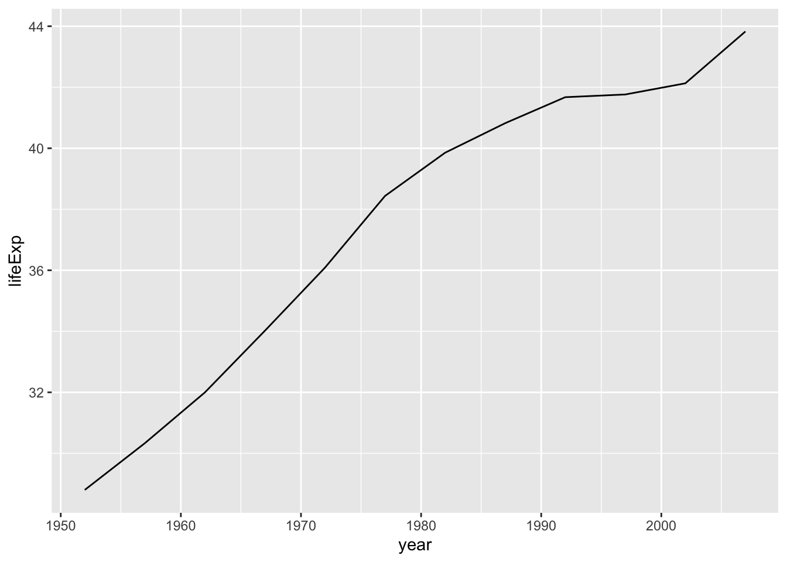
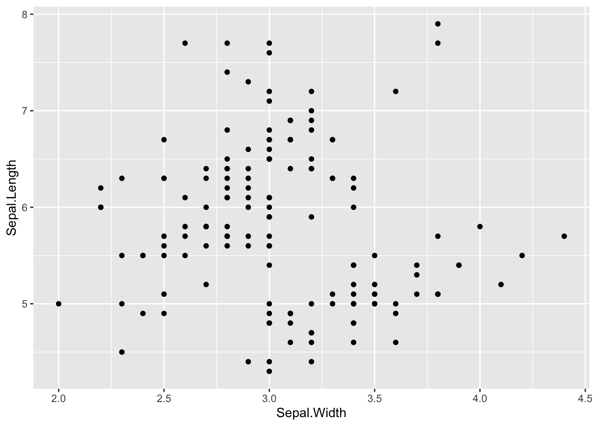
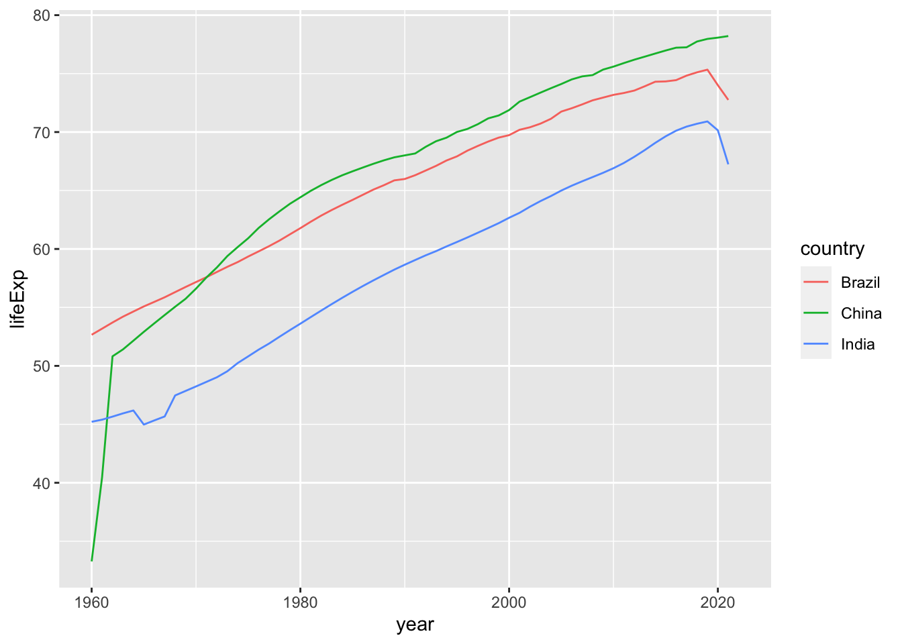

# 変形（Transform） {#transform}

> ここでは、`tidyverse` パッケージを構成する `dplyr` パッケージを用いて、データを変形することを学びます。`dplyr` パッケージを用いて、二つのデータを結合することなども可能ですが、それは、あとから扱います。これも、`tidyverse` パッケージを構成する `tidyr` パッケージ による変形も、後ほど扱います。

`dplyr` パッケージは、`tidyverse` パッケージをインストールしたり、使えるように `library(tidyverse)` で読み込んだりするときに、一緒に読み込まれますから、あらためて、`dplyr` を指定する必要はありません。


```r
library(tidyverse)
#> ── Attaching core tidyverse packages ──── tidyverse 2.0.0 ──
#> ✔ dplyr     1.1.2     ✔ readr     2.1.4
#> ✔ forcats   1.0.0     ✔ stringr   1.5.0
#> ✔ ggplot2   3.4.2     ✔ tibble    3.2.1
#> ✔ lubridate 1.9.2     ✔ tidyr     1.3.0
#> ✔ purrr     1.0.1     
#> ── Conflicts ────────────────────── tidyverse_conflicts() ──
#> ✖ dplyr::filter() masks stats::filter()
#> ✖ dplyr::lag()    masks stats::lag()
#> ℹ Use the conflicted package (<http://conflicted.r-lib.org/>) to force all conflicts to become errors
```

## `dplyr` [概要](https://dplyr.tidyverse.org)

`dplyr` はデータ操作の文法のようなもので、最も一般的なデータ操作に役立つ一貫したいくつかの「動詞」の役割を果たすものを提供しています。

-   `select()` 変数をその名前によって選択 - 列の選択に対応します。
-   `filter()` ケースをその値によって選択 - 行の選択に対応します。
-   `mutate()` 新しい変数を既存の値を使って定義します - 新しい列を作成することに対応しています。
-   `summarise()` たくさんの値を一つの値に集約します - 代表値（平均、メディアンなど）を求めることに対応します。
-   `arrange()` 行の順序を変更します。
-   `group_by()` グループを指定した表に変換します。

さらに詳しく知りたい場合は Console（コンソールに）vignette("dplyr") と入れるか、[こちら](https://cran.r-project.org/web/packages/dplyr/vignettes/dplyr.html) を参照してください。上では、一つの表について述べていますが、二つの表の扱い方は、Console（コンソール）に vignette("two-table") と入れるか、[こちら](https://cran.r-project.org/web/packages/dplyr/vignettes/two-table.html) を参照してください。二つの表の扱いについては、後から説明します。

`dplyr` を初めて使われる場合には、まず [R for data science (2e) Transform](https://r4ds.hadley.nz/transform) を学ばれることをお勧めします。以下も、このサイトに沿った説明をします。

### [`select`](https://dplyr.tidyverse.org/reference/select.html): 名前とタイプによって、列（変数）を選択

| 補助関数      | 条件                   | 例                                            |
|-----------------|--------------------------|------------------------------|
| \-            | 列の排除               | select(babynames, -prop)                      |
| :             | 列の範囲               | select(babynames, year:n)                     |
| contains()    | 指定文字列を含         | select(babynames, contains("n"))              |
| ends_with()   | 指定文字列で終わる     | select(babynames, ends_with("n"))             |
| matches()     | 正規表現に適合         | select(babynames, matches("n"))               |
| num_range()   | 末尾の指定数値範囲     | Not applicable with babynames                 |
| one_of()      | 指定した名前に含まれる | select(babynames, one_of(c("sex", "gender"))) |
| starts_with() | 指定文字列で始まる     | select(babynames, starts_with("n"))           |

## [`filter`](https://dplyr.tidyverse.org/reference/filter.html): 列の値の条件に適合した行の選択

| 論理作用素 | 条件             | 例        |
|------------|------------------|-----------|
| \>         | y より大きい x   | x \> y    |
| \>=        | y 以上の x       | x \>= y   |
| \<         | y より小さい x   | x \< y    |
| \<=        | y 以下の x       | x \<= y   |
| ==         | y と等しい x     | x == y    |
| !=         | y と等しくない x | x != y    |
| is.na()    | 値が NA である x | is.na(x)  |
| !is.na()   | 値が NA でない x | !is.na(x) |

## [`arrange`](https://dplyr.tidyverse.org/reference/arrange.html)

`arrange()` では、選択した列の値によって、行を並び替えます。

注意点すべきは、他の、`dplyr` の動詞とは異なり、基本的に、グループ化は、無視し、その表全体に適用します。グループ内で並び替えをしたい場合には、グループ化した変数を指定するか、`.by_group = TRUE` とします。

## [`mutate`](https://dplyr.tidyverse.org/reference/mutate.html)

新しい列を作成または、既存の列を修正、削除します。

以下は便利な補助関数の例です。

-   +, -, log(), etc., for their usual mathematical meanings

-   lead(), lag()

-   dense_rank(), min_rank(), percent_rank(), row_number(), cume_dist(), ntile()

-   cumsum(), cummean(), cummin(), cummax(), cumany(), cumall()

-   na_if(), coalesce()\### `group_by()` and `summarise()`

## [`group_by`](https://dplyr.tidyverse.org/reference/group_by.html)

指定した列の値によって表全体をグループ化した表を作成します。表自体が変形されるわけではありませんから、注意してください。次の、`summarize` と合わせて利用すると便利です。

## [`summarise` or `summarize`](https://dplyr.tidyverse.org/reference/summarise.html)

値の集約 (summarize) に利用します。グループ化された表の場合には、そのグループごとに、値を集約します。

#### 集約のための関数

`summarize` には、 `sum()`, `max()`, や `mean()` が使われますが、ベクトルに対して定義され、一つの値だけを出力する関数でであれば、なんでも使うことができます。以下は、その例です。それぞれの関数については、Help で調べてください。

1.  特定の値 - `mean(x)`, `median(x)`, `quantile(x, 0.25)`, `min(x)`, `max(x)`

2.  分布の値 - `sd(x)`, `var(x)`, `IQR(x)`, `mad(x)`

3.  値の位置 - `first(x)`, `nth(x, 2)`, `last(x)`

4.  個数 - `n_distinct(x),` `n()` （引数なし：表またはグループのサイズ）

5.  論理値の数または割合 - sum(!is.na(x)), mean(y == 0)

条件文で値を指定することも可能です。

-   if_else(), recode(), case_when()

## パイプ（Pipe）`%>%` `|>`

[`pipes`](https://r4ds.hadley.nz/workflow-style.html#sec-pipes) in R for Data Science.

`%>%` は、`tidyverse` パッケージで、関数のチェーン化を行うために使用されるパイプ演算子ですが、R 4.1 以降は、`|>` が、R に組み込まれた、ネイティブなパイプライン演算子になっています。`tidyverse` を使っているときは、どちらを使うことも可能ですが、`|>` を使うことをお勧めします。R の versoin を確認するには、コンソール（Console）で、`R.Version()` または、`R.version$version.string` とします。

## Learn `dplyr` by Examples

### Data `iris`


```r
head(iris)
#>   Sepal.Length Sepal.Width Petal.Length Petal.Width Species
#> 1          5.1         3.5          1.4         0.2  setosa
#> 2          4.9         3.0          1.4         0.2  setosa
#> 3          4.7         3.2          1.3         0.2  setosa
#> 4          4.6         3.1          1.5         0.2  setosa
#> 5          5.0         3.6          1.4         0.2  setosa
#> 6          5.4         3.9          1.7         0.4  setosa
```


```r
summary(iris)
#>   Sepal.Length    Sepal.Width     Petal.Length  
#>  Min.   :4.300   Min.   :2.000   Min.   :1.000  
#>  1st Qu.:5.100   1st Qu.:2.800   1st Qu.:1.600  
#>  Median :5.800   Median :3.000   Median :4.350  
#>  Mean   :5.843   Mean   :3.057   Mean   :3.758  
#>  3rd Qu.:6.400   3rd Qu.:3.300   3rd Qu.:5.100  
#>  Max.   :7.900   Max.   :4.400   Max.   :6.900  
#>   Petal.Width          Species  
#>  Min.   :0.100   setosa    :50  
#>  1st Qu.:0.300   versicolor:50  
#>  Median :1.300   virginica :50  
#>  Mean   :1.199                  
#>  3rd Qu.:1.800                  
#>  Max.   :2.500
```

### `select` 1 - columns 1, 2, 5


```r
head(select(iris, c(1,2,5)))
#>   Sepal.Length Sepal.Width Species
#> 1          5.1         3.5  setosa
#> 2          4.9         3.0  setosa
#> 3          4.7         3.2  setosa
#> 4          4.6         3.1  setosa
#> 5          5.0         3.6  setosa
#> 6          5.4         3.9  setosa
```

You can select the first, the second and the fifth columns. If you want to use it, then assign a new name.


```r
head(iris)
#>   Sepal.Length Sepal.Width Petal.Length Petal.Width Species
#> 1          5.1         3.5          1.4         0.2  setosa
#> 2          4.9         3.0          1.4         0.2  setosa
#> 3          4.7         3.2          1.3         0.2  setosa
#> 4          4.6         3.1          1.5         0.2  setosa
#> 5          5.0         3.6          1.4         0.2  setosa
#> 6          5.4         3.9          1.7         0.4  setosa
```


```r
df_iris125 <- select(iris, c(1,2,5))
head(df_iris125)
#>   Sepal.Length Sepal.Width Species
#> 1          5.1         3.5  setosa
#> 2          4.9         3.0  setosa
#> 3          4.7         3.2  setosa
#> 4          4.6         3.1  setosa
#> 5          5.0         3.6  setosa
#> 6          5.4         3.9  setosa
```

### `select` 1 using pipe

In the previous example, we used `head(select(iris, c(1,2,5)))`, `head` comes first because we apply `head` to the result of `select(iris, c(1,2,5))`. In order to apply functions in a sequencial order, we can use pipe command. You can get the same result by the following.


```r
iris %>% select(c(1,2,5)) %>% head()
#>   Sepal.Length Sepal.Width Species
#> 1          5.1         3.5  setosa
#> 2          4.9         3.0  setosa
#> 3          4.7         3.2  setosa
#> 4          4.6         3.1  setosa
#> 5          5.0         3.6  setosa
#> 6          5.4         3.9  setosa
```

All `tidyverse` functions are designed so that the first argument, i.e., the entry, is the data. So using pipe, `iris` is assumed to be the first entry of the `select` function, and `select(iris, c(1,2,5))` is the first entry of the head function.

In the following, we use pipes.

### `select` 2 - except Species


```r
select(iris, -Species) %>% head()
#>   Sepal.Length Sepal.Width Petal.Length Petal.Width
#> 1          5.1         3.5          1.4         0.2
#> 2          4.9         3.0          1.4         0.2
#> 3          4.7         3.2          1.3         0.2
#> 4          4.6         3.1          1.5         0.2
#> 5          5.0         3.6          1.4         0.2
#> 6          5.4         3.9          1.7         0.4
```

### `select` 3 - select and change column names at the same time


```r
select(iris, sl = Sepal.Length, sw = Sepal.Width, sp = Species) %>% head()
#>    sl  sw     sp
#> 1 5.1 3.5 setosa
#> 2 4.9 3.0 setosa
#> 3 4.7 3.2 setosa
#> 4 4.6 3.1 setosa
#> 5 5.0 3.6 setosa
#> 6 5.4 3.9 setosa
```

### `select` 4 - change the order of columns


```r
select(iris, c(5,3,4,1,2)) %>% head()
#>   Species Petal.Length Petal.Width Sepal.Length Sepal.Width
#> 1  setosa          1.4         0.2          5.1         3.5
#> 2  setosa          1.4         0.2          4.9         3.0
#> 3  setosa          1.3         0.2          4.7         3.2
#> 4  setosa          1.5         0.2          4.6         3.1
#> 5  setosa          1.4         0.2          5.0         3.6
#> 6  setosa          1.7         0.4          5.4         3.9
```

### `filter` - by names


```r
filter(iris, Species == "virginica") %>% head()
#>   Sepal.Length Sepal.Width Petal.Length Petal.Width
#> 1          6.3         3.3          6.0         2.5
#> 2          5.8         2.7          5.1         1.9
#> 3          7.1         3.0          5.9         2.1
#> 4          6.3         2.9          5.6         1.8
#> 5          6.5         3.0          5.8         2.2
#> 6          7.6         3.0          6.6         2.1
#>     Species
#> 1 virginica
#> 2 virginica
#> 3 virginica
#> 4 virginica
#> 5 virginica
#> 6 virginica
```

### `arrange` - ascending and descending order


```r
arrange(iris, Sepal.Length, desc(Sepal.Width)) %>% head()
#>   Sepal.Length Sepal.Width Petal.Length Petal.Width Species
#> 1          4.3         3.0          1.1         0.1  setosa
#> 2          4.4         3.2          1.3         0.2  setosa
#> 3          4.4         3.0          1.3         0.2  setosa
#> 4          4.4         2.9          1.4         0.2  setosa
#> 5          4.5         2.3          1.3         0.3  setosa
#> 6          4.6         3.6          1.0         0.2  setosa
```

### `mutate` - rank


```r
iris %>% mutate(sl_rank = min_rank(Sepal.Length)) %>% 
  arrange(sl_rank) %>% head()
#>   Sepal.Length Sepal.Width Petal.Length Petal.Width Species
#> 1          4.3         3.0          1.1         0.1  setosa
#> 2          4.4         2.9          1.4         0.2  setosa
#> 3          4.4         3.0          1.3         0.2  setosa
#> 4          4.4         3.2          1.3         0.2  setosa
#> 5          4.5         2.3          1.3         0.3  setosa
#> 6          4.6         3.1          1.5         0.2  setosa
#>   sl_rank
#> 1       1
#> 2       2
#> 3       2
#> 4       2
#> 5       5
#> 6       6
```

Insert a line break after the pipe command, not before.

### `group_by` and `summarize`


```r
iris %>% 
  group_by(Species) %>% 
  summarize(sl = mean(Sepal.Length), sw = mean(Sepal.Width), 
  pl = mean(Petal.Length), pw = mean(Petal.Width))
#> # A tibble: 3 × 5
#>   Species       sl    sw    pl    pw
#>   <fct>      <dbl> <dbl> <dbl> <dbl>
#> 1 setosa      5.01  3.43  1.46 0.246
#> 2 versicolor  5.94  2.77  4.26 1.33 
#> 3 virginica   6.59  2.97  5.55 2.03
```

-   mean: `mean()` or `mean(x, na.rm = TRUE)` - arithmetic mean (average)
-   median: `median()` or `median(x, na.rm = TRUE)` - mid value

For more examples see

[dplr_iris](https://icu-hsuzuki.github.io/da4r2022_note/dplyr-iris.nb.html)

## References of `dplyr`

-   Textbook: [R for Data Science, Part II Explore](https://r4ds.had.co.nz/wrangle-intro.html#wrangle-intro)

### RStudio Primers: See References in Moodle at the bottom

2.  Work with Data -- [r4ds: Wrangle, I](https://r4ds.had.co.nz/wrangle-intro.html#wrangle-intro)

-   [Working with Tibbles](https://rstudio.cloud/learn/primers/2.1)
-   [Isolating Data with dplyr](https://rstudio.cloud/learn/primers/2.2)
-   [Deriving Information with dplyr](https://rstudio.cloud/learn/primers/2.3)

## Learn `dplyr` by Examples II - `gapminder`

### `ggplot2` [Overview](https://ggplot2.tidyverse.org)

`ggplot2` is a system for declaratively creating graphics, based on [The Grammar of Graphics](https://amzn.to/2ef1eWp). You provide the data, tell ggplot2 how to map variables to aesthetics, what graphical primitives to use, and it takes care of the details.

**Examples**

```         
ggplot(data = mpg) + 
  geom_point(mapping = aes(x = displ, y = hwy))
```

```         
ggplot(data = mpg) + 
  geom_boxplot(mapping = aes(x = class, y = hwy))
```

**Template**

```         
ggplot(data = <DATA>) + 
  <GEOM_FUNCTION>(mapping = aes(<MAPPINGS>))
```

#### Gapminder and R Package `gapminder`

> Gapminder was founded by Ola Rosling, Anna Rosling Rönnlund, and Hans Rosling

-   Gapminder: <https://www.gapminder.org>

    -   Test on Top: You are probably wrong about - upgrade your worldview
    -   Bubble Chart: <https://www.gapminder.org/tools/#$chart-type=bubbles&url=v1>
    -   Dallar Street: <https://www.gapminder.org/tools/#$chart-type=bubbles&url=v1>
    -   Data: <https://www.gapminder.org/data/>

-   R Package gapminder by Jennifer Bryan

    -   Package site: <https://CRAN.R-project.org/package=gapminder>
    -   Site: <https://github.com/jennybc/gapminder>
    -   Documents: <https://www.rdocumentation.org/packages/gapminder/versions/0.3.0>

-   Package Help `?gapminder` or `gapminder` in the search window of Help

    -   The main data frame gapminder has 1704 rows and 6 variables:
        -   country: factor with 142 levels
        -   continent: factor with 5 levels
        -   year: ranges from 1952 to 2007 in increments of 5 years
        -   lifeExp: life expectancy at birth, in years
        -   pop: population
        -   gdpPercap: GDP per capita (US\$, inflation-adjusted)


```r
library(tidyverse)
library(gapminder)
library(WDI)
```

#### R Package `gapminder` data

We will use a `tidyverse` function `slice` replacing `head`. Check `slice` in the search window under the Help tab on the bottom right pane.


```r
df <- gapminder
df %>% slice(1:10)
#> # A tibble: 10 × 6
#>    country     continent  year lifeExp      pop gdpPercap
#>    <fct>       <fct>     <int>   <dbl>    <int>     <dbl>
#>  1 Afghanistan Asia       1952    28.8  8425333      779.
#>  2 Afghanistan Asia       1957    30.3  9240934      821.
#>  3 Afghanistan Asia       1962    32.0 10267083      853.
#>  4 Afghanistan Asia       1967    34.0 11537966      836.
#>  5 Afghanistan Asia       1972    36.1 13079460      740.
#>  6 Afghanistan Asia       1977    38.4 14880372      786.
#>  7 Afghanistan Asia       1982    39.9 12881816      978.
#>  8 Afghanistan Asia       1987    40.8 13867957      852.
#>  9 Afghanistan Asia       1992    41.7 16317921      649.
#> 10 Afghanistan Asia       1997    41.8 22227415      635.
```


```r
glimpse(df)
#> Rows: 1,704
#> Columns: 6
#> $ country   <fct> "Afghanistan", "Afghanistan", "Afghanist…
#> $ continent <fct> Asia, Asia, Asia, Asia, Asia, Asia, Asia…
#> $ year      <int> 1952, 1957, 1962, 1967, 1972, 1977, 1982…
#> $ lifeExp   <dbl> 28.801, 30.332, 31.997, 34.020, 36.088, …
#> $ pop       <int> 8425333, 9240934, 10267083, 11537966, 13…
#> $ gdpPercap <dbl> 779.4453, 820.8530, 853.1007, 836.1971, …
```


```r
summary(df)
#>         country        continent        year     
#>  Afghanistan:  12   Africa  :624   Min.   :1952  
#>  Albania    :  12   Americas:300   1st Qu.:1966  
#>  Algeria    :  12   Asia    :396   Median :1980  
#>  Angola     :  12   Europe  :360   Mean   :1980  
#>  Argentina  :  12   Oceania : 24   3rd Qu.:1993  
#>  Australia  :  12                  Max.   :2007  
#>  (Other)    :1632                                
#>     lifeExp           pop              gdpPercap       
#>  Min.   :23.60   Min.   :6.001e+04   Min.   :   241.2  
#>  1st Qu.:48.20   1st Qu.:2.794e+06   1st Qu.:  1202.1  
#>  Median :60.71   Median :7.024e+06   Median :  3531.8  
#>  Mean   :59.47   Mean   :2.960e+07   Mean   :  7215.3  
#>  3rd Qu.:70.85   3rd Qu.:1.959e+07   3rd Qu.:  9325.5  
#>  Max.   :82.60   Max.   :1.319e+09   Max.   :113523.1  
#> 
```

#### Tidyverse::ggplot

##### First Try - with failures

You will encounter similar failures. We list three of them.


```r
ggplot(df, aes(x = year, y = lifeExp)) + geom_point()
```


There are lots of data in each year: 1952, 1957, 1962, 1967, 1972, 1977, 1982, 1987, 1992, 1997, .... Can you tell how many years are in the data? The following command shows different years in the data.


```r
unique(df$year)
#>  [1] 1952 1957 1962 1967 1972 1977 1982 1987 1992 1997 2002
#> [12] 2007
```

You can guess it from the data summary above. Can you imagine how many countries are in the data? 142? Anyhow, too many points are on each year.


```r
ggplot(df, aes(x = year, y = lifeExp)) + geom_line()
```


Now, you can guess the reason why you had this output. This is often called a saw-tooth.


```r
ggplot(df, aes(x = year, y = lifeExp)) + geom_boxplot()
#> Warning: Continuous x aesthetic
#> ℹ did you forget `aes(group = ...)`?
```



Can you see what the problem is? The `year` is a numerical variable in integer.


```r
typeof(pull(df, year)) # same as typeof(df$year)
#> [1] "integer"
```

The following looks better.


```r
ggplot(df, aes(y = lifeExp, group = year)) + geom_boxplot()
```


##### Box Plot


```r
ggplot(df, aes(x = as_factor(year), y = lifeExp)) + geom_boxplot()
```


We will study data visualization in Chapter \@ref(ggplot2).

#### Applications of `dplyr`

Let us apply `dplyr` to manipulate data to visualize the data.

##### `filter`

By `filter` you can obtain the the data of one country.

`filter(country == "Afghanistan")`

Note that we need two equal symbols, and quotation marks must surround the country name.


```r
df %>% filter(country == "Afghanistan") %>%
  ggplot(aes(x = year, y = lifeExp)) + geom_line()
```



Looks good. From the data you observe, the life expectancy at birth in 1952 was below 30, and it was still below 44 in 2007.

Let us compare Afghanistan with Japan. When you choose more than one country, we use the following format: `country %in% c("Afghanistan", "Japan")`.


```r
df %>% filter(country %in% c("Afghanistan", "Japan")) %>%
  ggplot(aes(x = year, y = lifeExp, color = country)) + geom_line()
```


What do you observe from this chart?

The code `unique(df$country)` does the same as the one below. First, choose distinct elements in the column `country` by `distinct(country)` and get the column as a vector by `pull`.


```r
df %>% distinct(country) %>% pull()
#>   [1] Afghanistan              Albania                 
#>   [3] Algeria                  Angola                  
#>   [5] Argentina                Australia               
#>   [7] Austria                  Bahrain                 
#>   [9] Bangladesh               Belgium                 
#>  [11] Benin                    Bolivia                 
#>  [13] Bosnia and Herzegovina   Botswana                
#>  [15] Brazil                   Bulgaria                
#>  [17] Burkina Faso             Burundi                 
#>  [19] Cambodia                 Cameroon                
#>  [21] Canada                   Central African Republic
#>  [23] Chad                     Chile                   
#>  [25] China                    Colombia                
#>  [27] Comoros                  Congo, Dem. Rep.        
#>  [29] Congo, Rep.              Costa Rica              
#>  [31] Cote d'Ivoire            Croatia                 
#>  [33] Cuba                     Czech Republic          
#>  [35] Denmark                  Djibouti                
#>  [37] Dominican Republic       Ecuador                 
#>  [39] Egypt                    El Salvador             
#>  [41] Equatorial Guinea        Eritrea                 
#>  [43] Ethiopia                 Finland                 
#>  [45] France                   Gabon                   
#>  [47] Gambia                   Germany                 
#>  [49] Ghana                    Greece                  
#>  [51] Guatemala                Guinea                  
#>  [53] Guinea-Bissau            Haiti                   
#>  [55] Honduras                 Hong Kong, China        
#>  [57] Hungary                  Iceland                 
#>  [59] India                    Indonesia               
#>  [61] Iran                     Iraq                    
#>  [63] Ireland                  Israel                  
#>  [65] Italy                    Jamaica                 
#>  [67] Japan                    Jordan                  
#>  [69] Kenya                    Korea, Dem. Rep.        
#>  [71] Korea, Rep.              Kuwait                  
#>  [73] Lebanon                  Lesotho                 
#>  [75] Liberia                  Libya                   
#>  [77] Madagascar               Malawi                  
#>  [79] Malaysia                 Mali                    
#>  [81] Mauritania               Mauritius               
#>  [83] Mexico                   Mongolia                
#>  [85] Montenegro               Morocco                 
#>  [87] Mozambique               Myanmar                 
#>  [89] Namibia                  Nepal                   
#>  [91] Netherlands              New Zealand             
#>  [93] Nicaragua                Niger                   
#>  [95] Nigeria                  Norway                  
#>  [97] Oman                     Pakistan                
#>  [99] Panama                   Paraguay                
#> [101] Peru                     Philippines             
#> [103] Poland                   Portugal                
#> [105] Puerto Rico              Reunion                 
#> [107] Romania                  Rwanda                  
#> [109] Sao Tome and Principe    Saudi Arabia            
#> [111] Senegal                  Serbia                  
#> [113] Sierra Leone             Singapore               
#> [115] Slovak Republic          Slovenia                
#> [117] Somalia                  South Africa            
#> [119] Spain                    Sri Lanka               
#> [121] Sudan                    Swaziland               
#> [123] Sweden                   Switzerland             
#> [125] Syria                    Taiwan                  
#> [127] Tanzania                 Thailand                
#> [129] Togo                     Trinidad and Tobago     
#> [131] Tunisia                  Turkey                  
#> [133] Uganda                   United Kingdom          
#> [135] United States            Uruguay                 
#> [137] Venezuela                Vietnam                 
#> [139] West Bank and Gaza       Yemen, Rep.             
#> [141] Zambia                   Zimbabwe                
#> 142 Levels: Afghanistan Albania Algeria Angola ... Zimbabwe
```

As we have guessed, there are 142 countries in this data.

Let us choose BRICs countries in the data.


```r
df %>% filter(country %in% c("Brazil", "Russia", "India", "China")) %>%
  ggplot(aes(x = year, y = lifeExp, color = country)) + geom_line()
```


Russia data is missing. Can you find it in the list of countries? It can be a problem of `gapminder` data. Can you think of the reason why Russia is not in?

### Exercises

1.  Change `lifeExp` to `pop` and `gdpPercap` and do the same.
2.  Choose ASEAN countries and do the similar investigations.

-   Brunei, Cambodia, Indonesia, Laos, Malaysia, Myanmar, Philippines, Singapore.

-   How many of these countries are on the list?

3.  Choose several countries by yourself and do the similar investigations.

### `group_by` and `summarize`

Let us use the variable `continent` and summarize the data. Can you tell how many continents are listed in the data? Yes, there are five. Can you tell how many countries are in each continent on the data?


```r
df_lifeExp <- df %>% group_by(continent, year) %>% 
  summarize(mean_lifeExp = mean(lifeExp), median_lifeExp = median(lifeExp), max_lifeExp = max(lifeExp), min_lifeExp = min(lifeExp), .groups = "keep")
```

Don't get scared. We will learn little by little.


```r
df_lifeExp %>% slice(1:10)
#> # A tibble: 60 × 6
#> # Groups:   continent, year [60]
#>    continent  year mean_lifeExp median_lifeExp max_lifeExp
#>    <fct>     <int>        <dbl>          <dbl>       <dbl>
#>  1 Africa     1952         39.1           38.8        52.7
#>  2 Africa     1957         41.3           40.6        58.1
#>  3 Africa     1962         43.3           42.6        60.2
#>  4 Africa     1967         45.3           44.7        61.6
#>  5 Africa     1972         47.5           47.0        64.3
#>  6 Africa     1977         49.6           49.3        67.1
#>  7 Africa     1982         51.6           50.8        69.9
#>  8 Africa     1987         53.3           51.6        71.9
#>  9 Africa     1992         53.6           52.4        73.6
#> 10 Africa     1997         53.6           52.8        74.8
#> # ℹ 50 more rows
#> # ℹ 1 more variable: min_lifeExp <dbl>
```

You can use `fill` and `color` for the box plot. Try and check the difference.


```r
df %>% filter(year %in% c(1952, 1987, 2007)) %>%
  ggplot(aes(x=as_factor(year), y = lifeExp, fill = continent)) +
  geom_boxplot()
```


The following are examples of line graphs. Please see the differences.


```r
df_lifeExp %>% ggplot(aes(x = year, y = mean_lifeExp, color = continent)) +
  geom_line()
```


```r
df_lifeExp %>% ggplot(aes(x = year, y = mean_lifeExp, color = continent, linetype = continent)) +
  geom_line()
```


```r
df_lifeExp %>% ggplot() +
  geom_line(aes(x = year, y = mean_lifeExp, color = continent)) + 
  geom_line(aes(x = year, y = median_lifeExp, linetype = continent))
```



## The Week Two Assignment (in Moodle)

**R Markdown and `dplyr`**

-   Create an R Notebook of a Data Analysis containing the following and submit the rendered HTML file (eg. `a2_123456.nb.html`)
    1.  create an R Notebook using the R Notebook Template in Moodle, save as `a2_123456.Rmd`,
    2.  write your name and ID and the contents,
    3.  run each code block,
    4.  preview to create `a2_123456.nb.html`,
    5.  submit `a2_123456.nb.html` to Moodle.

1.  Pick data from the built-in datasets besides `cars`. (`library(help = "datasets")` or go to the site [The R Datasets Package](https://stat.ethz.ch/R-manual/R-devel/library/datasets/html/00Index.html))

    -   Information of the data: Name, Description, Usage, Format, Source, References (Hint: ?cars)
    -   Use `head()`, `str()`, ..., and create at least one chart using `ggplot2` - Code Chunk.
        -   Don't forget to add `library(tidyverse)` in the first code chunk.
    -   An observation of the chart - in your own words.

2.  Load `gapminder` by `library(gapminder)`.

    -   Choose `pop` or `gdpPercap`, or both, one country in the data, a group of countries in the data.
    -   Create charts using ggplot2 with geom_line and the variables and countries chosen in 1. (See examples of the charts for `lifeExp`.)
    -   Study the data as you like.
    -   Observations and difficulties encountered.

**Due:** 2023-01-09 23:59:00. Submit your R Notebook file in Moodle (The Second Assignment). Due on Monday!

### Original Data? WDI?


```r
gapminder %>% slice(1:10)
#> # A tibble: 10 × 6
#>    country     continent  year lifeExp      pop gdpPercap
#>    <fct>       <fct>     <int>   <dbl>    <int>     <dbl>
#>  1 Afghanistan Asia       1952    28.8  8425333      779.
#>  2 Afghanistan Asia       1957    30.3  9240934      821.
#>  3 Afghanistan Asia       1962    32.0 10267083      853.
#>  4 Afghanistan Asia       1967    34.0 11537966      836.
#>  5 Afghanistan Asia       1972    36.1 13079460      740.
#>  6 Afghanistan Asia       1977    38.4 14880372      786.
#>  7 Afghanistan Asia       1982    39.9 12881816      978.
#>  8 Afghanistan Asia       1987    40.8 13867957      852.
#>  9 Afghanistan Asia       1992    41.7 16317921      649.
#> 10 Afghanistan Asia       1997    41.8 22227415      635.
```

#### WDI

-   SP.DYN.LE00.IN: Life expectancy at birth, total (years)
-   NY.GDP.PCAP.KD: GDP per capita (constant 2015 US\$)
-   SP.POP.TOTL: Population, total


```r
df_wdi <- WDI(
  country = "all", 
  indicator = c(lifeExp = "SP.DYN.LE00.IN", pop = "SP.POP.TOTL", gdpPercap = "NY.GDP.PCAP.KD")
)
```


```
#> Rows: 16758 Columns: 7
#> ── Column specification ────────────────────────────────────
#> Delimiter: ","
#> chr (3): country, iso2c, iso3c
#> dbl (4): year, lifeExp, pop, gdpPercap
#> 
#> ℹ Use `spec()` to retrieve the full column specification for this data.
#> ℹ Specify the column types or set `show_col_types = FALSE` to quiet this message.
```


```r
df_wdi %>% slice(1:10)
#> # A tibble: 10 × 7
#>    country     iso2c iso3c  year lifeExp      pop gdpPercap
#>    <chr>       <chr> <chr> <dbl>   <dbl>    <dbl>     <dbl>
#>  1 Afghanistan AF    AFG    1960    32.5  8622466        NA
#>  2 Afghanistan AF    AFG    1961    33.1  8790140        NA
#>  3 Afghanistan AF    AFG    1962    33.5  8969047        NA
#>  4 Afghanistan AF    AFG    1963    34.0  9157465        NA
#>  5 Afghanistan AF    AFG    1964    34.5  9355514        NA
#>  6 Afghanistan AF    AFG    1965    35.0  9565147        NA
#>  7 Afghanistan AF    AFG    1966    35.5  9783147        NA
#>  8 Afghanistan AF    AFG    1967    35.9 10010030        NA
#>  9 Afghanistan AF    AFG    1968    36.4 10247780        NA
#> 10 Afghanistan AF    AFG    1969    36.9 10494489        NA
```


```r
df_wdi_extra <- WDI(
  country = "all", 
  indicator = c(lifeExp = "SP.DYN.LE00.IN", pop = "SP.POP.TOTL", gdpPercap = "NY.GDP.PCAP.KD"), 
  extra = TRUE
)
```


```
#> Rows: 16758 Columns: 15
#> ── Column specification ────────────────────────────────────
#> Delimiter: ","
#> chr  (7): country, iso2c, iso3c, region, capital, income...
#> dbl  (6): year, lifeExp, pop, gdpPercap, longitude, lati...
#> lgl  (1): status
#> date (1): lastupdated
#> 
#> ℹ Use `spec()` to retrieve the full column specification for this data.
#> ℹ Specify the column types or set `show_col_types = FALSE` to quiet this message.
```


```r
df_wdi_extra
#> # A tibble: 16,758 × 15
#>    country     iso2c iso3c  year status lastupdated lifeExp
#>    <chr>       <chr> <chr> <dbl> <lgl>  <date>        <dbl>
#>  1 Afghanistan AF    AFG    2014 NA     2023-07-25     62.5
#>  2 Afghanistan AF    AFG    2012 NA     2023-07-25     61.9
#>  3 Afghanistan AF    AFG    2009 NA     2023-07-25     60.4
#>  4 Afghanistan AF    AFG    2013 NA     2023-07-25     62.4
#>  5 Afghanistan AF    AFG    1971 NA     2023-07-25     37.9
#>  6 Afghanistan AF    AFG    2015 NA     2023-07-25     62.7
#>  7 Afghanistan AF    AFG    1969 NA     2023-07-25     36.9
#>  8 Afghanistan AF    AFG    2010 NA     2023-07-25     60.9
#>  9 Afghanistan AF    AFG    2011 NA     2023-07-25     61.4
#> 10 Afghanistan AF    AFG    2008 NA     2023-07-25     59.9
#> # ℹ 16,748 more rows
#> # ℹ 8 more variables: pop <dbl>, gdpPercap <dbl>,
#> #   region <chr>, capital <chr>, longitude <dbl>,
#> #   latitude <dbl>, income <chr>, lending <chr>
```

Can you see the differences? List them out. We will study the World Development Indicators in Chapter \@ref(wdi).
