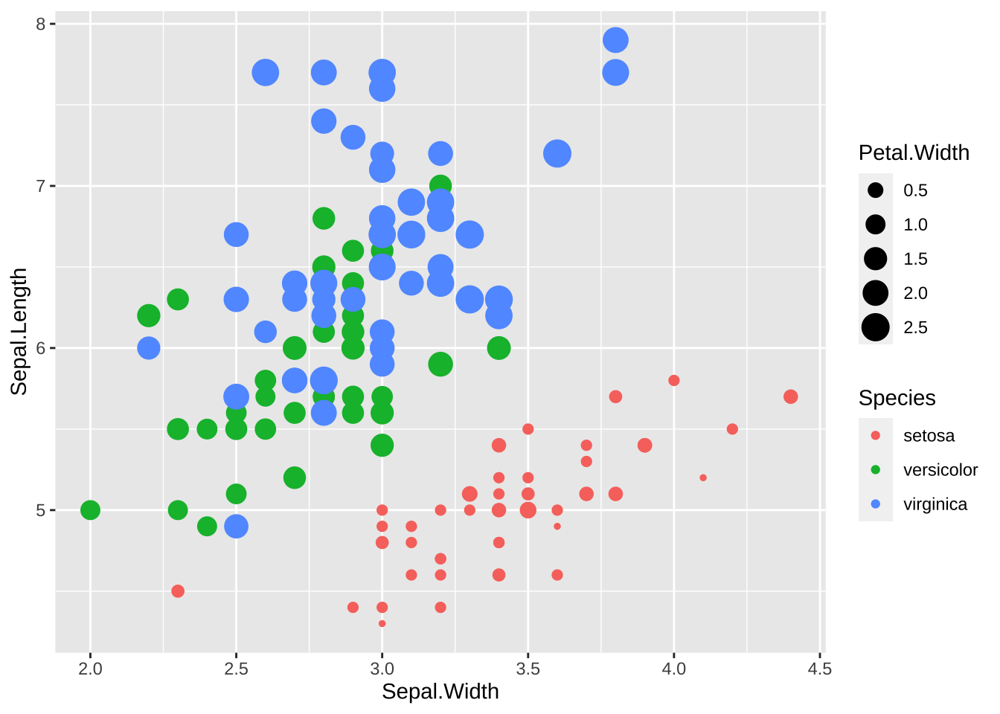
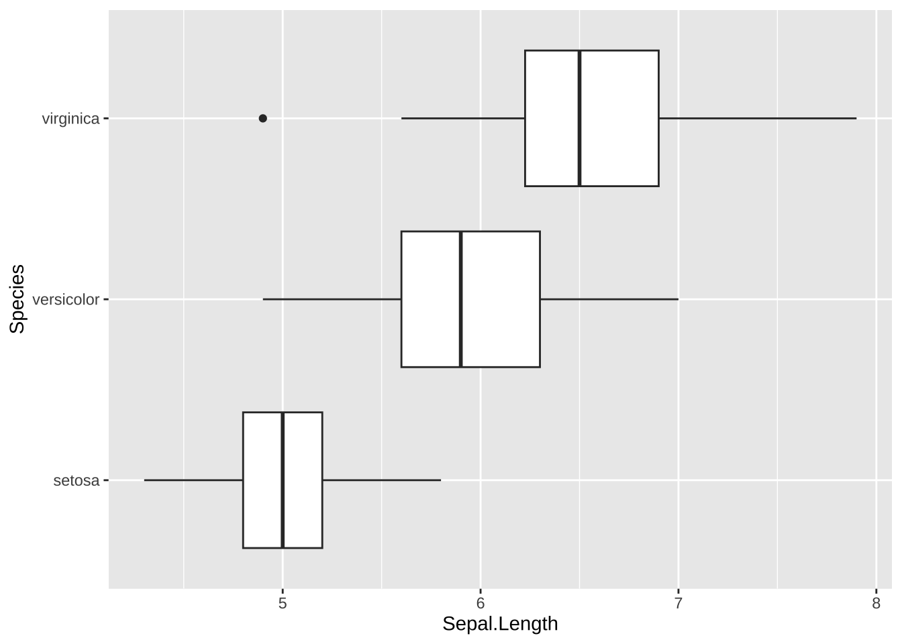
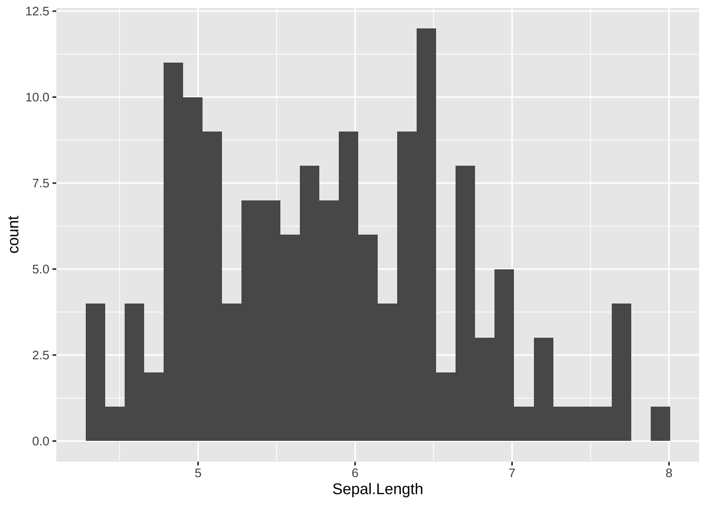

# 視覚化（Visualize） {#visualize}

## 基本的なこと

R では、簡単に、グラフを描画できますが、質の高いグラフを作成するには、`ggplot2` パッケージを用いたものが標準となっています。`ggplot2` は、`tidyverse` パッケージの一部ですので、`tidyverse` パッケージをインストール、使えるように、`library(tidyverse)` として読み込んであれば、そのまま使うことができます。

サイト：<https://ggplot2.tidyverse.org> パッケージサイト：<https://CRAN.R-project.org/package=ggplot2>

### ggplot2 概要

> ggplot2 is a system for declaratively creating graphics, based on The Grammar of Graphics. You provide the data, tell ggplot2 how to map variables to aesthetics, what graphical primitives to use, and it takes care of the details.
>
> ggplot2は、グラフィックスの生成に関する「Grammar of Graphics（グラフィックスの文法）」に基づいて、宣言的にグラフを作成するためのシステムです。データを提供し、変数を視覚的要素にマッピングする方法や、どのようなグラフィカルな基本要素を使用するかをggplot2に伝えると、詳細な部分はggplot2 が処理してくれます。

### 基本的な例

#### `tidyverse` の読み込み

タイトルに日本語を使う場合があるときは、`install.packages('showtext')` で、`showtext` パッケージをインストールして、下のように設定してください。


```r
library(tidyverse)
#> ── Attaching core tidyverse packages ──── tidyverse 2.0.0 ──
#> ✔ dplyr     1.1.2     ✔ readr     2.1.4
#> ✔ forcats   1.0.0     ✔ stringr   1.5.0
#> ✔ ggplot2   3.4.2     ✔ tibble    3.2.1
#> ✔ lubridate 1.9.2     ✔ tidyr     1.3.0
#> ✔ purrr     1.0.1     
#> ── Conflicts ────────────────────── tidyverse_conflicts() ──
#> ✖ dplyr::filter() masks stats::filter()
#> ✖ dplyr::lag()    masks stats::lag()
#> ℹ Use the conflicted package (<http://conflicted.r-lib.org/>) to force all conflicts to become errors
library(showtext) 
#> Loading required package: sysfonts
#> Loading required package: showtextdb
showtext_auto()
```

`ggplot2` に含まれている、`mpg` データを使って、簡単な、散布図と、箱ひげ図を描いてみます。`mpg` の変数などについては、Help で調べてください。


```r
str(mpg)
#> tibble [234 × 11] (S3: tbl_df/tbl/data.frame)
#>  $ manufacturer: chr [1:234] "audi" "audi" "audi" "audi" ...
#>  $ model       : chr [1:234] "a4" "a4" "a4" "a4" ...
#>  $ displ       : num [1:234] 1.8 1.8 2 2 2.8 2.8 3.1 1.8 1.8 2 ...
#>  $ year        : int [1:234] 1999 1999 2008 2008 1999 1999 2008 1999 1999 2008 ...
#>  $ cyl         : int [1:234] 4 4 4 4 6 6 6 4 4 4 ...
#>  $ trans       : chr [1:234] "auto(l5)" "manual(m5)" "manual(m6)" "auto(av)" ...
#>  $ drv         : chr [1:234] "f" "f" "f" "f" ...
#>  $ cty         : int [1:234] 18 21 20 21 16 18 18 18 16 20 ...
#>  $ hwy         : int [1:234] 29 29 31 30 26 26 27 26 25 28 ...
#>  $ fl          : chr [1:234] "p" "p" "p" "p" ...
#>  $ class       : chr [1:234] "compact" "compact" "compact" "compact" ...
```


```r
ggplot(data = mpg) + geom_point(mapping = aes(x = displ, y = hwy))
```


```r
ggplot(data = mpg) + geom_boxplot(mapping = aes(x = class, y = hwy))
```


1.  `data = mpg` でデータを指定します。

2.  どのようなグラフにするか、幾何関数（Geometric Function）を指定します。散布図では、`geom_pont()` 、箱ひげ図では、`geom_boxplot()` です。

3.  x 軸、y 軸などに対応する変数の写像（mapping）を指定します。

    -   散布図では、`dspl` （displacemnt エンジンの排気量（単位 リットル））を x 軸に、`hwy` 高速道路で１ガロンで走れる距離（単位 マイル）を y 軸に割り当てています。

    -   箱ひげ図では、`class` 車の型式を、x 軸に、`hwy` 高速道路で１ガロンで走れる距離（単位 マイル）を y 軸に割り当てています。

記号的に書くと、下のようになっています。

`ggplot(data = <DATA>) + <GEOM_FUNCTION>(mapping = aes(<MAPPINGS>))`

## 散布図（Scatter Plot）

散布図は、データの二つの変数（列） を x と y に対応させる、最も基本的なグラフです。最初に試すべきグラフだともいうことができます。`mapping =` は省略することができます。

```         
ggplot(data = <data>, aes(x = <column name for x>, y = <column name for y>)) +
  geom_point()
```

```         
ggplot(data = df_iris, aes(x = Sepal.Length, y = Sepal.Width)) +
  geom_point()
```

変形（Transform）のときにつかった、`iris` データを使います。


```r
ggplot(data = iris, aes(x = Sepal.Length, y = Sepal.Width)) +
  geom_point()
```



### ラベル [Labels](https://ggplot2.tidyverse.org/reference/labs.html)

グラフの表題や、x 軸、y 軸のラベルをつけるには `labs()` を使います。

```         
ggplot(data = <data>, aes(x = <column name for x>, y = <column name for y>)) +
  geom_point() +
  labs(title = "Title", x = "Label for x", y = "Label for y")
```


```r
ggplot(data = iris, aes(x = Sepal.Length, y = Sepal.Width)) +
  geom_point() + 
  labs(title = "Scatter Plot of Sepal Data of Iris", x = "Sepal Length", y = "Sepal Width")
```


```r
ggplot(data = iris, aes(x = Sepal.Length, y = Sepal.Width)) +
  geom_point() + 
  labs(title = "菖蒲の萼の長さと幅についての散布図", x = "萼の長さ", y = "萼の幅")
```


このように、日本語をタイトルや、ラベルに使うことも可能ですが、以後は、データに日本語が含まれていない場合には、そのまま表示します。

### 色付き [Colors](https://ggplot2.tidyverse.org/reference/aes_colour_fill_alpha.html)

菖蒲（iris）のデータは、Species 列に、三種類の菖蒲の名前が含まれていました。それぞれに、違う色で表示してみましょう。それには、x 軸、y 軸に対応する変数を指定したように、`color = Species` と指定します。


```r
ggplot(data = iris, aes(x = Sepal.Length, y = Sepal.Width, color = Species)) +
  geom_point()
```


### 形状 [Shapes](https://ggplot2.tidyverse.org/articles/ggplot2-specs.html)

色ではなく、形で Species を区別することも可能です。


```r
ggplot(data = iris, aes(x = Sepal.Length, y = Sepal.Width, shape = Species)) +
  geom_point()
```


色と、形、両方を同時に使うことも可能です。


```r
ggplot(data = iris, aes(x = Sepal.Length, y = Sepal.Width, color = Species, shape = Species)) +
  geom_point()
```


## 箱ひげ図 [Boxplot](https://ggplot2.tidyverse.org/reference/geom_boxplot.html)

The boxplot compactly displays the distribution of a continuous variable.

箱ひげ図は、連続な値をとる変数の分布を簡潔な表示でみることができるグラフです。箱や、線の長さ、外れ値の表示なども、正確に決まっていますので、次のビデオをみてください。英語ですが、わかりやすく、まとまっていると思います。

<https://vimeo.com/222358034>

Transcript ボタンから、スクリプトを表示することもできます。

例のように、それぞれのグループごとに箱ひげ図を表示することもできますが、その場合は、文字データや、離散的な数値データ（いくつかの飛び飛びの値をとる変数）を使います。x と y を入れ替えれば、横向きになります。


```r
ggplot(data = iris, aes(x = Species, y = Sepal.Length)) +
  geom_boxplot()
```


```r
ggplot(data = iris, aes(y = Species, x = Sepal.Length)) +
  geom_boxplot()
```


color を指定すると、枠に色がつき、fill を指定すると、箱の中が塗り潰されます。


```r
ggplot(data = iris, aes(x = Species, y = Sepal.Length, color = Species)) +
  geom_boxplot()
```


```r
ggplot(data = iris, aes(x = Species, y = Sepal.Length, fill = Species)) +
  geom_boxplot()
```



### ヒストグラム [Histogram](https://ggplot2.tidyverse.org/reference/geom_histogram.html)

Visualize the distribution of a single continuous variable by dividing the x axis into bins and counting the number of observations in each bin. Histograms (geom_histogram()) display the counts with bars; frequency polygons (`geom_freqpoly()`) display the counts with lines. Frequency polygons are more suitable when you want to compare the distribution across the levels of a categorical variable.

単一の連続変数の分布を可視化するために、x軸をビンに分割し、各ビン内の観測値の数を数えます。ヒストグラム（geom_histogram()）は、棒で数を表示します。一方、頻度多角形（geom_freqpoly()）は、数を線で表示します。頻度多角形は、カテゴリ変数のレベル間の分布を比較したい場合により適しています。

説明ビデオです。<https://vimeo.com/221607341>


```r
ggplot(data = iris, aes(x = Sepal.Length)) +
  geom_histogram()
```


枠（bins）の数を変更するには `bins =` `<number>`　を使います。幅を指定するときは、`binwidth = <number>` とします。


```r
ggplot(data = iris, aes(x = Sepal.Length)) +
  geom_histogram(bins = 10)
```


```r
ggplot(data = iris, aes(x = Sepal.Length)) +
  geom_histogram(binwidth = 1)
```



頻度多角形（geom_freqpoly()）を使うと以下のようになります。Species ごとに比べたり、色をつけたりもできます。


```r
ggplot(data = iris, aes(x = Sepal.Length)) +
  geom_freqpoly()
#> `stat_bin()` using `bins = 30`. Pick better value with
#> `binwidth`.
```


```r
ggplot(data = iris, aes(x = Sepal.Length, color = Species)) +
  geom_freqpoly(bins = 10)
```


滑らかな曲線にするときは、density plot を使います。alpha は透明度で 0 から 1 の値で指定します。


```r
ggplot(data = iris, aes(x = Sepal.Length, fill = Species)) +
  geom_density(alpha = 0.5)
```


## 線形モデル Data Modeling

回帰直線を加えたり、他の近似曲線を加えることも可能です。グラフとしても直感的理解を助けますが、統計的な扱いについては、Modeling で説明します。


```r
ggplot(data = iris, aes(x = Sepal.Length, y = Sepal.Width)) +
  geom_point() +
  geom_smooth(method = "lm", se = FALSE)
```


```r
ggplot(data = iris, aes(x = Sepal.Length, y = Sepal.Width)) +
  geom_point() +
  geom_smooth()
```


## コメント

### 参考文献

-   Cheat Sheet in RStudio: <https://www.rstudio.com/resources/cheatsheets/>

    -   [RStudio IED](https://raw.githubusercontent.com/rstudio/cheatsheets/main/rstudio-ide.pdf)
    -   [Base R Cheat Sheet](https://github.com/rstudio/cheatsheets/raw/main/base-r.pdf)

-   'Quick R' by DataCamp: <https://www.statmethods.net/management>

-   [An Introduction to R](https://cran.rstudio.com)

## 練習

### Posit Primers <https://posit.cloud/learn/primers>

1.  The Basics -- [r4ds: Explore, I](https://r4ds.had.co.nz/explore-intro.html#explore-intro)

-   [Visualization Basics](https://rstudio.cloud/learn/primers/1.1)
-   [Programming Basics](https://rstudio.cloud/learn/primers/1.2)
