# 視覚化（Visualize） {#visualize}

## 基本的なこと

R では、簡単に、グラフを描画できますが、質の高いグラフを作成するには、`ggplot2` パッケージを用いたものが標準となっています。`ggplot2` は、`tidyverse` パッケージの一部ですので、`tidyverse` パッケージをインストール、使えるように、`library(tidyverse)` として読み込んであれば、そのまま使うことができます。

サイト：<https://ggplot2.tidyverse.org> パッケージサイト：<https://CRAN.R-project.org/package=ggplot2>

### ggplot2 概要

> ggplot2 is a system for declaratively creating graphics, based on The Grammar of Graphics. You provide the data, tell ggplot2 how to map variables to aesthetics, what graphical primitives to use, and it takes care of the details.
>
> ggplot2は、グラフィックスの生成に関する「Grammar of Graphics（グラフィックスの文法）」に基づいて、宣言的にグラフを作成するためのシステムです。データを提供し、変数を視覚的要素にマッピングする方法や、どのようなグラフィカルな基本要素を使用するかをggplot2に伝えると、詳細な部分はggplot2 が処理してくれます。

### 基本的な例

#### `tidyverse` の読み込み

タイトルに日本語を使う場合があるときは、`install.packages('showtext')` で、`showtext` パッケージをインストールして、下のように設定してください。


```r
library(tidyverse)
#> ── Attaching core tidyverse packages ──── tidyverse 2.0.0 ──
#> ✔ dplyr     1.1.2     ✔ readr     2.1.4
#> ✔ forcats   1.0.0     ✔ stringr   1.5.0
#> ✔ ggplot2   3.4.2     ✔ tibble    3.2.1
#> ✔ lubridate 1.9.2     ✔ tidyr     1.3.0
#> ✔ purrr     1.0.1     
#> ── Conflicts ────────────────────── tidyverse_conflicts() ──
#> ✖ dplyr::filter() masks stats::filter()
#> ✖ dplyr::lag()    masks stats::lag()
#> ℹ Use the conflicted package (<http://conflicted.r-lib.org/>) to force all conflicts to become errors
library(showtext) 
#> Loading required package: sysfonts
#> Loading required package: showtextdb
showtext_auto()
```

`ggplot2` に含まれている、`mpg` データを使って、簡単な、散布図と、箱ひげ図を描いてみます。`mpg` の変数などについては、Help で調べてください。


```r
str(mpg)
#> tibble [234 × 11] (S3: tbl_df/tbl/data.frame)
#>  $ manufacturer: chr [1:234] "audi" "audi" "audi" "audi" ...
#>  $ model       : chr [1:234] "a4" "a4" "a4" "a4" ...
#>  $ displ       : num [1:234] 1.8 1.8 2 2 2.8 2.8 3.1 1.8 1.8 2 ...
#>  $ year        : int [1:234] 1999 1999 2008 2008 1999 1999 2008 1999 1999 2008 ...
#>  $ cyl         : int [1:234] 4 4 4 4 6 6 6 4 4 4 ...
#>  $ trans       : chr [1:234] "auto(l5)" "manual(m5)" "manual(m6)" "auto(av)" ...
#>  $ drv         : chr [1:234] "f" "f" "f" "f" ...
#>  $ cty         : int [1:234] 18 21 20 21 16 18 18 18 16 20 ...
#>  $ hwy         : int [1:234] 29 29 31 30 26 26 27 26 25 28 ...
#>  $ fl          : chr [1:234] "p" "p" "p" "p" ...
#>  $ class       : chr [1:234] "compact" "compact" "compact" "compact" ...
```


```r
ggplot(data = mpg) + geom_point(mapping = aes(x = displ, y = hwy))
```


```r
ggplot(data = mpg) + geom_boxplot(mapping = aes(x = class, y = hwy))
```

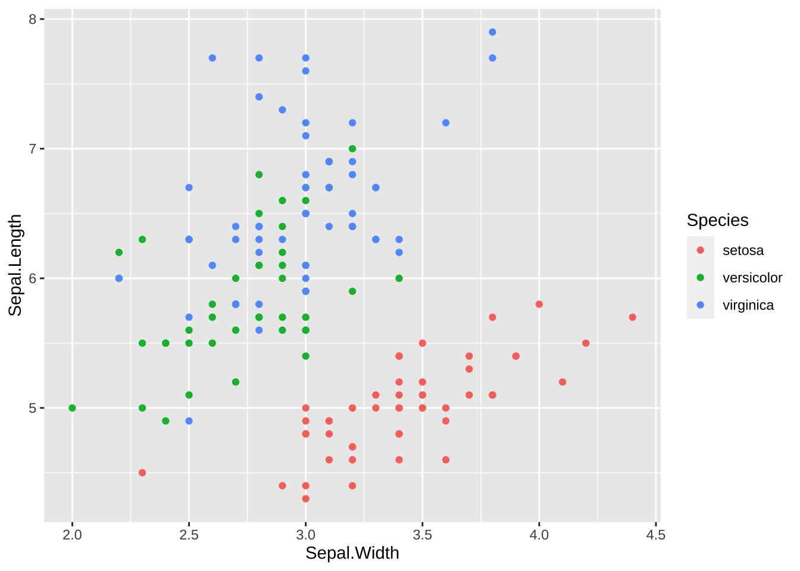

1.  `data = mpg` でデータを指定します。

2.  どのようなグラフにするか、幾何関数（Geometric Function）を指定します。散布図では、`geom_pont()` 、箱ひげ図では、`geom_boxplot()` です。

3.  x 軸、y 軸などに対応する変数の写像（mapping）を指定します。

    -   散布図では、`dspl` （displacemnt エンジンの排気量（単位 リットル））を x 軸に、`hwy` 高速道路で１ガロンで走れる距離（単位 マイル）を y 軸に割り当てています。

    -   箱ひげ図では、`class` 車の型式を、x 軸に、`hwy` 高速道路で１ガロンで走れる距離（単位 マイル）を y 軸に割り当てています。

記号的に書くと、下のようになっています。

`ggplot(data = <DATA>) + <GEOM_FUNCTION>(mapping = aes(<MAPPINGS>))`

## 散布図（Scatter Plot）

散布図は、データの二つの変数（列） を x と y に対応させる、最も基本的なグラフです。最初に試すべきグラフだともいうことができます。`mapping =` は省略することができます。

```         
ggplot(data = <data>, aes(x = <column name for x>, y = <column name for y>)) +
  geom_point()
```

```         
ggplot(data = df_iris, aes(x = Sepal.Length, y = Sepal.Width)) +
  geom_point()
```

変形（Transform）のときにつかった、`iris` データを使います。


```r
ggplot(data = iris, aes(x = Sepal.Length, y = Sepal.Width)) +
  geom_point()
```


### ラベル [Labels](https://ggplot2.tidyverse.org/reference/labs.html)

グラフの表題や、x 軸、y 軸のラベルをつけるには `labs()` を使います。

```         
ggplot(data = <data>, aes(x = <column name for x>, y = <column name for y>)) +
  geom_point() +
  labs(title = "Title", x = "Label for x", y = "Label for y")
```


```r
ggplot(data = iris, aes(x = Sepal.Length, y = Sepal.Width)) +
  geom_point() + 
  labs(title = "Scatter Plot of Sepal Data of Iris", x = "Sepal Length", y = "Sepal Width")
```

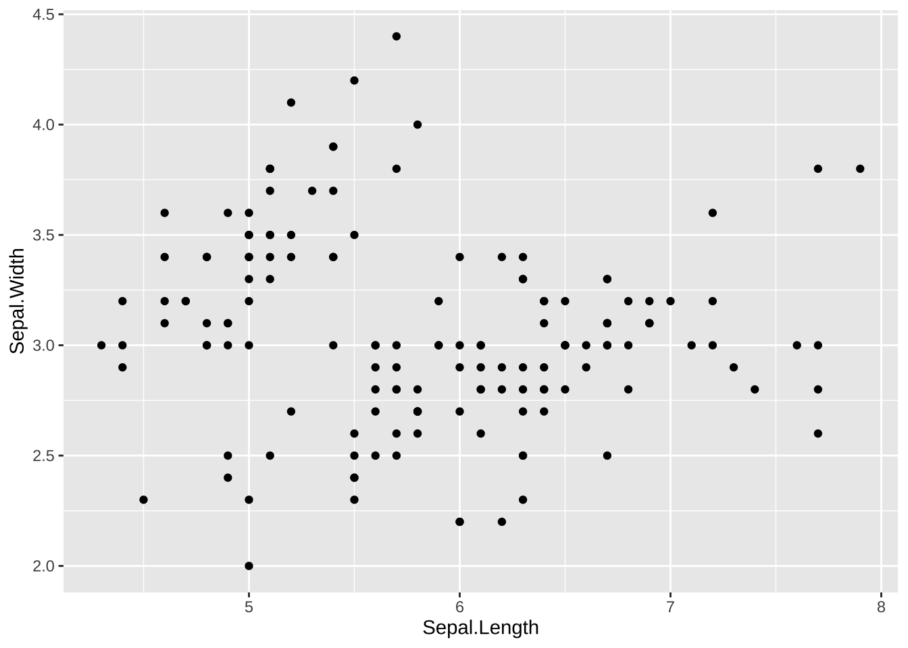


```r
ggplot(data = iris, aes(x = Sepal.Length, y = Sepal.Width)) +
  geom_point() + 
  labs(title = "菖蒲の萼の長さと幅についての散布図", x = "萼の長さ", y = "萼の幅")
```

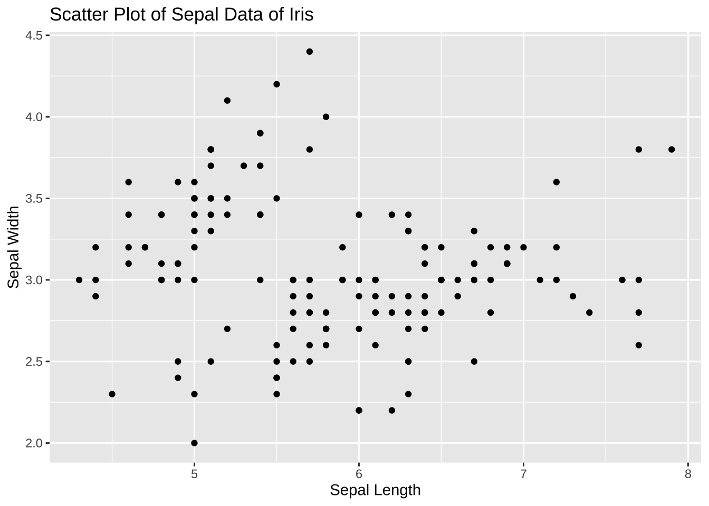

このように、日本語をタイトルや、ラベルに使うことも可能ですが、以後は、データに日本語が含まれていない場合には、そのまま表示します。

### 色付き [Colors](https://ggplot2.tidyverse.org/reference/aes_colour_fill_alpha.html)

菖蒲（iris）のデータは、Species 列に、三種類の菖蒲の名前が含まれていました。それぞれに、違う色で表示してみましょう。それには、x 軸、y 軸に対応する変数を指定したように、`color = Species` と指定します。


```r
ggplot(data = iris, aes(x = Sepal.Length, y = Sepal.Width, color = Species)) +
  geom_point()
```


### 形状 [Shapes](https://ggplot2.tidyverse.org/articles/ggplot2-specs.html)

色ではなく、形で Species を区別することも可能です。


```r
ggplot(data = iris, aes(x = Sepal.Length, y = Sepal.Width, shape = Species)) +
  geom_point()
```


色と、形、両方を同時に使うことも可能です。


```r
ggplot(data = iris, aes(x = Sepal.Length, y = Sepal.Width, color = Species, shape = Species)) +
  geom_point()
```


## 箱ひげ図 [Boxplot](https://ggplot2.tidyverse.org/reference/geom_boxplot.html)

The boxplot compactly displays the distribution of a continuous variable.

箱ひげ図は、連続な値をとる変数の分布を簡潔な表示でみることができるグラフです。箱や、線の長さ、外れ値の表示なども、正確に決まっていますので、次のビデオをみてください。英語ですが、わかりやすく、まとまっていると思います。

<https://vimeo.com/222358034>

Transcript ボタンから、スクリプトを表示することもできます。

例のように、それぞれのグループごとに箱ひげ図を表示することもできますが、その場合は、文字データや、離散的な数値データ（いくつかの飛び飛びの値をとる変数）を使います。x と y を入れ替えれば、横向きになります。


```r
ggplot(data = iris, aes(x = Species, y = Sepal.Length)) +
  geom_boxplot()
```


```r
ggplot(data = iris, aes(y = Species, x = Sepal.Length)) +
  geom_boxplot()
```


各、種類（Species）ごとに、Sepal.Width（萼（がく）幅）が、どのように分布しているかを示しています。真ん中の太い線が、中央値（median）、箱が、第一四分位（Q1）から第三四分位（Q3）、線と点で表される外れ値も、どのような基準か定められています。(IQR = Q3-Q1, 線は、Q3+1.5$\times$ IQR 以下に入っている実際の値までと、Q1-1.5 $\times$ IQR 以上に入っている実際の値まで。それらに入っていないものが外れ値)。

color を指定すると、枠に色がつき、fill を指定すると、箱の中が塗り潰されます。


```r
ggplot(data = iris, aes(x = Species, y = Sepal.Length, color = Species)) +
  geom_boxplot()
```


```r
ggplot(data = iris, aes(x = Species, y = Sepal.Length, fill = Species)) +
  geom_boxplot()
```


### ヒストグラム [Histogram](https://ggplot2.tidyverse.org/reference/geom_histogram.html)

Visualize the distribution of a single continuous variable by dividing the x axis into bins and counting the number of observations in each bin. Histograms (geom_histogram()) display the counts with bars; frequency polygons (`geom_freqpoly()`) display the counts with lines. Frequency polygons are more suitable when you want to compare the distribution across the levels of a categorical variable.

単一の連続変数の分布を可視化するために、x軸をビンに分割し、各ビン内の観測値の数を数えます。ヒストグラム（geom_histogram()）は、棒で数を表示します。一方、頻度多角形（geom_freqpoly()）は、数を線で表示します。頻度多角形は、カテゴリ変数のレベル間の分布を比較したい場合により適しています。

説明ビデオです。<https://vimeo.com/221607341>


```r
ggplot(data = iris, aes(x = Sepal.Length)) +
  geom_histogram()
#> `stat_bin()` using `bins = 30`. Pick better value with
#> `binwidth`.
```


枠（bins）を幾つに分けるか、または枠の幅を指定するようにとのメッセージが表示されます。

枠（bins）の数を変更するには `bins =` `<number>`　を使います。幅を指定するときは、`binwidth = <number>` とします。

最初の例では、枠の個数を（初期設定では30になっているものを）10個とし、二つ目の例では、幅を1にしています。


```r
ggplot(data = iris, aes(x = Sepal.Length)) +
  geom_histogram(bins = 10)
```

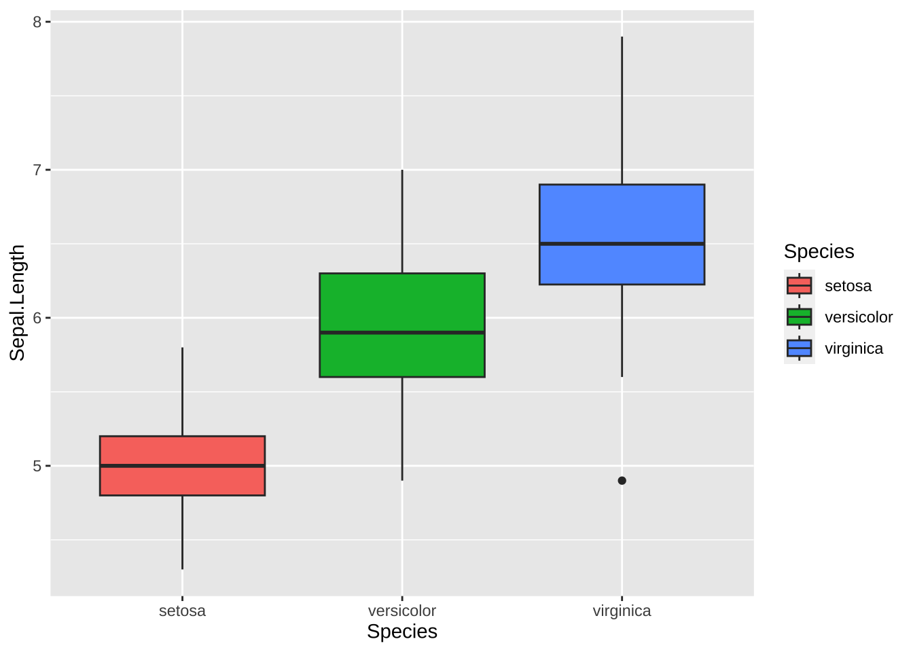


```r
ggplot(data = iris, aes(x = Sepal.Length)) +
  geom_histogram(binwidth = 1)
```


頻度多角形（geom_freqpoly()）を使うと以下のようになります。Species ごとに比べたり、色をつけたりもできます。


```r
ggplot(data = iris, aes(x = Sepal.Length)) +
  geom_freqpoly()
#> `stat_bin()` using `bins = 30`. Pick better value with
#> `binwidth`.
```

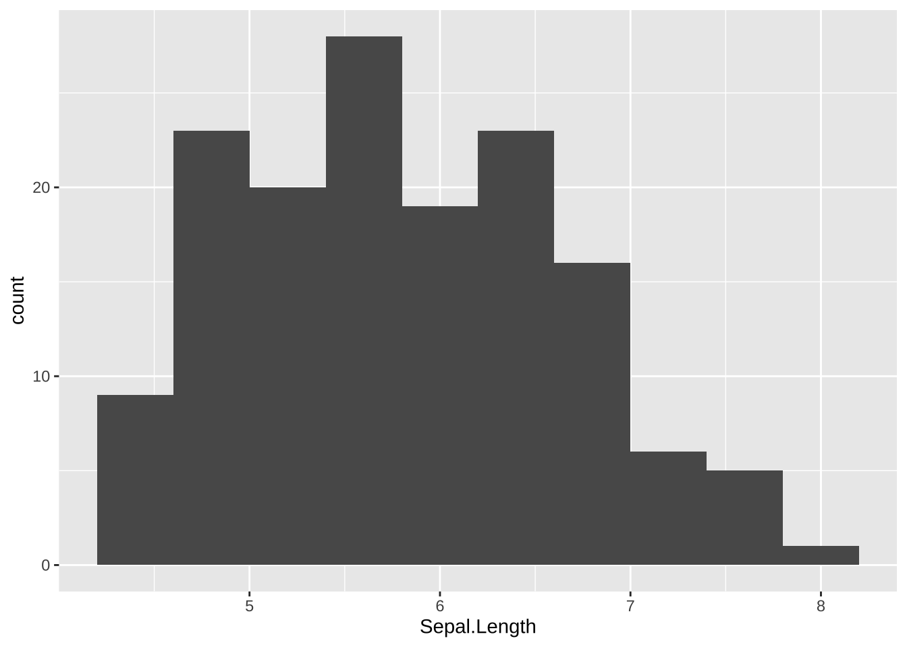


```r
ggplot(data = iris, aes(x = Sepal.Length, color = Species)) +
  geom_freqpoly(bins = 10)
```

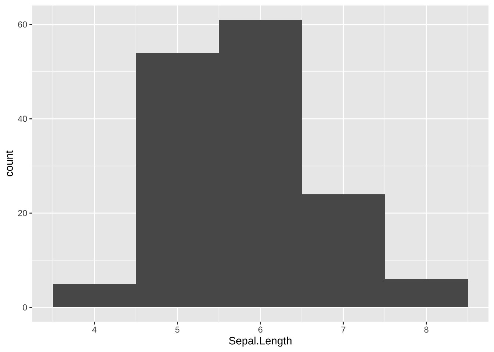

滑らかな曲線にするときは、density plot を使います。alpha は透明度で 0 から 1 の値で指定します。数が小さい方が薄くなります。color で線の色もあわせて設定することも可能です。いろいろと試してみてください。


```r
ggplot(data = iris, aes(x = Sepal.Length, fill = Species)) +
  geom_density(alpha = 0.5)
```


### 線形モデル Data Modeling

回帰直線を加えたり、他の近似曲線を加えることも可能です。グラフとしても直感的理解を助けますが、統計的な扱いについては、Modeling で説明します。


```r
ggplot(data = iris, aes(x = Sepal.Length, y = Sepal.Width)) +
  geom_point() +
  geom_smooth(method = "lm", se = FALSE)
```


```r
ggplot(data = iris, aes(x = Sepal.Length, y = Sepal.Width)) +
  geom_point() +
  geom_smooth()
```

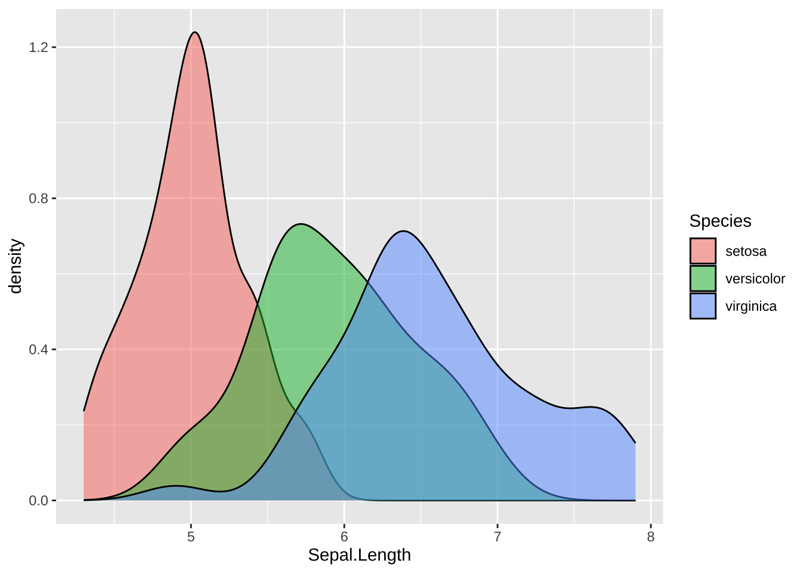

## 例から学ぶ ggplot2`,` II

### df_wdi, df_wdi_extra

前の章の `Tidyverse` で読み込み、概観した、世界開発指標（World Development Indicators）のデータを使います。[参照：WDI のデータ](https://icu-hsuzuki.github.io/ds4aj/tidyverse.html#wdi-のデータ)


```r
library(tidyverse)
library(WDI)
```

WDI の使い方は、世界銀行の部分で紹介しますが、はじめてのデータサイエンスの例でも紹介したように、データコードを利用して、データを読み込みます。ここでは、出生時の平均寿命と、一人当たりの　GDP と、総人口のデータを使います。

-   SP.DYN.LE00.IN: Life expectancy at birth, total (years) 出生時の平均寿命
-   SP.POP.TOTL: Population, total 総人口
-   NY.GDP.PCAP.KD: GDP per capita (constant 2015 US\$) 一人当たりの　GDP

次のコードで読み込みます。


```r
df_wdi <- WDI(
  country = "all", 
  indicator = c(lifeExp = "SP.DYN.LE00.IN", pop = "SP.POP.TOTL", gdpPercap = "NY.GDP.PCAP.KD")
)
```


```
#> Rows: 16758 Columns: 7
#> ── Column specification ────────────────────────────────────
#> Delimiter: ","
#> chr (3): country, iso2c, iso3c
#> dbl (4): year, lifeExp, pop, gdpPercap
#> 
#> ℹ Use `spec()` to retrieve the full column specification for this data.
#> ℹ Specify the column types or set `show_col_types = FALSE` to quiet this message.
```


```r
df_wdi_extra <- WDI(
  country = "all", 
  indicator = c(lifeExp = "SP.DYN.LE00.IN", pop = "SP.POP.TOTL", gdpPercap = "NY.GDP.PCAP.KD"), 
  extra = TRUE
)
```

すこし、追加情報を付加したものも取得しておきます。


```
#> Rows: 16758 Columns: 15
#> ── Column specification ────────────────────────────────────
#> Delimiter: ","
#> chr  (7): country, iso2c, iso3c, region, capital, income...
#> dbl  (6): year, lifeExp, pop, gdpPercap, longitude, lati...
#> lgl  (1): status
#> date (1): lastupdated
#> 
#> ℹ Use `spec()` to retrieve the full column specification for this data.
#> ℹ Specify the column types or set `show_col_types = FALSE` to quiet this message.
```


```r
df_wdi_extra
#> # A tibble: 16,758 × 15
#>    country     iso2c iso3c  year status lastupdated lifeExp
#>    <chr>       <chr> <chr> <dbl> <lgl>  <date>        <dbl>
#>  1 Afghanistan AF    AFG    2014 NA     2023-07-25     62.5
#>  2 Afghanistan AF    AFG    2012 NA     2023-07-25     61.9
#>  3 Afghanistan AF    AFG    2009 NA     2023-07-25     60.4
#>  4 Afghanistan AF    AFG    2013 NA     2023-07-25     62.4
#>  5 Afghanistan AF    AFG    1971 NA     2023-07-25     37.9
#>  6 Afghanistan AF    AFG    2015 NA     2023-07-25     62.7
#>  7 Afghanistan AF    AFG    1969 NA     2023-07-25     36.9
#>  8 Afghanistan AF    AFG    2010 NA     2023-07-25     60.9
#>  9 Afghanistan AF    AFG    2011 NA     2023-07-25     61.4
#> 10 Afghanistan AF    AFG    2008 NA     2023-07-25     59.9
#> # ℹ 16,748 more rows
#> # ℹ 8 more variables: pop <dbl>, gdpPercap <dbl>,
#> #   region <chr>, capital <chr>, longitude <dbl>,
#> #   latitude <dbl>, income <chr>, lending <chr>
```

### 

**例3 折線グラフ（line graph）**

WDI は時系列データですから、折れ線グラフも使います。後ほど紹介しますが、

`{<DATA> |> ggplot(aes(year, lifeExp)) + geom_line()}`

と言った感じです。

まずは、失敗例から。次のコードでグラフが描けるでしょうか。


```r
df_wdi |> ggplot(aes(year, lifeExp)) + geom_line()
#> Warning: Removed 266 rows containing missing values
#> (`geom_line()`).
```


## 例　パッケージ Gapminder を使って


```r
library(tidyverse)
library(gapminder)
library(WDI)
```

すでに、`dplyr` をつかった変形で確認しましたが、簡単に、データを見ておきましょう。


```r
df_gm <- gapminder
df_gm %>% slice(1:10)
#> # A tibble: 10 × 6
#>    country     continent  year lifeExp      pop gdpPercap
#>    <fct>       <fct>     <int>   <dbl>    <int>     <dbl>
#>  1 Afghanistan Asia       1952    28.8  8425333      779.
#>  2 Afghanistan Asia       1957    30.3  9240934      821.
#>  3 Afghanistan Asia       1962    32.0 10267083      853.
#>  4 Afghanistan Asia       1967    34.0 11537966      836.
#>  5 Afghanistan Asia       1972    36.1 13079460      740.
#>  6 Afghanistan Asia       1977    38.4 14880372      786.
#>  7 Afghanistan Asia       1982    39.9 12881816      978.
#>  8 Afghanistan Asia       1987    40.8 13867957      852.
#>  9 Afghanistan Asia       1992    41.7 16317921      649.
#> 10 Afghanistan Asia       1997    41.8 22227415      635.
```


```r
glimpse(df_gm)
#> Rows: 1,704
#> Columns: 6
#> $ country   <fct> "Afghanistan", "Afghanistan", "Afghanist…
#> $ continent <fct> Asia, Asia, Asia, Asia, Asia, Asia, Asia…
#> $ year      <int> 1952, 1957, 1962, 1967, 1972, 1977, 1982…
#> $ lifeExp   <dbl> 28.801, 30.332, 31.997, 34.020, 36.088, …
#> $ pop       <int> 8425333, 9240934, 10267083, 11537966, 13…
#> $ gdpPercap <dbl> 779.4453, 820.8530, 853.1007, 836.1971, …
```


```r
summary(df_gm)
#>         country        continent        year     
#>  Afghanistan:  12   Africa  :624   Min.   :1952  
#>  Albania    :  12   Americas:300   1st Qu.:1966  
#>  Algeria    :  12   Asia    :396   Median :1980  
#>  Angola     :  12   Europe  :360   Mean   :1980  
#>  Argentina  :  12   Oceania : 24   3rd Qu.:1993  
#>  Australia  :  12                  Max.   :2007  
#>  (Other)    :1632                                
#>     lifeExp           pop              gdpPercap       
#>  Min.   :23.60   Min.   :6.001e+04   Min.   :   241.2  
#>  1st Qu.:48.20   1st Qu.:2.794e+06   1st Qu.:  1202.1  
#>  Median :60.71   Median :7.024e+06   Median :  3531.8  
#>  Mean   :59.47   Mean   :2.960e+07   Mean   :  7215.3  
#>  3rd Qu.:70.85   3rd Qu.:1.959e+07   3rd Qu.:  9325.5  
#>  Max.   :82.60   Max.   :1.319e+09   Max.   :113523.1  
#> 
```

#### Tidyverse::ggplot

##### First Try - with failures

You will encounter similar failures. We list three of them.


```r
ggplot(df_gm, aes(x = year, y = lifeExp)) + geom_point()
```

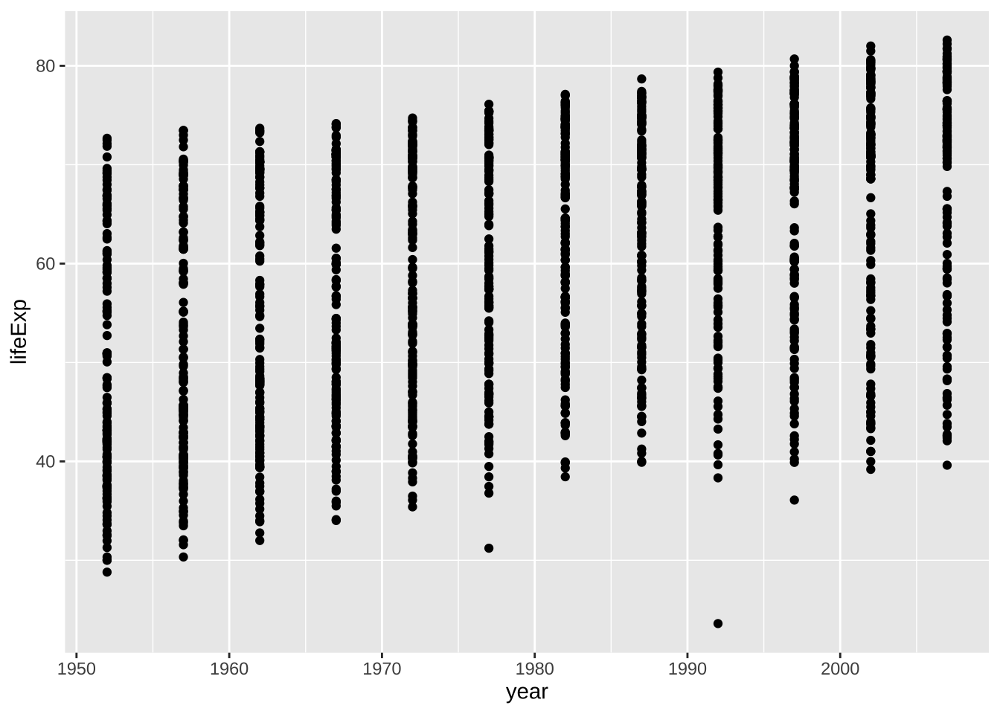

There are lots of data in each year: 1952, 1957, 1962, 1967, 1972, 1977, 1982, 1987, 1992, 1997, .... Can you tell how many years are in the data? The following command shows different years in the data.


```r
unique(df_gm$year)
#>  [1] 1952 1957 1962 1967 1972 1977 1982 1987 1992 1997 2002
#> [12] 2007
```

You can guess it from the data summary above. Can you imagine how many countries are in the data? 142? Anyhow, too many points are on each year.


```r
ggplot(df_gm, aes(x = year, y = lifeExp)) + geom_line()
```


Now, you can guess the reason why you had this output. This is often called a saw-tooth.


```r
ggplot(df_gm, aes(x = year, y = lifeExp)) + geom_boxplot()
#> Warning: Continuous x aesthetic
#> ℹ did you forget `aes(group = ...)`?
```


Can you see what the problem is? The `year` is a numerical variable in integer.


```r
typeof(pull(df_gm, year)) # same as typeof(df$year)
#> [1] "integer"
```

The following looks better.


```r
ggplot(df_gm, aes(y = lifeExp, group = year)) + geom_boxplot()
```

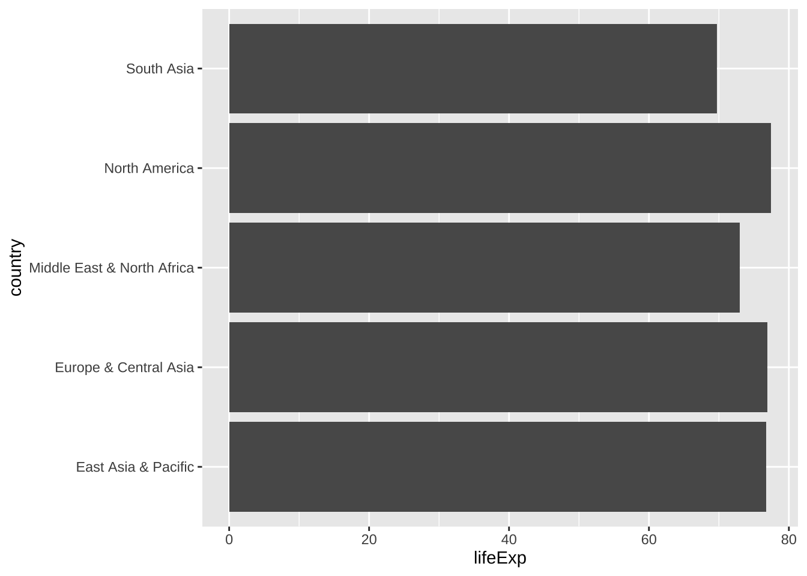

##### Box Plot


```r
ggplot(df_gm, aes(x = as_factor(year), y = lifeExp)) + geom_boxplot()
```


You can use `fill` and `color` for the box plot. Try and check the difference.


```r
df_gm %>% filter(year %in% c(1952, 1987, 2007)) %>%
  ggplot(aes(x=as_factor(year), y = lifeExp, fill = continent)) +
  geom_boxplot()
```


The following are examples of line graphs. Please see the differences.


```r
df_lifeExp <- df_gm %>% 
  group_by(continent, year) %>% 
  summarize(mean_lifeExp = mean(lifeExp), median_lifeExp = median(lifeExp), max_lifeExp = max(lifeExp), min_lifeExp = min(lifeExp), .groups = "keep")
```


```r
df_lifeExp %>% ggplot(aes(x = year, y = mean_lifeExp, color = continent)) +
  geom_line()
```

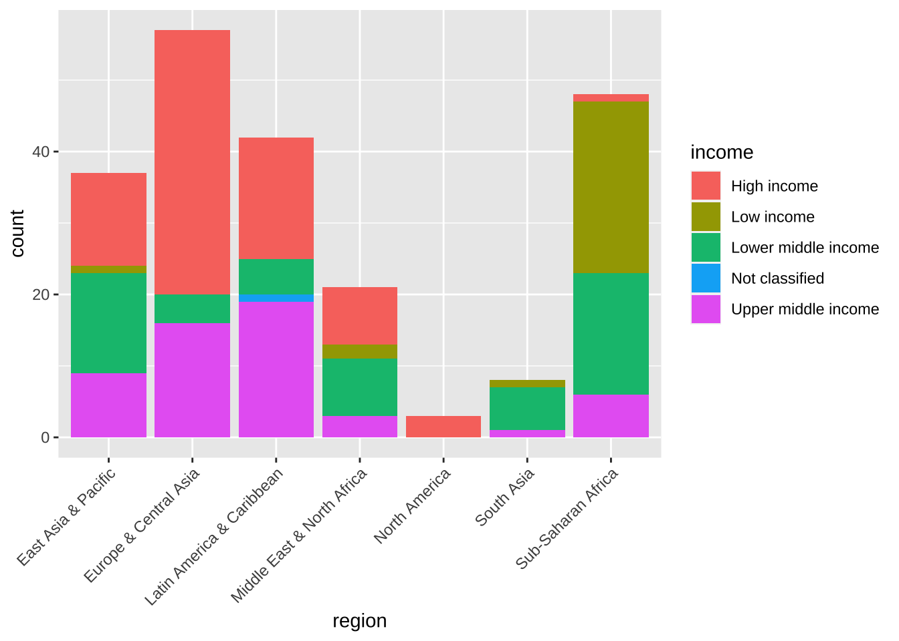


```r
df_lifeExp %>% ggplot(aes(x = year, y = mean_lifeExp, color = continent, linetype = continent)) +
  geom_line()
```

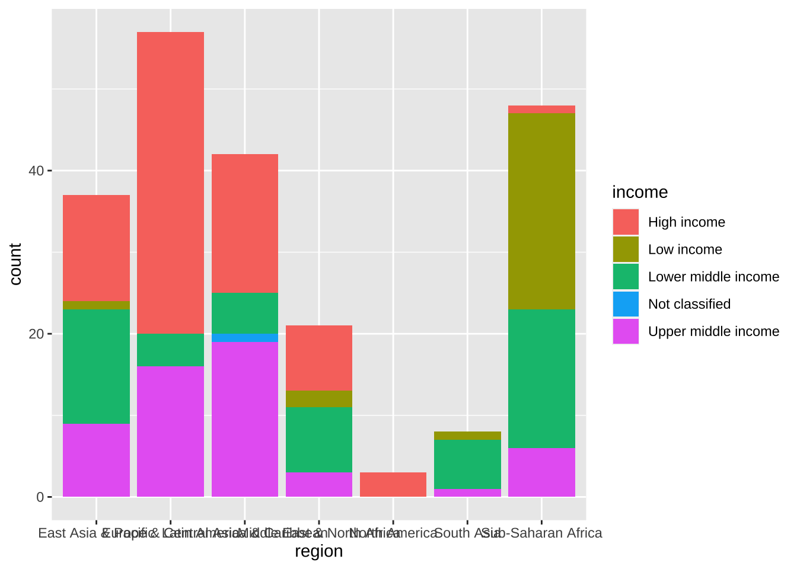


```r
df_lifeExp %>% ggplot() +
  geom_line(aes(x = year, y = mean_lifeExp, color = continent)) + 
  geom_line(aes(x = year, y = median_lifeExp, linetype = continent))
```


### Original Data? WDI?


```r
df_gm %>% slice(1:10)
#> # A tibble: 10 × 6
#>    country     continent  year lifeExp      pop gdpPercap
#>    <fct>       <fct>     <int>   <dbl>    <int>     <dbl>
#>  1 Afghanistan Asia       1952    28.8  8425333      779.
#>  2 Afghanistan Asia       1957    30.3  9240934      821.
#>  3 Afghanistan Asia       1962    32.0 10267083      853.
#>  4 Afghanistan Asia       1967    34.0 11537966      836.
#>  5 Afghanistan Asia       1972    36.1 13079460      740.
#>  6 Afghanistan Asia       1977    38.4 14880372      786.
#>  7 Afghanistan Asia       1982    39.9 12881816      978.
#>  8 Afghanistan Asia       1987    40.8 13867957      852.
#>  9 Afghanistan Asia       1992    41.7 16317921      649.
#> 10 Afghanistan Asia       1997    41.8 22227415      635.
```

#### WDI

-   SP.DYN.LE00.IN: Life expectancy at birth, total (years)
-   NY.GDP.PCAP.KD: GDP per capita (constant 2015 US\$)
-   SP.POP.TOTL: Population, total


```r
df_wdi <- WDI(
  country = "all", 
  indicator = c(lifeExp = "SP.DYN.LE00.IN", pop = "SP.POP.TOTL", gdpPercap = "NY.GDP.PCAP.KD")
)
```


```
#> Rows: 16758 Columns: 7
#> ── Column specification ────────────────────────────────────
#> Delimiter: ","
#> chr (3): country, iso2c, iso3c
#> dbl (4): year, lifeExp, pop, gdpPercap
#> 
#> ℹ Use `spec()` to retrieve the full column specification for this data.
#> ℹ Specify the column types or set `show_col_types = FALSE` to quiet this message.
```


```r
df_wdi %>% slice(1:10)
#> # A tibble: 10 × 7
#>    country     iso2c iso3c  year lifeExp      pop gdpPercap
#>    <chr>       <chr> <chr> <dbl>   <dbl>    <dbl>     <dbl>
#>  1 Afghanistan AF    AFG    1960    32.5  8622466        NA
#>  2 Afghanistan AF    AFG    1961    33.1  8790140        NA
#>  3 Afghanistan AF    AFG    1962    33.5  8969047        NA
#>  4 Afghanistan AF    AFG    1963    34.0  9157465        NA
#>  5 Afghanistan AF    AFG    1964    34.5  9355514        NA
#>  6 Afghanistan AF    AFG    1965    35.0  9565147        NA
#>  7 Afghanistan AF    AFG    1966    35.5  9783147        NA
#>  8 Afghanistan AF    AFG    1967    35.9 10010030        NA
#>  9 Afghanistan AF    AFG    1968    36.4 10247780        NA
#> 10 Afghanistan AF    AFG    1969    36.9 10494489        NA
```


```r
df_wdi_extra <- WDI(
  country = "all", 
  indicator = c(lifeExp = "SP.DYN.LE00.IN", pop = "SP.POP.TOTL", gdpPercap = "NY.GDP.PCAP.KD"), 
  extra = TRUE
)
```


```
#> Rows: 16758 Columns: 15
#> ── Column specification ────────────────────────────────────
#> Delimiter: ","
#> chr  (7): country, iso2c, iso3c, region, capital, income...
#> dbl  (6): year, lifeExp, pop, gdpPercap, longitude, lati...
#> lgl  (1): status
#> date (1): lastupdated
#> 
#> ℹ Use `spec()` to retrieve the full column specification for this data.
#> ℹ Specify the column types or set `show_col_types = FALSE` to quiet this message.
```


```r
df_wdi_extra
#> # A tibble: 16,758 × 15
#>    country     iso2c iso3c  year status lastupdated lifeExp
#>    <chr>       <chr> <chr> <dbl> <lgl>  <date>        <dbl>
#>  1 Afghanistan AF    AFG    2014 NA     2023-07-25     62.5
#>  2 Afghanistan AF    AFG    2012 NA     2023-07-25     61.9
#>  3 Afghanistan AF    AFG    2009 NA     2023-07-25     60.4
#>  4 Afghanistan AF    AFG    2013 NA     2023-07-25     62.4
#>  5 Afghanistan AF    AFG    1971 NA     2023-07-25     37.9
#>  6 Afghanistan AF    AFG    2015 NA     2023-07-25     62.7
#>  7 Afghanistan AF    AFG    1969 NA     2023-07-25     36.9
#>  8 Afghanistan AF    AFG    2010 NA     2023-07-25     60.9
#>  9 Afghanistan AF    AFG    2011 NA     2023-07-25     61.4
#> 10 Afghanistan AF    AFG    2008 NA     2023-07-25     59.9
#> # ℹ 16,748 more rows
#> # ℹ 8 more variables: pop <dbl>, gdpPercap <dbl>,
#> #   region <chr>, capital <chr>, longitude <dbl>,
#> #   latitude <dbl>, income <chr>, lending <chr>
```

違いはわかりましたか。同じような変数についてのデータですが、WDI からダウンロードした実際のデータの場合には、練習用のデータとは、違った困難がいくつもあります。それを、少しず見ていきながら、現実世界のデータを扱えるようにしていきましょう。

## コメント

### 参考文献

-   Cheat Sheet in RStudio: <https://www.rstudio.com/resources/cheatsheets/>

    -   [RStudio IED](https://raw.githubusercontent.com/rstudio/cheatsheets/main/rstudio-ide.pdf)
    -   [Base R Cheat Sheet](https://github.com/rstudio/cheatsheets/raw/main/base-r.pdf)

-   'Quick R' by DataCamp: <https://www.statmethods.net/management>

-   [An Introduction to R](https://cran.rstudio.com)

## 練習

### Posit Primers <https://posit.cloud/learn/primers>

1.  The Basics -- [r4ds: Explore, I](https://r4ds.had.co.nz/explore-intro.html#explore-intro)

-   [Visualization Basics](https://rstudio.cloud/learn/primers/1.1)
-   [Programming Basics](https://rstudio.cloud/learn/primers/1.2)
