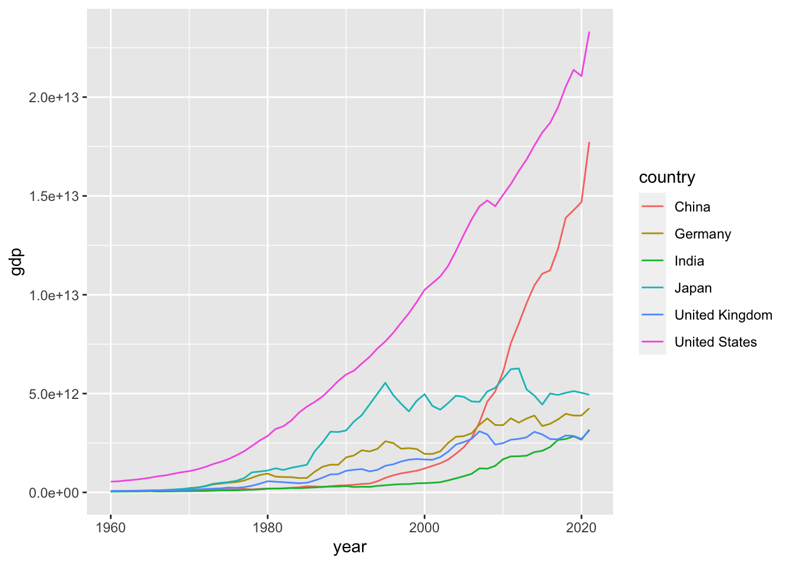

# (PART) PART III INSTITUTIONAL DATA {-}
# World Bank {#worldbank}


## World Development Indicator (WDI)

パッケージ と `tidyverse` と `WDI` を使いますから、下のコードによって、ロードします。


```r
library(tidyverse)
#> ── Attaching packages ─────────────────── tidyverse 1.3.2 ──
#> ✔ ggplot2 3.4.1     ✔ purrr   1.0.1
#> ✔ tibble  3.1.8     ✔ dplyr   1.1.0
#> ✔ tidyr   1.3.0     ✔ stringr 1.5.0
#> ✔ readr   2.1.4     ✔ forcats 1.0.0
#> ── Conflicts ────────────────────── tidyverse_conflicts() ──
#> ✖ dplyr::filter() masks stats::filter()
#> ✖ dplyr::lag()    masks stats::lag()
library(WDI)
```

まず、三つの例を見てみましょう。なにをしているかわかりますか。考えて見てください。


```r
WDI(country = "all", indicator = c(gdp = "NY.GDP.MKTP.CD"),
    extra=TRUE) %>% drop_na(gdp) %>%
  filter(year==max(year), income !="Aggregates") %>% 
  drop_na(region) %>% arrange(desc(gdp))
```


```
#> Rows: 16492 Columns: 13
#> ── Column specification ────────────────────────────────────
#> Delimiter: ","
#> chr  (7): country, iso2c, iso3c, region, capital, income...
#> dbl  (4): year, gdp, longitude, latitude
#> lgl  (1): status
#> date (1): lastupdated
#> 
#> ℹ Use `spec()` to retrieve the full column specification for this data.
#> ℹ Specify the column types or set `show_col_types = FALSE` to quiet this message.
#> # A tibble: 196 × 13
#>    country       iso2c iso3c  year     gdp status lastupda…¹
#>    <chr>         <chr> <chr> <dbl>   <dbl> <lgl>  <date>    
#>  1 United States US    USA    2021 2.33e13 NA     2022-12-22
#>  2 China         CN    CHN    2021 1.77e13 NA     2022-12-22
#>  3 Japan         JP    JPN    2021 4.94e12 NA     2022-12-22
#>  4 Germany       DE    DEU    2021 4.26e12 NA     2022-12-22
#>  5 India         IN    IND    2021 3.18e12 NA     2022-12-22
#>  6 United Kingd… GB    GBR    2021 3.13e12 NA     2022-12-22
#>  7 France        FR    FRA    2021 2.96e12 NA     2022-12-22
#>  8 Italy         IT    ITA    2021 2.11e12 NA     2022-12-22
#>  9 Canada        CA    CAN    2021 1.99e12 NA     2022-12-22
#> 10 Korea, Rep.   KR    KOR    2021 1.81e12 NA     2022-12-22
#> # … with 186 more rows, 6 more variables: region <chr>,
#> #   capital <chr>, longitude <dbl>, latitude <dbl>,
#> #   income <chr>, lending <chr>, and abbreviated variable
#> #   name ¹​lastupdated
```


```r
WDI(country = c("CN","GB","JP","IN","US","DE"), indicator = c(gdp = "NY.GDP.MKTP.CD"), extra=TRUE) %>% drop_na(gdp) %>% 
  ggplot(aes(year, gdp, col = country)) + geom_line() +
  labs(title = "WDI NY.GDP.MKTP.CD: gdp")
```


```
#> Rows: 372 Columns: 13
#> ── Column specification ────────────────────────────────────
#> Delimiter: ","
#> chr  (7): country, iso2c, iso3c, region, capital, income...
#> dbl  (4): year, gdp, longitude, latitude
#> lgl  (1): status
#> date (1): lastupdated
#> 
#> ℹ Use `spec()` to retrieve the full column specification for this data.
#> ℹ Specify the column types or set `show_col_types = FALSE` to quiet this message.
```


```r
WDI(country = c("CN","IN","JP","US"), 
    indicator = c(gdp_growth_rate = "NY.GDP.MKTP.KD.ZG"), extra=TRUE) %>%
  drop_na(gdp_growth_rate) %>% 
  ggplot(aes(year, gdp_growth_rate, col = country)) + geom_line() +
  labs(title = paste("WDI NY.GDP.MKTP.KD.ZG: gdp growth rate"))
```


```
#> Rows: 248 Columns: 13
#> ── Column specification ────────────────────────────────────
#> Delimiter: ","
#> chr  (7): country, iso2c, iso3c, region, capital, income...
#> dbl  (4): year, gdp_growth_rate, longitude, latitude
#> lgl  (1): status
#> date (1): lastupdated
#> 
#> ℹ Use `spec()` to retrieve the full column specification for this data.
#> ℹ Specify the column types or set `show_col_types = FALSE` to quiet this message.
```


まず、世界の国々の、GDP（gross domestic product 国内総生産）のデータを、取得して、2021年の GDP を大きな順に並べています。

値は、たとえば、$2.331508e+13$ のように書かれていますが、これは、科学的記法と呼ばれるもので、$2.331508 \times 10^{13}$ を意味しています。約23兆ドルです。

次に、3兆ドル以上の、６カ国を選択し、その、iso2c と呼ばれるコードを使って、それらの国のデータをもう一度取得し、年次変化をあらわすグラフを描いています。

さらにその中から、４カ国を選んで、今度は、GDP の年次変化率を描いています。単位は、パーセントです。

これは、ひとつの例ですが、ここで使われているのが、WDI World Development Indicator というもので、世界銀行が、いくつかの指標を定めて、編纂しているものです。

### 指標 Indicators (WDI)

上の例では、次の二つの指標のコード Indicator Code (WDI Code) が使われました。

-   NY.GDP.MKTP.CD: GDP (current US\$)
-   NY.GDP.MKTP.KD.ZG: GDP growth (annual %)

### 指標 WDI (World Development Indicators)

> The World Development Indicators is a compilation of relevant, high-quality, and internationally comparable statistics about global development and the fight against poverty. The database contains 1,400 time series indicators for 217 economies and more than 40 country groups, with data for many indicators going back more than 50 years.

> WDIは、世界の開発状況と、貧困との戦いに関する、適切で上質、かつ、国際的に比較可能な時系列の統計データを編纂したものです。このデータベースは、217の経済と40以上の国グループについて1,400の時系列指標を含み、指標のデータの多くは50年以上前に遡ることができます。

-   世界銀行（World Bank）: <https://www.worldbank.org>
-   World Bank Open Data: <https://data.worldbank.org>
    -   Country / Indicator \> Featured & All \> Details
-   [World Development Indicators (WDI)](https://datatopics.worldbank.org/world-development-indicators/) :
    -   Themes: Poverty and Inequality, People, Environment, Economy, States and Markets, Global Links
    -   Open Data & DataBank: Explore data, Query database

### 指標 のコード、WDI code を探してみよう

いくつかの探し方があります。まず、ここでは、World Bank のサイトから探す方法を説明しましょう。

ふた通りあります。

1. [World Bank Open Data](https://data.worldbank.org) にいくと、表題の下の検索窓の下に、 Country / Indicator とありますから、Indicator を選択します。すると、そこに、項目のリストが、Featured と All という二つのタブに分かれて出ています。かなり膨大です。それを選択すると、その項目のサイトに行きます。それが、指標のサイトです。図などの、右上に、Details とありますから、それを選択すると、その中に、Indicator が書かれています。
実は、指標のサイトのアドレス（URL）を見ると、そこにも、この Indicator が書かれていることがわかります。

2. [World Development Indicators (WDI)](https://datatopics.worldbank.org/world-development-indicators/) にいくと、下のようなテーマに分かれています。

Themes: Poverty and Inequality, People, Environment, Economy, States and Markets, Global Links

その中から、選択して、スクロールすると、そこに、指標が書かれています。

Indicator, Code, Time coverage, Region coverage, Get data

とあり、Code が、指標のコードです。実は、すべての年や、すべての地域のデータが揃っているわけではないので、この情報を見ておくことはとても重要です。ほとんど、データがない場合もあります。

一番右端の Get data からは、CSV や、データバンク（Data Bank）へのリンクがあります。

それぞれの方法で、上で使った、二つの指標およびそのコードは見つかりましたか。

1 の方法の途中に出てきた、検索窓から検索することも可能です。

### 指標 WDIの例

このあとの、例で使う指標を書いておきます。

* NY.GDP.MKTP.CD: GDP (current US$)
* NY.GDP.DEFL.KD.ZG: Inflation, GDP deflator (annual %)
* SL.UEM.TOTL.NE.ZS: Unemployment, total (% of total labor force) (national estimate)
* CPTOTNSXN: CPI Price, nominal
* SL.TLF.CACT.MA.NE.ZS: Labor force participation rate, male (% of male population ages 15+) (national estimate)
* SL.TLF.CACT.FE.NE.ZS: Labor force participation rate, female (% of male population ages 15+) (national estimate)

### 練習 1. - 調べてみたい WDI 指標とそのコード

いくつか、リストしてみましょう。

## WDI パッケージ

`WDI` パッケージ の使い方を紹介します。

`WDI` パッケージで、データをダウンロードしたり、探したり、詳細情報を得たりできます。

### 指標 WDI 検索

まず、検索です。上で、サイトから調べる方法を紹介しましたが、`WDI` パッケージの、`WDIsearch` でも探すことができます。詳細は、右下の窓枠の Help タブの検索窓に、WDIsearch といれて調べて見てください。ここでは、二種類の検索方法を紹介します。

#### 検索例 1（WDI名）

WDI 名に、ある文字列が含まれているものを検索します。検索文字列は、大文字・小文字は関係ありません。


```r
WDIsearch(string = "gdp", field = "name", short = TRUE, cache = NULL) %>%
  as_tibble()
#> # A tibble: 540 × 2
#>    indicator            name                                
#>    <chr>                <chr>                               
#>  1 5.51.01.10.gdp       "Per capita GDP growth"             
#>  2 6.0.GDP_current      "GDP (current $)"                   
#>  3 6.0.GDP_growth       "GDP growth (annual %)"             
#>  4 6.0.GDP_usd          "GDP (constant 2005 $)"             
#>  5 6.0.GDPpc_constant   "GDP per capita, PPP (constant 2011…
#>  6 BG.GSR.NFSV.GD.ZS    "Trade in services (% of GDP)"      
#>  7 BG.KAC.FNEI.GD.PP.ZS "Gross private capital flows (% of …
#>  8 BG.KAC.FNEI.GD.ZS    "Gross private capital flows (% of …
#>  9 BG.KLT.DINV.GD.PP.ZS "Gross foreign direct investment (%…
#> 10 BG.KLT.DINV.GD.ZS    "Gross foreign direct investment (%…
#> # … with 530 more rows
```

なんと、500件以上出てきました。Indicator（指標コード）と、Name（指標名）が列挙されます。すべてに、GDP という文字列が入っていることを確認できると思います。

#### 検索例 2（WDI）

Indicator（指標コード）から、Name（指標名）を検索します。


```r
WDIsearch(string = "NY.GDP.MKTP.CD", field = "indicator", short = TRUE, cache = NULL)
#>               indicator
#> 11410    NY.GDP.MKTP.CD
#> 11411 NY.GDP.MKTP.CD.XD
#>                                             name
#> 11410                          GDP (current US$)
#> 11411 GDP deflator, index (2000=100; US$ series)
```

二件出てきました。
  
#### 練習 2. - 検索（short）

名前で検索（"" の間に、（なるべく簡単な）検索文字列を入れてください。）


```r
WDIsearch(string = "", field = "name", short = TRUE, cache = NULL)
```

Indicator で検索（"" の間に、調べたい indicator を入れてください。）


```r
WDIsearch(string = "", field = "indicator", short = TRUE, cache = NULL)
```

  
#### 詳しい情報を得るには

上では、Indicator（指標コード）と、Name（指標名）だけでしたが、Description（説明） なども得ることができます。

それには、`short = FALSE` とします。

一回一回、World Bank にアクセスして調べるのは、時間もかかりますから、Indicator と、名前などの情報をもったファイルを手元に持っておくことにします。それには、次のようにします。


```r
wdi_cache <- WDIcache()
```

これは、series と、country の二つのデータ・フレームからなっているリストです。

右上の窓枠（pane）から、`wdi_cache` を探して、中身を見てみましょう。三角印や、右から二番目の巻物のようなアイコンをクリックすると中身が見えます。

series には、すべての指標がリストされ、その情報が書かれています。

また、country には、それぞれについて、さまざまな情報が書かれています。これは、とても、たいせつな情報です。国名と、iso2c, iso3c のようなコードもありますし、地域（region）や、その国が、どの income level（収入の階級）に入るかも書かれています。また、国だけではなく、地域など、グループの名称も含まれています。

今後、さまざまに利用していきたいと思います。


  
#### 検索例 3（WDI名）

`short = FALSE` として、検索してみましょう。文字列が入っている、指標名を検索します。


```r
WDIsearch(string = "CPI Price", field = "name", short = FALSE, cache = wdi_cache)
#>         indicator
#> 2586    CPTOTNSXN
#> 2587 CPTOTSAXMZGY
#> 2588    CPTOTSAXN
#> 2589 CPTOTSAXNZGY
#>                                                 name
#> 2586                              CPI Price, nominal
#> 2587 CPI Price, % y-o-y, median weighted, seas. adj.
#> 2588                  CPI Price, nominal, seas. adj.
#> 2589         CPI Price, % y-o-y, nominal, seas. adj.
#>                                                                                                                                                                                                                  description
#> 2586                                                                The consumer price index reflects the change in prices for the average consumer of a constant basket of consumer goods. Data is not seasonally adjusted.
#> 2587                                                                Median inflation rate calculated for geographical aggregates (regions, world, etc) of the annual percent change of the CPI. Data is seasonally adjusted.
#> 2588                                               The consumer price index reflects the change in prices for the average consumer of a constant basket of consumer goods. Data is in nominal terms and seasonally adjusted.
#> 2589 The consumer price index reflects the change in prices for the average consumer of a constant basket of consumer goods. Data is in nominal percentage terms, measured on a year-on-year basis, and seasonally adjusted.
#>               sourceDatabase
#> 2586 Global Economic Monitor
#> 2587 Global Economic Monitor
#> 2588 Global Economic Monitor
#> 2589 Global Economic Monitor
#>                                           sourceOrganization
#> 2586 World Bank staff calculations based on Datastream data.
#> 2587 World Bank staff calculations based on Datastream data.
#> 2588 World Bank staff calculations based on Datastream data.
#> 2589 World Bank staff calculations based on Datastream data.
```

- CPTOTNSXN: CPI Price, nominal
  - The consumer price index reflects the change in prices for the average consumer of a constant basket of consumer goods. Data is not seasonally adjusted.

#### 検索例 4（WDI）

指標コードから、詳細情報を得ます。


```r
WDIsearch(string = "NY.GDP.MKTP.KD.ZG", field = "indicator", short = FALSE, cache = wdi_cache)
#>               indicator                  name
#> 12114 NY.GDP.MKTP.KD.ZG GDP growth (annual %)
#>                                                                                                                                                                                                                                                                                                                                                                                                                                                                           description
#> 12114 Annual percentage growth rate of GDP at market prices based on constant local currency. Aggregates are based on constant 2015 prices, expressed in U.S. dollars. GDP is the sum of gross value added by all resident producers in the economy plus any product taxes and minus any subsidies not included in the value of the products. It is calculated without making deductions for depreciation of fabricated assets or for depletion and degradation of natural resources.
#>                     sourceDatabase
#> 12114 World Development Indicators
#>                                                              sourceOrganization
#> 12114 World Bank national accounts data, and OECD National Accounts data files.
```

  
#### 練習 2 - 検索（long w/ cache）

`string` と、`field` を、ふたつとも入れてください。


```r
WDIsearch(string = "", field = "", short = FALSE, cache = wdi_cache)
```


  
### 指標 WDI データのダウンロード

Indicator が決まったら、ダウンロードします。右下の窓枠の Help タブの検索枠に、`WDI` と入れて確認しましょう。 

```
WDI(
  country = "all",
  indicator = "NY.GDP.PCAP.KD",
  start = 1960,
  end = NULL,
  extra = FALSE,
  cache = NULL,
  latest = NULL,
  language = "en"
)
```

上が基本的な用法ですが、`start` 以下は、Default（初期値）が書かれていますから、たいせつなのは、最初の二つ、country と、indicator です。
  
#### ダウンロード例 1-1

country は、初期値も、"all" となっていますから、最も簡単なのは、indicator に、指標コードを入れることです。引用符を忘れずに。


```r
df_gdp1 <- WDI(country = "all", indicator = "NY.GDP.MKTP.CD")
df_gdp1
```


```
#> Rows: 16492 Columns: 5
#> ── Column specification ────────────────────────────────────
#> Delimiter: ","
#> chr (3): country, iso2c, iso3c
#> dbl (2): year, NY.GDP.MKTP.CD
#> 
#> ℹ Use `spec()` to retrieve the full column specification for this data.
#> ℹ Specify the column types or set `show_col_types = FALSE` to quiet this message.
#> # A tibble: 16,492 × 5
#>    country                     iso2c iso3c  year NY.GDP.MK…¹
#>    <chr>                       <chr> <chr> <dbl>       <dbl>
#>  1 Africa Eastern and Southern ZH    AFE    2021     1.08e12
#>  2 Africa Eastern and Southern ZH    AFE    2020     9.27e11
#>  3 Africa Eastern and Southern ZH    AFE    2019     1.00e12
#>  4 Africa Eastern and Southern ZH    AFE    2018     1.01e12
#>  5 Africa Eastern and Southern ZH    AFE    2017     1.02e12
#>  6 Africa Eastern and Southern ZH    AFE    2016     8.83e11
#>  7 Africa Eastern and Southern ZH    AFE    2015     9.25e11
#>  8 Africa Eastern and Southern ZH    AFE    2014     1.00e12
#>  9 Africa Eastern and Southern ZH    AFE    2013     9.83e11
#> 10 Africa Eastern and Southern ZH    AFE    2012     9.73e11
#> # … with 16,482 more rows, and abbreviated variable name
#> #   ¹​NY.GDP.MKTP.CD
```

これでも良いのですが、利用するには、指標コードではわかりにくいので、それを簡単な名前に置き換えて、データを読み込むこができます。

#### ダウンロード例 1-2


```r
df_gdp2 <- WDI(country = "all", indicator = c(gdp = "NY.GDP.MKTP.CD"))
df_gdp2
```


```
#> Rows: 16492 Columns: 5
#> ── Column specification ────────────────────────────────────
#> Delimiter: ","
#> chr (3): country, iso2c, iso3c
#> dbl (2): year, gdp
#> 
#> ℹ Use `spec()` to retrieve the full column specification for this data.
#> ℹ Specify the column types or set `show_col_types = FALSE` to quiet this message.
#> # A tibble: 16,492 × 5
#>    country                     iso2c iso3c  year     gdp
#>    <chr>                       <chr> <chr> <dbl>   <dbl>
#>  1 Africa Eastern and Southern ZH    AFE    2021 1.08e12
#>  2 Africa Eastern and Southern ZH    AFE    2020 9.27e11
#>  3 Africa Eastern and Southern ZH    AFE    2019 1.00e12
#>  4 Africa Eastern and Southern ZH    AFE    2018 1.01e12
#>  5 Africa Eastern and Southern ZH    AFE    2017 1.02e12
#>  6 Africa Eastern and Southern ZH    AFE    2016 8.83e11
#>  7 Africa Eastern and Southern ZH    AFE    2015 9.25e11
#>  8 Africa Eastern and Southern ZH    AFE    2014 1.00e12
#>  9 Africa Eastern and Southern ZH    AFE    2013 9.83e11
#> 10 Africa Eastern and Southern ZH    AFE    2012 9.73e11
#> # … with 16,482 more rows
```
  
#### ダウンロード例 1-3\

今度は、`extra = TRUE` として、読み込みましょう。先ほど、読み込んである、`wdi_cache` を使います。


```r
df_gdp3 <- WDI(country = "all", indicator = c(gdp = "NY.GDP.MKTP.CD"), 
               extra=TRUE, cache=wdi_cache)
df_gdp3
```


```
#> Rows: 16492 Columns: 13
#> ── Column specification ────────────────────────────────────
#> Delimiter: ","
#> chr  (7): country, iso2c, iso3c, region, capital, income...
#> dbl  (4): year, gdp, longitude, latitude
#> lgl  (1): status
#> date (1): lastupdated
#> 
#> ℹ Use `spec()` to retrieve the full column specification for this data.
#> ℹ Specify the column types or set `show_col_types = FALSE` to quiet this message.
#> # A tibble: 16,492 × 13
#>    country     iso2c iso3c  year       gdp status lastupda…¹
#>    <chr>       <chr> <chr> <dbl>     <dbl> <lgl>  <date>    
#>  1 Afghanistan AF    AFG    2021   1.48e10 NA     2022-12-22
#>  2 Afghanistan AF    AFG    2020   2.01e10 NA     2022-12-22
#>  3 Afghanistan AF    AFG    2019   1.89e10 NA     2022-12-22
#>  4 Afghanistan AF    AFG    2018   1.84e10 NA     2022-12-22
#>  5 Afghanistan AF    AFG    2017   1.89e10 NA     2022-12-22
#>  6 Afghanistan AF    AFG    2016   1.80e10 NA     2022-12-22
#>  7 Afghanistan AF    AFG    2015   2.00e10 NA     2022-12-22
#>  8 Afghanistan AF    AFG    2014   2.06e10 NA     2022-12-22
#>  9 Afghanistan AF    AFG    2013   2.06e10 NA     2022-12-22
#> 10 Afghanistan AF    AFG    2012   2.02e10 NA     2022-12-22
#> # … with 16,482 more rows, 6 more variables: region <chr>,
#> #   capital <chr>, longitude <dbl>, latitude <dbl>,
#> #   income <chr>, lending <chr>, and abbreviated variable
#> #   name ¹​lastupdated
```
右上の三角印を使って、どのような詳細情報が付加されたか見て見ましょう。どんなことがわかりますか。

#### ダウンロード例 1-4

国名を指定します。`WDI` では、iso2c コードを使って、国名を指定します。上で見たように、Envoronment から、`wdi_cache` を選択すると、国名と、iso2c コード両方を見ることができました。iso2c や、iso3c は、よく使われるので、web 検索でも簡単にみつけることができます。最初に紹介した例ですから、どの国かはわかりますね、


```r
df_gdp4 <- WDI(country = c("CN","GB","JP","IN","US","DE"), 
               indicator = c(gdp = "NY.GDP.MKTP.CD"), extra=TRUE, cache=wdi_cache)
df_gdp4
```


```
#> Rows: 372 Columns: 13
#> ── Column specification ────────────────────────────────────
#> Delimiter: ","
#> chr  (7): country, iso2c, iso3c, region, capital, income...
#> dbl  (4): year, gdp, longitude, latitude
#> lgl  (1): status
#> date (1): lastupdated
#> 
#> ℹ Use `spec()` to retrieve the full column specification for this data.
#> ℹ Specify the column types or set `show_col_types = FALSE` to quiet this message.
#> # A tibble: 372 × 13
#>    country iso2c iso3c  year     gdp status lastupdated
#>    <chr>   <chr> <chr> <dbl>   <dbl> <lgl>  <date>     
#>  1 China   CN    CHN    2021 1.77e13 NA     2022-12-22 
#>  2 China   CN    CHN    2020 1.47e13 NA     2022-12-22 
#>  3 China   CN    CHN    2019 1.43e13 NA     2022-12-22 
#>  4 China   CN    CHN    2018 1.39e13 NA     2022-12-22 
#>  5 China   CN    CHN    2017 1.23e13 NA     2022-12-22 
#>  6 China   CN    CHN    2016 1.12e13 NA     2022-12-22 
#>  7 China   CN    CHN    2015 1.11e13 NA     2022-12-22 
#>  8 China   CN    CHN    2014 1.05e13 NA     2022-12-22 
#>  9 China   CN    CHN    2013 9.57e12 NA     2022-12-22 
#> 10 China   CN    CHN    2012 8.53e12 NA     2022-12-22 
#> # … with 362 more rows, and 6 more variables: region <chr>,
#> #   capital <chr>, longitude <dbl>, latitude <dbl>,
#> #   income <chr>, lending <chr>
```

#### ダウンロード例 2-1

二つの、指標コードを使って、同時に読み込むこともできます。そのときは、`c()` (combine) を使います。

* NY.GDP.DEFL.KD.ZG: Inflation, GDP deflator (annual %)
* CPTOTNSXN: CPI Price, nominal


```r
df_gdp21 <- WDI(country = "all", 
                indicator = c(gdp_deflator = "NY.GDP.DEFL.KD.ZG", 
                              cpi_price = "CPTOTNSXN"), 
                extra=TRUE, cache=wdi_cache)
df_gdp21
```


```
#> Rows: 23972 Columns: 14
#> ── Column specification ────────────────────────────────────
#> Delimiter: ","
#> chr  (7): country, iso2c, iso3c, region, capital, income...
#> dbl  (5): year, gdp_deflator, cpi_price, longitude, lati...
#> lgl  (1): status
#> date (1): lastupdated
#> 
#> ℹ Use `spec()` to retrieve the full column specification for this data.
#> ℹ Specify the column types or set `show_col_types = FALSE` to quiet this message.
#> # A tibble: 23,972 × 14
#>    country       iso2c iso3c  year status lastupda…¹ gdp_d…²
#>    <chr>         <chr> <chr> <dbl> <lgl>  <date>       <dbl>
#>  1 Advanced Eco… AME   <NA>   1987 NA     2020-07-27      NA
#>  2 Advanced Eco… AME   <NA>   1988 NA     2020-07-27      NA
#>  3 Advanced Eco… AME   <NA>   1989 NA     2020-07-27      NA
#>  4 Advanced Eco… AME   <NA>   1990 NA     2020-07-27      NA
#>  5 Advanced Eco… AME   <NA>   1991 NA     2020-07-27      NA
#>  6 Advanced Eco… AME   <NA>   1992 NA     2020-07-27      NA
#>  7 Advanced Eco… AME   <NA>   1993 NA     2020-07-27      NA
#>  8 Advanced Eco… AME   <NA>   1994 NA     2020-07-27      NA
#>  9 Advanced Eco… AME   <NA>   1995 NA     2020-07-27      NA
#> 10 Advanced Eco… AME   <NA>   1996 NA     2020-07-27      NA
#> # … with 23,962 more rows, 7 more variables:
#> #   cpi_price <dbl>, region <chr>, capital <chr>,
#> #   longitude <dbl>, latitude <dbl>, income <chr>,
#> #   lending <chr>, and abbreviated variable names
#> #   ¹​lastupdated, ²​gdp_deflator
```

NA (not available) つまり、データがないものが多いことがわかります。もう少し、データをよく見て見ましょう。


```r
str(df_gdp21)
#> spc_tbl_ [23,972 × 14] (S3: spec_tbl_df/tbl_df/tbl/data.frame)
#>  $ country     : chr [1:23972] "Advanced Economies" "Advanced Economies" "Advanced Economies" "Advanced Economies" ...
#>  $ iso2c       : chr [1:23972] "AME" "AME" "AME" "AME" ...
#>  $ iso3c       : chr [1:23972] NA NA NA NA ...
#>  $ year        : num [1:23972] 1987 1988 1989 1990 1991 ...
#>  $ status      : logi [1:23972] NA NA NA NA NA NA ...
#>  $ lastupdated : Date[1:23972], format: "2020-07-27" ...
#>  $ gdp_deflator: num [1:23972] NA NA NA NA NA NA NA NA NA NA ...
#>  $ cpi_price   : num [1:23972] 58.7 60.5 63 66 69.1 ...
#>  $ region      : chr [1:23972] NA NA NA NA ...
#>  $ capital     : chr [1:23972] NA NA NA NA ...
#>  $ longitude   : num [1:23972] NA NA NA NA NA NA NA NA NA NA ...
#>  $ latitude    : num [1:23972] NA NA NA NA NA NA NA NA NA NA ...
#>  $ income      : chr [1:23972] NA NA NA NA ...
#>  $ lending     : chr [1:23972] NA NA NA NA ...
#>  - attr(*, "spec")=
#>   .. cols(
#>   ..   country = col_character(),
#>   ..   iso2c = col_character(),
#>   ..   iso3c = col_character(),
#>   ..   year = col_double(),
#>   ..   status = col_logical(),
#>   ..   lastupdated = col_date(format = ""),
#>   ..   gdp_deflator = col_double(),
#>   ..   cpi_price = col_double(),
#>   ..   region = col_character(),
#>   ..   capital = col_character(),
#>   ..   longitude = col_double(),
#>   ..   latitude = col_double(),
#>   ..   income = col_character(),
#>   ..   lending = col_character()
#>   .. )
#>  - attr(*, "problems")=<externalptr>
```


```r
summary(df_gdp21)
#>    country             iso2c              iso3c          
#>  Length:23972       Length:23972       Length:23972      
#>  Class :character   Class :character   Class :character  
#>  Mode  :character   Mode  :character   Mode  :character  
#>                                                          
#>                                                          
#>                                                          
#>                                                          
#>       year       status         lastupdated        
#>  Min.   :1960   Mode:logical   Min.   :2020-07-27  
#>  1st Qu.:1982   NA's:23972     1st Qu.:2020-07-27  
#>  Median :1996                  Median :2022-12-22  
#>  Mean   :1995                  Mean   :2022-03-23  
#>  3rd Qu.:2009                  3rd Qu.:2022-12-22  
#>  Max.   :2021                  Max.   :2022-12-22  
#>                                                    
#>   gdp_deflator         cpi_price         region         
#>  Min.   :  -98.704   Min.   :  0.00   Length:23972      
#>  1st Qu.:    2.317   1st Qu.: 55.95   Class :character  
#>  Median :    5.273   Median : 83.28   Mode  :character  
#>  Mean   :   25.308   Mean   : 84.18                     
#>  3rd Qu.:   10.411   3rd Qu.:108.75                     
#>  Max.   :26765.858   Max.   :551.25                     
#>  NA's   :11616       NA's   :18410                      
#>    capital            longitude          latitude      
#>  Length:23972       Min.   :-175.22   Min.   :-41.286  
#>  Class :character   1st Qu.: -15.18   1st Qu.:  4.174  
#>  Mode  :character   Median :  19.26   Median : 17.300  
#>                     Mean   :  19.14   Mean   : 18.889  
#>                     3rd Qu.:  50.53   3rd Qu.: 40.050  
#>                     Max.   : 179.09   Max.   : 64.184  
#>                     NA's   :10890     NA's   :10890    
#>     income            lending         
#>  Length:23972       Length:23972      
#>  Class :character   Class :character  
#>  Mode  :character   Mode  :character  
#>                                       
#>                                       
#>                                       
#> 
```

どんなことが分かりましたか。

右上の窓枠の、Environment でも `df_gdp21` を見てみましょう。

## 可視化 Visualization

グラフ（Chart）を描いて視覚化します。ここでは、年ごとの変化をみる、折れ線グラフだけを描いて見ます。

### グラフ 1

`x = year`, `y = gdp` の、`x=`, `y=` は省略してあります。`col=country` は、国ごとに、グループにして、色分けをします。`col` は、`color` としても `colour` としても、問題ありません。
`

```r
df_gdp4 %>% ggplot(aes(year, gdp, col=country)) + geom_line()
#> Warning: Removed 10 rows containing missing values
#> (`geom_line()`).
```



Warning として、missing values があると出ています。どこかは、分かりませんが、図を書くときですから、`y` に対応する、`gdp` の値がないものと思われます。

### グラフ 2

`drop_na(gdp)` で、`gdp` の値が、NA であるものを削除します。また、`labs` で、図にタイトルをつけます。


```r
df_gdp4 %>% drop_na(gdp) %>% 
  ggplot(aes(year, gdp, col=country)) + geom_line() +
  labs(title = "WDI - NY.GDP.MKTP.CD: gdp")
```


### テンプレート Templates

下に、テンプレートをつけます。コピーして、指標コードや、略称、国などを、それぞれ置き換えて、試して見てください。少し、複雑な変形をしていますが、少しずつ説明します。

#### 一つの国についての、一つの指標（WDI）と、その略称から、折線グラフを作成

Line Plot with one indicator with abbreviation and one country


```r
chosen_indicator <- "SL.UEM.TOTL.NE.ZS"
short_name <- "unemployment"
chosen_country <- "United States"
WDI(country = "all", indicator = c(short_name = chosen_indicator), extra=TRUE, cache=wdi_cache) %>%
  filter(country == chosen_country) %>% 
  ggplot(aes(year, short_name)) + geom_line() +
  labs(title = paste("WDI ", chosen_indicator, ": ", short_name, " - ", chosen_country),
       y = short_name)
```

#### 一つの国についての、一つの指標（WDI）から、折線グラフを作成

Line Plot with one indicator and one country


```r
chosen_indicator <- "SL.UEM.TOTL.NE.ZS"
chosen_country <- "United States"
WDI(country = "all", indicator = c(chosen_indicator = chosen_indicator), 
    extra=TRUE, cache=wdi_cache) %>%
  filter(country == chosen_country) %>% 
  ggplot(aes(year, chosen_indicator)) + geom_line() +
  labs(title = paste("WDI ", chosen_indicator, " - ", chosen_country), 
       y = chosen_indicator)
```

#### いくつかの国についての、一つの指標（WDI）と、その略称から、折線グラフを作成

Line Plot with one indicator with abbreviation and several countries


```r
chosen_indicator <- "SL.UEM.TOTL.NE.ZS"
short_name <- "unemployment"
chosen_countries <- c("United States","United Kingdom", "Japan")
WDI(country = "all", indicator = c(short_name = chosen_indicator), extra=TRUE, cache=wdi_cache) %>% drop_na(short_name) %>% 
  filter(country %in% chosen_countries) %>% 
  ggplot(aes(year, short_name, col = country)) + geom_line() +
  labs(title = paste("WDI ", chosen_indicator, ": ", short_name), y = short_name)
```


#### 一つの国についての、二つの指標（WDI）と、その略称から、折線グラフを作成

Line Plot with two indicators with abbreviation and one country


```r
chosen_indicator_1 <- "NY.GDP.DEFL.KD.ZG"
short_name_1 <- "gdp_deflator"
chosen_indicator_2 <- "CPTOTSAXNZGY"
short_name_2 <- "cpi_price"
chosen_country <- "United States"
WDI(country = "all", indicator = c(short_name_1 = chosen_indicator_1, short_name_2 = chosen_indicator_2), extra=TRUE, cache=wdi_cache) %>% 
  filter(country == chosen_country) %>% 
  pivot_longer(c(short_name_1, short_name_2), names_to = "class", values_to = "value") %>% drop_na(value) %>%
  ggplot(aes(year, value, col = class)) + geom_line() +
  labs(title = paste("WDI ", chosen_indicator_1, ": ", short_name_1, "\n", chosen_indicator_2, ": ", short_name_2, " - ", chosen_country)) +
  scale_color_manual(labels = c(short_name_1, short_name_2), values = scales::hue_pal()(2))
```


```r
chosen_indicator_1 <- "SL.TLF.CACT.MA.NE.ZS"
short_name_1 <- "male"
chosen_indicator_2 <- "SL.TLF.CACT.FE.NE.ZS"
short_name_2 <- "female"
chosen_country <- "United States"
WDI(country = "all", indicator = c(short_name_1 = chosen_indicator_1, short_name_2 = chosen_indicator_2), extra=TRUE, cache=wdi_cache) %>% 
  filter(country == chosen_country) %>% 
  pivot_longer(c(short_name_1, short_name_2), names_to = "class", values_to = "value") %>% drop_na(value) %>%
  ggplot(aes(year, value, col = class)) + geom_line() +
  labs(title = paste("WDI ", chosen_indicator_1, ": ", short_name_1, "\n", chosen_indicator_2, ": ", short_name_2, " - ", chosen_country)) +
  scale_color_manual(labels = c(short_name_1, short_name_2), values = scales::hue_pal()(2))
```

#### いくつかの国についての、二つの指標（WDI）と、その略称から、折線グラフを作成

Line Plot with two indicators with abbreviation and several countries


```r
chosen_indicator_1 <- "NY.GDP.DEFL.KD.ZG"
short_name_1 <- "gdp_deflator"
chosen_indicator_2 <- "CPTOTSAXNZGY"
short_name_2 <- "cpi_price"
chosen_countries <- c("United States", "France", "Japan")
WDI(country = "all", indicator = c(short_name_1 = chosen_indicator_1, short_name_2 = chosen_indicator_2), extra=TRUE, cache=wdi_cache) %>% 
  filter(country %in% chosen_countries) %>% 
  pivot_longer(c(short_name_1, short_name_2), names_to = "class", values_to = "value") %>% drop_na(value) %>%
  ggplot(aes(year, value, linetype = class, col = country)) + geom_line() +
  labs(title = paste("WDI ", chosen_indicator_1, ": ", short_name_1, "\n", chosen_indicator_2, ": ", short_name_2)) +
  scale_linetype_manual(labels = c(short_name_1, short_name_2), values = c("solid", "dashed"))
```


```r
chosen_indicator_1 <- "SL.TLF.CACT.MA.NE.ZS"
short_name_1 <- "male"
chosen_indicator_2 <- "SL.TLF.CACT.FE.NE.ZS"
short_name_2 <- "female"
chosen_countries <- c("United States", "France", "Japan")
WDI(country = "all", indicator = c(short_name_1 = chosen_indicator_1, short_name_2 = chosen_indicator_2), extra=TRUE, cache=wdi_cache) %>% 
  filter(country %in% chosen_countries) %>% 
  pivot_longer(c(short_name_1, short_name_2), names_to = "class", values_to = "value") %>% drop_na(value) %>%
  ggplot(aes(year, value, linetype = class, col = country)) + geom_line() +
  labs(title = paste("WDI ", chosen_indicator_1, ": ", short_name_1, "\n", chosen_indicator_2, ": ", short_name_2)) +
  scale_linetype_manual(labels = c(short_name_1, short_name_2), values = c("solid", "dashed"))
```

## 課題　Assignment

上のテンプレートをコピーして、下に貼り付け、指標 `indicator` と、略称 `short_name` と、いくつかの国名 `chosen_countries` を、入れ替えて、試してみてください。

