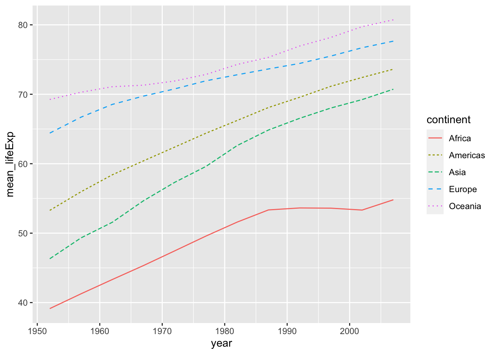
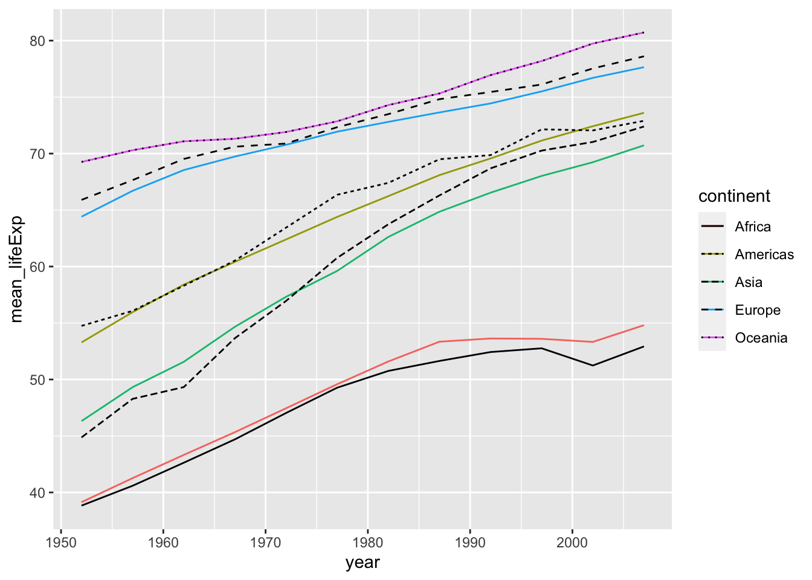

# その他のデータベース {#others}

## 国際機関

### **国連児童基金**（UNICEF：United Nations Children's Fund）

<https://data.unicef.org>

## 世界の国の政府機関

### 米国：DATA.GOV

The Home of the U.S. Government's Open Data: <https://data.gov/>

### 米国国勢調査：United States Census Bureau

Explore Census Data: <https://data.census.gov>

### 中国：National Bureaus of Statistics of China

### <http://www.stats.gov.cn/english/>

### 英国：Find Open Data: data.gov.uk

<https://www.data.gov.uk>

### 英国データサービス：UK Data Service

<https://ukdataservice.ac.uk>

### 欧州連合（EU）: The official portal for European data

<https://data.europa.eu/en>

### 韓国：Statistics Korea

<https://kostat.go.kr/anse/>

## ClinicalTrials.gov

ClinicalTrials.gov is a place to learn about clinical studies from around the world.

<https://clinicaltrials.gov/>

## Harvard Dataverse

<https://dataverse.harvard.edu/>

## Kagle

-   Kagle Home: <https://www.kaggle.com>

-   Kagle Datasets: <https://www.kaggle.com/datasets>

## Gapminder

### パッケージ Gapminder を使って

-   gapminder: Data from Gapminder: <https://cran.r-project.org/web/packages/gapminder/index.html>

-   Gapminder Data: <https://www.gapminder.org/data/>


```r
library(tidyverse)
library(gapminder)
```

すでに、`dplyr` をつかった変形で確認しましたが、簡単に、データを見ておきましょう。


```r
df_gm <- gapminder
df_gm %>% slice(1:10)
```

<div data-pagedtable="false">
  <script data-pagedtable-source type="application/json">
{"columns":[{"label":["country"],"name":[1],"type":["fct"],"align":["left"]},{"label":["continent"],"name":[2],"type":["fct"],"align":["left"]},{"label":["year"],"name":[3],"type":["int"],"align":["right"]},{"label":["lifeExp"],"name":[4],"type":["dbl"],"align":["right"]},{"label":["pop"],"name":[5],"type":["int"],"align":["right"]},{"label":["gdpPercap"],"name":[6],"type":["dbl"],"align":["right"]}],"data":[{"1":"Afghanistan","2":"Asia","3":"1952","4":"28.801","5":"8425333","6":"779.4453"},{"1":"Afghanistan","2":"Asia","3":"1957","4":"30.332","5":"9240934","6":"820.8530"},{"1":"Afghanistan","2":"Asia","3":"1962","4":"31.997","5":"10267083","6":"853.1007"},{"1":"Afghanistan","2":"Asia","3":"1967","4":"34.020","5":"11537966","6":"836.1971"},{"1":"Afghanistan","2":"Asia","3":"1972","4":"36.088","5":"13079460","6":"739.9811"},{"1":"Afghanistan","2":"Asia","3":"1977","4":"38.438","5":"14880372","6":"786.1134"},{"1":"Afghanistan","2":"Asia","3":"1982","4":"39.854","5":"12881816","6":"978.0114"},{"1":"Afghanistan","2":"Asia","3":"1987","4":"40.822","5":"13867957","6":"852.3959"},{"1":"Afghanistan","2":"Asia","3":"1992","4":"41.674","5":"16317921","6":"649.3414"},{"1":"Afghanistan","2":"Asia","3":"1997","4":"41.763","5":"22227415","6":"635.3414"}],"options":{"columns":{"min":{},"max":[10]},"rows":{"min":[10],"max":[10]},"pages":{}}}
  </script>
</div>


```r
glimpse(df_gm)
#> Rows: 1,704
#> Columns: 6
#> $ country   <fct> "Afghanistan", "Afghanistan", "Afghanist…
#> $ continent <fct> Asia, Asia, Asia, Asia, Asia, Asia, Asia…
#> $ year      <int> 1952, 1957, 1962, 1967, 1972, 1977, 1982…
#> $ lifeExp   <dbl> 28.801, 30.332, 31.997, 34.020, 36.088, …
#> $ pop       <int> 8425333, 9240934, 10267083, 11537966, 13…
#> $ gdpPercap <dbl> 779.4453, 820.8530, 853.1007, 836.1971, …
```


```r
summary(df_gm)
#>         country        continent        year     
#>  Afghanistan:  12   Africa  :624   Min.   :1952  
#>  Albania    :  12   Americas:300   1st Qu.:1966  
#>  Algeria    :  12   Asia    :396   Median :1980  
#>  Angola     :  12   Europe  :360   Mean   :1980  
#>  Argentina  :  12   Oceania : 24   3rd Qu.:1993  
#>  Australia  :  12                  Max.   :2007  
#>  (Other)    :1632                                
#>     lifeExp           pop              gdpPercap       
#>  Min.   :23.60   Min.   :6.001e+04   Min.   :   241.2  
#>  1st Qu.:48.20   1st Qu.:2.794e+06   1st Qu.:  1202.1  
#>  Median :60.71   Median :7.024e+06   Median :  3531.8  
#>  Mean   :59.47   Mean   :2.960e+07   Mean   :  7215.3  
#>  3rd Qu.:70.85   3rd Qu.:1.959e+07   3rd Qu.:  9325.5  
#>  Max.   :82.60   Max.   :1.319e+09   Max.   :113523.1  
#> 
```


```r
unique(df_gm$year)
#>  [1] 1952 1957 1962 1967 1972 1977 1982 1987 1992 1997 2002
#> [12] 2007
```

##### Box Plot


```r
ggplot(df_gm, aes(x = as_factor(year), y = lifeExp)) + geom_boxplot()
```


`fill` や `color` を追加してみましょう。


```r
df_gm %>% filter(year %in% c(1952, 1987, 2007)) %>%
  ggplot(aes(x=as_factor(year), y = lifeExp, fill = continent)) +
  geom_boxplot()
```


折れ線グラフの例です。


```r
df_lifeExp <- df_gm %>% 
  group_by(continent, year) %>% 
  summarize(mean_lifeExp = mean(lifeExp), median_lifeExp = median(lifeExp), max_lifeExp = max(lifeExp), min_lifeExp = min(lifeExp), .groups = "keep")
```


```r
df_lifeExp %>% ggplot(aes(x = year, y = mean_lifeExp, color = continent)) +
  geom_line()
```


```r
df_lifeExp %>% ggplot(aes(x = year, y = mean_lifeExp, color = continent, linetype = continent)) +
  geom_line()
```




```r
df_lifeExp %>% ggplot() +
  geom_line(aes(x = year, y = mean_lifeExp, color = continent)) + 
  geom_line(aes(x = year, y = median_lifeExp, linetype = continent))
```



### Original Data? WDI?


```r
df_gm %>% slice(1:10)
```

<div data-pagedtable="false">
  <script data-pagedtable-source type="application/json">
{"columns":[{"label":["country"],"name":[1],"type":["fct"],"align":["left"]},{"label":["continent"],"name":[2],"type":["fct"],"align":["left"]},{"label":["year"],"name":[3],"type":["int"],"align":["right"]},{"label":["lifeExp"],"name":[4],"type":["dbl"],"align":["right"]},{"label":["pop"],"name":[5],"type":["int"],"align":["right"]},{"label":["gdpPercap"],"name":[6],"type":["dbl"],"align":["right"]}],"data":[{"1":"Afghanistan","2":"Asia","3":"1952","4":"28.801","5":"8425333","6":"779.4453"},{"1":"Afghanistan","2":"Asia","3":"1957","4":"30.332","5":"9240934","6":"820.8530"},{"1":"Afghanistan","2":"Asia","3":"1962","4":"31.997","5":"10267083","6":"853.1007"},{"1":"Afghanistan","2":"Asia","3":"1967","4":"34.020","5":"11537966","6":"836.1971"},{"1":"Afghanistan","2":"Asia","3":"1972","4":"36.088","5":"13079460","6":"739.9811"},{"1":"Afghanistan","2":"Asia","3":"1977","4":"38.438","5":"14880372","6":"786.1134"},{"1":"Afghanistan","2":"Asia","3":"1982","4":"39.854","5":"12881816","6":"978.0114"},{"1":"Afghanistan","2":"Asia","3":"1987","4":"40.822","5":"13867957","6":"852.3959"},{"1":"Afghanistan","2":"Asia","3":"1992","4":"41.674","5":"16317921","6":"649.3414"},{"1":"Afghanistan","2":"Asia","3":"1997","4":"41.763","5":"22227415","6":"635.3414"}],"options":{"columns":{"min":{},"max":[10]},"rows":{"min":[10],"max":[10]},"pages":{}}}
  </script>
</div>

さて、このデータは、どのようにして集めているのでしょうか。WDI のデータと同じでしょうか。
