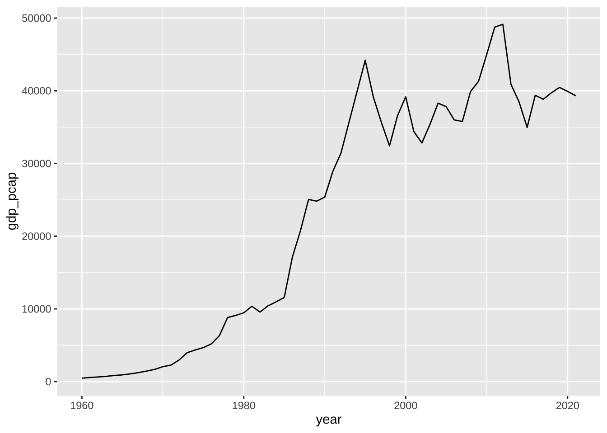

# (PART) PART IV EDA {-}
# 探索的データ解析 {#intro2eda}


## 探索的データ解析 (EDA)とは


## 探索的データ解析 (EDA) の一例

WDI の一つの指標を使って、流れを見てみましょう。


### データの取得と読み込み - Data Import

NY.GDP.PCAP.CD: GDP per capita (current US$)


```r
df_wdi_gdppcap <- WDI(country = "all", indicator = c(gdp_pcap = "NY.GDP.PCAP.CD"))
write_csv(df_wdi_gdppcap, "./data/df_wdi_gdppcap.csv")
```


```r
df_wdi_gdppcap
#> # A tibble: 16,492 × 5
#>    country                     iso2c iso3c  year gdp_pcap
#>    <chr>                       <chr> <chr> <dbl>    <dbl>
#>  1 Africa Eastern and Southern ZH    AFE    2021    1550.
#>  2 Africa Eastern and Southern ZH    AFE    2020    1364.
#>  3 Africa Eastern and Southern ZH    AFE    2019    1512.
#>  4 Africa Eastern and Southern ZH    AFE    2018    1565.
#>  5 Africa Eastern and Southern ZH    AFE    2017    1629.
#>  6 Africa Eastern and Southern ZH    AFE    2016    1444.
#>  7 Africa Eastern and Southern ZH    AFE    2015    1539.
#>  8 Africa Eastern and Southern ZH    AFE    2014    1719.
#>  9 Africa Eastern and Southern ZH    AFE    2013    1730.
#> 10 Africa Eastern and Southern ZH    AFE    2012    1759.
#> # … with 16,482 more rows
```

### データ変形・整形 - Data Transformation

#### 列を `select`


```r
df_wdi_gdppcap_small <- df_wdi_gdppcap %>% 
  select(country, year, gdp_pcap)
df_wdi_gdppcap_small
#> # A tibble: 16,492 × 3
#>    country                      year gdp_pcap
#>    <chr>                       <dbl>    <dbl>
#>  1 Africa Eastern and Southern  2021    1550.
#>  2 Africa Eastern and Southern  2020    1364.
#>  3 Africa Eastern and Southern  2019    1512.
#>  4 Africa Eastern and Southern  2018    1565.
#>  5 Africa Eastern and Southern  2017    1629.
#>  6 Africa Eastern and Southern  2016    1444.
#>  7 Africa Eastern and Southern  2015    1539.
#>  8 Africa Eastern and Southern  2014    1719.
#>  9 Africa Eastern and Southern  2013    1730.
#> 10 Africa Eastern and Southern  2012    1759.
#> # … with 16,482 more rows
```

#### 行を `filter`


```r
df_wdi_gdppcap_short <- df_wdi_gdppcap %>% 
  filter(country %in% c("Japan", "Germany", "United States"))
df_wdi_gdppcap_short
#> # A tibble: 186 × 5
#>    country iso2c iso3c  year gdp_pcap
#>    <chr>   <chr> <chr> <dbl>    <dbl>
#>  1 Germany DE    DEU    2021   51204.
#>  2 Germany DE    DEU    2020   46773.
#>  3 Germany DE    DEU    2019   46794.
#>  4 Germany DE    DEU    2018   47939.
#>  5 Germany DE    DEU    2017   44653.
#>  6 Germany DE    DEU    2016   42136.
#>  7 Germany DE    DEU    2015   41103.
#>  8 Germany DE    DEU    2014   48024.
#>  9 Germany DE    DEU    2013   46299.
#> 10 Germany DE    DEU    2012   43856.
#> # … with 176 more rows
```


```r
df_wdi_gdppcap_small_short <- df_wdi_gdppcap %>% select(country, year, gdp_pcap) %>%
  filter(country %in% c("Japan", "Germany", "United States"))
df_wdi_gdppcap_small_short
#> # A tibble: 186 × 3
#>    country  year gdp_pcap
#>    <chr>   <dbl>    <dbl>
#>  1 Germany  2021   51204.
#>  2 Germany  2020   46773.
#>  3 Germany  2019   46794.
#>  4 Germany  2018   47939.
#>  5 Germany  2017   44653.
#>  6 Germany  2016   42136.
#>  7 Germany  2015   41103.
#>  8 Germany  2014   48024.
#>  9 Germany  2013   46299.
#> 10 Germany  2012   43856.
#> # … with 176 more rows
```


### 可視化 Data Visualization

次は、よく生じる、誤りの例で、ノコギリの歯（sawtoothed）のようなギザギザ・グラフと呼ばれます。なぜこのようなことが起きているかわかりますか。


```r
df_wdi_gdppcap_small_short %>%
  ggplot(aes(x = year, y = gdp_pcap)) + geom_line()
#> Warning: Removed 1 row containing missing values
#> (`geom_line()`).
```


```r
df_wdi_gdppcap_small_short %>% filter(country %in% c("Japan")) %>%
  ggplot(aes(x = year, y = gdp_pcap)) + geom_line()
```




```r
df_wdi_gdppcap_small_short %>%
  ggplot(aes(x = year, y = gdp_pcap)) + geom_point()
#> Warning: Removed 10 rows containing missing values
#> (`geom_point()`).
```


```r
df_wdi_gdppcap_small_short %>% drop_na(gdp_pcap) %>%
  ggplot(aes(x = year, y = gdp_pcap, col = country)) + geom_line()
```


```r
df_wdi_gdppcap_small_short %>% drop_na(gdp_pcap) %>%
  ggplot(aes(x = year, y = gdp_pcap, col = country)) + geom_line() +
  geom_point()
```


```r
df_wdi_gdppcap_small_short %>% drop_na(gdp_pcap) %>%
  ggplot(aes(x = year, y = gdp_pcap)) + 
  geom_point(aes(color = country)) + 
  geom_smooth(method = 'loess', formula = 'y ~ x')
```


### データモデリング Data Modeling

簡単な線形回帰


```r
df_wdi_gdppcap_small_short %>% lm(gdp_pcap ~ year, .) %>% summary()
#> 
#> Call:
#> lm(formula = gdp_pcap ~ year, data = .)
#> 
#> Residuals:
#>      Min       1Q   Median       3Q      Max 
#> -14156.8  -3200.5   -507.4   3237.7  16779.2 
#> 
#> Coefficients:
#>               Estimate Std. Error t value Pr(>|t|)    
#> (Intercept) -1903497.5    48007.9  -39.65   <2e-16 ***
#> year             968.3       24.1   40.18   <2e-16 ***
#> ---
#> Signif. codes:  
#> 0 '***' 0.001 '**' 0.01 '*' 0.05 '.' 0.1 ' ' 1
#> 
#> Residual standard error: 5514 on 174 degrees of freedom
#>   (10 observations deleted due to missingness)
#> Multiple R-squared:  0.9027,	Adjusted R-squared:  0.9021 
#> F-statistic:  1614 on 1 and 174 DF,  p-value: < 2.2e-16
```

