# 地図 Choropleth Maps {#worldmap}

この章では、`ggplot2` を使って、情報付きの地図を生成する方法を学ぶ。

最も基本的な `data.frame` を用い `geom_map` または `geom_polygon` で地図を書くことも可能だが、最近は、`simple feature (sf)` 形式のデータを使って `ggplot2` の `geom_sf` を用いて地図を描くことで、複雑なものを扱えるようになってきている。

本書のテーマからも、ある情報を加えた地図は有効だと思われるので、紹介を試みる。

## 準備


```r
library(tidyverse)
#> ── Attaching core tidyverse packages ──── tidyverse 2.0.0 ──
#> ✔ dplyr     1.1.3     ✔ readr     2.1.4
#> ✔ forcats   1.0.0     ✔ stringr   1.5.0
#> ✔ ggplot2   3.4.3     ✔ tibble    3.2.1
#> ✔ lubridate 1.9.2     ✔ tidyr     1.3.0
#> ✔ purrr     1.0.2     
#> ── Conflicts ────────────────────── tidyverse_conflicts() ──
#> ✖ dplyr::filter() masks stats::filter()
#> ✖ dplyr::lag()    masks stats::lag()
#> ℹ Use the conflicted package (<http://conflicted.r-lib.org/>) to force all conflicts to become errors
library(sf)
#> Linking to GEOS 3.11.0, GDAL 3.5.3, PROJ 9.1.0; sf_use_s2()
#> is TRUE
library(showtext)
#> Loading required package: sysfonts
#> Loading required package: showtextdb
showtext_auto()
```

WDI パッケージの、WDIcache() に含まれる、収入の多寡を表す `income` レベルと iso2c コードをまず用いる。


```r
wdi_cache <- read_rds("./data/wdi_cache.RData")
```


```r
wdi_cache$country %>% as_tibble() %>% glimpse()
#> Rows: 299
#> Columns: 9
#> $ iso3c     <chr> "ABW", "AFE", "AFG", "AFR", "AFW", "AGO"…
#> $ iso2c     <chr> "AW", "ZH", "AF", "A9", "ZI", "AO", "AL"…
#> $ country   <chr> "Aruba", "Africa Eastern and Southern", …
#> $ region    <chr> "Latin America & Caribbean", "Aggregates…
#> $ capital   <chr> "Oranjestad", "", "Kabul", "", "", "Luan…
#> $ longitude <chr> "-70.0167", "", "69.1761", "", "", "13.2…
#> $ latitude  <chr> "12.5167", "", "34.5228", "", "", "-8.81…
#> $ income    <chr> "High income", "Aggregates", "Low income…
#> $ lending   <chr> "Not classified", "Aggregates", "IDA", "…
```


```r
wdi_income <- wdi_cache$country %>% 
  filter(region != "Aggregates") %>%
  select(iso2c, income) %>% 
  drop_na(iso2c) %>%
  mutate(income = factor(income, levels = c("High income", "Upper middle income", "Lower middle income", "Low income", "Not classified", NA))) 
glimpse(wdi_income)
#> Rows: 218
#> Columns: 2
#> $ iso2c  <chr> "AW", "AF", "AO", "AL", "AD", "AE", "AR", "…
#> $ income <fct> High income, Low income, Lower middle incom…
```

### `geom_sf`

See also, `coord_sf`, `geom_sf_label`, `geom_sf_text`, `stat_sf`.

> This set of geom, stat, and coord are used to visualise simple feature (sf) objects. For simple plots, you will only need geom_sf() as it uses stat_sf() and adds coord_sf() for you. geom_sf() is an unusual geom because it will draw different geometric objects depending on what simple features are present in the data: you can get points, lines, or polygons. For text and labels, you can use geom_sf_text() and geom_sf_label().
>
> この geom、stat、および coord のセットは、Simple Feature (sf) 形式のデータを視覚化するために使用されます。単純なプロットでは、stat_sf() を使用し、coord_sf() を追加するので、geom_sf() だけが必要です。geom_sf() は、データにどのような単純な特徴が存在するかによって異なる幾何オブジェクトを描画するので、珍しい geom です。テキストとラベルについては、geom_sf_text() と geom_sf_label() が使用可能です。

```         
geom_sf(
  mapping = aes(),
  data = NULL,
  stat = "sf",
  position = "identity",
  na.rm = FALSE,
  show.legend = NA,
  inherit.aes = TRUE,
  ...
)
```

## Natural Earth Data

<https://www.naturalearthdata.com>

このサイトで、データを提供しています。

Manual: <https://cran.r-project.org/web/packages/rnaturalearth/rnaturalearth.pdf>

### `ne_countries`


```r
library(rnaturalearth)
#> The legacy packages maptools, rgdal, and rgeos, underpinning the sp package,
#> which was just loaded, will retire in October 2023.
#> Please refer to R-spatial evolution reports for details, especially
#> https://r-spatial.org/r/2023/05/15/evolution4.html.
#> It may be desirable to make the sf package available;
#> package maintainers should consider adding sf to Suggests:.
#> The sp package is now running under evolution status 2
#>      (status 2 uses the sf package in place of rgdal)
#> Support for Spatial objects (`sp`) will be deprecated in {rnaturalearth} and will be removed in a future release of the package. Please use `sf` objects with {rnaturalearth}. For example: `ne_download(returnclass = 'sf')`
library(rnaturalearthdata)
#> 
#> Attaching package: 'rnaturalearthdata'
#> The following object is masked from 'package:rnaturalearth':
#> 
#>     countries110
```

```         
ne_countries(
  scale = 110,
  type = "countries",
  continent = NULL,
  country = NULL,
  geounit = NULL,
  sovereignty = NULL,
  returnclass = c("sp", "sf")
)
```

#### Arguments

-   scale: scale of map to return, one of 110, 50, 10 or 'small', 'medium', 'large'
-   type: country type, one of 'countries', 'map_units', 'sovereignty', 'tiny_countries'
-   continent: a character vector of continent names to get countries from.
-   country: a character vector of country names.
-   geounit: a character vector of geounit names.
-   sovereignty: a character vector of sovereignty names.
-   returnclass: 'sp' default or 'sf' for Simple Features

#### 例

There are three scales. Add `returnclass = "sf"` as an option to obtain data in `sf` format.


```r
ne_countries(scale = "large", returnclass = "sf") %>%
  ggplot() +   geom_sf()
#> The rnaturalearthhires package needs to be installed.
#> Installing the rnaturalearthhires package.
#> Downloading GitHub repo ropensci/rnaturalearthhires@HEAD
#> 
#> ── R CMD build ─────────────────────────────────────────────
#> * checking for file ‘/private/var/folders/mc/15j2lx113vscs17fxhz_p7400000gn/T/RtmpGzhgkk/remotes14e2747b42e9/ropensci-rnaturalearthhires-c3785a8/DESCRIPTION’ ... OK
#> * preparing ‘rnaturalearthhires’:
#> * checking DESCRIPTION meta-information ... OK
#> * checking for LF line-endings in source and make files and shell scripts
#> * checking for empty or unneeded directories
#> * building ‘rnaturalearthhires_0.2.1.tar.gz’
```

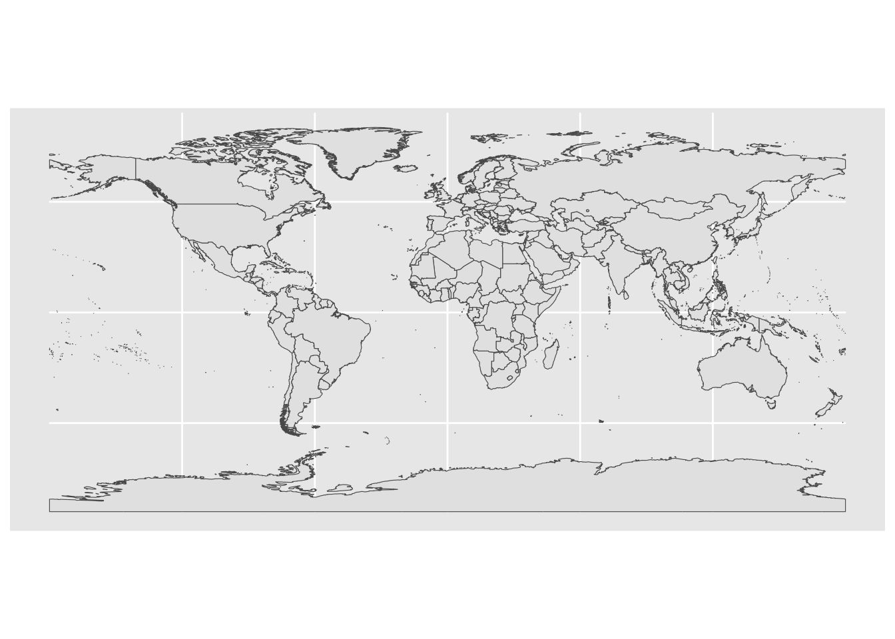


```r
ne_countries(scale = "small", returnclass = "sf") %>%
  ggplot() +   geom_sf()
```

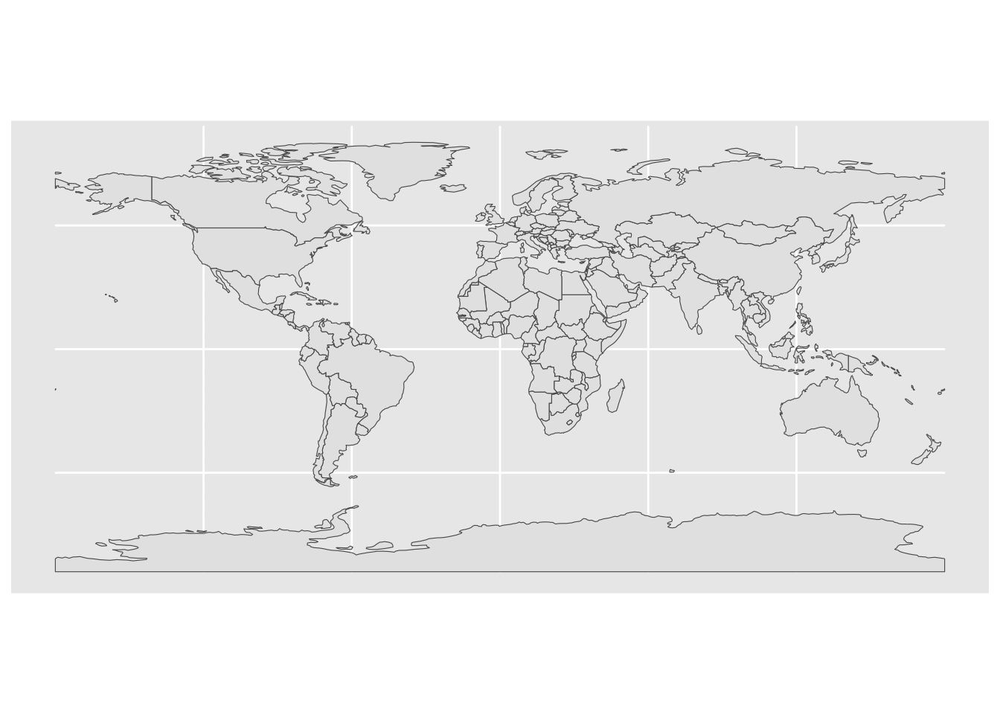

We will use `medium` scale data in the following.


```r
ne_world <- ne_countries(scale = "medium", returnclass = "sf")
```


```r
glimpse(ne_world)
#> Rows: 241
#> Columns: 64
#> $ scalerank  <int> 3, 1, 1, 1, 1, 3, 3, 1, 1, 1, 3, 1, 5, …
#> $ featurecla <chr> "Admin-0 country", "Admin-0 country", "…
#> $ labelrank  <dbl> 5, 3, 3, 6, 6, 6, 6, 4, 2, 6, 4, 4, 5, …
#> $ sovereignt <chr> "Netherlands", "Afghanistan", "Angola",…
#> $ sov_a3     <chr> "NL1", "AFG", "AGO", "GB1", "ALB", "FI1…
#> $ adm0_dif   <dbl> 1, 0, 0, 1, 0, 1, 0, 0, 0, 0, 1, 0, 1, …
#> $ level      <dbl> 2, 2, 2, 2, 2, 2, 2, 2, 2, 2, 2, 2, 2, …
#> $ type       <chr> "Country", "Sovereign country", "Sovere…
#> $ admin      <chr> "Aruba", "Afghanistan", "Angola", "Angu…
#> $ adm0_a3    <chr> "ABW", "AFG", "AGO", "AIA", "ALB", "ALD…
#> $ geou_dif   <dbl> 0, 0, 0, 0, 0, 0, 0, 0, 0, 0, 0, 0, 0, …
#> $ geounit    <chr> "Aruba", "Afghanistan", "Angola", "Angu…
#> $ gu_a3      <chr> "ABW", "AFG", "AGO", "AIA", "ALB", "ALD…
#> $ su_dif     <dbl> 0, 0, 0, 0, 0, 0, 0, 0, 0, 0, 0, 0, 0, …
#> $ subunit    <chr> "Aruba", "Afghanistan", "Angola", "Angu…
#> $ su_a3      <chr> "ABW", "AFG", "AGO", "AIA", "ALB", "ALD…
#> $ brk_diff   <dbl> 0, 0, 0, 0, 0, 0, 0, 0, 0, 0, 0, 0, 0, …
#> $ name       <chr> "Aruba", "Afghanistan", "Angola", "Angu…
#> $ name_long  <chr> "Aruba", "Afghanistan", "Angola", "Angu…
#> $ brk_a3     <chr> "ABW", "AFG", "AGO", "AIA", "ALB", "ALD…
#> $ brk_name   <chr> "Aruba", "Afghanistan", "Angola", "Angu…
#> $ brk_group  <chr> NA, NA, NA, NA, NA, NA, NA, NA, NA, NA,…
#> $ abbrev     <chr> "Aruba", "Afg.", "Ang.", "Ang.", "Alb."…
#> $ postal     <chr> "AW", "AF", "AO", "AI", "AL", "AI", "AN…
#> $ formal_en  <chr> "Aruba", "Islamic State of Afghanistan"…
#> $ formal_fr  <chr> NA, NA, NA, NA, NA, NA, NA, NA, NA, NA,…
#> $ note_adm0  <chr> "Neth.", NA, NA, "U.K.", NA, "Fin.", NA…
#> $ note_brk   <chr> NA, NA, NA, NA, NA, NA, NA, NA, NA, NA,…
#> $ name_sort  <chr> "Aruba", "Afghanistan", "Angola", "Angu…
#> $ name_alt   <chr> NA, NA, NA, NA, NA, NA, NA, NA, NA, NA,…
#> $ mapcolor7  <dbl> 4, 5, 3, 6, 1, 4, 1, 2, 3, 3, 4, 4, 1, …
#> $ mapcolor8  <dbl> 2, 6, 2, 6, 4, 1, 4, 1, 1, 1, 5, 5, 2, …
#> $ mapcolor9  <dbl> 2, 8, 6, 6, 1, 4, 1, 3, 3, 2, 1, 1, 2, …
#> $ mapcolor13 <dbl> 9, 7, 1, 3, 6, 6, 8, 3, 13, 10, 1, NA, …
#> $ pop_est    <dbl> 103065, 28400000, 12799293, 14436, 3639…
#> $ gdp_md_est <dbl> 2258.0, 22270.0, 110300.0, 108.9, 21810…
#> $ pop_year   <dbl> NA, NA, NA, NA, NA, NA, NA, NA, NA, NA,…
#> $ lastcensus <dbl> 2010, 1979, 1970, NA, 2001, NA, 1989, 2…
#> $ gdp_year   <dbl> NA, NA, NA, NA, NA, NA, NA, NA, NA, NA,…
#> $ economy    <chr> "6. Developing region", "7. Least devel…
#> $ income_grp <chr> "2. High income: nonOECD", "5. Low inco…
#> $ wikipedia  <dbl> NA, NA, NA, NA, NA, NA, NA, NA, NA, NA,…
#> $ fips_10    <chr> NA, NA, NA, NA, NA, NA, NA, NA, NA, NA,…
#> $ iso_a2     <chr> "AW", "AF", "AO", "AI", "AL", "AX", "AD…
#> $ iso_a3     <chr> "ABW", "AFG", "AGO", "AIA", "ALB", "ALA…
#> $ iso_n3     <chr> "533", "004", "024", "660", "008", "248…
#> $ un_a3      <chr> "533", "004", "024", "660", "008", "248…
#> $ wb_a2      <chr> "AW", "AF", "AO", NA, "AL", NA, "AD", "…
#> $ wb_a3      <chr> "ABW", "AFG", "AGO", NA, "ALB", NA, "AD…
#> $ woe_id     <dbl> NA, NA, NA, NA, NA, NA, NA, NA, NA, NA,…
#> $ adm0_a3_is <chr> "ABW", "AFG", "AGO", "AIA", "ALB", "ALA…
#> $ adm0_a3_us <chr> "ABW", "AFG", "AGO", "AIA", "ALB", "ALD…
#> $ adm0_a3_un <dbl> NA, NA, NA, NA, NA, NA, NA, NA, NA, NA,…
#> $ adm0_a3_wb <dbl> NA, NA, NA, NA, NA, NA, NA, NA, NA, NA,…
#> $ continent  <chr> "North America", "Asia", "Africa", "Nor…
#> $ region_un  <chr> "Americas", "Asia", "Africa", "Americas…
#> $ subregion  <chr> "Caribbean", "Southern Asia", "Middle A…
#> $ region_wb  <chr> "Latin America & Caribbean", "South Asi…
#> $ name_len   <dbl> 5, 11, 6, 8, 7, 5, 7, 20, 9, 7, 14, 10,…
#> $ long_len   <dbl> 5, 11, 6, 8, 7, 13, 7, 20, 9, 7, 14, 10…
#> $ abbrev_len <dbl> 5, 4, 4, 4, 4, 5, 4, 6, 4, 4, 9, 4, 7, …
#> $ tiny       <dbl> 4, NA, NA, NA, NA, 5, 5, NA, NA, NA, 3,…
#> $ homepart   <dbl> NA, 1, 1, NA, 1, NA, 1, 1, 1, 1, NA, 1,…
#> $ geometry   <MULTIPOLYGON [°]> MULTIPOLYGON (((-69.89912 …
```

The last column is the geometry which contains map data in multi-polygon format.


```r
ne_world %>% ggplot() + geom_sf()
```

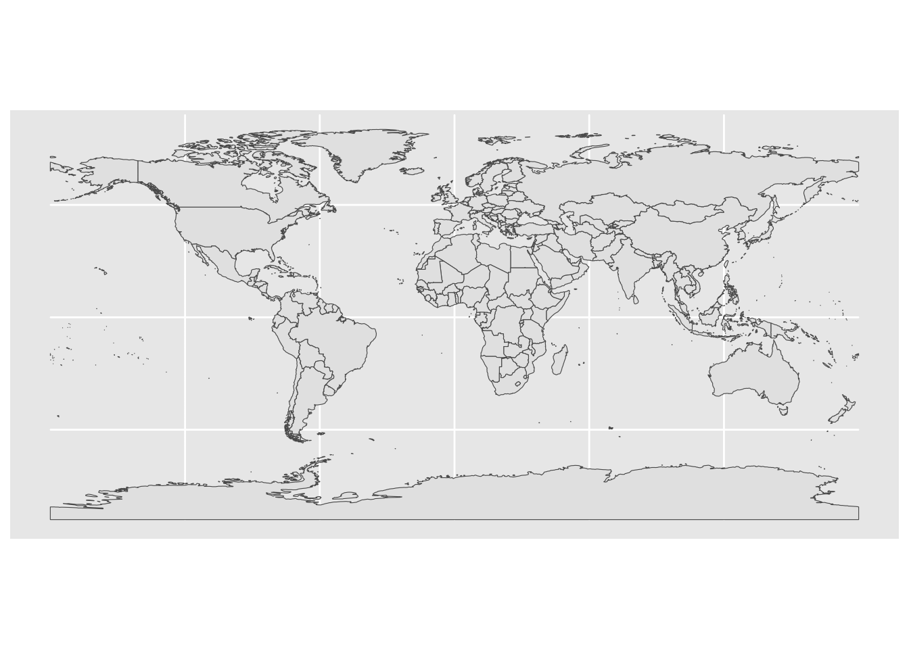

This map data comes with various information.


```r
ne_world %>% ggplot() + geom_sf(aes(fill = income_grp))
```

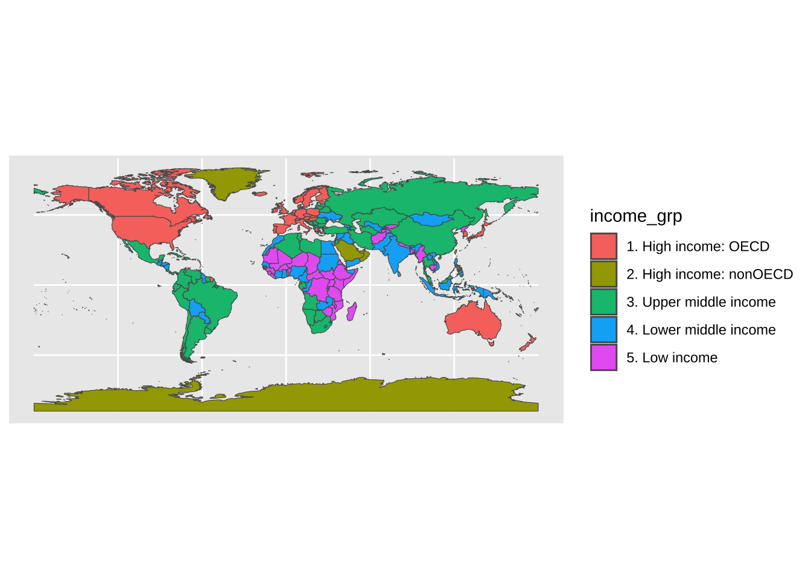

You can specify a 'continent', a 'region_un', a 'subregion' or 'region_wb'.


```r
ne_world %>% as_tibble() %>% distinct(continent) %>% pull()
#> [1] "North America"           "Asia"                   
#> [3] "Africa"                  "Europe"                 
#> [5] "South America"           "Oceania"                
#> [7] "Antarctica"              "Seven seas (open ocean)"
```


```r
ne_world %>% as_tibble() %>% distinct(region_un) %>% pull()
#> [1] "Americas"                "Asia"                   
#> [3] "Africa"                  "Europe"                 
#> [5] "Oceania"                 "Antarctica"             
#> [7] "Seven seas (open ocean)"
```


```r
ne_world %>% as_tibble() %>% distinct(subregion) %>% pull()
#>  [1] "Caribbean"                 "Southern Asia"            
#>  [3] "Middle Africa"             "Southern Europe"          
#>  [5] "Northern Europe"           "Western Asia"             
#>  [7] "South America"             "Polynesia"                
#>  [9] "Antarctica"                "Australia and New Zealand"
#> [11] "Seven seas (open ocean)"   "Western Europe"           
#> [13] "Eastern Africa"            "Western Africa"           
#> [15] "Eastern Europe"            "Central America"          
#> [17] "Northern America"          "South-Eastern Asia"       
#> [19] "Southern Africa"           "Eastern Asia"             
#> [21] "Northern Africa"           "Melanesia"                
#> [23] "Micronesia"                "Central Asia"
```


```r
ne_world %>% as_tibble() %>% distinct(region_wb) %>% pull()
#> [1] "Latin America & Caribbean" 
#> [2] "South Asia"                
#> [3] "Sub-Saharan Africa"        
#> [4] "Europe & Central Asia"     
#> [5] "Middle East & North Africa"
#> [6] "East Asia & Pacific"       
#> [7] "Antarctica"                
#> [8] "North America"
```


```r
ne_world %>% filter(subregion == "South-Eastern Asia") %>%
  ggplot() +   geom_sf(aes(fill = iso_a2))
```

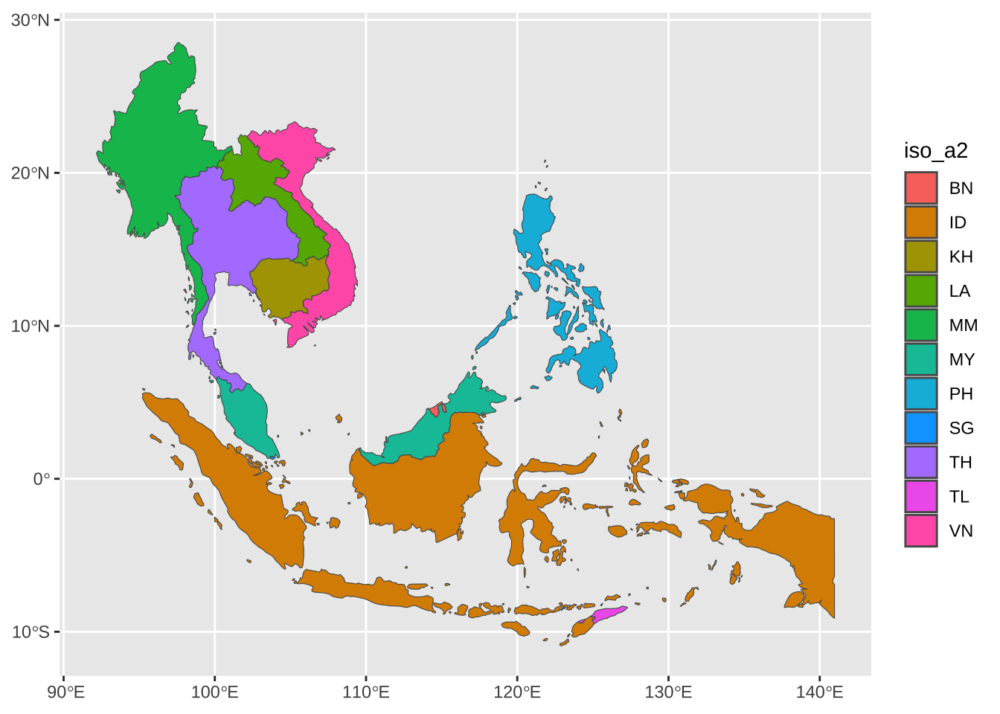


```r
ne_world %>% filter(continent == 'Africa') %>%
  ggplot() +   geom_sf(aes(fill = subregion))
```

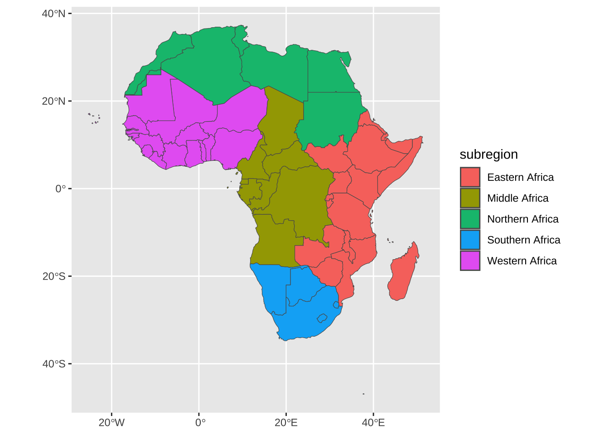

#### `type` argument


```r
ne_countries(type = "countries", country = c("Japan", "South Korea", "North Korea", "China", "Taiwan", "Mongolia"), scale = "medium", returnclass = "sf") %>%
  ggplot() + geom_sf(aes(fill = economy))
```

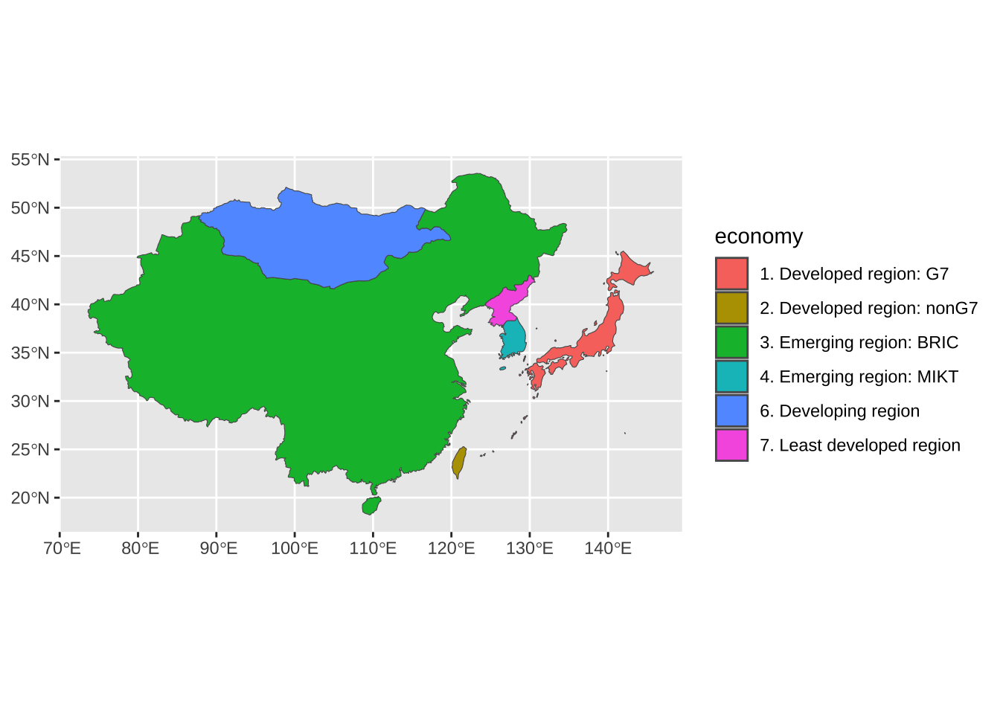

### `ne_states`

Get natural earth world state (admin level 1) polygons

**Description**: returns state polygons (administrative level 1) for specified countries

#### Usage

```         
ne_states(
  country = NULL,
  geounit = NULL,
  iso_a2 = NULL,
  spdf = NULL,
  returnclass = c("sp", "sf")
)
```

### Arguments

-   country: a character vector of country names.

-   geounit: a character vector of geounit names.

-   iso_a2: a character vector of iso_a2 country codes

-   spdf: an optional alternative states map

-   returnclass: 'sp' default or 'sf' for Simple Features

### Value

-   SpatialPolygons DataFrame or sf


```r
ne_world_admin1 <- ne_states(returnclass = "sf")
```


```r
glimpse(ne_world_admin1)
#> Rows: 4,596
#> Columns: 122
#> $ featurecla <chr> "Admin-1 states provinces lakes", "Admi…
#> $ scalerank  <int> 3, 6, 2, 6, 3, 4, 4, 3, 4, 3, 4, 3, 3, …
#> $ adm1_code  <chr> "ARG-1309", "URY-8", "IDN-1185", "MYS-1…
#> $ diss_me    <int> 1309, 8, 1185, 1186, 2694, 1936, 1937, …
#> $ iso_3166_2 <chr> "AR-E", "UY-PA", "ID-KI", "MY-12", "CL-…
#> $ wikipedia  <chr> NA, NA, NA, NA, NA, NA, NA, NA, NA, NA,…
#> $ iso_a2     <chr> "AR", "UY", "ID", "MY", "CL", "BO", "BO…
#> $ adm0_sr    <int> 1, 1, 5, 5, 1, 1, 1, 1, 1, 1, 1, 1, 1, …
#> $ name       <chr> "Entre Ríos", "Paysandú", "Kalimantan T…
#> $ name_alt   <chr> "Entre-Rios", NA, "Kaltim", "North Born…
#> $ name_local <chr> NA, NA, NA, NA, NA, NA, NA, NA, NA, NA,…
#> $ type       <chr> "Provincia", "Departamento", "Propinsi"…
#> $ type_en    <chr> "Province", "Department", "Province", "…
#> $ code_local <chr> NA, NA, NA, NA, NA, NA, NA, NA, NA, NA,…
#> $ code_hasc  <chr> "AR.ER", "UY.PA", "ID.KI", "MY.SA", "CL…
#> $ note       <chr> NA, NA, NA, NA, NA, NA, NA, NA, NA, NA,…
#> $ hasc_maybe <chr> NA, NA, NA, NA, NA, NA, NA, NA, "BO.OR|…
#> $ region     <chr> NA, NA, NA, NA, NA, NA, NA, NA, NA, NA,…
#> $ region_cod <chr> NA, NA, NA, NA, NA, NA, NA, NA, NA, NA,…
#> $ provnum_ne <int> 10, 19, 15, 1, 0, 8, 7, 0, 1, 20006, 8,…
#> $ gadm_level <int> 1, 1, 1, 1, 1, 1, 1, 1, 1, 1, 1, 1, 1, …
#> $ check_me   <int> 20, 0, 20, 20, 20, 0, 0, 20, 10, 20, 10…
#> $ datarank   <int> 3, 8, 1, 6, 3, 8, 6, 3, 6, 3, 5, 3, 3, …
#> $ abbrev     <chr> NA, NA, NA, NA, NA, NA, NA, NA, NA, NA,…
#> $ postal     <chr> "ER", "PA", "KI", "SA", NA, "LP", "OR",…
#> $ area_sqkm  <int> 0, 0, 0, 0, 0, 0, 0, 0, 0, 0, 0, 0, 0, …
#> $ sameascity <int> -99, -99, -99, -99, 7, 6, 6, -99, -99, …
#> $ labelrank  <int> 3, 6, 2, 6, 7, 6, 6, 3, 4, 6, 7, 6, 3, …
#> $ name_len   <int> 10, 8, 16, 5, 18, 6, 5, 8, 6, 11, 5, 5,…
#> $ mapcolor9  <int> 3, 2, 6, 3, 5, 2, 2, 5, 2, 5, 4, 3, 3, …
#> $ mapcolor13 <int> 13, 10, 11, 6, 9, 3, 3, 9, 3, 9, 11, 13…
#> $ fips       <chr> "AR08", "UY11", "ID14", "MY16", NA, "BL…
#> $ fips_alt   <chr> NA, NA, NA, NA, NA, NA, NA, NA, "BL05",…
#> $ woe_id     <int> 2344682, 2347650, 2345723, 2346310, 560…
#> $ woe_label  <chr> "Entre Rios, AR, Argentina", "Paysandú…
#> $ woe_name   <chr> "Entre Ríos", "Paysandú", "Kalimantan T…
#> $ latitude   <dbl> -32.02750, -32.09330, 1.28915, 5.31115,…
#> $ longitude  <dbl> -59.28240, -57.22400, 116.35400, 117.09…
#> $ sov_a3     <chr> "ARG", "URY", "IDN", "MYS", "CHL", "BOL…
#> $ adm0_a3    <chr> "ARG", "URY", "IDN", "MYS", "CHL", "BOL…
#> $ adm0_label <int> 2, 2, 2, 2, 2, 2, 2, 2, 2, 2, 2, 2, 2, …
#> $ admin      <chr> "Argentina", "Uruguay", "Indonesia", "M…
#> $ geonunit   <chr> "Argentina", "Uruguay", "Indonesia", "M…
#> $ gu_a3      <chr> "ARG", "URY", "IDN", "MYS", "CHL", "BOL…
#> $ gn_id      <int> 3434137, 3441242, 1641897, 1733039, 669…
#> $ gn_name    <chr> "Provincia de Entre Rios", "Departament…
#> $ gns_id     <int> -988655, -908097, -2680740, -2405166, 1…
#> $ gns_name   <chr> "Entre Rios", "Paysandu, Departamento d…
#> $ gn_level   <int> 1, 1, 1, 1, 1, 1, 1, 1, 1, 1, 1, 1, 1, …
#> $ gn_region  <chr> NA, NA, NA, NA, NA, NA, NA, NA, NA, NA,…
#> $ gn_a1_code <chr> "AR.08", "UY.11", "ID.14", "MY.16", "CL…
#> $ region_sub <chr> NA, NA, NA, NA, NA, NA, NA, NA, NA, NA,…
#> $ sub_code   <chr> NA, NA, NA, NA, NA, NA, NA, NA, NA, NA,…
#> $ gns_level  <int> 1, 1, 1, 1, 1, 1, 1, 1, 1, 1, 1, 1, 1, …
#> $ gns_lang   <chr> "khm", "fra", "ind", "fil", "ara", "kor…
#> $ gns_adm1   <chr> "AR08", "UY11", "ID14", "MY16", "CI16",…
#> $ gns_region <chr> NA, NA, NA, NA, NA, NA, NA, NA, NA, NA,…
#> $ min_label  <dbl> 6.0, 8.0, 5.0, 7.0, 6.0, 6.6, 6.6, 6.0,…
#> $ max_label  <dbl> 11.0, 11.0, 10.1, 11.0, 11.0, 11.0, 11.…
#> $ min_zoom   <dbl> 6.0, 8.0, 4.6, 7.0, 6.0, 6.6, 6.6, 6.0,…
#> $ wikidataid <chr> "Q44762", "Q16576", "Q3899", "Q179029",…
#> $ name_ar    <chr> "إنتري ريوس", "إدارة بايساندو", "كالمنت…
#> $ name_bn    <chr> "এন্ত্রে রিও প্রদেশ", "পেসান্ডো বিভাগ", "পূর্…
#> $ name_de    <chr> "Entre Ríos", "Paysandú", "Ostkalimanta…
#> $ name_en    <chr> "Entre Ríos", "Paysandú", "East Kaliman…
#> $ name_es    <chr> "Entre Ríos", "Paysandú", "Kalimantan O…
#> $ name_fr    <chr> "Entre Ríos", "Paysandú", "Kalimantan o…
#> $ name_el    <chr> "Έντρε Ρίος", "Παϊσαντού", "Ανατολικό Κ…
#> $ name_hi    <chr> "एन्ट्रे रियोस", "पयसंदु विभाग", "पूर्व कालिमंत…
#> $ name_hu    <chr> "Entre Ríos", "Paysandú", "Kelet-Kalima…
#> $ name_id    <chr> "Entre Ríos", "Departemen Paysandú", "K…
#> $ name_it    <chr> "Entre Ríos", "dipartimento di Paysandú…
#> $ name_ja    <chr> "エントレ・リオス州", "パイサンドゥ県",…
#> $ name_ko    <chr> "엔트레리오스", "파이산두", "동칼리만탄…
#> $ name_nl    <chr> "Entre Ríos", "Paysandú", "Oost-Kaliman…
#> $ name_pl    <chr> "Entre Ríos", "Paysandú", "Borneo Wscho…
#> $ name_pt    <chr> "Entre Ríos", "Paysandú", "Kalimantan O…
#> $ name_ru    <chr> "Энтре-Риос", "Пайсанду", "Восточный Ка…
#> $ name_sv    <chr> "Entre Ríos", "Paysandú", "Kalimantan T…
#> $ name_tr    <chr> "Entre Ríos eyaleti", "Paysandu Departm…
#> $ name_vi    <chr> "Entre Ríos", "Paysandú", "Đông Kaliman…
#> $ name_zh    <chr> "恩特雷里奥斯省", "派桑杜省", "东加里曼…
#> $ ne_id      <dbl> 1159309789, 1159307733, 1159310009, 115…
#> $ name_he    <chr> "אנטרה ריוס", "פאיסאנדו", "מזרח קלימנטא…
#> $ name_uk    <chr> "Ентре-Ріос", "Пайсанду", "Східний Калі…
#> $ name_ur    <chr> "صوبہ انترے ریوس", "پایساندو محکمہ", "م…
#> $ name_fa    <chr> "ایالت انتره ریوز", "بخش پایساندو", "کا…
#> $ name_zht   <chr> "恩特雷里奥斯省", "派桑杜省", "東加里曼…
#> $ FCLASS_ISO <chr> NA, NA, NA, NA, NA, NA, NA, NA, NA, NA,…
#> $ FCLASS_US  <chr> NA, NA, NA, NA, NA, NA, NA, NA, NA, NA,…
#> $ FCLASS_FR  <chr> NA, NA, NA, NA, NA, NA, NA, NA, NA, NA,…
#> $ FCLASS_RU  <chr> NA, NA, NA, NA, NA, NA, NA, NA, NA, NA,…
#> $ FCLASS_ES  <chr> NA, NA, NA, NA, NA, NA, NA, NA, NA, NA,…
#> $ FCLASS_CN  <chr> NA, NA, NA, NA, NA, NA, NA, NA, NA, NA,…
#> $ FCLASS_TW  <chr> NA, NA, NA, NA, NA, NA, NA, NA, NA, NA,…
#> $ FCLASS_IN  <chr> NA, NA, NA, NA, NA, NA, NA, NA, NA, NA,…
#> $ FCLASS_NP  <chr> NA, NA, NA, NA, NA, NA, NA, NA, NA, NA,…
#> $ FCLASS_PK  <chr> NA, NA, NA, NA, NA, NA, NA, NA, NA, NA,…
#> $ FCLASS_DE  <chr> NA, NA, NA, NA, NA, NA, NA, NA, NA, NA,…
#> $ FCLASS_GB  <chr> NA, NA, NA, NA, NA, NA, NA, NA, NA, NA,…
#> $ FCLASS_BR  <chr> NA, NA, NA, NA, NA, NA, NA, NA, NA, NA,…
#> $ FCLASS_IL  <chr> NA, NA, NA, NA, NA, NA, NA, NA, NA, NA,…
#> $ FCLASS_PS  <chr> NA, NA, NA, NA, NA, NA, NA, NA, NA, NA,…
#> $ FCLASS_SA  <chr> NA, NA, NA, NA, NA, NA, NA, NA, NA, NA,…
#> $ FCLASS_EG  <chr> NA, NA, NA, NA, NA, NA, NA, NA, NA, NA,…
#> $ FCLASS_MA  <chr> NA, NA, NA, NA, NA, NA, NA, NA, NA, NA,…
#> $ FCLASS_PT  <chr> NA, NA, NA, NA, NA, NA, NA, NA, NA, NA,…
#> $ FCLASS_AR  <chr> NA, NA, NA, NA, NA, NA, NA, NA, NA, NA,…
#> $ FCLASS_JP  <chr> NA, NA, NA, NA, NA, NA, NA, NA, NA, NA,…
#> $ FCLASS_KO  <chr> NA, NA, NA, NA, NA, NA, NA, NA, NA, NA,…
#> $ FCLASS_VN  <chr> NA, NA, NA, NA, NA, NA, NA, NA, NA, NA,…
#> $ FCLASS_TR  <chr> NA, NA, NA, NA, NA, NA, NA, NA, NA, NA,…
#> $ FCLASS_ID  <chr> NA, NA, NA, NA, NA, NA, NA, NA, NA, NA,…
#> $ FCLASS_PL  <chr> NA, NA, NA, NA, NA, NA, NA, NA, NA, NA,…
#> $ FCLASS_GR  <chr> NA, NA, NA, NA, NA, NA, NA, NA, NA, NA,…
#> $ FCLASS_IT  <chr> NA, NA, NA, NA, NA, NA, NA, NA, NA, NA,…
#> $ FCLASS_NL  <chr> NA, NA, NA, NA, NA, NA, NA, NA, NA, NA,…
#> $ FCLASS_SE  <chr> NA, NA, NA, NA, NA, NA, NA, NA, NA, NA,…
#> $ FCLASS_BD  <chr> NA, NA, NA, NA, NA, NA, NA, NA, NA, NA,…
#> $ FCLASS_UA  <chr> NA, NA, NA, NA, NA, NA, NA, NA, NA, NA,…
#> $ FCLASS_TLC <chr> NA, NA, NA, NA, NA, NA, NA, NA, NA, NA,…
#> $ geometry   <MULTIPOLYGON [°]> MULTIPOLYGON (((-58.20011 …
```


```r
ne_world_admin1 %>% as_tibble() %>% 
  filter(iso_a2 != "-1") %>% arrange(admin) %>%
  distinct(iso_a2, admin)
```

<div data-pagedtable="false">
  <script data-pagedtable-source type="application/json">
{"columns":[{"label":["iso_a2"],"name":[1],"type":["chr"],"align":["left"]},{"label":["admin"],"name":[2],"type":["chr"],"align":["left"]}],"data":[{"1":"AF","2":"Afghanistan"},{"1":"AX","2":"Aland"},{"1":"AL","2":"Albania"},{"1":"DZ","2":"Algeria"},{"1":"AS","2":"American Samoa"},{"1":"AD","2":"Andorra"},{"1":"AO","2":"Angola"},{"1":"AI","2":"Anguilla"},{"1":"AQ","2":"Antarctica"},{"1":"AG","2":"Antigua and Barbuda"},{"1":"AR","2":"Argentina"},{"1":"AM","2":"Armenia"},{"1":"AW","2":"Aruba"},{"1":"AU","2":"Ashmore and Cartier Islands"},{"1":"AU","2":"Australia"},{"1":"AT","2":"Austria"},{"1":"AZ","2":"Azerbaijan"},{"1":"BH","2":"Bahrain"},{"1":"BD","2":"Bangladesh"},{"1":"BB","2":"Barbados"},{"1":"BY","2":"Belarus"},{"1":"BE","2":"Belgium"},{"1":"BZ","2":"Belize"},{"1":"BJ","2":"Benin"},{"1":"BM","2":"Bermuda"},{"1":"BT","2":"Bhutan"},{"1":"BO","2":"Bolivia"},{"1":"BA","2":"Bosnia and Herzegovina"},{"1":"BW","2":"Botswana"},{"1":"BR","2":"Brazil"},{"1":"IO","2":"British Indian Ocean Territory"},{"1":"VG","2":"British Virgin Islands"},{"1":"BN","2":"Brunei"},{"1":"BG","2":"Bulgaria"},{"1":"BF","2":"Burkina Faso"},{"1":"BI","2":"Burundi"},{"1":"KH","2":"Cambodia"},{"1":"CM","2":"Cameroon"},{"1":"CA","2":"Canada"},{"1":"CV","2":"Cape Verde"},{"1":"NL","2":"Caribbean Netherlands"},{"1":"KY","2":"Cayman Islands"},{"1":"CF","2":"Central African Republic"},{"1":"TD","2":"Chad"},{"1":"CL","2":"Chile"},{"1":"CN","2":"China"},{"1":"CO","2":"Colombia"},{"1":"KM","2":"Comoros"},{"1":"CK","2":"Cook Islands"},{"1":"CR","2":"Costa Rica"},{"1":"HR","2":"Croatia"},{"1":"CU","2":"Cuba"},{"1":"CW","2":"Curaçao"},{"1":"CY","2":"Cyprus"},{"1":"CZ","2":"Czech Republic"},{"1":"CD","2":"Democratic Republic of the Congo"},{"1":"DK","2":"Denmark"},{"1":"DJ","2":"Djibouti"},{"1":"DM","2":"Dominica"},{"1":"DO","2":"Dominican Republic"},{"1":"TL","2":"East Timor"},{"1":"EC","2":"Ecuador"},{"1":"EG","2":"Egypt"},{"1":"SV","2":"El Salvador"},{"1":"GQ","2":"Equatorial Guinea"},{"1":"ER","2":"Eritrea"},{"1":"EE","2":"Estonia"},{"1":"ET","2":"Ethiopia"},{"1":"FK","2":"Falkland Islands"},{"1":"FO","2":"Faroe Islands"},{"1":"FM","2":"Federated States of Micronesia"},{"1":"FJ","2":"Fiji"},{"1":"FI","2":"Finland"},{"1":"FR","2":"France"},{"1":"PF","2":"French Polynesia"},{"1":"TF","2":"French Southern and Antarctic Lands"},{"1":"GA","2":"Gabon"},{"1":"GM","2":"Gambia"},{"1":"PS","2":"Gaza Strip"},{"1":"GE","2":"Georgia"},{"1":"DE","2":"Germany"},{"1":"GH","2":"Ghana"},{"1":"GI","2":"Gibraltar"},{"1":"GR","2":"Greece"},{"1":"GL","2":"Greenland"},{"1":"GD","2":"Grenada"},{"1":"GU","2":"Guam"},{"1":"GT","2":"Guatemala"},{"1":"GG","2":"Guernsey"},{"1":"GN","2":"Guinea"},{"1":"GW","2":"Guinea Bissau"},{"1":"GY","2":"Guyana"},{"1":"HT","2":"Haiti"},{"1":"HM","2":"Heard Island and McDonald Islands"},{"1":"HN","2":"Honduras"},{"1":"HK","2":"Hong Kong S.A.R."},{"1":"HU","2":"Hungary"},{"1":"IS","2":"Iceland"},{"1":"IN","2":"India"},{"1":"ID","2":"Indonesia"},{"1":"IR","2":"Iran"},{"1":"IQ","2":"Iraq"},{"1":"IE","2":"Ireland"},{"1":"IM","2":"Isle of Man"},{"1":"IL","2":"Israel"},{"1":"IT","2":"Italy"},{"1":"CI","2":"Ivory Coast"},{"1":"JM","2":"Jamaica"},{"1":"JP","2":"Japan"},{"1":"JE","2":"Jersey"},{"1":"JO","2":"Jordan"},{"1":"KZ","2":"Kazakhstan"},{"1":"KE","2":"Kenya"},{"1":"KI","2":"Kiribati"},{"1":"XK","2":"Kosovo"},{"1":"KW","2":"Kuwait"},{"1":"KG","2":"Kyrgyzstan"},{"1":"LA","2":"Laos"},{"1":"LV","2":"Latvia"},{"1":"LB","2":"Lebanon"},{"1":"LS","2":"Lesotho"},{"1":"LR","2":"Liberia"},{"1":"LY","2":"Libya"},{"1":"LI","2":"Liechtenstein"},{"1":"LT","2":"Lithuania"},{"1":"LU","2":"Luxembourg"},{"1":"MO","2":"Macau S.A.R"},{"1":"MK","2":"Macedonia"},{"1":"MG","2":"Madagascar"},{"1":"MW","2":"Malawi"},{"1":"MY","2":"Malaysia"},{"1":"MV","2":"Maldives"},{"1":"ML","2":"Mali"},{"1":"MT","2":"Malta"},{"1":"MH","2":"Marshall Islands"},{"1":"MR","2":"Mauritania"},{"1":"MU","2":"Mauritius"},{"1":"MX","2":"Mexico"},{"1":"MD","2":"Moldova"},{"1":"MC","2":"Monaco"},{"1":"MN","2":"Mongolia"},{"1":"ME","2":"Montenegro"},{"1":"MS","2":"Montserrat"},{"1":"MA","2":"Morocco"},{"1":"MZ","2":"Mozambique"},{"1":"MM","2":"Myanmar"},{"1":"__NA__","2":"Namibia"},{"1":"NR","2":"Nauru"},{"1":"NP","2":"Nepal"},{"1":"NL","2":"Netherlands"},{"1":"NC","2":"New Caledonia"},{"1":"NZ","2":"New Zealand"},{"1":"TK","2":"New Zealand"},{"1":"NI","2":"Nicaragua"},{"1":"NE","2":"Niger"},{"1":"NG","2":"Nigeria"},{"1":"NU","2":"Niue"},{"1":"NF","2":"Norfolk Island"},{"1":"KP","2":"North Korea"},{"1":"MP","2":"Northern Mariana Islands"},{"1":"NO","2":"Norway"},{"1":"OM","2":"Oman"},{"1":"PK","2":"Pakistan"},{"1":"PW","2":"Palau"},{"1":"PA","2":"Panama"},{"1":"PG","2":"Papua New Guinea"},{"1":"PY","2":"Paraguay"},{"1":"PE","2":"Peru"},{"1":"PH","2":"Philippines"},{"1":"PN","2":"Pitcairn Islands"},{"1":"PL","2":"Poland"},{"1":"PT","2":"Portugal"},{"1":"PR","2":"Puerto Rico"},{"1":"QA","2":"Qatar"},{"1":"RS","2":"Republic of Serbia"},{"1":"CG","2":"Republic of the Congo"},{"1":"RO","2":"Romania"},{"1":"RU","2":"Russia"},{"1":"RW","2":"Rwanda"},{"1":"SS","2":"S. Sudan"},{"1":"BL","2":"Saint Barthelemy"},{"1":"SH","2":"Saint Helena"},{"1":"KN","2":"Saint Kitts and Nevis"},{"1":"LC","2":"Saint Lucia"},{"1":"MF","2":"Saint Martin"},{"1":"PM","2":"Saint Pierre and Miquelon"},{"1":"VC","2":"Saint Vincent and the Grenadines"},{"1":"WS","2":"Samoa"},{"1":"SM","2":"San Marino"},{"1":"ST","2":"Sao Tome and Principe"},{"1":"SA","2":"Saudi Arabia"},{"1":"SN","2":"Senegal"},{"1":"SC","2":"Seychelles"},{"1":"SL","2":"Sierra Leone"},{"1":"SG","2":"Singapore"},{"1":"SX","2":"Sint Maarten"},{"1":"SK","2":"Slovakia"},{"1":"SI","2":"Slovenia"},{"1":"SB","2":"Solomon Islands"},{"1":"SO","2":"Somalia"},{"1":"ZA","2":"South Africa"},{"1":"GS","2":"South Georgia and the Islands"},{"1":"KR","2":"South Korea"},{"1":"ES","2":"Spain"},{"1":"LK","2":"Sri Lanka"},{"1":"SD","2":"Sudan"},{"1":"SR","2":"Suriname"},{"1":"SZ","2":"Swaziland"},{"1":"SE","2":"Sweden"},{"1":"CH","2":"Switzerland"},{"1":"SY","2":"Syria"},{"1":"TW","2":"Taiwan"},{"1":"TJ","2":"Tajikistan"},{"1":"TH","2":"Thailand"},{"1":"BS","2":"The Bahamas"},{"1":"TG","2":"Togo"},{"1":"TO","2":"Tonga"},{"1":"TT","2":"Trinidad and Tobago"},{"1":"TN","2":"Tunisia"},{"1":"TR","2":"Turkey"},{"1":"TM","2":"Turkmenistan"},{"1":"TC","2":"Turks and Caicos Islands"},{"1":"TV","2":"Tuvalu"},{"1":"UG","2":"Uganda"},{"1":"UA","2":"Ukraine"},{"1":"AE","2":"United Arab Emirates"},{"1":"GB","2":"United Kingdom"},{"1":"TZ","2":"United Republic of Tanzania"},{"1":"UM","2":"United States Minor Outlying Islands"},{"1":"VI","2":"United States Virgin Islands"},{"1":"US","2":"United States of America"},{"1":"UY","2":"Uruguay"},{"1":"UZ","2":"Uzbekistan"},{"1":"VU","2":"Vanuatu"},{"1":"VA","2":"Vatican"},{"1":"VE","2":"Venezuela"},{"1":"VN","2":"Vietnam"},{"1":"WF","2":"Wallis and Futuna"},{"1":"PS","2":"West Bank"},{"1":"EH","2":"Western Sahara"},{"1":"YE","2":"Yemen"},{"1":"ZM","2":"Zambia"},{"1":"ZW","2":"Zimbabwe"}],"options":{"columns":{"min":{},"max":[10]},"rows":{"min":[10],"max":[10]},"pages":{}}}
  </script>
</div>


```r
country <- "Japan"
ne_world_admin1 %>% filter(admin == country) %>% 
  ggplot() + geom_sf()
```

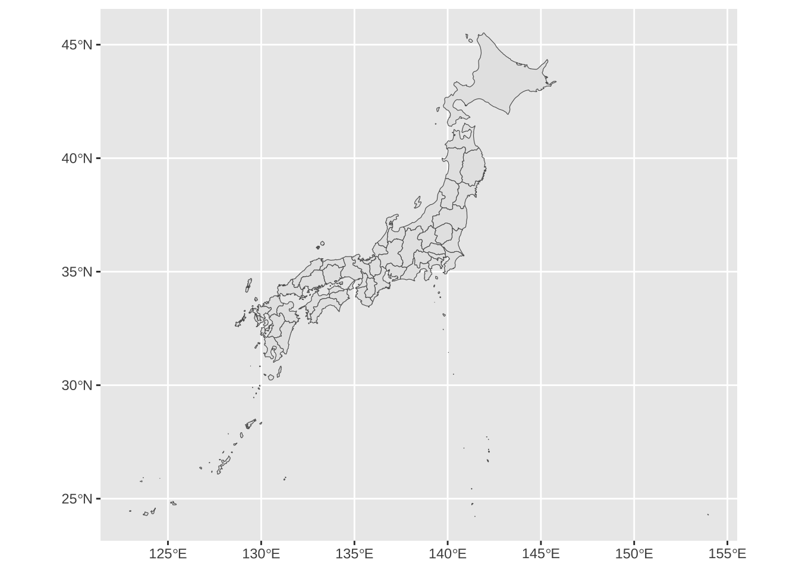


```r
iso2s <- c("IN","PK","BD","LK")
ne_world_admin1 %>% filter(iso_a2 %in% iso2s) %>% 
  ggplot() +   geom_sf(aes(fill = admin))
```

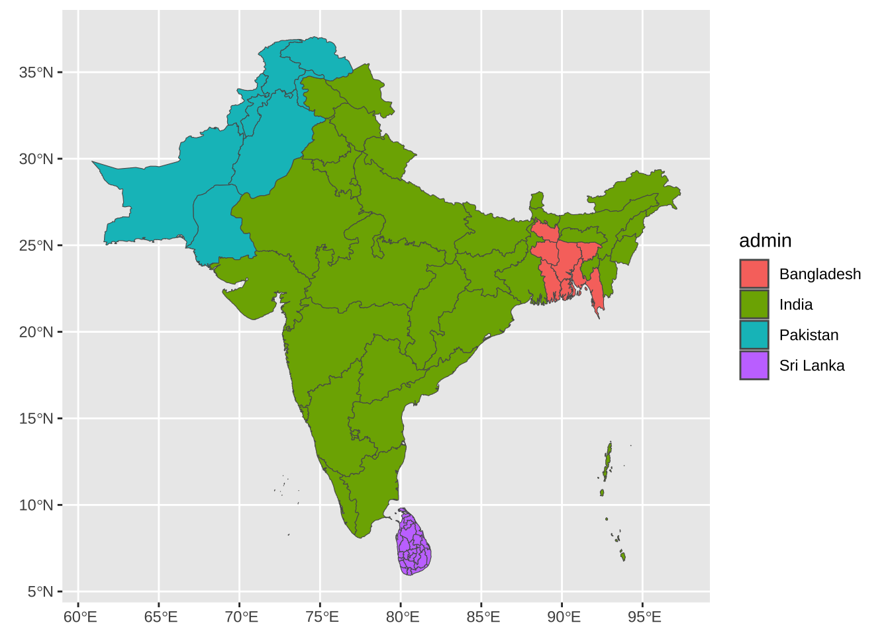


```r
regions <- c("Tohoku")
ne_world_admin1 %>% filter(region %in% regions) %>% 
  ggplot() + geom_sf(aes(fill = name_local))
```

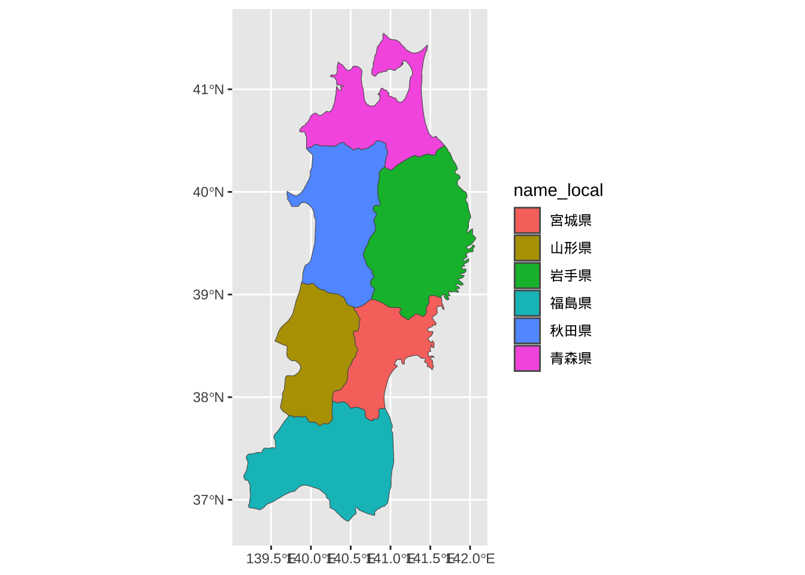


```r
ne_world_admin1 %>% filter(iso_a2 == "JP") %>%
  ggplot() +   geom_sf(aes(fill = region))
```

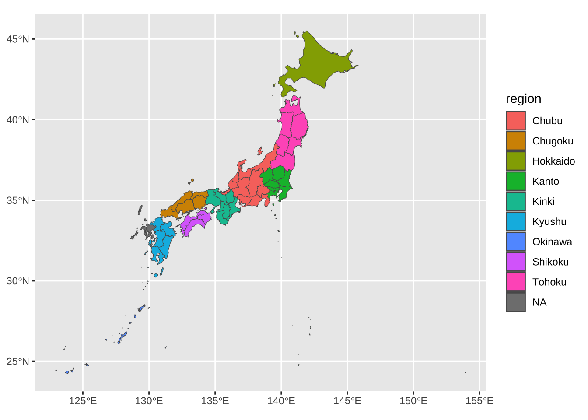


```r
ne_world_admin1 %>% as_tibble() %>% filter(admin %in% "Japan") %>% 
  select(name_local, region) %>% filter(is.na(region))
```

<div data-pagedtable="false">
  <script data-pagedtable-source type="application/json">
{"columns":[{"label":["name_local"],"name":[1],"type":["chr"],"align":["left"]},{"label":["region"],"name":[2],"type":["chr"],"align":["left"]}],"data":[{"1":"佐賀県","2":"NA"},{"1":"長崎県","2":"NA"}],"options":{"columns":{"min":{},"max":[10]},"rows":{"min":[10],"max":[10]},"pages":{}}}
  </script>
</div>


```r
ne_world_admin1 %>% mutate(region = case_when(
  name_local == "佐賀県" ~ "Kyushu",
  name_local == "長崎県" ~ "Kyushu",
  TRUE ~ region)) %>%
  as_tibble() %>% filter(admin %in% "Japan") %>% 
  select(name_local, region) %>% filter(is.na(region))
```

<div data-pagedtable="false">
  <script data-pagedtable-source type="application/json">
{"columns":[{"label":["name_local"],"name":[1],"type":["chr"],"align":["left"]},{"label":["region"],"name":[2],"type":["chr"],"align":["left"]}],"data":[],"options":{"columns":{"min":{},"max":[10]},"rows":{"min":[10],"max":[10]},"pages":{}}}
  </script>
</div>


```r
ne_world_admin1 %>% mutate(region = case_when(
  name_local == "佐賀県" ~ "Kyushu",
  name_local == "長崎県" ~ "Kyushu",
  TRUE ~ region)) %>%
  filter(iso_a2 == "JP") %>%
  ggplot() +   geom_sf(aes(fill = region))
```

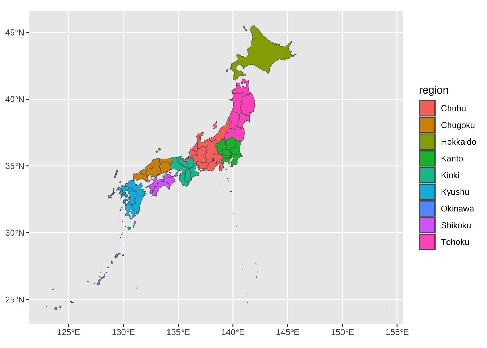

## `geodata` Package

-   URL: <https://gadm.org>
-   `geodata`: Download Geographic Data
-   Functions for downloading of geographic data for use in spatial analysis and mapping. The package facilitates access to climate, crops, elevation, land use, soil, species occurrence, accessibility, administrative boundaries and other data.
-   Package Link: <https://CRAN.R-project.org/package=geodata>
-   Manual: <https://cran.r-project.org/web/packages/geodata/geodata.pdf>


```r
library(geodata)
#> Loading required package: terra
#> terra 1.7.46
#> 
#> Attaching package: 'terra'
#> The following object is masked from 'package:tidyr':
#> 
#>     extract
```


```r
world(resolution=5, level=0, path = "./data")
#>  class       : SpatVector 
#>  geometry    : polygons 
#>  dimensions  : 231, 2  (geometries, attributes)
#>  extent      : -180, 180, -90, 83.65625  (xmin, xmax, ymin, ymax)
#>  coord. ref. : +proj=longlat +datum=WGS84 +no_defs 
#>  names       : GID_0      NAME_0
#>  type        : <chr>       <chr>
#>  values      :   ABW       Aruba
#>                  AFG Afghanistan
#>                  AGO      Angola
```


```r
world5 <- readRDS("./data/gadm/gadm36_adm0_r5_pk.rds")
world5 %>% as_tibble() %>% glimpse()
#> Rows: 231
#> Columns: 2
#> $ GID_0  <chr> "ABW", "AFG", "AGO", "ALA", "ALB", "AND", "…
#> $ NAME_0 <chr> "Aruba", "Afghanistan", "Angola", "Åland", …
```


```r
world5 %>% st_as_sf() %>% ggplot() + geom_sf()
```


```r
world5 %>% 
  st_as_sf() %>% filter(GID_0 == "JPN") %>% 
  ggplot() + geom_sf()
```

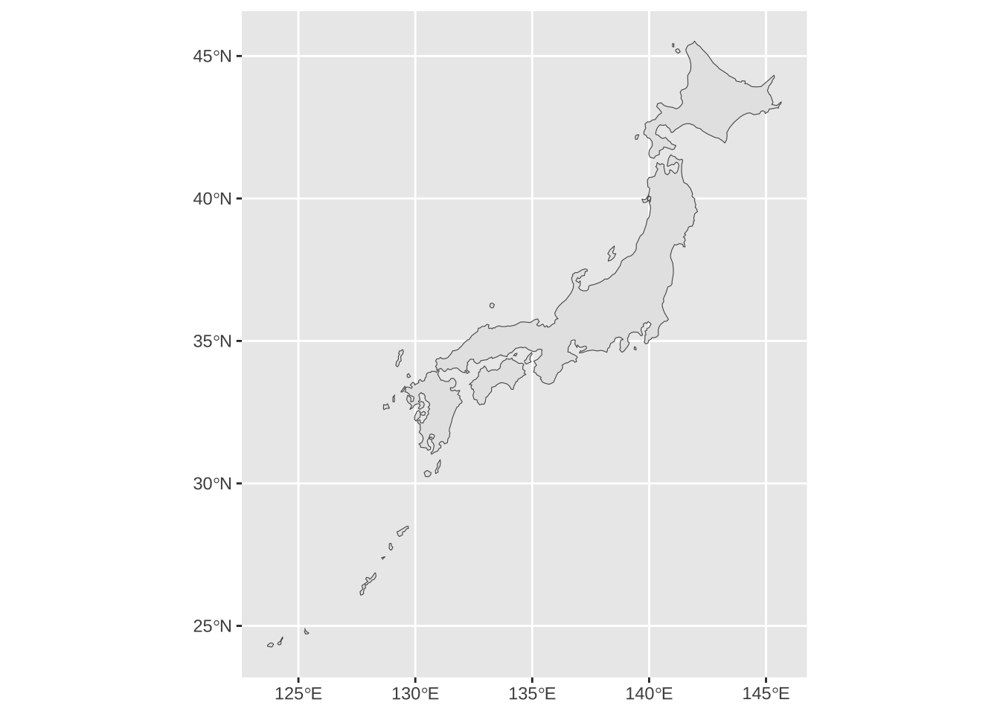


```r
world(resolution=1, level=0, path = "./data") %>%
  st_as_sf() %>% ggplot() + geom_sf()
```

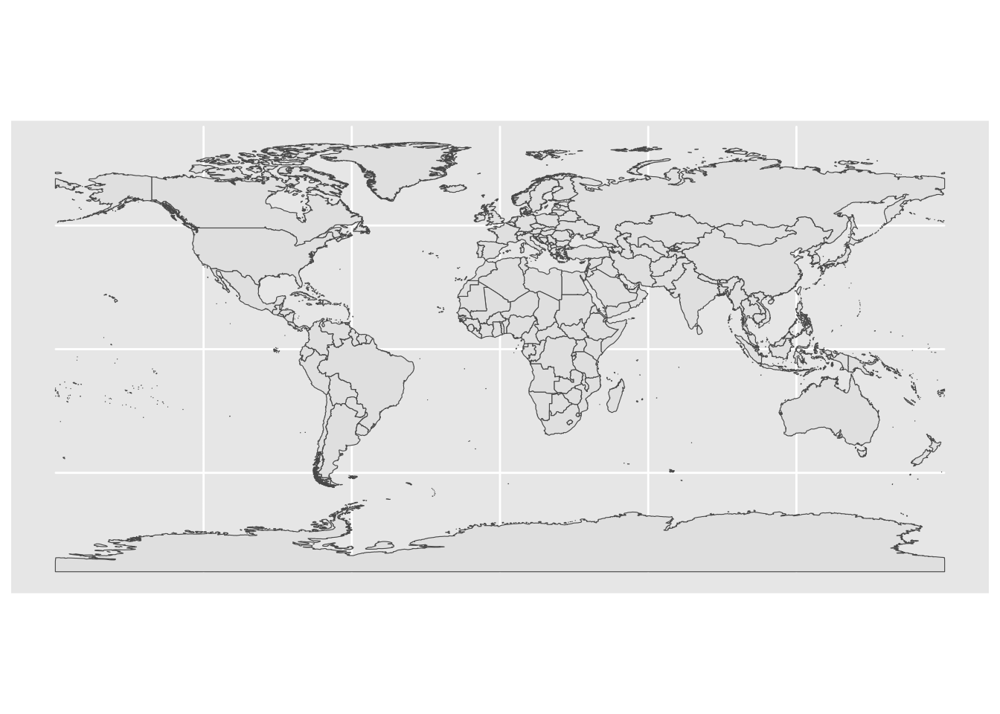


```r
world(path = "./data") %>%
  st_as_sf() %>% ggplot() + geom_sf()
```


```r
world(resolution=1, level=0, path = "./data") %>%
  st_as_sf() %>% filter(NAME_0 == "Japan") %>%
  ggplot() + geom_sf()
```

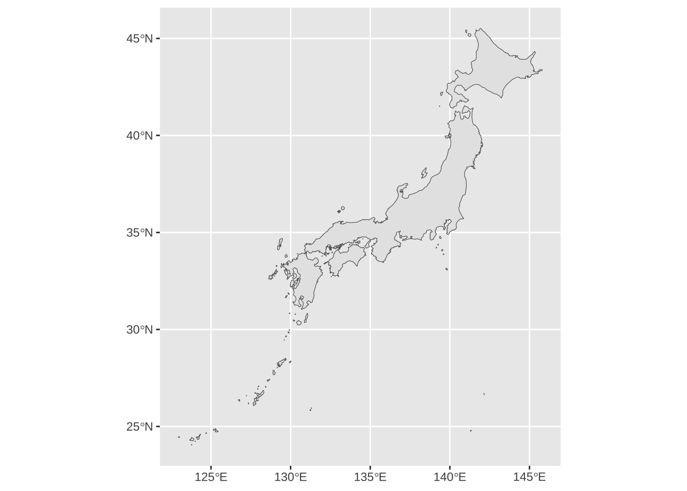


```r
world(resolution=1, level=0, path = "./data") %>%
  st_as_sf() %>% filter(NAME_0 %in% c("India","Pakistan", "Bangladesh" , "Sri Lanka")) %>%
  ggplot() + geom_sf(aes(fill = GID_0))
```

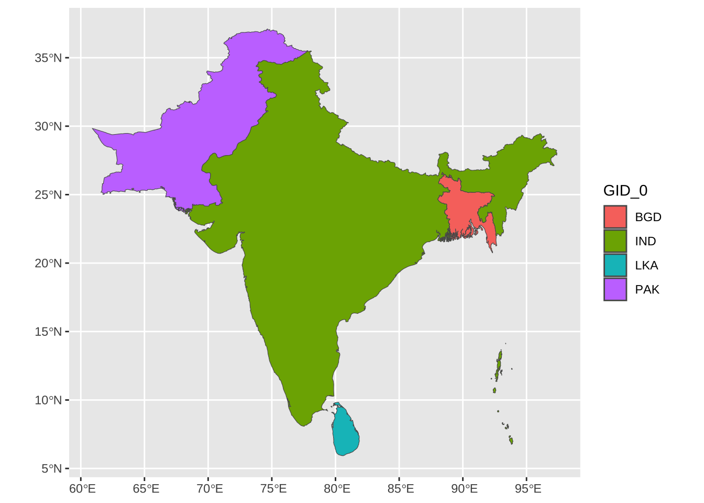


```r
world5_df <- st_as_sf(world5) %>% 
  st_set_crs("+proj=longlat +datum=WGS84") %>% 
  st_transform(., "+proj=robin")

ggplot() +
  geom_sf(data = world5_df)
```

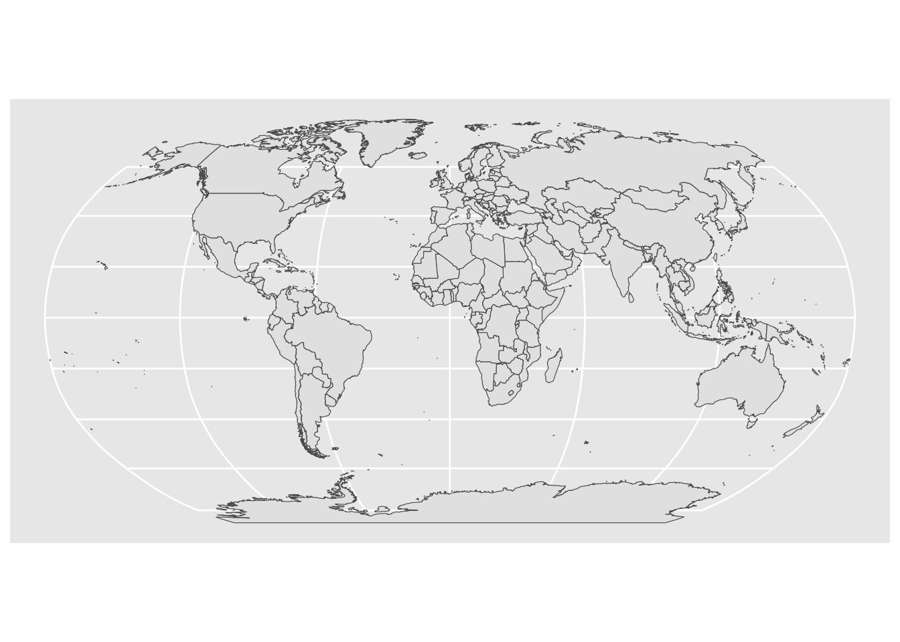

### `gadm` Administrative boundaries

-   Get administrative boundaries for any country in the world. Data are read from files that are down- loaded if necessary.
-   Usage: `gadm(country, level=1, path, version="latest", resolution=1, ...)`
-   Arguments
    -   country: character. Three-letter ISO code or full country name. If you provide multiple names they are all downloaded and rbind-ed together
    -   level: numeric. The level of administrative subdivision requested. (starting with 0 for country, then 1 for the first level of subdivision)
    -   path: character. Path for storing the downloaded data. See geodata_path
    -   version: character. Either "latest" or GADM version number (can be "3.6", "4.0" or "4.1")
    -   resolution: integer indicating the level of detail. Only for version 4.1. It should be either 1 (high) or 2 (low)


```r
gadm0 <- gadm("JPN", level = 0, path = "./data/")
```


```r
gadm0 %>% st_as_sf() %>% 
  ggplot() + geom_sf()
```

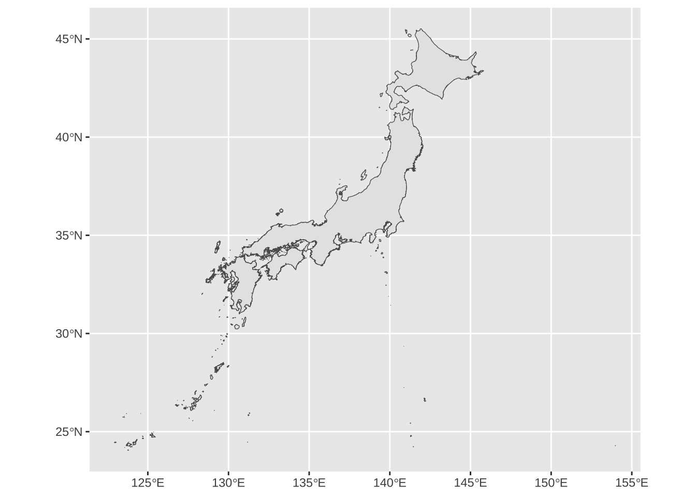


```r
gadm1 <- gadm("JPN", level = 1, path = "./data/") %>% st_as_sf()
gadm1 %>% glimpse()
#> Rows: 47
#> Columns: 12
#> $ GID_1     <chr> "JPN.1_1", "JPN.2_1", "JPN.3_1", "JPN.4_…
#> $ GID_0     <chr> "JPN", "JPN", "JPN", "JPN", "JPN", "JPN"…
#> $ COUNTRY   <chr> "Japan", "Japan", "Japan", "Japan", "Jap…
#> $ NAME_1    <chr> "Aichi", "Akita", "Aomori", "Chiba", "Eh…
#> $ VARNAME_1 <chr> "Aiti", NA, NA, "Tiba|Tsiba", NA, "Hukui…
#> $ NL_NAME_1 <chr> "愛知県", "秋田県", "青森県", "千葉県", …
#> $ TYPE_1    <chr> "Ken", "Ken", "Ken", "Ken", "Ken", "Ken"…
#> $ ENGTYPE_1 <chr> "Prefecture", "Prefecture", "Prefecture"…
#> $ CC_1      <chr> NA, NA, NA, NA, NA, NA, NA, NA, NA, NA, …
#> $ HASC_1    <chr> "JP.AI", "JP.AK", "JP.AO", "JP.CH", "JP.…
#> $ ISO_1     <chr> "JP-23", "JP-05", "JP-02", "JP-12", "JP-…
#> $ geometry  <GEOMETRY [°]> MULTIPOLYGON (((137.0974 34...,…
```


```r
gadm1 %>% 
  ggplot() + geom_sf(aes(fill = NAME_1)) + theme(legend.position = "none")
```

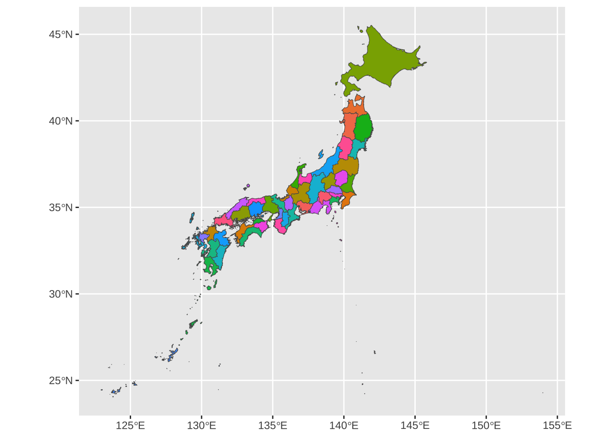


```r
gadm2 <- gadm("JPN", level = 2, path = "./data/") %>% st_as_sf()
gadm2 %>% glimpse()
#> Rows: 1,811
#> Columns: 14
#> $ GID_2     <chr> "JPN.1.1_1", "JPN.1.2_1", "JPN.1.3_1", "…
#> $ GID_0     <chr> "JPN", "JPN", "JPN", "JPN", "JPN", "JPN"…
#> $ COUNTRY   <chr> "Japan", "Japan", "Japan", "Japan", "Jap…
#> $ GID_1     <chr> "JPN.1_1", "JPN.1_1", "JPN.1_1", "JPN.1_…
#> $ NAME_1    <chr> "Aichi", "Aichi", "Aichi", "Aichi", "Aic…
#> $ NL_NAME_1 <chr> "愛知県", "愛知県", "愛知県", "愛知県", …
#> $ NAME_2    <chr> "Agui", "Aisai", "Anjō", "Chiryū", "Chit…
#> $ VARNAME_2 <chr> NA, NA, NA, NA, NA, NA, NA, NA, NA, NA, …
#> $ NL_NAME_2 <chr> "阿久比町", "愛西市", "安城市", "知立市"…
#> $ TYPE_2    <chr> "Machi", "Shi", "Shi", "Shi", "Shi", "Ma…
#> $ ENGTYPE_2 <chr> "Town", "City", "City", "City", "City", …
#> $ CC_2      <chr> NA, NA, NA, NA, NA, NA, NA, NA, NA, NA, …
#> $ HASC_2    <chr> NA, NA, NA, NA, "JP.AI.CG", NA, NA, "JP.…
#> $ geometry  <GEOMETRY [°]> POLYGON ((136.8802 34.94398...,…
```


```r
gadm2 %>% filter(NL_NAME_1 %in% c("埼玉県", "群馬県", "栃木県", "茨城県", "千葉県", "神奈川県", "東京都")) %>% 
  ggplot() + geom_sf(aes(fill = NAME_1)) + 
  ylim(34.7,37.2) + xlim(138.2,141) + 
  theme(legend.position = "none")
```

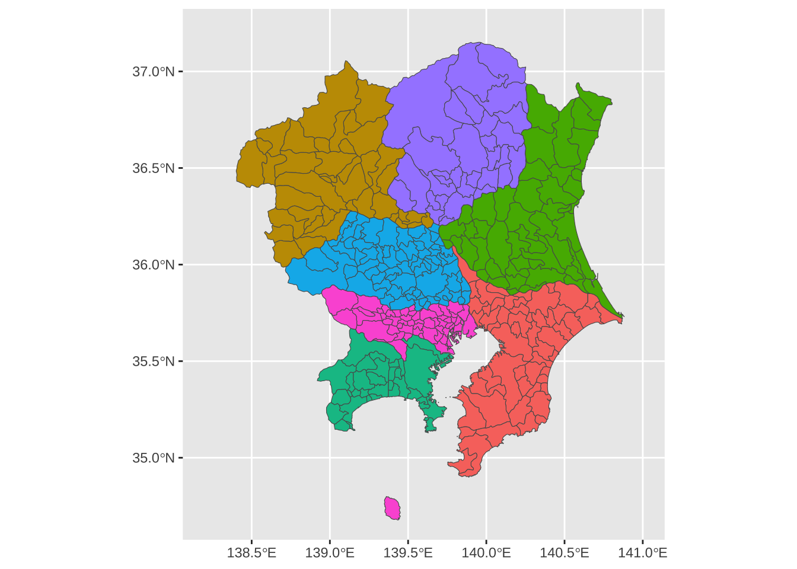

## 参考文献

-   Data Visualization for International Relations: Chapter 7 Choropleth Maps: <https://bookdown.org/alhdzsz/data_viz_ir/maps.html>

-   R Graphics Cookbook: 13.18 Creating a Choropleth Map: <https://r-graphics.org/recipe-miscgraph-choropleth>

-   Geocomputation with R：First Edition in [bookdown サイト](https://bookdown.org/robinlovelace/geocompr/)

    -   日本語翻訳版（<http://124.219.182.167/geo/>）
